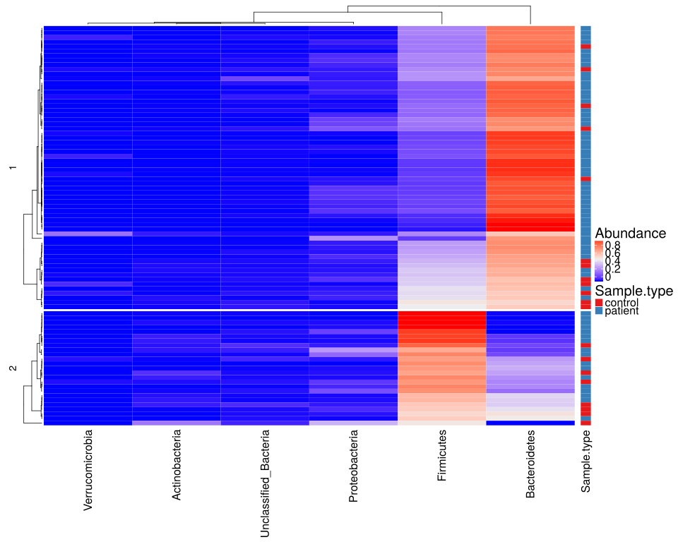

noone@mail.com
Analysis of Dieting study 16S data
% Fri Sep  7 05:46:18 2018


#### \(1.1.1.1\) Taxonomic level: 2 of Subset: All samples, no aggregation, no tests, only plots


##### \(1.1.1.1.1\) Loading counts and metadata

[`Subreport`](./1.1.1.1.1-report.html)


##### \(1.1.1.1.2\) Summary of metadata variables


##### \(1.1.1.1.3\) Summary of metadata variables after filtering samples


\(1.1.1.1.3\)  Summary of metadata variables.


| MatchedGroupID | SubjectID  | SampleID   | Sample.type | Sample.type.1          | DietStatus     | Drug          | Complaints    | age            | age.quant      | visit         | Drug.Before.Diet  | Sample.type.Drug.Before | visit.max     | visit.min     | visit.1       | visit.2       | has.matched.subject | Sample.type.ord | FullLabel        | Drug.Before.Diet.Visit |
|:---------------|:-----------|:-----------|:------------|:-----------------------|:---------------|:--------------|:--------------|:---------------|:---------------|:--------------|:------------------|:------------------------|:--------------|:--------------|:--------------|:--------------|:--------------------|:----------------|:-----------------|:-----------------------|
| MG1    : 5     | SB18   : 4 | SM1    : 1 | control:20  | control            :20 | after.diet :44 | Mode :logical | Mode :logical | Min.   : 3.182 | [3.18,6.27]:22 | Min.   :1.000 | DrugBefore_NO :48 | 1              :20      | Min.   :1.000 | Min.   :1.000 | Mode :logical | Mode :logical | Mode :logical       | control:20      | Length:87        | Length:87              |
| MG19   : 5     | SB29   : 4 | SM10   : 1 | patient:67  | patient.after.diet :44 | before.diet:43 | FALSE:48      | FALSE:80      | 1st Qu.: 6.238 | (6.27,8.71]:21 | 1st Qu.:1.000 | DrugBefore_YES:39 | patient FALSE .:29      | 1st Qu.:2.000 | 1st Qu.:1.000 | FALSE:1       | FALSE:21      | FALSE:17            | patient:67      | Class :character | Class :character       |
| MG22   : 5     | SB39   : 4 | SM100  : 1 | NA          | patient.before.diet:23 | NA             | TRUE :39      | TRUE :7       | Median : 8.779 | (8.71,15.3]:21 | Median :2.000 | NA                | patient TRUE . :38      | Median :4.000 | Median :1.000 | TRUE :86      | TRUE :66      | TRUE :70            | NA              | Mode  :character | Mode  :character       |
| MG3    : 5     | SB4    : 4 | SM11   : 1 | NA          | NA                     | NA             | NA            | NA            | Mean   :11.290 | (15.3,26.4]:23 | Mean   :1.989 | NA                | NA                      | Mean   :3.356 | Mean   :1.011 | NA            | NA            | NA                  | NA              | NA               | NA                     |
| MG8    : 5     | SB41   : 4 | SM12   : 1 | NA          | NA                     | NA             | NA            | NA            | 3rd Qu.:16.343 | NA             | 3rd Qu.:3.000 | NA                | NA                      | 3rd Qu.:4.000 | 3rd Qu.:1.000 | NA            | NA            | NA                  | NA              | NA               | NA                     |
| MG10   : 4     | SB44   : 4 | SM13   : 1 | NA          | NA                     | NA             | NA            | NA            | Max.   :26.366 | NA             | Max.   :4.000 | NA                | NA                      | Max.   :7.000 | Max.   :2.000 | NA            | NA            | NA                  | NA              | NA               | NA                     |
| (Other):58     | (Other):63 | (Other):81 | NA          | NA                     | NA             | NA            | NA            | NA             | NA             | NA            | NA                | NA                      | NA            | NA            | NA            | NA            | NA                  | NA              | NA               | NA                     |


\(1.1.1.1.3\)  Sample cross tabulation ~Sample.type+DietStatus.


|   &nbsp;    | after.diet | before.diet |
|:-----------:|:-----------|:------------|
| **control** | 0          | 20          |
| **patient** | 44         | 23          |


```````
Call: xtabs(formula = as.formula(xtabs.formula), data = meta, drop.unused.levels = T)
Number of cases in table: 87 
Number of factors: 2 
Test for independence of all factors:
	Chisq = 26.574, df = 1, p-value = 2.536e-07
```````


\(1.1.1.1.3\)  Sample cross tabulation ~Drug.Before.Diet + Sample.type.


|       &nbsp;       | control | patient |
|:------------------:|:--------|:--------|
| **DrugBefore_NO**  | 19      | 29      |
| **DrugBefore_YES** | 1       | 38      |


```````
Call: xtabs(formula = as.formula(xtabs.formula), data = meta, drop.unused.levels = T)
Number of cases in table: 87 
Number of factors: 2 
Test for independence of all factors:
	Chisq = 16.656, df = 1, p-value = 4.48e-05
```````


\(1.1.1.1.3\)  Sample cross tabulation ~Complaints + Sample.type.


|  &nbsp;   | control | patient |
|:---------:|:--------|:--------|
| **FALSE** | 20      | 60      |
| **TRUE**  | 0       | 7       |


```````
Call: xtabs(formula = as.formula(xtabs.formula), data = meta, drop.unused.levels = T)
Number of cases in table: 87 
Number of factors: 2 
Test for independence of all factors:
	Chisq = 2.2724, df = 1, p-value = 0.1317
	Chi-squared approximation may be incorrect
```````


\(1.1.1.1.3\)  Sample cross tabulation ~Sample.type+visit.


|   &nbsp;    | 1  | 2  | 3  | 4  |
|:-----------:|:---|:---|:---|:---|
| **control** | 18 | 2  | 0  | 0  |
| **patient** | 23 | 17 | 14 | 13 |


```````
Call: xtabs(formula = as.formula(xtabs.formula), data = meta, drop.unused.levels = T)
Number of cases in table: 87 
Number of factors: 2 
Test for independence of all factors:
	Chisq = 19.856, df = 3, p-value = 0.0001818
	Chi-squared approximation may be incorrect
```````


\(1.1.1.1.3\)  Sample cross tabulation ~MatchedGroupID.


| MG1 | MG10 | MG11 | MG12 | MG13 | MG14 | MG15 | MG16 | MG17 | MG18 | MG19 | MG2 | MG20 | MG21 | MG22 | MG23 | MG24 | MG25 | MG26 | MG3 | MG4 | MG5 | MG6 | MG7 | MG8 | MG9 |
|:----|:-----|:-----|:-----|:-----|:-----|:-----|:-----|:-----|:-----|:-----|:----|:-----|:-----|:-----|:-----|:-----|:-----|:-----|:----|:----|:----|:----|:----|:----|:----|
| 5   | 4    | 3    | 1    | 2    | 3    | 4    | 2    | 4    | 3    | 5    | 4   | 4    | 3    | 5    | 4    | 2    | 4    | 1    | 5   | 4   | 1   | 4   | 3   | 5   | 2   |


```````
Number of cases in table: 87 
Number of factors: 1 
```````


\(1.1.1.1.3\)  Sample cross tabulation ~Sample.type.1.


| control | patient.after.diet | patient.before.diet |
|:--------|:-------------------|:--------------------|
| 20      | 44                 | 23                  |


```````
Number of cases in table: 87 
Number of factors: 1 
```````


\(1.1.1.1.3\)  Sample cross tabulation ~SubjectID.


| SB1 | SB10 | SB11 | SB12 | SB13 | SB14 | SB15 | SB16 | SB17 | SB18 | SB19 | SB2 | SB20 | SB21 | SB22 | SB23 | SB24 | SB25 | SB26 | SB27 | SB28 | SB29 | SB3 | SB30 | SB31 | SB32 | SB33 | SB34 | SB35 | SB36 | SB37 | SB38 | SB39 | SB4 | SB40 | SB41 | SB42 | SB43 | SB44 | SB45 | SB5 | SB6 | SB7 | SB8 | SB9 |
|:----|:-----|:-----|:-----|:-----|:-----|:-----|:-----|:-----|:-----|:-----|:----|:-----|:-----|:-----|:-----|:-----|:-----|:-----|:-----|:-----|:-----|:----|:-----|:-----|:-----|:-----|:-----|:-----|:-----|:-----|:-----|:-----|:----|:-----|:-----|:-----|:-----|:-----|:-----|:----|:----|:----|:----|:----|
| 1   | 1    | 2    | 1    | 1    | 1    | 1    | 2    | 1    | 4    | 1    | 1   | 3    | 2    | 2    | 1    | 1    | 2    | 1    | 1    | 3    | 4    | 1   | 1    | 1    | 1    | 1    | 2    | 3    | 3    | 3    | 1    | 4    | 4   | 1    | 4    | 2    | 2    | 4    | 1    | 3   | 3   | 1   | 1   | 3   |


```````
Number of cases in table: 87 
Number of factors: 1 
```````


\(1.1.1.1.3\)  ANOVA for age and sample type.


```````
            Df Sum Sq Mean Sq F value Pr(>F)
Sample.type  1      6    6.34   0.153  0.696
Residuals   85   3519   41.39               
```````


\(1.1.1.1.3\) <a name="figure.1"></a>[`Figure 1.`](#figure.1) Violin plot for age and sample type.  Image file: [`plots/32365f44b2a.svg`](plots/32365f44b2a.svg).


\(1.1.1.1.3\)  Spearman RHO for age and visit.


| Test statistic | P value | Alternative hypothesis | rho     |
|:---------------|:--------|:-----------------------|:--------|
| 131260         | 0.0686  | two.sided              | -0.1961 |

Table: Spearman's rank correlation rho: `age` and `visit`


\(1.1.1.1.3\)  Spearman RHO for age and visit, patients only.


| Test statistic | P value | Alternative hypothesis | rho     |
|:---------------|:--------|:-----------------------|:--------|
| 59864          | 0.1148  | two.sided              | -0.1945 |

Table: Spearman's rank correlation rho: `age` and `visit`


\(1.1.1.1.3\) <a name="figure.2"></a>[`Figure 2.`](#figure.2) Plot for age and visit with Loess trend line.  Image file: [`plots/3232160ba0e.svg`](plots/3232160ba0e.svg).


\(1.1.1.1.3\) <a name="widget.1"></a>[`Widget 1.`](#widget.1) Dynamic Pivot Table to explore metadata distribution 
                    at the lowest granularity (drag and drop field names and pick averaging 
                    functions or plot types). Click to see HTML widget file in full window: [`./1.1.1.1.3-323456cbaa0Dynamic.Pivot.Table.html`](./1.1.1.1.3-323456cbaa0Dynamic.Pivot.Table.html)


<iframe src="./1.1.1.1.3-323456cbaa0Dynamic.Pivot.Table.html" width="800" height="800"> </iframe>


##### \(1.1.1.1.4\) Summary of total counts per sample

[`Subreport`](./1.1.1.1.4-report.html)


##### \(1.1.1.1.5\) Data analysis


Filtering abundance matrix with arguments [ min_mean                :10, min_quant_incidence_frac:0.25, min_quant_mean_frac     :0.25]. Filtering features


Note that some community richness estimators will not work correctly 
               if provided with abundance-filtered counts


After filtering, left 87 records for 7 features


Wrote counts and metadata for raw counts After final feature filtering to files [`data/1.1.1.1.5.1-3234107d27dsamples.raw.16s.l.2.count.tsv`](data/1.1.1.1.5.1-3234107d27dsamples.raw.16s.l.2.count.tsv),[`data/1.1.1.1.5.1-3234107d27dsamples.raw.16s.l.2.attr.tsv`](data/1.1.1.1.5.1-3234107d27dsamples.raw.16s.l.2.attr.tsv)


Wrote counts and metadata for proportions counts After final feature filtering to files [`data/1.1.1.1.5.1-32342c3d996samples.proportions.16s.l.2.count.tsv`](data/1.1.1.1.5.1-32342c3d996samples.proportions.16s.l.2.count.tsv),[`data/1.1.1.1.5.1-32342c3d996samples.proportions.16s.l.2.attr.tsv`](data/1.1.1.1.5.1-32342c3d996samples.proportions.16s.l.2.attr.tsv)


##### \(1.1.1.1.5.2\) Default transformations for further data analysis


Specific methods can override these and use their own normalization.


Count normalization method for data analysis (unless modified by specific methods) : [ drop.features:List of 1,  ..$ :"other", method.args  :List of 1,  ..$ theta:1, method       :"norm.ihs.prop"]


Wrote counts and metadata for raw counts Normalized after default transformations to files [`data/1.1.1.1.5.2-32329e99584samples.raw.16s.l.2.count.tsv`](data/1.1.1.1.5.2-32329e99584samples.raw.16s.l.2.count.tsv),[`data/1.1.1.1.5.2-32329e99584samples.raw.16s.l.2.attr.tsv`](data/1.1.1.1.5.2-32329e99584samples.raw.16s.l.2.attr.tsv)


Count normalization method for abundance plots : [ drop.features:List of 1,  ..$ :"other", method.args  : list(), method       :"norm.prop"]


##### \(1.1.1.1.6\) Plots of Abundance.

[`Subreport`](./1.1.1.1.6-report.html)


\(1.1.1.1.6\) <a name="figure.44"></a>[`Figure 44.`](#figure.44) Clustered heatmap of normalized abundance values. Number of cluster splits is determined automatically with method `fpc::pamk`.  Image file: [`plots/3232c11015e.svg`](plots/3232c11015e.svg).



\(1.1.1.1.6\)  G-test of independence between automatic cluster splits and attribute 'Sample.type'. Number of cluster splits is determined automatically with method `fpc::pamk`.


| Test statistic | X-squared df | P value |
|:---------------|:-------------|:--------|
| 1.49           | 1            | 0.2222  |

Table: Log likelihood ratio (G-test) test of independence with Williams' correction: `m_a$attr[, main.meta.var]` and `split`


person) (????). _morpheus: Interactive heat maps using 'morpheus.js' and 'htmlwidgets'_. R package version 0.1.1.1, <URL:
https://github.com/cmap/morpheus.R>.


\(1.1.1.1.6\) <a name="widget.8"></a>[`Widget 8.`](#widget.8) Dynamic Morpheus heatmap of normalized abundance values. 
                    It is available here through the link only because it can take a while to render for large datasets.
                    This is very customizable. What you will see initially is just a default starting configuration. Explore its menus. Click to see HTML widget file in full window: [`./1.1.1.1.6-3231a4a87beDynamic.Morpheus.hea.html`](./1.1.1.1.6-3231a4a87beDynamic.Morpheus.hea.html)


Wrote counts and metadata for raw counts Data used for heatmap with added row cluster splits (clustering by abundance profile) to files [`data/1.1.1.1.6-32334eeeaa4samples.raw.htmap.count.tsv`](data/1.1.1.1.6-32334eeeaa4samples.raw.htmap.count.tsv),[`data/1.1.1.1.6-32334eeeaa4samples.raw.htmap.attr.tsv`](data/1.1.1.1.6-32334eeeaa4samples.raw.htmap.attr.tsv)


##### \(1.1.1.1.7\) Ordinations, 

[`Subreport`](./1.1.1.1.7-report.html)