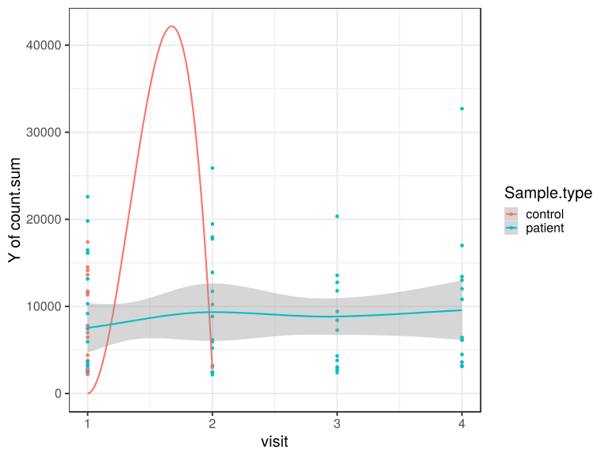
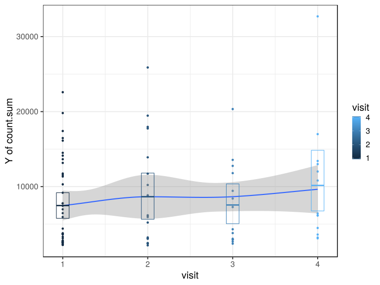

noone@mail.com
Analysis of Dieting study 16S data
% Fri Sep  7 05:46:18 2018

##### \(1.1.1.1.4\) Summary of total counts per sample

\(1.1.1.1.4.0\) [`Table 1.`](#table.1) Total counts per sample. Full dataset is also saved in a delimited text file (click to download and open e.g. in Excel) [`data/1.1.1.1.4.0-323771c39e4.1.1.1.1.4.0.a.name.csv`](data/1.1.1.1.4.0-323771c39e4.1.1.1.1.4.0.a.name.csv)

| count.sum | MatchedGroupID | SubjectID | SampleID | Sample.type | Sample.type.1       | DietStatus  | Drug  | Complaints | age    | age.quant     | visit | Drug.Before.Diet | Sample.type.Drug.Before | visit.max | visit.min | visit.1 | visit.2 | has.matched.subject | Sample.type.ord | FullLabel               | Drug.Before.Diet.Visit |
|:----------|:---------------|:----------|:---------|:------------|:--------------------|:------------|:------|:-----------|:-------|:--------------|:------|:-----------------|:------------------------|:----------|:----------|:--------|:--------|:--------------------|:----------------|:------------------------|:-----------------------|
| 11549     | MG14           | SB34      | SM1      | patient     | patient.before.diet | before.diet | TRUE  | FALSE      | 16.599 | \(15.3,26.4\] | 1     | DrugBefore\_YES  | patient TRUE .          | 2         | 1         | TRUE    | TRUE    | TRUE                | patient         | SM1 patient SB34 MG14   | DrugBefore\_YES.1      |
| 9433      | MG20           | SB44      | SM10     | patient     | patient.after.diet  | after.diet  | FALSE | FALSE      | 6.326  | \(6.27,8.71\] | 3     | DrugBefore\_YES  | patient TRUE .          | 5         | 1         | TRUE    | TRUE    | FALSE               | patient         | SM10 patient SB44 MG20  | DrugBefore\_YES.3      |
| 13001     | MG20           | SB44      | SM100    | patient     | patient.after.diet  | after.diet  | FALSE | FALSE      | 7.669  | \(6.27,8.71\] | 4     | DrugBefore\_YES  | patient TRUE .          | 5         | 1         | TRUE    | TRUE    | FALSE               | patient         | SM100 patient SB44 MG20 | DrugBefore\_YES.4      |
| 25886     | MG3            | SB41      | SM11     | patient     | patient.after.diet  | after.diet  | FALSE | FALSE      | 9.499  | \(8.71,15.3\] | 2     | DrugBefore\_YES  | patient TRUE .          | 4         | 1         | TRUE    | TRUE    | TRUE                | patient         | SM11 patient SB41 MG3   | DrugBefore\_YES.2      |
| 22592     | MG3            | SB41      | SM12     | patient     | patient.before.diet | before.diet | TRUE  | FALSE      | 8.635  | \(6.27,8.71\] | 1     | DrugBefore\_YES  | patient TRUE .          | 4         | 1         | TRUE    | TRUE    | TRUE                | patient         | SM12 patient SB41 MG3   | DrugBefore\_YES.1      |
| 2240      | MG6            | SB11      | SM13     | patient     | patient.before.diet | before.diet | FALSE | FALSE      | 12.618 | \(8.71,15.3\] | 1     | DrugBefore\_NO   | patient FALSE .         | 4         | 1         | TRUE    | TRUE    | TRUE                | patient         | SM13 patient SB11 MG6   | DrugBefore\_NO.1       |
| 2641      | MG2            | SB9       | SM14     | patient     | patient.before.diet | before.diet | FALSE | TRUE       | 15.307 | \(8.71,15.3\] | 1     | DrugBefore\_NO   | patient FALSE .         | 4         | 1         | TRUE    | TRUE    | TRUE                | patient         | SM14 patient SB9 MG2    | DrugBefore\_NO.1       |
| 14131     | MG14           | SB7       | SM15     | control     | control             | before.diet | TRUE  | FALSE      | 19.424 | \(15.3,26.4\] | 1     | DrugBefore\_YES  | 1                       | 1         | 1         | TRUE    | FALSE   | TRUE                | control         | SM15 control SB7 MG14   | DrugBefore\_YES.1      |
| 6154      | MG23           | SB6       | SM16     | patient     | patient.after.diet  | after.diet  | TRUE  | FALSE      | 8.305  | \(6.27,8.71\] | 4     | DrugBefore\_NO   | patient FALSE .         | 5         | 1         | TRUE    | TRUE    | TRUE                | patient         | SM16 patient SB6 MG23   | DrugBefore\_NO.4       |
| 2417      | MG9            | SB16      | SM17     | patient     | patient.before.diet | before.diet | TRUE  | FALSE      | 23.686 | \(15.3,26.4\] | 1     | DrugBefore\_YES  | patient TRUE .          | 2         | 1         | TRUE    | TRUE    | FALSE               | patient         | SM17 patient SB16 MG9   | DrugBefore\_YES.1      |
| 5957      | MG4            | SB27      | SM18     | patient     | patient.after.diet  | after.diet  | FALSE | FALSE      | 5.908  | \[3.18,6.27\] | 2     | DrugBefore\_NO   | patient FALSE .         | 2         | 2         | FALSE   | TRUE    | TRUE                | patient         | SM18 patient SB27 MG4   | DrugBefore\_NO.2       |
| 2161      | MG1            | SB18      | SM19     | patient     | patient.after.diet  | after.diet  | TRUE  | FALSE      | 20.312 | \(15.3,26.4\] | 2     | DrugBefore\_NO   | patient FALSE .         | 4         | 1         | TRUE    | TRUE    | TRUE                | patient         | SM19 patient SB18 MG1   | DrugBefore\_NO.2       |
| 16131     | MG1            | SB18      | SM2      | patient     | patient.before.diet | before.diet | FALSE | FALSE      | 19.589 | \(15.3,26.4\] | 1     | DrugBefore\_NO   | patient FALSE .         | 4         | 1         | TRUE    | TRUE    | TRUE                | patient         | SM2 patient SB18 MG1    | DrugBefore\_NO.1       |
| 3723      | MG19           | SB26      | SM20     | control     | control             | before.diet | FALSE | FALSE      | 8.659  | \(6.27,8.71\] | 1     | DrugBefore\_NO   | 1                       | 1         | 1         | TRUE    | FALSE   | TRUE                | control         | SM20 control SB26 MG19  | DrugBefore\_NO.1       |
| 5947      | MG16           | SB8       | SM21     | patient     | patient.before.diet | before.diet | FALSE | TRUE       | 18.248 | \(15.3,26.4\] | 1     | DrugBefore\_NO   | patient FALSE .         | 1         | 1         | TRUE    | FALSE   | TRUE                | patient         | SM21 patient SB8 MG16   | DrugBefore\_NO.1       |
| 2605      | MG4            | SB22      | SM22     | patient     | patient.before.diet | before.diet | TRUE  | FALSE      | 6.430  | \(6.27,8.71\] | 1     | DrugBefore\_YES  | patient TRUE .          | 4         | 1         | TRUE    | FALSE   | TRUE                | patient         | SM22 patient SB22 MG4   | DrugBefore\_YES.1      |
| 2411      | MG19           | SB29      | SM23     | patient     | patient.after.diet  | after.diet  | TRUE  | FALSE      | 8.517  | \(6.27,8.71\] | 2     | DrugBefore\_YES  | patient TRUE .          | 7         | 1         | TRUE    | TRUE    | TRUE                | patient         | SM23 patient SB29 MG19  | DrugBefore\_YES.2      |
| 7775      | MG26           | SB17      | SM24     | patient     | patient.before.diet | before.diet | FALSE | FALSE      | 19.830 | \(15.3,26.4\] | 1     | DrugBefore\_NO   | patient FALSE .         | 1         | 1         | TRUE    | FALSE   | FALSE               | patient         | SM24 patient SB17 MG26  | DrugBefore\_NO.1       |
| 3606      | MG2            | SB9       | SM25     | patient     | patient.after.diet  | after.diet  | FALSE | FALSE      | 16.088 | \(15.3,26.4\] | 4     | DrugBefore\_NO   | patient FALSE .         | 4         | 1         | TRUE    | TRUE    | TRUE                | patient         | SM25 patient SB9 MG2    | DrugBefore\_NO.4       |
| 14504     | MG4            | SB15      | SM26     | control     | control             | before.diet | FALSE | FALSE      | 9.605  | \(8.71,15.3\] | 1     | DrugBefore\_NO   | 1                       | 1         | 1         | TRUE    | FALSE   | TRUE                | control         | SM26 control SB15 MG4   | DrugBefore\_NO.1       |
| 2502      | MG18           | SB21      | SM28     | control     | control             | before.diet | FALSE | FALSE      | 4.409  | \[3.18,6.27\] | 1     | DrugBefore\_NO   | 1                       | 2         | 1         | TRUE    | TRUE    | TRUE                | control         | SM28 control SB21 MG18  | DrugBefore\_NO.1       |
| 2394      | MG19           | SB29      | SM29     | patient     | patient.after.diet  | after.diet  | FALSE | FALSE      | 6.893  | \(6.27,8.71\] | 3     | DrugBefore\_YES  | patient TRUE .          | 7         | 1         | TRUE    | TRUE    | TRUE                | patient         | SM29 patient SB29 MG19  | DrugBefore\_YES.3      |
| 8839      | MG21           | SB43      | SM3      | patient     | patient.after.diet  | after.diet  | TRUE  | FALSE      | 23.180 | \(15.3,26.4\] | 2     | DrugBefore\_YES  | patient TRUE .          | 2         | 1         | TRUE    | TRUE    | TRUE                | patient         | SM3 patient SB43 MG21   | DrugBefore\_YES.2      |
| 6154      | MG10           | SB35      | SM30     | patient     | patient.after.diet  | after.diet  | FALSE | FALSE      | 9.003  | \(8.71,15.3\] | 4     | DrugBefore\_YES  | patient TRUE .          | 6         | 1         | TRUE    | TRUE    | TRUE                | patient         | SM30 patient SB35 MG10  | DrugBefore\_YES.4      |
| 2472      | MG6            | SB25      | SM31     | control     | control             | before.diet | FALSE | FALSE      | 12.555 | \(8.71,15.3\] | 2     | DrugBefore\_NO   | 1                       | 2         | 1         | TRUE    | TRUE    | TRUE                | control         | SM31 control SB25 MG6   | DrugBefore\_NO.2       |
| 2542      | MG11           | SB28      | SM33     | patient     | patient.before.diet | before.diet | TRUE  | FALSE      | 7.097  | \(6.27,8.71\] | 1     | DrugBefore\_YES  | patient TRUE .          | 6         | 1         | TRUE    | TRUE    | FALSE               | patient         | SM33 patient SB28 MG11  | DrugBefore\_YES.1      |
| 4399      | MG10           | SB1       | SM35     | control     | control             | before.diet | FALSE | FALSE      | 9.699  | \(8.71,15.3\] | 1     | DrugBefore\_NO   | 1                       | 1         | 1         | TRUE    | FALSE   | TRUE                | control         | SM35 control SB1 MG10   | DrugBefore\_NO.1       |
| 3107      | MG7            | SB20      | SM36     | patient     | patient.after.diet  | after.diet  | TRUE  | FALSE      | 6.762  | \(6.27,8.71\] | 4     | DrugBefore\_NO   | patient FALSE .         | 4         | 1         | TRUE    | TRUE    | FALSE               | patient         | SM36 patient SB20 MG7   | DrugBefore\_NO.4       |
| 6459      | MG16           | SB32      | SM37     | control     | control             | before.diet | FALSE | FALSE      | 24.965 | \(15.3,26.4\] | 1     | DrugBefore\_NO   | 1                       | 1         | 1         | TRUE    | FALSE   | TRUE                | control         | SM37 control SB32 MG16  | DrugBefore\_NO.1       |
| 19462     | MG8            | SB4       | SM38     | patient     | patient.after.diet  | after.diet  | TRUE  | TRUE       | 4.596  | \[3.18,6.27\] | 2     | DrugBefore\_YES  | patient TRUE .          | 5         | 1         | TRUE    | TRUE    | TRUE                | patient         | SM38 patient SB4 MG8    | DrugBefore\_YES.2      |
| 16473     | MG13           | SB38      | SM39     | patient     | patient.before.diet | before.diet | FALSE | FALSE      | 19.048 | \(15.3,26.4\] | 1     | DrugBefore\_NO   | patient FALSE .         | 1         | 1         | TRUE    | FALSE   | TRUE                | patient         | SM39 patient SB38 MG13  | DrugBefore\_NO.1       |
| 10811     | MG15           | SB37      | SM40     | patient     | patient.after.diet  | after.diet  | FALSE | FALSE      | 6.657  | \(6.27,8.71\] | 4     | DrugBefore\_NO   | patient FALSE .         | 4         | 1         | TRUE    | TRUE    | TRUE                | patient         | SM40 patient SB37 MG15  | DrugBefore\_NO.4       |
| 3105      | MG22           | SB39      | SM41     | patient     | patient.before.diet | before.diet | TRUE  | FALSE      | 9.609  | \(8.71,15.3\] | 1     | DrugBefore\_YES  | patient TRUE .          | 4         | 1         | TRUE    | TRUE    | TRUE                | patient         | SM41 patient SB39 MG22  | DrugBefore\_YES.1      |
| 12015     | MG18           | SB2       | SM42     | patient     | patient.after.diet  | after.diet  | TRUE  | FALSE      | 8.537  | \(6.27,8.71\] | 4     | DrugBefore\_NO   | patient FALSE .         | 4         | 1         | TRUE    | TRUE    | TRUE                | patient         | SM42 patient SB2 MG18   | DrugBefore\_NO.4       |
| 13419     | MG22           | SB39      | SM43     | patient     | patient.after.diet  | after.diet  | FALSE | FALSE      | 10.868 | \(8.71,15.3\] | 4     | DrugBefore\_YES  | patient TRUE .          | 4         | 1         | TRUE    | TRUE    | TRUE                | patient         | SM43 patient SB39 MG22  | DrugBefore\_YES.4      |
| 3651      | MG2            | SB3       | SM44     | control     | control             | before.diet | FALSE | FALSE      | 5.804  | \[3.18,6.27\] | 1     | DrugBefore\_NO   | 1                       | 2         | 1         | TRUE    | TRUE    | TRUE                | control         | SM44 control SB3 MG2    | DrugBefore\_NO.1       |
| 5208      | MG7            | SB20      | SM45     | patient     | patient.after.diet  | after.diet  | TRUE  | TRUE       | 7.223  | \(6.27,8.71\] | 2     | DrugBefore\_NO   | patient FALSE .         | 4         | 1         | TRUE    | TRUE    | FALSE               | patient         | SM45 patient SB20 MG7   | DrugBefore\_NO.2       |
| 6972      | MG21           | SB24      | SM48     | control     | control             | before.diet | FALSE | FALSE      | 10.823 | \(8.71,15.3\] | 1     | DrugBefore\_NO   | 1                       | 1         | 1         | TRUE    | FALSE   | TRUE                | control         | SM48 control SB24 MG21  | DrugBefore\_NO.1       |
| 3317      | MG8            | SB4       | SM49     | patient     | patient.before.diet | before.diet | TRUE  | FALSE      | 3.973  | \[3.18,6.27\] | 1     | DrugBefore\_YES  | patient TRUE .          | 5         | 1         | TRUE    | TRUE    | TRUE                | patient         | SM49 patient SB4 MG8    | DrugBefore\_YES.1      |
| 11798     | MG25           | SB36      | SM5      | patient     | patient.after.diet  | after.diet  | FALSE | FALSE      | 4.376  | \[3.18,6.27\] | 3     | DrugBefore\_YES  | patient TRUE .          | 3         | 1         | TRUE    | TRUE    | TRUE                | patient         | SM5 patient SB36 MG25   | DrugBefore\_YES.3      |
| 3803      | MG7            | SB20      | SM50     | patient     | patient.after.diet  | after.diet  | TRUE  | FALSE      | 4.763  | \[3.18,6.27\] | 3     | DrugBefore\_NO   | patient FALSE .         | 4         | 1         | TRUE    | TRUE    | FALSE               | patient         | SM50 patient SB20 MG7   | DrugBefore\_NO.3       |
| 4483      | MG8            | SB4       | SM51     | patient     | patient.after.diet  | after.diet  | TRUE  | TRUE       | 5.345  | \[3.18,6.27\] | 4     | DrugBefore\_YES  | patient TRUE .          | 5         | 1         | TRUE    | TRUE    | TRUE                | patient         | SM51 patient SB4 MG8    | DrugBefore\_YES.4      |
| 9179      | MG17           | SB5       | SM52     | patient     | patient.before.diet | before.diet | FALSE | FALSE      | 21.562 | \(15.3,26.4\] | 1     | DrugBefore\_NO   | patient FALSE .         | 3         | 1         | TRUE    | TRUE    | TRUE                | patient         | SM52 patient SB5 MG17   | DrugBefore\_NO.1       |
| 13904     | MG25           | SB36      | SM53     | patient     | patient.after.diet  | after.diet  | TRUE  | FALSE      | 5.169  | \[3.18,6.27\] | 2     | DrugBefore\_YES  | patient TRUE .          | 3         | 1         | TRUE    | TRUE    | TRUE                | patient         | SM53 patient SB36 MG25  | DrugBefore\_YES.2      |
| 3042      | MG11           | SB28      | SM54     | patient     | patient.after.diet  | after.diet  | FALSE | FALSE      | 7.639  | \(6.27,8.71\] | 3     | DrugBefore\_YES  | patient TRUE .          | 6         | 1         | TRUE    | TRUE    | FALSE               | patient         | SM54 patient SB28 MG11  | DrugBefore\_YES.3      |
| 7756      | MG25           | SB14      | SM55     | control     | control             | before.diet | FALSE | FALSE      | 9.516  | \(8.71,15.3\] | 1     | DrugBefore\_NO   | 1                       | 1         | 1         | TRUE    | FALSE   | TRUE                | control         | SM55 control SB14 MG25  | DrugBefore\_NO.1       |
| 3064      | MG11           | SB28      | SM56     | patient     | patient.after.diet  | after.diet  | FALSE | FALSE      | 7.401  | \(6.27,8.71\] | 2     | DrugBefore\_YES  | patient TRUE .          | 6         | 1         | TRUE    | TRUE    | FALSE               | patient         | SM56 patient SB28 MG11  | DrugBefore\_YES.2      |
| 2778      | MG19           | SB29      | SM57     | patient     | patient.before.diet | before.diet | TRUE  | FALSE      | 7.578  | \(6.27,8.71\] | 1     | DrugBefore\_YES  | patient TRUE .          | 7         | 1         | TRUE    | TRUE    | TRUE                | patient         | SM57 patient SB29 MG19  | DrugBefore\_YES.1      |
| 6174      | MG2            | SB9       | SM58     | patient     | patient.after.diet  | after.diet  | FALSE | FALSE      | 14.725 | \(8.71,15.3\] | 2     | DrugBefore\_NO   | patient FALSE .         | 4         | 1         | TRUE    | TRUE    | TRUE                | patient         | SM58 patient SB9 MG2    | DrugBefore\_NO.2       |
| 2670      | MG15           | SB37      | SM59     | patient     | patient.after.diet  | after.diet  | TRUE  | FALSE      | 5.176  | \[3.18,6.27\] | 3     | DrugBefore\_NO   | patient FALSE .         | 4         | 1         | TRUE    | TRUE    | TRUE                | patient         | SM59 patient SB37 MG15  | DrugBefore\_NO.3       |
| 2938      | MG10           | SB35      | SM60     | patient     | patient.after.diet  | after.diet  | TRUE  | FALSE      | 9.099  | \(8.71,15.3\] | 3     | DrugBefore\_YES  | patient TRUE .          | 6         | 1         | TRUE    | TRUE    | TRUE                | patient         | SM60 patient SB35 MG10  | DrugBefore\_YES.3      |
| 2491      | MG10           | SB35      | SM62     | patient     | patient.before.diet | before.diet | TRUE  | TRUE       | 10.559 | \(8.71,15.3\] | 1     | DrugBefore\_YES  | patient TRUE .          | 6         | 1         | TRUE    | TRUE    | TRUE                | patient         | SM62 patient SB35 MG10  | DrugBefore\_YES.1      |
| 2220      | MG6            | SB25      | SM63     | control     | control             | before.diet | FALSE | FALSE      | 11.661 | \(8.71,15.3\] | 1     | DrugBefore\_NO   | 1                       | 2         | 1         | TRUE    | TRUE    | TRUE                | control         | SM63 control SB25 MG6   | DrugBefore\_NO.1       |
| 17962     | MG9            | SB16      | SM64     | patient     | patient.after.diet  | after.diet  | TRUE  | FALSE      | 24.500 | \(15.3,26.4\] | 2     | DrugBefore\_YES  | patient TRUE .          | 2         | 1         | TRUE    | TRUE    | FALSE               | patient         | SM64 patient SB16 MG9   | DrugBefore\_YES.2      |
| 7279      | MG8            | SB4       | SM65     | patient     | patient.after.diet  | after.diet  | TRUE  | FALSE      | 6.004  | \[3.18,6.27\] | 3     | DrugBefore\_YES  | patient TRUE .          | 5         | 1         | TRUE    | TRUE    | TRUE                | patient         | SM65 patient SB4 MG8    | DrugBefore\_YES.3      |
| 13650     | MG8            | SB31      | SM66     | control     | control             | before.diet | FALSE | FALSE      | 8.779  | \(8.71,15.3\] | 1     | DrugBefore\_NO   | 1                       | 1         | 1         | TRUE    | FALSE   | TRUE                | control         | SM66 control SB31 MG8   | DrugBefore\_NO.1       |
| 17001     | MG19           | SB29      | SM67     | patient     | patient.after.diet  | after.diet  | TRUE  | FALSE      | 7.531  | \(6.27,8.71\] | 4     | DrugBefore\_YES  | patient TRUE .          | 7         | 1         | TRUE    | TRUE    | TRUE                | patient         | SM67 patient SB29 MG19  | DrugBefore\_YES.4      |
| 3209      | MG1            | SB18      | SM68     | patient     | patient.after.diet  | after.diet  | TRUE  | FALSE      | 18.843 | \(15.3,26.4\] | 4     | DrugBefore\_NO   | patient FALSE .         | 4         | 1         | TRUE    | TRUE    | TRUE                | patient         | SM68 patient SB18 MG1   | DrugBefore\_NO.4       |
| 6434      | MG3            | SB41      | SM69     | patient     | patient.after.diet  | after.diet  | FALSE | FALSE      | 8.666  | \(6.27,8.71\] | 4     | DrugBefore\_YES  | patient TRUE .          | 4         | 1         | TRUE    | TRUE    | TRUE                | patient         | SM69 patient SB41 MG3   | DrugBefore\_YES.4      |
| 2272      | MG23           | SB13      | SM7      | control     | control             | before.diet | FALSE | FALSE      | 6.302  | \(6.27,8.71\] | 1     | DrugBefore\_NO   | 1                       | 1         | 1         | TRUE    | FALSE   | TRUE                | control         | SM7 control SB13 MG23   | DrugBefore\_NO.1       |
| 11743     | MG17           | SB10      | SM70     | control     | control             | before.diet | FALSE | FALSE      | 21.112 | \(15.3,26.4\] | 1     | DrugBefore\_NO   | 1                       | 1         | 1         | TRUE    | FALSE   | TRUE                | control         | SM70 control SB10 MG17  | DrugBefore\_NO.1       |
| 12765     | MG3            | SB41      | SM71     | patient     | patient.after.diet  | after.diet  | FALSE | FALSE      | 10.859 | \(8.71,15.3\] | 3     | DrugBefore\_YES  | patient TRUE .          | 4         | 1         | TRUE    | TRUE    | TRUE                | patient         | SM71 patient SB41 MG3   | DrugBefore\_YES.3      |
| 3780      | MG1            | SB19      | SM72     | control     | control             | before.diet | FALSE | FALSE      | 26.366 | \(15.3,26.4\] | 1     | DrugBefore\_NO   | 1                       | 2         | 1         | TRUE    | TRUE    | TRUE                | control         | SM72 control SB19 MG1   | DrugBefore\_NO.1       |
| 19812     | MG12           | SB30      | SM73     | patient     | patient.before.diet | before.diet | FALSE | FALSE      | 6.619  | \(6.27,8.71\] | 1     | DrugBefore\_NO   | patient FALSE .         | 1         | 1         | TRUE    | FALSE   | FALSE               | patient         | SM73 patient SB30 MG12  | DrugBefore\_NO.1       |
| 3055      | MG18           | SB21      | SM74     | control     | control             | before.diet | TRUE  | FALSE      | 4.343  | \[3.18,6.27\] | 2     | DrugBefore\_NO   | 1                       | 2         | 1         | TRUE    | TRUE    | TRUE                | control         | SM74 control SB21 MG18  | DrugBefore\_NO.2       |
| 2945      | MG24           | SB42      | SM75     | patient     | patient.after.diet  | after.diet  | TRUE  | FALSE      | 3.844  | \[3.18,6.27\] | 3     | DrugBefore\_NO   | patient FALSE .         | 3         | 1         | TRUE    | TRUE    | FALSE               | patient         | SM75 patient SB42 MG24  | DrugBefore\_NO.3       |
| 17414     | MG3            | SB33      | SM76     | control     | control             | before.diet | FALSE | FALSE      | 13.706 | \(8.71,15.3\] | 1     | DrugBefore\_NO   | 1                       | 1         | 1         | TRUE    | FALSE   | TRUE                | control         | SM76 control SB33 MG3   | DrugBefore\_NO.1       |
| 17754     | MG22           | SB39      | SM77     | patient     | patient.after.diet  | after.diet  | TRUE  | FALSE      | 11.684 | \(8.71,15.3\] | 2     | DrugBefore\_YES  | patient TRUE .          | 4         | 1         | TRUE    | TRUE    | TRUE                | patient         | SM77 patient SB39 MG22  | DrugBefore\_YES.2      |
| 10218     | MG17           | SB5       | SM79     | patient     | patient.after.diet  | after.diet  | TRUE  | FALSE      | 21.860 | \(15.3,26.4\] | 2     | DrugBefore\_NO   | patient FALSE .         | 3         | 1         | TRUE    | TRUE    | TRUE                | patient         | SM79 patient SB5 MG17   | DrugBefore\_NO.2       |
| 2697      | MG23           | SB6       | SM8      | patient     | patient.before.diet | before.diet | FALSE | FALSE      | 7.990  | \(6.27,8.71\] | 1     | DrugBefore\_NO   | patient FALSE .         | 5         | 1         | TRUE    | TRUE    | TRUE                | patient         | SM8 patient SB6 MG23    | DrugBefore\_NO.1       |
| 3703      | MG15           | SB12      | SM81     | control     | control             | before.diet | FALSE | FALSE      | 3.182  | \[3.18,6.27\] | 1     | DrugBefore\_NO   | 1                       | 1         | 1         | TRUE    | FALSE   | TRUE                | control         | SM81 control SB12 MG15  | DrugBefore\_NO.1       |
| 32702     | MG4            | SB22      | SM82     | patient     | patient.after.diet  | after.diet  | TRUE  | FALSE      | 6.174  | \[3.18,6.27\] | 4     | DrugBefore\_YES  | patient TRUE .          | 4         | 1         | TRUE    | FALSE   | TRUE                | patient         | SM82 patient SB22 MG4   | DrugBefore\_YES.4      |
| 3642      | MG20           | SB44      | SM83     | patient     | patient.before.diet | before.diet | TRUE  | FALSE      | 4.958  | \[3.18,6.27\] | 1     | DrugBefore\_YES  | patient TRUE .          | 5         | 1         | TRUE    | TRUE    | FALSE               | patient         | SM83 patient SB44 MG20  | DrugBefore\_YES.1      |
| 10302     | MG21           | SB43      | SM84     | patient     | patient.before.diet | before.diet | TRUE  | FALSE      | 25.650 | \(15.3,26.4\] | 1     | DrugBefore\_YES  | patient TRUE .          | 2         | 1         | TRUE    | TRUE    | TRUE                | patient         | SM84 patient SB43 MG21  | DrugBefore\_YES.1      |
| 3223      | MG20           | SB44      | SM86     | patient     | patient.after.diet  | after.diet  | FALSE | FALSE      | 5.936  | \[3.18,6.27\] | 2     | DrugBefore\_YES  | patient TRUE .          | 5         | 1         | TRUE    | TRUE    | FALSE               | patient         | SM86 patient SB44 MG20  | DrugBefore\_YES.2      |
| 2628      | MG25           | SB36      | SM87     | patient     | patient.before.diet | before.diet | TRUE  | FALSE      | 5.499  | \[3.18,6.27\] | 1     | DrugBefore\_YES  | patient TRUE .          | 3         | 1         | TRUE    | TRUE    | TRUE                | patient         | SM87 patient SB36 MG25  | DrugBefore\_YES.1      |
| 11730     | MG14           | SB34      | SM88     | patient     | patient.after.diet  | after.diet  | TRUE  | FALSE      | 17.797 | \(15.3,26.4\] | 2     | DrugBefore\_YES  | patient TRUE .          | 2         | 1         | TRUE    | TRUE    | TRUE                | patient         | SM88 patient SB34 MG14  | DrugBefore\_YES.2      |
| 11346     | MG13           | SB45      | SM89     | control     | control             | before.diet | FALSE | FALSE      | 18.741 | \(15.3,26.4\] | 1     | DrugBefore\_NO   | 1                       | 1         | 1         | TRUE    | FALSE   | TRUE                | control         | SM89 control SB45 MG13  | DrugBefore\_NO.1       |
| 2431      | MG15           | SB37      | SM9      | patient     | patient.after.diet  | after.diet  | TRUE  | FALSE      | 5.680  | \[3.18,6.27\] | 2     | DrugBefore\_NO   | patient FALSE .         | 4         | 1         | TRUE    | TRUE    | TRUE                | patient         | SM9 patient SB37 MG15   | DrugBefore\_NO.2       |
| 2424      | MG6            | SB11      | SM90     | patient     | patient.after.diet  | after.diet  | FALSE | FALSE      | 10.966 | \(8.71,15.3\] | 2     | DrugBefore\_NO   | patient FALSE .         | 4         | 1         | TRUE    | TRUE    | TRUE                | patient         | SM90 patient SB11 MG6   | DrugBefore\_NO.2       |
| 13564     | MG22           | SB39      | SM91     | patient     | patient.after.diet  | after.diet  | FALSE | FALSE      | 11.192 | \(8.71,15.3\] | 3     | DrugBefore\_YES  | patient TRUE .          | 4         | 1         | TRUE    | TRUE    | TRUE                | patient         | SM91 patient SB39 MG22  | DrugBefore\_YES.3      |
| 4314      | MG1            | SB18      | SM92     | patient     | patient.after.diet  | after.diet  | FALSE | FALSE      | 20.824 | \(15.3,26.4\] | 3     | DrugBefore\_NO   | patient FALSE .         | 4         | 1         | TRUE    | TRUE    | TRUE                | patient         | SM92 patient SB18 MG1   | DrugBefore\_NO.3       |
| 7436      | MG5            | SB23      | SM93     | patient     | patient.before.diet | before.diet | TRUE  | FALSE      | 20.489 | \(15.3,26.4\] | 1     | DrugBefore\_YES  | patient TRUE .          | 1         | 1         | TRUE    | FALSE   | FALSE               | patient         | SM93 patient SB23 MG5   | DrugBefore\_YES.1      |
| 2801      | MG22           | SB40      | SM95     | control     | control             | before.diet | FALSE | FALSE      | 6.031  | \[3.18,6.27\] | 1     | DrugBefore\_NO   | 1                       | 1         | 1         | TRUE    | FALSE   | TRUE                | control         | SM95 control SB40 MG22  | DrugBefore\_NO.1       |
| 13163     | MG24           | SB42      | SM96     | patient     | patient.before.diet | before.diet | FALSE | TRUE       | 5.294  | \[3.18,6.27\] | 1     | DrugBefore\_NO   | patient FALSE .         | 3         | 1         | TRUE    | TRUE    | FALSE               | patient         | SM96 patient SB42 MG24  | DrugBefore\_NO.1       |
| 20342     | MG17           | SB5       | SM98     | patient     | patient.after.diet  | after.diet  | FALSE | FALSE      | 21.350 | \(15.3,26.4\] | 3     | DrugBefore\_NO   | patient FALSE .         | 3         | 1         | TRUE    | TRUE    | TRUE                | patient         | SM98 patient SB5 MG17   | DrugBefore\_NO.3       |
| 8409      | MG23           | SB6       | SM99     | patient     | patient.after.diet  | after.diet  | TRUE  | FALSE      | 5.925  | \[3.18,6.27\] | 3     | DrugBefore\_NO   | patient FALSE .         | 5         | 1         | TRUE    | TRUE    | TRUE                | patient         | SM99 patient SB6 MG23   | DrugBefore\_NO.3       |

\(1.1.1.1.4.1\) [`Table 2.`](#table.2) Summary of total counts per sample. Full dataset is also saved in a delimited text file (click to download and open e.g. in Excel) [`data/1.1.1.1.4.1-3238c28ab.1.1.1.1.4.1.a.name.csv`](data/1.1.1.1.4.1-3238c28ab.1.1.1.1.4.1.a.name.csv)

|   &nbsp;    | x     |
|:-----------:|:------|
|  **Min.**   | 2161  |
| **1st Qu.** | 2994  |
| **Median**  | 6154  |
|  **Mean**   | 8145  |
| **3rd Qu.** | 11906 |
|  **Max.**   | 32702 |

\(1.1.1.1.4.1\) [`Table 3.`](#table.3) Group summaries of total counts per sample. Full dataset is also saved in a delimited text file (click to download and open e.g. in Excel) [`data/1.1.1.1.4.1-32353ad13b1.1.1.1.1.4.1.a.name.csv`](data/1.1.1.1.4.1-32353ad13b1.1.1.1.1.4.1.a.name.csv)

| Sample.type | visit | Min.Count.Sum | Max.Count.Sum | Mean.Count.Sum | Median.Count.Sum | Q25.Count.Sum | Q75.Count.Sum |
|:------------|:------|:--------------|:--------------|:---------------|:-----------------|:--------------|:--------------|
| control     | 1     | 2220          | 17414         | 7390           | 5429             | 3664          | 11644         |
| control     | 2     | 2472          | 3055          | 2764           | 2764             | 2618          | 2909          |
| patient     | 1     | 2240          | 22592         | 7542           | 3642             | 2634          | 10926         |
| patient     | 2     | 2161          | 25886         | 9342           | 6174             | 3064          | 13904         |
| patient     | 3     | 2394          | 20342         | 7550           | 5796             | 2969          | 11207         |
| patient     | 4     | 3107          | 32702         | 10161          | 6434             | 4483          | 13001         |

\(1.1.1.1.4.1\)  Test for difference of total counts per sample across groups defined by Sample.type.

| Test statistic | df | P value |
|:---------------|:---|:--------|
| 0.3306         | 1  | 0.5653  |

Table: Kruskal-Wallis rank sum test: `m_a.summ$count[, "count.sum"]` and `m_a.summ$attr[, group.var]`

\(1.1.1.1.4.1\)  Test for difference in group means across all features, where groups
               are defined by Sample.type.

| Test statistic | df | P value |
|:---------------|:---|:--------|
| 0.0909         | 1  | 0.763   |

Table: Friedman rank sum test: `t(group.mean)`

\(1.1.1.1.4.1\) [`Table 4.`](#table.4) Mean values of group means across all features, where groups
               are defined by Sample.type. Full dataset is also saved in a delimited text file (click to download and open e.g. in Excel) [`data/1.1.1.1.4.1-32365778f4f.1.1.1.1.4.1.a.name.csv`](data/1.1.1.1.4.1-32365778f4f.1.1.1.1.4.1.a.name.csv)

|   &nbsp;    | x     |
|:-----------:|:------|
| **patient** | 773.5 |
| **control** | 629.8 |

\(1.1.1.1.4.1\)  Test for difference of total counts per sample across groups defined by visit.

| Test statistic | df | P value |
|:---------------|:---|:--------|
| 2.099          | 3  | 0.5522  |

Table: Kruskal-Wallis rank sum test: `m_a.summ$count[, "count.sum"]` and `m_a.summ$attr[, group.var]`

\(1.1.1.1.4.1\)  Test for difference in group means across all features, where groups
               are defined by visit.

| Test statistic | df | P value   |
|:---------------|:---|:----------|
| 8.388          | 3  | 0.0386  * |

Table: Friedman rank sum test: `t(group.mean)`

\(1.1.1.1.4.1\) [`Table 5.`](#table.5) Mean values of group means across all features, where groups
               are defined by visit. Full dataset is also saved in a delimited text file (click to download and open e.g. in Excel) [`data/1.1.1.1.4.1-3233aec0961.1.1.1.1.4.1.a.name.csv`](data/1.1.1.1.4.1-3233aec0961.1.1.1.1.4.1.a.name.csv)

| &nbsp; | x     |
|:------:|:------|
| **1**  | 679.6 |
| **3**  | 686.3 |
| **4**  | 923.7 |
| **2**  | 786.3 |

##### \(1.1.1.1.4.2\) Iterating over meta data variables

##### \(1.1.1.1.4.2.1\) Iterating over group variables

##### \(1.1.1.1.4.2.1.1\) sample summary properties  as a function of visit split by Sample.type

\(1.1.1.1.4.2.1.1.1\) [`Figure 3.`](#figure.3) Value  of count.sum as a function of visit split by Sample.type.  Image file: [`plots/323665f0a40.svg`](plots/323665f0a40.svg).

##### \(1.1.1.1.4.2.1.2\) sample summary properties  as a function of visit split by visit

\(1.1.1.1.4.2.1.2.1\) [`Figure 4.`](#figure.4) Value  of count.sum as a function of visit split by visit.  Image file: [`plots/3231f1d93b5.svg`](plots/3231f1d93b5.svg).
