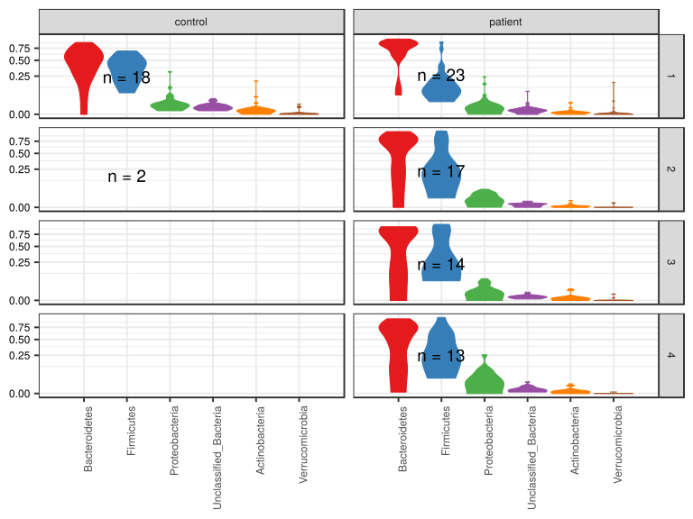
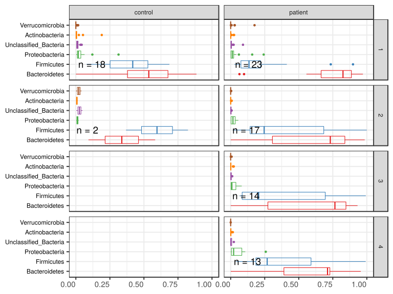
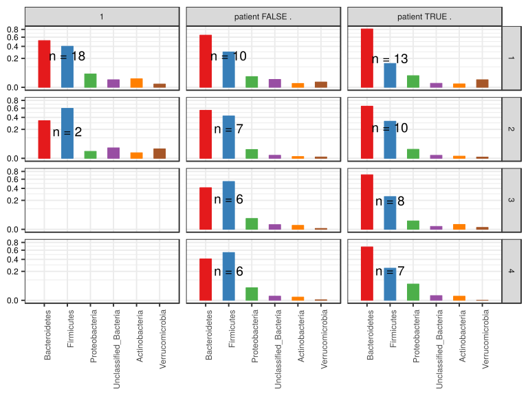
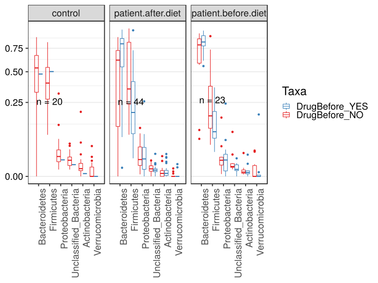

noone@mail.com
Analysis of Dieting study 16S data
% Fri Sep  7 05:46:18 2018

##### \(1.1.1.1.6\) Plots of Abundance.

Plots are shown with relation to various combinations of meta 
                   data variables and in different graphical representations. Lots of plots here.

##### \(1.1.1.1.6.2\) Iterating over all combinations of grouping variables

##### \(1.1.1.1.6.2.1\) Grouping variables Sample.type,visit

##### \(1.1.1.1.6.2.2\) Iterating over Abundance. profile sorting order

##### \(1.1.1.1.6.2.2.1\) Abundance. profile sorting order: average abundance

##### \(1.1.1.1.6.2.2.2\) Iterating over dodged vs faceted bars

The same data are shown in multiple combinations of graphical representations. 
                         This is the same data, but each plot highlights slightly different aspects of it.
                         It is not likely that you will need every plot - pick only what you need.

##### \(1.1.1.1.6.2.2.2.1\) faceted plots. Iterating over orientation and, optionally, scaling

##### \(1.1.1.1.6.2.2.2.1.1\) Abundance. Plot is in original orientation, Y axis SQRT scaled. Iterating over plot geometry

\(1.1.1.1.6.2.2.2.1.1.0\) [`Table 6.`](#table.6) Data table used for plots. Data grouped by Sample.type,visit. Showing only 200 first rows. Full dataset is also saved in a delimited text file (click to download and open e.g. in Excel) [`data/1.1.1.1.6.2.2.2.1.1.0-3236b29748c.1.1.1.1.6.2.2.2.1.1.csv`](data/1.1.1.1.6.2.2.2.1.1.0-3236b29748c.1.1.1.1.6.2.2.2.1.1.csv)

| .record.id | Sample.type | visit | feature        | Abundance |
|:-----------|:------------|:------|:---------------|:----------|
| SM1        | patient     | 1     | Bacteroidetes  | 0.7837908 |
| SM10       | patient     | 3     | Bacteroidetes  | 0.2396904 |
| SM100      | patient     | 4     | Bacteroidetes  | 0.5483424 |
| SM11       | patient     | 2     | Bacteroidetes  | 0.9085606 |
| SM12       | patient     | 1     | Bacteroidetes  | 0.9297539 |
| SM13       | patient     | 1     | Bacteroidetes  | 0.7549107 |
| SM14       | patient     | 1     | Bacteroidetes  | 0.0643696 |
| SM15       | control     | 1     | Bacteroidetes  | 0.4787347 |
| SM16       | patient     | 4     | Bacteroidetes  | 0.3909652 |
| SM17       | patient     | 1     | Bacteroidetes  | 0.8191974 |
| SM18       | patient     | 2     | Bacteroidetes  | 0.7196575 |
| SM19       | patient     | 2     | Bacteroidetes  | 0.2253586 |
| SM2        | patient     | 1     | Bacteroidetes  | 0.8869878 |
| SM20       | control     | 1     | Bacteroidetes  | 0.5052377 |
| SM21       | patient     | 1     | Bacteroidetes  | 0.5680175 |
| SM22       | patient     | 1     | Bacteroidetes  | 0.6115163 |
| SM23       | patient     | 2     | Bacteroidetes  | 0.2816259 |
| SM24       | patient     | 1     | Bacteroidetes  | 0.8667524 |
| SM25       | patient     | 4     | Bacteroidetes  | 0.4539656 |
| SM26       | control     | 1     | Bacteroidetes  | 0.5339906 |
| SM28       | control     | 1     | Bacteroidetes  | 0.2661871 |
| SM29       | patient     | 3     | Bacteroidetes  | 0.9319131 |
| SM3        | patient     | 2     | Bacteroidetes  | 0.3065958 |
| SM30       | patient     | 4     | Bacteroidetes  | 0.0706857 |
| SM31       | control     | 2     | Bacteroidetes  | 0.5825243 |
| SM33       | patient     | 1     | Bacteroidetes  | 0.6904013 |
| SM35       | control     | 1     | Bacteroidetes  | 0.6847011 |
| SM36       | patient     | 4     | Bacteroidetes  | 0.0003219 |
| SM37       | control     | 1     | Bacteroidetes  | 0.4116736 |
| SM38       | patient     | 2     | Bacteroidetes  | 0.9844826 |
| SM39       | patient     | 1     | Bacteroidetes  | 0.9344382 |
| SM40       | patient     | 4     | Bacteroidetes  | 0.7285173 |
| SM41       | patient     | 1     | Bacteroidetes  | 0.5561997 |
| SM42       | patient     | 4     | Bacteroidetes  | 0.7113608 |
| SM43       | patient     | 4     | Bacteroidetes  | 0.7229302 |
| SM44       | control     | 1     | Bacteroidetes  | 0.3689400 |
| SM45       | patient     | 2     | Bacteroidetes  | 0.0000000 |
| SM48       | control     | 1     | Bacteroidetes  | 0.7198795 |
| SM49       | patient     | 1     | Bacteroidetes  | 0.9321676 |
| SM5        | patient     | 3     | Bacteroidetes  | 0.8376844 |
| SM50       | patient     | 3     | Bacteroidetes  | 0.0000000 |
| SM51       | patient     | 4     | Bacteroidetes  | 0.7147000 |
| SM52       | patient     | 1     | Bacteroidetes  | 0.0982678 |
| SM53       | patient     | 2     | Bacteroidetes  | 0.8029344 |
| SM54       | patient     | 3     | Bacteroidetes  | 0.8090072 |
| SM55       | control     | 1     | Bacteroidetes  | 0.7867457 |
| SM56       | patient     | 2     | Bacteroidetes  | 0.7317232 |
| SM57       | patient     | 1     | Bacteroidetes  | 0.9046076 |
| SM58       | patient     | 2     | Bacteroidetes  | 0.7734046 |
| SM59       | patient     | 3     | Bacteroidetes  | 0.0576779 |
| SM60       | patient     | 3     | Bacteroidetes  | 0.8495575 |
| SM62       | patient     | 1     | Bacteroidetes  | 0.9714974 |
| SM63       | control     | 1     | Bacteroidetes  | 0.6522523 |
| SM64       | patient     | 2     | Bacteroidetes  | 0.8682775 |
| SM65       | patient     | 3     | Bacteroidetes  | 0.3740898 |
| SM66       | control     | 1     | Bacteroidetes  | 0.6462271 |
| SM67       | patient     | 4     | Bacteroidetes  | 0.9138286 |
| SM68       | patient     | 4     | Bacteroidetes  | 0.1704581 |
| SM69       | patient     | 4     | Bacteroidetes  | 0.8374262 |
| SM7        | control     | 1     | Bacteroidetes  | 0.2200704 |
| SM70       | control     | 1     | Bacteroidetes  | 0.5636549 |
| SM71       | patient     | 3     | Bacteroidetes  | 0.9181355 |
| SM72       | control     | 1     | Bacteroidetes  | 0.2780423 |
| SM73       | patient     | 1     | Bacteroidetes  | 0.8563497 |
| SM74       | control     | 2     | Bacteroidetes  | 0.0926350 |
| SM75       | patient     | 3     | Bacteroidetes  | 0.0023769 |
| SM76       | control     | 1     | Bacteroidetes  | 0.8226714 |
| SM77       | patient     | 2     | Bacteroidetes  | 0.7635462 |
| SM79       | patient     | 2     | Bacteroidetes  | 0.8495792 |
| SM8        | patient     | 1     | Bacteroidetes  | 0.8249907 |
| SM81       | control     | 1     | Bacteroidetes  | 0.0000000 |
| SM82       | patient     | 4     | Bacteroidetes  | 0.9557214 |
| SM83       | patient     | 1     | Bacteroidetes  | 0.8253707 |
| SM84       | patient     | 1     | Bacteroidetes  | 0.8861386 |
| SM86       | patient     | 2     | Bacteroidetes  | 0.0034130 |
| SM87       | patient     | 1     | Bacteroidetes  | 0.8668189 |
| SM88       | patient     | 2     | Bacteroidetes  | 0.8387042 |
| SM89       | control     | 1     | Bacteroidetes  | 0.8860391 |
| SM9        | patient     | 2     | Bacteroidetes  | 0.6635130 |
| SM90       | patient     | 2     | Bacteroidetes  | 0.6175743 |
| SM91       | patient     | 3     | Bacteroidetes  | 0.7223533 |
| SM92       | patient     | 3     | Bacteroidetes  | 0.8864163 |
| SM93       | patient     | 1     | Bacteroidetes  | 0.7781065 |
| SM95       | control     | 1     | Bacteroidetes  | 0.5376651 |
| SM96       | patient     | 1     | Bacteroidetes  | 0.6381524 |
| SM98       | patient     | 3     | Bacteroidetes  | 0.8378232 |
| SM99       | patient     | 3     | Bacteroidetes  | 0.6950886 |
| SM1        | patient     | 1     | Firmicutes     | 0.1926574 |
| SM10       | patient     | 3     | Firmicutes     | 0.7267041 |
| SM100      | patient     | 4     | Firmicutes     | 0.4106607 |
| SM11       | patient     | 2     | Firmicutes     | 0.0832883 |
| SM12       | patient     | 1     | Firmicutes     | 0.0667050 |
| SM13       | patient     | 1     | Firmicutes     | 0.2004464 |
| SM14       | patient     | 1     | Firmicutes     | 0.8985233 |
| SM15       | control     | 1     | Firmicutes     | 0.5021584 |
| SM16       | patient     | 4     | Firmicutes     | 0.5901852 |
| SM17       | patient     | 1     | Firmicutes     | 0.1419115 |
| SM18       | patient     | 2     | Firmicutes     | 0.2613732 |
| SM19       | patient     | 2     | Firmicutes     | 0.7376215 |
| SM2        | patient     | 1     | Firmicutes     | 0.1035274 |
| SM20       | control     | 1     | Firmicutes     | 0.4700510 |
| SM21       | patient     | 1     | Firmicutes     | 0.4124769 |
| SM22       | patient     | 1     | Firmicutes     | 0.3619962 |
| SM23       | patient     | 2     | Firmicutes     | 0.7183741 |
| SM24       | patient     | 1     | Firmicutes     | 0.0873312 |
| SM25       | patient     | 4     | Firmicutes     | 0.5346644 |
| SM26       | control     | 1     | Firmicutes     | 0.4376724 |
| SM28       | control     | 1     | Firmicutes     | 0.6702638 |
| SM29       | patient     | 3     | Firmicutes     | 0.0659983 |
| SM3        | patient     | 2     | Firmicutes     | 0.6836746 |
| SM30       | patient     | 4     | Firmicutes     | 0.6301592 |
| SM31       | control     | 2     | Firmicutes     | 0.3685275 |
| SM33       | patient     | 1     | Firmicutes     | 0.0664831 |
| SM35       | control     | 1     | Firmicutes     | 0.1777677 |
| SM36       | patient     | 4     | Firmicutes     | 0.9916318 |
| SM37       | control     | 1     | Firmicutes     | 0.5380090 |
| SM38       | patient     | 2     | Firmicutes     | 0.0149522 |
| SM39       | patient     | 1     | Firmicutes     | 0.0457112 |
| SM40       | patient     | 4     | Firmicutes     | 0.1850893 |
| SM41       | patient     | 1     | Firmicutes     | 0.2222222 |
| SM42       | patient     | 4     | Firmicutes     | 0.2680816 |
| SM43       | patient     | 4     | Firmicutes     | 0.2170803 |
| SM44       | control     | 1     | Firmicutes     | 0.5480690 |
| SM45       | patient     | 2     | Firmicutes     | 0.9998080 |
| SM48       | control     | 1     | Firmicutes     | 0.2306368 |
| SM49       | patient     | 1     | Firmicutes     | 0.0630087 |
| SM5        | patient     | 3     | Firmicutes     | 0.1042550 |
| SM50       | patient     | 3     | Firmicutes     | 0.9071785 |
| SM51       | patient     | 4     | Firmicutes     | 0.2014276 |
| SM52       | patient     | 1     | Firmicutes     | 0.7350474 |
| SM53       | patient     | 2     | Firmicutes     | 0.1567175 |
| SM54       | patient     | 3     | Firmicutes     | 0.1867193 |
| SM55       | control     | 1     | Firmicutes     | 0.1964930 |
| SM56       | patient     | 2     | Firmicutes     | 0.2457572 |
| SM57       | patient     | 1     | Firmicutes     | 0.0910727 |
| SM58       | patient     | 2     | Firmicutes     | 0.2163913 |
| SM59       | patient     | 3     | Firmicutes     | 0.9138577 |
| SM60       | patient     | 3     | Firmicutes     | 0.0667120 |
| SM62       | patient     | 1     | Firmicutes     | 0.0272983 |
| SM63       | control     | 1     | Firmicutes     | 0.3144144 |
| SM64       | patient     | 2     | Firmicutes     | 0.0731544 |
| SM65       | patient     | 3     | Firmicutes     | 0.5987086 |
| SM66       | control     | 1     | Firmicutes     | 0.3329670 |
| SM67       | patient     | 4     | Firmicutes     | 0.0858185 |
| SM68       | patient     | 4     | Firmicutes     | 0.7067622 |
| SM69       | patient     | 4     | Firmicutes     | 0.1394156 |
| SM7        | control     | 1     | Firmicutes     | 0.6870599 |
| SM70       | control     | 1     | Firmicutes     | 0.3690709 |
| SM71       | patient     | 3     | Firmicutes     | 0.0709753 |
| SM72       | control     | 1     | Firmicutes     | 0.6537037 |
| SM73       | patient     | 1     | Firmicutes     | 0.1129618 |
| SM74       | control     | 2     | Firmicutes     | 0.8235679 |
| SM75       | patient     | 3     | Firmicutes     | 0.9925297 |
| SM76       | control     | 1     | Firmicutes     | 0.1656713 |
| SM77       | patient     | 2     | Firmicutes     | 0.2001802 |
| SM79       | patient     | 2     | Firmicutes     | 0.1429830 |
| SM8        | patient     | 1     | Firmicutes     | 0.1345940 |
| SM81       | control     | 1     | Firmicutes     | 0.4655685 |
| SM82       | patient     | 4     | Firmicutes     | 0.0404868 |
| SM83       | patient     | 1     | Firmicutes     | 0.1639209 |
| SM84       | patient     | 1     | Firmicutes     | 0.0789167 |
| SM86       | patient     | 2     | Firmicutes     | 0.9748681 |
| SM87       | patient     | 1     | Firmicutes     | 0.0711568 |
| SM88       | patient     | 2     | Firmicutes     | 0.1293265 |
| SM89       | control     | 1     | Firmicutes     | 0.0789706 |
| SM9        | patient     | 2     | Firmicutes     | 0.2900041 |
| SM90       | patient     | 2     | Firmicutes     | 0.3494224 |
| SM91       | patient     | 3     | Firmicutes     | 0.2239015 |
| SM92       | patient     | 3     | Firmicutes     | 0.0989801 |
| SM93       | patient     | 1     | Firmicutes     | 0.2169177 |
| SM95       | control     | 1     | Firmicutes     | 0.3980721 |
| SM96       | patient     | 1     | Firmicutes     | 0.2489554 |
| SM98       | patient     | 3     | Firmicutes     | 0.0793432 |
| SM99       | patient     | 3     | Firmicutes     | 0.2789868 |
| SM1        | patient     | 1     | Proteobacteria | 0.0219067 |
| SM10       | patient     | 3     | Proteobacteria | 0.0063606 |
| SM100      | patient     | 4     | Proteobacteria | 0.0290747 |
| SM11       | patient     | 2     | Proteobacteria | 0.0032064 |
| SM12       | patient     | 1     | Proteobacteria | 0.0011951 |
| SM13       | patient     | 1     | Proteobacteria | 0.0049107 |
| SM14       | patient     | 1     | Proteobacteria | 0.0064370 |
| SM15       | control     | 1     | Proteobacteria | 0.0124549 |
| SM16       | patient     | 4     | Proteobacteria | 0.0053624 |
| SM17       | patient     | 1     | Proteobacteria | 0.0223417 |
| SM18       | patient     | 2     | Proteobacteria | 0.0167870 |
| SM19       | patient     | 2     | Proteobacteria | 0.0356317 |
| SM2        | patient     | 1     | Proteobacteria | 0.0056413 |
| SM20       | control     | 1     | Proteobacteria | 0.0021488 |
| SM21       | patient     | 1     | Proteobacteria | 0.0131159 |
| SM22       | patient     | 1     | Proteobacteria | 0.0122841 |
| SM23       | patient     | 2     | Proteobacteria | 0.0000000 |
| SM24       | patient     | 1     | Proteobacteria | 0.0415434 |
| SM25       | patient     | 4     | Proteobacteria | 0.0030505 |
| SM26       | control     | 1     | Proteobacteria | 0.0053778 |
| SM28       | control     | 1     | Proteobacteria | 0.0171863 |
| SM29       | patient     | 3     | Proteobacteria | 0.0000000 |
| SM3        | patient     | 2     | Proteobacteria | 0.0069012 |
| SM30       | patient     | 4     | Proteobacteria | 0.2575561 |
| SM31       | control     | 2     | Proteobacteria | 0.0024272 |
| SM33       | patient     | 1     | Proteobacteria | 0.2423289 |

\(1.1.1.1.6.2.2.2.1.1.1\) [`Widget 2.`](#widget.2) Dynamic Pivot Table link (drag and drop field names and pick averaging 
                      functions or plot types; click on fields or legend elements to filter values). 
                      Starting rendering is Stacked Bar Chart. Data grouped by Sample.type,visit. Click to see HTML widget file in full window: [`./1.1.1.1.6.2.2.2.1.1.1-323b8036cfDynamic.Pivot.Table.html`](./1.1.1.1.6.2.2.2.1.1.1-323b8036cfDynamic.Pivot.Table.html)

\(1.1.1.1.6.2.2.2.1.1.1\) [`Widget 3.`](#widget.3) Dynamic Pivot Table link (drag and drop field names and pick averaging 
                      functions or plot types; click on fields or legend elements to filter values). 
                      Starting rendering is Table Barchart. Data grouped by Sample.type,visit. Click to see HTML widget file in full window: [`./1.1.1.1.6.2.2.2.1.1.1-3234f489b67Dynamic.Pivot.Table.html`](./1.1.1.1.6.2.2.2.1.1.1-3234f489b67Dynamic.Pivot.Table.html)

\(1.1.1.1.6.2.2.2.1.1.1\) [`Table 7.`](#table.7) Summary table. Data grouped by Sample.type,visit. Full dataset is also saved in a delimited text file (click to download and open e.g. in Excel) [`data/1.1.1.1.6.2.2.2.1.1.1-32364869b99.1.1.1.1.6.2.2.2.1.1.csv`](data/1.1.1.1.6.2.2.2.1.1.1-32364869b99.1.1.1.1.6.2.2.2.1.1.csv)

| feature                | Sample.type | visit | mean       | sd        | median    | incidence |
|:-----------------------|:------------|:------|:-----------|:----------|:----------|:----------|
| Bacteroidetes          | control     | 1     | 5.202e\-01 | 0.2325637 | 0.5358279 | 0.94444   |
| Bacteroidetes          | control     | 2     | 3.376e\-01 | 0.3464040 | 0.3375796 | 1.00000   |
| Bacteroidetes          | patient     | 1     | 7.413e\-01 | 0.2398308 | 0.8249907 | 1.00000   |
| Bacteroidetes          | patient     | 2     | 6.082e\-01 | 0.3173005 | 0.7317232 | 0.94118   |
| Bacteroidetes          | patient     | 3     | 5.830e\-01 | 0.3642181 | 0.7656803 | 0.92857   |
| Bacteroidetes          | patient     | 4     | 5.553e\-01 | 0.3168360 | 0.7113608 | 1.00000   |
| Firmicutes             | control     | 1     | 4.020e\-01 | 0.1834321 | 0.4178722 | 1.00000   |
| Firmicutes             | control     | 2     | 5.960e\-01 | 0.3217622 | 0.5960477 | 1.00000   |
| Firmicutes             | patient     | 1     | 2.063e\-01 | 0.2171699 | 0.1345940 | 1.00000   |
| Firmicutes             | patient     | 2     | 3.693e\-01 | 0.3216403 | 0.2457572 | 1.00000   |
| Firmicutes             | patient     | 3     | 3.796e\-01 | 0.3632886 | 0.2053104 | 1.00000   |
| Firmicutes             | patient     | 4     | 3.847e\-01 | 0.2858955 | 0.2680816 | 1.00000   |
| Proteobacteria         | control     | 1     | 4.251e\-02 | 0.0735425 | 0.0176317 | 1.00000   |
| Proteobacteria         | control     | 2     | 1.152e\-02 | 0.0128656 | 0.0115246 | 1.00000   |
| Proteobacteria         | patient     | 1     | 3.006e\-02 | 0.0571305 | 0.0122841 | 0.95652   |
| Proteobacteria         | patient     | 2     | 1.901e\-02 | 0.0174805 | 0.0167870 | 0.94118   |
| Proteobacteria         | patient     | 3     | 2.157e\-02 | 0.0267913 | 0.0091310 | 0.92857   |
| Proteobacteria         | patient     | 4     | 5.151e\-02 | 0.0716240 | 0.0217594 | 0.92308   |
| Unclassified\_Bacteria | control     | 1     | 1.364e\-02 | 0.0114079 | 0.0105404 | 1.00000   |
| Unclassified\_Bacteria | control     | 2     | 2.617e\-02 | 0.0324305 | 0.0261680 | 1.00000   |
| Unclassified\_Bacteria | patient     | 1     | 8.586e\-03 | 0.0185047 | 0.0036576 | 0.95652   |
| Unclassified\_Bacteria | patient     | 2     | 2.162e\-03 | 0.0019168 | 0.0019582 | 0.88235   |
| Unclassified\_Bacteria | patient     | 3     | 3.391e\-03 | 0.0031220 | 0.0024169 | 1.00000   |
| Unclassified\_Bacteria | patient     | 4     | 4.709e\-03 | 0.0065490 | 0.0014149 | 1.00000   |
| Actinobacteria         | control     | 1     | 1.734e\-02 | 0.0449262 | 0.0027265 | 0.94444   |
| Actinobacteria         | control     | 2     | 7.317e\-03 | 0.0086317 | 0.0073171 | 1.00000   |
| Actinobacteria         | patient     | 1     | 3.082e\-03 | 0.0065802 | 0.0007416 | 0.86957   |
| Actinobacteria         | patient     | 2     | 9.481e\-04 | 0.0020047 | 0.0002227 | 0.76471   |
| Actinobacteria         | patient     | 3     | 4.829e\-03 | 0.0081190 | 0.0007112 | 0.71429   |
| Actinobacteria         | patient     | 4     | 3.295e\-03 | 0.0053213 | 0.0006658 | 0.69231   |
| Verrucomicrobia        | control     | 1     | 2.550e\-03 | 0.0051198 | 0.0000000 | 0.38889   |
| Verrucomicrobia        | control     | 2     | 2.136e\-02 | 0.0292859 | 0.0213629 | 1.00000   |
| Verrucomicrobia        | patient     | 1     | 1.056e\-02 | 0.0368541 | 0.0000000 | 0.34783   |
| Verrucomicrobia        | patient     | 2     | 3.903e\-04 | 0.0011122 | 0.0000000 | 0.11765   |
| Verrucomicrobia        | patient     | 3     | 5.727e\-04 | 0.0018438 | 0.0000000 | 0.14286   |
| Verrucomicrobia        | patient     | 4     | 2.846e\-05 | 0.0001026 | 0.0000000 | 0.07692   |

\(1.1.1.1.6.2.2.2.1.1.1\) [`Figure 5.`](#figure.5) Abundance. Data grouped by Sample.type,visit.  bar_stacked plot.  Image file: [`plots/3235e711569.svg`](plots/3235e711569.svg).

\(1.1.1.1.6.2.2.2.1.1.1\) [`Figure 6.`](#figure.6) Abundance. Data grouped by Sample.type,visit.  bar (sample mean) plot.  Image file: [`plots/3232df4e96.svg`](plots/3232df4e96.svg).

\(1.1.1.1.6.2.2.2.1.1.1\) [`Figure 7.`](#figure.7) Abundance. Data grouped by Sample.type,visit.  violin plot.  Image file: [`plots/3231b96a55.svg`](plots/3231b96a55.svg).

\(1.1.1.1.6.2.2.2.1.1.1\) [`Figure 8.`](#figure.8) Abundance. Data grouped by Sample.type,visit.  boxplot plot.  Image file: [`plots/323d7040a2.svg`](plots/323d7040a2.svg).

##### \(1.1.1.1.6.2.2.2.1.2\) Abundance. Plot is in flipped orientation, Y axis not scaled. Iterating over plot geometry

\(1.1.1.1.6.2.2.2.1.2.1\) [`Figure 9.`](#figure.9) Abundance. Data grouped by Sample.type,visit.  bar (sample mean) plot.  Image file: [`plots/32361b9cdf5.svg`](plots/32361b9cdf5.svg).

\(1.1.1.1.6.2.2.2.1.2.1\) [`Figure 10.`](#figure.10) Abundance. Data grouped by Sample.type,visit.  violin plot.  Image file: [`plots/323605fd3f4.svg`](plots/323605fd3f4.svg).

\(1.1.1.1.6.2.2.2.1.2.1\) [`Figure 11.`](#figure.11) Abundance. Data grouped by Sample.type,visit.  boxplot plot.  Image file: [`plots/32314a8f6d9.svg`](plots/32314a8f6d9.svg).

##### \(1.1.1.1.6.2.2.2.2\) dodged plots. Iterating over orientation and, optionally, scaling

##### \(1.1.1.1.6.2.2.2.2.1\) Abundance. Plot is in original orientation, Y axis SQRT scaled. Iterating over plot geometry

\(1.1.1.1.6.2.2.2.2.1.1\) [`Figure 12.`](#figure.12) Abundance. Data grouped by Sample.type,visit.  bar (sample mean) plot.  Image file: [`plots/323d17b05f.svg`](plots/323d17b05f.svg).

\(1.1.1.1.6.2.2.2.2.1.1\) [`Figure 13.`](#figure.13) Abundance. Data grouped by Sample.type,visit.  violin plot.  Image file: [`plots/3235afb5e67.svg`](plots/3235afb5e67.svg).

\(1.1.1.1.6.2.2.2.2.1.1\) [`Figure 14.`](#figure.14) Abundance. Data grouped by Sample.type,visit.  boxplot plot.  Image file: [`plots/3237d1d1426.svg`](plots/3237d1d1426.svg).

##### \(1.1.1.1.6.2.2.2.2.2\) Abundance. Plot is in flipped orientation, Y axis not scaled. Iterating over plot geometry

\(1.1.1.1.6.2.2.2.2.2.1\) [`Figure 15.`](#figure.15) Abundance. Data grouped by Sample.type,visit.  bar (sample mean) plot.  Image file: [`plots/3235068b188.svg`](plots/3235068b188.svg).

\(1.1.1.1.6.2.2.2.2.2.1\) [`Figure 16.`](#figure.16) Abundance. Data grouped by Sample.type,visit.  violin plot.  Image file: [`plots/323185e1645.svg`](plots/323185e1645.svg).

\(1.1.1.1.6.2.2.2.2.2.1\) [`Figure 17.`](#figure.17) Abundance. Data grouped by Sample.type,visit.  boxplot plot.  Image file: [`plots/3235e8aeafe.svg`](plots/3235e8aeafe.svg).

##### \(1.1.1.1.6.2.3\) Grouping variables Sample.type.Drug.Before,visit

##### \(1.1.1.1.6.2.4\) Iterating over Abundance. profile sorting order

##### \(1.1.1.1.6.2.4.1\) Abundance. profile sorting order: average abundance

##### \(1.1.1.1.6.2.4.2\) Iterating over dodged vs faceted bars

The same data are shown in multiple combinations of graphical representations. 
                         This is the same data, but each plot highlights slightly different aspects of it.
                         It is not likely that you will need every plot - pick only what you need.

##### \(1.1.1.1.6.2.4.2.1\) faceted plots. Iterating over orientation and, optionally, scaling

##### \(1.1.1.1.6.2.4.2.1.1\) Abundance. Plot is in original orientation, Y axis SQRT scaled. Iterating over plot geometry

\(1.1.1.1.6.2.4.2.1.1.0\) [`Table 8.`](#table.8) Data table used for plots. Data grouped by Sample.type.Drug.Before,visit. Showing only 200 first rows. Full dataset is also saved in a delimited text file (click to download and open e.g. in Excel) [`data/1.1.1.1.6.2.4.2.1.1.0-3232e59c40.1.1.1.1.6.2.4.2.1.1.csv`](data/1.1.1.1.6.2.4.2.1.1.0-3232e59c40.1.1.1.1.6.2.4.2.1.1.csv)

| .record.id | Sample.type.Drug.Before | visit | feature        | Abundance |
|:-----------|:------------------------|:------|:---------------|:----------|
| SM1        | patient TRUE .          | 1     | Bacteroidetes  | 0.7837908 |
| SM10       | patient TRUE .          | 3     | Bacteroidetes  | 0.2396904 |
| SM100      | patient TRUE .          | 4     | Bacteroidetes  | 0.5483424 |
| SM11       | patient TRUE .          | 2     | Bacteroidetes  | 0.9085606 |
| SM12       | patient TRUE .          | 1     | Bacteroidetes  | 0.9297539 |
| SM13       | patient FALSE .         | 1     | Bacteroidetes  | 0.7549107 |
| SM14       | patient FALSE .         | 1     | Bacteroidetes  | 0.0643696 |
| SM15       | 1                       | 1     | Bacteroidetes  | 0.4787347 |
| SM16       | patient FALSE .         | 4     | Bacteroidetes  | 0.3909652 |
| SM17       | patient TRUE .          | 1     | Bacteroidetes  | 0.8191974 |
| SM18       | patient FALSE .         | 2     | Bacteroidetes  | 0.7196575 |
| SM19       | patient FALSE .         | 2     | Bacteroidetes  | 0.2253586 |
| SM2        | patient FALSE .         | 1     | Bacteroidetes  | 0.8869878 |
| SM20       | 1                       | 1     | Bacteroidetes  | 0.5052377 |
| SM21       | patient FALSE .         | 1     | Bacteroidetes  | 0.5680175 |
| SM22       | patient TRUE .          | 1     | Bacteroidetes  | 0.6115163 |
| SM23       | patient TRUE .          | 2     | Bacteroidetes  | 0.2816259 |
| SM24       | patient FALSE .         | 1     | Bacteroidetes  | 0.8667524 |
| SM25       | patient FALSE .         | 4     | Bacteroidetes  | 0.4539656 |
| SM26       | 1                       | 1     | Bacteroidetes  | 0.5339906 |
| SM28       | 1                       | 1     | Bacteroidetes  | 0.2661871 |
| SM29       | patient TRUE .          | 3     | Bacteroidetes  | 0.9319131 |
| SM3        | patient TRUE .          | 2     | Bacteroidetes  | 0.3065958 |
| SM30       | patient TRUE .          | 4     | Bacteroidetes  | 0.0706857 |
| SM31       | 1                       | 2     | Bacteroidetes  | 0.5825243 |
| SM33       | patient TRUE .          | 1     | Bacteroidetes  | 0.6904013 |
| SM35       | 1                       | 1     | Bacteroidetes  | 0.6847011 |
| SM36       | patient FALSE .         | 4     | Bacteroidetes  | 0.0003219 |
| SM37       | 1                       | 1     | Bacteroidetes  | 0.4116736 |
| SM38       | patient TRUE .          | 2     | Bacteroidetes  | 0.9844826 |
| SM39       | patient FALSE .         | 1     | Bacteroidetes  | 0.9344382 |
| SM40       | patient FALSE .         | 4     | Bacteroidetes  | 0.7285173 |
| SM41       | patient TRUE .          | 1     | Bacteroidetes  | 0.5561997 |
| SM42       | patient FALSE .         | 4     | Bacteroidetes  | 0.7113608 |
| SM43       | patient TRUE .          | 4     | Bacteroidetes  | 0.7229302 |
| SM44       | 1                       | 1     | Bacteroidetes  | 0.3689400 |
| SM45       | patient FALSE .         | 2     | Bacteroidetes  | 0.0000000 |
| SM48       | 1                       | 1     | Bacteroidetes  | 0.7198795 |
| SM49       | patient TRUE .          | 1     | Bacteroidetes  | 0.9321676 |
| SM5        | patient TRUE .          | 3     | Bacteroidetes  | 0.8376844 |
| SM50       | patient FALSE .         | 3     | Bacteroidetes  | 0.0000000 |
| SM51       | patient TRUE .          | 4     | Bacteroidetes  | 0.7147000 |
| SM52       | patient FALSE .         | 1     | Bacteroidetes  | 0.0982678 |
| SM53       | patient TRUE .          | 2     | Bacteroidetes  | 0.8029344 |
| SM54       | patient TRUE .          | 3     | Bacteroidetes  | 0.8090072 |
| SM55       | 1                       | 1     | Bacteroidetes  | 0.7867457 |
| SM56       | patient TRUE .          | 2     | Bacteroidetes  | 0.7317232 |
| SM57       | patient TRUE .          | 1     | Bacteroidetes  | 0.9046076 |
| SM58       | patient FALSE .         | 2     | Bacteroidetes  | 0.7734046 |
| SM59       | patient FALSE .         | 3     | Bacteroidetes  | 0.0576779 |
| SM60       | patient TRUE .          | 3     | Bacteroidetes  | 0.8495575 |
| SM62       | patient TRUE .          | 1     | Bacteroidetes  | 0.9714974 |
| SM63       | 1                       | 1     | Bacteroidetes  | 0.6522523 |
| SM64       | patient TRUE .          | 2     | Bacteroidetes  | 0.8682775 |
| SM65       | patient TRUE .          | 3     | Bacteroidetes  | 0.3740898 |
| SM66       | 1                       | 1     | Bacteroidetes  | 0.6462271 |
| SM67       | patient TRUE .          | 4     | Bacteroidetes  | 0.9138286 |
| SM68       | patient FALSE .         | 4     | Bacteroidetes  | 0.1704581 |
| SM69       | patient TRUE .          | 4     | Bacteroidetes  | 0.8374262 |
| SM7        | 1                       | 1     | Bacteroidetes  | 0.2200704 |
| SM70       | 1                       | 1     | Bacteroidetes  | 0.5636549 |
| SM71       | patient TRUE .          | 3     | Bacteroidetes  | 0.9181355 |
| SM72       | 1                       | 1     | Bacteroidetes  | 0.2780423 |
| SM73       | patient FALSE .         | 1     | Bacteroidetes  | 0.8563497 |
| SM74       | 1                       | 2     | Bacteroidetes  | 0.0926350 |
| SM75       | patient FALSE .         | 3     | Bacteroidetes  | 0.0023769 |
| SM76       | 1                       | 1     | Bacteroidetes  | 0.8226714 |
| SM77       | patient TRUE .          | 2     | Bacteroidetes  | 0.7635462 |
| SM79       | patient FALSE .         | 2     | Bacteroidetes  | 0.8495792 |
| SM8        | patient FALSE .         | 1     | Bacteroidetes  | 0.8249907 |
| SM81       | 1                       | 1     | Bacteroidetes  | 0.0000000 |
| SM82       | patient TRUE .          | 4     | Bacteroidetes  | 0.9557214 |
| SM83       | patient TRUE .          | 1     | Bacteroidetes  | 0.8253707 |
| SM84       | patient TRUE .          | 1     | Bacteroidetes  | 0.8861386 |
| SM86       | patient TRUE .          | 2     | Bacteroidetes  | 0.0034130 |
| SM87       | patient TRUE .          | 1     | Bacteroidetes  | 0.8668189 |
| SM88       | patient TRUE .          | 2     | Bacteroidetes  | 0.8387042 |
| SM89       | 1                       | 1     | Bacteroidetes  | 0.8860391 |
| SM9        | patient FALSE .         | 2     | Bacteroidetes  | 0.6635130 |
| SM90       | patient FALSE .         | 2     | Bacteroidetes  | 0.6175743 |
| SM91       | patient TRUE .          | 3     | Bacteroidetes  | 0.7223533 |
| SM92       | patient FALSE .         | 3     | Bacteroidetes  | 0.8864163 |
| SM93       | patient TRUE .          | 1     | Bacteroidetes  | 0.7781065 |
| SM95       | 1                       | 1     | Bacteroidetes  | 0.5376651 |
| SM96       | patient FALSE .         | 1     | Bacteroidetes  | 0.6381524 |
| SM98       | patient FALSE .         | 3     | Bacteroidetes  | 0.8378232 |
| SM99       | patient FALSE .         | 3     | Bacteroidetes  | 0.6950886 |
| SM1        | patient TRUE .          | 1     | Firmicutes     | 0.1926574 |
| SM10       | patient TRUE .          | 3     | Firmicutes     | 0.7267041 |
| SM100      | patient TRUE .          | 4     | Firmicutes     | 0.4106607 |
| SM11       | patient TRUE .          | 2     | Firmicutes     | 0.0832883 |
| SM12       | patient TRUE .          | 1     | Firmicutes     | 0.0667050 |
| SM13       | patient FALSE .         | 1     | Firmicutes     | 0.2004464 |
| SM14       | patient FALSE .         | 1     | Firmicutes     | 0.8985233 |
| SM15       | 1                       | 1     | Firmicutes     | 0.5021584 |
| SM16       | patient FALSE .         | 4     | Firmicutes     | 0.5901852 |
| SM17       | patient TRUE .          | 1     | Firmicutes     | 0.1419115 |
| SM18       | patient FALSE .         | 2     | Firmicutes     | 0.2613732 |
| SM19       | patient FALSE .         | 2     | Firmicutes     | 0.7376215 |
| SM2        | patient FALSE .         | 1     | Firmicutes     | 0.1035274 |
| SM20       | 1                       | 1     | Firmicutes     | 0.4700510 |
| SM21       | patient FALSE .         | 1     | Firmicutes     | 0.4124769 |
| SM22       | patient TRUE .          | 1     | Firmicutes     | 0.3619962 |
| SM23       | patient TRUE .          | 2     | Firmicutes     | 0.7183741 |
| SM24       | patient FALSE .         | 1     | Firmicutes     | 0.0873312 |
| SM25       | patient FALSE .         | 4     | Firmicutes     | 0.5346644 |
| SM26       | 1                       | 1     | Firmicutes     | 0.4376724 |
| SM28       | 1                       | 1     | Firmicutes     | 0.6702638 |
| SM29       | patient TRUE .          | 3     | Firmicutes     | 0.0659983 |
| SM3        | patient TRUE .          | 2     | Firmicutes     | 0.6836746 |
| SM30       | patient TRUE .          | 4     | Firmicutes     | 0.6301592 |
| SM31       | 1                       | 2     | Firmicutes     | 0.3685275 |
| SM33       | patient TRUE .          | 1     | Firmicutes     | 0.0664831 |
| SM35       | 1                       | 1     | Firmicutes     | 0.1777677 |
| SM36       | patient FALSE .         | 4     | Firmicutes     | 0.9916318 |
| SM37       | 1                       | 1     | Firmicutes     | 0.5380090 |
| SM38       | patient TRUE .          | 2     | Firmicutes     | 0.0149522 |
| SM39       | patient FALSE .         | 1     | Firmicutes     | 0.0457112 |
| SM40       | patient FALSE .         | 4     | Firmicutes     | 0.1850893 |
| SM41       | patient TRUE .          | 1     | Firmicutes     | 0.2222222 |
| SM42       | patient FALSE .         | 4     | Firmicutes     | 0.2680816 |
| SM43       | patient TRUE .          | 4     | Firmicutes     | 0.2170803 |
| SM44       | 1                       | 1     | Firmicutes     | 0.5480690 |
| SM45       | patient FALSE .         | 2     | Firmicutes     | 0.9998080 |
| SM48       | 1                       | 1     | Firmicutes     | 0.2306368 |
| SM49       | patient TRUE .          | 1     | Firmicutes     | 0.0630087 |
| SM5        | patient TRUE .          | 3     | Firmicutes     | 0.1042550 |
| SM50       | patient FALSE .         | 3     | Firmicutes     | 0.9071785 |
| SM51       | patient TRUE .          | 4     | Firmicutes     | 0.2014276 |
| SM52       | patient FALSE .         | 1     | Firmicutes     | 0.7350474 |
| SM53       | patient TRUE .          | 2     | Firmicutes     | 0.1567175 |
| SM54       | patient TRUE .          | 3     | Firmicutes     | 0.1867193 |
| SM55       | 1                       | 1     | Firmicutes     | 0.1964930 |
| SM56       | patient TRUE .          | 2     | Firmicutes     | 0.2457572 |
| SM57       | patient TRUE .          | 1     | Firmicutes     | 0.0910727 |
| SM58       | patient FALSE .         | 2     | Firmicutes     | 0.2163913 |
| SM59       | patient FALSE .         | 3     | Firmicutes     | 0.9138577 |
| SM60       | patient TRUE .          | 3     | Firmicutes     | 0.0667120 |
| SM62       | patient TRUE .          | 1     | Firmicutes     | 0.0272983 |
| SM63       | 1                       | 1     | Firmicutes     | 0.3144144 |
| SM64       | patient TRUE .          | 2     | Firmicutes     | 0.0731544 |
| SM65       | patient TRUE .          | 3     | Firmicutes     | 0.5987086 |
| SM66       | 1                       | 1     | Firmicutes     | 0.3329670 |
| SM67       | patient TRUE .          | 4     | Firmicutes     | 0.0858185 |
| SM68       | patient FALSE .         | 4     | Firmicutes     | 0.7067622 |
| SM69       | patient TRUE .          | 4     | Firmicutes     | 0.1394156 |
| SM7        | 1                       | 1     | Firmicutes     | 0.6870599 |
| SM70       | 1                       | 1     | Firmicutes     | 0.3690709 |
| SM71       | patient TRUE .          | 3     | Firmicutes     | 0.0709753 |
| SM72       | 1                       | 1     | Firmicutes     | 0.6537037 |
| SM73       | patient FALSE .         | 1     | Firmicutes     | 0.1129618 |
| SM74       | 1                       | 2     | Firmicutes     | 0.8235679 |
| SM75       | patient FALSE .         | 3     | Firmicutes     | 0.9925297 |
| SM76       | 1                       | 1     | Firmicutes     | 0.1656713 |
| SM77       | patient TRUE .          | 2     | Firmicutes     | 0.2001802 |
| SM79       | patient FALSE .         | 2     | Firmicutes     | 0.1429830 |
| SM8        | patient FALSE .         | 1     | Firmicutes     | 0.1345940 |
| SM81       | 1                       | 1     | Firmicutes     | 0.4655685 |
| SM82       | patient TRUE .          | 4     | Firmicutes     | 0.0404868 |
| SM83       | patient TRUE .          | 1     | Firmicutes     | 0.1639209 |
| SM84       | patient TRUE .          | 1     | Firmicutes     | 0.0789167 |
| SM86       | patient TRUE .          | 2     | Firmicutes     | 0.9748681 |
| SM87       | patient TRUE .          | 1     | Firmicutes     | 0.0711568 |
| SM88       | patient TRUE .          | 2     | Firmicutes     | 0.1293265 |
| SM89       | 1                       | 1     | Firmicutes     | 0.0789706 |
| SM9        | patient FALSE .         | 2     | Firmicutes     | 0.2900041 |
| SM90       | patient FALSE .         | 2     | Firmicutes     | 0.3494224 |
| SM91       | patient TRUE .          | 3     | Firmicutes     | 0.2239015 |
| SM92       | patient FALSE .         | 3     | Firmicutes     | 0.0989801 |
| SM93       | patient TRUE .          | 1     | Firmicutes     | 0.2169177 |
| SM95       | 1                       | 1     | Firmicutes     | 0.3980721 |
| SM96       | patient FALSE .         | 1     | Firmicutes     | 0.2489554 |
| SM98       | patient FALSE .         | 3     | Firmicutes     | 0.0793432 |
| SM99       | patient FALSE .         | 3     | Firmicutes     | 0.2789868 |
| SM1        | patient TRUE .          | 1     | Proteobacteria | 0.0219067 |
| SM10       | patient TRUE .          | 3     | Proteobacteria | 0.0063606 |
| SM100      | patient TRUE .          | 4     | Proteobacteria | 0.0290747 |
| SM11       | patient TRUE .          | 2     | Proteobacteria | 0.0032064 |
| SM12       | patient TRUE .          | 1     | Proteobacteria | 0.0011951 |
| SM13       | patient FALSE .         | 1     | Proteobacteria | 0.0049107 |
| SM14       | patient FALSE .         | 1     | Proteobacteria | 0.0064370 |
| SM15       | 1                       | 1     | Proteobacteria | 0.0124549 |
| SM16       | patient FALSE .         | 4     | Proteobacteria | 0.0053624 |
| SM17       | patient TRUE .          | 1     | Proteobacteria | 0.0223417 |
| SM18       | patient FALSE .         | 2     | Proteobacteria | 0.0167870 |
| SM19       | patient FALSE .         | 2     | Proteobacteria | 0.0356317 |
| SM2        | patient FALSE .         | 1     | Proteobacteria | 0.0056413 |
| SM20       | 1                       | 1     | Proteobacteria | 0.0021488 |
| SM21       | patient FALSE .         | 1     | Proteobacteria | 0.0131159 |
| SM22       | patient TRUE .          | 1     | Proteobacteria | 0.0122841 |
| SM23       | patient TRUE .          | 2     | Proteobacteria | 0.0000000 |
| SM24       | patient FALSE .         | 1     | Proteobacteria | 0.0415434 |
| SM25       | patient FALSE .         | 4     | Proteobacteria | 0.0030505 |
| SM26       | 1                       | 1     | Proteobacteria | 0.0053778 |
| SM28       | 1                       | 1     | Proteobacteria | 0.0171863 |
| SM29       | patient TRUE .          | 3     | Proteobacteria | 0.0000000 |
| SM3        | patient TRUE .          | 2     | Proteobacteria | 0.0069012 |
| SM30       | patient TRUE .          | 4     | Proteobacteria | 0.2575561 |
| SM31       | 1                       | 2     | Proteobacteria | 0.0024272 |
| SM33       | patient TRUE .          | 1     | Proteobacteria | 0.2423289 |

\(1.1.1.1.6.2.4.2.1.1.1\) [`Widget 4.`](#widget.4) Dynamic Pivot Table link (drag and drop field names and pick averaging 
                      functions or plot types; click on fields or legend elements to filter values). 
                      Starting rendering is Stacked Bar Chart. Data grouped by Sample.type.Drug.Before,visit. Click to see HTML widget file in full window: [`./1.1.1.1.6.2.4.2.1.1.1-32343e976f9Dynamic.Pivot.Table.html`](./1.1.1.1.6.2.4.2.1.1.1-32343e976f9Dynamic.Pivot.Table.html)

\(1.1.1.1.6.2.4.2.1.1.1\) [`Widget 5.`](#widget.5) Dynamic Pivot Table link (drag and drop field names and pick averaging 
                      functions or plot types; click on fields or legend elements to filter values). 
                      Starting rendering is Table Barchart. Data grouped by Sample.type.Drug.Before,visit. Click to see HTML widget file in full window: [`./1.1.1.1.6.2.4.2.1.1.1-32369d9ba89Dynamic.Pivot.Table.html`](./1.1.1.1.6.2.4.2.1.1.1-32369d9ba89Dynamic.Pivot.Table.html)

\(1.1.1.1.6.2.4.2.1.1.1\) [`Table 9.`](#table.9) Summary table. Data grouped by Sample.type.Drug.Before,visit. Full dataset is also saved in a delimited text file (click to download and open e.g. in Excel) [`data/1.1.1.1.6.2.4.2.1.1.1-32344d8b1c0.1.1.1.1.6.2.4.2.1.1.csv`](data/1.1.1.1.6.2.4.2.1.1.1-32344d8b1c0.1.1.1.1.6.2.4.2.1.1.csv)

| feature                | Sample.type.Drug.Before | visit | mean       | sd        | median    | incidence |
|:-----------------------|:------------------------|:------|:-----------|:----------|:----------|:----------|
| Bacteroidetes          | 1                       | 1     | 5.202e\-01 | 0.2325637 | 0.5358279 | 0.9444    |
| Bacteroidetes          | 1                       | 2     | 3.376e\-01 | 0.3464040 | 0.3375796 | 1.0000    |
| Bacteroidetes          | patient FALSE .         | 1     | 6.493e\-01 | 0.3201539 | 0.7899507 | 1.0000    |
| Bacteroidetes          | patient FALSE .         | 2     | 5.499e\-01 | 0.3145855 | 0.6635130 | 0.8571    |
| Bacteroidetes          | patient FALSE .         | 3     | 4.132e\-01 | 0.4357994 | 0.3763832 | 0.8333    |
| Bacteroidetes          | patient FALSE .         | 4     | 4.093e\-01 | 0.2897517 | 0.4224654 | 1.0000    |
| Bacteroidetes          | patient TRUE .          | 1     | 8.120e\-01 | 0.1269555 | 0.8253707 | 1.0000    |
| Bacteroidetes          | patient TRUE .          | 2     | 6.490e\-01 | 0.3294165 | 0.7832403 | 1.0000    |
| Bacteroidetes          | patient TRUE .          | 3     | 7.103e\-01 | 0.2597599 | 0.8233458 | 1.0000    |
| Bacteroidetes          | patient TRUE .          | 4     | 6.805e\-01 | 0.3019724 | 0.7229302 | 1.0000    |
| Firmicutes             | 1                       | 1     | 4.020e\-01 | 0.1834321 | 0.4178722 | 1.0000    |
| Firmicutes             | 1                       | 2     | 5.960e\-01 | 0.3217622 | 0.5960477 | 1.0000    |
| Firmicutes             | patient FALSE .         | 1     | 2.980e\-01 | 0.2950437 | 0.1675202 | 1.0000    |
| Firmicutes             | patient FALSE .         | 2     | 4.282e\-01 | 0.3167081 | 0.2900041 | 1.0000    |
| Firmicutes             | patient FALSE .         | 3     | 5.451e\-01 | 0.4368169 | 0.5930827 | 1.0000    |
| Firmicutes             | patient FALSE .         | 4     | 5.461e\-01 | 0.2946212 | 0.5624248 | 1.0000    |
| Firmicutes             | patient TRUE .          | 1     | 1.357e\-01 | 0.0936925 | 0.0910727 | 1.0000    |
| Firmicutes             | patient TRUE .          | 2     | 3.280e\-01 | 0.3353397 | 0.1784489 | 1.0000    |
| Firmicutes             | patient TRUE .          | 3     | 2.555e\-01 | 0.2602282 | 0.1454871 | 1.0000    |
| Firmicutes             | patient TRUE .          | 4     | 2.464e\-01 | 0.2068684 | 0.2014276 | 1.0000    |
| Proteobacteria         | 1                       | 1     | 4.251e\-02 | 0.0735425 | 0.0176317 | 1.0000    |
| Proteobacteria         | 1                       | 2     | 1.152e\-02 | 0.0128656 | 0.0115246 | 1.0000    |
| Proteobacteria         | patient FALSE .         | 1     | 2.732e\-02 | 0.0473340 | 0.0119343 | 1.0000    |
| Proteobacteria         | patient FALSE .         | 2     | 1.851e\-02 | 0.0163312 | 0.0167870 | 1.0000    |
| Proteobacteria         | patient FALSE .         | 3     | 2.796e\-02 | 0.0331289 | 0.0116967 | 1.0000    |
| Proteobacteria         | patient FALSE .         | 4     | 3.770e\-02 | 0.0459902 | 0.0129398 | 1.0000    |
| Proteobacteria         | patient TRUE .          | 1     | 3.216e\-02 | 0.0655164 | 0.0122841 | 0.9231    |
| Proteobacteria         | patient TRUE .          | 2     | 1.937e\-02 | 0.0191073 | 0.0138488 | 0.9000    |
| Proteobacteria         | patient TRUE .          | 3     | 1.677e\-02 | 0.0220834 | 0.0070957 | 0.8750    |
| Proteobacteria         | patient TRUE .          | 4     | 6.335e\-02 | 0.0902400 | 0.0290747 | 0.8571    |
| Unclassified\_Bacteria | 1                       | 1     | 1.364e\-02 | 0.0114079 | 0.0105404 | 1.0000    |
| Unclassified\_Bacteria | 1                       | 2     | 2.617e\-02 | 0.0324305 | 0.0261680 | 1.0000    |
| Unclassified\_Bacteria | patient FALSE .         | 1     | 1.480e\-02 | 0.0271664 | 0.0044485 | 1.0000    |
| Unclassified\_Bacteria | patient FALSE .         | 2     | 2.186e\-03 | 0.0022072 | 0.0013882 | 0.8571    |
| Unclassified\_Bacteria | patient FALSE .         | 3     | 5.270e\-03 | 0.0038238 | 0.0034445 | 1.0000    |
| Unclassified\_Bacteria | patient FALSE .         | 4     | 4.114e\-03 | 0.0042506 | 0.0020074 | 1.0000    |
| Unclassified\_Bacteria | patient TRUE .          | 1     | 3.807e\-03 | 0.0041644 | 0.0022574 | 0.9231    |
| Unclassified\_Bacteria | patient TRUE .          | 2     | 2.145e\-03 | 0.0018121 | 0.0020539 | 0.9000    |
| Unclassified\_Bacteria | patient TRUE .          | 3     | 1.982e\-03 | 0.0015373 | 0.0013446 | 1.0000    |
| Unclassified\_Bacteria | patient TRUE .          | 4     | 5.219e\-03 | 0.0083704 | 0.0013988 | 1.0000    |
| Actinobacteria         | 1                       | 1     | 1.734e\-02 | 0.0449262 | 0.0027265 | 0.9444    |
| Actinobacteria         | 1                       | 2     | 7.317e\-03 | 0.0086317 | 0.0073171 | 1.0000    |
| Actinobacteria         | patient FALSE .         | 1     | 3.471e\-03 | 0.0076244 | 0.0008172 | 1.0000    |
| Actinobacteria         | patient FALSE .         | 2     | 7.392e\-04 | 0.0011806 | 0.0002936 | 0.7143    |
| Actinobacteria         | patient FALSE .         | 3     | 3.698e\-03 | 0.0074005 | 0.0007112 | 0.6667    |
| Actinobacteria         | patient FALSE .         | 4     | 2.476e\-03 | 0.0042882 | 0.0004254 | 0.6667    |
| Actinobacteria         | patient TRUE .          | 1     | 2.782e\-03 | 0.0059632 | 0.0006927 | 0.7692    |
| Actinobacteria         | patient TRUE .          | 2     | 1.094e\-03 | 0.0024815 | 0.0002192 | 0.8000    |
| Actinobacteria         | patient TRUE .          | 3     | 5.677e\-03 | 0.0090211 | 0.0010307 | 0.7500    |
| Actinobacteria         | patient TRUE .          | 4     | 3.997e\-03 | 0.0063296 | 0.0006692 | 0.7143    |
| Verrucomicrobia        | 1                       | 1     | 2.550e\-03 | 0.0051198 | 0.0000000 | 0.3889    |
| Verrucomicrobia        | 1                       | 2     | 2.136e\-02 | 0.0292859 | 0.0213629 | 1.0000    |
| Verrucomicrobia        | patient FALSE .         | 1     | 6.661e\-03 | 0.0120381 | 0.0000000 | 0.4000    |
| Verrucomicrobia        | patient FALSE .         | 2     | 4.125e\-04 | 0.0010915 | 0.0000000 | 0.1429    |
| Verrucomicrobia        | patient FALSE .         | 3     | 1.873e\-04 | 0.0004587 | 0.0000000 | 0.1667    |
| Verrucomicrobia        | patient FALSE .         | 4     | 6.167e\-05 | 0.0001510 | 0.0000000 | 0.1667    |
| Verrucomicrobia        | patient TRUE .          | 1     | 1.355e\-02 | 0.0485697 | 0.0000000 | 0.3077    |
| Verrucomicrobia        | patient TRUE .          | 2     | 3.747e\-04 | 0.0011850 | 0.0000000 | 0.1000    |
| Verrucomicrobia        | patient TRUE .          | 3     | 8.617e\-04 | 0.0024373 | 0.0000000 | 0.1250    |
| Verrucomicrobia        | patient TRUE .          | 4     | 0.000e\+00 | 0.0000000 | 0.0000000 | 0.0000    |

\(1.1.1.1.6.2.4.2.1.1.1\) [`Figure 18.`](#figure.18) Abundance. Data grouped by Sample.type.Drug.Before,visit.  bar_stacked plot.  Image file: [`plots/3237167bf9b.svg`](plots/3237167bf9b.svg).

\(1.1.1.1.6.2.4.2.1.1.1\) [`Figure 19.`](#figure.19) Abundance. Data grouped by Sample.type.Drug.Before,visit.  bar (sample mean) plot.  Image file: [`plots/323188a1359.svg`](plots/323188a1359.svg).

\(1.1.1.1.6.2.4.2.1.1.1\) [`Figure 20.`](#figure.20) Abundance. Data grouped by Sample.type.Drug.Before,visit.  violin plot.  Image file: [`plots/3233b3187b9.svg`](plots/3233b3187b9.svg).

\(1.1.1.1.6.2.4.2.1.1.1\) [`Figure 21.`](#figure.21) Abundance. Data grouped by Sample.type.Drug.Before,visit.  boxplot plot.  Image file: [`plots/323205f32fe.svg`](plots/323205f32fe.svg).

##### \(1.1.1.1.6.2.4.2.1.2\) Abundance. Plot is in flipped orientation, Y axis not scaled. Iterating over plot geometry

\(1.1.1.1.6.2.4.2.1.2.1\) [`Figure 22.`](#figure.22) Abundance. Data grouped by Sample.type.Drug.Before,visit.  bar (sample mean) plot.  Image file: [`plots/323a4454bc.svg`](plots/323a4454bc.svg).

\(1.1.1.1.6.2.4.2.1.2.1\) [`Figure 23.`](#figure.23) Abundance. Data grouped by Sample.type.Drug.Before,visit.  violin plot.  Image file: [`plots/32327fa1548.svg`](plots/32327fa1548.svg).

\(1.1.1.1.6.2.4.2.1.2.1\) [`Figure 24.`](#figure.24) Abundance. Data grouped by Sample.type.Drug.Before,visit.  boxplot plot.  Image file: [`plots/3234a485b4a.svg`](plots/3234a485b4a.svg).

##### \(1.1.1.1.6.2.4.2.2\) dodged plots. Iterating over orientation and, optionally, scaling

##### \(1.1.1.1.6.2.4.2.2.1\) Abundance. Plot is in original orientation, Y axis SQRT scaled. Iterating over plot geometry

\(1.1.1.1.6.2.4.2.2.1.1\) [`Figure 25.`](#figure.25) Abundance. Data grouped by Sample.type.Drug.Before,visit.  bar (sample mean) plot.  Image file: [`plots/3233c80ba8b.svg`](plots/3233c80ba8b.svg).

\(1.1.1.1.6.2.4.2.2.1.1\) [`Figure 26.`](#figure.26) Abundance. Data grouped by Sample.type.Drug.Before,visit.  violin plot.  Image file: [`plots/323b6f737c.svg`](plots/323b6f737c.svg).

\(1.1.1.1.6.2.4.2.2.1.1\) [`Figure 27.`](#figure.27) Abundance. Data grouped by Sample.type.Drug.Before,visit.  boxplot plot.  Image file: [`plots/32327e12d1b.svg`](plots/32327e12d1b.svg).

##### \(1.1.1.1.6.2.4.2.2.2\) Abundance. Plot is in flipped orientation, Y axis not scaled. Iterating over plot geometry

\(1.1.1.1.6.2.4.2.2.2.1\) [`Figure 28.`](#figure.28) Abundance. Data grouped by Sample.type.Drug.Before,visit.  bar (sample mean) plot.  Image file: [`plots/323625bc6.svg`](plots/323625bc6.svg).

\(1.1.1.1.6.2.4.2.2.2.1\) [`Figure 29.`](#figure.29) Abundance. Data grouped by Sample.type.Drug.Before,visit.  violin plot.  Image file: [`plots/323b84bc0b.svg`](plots/323b84bc0b.svg).

\(1.1.1.1.6.2.4.2.2.2.1\) [`Figure 30.`](#figure.30) Abundance. Data grouped by Sample.type.Drug.Before,visit.  boxplot plot.  Image file: [`plots/32350b48d5a.svg`](plots/32350b48d5a.svg).

##### \(1.1.1.1.6.2.5\) Grouping variables Drug.Before.Diet,Sample.type.1

##### \(1.1.1.1.6.2.6\) Iterating over Abundance. profile sorting order

##### \(1.1.1.1.6.2.6.1\) Abundance. profile sorting order: average abundance

##### \(1.1.1.1.6.2.6.2\) Iterating over dodged vs faceted bars

The same data are shown in multiple combinations of graphical representations. 
                         This is the same data, but each plot highlights slightly different aspects of it.
                         It is not likely that you will need every plot - pick only what you need.

##### \(1.1.1.1.6.2.6.2.1\) faceted plots. Iterating over orientation and, optionally, scaling

##### \(1.1.1.1.6.2.6.2.1.1\) Abundance. Plot is in original orientation, Y axis SQRT scaled. Iterating over plot geometry

\(1.1.1.1.6.2.6.2.1.1.0\) [`Table 10.`](#table.10) Data table used for plots. Data grouped by Drug.Before.Diet,Sample.type.1. Showing only 200 first rows. Full dataset is also saved in a delimited text file (click to download and open e.g. in Excel) [`data/1.1.1.1.6.2.6.2.1.1.0-3231169a8fe.1.1.1.1.6.2.6.2.1.1.csv`](data/1.1.1.1.6.2.6.2.1.1.0-3231169a8fe.1.1.1.1.6.2.6.2.1.1.csv)

| .record.id | Drug.Before.Diet | Sample.type.1       | feature        | Abundance |
|:-----------|:-----------------|:--------------------|:---------------|:----------|
| SM1        | DrugBefore\_YES  | patient.before.diet | Bacteroidetes  | 0.7837908 |
| SM10       | DrugBefore\_YES  | patient.after.diet  | Bacteroidetes  | 0.2396904 |
| SM100      | DrugBefore\_YES  | patient.after.diet  | Bacteroidetes  | 0.5483424 |
| SM11       | DrugBefore\_YES  | patient.after.diet  | Bacteroidetes  | 0.9085606 |
| SM12       | DrugBefore\_YES  | patient.before.diet | Bacteroidetes  | 0.9297539 |
| SM13       | DrugBefore\_NO   | patient.before.diet | Bacteroidetes  | 0.7549107 |
| SM14       | DrugBefore\_NO   | patient.before.diet | Bacteroidetes  | 0.0643696 |
| SM15       | DrugBefore\_YES  | control             | Bacteroidetes  | 0.4787347 |
| SM16       | DrugBefore\_NO   | patient.after.diet  | Bacteroidetes  | 0.3909652 |
| SM17       | DrugBefore\_YES  | patient.before.diet | Bacteroidetes  | 0.8191974 |
| SM18       | DrugBefore\_NO   | patient.after.diet  | Bacteroidetes  | 0.7196575 |
| SM19       | DrugBefore\_NO   | patient.after.diet  | Bacteroidetes  | 0.2253586 |
| SM2        | DrugBefore\_NO   | patient.before.diet | Bacteroidetes  | 0.8869878 |
| SM20       | DrugBefore\_NO   | control             | Bacteroidetes  | 0.5052377 |
| SM21       | DrugBefore\_NO   | patient.before.diet | Bacteroidetes  | 0.5680175 |
| SM22       | DrugBefore\_YES  | patient.before.diet | Bacteroidetes  | 0.6115163 |
| SM23       | DrugBefore\_YES  | patient.after.diet  | Bacteroidetes  | 0.2816259 |
| SM24       | DrugBefore\_NO   | patient.before.diet | Bacteroidetes  | 0.8667524 |
| SM25       | DrugBefore\_NO   | patient.after.diet  | Bacteroidetes  | 0.4539656 |
| SM26       | DrugBefore\_NO   | control             | Bacteroidetes  | 0.5339906 |
| SM28       | DrugBefore\_NO   | control             | Bacteroidetes  | 0.2661871 |
| SM29       | DrugBefore\_YES  | patient.after.diet  | Bacteroidetes  | 0.9319131 |
| SM3        | DrugBefore\_YES  | patient.after.diet  | Bacteroidetes  | 0.3065958 |
| SM30       | DrugBefore\_YES  | patient.after.diet  | Bacteroidetes  | 0.0706857 |
| SM31       | DrugBefore\_NO   | control             | Bacteroidetes  | 0.5825243 |
| SM33       | DrugBefore\_YES  | patient.before.diet | Bacteroidetes  | 0.6904013 |
| SM35       | DrugBefore\_NO   | control             | Bacteroidetes  | 0.6847011 |
| SM36       | DrugBefore\_NO   | patient.after.diet  | Bacteroidetes  | 0.0003219 |
| SM37       | DrugBefore\_NO   | control             | Bacteroidetes  | 0.4116736 |
| SM38       | DrugBefore\_YES  | patient.after.diet  | Bacteroidetes  | 0.9844826 |
| SM39       | DrugBefore\_NO   | patient.before.diet | Bacteroidetes  | 0.9344382 |
| SM40       | DrugBefore\_NO   | patient.after.diet  | Bacteroidetes  | 0.7285173 |
| SM41       | DrugBefore\_YES  | patient.before.diet | Bacteroidetes  | 0.5561997 |
| SM42       | DrugBefore\_NO   | patient.after.diet  | Bacteroidetes  | 0.7113608 |
| SM43       | DrugBefore\_YES  | patient.after.diet  | Bacteroidetes  | 0.7229302 |
| SM44       | DrugBefore\_NO   | control             | Bacteroidetes  | 0.3689400 |
| SM45       | DrugBefore\_NO   | patient.after.diet  | Bacteroidetes  | 0.0000000 |
| SM48       | DrugBefore\_NO   | control             | Bacteroidetes  | 0.7198795 |
| SM49       | DrugBefore\_YES  | patient.before.diet | Bacteroidetes  | 0.9321676 |
| SM5        | DrugBefore\_YES  | patient.after.diet  | Bacteroidetes  | 0.8376844 |
| SM50       | DrugBefore\_NO   | patient.after.diet  | Bacteroidetes  | 0.0000000 |
| SM51       | DrugBefore\_YES  | patient.after.diet  | Bacteroidetes  | 0.7147000 |
| SM52       | DrugBefore\_NO   | patient.before.diet | Bacteroidetes  | 0.0982678 |
| SM53       | DrugBefore\_YES  | patient.after.diet  | Bacteroidetes  | 0.8029344 |
| SM54       | DrugBefore\_YES  | patient.after.diet  | Bacteroidetes  | 0.8090072 |
| SM55       | DrugBefore\_NO   | control             | Bacteroidetes  | 0.7867457 |
| SM56       | DrugBefore\_YES  | patient.after.diet  | Bacteroidetes  | 0.7317232 |
| SM57       | DrugBefore\_YES  | patient.before.diet | Bacteroidetes  | 0.9046076 |
| SM58       | DrugBefore\_NO   | patient.after.diet  | Bacteroidetes  | 0.7734046 |
| SM59       | DrugBefore\_NO   | patient.after.diet  | Bacteroidetes  | 0.0576779 |
| SM60       | DrugBefore\_YES  | patient.after.diet  | Bacteroidetes  | 0.8495575 |
| SM62       | DrugBefore\_YES  | patient.before.diet | Bacteroidetes  | 0.9714974 |
| SM63       | DrugBefore\_NO   | control             | Bacteroidetes  | 0.6522523 |
| SM64       | DrugBefore\_YES  | patient.after.diet  | Bacteroidetes  | 0.8682775 |
| SM65       | DrugBefore\_YES  | patient.after.diet  | Bacteroidetes  | 0.3740898 |
| SM66       | DrugBefore\_NO   | control             | Bacteroidetes  | 0.6462271 |
| SM67       | DrugBefore\_YES  | patient.after.diet  | Bacteroidetes  | 0.9138286 |
| SM68       | DrugBefore\_NO   | patient.after.diet  | Bacteroidetes  | 0.1704581 |
| SM69       | DrugBefore\_YES  | patient.after.diet  | Bacteroidetes  | 0.8374262 |
| SM7        | DrugBefore\_NO   | control             | Bacteroidetes  | 0.2200704 |
| SM70       | DrugBefore\_NO   | control             | Bacteroidetes  | 0.5636549 |
| SM71       | DrugBefore\_YES  | patient.after.diet  | Bacteroidetes  | 0.9181355 |
| SM72       | DrugBefore\_NO   | control             | Bacteroidetes  | 0.2780423 |
| SM73       | DrugBefore\_NO   | patient.before.diet | Bacteroidetes  | 0.8563497 |
| SM74       | DrugBefore\_NO   | control             | Bacteroidetes  | 0.0926350 |
| SM75       | DrugBefore\_NO   | patient.after.diet  | Bacteroidetes  | 0.0023769 |
| SM76       | DrugBefore\_NO   | control             | Bacteroidetes  | 0.8226714 |
| SM77       | DrugBefore\_YES  | patient.after.diet  | Bacteroidetes  | 0.7635462 |
| SM79       | DrugBefore\_NO   | patient.after.diet  | Bacteroidetes  | 0.8495792 |
| SM8        | DrugBefore\_NO   | patient.before.diet | Bacteroidetes  | 0.8249907 |
| SM81       | DrugBefore\_NO   | control             | Bacteroidetes  | 0.0000000 |
| SM82       | DrugBefore\_YES  | patient.after.diet  | Bacteroidetes  | 0.9557214 |
| SM83       | DrugBefore\_YES  | patient.before.diet | Bacteroidetes  | 0.8253707 |
| SM84       | DrugBefore\_YES  | patient.before.diet | Bacteroidetes  | 0.8861386 |
| SM86       | DrugBefore\_YES  | patient.after.diet  | Bacteroidetes  | 0.0034130 |
| SM87       | DrugBefore\_YES  | patient.before.diet | Bacteroidetes  | 0.8668189 |
| SM88       | DrugBefore\_YES  | patient.after.diet  | Bacteroidetes  | 0.8387042 |
| SM89       | DrugBefore\_NO   | control             | Bacteroidetes  | 0.8860391 |
| SM9        | DrugBefore\_NO   | patient.after.diet  | Bacteroidetes  | 0.6635130 |
| SM90       | DrugBefore\_NO   | patient.after.diet  | Bacteroidetes  | 0.6175743 |
| SM91       | DrugBefore\_YES  | patient.after.diet  | Bacteroidetes  | 0.7223533 |
| SM92       | DrugBefore\_NO   | patient.after.diet  | Bacteroidetes  | 0.8864163 |
| SM93       | DrugBefore\_YES  | patient.before.diet | Bacteroidetes  | 0.7781065 |
| SM95       | DrugBefore\_NO   | control             | Bacteroidetes  | 0.5376651 |
| SM96       | DrugBefore\_NO   | patient.before.diet | Bacteroidetes  | 0.6381524 |
| SM98       | DrugBefore\_NO   | patient.after.diet  | Bacteroidetes  | 0.8378232 |
| SM99       | DrugBefore\_NO   | patient.after.diet  | Bacteroidetes  | 0.6950886 |
| SM1        | DrugBefore\_YES  | patient.before.diet | Firmicutes     | 0.1926574 |
| SM10       | DrugBefore\_YES  | patient.after.diet  | Firmicutes     | 0.7267041 |
| SM100      | DrugBefore\_YES  | patient.after.diet  | Firmicutes     | 0.4106607 |
| SM11       | DrugBefore\_YES  | patient.after.diet  | Firmicutes     | 0.0832883 |
| SM12       | DrugBefore\_YES  | patient.before.diet | Firmicutes     | 0.0667050 |
| SM13       | DrugBefore\_NO   | patient.before.diet | Firmicutes     | 0.2004464 |
| SM14       | DrugBefore\_NO   | patient.before.diet | Firmicutes     | 0.8985233 |
| SM15       | DrugBefore\_YES  | control             | Firmicutes     | 0.5021584 |
| SM16       | DrugBefore\_NO   | patient.after.diet  | Firmicutes     | 0.5901852 |
| SM17       | DrugBefore\_YES  | patient.before.diet | Firmicutes     | 0.1419115 |
| SM18       | DrugBefore\_NO   | patient.after.diet  | Firmicutes     | 0.2613732 |
| SM19       | DrugBefore\_NO   | patient.after.diet  | Firmicutes     | 0.7376215 |
| SM2        | DrugBefore\_NO   | patient.before.diet | Firmicutes     | 0.1035274 |
| SM20       | DrugBefore\_NO   | control             | Firmicutes     | 0.4700510 |
| SM21       | DrugBefore\_NO   | patient.before.diet | Firmicutes     | 0.4124769 |
| SM22       | DrugBefore\_YES  | patient.before.diet | Firmicutes     | 0.3619962 |
| SM23       | DrugBefore\_YES  | patient.after.diet  | Firmicutes     | 0.7183741 |
| SM24       | DrugBefore\_NO   | patient.before.diet | Firmicutes     | 0.0873312 |
| SM25       | DrugBefore\_NO   | patient.after.diet  | Firmicutes     | 0.5346644 |
| SM26       | DrugBefore\_NO   | control             | Firmicutes     | 0.4376724 |
| SM28       | DrugBefore\_NO   | control             | Firmicutes     | 0.6702638 |
| SM29       | DrugBefore\_YES  | patient.after.diet  | Firmicutes     | 0.0659983 |
| SM3        | DrugBefore\_YES  | patient.after.diet  | Firmicutes     | 0.6836746 |
| SM30       | DrugBefore\_YES  | patient.after.diet  | Firmicutes     | 0.6301592 |
| SM31       | DrugBefore\_NO   | control             | Firmicutes     | 0.3685275 |
| SM33       | DrugBefore\_YES  | patient.before.diet | Firmicutes     | 0.0664831 |
| SM35       | DrugBefore\_NO   | control             | Firmicutes     | 0.1777677 |
| SM36       | DrugBefore\_NO   | patient.after.diet  | Firmicutes     | 0.9916318 |
| SM37       | DrugBefore\_NO   | control             | Firmicutes     | 0.5380090 |
| SM38       | DrugBefore\_YES  | patient.after.diet  | Firmicutes     | 0.0149522 |
| SM39       | DrugBefore\_NO   | patient.before.diet | Firmicutes     | 0.0457112 |
| SM40       | DrugBefore\_NO   | patient.after.diet  | Firmicutes     | 0.1850893 |
| SM41       | DrugBefore\_YES  | patient.before.diet | Firmicutes     | 0.2222222 |
| SM42       | DrugBefore\_NO   | patient.after.diet  | Firmicutes     | 0.2680816 |
| SM43       | DrugBefore\_YES  | patient.after.diet  | Firmicutes     | 0.2170803 |
| SM44       | DrugBefore\_NO   | control             | Firmicutes     | 0.5480690 |
| SM45       | DrugBefore\_NO   | patient.after.diet  | Firmicutes     | 0.9998080 |
| SM48       | DrugBefore\_NO   | control             | Firmicutes     | 0.2306368 |
| SM49       | DrugBefore\_YES  | patient.before.diet | Firmicutes     | 0.0630087 |
| SM5        | DrugBefore\_YES  | patient.after.diet  | Firmicutes     | 0.1042550 |
| SM50       | DrugBefore\_NO   | patient.after.diet  | Firmicutes     | 0.9071785 |
| SM51       | DrugBefore\_YES  | patient.after.diet  | Firmicutes     | 0.2014276 |
| SM52       | DrugBefore\_NO   | patient.before.diet | Firmicutes     | 0.7350474 |
| SM53       | DrugBefore\_YES  | patient.after.diet  | Firmicutes     | 0.1567175 |
| SM54       | DrugBefore\_YES  | patient.after.diet  | Firmicutes     | 0.1867193 |
| SM55       | DrugBefore\_NO   | control             | Firmicutes     | 0.1964930 |
| SM56       | DrugBefore\_YES  | patient.after.diet  | Firmicutes     | 0.2457572 |
| SM57       | DrugBefore\_YES  | patient.before.diet | Firmicutes     | 0.0910727 |
| SM58       | DrugBefore\_NO   | patient.after.diet  | Firmicutes     | 0.2163913 |
| SM59       | DrugBefore\_NO   | patient.after.diet  | Firmicutes     | 0.9138577 |
| SM60       | DrugBefore\_YES  | patient.after.diet  | Firmicutes     | 0.0667120 |
| SM62       | DrugBefore\_YES  | patient.before.diet | Firmicutes     | 0.0272983 |
| SM63       | DrugBefore\_NO   | control             | Firmicutes     | 0.3144144 |
| SM64       | DrugBefore\_YES  | patient.after.diet  | Firmicutes     | 0.0731544 |
| SM65       | DrugBefore\_YES  | patient.after.diet  | Firmicutes     | 0.5987086 |
| SM66       | DrugBefore\_NO   | control             | Firmicutes     | 0.3329670 |
| SM67       | DrugBefore\_YES  | patient.after.diet  | Firmicutes     | 0.0858185 |
| SM68       | DrugBefore\_NO   | patient.after.diet  | Firmicutes     | 0.7067622 |
| SM69       | DrugBefore\_YES  | patient.after.diet  | Firmicutes     | 0.1394156 |
| SM7        | DrugBefore\_NO   | control             | Firmicutes     | 0.6870599 |
| SM70       | DrugBefore\_NO   | control             | Firmicutes     | 0.3690709 |
| SM71       | DrugBefore\_YES  | patient.after.diet  | Firmicutes     | 0.0709753 |
| SM72       | DrugBefore\_NO   | control             | Firmicutes     | 0.6537037 |
| SM73       | DrugBefore\_NO   | patient.before.diet | Firmicutes     | 0.1129618 |
| SM74       | DrugBefore\_NO   | control             | Firmicutes     | 0.8235679 |
| SM75       | DrugBefore\_NO   | patient.after.diet  | Firmicutes     | 0.9925297 |
| SM76       | DrugBefore\_NO   | control             | Firmicutes     | 0.1656713 |
| SM77       | DrugBefore\_YES  | patient.after.diet  | Firmicutes     | 0.2001802 |
| SM79       | DrugBefore\_NO   | patient.after.diet  | Firmicutes     | 0.1429830 |
| SM8        | DrugBefore\_NO   | patient.before.diet | Firmicutes     | 0.1345940 |
| SM81       | DrugBefore\_NO   | control             | Firmicutes     | 0.4655685 |
| SM82       | DrugBefore\_YES  | patient.after.diet  | Firmicutes     | 0.0404868 |
| SM83       | DrugBefore\_YES  | patient.before.diet | Firmicutes     | 0.1639209 |
| SM84       | DrugBefore\_YES  | patient.before.diet | Firmicutes     | 0.0789167 |
| SM86       | DrugBefore\_YES  | patient.after.diet  | Firmicutes     | 0.9748681 |
| SM87       | DrugBefore\_YES  | patient.before.diet | Firmicutes     | 0.0711568 |
| SM88       | DrugBefore\_YES  | patient.after.diet  | Firmicutes     | 0.1293265 |
| SM89       | DrugBefore\_NO   | control             | Firmicutes     | 0.0789706 |
| SM9        | DrugBefore\_NO   | patient.after.diet  | Firmicutes     | 0.2900041 |
| SM90       | DrugBefore\_NO   | patient.after.diet  | Firmicutes     | 0.3494224 |
| SM91       | DrugBefore\_YES  | patient.after.diet  | Firmicutes     | 0.2239015 |
| SM92       | DrugBefore\_NO   | patient.after.diet  | Firmicutes     | 0.0989801 |
| SM93       | DrugBefore\_YES  | patient.before.diet | Firmicutes     | 0.2169177 |
| SM95       | DrugBefore\_NO   | control             | Firmicutes     | 0.3980721 |
| SM96       | DrugBefore\_NO   | patient.before.diet | Firmicutes     | 0.2489554 |
| SM98       | DrugBefore\_NO   | patient.after.diet  | Firmicutes     | 0.0793432 |
| SM99       | DrugBefore\_NO   | patient.after.diet  | Firmicutes     | 0.2789868 |
| SM1        | DrugBefore\_YES  | patient.before.diet | Proteobacteria | 0.0219067 |
| SM10       | DrugBefore\_YES  | patient.after.diet  | Proteobacteria | 0.0063606 |
| SM100      | DrugBefore\_YES  | patient.after.diet  | Proteobacteria | 0.0290747 |
| SM11       | DrugBefore\_YES  | patient.after.diet  | Proteobacteria | 0.0032064 |
| SM12       | DrugBefore\_YES  | patient.before.diet | Proteobacteria | 0.0011951 |
| SM13       | DrugBefore\_NO   | patient.before.diet | Proteobacteria | 0.0049107 |
| SM14       | DrugBefore\_NO   | patient.before.diet | Proteobacteria | 0.0064370 |
| SM15       | DrugBefore\_YES  | control             | Proteobacteria | 0.0124549 |
| SM16       | DrugBefore\_NO   | patient.after.diet  | Proteobacteria | 0.0053624 |
| SM17       | DrugBefore\_YES  | patient.before.diet | Proteobacteria | 0.0223417 |
| SM18       | DrugBefore\_NO   | patient.after.diet  | Proteobacteria | 0.0167870 |
| SM19       | DrugBefore\_NO   | patient.after.diet  | Proteobacteria | 0.0356317 |
| SM2        | DrugBefore\_NO   | patient.before.diet | Proteobacteria | 0.0056413 |
| SM20       | DrugBefore\_NO   | control             | Proteobacteria | 0.0021488 |
| SM21       | DrugBefore\_NO   | patient.before.diet | Proteobacteria | 0.0131159 |
| SM22       | DrugBefore\_YES  | patient.before.diet | Proteobacteria | 0.0122841 |
| SM23       | DrugBefore\_YES  | patient.after.diet  | Proteobacteria | 0.0000000 |
| SM24       | DrugBefore\_NO   | patient.before.diet | Proteobacteria | 0.0415434 |
| SM25       | DrugBefore\_NO   | patient.after.diet  | Proteobacteria | 0.0030505 |
| SM26       | DrugBefore\_NO   | control             | Proteobacteria | 0.0053778 |
| SM28       | DrugBefore\_NO   | control             | Proteobacteria | 0.0171863 |
| SM29       | DrugBefore\_YES  | patient.after.diet  | Proteobacteria | 0.0000000 |
| SM3        | DrugBefore\_YES  | patient.after.diet  | Proteobacteria | 0.0069012 |
| SM30       | DrugBefore\_YES  | patient.after.diet  | Proteobacteria | 0.2575561 |
| SM31       | DrugBefore\_NO   | control             | Proteobacteria | 0.0024272 |
| SM33       | DrugBefore\_YES  | patient.before.diet | Proteobacteria | 0.2423289 |

\(1.1.1.1.6.2.6.2.1.1.1\) [`Widget 6.`](#widget.6) Dynamic Pivot Table link (drag and drop field names and pick averaging 
                      functions or plot types; click on fields or legend elements to filter values). 
                      Starting rendering is Stacked Bar Chart. Data grouped by Drug.Before.Diet,Sample.type.1. Click to see HTML widget file in full window: [`./1.1.1.1.6.2.6.2.1.1.1-323165a1376Dynamic.Pivot.Table.html`](./1.1.1.1.6.2.6.2.1.1.1-323165a1376Dynamic.Pivot.Table.html)

\(1.1.1.1.6.2.6.2.1.1.1\) [`Widget 7.`](#widget.7) Dynamic Pivot Table link (drag and drop field names and pick averaging 
                      functions or plot types; click on fields or legend elements to filter values). 
                      Starting rendering is Table Barchart. Data grouped by Drug.Before.Diet,Sample.type.1. Click to see HTML widget file in full window: [`./1.1.1.1.6.2.6.2.1.1.1-323115a451Dynamic.Pivot.Table.html`](./1.1.1.1.6.2.6.2.1.1.1-323115a451Dynamic.Pivot.Table.html)

\(1.1.1.1.6.2.6.2.1.1.1\) [`Table 11.`](#table.11) Summary table. Data grouped by Drug.Before.Diet,Sample.type.1. Full dataset is also saved in a delimited text file (click to download and open e.g. in Excel) [`data/1.1.1.1.6.2.6.2.1.1.1-3234477b3f1.1.1.1.1.6.2.6.2.1.1.csv`](data/1.1.1.1.6.2.6.2.1.1.1-3234477b3f1.1.1.1.1.6.2.6.2.1.1.csv)

| feature                | Drug.Before.Diet | Sample.type.1       | mean      | sd        | median    | incidence |
|:-----------------------|:-----------------|:--------------------|:----------|:----------|:----------|:----------|
| Bacteroidetes          | DrugBefore\_NO   | control             | 0.5031125 | 0.2470818 | 0.5376651 | 0.9474    |
| Bacteroidetes          | DrugBefore\_NO   | patient.after.diet  | 0.4623189 | 0.3373238 | 0.6175743 | 0.8947    |
| Bacteroidetes          | DrugBefore\_NO   | patient.before.diet | 0.6493237 | 0.3201539 | 0.7899507 | 1.0000    |
| Bacteroidetes          | DrugBefore\_YES  | control             | 0.4787347 | NA        | 0.4787347 | 1.0000    |
| Bacteroidetes          | DrugBefore\_YES  | patient.after.diet  | 0.6774372 | 0.2896039 | 0.8029344 | 1.0000    |
| Bacteroidetes          | DrugBefore\_YES  | patient.before.diet | 0.8119667 | 0.1269555 | 0.8253707 | 1.0000    |
| Firmicutes             | DrugBefore\_NO   | control             | 0.4171872 | 0.2022691 | 0.3980721 | 1.0000    |
| Firmicutes             | DrugBefore\_NO   | patient.after.diet  | 0.5023628 | 0.3375395 | 0.3494224 | 1.0000    |
| Firmicutes             | DrugBefore\_NO   | patient.before.diet | 0.2979575 | 0.2950437 | 0.1675202 | 1.0000    |
| Firmicutes             | DrugBefore\_YES  | control             | 0.5021584 | NA        | 0.5021584 | 1.0000    |
| Firmicutes             | DrugBefore\_YES  | patient.after.diet  | 0.2819726 | 0.2722233 | 0.1867193 | 1.0000    |
| Firmicutes             | DrugBefore\_YES  | patient.before.diet | 0.1357129 | 0.0936925 | 0.0910727 | 1.0000    |
| Proteobacteria         | DrugBefore\_NO   | control             | 0.0408313 | 0.0719079 | 0.0180772 | 1.0000    |
| Proteobacteria         | DrugBefore\_NO   | patient.after.diet  | 0.0275566 | 0.0323649 | 0.0129623 | 1.0000    |
| Proteobacteria         | DrugBefore\_NO   | patient.before.diet | 0.0273244 | 0.0473340 | 0.0119343 | 1.0000    |
| Proteobacteria         | DrugBefore\_YES  | control             | 0.0124549 | NA        | 0.0124549 | 1.0000    |
| Proteobacteria         | DrugBefore\_YES  | patient.after.diet  | 0.0308500 | 0.0523840 | 0.0139551 | 0.8800    |
| Proteobacteria         | DrugBefore\_YES  | patient.before.diet | 0.0321646 | 0.0655164 | 0.0122841 | 0.9231    |
| Unclassified\_Bacteria | DrugBefore\_NO   | control             | 0.0153411 | 0.0138827 | 0.0118838 | 1.0000    |
| Unclassified\_Bacteria | DrugBefore\_NO   | patient.after.diet  | 0.0037686 | 0.0035311 | 0.0025999 | 0.9474    |
| Unclassified\_Bacteria | DrugBefore\_NO   | patient.before.diet | 0.0148000 | 0.0271664 | 0.0044485 | 1.0000    |
| Unclassified\_Bacteria | DrugBefore\_YES  | control             | 0.0062982 | NA        | 0.0062982 | 1.0000    |
| Unclassified\_Bacteria | DrugBefore\_YES  | patient.after.diet  | 0.0029534 | 0.0046391 | 0.0017261 | 0.9600    |
| Unclassified\_Bacteria | DrugBefore\_YES  | patient.before.diet | 0.0038066 | 0.0041644 | 0.0022574 | 0.9231    |
| Actinobacteria         | DrugBefore\_NO   | control             | 0.0171750 | 0.0436518 | 0.0027279 | 0.9474    |
| Actinobacteria         | DrugBefore\_NO   | patient.after.diet  | 0.0022218 | 0.0047316 | 0.0004114 | 0.6842    |
| Actinobacteria         | DrugBefore\_NO   | patient.before.diet | 0.0034710 | 0.0076244 | 0.0008172 | 1.0000    |
| Actinobacteria         | DrugBefore\_YES  | control             | 0.0003538 | NA        | 0.0003538 | 1.0000    |
| Actinobacteria         | DrugBefore\_YES  | patient.after.diet  | 0.0033735 | 0.0063331 | 0.0004177 | 0.7600    |
| Actinobacteria         | DrugBefore\_YES  | patient.before.diet | 0.0027821 | 0.0059632 | 0.0006927 | 0.7692    |
| Verrucomicrobia        | DrugBefore\_NO   | control             | 0.0046650 | 0.0103270 | 0.0000000 | 0.4737    |
| Verrucomicrobia        | DrugBefore\_NO   | patient.after.diet  | 0.0002306 | 0.0006964 | 0.0000000 | 0.1579    |
| Verrucomicrobia        | DrugBefore\_NO   | patient.before.diet | 0.0066615 | 0.0120381 | 0.0000000 | 0.4000    |
| Verrucomicrobia        | DrugBefore\_YES  | control             | 0.0000000 | NA        | 0.0000000 | 0.0000    |
| Verrucomicrobia        | DrugBefore\_YES  | patient.after.diet  | 0.0004256 | 0.0015416 | 0.0000000 | 0.0800    |
| Verrucomicrobia        | DrugBefore\_YES  | patient.before.diet | 0.0135531 | 0.0485697 | 0.0000000 | 0.3077    |

\(1.1.1.1.6.2.6.2.1.1.1\) [`Figure 31.`](#figure.31) Abundance. Data grouped by Drug.Before.Diet,Sample.type.1.  bar_stacked plot.  Image file: [`plots/32368e64947.svg`](plots/32368e64947.svg).

\(1.1.1.1.6.2.6.2.1.1.1\) [`Figure 32.`](#figure.32) Abundance. Data grouped by Drug.Before.Diet,Sample.type.1.  bar (sample mean) plot.  Image file: [`plots/3232e6db706.svg`](plots/3232e6db706.svg).

\(1.1.1.1.6.2.6.2.1.1.1\) [`Figure 33.`](#figure.33) Abundance. Data grouped by Drug.Before.Diet,Sample.type.1.  violin plot.  Image file: [`plots/323c15247.svg`](plots/323c15247.svg).

\(1.1.1.1.6.2.6.2.1.1.1\) [`Figure 34.`](#figure.34) Abundance. Data grouped by Drug.Before.Diet,Sample.type.1.  boxplot plot.  Image file: [`plots/323450cc12c.svg`](plots/323450cc12c.svg).

##### \(1.1.1.1.6.2.6.2.1.2\) Abundance. Plot is in flipped orientation, Y axis not scaled. Iterating over plot geometry

\(1.1.1.1.6.2.6.2.1.2.1\) [`Figure 35.`](#figure.35) Abundance. Data grouped by Drug.Before.Diet,Sample.type.1.  bar (sample mean) plot.  Image file: [`plots/32348b594a5.svg`](plots/32348b594a5.svg).

\(1.1.1.1.6.2.6.2.1.2.1\) [`Figure 36.`](#figure.36) Abundance. Data grouped by Drug.Before.Diet,Sample.type.1.  violin plot.  Image file: [`plots/323543155e9.svg`](plots/323543155e9.svg).

\(1.1.1.1.6.2.6.2.1.2.1\) [`Figure 37.`](#figure.37) Abundance. Data grouped by Drug.Before.Diet,Sample.type.1.  boxplot plot.  Image file: [`plots/3232f5df00c.svg`](plots/3232f5df00c.svg).

##### \(1.1.1.1.6.2.6.2.2\) dodged plots. Iterating over orientation and, optionally, scaling

##### \(1.1.1.1.6.2.6.2.2.1\) Abundance. Plot is in original orientation, Y axis SQRT scaled. Iterating over plot geometry

\(1.1.1.1.6.2.6.2.2.1.1\) [`Figure 38.`](#figure.38) Abundance. Data grouped by Drug.Before.Diet,Sample.type.1.  bar (sample mean) plot.  Image file: [`plots/3235859d5af.svg`](plots/3235859d5af.svg).

\(1.1.1.1.6.2.6.2.2.1.1\) [`Figure 39.`](#figure.39) Abundance. Data grouped by Drug.Before.Diet,Sample.type.1.  violin plot.  Image file: [`plots/32340e5c1fc.svg`](plots/32340e5c1fc.svg).

\(1.1.1.1.6.2.6.2.2.1.1\) [`Figure 40.`](#figure.40) Abundance. Data grouped by Drug.Before.Diet,Sample.type.1.  boxplot plot.  Image file: [`plots/3233038a48f.svg`](plots/3233038a48f.svg).

##### \(1.1.1.1.6.2.6.2.2.2\) Abundance. Plot is in flipped orientation, Y axis not scaled. Iterating over plot geometry

\(1.1.1.1.6.2.6.2.2.2.1\) [`Figure 41.`](#figure.41) Abundance. Data grouped by Drug.Before.Diet,Sample.type.1.  bar (sample mean) plot.  Image file: [`plots/323462bf45.svg`](plots/323462bf45.svg).

\(1.1.1.1.6.2.6.2.2.2.1\) [`Figure 42.`](#figure.42) Abundance. Data grouped by Drug.Before.Diet,Sample.type.1.  violin plot.  Image file: [`plots/3234ae93bb3.svg`](plots/3234ae93bb3.svg).

\(1.1.1.1.6.2.6.2.2.2.1\) [`Figure 43.`](#figure.43) Abundance. Data grouped by Drug.Before.Diet,Sample.type.1.  boxplot plot.  Image file: [`plots/32343258ad3.svg`](plots/32343258ad3.svg).
