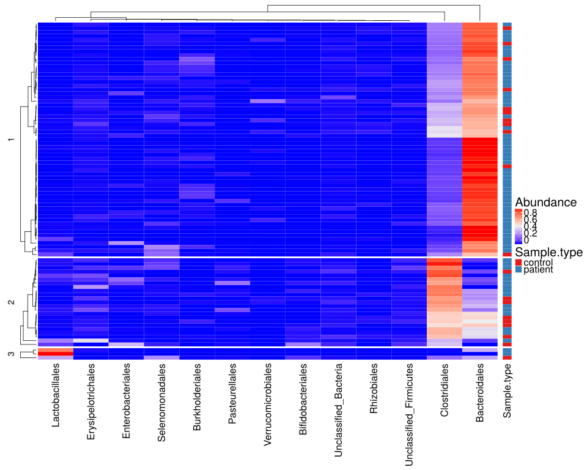

noone@mail.com
Analysis of Dieting study 16S data
% Fri Sep  7 05:46:18 2018

#### \(1.1.1.2\) Taxonomic level: 4 of Subset: All samples, no aggregation, no tests, only plots

##### \(1.1.1.2.1\) Loading counts and metadata

[`Subreport`](./1.1.1.2.1-report.html)

##### \(1.1.1.2.2\) Data analysis

Filtering abundance matrix with arguments [ min_mean                :10, min_quant_incidence_frac:0.25, min_quant_mean_frac     :0.25]. Filtering features

Note that some community richness estimators will not work correctly 
               if provided with abundance-filtered counts

After filtering, left 87 records for 14 features

Wrote counts and metadata for raw counts After final feature filtering to files [`data/1.1.1.2.2.1-3236486bd67samples.raw.16s.l.4.count.tsv`](data/1.1.1.2.2.1-3236486bd67samples.raw.16s.l.4.count.tsv),[`data/1.1.1.2.2.1-3236486bd67samples.raw.16s.l.4.attr.tsv`](data/1.1.1.2.2.1-3236486bd67samples.raw.16s.l.4.attr.tsv)

Wrote counts and metadata for proportions counts After final feature filtering to files [`data/1.1.1.2.2.1-323535fb2dsamples.proportions.16s.l.4.count.tsv`](data/1.1.1.2.2.1-323535fb2dsamples.proportions.16s.l.4.count.tsv),[`data/1.1.1.2.2.1-323535fb2dsamples.proportions.16s.l.4.attr.tsv`](data/1.1.1.2.2.1-323535fb2dsamples.proportions.16s.l.4.attr.tsv)

##### \(1.1.1.2.2.2\) Default transformations for further data analysis

Specific methods can override these and use their own normalization.

Count normalization method for data analysis (unless modified by specific methods) : [ drop.features:List of 1,  ..$ :"other", method.args  :List of 1,  ..$ theta:1, method       :"norm.ihs.prop"]

Wrote counts and metadata for raw counts Normalized after default transformations to files [`data/1.1.1.2.2.2-3236cfe8c46samples.raw.16s.l.4.count.tsv`](data/1.1.1.2.2.2-3236cfe8c46samples.raw.16s.l.4.count.tsv),[`data/1.1.1.2.2.2-3236cfe8c46samples.raw.16s.l.4.attr.tsv`](data/1.1.1.2.2.2-3236cfe8c46samples.raw.16s.l.4.attr.tsv)

Count normalization method for abundance plots : [ drop.features:List of 1,  ..$ :"other", method.args  : list(), method       :"norm.prop"]

##### \(1.1.1.2.3\) Plots of Abundance.

[`Subreport`](./1.1.1.2.3-report.html)

\(1.1.1.2.3\) [`Figure 86.`](#figure.86) Clustered heatmap of normalized abundance values. Number of cluster splits is determined automatically with method `fpc::pamk`.  Image file: [`plots/32322a0970a.svg`](plots/32322a0970a.svg).

\(1.1.1.2.3\)  G-test of independence between automatic cluster splits and attribute 'Sample.type'. Number of cluster splits is determined automatically with method `fpc::pamk`.

| Test statistic | X-squared df | P value |
|:---------------|:-------------|:--------|
| 2.352          | 2            | 0.3085  |

Table: Log likelihood ratio (G-test) test of independence with Williams' correction: `m_a$attr[, main.meta.var]` and `split`

person) (????). _morpheus: Interactive heat maps using 'morpheus.js' and 'htmlwidgets'_. R package version 0.1.1.1, <URL:
https://github.com/cmap/morpheus.R>.

\(1.1.1.2.3\) [`Widget 17.`](#widget.17) Dynamic Morpheus heatmap of normalized abundance values. 
                    It is available here through the link only because it can take a while to render for large datasets.
                    This is very customizable. What you will see initially is just a default starting configuration. Explore its menus. Click to see HTML widget file in full window: [`./1.1.1.2.3-3231dce520fDynamic.Morpheus.hea.html`](./1.1.1.2.3-3231dce520fDynamic.Morpheus.hea.html)

Wrote counts and metadata for raw counts Data used for heatmap with added row cluster splits (clustering by abundance profile) to files [`data/1.1.1.2.3-3231e73e0bsamples.raw.htmap.count.tsv`](data/1.1.1.2.3-3231e73e0bsamples.raw.htmap.count.tsv),[`data/1.1.1.2.3-3231e73e0bsamples.raw.htmap.attr.tsv`](data/1.1.1.2.3-3231e73e0bsamples.raw.htmap.attr.tsv)

##### \(1.1.1.2.4\) Ordinations, 

[`Subreport`](./1.1.1.2.4-report.html)