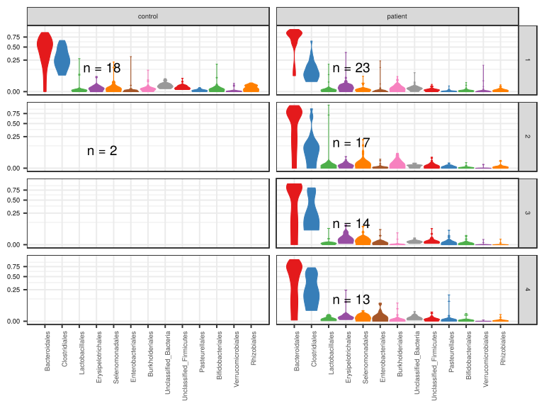
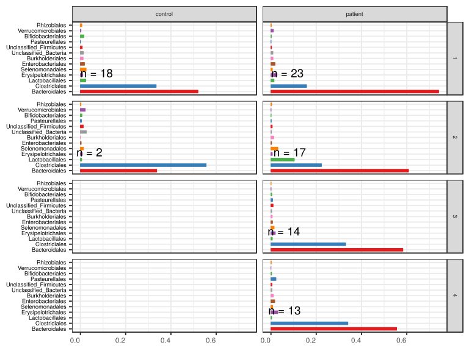
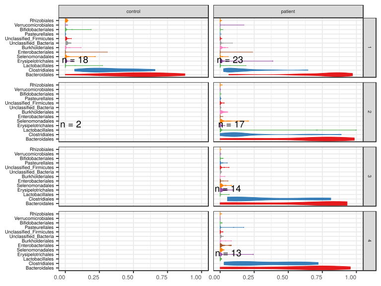
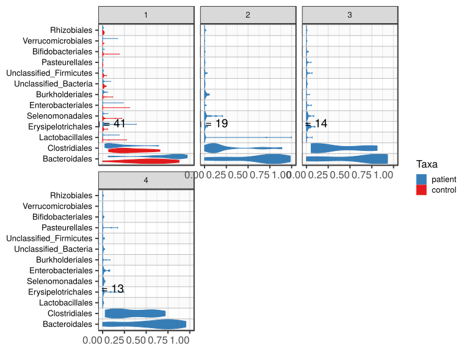
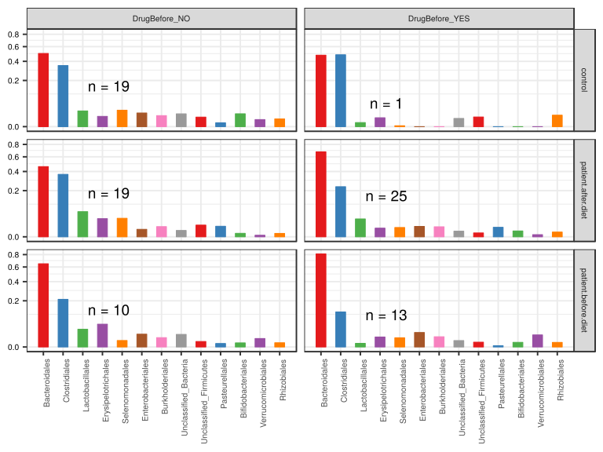
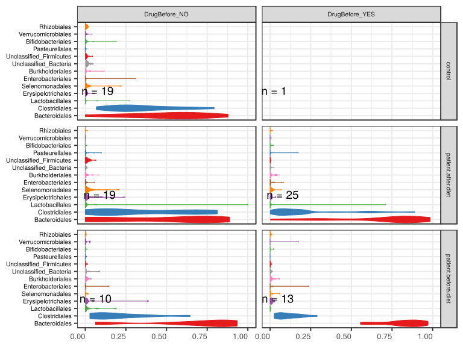

noone@mail.com
Analysis of Dieting study 16S data
% Fri Sep  7 05:46:18 2018

##### \(1.1.1.2.3\) Plots of Abundance.

Plots are shown with relation to various combinations of meta 
                   data variables and in different graphical representations. Lots of plots here.

##### \(1.1.1.2.3.2\) Iterating over all combinations of grouping variables

##### \(1.1.1.2.3.2.1\) Grouping variables Sample.type,visit

##### \(1.1.1.2.3.2.2\) Iterating over Abundance. profile sorting order

##### \(1.1.1.2.3.2.2.1\) Abundance. profile sorting order: average abundance

##### \(1.1.1.2.3.2.2.2\) Iterating over dodged vs faceted bars

The same data are shown in multiple combinations of graphical representations. 
                         This is the same data, but each plot highlights slightly different aspects of it.
                         It is not likely that you will need every plot - pick only what you need.

##### \(1.1.1.2.3.2.2.2.1\) faceted plots. Iterating over orientation and, optionally, scaling

##### \(1.1.1.2.3.2.2.2.1.1\) Abundance. Plot is in original orientation, Y axis SQRT scaled. Iterating over plot geometry

\(1.1.1.2.3.2.2.2.1.1.0\) [`Table 12.`](#table.12) Data table used for plots. Data grouped by Sample.type,visit. Showing only 200 first rows. Full dataset is also saved in a delimited text file (click to download and open e.g. in Excel) [`data/1.1.1.2.3.2.2.2.1.1.0-323805c2f5.1.1.1.2.3.2.2.2.1.1.csv`](data/1.1.1.2.3.2.2.2.1.1.0-323805c2f5.1.1.1.2.3.2.2.2.1.1.csv)

| .record.id | Sample.type | visit | feature         | Abundance  |
|:-----------|:------------|:------|:----------------|:-----------|
| SM1        | patient     | 1     | Bacteroidales   | 7.837e\-01 |
| SM10       | patient     | 3     | Bacteroidales   | 2.396e\-01 |
| SM100      | patient     | 4     | Bacteroidales   | 5.483e\-01 |
| SM11       | patient     | 2     | Bacteroidales   | 9.084e\-01 |
| SM12       | patient     | 1     | Bacteroidales   | 9.279e\-01 |
| SM13       | patient     | 1     | Bacteroidales   | 7.549e\-01 |
| SM14       | patient     | 1     | Bacteroidales   | 6.361e\-02 |
| SM15       | control     | 1     | Bacteroidales   | 4.786e\-01 |
| SM16       | patient     | 4     | Bacteroidales   | 3.910e\-01 |
| SM17       | patient     | 1     | Bacteroidales   | 8.184e\-01 |
| SM18       | patient     | 2     | Bacteroidales   | 7.195e\-01 |
| SM19       | patient     | 2     | Bacteroidales   | 2.254e\-01 |
| SM2        | patient     | 1     | Bacteroidales   | 8.870e\-01 |
| SM20       | control     | 1     | Bacteroidales   | 5.050e\-01 |
| SM21       | patient     | 1     | Bacteroidales   | 5.680e\-01 |
| SM22       | patient     | 1     | Bacteroidales   | 6.107e\-01 |
| SM23       | patient     | 2     | Bacteroidales   | 2.816e\-01 |
| SM24       | patient     | 1     | Bacteroidales   | 8.665e\-01 |
| SM25       | patient     | 4     | Bacteroidales   | 4.540e\-01 |
| SM26       | control     | 1     | Bacteroidales   | 5.338e\-01 |
| SM28       | control     | 1     | Bacteroidales   | 2.662e\-01 |
| SM29       | patient     | 3     | Bacteroidales   | 9.319e\-01 |
| SM3        | patient     | 2     | Bacteroidales   | 3.066e\-01 |
| SM30       | patient     | 4     | Bacteroidales   | 6.906e\-02 |
| SM31       | control     | 2     | Bacteroidales   | 5.821e\-01 |
| SM33       | patient     | 1     | Bacteroidales   | 6.904e\-01 |
| SM35       | control     | 1     | Bacteroidales   | 6.847e\-01 |
| SM36       | patient     | 4     | Bacteroidales   | 3.219e\-04 |
| SM37       | control     | 1     | Bacteroidales   | 4.112e\-01 |
| SM38       | patient     | 2     | Bacteroidales   | 9.845e\-01 |
| SM39       | patient     | 1     | Bacteroidales   | 9.342e\-01 |
| SM40       | patient     | 4     | Bacteroidales   | 7.285e\-01 |
| SM41       | patient     | 1     | Bacteroidales   | 5.559e\-01 |
| SM42       | patient     | 4     | Bacteroidales   | 7.114e\-01 |
| SM43       | patient     | 4     | Bacteroidales   | 7.229e\-01 |
| SM44       | control     | 1     | Bacteroidales   | 3.689e\-01 |
| SM45       | patient     | 2     | Bacteroidales   | 0.000e\+00 |
| SM48       | control     | 1     | Bacteroidales   | 7.186e\-01 |
| SM49       | patient     | 1     | Bacteroidales   | 9.322e\-01 |
| SM5        | patient     | 3     | Bacteroidales   | 8.376e\-01 |
| SM50       | patient     | 3     | Bacteroidales   | 0.000e\+00 |
| SM51       | patient     | 4     | Bacteroidales   | 7.147e\-01 |
| SM52       | patient     | 1     | Bacteroidales   | 9.827e\-02 |
| SM53       | patient     | 2     | Bacteroidales   | 8.029e\-01 |
| SM54       | patient     | 3     | Bacteroidales   | 8.090e\-01 |
| SM55       | control     | 1     | Bacteroidales   | 7.866e\-01 |
| SM56       | patient     | 2     | Bacteroidales   | 7.317e\-01 |
| SM57       | patient     | 1     | Bacteroidales   | 9.046e\-01 |
| SM58       | patient     | 2     | Bacteroidales   | 7.692e\-01 |
| SM59       | patient     | 3     | Bacteroidales   | 5.768e\-02 |
| SM60       | patient     | 3     | Bacteroidales   | 8.475e\-01 |
| SM62       | patient     | 1     | Bacteroidales   | 9.715e\-01 |
| SM63       | control     | 1     | Bacteroidales   | 6.518e\-01 |
| SM64       | patient     | 2     | Bacteroidales   | 8.683e\-01 |
| SM65       | patient     | 3     | Bacteroidales   | 3.741e\-01 |
| SM66       | control     | 1     | Bacteroidales   | 6.462e\-01 |
| SM67       | patient     | 4     | Bacteroidales   | 9.138e\-01 |
| SM68       | patient     | 4     | Bacteroidales   | 1.705e\-01 |
| SM69       | patient     | 4     | Bacteroidales   | 8.374e\-01 |
| SM7        | control     | 1     | Bacteroidales   | 2.192e\-01 |
| SM70       | control     | 1     | Bacteroidales   | 5.637e\-01 |
| SM71       | patient     | 3     | Bacteroidales   | 9.175e\-01 |
| SM72       | control     | 1     | Bacteroidales   | 2.778e\-01 |
| SM73       | patient     | 1     | Bacteroidales   | 8.563e\-01 |
| SM74       | control     | 2     | Bacteroidales   | 9.231e\-02 |
| SM75       | patient     | 3     | Bacteroidales   | 2.377e\-03 |
| SM76       | control     | 1     | Bacteroidales   | 8.224e\-01 |
| SM77       | patient     | 2     | Bacteroidales   | 7.635e\-01 |
| SM79       | patient     | 2     | Bacteroidales   | 8.495e\-01 |
| SM8        | patient     | 1     | Bacteroidales   | 8.250e\-01 |
| SM81       | control     | 1     | Bacteroidales   | 0.000e\+00 |
| SM82       | patient     | 4     | Bacteroidales   | 9.555e\-01 |
| SM83       | patient     | 1     | Bacteroidales   | 8.254e\-01 |
| SM84       | patient     | 1     | Bacteroidales   | 8.858e\-01 |
| SM86       | patient     | 2     | Bacteroidales   | 2.792e\-03 |
| SM87       | patient     | 1     | Bacteroidales   | 8.668e\-01 |
| SM88       | patient     | 2     | Bacteroidales   | 8.385e\-01 |
| SM89       | control     | 1     | Bacteroidales   | 8.778e\-01 |
| SM9        | patient     | 2     | Bacteroidales   | 6.635e\-01 |
| SM90       | patient     | 2     | Bacteroidales   | 6.176e\-01 |
| SM91       | patient     | 3     | Bacteroidales   | 7.223e\-01 |
| SM92       | patient     | 3     | Bacteroidales   | 8.864e\-01 |
| SM93       | patient     | 1     | Bacteroidales   | 7.781e\-01 |
| SM95       | control     | 1     | Bacteroidales   | 5.366e\-01 |
| SM96       | patient     | 1     | Bacteroidales   | 6.376e\-01 |
| SM98       | patient     | 3     | Bacteroidales   | 8.378e\-01 |
| SM99       | patient     | 3     | Bacteroidales   | 6.951e\-01 |
| SM1        | patient     | 1     | Clostridiales   | 1.709e\-01 |
| SM10       | patient     | 3     | Clostridiales   | 7.097e\-01 |
| SM100      | patient     | 4     | Clostridiales   | 4.044e\-01 |
| SM11       | patient     | 2     | Clostridiales   | 6.923e\-02 |
| SM12       | patient     | 1     | Clostridiales   | 6.299e\-02 |
| SM13       | patient     | 1     | Clostridiales   | 1.670e\-01 |
| SM14       | patient     | 1     | Clostridiales   | 3.018e\-01 |
| SM15       | control     | 1     | Clostridiales   | 4.844e\-01 |
| SM16       | patient     | 4     | Clostridiales   | 5.717e\-01 |
| SM17       | patient     | 1     | Clostridiales   | 1.038e\-01 |
| SM18       | patient     | 2     | Clostridiales   | 9.552e\-02 |
| SM19       | patient     | 2     | Clostridiales   | 7.154e\-01 |
| SM2        | patient     | 1     | Clostridiales   | 2.821e\-02 |
| SM20       | control     | 1     | Clostridiales   | 4.550e\-01 |
| SM21       | patient     | 1     | Clostridiales   | 3.925e\-01 |
| SM22       | patient     | 1     | Clostridiales   | 2.891e\-01 |
| SM23       | patient     | 2     | Clostridiales   | 1.659e\-03 |
| SM24       | patient     | 1     | Clostridiales   | 8.129e\-02 |
| SM25       | patient     | 4     | Clostridiales   | 5.006e\-01 |
| SM26       | control     | 1     | Clostridiales   | 2.131e\-01 |
| SM28       | control     | 1     | Clostridiales   | 6.583e\-01 |
| SM29       | patient     | 3     | Clostridiales   | 5.931e\-02 |
| SM3        | patient     | 2     | Clostridiales   | 6.225e\-01 |
| SM30       | patient     | 4     | Clostridiales   | 6.076e\-01 |
| SM31       | control     | 2     | Clostridiales   | 3.188e\-01 |
| SM33       | patient     | 1     | Clostridiales   | 4.996e\-02 |
| SM35       | control     | 1     | Clostridiales   | 1.664e\-01 |
| SM36       | patient     | 4     | Clostridiales   | 7.193e\-01 |
| SM37       | control     | 1     | Clostridiales   | 4.996e\-01 |
| SM38       | patient     | 2     | Clostridiales   | 1.115e\-02 |
| SM39       | patient     | 1     | Clostridiales   | 4.334e\-02 |
| SM40       | patient     | 4     | Clostridiales   | 1.535e\-01 |
| SM41       | patient     | 1     | Clostridiales   | 1.723e\-01 |
| SM42       | patient     | 4     | Clostridiales   | 2.559e\-01 |
| SM43       | patient     | 4     | Clostridiales   | 1.955e\-01 |
| SM44       | control     | 1     | Clostridiales   | 5.344e\-01 |
| SM45       | patient     | 2     | Clostridiales   | 0.000e\+00 |
| SM48       | control     | 1     | Clostridiales   | 2.252e\-01 |
| SM49       | patient     | 1     | Clostridiales   | 5.216e\-02 |
| SM5        | patient     | 3     | Clostridiales   | 9.120e\-02 |
| SM50       | patient     | 3     | Clostridiales   | 7.065e\-01 |
| SM51       | patient     | 4     | Clostridiales   | 1.970e\-01 |
| SM52       | patient     | 1     | Clostridiales   | 6.445e\-01 |
| SM53       | patient     | 2     | Clostridiales   | 1.491e\-01 |
| SM54       | patient     | 3     | Clostridiales   | 1.726e\-01 |
| SM55       | control     | 1     | Clostridiales   | 1.877e\-01 |
| SM56       | patient     | 2     | Clostridiales   | 2.125e\-01 |
| SM57       | patient     | 1     | Clostridiales   | 8.819e\-02 |
| SM58       | patient     | 2     | Clostridiales   | 1.200e\-01 |
| SM59       | patient     | 3     | Clostridiales   | 7.978e\-01 |
| SM60       | patient     | 3     | Clostridiales   | 6.399e\-02 |
| SM62       | patient     | 1     | Clostridiales   | 2.529e\-02 |
| SM63       | control     | 1     | Clostridiales   | 2.766e\-01 |
| SM64       | patient     | 2     | Clostridiales   | 7.026e\-02 |
| SM65       | patient     | 3     | Clostridiales   | 5.640e\-01 |
| SM66       | control     | 1     | Clostridiales   | 3.152e\-01 |
| SM67       | patient     | 4     | Clostridiales   | 7.164e\-02 |
| SM68       | patient     | 4     | Clostridiales   | 5.874e\-01 |
| SM69       | patient     | 4     | Clostridiales   | 1.229e\-01 |
| SM7        | control     | 1     | Clostridiales   | 6.268e\-01 |
| SM70       | control     | 1     | Clostridiales   | 3.025e\-01 |
| SM71       | patient     | 3     | Clostridiales   | 5.366e\-02 |
| SM72       | control     | 1     | Clostridiales   | 1.571e\-01 |
| SM73       | patient     | 1     | Clostridiales   | 9.994e\-02 |
| SM74       | control     | 2     | Clostridiales   | 7.925e\-01 |
| SM75       | patient     | 3     | Clostridiales   | 8.122e\-01 |
| SM76       | control     | 1     | Clostridiales   | 1.502e\-01 |
| SM77       | patient     | 2     | Clostridiales   | 1.921e\-01 |
| SM79       | patient     | 2     | Clostridiales   | 1.412e\-01 |
| SM8        | patient     | 1     | Clostridiales   | 1.294e\-01 |
| SM81       | control     | 1     | Clostridiales   | 3.292e\-01 |
| SM82       | patient     | 4     | Clostridiales   | 2.914e\-02 |
| SM83       | patient     | 1     | Clostridiales   | 1.565e\-01 |
| SM84       | patient     | 1     | Clostridiales   | 5.785e\-02 |
| SM86       | patient     | 2     | Clostridiales   | 8.889e\-01 |
| SM87       | patient     | 1     | Clostridiales   | 7.040e\-02 |
| SM88       | patient     | 2     | Clostridiales   | 1.247e\-01 |
| SM89       | control     | 1     | Clostridiales   | 6.822e\-02 |
| SM9        | patient     | 2     | Clostridiales   | 7.939e\-02 |
| SM90       | patient     | 2     | Clostridiales   | 2.991e\-01 |
| SM91       | patient     | 3     | Clostridiales   | 2.006e\-01 |
| SM92       | patient     | 3     | Clostridiales   | 8.090e\-02 |
| SM93       | patient     | 1     | Clostridiales   | 1.938e\-01 |
| SM95       | control     | 1     | Clostridiales   | 3.756e\-01 |
| SM96       | patient     | 1     | Clostridiales   | 2.363e\-01 |
| SM98       | patient     | 3     | Clostridiales   | 5.983e\-02 |
| SM99       | patient     | 3     | Clostridiales   | 2.487e\-01 |
| SM1        | patient     | 1     | Lactobacillales | 4.329e\-04 |
| SM10       | patient     | 3     | Lactobacillales | 4.240e\-04 |
| SM100      | patient     | 4     | Lactobacillales | 3.077e\-04 |
| SM11       | patient     | 2     | Lactobacillales | 6.567e\-04 |
| SM12       | patient     | 1     | Lactobacillales | 8.853e\-05 |
| SM13       | patient     | 1     | Lactobacillales | 0.000e\+00 |
| SM14       | patient     | 1     | Lactobacillales | 1.905e\-01 |
| SM15       | control     | 1     | Lactobacillales | 1.557e\-03 |
| SM16       | patient     | 4     | Lactobacillales | 4.875e\-03 |
| SM17       | patient     | 1     | Lactobacillales | 1.241e\-03 |
| SM18       | patient     | 2     | Lactobacillales | 1.242e\-02 |
| SM19       | patient     | 2     | Lactobacillales | 1.388e\-03 |
| SM2        | patient     | 1     | Lactobacillales | 7.278e\-02 |
| SM20       | control     | 1     | Lactobacillales | 2.955e\-03 |
| SM21       | patient     | 1     | Lactobacillales | 2.690e\-03 |
| SM22       | patient     | 1     | Lactobacillales | 3.071e\-03 |
| SM23       | patient     | 2     | Lactobacillales | 7.105e\-01 |
| SM24       | patient     | 1     | Lactobacillales | 6.431e\-04 |
| SM25       | patient     | 4     | Lactobacillales | 7.765e\-03 |
| SM26       | control     | 1     | Lactobacillales | 7.612e\-02 |
| SM28       | control     | 1     | Lactobacillales | 0.000e\+00 |
| SM29       | patient     | 3     | Lactobacillales | 0.000e\+00 |
| SM3        | patient     | 2     | Lactobacillales | 8.146e\-03 |
| SM30       | patient     | 4     | Lactobacillales | 7.637e\-03 |
| SM31       | control     | 2     | Lactobacillales | 3.236e\-03 |
| SM33       | patient     | 1     | Lactobacillales | 7.868e\-04 |

\(1.1.1.2.3.2.2.2.1.1.1\) [`Widget 11.`](#widget.11) Dynamic Pivot Table link (drag and drop field names and pick averaging 
                      functions or plot types; click on fields or legend elements to filter values). 
                      Starting rendering is Stacked Bar Chart. Data grouped by Sample.type,visit. Click to see HTML widget file in full window: [`./1.1.1.2.3.2.2.2.1.1.1-32346f2bd5cDynamic.Pivot.Table.html`](./1.1.1.2.3.2.2.2.1.1.1-32346f2bd5cDynamic.Pivot.Table.html)

\(1.1.1.2.3.2.2.2.1.1.1\) [`Widget 12.`](#widget.12) Dynamic Pivot Table link (drag and drop field names and pick averaging 
                      functions or plot types; click on fields or legend elements to filter values). 
                      Starting rendering is Table Barchart. Data grouped by Sample.type,visit. Click to see HTML widget file in full window: [`./1.1.1.2.3.2.2.2.1.1.1-3233e785abeDynamic.Pivot.Table.html`](./1.1.1.2.3.2.2.2.1.1.1-3233e785abeDynamic.Pivot.Table.html)

\(1.1.1.2.3.2.2.2.1.1.1\) [`Table 13.`](#table.13) Summary table. Data grouped by Sample.type,visit. Full dataset is also saved in a delimited text file (click to download and open e.g. in Excel) [`data/1.1.1.2.3.2.2.2.1.1.1-32342cf715c.1.1.1.2.3.2.2.2.1.1.csv`](data/1.1.1.2.3.2.2.2.1.1.1-32342cf715c.1.1.1.2.3.2.2.2.1.1.csv)

| feature                  | Sample.type | visit | mean       | sd        | median     | incidence |
|:-------------------------|:------------|:------|:-----------|:----------|:-----------|:----------|
| Bacteroidales            | control     | 1     | 5.194e\-01 | 0.2317911 | 5.352e\-01 | 0.94444   |
| Bacteroidales            | control     | 2     | 3.372e\-01 | 0.3463494 | 3.372e\-01 | 1.00000   |
| Bacteroidales            | patient     | 1     | 7.410e\-01 | 0.2398655 | 8.250e\-01 | 1.00000   |
| Bacteroidales            | patient     | 2     | 6.078e\-01 | 0.3172098 | 7.317e\-01 | 0.94118   |
| Bacteroidales            | patient     | 3     | 5.828e\-01 | 0.3640601 | 7.656e\-01 | 0.92857   |
| Bacteroidales            | patient     | 4     | 5.552e\-01 | 0.3170185 | 7.114e\-01 | 1.00000   |
| Clostridiales            | control     | 1     | 3.347e\-01 | 0.1738358 | 3.088e\-01 | 1.00000   |
| Clostridiales            | control     | 2     | 5.556e\-01 | 0.3349573 | 5.556e\-01 | 1.00000   |
| Clostridiales            | patient     | 1     | 1.573e\-01 | 0.1434097 | 1.038e\-01 | 1.00000   |
| Clostridiales            | patient     | 2     | 2.231e\-01 | 0.2636541 | 1.247e\-01 | 0.94118   |
| Clostridiales            | patient     | 3     | 3.301e\-01 | 0.3104167 | 1.866e\-01 | 1.00000   |
| Clostridiales            | patient     | 4     | 3.397e\-01 | 0.2343851 | 2.559e\-01 | 1.00000   |
| Lactobacillales          | control     | 1     | 2.388e\-02 | 0.0664402 | 8.704e\-04 | 0.88889   |
| Lactobacillales          | control     | 2     | 5.546e\-03 | 0.0032666 | 5.546e\-03 | 1.00000   |
| Lactobacillales          | patient     | 1     | 1.344e\-02 | 0.0415706 | 7.868e\-04 | 0.86957   |
| Lactobacillales          | patient     | 2     | 1.031e\-01 | 0.2876828 | 1.388e\-03 | 0.94118   |
| Lactobacillales          | patient     | 3     | 5.952e\-03 | 0.0175909 | 7.366e\-04 | 0.78571   |
| Lactobacillales          | patient     | 4     | 2.825e\-03 | 0.0038509 | 4.625e\-04 | 1.00000   |
| Erysipelotrichales       | control     | 1     | 9.927e\-03 | 0.0166163 | 4.025e\-03 | 0.88889   |
| Erysipelotrichales       | control     | 2     | 8.243e\-03 | 0.0037885 | 8.243e\-03 | 1.00000   |
| Erysipelotrichales       | patient     | 1     | 2.643e\-02 | 0.0794431 | 8.445e\-03 | 0.91304   |
| Erysipelotrichales       | patient     | 2     | 5.831e\-03 | 0.0085525 | 2.776e\-03 | 0.88235   |
| Erysipelotrichales       | patient     | 3     | 1.902e\-02 | 0.0273994 | 6.057e\-03 | 1.00000   |
| Erysipelotrichales       | patient     | 4     | 3.024e\-02 | 0.0688782 | 4.538e\-03 | 1.00000   |
| Selenomonadales          | control     | 1     | 2.523e\-02 | 0.0595107 | 2.399e\-03 | 0.94444   |
| Selenomonadales          | control     | 2     | 1.364e\-02 | 0.0178986 | 1.364e\-02 | 1.00000   |
| Selenomonadales          | patient     | 1     | 6.142e\-03 | 0.0130034 | 1.513e\-03 | 0.91304   |
| Selenomonadales          | patient     | 2     | 3.053e\-02 | 0.0575852 | 4.619e\-03 | 0.76471   |
| Selenomonadales          | patient     | 3     | 1.399e\-02 | 0.0230823 | 5.640e\-03 | 0.78571   |
| Selenomonadales          | patient     | 4     | 7.487e\-03 | 0.0083573 | 5.871e\-03 | 0.92308   |
| Enterobacteriales        | control     | 1     | 1.802e\-02 | 0.0724385 | 3.219e\-04 | 0.61111   |
| Enterobacteriales        | control     | 2     | 3.389e\-03 | 0.0030767 | 3.389e\-03 | 1.00000   |
| Enterobacteriales        | patient     | 1     | 1.775e\-02 | 0.0568164 | 0.000e\+00 | 0.47826   |
| Enterobacteriales        | patient     | 2     | 2.574e\-03 | 0.0057255 | 2.227e\-04 | 0.64706   |
| Enterobacteriales        | patient     | 3     | 6.689e\-03 | 0.0156508 | 7.915e\-04 | 0.71429   |
| Enterobacteriales        | patient     | 4     | 1.651e\-02 | 0.0281531 | 1.743e\-03 | 0.69231   |
| Burkholderiales          | control     | 1     | 1.205e\-02 | 0.0275947 | 2.167e\-03 | 0.83333   |
| Burkholderiales          | control     | 2     | 0.000e\+00 | 0.0000000 | 0.000e\+00 | 0.00000   |
| Burkholderiales          | patient     | 1     | 9.077e\-03 | 0.0145733 | 1.809e\-03 | 0.78261   |
| Burkholderiales          | patient     | 2     | 1.203e\-02 | 0.0173458 | 0.000e\+00 | 0.47059   |
| Burkholderiales          | patient     | 3     | 5.595e\-03 | 0.0126940 | 0.000e\+00 | 0.28571   |
| Burkholderiales          | patient     | 4     | 1.047e\-02 | 0.0243840 | 0.000e\+00 | 0.46154   |
| Unclassified\_Bacteria   | control     | 1     | 1.364e\-02 | 0.0114079 | 1.054e\-02 | 1.00000   |
| Unclassified\_Bacteria   | control     | 2     | 2.617e\-02 | 0.0324305 | 2.617e\-02 | 1.00000   |
| Unclassified\_Bacteria   | patient     | 1     | 8.586e\-03 | 0.0185047 | 3.658e\-03 | 0.95652   |
| Unclassified\_Bacteria   | patient     | 2     | 2.162e\-03 | 0.0019168 | 1.958e\-03 | 0.88235   |
| Unclassified\_Bacteria   | patient     | 3     | 3.391e\-03 | 0.0031220 | 2.417e\-03 | 1.00000   |
| Unclassified\_Bacteria   | patient     | 4     | 4.709e\-03 | 0.0065490 | 1.415e\-03 | 1.00000   |
| Unclassified\_Firmicutes | control     | 1     | 8.036e\-03 | 0.0109414 | 3.210e\-03 | 1.00000   |
| Unclassified\_Firmicutes | control     | 2     | 1.259e\-02 | 0.0057974 | 1.259e\-02 | 1.00000   |
| Unclassified\_Firmicutes | patient     | 1     | 2.429e\-03 | 0.0033961 | 8.410e\-04 | 0.86957   |
| Unclassified\_Firmicutes | patient     | 2     | 5.485e\-03 | 0.0092386 | 7.794e\-04 | 0.76471   |
| Unclassified\_Firmicutes | patient     | 3     | 9.325e\-03 | 0.0180189 | 1.689e\-03 | 1.00000   |
| Unclassified\_Firmicutes | patient     | 4     | 4.155e\-03 | 0.0066088 | 9.688e\-04 | 0.92308   |
| Pasteurellales           | control     | 1     | 9.234e\-04 | 0.0012789 | 4.058e\-04 | 0.66667   |
| Pasteurellales           | control     | 2     | 4.910e\-03 | 0.0069438 | 4.910e\-03 | 0.50000   |
| Pasteurellales           | patient     | 1     | 5.592e\-04 | 0.0017216 | 0.000e\+00 | 0.34783   |
| Pasteurellales           | patient     | 2     | 1.346e\-03 | 0.0020465 | 1.920e\-04 | 0.64706   |
| Pasteurellales           | patient     | 3     | 7.072e\-03 | 0.0144512 | 5.086e\-04 | 0.50000   |
| Pasteurellales           | patient     | 4     | 2.197e\-02 | 0.0531504 | 2.236e\-04 | 0.76923   |
| Bifidobacteriales        | control     | 1     | 1.565e\-02 | 0.0449947 | 1.592e\-03 | 0.77778   |
| Bifidobacteriales        | control     | 2     | 6.749e\-03 | 0.0089723 | 6.749e\-03 | 1.00000   |
| Bifidobacteriales        | patient     | 1     | 1.791e\-03 | 0.0046990 | 3.015e\-04 | 0.65217   |
| Bifidobacteriales        | patient     | 2     | 7.266e\-04 | 0.0018724 | 7.192e\-05 | 0.58824   |
| Bifidobacteriales        | patient     | 3     | 3.665e\-03 | 0.0070439 | 1.831e\-04 | 0.57143   |
| Bifidobacteriales        | patient     | 4     | 2.813e\-03 | 0.0050442 | 2.231e\-04 | 0.61538   |
| Verrucomicrobiales       | control     | 1     | 2.550e\-03 | 0.0051198 | 0.000e\+00 | 0.38889   |
| Verrucomicrobiales       | control     | 2     | 2.136e\-02 | 0.0292859 | 2.136e\-02 | 1.00000   |
| Verrucomicrobiales       | patient     | 1     | 1.056e\-02 | 0.0368541 | 0.000e\+00 | 0.34783   |
| Verrucomicrobiales       | patient     | 2     | 3.903e\-04 | 0.0011122 | 0.000e\+00 | 0.11765   |
| Verrucomicrobiales       | patient     | 3     | 5.727e\-04 | 0.0018438 | 0.000e\+00 | 0.14286   |
| Verrucomicrobiales       | patient     | 4     | 2.846e\-05 | 0.0001026 | 0.000e\+00 | 0.07692   |
| Rhizobiales              | control     | 1     | 6.352e\-03 | 0.0060510 | 7.039e\-03 | 0.88889   |
| Rhizobiales              | control     | 2     | 2.455e\-03 | 0.0034719 | 2.455e\-03 | 0.50000   |
| Rhizobiales              | patient     | 1     | 1.805e\-03 | 0.0030577 | 3.015e\-04 | 0.56522   |
| Rhizobiales              | patient     | 2     | 2.749e\-03 | 0.0052004 | 3.863e\-04 | 0.64706   |
| Rhizobiales              | patient     | 3     | 6.442e\-04 | 0.0020172 | 0.000e\+00 | 0.21429   |
| Rhizobiales              | patient     | 4     | 1.296e\-03 | 0.0031555 | 0.000e\+00 | 0.46154   |

\(1.1.1.2.3.2.2.2.1.1.1\) [`Figure 47.`](#figure.47) Abundance. Data grouped by Sample.type,visit.  bar_stacked plot.  Image file: [`plots/323ed436fb.svg`](plots/323ed436fb.svg).

\(1.1.1.2.3.2.2.2.1.1.1\) [`Figure 48.`](#figure.48) Abundance. Data grouped by Sample.type,visit.  bar (sample mean) plot.  Image file: [`plots/32344305c44.svg`](plots/32344305c44.svg).

\(1.1.1.2.3.2.2.2.1.1.1\) [`Figure 49.`](#figure.49) Abundance. Data grouped by Sample.type,visit.  violin plot.  Image file: [`plots/323189339b7.svg`](plots/323189339b7.svg).

\(1.1.1.2.3.2.2.2.1.1.1\) [`Figure 50.`](#figure.50) Abundance. Data grouped by Sample.type,visit.  boxplot plot.  Image file: [`plots/323600dc92b.svg`](plots/323600dc92b.svg).

##### \(1.1.1.2.3.2.2.2.1.2\) Abundance. Plot is in flipped orientation, Y axis not scaled. Iterating over plot geometry

\(1.1.1.2.3.2.2.2.1.2.1\) [`Figure 51.`](#figure.51) Abundance. Data grouped by Sample.type,visit.  bar (sample mean) plot.  Image file: [`plots/3234e5c84db.svg`](plots/3234e5c84db.svg).

\(1.1.1.2.3.2.2.2.1.2.1\) [`Figure 52.`](#figure.52) Abundance. Data grouped by Sample.type,visit.  violin plot.  Image file: [`plots/323378ca42a.svg`](plots/323378ca42a.svg).

\(1.1.1.2.3.2.2.2.1.2.1\) [`Figure 53.`](#figure.53) Abundance. Data grouped by Sample.type,visit.  boxplot plot.  Image file: [`plots/32330c8c729.svg`](plots/32330c8c729.svg).

##### \(1.1.1.2.3.2.2.2.2\) dodged plots. Iterating over orientation and, optionally, scaling

##### \(1.1.1.2.3.2.2.2.2.1\) Abundance. Plot is in original orientation, Y axis SQRT scaled. Iterating over plot geometry

\(1.1.1.2.3.2.2.2.2.1.1\) [`Figure 54.`](#figure.54) Abundance. Data grouped by Sample.type,visit.  bar (sample mean) plot.  Image file: [`plots/3232e4ea6ad.svg`](plots/3232e4ea6ad.svg).

\(1.1.1.2.3.2.2.2.2.1.1\) [`Figure 55.`](#figure.55) Abundance. Data grouped by Sample.type,visit.  violin plot.  Image file: [`plots/3237aff9273.svg`](plots/3237aff9273.svg).

\(1.1.1.2.3.2.2.2.2.1.1\) [`Figure 56.`](#figure.56) Abundance. Data grouped by Sample.type,visit.  boxplot plot.  Image file: [`plots/323338193e9.svg`](plots/323338193e9.svg).

##### \(1.1.1.2.3.2.2.2.2.2\) Abundance. Plot is in flipped orientation, Y axis not scaled. Iterating over plot geometry

\(1.1.1.2.3.2.2.2.2.2.1\) [`Figure 57.`](#figure.57) Abundance. Data grouped by Sample.type,visit.  bar (sample mean) plot.  Image file: [`plots/3233b50a2b3.svg`](plots/3233b50a2b3.svg).

\(1.1.1.2.3.2.2.2.2.2.1\) [`Figure 58.`](#figure.58) Abundance. Data grouped by Sample.type,visit.  violin plot.  Image file: [`plots/323529ed0a.svg`](plots/323529ed0a.svg).

\(1.1.1.2.3.2.2.2.2.2.1\) [`Figure 59.`](#figure.59) Abundance. Data grouped by Sample.type,visit.  boxplot plot.  Image file: [`plots/3232620d6c.svg`](plots/3232620d6c.svg).

##### \(1.1.1.2.3.2.3\) Grouping variables Sample.type.Drug.Before,visit

##### \(1.1.1.2.3.2.4\) Iterating over Abundance. profile sorting order

##### \(1.1.1.2.3.2.4.1\) Abundance. profile sorting order: average abundance

##### \(1.1.1.2.3.2.4.2\) Iterating over dodged vs faceted bars

The same data are shown in multiple combinations of graphical representations. 
                         This is the same data, but each plot highlights slightly different aspects of it.
                         It is not likely that you will need every plot - pick only what you need.

##### \(1.1.1.2.3.2.4.2.1\) faceted plots. Iterating over orientation and, optionally, scaling

##### \(1.1.1.2.3.2.4.2.1.1\) Abundance. Plot is in original orientation, Y axis SQRT scaled. Iterating over plot geometry

\(1.1.1.2.3.2.4.2.1.1.0\) [`Table 14.`](#table.14) Data table used for plots. Data grouped by Sample.type.Drug.Before,visit. Showing only 200 first rows. Full dataset is also saved in a delimited text file (click to download and open e.g. in Excel) [`data/1.1.1.2.3.2.4.2.1.1.0-3236b4f1a01.1.1.1.2.3.2.4.2.1.1.csv`](data/1.1.1.2.3.2.4.2.1.1.0-3236b4f1a01.1.1.1.2.3.2.4.2.1.1.csv)

| .record.id | Sample.type.Drug.Before | visit | feature         | Abundance  |
|:-----------|:------------------------|:------|:----------------|:-----------|
| SM1        | patient TRUE .          | 1     | Bacteroidales   | 7.837e\-01 |
| SM10       | patient TRUE .          | 3     | Bacteroidales   | 2.396e\-01 |
| SM100      | patient TRUE .          | 4     | Bacteroidales   | 5.483e\-01 |
| SM11       | patient TRUE .          | 2     | Bacteroidales   | 9.084e\-01 |
| SM12       | patient TRUE .          | 1     | Bacteroidales   | 9.279e\-01 |
| SM13       | patient FALSE .         | 1     | Bacteroidales   | 7.549e\-01 |
| SM14       | patient FALSE .         | 1     | Bacteroidales   | 6.361e\-02 |
| SM15       | 1                       | 1     | Bacteroidales   | 4.786e\-01 |
| SM16       | patient FALSE .         | 4     | Bacteroidales   | 3.910e\-01 |
| SM17       | patient TRUE .          | 1     | Bacteroidales   | 8.184e\-01 |
| SM18       | patient FALSE .         | 2     | Bacteroidales   | 7.195e\-01 |
| SM19       | patient FALSE .         | 2     | Bacteroidales   | 2.254e\-01 |
| SM2        | patient FALSE .         | 1     | Bacteroidales   | 8.870e\-01 |
| SM20       | 1                       | 1     | Bacteroidales   | 5.050e\-01 |
| SM21       | patient FALSE .         | 1     | Bacteroidales   | 5.680e\-01 |
| SM22       | patient TRUE .          | 1     | Bacteroidales   | 6.107e\-01 |
| SM23       | patient TRUE .          | 2     | Bacteroidales   | 2.816e\-01 |
| SM24       | patient FALSE .         | 1     | Bacteroidales   | 8.665e\-01 |
| SM25       | patient FALSE .         | 4     | Bacteroidales   | 4.540e\-01 |
| SM26       | 1                       | 1     | Bacteroidales   | 5.338e\-01 |
| SM28       | 1                       | 1     | Bacteroidales   | 2.662e\-01 |
| SM29       | patient TRUE .          | 3     | Bacteroidales   | 9.319e\-01 |
| SM3        | patient TRUE .          | 2     | Bacteroidales   | 3.066e\-01 |
| SM30       | patient TRUE .          | 4     | Bacteroidales   | 6.906e\-02 |
| SM31       | 1                       | 2     | Bacteroidales   | 5.821e\-01 |
| SM33       | patient TRUE .          | 1     | Bacteroidales   | 6.904e\-01 |
| SM35       | 1                       | 1     | Bacteroidales   | 6.847e\-01 |
| SM36       | patient FALSE .         | 4     | Bacteroidales   | 3.219e\-04 |
| SM37       | 1                       | 1     | Bacteroidales   | 4.112e\-01 |
| SM38       | patient TRUE .          | 2     | Bacteroidales   | 9.845e\-01 |
| SM39       | patient FALSE .         | 1     | Bacteroidales   | 9.342e\-01 |
| SM40       | patient FALSE .         | 4     | Bacteroidales   | 7.285e\-01 |
| SM41       | patient TRUE .          | 1     | Bacteroidales   | 5.559e\-01 |
| SM42       | patient FALSE .         | 4     | Bacteroidales   | 7.114e\-01 |
| SM43       | patient TRUE .          | 4     | Bacteroidales   | 7.229e\-01 |
| SM44       | 1                       | 1     | Bacteroidales   | 3.689e\-01 |
| SM45       | patient FALSE .         | 2     | Bacteroidales   | 0.000e\+00 |
| SM48       | 1                       | 1     | Bacteroidales   | 7.186e\-01 |
| SM49       | patient TRUE .          | 1     | Bacteroidales   | 9.322e\-01 |
| SM5        | patient TRUE .          | 3     | Bacteroidales   | 8.376e\-01 |
| SM50       | patient FALSE .         | 3     | Bacteroidales   | 0.000e\+00 |
| SM51       | patient TRUE .          | 4     | Bacteroidales   | 7.147e\-01 |
| SM52       | patient FALSE .         | 1     | Bacteroidales   | 9.827e\-02 |
| SM53       | patient TRUE .          | 2     | Bacteroidales   | 8.029e\-01 |
| SM54       | patient TRUE .          | 3     | Bacteroidales   | 8.090e\-01 |
| SM55       | 1                       | 1     | Bacteroidales   | 7.866e\-01 |
| SM56       | patient TRUE .          | 2     | Bacteroidales   | 7.317e\-01 |
| SM57       | patient TRUE .          | 1     | Bacteroidales   | 9.046e\-01 |
| SM58       | patient FALSE .         | 2     | Bacteroidales   | 7.692e\-01 |
| SM59       | patient FALSE .         | 3     | Bacteroidales   | 5.768e\-02 |
| SM60       | patient TRUE .          | 3     | Bacteroidales   | 8.475e\-01 |
| SM62       | patient TRUE .          | 1     | Bacteroidales   | 9.715e\-01 |
| SM63       | 1                       | 1     | Bacteroidales   | 6.518e\-01 |
| SM64       | patient TRUE .          | 2     | Bacteroidales   | 8.683e\-01 |
| SM65       | patient TRUE .          | 3     | Bacteroidales   | 3.741e\-01 |
| SM66       | 1                       | 1     | Bacteroidales   | 6.462e\-01 |
| SM67       | patient TRUE .          | 4     | Bacteroidales   | 9.138e\-01 |
| SM68       | patient FALSE .         | 4     | Bacteroidales   | 1.705e\-01 |
| SM69       | patient TRUE .          | 4     | Bacteroidales   | 8.374e\-01 |
| SM7        | 1                       | 1     | Bacteroidales   | 2.192e\-01 |
| SM70       | 1                       | 1     | Bacteroidales   | 5.637e\-01 |
| SM71       | patient TRUE .          | 3     | Bacteroidales   | 9.175e\-01 |
| SM72       | 1                       | 1     | Bacteroidales   | 2.778e\-01 |
| SM73       | patient FALSE .         | 1     | Bacteroidales   | 8.563e\-01 |
| SM74       | 1                       | 2     | Bacteroidales   | 9.231e\-02 |
| SM75       | patient FALSE .         | 3     | Bacteroidales   | 2.377e\-03 |
| SM76       | 1                       | 1     | Bacteroidales   | 8.224e\-01 |
| SM77       | patient TRUE .          | 2     | Bacteroidales   | 7.635e\-01 |
| SM79       | patient FALSE .         | 2     | Bacteroidales   | 8.495e\-01 |
| SM8        | patient FALSE .         | 1     | Bacteroidales   | 8.250e\-01 |
| SM81       | 1                       | 1     | Bacteroidales   | 0.000e\+00 |
| SM82       | patient TRUE .          | 4     | Bacteroidales   | 9.555e\-01 |
| SM83       | patient TRUE .          | 1     | Bacteroidales   | 8.254e\-01 |
| SM84       | patient TRUE .          | 1     | Bacteroidales   | 8.858e\-01 |
| SM86       | patient TRUE .          | 2     | Bacteroidales   | 2.792e\-03 |
| SM87       | patient TRUE .          | 1     | Bacteroidales   | 8.668e\-01 |
| SM88       | patient TRUE .          | 2     | Bacteroidales   | 8.385e\-01 |
| SM89       | 1                       | 1     | Bacteroidales   | 8.778e\-01 |
| SM9        | patient FALSE .         | 2     | Bacteroidales   | 6.635e\-01 |
| SM90       | patient FALSE .         | 2     | Bacteroidales   | 6.176e\-01 |
| SM91       | patient TRUE .          | 3     | Bacteroidales   | 7.223e\-01 |
| SM92       | patient FALSE .         | 3     | Bacteroidales   | 8.864e\-01 |
| SM93       | patient TRUE .          | 1     | Bacteroidales   | 7.781e\-01 |
| SM95       | 1                       | 1     | Bacteroidales   | 5.366e\-01 |
| SM96       | patient FALSE .         | 1     | Bacteroidales   | 6.376e\-01 |
| SM98       | patient FALSE .         | 3     | Bacteroidales   | 8.378e\-01 |
| SM99       | patient FALSE .         | 3     | Bacteroidales   | 6.951e\-01 |
| SM1        | patient TRUE .          | 1     | Clostridiales   | 1.709e\-01 |
| SM10       | patient TRUE .          | 3     | Clostridiales   | 7.097e\-01 |
| SM100      | patient TRUE .          | 4     | Clostridiales   | 4.044e\-01 |
| SM11       | patient TRUE .          | 2     | Clostridiales   | 6.923e\-02 |
| SM12       | patient TRUE .          | 1     | Clostridiales   | 6.299e\-02 |
| SM13       | patient FALSE .         | 1     | Clostridiales   | 1.670e\-01 |
| SM14       | patient FALSE .         | 1     | Clostridiales   | 3.018e\-01 |
| SM15       | 1                       | 1     | Clostridiales   | 4.844e\-01 |
| SM16       | patient FALSE .         | 4     | Clostridiales   | 5.717e\-01 |
| SM17       | patient TRUE .          | 1     | Clostridiales   | 1.038e\-01 |
| SM18       | patient FALSE .         | 2     | Clostridiales   | 9.552e\-02 |
| SM19       | patient FALSE .         | 2     | Clostridiales   | 7.154e\-01 |
| SM2        | patient FALSE .         | 1     | Clostridiales   | 2.821e\-02 |
| SM20       | 1                       | 1     | Clostridiales   | 4.550e\-01 |
| SM21       | patient FALSE .         | 1     | Clostridiales   | 3.925e\-01 |
| SM22       | patient TRUE .          | 1     | Clostridiales   | 2.891e\-01 |
| SM23       | patient TRUE .          | 2     | Clostridiales   | 1.659e\-03 |
| SM24       | patient FALSE .         | 1     | Clostridiales   | 8.129e\-02 |
| SM25       | patient FALSE .         | 4     | Clostridiales   | 5.006e\-01 |
| SM26       | 1                       | 1     | Clostridiales   | 2.131e\-01 |
| SM28       | 1                       | 1     | Clostridiales   | 6.583e\-01 |
| SM29       | patient TRUE .          | 3     | Clostridiales   | 5.931e\-02 |
| SM3        | patient TRUE .          | 2     | Clostridiales   | 6.225e\-01 |
| SM30       | patient TRUE .          | 4     | Clostridiales   | 6.076e\-01 |
| SM31       | 1                       | 2     | Clostridiales   | 3.188e\-01 |
| SM33       | patient TRUE .          | 1     | Clostridiales   | 4.996e\-02 |
| SM35       | 1                       | 1     | Clostridiales   | 1.664e\-01 |
| SM36       | patient FALSE .         | 4     | Clostridiales   | 7.193e\-01 |
| SM37       | 1                       | 1     | Clostridiales   | 4.996e\-01 |
| SM38       | patient TRUE .          | 2     | Clostridiales   | 1.115e\-02 |
| SM39       | patient FALSE .         | 1     | Clostridiales   | 4.334e\-02 |
| SM40       | patient FALSE .         | 4     | Clostridiales   | 1.535e\-01 |
| SM41       | patient TRUE .          | 1     | Clostridiales   | 1.723e\-01 |
| SM42       | patient FALSE .         | 4     | Clostridiales   | 2.559e\-01 |
| SM43       | patient TRUE .          | 4     | Clostridiales   | 1.955e\-01 |
| SM44       | 1                       | 1     | Clostridiales   | 5.344e\-01 |
| SM45       | patient FALSE .         | 2     | Clostridiales   | 0.000e\+00 |
| SM48       | 1                       | 1     | Clostridiales   | 2.252e\-01 |
| SM49       | patient TRUE .          | 1     | Clostridiales   | 5.216e\-02 |
| SM5        | patient TRUE .          | 3     | Clostridiales   | 9.120e\-02 |
| SM50       | patient FALSE .         | 3     | Clostridiales   | 7.065e\-01 |
| SM51       | patient TRUE .          | 4     | Clostridiales   | 1.970e\-01 |
| SM52       | patient FALSE .         | 1     | Clostridiales   | 6.445e\-01 |
| SM53       | patient TRUE .          | 2     | Clostridiales   | 1.491e\-01 |
| SM54       | patient TRUE .          | 3     | Clostridiales   | 1.726e\-01 |
| SM55       | 1                       | 1     | Clostridiales   | 1.877e\-01 |
| SM56       | patient TRUE .          | 2     | Clostridiales   | 2.125e\-01 |
| SM57       | patient TRUE .          | 1     | Clostridiales   | 8.819e\-02 |
| SM58       | patient FALSE .         | 2     | Clostridiales   | 1.200e\-01 |
| SM59       | patient FALSE .         | 3     | Clostridiales   | 7.978e\-01 |
| SM60       | patient TRUE .          | 3     | Clostridiales   | 6.399e\-02 |
| SM62       | patient TRUE .          | 1     | Clostridiales   | 2.529e\-02 |
| SM63       | 1                       | 1     | Clostridiales   | 2.766e\-01 |
| SM64       | patient TRUE .          | 2     | Clostridiales   | 7.026e\-02 |
| SM65       | patient TRUE .          | 3     | Clostridiales   | 5.640e\-01 |
| SM66       | 1                       | 1     | Clostridiales   | 3.152e\-01 |
| SM67       | patient TRUE .          | 4     | Clostridiales   | 7.164e\-02 |
| SM68       | patient FALSE .         | 4     | Clostridiales   | 5.874e\-01 |
| SM69       | patient TRUE .          | 4     | Clostridiales   | 1.229e\-01 |
| SM7        | 1                       | 1     | Clostridiales   | 6.268e\-01 |
| SM70       | 1                       | 1     | Clostridiales   | 3.025e\-01 |
| SM71       | patient TRUE .          | 3     | Clostridiales   | 5.366e\-02 |
| SM72       | 1                       | 1     | Clostridiales   | 1.571e\-01 |
| SM73       | patient FALSE .         | 1     | Clostridiales   | 9.994e\-02 |
| SM74       | 1                       | 2     | Clostridiales   | 7.925e\-01 |
| SM75       | patient FALSE .         | 3     | Clostridiales   | 8.122e\-01 |
| SM76       | 1                       | 1     | Clostridiales   | 1.502e\-01 |
| SM77       | patient TRUE .          | 2     | Clostridiales   | 1.921e\-01 |
| SM79       | patient FALSE .         | 2     | Clostridiales   | 1.412e\-01 |
| SM8        | patient FALSE .         | 1     | Clostridiales   | 1.294e\-01 |
| SM81       | 1                       | 1     | Clostridiales   | 3.292e\-01 |
| SM82       | patient TRUE .          | 4     | Clostridiales   | 2.914e\-02 |
| SM83       | patient TRUE .          | 1     | Clostridiales   | 1.565e\-01 |
| SM84       | patient TRUE .          | 1     | Clostridiales   | 5.785e\-02 |
| SM86       | patient TRUE .          | 2     | Clostridiales   | 8.889e\-01 |
| SM87       | patient TRUE .          | 1     | Clostridiales   | 7.040e\-02 |
| SM88       | patient TRUE .          | 2     | Clostridiales   | 1.247e\-01 |
| SM89       | 1                       | 1     | Clostridiales   | 6.822e\-02 |
| SM9        | patient FALSE .         | 2     | Clostridiales   | 7.939e\-02 |
| SM90       | patient FALSE .         | 2     | Clostridiales   | 2.991e\-01 |
| SM91       | patient TRUE .          | 3     | Clostridiales   | 2.006e\-01 |
| SM92       | patient FALSE .         | 3     | Clostridiales   | 8.090e\-02 |
| SM93       | patient TRUE .          | 1     | Clostridiales   | 1.938e\-01 |
| SM95       | 1                       | 1     | Clostridiales   | 3.756e\-01 |
| SM96       | patient FALSE .         | 1     | Clostridiales   | 2.363e\-01 |
| SM98       | patient FALSE .         | 3     | Clostridiales   | 5.983e\-02 |
| SM99       | patient FALSE .         | 3     | Clostridiales   | 2.487e\-01 |
| SM1        | patient TRUE .          | 1     | Lactobacillales | 4.329e\-04 |
| SM10       | patient TRUE .          | 3     | Lactobacillales | 4.240e\-04 |
| SM100      | patient TRUE .          | 4     | Lactobacillales | 3.077e\-04 |
| SM11       | patient TRUE .          | 2     | Lactobacillales | 6.567e\-04 |
| SM12       | patient TRUE .          | 1     | Lactobacillales | 8.853e\-05 |
| SM13       | patient FALSE .         | 1     | Lactobacillales | 0.000e\+00 |
| SM14       | patient FALSE .         | 1     | Lactobacillales | 1.905e\-01 |
| SM15       | 1                       | 1     | Lactobacillales | 1.557e\-03 |
| SM16       | patient FALSE .         | 4     | Lactobacillales | 4.875e\-03 |
| SM17       | patient TRUE .          | 1     | Lactobacillales | 1.241e\-03 |
| SM18       | patient FALSE .         | 2     | Lactobacillales | 1.242e\-02 |
| SM19       | patient FALSE .         | 2     | Lactobacillales | 1.388e\-03 |
| SM2        | patient FALSE .         | 1     | Lactobacillales | 7.278e\-02 |
| SM20       | 1                       | 1     | Lactobacillales | 2.955e\-03 |
| SM21       | patient FALSE .         | 1     | Lactobacillales | 2.690e\-03 |
| SM22       | patient TRUE .          | 1     | Lactobacillales | 3.071e\-03 |
| SM23       | patient TRUE .          | 2     | Lactobacillales | 7.105e\-01 |
| SM24       | patient FALSE .         | 1     | Lactobacillales | 6.431e\-04 |
| SM25       | patient FALSE .         | 4     | Lactobacillales | 7.765e\-03 |
| SM26       | 1                       | 1     | Lactobacillales | 7.612e\-02 |
| SM28       | 1                       | 1     | Lactobacillales | 0.000e\+00 |
| SM29       | patient TRUE .          | 3     | Lactobacillales | 0.000e\+00 |
| SM3        | patient TRUE .          | 2     | Lactobacillales | 8.146e\-03 |
| SM30       | patient TRUE .          | 4     | Lactobacillales | 7.637e\-03 |
| SM31       | 1                       | 2     | Lactobacillales | 3.236e\-03 |
| SM33       | patient TRUE .          | 1     | Lactobacillales | 7.868e\-04 |

\(1.1.1.2.3.2.4.2.1.1.1\) [`Widget 13.`](#widget.13) Dynamic Pivot Table link (drag and drop field names and pick averaging 
                      functions or plot types; click on fields or legend elements to filter values). 
                      Starting rendering is Stacked Bar Chart. Data grouped by Sample.type.Drug.Before,visit. Click to see HTML widget file in full window: [`./1.1.1.2.3.2.4.2.1.1.1-323725b49b7Dynamic.Pivot.Table.html`](./1.1.1.2.3.2.4.2.1.1.1-323725b49b7Dynamic.Pivot.Table.html)

\(1.1.1.2.3.2.4.2.1.1.1\) [`Widget 14.`](#widget.14) Dynamic Pivot Table link (drag and drop field names and pick averaging 
                      functions or plot types; click on fields or legend elements to filter values). 
                      Starting rendering is Table Barchart. Data grouped by Sample.type.Drug.Before,visit. Click to see HTML widget file in full window: [`./1.1.1.2.3.2.4.2.1.1.1-3237b3b4544Dynamic.Pivot.Table.html`](./1.1.1.2.3.2.4.2.1.1.1-3237b3b4544Dynamic.Pivot.Table.html)

\(1.1.1.2.3.2.4.2.1.1.1\) [`Table 15.`](#table.15) Summary table. Data grouped by Sample.type.Drug.Before,visit. Full dataset is also saved in a delimited text file (click to download and open e.g. in Excel) [`data/1.1.1.2.3.2.4.2.1.1.1-3232dd2d2da.1.1.1.2.3.2.4.2.1.1.csv`](data/1.1.1.2.3.2.4.2.1.1.1-3232dd2d2da.1.1.1.2.3.2.4.2.1.1.csv)

| feature                  | Sample.type.Drug.Before | visit | mean       | sd        | median     | incidence |
|:-------------------------|:------------------------|:------|:-----------|:----------|:-----------|:----------|
| Bacteroidales            | 1                       | 1     | 5.194e\-01 | 0.2317911 | 5.352e\-01 | 0.9444    |
| Bacteroidales            | 1                       | 2     | 3.372e\-01 | 0.3463494 | 3.372e\-01 | 1.0000    |
| Bacteroidales            | patient FALSE .         | 1     | 6.491e\-01 | 0.3202663 | 7.900e\-01 | 1.0000    |
| Bacteroidales            | patient FALSE .         | 2     | 5.492e\-01 | 0.3140597 | 6.635e\-01 | 0.8571    |
| Bacteroidales            | patient FALSE .         | 3     | 4.132e\-01 | 0.4357994 | 3.764e\-01 | 0.8333    |
| Bacteroidales            | patient FALSE .         | 4     | 4.093e\-01 | 0.2897517 | 4.225e\-01 | 1.0000    |
| Bacteroidales            | patient TRUE .          | 1     | 8.116e\-01 | 0.1269502 | 8.254e\-01 | 1.0000    |
| Bacteroidales            | patient TRUE .          | 2     | 6.489e\-01 | 0.3295217 | 7.832e\-01 | 1.0000    |
| Bacteroidales            | patient TRUE .          | 3     | 7.099e\-01 | 0.2595538 | 8.233e\-01 | 1.0000    |
| Bacteroidales            | patient TRUE .          | 4     | 6.803e\-01 | 0.3024840 | 7.229e\-01 | 1.0000    |
| Clostridiales            | 1                       | 1     | 3.347e\-01 | 0.1738358 | 3.088e\-01 | 1.0000    |
| Clostridiales            | 1                       | 2     | 5.556e\-01 | 0.3349573 | 5.556e\-01 | 1.0000    |
| Clostridiales            | patient FALSE .         | 1     | 2.124e\-01 | 0.1911962 | 1.482e\-01 | 1.0000    |
| Clostridiales            | patient FALSE .         | 2     | 2.072e\-01 | 0.2416660 | 1.200e\-01 | 0.8571    |
| Clostridiales            | patient FALSE .         | 3     | 4.510e\-01 | 0.3597100 | 4.776e\-01 | 1.0000    |
| Clostridiales            | patient FALSE .         | 4     | 4.647e\-01 | 0.2158834 | 5.361e\-01 | 1.0000    |
| Clostridiales            | patient TRUE .          | 1     | 1.149e\-01 | 0.0761953 | 8.819e\-02 | 1.0000    |
| Clostridiales            | patient TRUE .          | 2     | 2.342e\-01 | 0.2903648 | 1.369e\-01 | 1.0000    |
| Clostridiales            | patient TRUE .          | 3     | 2.394e\-01 | 0.2541613 | 1.319e\-01 | 1.0000    |
| Clostridiales            | patient TRUE .          | 4     | 2.326e\-01 | 0.2049713 | 1.955e\-01 | 1.0000    |
| Lactobacillales          | 1                       | 1     | 2.388e\-02 | 0.0664402 | 8.704e\-04 | 0.8889    |
| Lactobacillales          | 1                       | 2     | 5.546e\-03 | 0.0032666 | 5.546e\-03 | 1.0000    |
| Lactobacillales          | patient FALSE .         | 1     | 2.930e\-02 | 0.0610415 | 1.463e\-03 | 0.9000    |
| Lactobacillales          | patient FALSE .         | 2     | 1.457e\-01 | 0.3766353 | 1.645e\-03 | 1.0000    |
| Lactobacillales          | patient FALSE .         | 3     | 1.300e\-02 | 0.0264523 | 1.059e\-03 | 0.8333    |
| Lactobacillales          | patient FALSE .         | 4     | 4.254e\-03 | 0.0046711 | 2.759e\-03 | 1.0000    |
| Lactobacillales          | patient TRUE .          | 1     | 1.230e\-03 | 0.0015603 | 4.329e\-04 | 0.8462    |
| Lactobacillales          | patient TRUE .          | 2     | 7.318e\-02 | 0.2239508 | 5.789e\-04 | 0.9000    |
| Lactobacillales          | patient TRUE .          | 3     | 6.641e\-04 | 0.0005471 | 6.782e\-04 | 0.7500    |
| Lactobacillales          | patient TRUE .          | 4     | 1.600e\-03 | 0.0027715 | 3.077e\-04 | 1.0000    |
| Erysipelotrichales       | 1                       | 1     | 9.927e\-03 | 0.0166163 | 4.025e\-03 | 0.8889    |
| Erysipelotrichales       | 1                       | 2     | 8.243e\-03 | 0.0037885 | 8.243e\-03 | 1.0000    |
| Erysipelotrichales       | patient FALSE .         | 1     | 4.869e\-02 | 0.1197808 | 9.058e\-03 | 1.0000    |
| Erysipelotrichales       | patient FALSE .         | 2     | 4.388e\-03 | 0.0064265 | 9.718e\-04 | 0.7143    |
| Erysipelotrichales       | patient FALSE .         | 3     | 3.388e\-02 | 0.0366202 | 2.731e\-02 | 1.0000    |
| Erysipelotrichales       | patient FALSE .         | 4     | 5.830e\-02 | 0.0980216 | 5.452e\-03 | 1.0000    |
| Erysipelotrichales       | patient TRUE .          | 1     | 9.306e\-03 | 0.0089180 | 8.445e\-03 | 0.8462    |
| Erysipelotrichales       | patient TRUE .          | 2     | 6.841e\-03 | 0.0099875 | 3.901e\-03 | 1.0000    |
| Erysipelotrichales       | patient TRUE .          | 3     | 7.867e\-03 | 0.0102408 | 5.726e\-03 | 1.0000    |
| Erysipelotrichales       | patient TRUE .          | 4     | 6.194e\-03 | 0.0044215 | 4.538e\-03 | 1.0000    |
| Selenomonadales          | 1                       | 1     | 2.523e\-02 | 0.0595107 | 2.399e\-03 | 0.9444    |
| Selenomonadales          | 1                       | 2     | 1.364e\-02 | 0.0178986 | 1.364e\-02 | 1.0000    |
| Selenomonadales          | patient FALSE .         | 1     | 3.888e\-03 | 0.0064056 | 1.009e\-03 | 0.9000    |
| Selenomonadales          | patient FALSE .         | 2     | 5.700e\-02 | 0.0820208 | 6.478e\-03 | 0.8571    |
| Selenomonadales          | patient FALSE .         | 3     | 2.475e\-02 | 0.0330100 | 1.083e\-02 | 0.8333    |
| Selenomonadales          | patient FALSE .         | 4     | 1.034e\-02 | 0.0097121 | 9.060e\-03 | 1.0000    |
| Selenomonadales          | patient TRUE .          | 1     | 7.876e\-03 | 0.0164843 | 1.992e\-03 | 0.9231    |
| Selenomonadales          | patient TRUE .          | 2     | 1.201e\-02 | 0.0219971 | 2.560e\-03 | 0.7000    |
| Selenomonadales          | patient TRUE .          | 3     | 5.929e\-03 | 0.0061419 | 4.186e\-03 | 0.7500    |
| Selenomonadales          | patient TRUE .          | 4     | 5.040e\-03 | 0.0067788 | 2.231e\-04 | 0.8571    |
| Enterobacteriales        | 1                       | 1     | 1.802e\-02 | 0.0724385 | 3.219e\-04 | 0.6111    |
| Enterobacteriales        | 1                       | 2     | 3.389e\-03 | 0.0030767 | 3.389e\-03 | 1.0000    |
| Enterobacteriales        | patient FALSE .         | 1     | 1.535e\-02 | 0.0459956 | 1.286e\-04 | 0.5000    |
| Enterobacteriales        | patient FALSE .         | 2     | 2.289e\-03 | 0.0052191 | 4.125e\-04 | 0.7143    |
| Enterobacteriales        | patient FALSE .         | 3     | 1.166e\-02 | 0.0226829 | 3.416e\-03 | 0.8333    |
| Enterobacteriales        | patient FALSE .         | 4     | 2.257e\-03 | 0.0031829 | 4.479e\-04 | 0.6667    |
| Enterobacteriales        | patient TRUE .          | 1     | 1.960e\-02 | 0.0657493 | 0.000e\+00 | 0.4615    |
| Enterobacteriales        | patient TRUE .          | 2     | 2.773e\-03 | 0.0063255 | 1.966e\-04 | 0.6000    |
| Enterobacteriales        | patient TRUE .          | 3     | 2.961e\-03 | 0.0070945 | 3.210e\-04 | 0.6250    |
| Enterobacteriales        | patient TRUE .          | 4     | 2.872e\-02 | 0.0346364 | 1.756e\-02 | 0.7143    |
| Burkholderiales          | 1                       | 1     | 1.205e\-02 | 0.0275947 | 2.167e\-03 | 0.8333    |
| Burkholderiales          | 1                       | 2     | 0.000e\+00 | 0.0000000 | 0.000e\+00 | 0.0000    |
| Burkholderiales          | patient FALSE .         | 1     | 8.138e\-03 | 0.0116529 | 2.577e\-03 | 1.0000    |
| Burkholderiales          | patient FALSE .         | 2     | 1.182e\-02 | 0.0157578 | 6.155e\-03 | 0.5714    |
| Burkholderiales          | patient FALSE .         | 3     | 1.331e\-03 | 0.0030802 | 0.000e\+00 | 0.3333    |
| Burkholderiales          | patient FALSE .         | 4     | 1.559e\-02 | 0.0333630 | 3.219e\-04 | 0.5000    |
| Burkholderiales          | patient TRUE .          | 1     | 9.798e\-03 | 0.0169181 | 1.809e\-03 | 0.6154    |
| Burkholderiales          | patient TRUE .          | 2     | 1.217e\-02 | 0.0192170 | 0.000e\+00 | 0.4000    |
| Burkholderiales          | patient TRUE .          | 3     | 8.794e\-03 | 0.0162850 | 0.000e\+00 | 0.2500    |
| Burkholderiales          | patient TRUE .          | 4     | 6.077e\-03 | 0.0145892 | 0.000e\+00 | 0.4286    |
| Unclassified\_Bacteria   | 1                       | 1     | 1.364e\-02 | 0.0114079 | 1.054e\-02 | 1.0000    |
| Unclassified\_Bacteria   | 1                       | 2     | 2.617e\-02 | 0.0324305 | 2.617e\-02 | 1.0000    |
| Unclassified\_Bacteria   | patient FALSE .         | 1     | 1.480e\-02 | 0.0271664 | 4.448e\-03 | 1.0000    |
| Unclassified\_Bacteria   | patient FALSE .         | 2     | 2.186e\-03 | 0.0022072 | 1.388e\-03 | 0.8571    |
| Unclassified\_Bacteria   | patient FALSE .         | 3     | 5.270e\-03 | 0.0038238 | 3.444e\-03 | 1.0000    |
| Unclassified\_Bacteria   | patient FALSE .         | 4     | 4.114e\-03 | 0.0042506 | 2.007e\-03 | 1.0000    |
| Unclassified\_Bacteria   | patient TRUE .          | 1     | 3.807e\-03 | 0.0041644 | 2.257e\-03 | 0.9231    |
| Unclassified\_Bacteria   | patient TRUE .          | 2     | 2.145e\-03 | 0.0018121 | 2.054e\-03 | 0.9000    |
| Unclassified\_Bacteria   | patient TRUE .          | 3     | 1.982e\-03 | 0.0015373 | 1.345e\-03 | 1.0000    |
| Unclassified\_Bacteria   | patient TRUE .          | 4     | 5.219e\-03 | 0.0083704 | 1.399e\-03 | 1.0000    |
| Unclassified\_Firmicutes | 1                       | 1     | 8.036e\-03 | 0.0109414 | 3.210e\-03 | 1.0000    |
| Unclassified\_Firmicutes | 1                       | 2     | 1.259e\-02 | 0.0057974 | 1.259e\-02 | 1.0000    |
| Unclassified\_Firmicutes | patient FALSE .         | 1     | 2.802e\-03 | 0.0040007 | 1.172e\-03 | 1.0000    |
| Unclassified\_Firmicutes | patient FALSE .         | 2     | 1.103e\-02 | 0.0126588 | 7.867e\-03 | 0.7143    |
| Unclassified\_Firmicutes | patient FALSE .         | 3     | 1.975e\-02 | 0.0247764 | 1.006e\-02 | 1.0000    |
| Unclassified\_Firmicutes | patient FALSE .         | 4     | 7.886e\-03 | 0.0084795 | 4.579e\-03 | 1.0000    |
| Unclassified\_Firmicutes | patient TRUE .          | 1     | 2.142e\-03 | 0.0029892 | 6.030e\-04 | 0.7692    |
| Unclassified\_Firmicutes | patient TRUE .          | 2     | 1.606e\-03 | 0.0020737 | 5.869e\-04 | 0.8000    |
| Unclassified\_Firmicutes | patient TRUE .          | 3     | 1.509e\-03 | 0.0012706 | 1.063e\-03 | 1.0000    |
| Unclassified\_Firmicutes | patient TRUE .          | 4     | 9.570e\-04 | 0.0012571 | 6.692e\-04 | 0.8571    |
| Pasteurellales           | 1                       | 1     | 9.234e\-04 | 0.0012789 | 4.058e\-04 | 0.6667    |
| Pasteurellales           | 1                       | 2     | 4.910e\-03 | 0.0069438 | 4.910e\-03 | 0.5000    |
| Pasteurellales           | patient FALSE .         | 1     | 1.112e\-03 | 0.0025630 | 0.000e\+00 | 0.4000    |
| Pasteurellales           | patient FALSE .         | 2     | 2.033e\-03 | 0.0023341 | 1.650e\-03 | 0.8571    |
| Pasteurellales           | patient FALSE .         | 3     | 1.210e\-02 | 0.0213920 | 0.000e\+00 | 0.3333    |
| Pasteurellales           | patient FALSE .         | 4     | 1.837e\-02 | 0.0397949 | 1.708e\-03 | 0.8333    |
| Pasteurellales           | patient TRUE .          | 1     | 1.341e\-04 | 0.0002383 | 0.000e\+00 | 0.3077    |
| Pasteurellales           | patient TRUE .          | 2     | 8.641e\-04 | 0.0017855 | 4.263e\-05 | 0.5000    |
| Pasteurellales           | patient TRUE .          | 3     | 3.303e\-03 | 0.0048055 | 1.166e\-03 | 0.6250    |
| Pasteurellales           | patient TRUE .          | 4     | 2.506e\-02 | 0.0656216 | 2.231e\-04 | 0.7143    |
| Bifidobacteriales        | 1                       | 1     | 1.565e\-02 | 0.0449947 | 1.592e\-03 | 0.7778    |
| Bifidobacteriales        | 1                       | 2     | 6.749e\-03 | 0.0089723 | 6.749e\-03 | 1.0000    |
| Bifidobacteriales        | patient FALSE .         | 1     | 1.552e\-03 | 0.0032111 | 1.985e\-04 | 0.7000    |
| Bifidobacteriales        | patient FALSE .         | 2     | 3.356e\-04 | 0.0006091 | 0.000e\+00 | 0.4286    |
| Bifidobacteriales        | patient FALSE .         | 3     | 1.383e\-03 | 0.0031773 | 9.832e\-05 | 0.5000    |
| Bifidobacteriales        | patient FALSE .         | 4     | 1.767e\-03 | 0.0039194 | 9.250e\-05 | 0.5000    |
| Bifidobacteriales        | patient TRUE .          | 1     | 1.974e\-03 | 0.0057152 | 3.015e\-04 | 0.6154    |
| Bifidobacteriales        | patient TRUE .          | 2     | 1.000e\-03 | 0.0024048 | 1.473e\-04 | 0.7000    |
| Bifidobacteriales        | patient TRUE .          | 3     | 5.377e\-03 | 0.0087820 | 9.066e\-04 | 0.6250    |
| Bifidobacteriales        | patient TRUE .          | 4     | 3.710e\-03 | 0.0060044 | 5.198e\-04 | 0.7143    |
| Verrucomicrobiales       | 1                       | 1     | 2.550e\-03 | 0.0051198 | 0.000e\+00 | 0.3889    |
| Verrucomicrobiales       | 1                       | 2     | 2.136e\-02 | 0.0292859 | 2.136e\-02 | 1.0000    |
| Verrucomicrobiales       | patient FALSE .         | 1     | 6.661e\-03 | 0.0120381 | 0.000e\+00 | 0.4000    |
| Verrucomicrobiales       | patient FALSE .         | 2     | 4.125e\-04 | 0.0010915 | 0.000e\+00 | 0.1429    |
| Verrucomicrobiales       | patient FALSE .         | 3     | 1.873e\-04 | 0.0004587 | 0.000e\+00 | 0.1667    |
| Verrucomicrobiales       | patient FALSE .         | 4     | 6.167e\-05 | 0.0001510 | 0.000e\+00 | 0.1667    |
| Verrucomicrobiales       | patient TRUE .          | 1     | 1.355e\-02 | 0.0485697 | 0.000e\+00 | 0.3077    |
| Verrucomicrobiales       | patient TRUE .          | 2     | 3.747e\-04 | 0.0011850 | 0.000e\+00 | 0.1000    |
| Verrucomicrobiales       | patient TRUE .          | 3     | 8.617e\-04 | 0.0024373 | 0.000e\+00 | 0.1250    |
| Verrucomicrobiales       | patient TRUE .          | 4     | 0.000e\+00 | 0.0000000 | 0.000e\+00 | 0.0000    |
| Rhizobiales              | 1                       | 1     | 6.352e\-03 | 0.0060510 | 7.039e\-03 | 0.8889    |
| Rhizobiales              | 1                       | 2     | 2.455e\-03 | 0.0034719 | 2.455e\-03 | 0.5000    |
| Rhizobiales              | patient FALSE .         | 1     | 1.645e\-03 | 0.0022707 | 7.732e\-04 | 0.6000    |
| Rhizobiales              | patient FALSE .         | 2     | 2.085e\-03 | 0.0048003 | 3.915e\-04 | 0.7143    |
| Rhizobiales              | patient FALSE .         | 3     | 1.387e\-04 | 0.0003398 | 0.000e\+00 | 0.1667    |
| Rhizobiales              | patient FALSE .         | 4     | 8.545e\-04 | 0.0015338 | 1.558e\-04 | 0.5000    |
| Rhizobiales              | patient TRUE .          | 1     | 1.928e\-03 | 0.0036381 | 1.941e\-04 | 0.5385    |
| Rhizobiales              | patient TRUE .          | 2     | 3.214e\-03 | 0.0056686 | 2.445e\-04 | 0.6000    |
| Rhizobiales              | patient TRUE .          | 3     | 1.023e\-03 | 0.0026629 | 0.000e\+00 | 0.2500    |
| Rhizobiales              | patient TRUE .          | 4     | 1.675e\-03 | 0.0041942 | 0.000e\+00 | 0.4286    |

\(1.1.1.2.3.2.4.2.1.1.1\) [`Figure 60.`](#figure.60) Abundance. Data grouped by Sample.type.Drug.Before,visit.  bar_stacked plot.  Image file: [`plots/3237d130b33.svg`](plots/3237d130b33.svg).

\(1.1.1.2.3.2.4.2.1.1.1\) [`Figure 61.`](#figure.61) Abundance. Data grouped by Sample.type.Drug.Before,visit.  bar (sample mean) plot.  Image file: [`plots/323271fa583.svg`](plots/323271fa583.svg).

\(1.1.1.2.3.2.4.2.1.1.1\) [`Figure 62.`](#figure.62) Abundance. Data grouped by Sample.type.Drug.Before,visit.  violin plot.  Image file: [`plots/3233964dfb4.svg`](plots/3233964dfb4.svg).

\(1.1.1.2.3.2.4.2.1.1.1\) [`Figure 63.`](#figure.63) Abundance. Data grouped by Sample.type.Drug.Before,visit.  boxplot plot.  Image file: [`plots/3237b16442c.svg`](plots/3237b16442c.svg).

##### \(1.1.1.2.3.2.4.2.1.2\) Abundance. Plot is in flipped orientation, Y axis not scaled. Iterating over plot geometry

\(1.1.1.2.3.2.4.2.1.2.1\) [`Figure 64.`](#figure.64) Abundance. Data grouped by Sample.type.Drug.Before,visit.  bar (sample mean) plot.  Image file: [`plots/3232f4cd911.svg`](plots/3232f4cd911.svg).

\(1.1.1.2.3.2.4.2.1.2.1\) [`Figure 65.`](#figure.65) Abundance. Data grouped by Sample.type.Drug.Before,visit.  violin plot.  Image file: [`plots/32344a28c63.svg`](plots/32344a28c63.svg).

\(1.1.1.2.3.2.4.2.1.2.1\) [`Figure 66.`](#figure.66) Abundance. Data grouped by Sample.type.Drug.Before,visit.  boxplot plot.  Image file: [`plots/32359243d63.svg`](plots/32359243d63.svg).

##### \(1.1.1.2.3.2.4.2.2\) dodged plots. Iterating over orientation and, optionally, scaling

##### \(1.1.1.2.3.2.4.2.2.1\) Abundance. Plot is in original orientation, Y axis SQRT scaled. Iterating over plot geometry

\(1.1.1.2.3.2.4.2.2.1.1\) [`Figure 67.`](#figure.67) Abundance. Data grouped by Sample.type.Drug.Before,visit.  bar (sample mean) plot.  Image file: [`plots/32314af8ea4.svg`](plots/32314af8ea4.svg).

\(1.1.1.2.3.2.4.2.2.1.1\) [`Figure 68.`](#figure.68) Abundance. Data grouped by Sample.type.Drug.Before,visit.  violin plot.  Image file: [`plots/3231fffff56.svg`](plots/3231fffff56.svg).

\(1.1.1.2.3.2.4.2.2.1.1\) [`Figure 69.`](#figure.69) Abundance. Data grouped by Sample.type.Drug.Before,visit.  boxplot plot.  Image file: [`plots/323f0663e5.svg`](plots/323f0663e5.svg).

##### \(1.1.1.2.3.2.4.2.2.2\) Abundance. Plot is in flipped orientation, Y axis not scaled. Iterating over plot geometry

\(1.1.1.2.3.2.4.2.2.2.1\) [`Figure 70.`](#figure.70) Abundance. Data grouped by Sample.type.Drug.Before,visit.  bar (sample mean) plot.  Image file: [`plots/3234ba87e3.svg`](plots/3234ba87e3.svg).

\(1.1.1.2.3.2.4.2.2.2.1\) [`Figure 71.`](#figure.71) Abundance. Data grouped by Sample.type.Drug.Before,visit.  violin plot.  Image file: [`plots/3232a8e6a04.svg`](plots/3232a8e6a04.svg).

\(1.1.1.2.3.2.4.2.2.2.1\) [`Figure 72.`](#figure.72) Abundance. Data grouped by Sample.type.Drug.Before,visit.  boxplot plot.  Image file: [`plots/3236e4000f5.svg`](plots/3236e4000f5.svg).

##### \(1.1.1.2.3.2.5\) Grouping variables Drug.Before.Diet,Sample.type.1

##### \(1.1.1.2.3.2.6\) Iterating over Abundance. profile sorting order

##### \(1.1.1.2.3.2.6.1\) Abundance. profile sorting order: average abundance

##### \(1.1.1.2.3.2.6.2\) Iterating over dodged vs faceted bars

The same data are shown in multiple combinations of graphical representations. 
                         This is the same data, but each plot highlights slightly different aspects of it.
                         It is not likely that you will need every plot - pick only what you need.

##### \(1.1.1.2.3.2.6.2.1\) faceted plots. Iterating over orientation and, optionally, scaling

##### \(1.1.1.2.3.2.6.2.1.1\) Abundance. Plot is in original orientation, Y axis SQRT scaled. Iterating over plot geometry

\(1.1.1.2.3.2.6.2.1.1.0\) [`Table 16.`](#table.16) Data table used for plots. Data grouped by Drug.Before.Diet,Sample.type.1. Showing only 200 first rows. Full dataset is also saved in a delimited text file (click to download and open e.g. in Excel) [`data/1.1.1.2.3.2.6.2.1.1.0-32344dd42dd.1.1.1.2.3.2.6.2.1.1.csv`](data/1.1.1.2.3.2.6.2.1.1.0-32344dd42dd.1.1.1.2.3.2.6.2.1.1.csv)

| .record.id | Drug.Before.Diet | Sample.type.1       | feature         | Abundance  |
|:-----------|:-----------------|:--------------------|:----------------|:-----------|
| SM1        | DrugBefore\_YES  | patient.before.diet | Bacteroidales   | 7.837e\-01 |
| SM10       | DrugBefore\_YES  | patient.after.diet  | Bacteroidales   | 2.396e\-01 |
| SM100      | DrugBefore\_YES  | patient.after.diet  | Bacteroidales   | 5.483e\-01 |
| SM11       | DrugBefore\_YES  | patient.after.diet  | Bacteroidales   | 9.084e\-01 |
| SM12       | DrugBefore\_YES  | patient.before.diet | Bacteroidales   | 9.279e\-01 |
| SM13       | DrugBefore\_NO   | patient.before.diet | Bacteroidales   | 7.549e\-01 |
| SM14       | DrugBefore\_NO   | patient.before.diet | Bacteroidales   | 6.361e\-02 |
| SM15       | DrugBefore\_YES  | control             | Bacteroidales   | 4.786e\-01 |
| SM16       | DrugBefore\_NO   | patient.after.diet  | Bacteroidales   | 3.910e\-01 |
| SM17       | DrugBefore\_YES  | patient.before.diet | Bacteroidales   | 8.184e\-01 |
| SM18       | DrugBefore\_NO   | patient.after.diet  | Bacteroidales   | 7.195e\-01 |
| SM19       | DrugBefore\_NO   | patient.after.diet  | Bacteroidales   | 2.254e\-01 |
| SM2        | DrugBefore\_NO   | patient.before.diet | Bacteroidales   | 8.870e\-01 |
| SM20       | DrugBefore\_NO   | control             | Bacteroidales   | 5.050e\-01 |
| SM21       | DrugBefore\_NO   | patient.before.diet | Bacteroidales   | 5.680e\-01 |
| SM22       | DrugBefore\_YES  | patient.before.diet | Bacteroidales   | 6.107e\-01 |
| SM23       | DrugBefore\_YES  | patient.after.diet  | Bacteroidales   | 2.816e\-01 |
| SM24       | DrugBefore\_NO   | patient.before.diet | Bacteroidales   | 8.665e\-01 |
| SM25       | DrugBefore\_NO   | patient.after.diet  | Bacteroidales   | 4.540e\-01 |
| SM26       | DrugBefore\_NO   | control             | Bacteroidales   | 5.338e\-01 |
| SM28       | DrugBefore\_NO   | control             | Bacteroidales   | 2.662e\-01 |
| SM29       | DrugBefore\_YES  | patient.after.diet  | Bacteroidales   | 9.319e\-01 |
| SM3        | DrugBefore\_YES  | patient.after.diet  | Bacteroidales   | 3.066e\-01 |
| SM30       | DrugBefore\_YES  | patient.after.diet  | Bacteroidales   | 6.906e\-02 |
| SM31       | DrugBefore\_NO   | control             | Bacteroidales   | 5.821e\-01 |
| SM33       | DrugBefore\_YES  | patient.before.diet | Bacteroidales   | 6.904e\-01 |
| SM35       | DrugBefore\_NO   | control             | Bacteroidales   | 6.847e\-01 |
| SM36       | DrugBefore\_NO   | patient.after.diet  | Bacteroidales   | 3.219e\-04 |
| SM37       | DrugBefore\_NO   | control             | Bacteroidales   | 4.112e\-01 |
| SM38       | DrugBefore\_YES  | patient.after.diet  | Bacteroidales   | 9.845e\-01 |
| SM39       | DrugBefore\_NO   | patient.before.diet | Bacteroidales   | 9.342e\-01 |
| SM40       | DrugBefore\_NO   | patient.after.diet  | Bacteroidales   | 7.285e\-01 |
| SM41       | DrugBefore\_YES  | patient.before.diet | Bacteroidales   | 5.559e\-01 |
| SM42       | DrugBefore\_NO   | patient.after.diet  | Bacteroidales   | 7.114e\-01 |
| SM43       | DrugBefore\_YES  | patient.after.diet  | Bacteroidales   | 7.229e\-01 |
| SM44       | DrugBefore\_NO   | control             | Bacteroidales   | 3.689e\-01 |
| SM45       | DrugBefore\_NO   | patient.after.diet  | Bacteroidales   | 0.000e\+00 |
| SM48       | DrugBefore\_NO   | control             | Bacteroidales   | 7.186e\-01 |
| SM49       | DrugBefore\_YES  | patient.before.diet | Bacteroidales   | 9.322e\-01 |
| SM5        | DrugBefore\_YES  | patient.after.diet  | Bacteroidales   | 8.376e\-01 |
| SM50       | DrugBefore\_NO   | patient.after.diet  | Bacteroidales   | 0.000e\+00 |
| SM51       | DrugBefore\_YES  | patient.after.diet  | Bacteroidales   | 7.147e\-01 |
| SM52       | DrugBefore\_NO   | patient.before.diet | Bacteroidales   | 9.827e\-02 |
| SM53       | DrugBefore\_YES  | patient.after.diet  | Bacteroidales   | 8.029e\-01 |
| SM54       | DrugBefore\_YES  | patient.after.diet  | Bacteroidales   | 8.090e\-01 |
| SM55       | DrugBefore\_NO   | control             | Bacteroidales   | 7.866e\-01 |
| SM56       | DrugBefore\_YES  | patient.after.diet  | Bacteroidales   | 7.317e\-01 |
| SM57       | DrugBefore\_YES  | patient.before.diet | Bacteroidales   | 9.046e\-01 |
| SM58       | DrugBefore\_NO   | patient.after.diet  | Bacteroidales   | 7.692e\-01 |
| SM59       | DrugBefore\_NO   | patient.after.diet  | Bacteroidales   | 5.768e\-02 |
| SM60       | DrugBefore\_YES  | patient.after.diet  | Bacteroidales   | 8.475e\-01 |
| SM62       | DrugBefore\_YES  | patient.before.diet | Bacteroidales   | 9.715e\-01 |
| SM63       | DrugBefore\_NO   | control             | Bacteroidales   | 6.518e\-01 |
| SM64       | DrugBefore\_YES  | patient.after.diet  | Bacteroidales   | 8.683e\-01 |
| SM65       | DrugBefore\_YES  | patient.after.diet  | Bacteroidales   | 3.741e\-01 |
| SM66       | DrugBefore\_NO   | control             | Bacteroidales   | 6.462e\-01 |
| SM67       | DrugBefore\_YES  | patient.after.diet  | Bacteroidales   | 9.138e\-01 |
| SM68       | DrugBefore\_NO   | patient.after.diet  | Bacteroidales   | 1.705e\-01 |
| SM69       | DrugBefore\_YES  | patient.after.diet  | Bacteroidales   | 8.374e\-01 |
| SM7        | DrugBefore\_NO   | control             | Bacteroidales   | 2.192e\-01 |
| SM70       | DrugBefore\_NO   | control             | Bacteroidales   | 5.637e\-01 |
| SM71       | DrugBefore\_YES  | patient.after.diet  | Bacteroidales   | 9.175e\-01 |
| SM72       | DrugBefore\_NO   | control             | Bacteroidales   | 2.778e\-01 |
| SM73       | DrugBefore\_NO   | patient.before.diet | Bacteroidales   | 8.563e\-01 |
| SM74       | DrugBefore\_NO   | control             | Bacteroidales   | 9.231e\-02 |
| SM75       | DrugBefore\_NO   | patient.after.diet  | Bacteroidales   | 2.377e\-03 |
| SM76       | DrugBefore\_NO   | control             | Bacteroidales   | 8.224e\-01 |
| SM77       | DrugBefore\_YES  | patient.after.diet  | Bacteroidales   | 7.635e\-01 |
| SM79       | DrugBefore\_NO   | patient.after.diet  | Bacteroidales   | 8.495e\-01 |
| SM8        | DrugBefore\_NO   | patient.before.diet | Bacteroidales   | 8.250e\-01 |
| SM81       | DrugBefore\_NO   | control             | Bacteroidales   | 0.000e\+00 |
| SM82       | DrugBefore\_YES  | patient.after.diet  | Bacteroidales   | 9.555e\-01 |
| SM83       | DrugBefore\_YES  | patient.before.diet | Bacteroidales   | 8.254e\-01 |
| SM84       | DrugBefore\_YES  | patient.before.diet | Bacteroidales   | 8.858e\-01 |
| SM86       | DrugBefore\_YES  | patient.after.diet  | Bacteroidales   | 2.792e\-03 |
| SM87       | DrugBefore\_YES  | patient.before.diet | Bacteroidales   | 8.668e\-01 |
| SM88       | DrugBefore\_YES  | patient.after.diet  | Bacteroidales   | 8.385e\-01 |
| SM89       | DrugBefore\_NO   | control             | Bacteroidales   | 8.778e\-01 |
| SM9        | DrugBefore\_NO   | patient.after.diet  | Bacteroidales   | 6.635e\-01 |
| SM90       | DrugBefore\_NO   | patient.after.diet  | Bacteroidales   | 6.176e\-01 |
| SM91       | DrugBefore\_YES  | patient.after.diet  | Bacteroidales   | 7.223e\-01 |
| SM92       | DrugBefore\_NO   | patient.after.diet  | Bacteroidales   | 8.864e\-01 |
| SM93       | DrugBefore\_YES  | patient.before.diet | Bacteroidales   | 7.781e\-01 |
| SM95       | DrugBefore\_NO   | control             | Bacteroidales   | 5.366e\-01 |
| SM96       | DrugBefore\_NO   | patient.before.diet | Bacteroidales   | 6.376e\-01 |
| SM98       | DrugBefore\_NO   | patient.after.diet  | Bacteroidales   | 8.378e\-01 |
| SM99       | DrugBefore\_NO   | patient.after.diet  | Bacteroidales   | 6.951e\-01 |
| SM1        | DrugBefore\_YES  | patient.before.diet | Clostridiales   | 1.709e\-01 |
| SM10       | DrugBefore\_YES  | patient.after.diet  | Clostridiales   | 7.097e\-01 |
| SM100      | DrugBefore\_YES  | patient.after.diet  | Clostridiales   | 4.044e\-01 |
| SM11       | DrugBefore\_YES  | patient.after.diet  | Clostridiales   | 6.923e\-02 |
| SM12       | DrugBefore\_YES  | patient.before.diet | Clostridiales   | 6.299e\-02 |
| SM13       | DrugBefore\_NO   | patient.before.diet | Clostridiales   | 1.670e\-01 |
| SM14       | DrugBefore\_NO   | patient.before.diet | Clostridiales   | 3.018e\-01 |
| SM15       | DrugBefore\_YES  | control             | Clostridiales   | 4.844e\-01 |
| SM16       | DrugBefore\_NO   | patient.after.diet  | Clostridiales   | 5.717e\-01 |
| SM17       | DrugBefore\_YES  | patient.before.diet | Clostridiales   | 1.038e\-01 |
| SM18       | DrugBefore\_NO   | patient.after.diet  | Clostridiales   | 9.552e\-02 |
| SM19       | DrugBefore\_NO   | patient.after.diet  | Clostridiales   | 7.154e\-01 |
| SM2        | DrugBefore\_NO   | patient.before.diet | Clostridiales   | 2.821e\-02 |
| SM20       | DrugBefore\_NO   | control             | Clostridiales   | 4.550e\-01 |
| SM21       | DrugBefore\_NO   | patient.before.diet | Clostridiales   | 3.925e\-01 |
| SM22       | DrugBefore\_YES  | patient.before.diet | Clostridiales   | 2.891e\-01 |
| SM23       | DrugBefore\_YES  | patient.after.diet  | Clostridiales   | 1.659e\-03 |
| SM24       | DrugBefore\_NO   | patient.before.diet | Clostridiales   | 8.129e\-02 |
| SM25       | DrugBefore\_NO   | patient.after.diet  | Clostridiales   | 5.006e\-01 |
| SM26       | DrugBefore\_NO   | control             | Clostridiales   | 2.131e\-01 |
| SM28       | DrugBefore\_NO   | control             | Clostridiales   | 6.583e\-01 |
| SM29       | DrugBefore\_YES  | patient.after.diet  | Clostridiales   | 5.931e\-02 |
| SM3        | DrugBefore\_YES  | patient.after.diet  | Clostridiales   | 6.225e\-01 |
| SM30       | DrugBefore\_YES  | patient.after.diet  | Clostridiales   | 6.076e\-01 |
| SM31       | DrugBefore\_NO   | control             | Clostridiales   | 3.188e\-01 |
| SM33       | DrugBefore\_YES  | patient.before.diet | Clostridiales   | 4.996e\-02 |
| SM35       | DrugBefore\_NO   | control             | Clostridiales   | 1.664e\-01 |
| SM36       | DrugBefore\_NO   | patient.after.diet  | Clostridiales   | 7.193e\-01 |
| SM37       | DrugBefore\_NO   | control             | Clostridiales   | 4.996e\-01 |
| SM38       | DrugBefore\_YES  | patient.after.diet  | Clostridiales   | 1.115e\-02 |
| SM39       | DrugBefore\_NO   | patient.before.diet | Clostridiales   | 4.334e\-02 |
| SM40       | DrugBefore\_NO   | patient.after.diet  | Clostridiales   | 1.535e\-01 |
| SM41       | DrugBefore\_YES  | patient.before.diet | Clostridiales   | 1.723e\-01 |
| SM42       | DrugBefore\_NO   | patient.after.diet  | Clostridiales   | 2.559e\-01 |
| SM43       | DrugBefore\_YES  | patient.after.diet  | Clostridiales   | 1.955e\-01 |
| SM44       | DrugBefore\_NO   | control             | Clostridiales   | 5.344e\-01 |
| SM45       | DrugBefore\_NO   | patient.after.diet  | Clostridiales   | 0.000e\+00 |
| SM48       | DrugBefore\_NO   | control             | Clostridiales   | 2.252e\-01 |
| SM49       | DrugBefore\_YES  | patient.before.diet | Clostridiales   | 5.216e\-02 |
| SM5        | DrugBefore\_YES  | patient.after.diet  | Clostridiales   | 9.120e\-02 |
| SM50       | DrugBefore\_NO   | patient.after.diet  | Clostridiales   | 7.065e\-01 |
| SM51       | DrugBefore\_YES  | patient.after.diet  | Clostridiales   | 1.970e\-01 |
| SM52       | DrugBefore\_NO   | patient.before.diet | Clostridiales   | 6.445e\-01 |
| SM53       | DrugBefore\_YES  | patient.after.diet  | Clostridiales   | 1.491e\-01 |
| SM54       | DrugBefore\_YES  | patient.after.diet  | Clostridiales   | 1.726e\-01 |
| SM55       | DrugBefore\_NO   | control             | Clostridiales   | 1.877e\-01 |
| SM56       | DrugBefore\_YES  | patient.after.diet  | Clostridiales   | 2.125e\-01 |
| SM57       | DrugBefore\_YES  | patient.before.diet | Clostridiales   | 8.819e\-02 |
| SM58       | DrugBefore\_NO   | patient.after.diet  | Clostridiales   | 1.200e\-01 |
| SM59       | DrugBefore\_NO   | patient.after.diet  | Clostridiales   | 7.978e\-01 |
| SM60       | DrugBefore\_YES  | patient.after.diet  | Clostridiales   | 6.399e\-02 |
| SM62       | DrugBefore\_YES  | patient.before.diet | Clostridiales   | 2.529e\-02 |
| SM63       | DrugBefore\_NO   | control             | Clostridiales   | 2.766e\-01 |
| SM64       | DrugBefore\_YES  | patient.after.diet  | Clostridiales   | 7.026e\-02 |
| SM65       | DrugBefore\_YES  | patient.after.diet  | Clostridiales   | 5.640e\-01 |
| SM66       | DrugBefore\_NO   | control             | Clostridiales   | 3.152e\-01 |
| SM67       | DrugBefore\_YES  | patient.after.diet  | Clostridiales   | 7.164e\-02 |
| SM68       | DrugBefore\_NO   | patient.after.diet  | Clostridiales   | 5.874e\-01 |
| SM69       | DrugBefore\_YES  | patient.after.diet  | Clostridiales   | 1.229e\-01 |
| SM7        | DrugBefore\_NO   | control             | Clostridiales   | 6.268e\-01 |
| SM70       | DrugBefore\_NO   | control             | Clostridiales   | 3.025e\-01 |
| SM71       | DrugBefore\_YES  | patient.after.diet  | Clostridiales   | 5.366e\-02 |
| SM72       | DrugBefore\_NO   | control             | Clostridiales   | 1.571e\-01 |
| SM73       | DrugBefore\_NO   | patient.before.diet | Clostridiales   | 9.994e\-02 |
| SM74       | DrugBefore\_NO   | control             | Clostridiales   | 7.925e\-01 |
| SM75       | DrugBefore\_NO   | patient.after.diet  | Clostridiales   | 8.122e\-01 |
| SM76       | DrugBefore\_NO   | control             | Clostridiales   | 1.502e\-01 |
| SM77       | DrugBefore\_YES  | patient.after.diet  | Clostridiales   | 1.921e\-01 |
| SM79       | DrugBefore\_NO   | patient.after.diet  | Clostridiales   | 1.412e\-01 |
| SM8        | DrugBefore\_NO   | patient.before.diet | Clostridiales   | 1.294e\-01 |
| SM81       | DrugBefore\_NO   | control             | Clostridiales   | 3.292e\-01 |
| SM82       | DrugBefore\_YES  | patient.after.diet  | Clostridiales   | 2.914e\-02 |
| SM83       | DrugBefore\_YES  | patient.before.diet | Clostridiales   | 1.565e\-01 |
| SM84       | DrugBefore\_YES  | patient.before.diet | Clostridiales   | 5.785e\-02 |
| SM86       | DrugBefore\_YES  | patient.after.diet  | Clostridiales   | 8.889e\-01 |
| SM87       | DrugBefore\_YES  | patient.before.diet | Clostridiales   | 7.040e\-02 |
| SM88       | DrugBefore\_YES  | patient.after.diet  | Clostridiales   | 1.247e\-01 |
| SM89       | DrugBefore\_NO   | control             | Clostridiales   | 6.822e\-02 |
| SM9        | DrugBefore\_NO   | patient.after.diet  | Clostridiales   | 7.939e\-02 |
| SM90       | DrugBefore\_NO   | patient.after.diet  | Clostridiales   | 2.991e\-01 |
| SM91       | DrugBefore\_YES  | patient.after.diet  | Clostridiales   | 2.006e\-01 |
| SM92       | DrugBefore\_NO   | patient.after.diet  | Clostridiales   | 8.090e\-02 |
| SM93       | DrugBefore\_YES  | patient.before.diet | Clostridiales   | 1.938e\-01 |
| SM95       | DrugBefore\_NO   | control             | Clostridiales   | 3.756e\-01 |
| SM96       | DrugBefore\_NO   | patient.before.diet | Clostridiales   | 2.363e\-01 |
| SM98       | DrugBefore\_NO   | patient.after.diet  | Clostridiales   | 5.983e\-02 |
| SM99       | DrugBefore\_NO   | patient.after.diet  | Clostridiales   | 2.487e\-01 |
| SM1        | DrugBefore\_YES  | patient.before.diet | Lactobacillales | 4.329e\-04 |
| SM10       | DrugBefore\_YES  | patient.after.diet  | Lactobacillales | 4.240e\-04 |
| SM100      | DrugBefore\_YES  | patient.after.diet  | Lactobacillales | 3.077e\-04 |
| SM11       | DrugBefore\_YES  | patient.after.diet  | Lactobacillales | 6.567e\-04 |
| SM12       | DrugBefore\_YES  | patient.before.diet | Lactobacillales | 8.853e\-05 |
| SM13       | DrugBefore\_NO   | patient.before.diet | Lactobacillales | 0.000e\+00 |
| SM14       | DrugBefore\_NO   | patient.before.diet | Lactobacillales | 1.905e\-01 |
| SM15       | DrugBefore\_YES  | control             | Lactobacillales | 1.557e\-03 |
| SM16       | DrugBefore\_NO   | patient.after.diet  | Lactobacillales | 4.875e\-03 |
| SM17       | DrugBefore\_YES  | patient.before.diet | Lactobacillales | 1.241e\-03 |
| SM18       | DrugBefore\_NO   | patient.after.diet  | Lactobacillales | 1.242e\-02 |
| SM19       | DrugBefore\_NO   | patient.after.diet  | Lactobacillales | 1.388e\-03 |
| SM2        | DrugBefore\_NO   | patient.before.diet | Lactobacillales | 7.278e\-02 |
| SM20       | DrugBefore\_NO   | control             | Lactobacillales | 2.955e\-03 |
| SM21       | DrugBefore\_NO   | patient.before.diet | Lactobacillales | 2.690e\-03 |
| SM22       | DrugBefore\_YES  | patient.before.diet | Lactobacillales | 3.071e\-03 |
| SM23       | DrugBefore\_YES  | patient.after.diet  | Lactobacillales | 7.105e\-01 |
| SM24       | DrugBefore\_NO   | patient.before.diet | Lactobacillales | 6.431e\-04 |
| SM25       | DrugBefore\_NO   | patient.after.diet  | Lactobacillales | 7.765e\-03 |
| SM26       | DrugBefore\_NO   | control             | Lactobacillales | 7.612e\-02 |
| SM28       | DrugBefore\_NO   | control             | Lactobacillales | 0.000e\+00 |
| SM29       | DrugBefore\_YES  | patient.after.diet  | Lactobacillales | 0.000e\+00 |
| SM3        | DrugBefore\_YES  | patient.after.diet  | Lactobacillales | 8.146e\-03 |
| SM30       | DrugBefore\_YES  | patient.after.diet  | Lactobacillales | 7.637e\-03 |
| SM31       | DrugBefore\_NO   | control             | Lactobacillales | 3.236e\-03 |
| SM33       | DrugBefore\_YES  | patient.before.diet | Lactobacillales | 7.868e\-04 |

\(1.1.1.2.3.2.6.2.1.1.1\) [`Widget 15.`](#widget.15) Dynamic Pivot Table link (drag and drop field names and pick averaging 
                      functions or plot types; click on fields or legend elements to filter values). 
                      Starting rendering is Stacked Bar Chart. Data grouped by Drug.Before.Diet,Sample.type.1. Click to see HTML widget file in full window: [`./1.1.1.2.3.2.6.2.1.1.1-3237c402688Dynamic.Pivot.Table.html`](./1.1.1.2.3.2.6.2.1.1.1-3237c402688Dynamic.Pivot.Table.html)

\(1.1.1.2.3.2.6.2.1.1.1\) [`Widget 16.`](#widget.16) Dynamic Pivot Table link (drag and drop field names and pick averaging 
                      functions or plot types; click on fields or legend elements to filter values). 
                      Starting rendering is Table Barchart. Data grouped by Drug.Before.Diet,Sample.type.1. Click to see HTML widget file in full window: [`./1.1.1.2.3.2.6.2.1.1.1-32324500a52Dynamic.Pivot.Table.html`](./1.1.1.2.3.2.6.2.1.1.1-32324500a52Dynamic.Pivot.Table.html)

\(1.1.1.2.3.2.6.2.1.1.1\) [`Table 17.`](#table.17) Summary table. Data grouped by Drug.Before.Diet,Sample.type.1. Full dataset is also saved in a delimited text file (click to download and open e.g. in Excel) [`data/1.1.1.2.3.2.6.2.1.1.1-32354e16c95.1.1.1.2.3.2.6.2.1.1.csv`](data/1.1.1.2.3.2.6.2.1.1.1-32354e16c95.1.1.1.2.3.2.6.2.1.1.csv)

| feature                  | Drug.Before.Diet | Sample.type.1       | mean       | sd        | median     | incidence |
|:-------------------------|:-----------------|:--------------------|:-----------|:----------|:-----------|:----------|
| Bacteroidales            | DrugBefore\_NO   | control             | 5.024e\-01 | 0.2463647 | 5.366e\-01 | 0.9474    |
| Bacteroidales            | DrugBefore\_NO   | patient.after.diet  | 4.621e\-01 | 0.3370960 | 6.176e\-01 | 0.8947    |
| Bacteroidales            | DrugBefore\_NO   | patient.before.diet | 6.491e\-01 | 0.3202663 | 7.900e\-01 | 1.0000    |
| Bacteroidales            | DrugBefore\_YES  | control             | 4.786e\-01 | NA        | 4.786e\-01 | 1.0000    |
| Bacteroidales            | DrugBefore\_YES  | patient.after.diet  | 6.772e\-01 | 0.2897179 | 8.029e\-01 | 1.0000    |
| Bacteroidales            | DrugBefore\_YES  | patient.before.diet | 8.116e\-01 | 0.1269502 | 8.254e\-01 | 1.0000    |
| Clostridiales            | DrugBefore\_NO   | control             | 3.501e\-01 | 0.1967236 | 3.152e\-01 | 1.0000    |
| Clostridiales            | DrugBefore\_NO   | patient.after.diet  | 3.655e\-01 | 0.2895083 | 2.559e\-01 | 0.9474    |
| Clostridiales            | DrugBefore\_NO   | patient.before.diet | 2.124e\-01 | 0.1911962 | 1.482e\-01 | 1.0000    |
| Clostridiales            | DrugBefore\_YES  | control             | 4.844e\-01 | NA        | 4.844e\-01 | 1.0000    |
| Clostridiales            | DrugBefore\_YES  | patient.after.diet  | 2.354e\-01 | 0.2469199 | 1.491e\-01 | 1.0000    |
| Clostridiales            | DrugBefore\_YES  | patient.before.diet | 1.149e\-01 | 0.0761953 | 8.819e\-02 | 1.0000    |
| Lactobacillales          | DrugBefore\_NO   | control             | 2.312e\-02 | 0.0646430 | 8.803e\-04 | 0.8947    |
| Lactobacillales          | DrugBefore\_NO   | patient.after.diet  | 5.914e\-02 | 0.2282866 | 1.578e\-03 | 0.9474    |
| Lactobacillales          | DrugBefore\_NO   | patient.before.diet | 2.930e\-02 | 0.0610415 | 1.463e\-03 | 0.9000    |
| Lactobacillales          | DrugBefore\_YES  | control             | 1.557e\-03 | NA        | 1.557e\-03 | 1.0000    |
| Lactobacillales          | DrugBefore\_YES  | patient.after.diet  | 2.993e\-02 | 0.1418059 | 4.461e\-04 | 0.8800    |
| Lactobacillales          | DrugBefore\_YES  | patient.before.diet | 1.230e\-03 | 0.0015603 | 4.329e\-04 | 0.8462    |
| Erysipelotrichales       | DrugBefore\_NO   | control             | 9.885e\-03 | 0.0161712 | 4.054e\-03 | 0.8947    |
| Erysipelotrichales       | DrugBefore\_NO   | patient.after.diet  | 3.073e\-02 | 0.0598480 | 2.782e\-03 | 0.8947    |
| Erysipelotrichales       | DrugBefore\_NO   | patient.before.diet | 4.869e\-02 | 0.1197808 | 9.058e\-03 | 1.0000    |
| Erysipelotrichales       | DrugBefore\_YES  | control             | 7.360e\-03 | NA        | 7.360e\-03 | 1.0000    |
| Erysipelotrichales       | DrugBefore\_YES  | patient.after.diet  | 6.988e\-03 | 0.0085635 | 4.769e\-03 | 1.0000    |
| Erysipelotrichales       | DrugBefore\_YES  | patient.before.diet | 9.306e\-03 | 0.0089180 | 8.445e\-03 | 0.8462    |
| Selenomonadales          | DrugBefore\_NO   | control             | 2.533e\-02 | 0.0578128 | 3.094e\-03 | 0.9474    |
| Selenomonadales          | DrugBefore\_NO   | patient.after.diet  | 3.208e\-02 | 0.0546661 | 8.414e\-03 | 0.8947    |
| Selenomonadales          | DrugBefore\_NO   | patient.before.diet | 3.888e\-03 | 0.0064056 | 1.009e\-03 | 0.9000    |
| Selenomonadales          | DrugBefore\_YES  | control             | 7.077e\-05 | NA        | 7.077e\-05 | 1.0000    |
| Selenomonadales          | DrugBefore\_YES  | patient.after.diet  | 8.110e\-03 | 0.0146492 | 3.814e\-03 | 0.7600    |
| Selenomonadales          | DrugBefore\_YES  | patient.before.diet | 7.876e\-03 | 0.0164843 | 1.992e\-03 | 0.9231    |
| Enterobacteriales        | DrugBefore\_NO   | control             | 1.743e\-02 | 0.0704395 | 4.137e\-04 | 0.6842    |
| Enterobacteriales        | DrugBefore\_NO   | patient.after.diet  | 5.238e\-03 | 0.0132252 | 8.125e\-04 | 0.7368    |
| Enterobacteriales        | DrugBefore\_NO   | patient.before.diet | 1.535e\-02 | 0.0459956 | 1.286e\-04 | 0.5000    |
| Enterobacteriales        | DrugBefore\_YES  | control             | 0.000e\+00 | NA        | 0.000e\+00 | 0.0000    |
| Enterobacteriales        | DrugBefore\_YES  | patient.after.diet  | 1.010e\-02 | 0.0216814 | 3.134e\-04 | 0.6400    |
| Enterobacteriales        | DrugBefore\_YES  | patient.before.diet | 1.960e\-02 | 0.0657493 | 0.000e\+00 | 0.4615    |
| Burkholderiales          | DrugBefore\_NO   | control             | 1.141e\-02 | 0.0269593 | 2.142e\-03 | 0.7895    |
| Burkholderiales          | DrugBefore\_NO   | patient.after.diet  | 9.697e\-03 | 0.0207667 | 0.000e\+00 | 0.4737    |
| Burkholderiales          | DrugBefore\_NO   | patient.before.diet | 8.138e\-03 | 0.0116529 | 2.577e\-03 | 1.0000    |
| Burkholderiales          | DrugBefore\_YES  | control             | 0.000e\+00 | NA        | 0.000e\+00 | 0.0000    |
| Burkholderiales          | DrugBefore\_YES  | patient.after.diet  | 9.385e\-03 | 0.0166011 | 0.000e\+00 | 0.3600    |
| Burkholderiales          | DrugBefore\_YES  | patient.before.diet | 9.798e\-03 | 0.0169181 | 1.809e\-03 | 0.6154    |
| Unclassified\_Bacteria   | DrugBefore\_NO   | control             | 1.534e\-02 | 0.0138827 | 1.188e\-02 | 1.0000    |
| Unclassified\_Bacteria   | DrugBefore\_NO   | patient.after.diet  | 3.769e\-03 | 0.0035311 | 2.600e\-03 | 0.9474    |
| Unclassified\_Bacteria   | DrugBefore\_NO   | patient.before.diet | 1.480e\-02 | 0.0271664 | 4.448e\-03 | 1.0000    |
| Unclassified\_Bacteria   | DrugBefore\_YES  | control             | 6.298e\-03 | NA        | 6.298e\-03 | 1.0000    |
| Unclassified\_Bacteria   | DrugBefore\_YES  | patient.after.diet  | 2.953e\-03 | 0.0046391 | 1.726e\-03 | 0.9600    |
| Unclassified\_Bacteria   | DrugBefore\_YES  | patient.before.diet | 3.807e\-03 | 0.0041644 | 2.257e\-03 | 0.9231    |
| Unclassified\_Firmicutes | DrugBefore\_NO   | control             | 8.481e\-03 | 0.0108170 | 3.610e\-03 | 1.0000    |
| Unclassified\_Firmicutes | DrugBefore\_NO   | patient.after.diet  | 1.279e\-02 | 0.0164090 | 7.867e\-03 | 0.8947    |
| Unclassified\_Firmicutes | DrugBefore\_NO   | patient.before.diet | 2.802e\-03 | 0.0040007 | 1.172e\-03 | 1.0000    |
| Unclassified\_Firmicutes | DrugBefore\_YES  | control             | 8.704e\-03 | NA        | 8.704e\-03 | 1.0000    |
| Unclassified\_Firmicutes | DrugBefore\_YES  | patient.after.diet  | 1.393e\-03 | 0.0015992 | 7.834e\-04 | 0.8800    |
| Unclassified\_Firmicutes | DrugBefore\_YES  | patient.before.diet | 2.142e\-03 | 0.0029892 | 6.030e\-04 | 0.7692    |
| Pasteurellales           | DrugBefore\_NO   | control             | 1.392e\-03 | 0.0023896 | 4.546e\-04 | 0.6842    |
| Pasteurellales           | DrugBefore\_NO   | patient.after.diet  | 1.037e\-02 | 0.0248637 | 1.174e\-03 | 0.6842    |
| Pasteurellales           | DrugBefore\_NO   | patient.before.diet | 1.112e\-03 | 0.0025630 | 0.000e\+00 | 0.4000    |
| Pasteurellales           | DrugBefore\_YES  | control             | 0.000e\+00 | NA        | 0.000e\+00 | 0.0000    |
| Pasteurellales           | DrugBefore\_YES  | patient.after.diet  | 8.419e\-03 | 0.0346081 | 1.554e\-04 | 0.6000    |
| Pasteurellales           | DrugBefore\_YES  | patient.before.diet | 1.341e\-04 | 0.0002383 | 0.000e\+00 | 0.3077    |
| Bifidobacteriales        | DrugBefore\_NO   | control             | 1.554e\-02 | 0.0437231 | 1.599e\-03 | 0.8421    |
| Bifidobacteriales        | DrugBefore\_NO   | patient.after.diet  | 1.118e\-03 | 0.0027562 | 0.000e\+00 | 0.4737    |
| Bifidobacteriales        | DrugBefore\_NO   | patient.before.diet | 1.552e\-03 | 0.0032111 | 1.985e\-04 | 0.7000    |
| Bifidobacteriales        | DrugBefore\_YES  | control             | 0.000e\+00 | NA        | 0.000e\+00 | 0.0000    |
| Bifidobacteriales        | DrugBefore\_YES  | patient.after.diet  | 3.159e\-03 | 0.0061111 | 2.231e\-04 | 0.6800    |
| Bifidobacteriales        | DrugBefore\_YES  | patient.before.diet | 1.974e\-03 | 0.0057152 | 3.015e\-04 | 0.6154    |
| Verrucomicrobiales       | DrugBefore\_NO   | control             | 4.665e\-03 | 0.0103270 | 0.000e\+00 | 0.4737    |
| Verrucomicrobiales       | DrugBefore\_NO   | patient.after.diet  | 2.306e\-04 | 0.0006964 | 0.000e\+00 | 0.1579    |
| Verrucomicrobiales       | DrugBefore\_NO   | patient.before.diet | 6.661e\-03 | 0.0120381 | 0.000e\+00 | 0.4000    |
| Verrucomicrobiales       | DrugBefore\_YES  | control             | 0.000e\+00 | NA        | 0.000e\+00 | 0.0000    |
| Verrucomicrobiales       | DrugBefore\_YES  | patient.after.diet  | 4.256e\-04 | 0.0015416 | 0.000e\+00 | 0.0800    |
| Verrucomicrobiales       | DrugBefore\_YES  | patient.before.diet | 1.355e\-02 | 0.0485697 | 0.000e\+00 | 0.3077    |
| Rhizobiales              | DrugBefore\_NO   | control             | 5.628e\-03 | 0.0058660 | 4.910e\-03 | 0.8421    |
| Rhizobiales              | DrugBefore\_NO   | patient.after.diet  | 1.082e\-03 | 0.0030119 | 0.000e\+00 | 0.4737    |
| Rhizobiales              | DrugBefore\_NO   | patient.before.diet | 1.645e\-03 | 0.0022707 | 7.732e\-04 | 0.6000    |
| Rhizobiales              | DrugBefore\_YES  | control             | 1.231e\-02 | NA        | 1.231e\-02 | 1.0000    |
| Rhizobiales              | DrugBefore\_YES  | patient.after.diet  | 2.082e\-03 | 0.0044127 | 0.000e\+00 | 0.4400    |
| Rhizobiales              | DrugBefore\_YES  | patient.before.diet | 1.928e\-03 | 0.0036381 | 1.941e\-04 | 0.5385    |

\(1.1.1.2.3.2.6.2.1.1.1\) [`Figure 73.`](#figure.73) Abundance. Data grouped by Drug.Before.Diet,Sample.type.1.  bar_stacked plot.  Image file: [`plots/3235dd63030.svg`](plots/3235dd63030.svg).

\(1.1.1.2.3.2.6.2.1.1.1\) [`Figure 74.`](#figure.74) Abundance. Data grouped by Drug.Before.Diet,Sample.type.1.  bar (sample mean) plot.  Image file: [`plots/32371ffad79.svg`](plots/32371ffad79.svg).

\(1.1.1.2.3.2.6.2.1.1.1\) [`Figure 75.`](#figure.75) Abundance. Data grouped by Drug.Before.Diet,Sample.type.1.  violin plot.  Image file: [`plots/3236f190af1.svg`](plots/3236f190af1.svg).

\(1.1.1.2.3.2.6.2.1.1.1\) [`Figure 76.`](#figure.76) Abundance. Data grouped by Drug.Before.Diet,Sample.type.1.  boxplot plot.  Image file: [`plots/32310531dc8.svg`](plots/32310531dc8.svg).

##### \(1.1.1.2.3.2.6.2.1.2\) Abundance. Plot is in flipped orientation, Y axis not scaled. Iterating over plot geometry

\(1.1.1.2.3.2.6.2.1.2.1\) [`Figure 77.`](#figure.77) Abundance. Data grouped by Drug.Before.Diet,Sample.type.1.  bar (sample mean) plot.  Image file: [`plots/32346bd37a4.svg`](plots/32346bd37a4.svg).

\(1.1.1.2.3.2.6.2.1.2.1\) [`Figure 78.`](#figure.78) Abundance. Data grouped by Drug.Before.Diet,Sample.type.1.  violin plot.  Image file: [`plots/32319cb0224.svg`](plots/32319cb0224.svg).

\(1.1.1.2.3.2.6.2.1.2.1\) [`Figure 79.`](#figure.79) Abundance. Data grouped by Drug.Before.Diet,Sample.type.1.  boxplot plot.  Image file: [`plots/3233bfad20f.svg`](plots/3233bfad20f.svg).

##### \(1.1.1.2.3.2.6.2.2\) dodged plots. Iterating over orientation and, optionally, scaling

##### \(1.1.1.2.3.2.6.2.2.1\) Abundance. Plot is in original orientation, Y axis SQRT scaled. Iterating over plot geometry

\(1.1.1.2.3.2.6.2.2.1.1\) [`Figure 80.`](#figure.80) Abundance. Data grouped by Drug.Before.Diet,Sample.type.1.  bar (sample mean) plot.  Image file: [`plots/3233452e2b8.svg`](plots/3233452e2b8.svg).

\(1.1.1.2.3.2.6.2.2.1.1\) [`Figure 81.`](#figure.81) Abundance. Data grouped by Drug.Before.Diet,Sample.type.1.  violin plot.  Image file: [`plots/3234e1c3c3a.svg`](plots/3234e1c3c3a.svg).

\(1.1.1.2.3.2.6.2.2.1.1\) [`Figure 82.`](#figure.82) Abundance. Data grouped by Drug.Before.Diet,Sample.type.1.  boxplot plot.  Image file: [`plots/32320085755.svg`](plots/32320085755.svg).

##### \(1.1.1.2.3.2.6.2.2.2\) Abundance. Plot is in flipped orientation, Y axis not scaled. Iterating over plot geometry

\(1.1.1.2.3.2.6.2.2.2.1\) [`Figure 83.`](#figure.83) Abundance. Data grouped by Drug.Before.Diet,Sample.type.1.  bar (sample mean) plot.  Image file: [`plots/323599d35c2.svg`](plots/323599d35c2.svg).

\(1.1.1.2.3.2.6.2.2.2.1\) [`Figure 84.`](#figure.84) Abundance. Data grouped by Drug.Before.Diet,Sample.type.1.  violin plot.  Image file: [`plots/3237ec60f21.svg`](plots/3237ec60f21.svg).

\(1.1.1.2.3.2.6.2.2.2.1\) [`Figure 85.`](#figure.85) Abundance. Data grouped by Drug.Before.Diet,Sample.type.1.  boxplot plot.  Image file: [`plots/3233c276a7b.svg`](plots/3233c276a7b.svg).
