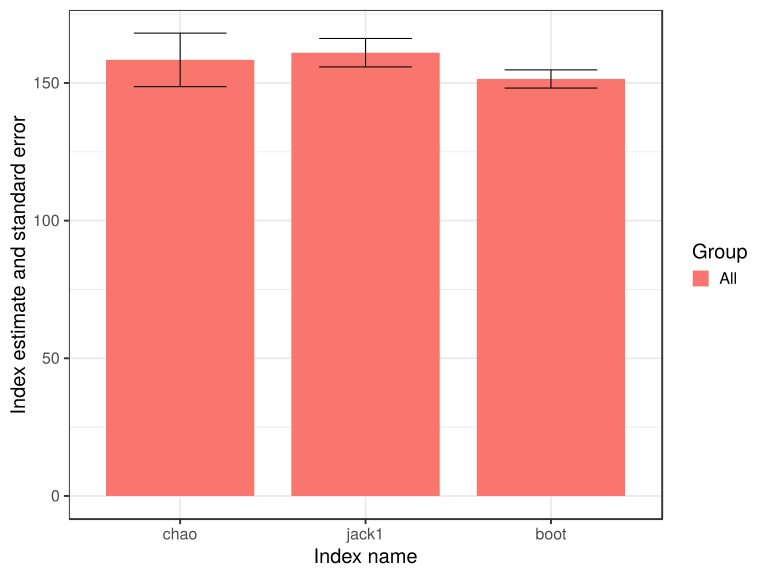

noone@mail.com
Analysis of Dieting study 16S data
% Fri Sep  7 05:46:18 2018

##### \(1.1.1.3.2.1\) Richness and diversity estimates Before count filtering

 Counts are rarefied to the lowest library size (2161), abundance-based and
                   incidence-based alpha diversity indices and richness estimates are computed
                   (if requested).
                   This is repeated multiple times (n=400), and the results are averaged.
                   Beta diversity matrix is also computed by averaging over multiple 
                   rarefications. Samples are not grouped. Dimensions of input count matrix (87 x 156).

Oksanen J, Blanchet FG, Friendly M, Kindt R, Legendre P, McGlinn D, Minchin PR, O'Hara RB, Simpson GL, Solymos P, Stevens MHH,
Szoecs E, Wagner H (2018). _vegan: Community Ecology Package_. R package version 2.5-2, <URL:
https://CRAN.R-project.org/package=vegan>.

\(1.1.1.3.2.1.1\) [`Table 18.`](#table.18) Incidence based rihcness estimates and corresponding standard errors for all samples. Full dataset is also saved in a delimited text file (click to download and open e.g. in Excel) [`data/1.1.1.3.2.1.1-3231f23b6da.1.1.1.3.2.1.1.a.nam.csv`](data/1.1.1.3.2.1.1-3231f23b6da.1.1.1.3.2.1.1.a.nam.csv)

| Species | chao  | chao.se | jack1 | jack1.se | jack2 | boot  | boot.se | n  |
|:--------|:------|:--------|:------|:---------|:------|:------|:--------|:---|
| 142.1   | 158.4 | 9.729   | 161   | 5.171    | 167.6 | 151.5 | 3.303   | 87 |

\(1.1.1.3.2.1.1\) [`Figure 89.`](#figure.89) Incidence based rihcness estimates and corresponding standard errors for all samples.  Image file: [`plots/32315e59f8f.svg`](plots/32315e59f8f.svg).

##### \(1.1.1.3.2.1.2\) Plots of Abundance-based diversity indices (Hill numbers) With rarefication.

[`Subreport`](./1.1.1.3.2.1.2-report.html)

##### \(1.1.1.3.2.1.3\) Plots of Abundance-based evenness indices (Hill numbers / Observed 'species') With rarefication.

[`Subreport`](./1.1.1.3.2.1.3-report.html)

Wrote counts and metadata for Abundance based richness and diversity to files [`data/1.1.1.3.2.1.3-323750f54efdivrich.counts.count.tsv`](data/1.1.1.3.2.1.3-323750f54efdivrich.counts.count.tsv),[`data/1.1.1.3.2.1.3-323750f54efdivrich.counts.attr.tsv`](data/1.1.1.3.2.1.3-323750f54efdivrich.counts.attr.tsv)

##### \(1.1.1.3.2.1.3.1\) Plots of Abundance-based rarefaction curves.

[`Subreport`](./1.1.1.3.2.1.3.1-report.html)

Computed beta-diversity matrix using function betadiver {vegan}
                   with method 2 "-1" = (b+c)/(2*a+b+c), where number of shared species in two sites is a, 
                      and the numbers of species unique to each site are b and c.
