noone@mail.com
Analysis of Dieting study 16S data
% Fri Sep  7 05:46:18 2018

##### \(1.1.1.3.2.1.2\) Plots of Abundance-based diversity indices (Hill numbers) With rarefication.

Plots are shown with relation to various combinations of meta 
                   data variables and in different graphical representations. Lots of plots here.

##### \(1.1.1.3.2.1.2.2\) Iterating over all combinations of grouping variables

##### \(1.1.1.3.2.1.2.2.1\) Grouping variables Sample.type,visit

##### \(1.1.1.3.2.1.2.2.2\) Iterating over Abundance-based diversity indices (Hill numbers) With rarefication. profile sorting order

##### \(1.1.1.3.2.1.2.2.2.1\) Abundance-based diversity indices (Hill numbers) With rarefication. profile sorting order: original

##### \(1.1.1.3.2.1.2.2.2.2\) Iterating over dodged vs faceted bars

The same data are shown in multiple combinations of graphical representations. 
                         This is the same data, but each plot highlights slightly different aspects of it.
                         It is not likely that you will need every plot - pick only what you need.

##### \(1.1.1.3.2.1.2.2.2.2.1\) dodged plots. Iterating over orientation and, optionally, scaling

##### \(1.1.1.3.2.1.2.2.2.2.1.1\) Abundance-based diversity indices (Hill numbers) With rarefication. Plot is in original orientation, Y axis SQRT scaled. Iterating over plot geometry

\(1.1.1.3.2.1.2.2.2.2.1.1.0\) [`Table 19.`](#table.19) Data table used for plots. Data grouped by Sample.type,visit. Showing only 200 first rows. Full dataset is also saved in a delimited text file (click to download and open e.g. in Excel) [`data/1.1.1.3.2.1.2.2.2.2.1.1.0-3235defd6c9.1.1.1.3.2.1.2.2.2.2.csv`](data/1.1.1.3.2.1.2.2.2.2.1.1.0-3235defd6c9.1.1.1.3.2.1.2.2.2.2.csv)

| .record.id | Sample.type | visit | feature | index  |
|:-----------|:------------|:------|:--------|:-------|
| SM1        | patient     | 1     | N\_0    | 31.367 |
| SM10       | patient     | 3     | N\_0    | 33.958 |
| SM100      | patient     | 4     | N\_0    | 28.578 |
| SM11       | patient     | 2     | N\_0    | 30.065 |
| SM12       | patient     | 1     | N\_0    | 24.988 |
| SM13       | patient     | 1     | N\_0    | 43.612 |
| SM14       | patient     | 1     | N\_0    | 41.438 |
| SM15       | control     | 1     | N\_0    | 29.125 |
| SM16       | patient     | 4     | N\_0    | 31.992 |
| SM17       | patient     | 1     | N\_0    | 34.157 |
| SM18       | patient     | 2     | N\_0    | 37.855 |
| SM19       | patient     | 2     | N\_0    | 34.000 |
| SM2        | patient     | 1     | N\_0    | 23.730 |
| SM20       | control     | 1     | N\_0    | 36.312 |
| SM21       | patient     | 1     | N\_0    | 42.940 |
| SM22       | patient     | 1     | N\_0    | 41.672 |
| SM23       | patient     | 2     | N\_0    | 8.582  |
| SM24       | patient     | 1     | N\_0    | 37.980 |
| SM25       | patient     | 4     | N\_0    | 30.163 |
| SM26       | control     | 1     | N\_0    | 34.528 |
| SM28       | control     | 1     | N\_0    | 39.735 |
| SM29       | patient     | 3     | N\_0    | 21.280 |
| SM3        | patient     | 2     | N\_0    | 35.138 |
| SM30       | patient     | 4     | N\_0    | 36.023 |
| SM31       | control     | 2     | N\_0    | 43.407 |
| SM33       | patient     | 1     | N\_0    | 20.645 |
| SM35       | control     | 1     | N\_0    | 34.505 |
| SM36       | patient     | 4     | N\_0    | 31.812 |
| SM37       | control     | 1     | N\_0    | 48.097 |
| SM38       | patient     | 2     | N\_0    | 13.953 |
| SM39       | patient     | 1     | N\_0    | 33.237 |
| SM40       | patient     | 4     | N\_0    | 29.113 |
| SM41       | patient     | 1     | N\_0    | 43.900 |
| SM42       | patient     | 4     | N\_0    | 35.145 |
| SM43       | patient     | 4     | N\_0    | 33.700 |
| SM44       | control     | 1     | N\_0    | 35.792 |
| SM45       | patient     | 2     | N\_0    | 2.467  |
| SM48       | control     | 1     | N\_0    | 45.028 |
| SM49       | patient     | 1     | N\_0    | 25.625 |
| SM5        | patient     | 3     | N\_0    | 33.295 |
| SM50       | patient     | 3     | N\_0    | 28.527 |
| SM51       | patient     | 4     | N\_0    | 34.425 |
| SM52       | patient     | 1     | N\_0    | 48.807 |
| SM53       | patient     | 2     | N\_0    | 27.407 |
| SM54       | patient     | 3     | N\_0    | 24.990 |
| SM55       | control     | 1     | N\_0    | 36.320 |
| SM56       | patient     | 2     | N\_0    | 24.402 |
| SM57       | patient     | 1     | N\_0    | 27.095 |
| SM58       | patient     | 2     | N\_0    | 28.038 |
| SM59       | patient     | 3     | N\_0    | 42.267 |
| SM60       | patient     | 3     | N\_0    | 24.810 |
| SM62       | patient     | 1     | N\_0    | 16.793 |
| SM63       | control     | 1     | N\_0    | 48.635 |
| SM64       | patient     | 2     | N\_0    | 26.935 |
| SM65       | patient     | 3     | N\_0    | 31.098 |
| SM66       | control     | 1     | N\_0    | 38.888 |
| SM67       | patient     | 4     | N\_0    | 16.628 |
| SM68       | patient     | 4     | N\_0    | 46.330 |
| SM69       | patient     | 4     | N\_0    | 25.102 |
| SM7        | control     | 1     | N\_0    | 41.335 |
| SM70       | control     | 1     | N\_0    | 52.035 |
| SM71       | patient     | 3     | N\_0    | 32.655 |
| SM72       | control     | 1     | N\_0    | 45.210 |
| SM73       | patient     | 1     | N\_0    | 25.762 |
| SM74       | control     | 2     | N\_0    | 43.195 |
| SM75       | patient     | 3     | N\_0    | 31.690 |
| SM76       | control     | 1     | N\_0    | 30.203 |
| SM77       | patient     | 2     | N\_0    | 30.137 |
| SM79       | patient     | 2     | N\_0    | 31.383 |
| SM8        | patient     | 1     | N\_0    | 33.803 |
| SM81       | control     | 1     | N\_0    | 19.240 |
| SM82       | patient     | 4     | N\_0    | 25.892 |
| SM83       | patient     | 1     | N\_0    | 28.027 |
| SM84       | patient     | 1     | N\_0    | 33.800 |
| SM86       | patient     | 2     | N\_0    | 33.070 |
| SM87       | patient     | 1     | N\_0    | 21.547 |
| SM88       | patient     | 2     | N\_0    | 28.410 |
| SM89       | control     | 1     | N\_0    | 38.142 |
| SM9        | patient     | 2     | N\_0    | 23.267 |
| SM90       | patient     | 2     | N\_0    | 43.792 |
| SM91       | patient     | 3     | N\_0    | 41.528 |
| SM92       | patient     | 3     | N\_0    | 23.540 |
| SM93       | patient     | 1     | N\_0    | 25.650 |
| SM95       | control     | 1     | N\_0    | 48.133 |
| SM96       | patient     | 1     | N\_0    | 33.188 |
| SM98       | patient     | 3     | N\_0    | 38.047 |
| SM99       | patient     | 3     | N\_0    | 38.432 |
| SM1        | patient     | 1     | N\_0.25 | 17.483 |
| SM10       | patient     | 3     | N\_0.25 | 21.436 |
| SM100      | patient     | 4     | N\_0.25 | 17.466 |
| SM11       | patient     | 2     | N\_0.25 | 14.053 |
| SM12       | patient     | 1     | N\_0.25 | 11.686 |
| SM13       | patient     | 1     | N\_0.25 | 27.842 |
| SM14       | patient     | 1     | N\_0.25 | 28.384 |
| SM15       | control     | 1     | N\_0.25 | 19.089 |
| SM16       | patient     | 4     | N\_0.25 | 19.617 |
| SM17       | patient     | 1     | N\_0.25 | 18.202 |
| SM18       | patient     | 2     | N\_0.25 | 20.861 |
| SM19       | patient     | 2     | N\_0.25 | 21.555 |
| SM2        | patient     | 1     | N\_0.25 | 10.616 |
| SM20       | control     | 1     | N\_0.25 | 21.308 |
| SM21       | patient     | 1     | N\_0.25 | 26.903 |
| SM22       | patient     | 1     | N\_0.25 | 24.855 |
| SM23       | patient     | 2     | N\_0.25 | 3.963  |
| SM24       | patient     | 1     | N\_0.25 | 19.781 |
| SM25       | patient     | 4     | N\_0.25 | 19.510 |
| SM26       | control     | 1     | N\_0.25 | 20.649 |
| SM28       | control     | 1     | N\_0.25 | 27.492 |
| SM29       | patient     | 3     | N\_0.25 | 10.149 |
| SM3        | patient     | 2     | N\_0.25 | 22.067 |
| SM30       | patient     | 4     | N\_0.25 | 23.018 |
| SM31       | control     | 2     | N\_0.25 | 26.803 |
| SM33       | patient     | 1     | N\_0.25 | 11.136 |
| SM35       | control     | 1     | N\_0.25 | 20.613 |
| SM36       | patient     | 4     | N\_0.25 | 21.216 |
| SM37       | control     | 1     | N\_0.25 | 32.786 |
| SM38       | patient     | 2     | N\_0.25 | 4.999  |
| SM39       | patient     | 1     | N\_0.25 | 17.546 |
| SM40       | patient     | 4     | N\_0.25 | 15.884 |
| SM41       | patient     | 1     | N\_0.25 | 28.214 |
| SM42       | patient     | 4     | N\_0.25 | 19.940 |
| SM43       | patient     | 4     | N\_0.25 | 21.034 |
| SM44       | control     | 1     | N\_0.25 | 24.958 |
| SM45       | patient     | 2     | N\_0.25 | 1.410  |
| SM48       | control     | 1     | N\_0.25 | 28.860 |
| SM49       | patient     | 1     | N\_0.25 | 11.472 |
| SM5        | patient     | 3     | N\_0.25 | 19.426 |
| SM50       | patient     | 3     | N\_0.25 | 21.996 |
| SM51       | patient     | 4     | N\_0.25 | 18.777 |
| SM52       | patient     | 1     | N\_0.25 | 32.442 |
| SM53       | patient     | 2     | N\_0.25 | 15.476 |
| SM54       | patient     | 3     | N\_0.25 | 13.631 |
| SM55       | control     | 1     | N\_0.25 | 20.918 |
| SM56       | patient     | 2     | N\_0.25 | 14.929 |
| SM57       | patient     | 1     | N\_0.25 | 12.508 |
| SM58       | patient     | 2     | N\_0.25 | 16.481 |
| SM59       | patient     | 3     | N\_0.25 | 28.790 |
| SM60       | patient     | 3     | N\_0.25 | 11.610 |
| SM62       | patient     | 1     | N\_0.25 | 5.992  |
| SM63       | control     | 1     | N\_0.25 | 30.816 |
| SM64       | patient     | 2     | N\_0.25 | 13.557 |
| SM65       | patient     | 3     | N\_0.25 | 20.380 |
| SM66       | control     | 1     | N\_0.25 | 24.201 |
| SM67       | patient     | 4     | N\_0.25 | 8.687  |
| SM68       | patient     | 4     | N\_0.25 | 28.891 |
| SM69       | patient     | 4     | N\_0.25 | 12.150 |
| SM7        | control     | 1     | N\_0.25 | 27.832 |
| SM70       | control     | 1     | N\_0.25 | 33.765 |
| SM71       | patient     | 3     | N\_0.25 | 15.569 |
| SM72       | control     | 1     | N\_0.25 | 27.053 |
| SM73       | patient     | 1     | N\_0.25 | 13.082 |
| SM74       | control     | 2     | N\_0.25 | 29.751 |
| SM75       | patient     | 3     | N\_0.25 | 20.782 |
| SM76       | control     | 1     | N\_0.25 | 15.439 |
| SM77       | patient     | 2     | N\_0.25 | 17.322 |
| SM79       | patient     | 2     | N\_0.25 | 17.473 |
| SM8        | patient     | 1     | N\_0.25 | 18.519 |
| SM81       | control     | 1     | N\_0.25 | 14.273 |
| SM82       | patient     | 4     | N\_0.25 | 11.482 |
| SM83       | patient     | 1     | N\_0.25 | 14.626 |
| SM84       | patient     | 1     | N\_0.25 | 19.903 |
| SM86       | patient     | 2     | N\_0.25 | 20.309 |
| SM87       | patient     | 1     | N\_0.25 | 12.337 |
| SM88       | patient     | 2     | N\_0.25 | 15.049 |
| SM89       | control     | 1     | N\_0.25 | 19.103 |
| SM9        | patient     | 2     | N\_0.25 | 12.592 |
| SM90       | patient     | 2     | N\_0.25 | 29.097 |
| SM91       | patient     | 3     | N\_0.25 | 24.547 |
| SM92       | patient     | 3     | N\_0.25 | 11.974 |
| SM93       | patient     | 1     | N\_0.25 | 15.482 |
| SM95       | control     | 1     | N\_0.25 | 30.368 |
| SM96       | patient     | 1     | N\_0.25 | 18.893 |
| SM98       | patient     | 3     | N\_0.25 | 20.895 |
| SM99       | patient     | 3     | N\_0.25 | 23.778 |
| SM1        | patient     | 1     | N\_0.5  | 9.190  |
| SM10       | patient     | 3     | N\_0.5  | 14.478 |
| SM100      | patient     | 4     | N\_0.5  | 11.015 |
| SM11       | patient     | 2     | N\_0.5  | 6.133  |
| SM12       | patient     | 1     | N\_0.5  | 5.230  |
| SM13       | patient     | 1     | N\_0.5  | 17.593 |
| SM14       | patient     | 1     | N\_0.5  | 19.709 |
| SM15       | control     | 1     | N\_0.5  | 13.149 |
| SM16       | patient     | 4     | N\_0.5  | 12.636 |
| SM17       | patient     | 1     | N\_0.5  | 8.853  |
| SM18       | patient     | 2     | N\_0.5  | 11.056 |
| SM19       | patient     | 2     | N\_0.5  | 14.156 |
| SM2        | patient     | 1     | N\_0.5  | 4.731  |
| SM20       | control     | 1     | N\_0.5  | 12.770 |
| SM21       | patient     | 1     | N\_0.5  | 17.078 |
| SM22       | patient     | 1     | N\_0.5  | 14.691 |
| SM23       | patient     | 2     | N\_0.5  | 2.533  |
| SM24       | patient     | 1     | N\_0.5  | 9.896  |
| SM25       | patient     | 4     | N\_0.5  | 13.311 |
| SM26       | control     | 1     | N\_0.5  | 12.653 |
| SM28       | control     | 1     | N\_0.5  | 19.871 |
| SM29       | patient     | 3     | N\_0.5  | 4.654  |
| SM3        | patient     | 2     | N\_0.5  | 14.860 |
| SM30       | patient     | 4     | N\_0.5  | 15.813 |
| SM31       | control     | 2     | N\_0.5  | 17.036 |
| SM33       | patient     | 1     | N\_0.5  | 6.936  |

\(1.1.1.3.2.1.2.2.2.2.1.1.1\) [`Widget 20.`](#widget.20) Dynamic Pivot Table link (drag and drop field names and pick averaging 
                      functions or plot types; click on fields or legend elements to filter values). 
                      Starting rendering is Stacked Bar Chart. Data grouped by Sample.type,visit. Click to see HTML widget file in full window: [`./1.1.1.3.2.1.2.2.2.2.1.1.1-3236b13775cDynamic.Pivot.Table.html`](./1.1.1.3.2.1.2.2.2.2.1.1.1-3236b13775cDynamic.Pivot.Table.html)

\(1.1.1.3.2.1.2.2.2.2.1.1.1\) [`Widget 21.`](#widget.21) Dynamic Pivot Table link (drag and drop field names and pick averaging 
                      functions or plot types; click on fields or legend elements to filter values). 
                      Starting rendering is Table Barchart. Data grouped by Sample.type,visit. Click to see HTML widget file in full window: [`./1.1.1.3.2.1.2.2.2.2.1.1.1-32341f4ec23Dynamic.Pivot.Table.html`](./1.1.1.3.2.1.2.2.2.2.1.1.1-32341f4ec23Dynamic.Pivot.Table.html)

\(1.1.1.3.2.1.2.2.2.2.1.1.1\) [`Table 20.`](#table.20) Summary table. Data grouped by Sample.type,visit. Full dataset is also saved in a delimited text file (click to download and open e.g. in Excel) [`data/1.1.1.3.2.1.2.2.2.2.1.1.1-323459dcafe.1.1.1.3.2.1.2.2.2.2.csv`](data/1.1.1.3.2.1.2.2.2.2.1.1.1-323459dcafe.1.1.1.3.2.1.2.2.2.2.csv)

| feature | Sample.type | visit | mean   | sd      | median | incidence |
|:--------|:------------|:------|:-------|:--------|:-------|:----------|
| N\_0    | control     | 1     | 38.959 | 8.1918  | 38.515 | 1         |
| N\_0    | control     | 2     | 43.301 | 0.1503  | 43.301 | 1         |
| N\_0    | patient     | 1     | 32.164 | 8.6802  | 33.188 | 1         |
| N\_0    | patient     | 2     | 26.994 | 10.3849 | 28.410 | 1         |
| N\_0    | patient     | 3     | 31.866 | 6.6802  | 32.172 | 1         |
| N\_0    | patient     | 4     | 31.146 | 6.9244  | 31.812 | 1         |
| N\_0.25 | control     | 1     | 24.418 | 5.8038  | 24.579 | 1         |
| N\_0.25 | control     | 2     | 28.277 | 2.0847  | 28.277 | 1         |
| N\_0.25 | patient     | 1     | 18.170 | 7.0195  | 17.546 | 1         |
| N\_0.25 | patient     | 2     | 15.364 | 6.9873  | 15.476 | 1         |
| N\_0.25 | patient     | 3     | 18.926 | 5.5196  | 20.581 | 1         |
| N\_0.25 | patient     | 4     | 18.282 | 5.3211  | 19.510 | 1         |
| N\_0.5  | control     | 1     | 15.658 | 4.6805  | 15.512 | 1         |
| N\_0.5  | control     | 2     | 19.418 | 3.3695  | 19.418 | 1         |
| N\_0.5  | patient     | 1     | 10.418 | 5.3973  | 9.370  | 1         |
| N\_0.5  | patient     | 2     | 9.062  | 4.8022  | 9.120  | 1         |
| N\_0.5  | patient     | 3     | 11.652 | 4.8440  | 12.777 | 1         |
| N\_0.5  | patient     | 4     | 11.209 | 4.3553  | 11.015 | 1         |
| N\_1    | control     | 1     | 8.073  | 3.4252  | 8.388  | 1         |
| N\_1    | control     | 2     | 11.569 | 4.0472  | 11.569 | 1         |
| N\_1    | patient     | 1     | 4.750  | 3.1965  | 4.278  | 1         |
| N\_1    | patient     | 2     | 4.435  | 2.7293  | 3.854  | 1         |
| N\_1    | patient     | 3     | 6.032  | 3.6844  | 5.219  | 1         |
| N\_1    | patient     | 4     | 5.837  | 3.2251  | 5.036  | 1         |
| N\_2    | control     | 1     | 4.539  | 2.3008  | 4.113  | 1         |
| N\_2    | control     | 2     | 7.281  | 3.6354  | 7.281  | 1         |
| N\_2    | patient     | 1     | 2.704  | 1.8362  | 2.341  | 1         |
| N\_2    | patient     | 2     | 2.703  | 1.6384  | 2.096  | 1         |
| N\_2    | patient     | 3     | 3.618  | 2.4137  | 2.599  | 1         |
| N\_2    | patient     | 4     | 3.607  | 2.3307  | 2.257  | 1         |
| N\_4    | control     | 1     | 3.380  | 1.7167  | 3.076  | 1         |
| N\_4    | control     | 2     | 5.244  | 2.7963  | 5.244  | 1         |
| N\_4    | patient     | 1     | 2.122  | 1.2718  | 1.811  | 1         |
| N\_4    | patient     | 2     | 2.177  | 1.2241  | 1.680  | 1         |
| N\_4    | patient     | 3     | 2.727  | 1.6004  | 2.096  | 1         |
| N\_4    | patient     | 4     | 2.802  | 1.7675  | 2.008  | 1         |
| N\_8    | control     | 1     | 2.977  | 1.4617  | 2.647  | 1         |
| N\_8    | control     | 2     | 4.278  | 2.1273  | 4.278  | 1         |
| N\_8    | patient     | 1     | 1.914  | 1.0071  | 1.664  | 1         |
| N\_8    | patient     | 2     | 1.968  | 1.0023  | 1.560  | 1         |
| N\_8    | patient     | 3     | 2.387  | 1.2589  | 1.889  | 1         |
| N\_8    | patient     | 4     | 2.456  | 1.4243  | 1.869  | 1         |
| N\_Inf  | control     | 1     | 2.635  | 1.1960  | 2.344  | 1         |
| N\_Inf  | control     | 2     | 3.548  | 1.5639  | 3.548  | 1         |
| N\_Inf  | patient     | 1     | 1.754  | 0.7859  | 1.561  | 1         |
| N\_Inf  | patient     | 2     | 1.791  | 0.7882  | 1.476  | 1         |
| N\_Inf  | patient     | 3     | 2.127  | 0.9991  | 1.744  | 1         |
| N\_Inf  | patient     | 4     | 2.169  | 1.0956  | 1.731  | 1         |

\(1.1.1.3.2.1.2.2.2.2.1.1.1\) [`Figure 90.`](#figure.90) Abundance-based diversity indices (Hill numbers) With rarefication. Data grouped by Sample.type,visit.  line plot.  Image file: [`plots/323709ffa57.svg`](plots/323709ffa57.svg).
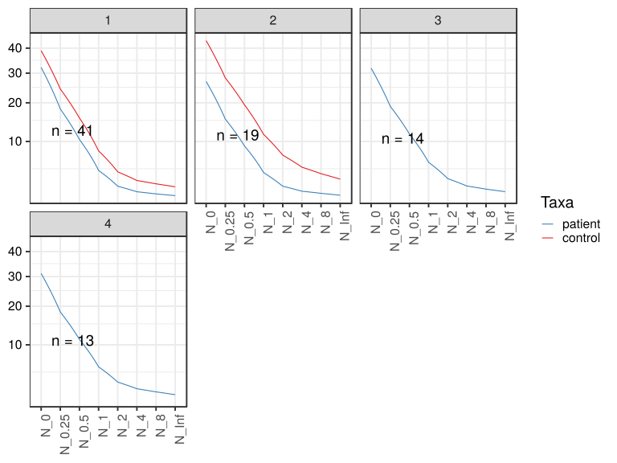

\(1.1.1.3.2.1.2.2.2.2.1.1.1\) [`Figure 91.`](#figure.91) Abundance-based diversity indices (Hill numbers) With rarefication. Data grouped by Sample.type,visit.  line_obs plot.  Image file: [`plots/32316dc6a4.svg`](plots/32316dc6a4.svg).
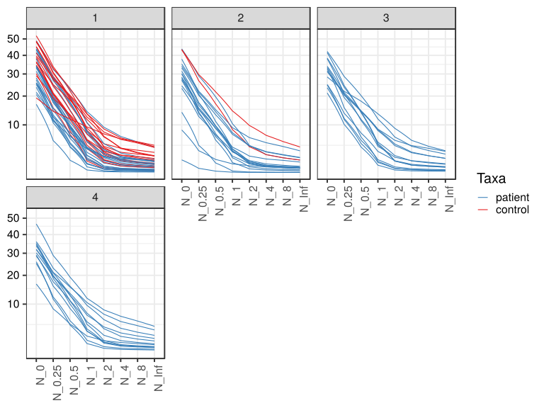

##### \(1.1.1.3.2.1.2.2.2.2.1.2\) Abundance-based diversity indices (Hill numbers) With rarefication. Plot is in flipped orientation, Y axis not scaled. Iterating over plot geometry

\(1.1.1.3.2.1.2.2.2.2.1.2.1\) [`Figure 92.`](#figure.92) Abundance-based diversity indices (Hill numbers) With rarefication. Data grouped by Sample.type,visit.  line plot.  Image file: [`plots/3232035e9a6.svg`](plots/3232035e9a6.svg).
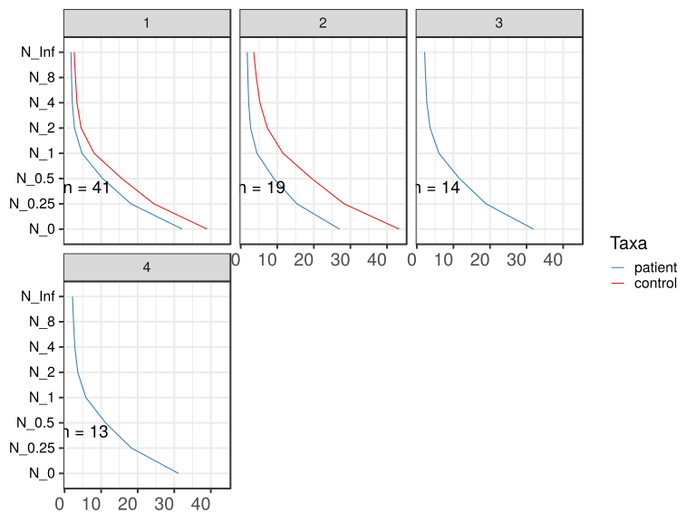

\(1.1.1.3.2.1.2.2.2.2.1.2.1\) [`Figure 93.`](#figure.93) Abundance-based diversity indices (Hill numbers) With rarefication. Data grouped by Sample.type,visit.  line_obs plot.  Image file: [`plots/323d56238c.svg`](plots/323d56238c.svg).
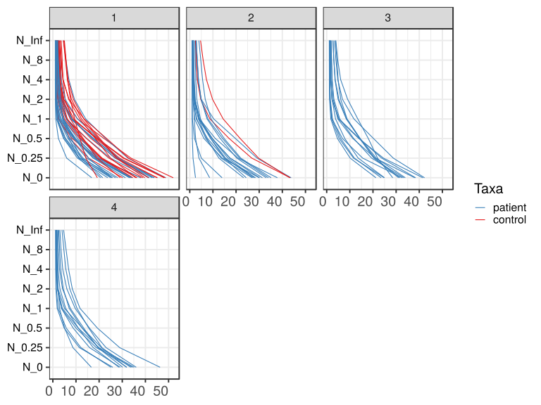

##### \(1.1.1.3.2.1.2.2.3\) Grouping variables Sample.type.Drug.Before,visit

##### \(1.1.1.3.2.1.2.2.4\) Iterating over Abundance-based diversity indices (Hill numbers) With rarefication. profile sorting order

##### \(1.1.1.3.2.1.2.2.4.1\) Abundance-based diversity indices (Hill numbers) With rarefication. profile sorting order: original

##### \(1.1.1.3.2.1.2.2.4.2\) Iterating over dodged vs faceted bars

The same data are shown in multiple combinations of graphical representations. 
                         This is the same data, but each plot highlights slightly different aspects of it.
                         It is not likely that you will need every plot - pick only what you need.

##### \(1.1.1.3.2.1.2.2.4.2.1\) dodged plots. Iterating over orientation and, optionally, scaling

##### \(1.1.1.3.2.1.2.2.4.2.1.1\) Abundance-based diversity indices (Hill numbers) With rarefication. Plot is in original orientation, Y axis SQRT scaled. Iterating over plot geometry

\(1.1.1.3.2.1.2.2.4.2.1.1.0\) [`Table 21.`](#table.21) Data table used for plots. Data grouped by Sample.type.Drug.Before,visit. Showing only 200 first rows. Full dataset is also saved in a delimited text file (click to download and open e.g. in Excel) [`data/1.1.1.3.2.1.2.2.4.2.1.1.0-323163095de.1.1.1.3.2.1.2.2.4.2.csv`](data/1.1.1.3.2.1.2.2.4.2.1.1.0-323163095de.1.1.1.3.2.1.2.2.4.2.csv)

| .record.id | Sample.type.Drug.Before | visit | feature | index  |
|:-----------|:------------------------|:------|:--------|:-------|
| SM1        | patient TRUE .          | 1     | N\_0    | 31.367 |
| SM10       | patient TRUE .          | 3     | N\_0    | 33.958 |
| SM100      | patient TRUE .          | 4     | N\_0    | 28.578 |
| SM11       | patient TRUE .          | 2     | N\_0    | 30.065 |
| SM12       | patient TRUE .          | 1     | N\_0    | 24.988 |
| SM13       | patient FALSE .         | 1     | N\_0    | 43.612 |
| SM14       | patient FALSE .         | 1     | N\_0    | 41.438 |
| SM15       | 1                       | 1     | N\_0    | 29.125 |
| SM16       | patient FALSE .         | 4     | N\_0    | 31.992 |
| SM17       | patient TRUE .          | 1     | N\_0    | 34.157 |
| SM18       | patient FALSE .         | 2     | N\_0    | 37.855 |
| SM19       | patient FALSE .         | 2     | N\_0    | 34.000 |
| SM2        | patient FALSE .         | 1     | N\_0    | 23.730 |
| SM20       | 1                       | 1     | N\_0    | 36.312 |
| SM21       | patient FALSE .         | 1     | N\_0    | 42.940 |
| SM22       | patient TRUE .          | 1     | N\_0    | 41.672 |
| SM23       | patient TRUE .          | 2     | N\_0    | 8.582  |
| SM24       | patient FALSE .         | 1     | N\_0    | 37.980 |
| SM25       | patient FALSE .         | 4     | N\_0    | 30.163 |
| SM26       | 1                       | 1     | N\_0    | 34.528 |
| SM28       | 1                       | 1     | N\_0    | 39.735 |
| SM29       | patient TRUE .          | 3     | N\_0    | 21.280 |
| SM3        | patient TRUE .          | 2     | N\_0    | 35.138 |
| SM30       | patient TRUE .          | 4     | N\_0    | 36.023 |
| SM31       | 1                       | 2     | N\_0    | 43.407 |
| SM33       | patient TRUE .          | 1     | N\_0    | 20.645 |
| SM35       | 1                       | 1     | N\_0    | 34.505 |
| SM36       | patient FALSE .         | 4     | N\_0    | 31.812 |
| SM37       | 1                       | 1     | N\_0    | 48.097 |
| SM38       | patient TRUE .          | 2     | N\_0    | 13.953 |
| SM39       | patient FALSE .         | 1     | N\_0    | 33.237 |
| SM40       | patient FALSE .         | 4     | N\_0    | 29.113 |
| SM41       | patient TRUE .          | 1     | N\_0    | 43.900 |
| SM42       | patient FALSE .         | 4     | N\_0    | 35.145 |
| SM43       | patient TRUE .          | 4     | N\_0    | 33.700 |
| SM44       | 1                       | 1     | N\_0    | 35.792 |
| SM45       | patient FALSE .         | 2     | N\_0    | 2.467  |
| SM48       | 1                       | 1     | N\_0    | 45.028 |
| SM49       | patient TRUE .          | 1     | N\_0    | 25.625 |
| SM5        | patient TRUE .          | 3     | N\_0    | 33.295 |
| SM50       | patient FALSE .         | 3     | N\_0    | 28.527 |
| SM51       | patient TRUE .          | 4     | N\_0    | 34.425 |
| SM52       | patient FALSE .         | 1     | N\_0    | 48.807 |
| SM53       | patient TRUE .          | 2     | N\_0    | 27.407 |
| SM54       | patient TRUE .          | 3     | N\_0    | 24.990 |
| SM55       | 1                       | 1     | N\_0    | 36.320 |
| SM56       | patient TRUE .          | 2     | N\_0    | 24.402 |
| SM57       | patient TRUE .          | 1     | N\_0    | 27.095 |
| SM58       | patient FALSE .         | 2     | N\_0    | 28.038 |
| SM59       | patient FALSE .         | 3     | N\_0    | 42.267 |
| SM60       | patient TRUE .          | 3     | N\_0    | 24.810 |
| SM62       | patient TRUE .          | 1     | N\_0    | 16.793 |
| SM63       | 1                       | 1     | N\_0    | 48.635 |
| SM64       | patient TRUE .          | 2     | N\_0    | 26.935 |
| SM65       | patient TRUE .          | 3     | N\_0    | 31.098 |
| SM66       | 1                       | 1     | N\_0    | 38.888 |
| SM67       | patient TRUE .          | 4     | N\_0    | 16.628 |
| SM68       | patient FALSE .         | 4     | N\_0    | 46.330 |
| SM69       | patient TRUE .          | 4     | N\_0    | 25.102 |
| SM7        | 1                       | 1     | N\_0    | 41.335 |
| SM70       | 1                       | 1     | N\_0    | 52.035 |
| SM71       | patient TRUE .          | 3     | N\_0    | 32.655 |
| SM72       | 1                       | 1     | N\_0    | 45.210 |
| SM73       | patient FALSE .         | 1     | N\_0    | 25.762 |
| SM74       | 1                       | 2     | N\_0    | 43.195 |
| SM75       | patient FALSE .         | 3     | N\_0    | 31.690 |
| SM76       | 1                       | 1     | N\_0    | 30.203 |
| SM77       | patient TRUE .          | 2     | N\_0    | 30.137 |
| SM79       | patient FALSE .         | 2     | N\_0    | 31.383 |
| SM8        | patient FALSE .         | 1     | N\_0    | 33.803 |
| SM81       | 1                       | 1     | N\_0    | 19.240 |
| SM82       | patient TRUE .          | 4     | N\_0    | 25.892 |
| SM83       | patient TRUE .          | 1     | N\_0    | 28.027 |
| SM84       | patient TRUE .          | 1     | N\_0    | 33.800 |
| SM86       | patient TRUE .          | 2     | N\_0    | 33.070 |
| SM87       | patient TRUE .          | 1     | N\_0    | 21.547 |
| SM88       | patient TRUE .          | 2     | N\_0    | 28.410 |
| SM89       | 1                       | 1     | N\_0    | 38.142 |
| SM9        | patient FALSE .         | 2     | N\_0    | 23.267 |
| SM90       | patient FALSE .         | 2     | N\_0    | 43.792 |
| SM91       | patient TRUE .          | 3     | N\_0    | 41.528 |
| SM92       | patient FALSE .         | 3     | N\_0    | 23.540 |
| SM93       | patient TRUE .          | 1     | N\_0    | 25.650 |
| SM95       | 1                       | 1     | N\_0    | 48.133 |
| SM96       | patient FALSE .         | 1     | N\_0    | 33.188 |
| SM98       | patient FALSE .         | 3     | N\_0    | 38.047 |
| SM99       | patient FALSE .         | 3     | N\_0    | 38.432 |
| SM1        | patient TRUE .          | 1     | N\_0.25 | 17.483 |
| SM10       | patient TRUE .          | 3     | N\_0.25 | 21.436 |
| SM100      | patient TRUE .          | 4     | N\_0.25 | 17.466 |
| SM11       | patient TRUE .          | 2     | N\_0.25 | 14.053 |
| SM12       | patient TRUE .          | 1     | N\_0.25 | 11.686 |
| SM13       | patient FALSE .         | 1     | N\_0.25 | 27.842 |
| SM14       | patient FALSE .         | 1     | N\_0.25 | 28.384 |
| SM15       | 1                       | 1     | N\_0.25 | 19.089 |
| SM16       | patient FALSE .         | 4     | N\_0.25 | 19.617 |
| SM17       | patient TRUE .          | 1     | N\_0.25 | 18.202 |
| SM18       | patient FALSE .         | 2     | N\_0.25 | 20.861 |
| SM19       | patient FALSE .         | 2     | N\_0.25 | 21.555 |
| SM2        | patient FALSE .         | 1     | N\_0.25 | 10.616 |
| SM20       | 1                       | 1     | N\_0.25 | 21.308 |
| SM21       | patient FALSE .         | 1     | N\_0.25 | 26.903 |
| SM22       | patient TRUE .          | 1     | N\_0.25 | 24.855 |
| SM23       | patient TRUE .          | 2     | N\_0.25 | 3.963  |
| SM24       | patient FALSE .         | 1     | N\_0.25 | 19.781 |
| SM25       | patient FALSE .         | 4     | N\_0.25 | 19.510 |
| SM26       | 1                       | 1     | N\_0.25 | 20.649 |
| SM28       | 1                       | 1     | N\_0.25 | 27.492 |
| SM29       | patient TRUE .          | 3     | N\_0.25 | 10.149 |
| SM3        | patient TRUE .          | 2     | N\_0.25 | 22.067 |
| SM30       | patient TRUE .          | 4     | N\_0.25 | 23.018 |
| SM31       | 1                       | 2     | N\_0.25 | 26.803 |
| SM33       | patient TRUE .          | 1     | N\_0.25 | 11.136 |
| SM35       | 1                       | 1     | N\_0.25 | 20.613 |
| SM36       | patient FALSE .         | 4     | N\_0.25 | 21.216 |
| SM37       | 1                       | 1     | N\_0.25 | 32.786 |
| SM38       | patient TRUE .          | 2     | N\_0.25 | 4.999  |
| SM39       | patient FALSE .         | 1     | N\_0.25 | 17.546 |
| SM40       | patient FALSE .         | 4     | N\_0.25 | 15.884 |
| SM41       | patient TRUE .          | 1     | N\_0.25 | 28.214 |
| SM42       | patient FALSE .         | 4     | N\_0.25 | 19.940 |
| SM43       | patient TRUE .          | 4     | N\_0.25 | 21.034 |
| SM44       | 1                       | 1     | N\_0.25 | 24.958 |
| SM45       | patient FALSE .         | 2     | N\_0.25 | 1.410  |
| SM48       | 1                       | 1     | N\_0.25 | 28.860 |
| SM49       | patient TRUE .          | 1     | N\_0.25 | 11.472 |
| SM5        | patient TRUE .          | 3     | N\_0.25 | 19.426 |
| SM50       | patient FALSE .         | 3     | N\_0.25 | 21.996 |
| SM51       | patient TRUE .          | 4     | N\_0.25 | 18.777 |
| SM52       | patient FALSE .         | 1     | N\_0.25 | 32.442 |
| SM53       | patient TRUE .          | 2     | N\_0.25 | 15.476 |
| SM54       | patient TRUE .          | 3     | N\_0.25 | 13.631 |
| SM55       | 1                       | 1     | N\_0.25 | 20.918 |
| SM56       | patient TRUE .          | 2     | N\_0.25 | 14.929 |
| SM57       | patient TRUE .          | 1     | N\_0.25 | 12.508 |
| SM58       | patient FALSE .         | 2     | N\_0.25 | 16.481 |
| SM59       | patient FALSE .         | 3     | N\_0.25 | 28.790 |
| SM60       | patient TRUE .          | 3     | N\_0.25 | 11.610 |
| SM62       | patient TRUE .          | 1     | N\_0.25 | 5.992  |
| SM63       | 1                       | 1     | N\_0.25 | 30.816 |
| SM64       | patient TRUE .          | 2     | N\_0.25 | 13.557 |
| SM65       | patient TRUE .          | 3     | N\_0.25 | 20.380 |
| SM66       | 1                       | 1     | N\_0.25 | 24.201 |
| SM67       | patient TRUE .          | 4     | N\_0.25 | 8.687  |
| SM68       | patient FALSE .         | 4     | N\_0.25 | 28.891 |
| SM69       | patient TRUE .          | 4     | N\_0.25 | 12.150 |
| SM7        | 1                       | 1     | N\_0.25 | 27.832 |
| SM70       | 1                       | 1     | N\_0.25 | 33.765 |
| SM71       | patient TRUE .          | 3     | N\_0.25 | 15.569 |
| SM72       | 1                       | 1     | N\_0.25 | 27.053 |
| SM73       | patient FALSE .         | 1     | N\_0.25 | 13.082 |
| SM74       | 1                       | 2     | N\_0.25 | 29.751 |
| SM75       | patient FALSE .         | 3     | N\_0.25 | 20.782 |
| SM76       | 1                       | 1     | N\_0.25 | 15.439 |
| SM77       | patient TRUE .          | 2     | N\_0.25 | 17.322 |
| SM79       | patient FALSE .         | 2     | N\_0.25 | 17.473 |
| SM8        | patient FALSE .         | 1     | N\_0.25 | 18.519 |
| SM81       | 1                       | 1     | N\_0.25 | 14.273 |
| SM82       | patient TRUE .          | 4     | N\_0.25 | 11.482 |
| SM83       | patient TRUE .          | 1     | N\_0.25 | 14.626 |
| SM84       | patient TRUE .          | 1     | N\_0.25 | 19.903 |
| SM86       | patient TRUE .          | 2     | N\_0.25 | 20.309 |
| SM87       | patient TRUE .          | 1     | N\_0.25 | 12.337 |
| SM88       | patient TRUE .          | 2     | N\_0.25 | 15.049 |
| SM89       | 1                       | 1     | N\_0.25 | 19.103 |
| SM9        | patient FALSE .         | 2     | N\_0.25 | 12.592 |
| SM90       | patient FALSE .         | 2     | N\_0.25 | 29.097 |
| SM91       | patient TRUE .          | 3     | N\_0.25 | 24.547 |
| SM92       | patient FALSE .         | 3     | N\_0.25 | 11.974 |
| SM93       | patient TRUE .          | 1     | N\_0.25 | 15.482 |
| SM95       | 1                       | 1     | N\_0.25 | 30.368 |
| SM96       | patient FALSE .         | 1     | N\_0.25 | 18.893 |
| SM98       | patient FALSE .         | 3     | N\_0.25 | 20.895 |
| SM99       | patient FALSE .         | 3     | N\_0.25 | 23.778 |
| SM1        | patient TRUE .          | 1     | N\_0.5  | 9.190  |
| SM10       | patient TRUE .          | 3     | N\_0.5  | 14.478 |
| SM100      | patient TRUE .          | 4     | N\_0.5  | 11.015 |
| SM11       | patient TRUE .          | 2     | N\_0.5  | 6.133  |
| SM12       | patient TRUE .          | 1     | N\_0.5  | 5.230  |
| SM13       | patient FALSE .         | 1     | N\_0.5  | 17.593 |
| SM14       | patient FALSE .         | 1     | N\_0.5  | 19.709 |
| SM15       | 1                       | 1     | N\_0.5  | 13.149 |
| SM16       | patient FALSE .         | 4     | N\_0.5  | 12.636 |
| SM17       | patient TRUE .          | 1     | N\_0.5  | 8.853  |
| SM18       | patient FALSE .         | 2     | N\_0.5  | 11.056 |
| SM19       | patient FALSE .         | 2     | N\_0.5  | 14.156 |
| SM2        | patient FALSE .         | 1     | N\_0.5  | 4.731  |
| SM20       | 1                       | 1     | N\_0.5  | 12.770 |
| SM21       | patient FALSE .         | 1     | N\_0.5  | 17.078 |
| SM22       | patient TRUE .          | 1     | N\_0.5  | 14.691 |
| SM23       | patient TRUE .          | 2     | N\_0.5  | 2.533  |
| SM24       | patient FALSE .         | 1     | N\_0.5  | 9.896  |
| SM25       | patient FALSE .         | 4     | N\_0.5  | 13.311 |
| SM26       | 1                       | 1     | N\_0.5  | 12.653 |
| SM28       | 1                       | 1     | N\_0.5  | 19.871 |
| SM29       | patient TRUE .          | 3     | N\_0.5  | 4.654  |
| SM3        | patient TRUE .          | 2     | N\_0.5  | 14.860 |
| SM30       | patient TRUE .          | 4     | N\_0.5  | 15.813 |
| SM31       | 1                       | 2     | N\_0.5  | 17.036 |
| SM33       | patient TRUE .          | 1     | N\_0.5  | 6.936  |

\(1.1.1.3.2.1.2.2.4.2.1.1.1\) [`Widget 22.`](#widget.22) Dynamic Pivot Table link (drag and drop field names and pick averaging 
                      functions or plot types; click on fields or legend elements to filter values). 
                      Starting rendering is Stacked Bar Chart. Data grouped by Sample.type.Drug.Before,visit. Click to see HTML widget file in full window: [`./1.1.1.3.2.1.2.2.4.2.1.1.1-3236a61fdc4Dynamic.Pivot.Table.html`](./1.1.1.3.2.1.2.2.4.2.1.1.1-3236a61fdc4Dynamic.Pivot.Table.html)

\(1.1.1.3.2.1.2.2.4.2.1.1.1\) [`Widget 23.`](#widget.23) Dynamic Pivot Table link (drag and drop field names and pick averaging 
                      functions or plot types; click on fields or legend elements to filter values). 
                      Starting rendering is Table Barchart. Data grouped by Sample.type.Drug.Before,visit. Click to see HTML widget file in full window: [`./1.1.1.3.2.1.2.2.4.2.1.1.1-32345d0ad86Dynamic.Pivot.Table.html`](./1.1.1.3.2.1.2.2.4.2.1.1.1-32345d0ad86Dynamic.Pivot.Table.html)

\(1.1.1.3.2.1.2.2.4.2.1.1.1\) [`Table 22.`](#table.22) Summary table. Data grouped by Sample.type.Drug.Before,visit. Full dataset is also saved in a delimited text file (click to download and open e.g. in Excel) [`data/1.1.1.3.2.1.2.2.4.2.1.1.1-3233cba2dc.1.1.1.3.2.1.2.2.4.2.csv`](data/1.1.1.3.2.1.2.2.4.2.1.1.1-3233cba2dc.1.1.1.3.2.1.2.2.4.2.csv)

| feature | Sample.type.Drug.Before | visit | mean   | sd      | median | incidence |
|:--------|:------------------------|:------|:-------|:--------|:-------|:----------|
| N\_0    | 1                       | 1     | 38.959 | 8.1918  | 38.515 | 1         |
| N\_0    | 1                       | 2     | 43.301 | 0.1503  | 43.301 | 1         |
| N\_0    | patient FALSE .         | 1     | 36.450 | 8.0093  | 35.891 | 1         |
| N\_0    | patient FALSE .         | 2     | 28.686 | 13.3228 | 31.383 | 1         |
| N\_0    | patient FALSE .         | 3     | 33.751 | 7.0527  | 34.869 | 1         |
| N\_0    | patient FALSE .         | 4     | 34.093 | 6.3359  | 31.902 | 1         |
| N\_0    | patient TRUE .          | 1     | 28.867 | 7.9334  | 27.095 | 1         |
| N\_0    | patient TRUE .          | 2     | 25.810 | 8.3432  | 27.909 | 1         |
| N\_0    | patient TRUE .          | 3     | 30.452 | 6.4818  | 31.876 | 1         |
| N\_0    | patient TRUE .          | 4     | 28.621 | 6.8061  | 28.578 | 1         |
| N\_0.25 | 1                       | 1     | 24.418 | 5.8038  | 24.579 | 1         |
| N\_0.25 | 1                       | 2     | 28.277 | 2.0847  | 28.277 | 1         |
| N\_0.25 | patient FALSE .         | 1     | 21.401 | 7.1496  | 19.337 | 1         |
| N\_0.25 | patient FALSE .         | 2     | 17.067 | 8.6115  | 17.473 | 1         |
| N\_0.25 | patient FALSE .         | 3     | 21.369 | 5.4790  | 21.445 | 1         |
| N\_0.25 | patient FALSE .         | 4     | 20.843 | 4.3264  | 19.779 | 1         |
| N\_0.25 | patient TRUE .          | 1     | 15.684 | 6.0503  | 14.626 | 1         |
| N\_0.25 | patient TRUE .          | 2     | 14.172 | 5.7900  | 14.989 | 1         |
| N\_0.25 | patient TRUE .          | 3     | 17.093 | 5.1169  | 17.497 | 1         |
| N\_0.25 | patient TRUE .          | 4     | 16.088 | 5.3715  | 17.466 | 1         |
| N\_0.5  | 1                       | 1     | 15.658 | 4.6805  | 15.512 | 1         |
| N\_0.5  | 1                       | 2     | 19.418 | 3.3695  | 19.418 | 1         |
| N\_0.5  | patient FALSE .         | 1     | 12.786 | 6.0516  | 10.321 | 1         |
| N\_0.5  | patient FALSE .         | 2     | 10.403 | 5.7536  | 9.752  | 1         |
| N\_0.5  | patient FALSE .         | 3     | 14.030 | 5.0006  | 14.276 | 1         |
| N\_0.5  | patient FALSE .         | 4     | 13.405 | 3.6455  | 12.973 | 1         |
| N\_0.5  | patient TRUE .          | 1     | 8.596  | 4.2034  | 7.929  | 1         |
| N\_0.5  | patient TRUE .          | 2     | 8.124  | 4.0682  | 8.341  | 1         |
| N\_0.5  | patient TRUE .          | 3     | 9.869  | 4.1517  | 9.743  | 1         |
| N\_0.5  | patient TRUE .          | 4     | 9.326  | 4.2313  | 10.002 | 1         |
| N\_1    | 1                       | 1     | 8.073  | 3.4252  | 8.388  | 1         |
| N\_1    | 1                       | 2     | 11.569 | 4.0472  | 11.569 | 1         |
| N\_1    | patient FALSE .         | 1     | 6.127  | 4.0238  | 4.436  | 1         |
| N\_1    | patient FALSE .         | 2     | 5.060  | 3.0659  | 4.204  | 1         |
| N\_1    | patient FALSE .         | 3     | 7.712  | 4.2695  | 6.893  | 1         |
| N\_1    | patient FALSE .         | 4     | 7.459  | 3.2449  | 7.330  | 1         |
| N\_1    | patient TRUE .          | 1     | 3.691  | 1.9477  | 3.176  | 1         |
| N\_1    | patient TRUE .          | 2     | 3.998  | 2.5418  | 3.437  | 1         |
| N\_1    | patient TRUE .          | 3     | 4.772  | 2.8207  | 4.456  | 1         |
| N\_1    | patient TRUE .          | 4     | 4.447  | 2.6723  | 3.760  | 1         |
| N\_2    | 1                       | 1     | 4.539  | 2.3008  | 4.113  | 1         |
| N\_2    | 1                       | 2     | 7.281  | 3.6354  | 7.281  | 1         |
| N\_2    | patient FALSE .         | 1     | 3.470  | 2.4509  | 2.648  | 1         |
| N\_2    | patient FALSE .         | 2     | 2.831  | 1.5122  | 2.235  | 1         |
| N\_2    | patient FALSE .         | 3     | 4.590  | 2.9075  | 3.895  | 1         |
| N\_2    | patient FALSE .         | 4     | 4.752  | 2.6460  | 4.351  | 1         |
| N\_2    | patient TRUE .          | 1     | 2.114  | 0.9006  | 1.660  | 1         |
| N\_2    | patient TRUE .          | 2     | 2.613  | 1.7961  | 1.945  | 1         |
| N\_2    | patient TRUE .          | 3     | 2.889  | 1.8341  | 2.316  | 1         |
| N\_2    | patient TRUE .          | 4     | 2.626  | 1.6109  | 2.245  | 1         |
| N\_4    | 1                       | 1     | 3.380  | 1.7167  | 3.076  | 1         |
| N\_4    | 1                       | 2     | 5.244  | 2.7963  | 5.244  | 1         |
| N\_4    | patient FALSE .         | 1     | 2.643  | 1.7141  | 2.221  | 1         |
| N\_4    | patient FALSE .         | 2     | 2.161  | 0.9719  | 1.761  | 1         |
| N\_4    | patient FALSE .         | 3     | 3.321  | 1.8326  | 2.975  | 1         |
| N\_4    | patient FALSE .         | 4     | 3.670  | 2.1265  | 3.153  | 1         |
| N\_4    | patient TRUE .          | 1     | 1.721  | 0.6014  | 1.409  | 1         |
| N\_4    | patient TRUE .          | 2     | 2.189  | 1.4261  | 1.593  | 1         |
| N\_4    | patient TRUE .          | 3     | 2.282  | 1.3522  | 1.820  | 1         |
| N\_4    | patient TRUE .          | 4     | 2.057  | 1.0390  | 1.743  | 1         |
| N\_8    | 1                       | 1     | 2.977  | 1.4617  | 2.647  | 1         |
| N\_8    | 1                       | 2     | 4.278  | 2.1273  | 4.278  | 1         |
| N\_8    | patient FALSE .         | 1     | 2.333  | 1.3462  | 2.088  | 1         |
| N\_8    | patient FALSE .         | 2     | 1.937  | 0.7728  | 1.625  | 1         |
| N\_8    | patient FALSE .         | 3     | 2.824  | 1.3757  | 2.614  | 1         |
| N\_8    | patient FALSE .         | 4     | 3.159  | 1.7303  | 2.708  | 1         |
| N\_8    | patient TRUE .          | 1     | 1.592  | 0.4919  | 1.342  | 1         |
| N\_8    | patient TRUE .          | 2     | 1.990  | 1.1775  | 1.490  | 1         |
| N\_8    | patient TRUE .          | 3     | 2.059  | 1.1424  | 1.673  | 1         |
| N\_8    | patient TRUE .          | 4     | 1.854  | 0.8040  | 1.610  | 1         |
| N\_Inf  | 1                       | 1     | 2.635  | 1.1960  | 2.344  | 1         |
| N\_Inf  | 1                       | 2     | 3.548  | 1.5639  | 3.548  | 1         |
| N\_Inf  | patient FALSE .         | 1     | 2.089  | 1.0346  | 1.900  | 1         |
| N\_Inf  | patient FALSE .         | 2     | 1.771  | 0.6187  | 1.529  | 1         |
| N\_Inf  | patient FALSE .         | 3     | 2.456  | 1.0580  | 2.318  | 1         |
| N\_Inf  | patient FALSE .         | 4     | 2.712  | 1.3198  | 2.390  | 1         |
| N\_Inf  | patient TRUE .          | 1     | 1.496  | 0.4050  | 1.293  | 1         |
| N\_Inf  | patient TRUE .          | 2     | 1.805  | 0.9212  | 1.418  | 1         |
| N\_Inf  | patient TRUE .          | 3     | 1.880  | 0.9445  | 1.568  | 1         |
| N\_Inf  | patient TRUE .          | 4     | 1.704  | 0.6348  | 1.517  | 1         |

\(1.1.1.3.2.1.2.2.4.2.1.1.1\) [`Figure 94.`](#figure.94) Abundance-based diversity indices (Hill numbers) With rarefication. Data grouped by Sample.type.Drug.Before,visit.  line plot.  Image file: [`plots/32334788285.svg`](plots/32334788285.svg).
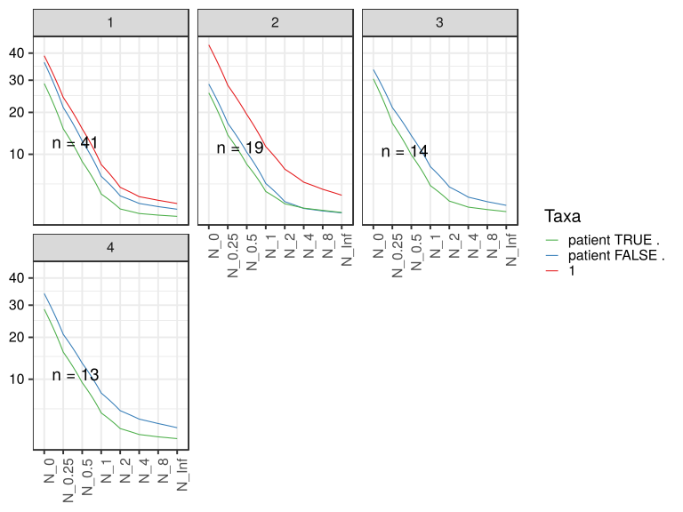

\(1.1.1.3.2.1.2.2.4.2.1.1.1\) [`Figure 95.`](#figure.95) Abundance-based diversity indices (Hill numbers) With rarefication. Data grouped by Sample.type.Drug.Before,visit.  line_obs plot.  Image file: [`plots/3231902cbf7.svg`](plots/3231902cbf7.svg).
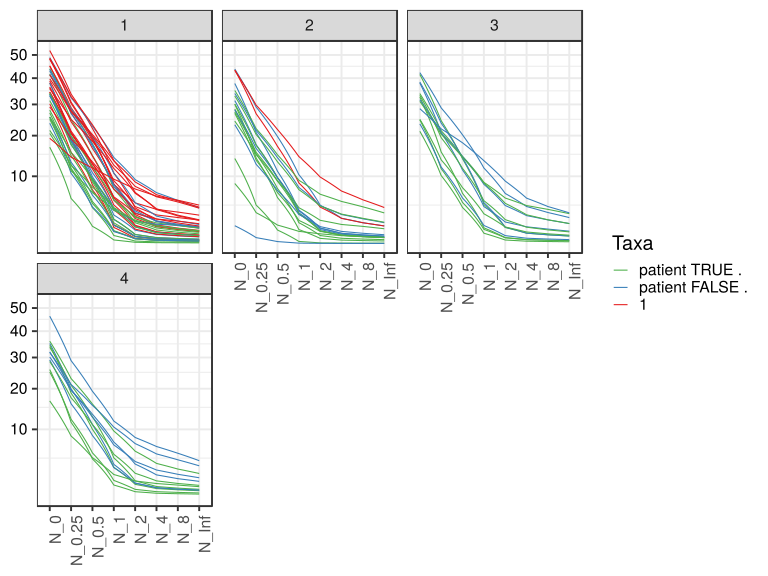

##### \(1.1.1.3.2.1.2.2.4.2.1.2\) Abundance-based diversity indices (Hill numbers) With rarefication. Plot is in flipped orientation, Y axis not scaled. Iterating over plot geometry

\(1.1.1.3.2.1.2.2.4.2.1.2.1\) [`Figure 96.`](#figure.96) Abundance-based diversity indices (Hill numbers) With rarefication. Data grouped by Sample.type.Drug.Before,visit.  line plot.  Image file: [`plots/3231eaee169.svg`](plots/3231eaee169.svg).
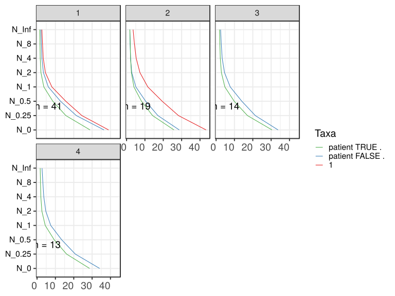

\(1.1.1.3.2.1.2.2.4.2.1.2.1\) [`Figure 97.`](#figure.97) Abundance-based diversity indices (Hill numbers) With rarefication. Data grouped by Sample.type.Drug.Before,visit.  line_obs plot.  Image file: [`plots/32356eef2cf.svg`](plots/32356eef2cf.svg).
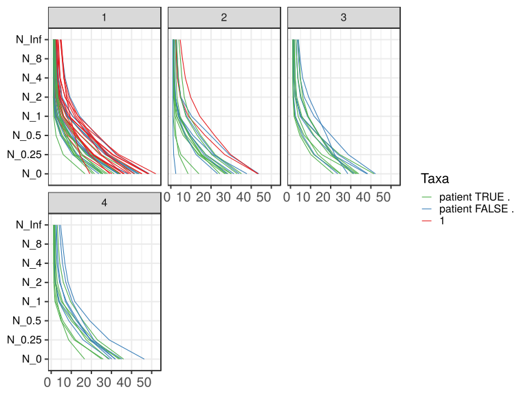

##### \(1.1.1.3.2.1.2.2.5\) Grouping variables Drug.Before.Diet,Sample.type.1

##### \(1.1.1.3.2.1.2.2.6\) Iterating over Abundance-based diversity indices (Hill numbers) With rarefication. profile sorting order

##### \(1.1.1.3.2.1.2.2.6.1\) Abundance-based diversity indices (Hill numbers) With rarefication. profile sorting order: original

##### \(1.1.1.3.2.1.2.2.6.2\) Iterating over dodged vs faceted bars

The same data are shown in multiple combinations of graphical representations. 
                         This is the same data, but each plot highlights slightly different aspects of it.
                         It is not likely that you will need every plot - pick only what you need.

##### \(1.1.1.3.2.1.2.2.6.2.1\) dodged plots. Iterating over orientation and, optionally, scaling

##### \(1.1.1.3.2.1.2.2.6.2.1.1\) Abundance-based diversity indices (Hill numbers) With rarefication. Plot is in original orientation, Y axis SQRT scaled. Iterating over plot geometry

\(1.1.1.3.2.1.2.2.6.2.1.1.0\) [`Table 23.`](#table.23) Data table used for plots. Data grouped by Drug.Before.Diet,Sample.type.1. Showing only 200 first rows. Full dataset is also saved in a delimited text file (click to download and open e.g. in Excel) [`data/1.1.1.3.2.1.2.2.6.2.1.1.0-32328bc9623.1.1.1.3.2.1.2.2.6.2.csv`](data/1.1.1.3.2.1.2.2.6.2.1.1.0-32328bc9623.1.1.1.3.2.1.2.2.6.2.csv)

| .record.id | Drug.Before.Diet | Sample.type.1       | feature | index  |
|:-----------|:-----------------|:--------------------|:--------|:-------|
| SM1        | DrugBefore\_YES  | patient.before.diet | N\_0    | 31.367 |
| SM10       | DrugBefore\_YES  | patient.after.diet  | N\_0    | 33.958 |
| SM100      | DrugBefore\_YES  | patient.after.diet  | N\_0    | 28.578 |
| SM11       | DrugBefore\_YES  | patient.after.diet  | N\_0    | 30.065 |
| SM12       | DrugBefore\_YES  | patient.before.diet | N\_0    | 24.988 |
| SM13       | DrugBefore\_NO   | patient.before.diet | N\_0    | 43.612 |
| SM14       | DrugBefore\_NO   | patient.before.diet | N\_0    | 41.438 |
| SM15       | DrugBefore\_YES  | control             | N\_0    | 29.125 |
| SM16       | DrugBefore\_NO   | patient.after.diet  | N\_0    | 31.992 |
| SM17       | DrugBefore\_YES  | patient.before.diet | N\_0    | 34.157 |
| SM18       | DrugBefore\_NO   | patient.after.diet  | N\_0    | 37.855 |
| SM19       | DrugBefore\_NO   | patient.after.diet  | N\_0    | 34.000 |
| SM2        | DrugBefore\_NO   | patient.before.diet | N\_0    | 23.730 |
| SM20       | DrugBefore\_NO   | control             | N\_0    | 36.312 |
| SM21       | DrugBefore\_NO   | patient.before.diet | N\_0    | 42.940 |
| SM22       | DrugBefore\_YES  | patient.before.diet | N\_0    | 41.672 |
| SM23       | DrugBefore\_YES  | patient.after.diet  | N\_0    | 8.582  |
| SM24       | DrugBefore\_NO   | patient.before.diet | N\_0    | 37.980 |
| SM25       | DrugBefore\_NO   | patient.after.diet  | N\_0    | 30.163 |
| SM26       | DrugBefore\_NO   | control             | N\_0    | 34.528 |
| SM28       | DrugBefore\_NO   | control             | N\_0    | 39.735 |
| SM29       | DrugBefore\_YES  | patient.after.diet  | N\_0    | 21.280 |
| SM3        | DrugBefore\_YES  | patient.after.diet  | N\_0    | 35.138 |
| SM30       | DrugBefore\_YES  | patient.after.diet  | N\_0    | 36.023 |
| SM31       | DrugBefore\_NO   | control             | N\_0    | 43.407 |
| SM33       | DrugBefore\_YES  | patient.before.diet | N\_0    | 20.645 |
| SM35       | DrugBefore\_NO   | control             | N\_0    | 34.505 |
| SM36       | DrugBefore\_NO   | patient.after.diet  | N\_0    | 31.812 |
| SM37       | DrugBefore\_NO   | control             | N\_0    | 48.097 |
| SM38       | DrugBefore\_YES  | patient.after.diet  | N\_0    | 13.953 |
| SM39       | DrugBefore\_NO   | patient.before.diet | N\_0    | 33.237 |
| SM40       | DrugBefore\_NO   | patient.after.diet  | N\_0    | 29.113 |
| SM41       | DrugBefore\_YES  | patient.before.diet | N\_0    | 43.900 |
| SM42       | DrugBefore\_NO   | patient.after.diet  | N\_0    | 35.145 |
| SM43       | DrugBefore\_YES  | patient.after.diet  | N\_0    | 33.700 |
| SM44       | DrugBefore\_NO   | control             | N\_0    | 35.792 |
| SM45       | DrugBefore\_NO   | patient.after.diet  | N\_0    | 2.467  |
| SM48       | DrugBefore\_NO   | control             | N\_0    | 45.028 |
| SM49       | DrugBefore\_YES  | patient.before.diet | N\_0    | 25.625 |
| SM5        | DrugBefore\_YES  | patient.after.diet  | N\_0    | 33.295 |
| SM50       | DrugBefore\_NO   | patient.after.diet  | N\_0    | 28.527 |
| SM51       | DrugBefore\_YES  | patient.after.diet  | N\_0    | 34.425 |
| SM52       | DrugBefore\_NO   | patient.before.diet | N\_0    | 48.807 |
| SM53       | DrugBefore\_YES  | patient.after.diet  | N\_0    | 27.407 |
| SM54       | DrugBefore\_YES  | patient.after.diet  | N\_0    | 24.990 |
| SM55       | DrugBefore\_NO   | control             | N\_0    | 36.320 |
| SM56       | DrugBefore\_YES  | patient.after.diet  | N\_0    | 24.402 |
| SM57       | DrugBefore\_YES  | patient.before.diet | N\_0    | 27.095 |
| SM58       | DrugBefore\_NO   | patient.after.diet  | N\_0    | 28.038 |
| SM59       | DrugBefore\_NO   | patient.after.diet  | N\_0    | 42.267 |
| SM60       | DrugBefore\_YES  | patient.after.diet  | N\_0    | 24.810 |
| SM62       | DrugBefore\_YES  | patient.before.diet | N\_0    | 16.793 |
| SM63       | DrugBefore\_NO   | control             | N\_0    | 48.635 |
| SM64       | DrugBefore\_YES  | patient.after.diet  | N\_0    | 26.935 |
| SM65       | DrugBefore\_YES  | patient.after.diet  | N\_0    | 31.098 |
| SM66       | DrugBefore\_NO   | control             | N\_0    | 38.888 |
| SM67       | DrugBefore\_YES  | patient.after.diet  | N\_0    | 16.628 |
| SM68       | DrugBefore\_NO   | patient.after.diet  | N\_0    | 46.330 |
| SM69       | DrugBefore\_YES  | patient.after.diet  | N\_0    | 25.102 |
| SM7        | DrugBefore\_NO   | control             | N\_0    | 41.335 |
| SM70       | DrugBefore\_NO   | control             | N\_0    | 52.035 |
| SM71       | DrugBefore\_YES  | patient.after.diet  | N\_0    | 32.655 |
| SM72       | DrugBefore\_NO   | control             | N\_0    | 45.210 |
| SM73       | DrugBefore\_NO   | patient.before.diet | N\_0    | 25.762 |
| SM74       | DrugBefore\_NO   | control             | N\_0    | 43.195 |
| SM75       | DrugBefore\_NO   | patient.after.diet  | N\_0    | 31.690 |
| SM76       | DrugBefore\_NO   | control             | N\_0    | 30.203 |
| SM77       | DrugBefore\_YES  | patient.after.diet  | N\_0    | 30.137 |
| SM79       | DrugBefore\_NO   | patient.after.diet  | N\_0    | 31.383 |
| SM8        | DrugBefore\_NO   | patient.before.diet | N\_0    | 33.803 |
| SM81       | DrugBefore\_NO   | control             | N\_0    | 19.240 |
| SM82       | DrugBefore\_YES  | patient.after.diet  | N\_0    | 25.892 |
| SM83       | DrugBefore\_YES  | patient.before.diet | N\_0    | 28.027 |
| SM84       | DrugBefore\_YES  | patient.before.diet | N\_0    | 33.800 |
| SM86       | DrugBefore\_YES  | patient.after.diet  | N\_0    | 33.070 |
| SM87       | DrugBefore\_YES  | patient.before.diet | N\_0    | 21.547 |
| SM88       | DrugBefore\_YES  | patient.after.diet  | N\_0    | 28.410 |
| SM89       | DrugBefore\_NO   | control             | N\_0    | 38.142 |
| SM9        | DrugBefore\_NO   | patient.after.diet  | N\_0    | 23.267 |
| SM90       | DrugBefore\_NO   | patient.after.diet  | N\_0    | 43.792 |
| SM91       | DrugBefore\_YES  | patient.after.diet  | N\_0    | 41.528 |
| SM92       | DrugBefore\_NO   | patient.after.diet  | N\_0    | 23.540 |
| SM93       | DrugBefore\_YES  | patient.before.diet | N\_0    | 25.650 |
| SM95       | DrugBefore\_NO   | control             | N\_0    | 48.133 |
| SM96       | DrugBefore\_NO   | patient.before.diet | N\_0    | 33.188 |
| SM98       | DrugBefore\_NO   | patient.after.diet  | N\_0    | 38.047 |
| SM99       | DrugBefore\_NO   | patient.after.diet  | N\_0    | 38.432 |
| SM1        | DrugBefore\_YES  | patient.before.diet | N\_0.25 | 17.483 |
| SM10       | DrugBefore\_YES  | patient.after.diet  | N\_0.25 | 21.436 |
| SM100      | DrugBefore\_YES  | patient.after.diet  | N\_0.25 | 17.466 |
| SM11       | DrugBefore\_YES  | patient.after.diet  | N\_0.25 | 14.053 |
| SM12       | DrugBefore\_YES  | patient.before.diet | N\_0.25 | 11.686 |
| SM13       | DrugBefore\_NO   | patient.before.diet | N\_0.25 | 27.842 |
| SM14       | DrugBefore\_NO   | patient.before.diet | N\_0.25 | 28.384 |
| SM15       | DrugBefore\_YES  | control             | N\_0.25 | 19.089 |
| SM16       | DrugBefore\_NO   | patient.after.diet  | N\_0.25 | 19.617 |
| SM17       | DrugBefore\_YES  | patient.before.diet | N\_0.25 | 18.202 |
| SM18       | DrugBefore\_NO   | patient.after.diet  | N\_0.25 | 20.861 |
| SM19       | DrugBefore\_NO   | patient.after.diet  | N\_0.25 | 21.555 |
| SM2        | DrugBefore\_NO   | patient.before.diet | N\_0.25 | 10.616 |
| SM20       | DrugBefore\_NO   | control             | N\_0.25 | 21.308 |
| SM21       | DrugBefore\_NO   | patient.before.diet | N\_0.25 | 26.903 |
| SM22       | DrugBefore\_YES  | patient.before.diet | N\_0.25 | 24.855 |
| SM23       | DrugBefore\_YES  | patient.after.diet  | N\_0.25 | 3.963  |
| SM24       | DrugBefore\_NO   | patient.before.diet | N\_0.25 | 19.781 |
| SM25       | DrugBefore\_NO   | patient.after.diet  | N\_0.25 | 19.510 |
| SM26       | DrugBefore\_NO   | control             | N\_0.25 | 20.649 |
| SM28       | DrugBefore\_NO   | control             | N\_0.25 | 27.492 |
| SM29       | DrugBefore\_YES  | patient.after.diet  | N\_0.25 | 10.149 |
| SM3        | DrugBefore\_YES  | patient.after.diet  | N\_0.25 | 22.067 |
| SM30       | DrugBefore\_YES  | patient.after.diet  | N\_0.25 | 23.018 |
| SM31       | DrugBefore\_NO   | control             | N\_0.25 | 26.803 |
| SM33       | DrugBefore\_YES  | patient.before.diet | N\_0.25 | 11.136 |
| SM35       | DrugBefore\_NO   | control             | N\_0.25 | 20.613 |
| SM36       | DrugBefore\_NO   | patient.after.diet  | N\_0.25 | 21.216 |
| SM37       | DrugBefore\_NO   | control             | N\_0.25 | 32.786 |
| SM38       | DrugBefore\_YES  | patient.after.diet  | N\_0.25 | 4.999  |
| SM39       | DrugBefore\_NO   | patient.before.diet | N\_0.25 | 17.546 |
| SM40       | DrugBefore\_NO   | patient.after.diet  | N\_0.25 | 15.884 |
| SM41       | DrugBefore\_YES  | patient.before.diet | N\_0.25 | 28.214 |
| SM42       | DrugBefore\_NO   | patient.after.diet  | N\_0.25 | 19.940 |
| SM43       | DrugBefore\_YES  | patient.after.diet  | N\_0.25 | 21.034 |
| SM44       | DrugBefore\_NO   | control             | N\_0.25 | 24.958 |
| SM45       | DrugBefore\_NO   | patient.after.diet  | N\_0.25 | 1.410  |
| SM48       | DrugBefore\_NO   | control             | N\_0.25 | 28.860 |
| SM49       | DrugBefore\_YES  | patient.before.diet | N\_0.25 | 11.472 |
| SM5        | DrugBefore\_YES  | patient.after.diet  | N\_0.25 | 19.426 |
| SM50       | DrugBefore\_NO   | patient.after.diet  | N\_0.25 | 21.996 |
| SM51       | DrugBefore\_YES  | patient.after.diet  | N\_0.25 | 18.777 |
| SM52       | DrugBefore\_NO   | patient.before.diet | N\_0.25 | 32.442 |
| SM53       | DrugBefore\_YES  | patient.after.diet  | N\_0.25 | 15.476 |
| SM54       | DrugBefore\_YES  | patient.after.diet  | N\_0.25 | 13.631 |
| SM55       | DrugBefore\_NO   | control             | N\_0.25 | 20.918 |
| SM56       | DrugBefore\_YES  | patient.after.diet  | N\_0.25 | 14.929 |
| SM57       | DrugBefore\_YES  | patient.before.diet | N\_0.25 | 12.508 |
| SM58       | DrugBefore\_NO   | patient.after.diet  | N\_0.25 | 16.481 |
| SM59       | DrugBefore\_NO   | patient.after.diet  | N\_0.25 | 28.790 |
| SM60       | DrugBefore\_YES  | patient.after.diet  | N\_0.25 | 11.610 |
| SM62       | DrugBefore\_YES  | patient.before.diet | N\_0.25 | 5.992  |
| SM63       | DrugBefore\_NO   | control             | N\_0.25 | 30.816 |
| SM64       | DrugBefore\_YES  | patient.after.diet  | N\_0.25 | 13.557 |
| SM65       | DrugBefore\_YES  | patient.after.diet  | N\_0.25 | 20.380 |
| SM66       | DrugBefore\_NO   | control             | N\_0.25 | 24.201 |
| SM67       | DrugBefore\_YES  | patient.after.diet  | N\_0.25 | 8.687  |
| SM68       | DrugBefore\_NO   | patient.after.diet  | N\_0.25 | 28.891 |
| SM69       | DrugBefore\_YES  | patient.after.diet  | N\_0.25 | 12.150 |
| SM7        | DrugBefore\_NO   | control             | N\_0.25 | 27.832 |
| SM70       | DrugBefore\_NO   | control             | N\_0.25 | 33.765 |
| SM71       | DrugBefore\_YES  | patient.after.diet  | N\_0.25 | 15.569 |
| SM72       | DrugBefore\_NO   | control             | N\_0.25 | 27.053 |
| SM73       | DrugBefore\_NO   | patient.before.diet | N\_0.25 | 13.082 |
| SM74       | DrugBefore\_NO   | control             | N\_0.25 | 29.751 |
| SM75       | DrugBefore\_NO   | patient.after.diet  | N\_0.25 | 20.782 |
| SM76       | DrugBefore\_NO   | control             | N\_0.25 | 15.439 |
| SM77       | DrugBefore\_YES  | patient.after.diet  | N\_0.25 | 17.322 |
| SM79       | DrugBefore\_NO   | patient.after.diet  | N\_0.25 | 17.473 |
| SM8        | DrugBefore\_NO   | patient.before.diet | N\_0.25 | 18.519 |
| SM81       | DrugBefore\_NO   | control             | N\_0.25 | 14.273 |
| SM82       | DrugBefore\_YES  | patient.after.diet  | N\_0.25 | 11.482 |
| SM83       | DrugBefore\_YES  | patient.before.diet | N\_0.25 | 14.626 |
| SM84       | DrugBefore\_YES  | patient.before.diet | N\_0.25 | 19.903 |
| SM86       | DrugBefore\_YES  | patient.after.diet  | N\_0.25 | 20.309 |
| SM87       | DrugBefore\_YES  | patient.before.diet | N\_0.25 | 12.337 |
| SM88       | DrugBefore\_YES  | patient.after.diet  | N\_0.25 | 15.049 |
| SM89       | DrugBefore\_NO   | control             | N\_0.25 | 19.103 |
| SM9        | DrugBefore\_NO   | patient.after.diet  | N\_0.25 | 12.592 |
| SM90       | DrugBefore\_NO   | patient.after.diet  | N\_0.25 | 29.097 |
| SM91       | DrugBefore\_YES  | patient.after.diet  | N\_0.25 | 24.547 |
| SM92       | DrugBefore\_NO   | patient.after.diet  | N\_0.25 | 11.974 |
| SM93       | DrugBefore\_YES  | patient.before.diet | N\_0.25 | 15.482 |
| SM95       | DrugBefore\_NO   | control             | N\_0.25 | 30.368 |
| SM96       | DrugBefore\_NO   | patient.before.diet | N\_0.25 | 18.893 |
| SM98       | DrugBefore\_NO   | patient.after.diet  | N\_0.25 | 20.895 |
| SM99       | DrugBefore\_NO   | patient.after.diet  | N\_0.25 | 23.778 |
| SM1        | DrugBefore\_YES  | patient.before.diet | N\_0.5  | 9.190  |
| SM10       | DrugBefore\_YES  | patient.after.diet  | N\_0.5  | 14.478 |
| SM100      | DrugBefore\_YES  | patient.after.diet  | N\_0.5  | 11.015 |
| SM11       | DrugBefore\_YES  | patient.after.diet  | N\_0.5  | 6.133  |
| SM12       | DrugBefore\_YES  | patient.before.diet | N\_0.5  | 5.230  |
| SM13       | DrugBefore\_NO   | patient.before.diet | N\_0.5  | 17.593 |
| SM14       | DrugBefore\_NO   | patient.before.diet | N\_0.5  | 19.709 |
| SM15       | DrugBefore\_YES  | control             | N\_0.5  | 13.149 |
| SM16       | DrugBefore\_NO   | patient.after.diet  | N\_0.5  | 12.636 |
| SM17       | DrugBefore\_YES  | patient.before.diet | N\_0.5  | 8.853  |
| SM18       | DrugBefore\_NO   | patient.after.diet  | N\_0.5  | 11.056 |
| SM19       | DrugBefore\_NO   | patient.after.diet  | N\_0.5  | 14.156 |
| SM2        | DrugBefore\_NO   | patient.before.diet | N\_0.5  | 4.731  |
| SM20       | DrugBefore\_NO   | control             | N\_0.5  | 12.770 |
| SM21       | DrugBefore\_NO   | patient.before.diet | N\_0.5  | 17.078 |
| SM22       | DrugBefore\_YES  | patient.before.diet | N\_0.5  | 14.691 |
| SM23       | DrugBefore\_YES  | patient.after.diet  | N\_0.5  | 2.533  |
| SM24       | DrugBefore\_NO   | patient.before.diet | N\_0.5  | 9.896  |
| SM25       | DrugBefore\_NO   | patient.after.diet  | N\_0.5  | 13.311 |
| SM26       | DrugBefore\_NO   | control             | N\_0.5  | 12.653 |
| SM28       | DrugBefore\_NO   | control             | N\_0.5  | 19.871 |
| SM29       | DrugBefore\_YES  | patient.after.diet  | N\_0.5  | 4.654  |
| SM3        | DrugBefore\_YES  | patient.after.diet  | N\_0.5  | 14.860 |
| SM30       | DrugBefore\_YES  | patient.after.diet  | N\_0.5  | 15.813 |
| SM31       | DrugBefore\_NO   | control             | N\_0.5  | 17.036 |
| SM33       | DrugBefore\_YES  | patient.before.diet | N\_0.5  | 6.936  |

\(1.1.1.3.2.1.2.2.6.2.1.1.1\) [`Widget 24.`](#widget.24) Dynamic Pivot Table link (drag and drop field names and pick averaging 
                      functions or plot types; click on fields or legend elements to filter values). 
                      Starting rendering is Stacked Bar Chart. Data grouped by Drug.Before.Diet,Sample.type.1. Click to see HTML widget file in full window: [`./1.1.1.3.2.1.2.2.6.2.1.1.1-32341aa232cDynamic.Pivot.Table.html`](./1.1.1.3.2.1.2.2.6.2.1.1.1-32341aa232cDynamic.Pivot.Table.html)

\(1.1.1.3.2.1.2.2.6.2.1.1.1\) [`Widget 25.`](#widget.25) Dynamic Pivot Table link (drag and drop field names and pick averaging 
                      functions or plot types; click on fields or legend elements to filter values). 
                      Starting rendering is Table Barchart. Data grouped by Drug.Before.Diet,Sample.type.1. Click to see HTML widget file in full window: [`./1.1.1.3.2.1.2.2.6.2.1.1.1-323398e3772Dynamic.Pivot.Table.html`](./1.1.1.3.2.1.2.2.6.2.1.1.1-323398e3772Dynamic.Pivot.Table.html)

\(1.1.1.3.2.1.2.2.6.2.1.1.1\) [`Table 24.`](#table.24) Summary table. Data grouped by Drug.Before.Diet,Sample.type.1. Full dataset is also saved in a delimited text file (click to download and open e.g. in Excel) [`data/1.1.1.3.2.1.2.2.6.2.1.1.1-323fbd6aed.1.1.1.3.2.1.2.2.6.2.csv`](data/1.1.1.3.2.1.2.2.6.2.1.1.1-323fbd6aed.1.1.1.3.2.1.2.2.6.2.csv)

| feature | Drug.Before.Diet | Sample.type.1       | mean   | sd     | median | incidence |
|:--------|:-----------------|:--------------------|:-------|:-------|:-------|:----------|
| N\_0    | DrugBefore\_NO   | control             | 39.934 | 7.6875 | 39.735 | 1         |
| N\_0    | DrugBefore\_NO   | patient.after.diet  | 31.993 | 9.5334 | 31.812 | 1         |
| N\_0    | DrugBefore\_NO   | patient.before.diet | 36.450 | 8.0093 | 35.891 | 1         |
| N\_0    | DrugBefore\_YES  | control             | 29.125 | NA     | 29.125 | 1         |
| N\_0    | DrugBefore\_YES  | patient.after.diet  | 28.082 | 7.3516 | 28.578 | 1         |
| N\_0    | DrugBefore\_YES  | patient.before.diet | 28.867 | 7.9334 | 27.095 | 1         |
| N\_0.25 | DrugBefore\_NO   | control             | 25.105 | 5.6244 | 26.803 | 1         |
| N\_0.25 | DrugBefore\_NO   | patient.after.diet  | 19.618 | 6.5047 | 20.782 | 1         |
| N\_0.25 | DrugBefore\_NO   | patient.before.diet | 21.401 | 7.1496 | 19.337 | 1         |
| N\_0.25 | DrugBefore\_YES  | control             | 19.089 | NA     | 19.089 | 1         |
| N\_0.25 | DrugBefore\_YES  | patient.after.diet  | 15.643 | 5.3927 | 15.476 | 1         |
| N\_0.25 | DrugBefore\_YES  | patient.before.diet | 15.684 | 6.0503 | 14.626 | 1         |
| N\_0.5  | DrugBefore\_NO   | control             | 16.186 | 4.7168 | 17.036 | 1         |
| N\_0.5  | DrugBefore\_NO   | patient.after.diet  | 12.496 | 4.9432 | 12.636 | 1         |
| N\_0.5  | DrugBefore\_NO   | patient.before.diet | 12.786 | 6.0516 | 10.321 | 1         |
| N\_0.5  | DrugBefore\_YES  | control             | 13.149 | NA     | 13.149 | 1         |
| N\_0.5  | DrugBefore\_YES  | patient.after.diet  | 9.019  | 4.0388 | 9.018  | 1         |
| N\_0.5  | DrugBefore\_YES  | patient.before.diet | 8.596  | 4.2034 | 7.929  | 1         |
| N\_1    | DrugBefore\_NO   | control             | 8.469  | 3.6287 | 8.506  | 1         |
| N\_1    | DrugBefore\_NO   | patient.after.diet  | 6.655  | 3.5636 | 5.349  | 1         |
| N\_1    | DrugBefore\_NO   | patient.before.diet | 6.127  | 4.0238 | 4.436  | 1         |
| N\_1    | DrugBefore\_YES  | control             | 7.546  | NA     | 7.546  | 1         |
| N\_1    | DrugBefore\_YES  | patient.after.diet  | 4.371  | 2.5772 | 3.823  | 1         |
| N\_1    | DrugBefore\_YES  | patient.before.diet | 3.691  | 1.9477 | 3.176  | 1         |
| N\_2    | DrugBefore\_NO   | control             | 4.836  | 2.5445 | 4.593  | 1         |
| N\_2    | DrugBefore\_NO   | patient.after.diet  | 3.993  | 2.4272 | 2.857  | 1         |
| N\_2    | DrugBefore\_NO   | patient.before.diet | 3.470  | 2.4509 | 2.648  | 1         |
| N\_2    | DrugBefore\_YES  | control             | 4.369  | NA     | 4.369  | 1         |
| N\_2    | DrugBefore\_YES  | patient.after.diet  | 2.705  | 1.6901 | 1.977  | 1         |
| N\_2    | DrugBefore\_YES  | patient.before.diet | 2.114  | 0.9006 | 1.660  | 1         |
| N\_4    | DrugBefore\_NO   | control             | 3.586  | 1.8860 | 3.194  | 1         |
| N\_4    | DrugBefore\_NO   | patient.after.diet  | 3.004  | 1.7208 | 2.356  | 1         |
| N\_4    | DrugBefore\_NO   | patient.before.diet | 2.643  | 1.7141 | 2.221  | 1         |
| N\_4    | DrugBefore\_YES  | control             | 3.192  | NA     | 3.192  | 1         |
| N\_4    | DrugBefore\_YES  | patient.after.diet  | 2.182  | 1.2545 | 1.613  | 1         |
| N\_4    | DrugBefore\_YES  | patient.before.diet | 1.721  | 0.6014 | 1.409  | 1         |
| N\_8    | DrugBefore\_NO   | control             | 3.125  | 1.5593 | 2.774  | 1         |
| N\_8    | DrugBefore\_NO   | patient.after.diet  | 2.603  | 1.3595 | 2.138  | 1         |
| N\_8    | DrugBefore\_NO   | patient.before.diet | 2.333  | 1.3462 | 2.088  | 1         |
| N\_8    | DrugBefore\_YES  | control             | 2.757  | NA     | 2.757  | 1         |
| N\_8    | DrugBefore\_YES  | patient.after.diet  | 1.974  | 1.0339 | 1.508  | 1         |
| N\_8    | DrugBefore\_YES  | patient.before.diet | 1.592  | 0.4919 | 1.342  | 1         |
| N\_Inf  | DrugBefore\_NO   | control             | 2.742  | 1.2509 | 2.442  | 1         |
| N\_Inf  | DrugBefore\_NO   | patient.after.diet  | 2.284  | 1.0466 | 1.946  | 1         |
| N\_Inf  | DrugBefore\_NO   | patient.before.diet | 2.089  | 1.0346 | 1.900  | 1         |
| N\_Inf  | DrugBefore\_YES  | control             | 2.430  | NA     | 2.430  | 1         |
| N\_Inf  | DrugBefore\_YES  | patient.after.diet  | 1.801  | 0.8271 | 1.433  | 1         |
| N\_Inf  | DrugBefore\_YES  | patient.before.diet | 1.496  | 0.4050 | 1.293  | 1         |

\(1.1.1.3.2.1.2.2.6.2.1.1.1\) [`Figure 98.`](#figure.98) Abundance-based diversity indices (Hill numbers) With rarefication. Data grouped by Drug.Before.Diet,Sample.type.1.  line plot.  Image file: [`plots/3236f774a0b.svg`](plots/3236f774a0b.svg).
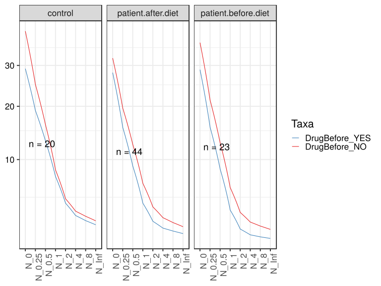

\(1.1.1.3.2.1.2.2.6.2.1.1.1\) [`Figure 99.`](#figure.99) Abundance-based diversity indices (Hill numbers) With rarefication. Data grouped by Drug.Before.Diet,Sample.type.1.  line_obs plot.  Image file: [`plots/3234c0329ea.svg`](plots/3234c0329ea.svg).
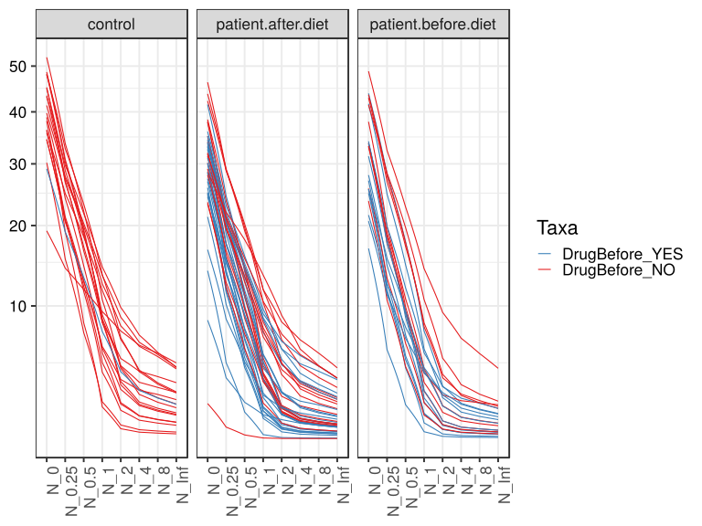

##### \(1.1.1.3.2.1.2.2.6.2.1.2\) Abundance-based diversity indices (Hill numbers) With rarefication. Plot is in flipped orientation, Y axis not scaled. Iterating over plot geometry

\(1.1.1.3.2.1.2.2.6.2.1.2.1\) [`Figure 100.`](#figure.100) Abundance-based diversity indices (Hill numbers) With rarefication. Data grouped by Drug.Before.Diet,Sample.type.1.  line plot.  Image file: [`plots/323483d974b.svg`](plots/323483d974b.svg).
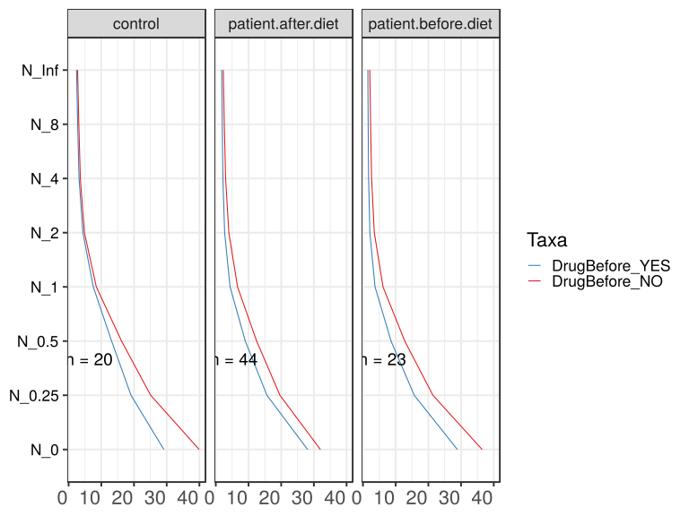

\(1.1.1.3.2.1.2.2.6.2.1.2.1\) [`Figure 101.`](#figure.101) Abundance-based diversity indices (Hill numbers) With rarefication. Data grouped by Drug.Before.Diet,Sample.type.1.  line_obs plot.  Image file: [`plots/3235b2cdd6d.svg`](plots/3235b2cdd6d.svg).
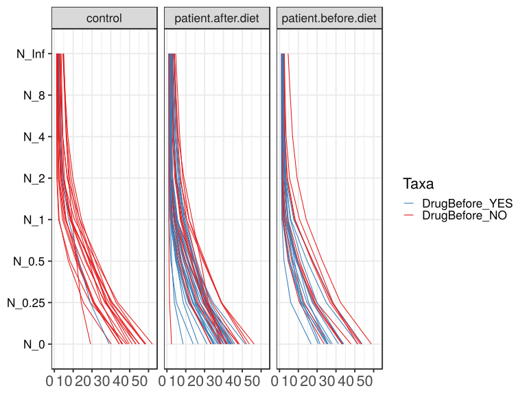