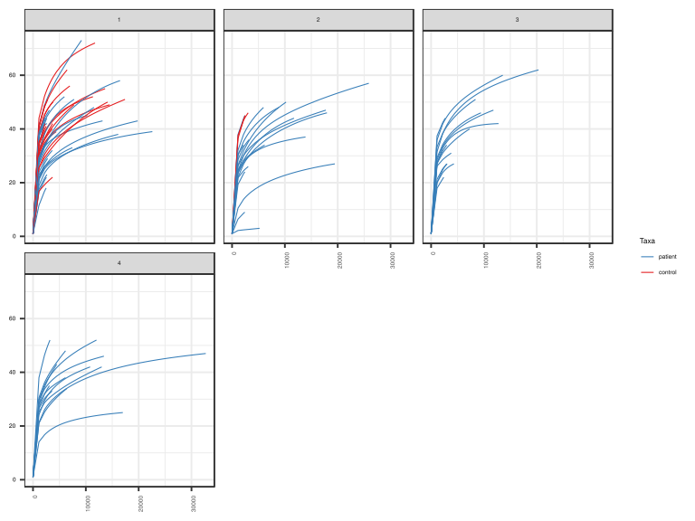
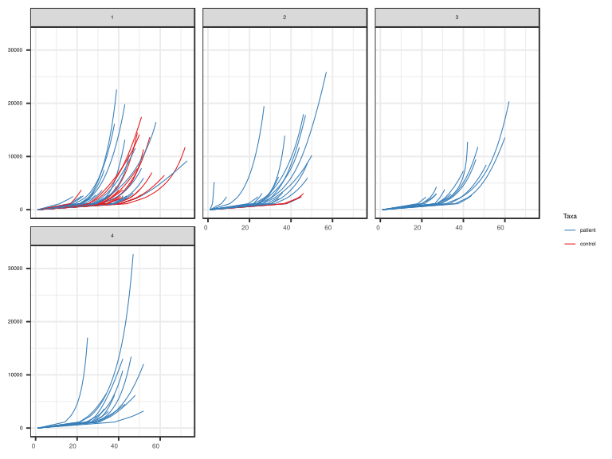
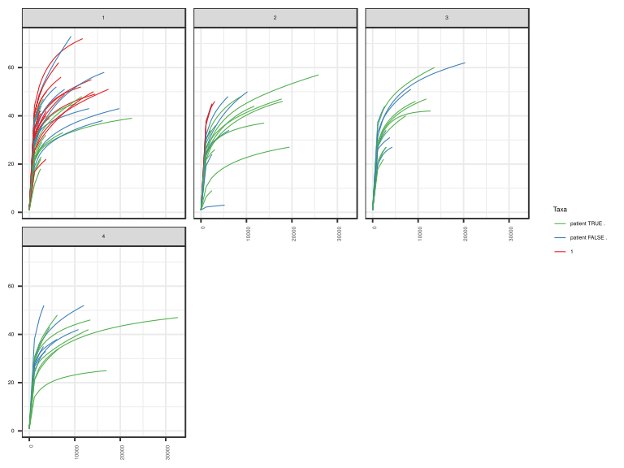
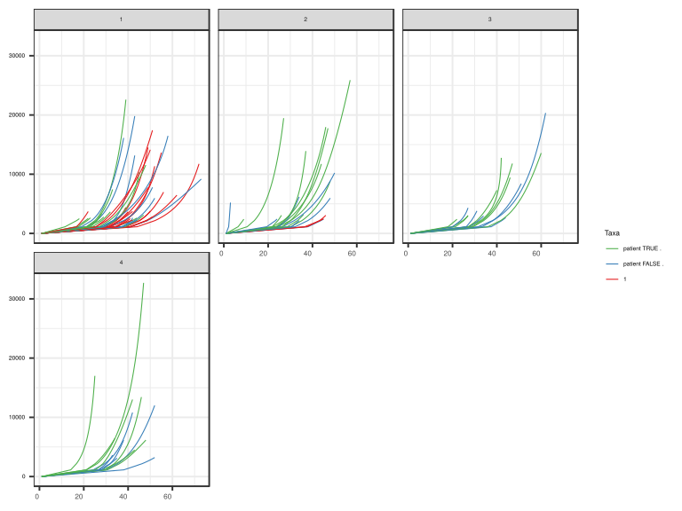
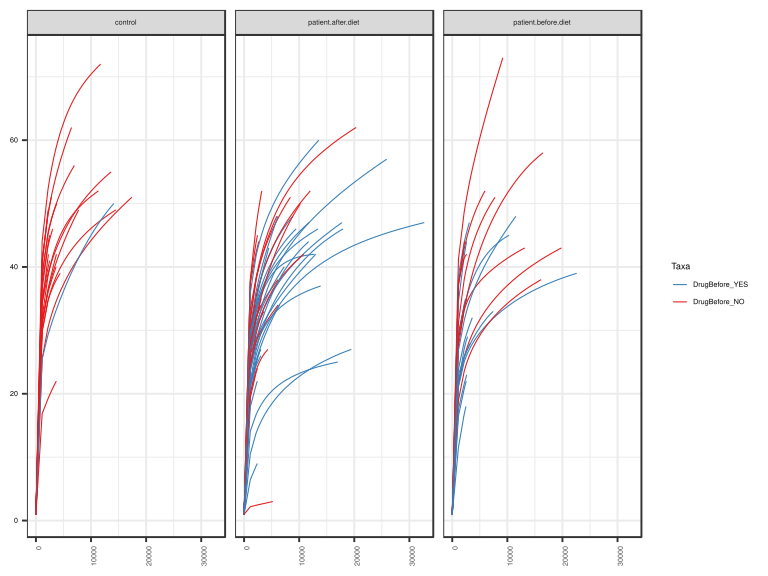
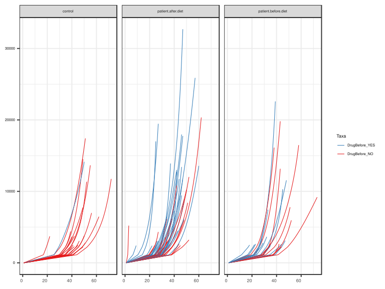

noone@mail.com
Analysis of Dieting study 16S data
% Fri Sep  7 05:46:18 2018

##### \(1.1.1.3.2.1.3.1\) Plots of Abundance-based rarefaction curves.

Plots are shown with relation to various combinations of meta 
                   data variables and in different graphical representations. Lots of plots here.

##### \(1.1.1.3.2.1.3.1.2\) Iterating over all combinations of grouping variables

##### \(1.1.1.3.2.1.3.1.2.1\) Grouping variables Sample.type,visit

##### \(1.1.1.3.2.1.3.1.2.2\) Iterating over Abundance-based rarefaction curves. profile sorting order

##### \(1.1.1.3.2.1.3.1.2.2.1\) Abundance-based rarefaction curves. profile sorting order: original

##### \(1.1.1.3.2.1.3.1.2.2.2\) Iterating over dodged vs faceted bars

The same data are shown in multiple combinations of graphical representations. 
                         This is the same data, but each plot highlights slightly different aspects of it.
                         It is not likely that you will need every plot - pick only what you need.

##### \(1.1.1.3.2.1.3.1.2.2.2.1\) dodged plots. Iterating over orientation and, optionally, scaling

##### \(1.1.1.3.2.1.3.1.2.2.2.1.1\) Abundance-based rarefaction curves. Plot is in original orientation. Iterating over plot geometry

\(1.1.1.3.2.1.3.1.2.2.2.1.1.0\) [`Table 31.`](#table.31) Data table used for plots. Data grouped by Sample.type,visit. Showing only 200 first rows. Full dataset is also saved in a delimited text file (click to download and open e.g. in Excel) [`data/1.1.1.3.2.1.3.1.2.2.2.1.1.0-3235c82910d.1.1.1.3.2.1.3.1.2.2.csv`](data/1.1.1.3.2.1.3.1.2.2.2.1.1.0-3235c82910d.1.1.1.3.2.1.3.1.2.2.csv)

| .record.id | Sample.type | visit | feature          | Richness |
|:-----------|:------------|:------|:-----------------|:---------|
| SM1        | patient     | 1     | 1                | 1.000    |
| SM10       | patient     | 3     | 1                | 1.000    |
| SM100      | patient     | 4     | 1                | 1.000    |
| SM11       | patient     | 2     | 1                | 1.000    |
| SM12       | patient     | 1     | 1                | 1.000    |
| SM13       | patient     | 1     | 1                | 1.000    |
| SM14       | patient     | 1     | 1                | 1.000    |
| SM15       | control     | 1     | 1                | 1.000    |
| SM16       | patient     | 4     | 1                | 1.000    |
| SM17       | patient     | 1     | 1                | 1.000    |
| SM18       | patient     | 2     | 1                | 1.000    |
| SM19       | patient     | 2     | 1                | 1.000    |
| SM2        | patient     | 1     | 1                | 1.000    |
| SM20       | control     | 1     | 1                | 1.000    |
| SM21       | patient     | 1     | 1                | 1.000    |
| SM22       | patient     | 1     | 1                | 1.000    |
| SM23       | patient     | 2     | 1                | 1.000    |
| SM24       | patient     | 1     | 1                | 1.000    |
| SM25       | patient     | 4     | 1                | 1.000    |
| SM26       | control     | 1     | 1                | 1.000    |
| SM28       | control     | 1     | 1                | 1.000    |
| SM29       | patient     | 3     | 1                | 1.000    |
| SM3        | patient     | 2     | 1                | 1.000    |
| SM30       | patient     | 4     | 1                | 1.000    |
| SM31       | control     | 2     | 1                | 1.000    |
| SM33       | patient     | 1     | 1                | 1.000    |
| SM35       | control     | 1     | 1                | 1.000    |
| SM36       | patient     | 4     | 1                | 1.000    |
| SM37       | control     | 1     | 1                | 1.000    |
| SM38       | patient     | 2     | 1                | 1.000    |
| SM39       | patient     | 1     | 1                | 1.000    |
| SM40       | patient     | 4     | 1                | 1.000    |
| SM41       | patient     | 1     | 1                | 1.000    |
| SM42       | patient     | 4     | 1                | 1.000    |
| SM43       | patient     | 4     | 1                | 1.000    |
| SM44       | control     | 1     | 1                | 1.000    |
| SM45       | patient     | 2     | 1                | 1.000    |
| SM48       | control     | 1     | 1                | 1.000    |
| SM49       | patient     | 1     | 1                | 1.000    |
| SM5        | patient     | 3     | 1                | 1.000    |
| SM50       | patient     | 3     | 1                | 1.000    |
| SM51       | patient     | 4     | 1                | 1.000    |
| SM52       | patient     | 1     | 1                | 1.000    |
| SM53       | patient     | 2     | 1                | 1.000    |
| SM54       | patient     | 3     | 1                | 1.000    |
| SM55       | control     | 1     | 1                | 1.000    |
| SM56       | patient     | 2     | 1                | 1.000    |
| SM57       | patient     | 1     | 1                | 1.000    |
| SM58       | patient     | 2     | 1                | 1.000    |
| SM59       | patient     | 3     | 1                | 1.000    |
| SM60       | patient     | 3     | 1                | 1.000    |
| SM62       | patient     | 1     | 1                | 1.000    |
| SM63       | control     | 1     | 1                | 1.000    |
| SM64       | patient     | 2     | 1                | 1.000    |
| SM65       | patient     | 3     | 1                | 1.000    |
| SM66       | control     | 1     | 1                | 1.000    |
| SM67       | patient     | 4     | 1                | 1.000    |
| SM68       | patient     | 4     | 1                | 1.000    |
| SM69       | patient     | 4     | 1                | 1.000    |
| SM7        | control     | 1     | 1                | 1.000    |
| SM70       | control     | 1     | 1                | 1.000    |
| SM71       | patient     | 3     | 1                | 1.000    |
| SM72       | control     | 1     | 1                | 1.000    |
| SM73       | patient     | 1     | 1                | 1.000    |
| SM74       | control     | 2     | 1                | 1.000    |
| SM75       | patient     | 3     | 1                | 1.000    |
| SM76       | control     | 1     | 1                | 1.000    |
| SM77       | patient     | 2     | 1                | 1.000    |
| SM79       | patient     | 2     | 1                | 1.000    |
| SM8        | patient     | 1     | 1                | 1.000    |
| SM81       | control     | 1     | 1                | 1.000    |
| SM82       | patient     | 4     | 1                | 1.000    |
| SM83       | patient     | 1     | 1                | 1.000    |
| SM84       | patient     | 1     | 1                | 1.000    |
| SM86       | patient     | 2     | 1                | 1.000    |
| SM87       | patient     | 1     | 1                | 1.000    |
| SM88       | patient     | 2     | 1                | 1.000    |
| SM89       | control     | 1     | 1                | 1.000    |
| SM9        | patient     | 2     | 1                | 1.000    |
| SM90       | patient     | 2     | 1                | 1.000    |
| SM91       | patient     | 3     | 1                | 1.000    |
| SM92       | patient     | 3     | 1                | 1.000    |
| SM93       | patient     | 1     | 1                | 1.000    |
| SM95       | control     | 1     | 1                | 1.000    |
| SM96       | patient     | 1     | 1                | 1.000    |
| SM98       | patient     | 3     | 1                | 1.000    |
| SM99       | patient     | 3     | 1                | 1.000    |
| SM1        | patient     | 1     | 1128.62068965517 | 26.870   |
| SM10       | patient     | 3     | 1128.62068965517 | 29.274   |
| SM100      | patient     | 4     | 1128.62068965517 | 25.283   |
| SM11       | patient     | 2     | 1128.62068965517 | 24.293   |
| SM12       | patient     | 1     | 1128.62068965517 | 21.091   |
| SM13       | patient     | 1     | 1128.62068965517 | 37.432   |
| SM14       | patient     | 1     | 1128.62068965517 | 37.645   |
| SM15       | control     | 1     | 1128.62068965517 | 25.511   |
| SM16       | patient     | 4     | 1128.62068965517 | 28.108   |
| SM17       | patient     | 1     | 1128.62068965517 | 29.292   |
| SM18       | patient     | 2     | 1128.62068965517 | 32.134   |
| SM19       | patient     | 2     | 1128.62068965517 | 30.523   |
| SM2        | patient     | 1     | 1128.62068965517 | 18.973   |
| SM20       | control     | 1     | 1128.62068965517 | 30.785   |
| SM21       | patient     | 1     | 1128.62068965517 | 36.965   |
| SM22       | patient     | 1     | 1128.62068965517 | 34.511   |
| SM23       | patient     | 2     | 1128.62068965517 | 6.440    |
| SM24       | patient     | 1     | 1128.62068965517 | 31.260   |
| SM25       | patient     | 4     | 1128.62068965517 | 26.553   |
| SM26       | control     | 1     | 1128.62068965517 | 29.779   |
| SM28       | control     | 1     | 1128.62068965517 | 35.174   |
| SM29       | patient     | 3     | 1128.62068965517 | 17.948   |
| SM3        | patient     | 2     | 1128.62068965517 | 30.171   |
| SM30       | patient     | 4     | 1128.62068965517 | 30.596   |
| SM31       | control     | 2     | 1128.62068965517 | 36.449   |
| SM33       | patient     | 1     | 1128.62068965517 | 16.509   |
| SM35       | control     | 1     | 1128.62068965517 | 29.908   |
| SM36       | patient     | 4     | 1128.62068965517 | 26.950   |
| SM37       | control     | 1     | 1128.62068965517 | 41.184   |
| SM38       | patient     | 2     | 1128.62068965517 | 10.523   |
| SM39       | patient     | 1     | 1128.62068965517 | 27.418   |
| SM40       | patient     | 4     | 1128.62068965517 | 24.216   |
| SM41       | patient     | 1     | 1128.62068965517 | 38.686   |
| SM42       | patient     | 4     | 1128.62068965517 | 29.820   |
| SM43       | patient     | 4     | 1128.62068965517 | 29.841   |
| SM44       | control     | 1     | 1128.62068965517 | 31.517   |
| SM45       | patient     | 2     | 1128.62068965517 | 2.184    |
| SM48       | control     | 1     | 1128.62068965517 | 38.856   |
| SM49       | patient     | 1     | 1128.62068965517 | 21.888   |
| SM5        | patient     | 3     | 1128.62068965517 | 28.483   |
| SM50       | patient     | 3     | 1128.62068965517 | 26.196   |
| SM51       | patient     | 4     | 1128.62068965517 | 28.273   |
| SM52       | patient     | 1     | 1128.62068965517 | 41.240   |
| SM53       | patient     | 2     | 1128.62068965517 | 23.583   |
| SM54       | patient     | 3     | 1128.62068965517 | 21.273   |
| SM55       | control     | 1     | 1128.62068965517 | 31.377   |
| SM56       | patient     | 2     | 1128.62068965517 | 21.808   |
| SM57       | patient     | 1     | 1128.62068965517 | 21.716   |
| SM58       | patient     | 2     | 1128.62068965517 | 24.713   |
| SM59       | patient     | 3     | 1128.62068965517 | 37.426   |
| SM60       | patient     | 3     | 1128.62068965517 | 19.979   |
| SM62       | patient     | 1     | 1128.62068965517 | 11.557   |
| SM63       | control     | 1     | 1128.62068965517 | 40.513   |
| SM64       | patient     | 2     | 1128.62068965517 | 22.019   |
| SM65       | patient     | 3     | 1128.62068965517 | 27.140   |
| SM66       | control     | 1     | 1128.62068965517 | 34.365   |
| SM67       | patient     | 4     | 1128.62068965517 | 14.102   |
| SM68       | patient     | 4     | 1128.62068965517 | 38.044   |
| SM69       | patient     | 4     | 1128.62068965517 | 21.032   |
| SM7        | control     | 1     | 1128.62068965517 | 33.999   |
| SM70       | control     | 1     | 1128.62068965517 | 44.046   |
| SM71       | patient     | 3     | 1128.62068965517 | 27.038   |
| SM72       | control     | 1     | 1128.62068965517 | 38.595   |
| SM73       | patient     | 1     | 1128.62068965517 | 21.494   |
| SM74       | control     | 2     | 1128.62068965517 | 37.534   |
| SM75       | patient     | 3     | 1128.62068965517 | 27.602   |
| SM76       | control     | 1     | 1128.62068965517 | 25.487   |
| SM77       | patient     | 2     | 1128.62068965517 | 26.262   |
| SM79       | patient     | 2     | 1128.62068965517 | 26.485   |
| SM8        | patient     | 1     | 1128.62068965517 | 29.466   |
| SM81       | control     | 1     | 1128.62068965517 | 16.858   |
| SM82       | patient     | 4     | 1128.62068965517 | 21.292   |
| SM83       | patient     | 1     | 1128.62068965517 | 23.880   |
| SM84       | patient     | 1     | 1128.62068965517 | 28.729   |
| SM86       | patient     | 2     | 1128.62068965517 | 28.605   |
| SM87       | patient     | 1     | 1128.62068965517 | 17.573   |
| SM88       | patient     | 2     | 1128.62068965517 | 23.742   |
| SM89       | control     | 1     | 1128.62068965517 | 32.048   |
| SM9        | patient     | 2     | 1128.62068965517 | 19.355   |
| SM90       | patient     | 2     | 1128.62068965517 | 37.931   |
| SM91       | patient     | 3     | 1128.62068965517 | 35.913   |
| SM92       | patient     | 3     | 1128.62068965517 | 20.064   |
| SM93       | patient     | 1     | 1128.62068965517 | 23.010   |
| SM95       | control     | 1     | 1128.62068965517 | 40.909   |
| SM96       | patient     | 1     | 1128.62068965517 | 28.562   |
| SM98       | patient     | 3     | 1128.62068965517 | 31.504   |
| SM99       | patient     | 3     | 1128.62068965517 | 33.331   |
| SM1        | patient     | 1     | 2161             | 31.518   |
| SM10       | patient     | 3     | 2161             | 34.024   |
| SM100      | patient     | 4     | 2161             | 28.614   |
| SM11       | patient     | 2     | 2161             | 30.042   |
| SM12       | patient     | 1     | 2161             | 25.008   |
| SM13       | patient     | 1     | 2161             | 43.574   |
| SM14       | patient     | 1     | 2161             | 41.386   |
| SM15       | control     | 1     | 2161             | 29.173   |
| SM16       | patient     | 4     | 2161             | 31.899   |
| SM17       | patient     | 1     | 2161             | 34.126   |
| SM18       | patient     | 2     | 2161             | 37.861   |
| SM19       | patient     | 2     | 2161             | 34.000   |
| SM2        | patient     | 1     | 2161             | 23.507   |
| SM20       | control     | 1     | 2161             | 36.293   |
| SM21       | patient     | 1     | 2161             | 42.829   |
| SM22       | patient     | 1     | 2161             | 41.745   |
| SM23       | patient     | 2     | 2161             | 8.573    |
| SM24       | patient     | 1     | 2161             | 37.962   |
| SM25       | patient     | 4     | 2161             | 30.180   |
| SM26       | control     | 1     | 2161             | 34.606   |
| SM28       | control     | 1     | 2161             | 39.749   |
| SM29       | patient     | 3     | 2161             | 21.318   |
| SM3        | patient     | 2     | 2161             | 35.224   |
| SM30       | patient     | 4     | 2161             | 36.051   |
| SM31       | control     | 2     | 2161             | 43.409   |
| SM33       | patient     | 1     | 2161             | 20.733   |

\(1.1.1.3.2.1.3.1.2.2.2.1.1.1\) [`Widget 32.`](#widget.32) Dynamic Pivot Table link (drag and drop field names and pick averaging 
                      functions or plot types; click on fields or legend elements to filter values). 
                      Starting rendering is Stacked Bar Chart. Data grouped by Sample.type,visit. Click to see HTML widget file in full window: [`./1.1.1.3.2.1.3.1.2.2.2.1.1.1-32349c7acdaDynamic.Pivot.Table.html`](./1.1.1.3.2.1.3.1.2.2.2.1.1.1-32349c7acdaDynamic.Pivot.Table.html)

\(1.1.1.3.2.1.3.1.2.2.2.1.1.1\) [`Widget 33.`](#widget.33) Dynamic Pivot Table link (drag and drop field names and pick averaging 
                      functions or plot types; click on fields or legend elements to filter values). 
                      Starting rendering is Table Barchart. Data grouped by Sample.type,visit. Click to see HTML widget file in full window: [`./1.1.1.3.2.1.3.1.2.2.2.1.1.1-3236c6ccc7aDynamic.Pivot.Table.html`](./1.1.1.3.2.1.3.1.2.2.2.1.1.1-3236c6ccc7aDynamic.Pivot.Table.html)

\(1.1.1.3.2.1.3.1.2.2.2.1.1.1\) [`Table 32.`](#table.32) Summary table. Data grouped by Sample.type,visit. Showing only 200 first rows. Full dataset is also saved in a delimited text file (click to download and open e.g. in Excel) [`data/1.1.1.3.2.1.3.1.2.2.2.1.1.1-323ac07c79.1.1.1.3.2.1.3.1.2.2.csv`](data/1.1.1.3.2.1.3.1.2.2.2.1.1.1-323ac07c79.1.1.1.3.2.1.3.1.2.2.csv)

| feature          | Sample.type | visit | mean  | sd         | median | incidence |
|:-----------------|:------------|:------|:------|:-----------|:-------|:----------|
| 2161             | control     | 1     | 38.98 | 8.188e\+00 | 38.61  | 1         |
| 2161             | control     | 2     | 43.26 | 2.050e\-01 | 43.26  | 1         |
| 2161             | patient     | 1     | 32.16 | 8.651e\+00 | 33.16  | 1         |
| 2161             | patient     | 2     | 26.99 | 1.042e\+01 | 28.23  | 1         |
| 2161             | patient     | 3     | 31.86 | 6.679e\+00 | 32.19  | 1         |
| 2161             | patient     | 4     | 31.17 | 6.895e\+00 | 31.84  | 1         |
| 1128.62068965517 | control     | 1     | 33.38 | 6.783e\+00 | 33.02  | 1         |
| 1128.62068965517 | control     | 2     | 36.99 | 7.672e\-01 | 36.99  | 1         |
| 1128.62068965517 | patient     | 1     | 27.21 | 7.972e\+00 | 27.42  | 1         |
| 1128.62068965517 | patient     | 2     | 22.99 | 9.196e\+00 | 24.29  | 1         |
| 1128.62068965517 | patient     | 3     | 27.37 | 5.995e\+00 | 27.37  | 1         |
| 1128.62068965517 | patient     | 4     | 26.47 | 5.742e\+00 | 26.95  | 1         |
| 1                | control     | 1     | 1.00  | 2.256e\-14 | 1.00   | 1         |
| 1                | control     | 2     | 1.00  | 9.264e\-15 | 1.00   | 1         |
| 1                | patient     | 1     | 1.00  | 1.889e\-14 | 1.00   | 1         |
| 1                | patient     | 2     | 1.00  | 2.180e\-14 | 1.00   | 1         |
| 1                | patient     | 3     | 1.00  | 1.698e\-14 | 1.00   | 1         |
| 1                | patient     | 4     | 1.00  | 2.399e\-14 | 1.00   | 1         |
| 2220             | control     | 1     | 39.22 | 8.247e\+00 | 38.84  | 1         |
| 2220             | control     | 2     | 43.54 | 2.644e\-01 | 43.54  | 1         |
| 2220             | patient     | 1     | 32.37 | 8.681e\+00 | 33.33  | 1         |
| 2220             | patient     | 2     | 26.73 | 1.066e\+01 | 28.33  | 1         |
| 2220             | patient     | 3     | 32.05 | 6.709e\+00 | 32.40  | 1         |
| 2220             | patient     | 4     | 31.37 | 6.952e\+00 | 32.05  | 1         |
| 2240             | control     | 1     | 38.73 | 8.137e\+00 | 38.75  | 1         |
| 2240             | control     | 2     | 43.63 | 2.846e\-01 | 43.63  | 1         |
| 2240             | patient     | 1     | 32.44 | 8.691e\+00 | 33.39  | 1         |
| 2240             | patient     | 2     | 26.79 | 1.068e\+01 | 28.39  | 1         |
| 2240             | patient     | 3     | 32.11 | 6.718e\+00 | 32.46  | 1         |
| 2240             | patient     | 4     | 31.44 | 6.971e\+00 | 32.10  | 1         |
| 2256.24137931034 | control     | 1     | 38.79 | 8.151e\+00 | 38.82  | 1         |
| 2256.24137931034 | control     | 2     | 43.70 | 3.008e\-01 | 43.70  | 1         |
| 2256.24137931034 | patient     | 1     | 31.97 | 8.520e\+00 | 32.64  | 1         |
| 2256.24137931034 | patient     | 2     | 26.84 | 1.070e\+01 | 28.44  | 1         |
| 2256.24137931034 | patient     | 3     | 32.17 | 6.726e\+00 | 32.52  | 1         |
| 2256.24137931034 | patient     | 4     | 31.49 | 6.986e\+00 | 32.14  | 1         |
| 2272             | control     | 1     | 38.85 | 8.165e\+00 | 38.89  | 1         |
| 2272             | control     | 2     | 43.77 | 3.171e\-01 | 43.77  | 1         |
| 2272             | patient     | 1     | 32.02 | 8.527e\+00 | 32.69  | 1         |
| 2272             | patient     | 2     | 26.89 | 1.072e\+01 | 28.48  | 1         |
| 2272             | patient     | 3     | 32.22 | 6.734e\+00 | 32.57  | 1         |
| 2272             | patient     | 4     | 31.55 | 7.002e\+00 | 32.18  | 1         |
| 2394             | control     | 1     | 39.10 | 8.488e\+00 | 38.33  | 1         |
| 2394             | control     | 2     | 44.30 | 4.417e\-01 | 44.30  | 1         |
| 2394             | patient     | 1     | 32.42 | 8.575e\+00 | 33.06  | 1         |
| 2394             | patient     | 2     | 27.24 | 1.084e\+01 | 28.82  | 1         |
| 2394             | patient     | 3     | 32.60 | 6.792e\+00 | 32.97  | 1         |
| 2394             | patient     | 4     | 31.95 | 7.116e\+00 | 32.47  | 1         |
| 2411             | control     | 1     | 39.16 | 8.501e\+00 | 38.39  | 1         |
| 2411             | control     | 2     | 44.38 | 4.592e\-01 | 44.38  | 1         |
| 2411             | patient     | 1     | 32.48 | 8.581e\+00 | 33.11  | 1         |
| 2411             | patient     | 2     | 27.28 | 1.085e\+01 | 28.87  | 1         |
| 2411             | patient     | 3     | 33.47 | 6.325e\+00 | 33.57  | 1         |
| 2411             | patient     | 4     | 32.01 | 7.132e\+00 | 32.51  | 1         |
| 2417             | control     | 1     | 39.19 | 8.506e\+00 | 38.42  | 1         |
| 2417             | control     | 2     | 44.40 | 4.654e\-01 | 44.40  | 1         |
| 2417             | patient     | 1     | 32.50 | 8.584e\+00 | 33.13  | 1         |
| 2417             | patient     | 2     | 28.52 | 1.004e\+01 | 29.10  | 1         |
| 2417             | patient     | 3     | 33.48 | 6.328e\+00 | 33.59  | 1         |
| 2417             | patient     | 4     | 32.03 | 7.137e\+00 | 32.53  | 1         |
| 2424             | control     | 1     | 39.21 | 8.511e\+00 | 38.45  | 1         |
| 2424             | control     | 2     | 44.43 | 4.726e\-01 | 44.43  | 1         |
| 2424             | patient     | 1     | 32.40 | 8.780e\+00 | 32.42  | 1         |
| 2424             | patient     | 2     | 28.54 | 1.005e\+01 | 29.12  | 1         |
| 2424             | patient     | 3     | 33.51 | 6.331e\+00 | 33.61  | 1         |
| 2424             | patient     | 4     | 32.05 | 7.144e\+00 | 32.54  | 1         |
| 2431             | control     | 1     | 39.24 | 8.516e\+00 | 38.47  | 1         |
| 2431             | control     | 2     | 44.46 | 4.797e\-01 | 44.46  | 1         |
| 2431             | patient     | 1     | 32.42 | 8.782e\+00 | 32.44  | 1         |
| 2431             | patient     | 2     | 27.38 | 9.301e\+00 | 28.92  | 1         |
| 2431             | patient     | 3     | 33.53 | 6.335e\+00 | 33.64  | 1         |
| 2431             | patient     | 4     | 32.07 | 7.150e\+00 | 32.56  | 1         |
| 2472             | control     | 1     | 39.38 | 8.547e\+00 | 38.64  | 1         |
| 2472             | control     | 2     | 44.63 | 5.219e\-01 | 44.63  | 1         |
| 2472             | patient     | 1     | 32.55 | 8.798e\+00 | 32.58  | 1         |
| 2472             | patient     | 2     | 27.76 | 9.664e\+00 | 29.28  | 1         |
| 2472             | patient     | 3     | 33.65 | 6.356e\+00 | 33.77  | 1         |
| 2472             | patient     | 4     | 32.20 | 7.188e\+00 | 32.65  | 1         |
| 2491             | control     | 1     | 39.45 | 8.561e\+00 | 38.71  | 1         |
| 2491             | control     | 2     | 44.33 | NA         | 44.33  | 1         |
| 2491             | patient     | 1     | 32.61 | 8.805e\+00 | 32.64  | 1         |
| 2491             | patient     | 2     | 27.81 | 9.680e\+00 | 29.34  | 1         |
| 2491             | patient     | 3     | 33.71 | 6.365e\+00 | 33.83  | 1         |
| 2491             | patient     | 4     | 32.26 | 7.205e\+00 | 32.70  | 1         |
| 2502             | control     | 1     | 39.48 | 8.569e\+00 | 38.75  | 1         |
| 2502             | control     | 2     | 44.36 | NA         | 44.36  | 1         |
| 2502             | patient     | 1     | 33.38 | 8.361e\+00 | 33.37  | 1         |
| 2502             | patient     | 2     | 27.84 | 9.690e\+00 | 29.38  | 1         |
| 2502             | patient     | 3     | 33.74 | 6.371e\+00 | 33.86  | 1         |
| 2502             | patient     | 4     | 32.29 | 7.215e\+00 | 32.72  | 1         |
| 2542             | control     | 1     | 39.52 | 8.889e\+00 | 37.84  | 1         |
| 2542             | control     | 2     | 44.50 | NA         | 44.50  | 1         |
| 2542             | patient     | 1     | 33.50 | 8.379e\+00 | 33.48  | 1         |
| 2542             | patient     | 2     | 27.95 | 9.725e\+00 | 29.51  | 1         |
| 2542             | patient     | 3     | 33.86 | 6.391e\+00 | 33.99  | 1         |
| 2542             | patient     | 4     | 32.42 | 7.251e\+00 | 32.81  | 1         |
| 2605             | control     | 1     | 39.73 | 8.934e\+00 | 38.09  | 1         |
| 2605             | control     | 2     | 44.70 | NA         | 44.70  | 1         |
| 2605             | patient     | 1     | 34.29 | 8.180e\+00 | 34.30  | 1         |
| 2605             | patient     | 2     | 28.11 | 9.779e\+00 | 29.70  | 1         |
| 2605             | patient     | 3     | 34.04 | 6.423e\+00 | 34.18  | 1         |
| 2605             | patient     | 4     | 32.61 | 7.307e\+00 | 32.94  | 1         |
| 2628             | control     | 1     | 39.81 | 8.951e\+00 | 38.17  | 1         |
| 2628             | control     | 2     | 44.77 | NA         | 44.77  | 1         |
| 2628             | patient     | 1     | 33.81 | 8.071e\+00 | 33.71  | 1         |
| 2628             | patient     | 2     | 28.17 | 9.798e\+00 | 29.78  | 1         |
| 2628             | patient     | 3     | 34.10 | 6.435e\+00 | 34.25  | 1         |
| 2628             | patient     | 4     | 32.68 | 7.327e\+00 | 32.99  | 1         |
| 2641             | control     | 1     | 39.85 | 8.960e\+00 | 38.22  | 1         |
| 2641             | control     | 2     | 44.81 | NA         | 44.81  | 1         |
| 2641             | patient     | 1     | 34.49 | 7.846e\+00 | 34.38  | 1         |
| 2641             | patient     | 2     | 28.20 | 9.809e\+00 | 29.82  | 1         |
| 2641             | patient     | 3     | 34.14 | 6.441e\+00 | 34.29  | 1         |
| 2641             | patient     | 4     | 32.72 | 7.339e\+00 | 33.02  | 1         |
| 2670             | control     | 1     | 39.95 | 8.979e\+00 | 38.33  | 1         |
| 2670             | control     | 2     | 44.90 | NA         | 44.90  | 1         |
| 2670             | patient     | 1     | 34.10 | 7.871e\+00 | 33.82  | 1         |
| 2670             | patient     | 2     | 28.28 | 9.834e\+00 | 29.91  | 1         |
| 2670             | patient     | 3     | 34.22 | 6.456e\+00 | 34.37  | 1         |
| 2670             | patient     | 4     | 32.80 | 7.364e\+00 | 33.08  | 1         |
| 2697             | control     | 1     | 40.03 | 8.998e\+00 | 38.44  | 1         |
| 2697             | control     | 2     | 44.99 | NA         | 44.99  | 1         |
| 2697             | patient     | 1     | 34.18 | 7.888e\+00 | 33.89  | 1         |
| 2697             | patient     | 2     | 28.35 | 9.856e\+00 | 29.99  | 1         |
| 2697             | patient     | 3     | 33.48 | 6.017e\+00 | 33.88  | 1         |
| 2697             | patient     | 4     | 32.88 | 7.388e\+00 | 33.14  | 1         |
| 2778             | control     | 1     | 40.29 | 9.051e\+00 | 38.74  | 1         |
| 2778             | control     | 2     | 45.23 | NA         | 45.23  | 1         |
| 2778             | patient     | 1     | 34.35 | 8.215e\+00 | 33.52  | 1         |
| 2778             | patient     | 2     | 28.55 | 9.922e\+00 | 30.23  | 1         |
| 2778             | patient     | 3     | 33.70 | 6.057e\+00 | 34.11  | 1         |
| 2778             | patient     | 4     | 33.12 | 7.457e\+00 | 33.30  | 1         |
| 2801             | control     | 1     | 40.37 | 9.065e\+00 | 38.82  | 1         |
| 2801             | control     | 2     | 45.30 | NA         | 45.30  | 1         |
| 2801             | patient     | 1     | 34.80 | 8.401e\+00 | 34.15  | 1         |
| 2801             | patient     | 2     | 28.61 | 9.941e\+00 | 30.30  | 1         |
| 2801             | patient     | 3     | 33.76 | 6.067e\+00 | 34.17  | 1         |
| 2801             | patient     | 4     | 33.18 | 7.477e\+00 | 33.35  | 1         |
| 2938             | control     | 1     | 40.02 | 8.979e\+00 | 39.01  | 1         |
| 2938             | control     | 2     | 45.69 | NA         | 45.69  | 1         |
| 2938             | patient     | 1     | 35.18 | 8.492e\+00 | 34.48  | 1         |
| 2938             | patient     | 2     | 28.94 | 1.005e\+01 | 30.70  | 1         |
| 2938             | patient     | 3     | 34.12 | 6.131e\+00 | 34.54  | 1         |
| 2938             | patient     | 4     | 33.57 | 7.591e\+00 | 33.61  | 1         |
| 2945             | control     | 1     | 40.04 | 8.983e\+00 | 39.03  | 1         |
| 2945             | control     | 2     | 45.71 | NA         | 45.71  | 1         |
| 2945             | patient     | 1     | 35.20 | 8.497e\+00 | 34.49  | 1         |
| 2945             | patient     | 2     | 28.95 | 1.005e\+01 | 30.72  | 1         |
| 2945             | patient     | 3     | 34.78 | 5.989e\+00 | 35.12  | 1         |
| 2945             | patient     | 4     | 33.59 | 7.597e\+00 | 33.62  | 1         |
| 3042             | control     | 1     | 40.32 | 9.037e\+00 | 39.35  | 1         |
| 3042             | control     | 2     | 45.97 | NA         | 45.97  | 1         |
| 3042             | patient     | 1     | 35.46 | 8.560e\+00 | 34.72  | 1         |
| 3042             | patient     | 2     | 29.18 | 1.013e\+01 | 31.00  | 1         |
| 3042             | patient     | 3     | 35.10 | 6.362e\+00 | 35.68  | 1         |
| 3042             | patient     | 4     | 33.85 | 7.676e\+00 | 33.80  | 1         |
| 3055             | control     | 1     | 40.36 | 9.044e\+00 | 39.39  | 1         |
| 3055             | control     | 2     | 46.00 | NA         | 46.00  | 1         |
| 3055             | patient     | 1     | 35.49 | 8.568e\+00 | 34.75  | 1         |
| 3055             | patient     | 2     | 29.21 | 1.014e\+01 | 31.04  | 1         |
| 3055             | patient     | 3     | 36.03 | 6.043e\+00 | 36.02  | 1         |
| 3055             | patient     | 4     | 33.88 | 7.687e\+00 | 33.83  | 1         |
| 3064             | control     | 1     | 40.38 | 9.049e\+00 | 39.42  | 1         |
| 3064             | control     | 2     | NaN   | NA         | NA     | NaN       |
| 3064             | patient     | 1     | 35.51 | 8.574e\+00 | 34.77  | 1         |
| 3064             | patient     | 2     | 29.23 | 1.014e\+01 | 31.06  | 1         |
| 3064             | patient     | 3     | 36.05 | 6.048e\+00 | 36.04  | 1         |
| 3064             | patient     | 4     | 33.91 | 7.694e\+00 | 33.84  | 1         |
| 3105             | control     | 1     | 40.50 | 9.071e\+00 | 39.55  | 1         |
| 3105             | control     | 2     | NaN   | NA         | NA     | NaN       |
| 3105             | patient     | 1     | 35.62 | 8.601e\+00 | 34.86  | 1         |
| 3105             | patient     | 2     | 29.60 | 1.058e\+01 | 31.79  | 1         |
| 3105             | patient     | 3     | 36.15 | 6.071e\+00 | 36.14  | 1         |
| 3105             | patient     | 4     | 34.01 | 7.726e\+00 | 33.92  | 1         |
| 3107             | control     | 1     | 40.50 | 9.072e\+00 | 39.55  | 1         |
| 3107             | control     | 2     | NaN   | NA         | NA     | NaN       |
| 3107             | patient     | 1     | 34.75 | 8.278e\+00 | 34.44  | 1         |
| 3107             | patient     | 2     | 29.60 | 1.058e\+01 | 31.80  | 1         |
| 3107             | patient     | 3     | 36.15 | 6.072e\+00 | 36.15  | 1         |
| 3107             | patient     | 4     | 34.02 | 7.728e\+00 | 33.92  | 1         |
| 3209             | control     | 1     | 40.79 | 9.124e\+00 | 39.87  | 1         |
| 3209             | control     | 2     | NaN   | NA         | NA     | NaN       |
| 3209             | patient     | 1     | 35.00 | 8.347e\+00 | 34.71  | 1         |
| 3209             | patient     | 2     | 29.83 | 1.066e\+01 | 32.05  | 1         |
| 3209             | patient     | 3     | 36.40 | 6.129e\+00 | 36.39  | 1         |
| 3209             | patient     | 4     | 34.20 | 8.149e\+00 | 33.34  | 1         |
| 3223             | control     | 1     | 40.83 | 9.131e\+00 | 39.92  | 1         |
| 3223             | control     | 2     | NaN   | NA         | NA     | NaN       |
| 3223             | patient     | 1     | 35.04 | 8.357e\+00 | 34.75  | 1         |
| 3223             | patient     | 2     | 29.86 | 1.067e\+01 | 32.08  | 1         |
| 3223             | patient     | 3     | 36.43 | 6.137e\+00 | 36.43  | 1         |
| 3223             | patient     | 4     | 32.61 | 6.210e\+00 | 32.61  | 1         |
| 3317             | control     | 1     | 41.08 | 9.177e\+00 | 40.21  | 1         |
| 3317             | control     | 2     | NaN   | NA         | NA     | NaN       |
| 3317             | patient     | 1     | 35.27 | 8.419e\+00 | 34.99  | 1         |
| 3317             | patient     | 2     | 29.52 | 1.107e\+01 | 31.75  | 1         |
| 3317             | patient     | 3     | 36.65 | 6.188e\+00 | 36.65  | 1         |
| 3317             | patient     | 4     | 32.83 | 6.256e\+00 | 32.85  | 1         |
| 3383.86206896552 | control     | 1     | 41.26 | 9.209e\+00 | 40.41  | 1         |
| 3383.86206896552 | control     | 2     | NaN   | NA         | NA     | NaN       |

\(1.1.1.3.2.1.3.1.2.2.2.1.1.1\) [`Figure 114.`](#figure.114) Abundance-based rarefaction curves. Data grouped by Sample.type,visit.  line_obs plot.  Image file: [`plots/3233693cd3c.svg`](plots/3233693cd3c.svg).

##### \(1.1.1.3.2.1.3.1.2.2.2.1.2\) Abundance-based rarefaction curves. Plot is in flipped orientation, Y axis not scaled. Iterating over plot geometry

\(1.1.1.3.2.1.3.1.2.2.2.1.2.1\) [`Figure 115.`](#figure.115) Abundance-based rarefaction curves. Data grouped by Sample.type,visit.  line_obs plot.  Image file: [`plots/3232ea98720.svg`](plots/3232ea98720.svg).

##### \(1.1.1.3.2.1.3.1.2.3\) Grouping variables Sample.type.Drug.Before,visit

##### \(1.1.1.3.2.1.3.1.2.4\) Iterating over Abundance-based rarefaction curves. profile sorting order

##### \(1.1.1.3.2.1.3.1.2.4.1\) Abundance-based rarefaction curves. profile sorting order: original

##### \(1.1.1.3.2.1.3.1.2.4.2\) Iterating over dodged vs faceted bars

The same data are shown in multiple combinations of graphical representations. 
                         This is the same data, but each plot highlights slightly different aspects of it.
                         It is not likely that you will need every plot - pick only what you need.

##### \(1.1.1.3.2.1.3.1.2.4.2.1\) dodged plots. Iterating over orientation and, optionally, scaling

##### \(1.1.1.3.2.1.3.1.2.4.2.1.1\) Abundance-based rarefaction curves. Plot is in original orientation. Iterating over plot geometry

\(1.1.1.3.2.1.3.1.2.4.2.1.1.0\) [`Table 33.`](#table.33) Data table used for plots. Data grouped by Sample.type.Drug.Before,visit. Showing only 200 first rows. Full dataset is also saved in a delimited text file (click to download and open e.g. in Excel) [`data/1.1.1.3.2.1.3.1.2.4.2.1.1.0-323169100f0.1.1.1.3.2.1.3.1.2.4.csv`](data/1.1.1.3.2.1.3.1.2.4.2.1.1.0-323169100f0.1.1.1.3.2.1.3.1.2.4.csv)

| .record.id | Sample.type.Drug.Before | visit | feature          | Richness |
|:-----------|:------------------------|:------|:-----------------|:---------|
| SM1        | patient TRUE .          | 1     | 1                | 1.000    |
| SM10       | patient TRUE .          | 3     | 1                | 1.000    |
| SM100      | patient TRUE .          | 4     | 1                | 1.000    |
| SM11       | patient TRUE .          | 2     | 1                | 1.000    |
| SM12       | patient TRUE .          | 1     | 1                | 1.000    |
| SM13       | patient FALSE .         | 1     | 1                | 1.000    |
| SM14       | patient FALSE .         | 1     | 1                | 1.000    |
| SM15       | 1                       | 1     | 1                | 1.000    |
| SM16       | patient FALSE .         | 4     | 1                | 1.000    |
| SM17       | patient TRUE .          | 1     | 1                | 1.000    |
| SM18       | patient FALSE .         | 2     | 1                | 1.000    |
| SM19       | patient FALSE .         | 2     | 1                | 1.000    |
| SM2        | patient FALSE .         | 1     | 1                | 1.000    |
| SM20       | 1                       | 1     | 1                | 1.000    |
| SM21       | patient FALSE .         | 1     | 1                | 1.000    |
| SM22       | patient TRUE .          | 1     | 1                | 1.000    |
| SM23       | patient TRUE .          | 2     | 1                | 1.000    |
| SM24       | patient FALSE .         | 1     | 1                | 1.000    |
| SM25       | patient FALSE .         | 4     | 1                | 1.000    |
| SM26       | 1                       | 1     | 1                | 1.000    |
| SM28       | 1                       | 1     | 1                | 1.000    |
| SM29       | patient TRUE .          | 3     | 1                | 1.000    |
| SM3        | patient TRUE .          | 2     | 1                | 1.000    |
| SM30       | patient TRUE .          | 4     | 1                | 1.000    |
| SM31       | 1                       | 2     | 1                | 1.000    |
| SM33       | patient TRUE .          | 1     | 1                | 1.000    |
| SM35       | 1                       | 1     | 1                | 1.000    |
| SM36       | patient FALSE .         | 4     | 1                | 1.000    |
| SM37       | 1                       | 1     | 1                | 1.000    |
| SM38       | patient TRUE .          | 2     | 1                | 1.000    |
| SM39       | patient FALSE .         | 1     | 1                | 1.000    |
| SM40       | patient FALSE .         | 4     | 1                | 1.000    |
| SM41       | patient TRUE .          | 1     | 1                | 1.000    |
| SM42       | patient FALSE .         | 4     | 1                | 1.000    |
| SM43       | patient TRUE .          | 4     | 1                | 1.000    |
| SM44       | 1                       | 1     | 1                | 1.000    |
| SM45       | patient FALSE .         | 2     | 1                | 1.000    |
| SM48       | 1                       | 1     | 1                | 1.000    |
| SM49       | patient TRUE .          | 1     | 1                | 1.000    |
| SM5        | patient TRUE .          | 3     | 1                | 1.000    |
| SM50       | patient FALSE .         | 3     | 1                | 1.000    |
| SM51       | patient TRUE .          | 4     | 1                | 1.000    |
| SM52       | patient FALSE .         | 1     | 1                | 1.000    |
| SM53       | patient TRUE .          | 2     | 1                | 1.000    |
| SM54       | patient TRUE .          | 3     | 1                | 1.000    |
| SM55       | 1                       | 1     | 1                | 1.000    |
| SM56       | patient TRUE .          | 2     | 1                | 1.000    |
| SM57       | patient TRUE .          | 1     | 1                | 1.000    |
| SM58       | patient FALSE .         | 2     | 1                | 1.000    |
| SM59       | patient FALSE .         | 3     | 1                | 1.000    |
| SM60       | patient TRUE .          | 3     | 1                | 1.000    |
| SM62       | patient TRUE .          | 1     | 1                | 1.000    |
| SM63       | 1                       | 1     | 1                | 1.000    |
| SM64       | patient TRUE .          | 2     | 1                | 1.000    |
| SM65       | patient TRUE .          | 3     | 1                | 1.000    |
| SM66       | 1                       | 1     | 1                | 1.000    |
| SM67       | patient TRUE .          | 4     | 1                | 1.000    |
| SM68       | patient FALSE .         | 4     | 1                | 1.000    |
| SM69       | patient TRUE .          | 4     | 1                | 1.000    |
| SM7        | 1                       | 1     | 1                | 1.000    |
| SM70       | 1                       | 1     | 1                | 1.000    |
| SM71       | patient TRUE .          | 3     | 1                | 1.000    |
| SM72       | 1                       | 1     | 1                | 1.000    |
| SM73       | patient FALSE .         | 1     | 1                | 1.000    |
| SM74       | 1                       | 2     | 1                | 1.000    |
| SM75       | patient FALSE .         | 3     | 1                | 1.000    |
| SM76       | 1                       | 1     | 1                | 1.000    |
| SM77       | patient TRUE .          | 2     | 1                | 1.000    |
| SM79       | patient FALSE .         | 2     | 1                | 1.000    |
| SM8        | patient FALSE .         | 1     | 1                | 1.000    |
| SM81       | 1                       | 1     | 1                | 1.000    |
| SM82       | patient TRUE .          | 4     | 1                | 1.000    |
| SM83       | patient TRUE .          | 1     | 1                | 1.000    |
| SM84       | patient TRUE .          | 1     | 1                | 1.000    |
| SM86       | patient TRUE .          | 2     | 1                | 1.000    |
| SM87       | patient TRUE .          | 1     | 1                | 1.000    |
| SM88       | patient TRUE .          | 2     | 1                | 1.000    |
| SM89       | 1                       | 1     | 1                | 1.000    |
| SM9        | patient FALSE .         | 2     | 1                | 1.000    |
| SM90       | patient FALSE .         | 2     | 1                | 1.000    |
| SM91       | patient TRUE .          | 3     | 1                | 1.000    |
| SM92       | patient FALSE .         | 3     | 1                | 1.000    |
| SM93       | patient TRUE .          | 1     | 1                | 1.000    |
| SM95       | 1                       | 1     | 1                | 1.000    |
| SM96       | patient FALSE .         | 1     | 1                | 1.000    |
| SM98       | patient FALSE .         | 3     | 1                | 1.000    |
| SM99       | patient FALSE .         | 3     | 1                | 1.000    |
| SM1        | patient TRUE .          | 1     | 1128.62068965517 | 26.870   |
| SM10       | patient TRUE .          | 3     | 1128.62068965517 | 29.274   |
| SM100      | patient TRUE .          | 4     | 1128.62068965517 | 25.283   |
| SM11       | patient TRUE .          | 2     | 1128.62068965517 | 24.293   |
| SM12       | patient TRUE .          | 1     | 1128.62068965517 | 21.091   |
| SM13       | patient FALSE .         | 1     | 1128.62068965517 | 37.432   |
| SM14       | patient FALSE .         | 1     | 1128.62068965517 | 37.645   |
| SM15       | 1                       | 1     | 1128.62068965517 | 25.511   |
| SM16       | patient FALSE .         | 4     | 1128.62068965517 | 28.108   |
| SM17       | patient TRUE .          | 1     | 1128.62068965517 | 29.292   |
| SM18       | patient FALSE .         | 2     | 1128.62068965517 | 32.134   |
| SM19       | patient FALSE .         | 2     | 1128.62068965517 | 30.523   |
| SM2        | patient FALSE .         | 1     | 1128.62068965517 | 18.973   |
| SM20       | 1                       | 1     | 1128.62068965517 | 30.785   |
| SM21       | patient FALSE .         | 1     | 1128.62068965517 | 36.965   |
| SM22       | patient TRUE .          | 1     | 1128.62068965517 | 34.511   |
| SM23       | patient TRUE .          | 2     | 1128.62068965517 | 6.440    |
| SM24       | patient FALSE .         | 1     | 1128.62068965517 | 31.260   |
| SM25       | patient FALSE .         | 4     | 1128.62068965517 | 26.553   |
| SM26       | 1                       | 1     | 1128.62068965517 | 29.779   |
| SM28       | 1                       | 1     | 1128.62068965517 | 35.174   |
| SM29       | patient TRUE .          | 3     | 1128.62068965517 | 17.948   |
| SM3        | patient TRUE .          | 2     | 1128.62068965517 | 30.171   |
| SM30       | patient TRUE .          | 4     | 1128.62068965517 | 30.596   |
| SM31       | 1                       | 2     | 1128.62068965517 | 36.449   |
| SM33       | patient TRUE .          | 1     | 1128.62068965517 | 16.509   |
| SM35       | 1                       | 1     | 1128.62068965517 | 29.908   |
| SM36       | patient FALSE .         | 4     | 1128.62068965517 | 26.950   |
| SM37       | 1                       | 1     | 1128.62068965517 | 41.184   |
| SM38       | patient TRUE .          | 2     | 1128.62068965517 | 10.523   |
| SM39       | patient FALSE .         | 1     | 1128.62068965517 | 27.418   |
| SM40       | patient FALSE .         | 4     | 1128.62068965517 | 24.216   |
| SM41       | patient TRUE .          | 1     | 1128.62068965517 | 38.686   |
| SM42       | patient FALSE .         | 4     | 1128.62068965517 | 29.820   |
| SM43       | patient TRUE .          | 4     | 1128.62068965517 | 29.841   |
| SM44       | 1                       | 1     | 1128.62068965517 | 31.517   |
| SM45       | patient FALSE .         | 2     | 1128.62068965517 | 2.184    |
| SM48       | 1                       | 1     | 1128.62068965517 | 38.856   |
| SM49       | patient TRUE .          | 1     | 1128.62068965517 | 21.888   |
| SM5        | patient TRUE .          | 3     | 1128.62068965517 | 28.483   |
| SM50       | patient FALSE .         | 3     | 1128.62068965517 | 26.196   |
| SM51       | patient TRUE .          | 4     | 1128.62068965517 | 28.273   |
| SM52       | patient FALSE .         | 1     | 1128.62068965517 | 41.240   |
| SM53       | patient TRUE .          | 2     | 1128.62068965517 | 23.583   |
| SM54       | patient TRUE .          | 3     | 1128.62068965517 | 21.273   |
| SM55       | 1                       | 1     | 1128.62068965517 | 31.377   |
| SM56       | patient TRUE .          | 2     | 1128.62068965517 | 21.808   |
| SM57       | patient TRUE .          | 1     | 1128.62068965517 | 21.716   |
| SM58       | patient FALSE .         | 2     | 1128.62068965517 | 24.713   |
| SM59       | patient FALSE .         | 3     | 1128.62068965517 | 37.426   |
| SM60       | patient TRUE .          | 3     | 1128.62068965517 | 19.979   |
| SM62       | patient TRUE .          | 1     | 1128.62068965517 | 11.557   |
| SM63       | 1                       | 1     | 1128.62068965517 | 40.513   |
| SM64       | patient TRUE .          | 2     | 1128.62068965517 | 22.019   |
| SM65       | patient TRUE .          | 3     | 1128.62068965517 | 27.140   |
| SM66       | 1                       | 1     | 1128.62068965517 | 34.365   |
| SM67       | patient TRUE .          | 4     | 1128.62068965517 | 14.102   |
| SM68       | patient FALSE .         | 4     | 1128.62068965517 | 38.044   |
| SM69       | patient TRUE .          | 4     | 1128.62068965517 | 21.032   |
| SM7        | 1                       | 1     | 1128.62068965517 | 33.999   |
| SM70       | 1                       | 1     | 1128.62068965517 | 44.046   |
| SM71       | patient TRUE .          | 3     | 1128.62068965517 | 27.038   |
| SM72       | 1                       | 1     | 1128.62068965517 | 38.595   |
| SM73       | patient FALSE .         | 1     | 1128.62068965517 | 21.494   |
| SM74       | 1                       | 2     | 1128.62068965517 | 37.534   |
| SM75       | patient FALSE .         | 3     | 1128.62068965517 | 27.602   |
| SM76       | 1                       | 1     | 1128.62068965517 | 25.487   |
| SM77       | patient TRUE .          | 2     | 1128.62068965517 | 26.262   |
| SM79       | patient FALSE .         | 2     | 1128.62068965517 | 26.485   |
| SM8        | patient FALSE .         | 1     | 1128.62068965517 | 29.466   |
| SM81       | 1                       | 1     | 1128.62068965517 | 16.858   |
| SM82       | patient TRUE .          | 4     | 1128.62068965517 | 21.292   |
| SM83       | patient TRUE .          | 1     | 1128.62068965517 | 23.880   |
| SM84       | patient TRUE .          | 1     | 1128.62068965517 | 28.729   |
| SM86       | patient TRUE .          | 2     | 1128.62068965517 | 28.605   |
| SM87       | patient TRUE .          | 1     | 1128.62068965517 | 17.573   |
| SM88       | patient TRUE .          | 2     | 1128.62068965517 | 23.742   |
| SM89       | 1                       | 1     | 1128.62068965517 | 32.048   |
| SM9        | patient FALSE .         | 2     | 1128.62068965517 | 19.355   |
| SM90       | patient FALSE .         | 2     | 1128.62068965517 | 37.931   |
| SM91       | patient TRUE .          | 3     | 1128.62068965517 | 35.913   |
| SM92       | patient FALSE .         | 3     | 1128.62068965517 | 20.064   |
| SM93       | patient TRUE .          | 1     | 1128.62068965517 | 23.010   |
| SM95       | 1                       | 1     | 1128.62068965517 | 40.909   |
| SM96       | patient FALSE .         | 1     | 1128.62068965517 | 28.562   |
| SM98       | patient FALSE .         | 3     | 1128.62068965517 | 31.504   |
| SM99       | patient FALSE .         | 3     | 1128.62068965517 | 33.331   |
| SM1        | patient TRUE .          | 1     | 2161             | 31.518   |
| SM10       | patient TRUE .          | 3     | 2161             | 34.024   |
| SM100      | patient TRUE .          | 4     | 2161             | 28.614   |
| SM11       | patient TRUE .          | 2     | 2161             | 30.042   |
| SM12       | patient TRUE .          | 1     | 2161             | 25.008   |
| SM13       | patient FALSE .         | 1     | 2161             | 43.574   |
| SM14       | patient FALSE .         | 1     | 2161             | 41.386   |
| SM15       | 1                       | 1     | 2161             | 29.173   |
| SM16       | patient FALSE .         | 4     | 2161             | 31.899   |
| SM17       | patient TRUE .          | 1     | 2161             | 34.126   |
| SM18       | patient FALSE .         | 2     | 2161             | 37.861   |
| SM19       | patient FALSE .         | 2     | 2161             | 34.000   |
| SM2        | patient FALSE .         | 1     | 2161             | 23.507   |
| SM20       | 1                       | 1     | 2161             | 36.293   |
| SM21       | patient FALSE .         | 1     | 2161             | 42.829   |
| SM22       | patient TRUE .          | 1     | 2161             | 41.745   |
| SM23       | patient TRUE .          | 2     | 2161             | 8.573    |
| SM24       | patient FALSE .         | 1     | 2161             | 37.962   |
| SM25       | patient FALSE .         | 4     | 2161             | 30.180   |
| SM26       | 1                       | 1     | 2161             | 34.606   |
| SM28       | 1                       | 1     | 2161             | 39.749   |
| SM29       | patient TRUE .          | 3     | 2161             | 21.318   |
| SM3        | patient TRUE .          | 2     | 2161             | 35.224   |
| SM30       | patient TRUE .          | 4     | 2161             | 36.051   |
| SM31       | 1                       | 2     | 2161             | 43.409   |
| SM33       | patient TRUE .          | 1     | 2161             | 20.733   |

\(1.1.1.3.2.1.3.1.2.4.2.1.1.1\) [`Widget 34.`](#widget.34) Dynamic Pivot Table link (drag and drop field names and pick averaging 
                      functions or plot types; click on fields or legend elements to filter values). 
                      Starting rendering is Stacked Bar Chart. Data grouped by Sample.type.Drug.Before,visit. Click to see HTML widget file in full window: [`./1.1.1.3.2.1.3.1.2.4.2.1.1.1-3236794f3f2Dynamic.Pivot.Table.html`](./1.1.1.3.2.1.3.1.2.4.2.1.1.1-3236794f3f2Dynamic.Pivot.Table.html)

\(1.1.1.3.2.1.3.1.2.4.2.1.1.1\) [`Widget 35.`](#widget.35) Dynamic Pivot Table link (drag and drop field names and pick averaging 
                      functions or plot types; click on fields or legend elements to filter values). 
                      Starting rendering is Table Barchart. Data grouped by Sample.type.Drug.Before,visit. Click to see HTML widget file in full window: [`./1.1.1.3.2.1.3.1.2.4.2.1.1.1-32335f63f1fDynamic.Pivot.Table.html`](./1.1.1.3.2.1.3.1.2.4.2.1.1.1-32335f63f1fDynamic.Pivot.Table.html)

\(1.1.1.3.2.1.3.1.2.4.2.1.1.1\) [`Table 34.`](#table.34) Summary table. Data grouped by Sample.type.Drug.Before,visit. Showing only 200 first rows. Full dataset is also saved in a delimited text file (click to download and open e.g. in Excel) [`data/1.1.1.3.2.1.3.1.2.4.2.1.1.1-323a5060f7.1.1.1.3.2.1.3.1.2.4.csv`](data/1.1.1.3.2.1.3.1.2.4.2.1.1.1-323a5060f7.1.1.1.3.2.1.3.1.2.4.csv)

| feature          | Sample.type.Drug.Before | visit | mean  | sd         | median | incidence |
|:-----------------|:------------------------|:------|:------|:-----------|:-------|:----------|
| 2161             | 1                       | 1     | 38.98 | 8.188e\+00 | 38.61  | 1         |
| 2161             | 1                       | 2     | 43.26 | 2.050e\-01 | 43.26  | 1         |
| 2161             | patient FALSE .         | 1     | 36.39 | 7.997e\+00 | 35.87  | 1         |
| 2161             | patient FALSE .         | 2     | 28.74 | 1.335e\+01 | 31.72  | 1         |
| 2161             | patient FALSE .         | 3     | 33.72 | 6.994e\+00 | 34.86  | 1         |
| 2161             | patient FALSE .         | 4     | 34.11 | 6.278e\+00 | 31.87  | 1         |
| 2161             | patient TRUE .          | 1     | 28.90 | 7.927e\+00 | 27.08  | 1         |
| 2161             | patient TRUE .          | 2     | 25.77 | 8.388e\+00 | 27.84  | 1         |
| 2161             | patient TRUE .          | 3     | 30.46 | 6.535e\+00 | 31.79  | 1         |
| 2161             | patient TRUE .          | 4     | 28.64 | 6.789e\+00 | 28.61  | 1         |
| 1128.62068965517 | 1                       | 1     | 33.38 | 6.783e\+00 | 33.02  | 1         |
| 1128.62068965517 | 1                       | 2     | 36.99 | 7.672e\-01 | 36.99  | 1         |
| 1128.62068965517 | patient FALSE .         | 1     | 31.05 | 7.319e\+00 | 30.36  | 1         |
| 1128.62068965517 | patient FALSE .         | 2     | 24.76 | 1.157e\+01 | 26.48  | 1         |
| 1128.62068965517 | patient FALSE .         | 3     | 29.35 | 6.082e\+00 | 29.55  | 1         |
| 1128.62068965517 | patient FALSE .         | 4     | 28.95 | 4.823e\+00 | 27.53  | 1         |
| 1128.62068965517 | patient TRUE .          | 1     | 24.25 | 7.390e\+00 | 23.01  | 1         |
| 1128.62068965517 | patient TRUE .          | 2     | 21.74 | 7.547e\+00 | 23.66  | 1         |
| 1128.62068965517 | patient TRUE .          | 3     | 25.88 | 5.866e\+00 | 27.09  | 1         |
| 1128.62068965517 | patient TRUE .          | 4     | 24.35 | 5.928e\+00 | 25.28  | 1         |
| 1                | 1                       | 1     | 1.00  | 2.256e\-14 | 1.00   | 1         |
| 1                | 1                       | 2     | 1.00  | 9.264e\-15 | 1.00   | 1         |
| 1                | patient FALSE .         | 1     | 1.00  | 2.233e\-14 | 1.00   | 1         |
| 1                | patient FALSE .         | 2     | 1.00  | 2.223e\-14 | 1.00   | 1         |
| 1                | patient FALSE .         | 3     | 1.00  | 2.191e\-14 | 1.00   | 1         |
| 1                | patient FALSE .         | 4     | 1.00  | 2.426e\-14 | 1.00   | 1         |
| 1                | patient TRUE .          | 1     | 1.00  | 1.634e\-14 | 1.00   | 1         |
| 1                | patient TRUE .          | 2     | 1.00  | 2.205e\-14 | 1.00   | 1         |
| 1                | patient TRUE .          | 3     | 1.00  | 1.003e\-14 | 1.00   | 1         |
| 1                | patient TRUE .          | 4     | 1.00  | 1.143e\-14 | 1.00   | 1         |
| 2220             | 1                       | 1     | 39.22 | 8.247e\+00 | 38.84  | 1         |
| 2220             | 1                       | 2     | 43.54 | 2.644e\-01 | 43.54  | 1         |
| 2220             | patient FALSE .         | 1     | 36.61 | 8.034e\+00 | 36.09  | 1         |
| 2220             | patient FALSE .         | 2     | 28.04 | 1.450e\+01 | 30.10  | 1         |
| 2220             | patient FALSE .         | 3     | 33.91 | 7.040e\+00 | 35.10  | 1         |
| 2220             | patient FALSE .         | 4     | 34.34 | 6.352e\+00 | 32.06  | 1         |
| 2220             | patient TRUE .          | 1     | 29.10 | 7.951e\+00 | 27.29  | 1         |
| 2220             | patient TRUE .          | 2     | 25.95 | 8.424e\+00 | 28.02  | 1         |
| 2220             | patient TRUE .          | 3     | 30.66 | 6.557e\+00 | 31.99  | 1         |
| 2220             | patient TRUE .          | 4     | 28.83 | 6.832e\+00 | 28.75  | 1         |
| 2240             | 1                       | 1     | 38.73 | 8.137e\+00 | 38.75  | 1         |
| 2240             | 1                       | 2     | 43.63 | 2.846e\-01 | 43.63  | 1         |
| 2240             | patient FALSE .         | 1     | 36.68 | 8.046e\+00 | 36.16  | 1         |
| 2240             | patient FALSE .         | 2     | 28.10 | 1.453e\+01 | 30.16  | 1         |
| 2240             | patient FALSE .         | 3     | 33.97 | 7.055e\+00 | 35.17  | 1         |
| 2240             | patient FALSE .         | 4     | 34.41 | 6.377e\+00 | 32.12  | 1         |
| 2240             | patient TRUE .          | 1     | 29.17 | 7.959e\+00 | 27.37  | 1         |
| 2240             | patient TRUE .          | 2     | 26.01 | 8.436e\+00 | 28.09  | 1         |
| 2240             | patient TRUE .          | 3     | 30.72 | 6.564e\+00 | 32.05  | 1         |
| 2240             | patient TRUE .          | 4     | 28.89 | 6.847e\+00 | 28.80  | 1         |
| 2256.24137931034 | 1                       | 1     | 38.79 | 8.151e\+00 | 38.82  | 1         |
| 2256.24137931034 | 1                       | 2     | 43.70 | 3.008e\-01 | 43.70  | 1         |
| 2256.24137931034 | patient FALSE .         | 1     | 35.93 | 8.095e\+00 | 34.03  | 1         |
| 2256.24137931034 | patient FALSE .         | 2     | 28.15 | 1.455e\+01 | 30.21  | 1         |
| 2256.24137931034 | patient FALSE .         | 3     | 34.02 | 7.068e\+00 | 35.24  | 1         |
| 2256.24137931034 | patient FALSE .         | 4     | 34.47 | 6.397e\+00 | 32.17  | 1         |
| 2256.24137931034 | patient TRUE .          | 1     | 29.23 | 7.965e\+00 | 27.42  | 1         |
| 2256.24137931034 | patient TRUE .          | 2     | 26.05 | 8.445e\+00 | 28.13  | 1         |
| 2256.24137931034 | patient TRUE .          | 3     | 30.77 | 6.569e\+00 | 32.10  | 1         |
| 2256.24137931034 | patient TRUE .          | 4     | 28.94 | 6.858e\+00 | 28.83  | 1         |
| 2272             | 1                       | 1     | 38.85 | 8.165e\+00 | 38.89  | 1         |
| 2272             | 1                       | 2     | 43.77 | 3.171e\-01 | 43.77  | 1         |
| 2272             | patient FALSE .         | 1     | 35.98 | 8.103e\+00 | 34.08  | 1         |
| 2272             | patient FALSE .         | 2     | 28.20 | 1.458e\+01 | 30.26  | 1         |
| 2272             | patient FALSE .         | 3     | 34.08 | 7.080e\+00 | 35.30  | 1         |
| 2272             | patient FALSE .         | 4     | 34.53 | 6.416e\+00 | 32.22  | 1         |
| 2272             | patient TRUE .          | 1     | 29.28 | 7.971e\+00 | 27.48  | 1         |
| 2272             | patient TRUE .          | 2     | 26.10 | 8.455e\+00 | 28.18  | 1         |
| 2272             | patient TRUE .          | 3     | 30.82 | 6.575e\+00 | 32.15  | 1         |
| 2272             | patient TRUE .          | 4     | 28.99 | 6.870e\+00 | 28.87  | 1         |
| 2394             | 1                       | 1     | 39.10 | 8.488e\+00 | 38.33  | 1         |
| 2394             | 1                       | 2     | 44.30 | 4.417e\-01 | 44.30  | 1         |
| 2394             | patient FALSE .         | 1     | 36.39 | 8.162e\+00 | 34.37  | 1         |
| 2394             | patient FALSE .         | 2     | 28.55 | 1.477e\+01 | 30.64  | 1         |
| 2394             | patient FALSE .         | 3     | 34.46 | 7.173e\+00 | 35.75  | 1         |
| 2394             | patient FALSE .         | 4     | 34.97 | 6.566e\+00 | 32.59  | 1         |
| 2394             | patient TRUE .          | 1     | 29.68 | 8.018e\+00 | 27.89  | 1         |
| 2394             | patient TRUE .          | 2     | 26.45 | 8.524e\+00 | 28.54  | 1         |
| 2394             | patient TRUE .          | 3     | 31.21 | 6.613e\+00 | 32.52  | 1         |
| 2394             | patient TRUE .          | 4     | 29.36 | 6.956e\+00 | 29.13  | 1         |
| 2411             | 1                       | 1     | 39.16 | 8.501e\+00 | 38.39  | 1         |
| 2411             | 1                       | 2     | 44.38 | 4.592e\-01 | 44.38  | 1         |
| 2411             | patient FALSE .         | 1     | 36.45 | 8.171e\+00 | 34.41  | 1         |
| 2411             | patient FALSE .         | 2     | 28.60 | 1.479e\+01 | 30.69  | 1         |
| 2411             | patient FALSE .         | 3     | 34.51 | 7.186e\+00 | 35.80  | 1         |
| 2411             | patient FALSE .         | 4     | 35.03 | 6.586e\+00 | 32.64  | 1         |
| 2411             | patient TRUE .          | 1     | 29.73 | 8.024e\+00 | 27.95  | 1         |
| 2411             | patient TRUE .          | 2     | 26.49 | 8.534e\+00 | 28.59  | 1         |
| 2411             | patient TRUE .          | 3     | 32.57 | 5.912e\+00 | 33.57  | 1         |
| 2411             | patient TRUE .          | 4     | 29.41 | 6.968e\+00 | 29.17  | 1         |
| 2417             | 1                       | 1     | 39.19 | 8.506e\+00 | 38.42  | 1         |
| 2417             | 1                       | 2     | 44.40 | 4.654e\-01 | 44.40  | 1         |
| 2417             | patient FALSE .         | 1     | 36.47 | 8.173e\+00 | 34.42  | 1         |
| 2417             | patient FALSE .         | 2     | 28.62 | 1.480e\+01 | 30.71  | 1         |
| 2417             | patient FALSE .         | 3     | 34.53 | 7.191e\+00 | 35.82  | 1         |
| 2417             | patient FALSE .         | 4     | 35.06 | 6.593e\+00 | 32.66  | 1         |
| 2417             | patient TRUE .          | 1     | 29.75 | 8.026e\+00 | 27.97  | 1         |
| 2417             | patient TRUE .          | 2     | 28.46 | 6.281e\+00 | 29.10  | 1         |
| 2417             | patient TRUE .          | 3     | 32.59 | 5.914e\+00 | 33.59  | 1         |
| 2417             | patient TRUE .          | 4     | 29.43 | 6.972e\+00 | 29.18  | 1         |
| 2424             | 1                       | 1     | 39.21 | 8.511e\+00 | 38.45  | 1         |
| 2424             | 1                       | 2     | 44.43 | 4.726e\-01 | 44.43  | 1         |
| 2424             | patient FALSE .         | 1     | 36.49 | 8.177e\+00 | 34.44  | 1         |
| 2424             | patient FALSE .         | 2     | 28.64 | 1.481e\+01 | 30.73  | 1         |
| 2424             | patient FALSE .         | 3     | 34.55 | 7.196e\+00 | 35.85  | 1         |
| 2424             | patient FALSE .         | 4     | 35.08 | 6.602e\+00 | 32.68  | 1         |
| 2424             | patient TRUE .          | 1     | 29.34 | 8.222e\+00 | 27.17  | 1         |
| 2424             | patient TRUE .          | 2     | 28.48 | 6.284e\+00 | 29.12  | 1         |
| 2424             | patient TRUE .          | 3     | 32.61 | 5.916e\+00 | 33.61  | 1         |
| 2424             | patient TRUE .          | 4     | 29.45 | 6.977e\+00 | 29.20  | 1         |
| 2431             | 1                       | 1     | 39.24 | 8.516e\+00 | 38.47  | 1         |
| 2431             | 1                       | 2     | 44.46 | 4.797e\-01 | 44.46  | 1         |
| 2431             | patient FALSE .         | 1     | 36.51 | 8.180e\+00 | 34.46  | 1         |
| 2431             | patient FALSE .         | 2     | 25.38 | 1.394e\+01 | 28.69  | 1         |
| 2431             | patient FALSE .         | 3     | 34.57 | 7.201e\+00 | 35.87  | 1         |
| 2431             | patient FALSE .         | 4     | 35.10 | 6.610e\+00 | 32.70  | 1         |
| 2431             | patient TRUE .          | 1     | 29.36 | 8.225e\+00 | 27.19  | 1         |
| 2431             | patient TRUE .          | 2     | 28.50 | 6.286e\+00 | 29.15  | 1         |
| 2431             | patient TRUE .          | 3     | 32.63 | 5.919e\+00 | 33.64  | 1         |
| 2431             | patient TRUE .          | 4     | 29.47 | 6.982e\+00 | 29.21  | 1         |
| 2472             | 1                       | 1     | 39.38 | 8.547e\+00 | 38.64  | 1         |
| 2472             | 1                       | 2     | 44.63 | 5.219e\-01 | 44.63  | 1         |
| 2472             | patient FALSE .         | 1     | 36.64 | 8.200e\+00 | 34.61  | 1         |
| 2472             | patient FALSE .         | 2     | 25.83 | 1.614e\+01 | 30.88  | 1         |
| 2472             | patient FALSE .         | 3     | 34.69 | 7.232e\+00 | 36.00  | 1         |
| 2472             | patient FALSE .         | 4     | 35.25 | 6.659e\+00 | 32.82  | 1         |
| 2472             | patient TRUE .          | 1     | 29.49 | 8.241e\+00 | 27.30  | 1         |
| 2472             | patient TRUE .          | 2     | 28.61 | 6.303e\+00 | 29.28  | 1         |
| 2472             | patient TRUE .          | 3     | 32.76 | 5.932e\+00 | 33.77  | 1         |
| 2472             | patient TRUE .          | 4     | 29.59 | 7.011e\+00 | 29.30  | 1         |
| 2491             | 1                       | 1     | 39.45 | 8.561e\+00 | 38.71  | 1         |
| 2491             | 1                       | 2     | 44.33 | NA         | 44.33  | 1         |
| 2491             | patient FALSE .         | 1     | 36.70 | 8.209e\+00 | 34.69  | 1         |
| 2491             | patient FALSE .         | 2     | 25.88 | 1.617e\+01 | 30.93  | 1         |
| 2491             | patient FALSE .         | 3     | 34.75 | 7.247e\+00 | 36.06  | 1         |
| 2491             | patient FALSE .         | 4     | 35.31 | 6.682e\+00 | 32.87  | 1         |
| 2491             | patient TRUE .          | 1     | 29.55 | 8.248e\+00 | 27.35  | 1         |
| 2491             | patient TRUE .          | 2     | 28.67 | 6.311e\+00 | 29.34  | 1         |
| 2491             | patient TRUE .          | 3     | 32.81 | 5.938e\+00 | 33.83  | 1         |
| 2491             | patient TRUE .          | 4     | 29.65 | 7.024e\+00 | 29.34  | 1         |
| 2502             | 1                       | 1     | 39.48 | 8.569e\+00 | 38.75  | 1         |
| 2502             | 1                       | 2     | 44.36 | NA         | 44.36  | 1         |
| 2502             | patient FALSE .         | 1     | 36.74 | 8.214e\+00 | 34.74  | 1         |
| 2502             | patient FALSE .         | 2     | 25.91 | 1.619e\+01 | 30.96  | 1         |
| 2502             | patient FALSE .         | 3     | 34.78 | 7.255e\+00 | 36.09  | 1         |
| 2502             | patient FALSE .         | 4     | 35.35 | 6.695e\+00 | 32.90  | 1         |
| 2502             | patient TRUE .          | 1     | 30.63 | 7.770e\+00 | 28.23  | 1         |
| 2502             | patient TRUE .          | 2     | 28.70 | 6.315e\+00 | 29.38  | 1         |
| 2502             | patient TRUE .          | 3     | 32.85 | 5.942e\+00 | 33.86  | 1         |
| 2502             | patient TRUE .          | 4     | 29.68 | 7.031e\+00 | 29.36  | 1         |
| 2542             | 1                       | 1     | 39.52 | 8.889e\+00 | 37.84  | 1         |
| 2542             | 1                       | 2     | 44.50 | NA         | 44.50  | 1         |
| 2542             | patient FALSE .         | 1     | 36.86 | 8.233e\+00 | 34.90  | 1         |
| 2542             | patient FALSE .         | 2     | 26.00 | 1.625e\+01 | 31.08  | 1         |
| 2542             | patient FALSE .         | 3     | 34.90 | 7.285e\+00 | 36.22  | 1         |
| 2542             | patient FALSE .         | 4     | 35.48 | 6.742e\+00 | 33.02  | 1         |
| 2542             | patient TRUE .          | 1     | 30.75 | 7.791e\+00 | 28.35  | 1         |
| 2542             | patient TRUE .          | 2     | 28.81 | 6.332e\+00 | 29.51  | 1         |
| 2542             | patient TRUE .          | 3     | 32.96 | 5.954e\+00 | 33.99  | 1         |
| 2542             | patient TRUE .          | 4     | 29.79 | 7.059e\+00 | 29.44  | 1         |
| 2605             | 1                       | 1     | 39.73 | 8.934e\+00 | 38.09  | 1         |
| 2605             | 1                       | 2     | 44.70 | NA         | 44.70  | 1         |
| 2605             | patient FALSE .         | 1     | 37.05 | 8.263e\+00 | 35.16  | 1         |
| 2605             | patient FALSE .         | 2     | 26.15 | 1.635e\+01 | 31.26  | 1         |
| 2605             | patient FALSE .         | 3     | 35.08 | 7.333e\+00 | 36.41  | 1         |
| 2605             | patient FALSE .         | 4     | 35.69 | 6.816e\+00 | 33.19  | 1         |
| 2605             | patient TRUE .          | 1     | 31.81 | 7.659e\+00 | 29.00  | 1         |
| 2605             | patient TRUE .          | 2     | 28.98 | 6.357e\+00 | 29.70  | 1         |
| 2605             | patient TRUE .          | 3     | 33.15 | 5.974e\+00 | 34.18  | 1         |
| 2605             | patient TRUE .          | 4     | 29.97 | 7.102e\+00 | 29.57  | 1         |
| 2628             | 1                       | 1     | 39.81 | 8.951e\+00 | 38.17  | 1         |
| 2628             | 1                       | 2     | 44.77 | NA         | 44.77  | 1         |
| 2628             | patient FALSE .         | 1     | 37.11 | 8.274e\+00 | 35.25  | 1         |
| 2628             | patient FALSE .         | 2     | 26.21 | 1.639e\+01 | 31.33  | 1         |
| 2628             | patient FALSE .         | 3     | 35.15 | 7.351e\+00 | 36.48  | 1         |
| 2628             | patient FALSE .         | 4     | 35.77 | 6.842e\+00 | 33.25  | 1         |
| 2628             | patient TRUE .          | 1     | 30.51 | 6.741e\+00 | 28.60  | 1         |
| 2628             | patient TRUE .          | 2     | 29.04 | 6.366e\+00 | 29.78  | 1         |
| 2628             | patient TRUE .          | 3     | 33.21 | 5.981e\+00 | 34.25  | 1         |
| 2628             | patient TRUE .          | 4     | 30.03 | 7.118e\+00 | 29.61  | 1         |
| 2641             | 1                       | 1     | 39.85 | 8.960e\+00 | 38.22  | 1         |
| 2641             | 1                       | 2     | 44.81 | NA         | 44.81  | 1         |
| 2641             | patient FALSE .         | 1     | 37.15 | 8.280e\+00 | 35.30  | 1         |
| 2641             | patient FALSE .         | 2     | 26.24 | 1.641e\+01 | 31.36  | 1         |
| 2641             | patient FALSE .         | 3     | 35.18 | 7.360e\+00 | 36.52  | 1         |
| 2641             | patient FALSE .         | 4     | 35.81 | 6.857e\+00 | 33.29  | 1         |
| 2641             | patient TRUE .          | 1     | 31.49 | 6.553e\+00 | 29.10  | 1         |
| 2641             | patient TRUE .          | 2     | 29.08 | 6.371e\+00 | 29.82  | 1         |
| 2641             | patient TRUE .          | 3     | 33.25 | 5.985e\+00 | 34.29  | 1         |
| 2641             | patient TRUE .          | 4     | 30.07 | 7.127e\+00 | 29.64  | 1         |
| 2670             | 1                       | 1     | 39.95 | 8.979e\+00 | 38.33  | 1         |
| 2670             | 1                       | 2     | 44.90 | NA         | 44.90  | 1         |
| 2670             | patient FALSE .         | 1     | 36.64 | 8.657e\+00 | 35.18  | 1         |
| 2670             | patient FALSE .         | 2     | 26.31 | 1.645e\+01 | 31.45  | 1         |
| 2670             | patient FALSE .         | 3     | 35.26 | 7.382e\+00 | 36.61  | 1         |
| 2670             | patient FALSE .         | 4     | 35.90 | 6.891e\+00 | 33.37  | 1         |
| 2670             | patient TRUE .          | 1     | 31.56 | 6.566e\+00 | 29.18  | 1         |
| 2670             | patient TRUE .          | 2     | 29.16 | 6.382e\+00 | 29.91  | 1         |
| 2670             | patient TRUE .          | 3     | 33.33 | 5.993e\+00 | 34.37  | 1         |
| 2670             | patient TRUE .          | 4     | 30.15 | 7.147e\+00 | 29.70  | 1         |

\(1.1.1.3.2.1.3.1.2.4.2.1.1.1\) [`Figure 116.`](#figure.116) Abundance-based rarefaction curves. Data grouped by Sample.type.Drug.Before,visit.  line_obs plot.  Image file: [`plots/3236ed14b6f.svg`](plots/3236ed14b6f.svg).

##### \(1.1.1.3.2.1.3.1.2.4.2.1.2\) Abundance-based rarefaction curves. Plot is in flipped orientation, Y axis not scaled. Iterating over plot geometry

\(1.1.1.3.2.1.3.1.2.4.2.1.2.1\) [`Figure 117.`](#figure.117) Abundance-based rarefaction curves. Data grouped by Sample.type.Drug.Before,visit.  line_obs plot.  Image file: [`plots/32332b0ceb1.svg`](plots/32332b0ceb1.svg).

##### \(1.1.1.3.2.1.3.1.2.5\) Grouping variables Drug.Before.Diet,Sample.type.1

##### \(1.1.1.3.2.1.3.1.2.6\) Iterating over Abundance-based rarefaction curves. profile sorting order

##### \(1.1.1.3.2.1.3.1.2.6.1\) Abundance-based rarefaction curves. profile sorting order: original

##### \(1.1.1.3.2.1.3.1.2.6.2\) Iterating over dodged vs faceted bars

The same data are shown in multiple combinations of graphical representations. 
                         This is the same data, but each plot highlights slightly different aspects of it.
                         It is not likely that you will need every plot - pick only what you need.

##### \(1.1.1.3.2.1.3.1.2.6.2.1\) dodged plots. Iterating over orientation and, optionally, scaling

##### \(1.1.1.3.2.1.3.1.2.6.2.1.1\) Abundance-based rarefaction curves. Plot is in original orientation. Iterating over plot geometry

\(1.1.1.3.2.1.3.1.2.6.2.1.1.0\) [`Table 35.`](#table.35) Data table used for plots. Data grouped by Drug.Before.Diet,Sample.type.1. Showing only 200 first rows. Full dataset is also saved in a delimited text file (click to download and open e.g. in Excel) [`data/1.1.1.3.2.1.3.1.2.6.2.1.1.0-3233aee27ca.1.1.1.3.2.1.3.1.2.6.csv`](data/1.1.1.3.2.1.3.1.2.6.2.1.1.0-3233aee27ca.1.1.1.3.2.1.3.1.2.6.csv)

| .record.id | Drug.Before.Diet | Sample.type.1       | feature          | Richness |
|:-----------|:-----------------|:--------------------|:-----------------|:---------|
| SM1        | DrugBefore\_YES  | patient.before.diet | 1                | 1.000    |
| SM10       | DrugBefore\_YES  | patient.after.diet  | 1                | 1.000    |
| SM100      | DrugBefore\_YES  | patient.after.diet  | 1                | 1.000    |
| SM11       | DrugBefore\_YES  | patient.after.diet  | 1                | 1.000    |
| SM12       | DrugBefore\_YES  | patient.before.diet | 1                | 1.000    |
| SM13       | DrugBefore\_NO   | patient.before.diet | 1                | 1.000    |
| SM14       | DrugBefore\_NO   | patient.before.diet | 1                | 1.000    |
| SM15       | DrugBefore\_YES  | control             | 1                | 1.000    |
| SM16       | DrugBefore\_NO   | patient.after.diet  | 1                | 1.000    |
| SM17       | DrugBefore\_YES  | patient.before.diet | 1                | 1.000    |
| SM18       | DrugBefore\_NO   | patient.after.diet  | 1                | 1.000    |
| SM19       | DrugBefore\_NO   | patient.after.diet  | 1                | 1.000    |
| SM2        | DrugBefore\_NO   | patient.before.diet | 1                | 1.000    |
| SM20       | DrugBefore\_NO   | control             | 1                | 1.000    |
| SM21       | DrugBefore\_NO   | patient.before.diet | 1                | 1.000    |
| SM22       | DrugBefore\_YES  | patient.before.diet | 1                | 1.000    |
| SM23       | DrugBefore\_YES  | patient.after.diet  | 1                | 1.000    |
| SM24       | DrugBefore\_NO   | patient.before.diet | 1                | 1.000    |
| SM25       | DrugBefore\_NO   | patient.after.diet  | 1                | 1.000    |
| SM26       | DrugBefore\_NO   | control             | 1                | 1.000    |
| SM28       | DrugBefore\_NO   | control             | 1                | 1.000    |
| SM29       | DrugBefore\_YES  | patient.after.diet  | 1                | 1.000    |
| SM3        | DrugBefore\_YES  | patient.after.diet  | 1                | 1.000    |
| SM30       | DrugBefore\_YES  | patient.after.diet  | 1                | 1.000    |
| SM31       | DrugBefore\_NO   | control             | 1                | 1.000    |
| SM33       | DrugBefore\_YES  | patient.before.diet | 1                | 1.000    |
| SM35       | DrugBefore\_NO   | control             | 1                | 1.000    |
| SM36       | DrugBefore\_NO   | patient.after.diet  | 1                | 1.000    |
| SM37       | DrugBefore\_NO   | control             | 1                | 1.000    |
| SM38       | DrugBefore\_YES  | patient.after.diet  | 1                | 1.000    |
| SM39       | DrugBefore\_NO   | patient.before.diet | 1                | 1.000    |
| SM40       | DrugBefore\_NO   | patient.after.diet  | 1                | 1.000    |
| SM41       | DrugBefore\_YES  | patient.before.diet | 1                | 1.000    |
| SM42       | DrugBefore\_NO   | patient.after.diet  | 1                | 1.000    |
| SM43       | DrugBefore\_YES  | patient.after.diet  | 1                | 1.000    |
| SM44       | DrugBefore\_NO   | control             | 1                | 1.000    |
| SM45       | DrugBefore\_NO   | patient.after.diet  | 1                | 1.000    |
| SM48       | DrugBefore\_NO   | control             | 1                | 1.000    |
| SM49       | DrugBefore\_YES  | patient.before.diet | 1                | 1.000    |
| SM5        | DrugBefore\_YES  | patient.after.diet  | 1                | 1.000    |
| SM50       | DrugBefore\_NO   | patient.after.diet  | 1                | 1.000    |
| SM51       | DrugBefore\_YES  | patient.after.diet  | 1                | 1.000    |
| SM52       | DrugBefore\_NO   | patient.before.diet | 1                | 1.000    |
| SM53       | DrugBefore\_YES  | patient.after.diet  | 1                | 1.000    |
| SM54       | DrugBefore\_YES  | patient.after.diet  | 1                | 1.000    |
| SM55       | DrugBefore\_NO   | control             | 1                | 1.000    |
| SM56       | DrugBefore\_YES  | patient.after.diet  | 1                | 1.000    |
| SM57       | DrugBefore\_YES  | patient.before.diet | 1                | 1.000    |
| SM58       | DrugBefore\_NO   | patient.after.diet  | 1                | 1.000    |
| SM59       | DrugBefore\_NO   | patient.after.diet  | 1                | 1.000    |
| SM60       | DrugBefore\_YES  | patient.after.diet  | 1                | 1.000    |
| SM62       | DrugBefore\_YES  | patient.before.diet | 1                | 1.000    |
| SM63       | DrugBefore\_NO   | control             | 1                | 1.000    |
| SM64       | DrugBefore\_YES  | patient.after.diet  | 1                | 1.000    |
| SM65       | DrugBefore\_YES  | patient.after.diet  | 1                | 1.000    |
| SM66       | DrugBefore\_NO   | control             | 1                | 1.000    |
| SM67       | DrugBefore\_YES  | patient.after.diet  | 1                | 1.000    |
| SM68       | DrugBefore\_NO   | patient.after.diet  | 1                | 1.000    |
| SM69       | DrugBefore\_YES  | patient.after.diet  | 1                | 1.000    |
| SM7        | DrugBefore\_NO   | control             | 1                | 1.000    |
| SM70       | DrugBefore\_NO   | control             | 1                | 1.000    |
| SM71       | DrugBefore\_YES  | patient.after.diet  | 1                | 1.000    |
| SM72       | DrugBefore\_NO   | control             | 1                | 1.000    |
| SM73       | DrugBefore\_NO   | patient.before.diet | 1                | 1.000    |
| SM74       | DrugBefore\_NO   | control             | 1                | 1.000    |
| SM75       | DrugBefore\_NO   | patient.after.diet  | 1                | 1.000    |
| SM76       | DrugBefore\_NO   | control             | 1                | 1.000    |
| SM77       | DrugBefore\_YES  | patient.after.diet  | 1                | 1.000    |
| SM79       | DrugBefore\_NO   | patient.after.diet  | 1                | 1.000    |
| SM8        | DrugBefore\_NO   | patient.before.diet | 1                | 1.000    |
| SM81       | DrugBefore\_NO   | control             | 1                | 1.000    |
| SM82       | DrugBefore\_YES  | patient.after.diet  | 1                | 1.000    |
| SM83       | DrugBefore\_YES  | patient.before.diet | 1                | 1.000    |
| SM84       | DrugBefore\_YES  | patient.before.diet | 1                | 1.000    |
| SM86       | DrugBefore\_YES  | patient.after.diet  | 1                | 1.000    |
| SM87       | DrugBefore\_YES  | patient.before.diet | 1                | 1.000    |
| SM88       | DrugBefore\_YES  | patient.after.diet  | 1                | 1.000    |
| SM89       | DrugBefore\_NO   | control             | 1                | 1.000    |
| SM9        | DrugBefore\_NO   | patient.after.diet  | 1                | 1.000    |
| SM90       | DrugBefore\_NO   | patient.after.diet  | 1                | 1.000    |
| SM91       | DrugBefore\_YES  | patient.after.diet  | 1                | 1.000    |
| SM92       | DrugBefore\_NO   | patient.after.diet  | 1                | 1.000    |
| SM93       | DrugBefore\_YES  | patient.before.diet | 1                | 1.000    |
| SM95       | DrugBefore\_NO   | control             | 1                | 1.000    |
| SM96       | DrugBefore\_NO   | patient.before.diet | 1                | 1.000    |
| SM98       | DrugBefore\_NO   | patient.after.diet  | 1                | 1.000    |
| SM99       | DrugBefore\_NO   | patient.after.diet  | 1                | 1.000    |
| SM1        | DrugBefore\_YES  | patient.before.diet | 1128.62068965517 | 26.870   |
| SM10       | DrugBefore\_YES  | patient.after.diet  | 1128.62068965517 | 29.274   |
| SM100      | DrugBefore\_YES  | patient.after.diet  | 1128.62068965517 | 25.283   |
| SM11       | DrugBefore\_YES  | patient.after.diet  | 1128.62068965517 | 24.293   |
| SM12       | DrugBefore\_YES  | patient.before.diet | 1128.62068965517 | 21.091   |
| SM13       | DrugBefore\_NO   | patient.before.diet | 1128.62068965517 | 37.432   |
| SM14       | DrugBefore\_NO   | patient.before.diet | 1128.62068965517 | 37.645   |
| SM15       | DrugBefore\_YES  | control             | 1128.62068965517 | 25.511   |
| SM16       | DrugBefore\_NO   | patient.after.diet  | 1128.62068965517 | 28.108   |
| SM17       | DrugBefore\_YES  | patient.before.diet | 1128.62068965517 | 29.292   |
| SM18       | DrugBefore\_NO   | patient.after.diet  | 1128.62068965517 | 32.134   |
| SM19       | DrugBefore\_NO   | patient.after.diet  | 1128.62068965517 | 30.523   |
| SM2        | DrugBefore\_NO   | patient.before.diet | 1128.62068965517 | 18.973   |
| SM20       | DrugBefore\_NO   | control             | 1128.62068965517 | 30.785   |
| SM21       | DrugBefore\_NO   | patient.before.diet | 1128.62068965517 | 36.965   |
| SM22       | DrugBefore\_YES  | patient.before.diet | 1128.62068965517 | 34.511   |
| SM23       | DrugBefore\_YES  | patient.after.diet  | 1128.62068965517 | 6.440    |
| SM24       | DrugBefore\_NO   | patient.before.diet | 1128.62068965517 | 31.260   |
| SM25       | DrugBefore\_NO   | patient.after.diet  | 1128.62068965517 | 26.553   |
| SM26       | DrugBefore\_NO   | control             | 1128.62068965517 | 29.779   |
| SM28       | DrugBefore\_NO   | control             | 1128.62068965517 | 35.174   |
| SM29       | DrugBefore\_YES  | patient.after.diet  | 1128.62068965517 | 17.948   |
| SM3        | DrugBefore\_YES  | patient.after.diet  | 1128.62068965517 | 30.171   |
| SM30       | DrugBefore\_YES  | patient.after.diet  | 1128.62068965517 | 30.596   |
| SM31       | DrugBefore\_NO   | control             | 1128.62068965517 | 36.449   |
| SM33       | DrugBefore\_YES  | patient.before.diet | 1128.62068965517 | 16.509   |
| SM35       | DrugBefore\_NO   | control             | 1128.62068965517 | 29.908   |
| SM36       | DrugBefore\_NO   | patient.after.diet  | 1128.62068965517 | 26.950   |
| SM37       | DrugBefore\_NO   | control             | 1128.62068965517 | 41.184   |
| SM38       | DrugBefore\_YES  | patient.after.diet  | 1128.62068965517 | 10.523   |
| SM39       | DrugBefore\_NO   | patient.before.diet | 1128.62068965517 | 27.418   |
| SM40       | DrugBefore\_NO   | patient.after.diet  | 1128.62068965517 | 24.216   |
| SM41       | DrugBefore\_YES  | patient.before.diet | 1128.62068965517 | 38.686   |
| SM42       | DrugBefore\_NO   | patient.after.diet  | 1128.62068965517 | 29.820   |
| SM43       | DrugBefore\_YES  | patient.after.diet  | 1128.62068965517 | 29.841   |
| SM44       | DrugBefore\_NO   | control             | 1128.62068965517 | 31.517   |
| SM45       | DrugBefore\_NO   | patient.after.diet  | 1128.62068965517 | 2.184    |
| SM48       | DrugBefore\_NO   | control             | 1128.62068965517 | 38.856   |
| SM49       | DrugBefore\_YES  | patient.before.diet | 1128.62068965517 | 21.888   |
| SM5        | DrugBefore\_YES  | patient.after.diet  | 1128.62068965517 | 28.483   |
| SM50       | DrugBefore\_NO   | patient.after.diet  | 1128.62068965517 | 26.196   |
| SM51       | DrugBefore\_YES  | patient.after.diet  | 1128.62068965517 | 28.273   |
| SM52       | DrugBefore\_NO   | patient.before.diet | 1128.62068965517 | 41.240   |
| SM53       | DrugBefore\_YES  | patient.after.diet  | 1128.62068965517 | 23.583   |
| SM54       | DrugBefore\_YES  | patient.after.diet  | 1128.62068965517 | 21.273   |
| SM55       | DrugBefore\_NO   | control             | 1128.62068965517 | 31.377   |
| SM56       | DrugBefore\_YES  | patient.after.diet  | 1128.62068965517 | 21.808   |
| SM57       | DrugBefore\_YES  | patient.before.diet | 1128.62068965517 | 21.716   |
| SM58       | DrugBefore\_NO   | patient.after.diet  | 1128.62068965517 | 24.713   |
| SM59       | DrugBefore\_NO   | patient.after.diet  | 1128.62068965517 | 37.426   |
| SM60       | DrugBefore\_YES  | patient.after.diet  | 1128.62068965517 | 19.979   |
| SM62       | DrugBefore\_YES  | patient.before.diet | 1128.62068965517 | 11.557   |
| SM63       | DrugBefore\_NO   | control             | 1128.62068965517 | 40.513   |
| SM64       | DrugBefore\_YES  | patient.after.diet  | 1128.62068965517 | 22.019   |
| SM65       | DrugBefore\_YES  | patient.after.diet  | 1128.62068965517 | 27.140   |
| SM66       | DrugBefore\_NO   | control             | 1128.62068965517 | 34.365   |
| SM67       | DrugBefore\_YES  | patient.after.diet  | 1128.62068965517 | 14.102   |
| SM68       | DrugBefore\_NO   | patient.after.diet  | 1128.62068965517 | 38.044   |
| SM69       | DrugBefore\_YES  | patient.after.diet  | 1128.62068965517 | 21.032   |
| SM7        | DrugBefore\_NO   | control             | 1128.62068965517 | 33.999   |
| SM70       | DrugBefore\_NO   | control             | 1128.62068965517 | 44.046   |
| SM71       | DrugBefore\_YES  | patient.after.diet  | 1128.62068965517 | 27.038   |
| SM72       | DrugBefore\_NO   | control             | 1128.62068965517 | 38.595   |
| SM73       | DrugBefore\_NO   | patient.before.diet | 1128.62068965517 | 21.494   |
| SM74       | DrugBefore\_NO   | control             | 1128.62068965517 | 37.534   |
| SM75       | DrugBefore\_NO   | patient.after.diet  | 1128.62068965517 | 27.602   |
| SM76       | DrugBefore\_NO   | control             | 1128.62068965517 | 25.487   |
| SM77       | DrugBefore\_YES  | patient.after.diet  | 1128.62068965517 | 26.262   |
| SM79       | DrugBefore\_NO   | patient.after.diet  | 1128.62068965517 | 26.485   |
| SM8        | DrugBefore\_NO   | patient.before.diet | 1128.62068965517 | 29.466   |
| SM81       | DrugBefore\_NO   | control             | 1128.62068965517 | 16.858   |
| SM82       | DrugBefore\_YES  | patient.after.diet  | 1128.62068965517 | 21.292   |
| SM83       | DrugBefore\_YES  | patient.before.diet | 1128.62068965517 | 23.880   |
| SM84       | DrugBefore\_YES  | patient.before.diet | 1128.62068965517 | 28.729   |
| SM86       | DrugBefore\_YES  | patient.after.diet  | 1128.62068965517 | 28.605   |
| SM87       | DrugBefore\_YES  | patient.before.diet | 1128.62068965517 | 17.573   |
| SM88       | DrugBefore\_YES  | patient.after.diet  | 1128.62068965517 | 23.742   |
| SM89       | DrugBefore\_NO   | control             | 1128.62068965517 | 32.048   |
| SM9        | DrugBefore\_NO   | patient.after.diet  | 1128.62068965517 | 19.355   |
| SM90       | DrugBefore\_NO   | patient.after.diet  | 1128.62068965517 | 37.931   |
| SM91       | DrugBefore\_YES  | patient.after.diet  | 1128.62068965517 | 35.913   |
| SM92       | DrugBefore\_NO   | patient.after.diet  | 1128.62068965517 | 20.064   |
| SM93       | DrugBefore\_YES  | patient.before.diet | 1128.62068965517 | 23.010   |
| SM95       | DrugBefore\_NO   | control             | 1128.62068965517 | 40.909   |
| SM96       | DrugBefore\_NO   | patient.before.diet | 1128.62068965517 | 28.562   |
| SM98       | DrugBefore\_NO   | patient.after.diet  | 1128.62068965517 | 31.504   |
| SM99       | DrugBefore\_NO   | patient.after.diet  | 1128.62068965517 | 33.331   |
| SM1        | DrugBefore\_YES  | patient.before.diet | 2161             | 31.518   |
| SM10       | DrugBefore\_YES  | patient.after.diet  | 2161             | 34.024   |
| SM100      | DrugBefore\_YES  | patient.after.diet  | 2161             | 28.614   |
| SM11       | DrugBefore\_YES  | patient.after.diet  | 2161             | 30.042   |
| SM12       | DrugBefore\_YES  | patient.before.diet | 2161             | 25.008   |
| SM13       | DrugBefore\_NO   | patient.before.diet | 2161             | 43.574   |
| SM14       | DrugBefore\_NO   | patient.before.diet | 2161             | 41.386   |
| SM15       | DrugBefore\_YES  | control             | 2161             | 29.173   |
| SM16       | DrugBefore\_NO   | patient.after.diet  | 2161             | 31.899   |
| SM17       | DrugBefore\_YES  | patient.before.diet | 2161             | 34.126   |
| SM18       | DrugBefore\_NO   | patient.after.diet  | 2161             | 37.861   |
| SM19       | DrugBefore\_NO   | patient.after.diet  | 2161             | 34.000   |
| SM2        | DrugBefore\_NO   | patient.before.diet | 2161             | 23.507   |
| SM20       | DrugBefore\_NO   | control             | 2161             | 36.293   |
| SM21       | DrugBefore\_NO   | patient.before.diet | 2161             | 42.829   |
| SM22       | DrugBefore\_YES  | patient.before.diet | 2161             | 41.745   |
| SM23       | DrugBefore\_YES  | patient.after.diet  | 2161             | 8.573    |
| SM24       | DrugBefore\_NO   | patient.before.diet | 2161             | 37.962   |
| SM25       | DrugBefore\_NO   | patient.after.diet  | 2161             | 30.180   |
| SM26       | DrugBefore\_NO   | control             | 2161             | 34.606   |
| SM28       | DrugBefore\_NO   | control             | 2161             | 39.749   |
| SM29       | DrugBefore\_YES  | patient.after.diet  | 2161             | 21.318   |
| SM3        | DrugBefore\_YES  | patient.after.diet  | 2161             | 35.224   |
| SM30       | DrugBefore\_YES  | patient.after.diet  | 2161             | 36.051   |
| SM31       | DrugBefore\_NO   | control             | 2161             | 43.409   |
| SM33       | DrugBefore\_YES  | patient.before.diet | 2161             | 20.733   |

\(1.1.1.3.2.1.3.1.2.6.2.1.1.1\) [`Widget 36.`](#widget.36) Dynamic Pivot Table link (drag and drop field names and pick averaging 
                      functions or plot types; click on fields or legend elements to filter values). 
                      Starting rendering is Stacked Bar Chart. Data grouped by Drug.Before.Diet,Sample.type.1. Click to see HTML widget file in full window: [`./1.1.1.3.2.1.3.1.2.6.2.1.1.1-323308be97aDynamic.Pivot.Table.html`](./1.1.1.3.2.1.3.1.2.6.2.1.1.1-323308be97aDynamic.Pivot.Table.html)

\(1.1.1.3.2.1.3.1.2.6.2.1.1.1\) [`Widget 37.`](#widget.37) Dynamic Pivot Table link (drag and drop field names and pick averaging 
                      functions or plot types; click on fields or legend elements to filter values). 
                      Starting rendering is Table Barchart. Data grouped by Drug.Before.Diet,Sample.type.1. Click to see HTML widget file in full window: [`./1.1.1.3.2.1.3.1.2.6.2.1.1.1-32337c0d257Dynamic.Pivot.Table.html`](./1.1.1.3.2.1.3.1.2.6.2.1.1.1-32337c0d257Dynamic.Pivot.Table.html)

\(1.1.1.3.2.1.3.1.2.6.2.1.1.1\) [`Table 36.`](#table.36) Summary table. Data grouped by Drug.Before.Diet,Sample.type.1. Showing only 200 first rows. Full dataset is also saved in a delimited text file (click to download and open e.g. in Excel) [`data/1.1.1.3.2.1.3.1.2.6.2.1.1.1-323587e5478.1.1.1.3.2.1.3.1.2.6.csv`](data/1.1.1.3.2.1.3.1.2.6.2.1.1.1-323587e5478.1.1.1.3.2.1.3.1.2.6.csv)

| feature          | Drug.Before.Diet | Sample.type.1       | mean  | sd         | median | incidence |
|:-----------------|:-----------------|:--------------------|:------|:-----------|:-------|:----------|
| 2161             | DrugBefore\_NO   | control             | 39.94 | 7.684e\+00 | 39.75  | 1         |
| 2161             | DrugBefore\_NO   | patient.after.diet  | 32.01 | 9.516e\+00 | 31.84  | 1         |
| 2161             | DrugBefore\_NO   | patient.before.diet | 36.39 | 7.997e\+00 | 35.87  | 1         |
| 2161             | DrugBefore\_YES  | control             | 29.17 | NA         | 29.17  | 1         |
| 2161             | DrugBefore\_YES  | patient.after.diet  | 28.07 | 7.387e\+00 | 28.61  | 1         |
| 2161             | DrugBefore\_YES  | patient.before.diet | 28.90 | 7.927e\+00 | 27.08  | 1         |
| 1128.62068965517 | DrugBefore\_NO   | control             | 34.18 | 6.389e\+00 | 34.36  | 1         |
| 1128.62068965517 | DrugBefore\_NO   | patient.after.diet  | 27.53 | 8.131e\+00 | 27.60  | 1         |
| 1128.62068965517 | DrugBefore\_NO   | patient.before.diet | 31.05 | 7.319e\+00 | 30.36  | 1         |
| 1128.62068965517 | DrugBefore\_YES  | control             | 25.51 | NA         | 25.51  | 1         |
| 1128.62068965517 | DrugBefore\_YES  | patient.after.diet  | 23.80 | 6.593e\+00 | 24.29  | 1         |
| 1128.62068965517 | DrugBefore\_YES  | patient.before.diet | 24.25 | 7.390e\+00 | 23.01  | 1         |
| 1                | DrugBefore\_NO   | control             | 1.00  | 2.208e\-14 | 1.00   | 1         |
| 1                | DrugBefore\_NO   | patient.after.diet  | 1.00  | 2.385e\-14 | 1.00   | 1         |
| 1                | DrugBefore\_NO   | patient.before.diet | 1.00  | 2.233e\-14 | 1.00   | 1         |
| 1                | DrugBefore\_YES  | control             | 1.00  | NA         | 1.00   | 1         |
| 1                | DrugBefore\_YES  | patient.after.diet  | 1.00  | 1.706e\-14 | 1.00   | 1         |
| 1                | DrugBefore\_YES  | patient.before.diet | 1.00  | 1.634e\-14 | 1.00   | 1         |
| 2220             | DrugBefore\_NO   | control             | 40.20 | 7.739e\+00 | 39.97  | 1         |
| 2220             | DrugBefore\_NO   | patient.after.diet  | 32.10 | 9.848e\+00 | 32.01  | 1         |
| 2220             | DrugBefore\_NO   | patient.before.diet | 36.61 | 8.034e\+00 | 36.09  | 1         |
| 2220             | DrugBefore\_YES  | control             | 29.35 | NA         | 29.35  | 1         |
| 2220             | DrugBefore\_YES  | patient.after.diet  | 28.26 | 7.420e\+00 | 28.75  | 1         |
| 2220             | DrugBefore\_YES  | patient.before.diet | 29.10 | 7.951e\+00 | 27.29  | 1         |
| 2240             | DrugBefore\_NO   | control             | 39.79 | 7.671e\+00 | 39.56  | 1         |
| 2240             | DrugBefore\_NO   | patient.after.diet  | 32.16 | 9.871e\+00 | 32.08  | 1         |
| 2240             | DrugBefore\_NO   | patient.before.diet | 36.68 | 8.046e\+00 | 36.16  | 1         |
| 2240             | DrugBefore\_YES  | control             | 29.41 | NA         | 29.41  | 1         |
| 2240             | DrugBefore\_YES  | patient.after.diet  | 28.32 | 7.431e\+00 | 28.80  | 1         |
| 2240             | DrugBefore\_YES  | patient.before.diet | 29.17 | 7.959e\+00 | 27.37  | 1         |
| 2256.24137931034 | DrugBefore\_NO   | control             | 39.85 | 7.684e\+00 | 39.61  | 1         |
| 2256.24137931034 | DrugBefore\_NO   | patient.after.diet  | 32.22 | 9.890e\+00 | 32.13  | 1         |
| 2256.24137931034 | DrugBefore\_NO   | patient.before.diet | 35.93 | 8.095e\+00 | 34.03  | 1         |
| 2256.24137931034 | DrugBefore\_YES  | control             | 29.46 | NA         | 29.46  | 1         |
| 2256.24137931034 | DrugBefore\_YES  | patient.after.diet  | 28.37 | 7.439e\+00 | 28.83  | 1         |
| 2256.24137931034 | DrugBefore\_YES  | patient.before.diet | 29.23 | 7.965e\+00 | 27.42  | 1         |
| 2272             | DrugBefore\_NO   | control             | 39.92 | 7.698e\+00 | 39.67  | 1         |
| 2272             | DrugBefore\_NO   | patient.after.diet  | 32.27 | 9.908e\+00 | 32.18  | 1         |
| 2272             | DrugBefore\_NO   | patient.before.diet | 35.98 | 8.103e\+00 | 34.08  | 1         |
| 2272             | DrugBefore\_YES  | control             | 29.50 | NA         | 29.50  | 1         |
| 2272             | DrugBefore\_YES  | patient.after.diet  | 28.42 | 7.448e\+00 | 28.87  | 1         |
| 2272             | DrugBefore\_YES  | patient.before.diet | 29.28 | 7.971e\+00 | 27.48  | 1         |
| 2394             | DrugBefore\_NO   | control             | 40.26 | 8.011e\+00 | 39.55  | 1         |
| 2394             | DrugBefore\_NO   | patient.after.diet  | 32.66 | 1.005e\+01 | 32.57  | 1         |
| 2394             | DrugBefore\_NO   | patient.before.diet | 36.39 | 8.162e\+00 | 34.37  | 1         |
| 2394             | DrugBefore\_YES  | control             | 29.86 | NA         | 29.86  | 1         |
| 2394             | DrugBefore\_YES  | patient.after.diet  | 28.79 | 7.512e\+00 | 29.13  | 1         |
| 2394             | DrugBefore\_YES  | patient.before.diet | 29.68 | 8.018e\+00 | 27.89  | 1         |
| 2411             | DrugBefore\_NO   | control             | 40.32 | 8.024e\+00 | 39.60  | 1         |
| 2411             | DrugBefore\_NO   | patient.after.diet  | 32.71 | 1.007e\+01 | 32.62  | 1         |
| 2411             | DrugBefore\_NO   | patient.before.diet | 36.45 | 8.171e\+00 | 34.41  | 1         |
| 2411             | DrugBefore\_YES  | control             | 29.91 | NA         | 29.91  | 1         |
| 2411             | DrugBefore\_YES  | patient.after.diet  | 29.12 | 7.545e\+00 | 29.96  | 1         |
| 2411             | DrugBefore\_YES  | patient.before.diet | 29.73 | 8.024e\+00 | 27.95  | 1         |
| 2417             | DrugBefore\_NO   | control             | 40.34 | 8.028e\+00 | 39.62  | 1         |
| 2417             | DrugBefore\_NO   | patient.after.diet  | 32.73 | 1.007e\+01 | 32.64  | 1         |
| 2417             | DrugBefore\_NO   | patient.before.diet | 36.47 | 8.173e\+00 | 34.42  | 1         |
| 2417             | DrugBefore\_YES  | control             | 29.92 | NA         | 29.92  | 1         |
| 2417             | DrugBefore\_YES  | patient.after.diet  | 30.01 | 6.353e\+00 | 30.76  | 1         |
| 2417             | DrugBefore\_YES  | patient.before.diet | 29.75 | 8.026e\+00 | 27.97  | 1         |
| 2424             | DrugBefore\_NO   | control             | 40.37 | 8.033e\+00 | 39.64  | 1         |
| 2424             | DrugBefore\_NO   | patient.after.diet  | 32.76 | 1.008e\+01 | 32.66  | 1         |
| 2424             | DrugBefore\_NO   | patient.before.diet | 36.49 | 8.177e\+00 | 34.44  | 1         |
| 2424             | DrugBefore\_YES  | control             | 29.94 | NA         | 29.94  | 1         |
| 2424             | DrugBefore\_YES  | patient.after.diet  | 30.03 | 6.356e\+00 | 30.78  | 1         |
| 2424             | DrugBefore\_YES  | patient.before.diet | 29.34 | 8.222e\+00 | 27.17  | 1         |
| 2431             | DrugBefore\_NO   | control             | 40.40 | 8.038e\+00 | 39.66  | 1         |
| 2431             | DrugBefore\_NO   | patient.after.diet  | 32.06 | 9.909e\+00 | 32.56  | 1         |
| 2431             | DrugBefore\_NO   | patient.before.diet | 36.51 | 8.180e\+00 | 34.46  | 1         |
| 2431             | DrugBefore\_YES  | control             | 29.96 | NA         | 29.96  | 1         |
| 2431             | DrugBefore\_YES  | patient.after.diet  | 30.05 | 6.359e\+00 | 30.80  | 1         |
| 2431             | DrugBefore\_YES  | patient.before.diet | 29.36 | 8.225e\+00 | 27.19  | 1         |
| 2472             | DrugBefore\_NO   | control             | 40.55 | 8.068e\+00 | 39.79  | 1         |
| 2472             | DrugBefore\_NO   | patient.after.diet  | 32.68 | 1.005e\+01 | 32.82  | 1         |
| 2472             | DrugBefore\_NO   | patient.before.diet | 36.64 | 8.200e\+00 | 34.61  | 1         |
| 2472             | DrugBefore\_YES  | control             | 30.08 | NA         | 30.08  | 1         |
| 2472             | DrugBefore\_YES  | patient.after.diet  | 30.17 | 6.378e\+00 | 30.91  | 1         |
| 2472             | DrugBefore\_YES  | patient.before.diet | 29.49 | 8.241e\+00 | 27.30  | 1         |
| 2491             | DrugBefore\_NO   | control             | 40.33 | 8.261e\+00 | 39.81  | 1         |
| 2491             | DrugBefore\_NO   | patient.after.diet  | 32.74 | 1.007e\+01 | 32.88  | 1         |
| 2491             | DrugBefore\_NO   | patient.before.diet | 36.70 | 8.209e\+00 | 34.69  | 1         |
| 2491             | DrugBefore\_YES  | control             | 30.13 | NA         | 30.13  | 1         |
| 2491             | DrugBefore\_YES  | patient.after.diet  | 30.23 | 6.387e\+00 | 30.96  | 1         |
| 2491             | DrugBefore\_YES  | patient.before.diet | 29.55 | 8.248e\+00 | 27.35  | 1         |
| 2502             | DrugBefore\_NO   | control             | 40.37 | 8.269e\+00 | 39.85  | 1         |
| 2502             | DrugBefore\_NO   | patient.after.diet  | 32.77 | 1.009e\+01 | 32.92  | 1         |
| 2502             | DrugBefore\_NO   | patient.before.diet | 36.74 | 8.214e\+00 | 34.74  | 1         |
| 2502             | DrugBefore\_YES  | control             | 30.16 | NA         | 30.16  | 1         |
| 2502             | DrugBefore\_YES  | patient.after.diet  | 30.26 | 6.392e\+00 | 30.99  | 1         |
| 2502             | DrugBefore\_YES  | patient.before.diet | 30.63 | 7.770e\+00 | 28.23  | 1         |
| 2542             | DrugBefore\_NO   | control             | 40.47 | 8.586e\+00 | 39.97  | 1         |
| 2542             | DrugBefore\_NO   | patient.after.diet  | 32.89 | 1.013e\+01 | 33.04  | 1         |
| 2542             | DrugBefore\_NO   | patient.before.diet | 36.86 | 8.233e\+00 | 34.90  | 1         |
| 2542             | DrugBefore\_YES  | control             | 30.28 | NA         | 30.28  | 1         |
| 2542             | DrugBefore\_YES  | patient.after.diet  | 30.37 | 6.410e\+00 | 31.09  | 1         |
| 2542             | DrugBefore\_YES  | patient.before.diet | 30.75 | 7.791e\+00 | 28.35  | 1         |
| 2605             | DrugBefore\_NO   | control             | 40.68 | 8.629e\+00 | 40.17  | 1         |
| 2605             | DrugBefore\_NO   | patient.after.diet  | 33.08 | 1.020e\+01 | 33.24  | 1         |
| 2605             | DrugBefore\_NO   | patient.before.diet | 37.05 | 8.263e\+00 | 35.16  | 1         |
| 2605             | DrugBefore\_YES  | control             | 30.45 | NA         | 30.45  | 1         |
| 2605             | DrugBefore\_YES  | patient.after.diet  | 30.55 | 6.437e\+00 | 31.25  | 1         |
| 2605             | DrugBefore\_YES  | patient.before.diet | 31.81 | 7.659e\+00 | 29.00  | 1         |
| 2628             | DrugBefore\_NO   | control             | 40.76 | 8.645e\+00 | 40.24  | 1         |
| 2628             | DrugBefore\_NO   | patient.after.diet  | 33.14 | 1.022e\+01 | 33.31  | 1         |
| 2628             | DrugBefore\_NO   | patient.before.diet | 37.11 | 8.274e\+00 | 35.25  | 1         |
| 2628             | DrugBefore\_YES  | control             | 30.51 | NA         | 30.51  | 1         |
| 2628             | DrugBefore\_YES  | patient.after.diet  | 30.61 | 6.448e\+00 | 31.30  | 1         |
| 2628             | DrugBefore\_YES  | patient.before.diet | 30.51 | 6.741e\+00 | 28.60  | 1         |
| 2641             | DrugBefore\_NO   | control             | 40.80 | 8.653e\+00 | 40.27  | 1         |
| 2641             | DrugBefore\_NO   | patient.after.diet  | 33.18 | 1.024e\+01 | 33.35  | 1         |
| 2641             | DrugBefore\_NO   | patient.before.diet | 37.15 | 8.280e\+00 | 35.30  | 1         |
| 2641             | DrugBefore\_YES  | control             | 30.55 | NA         | 30.55  | 1         |
| 2641             | DrugBefore\_YES  | patient.after.diet  | 30.65 | 6.453e\+00 | 31.34  | 1         |
| 2641             | DrugBefore\_YES  | patient.before.diet | 31.49 | 6.553e\+00 | 29.10  | 1         |
| 2670             | DrugBefore\_NO   | control             | 40.90 | 8.672e\+00 | 40.35  | 1         |
| 2670             | DrugBefore\_NO   | patient.after.diet  | 33.26 | 1.027e\+01 | 33.44  | 1         |
| 2670             | DrugBefore\_NO   | patient.before.diet | 36.64 | 8.657e\+00 | 35.18  | 1         |
| 2670             | DrugBefore\_YES  | control             | 30.63 | NA         | 30.63  | 1         |
| 2670             | DrugBefore\_YES  | patient.after.diet  | 30.73 | 6.466e\+00 | 31.41  | 1         |
| 2670             | DrugBefore\_YES  | patient.before.diet | 31.56 | 6.566e\+00 | 29.18  | 1         |
| 2697             | DrugBefore\_NO   | control             | 40.99 | 8.690e\+00 | 40.43  | 1         |
| 2697             | DrugBefore\_NO   | patient.after.diet  | 32.62 | 1.024e\+01 | 33.31  | 1         |
| 2697             | DrugBefore\_NO   | patient.before.diet | 36.72 | 8.676e\+00 | 35.26  | 1         |
| 2697             | DrugBefore\_YES  | control             | 30.70 | NA         | 30.70  | 1         |
| 2697             | DrugBefore\_YES  | patient.after.diet  | 30.80 | 6.477e\+00 | 31.47  | 1         |
| 2697             | DrugBefore\_YES  | patient.before.diet | 31.63 | 6.578e\+00 | 29.25  | 1         |
| 2778             | DrugBefore\_NO   | control             | 41.25 | 8.741e\+00 | 40.65  | 1         |
| 2778             | DrugBefore\_NO   | patient.after.diet  | 32.85 | 1.032e\+01 | 33.54  | 1         |
| 2778             | DrugBefore\_NO   | patient.before.diet | 37.23 | 9.400e\+00 | 35.84  | 1         |
| 2778             | DrugBefore\_YES  | control             | 30.92 | NA         | 30.92  | 1         |
| 2778             | DrugBefore\_YES  | patient.after.diet  | 31.02 | 6.512e\+00 | 31.67  | 1         |
| 2778             | DrugBefore\_YES  | patient.before.diet | 31.84 | 6.613e\+00 | 29.46  | 1         |
| 2801             | DrugBefore\_NO   | control             | 41.32 | 8.755e\+00 | 40.71  | 1         |
| 2801             | DrugBefore\_NO   | patient.after.diet  | 32.91 | 1.035e\+01 | 33.60  | 1         |
| 2801             | DrugBefore\_NO   | patient.before.diet | 37.30 | 9.416e\+00 | 35.93  | 1         |
| 2801             | DrugBefore\_YES  | control             | 30.98 | NA         | 30.98  | 1         |
| 2801             | DrugBefore\_YES  | patient.after.diet  | 31.08 | 6.521e\+00 | 31.72  | 1         |
| 2801             | DrugBefore\_YES  | patient.before.diet | 32.30 | 7.046e\+00 | 29.98  | 1         |
| 2938             | DrugBefore\_NO   | control             | 41.04 | 8.728e\+00 | 40.20  | 1         |
| 2938             | DrugBefore\_NO   | patient.after.diet  | 33.27 | 1.049e\+01 | 33.98  | 1         |
| 2938             | DrugBefore\_NO   | patient.before.diet | 37.73 | 9.515e\+00 | 36.44  | 1         |
| 2938             | DrugBefore\_YES  | control             | 31.35 | NA         | 31.35  | 1         |
| 2938             | DrugBefore\_YES  | patient.after.diet  | 31.43 | 6.577e\+00 | 32.04  | 1         |
| 2938             | DrugBefore\_YES  | patient.before.diet | 32.63 | 7.111e\+00 | 30.34  | 1         |
| 2945             | DrugBefore\_NO   | control             | 41.06 | 8.732e\+00 | 40.22  | 1         |
| 2945             | DrugBefore\_NO   | patient.after.diet  | 33.29 | 1.050e\+01 | 34.00  | 1         |
| 2945             | DrugBefore\_NO   | patient.before.diet | 37.75 | 9.520e\+00 | 36.47  | 1         |
| 2945             | DrugBefore\_YES  | control             | 31.36 | NA         | 31.36  | 1         |
| 2945             | DrugBefore\_YES  | patient.after.diet  | 31.65 | 6.662e\+00 | 32.46  | 1         |
| 2945             | DrugBefore\_YES  | patient.before.diet | 32.65 | 7.114e\+00 | 30.35  | 1         |
| 3042             | DrugBefore\_NO   | control             | 41.35 | 8.784e\+00 | 40.52  | 1         |
| 3042             | DrugBefore\_NO   | patient.after.diet  | 33.48 | 1.099e\+01 | 34.31  | 1         |
| 3042             | DrugBefore\_NO   | patient.before.diet | 38.04 | 9.588e\+00 | 36.82  | 1         |
| 3042             | DrugBefore\_YES  | control             | 31.62 | NA         | 31.62  | 1         |
| 3042             | DrugBefore\_YES  | patient.after.diet  | 31.89 | 6.702e\+00 | 32.67  | 1         |
| 3042             | DrugBefore\_YES  | patient.before.diet | 32.87 | 7.159e\+00 | 30.60  | 1         |
| 3055             | DrugBefore\_NO   | control             | 41.38 | 8.791e\+00 | 40.56  | 1         |
| 3055             | DrugBefore\_NO   | patient.after.diet  | 33.52 | 1.101e\+01 | 34.34  | 1         |
| 3055             | DrugBefore\_NO   | patient.before.diet | 38.08 | 9.597e\+00 | 36.87  | 1         |
| 3055             | DrugBefore\_YES  | control             | 31.65 | NA         | 31.65  | 1         |
| 3055             | DrugBefore\_YES  | patient.after.diet  | 32.15 | 6.781e\+00 | 33.11  | 1         |
| 3055             | DrugBefore\_YES  | patient.before.diet | 32.90 | 7.165e\+00 | 30.63  | 1         |
| 3064             | DrugBefore\_NO   | control             | 41.05 | 9.050e\+00 | 39.78  | 1         |
| 3064             | DrugBefore\_NO   | patient.after.diet  | 33.54 | 1.102e\+01 | 34.36  | 1         |
| 3064             | DrugBefore\_NO   | patient.before.diet | 38.10 | 9.604e\+00 | 36.90  | 1         |
| 3064             | DrugBefore\_YES  | control             | 31.67 | NA         | 31.67  | 1         |
| 3064             | DrugBefore\_YES  | patient.after.diet  | 32.17 | 6.785e\+00 | 33.13  | 1         |
| 3064             | DrugBefore\_YES  | patient.before.diet | 32.92 | 7.169e\+00 | 30.65  | 1         |
| 3105             | DrugBefore\_NO   | control             | 41.17 | 9.073e\+00 | 39.92  | 1         |
| 3105             | DrugBefore\_NO   | patient.after.diet  | 33.64 | 1.106e\+01 | 34.46  | 1         |
| 3105             | DrugBefore\_NO   | patient.before.diet | 38.22 | 9.632e\+00 | 37.04  | 1         |
| 3105             | DrugBefore\_YES  | control             | 31.78 | NA         | 31.78  | 1         |
| 3105             | DrugBefore\_YES  | patient.after.diet  | 32.58 | 6.824e\+00 | 33.36  | 1         |
| 3105             | DrugBefore\_YES  | patient.before.diet | 33.02 | 7.187e\+00 | 30.75  | 1         |
| 3107             | DrugBefore\_NO   | control             | 41.18 | 9.074e\+00 | 39.93  | 1         |
| 3107             | DrugBefore\_NO   | patient.after.diet  | 33.65 | 1.106e\+01 | 34.46  | 1         |
| 3107             | DrugBefore\_NO   | patient.before.diet | 38.23 | 9.634e\+00 | 37.05  | 1         |
| 3107             | DrugBefore\_YES  | control             | 31.78 | NA         | 31.78  | 1         |
| 3107             | DrugBefore\_YES  | patient.after.diet  | 32.59 | 6.825e\+00 | 33.36  | 1         |
| 3107             | DrugBefore\_YES  | patient.before.diet | 30.69 | 4.046e\+00 | 29.21  | 1         |
| 3209             | DrugBefore\_NO   | control             | 41.46 | 9.129e\+00 | 40.28  | 1         |
| 3209             | DrugBefore\_NO   | patient.after.diet  | 33.79 | 1.161e\+01 | 34.10  | 1         |
| 3209             | DrugBefore\_NO   | patient.before.diet | 38.52 | 9.705e\+00 | 37.41  | 1         |
| 3209             | DrugBefore\_YES  | control             | 32.04 | NA         | 32.04  | 1         |
| 3209             | DrugBefore\_YES  | patient.after.diet  | 32.84 | 6.863e\+00 | 33.63  | 1         |
| 3209             | DrugBefore\_YES  | patient.before.diet | 30.90 | 4.089e\+00 | 29.42  | 1         |
| 3223             | DrugBefore\_NO   | control             | 41.50 | 9.136e\+00 | 40.33  | 1         |
| 3223             | DrugBefore\_NO   | patient.after.diet  | 32.30 | 1.071e\+01 | 33.37  | 1         |
| 3223             | DrugBefore\_NO   | patient.before.diet | 38.56 | 9.715e\+00 | 37.46  | 1         |
| 3223             | DrugBefore\_YES  | control             | 32.08 | NA         | 32.08  | 1         |
| 3223             | DrugBefore\_YES  | patient.after.diet  | 32.87 | 6.869e\+00 | 33.67  | 1         |
| 3223             | DrugBefore\_YES  | patient.before.diet | 30.93 | 4.095e\+00 | 29.45  | 1         |
| 3317             | DrugBefore\_NO   | control             | 41.75 | 9.184e\+00 | 40.65  | 1         |
| 3317             | DrugBefore\_NO   | patient.after.diet  | 32.50 | 1.078e\+01 | 33.57  | 1         |
| 3317             | DrugBefore\_NO   | patient.before.diet | 38.82 | 9.780e\+00 | 37.78  | 1         |
| 3317             | DrugBefore\_YES  | control             | 32.32 | NA         | 32.32  | 1         |
| 3317             | DrugBefore\_YES  | patient.after.diet  | 32.93 | 7.053e\+00 | 33.67  | 1         |
| 3317             | DrugBefore\_YES  | patient.before.diet | 31.13 | 4.135e\+00 | 29.63  | 1         |
| 3383.86206896552 | DrugBefore\_NO   | control             | 41.93 | 9.217e\+00 | 40.88  | 1         |
| 3383.86206896552 | DrugBefore\_NO   | patient.after.diet  | 32.64 | 1.084e\+01 | 33.70  | 1         |

\(1.1.1.3.2.1.3.1.2.6.2.1.1.1\) [`Figure 118.`](#figure.118) Abundance-based rarefaction curves. Data grouped by Drug.Before.Diet,Sample.type.1.  line_obs plot.  Image file: [`plots/323786fea2.svg`](plots/323786fea2.svg).

##### \(1.1.1.3.2.1.3.1.2.6.2.1.2\) Abundance-based rarefaction curves. Plot is in flipped orientation, Y axis not scaled. Iterating over plot geometry

\(1.1.1.3.2.1.3.1.2.6.2.1.2.1\) [`Figure 119.`](#figure.119) Abundance-based rarefaction curves. Data grouped by Drug.Before.Diet,Sample.type.1.  line_obs plot.  Image file: [`plots/3232611c362.svg`](plots/3232611c362.svg).
