noone@mail.com
Analysis of Dieting study 16S data
% Fri Sep  7 05:46:18 2018

##### \(1.1.1.3.3\) Plots of Abundance.

Plots are shown with relation to various combinations of meta 
                   data variables and in different graphical representations. Lots of plots here.

##### \(1.1.1.3.3.2\) Iterating over all combinations of grouping variables

##### \(1.1.1.3.3.2.1\) Grouping variables Sample.type,visit

##### \(1.1.1.3.3.2.2\) Iterating over Abundance. profile sorting order

##### \(1.1.1.3.3.2.2.1\) Abundance. profile sorting order: average abundance

##### \(1.1.1.3.3.2.2.2\) Iterating over dodged vs faceted bars

The same data are shown in multiple combinations of graphical representations. 
                         This is the same data, but each plot highlights slightly different aspects of it.
                         It is not likely that you will need every plot - pick only what you need.

##### \(1.1.1.3.3.2.2.2.1\) faceted plots. Iterating over orientation and, optionally, scaling

##### \(1.1.1.3.3.2.2.2.1.1\) Abundance. Plot is in original orientation, Y axis SQRT scaled. Iterating over plot geometry

\(1.1.1.3.3.2.2.2.1.1.0\) [`Table 37.`](#table.37) Data table used for plots. Data grouped by Sample.type,visit. Showing only 200 first rows. Full dataset is also saved in a delimited text file (click to download and open e.g. in Excel) [`data/1.1.1.3.3.2.2.2.1.1.0-3237b5a8742.1.1.1.3.3.2.2.2.1.1.csv`](data/1.1.1.3.3.2.2.2.1.1.0-3237b5a8742.1.1.1.3.3.2.2.2.1.1.csv)

| .record.id | Sample.type | visit | feature                       | Abundance  |
|:-----------|:------------|:------|:------------------------------|:-----------|
| SM1        | patient     | 1     | Bacteroides                   | 7.735e\-01 |
| SM10       | patient     | 3     | Bacteroides                   | 2.364e\-01 |
| SM100      | patient     | 4     | Bacteroides                   | 5.420e\-01 |
| SM11       | patient     | 2     | Bacteroides                   | 8.578e\-01 |
| SM12       | patient     | 1     | Bacteroides                   | 8.674e\-01 |
| SM13       | patient     | 1     | Bacteroides                   | 4.295e\-01 |
| SM14       | patient     | 1     | Bacteroides                   | 3.976e\-02 |
| SM15       | control     | 1     | Bacteroides                   | 4.120e\-01 |
| SM16       | patient     | 4     | Bacteroides                   | 3.890e\-01 |
| SM17       | patient     | 1     | Bacteroides                   | 8.130e\-01 |
| SM18       | patient     | 2     | Bacteroides                   | 6.537e\-01 |
| SM19       | patient     | 2     | Bacteroides                   | 2.221e\-01 |
| SM2        | patient     | 1     | Bacteroides                   | 8.611e\-01 |
| SM20       | control     | 1     | Bacteroides                   | 3.742e\-01 |
| SM21       | patient     | 1     | Bacteroides                   | 4.490e\-01 |
| SM22       | patient     | 1     | Bacteroides                   | 5.831e\-01 |
| SM23       | patient     | 2     | Bacteroides                   | 2.796e\-01 |
| SM24       | patient     | 1     | Bacteroides                   | 1.435e\-01 |
| SM25       | patient     | 4     | Bacteroides                   | 4.520e\-01 |
| SM26       | control     | 1     | Bacteroides                   | 5.242e\-01 |
| SM28       | control     | 1     | Bacteroides                   | 2.194e\-01 |
| SM29       | patient     | 3     | Bacteroides                   | 9.002e\-01 |
| SM3        | patient     | 2     | Bacteroides                   | 2.542e\-01 |
| SM30       | patient     | 4     | Bacteroides                   | 6.581e\-02 |
| SM31       | control     | 2     | Bacteroides                   | 4.094e\-01 |
| SM33       | patient     | 1     | Bacteroides                   | 1.747e\-01 |
| SM35       | control     | 1     | Bacteroides                   | 6.247e\-01 |
| SM36       | patient     | 4     | Bacteroides                   | 3.219e\-04 |
| SM37       | control     | 1     | Bacteroides                   | 3.301e\-01 |
| SM38       | patient     | 2     | Bacteroides                   | 9.828e\-01 |
| SM39       | patient     | 1     | Bacteroides                   | 4.095e\-01 |
| SM40       | patient     | 4     | Bacteroides                   | 6.908e\-01 |
| SM41       | patient     | 1     | Bacteroides                   | 5.037e\-01 |
| SM42       | patient     | 4     | Bacteroides                   | 6.901e\-01 |
| SM43       | patient     | 4     | Bacteroides                   | 6.589e\-01 |
| SM44       | control     | 1     | Bacteroides                   | 1.150e\-02 |
| SM45       | patient     | 2     | Bacteroides                   | 0.000e\+00 |
| SM48       | control     | 1     | Bacteroides                   | 3.247e\-01 |
| SM49       | patient     | 1     | Bacteroides                   | 9.292e\-01 |
| SM5        | patient     | 3     | Bacteroides                   | 5.313e\-01 |
| SM50       | patient     | 3     | Bacteroides                   | 0.000e\+00 |
| SM51       | patient     | 4     | Bacteroides                   | 7.122e\-01 |
| SM52       | patient     | 1     | Bacteroides                   | 8.105e\-02 |
| SM53       | patient     | 2     | Bacteroides                   | 3.305e\-01 |
| SM54       | patient     | 3     | Bacteroides                   | 6.239e\-01 |
| SM55       | control     | 1     | Bacteroides                   | 7.465e\-02 |
| SM56       | patient     | 2     | Bacteroides                   | 1.958e\-02 |
| SM57       | patient     | 1     | Bacteroides                   | 8.679e\-01 |
| SM58       | patient     | 2     | Bacteroides                   | 2.592e\-02 |
| SM59       | patient     | 3     | Bacteroides                   | 5.206e\-02 |
| SM60       | patient     | 3     | Bacteroides                   | 8.428e\-01 |
| SM62       | patient     | 1     | Bacteroides                   | 9.643e\-01 |
| SM63       | control     | 1     | Bacteroides                   | 5.135e\-01 |
| SM64       | patient     | 2     | Bacteroides                   | 6.977e\-01 |
| SM65       | patient     | 3     | Bacteroides                   | 3.711e\-01 |
| SM66       | control     | 1     | Bacteroides                   | 6.218e\-01 |
| SM67       | patient     | 4     | Bacteroides                   | 5.778e\-01 |
| SM68       | patient     | 4     | Bacteroides                   | 1.440e\-01 |
| SM69       | patient     | 4     | Bacteroides                   | 8.051e\-01 |
| SM7        | control     | 1     | Bacteroides                   | 2.126e\-01 |
| SM70       | control     | 1     | Bacteroides                   | 6.327e\-02 |
| SM71       | patient     | 3     | Bacteroides                   | 8.388e\-01 |
| SM72       | control     | 1     | Bacteroides                   | 4.762e\-03 |
| SM73       | patient     | 1     | Bacteroides                   | 8.108e\-01 |
| SM74       | control     | 2     | Bacteroides                   | 8.216e\-02 |
| SM75       | patient     | 3     | Bacteroides                   | 2.377e\-03 |
| SM76       | control     | 1     | Bacteroides                   | 8.153e\-01 |
| SM77       | patient     | 2     | Bacteroides                   | 7.039e\-01 |
| SM79       | patient     | 2     | Bacteroides                   | 1.173e\-01 |
| SM8        | patient     | 1     | Bacteroides                   | 7.723e\-01 |
| SM81       | control     | 1     | Bacteroides                   | 0.000e\+00 |
| SM82       | patient     | 4     | Bacteroides                   | 8.624e\-01 |
| SM83       | patient     | 1     | Bacteroides                   | 8.199e\-01 |
| SM84       | patient     | 1     | Bacteroides                   | 2.885e\-01 |
| SM86       | patient     | 2     | Bacteroides                   | 2.482e\-03 |
| SM87       | patient     | 1     | Bacteroides                   | 5.438e\-01 |
| SM88       | patient     | 2     | Bacteroides                   | 7.940e\-01 |
| SM89       | control     | 1     | Bacteroides                   | 2.115e\-03 |
| SM9        | patient     | 2     | Bacteroides                   | 6.096e\-01 |
| SM90       | patient     | 2     | Bacteroides                   | 4.088e\-01 |
| SM91       | patient     | 3     | Bacteroides                   | 6.525e\-01 |
| SM92       | patient     | 3     | Bacteroides                   | 7.921e\-01 |
| SM93       | patient     | 1     | Bacteroides                   | 6.404e\-01 |
| SM95       | control     | 1     | Bacteroides                   | 4.955e\-01 |
| SM96       | patient     | 1     | Bacteroides                   | 6.375e\-01 |
| SM98       | patient     | 3     | Bacteroides                   | 2.848e\-01 |
| SM99       | patient     | 3     | Bacteroides                   | 6.503e\-01 |
| SM1        | patient     | 1     | Prevotella                    | 2.598e\-04 |
| SM10       | patient     | 3     | Prevotella                    | 0.000e\+00 |
| SM100      | patient     | 4     | Prevotella                    | 7.692e\-05 |
| SM11       | patient     | 2     | Prevotella                    | 3.477e\-04 |
| SM12       | patient     | 1     | Prevotella                    | 1.328e\-04 |
| SM13       | patient     | 1     | Prevotella                    | 1.652e\-02 |
| SM14       | patient     | 1     | Prevotella                    | 1.855e\-02 |
| SM15       | control     | 1     | Prevotella                    | 1.415e\-04 |
| SM16       | patient     | 4     | Prevotella                    | 0.000e\+00 |
| SM17       | patient     | 1     | Prevotella                    | 4.137e\-04 |
| SM18       | patient     | 2     | Prevotella                    | 3.357e\-04 |
| SM19       | patient     | 2     | Prevotella                    | 2.314e\-03 |
| SM2        | patient     | 1     | Prevotella                    | 2.480e\-04 |
| SM20       | control     | 1     | Prevotella                    | 0.000e\+00 |
| SM21       | patient     | 1     | Prevotella                    | 0.000e\+00 |
| SM22       | patient     | 1     | Prevotella                    | 0.000e\+00 |
| SM23       | patient     | 2     | Prevotella                    | 0.000e\+00 |
| SM24       | patient     | 1     | Prevotella                    | 6.822e\-01 |
| SM25       | patient     | 4     | Prevotella                    | 0.000e\+00 |
| SM26       | control     | 1     | Prevotella                    | 2.758e\-04 |
| SM28       | control     | 1     | Prevotella                    | 3.997e\-04 |
| SM29       | patient     | 3     | Prevotella                    | 0.000e\+00 |
| SM3        | patient     | 2     | Prevotella                    | 4.458e\-02 |
| SM30       | patient     | 4     | Prevotella                    | 2.762e\-03 |
| SM31       | control     | 2     | Prevotella                    | 1.618e\-03 |
| SM33       | patient     | 1     | Prevotella                    | 0.000e\+00 |
| SM35       | control     | 1     | Prevotella                    | 2.046e\-03 |
| SM36       | patient     | 4     | Prevotella                    | 0.000e\+00 |
| SM37       | control     | 1     | Prevotella                    | 7.741e\-04 |
| SM38       | patient     | 2     | Prevotella                    | 1.028e\-04 |
| SM39       | patient     | 1     | Prevotella                    | 4.073e\-01 |
| SM40       | patient     | 4     | Prevotella                    | 2.775e\-04 |
| SM41       | patient     | 1     | Prevotella                    | 0.000e\+00 |
| SM42       | patient     | 4     | Prevotella                    | 4.994e\-04 |
| SM43       | patient     | 4     | Prevotella                    | 7.452e\-05 |
| SM44       | control     | 1     | Prevotella                    | 3.227e\-01 |
| SM45       | patient     | 2     | Prevotella                    | 0.000e\+00 |
| SM48       | control     | 1     | Prevotella                    | 2.151e\-03 |
| SM49       | patient     | 1     | Prevotella                    | 0.000e\+00 |
| SM5        | patient     | 3     | Prevotella                    | 5.950e\-02 |
| SM50       | patient     | 3     | Prevotella                    | 0.000e\+00 |
| SM51       | patient     | 4     | Prevotella                    | 2.231e\-04 |
| SM52       | patient     | 1     | Prevotella                    | 8.062e\-03 |
| SM53       | patient     | 2     | Prevotella                    | 4.611e\-01 |
| SM54       | patient     | 3     | Prevotella                    | 0.000e\+00 |
| SM55       | control     | 1     | Prevotella                    | 6.747e\-01 |
| SM56       | patient     | 2     | Prevotella                    | 0.000e\+00 |
| SM57       | patient     | 1     | Prevotella                    | 3.600e\-04 |
| SM58       | patient     | 2     | Prevotella                    | 6.582e\-01 |
| SM59       | patient     | 3     | Prevotella                    | 0.000e\+00 |
| SM60       | patient     | 3     | Prevotella                    | 3.404e\-04 |
| SM62       | patient     | 1     | Prevotella                    | 0.000e\+00 |
| SM63       | control     | 1     | Prevotella                    | 2.703e\-03 |
| SM64       | patient     | 2     | Prevotella                    | 1.113e\-04 |
| SM65       | patient     | 3     | Prevotella                    | 1.374e\-04 |
| SM66       | control     | 1     | Prevotella                    | 2.198e\-04 |
| SM67       | patient     | 4     | Prevotella                    | 0.000e\+00 |
| SM68       | patient     | 4     | Prevotella                    | 2.586e\-02 |
| SM69       | patient     | 4     | Prevotella                    | 3.108e\-04 |
| SM7        | control     | 1     | Prevotella                    | 0.000e\+00 |
| SM70       | control     | 1     | Prevotella                    | 4.438e\-01 |
| SM71       | patient     | 3     | Prevotella                    | 1.723e\-03 |
| SM72       | control     | 1     | Prevotella                    | 2.651e\-01 |
| SM73       | patient     | 1     | Prevotella                    | 1.009e\-04 |
| SM74       | control     | 2     | Prevotella                    | 6.547e\-04 |
| SM75       | patient     | 3     | Prevotella                    | 0.000e\+00 |
| SM76       | control     | 1     | Prevotella                    | 5.743e\-05 |
| SM77       | patient     | 2     | Prevotella                    | 1.127e\-04 |
| SM79       | patient     | 2     | Prevotella                    | 6.782e\-01 |
| SM8        | patient     | 1     | Prevotella                    | 7.416e\-04 |
| SM81       | control     | 1     | Prevotella                    | 0.000e\+00 |
| SM82       | patient     | 4     | Prevotella                    | 2.141e\-04 |
| SM83       | patient     | 1     | Prevotella                    | 0.000e\+00 |
| SM84       | patient     | 1     | Prevotella                    | 4.502e\-01 |
| SM86       | patient     | 2     | Prevotella                    | 3.103e\-04 |
| SM87       | patient     | 1     | Prevotella                    | 1.804e\-01 |
| SM88       | patient     | 2     | Prevotella                    | 1.705e\-04 |
| SM89       | control     | 1     | Prevotella                    | 8.603e\-01 |
| SM9        | patient     | 2     | Prevotella                    | 8.227e\-04 |
| SM90       | patient     | 2     | Prevotella                    | 5.776e\-03 |
| SM91       | patient     | 3     | Prevotella                    | 2.212e\-04 |
| SM92       | patient     | 3     | Prevotella                    | 9.411e\-02 |
| SM93       | patient     | 1     | Prevotella                    | 0.000e\+00 |
| SM95       | control     | 1     | Prevotella                    | 0.000e\+00 |
| SM96       | patient     | 1     | Prevotella                    | 0.000e\+00 |
| SM98       | patient     | 3     | Prevotella                    | 5.140e\-01 |
| SM99       | patient     | 3     | Prevotella                    | 4.757e\-04 |
| SM1        | patient     | 1     | Unclassified\_Lachnospiraceae | 4.529e\-02 |
| SM10       | patient     | 3     | Unclassified\_Lachnospiraceae | 2.607e\-01 |
| SM100      | patient     | 4     | Unclassified\_Lachnospiraceae | 1.308e\-01 |
| SM11       | patient     | 2     | Unclassified\_Lachnospiraceae | 4.404e\-03 |
| SM12       | patient     | 1     | Unclassified\_Lachnospiraceae | 1.049e\-02 |
| SM13       | patient     | 1     | Unclassified\_Lachnospiraceae | 1.116e\-02 |
| SM14       | patient     | 1     | Unclassified\_Lachnospiraceae | 6.172e\-02 |
| SM15       | control     | 1     | Unclassified\_Lachnospiraceae | 5.053e\-02 |
| SM16       | patient     | 4     | Unclassified\_Lachnospiraceae | 1.583e\-01 |
| SM17       | patient     | 1     | Unclassified\_Lachnospiraceae | 2.938e\-02 |
| SM18       | patient     | 2     | Unclassified\_Lachnospiraceae | 5.271e\-02 |
| SM19       | patient     | 2     | Unclassified\_Lachnospiraceae | 1.055e\-01 |
| SM2        | patient     | 1     | Unclassified\_Lachnospiraceae | 1.097e\-02 |
| SM20       | control     | 1     | Unclassified\_Lachnospiraceae | 2.256e\-02 |
| SM21       | patient     | 1     | Unclassified\_Lachnospiraceae | 5.532e\-02 |
| SM22       | patient     | 1     | Unclassified\_Lachnospiraceae | 1.113e\-01 |
| SM23       | patient     | 2     | Unclassified\_Lachnospiraceae | 4.148e\-04 |
| SM24       | patient     | 1     | Unclassified\_Lachnospiraceae | 1.402e\-02 |
| SM25       | patient     | 4     | Unclassified\_Lachnospiraceae | 8.430e\-02 |
| SM26       | control     | 1     | Unclassified\_Lachnospiraceae | 7.501e\-02 |
| SM28       | control     | 1     | Unclassified\_Lachnospiraceae | 9.952e\-02 |
| SM29       | patient     | 3     | Unclassified\_Lachnospiraceae | 1.128e\-02 |
| SM3        | patient     | 2     | Unclassified\_Lachnospiraceae | 1.560e\-01 |
| SM30       | patient     | 4     | Unclassified\_Lachnospiraceae | 3.297e\-01 |
| SM31       | control     | 2     | Unclassified\_Lachnospiraceae | 1.294e\-02 |
| SM33       | patient     | 1     | Unclassified\_Lachnospiraceae | 3.934e\-03 |

\(1.1.1.3.3.2.2.2.1.1.1\) [`Widget 38.`](#widget.38) Dynamic Pivot Table link (drag and drop field names and pick averaging 
                      functions or plot types; click on fields or legend elements to filter values). 
                      Starting rendering is Stacked Bar Chart. Data grouped by Sample.type,visit. Click to see HTML widget file in full window: [`./1.1.1.3.3.2.2.2.1.1.1-323552a4c8Dynamic.Pivot.Table.html`](./1.1.1.3.3.2.2.2.1.1.1-323552a4c8Dynamic.Pivot.Table.html)

\(1.1.1.3.3.2.2.2.1.1.1\) [`Widget 39.`](#widget.39) Dynamic Pivot Table link (drag and drop field names and pick averaging 
                      functions or plot types; click on fields or legend elements to filter values). 
                      Starting rendering is Table Barchart. Data grouped by Sample.type,visit. Click to see HTML widget file in full window: [`./1.1.1.3.3.2.2.2.1.1.1-32324020e98Dynamic.Pivot.Table.html`](./1.1.1.3.3.2.2.2.1.1.1-32324020e98Dynamic.Pivot.Table.html)

\(1.1.1.3.3.2.2.2.1.1.1\) [`Table 38.`](#table.38) Summary table. Data grouped by Sample.type,visit. Showing only 200 first rows. Full dataset is also saved in a delimited text file (click to download and open e.g. in Excel) [`data/1.1.1.3.3.2.2.2.1.1.1-3237a17f021.1.1.1.3.3.2.2.2.1.1.csv`](data/1.1.1.3.3.2.2.2.1.1.1-3237a17f021.1.1.1.3.3.2.2.2.1.1.csv)

| feature                              | Sample.type | visit | mean       | sd        | median     | incidence |
|:-------------------------------------|:------------|:------|:-----------|:----------|:-----------|:----------|
| Bacteroides                          | control     | 1     | 3.125e\-01 | 0.2538464 | 3.274e\-01 | 0.94444   |
| Bacteroides                          | control     | 2     | 2.458e\-01 | 0.2313828 | 2.458e\-01 | 1.00000   |
| Bacteroides                          | patient     | 1     | 5.828e\-01 | 0.2873867 | 6.375e\-01 | 1.00000   |
| Bacteroides                          | patient     | 2     | 4.094e\-01 | 0.3304484 | 3.305e\-01 | 0.94118   |
| Bacteroides                          | patient     | 3     | 4.842e\-01 | 0.3242795 | 5.776e\-01 | 0.92857   |
| Bacteroides                          | patient     | 4     | 5.070e\-01 | 0.2819563 | 5.778e\-01 | 1.00000   |
| Prevotella                           | control     | 1     | 1.431e\-01 | 0.2654918 | 5.869e\-04 | 0.77778   |
| Prevotella                           | control     | 2     | 1.136e\-03 | 0.0006813 | 1.136e\-03 | 1.00000   |
| Prevotella                           | patient     | 1     | 7.676e\-02 | 0.1823681 | 2.480e\-04 | 0.60870   |
| Prevotella                           | patient     | 2     | 1.090e\-01 | 0.2379624 | 3.357e\-04 | 0.82353   |
| Prevotella                           | patient     | 3     | 4.789e\-02 | 0.1371393 | 1.793e\-04 | 0.57143   |
| Prevotella                           | patient     | 4     | 2.331e\-03 | 0.0071093 | 2.141e\-04 | 0.69231   |
| Unclassified\_Lachnospiraceae        | control     | 1     | 6.389e\-02 | 0.0412008 | 6.129e\-02 | 1.00000   |
| Unclassified\_Lachnospiraceae        | control     | 2     | 6.654e\-02 | 0.0757919 | 6.654e\-02 | 1.00000   |
| Unclassified\_Lachnospiraceae        | patient     | 1     | 2.933e\-02 | 0.0314771 | 1.135e\-02 | 0.95652   |
| Unclassified\_Lachnospiraceae        | patient     | 2     | 4.774e\-02 | 0.0603731 | 2.660e\-02 | 0.94118   |
| Unclassified\_Lachnospiraceae        | patient     | 3     | 9.946e\-02 | 0.1218097 | 4.278e\-02 | 1.00000   |
| Unclassified\_Lachnospiraceae        | patient     | 4     | 8.700e\-02 | 0.0868167 | 5.327e\-02 | 1.00000   |
| Faecalibacterium                     | control     | 1     | 4.217e\-02 | 0.0440054 | 3.575e\-02 | 0.94444   |
| Faecalibacterium                     | control     | 2     | 3.452e\-02 | 0.0442349 | 3.452e\-02 | 1.00000   |
| Faecalibacterium                     | patient     | 1     | 2.729e\-02 | 0.0297587 | 2.047e\-02 | 0.95652   |
| Faecalibacterium                     | patient     | 2     | 5.994e\-02 | 0.1135543 | 1.526e\-02 | 0.88235   |
| Faecalibacterium                     | patient     | 3     | 3.536e\-02 | 0.0397725 | 2.075e\-02 | 1.00000   |
| Faecalibacterium                     | patient     | 4     | 6.643e\-02 | 0.0771098 | 3.868e\-02 | 1.00000   |
| Lachnospiracea\_incertae\_sedis      | control     | 1     | 3.238e\-02 | 0.0266386 | 2.788e\-02 | 0.94444   |
| Lachnospiracea\_incertae\_sedis      | control     | 2     | 5.683e\-02 | 0.0797987 | 5.683e\-02 | 1.00000   |
| Lachnospiracea\_incertae\_sedis      | patient     | 1     | 1.017e\-02 | 0.0113133 | 4.911e\-03 | 0.91304   |
| Lachnospiracea\_incertae\_sedis      | patient     | 2     | 3.467e\-02 | 0.0451511 | 1.592e\-02 | 0.88235   |
| Lachnospiracea\_incertae\_sedis      | patient     | 3     | 5.461e\-02 | 0.0741321 | 1.830e\-02 | 0.92857   |
| Lachnospiracea\_incertae\_sedis      | patient     | 4     | 5.532e\-02 | 0.0598858 | 5.855e\-02 | 0.92308   |
| Parabacteroides                      | control     | 1     | 8.828e\-03 | 0.0080690 | 6.610e\-03 | 0.94444   |
| Parabacteroides                      | control     | 2     | 1.807e\-02 | 0.0190712 | 1.807e\-02 | 1.00000   |
| Parabacteroides                      | patient     | 1     | 3.735e\-02 | 0.1051873 | 2.651e\-03 | 0.73913   |
| Parabacteroides                      | patient     | 2     | 5.616e\-02 | 0.1713182 | 8.295e\-04 | 0.82353   |
| Parabacteroides                      | patient     | 3     | 3.337e\-02 | 0.0584943 | 4.370e\-03 | 0.64286   |
| Parabacteroides                      | patient     | 4     | 3.474e\-02 | 0.0922398 | 2.231e\-04 | 0.69231   |
| Alistipes                            | control     | 1     | 4.359e\-02 | 0.0743642 | 1.748e\-02 | 0.77778   |
| Alistipes                            | control     | 2     | 6.305e\-02 | 0.0836085 | 6.305e\-02 | 1.00000   |
| Alistipes                            | patient     | 1     | 3.249e\-02 | 0.0560977 | 9.784e\-03 | 0.69565   |
| Alistipes                            | patient     | 2     | 2.111e\-02 | 0.0418863 | 0.000e\+00 | 0.47059   |
| Alistipes                            | patient     | 3     | 6.408e\-03 | 0.0158919 | 0.000e\+00 | 0.42857   |
| Alistipes                            | patient     | 4     | 7.073e\-03 | 0.0117754 | 8.319e\-04 | 0.53846   |
| Blautia                              | control     | 1     | 2.657e\-02 | 0.0444930 | 1.644e\-02 | 1.00000   |
| Blautia                              | control     | 2     | 4.533e\-02 | 0.0618126 | 4.533e\-02 | 1.00000   |
| Blautia                              | patient     | 1     | 1.235e\-02 | 0.0164027 | 4.067e\-03 | 0.95652   |
| Blautia                              | patient     | 2     | 1.868e\-02 | 0.0333637 | 3.861e\-03 | 0.82353   |
| Blautia                              | patient     | 3     | 2.365e\-02 | 0.0274097 | 1.545e\-02 | 1.00000   |
| Blautia                              | patient     | 4     | 1.464e\-02 | 0.0193524 | 6.334e\-03 | 1.00000   |
| Ruminococcus                         | control     | 1     | 5.576e\-02 | 0.0872197 | 2.428e\-02 | 0.94444   |
| Ruminococcus                         | control     | 2     | 1.140e\-01 | 0.1423975 | 1.140e\-01 | 1.00000   |
| Ruminococcus                         | patient     | 1     | 5.175e\-03 | 0.0091511 | 1.893e\-03 | 0.91304   |
| Ruminococcus                         | patient     | 2     | 5.007e\-03 | 0.0085975 | 1.510e\-03 | 0.76471   |
| Ruminococcus                         | patient     | 3     | 1.107e\-02 | 0.0216317 | 2.787e\-03 | 0.85714   |
| Ruminococcus                         | patient     | 4     | 6.834e\-03 | 0.0137693 | 1.988e\-03 | 0.76923   |
| Unclassified\_Clostridiales          | control     | 1     | 1.825e\-02 | 0.0216929 | 1.279e\-02 | 0.94444   |
| Unclassified\_Clostridiales          | control     | 2     | 3.991e\-02 | 0.0204012 | 3.991e\-02 | 1.00000   |
| Unclassified\_Clostridiales          | patient     | 1     | 1.119e\-02 | 0.0142830 | 7.085e\-03 | 1.00000   |
| Unclassified\_Clostridiales          | patient     | 2     | 9.744e\-03 | 0.0119547 | 6.365e\-03 | 0.88235   |
| Unclassified\_Clostridiales          | patient     | 3     | 3.047e\-02 | 0.0653628 | 1.140e\-02 | 1.00000   |
| Unclassified\_Clostridiales          | patient     | 4     | 1.318e\-02 | 0.0159711 | 6.475e\-03 | 1.00000   |
| Lactobacillus                        | control     | 1     | 1.522e\-02 | 0.0641403 | 0.000e\+00 | 0.27778   |
| Lactobacillus                        | control     | 2     | 0.000e\+00 | 0.0000000 | 0.000e\+00 | 0.00000   |
| Lactobacillus                        | patient     | 1     | 3.493e\-04 | 0.0011589 | 0.000e\+00 | 0.17391   |
| Lactobacillus                        | patient     | 2     | 5.878e\-02 | 0.2418040 | 0.000e\+00 | 0.29412   |
| Lactobacillus                        | patient     | 3     | 3.806e\-04 | 0.0012664 | 0.000e\+00 | 0.21429   |
| Lactobacillus                        | patient     | 4     | 5.014e\-04 | 0.0015281 | 0.000e\+00 | 0.23077   |
| Unclassified\_Ruminococcaceae        | control     | 1     | 3.224e\-02 | 0.0335651 | 1.940e\-02 | 0.94444   |
| Unclassified\_Ruminococcaceae        | control     | 2     | 5.710e\-02 | 0.0451079 | 5.710e\-02 | 1.00000   |
| Unclassified\_Ruminococcaceae        | patient     | 1     | 1.240e\-02 | 0.0253701 | 6.698e\-03 | 1.00000   |
| Unclassified\_Ruminococcaceae        | patient     | 2     | 6.016e\-03 | 0.0085811 | 2.816e\-03 | 0.88235   |
| Unclassified\_Ruminococcaceae        | patient     | 3     | 5.898e\-03 | 0.0076353 | 3.294e\-03 | 1.00000   |
| Unclassified\_Ruminococcaceae        | patient     | 4     | 8.677e\-03 | 0.0119062 | 2.538e\-03 | 1.00000   |
| Roseburia                            | control     | 1     | 9.054e\-03 | 0.0069943 | 6.302e\-03 | 1.00000   |
| Roseburia                            | control     | 2     | 1.069e\-02 | 0.0071054 | 1.069e\-02 | 1.00000   |
| Roseburia                            | patient     | 1     | 5.268e\-03 | 0.0062277 | 2.966e\-03 | 0.86957   |
| Roseburia                            | patient     | 2     | 1.656e\-02 | 0.0256221 | 4.243e\-03 | 0.94118   |
| Roseburia                            | patient     | 3     | 1.476e\-02 | 0.0161405 | 1.115e\-02 | 1.00000   |
| Roseburia                            | patient     | 4     | 3.631e\-02 | 0.0373736 | 2.288e\-02 | 1.00000   |
| Clostridium\_XI                      | control     | 1     | 9.259e\-03 | 0.0108630 | 6.425e\-03 | 0.94444   |
| Clostridium\_XI                      | control     | 2     | 1.387e\-02 | 0.0081666 | 1.387e\-02 | 1.00000   |
| Clostridium\_XI                      | patient     | 1     | 1.741e\-02 | 0.0457103 | 2.423e\-03 | 0.82609   |
| Clostridium\_XI                      | patient     | 2     | 1.178e\-02 | 0.0350550 | 1.438e\-03 | 0.76471   |
| Clostridium\_XI                      | patient     | 3     | 6.773e\-03 | 0.0091778 | 2.379e\-03 | 0.92857   |
| Clostridium\_XI                      | patient     | 4     | 2.371e\-02 | 0.0353583 | 7.158e\-03 | 1.00000   |
| Enterococcus                         | control     | 1     | 3.133e\-03 | 0.0131693 | 0.000e\+00 | 0.16667   |
| Enterococcus                         | control     | 2     | 3.437e\-03 | 0.0048606 | 3.437e\-03 | 0.50000   |
| Enterococcus                         | patient     | 1     | 3.391e\-03 | 0.0149272 | 0.000e\+00 | 0.34783   |
| Enterococcus                         | patient     | 2     | 4.222e\-02 | 0.1722129 | 0.000e\+00 | 0.41176   |
| Enterococcus                         | patient     | 3     | 2.815e\-04 | 0.0005849 | 0.000e\+00 | 0.28571   |
| Enterococcus                         | patient     | 4     | 3.035e\-04 | 0.0006924 | 0.000e\+00 | 0.23077   |
| Erysipelotrichaceae\_incertae\_sedis | control     | 1     | 1.177e\-03 | 0.0016041 | 6.149e\-04 | 0.77778   |
| Erysipelotrichaceae\_incertae\_sedis | control     | 2     | 8.955e\-04 | 0.0001223 | 8.955e\-04 | 1.00000   |
| Erysipelotrichaceae\_incertae\_sedis | patient     | 1     | 2.007e\-02 | 0.0799902 | 1.212e\-03 | 0.73913   |
| Erysipelotrichaceae\_incertae\_sedis | patient     | 2     | 1.738e\-03 | 0.0028560 | 4.125e\-04 | 0.82353   |
| Erysipelotrichaceae\_incertae\_sedis | patient     | 3     | 9.515e\-03 | 0.0139050 | 2.854e\-03 | 1.00000   |
| Erysipelotrichaceae\_incertae\_sedis | patient     | 4     | 1.522e\-02 | 0.0500792 | 9.325e\-04 | 0.84615   |
| Megamonas                            | control     | 1     | 1.856e\-02 | 0.0528681 | 0.000e\+00 | 0.16667   |
| Megamonas                            | control     | 2     | 0.000e\+00 | 0.0000000 | 0.000e\+00 | 0.00000   |
| Megamonas                            | patient     | 1     | 2.174e\-03 | 0.0104047 | 0.000e\+00 | 0.08696   |
| Megamonas                            | patient     | 2     | 1.961e\-02 | 0.0573116 | 0.000e\+00 | 0.11765   |
| Megamonas                            | patient     | 3     | 2.782e\-03 | 0.0104102 | 0.000e\+00 | 0.07143   |
| Megamonas                            | patient     | 4     | 2.288e\-03 | 0.0078271 | 0.000e\+00 | 0.15385   |
| Sutterella                           | control     | 1     | 1.005e\-02 | 0.0274571 | 1.351e\-03 | 0.61111   |
| Sutterella                           | control     | 2     | 0.000e\+00 | 0.0000000 | 0.000e\+00 | 0.00000   |
| Sutterella                           | patient     | 1     | 6.547e\-03 | 0.0148652 | 4.426e\-05 | 0.52174   |
| Sutterella                           | patient     | 2     | 7.151e\-03 | 0.0134897 | 0.000e\+00 | 0.29412   |
| Sutterella                           | patient     | 3     | 5.046e\-03 | 0.0127503 | 0.000e\+00 | 0.21429   |
| Sutterella                           | patient     | 4     | 1.018e\-02 | 0.0244892 | 0.000e\+00 | 0.30769   |
| Escherichia\_Shigella                | control     | 1     | 1.014e\-02 | 0.0395132 | 3.219e\-04 | 0.55556   |
| Escherichia\_Shigella                | control     | 2     | 4.045e\-04 | 0.0005721 | 4.045e\-04 | 0.50000   |
| Escherichia\_Shigella                | patient     | 1     | 1.410e\-02 | 0.0440606 | 0.000e\+00 | 0.39130   |
| Escherichia\_Shigella                | patient     | 2     | 3.576e\-04 | 0.0012975 | 0.000e\+00 | 0.29412   |
| Escherichia\_Shigella                | patient     | 3     | 2.356e\-03 | 0.0051551 | 3.234e\-04 | 0.64286   |
| Escherichia\_Shigella                | patient     | 4     | 7.543e\-03 | 0.0172863 | 8.323e\-05 | 0.53846   |
| Unclassified\_Bacteria               | control     | 1     | 1.364e\-02 | 0.0114079 | 1.054e\-02 | 1.00000   |
| Unclassified\_Bacteria               | control     | 2     | 2.617e\-02 | 0.0324305 | 2.617e\-02 | 1.00000   |
| Unclassified\_Bacteria               | patient     | 1     | 8.586e\-03 | 0.0185047 | 3.658e\-03 | 0.95652   |
| Unclassified\_Bacteria               | patient     | 2     | 2.162e\-03 | 0.0019168 | 1.958e\-03 | 0.88235   |
| Unclassified\_Bacteria               | patient     | 3     | 3.391e\-03 | 0.0031220 | 2.417e\-03 | 1.00000   |
| Unclassified\_Bacteria               | patient     | 4     | 4.709e\-03 | 0.0065490 | 1.415e\-03 | 1.00000   |
| Clostridium\_IV                      | control     | 1     | 1.258e\-02 | 0.0141985 | 5.803e\-03 | 0.94444   |
| Clostridium\_IV                      | control     | 2     | 8.200e\-02 | 0.0659652 | 8.200e\-02 | 1.00000   |
| Clostridium\_IV                      | patient     | 1     | 5.157e\-03 | 0.0087292 | 1.461e\-03 | 0.82609   |
| Clostridium\_IV                      | patient     | 2     | 1.862e\-03 | 0.0035789 | 2.569e\-04 | 0.58824   |
| Clostridium\_IV                      | patient     | 3     | 1.834e\-03 | 0.0036717 | 3.273e\-04 | 0.64286   |
| Clostridium\_IV                      | patient     | 4     | 4.154e\-03 | 0.0104238 | 3.219e\-04 | 0.69231   |
| Clostridium\_XlVa                    | control     | 1     | 8.736e\-03 | 0.0124426 | 4.491e\-03 | 0.94444   |
| Clostridium\_XlVa                    | control     | 2     | 4.689e\-03 | 0.0026269 | 4.689e\-03 | 1.00000   |
| Clostridium\_XlVa                    | patient     | 1     | 6.183e\-03 | 0.0072269 | 4.820e\-03 | 0.95652   |
| Clostridium\_XlVa                    | patient     | 2     | 2.457e\-03 | 0.0026715 | 1.468e\-03 | 0.94118   |
| Clostridium\_XlVa                    | patient     | 3     | 1.005e\-02 | 0.0164355 | 2.887e\-03 | 1.00000   |
| Clostridium\_XlVa                    | patient     | 4     | 7.189e\-03 | 0.0056921 | 6.764e\-03 | 0.92308   |
| Unclassified\_Firmicutes             | control     | 1     | 8.036e\-03 | 0.0109414 | 3.210e\-03 | 1.00000   |
| Unclassified\_Firmicutes             | control     | 2     | 1.259e\-02 | 0.0057974 | 1.259e\-02 | 1.00000   |
| Unclassified\_Firmicutes             | patient     | 1     | 2.429e\-03 | 0.0033961 | 8.410e\-04 | 0.86957   |
| Unclassified\_Firmicutes             | patient     | 2     | 5.485e\-03 | 0.0092386 | 7.794e\-04 | 0.76471   |
| Unclassified\_Firmicutes             | patient     | 3     | 9.325e\-03 | 0.0180189 | 1.689e\-03 | 1.00000   |
| Unclassified\_Firmicutes             | patient     | 4     | 4.155e\-03 | 0.0066088 | 9.688e\-04 | 0.92308   |
| Haemophilus                          | control     | 1     | 8.739e\-04 | 0.0012254 | 2.922e\-04 | 0.66667   |
| Haemophilus                          | control     | 2     | 4.910e\-03 | 0.0069438 | 4.910e\-03 | 0.50000   |
| Haemophilus                          | patient     | 1     | 5.492e\-04 | 0.0016996 | 0.000e\+00 | 0.34783   |
| Haemophilus                          | patient     | 2     | 1.329e\-03 | 0.0020544 | 1.127e\-04 | 0.58824   |
| Haemophilus                          | patient     | 3     | 6.978e\-03 | 0.0142668 | 5.086e\-04 | 0.50000   |
| Haemophilus                          | patient     | 4     | 2.192e\-02 | 0.0530352 | 2.236e\-04 | 0.76923   |
| Bifidobacterium                      | control     | 1     | 1.565e\-02 | 0.0449947 | 1.592e\-03 | 0.77778   |
| Bifidobacterium                      | control     | 2     | 6.749e\-03 | 0.0089723 | 6.749e\-03 | 1.00000   |
| Bifidobacterium                      | patient     | 1     | 1.791e\-03 | 0.0046990 | 3.015e\-04 | 0.65217   |
| Bifidobacterium                      | patient     | 2     | 7.066e\-04 | 0.0018786 | 5.138e\-05 | 0.52941   |
| Bifidobacterium                      | patient     | 3     | 3.665e\-03 | 0.0070439 | 1.831e\-04 | 0.57143   |
| Bifidobacterium                      | patient     | 4     | 2.813e\-03 | 0.0050442 | 2.231e\-04 | 0.61538   |
| Dorea                                | control     | 1     | 8.060e\-03 | 0.0090249 | 4.976e\-03 | 0.94444   |
| Dorea                                | control     | 2     | 1.137e\-02 | 0.0052122 | 1.137e\-02 | 1.00000   |
| Dorea                                | patient     | 1     | 4.921e\-03 | 0.0096203 | 1.112e\-03 | 0.73913   |
| Dorea                                | patient     | 2     | 1.453e\-03 | 0.0018565 | 8.393e\-04 | 0.82353   |
| Dorea                                | patient     | 3     | 6.028e\-03 | 0.0104849 | 1.281e\-03 | 0.85714   |
| Dorea                                | patient     | 4     | 2.899e\-03 | 0.0058484 | 6.232e\-04 | 0.92308   |
| Unclassified\_Bacteroidales          | control     | 1     | 2.201e\-03 | 0.0039404 | 1.271e\-03 | 0.83333   |
| Unclassified\_Bacteroidales          | control     | 2     | 1.502e\-03 | 0.0007359 | 1.502e\-03 | 1.00000   |
| Unclassified\_Bacteroidales          | patient     | 1     | 6.359e\-03 | 0.0137559 | 2.017e\-03 | 1.00000   |
| Unclassified\_Bacteroidales          | patient     | 2     | 8.760e\-03 | 0.0201346 | 1.942e\-03 | 0.88235   |
| Unclassified\_Bacteroidales          | patient     | 3     | 2.801e\-03 | 0.0035044 | 2.015e\-03 | 0.71429   |
| Unclassified\_Bacteroidales          | patient     | 4     | 1.617e\-03 | 0.0022822 | 5.550e\-04 | 0.76923   |
| Clostridium\_XVIII                   | control     | 1     | 4.144e\-03 | 0.0102711 | 1.151e\-03 | 0.88889   |
| Clostridium\_XVIII                   | control     | 2     | 6.741e\-03 | 0.0030526 | 6.741e\-03 | 1.00000   |
| Clostridium\_XVIII                   | patient     | 1     | 3.581e\-03 | 0.0042045 | 1.786e\-03 | 0.86957   |
| Clostridium\_XVIII                   | patient     | 2     | 1.424e\-03 | 0.0031420 | 4.636e\-04 | 0.76471   |
| Clostridium\_XVIII                   | patient     | 3     | 6.793e\-03 | 0.0151982 | 8.433e\-04 | 0.78571   |
| Clostridium\_XVIII                   | patient     | 4     | 6.920e\-03 | 0.0169633 | 1.387e\-03 | 0.92308   |
| Akkermansia                          | control     | 1     | 2.550e\-03 | 0.0051198 | 0.000e\+00 | 0.38889   |
| Akkermansia                          | control     | 2     | 2.136e\-02 | 0.0292859 | 2.136e\-02 | 1.00000   |
| Akkermansia                          | patient     | 1     | 1.056e\-02 | 0.0368541 | 0.000e\+00 | 0.34783   |
| Akkermansia                          | patient     | 2     | 3.903e\-04 | 0.0011122 | 0.000e\+00 | 0.11765   |
| Akkermansia                          | patient     | 3     | 5.727e\-04 | 0.0018438 | 0.000e\+00 | 0.14286   |
| Akkermansia                          | patient     | 4     | 2.846e\-05 | 0.0001026 | 0.000e\+00 | 0.07692   |
| Veillonella                          | control     | 1     | 1.392e\-03 | 0.0051949 | 0.000e\+00 | 0.33333   |
| Veillonella                          | control     | 2     | 4.910e\-04 | 0.0006944 | 4.910e\-04 | 0.50000   |
| Veillonella                          | patient     | 1     | 1.094e\-03 | 0.0036140 | 0.000e\+00 | 0.47826   |
| Veillonella                          | patient     | 2     | 6.980e\-03 | 0.0192133 | 1.957e\-04 | 0.64706   |
| Veillonella                          | patient     | 3     | 7.884e\-03 | 0.0225365 | 4.661e\-04 | 0.64286   |
| Veillonella                          | patient     | 4     | 1.499e\-03 | 0.0029191 | 1.554e\-04 | 0.69231   |
| Streptococcus                        | control     | 1     | 5.433e\-03 | 0.0178726 | 3.570e\-04 | 0.77778   |
| Streptococcus                        | control     | 2     | 1.541e\-03 | 0.0012534 | 1.541e\-03 | 1.00000   |
| Streptococcus                        | patient     | 1     | 2.134e\-03 | 0.0048585 | 1.009e\-04 | 0.69565   |
| Streptococcus                        | patient     | 2     | 1.752e\-03 | 0.0031860 | 2.816e\-04 | 0.70588   |
| Streptococcus                        | patient     | 3     | 5.250e\-03 | 0.0163790 | 3.668e\-04 | 0.71429   |
| Streptococcus                        | patient     | 4     | 1.655e\-03 | 0.0028281 | 3.077e\-04 | 0.92308   |
| Clostridium\_sensu\_stricto          | control     | 1     | 3.142e\-03 | 0.0073249 | 2.614e\-04 | 0.72222   |
| Clostridium\_sensu\_stricto          | control     | 2     | 3.303e\-03 | 0.0018102 | 3.303e\-03 | 1.00000   |
| Clostridium\_sensu\_stricto          | patient     | 1     | 3.344e\-03 | 0.0072111 | 6.071e\-05 | 0.52174   |
| Clostridium\_sensu\_stricto          | patient     | 2     | 1.329e\-03 | 0.0047976 | 0.000e\+00 | 0.35294   |
| Clostridium\_sensu\_stricto          | patient     | 3     | 5.140e\-03 | 0.0111072 | 9.659e\-04 | 0.64286   |
| Clostridium\_sensu\_stricto          | patient     | 4     | 2.817e\-03 | 0.0044321 | 5.550e\-04 | 0.61538   |
| Unclassified\_Clostridiaceae\_1      | control     | 1     | 5.124e\-04 | 0.0013443 | 2.871e\-05 | 0.50000   |
| Unclassified\_Clostridiaceae\_1      | control     | 2     | 1.830e\-03 | 0.0002729 | 1.830e\-03 | 1.00000   |
| Unclassified\_Clostridiaceae\_1      | patient     | 1     | 2.751e\-04 | 0.0006520 | 0.000e\+00 | 0.34783   |
| Unclassified\_Clostridiaceae\_1      | patient     | 2     | 5.875e\-04 | 0.0021706 | 0.000e\+00 | 0.35294   |
| Unclassified\_Clostridiaceae\_1      | patient     | 3     | 1.194e\-02 | 0.0340117 | 5.139e\-04 | 0.57143   |
| Unclassified\_Clostridiaceae\_1      | patient     | 4     | 3.902e\-03 | 0.0118332 | 1.554e\-04 | 0.53846   |
| Klebsiella                           | control     | 1     | 5.130e\-03 | 0.0215002 | 0.000e\+00 | 0.16667   |
| Klebsiella                           | control     | 2     | 0.000e\+00 | 0.0000000 | 0.000e\+00 | 0.00000   |

\(1.1.1.3.3.2.2.2.1.1.1\) [`Figure 120.`](#figure.120) Abundance. Data grouped by Sample.type,visit.  bar_stacked plot.  Image file: [`plots/323471e1474.svg`](plots/323471e1474.svg).
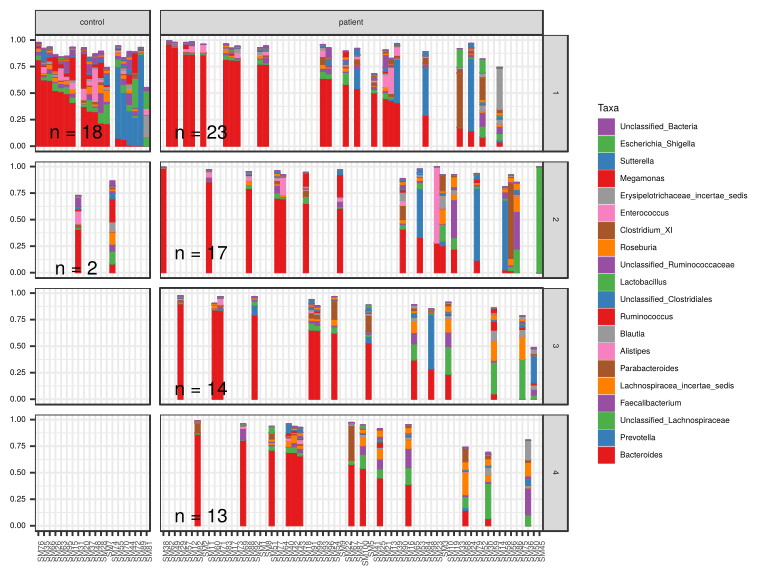

\(1.1.1.3.3.2.2.2.1.1.1\) [`Figure 121.`](#figure.121) Abundance. Data grouped by Sample.type,visit.  bar (sample mean) plot.  Image file: [`plots/323a72514d.svg`](plots/323a72514d.svg).
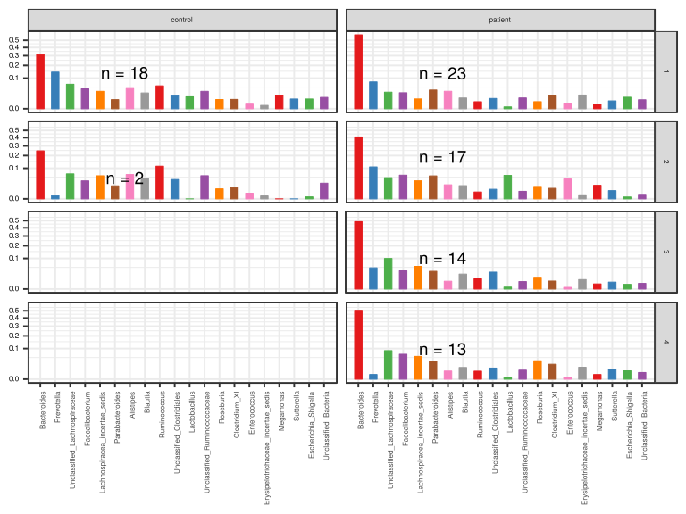

\(1.1.1.3.3.2.2.2.1.1.1\) [`Figure 122.`](#figure.122) Abundance. Data grouped by Sample.type,visit.  violin plot.  Image file: [`plots/3237bf6fa0f.svg`](plots/3237bf6fa0f.svg).
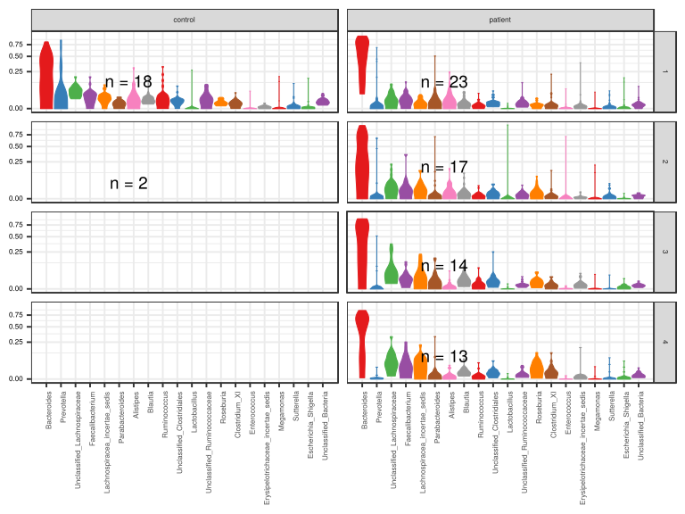

\(1.1.1.3.3.2.2.2.1.1.1\) [`Figure 123.`](#figure.123) Abundance. Data grouped by Sample.type,visit.  boxplot plot.  Image file: [`plots/32317dffe9e.svg`](plots/32317dffe9e.svg).
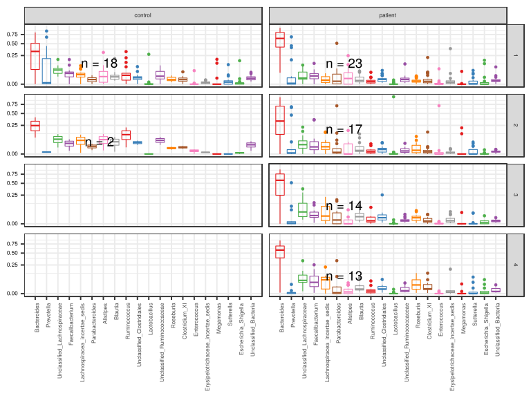

##### \(1.1.1.3.3.2.2.2.1.2\) Abundance. Plot is in flipped orientation, Y axis not scaled. Iterating over plot geometry

\(1.1.1.3.3.2.2.2.1.2.1\) [`Figure 124.`](#figure.124) Abundance. Data grouped by Sample.type,visit.  bar (sample mean) plot.  Image file: [`plots/323407ddd9c.svg`](plots/323407ddd9c.svg).
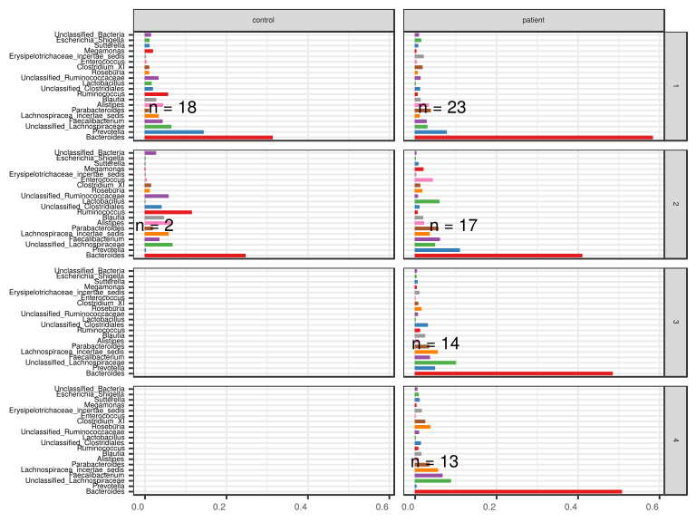

\(1.1.1.3.3.2.2.2.1.2.1\) [`Figure 125.`](#figure.125) Abundance. Data grouped by Sample.type,visit.  violin plot.  Image file: [`plots/323182452f9.svg`](plots/323182452f9.svg).
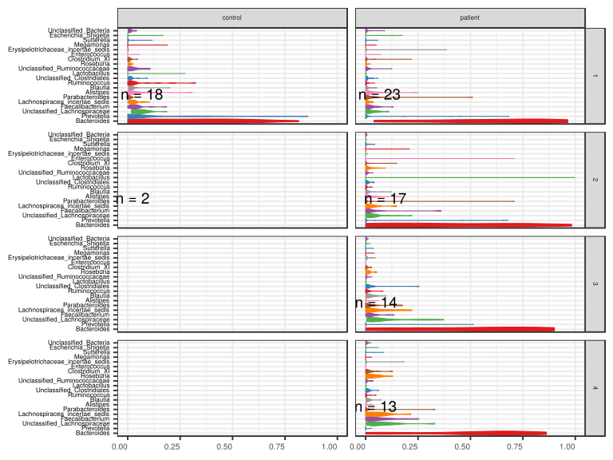

\(1.1.1.3.3.2.2.2.1.2.1\) [`Figure 126.`](#figure.126) Abundance. Data grouped by Sample.type,visit.  boxplot plot.  Image file: [`plots/32328458021.svg`](plots/32328458021.svg).
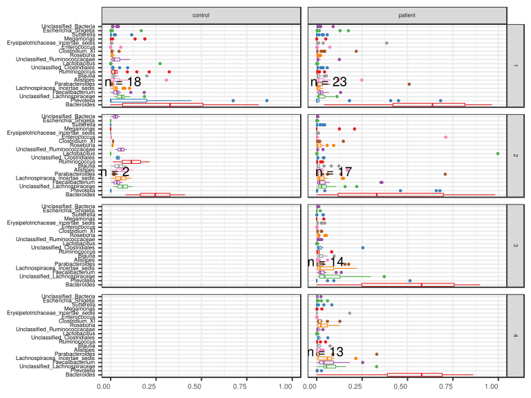

##### \(1.1.1.3.3.2.2.2.2\) dodged plots. Iterating over orientation and, optionally, scaling

##### \(1.1.1.3.3.2.2.2.2.1\) Abundance. Plot is in original orientation, Y axis SQRT scaled. Iterating over plot geometry

\(1.1.1.3.3.2.2.2.2.1.1\) [`Figure 127.`](#figure.127) Abundance. Data grouped by Sample.type,visit.  bar (sample mean) plot.  Image file: [`plots/32318ea7169.svg`](plots/32318ea7169.svg).
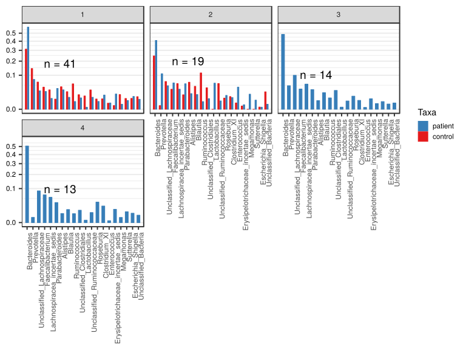

\(1.1.1.3.3.2.2.2.2.1.1\) [`Figure 128.`](#figure.128) Abundance. Data grouped by Sample.type,visit.  violin plot.  Image file: [`plots/3232e9cd17.svg`](plots/3232e9cd17.svg).
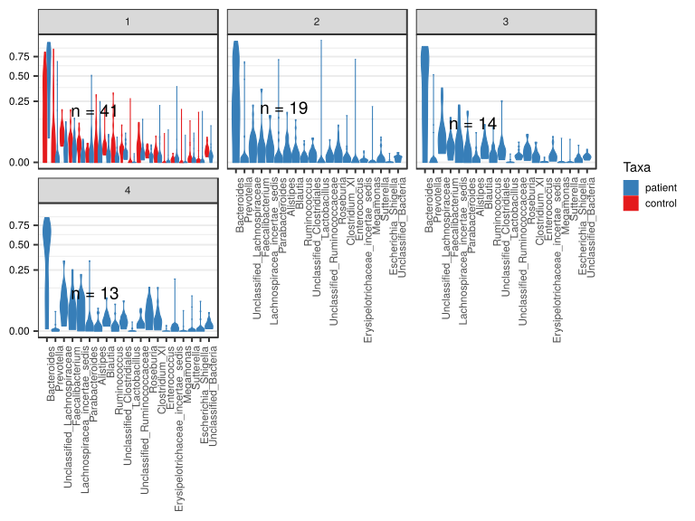

\(1.1.1.3.3.2.2.2.2.1.1\) [`Figure 129.`](#figure.129) Abundance. Data grouped by Sample.type,visit.  boxplot plot.  Image file: [`plots/323424673bc.svg`](plots/323424673bc.svg).
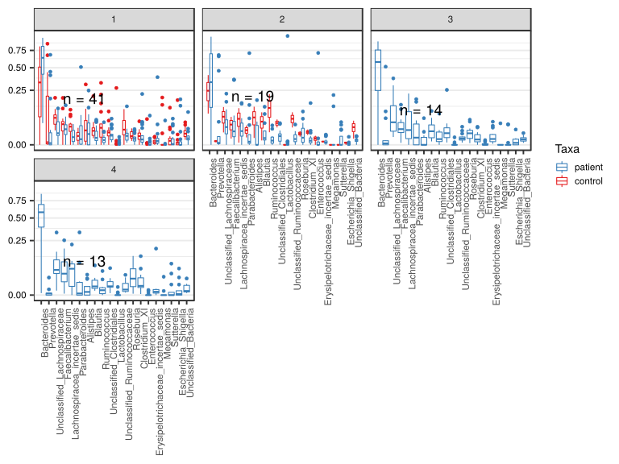

##### \(1.1.1.3.3.2.2.2.2.2\) Abundance. Plot is in flipped orientation, Y axis not scaled. Iterating over plot geometry

\(1.1.1.3.3.2.2.2.2.2.1\) [`Figure 130.`](#figure.130) Abundance. Data grouped by Sample.type,visit.  bar (sample mean) plot.  Image file: [`plots/323dfcbe3.svg`](plots/323dfcbe3.svg).
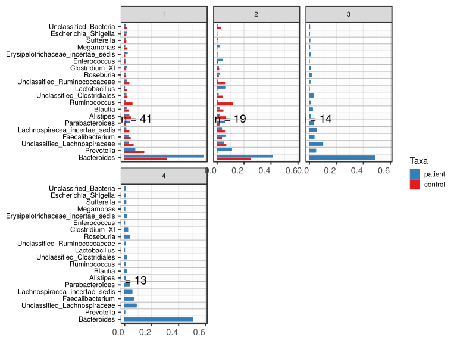

\(1.1.1.3.3.2.2.2.2.2.1\) [`Figure 131.`](#figure.131) Abundance. Data grouped by Sample.type,visit.  violin plot.  Image file: [`plots/32366afa571.svg`](plots/32366afa571.svg).
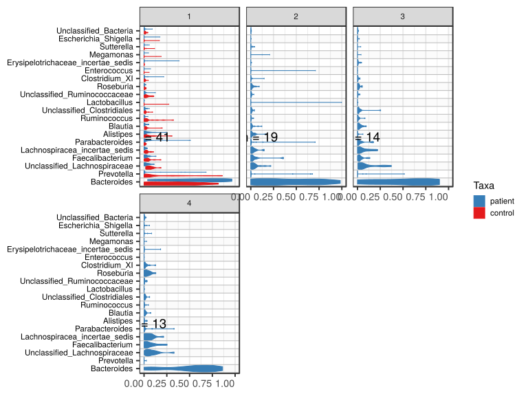

\(1.1.1.3.3.2.2.2.2.2.1\) [`Figure 132.`](#figure.132) Abundance. Data grouped by Sample.type,visit.  boxplot plot.  Image file: [`plots/323aff79f0.svg`](plots/323aff79f0.svg).
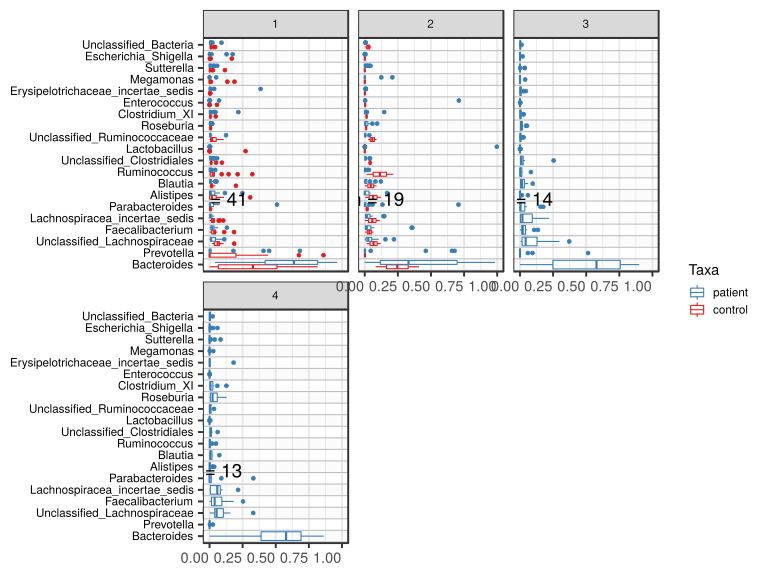

##### \(1.1.1.3.3.2.3\) Grouping variables Sample.type.Drug.Before,visit

##### \(1.1.1.3.3.2.4\) Iterating over Abundance. profile sorting order

##### \(1.1.1.3.3.2.4.1\) Abundance. profile sorting order: average abundance

##### \(1.1.1.3.3.2.4.2\) Iterating over dodged vs faceted bars

The same data are shown in multiple combinations of graphical representations. 
                         This is the same data, but each plot highlights slightly different aspects of it.
                         It is not likely that you will need every plot - pick only what you need.

##### \(1.1.1.3.3.2.4.2.1\) faceted plots. Iterating over orientation and, optionally, scaling

##### \(1.1.1.3.3.2.4.2.1.1\) Abundance. Plot is in original orientation, Y axis SQRT scaled. Iterating over plot geometry

\(1.1.1.3.3.2.4.2.1.1.0\) [`Table 39.`](#table.39) Data table used for plots. Data grouped by Sample.type.Drug.Before,visit. Showing only 200 first rows. Full dataset is also saved in a delimited text file (click to download and open e.g. in Excel) [`data/1.1.1.3.3.2.4.2.1.1.0-323727cf321.1.1.1.3.3.2.4.2.1.1.csv`](data/1.1.1.3.3.2.4.2.1.1.0-323727cf321.1.1.1.3.3.2.4.2.1.1.csv)

| .record.id | Sample.type.Drug.Before | visit | feature                       | Abundance  |
|:-----------|:------------------------|:------|:------------------------------|:-----------|
| SM1        | patient TRUE .          | 1     | Bacteroides                   | 7.735e\-01 |
| SM10       | patient TRUE .          | 3     | Bacteroides                   | 2.364e\-01 |
| SM100      | patient TRUE .          | 4     | Bacteroides                   | 5.420e\-01 |
| SM11       | patient TRUE .          | 2     | Bacteroides                   | 8.578e\-01 |
| SM12       | patient TRUE .          | 1     | Bacteroides                   | 8.674e\-01 |
| SM13       | patient FALSE .         | 1     | Bacteroides                   | 4.295e\-01 |
| SM14       | patient FALSE .         | 1     | Bacteroides                   | 3.976e\-02 |
| SM15       | 1                       | 1     | Bacteroides                   | 4.120e\-01 |
| SM16       | patient FALSE .         | 4     | Bacteroides                   | 3.890e\-01 |
| SM17       | patient TRUE .          | 1     | Bacteroides                   | 8.130e\-01 |
| SM18       | patient FALSE .         | 2     | Bacteroides                   | 6.537e\-01 |
| SM19       | patient FALSE .         | 2     | Bacteroides                   | 2.221e\-01 |
| SM2        | patient FALSE .         | 1     | Bacteroides                   | 8.611e\-01 |
| SM20       | 1                       | 1     | Bacteroides                   | 3.742e\-01 |
| SM21       | patient FALSE .         | 1     | Bacteroides                   | 4.490e\-01 |
| SM22       | patient TRUE .          | 1     | Bacteroides                   | 5.831e\-01 |
| SM23       | patient TRUE .          | 2     | Bacteroides                   | 2.796e\-01 |
| SM24       | patient FALSE .         | 1     | Bacteroides                   | 1.435e\-01 |
| SM25       | patient FALSE .         | 4     | Bacteroides                   | 4.520e\-01 |
| SM26       | 1                       | 1     | Bacteroides                   | 5.242e\-01 |
| SM28       | 1                       | 1     | Bacteroides                   | 2.194e\-01 |
| SM29       | patient TRUE .          | 3     | Bacteroides                   | 9.002e\-01 |
| SM3        | patient TRUE .          | 2     | Bacteroides                   | 2.542e\-01 |
| SM30       | patient TRUE .          | 4     | Bacteroides                   | 6.581e\-02 |
| SM31       | 1                       | 2     | Bacteroides                   | 4.094e\-01 |
| SM33       | patient TRUE .          | 1     | Bacteroides                   | 1.747e\-01 |
| SM35       | 1                       | 1     | Bacteroides                   | 6.247e\-01 |
| SM36       | patient FALSE .         | 4     | Bacteroides                   | 3.219e\-04 |
| SM37       | 1                       | 1     | Bacteroides                   | 3.301e\-01 |
| SM38       | patient TRUE .          | 2     | Bacteroides                   | 9.828e\-01 |
| SM39       | patient FALSE .         | 1     | Bacteroides                   | 4.095e\-01 |
| SM40       | patient FALSE .         | 4     | Bacteroides                   | 6.908e\-01 |
| SM41       | patient TRUE .          | 1     | Bacteroides                   | 5.037e\-01 |
| SM42       | patient FALSE .         | 4     | Bacteroides                   | 6.901e\-01 |
| SM43       | patient TRUE .          | 4     | Bacteroides                   | 6.589e\-01 |
| SM44       | 1                       | 1     | Bacteroides                   | 1.150e\-02 |
| SM45       | patient FALSE .         | 2     | Bacteroides                   | 0.000e\+00 |
| SM48       | 1                       | 1     | Bacteroides                   | 3.247e\-01 |
| SM49       | patient TRUE .          | 1     | Bacteroides                   | 9.292e\-01 |
| SM5        | patient TRUE .          | 3     | Bacteroides                   | 5.313e\-01 |
| SM50       | patient FALSE .         | 3     | Bacteroides                   | 0.000e\+00 |
| SM51       | patient TRUE .          | 4     | Bacteroides                   | 7.122e\-01 |
| SM52       | patient FALSE .         | 1     | Bacteroides                   | 8.105e\-02 |
| SM53       | patient TRUE .          | 2     | Bacteroides                   | 3.305e\-01 |
| SM54       | patient TRUE .          | 3     | Bacteroides                   | 6.239e\-01 |
| SM55       | 1                       | 1     | Bacteroides                   | 7.465e\-02 |
| SM56       | patient TRUE .          | 2     | Bacteroides                   | 1.958e\-02 |
| SM57       | patient TRUE .          | 1     | Bacteroides                   | 8.679e\-01 |
| SM58       | patient FALSE .         | 2     | Bacteroides                   | 2.592e\-02 |
| SM59       | patient FALSE .         | 3     | Bacteroides                   | 5.206e\-02 |
| SM60       | patient TRUE .          | 3     | Bacteroides                   | 8.428e\-01 |
| SM62       | patient TRUE .          | 1     | Bacteroides                   | 9.643e\-01 |
| SM63       | 1                       | 1     | Bacteroides                   | 5.135e\-01 |
| SM64       | patient TRUE .          | 2     | Bacteroides                   | 6.977e\-01 |
| SM65       | patient TRUE .          | 3     | Bacteroides                   | 3.711e\-01 |
| SM66       | 1                       | 1     | Bacteroides                   | 6.218e\-01 |
| SM67       | patient TRUE .          | 4     | Bacteroides                   | 5.778e\-01 |
| SM68       | patient FALSE .         | 4     | Bacteroides                   | 1.440e\-01 |
| SM69       | patient TRUE .          | 4     | Bacteroides                   | 8.051e\-01 |
| SM7        | 1                       | 1     | Bacteroides                   | 2.126e\-01 |
| SM70       | 1                       | 1     | Bacteroides                   | 6.327e\-02 |
| SM71       | patient TRUE .          | 3     | Bacteroides                   | 8.388e\-01 |
| SM72       | 1                       | 1     | Bacteroides                   | 4.762e\-03 |
| SM73       | patient FALSE .         | 1     | Bacteroides                   | 8.108e\-01 |
| SM74       | 1                       | 2     | Bacteroides                   | 8.216e\-02 |
| SM75       | patient FALSE .         | 3     | Bacteroides                   | 2.377e\-03 |
| SM76       | 1                       | 1     | Bacteroides                   | 8.153e\-01 |
| SM77       | patient TRUE .          | 2     | Bacteroides                   | 7.039e\-01 |
| SM79       | patient FALSE .         | 2     | Bacteroides                   | 1.173e\-01 |
| SM8        | patient FALSE .         | 1     | Bacteroides                   | 7.723e\-01 |
| SM81       | 1                       | 1     | Bacteroides                   | 0.000e\+00 |
| SM82       | patient TRUE .          | 4     | Bacteroides                   | 8.624e\-01 |
| SM83       | patient TRUE .          | 1     | Bacteroides                   | 8.199e\-01 |
| SM84       | patient TRUE .          | 1     | Bacteroides                   | 2.885e\-01 |
| SM86       | patient TRUE .          | 2     | Bacteroides                   | 2.482e\-03 |
| SM87       | patient TRUE .          | 1     | Bacteroides                   | 5.438e\-01 |
| SM88       | patient TRUE .          | 2     | Bacteroides                   | 7.940e\-01 |
| SM89       | 1                       | 1     | Bacteroides                   | 2.115e\-03 |
| SM9        | patient FALSE .         | 2     | Bacteroides                   | 6.096e\-01 |
| SM90       | patient FALSE .         | 2     | Bacteroides                   | 4.088e\-01 |
| SM91       | patient TRUE .          | 3     | Bacteroides                   | 6.525e\-01 |
| SM92       | patient FALSE .         | 3     | Bacteroides                   | 7.921e\-01 |
| SM93       | patient TRUE .          | 1     | Bacteroides                   | 6.404e\-01 |
| SM95       | 1                       | 1     | Bacteroides                   | 4.955e\-01 |
| SM96       | patient FALSE .         | 1     | Bacteroides                   | 6.375e\-01 |
| SM98       | patient FALSE .         | 3     | Bacteroides                   | 2.848e\-01 |
| SM99       | patient FALSE .         | 3     | Bacteroides                   | 6.503e\-01 |
| SM1        | patient TRUE .          | 1     | Prevotella                    | 2.598e\-04 |
| SM10       | patient TRUE .          | 3     | Prevotella                    | 0.000e\+00 |
| SM100      | patient TRUE .          | 4     | Prevotella                    | 7.692e\-05 |
| SM11       | patient TRUE .          | 2     | Prevotella                    | 3.477e\-04 |
| SM12       | patient TRUE .          | 1     | Prevotella                    | 1.328e\-04 |
| SM13       | patient FALSE .         | 1     | Prevotella                    | 1.652e\-02 |
| SM14       | patient FALSE .         | 1     | Prevotella                    | 1.855e\-02 |
| SM15       | 1                       | 1     | Prevotella                    | 1.415e\-04 |
| SM16       | patient FALSE .         | 4     | Prevotella                    | 0.000e\+00 |
| SM17       | patient TRUE .          | 1     | Prevotella                    | 4.137e\-04 |
| SM18       | patient FALSE .         | 2     | Prevotella                    | 3.357e\-04 |
| SM19       | patient FALSE .         | 2     | Prevotella                    | 2.314e\-03 |
| SM2        | patient FALSE .         | 1     | Prevotella                    | 2.480e\-04 |
| SM20       | 1                       | 1     | Prevotella                    | 0.000e\+00 |
| SM21       | patient FALSE .         | 1     | Prevotella                    | 0.000e\+00 |
| SM22       | patient TRUE .          | 1     | Prevotella                    | 0.000e\+00 |
| SM23       | patient TRUE .          | 2     | Prevotella                    | 0.000e\+00 |
| SM24       | patient FALSE .         | 1     | Prevotella                    | 6.822e\-01 |
| SM25       | patient FALSE .         | 4     | Prevotella                    | 0.000e\+00 |
| SM26       | 1                       | 1     | Prevotella                    | 2.758e\-04 |
| SM28       | 1                       | 1     | Prevotella                    | 3.997e\-04 |
| SM29       | patient TRUE .          | 3     | Prevotella                    | 0.000e\+00 |
| SM3        | patient TRUE .          | 2     | Prevotella                    | 4.458e\-02 |
| SM30       | patient TRUE .          | 4     | Prevotella                    | 2.762e\-03 |
| SM31       | 1                       | 2     | Prevotella                    | 1.618e\-03 |
| SM33       | patient TRUE .          | 1     | Prevotella                    | 0.000e\+00 |
| SM35       | 1                       | 1     | Prevotella                    | 2.046e\-03 |
| SM36       | patient FALSE .         | 4     | Prevotella                    | 0.000e\+00 |
| SM37       | 1                       | 1     | Prevotella                    | 7.741e\-04 |
| SM38       | patient TRUE .          | 2     | Prevotella                    | 1.028e\-04 |
| SM39       | patient FALSE .         | 1     | Prevotella                    | 4.073e\-01 |
| SM40       | patient FALSE .         | 4     | Prevotella                    | 2.775e\-04 |
| SM41       | patient TRUE .          | 1     | Prevotella                    | 0.000e\+00 |
| SM42       | patient FALSE .         | 4     | Prevotella                    | 4.994e\-04 |
| SM43       | patient TRUE .          | 4     | Prevotella                    | 7.452e\-05 |
| SM44       | 1                       | 1     | Prevotella                    | 3.227e\-01 |
| SM45       | patient FALSE .         | 2     | Prevotella                    | 0.000e\+00 |
| SM48       | 1                       | 1     | Prevotella                    | 2.151e\-03 |
| SM49       | patient TRUE .          | 1     | Prevotella                    | 0.000e\+00 |
| SM5        | patient TRUE .          | 3     | Prevotella                    | 5.950e\-02 |
| SM50       | patient FALSE .         | 3     | Prevotella                    | 0.000e\+00 |
| SM51       | patient TRUE .          | 4     | Prevotella                    | 2.231e\-04 |
| SM52       | patient FALSE .         | 1     | Prevotella                    | 8.062e\-03 |
| SM53       | patient TRUE .          | 2     | Prevotella                    | 4.611e\-01 |
| SM54       | patient TRUE .          | 3     | Prevotella                    | 0.000e\+00 |
| SM55       | 1                       | 1     | Prevotella                    | 6.747e\-01 |
| SM56       | patient TRUE .          | 2     | Prevotella                    | 0.000e\+00 |
| SM57       | patient TRUE .          | 1     | Prevotella                    | 3.600e\-04 |
| SM58       | patient FALSE .         | 2     | Prevotella                    | 6.582e\-01 |
| SM59       | patient FALSE .         | 3     | Prevotella                    | 0.000e\+00 |
| SM60       | patient TRUE .          | 3     | Prevotella                    | 3.404e\-04 |
| SM62       | patient TRUE .          | 1     | Prevotella                    | 0.000e\+00 |
| SM63       | 1                       | 1     | Prevotella                    | 2.703e\-03 |
| SM64       | patient TRUE .          | 2     | Prevotella                    | 1.113e\-04 |
| SM65       | patient TRUE .          | 3     | Prevotella                    | 1.374e\-04 |
| SM66       | 1                       | 1     | Prevotella                    | 2.198e\-04 |
| SM67       | patient TRUE .          | 4     | Prevotella                    | 0.000e\+00 |
| SM68       | patient FALSE .         | 4     | Prevotella                    | 2.586e\-02 |
| SM69       | patient TRUE .          | 4     | Prevotella                    | 3.108e\-04 |
| SM7        | 1                       | 1     | Prevotella                    | 0.000e\+00 |
| SM70       | 1                       | 1     | Prevotella                    | 4.438e\-01 |
| SM71       | patient TRUE .          | 3     | Prevotella                    | 1.723e\-03 |
| SM72       | 1                       | 1     | Prevotella                    | 2.651e\-01 |
| SM73       | patient FALSE .         | 1     | Prevotella                    | 1.009e\-04 |
| SM74       | 1                       | 2     | Prevotella                    | 6.547e\-04 |
| SM75       | patient FALSE .         | 3     | Prevotella                    | 0.000e\+00 |
| SM76       | 1                       | 1     | Prevotella                    | 5.743e\-05 |
| SM77       | patient TRUE .          | 2     | Prevotella                    | 1.127e\-04 |
| SM79       | patient FALSE .         | 2     | Prevotella                    | 6.782e\-01 |
| SM8        | patient FALSE .         | 1     | Prevotella                    | 7.416e\-04 |
| SM81       | 1                       | 1     | Prevotella                    | 0.000e\+00 |
| SM82       | patient TRUE .          | 4     | Prevotella                    | 2.141e\-04 |
| SM83       | patient TRUE .          | 1     | Prevotella                    | 0.000e\+00 |
| SM84       | patient TRUE .          | 1     | Prevotella                    | 4.502e\-01 |
| SM86       | patient TRUE .          | 2     | Prevotella                    | 3.103e\-04 |
| SM87       | patient TRUE .          | 1     | Prevotella                    | 1.804e\-01 |
| SM88       | patient TRUE .          | 2     | Prevotella                    | 1.705e\-04 |
| SM89       | 1                       | 1     | Prevotella                    | 8.603e\-01 |
| SM9        | patient FALSE .         | 2     | Prevotella                    | 8.227e\-04 |
| SM90       | patient FALSE .         | 2     | Prevotella                    | 5.776e\-03 |
| SM91       | patient TRUE .          | 3     | Prevotella                    | 2.212e\-04 |
| SM92       | patient FALSE .         | 3     | Prevotella                    | 9.411e\-02 |
| SM93       | patient TRUE .          | 1     | Prevotella                    | 0.000e\+00 |
| SM95       | 1                       | 1     | Prevotella                    | 0.000e\+00 |
| SM96       | patient FALSE .         | 1     | Prevotella                    | 0.000e\+00 |
| SM98       | patient FALSE .         | 3     | Prevotella                    | 5.140e\-01 |
| SM99       | patient FALSE .         | 3     | Prevotella                    | 4.757e\-04 |
| SM1        | patient TRUE .          | 1     | Unclassified\_Lachnospiraceae | 4.529e\-02 |
| SM10       | patient TRUE .          | 3     | Unclassified\_Lachnospiraceae | 2.607e\-01 |
| SM100      | patient TRUE .          | 4     | Unclassified\_Lachnospiraceae | 1.308e\-01 |
| SM11       | patient TRUE .          | 2     | Unclassified\_Lachnospiraceae | 4.404e\-03 |
| SM12       | patient TRUE .          | 1     | Unclassified\_Lachnospiraceae | 1.049e\-02 |
| SM13       | patient FALSE .         | 1     | Unclassified\_Lachnospiraceae | 1.116e\-02 |
| SM14       | patient FALSE .         | 1     | Unclassified\_Lachnospiraceae | 6.172e\-02 |
| SM15       | 1                       | 1     | Unclassified\_Lachnospiraceae | 5.053e\-02 |
| SM16       | patient FALSE .         | 4     | Unclassified\_Lachnospiraceae | 1.583e\-01 |
| SM17       | patient TRUE .          | 1     | Unclassified\_Lachnospiraceae | 2.938e\-02 |
| SM18       | patient FALSE .         | 2     | Unclassified\_Lachnospiraceae | 5.271e\-02 |
| SM19       | patient FALSE .         | 2     | Unclassified\_Lachnospiraceae | 1.055e\-01 |
| SM2        | patient FALSE .         | 1     | Unclassified\_Lachnospiraceae | 1.097e\-02 |
| SM20       | 1                       | 1     | Unclassified\_Lachnospiraceae | 2.256e\-02 |
| SM21       | patient FALSE .         | 1     | Unclassified\_Lachnospiraceae | 5.532e\-02 |
| SM22       | patient TRUE .          | 1     | Unclassified\_Lachnospiraceae | 1.113e\-01 |
| SM23       | patient TRUE .          | 2     | Unclassified\_Lachnospiraceae | 4.148e\-04 |
| SM24       | patient FALSE .         | 1     | Unclassified\_Lachnospiraceae | 1.402e\-02 |
| SM25       | patient FALSE .         | 4     | Unclassified\_Lachnospiraceae | 8.430e\-02 |
| SM26       | 1                       | 1     | Unclassified\_Lachnospiraceae | 7.501e\-02 |
| SM28       | 1                       | 1     | Unclassified\_Lachnospiraceae | 9.952e\-02 |
| SM29       | patient TRUE .          | 3     | Unclassified\_Lachnospiraceae | 1.128e\-02 |
| SM3        | patient TRUE .          | 2     | Unclassified\_Lachnospiraceae | 1.560e\-01 |
| SM30       | patient TRUE .          | 4     | Unclassified\_Lachnospiraceae | 3.297e\-01 |
| SM31       | 1                       | 2     | Unclassified\_Lachnospiraceae | 1.294e\-02 |
| SM33       | patient TRUE .          | 1     | Unclassified\_Lachnospiraceae | 3.934e\-03 |

\(1.1.1.3.3.2.4.2.1.1.1\) [`Widget 40.`](#widget.40) Dynamic Pivot Table link (drag and drop field names and pick averaging 
                      functions or plot types; click on fields or legend elements to filter values). 
                      Starting rendering is Stacked Bar Chart. Data grouped by Sample.type.Drug.Before,visit. Click to see HTML widget file in full window: [`./1.1.1.3.3.2.4.2.1.1.1-32337e0ae4dDynamic.Pivot.Table.html`](./1.1.1.3.3.2.4.2.1.1.1-32337e0ae4dDynamic.Pivot.Table.html)

\(1.1.1.3.3.2.4.2.1.1.1\) [`Widget 41.`](#widget.41) Dynamic Pivot Table link (drag and drop field names and pick averaging 
                      functions or plot types; click on fields or legend elements to filter values). 
                      Starting rendering is Table Barchart. Data grouped by Sample.type.Drug.Before,visit. Click to see HTML widget file in full window: [`./1.1.1.3.3.2.4.2.1.1.1-3233347c35dDynamic.Pivot.Table.html`](./1.1.1.3.3.2.4.2.1.1.1-3233347c35dDynamic.Pivot.Table.html)

\(1.1.1.3.3.2.4.2.1.1.1\) [`Table 40.`](#table.40) Summary table. Data grouped by Sample.type.Drug.Before,visit. Showing only 200 first rows. Full dataset is also saved in a delimited text file (click to download and open e.g. in Excel) [`data/1.1.1.3.3.2.4.2.1.1.1-3233e9c8a68.1.1.1.3.3.2.4.2.1.1.csv`](data/1.1.1.3.3.2.4.2.1.1.1-3233e9c8a68.1.1.1.3.3.2.4.2.1.1.csv)

| feature                              | Sample.type.Drug.Before | visit | mean       | sd         | median     | incidence |
|:-------------------------------------|:------------------------|:------|:-----------|:-----------|:-----------|:----------|
| Bacteroides                          | 1                       | 1     | 3.125e\-01 | 2.538e\-01 | 3.274e\-01 | 0.94444   |
| Bacteroides                          | 1                       | 2     | 2.458e\-01 | 2.314e\-01 | 2.458e\-01 | 1.00000   |
| Bacteroides                          | patient FALSE .         | 1     | 4.634e\-01 | 3.049e\-01 | 4.392e\-01 | 1.00000   |
| Bacteroides                          | patient FALSE .         | 2     | 2.911e\-01 | 2.698e\-01 | 2.221e\-01 | 0.85714   |
| Bacteroides                          | patient FALSE .         | 3     | 2.969e\-01 | 3.479e\-01 | 1.684e\-01 | 0.83333   |
| Bacteroides                          | patient FALSE .         | 4     | 3.944e\-01 | 2.816e\-01 | 4.205e\-01 | 1.00000   |
| Bacteroides                          | patient TRUE .          | 1     | 6.746e\-01 | 2.463e\-01 | 7.735e\-01 | 1.00000   |
| Bacteroides                          | patient TRUE .          | 2     | 4.923e\-01 | 3.565e\-01 | 5.141e\-01 | 1.00000   |
| Bacteroides                          | patient TRUE .          | 3     | 6.246e\-01 | 2.372e\-01 | 6.382e\-01 | 1.00000   |
| Bacteroides                          | patient TRUE .          | 4     | 6.035e\-01 | 2.634e\-01 | 6.589e\-01 | 1.00000   |
| Prevotella                           | 1                       | 1     | 1.431e\-01 | 2.655e\-01 | 5.869e\-04 | 0.77778   |
| Prevotella                           | 1                       | 2     | 1.136e\-03 | 6.813e\-04 | 1.136e\-03 | 1.00000   |
| Prevotella                           | patient FALSE .         | 1     | 1.134e\-01 | 2.365e\-01 | 4.402e\-03 | 0.80000   |
| Prevotella                           | patient FALSE .         | 2     | 1.922e\-01 | 3.252e\-01 | 2.314e\-03 | 0.85714   |
| Prevotella                           | patient FALSE .         | 3     | 1.014e\-01 | 2.056e\-01 | 2.378e\-04 | 0.50000   |
| Prevotella                           | patient FALSE .         | 4     | 4.440e\-03 | 1.050e\-02 | 1.387e\-04 | 0.50000   |
| Prevotella                           | patient TRUE .          | 1     | 4.860e\-02 | 1.305e\-01 | 0.000e\+00 | 0.46154   |
| Prevotella                           | patient TRUE .          | 2     | 5.068e\-02 | 1.449e\-01 | 1.416e\-04 | 0.80000   |
| Prevotella                           | patient TRUE .          | 3     | 7.740e\-03 | 2.092e\-02 | 1.793e\-04 | 0.62500   |
| Prevotella                           | patient TRUE .          | 4     | 5.231e\-04 | 9.932e\-04 | 2.141e\-04 | 0.85714   |
| Unclassified\_Lachnospiraceae        | 1                       | 1     | 6.389e\-02 | 4.120e\-02 | 6.129e\-02 | 1.00000   |
| Unclassified\_Lachnospiraceae        | 1                       | 2     | 6.654e\-02 | 7.579e\-02 | 6.654e\-02 | 1.00000   |
| Unclassified\_Lachnospiraceae        | patient FALSE .         | 1     | 3.276e\-02 | 3.113e\-02 | 1.269e\-02 | 1.00000   |
| Unclassified\_Lachnospiraceae        | patient FALSE .         | 2     | 3.552e\-02 | 3.529e\-02 | 2.075e\-02 | 0.85714   |
| Unclassified\_Lachnospiraceae        | patient FALSE .         | 3     | 1.344e\-01 | 1.575e\-01 | 4.278e\-02 | 1.00000   |
| Unclassified\_Lachnospiraceae        | patient FALSE .         | 4     | 9.198e\-02 | 4.009e\-02 | 9.333e\-02 | 1.00000   |
| Unclassified\_Lachnospiraceae        | patient TRUE .          | 1     | 2.669e\-02 | 3.274e\-02 | 1.049e\-02 | 0.92308   |
| Unclassified\_Lachnospiraceae        | patient TRUE .          | 2     | 5.630e\-02 | 7.384e\-02 | 3.288e\-02 | 1.00000   |
| Unclassified\_Lachnospiraceae        | patient TRUE .          | 3     | 7.323e\-02 | 8.946e\-02 | 3.982e\-02 | 1.00000   |
| Unclassified\_Lachnospiraceae        | patient TRUE .          | 4     | 8.273e\-02 | 1.170e\-01 | 3.912e\-02 | 1.00000   |
| Faecalibacterium                     | 1                       | 1     | 4.217e\-02 | 4.401e\-02 | 3.575e\-02 | 0.94444   |
| Faecalibacterium                     | 1                       | 2     | 3.452e\-02 | 4.423e\-02 | 3.452e\-02 | 1.00000   |
| Faecalibacterium                     | patient FALSE .         | 1     | 3.876e\-02 | 4.038e\-02 | 2.495e\-02 | 1.00000   |
| Faecalibacterium                     | patient FALSE .         | 2     | 7.169e\-02 | 1.285e\-01 | 1.664e\-02 | 0.85714   |
| Faecalibacterium                     | patient FALSE .         | 3     | 2.433e\-02 | 2.073e\-02 | 1.749e\-02 | 1.00000   |
| Faecalibacterium                     | patient FALSE .         | 4     | 9.878e\-02 | 9.939e\-02 | 6.677e\-02 | 1.00000   |
| Faecalibacterium                     | patient TRUE .          | 1     | 1.846e\-02 | 1.438e\-02 | 1.267e\-02 | 0.92308   |
| Faecalibacterium                     | patient TRUE .          | 2     | 5.171e\-02 | 1.083e\-01 | 1.129e\-02 | 0.90000   |
| Faecalibacterium                     | patient TRUE .          | 3     | 4.364e\-02 | 4.948e\-02 | 2.507e\-02 | 1.00000   |
| Faecalibacterium                     | patient TRUE .          | 4     | 3.871e\-02 | 4.144e\-02 | 1.950e\-02 | 1.00000   |
| Lachnospiracea\_incertae\_sedis      | 1                       | 1     | 3.238e\-02 | 2.664e\-02 | 2.788e\-02 | 0.94444   |
| Lachnospiracea\_incertae\_sedis      | 1                       | 2     | 5.683e\-02 | 7.980e\-02 | 5.683e\-02 | 1.00000   |
| Lachnospiracea\_incertae\_sedis      | patient FALSE .         | 1     | 9.291e\-03 | 8.958e\-03 | 6.378e\-03 | 1.00000   |
| Lachnospiracea\_incertae\_sedis      | patient FALSE .         | 2     | 1.942e\-02 | 1.950e\-02 | 1.145e\-02 | 0.85714   |
| Lachnospiracea\_incertae\_sedis      | patient FALSE .         | 3     | 7.174e\-02 | 1.013e\-01 | 1.093e\-02 | 1.00000   |
| Lachnospiracea\_incertae\_sedis      | patient FALSE .         | 4     | 8.868e\-02 | 6.950e\-02 | 7.666e\-02 | 1.00000   |
| Lachnospiracea\_incertae\_sedis      | patient TRUE .          | 1     | 1.085e\-02 | 1.317e\-02 | 3.240e\-03 | 0.84615   |
| Lachnospiracea\_incertae\_sedis      | patient TRUE .          | 2     | 4.535e\-02 | 5.535e\-02 | 2.253e\-02 | 0.90000   |
| Lachnospiracea\_incertae\_sedis      | patient TRUE .          | 3     | 4.177e\-02 | 4.937e\-02 | 2.248e\-02 | 0.87500   |
| Lachnospiracea\_incertae\_sedis      | patient TRUE .          | 4     | 2.672e\-02 | 3.288e\-02 | 1.450e\-02 | 0.85714   |
| Parabacteroides                      | 1                       | 1     | 8.828e\-03 | 8.069e\-03 | 6.610e\-03 | 0.94444   |
| Parabacteroides                      | 1                       | 2     | 1.807e\-02 | 1.907e\-02 | 1.807e\-02 | 1.00000   |
| Parabacteroides                      | patient FALSE .         | 1     | 1.024e\-02 | 1.289e\-02 | 2.166e\-03 | 0.80000   |
| Parabacteroides                      | patient FALSE .         | 2     | 2.816e\-02 | 5.131e\-02 | 1.370e\-03 | 0.85714   |
| Parabacteroides                      | patient FALSE .         | 3     | 8.124e\-03 | 1.641e\-02 | 0.000e\+00 | 0.33333   |
| Parabacteroides                      | patient FALSE .         | 4     | 2.621e\-03 | 5.406e\-03 | 1.849e\-04 | 0.66667   |
| Parabacteroides                      | patient TRUE .          | 1     | 5.820e\-02 | 1.381e\-01 | 7.199e\-03 | 0.69231   |
| Parabacteroides                      | patient TRUE .          | 2     | 7.576e\-02 | 2.222e\-01 | 5.432e\-04 | 0.80000   |
| Parabacteroides                      | patient TRUE .          | 3     | 5.231e\-02 | 7.215e\-02 | 1.782e\-02 | 0.87500   |
| Parabacteroides                      | patient TRUE .          | 4     | 6.228e\-02 | 1.228e\-01 | 2.231e\-04 | 0.71429   |
| Alistipes                            | 1                       | 1     | 4.359e\-02 | 7.436e\-02 | 1.748e\-02 | 0.77778   |
| Alistipes                            | 1                       | 2     | 6.305e\-02 | 8.361e\-02 | 6.305e\-02 | 1.00000   |
| Alistipes                            | patient FALSE .         | 1     | 5.269e\-02 | 7.947e\-02 | 1.928e\-02 | 0.70000   |
| Alistipes                            | patient FALSE .         | 2     | 1.185e\-02 | 1.874e\-02 | 6.851e\-04 | 0.57143   |
| Alistipes                            | patient FALSE .         | 3     | 8.739e\-04 | 2.141e\-03 | 0.000e\+00 | 0.16667   |
| Alistipes                            | patient FALSE .         | 4     | 4.068e\-03 | 8.729e\-03 | 4.160e\-04 | 0.50000   |
| Alistipes                            | patient TRUE .          | 1     | 1.696e\-02 | 2.078e\-02 | 9.784e\-03 | 0.69231   |
| Alistipes                            | patient TRUE .          | 2     | 2.759e\-02 | 5.265e\-02 | 0.000e\+00 | 0.40000   |
| Alistipes                            | patient TRUE .          | 3     | 1.056e\-02 | 2.049e\-02 | 1.516e\-03 | 0.62500   |
| Alistipes                            | patient TRUE .          | 4     | 9.648e\-03 | 1.404e\-02 | 2.660e\-03 | 0.57143   |
| Blautia                              | 1                       | 1     | 2.657e\-02 | 4.449e\-02 | 1.644e\-02 | 1.00000   |
| Blautia                              | 1                       | 2     | 4.533e\-02 | 6.181e\-02 | 4.533e\-02 | 1.00000   |
| Blautia                              | patient FALSE .         | 1     | 1.828e\-02 | 2.097e\-02 | 5.935e\-03 | 1.00000   |
| Blautia                              | patient FALSE .         | 2     | 1.872e\-02 | 3.047e\-02 | 2.936e\-03 | 0.85714   |
| Blautia                              | patient FALSE .         | 3     | 3.677e\-02 | 3.608e\-02 | 2.566e\-02 | 1.00000   |
| Blautia                              | patient FALSE .         | 4     | 1.189e\-02 | 8.838e\-03 | 8.247e\-03 | 1.00000   |
| Blautia                              | patient TRUE .          | 1     | 7.798e\-03 | 1.057e\-02 | 3.143e\-03 | 0.92308   |
| Blautia                              | patient TRUE .          | 2     | 1.865e\-02 | 3.688e\-02 | 8.351e\-03 | 0.80000   |
| Blautia                              | patient TRUE .          | 3     | 1.381e\-02 | 1.440e\-02 | 9.423e\-03 | 1.00000   |
| Blautia                              | patient TRUE .          | 4     | 1.700e\-02 | 2.588e\-02 | 6.334e\-03 | 1.00000   |
| Ruminococcus                         | 1                       | 1     | 5.576e\-02 | 8.722e\-02 | 2.428e\-02 | 0.94444   |
| Ruminococcus                         | 1                       | 2     | 1.140e\-01 | 1.424e\-01 | 1.140e\-01 | 1.00000   |
| Ruminococcus                         | patient FALSE .         | 1     | 4.312e\-03 | 4.547e\-03 | 2.962e\-03 | 1.00000   |
| Ruminococcus                         | patient FALSE .         | 2     | 8.027e\-03 | 1.303e\-02 | 1.175e\-03 | 0.57143   |
| Ruminococcus                         | patient FALSE .         | 3     | 2.267e\-02 | 3.043e\-02 | 1.710e\-02 | 1.00000   |
| Ruminococcus                         | patient FALSE .         | 4     | 1.248e\-02 | 1.947e\-02 | 2.719e\-03 | 0.66667   |
| Ruminococcus                         | patient TRUE .          | 1     | 5.840e\-03 | 1.170e\-02 | 1.647e\-03 | 0.84615   |
| Ruminococcus                         | patient TRUE .          | 2     | 2.893e\-03 | 2.465e\-03 | 2.473e\-03 | 0.90000   |
| Ruminococcus                         | patient TRUE .          | 3     | 2.368e\-03 | 2.385e\-03 | 1.529e\-03 | 0.75000   |
| Ruminococcus                         | patient TRUE .          | 4     | 1.994e\-03 | 2.008e\-03 | 1.988e\-03 | 0.85714   |
| Unclassified\_Clostridiales          | 1                       | 1     | 1.825e\-02 | 2.169e\-02 | 1.279e\-02 | 0.94444   |
| Unclassified\_Clostridiales          | 1                       | 2     | 3.991e\-02 | 2.040e\-02 | 3.991e\-02 | 1.00000   |
| Unclassified\_Clostridiales          | patient FALSE .         | 1     | 1.711e\-02 | 1.800e\-02 | 8.182e\-03 | 1.00000   |
| Unclassified\_Clostridiales          | patient FALSE .         | 2     | 1.125e\-02 | 1.229e\-02 | 8.058e\-03 | 0.85714   |
| Unclassified\_Clostridiales          | patient FALSE .         | 3     | 5.322e\-02 | 9.895e\-02 | 1.471e\-02 | 1.00000   |
| Unclassified\_Clostridiales          | patient FALSE .         | 4     | 2.119e\-02 | 2.066e\-02 | 1.448e\-02 | 1.00000   |
| Unclassified\_Clostridiales          | patient TRUE .          | 1     | 6.632e\-03 | 8.900e\-03 | 6.030e\-03 | 1.00000   |
| Unclassified\_Clostridiales          | patient TRUE .          | 2     | 8.688e\-03 | 1.226e\-02 | 4.161e\-03 | 0.90000   |
| Unclassified\_Clostridiales          | patient TRUE .          | 3     | 1.341e\-02 | 1.283e\-02 | 9.805e\-03 | 1.00000   |
| Unclassified\_Clostridiales          | patient TRUE .          | 4     | 6.315e\-03 | 5.937e\-03 | 5.354e\-03 | 1.00000   |
| Lactobacillus                        | 1                       | 1     | 1.522e\-02 | 6.414e\-02 | 0.000e\+00 | 0.27778   |
| Lactobacillus                        | 1                       | 2     | 0.000e\+00 | 0.000e\+00 | 0.000e\+00 | 0.00000   |
| Lactobacillus                        | patient FALSE .         | 1     | 8.034e\-04 | 1.696e\-03 | 0.000e\+00 | 0.40000   |
| Lactobacillus                        | patient FALSE .         | 2     | 1.426e\-01 | 3.768e\-01 | 0.000e\+00 | 0.28571   |
| Lactobacillus                        | patient FALSE .         | 3     | 8.881e\-04 | 1.905e\-03 | 2.458e\-05 | 0.50000   |
| Lactobacillus                        | patient FALSE .         | 4     | 1.086e\-03 | 2.200e\-03 | 1.609e\-04 | 0.50000   |
| Lactobacillus                        | patient TRUE .          | 1     | 0.000e\+00 | 0.000e\+00 | 0.000e\+00 | 0.00000   |
| Lactobacillus                        | patient TRUE .          | 2     | 1.384e\-04 | 3.240e\-04 | 0.000e\+00 | 0.30000   |
| Lactobacillus                        | patient TRUE .          | 3     | 0.000e\+00 | 0.000e\+00 | 0.000e\+00 | 0.00000   |
| Lactobacillus                        | patient TRUE .          | 4     | 0.000e\+00 | 0.000e\+00 | 0.000e\+00 | 0.00000   |
| Unclassified\_Ruminococcaceae        | 1                       | 1     | 3.224e\-02 | 3.357e\-02 | 1.940e\-02 | 0.94444   |
| Unclassified\_Ruminococcaceae        | 1                       | 2     | 5.710e\-02 | 4.511e\-02 | 5.710e\-02 | 1.00000   |
| Unclassified\_Ruminococcaceae        | patient FALSE .         | 1     | 1.774e\-02 | 3.797e\-02 | 5.337e\-03 | 1.00000   |
| Unclassified\_Ruminococcaceae        | patient FALSE .         | 2     | 8.976e\-03 | 1.262e\-02 | 3.861e\-03 | 0.85714   |
| Unclassified\_Ruminococcaceae        | patient FALSE .         | 3     | 8.313e\-03 | 1.001e\-02 | 4.539e\-03 | 1.00000   |
| Unclassified\_Ruminococcaceae        | patient FALSE .         | 4     | 1.269e\-02 | 1.408e\-02 | 7.225e\-03 | 1.00000   |
| Unclassified\_Ruminococcaceae        | patient TRUE .          | 1     | 8.291e\-03 | 7.539e\-03 | 6.698e\-03 | 1.00000   |
| Unclassified\_Ruminococcaceae        | patient TRUE .          | 2     | 3.945e\-03 | 3.629e\-03 | 2.494e\-03 | 0.90000   |
| Unclassified\_Ruminococcaceae        | patient TRUE .          | 3     | 4.088e\-03 | 5.283e\-03 | 2.960e\-03 | 1.00000   |
| Unclassified\_Ruminococcaceae        | patient TRUE .          | 4     | 5.241e\-03 | 9.406e\-03 | 2.293e\-03 | 1.00000   |
| Roseburia                            | 1                       | 1     | 9.054e\-03 | 6.994e\-03 | 6.302e\-03 | 1.00000   |
| Roseburia                            | 1                       | 2     | 1.069e\-02 | 7.105e\-03 | 1.069e\-02 | 1.00000   |
| Roseburia                            | patient FALSE .         | 1     | 7.028e\-03 | 7.428e\-03 | 3.183e\-03 | 1.00000   |
| Roseburia                            | patient FALSE .         | 2     | 1.860e\-02 | 3.406e\-02 | 3.861e\-03 | 0.85714   |
| Roseburia                            | patient FALSE .         | 3     | 1.395e\-02 | 1.660e\-02 | 9.751e\-03 | 1.00000   |
| Roseburia                            | patient FALSE .         | 4     | 5.491e\-02 | 4.492e\-02 | 5.431e\-02 | 1.00000   |
| Roseburia                            | patient TRUE .          | 1     | 3.915e\-03 | 5.016e\-03 | 2.110e\-03 | 0.76923   |
| Roseburia                            | patient TRUE .          | 2     | 1.514e\-02 | 1.970e\-02 | 6.342e\-03 | 1.00000   |
| Roseburia                            | patient TRUE .          | 3     | 1.537e\-02 | 1.691e\-02 | 1.115e\-02 | 1.00000   |
| Roseburia                            | patient TRUE .          | 4     | 2.036e\-02 | 2.166e\-02 | 2.208e\-02 | 1.00000   |
| Clostridium\_XI                      | 1                       | 1     | 9.259e\-03 | 1.086e\-02 | 6.425e\-03 | 0.94444   |
| Clostridium\_XI                      | 1                       | 2     | 1.387e\-02 | 8.167e\-03 | 1.387e\-02 | 1.00000   |
| Clostridium\_XI                      | patient FALSE .         | 1     | 3.278e\-02 | 6.673e\-02 | 3.583e\-03 | 0.90000   |
| Clostridium\_XI                      | patient FALSE .         | 2     | 4.192e\-03 | 6.009e\-03 | 2.854e\-03 | 0.57143   |
| Clostridium\_XI                      | patient FALSE .         | 3     | 4.168e\-03 | 5.149e\-03 | 2.607e\-03 | 0.83333   |
| Clostridium\_XI                      | patient FALSE .         | 4     | 3.122e\-02 | 4.815e\-02 | 1.455e\-02 | 1.00000   |
| Clostridium\_XI                      | patient TRUE .          | 1     | 5.585e\-03 | 1.194e\-02 | 1.655e\-03 | 0.76923   |
| Clostridium\_XI                      | patient TRUE .          | 2     | 1.709e\-02 | 4.566e\-02 | 1.260e\-03 | 0.90000   |
| Clostridium\_XI                      | patient TRUE .          | 3     | 8.726e\-03 | 1.128e\-02 | 2.379e\-03 | 1.00000   |
| Clostridium\_XI                      | patient TRUE .          | 4     | 1.728e\-02 | 2.154e\-02 | 5.589e\-03 | 1.00000   |
| Enterococcus                         | 1                       | 1     | 3.133e\-03 | 1.317e\-02 | 0.000e\+00 | 0.16667   |
| Enterococcus                         | 1                       | 2     | 3.437e\-03 | 4.861e\-03 | 3.437e\-03 | 0.50000   |
| Enterococcus                         | patient FALSE .         | 1     | 7.389e\-03 | 2.263e\-02 | 5.447e\-05 | 0.50000   |
| Enterococcus                         | patient FALSE .         | 2     | 4.235e\-04 | 6.395e\-04 | 0.000e\+00 | 0.42857   |
| Enterococcus                         | patient FALSE .         | 3     | 3.121e\-04 | 7.645e\-04 | 0.000e\+00 | 0.16667   |
| Enterococcus                         | patient FALSE .         | 4     | 5.194e\-05 | 1.272e\-04 | 0.000e\+00 | 0.16667   |
| Enterococcus                         | patient TRUE .          | 1     | 3.162e\-04 | 9.135e\-04 | 0.000e\+00 | 0.23077   |
| Enterococcus                         | patient TRUE .          | 2     | 7.148e\-02 | 2.245e\-01 | 0.000e\+00 | 0.40000   |
| Enterococcus                         | patient TRUE .          | 3     | 2.586e\-04 | 4.652e\-04 | 0.000e\+00 | 0.37500   |
| Enterococcus                         | patient TRUE .          | 4     | 5.191e\-04 | 9.098e\-04 | 0.000e\+00 | 0.28571   |
| Erysipelotrichaceae\_incertae\_sedis | 1                       | 1     | 1.177e\-03 | 1.604e\-03 | 6.149e\-04 | 0.77778   |
| Erysipelotrichaceae\_incertae\_sedis | 1                       | 2     | 8.955e\-04 | 1.223e\-04 | 8.955e\-04 | 1.00000   |
| Erysipelotrichaceae\_incertae\_sedis | patient FALSE .         | 1     | 4.282e\-02 | 1.209e\-01 | 1.055e\-03 | 0.80000   |
| Erysipelotrichaceae\_incertae\_sedis | patient FALSE .         | 2     | 1.497e\-03 | 2.797e\-03 | 1.957e\-04 | 0.57143   |
| Erysipelotrichaceae\_incertae\_sedis | patient FALSE .         | 3     | 1.465e\-02 | 1.880e\-02 | 6.028e\-03 | 1.00000   |
| Erysipelotrichaceae\_incertae\_sedis | patient FALSE .         | 4     | 3.076e\-02 | 7.402e\-02 | 2.127e\-04 | 0.66667   |
| Erysipelotrichaceae\_incertae\_sedis | patient TRUE .          | 1     | 2.576e\-03 | 3.115e\-03 | 1.373e\-03 | 0.69231   |
| Erysipelotrichaceae\_incertae\_sedis | patient TRUE .          | 2     | 1.907e\-03 | 3.034e\-03 | 5.660e\-04 | 1.00000   |
| Erysipelotrichaceae\_incertae\_sedis | patient TRUE .          | 3     | 5.662e\-03 | 8.182e\-03 | 2.557e\-03 | 1.00000   |
| Erysipelotrichaceae\_incertae\_sedis | patient TRUE .          | 4     | 1.908e\-03 | 1.198e\-03 | 2.231e\-03 | 1.00000   |
| Megamonas                            | 1                       | 1     | 1.856e\-02 | 5.287e\-02 | 0.000e\+00 | 0.16667   |
| Megamonas                            | 1                       | 2     | 0.000e\+00 | 0.000e\+00 | 0.000e\+00 | 0.00000   |
| Megamonas                            | patient FALSE .         | 1     | 1.089e\-05 | 3.445e\-05 | 0.000e\+00 | 0.10000   |
| Megamonas                            | patient FALSE .         | 2     | 4.764e\-02 | 8.486e\-02 | 0.000e\+00 | 0.28571   |
| Megamonas                            | patient FALSE .         | 3     | 6.492e\-03 | 1.590e\-02 | 0.000e\+00 | 0.16667   |
| Megamonas                            | patient FALSE .         | 4     | 4.717e\-03 | 1.156e\-02 | 0.000e\+00 | 0.16667   |
| Megamonas                            | patient TRUE .          | 1     | 3.839e\-03 | 1.384e\-02 | 0.000e\+00 | 0.07692   |
| Megamonas                            | patient TRUE .          | 2     | 0.000e\+00 | 0.000e\+00 | 0.000e\+00 | 0.00000   |
| Megamonas                            | patient TRUE .          | 3     | 0.000e\+00 | 0.000e\+00 | 0.000e\+00 | 0.00000   |
| Megamonas                            | patient TRUE .          | 4     | 2.053e\-04 | 5.432e\-04 | 0.000e\+00 | 0.14286   |
| Sutterella                           | 1                       | 1     | 1.005e\-02 | 2.746e\-02 | 1.351e\-03 | 0.61111   |
| Sutterella                           | 1                       | 2     | 0.000e\+00 | 0.000e\+00 | 0.000e\+00 | 0.00000   |
| Sutterella                           | patient FALSE .         | 1     | 5.495e\-03 | 1.166e\-02 | 1.302e\-04 | 0.70000   |
| Sutterella                           | patient FALSE .         | 2     | 9.702e\-03 | 1.627e\-02 | 0.000e\+00 | 0.42857   |
| Sutterella                           | patient FALSE .         | 3     | 6.242e\-05 | 1.529e\-04 | 0.000e\+00 | 0.16667   |
| Sutterella                           | patient FALSE .         | 4     | 1.555e\-02 | 3.337e\-02 | 3.219e\-04 | 0.50000   |
| Sutterella                           | patient TRUE .          | 1     | 7.355e\-03 | 1.737e\-02 | 0.000e\+00 | 0.38462   |
| Sutterella                           | patient TRUE .          | 2     | 5.365e\-03 | 1.176e\-02 | 0.000e\+00 | 0.20000   |
| Sutterella                           | patient TRUE .          | 3     | 8.784e\-03 | 1.627e\-02 | 0.000e\+00 | 0.25000   |
| Sutterella                           | patient TRUE .          | 4     | 5.578e\-03 | 1.476e\-02 | 0.000e\+00 | 0.14286   |
| Escherichia\_Shigella                | 1                       | 1     | 1.014e\-02 | 3.951e\-02 | 3.219e\-04 | 0.55556   |
| Escherichia\_Shigella                | 1                       | 2     | 4.045e\-04 | 5.721e\-04 | 4.045e\-04 | 0.50000   |
| Escherichia\_Shigella                | patient FALSE .         | 1     | 1.337e\-02 | 4.052e\-02 | 6.431e\-05 | 0.50000   |
| Escherichia\_Shigella                | patient FALSE .         | 2     | 8.508e\-04 | 2.001e\-03 | 0.000e\+00 | 0.42857   |
| Escherichia\_Shigella                | patient FALSE .         | 3     | 1.739e\-03 | 1.694e\-03 | 1.798e\-03 | 0.66667   |
| Escherichia\_Shigella                | patient FALSE .         | 4     | 2.261e\-04 | 3.197e\-04 | 4.161e\-05 | 0.50000   |
| Escherichia\_Shigella                | patient TRUE .          | 1     | 1.466e\-02 | 4.824e\-02 | 0.000e\+00 | 0.30769   |
| Escherichia\_Shigella                | patient TRUE .          | 2     | 1.239e\-05 | 2.833e\-05 | 0.000e\+00 | 0.20000   |
| Escherichia\_Shigella                | patient TRUE .          | 3     | 2.818e\-03 | 6.836e\-03 | 3.157e\-04 | 0.62500   |
| Escherichia\_Shigella                | patient TRUE .          | 4     | 1.381e\-02 | 2.232e\-02 | 1.590e\-03 | 0.57143   |
| Unclassified\_Bacteria               | 1                       | 1     | 1.364e\-02 | 1.141e\-02 | 1.054e\-02 | 1.00000   |
| Unclassified\_Bacteria               | 1                       | 2     | 2.617e\-02 | 3.243e\-02 | 2.617e\-02 | 1.00000   |
| Unclassified\_Bacteria               | patient FALSE .         | 1     | 1.480e\-02 | 2.717e\-02 | 4.448e\-03 | 1.00000   |
| Unclassified\_Bacteria               | patient FALSE .         | 2     | 2.186e\-03 | 2.207e\-03 | 1.388e\-03 | 0.85714   |
| Unclassified\_Bacteria               | patient FALSE .         | 3     | 5.270e\-03 | 3.824e\-03 | 3.444e\-03 | 1.00000   |
| Unclassified\_Bacteria               | patient FALSE .         | 4     | 4.114e\-03 | 4.251e\-03 | 2.007e\-03 | 1.00000   |
| Unclassified\_Bacteria               | patient TRUE .          | 1     | 3.807e\-03 | 4.164e\-03 | 2.257e\-03 | 0.92308   |
| Unclassified\_Bacteria               | patient TRUE .          | 2     | 2.145e\-03 | 1.812e\-03 | 2.054e\-03 | 0.90000   |
| Unclassified\_Bacteria               | patient TRUE .          | 3     | 1.982e\-03 | 1.537e\-03 | 1.345e\-03 | 1.00000   |
| Unclassified\_Bacteria               | patient TRUE .          | 4     | 5.219e\-03 | 8.370e\-03 | 1.399e\-03 | 1.00000   |

\(1.1.1.3.3.2.4.2.1.1.1\) [`Figure 133.`](#figure.133) Abundance. Data grouped by Sample.type.Drug.Before,visit.  bar_stacked plot.  Image file: [`plots/3231fb06f76.svg`](plots/3231fb06f76.svg).
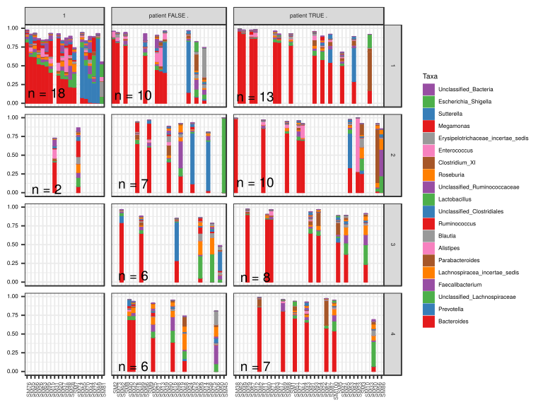

\(1.1.1.3.3.2.4.2.1.1.1\) [`Figure 134.`](#figure.134) Abundance. Data grouped by Sample.type.Drug.Before,visit.  bar (sample mean) plot.  Image file: [`plots/323257a115b.svg`](plots/323257a115b.svg).
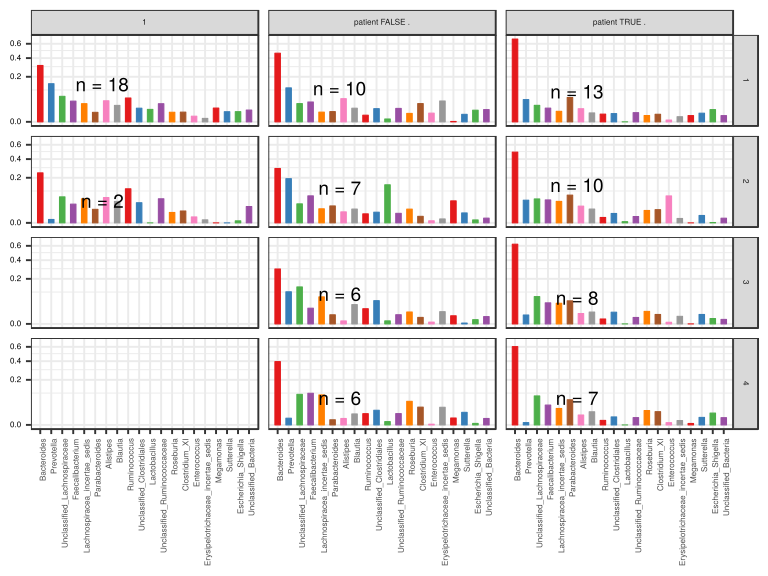

\(1.1.1.3.3.2.4.2.1.1.1\) [`Figure 135.`](#figure.135) Abundance. Data grouped by Sample.type.Drug.Before,visit.  violin plot.  Image file: [`plots/32363bf503d.svg`](plots/32363bf503d.svg).

\(1.1.1.3.3.2.4.2.1.1.1\) [`Figure 136.`](#figure.136) Abundance. Data grouped by Sample.type.Drug.Before,visit.  boxplot plot.  Image file: [`plots/3233842f76e.svg`](plots/3233842f76e.svg).
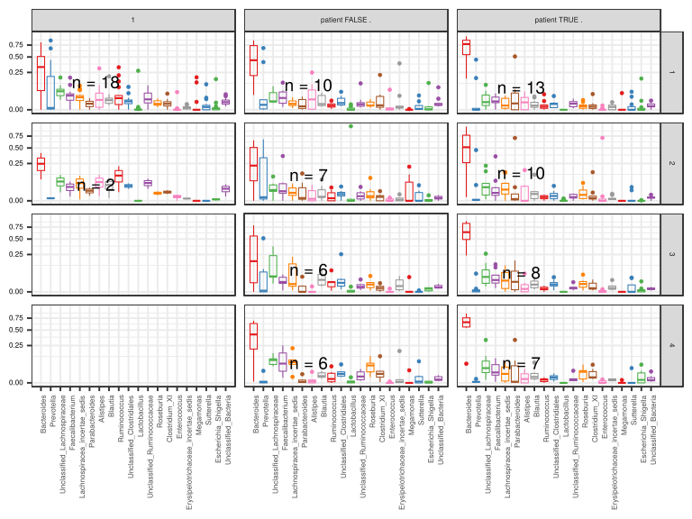

##### \(1.1.1.3.3.2.4.2.1.2\) Abundance. Plot is in flipped orientation, Y axis not scaled. Iterating over plot geometry

\(1.1.1.3.3.2.4.2.1.2.1\) [`Figure 137.`](#figure.137) Abundance. Data grouped by Sample.type.Drug.Before,visit.  bar (sample mean) plot.  Image file: [`plots/3237e83f6a.svg`](plots/3237e83f6a.svg).
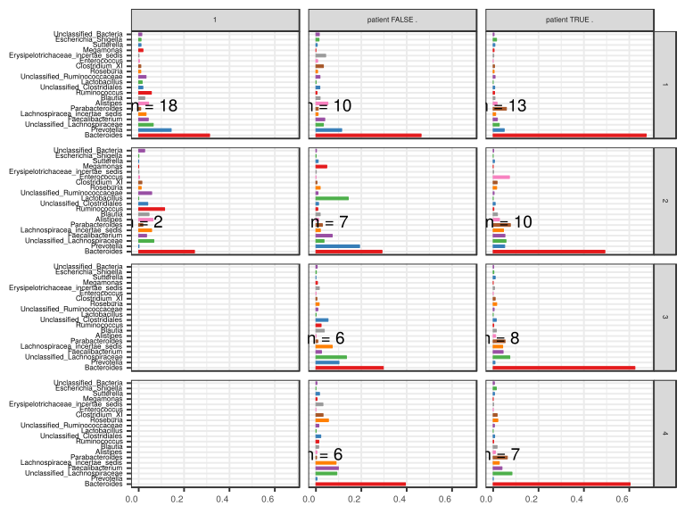

\(1.1.1.3.3.2.4.2.1.2.1\) [`Figure 138.`](#figure.138) Abundance. Data grouped by Sample.type.Drug.Before,visit.  violin plot.  Image file: [`plots/3235acec018.svg`](plots/3235acec018.svg).

\(1.1.1.3.3.2.4.2.1.2.1\) [`Figure 139.`](#figure.139) Abundance. Data grouped by Sample.type.Drug.Before,visit.  boxplot plot.  Image file: [`plots/32330bdd2c6.svg`](plots/32330bdd2c6.svg).
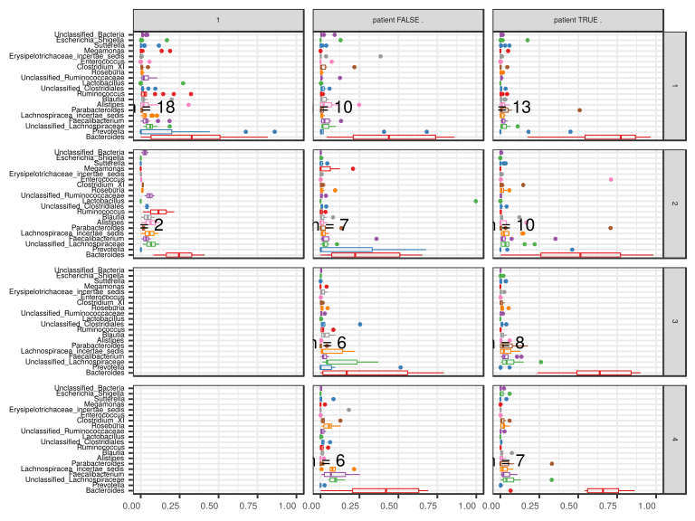

##### \(1.1.1.3.3.2.4.2.2\) dodged plots. Iterating over orientation and, optionally, scaling

##### \(1.1.1.3.3.2.4.2.2.1\) Abundance. Plot is in original orientation, Y axis SQRT scaled. Iterating over plot geometry

\(1.1.1.3.3.2.4.2.2.1.1\) [`Figure 140.`](#figure.140) Abundance. Data grouped by Sample.type.Drug.Before,visit.  bar (sample mean) plot.  Image file: [`plots/32377a6bde4.svg`](plots/32377a6bde4.svg).
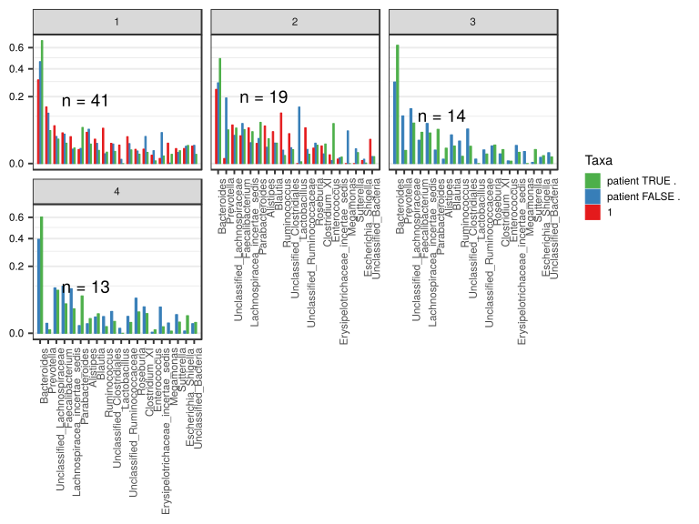

\(1.1.1.3.3.2.4.2.2.1.1\) [`Figure 141.`](#figure.141) Abundance. Data grouped by Sample.type.Drug.Before,visit.  violin plot.  Image file: [`plots/323555660f3.svg`](plots/323555660f3.svg).

\(1.1.1.3.3.2.4.2.2.1.1\) [`Figure 142.`](#figure.142) Abundance. Data grouped by Sample.type.Drug.Before,visit.  boxplot plot.  Image file: [`plots/32313703105.svg`](plots/32313703105.svg).
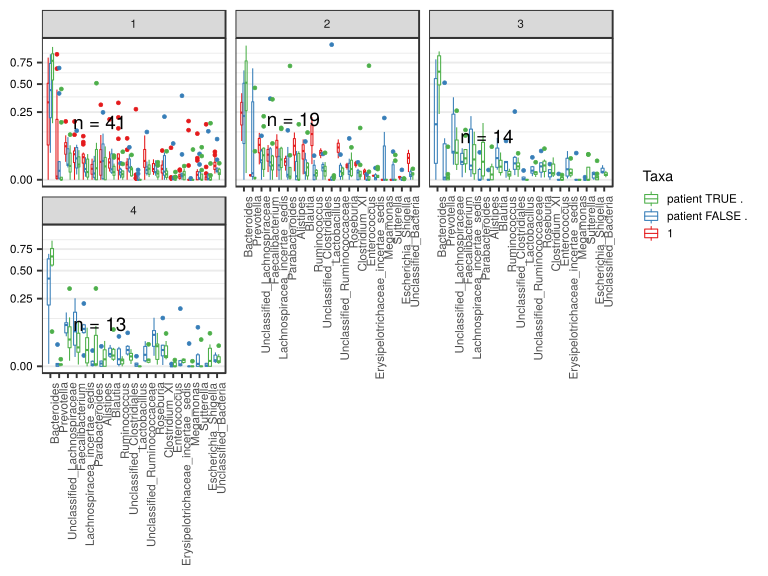

##### \(1.1.1.3.3.2.4.2.2.2\) Abundance. Plot is in flipped orientation, Y axis not scaled. Iterating over plot geometry

\(1.1.1.3.3.2.4.2.2.2.1\) [`Figure 143.`](#figure.143) Abundance. Data grouped by Sample.type.Drug.Before,visit.  bar (sample mean) plot.  Image file: [`plots/32370d6df67.svg`](plots/32370d6df67.svg).
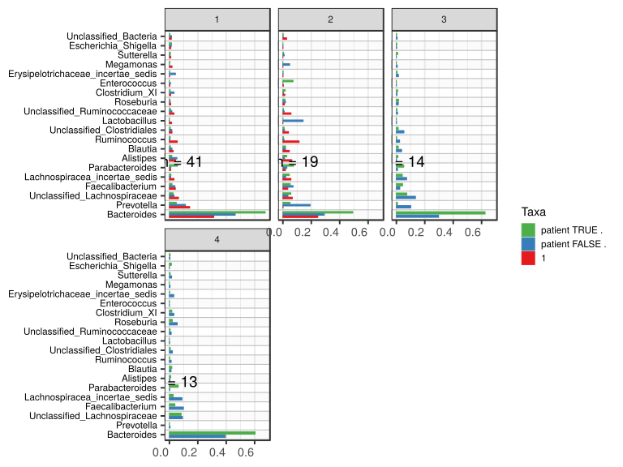

\(1.1.1.3.3.2.4.2.2.2.1\) [`Figure 144.`](#figure.144) Abundance. Data grouped by Sample.type.Drug.Before,visit.  violin plot.  Image file: [`plots/323758cd9d1.svg`](plots/323758cd9d1.svg).

\(1.1.1.3.3.2.4.2.2.2.1\) [`Figure 145.`](#figure.145) Abundance. Data grouped by Sample.type.Drug.Before,visit.  boxplot plot.  Image file: [`plots/323389dbe37.svg`](plots/323389dbe37.svg).
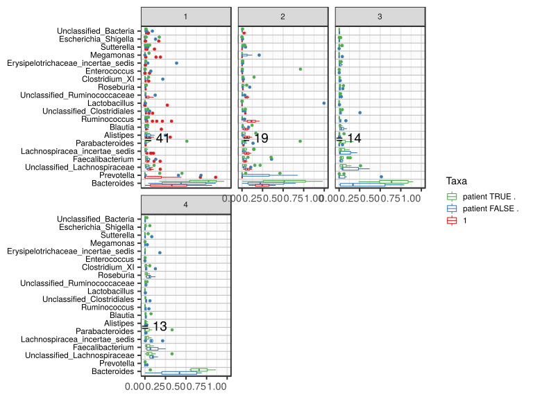

##### \(1.1.1.3.3.2.5\) Grouping variables Drug.Before.Diet,Sample.type.1

##### \(1.1.1.3.3.2.6\) Iterating over Abundance. profile sorting order

##### \(1.1.1.3.3.2.6.1\) Abundance. profile sorting order: average abundance

##### \(1.1.1.3.3.2.6.2\) Iterating over dodged vs faceted bars

The same data are shown in multiple combinations of graphical representations. 
                         This is the same data, but each plot highlights slightly different aspects of it.
                         It is not likely that you will need every plot - pick only what you need.

##### \(1.1.1.3.3.2.6.2.1\) faceted plots. Iterating over orientation and, optionally, scaling

##### \(1.1.1.3.3.2.6.2.1.1\) Abundance. Plot is in original orientation, Y axis SQRT scaled. Iterating over plot geometry

\(1.1.1.3.3.2.6.2.1.1.0\) [`Table 41.`](#table.41) Data table used for plots. Data grouped by Drug.Before.Diet,Sample.type.1. Showing only 200 first rows. Full dataset is also saved in a delimited text file (click to download and open e.g. in Excel) [`data/1.1.1.3.3.2.6.2.1.1.0-3231b91623.1.1.1.3.3.2.6.2.1.1.csv`](data/1.1.1.3.3.2.6.2.1.1.0-3231b91623.1.1.1.3.3.2.6.2.1.1.csv)

| .record.id | Drug.Before.Diet | Sample.type.1       | feature                       | Abundance  |
|:-----------|:-----------------|:--------------------|:------------------------------|:-----------|
| SM1        | DrugBefore\_YES  | patient.before.diet | Bacteroides                   | 7.735e\-01 |
| SM10       | DrugBefore\_YES  | patient.after.diet  | Bacteroides                   | 2.364e\-01 |
| SM100      | DrugBefore\_YES  | patient.after.diet  | Bacteroides                   | 5.420e\-01 |
| SM11       | DrugBefore\_YES  | patient.after.diet  | Bacteroides                   | 8.578e\-01 |
| SM12       | DrugBefore\_YES  | patient.before.diet | Bacteroides                   | 8.674e\-01 |
| SM13       | DrugBefore\_NO   | patient.before.diet | Bacteroides                   | 4.295e\-01 |
| SM14       | DrugBefore\_NO   | patient.before.diet | Bacteroides                   | 3.976e\-02 |
| SM15       | DrugBefore\_YES  | control             | Bacteroides                   | 4.120e\-01 |
| SM16       | DrugBefore\_NO   | patient.after.diet  | Bacteroides                   | 3.890e\-01 |
| SM17       | DrugBefore\_YES  | patient.before.diet | Bacteroides                   | 8.130e\-01 |
| SM18       | DrugBefore\_NO   | patient.after.diet  | Bacteroides                   | 6.537e\-01 |
| SM19       | DrugBefore\_NO   | patient.after.diet  | Bacteroides                   | 2.221e\-01 |
| SM2        | DrugBefore\_NO   | patient.before.diet | Bacteroides                   | 8.611e\-01 |
| SM20       | DrugBefore\_NO   | control             | Bacteroides                   | 3.742e\-01 |
| SM21       | DrugBefore\_NO   | patient.before.diet | Bacteroides                   | 4.490e\-01 |
| SM22       | DrugBefore\_YES  | patient.before.diet | Bacteroides                   | 5.831e\-01 |
| SM23       | DrugBefore\_YES  | patient.after.diet  | Bacteroides                   | 2.796e\-01 |
| SM24       | DrugBefore\_NO   | patient.before.diet | Bacteroides                   | 1.435e\-01 |
| SM25       | DrugBefore\_NO   | patient.after.diet  | Bacteroides                   | 4.520e\-01 |
| SM26       | DrugBefore\_NO   | control             | Bacteroides                   | 5.242e\-01 |
| SM28       | DrugBefore\_NO   | control             | Bacteroides                   | 2.194e\-01 |
| SM29       | DrugBefore\_YES  | patient.after.diet  | Bacteroides                   | 9.002e\-01 |
| SM3        | DrugBefore\_YES  | patient.after.diet  | Bacteroides                   | 2.542e\-01 |
| SM30       | DrugBefore\_YES  | patient.after.diet  | Bacteroides                   | 6.581e\-02 |
| SM31       | DrugBefore\_NO   | control             | Bacteroides                   | 4.094e\-01 |
| SM33       | DrugBefore\_YES  | patient.before.diet | Bacteroides                   | 1.747e\-01 |
| SM35       | DrugBefore\_NO   | control             | Bacteroides                   | 6.247e\-01 |
| SM36       | DrugBefore\_NO   | patient.after.diet  | Bacteroides                   | 3.219e\-04 |
| SM37       | DrugBefore\_NO   | control             | Bacteroides                   | 3.301e\-01 |
| SM38       | DrugBefore\_YES  | patient.after.diet  | Bacteroides                   | 9.828e\-01 |
| SM39       | DrugBefore\_NO   | patient.before.diet | Bacteroides                   | 4.095e\-01 |
| SM40       | DrugBefore\_NO   | patient.after.diet  | Bacteroides                   | 6.908e\-01 |
| SM41       | DrugBefore\_YES  | patient.before.diet | Bacteroides                   | 5.037e\-01 |
| SM42       | DrugBefore\_NO   | patient.after.diet  | Bacteroides                   | 6.901e\-01 |
| SM43       | DrugBefore\_YES  | patient.after.diet  | Bacteroides                   | 6.589e\-01 |
| SM44       | DrugBefore\_NO   | control             | Bacteroides                   | 1.150e\-02 |
| SM45       | DrugBefore\_NO   | patient.after.diet  | Bacteroides                   | 0.000e\+00 |
| SM48       | DrugBefore\_NO   | control             | Bacteroides                   | 3.247e\-01 |
| SM49       | DrugBefore\_YES  | patient.before.diet | Bacteroides                   | 9.292e\-01 |
| SM5        | DrugBefore\_YES  | patient.after.diet  | Bacteroides                   | 5.313e\-01 |
| SM50       | DrugBefore\_NO   | patient.after.diet  | Bacteroides                   | 0.000e\+00 |
| SM51       | DrugBefore\_YES  | patient.after.diet  | Bacteroides                   | 7.122e\-01 |
| SM52       | DrugBefore\_NO   | patient.before.diet | Bacteroides                   | 8.105e\-02 |
| SM53       | DrugBefore\_YES  | patient.after.diet  | Bacteroides                   | 3.305e\-01 |
| SM54       | DrugBefore\_YES  | patient.after.diet  | Bacteroides                   | 6.239e\-01 |
| SM55       | DrugBefore\_NO   | control             | Bacteroides                   | 7.465e\-02 |
| SM56       | DrugBefore\_YES  | patient.after.diet  | Bacteroides                   | 1.958e\-02 |
| SM57       | DrugBefore\_YES  | patient.before.diet | Bacteroides                   | 8.679e\-01 |
| SM58       | DrugBefore\_NO   | patient.after.diet  | Bacteroides                   | 2.592e\-02 |
| SM59       | DrugBefore\_NO   | patient.after.diet  | Bacteroides                   | 5.206e\-02 |
| SM60       | DrugBefore\_YES  | patient.after.diet  | Bacteroides                   | 8.428e\-01 |
| SM62       | DrugBefore\_YES  | patient.before.diet | Bacteroides                   | 9.643e\-01 |
| SM63       | DrugBefore\_NO   | control             | Bacteroides                   | 5.135e\-01 |
| SM64       | DrugBefore\_YES  | patient.after.diet  | Bacteroides                   | 6.977e\-01 |
| SM65       | DrugBefore\_YES  | patient.after.diet  | Bacteroides                   | 3.711e\-01 |
| SM66       | DrugBefore\_NO   | control             | Bacteroides                   | 6.218e\-01 |
| SM67       | DrugBefore\_YES  | patient.after.diet  | Bacteroides                   | 5.778e\-01 |
| SM68       | DrugBefore\_NO   | patient.after.diet  | Bacteroides                   | 1.440e\-01 |
| SM69       | DrugBefore\_YES  | patient.after.diet  | Bacteroides                   | 8.051e\-01 |
| SM7        | DrugBefore\_NO   | control             | Bacteroides                   | 2.126e\-01 |
| SM70       | DrugBefore\_NO   | control             | Bacteroides                   | 6.327e\-02 |
| SM71       | DrugBefore\_YES  | patient.after.diet  | Bacteroides                   | 8.388e\-01 |
| SM72       | DrugBefore\_NO   | control             | Bacteroides                   | 4.762e\-03 |
| SM73       | DrugBefore\_NO   | patient.before.diet | Bacteroides                   | 8.108e\-01 |
| SM74       | DrugBefore\_NO   | control             | Bacteroides                   | 8.216e\-02 |
| SM75       | DrugBefore\_NO   | patient.after.diet  | Bacteroides                   | 2.377e\-03 |
| SM76       | DrugBefore\_NO   | control             | Bacteroides                   | 8.153e\-01 |
| SM77       | DrugBefore\_YES  | patient.after.diet  | Bacteroides                   | 7.039e\-01 |
| SM79       | DrugBefore\_NO   | patient.after.diet  | Bacteroides                   | 1.173e\-01 |
| SM8        | DrugBefore\_NO   | patient.before.diet | Bacteroides                   | 7.723e\-01 |
| SM81       | DrugBefore\_NO   | control             | Bacteroides                   | 0.000e\+00 |
| SM82       | DrugBefore\_YES  | patient.after.diet  | Bacteroides                   | 8.624e\-01 |
| SM83       | DrugBefore\_YES  | patient.before.diet | Bacteroides                   | 8.199e\-01 |
| SM84       | DrugBefore\_YES  | patient.before.diet | Bacteroides                   | 2.885e\-01 |
| SM86       | DrugBefore\_YES  | patient.after.diet  | Bacteroides                   | 2.482e\-03 |
| SM87       | DrugBefore\_YES  | patient.before.diet | Bacteroides                   | 5.438e\-01 |
| SM88       | DrugBefore\_YES  | patient.after.diet  | Bacteroides                   | 7.940e\-01 |
| SM89       | DrugBefore\_NO   | control             | Bacteroides                   | 2.115e\-03 |
| SM9        | DrugBefore\_NO   | patient.after.diet  | Bacteroides                   | 6.096e\-01 |
| SM90       | DrugBefore\_NO   | patient.after.diet  | Bacteroides                   | 4.088e\-01 |
| SM91       | DrugBefore\_YES  | patient.after.diet  | Bacteroides                   | 6.525e\-01 |
| SM92       | DrugBefore\_NO   | patient.after.diet  | Bacteroides                   | 7.921e\-01 |
| SM93       | DrugBefore\_YES  | patient.before.diet | Bacteroides                   | 6.404e\-01 |
| SM95       | DrugBefore\_NO   | control             | Bacteroides                   | 4.955e\-01 |
| SM96       | DrugBefore\_NO   | patient.before.diet | Bacteroides                   | 6.375e\-01 |
| SM98       | DrugBefore\_NO   | patient.after.diet  | Bacteroides                   | 2.848e\-01 |
| SM99       | DrugBefore\_NO   | patient.after.diet  | Bacteroides                   | 6.503e\-01 |
| SM1        | DrugBefore\_YES  | patient.before.diet | Prevotella                    | 2.598e\-04 |
| SM10       | DrugBefore\_YES  | patient.after.diet  | Prevotella                    | 0.000e\+00 |
| SM100      | DrugBefore\_YES  | patient.after.diet  | Prevotella                    | 7.692e\-05 |
| SM11       | DrugBefore\_YES  | patient.after.diet  | Prevotella                    | 3.477e\-04 |
| SM12       | DrugBefore\_YES  | patient.before.diet | Prevotella                    | 1.328e\-04 |
| SM13       | DrugBefore\_NO   | patient.before.diet | Prevotella                    | 1.652e\-02 |
| SM14       | DrugBefore\_NO   | patient.before.diet | Prevotella                    | 1.855e\-02 |
| SM15       | DrugBefore\_YES  | control             | Prevotella                    | 1.415e\-04 |
| SM16       | DrugBefore\_NO   | patient.after.diet  | Prevotella                    | 0.000e\+00 |
| SM17       | DrugBefore\_YES  | patient.before.diet | Prevotella                    | 4.137e\-04 |
| SM18       | DrugBefore\_NO   | patient.after.diet  | Prevotella                    | 3.357e\-04 |
| SM19       | DrugBefore\_NO   | patient.after.diet  | Prevotella                    | 2.314e\-03 |
| SM2        | DrugBefore\_NO   | patient.before.diet | Prevotella                    | 2.480e\-04 |
| SM20       | DrugBefore\_NO   | control             | Prevotella                    | 0.000e\+00 |
| SM21       | DrugBefore\_NO   | patient.before.diet | Prevotella                    | 0.000e\+00 |
| SM22       | DrugBefore\_YES  | patient.before.diet | Prevotella                    | 0.000e\+00 |
| SM23       | DrugBefore\_YES  | patient.after.diet  | Prevotella                    | 0.000e\+00 |
| SM24       | DrugBefore\_NO   | patient.before.diet | Prevotella                    | 6.822e\-01 |
| SM25       | DrugBefore\_NO   | patient.after.diet  | Prevotella                    | 0.000e\+00 |
| SM26       | DrugBefore\_NO   | control             | Prevotella                    | 2.758e\-04 |
| SM28       | DrugBefore\_NO   | control             | Prevotella                    | 3.997e\-04 |
| SM29       | DrugBefore\_YES  | patient.after.diet  | Prevotella                    | 0.000e\+00 |
| SM3        | DrugBefore\_YES  | patient.after.diet  | Prevotella                    | 4.458e\-02 |
| SM30       | DrugBefore\_YES  | patient.after.diet  | Prevotella                    | 2.762e\-03 |
| SM31       | DrugBefore\_NO   | control             | Prevotella                    | 1.618e\-03 |
| SM33       | DrugBefore\_YES  | patient.before.diet | Prevotella                    | 0.000e\+00 |
| SM35       | DrugBefore\_NO   | control             | Prevotella                    | 2.046e\-03 |
| SM36       | DrugBefore\_NO   | patient.after.diet  | Prevotella                    | 0.000e\+00 |
| SM37       | DrugBefore\_NO   | control             | Prevotella                    | 7.741e\-04 |
| SM38       | DrugBefore\_YES  | patient.after.diet  | Prevotella                    | 1.028e\-04 |
| SM39       | DrugBefore\_NO   | patient.before.diet | Prevotella                    | 4.073e\-01 |
| SM40       | DrugBefore\_NO   | patient.after.diet  | Prevotella                    | 2.775e\-04 |
| SM41       | DrugBefore\_YES  | patient.before.diet | Prevotella                    | 0.000e\+00 |
| SM42       | DrugBefore\_NO   | patient.after.diet  | Prevotella                    | 4.994e\-04 |
| SM43       | DrugBefore\_YES  | patient.after.diet  | Prevotella                    | 7.452e\-05 |
| SM44       | DrugBefore\_NO   | control             | Prevotella                    | 3.227e\-01 |
| SM45       | DrugBefore\_NO   | patient.after.diet  | Prevotella                    | 0.000e\+00 |
| SM48       | DrugBefore\_NO   | control             | Prevotella                    | 2.151e\-03 |
| SM49       | DrugBefore\_YES  | patient.before.diet | Prevotella                    | 0.000e\+00 |
| SM5        | DrugBefore\_YES  | patient.after.diet  | Prevotella                    | 5.950e\-02 |
| SM50       | DrugBefore\_NO   | patient.after.diet  | Prevotella                    | 0.000e\+00 |
| SM51       | DrugBefore\_YES  | patient.after.diet  | Prevotella                    | 2.231e\-04 |
| SM52       | DrugBefore\_NO   | patient.before.diet | Prevotella                    | 8.062e\-03 |
| SM53       | DrugBefore\_YES  | patient.after.diet  | Prevotella                    | 4.611e\-01 |
| SM54       | DrugBefore\_YES  | patient.after.diet  | Prevotella                    | 0.000e\+00 |
| SM55       | DrugBefore\_NO   | control             | Prevotella                    | 6.747e\-01 |
| SM56       | DrugBefore\_YES  | patient.after.diet  | Prevotella                    | 0.000e\+00 |
| SM57       | DrugBefore\_YES  | patient.before.diet | Prevotella                    | 3.600e\-04 |
| SM58       | DrugBefore\_NO   | patient.after.diet  | Prevotella                    | 6.582e\-01 |
| SM59       | DrugBefore\_NO   | patient.after.diet  | Prevotella                    | 0.000e\+00 |
| SM60       | DrugBefore\_YES  | patient.after.diet  | Prevotella                    | 3.404e\-04 |
| SM62       | DrugBefore\_YES  | patient.before.diet | Prevotella                    | 0.000e\+00 |
| SM63       | DrugBefore\_NO   | control             | Prevotella                    | 2.703e\-03 |
| SM64       | DrugBefore\_YES  | patient.after.diet  | Prevotella                    | 1.113e\-04 |
| SM65       | DrugBefore\_YES  | patient.after.diet  | Prevotella                    | 1.374e\-04 |
| SM66       | DrugBefore\_NO   | control             | Prevotella                    | 2.198e\-04 |
| SM67       | DrugBefore\_YES  | patient.after.diet  | Prevotella                    | 0.000e\+00 |
| SM68       | DrugBefore\_NO   | patient.after.diet  | Prevotella                    | 2.586e\-02 |
| SM69       | DrugBefore\_YES  | patient.after.diet  | Prevotella                    | 3.108e\-04 |
| SM7        | DrugBefore\_NO   | control             | Prevotella                    | 0.000e\+00 |
| SM70       | DrugBefore\_NO   | control             | Prevotella                    | 4.438e\-01 |
| SM71       | DrugBefore\_YES  | patient.after.diet  | Prevotella                    | 1.723e\-03 |
| SM72       | DrugBefore\_NO   | control             | Prevotella                    | 2.651e\-01 |
| SM73       | DrugBefore\_NO   | patient.before.diet | Prevotella                    | 1.009e\-04 |
| SM74       | DrugBefore\_NO   | control             | Prevotella                    | 6.547e\-04 |
| SM75       | DrugBefore\_NO   | patient.after.diet  | Prevotella                    | 0.000e\+00 |
| SM76       | DrugBefore\_NO   | control             | Prevotella                    | 5.743e\-05 |
| SM77       | DrugBefore\_YES  | patient.after.diet  | Prevotella                    | 1.127e\-04 |
| SM79       | DrugBefore\_NO   | patient.after.diet  | Prevotella                    | 6.782e\-01 |
| SM8        | DrugBefore\_NO   | patient.before.diet | Prevotella                    | 7.416e\-04 |
| SM81       | DrugBefore\_NO   | control             | Prevotella                    | 0.000e\+00 |
| SM82       | DrugBefore\_YES  | patient.after.diet  | Prevotella                    | 2.141e\-04 |
| SM83       | DrugBefore\_YES  | patient.before.diet | Prevotella                    | 0.000e\+00 |
| SM84       | DrugBefore\_YES  | patient.before.diet | Prevotella                    | 4.502e\-01 |
| SM86       | DrugBefore\_YES  | patient.after.diet  | Prevotella                    | 3.103e\-04 |
| SM87       | DrugBefore\_YES  | patient.before.diet | Prevotella                    | 1.804e\-01 |
| SM88       | DrugBefore\_YES  | patient.after.diet  | Prevotella                    | 1.705e\-04 |
| SM89       | DrugBefore\_NO   | control             | Prevotella                    | 8.603e\-01 |
| SM9        | DrugBefore\_NO   | patient.after.diet  | Prevotella                    | 8.227e\-04 |
| SM90       | DrugBefore\_NO   | patient.after.diet  | Prevotella                    | 5.776e\-03 |
| SM91       | DrugBefore\_YES  | patient.after.diet  | Prevotella                    | 2.212e\-04 |
| SM92       | DrugBefore\_NO   | patient.after.diet  | Prevotella                    | 9.411e\-02 |
| SM93       | DrugBefore\_YES  | patient.before.diet | Prevotella                    | 0.000e\+00 |
| SM95       | DrugBefore\_NO   | control             | Prevotella                    | 0.000e\+00 |
| SM96       | DrugBefore\_NO   | patient.before.diet | Prevotella                    | 0.000e\+00 |
| SM98       | DrugBefore\_NO   | patient.after.diet  | Prevotella                    | 5.140e\-01 |
| SM99       | DrugBefore\_NO   | patient.after.diet  | Prevotella                    | 4.757e\-04 |
| SM1        | DrugBefore\_YES  | patient.before.diet | Unclassified\_Lachnospiraceae | 4.529e\-02 |
| SM10       | DrugBefore\_YES  | patient.after.diet  | Unclassified\_Lachnospiraceae | 2.607e\-01 |
| SM100      | DrugBefore\_YES  | patient.after.diet  | Unclassified\_Lachnospiraceae | 1.308e\-01 |
| SM11       | DrugBefore\_YES  | patient.after.diet  | Unclassified\_Lachnospiraceae | 4.404e\-03 |
| SM12       | DrugBefore\_YES  | patient.before.diet | Unclassified\_Lachnospiraceae | 1.049e\-02 |
| SM13       | DrugBefore\_NO   | patient.before.diet | Unclassified\_Lachnospiraceae | 1.116e\-02 |
| SM14       | DrugBefore\_NO   | patient.before.diet | Unclassified\_Lachnospiraceae | 6.172e\-02 |
| SM15       | DrugBefore\_YES  | control             | Unclassified\_Lachnospiraceae | 5.053e\-02 |
| SM16       | DrugBefore\_NO   | patient.after.diet  | Unclassified\_Lachnospiraceae | 1.583e\-01 |
| SM17       | DrugBefore\_YES  | patient.before.diet | Unclassified\_Lachnospiraceae | 2.938e\-02 |
| SM18       | DrugBefore\_NO   | patient.after.diet  | Unclassified\_Lachnospiraceae | 5.271e\-02 |
| SM19       | DrugBefore\_NO   | patient.after.diet  | Unclassified\_Lachnospiraceae | 1.055e\-01 |
| SM2        | DrugBefore\_NO   | patient.before.diet | Unclassified\_Lachnospiraceae | 1.097e\-02 |
| SM20       | DrugBefore\_NO   | control             | Unclassified\_Lachnospiraceae | 2.256e\-02 |
| SM21       | DrugBefore\_NO   | patient.before.diet | Unclassified\_Lachnospiraceae | 5.532e\-02 |
| SM22       | DrugBefore\_YES  | patient.before.diet | Unclassified\_Lachnospiraceae | 1.113e\-01 |
| SM23       | DrugBefore\_YES  | patient.after.diet  | Unclassified\_Lachnospiraceae | 4.148e\-04 |
| SM24       | DrugBefore\_NO   | patient.before.diet | Unclassified\_Lachnospiraceae | 1.402e\-02 |
| SM25       | DrugBefore\_NO   | patient.after.diet  | Unclassified\_Lachnospiraceae | 8.430e\-02 |
| SM26       | DrugBefore\_NO   | control             | Unclassified\_Lachnospiraceae | 7.501e\-02 |
| SM28       | DrugBefore\_NO   | control             | Unclassified\_Lachnospiraceae | 9.952e\-02 |
| SM29       | DrugBefore\_YES  | patient.after.diet  | Unclassified\_Lachnospiraceae | 1.128e\-02 |
| SM3        | DrugBefore\_YES  | patient.after.diet  | Unclassified\_Lachnospiraceae | 1.560e\-01 |
| SM30       | DrugBefore\_YES  | patient.after.diet  | Unclassified\_Lachnospiraceae | 3.297e\-01 |
| SM31       | DrugBefore\_NO   | control             | Unclassified\_Lachnospiraceae | 1.294e\-02 |
| SM33       | DrugBefore\_YES  | patient.before.diet | Unclassified\_Lachnospiraceae | 3.934e\-03 |

\(1.1.1.3.3.2.6.2.1.1.1\) [`Widget 42.`](#widget.42) Dynamic Pivot Table link (drag and drop field names and pick averaging 
                      functions or plot types; click on fields or legend elements to filter values). 
                      Starting rendering is Stacked Bar Chart. Data grouped by Drug.Before.Diet,Sample.type.1. Click to see HTML widget file in full window: [`./1.1.1.3.3.2.6.2.1.1.1-3237181ba1Dynamic.Pivot.Table.html`](./1.1.1.3.3.2.6.2.1.1.1-3237181ba1Dynamic.Pivot.Table.html)

\(1.1.1.3.3.2.6.2.1.1.1\) [`Widget 43.`](#widget.43) Dynamic Pivot Table link (drag and drop field names and pick averaging 
                      functions or plot types; click on fields or legend elements to filter values). 
                      Starting rendering is Table Barchart. Data grouped by Drug.Before.Diet,Sample.type.1. Click to see HTML widget file in full window: [`./1.1.1.3.3.2.6.2.1.1.1-323675ab292Dynamic.Pivot.Table.html`](./1.1.1.3.3.2.6.2.1.1.1-323675ab292Dynamic.Pivot.Table.html)

\(1.1.1.3.3.2.6.2.1.1.1\) [`Table 42.`](#table.42) Summary table. Data grouped by Drug.Before.Diet,Sample.type.1. Showing only 200 first rows. Full dataset is also saved in a delimited text file (click to download and open e.g. in Excel) [`data/1.1.1.3.3.2.6.2.1.1.1-3233e26e853.1.1.1.3.3.2.6.2.1.1.csv`](data/1.1.1.3.3.2.6.2.1.1.1-3233e26e853.1.1.1.3.3.2.6.2.1.1.csv)

| feature                              | Drug.Before.Diet | Sample.type.1       | mean       | sd         | median     | incidence |
|:-------------------------------------|:-----------------|:--------------------|:-----------|:-----------|:-----------|:----------|
| Bacteroides                          | DrugBefore\_NO   | control             | 3.002e\-01 | 2.522e\-01 | 3.247e\-01 | 0.94737   |
| Bacteroides                          | DrugBefore\_NO   | patient.after.diet  | 3.255e\-01 | 2.868e\-01 | 2.848e\-01 | 0.89474   |
| Bacteroides                          | DrugBefore\_NO   | patient.before.diet | 4.634e\-01 | 3.049e\-01 | 4.392e\-01 | 1.00000   |
| Bacteroides                          | DrugBefore\_YES  | control             | 4.120e\-01 | NA         | 4.120e\-01 | 1.00000   |
| Bacteroides                          | DrugBefore\_YES  | patient.after.diet  | 5.657e\-01 | 2.919e\-01 | 6.525e\-01 | 1.00000   |
| Bacteroides                          | DrugBefore\_YES  | patient.before.diet | 6.746e\-01 | 2.463e\-01 | 7.735e\-01 | 1.00000   |
| Prevotella                           | DrugBefore\_NO   | control             | 1.357e\-01 | 2.600e\-01 | 7.741e\-04 | 0.78947   |
| Prevotella                           | DrugBefore\_NO   | patient.after.diet  | 1.043e\-01 | 2.310e\-01 | 4.757e\-04 | 0.63158   |
| Prevotella                           | DrugBefore\_NO   | patient.before.diet | 1.134e\-01 | 2.365e\-01 | 4.402e\-03 | 0.80000   |
| Prevotella                           | DrugBefore\_YES  | control             | 1.415e\-04 | NA         | 1.415e\-04 | 1.00000   |
| Prevotella                           | DrugBefore\_YES  | patient.after.diet  | 2.290e\-02 | 9.243e\-02 | 1.705e\-04 | 0.76000   |
| Prevotella                           | DrugBefore\_YES  | patient.before.diet | 4.860e\-02 | 1.305e\-01 | 0.000e\+00 | 0.46154   |
| Unclassified\_Lachnospiraceae        | DrugBefore\_NO   | control             | 6.487e\-02 | 4.373e\-02 | 6.396e\-02 | 1.00000   |
| Unclassified\_Lachnospiraceae        | DrugBefore\_NO   | patient.after.diet  | 8.458e\-02 | 9.765e\-02 | 4.930e\-02 | 0.94737   |
| Unclassified\_Lachnospiraceae        | DrugBefore\_NO   | patient.before.diet | 3.276e\-02 | 3.113e\-02 | 1.269e\-02 | 1.00000   |
| Unclassified\_Lachnospiraceae        | DrugBefore\_YES  | control             | 5.053e\-02 | NA         | 5.053e\-02 | 1.00000   |
| Unclassified\_Lachnospiraceae        | DrugBefore\_YES  | patient.after.diet  | 6.912e\-02 | 8.904e\-02 | 3.912e\-02 | 1.00000   |
| Unclassified\_Lachnospiraceae        | DrugBefore\_YES  | patient.before.diet | 2.669e\-02 | 3.274e\-02 | 1.049e\-02 | 0.92308   |
| Faecalibacterium                     | DrugBefore\_NO   | control             | 4.161e\-02 | 4.407e\-02 | 3.571e\-02 | 0.94737   |
| Faecalibacterium                     | DrugBefore\_NO   | patient.after.diet  | 6.529e\-02 | 9.654e\-02 | 1.901e\-02 | 0.94737   |
| Faecalibacterium                     | DrugBefore\_NO   | patient.before.diet | 3.876e\-02 | 4.038e\-02 | 2.495e\-02 | 1.00000   |
| Faecalibacterium                     | DrugBefore\_YES  | control             | 3.751e\-02 | NA         | 3.751e\-02 | 1.00000   |
| Faecalibacterium                     | DrugBefore\_YES  | patient.after.diet  | 4.549e\-02 | 7.464e\-02 | 1.950e\-02 | 0.96000   |
| Faecalibacterium                     | DrugBefore\_YES  | patient.before.diet | 1.846e\-02 | 1.438e\-02 | 1.267e\-02 | 0.92308   |
| Lachnospiracea\_incertae\_sedis      | DrugBefore\_NO   | control             | 3.487e\-02 | 3.292e\-02 | 2.398e\-02 | 0.94737   |
| Lachnospiracea\_incertae\_sedis      | DrugBefore\_NO   | patient.after.diet  | 5.781e\-02 | 7.262e\-02 | 2.770e\-02 | 0.94737   |
| Lachnospiracea\_incertae\_sedis      | DrugBefore\_NO   | patient.before.diet | 9.291e\-03 | 8.958e\-03 | 6.378e\-03 | 1.00000   |
| Lachnospiracea\_incertae\_sedis      | DrugBefore\_YES  | control             | 3.397e\-02 | NA         | 3.397e\-02 | 1.00000   |
| Lachnospiracea\_incertae\_sedis      | DrugBefore\_YES  | patient.after.diet  | 3.899e\-02 | 4.683e\-02 | 2.079e\-02 | 0.88000   |
| Lachnospiracea\_incertae\_sedis      | DrugBefore\_YES  | patient.before.diet | 1.085e\-02 | 1.317e\-02 | 3.240e\-03 | 0.84615   |
| Parabacteroides                      | DrugBefore\_NO   | control             | 1.016e\-02 | 9.315e\-03 | 7.497e\-03 | 0.94737   |
| Parabacteroides                      | DrugBefore\_NO   | patient.after.diet  | 1.377e\-02 | 3.306e\-02 | 4.114e\-04 | 0.63158   |
| Parabacteroides                      | DrugBefore\_NO   | patient.before.diet | 1.024e\-02 | 1.289e\-02 | 2.166e\-03 | 0.80000   |
| Parabacteroides                      | DrugBefore\_YES  | control             | 2.052e\-03 | NA         | 2.052e\-03 | 1.00000   |
| Parabacteroides                      | DrugBefore\_YES  | patient.after.diet  | 6.448e\-02 | 1.546e\-01 | 1.021e\-03 | 0.80000   |
| Parabacteroides                      | DrugBefore\_YES  | patient.before.diet | 5.820e\-02 | 1.381e\-01 | 7.199e\-03 | 0.69231   |
| Alistipes                            | DrugBefore\_NO   | control             | 4.456e\-02 | 7.502e\-02 | 1.418e\-02 | 0.78947   |
| Alistipes                            | DrugBefore\_NO   | patient.after.diet  | 5.926e\-03 | 1.276e\-02 | 0.000e\+00 | 0.42105   |
| Alistipes                            | DrugBefore\_NO   | patient.before.diet | 5.269e\-02 | 7.947e\-02 | 1.928e\-02 | 0.70000   |
| Alistipes                            | DrugBefore\_YES  | control             | 6.419e\-02 | NA         | 6.419e\-02 | 1.00000   |
| Alistipes                            | DrugBefore\_YES  | patient.after.diet  | 1.712e\-02 | 3.588e\-02 | 1.695e\-04 | 0.52000   |
| Alistipes                            | DrugBefore\_YES  | patient.before.diet | 1.696e\-02 | 2.078e\-02 | 9.784e\-03 | 0.69231   |
| Blautia                              | DrugBefore\_NO   | control             | 2.865e\-02 | 4.600e\-02 | 1.538e\-02 | 1.00000   |
| Blautia                              | DrugBefore\_NO   | patient.after.diet  | 2.226e\-02 | 2.835e\-02 | 6.232e\-03 | 0.94737   |
| Blautia                              | DrugBefore\_NO   | patient.before.diet | 1.828e\-02 | 2.097e\-02 | 5.935e\-03 | 1.00000   |
| Blautia                              | DrugBefore\_YES  | control             | 2.456e\-02 | NA         | 2.456e\-02 | 1.00000   |
| Blautia                              | DrugBefore\_YES  | patient.after.diet  | 1.664e\-02 | 2.725e\-02 | 7.161e\-03 | 0.92000   |
| Blautia                              | DrugBefore\_YES  | patient.before.diet | 7.798e\-03 | 1.057e\-02 | 3.143e\-03 | 0.92308   |
| Ruminococcus                         | DrugBefore\_NO   | control             | 5.365e\-02 | 8.556e\-02 | 1.987e\-02 | 0.94737   |
| Ruminococcus                         | DrugBefore\_NO   | patient.after.diet  | 1.406e\-02 | 2.142e\-02 | 1.851e\-03 | 0.73684   |
| Ruminococcus                         | DrugBefore\_NO   | patient.before.diet | 4.312e\-03 | 4.547e\-03 | 2.962e\-03 | 1.00000   |
| Ruminococcus                         | DrugBefore\_YES  | control             | 2.124e\-01 | NA         | 2.124e\-01 | 1.00000   |
| Ruminococcus                         | DrugBefore\_YES  | patient.after.diet  | 2.473e\-03 | 2.256e\-03 | 1.958e\-03 | 0.84000   |
| Ruminococcus                         | DrugBefore\_YES  | patient.before.diet | 5.840e\-03 | 1.170e\-02 | 1.647e\-03 | 0.84615   |
| Unclassified\_Clostridiales          | DrugBefore\_NO   | control             | 2.061e\-02 | 2.267e\-02 | 1.397e\-02 | 0.94737   |
| Unclassified\_Clostridiales          | DrugBefore\_NO   | patient.after.diet  | 2.764e\-02 | 5.679e\-02 | 1.332e\-02 | 0.94737   |
| Unclassified\_Clostridiales          | DrugBefore\_NO   | patient.before.diet | 1.711e\-02 | 1.800e\-02 | 8.182e\-03 | 1.00000   |
| Unclassified\_Clostridiales          | DrugBefore\_YES  | control             | 1.677e\-02 | NA         | 1.677e\-02 | 1.00000   |
| Unclassified\_Clostridiales          | DrugBefore\_YES  | patient.after.diet  | 9.534e\-03 | 1.102e\-02 | 6.365e\-03 | 0.96000   |
| Unclassified\_Clostridiales          | DrugBefore\_YES  | patient.before.diet | 6.632e\-03 | 8.900e\-03 | 6.030e\-03 | 1.00000   |
| Lactobacillus                        | DrugBefore\_NO   | control             | 1.441e\-02 | 6.243e\-02 | 0.000e\+00 | 0.21053   |
| Lactobacillus                        | DrugBefore\_NO   | patient.after.diet  | 5.315e\-02 | 2.286e\-01 | 0.000e\+00 | 0.42105   |
| Lactobacillus                        | DrugBefore\_NO   | patient.before.diet | 8.034e\-04 | 1.696e\-03 | 0.000e\+00 | 0.40000   |
| Lactobacillus                        | DrugBefore\_YES  | control             | 7.077e\-05 | NA         | 7.077e\-05 | 1.00000   |
| Lactobacillus                        | DrugBefore\_YES  | patient.after.diet  | 5.537e\-05 | 2.101e\-04 | 0.000e\+00 | 0.12000   |
| Lactobacillus                        | DrugBefore\_YES  | patient.before.diet | 0.000e\+00 | 0.000e\+00 | 0.000e\+00 | 0.00000   |
| Unclassified\_Ruminococcaceae        | DrugBefore\_NO   | control             | 3.356e\-02 | 3.478e\-02 | 1.988e\-02 | 0.94737   |
| Unclassified\_Ruminococcaceae        | DrugBefore\_NO   | patient.after.diet  | 9.938e\-03 | 1.182e\-02 | 3.861e\-03 | 0.94737   |
| Unclassified\_Ruminococcaceae        | DrugBefore\_NO   | patient.before.diet | 1.774e\-02 | 3.797e\-02 | 5.337e\-03 | 1.00000   |
| Unclassified\_Ruminococcaceae        | DrugBefore\_YES  | control             | 5.697e\-02 | NA         | 5.697e\-02 | 1.00000   |
| Unclassified\_Ruminococcaceae        | DrugBefore\_YES  | patient.after.diet  | 4.353e\-03 | 5.960e\-03 | 2.538e\-03 | 0.96000   |
| Unclassified\_Ruminococcaceae        | DrugBefore\_YES  | patient.before.diet | 8.291e\-03 | 7.539e\-03 | 6.698e\-03 | 1.00000   |
| Roseburia                            | DrugBefore\_NO   | control             | 9.371e\-03 | 6.984e\-03 | 6.306e\-03 | 1.00000   |
| Roseburia                            | DrugBefore\_NO   | patient.after.diet  | 2.860e\-02 | 3.695e\-02 | 1.223e\-02 | 0.94737   |
| Roseburia                            | DrugBefore\_NO   | patient.before.diet | 7.028e\-03 | 7.428e\-03 | 3.183e\-03 | 1.00000   |
| Roseburia                            | DrugBefore\_YES  | control             | 6.298e\-03 | NA         | 6.298e\-03 | 1.00000   |
| Roseburia                            | DrugBefore\_YES  | patient.after.diet  | 1.667e\-02 | 1.876e\-02 | 1.106e\-02 | 1.00000   |
| Roseburia                            | DrugBefore\_YES  | patient.before.diet | 3.915e\-03 | 5.016e\-03 | 2.110e\-03 | 0.76923   |
| Clostridium\_XI                      | DrugBefore\_NO   | control             | 9.713e\-03 | 1.083e\-02 | 6.454e\-03 | 0.94737   |
| Clostridium\_XI                      | DrugBefore\_NO   | patient.after.diet  | 1.272e\-02 | 2.881e\-02 | 4.519e\-03 | 0.78947   |
| Clostridium\_XI                      | DrugBefore\_NO   | patient.before.diet | 3.278e\-02 | 6.673e\-02 | 3.583e\-03 | 0.90000   |
| Clostridium\_XI                      | DrugBefore\_YES  | control             | 9.837e\-03 | NA         | 9.837e\-03 | 1.00000   |
| Clostridium\_XI                      | DrugBefore\_YES  | patient.after.diet  | 1.447e\-02 | 3.084e\-02 | 3.419e\-03 | 0.96000   |
| Clostridium\_XI                      | DrugBefore\_YES  | patient.before.diet | 5.585e\-03 | 1.194e\-02 | 1.655e\-03 | 0.76923   |
| Enterococcus                         | DrugBefore\_NO   | control             | 3.330e\-03 | 1.283e\-02 | 0.000e\+00 | 0.21053   |
| Enterococcus                         | DrugBefore\_NO   | patient.after.diet  | 2.710e\-04 | 5.734e\-04 | 0.000e\+00 | 0.26316   |
| Enterococcus                         | DrugBefore\_NO   | patient.before.diet | 7.389e\-03 | 2.263e\-02 | 5.447e\-05 | 0.50000   |
| Enterococcus                         | DrugBefore\_YES  | control             | 0.000e\+00 | NA         | 0.000e\+00 | 0.00000   |
| Enterococcus                         | DrugBefore\_YES  | patient.after.diet  | 2.882e\-02 | 1.420e\-01 | 0.000e\+00 | 0.36000   |
| Enterococcus                         | DrugBefore\_YES  | patient.before.diet | 3.162e\-04 | 9.135e\-04 | 0.000e\+00 | 0.23077   |
| Erysipelotrichaceae\_incertae\_sedis | DrugBefore\_NO   | control             | 1.183e\-03 | 1.554e\-03 | 8.091e\-04 | 0.78947   |
| Erysipelotrichaceae\_incertae\_sedis | DrugBefore\_NO   | patient.after.diet  | 1.489e\-02 | 4.215e\-02 | 3.329e\-04 | 0.73684   |
| Erysipelotrichaceae\_incertae\_sedis | DrugBefore\_NO   | patient.before.diet | 4.282e\-02 | 1.209e\-01 | 1.055e\-03 | 0.80000   |
| Erysipelotrichaceae\_incertae\_sedis | DrugBefore\_YES  | control             | 4.954e\-04 | NA         | 4.954e\-04 | 1.00000   |
| Erysipelotrichaceae\_incertae\_sedis | DrugBefore\_YES  | patient.after.diet  | 3.109e\-03 | 5.151e\-03 | 1.236e\-03 | 1.00000   |
| Erysipelotrichaceae\_incertae\_sedis | DrugBefore\_YES  | patient.before.diet | 2.576e\-03 | 3.115e\-03 | 1.373e\-03 | 0.69231   |
| Megamonas                            | DrugBefore\_NO   | control             | 1.758e\-02 | 5.155e\-02 | 0.000e\+00 | 0.15789   |
| Megamonas                            | DrugBefore\_NO   | patient.after.diet  | 2.109e\-02 | 5.424e\-02 | 0.000e\+00 | 0.21053   |
| Megamonas                            | DrugBefore\_NO   | patient.before.diet | 1.089e\-05 | 3.445e\-05 | 0.000e\+00 | 0.10000   |
| Megamonas                            | DrugBefore\_YES  | control             | 0.000e\+00 | NA         | 0.000e\+00 | 0.00000   |
| Megamonas                            | DrugBefore\_YES  | patient.after.diet  | 5.749e\-05 | 2.874e\-04 | 0.000e\+00 | 0.04000   |
| Megamonas                            | DrugBefore\_YES  | patient.before.diet | 3.839e\-03 | 1.384e\-02 | 0.000e\+00 | 0.07692   |
| Sutterella                           | DrugBefore\_NO   | control             | 9.518e\-03 | 2.678e\-02 | 1.291e\-03 | 0.57895   |
| Sutterella                           | DrugBefore\_NO   | patient.after.diet  | 8.504e\-03 | 2.094e\-02 | 0.000e\+00 | 0.36842   |
| Sutterella                           | DrugBefore\_NO   | patient.before.diet | 5.495e\-03 | 1.166e\-02 | 1.302e\-04 | 0.70000   |
| Sutterella                           | DrugBefore\_YES  | control             | 0.000e\+00 | NA         | 0.000e\+00 | 0.00000   |
| Sutterella                           | DrugBefore\_YES  | patient.after.diet  | 6.519e\-03 | 1.364e\-02 | 0.000e\+00 | 0.20000   |
| Sutterella                           | DrugBefore\_YES  | patient.before.diet | 7.355e\-03 | 1.737e\-02 | 0.000e\+00 | 0.38462   |
| Escherichia\_Shigella                | DrugBefore\_NO   | control             | 9.648e\-03 | 3.846e\-02 | 3.570e\-04 | 0.57895   |
| Escherichia\_Shigella                | DrugBefore\_NO   | patient.after.diet  | 9.340e\-04 | 1.596e\-03 | 8.323e\-05 | 0.52632   |
| Escherichia\_Shigella                | DrugBefore\_NO   | patient.before.diet | 1.337e\-02 | 4.052e\-02 | 6.431e\-05 | 0.50000   |
| Escherichia\_Shigella                | DrugBefore\_YES  | control             | 0.000e\+00 | NA         | 0.000e\+00 | 0.00000   |
| Escherichia\_Shigella                | DrugBefore\_YES  | patient.after.diet  | 4.775e\-03 | 1.314e\-02 | 0.000e\+00 | 0.44000   |
| Escherichia\_Shigella                | DrugBefore\_YES  | patient.before.diet | 1.466e\-02 | 4.824e\-02 | 0.000e\+00 | 0.30769   |
| Unclassified\_Bacteria               | DrugBefore\_NO   | control             | 1.534e\-02 | 1.388e\-02 | 1.188e\-02 | 1.00000   |
| Unclassified\_Bacteria               | DrugBefore\_NO   | patient.after.diet  | 3.769e\-03 | 3.531e\-03 | 2.600e\-03 | 0.94737   |
| Unclassified\_Bacteria               | DrugBefore\_NO   | patient.before.diet | 1.480e\-02 | 2.717e\-02 | 4.448e\-03 | 1.00000   |
| Unclassified\_Bacteria               | DrugBefore\_YES  | control             | 6.298e\-03 | NA         | 6.298e\-03 | 1.00000   |
| Unclassified\_Bacteria               | DrugBefore\_YES  | patient.after.diet  | 2.953e\-03 | 4.639e\-03 | 1.726e\-03 | 0.96000   |
| Unclassified\_Bacteria               | DrugBefore\_YES  | patient.before.diet | 3.807e\-03 | 4.164e\-03 | 2.257e\-03 | 0.92308   |
| Clostridium\_IV                      | DrugBefore\_NO   | control             | 1.939e\-02 | 3.023e\-02 | 7.943e\-03 | 0.94737   |
| Clostridium\_IV                      | DrugBefore\_NO   | patient.after.diet  | 3.574e\-03 | 8.999e\-03 | 2.630e\-04 | 0.57895   |
| Clostridium\_IV                      | DrugBefore\_NO   | patient.before.diet | 4.399e\-03 | 7.693e\-03 | 1.573e\-03 | 0.90000   |
| Clostridium\_IV                      | DrugBefore\_YES  | control             | 2.201e\-02 | NA         | 2.201e\-02 | 1.00000   |
| Clostridium\_IV                      | DrugBefore\_YES  | patient.after.diet  | 1.737e\-03 | 3.154e\-03 | 3.917e\-04 | 0.68000   |
| Clostridium\_IV                      | DrugBefore\_YES  | patient.before.diet | 5.740e\-03 | 9.719e\-03 | 1.461e\-03 | 0.76923   |
| Clostridium\_XlVa                    | DrugBefore\_NO   | control             | 8.527e\-03 | 1.214e\-02 | 4.382e\-03 | 0.94737   |
| Clostridium\_XlVa                    | DrugBefore\_NO   | patient.after.diet  | 7.430e\-03 | 1.314e\-02 | 4.075e\-03 | 0.94737   |
| Clostridium\_XlVa                    | DrugBefore\_NO   | patient.before.diet | 8.294e\-03 | 1.001e\-02 | 4.344e\-03 | 1.00000   |
| Clostridium\_XlVa                    | DrugBefore\_YES  | control             | 4.600e\-03 | NA         | 4.600e\-03 | 1.00000   |
| Clostridium\_XlVa                    | DrugBefore\_YES  | patient.after.diet  | 5.389e\-03 | 7.418e\-03 | 2.723e\-03 | 0.96000   |
| Clostridium\_XlVa                    | DrugBefore\_YES  | patient.before.diet | 4.560e\-03 | 3.747e\-03 | 5.758e\-03 | 0.92308   |
| Unclassified\_Firmicutes             | DrugBefore\_NO   | control             | 8.481e\-03 | 1.082e\-02 | 3.610e\-03 | 1.00000   |
| Unclassified\_Firmicutes             | DrugBefore\_NO   | patient.after.diet  | 1.279e\-02 | 1.641e\-02 | 7.867e\-03 | 0.89474   |
| Unclassified\_Firmicutes             | DrugBefore\_NO   | patient.before.diet | 2.802e\-03 | 4.001e\-03 | 1.172e\-03 | 1.00000   |
| Unclassified\_Firmicutes             | DrugBefore\_YES  | control             | 8.704e\-03 | NA         | 8.704e\-03 | 1.00000   |
| Unclassified\_Firmicutes             | DrugBefore\_YES  | patient.after.diet  | 1.393e\-03 | 1.599e\-03 | 7.834e\-04 | 0.88000   |
| Unclassified\_Firmicutes             | DrugBefore\_YES  | patient.before.diet | 2.142e\-03 | 2.989e\-03 | 6.030e\-04 | 0.76923   |
| Haemophilus                          | DrugBefore\_NO   | control             | 1.345e\-03 | 2.373e\-03 | 3.570e\-04 | 0.68421   |
| Haemophilus                          | DrugBefore\_NO   | patient.after.diet  | 1.030e\-02 | 2.473e\-02 | 1.077e\-03 | 0.63158   |
| Haemophilus                          | DrugBefore\_NO   | patient.before.diet | 1.089e\-03 | 2.532e\-03 | 0.000e\+00 | 0.40000   |
| Haemophilus                          | DrugBefore\_YES  | control             | 0.000e\+00 | NA         | 0.000e\+00 | 0.00000   |
| Haemophilus                          | DrugBefore\_YES  | patient.after.diet  | 8.384e\-03 | 3.455e\-02 | 1.554e\-04 | 0.60000   |
| Haemophilus                          | DrugBefore\_YES  | patient.before.diet | 1.341e\-04 | 2.383e\-04 | 0.000e\+00 | 0.30769   |
| Bifidobacterium                      | DrugBefore\_NO   | control             | 1.554e\-02 | 4.372e\-02 | 1.599e\-03 | 0.84211   |
| Bifidobacterium                      | DrugBefore\_NO   | patient.after.diet  | 1.118e\-03 | 2.756e\-03 | 0.000e\+00 | 0.47368   |
| Bifidobacterium                      | DrugBefore\_NO   | patient.before.diet | 1.552e\-03 | 3.211e\-03 | 1.985e\-04 | 0.70000   |
| Bifidobacterium                      | DrugBefore\_YES  | control             | 0.000e\+00 | NA         | 0.000e\+00 | 0.00000   |
| Bifidobacterium                      | DrugBefore\_YES  | patient.after.diet  | 3.146e\-03 | 6.118e\-03 | 2.227e\-04 | 0.64000   |
| Bifidobacterium                      | DrugBefore\_YES  | patient.before.diet | 1.974e\-03 | 5.715e\-03 | 3.015e\-04 | 0.61538   |
| Dorea                                | DrugBefore\_NO   | control             | 8.553e\-03 | 8.887e\-03 | 5.372e\-03 | 0.94737   |
| Dorea                                | DrugBefore\_NO   | patient.after.diet  | 4.478e\-03 | 7.248e\-03 | 1.387e\-03 | 0.89474   |
| Dorea                                | DrugBefore\_NO   | patient.before.diet | 7.990e\-03 | 1.330e\-02 | 4.205e\-03 | 1.00000   |
| Dorea                                | DrugBefore\_YES  | control             | 5.307e\-03 | NA         | 5.307e\-03 | 1.00000   |
| Dorea                                | DrugBefore\_YES  | patient.after.diet  | 2.468e\-03 | 6.676e\-03 | 5.754e\-04 | 0.84000   |
| Dorea                                | DrugBefore\_YES  | patient.before.diet | 2.561e\-03 | 4.804e\-03 | 3.600e\-04 | 0.53846   |
| Unclassified\_Bacteroidales          | DrugBefore\_NO   | control             | 2.240e\-03 | 3.807e\-03 | 1.343e\-03 | 0.84211   |
| Unclassified\_Bacteroidales          | DrugBefore\_NO   | patient.after.diet  | 7.569e\-03 | 1.940e\-02 | 4.994e\-04 | 0.63158   |
| Unclassified\_Bacteroidales          | DrugBefore\_NO   | patient.before.diet | 3.923e\-03 | 7.636e\-03 | 1.341e\-03 | 1.00000   |
| Unclassified\_Bacteroidales          | DrugBefore\_YES  | control             | 7.077e\-05 | NA         | 7.077e\-05 | 1.00000   |
| Unclassified\_Bacteroidales          | DrugBefore\_YES  | patient.after.diet  | 2.614e\-03 | 2.295e\-03 | 2.060e\-03 | 0.92000   |
| Unclassified\_Bacteroidales          | DrugBefore\_YES  | patient.before.diet | 8.234e\-03 | 1.716e\-02 | 3.015e\-03 | 1.00000   |
| Clostridium\_XVIII                   | DrugBefore\_NO   | control             | 4.550e\-03 | 1.002e\-02 | 1.206e\-03 | 0.89474   |
| Clostridium\_XVIII                   | DrugBefore\_NO   | patient.after.diet  | 9.265e\-03 | 1.850e\-02 | 1.109e\-03 | 0.78947   |
| Clostridium\_XVIII                   | DrugBefore\_NO   | patient.before.diet | 3.441e\-03 | 3.257e\-03 | 1.827e\-03 | 1.00000   |
| Clostridium\_XVIII                   | DrugBefore\_YES  | control             | 1.628e\-03 | NA         | 1.628e\-03 | 1.00000   |
| Clostridium\_XVIII                   | DrugBefore\_YES  | patient.after.diet  | 1.329e\-03 | 1.855e\-03 | 5.301e\-04 | 0.84000   |
| Clostridium\_XVIII                   | DrugBefore\_YES  | patient.before.diet | 3.688e\-03 | 4.942e\-03 | 1.574e\-03 | 0.76923   |
| Akkermansia                          | DrugBefore\_NO   | control             | 4.665e\-03 | 1.033e\-02 | 0.000e\+00 | 0.47368   |
| Akkermansia                          | DrugBefore\_NO   | patient.after.diet  | 2.306e\-04 | 6.964e\-04 | 0.000e\+00 | 0.15789   |
| Akkermansia                          | DrugBefore\_NO   | patient.before.diet | 6.661e\-03 | 1.204e\-02 | 0.000e\+00 | 0.40000   |
| Akkermansia                          | DrugBefore\_YES  | control             | 0.000e\+00 | NA         | 0.000e\+00 | 0.00000   |
| Akkermansia                          | DrugBefore\_YES  | patient.after.diet  | 4.256e\-04 | 1.542e\-03 | 0.000e\+00 | 0.08000   |
| Akkermansia                          | DrugBefore\_YES  | patient.before.diet | 1.355e\-02 | 4.857e\-02 | 0.000e\+00 | 0.30769   |
| Veillonella                          | DrugBefore\_NO   | control             | 1.367e\-03 | 5.050e\-03 | 0.000e\+00 | 0.31579   |
| Veillonella                          | DrugBefore\_NO   | patient.after.diet  | 8.798e\-03 | 2.114e\-02 | 4.125e\-04 | 0.78947   |
| Veillonella                          | DrugBefore\_NO   | patient.before.diet | 2.015e\-03 | 5.427e\-03 | 3.100e\-05 | 0.50000   |
| Veillonella                          | DrugBefore\_YES  | control             | 7.077e\-05 | NA         | 7.077e\-05 | 1.00000   |
| Veillonella                          | DrugBefore\_YES  | patient.after.diet  | 3.255e\-03 | 1.378e\-02 | 7.372e\-05 | 0.56000   |
| Veillonella                          | DrugBefore\_YES  | patient.before.diet | 3.865e\-04 | 7.773e\-04 | 0.000e\+00 | 0.46154   |
| Streptococcus                        | DrugBefore\_NO   | control             | 5.231e\-03 | 1.739e\-02 | 4.401e\-04 | 0.78947   |
| Streptococcus                        | DrugBefore\_NO   | patient.after.diet  | 5.346e\-03 | 1.406e\-02 | 4.893e\-04 | 0.84211   |
| Streptococcus                        | DrugBefore\_NO   | patient.before.diet | 3.878e\-03 | 6.983e\-03 | 3.720e\-04 | 0.80000   |
| Streptococcus                        | DrugBefore\_YES  | control             | 1.486e\-03 | NA         | 1.486e\-03 | 1.00000   |
| Streptococcus                        | DrugBefore\_YES  | patient.after.diet  | 9.295e\-04 | 2.011e\-03 | 2.231e\-04 | 0.72000   |
| Streptococcus                        | DrugBefore\_YES  | patient.before.diet | 7.915e\-04 | 1.487e\-03 | 9.707e\-05 | 0.61538   |
| Clostridium\_sensu\_stricto          | DrugBefore\_NO   | control             | 3.324e\-03 | 7.090e\-03 | 4.401e\-04 | 0.78947   |
| Clostridium\_sensu\_stricto          | DrugBefore\_NO   | patient.after.diet  | 4.790e\-03 | 9.826e\-03 | 5.550e\-04 | 0.57895   |
| Clostridium\_sensu\_stricto          | DrugBefore\_NO   | patient.before.diet | 3.645e\-03 | 8.701e\-03 | 1.769e\-04 | 0.70000   |
| Clostridium\_sensu\_stricto          | DrugBefore\_YES  | control             | 0.000e\+00 | NA         | 0.000e\+00 | 0.00000   |
| Clostridium\_sensu\_stricto          | DrugBefore\_YES  | patient.after.diet  | 1.606e\-03 | 4.437e\-03 | 0.000e\+00 | 0.48000   |
| Clostridium\_sensu\_stricto          | DrugBefore\_YES  | patient.before.diet | 3.112e\-03 | 6.198e\-03 | 0.000e\+00 | 0.38462   |
| Unclassified\_Clostridiaceae\_1      | DrugBefore\_NO   | control             | 6.780e\-04 | 1.364e\-03 | 7.326e\-05 | 0.57895   |
| Unclassified\_Clostridiaceae\_1      | DrugBefore\_NO   | patient.after.diet  | 1.130e\-02 | 3.026e\-02 | 4.125e\-04 | 0.57895   |
| Unclassified\_Clostridiaceae\_1      | DrugBefore\_NO   | patient.before.diet | 4.953e\-04 | 8.802e\-04 | 8.846e\-05 | 0.60000   |
| Unclassified\_Clostridiaceae\_1      | DrugBefore\_YES  | control             | 0.000e\+00 | NA         | 0.000e\+00 | 0.00000   |
| Unclassified\_Clostridiaceae\_1      | DrugBefore\_YES  | patient.after.diet  | 5.280e\-04 | 1.803e\-03 | 0.000e\+00 | 0.40000   |
| Unclassified\_Clostridiaceae\_1      | DrugBefore\_YES  | patient.before.diet | 1.058e\-04 | 3.561e\-04 | 0.000e\+00 | 0.15385   |
| Klebsiella                           | DrugBefore\_NO   | control             | 4.860e\-03 | 2.093e\-02 | 0.000e\+00 | 0.15789   |
| Klebsiella                           | DrugBefore\_NO   | patient.after.diet  | 3.340e\-03 | 1.243e\-02 | 0.000e\+00 | 0.31579   |

\(1.1.1.3.3.2.6.2.1.1.1\) [`Figure 146.`](#figure.146) Abundance. Data grouped by Drug.Before.Diet,Sample.type.1.  bar_stacked plot.  Image file: [`plots/3236f7baf87.svg`](plots/3236f7baf87.svg).
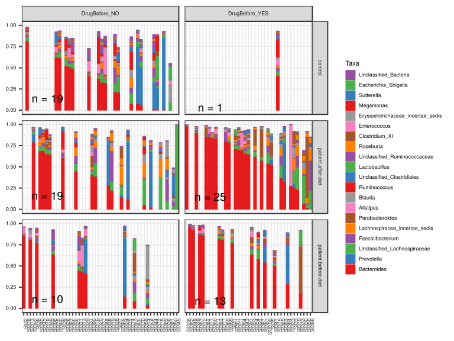

\(1.1.1.3.3.2.6.2.1.1.1\) [`Figure 147.`](#figure.147) Abundance. Data grouped by Drug.Before.Diet,Sample.type.1.  bar (sample mean) plot.  Image file: [`plots/323697b7c22.svg`](plots/323697b7c22.svg).
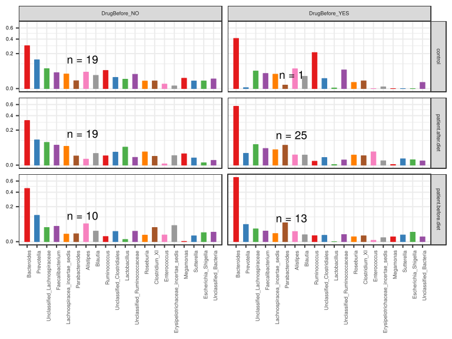

\(1.1.1.3.3.2.6.2.1.1.1\) [`Figure 148.`](#figure.148) Abundance. Data grouped by Drug.Before.Diet,Sample.type.1.  violin plot.  Image file: [`plots/3232f8662a4.svg`](plots/3232f8662a4.svg).
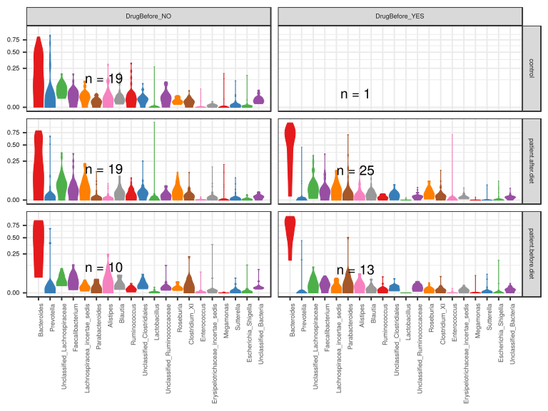

\(1.1.1.3.3.2.6.2.1.1.1\) [`Figure 149.`](#figure.149) Abundance. Data grouped by Drug.Before.Diet,Sample.type.1.  boxplot plot.  Image file: [`plots/32377b02037.svg`](plots/32377b02037.svg).
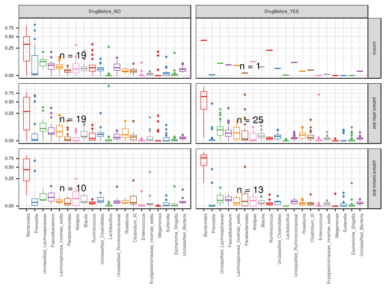

##### \(1.1.1.3.3.2.6.2.1.2\) Abundance. Plot is in flipped orientation, Y axis not scaled. Iterating over plot geometry

\(1.1.1.3.3.2.6.2.1.2.1\) [`Figure 150.`](#figure.150) Abundance. Data grouped by Drug.Before.Diet,Sample.type.1.  bar (sample mean) plot.  Image file: [`plots/323b79b753.svg`](plots/323b79b753.svg).
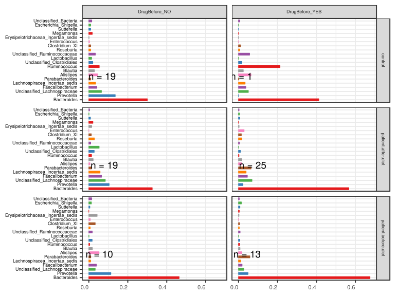

\(1.1.1.3.3.2.6.2.1.2.1\) [`Figure 151.`](#figure.151) Abundance. Data grouped by Drug.Before.Diet,Sample.type.1.  violin plot.  Image file: [`plots/3235147260d.svg`](plots/3235147260d.svg).
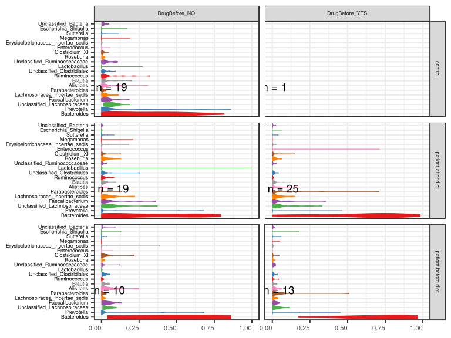

\(1.1.1.3.3.2.6.2.1.2.1\) [`Figure 152.`](#figure.152) Abundance. Data grouped by Drug.Before.Diet,Sample.type.1.  boxplot plot.  Image file: [`plots/32324776066.svg`](plots/32324776066.svg).
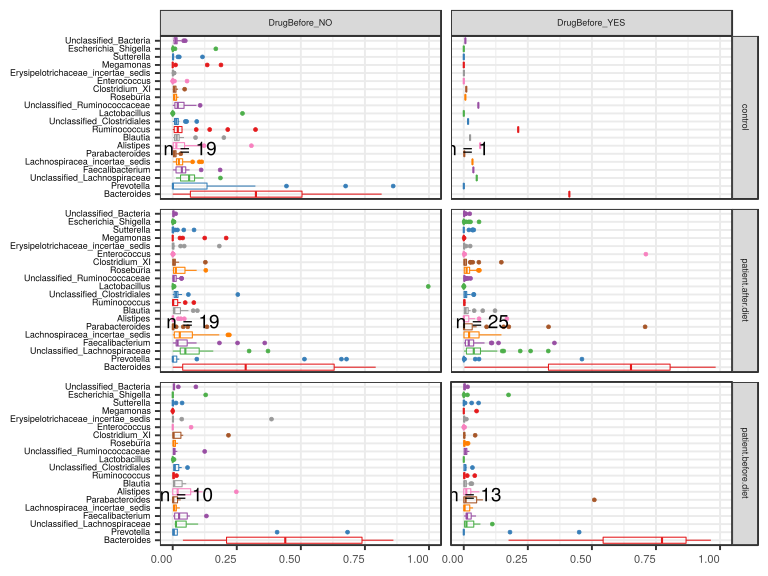

##### \(1.1.1.3.3.2.6.2.2\) dodged plots. Iterating over orientation and, optionally, scaling

##### \(1.1.1.3.3.2.6.2.2.1\) Abundance. Plot is in original orientation, Y axis SQRT scaled. Iterating over plot geometry

\(1.1.1.3.3.2.6.2.2.1.1\) [`Figure 153.`](#figure.153) Abundance. Data grouped by Drug.Before.Diet,Sample.type.1.  bar (sample mean) plot.  Image file: [`plots/3231de23e2d.svg`](plots/3231de23e2d.svg).
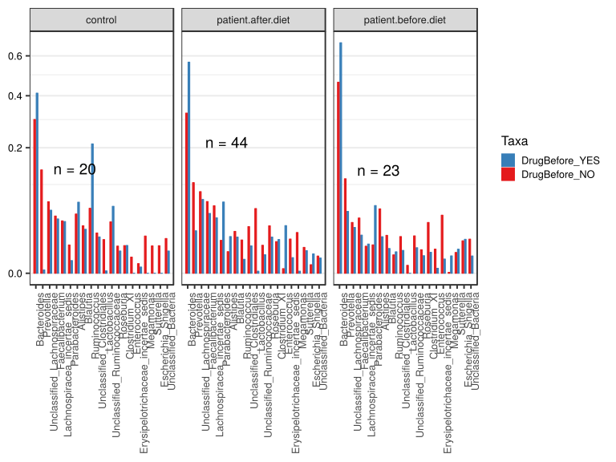

\(1.1.1.3.3.2.6.2.2.1.1\) [`Figure 154.`](#figure.154) Abundance. Data grouped by Drug.Before.Diet,Sample.type.1.  violin plot.  Image file: [`plots/323777b3a64.svg`](plots/323777b3a64.svg).
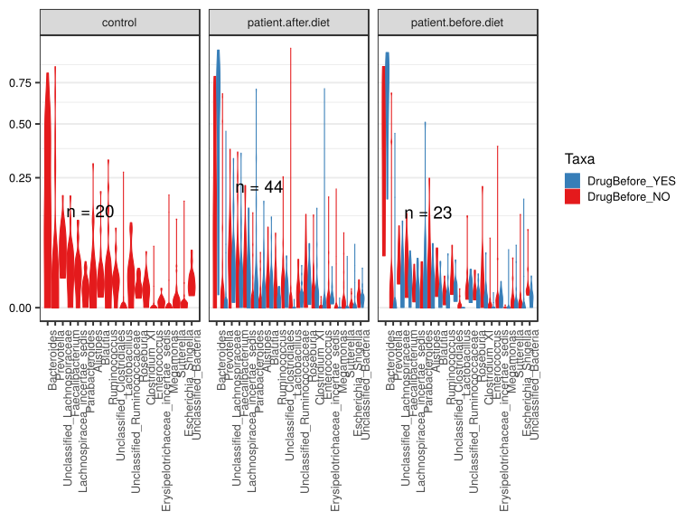

\(1.1.1.3.3.2.6.2.2.1.1\) [`Figure 155.`](#figure.155) Abundance. Data grouped by Drug.Before.Diet,Sample.type.1.  boxplot plot.  Image file: [`plots/3232aaa2990.svg`](plots/3232aaa2990.svg).
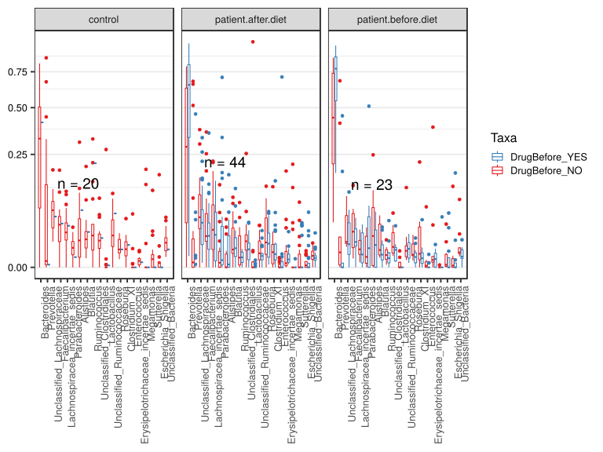

##### \(1.1.1.3.3.2.6.2.2.2\) Abundance. Plot is in flipped orientation, Y axis not scaled. Iterating over plot geometry

\(1.1.1.3.3.2.6.2.2.2.1\) [`Figure 156.`](#figure.156) Abundance. Data grouped by Drug.Before.Diet,Sample.type.1.  bar (sample mean) plot.  Image file: [`plots/3237b4205ee.svg`](plots/3237b4205ee.svg).
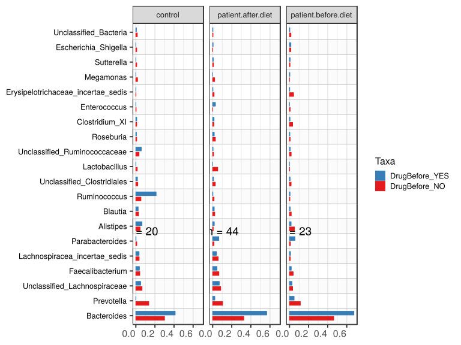

\(1.1.1.3.3.2.6.2.2.2.1\) [`Figure 157.`](#figure.157) Abundance. Data grouped by Drug.Before.Diet,Sample.type.1.  violin plot.  Image file: [`plots/323214c0cb5.svg`](plots/323214c0cb5.svg).
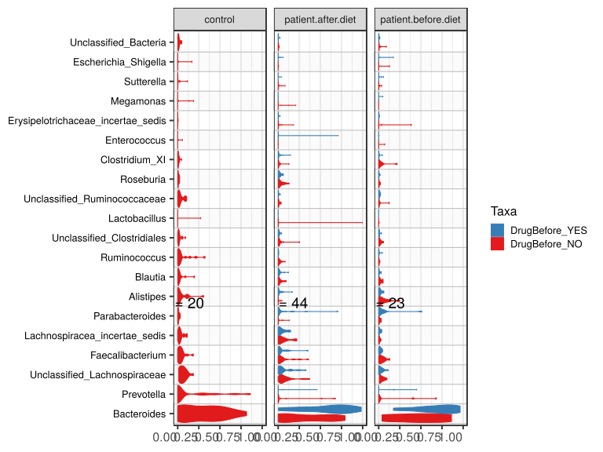

\(1.1.1.3.3.2.6.2.2.2.1\) [`Figure 158.`](#figure.158) Abundance. Data grouped by Drug.Before.Diet,Sample.type.1.  boxplot plot.  Image file: [`plots/3235a35bc1a.svg`](plots/3235a35bc1a.svg).
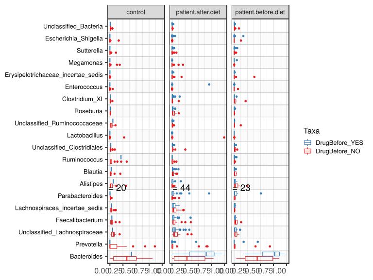