noone@mail.com
Analysis of Dieting study 16S data
% Fri Sep  7 05:46:18 2018

##### \(1.1.1.4.2.1.2\) Plots of Abundance-based diversity indices (Hill numbers) With rarefication.

Plots are shown with relation to various combinations of meta 
                   data variables and in different graphical representations. Lots of plots here.

##### \(1.1.1.4.2.1.2.2\) Iterating over all combinations of grouping variables

##### \(1.1.1.4.2.1.2.2.1\) Grouping variables Sample.type,visit

##### \(1.1.1.4.2.1.2.2.2\) Iterating over Abundance-based diversity indices (Hill numbers) With rarefication. profile sorting order

##### \(1.1.1.4.2.1.2.2.2.1\) Abundance-based diversity indices (Hill numbers) With rarefication. profile sorting order: original

##### \(1.1.1.4.2.1.2.2.2.2\) Iterating over dodged vs faceted bars

The same data are shown in multiple combinations of graphical representations. 
                         This is the same data, but each plot highlights slightly different aspects of it.
                         It is not likely that you will need every plot - pick only what you need.

##### \(1.1.1.4.2.1.2.2.2.2.1\) dodged plots. Iterating over orientation and, optionally, scaling

##### \(1.1.1.4.2.1.2.2.2.2.1.1\) Abundance-based diversity indices (Hill numbers) With rarefication. Plot is in original orientation, Y axis SQRT scaled. Iterating over plot geometry

\(1.1.1.4.2.1.2.2.2.2.1.1.0\) [`Table 44.`](#table.44) Data table used for plots. Data grouped by Sample.type,visit. Showing only 200 first rows. Full dataset is also saved in a delimited text file (click to download and open e.g. in Excel) [`data/1.1.1.4.2.1.2.2.2.2.1.1.0-3231549f8e4.1.1.1.4.2.1.2.2.2.2.csv`](data/1.1.1.4.2.1.2.2.2.2.1.1.0-3231549f8e4.1.1.1.4.2.1.2.2.2.2.csv)

| .record.id | Sample.type | visit | feature | index   |
|:-----------|:------------|:------|:--------|:--------|
| SM1        | patient     | 1     | N\_0    | 152.243 |
| SM10       | patient     | 3     | N\_0    | 209.685 |
| SM100      | patient     | 4     | N\_0    | 158.257 |
| SM11       | patient     | 2     | N\_0    | 141.847 |
| SM12       | patient     | 1     | N\_0    | 147.032 |
| SM13       | patient     | 1     | N\_0    | 146.840 |
| SM14       | patient     | 1     | N\_0    | 162.553 |
| SM15       | control     | 1     | N\_0    | 215.500 |
| SM16       | patient     | 4     | N\_0    | 143.400 |
| SM17       | patient     | 1     | N\_0    | 135.465 |
| SM18       | patient     | 2     | N\_0    | 120.335 |
| SM19       | patient     | 2     | N\_0    | 167.000 |
| SM2        | patient     | 1     | N\_0    | 101.520 |
| SM20       | control     | 1     | N\_0    | 175.567 |
| SM21       | patient     | 1     | N\_0    | 260.252 |
| SM22       | patient     | 1     | N\_0    | 208.740 |
| SM23       | patient     | 2     | N\_0    | 26.845  |
| SM24       | patient     | 1     | N\_0    | 169.625 |
| SM25       | patient     | 4     | N\_0    | 156.447 |
| SM26       | control     | 1     | N\_0    | 188.650 |
| SM28       | control     | 1     | N\_0    | 238.812 |
| SM29       | patient     | 3     | N\_0    | 84.940  |
| SM3        | patient     | 2     | N\_0    | 198.455 |
| SM30       | patient     | 4     | N\_0    | 153.218 |
| SM31       | control     | 2     | N\_0    | 184.268 |
| SM33       | patient     | 1     | N\_0    | 50.547  |
| SM35       | control     | 1     | N\_0    | 198.577 |
| SM36       | patient     | 4     | N\_0    | 105.490 |
| SM37       | control     | 1     | N\_0    | 238.843 |
| SM38       | patient     | 2     | N\_0    | 79.575  |
| SM39       | patient     | 1     | N\_0    | 168.732 |
| SM40       | patient     | 4     | N\_0    | 142.790 |
| SM41       | patient     | 1     | N\_0    | 191.287 |
| SM42       | patient     | 4     | N\_0    | 183.333 |
| SM43       | patient     | 4     | N\_0    | 185.972 |
| SM44       | control     | 1     | N\_0    | 190.292 |
| SM45       | patient     | 2     | N\_0    | 2.413   |
| SM48       | control     | 1     | N\_0    | 248.580 |
| SM49       | patient     | 1     | N\_0    | 107.450 |
| SM5        | patient     | 3     | N\_0    | 152.830 |
| SM50       | patient     | 3     | N\_0    | 69.953  |
| SM51       | patient     | 4     | N\_0    | 121.547 |
| SM52       | patient     | 1     | N\_0    | 185.012 |
| SM53       | patient     | 2     | N\_0    | 122.892 |
| SM54       | patient     | 3     | N\_0    | 119.675 |
| SM55       | control     | 1     | N\_0    | 199.620 |
| SM56       | patient     | 2     | N\_0    | 76.125  |
| SM57       | patient     | 1     | N\_0    | 109.070 |
| SM58       | patient     | 2     | N\_0    | 87.775  |
| SM59       | patient     | 3     | N\_0    | 190.630 |
| SM60       | patient     | 3     | N\_0    | 101.275 |
| SM62       | patient     | 1     | N\_0    | 45.220  |
| SM63       | control     | 1     | N\_0    | 247.810 |
| SM64       | patient     | 2     | N\_0    | 123.828 |
| SM65       | patient     | 3     | N\_0    | 162.350 |
| SM66       | control     | 1     | N\_0    | 231.068 |
| SM67       | patient     | 4     | N\_0    | 96.415  |
| SM68       | patient     | 4     | N\_0    | 139.120 |
| SM69       | patient     | 4     | N\_0    | 124.793 |
| SM7        | control     | 1     | N\_0    | 192.235 |
| SM70       | control     | 1     | N\_0    | 278.543 |
| SM71       | patient     | 3     | N\_0    | 133.148 |
| SM72       | control     | 1     | N\_0    | 139.292 |
| SM73       | patient     | 1     | N\_0    | 99.130  |
| SM74       | control     | 2     | N\_0    | 246.645 |
| SM75       | patient     | 3     | N\_0    | 113.270 |
| SM76       | control     | 1     | N\_0    | 183.655 |
| SM77       | patient     | 2     | N\_0    | 188.137 |
| SM79       | patient     | 2     | N\_0    | 163.735 |
| SM8        | patient     | 1     | N\_0    | 108.440 |
| SM81       | control     | 1     | N\_0    | 39.458  |
| SM82       | patient     | 4     | N\_0    | 96.547  |
| SM83       | patient     | 1     | N\_0    | 112.480 |
| SM84       | patient     | 1     | N\_0    | 168.887 |
| SM86       | patient     | 2     | N\_0    | 157.197 |
| SM87       | patient     | 1     | N\_0    | 133.230 |
| SM88       | patient     | 2     | N\_0    | 139.975 |
| SM89       | control     | 1     | N\_0    | 148.282 |
| SM9        | patient     | 2     | N\_0    | 114.325 |
| SM90       | patient     | 2     | N\_0    | 206.493 |
| SM91       | patient     | 3     | N\_0    | 195.192 |
| SM92       | patient     | 3     | N\_0    | 64.573  |
| SM93       | patient     | 1     | N\_0    | 161.148 |
| SM95       | control     | 1     | N\_0    | 218.018 |
| SM96       | patient     | 1     | N\_0    | 140.343 |
| SM98       | patient     | 3     | N\_0    | 128.398 |
| SM99       | patient     | 3     | N\_0    | 168.268 |
| SM1        | patient     | 1     | N\_0.25 | 102.795 |
| SM10       | patient     | 3     | N\_0.25 | 152.962 |
| SM100      | patient     | 4     | N\_0.25 | 102.439 |
| SM11       | patient     | 2     | N\_0.25 | 94.804  |
| SM12       | patient     | 1     | N\_0.25 | 98.437  |
| SM13       | patient     | 1     | N\_0.25 | 97.712  |
| SM14       | patient     | 1     | N\_0.25 | 107.119 |
| SM15       | control     | 1     | N\_0.25 | 152.770 |
| SM16       | patient     | 4     | N\_0.25 | 96.316  |
| SM17       | patient     | 1     | N\_0.25 | 86.997  |
| SM18       | patient     | 2     | N\_0.25 | 72.410  |
| SM19       | patient     | 2     | N\_0.25 | 117.118 |
| SM2        | patient     | 1     | N\_0.25 | 60.184  |
| SM20       | control     | 1     | N\_0.25 | 110.551 |
| SM21       | patient     | 1     | N\_0.25 | 193.549 |
| SM22       | patient     | 1     | N\_0.25 | 152.370 |
| SM23       | patient     | 2     | N\_0.25 | 12.163  |
| SM24       | patient     | 1     | N\_0.25 | 107.995 |
| SM25       | patient     | 4     | N\_0.25 | 106.133 |
| SM26       | control     | 1     | N\_0.25 | 134.636 |
| SM28       | control     | 1     | N\_0.25 | 175.730 |
| SM29       | patient     | 3     | N\_0.25 | 47.689  |
| SM3        | patient     | 2     | N\_0.25 | 142.598 |
| SM30       | patient     | 4     | N\_0.25 | 103.812 |
| SM31       | control     | 2     | N\_0.25 | 127.297 |
| SM33       | patient     | 1     | N\_0.25 | 27.804  |
| SM35       | control     | 1     | N\_0.25 | 138.328 |
| SM36       | patient     | 4     | N\_0.25 | 67.558  |
| SM37       | control     | 1     | N\_0.25 | 187.448 |
| SM38       | patient     | 2     | N\_0.25 | 49.598  |
| SM39       | patient     | 1     | N\_0.25 | 115.983 |
| SM40       | patient     | 4     | N\_0.25 | 97.902  |
| SM41       | patient     | 1     | N\_0.25 | 136.315 |
| SM42       | patient     | 4     | N\_0.25 | 123.683 |
| SM43       | patient     | 4     | N\_0.25 | 132.167 |
| SM44       | control     | 1     | N\_0.25 | 133.160 |
| SM45       | patient     | 2     | N\_0.25 | 1.397   |
| SM48       | control     | 1     | N\_0.25 | 185.004 |
| SM49       | patient     | 1     | N\_0.25 | 66.664  |
| SM5        | patient     | 3     | N\_0.25 | 102.096 |
| SM50       | patient     | 3     | N\_0.25 | 47.479  |
| SM51       | patient     | 4     | N\_0.25 | 78.256  |
| SM52       | patient     | 1     | N\_0.25 | 126.015 |
| SM53       | patient     | 2     | N\_0.25 | 81.496  |
| SM54       | patient     | 3     | N\_0.25 | 76.341  |
| SM55       | control     | 1     | N\_0.25 | 134.238 |
| SM56       | patient     | 2     | N\_0.25 | 44.535  |
| SM57       | patient     | 1     | N\_0.25 | 63.473  |
| SM58       | patient     | 2     | N\_0.25 | 51.300  |
| SM59       | patient     | 3     | N\_0.25 | 137.062 |
| SM60       | patient     | 3     | N\_0.25 | 62.692  |
| SM62       | patient     | 1     | N\_0.25 | 26.818  |
| SM63       | control     | 1     | N\_0.25 | 179.553 |
| SM64       | patient     | 2     | N\_0.25 | 76.468  |
| SM65       | patient     | 3     | N\_0.25 | 115.516 |
| SM66       | control     | 1     | N\_0.25 | 168.136 |
| SM67       | patient     | 4     | N\_0.25 | 61.213  |
| SM68       | patient     | 4     | N\_0.25 | 88.585  |
| SM69       | patient     | 4     | N\_0.25 | 86.449  |
| SM7        | control     | 1     | N\_0.25 | 137.524 |
| SM70       | control     | 1     | N\_0.25 | 208.721 |
| SM71       | patient     | 3     | N\_0.25 | 90.585  |
| SM72       | control     | 1     | N\_0.25 | 84.313  |
| SM73       | patient     | 1     | N\_0.25 | 62.006  |
| SM74       | control     | 2     | N\_0.25 | 185.204 |
| SM75       | patient     | 3     | N\_0.25 | 75.652  |
| SM76       | control     | 1     | N\_0.25 | 118.243 |
| SM77       | patient     | 2     | N\_0.25 | 132.009 |
| SM79       | patient     | 2     | N\_0.25 | 106.931 |
| SM8        | patient     | 1     | N\_0.25 | 71.578  |
| SM81       | control     | 1     | N\_0.25 | 25.260  |
| SM82       | patient     | 4     | N\_0.25 | 59.440  |
| SM83       | patient     | 1     | N\_0.25 | 68.989  |
| SM84       | patient     | 1     | N\_0.25 | 124.398 |
| SM86       | patient     | 2     | N\_0.25 | 107.716 |
| SM87       | patient     | 1     | N\_0.25 | 91.806  |
| SM88       | patient     | 2     | N\_0.25 | 92.034  |
| SM89       | control     | 1     | N\_0.25 | 94.054  |
| SM9        | patient     | 2     | N\_0.25 | 77.652  |
| SM90       | patient     | 2     | N\_0.25 | 151.765 |
| SM91       | patient     | 3     | N\_0.25 | 139.541 |
| SM92       | patient     | 3     | N\_0.25 | 36.706  |
| SM93       | patient     | 1     | N\_0.25 | 107.167 |
| SM95       | control     | 1     | N\_0.25 | 162.100 |
| SM96       | patient     | 1     | N\_0.25 | 89.618  |
| SM98       | patient     | 3     | N\_0.25 | 82.267  |
| SM99       | patient     | 3     | N\_0.25 | 113.400 |
| SM1        | patient     | 1     | N\_0.5  | 66.275  |
| SM10       | patient     | 3     | N\_0.5  | 109.314 |
| SM100      | patient     | 4     | N\_0.5  | 60.837  |
| SM11       | patient     | 2     | N\_0.5  | 61.303  |
| SM12       | patient     | 1     | N\_0.5  | 63.155  |
| SM13       | patient     | 1     | N\_0.5  | 61.541  |
| SM14       | patient     | 1     | N\_0.5  | 63.709  |
| SM15       | control     | 1     | N\_0.5  | 103.370 |
| SM16       | patient     | 4     | N\_0.5  | 61.893  |
| SM17       | patient     | 1     | N\_0.5  | 52.549  |
| SM18       | patient     | 2     | N\_0.5  | 39.948  |
| SM19       | patient     | 2     | N\_0.5  | 78.308  |
| SM2        | patient     | 1     | N\_0.5  | 32.593  |
| SM20       | control     | 1     | N\_0.5  | 62.345  |
| SM21       | patient     | 1     | N\_0.5  | 139.480 |
| SM22       | patient     | 1     | N\_0.5  | 107.084 |
| SM23       | patient     | 2     | N\_0.5  | 5.673   |
| SM24       | patient     | 1     | N\_0.5  | 61.361  |
| SM25       | patient     | 4     | N\_0.5  | 67.873  |
| SM26       | control     | 1     | N\_0.5  | 93.104  |
| SM28       | control     | 1     | N\_0.5  | 122.862 |
| SM29       | patient     | 3     | N\_0.5  | 24.415  |
| SM3        | patient     | 2     | N\_0.5  | 99.664  |
| SM30       | patient     | 4     | N\_0.5  | 68.206  |
| SM31       | control     | 2     | N\_0.5  | 84.133  |
| SM33       | patient     | 1     | N\_0.5  | 15.248  |

\(1.1.1.4.2.1.2.2.2.2.1.1.1\) [`Widget 47.`](#widget.47) Dynamic Pivot Table link (drag and drop field names and pick averaging 
                      functions or plot types; click on fields or legend elements to filter values). 
                      Starting rendering is Stacked Bar Chart. Data grouped by Sample.type,visit. Click to see HTML widget file in full window: [`./1.1.1.4.2.1.2.2.2.2.1.1.1-3232b4e4b6eDynamic.Pivot.Table.html`](./1.1.1.4.2.1.2.2.2.2.1.1.1-3232b4e4b6eDynamic.Pivot.Table.html)

\(1.1.1.4.2.1.2.2.2.2.1.1.1\) [`Widget 48.`](#widget.48) Dynamic Pivot Table link (drag and drop field names and pick averaging 
                      functions or plot types; click on fields or legend elements to filter values). 
                      Starting rendering is Table Barchart. Data grouped by Sample.type,visit. Click to see HTML widget file in full window: [`./1.1.1.4.2.1.2.2.2.2.1.1.1-3234b488b13Dynamic.Pivot.Table.html`](./1.1.1.4.2.1.2.2.2.2.1.1.1-3234b488b13Dynamic.Pivot.Table.html)

\(1.1.1.4.2.1.2.2.2.2.1.1.1\) [`Table 45.`](#table.45) Summary table. Data grouped by Sample.type,visit. Full dataset is also saved in a delimited text file (click to download and open e.g. in Excel) [`data/1.1.1.4.2.1.2.2.2.2.1.1.1-32357dfd307.1.1.1.4.2.1.2.2.2.2.csv`](data/1.1.1.4.2.1.2.2.2.2.1.1.1-32357dfd307.1.1.1.4.2.1.2.2.2.2.csv)

| feature | Sample.type | visit | mean    | sd      | median  | incidence |
|:--------|:------------|:------|:--------|:--------|:--------|:----------|
| N\_0    | control     | 1     | 198.489 | 53.4693 | 199.099 | 1         |
| N\_0    | control     | 2     | 215.456 | 44.1076 | 215.456 | 1         |
| N\_0    | patient     | 1     | 141.967 | 48.3666 | 146.840 | 1         |
| N\_0    | patient     | 2     | 124.527 | 56.7174 | 123.828 | 1         |
| N\_0    | patient     | 3     | 135.299 | 46.4557 | 130.773 | 1         |
| N\_0    | patient     | 4     | 139.025 | 29.3371 | 142.790 | 1         |
| N\_0.25 | control     | 1     | 140.543 | 44.1347 | 137.926 | 1         |
| N\_0.25 | control     | 2     | 156.250 | 40.9464 | 156.250 | 1         |
| N\_0.25 | patient     | 1     | 95.034  | 38.2042 | 97.712  | 1         |
| N\_0.25 | patient     | 2     | 83.058  | 42.3628 | 81.496  | 1         |
| N\_0.25 | patient     | 3     | 91.428  | 36.7806 | 86.426  | 1         |
| N\_0.25 | patient     | 4     | 92.612  | 22.2689 | 96.316  | 1         |
| N\_0.5  | control     | 1     | 95.339  | 35.6300 | 94.774  | 1         |
| N\_0.5  | control     | 2     | 109.836 | 36.3503 | 109.836 | 1         |
| N\_0.5  | patient     | 1     | 61.030  | 29.0242 | 61.541  | 1         |
| N\_0.5  | patient     | 2     | 53.500  | 30.5881 | 52.955  | 1         |
| N\_0.5  | patient     | 3     | 60.111  | 27.9587 | 55.734  | 1         |
| N\_0.5  | patient     | 4     | 59.466  | 15.7197 | 60.837  | 1         |
| N\_1    | control     | 1     | 44.398  | 21.6324 | 46.431  | 1         |
| N\_1    | control     | 2     | 56.070  | 24.2498 | 56.070  | 1         |
| N\_1    | patient     | 1     | 26.779  | 16.3603 | 21.404  | 1         |
| N\_1    | patient     | 2     | 23.919  | 15.9958 | 24.498  | 1         |
| N\_1    | patient     | 3     | 28.367  | 16.0347 | 25.207  | 1         |
| N\_1    | patient     | 4     | 26.342  | 7.7503  | 26.055  | 1         |
| N\_2    | control     | 1     | 17.870  | 9.8922  | 18.681  | 1         |
| N\_2    | control     | 2     | 25.201  | 9.7560  | 25.201  | 1         |
| N\_2    | patient     | 1     | 11.239  | 7.2592  | 8.851   | 1         |
| N\_2    | patient     | 2     | 10.037  | 6.9935  | 9.520   | 1         |
| N\_2    | patient     | 3     | 12.798  | 8.2089  | 10.355  | 1         |
| N\_2    | patient     | 4     | 11.223  | 3.9101  | 9.907   | 1         |
| N\_4    | control     | 1     | 10.302  | 5.2637  | 10.000  | 1         |
| N\_4    | control     | 2     | 14.634  | 3.2077  | 14.634  | 1         |
| N\_4    | patient     | 1     | 6.917   | 4.0314  | 5.776   | 1         |
| N\_4    | patient     | 2     | 5.976   | 3.7853  | 5.350   | 1         |
| N\_4    | patient     | 3     | 7.813   | 4.8522  | 5.991   | 1         |
| N\_4    | patient     | 4     | 6.914   | 2.5208  | 6.625   | 1         |
| N\_8    | control     | 1     | 7.936   | 3.6167  | 7.649   | 1         |
| N\_8    | control     | 2     | 10.968  | 1.1384  | 10.968  | 1         |
| N\_8    | patient     | 1     | 5.574   | 3.0288  | 4.850   | 1         |
| N\_8    | patient     | 2     | 4.701   | 2.6708  | 4.229   | 1         |
| N\_8    | patient     | 3     | 6.110   | 3.4608  | 4.786   | 1         |
| N\_8    | patient     | 4     | 5.510   | 1.9316  | 5.572   | 1         |
| N\_Inf  | control     | 1     | 6.200   | 2.4740  | 5.995   | 1         |
| N\_Inf  | control     | 2     | 8.330   | 0.4595  | 8.330   | 1         |
| N\_Inf  | patient     | 1     | 4.556   | 2.2572  | 4.171   | 1         |
| N\_Inf  | patient     | 2     | 3.839   | 1.9361  | 3.531   | 1         |
| N\_Inf  | patient     | 3     | 4.878   | 2.4073  | 4.086   | 1         |
| N\_Inf  | patient     | 4     | 4.488   | 1.4404  | 4.588   | 1         |

\(1.1.1.4.2.1.2.2.2.2.1.1.1\) [`Figure 164.`](#figure.164) Abundance-based diversity indices (Hill numbers) With rarefication. Data grouped by Sample.type,visit.  line plot.  Image file: [`plots/32365cfed6f.svg`](plots/32365cfed6f.svg).
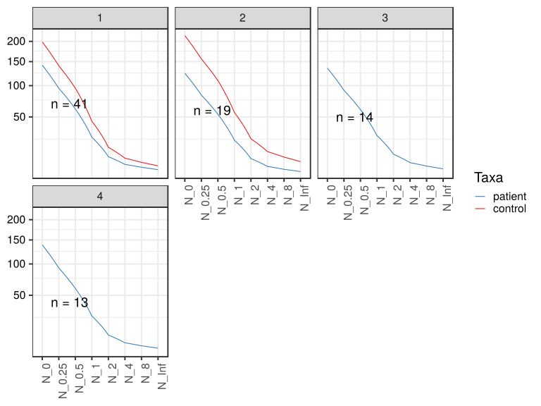

\(1.1.1.4.2.1.2.2.2.2.1.1.1\) [`Figure 165.`](#figure.165) Abundance-based diversity indices (Hill numbers) With rarefication. Data grouped by Sample.type,visit.  line_obs plot.  Image file: [`plots/32359c9470d.svg`](plots/32359c9470d.svg).
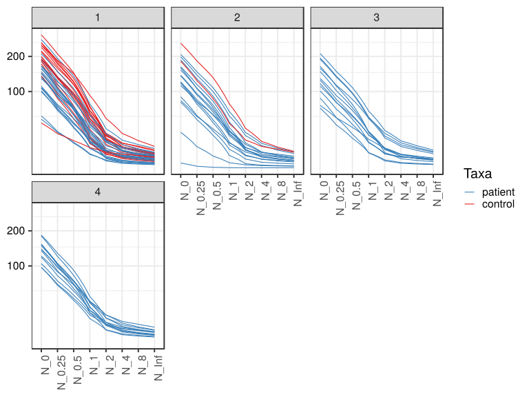

##### \(1.1.1.4.2.1.2.2.2.2.1.2\) Abundance-based diversity indices (Hill numbers) With rarefication. Plot is in flipped orientation, Y axis not scaled. Iterating over plot geometry

\(1.1.1.4.2.1.2.2.2.2.1.2.1\) [`Figure 166.`](#figure.166) Abundance-based diversity indices (Hill numbers) With rarefication. Data grouped by Sample.type,visit.  line plot.  Image file: [`plots/323480fca24.svg`](plots/323480fca24.svg).
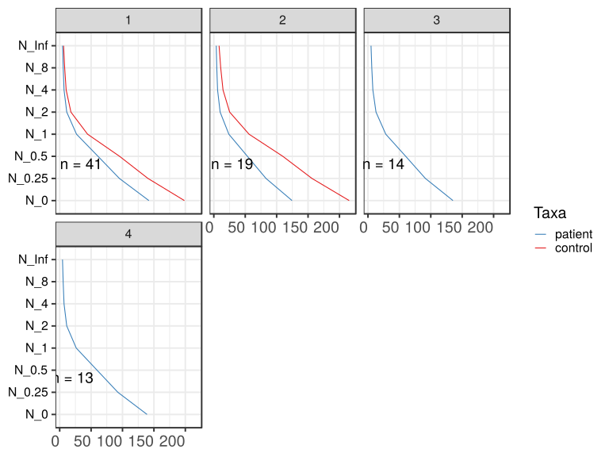

\(1.1.1.4.2.1.2.2.2.2.1.2.1\) [`Figure 167.`](#figure.167) Abundance-based diversity indices (Hill numbers) With rarefication. Data grouped by Sample.type,visit.  line_obs plot.  Image file: [`plots/323612006c.svg`](plots/323612006c.svg).
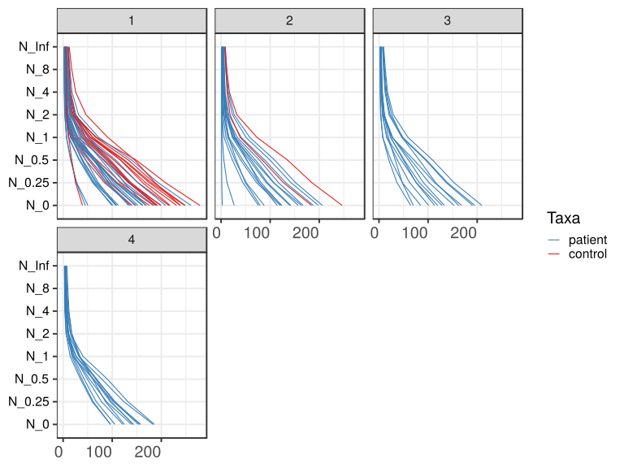

##### \(1.1.1.4.2.1.2.2.3\) Grouping variables Sample.type.Drug.Before,visit

##### \(1.1.1.4.2.1.2.2.4\) Iterating over Abundance-based diversity indices (Hill numbers) With rarefication. profile sorting order

##### \(1.1.1.4.2.1.2.2.4.1\) Abundance-based diversity indices (Hill numbers) With rarefication. profile sorting order: original

##### \(1.1.1.4.2.1.2.2.4.2\) Iterating over dodged vs faceted bars

The same data are shown in multiple combinations of graphical representations. 
                         This is the same data, but each plot highlights slightly different aspects of it.
                         It is not likely that you will need every plot - pick only what you need.

##### \(1.1.1.4.2.1.2.2.4.2.1\) dodged plots. Iterating over orientation and, optionally, scaling

##### \(1.1.1.4.2.1.2.2.4.2.1.1\) Abundance-based diversity indices (Hill numbers) With rarefication. Plot is in original orientation, Y axis SQRT scaled. Iterating over plot geometry

\(1.1.1.4.2.1.2.2.4.2.1.1.0\) [`Table 46.`](#table.46) Data table used for plots. Data grouped by Sample.type.Drug.Before,visit. Showing only 200 first rows. Full dataset is also saved in a delimited text file (click to download and open e.g. in Excel) [`data/1.1.1.4.2.1.2.2.4.2.1.1.0-32358e3e98a.1.1.1.4.2.1.2.2.4.2.csv`](data/1.1.1.4.2.1.2.2.4.2.1.1.0-32358e3e98a.1.1.1.4.2.1.2.2.4.2.csv)

| .record.id | Sample.type.Drug.Before | visit | feature | index   |
|:-----------|:------------------------|:------|:--------|:--------|
| SM1        | patient TRUE .          | 1     | N\_0    | 152.243 |
| SM10       | patient TRUE .          | 3     | N\_0    | 209.685 |
| SM100      | patient TRUE .          | 4     | N\_0    | 158.257 |
| SM11       | patient TRUE .          | 2     | N\_0    | 141.847 |
| SM12       | patient TRUE .          | 1     | N\_0    | 147.032 |
| SM13       | patient FALSE .         | 1     | N\_0    | 146.840 |
| SM14       | patient FALSE .         | 1     | N\_0    | 162.553 |
| SM15       | 1                       | 1     | N\_0    | 215.500 |
| SM16       | patient FALSE .         | 4     | N\_0    | 143.400 |
| SM17       | patient TRUE .          | 1     | N\_0    | 135.465 |
| SM18       | patient FALSE .         | 2     | N\_0    | 120.335 |
| SM19       | patient FALSE .         | 2     | N\_0    | 167.000 |
| SM2        | patient FALSE .         | 1     | N\_0    | 101.520 |
| SM20       | 1                       | 1     | N\_0    | 175.567 |
| SM21       | patient FALSE .         | 1     | N\_0    | 260.252 |
| SM22       | patient TRUE .          | 1     | N\_0    | 208.740 |
| SM23       | patient TRUE .          | 2     | N\_0    | 26.845  |
| SM24       | patient FALSE .         | 1     | N\_0    | 169.625 |
| SM25       | patient FALSE .         | 4     | N\_0    | 156.447 |
| SM26       | 1                       | 1     | N\_0    | 188.650 |
| SM28       | 1                       | 1     | N\_0    | 238.812 |
| SM29       | patient TRUE .          | 3     | N\_0    | 84.940  |
| SM3        | patient TRUE .          | 2     | N\_0    | 198.455 |
| SM30       | patient TRUE .          | 4     | N\_0    | 153.218 |
| SM31       | 1                       | 2     | N\_0    | 184.268 |
| SM33       | patient TRUE .          | 1     | N\_0    | 50.547  |
| SM35       | 1                       | 1     | N\_0    | 198.577 |
| SM36       | patient FALSE .         | 4     | N\_0    | 105.490 |
| SM37       | 1                       | 1     | N\_0    | 238.843 |
| SM38       | patient TRUE .          | 2     | N\_0    | 79.575  |
| SM39       | patient FALSE .         | 1     | N\_0    | 168.732 |
| SM40       | patient FALSE .         | 4     | N\_0    | 142.790 |
| SM41       | patient TRUE .          | 1     | N\_0    | 191.287 |
| SM42       | patient FALSE .         | 4     | N\_0    | 183.333 |
| SM43       | patient TRUE .          | 4     | N\_0    | 185.972 |
| SM44       | 1                       | 1     | N\_0    | 190.292 |
| SM45       | patient FALSE .         | 2     | N\_0    | 2.413   |
| SM48       | 1                       | 1     | N\_0    | 248.580 |
| SM49       | patient TRUE .          | 1     | N\_0    | 107.450 |
| SM5        | patient TRUE .          | 3     | N\_0    | 152.830 |
| SM50       | patient FALSE .         | 3     | N\_0    | 69.953  |
| SM51       | patient TRUE .          | 4     | N\_0    | 121.547 |
| SM52       | patient FALSE .         | 1     | N\_0    | 185.012 |
| SM53       | patient TRUE .          | 2     | N\_0    | 122.892 |
| SM54       | patient TRUE .          | 3     | N\_0    | 119.675 |
| SM55       | 1                       | 1     | N\_0    | 199.620 |
| SM56       | patient TRUE .          | 2     | N\_0    | 76.125  |
| SM57       | patient TRUE .          | 1     | N\_0    | 109.070 |
| SM58       | patient FALSE .         | 2     | N\_0    | 87.775  |
| SM59       | patient FALSE .         | 3     | N\_0    | 190.630 |
| SM60       | patient TRUE .          | 3     | N\_0    | 101.275 |
| SM62       | patient TRUE .          | 1     | N\_0    | 45.220  |
| SM63       | 1                       | 1     | N\_0    | 247.810 |
| SM64       | patient TRUE .          | 2     | N\_0    | 123.828 |
| SM65       | patient TRUE .          | 3     | N\_0    | 162.350 |
| SM66       | 1                       | 1     | N\_0    | 231.068 |
| SM67       | patient TRUE .          | 4     | N\_0    | 96.415  |
| SM68       | patient FALSE .         | 4     | N\_0    | 139.120 |
| SM69       | patient TRUE .          | 4     | N\_0    | 124.793 |
| SM7        | 1                       | 1     | N\_0    | 192.235 |
| SM70       | 1                       | 1     | N\_0    | 278.543 |
| SM71       | patient TRUE .          | 3     | N\_0    | 133.148 |
| SM72       | 1                       | 1     | N\_0    | 139.292 |
| SM73       | patient FALSE .         | 1     | N\_0    | 99.130  |
| SM74       | 1                       | 2     | N\_0    | 246.645 |
| SM75       | patient FALSE .         | 3     | N\_0    | 113.270 |
| SM76       | 1                       | 1     | N\_0    | 183.655 |
| SM77       | patient TRUE .          | 2     | N\_0    | 188.137 |
| SM79       | patient FALSE .         | 2     | N\_0    | 163.735 |
| SM8        | patient FALSE .         | 1     | N\_0    | 108.440 |
| SM81       | 1                       | 1     | N\_0    | 39.458  |
| SM82       | patient TRUE .          | 4     | N\_0    | 96.547  |
| SM83       | patient TRUE .          | 1     | N\_0    | 112.480 |
| SM84       | patient TRUE .          | 1     | N\_0    | 168.887 |
| SM86       | patient TRUE .          | 2     | N\_0    | 157.197 |
| SM87       | patient TRUE .          | 1     | N\_0    | 133.230 |
| SM88       | patient TRUE .          | 2     | N\_0    | 139.975 |
| SM89       | 1                       | 1     | N\_0    | 148.282 |
| SM9        | patient FALSE .         | 2     | N\_0    | 114.325 |
| SM90       | patient FALSE .         | 2     | N\_0    | 206.493 |
| SM91       | patient TRUE .          | 3     | N\_0    | 195.192 |
| SM92       | patient FALSE .         | 3     | N\_0    | 64.573  |
| SM93       | patient TRUE .          | 1     | N\_0    | 161.148 |
| SM95       | 1                       | 1     | N\_0    | 218.018 |
| SM96       | patient FALSE .         | 1     | N\_0    | 140.343 |
| SM98       | patient FALSE .         | 3     | N\_0    | 128.398 |
| SM99       | patient FALSE .         | 3     | N\_0    | 168.268 |
| SM1        | patient TRUE .          | 1     | N\_0.25 | 102.795 |
| SM10       | patient TRUE .          | 3     | N\_0.25 | 152.962 |
| SM100      | patient TRUE .          | 4     | N\_0.25 | 102.439 |
| SM11       | patient TRUE .          | 2     | N\_0.25 | 94.804  |
| SM12       | patient TRUE .          | 1     | N\_0.25 | 98.437  |
| SM13       | patient FALSE .         | 1     | N\_0.25 | 97.712  |
| SM14       | patient FALSE .         | 1     | N\_0.25 | 107.119 |
| SM15       | 1                       | 1     | N\_0.25 | 152.770 |
| SM16       | patient FALSE .         | 4     | N\_0.25 | 96.316  |
| SM17       | patient TRUE .          | 1     | N\_0.25 | 86.997  |
| SM18       | patient FALSE .         | 2     | N\_0.25 | 72.410  |
| SM19       | patient FALSE .         | 2     | N\_0.25 | 117.118 |
| SM2        | patient FALSE .         | 1     | N\_0.25 | 60.184  |
| SM20       | 1                       | 1     | N\_0.25 | 110.551 |
| SM21       | patient FALSE .         | 1     | N\_0.25 | 193.549 |
| SM22       | patient TRUE .          | 1     | N\_0.25 | 152.370 |
| SM23       | patient TRUE .          | 2     | N\_0.25 | 12.163  |
| SM24       | patient FALSE .         | 1     | N\_0.25 | 107.995 |
| SM25       | patient FALSE .         | 4     | N\_0.25 | 106.133 |
| SM26       | 1                       | 1     | N\_0.25 | 134.636 |
| SM28       | 1                       | 1     | N\_0.25 | 175.730 |
| SM29       | patient TRUE .          | 3     | N\_0.25 | 47.689  |
| SM3        | patient TRUE .          | 2     | N\_0.25 | 142.598 |
| SM30       | patient TRUE .          | 4     | N\_0.25 | 103.812 |
| SM31       | 1                       | 2     | N\_0.25 | 127.297 |
| SM33       | patient TRUE .          | 1     | N\_0.25 | 27.804  |
| SM35       | 1                       | 1     | N\_0.25 | 138.328 |
| SM36       | patient FALSE .         | 4     | N\_0.25 | 67.558  |
| SM37       | 1                       | 1     | N\_0.25 | 187.448 |
| SM38       | patient TRUE .          | 2     | N\_0.25 | 49.598  |
| SM39       | patient FALSE .         | 1     | N\_0.25 | 115.983 |
| SM40       | patient FALSE .         | 4     | N\_0.25 | 97.902  |
| SM41       | patient TRUE .          | 1     | N\_0.25 | 136.315 |
| SM42       | patient FALSE .         | 4     | N\_0.25 | 123.683 |
| SM43       | patient TRUE .          | 4     | N\_0.25 | 132.167 |
| SM44       | 1                       | 1     | N\_0.25 | 133.160 |
| SM45       | patient FALSE .         | 2     | N\_0.25 | 1.397   |
| SM48       | 1                       | 1     | N\_0.25 | 185.004 |
| SM49       | patient TRUE .          | 1     | N\_0.25 | 66.664  |
| SM5        | patient TRUE .          | 3     | N\_0.25 | 102.096 |
| SM50       | patient FALSE .         | 3     | N\_0.25 | 47.479  |
| SM51       | patient TRUE .          | 4     | N\_0.25 | 78.256  |
| SM52       | patient FALSE .         | 1     | N\_0.25 | 126.015 |
| SM53       | patient TRUE .          | 2     | N\_0.25 | 81.496  |
| SM54       | patient TRUE .          | 3     | N\_0.25 | 76.341  |
| SM55       | 1                       | 1     | N\_0.25 | 134.238 |
| SM56       | patient TRUE .          | 2     | N\_0.25 | 44.535  |
| SM57       | patient TRUE .          | 1     | N\_0.25 | 63.473  |
| SM58       | patient FALSE .         | 2     | N\_0.25 | 51.300  |
| SM59       | patient FALSE .         | 3     | N\_0.25 | 137.062 |
| SM60       | patient TRUE .          | 3     | N\_0.25 | 62.692  |
| SM62       | patient TRUE .          | 1     | N\_0.25 | 26.818  |
| SM63       | 1                       | 1     | N\_0.25 | 179.553 |
| SM64       | patient TRUE .          | 2     | N\_0.25 | 76.468  |
| SM65       | patient TRUE .          | 3     | N\_0.25 | 115.516 |
| SM66       | 1                       | 1     | N\_0.25 | 168.136 |
| SM67       | patient TRUE .          | 4     | N\_0.25 | 61.213  |
| SM68       | patient FALSE .         | 4     | N\_0.25 | 88.585  |
| SM69       | patient TRUE .          | 4     | N\_0.25 | 86.449  |
| SM7        | 1                       | 1     | N\_0.25 | 137.524 |
| SM70       | 1                       | 1     | N\_0.25 | 208.721 |
| SM71       | patient TRUE .          | 3     | N\_0.25 | 90.585  |
| SM72       | 1                       | 1     | N\_0.25 | 84.313  |
| SM73       | patient FALSE .         | 1     | N\_0.25 | 62.006  |
| SM74       | 1                       | 2     | N\_0.25 | 185.204 |
| SM75       | patient FALSE .         | 3     | N\_0.25 | 75.652  |
| SM76       | 1                       | 1     | N\_0.25 | 118.243 |
| SM77       | patient TRUE .          | 2     | N\_0.25 | 132.009 |
| SM79       | patient FALSE .         | 2     | N\_0.25 | 106.931 |
| SM8        | patient FALSE .         | 1     | N\_0.25 | 71.578  |
| SM81       | 1                       | 1     | N\_0.25 | 25.260  |
| SM82       | patient TRUE .          | 4     | N\_0.25 | 59.440  |
| SM83       | patient TRUE .          | 1     | N\_0.25 | 68.989  |
| SM84       | patient TRUE .          | 1     | N\_0.25 | 124.398 |
| SM86       | patient TRUE .          | 2     | N\_0.25 | 107.716 |
| SM87       | patient TRUE .          | 1     | N\_0.25 | 91.806  |
| SM88       | patient TRUE .          | 2     | N\_0.25 | 92.034  |
| SM89       | 1                       | 1     | N\_0.25 | 94.054  |
| SM9        | patient FALSE .         | 2     | N\_0.25 | 77.652  |
| SM90       | patient FALSE .         | 2     | N\_0.25 | 151.765 |
| SM91       | patient TRUE .          | 3     | N\_0.25 | 139.541 |
| SM92       | patient FALSE .         | 3     | N\_0.25 | 36.706  |
| SM93       | patient TRUE .          | 1     | N\_0.25 | 107.167 |
| SM95       | 1                       | 1     | N\_0.25 | 162.100 |
| SM96       | patient FALSE .         | 1     | N\_0.25 | 89.618  |
| SM98       | patient FALSE .         | 3     | N\_0.25 | 82.267  |
| SM99       | patient FALSE .         | 3     | N\_0.25 | 113.400 |
| SM1        | patient TRUE .          | 1     | N\_0.5  | 66.275  |
| SM10       | patient TRUE .          | 3     | N\_0.5  | 109.314 |
| SM100      | patient TRUE .          | 4     | N\_0.5  | 60.837  |
| SM11       | patient TRUE .          | 2     | N\_0.5  | 61.303  |
| SM12       | patient TRUE .          | 1     | N\_0.5  | 63.155  |
| SM13       | patient FALSE .         | 1     | N\_0.5  | 61.541  |
| SM14       | patient FALSE .         | 1     | N\_0.5  | 63.709  |
| SM15       | 1                       | 1     | N\_0.5  | 103.370 |
| SM16       | patient FALSE .         | 4     | N\_0.5  | 61.893  |
| SM17       | patient TRUE .          | 1     | N\_0.5  | 52.549  |
| SM18       | patient FALSE .         | 2     | N\_0.5  | 39.948  |
| SM19       | patient FALSE .         | 2     | N\_0.5  | 78.308  |
| SM2        | patient FALSE .         | 1     | N\_0.5  | 32.593  |
| SM20       | 1                       | 1     | N\_0.5  | 62.345  |
| SM21       | patient FALSE .         | 1     | N\_0.5  | 139.480 |
| SM22       | patient TRUE .          | 1     | N\_0.5  | 107.084 |
| SM23       | patient TRUE .          | 2     | N\_0.5  | 5.673   |
| SM24       | patient FALSE .         | 1     | N\_0.5  | 61.361  |
| SM25       | patient FALSE .         | 4     | N\_0.5  | 67.873  |
| SM26       | 1                       | 1     | N\_0.5  | 93.104  |
| SM28       | 1                       | 1     | N\_0.5  | 122.862 |
| SM29       | patient TRUE .          | 3     | N\_0.5  | 24.415  |
| SM3        | patient TRUE .          | 2     | N\_0.5  | 99.664  |
| SM30       | patient TRUE .          | 4     | N\_0.5  | 68.206  |
| SM31       | 1                       | 2     | N\_0.5  | 84.133  |
| SM33       | patient TRUE .          | 1     | N\_0.5  | 15.248  |

\(1.1.1.4.2.1.2.2.4.2.1.1.1\) [`Widget 49.`](#widget.49) Dynamic Pivot Table link (drag and drop field names and pick averaging 
                      functions or plot types; click on fields or legend elements to filter values). 
                      Starting rendering is Stacked Bar Chart. Data grouped by Sample.type.Drug.Before,visit. Click to see HTML widget file in full window: [`./1.1.1.4.2.1.2.2.4.2.1.1.1-32347c1d3e6Dynamic.Pivot.Table.html`](./1.1.1.4.2.1.2.2.4.2.1.1.1-32347c1d3e6Dynamic.Pivot.Table.html)

\(1.1.1.4.2.1.2.2.4.2.1.1.1\) [`Widget 50.`](#widget.50) Dynamic Pivot Table link (drag and drop field names and pick averaging 
                      functions or plot types; click on fields or legend elements to filter values). 
                      Starting rendering is Table Barchart. Data grouped by Sample.type.Drug.Before,visit. Click to see HTML widget file in full window: [`./1.1.1.4.2.1.2.2.4.2.1.1.1-323a2bd52bDynamic.Pivot.Table.html`](./1.1.1.4.2.1.2.2.4.2.1.1.1-323a2bd52bDynamic.Pivot.Table.html)

\(1.1.1.4.2.1.2.2.4.2.1.1.1\) [`Table 47.`](#table.47) Summary table. Data grouped by Sample.type.Drug.Before,visit. Full dataset is also saved in a delimited text file (click to download and open e.g. in Excel) [`data/1.1.1.4.2.1.2.2.4.2.1.1.1-3239d727c9.1.1.1.4.2.1.2.2.4.2.csv`](data/1.1.1.4.2.1.2.2.4.2.1.1.1-3239d727c9.1.1.1.4.2.1.2.2.4.2.csv)

| feature | Sample.type.Drug.Before | visit | mean    | sd      | median  | incidence |
|:--------|:------------------------|:------|:--------|:--------|:--------|:----------|
| N\_0    | 1                       | 1     | 198.489 | 53.4693 | 199.099 | 1         |
| N\_0    | 1                       | 2     | 215.456 | 44.1076 | 215.456 | 1         |
| N\_0    | patient FALSE .         | 1     | 154.245 | 48.1473 | 154.696 | 1         |
| N\_0    | patient FALSE .         | 2     | 123.154 | 66.3710 | 120.335 | 1         |
| N\_0    | patient FALSE .         | 3     | 122.515 | 50.9375 | 120.834 | 1         |
| N\_0    | patient FALSE .         | 4     | 145.097 | 25.3118 | 143.095 | 1         |
| N\_0    | patient TRUE .          | 1     | 132.523 | 48.2483 | 135.465 | 1         |
| N\_0    | patient TRUE .          | 2     | 125.488 | 52.7223 | 131.901 | 1         |
| N\_0    | patient TRUE .          | 3     | 144.887 | 43.6980 | 142.989 | 1         |
| N\_0    | patient TRUE .          | 4     | 133.821 | 33.4510 | 124.793 | 1         |
| N\_0.25 | 1                       | 1     | 140.543 | 44.1347 | 137.926 | 1         |
| N\_0.25 | 1                       | 2     | 156.250 | 40.9464 | 156.250 | 1         |
| N\_0.25 | patient FALSE .         | 1     | 103.176 | 38.9401 | 102.415 | 1         |
| N\_0.25 | patient FALSE .         | 2     | 82.653  | 48.7667 | 77.652  | 1         |
| N\_0.25 | patient FALSE .         | 3     | 82.094  | 38.2136 | 78.959  | 1         |
| N\_0.25 | patient FALSE .         | 4     | 96.696  | 18.6213 | 97.109  | 1         |
| N\_0.25 | patient TRUE .          | 1     | 88.772  | 37.9591 | 91.806  | 1         |
| N\_0.25 | patient TRUE .          | 2     | 83.342  | 40.0592 | 86.765  | 1         |
| N\_0.25 | patient TRUE .          | 3     | 98.428  | 36.5874 | 96.341  | 1         |
| N\_0.25 | patient TRUE .          | 4     | 89.111  | 25.9204 | 86.449  | 1         |
| N\_0.5  | 1                       | 1     | 95.339  | 35.6300 | 94.774  | 1         |
| N\_0.5  | 1                       | 2     | 109.836 | 36.3503 | 109.836 | 1         |
| N\_0.5  | patient FALSE .         | 1     | 65.456  | 30.4094 | 61.451  | 1         |
| N\_0.5  | patient FALSE .         | 2     | 53.614  | 35.1625 | 52.955  | 1         |
| N\_0.5  | patient FALSE .         | 3     | 53.494  | 26.8519 | 50.537  | 1         |
| N\_0.5  | patient FALSE .         | 4     | 61.863  | 12.4376 | 64.066  | 1         |
| N\_0.5  | patient TRUE .          | 1     | 57.626  | 28.6702 | 63.155  | 1         |
| N\_0.5  | patient TRUE .          | 2     | 53.420  | 28.9666 | 54.878  | 1         |
| N\_0.5  | patient TRUE .          | 3     | 65.074  | 29.5130 | 62.647  | 1         |
| N\_0.5  | patient TRUE .          | 4     | 57.411  | 18.8317 | 60.187  | 1         |
| N\_1    | 1                       | 1     | 44.398  | 21.6324 | 46.431  | 1         |
| N\_1    | 1                       | 2     | 56.070  | 24.2498 | 56.070  | 1         |
| N\_1    | patient FALSE .         | 1     | 27.326  | 18.2583 | 20.420  | 1         |
| N\_1    | patient FALSE .         | 2     | 24.312  | 18.8025 | 25.396  | 1         |
| N\_1    | patient FALSE .         | 3     | 24.583  | 12.6649 | 23.709  | 1         |
| N\_1    | patient FALSE .         | 4     | 26.968  | 5.3524  | 26.420  | 1         |
| N\_1    | patient TRUE .          | 1     | 26.359  | 15.4998 | 26.638  | 1         |
| N\_1    | patient TRUE .          | 2     | 23.645  | 14.7980 | 23.689  | 1         |
| N\_1    | patient TRUE .          | 3     | 31.205  | 18.4783 | 27.562  | 1         |
| N\_1    | patient TRUE .          | 4     | 25.805  | 9.7741  | 22.389  | 1         |
| N\_2    | 1                       | 1     | 17.870  | 9.8922  | 18.681  | 1         |
| N\_2    | 1                       | 2     | 25.201  | 9.7560  | 25.201  | 1         |
| N\_2    | patient FALSE .         | 1     | 11.188  | 8.6582  | 8.635   | 1         |
| N\_2    | patient FALSE .         | 2     | 10.170  | 8.4639  | 9.420   | 1         |
| N\_2    | patient FALSE .         | 3     | 10.699  | 5.5200  | 10.554  | 1         |
| N\_2    | patient FALSE .         | 4     | 11.328  | 3.2509  | 10.453  | 1         |
| N\_2    | patient TRUE .          | 1     | 11.278  | 6.3546  | 9.502   | 1         |
| N\_2    | patient TRUE .          | 2     | 9.944   | 6.2583  | 9.682   | 1         |
| N\_2    | patient TRUE .          | 3     | 14.373  | 9.8371  | 10.104  | 1         |
| N\_2    | patient TRUE .          | 4     | 11.134  | 4.6638  | 9.380   | 1         |
| N\_4    | 1                       | 1     | 10.302  | 5.2637  | 10.000  | 1         |
| N\_4    | 1                       | 2     | 14.634  | 3.2077  | 14.634  | 1         |
| N\_4    | patient FALSE .         | 1     | 6.985   | 5.0519  | 5.491   | 1         |
| N\_4    | patient FALSE .         | 2     | 5.930   | 4.5875  | 5.155   | 1         |
| N\_4    | patient FALSE .         | 3     | 6.496   | 3.2780  | 6.519   | 1         |
| N\_4    | patient FALSE .         | 4     | 7.086   | 2.5664  | 6.380   | 1         |
| N\_4    | patient TRUE .          | 1     | 6.865   | 3.2631  | 6.506   | 1         |
| N\_4    | patient TRUE .          | 2     | 6.008   | 3.3824  | 5.719   | 1         |
| N\_4    | patient TRUE .          | 3     | 8.802   | 5.7832  | 5.534   | 1         |
| N\_4    | patient TRUE .          | 4     | 6.767   | 2.6768  | 6.625   | 1         |
| N\_8    | 1                       | 1     | 7.936   | 3.6167  | 7.649   | 1         |
| N\_8    | 1                       | 2     | 10.968  | 1.1384  | 10.968  | 1         |
| N\_8    | patient FALSE .         | 1     | 5.663   | 3.8513  | 4.511   | 1         |
| N\_8    | patient FALSE .         | 2     | 4.608   | 3.2140  | 4.083   | 1         |
| N\_8    | patient FALSE .         | 3     | 5.125   | 2.3807  | 5.052   | 1         |
| N\_8    | patient FALSE .         | 4     | 5.711   | 2.1104  | 5.217   | 1         |
| N\_8    | patient TRUE .          | 1     | 5.505   | 2.3837  | 5.269   | 1         |
| N\_8    | patient TRUE .          | 2     | 4.766   | 2.4048  | 4.654   | 1         |
| N\_8    | patient TRUE .          | 3     | 6.848   | 4.0914  | 4.553   | 1         |
| N\_8    | patient TRUE .          | 4     | 5.338   | 1.9172  | 5.572   | 1         |
| N\_Inf  | 1                       | 1     | 6.200   | 2.4740  | 5.995   | 1         |
| N\_Inf  | 1                       | 2     | 8.330   | 0.4595  | 8.330   | 1         |
| N\_Inf  | patient FALSE .         | 1     | 4.619   | 2.8765  | 3.763   | 1         |
| N\_Inf  | patient FALSE .         | 2     | 3.733   | 2.2905  | 3.425   | 1         |
| N\_Inf  | patient FALSE .         | 3     | 4.167   | 1.7031  | 4.126   | 1         |
| N\_Inf  | patient FALSE .         | 4     | 4.672   | 1.6132  | 4.315   | 1         |
| N\_Inf  | patient TRUE .          | 1     | 4.507   | 1.7688  | 4.530   | 1         |
| N\_Inf  | patient TRUE .          | 2     | 3.913   | 1.7752  | 3.882   | 1         |
| N\_Inf  | patient TRUE .          | 3     | 5.411   | 2.8164  | 4.063   | 1         |
| N\_Inf  | patient TRUE .          | 4     | 4.330   | 1.3850  | 4.588   | 1         |

\(1.1.1.4.2.1.2.2.4.2.1.1.1\) [`Figure 168.`](#figure.168) Abundance-based diversity indices (Hill numbers) With rarefication. Data grouped by Sample.type.Drug.Before,visit.  line plot.  Image file: [`plots/32342036129.svg`](plots/32342036129.svg).
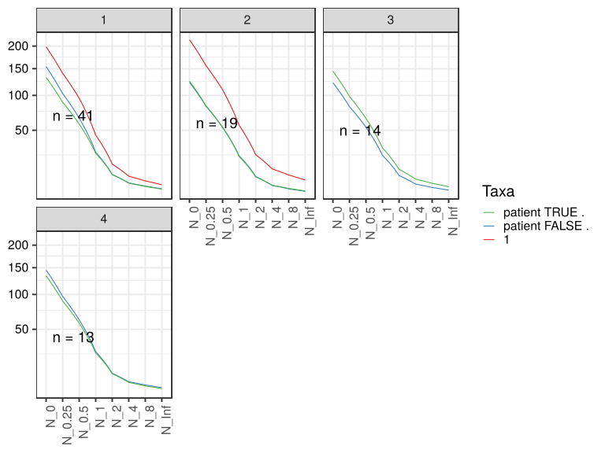

\(1.1.1.4.2.1.2.2.4.2.1.1.1\) [`Figure 169.`](#figure.169) Abundance-based diversity indices (Hill numbers) With rarefication. Data grouped by Sample.type.Drug.Before,visit.  line_obs plot.  Image file: [`plots/3234d59200a.svg`](plots/3234d59200a.svg).
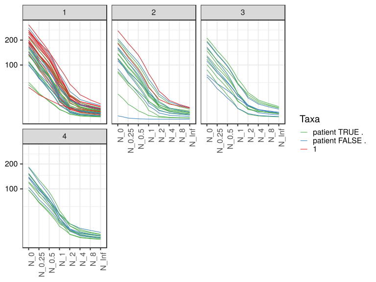

##### \(1.1.1.4.2.1.2.2.4.2.1.2\) Abundance-based diversity indices (Hill numbers) With rarefication. Plot is in flipped orientation, Y axis not scaled. Iterating over plot geometry

\(1.1.1.4.2.1.2.2.4.2.1.2.1\) [`Figure 170.`](#figure.170) Abundance-based diversity indices (Hill numbers) With rarefication. Data grouped by Sample.type.Drug.Before,visit.  line plot.  Image file: [`plots/3232fe5087c.svg`](plots/3232fe5087c.svg).
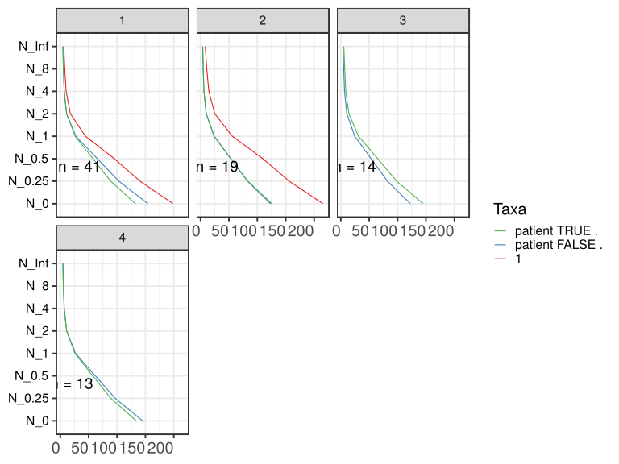

\(1.1.1.4.2.1.2.2.4.2.1.2.1\) [`Figure 171.`](#figure.171) Abundance-based diversity indices (Hill numbers) With rarefication. Data grouped by Sample.type.Drug.Before,visit.  line_obs plot.  Image file: [`plots/323c8958e4.svg`](plots/323c8958e4.svg).
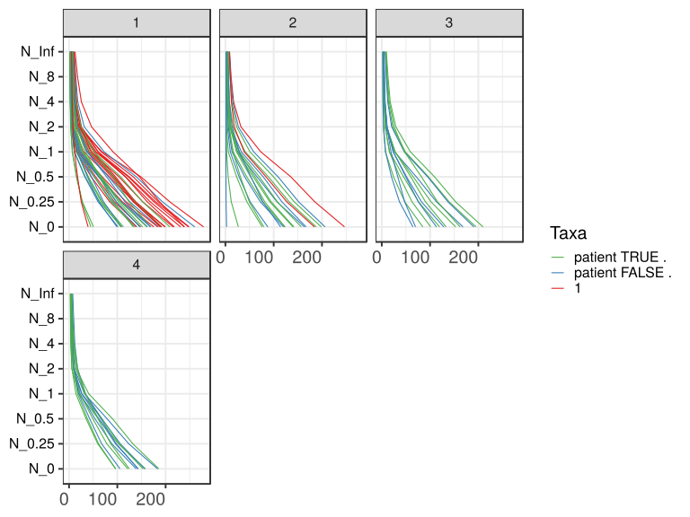

##### \(1.1.1.4.2.1.2.2.5\) Grouping variables Drug.Before.Diet,Sample.type.1

##### \(1.1.1.4.2.1.2.2.6\) Iterating over Abundance-based diversity indices (Hill numbers) With rarefication. profile sorting order

##### \(1.1.1.4.2.1.2.2.6.1\) Abundance-based diversity indices (Hill numbers) With rarefication. profile sorting order: original

##### \(1.1.1.4.2.1.2.2.6.2\) Iterating over dodged vs faceted bars

The same data are shown in multiple combinations of graphical representations. 
                         This is the same data, but each plot highlights slightly different aspects of it.
                         It is not likely that you will need every plot - pick only what you need.

##### \(1.1.1.4.2.1.2.2.6.2.1\) dodged plots. Iterating over orientation and, optionally, scaling

##### \(1.1.1.4.2.1.2.2.6.2.1.1\) Abundance-based diversity indices (Hill numbers) With rarefication. Plot is in original orientation, Y axis SQRT scaled. Iterating over plot geometry

\(1.1.1.4.2.1.2.2.6.2.1.1.0\) [`Table 48.`](#table.48) Data table used for plots. Data grouped by Drug.Before.Diet,Sample.type.1. Showing only 200 first rows. Full dataset is also saved in a delimited text file (click to download and open e.g. in Excel) [`data/1.1.1.4.2.1.2.2.6.2.1.1.0-3236033084.1.1.1.4.2.1.2.2.6.2.csv`](data/1.1.1.4.2.1.2.2.6.2.1.1.0-3236033084.1.1.1.4.2.1.2.2.6.2.csv)

| .record.id | Drug.Before.Diet | Sample.type.1       | feature | index   |
|:-----------|:-----------------|:--------------------|:--------|:--------|
| SM1        | DrugBefore\_YES  | patient.before.diet | N\_0    | 152.243 |
| SM10       | DrugBefore\_YES  | patient.after.diet  | N\_0    | 209.685 |
| SM100      | DrugBefore\_YES  | patient.after.diet  | N\_0    | 158.257 |
| SM11       | DrugBefore\_YES  | patient.after.diet  | N\_0    | 141.847 |
| SM12       | DrugBefore\_YES  | patient.before.diet | N\_0    | 147.032 |
| SM13       | DrugBefore\_NO   | patient.before.diet | N\_0    | 146.840 |
| SM14       | DrugBefore\_NO   | patient.before.diet | N\_0    | 162.553 |
| SM15       | DrugBefore\_YES  | control             | N\_0    | 215.500 |
| SM16       | DrugBefore\_NO   | patient.after.diet  | N\_0    | 143.400 |
| SM17       | DrugBefore\_YES  | patient.before.diet | N\_0    | 135.465 |
| SM18       | DrugBefore\_NO   | patient.after.diet  | N\_0    | 120.335 |
| SM19       | DrugBefore\_NO   | patient.after.diet  | N\_0    | 167.000 |
| SM2        | DrugBefore\_NO   | patient.before.diet | N\_0    | 101.520 |
| SM20       | DrugBefore\_NO   | control             | N\_0    | 175.567 |
| SM21       | DrugBefore\_NO   | patient.before.diet | N\_0    | 260.252 |
| SM22       | DrugBefore\_YES  | patient.before.diet | N\_0    | 208.740 |
| SM23       | DrugBefore\_YES  | patient.after.diet  | N\_0    | 26.845  |
| SM24       | DrugBefore\_NO   | patient.before.diet | N\_0    | 169.625 |
| SM25       | DrugBefore\_NO   | patient.after.diet  | N\_0    | 156.447 |
| SM26       | DrugBefore\_NO   | control             | N\_0    | 188.650 |
| SM28       | DrugBefore\_NO   | control             | N\_0    | 238.812 |
| SM29       | DrugBefore\_YES  | patient.after.diet  | N\_0    | 84.940  |
| SM3        | DrugBefore\_YES  | patient.after.diet  | N\_0    | 198.455 |
| SM30       | DrugBefore\_YES  | patient.after.diet  | N\_0    | 153.218 |
| SM31       | DrugBefore\_NO   | control             | N\_0    | 184.268 |
| SM33       | DrugBefore\_YES  | patient.before.diet | N\_0    | 50.547  |
| SM35       | DrugBefore\_NO   | control             | N\_0    | 198.577 |
| SM36       | DrugBefore\_NO   | patient.after.diet  | N\_0    | 105.490 |
| SM37       | DrugBefore\_NO   | control             | N\_0    | 238.843 |
| SM38       | DrugBefore\_YES  | patient.after.diet  | N\_0    | 79.575  |
| SM39       | DrugBefore\_NO   | patient.before.diet | N\_0    | 168.732 |
| SM40       | DrugBefore\_NO   | patient.after.diet  | N\_0    | 142.790 |
| SM41       | DrugBefore\_YES  | patient.before.diet | N\_0    | 191.287 |
| SM42       | DrugBefore\_NO   | patient.after.diet  | N\_0    | 183.333 |
| SM43       | DrugBefore\_YES  | patient.after.diet  | N\_0    | 185.972 |
| SM44       | DrugBefore\_NO   | control             | N\_0    | 190.292 |
| SM45       | DrugBefore\_NO   | patient.after.diet  | N\_0    | 2.413   |
| SM48       | DrugBefore\_NO   | control             | N\_0    | 248.580 |
| SM49       | DrugBefore\_YES  | patient.before.diet | N\_0    | 107.450 |
| SM5        | DrugBefore\_YES  | patient.after.diet  | N\_0    | 152.830 |
| SM50       | DrugBefore\_NO   | patient.after.diet  | N\_0    | 69.953  |
| SM51       | DrugBefore\_YES  | patient.after.diet  | N\_0    | 121.547 |
| SM52       | DrugBefore\_NO   | patient.before.diet | N\_0    | 185.012 |
| SM53       | DrugBefore\_YES  | patient.after.diet  | N\_0    | 122.892 |
| SM54       | DrugBefore\_YES  | patient.after.diet  | N\_0    | 119.675 |
| SM55       | DrugBefore\_NO   | control             | N\_0    | 199.620 |
| SM56       | DrugBefore\_YES  | patient.after.diet  | N\_0    | 76.125  |
| SM57       | DrugBefore\_YES  | patient.before.diet | N\_0    | 109.070 |
| SM58       | DrugBefore\_NO   | patient.after.diet  | N\_0    | 87.775  |
| SM59       | DrugBefore\_NO   | patient.after.diet  | N\_0    | 190.630 |
| SM60       | DrugBefore\_YES  | patient.after.diet  | N\_0    | 101.275 |
| SM62       | DrugBefore\_YES  | patient.before.diet | N\_0    | 45.220  |
| SM63       | DrugBefore\_NO   | control             | N\_0    | 247.810 |
| SM64       | DrugBefore\_YES  | patient.after.diet  | N\_0    | 123.828 |
| SM65       | DrugBefore\_YES  | patient.after.diet  | N\_0    | 162.350 |
| SM66       | DrugBefore\_NO   | control             | N\_0    | 231.068 |
| SM67       | DrugBefore\_YES  | patient.after.diet  | N\_0    | 96.415  |
| SM68       | DrugBefore\_NO   | patient.after.diet  | N\_0    | 139.120 |
| SM69       | DrugBefore\_YES  | patient.after.diet  | N\_0    | 124.793 |
| SM7        | DrugBefore\_NO   | control             | N\_0    | 192.235 |
| SM70       | DrugBefore\_NO   | control             | N\_0    | 278.543 |
| SM71       | DrugBefore\_YES  | patient.after.diet  | N\_0    | 133.148 |
| SM72       | DrugBefore\_NO   | control             | N\_0    | 139.292 |
| SM73       | DrugBefore\_NO   | patient.before.diet | N\_0    | 99.130  |
| SM74       | DrugBefore\_NO   | control             | N\_0    | 246.645 |
| SM75       | DrugBefore\_NO   | patient.after.diet  | N\_0    | 113.270 |
| SM76       | DrugBefore\_NO   | control             | N\_0    | 183.655 |
| SM77       | DrugBefore\_YES  | patient.after.diet  | N\_0    | 188.137 |
| SM79       | DrugBefore\_NO   | patient.after.diet  | N\_0    | 163.735 |
| SM8        | DrugBefore\_NO   | patient.before.diet | N\_0    | 108.440 |
| SM81       | DrugBefore\_NO   | control             | N\_0    | 39.458  |
| SM82       | DrugBefore\_YES  | patient.after.diet  | N\_0    | 96.547  |
| SM83       | DrugBefore\_YES  | patient.before.diet | N\_0    | 112.480 |
| SM84       | DrugBefore\_YES  | patient.before.diet | N\_0    | 168.887 |
| SM86       | DrugBefore\_YES  | patient.after.diet  | N\_0    | 157.197 |
| SM87       | DrugBefore\_YES  | patient.before.diet | N\_0    | 133.230 |
| SM88       | DrugBefore\_YES  | patient.after.diet  | N\_0    | 139.975 |
| SM89       | DrugBefore\_NO   | control             | N\_0    | 148.282 |
| SM9        | DrugBefore\_NO   | patient.after.diet  | N\_0    | 114.325 |
| SM90       | DrugBefore\_NO   | patient.after.diet  | N\_0    | 206.493 |
| SM91       | DrugBefore\_YES  | patient.after.diet  | N\_0    | 195.192 |
| SM92       | DrugBefore\_NO   | patient.after.diet  | N\_0    | 64.573  |
| SM93       | DrugBefore\_YES  | patient.before.diet | N\_0    | 161.148 |
| SM95       | DrugBefore\_NO   | control             | N\_0    | 218.018 |
| SM96       | DrugBefore\_NO   | patient.before.diet | N\_0    | 140.343 |
| SM98       | DrugBefore\_NO   | patient.after.diet  | N\_0    | 128.398 |
| SM99       | DrugBefore\_NO   | patient.after.diet  | N\_0    | 168.268 |
| SM1        | DrugBefore\_YES  | patient.before.diet | N\_0.25 | 102.795 |
| SM10       | DrugBefore\_YES  | patient.after.diet  | N\_0.25 | 152.962 |
| SM100      | DrugBefore\_YES  | patient.after.diet  | N\_0.25 | 102.439 |
| SM11       | DrugBefore\_YES  | patient.after.diet  | N\_0.25 | 94.804  |
| SM12       | DrugBefore\_YES  | patient.before.diet | N\_0.25 | 98.437  |
| SM13       | DrugBefore\_NO   | patient.before.diet | N\_0.25 | 97.712  |
| SM14       | DrugBefore\_NO   | patient.before.diet | N\_0.25 | 107.119 |
| SM15       | DrugBefore\_YES  | control             | N\_0.25 | 152.770 |
| SM16       | DrugBefore\_NO   | patient.after.diet  | N\_0.25 | 96.316  |
| SM17       | DrugBefore\_YES  | patient.before.diet | N\_0.25 | 86.997  |
| SM18       | DrugBefore\_NO   | patient.after.diet  | N\_0.25 | 72.410  |
| SM19       | DrugBefore\_NO   | patient.after.diet  | N\_0.25 | 117.118 |
| SM2        | DrugBefore\_NO   | patient.before.diet | N\_0.25 | 60.184  |
| SM20       | DrugBefore\_NO   | control             | N\_0.25 | 110.551 |
| SM21       | DrugBefore\_NO   | patient.before.diet | N\_0.25 | 193.549 |
| SM22       | DrugBefore\_YES  | patient.before.diet | N\_0.25 | 152.370 |
| SM23       | DrugBefore\_YES  | patient.after.diet  | N\_0.25 | 12.163  |
| SM24       | DrugBefore\_NO   | patient.before.diet | N\_0.25 | 107.995 |
| SM25       | DrugBefore\_NO   | patient.after.diet  | N\_0.25 | 106.133 |
| SM26       | DrugBefore\_NO   | control             | N\_0.25 | 134.636 |
| SM28       | DrugBefore\_NO   | control             | N\_0.25 | 175.730 |
| SM29       | DrugBefore\_YES  | patient.after.diet  | N\_0.25 | 47.689  |
| SM3        | DrugBefore\_YES  | patient.after.diet  | N\_0.25 | 142.598 |
| SM30       | DrugBefore\_YES  | patient.after.diet  | N\_0.25 | 103.812 |
| SM31       | DrugBefore\_NO   | control             | N\_0.25 | 127.297 |
| SM33       | DrugBefore\_YES  | patient.before.diet | N\_0.25 | 27.804  |
| SM35       | DrugBefore\_NO   | control             | N\_0.25 | 138.328 |
| SM36       | DrugBefore\_NO   | patient.after.diet  | N\_0.25 | 67.558  |
| SM37       | DrugBefore\_NO   | control             | N\_0.25 | 187.448 |
| SM38       | DrugBefore\_YES  | patient.after.diet  | N\_0.25 | 49.598  |
| SM39       | DrugBefore\_NO   | patient.before.diet | N\_0.25 | 115.983 |
| SM40       | DrugBefore\_NO   | patient.after.diet  | N\_0.25 | 97.902  |
| SM41       | DrugBefore\_YES  | patient.before.diet | N\_0.25 | 136.315 |
| SM42       | DrugBefore\_NO   | patient.after.diet  | N\_0.25 | 123.683 |
| SM43       | DrugBefore\_YES  | patient.after.diet  | N\_0.25 | 132.167 |
| SM44       | DrugBefore\_NO   | control             | N\_0.25 | 133.160 |
| SM45       | DrugBefore\_NO   | patient.after.diet  | N\_0.25 | 1.397   |
| SM48       | DrugBefore\_NO   | control             | N\_0.25 | 185.004 |
| SM49       | DrugBefore\_YES  | patient.before.diet | N\_0.25 | 66.664  |
| SM5        | DrugBefore\_YES  | patient.after.diet  | N\_0.25 | 102.096 |
| SM50       | DrugBefore\_NO   | patient.after.diet  | N\_0.25 | 47.479  |
| SM51       | DrugBefore\_YES  | patient.after.diet  | N\_0.25 | 78.256  |
| SM52       | DrugBefore\_NO   | patient.before.diet | N\_0.25 | 126.015 |
| SM53       | DrugBefore\_YES  | patient.after.diet  | N\_0.25 | 81.496  |
| SM54       | DrugBefore\_YES  | patient.after.diet  | N\_0.25 | 76.341  |
| SM55       | DrugBefore\_NO   | control             | N\_0.25 | 134.238 |
| SM56       | DrugBefore\_YES  | patient.after.diet  | N\_0.25 | 44.535  |
| SM57       | DrugBefore\_YES  | patient.before.diet | N\_0.25 | 63.473  |
| SM58       | DrugBefore\_NO   | patient.after.diet  | N\_0.25 | 51.300  |
| SM59       | DrugBefore\_NO   | patient.after.diet  | N\_0.25 | 137.062 |
| SM60       | DrugBefore\_YES  | patient.after.diet  | N\_0.25 | 62.692  |
| SM62       | DrugBefore\_YES  | patient.before.diet | N\_0.25 | 26.818  |
| SM63       | DrugBefore\_NO   | control             | N\_0.25 | 179.553 |
| SM64       | DrugBefore\_YES  | patient.after.diet  | N\_0.25 | 76.468  |
| SM65       | DrugBefore\_YES  | patient.after.diet  | N\_0.25 | 115.516 |
| SM66       | DrugBefore\_NO   | control             | N\_0.25 | 168.136 |
| SM67       | DrugBefore\_YES  | patient.after.diet  | N\_0.25 | 61.213  |
| SM68       | DrugBefore\_NO   | patient.after.diet  | N\_0.25 | 88.585  |
| SM69       | DrugBefore\_YES  | patient.after.diet  | N\_0.25 | 86.449  |
| SM7        | DrugBefore\_NO   | control             | N\_0.25 | 137.524 |
| SM70       | DrugBefore\_NO   | control             | N\_0.25 | 208.721 |
| SM71       | DrugBefore\_YES  | patient.after.diet  | N\_0.25 | 90.585  |
| SM72       | DrugBefore\_NO   | control             | N\_0.25 | 84.313  |
| SM73       | DrugBefore\_NO   | patient.before.diet | N\_0.25 | 62.006  |
| SM74       | DrugBefore\_NO   | control             | N\_0.25 | 185.204 |
| SM75       | DrugBefore\_NO   | patient.after.diet  | N\_0.25 | 75.652  |
| SM76       | DrugBefore\_NO   | control             | N\_0.25 | 118.243 |
| SM77       | DrugBefore\_YES  | patient.after.diet  | N\_0.25 | 132.009 |
| SM79       | DrugBefore\_NO   | patient.after.diet  | N\_0.25 | 106.931 |
| SM8        | DrugBefore\_NO   | patient.before.diet | N\_0.25 | 71.578  |
| SM81       | DrugBefore\_NO   | control             | N\_0.25 | 25.260  |
| SM82       | DrugBefore\_YES  | patient.after.diet  | N\_0.25 | 59.440  |
| SM83       | DrugBefore\_YES  | patient.before.diet | N\_0.25 | 68.989  |
| SM84       | DrugBefore\_YES  | patient.before.diet | N\_0.25 | 124.398 |
| SM86       | DrugBefore\_YES  | patient.after.diet  | N\_0.25 | 107.716 |
| SM87       | DrugBefore\_YES  | patient.before.diet | N\_0.25 | 91.806  |
| SM88       | DrugBefore\_YES  | patient.after.diet  | N\_0.25 | 92.034  |
| SM89       | DrugBefore\_NO   | control             | N\_0.25 | 94.054  |
| SM9        | DrugBefore\_NO   | patient.after.diet  | N\_0.25 | 77.652  |
| SM90       | DrugBefore\_NO   | patient.after.diet  | N\_0.25 | 151.765 |
| SM91       | DrugBefore\_YES  | patient.after.diet  | N\_0.25 | 139.541 |
| SM92       | DrugBefore\_NO   | patient.after.diet  | N\_0.25 | 36.706  |
| SM93       | DrugBefore\_YES  | patient.before.diet | N\_0.25 | 107.167 |
| SM95       | DrugBefore\_NO   | control             | N\_0.25 | 162.100 |
| SM96       | DrugBefore\_NO   | patient.before.diet | N\_0.25 | 89.618  |
| SM98       | DrugBefore\_NO   | patient.after.diet  | N\_0.25 | 82.267  |
| SM99       | DrugBefore\_NO   | patient.after.diet  | N\_0.25 | 113.400 |
| SM1        | DrugBefore\_YES  | patient.before.diet | N\_0.5  | 66.275  |
| SM10       | DrugBefore\_YES  | patient.after.diet  | N\_0.5  | 109.314 |
| SM100      | DrugBefore\_YES  | patient.after.diet  | N\_0.5  | 60.837  |
| SM11       | DrugBefore\_YES  | patient.after.diet  | N\_0.5  | 61.303  |
| SM12       | DrugBefore\_YES  | patient.before.diet | N\_0.5  | 63.155  |
| SM13       | DrugBefore\_NO   | patient.before.diet | N\_0.5  | 61.541  |
| SM14       | DrugBefore\_NO   | patient.before.diet | N\_0.5  | 63.709  |
| SM15       | DrugBefore\_YES  | control             | N\_0.5  | 103.370 |
| SM16       | DrugBefore\_NO   | patient.after.diet  | N\_0.5  | 61.893  |
| SM17       | DrugBefore\_YES  | patient.before.diet | N\_0.5  | 52.549  |
| SM18       | DrugBefore\_NO   | patient.after.diet  | N\_0.5  | 39.948  |
| SM19       | DrugBefore\_NO   | patient.after.diet  | N\_0.5  | 78.308  |
| SM2        | DrugBefore\_NO   | patient.before.diet | N\_0.5  | 32.593  |
| SM20       | DrugBefore\_NO   | control             | N\_0.5  | 62.345  |
| SM21       | DrugBefore\_NO   | patient.before.diet | N\_0.5  | 139.480 |
| SM22       | DrugBefore\_YES  | patient.before.diet | N\_0.5  | 107.084 |
| SM23       | DrugBefore\_YES  | patient.after.diet  | N\_0.5  | 5.673   |
| SM24       | DrugBefore\_NO   | patient.before.diet | N\_0.5  | 61.361  |
| SM25       | DrugBefore\_NO   | patient.after.diet  | N\_0.5  | 67.873  |
| SM26       | DrugBefore\_NO   | control             | N\_0.5  | 93.104  |
| SM28       | DrugBefore\_NO   | control             | N\_0.5  | 122.862 |
| SM29       | DrugBefore\_YES  | patient.after.diet  | N\_0.5  | 24.415  |
| SM3        | DrugBefore\_YES  | patient.after.diet  | N\_0.5  | 99.664  |
| SM30       | DrugBefore\_YES  | patient.after.diet  | N\_0.5  | 68.206  |
| SM31       | DrugBefore\_NO   | control             | N\_0.5  | 84.133  |
| SM33       | DrugBefore\_YES  | patient.before.diet | N\_0.5  | 15.248  |

\(1.1.1.4.2.1.2.2.6.2.1.1.1\) [`Widget 51.`](#widget.51) Dynamic Pivot Table link (drag and drop field names and pick averaging 
                      functions or plot types; click on fields or legend elements to filter values). 
                      Starting rendering is Stacked Bar Chart. Data grouped by Drug.Before.Diet,Sample.type.1. Click to see HTML widget file in full window: [`./1.1.1.4.2.1.2.2.6.2.1.1.1-32328527e0dDynamic.Pivot.Table.html`](./1.1.1.4.2.1.2.2.6.2.1.1.1-32328527e0dDynamic.Pivot.Table.html)

\(1.1.1.4.2.1.2.2.6.2.1.1.1\) [`Widget 52.`](#widget.52) Dynamic Pivot Table link (drag and drop field names and pick averaging 
                      functions or plot types; click on fields or legend elements to filter values). 
                      Starting rendering is Table Barchart. Data grouped by Drug.Before.Diet,Sample.type.1. Click to see HTML widget file in full window: [`./1.1.1.4.2.1.2.2.6.2.1.1.1-323f361e1bDynamic.Pivot.Table.html`](./1.1.1.4.2.1.2.2.6.2.1.1.1-323f361e1bDynamic.Pivot.Table.html)

\(1.1.1.4.2.1.2.2.6.2.1.1.1\) [`Table 49.`](#table.49) Summary table. Data grouped by Drug.Before.Diet,Sample.type.1. Full dataset is also saved in a delimited text file (click to download and open e.g. in Excel) [`data/1.1.1.4.2.1.2.2.6.2.1.1.1-3231acfc394.1.1.1.4.2.1.2.2.6.2.csv`](data/1.1.1.4.2.1.2.2.6.2.1.1.1-3231acfc394.1.1.1.4.2.1.2.2.6.2.csv)

| feature | Drug.Before.Diet | Sample.type.1       | mean    | sd     | median  | incidence |
|:--------|:-----------------|:--------------------|:--------|:-------|:--------|:----------|
| N\_0    | DrugBefore\_NO   | control             | 199.380 | 53.135 | 198.577 | 1         |
| N\_0    | DrugBefore\_NO   | patient.after.diet  | 129.881 | 49.799 | 139.120 | 1         |
| N\_0    | DrugBefore\_NO   | patient.before.diet | 154.245 | 48.147 | 154.696 | 1         |
| N\_0    | DrugBefore\_YES  | control             | 215.500 | NA     | 215.500 | 1         |
| N\_0    | DrugBefore\_YES  | patient.after.diet  | 134.029 | 44.145 | 133.148 | 1         |
| N\_0    | DrugBefore\_YES  | patient.before.diet | 132.523 | 48.248 | 135.465 | 1         |
| N\_0.25 | DrugBefore\_NO   | control             | 141.553 | 44.168 | 137.524 | 1         |
| N\_0.25 | DrugBefore\_NO   | patient.after.diet  | 86.911  | 36.625 | 88.585  | 1         |
| N\_0.25 | DrugBefore\_NO   | patient.before.diet | 103.176 | 38.940 | 102.415 | 1         |
| N\_0.25 | DrugBefore\_YES  | control             | 152.770 | NA     | 152.770 | 1         |
| N\_0.25 | DrugBefore\_YES  | patient.after.diet  | 89.785  | 34.677 | 90.585  | 1         |
| N\_0.25 | DrugBefore\_YES  | patient.before.diet | 88.772  | 37.959 | 91.806  | 1         |
| N\_0.5  | DrugBefore\_NO   | control             | 96.443  | 35.929 | 93.104  | 1         |
| N\_0.5  | DrugBefore\_NO   | patient.after.diet  | 56.181  | 25.906 | 53.712  | 1         |
| N\_0.5  | DrugBefore\_NO   | patient.before.diet | 65.456  | 30.409 | 61.451  | 1         |
| N\_0.5  | DrugBefore\_YES  | control             | 103.370 | NA     | 103.370 | 1         |
| N\_0.5  | DrugBefore\_YES  | patient.after.diet  | 58.267  | 26.130 | 60.100  | 1         |
| N\_0.5  | DrugBefore\_YES  | patient.before.diet | 57.626  | 28.670 | 63.155  | 1         |
| N\_1    | DrugBefore\_NO   | control             | 45.532  | 22.096 | 46.667  | 1         |
| N\_1    | DrugBefore\_NO   | patient.after.diet  | 25.236  | 13.108 | 25.396  | 1         |
| N\_1    | DrugBefore\_NO   | patient.before.diet | 27.326  | 18.258 | 20.420  | 1         |
| N\_1    | DrugBefore\_YES  | control             | 46.194  | NA     | 46.194  | 1         |
| N\_1    | DrugBefore\_YES  | patient.after.diet  | 26.669  | 14.713 | 24.498  | 1         |
| N\_1    | DrugBefore\_YES  | patient.before.diet | 26.359  | 15.500 | 26.638  | 1         |
| N\_2    | DrugBefore\_NO   | control             | 18.718  | 10.139 | 19.142  | 1         |
| N\_2    | DrugBefore\_NO   | patient.after.diet  | 10.702  | 5.960  | 9.964   | 1         |
| N\_2    | DrugBefore\_NO   | patient.before.diet | 11.188  | 8.658  | 8.635   | 1         |
| N\_2    | DrugBefore\_YES  | control             | 16.407  | NA     | 16.407  | 1         |
| N\_2    | DrugBefore\_YES  | patient.after.diet  | 11.694  | 7.219  | 9.844   | 1         |
| N\_2    | DrugBefore\_YES  | patient.before.diet | 11.278  | 6.355  | 9.502   | 1         |
| N\_4    | DrugBefore\_NO   | control             | 10.824  | 5.334  | 11.015  | 1         |
| N\_4    | DrugBefore\_NO   | patient.after.diet  | 6.474   | 3.474  | 5.882   | 1         |
| N\_4    | DrugBefore\_NO   | patient.before.diet | 6.985   | 5.052  | 5.491   | 1         |
| N\_4    | DrugBefore\_YES  | control             | 9.051   | NA     | 9.051   | 1         |
| N\_4    | DrugBefore\_YES  | patient.after.diet  | 7.114   | 4.163  | 5.567   | 1         |
| N\_4    | DrugBefore\_YES  | patient.before.diet | 6.865   | 3.263  | 6.506   | 1         |
| N\_8    | DrugBefore\_NO   | control             | 8.298   | 3.643  | 8.781   | 1         |
| N\_8    | DrugBefore\_NO   | patient.after.diet  | 5.119   | 2.544  | 4.584   | 1         |
| N\_8    | DrugBefore\_NO   | patient.before.diet | 5.663   | 3.851  | 4.511   | 1         |
| N\_8    | DrugBefore\_YES  | control             | 7.126   | NA     | 7.126   | 1         |
| N\_8    | DrugBefore\_YES  | patient.after.diet  | 5.593   | 2.966  | 4.580   | 1         |
| N\_8    | DrugBefore\_YES  | patient.before.diet | 5.505   | 2.384  | 5.269   | 1         |
| N\_Inf  | DrugBefore\_NO   | control             | 6.451   | 2.493  | 6.702   | 1         |
| N\_Inf  | DrugBefore\_NO   | patient.after.diet  | 4.166   | 1.854  | 3.790   | 1         |
| N\_Inf  | DrugBefore\_NO   | patient.before.diet | 4.619   | 2.877  | 3.763   | 1         |
| N\_Inf  | DrugBefore\_YES  | control             | 5.689   | NA     | 5.689   | 1         |
| N\_Inf  | DrugBefore\_YES  | patient.after.diet  | 4.509   | 2.098  | 4.089   | 1         |
| N\_Inf  | DrugBefore\_YES  | patient.before.diet | 4.507   | 1.769  | 4.530   | 1         |

\(1.1.1.4.2.1.2.2.6.2.1.1.1\) [`Figure 172.`](#figure.172) Abundance-based diversity indices (Hill numbers) With rarefication. Data grouped by Drug.Before.Diet,Sample.type.1.  line plot.  Image file: [`plots/32323cbc792.svg`](plots/32323cbc792.svg).
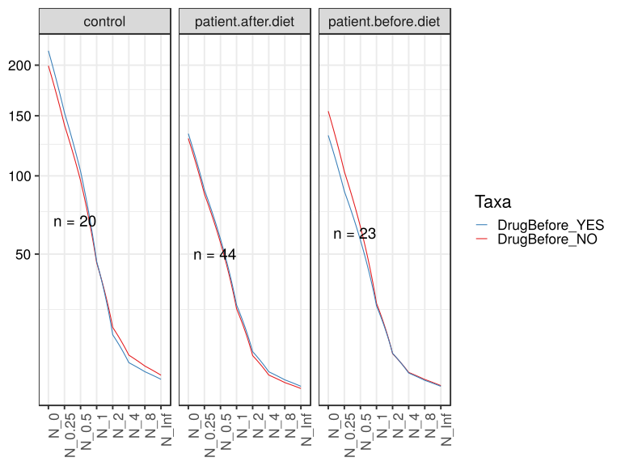

\(1.1.1.4.2.1.2.2.6.2.1.1.1\) [`Figure 173.`](#figure.173) Abundance-based diversity indices (Hill numbers) With rarefication. Data grouped by Drug.Before.Diet,Sample.type.1.  line_obs plot.  Image file: [`plots/3231e4dba9.svg`](plots/3231e4dba9.svg).
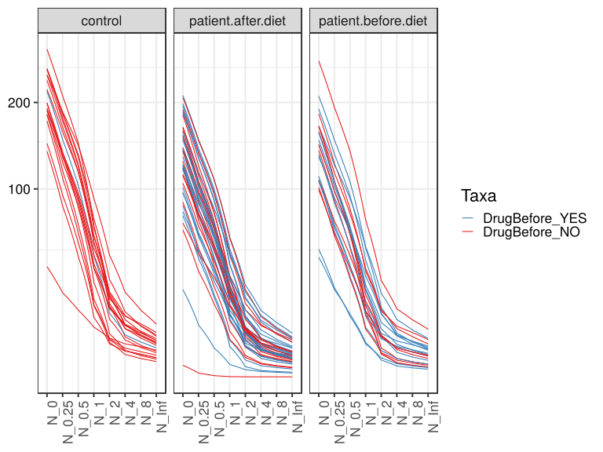

##### \(1.1.1.4.2.1.2.2.6.2.1.2\) Abundance-based diversity indices (Hill numbers) With rarefication. Plot is in flipped orientation, Y axis not scaled. Iterating over plot geometry

\(1.1.1.4.2.1.2.2.6.2.1.2.1\) [`Figure 174.`](#figure.174) Abundance-based diversity indices (Hill numbers) With rarefication. Data grouped by Drug.Before.Diet,Sample.type.1.  line plot.  Image file: [`plots/323455b6fab.svg`](plots/323455b6fab.svg).
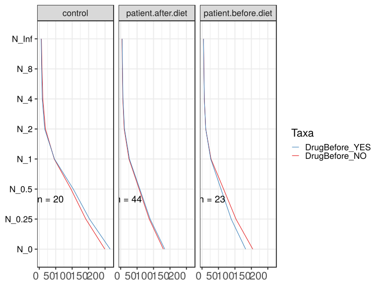

\(1.1.1.4.2.1.2.2.6.2.1.2.1\) [`Figure 175.`](#figure.175) Abundance-based diversity indices (Hill numbers) With rarefication. Data grouped by Drug.Before.Diet,Sample.type.1.  line_obs plot.  Image file: [`plots/3233d20c0b4.svg`](plots/3233d20c0b4.svg).
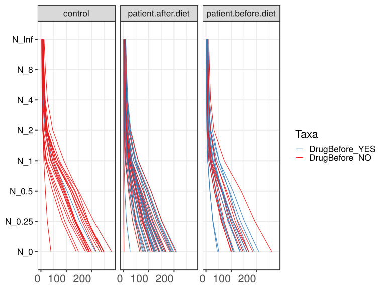