noone@mail.com
Analysis of Dieting study 16S data
% Fri Sep  7 05:46:18 2018

##### \(1.1.1.4.2.1.3\) Plots of Abundance-based evenness indices (Hill numbers / Observed 'species') With rarefication.

Plots are shown with relation to various combinations of meta 
                   data variables and in different graphical representations. Lots of plots here.

##### \(1.1.1.4.2.1.3.2\) Iterating over all combinations of grouping variables

##### \(1.1.1.4.2.1.3.2.1\) Grouping variables Sample.type,visit

##### \(1.1.1.4.2.1.3.2.2\) Iterating over Abundance-based evenness indices (Hill numbers / Observed 'species') With rarefication. profile sorting order

##### \(1.1.1.4.2.1.3.2.2.1\) Abundance-based evenness indices (Hill numbers / Observed 'species') With rarefication. profile sorting order: original

##### \(1.1.1.4.2.1.3.2.2.2\) Iterating over dodged vs faceted bars

The same data are shown in multiple combinations of graphical representations. 
                         This is the same data, but each plot highlights slightly different aspects of it.
                         It is not likely that you will need every plot - pick only what you need.

##### \(1.1.1.4.2.1.3.2.2.2.1\) dodged plots. Iterating over orientation and, optionally, scaling

##### \(1.1.1.4.2.1.3.2.2.2.1.1\) Abundance-based evenness indices (Hill numbers / Observed 'species') With rarefication. Plot is in original orientation, Y axis SQRT scaled. Iterating over plot geometry

\(1.1.1.4.2.1.3.2.2.2.1.1.0\) [`Table 50.`](#table.50) Data table used for plots. Data grouped by Sample.type,visit. Showing only 200 first rows. Full dataset is also saved in a delimited text file (click to download and open e.g. in Excel) [`data/1.1.1.4.2.1.3.2.2.2.1.1.0-323304eff2a.1.1.1.4.2.1.3.2.2.2.csv`](data/1.1.1.4.2.1.3.2.2.2.1.1.0-323304eff2a.1.1.1.4.2.1.3.2.2.2.csv)

| .record.id | Sample.type | visit | feature  | index   |
|:-----------|:------------|:------|:---------|:--------|
| SM1        | patient     | 1     | NE\_0.25 | 0.67485 |
| SM10       | patient     | 3     | NE\_0.25 | 0.72978 |
| SM100      | patient     | 4     | NE\_0.25 | 0.64755 |
| SM11       | patient     | 2     | NE\_0.25 | 0.66863 |
| SM12       | patient     | 1     | NE\_0.25 | 0.66947 |
| SM13       | patient     | 1     | NE\_0.25 | 0.66540 |
| SM14       | patient     | 1     | NE\_0.25 | 0.65872 |
| SM15       | control     | 1     | NE\_0.25 | 0.70834 |
| SM16       | patient     | 4     | NE\_0.25 | 0.67265 |
| SM17       | patient     | 1     | NE\_0.25 | 0.64231 |
| SM18       | patient     | 2     | NE\_0.25 | 0.60163 |
| SM19       | patient     | 2     | NE\_0.25 | 0.70131 |
| SM2        | patient     | 1     | NE\_0.25 | 0.59252 |
| SM20       | control     | 1     | NE\_0.25 | 0.62937 |
| SM21       | patient     | 1     | NE\_0.25 | 0.74389 |
| SM22       | patient     | 1     | NE\_0.25 | 0.72962 |
| SM23       | patient     | 2     | NE\_0.25 | 0.45362 |
| SM24       | patient     | 1     | NE\_0.25 | 0.63669 |
| SM25       | patient     | 4     | NE\_0.25 | 0.67846 |
| SM26       | control     | 1     | NE\_0.25 | 0.71319 |
| SM28       | control     | 1     | NE\_0.25 | 0.73588 |
| SM29       | patient     | 3     | NE\_0.25 | 0.56150 |
| SM3        | patient     | 2     | NE\_0.25 | 0.71862 |
| SM30       | patient     | 4     | NE\_0.25 | 0.67762 |
| SM31       | control     | 2     | NE\_0.25 | 0.69069 |
| SM33       | patient     | 1     | NE\_0.25 | 0.54983 |
| SM35       | control     | 1     | NE\_0.25 | 0.69686 |
| SM36       | patient     | 4     | NE\_0.25 | 0.64068 |
| SM37       | control     | 1     | NE\_0.25 | 0.78487 |
| SM38       | patient     | 2     | NE\_0.25 | 0.62344 |
| SM39       | patient     | 1     | NE\_0.25 | 0.68799 |
| SM40       | patient     | 4     | NE\_0.25 | 0.68568 |
| SM41       | patient     | 1     | NE\_0.25 | 0.71326 |
| SM42       | patient     | 4     | NE\_0.25 | 0.67437 |
| SM43       | patient     | 4     | NE\_0.25 | 0.71089 |
| SM44       | control     | 1     | NE\_0.25 | 0.69967 |
| SM45       | patient     | 2     | NE\_0.25 | 0.59746 |
| SM48       | control     | 1     | NE\_0.25 | 0.74430 |
| SM49       | patient     | 1     | NE\_0.25 | 0.62078 |
| SM5        | patient     | 3     | NE\_0.25 | 0.66854 |
| SM50       | patient     | 3     | NE\_0.25 | 0.67917 |
| SM51       | patient     | 4     | NE\_0.25 | 0.64362 |
| SM52       | patient     | 1     | NE\_0.25 | 0.68175 |
| SM53       | patient     | 2     | NE\_0.25 | 0.66285 |
| SM54       | patient     | 3     | NE\_0.25 | 0.63793 |
| SM55       | control     | 1     | NE\_0.25 | 0.67234 |
| SM56       | patient     | 2     | NE\_0.25 | 0.58534 |
| SM57       | patient     | 1     | NE\_0.25 | 0.58206 |
| SM58       | patient     | 2     | NE\_0.25 | 0.58446 |
| SM59       | patient     | 3     | NE\_0.25 | 0.71916 |
| SM60       | patient     | 3     | NE\_0.25 | 0.61880 |
| SM62       | patient     | 1     | NE\_0.25 | 0.59271 |
| SM63       | control     | 1     | NE\_0.25 | 0.72452 |
| SM64       | patient     | 2     | NE\_0.25 | 0.61742 |
| SM65       | patient     | 3     | NE\_0.25 | 0.71191 |
| SM66       | control     | 1     | NE\_0.25 | 0.72764 |
| SM67       | patient     | 4     | NE\_0.25 | 0.63568 |
| SM68       | patient     | 4     | NE\_0.25 | 0.63684 |
| SM69       | patient     | 4     | NE\_0.25 | 0.69324 |
| SM7        | control     | 1     | NE\_0.25 | 0.71540 |
| SM70       | control     | 1     | NE\_0.25 | 0.74967 |
| SM71       | patient     | 3     | NE\_0.25 | 0.68072 |
| SM72       | control     | 1     | NE\_0.25 | 0.60543 |
| SM73       | patient     | 1     | NE\_0.25 | 0.62544 |
| SM74       | control     | 2     | NE\_0.25 | 0.75103 |
| SM75       | patient     | 3     | NE\_0.25 | 0.66718 |
| SM76       | control     | 1     | NE\_0.25 | 0.64440 |
| SM77       | patient     | 2     | NE\_0.25 | 0.70220 |
| SM79       | patient     | 2     | NE\_0.25 | 0.65361 |
| SM8        | patient     | 1     | NE\_0.25 | 0.66042 |
| SM81       | control     | 1     | NE\_0.25 | 0.64095 |
| SM82       | patient     | 4     | NE\_0.25 | 0.61592 |
| SM83       | patient     | 1     | NE\_0.25 | 0.61333 |
| SM84       | patient     | 1     | NE\_0.25 | 0.73675 |
| SM86       | patient     | 2     | NE\_0.25 | 0.68563 |
| SM87       | patient     | 1     | NE\_0.25 | 0.68920 |
| SM88       | patient     | 2     | NE\_0.25 | 0.65715 |
| SM89       | control     | 1     | NE\_0.25 | 0.63428 |
| SM9        | patient     | 2     | NE\_0.25 | 0.67941 |
| SM90       | patient     | 2     | NE\_0.25 | 0.73500 |
| SM91       | patient     | 3     | NE\_0.25 | 0.71492 |
| SM92       | patient     | 3     | NE\_0.25 | 0.56869 |
| SM93       | patient     | 1     | NE\_0.25 | 0.66518 |
| SM95       | control     | 1     | NE\_0.25 | 0.74346 |
| SM96       | patient     | 1     | NE\_0.25 | 0.63825 |
| SM98       | patient     | 3     | NE\_0.25 | 0.64165 |
| SM99       | patient     | 3     | NE\_0.25 | 0.67389 |
| SM1        | patient     | 1     | NE\_0.5  | 0.43508 |
| SM10       | patient     | 3     | NE\_0.5  | 0.52184 |
| SM100      | patient     | 4     | NE\_0.5  | 0.38464 |
| SM11       | patient     | 2     | NE\_0.5  | 0.43291 |
| SM12       | patient     | 1     | NE\_0.5  | 0.42972 |
| SM13       | patient     | 1     | NE\_0.5  | 0.41905 |
| SM14       | patient     | 1     | NE\_0.5  | 0.39153 |
| SM15       | control     | 1     | NE\_0.5  | 0.47908 |
| SM16       | patient     | 4     | NE\_0.5  | 0.43315 |
| SM17       | patient     | 1     | NE\_0.5  | 0.38804 |
| SM18       | patient     | 2     | NE\_0.5  | 0.33171 |
| SM19       | patient     | 2     | NE\_0.5  | 0.46891 |
| SM2        | patient     | 1     | NE\_0.5  | 0.32072 |
| SM20       | control     | 1     | NE\_0.5  | 0.35473 |
| SM21       | patient     | 1     | NE\_0.5  | 0.53626 |
| SM22       | patient     | 1     | NE\_0.5  | 0.51248 |
| SM23       | patient     | 2     | NE\_0.5  | 0.21214 |
| SM24       | patient     | 1     | NE\_0.5  | 0.36201 |
| SM25       | patient     | 4     | NE\_0.5  | 0.43385 |
| SM26       | control     | 1     | NE\_0.5  | 0.49286 |
| SM28       | control     | 1     | NE\_0.5  | 0.51454 |
| SM29       | patient     | 3     | NE\_0.5  | 0.28755 |
| SM3        | patient     | 2     | NE\_0.5  | 0.50240 |
| SM30       | patient     | 4     | NE\_0.5  | 0.44520 |
| SM31       | control     | 2     | NE\_0.5  | 0.45641 |
| SM33       | patient     | 1     | NE\_0.5  | 0.30154 |
| SM35       | control     | 1     | NE\_0.5  | 0.46198 |
| SM36       | patient     | 4     | NE\_0.5  | 0.40514 |
| SM37       | control     | 1     | NE\_0.5  | 0.61145 |
| SM38       | patient     | 2     | NE\_0.5  | 0.39069 |
| SM39       | patient     | 1     | NE\_0.5  | 0.46214 |
| SM40       | patient     | 4     | NE\_0.5  | 0.46377 |
| SM41       | patient     | 1     | NE\_0.5  | 0.48979 |
| SM42       | patient     | 4     | NE\_0.5  | 0.42899 |
| SM43       | patient     | 4     | NE\_0.5  | 0.48431 |
| SM44       | control     | 1     | NE\_0.5  | 0.46451 |
| SM45       | patient     | 2     | NE\_0.5  | 0.48596 |
| SM48       | control     | 1     | NE\_0.5  | 0.53543 |
| SM49       | patient     | 1     | NE\_0.5  | 0.37025 |
| SM5        | patient     | 3     | NE\_0.5  | 0.42745 |
| SM50       | patient     | 3     | NE\_0.5  | 0.47435 |
| SM51       | patient     | 4     | NE\_0.5  | 0.40600 |
| SM52       | patient     | 1     | NE\_0.5  | 0.44352 |
| SM53       | patient     | 2     | NE\_0.5  | 0.42424 |
| SM54       | patient     | 3     | NE\_0.5  | 0.37769 |
| SM55       | control     | 1     | NE\_0.5  | 0.41890 |
| SM56       | patient     | 2     | NE\_0.5  | 0.30531 |
| SM57       | patient     | 1     | NE\_0.5  | 0.30956 |
| SM58       | patient     | 2     | NE\_0.5  | 0.32267 |
| SM59       | patient     | 3     | NE\_0.5  | 0.49904 |
| SM60       | patient     | 3     | NE\_0.5  | 0.36882 |
| SM62       | patient     | 1     | NE\_0.5  | 0.35328 |
| SM63       | control     | 1     | NE\_0.5  | 0.50324 |
| SM64       | patient     | 2     | NE\_0.5  | 0.35724 |
| SM65       | patient     | 3     | NE\_0.5  | 0.50692 |
| SM66       | control     | 1     | NE\_0.5  | 0.50727 |
| SM67       | patient     | 4     | NE\_0.5  | 0.39571 |
| SM68       | patient     | 4     | NE\_0.5  | 0.38618 |
| SM69       | patient     | 4     | NE\_0.5  | 0.48309 |
| SM7        | control     | 1     | NE\_0.5  | 0.50174 |
| SM70       | control     | 1     | NE\_0.5  | 0.53513 |
| SM71       | patient     | 3     | NE\_0.5  | 0.45193 |
| SM72       | control     | 1     | NE\_0.5  | 0.32959 |
| SM73       | patient     | 1     | NE\_0.5  | 0.38385 |
| SM74       | control     | 2     | NE\_0.5  | 0.54983 |
| SM75       | patient     | 3     | NE\_0.5  | 0.43783 |
| SM76       | control     | 1     | NE\_0.5  | 0.37580 |
| SM77       | patient     | 2     | NE\_0.5  | 0.47446 |
| SM79       | patient     | 2     | NE\_0.5  | 0.40066 |
| SM8        | patient     | 1     | NE\_0.5  | 0.42740 |
| SM81       | control     | 1     | NE\_0.5  | 0.44813 |
| SM82       | patient     | 4     | NE\_0.5  | 0.36495 |
| SM83       | patient     | 1     | NE\_0.5  | 0.35451 |
| SM84       | patient     | 1     | NE\_0.5  | 0.54100 |
| SM86       | patient     | 2     | NE\_0.5  | 0.44768 |
| SM87       | patient     | 1     | NE\_0.5  | 0.47507 |
| SM88       | patient     | 2     | NE\_0.5  | 0.41100 |
| SM89       | control     | 1     | NE\_0.5  | 0.37187 |
| SM9        | patient     | 2     | NE\_0.5  | 0.46345 |
| SM90       | patient     | 2     | NE\_0.5  | 0.52869 |
| SM91       | patient     | 3     | NE\_0.5  | 0.49582 |
| SM92       | patient     | 3     | NE\_0.5  | 0.31152 |
| SM93       | patient     | 1     | NE\_0.5  | 0.41869 |
| SM95       | control     | 1     | NE\_0.5  | 0.53590 |
| SM96       | patient     | 1     | NE\_0.5  | 0.36897 |
| SM98       | patient     | 3     | NE\_0.5  | 0.40147 |
| SM99       | patient     | 3     | NE\_0.5  | 0.42524 |
| SM1        | patient     | 1     | NE\_1    | 0.19115 |
| SM10       | patient     | 3     | NE\_1    | 0.28284 |
| SM100      | patient     | 4     | NE\_1    | 0.12535 |
| SM11       | patient     | 2     | NE\_1    | 0.19685 |
| SM12       | patient     | 1     | NE\_1    | 0.18590 |
| SM13       | patient     | 1     | NE\_1    | 0.16629 |
| SM14       | patient     | 1     | NE\_1    | 0.11932 |
| SM15       | control     | 1     | NE\_1    | 0.21433 |
| SM16       | patient     | 4     | NE\_1    | 0.18310 |
| SM17       | patient     | 1     | NE\_1    | 0.15062 |
| SM18       | patient     | 2     | NE\_1    | 0.11274 |
| SM19       | patient     | 2     | NE\_1    | 0.19845 |
| SM2        | patient     | 1     | NE\_1    | 0.10597 |
| SM20       | control     | 1     | NE\_1    | 0.11248 |
| SM21       | patient     | 1     | NE\_1    | 0.27953 |
| SM22       | patient     | 1     | NE\_1    | 0.24607 |
| SM23       | patient     | 2     | NE\_1    | 0.09505 |
| SM24       | patient     | 1     | NE\_1    | 0.09929 |
| SM25       | patient     | 4     | NE\_1    | 0.17112 |
| SM26       | control     | 1     | NE\_1    | 0.24690 |
| SM28       | control     | 1     | NE\_1    | 0.23328 |
| SM29       | patient     | 3     | NE\_1    | 0.08980 |
| SM3        | patient     | 2     | NE\_1    | 0.25646 |
| SM30       | patient     | 4     | NE\_1    | 0.21050 |
| SM31       | control     | 2     | NE\_1    | 0.21116 |
| SM33       | patient     | 1     | NE\_1    | 0.13129 |

\(1.1.1.4.2.1.3.2.2.2.1.1.1\) [`Widget 53.`](#widget.53) Dynamic Pivot Table link (drag and drop field names and pick averaging 
                      functions or plot types; click on fields or legend elements to filter values). 
                      Starting rendering is Stacked Bar Chart. Data grouped by Sample.type,visit. Click to see HTML widget file in full window: [`./1.1.1.4.2.1.3.2.2.2.1.1.1-3233b423073Dynamic.Pivot.Table.html`](./1.1.1.4.2.1.3.2.2.2.1.1.1-3233b423073Dynamic.Pivot.Table.html)

\(1.1.1.4.2.1.3.2.2.2.1.1.1\) [`Widget 54.`](#widget.54) Dynamic Pivot Table link (drag and drop field names and pick averaging 
                      functions or plot types; click on fields or legend elements to filter values). 
                      Starting rendering is Table Barchart. Data grouped by Sample.type,visit. Click to see HTML widget file in full window: [`./1.1.1.4.2.1.3.2.2.2.1.1.1-323328cfd14Dynamic.Pivot.Table.html`](./1.1.1.4.2.1.3.2.2.2.1.1.1-323328cfd14Dynamic.Pivot.Table.html)

\(1.1.1.4.2.1.3.2.2.2.1.1.1\) [`Table 51.`](#table.51) Summary table. Data grouped by Sample.type,visit. Full dataset is also saved in a delimited text file (click to download and open e.g. in Excel) [`data/1.1.1.4.2.1.3.2.2.2.1.1.1-32341a13df2.1.1.1.4.2.1.3.2.2.2.csv`](data/1.1.1.4.2.1.3.2.2.2.1.1.1-32341a13df2.1.1.1.4.2.1.3.2.2.2.csv)

| feature  | Sample.type | visit | mean    | sd       | median  | incidence |
|:---------|:------------|:------|:--------|:---------|:--------|:----------|
| NE\_0.25 | control     | 1     | 0.69836 | 0.049830 | 0.71076 | 1         |
| NE\_0.25 | control     | 2     | 0.72086 | 0.042666 | 0.72086 | 1         |
| NE\_0.25 | patient     | 1     | 0.65524 | 0.050498 | 0.66042 | 1         |
| NE\_0.25 | patient     | 2     | 0.64281 | 0.067560 | 0.65715 | 1         |
| NE\_0.25 | patient     | 3     | 0.66242 | 0.052385 | 0.67122 | 1         |
| NE\_0.25 | patient     | 4     | 0.66255 | 0.027620 | 0.67265 | 1         |
| NE\_0.5  | control     | 1     | 0.46901 | 0.074216 | 0.48597 | 1         |
| NE\_0.5  | control     | 2     | 0.50312 | 0.066058 | 0.50312 | 1         |
| NE\_0.5  | patient     | 1     | 0.41280 | 0.068270 | 0.41869 | 1         |
| NE\_0.5  | patient     | 2     | 0.40942 | 0.082207 | 0.42424 | 1         |
| NE\_0.5  | patient     | 3     | 0.42768 | 0.072076 | 0.43264 | 1         |
| NE\_0.5  | patient     | 4     | 0.42423 | 0.037983 | 0.42899 | 1         |
| NE\_1    | control     | 1     | 0.21887 | 0.071925 | 0.23640 | 1         |
| NE\_1    | control     | 2     | 0.25423 | 0.060911 | 0.25423 | 1         |
| NE\_1    | patient     | 1     | 0.17847 | 0.058360 | 0.16629 | 1         |
| NE\_1    | patient     | 2     | 0.19296 | 0.086654 | 0.18750 | 1         |
| NE\_1    | patient     | 3     | 0.19879 | 0.063238 | 0.19710 | 1         |
| NE\_1    | patient     | 4     | 0.18927 | 0.038185 | 0.18371 | 1         |
| NE\_2    | control     | 1     | 0.09277 | 0.047548 | 0.08478 | 1         |
| NE\_2    | control     | 2     | 0.11492 | 0.022024 | 0.11492 | 1         |
| NE\_2    | patient     | 1     | 0.07650 | 0.030331 | 0.07405 | 1         |
| NE\_2    | patient     | 2     | 0.09769 | 0.092441 | 0.07760 | 1         |
| NE\_2    | patient     | 3     | 0.09042 | 0.038561 | 0.08255 | 1         |
| NE\_2    | patient     | 4     | 0.08248 | 0.028589 | 0.07989 | 1         |
| NE\_4    | control     | 1     | 0.05636 | 0.035250 | 0.04683 | 1         |
| NE\_4    | control     | 2     | 0.06793 | 0.001137 | 0.06793 | 1         |
| NE\_4    | patient     | 1     | 0.04829 | 0.017544 | 0.04924 | 1         |
| NE\_4    | patient     | 2     | 0.07007 | 0.096201 | 0.04909 | 1         |
| NE\_4    | patient     | 3     | 0.05592 | 0.022713 | 0.05157 | 1         |
| NE\_4    | patient     | 4     | 0.05145 | 0.019969 | 0.04411 | 1         |
| NE\_8    | control     | 1     | 0.04464 | 0.030590 | 0.03607 | 1         |
| NE\_8    | control     | 2     | 0.05150 | 0.005147 | 0.05150 | 1         |
| NE\_8    | patient     | 1     | 0.03944 | 0.013644 | 0.03928 | 1         |
| NE\_8    | patient     | 2     | 0.06138 | 0.097788 | 0.03854 | 1         |
| NE\_8    | patient     | 3     | 0.04435 | 0.016008 | 0.04241 | 1         |
| NE\_8    | patient     | 4     | 0.04117 | 0.015823 | 0.03489 | 1         |
| NE\_Inf  | control     | 1     | 0.03565 | 0.026181 | 0.02769 | 1         |
| NE\_Inf  | control     | 2     | 0.03930 | 0.005815 | 0.03930 | 1         |
| NE\_Inf  | patient     | 1     | 0.03272 | 0.010666 | 0.03279 | 1         |
| NE\_Inf  | patient     | 2     | 0.05546 | 0.099028 | 0.03125 | 1         |
| NE\_Inf  | patient     | 3     | 0.03609 | 0.011466 | 0.03566 | 1         |
| NE\_Inf  | patient     | 4     | 0.03360 | 0.012264 | 0.02913 | 1         |

\(1.1.1.4.2.1.3.2.2.2.1.1.1\) [`Figure 176.`](#figure.176) Abundance-based evenness indices (Hill numbers / Observed 'species') With rarefication. Data grouped by Sample.type,visit.  line plot.  Image file: [`plots/3233f802693.svg`](plots/3233f802693.svg).
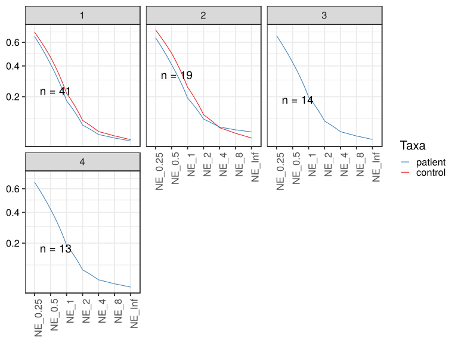

\(1.1.1.4.2.1.3.2.2.2.1.1.1\) [`Figure 177.`](#figure.177) Abundance-based evenness indices (Hill numbers / Observed 'species') With rarefication. Data grouped by Sample.type,visit.  line_obs plot.  Image file: [`plots/323dce300e.svg`](plots/323dce300e.svg).
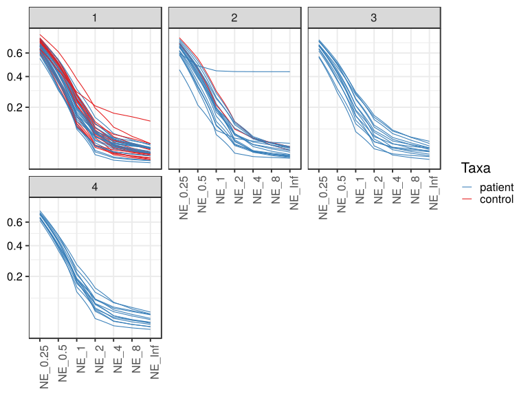

##### \(1.1.1.4.2.1.3.2.2.2.1.2\) Abundance-based evenness indices (Hill numbers / Observed 'species') With rarefication. Plot is in flipped orientation, Y axis not scaled. Iterating over plot geometry

\(1.1.1.4.2.1.3.2.2.2.1.2.1\) [`Figure 178.`](#figure.178) Abundance-based evenness indices (Hill numbers / Observed 'species') With rarefication. Data grouped by Sample.type,visit.  line plot.  Image file: [`plots/32331344173.svg`](plots/32331344173.svg).
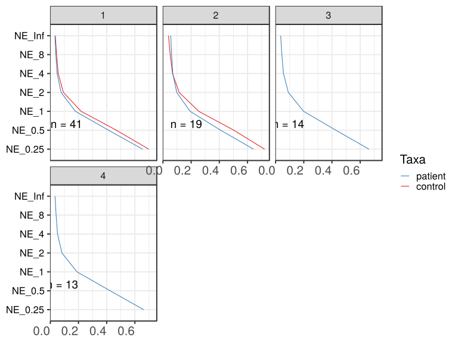

\(1.1.1.4.2.1.3.2.2.2.1.2.1\) [`Figure 179.`](#figure.179) Abundance-based evenness indices (Hill numbers / Observed 'species') With rarefication. Data grouped by Sample.type,visit.  line_obs plot.  Image file: [`plots/32320ed0789.svg`](plots/32320ed0789.svg).
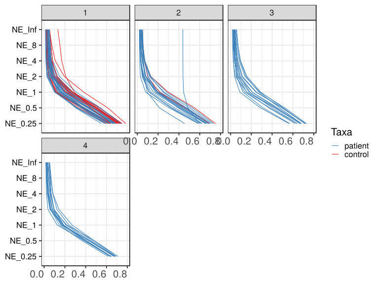

##### \(1.1.1.4.2.1.3.2.3\) Grouping variables Sample.type.Drug.Before,visit

##### \(1.1.1.4.2.1.3.2.4\) Iterating over Abundance-based evenness indices (Hill numbers / Observed 'species') With rarefication. profile sorting order

##### \(1.1.1.4.2.1.3.2.4.1\) Abundance-based evenness indices (Hill numbers / Observed 'species') With rarefication. profile sorting order: original

##### \(1.1.1.4.2.1.3.2.4.2\) Iterating over dodged vs faceted bars

The same data are shown in multiple combinations of graphical representations. 
                         This is the same data, but each plot highlights slightly different aspects of it.
                         It is not likely that you will need every plot - pick only what you need.

##### \(1.1.1.4.2.1.3.2.4.2.1\) dodged plots. Iterating over orientation and, optionally, scaling

##### \(1.1.1.4.2.1.3.2.4.2.1.1\) Abundance-based evenness indices (Hill numbers / Observed 'species') With rarefication. Plot is in original orientation, Y axis SQRT scaled. Iterating over plot geometry

\(1.1.1.4.2.1.3.2.4.2.1.1.0\) [`Table 52.`](#table.52) Data table used for plots. Data grouped by Sample.type.Drug.Before,visit. Showing only 200 first rows. Full dataset is also saved in a delimited text file (click to download and open e.g. in Excel) [`data/1.1.1.4.2.1.3.2.4.2.1.1.0-323523b74a9.1.1.1.4.2.1.3.2.4.2.csv`](data/1.1.1.4.2.1.3.2.4.2.1.1.0-323523b74a9.1.1.1.4.2.1.3.2.4.2.csv)

| .record.id | Sample.type.Drug.Before | visit | feature  | index   |
|:-----------|:------------------------|:------|:---------|:--------|
| SM1        | patient TRUE .          | 1     | NE\_0.25 | 0.67485 |
| SM10       | patient TRUE .          | 3     | NE\_0.25 | 0.72978 |
| SM100      | patient TRUE .          | 4     | NE\_0.25 | 0.64755 |
| SM11       | patient TRUE .          | 2     | NE\_0.25 | 0.66863 |
| SM12       | patient TRUE .          | 1     | NE\_0.25 | 0.66947 |
| SM13       | patient FALSE .         | 1     | NE\_0.25 | 0.66540 |
| SM14       | patient FALSE .         | 1     | NE\_0.25 | 0.65872 |
| SM15       | 1                       | 1     | NE\_0.25 | 0.70834 |
| SM16       | patient FALSE .         | 4     | NE\_0.25 | 0.67265 |
| SM17       | patient TRUE .          | 1     | NE\_0.25 | 0.64231 |
| SM18       | patient FALSE .         | 2     | NE\_0.25 | 0.60163 |
| SM19       | patient FALSE .         | 2     | NE\_0.25 | 0.70131 |
| SM2        | patient FALSE .         | 1     | NE\_0.25 | 0.59252 |
| SM20       | 1                       | 1     | NE\_0.25 | 0.62937 |
| SM21       | patient FALSE .         | 1     | NE\_0.25 | 0.74389 |
| SM22       | patient TRUE .          | 1     | NE\_0.25 | 0.72962 |
| SM23       | patient TRUE .          | 2     | NE\_0.25 | 0.45362 |
| SM24       | patient FALSE .         | 1     | NE\_0.25 | 0.63669 |
| SM25       | patient FALSE .         | 4     | NE\_0.25 | 0.67846 |
| SM26       | 1                       | 1     | NE\_0.25 | 0.71319 |
| SM28       | 1                       | 1     | NE\_0.25 | 0.73588 |
| SM29       | patient TRUE .          | 3     | NE\_0.25 | 0.56150 |
| SM3        | patient TRUE .          | 2     | NE\_0.25 | 0.71862 |
| SM30       | patient TRUE .          | 4     | NE\_0.25 | 0.67762 |
| SM31       | 1                       | 2     | NE\_0.25 | 0.69069 |
| SM33       | patient TRUE .          | 1     | NE\_0.25 | 0.54983 |
| SM35       | 1                       | 1     | NE\_0.25 | 0.69686 |
| SM36       | patient FALSE .         | 4     | NE\_0.25 | 0.64068 |
| SM37       | 1                       | 1     | NE\_0.25 | 0.78487 |
| SM38       | patient TRUE .          | 2     | NE\_0.25 | 0.62344 |
| SM39       | patient FALSE .         | 1     | NE\_0.25 | 0.68799 |
| SM40       | patient FALSE .         | 4     | NE\_0.25 | 0.68568 |
| SM41       | patient TRUE .          | 1     | NE\_0.25 | 0.71326 |
| SM42       | patient FALSE .         | 4     | NE\_0.25 | 0.67437 |
| SM43       | patient TRUE .          | 4     | NE\_0.25 | 0.71089 |
| SM44       | 1                       | 1     | NE\_0.25 | 0.69967 |
| SM45       | patient FALSE .         | 2     | NE\_0.25 | 0.59746 |
| SM48       | 1                       | 1     | NE\_0.25 | 0.74430 |
| SM49       | patient TRUE .          | 1     | NE\_0.25 | 0.62078 |
| SM5        | patient TRUE .          | 3     | NE\_0.25 | 0.66854 |
| SM50       | patient FALSE .         | 3     | NE\_0.25 | 0.67917 |
| SM51       | patient TRUE .          | 4     | NE\_0.25 | 0.64362 |
| SM52       | patient FALSE .         | 1     | NE\_0.25 | 0.68175 |
| SM53       | patient TRUE .          | 2     | NE\_0.25 | 0.66285 |
| SM54       | patient TRUE .          | 3     | NE\_0.25 | 0.63793 |
| SM55       | 1                       | 1     | NE\_0.25 | 0.67234 |
| SM56       | patient TRUE .          | 2     | NE\_0.25 | 0.58534 |
| SM57       | patient TRUE .          | 1     | NE\_0.25 | 0.58206 |
| SM58       | patient FALSE .         | 2     | NE\_0.25 | 0.58446 |
| SM59       | patient FALSE .         | 3     | NE\_0.25 | 0.71916 |
| SM60       | patient TRUE .          | 3     | NE\_0.25 | 0.61880 |
| SM62       | patient TRUE .          | 1     | NE\_0.25 | 0.59271 |
| SM63       | 1                       | 1     | NE\_0.25 | 0.72452 |
| SM64       | patient TRUE .          | 2     | NE\_0.25 | 0.61742 |
| SM65       | patient TRUE .          | 3     | NE\_0.25 | 0.71191 |
| SM66       | 1                       | 1     | NE\_0.25 | 0.72764 |
| SM67       | patient TRUE .          | 4     | NE\_0.25 | 0.63568 |
| SM68       | patient FALSE .         | 4     | NE\_0.25 | 0.63684 |
| SM69       | patient TRUE .          | 4     | NE\_0.25 | 0.69324 |
| SM7        | 1                       | 1     | NE\_0.25 | 0.71540 |
| SM70       | 1                       | 1     | NE\_0.25 | 0.74967 |
| SM71       | patient TRUE .          | 3     | NE\_0.25 | 0.68072 |
| SM72       | 1                       | 1     | NE\_0.25 | 0.60543 |
| SM73       | patient FALSE .         | 1     | NE\_0.25 | 0.62544 |
| SM74       | 1                       | 2     | NE\_0.25 | 0.75103 |
| SM75       | patient FALSE .         | 3     | NE\_0.25 | 0.66718 |
| SM76       | 1                       | 1     | NE\_0.25 | 0.64440 |
| SM77       | patient TRUE .          | 2     | NE\_0.25 | 0.70220 |
| SM79       | patient FALSE .         | 2     | NE\_0.25 | 0.65361 |
| SM8        | patient FALSE .         | 1     | NE\_0.25 | 0.66042 |
| SM81       | 1                       | 1     | NE\_0.25 | 0.64095 |
| SM82       | patient TRUE .          | 4     | NE\_0.25 | 0.61592 |
| SM83       | patient TRUE .          | 1     | NE\_0.25 | 0.61333 |
| SM84       | patient TRUE .          | 1     | NE\_0.25 | 0.73675 |
| SM86       | patient TRUE .          | 2     | NE\_0.25 | 0.68563 |
| SM87       | patient TRUE .          | 1     | NE\_0.25 | 0.68920 |
| SM88       | patient TRUE .          | 2     | NE\_0.25 | 0.65715 |
| SM89       | 1                       | 1     | NE\_0.25 | 0.63428 |
| SM9        | patient FALSE .         | 2     | NE\_0.25 | 0.67941 |
| SM90       | patient FALSE .         | 2     | NE\_0.25 | 0.73500 |
| SM91       | patient TRUE .          | 3     | NE\_0.25 | 0.71492 |
| SM92       | patient FALSE .         | 3     | NE\_0.25 | 0.56869 |
| SM93       | patient TRUE .          | 1     | NE\_0.25 | 0.66518 |
| SM95       | 1                       | 1     | NE\_0.25 | 0.74346 |
| SM96       | patient FALSE .         | 1     | NE\_0.25 | 0.63825 |
| SM98       | patient FALSE .         | 3     | NE\_0.25 | 0.64165 |
| SM99       | patient FALSE .         | 3     | NE\_0.25 | 0.67389 |
| SM1        | patient TRUE .          | 1     | NE\_0.5  | 0.43508 |
| SM10       | patient TRUE .          | 3     | NE\_0.5  | 0.52184 |
| SM100      | patient TRUE .          | 4     | NE\_0.5  | 0.38464 |
| SM11       | patient TRUE .          | 2     | NE\_0.5  | 0.43291 |
| SM12       | patient TRUE .          | 1     | NE\_0.5  | 0.42972 |
| SM13       | patient FALSE .         | 1     | NE\_0.5  | 0.41905 |
| SM14       | patient FALSE .         | 1     | NE\_0.5  | 0.39153 |
| SM15       | 1                       | 1     | NE\_0.5  | 0.47908 |
| SM16       | patient FALSE .         | 4     | NE\_0.5  | 0.43315 |
| SM17       | patient TRUE .          | 1     | NE\_0.5  | 0.38804 |
| SM18       | patient FALSE .         | 2     | NE\_0.5  | 0.33171 |
| SM19       | patient FALSE .         | 2     | NE\_0.5  | 0.46891 |
| SM2        | patient FALSE .         | 1     | NE\_0.5  | 0.32072 |
| SM20       | 1                       | 1     | NE\_0.5  | 0.35473 |
| SM21       | patient FALSE .         | 1     | NE\_0.5  | 0.53626 |
| SM22       | patient TRUE .          | 1     | NE\_0.5  | 0.51248 |
| SM23       | patient TRUE .          | 2     | NE\_0.5  | 0.21214 |
| SM24       | patient FALSE .         | 1     | NE\_0.5  | 0.36201 |
| SM25       | patient FALSE .         | 4     | NE\_0.5  | 0.43385 |
| SM26       | 1                       | 1     | NE\_0.5  | 0.49286 |
| SM28       | 1                       | 1     | NE\_0.5  | 0.51454 |
| SM29       | patient TRUE .          | 3     | NE\_0.5  | 0.28755 |
| SM3        | patient TRUE .          | 2     | NE\_0.5  | 0.50240 |
| SM30       | patient TRUE .          | 4     | NE\_0.5  | 0.44520 |
| SM31       | 1                       | 2     | NE\_0.5  | 0.45641 |
| SM33       | patient TRUE .          | 1     | NE\_0.5  | 0.30154 |
| SM35       | 1                       | 1     | NE\_0.5  | 0.46198 |
| SM36       | patient FALSE .         | 4     | NE\_0.5  | 0.40514 |
| SM37       | 1                       | 1     | NE\_0.5  | 0.61145 |
| SM38       | patient TRUE .          | 2     | NE\_0.5  | 0.39069 |
| SM39       | patient FALSE .         | 1     | NE\_0.5  | 0.46214 |
| SM40       | patient FALSE .         | 4     | NE\_0.5  | 0.46377 |
| SM41       | patient TRUE .          | 1     | NE\_0.5  | 0.48979 |
| SM42       | patient FALSE .         | 4     | NE\_0.5  | 0.42899 |
| SM43       | patient TRUE .          | 4     | NE\_0.5  | 0.48431 |
| SM44       | 1                       | 1     | NE\_0.5  | 0.46451 |
| SM45       | patient FALSE .         | 2     | NE\_0.5  | 0.48596 |
| SM48       | 1                       | 1     | NE\_0.5  | 0.53543 |
| SM49       | patient TRUE .          | 1     | NE\_0.5  | 0.37025 |
| SM5        | patient TRUE .          | 3     | NE\_0.5  | 0.42745 |
| SM50       | patient FALSE .         | 3     | NE\_0.5  | 0.47435 |
| SM51       | patient TRUE .          | 4     | NE\_0.5  | 0.40600 |
| SM52       | patient FALSE .         | 1     | NE\_0.5  | 0.44352 |
| SM53       | patient TRUE .          | 2     | NE\_0.5  | 0.42424 |
| SM54       | patient TRUE .          | 3     | NE\_0.5  | 0.37769 |
| SM55       | 1                       | 1     | NE\_0.5  | 0.41890 |
| SM56       | patient TRUE .          | 2     | NE\_0.5  | 0.30531 |
| SM57       | patient TRUE .          | 1     | NE\_0.5  | 0.30956 |
| SM58       | patient FALSE .         | 2     | NE\_0.5  | 0.32267 |
| SM59       | patient FALSE .         | 3     | NE\_0.5  | 0.49904 |
| SM60       | patient TRUE .          | 3     | NE\_0.5  | 0.36882 |
| SM62       | patient TRUE .          | 1     | NE\_0.5  | 0.35328 |
| SM63       | 1                       | 1     | NE\_0.5  | 0.50324 |
| SM64       | patient TRUE .          | 2     | NE\_0.5  | 0.35724 |
| SM65       | patient TRUE .          | 3     | NE\_0.5  | 0.50692 |
| SM66       | 1                       | 1     | NE\_0.5  | 0.50727 |
| SM67       | patient TRUE .          | 4     | NE\_0.5  | 0.39571 |
| SM68       | patient FALSE .         | 4     | NE\_0.5  | 0.38618 |
| SM69       | patient TRUE .          | 4     | NE\_0.5  | 0.48309 |
| SM7        | 1                       | 1     | NE\_0.5  | 0.50174 |
| SM70       | 1                       | 1     | NE\_0.5  | 0.53513 |
| SM71       | patient TRUE .          | 3     | NE\_0.5  | 0.45193 |
| SM72       | 1                       | 1     | NE\_0.5  | 0.32959 |
| SM73       | patient FALSE .         | 1     | NE\_0.5  | 0.38385 |
| SM74       | 1                       | 2     | NE\_0.5  | 0.54983 |
| SM75       | patient FALSE .         | 3     | NE\_0.5  | 0.43783 |
| SM76       | 1                       | 1     | NE\_0.5  | 0.37580 |
| SM77       | patient TRUE .          | 2     | NE\_0.5  | 0.47446 |
| SM79       | patient FALSE .         | 2     | NE\_0.5  | 0.40066 |
| SM8        | patient FALSE .         | 1     | NE\_0.5  | 0.42740 |
| SM81       | 1                       | 1     | NE\_0.5  | 0.44813 |
| SM82       | patient TRUE .          | 4     | NE\_0.5  | 0.36495 |
| SM83       | patient TRUE .          | 1     | NE\_0.5  | 0.35451 |
| SM84       | patient TRUE .          | 1     | NE\_0.5  | 0.54100 |
| SM86       | patient TRUE .          | 2     | NE\_0.5  | 0.44768 |
| SM87       | patient TRUE .          | 1     | NE\_0.5  | 0.47507 |
| SM88       | patient TRUE .          | 2     | NE\_0.5  | 0.41100 |
| SM89       | 1                       | 1     | NE\_0.5  | 0.37187 |
| SM9        | patient FALSE .         | 2     | NE\_0.5  | 0.46345 |
| SM90       | patient FALSE .         | 2     | NE\_0.5  | 0.52869 |
| SM91       | patient TRUE .          | 3     | NE\_0.5  | 0.49582 |
| SM92       | patient FALSE .         | 3     | NE\_0.5  | 0.31152 |
| SM93       | patient TRUE .          | 1     | NE\_0.5  | 0.41869 |
| SM95       | 1                       | 1     | NE\_0.5  | 0.53590 |
| SM96       | patient FALSE .         | 1     | NE\_0.5  | 0.36897 |
| SM98       | patient FALSE .         | 3     | NE\_0.5  | 0.40147 |
| SM99       | patient FALSE .         | 3     | NE\_0.5  | 0.42524 |
| SM1        | patient TRUE .          | 1     | NE\_1    | 0.19115 |
| SM10       | patient TRUE .          | 3     | NE\_1    | 0.28284 |
| SM100      | patient TRUE .          | 4     | NE\_1    | 0.12535 |
| SM11       | patient TRUE .          | 2     | NE\_1    | 0.19685 |
| SM12       | patient TRUE .          | 1     | NE\_1    | 0.18590 |
| SM13       | patient FALSE .         | 1     | NE\_1    | 0.16629 |
| SM14       | patient FALSE .         | 1     | NE\_1    | 0.11932 |
| SM15       | 1                       | 1     | NE\_1    | 0.21433 |
| SM16       | patient FALSE .         | 4     | NE\_1    | 0.18310 |
| SM17       | patient TRUE .          | 1     | NE\_1    | 0.15062 |
| SM18       | patient FALSE .         | 2     | NE\_1    | 0.11274 |
| SM19       | patient FALSE .         | 2     | NE\_1    | 0.19845 |
| SM2        | patient FALSE .         | 1     | NE\_1    | 0.10597 |
| SM20       | 1                       | 1     | NE\_1    | 0.11248 |
| SM21       | patient FALSE .         | 1     | NE\_1    | 0.27953 |
| SM22       | patient TRUE .          | 1     | NE\_1    | 0.24607 |
| SM23       | patient TRUE .          | 2     | NE\_1    | 0.09505 |
| SM24       | patient FALSE .         | 1     | NE\_1    | 0.09929 |
| SM25       | patient FALSE .         | 4     | NE\_1    | 0.17112 |
| SM26       | 1                       | 1     | NE\_1    | 0.24690 |
| SM28       | 1                       | 1     | NE\_1    | 0.23328 |
| SM29       | patient TRUE .          | 3     | NE\_1    | 0.08980 |
| SM3        | patient TRUE .          | 2     | NE\_1    | 0.25646 |
| SM30       | patient TRUE .          | 4     | NE\_1    | 0.21050 |
| SM31       | 1                       | 2     | NE\_1    | 0.21116 |
| SM33       | patient TRUE .          | 1     | NE\_1    | 0.13129 |

\(1.1.1.4.2.1.3.2.4.2.1.1.1\) [`Widget 55.`](#widget.55) Dynamic Pivot Table link (drag and drop field names and pick averaging 
                      functions or plot types; click on fields or legend elements to filter values). 
                      Starting rendering is Stacked Bar Chart. Data grouped by Sample.type.Drug.Before,visit. Click to see HTML widget file in full window: [`./1.1.1.4.2.1.3.2.4.2.1.1.1-3231f4dee27Dynamic.Pivot.Table.html`](./1.1.1.4.2.1.3.2.4.2.1.1.1-3231f4dee27Dynamic.Pivot.Table.html)

\(1.1.1.4.2.1.3.2.4.2.1.1.1\) [`Widget 56.`](#widget.56) Dynamic Pivot Table link (drag and drop field names and pick averaging 
                      functions or plot types; click on fields or legend elements to filter values). 
                      Starting rendering is Table Barchart. Data grouped by Sample.type.Drug.Before,visit. Click to see HTML widget file in full window: [`./1.1.1.4.2.1.3.2.4.2.1.1.1-323f01bae4Dynamic.Pivot.Table.html`](./1.1.1.4.2.1.3.2.4.2.1.1.1-323f01bae4Dynamic.Pivot.Table.html)

\(1.1.1.4.2.1.3.2.4.2.1.1.1\) [`Table 53.`](#table.53) Summary table. Data grouped by Sample.type.Drug.Before,visit. Full dataset is also saved in a delimited text file (click to download and open e.g. in Excel) [`data/1.1.1.4.2.1.3.2.4.2.1.1.1-323e063c2e.1.1.1.4.2.1.3.2.4.2.csv`](data/1.1.1.4.2.1.3.2.4.2.1.1.1-323e063c2e.1.1.1.4.2.1.3.2.4.2.csv)

| feature  | Sample.type.Drug.Before | visit | mean    | sd       | median  | incidence |
|:---------|:------------------------|:------|:--------|:---------|:--------|:----------|
| NE\_0.25 | 1                       | 1     | 0.69836 | 0.049830 | 0.71076 | 1         |
| NE\_0.25 | 1                       | 2     | 0.72086 | 0.042666 | 0.72086 | 1         |
| NE\_0.25 | patient FALSE .         | 1     | 0.65911 | 0.040933 | 0.65957 | 1         |
| NE\_0.25 | patient FALSE .         | 2     | 0.65041 | 0.057922 | 0.65361 | 1         |
| NE\_0.25 | patient FALSE .         | 3     | 0.65829 | 0.050536 | 0.67054 | 1         |
| NE\_0.25 | patient FALSE .         | 4     | 0.66478 | 0.020686 | 0.67351 | 1         |
| NE\_0.25 | patient TRUE .          | 1     | 0.65226 | 0.058278 | 0.66518 | 1         |
| NE\_0.25 | patient TRUE .          | 2     | 0.63749 | 0.076167 | 0.66000 | 1         |
| NE\_0.25 | patient TRUE .          | 3     | 0.66551 | 0.056978 | 0.67463 | 1         |
| NE\_0.25 | patient TRUE .          | 4     | 0.66065 | 0.034058 | 0.64755 | 1         |
| NE\_0.5  | 1                       | 1     | 0.46901 | 0.074216 | 0.48597 | 1         |
| NE\_0.5  | 1                       | 2     | 0.50312 | 0.066058 | 0.50312 | 1         |
| NE\_0.5  | patient FALSE .         | 1     | 0.41155 | 0.060669 | 0.40529 | 1         |
| NE\_0.5  | patient FALSE .         | 2     | 0.42887 | 0.079094 | 0.46345 | 1         |
| NE\_0.5  | patient FALSE .         | 3     | 0.42491 | 0.065594 | 0.43153 | 1         |
| NE\_0.5  | patient FALSE .         | 4     | 0.42518 | 0.026702 | 0.43107 | 1         |
| NE\_0.5  | patient TRUE .          | 1     | 0.41377 | 0.076039 | 0.41869 | 1         |
| NE\_0.5  | patient TRUE .          | 2     | 0.39581 | 0.085695 | 0.41762 | 1         |
| NE\_0.5  | patient TRUE .          | 3     | 0.42975 | 0.081012 | 0.43969 | 1         |
| NE\_0.5  | patient TRUE .          | 4     | 0.42341 | 0.047849 | 0.40600 | 1         |
| NE\_1    | 1                       | 1     | 0.21887 | 0.071925 | 0.23640 | 1         |
| NE\_1    | 1                       | 2     | 0.25423 | 0.060911 | 0.25423 | 1         |
| NE\_1    | patient FALSE .         | 1     | 0.16796 | 0.059885 | 0.17015 | 1         |
| NE\_1    | patient FALSE .         | 2     | 0.22279 | 0.117238 | 0.19845 | 1         |
| NE\_1    | patient FALSE .         | 3     | 0.19855 | 0.056097 | 0.19724 | 1         |
| NE\_1    | patient FALSE .         | 4     | 0.18679 | 0.027287 | 0.17831 | 1         |
| NE\_1    | patient TRUE .          | 1     | 0.18656 | 0.058236 | 0.16546 | 1         |
| NE\_1    | patient TRUE .          | 2     | 0.17208 | 0.054863 | 0.18682 | 1         |
| NE\_1    | patient TRUE .          | 3     | 0.19897 | 0.071964 | 0.19440 | 1         |
| NE\_1    | patient TRUE .          | 4     | 0.19140 | 0.047794 | 0.18412 | 1         |
| NE\_2    | 1                       | 1     | 0.09277 | 0.047548 | 0.08478 | 1         |
| NE\_2    | 1                       | 2     | 0.11492 | 0.022024 | 0.11492 | 1         |
| NE\_2    | patient FALSE .         | 1     | 0.06871 | 0.033656 | 0.07177 | 1         |
| NE\_2    | patient FALSE .         | 2     | 0.12928 | 0.140984 | 0.05967 | 1         |
| NE\_2    | patient FALSE .         | 3     | 0.09036 | 0.036915 | 0.09089 | 1         |
| NE\_2    | patient FALSE .         | 4     | 0.07996 | 0.025604 | 0.07332 | 1         |
| NE\_2    | patient TRUE .          | 1     | 0.08249 | 0.027342 | 0.07405 | 1         |
| NE\_2    | patient TRUE .          | 2     | 0.07557 | 0.024919 | 0.07904 | 1         |
| NE\_2    | patient TRUE .          | 3     | 0.09047 | 0.042286 | 0.07504 | 1         |
| NE\_2    | patient TRUE .          | 4     | 0.08465 | 0.032810 | 0.07989 | 1         |
| NE\_4    | 1                       | 1     | 0.05636 | 0.035250 | 0.04683 | 1         |
| NE\_4    | 1                       | 2     | 0.06793 | 0.001137 | 0.06793 | 1         |
| NE\_4    | patient FALSE .         | 1     | 0.04342 | 0.020359 | 0.04387 | 1         |
| NE\_4    | patient FALSE .         | 2     | 0.10156 | 0.149614 | 0.03442 | 1         |
| NE\_4    | patient FALSE .         | 3     | 0.05566 | 0.022667 | 0.05574 | 1         |
| NE\_4    | patient FALSE .         | 4     | 0.05065 | 0.020955 | 0.04630 | 1         |
| NE\_4    | patient TRUE .          | 1     | 0.05204 | 0.014779 | 0.05095 | 1         |
| NE\_4    | patient TRUE .          | 2     | 0.04802 | 0.014786 | 0.04939 | 1         |
| NE\_4    | patient TRUE .          | 3     | 0.05612 | 0.024310 | 0.04693 | 1         |
| NE\_4    | patient TRUE .          | 4     | 0.05214 | 0.020746 | 0.04411 | 1         |
| NE\_8    | 1                       | 1     | 0.04464 | 0.030590 | 0.03607 | 1         |
| NE\_8    | 1                       | 2     | 0.05150 | 0.005147 | 0.05150 | 1         |
| NE\_8    | patient FALSE .         | 1     | 0.03549 | 0.015667 | 0.03615 | 1         |
| NE\_8    | patient FALSE .         | 2     | 0.09298 | 0.152654 | 0.02931 | 1         |
| NE\_8    | patient FALSE .         | 3     | 0.04431 | 0.017002 | 0.04444 | 1         |
| NE\_8    | patient FALSE .         | 4     | 0.04100 | 0.017662 | 0.03671 | 1         |
| NE\_8    | patient TRUE .          | 1     | 0.04247 | 0.011588 | 0.04524 | 1         |
| NE\_8    | patient TRUE .          | 2     | 0.03926 | 0.012007 | 0.04001 | 1         |
| NE\_8    | patient TRUE .          | 3     | 0.04438 | 0.016414 | 0.04151 | 1         |
| NE\_8    | patient TRUE .          | 4     | 0.04131 | 0.015515 | 0.03489 | 1         |
| NE\_Inf  | 1                       | 1     | 0.03565 | 0.026181 | 0.02769 | 1         |
| NE\_Inf  | 1                       | 2     | 0.03930 | 0.005815 | 0.03930 | 1         |
| NE\_Inf  | patient FALSE .         | 1     | 0.02927 | 0.011687 | 0.03060 | 1         |
| NE\_Inf  | patient FALSE .         | 2     | 0.08733 | 0.154807 | 0.02513 | 1         |
| NE\_Inf  | patient FALSE .         | 3     | 0.03650 | 0.013388 | 0.03491 | 1         |
| NE\_Inf  | patient FALSE .         | 4     | 0.03361 | 0.014023 | 0.02989 | 1         |
| NE\_Inf  | patient TRUE .          | 1     | 0.03536 | 0.009416 | 0.03879 | 1         |
| NE\_Inf  | patient TRUE .          | 2     | 0.03315 | 0.010673 | 0.03293 | 1         |
| NE\_Inf  | patient TRUE .          | 3     | 0.03579 | 0.010765 | 0.03706 | 1         |
| NE\_Inf  | patient TRUE .          | 4     | 0.03360 | 0.011701 | 0.02913 | 1         |

\(1.1.1.4.2.1.3.2.4.2.1.1.1\) [`Figure 180.`](#figure.180) Abundance-based evenness indices (Hill numbers / Observed 'species') With rarefication. Data grouped by Sample.type.Drug.Before,visit.  line plot.  Image file: [`plots/32345aacdfa.svg`](plots/32345aacdfa.svg).
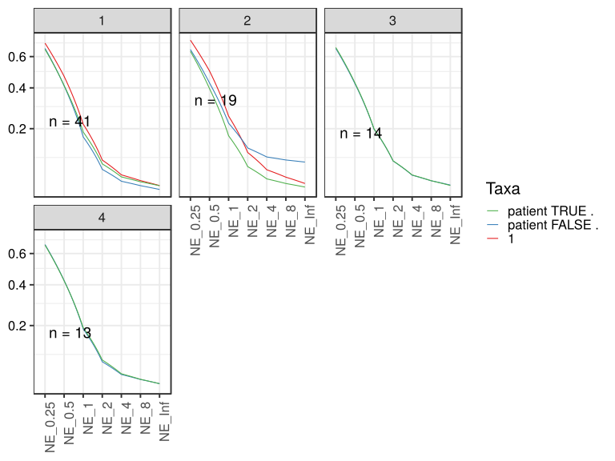

\(1.1.1.4.2.1.3.2.4.2.1.1.1\) [`Figure 181.`](#figure.181) Abundance-based evenness indices (Hill numbers / Observed 'species') With rarefication. Data grouped by Sample.type.Drug.Before,visit.  line_obs plot.  Image file: [`plots/323423f06a.svg`](plots/323423f06a.svg).
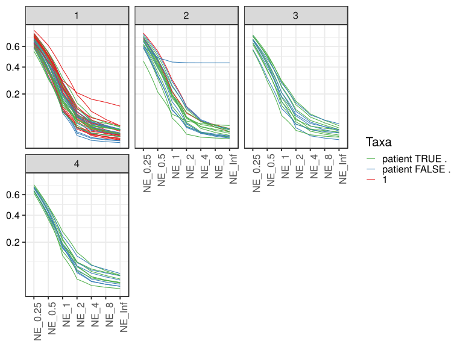

##### \(1.1.1.4.2.1.3.2.4.2.1.2\) Abundance-based evenness indices (Hill numbers / Observed 'species') With rarefication. Plot is in flipped orientation, Y axis not scaled. Iterating over plot geometry

\(1.1.1.4.2.1.3.2.4.2.1.2.1\) [`Figure 182.`](#figure.182) Abundance-based evenness indices (Hill numbers / Observed 'species') With rarefication. Data grouped by Sample.type.Drug.Before,visit.  line plot.  Image file: [`plots/3237ee286ac.svg`](plots/3237ee286ac.svg).
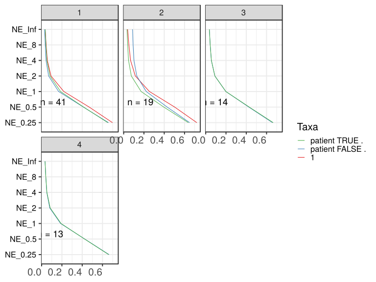

\(1.1.1.4.2.1.3.2.4.2.1.2.1\) [`Figure 183.`](#figure.183) Abundance-based evenness indices (Hill numbers / Observed 'species') With rarefication. Data grouped by Sample.type.Drug.Before,visit.  line_obs plot.  Image file: [`plots/32351df3c68.svg`](plots/32351df3c68.svg).
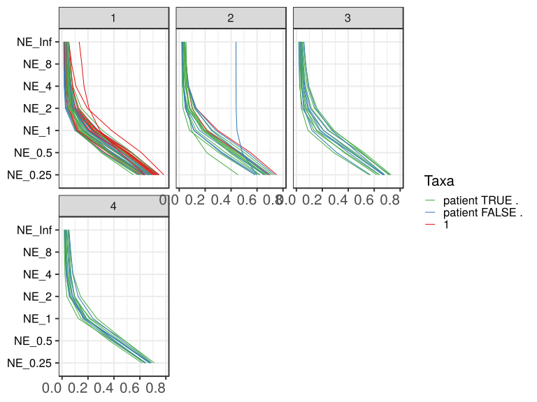

##### \(1.1.1.4.2.1.3.2.5\) Grouping variables Drug.Before.Diet,Sample.type.1

##### \(1.1.1.4.2.1.3.2.6\) Iterating over Abundance-based evenness indices (Hill numbers / Observed 'species') With rarefication. profile sorting order

##### \(1.1.1.4.2.1.3.2.6.1\) Abundance-based evenness indices (Hill numbers / Observed 'species') With rarefication. profile sorting order: original

##### \(1.1.1.4.2.1.3.2.6.2\) Iterating over dodged vs faceted bars

The same data are shown in multiple combinations of graphical representations. 
                         This is the same data, but each plot highlights slightly different aspects of it.
                         It is not likely that you will need every plot - pick only what you need.

##### \(1.1.1.4.2.1.3.2.6.2.1\) dodged plots. Iterating over orientation and, optionally, scaling

##### \(1.1.1.4.2.1.3.2.6.2.1.1\) Abundance-based evenness indices (Hill numbers / Observed 'species') With rarefication. Plot is in original orientation, Y axis SQRT scaled. Iterating over plot geometry

\(1.1.1.4.2.1.3.2.6.2.1.1.0\) [`Table 54.`](#table.54) Data table used for plots. Data grouped by Drug.Before.Diet,Sample.type.1. Showing only 200 first rows. Full dataset is also saved in a delimited text file (click to download and open e.g. in Excel) [`data/1.1.1.4.2.1.3.2.6.2.1.1.0-3234a7fb516.1.1.1.4.2.1.3.2.6.2.csv`](data/1.1.1.4.2.1.3.2.6.2.1.1.0-3234a7fb516.1.1.1.4.2.1.3.2.6.2.csv)

| .record.id | Drug.Before.Diet | Sample.type.1       | feature  | index   |
|:-----------|:-----------------|:--------------------|:---------|:--------|
| SM1        | DrugBefore\_YES  | patient.before.diet | NE\_0.25 | 0.67485 |
| SM10       | DrugBefore\_YES  | patient.after.diet  | NE\_0.25 | 0.72978 |
| SM100      | DrugBefore\_YES  | patient.after.diet  | NE\_0.25 | 0.64755 |
| SM11       | DrugBefore\_YES  | patient.after.diet  | NE\_0.25 | 0.66863 |
| SM12       | DrugBefore\_YES  | patient.before.diet | NE\_0.25 | 0.66947 |
| SM13       | DrugBefore\_NO   | patient.before.diet | NE\_0.25 | 0.66540 |
| SM14       | DrugBefore\_NO   | patient.before.diet | NE\_0.25 | 0.65872 |
| SM15       | DrugBefore\_YES  | control             | NE\_0.25 | 0.70834 |
| SM16       | DrugBefore\_NO   | patient.after.diet  | NE\_0.25 | 0.67265 |
| SM17       | DrugBefore\_YES  | patient.before.diet | NE\_0.25 | 0.64231 |
| SM18       | DrugBefore\_NO   | patient.after.diet  | NE\_0.25 | 0.60163 |
| SM19       | DrugBefore\_NO   | patient.after.diet  | NE\_0.25 | 0.70131 |
| SM2        | DrugBefore\_NO   | patient.before.diet | NE\_0.25 | 0.59252 |
| SM20       | DrugBefore\_NO   | control             | NE\_0.25 | 0.62937 |
| SM21       | DrugBefore\_NO   | patient.before.diet | NE\_0.25 | 0.74389 |
| SM22       | DrugBefore\_YES  | patient.before.diet | NE\_0.25 | 0.72962 |
| SM23       | DrugBefore\_YES  | patient.after.diet  | NE\_0.25 | 0.45362 |
| SM24       | DrugBefore\_NO   | patient.before.diet | NE\_0.25 | 0.63669 |
| SM25       | DrugBefore\_NO   | patient.after.diet  | NE\_0.25 | 0.67846 |
| SM26       | DrugBefore\_NO   | control             | NE\_0.25 | 0.71319 |
| SM28       | DrugBefore\_NO   | control             | NE\_0.25 | 0.73588 |
| SM29       | DrugBefore\_YES  | patient.after.diet  | NE\_0.25 | 0.56150 |
| SM3        | DrugBefore\_YES  | patient.after.diet  | NE\_0.25 | 0.71862 |
| SM30       | DrugBefore\_YES  | patient.after.diet  | NE\_0.25 | 0.67762 |
| SM31       | DrugBefore\_NO   | control             | NE\_0.25 | 0.69069 |
| SM33       | DrugBefore\_YES  | patient.before.diet | NE\_0.25 | 0.54983 |
| SM35       | DrugBefore\_NO   | control             | NE\_0.25 | 0.69686 |
| SM36       | DrugBefore\_NO   | patient.after.diet  | NE\_0.25 | 0.64068 |
| SM37       | DrugBefore\_NO   | control             | NE\_0.25 | 0.78487 |
| SM38       | DrugBefore\_YES  | patient.after.diet  | NE\_0.25 | 0.62344 |
| SM39       | DrugBefore\_NO   | patient.before.diet | NE\_0.25 | 0.68799 |
| SM40       | DrugBefore\_NO   | patient.after.diet  | NE\_0.25 | 0.68568 |
| SM41       | DrugBefore\_YES  | patient.before.diet | NE\_0.25 | 0.71326 |
| SM42       | DrugBefore\_NO   | patient.after.diet  | NE\_0.25 | 0.67437 |
| SM43       | DrugBefore\_YES  | patient.after.diet  | NE\_0.25 | 0.71089 |
| SM44       | DrugBefore\_NO   | control             | NE\_0.25 | 0.69967 |
| SM45       | DrugBefore\_NO   | patient.after.diet  | NE\_0.25 | 0.59746 |
| SM48       | DrugBefore\_NO   | control             | NE\_0.25 | 0.74430 |
| SM49       | DrugBefore\_YES  | patient.before.diet | NE\_0.25 | 0.62078 |
| SM5        | DrugBefore\_YES  | patient.after.diet  | NE\_0.25 | 0.66854 |
| SM50       | DrugBefore\_NO   | patient.after.diet  | NE\_0.25 | 0.67917 |
| SM51       | DrugBefore\_YES  | patient.after.diet  | NE\_0.25 | 0.64362 |
| SM52       | DrugBefore\_NO   | patient.before.diet | NE\_0.25 | 0.68175 |
| SM53       | DrugBefore\_YES  | patient.after.diet  | NE\_0.25 | 0.66285 |
| SM54       | DrugBefore\_YES  | patient.after.diet  | NE\_0.25 | 0.63793 |
| SM55       | DrugBefore\_NO   | control             | NE\_0.25 | 0.67234 |
| SM56       | DrugBefore\_YES  | patient.after.diet  | NE\_0.25 | 0.58534 |
| SM57       | DrugBefore\_YES  | patient.before.diet | NE\_0.25 | 0.58206 |
| SM58       | DrugBefore\_NO   | patient.after.diet  | NE\_0.25 | 0.58446 |
| SM59       | DrugBefore\_NO   | patient.after.diet  | NE\_0.25 | 0.71916 |
| SM60       | DrugBefore\_YES  | patient.after.diet  | NE\_0.25 | 0.61880 |
| SM62       | DrugBefore\_YES  | patient.before.diet | NE\_0.25 | 0.59271 |
| SM63       | DrugBefore\_NO   | control             | NE\_0.25 | 0.72452 |
| SM64       | DrugBefore\_YES  | patient.after.diet  | NE\_0.25 | 0.61742 |
| SM65       | DrugBefore\_YES  | patient.after.diet  | NE\_0.25 | 0.71191 |
| SM66       | DrugBefore\_NO   | control             | NE\_0.25 | 0.72764 |
| SM67       | DrugBefore\_YES  | patient.after.diet  | NE\_0.25 | 0.63568 |
| SM68       | DrugBefore\_NO   | patient.after.diet  | NE\_0.25 | 0.63684 |
| SM69       | DrugBefore\_YES  | patient.after.diet  | NE\_0.25 | 0.69324 |
| SM7        | DrugBefore\_NO   | control             | NE\_0.25 | 0.71540 |
| SM70       | DrugBefore\_NO   | control             | NE\_0.25 | 0.74967 |
| SM71       | DrugBefore\_YES  | patient.after.diet  | NE\_0.25 | 0.68072 |
| SM72       | DrugBefore\_NO   | control             | NE\_0.25 | 0.60543 |
| SM73       | DrugBefore\_NO   | patient.before.diet | NE\_0.25 | 0.62544 |
| SM74       | DrugBefore\_NO   | control             | NE\_0.25 | 0.75103 |
| SM75       | DrugBefore\_NO   | patient.after.diet  | NE\_0.25 | 0.66718 |
| SM76       | DrugBefore\_NO   | control             | NE\_0.25 | 0.64440 |
| SM77       | DrugBefore\_YES  | patient.after.diet  | NE\_0.25 | 0.70220 |
| SM79       | DrugBefore\_NO   | patient.after.diet  | NE\_0.25 | 0.65361 |
| SM8        | DrugBefore\_NO   | patient.before.diet | NE\_0.25 | 0.66042 |
| SM81       | DrugBefore\_NO   | control             | NE\_0.25 | 0.64095 |
| SM82       | DrugBefore\_YES  | patient.after.diet  | NE\_0.25 | 0.61592 |
| SM83       | DrugBefore\_YES  | patient.before.diet | NE\_0.25 | 0.61333 |
| SM84       | DrugBefore\_YES  | patient.before.diet | NE\_0.25 | 0.73675 |
| SM86       | DrugBefore\_YES  | patient.after.diet  | NE\_0.25 | 0.68563 |
| SM87       | DrugBefore\_YES  | patient.before.diet | NE\_0.25 | 0.68920 |
| SM88       | DrugBefore\_YES  | patient.after.diet  | NE\_0.25 | 0.65715 |
| SM89       | DrugBefore\_NO   | control             | NE\_0.25 | 0.63428 |
| SM9        | DrugBefore\_NO   | patient.after.diet  | NE\_0.25 | 0.67941 |
| SM90       | DrugBefore\_NO   | patient.after.diet  | NE\_0.25 | 0.73500 |
| SM91       | DrugBefore\_YES  | patient.after.diet  | NE\_0.25 | 0.71492 |
| SM92       | DrugBefore\_NO   | patient.after.diet  | NE\_0.25 | 0.56869 |
| SM93       | DrugBefore\_YES  | patient.before.diet | NE\_0.25 | 0.66518 |
| SM95       | DrugBefore\_NO   | control             | NE\_0.25 | 0.74346 |
| SM96       | DrugBefore\_NO   | patient.before.diet | NE\_0.25 | 0.63825 |
| SM98       | DrugBefore\_NO   | patient.after.diet  | NE\_0.25 | 0.64165 |
| SM99       | DrugBefore\_NO   | patient.after.diet  | NE\_0.25 | 0.67389 |
| SM1        | DrugBefore\_YES  | patient.before.diet | NE\_0.5  | 0.43508 |
| SM10       | DrugBefore\_YES  | patient.after.diet  | NE\_0.5  | 0.52184 |
| SM100      | DrugBefore\_YES  | patient.after.diet  | NE\_0.5  | 0.38464 |
| SM11       | DrugBefore\_YES  | patient.after.diet  | NE\_0.5  | 0.43291 |
| SM12       | DrugBefore\_YES  | patient.before.diet | NE\_0.5  | 0.42972 |
| SM13       | DrugBefore\_NO   | patient.before.diet | NE\_0.5  | 0.41905 |
| SM14       | DrugBefore\_NO   | patient.before.diet | NE\_0.5  | 0.39153 |
| SM15       | DrugBefore\_YES  | control             | NE\_0.5  | 0.47908 |
| SM16       | DrugBefore\_NO   | patient.after.diet  | NE\_0.5  | 0.43315 |
| SM17       | DrugBefore\_YES  | patient.before.diet | NE\_0.5  | 0.38804 |
| SM18       | DrugBefore\_NO   | patient.after.diet  | NE\_0.5  | 0.33171 |
| SM19       | DrugBefore\_NO   | patient.after.diet  | NE\_0.5  | 0.46891 |
| SM2        | DrugBefore\_NO   | patient.before.diet | NE\_0.5  | 0.32072 |
| SM20       | DrugBefore\_NO   | control             | NE\_0.5  | 0.35473 |
| SM21       | DrugBefore\_NO   | patient.before.diet | NE\_0.5  | 0.53626 |
| SM22       | DrugBefore\_YES  | patient.before.diet | NE\_0.5  | 0.51248 |
| SM23       | DrugBefore\_YES  | patient.after.diet  | NE\_0.5  | 0.21214 |
| SM24       | DrugBefore\_NO   | patient.before.diet | NE\_0.5  | 0.36201 |
| SM25       | DrugBefore\_NO   | patient.after.diet  | NE\_0.5  | 0.43385 |
| SM26       | DrugBefore\_NO   | control             | NE\_0.5  | 0.49286 |
| SM28       | DrugBefore\_NO   | control             | NE\_0.5  | 0.51454 |
| SM29       | DrugBefore\_YES  | patient.after.diet  | NE\_0.5  | 0.28755 |
| SM3        | DrugBefore\_YES  | patient.after.diet  | NE\_0.5  | 0.50240 |
| SM30       | DrugBefore\_YES  | patient.after.diet  | NE\_0.5  | 0.44520 |
| SM31       | DrugBefore\_NO   | control             | NE\_0.5  | 0.45641 |
| SM33       | DrugBefore\_YES  | patient.before.diet | NE\_0.5  | 0.30154 |
| SM35       | DrugBefore\_NO   | control             | NE\_0.5  | 0.46198 |
| SM36       | DrugBefore\_NO   | patient.after.diet  | NE\_0.5  | 0.40514 |
| SM37       | DrugBefore\_NO   | control             | NE\_0.5  | 0.61145 |
| SM38       | DrugBefore\_YES  | patient.after.diet  | NE\_0.5  | 0.39069 |
| SM39       | DrugBefore\_NO   | patient.before.diet | NE\_0.5  | 0.46214 |
| SM40       | DrugBefore\_NO   | patient.after.diet  | NE\_0.5  | 0.46377 |
| SM41       | DrugBefore\_YES  | patient.before.diet | NE\_0.5  | 0.48979 |
| SM42       | DrugBefore\_NO   | patient.after.diet  | NE\_0.5  | 0.42899 |
| SM43       | DrugBefore\_YES  | patient.after.diet  | NE\_0.5  | 0.48431 |
| SM44       | DrugBefore\_NO   | control             | NE\_0.5  | 0.46451 |
| SM45       | DrugBefore\_NO   | patient.after.diet  | NE\_0.5  | 0.48596 |
| SM48       | DrugBefore\_NO   | control             | NE\_0.5  | 0.53543 |
| SM49       | DrugBefore\_YES  | patient.before.diet | NE\_0.5  | 0.37025 |
| SM5        | DrugBefore\_YES  | patient.after.diet  | NE\_0.5  | 0.42745 |
| SM50       | DrugBefore\_NO   | patient.after.diet  | NE\_0.5  | 0.47435 |
| SM51       | DrugBefore\_YES  | patient.after.diet  | NE\_0.5  | 0.40600 |
| SM52       | DrugBefore\_NO   | patient.before.diet | NE\_0.5  | 0.44352 |
| SM53       | DrugBefore\_YES  | patient.after.diet  | NE\_0.5  | 0.42424 |
| SM54       | DrugBefore\_YES  | patient.after.diet  | NE\_0.5  | 0.37769 |
| SM55       | DrugBefore\_NO   | control             | NE\_0.5  | 0.41890 |
| SM56       | DrugBefore\_YES  | patient.after.diet  | NE\_0.5  | 0.30531 |
| SM57       | DrugBefore\_YES  | patient.before.diet | NE\_0.5  | 0.30956 |
| SM58       | DrugBefore\_NO   | patient.after.diet  | NE\_0.5  | 0.32267 |
| SM59       | DrugBefore\_NO   | patient.after.diet  | NE\_0.5  | 0.49904 |
| SM60       | DrugBefore\_YES  | patient.after.diet  | NE\_0.5  | 0.36882 |
| SM62       | DrugBefore\_YES  | patient.before.diet | NE\_0.5  | 0.35328 |
| SM63       | DrugBefore\_NO   | control             | NE\_0.5  | 0.50324 |
| SM64       | DrugBefore\_YES  | patient.after.diet  | NE\_0.5  | 0.35724 |
| SM65       | DrugBefore\_YES  | patient.after.diet  | NE\_0.5  | 0.50692 |
| SM66       | DrugBefore\_NO   | control             | NE\_0.5  | 0.50727 |
| SM67       | DrugBefore\_YES  | patient.after.diet  | NE\_0.5  | 0.39571 |
| SM68       | DrugBefore\_NO   | patient.after.diet  | NE\_0.5  | 0.38618 |
| SM69       | DrugBefore\_YES  | patient.after.diet  | NE\_0.5  | 0.48309 |
| SM7        | DrugBefore\_NO   | control             | NE\_0.5  | 0.50174 |
| SM70       | DrugBefore\_NO   | control             | NE\_0.5  | 0.53513 |
| SM71       | DrugBefore\_YES  | patient.after.diet  | NE\_0.5  | 0.45193 |
| SM72       | DrugBefore\_NO   | control             | NE\_0.5  | 0.32959 |
| SM73       | DrugBefore\_NO   | patient.before.diet | NE\_0.5  | 0.38385 |
| SM74       | DrugBefore\_NO   | control             | NE\_0.5  | 0.54983 |
| SM75       | DrugBefore\_NO   | patient.after.diet  | NE\_0.5  | 0.43783 |
| SM76       | DrugBefore\_NO   | control             | NE\_0.5  | 0.37580 |
| SM77       | DrugBefore\_YES  | patient.after.diet  | NE\_0.5  | 0.47446 |
| SM79       | DrugBefore\_NO   | patient.after.diet  | NE\_0.5  | 0.40066 |
| SM8        | DrugBefore\_NO   | patient.before.diet | NE\_0.5  | 0.42740 |
| SM81       | DrugBefore\_NO   | control             | NE\_0.5  | 0.44813 |
| SM82       | DrugBefore\_YES  | patient.after.diet  | NE\_0.5  | 0.36495 |
| SM83       | DrugBefore\_YES  | patient.before.diet | NE\_0.5  | 0.35451 |
| SM84       | DrugBefore\_YES  | patient.before.diet | NE\_0.5  | 0.54100 |
| SM86       | DrugBefore\_YES  | patient.after.diet  | NE\_0.5  | 0.44768 |
| SM87       | DrugBefore\_YES  | patient.before.diet | NE\_0.5  | 0.47507 |
| SM88       | DrugBefore\_YES  | patient.after.diet  | NE\_0.5  | 0.41100 |
| SM89       | DrugBefore\_NO   | control             | NE\_0.5  | 0.37187 |
| SM9        | DrugBefore\_NO   | patient.after.diet  | NE\_0.5  | 0.46345 |
| SM90       | DrugBefore\_NO   | patient.after.diet  | NE\_0.5  | 0.52869 |
| SM91       | DrugBefore\_YES  | patient.after.diet  | NE\_0.5  | 0.49582 |
| SM92       | DrugBefore\_NO   | patient.after.diet  | NE\_0.5  | 0.31152 |
| SM93       | DrugBefore\_YES  | patient.before.diet | NE\_0.5  | 0.41869 |
| SM95       | DrugBefore\_NO   | control             | NE\_0.5  | 0.53590 |
| SM96       | DrugBefore\_NO   | patient.before.diet | NE\_0.5  | 0.36897 |
| SM98       | DrugBefore\_NO   | patient.after.diet  | NE\_0.5  | 0.40147 |
| SM99       | DrugBefore\_NO   | patient.after.diet  | NE\_0.5  | 0.42524 |
| SM1        | DrugBefore\_YES  | patient.before.diet | NE\_1    | 0.19115 |
| SM10       | DrugBefore\_YES  | patient.after.diet  | NE\_1    | 0.28284 |
| SM100      | DrugBefore\_YES  | patient.after.diet  | NE\_1    | 0.12535 |
| SM11       | DrugBefore\_YES  | patient.after.diet  | NE\_1    | 0.19685 |
| SM12       | DrugBefore\_YES  | patient.before.diet | NE\_1    | 0.18590 |
| SM13       | DrugBefore\_NO   | patient.before.diet | NE\_1    | 0.16629 |
| SM14       | DrugBefore\_NO   | patient.before.diet | NE\_1    | 0.11932 |
| SM15       | DrugBefore\_YES  | control             | NE\_1    | 0.21433 |
| SM16       | DrugBefore\_NO   | patient.after.diet  | NE\_1    | 0.18310 |
| SM17       | DrugBefore\_YES  | patient.before.diet | NE\_1    | 0.15062 |
| SM18       | DrugBefore\_NO   | patient.after.diet  | NE\_1    | 0.11274 |
| SM19       | DrugBefore\_NO   | patient.after.diet  | NE\_1    | 0.19845 |
| SM2        | DrugBefore\_NO   | patient.before.diet | NE\_1    | 0.10597 |
| SM20       | DrugBefore\_NO   | control             | NE\_1    | 0.11248 |
| SM21       | DrugBefore\_NO   | patient.before.diet | NE\_1    | 0.27953 |
| SM22       | DrugBefore\_YES  | patient.before.diet | NE\_1    | 0.24607 |
| SM23       | DrugBefore\_YES  | patient.after.diet  | NE\_1    | 0.09505 |
| SM24       | DrugBefore\_NO   | patient.before.diet | NE\_1    | 0.09929 |
| SM25       | DrugBefore\_NO   | patient.after.diet  | NE\_1    | 0.17112 |
| SM26       | DrugBefore\_NO   | control             | NE\_1    | 0.24690 |
| SM28       | DrugBefore\_NO   | control             | NE\_1    | 0.23328 |
| SM29       | DrugBefore\_YES  | patient.after.diet  | NE\_1    | 0.08980 |
| SM3        | DrugBefore\_YES  | patient.after.diet  | NE\_1    | 0.25646 |
| SM30       | DrugBefore\_YES  | patient.after.diet  | NE\_1    | 0.21050 |
| SM31       | DrugBefore\_NO   | control             | NE\_1    | 0.21116 |
| SM33       | DrugBefore\_YES  | patient.before.diet | NE\_1    | 0.13129 |

\(1.1.1.4.2.1.3.2.6.2.1.1.1\) [`Widget 57.`](#widget.57) Dynamic Pivot Table link (drag and drop field names and pick averaging 
                      functions or plot types; click on fields or legend elements to filter values). 
                      Starting rendering is Stacked Bar Chart. Data grouped by Drug.Before.Diet,Sample.type.1. Click to see HTML widget file in full window: [`./1.1.1.4.2.1.3.2.6.2.1.1.1-323209b265aDynamic.Pivot.Table.html`](./1.1.1.4.2.1.3.2.6.2.1.1.1-323209b265aDynamic.Pivot.Table.html)

\(1.1.1.4.2.1.3.2.6.2.1.1.1\) [`Widget 58.`](#widget.58) Dynamic Pivot Table link (drag and drop field names and pick averaging 
                      functions or plot types; click on fields or legend elements to filter values). 
                      Starting rendering is Table Barchart. Data grouped by Drug.Before.Diet,Sample.type.1. Click to see HTML widget file in full window: [`./1.1.1.4.2.1.3.2.6.2.1.1.1-3235ad5839cDynamic.Pivot.Table.html`](./1.1.1.4.2.1.3.2.6.2.1.1.1-3235ad5839cDynamic.Pivot.Table.html)

\(1.1.1.4.2.1.3.2.6.2.1.1.1\) [`Table 55.`](#table.55) Summary table. Data grouped by Drug.Before.Diet,Sample.type.1. Full dataset is also saved in a delimited text file (click to download and open e.g. in Excel) [`data/1.1.1.4.2.1.3.2.6.2.1.1.1-323601e757a.1.1.1.4.2.1.3.2.6.2.csv`](data/1.1.1.4.2.1.3.2.6.2.1.1.1-323601e757a.1.1.1.4.2.1.3.2.6.2.csv)

| feature  | Drug.Before.Diet | Sample.type.1       | mean    | sd       | median  | incidence |
|:---------|:-----------------|:--------------------|:--------|:---------|:--------|:----------|
| NE\_0.25 | DrugBefore\_NO   | control             | 0.70021 | 0.049933 | 0.71319 | 1         |
| NE\_0.25 | DrugBefore\_NO   | patient.after.diet  | 0.65744 | 0.044542 | 0.67265 | 1         |
| NE\_0.25 | DrugBefore\_NO   | patient.before.diet | 0.65911 | 0.040933 | 0.65957 | 1         |
| NE\_0.25 | DrugBefore\_YES  | control             | 0.70834 | NA       | 0.70834 | 1         |
| NE\_0.25 | DrugBefore\_YES  | patient.after.diet  | 0.65294 | 0.059849 | 0.66285 | 1         |
| NE\_0.25 | DrugBefore\_YES  | patient.before.diet | 0.65226 | 0.058278 | 0.66518 | 1         |
| NE\_0.5  | DrugBefore\_NO   | control             | 0.47207 | 0.074553 | 0.49286 | 1         |
| NE\_0.5  | DrugBefore\_NO   | patient.after.diet  | 0.42645 | 0.059009 | 0.43315 | 1         |
| NE\_0.5  | DrugBefore\_NO   | patient.before.diet | 0.41155 | 0.060669 | 0.40529 | 1         |
| NE\_0.5  | DrugBefore\_YES  | control             | 0.47908 | NA       | 0.47908 | 1         |
| NE\_0.5  | DrugBefore\_YES  | patient.after.diet  | 0.41440 | 0.074072 | 0.42424 | 1         |
| NE\_0.5  | DrugBefore\_YES  | patient.before.diet | 0.41377 | 0.076039 | 0.41869 | 1         |
| NE\_1    | DrugBefore\_NO   | control             | 0.22283 | 0.072202 | 0.23952 | 1         |
| NE\_1    | DrugBefore\_NO   | patient.after.diet  | 0.20377 | 0.076866 | 0.18529 | 1         |
| NE\_1    | DrugBefore\_NO   | patient.before.diet | 0.16796 | 0.059885 | 0.17015 | 1         |
| NE\_1    | DrugBefore\_YES  | control             | 0.21433 | NA       | 0.21433 | 1         |
| NE\_1    | DrugBefore\_YES  | patient.after.diet  | 0.18610 | 0.057927 | 0.18614 | 1         |
| NE\_1    | DrugBefore\_YES  | patient.before.diet | 0.18656 | 0.058236 | 0.16546 | 1         |
| NE\_2    | DrugBefore\_NO   | control             | 0.09597 | 0.046808 | 0.09216 | 1         |
| NE\_2    | DrugBefore\_NO   | patient.after.diet  | 0.10141 | 0.087649 | 0.08046 | 1         |
| NE\_2    | DrugBefore\_NO   | patient.before.diet | 0.06871 | 0.033656 | 0.07177 | 1         |
| NE\_2    | DrugBefore\_YES  | control             | 0.07638 | NA       | 0.07638 | 1         |
| NE\_2    | DrugBefore\_YES  | patient.after.diet  | 0.08288 | 0.032648 | 0.07760 | 1         |
| NE\_2    | DrugBefore\_YES  | patient.before.diet | 0.08249 | 0.027342 | 0.07405 | 1         |
| NE\_4    | DrugBefore\_NO   | control             | 0.05832 | 0.034253 | 0.04928 | 1         |
| NE\_4    | DrugBefore\_NO   | patient.after.diet  | 0.07099 | 0.091136 | 0.05199 | 1         |
| NE\_4    | DrugBefore\_NO   | patient.before.diet | 0.04342 | 0.020359 | 0.04387 | 1         |
| NE\_4    | DrugBefore\_YES  | control             | 0.04220 | NA       | 0.04220 | 1         |
| NE\_4    | DrugBefore\_YES  | patient.after.diet  | 0.05177 | 0.019343 | 0.04909 | 1         |
| NE\_4    | DrugBefore\_YES  | patient.before.diet | 0.05204 | 0.014779 | 0.05095 | 1         |
| NE\_8    | DrugBefore\_NO   | control             | 0.04596 | 0.029689 | 0.03676 | 1         |
| NE\_8    | DrugBefore\_NO   | patient.after.diet  | 0.06120 | 0.092513 | 0.04011 | 1         |
| NE\_8    | DrugBefore\_NO   | patient.before.diet | 0.03549 | 0.015667 | 0.03615 | 1         |
| NE\_8    | DrugBefore\_YES  | control             | 0.03325 | NA       | 0.03325 | 1         |
| NE\_8    | DrugBefore\_YES  | patient.after.diet  | 0.04147 | 0.014060 | 0.03854 | 1         |
| NE\_8    | DrugBefore\_YES  | patient.before.diet | 0.04247 | 0.011588 | 0.04524 | 1         |
| NE\_Inf  | DrugBefore\_NO   | control             | 0.03651 | 0.025404 | 0.02962 | 1         |
| NE\_Inf  | DrugBefore\_NO   | patient.after.diet  | 0.05431 | 0.093623 | 0.03270 | 1         |
| NE\_Inf  | DrugBefore\_NO   | patient.before.diet | 0.02927 | 0.011687 | 0.03060 | 1         |
| NE\_Inf  | DrugBefore\_YES  | control             | 0.02657 | NA       | 0.02657 | 1         |
| NE\_Inf  | DrugBefore\_YES  | patient.after.diet  | 0.03412 | 0.010591 | 0.03420 | 1         |
| NE\_Inf  | DrugBefore\_YES  | patient.before.diet | 0.03536 | 0.009416 | 0.03879 | 1         |

\(1.1.1.4.2.1.3.2.6.2.1.1.1\) [`Figure 184.`](#figure.184) Abundance-based evenness indices (Hill numbers / Observed 'species') With rarefication. Data grouped by Drug.Before.Diet,Sample.type.1.  line plot.  Image file: [`plots/323750edb3e.svg`](plots/323750edb3e.svg).
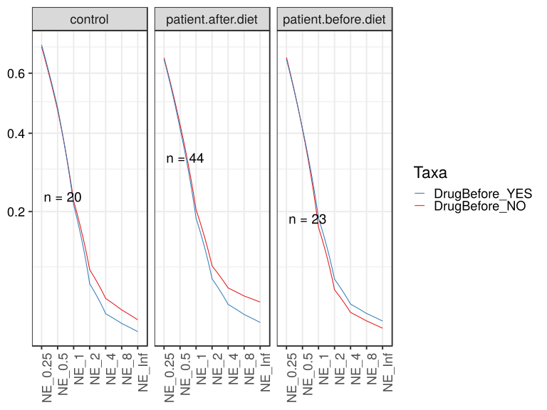

\(1.1.1.4.2.1.3.2.6.2.1.1.1\) [`Figure 185.`](#figure.185) Abundance-based evenness indices (Hill numbers / Observed 'species') With rarefication. Data grouped by Drug.Before.Diet,Sample.type.1.  line_obs plot.  Image file: [`plots/323af9785f.svg`](plots/323af9785f.svg).
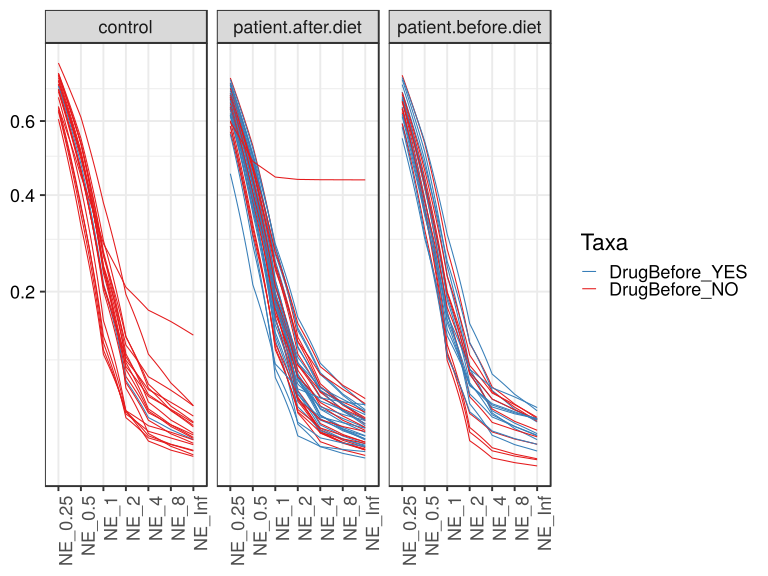

##### \(1.1.1.4.2.1.3.2.6.2.1.2\) Abundance-based evenness indices (Hill numbers / Observed 'species') With rarefication. Plot is in flipped orientation, Y axis not scaled. Iterating over plot geometry

\(1.1.1.4.2.1.3.2.6.2.1.2.1\) [`Figure 186.`](#figure.186) Abundance-based evenness indices (Hill numbers / Observed 'species') With rarefication. Data grouped by Drug.Before.Diet,Sample.type.1.  line plot.  Image file: [`plots/32313f5adbf.svg`](plots/32313f5adbf.svg).
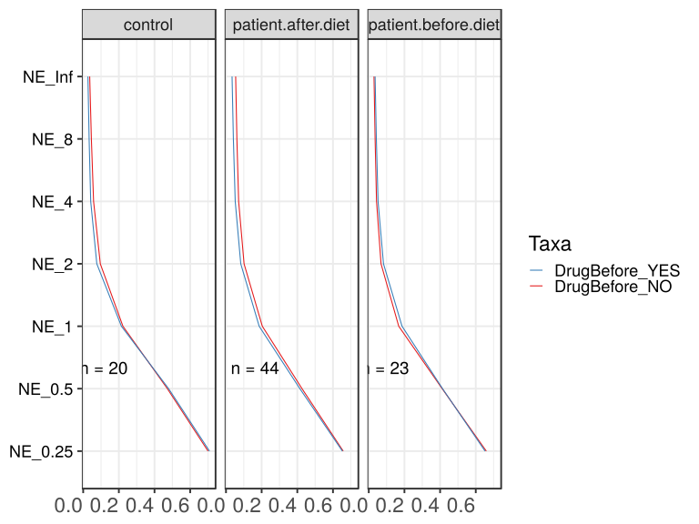

\(1.1.1.4.2.1.3.2.6.2.1.2.1\) [`Figure 187.`](#figure.187) Abundance-based evenness indices (Hill numbers / Observed 'species') With rarefication. Data grouped by Drug.Before.Diet,Sample.type.1.  line_obs plot.  Image file: [`plots/3234d141972.svg`](plots/3234d141972.svg).
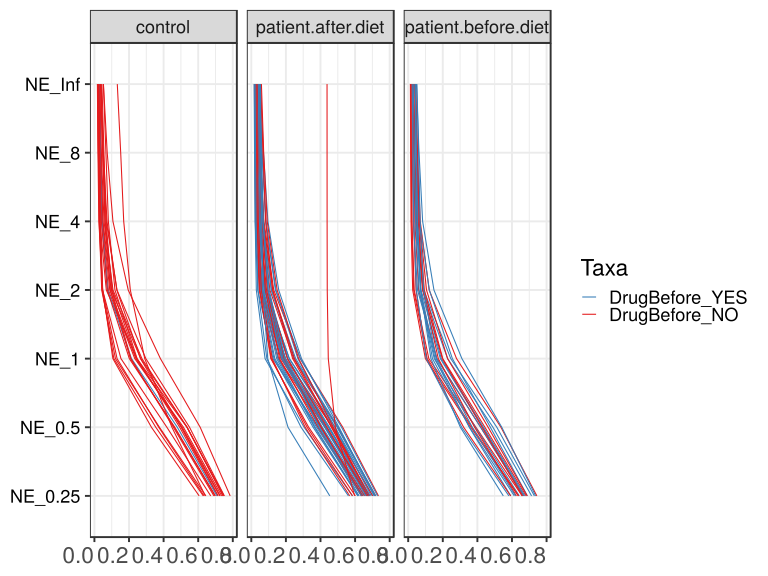