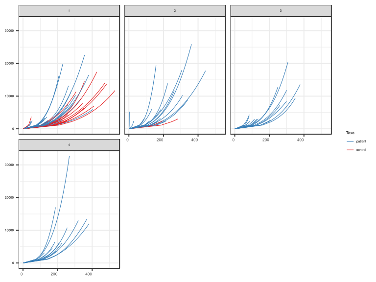
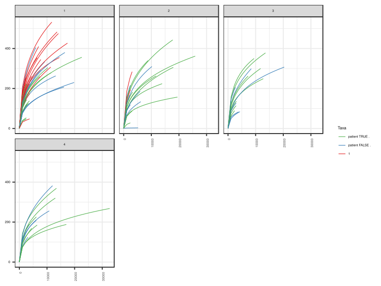
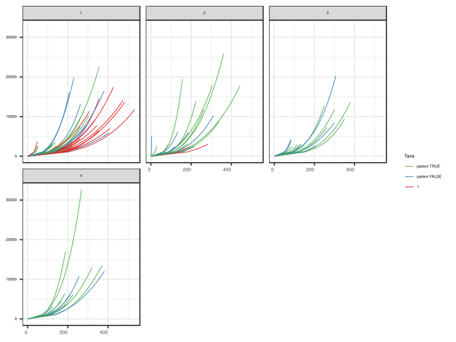
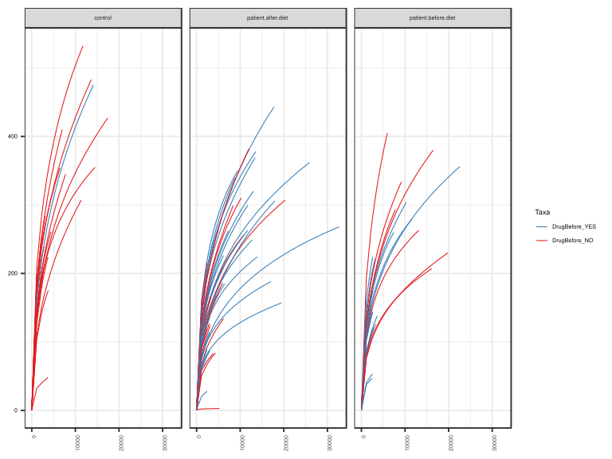
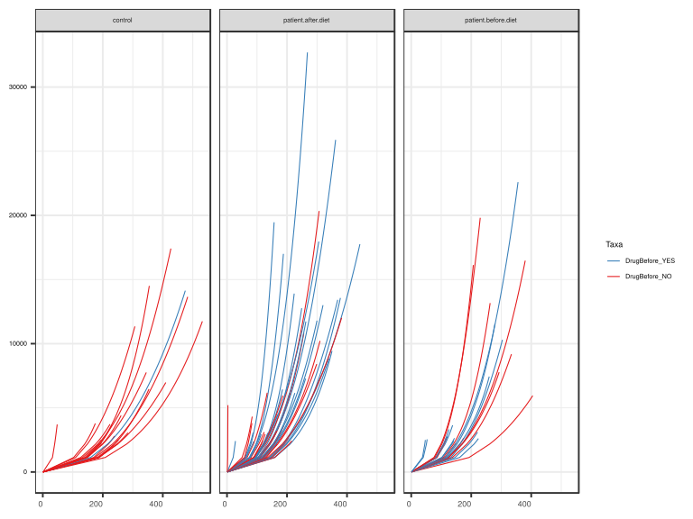

noone@mail.com
Analysis of Dieting study 16S data
% Fri Sep  7 05:46:18 2018

##### \(1.1.1.4.2.1.3.1\) Plots of Abundance-based rarefaction curves.

Plots are shown with relation to various combinations of meta 
                   data variables and in different graphical representations. Lots of plots here.

##### \(1.1.1.4.2.1.3.1.2\) Iterating over all combinations of grouping variables

##### \(1.1.1.4.2.1.3.1.2.1\) Grouping variables Sample.type,visit

##### \(1.1.1.4.2.1.3.1.2.2\) Iterating over Abundance-based rarefaction curves. profile sorting order

##### \(1.1.1.4.2.1.3.1.2.2.1\) Abundance-based rarefaction curves. profile sorting order: original

##### \(1.1.1.4.2.1.3.1.2.2.2\) Iterating over dodged vs faceted bars

The same data are shown in multiple combinations of graphical representations. 
                         This is the same data, but each plot highlights slightly different aspects of it.
                         It is not likely that you will need every plot - pick only what you need.

##### \(1.1.1.4.2.1.3.1.2.2.2.1\) dodged plots. Iterating over orientation and, optionally, scaling

##### \(1.1.1.4.2.1.3.1.2.2.2.1.1\) Abundance-based rarefaction curves. Plot is in original orientation. Iterating over plot geometry

\(1.1.1.4.2.1.3.1.2.2.2.1.1.0\) [`Table 56.`](#table.56) Data table used for plots. Data grouped by Sample.type,visit. Showing only 200 first rows. Full dataset is also saved in a delimited text file (click to download and open e.g. in Excel) [`data/1.1.1.4.2.1.3.1.2.2.2.1.1.0-3234898e539.1.1.1.4.2.1.3.1.2.2.csv`](data/1.1.1.4.2.1.3.1.2.2.2.1.1.0-3234898e539.1.1.1.4.2.1.3.1.2.2.csv)

| .record.id | Sample.type | visit | feature          | Richness |
|:-----------|:------------|:------|:-----------------|:---------|
| SM1        | patient     | 1     | 1                | 1.000    |
| SM10       | patient     | 3     | 1                | 1.000    |
| SM100      | patient     | 4     | 1                | 1.000    |
| SM11       | patient     | 2     | 1                | 1.000    |
| SM12       | patient     | 1     | 1                | 1.000    |
| SM13       | patient     | 1     | 1                | 1.000    |
| SM14       | patient     | 1     | 1                | 1.000    |
| SM15       | control     | 1     | 1                | 1.000    |
| SM16       | patient     | 4     | 1                | 1.000    |
| SM17       | patient     | 1     | 1                | 1.000    |
| SM18       | patient     | 2     | 1                | 1.000    |
| SM19       | patient     | 2     | 1                | 1.000    |
| SM2        | patient     | 1     | 1                | 1.000    |
| SM20       | control     | 1     | 1                | 1.000    |
| SM21       | patient     | 1     | 1                | 1.000    |
| SM22       | patient     | 1     | 1                | 1.000    |
| SM23       | patient     | 2     | 1                | 1.000    |
| SM24       | patient     | 1     | 1                | 1.000    |
| SM25       | patient     | 4     | 1                | 1.000    |
| SM26       | control     | 1     | 1                | 1.000    |
| SM28       | control     | 1     | 1                | 1.000    |
| SM29       | patient     | 3     | 1                | 1.000    |
| SM3        | patient     | 2     | 1                | 1.000    |
| SM30       | patient     | 4     | 1                | 1.000    |
| SM31       | control     | 2     | 1                | 1.000    |
| SM33       | patient     | 1     | 1                | 1.000    |
| SM35       | control     | 1     | 1                | 1.000    |
| SM36       | patient     | 4     | 1                | 1.000    |
| SM37       | control     | 1     | 1                | 1.000    |
| SM38       | patient     | 2     | 1                | 1.000    |
| SM39       | patient     | 1     | 1                | 1.000    |
| SM40       | patient     | 4     | 1                | 1.000    |
| SM41       | patient     | 1     | 1                | 1.000    |
| SM42       | patient     | 4     | 1                | 1.000    |
| SM43       | patient     | 4     | 1                | 1.000    |
| SM44       | control     | 1     | 1                | 1.000    |
| SM45       | patient     | 2     | 1                | 1.000    |
| SM48       | control     | 1     | 1                | 1.000    |
| SM49       | patient     | 1     | 1                | 1.000    |
| SM5        | patient     | 3     | 1                | 1.000    |
| SM50       | patient     | 3     | 1                | 1.000    |
| SM51       | patient     | 4     | 1                | 1.000    |
| SM52       | patient     | 1     | 1                | 1.000    |
| SM53       | patient     | 2     | 1                | 1.000    |
| SM54       | patient     | 3     | 1                | 1.000    |
| SM55       | control     | 1     | 1                | 1.000    |
| SM56       | patient     | 2     | 1                | 1.000    |
| SM57       | patient     | 1     | 1                | 1.000    |
| SM58       | patient     | 2     | 1                | 1.000    |
| SM59       | patient     | 3     | 1                | 1.000    |
| SM60       | patient     | 3     | 1                | 1.000    |
| SM62       | patient     | 1     | 1                | 1.000    |
| SM63       | control     | 1     | 1                | 1.000    |
| SM64       | patient     | 2     | 1                | 1.000    |
| SM65       | patient     | 3     | 1                | 1.000    |
| SM66       | control     | 1     | 1                | 1.000    |
| SM67       | patient     | 4     | 1                | 1.000    |
| SM68       | patient     | 4     | 1                | 1.000    |
| SM69       | patient     | 4     | 1                | 1.000    |
| SM7        | control     | 1     | 1                | 1.000    |
| SM70       | control     | 1     | 1                | 1.000    |
| SM71       | patient     | 3     | 1                | 1.000    |
| SM72       | control     | 1     | 1                | 1.000    |
| SM73       | patient     | 1     | 1                | 1.000    |
| SM74       | control     | 2     | 1                | 1.000    |
| SM75       | patient     | 3     | 1                | 1.000    |
| SM76       | control     | 1     | 1                | 1.000    |
| SM77       | patient     | 2     | 1                | 1.000    |
| SM79       | patient     | 2     | 1                | 1.000    |
| SM8        | patient     | 1     | 1                | 1.000    |
| SM81       | control     | 1     | 1                | 1.000    |
| SM82       | patient     | 4     | 1                | 1.000    |
| SM83       | patient     | 1     | 1                | 1.000    |
| SM84       | patient     | 1     | 1                | 1.000    |
| SM86       | patient     | 2     | 1                | 1.000    |
| SM87       | patient     | 1     | 1                | 1.000    |
| SM88       | patient     | 2     | 1                | 1.000    |
| SM89       | control     | 1     | 1                | 1.000    |
| SM9        | patient     | 2     | 1                | 1.000    |
| SM90       | patient     | 2     | 1                | 1.000    |
| SM91       | patient     | 3     | 1                | 1.000    |
| SM92       | patient     | 3     | 1                | 1.000    |
| SM93       | patient     | 1     | 1                | 1.000    |
| SM95       | control     | 1     | 1                | 1.000    |
| SM96       | patient     | 1     | 1                | 1.000    |
| SM98       | patient     | 3     | 1                | 1.000    |
| SM99       | patient     | 3     | 1                | 1.000    |
| SM1        | patient     | 1     | 1128.62068965517 | 117.065  |
| SM10       | patient     | 3     | 1128.62068965517 | 159.417  |
| SM100      | patient     | 4     | 1128.62068965517 | 117.237  |
| SM11       | patient     | 2     | 1128.62068965517 | 107.896  |
| SM12       | patient     | 1     | 1128.62068965517 | 111.912  |
| SM13       | patient     | 1     | 1128.62068965517 | 112.233  |
| SM14       | patient     | 1     | 1128.62068965517 | 124.727  |
| SM15       | control     | 1     | 1128.62068965517 | 159.272  |
| SM16       | patient     | 4     | 1128.62068965517 | 110.018  |
| SM17       | patient     | 1     | 1128.62068965517 | 102.510  |
| SM18       | patient     | 2     | 1128.62068965517 | 89.762   |
| SM19       | patient     | 2     | 1128.62068965517 | 130.779  |
| SM2        | patient     | 1     | 1128.62068965517 | 78.142   |
| SM20       | control     | 1     | 1128.62068965517 | 126.448  |
| SM21       | patient     | 1     | 1128.62068965517 | 192.750  |
| SM22       | patient     | 1     | 1128.62068965517 | 161.271  |
| SM23       | patient     | 2     | 1128.62068965517 | 20.579   |
| SM24       | patient     | 1     | 1128.62068965517 | 123.070  |
| SM25       | patient     | 4     | 1128.62068965517 | 120.728  |
| SM26       | control     | 1     | 1128.62068965517 | 145.174  |
| SM28       | control     | 1     | 1128.62068965517 | 182.455  |
| SM29       | patient     | 3     | 1128.62068965517 | 63.543   |
| SM3        | patient     | 2     | 1128.62068965517 | 150.631  |
| SM30       | patient     | 4     | 1128.62068965517 | 116.847  |
| SM31       | control     | 2     | 1128.62068965517 | 139.815  |
| SM33       | patient     | 1     | 1128.62068965517 | 40.142   |
| SM35       | control     | 1     | 1128.62068965517 | 149.143  |
| SM36       | patient     | 4     | 1128.62068965517 | 80.061   |
| SM37       | control     | 1     | 1128.62068965517 | 188.478  |
| SM38       | patient     | 2     | 1128.62068965517 | 62.940   |
| SM39       | patient     | 1     | 1128.62068965517 | 125.490  |
| SM40       | patient     | 4     | 1128.62068965517 | 109.770  |
| SM41       | patient     | 1     | 1128.62068965517 | 145.844  |
| SM42       | patient     | 4     | 1128.62068965517 | 135.792  |
| SM43       | patient     | 4     | 1128.62068965517 | 143.153  |
| SM44       | control     | 1     | 1128.62068965517 | 145.848  |
| SM45       | patient     | 2     | 1128.62068965517 | 2.184    |
| SM48       | control     | 1     | 1128.62068965517 | 186.171  |
| SM49       | patient     | 1     | 1128.62068965517 | 82.488   |
| SM5        | patient     | 3     | 1128.62068965517 | 114.675  |
| SM50       | patient     | 3     | 1128.62068965517 | 58.215   |
| SM51       | patient     | 4     | 1128.62068965517 | 90.280   |
| SM52       | patient     | 1     | 1128.62068965517 | 137.062  |
| SM53       | patient     | 2     | 1128.62068965517 | 95.671   |
| SM54       | patient     | 3     | 1128.62068965517 | 93.110   |
| SM55       | control     | 1     | 1128.62068965517 | 145.431  |
| SM56       | patient     | 2     | 1128.62068965517 | 60.190   |
| SM57       | patient     | 1     | 1128.62068965517 | 81.360   |
| SM58       | patient     | 2     | 1128.62068965517 | 66.746   |
| SM59       | patient     | 3     | 1128.62068965517 | 148.166  |
| SM60       | patient     | 3     | 1128.62068965517 | 77.841   |
| SM62       | patient     | 1     | 1128.62068965517 | 37.415   |
| SM63       | control     | 1     | 1128.62068965517 | 182.250  |
| SM64       | patient     | 2     | 1128.62068965517 | 91.746   |
| SM65       | patient     | 3     | 1128.62068965517 | 124.192  |
| SM66       | control     | 1     | 1128.62068965517 | 174.253  |
| SM67       | patient     | 4     | 1128.62068965517 | 75.905   |
| SM68       | patient     | 4     | 1128.62068965517 | 103.016  |
| SM69       | patient     | 4     | 1128.62068965517 | 97.899   |
| SM7        | control     | 1     | 1128.62068965517 | 145.826  |
| SM70       | control     | 1     | 1128.62068965517 | 208.101  |
| SM71       | patient     | 3     | 1128.62068965517 | 103.555  |
| SM72       | control     | 1     | 1128.62068965517 | 102.813  |
| SM73       | patient     | 1     | 1128.62068965517 | 75.770   |
| SM74       | control     | 2     | 1128.62068965517 | 186.749  |
| SM75       | patient     | 3     | 1128.62068965517 | 88.984   |
| SM76       | control     | 1     | 1128.62068965517 | 132.802  |
| SM77       | patient     | 2     | 1128.62068965517 | 141.417  |
| SM79       | patient     | 2     | 1128.62068965517 | 120.831  |
| SM8        | patient     | 1     | 1128.62068965517 | 85.643   |
| SM81       | control     | 1     | 1128.62068965517 | 32.207   |
| SM82       | patient     | 4     | 1128.62068965517 | 74.070   |
| SM83       | patient     | 1     | 1128.62068965517 | 85.386   |
| SM84       | patient     | 1     | 1128.62068965517 | 132.221  |
| SM86       | patient     | 2     | 1128.62068965517 | 121.728  |
| SM87       | patient     | 1     | 1128.62068965517 | 102.272  |
| SM88       | patient     | 2     | 1128.62068965517 | 107.218  |
| SM89       | control     | 1     | 1128.62068965517 | 109.392  |
| SM9        | patient     | 2     | 1128.62068965517 | 89.468   |
| SM90       | patient     | 2     | 1128.62068965517 | 158.483  |
| SM91       | patient     | 3     | 1128.62068965517 | 149.110  |
| SM92       | patient     | 3     | 1128.62068965517 | 50.339   |
| SM93       | patient     | 1     | 1128.62068965517 | 119.917  |
| SM95       | control     | 1     | 1128.62068965517 | 169.621  |
| SM96       | patient     | 1     | 1128.62068965517 | 106.778  |
| SM98       | patient     | 3     | 1128.62068965517 | 95.381   |
| SM99       | patient     | 3     | 1128.62068965517 | 126.895  |
| SM1        | patient     | 1     | 2161             | 152.127  |
| SM10       | patient     | 3     | 2161             | 209.797  |
| SM100      | patient     | 4     | 2161             | 158.174  |
| SM11       | patient     | 2     | 2161             | 141.503  |
| SM12       | patient     | 1     | 2161             | 146.675  |
| SM13       | patient     | 1     | 2161             | 146.862  |
| SM14       | patient     | 1     | 2161             | 162.508  |
| SM15       | control     | 1     | 2161             | 215.361  |
| SM16       | patient     | 4     | 2161             | 143.074  |
| SM17       | patient     | 1     | 2161             | 135.524  |
| SM18       | patient     | 2     | 2161             | 120.734  |
| SM19       | patient     | 2     | 2161             | 167.000  |
| SM2        | patient     | 1     | 2161             | 101.879  |
| SM20       | control     | 1     | 2161             | 175.693  |
| SM21       | patient     | 1     | 2161             | 260.659  |
| SM22       | patient     | 1     | 2161             | 208.945  |
| SM23       | patient     | 2     | 2161             | 26.732   |
| SM24       | patient     | 1     | 2161             | 169.406  |
| SM25       | patient     | 4     | 2161             | 156.281  |
| SM26       | control     | 1     | 2161             | 188.707  |
| SM28       | control     | 1     | 2161             | 238.600  |
| SM29       | patient     | 3     | 2161             | 84.997   |
| SM3        | patient     | 2     | 2161             | 198.294  |
| SM30       | patient     | 4     | 2161             | 153.231  |
| SM31       | control     | 2     | 2161             | 184.160  |
| SM33       | patient     | 1     | 2161             | 50.491   |

\(1.1.1.4.2.1.3.1.2.2.2.1.1.1\) [`Widget 59.`](#widget.59) Dynamic Pivot Table link (drag and drop field names and pick averaging 
                      functions or plot types; click on fields or legend elements to filter values). 
                      Starting rendering is Stacked Bar Chart. Data grouped by Sample.type,visit. Click to see HTML widget file in full window: [`./1.1.1.4.2.1.3.1.2.2.2.1.1.1-3235efd237Dynamic.Pivot.Table.html`](./1.1.1.4.2.1.3.1.2.2.2.1.1.1-3235efd237Dynamic.Pivot.Table.html)

\(1.1.1.4.2.1.3.1.2.2.2.1.1.1\) [`Widget 60.`](#widget.60) Dynamic Pivot Table link (drag and drop field names and pick averaging 
                      functions or plot types; click on fields or legend elements to filter values). 
                      Starting rendering is Table Barchart. Data grouped by Sample.type,visit. Click to see HTML widget file in full window: [`./1.1.1.4.2.1.3.1.2.2.2.1.1.1-323635dae58Dynamic.Pivot.Table.html`](./1.1.1.4.2.1.3.1.2.2.2.1.1.1-323635dae58Dynamic.Pivot.Table.html)

\(1.1.1.4.2.1.3.1.2.2.2.1.1.1\) [`Table 57.`](#table.57) Summary table. Data grouped by Sample.type,visit. Showing only 200 first rows. Full dataset is also saved in a delimited text file (click to download and open e.g. in Excel) [`data/1.1.1.4.2.1.3.1.2.2.2.1.1.1-32315f5aa3e.1.1.1.4.2.1.3.1.2.2.csv`](data/1.1.1.4.2.1.3.1.2.2.2.1.1.1-32315f5aa3e.1.1.1.4.2.1.3.1.2.2.csv)

| feature          | Sample.type | visit | mean   | sd         | median | incidence |
|:-----------------|:------------|:------|:-------|:-----------|:-------|:----------|
| 2161             | control     | 1     | 198.45 | 5.351e\+01 | 198.67 | 1         |
| 2161             | control     | 2     | 215.44 | 4.424e\+01 | 215.44 | 1         |
| 2161             | patient     | 1     | 141.95 | 4.842e\+01 | 146.67 | 1         |
| 2161             | patient     | 2     | 124.45 | 5.664e\+01 | 123.80 | 1         |
| 2161             | patient     | 3     | 135.30 | 4.648e\+01 | 130.52 | 1         |
| 2161             | patient     | 4     | 139.10 | 2.921e\+01 | 142.90 | 1         |
| 1128.62068965517 | control     | 1     | 149.20 | 4.057e\+01 | 147.50 | 1         |
| 1128.62068965517 | control     | 2     | 163.28 | 3.319e\+01 | 163.28 | 1         |
| 1128.62068965517 | patient     | 1     | 107.89 | 3.562e\+01 | 111.91 | 1         |
| 1128.62068965517 | patient     | 2     | 95.19  | 4.295e\+01 | 95.67  | 1         |
| 1128.62068965517 | patient     | 3     | 103.82 | 3.488e\+01 | 99.47  | 1         |
| 1128.62068965517 | patient     | 4     | 105.75 | 2.175e\+01 | 109.77 | 1         |
| 1                | control     | 1     | 1.00   | 1.300e\-13 | 1.00   | 1         |
| 1                | control     | 2     | 1.00   | 1.884e\-14 | 1.00   | 1         |
| 1                | patient     | 1     | 1.00   | 1.070e\-13 | 1.00   | 1         |
| 1                | patient     | 2     | 1.00   | 1.325e\-13 | 1.00   | 1         |
| 1                | patient     | 3     | 1.00   | 9.176e\-14 | 1.00   | 1         |
| 1                | patient     | 4     | 1.00   | 1.464e\-13 | 1.00   | 1         |
| 2220             | control     | 1     | 200.70 | 5.411e\+01 | 201.01 | 1         |
| 2220             | control     | 2     | 217.80 | 4.481e\+01 | 217.80 | 1         |
| 2220             | patient     | 1     | 143.52 | 4.903e\+01 | 148.29 | 1         |
| 2220             | patient     | 2     | 123.12 | 5.805e\+01 | 124.47 | 1         |
| 2220             | patient     | 3     | 136.75 | 4.700e\+01 | 131.96 | 1         |
| 2220             | patient     | 4     | 140.65 | 2.954e\+01 | 144.43 | 1         |
| 2240             | control     | 1     | 198.48 | 5.445e\+01 | 201.13 | 1         |
| 2240             | control     | 2     | 218.59 | 4.501e\+01 | 218.59 | 1         |
| 2240             | patient     | 1     | 144.04 | 4.923e\+01 | 148.83 | 1         |
| 2240             | patient     | 2     | 123.57 | 5.827e\+01 | 124.92 | 1         |
| 2240             | patient     | 3     | 137.24 | 4.718e\+01 | 132.44 | 1         |
| 2240             | patient     | 4     | 141.17 | 2.966e\+01 | 144.94 | 1         |
| 2256.24137931034 | control     | 1     | 199.07 | 5.461e\+01 | 201.72 | 1         |
| 2256.24137931034 | control     | 2     | 219.22 | 4.516e\+01 | 219.22 | 1         |
| 2256.24137931034 | patient     | 1     | 144.23 | 5.054e\+01 | 146.15 | 1         |
| 2256.24137931034 | patient     | 2     | 123.92 | 5.845e\+01 | 125.28 | 1         |
| 2256.24137931034 | patient     | 3     | 137.63 | 4.732e\+01 | 132.82 | 1         |
| 2256.24137931034 | patient     | 4     | 141.58 | 2.975e\+01 | 145.34 | 1         |
| 2272             | control     | 1     | 199.65 | 5.476e\+01 | 202.31 | 1         |
| 2272             | control     | 2     | 219.84 | 4.532e\+01 | 219.84 | 1         |
| 2272             | patient     | 1     | 144.65 | 5.071e\+01 | 146.57 | 1         |
| 2272             | patient     | 2     | 124.28 | 5.862e\+01 | 125.64 | 1         |
| 2272             | patient     | 3     | 138.01 | 4.746e\+01 | 133.20 | 1         |
| 2272             | patient     | 4     | 141.99 | 2.984e\+01 | 145.75 | 1         |
| 2394             | control     | 1     | 204.25 | 5.775e\+01 | 207.66 | 1         |
| 2394             | control     | 2     | 224.50 | 4.648e\+01 | 224.50 | 1         |
| 2394             | patient     | 1     | 147.74 | 5.195e\+01 | 149.68 | 1         |
| 2394             | patient     | 2     | 126.92 | 5.992e\+01 | 128.31 | 1         |
| 2394             | patient     | 3     | 140.89 | 4.849e\+01 | 136.05 | 1         |
| 2394             | patient     | 4     | 145.06 | 3.050e\+01 | 148.76 | 1         |
| 2411             | control     | 1     | 204.85 | 5.791e\+01 | 208.29 | 1         |
| 2411             | control     | 2     | 225.13 | 4.664e\+01 | 225.13 | 1         |
| 2411             | patient     | 1     | 148.17 | 5.212e\+01 | 150.11 | 1         |
| 2411             | patient     | 2     | 127.28 | 6.010e\+01 | 128.68 | 1         |
| 2411             | patient     | 3     | 145.29 | 4.816e\+01 | 138.59 | 1         |
| 2411             | patient     | 4     | 145.48 | 3.059e\+01 | 149.18 | 1         |
| 2417             | control     | 1     | 205.06 | 5.797e\+01 | 208.52 | 1         |
| 2417             | control     | 2     | 225.36 | 4.669e\+01 | 225.36 | 1         |
| 2417             | patient     | 1     | 148.32 | 5.218e\+01 | 150.26 | 1         |
| 2417             | patient     | 2     | 134.03 | 5.591e\+01 | 130.14 | 1         |
| 2417             | patient     | 3     | 145.43 | 4.821e\+01 | 138.71 | 1         |
| 2417             | patient     | 4     | 145.62 | 3.062e\+01 | 149.32 | 1         |
| 2424             | control     | 1     | 205.30 | 5.804e\+01 | 208.77 | 1         |
| 2424             | control     | 2     | 225.62 | 4.676e\+01 | 225.62 | 1         |
| 2424             | patient     | 1     | 148.79 | 5.352e\+01 | 153.67 | 1         |
| 2424             | patient     | 2     | 134.18 | 5.598e\+01 | 130.30 | 1         |
| 2424             | patient     | 3     | 145.59 | 4.827e\+01 | 138.86 | 1         |
| 2424             | patient     | 4     | 145.79 | 3.066e\+01 | 149.49 | 1         |
| 2431             | control     | 1     | 205.55 | 5.810e\+01 | 209.03 | 1         |
| 2431             | control     | 2     | 225.88 | 4.683e\+01 | 225.88 | 1         |
| 2431             | patient     | 1     | 148.96 | 5.359e\+01 | 153.85 | 1         |
| 2431             | patient     | 2     | 128.49 | 5.320e\+01 | 129.11 | 1         |
| 2431             | patient     | 3     | 145.76 | 4.833e\+01 | 139.01 | 1         |
| 2431             | patient     | 4     | 145.97 | 3.070e\+01 | 149.66 | 1         |
| 2472             | control     | 1     | 206.96 | 5.849e\+01 | 210.53 | 1         |
| 2472             | control     | 2     | 227.38 | 4.721e\+01 | 227.38 | 1         |
| 2472             | patient     | 1     | 149.97 | 5.401e\+01 | 154.89 | 1         |
| 2472             | patient     | 2     | 130.09 | 5.569e\+01 | 131.44 | 1         |
| 2472             | patient     | 3     | 146.71 | 4.867e\+01 | 139.88 | 1         |
| 2472             | patient     | 4     | 146.96 | 3.091e\+01 | 150.64 | 1         |
| 2491             | control     | 1     | 207.62 | 5.867e\+01 | 211.22 | 1         |
| 2491             | control     | 2     | 261.58 | NA         | 261.58 | 1         |
| 2491             | patient     | 1     | 150.43 | 5.420e\+01 | 155.37 | 1         |
| 2491             | patient     | 2     | 130.50 | 5.588e\+01 | 131.89 | 1         |
| 2491             | patient     | 3     | 147.15 | 4.883e\+01 | 140.28 | 1         |
| 2491             | patient     | 4     | 147.42 | 3.101e\+01 | 151.09 | 1         |
| 2502             | control     | 1     | 207.99 | 5.878e\+01 | 211.61 | 1         |
| 2502             | control     | 2     | 262.05 | NA         | 262.05 | 1         |
| 2502             | patient     | 1     | 155.88 | 5.011e\+01 | 158.35 | 1         |
| 2502             | patient     | 2     | 130.73 | 5.598e\+01 | 132.15 | 1         |
| 2502             | patient     | 3     | 147.41 | 4.892e\+01 | 140.51 | 1         |
| 2502             | patient     | 4     | 147.68 | 3.107e\+01 | 151.35 | 1         |
| 2542             | control     | 1     | 206.40 | 6.000e\+01 | 211.72 | 1         |
| 2542             | control     | 2     | 263.75 | NA         | 263.75 | 1         |
| 2542             | patient     | 1     | 156.88 | 5.048e\+01 | 159.34 | 1         |
| 2542             | patient     | 2     | 131.57 | 5.637e\+01 | 133.08 | 1         |
| 2542             | patient     | 3     | 148.32 | 4.924e\+01 | 141.34 | 1         |
| 2542             | patient     | 4     | 148.64 | 3.128e\+01 | 152.28 | 1         |
| 2605             | control     | 1     | 208.50 | 6.060e\+01 | 213.80 | 1         |
| 2605             | control     | 2     | 266.39 | NA         | 266.39 | 1         |
| 2605             | patient     | 1     | 163.95 | 4.589e\+01 | 163.58 | 1         |
| 2605             | patient     | 2     | 132.87 | 5.696e\+01 | 134.53 | 1         |
| 2605             | patient     | 3     | 149.74 | 4.975e\+01 | 142.62 | 1         |
| 2605             | patient     | 4     | 150.12 | 3.160e\+01 | 153.73 | 1         |
| 2628             | control     | 1     | 209.25 | 6.082e\+01 | 214.55 | 1         |
| 2628             | control     | 2     | 267.34 | NA         | 267.34 | 1         |
| 2628             | patient     | 1     | 161.19 | 4.497e\+01 | 161.44 | 1         |
| 2628             | patient     | 2     | 133.34 | 5.717e\+01 | 135.05 | 1         |
| 2628             | patient     | 3     | 150.26 | 4.993e\+01 | 143.09 | 1         |
| 2628             | patient     | 4     | 150.65 | 3.171e\+01 | 154.26 | 1         |
| 2641             | control     | 1     | 209.68 | 6.094e\+01 | 214.97 | 1         |
| 2641             | control     | 2     | 267.87 | NA         | 267.87 | 1         |
| 2641             | patient     | 1     | 162.53 | 4.625e\+01 | 164.45 | 1         |
| 2641             | patient     | 2     | 133.60 | 5.729e\+01 | 135.35 | 1         |
| 2641             | patient     | 3     | 150.54 | 5.003e\+01 | 143.35 | 1         |
| 2641             | patient     | 4     | 150.95 | 3.178e\+01 | 154.55 | 1         |
| 2670             | control     | 1     | 210.62 | 6.121e\+01 | 215.91 | 1         |
| 2670             | control     | 2     | 269.06 | NA         | 269.06 | 1         |
| 2670             | patient     | 1     | 162.47 | 4.791e\+01 | 162.45 | 1         |
| 2670             | patient     | 2     | 134.19 | 5.756e\+01 | 136.00 | 1         |
| 2670             | patient     | 3     | 151.18 | 5.026e\+01 | 143.93 | 1         |
| 2670             | patient     | 4     | 151.62 | 3.192e\+01 | 155.21 | 1         |
| 2697             | control     | 1     | 211.49 | 6.146e\+01 | 216.77 | 1         |
| 2697             | control     | 2     | 270.16 | NA         | 270.16 | 1         |
| 2697             | patient     | 1     | 163.14 | 4.814e\+01 | 163.10 | 1         |
| 2697             | patient     | 2     | 134.73 | 5.781e\+01 | 136.61 | 1         |
| 2697             | patient     | 3     | 147.19 | 4.981e\+01 | 142.71 | 1         |
| 2697             | patient     | 4     | 152.24 | 3.205e\+01 | 155.80 | 1         |
| 2778             | control     | 1     | 214.06 | 6.221e\+01 | 219.32 | 1         |
| 2778             | control     | 2     | 273.40 | NA         | 273.40 | 1         |
| 2778             | patient     | 1     | 168.25 | 4.886e\+01 | 167.68 | 1         |
| 2778             | patient     | 2     | 136.34 | 5.854e\+01 | 138.40 | 1         |
| 2778             | patient     | 3     | 148.90 | 5.044e\+01 | 144.40 | 1         |
| 2778             | patient     | 4     | 154.06 | 3.245e\+01 | 157.56 | 1         |
| 2801             | control     | 1     | 214.78 | 6.242e\+01 | 220.04 | 1         |
| 2801             | control     | 2     | 274.31 | NA         | 274.31 | 1         |
| 2801             | patient     | 1     | 172.20 | 4.905e\+01 | 174.10 | 1         |
| 2801             | patient     | 2     | 136.79 | 5.875e\+01 | 138.90 | 1         |
| 2801             | patient     | 3     | 149.38 | 5.061e\+01 | 144.87 | 1         |
| 2801             | patient     | 4     | 154.57 | 3.256e\+01 | 158.05 | 1         |
| 2938             | control     | 1     | 217.28 | 6.568e\+01 | 218.66 | 1         |
| 2938             | control     | 2     | 279.61 | NA         | 279.61 | 1         |
| 2938             | patient     | 1     | 175.59 | 5.018e\+01 | 177.48 | 1         |
| 2938             | patient     | 2     | 139.42 | 5.995e\+01 | 141.85 | 1         |
| 2938             | patient     | 3     | 152.18 | 5.164e\+01 | 147.64 | 1         |
| 2938             | patient     | 4     | 157.56 | 3.320e\+01 | 160.90 | 1         |
| 2945             | control     | 1     | 217.49 | 6.574e\+01 | 218.85 | 1         |
| 2945             | control     | 2     | 279.88 | NA         | 279.88 | 1         |
| 2945             | patient     | 1     | 175.76 | 5.024e\+01 | 177.65 | 1         |
| 2945             | patient     | 2     | 139.55 | 6.001e\+01 | 142.00 | 1         |
| 2945             | patient     | 3     | 155.80 | 5.272e\+01 | 149.22 | 1         |
| 2945             | patient     | 4     | 157.71 | 3.323e\+01 | 161.05 | 1         |
| 3042             | control     | 1     | 220.39 | 6.662e\+01 | 221.51 | 1         |
| 3042             | control     | 2     | 283.52 | NA         | 283.52 | 1         |
| 3042             | patient     | 1     | 178.09 | 5.102e\+01 | 179.97 | 1         |
| 3042             | patient     | 2     | 141.37 | 6.084e\+01 | 144.03 | 1         |
| 3042             | patient     | 3     | 160.70 | 5.539e\+01 | 163.72 | 1         |
| 3042             | patient     | 4     | 159.77 | 3.368e\+01 | 163.01 | 1         |
| 3055             | control     | 1     | 220.78 | 6.674e\+01 | 221.87 | 1         |
| 3055             | control     | 2     | 284.00 | NA         | 284.00 | 1         |
| 3055             | patient     | 1     | 178.40 | 5.112e\+01 | 180.27 | 1         |
| 3055             | patient     | 2     | 141.60 | 6.095e\+01 | 144.30 | 1         |
| 3055             | patient     | 3     | 163.71 | 5.813e\+01 | 176.75 | 1         |
| 3055             | patient     | 4     | 160.04 | 3.374e\+01 | 163.27 | 1         |
| 3064             | control     | 1     | 221.04 | 6.682e\+01 | 222.11 | 1         |
| 3064             | control     | 2     | NaN    | NA         | NA     | NaN       |
| 3064             | patient     | 1     | 178.61 | 5.119e\+01 | 180.49 | 1         |
| 3064             | patient     | 2     | 141.77 | 6.103e\+01 | 144.49 | 1         |
| 3064             | patient     | 3     | 163.90 | 5.820e\+01 | 176.97 | 1         |
| 3064             | patient     | 4     | 160.23 | 3.378e\+01 | 163.44 | 1         |
| 3105             | control     | 1     | 222.24 | 6.719e\+01 | 223.21 | 1         |
| 3105             | control     | 2     | NaN    | NA         | NA     | NaN       |
| 3105             | patient     | 1     | 179.58 | 5.151e\+01 | 181.45 | 1         |
| 3105             | patient     | 2     | 147.11 | 6.173e\+01 | 153.12 | 1         |
| 3105             | patient     | 3     | 164.76 | 5.852e\+01 | 177.95 | 1         |
| 3105             | patient     | 4     | 161.08 | 3.396e\+01 | 164.25 | 1         |
| 3107             | control     | 1     | 222.30 | 6.720e\+01 | 223.26 | 1         |
| 3107             | control     | 2     | NaN    | NA         | NA     | NaN       |
| 3107             | patient     | 1     | 176.44 | 5.218e\+01 | 175.02 | 1         |
| 3107             | patient     | 2     | 147.15 | 6.174e\+01 | 153.16 | 1         |
| 3107             | patient     | 3     | 164.80 | 5.853e\+01 | 178.00 | 1         |
| 3107             | patient     | 4     | 161.12 | 3.397e\+01 | 164.29 | 1         |
| 3209             | control     | 1     | 225.24 | 6.810e\+01 | 225.94 | 1         |
| 3209             | control     | 2     | NaN    | NA         | NA     | NaN       |
| 3209             | patient     | 1     | 178.77 | 5.300e\+01 | 177.19 | 1         |
| 3209             | patient     | 2     | 149.05 | 6.259e\+01 | 155.20 | 1         |
| 3209             | patient     | 3     | 166.89 | 5.931e\+01 | 180.41 | 1         |
| 3209             | patient     | 4     | 166.32 | 3.398e\+01 | 166.40 | 1         |
| 3223             | control     | 1     | 225.64 | 6.822e\+01 | 226.30 | 1         |
| 3223             | control     | 2     | NaN    | NA         | NA     | NaN       |
| 3223             | patient     | 1     | 179.08 | 5.311e\+01 | 177.48 | 1         |
| 3223             | patient     | 2     | 149.31 | 6.270e\+01 | 155.48 | 1         |
| 3223             | patient     | 3     | 167.17 | 5.941e\+01 | 180.73 | 1         |
| 3223             | patient     | 4     | 166.63 | 3.570e\+01 | 166.80 | 1         |
| 3317             | control     | 1     | 228.28 | 6.903e\+01 | 228.87 | 1         |
| 3317             | control     | 2     | NaN    | NA         | NA     | NaN       |
| 3317             | patient     | 1     | 181.17 | 5.385e\+01 | 179.44 | 1         |
| 3317             | patient     | 2     | 148.03 | 6.567e\+01 | 149.59 | 1         |
| 3317             | patient     | 3     | 169.05 | 6.011e\+01 | 182.90 | 1         |
| 3317             | patient     | 4     | 168.51 | 3.614e\+01 | 168.63 | 1         |
| 3383.86206896552 | control     | 1     | 230.13 | 6.959e\+01 | 230.74 | 1         |
| 3383.86206896552 | control     | 2     | NaN    | NA         | NA     | NaN       |

\(1.1.1.4.2.1.3.1.2.2.2.1.1.1\) [`Figure 188.`](#figure.188) Abundance-based rarefaction curves. Data grouped by Sample.type,visit.  line_obs plot.  Image file: [`plots/3236a38c5d9.svg`](plots/3236a38c5d9.svg).

##### \(1.1.1.4.2.1.3.1.2.2.2.1.2\) Abundance-based rarefaction curves. Plot is in flipped orientation, Y axis not scaled. Iterating over plot geometry

\(1.1.1.4.2.1.3.1.2.2.2.1.2.1\) [`Figure 189.`](#figure.189) Abundance-based rarefaction curves. Data grouped by Sample.type,visit.  line_obs plot.  Image file: [`plots/3234db8e7b0.svg`](plots/3234db8e7b0.svg).

##### \(1.1.1.4.2.1.3.1.2.3\) Grouping variables Sample.type.Drug.Before,visit

##### \(1.1.1.4.2.1.3.1.2.4\) Iterating over Abundance-based rarefaction curves. profile sorting order

##### \(1.1.1.4.2.1.3.1.2.4.1\) Abundance-based rarefaction curves. profile sorting order: original

##### \(1.1.1.4.2.1.3.1.2.4.2\) Iterating over dodged vs faceted bars

The same data are shown in multiple combinations of graphical representations. 
                         This is the same data, but each plot highlights slightly different aspects of it.
                         It is not likely that you will need every plot - pick only what you need.

##### \(1.1.1.4.2.1.3.1.2.4.2.1\) dodged plots. Iterating over orientation and, optionally, scaling

##### \(1.1.1.4.2.1.3.1.2.4.2.1.1\) Abundance-based rarefaction curves. Plot is in original orientation. Iterating over plot geometry

\(1.1.1.4.2.1.3.1.2.4.2.1.1.0\) [`Table 58.`](#table.58) Data table used for plots. Data grouped by Sample.type.Drug.Before,visit. Showing only 200 first rows. Full dataset is also saved in a delimited text file (click to download and open e.g. in Excel) [`data/1.1.1.4.2.1.3.1.2.4.2.1.1.0-3231807d2a9.1.1.1.4.2.1.3.1.2.4.csv`](data/1.1.1.4.2.1.3.1.2.4.2.1.1.0-3231807d2a9.1.1.1.4.2.1.3.1.2.4.csv)

| .record.id | Sample.type.Drug.Before | visit | feature          | Richness |
|:-----------|:------------------------|:------|:-----------------|:---------|
| SM1        | patient TRUE .          | 1     | 1                | 1.000    |
| SM10       | patient TRUE .          | 3     | 1                | 1.000    |
| SM100      | patient TRUE .          | 4     | 1                | 1.000    |
| SM11       | patient TRUE .          | 2     | 1                | 1.000    |
| SM12       | patient TRUE .          | 1     | 1                | 1.000    |
| SM13       | patient FALSE .         | 1     | 1                | 1.000    |
| SM14       | patient FALSE .         | 1     | 1                | 1.000    |
| SM15       | 1                       | 1     | 1                | 1.000    |
| SM16       | patient FALSE .         | 4     | 1                | 1.000    |
| SM17       | patient TRUE .          | 1     | 1                | 1.000    |
| SM18       | patient FALSE .         | 2     | 1                | 1.000    |
| SM19       | patient FALSE .         | 2     | 1                | 1.000    |
| SM2        | patient FALSE .         | 1     | 1                | 1.000    |
| SM20       | 1                       | 1     | 1                | 1.000    |
| SM21       | patient FALSE .         | 1     | 1                | 1.000    |
| SM22       | patient TRUE .          | 1     | 1                | 1.000    |
| SM23       | patient TRUE .          | 2     | 1                | 1.000    |
| SM24       | patient FALSE .         | 1     | 1                | 1.000    |
| SM25       | patient FALSE .         | 4     | 1                | 1.000    |
| SM26       | 1                       | 1     | 1                | 1.000    |
| SM28       | 1                       | 1     | 1                | 1.000    |
| SM29       | patient TRUE .          | 3     | 1                | 1.000    |
| SM3        | patient TRUE .          | 2     | 1                | 1.000    |
| SM30       | patient TRUE .          | 4     | 1                | 1.000    |
| SM31       | 1                       | 2     | 1                | 1.000    |
| SM33       | patient TRUE .          | 1     | 1                | 1.000    |
| SM35       | 1                       | 1     | 1                | 1.000    |
| SM36       | patient FALSE .         | 4     | 1                | 1.000    |
| SM37       | 1                       | 1     | 1                | 1.000    |
| SM38       | patient TRUE .          | 2     | 1                | 1.000    |
| SM39       | patient FALSE .         | 1     | 1                | 1.000    |
| SM40       | patient FALSE .         | 4     | 1                | 1.000    |
| SM41       | patient TRUE .          | 1     | 1                | 1.000    |
| SM42       | patient FALSE .         | 4     | 1                | 1.000    |
| SM43       | patient TRUE .          | 4     | 1                | 1.000    |
| SM44       | 1                       | 1     | 1                | 1.000    |
| SM45       | patient FALSE .         | 2     | 1                | 1.000    |
| SM48       | 1                       | 1     | 1                | 1.000    |
| SM49       | patient TRUE .          | 1     | 1                | 1.000    |
| SM5        | patient TRUE .          | 3     | 1                | 1.000    |
| SM50       | patient FALSE .         | 3     | 1                | 1.000    |
| SM51       | patient TRUE .          | 4     | 1                | 1.000    |
| SM52       | patient FALSE .         | 1     | 1                | 1.000    |
| SM53       | patient TRUE .          | 2     | 1                | 1.000    |
| SM54       | patient TRUE .          | 3     | 1                | 1.000    |
| SM55       | 1                       | 1     | 1                | 1.000    |
| SM56       | patient TRUE .          | 2     | 1                | 1.000    |
| SM57       | patient TRUE .          | 1     | 1                | 1.000    |
| SM58       | patient FALSE .         | 2     | 1                | 1.000    |
| SM59       | patient FALSE .         | 3     | 1                | 1.000    |
| SM60       | patient TRUE .          | 3     | 1                | 1.000    |
| SM62       | patient TRUE .          | 1     | 1                | 1.000    |
| SM63       | 1                       | 1     | 1                | 1.000    |
| SM64       | patient TRUE .          | 2     | 1                | 1.000    |
| SM65       | patient TRUE .          | 3     | 1                | 1.000    |
| SM66       | 1                       | 1     | 1                | 1.000    |
| SM67       | patient TRUE .          | 4     | 1                | 1.000    |
| SM68       | patient FALSE .         | 4     | 1                | 1.000    |
| SM69       | patient TRUE .          | 4     | 1                | 1.000    |
| SM7        | 1                       | 1     | 1                | 1.000    |
| SM70       | 1                       | 1     | 1                | 1.000    |
| SM71       | patient TRUE .          | 3     | 1                | 1.000    |
| SM72       | 1                       | 1     | 1                | 1.000    |
| SM73       | patient FALSE .         | 1     | 1                | 1.000    |
| SM74       | 1                       | 2     | 1                | 1.000    |
| SM75       | patient FALSE .         | 3     | 1                | 1.000    |
| SM76       | 1                       | 1     | 1                | 1.000    |
| SM77       | patient TRUE .          | 2     | 1                | 1.000    |
| SM79       | patient FALSE .         | 2     | 1                | 1.000    |
| SM8        | patient FALSE .         | 1     | 1                | 1.000    |
| SM81       | 1                       | 1     | 1                | 1.000    |
| SM82       | patient TRUE .          | 4     | 1                | 1.000    |
| SM83       | patient TRUE .          | 1     | 1                | 1.000    |
| SM84       | patient TRUE .          | 1     | 1                | 1.000    |
| SM86       | patient TRUE .          | 2     | 1                | 1.000    |
| SM87       | patient TRUE .          | 1     | 1                | 1.000    |
| SM88       | patient TRUE .          | 2     | 1                | 1.000    |
| SM89       | 1                       | 1     | 1                | 1.000    |
| SM9        | patient FALSE .         | 2     | 1                | 1.000    |
| SM90       | patient FALSE .         | 2     | 1                | 1.000    |
| SM91       | patient TRUE .          | 3     | 1                | 1.000    |
| SM92       | patient FALSE .         | 3     | 1                | 1.000    |
| SM93       | patient TRUE .          | 1     | 1                | 1.000    |
| SM95       | 1                       | 1     | 1                | 1.000    |
| SM96       | patient FALSE .         | 1     | 1                | 1.000    |
| SM98       | patient FALSE .         | 3     | 1                | 1.000    |
| SM99       | patient FALSE .         | 3     | 1                | 1.000    |
| SM1        | patient TRUE .          | 1     | 1128.62068965517 | 117.065  |
| SM10       | patient TRUE .          | 3     | 1128.62068965517 | 159.417  |
| SM100      | patient TRUE .          | 4     | 1128.62068965517 | 117.237  |
| SM11       | patient TRUE .          | 2     | 1128.62068965517 | 107.896  |
| SM12       | patient TRUE .          | 1     | 1128.62068965517 | 111.912  |
| SM13       | patient FALSE .         | 1     | 1128.62068965517 | 112.233  |
| SM14       | patient FALSE .         | 1     | 1128.62068965517 | 124.727  |
| SM15       | 1                       | 1     | 1128.62068965517 | 159.272  |
| SM16       | patient FALSE .         | 4     | 1128.62068965517 | 110.018  |
| SM17       | patient TRUE .          | 1     | 1128.62068965517 | 102.510  |
| SM18       | patient FALSE .         | 2     | 1128.62068965517 | 89.762   |
| SM19       | patient FALSE .         | 2     | 1128.62068965517 | 130.779  |
| SM2        | patient FALSE .         | 1     | 1128.62068965517 | 78.142   |
| SM20       | 1                       | 1     | 1128.62068965517 | 126.448  |
| SM21       | patient FALSE .         | 1     | 1128.62068965517 | 192.750  |
| SM22       | patient TRUE .          | 1     | 1128.62068965517 | 161.271  |
| SM23       | patient TRUE .          | 2     | 1128.62068965517 | 20.579   |
| SM24       | patient FALSE .         | 1     | 1128.62068965517 | 123.070  |
| SM25       | patient FALSE .         | 4     | 1128.62068965517 | 120.728  |
| SM26       | 1                       | 1     | 1128.62068965517 | 145.174  |
| SM28       | 1                       | 1     | 1128.62068965517 | 182.455  |
| SM29       | patient TRUE .          | 3     | 1128.62068965517 | 63.543   |
| SM3        | patient TRUE .          | 2     | 1128.62068965517 | 150.631  |
| SM30       | patient TRUE .          | 4     | 1128.62068965517 | 116.847  |
| SM31       | 1                       | 2     | 1128.62068965517 | 139.815  |
| SM33       | patient TRUE .          | 1     | 1128.62068965517 | 40.142   |
| SM35       | 1                       | 1     | 1128.62068965517 | 149.143  |
| SM36       | patient FALSE .         | 4     | 1128.62068965517 | 80.061   |
| SM37       | 1                       | 1     | 1128.62068965517 | 188.478  |
| SM38       | patient TRUE .          | 2     | 1128.62068965517 | 62.940   |
| SM39       | patient FALSE .         | 1     | 1128.62068965517 | 125.490  |
| SM40       | patient FALSE .         | 4     | 1128.62068965517 | 109.770  |
| SM41       | patient TRUE .          | 1     | 1128.62068965517 | 145.844  |
| SM42       | patient FALSE .         | 4     | 1128.62068965517 | 135.792  |
| SM43       | patient TRUE .          | 4     | 1128.62068965517 | 143.153  |
| SM44       | 1                       | 1     | 1128.62068965517 | 145.848  |
| SM45       | patient FALSE .         | 2     | 1128.62068965517 | 2.184    |
| SM48       | 1                       | 1     | 1128.62068965517 | 186.171  |
| SM49       | patient TRUE .          | 1     | 1128.62068965517 | 82.488   |
| SM5        | patient TRUE .          | 3     | 1128.62068965517 | 114.675  |
| SM50       | patient FALSE .         | 3     | 1128.62068965517 | 58.215   |
| SM51       | patient TRUE .          | 4     | 1128.62068965517 | 90.280   |
| SM52       | patient FALSE .         | 1     | 1128.62068965517 | 137.062  |
| SM53       | patient TRUE .          | 2     | 1128.62068965517 | 95.671   |
| SM54       | patient TRUE .          | 3     | 1128.62068965517 | 93.110   |
| SM55       | 1                       | 1     | 1128.62068965517 | 145.431  |
| SM56       | patient TRUE .          | 2     | 1128.62068965517 | 60.190   |
| SM57       | patient TRUE .          | 1     | 1128.62068965517 | 81.360   |
| SM58       | patient FALSE .         | 2     | 1128.62068965517 | 66.746   |
| SM59       | patient FALSE .         | 3     | 1128.62068965517 | 148.166  |
| SM60       | patient TRUE .          | 3     | 1128.62068965517 | 77.841   |
| SM62       | patient TRUE .          | 1     | 1128.62068965517 | 37.415   |
| SM63       | 1                       | 1     | 1128.62068965517 | 182.250  |
| SM64       | patient TRUE .          | 2     | 1128.62068965517 | 91.746   |
| SM65       | patient TRUE .          | 3     | 1128.62068965517 | 124.192  |
| SM66       | 1                       | 1     | 1128.62068965517 | 174.253  |
| SM67       | patient TRUE .          | 4     | 1128.62068965517 | 75.905   |
| SM68       | patient FALSE .         | 4     | 1128.62068965517 | 103.016  |
| SM69       | patient TRUE .          | 4     | 1128.62068965517 | 97.899   |
| SM7        | 1                       | 1     | 1128.62068965517 | 145.826  |
| SM70       | 1                       | 1     | 1128.62068965517 | 208.101  |
| SM71       | patient TRUE .          | 3     | 1128.62068965517 | 103.555  |
| SM72       | 1                       | 1     | 1128.62068965517 | 102.813  |
| SM73       | patient FALSE .         | 1     | 1128.62068965517 | 75.770   |
| SM74       | 1                       | 2     | 1128.62068965517 | 186.749  |
| SM75       | patient FALSE .         | 3     | 1128.62068965517 | 88.984   |
| SM76       | 1                       | 1     | 1128.62068965517 | 132.802  |
| SM77       | patient TRUE .          | 2     | 1128.62068965517 | 141.417  |
| SM79       | patient FALSE .         | 2     | 1128.62068965517 | 120.831  |
| SM8        | patient FALSE .         | 1     | 1128.62068965517 | 85.643   |
| SM81       | 1                       | 1     | 1128.62068965517 | 32.207   |
| SM82       | patient TRUE .          | 4     | 1128.62068965517 | 74.070   |
| SM83       | patient TRUE .          | 1     | 1128.62068965517 | 85.386   |
| SM84       | patient TRUE .          | 1     | 1128.62068965517 | 132.221  |
| SM86       | patient TRUE .          | 2     | 1128.62068965517 | 121.728  |
| SM87       | patient TRUE .          | 1     | 1128.62068965517 | 102.272  |
| SM88       | patient TRUE .          | 2     | 1128.62068965517 | 107.218  |
| SM89       | 1                       | 1     | 1128.62068965517 | 109.392  |
| SM9        | patient FALSE .         | 2     | 1128.62068965517 | 89.468   |
| SM90       | patient FALSE .         | 2     | 1128.62068965517 | 158.483  |
| SM91       | patient TRUE .          | 3     | 1128.62068965517 | 149.110  |
| SM92       | patient FALSE .         | 3     | 1128.62068965517 | 50.339   |
| SM93       | patient TRUE .          | 1     | 1128.62068965517 | 119.917  |
| SM95       | 1                       | 1     | 1128.62068965517 | 169.621  |
| SM96       | patient FALSE .         | 1     | 1128.62068965517 | 106.778  |
| SM98       | patient FALSE .         | 3     | 1128.62068965517 | 95.381   |
| SM99       | patient FALSE .         | 3     | 1128.62068965517 | 126.895  |
| SM1        | patient TRUE .          | 1     | 2161             | 152.127  |
| SM10       | patient TRUE .          | 3     | 2161             | 209.797  |
| SM100      | patient TRUE .          | 4     | 2161             | 158.174  |
| SM11       | patient TRUE .          | 2     | 2161             | 141.503  |
| SM12       | patient TRUE .          | 1     | 2161             | 146.675  |
| SM13       | patient FALSE .         | 1     | 2161             | 146.862  |
| SM14       | patient FALSE .         | 1     | 2161             | 162.508  |
| SM15       | 1                       | 1     | 2161             | 215.361  |
| SM16       | patient FALSE .         | 4     | 2161             | 143.074  |
| SM17       | patient TRUE .          | 1     | 2161             | 135.524  |
| SM18       | patient FALSE .         | 2     | 2161             | 120.734  |
| SM19       | patient FALSE .         | 2     | 2161             | 167.000  |
| SM2        | patient FALSE .         | 1     | 2161             | 101.879  |
| SM20       | 1                       | 1     | 2161             | 175.693  |
| SM21       | patient FALSE .         | 1     | 2161             | 260.659  |
| SM22       | patient TRUE .          | 1     | 2161             | 208.945  |
| SM23       | patient TRUE .          | 2     | 2161             | 26.732   |
| SM24       | patient FALSE .         | 1     | 2161             | 169.406  |
| SM25       | patient FALSE .         | 4     | 2161             | 156.281  |
| SM26       | 1                       | 1     | 2161             | 188.707  |
| SM28       | 1                       | 1     | 2161             | 238.600  |
| SM29       | patient TRUE .          | 3     | 2161             | 84.997   |
| SM3        | patient TRUE .          | 2     | 2161             | 198.294  |
| SM30       | patient TRUE .          | 4     | 2161             | 153.231  |
| SM31       | 1                       | 2     | 2161             | 184.160  |
| SM33       | patient TRUE .          | 1     | 2161             | 50.491   |

\(1.1.1.4.2.1.3.1.2.4.2.1.1.1\) [`Widget 61.`](#widget.61) Dynamic Pivot Table link (drag and drop field names and pick averaging 
                      functions or plot types; click on fields or legend elements to filter values). 
                      Starting rendering is Stacked Bar Chart. Data grouped by Sample.type.Drug.Before,visit. Click to see HTML widget file in full window: [`./1.1.1.4.2.1.3.1.2.4.2.1.1.1-32324ff6055Dynamic.Pivot.Table.html`](./1.1.1.4.2.1.3.1.2.4.2.1.1.1-32324ff6055Dynamic.Pivot.Table.html)

\(1.1.1.4.2.1.3.1.2.4.2.1.1.1\) [`Widget 62.`](#widget.62) Dynamic Pivot Table link (drag and drop field names and pick averaging 
                      functions or plot types; click on fields or legend elements to filter values). 
                      Starting rendering is Table Barchart. Data grouped by Sample.type.Drug.Before,visit. Click to see HTML widget file in full window: [`./1.1.1.4.2.1.3.1.2.4.2.1.1.1-3234a4378cbDynamic.Pivot.Table.html`](./1.1.1.4.2.1.3.1.2.4.2.1.1.1-3234a4378cbDynamic.Pivot.Table.html)

\(1.1.1.4.2.1.3.1.2.4.2.1.1.1\) [`Table 59.`](#table.59) Summary table. Data grouped by Sample.type.Drug.Before,visit. Showing only 200 first rows. Full dataset is also saved in a delimited text file (click to download and open e.g. in Excel) [`data/1.1.1.4.2.1.3.1.2.4.2.1.1.1-32396d33a7.1.1.1.4.2.1.3.1.2.4.csv`](data/1.1.1.4.2.1.3.1.2.4.2.1.1.1-32396d33a7.1.1.1.4.2.1.3.1.2.4.csv)

| feature          | Sample.type.Drug.Before | visit | mean   | sd         | median | incidence |
|:-----------------|:------------------------|:------|:-------|:-----------|:-------|:----------|
| 2161             | 1                       | 1     | 198.45 | 5.351e\+01 | 198.67 | 1         |
| 2161             | 1                       | 2     | 215.44 | 4.424e\+01 | 215.44 | 1         |
| 2161             | patient FALSE .         | 1     | 154.26 | 4.816e\+01 | 154.69 | 1         |
| 2161             | patient FALSE .         | 2     | 123.28 | 6.637e\+01 | 120.73 | 1         |
| 2161             | patient FALSE .         | 3     | 122.48 | 5.094e\+01 | 120.68 | 1         |
| 2161             | patient FALSE .         | 4     | 145.14 | 2.543e\+01 | 142.99 | 1         |
| 2161             | patient TRUE .          | 1     | 132.48 | 4.832e\+01 | 135.52 | 1         |
| 2161             | patient TRUE .          | 2     | 125.27 | 5.259e\+01 | 131.73 | 1         |
| 2161             | patient TRUE .          | 3     | 144.91 | 4.373e\+01 | 142.83 | 1         |
| 2161             | patient TRUE .          | 4     | 133.93 | 3.316e\+01 | 124.98 | 1         |
| 1128.62068965517 | 1                       | 1     | 149.20 | 4.057e\+01 | 147.50 | 1         |
| 1128.62068965517 | 1                       | 2     | 163.28 | 3.319e\+01 | 163.28 | 1         |
| 1128.62068965517 | patient FALSE .         | 1     | 116.17 | 3.436e\+01 | 117.65 | 1         |
| 1128.62068965517 | patient FALSE .         | 2     | 94.04  | 5.073e\+01 | 89.76  | 1         |
| 1128.62068965517 | patient FALSE .         | 3     | 94.66  | 3.802e\+01 | 92.18  | 1         |
| 1128.62068965517 | patient FALSE .         | 4     | 109.90 | 1.858e\+01 | 109.89 | 1         |
| 1128.62068965517 | patient TRUE .          | 1     | 101.52 | 3.660e\+01 | 102.51 | 1         |
| 1128.62068965517 | patient TRUE .          | 2     | 96.00  | 3.952e\+01 | 101.44 | 1         |
| 1128.62068965517 | patient TRUE .          | 3     | 110.68 | 3.319e\+01 | 109.12 | 1         |
| 1128.62068965517 | patient TRUE .          | 4     | 102.20 | 2.504e\+01 | 97.90  | 1         |
| 1                | 1                       | 1     | 1.00   | 1.300e\-13 | 1.00   | 1         |
| 1                | 1                       | 2     | 1.00   | 1.884e\-14 | 1.00   | 1         |
| 1                | patient FALSE .         | 1     | 1.00   | 1.299e\-13 | 1.00   | 1         |
| 1                | patient FALSE .         | 2     | 1.00   | 1.277e\-13 | 1.00   | 1         |
| 1                | patient FALSE .         | 3     | 1.00   | 1.136e\-13 | 1.00   | 1         |
| 1                | patient FALSE .         | 4     | 1.00   | 1.562e\-13 | 1.00   | 1         |
| 1                | patient TRUE .          | 1     | 1.00   | 8.990e\-14 | 1.00   | 1         |
| 1                | patient TRUE .          | 2     | 1.00   | 1.413e\-13 | 1.00   | 1         |
| 1                | patient TRUE .          | 3     | 1.00   | 6.444e\-14 | 1.00   | 1         |
| 1                | patient TRUE .          | 4     | 1.00   | 7.841e\-14 | 1.00   | 1         |
| 2220             | 1                       | 1     | 200.70 | 5.411e\+01 | 201.01 | 1         |
| 2220             | 1                       | 2     | 217.80 | 4.481e\+01 | 217.80 | 1         |
| 2220             | patient FALSE .         | 1     | 156.01 | 4.883e\+01 | 156.32 | 1         |
| 2220             | patient FALSE .         | 2     | 117.29 | 7.036e\+01 | 118.73 | 1         |
| 2220             | patient FALSE .         | 3     | 123.77 | 5.153e\+01 | 122.01 | 1         |
| 2220             | patient FALSE .         | 4     | 146.78 | 2.573e\+01 | 144.50 | 1         |
| 2220             | patient TRUE .          | 1     | 133.90 | 4.887e\+01 | 137.06 | 1         |
| 2220             | patient TRUE .          | 2     | 126.62 | 5.320e\+01 | 133.23 | 1         |
| 2220             | patient TRUE .          | 3     | 146.48 | 4.420e\+01 | 144.39 | 1         |
| 2220             | patient TRUE .          | 4     | 135.39 | 3.353e\+01 | 126.23 | 1         |
| 2240             | 1                       | 1     | 198.48 | 5.445e\+01 | 201.13 | 1         |
| 2240             | 1                       | 2     | 218.59 | 4.501e\+01 | 218.59 | 1         |
| 2240             | patient FALSE .         | 1     | 156.60 | 4.905e\+01 | 156.86 | 1         |
| 2240             | patient FALSE .         | 2     | 117.72 | 7.062e\+01 | 119.16 | 1         |
| 2240             | patient FALSE .         | 3     | 124.21 | 5.173e\+01 | 122.45 | 1         |
| 2240             | patient FALSE .         | 4     | 147.33 | 2.583e\+01 | 145.01 | 1         |
| 2240             | patient TRUE .          | 1     | 134.38 | 4.905e\+01 | 137.57 | 1         |
| 2240             | patient TRUE .          | 2     | 127.08 | 5.340e\+01 | 133.73 | 1         |
| 2240             | patient TRUE .          | 3     | 147.01 | 4.435e\+01 | 144.92 | 1         |
| 2240             | patient TRUE .          | 4     | 135.89 | 3.365e\+01 | 126.65 | 1         |
| 2256.24137931034 | 1                       | 1     | 199.07 | 5.461e\+01 | 201.72 | 1         |
| 2256.24137931034 | 1                       | 2     | 219.22 | 4.516e\+01 | 219.22 | 1         |
| 2256.24137931034 | patient FALSE .         | 1     | 157.92 | 5.214e\+01 | 165.16 | 1         |
| 2256.24137931034 | patient FALSE .         | 2     | 118.06 | 7.084e\+01 | 119.49 | 1         |
| 2256.24137931034 | patient FALSE .         | 3     | 124.55 | 5.189e\+01 | 122.80 | 1         |
| 2256.24137931034 | patient FALSE .         | 4     | 147.77 | 2.591e\+01 | 145.42 | 1         |
| 2256.24137931034 | patient TRUE .          | 1     | 134.76 | 4.920e\+01 | 137.98 | 1         |
| 2256.24137931034 | patient TRUE .          | 2     | 127.44 | 5.356e\+01 | 134.13 | 1         |
| 2256.24137931034 | patient TRUE .          | 3     | 147.43 | 4.448e\+01 | 145.33 | 1         |
| 2256.24137931034 | patient TRUE .          | 4     | 136.28 | 3.375e\+01 | 126.98 | 1         |
| 2272             | 1                       | 1     | 199.65 | 5.476e\+01 | 202.31 | 1         |
| 2272             | 1                       | 2     | 219.84 | 4.532e\+01 | 219.84 | 1         |
| 2272             | patient FALSE .         | 1     | 158.39 | 5.233e\+01 | 165.60 | 1         |
| 2272             | patient FALSE .         | 2     | 118.41 | 7.105e\+01 | 119.83 | 1         |
| 2272             | patient FALSE .         | 3     | 124.89 | 5.205e\+01 | 123.15 | 1         |
| 2272             | patient FALSE .         | 4     | 148.21 | 2.599e\+01 | 145.82 | 1         |
| 2272             | patient TRUE .          | 1     | 135.13 | 4.935e\+01 | 138.39 | 1         |
| 2272             | patient TRUE .          | 2     | 127.80 | 5.372e\+01 | 134.52 | 1         |
| 2272             | patient TRUE .          | 3     | 147.85 | 4.460e\+01 | 145.75 | 1         |
| 2272             | patient TRUE .          | 4     | 136.66 | 3.385e\+01 | 127.31 | 1         |
| 2394             | 1                       | 1     | 204.25 | 5.775e\+01 | 207.66 | 1         |
| 2394             | 1                       | 2     | 224.50 | 4.648e\+01 | 224.50 | 1         |
| 2394             | patient FALSE .         | 1     | 161.90 | 5.373e\+01 | 168.85 | 1         |
| 2394             | patient FALSE .         | 2     | 120.97 | 7.262e\+01 | 122.32 | 1         |
| 2394             | patient FALSE .         | 3     | 127.45 | 5.323e\+01 | 125.78 | 1         |
| 2394             | patient FALSE .         | 4     | 151.46 | 2.659e\+01 | 148.82 | 1         |
| 2394             | patient TRUE .          | 1     | 137.94 | 5.044e\+01 | 141.44 | 1         |
| 2394             | patient TRUE .          | 2     | 130.48 | 5.493e\+01 | 137.50 | 1         |
| 2394             | patient TRUE .          | 3     | 150.97 | 4.552e\+01 | 148.85 | 1         |
| 2394             | patient TRUE .          | 4     | 139.57 | 3.457e\+01 | 129.79 | 1         |
| 2411             | 1                       | 1     | 204.85 | 5.791e\+01 | 208.29 | 1         |
| 2411             | 1                       | 2     | 225.13 | 4.664e\+01 | 225.13 | 1         |
| 2411             | patient FALSE .         | 1     | 162.38 | 5.393e\+01 | 169.29 | 1         |
| 2411             | patient FALSE .         | 2     | 121.32 | 7.284e\+01 | 122.66 | 1         |
| 2411             | patient FALSE .         | 3     | 127.80 | 5.339e\+01 | 126.14 | 1         |
| 2411             | patient FALSE .         | 4     | 151.91 | 2.667e\+01 | 149.23 | 1         |
| 2411             | patient TRUE .          | 1     | 138.33 | 5.059e\+01 | 141.85 | 1         |
| 2411             | patient TRUE .          | 2     | 130.85 | 5.509e\+01 | 137.90 | 1         |
| 2411             | patient TRUE .          | 3     | 160.27 | 4.118e\+01 | 159.95 | 1         |
| 2411             | patient TRUE .          | 4     | 139.96 | 3.467e\+01 | 130.13 | 1         |
| 2417             | 1                       | 1     | 205.06 | 5.797e\+01 | 208.52 | 1         |
| 2417             | 1                       | 2     | 225.36 | 4.669e\+01 | 225.36 | 1         |
| 2417             | patient FALSE .         | 1     | 162.55 | 5.400e\+01 | 169.44 | 1         |
| 2417             | patient FALSE .         | 2     | 121.45 | 7.291e\+01 | 122.78 | 1         |
| 2417             | patient FALSE .         | 3     | 127.93 | 5.345e\+01 | 126.26 | 1         |
| 2417             | patient FALSE .         | 4     | 152.06 | 2.670e\+01 | 149.37 | 1         |
| 2417             | patient TRUE .          | 1     | 138.46 | 5.064e\+01 | 142.00 | 1         |
| 2417             | patient TRUE .          | 2     | 142.41 | 4.416e\+01 | 145.96 | 1         |
| 2417             | patient TRUE .          | 3     | 160.43 | 4.122e\+01 | 160.12 | 1         |
| 2417             | patient TRUE .          | 4     | 140.10 | 3.471e\+01 | 130.25 | 1         |
| 2424             | 1                       | 1     | 205.30 | 5.804e\+01 | 208.77 | 1         |
| 2424             | 1                       | 2     | 225.62 | 4.676e\+01 | 225.62 | 1         |
| 2424             | patient FALSE .         | 1     | 162.75 | 5.407e\+01 | 169.63 | 1         |
| 2424             | patient FALSE .         | 2     | 121.59 | 7.300e\+01 | 122.92 | 1         |
| 2424             | patient FALSE .         | 3     | 128.07 | 5.352e\+01 | 126.41 | 1         |
| 2424             | patient FALSE .         | 4     | 152.25 | 2.673e\+01 | 149.54 | 1         |
| 2424             | patient TRUE .          | 1     | 138.32 | 5.294e\+01 | 146.53 | 1         |
| 2424             | patient TRUE .          | 2     | 142.58 | 4.421e\+01 | 146.12 | 1         |
| 2424             | patient TRUE .          | 3     | 160.61 | 4.127e\+01 | 160.32 | 1         |
| 2424             | patient TRUE .          | 4     | 140.26 | 3.475e\+01 | 130.39 | 1         |
| 2431             | 1                       | 1     | 205.55 | 5.810e\+01 | 209.03 | 1         |
| 2431             | 1                       | 2     | 225.88 | 4.683e\+01 | 225.88 | 1         |
| 2431             | patient FALSE .         | 1     | 162.94 | 5.415e\+01 | 169.80 | 1         |
| 2431             | patient FALSE .         | 2     | 102.83 | 6.323e\+01 | 119.00 | 1         |
| 2431             | patient FALSE .         | 3     | 128.21 | 5.358e\+01 | 126.56 | 1         |
| 2431             | patient FALSE .         | 4     | 152.43 | 2.676e\+01 | 149.70 | 1         |
| 2431             | patient TRUE .          | 1     | 138.48 | 5.301e\+01 | 146.70 | 1         |
| 2431             | patient TRUE .          | 2     | 142.74 | 4.427e\+01 | 146.29 | 1         |
| 2431             | patient TRUE .          | 3     | 160.79 | 4.132e\+01 | 160.52 | 1         |
| 2431             | patient TRUE .          | 4     | 140.42 | 3.479e\+01 | 130.53 | 1         |
| 2472             | 1                       | 1     | 206.96 | 5.849e\+01 | 210.53 | 1         |
| 2472             | 1                       | 2     | 227.38 | 4.721e\+01 | 227.38 | 1         |
| 2472             | patient FALSE .         | 1     | 164.08 | 5.461e\+01 | 170.85 | 1         |
| 2472             | patient FALSE .         | 2     | 99.51  | 7.281e\+01 | 110.51 | 1         |
| 2472             | patient FALSE .         | 3     | 129.05 | 5.397e\+01 | 127.41 | 1         |
| 2472             | patient FALSE .         | 4     | 153.49 | 2.695e\+01 | 150.68 | 1         |
| 2472             | patient TRUE .          | 1     | 139.38 | 5.338e\+01 | 147.69 | 1         |
| 2472             | patient TRUE .          | 2     | 143.69 | 4.460e\+01 | 147.25 | 1         |
| 2472             | patient TRUE .          | 3     | 161.85 | 4.161e\+01 | 161.66 | 1         |
| 2472             | patient TRUE .          | 4     | 141.37 | 3.502e\+01 | 131.34 | 1         |
| 2491             | 1                       | 1     | 207.62 | 5.867e\+01 | 211.22 | 1         |
| 2491             | 1                       | 2     | 261.58 | NA         | 261.58 | 1         |
| 2491             | patient FALSE .         | 1     | 164.60 | 5.483e\+01 | 171.33 | 1         |
| 2491             | patient FALSE .         | 2     | 99.84  | 7.306e\+01 | 110.87 | 1         |
| 2491             | patient FALSE .         | 3     | 129.43 | 5.414e\+01 | 127.80 | 1         |
| 2491             | patient FALSE .         | 4     | 153.98 | 2.704e\+01 | 151.12 | 1         |
| 2491             | patient TRUE .          | 1     | 139.80 | 5.355e\+01 | 148.15 | 1         |
| 2491             | patient TRUE .          | 2     | 144.12 | 4.476e\+01 | 147.69 | 1         |
| 2491             | patient TRUE .          | 3     | 162.34 | 4.174e\+01 | 162.19 | 1         |
| 2491             | patient TRUE .          | 4     | 141.80 | 3.513e\+01 | 131.71 | 1         |
| 2502             | 1                       | 1     | 207.99 | 5.878e\+01 | 211.61 | 1         |
| 2502             | 1                       | 2     | 262.05 | NA         | 262.05 | 1         |
| 2502             | patient FALSE .         | 1     | 164.91 | 5.495e\+01 | 171.60 | 1         |
| 2502             | patient FALSE .         | 2     | 100.03 | 7.320e\+01 | 111.07 | 1         |
| 2502             | patient FALSE .         | 3     | 129.65 | 5.425e\+01 | 128.03 | 1         |
| 2502             | patient FALSE .         | 4     | 154.26 | 2.709e\+01 | 151.38 | 1         |
| 2502             | patient TRUE .          | 1     | 148.49 | 4.714e\+01 | 155.64 | 1         |
| 2502             | patient TRUE .          | 2     | 144.37 | 4.484e\+01 | 147.95 | 1         |
| 2502             | patient TRUE .          | 3     | 162.62 | 4.181e\+01 | 162.49 | 1         |
| 2502             | patient TRUE .          | 4     | 142.05 | 3.520e\+01 | 131.92 | 1         |
| 2542             | 1                       | 1     | 206.40 | 6.000e\+01 | 211.72 | 1         |
| 2542             | 1                       | 2     | 263.75 | NA         | 263.75 | 1         |
| 2542             | patient FALSE .         | 1     | 166.00 | 5.539e\+01 | 172.60 | 1         |
| 2542             | patient FALSE .         | 2     | 100.71 | 7.373e\+01 | 111.82 | 1         |
| 2542             | patient FALSE .         | 3     | 130.45 | 5.461e\+01 | 128.85 | 1         |
| 2542             | patient FALSE .         | 4     | 155.27 | 2.727e\+01 | 152.31 | 1         |
| 2542             | patient TRUE .          | 1     | 149.41 | 4.744e\+01 | 156.64 | 1         |
| 2542             | patient TRUE .          | 2     | 145.28 | 4.516e\+01 | 148.87 | 1         |
| 2542             | patient TRUE .          | 3     | 163.64 | 4.208e\+01 | 163.59 | 1         |
| 2542             | patient TRUE .          | 4     | 142.95 | 3.542e\+01 | 132.69 | 1         |
| 2605             | 1                       | 1     | 208.50 | 6.060e\+01 | 213.80 | 1         |
| 2605             | 1                       | 2     | 266.39 | NA         | 266.39 | 1         |
| 2605             | patient FALSE .         | 1     | 167.69 | 5.608e\+01 | 174.14 | 1         |
| 2605             | patient FALSE .         | 2     | 101.78 | 7.454e\+01 | 112.97 | 1         |
| 2605             | patient FALSE .         | 3     | 131.69 | 5.518e\+01 | 130.12 | 1         |
| 2605             | patient FALSE .         | 4     | 156.85 | 2.756e\+01 | 153.75 | 1         |
| 2605             | patient TRUE .          | 1     | 160.60 | 3.727e\+01 | 160.89 | 1         |
| 2605             | patient TRUE .          | 2     | 146.69 | 4.566e\+01 | 150.30 | 1         |
| 2605             | patient TRUE .          | 3     | 165.21 | 4.251e\+01 | 165.30 | 1         |
| 2605             | patient TRUE .          | 4     | 144.35 | 3.577e\+01 | 133.89 | 1         |
| 2628             | 1                       | 1     | 209.25 | 6.082e\+01 | 214.55 | 1         |
| 2628             | 1                       | 2     | 267.34 | NA         | 267.34 | 1         |
| 2628             | patient FALSE .         | 1     | 168.30 | 5.633e\+01 | 174.69 | 1         |
| 2628             | patient FALSE .         | 2     | 102.17 | 7.483e\+01 | 113.39 | 1         |
| 2628             | patient FALSE .         | 3     | 132.14 | 5.539e\+01 | 130.58 | 1         |
| 2628             | patient FALSE .         | 4     | 157.41 | 2.766e\+01 | 154.27 | 1         |
| 2628             | patient TRUE .          | 1     | 154.09 | 3.181e\+01 | 158.75 | 1         |
| 2628             | patient TRUE .          | 2     | 147.19 | 4.584e\+01 | 150.81 | 1         |
| 2628             | patient TRUE .          | 3     | 165.78 | 4.266e\+01 | 165.92 | 1         |
| 2628             | patient TRUE .          | 4     | 144.86 | 3.590e\+01 | 134.33 | 1         |
| 2641             | 1                       | 1     | 209.68 | 6.094e\+01 | 214.97 | 1         |
| 2641             | 1                       | 2     | 267.87 | NA         | 267.87 | 1         |
| 2641             | patient FALSE .         | 1     | 168.64 | 5.647e\+01 | 175.00 | 1         |
| 2641             | patient FALSE .         | 2     | 102.38 | 7.500e\+01 | 113.63 | 1         |
| 2641             | patient FALSE .         | 3     | 132.39 | 5.551e\+01 | 130.84 | 1         |
| 2641             | patient FALSE .         | 4     | 157.74 | 2.772e\+01 | 154.56 | 1         |
| 2641             | patient TRUE .          | 1     | 155.65 | 3.383e\+01 | 161.76 | 1         |
| 2641             | patient TRUE .          | 2     | 147.48 | 4.594e\+01 | 151.10 | 1         |
| 2641             | patient TRUE .          | 3     | 166.10 | 4.275e\+01 | 166.26 | 1         |
| 2641             | patient TRUE .          | 4     | 145.14 | 3.597e\+01 | 134.57 | 1         |
| 2670             | 1                       | 1     | 210.62 | 6.121e\+01 | 215.91 | 1         |
| 2670             | 1                       | 2     | 269.06 | NA         | 269.06 | 1         |
| 2670             | patient FALSE .         | 1     | 168.61 | 6.064e\+01 | 168.85 | 1         |
| 2670             | patient FALSE .         | 2     | 102.86 | 7.537e\+01 | 114.15 | 1         |
| 2670             | patient FALSE .         | 3     | 132.95 | 5.576e\+01 | 131.41 | 1         |
| 2670             | patient FALSE .         | 4     | 158.45 | 2.784e\+01 | 155.21 | 1         |
| 2670             | patient TRUE .          | 1     | 156.33 | 3.398e\+01 | 162.45 | 1         |
| 2670             | patient TRUE .          | 2     | 148.12 | 4.617e\+01 | 151.75 | 1         |
| 2670             | patient TRUE .          | 3     | 166.81 | 4.293e\+01 | 167.03 | 1         |
| 2670             | patient TRUE .          | 4     | 145.77 | 3.613e\+01 | 135.11 | 1         |

\(1.1.1.4.2.1.3.1.2.4.2.1.1.1\) [`Figure 190.`](#figure.190) Abundance-based rarefaction curves. Data grouped by Sample.type.Drug.Before,visit.  line_obs plot.  Image file: [`plots/3232857ba13.svg`](plots/3232857ba13.svg).

##### \(1.1.1.4.2.1.3.1.2.4.2.1.2\) Abundance-based rarefaction curves. Plot is in flipped orientation, Y axis not scaled. Iterating over plot geometry

\(1.1.1.4.2.1.3.1.2.4.2.1.2.1\) [`Figure 191.`](#figure.191) Abundance-based rarefaction curves. Data grouped by Sample.type.Drug.Before,visit.  line_obs plot.  Image file: [`plots/32330747b40.svg`](plots/32330747b40.svg).

##### \(1.1.1.4.2.1.3.1.2.5\) Grouping variables Drug.Before.Diet,Sample.type.1

##### \(1.1.1.4.2.1.3.1.2.6\) Iterating over Abundance-based rarefaction curves. profile sorting order

##### \(1.1.1.4.2.1.3.1.2.6.1\) Abundance-based rarefaction curves. profile sorting order: original

##### \(1.1.1.4.2.1.3.1.2.6.2\) Iterating over dodged vs faceted bars

The same data are shown in multiple combinations of graphical representations. 
                         This is the same data, but each plot highlights slightly different aspects of it.
                         It is not likely that you will need every plot - pick only what you need.

##### \(1.1.1.4.2.1.3.1.2.6.2.1\) dodged plots. Iterating over orientation and, optionally, scaling

##### \(1.1.1.4.2.1.3.1.2.6.2.1.1\) Abundance-based rarefaction curves. Plot is in original orientation. Iterating over plot geometry

\(1.1.1.4.2.1.3.1.2.6.2.1.1.0\) [`Table 60.`](#table.60) Data table used for plots. Data grouped by Drug.Before.Diet,Sample.type.1. Showing only 200 first rows. Full dataset is also saved in a delimited text file (click to download and open e.g. in Excel) [`data/1.1.1.4.2.1.3.1.2.6.2.1.1.0-32370dea6c3.1.1.1.4.2.1.3.1.2.6.csv`](data/1.1.1.4.2.1.3.1.2.6.2.1.1.0-32370dea6c3.1.1.1.4.2.1.3.1.2.6.csv)

| .record.id | Drug.Before.Diet | Sample.type.1       | feature          | Richness |
|:-----------|:-----------------|:--------------------|:-----------------|:---------|
| SM1        | DrugBefore\_YES  | patient.before.diet | 1                | 1.000    |
| SM10       | DrugBefore\_YES  | patient.after.diet  | 1                | 1.000    |
| SM100      | DrugBefore\_YES  | patient.after.diet  | 1                | 1.000    |
| SM11       | DrugBefore\_YES  | patient.after.diet  | 1                | 1.000    |
| SM12       | DrugBefore\_YES  | patient.before.diet | 1                | 1.000    |
| SM13       | DrugBefore\_NO   | patient.before.diet | 1                | 1.000    |
| SM14       | DrugBefore\_NO   | patient.before.diet | 1                | 1.000    |
| SM15       | DrugBefore\_YES  | control             | 1                | 1.000    |
| SM16       | DrugBefore\_NO   | patient.after.diet  | 1                | 1.000    |
| SM17       | DrugBefore\_YES  | patient.before.diet | 1                | 1.000    |
| SM18       | DrugBefore\_NO   | patient.after.diet  | 1                | 1.000    |
| SM19       | DrugBefore\_NO   | patient.after.diet  | 1                | 1.000    |
| SM2        | DrugBefore\_NO   | patient.before.diet | 1                | 1.000    |
| SM20       | DrugBefore\_NO   | control             | 1                | 1.000    |
| SM21       | DrugBefore\_NO   | patient.before.diet | 1                | 1.000    |
| SM22       | DrugBefore\_YES  | patient.before.diet | 1                | 1.000    |
| SM23       | DrugBefore\_YES  | patient.after.diet  | 1                | 1.000    |
| SM24       | DrugBefore\_NO   | patient.before.diet | 1                | 1.000    |
| SM25       | DrugBefore\_NO   | patient.after.diet  | 1                | 1.000    |
| SM26       | DrugBefore\_NO   | control             | 1                | 1.000    |
| SM28       | DrugBefore\_NO   | control             | 1                | 1.000    |
| SM29       | DrugBefore\_YES  | patient.after.diet  | 1                | 1.000    |
| SM3        | DrugBefore\_YES  | patient.after.diet  | 1                | 1.000    |
| SM30       | DrugBefore\_YES  | patient.after.diet  | 1                | 1.000    |
| SM31       | DrugBefore\_NO   | control             | 1                | 1.000    |
| SM33       | DrugBefore\_YES  | patient.before.diet | 1                | 1.000    |
| SM35       | DrugBefore\_NO   | control             | 1                | 1.000    |
| SM36       | DrugBefore\_NO   | patient.after.diet  | 1                | 1.000    |
| SM37       | DrugBefore\_NO   | control             | 1                | 1.000    |
| SM38       | DrugBefore\_YES  | patient.after.diet  | 1                | 1.000    |
| SM39       | DrugBefore\_NO   | patient.before.diet | 1                | 1.000    |
| SM40       | DrugBefore\_NO   | patient.after.diet  | 1                | 1.000    |
| SM41       | DrugBefore\_YES  | patient.before.diet | 1                | 1.000    |
| SM42       | DrugBefore\_NO   | patient.after.diet  | 1                | 1.000    |
| SM43       | DrugBefore\_YES  | patient.after.diet  | 1                | 1.000    |
| SM44       | DrugBefore\_NO   | control             | 1                | 1.000    |
| SM45       | DrugBefore\_NO   | patient.after.diet  | 1                | 1.000    |
| SM48       | DrugBefore\_NO   | control             | 1                | 1.000    |
| SM49       | DrugBefore\_YES  | patient.before.diet | 1                | 1.000    |
| SM5        | DrugBefore\_YES  | patient.after.diet  | 1                | 1.000    |
| SM50       | DrugBefore\_NO   | patient.after.diet  | 1                | 1.000    |
| SM51       | DrugBefore\_YES  | patient.after.diet  | 1                | 1.000    |
| SM52       | DrugBefore\_NO   | patient.before.diet | 1                | 1.000    |
| SM53       | DrugBefore\_YES  | patient.after.diet  | 1                | 1.000    |
| SM54       | DrugBefore\_YES  | patient.after.diet  | 1                | 1.000    |
| SM55       | DrugBefore\_NO   | control             | 1                | 1.000    |
| SM56       | DrugBefore\_YES  | patient.after.diet  | 1                | 1.000    |
| SM57       | DrugBefore\_YES  | patient.before.diet | 1                | 1.000    |
| SM58       | DrugBefore\_NO   | patient.after.diet  | 1                | 1.000    |
| SM59       | DrugBefore\_NO   | patient.after.diet  | 1                | 1.000    |
| SM60       | DrugBefore\_YES  | patient.after.diet  | 1                | 1.000    |
| SM62       | DrugBefore\_YES  | patient.before.diet | 1                | 1.000    |
| SM63       | DrugBefore\_NO   | control             | 1                | 1.000    |
| SM64       | DrugBefore\_YES  | patient.after.diet  | 1                | 1.000    |
| SM65       | DrugBefore\_YES  | patient.after.diet  | 1                | 1.000    |
| SM66       | DrugBefore\_NO   | control             | 1                | 1.000    |
| SM67       | DrugBefore\_YES  | patient.after.diet  | 1                | 1.000    |
| SM68       | DrugBefore\_NO   | patient.after.diet  | 1                | 1.000    |
| SM69       | DrugBefore\_YES  | patient.after.diet  | 1                | 1.000    |
| SM7        | DrugBefore\_NO   | control             | 1                | 1.000    |
| SM70       | DrugBefore\_NO   | control             | 1                | 1.000    |
| SM71       | DrugBefore\_YES  | patient.after.diet  | 1                | 1.000    |
| SM72       | DrugBefore\_NO   | control             | 1                | 1.000    |
| SM73       | DrugBefore\_NO   | patient.before.diet | 1                | 1.000    |
| SM74       | DrugBefore\_NO   | control             | 1                | 1.000    |
| SM75       | DrugBefore\_NO   | patient.after.diet  | 1                | 1.000    |
| SM76       | DrugBefore\_NO   | control             | 1                | 1.000    |
| SM77       | DrugBefore\_YES  | patient.after.diet  | 1                | 1.000    |
| SM79       | DrugBefore\_NO   | patient.after.diet  | 1                | 1.000    |
| SM8        | DrugBefore\_NO   | patient.before.diet | 1                | 1.000    |
| SM81       | DrugBefore\_NO   | control             | 1                | 1.000    |
| SM82       | DrugBefore\_YES  | patient.after.diet  | 1                | 1.000    |
| SM83       | DrugBefore\_YES  | patient.before.diet | 1                | 1.000    |
| SM84       | DrugBefore\_YES  | patient.before.diet | 1                | 1.000    |
| SM86       | DrugBefore\_YES  | patient.after.diet  | 1                | 1.000    |
| SM87       | DrugBefore\_YES  | patient.before.diet | 1                | 1.000    |
| SM88       | DrugBefore\_YES  | patient.after.diet  | 1                | 1.000    |
| SM89       | DrugBefore\_NO   | control             | 1                | 1.000    |
| SM9        | DrugBefore\_NO   | patient.after.diet  | 1                | 1.000    |
| SM90       | DrugBefore\_NO   | patient.after.diet  | 1                | 1.000    |
| SM91       | DrugBefore\_YES  | patient.after.diet  | 1                | 1.000    |
| SM92       | DrugBefore\_NO   | patient.after.diet  | 1                | 1.000    |
| SM93       | DrugBefore\_YES  | patient.before.diet | 1                | 1.000    |
| SM95       | DrugBefore\_NO   | control             | 1                | 1.000    |
| SM96       | DrugBefore\_NO   | patient.before.diet | 1                | 1.000    |
| SM98       | DrugBefore\_NO   | patient.after.diet  | 1                | 1.000    |
| SM99       | DrugBefore\_NO   | patient.after.diet  | 1                | 1.000    |
| SM1        | DrugBefore\_YES  | patient.before.diet | 1128.62068965517 | 117.065  |
| SM10       | DrugBefore\_YES  | patient.after.diet  | 1128.62068965517 | 159.417  |
| SM100      | DrugBefore\_YES  | patient.after.diet  | 1128.62068965517 | 117.237  |
| SM11       | DrugBefore\_YES  | patient.after.diet  | 1128.62068965517 | 107.896  |
| SM12       | DrugBefore\_YES  | patient.before.diet | 1128.62068965517 | 111.912  |
| SM13       | DrugBefore\_NO   | patient.before.diet | 1128.62068965517 | 112.233  |
| SM14       | DrugBefore\_NO   | patient.before.diet | 1128.62068965517 | 124.727  |
| SM15       | DrugBefore\_YES  | control             | 1128.62068965517 | 159.272  |
| SM16       | DrugBefore\_NO   | patient.after.diet  | 1128.62068965517 | 110.018  |
| SM17       | DrugBefore\_YES  | patient.before.diet | 1128.62068965517 | 102.510  |
| SM18       | DrugBefore\_NO   | patient.after.diet  | 1128.62068965517 | 89.762   |
| SM19       | DrugBefore\_NO   | patient.after.diet  | 1128.62068965517 | 130.779  |
| SM2        | DrugBefore\_NO   | patient.before.diet | 1128.62068965517 | 78.142   |
| SM20       | DrugBefore\_NO   | control             | 1128.62068965517 | 126.448  |
| SM21       | DrugBefore\_NO   | patient.before.diet | 1128.62068965517 | 192.750  |
| SM22       | DrugBefore\_YES  | patient.before.diet | 1128.62068965517 | 161.271  |
| SM23       | DrugBefore\_YES  | patient.after.diet  | 1128.62068965517 | 20.579   |
| SM24       | DrugBefore\_NO   | patient.before.diet | 1128.62068965517 | 123.070  |
| SM25       | DrugBefore\_NO   | patient.after.diet  | 1128.62068965517 | 120.728  |
| SM26       | DrugBefore\_NO   | control             | 1128.62068965517 | 145.174  |
| SM28       | DrugBefore\_NO   | control             | 1128.62068965517 | 182.455  |
| SM29       | DrugBefore\_YES  | patient.after.diet  | 1128.62068965517 | 63.543   |
| SM3        | DrugBefore\_YES  | patient.after.diet  | 1128.62068965517 | 150.631  |
| SM30       | DrugBefore\_YES  | patient.after.diet  | 1128.62068965517 | 116.847  |
| SM31       | DrugBefore\_NO   | control             | 1128.62068965517 | 139.815  |
| SM33       | DrugBefore\_YES  | patient.before.diet | 1128.62068965517 | 40.142   |
| SM35       | DrugBefore\_NO   | control             | 1128.62068965517 | 149.143  |
| SM36       | DrugBefore\_NO   | patient.after.diet  | 1128.62068965517 | 80.061   |
| SM37       | DrugBefore\_NO   | control             | 1128.62068965517 | 188.478  |
| SM38       | DrugBefore\_YES  | patient.after.diet  | 1128.62068965517 | 62.940   |
| SM39       | DrugBefore\_NO   | patient.before.diet | 1128.62068965517 | 125.490  |
| SM40       | DrugBefore\_NO   | patient.after.diet  | 1128.62068965517 | 109.770  |
| SM41       | DrugBefore\_YES  | patient.before.diet | 1128.62068965517 | 145.844  |
| SM42       | DrugBefore\_NO   | patient.after.diet  | 1128.62068965517 | 135.792  |
| SM43       | DrugBefore\_YES  | patient.after.diet  | 1128.62068965517 | 143.153  |
| SM44       | DrugBefore\_NO   | control             | 1128.62068965517 | 145.848  |
| SM45       | DrugBefore\_NO   | patient.after.diet  | 1128.62068965517 | 2.184    |
| SM48       | DrugBefore\_NO   | control             | 1128.62068965517 | 186.171  |
| SM49       | DrugBefore\_YES  | patient.before.diet | 1128.62068965517 | 82.488   |
| SM5        | DrugBefore\_YES  | patient.after.diet  | 1128.62068965517 | 114.675  |
| SM50       | DrugBefore\_NO   | patient.after.diet  | 1128.62068965517 | 58.215   |
| SM51       | DrugBefore\_YES  | patient.after.diet  | 1128.62068965517 | 90.280   |
| SM52       | DrugBefore\_NO   | patient.before.diet | 1128.62068965517 | 137.062  |
| SM53       | DrugBefore\_YES  | patient.after.diet  | 1128.62068965517 | 95.671   |
| SM54       | DrugBefore\_YES  | patient.after.diet  | 1128.62068965517 | 93.110   |
| SM55       | DrugBefore\_NO   | control             | 1128.62068965517 | 145.431  |
| SM56       | DrugBefore\_YES  | patient.after.diet  | 1128.62068965517 | 60.190   |
| SM57       | DrugBefore\_YES  | patient.before.diet | 1128.62068965517 | 81.360   |
| SM58       | DrugBefore\_NO   | patient.after.diet  | 1128.62068965517 | 66.746   |
| SM59       | DrugBefore\_NO   | patient.after.diet  | 1128.62068965517 | 148.166  |
| SM60       | DrugBefore\_YES  | patient.after.diet  | 1128.62068965517 | 77.841   |
| SM62       | DrugBefore\_YES  | patient.before.diet | 1128.62068965517 | 37.415   |
| SM63       | DrugBefore\_NO   | control             | 1128.62068965517 | 182.250  |
| SM64       | DrugBefore\_YES  | patient.after.diet  | 1128.62068965517 | 91.746   |
| SM65       | DrugBefore\_YES  | patient.after.diet  | 1128.62068965517 | 124.192  |
| SM66       | DrugBefore\_NO   | control             | 1128.62068965517 | 174.253  |
| SM67       | DrugBefore\_YES  | patient.after.diet  | 1128.62068965517 | 75.905   |
| SM68       | DrugBefore\_NO   | patient.after.diet  | 1128.62068965517 | 103.016  |
| SM69       | DrugBefore\_YES  | patient.after.diet  | 1128.62068965517 | 97.899   |
| SM7        | DrugBefore\_NO   | control             | 1128.62068965517 | 145.826  |
| SM70       | DrugBefore\_NO   | control             | 1128.62068965517 | 208.101  |
| SM71       | DrugBefore\_YES  | patient.after.diet  | 1128.62068965517 | 103.555  |
| SM72       | DrugBefore\_NO   | control             | 1128.62068965517 | 102.813  |
| SM73       | DrugBefore\_NO   | patient.before.diet | 1128.62068965517 | 75.770   |
| SM74       | DrugBefore\_NO   | control             | 1128.62068965517 | 186.749  |
| SM75       | DrugBefore\_NO   | patient.after.diet  | 1128.62068965517 | 88.984   |
| SM76       | DrugBefore\_NO   | control             | 1128.62068965517 | 132.802  |
| SM77       | DrugBefore\_YES  | patient.after.diet  | 1128.62068965517 | 141.417  |
| SM79       | DrugBefore\_NO   | patient.after.diet  | 1128.62068965517 | 120.831  |
| SM8        | DrugBefore\_NO   | patient.before.diet | 1128.62068965517 | 85.643   |
| SM81       | DrugBefore\_NO   | control             | 1128.62068965517 | 32.207   |
| SM82       | DrugBefore\_YES  | patient.after.diet  | 1128.62068965517 | 74.070   |
| SM83       | DrugBefore\_YES  | patient.before.diet | 1128.62068965517 | 85.386   |
| SM84       | DrugBefore\_YES  | patient.before.diet | 1128.62068965517 | 132.221  |
| SM86       | DrugBefore\_YES  | patient.after.diet  | 1128.62068965517 | 121.728  |
| SM87       | DrugBefore\_YES  | patient.before.diet | 1128.62068965517 | 102.272  |
| SM88       | DrugBefore\_YES  | patient.after.diet  | 1128.62068965517 | 107.218  |
| SM89       | DrugBefore\_NO   | control             | 1128.62068965517 | 109.392  |
| SM9        | DrugBefore\_NO   | patient.after.diet  | 1128.62068965517 | 89.468   |
| SM90       | DrugBefore\_NO   | patient.after.diet  | 1128.62068965517 | 158.483  |
| SM91       | DrugBefore\_YES  | patient.after.diet  | 1128.62068965517 | 149.110  |
| SM92       | DrugBefore\_NO   | patient.after.diet  | 1128.62068965517 | 50.339   |
| SM93       | DrugBefore\_YES  | patient.before.diet | 1128.62068965517 | 119.917  |
| SM95       | DrugBefore\_NO   | control             | 1128.62068965517 | 169.621  |
| SM96       | DrugBefore\_NO   | patient.before.diet | 1128.62068965517 | 106.778  |
| SM98       | DrugBefore\_NO   | patient.after.diet  | 1128.62068965517 | 95.381   |
| SM99       | DrugBefore\_NO   | patient.after.diet  | 1128.62068965517 | 126.895  |
| SM1        | DrugBefore\_YES  | patient.before.diet | 2161             | 152.127  |
| SM10       | DrugBefore\_YES  | patient.after.diet  | 2161             | 209.797  |
| SM100      | DrugBefore\_YES  | patient.after.diet  | 2161             | 158.174  |
| SM11       | DrugBefore\_YES  | patient.after.diet  | 2161             | 141.503  |
| SM12       | DrugBefore\_YES  | patient.before.diet | 2161             | 146.675  |
| SM13       | DrugBefore\_NO   | patient.before.diet | 2161             | 146.862  |
| SM14       | DrugBefore\_NO   | patient.before.diet | 2161             | 162.508  |
| SM15       | DrugBefore\_YES  | control             | 2161             | 215.361  |
| SM16       | DrugBefore\_NO   | patient.after.diet  | 2161             | 143.074  |
| SM17       | DrugBefore\_YES  | patient.before.diet | 2161             | 135.524  |
| SM18       | DrugBefore\_NO   | patient.after.diet  | 2161             | 120.734  |
| SM19       | DrugBefore\_NO   | patient.after.diet  | 2161             | 167.000  |
| SM2        | DrugBefore\_NO   | patient.before.diet | 2161             | 101.879  |
| SM20       | DrugBefore\_NO   | control             | 2161             | 175.693  |
| SM21       | DrugBefore\_NO   | patient.before.diet | 2161             | 260.659  |
| SM22       | DrugBefore\_YES  | patient.before.diet | 2161             | 208.945  |
| SM23       | DrugBefore\_YES  | patient.after.diet  | 2161             | 26.732   |
| SM24       | DrugBefore\_NO   | patient.before.diet | 2161             | 169.406  |
| SM25       | DrugBefore\_NO   | patient.after.diet  | 2161             | 156.281  |
| SM26       | DrugBefore\_NO   | control             | 2161             | 188.707  |
| SM28       | DrugBefore\_NO   | control             | 2161             | 238.600  |
| SM29       | DrugBefore\_YES  | patient.after.diet  | 2161             | 84.997   |
| SM3        | DrugBefore\_YES  | patient.after.diet  | 2161             | 198.294  |
| SM30       | DrugBefore\_YES  | patient.after.diet  | 2161             | 153.231  |
| SM31       | DrugBefore\_NO   | control             | 2161             | 184.160  |
| SM33       | DrugBefore\_YES  | patient.before.diet | 2161             | 50.491   |

\(1.1.1.4.2.1.3.1.2.6.2.1.1.1\) [`Widget 63.`](#widget.63) Dynamic Pivot Table link (drag and drop field names and pick averaging 
                      functions or plot types; click on fields or legend elements to filter values). 
                      Starting rendering is Stacked Bar Chart. Data grouped by Drug.Before.Diet,Sample.type.1. Click to see HTML widget file in full window: [`./1.1.1.4.2.1.3.1.2.6.2.1.1.1-3232c4fa8b6Dynamic.Pivot.Table.html`](./1.1.1.4.2.1.3.1.2.6.2.1.1.1-3232c4fa8b6Dynamic.Pivot.Table.html)

\(1.1.1.4.2.1.3.1.2.6.2.1.1.1\) [`Widget 64.`](#widget.64) Dynamic Pivot Table link (drag and drop field names and pick averaging 
                      functions or plot types; click on fields or legend elements to filter values). 
                      Starting rendering is Table Barchart. Data grouped by Drug.Before.Diet,Sample.type.1. Click to see HTML widget file in full window: [`./1.1.1.4.2.1.3.1.2.6.2.1.1.1-32375732cedDynamic.Pivot.Table.html`](./1.1.1.4.2.1.3.1.2.6.2.1.1.1-32375732cedDynamic.Pivot.Table.html)

\(1.1.1.4.2.1.3.1.2.6.2.1.1.1\) [`Table 61.`](#table.61) Summary table. Data grouped by Drug.Before.Diet,Sample.type.1. Showing only 200 first rows. Full dataset is also saved in a delimited text file (click to download and open e.g. in Excel) [`data/1.1.1.4.2.1.3.1.2.6.2.1.1.1-3232e93dd3f.1.1.1.4.2.1.3.1.2.6.csv`](data/1.1.1.4.2.1.3.1.2.6.2.1.1.1-3232e93dd3f.1.1.1.4.2.1.3.1.2.6.csv)

| feature          | Drug.Before.Diet | Sample.type.1       | mean   | sd         | median | incidence |
|:-----------------|:-----------------|:--------------------|:-------|:-----------|:-------|:----------|
| 2161             | DrugBefore\_NO   | control             | 199.35 | 5.318e\+01 | 198.2  | 1         |
| 2161             | DrugBefore\_NO   | patient.after.diet  | 129.93 | 4.981e\+01 | 139.1  | 1         |
| 2161             | DrugBefore\_NO   | patient.before.diet | 154.26 | 4.816e\+01 | 154.7  | 1         |
| 2161             | DrugBefore\_YES  | control             | 215.36 | NA         | 215.4  | 1         |
| 2161             | DrugBefore\_YES  | patient.after.diet  | 133.98 | 4.406e\+01 | 133.0  | 1         |
| 2161             | DrugBefore\_YES  | patient.before.diet | 132.48 | 4.832e\+01 | 135.5  | 1         |
| 1128.62068965517 | DrugBefore\_NO   | control             | 150.16 | 4.039e\+01 | 145.8  | 1         |
| 1128.62068965517 | DrugBefore\_NO   | patient.after.diet  | 99.24  | 3.756e\+01 | 103.0  | 1         |
| 1128.62068965517 | DrugBefore\_NO   | patient.before.diet | 116.17 | 3.436e\+01 | 117.7  | 1         |
| 1128.62068965517 | DrugBefore\_YES  | control             | 159.27 | NA         | 159.3  | 1         |
| 1128.62068965517 | DrugBefore\_YES  | patient.after.diet  | 102.43 | 3.322e\+01 | 103.6  | 1         |
| 1128.62068965517 | DrugBefore\_YES  | patient.before.diet | 101.52 | 3.660e\+01 | 102.5  | 1         |
| 1                | DrugBefore\_NO   | control             | 1.00   | 1.263e\-13 | 1.0    | 1         |
| 1                | DrugBefore\_NO   | patient.after.diet  | 1.00   | 1.324e\-13 | 1.0    | 1         |
| 1                | DrugBefore\_NO   | patient.before.diet | 1.00   | 1.299e\-13 | 1.0    | 1         |
| 1                | DrugBefore\_YES  | control             | 1.00   | NA         | 1.0    | 1         |
| 1                | DrugBefore\_YES  | patient.after.diet  | 1.00   | 1.103e\-13 | 1.0    | 1         |
| 1                | DrugBefore\_YES  | patient.before.diet | 1.00   | 8.990e\-14 | 1.0    | 1         |
| 2220             | DrugBefore\_NO   | control             | 201.59 | 5.378e\+01 | 200.4  | 1         |
| 2220             | DrugBefore\_NO   | patient.after.diet  | 129.28 | 5.100e\+01 | 135.2  | 1         |
| 2220             | DrugBefore\_NO   | patient.before.diet | 156.01 | 4.883e\+01 | 156.3  | 1         |
| 2220             | DrugBefore\_YES  | control             | 218.00 | NA         | 218.0  | 1         |
| 2220             | DrugBefore\_YES  | patient.after.diet  | 135.43 | 4.455e\+01 | 134.4  | 1         |
| 2220             | DrugBefore\_YES  | patient.before.diet | 133.90 | 4.887e\+01 | 137.1  | 1         |
| 2240             | DrugBefore\_NO   | control             | 199.58 | 5.414e\+01 | 198.0  | 1         |
| 2240             | DrugBefore\_NO   | patient.after.diet  | 129.75 | 5.120e\+01 | 135.7  | 1         |
| 2240             | DrugBefore\_NO   | patient.before.diet | 156.60 | 4.905e\+01 | 156.9  | 1         |
| 2240             | DrugBefore\_YES  | control             | 218.89 | NA         | 218.9  | 1         |
| 2240             | DrugBefore\_YES  | patient.after.diet  | 135.92 | 4.472e\+01 | 134.8  | 1         |
| 2240             | DrugBefore\_YES  | patient.before.diet | 134.38 | 4.905e\+01 | 137.6  | 1         |
| 2256.24137931034 | DrugBefore\_NO   | control             | 200.17 | 5.430e\+01 | 198.6  | 1         |
| 2256.24137931034 | DrugBefore\_NO   | patient.after.diet  | 130.13 | 5.136e\+01 | 136.1  | 1         |
| 2256.24137931034 | DrugBefore\_NO   | patient.before.diet | 157.92 | 5.214e\+01 | 165.2  | 1         |
| 2256.24137931034 | DrugBefore\_YES  | control             | 219.59 | NA         | 219.6  | 1         |
| 2256.24137931034 | DrugBefore\_YES  | patient.after.diet  | 136.31 | 4.485e\+01 | 135.2  | 1         |
| 2256.24137931034 | DrugBefore\_YES  | patient.before.diet | 134.76 | 4.920e\+01 | 138.0  | 1         |
| 2272             | DrugBefore\_NO   | control             | 200.75 | 5.445e\+01 | 199.2  | 1         |
| 2272             | DrugBefore\_NO   | patient.after.diet  | 130.50 | 5.151e\+01 | 136.6  | 1         |
| 2272             | DrugBefore\_NO   | patient.before.diet | 158.39 | 5.233e\+01 | 165.6  | 1         |
| 2272             | DrugBefore\_YES  | control             | 220.29 | NA         | 220.3  | 1         |
| 2272             | DrugBefore\_YES  | patient.after.diet  | 136.70 | 4.498e\+01 | 135.6  | 1         |
| 2272             | DrugBefore\_YES  | patient.before.diet | 135.13 | 4.935e\+01 | 138.4  | 1         |
| 2394             | DrugBefore\_NO   | control             | 205.38 | 5.730e\+01 | 206.7  | 1         |
| 2394             | DrugBefore\_NO   | patient.after.diet  | 133.30 | 5.267e\+01 | 139.8  | 1         |
| 2394             | DrugBefore\_NO   | patient.before.diet | 161.90 | 5.373e\+01 | 168.8  | 1         |
| 2394             | DrugBefore\_YES  | control             | 225.54 | NA         | 225.5  | 1         |
| 2394             | DrugBefore\_YES  | patient.after.diet  | 139.58 | 4.596e\+01 | 138.2  | 1         |
| 2394             | DrugBefore\_YES  | patient.before.diet | 137.94 | 5.044e\+01 | 141.4  | 1         |
| 2411             | DrugBefore\_NO   | control             | 205.98 | 5.746e\+01 | 207.3  | 1         |
| 2411             | DrugBefore\_NO   | patient.after.diet  | 133.68 | 5.283e\+01 | 140.2  | 1         |
| 2411             | DrugBefore\_NO   | patient.before.diet | 162.38 | 5.393e\+01 | 169.3  | 1         |
| 2411             | DrugBefore\_YES  | control             | 226.26 | NA         | 226.3  | 1         |
| 2411             | DrugBefore\_YES  | patient.after.diet  | 142.09 | 4.583e\+01 | 142.2  | 1         |
| 2411             | DrugBefore\_YES  | patient.before.diet | 138.33 | 5.059e\+01 | 141.9  | 1         |
| 2417             | DrugBefore\_NO   | control             | 206.18 | 5.752e\+01 | 207.5  | 1         |
| 2417             | DrugBefore\_NO   | patient.after.diet  | 133.81 | 5.289e\+01 | 140.4  | 1         |
| 2417             | DrugBefore\_NO   | patient.before.diet | 162.55 | 5.400e\+01 | 169.4  | 1         |
| 2417             | DrugBefore\_YES  | control             | 226.51 | NA         | 226.5  | 1         |
| 2417             | DrugBefore\_YES  | patient.after.diet  | 147.19 | 3.977e\+01 | 146.0  | 1         |
| 2417             | DrugBefore\_YES  | patient.before.diet | 138.46 | 5.064e\+01 | 142.0  | 1         |
| 2424             | DrugBefore\_NO   | control             | 206.43 | 5.758e\+01 | 207.7  | 1         |
| 2424             | DrugBefore\_NO   | patient.after.diet  | 133.97 | 5.295e\+01 | 140.5  | 1         |
| 2424             | DrugBefore\_NO   | patient.before.diet | 162.75 | 5.407e\+01 | 169.6  | 1         |
| 2424             | DrugBefore\_YES  | control             | 226.80 | NA         | 226.8  | 1         |
| 2424             | DrugBefore\_YES  | patient.after.diet  | 147.36 | 3.982e\+01 | 146.1  | 1         |
| 2424             | DrugBefore\_YES  | patient.before.diet | 138.32 | 5.294e\+01 | 146.5  | 1         |
| 2431             | DrugBefore\_NO   | control             | 206.67 | 5.765e\+01 | 207.9  | 1         |
| 2431             | DrugBefore\_NO   | patient.after.diet  | 129.29 | 5.040e\+01 | 134.8  | 1         |
| 2431             | DrugBefore\_NO   | patient.before.diet | 162.94 | 5.415e\+01 | 169.8  | 1         |
| 2431             | DrugBefore\_YES  | control             | 227.10 | NA         | 227.1  | 1         |
| 2431             | DrugBefore\_YES  | patient.after.diet  | 147.53 | 3.987e\+01 | 146.3  | 1         |
| 2431             | DrugBefore\_YES  | patient.before.diet | 138.48 | 5.301e\+01 | 146.7  | 1         |
| 2472             | DrugBefore\_NO   | control             | 208.08 | 5.803e\+01 | 209.4  | 1         |
| 2472             | DrugBefore\_NO   | patient.after.diet  | 130.83 | 5.236e\+01 | 141.8  | 1         |
| 2472             | DrugBefore\_NO   | patient.before.diet | 164.08 | 5.461e\+01 | 170.8  | 1         |
| 2472             | DrugBefore\_YES  | control             | 228.80 | NA         | 228.8  | 1         |
| 2472             | DrugBefore\_YES  | patient.after.diet  | 148.51 | 4.016e\+01 | 147.2  | 1         |
| 2472             | DrugBefore\_YES  | patient.before.diet | 139.38 | 5.338e\+01 | 147.7  | 1         |
| 2491             | DrugBefore\_NO   | control             | 209.61 | 6.000e\+01 | 211.2  | 1         |
| 2491             | DrugBefore\_NO   | patient.after.diet  | 131.24 | 5.253e\+01 | 142.2  | 1         |
| 2491             | DrugBefore\_NO   | patient.before.diet | 164.60 | 5.483e\+01 | 171.3  | 1         |
| 2491             | DrugBefore\_YES  | control             | 229.59 | NA         | 229.6  | 1         |
| 2491             | DrugBefore\_YES  | patient.after.diet  | 148.96 | 4.029e\+01 | 147.7  | 1         |
| 2491             | DrugBefore\_YES  | patient.before.diet | 139.80 | 5.355e\+01 | 148.1  | 1         |
| 2502             | DrugBefore\_NO   | control             | 209.99 | 6.011e\+01 | 211.6  | 1         |
| 2502             | DrugBefore\_NO   | patient.after.diet  | 131.47 | 5.263e\+01 | 142.5  | 1         |
| 2502             | DrugBefore\_NO   | patient.before.diet | 164.91 | 5.495e\+01 | 171.6  | 1         |
| 2502             | DrugBefore\_YES  | control             | 230.04 | NA         | 230.0  | 1         |
| 2502             | DrugBefore\_YES  | patient.after.diet  | 149.22 | 4.036e\+01 | 147.9  | 1         |
| 2502             | DrugBefore\_YES  | patient.before.diet | 148.49 | 4.714e\+01 | 155.6  | 1         |
| 2542             | DrugBefore\_NO   | control             | 208.54 | 6.152e\+01 | 211.7  | 1         |
| 2542             | DrugBefore\_NO   | patient.after.diet  | 132.32 | 5.299e\+01 | 143.5  | 1         |
| 2542             | DrugBefore\_NO   | patient.before.diet | 166.00 | 5.539e\+01 | 172.6  | 1         |
| 2542             | DrugBefore\_YES  | control             | 231.68 | NA         | 231.7  | 1         |
| 2542             | DrugBefore\_YES  | patient.after.diet  | 150.16 | 4.063e\+01 | 148.9  | 1         |
| 2542             | DrugBefore\_YES  | patient.before.diet | 149.41 | 4.744e\+01 | 156.6  | 1         |
| 2605             | DrugBefore\_NO   | control             | 210.64 | 6.213e\+01 | 213.8  | 1         |
| 2605             | DrugBefore\_NO   | patient.after.diet  | 133.65 | 5.355e\+01 | 145.1  | 1         |
| 2605             | DrugBefore\_NO   | patient.before.diet | 167.69 | 5.608e\+01 | 174.1  | 1         |
| 2605             | DrugBefore\_YES  | control             | 234.22 | NA         | 234.2  | 1         |
| 2605             | DrugBefore\_YES  | patient.after.diet  | 151.61 | 4.105e\+01 | 150.3  | 1         |
| 2605             | DrugBefore\_YES  | patient.before.diet | 160.60 | 3.727e\+01 | 160.9  | 1         |
| 2628             | DrugBefore\_NO   | control             | 211.40 | 6.235e\+01 | 214.6  | 1         |
| 2628             | DrugBefore\_NO   | patient.after.diet  | 134.12 | 5.375e\+01 | 145.6  | 1         |
| 2628             | DrugBefore\_NO   | patient.before.diet | 168.30 | 5.633e\+01 | 174.7  | 1         |
| 2628             | DrugBefore\_YES  | control             | 235.14 | NA         | 235.1  | 1         |
| 2628             | DrugBefore\_YES  | patient.after.diet  | 152.14 | 4.121e\+01 | 150.8  | 1         |
| 2628             | DrugBefore\_YES  | patient.before.diet | 154.09 | 3.181e\+01 | 158.8  | 1         |
| 2641             | DrugBefore\_NO   | control             | 211.82 | 6.247e\+01 | 215.0  | 1         |
| 2641             | DrugBefore\_NO   | patient.after.diet  | 134.39 | 5.386e\+01 | 146.0  | 1         |
| 2641             | DrugBefore\_NO   | patient.before.diet | 168.64 | 5.647e\+01 | 175.0  | 1         |
| 2641             | DrugBefore\_YES  | control             | 235.66 | NA         | 235.7  | 1         |
| 2641             | DrugBefore\_YES  | patient.after.diet  | 152.44 | 4.129e\+01 | 151.1  | 1         |
| 2641             | DrugBefore\_YES  | patient.before.diet | 155.65 | 3.383e\+01 | 161.8  | 1         |
| 2670             | DrugBefore\_NO   | control             | 212.77 | 6.275e\+01 | 215.9  | 1         |
| 2670             | DrugBefore\_NO   | patient.after.diet  | 134.99 | 5.411e\+01 | 146.7  | 1         |
| 2670             | DrugBefore\_NO   | patient.before.diet | 168.61 | 6.064e\+01 | 168.8  | 1         |
| 2670             | DrugBefore\_YES  | control             | 236.80 | NA         | 236.8  | 1         |
| 2670             | DrugBefore\_YES  | patient.after.diet  | 153.09 | 4.148e\+01 | 151.7  | 1         |
| 2670             | DrugBefore\_YES  | patient.before.diet | 156.33 | 3.398e\+01 | 162.5  | 1         |
| 2697             | DrugBefore\_NO   | control             | 213.64 | 6.300e\+01 | 216.8  | 1         |
| 2697             | DrugBefore\_NO   | patient.after.diet  | 130.79 | 5.270e\+01 | 140.9  | 1         |
| 2697             | DrugBefore\_NO   | patient.before.diet | 169.33 | 6.095e\+01 | 169.6  | 1         |
| 2697             | DrugBefore\_YES  | control             | 237.86 | NA         | 237.9  | 1         |
| 2697             | DrugBefore\_YES  | patient.after.diet  | 153.70 | 4.166e\+01 | 152.3  | 1         |
| 2697             | DrugBefore\_YES  | patient.before.diet | 156.95 | 3.411e\+01 | 163.1  | 1         |
| 2778             | DrugBefore\_NO   | control             | 216.22 | 6.375e\+01 | 219.3  | 1         |
| 2778             | DrugBefore\_NO   | patient.after.diet  | 132.38 | 5.340e\+01 | 142.7  | 1         |
| 2778             | DrugBefore\_NO   | patient.before.diet | 179.04 | 6.265e\+01 | 188.0  | 1         |
| 2778             | DrugBefore\_YES  | control             | 241.00 | NA         | 241.0  | 1         |
| 2778             | DrugBefore\_YES  | patient.after.diet  | 155.49 | 4.218e\+01 | 154.1  | 1         |
| 2778             | DrugBefore\_YES  | patient.before.diet | 158.80 | 3.452e\+01 | 165.0  | 1         |
| 2801             | DrugBefore\_NO   | control             | 216.94 | 6.396e\+01 | 220.0  | 1         |
| 2801             | DrugBefore\_NO   | patient.after.diet  | 132.83 | 5.359e\+01 | 143.2  | 1         |
| 2801             | DrugBefore\_NO   | patient.before.diet | 179.67 | 6.291e\+01 | 188.7  | 1         |
| 2801             | DrugBefore\_YES  | control             | 241.88 | NA         | 241.9  | 1         |
| 2801             | DrugBefore\_YES  | patient.after.diet  | 155.99 | 4.232e\+01 | 154.6  | 1         |
| 2801             | DrugBefore\_YES  | patient.before.diet | 164.73 | 3.355e\+01 | 168.2  | 1         |
| 2938             | DrugBefore\_NO   | control             | 219.61 | 6.737e\+01 | 218.7  | 1         |
| 2938             | DrugBefore\_NO   | patient.after.diet  | 135.44 | 5.473e\+01 | 146.2  | 1         |
| 2938             | DrugBefore\_NO   | patient.before.diet | 183.34 | 6.439e\+01 | 192.6  | 1         |
| 2938             | DrugBefore\_YES  | control             | 247.04 | NA         | 247.0  | 1         |
| 2938             | DrugBefore\_YES  | patient.after.diet  | 158.93 | 4.317e\+01 | 157.5  | 1         |
| 2938             | DrugBefore\_YES  | patient.before.diet | 167.85 | 3.420e\+01 | 171.3  | 1         |
| 2945             | DrugBefore\_NO   | control             | 219.82 | 6.743e\+01 | 218.9  | 1         |
| 2945             | DrugBefore\_NO   | patient.after.diet  | 135.57 | 5.478e\+01 | 146.3  | 1         |
| 2945             | DrugBefore\_NO   | patient.before.diet | 183.52 | 6.446e\+01 | 192.8  | 1         |
| 2945             | DrugBefore\_YES  | control             | 247.30 | NA         | 247.3  | 1         |
| 2945             | DrugBefore\_YES  | patient.after.diet  | 161.12 | 4.308e\+01 | 159.0  | 1         |
| 2945             | DrugBefore\_YES  | patient.before.diet | 168.00 | 3.423e\+01 | 171.5  | 1         |
| 3042             | DrugBefore\_NO   | control             | 222.73 | 6.832e\+01 | 221.5  | 1         |
| 3042             | DrugBefore\_NO   | patient.after.diet  | 138.00 | 5.761e\+01 | 155.3  | 1         |
| 3042             | DrugBefore\_NO   | patient.before.diet | 186.04 | 6.549e\+01 | 195.5  | 1         |
| 3042             | DrugBefore\_YES  | control             | 250.84 | NA         | 250.8  | 1         |
| 3042             | DrugBefore\_YES  | patient.after.diet  | 163.17 | 4.366e\+01 | 161.1  | 1         |
| 3042             | DrugBefore\_YES  | patient.before.diet | 170.14 | 3.468e\+01 | 173.6  | 1         |
| 3055             | DrugBefore\_NO   | control             | 223.11 | 6.844e\+01 | 221.9  | 1         |
| 3055             | DrugBefore\_NO   | patient.after.diet  | 138.24 | 5.771e\+01 | 155.5  | 1         |
| 3055             | DrugBefore\_NO   | patient.before.diet | 186.38 | 6.562e\+01 | 195.9  | 1         |
| 3055             | DrugBefore\_YES  | control             | 251.31 | NA         | 251.3  | 1         |
| 3055             | DrugBefore\_YES  | patient.after.diet  | 164.74 | 4.438e\+01 | 162.8  | 1         |
| 3055             | DrugBefore\_YES  | patient.before.diet | 170.42 | 3.474e\+01 | 173.9  | 1         |
| 3064             | DrugBefore\_NO   | control             | 218.69 | 6.894e\+01 | 216.3  | 1         |
| 3064             | DrugBefore\_NO   | patient.after.diet  | 138.41 | 5.779e\+01 | 155.7  | 1         |
| 3064             | DrugBefore\_NO   | patient.before.diet | 186.61 | 6.572e\+01 | 196.1  | 1         |
| 3064             | DrugBefore\_YES  | control             | 251.64 | NA         | 251.6  | 1         |
| 3064             | DrugBefore\_YES  | patient.after.diet  | 164.93 | 4.444e\+01 | 163.0  | 1         |
| 3064             | DrugBefore\_YES  | patient.before.diet | 170.62 | 3.479e\+01 | 174.1  | 1         |
| 3105             | DrugBefore\_NO   | control             | 219.87 | 6.932e\+01 | 217.4  | 1         |
| 3105             | DrugBefore\_NO   | patient.after.diet  | 139.16 | 5.812e\+01 | 156.6  | 1         |
| 3105             | DrugBefore\_NO   | patient.before.diet | 187.65 | 6.614e\+01 | 197.2  | 1         |
| 3105             | DrugBefore\_YES  | control             | 253.11 | NA         | 253.1  | 1         |
| 3105             | DrugBefore\_YES  | patient.after.diet  | 169.70 | 4.198e\+01 | 170.1  | 1         |
| 3105             | DrugBefore\_YES  | patient.before.diet | 171.50 | 3.497e\+01 | 175.0  | 1         |
| 3107             | DrugBefore\_NO   | control             | 219.93 | 6.933e\+01 | 217.4  | 1         |
| 3107             | DrugBefore\_NO   | patient.after.diet  | 139.19 | 5.814e\+01 | 156.7  | 1         |
| 3107             | DrugBefore\_NO   | patient.before.diet | 187.70 | 6.616e\+01 | 197.3  | 1         |
| 3107             | DrugBefore\_YES  | control             | 253.18 | NA         | 253.2  | 1         |
| 3107             | DrugBefore\_YES  | patient.after.diet  | 169.74 | 4.199e\+01 | 170.1  | 1         |
| 3107             | DrugBefore\_YES  | patient.before.diet | 163.29 | 2.994e\+01 | 172.4  | 1         |
| 3209             | DrugBefore\_NO   | control             | 222.82 | 7.025e\+01 | 219.9  | 1         |
| 3209             | DrugBefore\_NO   | patient.after.diet  | 142.21 | 6.119e\+01 | 166.0  | 1         |
| 3209             | DrugBefore\_NO   | patient.before.diet | 190.26 | 6.720e\+01 | 200.0  | 1         |
| 3209             | DrugBefore\_YES  | control             | 256.78 | NA         | 256.8  | 1         |
| 3209             | DrugBefore\_YES  | patient.after.diet  | 171.89 | 4.255e\+01 | 172.3  | 1         |
| 3209             | DrugBefore\_YES  | patient.before.diet | 165.36 | 3.035e\+01 | 174.6  | 1         |
| 3223             | DrugBefore\_NO   | control             | 223.21 | 7.037e\+01 | 220.2  | 1         |
| 3223             | DrugBefore\_NO   | patient.after.diet  | 140.47 | 6.359e\+01 | 159.3  | 1         |
| 3223             | DrugBefore\_NO   | patient.before.diet | 190.60 | 6.735e\+01 | 200.4  | 1         |
| 3223             | DrugBefore\_YES  | control             | 257.27 | NA         | 257.3  | 1         |
| 3223             | DrugBefore\_YES  | patient.after.diet  | 172.18 | 4.263e\+01 | 172.6  | 1         |
| 3223             | DrugBefore\_YES  | patient.before.diet | 165.64 | 3.041e\+01 | 174.9  | 1         |
| 3317             | DrugBefore\_NO   | control             | 225.80 | 7.119e\+01 | 222.8  | 1         |
| 3317             | DrugBefore\_NO   | patient.after.diet  | 142.10 | 6.439e\+01 | 161.1  | 1         |
| 3317             | DrugBefore\_NO   | patient.before.diet | 192.90 | 6.828e\+01 | 202.9  | 1         |
| 3317             | DrugBefore\_YES  | control             | 260.52 | NA         | 260.5  | 1         |
| 3317             | DrugBefore\_YES  | patient.after.diet  | 173.59 | 4.425e\+01 | 168.3  | 1         |
| 3317             | DrugBefore\_YES  | patient.before.diet | 167.49 | 3.078e\+01 | 176.8  | 1         |
| 3383.86206896552 | DrugBefore\_NO   | control             | 227.62 | 7.177e\+01 | 224.8  | 1         |
| 3383.86206896552 | DrugBefore\_NO   | patient.after.diet  | 143.24 | 6.494e\+01 | 162.4  | 1         |

\(1.1.1.4.2.1.3.1.2.6.2.1.1.1\) [`Figure 192.`](#figure.192) Abundance-based rarefaction curves. Data grouped by Drug.Before.Diet,Sample.type.1.  line_obs plot.  Image file: [`plots/3237e45f20e.svg`](plots/3237e45f20e.svg).

##### \(1.1.1.4.2.1.3.1.2.6.2.1.2\) Abundance-based rarefaction curves. Plot is in flipped orientation, Y axis not scaled. Iterating over plot geometry

\(1.1.1.4.2.1.3.1.2.6.2.1.2.1\) [`Figure 193.`](#figure.193) Abundance-based rarefaction curves. Data grouped by Drug.Before.Diet,Sample.type.1.  line_obs plot.  Image file: [`plots/323acfc903.svg`](plots/323acfc903.svg).
