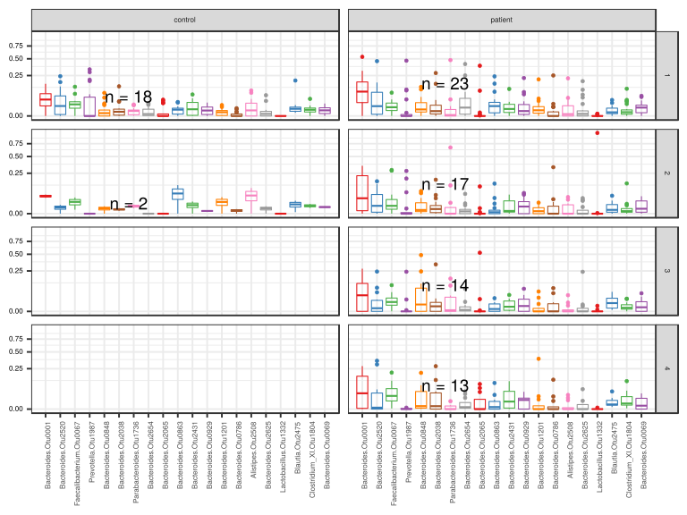
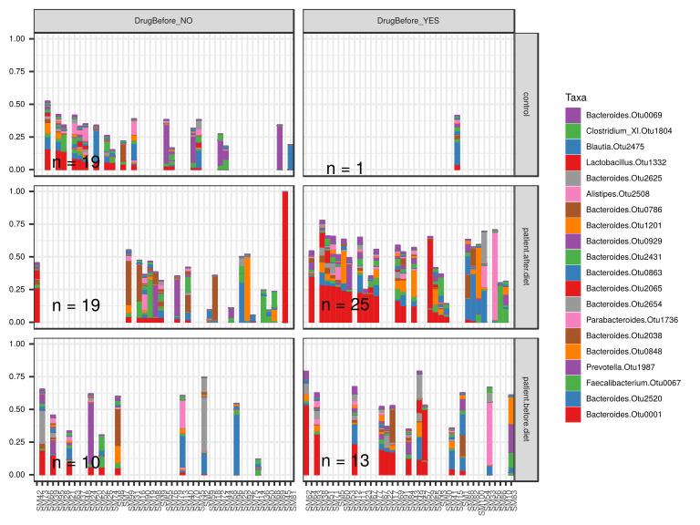
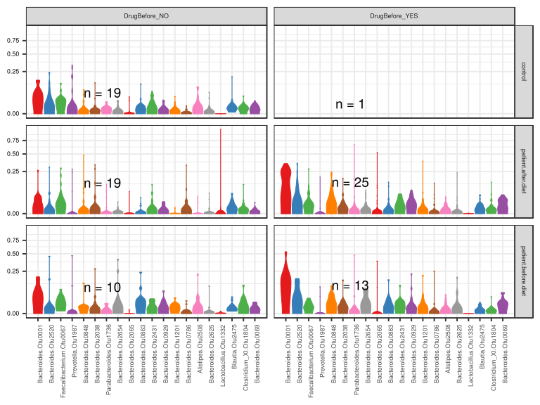

noone@mail.com
Analysis of Dieting study 16S data
% Fri Sep  7 05:46:18 2018

##### \(1.1.1.4.3\) Plots of Abundance.

Plots are shown with relation to various combinations of meta 
                   data variables and in different graphical representations. Lots of plots here.

##### \(1.1.1.4.3.2\) Iterating over all combinations of grouping variables

##### \(1.1.1.4.3.2.1\) Grouping variables Sample.type,visit

##### \(1.1.1.4.3.2.2\) Iterating over Abundance. profile sorting order

##### \(1.1.1.4.3.2.2.1\) Abundance. profile sorting order: average abundance

##### \(1.1.1.4.3.2.2.2\) Iterating over dodged vs faceted bars

The same data are shown in multiple combinations of graphical representations. 
                         This is the same data, but each plot highlights slightly different aspects of it.
                         It is not likely that you will need every plot - pick only what you need.

##### \(1.1.1.4.3.2.2.2.1\) faceted plots. Iterating over orientation and, optionally, scaling

##### \(1.1.1.4.3.2.2.2.1.1\) Abundance. Plot is in original orientation, Y axis SQRT scaled. Iterating over plot geometry

\(1.1.1.4.3.2.2.2.1.1.0\) [`Table 62.`](#table.62) Data table used for plots. Data grouped by Sample.type,visit. Showing only 200 first rows. Full dataset is also saved in a delimited text file (click to download and open e.g. in Excel) [`data/1.1.1.4.3.2.2.2.1.1.0-3234afa226c.1.1.1.4.3.2.2.2.1.1.csv`](data/1.1.1.4.3.2.2.2.1.1.0-3234afa226c.1.1.1.4.3.2.2.2.1.1.csv)

| .record.id | Sample.type | visit | feature                  | Abundance  |
|:-----------|:------------|:------|:-------------------------|:-----------|
| SM1        | patient     | 1     | Bacteroides.Otu0001      | 3.325e\-02 |
| SM10       | patient     | 3     | Bacteroides.Otu0001      | 0.000e\+00 |
| SM100      | patient     | 4     | Bacteroides.Otu0001      | 7.692e\-05 |
| SM11       | patient     | 2     | Bacteroides.Otu0001      | 2.280e\-01 |
| SM12       | patient     | 1     | Bacteroides.Otu0001      | 2.363e\-01 |
| SM13       | patient     | 1     | Bacteroides.Otu0001      | 2.143e\-02 |
| SM14       | patient     | 1     | Bacteroides.Otu0001      | 0.000e\+00 |
| SM15       | control     | 1     | Bacteroides.Otu0001      | 3.935e\-02 |
| SM16       | patient     | 4     | Bacteroides.Otu0001      | 3.835e\-02 |
| SM17       | patient     | 1     | Bacteroides.Otu0001      | 1.738e\-01 |
| SM18       | patient     | 2     | Bacteroides.Otu0001      | 1.343e\-03 |
| SM19       | patient     | 2     | Bacteroides.Otu0001      | 3.656e\-02 |
| SM2        | patient     | 1     | Bacteroides.Otu0001      | 7.129e\-03 |
| SM20       | control     | 1     | Bacteroides.Otu0001      | 5.936e\-02 |
| SM21       | patient     | 1     | Bacteroides.Otu0001      | 9.063e\-02 |
| SM22       | patient     | 1     | Bacteroides.Otu0001      | 1.800e\-01 |
| SM23       | patient     | 2     | Bacteroides.Otu0001      | 2.207e\-01 |
| SM24       | patient     | 1     | Bacteroides.Otu0001      | 6.084e\-02 |
| SM25       | patient     | 4     | Bacteroides.Otu0001      | 0.000e\+00 |
| SM26       | control     | 1     | Bacteroides.Otu0001      | 5.819e\-02 |
| SM28       | control     | 1     | Bacteroides.Otu0001      | 1.415e\-01 |
| SM29       | patient     | 3     | Bacteroides.Otu0001      | 1.015e\-01 |
| SM3        | patient     | 2     | Bacteroides.Otu0001      | 5.679e\-02 |
| SM30       | patient     | 4     | Bacteroides.Otu0001      | 4.615e\-02 |
| SM31       | control     | 2     | Bacteroides.Otu0001      | 3.883e\-02 |
| SM33       | patient     | 1     | Bacteroides.Otu0001      | 0.000e\+00 |
| SM35       | control     | 1     | Bacteroides.Otu0001      | 1.546e\-02 |
| SM36       | patient     | 4     | Bacteroides.Otu0001      | 0.000e\+00 |
| SM37       | control     | 1     | Bacteroides.Otu0001      | 8.035e\-02 |
| SM38       | patient     | 2     | Bacteroides.Otu0001      | 2.849e\-01 |
| SM39       | patient     | 1     | Bacteroides.Otu0001      | 1.512e\-01 |
| SM40       | patient     | 4     | Bacteroides.Otu0001      | 1.767e\-02 |
| SM41       | patient     | 1     | Bacteroides.Otu0001      | 4.380e\-02 |
| SM42       | patient     | 4     | Bacteroides.Otu0001      | 2.641e\-01 |
| SM43       | patient     | 4     | Bacteroides.Otu0001      | 1.241e\-01 |
| SM44       | control     | 1     | Bacteroides.Otu0001      | 5.478e\-04 |
| SM45       | patient     | 2     | Bacteroides.Otu0001      | 0.000e\+00 |
| SM48       | control     | 1     | Bacteroides.Otu0001      | 6.268e\-02 |
| SM49       | patient     | 1     | Bacteroides.Otu0001      | 1.179e\-01 |
| SM5        | patient     | 3     | Bacteroides.Otu0001      | 2.741e\-01 |
| SM50       | patient     | 3     | Bacteroides.Otu0001      | 0.000e\+00 |
| SM51       | patient     | 4     | Bacteroides.Otu0001      | 2.826e\-01 |
| SM52       | patient     | 1     | Bacteroides.Otu0001      | 5.829e\-02 |
| SM53       | patient     | 2     | Bacteroides.Otu0001      | 2.368e\-01 |
| SM54       | patient     | 3     | Bacteroides.Otu0001      | 0.000e\+00 |
| SM55       | control     | 1     | Bacteroides.Otu0001      | 2.798e\-02 |
| SM56       | patient     | 2     | Bacteroides.Otu0001      | 0.000e\+00 |
| SM57       | patient     | 1     | Bacteroides.Otu0001      | 1.037e\-01 |
| SM58       | patient     | 2     | Bacteroides.Otu0001      | 1.620e\-04 |
| SM59       | patient     | 3     | Bacteroides.Otu0001      | 3.745e\-03 |
| SM60       | patient     | 3     | Bacteroides.Otu0001      | 2.447e\-01 |
| SM62       | patient     | 1     | Bacteroides.Otu0001      | 5.347e\-01 |
| SM63       | control     | 1     | Bacteroides.Otu0001      | 8.649e\-02 |
| SM64       | patient     | 2     | Bacteroides.Otu0001      | 3.508e\-01 |
| SM65       | patient     | 3     | Bacteroides.Otu0001      | 8.092e\-02 |
| SM66       | control     | 1     | Bacteroides.Otu0001      | 1.585e\-01 |
| SM67       | patient     | 4     | Bacteroides.Otu0001      | 2.186e\-01 |
| SM68       | patient     | 4     | Bacteroides.Otu0001      | 0.000e\+00 |
| SM69       | patient     | 4     | Bacteroides.Otu0001      | 1.655e\-01 |
| SM7        | control     | 1     | Bacteroides.Otu0001      | 4.313e\-02 |
| SM70       | control     | 1     | Bacteroides.Otu0001      | 1.567e\-02 |
| SM71       | patient     | 3     | Bacteroides.Otu0001      | 2.788e\-01 |
| SM72       | control     | 1     | Bacteroides.Otu0001      | 1.323e\-03 |
| SM73       | patient     | 1     | Bacteroides.Otu0001      | 1.891e\-01 |
| SM74       | control     | 2     | Bacteroides.Otu0001      | 5.565e\-02 |
| SM75       | patient     | 3     | Bacteroides.Otu0001      | 0.000e\+00 |
| SM76       | control     | 1     | Bacteroides.Otu0001      | 2.751e\-02 |
| SM77       | patient     | 2     | Bacteroides.Otu0001      | 2.034e\-01 |
| SM79       | patient     | 2     | Bacteroides.Otu0001      | 2.642e\-02 |
| SM8        | patient     | 1     | Bacteroides.Otu0001      | 5.265e\-02 |
| SM81       | control     | 1     | Bacteroides.Otu0001      | 0.000e\+00 |
| SM82       | patient     | 4     | Bacteroides.Otu0001      | 1.052e\-02 |
| SM83       | patient     | 1     | Bacteroides.Otu0001      | 0.000e\+00 |
| SM84       | patient     | 1     | Bacteroides.Otu0001      | 1.247e\-01 |
| SM86       | patient     | 2     | Bacteroides.Otu0001      | 0.000e\+00 |
| SM87       | patient     | 1     | Bacteroides.Otu0001      | 1.941e\-01 |
| SM88       | patient     | 2     | Bacteroides.Otu0001      | 2.302e\-02 |
| SM89       | control     | 1     | Bacteroides.Otu0001      | 0.000e\+00 |
| SM9        | patient     | 2     | Bacteroides.Otu0001      | 3.497e\-02 |
| SM90       | patient     | 2     | Bacteroides.Otu0001      | 3.713e\-02 |
| SM91       | patient     | 3     | Bacteroides.Otu0001      | 1.254e\-01 |
| SM92       | patient     | 3     | Bacteroides.Otu0001      | 0.000e\+00 |
| SM93       | patient     | 1     | Bacteroides.Otu0001      | 3.120e\-01 |
| SM95       | control     | 1     | Bacteroides.Otu0001      | 1.492e\-01 |
| SM96       | patient     | 1     | Bacteroides.Otu0001      | 0.000e\+00 |
| SM98       | patient     | 3     | Bacteroides.Otu0001      | 3.648e\-02 |
| SM99       | patient     | 3     | Bacteroides.Otu0001      | 4.305e\-02 |
| SM1        | patient     | 1     | Bacteroides.Otu2520      | 1.003e\-01 |
| SM10       | patient     | 3     | Bacteroides.Otu2520      | 0.000e\+00 |
| SM100      | patient     | 4     | Bacteroides.Otu2520      | 0.000e\+00 |
| SM11       | patient     | 2     | Bacteroides.Otu2520      | 1.344e\-01 |
| SM12       | patient     | 1     | Bacteroides.Otu2520      | 1.504e\-01 |
| SM13       | patient     | 1     | Bacteroides.Otu2520      | 1.473e\-02 |
| SM14       | patient     | 1     | Bacteroides.Otu2520      | 3.786e\-04 |
| SM15       | control     | 1     | Bacteroides.Otu2520      | 1.756e\-01 |
| SM16       | patient     | 4     | Bacteroides.Otu2520      | 0.000e\+00 |
| SM17       | patient     | 1     | Bacteroides.Otu2520      | 1.862e\-02 |
| SM18       | patient     | 2     | Bacteroides.Otu2520      | 1.074e\-02 |
| SM19       | patient     | 2     | Bacteroides.Otu2520      | 9.255e\-04 |
| SM2        | patient     | 1     | Bacteroides.Otu2520      | 1.638e\-01 |
| SM20       | control     | 1     | Bacteroides.Otu2520      | 2.417e\-01 |
| SM21       | patient     | 1     | Bacteroides.Otu2520      | 4.540e\-03 |
| SM22       | patient     | 1     | Bacteroides.Otu2520      | 2.610e\-02 |
| SM23       | patient     | 2     | Bacteroides.Otu2520      | 0.000e\+00 |
| SM24       | patient     | 1     | Bacteroides.Otu2520      | 5.531e\-03 |
| SM25       | patient     | 4     | Bacteroides.Otu2520      | 3.053e\-01 |
| SM26       | control     | 1     | Bacteroides.Otu2520      | 4.378e\-02 |
| SM28       | control     | 1     | Bacteroides.Otu2520      | 0.000e\+00 |
| SM29       | patient     | 3     | Bacteroides.Otu2520      | 0.000e\+00 |
| SM3        | patient     | 2     | Bacteroides.Otu2520      | 5.657e\-04 |
| SM30       | patient     | 4     | Bacteroides.Otu2520      | 3.250e\-04 |
| SM31       | control     | 2     | Bacteroides.Otu2520      | 1.173e\-02 |
| SM33       | patient     | 1     | Bacteroides.Otu2520      | 7.120e\-02 |
| SM35       | control     | 1     | Bacteroides.Otu2520      | 1.330e\-01 |
| SM36       | patient     | 4     | Bacteroides.Otu2520      | 0.000e\+00 |
| SM37       | control     | 1     | Bacteroides.Otu2520      | 3.158e\-02 |
| SM38       | patient     | 2     | Bacteroides.Otu2520      | 9.696e\-02 |
| SM39       | patient     | 1     | Bacteroides.Otu2520      | 8.620e\-03 |
| SM40       | patient     | 4     | Bacteroides.Otu2520      | 5.920e\-02 |
| SM41       | patient     | 1     | Bacteroides.Otu2520      | 1.440e\-01 |
| SM42       | patient     | 4     | Bacteroides.Otu2520      | 1.665e\-04 |
| SM43       | patient     | 4     | Bacteroides.Otu2520      | 3.957e\-02 |
| SM44       | control     | 1     | Bacteroides.Otu2520      | 1.369e\-03 |
| SM45       | patient     | 2     | Bacteroides.Otu2520      | 0.000e\+00 |
| SM48       | control     | 1     | Bacteroides.Otu2520      | 1.951e\-02 |
| SM49       | patient     | 1     | Bacteroides.Otu2520      | 1.715e\-01 |
| SM5        | patient     | 3     | Bacteroides.Otu2520      | 0.000e\+00 |
| SM50       | patient     | 3     | Bacteroides.Otu2520      | 0.000e\+00 |
| SM51       | patient     | 4     | Bacteroides.Otu2520      | 3.368e\-02 |
| SM52       | patient     | 1     | Bacteroides.Otu2520      | 2.179e\-04 |
| SM53       | patient     | 2     | Bacteroides.Otu2520      | 7.192e\-05 |
| SM54       | patient     | 3     | Bacteroides.Otu2520      | 2.426e\-01 |
| SM55       | control     | 1     | Bacteroides.Otu2520      | 1.289e\-03 |
| SM56       | patient     | 2     | Bacteroides.Otu2520      | 9.465e\-03 |
| SM57       | patient     | 1     | Bacteroides.Otu2520      | 0.000e\+00 |
| SM58       | patient     | 2     | Bacteroides.Otu2520      | 3.239e\-04 |
| SM59       | patient     | 3     | Bacteroides.Otu2520      | 2.996e\-03 |
| SM60       | patient     | 3     | Bacteroides.Otu2520      | 5.548e\-02 |
| SM62       | patient     | 1     | Bacteroides.Otu2520      | 1.525e\-02 |
| SM63       | control     | 1     | Bacteroides.Otu2520      | 4.324e\-02 |
| SM64       | patient     | 2     | Bacteroides.Otu2520      | 9.297e\-03 |
| SM65       | patient     | 3     | Bacteroides.Otu2520      | 0.000e\+00 |
| SM66       | control     | 1     | Bacteroides.Otu2520      | 9.282e\-02 |
| SM67       | patient     | 4     | Bacteroides.Otu2520      | 0.000e\+00 |
| SM68       | patient     | 4     | Bacteroides.Otu2520      | 0.000e\+00 |
| SM69       | patient     | 4     | Bacteroides.Otu2520      | 1.197e\-02 |
| SM7        | control     | 1     | Bacteroides.Otu2520      | 0.000e\+00 |
| SM70       | control     | 1     | Bacteroides.Otu2520      | 5.961e\-03 |
| SM71       | patient     | 3     | Bacteroides.Otu2520      | 2.162e\-02 |
| SM72       | control     | 1     | Bacteroides.Otu2520      | 0.000e\+00 |
| SM73       | patient     | 1     | Bacteroides.Otu2520      | 5.047e\-04 |
| SM74       | control     | 2     | Bacteroides.Otu2520      | 0.000e\+00 |
| SM75       | patient     | 3     | Bacteroides.Otu2520      | 2.037e\-03 |
| SM76       | control     | 1     | Bacteroides.Otu2520      | 1.085e\-02 |
| SM77       | patient     | 2     | Bacteroides.Otu2520      | 8.359e\-02 |
| SM79       | patient     | 2     | Bacteroides.Otu2520      | 1.576e\-02 |
| SM8        | patient     | 1     | Bacteroides.Otu2520      | 0.000e\+00 |
| SM81       | control     | 1     | Bacteroides.Otu2520      | 0.000e\+00 |
| SM82       | patient     | 4     | Bacteroides.Otu2520      | 3.568e\-01 |
| SM83       | patient     | 1     | Bacteroides.Otu2520      | 0.000e\+00 |
| SM84       | patient     | 1     | Bacteroides.Otu2520      | 2.912e\-03 |
| SM86       | patient     | 2     | Bacteroides.Otu2520      | 0.000e\+00 |
| SM87       | patient     | 1     | Bacteroides.Otu2520      | 4.566e\-02 |
| SM88       | patient     | 2     | Bacteroides.Otu2520      | 1.604e\-01 |
| SM89       | control     | 1     | Bacteroides.Otu2520      | 0.000e\+00 |
| SM9        | patient     | 2     | Bacteroides.Otu2520      | 5.636e\-02 |
| SM90       | patient     | 2     | Bacteroides.Otu2520      | 2.558e\-02 |
| SM91       | patient     | 3     | Bacteroides.Otu2520      | 8.567e\-02 |
| SM92       | patient     | 3     | Bacteroides.Otu2520      | 9.504e\-03 |
| SM93       | patient     | 1     | Bacteroides.Otu2520      | 4.034e\-04 |
| SM95       | control     | 1     | Bacteroides.Otu2520      | 6.748e\-02 |
| SM96       | patient     | 1     | Bacteroides.Otu2520      | 4.602e\-01 |
| SM98       | patient     | 3     | Bacteroides.Otu2520      | 9.832e\-04 |
| SM99       | patient     | 3     | Bacteroides.Otu2520      | 4.757e\-04 |
| SM1        | patient     | 1     | Faecalibacterium.Otu0067 | 6.148e\-03 |
| SM10       | patient     | 3     | Faecalibacterium.Otu0067 | 1.051e\-01 |
| SM100      | patient     | 4     | Faecalibacterium.Otu0067 | 6.200e\-02 |
| SM11       | patient     | 2     | Faecalibacterium.Otu0067 | 1.893e\-02 |
| SM12       | patient     | 1     | Faecalibacterium.Otu0067 | 4.471e\-03 |
| SM13       | patient     | 1     | Faecalibacterium.Otu0067 | 8.929e\-04 |
| SM14       | patient     | 1     | Faecalibacterium.Otu0067 | 4.014e\-02 |
| SM15       | control     | 1     | Faecalibacterium.Otu0067 | 2.045e\-02 |
| SM16       | patient     | 4     | Faecalibacterium.Otu0067 | 1.237e\-01 |
| SM17       | patient     | 1     | Faecalibacterium.Otu0067 | 4.137e\-04 |
| SM18       | patient     | 2     | Faecalibacterium.Otu0067 | 3.022e\-03 |
| SM19       | patient     | 2     | Faecalibacterium.Otu0067 | 2.920e\-01 |
| SM2        | patient     | 1     | Faecalibacterium.Otu0067 | 9.919e\-04 |
| SM20       | control     | 1     | Faecalibacterium.Otu0067 | 8.058e\-04 |
| SM21       | patient     | 1     | Faecalibacterium.Otu0067 | 1.093e\-02 |
| SM22       | patient     | 1     | Faecalibacterium.Otu0067 | 4.607e\-03 |
| SM23       | patient     | 2     | Faecalibacterium.Otu0067 | 0.000e\+00 |
| SM24       | patient     | 1     | Faecalibacterium.Otu0067 | 1.839e\-02 |
| SM25       | patient     | 4     | Faecalibacterium.Otu0067 | 6.406e\-02 |
| SM26       | control     | 1     | Faecalibacterium.Otu0067 | 6.205e\-03 |
| SM28       | control     | 1     | Faecalibacterium.Otu0067 | 1.307e\-01 |
| SM29       | patient     | 3     | Faecalibacterium.Otu0067 | 3.342e\-03 |
| SM3        | patient     | 2     | Faecalibacterium.Otu0067 | 3.733e\-03 |
| SM30       | patient     | 4     | Faecalibacterium.Otu0067 | 1.202e\-02 |
| SM31       | control     | 2     | Faecalibacterium.Otu0067 | 2.427e\-03 |
| SM33       | patient     | 1     | Faecalibacterium.Otu0067 | 0.000e\+00 |

\(1.1.1.4.3.2.2.2.1.1.1\) [`Widget 65.`](#widget.65) Dynamic Pivot Table link (drag and drop field names and pick averaging 
                      functions or plot types; click on fields or legend elements to filter values). 
                      Starting rendering is Stacked Bar Chart. Data grouped by Sample.type,visit. Click to see HTML widget file in full window: [`./1.1.1.4.3.2.2.2.1.1.1-32349638518Dynamic.Pivot.Table.html`](./1.1.1.4.3.2.2.2.1.1.1-32349638518Dynamic.Pivot.Table.html)

\(1.1.1.4.3.2.2.2.1.1.1\) [`Widget 66.`](#widget.66) Dynamic Pivot Table link (drag and drop field names and pick averaging 
                      functions or plot types; click on fields or legend elements to filter values). 
                      Starting rendering is Table Barchart. Data grouped by Sample.type,visit. Click to see HTML widget file in full window: [`./1.1.1.4.3.2.2.2.1.1.1-3235e0bf528Dynamic.Pivot.Table.html`](./1.1.1.4.3.2.2.2.1.1.1-3235e0bf528Dynamic.Pivot.Table.html)

\(1.1.1.4.3.2.2.2.1.1.1\) [`Table 63.`](#table.63) Summary table. Data grouped by Sample.type,visit. Showing only 200 first rows. Full dataset is also saved in a delimited text file (click to download and open e.g. in Excel) [`data/1.1.1.4.3.2.2.2.1.1.1-3231e3485b1.1.1.1.4.3.2.2.2.1.1.csv`](data/1.1.1.4.3.2.2.2.1.1.1-3231e3485b1.1.1.1.4.3.2.2.2.1.1.csv)

| feature                                      | Sample.type | visit | mean       | sd         | median     | incidence |
|:---------------------------------------------|:------------|:------|:-----------|:-----------|:-----------|:----------|
| Bacteroides.Otu0001                          | control     | 1     | 5.373e\-02 | 5.181e\-02 | 4.124e\-02 | 0.88889   |
| Bacteroides.Otu0001                          | control     | 2     | 4.724e\-02 | 1.189e\-02 | 4.724e\-02 | 1.00000   |
| Bacteroides.Otu0001                          | patient     | 1     | 1.168e\-01 | 1.255e\-01 | 9.063e\-02 | 0.82609   |
| Bacteroides.Otu0001                          | patient     | 2     | 1.024e\-01 | 1.205e\-01 | 3.656e\-02 | 0.82353   |
| Bacteroides.Otu0001                          | patient     | 3     | 8.491e\-02 | 1.066e\-01 | 3.976e\-02 | 0.64286   |
| Bacteroides.Otu0001                          | patient     | 4     | 8.982e\-02 | 1.078e\-01 | 3.835e\-02 | 0.76923   |
| Bacteroides.Otu2520                          | control     | 1     | 4.824e\-02 | 7.012e\-02 | 1.518e\-02 | 0.72222   |
| Bacteroides.Otu2520                          | control     | 2     | 5.866e\-03 | 8.295e\-03 | 5.866e\-03 | 0.50000   |
| Bacteroides.Otu2520                          | patient     | 1     | 6.108e\-02 | 1.054e\-01 | 1.473e\-02 | 0.86957   |
| Bacteroides.Otu2520                          | patient     | 2     | 3.555e\-02 | 5.188e\-02 | 9.465e\-03 | 0.82353   |
| Bacteroides.Otu2520                          | patient     | 3     | 3.010e\-02 | 6.631e\-02 | 1.510e\-03 | 0.64286   |
| Bacteroides.Otu2520                          | patient     | 4     | 6.208e\-02 | 1.214e\-01 | 3.250e\-04 | 0.61538   |
| Faecalibacterium.Otu0067                     | control     | 1     | 2.757e\-02 | 3.097e\-02 | 2.053e\-02 | 0.94444   |
| Faecalibacterium.Otu0067                     | control     | 2     | 2.134e\-02 | 2.675e\-02 | 2.134e\-02 | 1.00000   |
| Faecalibacterium.Otu0067                     | patient     | 1     | 1.768e\-02 | 1.932e\-02 | 1.166e\-02 | 0.95652   |
| Faecalibacterium.Otu0067                     | patient     | 2     | 4.572e\-02 | 9.221e\-02 | 9.465e\-03 | 0.88235   |
| Faecalibacterium.Otu0067                     | patient     | 3     | 2.381e\-02 | 2.918e\-02 | 1.341e\-02 | 0.92857   |
| Faecalibacterium.Otu0067                     | patient     | 4     | 4.894e\-02 | 5.938e\-02 | 2.672e\-02 | 1.00000   |
| Prevotella.Otu1987                           | control     | 1     | 6.034e\-02 | 1.115e\-01 | 0.000e\+00 | 0.33333   |
| Prevotella.Otu1987                           | control     | 2     | 0.000e\+00 | 0.000e\+00 | 0.000e\+00 | 0.00000   |
| Prevotella.Otu1987                           | patient     | 1     | 3.124e\-02 | 9.994e\-02 | 0.000e\+00 | 0.26087   |
| Prevotella.Otu1987                           | patient     | 2     | 3.192e\-02 | 7.957e\-02 | 0.000e\+00 | 0.47059   |
| Prevotella.Otu1987                           | patient     | 3     | 1.874e\-02 | 6.410e\-02 | 0.000e\+00 | 0.21429   |
| Prevotella.Otu1987                           | patient     | 4     | 4.165e\-05 | 8.770e\-05 | 0.000e\+00 | 0.30769   |
| Bacteroides.Otu0848                          | control     | 1     | 1.065e\-02 | 2.194e\-02 | 1.240e\-03 | 0.66667   |
| Bacteroides.Otu0848                          | control     | 2     | 4.248e\-03 | 6.007e\-03 | 4.248e\-03 | 0.50000   |
| Bacteroides.Otu0848                          | patient     | 1     | 2.252e\-02 | 3.495e\-02 | 6.558e\-03 | 0.86957   |
| Bacteroides.Otu0848                          | patient     | 2     | 1.478e\-02 | 2.389e\-02 | 2.060e\-03 | 0.76471   |
| Bacteroides.Otu0848                          | patient     | 3     | 7.368e\-02 | 1.374e\-01 | 7.264e\-03 | 0.64286   |
| Bacteroides.Otu0848                          | patient     | 4     | 3.335e\-02 | 5.821e\-02 | 1.387e\-03 | 0.84615   |
| Bacteroides.Otu2038                          | control     | 1     | 1.297e\-02 | 3.185e\-02 | 2.747e\-03 | 0.77778   |
| Bacteroides.Otu2038                          | control     | 2     | 2.898e\-03 | 2.382e\-03 | 2.898e\-03 | 1.00000   |
| Bacteroides.Otu2038                          | patient     | 1     | 2.623e\-02 | 6.465e\-02 | 3.601e\-03 | 0.86957   |
| Bacteroides.Otu2038                          | patient     | 2     | 1.914e\-02 | 4.313e\-02 | 3.327e\-03 | 0.76471   |
| Bacteroides.Otu2038                          | patient     | 3     | 2.982e\-02 | 8.896e\-02 | 3.932e\-03 | 0.64286   |
| Bacteroides.Otu2038                          | patient     | 4     | 4.044e\-02 | 8.116e\-02 | 1.341e\-03 | 0.69231   |
| Parabacteroides.Otu1736                      | control     | 1     | 4.727e\-03 | 5.893e\-03 | 3.900e\-03 | 0.83333   |
| Parabacteroides.Otu1736                      | control     | 2     | 8.764e\-03 | 5.913e\-03 | 8.764e\-03 | 1.00000   |
| Parabacteroides.Otu1736                      | patient     | 1     | 2.509e\-02 | 9.916e\-02 | 1.328e\-04 | 0.56522   |
| Parabacteroides.Otu1736                      | patient     | 2     | 4.847e\-02 | 1.628e\-01 | 0.000e\+00 | 0.47059   |
| Parabacteroides.Otu1736                      | patient     | 3     | 2.566e\-02 | 4.900e\-02 | 2.089e\-04 | 0.50000   |
| Parabacteroides.Otu1736                      | patient     | 4     | 1.245e\-03 | 2.634e\-03 | 0.000e\+00 | 0.38462   |
| Bacteroides.Otu2654                          | control     | 1     | 5.269e\-03 | 8.442e\-03 | 5.437e\-04 | 0.72222   |
| Bacteroides.Otu2654                          | control     | 2     | 0.000e\+00 | 0.000e\+00 | 0.000e\+00 | 0.00000   |
| Bacteroides.Otu2654                          | patient     | 1     | 4.783e\-02 | 9.677e\-02 | 1.076e\-02 | 0.78261   |
| Bacteroides.Otu2654                          | patient     | 2     | 6.019e\-03 | 1.456e\-02 | 8.251e\-04 | 0.64706   |
| Bacteroides.Otu2654                          | patient     | 3     | 7.518e\-03 | 2.057e\-02 | 3.516e\-04 | 0.71429   |
| Bacteroides.Otu2654                          | patient     | 4     | 8.816e\-03 | 1.555e\-02 | 6.232e\-04 | 0.76923   |
| Bacteroides.Otu2065                          | control     | 1     | 7.046e\-03 | 1.378e\-02 | 0.000e\+00 | 0.33333   |
| Bacteroides.Otu2065                          | control     | 2     | 0.000e\+00 | 0.000e\+00 | 0.000e\+00 | 0.00000   |
| Bacteroides.Otu2065                          | patient     | 1     | 2.112e\-02 | 8.207e\-02 | 0.000e\+00 | 0.21739   |
| Bacteroides.Otu2065                          | patient     | 2     | 6.964e\-03 | 2.745e\-02 | 0.000e\+00 | 0.23529   |
| Bacteroides.Otu2065                          | patient     | 3     | 3.925e\-02 | 1.403e\-01 | 0.000e\+00 | 0.21429   |
| Bacteroides.Otu2065                          | patient     | 4     | 1.719e\-02 | 3.186e\-02 | 0.000e\+00 | 0.38462   |
| Bacteroides.Otu0863                          | control     | 1     | 7.645e\-03 | 8.815e\-03 | 6.083e\-03 | 0.77778   |
| Bacteroides.Otu0863                          | control     | 2     | 6.250e\-02 | 8.839e\-02 | 6.250e\-02 | 0.50000   |
| Bacteroides.Otu0863                          | patient     | 1     | 3.229e\-02 | 5.790e\-02 | 1.493e\-02 | 0.86957   |
| Bacteroides.Otu0863                          | patient     | 2     | 1.189e\-02 | 3.395e\-02 | 3.239e\-04 | 0.58824   |
| Bacteroides.Otu0863                          | patient     | 3     | 5.235e\-03 | 7.618e\-03 | 8.642e\-04 | 0.57143   |
| Bacteroides.Otu0863                          | patient     | 4     | 1.266e\-02 | 2.901e\-02 | 6.500e\-04 | 0.61538   |
| Bacteroides.Otu2431                          | control     | 1     | 1.752e\-02 | 2.195e\-02 | 6.948e\-03 | 0.72222   |
| Bacteroides.Otu2431                          | control     | 2     | 1.133e\-02 | 1.602e\-02 | 1.133e\-02 | 0.50000   |
| Bacteroides.Otu2431                          | patient     | 1     | 1.553e\-02 | 2.341e\-02 | 7.537e\-03 | 0.82609   |
| Bacteroides.Otu2431                          | patient     | 2     | 1.552e\-02 | 1.948e\-02 | 1.151e\-03 | 0.76471   |
| Bacteroides.Otu2431                          | patient     | 3     | 1.000e\-02 | 1.290e\-02 | 3.306e\-03 | 0.78571   |
| Bacteroides.Otu2431                          | patient     | 4     | 2.651e\-02 | 3.608e\-02 | 8.739e\-03 | 0.76923   |
| Bacteroides.Otu0929                          | control     | 1     | 7.901e\-03 | 9.570e\-03 | 4.583e\-03 | 0.83333   |
| Bacteroides.Otu0929                          | control     | 2     | 1.136e\-03 | 6.813e\-04 | 1.136e\-03 | 1.00000   |
| Bacteroides.Otu0929                          | patient     | 1     | 2.297e\-02 | 4.878e\-02 | 3.724e\-03 | 0.73913   |
| Bacteroides.Otu0929                          | patient     | 2     | 1.557e\-02 | 2.119e\-02 | 7.838e\-03 | 0.70588   |
| Bacteroides.Otu0929                          | patient     | 3     | 1.534e\-02 | 2.263e\-02 | 4.461e\-03 | 0.64286   |
| Bacteroides.Otu0929                          | patient     | 4     | 1.128e\-02 | 1.351e\-02 | 1.271e\-02 | 0.61538   |
| Bacteroides.Otu1201                          | control     | 1     | 3.699e\-03 | 4.973e\-03 | 2.154e\-03 | 0.72222   |
| Bacteroides.Otu1201                          | control     | 2     | 2.104e\-02 | 2.975e\-02 | 2.104e\-02 | 0.50000   |
| Bacteroides.Otu1201                          | patient     | 1     | 1.796e\-02 | 4.252e\-02 | 4.950e\-03 | 0.82609   |
| Bacteroides.Otu1201                          | patient     | 2     | 3.298e\-03 | 5.159e\-03 | 9.464e\-04 | 0.64706   |
| Bacteroides.Otu1201                          | patient     | 3     | 7.161e\-03 | 1.720e\-02 | 0.000e\+00 | 0.42857   |
| Bacteroides.Otu1201                          | patient     | 4     | 3.302e\-02 | 1.068e\-01 | 0.000e\+00 | 0.46154   |
| Bacteroides.Otu0786                          | control     | 1     | 1.213e\-03 | 2.598e\-03 | 0.000e\+00 | 0.33333   |
| Bacteroides.Otu0786                          | control     | 2     | 1.618e\-03 | 2.288e\-03 | 1.618e\-03 | 0.50000   |
| Bacteroides.Otu0786                          | patient     | 1     | 1.362e\-02 | 5.207e\-02 | 0.000e\+00 | 0.47826   |
| Bacteroides.Otu0786                          | patient     | 2     | 2.502e\-02 | 7.930e\-02 | 0.000e\+00 | 0.47059   |
| Bacteroides.Otu0786                          | patient     | 3     | 1.140e\-02 | 2.458e\-02 | 0.000e\+00 | 0.35714   |
| Bacteroides.Otu0786                          | patient     | 4     | 1.288e\-02 | 3.648e\-02 | 0.000e\+00 | 0.30769   |
| Alistipes.Otu2508                            | control     | 1     | 1.852e\-02 | 2.951e\-02 | 4.785e\-03 | 0.66667   |
| Alistipes.Otu2508                            | control     | 2     | 5.057e\-02 | 7.151e\-02 | 5.057e\-02 | 0.50000   |
| Alistipes.Otu2508                            | patient     | 1     | 1.774e\-02 | 4.589e\-02 | 5.195e\-04 | 0.52174   |
| Alistipes.Otu2508                            | patient     | 2     | 7.004e\-03 | 1.243e\-02 | 0.000e\+00 | 0.35294   |
| Alistipes.Otu2508                            | patient     | 3     | 4.125e\-03 | 1.088e\-02 | 0.000e\+00 | 0.35714   |
| Alistipes.Otu2508                            | patient     | 4     | 4.789e\-03 | 9.796e\-03 | 0.000e\+00 | 0.38462   |
| Bacteroides.Otu2625                          | control     | 1     | 6.692e\-03 | 1.678e\-02 | 6.631e\-04 | 0.66667   |
| Bacteroides.Otu2625                          | control     | 2     | 4.248e\-03 | 6.007e\-03 | 4.248e\-03 | 0.50000   |
| Bacteroides.Otu2625                          | patient     | 1     | 1.951e\-02 | 4.503e\-02 | 6.678e\-04 | 0.65217   |
| Bacteroides.Otu2625                          | patient     | 2     | 6.004e\-03 | 1.190e\-02 | 0.000e\+00 | 0.47059   |
| Bacteroides.Otu2625                          | patient     | 3     | 1.810e\-02 | 6.380e\-02 | 0.000e\+00 | 0.42857   |
| Bacteroides.Otu2625                          | patient     | 4     | 6.002e\-03 | 1.671e\-02 | 0.000e\+00 | 0.46154   |
| Lactobacillus.Otu1332                        | control     | 1     | 0.000e\+00 | 0.000e\+00 | 0.000e\+00 | 0.00000   |
| Lactobacillus.Otu1332                        | control     | 2     | 0.000e\+00 | 0.000e\+00 | 0.000e\+00 | 0.00000   |
| Lactobacillus.Otu1332                        | patient     | 1     | 6.648e\-05 | 1.999e\-04 | 0.000e\+00 | 0.13043   |
| Lactobacillus.Otu1332                        | patient     | 2     | 5.866e\-02 | 2.418e\-01 | 0.000e\+00 | 0.11765   |
| Lactobacillus.Otu1332                        | patient     | 3     | 3.771e\-04 | 1.267e\-03 | 0.000e\+00 | 0.14286   |
| Lactobacillus.Otu1332                        | patient     | 4     | 2.476e\-05 | 8.927e\-05 | 0.000e\+00 | 0.07692   |
| Blautia.Otu2475                              | control     | 1     | 1.814e\-02 | 4.375e\-02 | 7.955e\-03 | 1.00000   |
| Blautia.Otu2475                              | control     | 2     | 1.313e\-02 | 1.800e\-02 | 1.313e\-02 | 1.00000   |
| Blautia.Otu2475                              | patient     | 1     | 6.579e\-03 | 9.572e\-03 | 2.046e\-03 | 0.91304   |
| Blautia.Otu2475                              | patient     | 2     | 8.246e\-03 | 1.284e\-02 | 2.182e\-03 | 0.82353   |
| Blautia.Otu2475                              | patient     | 3     | 1.626e\-02 | 1.876e\-02 | 1.049e\-02 | 1.00000   |
| Blautia.Otu2475                              | patient     | 4     | 1.008e\-02 | 1.295e\-02 | 3.353e\-03 | 1.00000   |
| Clostridium\_XI.Otu1804                      | control     | 1     | 8.144e\-03 | 1.014e\-02 | 5.866e\-03 | 0.94444   |
| Clostridium\_XI.Otu1804                      | control     | 2     | 9.628e\-03 | 6.752e\-03 | 9.628e\-03 | 1.00000   |
| Clostridium\_XI.Otu1804                      | patient     | 1     | 1.197e\-02 | 2.513e\-02 | 2.170e\-03 | 0.82609   |
| Clostridium\_XI.Otu1804                      | patient     | 2     | 1.102e\-02 | 3.350e\-02 | 1.004e\-03 | 0.76471   |
| Clostridium\_XI.Otu1804                      | patient     | 3     | 6.055e\-03 | 8.430e\-03 | 1.934e\-03 | 0.92857   |
| Clostridium\_XI.Otu1804                      | patient     | 4     | 2.040e\-02 | 3.328e\-02 | 4.832e\-03 | 1.00000   |
| Bacteroides.Otu0069                          | control     | 1     | 6.746e\-03 | 6.781e\-03 | 4.877e\-03 | 0.77778   |
| Bacteroides.Otu0069                          | control     | 2     | 6.721e\-03 | 2.068e\-03 | 6.721e\-03 | 1.00000   |
| Bacteroides.Otu0069                          | patient     | 1     | 1.411e\-02 | 1.696e\-02 | 1.076e\-02 | 0.82609   |
| Bacteroides.Otu0069                          | patient     | 2     | 1.321e\-02 | 1.506e\-02 | 3.713e\-03 | 0.76471   |
| Bacteroides.Otu0069                          | patient     | 3     | 1.110e\-02 | 1.631e\-02 | 2.610e\-03 | 0.64286   |
| Bacteroides.Otu0069                          | patient     | 4     | 8.984e\-03 | 1.193e\-02 | 1.757e\-03 | 0.69231   |
| Bacteroides.Otu2765                          | control     | 1     | 4.704e\-03 | 7.441e\-03 | 1.156e\-03 | 0.72222   |
| Bacteroides.Otu2765                          | control     | 2     | 1.011e\-03 | 1.430e\-03 | 1.011e\-03 | 0.50000   |
| Bacteroides.Otu2765                          | patient     | 1     | 1.268e\-02 | 1.724e\-02 | 5.045e\-03 | 0.91304   |
| Bacteroides.Otu2765                          | patient     | 2     | 8.741e\-03 | 1.310e\-02 | 1.503e\-03 | 0.70588   |
| Bacteroides.Otu2765                          | patient     | 3     | 1.885e\-02 | 2.845e\-02 | 4.255e\-04 | 0.57143   |
| Bacteroides.Otu2765                          | patient     | 4     | 1.183e\-02 | 1.842e\-02 | 8.125e\-04 | 0.76923   |
| Bacteroides.Otu0661                          | control     | 1     | 7.332e\-03 | 9.733e\-03 | 4.161e\-03 | 0.66667   |
| Bacteroides.Otu0661                          | control     | 2     | 1.339e\-03 | 9.673e\-04 | 1.339e\-03 | 1.00000   |
| Bacteroides.Otu0661                          | patient     | 1     | 1.387e\-02 | 2.320e\-02 | 3.919e\-03 | 0.73913   |
| Bacteroides.Otu0661                          | patient     | 2     | 1.186e\-02 | 1.657e\-02 | 3.300e\-03 | 0.70588   |
| Bacteroides.Otu0661                          | patient     | 3     | 1.011e\-02 | 1.377e\-02 | 2.137e\-03 | 0.50000   |
| Bacteroides.Otu0661                          | patient     | 4     | 7.730e\-03 | 1.025e\-02 | 1.385e\-03 | 0.61538   |
| Enterococcus.Otu1019                         | control     | 1     | 3.118e\-03 | 1.311e\-02 | 0.000e\+00 | 0.16667   |
| Enterococcus.Otu1019                         | control     | 2     | 3.437e\-03 | 4.861e\-03 | 3.437e\-03 | 0.50000   |
| Enterococcus.Otu1019                         | patient     | 1     | 3.367e\-03 | 1.493e\-02 | 0.000e\+00 | 0.26087   |
| Enterococcus.Otu1019                         | patient     | 2     | 4.210e\-02 | 1.720e\-01 | 0.000e\+00 | 0.41176   |
| Enterococcus.Otu1019                         | patient     | 3     | 2.699e\-04 | 5.710e\-04 | 0.000e\+00 | 0.28571   |
| Enterococcus.Otu1019                         | patient     | 4     | 1.910e\-04 | 6.012e\-04 | 0.000e\+00 | 0.15385   |
| Ruminococcus.Otu1859                         | control     | 1     | 3.248e\-02 | 5.826e\-02 | 6.379e\-03 | 0.66667   |
| Ruminococcus.Otu1859                         | control     | 2     | 5.838e\-02 | 8.085e\-02 | 5.838e\-02 | 1.00000   |
| Ruminococcus.Otu1859                         | patient     | 1     | 1.516e\-03 | 5.680e\-03 | 0.000e\+00 | 0.26087   |
| Ruminococcus.Otu1859                         | patient     | 2     | 5.155e\-04 | 1.790e\-03 | 0.000e\+00 | 0.23529   |
| Ruminococcus.Otu1859                         | patient     | 3     | 5.691e\-03 | 2.122e\-02 | 0.000e\+00 | 0.14286   |
| Ruminococcus.Otu1859                         | patient     | 4     | 6.578e\-04 | 1.526e\-03 | 0.000e\+00 | 0.23077   |
| Alistipes.Otu1466                            | control     | 1     | 1.621e\-02 | 4.029e\-02 | 1.998e\-04 | 0.50000   |
| Alistipes.Otu1466                            | control     | 2     | 7.811e\-03 | 1.012e\-02 | 7.811e\-03 | 1.00000   |
| Alistipes.Otu1466                            | patient     | 1     | 1.086e\-02 | 1.787e\-02 | 2.576e\-03 | 0.52174   |
| Alistipes.Otu1466                            | patient     | 2     | 1.322e\-02 | 3.707e\-02 | 0.000e\+00 | 0.35294   |
| Alistipes.Otu1466                            | patient     | 3     | 2.084e\-03 | 4.903e\-03 | 0.000e\+00 | 0.35714   |
| Alistipes.Otu1466                            | patient     | 4     | 1.656e\-03 | 3.001e\-03 | 0.000e\+00 | 0.38462   |
| Erysipelotrichaceae\_incertae\_sedis.Otu0818 | control     | 1     | 6.704e\-04 | 1.343e\-03 | 7.077e\-05 | 0.50000   |
| Erysipelotrichaceae\_incertae\_sedis.Otu0818 | control     | 2     | 8.955e\-04 | 1.223e\-04 | 8.955e\-04 | 1.00000   |
| Erysipelotrichaceae\_incertae\_sedis.Otu0818 | patient     | 1     | 1.994e\-02 | 8.001e\-02 | 9.525e\-04 | 0.69565   |
| Erysipelotrichaceae\_incertae\_sedis.Otu0818 | patient     | 2     | 1.488e\-03 | 2.518e\-03 | 3.410e\-04 | 0.76471   |
| Erysipelotrichaceae\_incertae\_sedis.Otu0818 | patient     | 3     | 8.981e\-03 | 1.397e\-02 | 2.219e\-03 | 1.00000   |
| Erysipelotrichaceae\_incertae\_sedis.Otu0818 | patient     | 4     | 1.508e\-02 | 5.012e\-02 | 9.325e\-04 | 0.84615   |
| Bacteroides.Otu0006                          | control     | 1     | 5.163e\-03 | 6.317e\-03 | 3.693e\-03 | 0.77778   |
| Bacteroides.Otu0006                          | control     | 2     | 8.955e\-04 | 1.223e\-04 | 8.955e\-04 | 1.00000   |
| Bacteroides.Otu0006                          | patient     | 1     | 1.051e\-02 | 9.565e\-03 | 7.294e\-03 | 0.82609   |
| Bacteroides.Otu0006                          | patient     | 2     | 1.063e\-02 | 1.320e\-02 | 5.285e\-03 | 0.76471   |
| Bacteroides.Otu0006                          | patient     | 3     | 9.002e\-03 | 1.122e\-02 | 5.222e\-03 | 0.57143   |
| Bacteroides.Otu0006                          | patient     | 4     | 1.226e\-02 | 1.303e\-02 | 9.315e\-03 | 0.69231   |
| Bacteroides.Otu2343                          | control     | 1     | 7.090e\-04 | 1.618e\-03 | 0.000e\+00 | 0.38889   |
| Bacteroides.Otu2343                          | control     | 2     | 6.068e\-04 | 8.581e\-04 | 6.068e\-04 | 0.50000   |
| Bacteroides.Otu2343                          | patient     | 1     | 7.836e\-03 | 2.709e\-02 | 4.426e\-05 | 0.52174   |
| Bacteroides.Otu2343                          | patient     | 2     | 1.645e\-02 | 5.090e\-02 | 1.028e\-04 | 0.52941   |
| Bacteroides.Otu2343                          | patient     | 3     | 7.405e\-03 | 1.561e\-02 | 0.000e\+00 | 0.35714   |
| Bacteroides.Otu2343                          | patient     | 4     | 1.140e\-02 | 3.140e\-02 | 0.000e\+00 | 0.30769   |
| Lachnospiracea\_incertae\_sedis.Otu0778      | control     | 1     | 2.020e\-03 | 2.017e\-03 | 1.729e\-03 | 0.77778   |
| Lachnospiracea\_incertae\_sedis.Otu0778      | control     | 2     | 4.255e\-03 | 6.018e\-03 | 4.255e\-03 | 0.50000   |
| Lachnospiracea\_incertae\_sedis.Otu0778      | patient     | 1     | 1.813e\-03 | 3.516e\-03 | 3.708e\-04 | 0.56522   |
| Lachnospiracea\_incertae\_sedis.Otu0778      | patient     | 2     | 6.233e\-03 | 1.008e\-02 | 1.343e\-03 | 0.76471   |
| Lachnospiracea\_incertae\_sedis.Otu0778      | patient     | 3     | 6.674e\-03 | 1.333e\-02 | 7.028e\-04 | 0.57143   |
| Lachnospiracea\_incertae\_sedis.Otu0778      | patient     | 4     | 3.192e\-02 | 5.684e\-02 | 9.750e\-03 | 0.69231   |
| Prevotella.Otu1633                           | control     | 1     | 4.917e\-03 | 1.109e\-02 | 0.000e\+00 | 0.38889   |
| Prevotella.Otu1633                           | control     | 2     | 3.273e\-04 | 4.629e\-04 | 3.273e\-04 | 0.50000   |
| Prevotella.Otu1633                           | patient     | 1     | 4.798e\-03 | 1.274e\-02 | 0.000e\+00 | 0.43478   |
| Prevotella.Otu1633                           | patient     | 2     | 2.845e\-02 | 1.138e\-01 | 0.000e\+00 | 0.29412   |
| Prevotella.Otu1633                           | patient     | 3     | 1.804e\-04 | 4.922e\-04 | 0.000e\+00 | 0.35714   |
| Prevotella.Otu1633                           | patient     | 4     | 3.356e\-04 | 1.210e\-03 | 0.000e\+00 | 0.07692   |
| Bacteroides.Otu2437                          | control     | 1     | 1.140e\-02 | 2.451e\-02 | 4.701e\-04 | 0.66667   |
| Bacteroides.Otu2437                          | control     | 2     | 9.709e\-03 | 1.373e\-02 | 9.709e\-03 | 0.50000   |
| Bacteroides.Otu2437                          | patient     | 1     | 3.057e\-03 | 6.170e\-03 | 0.000e\+00 | 0.47826   |
| Bacteroides.Otu2437                          | patient     | 2     | 8.595e\-03 | 2.110e\-02 | 0.000e\+00 | 0.35294   |
| Bacteroides.Otu2437                          | patient     | 3     | 3.449e\-03 | 8.349e\-03 | 0.000e\+00 | 0.35714   |
| Bacteroides.Otu2437                          | patient     | 4     | 1.275e\-02 | 2.527e\-02 | 0.000e\+00 | 0.46154   |
| Escherichia\_Shigella.Otu2393                | control     | 1     | 1.014e\-02 | 3.951e\-02 | 3.219e\-04 | 0.55556   |
| Escherichia\_Shigella.Otu2393                | control     | 2     | 4.045e\-04 | 5.721e\-04 | 4.045e\-04 | 0.50000   |
| Escherichia\_Shigella.Otu2393                | patient     | 1     | 1.408e\-02 | 4.403e\-02 | 0.000e\+00 | 0.39130   |
| Escherichia\_Shigella.Otu2393                | patient     | 2     | 3.576e\-04 | 1.298e\-03 | 0.000e\+00 | 0.29412   |
| Escherichia\_Shigella.Otu2393                | patient     | 3     | 2.305e\-03 | 5.001e\-03 | 3.234e\-04 | 0.64286   |
| Escherichia\_Shigella.Otu2393                | patient     | 4     | 7.439e\-03 | 1.716e\-02 | 8.323e\-05 | 0.53846   |
| Prevotella.Otu1994                           | control     | 1     | 2.627e\-02 | 6.026e\-02 | 0.000e\+00 | 0.22222   |
| Prevotella.Otu1994                           | control     | 2     | 0.000e\+00 | 0.000e\+00 | 0.000e\+00 | 0.00000   |
| Prevotella.Otu1994                           | patient     | 1     | 3.362e\-03 | 1.356e\-02 | 0.000e\+00 | 0.08696   |
| Prevotella.Otu1994                           | patient     | 2     | 4.061e\-03 | 1.675e\-02 | 0.000e\+00 | 0.05882   |
| Prevotella.Otu1994                           | patient     | 3     | 4.960e\-04 | 1.833e\-03 | 0.000e\+00 | 0.14286   |
| Prevotella.Otu1994                           | patient     | 4     | 2.352e\-06 | 8.481e\-06 | 0.000e\+00 | 0.07692   |
| Bacteroides.Otu0480                          | control     | 1     | 1.057e\-02 | 3.008e\-02 | 0.000e\+00 | 0.33333   |
| Bacteroides.Otu0480                          | control     | 2     | 3.236e\-02 | 4.577e\-02 | 3.236e\-02 | 0.50000   |

\(1.1.1.4.3.2.2.2.1.1.1\) [`Figure 194.`](#figure.194) Abundance. Data grouped by Sample.type,visit.  bar_stacked plot.  Image file: [`plots/323100ecb64.svg`](plots/323100ecb64.svg).

\(1.1.1.4.3.2.2.2.1.1.1\) [`Figure 195.`](#figure.195) Abundance. Data grouped by Sample.type,visit.  bar (sample mean) plot.  Image file: [`plots/3233a2fa2a3.svg`](plots/3233a2fa2a3.svg).

\(1.1.1.4.3.2.2.2.1.1.1\) [`Figure 196.`](#figure.196) Abundance. Data grouped by Sample.type,visit.  violin plot.  Image file: [`plots/3231eee42e7.svg`](plots/3231eee42e7.svg).

\(1.1.1.4.3.2.2.2.1.1.1\) [`Figure 197.`](#figure.197) Abundance. Data grouped by Sample.type,visit.  boxplot plot.  Image file: [`plots/32328653ce6.svg`](plots/32328653ce6.svg).

##### \(1.1.1.4.3.2.2.2.1.2\) Abundance. Plot is in flipped orientation, Y axis not scaled. Iterating over plot geometry

\(1.1.1.4.3.2.2.2.1.2.1\) [`Figure 198.`](#figure.198) Abundance. Data grouped by Sample.type,visit.  bar (sample mean) plot.  Image file: [`plots/32331f28f16.svg`](plots/32331f28f16.svg).

\(1.1.1.4.3.2.2.2.1.2.1\) [`Figure 199.`](#figure.199) Abundance. Data grouped by Sample.type,visit.  violin plot.  Image file: [`plots/323391c1196.svg`](plots/323391c1196.svg).

\(1.1.1.4.3.2.2.2.1.2.1\) [`Figure 200.`](#figure.200) Abundance. Data grouped by Sample.type,visit.  boxplot plot.  Image file: [`plots/3235d49b5fe.svg`](plots/3235d49b5fe.svg).

##### \(1.1.1.4.3.2.2.2.2\) dodged plots. Iterating over orientation and, optionally, scaling

##### \(1.1.1.4.3.2.2.2.2.1\) Abundance. Plot is in original orientation, Y axis SQRT scaled. Iterating over plot geometry

\(1.1.1.4.3.2.2.2.2.1.1\) [`Figure 201.`](#figure.201) Abundance. Data grouped by Sample.type,visit.  bar (sample mean) plot.  Image file: [`plots/32346bd8ca3.svg`](plots/32346bd8ca3.svg).

\(1.1.1.4.3.2.2.2.2.1.1\) [`Figure 202.`](#figure.202) Abundance. Data grouped by Sample.type,visit.  violin plot.  Image file: [`plots/323178a5fad.svg`](plots/323178a5fad.svg).

\(1.1.1.4.3.2.2.2.2.1.1\) [`Figure 203.`](#figure.203) Abundance. Data grouped by Sample.type,visit.  boxplot plot.  Image file: [`plots/323624018a4.svg`](plots/323624018a4.svg).

##### \(1.1.1.4.3.2.2.2.2.2\) Abundance. Plot is in flipped orientation, Y axis not scaled. Iterating over plot geometry

\(1.1.1.4.3.2.2.2.2.2.1\) [`Figure 204.`](#figure.204) Abundance. Data grouped by Sample.type,visit.  bar (sample mean) plot.  Image file: [`plots/32319f5b08d.svg`](plots/32319f5b08d.svg).

\(1.1.1.4.3.2.2.2.2.2.1\) [`Figure 205.`](#figure.205) Abundance. Data grouped by Sample.type,visit.  violin plot.  Image file: [`plots/3239bd6ad9.svg`](plots/3239bd6ad9.svg).

\(1.1.1.4.3.2.2.2.2.2.1\) [`Figure 206.`](#figure.206) Abundance. Data grouped by Sample.type,visit.  boxplot plot.  Image file: [`plots/32343504bf1.svg`](plots/32343504bf1.svg).

##### \(1.1.1.4.3.2.3\) Grouping variables Sample.type.Drug.Before,visit

##### \(1.1.1.4.3.2.4\) Iterating over Abundance. profile sorting order

##### \(1.1.1.4.3.2.4.1\) Abundance. profile sorting order: average abundance

##### \(1.1.1.4.3.2.4.2\) Iterating over dodged vs faceted bars

The same data are shown in multiple combinations of graphical representations. 
                         This is the same data, but each plot highlights slightly different aspects of it.
                         It is not likely that you will need every plot - pick only what you need.

##### \(1.1.1.4.3.2.4.2.1\) faceted plots. Iterating over orientation and, optionally, scaling

##### \(1.1.1.4.3.2.4.2.1.1\) Abundance. Plot is in original orientation, Y axis SQRT scaled. Iterating over plot geometry

\(1.1.1.4.3.2.4.2.1.1.0\) [`Table 64.`](#table.64) Data table used for plots. Data grouped by Sample.type.Drug.Before,visit. Showing only 200 first rows. Full dataset is also saved in a delimited text file (click to download and open e.g. in Excel) [`data/1.1.1.4.3.2.4.2.1.1.0-3232a14e04a.1.1.1.4.3.2.4.2.1.1.csv`](data/1.1.1.4.3.2.4.2.1.1.0-3232a14e04a.1.1.1.4.3.2.4.2.1.1.csv)

| .record.id | Sample.type.Drug.Before | visit | feature                  | Abundance  |
|:-----------|:------------------------|:------|:-------------------------|:-----------|
| SM1        | patient TRUE .          | 1     | Bacteroides.Otu0001      | 3.325e\-02 |
| SM10       | patient TRUE .          | 3     | Bacteroides.Otu0001      | 0.000e\+00 |
| SM100      | patient TRUE .          | 4     | Bacteroides.Otu0001      | 7.692e\-05 |
| SM11       | patient TRUE .          | 2     | Bacteroides.Otu0001      | 2.280e\-01 |
| SM12       | patient TRUE .          | 1     | Bacteroides.Otu0001      | 2.363e\-01 |
| SM13       | patient FALSE .         | 1     | Bacteroides.Otu0001      | 2.143e\-02 |
| SM14       | patient FALSE .         | 1     | Bacteroides.Otu0001      | 0.000e\+00 |
| SM15       | 1                       | 1     | Bacteroides.Otu0001      | 3.935e\-02 |
| SM16       | patient FALSE .         | 4     | Bacteroides.Otu0001      | 3.835e\-02 |
| SM17       | patient TRUE .          | 1     | Bacteroides.Otu0001      | 1.738e\-01 |
| SM18       | patient FALSE .         | 2     | Bacteroides.Otu0001      | 1.343e\-03 |
| SM19       | patient FALSE .         | 2     | Bacteroides.Otu0001      | 3.656e\-02 |
| SM2        | patient FALSE .         | 1     | Bacteroides.Otu0001      | 7.129e\-03 |
| SM20       | 1                       | 1     | Bacteroides.Otu0001      | 5.936e\-02 |
| SM21       | patient FALSE .         | 1     | Bacteroides.Otu0001      | 9.063e\-02 |
| SM22       | patient TRUE .          | 1     | Bacteroides.Otu0001      | 1.800e\-01 |
| SM23       | patient TRUE .          | 2     | Bacteroides.Otu0001      | 2.207e\-01 |
| SM24       | patient FALSE .         | 1     | Bacteroides.Otu0001      | 6.084e\-02 |
| SM25       | patient FALSE .         | 4     | Bacteroides.Otu0001      | 0.000e\+00 |
| SM26       | 1                       | 1     | Bacteroides.Otu0001      | 5.819e\-02 |
| SM28       | 1                       | 1     | Bacteroides.Otu0001      | 1.415e\-01 |
| SM29       | patient TRUE .          | 3     | Bacteroides.Otu0001      | 1.015e\-01 |
| SM3        | patient TRUE .          | 2     | Bacteroides.Otu0001      | 5.679e\-02 |
| SM30       | patient TRUE .          | 4     | Bacteroides.Otu0001      | 4.615e\-02 |
| SM31       | 1                       | 2     | Bacteroides.Otu0001      | 3.883e\-02 |
| SM33       | patient TRUE .          | 1     | Bacteroides.Otu0001      | 0.000e\+00 |
| SM35       | 1                       | 1     | Bacteroides.Otu0001      | 1.546e\-02 |
| SM36       | patient FALSE .         | 4     | Bacteroides.Otu0001      | 0.000e\+00 |
| SM37       | 1                       | 1     | Bacteroides.Otu0001      | 8.035e\-02 |
| SM38       | patient TRUE .          | 2     | Bacteroides.Otu0001      | 2.849e\-01 |
| SM39       | patient FALSE .         | 1     | Bacteroides.Otu0001      | 1.512e\-01 |
| SM40       | patient FALSE .         | 4     | Bacteroides.Otu0001      | 1.767e\-02 |
| SM41       | patient TRUE .          | 1     | Bacteroides.Otu0001      | 4.380e\-02 |
| SM42       | patient FALSE .         | 4     | Bacteroides.Otu0001      | 2.641e\-01 |
| SM43       | patient TRUE .          | 4     | Bacteroides.Otu0001      | 1.241e\-01 |
| SM44       | 1                       | 1     | Bacteroides.Otu0001      | 5.478e\-04 |
| SM45       | patient FALSE .         | 2     | Bacteroides.Otu0001      | 0.000e\+00 |
| SM48       | 1                       | 1     | Bacteroides.Otu0001      | 6.268e\-02 |
| SM49       | patient TRUE .          | 1     | Bacteroides.Otu0001      | 1.179e\-01 |
| SM5        | patient TRUE .          | 3     | Bacteroides.Otu0001      | 2.741e\-01 |
| SM50       | patient FALSE .         | 3     | Bacteroides.Otu0001      | 0.000e\+00 |
| SM51       | patient TRUE .          | 4     | Bacteroides.Otu0001      | 2.826e\-01 |
| SM52       | patient FALSE .         | 1     | Bacteroides.Otu0001      | 5.829e\-02 |
| SM53       | patient TRUE .          | 2     | Bacteroides.Otu0001      | 2.368e\-01 |
| SM54       | patient TRUE .          | 3     | Bacteroides.Otu0001      | 0.000e\+00 |
| SM55       | 1                       | 1     | Bacteroides.Otu0001      | 2.798e\-02 |
| SM56       | patient TRUE .          | 2     | Bacteroides.Otu0001      | 0.000e\+00 |
| SM57       | patient TRUE .          | 1     | Bacteroides.Otu0001      | 1.037e\-01 |
| SM58       | patient FALSE .         | 2     | Bacteroides.Otu0001      | 1.620e\-04 |
| SM59       | patient FALSE .         | 3     | Bacteroides.Otu0001      | 3.745e\-03 |
| SM60       | patient TRUE .          | 3     | Bacteroides.Otu0001      | 2.447e\-01 |
| SM62       | patient TRUE .          | 1     | Bacteroides.Otu0001      | 5.347e\-01 |
| SM63       | 1                       | 1     | Bacteroides.Otu0001      | 8.649e\-02 |
| SM64       | patient TRUE .          | 2     | Bacteroides.Otu0001      | 3.508e\-01 |
| SM65       | patient TRUE .          | 3     | Bacteroides.Otu0001      | 8.092e\-02 |
| SM66       | 1                       | 1     | Bacteroides.Otu0001      | 1.585e\-01 |
| SM67       | patient TRUE .          | 4     | Bacteroides.Otu0001      | 2.186e\-01 |
| SM68       | patient FALSE .         | 4     | Bacteroides.Otu0001      | 0.000e\+00 |
| SM69       | patient TRUE .          | 4     | Bacteroides.Otu0001      | 1.655e\-01 |
| SM7        | 1                       | 1     | Bacteroides.Otu0001      | 4.313e\-02 |
| SM70       | 1                       | 1     | Bacteroides.Otu0001      | 1.567e\-02 |
| SM71       | patient TRUE .          | 3     | Bacteroides.Otu0001      | 2.788e\-01 |
| SM72       | 1                       | 1     | Bacteroides.Otu0001      | 1.323e\-03 |
| SM73       | patient FALSE .         | 1     | Bacteroides.Otu0001      | 1.891e\-01 |
| SM74       | 1                       | 2     | Bacteroides.Otu0001      | 5.565e\-02 |
| SM75       | patient FALSE .         | 3     | Bacteroides.Otu0001      | 0.000e\+00 |
| SM76       | 1                       | 1     | Bacteroides.Otu0001      | 2.751e\-02 |
| SM77       | patient TRUE .          | 2     | Bacteroides.Otu0001      | 2.034e\-01 |
| SM79       | patient FALSE .         | 2     | Bacteroides.Otu0001      | 2.642e\-02 |
| SM8        | patient FALSE .         | 1     | Bacteroides.Otu0001      | 5.265e\-02 |
| SM81       | 1                       | 1     | Bacteroides.Otu0001      | 0.000e\+00 |
| SM82       | patient TRUE .          | 4     | Bacteroides.Otu0001      | 1.052e\-02 |
| SM83       | patient TRUE .          | 1     | Bacteroides.Otu0001      | 0.000e\+00 |
| SM84       | patient TRUE .          | 1     | Bacteroides.Otu0001      | 1.247e\-01 |
| SM86       | patient TRUE .          | 2     | Bacteroides.Otu0001      | 0.000e\+00 |
| SM87       | patient TRUE .          | 1     | Bacteroides.Otu0001      | 1.941e\-01 |
| SM88       | patient TRUE .          | 2     | Bacteroides.Otu0001      | 2.302e\-02 |
| SM89       | 1                       | 1     | Bacteroides.Otu0001      | 0.000e\+00 |
| SM9        | patient FALSE .         | 2     | Bacteroides.Otu0001      | 3.497e\-02 |
| SM90       | patient FALSE .         | 2     | Bacteroides.Otu0001      | 3.713e\-02 |
| SM91       | patient TRUE .          | 3     | Bacteroides.Otu0001      | 1.254e\-01 |
| SM92       | patient FALSE .         | 3     | Bacteroides.Otu0001      | 0.000e\+00 |
| SM93       | patient TRUE .          | 1     | Bacteroides.Otu0001      | 3.120e\-01 |
| SM95       | 1                       | 1     | Bacteroides.Otu0001      | 1.492e\-01 |
| SM96       | patient FALSE .         | 1     | Bacteroides.Otu0001      | 0.000e\+00 |
| SM98       | patient FALSE .         | 3     | Bacteroides.Otu0001      | 3.648e\-02 |
| SM99       | patient FALSE .         | 3     | Bacteroides.Otu0001      | 4.305e\-02 |
| SM1        | patient TRUE .          | 1     | Bacteroides.Otu2520      | 1.003e\-01 |
| SM10       | patient TRUE .          | 3     | Bacteroides.Otu2520      | 0.000e\+00 |
| SM100      | patient TRUE .          | 4     | Bacteroides.Otu2520      | 0.000e\+00 |
| SM11       | patient TRUE .          | 2     | Bacteroides.Otu2520      | 1.344e\-01 |
| SM12       | patient TRUE .          | 1     | Bacteroides.Otu2520      | 1.504e\-01 |
| SM13       | patient FALSE .         | 1     | Bacteroides.Otu2520      | 1.473e\-02 |
| SM14       | patient FALSE .         | 1     | Bacteroides.Otu2520      | 3.786e\-04 |
| SM15       | 1                       | 1     | Bacteroides.Otu2520      | 1.756e\-01 |
| SM16       | patient FALSE .         | 4     | Bacteroides.Otu2520      | 0.000e\+00 |
| SM17       | patient TRUE .          | 1     | Bacteroides.Otu2520      | 1.862e\-02 |
| SM18       | patient FALSE .         | 2     | Bacteroides.Otu2520      | 1.074e\-02 |
| SM19       | patient FALSE .         | 2     | Bacteroides.Otu2520      | 9.255e\-04 |
| SM2        | patient FALSE .         | 1     | Bacteroides.Otu2520      | 1.638e\-01 |
| SM20       | 1                       | 1     | Bacteroides.Otu2520      | 2.417e\-01 |
| SM21       | patient FALSE .         | 1     | Bacteroides.Otu2520      | 4.540e\-03 |
| SM22       | patient TRUE .          | 1     | Bacteroides.Otu2520      | 2.610e\-02 |
| SM23       | patient TRUE .          | 2     | Bacteroides.Otu2520      | 0.000e\+00 |
| SM24       | patient FALSE .         | 1     | Bacteroides.Otu2520      | 5.531e\-03 |
| SM25       | patient FALSE .         | 4     | Bacteroides.Otu2520      | 3.053e\-01 |
| SM26       | 1                       | 1     | Bacteroides.Otu2520      | 4.378e\-02 |
| SM28       | 1                       | 1     | Bacteroides.Otu2520      | 0.000e\+00 |
| SM29       | patient TRUE .          | 3     | Bacteroides.Otu2520      | 0.000e\+00 |
| SM3        | patient TRUE .          | 2     | Bacteroides.Otu2520      | 5.657e\-04 |
| SM30       | patient TRUE .          | 4     | Bacteroides.Otu2520      | 3.250e\-04 |
| SM31       | 1                       | 2     | Bacteroides.Otu2520      | 1.173e\-02 |
| SM33       | patient TRUE .          | 1     | Bacteroides.Otu2520      | 7.120e\-02 |
| SM35       | 1                       | 1     | Bacteroides.Otu2520      | 1.330e\-01 |
| SM36       | patient FALSE .         | 4     | Bacteroides.Otu2520      | 0.000e\+00 |
| SM37       | 1                       | 1     | Bacteroides.Otu2520      | 3.158e\-02 |
| SM38       | patient TRUE .          | 2     | Bacteroides.Otu2520      | 9.696e\-02 |
| SM39       | patient FALSE .         | 1     | Bacteroides.Otu2520      | 8.620e\-03 |
| SM40       | patient FALSE .         | 4     | Bacteroides.Otu2520      | 5.920e\-02 |
| SM41       | patient TRUE .          | 1     | Bacteroides.Otu2520      | 1.440e\-01 |
| SM42       | patient FALSE .         | 4     | Bacteroides.Otu2520      | 1.665e\-04 |
| SM43       | patient TRUE .          | 4     | Bacteroides.Otu2520      | 3.957e\-02 |
| SM44       | 1                       | 1     | Bacteroides.Otu2520      | 1.369e\-03 |
| SM45       | patient FALSE .         | 2     | Bacteroides.Otu2520      | 0.000e\+00 |
| SM48       | 1                       | 1     | Bacteroides.Otu2520      | 1.951e\-02 |
| SM49       | patient TRUE .          | 1     | Bacteroides.Otu2520      | 1.715e\-01 |
| SM5        | patient TRUE .          | 3     | Bacteroides.Otu2520      | 0.000e\+00 |
| SM50       | patient FALSE .         | 3     | Bacteroides.Otu2520      | 0.000e\+00 |
| SM51       | patient TRUE .          | 4     | Bacteroides.Otu2520      | 3.368e\-02 |
| SM52       | patient FALSE .         | 1     | Bacteroides.Otu2520      | 2.179e\-04 |
| SM53       | patient TRUE .          | 2     | Bacteroides.Otu2520      | 7.192e\-05 |
| SM54       | patient TRUE .          | 3     | Bacteroides.Otu2520      | 2.426e\-01 |
| SM55       | 1                       | 1     | Bacteroides.Otu2520      | 1.289e\-03 |
| SM56       | patient TRUE .          | 2     | Bacteroides.Otu2520      | 9.465e\-03 |
| SM57       | patient TRUE .          | 1     | Bacteroides.Otu2520      | 0.000e\+00 |
| SM58       | patient FALSE .         | 2     | Bacteroides.Otu2520      | 3.239e\-04 |
| SM59       | patient FALSE .         | 3     | Bacteroides.Otu2520      | 2.996e\-03 |
| SM60       | patient TRUE .          | 3     | Bacteroides.Otu2520      | 5.548e\-02 |
| SM62       | patient TRUE .          | 1     | Bacteroides.Otu2520      | 1.525e\-02 |
| SM63       | 1                       | 1     | Bacteroides.Otu2520      | 4.324e\-02 |
| SM64       | patient TRUE .          | 2     | Bacteroides.Otu2520      | 9.297e\-03 |
| SM65       | patient TRUE .          | 3     | Bacteroides.Otu2520      | 0.000e\+00 |
| SM66       | 1                       | 1     | Bacteroides.Otu2520      | 9.282e\-02 |
| SM67       | patient TRUE .          | 4     | Bacteroides.Otu2520      | 0.000e\+00 |
| SM68       | patient FALSE .         | 4     | Bacteroides.Otu2520      | 0.000e\+00 |
| SM69       | patient TRUE .          | 4     | Bacteroides.Otu2520      | 1.197e\-02 |
| SM7        | 1                       | 1     | Bacteroides.Otu2520      | 0.000e\+00 |
| SM70       | 1                       | 1     | Bacteroides.Otu2520      | 5.961e\-03 |
| SM71       | patient TRUE .          | 3     | Bacteroides.Otu2520      | 2.162e\-02 |
| SM72       | 1                       | 1     | Bacteroides.Otu2520      | 0.000e\+00 |
| SM73       | patient FALSE .         | 1     | Bacteroides.Otu2520      | 5.047e\-04 |
| SM74       | 1                       | 2     | Bacteroides.Otu2520      | 0.000e\+00 |
| SM75       | patient FALSE .         | 3     | Bacteroides.Otu2520      | 2.037e\-03 |
| SM76       | 1                       | 1     | Bacteroides.Otu2520      | 1.085e\-02 |
| SM77       | patient TRUE .          | 2     | Bacteroides.Otu2520      | 8.359e\-02 |
| SM79       | patient FALSE .         | 2     | Bacteroides.Otu2520      | 1.576e\-02 |
| SM8        | patient FALSE .         | 1     | Bacteroides.Otu2520      | 0.000e\+00 |
| SM81       | 1                       | 1     | Bacteroides.Otu2520      | 0.000e\+00 |
| SM82       | patient TRUE .          | 4     | Bacteroides.Otu2520      | 3.568e\-01 |
| SM83       | patient TRUE .          | 1     | Bacteroides.Otu2520      | 0.000e\+00 |
| SM84       | patient TRUE .          | 1     | Bacteroides.Otu2520      | 2.912e\-03 |
| SM86       | patient TRUE .          | 2     | Bacteroides.Otu2520      | 0.000e\+00 |
| SM87       | patient TRUE .          | 1     | Bacteroides.Otu2520      | 4.566e\-02 |
| SM88       | patient TRUE .          | 2     | Bacteroides.Otu2520      | 1.604e\-01 |
| SM89       | 1                       | 1     | Bacteroides.Otu2520      | 0.000e\+00 |
| SM9        | patient FALSE .         | 2     | Bacteroides.Otu2520      | 5.636e\-02 |
| SM90       | patient FALSE .         | 2     | Bacteroides.Otu2520      | 2.558e\-02 |
| SM91       | patient TRUE .          | 3     | Bacteroides.Otu2520      | 8.567e\-02 |
| SM92       | patient FALSE .         | 3     | Bacteroides.Otu2520      | 9.504e\-03 |
| SM93       | patient TRUE .          | 1     | Bacteroides.Otu2520      | 4.034e\-04 |
| SM95       | 1                       | 1     | Bacteroides.Otu2520      | 6.748e\-02 |
| SM96       | patient FALSE .         | 1     | Bacteroides.Otu2520      | 4.602e\-01 |
| SM98       | patient FALSE .         | 3     | Bacteroides.Otu2520      | 9.832e\-04 |
| SM99       | patient FALSE .         | 3     | Bacteroides.Otu2520      | 4.757e\-04 |
| SM1        | patient TRUE .          | 1     | Faecalibacterium.Otu0067 | 6.148e\-03 |
| SM10       | patient TRUE .          | 3     | Faecalibacterium.Otu0067 | 1.051e\-01 |
| SM100      | patient TRUE .          | 4     | Faecalibacterium.Otu0067 | 6.200e\-02 |
| SM11       | patient TRUE .          | 2     | Faecalibacterium.Otu0067 | 1.893e\-02 |
| SM12       | patient TRUE .          | 1     | Faecalibacterium.Otu0067 | 4.471e\-03 |
| SM13       | patient FALSE .         | 1     | Faecalibacterium.Otu0067 | 8.929e\-04 |
| SM14       | patient FALSE .         | 1     | Faecalibacterium.Otu0067 | 4.014e\-02 |
| SM15       | 1                       | 1     | Faecalibacterium.Otu0067 | 2.045e\-02 |
| SM16       | patient FALSE .         | 4     | Faecalibacterium.Otu0067 | 1.237e\-01 |
| SM17       | patient TRUE .          | 1     | Faecalibacterium.Otu0067 | 4.137e\-04 |
| SM18       | patient FALSE .         | 2     | Faecalibacterium.Otu0067 | 3.022e\-03 |
| SM19       | patient FALSE .         | 2     | Faecalibacterium.Otu0067 | 2.920e\-01 |
| SM2        | patient FALSE .         | 1     | Faecalibacterium.Otu0067 | 9.919e\-04 |
| SM20       | 1                       | 1     | Faecalibacterium.Otu0067 | 8.058e\-04 |
| SM21       | patient FALSE .         | 1     | Faecalibacterium.Otu0067 | 1.093e\-02 |
| SM22       | patient TRUE .          | 1     | Faecalibacterium.Otu0067 | 4.607e\-03 |
| SM23       | patient TRUE .          | 2     | Faecalibacterium.Otu0067 | 0.000e\+00 |
| SM24       | patient FALSE .         | 1     | Faecalibacterium.Otu0067 | 1.839e\-02 |
| SM25       | patient FALSE .         | 4     | Faecalibacterium.Otu0067 | 6.406e\-02 |
| SM26       | 1                       | 1     | Faecalibacterium.Otu0067 | 6.205e\-03 |
| SM28       | 1                       | 1     | Faecalibacterium.Otu0067 | 1.307e\-01 |
| SM29       | patient TRUE .          | 3     | Faecalibacterium.Otu0067 | 3.342e\-03 |
| SM3        | patient TRUE .          | 2     | Faecalibacterium.Otu0067 | 3.733e\-03 |
| SM30       | patient TRUE .          | 4     | Faecalibacterium.Otu0067 | 1.202e\-02 |
| SM31       | 1                       | 2     | Faecalibacterium.Otu0067 | 2.427e\-03 |
| SM33       | patient TRUE .          | 1     | Faecalibacterium.Otu0067 | 0.000e\+00 |

\(1.1.1.4.3.2.4.2.1.1.1\) [`Widget 67.`](#widget.67) Dynamic Pivot Table link (drag and drop field names and pick averaging 
                      functions or plot types; click on fields or legend elements to filter values). 
                      Starting rendering is Stacked Bar Chart. Data grouped by Sample.type.Drug.Before,visit. Click to see HTML widget file in full window: [`./1.1.1.4.3.2.4.2.1.1.1-3236ebfe9d0Dynamic.Pivot.Table.html`](./1.1.1.4.3.2.4.2.1.1.1-3236ebfe9d0Dynamic.Pivot.Table.html)

\(1.1.1.4.3.2.4.2.1.1.1\) [`Widget 68.`](#widget.68) Dynamic Pivot Table link (drag and drop field names and pick averaging 
                      functions or plot types; click on fields or legend elements to filter values). 
                      Starting rendering is Table Barchart. Data grouped by Sample.type.Drug.Before,visit. Click to see HTML widget file in full window: [`./1.1.1.4.3.2.4.2.1.1.1-32327db687bDynamic.Pivot.Table.html`](./1.1.1.4.3.2.4.2.1.1.1-32327db687bDynamic.Pivot.Table.html)

\(1.1.1.4.3.2.4.2.1.1.1\) [`Table 65.`](#table.65) Summary table. Data grouped by Sample.type.Drug.Before,visit. Showing only 200 first rows. Full dataset is also saved in a delimited text file (click to download and open e.g. in Excel) [`data/1.1.1.4.3.2.4.2.1.1.1-3236113f391.1.1.1.4.3.2.4.2.1.1.csv`](data/1.1.1.4.3.2.4.2.1.1.1-3236113f391.1.1.1.4.3.2.4.2.1.1.csv)

| feature                  | Sample.type.Drug.Before | visit | mean       | sd         | median     | incidence |
|:-------------------------|:------------------------|:------|:-----------|:-----------|:-----------|:----------|
| Bacteroides.Otu0001      | 1                       | 1     | 5.373e\-02 | 5.181e\-02 | 4.124e\-02 | 0.8889    |
| Bacteroides.Otu0001      | 1                       | 2     | 4.724e\-02 | 1.189e\-02 | 4.724e\-02 | 1.0000    |
| Bacteroides.Otu0001      | patient FALSE .         | 1     | 6.313e\-02 | 6.443e\-02 | 5.547e\-02 | 0.8000    |
| Bacteroides.Otu0001      | patient FALSE .         | 2     | 1.951e\-02 | 1.813e\-02 | 2.642e\-02 | 0.8571    |
| Bacteroides.Otu0001      | patient FALSE .         | 3     | 1.388e\-02 | 2.021e\-02 | 1.873e\-03 | 0.5000    |
| Bacteroides.Otu0001      | patient FALSE .         | 4     | 5.335e\-02 | 1.044e\-01 | 8.834e\-03 | 0.5000    |
| Bacteroides.Otu0001      | patient TRUE .          | 1     | 1.580e\-01 | 1.466e\-01 | 1.247e\-01 | 0.8462    |
| Bacteroides.Otu0001      | patient TRUE .          | 2     | 1.604e\-01 | 1.285e\-01 | 2.120e\-01 | 0.8000    |
| Bacteroides.Otu0001      | patient TRUE .          | 3     | 1.382e\-01 | 1.150e\-01 | 1.135e\-01 | 0.7500    |
| Bacteroides.Otu0001      | patient TRUE .          | 4     | 1.211e\-01 | 1.081e\-01 | 1.241e\-01 | 1.0000    |
| Bacteroides.Otu2520      | 1                       | 1     | 4.824e\-02 | 7.012e\-02 | 1.518e\-02 | 0.7222    |
| Bacteroides.Otu2520      | 1                       | 2     | 5.866e\-03 | 8.295e\-03 | 5.866e\-03 | 0.5000    |
| Bacteroides.Otu2520      | patient FALSE .         | 1     | 6.585e\-02 | 1.474e\-01 | 5.035e\-03 | 0.9000    |
| Bacteroides.Otu2520      | patient FALSE .         | 2     | 1.567e\-02 | 2.031e\-02 | 1.074e\-02 | 0.8571    |
| Bacteroides.Otu2520      | patient FALSE .         | 3     | 2.666e\-03 | 3.521e\-03 | 1.510e\-03 | 0.8333    |
| Bacteroides.Otu2520      | patient FALSE .         | 4     | 6.078e\-02 | 1.221e\-01 | 8.323e\-05 | 0.5000    |
| Bacteroides.Otu2520      | patient TRUE .          | 1     | 5.741e\-02 | 6.351e\-02 | 2.610e\-02 | 0.8462    |
| Bacteroides.Otu2520      | patient TRUE .          | 2     | 4.947e\-02 | 6.314e\-02 | 9.381e\-03 | 0.8000    |
| Bacteroides.Otu2520      | patient TRUE .          | 3     | 5.067e\-02 | 8.384e\-02 | 1.081e\-02 | 0.5000    |
| Bacteroides.Otu2520      | patient TRUE .          | 4     | 6.319e\-02 | 1.305e\-01 | 1.197e\-02 | 0.7143    |
| Faecalibacterium.Otu0067 | 1                       | 1     | 2.757e\-02 | 3.097e\-02 | 2.053e\-02 | 0.9444    |
| Faecalibacterium.Otu0067 | 1                       | 2     | 2.134e\-02 | 2.675e\-02 | 2.134e\-02 | 1.0000    |
| Faecalibacterium.Otu0067 | patient FALSE .         | 1     | 2.447e\-02 | 2.587e\-02 | 1.503e\-02 | 1.0000    |
| Faecalibacterium.Otu0067 | patient FALSE .         | 2     | 5.462e\-02 | 1.055e\-01 | 1.279e\-02 | 0.8571    |
| Faecalibacterium.Otu0067 | patient FALSE .         | 3     | 1.630e\-02 | 1.924e\-02 | 6.763e\-03 | 0.8333    |
| Faecalibacterium.Otu0067 | patient FALSE .         | 4     | 7.234e\-02 | 7.795e\-02 | 4.539e\-02 | 1.0000    |
| Faecalibacterium.Otu0067 | patient TRUE .          | 1     | 1.246e\-02 | 1.071e\-02 | 6.632e\-03 | 0.9231    |
| Faecalibacterium.Otu0067 | patient TRUE .          | 2     | 3.949e\-02 | 8.710e\-02 | 7.349e\-03 | 0.9000    |
| Faecalibacterium.Otu0067 | patient TRUE .          | 3     | 2.944e\-02 | 3.510e\-02 | 1.759e\-02 | 1.0000    |
| Faecalibacterium.Otu0067 | patient TRUE .          | 4     | 2.888e\-02 | 3.115e\-02 | 1.202e\-02 | 1.0000    |
| Prevotella.Otu1987       | 1                       | 1     | 6.034e\-02 | 1.115e\-01 | 0.000e\+00 | 0.3333    |
| Prevotella.Otu1987       | 1                       | 2     | 0.000e\+00 | 0.000e\+00 | 0.000e\+00 | 0.0000    |
| Prevotella.Otu1987       | patient FALSE .         | 1     | 5.770e\-02 | 1.480e\-01 | 0.000e\+00 | 0.4000    |
| Prevotella.Otu1987       | patient FALSE .         | 2     | 4.991e\-02 | 1.044e\-01 | 0.000e\+00 | 0.4286    |
| Prevotella.Otu1987       | patient FALSE .         | 3     | 4.009e\-02 | 9.820e\-02 | 0.000e\+00 | 0.1667    |
| Prevotella.Otu1987       | patient FALSE .         | 4     | 1.542e\-05 | 3.776e\-05 | 0.000e\+00 | 0.1667    |
| Prevotella.Otu1987       | patient TRUE .          | 1     | 1.090e\-02 | 2.911e\-02 | 0.000e\+00 | 0.1538    |
| Prevotella.Otu1987       | patient TRUE .          | 2     | 1.933e\-02 | 5.966e\-02 | 1.932e\-05 | 0.5000    |
| Prevotella.Otu1987       | patient TRUE .          | 3     | 2.731e\-03 | 7.630e\-03 | 0.000e\+00 | 0.2500    |
| Prevotella.Otu1987       | patient TRUE .          | 4     | 6.413e\-05 | 1.136e\-04 | 0.000e\+00 | 0.4286    |
| Bacteroides.Otu0848      | 1                       | 1     | 1.065e\-02 | 2.194e\-02 | 1.240e\-03 | 0.6667    |
| Bacteroides.Otu0848      | 1                       | 2     | 4.248e\-03 | 6.007e\-03 | 4.248e\-03 | 0.5000    |
| Bacteroides.Otu0848      | patient FALSE .         | 1     | 1.707e\-02 | 3.960e\-02 | 5.907e\-03 | 0.9000    |
| Bacteroides.Otu0848      | patient FALSE .         | 2     | 6.903e\-03 | 9.725e\-03 | 2.057e\-03 | 0.8571    |
| Bacteroides.Otu0848      | patient FALSE .         | 3     | 9.123e\-02 | 1.945e\-01 | 1.966e\-04 | 0.5000    |
| Bacteroides.Otu0848      | patient FALSE .         | 4     | 1.501e\-02 | 3.540e\-02 | 6.597e\-04 | 0.8333    |
| Bacteroides.Otu0848      | patient TRUE .          | 1     | 2.671e\-02 | 3.193e\-02 | 1.120e\-02 | 0.8462    |
| Bacteroides.Otu0848      | patient TRUE .          | 2     | 2.030e\-02 | 2.948e\-02 | 2.863e\-03 | 0.7000    |
| Bacteroides.Otu0848      | patient TRUE .          | 3     | 6.052e\-02 | 8.697e\-02 | 1.592e\-02 | 0.7500    |
| Bacteroides.Otu0848      | patient TRUE .          | 4     | 4.907e\-02 | 7.147e\-02 | 2.948e\-02 | 0.8571    |
| Bacteroides.Otu2038      | 1                       | 1     | 1.297e\-02 | 3.185e\-02 | 2.747e\-03 | 0.7778    |
| Bacteroides.Otu2038      | 1                       | 2     | 2.898e\-03 | 2.382e\-03 | 2.898e\-03 | 1.0000    |
| Bacteroides.Otu2038      | patient FALSE .         | 1     | 3.474e\-02 | 8.766e\-02 | 2.137e\-03 | 0.9000    |
| Bacteroides.Otu2038      | patient FALSE .         | 2     | 6.335e\-03 | 1.328e\-02 | 4.859e\-04 | 0.7143    |
| Bacteroides.Otu2038      | patient FALSE .         | 3     | 5.785e\-02 | 1.371e\-01 | 2.261e\-03 | 0.5000    |
| Bacteroides.Otu2038      | patient FALSE .         | 4     | 7.519e\-02 | 1.129e\-01 | 2.006e\-02 | 0.5000    |
| Bacteroides.Otu2038      | patient TRUE .          | 1     | 1.968e\-02 | 4.234e\-02 | 6.590e\-03 | 0.8462    |
| Bacteroides.Otu2038      | patient TRUE .          | 2     | 2.811e\-02 | 5.453e\-02 | 7.947e\-03 | 0.8000    |
| Bacteroides.Otu2038      | patient TRUE .          | 3     | 8.787e\-03 | 9.306e\-03 | 7.237e\-03 | 0.7500    |
| Bacteroides.Otu2038      | patient TRUE .          | 4     | 1.065e\-02 | 1.773e\-02 | 1.341e\-03 | 0.8571    |
| Parabacteroides.Otu1736  | 1                       | 1     | 4.727e\-03 | 5.893e\-03 | 3.900e\-03 | 0.8333    |
| Parabacteroides.Otu1736  | 1                       | 2     | 8.764e\-03 | 5.913e\-03 | 8.764e\-03 | 1.0000    |
| Parabacteroides.Otu1736  | patient FALSE .         | 1     | 3.866e\-03 | 6.134e\-03 | 1.455e\-04 | 0.6000    |
| Parabacteroides.Otu1736  | patient FALSE .         | 2     | 1.770e\-02 | 4.604e\-02 | 4.893e\-04 | 0.5714    |
| Parabacteroides.Otu1736  | patient FALSE .         | 3     | 7.007e\-03 | 1.493e\-02 | 0.000e\+00 | 0.3333    |
| Parabacteroides.Otu1736  | patient FALSE .         | 4     | 6.321e\-04 | 1.017e\-03 | 0.000e\+00 | 0.3333    |
| Parabacteroides.Otu1736  | patient TRUE .          | 1     | 4.142e\-02 | 1.317e\-01 | 1.328e\-04 | 0.5385    |
| Parabacteroides.Otu1736  | patient TRUE .          | 2     | 7.001e\-02 | 2.108e\-01 | 0.000e\+00 | 0.4000    |
| Parabacteroides.Otu1736  | patient TRUE .          | 3     | 3.964e\-02 | 6.146e\-02 | 6.241e\-03 | 0.6250    |
| Parabacteroides.Otu1736  | patient TRUE .          | 4     | 1.770e\-03 | 3.510e\-03 | 0.000e\+00 | 0.4286    |
| Bacteroides.Otu2654      | 1                       | 1     | 5.269e\-03 | 8.442e\-03 | 5.437e\-04 | 0.7222    |
| Bacteroides.Otu2654      | 1                       | 2     | 0.000e\+00 | 0.000e\+00 | 0.000e\+00 | 0.0000    |
| Bacteroides.Otu2654      | patient FALSE .         | 1     | 7.257e\-02 | 1.423e\-01 | 2.235e\-03 | 0.7000    |
| Bacteroides.Otu2654      | patient FALSE .         | 2     | 1.413e\-03 | 1.664e\-03 | 8.251e\-04 | 0.7143    |
| Bacteroides.Otu2654      | patient FALSE .         | 3     | 1.527e\-03 | 2.490e\-03 | 2.610e\-04 | 0.6667    |
| Bacteroides.Otu2654      | patient FALSE .         | 4     | 3.480e\-03 | 7.820e\-03 | 3.116e\-04 | 0.5000    |
| Bacteroides.Otu2654      | patient TRUE .          | 1     | 2.880e\-02 | 3.291e\-02 | 1.159e\-02 | 0.8462    |
| Bacteroides.Otu2654      | patient TRUE .          | 2     | 9.244e\-03 | 1.863e\-02 | 1.462e\-03 | 0.6000    |
| Bacteroides.Otu2654      | patient TRUE .          | 3     | 1.201e\-02 | 2.697e\-02 | 4.610e\-04 | 0.7500    |
| Bacteroides.Otu2654      | patient TRUE .          | 4     | 1.339e\-02 | 1.949e\-02 | 4.248e\-03 | 1.0000    |
| Bacteroides.Otu2065      | 1                       | 1     | 7.046e\-03 | 1.378e\-02 | 0.000e\+00 | 0.3333    |
| Bacteroides.Otu2065      | 1                       | 2     | 0.000e\+00 | 0.000e\+00 | 0.000e\+00 | 0.0000    |
| Bacteroides.Otu2065      | patient FALSE .         | 1     | 2.137e\-04 | 5.675e\-04 | 0.000e\+00 | 0.2000    |
| Bacteroides.Otu2065      | patient FALSE .         | 2     | 0.000e\+00 | 0.000e\+00 | 0.000e\+00 | 0.0000    |
| Bacteroides.Otu2065      | patient FALSE .         | 3     | 0.000e\+00 | 0.000e\+00 | 0.000e\+00 | 0.0000    |
| Bacteroides.Otu2065      | patient FALSE .         | 4     | 1.135e\-02 | 2.779e\-02 | 0.000e\+00 | 0.1667    |
| Bacteroides.Otu2065      | patient TRUE .          | 1     | 3.720e\-02 | 1.082e\-01 | 0.000e\+00 | 0.2308    |
| Bacteroides.Otu2065      | patient TRUE .          | 2     | 1.184e\-02 | 3.571e\-02 | 0.000e\+00 | 0.4000    |
| Bacteroides.Otu2065      | patient TRUE .          | 3     | 6.869e\-02 | 1.851e\-01 | 0.000e\+00 | 0.3750    |
| Bacteroides.Otu2065      | patient TRUE .          | 4     | 2.219e\-02 | 3.637e\-02 | 1.625e\-04 | 0.5714    |
| Bacteroides.Otu0863      | 1                       | 1     | 7.645e\-03 | 8.815e\-03 | 6.083e\-03 | 0.7778    |
| Bacteroides.Otu0863      | 1                       | 2     | 6.250e\-02 | 8.839e\-02 | 6.250e\-02 | 0.5000    |
| Bacteroides.Otu0863      | patient FALSE .         | 1     | 4.444e\-02 | 7.340e\-02 | 2.085e\-02 | 0.9000    |
| Bacteroides.Otu0863      | patient FALSE .         | 2     | 5.955e\-03 | 1.395e\-02 | 5.036e\-04 | 0.7143    |
| Bacteroides.Otu0863      | patient FALSE .         | 3     | 2.915e\-03 | 4.516e\-03 | 0.000e\+00 | 0.3333    |
| Bacteroides.Otu0863      | patient FALSE .         | 4     | 2.470e\-03 | 5.525e\-03 | 0.000e\+00 | 0.3333    |
| Bacteroides.Otu0863      | patient TRUE .          | 1     | 2.294e\-02 | 4.344e\-02 | 3.300e\-03 | 0.8462    |
| Bacteroides.Otu0863      | patient TRUE .          | 2     | 1.605e\-02 | 4.328e\-02 | 1.028e\-04 | 0.5000    |
| Bacteroides.Otu0863      | patient TRUE .          | 3     | 6.975e\-03 | 9.227e\-03 | 3.995e\-03 | 0.7500    |
| Bacteroides.Otu0863      | patient TRUE .          | 4     | 2.140e\-02 | 3.827e\-02 | 4.546e\-03 | 0.8571    |
| Bacteroides.Otu2431      | 1                       | 1     | 1.752e\-02 | 2.195e\-02 | 6.948e\-03 | 0.7222    |
| Bacteroides.Otu2431      | 1                       | 2     | 1.133e\-02 | 1.602e\-02 | 1.133e\-02 | 0.5000    |
| Bacteroides.Otu2431      | patient FALSE .         | 1     | 1.081e\-02 | 1.187e\-02 | 4.203e\-03 | 0.8000    |
| Bacteroides.Otu2431      | patient FALSE .         | 2     | 1.465e\-02 | 2.101e\-02 | 6.715e\-04 | 0.7143    |
| Bacteroides.Otu2431      | patient FALSE .         | 3     | 1.118e\-03 | 2.044e\-03 | 4.916e\-05 | 0.5000    |
| Bacteroides.Otu2431      | patient FALSE .         | 4     | 3.160e\-02 | 4.926e\-02 | 4.451e\-03 | 0.6667    |
| Bacteroides.Otu2431      | patient TRUE .          | 1     | 1.916e\-02 | 2.943e\-02 | 1.437e\-02 | 0.8462    |
| Bacteroides.Otu2431      | patient TRUE .          | 2     | 1.612e\-02 | 1.948e\-02 | 8.648e\-03 | 0.8000    |
| Bacteroides.Otu2431      | patient TRUE .          | 3     | 1.666e\-02 | 1.369e\-02 | 1.653e\-02 | 1.0000    |
| Bacteroides.Otu2431      | patient TRUE .          | 4     | 2.214e\-02 | 2.310e\-02 | 1.294e\-02 | 0.8571    |
| Bacteroides.Otu0929      | 1                       | 1     | 7.901e\-03 | 9.570e\-03 | 4.583e\-03 | 0.8333    |
| Bacteroides.Otu0929      | 1                       | 2     | 1.136e\-03 | 6.813e\-04 | 1.136e\-03 | 1.0000    |
| Bacteroides.Otu0929      | patient FALSE .         | 1     | 1.419e\-02 | 2.249e\-02 | 3.571e\-03 | 0.7000    |
| Bacteroides.Otu0929      | patient FALSE .         | 2     | 5.678e\-03 | 6.433e\-03 | 4.197e\-03 | 0.5714    |
| Bacteroides.Otu0929      | patient FALSE .         | 3     | 2.064e\-03 | 4.875e\-03 | 0.000e\+00 | 0.3333    |
| Bacteroides.Otu0929      | patient FALSE .         | 4     | 6.298e\-03 | 9.798e\-03 | 0.000e\+00 | 0.3333    |
| Bacteroides.Otu0929      | patient TRUE .          | 1     | 2.972e\-02 | 6.220e\-02 | 3.724e\-03 | 0.7692    |
| Bacteroides.Otu0929      | patient TRUE .          | 2     | 2.250e\-02 | 2.533e\-02 | 1.586e\-02 | 0.8000    |
| Bacteroides.Otu0929      | patient TRUE .          | 3     | 2.530e\-02 | 2.588e\-02 | 2.134e\-02 | 0.8750    |
| Bacteroides.Otu0929      | patient TRUE .          | 4     | 1.556e\-02 | 1.545e\-02 | 1.297e\-02 | 0.8571    |
| Bacteroides.Otu1201      | 1                       | 1     | 3.699e\-03 | 4.973e\-03 | 2.154e\-03 | 0.7222    |
| Bacteroides.Otu1201      | 1                       | 2     | 2.104e\-02 | 2.975e\-02 | 2.104e\-02 | 0.5000    |
| Bacteroides.Otu1201      | patient FALSE .         | 1     | 9.266e\-03 | 1.027e\-02 | 6.962e\-03 | 0.9000    |
| Bacteroides.Otu1201      | patient FALSE .         | 2     | 1.400e\-03 | 2.361e\-03 | 0.000e\+00 | 0.4286    |
| Bacteroides.Otu1201      | patient FALSE .         | 3     | 1.982e\-05 | 4.855e\-05 | 0.000e\+00 | 0.1667    |
| Bacteroides.Otu1201      | patient FALSE .         | 4     | 2.775e\-04 | 6.797e\-04 | 0.000e\+00 | 0.1667    |
| Bacteroides.Otu1201      | patient TRUE .          | 1     | 2.465e\-02 | 5.589e\-02 | 4.831e\-03 | 0.7692    |
| Bacteroides.Otu1201      | patient TRUE .          | 2     | 4.627e\-03 | 6.232e\-03 | 1.186e\-03 | 0.8000    |
| Bacteroides.Otu1201      | patient TRUE .          | 3     | 1.252e\-02 | 2.175e\-02 | 1.190e\-03 | 0.6250    |
| Bacteroides.Otu1201      | patient TRUE .          | 4     | 6.109e\-02 | 1.443e\-01 | 4.281e\-04 | 0.7143    |
| Bacteroides.Otu0786      | 1                       | 1     | 1.213e\-03 | 2.598e\-03 | 0.000e\+00 | 0.3333    |
| Bacteroides.Otu0786      | 1                       | 2     | 1.618e\-03 | 2.288e\-03 | 1.618e\-03 | 0.5000    |
| Bacteroides.Otu0786      | patient FALSE .         | 1     | 3.901e\-03 | 7.552e\-03 | 6.537e\-04 | 0.5000    |
| Bacteroides.Otu0786      | patient FALSE .         | 2     | 5.539e\-02 | 1.216e\-01 | 8.663e\-03 | 0.7143    |
| Bacteroides.Otu0786      | patient FALSE .         | 3     | 1.427e\-02 | 3.351e\-02 | 0.000e\+00 | 0.3333    |
| Bacteroides.Otu0786      | patient FALSE .         | 4     | 4.070e\-03 | 9.969e\-03 | 0.000e\+00 | 0.1667    |
| Bacteroides.Otu0786      | patient TRUE .          | 1     | 2.109e\-02 | 6.921e\-02 | 0.000e\+00 | 0.4615    |
| Bacteroides.Otu0786      | patient TRUE .          | 2     | 3.762e\-03 | 9.941e\-03 | 0.000e\+00 | 0.3000    |
| Bacteroides.Otu0786      | patient TRUE .          | 3     | 9.254e\-03 | 1.752e\-02 | 0.000e\+00 | 0.3750    |
| Bacteroides.Otu0786      | patient TRUE .          | 4     | 2.042e\-02 | 4.935e\-02 | 0.000e\+00 | 0.4286    |
| Alistipes.Otu2508        | 1                       | 1     | 1.852e\-02 | 2.951e\-02 | 4.785e\-03 | 0.6667    |
| Alistipes.Otu2508        | 1                       | 2     | 5.057e\-02 | 7.151e\-02 | 5.057e\-02 | 0.5000    |
| Alistipes.Otu2508        | patient FALSE .         | 1     | 2.934e\-02 | 6.749e\-02 | 1.338e\-03 | 0.5000    |
| Alistipes.Otu2508        | patient FALSE .         | 2     | 1.036e\-02 | 1.801e\-02 | 0.000e\+00 | 0.2857    |
| Alistipes.Otu2508        | patient FALSE .         | 3     | 8.739e\-04 | 2.141e\-03 | 0.000e\+00 | 0.1667    |
| Alistipes.Otu2508        | patient FALSE .         | 4     | 3.251e\-03 | 7.923e\-03 | 0.000e\+00 | 0.3333    |
| Alistipes.Otu2508        | patient TRUE .          | 1     | 8.815e\-03 | 1.571e\-02 | 5.195e\-04 | 0.5385    |
| Alistipes.Otu2508        | patient TRUE .          | 2     | 4.655e\-03 | 6.600e\-03 | 0.000e\+00 | 0.4000    |
| Alistipes.Otu2508        | patient TRUE .          | 3     | 6.563e\-03 | 1.417e\-02 | 5.301e\-05 | 0.5000    |
| Alistipes.Otu2508        | patient TRUE .          | 4     | 6.108e\-03 | 1.163e\-02 | 0.000e\+00 | 0.4286    |
| Bacteroides.Otu2625      | 1                       | 1     | 6.692e\-03 | 1.678e\-02 | 6.631e\-04 | 0.6667    |
| Bacteroides.Otu2625      | 1                       | 2     | 4.248e\-03 | 6.007e\-03 | 4.248e\-03 | 0.5000    |
| Bacteroides.Otu2625      | patient FALSE .         | 1     | 1.130e\-02 | 3.301e\-02 | 3.196e\-04 | 0.6000    |
| Bacteroides.Otu2625      | patient FALSE .         | 2     | 4.114e\-03 | 1.088e\-02 | 0.000e\+00 | 0.1429    |
| Bacteroides.Otu2625      | patient FALSE .         | 3     | 1.035e\-03 | 1.676e\-03 | 1.189e\-04 | 0.5000    |
| Bacteroides.Otu2625      | patient FALSE .         | 4     | 1.065e\-02 | 2.457e\-02 | 0.000e\+00 | 0.3333    |
| Bacteroides.Otu2625      | patient TRUE .          | 1     | 2.583e\-02 | 5.292e\-02 | 1.212e\-03 | 0.6923    |
| Bacteroides.Otu2625      | patient TRUE .          | 2     | 7.327e\-03 | 1.297e\-02 | 1.092e\-03 | 0.7000    |
| Bacteroides.Otu2625      | patient TRUE .          | 3     | 3.090e\-02 | 8.438e\-02 | 0.000e\+00 | 0.3750    |
| Bacteroides.Otu2625      | patient TRUE .          | 4     | 2.022e\-03 | 3.918e\-03 | 3.058e\-05 | 0.5714    |
| Lactobacillus.Otu1332    | 1                       | 1     | 0.000e\+00 | 0.000e\+00 | 0.000e\+00 | 0.0000    |
| Lactobacillus.Otu1332    | 1                       | 2     | 0.000e\+00 | 0.000e\+00 | 0.000e\+00 | 0.0000    |
| Lactobacillus.Otu1332    | patient FALSE .         | 1     | 1.529e\-04 | 2.881e\-04 | 0.000e\+00 | 0.3000    |
| Lactobacillus.Otu1332    | patient FALSE .         | 2     | 1.424e\-01 | 3.769e\-01 | 0.000e\+00 | 0.1429    |
| Lactobacillus.Otu1332    | patient FALSE .         | 3     | 8.800e\-04 | 1.909e\-03 | 0.000e\+00 | 0.3333    |
| Lactobacillus.Otu1332    | patient FALSE .         | 4     | 5.364e\-05 | 1.314e\-04 | 0.000e\+00 | 0.1667    |
| Lactobacillus.Otu1332    | patient TRUE .          | 1     | 0.000e\+00 | 0.000e\+00 | 0.000e\+00 | 0.0000    |
| Lactobacillus.Otu1332    | patient TRUE .          | 2     | 5.567e\-06 | 1.761e\-05 | 0.000e\+00 | 0.1000    |
| Lactobacillus.Otu1332    | patient TRUE .          | 3     | 0.000e\+00 | 0.000e\+00 | 0.000e\+00 | 0.0000    |
| Lactobacillus.Otu1332    | patient TRUE .          | 4     | 0.000e\+00 | 0.000e\+00 | 0.000e\+00 | 0.0000    |
| Blautia.Otu2475          | 1                       | 1     | 1.814e\-02 | 4.375e\-02 | 7.955e\-03 | 1.0000    |
| Blautia.Otu2475          | 1                       | 2     | 1.313e\-02 | 1.800e\-02 | 1.313e\-02 | 1.0000    |
| Blautia.Otu2475          | patient FALSE .         | 1     | 9.586e\-03 | 1.290e\-02 | 3.590e\-03 | 1.0000    |
| Blautia.Otu2475          | patient FALSE .         | 2     | 6.603e\-03 | 1.016e\-02 | 1.664e\-03 | 0.8571    |
| Blautia.Otu2475          | patient FALSE .         | 3     | 2.577e\-02 | 2.399e\-02 | 2.091e\-02 | 1.0000    |
| Blautia.Otu2475          | patient FALSE .         | 4     | 8.660e\-03 | 8.216e\-03 | 4.604e\-03 | 1.0000    |
| Blautia.Otu2475          | patient TRUE .          | 1     | 4.266e\-03 | 5.462e\-03 | 1.372e\-03 | 0.8462    |
| Blautia.Otu2475          | patient TRUE .          | 2     | 9.397e\-03 | 1.485e\-02 | 4.721e\-03 | 0.8000    |
| Blautia.Otu2475          | patient TRUE .          | 3     | 9.117e\-03 | 1.032e\-02 | 6.525e\-03 | 1.0000    |
| Blautia.Otu2475          | patient TRUE .          | 4     | 1.130e\-02 | 1.660e\-02 | 3.353e\-03 | 1.0000    |
| Clostridium\_XI.Otu1804  | 1                       | 1     | 8.144e\-03 | 1.014e\-02 | 5.866e\-03 | 0.9444    |
| Clostridium\_XI.Otu1804  | 1                       | 2     | 9.628e\-03 | 6.752e\-03 | 9.628e\-03 | 1.0000    |
| Clostridium\_XI.Otu1804  | patient FALSE .         | 1     | 2.111e\-02 | 3.509e\-02 | 3.397e\-03 | 0.9000    |
| Clostridium\_XI.Otu1804  | patient FALSE .         | 2     | 3.633e\-03 | 5.261e\-03 | 2.854e\-03 | 0.5714    |
| Clostridium\_XI.Otu1804  | patient FALSE .         | 3     | 3.741e\-03 | 4.719e\-03 | 2.250e\-03 | 0.8333    |
| Clostridium\_XI.Otu1804  | patient FALSE .         | 4     | 2.675e\-02 | 4.629e\-02 | 7.207e\-03 | 1.0000    |
| Clostridium\_XI.Otu1804  | patient TRUE .          | 1     | 4.942e\-03 | 1.055e\-02 | 1.655e\-03 | 0.7692    |
| Clostridium\_XI.Otu1804  | patient TRUE .          | 2     | 1.619e\-02 | 4.365e\-02 | 9.337e\-04 | 0.9000    |
| Clostridium\_XI.Otu1804  | patient TRUE .          | 3     | 7.790e\-03 | 1.040e\-02 | 1.934e\-03 | 1.0000    |
| Clostridium\_XI.Otu1804  | patient TRUE .          | 4     | 1.497e\-02 | 1.884e\-02 | 4.832e\-03 | 1.0000    |
| Bacteroides.Otu0069      | 1                       | 1     | 6.746e\-03 | 6.781e\-03 | 4.877e\-03 | 0.7778    |
| Bacteroides.Otu0069      | 1                       | 2     | 6.721e\-03 | 2.068e\-03 | 6.721e\-03 | 1.0000    |
| Bacteroides.Otu0069      | patient FALSE .         | 1     | 6.064e\-03 | 6.818e\-03 | 3.453e\-03 | 0.8000    |
| Bacteroides.Otu0069      | patient FALSE .         | 2     | 2.499e\-03 | 2.575e\-03 | 2.879e\-03 | 0.7143    |
| Bacteroides.Otu0069      | patient FALSE .         | 3     | 9.949e\-04 | 1.568e\-03 | 3.745e\-04 | 0.5000    |
| Bacteroides.Otu0069      | patient FALSE .         | 4     | 3.397e\-03 | 7.176e\-03 | 3.250e\-04 | 0.5000    |
| Bacteroides.Otu0069      | patient TRUE .          | 1     | 2.030e\-02 | 1.993e\-02 | 1.628e\-02 | 0.8462    |
| Bacteroides.Otu0069      | patient TRUE .          | 2     | 2.071e\-02 | 1.572e\-02 | 2.446e\-02 | 0.8000    |
| Bacteroides.Otu0069      | patient TRUE .          | 3     | 1.868e\-02 | 1.841e\-02 | 1.250e\-02 | 0.7500    |
| Bacteroides.Otu0069      | patient TRUE .          | 4     | 1.377e\-02 | 1.356e\-02 | 1.364e\-02 | 0.8571    |

\(1.1.1.4.3.2.4.2.1.1.1\) [`Figure 207.`](#figure.207) Abundance. Data grouped by Sample.type.Drug.Before,visit.  bar_stacked plot.  Image file: [`plots/32350ea69d9.svg`](plots/32350ea69d9.svg).

\(1.1.1.4.3.2.4.2.1.1.1\) [`Figure 208.`](#figure.208) Abundance. Data grouped by Sample.type.Drug.Before,visit.  bar (sample mean) plot.  Image file: [`plots/323166766bc.svg`](plots/323166766bc.svg).

\(1.1.1.4.3.2.4.2.1.1.1\) [`Figure 209.`](#figure.209) Abundance. Data grouped by Sample.type.Drug.Before,visit.  violin plot.  Image file: [`plots/323c1fa290.svg`](plots/323c1fa290.svg).

\(1.1.1.4.3.2.4.2.1.1.1\) [`Figure 210.`](#figure.210) Abundance. Data grouped by Sample.type.Drug.Before,visit.  boxplot plot.  Image file: [`plots/32370fa40a8.svg`](plots/32370fa40a8.svg).

##### \(1.1.1.4.3.2.4.2.1.2\) Abundance. Plot is in flipped orientation, Y axis not scaled. Iterating over plot geometry

\(1.1.1.4.3.2.4.2.1.2.1\) [`Figure 211.`](#figure.211) Abundance. Data grouped by Sample.type.Drug.Before,visit.  bar (sample mean) plot.  Image file: [`plots/3234568e917.svg`](plots/3234568e917.svg).

\(1.1.1.4.3.2.4.2.1.2.1\) [`Figure 212.`](#figure.212) Abundance. Data grouped by Sample.type.Drug.Before,visit.  violin plot.  Image file: [`plots/3235f856975.svg`](plots/3235f856975.svg).

\(1.1.1.4.3.2.4.2.1.2.1\) [`Figure 213.`](#figure.213) Abundance. Data grouped by Sample.type.Drug.Before,visit.  boxplot plot.  Image file: [`plots/3234a33976c.svg`](plots/3234a33976c.svg).

##### \(1.1.1.4.3.2.4.2.2\) dodged plots. Iterating over orientation and, optionally, scaling

##### \(1.1.1.4.3.2.4.2.2.1\) Abundance. Plot is in original orientation, Y axis SQRT scaled. Iterating over plot geometry

\(1.1.1.4.3.2.4.2.2.1.1\) [`Figure 214.`](#figure.214) Abundance. Data grouped by Sample.type.Drug.Before,visit.  bar (sample mean) plot.  Image file: [`plots/3232e86f690.svg`](plots/3232e86f690.svg).

\(1.1.1.4.3.2.4.2.2.1.1\) [`Figure 215.`](#figure.215) Abundance. Data grouped by Sample.type.Drug.Before,visit.  violin plot.  Image file: [`plots/3233fde0be4.svg`](plots/3233fde0be4.svg).

\(1.1.1.4.3.2.4.2.2.1.1\) [`Figure 216.`](#figure.216) Abundance. Data grouped by Sample.type.Drug.Before,visit.  boxplot plot.  Image file: [`plots/3233cedd066.svg`](plots/3233cedd066.svg).

##### \(1.1.1.4.3.2.4.2.2.2\) Abundance. Plot is in flipped orientation, Y axis not scaled. Iterating over plot geometry

\(1.1.1.4.3.2.4.2.2.2.1\) [`Figure 217.`](#figure.217) Abundance. Data grouped by Sample.type.Drug.Before,visit.  bar (sample mean) plot.  Image file: [`plots/323610b30ba.svg`](plots/323610b30ba.svg).

\(1.1.1.4.3.2.4.2.2.2.1\) [`Figure 218.`](#figure.218) Abundance. Data grouped by Sample.type.Drug.Before,visit.  violin plot.  Image file: [`plots/3231f4d190d.svg`](plots/3231f4d190d.svg).

\(1.1.1.4.3.2.4.2.2.2.1\) [`Figure 219.`](#figure.219) Abundance. Data grouped by Sample.type.Drug.Before,visit.  boxplot plot.  Image file: [`plots/3236d36efb2.svg`](plots/3236d36efb2.svg).

##### \(1.1.1.4.3.2.5\) Grouping variables Drug.Before.Diet,Sample.type.1

##### \(1.1.1.4.3.2.6\) Iterating over Abundance. profile sorting order

##### \(1.1.1.4.3.2.6.1\) Abundance. profile sorting order: average abundance

##### \(1.1.1.4.3.2.6.2\) Iterating over dodged vs faceted bars

The same data are shown in multiple combinations of graphical representations. 
                         This is the same data, but each plot highlights slightly different aspects of it.
                         It is not likely that you will need every plot - pick only what you need.

##### \(1.1.1.4.3.2.6.2.1\) faceted plots. Iterating over orientation and, optionally, scaling

##### \(1.1.1.4.3.2.6.2.1.1\) Abundance. Plot is in original orientation, Y axis SQRT scaled. Iterating over plot geometry

\(1.1.1.4.3.2.6.2.1.1.0\) [`Table 66.`](#table.66) Data table used for plots. Data grouped by Drug.Before.Diet,Sample.type.1. Showing only 200 first rows. Full dataset is also saved in a delimited text file (click to download and open e.g. in Excel) [`data/1.1.1.4.3.2.6.2.1.1.0-323618c1631.1.1.1.4.3.2.6.2.1.1.csv`](data/1.1.1.4.3.2.6.2.1.1.0-323618c1631.1.1.1.4.3.2.6.2.1.1.csv)

| .record.id | Drug.Before.Diet | Sample.type.1       | feature                  | Abundance  |
|:-----------|:-----------------|:--------------------|:-------------------------|:-----------|
| SM1        | DrugBefore\_YES  | patient.before.diet | Bacteroides.Otu0001      | 3.325e\-02 |
| SM10       | DrugBefore\_YES  | patient.after.diet  | Bacteroides.Otu0001      | 0.000e\+00 |
| SM100      | DrugBefore\_YES  | patient.after.diet  | Bacteroides.Otu0001      | 7.692e\-05 |
| SM11       | DrugBefore\_YES  | patient.after.diet  | Bacteroides.Otu0001      | 2.280e\-01 |
| SM12       | DrugBefore\_YES  | patient.before.diet | Bacteroides.Otu0001      | 2.363e\-01 |
| SM13       | DrugBefore\_NO   | patient.before.diet | Bacteroides.Otu0001      | 2.143e\-02 |
| SM14       | DrugBefore\_NO   | patient.before.diet | Bacteroides.Otu0001      | 0.000e\+00 |
| SM15       | DrugBefore\_YES  | control             | Bacteroides.Otu0001      | 3.935e\-02 |
| SM16       | DrugBefore\_NO   | patient.after.diet  | Bacteroides.Otu0001      | 3.835e\-02 |
| SM17       | DrugBefore\_YES  | patient.before.diet | Bacteroides.Otu0001      | 1.738e\-01 |
| SM18       | DrugBefore\_NO   | patient.after.diet  | Bacteroides.Otu0001      | 1.343e\-03 |
| SM19       | DrugBefore\_NO   | patient.after.diet  | Bacteroides.Otu0001      | 3.656e\-02 |
| SM2        | DrugBefore\_NO   | patient.before.diet | Bacteroides.Otu0001      | 7.129e\-03 |
| SM20       | DrugBefore\_NO   | control             | Bacteroides.Otu0001      | 5.936e\-02 |
| SM21       | DrugBefore\_NO   | patient.before.diet | Bacteroides.Otu0001      | 9.063e\-02 |
| SM22       | DrugBefore\_YES  | patient.before.diet | Bacteroides.Otu0001      | 1.800e\-01 |
| SM23       | DrugBefore\_YES  | patient.after.diet  | Bacteroides.Otu0001      | 2.207e\-01 |
| SM24       | DrugBefore\_NO   | patient.before.diet | Bacteroides.Otu0001      | 6.084e\-02 |
| SM25       | DrugBefore\_NO   | patient.after.diet  | Bacteroides.Otu0001      | 0.000e\+00 |
| SM26       | DrugBefore\_NO   | control             | Bacteroides.Otu0001      | 5.819e\-02 |
| SM28       | DrugBefore\_NO   | control             | Bacteroides.Otu0001      | 1.415e\-01 |
| SM29       | DrugBefore\_YES  | patient.after.diet  | Bacteroides.Otu0001      | 1.015e\-01 |
| SM3        | DrugBefore\_YES  | patient.after.diet  | Bacteroides.Otu0001      | 5.679e\-02 |
| SM30       | DrugBefore\_YES  | patient.after.diet  | Bacteroides.Otu0001      | 4.615e\-02 |
| SM31       | DrugBefore\_NO   | control             | Bacteroides.Otu0001      | 3.883e\-02 |
| SM33       | DrugBefore\_YES  | patient.before.diet | Bacteroides.Otu0001      | 0.000e\+00 |
| SM35       | DrugBefore\_NO   | control             | Bacteroides.Otu0001      | 1.546e\-02 |
| SM36       | DrugBefore\_NO   | patient.after.diet  | Bacteroides.Otu0001      | 0.000e\+00 |
| SM37       | DrugBefore\_NO   | control             | Bacteroides.Otu0001      | 8.035e\-02 |
| SM38       | DrugBefore\_YES  | patient.after.diet  | Bacteroides.Otu0001      | 2.849e\-01 |
| SM39       | DrugBefore\_NO   | patient.before.diet | Bacteroides.Otu0001      | 1.512e\-01 |
| SM40       | DrugBefore\_NO   | patient.after.diet  | Bacteroides.Otu0001      | 1.767e\-02 |
| SM41       | DrugBefore\_YES  | patient.before.diet | Bacteroides.Otu0001      | 4.380e\-02 |
| SM42       | DrugBefore\_NO   | patient.after.diet  | Bacteroides.Otu0001      | 2.641e\-01 |
| SM43       | DrugBefore\_YES  | patient.after.diet  | Bacteroides.Otu0001      | 1.241e\-01 |
| SM44       | DrugBefore\_NO   | control             | Bacteroides.Otu0001      | 5.478e\-04 |
| SM45       | DrugBefore\_NO   | patient.after.diet  | Bacteroides.Otu0001      | 0.000e\+00 |
| SM48       | DrugBefore\_NO   | control             | Bacteroides.Otu0001      | 6.268e\-02 |
| SM49       | DrugBefore\_YES  | patient.before.diet | Bacteroides.Otu0001      | 1.179e\-01 |
| SM5        | DrugBefore\_YES  | patient.after.diet  | Bacteroides.Otu0001      | 2.741e\-01 |
| SM50       | DrugBefore\_NO   | patient.after.diet  | Bacteroides.Otu0001      | 0.000e\+00 |
| SM51       | DrugBefore\_YES  | patient.after.diet  | Bacteroides.Otu0001      | 2.826e\-01 |
| SM52       | DrugBefore\_NO   | patient.before.diet | Bacteroides.Otu0001      | 5.829e\-02 |
| SM53       | DrugBefore\_YES  | patient.after.diet  | Bacteroides.Otu0001      | 2.368e\-01 |
| SM54       | DrugBefore\_YES  | patient.after.diet  | Bacteroides.Otu0001      | 0.000e\+00 |
| SM55       | DrugBefore\_NO   | control             | Bacteroides.Otu0001      | 2.798e\-02 |
| SM56       | DrugBefore\_YES  | patient.after.diet  | Bacteroides.Otu0001      | 0.000e\+00 |
| SM57       | DrugBefore\_YES  | patient.before.diet | Bacteroides.Otu0001      | 1.037e\-01 |
| SM58       | DrugBefore\_NO   | patient.after.diet  | Bacteroides.Otu0001      | 1.620e\-04 |
| SM59       | DrugBefore\_NO   | patient.after.diet  | Bacteroides.Otu0001      | 3.745e\-03 |
| SM60       | DrugBefore\_YES  | patient.after.diet  | Bacteroides.Otu0001      | 2.447e\-01 |
| SM62       | DrugBefore\_YES  | patient.before.diet | Bacteroides.Otu0001      | 5.347e\-01 |
| SM63       | DrugBefore\_NO   | control             | Bacteroides.Otu0001      | 8.649e\-02 |
| SM64       | DrugBefore\_YES  | patient.after.diet  | Bacteroides.Otu0001      | 3.508e\-01 |
| SM65       | DrugBefore\_YES  | patient.after.diet  | Bacteroides.Otu0001      | 8.092e\-02 |
| SM66       | DrugBefore\_NO   | control             | Bacteroides.Otu0001      | 1.585e\-01 |
| SM67       | DrugBefore\_YES  | patient.after.diet  | Bacteroides.Otu0001      | 2.186e\-01 |
| SM68       | DrugBefore\_NO   | patient.after.diet  | Bacteroides.Otu0001      | 0.000e\+00 |
| SM69       | DrugBefore\_YES  | patient.after.diet  | Bacteroides.Otu0001      | 1.655e\-01 |
| SM7        | DrugBefore\_NO   | control             | Bacteroides.Otu0001      | 4.313e\-02 |
| SM70       | DrugBefore\_NO   | control             | Bacteroides.Otu0001      | 1.567e\-02 |
| SM71       | DrugBefore\_YES  | patient.after.diet  | Bacteroides.Otu0001      | 2.788e\-01 |
| SM72       | DrugBefore\_NO   | control             | Bacteroides.Otu0001      | 1.323e\-03 |
| SM73       | DrugBefore\_NO   | patient.before.diet | Bacteroides.Otu0001      | 1.891e\-01 |
| SM74       | DrugBefore\_NO   | control             | Bacteroides.Otu0001      | 5.565e\-02 |
| SM75       | DrugBefore\_NO   | patient.after.diet  | Bacteroides.Otu0001      | 0.000e\+00 |
| SM76       | DrugBefore\_NO   | control             | Bacteroides.Otu0001      | 2.751e\-02 |
| SM77       | DrugBefore\_YES  | patient.after.diet  | Bacteroides.Otu0001      | 2.034e\-01 |
| SM79       | DrugBefore\_NO   | patient.after.diet  | Bacteroides.Otu0001      | 2.642e\-02 |
| SM8        | DrugBefore\_NO   | patient.before.diet | Bacteroides.Otu0001      | 5.265e\-02 |
| SM81       | DrugBefore\_NO   | control             | Bacteroides.Otu0001      | 0.000e\+00 |
| SM82       | DrugBefore\_YES  | patient.after.diet  | Bacteroides.Otu0001      | 1.052e\-02 |
| SM83       | DrugBefore\_YES  | patient.before.diet | Bacteroides.Otu0001      | 0.000e\+00 |
| SM84       | DrugBefore\_YES  | patient.before.diet | Bacteroides.Otu0001      | 1.247e\-01 |
| SM86       | DrugBefore\_YES  | patient.after.diet  | Bacteroides.Otu0001      | 0.000e\+00 |
| SM87       | DrugBefore\_YES  | patient.before.diet | Bacteroides.Otu0001      | 1.941e\-01 |
| SM88       | DrugBefore\_YES  | patient.after.diet  | Bacteroides.Otu0001      | 2.302e\-02 |
| SM89       | DrugBefore\_NO   | control             | Bacteroides.Otu0001      | 0.000e\+00 |
| SM9        | DrugBefore\_NO   | patient.after.diet  | Bacteroides.Otu0001      | 3.497e\-02 |
| SM90       | DrugBefore\_NO   | patient.after.diet  | Bacteroides.Otu0001      | 3.713e\-02 |
| SM91       | DrugBefore\_YES  | patient.after.diet  | Bacteroides.Otu0001      | 1.254e\-01 |
| SM92       | DrugBefore\_NO   | patient.after.diet  | Bacteroides.Otu0001      | 0.000e\+00 |
| SM93       | DrugBefore\_YES  | patient.before.diet | Bacteroides.Otu0001      | 3.120e\-01 |
| SM95       | DrugBefore\_NO   | control             | Bacteroides.Otu0001      | 1.492e\-01 |
| SM96       | DrugBefore\_NO   | patient.before.diet | Bacteroides.Otu0001      | 0.000e\+00 |
| SM98       | DrugBefore\_NO   | patient.after.diet  | Bacteroides.Otu0001      | 3.648e\-02 |
| SM99       | DrugBefore\_NO   | patient.after.diet  | Bacteroides.Otu0001      | 4.305e\-02 |
| SM1        | DrugBefore\_YES  | patient.before.diet | Bacteroides.Otu2520      | 1.003e\-01 |
| SM10       | DrugBefore\_YES  | patient.after.diet  | Bacteroides.Otu2520      | 0.000e\+00 |
| SM100      | DrugBefore\_YES  | patient.after.diet  | Bacteroides.Otu2520      | 0.000e\+00 |
| SM11       | DrugBefore\_YES  | patient.after.diet  | Bacteroides.Otu2520      | 1.344e\-01 |
| SM12       | DrugBefore\_YES  | patient.before.diet | Bacteroides.Otu2520      | 1.504e\-01 |
| SM13       | DrugBefore\_NO   | patient.before.diet | Bacteroides.Otu2520      | 1.473e\-02 |
| SM14       | DrugBefore\_NO   | patient.before.diet | Bacteroides.Otu2520      | 3.786e\-04 |
| SM15       | DrugBefore\_YES  | control             | Bacteroides.Otu2520      | 1.756e\-01 |
| SM16       | DrugBefore\_NO   | patient.after.diet  | Bacteroides.Otu2520      | 0.000e\+00 |
| SM17       | DrugBefore\_YES  | patient.before.diet | Bacteroides.Otu2520      | 1.862e\-02 |
| SM18       | DrugBefore\_NO   | patient.after.diet  | Bacteroides.Otu2520      | 1.074e\-02 |
| SM19       | DrugBefore\_NO   | patient.after.diet  | Bacteroides.Otu2520      | 9.255e\-04 |
| SM2        | DrugBefore\_NO   | patient.before.diet | Bacteroides.Otu2520      | 1.638e\-01 |
| SM20       | DrugBefore\_NO   | control             | Bacteroides.Otu2520      | 2.417e\-01 |
| SM21       | DrugBefore\_NO   | patient.before.diet | Bacteroides.Otu2520      | 4.540e\-03 |
| SM22       | DrugBefore\_YES  | patient.before.diet | Bacteroides.Otu2520      | 2.610e\-02 |
| SM23       | DrugBefore\_YES  | patient.after.diet  | Bacteroides.Otu2520      | 0.000e\+00 |
| SM24       | DrugBefore\_NO   | patient.before.diet | Bacteroides.Otu2520      | 5.531e\-03 |
| SM25       | DrugBefore\_NO   | patient.after.diet  | Bacteroides.Otu2520      | 3.053e\-01 |
| SM26       | DrugBefore\_NO   | control             | Bacteroides.Otu2520      | 4.378e\-02 |
| SM28       | DrugBefore\_NO   | control             | Bacteroides.Otu2520      | 0.000e\+00 |
| SM29       | DrugBefore\_YES  | patient.after.diet  | Bacteroides.Otu2520      | 0.000e\+00 |
| SM3        | DrugBefore\_YES  | patient.after.diet  | Bacteroides.Otu2520      | 5.657e\-04 |
| SM30       | DrugBefore\_YES  | patient.after.diet  | Bacteroides.Otu2520      | 3.250e\-04 |
| SM31       | DrugBefore\_NO   | control             | Bacteroides.Otu2520      | 1.173e\-02 |
| SM33       | DrugBefore\_YES  | patient.before.diet | Bacteroides.Otu2520      | 7.120e\-02 |
| SM35       | DrugBefore\_NO   | control             | Bacteroides.Otu2520      | 1.330e\-01 |
| SM36       | DrugBefore\_NO   | patient.after.diet  | Bacteroides.Otu2520      | 0.000e\+00 |
| SM37       | DrugBefore\_NO   | control             | Bacteroides.Otu2520      | 3.158e\-02 |
| SM38       | DrugBefore\_YES  | patient.after.diet  | Bacteroides.Otu2520      | 9.696e\-02 |
| SM39       | DrugBefore\_NO   | patient.before.diet | Bacteroides.Otu2520      | 8.620e\-03 |
| SM40       | DrugBefore\_NO   | patient.after.diet  | Bacteroides.Otu2520      | 5.920e\-02 |
| SM41       | DrugBefore\_YES  | patient.before.diet | Bacteroides.Otu2520      | 1.440e\-01 |
| SM42       | DrugBefore\_NO   | patient.after.diet  | Bacteroides.Otu2520      | 1.665e\-04 |
| SM43       | DrugBefore\_YES  | patient.after.diet  | Bacteroides.Otu2520      | 3.957e\-02 |
| SM44       | DrugBefore\_NO   | control             | Bacteroides.Otu2520      | 1.369e\-03 |
| SM45       | DrugBefore\_NO   | patient.after.diet  | Bacteroides.Otu2520      | 0.000e\+00 |
| SM48       | DrugBefore\_NO   | control             | Bacteroides.Otu2520      | 1.951e\-02 |
| SM49       | DrugBefore\_YES  | patient.before.diet | Bacteroides.Otu2520      | 1.715e\-01 |
| SM5        | DrugBefore\_YES  | patient.after.diet  | Bacteroides.Otu2520      | 0.000e\+00 |
| SM50       | DrugBefore\_NO   | patient.after.diet  | Bacteroides.Otu2520      | 0.000e\+00 |
| SM51       | DrugBefore\_YES  | patient.after.diet  | Bacteroides.Otu2520      | 3.368e\-02 |
| SM52       | DrugBefore\_NO   | patient.before.diet | Bacteroides.Otu2520      | 2.179e\-04 |
| SM53       | DrugBefore\_YES  | patient.after.diet  | Bacteroides.Otu2520      | 7.192e\-05 |
| SM54       | DrugBefore\_YES  | patient.after.diet  | Bacteroides.Otu2520      | 2.426e\-01 |
| SM55       | DrugBefore\_NO   | control             | Bacteroides.Otu2520      | 1.289e\-03 |
| SM56       | DrugBefore\_YES  | patient.after.diet  | Bacteroides.Otu2520      | 9.465e\-03 |
| SM57       | DrugBefore\_YES  | patient.before.diet | Bacteroides.Otu2520      | 0.000e\+00 |
| SM58       | DrugBefore\_NO   | patient.after.diet  | Bacteroides.Otu2520      | 3.239e\-04 |
| SM59       | DrugBefore\_NO   | patient.after.diet  | Bacteroides.Otu2520      | 2.996e\-03 |
| SM60       | DrugBefore\_YES  | patient.after.diet  | Bacteroides.Otu2520      | 5.548e\-02 |
| SM62       | DrugBefore\_YES  | patient.before.diet | Bacteroides.Otu2520      | 1.525e\-02 |
| SM63       | DrugBefore\_NO   | control             | Bacteroides.Otu2520      | 4.324e\-02 |
| SM64       | DrugBefore\_YES  | patient.after.diet  | Bacteroides.Otu2520      | 9.297e\-03 |
| SM65       | DrugBefore\_YES  | patient.after.diet  | Bacteroides.Otu2520      | 0.000e\+00 |
| SM66       | DrugBefore\_NO   | control             | Bacteroides.Otu2520      | 9.282e\-02 |
| SM67       | DrugBefore\_YES  | patient.after.diet  | Bacteroides.Otu2520      | 0.000e\+00 |
| SM68       | DrugBefore\_NO   | patient.after.diet  | Bacteroides.Otu2520      | 0.000e\+00 |
| SM69       | DrugBefore\_YES  | patient.after.diet  | Bacteroides.Otu2520      | 1.197e\-02 |
| SM7        | DrugBefore\_NO   | control             | Bacteroides.Otu2520      | 0.000e\+00 |
| SM70       | DrugBefore\_NO   | control             | Bacteroides.Otu2520      | 5.961e\-03 |
| SM71       | DrugBefore\_YES  | patient.after.diet  | Bacteroides.Otu2520      | 2.162e\-02 |
| SM72       | DrugBefore\_NO   | control             | Bacteroides.Otu2520      | 0.000e\+00 |
| SM73       | DrugBefore\_NO   | patient.before.diet | Bacteroides.Otu2520      | 5.047e\-04 |
| SM74       | DrugBefore\_NO   | control             | Bacteroides.Otu2520      | 0.000e\+00 |
| SM75       | DrugBefore\_NO   | patient.after.diet  | Bacteroides.Otu2520      | 2.037e\-03 |
| SM76       | DrugBefore\_NO   | control             | Bacteroides.Otu2520      | 1.085e\-02 |
| SM77       | DrugBefore\_YES  | patient.after.diet  | Bacteroides.Otu2520      | 8.359e\-02 |
| SM79       | DrugBefore\_NO   | patient.after.diet  | Bacteroides.Otu2520      | 1.576e\-02 |
| SM8        | DrugBefore\_NO   | patient.before.diet | Bacteroides.Otu2520      | 0.000e\+00 |
| SM81       | DrugBefore\_NO   | control             | Bacteroides.Otu2520      | 0.000e\+00 |
| SM82       | DrugBefore\_YES  | patient.after.diet  | Bacteroides.Otu2520      | 3.568e\-01 |
| SM83       | DrugBefore\_YES  | patient.before.diet | Bacteroides.Otu2520      | 0.000e\+00 |
| SM84       | DrugBefore\_YES  | patient.before.diet | Bacteroides.Otu2520      | 2.912e\-03 |
| SM86       | DrugBefore\_YES  | patient.after.diet  | Bacteroides.Otu2520      | 0.000e\+00 |
| SM87       | DrugBefore\_YES  | patient.before.diet | Bacteroides.Otu2520      | 4.566e\-02 |
| SM88       | DrugBefore\_YES  | patient.after.diet  | Bacteroides.Otu2520      | 1.604e\-01 |
| SM89       | DrugBefore\_NO   | control             | Bacteroides.Otu2520      | 0.000e\+00 |
| SM9        | DrugBefore\_NO   | patient.after.diet  | Bacteroides.Otu2520      | 5.636e\-02 |
| SM90       | DrugBefore\_NO   | patient.after.diet  | Bacteroides.Otu2520      | 2.558e\-02 |
| SM91       | DrugBefore\_YES  | patient.after.diet  | Bacteroides.Otu2520      | 8.567e\-02 |
| SM92       | DrugBefore\_NO   | patient.after.diet  | Bacteroides.Otu2520      | 9.504e\-03 |
| SM93       | DrugBefore\_YES  | patient.before.diet | Bacteroides.Otu2520      | 4.034e\-04 |
| SM95       | DrugBefore\_NO   | control             | Bacteroides.Otu2520      | 6.748e\-02 |
| SM96       | DrugBefore\_NO   | patient.before.diet | Bacteroides.Otu2520      | 4.602e\-01 |
| SM98       | DrugBefore\_NO   | patient.after.diet  | Bacteroides.Otu2520      | 9.832e\-04 |
| SM99       | DrugBefore\_NO   | patient.after.diet  | Bacteroides.Otu2520      | 4.757e\-04 |
| SM1        | DrugBefore\_YES  | patient.before.diet | Faecalibacterium.Otu0067 | 6.148e\-03 |
| SM10       | DrugBefore\_YES  | patient.after.diet  | Faecalibacterium.Otu0067 | 1.051e\-01 |
| SM100      | DrugBefore\_YES  | patient.after.diet  | Faecalibacterium.Otu0067 | 6.200e\-02 |
| SM11       | DrugBefore\_YES  | patient.after.diet  | Faecalibacterium.Otu0067 | 1.893e\-02 |
| SM12       | DrugBefore\_YES  | patient.before.diet | Faecalibacterium.Otu0067 | 4.471e\-03 |
| SM13       | DrugBefore\_NO   | patient.before.diet | Faecalibacterium.Otu0067 | 8.929e\-04 |
| SM14       | DrugBefore\_NO   | patient.before.diet | Faecalibacterium.Otu0067 | 4.014e\-02 |
| SM15       | DrugBefore\_YES  | control             | Faecalibacterium.Otu0067 | 2.045e\-02 |
| SM16       | DrugBefore\_NO   | patient.after.diet  | Faecalibacterium.Otu0067 | 1.237e\-01 |
| SM17       | DrugBefore\_YES  | patient.before.diet | Faecalibacterium.Otu0067 | 4.137e\-04 |
| SM18       | DrugBefore\_NO   | patient.after.diet  | Faecalibacterium.Otu0067 | 3.022e\-03 |
| SM19       | DrugBefore\_NO   | patient.after.diet  | Faecalibacterium.Otu0067 | 2.920e\-01 |
| SM2        | DrugBefore\_NO   | patient.before.diet | Faecalibacterium.Otu0067 | 9.919e\-04 |
| SM20       | DrugBefore\_NO   | control             | Faecalibacterium.Otu0067 | 8.058e\-04 |
| SM21       | DrugBefore\_NO   | patient.before.diet | Faecalibacterium.Otu0067 | 1.093e\-02 |
| SM22       | DrugBefore\_YES  | patient.before.diet | Faecalibacterium.Otu0067 | 4.607e\-03 |
| SM23       | DrugBefore\_YES  | patient.after.diet  | Faecalibacterium.Otu0067 | 0.000e\+00 |
| SM24       | DrugBefore\_NO   | patient.before.diet | Faecalibacterium.Otu0067 | 1.839e\-02 |
| SM25       | DrugBefore\_NO   | patient.after.diet  | Faecalibacterium.Otu0067 | 6.406e\-02 |
| SM26       | DrugBefore\_NO   | control             | Faecalibacterium.Otu0067 | 6.205e\-03 |
| SM28       | DrugBefore\_NO   | control             | Faecalibacterium.Otu0067 | 1.307e\-01 |
| SM29       | DrugBefore\_YES  | patient.after.diet  | Faecalibacterium.Otu0067 | 3.342e\-03 |
| SM3        | DrugBefore\_YES  | patient.after.diet  | Faecalibacterium.Otu0067 | 3.733e\-03 |
| SM30       | DrugBefore\_YES  | patient.after.diet  | Faecalibacterium.Otu0067 | 1.202e\-02 |
| SM31       | DrugBefore\_NO   | control             | Faecalibacterium.Otu0067 | 2.427e\-03 |
| SM33       | DrugBefore\_YES  | patient.before.diet | Faecalibacterium.Otu0067 | 0.000e\+00 |

\(1.1.1.4.3.2.6.2.1.1.1\) [`Widget 69.`](#widget.69) Dynamic Pivot Table link (drag and drop field names and pick averaging 
                      functions or plot types; click on fields or legend elements to filter values). 
                      Starting rendering is Stacked Bar Chart. Data grouped by Drug.Before.Diet,Sample.type.1. Click to see HTML widget file in full window: [`./1.1.1.4.3.2.6.2.1.1.1-32322f4e2e7Dynamic.Pivot.Table.html`](./1.1.1.4.3.2.6.2.1.1.1-32322f4e2e7Dynamic.Pivot.Table.html)

\(1.1.1.4.3.2.6.2.1.1.1\) [`Widget 70.`](#widget.70) Dynamic Pivot Table link (drag and drop field names and pick averaging 
                      functions or plot types; click on fields or legend elements to filter values). 
                      Starting rendering is Table Barchart. Data grouped by Drug.Before.Diet,Sample.type.1. Click to see HTML widget file in full window: [`./1.1.1.4.3.2.6.2.1.1.1-32347af5f1dDynamic.Pivot.Table.html`](./1.1.1.4.3.2.6.2.1.1.1-32347af5f1dDynamic.Pivot.Table.html)

\(1.1.1.4.3.2.6.2.1.1.1\) [`Table 67.`](#table.67) Summary table. Data grouped by Drug.Before.Diet,Sample.type.1. Showing only 200 first rows. Full dataset is also saved in a delimited text file (click to download and open e.g. in Excel) [`data/1.1.1.4.3.2.6.2.1.1.1-32310708d9a.1.1.1.4.3.2.6.2.1.1.csv`](data/1.1.1.4.3.2.6.2.1.1.1-32310708d9a.1.1.1.4.3.2.6.2.1.1.csv)

| feature                                      | Drug.Before.Diet | Sample.type.1       | mean       | sd         | median     | incidence |
|:---------------------------------------------|:-----------------|:--------------------|:-----------|:-----------|:-----------|:----------|
| Bacteroides.Otu0001                          | DrugBefore\_NO   | control             | 5.381e\-02 | 5.036e\-02 | 4.313e\-02 | 0.89474   |
| Bacteroides.Otu0001                          | DrugBefore\_NO   | patient.after.diet  | 2.842e\-02 | 5.964e\-02 | 3.745e\-03 | 0.63158   |
| Bacteroides.Otu0001                          | DrugBefore\_NO   | patient.before.diet | 6.313e\-02 | 6.443e\-02 | 5.547e\-02 | 0.80000   |
| Bacteroides.Otu0001                          | DrugBefore\_YES  | control             | 3.935e\-02 | NA         | 3.935e\-02 | 1.00000   |
| Bacteroides.Otu0001                          | DrugBefore\_YES  | patient.after.diet  | 1.423e\-01 | 1.151e\-01 | 1.254e\-01 | 0.84000   |
| Bacteroides.Otu0001                          | DrugBefore\_YES  | patient.before.diet | 1.580e\-01 | 1.466e\-01 | 1.247e\-01 | 0.84615   |
| Bacteroides.Otu2520                          | DrugBefore\_NO   | control             | 3.707e\-02 | 6.175e\-02 | 1.085e\-02 | 0.68421   |
| Bacteroides.Otu2520                          | DrugBefore\_NO   | patient.after.diet  | 2.581e\-02 | 7.007e\-02 | 9.832e\-04 | 0.73684   |
| Bacteroides.Otu2520                          | DrugBefore\_NO   | patient.before.diet | 6.585e\-02 | 1.474e\-01 | 5.035e\-03 | 0.90000   |
| Bacteroides.Otu2520                          | DrugBefore\_YES  | control             | 1.756e\-01 | NA         | 1.756e\-01 | 1.00000   |
| Bacteroides.Otu2520                          | DrugBefore\_YES  | patient.after.diet  | 5.370e\-02 | 8.854e\-02 | 9.465e\-03 | 0.68000   |
| Bacteroides.Otu2520                          | DrugBefore\_YES  | patient.before.diet | 5.741e\-02 | 6.351e\-02 | 2.610e\-02 | 0.84615   |
| Faecalibacterium.Otu0067                     | DrugBefore\_NO   | control             | 2.729e\-02 | 3.077e\-02 | 2.062e\-02 | 0.94737   |
| Faecalibacterium.Otu0067                     | DrugBefore\_NO   | patient.after.diet  | 4.812e\-02 | 7.779e\-02 | 1.279e\-02 | 0.89474   |
| Faecalibacterium.Otu0067                     | DrugBefore\_NO   | patient.before.diet | 2.447e\-02 | 2.587e\-02 | 1.503e\-02 | 1.00000   |
| Faecalibacterium.Otu0067                     | DrugBefore\_YES  | control             | 2.045e\-02 | NA         | 2.045e\-02 | 1.00000   |
| Faecalibacterium.Otu0067                     | DrugBefore\_YES  | patient.after.diet  | 3.330e\-02 | 5.893e\-02 | 1.216e\-02 | 0.96000   |
| Faecalibacterium.Otu0067                     | DrugBefore\_YES  | patient.before.diet | 1.246e\-02 | 1.071e\-02 | 6.632e\-03 | 0.92308   |
| Prevotella.Otu1987                           | DrugBefore\_NO   | control             | 5.716e\-02 | 1.093e\-01 | 0.000e\+00 | 0.31579   |
| Prevotella.Otu1987                           | DrugBefore\_NO   | patient.after.diet  | 3.105e\-02 | 8.246e\-02 | 0.000e\+00 | 0.26316   |
| Prevotella.Otu1987                           | DrugBefore\_NO   | patient.before.diet | 5.770e\-02 | 1.480e\-01 | 0.000e\+00 | 0.40000   |
| Prevotella.Otu1987                           | DrugBefore\_YES  | control             | 0.000e\+00 | NA         | 0.000e\+00 | 0.00000   |
| Prevotella.Otu1987                           | DrugBefore\_YES  | patient.after.diet  | 8.624e\-03 | 3.785e\-02 | 0.000e\+00 | 0.40000   |
| Prevotella.Otu1987                           | DrugBefore\_YES  | patient.before.diet | 1.090e\-02 | 2.911e\-02 | 0.000e\+00 | 0.15385   |
| Bacteroides.Otu0848                          | DrugBefore\_NO   | control             | 1.047e\-02 | 2.136e\-02 | 1.277e\-03 | 0.63158   |
| Bacteroides.Otu0848                          | DrugBefore\_NO   | patient.after.diet  | 3.609e\-02 | 1.113e\-01 | 8.098e\-04 | 0.73684   |
| Bacteroides.Otu0848                          | DrugBefore\_NO   | patient.before.diet | 1.707e\-02 | 3.960e\-02 | 5.907e\-03 | 0.90000   |
| Bacteroides.Otu0848                          | DrugBefore\_YES  | control             | 1.203e\-03 | NA         | 1.203e\-03 | 1.00000   |
| Bacteroides.Otu0848                          | DrugBefore\_YES  | patient.after.diet  | 4.123e\-02 | 6.429e\-02 | 1.414e\-02 | 0.76000   |
| Bacteroides.Otu0848                          | DrugBefore\_YES  | patient.before.diet | 2.671e\-02 | 3.193e\-02 | 1.120e\-02 | 0.84615   |
| Bacteroides.Otu2038                          | DrugBefore\_NO   | control             | 1.092e\-02 | 3.075e\-02 | 2.708e\-03 | 0.78947   |
| Bacteroides.Otu2038                          | DrugBefore\_NO   | patient.after.diet  | 4.435e\-02 | 9.880e\-02 | 4.859e\-04 | 0.57895   |
| Bacteroides.Otu2038                          | DrugBefore\_NO   | patient.before.diet | 3.474e\-02 | 8.766e\-02 | 2.137e\-03 | 0.90000   |
| Bacteroides.Otu2038                          | DrugBefore\_YES  | control             | 3.177e\-02 | NA         | 3.177e\-02 | 1.00000   |
| Bacteroides.Otu2038                          | DrugBefore\_YES  | patient.after.diet  | 1.704e\-02 | 3.612e\-02 | 5.176e\-03 | 0.80000   |
| Bacteroides.Otu2038                          | DrugBefore\_YES  | patient.before.diet | 1.968e\-02 | 4.234e\-02 | 6.590e\-03 | 0.84615   |
| Parabacteroides.Otu1736                      | DrugBefore\_NO   | control             | 5.401e\-03 | 5.902e\-03 | 4.641e\-03 | 0.89474   |
| Parabacteroides.Otu1736                      | DrugBefore\_NO   | patient.after.diet  | 8.934e\-03 | 2.869e\-02 | 0.000e\+00 | 0.42105   |
| Parabacteroides.Otu1736                      | DrugBefore\_NO   | patient.before.diet | 3.866e\-03 | 6.134e\-03 | 1.455e\-04 | 0.60000   |
| Parabacteroides.Otu1736                      | DrugBefore\_YES  | control             | 0.000e\+00 | NA         | 0.000e\+00 | 0.00000   |
| Parabacteroides.Otu1736                      | DrugBefore\_YES  | patient.after.diet  | 4.118e\-02 | 1.363e\-01 | 0.000e\+00 | 0.48000   |
| Parabacteroides.Otu1736                      | DrugBefore\_YES  | patient.before.diet | 4.142e\-02 | 1.317e\-01 | 1.328e\-04 | 0.53846   |
| Bacteroides.Otu2654                          | DrugBefore\_NO   | control             | 4.958e\-03 | 8.312e\-03 | 2.739e\-04 | 0.63158   |
| Bacteroides.Otu2654                          | DrugBefore\_NO   | patient.after.diet  | 2.101e\-03 | 4.534e\-03 | 5.872e\-04 | 0.63158   |
| Bacteroides.Otu2654                          | DrugBefore\_NO   | patient.before.diet | 7.257e\-02 | 1.423e\-01 | 2.235e\-03 | 0.70000   |
| Bacteroides.Otu2654                          | DrugBefore\_YES  | control             | 6.369e\-04 | NA         | 6.369e\-04 | 1.00000   |
| Bacteroides.Otu2654                          | DrugBefore\_YES  | patient.after.diet  | 1.129e\-02 | 2.099e\-02 | 7.919e\-04 | 0.76000   |
| Bacteroides.Otu2654                          | DrugBefore\_YES  | patient.before.diet | 2.880e\-02 | 3.291e\-02 | 1.159e\-02 | 0.84615   |
| Bacteroides.Otu2065                          | DrugBefore\_NO   | control             | 6.675e\-03 | 1.349e\-02 | 0.000e\+00 | 0.31579   |
| Bacteroides.Otu2065                          | DrugBefore\_NO   | patient.after.diet  | 3.583e\-03 | 1.562e\-02 | 0.000e\+00 | 0.05263   |
| Bacteroides.Otu2065                          | DrugBefore\_NO   | patient.before.diet | 2.137e\-04 | 5.675e\-04 | 0.000e\+00 | 0.20000   |
| Bacteroides.Otu2065                          | DrugBefore\_YES  | control             | 0.000e\+00 | NA         | 0.000e\+00 | 0.00000   |
| Bacteroides.Otu2065                          | DrugBefore\_YES  | patient.after.diet  | 3.293e\-02 | 1.070e\-01 | 0.000e\+00 | 0.44000   |
| Bacteroides.Otu2065                          | DrugBefore\_YES  | patient.before.diet | 3.720e\-02 | 1.082e\-01 | 0.000e\+00 | 0.23077   |
| Bacteroides.Otu0863                          | DrugBefore\_NO   | control             | 1.236e\-02 | 2.821e\-02 | 5.201e\-03 | 0.73684   |
| Bacteroides.Otu0863                          | DrugBefore\_NO   | patient.after.diet  | 3.895e\-03 | 9.035e\-03 | 0.000e\+00 | 0.47368   |
| Bacteroides.Otu0863                          | DrugBefore\_NO   | patient.before.diet | 4.444e\-02 | 7.340e\-02 | 2.085e\-02 | 0.90000   |
| Bacteroides.Otu0863                          | DrugBefore\_YES  | control             | 2.774e\-02 | NA         | 2.774e\-02 | 1.00000   |
| Bacteroides.Otu0863                          | DrugBefore\_YES  | patient.after.diet  | 1.464e\-02 | 3.357e\-02 | 1.507e\-03 | 0.68000   |
| Bacteroides.Otu0863                          | DrugBefore\_YES  | patient.before.diet | 2.294e\-02 | 4.344e\-02 | 3.300e\-03 | 0.84615   |
| Bacteroides.Otu2431                          | DrugBefore\_NO   | control             | 1.621e\-02 | 2.152e\-02 | 2.708e\-03 | 0.68421   |
| Bacteroides.Otu2431                          | DrugBefore\_NO   | patient.after.diet  | 1.573e\-02 | 3.127e\-02 | 3.915e\-04 | 0.63158   |
| Bacteroides.Otu2431                          | DrugBefore\_NO   | patient.before.diet | 1.081e\-02 | 1.187e\-02 | 4.203e\-03 | 0.80000   |
| Bacteroides.Otu2431                          | DrugBefore\_YES  | control             | 2.993e\-02 | NA         | 2.993e\-02 | 1.00000   |
| Bacteroides.Otu2431                          | DrugBefore\_YES  | patient.after.diet  | 1.798e\-02 | 1.837e\-02 | 1.615e\-02 | 0.88000   |
| Bacteroides.Otu2431                          | DrugBefore\_YES  | patient.before.diet | 1.916e\-02 | 2.943e\-02 | 1.437e\-02 | 0.84615   |
| Bacteroides.Otu0929                          | DrugBefore\_NO   | control             | 6.163e\-03 | 8.205e\-03 | 1.676e\-03 | 0.84211   |
| Bacteroides.Otu0929                          | DrugBefore\_NO   | patient.after.diet  | 4.733e\-03 | 7.114e\-03 | 0.000e\+00 | 0.42105   |
| Bacteroides.Otu0929                          | DrugBefore\_NO   | patient.before.diet | 1.419e\-02 | 2.249e\-02 | 3.571e\-03 | 0.70000   |
| Bacteroides.Otu0929                          | DrugBefore\_YES  | control             | 2.739e\-02 | NA         | 2.739e\-02 | 1.00000   |
| Bacteroides.Otu0929                          | DrugBefore\_YES  | patient.after.diet  | 2.145e\-02 | 2.261e\-02 | 1.848e\-02 | 0.84000   |
| Bacteroides.Otu0929                          | DrugBefore\_YES  | patient.before.diet | 2.972e\-02 | 6.220e\-02 | 3.724e\-03 | 0.76923   |
| Bacteroides.Otu1201                          | DrugBefore\_NO   | control             | 5.544e\-03 | 1.012e\-02 | 1.858e\-03 | 0.68421   |
| Bacteroides.Otu1201                          | DrugBefore\_NO   | patient.after.diet  | 6.098e\-04 | 1.544e\-03 | 0.000e\+00 | 0.26316   |
| Bacteroides.Otu1201                          | DrugBefore\_NO   | patient.before.diet | 9.266e\-03 | 1.027e\-02 | 6.962e\-03 | 0.90000   |
| Bacteroides.Otu1201                          | DrugBefore\_YES  | control             | 3.326e\-03 | NA         | 3.326e\-03 | 1.00000   |
| Bacteroides.Otu1201                          | DrugBefore\_YES  | patient.after.diet  | 2.296e\-02 | 7.719e\-02 | 1.130e\-03 | 0.72000   |
| Bacteroides.Otu1201                          | DrugBefore\_YES  | patient.before.diet | 2.465e\-02 | 5.589e\-02 | 4.831e\-03 | 0.76923   |
| Bacteroides.Otu0786                          | DrugBefore\_NO   | control             | 1.290e\-03 | 2.579e\-03 | 0.000e\+00 | 0.31579   |
| Bacteroides.Otu0786                          | DrugBefore\_NO   | patient.after.diet  | 2.620e\-02 | 7.624e\-02 | 0.000e\+00 | 0.42105   |
| Bacteroides.Otu0786                          | DrugBefore\_NO   | patient.before.diet | 3.901e\-03 | 7.552e\-03 | 6.537e\-04 | 0.50000   |
| Bacteroides.Otu0786                          | DrugBefore\_YES  | control             | 5.661e\-04 | NA         | 5.661e\-04 | 1.00000   |
| Bacteroides.Otu0786                          | DrugBefore\_YES  | patient.after.diet  | 1.018e\-02 | 2.799e\-02 | 0.000e\+00 | 0.36000   |
| Bacteroides.Otu0786                          | DrugBefore\_YES  | patient.before.diet | 2.109e\-02 | 6.921e\-02 | 0.000e\+00 | 0.46154   |
| Alistipes.Otu2508                            | DrugBefore\_NO   | control             | 2.142e\-02 | 3.474e\-02 | 3.439e\-03 | 0.63158   |
| Alistipes.Otu2508                            | DrugBefore\_NO   | patient.after.diet  | 5.120e\-03 | 1.203e\-02 | 0.000e\+00 | 0.26316   |
| Alistipes.Otu2508                            | DrugBefore\_NO   | patient.before.diet | 2.934e\-02 | 6.749e\-02 | 1.338e\-03 | 0.50000   |
| Alistipes.Otu2508                            | DrugBefore\_YES  | control             | 2.753e\-02 | NA         | 2.753e\-02 | 1.00000   |
| Alistipes.Otu2508                            | DrugBefore\_YES  | patient.after.diet  | 5.672e\-03 | 1.046e\-02 | 0.000e\+00 | 0.44000   |
| Alistipes.Otu2508                            | DrugBefore\_YES  | patient.before.diet | 8.815e\-03 | 1.571e\-02 | 5.195e\-04 | 0.53846   |
| Bacteroides.Otu2625                          | DrugBefore\_NO   | control             | 6.746e\-03 | 1.633e\-02 | 5.478e\-04 | 0.63158   |
| Bacteroides.Otu2625                          | DrugBefore\_NO   | patient.after.diet  | 5.204e\-03 | 1.497e\-02 | 0.000e\+00 | 0.31579   |
| Bacteroides.Otu2625                          | DrugBefore\_NO   | patient.before.diet | 1.130e\-02 | 3.301e\-02 | 3.196e\-04 | 0.60000   |
| Bacteroides.Otu2625                          | DrugBefore\_YES  | control             | 7.784e\-04 | NA         | 7.784e\-04 | 1.00000   |
| Bacteroides.Otu2625                          | DrugBefore\_YES  | patient.after.diet  | 1.338e\-02 | 4.795e\-02 | 2.263e\-04 | 0.56000   |
| Bacteroides.Otu2625                          | DrugBefore\_YES  | patient.before.diet | 2.583e\-02 | 5.292e\-02 | 1.212e\-03 | 0.69231   |
| Lactobacillus.Otu1332                        | DrugBefore\_NO   | control             | 0.000e\+00 | 0.000e\+00 | 0.000e\+00 | 0.00000   |
| Lactobacillus.Otu1332                        | DrugBefore\_NO   | patient.after.diet  | 5.277e\-02 | 2.287e\-01 | 0.000e\+00 | 0.21053   |
| Lactobacillus.Otu1332                        | DrugBefore\_NO   | patient.before.diet | 1.529e\-04 | 2.881e\-04 | 0.000e\+00 | 0.30000   |
| Lactobacillus.Otu1332                        | DrugBefore\_YES  | control             | 0.000e\+00 | NA         | 0.000e\+00 | 0.00000   |
| Lactobacillus.Otu1332                        | DrugBefore\_YES  | patient.after.diet  | 2.227e\-06 | 1.113e\-05 | 0.000e\+00 | 0.04000   |
| Lactobacillus.Otu1332                        | DrugBefore\_YES  | patient.before.diet | 0.000e\+00 | 0.000e\+00 | 0.000e\+00 | 0.00000   |
| Blautia.Otu2475                              | DrugBefore\_NO   | control             | 1.783e\-02 | 4.274e\-02 | 6.667e\-03 | 1.00000   |
| Blautia.Otu2475                              | DrugBefore\_NO   | patient.after.diet  | 1.331e\-02 | 1.702e\-02 | 4.670e\-03 | 0.94737   |
| Blautia.Otu2475                              | DrugBefore\_NO   | patient.before.diet | 9.586e\-03 | 1.290e\-02 | 3.590e\-03 | 1.00000   |
| Blautia.Otu2475                              | DrugBefore\_YES  | control             | 1.401e\-02 | NA         | 1.401e\-02 | 1.00000   |
| Blautia.Otu2475                              | DrugBefore\_YES  | patient.after.diet  | 9.839e\-03 | 1.355e\-02 | 3.353e\-03 | 0.92000   |
| Blautia.Otu2475                              | DrugBefore\_YES  | patient.before.diet | 4.266e\-03 | 5.462e\-03 | 1.372e\-03 | 0.84615   |
| Clostridium\_XI.Otu1804                      | DrugBefore\_NO   | control             | 8.215e\-03 | 9.990e\-03 | 5.737e\-03 | 0.94737   |
| Clostridium\_XI.Otu1804                      | DrugBefore\_NO   | patient.after.diet  | 1.097e\-02 | 2.706e\-02 | 3.230e\-03 | 0.78947   |
| Clostridium\_XI.Otu1804                      | DrugBefore\_NO   | patient.before.diet | 2.111e\-02 | 3.509e\-02 | 3.397e\-03 | 0.90000   |
| Clostridium\_XI.Otu1804                      | DrugBefore\_YES  | control             | 9.766e\-03 | NA         | 9.766e\-03 | 1.00000   |
| Clostridium\_XI.Otu1804                      | DrugBefore\_YES  | patient.after.diet  | 1.316e\-02 | 2.914e\-02 | 2.507e\-03 | 0.96000   |
| Clostridium\_XI.Otu1804                      | DrugBefore\_YES  | patient.before.diet | 4.942e\-03 | 1.055e\-02 | 1.655e\-03 | 0.76923   |
| Bacteroides.Otu0069                          | DrugBefore\_NO   | control             | 6.781e\-03 | 6.605e\-03 | 5.259e\-03 | 0.78947   |
| Bacteroides.Otu0069                          | DrugBefore\_NO   | patient.after.diet  | 2.308e\-03 | 4.264e\-03 | 6.500e\-04 | 0.57895   |
| Bacteroides.Otu0069                          | DrugBefore\_NO   | patient.before.diet | 6.064e\-03 | 6.818e\-03 | 3.453e\-03 | 0.80000   |
| Bacteroides.Otu0069                          | DrugBefore\_YES  | control             | 6.015e\-03 | NA         | 6.015e\-03 | 1.00000   |
| Bacteroides.Otu0069                          | DrugBefore\_YES  | patient.after.diet  | 1.811e\-02 | 1.568e\-02 | 1.785e\-02 | 0.80000   |
| Bacteroides.Otu0069                          | DrugBefore\_YES  | patient.before.diet | 2.030e\-02 | 1.993e\-02 | 1.628e\-02 | 0.84615   |
| Bacteroides.Otu2765                          | DrugBefore\_NO   | control             | 4.484e\-03 | 7.300e\-03 | 1.022e\-03 | 0.68421   |
| Bacteroides.Otu2765                          | DrugBefore\_NO   | patient.after.diet  | 1.074e\-02 | 2.342e\-02 | 6.391e\-04 | 0.57895   |
| Bacteroides.Otu2765                          | DrugBefore\_NO   | patient.before.diet | 8.715e\-03 | 1.598e\-02 | 3.269e\-03 | 1.00000   |
| Bacteroides.Otu2765                          | DrugBefore\_YES  | control             | 1.486e\-03 | NA         | 1.486e\-03 | 1.00000   |
| Bacteroides.Otu2765                          | DrugBefore\_YES  | patient.after.diet  | 1.449e\-02 | 1.839e\-02 | 6.915e\-03 | 0.76000   |
| Bacteroides.Otu2765                          | DrugBefore\_YES  | patient.before.diet | 1.573e\-02 | 1.817e\-02 | 8.930e\-03 | 0.84615   |
| Bacteroides.Otu0661                          | DrugBefore\_NO   | control             | 5.940e\-03 | 8.935e\-03 | 2.023e\-03 | 0.68421   |
| Bacteroides.Otu0661                          | DrugBefore\_NO   | patient.after.diet  | 3.711e\-03 | 6.147e\-03 | 0.000e\+00 | 0.36842   |
| Bacteroides.Otu0661                          | DrugBefore\_NO   | patient.before.diet | 1.512e\-02 | 2.520e\-02 | 2.777e\-03 | 0.70000   |
| Bacteroides.Otu0661                          | DrugBefore\_YES  | control             | 2.180e\-02 | NA         | 2.180e\-02 | 1.00000   |
| Bacteroides.Otu0661                          | DrugBefore\_YES  | patient.after.diet  | 1.493e\-02 | 1.608e\-02 | 8.012e\-03 | 0.80000   |
| Bacteroides.Otu0661                          | DrugBefore\_YES  | patient.before.diet | 1.291e\-02 | 2.254e\-02 | 3.919e\-03 | 0.76923   |
| Enterococcus.Otu1019                         | DrugBefore\_NO   | control             | 3.316e\-03 | 1.277e\-02 | 0.000e\+00 | 0.21053   |
| Enterococcus.Otu1019                         | DrugBefore\_NO   | patient.after.diet  | 2.710e\-04 | 5.734e\-04 | 0.000e\+00 | 0.26316   |
| Enterococcus.Otu1019                         | DrugBefore\_NO   | patient.before.diet | 7.372e\-03 | 2.264e\-02 | 0.000e\+00 | 0.40000   |
| Enterococcus.Otu1019                         | DrugBefore\_YES  | control             | 0.000e\+00 | NA         | 0.000e\+00 | 0.00000   |
| Enterococcus.Otu1019                         | DrugBefore\_YES  | patient.after.diet  | 2.867e\-02 | 1.419e\-01 | 0.000e\+00 | 0.32000   |
| Enterococcus.Otu1019                         | DrugBefore\_YES  | patient.before.diet | 2.860e\-04 | 9.172e\-04 | 0.000e\+00 | 0.15385   |
| Ruminococcus.Otu1859                         | DrugBefore\_NO   | control             | 2.958e\-02 | 5.475e\-02 | 3.570e\-03 | 0.68421   |
| Ruminococcus.Otu1859                         | DrugBefore\_NO   | patient.after.diet  | 4.938e\-03 | 1.815e\-02 | 0.000e\+00 | 0.21053   |
| Ruminococcus.Otu1859                         | DrugBefore\_NO   | patient.before.diet | 2.018e\-04 | 6.381e\-04 | 0.000e\+00 | 0.10000   |
| Ruminococcus.Otu1859                         | DrugBefore\_YES  | control             | 1.395e\-01 | NA         | 1.395e\-01 | 1.00000   |
| Ruminococcus.Otu1859                         | DrugBefore\_YES  | patient.after.diet  | 1.270e\-04 | 3.390e\-04 | 0.000e\+00 | 0.20000   |
| Ruminococcus.Otu1859                         | DrugBefore\_YES  | patient.before.diet | 2.526e\-03 | 7.503e\-03 | 0.000e\+00 | 0.38462   |
| Alistipes.Otu1466                            | DrugBefore\_NO   | control             | 1.526e\-02 | 3.931e\-02 | 3.997e\-04 | 0.52632   |
| Alistipes.Otu1466                            | DrugBefore\_NO   | patient.after.diet  | 4.484e\-04 | 1.264e\-03 | 0.000e\+00 | 0.15789   |
| Alistipes.Otu1466                            | DrugBefore\_NO   | patient.before.diet | 1.673e\-02 | 2.486e\-02 | 0.000e\+00 | 0.40000   |
| Alistipes.Otu1466                            | DrugBefore\_YES  | control             | 1.741e\-02 | NA         | 1.741e\-02 | 1.00000   |
| Alistipes.Otu1466                            | DrugBefore\_YES  | patient.after.diet  | 1.068e\-02 | 3.068e\-02 | 1.695e\-04 | 0.52000   |
| Alistipes.Otu1466                            | DrugBefore\_YES  | patient.before.diet | 6.337e\-03 | 8.432e\-03 | 3.106e\-03 | 0.61538   |
| Erysipelotrichaceae\_incertae\_sedis.Otu0818 | DrugBefore\_NO   | control             | 7.219e\-04 | 1.301e\-03 | 2.068e\-04 | 0.52632   |
| Erysipelotrichaceae\_incertae\_sedis.Otu0818 | DrugBefore\_NO   | patient.after.diet  | 1.463e\-02 | 4.218e\-02 | 3.329e\-04 | 0.68421   |
| Erysipelotrichaceae\_incertae\_sedis.Otu0818 | DrugBefore\_NO   | patient.before.diet | 4.261e\-02 | 1.209e\-01 | 6.747e\-04 | 0.70000   |
| Erysipelotrichaceae\_incertae\_sedis.Otu0818 | DrugBefore\_YES  | control             | 1.415e\-04 | NA         | 1.415e\-04 | 1.00000   |
| Erysipelotrichaceae\_incertae\_sedis.Otu0818 | DrugBefore\_YES  | patient.after.diet  | 2.761e\-03 | 5.093e\-03 | 8.617e\-04 | 1.00000   |
| Erysipelotrichaceae\_incertae\_sedis.Otu0818 | DrugBefore\_YES  | patient.before.diet | 2.499e\-03 | 3.062e\-03 | 1.373e\-03 | 0.69231   |
| Bacteroides.Otu0006                          | DrugBefore\_NO   | control             | 4.531e\-03 | 6.215e\-03 | 2.798e\-03 | 0.78947   |
| Bacteroides.Otu0006                          | DrugBefore\_NO   | patient.after.diet  | 6.412e\-03 | 1.143e\-02 | 1.679e\-04 | 0.52632   |
| Bacteroides.Otu0006                          | DrugBefore\_NO   | patient.before.diet | 8.986e\-03 | 9.998e\-03 | 5.553e\-03 | 0.80000   |
| Bacteroides.Otu0006                          | DrugBefore\_YES  | control             | 8.634e\-03 | NA         | 8.634e\-03 | 1.00000   |
| Bacteroides.Otu0006                          | DrugBefore\_YES  | patient.after.diet  | 1.377e\-02 | 1.224e\-02 | 9.732e\-03 | 0.80000   |
| Bacteroides.Otu0006                          | DrugBefore\_YES  | patient.before.diet | 1.169e\-02 | 9.451e\-03 | 1.076e\-02 | 0.84615   |
| Bacteroides.Otu2343                          | DrugBefore\_NO   | control             | 7.244e\-04 | 1.581e\-03 | 0.000e\+00 | 0.36842   |
| Bacteroides.Otu2343                          | DrugBefore\_NO   | patient.after.diet  | 1.707e\-02 | 4.873e\-02 | 0.000e\+00 | 0.36842   |
| Bacteroides.Otu2343                          | DrugBefore\_NO   | patient.before.diet | 2.821e\-03 | 5.299e\-03 | 3.268e\-04 | 0.50000   |
| Bacteroides.Otu2343                          | DrugBefore\_YES  | control             | 2.123e\-04 | NA         | 2.123e\-04 | 1.00000   |
| Bacteroides.Otu2343                          | DrugBefore\_YES  | patient.after.diet  | 8.282e\-03 | 2.373e\-02 | 0.000e\+00 | 0.44000   |
| Bacteroides.Otu2343                          | DrugBefore\_YES  | patient.before.diet | 1.169e\-02 | 3.588e\-02 | 4.426e\-05 | 0.53846   |
| Lachnospiracea\_incertae\_sedis.Otu0778      | DrugBefore\_NO   | control             | 2.272e\-03 | 2.517e\-03 | 1.761e\-03 | 0.73684   |
| Lachnospiracea\_incertae\_sedis.Otu0778      | DrugBefore\_NO   | patient.after.diet  | 2.327e\-02 | 4.864e\-02 | 2.063e\-03 | 0.73684   |
| Lachnospiracea\_incertae\_sedis.Otu0778      | DrugBefore\_NO   | patient.before.diet | 1.746e\-03 | 3.333e\-03 | 5.304e\-04 | 0.70000   |
| Lachnospiracea\_incertae\_sedis.Otu0778      | DrugBefore\_YES  | control             | 1.698e\-03 | NA         | 1.698e\-03 | 1.00000   |
| Lachnospiracea\_incertae\_sedis.Otu0778      | DrugBefore\_YES  | patient.after.diet  | 6.888e\-03 | 1.149e\-02 | 8.631e\-04 | 0.64000   |
| Lachnospiracea\_incertae\_sedis.Otu0778      | DrugBefore\_YES  | patient.before.diet | 1.864e\-03 | 3.785e\-03 | 0.000e\+00 | 0.46154   |
| Prevotella.Otu1633                           | DrugBefore\_NO   | control             | 4.693e\-03 | 1.082e\-02 | 0.000e\+00 | 0.42105   |
| Prevotella.Otu1633                           | DrugBefore\_NO   | patient.after.diet  | 2.517e\-02 | 1.077e\-01 | 0.000e\+00 | 0.31579   |
| Prevotella.Otu1633                           | DrugBefore\_NO   | patient.before.diet | 6.600e\-03 | 1.426e\-02 | 2.399e\-04 | 0.70000   |
| Prevotella.Otu1633                           | DrugBefore\_YES  | control             | 0.000e\+00 | NA         | 0.000e\+00 | 0.00000   |
| Prevotella.Otu1633                           | DrugBefore\_YES  | patient.after.diet  | 4.912e\-04 | 2.061e\-03 | 0.000e\+00 | 0.20000   |
| Prevotella.Otu1633                           | DrugBefore\_YES  | patient.before.diet | 3.413e\-03 | 1.184e\-02 | 0.000e\+00 | 0.23077   |
| Bacteroides.Otu2437                          | DrugBefore\_NO   | control             | 1.182e\-02 | 2.390e\-02 | 7.937e\-04 | 0.63158   |
| Bacteroides.Otu2437                          | DrugBefore\_NO   | patient.after.diet  | 9.308e\-03 | 2.558e\-02 | 0.000e\+00 | 0.26316   |
| Bacteroides.Otu2437                          | DrugBefore\_NO   | patient.before.diet | 3.138e\-03 | 7.848e\-03 | 3.035e\-05 | 0.50000   |
| Bacteroides.Otu2437                          | DrugBefore\_YES  | control             | 7.077e\-05 | NA         | 7.077e\-05 | 1.00000   |
| Bacteroides.Otu2437                          | DrugBefore\_YES  | patient.after.diet  | 7.334e\-03 | 1.362e\-02 | 0.000e\+00 | 0.48000   |
| Bacteroides.Otu2437                          | DrugBefore\_YES  | patient.before.diet | 2.995e\-03 | 4.856e\-03 | 0.000e\+00 | 0.46154   |
| Escherichia\_Shigella.Otu2393                | DrugBefore\_NO   | control             | 9.648e\-03 | 3.846e\-02 | 3.570e\-04 | 0.57895   |
| Escherichia\_Shigella.Otu2393                | DrugBefore\_NO   | patient.after.diet  | 9.277e\-04 | 1.587e\-03 | 8.323e\-05 | 0.52632   |
| Escherichia\_Shigella.Otu2393                | DrugBefore\_NO   | patient.before.diet | 1.334e\-02 | 4.042e\-02 | 6.431e\-05 | 0.50000   |
| Escherichia\_Shigella.Otu2393                | DrugBefore\_YES  | control             | 0.000e\+00 | NA         | 0.000e\+00 | 0.00000   |
| Escherichia\_Shigella.Otu2393                | DrugBefore\_YES  | patient.after.diet  | 4.697e\-03 | 1.302e\-02 | 0.000e\+00 | 0.44000   |
| Escherichia\_Shigella.Otu2393                | DrugBefore\_YES  | patient.before.diet | 1.464e\-02 | 4.825e\-02 | 0.000e\+00 | 0.30769   |
| Prevotella.Otu1994                           | DrugBefore\_NO   | control             | 2.489e\-02 | 5.887e\-02 | 0.000e\+00 | 0.21053   |
| Prevotella.Otu1994                           | DrugBefore\_NO   | patient.after.diet  | 0.000e\+00 | 0.000e\+00 | 0.000e\+00 | 0.00000   |
| Prevotella.Otu1994                           | DrugBefore\_NO   | patient.before.diet | 0.000e\+00 | 0.000e\+00 | 0.000e\+00 | 0.00000   |
| Prevotella.Otu1994                           | DrugBefore\_YES  | control             | 0.000e\+00 | NA         | 0.000e\+00 | 0.00000   |
| Prevotella.Otu1994                           | DrugBefore\_YES  | patient.after.diet  | 3.041e\-03 | 1.382e\-02 | 0.000e\+00 | 0.16000   |
| Prevotella.Otu1994                           | DrugBefore\_YES  | patient.before.diet | 5.947e\-03 | 1.790e\-02 | 0.000e\+00 | 0.15385   |
| Bacteroides.Otu0480                          | DrugBefore\_NO   | control             | 1.342e\-02 | 3.177e\-02 | 0.000e\+00 | 0.36842   |
| Bacteroides.Otu0480                          | DrugBefore\_NO   | patient.after.diet  | 2.327e\-03 | 9.927e\-03 | 0.000e\+00 | 0.15789   |

\(1.1.1.4.3.2.6.2.1.1.1\) [`Figure 220.`](#figure.220) Abundance. Data grouped by Drug.Before.Diet,Sample.type.1.  bar_stacked plot.  Image file: [`plots/32369a21a37.svg`](plots/32369a21a37.svg).

\(1.1.1.4.3.2.6.2.1.1.1\) [`Figure 221.`](#figure.221) Abundance. Data grouped by Drug.Before.Diet,Sample.type.1.  bar (sample mean) plot.  Image file: [`plots/3236cd80714.svg`](plots/3236cd80714.svg).

\(1.1.1.4.3.2.6.2.1.1.1\) [`Figure 222.`](#figure.222) Abundance. Data grouped by Drug.Before.Diet,Sample.type.1.  violin plot.  Image file: [`plots/32367d78757.svg`](plots/32367d78757.svg).

\(1.1.1.4.3.2.6.2.1.1.1\) [`Figure 223.`](#figure.223) Abundance. Data grouped by Drug.Before.Diet,Sample.type.1.  boxplot plot.  Image file: [`plots/32357a2f8fc.svg`](plots/32357a2f8fc.svg).

##### \(1.1.1.4.3.2.6.2.1.2\) Abundance. Plot is in flipped orientation, Y axis not scaled. Iterating over plot geometry

\(1.1.1.4.3.2.6.2.1.2.1\) [`Figure 224.`](#figure.224) Abundance. Data grouped by Drug.Before.Diet,Sample.type.1.  bar (sample mean) plot.  Image file: [`plots/3233dc0a656.svg`](plots/3233dc0a656.svg).

\(1.1.1.4.3.2.6.2.1.2.1\) [`Figure 225.`](#figure.225) Abundance. Data grouped by Drug.Before.Diet,Sample.type.1.  violin plot.  Image file: [`plots/3232dd99a77.svg`](plots/3232dd99a77.svg).

\(1.1.1.4.3.2.6.2.1.2.1\) [`Figure 226.`](#figure.226) Abundance. Data grouped by Drug.Before.Diet,Sample.type.1.  boxplot plot.  Image file: [`plots/32314f7fdfa.svg`](plots/32314f7fdfa.svg).

##### \(1.1.1.4.3.2.6.2.2\) dodged plots. Iterating over orientation and, optionally, scaling

##### \(1.1.1.4.3.2.6.2.2.1\) Abundance. Plot is in original orientation, Y axis SQRT scaled. Iterating over plot geometry

\(1.1.1.4.3.2.6.2.2.1.1\) [`Figure 227.`](#figure.227) Abundance. Data grouped by Drug.Before.Diet,Sample.type.1.  bar (sample mean) plot.  Image file: [`plots/32321bc521d.svg`](plots/32321bc521d.svg).

\(1.1.1.4.3.2.6.2.2.1.1\) [`Figure 228.`](#figure.228) Abundance. Data grouped by Drug.Before.Diet,Sample.type.1.  violin plot.  Image file: [`plots/3237041014f.svg`](plots/3237041014f.svg).

\(1.1.1.4.3.2.6.2.2.1.1\) [`Figure 229.`](#figure.229) Abundance. Data grouped by Drug.Before.Diet,Sample.type.1.  boxplot plot.  Image file: [`plots/3236b65b763.svg`](plots/3236b65b763.svg).

##### \(1.1.1.4.3.2.6.2.2.2\) Abundance. Plot is in flipped orientation, Y axis not scaled. Iterating over plot geometry

\(1.1.1.4.3.2.6.2.2.2.1\) [`Figure 230.`](#figure.230) Abundance. Data grouped by Drug.Before.Diet,Sample.type.1.  bar (sample mean) plot.  Image file: [`plots/323725d871c.svg`](plots/323725d871c.svg).

\(1.1.1.4.3.2.6.2.2.2.1\) [`Figure 231.`](#figure.231) Abundance. Data grouped by Drug.Before.Diet,Sample.type.1.  violin plot.  Image file: [`plots/3231c037676.svg`](plots/3231c037676.svg).

\(1.1.1.4.3.2.6.2.2.2.1\) [`Figure 232.`](#figure.232) Abundance. Data grouped by Drug.Before.Diet,Sample.type.1.  boxplot plot.  Image file: [`plots/3236f20a731.svg`](plots/3236f20a731.svg).
