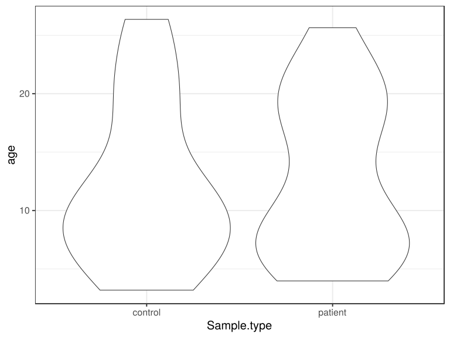
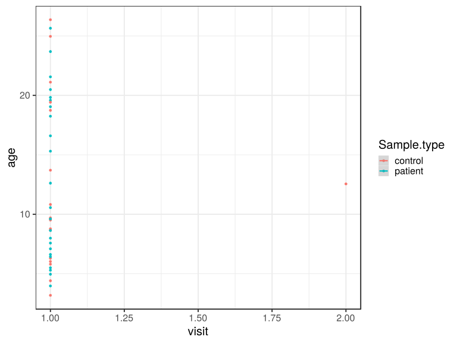
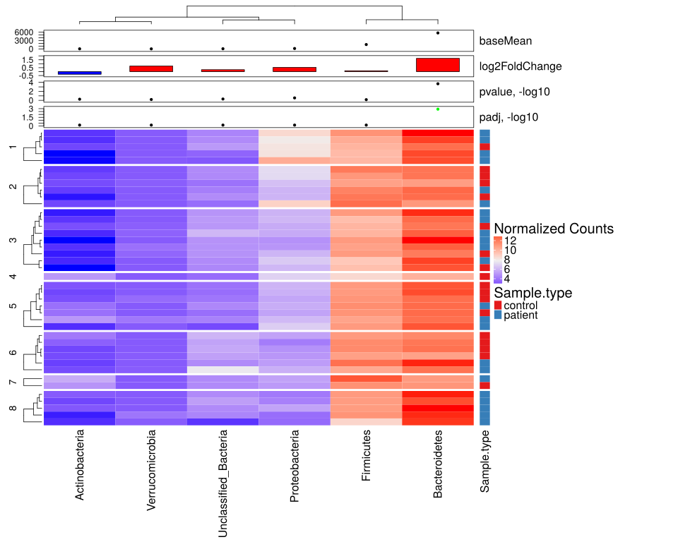
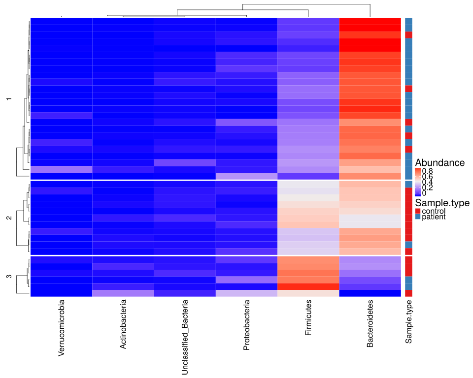

noone@mail.com
Analysis of Dieting study 16S data
% Fri Sep  7 05:46:18 2018


#### \(1.2.1.1\) Taxonomic level: 2 of Subset: Patient/control samples before diet aggregated by SubjectID


##### \(1.2.1.1.1\) Loading counts and metadata

[`Subreport`](./1.2.1.1.1-report.html)


##### \(1.2.1.1.2\) Summary of metadata variables


##### \(1.2.1.1.3\) Summary of metadata variables after filtering samples


\(1.2.1.1.3\)  Summary of metadata variables.


| SampleID   | MatchedGroupID | SubjectID  | Sample.type | Sample.type.1          | DietStatus     | Drug          | Complaints    | age            | age.quant      | visit         | Drug.Before.Diet  | Sample.type.Drug.Before | visit.max     | visit.min | visit.1      | visit.2       | has.matched.subject | Sample.type.ord | FullLabel        | Drug.Before.Diet.Visit |
|:-----------|:---------------|:-----------|:------------|:-----------------------|:---------------|:--------------|:--------------|:---------------|:---------------|:--------------|:------------------|:------------------------|:--------------|:----------|:-------------|:--------------|:--------------------|:----------------|:-----------------|:-----------------------|
| SB1    : 1 | MG1    : 2     | SB1    : 1 | control:18  | control            :18 | before.diet:41 | Mode :logical | Mode :logical | Min.   : 3.182 | [3.18,6.27]: 8 | Min.   :1.000 | DrugBefore_NO :27 | 1              :18      | Min.   :1.000 | Min.   :1 | Mode:logical | Mode :logical | Mode :logical       | control:18      | Length:41        | Length:41              |
| SB10   : 1 | MG10   : 2     | SB10   : 1 | patient:23  | patient.before.diet:23 | NA             | FALSE:27      | FALSE:37      | 1st Qu.: 6.619 | (6.27,8.71]: 8 | 1st Qu.:1.000 | DrugBefore_YES:14 | patient FALSE .:10      | 1st Qu.:1.000 | 1st Qu.:1 | TRUE:41      | FALSE:20      | FALSE:7             | patient:23      | Class :character | Class :character       |
| SB11   : 1 | MG13   : 2     | SB11   : 1 | NA          | NA                     | NA             | TRUE :14      | TRUE :4       | Median : 9.699 | (8.71,15.3]:11 | Median :1.000 | NA                | patient TRUE . :13      | Median :2.000 | Median :1 | NA           | TRUE :21      | TRUE :34            | NA              | Mode  :character | Mode  :character       |
| SB12   : 1 | MG14   : 2     | SB12   : 1 | NA          | NA                     | NA             | NA            | NA            | Mean   :12.599 | (15.3,26.4]:14 | Mean   :1.024 | NA                | NA                      | Mean   :2.439 | Mean   :1 | NA           | NA            | NA                  | NA              | NA               | NA                     |
| SB13   : 1 | MG16   : 2     | SB13   : 1 | NA          | NA                     | NA             | NA            | NA            | 3rd Qu.:19.048 | NA             | 3rd Qu.:1.000 | NA                | NA                      | 3rd Qu.:4.000 | 3rd Qu.:1 | NA           | NA            | NA                  | NA              | NA               | NA                     |
| SB14   : 1 | MG17   : 2     | SB14   : 1 | NA          | NA                     | NA             | NA            | NA            | Max.   :26.366 | NA             | Max.   :2.000 | NA                | NA                      | Max.   :7.000 | Max.   :1 | NA           | NA            | NA                  | NA              | NA               | NA                     |
| (Other):35 | (Other):29     | (Other):35 | NA          | NA                     | NA             | NA            | NA            | NA             | NA             | NA            | NA                | NA                      | NA            | NA        | NA           | NA            | NA                  | NA              | NA               | NA                     |


\(1.2.1.1.3\)  Sample cross tabulation ~Sample.type+DietStatus.


|   &nbsp;    | before.diet |
|:-----------:|:------------|
| **control** | 18          |
| **patient** | 23          |


```````
Call: xtabs(formula = as.formula(xtabs.formula), data = meta, drop.unused.levels = T)
Number of cases in table: 41 
Number of factors: 2 
Test for independence of all factors:
	Chisq = 5.488e-31, df = 0, p-value = 0
```````


\(1.2.1.1.3\)  Sample cross tabulation ~Drug.Before.Diet + Sample.type.


|       &nbsp;       | control | patient |
|:------------------:|:--------|:--------|
| **DrugBefore_NO**  | 17      | 10      |
| **DrugBefore_YES** | 1       | 13      |


```````
Call: xtabs(formula = as.formula(xtabs.formula), data = meta, drop.unused.levels = T)
Number of cases in table: 41 
Number of factors: 2 
Test for independence of all factors:
	Chisq = 11.664, df = 1, p-value = 0.0006371
```````


\(1.2.1.1.3\)  Sample cross tabulation ~Complaints + Sample.type.


|  &nbsp;   | control | patient |
|:---------:|:--------|:--------|
| **FALSE** | 18      | 19      |
| **TRUE**  | 0       | 4       |


```````
Call: xtabs(formula = as.formula(xtabs.formula), data = meta, drop.unused.levels = T)
Number of cases in table: 41 
Number of factors: 2 
Test for independence of all factors:
	Chisq = 3.469, df = 1, p-value = 0.06253
	Chi-squared approximation may be incorrect
```````


\(1.2.1.1.3\)  Sample cross tabulation ~Sample.type+visit.


|   &nbsp;    | 1  | 2 |
|:-----------:|:---|:--|
| **control** | 17 | 1 |
| **patient** | 23 | 0 |


```````
Call: xtabs(formula = as.formula(xtabs.formula), data = meta, drop.unused.levels = T)
Number of cases in table: 41 
Number of factors: 2 
Test for independence of all factors:
	Chisq = 1.3097, df = 1, p-value = 0.2524
	Chi-squared approximation may be incorrect
```````


\(1.2.1.1.3\)  Sample cross tabulation ~MatchedGroupID.


| MG1 | MG10 | MG11 | MG12 | MG13 | MG14 | MG15 | MG16 | MG17 | MG18 | MG19 | MG2 | MG20 | MG21 | MG22 | MG23 | MG24 | MG25 | MG26 | MG3 | MG4 | MG5 | MG6 | MG8 | MG9 |
|:----|:-----|:-----|:-----|:-----|:-----|:-----|:-----|:-----|:-----|:-----|:----|:-----|:-----|:-----|:-----|:-----|:-----|:-----|:----|:----|:----|:----|:----|:----|
| 2   | 2    | 1    | 1    | 2    | 2    | 1    | 2    | 2    | 1    | 2    | 2   | 1    | 2    | 2    | 2    | 1    | 2    | 1    | 2   | 2   | 1   | 2   | 2   | 1   |


```````
Number of cases in table: 41 
Number of factors: 1 
```````


\(1.2.1.1.3\)  Sample cross tabulation ~Sample.type.1.


| control | patient.before.diet |
|:--------|:--------------------|
| 18      | 23                  |


```````
Number of cases in table: 41 
Number of factors: 1 
```````


\(1.2.1.1.3\)  Sample cross tabulation ~SubjectID.


| SB1 | SB10 | SB11 | SB12 | SB13 | SB14 | SB15 | SB16 | SB17 | SB18 | SB19 | SB21 | SB22 | SB23 | SB24 | SB25 | SB26 | SB28 | SB29 | SB3 | SB30 | SB31 | SB32 | SB33 | SB34 | SB35 | SB36 | SB38 | SB39 | SB4 | SB40 | SB41 | SB42 | SB43 | SB44 | SB45 | SB5 | SB6 | SB7 | SB8 | SB9 |
|:----|:-----|:-----|:-----|:-----|:-----|:-----|:-----|:-----|:-----|:-----|:-----|:-----|:-----|:-----|:-----|:-----|:-----|:-----|:----|:-----|:-----|:-----|:-----|:-----|:-----|:-----|:-----|:-----|:----|:-----|:-----|:-----|:-----|:-----|:-----|:----|:----|:----|:----|:----|
| 1   | 1    | 1    | 1    | 1    | 1    | 1    | 1    | 1    | 1    | 1    | 1    | 1    | 1    | 1    | 1    | 1    | 1    | 1    | 1   | 1    | 1    | 1    | 1    | 1    | 1    | 1    | 1    | 1    | 1   | 1    | 1    | 1    | 1    | 1    | 1    | 1   | 1   | 1   | 1   | 1   |


```````
Number of cases in table: 41 
Number of factors: 1 
```````


\(1.2.1.1.3\)  ANOVA for age and sample type.


```````
            Df Sum Sq Mean Sq F value Pr(>F)
Sample.type  1      5    4.99   0.103   0.75
Residuals   39   1890   48.46               
```````


\(1.2.1.1.3\) <a name="figure.237"></a>[`Figure 237.`](#figure.237) Violin plot for age and sample type.  Image file: [`plots/32372332635.svg`](plots/32372332635.svg).



\(1.2.1.1.3\)  Spearman RHO for age and visit.


| Test statistic | P value | Alternative hypothesis | rho    |
|:---------------|:--------|:-----------------------|:-------|
| 11020          | 0.8035  | two.sided              | 0.0401 |

Table: Spearman's rank correlation rho: `age` and `visit`


\(1.2.1.1.3\)  Spearman RHO for age and visit, patients only.


| Test statistic | P value | Alternative hypothesis | rho |
|:---------------|:--------|:-----------------------|:----|
| NA             | NA NA   | two.sided              | NA  |

Table: Spearman's rank correlation rho: `age` and `visit`


\(1.2.1.1.3\) <a name="figure.238"></a>[`Figure 238.`](#figure.238) Plot for age and visit with Loess trend line.  Image file: [`plots/323aa3b910.svg`](plots/323aa3b910.svg).



\(1.2.1.1.3\) <a name="widget.74"></a>[`Widget 74.`](#widget.74) Dynamic Pivot Table to explore metadata distribution 
                    at the lowest granularity (drag and drop field names and pick averaging 
                    functions or plot types). Click to see HTML widget file in full window: [`./1.2.1.1.3-323357389c3Dynamic.Pivot.Table.html`](./1.2.1.1.3-323357389c3Dynamic.Pivot.Table.html)


<iframe src="./1.2.1.1.3-323357389c3Dynamic.Pivot.Table.html" width="800" height="800"> </iframe>


##### \(1.2.1.1.4\) Summary of total counts per sample

[`Subreport`](./1.2.1.1.4-report.html)


##### \(1.2.1.1.5\) Data analysis


Filtering abundance matrix with arguments [ min_mean                :10, min_quant_incidence_frac:0.25, min_quant_mean_frac     :0.25]. Filtering features


Note that some community richness estimators will not work correctly 
               if provided with abundance-filtered counts


After filtering, left 41 records for 7 features


Wrote counts and metadata for raw counts After final feature filtering to files [`data/1.2.1.1.5.1-3236b78d6easamples.raw.16s.l.2.count.tsv`](data/1.2.1.1.5.1-3236b78d6easamples.raw.16s.l.2.count.tsv),[`data/1.2.1.1.5.1-3236b78d6easamples.raw.16s.l.2.attr.tsv`](data/1.2.1.1.5.1-3236b78d6easamples.raw.16s.l.2.attr.tsv)


Wrote counts and metadata for proportions counts After final feature filtering to files [`data/1.2.1.1.5.1-32368f3bb17samples.proportions.16s.l.2.count.tsv`](data/1.2.1.1.5.1-32368f3bb17samples.proportions.16s.l.2.count.tsv),[`data/1.2.1.1.5.1-32368f3bb17samples.proportions.16s.l.2.attr.tsv`](data/1.2.1.1.5.1-32368f3bb17samples.proportions.16s.l.2.attr.tsv)


##### \(1.2.1.1.5.2\) DESeq2 tests and data normalization


Love MI, Huber W, Anders S (2014). “Moderated estimation of fold change and dispersion for RNA-seq data with DESeq2.” _Genome Biology_, *15*,
550. doi: 10.1186/s13059-014-0550-8 (URL: http://doi.org/10.1186/s13059-014-0550-8).


\(1.2.1.1.5.2.1\) <a name="table.72"></a>[`Table 72.`](#table.72) DESeq2 results for task: Sample.type;\[ alpha:0.05\]. Full dataset is also saved in a delimited text file (click to download and open e.g. in Excel) [`data/1.2.1.1.5.2.1-32354cbf399.1.2.1.1.5.2.1.a.nam.csv`](data/1.2.1.1.5.2.1-32354cbf399.1.2.1.1.5.2.1.a.nam.csv)


| feature                | baseMean | log2FoldChange | lfcSE  | stat     | pvalue    | padj     | i.baseMean | baseVar    | allZero | dispGeneEst | dispGeneIter | dispFit    | dispersion | dispIter | dispOutlier | dispMAP    | Intercept | Sample.type\_patient\_vs\_control | SE\_Intercept | SE\_Sample.type\_patient\_vs\_control | WaldStatistic\_Intercept | WaldStatistic\_Sample.type\_patient\_vs\_control | WaldPvalue\_Intercept | WaldPvalue\_Sample.type\_patient\_vs\_control | betaConv | betaIter | deviance | maxCooks | replace |
|:-----------------------|:---------|:---------------|:-------|:---------|:----------|:---------|:-----------|:-----------|:--------|:------------|:-------------|:-----------|:-----------|:---------|:------------|:-----------|:----------|:----------------------------------|:--------------|:--------------------------------------|:-------------------------|:-------------------------------------------------|:----------------------|:----------------------------------------------|:---------|:---------|:---------|:---------|:--------|
| Bacteroidetes          | 5702.677 | 1.6824         | 0.4530 | 3.7142   | 0.0002039 | 0.001223 | 5702.677   | 2.861e\+07 | FALSE   | 0.9952      | 8            | 9.952e\-01 | 0.9952     | 5        | FALSE       | 9.952e\-01 | 11.314    | 1.6824                            | 0.3393        | 0.4530                                | 33.349                   | 3.7142                                           | 7.503e\-244           | 0.0002039                                     | TRUE     | 5        | 778.7    | NA       | FALSE   |
| Proteobacteria         | 133.560  | 0.5409         | 0.5114 | 1.0578   | 0.2901670 | 0.711106 | 133.560    | 3.561e\+04 | FALSE   | 1.2595      | 11           | 4.138e\-03 | 1.2595     | 14       | TRUE        | 6.544e\-01 | 6.735     | 0.5409                            | 0.3825        | 0.5114                                | 17.609                   | 1.0578                                           | 2.117e\-69            | 0.2901670                                     | TRUE     | 6        | 481.6    | NA       | TRUE    |
| Unclassified\_Bacteria | 47.634   | 0.2409         | 0.3627 | 0.6643   | 0.5065130 | 0.711106 | 47.634     | 2.918e\+03 | FALSE   | 0.5801      | 7            | 7.973e\-01 | 0.6126     | 12       | FALSE       | 6.126e\-01 | 5.448     | 0.2409                            | 0.2692        | 0.3627                                | 20.238                   | 0.6643                                           | 4.563e\-91            | 0.5065130                                     | TRUE     | 4        | 393.9    | NA       | FALSE   |
| Actinobacteria         | 21.825   | \-0.3371       | 0.5814 | \-0.5798 | 0.5620761 | 0.711106 | 21.825     | 1.255e\+03 | FALSE   | 1.5797      | 12           | 1.580e\+00 | 1.5796     | 5        | FALSE       | 1.580e\+00 | 4.624     | \-0.3371                          | 0.4308        | 0.5814                                | 10.735                   | \-0.5798                                         | 6.962e\-27            | 0.5620761                                     | TRUE     | 6        | 333.0    | NA       | FALSE   |
| Verrucomicrobia        | 8.326    | 0.7079         | 1.5903 | 0.4452   | 0.6561933 | 0.711106 | 8.326      | 8.464e\+02 | FALSE   | 12.1192     | 10           | 5.130e\-11 | 12.1192    | 1        | TRUE        | 1.000e\-08 | 2.614     | 0.7079                            | 1.1887        | 1.5903                                | 2.199                    | 0.4452                                           | 2.786e\-02            | 0.6561933                                     | TRUE     | 12       | 156.3    | NA       | TRUE    |
| Firmicutes             | 1554.632 | 0.1072         | 0.2895 | 0.3704   | 0.7111062 | 0.711106 | 1554.632   | 1.233e\+06 | FALSE   | 0.4059      | 11           | 4.059e\-01 | 0.4059     | 5        | FALSE       | 4.059e\-01 | 10.541    | 0.1072                            | 0.2168        | 0.2895                                | 48.634                   | 0.3704                                           | 0.000e\+00            | 0.7111062                                     | TRUE     | 4        | 668.6    | NA       | FALSE   |


\(1.2.1.1.5.2.1\) <a name="figure.239"></a>[`Figure 239.`](#figure.239) Clustered heatmap of normalized abundance values. Number of cluster splits is determined automatically with method `fpc::pamk`.  Image file: [`plots/3232f330eb0.svg`](plots/3232f330eb0.svg).



\(1.2.1.1.5.2.1\)  G-test of independence between automatic cluster splits and attribute 'Sample.type'. Number of cluster splits is determined automatically with method `fpc::pamk`.


| Test statistic | X-squared df | P value |
|:---------------|:-------------|:--------|
| 10.31          | 7            | 0.1719  |

Table: Log likelihood ratio (G-test) test of independence with Williams' correction: `m_a$attr[, main.meta.var]` and `split`


Wrote counts and metadata for raw counts Data used for heatmap with added row cluster splits to files [`data/1.2.1.1.5.2.1-32344c71d25samples.raw.htmap.count.tsv`](data/1.2.1.1.5.2.1-32344c71d25samples.raw.htmap.count.tsv),[`data/1.2.1.1.5.2.1-32344c71d25samples.raw.htmap.attr.tsv`](data/1.2.1.1.5.2.1-32344c71d25samples.raw.htmap.attr.tsv)


##### \(1.2.1.1.5.3\) Default transformations for further data analysis


Specific methods can override these and use their own normalization.


Count normalization method for data analysis (unless modified by specific methods) : [ drop.features:List of 1,  ..$ :"other", method.args  :List of 1,  ..$ theta:1, method       :"norm.ihs.prop"]


Wrote counts and metadata for raw counts Normalized after default transformations to files [`data/1.2.1.1.5.3-3233b4315fasamples.raw.16s.l.2.count.tsv`](data/1.2.1.1.5.3-3233b4315fasamples.raw.16s.l.2.count.tsv),[`data/1.2.1.1.5.3-3233b4315fasamples.raw.16s.l.2.attr.tsv`](data/1.2.1.1.5.3-3233b4315fasamples.raw.16s.l.2.attr.tsv)


##### \(1.2.1.1.6\) GeneSelector stability ranking


Slawski M, Boulesteix. A (????). _GeneSelector: Stability and Aggregation of ranked gene lists_. R package version 2.31.0.


Wilcoxon test (rank-sum for independent samples and signed-rank for paired samples) 
                   is applied to each feature (feature, gene) on random
                   subsamples of the data. Consensus ranking is found with a
                   Monte Carlo procedure ((method AggregateMC in GeneSelector package). 
                   features ordered according to the consensus ranking
                   are returned, along with the p-values, statistic and effect size 
                   computed on the full
                   original dataset. In a special case when no replications are requested,
                   features are ordered by the adjuested p-value. 
                   P-values are reported with and without the 
                   multiple testing correction of Benjamini & Hochberg. The effect sizes
                   for Wilcoxon tests are reported as: common-language effect
                   size (proportion of pairs where observations from the second group
                   are larger than observations from the first group; no effect
                   corresponds to 0.5); rank-biserial
                   correlation (common language effect size minus its complement; no
                   effect corresponds to 0; range is [-1;1]) and
                   absolute value of r (as defined in Cohen, J. (1988). Statistical power 
                   analysis for the behavioral sciences (2nd ed.). Hillsdale, NJ: Erlbaum.).
                   For paired samples, when calculating the common language effect size,
                   only paired observations are used, and one half of the number of ties is 
                   added to the numerator (Grissom, R. J., and J. J. Kim. "Effect Sizes for Research: Univariate 
                   and Multivariate Applications, 2nd Edn New York." NY: Taylor and Francis (2012)).
                   Logarithm in base 2 of the fold change (l2fc) is also reported if requested.
                   For independent samples, the fold change is computed between the sample means of
                   the groups (last to first). For paired samples - as the sample median of the logfold change
                   in each matched pair of observations.


Stability selection parameters are: [ comp.log.fold.change:TRUE, maxrank             :20, samp.fold.ratio     :0.5, replicates          :400, type                :"unpaired", block.attr          : NULL]


\(1.2.1.1.6\)  Summary of response variable (unpaired samples) Sample.type.


```````
control patient 
     18      23 
```````


\(1.2.1.1.6\) <a name="table.73"></a>[`Table 73.`](#table.73) GeneSelector stability ranking for response Sample.type.  When fold change or difference is computed, this is done as 'patient by control'. Full dataset is also saved in a delimited text file (click to download and open e.g. in Excel) [`data/1.2.1.1.6-32355ae3055.1.2.1.1.6.a.name.ta.csv`](data/1.2.1.1.6-32355ae3055.1.2.1.1.6.a.name.ta.csv)


| name                   | statistic | pval      | pval.adjusted | common.lang.eff.size | rank.biserial.corr.eff.size | r.eff.size | l2fc.patient.by.control | mean.control | mean.patient |
|:-----------------------|:----------|:----------|:--------------|:---------------------|:----------------------------|:-----------|:------------------------|:-------------|:-------------|
| Firmicutes             | 78.0      | 0.0004325 | 0.002146      | 0.1884               | \-0.62319                   | 0.54964    | \-0.9834                | 0.392836     | 0.198688     |
| Bacteroidetes          | 332.0     | 0.0007154 | 0.002146      | 0.8019               | 0.60386                     | 0.52843    | 0.4846                  | 0.483394     | 0.676370     |
| Unclassified\_Bacteria | 91.0      | 0.0017435 | 0.003487      | 0.2198               | \-0.56039                   | 0.48894    | \-0.7463                | 0.014395     | 0.008581     |
| Actinobacteria         | 100.5     | 0.0042764 | 0.006415      | 0.2428               | \-0.51449                   | 0.44619    | \-2.4191                | 0.016480     | 0.003081     |
| Proteobacteria         | 153.0     | 0.1576428 | 0.189171      | 0.3696               | \-0.26087                   | 0.22068    | \-0.4851                | 0.041891     | 0.029929     |
| Verrucomicrobia        | 198.5     | 0.8052285 | 0.805228      | 0.4795               | \-0.04106                   | 0.03851    | 1.6096                  | 0.003447     | 0.010518     |


##### \(1.2.1.1.7\) Stability selection analysis for response ( Sample.type )


##### \(1.2.1.1.8\) PermANOVA (adonis) analysis of  normalized counts


Oksanen J, Blanchet FG, Friendly M, Kindt R, Legendre P, McGlinn D, Minchin PR, O'Hara RB, Simpson GL, Solymos P, Stevens MHH, Szoecs E, Wagner
H (2018). _vegan: Community Ecology Package_. R package version 2.5-2, <URL: https://CRAN.R-project.org/package=vegan>.


Non-parametric multivariate test for association between
                           normalized counts and meta-data variables. Dissimilarity index is euclidean.


\(1.2.1.1.8\)  Association with the patient/control status unpaired with formula count\~Sample.type .


```````
Permutation test for adonis under reduced model
Terms added sequentially (first to last)
Permutation: free
Number of permutations: 4000

adonis2(formula = as.formula(formula_str), data = m_a$attr, permutations = perm, method = dist.metr)
            Df SumOfSqs      R2      F   Pr(>F)   
Sample.type  1   0.7607 0.18289 8.7293 0.002999 **
Residual    39   3.3988 0.81711                   
Total       40   4.1595 1.00000                   
---
Signif. codes:  0 ‘***’ 0.001 ‘**’ 0.01 ‘*’ 0.05 ‘.’ 0.1 ‘ ’ 1
```````


\(1.2.1.1.8\)  Association with the patient/control status unpaired Adonis summary.


|     &nbsp;      | Df | SumOfSqs | R2     | F     | Pr(>F) |
|:---------------:|:---|:---------|:-------|:------|:-------|
| **Sample.type** | 1  | 0.7607   | 0.1829 | 8.729 | 0.003  |
|  **Residual**   | 39 | 3.399    | 0.8171 | NA    | NA     |
|    **Total**    | 40 | 4.16     | 1      | NA    | NA     |

Table: Permutation test for adonis under reduced model


\(1.2.1.1.8\)  Association with the age quartiles and patient/control status with formula count\~age.quant \* Sample.type .


```````
Permutation test for adonis under reduced model
Terms added sequentially (first to last)
Permutation: free
Number of permutations: 4000

adonis2(formula = as.formula(formula_str), data = m_a$attr, permutations = perm, method = dist.metr)
                      Df SumOfSqs      R2      F   Pr(>F)   
age.quant              3   0.1214 0.02918 0.5234 0.694826   
Sample.type            1   0.7577 0.18216 9.8024 0.002999 **
age.quant:Sample.type  3   0.7297 0.17544 3.1470 0.029493 * 
Residual              33   2.5508 0.61323                   
Total                 40   4.1595 1.00000                   
---
Signif. codes:  0 ‘***’ 0.001 ‘**’ 0.01 ‘*’ 0.05 ‘.’ 0.1 ‘ ’ 1
```````


\(1.2.1.1.8\)  Association with the age quartiles and patient/control status Adonis summary.


|          &nbsp;           | Df | SumOfSqs | R2     | F      | Pr(>F) |
|:-------------------------:|:---|:---------|:-------|:-------|:-------|
|       **age.quant**       | 3  | 0.1214   | 0.0292 | 0.5234 | 0.6948 |
|      **Sample.type**      | 1  | 0.7577   | 0.1822 | 9.802  | 0.003  |
| **age.quant:Sample.type** | 3  | 0.7297   | 0.1754 | 3.147  | 0.0295 |
|       **Residual**        | 33 | 2.551    | 0.6132 | NA     | NA     |
|         **Total**         | 40 | 4.16     | 1      | NA     | NA     |

Table: Permutation test for adonis under reduced model


Count normalization method for abundance plots : [ drop.features:List of 1,  ..$ :"other", method.args  : list(), method       :"norm.prop"]


##### \(1.2.1.1.9\) Plots of Abundance.

[`Subreport`](./1.2.1.1.9-report.html)


\(1.2.1.1.9\) <a name="figure.266"></a>[`Figure 266.`](#figure.266) Clustered heatmap of normalized abundance values. Number of cluster splits is determined automatically with method `fpc::pamk`.  Image file: [`plots/3232e0ec5bd.svg`](plots/3232e0ec5bd.svg).



\(1.2.1.1.9\)  G-test of independence between automatic cluster splits and attribute 'Sample.type'. Number of cluster splits is determined automatically with method `fpc::pamk`.


| Test statistic | X-squared df | P value     |
|:---------------|:-------------|:------------|
| 12.7           | 2            | 0.0017  * * |

Table: Log likelihood ratio (G-test) test of independence with Williams' correction: `m_a$attr[, main.meta.var]` and `split`


person) (????). _morpheus: Interactive heat maps using 'morpheus.js' and 'htmlwidgets'_. R package version 0.1.1.1, <URL:
https://github.com/cmap/morpheus.R>.


\(1.2.1.1.9\) <a name="widget.79"></a>[`Widget 79.`](#widget.79) Dynamic Morpheus heatmap of normalized abundance values. 
                    It is available here through the link only because it can take a while to render for large datasets.
                    This is very customizable. What you will see initially is just a default starting configuration. Explore its menus. Click to see HTML widget file in full window: [`./1.2.1.1.9-323110f5dacDynamic.Morpheus.hea.html`](./1.2.1.1.9-323110f5dacDynamic.Morpheus.hea.html)


Wrote counts and metadata for raw counts Data used for heatmap with added row cluster splits (clustering by abundance profile) to files [`data/1.2.1.1.9-32318470ca3samples.raw.htmap.count.tsv`](data/1.2.1.1.9-32318470ca3samples.raw.htmap.count.tsv),[`data/1.2.1.1.9-32318470ca3samples.raw.htmap.attr.tsv`](data/1.2.1.1.9-32318470ca3samples.raw.htmap.attr.tsv)


##### \(1.2.1.1.10\) Ordinations, 

[`Subreport`](./1.2.1.1.10-report.html)


##### \(1.2.1.1.11\) Network Analysis Feature correlation with overlaid differential abundance results 

[`Subreport`](./1.2.1.1.11-report.html)