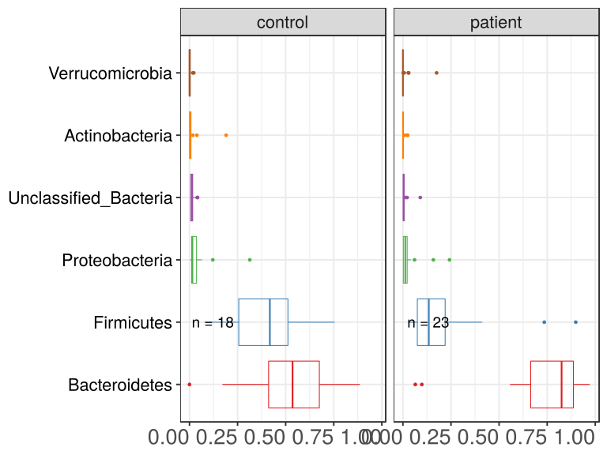
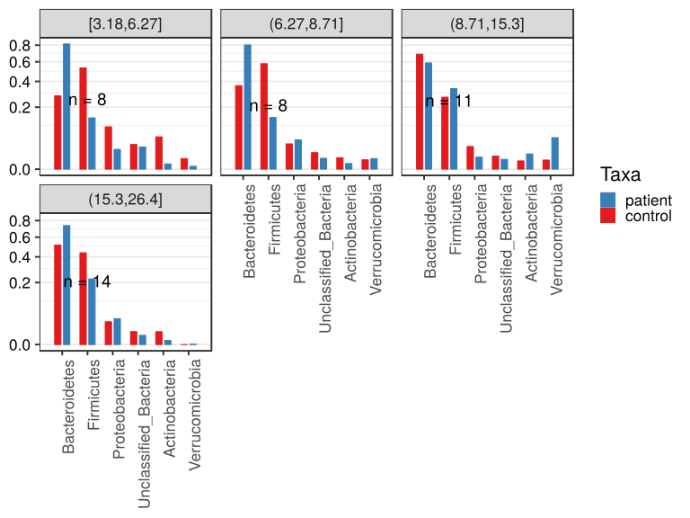

noone@mail.com
Analysis of Dieting study 16S data
% Fri Sep  7 05:46:18 2018

##### \(1.2.1.1.9\) Plots of Abundance.

Plots are shown with relation to various combinations of meta 
                   data variables and in different graphical representations. Lots of plots here.

##### \(1.2.1.1.9.2\) Iterating over all combinations of grouping variables

##### \(1.2.1.1.9.2.1\) Grouping variables Sample.type

##### \(1.2.1.1.9.2.2\) Iterating over Abundance. profile sorting order

##### \(1.2.1.1.9.2.2.1\) Abundance. profile sorting order: average abundance

##### \(1.2.1.1.9.2.2.2\) Iterating over dodged vs faceted bars

The same data are shown in multiple combinations of graphical representations. 
                         This is the same data, but each plot highlights slightly different aspects of it.
                         It is not likely that you will need every plot - pick only what you need.

##### \(1.2.1.1.9.2.2.2.1\) faceted plots. Iterating over orientation and, optionally, scaling

##### \(1.2.1.1.9.2.2.2.1.1\) Abundance. Plot is in original orientation, Y axis SQRT scaled. Iterating over plot geometry

\(1.2.1.1.9.2.2.2.1.1.0\) [`Table 74.`](#table.74) Data table used for plots. Data grouped by Sample.type. Showing only 200 first rows. Full dataset is also saved in a delimited text file (click to download and open e.g. in Excel) [`data/1.2.1.1.9.2.2.2.1.1.0-323f511bee.1.2.1.1.9.2.2.2.1.1.csv`](data/1.2.1.1.9.2.2.2.1.1.0-323f511bee.1.2.1.1.9.2.2.2.1.1.csv)

| .record.id | Sample.type | feature                | Abundance |
|:-----------|:------------|:-----------------------|:----------|
| SB1        | control     | Bacteroidetes          | 0.6847011 |
| SB10       | control     | Bacteroidetes          | 0.5636549 |
| SB11       | patient     | Bacteroidetes          | 0.7549107 |
| SB12       | control     | Bacteroidetes          | 0.0000000 |
| SB13       | control     | Bacteroidetes          | 0.2200704 |
| SB14       | control     | Bacteroidetes          | 0.7867457 |
| SB15       | control     | Bacteroidetes          | 0.5339906 |
| SB16       | patient     | Bacteroidetes          | 0.8191974 |
| SB17       | patient     | Bacteroidetes          | 0.8667524 |
| SB18       | patient     | Bacteroidetes          | 0.8869878 |
| SB19       | control     | Bacteroidetes          | 0.2319887 |
| SB21       | control     | Bacteroidetes          | 0.1707756 |
| SB22       | patient     | Bacteroidetes          | 0.6115163 |
| SB23       | patient     | Bacteroidetes          | 0.7781065 |
| SB24       | control     | Bacteroidetes          | 0.7198795 |
| SB25       | control     | Bacteroidetes          | 0.6155158 |
| SB26       | control     | Bacteroidetes          | 0.5052377 |
| SB28       | patient     | Bacteroidetes          | 0.6904013 |
| SB29       | patient     | Bacteroidetes          | 0.9046076 |
| SB3        | control     | Bacteroidetes          | 0.4111917 |
| SB30       | patient     | Bacteroidetes          | 0.8563497 |
| SB31       | control     | Bacteroidetes          | 0.6462271 |
| SB32       | control     | Bacteroidetes          | 0.4116736 |
| SB33       | control     | Bacteroidetes          | 0.8226714 |
| SB34       | patient     | Bacteroidetes          | 0.7837908 |
| SB35       | patient     | Bacteroidetes          | 0.9714974 |
| SB36       | patient     | Bacteroidetes          | 0.8668189 |
| SB38       | patient     | Bacteroidetes          | 0.9344382 |
| SB39       | patient     | Bacteroidetes          | 0.5561997 |
| SB4        | patient     | Bacteroidetes          | 0.9321676 |
| SB40       | control     | Bacteroidetes          | 0.5376651 |
| SB41       | patient     | Bacteroidetes          | 0.9297539 |
| SB42       | patient     | Bacteroidetes          | 0.6381524 |
| SB43       | patient     | Bacteroidetes          | 0.8861386 |
| SB44       | patient     | Bacteroidetes          | 0.8253707 |
| SB45       | control     | Bacteroidetes          | 0.8860391 |
| SB5        | patient     | Bacteroidetes          | 0.0982678 |
| SB6        | patient     | Bacteroidetes          | 0.8249907 |
| SB7        | control     | Bacteroidetes          | 0.4787347 |
| SB8        | patient     | Bacteroidetes          | 0.5680175 |
| SB9        | patient     | Bacteroidetes          | 0.0643696 |
| SB1        | control     | Firmicutes             | 0.1777677 |
| SB10       | control     | Firmicutes             | 0.3690709 |
| SB11       | patient     | Firmicutes             | 0.2004464 |
| SB12       | control     | Firmicutes             | 0.4655685 |
| SB13       | control     | Firmicutes             | 0.6870599 |
| SB14       | control     | Firmicutes             | 0.1964930 |
| SB15       | control     | Firmicutes             | 0.4376724 |
| SB16       | patient     | Firmicutes             | 0.1419115 |
| SB17       | patient     | Firmicutes             | 0.0873312 |
| SB18       | patient     | Firmicutes             | 0.1035274 |
| SB19       | control     | Firmicutes             | 0.7000176 |
| SB21       | control     | Firmicutes             | 0.7545438 |
| SB22       | patient     | Firmicutes             | 0.3619962 |
| SB23       | patient     | Firmicutes             | 0.2169177 |
| SB24       | control     | Firmicutes             | 0.2306368 |
| SB25       | control     | Firmicutes             | 0.3429241 |
| SB26       | control     | Firmicutes             | 0.4700510 |
| SB28       | patient     | Firmicutes             | 0.0664831 |
| SB29       | patient     | Firmicutes             | 0.0910727 |
| SB3        | control     | Firmicutes             | 0.5150259 |
| SB30       | patient     | Firmicutes             | 0.1129618 |
| SB31       | control     | Firmicutes             | 0.3329670 |
| SB32       | control     | Firmicutes             | 0.5380090 |
| SB33       | control     | Firmicutes             | 0.1656713 |
| SB34       | patient     | Firmicutes             | 0.1926574 |
| SB35       | patient     | Firmicutes             | 0.0272983 |
| SB36       | patient     | Firmicutes             | 0.0711568 |
| SB38       | patient     | Firmicutes             | 0.0457112 |
| SB39       | patient     | Firmicutes             | 0.2222222 |
| SB4        | patient     | Firmicutes             | 0.0630087 |
| SB40       | control     | Firmicutes             | 0.3980721 |
| SB41       | patient     | Firmicutes             | 0.0667050 |
| SB42       | patient     | Firmicutes             | 0.2489554 |
| SB43       | patient     | Firmicutes             | 0.0789167 |
| SB44       | patient     | Firmicutes             | 0.1639209 |
| SB45       | control     | Firmicutes             | 0.0789706 |
| SB5        | patient     | Firmicutes             | 0.7350474 |
| SB6        | patient     | Firmicutes             | 0.1345940 |
| SB7        | control     | Firmicutes             | 0.5021584 |
| SB8        | patient     | Firmicutes             | 0.4124769 |
| SB9        | patient     | Firmicutes             | 0.8985233 |
| SB1        | control     | Proteobacteria         | 0.1211639 |
| SB10       | control     | Proteobacteria         | 0.0544154 |
| SB11       | patient     | Proteobacteria         | 0.0049107 |
| SB12       | control     | Proteobacteria         | 0.3135296 |
| SB13       | control     | Proteobacteria         | 0.0642606 |
| SB14       | control     | Proteobacteria         | 0.0110882 |
| SB15       | control     | Proteobacteria         | 0.0053778 |
| SB16       | patient     | Proteobacteria         | 0.0223417 |
| SB17       | patient     | Proteobacteria         | 0.0415434 |
| SB18       | patient     | Proteobacteria         | 0.0056413 |
| SB19       | control     | Proteobacteria         | 0.0139158 |
| SB21       | control     | Proteobacteria         | 0.0190750 |
| SB22       | patient     | Proteobacteria         | 0.0122841 |
| SB23       | patient     | Proteobacteria         | 0.0021517 |
| SB24       | control     | Proteobacteria         | 0.0196500 |
| SB25       | control     | Proteobacteria         | 0.0110827 |
| SB26       | control     | Proteobacteria         | 0.0021488 |
| SB28       | patient     | Proteobacteria         | 0.2423289 |
| SB29       | patient     | Proteobacteria         | 0.0003600 |
| SB3        | control     | Proteobacteria         | 0.0163731 |
| SB30       | patient     | Proteobacteria         | 0.0002524 |
| SB31       | control     | Proteobacteria         | 0.0093773 |
| SB32       | control     | Proteobacteria         | 0.0410280 |
| SB33       | control     | Proteobacteria         | 0.0081544 |
| SB34       | patient     | Proteobacteria         | 0.0219067 |
| SB35       | patient     | Proteobacteria         | 0.0000000 |
| SB36       | patient     | Proteobacteria         | 0.0605023 |
| SB38       | patient     | Proteobacteria         | 0.0151156 |
| SB39       | patient     | Proteobacteria         | 0.0186795 |
| SB4        | patient     | Proteobacteria         | 0.0021103 |
| SB40       | control     | Proteobacteria         | 0.0232060 |
| SB41       | patient     | Proteobacteria         | 0.0011951 |
| SB42       | patient     | Proteobacteria         | 0.0173972 |
| SB43       | patient     | Proteobacteria         | 0.0329062 |
| SB44       | patient     | Proteobacteria         | 0.0013729 |
| SB45       | control     | Proteobacteria         | 0.0130442 |
| SB5        | patient     | Proteobacteria         | 0.1580782 |
| SB6        | patient     | Proteobacteria         | 0.0107527 |
| SB7        | control     | Proteobacteria         | 0.0124549 |
| SB8        | patient     | Proteobacteria         | 0.0131159 |
| SB9        | patient     | Proteobacteria         | 0.0064370 |
| SB1        | control     | Unclassified\_Bacteria | 0.0136395 |
| SB10       | control     | Unclassified\_Bacteria | 0.0091970 |
| SB11       | patient     | Unclassified\_Bacteria | 0.0080357 |
| SB12       | control     | Unclassified\_Bacteria | 0.0305158 |
| SB13       | control     | Unclassified\_Bacteria | 0.0118838 |
| SB14       | control     | Unclassified\_Bacteria | 0.0028365 |
| SB15       | control     | Unclassified\_Bacteria | 0.0168919 |
| SB16       | patient     | Unclassified\_Bacteria | 0.0148945 |
| SB17       | patient     | Unclassified\_Bacteria | 0.0038585 |
| SB18       | patient     | Unclassified\_Bacteria | 0.0036576 |
| SB19       | control     | Unclassified\_Bacteria | 0.0155011 |
| SB21       | control     | Unclassified\_Bacteria | 0.0421091 |
| SB22       | patient     | Unclassified\_Bacteria | 0.0069098 |
| SB23       | patient     | Unclassified\_Bacteria | 0.0022862 |
| SB24       | control     | Unclassified\_Bacteria | 0.0174986 |
| SB25       | control     | Unclassified\_Bacteria | 0.0049020 |
| SB26       | control     | Unclassified\_Bacteria | 0.0163846 |
| SB28       | patient     | Unclassified\_Bacteria | 0.0007868 |
| SB29       | patient     | Unclassified\_Bacteria | 0.0025198 |
| SB3        | control     | Unclassified\_Bacteria | 0.0397927 |
| SB30       | patient     | Unclassified\_Bacteria | 0.0023218 |
| SB31       | control     | Unclassified\_Bacteria | 0.0037363 |
| SB32       | control     | Unclassified\_Bacteria | 0.0069670 |
| SB33       | control     | Unclassified\_Bacteria | 0.0021247 |
| SB34       | patient     | Unclassified\_Bacteria | 0.0008659 |
| SB35       | patient     | Unclassified\_Bacteria | 0.0000000 |
| SB36       | patient     | Unclassified\_Bacteria | 0.0015221 |
| SB38       | patient     | Unclassified\_Bacteria | 0.0041887 |
| SB39       | patient     | Unclassified\_Bacteria | 0.0061192 |
| SB4        | patient     | Unclassified\_Bacteria | 0.0018089 |
| SB40       | control     | Unclassified\_Bacteria | 0.0135666 |
| SB41       | patient     | Unclassified\_Bacteria | 0.0022574 |
| SB42       | patient     | Unclassified\_Bacteria | 0.0904049 |
| SB43       | patient     | Unclassified\_Bacteria | 0.0015531 |
| SB44       | patient     | Unclassified\_Bacteria | 0.0079627 |
| SB45       | control     | Unclassified\_Bacteria | 0.0052882 |
| SB5        | patient     | Unclassified\_Bacteria | 0.0032683 |
| SB6        | patient     | Unclassified\_Bacteria | 0.0218762 |
| SB7        | control     | Unclassified\_Bacteria | 0.0062982 |
| SB8        | patient     | Unclassified\_Bacteria | 0.0047083 |
| SB9        | patient     | Unclassified\_Bacteria | 0.0056797 |
| SB1        | control     | Actinobacteria         | 0.0027279 |
| SB10       | control     | Actinobacteria         | 0.0027250 |
| SB11       | patient     | Actinobacteria         | 0.0008929 |
| SB12       | control     | Actinobacteria         | 0.1903862 |
| SB13       | control     | Actinobacteria         | 0.0079225 |
| SB14       | control     | Actinobacteria         | 0.0024497 |
| SB15       | control     | Actinobacteria         | 0.0023442 |
| SB16       | patient     | Actinobacteria         | 0.0016549 |
| SB17       | patient     | Actinobacteria         | 0.0005145 |
| SB18       | patient     | Actinobacteria         | 0.0001860 |
| SB19       | control     | Actinobacteria         | 0.0384006 |
| SB21       | control     | Actinobacteria         | 0.0080979 |
| SB22       | patient     | Actinobacteria         | 0.0072937 |
| SB23       | patient     | Actinobacteria         | 0.0005379 |
| SB24       | control     | Actinobacteria         | 0.0048766 |
| SB25       | control     | Actinobacteria         | 0.0031969 |
| SB26       | control     | Actinobacteria         | 0.0056406 |
| SB28       | patient     | Actinobacteria         | 0.0000000 |
| SB29       | patient     | Actinobacteria         | 0.0014399 |
| SB3        | control     | Actinobacteria         | 0.0176166 |
| SB30       | patient     | Actinobacteria         | 0.0002019 |
| SB31       | control     | Actinobacteria         | 0.0076190 |
| SB32       | control     | Actinobacteria         | 0.0013934 |
| SB33       | control     | Actinobacteria         | 0.0013208 |
| SB34       | patient     | Actinobacteria         | 0.0006927 |
| SB35       | patient     | Actinobacteria         | 0.0004014 |
| SB36       | patient     | Actinobacteria         | 0.0000000 |
| SB38       | patient     | Actinobacteria         | 0.0004249 |
| SB39       | patient     | Actinobacteria         | 0.0215781 |
| SB4        | patient     | Actinobacteria         | 0.0009044 |
| SB40       | control     | Actinobacteria         | 0.0007140 |
| SB41       | patient     | Actinobacteria         | 0.0000000 |
| SB42       | patient     | Actinobacteria         | 0.0033427 |
| SB43       | patient     | Actinobacteria         | 0.0002912 |
| SB44       | patient     | Actinobacteria         | 0.0013729 |
| SB45       | control     | Actinobacteria         | 0.0000000 |

\(1.2.1.1.9.2.2.2.1.1.1\) [`Widget 75.`](#widget.75) Dynamic Pivot Table link (drag and drop field names and pick averaging 
                      functions or plot types; click on fields or legend elements to filter values). 
                      Starting rendering is Stacked Bar Chart. Data grouped by Sample.type. Click to see HTML widget file in full window: [`./1.2.1.1.9.2.2.2.1.1.1-3234df769daDynamic.Pivot.Table.html`](./1.2.1.1.9.2.2.2.1.1.1-3234df769daDynamic.Pivot.Table.html)

\(1.2.1.1.9.2.2.2.1.1.1\) [`Widget 76.`](#widget.76) Dynamic Pivot Table link (drag and drop field names and pick averaging 
                      functions or plot types; click on fields or legend elements to filter values). 
                      Starting rendering is Table Barchart. Data grouped by Sample.type. Click to see HTML widget file in full window: [`./1.2.1.1.9.2.2.2.1.1.1-323231bb372Dynamic.Pivot.Table.html`](./1.2.1.1.9.2.2.2.1.1.1-323231bb372Dynamic.Pivot.Table.html)

\(1.2.1.1.9.2.2.2.1.1.1\) [`Table 75.`](#table.75) Summary table. Data grouped by Sample.type. Full dataset is also saved in a delimited text file (click to download and open e.g. in Excel) [`data/1.2.1.1.9.2.2.2.1.1.1-3232f41cc16.1.2.1.1.9.2.2.2.1.1.csv`](data/1.2.1.1.9.2.2.2.1.1.1-3232f41cc16.1.2.1.1.9.2.2.2.1.1.csv)

| feature                | Sample.type | mean     | sd       | median    | incidence |
|:-----------------------|:------------|:---------|:---------|:----------|:----------|
| Bacteroidetes          | control     | 0.512598 | 0.240229 | 0.5358279 | 0.9444    |
| Bacteroidetes          | patient     | 0.741252 | 0.239831 | 0.8249907 | 1.0000    |
| Firmicutes             | control     | 0.409038 | 0.193444 | 0.4178722 | 1.0000    |
| Firmicutes             | patient     | 0.206254 | 0.217170 | 0.1345940 | 1.0000    |
| Proteobacteria         | control     | 0.042186 | 0.073657 | 0.0151444 | 1.0000    |
| Proteobacteria         | patient     | 0.030060 | 0.057131 | 0.0122841 | 0.9565    |
| Unclassified\_Bacteria | control     | 0.014396 | 0.011932 | 0.0127252 | 1.0000    |
| Unclassified\_Bacteria | patient     | 0.008586 | 0.018505 | 0.0036576 | 0.9565    |
| Actinobacteria         | control     | 0.016544 | 0.044317 | 0.0029624 | 0.9444    |
| Actinobacteria         | patient     | 0.003082 | 0.006580 | 0.0007416 | 0.8696    |
| Verrucomicrobia        | control     | 0.003447 | 0.006657 | 0.0000000 | 0.3889    |
| Verrucomicrobia        | patient     | 0.010557 | 0.036854 | 0.0000000 | 0.3478    |

\(1.2.1.1.9.2.2.2.1.1.1\) [`Figure 240.`](#figure.240) Abundance. Data grouped by Sample.type.  bar_stacked plot.  Image file: [`plots/32314e29fa9.svg`](plots/32314e29fa9.svg).

\(1.2.1.1.9.2.2.2.1.1.1\) [`Figure 241.`](#figure.241) Abundance. Data grouped by Sample.type.  bar (sample mean) plot.  Image file: [`plots/323631e0059.svg`](plots/323631e0059.svg).

\(1.2.1.1.9.2.2.2.1.1.1\) [`Figure 242.`](#figure.242) Abundance. Data grouped by Sample.type.  violin plot.  Image file: [`plots/3236b230046.svg`](plots/3236b230046.svg).

\(1.2.1.1.9.2.2.2.1.1.1\) [`Figure 243.`](#figure.243) Abundance. Data grouped by Sample.type.  boxplot plot.  Image file: [`plots/3235908a5fb.svg`](plots/3235908a5fb.svg).

##### \(1.2.1.1.9.2.2.2.1.2\) Abundance. Plot is in flipped orientation, Y axis not scaled. Iterating over plot geometry

\(1.2.1.1.9.2.2.2.1.2.1\) [`Figure 244.`](#figure.244) Abundance. Data grouped by Sample.type.  bar (sample mean) plot.  Image file: [`plots/3231289eeef.svg`](plots/3231289eeef.svg).

\(1.2.1.1.9.2.2.2.1.2.1\) [`Figure 245.`](#figure.245) Abundance. Data grouped by Sample.type.  violin plot.  Image file: [`plots/323771eae10.svg`](plots/323771eae10.svg).

\(1.2.1.1.9.2.2.2.1.2.1\) [`Figure 246.`](#figure.246) Abundance. Data grouped by Sample.type.  boxplot plot.  Image file: [`plots/32369ab7ebb.svg`](plots/32369ab7ebb.svg).

##### \(1.2.1.1.9.2.2.2.2\) dodged plots. Iterating over orientation and, optionally, scaling

##### \(1.2.1.1.9.2.2.2.2.1\) Abundance. Plot is in original orientation, Y axis SQRT scaled. Iterating over plot geometry

\(1.2.1.1.9.2.2.2.2.1.1\) [`Figure 247.`](#figure.247) Abundance. Data grouped by Sample.type.  bar (sample mean) plot.  Image file: [`plots/323501099d5.svg`](plots/323501099d5.svg).

\(1.2.1.1.9.2.2.2.2.1.1\) [`Figure 248.`](#figure.248) Abundance. Data grouped by Sample.type.  violin plot.  Image file: [`plots/3234d4fffc6.svg`](plots/3234d4fffc6.svg).

\(1.2.1.1.9.2.2.2.2.1.1\) [`Figure 249.`](#figure.249) Abundance. Data grouped by Sample.type.  boxplot plot.  Image file: [`plots/32358885b98.svg`](plots/32358885b98.svg).

##### \(1.2.1.1.9.2.2.2.2.2\) Abundance. Plot is in flipped orientation, Y axis not scaled. Iterating over plot geometry

\(1.2.1.1.9.2.2.2.2.2.1\) [`Figure 250.`](#figure.250) Abundance. Data grouped by Sample.type.  bar (sample mean) plot.  Image file: [`plots/323550fc72f.svg`](plots/323550fc72f.svg).

\(1.2.1.1.9.2.2.2.2.2.1\) [`Figure 251.`](#figure.251) Abundance. Data grouped by Sample.type.  violin plot.  Image file: [`plots/3235294e288.svg`](plots/3235294e288.svg).

\(1.2.1.1.9.2.2.2.2.2.1\) [`Figure 252.`](#figure.252) Abundance. Data grouped by Sample.type.  boxplot plot.  Image file: [`plots/323541518db.svg`](plots/323541518db.svg).

##### \(1.2.1.1.9.2.3\) Grouping variables Sample.type,age.quant

##### \(1.2.1.1.9.2.4\) Iterating over Abundance. profile sorting order

##### \(1.2.1.1.9.2.4.1\) Abundance. profile sorting order: average abundance

##### \(1.2.1.1.9.2.4.2\) Iterating over dodged vs faceted bars

The same data are shown in multiple combinations of graphical representations. 
                         This is the same data, but each plot highlights slightly different aspects of it.
                         It is not likely that you will need every plot - pick only what you need.

##### \(1.2.1.1.9.2.4.2.1\) faceted plots. Iterating over orientation and, optionally, scaling

##### \(1.2.1.1.9.2.4.2.1.1\) Abundance. Plot is in original orientation, Y axis SQRT scaled. Iterating over plot geometry

\(1.2.1.1.9.2.4.2.1.1.0\) [`Table 76.`](#table.76) Data table used for plots. Data grouped by Sample.type,age.quant. Showing only 200 first rows. Full dataset is also saved in a delimited text file (click to download and open e.g. in Excel) [`data/1.2.1.1.9.2.4.2.1.1.0-3237d986d25.1.2.1.1.9.2.4.2.1.1.csv`](data/1.2.1.1.9.2.4.2.1.1.0-3237d986d25.1.2.1.1.9.2.4.2.1.1.csv)

| .record.id | Sample.type | age.quant     | feature                | Abundance |
|:-----------|:------------|:--------------|:-----------------------|:----------|
| SB1        | control     | \(8.71,15.3\] | Bacteroidetes          | 0.6847011 |
| SB10       | control     | \(15.3,26.4\] | Bacteroidetes          | 0.5636549 |
| SB11       | patient     | \(8.71,15.3\] | Bacteroidetes          | 0.7549107 |
| SB12       | control     | \[3.18,6.27\] | Bacteroidetes          | 0.0000000 |
| SB13       | control     | \(6.27,8.71\] | Bacteroidetes          | 0.2200704 |
| SB14       | control     | \(8.71,15.3\] | Bacteroidetes          | 0.7867457 |
| SB15       | control     | \(8.71,15.3\] | Bacteroidetes          | 0.5339906 |
| SB16       | patient     | \(15.3,26.4\] | Bacteroidetes          | 0.8191974 |
| SB17       | patient     | \(15.3,26.4\] | Bacteroidetes          | 0.8667524 |
| SB18       | patient     | \(15.3,26.4\] | Bacteroidetes          | 0.8869878 |
| SB19       | control     | \(15.3,26.4\] | Bacteroidetes          | 0.2319887 |
| SB21       | control     | \[3.18,6.27\] | Bacteroidetes          | 0.1707756 |
| SB22       | patient     | \(6.27,8.71\] | Bacteroidetes          | 0.6115163 |
| SB23       | patient     | \(15.3,26.4\] | Bacteroidetes          | 0.7781065 |
| SB24       | control     | \(8.71,15.3\] | Bacteroidetes          | 0.7198795 |
| SB25       | control     | \(8.71,15.3\] | Bacteroidetes          | 0.6155158 |
| SB26       | control     | \(6.27,8.71\] | Bacteroidetes          | 0.5052377 |
| SB28       | patient     | \(6.27,8.71\] | Bacteroidetes          | 0.6904013 |
| SB29       | patient     | \(6.27,8.71\] | Bacteroidetes          | 0.9046076 |
| SB3        | control     | \[3.18,6.27\] | Bacteroidetes          | 0.4111917 |
| SB30       | patient     | \(6.27,8.71\] | Bacteroidetes          | 0.8563497 |
| SB31       | control     | \(8.71,15.3\] | Bacteroidetes          | 0.6462271 |
| SB32       | control     | \(15.3,26.4\] | Bacteroidetes          | 0.4116736 |
| SB33       | control     | \(8.71,15.3\] | Bacteroidetes          | 0.8226714 |
| SB34       | patient     | \(15.3,26.4\] | Bacteroidetes          | 0.7837908 |
| SB35       | patient     | \(8.71,15.3\] | Bacteroidetes          | 0.9714974 |
| SB36       | patient     | \[3.18,6.27\] | Bacteroidetes          | 0.8668189 |
| SB38       | patient     | \(15.3,26.4\] | Bacteroidetes          | 0.9344382 |
| SB39       | patient     | \(8.71,15.3\] | Bacteroidetes          | 0.5561997 |
| SB4        | patient     | \[3.18,6.27\] | Bacteroidetes          | 0.9321676 |
| SB40       | control     | \[3.18,6.27\] | Bacteroidetes          | 0.5376651 |
| SB41       | patient     | \(6.27,8.71\] | Bacteroidetes          | 0.9297539 |
| SB42       | patient     | \[3.18,6.27\] | Bacteroidetes          | 0.6381524 |
| SB43       | patient     | \(15.3,26.4\] | Bacteroidetes          | 0.8861386 |
| SB44       | patient     | \[3.18,6.27\] | Bacteroidetes          | 0.8253707 |
| SB45       | control     | \(15.3,26.4\] | Bacteroidetes          | 0.8860391 |
| SB5        | patient     | \(15.3,26.4\] | Bacteroidetes          | 0.0982678 |
| SB6        | patient     | \(6.27,8.71\] | Bacteroidetes          | 0.8249907 |
| SB7        | control     | \(15.3,26.4\] | Bacteroidetes          | 0.4787347 |
| SB8        | patient     | \(15.3,26.4\] | Bacteroidetes          | 0.5680175 |
| SB9        | patient     | \(8.71,15.3\] | Bacteroidetes          | 0.0643696 |
| SB1        | control     | \(8.71,15.3\] | Firmicutes             | 0.1777677 |
| SB10       | control     | \(15.3,26.4\] | Firmicutes             | 0.3690709 |
| SB11       | patient     | \(8.71,15.3\] | Firmicutes             | 0.2004464 |
| SB12       | control     | \[3.18,6.27\] | Firmicutes             | 0.4655685 |
| SB13       | control     | \(6.27,8.71\] | Firmicutes             | 0.6870599 |
| SB14       | control     | \(8.71,15.3\] | Firmicutes             | 0.1964930 |
| SB15       | control     | \(8.71,15.3\] | Firmicutes             | 0.4376724 |
| SB16       | patient     | \(15.3,26.4\] | Firmicutes             | 0.1419115 |
| SB17       | patient     | \(15.3,26.4\] | Firmicutes             | 0.0873312 |
| SB18       | patient     | \(15.3,26.4\] | Firmicutes             | 0.1035274 |
| SB19       | control     | \(15.3,26.4\] | Firmicutes             | 0.7000176 |
| SB21       | control     | \[3.18,6.27\] | Firmicutes             | 0.7545438 |
| SB22       | patient     | \(6.27,8.71\] | Firmicutes             | 0.3619962 |
| SB23       | patient     | \(15.3,26.4\] | Firmicutes             | 0.2169177 |
| SB24       | control     | \(8.71,15.3\] | Firmicutes             | 0.2306368 |
| SB25       | control     | \(8.71,15.3\] | Firmicutes             | 0.3429241 |
| SB26       | control     | \(6.27,8.71\] | Firmicutes             | 0.4700510 |
| SB28       | patient     | \(6.27,8.71\] | Firmicutes             | 0.0664831 |
| SB29       | patient     | \(6.27,8.71\] | Firmicutes             | 0.0910727 |
| SB3        | control     | \[3.18,6.27\] | Firmicutes             | 0.5150259 |
| SB30       | patient     | \(6.27,8.71\] | Firmicutes             | 0.1129618 |
| SB31       | control     | \(8.71,15.3\] | Firmicutes             | 0.3329670 |
| SB32       | control     | \(15.3,26.4\] | Firmicutes             | 0.5380090 |
| SB33       | control     | \(8.71,15.3\] | Firmicutes             | 0.1656713 |
| SB34       | patient     | \(15.3,26.4\] | Firmicutes             | 0.1926574 |
| SB35       | patient     | \(8.71,15.3\] | Firmicutes             | 0.0272983 |
| SB36       | patient     | \[3.18,6.27\] | Firmicutes             | 0.0711568 |
| SB38       | patient     | \(15.3,26.4\] | Firmicutes             | 0.0457112 |
| SB39       | patient     | \(8.71,15.3\] | Firmicutes             | 0.2222222 |
| SB4        | patient     | \[3.18,6.27\] | Firmicutes             | 0.0630087 |
| SB40       | control     | \[3.18,6.27\] | Firmicutes             | 0.3980721 |
| SB41       | patient     | \(6.27,8.71\] | Firmicutes             | 0.0667050 |
| SB42       | patient     | \[3.18,6.27\] | Firmicutes             | 0.2489554 |
| SB43       | patient     | \(15.3,26.4\] | Firmicutes             | 0.0789167 |
| SB44       | patient     | \[3.18,6.27\] | Firmicutes             | 0.1639209 |
| SB45       | control     | \(15.3,26.4\] | Firmicutes             | 0.0789706 |
| SB5        | patient     | \(15.3,26.4\] | Firmicutes             | 0.7350474 |
| SB6        | patient     | \(6.27,8.71\] | Firmicutes             | 0.1345940 |
| SB7        | control     | \(15.3,26.4\] | Firmicutes             | 0.5021584 |
| SB8        | patient     | \(15.3,26.4\] | Firmicutes             | 0.4124769 |
| SB9        | patient     | \(8.71,15.3\] | Firmicutes             | 0.8985233 |
| SB1        | control     | \(8.71,15.3\] | Proteobacteria         | 0.1211639 |
| SB10       | control     | \(15.3,26.4\] | Proteobacteria         | 0.0544154 |
| SB11       | patient     | \(8.71,15.3\] | Proteobacteria         | 0.0049107 |
| SB12       | control     | \[3.18,6.27\] | Proteobacteria         | 0.3135296 |
| SB13       | control     | \(6.27,8.71\] | Proteobacteria         | 0.0642606 |
| SB14       | control     | \(8.71,15.3\] | Proteobacteria         | 0.0110882 |
| SB15       | control     | \(8.71,15.3\] | Proteobacteria         | 0.0053778 |
| SB16       | patient     | \(15.3,26.4\] | Proteobacteria         | 0.0223417 |
| SB17       | patient     | \(15.3,26.4\] | Proteobacteria         | 0.0415434 |
| SB18       | patient     | \(15.3,26.4\] | Proteobacteria         | 0.0056413 |
| SB19       | control     | \(15.3,26.4\] | Proteobacteria         | 0.0139158 |
| SB21       | control     | \[3.18,6.27\] | Proteobacteria         | 0.0190750 |
| SB22       | patient     | \(6.27,8.71\] | Proteobacteria         | 0.0122841 |
| SB23       | patient     | \(15.3,26.4\] | Proteobacteria         | 0.0021517 |
| SB24       | control     | \(8.71,15.3\] | Proteobacteria         | 0.0196500 |
| SB25       | control     | \(8.71,15.3\] | Proteobacteria         | 0.0110827 |
| SB26       | control     | \(6.27,8.71\] | Proteobacteria         | 0.0021488 |
| SB28       | patient     | \(6.27,8.71\] | Proteobacteria         | 0.2423289 |
| SB29       | patient     | \(6.27,8.71\] | Proteobacteria         | 0.0003600 |
| SB3        | control     | \[3.18,6.27\] | Proteobacteria         | 0.0163731 |
| SB30       | patient     | \(6.27,8.71\] | Proteobacteria         | 0.0002524 |
| SB31       | control     | \(8.71,15.3\] | Proteobacteria         | 0.0093773 |
| SB32       | control     | \(15.3,26.4\] | Proteobacteria         | 0.0410280 |
| SB33       | control     | \(8.71,15.3\] | Proteobacteria         | 0.0081544 |
| SB34       | patient     | \(15.3,26.4\] | Proteobacteria         | 0.0219067 |
| SB35       | patient     | \(8.71,15.3\] | Proteobacteria         | 0.0000000 |
| SB36       | patient     | \[3.18,6.27\] | Proteobacteria         | 0.0605023 |
| SB38       | patient     | \(15.3,26.4\] | Proteobacteria         | 0.0151156 |
| SB39       | patient     | \(8.71,15.3\] | Proteobacteria         | 0.0186795 |
| SB4        | patient     | \[3.18,6.27\] | Proteobacteria         | 0.0021103 |
| SB40       | control     | \[3.18,6.27\] | Proteobacteria         | 0.0232060 |
| SB41       | patient     | \(6.27,8.71\] | Proteobacteria         | 0.0011951 |
| SB42       | patient     | \[3.18,6.27\] | Proteobacteria         | 0.0173972 |
| SB43       | patient     | \(15.3,26.4\] | Proteobacteria         | 0.0329062 |
| SB44       | patient     | \[3.18,6.27\] | Proteobacteria         | 0.0013729 |
| SB45       | control     | \(15.3,26.4\] | Proteobacteria         | 0.0130442 |
| SB5        | patient     | \(15.3,26.4\] | Proteobacteria         | 0.1580782 |
| SB6        | patient     | \(6.27,8.71\] | Proteobacteria         | 0.0107527 |
| SB7        | control     | \(15.3,26.4\] | Proteobacteria         | 0.0124549 |
| SB8        | patient     | \(15.3,26.4\] | Proteobacteria         | 0.0131159 |
| SB9        | patient     | \(8.71,15.3\] | Proteobacteria         | 0.0064370 |
| SB1        | control     | \(8.71,15.3\] | Unclassified\_Bacteria | 0.0136395 |
| SB10       | control     | \(15.3,26.4\] | Unclassified\_Bacteria | 0.0091970 |
| SB11       | patient     | \(8.71,15.3\] | Unclassified\_Bacteria | 0.0080357 |
| SB12       | control     | \[3.18,6.27\] | Unclassified\_Bacteria | 0.0305158 |
| SB13       | control     | \(6.27,8.71\] | Unclassified\_Bacteria | 0.0118838 |
| SB14       | control     | \(8.71,15.3\] | Unclassified\_Bacteria | 0.0028365 |
| SB15       | control     | \(8.71,15.3\] | Unclassified\_Bacteria | 0.0168919 |
| SB16       | patient     | \(15.3,26.4\] | Unclassified\_Bacteria | 0.0148945 |
| SB17       | patient     | \(15.3,26.4\] | Unclassified\_Bacteria | 0.0038585 |
| SB18       | patient     | \(15.3,26.4\] | Unclassified\_Bacteria | 0.0036576 |
| SB19       | control     | \(15.3,26.4\] | Unclassified\_Bacteria | 0.0155011 |
| SB21       | control     | \[3.18,6.27\] | Unclassified\_Bacteria | 0.0421091 |
| SB22       | patient     | \(6.27,8.71\] | Unclassified\_Bacteria | 0.0069098 |
| SB23       | patient     | \(15.3,26.4\] | Unclassified\_Bacteria | 0.0022862 |
| SB24       | control     | \(8.71,15.3\] | Unclassified\_Bacteria | 0.0174986 |
| SB25       | control     | \(8.71,15.3\] | Unclassified\_Bacteria | 0.0049020 |
| SB26       | control     | \(6.27,8.71\] | Unclassified\_Bacteria | 0.0163846 |
| SB28       | patient     | \(6.27,8.71\] | Unclassified\_Bacteria | 0.0007868 |
| SB29       | patient     | \(6.27,8.71\] | Unclassified\_Bacteria | 0.0025198 |
| SB3        | control     | \[3.18,6.27\] | Unclassified\_Bacteria | 0.0397927 |
| SB30       | patient     | \(6.27,8.71\] | Unclassified\_Bacteria | 0.0023218 |
| SB31       | control     | \(8.71,15.3\] | Unclassified\_Bacteria | 0.0037363 |
| SB32       | control     | \(15.3,26.4\] | Unclassified\_Bacteria | 0.0069670 |
| SB33       | control     | \(8.71,15.3\] | Unclassified\_Bacteria | 0.0021247 |
| SB34       | patient     | \(15.3,26.4\] | Unclassified\_Bacteria | 0.0008659 |
| SB35       | patient     | \(8.71,15.3\] | Unclassified\_Bacteria | 0.0000000 |
| SB36       | patient     | \[3.18,6.27\] | Unclassified\_Bacteria | 0.0015221 |
| SB38       | patient     | \(15.3,26.4\] | Unclassified\_Bacteria | 0.0041887 |
| SB39       | patient     | \(8.71,15.3\] | Unclassified\_Bacteria | 0.0061192 |
| SB4        | patient     | \[3.18,6.27\] | Unclassified\_Bacteria | 0.0018089 |
| SB40       | control     | \[3.18,6.27\] | Unclassified\_Bacteria | 0.0135666 |
| SB41       | patient     | \(6.27,8.71\] | Unclassified\_Bacteria | 0.0022574 |
| SB42       | patient     | \[3.18,6.27\] | Unclassified\_Bacteria | 0.0904049 |
| SB43       | patient     | \(15.3,26.4\] | Unclassified\_Bacteria | 0.0015531 |
| SB44       | patient     | \[3.18,6.27\] | Unclassified\_Bacteria | 0.0079627 |
| SB45       | control     | \(15.3,26.4\] | Unclassified\_Bacteria | 0.0052882 |
| SB5        | patient     | \(15.3,26.4\] | Unclassified\_Bacteria | 0.0032683 |
| SB6        | patient     | \(6.27,8.71\] | Unclassified\_Bacteria | 0.0218762 |
| SB7        | control     | \(15.3,26.4\] | Unclassified\_Bacteria | 0.0062982 |
| SB8        | patient     | \(15.3,26.4\] | Unclassified\_Bacteria | 0.0047083 |
| SB9        | patient     | \(8.71,15.3\] | Unclassified\_Bacteria | 0.0056797 |
| SB1        | control     | \(8.71,15.3\] | Actinobacteria         | 0.0027279 |
| SB10       | control     | \(15.3,26.4\] | Actinobacteria         | 0.0027250 |
| SB11       | patient     | \(8.71,15.3\] | Actinobacteria         | 0.0008929 |
| SB12       | control     | \[3.18,6.27\] | Actinobacteria         | 0.1903862 |
| SB13       | control     | \(6.27,8.71\] | Actinobacteria         | 0.0079225 |
| SB14       | control     | \(8.71,15.3\] | Actinobacteria         | 0.0024497 |
| SB15       | control     | \(8.71,15.3\] | Actinobacteria         | 0.0023442 |
| SB16       | patient     | \(15.3,26.4\] | Actinobacteria         | 0.0016549 |
| SB17       | patient     | \(15.3,26.4\] | Actinobacteria         | 0.0005145 |
| SB18       | patient     | \(15.3,26.4\] | Actinobacteria         | 0.0001860 |
| SB19       | control     | \(15.3,26.4\] | Actinobacteria         | 0.0384006 |
| SB21       | control     | \[3.18,6.27\] | Actinobacteria         | 0.0080979 |
| SB22       | patient     | \(6.27,8.71\] | Actinobacteria         | 0.0072937 |
| SB23       | patient     | \(15.3,26.4\] | Actinobacteria         | 0.0005379 |
| SB24       | control     | \(8.71,15.3\] | Actinobacteria         | 0.0048766 |
| SB25       | control     | \(8.71,15.3\] | Actinobacteria         | 0.0031969 |
| SB26       | control     | \(6.27,8.71\] | Actinobacteria         | 0.0056406 |
| SB28       | patient     | \(6.27,8.71\] | Actinobacteria         | 0.0000000 |
| SB29       | patient     | \(6.27,8.71\] | Actinobacteria         | 0.0014399 |
| SB3        | control     | \[3.18,6.27\] | Actinobacteria         | 0.0176166 |
| SB30       | patient     | \(6.27,8.71\] | Actinobacteria         | 0.0002019 |
| SB31       | control     | \(8.71,15.3\] | Actinobacteria         | 0.0076190 |
| SB32       | control     | \(15.3,26.4\] | Actinobacteria         | 0.0013934 |
| SB33       | control     | \(8.71,15.3\] | Actinobacteria         | 0.0013208 |
| SB34       | patient     | \(15.3,26.4\] | Actinobacteria         | 0.0006927 |
| SB35       | patient     | \(8.71,15.3\] | Actinobacteria         | 0.0004014 |
| SB36       | patient     | \[3.18,6.27\] | Actinobacteria         | 0.0000000 |
| SB38       | patient     | \(15.3,26.4\] | Actinobacteria         | 0.0004249 |
| SB39       | patient     | \(8.71,15.3\] | Actinobacteria         | 0.0215781 |
| SB4        | patient     | \[3.18,6.27\] | Actinobacteria         | 0.0009044 |
| SB40       | control     | \[3.18,6.27\] | Actinobacteria         | 0.0007140 |
| SB41       | patient     | \(6.27,8.71\] | Actinobacteria         | 0.0000000 |
| SB42       | patient     | \[3.18,6.27\] | Actinobacteria         | 0.0033427 |
| SB43       | patient     | \(15.3,26.4\] | Actinobacteria         | 0.0002912 |
| SB44       | patient     | \[3.18,6.27\] | Actinobacteria         | 0.0013729 |
| SB45       | control     | \(15.3,26.4\] | Actinobacteria         | 0.0000000 |

\(1.2.1.1.9.2.4.2.1.1.1\) [`Widget 77.`](#widget.77) Dynamic Pivot Table link (drag and drop field names and pick averaging 
                      functions or plot types; click on fields or legend elements to filter values). 
                      Starting rendering is Stacked Bar Chart. Data grouped by Sample.type,age.quant. Click to see HTML widget file in full window: [`./1.2.1.1.9.2.4.2.1.1.1-3234e4bf3e5Dynamic.Pivot.Table.html`](./1.2.1.1.9.2.4.2.1.1.1-3234e4bf3e5Dynamic.Pivot.Table.html)

\(1.2.1.1.9.2.4.2.1.1.1\) [`Widget 78.`](#widget.78) Dynamic Pivot Table link (drag and drop field names and pick averaging 
                      functions or plot types; click on fields or legend elements to filter values). 
                      Starting rendering is Table Barchart. Data grouped by Sample.type,age.quant. Click to see HTML widget file in full window: [`./1.2.1.1.9.2.4.2.1.1.1-3233414b64Dynamic.Pivot.Table.html`](./1.2.1.1.9.2.4.2.1.1.1-3233414b64Dynamic.Pivot.Table.html)

\(1.2.1.1.9.2.4.2.1.1.1\) [`Table 77.`](#table.77) Summary table. Data grouped by Sample.type,age.quant. Full dataset is also saved in a delimited text file (click to download and open e.g. in Excel) [`data/1.2.1.1.9.2.4.2.1.1.1-323528e032b.1.2.1.1.9.2.4.2.1.1.csv`](data/1.2.1.1.9.2.4.2.1.1.1-323528e032b.1.2.1.1.9.2.4.2.1.1.csv)

| feature                | Sample.type | age.quant     | mean       | sd         | median     | incidence |
|:-----------------------|:------------|:--------------|:-----------|:-----------|:-----------|:----------|
| Bacteroidetes          | control     | \[3.18,6.27\] | 2.799e\-01 | 2.408e\-01 | 2.910e\-01 | 0.7500    |
| Bacteroidetes          | control     | \(6.27,8.71\] | 3.627e\-01 | 2.016e\-01 | 3.627e\-01 | 1.0000    |
| Bacteroidetes          | control     | \(8.71,15.3\] | 6.871e\-01 | 9.969e\-02 | 6.847e\-01 | 1.0000    |
| Bacteroidetes          | control     | \(15.3,26.4\] | 5.144e\-01 | 2.409e\-01 | 4.787e\-01 | 1.0000    |
| Bacteroidetes          | patient     | \[3.18,6.27\] | 8.156e\-01 | 1.262e\-01 | 8.461e\-01 | 1.0000    |
| Bacteroidetes          | patient     | \(6.27,8.71\] | 8.029e\-01 | 1.257e\-01 | 8.407e\-01 | 1.0000    |
| Bacteroidetes          | patient     | \(8.71,15.3\] | 5.867e\-01 | 3.874e\-01 | 6.556e\-01 | 1.0000    |
| Bacteroidetes          | patient     | \(15.3,26.4\] | 7.357e\-01 | 2.617e\-01 | 8.192e\-01 | 1.0000    |
| Firmicutes             | control     | \[3.18,6.27\] | 5.333e\-01 | 1.551e\-01 | 4.903e\-01 | 1.0000    |
| Firmicutes             | control     | \(6.27,8.71\] | 5.786e\-01 | 1.534e\-01 | 5.786e\-01 | 1.0000    |
| Firmicutes             | control     | \(8.71,15.3\] | 2.692e\-01 | 1.031e\-01 | 2.306e\-01 | 1.0000    |
| Firmicutes             | control     | \(15.3,26.4\] | 4.376e\-01 | 2.326e\-01 | 5.022e\-01 | 1.0000    |
| Firmicutes             | patient     | \[3.18,6.27\] | 1.368e\-01 | 8.769e\-02 | 1.175e\-01 | 1.0000    |
| Firmicutes             | patient     | \(6.27,8.71\] | 1.390e\-01 | 1.124e\-01 | 1.020e\-01 | 1.0000    |
| Firmicutes             | patient     | \(8.71,15.3\] | 3.371e\-01 | 3.843e\-01 | 2.113e\-01 | 1.0000    |
| Firmicutes             | patient     | \(15.3,26.4\] | 2.238e\-01 | 2.209e\-01 | 1.419e\-01 | 1.0000    |
| Proteobacteria         | control     | \[3.18,6.27\] | 9.305e\-02 | 1.470e\-01 | 2.114e\-02 | 1.0000    |
| Proteobacteria         | control     | \(6.27,8.71\] | 3.320e\-02 | 4.392e\-02 | 3.320e\-02 | 1.0000    |
| Proteobacteria         | control     | \(8.71,15.3\] | 2.656e\-02 | 4.195e\-02 | 1.108e\-02 | 1.0000    |
| Proteobacteria         | control     | \(15.3,26.4\] | 2.697e\-02 | 1.953e\-02 | 1.392e\-02 | 1.0000    |
| Proteobacteria         | patient     | \[3.18,6.27\] | 2.035e\-02 | 2.777e\-02 | 9.754e\-03 | 1.0000    |
| Proteobacteria         | patient     | \(6.27,8.71\] | 4.453e\-02 | 9.705e\-02 | 5.974e\-03 | 1.0000    |
| Proteobacteria         | patient     | \(8.71,15.3\] | 7.507e\-03 | 7.939e\-03 | 5.674e\-03 | 0.7500    |
| Proteobacteria         | patient     | \(15.3,26.4\] | 3.476e\-02 | 4.788e\-02 | 2.191e\-02 | 1.0000    |
| Unclassified\_Bacteria | control     | \[3.18,6.27\] | 3.150e\-02 | 1.296e\-02 | 3.515e\-02 | 1.0000    |
| Unclassified\_Bacteria | control     | \(6.27,8.71\] | 1.413e\-02 | 3.183e\-03 | 1.413e\-02 | 1.0000    |
| Unclassified\_Bacteria | control     | \(8.71,15.3\] | 8.804e\-03 | 6.898e\-03 | 4.902e\-03 | 1.0000    |
| Unclassified\_Bacteria | control     | \(15.3,26.4\] | 8.650e\-03 | 4.090e\-03 | 6.967e\-03 | 1.0000    |
| Unclassified\_Bacteria | patient     | \[3.18,6.27\] | 2.542e\-02 | 4.342e\-02 | 4.886e\-03 | 1.0000    |
| Unclassified\_Bacteria | patient     | \(6.27,8.71\] | 6.112e\-03 | 7.995e\-03 | 2.421e\-03 | 1.0000    |
| Unclassified\_Bacteria | patient     | \(8.71,15.3\] | 4.959e\-03 | 3.460e\-03 | 5.899e\-03 | 0.7500    |
| Unclassified\_Bacteria | patient     | \(15.3,26.4\] | 4.365e\-03 | 4.145e\-03 | 3.658e\-03 | 1.0000    |
| Actinobacteria         | control     | \[3.18,6.27\] | 5.420e\-02 | 9.105e\-02 | 1.286e\-02 | 1.0000    |
| Actinobacteria         | control     | \(6.27,8.71\] | 6.782e\-03 | 1.614e\-03 | 6.782e\-03 | 1.0000    |
| Actinobacteria         | control     | \(8.71,15.3\] | 3.505e\-03 | 2.111e\-03 | 2.728e\-03 | 1.0000    |
| Actinobacteria         | control     | \(15.3,26.4\] | 8.575e\-03 | 1.671e\-02 | 1.393e\-03 | 0.8000    |
| Actinobacteria         | patient     | \[3.18,6.27\] | 1.405e\-03 | 1.412e\-03 | 1.139e\-03 | 0.7500    |
| Actinobacteria         | patient     | \(6.27,8.71\] | 1.613e\-03 | 2.837e\-03 | 4.717e\-04 | 0.6667    |
| Actinobacteria         | patient     | \(8.71,15.3\] | 1.197e\-02 | 1.315e\-02 | 1.124e\-02 | 1.0000    |
| Actinobacteria         | patient     | \(15.3,26.4\] | 8.575e\-04 | 6.661e\-04 | 5.379e\-04 | 1.0000    |
| Verrucomicrobia        | control     | \[3.18,6.27\] | 5.723e\-03 | 8.249e\-03 | 2.699e\-03 | 0.5000    |
| Verrucomicrobia        | control     | \(6.27,8.71\] | 4.536e\-03 | 6.035e\-03 | 4.536e\-03 | 1.0000    |
| Verrucomicrobia        | control     | \(8.71,15.3\] | 4.297e\-03 | 8.418e\-03 | 0.000e\+00 | 0.4286    |
| Verrucomicrobia        | control     | \(15.3,26.4\] | 0.000e\+00 | 0.000e\+00 | 0.000e\+00 | 0.0000    |
| Verrucomicrobia        | patient     | \[3.18,6.27\] | 4.178e\-04 | 8.357e\-04 | 0.000e\+00 | 0.2500    |
| Verrucomicrobia        | patient     | \(6.27,8.71\] | 5.779e\-03 | 1.116e\-02 | 4.426e\-05 | 0.5000    |
| Verrucomicrobia        | patient     | \(8.71,15.3\] | 5.159e\-02 | 8.361e\-02 | 1.558e\-02 | 0.7500    |
| Verrucomicrobia        | patient     | \(15.3,26.4\] | 1.079e\-05 | 3.236e\-05 | 0.000e\+00 | 0.1111    |

\(1.2.1.1.9.2.4.2.1.1.1\) [`Figure 253.`](#figure.253) Abundance. Data grouped by Sample.type,age.quant.  bar_stacked plot.  Image file: [`plots/3235446b703.svg`](plots/3235446b703.svg).

\(1.2.1.1.9.2.4.2.1.1.1\) [`Figure 254.`](#figure.254) Abundance. Data grouped by Sample.type,age.quant.  bar (sample mean) plot.  Image file: [`plots/3236a5af710.svg`](plots/3236a5af710.svg).

\(1.2.1.1.9.2.4.2.1.1.1\) [`Figure 255.`](#figure.255) Abundance. Data grouped by Sample.type,age.quant.  violin plot.  Image file: [`plots/32336005e39.svg`](plots/32336005e39.svg).

\(1.2.1.1.9.2.4.2.1.1.1\) [`Figure 256.`](#figure.256) Abundance. Data grouped by Sample.type,age.quant.  boxplot plot.  Image file: [`plots/323157c92e4.svg`](plots/323157c92e4.svg).

##### \(1.2.1.1.9.2.4.2.1.2\) Abundance. Plot is in flipped orientation, Y axis not scaled. Iterating over plot geometry

\(1.2.1.1.9.2.4.2.1.2.1\) [`Figure 257.`](#figure.257) Abundance. Data grouped by Sample.type,age.quant.  bar (sample mean) plot.  Image file: [`plots/3231e8ed95.svg`](plots/3231e8ed95.svg).

\(1.2.1.1.9.2.4.2.1.2.1\) [`Figure 258.`](#figure.258) Abundance. Data grouped by Sample.type,age.quant.  violin plot.  Image file: [`plots/323164afef1.svg`](plots/323164afef1.svg).

\(1.2.1.1.9.2.4.2.1.2.1\) [`Figure 259.`](#figure.259) Abundance. Data grouped by Sample.type,age.quant.  boxplot plot.  Image file: [`plots/32353469228.svg`](plots/32353469228.svg).

##### \(1.2.1.1.9.2.4.2.2\) dodged plots. Iterating over orientation and, optionally, scaling

##### \(1.2.1.1.9.2.4.2.2.1\) Abundance. Plot is in original orientation, Y axis SQRT scaled. Iterating over plot geometry

\(1.2.1.1.9.2.4.2.2.1.1\) [`Figure 260.`](#figure.260) Abundance. Data grouped by Sample.type,age.quant.  bar (sample mean) plot.  Image file: [`plots/323684ba858.svg`](plots/323684ba858.svg).

\(1.2.1.1.9.2.4.2.2.1.1\) [`Figure 261.`](#figure.261) Abundance. Data grouped by Sample.type,age.quant.  violin plot.  Image file: [`plots/3236dd2dff4.svg`](plots/3236dd2dff4.svg).

\(1.2.1.1.9.2.4.2.2.1.1\) [`Figure 262.`](#figure.262) Abundance. Data grouped by Sample.type,age.quant.  boxplot plot.  Image file: [`plots/32368bd2e42.svg`](plots/32368bd2e42.svg).

##### \(1.2.1.1.9.2.4.2.2.2\) Abundance. Plot is in flipped orientation, Y axis not scaled. Iterating over plot geometry

\(1.2.1.1.9.2.4.2.2.2.1\) [`Figure 263.`](#figure.263) Abundance. Data grouped by Sample.type,age.quant.  bar (sample mean) plot.  Image file: [`plots/323162c1871.svg`](plots/323162c1871.svg).

\(1.2.1.1.9.2.4.2.2.2.1\) [`Figure 264.`](#figure.264) Abundance. Data grouped by Sample.type,age.quant.  violin plot.  Image file: [`plots/3234d03bf31.svg`](plots/3234d03bf31.svg).

\(1.2.1.1.9.2.4.2.2.2.1\) [`Figure 265.`](#figure.265) Abundance. Data grouped by Sample.type,age.quant.  boxplot plot.  Image file: [`plots/323168ae54.svg`](plots/323168ae54.svg).
