noone@mail.com
Analysis of Dieting study 16S data
% Fri Sep  7 05:46:18 2018

##### \(1.2.1.2.6\) Plots of Abundance.

Plots are shown with relation to various combinations of meta 
                   data variables and in different graphical representations. Lots of plots here.

##### \(1.2.1.2.6.2\) Iterating over all combinations of grouping variables

##### \(1.2.1.2.6.2.1\) Grouping variables Sample.type

##### \(1.2.1.2.6.2.2\) Iterating over Abundance. profile sorting order

##### \(1.2.1.2.6.2.2.1\) Abundance. profile sorting order: average abundance

##### \(1.2.1.2.6.2.2.2\) Iterating over dodged vs faceted bars

The same data are shown in multiple combinations of graphical representations. 
                         This is the same data, but each plot highlights slightly different aspects of it.
                         It is not likely that you will need every plot - pick only what you need.

##### \(1.2.1.2.6.2.2.2.1\) faceted plots. Iterating over orientation and, optionally, scaling

##### \(1.2.1.2.6.2.2.2.1.1\) Abundance. Plot is in original orientation, Y axis SQRT scaled. Iterating over plot geometry

\(1.2.1.2.6.2.2.2.1.1.0\) [`Table 80.`](#table.80) Data table used for plots. Data grouped by Sample.type. Showing only 200 first rows. Full dataset is also saved in a delimited text file (click to download and open e.g. in Excel) [`data/1.2.1.2.6.2.2.2.1.1.0-323902755.1.2.1.2.6.2.2.2.1.1.csv`](data/1.2.1.2.6.2.2.2.1.1.0-323902755.1.2.1.2.6.2.2.2.1.1.csv)

| .record.id | Sample.type | feature            | Abundance  |
|:-----------|:------------|:-------------------|:-----------|
| SB1        | control     | Bacteroidales      | 6.847e\-01 |
| SB10       | control     | Bacteroidales      | 5.637e\-01 |
| SB11       | patient     | Bacteroidales      | 7.549e\-01 |
| SB12       | control     | Bacteroidales      | 0.000e\+00 |
| SB13       | control     | Bacteroidales      | 2.192e\-01 |
| SB14       | control     | Bacteroidales      | 7.866e\-01 |
| SB15       | control     | Bacteroidales      | 5.338e\-01 |
| SB16       | patient     | Bacteroidales      | 8.184e\-01 |
| SB17       | patient     | Bacteroidales      | 8.665e\-01 |
| SB18       | patient     | Bacteroidales      | 8.870e\-01 |
| SB19       | control     | Bacteroidales      | 2.318e\-01 |
| SB21       | control     | Bacteroidales      | 1.706e\-01 |
| SB22       | patient     | Bacteroidales      | 6.107e\-01 |
| SB23       | patient     | Bacteroidales      | 7.781e\-01 |
| SB24       | control     | Bacteroidales      | 7.186e\-01 |
| SB25       | control     | Bacteroidales      | 6.151e\-01 |
| SB26       | control     | Bacteroidales      | 5.050e\-01 |
| SB28       | patient     | Bacteroidales      | 6.904e\-01 |
| SB29       | patient     | Bacteroidales      | 9.046e\-01 |
| SB3        | control     | Bacteroidales      | 4.112e\-01 |
| SB30       | patient     | Bacteroidales      | 8.563e\-01 |
| SB31       | control     | Bacteroidales      | 6.462e\-01 |
| SB32       | control     | Bacteroidales      | 4.112e\-01 |
| SB33       | control     | Bacteroidales      | 8.224e\-01 |
| SB34       | patient     | Bacteroidales      | 7.837e\-01 |
| SB35       | patient     | Bacteroidales      | 9.715e\-01 |
| SB36       | patient     | Bacteroidales      | 8.668e\-01 |
| SB38       | patient     | Bacteroidales      | 9.342e\-01 |
| SB39       | patient     | Bacteroidales      | 5.559e\-01 |
| SB4        | patient     | Bacteroidales      | 9.322e\-01 |
| SB40       | control     | Bacteroidales      | 5.366e\-01 |
| SB41       | patient     | Bacteroidales      | 9.279e\-01 |
| SB42       | patient     | Bacteroidales      | 6.376e\-01 |
| SB43       | patient     | Bacteroidales      | 8.858e\-01 |
| SB44       | patient     | Bacteroidales      | 8.254e\-01 |
| SB45       | control     | Bacteroidales      | 8.778e\-01 |
| SB5        | patient     | Bacteroidales      | 9.827e\-02 |
| SB6        | patient     | Bacteroidales      | 8.250e\-01 |
| SB7        | control     | Bacteroidales      | 4.786e\-01 |
| SB8        | patient     | Bacteroidales      | 5.680e\-01 |
| SB9        | patient     | Bacteroidales      | 6.361e\-02 |
| SB1        | control     | Clostridiales      | 1.664e\-01 |
| SB10       | control     | Clostridiales      | 3.025e\-01 |
| SB11       | patient     | Clostridiales      | 1.670e\-01 |
| SB12       | control     | Clostridiales      | 3.292e\-01 |
| SB13       | control     | Clostridiales      | 6.268e\-01 |
| SB14       | control     | Clostridiales      | 1.877e\-01 |
| SB15       | control     | Clostridiales      | 2.131e\-01 |
| SB16       | patient     | Clostridiales      | 1.038e\-01 |
| SB17       | patient     | Clostridiales      | 8.129e\-02 |
| SB18       | patient     | Clostridiales      | 2.821e\-02 |
| SB19       | control     | Clostridiales      | 3.252e\-01 |
| SB21       | control     | Clostridiales      | 7.320e\-01 |
| SB22       | patient     | Clostridiales      | 2.891e\-01 |
| SB23       | patient     | Clostridiales      | 1.938e\-01 |
| SB24       | control     | Clostridiales      | 2.252e\-01 |
| SB25       | control     | Clostridiales      | 2.988e\-01 |
| SB26       | control     | Clostridiales      | 4.550e\-01 |
| SB28       | patient     | Clostridiales      | 4.996e\-02 |
| SB29       | patient     | Clostridiales      | 8.819e\-02 |
| SB3        | control     | Clostridiales      | 5.011e\-01 |
| SB30       | patient     | Clostridiales      | 9.994e\-02 |
| SB31       | control     | Clostridiales      | 3.152e\-01 |
| SB32       | control     | Clostridiales      | 4.996e\-01 |
| SB33       | control     | Clostridiales      | 1.502e\-01 |
| SB34       | patient     | Clostridiales      | 1.709e\-01 |
| SB35       | patient     | Clostridiales      | 2.529e\-02 |
| SB36       | patient     | Clostridiales      | 7.040e\-02 |
| SB38       | patient     | Clostridiales      | 4.334e\-02 |
| SB39       | patient     | Clostridiales      | 1.723e\-01 |
| SB4        | patient     | Clostridiales      | 5.216e\-02 |
| SB40       | control     | Clostridiales      | 3.756e\-01 |
| SB41       | patient     | Clostridiales      | 6.299e\-02 |
| SB42       | patient     | Clostridiales      | 2.363e\-01 |
| SB43       | patient     | Clostridiales      | 5.785e\-02 |
| SB44       | patient     | Clostridiales      | 1.565e\-01 |
| SB45       | control     | Clostridiales      | 6.822e\-02 |
| SB5        | patient     | Clostridiales      | 6.445e\-01 |
| SB6        | patient     | Clostridiales      | 1.294e\-01 |
| SB7        | control     | Clostridiales      | 4.844e\-01 |
| SB8        | patient     | Clostridiales      | 3.925e\-01 |
| SB9        | patient     | Clostridiales      | 3.018e\-01 |
| SB1        | control     | Erysipelotrichales | 9.093e\-04 |
| SB10       | control     | Erysipelotrichales | 5.791e\-02 |
| SB11       | patient     | Erysipelotrichales | 1.339e\-02 |
| SB12       | control     | Erysipelotrichales | 0.000e\+00 |
| SB13       | control     | Erysipelotrichales | 5.062e\-02 |
| SB14       | control     | Erysipelotrichales | 2.063e\-03 |
| SB15       | control     | Erysipelotrichales | 8.963e\-04 |
| SB16       | patient     | Erysipelotrichales | 2.813e\-02 |
| SB17       | patient     | Erysipelotrichales | 2.444e\-03 |
| SB18       | patient     | Erysipelotrichales | 1.550e\-03 |
| SB19       | control     | Erysipelotrichales | 1.761e\-04 |
| SB21       | control     | Erysipelotrichales | 4.859e\-03 |
| SB22       | patient     | Erysipelotrichales | 8.445e\-03 |
| SB23       | patient     | Erysipelotrichales | 1.425e\-02 |
| SB24       | control     | Erysipelotrichales | 1.291e\-03 |
| SB25       | control     | Erysipelotrichales | 7.673e\-03 |
| SB26       | control     | Erysipelotrichales | 8.864e\-03 |
| SB28       | patient     | Erysipelotrichales | 1.180e\-02 |
| SB29       | patient     | Erysipelotrichales | 1.440e\-03 |
| SB3        | control     | Erysipelotrichales | 2.073e\-03 |
| SB30       | patient     | Erysipelotrichales | 1.181e\-02 |
| SB31       | control     | Erysipelotrichales | 1.377e\-02 |
| SB32       | control     | Erysipelotrichales | 1.006e\-02 |
| SB33       | control     | Erysipelotrichales | 2.354e\-03 |
| SB34       | patient     | Erysipelotrichales | 1.238e\-02 |
| SB35       | patient     | Erysipelotrichales | 0.000e\+00 |
| SB36       | patient     | Erysipelotrichales | 0.000e\+00 |
| SB38       | patient     | Erysipelotrichales | 1.457e\-03 |
| SB39       | patient     | Erysipelotrichales | 2.415e\-02 |
| SB4        | patient     | Erysipelotrichales | 6.030e\-03 |
| SB40       | control     | Erysipelotrichales | 7.497e\-03 |
| SB41       | patient     | Erysipelotrichales | 7.525e\-04 |
| SB42       | patient     | Erysipelotrichales | 6.306e\-03 |
| SB43       | patient     | Erysipelotrichales | 8.639e\-03 |
| SB44       | patient     | Erysipelotrichales | 4.942e\-03 |
| SB45       | control     | Erysipelotrichales | 4.583e\-03 |
| SB5        | patient     | Erysipelotrichales | 4.750e\-02 |
| SB6        | patient     | Erysipelotrichales | 2.595e\-03 |
| SB7        | control     | Erysipelotrichales | 7.360e\-03 |
| SB8        | patient     | Erysipelotrichales | 1.244e\-02 |
| SB9        | patient     | Erysipelotrichales | 3.874e\-01 |
| SB1        | control     | Enterobacteriales  | 4.546e\-04 |
| SB10       | control     | Enterobacteriales  | 8.516e\-05 |
| SB11       | patient     | Enterobacteriales  | 8.929e\-04 |
| SB12       | control     | Enterobacteriales  | 3.081e\-01 |
| SB13       | control     | Enterobacteriales  | 4.401e\-04 |
| SB14       | control     | Enterobacteriales  | 0.000e\+00 |
| SB15       | control     | Enterobacteriales  | 4.137e\-04 |
| SB16       | patient     | Enterobacteriales  | 1.489e\-02 |
| SB17       | patient     | Enterobacteriales  | 2.572e\-04 |
| SB18       | patient     | Enterobacteriales  | 0.000e\+00 |
| SB19       | control     | Enterobacteriales  | 1.761e\-03 |
| SB21       | control     | Enterobacteriales  | 3.059e\-03 |
| SB22       | patient     | Enterobacteriales  | 3.839e\-04 |
| SB23       | patient     | Enterobacteriales  | 0.000e\+00 |
| SB24       | control     | Enterobacteriales  | 2.869e\-04 |
| SB25       | control     | Enterobacteriales  | 5.328e\-03 |
| SB26       | control     | Enterobacteriales  | 0.000e\+00 |
| SB28       | patient     | Enterobacteriales  | 2.380e\-01 |
| SB29       | patient     | Enterobacteriales  | 0.000e\+00 |
| SB3        | control     | Enterobacteriales  | 4.145e\-04 |
| SB30       | patient     | Enterobacteriales  | 0.000e\+00 |
| SB31       | control     | Enterobacteriales  | 6.593e\-04 |
| SB32       | control     | Enterobacteriales  | 0.000e\+00 |
| SB33       | control     | Enterobacteriales  | 0.000e\+00 |
| SB34       | patient     | Enterobacteriales  | 8.659e\-05 |
| SB35       | patient     | Enterobacteriales  | 0.000e\+00 |
| SB36       | patient     | Enterobacteriales  | 0.000e\+00 |
| SB38       | patient     | Enterobacteriales  | 0.000e\+00 |
| SB39       | patient     | Enterobacteriales  | 0.000e\+00 |
| SB4        | patient     | Enterobacteriales  | 0.000e\+00 |
| SB40       | control     | Enterobacteriales  | 3.570e\-04 |
| SB41       | patient     | Enterobacteriales  | 0.000e\+00 |
| SB42       | patient     | Enterobacteriales  | 0.000e\+00 |
| SB43       | patient     | Enterobacteriales  | 2.912e\-04 |
| SB44       | patient     | Enterobacteriales  | 1.098e\-03 |
| SB45       | control     | Enterobacteriales  | 1.498e\-03 |
| SB5        | patient     | Enterobacteriales  | 1.462e\-01 |
| SB6        | patient     | Enterobacteriales  | 0.000e\+00 |
| SB7        | control     | Enterobacteriales  | 0.000e\+00 |
| SB8        | patient     | Enterobacteriales  | 2.690e\-03 |
| SB9        | patient     | Enterobacteriales  | 3.408e\-03 |
| SB1        | control     | Lactobacillales    | 2.273e\-04 |
| SB10       | control     | Lactobacillales    | 1.703e\-03 |
| SB11       | patient     | Lactobacillales    | 0.000e\+00 |
| SB12       | control     | Lactobacillales    | 6.832e\-02 |
| SB13       | control     | Lactobacillales    | 8.803e\-04 |
| SB14       | control     | Lactobacillales    | 0.000e\+00 |
| SB15       | control     | Lactobacillales    | 7.612e\-02 |
| SB16       | patient     | Lactobacillales    | 1.241e\-03 |
| SB17       | patient     | Lactobacillales    | 6.431e\-04 |
| SB18       | patient     | Lactobacillales    | 7.278e\-02 |
| SB19       | control     | Lactobacillales    | 1.862e\-01 |
| SB21       | control     | Lactobacillales    | 4.319e\-03 |
| SB22       | patient     | Lactobacillales    | 3.071e\-03 |
| SB23       | patient     | Lactobacillales    | 1.345e\-04 |
| SB24       | control     | Lactobacillales    | 8.606e\-04 |
| SB25       | control     | Lactobacillales    | 2.131e\-03 |
| SB26       | control     | Lactobacillales    | 2.955e\-03 |
| SB28       | patient     | Lactobacillales    | 7.868e\-04 |
| SB29       | patient     | Lactobacillales    | 0.000e\+00 |
| SB3        | control     | Lactobacillales    | 2.073e\-04 |
| SB30       | patient     | Lactobacillales    | 1.514e\-04 |
| SB31       | control     | Lactobacillales    | 3.663e\-04 |
| SB32       | control     | Lactobacillales    | 1.393e\-03 |
| SB33       | control     | Lactobacillales    | 2.871e\-04 |
| SB34       | patient     | Lactobacillales    | 4.329e\-04 |
| SB35       | patient     | Lactobacillales    | 1.606e\-03 |
| SB36       | patient     | Lactobacillales    | 3.805e\-04 |
| SB38       | patient     | Lactobacillales    | 1.821e\-04 |
| SB39       | patient     | Lactobacillales    | 4.831e\-03 |
| SB4        | patient     | Lactobacillales    | 3.316e\-03 |
| SB40       | control     | Lactobacillales    | 3.570e\-04 |
| SB41       | patient     | Lactobacillales    | 8.853e\-05 |
| SB42       | patient     | Lactobacillales    | 1.443e\-03 |
| SB43       | patient     | Lactobacillales    | 9.707e\-05 |
| SB44       | patient     | Lactobacillales    | 0.000e\+00 |
| SB45       | control     | Lactobacillales    | 8.814e\-05 |

\(1.2.1.2.6.2.2.2.1.1.1\) [`Widget 83.`](#widget.83) Dynamic Pivot Table link (drag and drop field names and pick averaging 
                      functions or plot types; click on fields or legend elements to filter values). 
                      Starting rendering is Stacked Bar Chart. Data grouped by Sample.type. Click to see HTML widget file in full window: [`./1.2.1.2.6.2.2.2.1.1.1-3234ef86c97Dynamic.Pivot.Table.html`](./1.2.1.2.6.2.2.2.1.1.1-3234ef86c97Dynamic.Pivot.Table.html)

\(1.2.1.2.6.2.2.2.1.1.1\) [`Widget 84.`](#widget.84) Dynamic Pivot Table link (drag and drop field names and pick averaging 
                      functions or plot types; click on fields or legend elements to filter values). 
                      Starting rendering is Table Barchart. Data grouped by Sample.type. Click to see HTML widget file in full window: [`./1.2.1.2.6.2.2.2.1.1.1-3232d1a2e79Dynamic.Pivot.Table.html`](./1.2.1.2.6.2.2.2.1.1.1-3232d1a2e79Dynamic.Pivot.Table.html)

\(1.2.1.2.6.2.2.2.1.1.1\) [`Table 81.`](#table.81) Summary table. Data grouped by Sample.type. Full dataset is also saved in a delimited text file (click to download and open e.g. in Excel) [`data/1.2.1.2.6.2.2.2.1.1.1-323594fa307.1.2.1.2.6.2.2.2.1.1.csv`](data/1.2.1.2.6.2.2.2.1.1.1-323594fa307.1.2.1.2.6.2.2.2.1.1.csv)

| feature                  | Sample.type | mean     | sd       | median    | incidence |
|:-------------------------|:------------|:---------|:---------|:----------|:----------|
| Bacteroidales            | control     | 0.511832 | 0.239472 | 0.5351889 | 0.9444    |
| Bacteroidales            | patient     | 0.740992 | 0.239866 | 0.8249907 | 1.0000    |
| Clostridiales            | control     | 0.347568 | 0.174598 | 0.3201683 | 1.0000    |
| Clostridiales            | patient     | 0.157280 | 0.143410 | 0.1038477 | 1.0000    |
| Erysipelotrichales       | control     | 0.010164 | 0.016550 | 0.0047209 | 0.9444    |
| Erysipelotrichales       | patient     | 0.026427 | 0.079443 | 0.0084453 | 0.9130    |
| Enterobacteriales        | control     | 0.017938 | 0.072435 | 0.0004141 | 0.7222    |
| Enterobacteriales        | patient     | 0.017748 | 0.056816 | 0.0000000 | 0.4783    |
| Lactobacillales          | control     | 0.019331 | 0.047554 | 0.0011368 | 0.9444    |
| Lactobacillales          | patient     | 0.013436 | 0.041571 | 0.0007868 | 0.8696    |
| Selenomonadales          | control     | 0.023254 | 0.052474 | 0.0023987 | 0.9444    |
| Selenomonadales          | patient     | 0.006142 | 0.013003 | 0.0015134 | 0.9130    |
| Unclassified\_Bacteria   | control     | 0.014396 | 0.011932 | 0.0127252 | 1.0000    |
| Unclassified\_Bacteria   | patient     | 0.008586 | 0.018505 | 0.0036576 | 0.9565    |
| Burkholderiales          | control     | 0.011906 | 0.027646 | 0.0021670 | 0.8333    |
| Burkholderiales          | patient     | 0.009077 | 0.014573 | 0.0018089 | 0.7826    |
| Bifidobacteriales        | control     | 0.015061 | 0.044413 | 0.0018888 | 0.8333    |
| Bifidobacteriales        | patient     | 0.001791 | 0.004699 | 0.0003015 | 0.6522    |
| Verrucomicrobiales       | control     | 0.003447 | 0.006657 | 0.0000000 | 0.3889    |
| Verrucomicrobiales       | patient     | 0.010557 | 0.036854 | 0.0000000 | 0.3478    |
| Unclassified\_Firmicutes | control     | 0.008503 | 0.010888 | 0.0038308 | 1.0000    |
| Unclassified\_Firmicutes | patient     | 0.002429 | 0.003396 | 0.0008410 | 0.8696    |
| Rhizobiales              | control     | 0.006004 | 0.005771 | 0.0049563 | 0.8889    |
| Rhizobiales              | patient     | 0.001805 | 0.003058 | 0.0003015 | 0.5652    |

\(1.2.1.2.6.2.2.2.1.1.1\) [`Figure 271.`](#figure.271) Abundance. Data grouped by Sample.type.  bar_stacked plot.  Image file: [`plots/32326242a17.svg`](plots/32326242a17.svg).
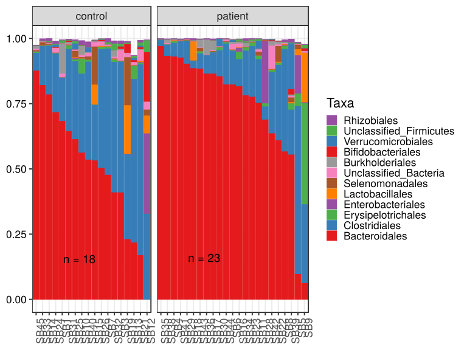

\(1.2.1.2.6.2.2.2.1.1.1\) [`Figure 272.`](#figure.272) Abundance. Data grouped by Sample.type.  bar (sample mean) plot.  Image file: [`plots/32342be0fe9.svg`](plots/32342be0fe9.svg).
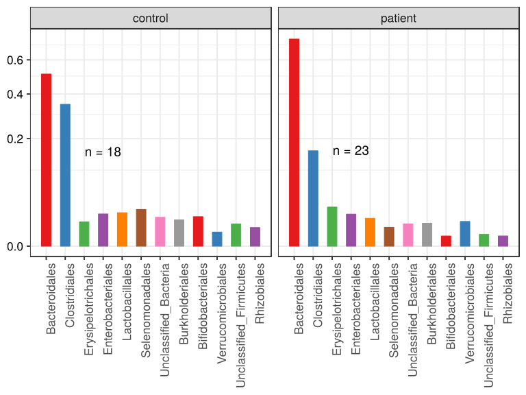

\(1.2.1.2.6.2.2.2.1.1.1\) [`Figure 273.`](#figure.273) Abundance. Data grouped by Sample.type.  violin plot.  Image file: [`plots/3235b0e32e6.svg`](plots/3235b0e32e6.svg).
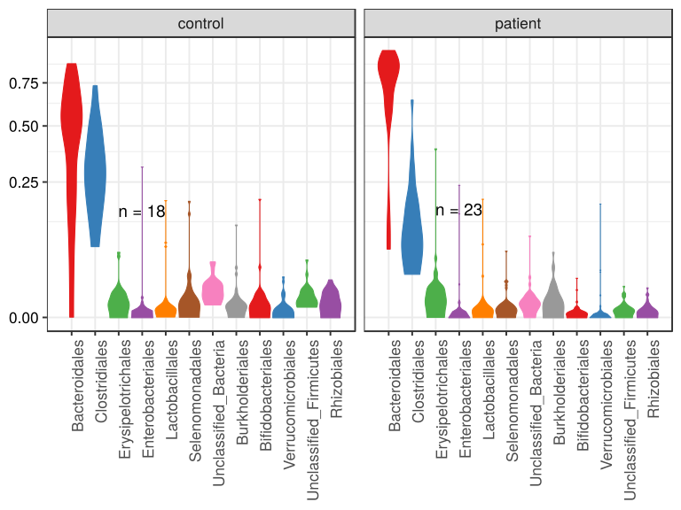

\(1.2.1.2.6.2.2.2.1.1.1\) [`Figure 274.`](#figure.274) Abundance. Data grouped by Sample.type.  boxplot plot.  Image file: [`plots/3233f80f535.svg`](plots/3233f80f535.svg).
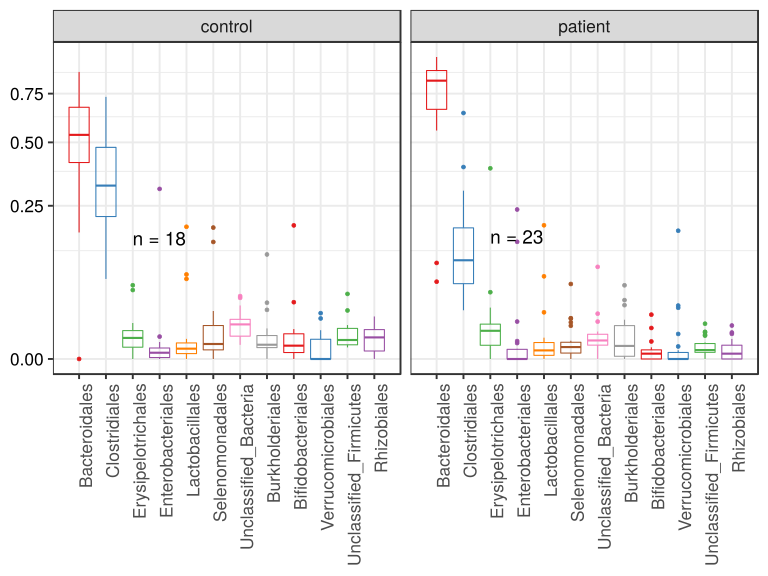

##### \(1.2.1.2.6.2.2.2.1.2\) Abundance. Plot is in flipped orientation, Y axis not scaled. Iterating over plot geometry

\(1.2.1.2.6.2.2.2.1.2.1\) [`Figure 275.`](#figure.275) Abundance. Data grouped by Sample.type.  bar (sample mean) plot.  Image file: [`plots/3237c885b27.svg`](plots/3237c885b27.svg).
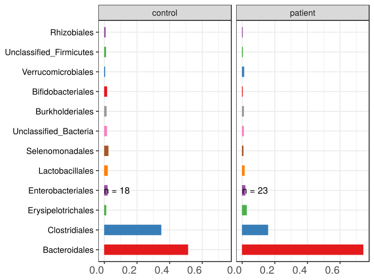

\(1.2.1.2.6.2.2.2.1.2.1\) [`Figure 276.`](#figure.276) Abundance. Data grouped by Sample.type.  violin plot.  Image file: [`plots/323266cbe7d.svg`](plots/323266cbe7d.svg).
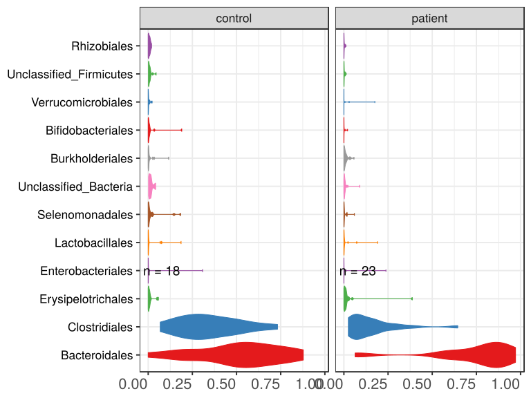

\(1.2.1.2.6.2.2.2.1.2.1\) [`Figure 277.`](#figure.277) Abundance. Data grouped by Sample.type.  boxplot plot.  Image file: [`plots/32377d66914.svg`](plots/32377d66914.svg).
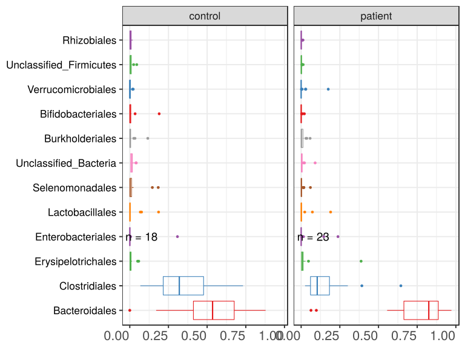

##### \(1.2.1.2.6.2.2.2.2\) dodged plots. Iterating over orientation and, optionally, scaling

##### \(1.2.1.2.6.2.2.2.2.1\) Abundance. Plot is in original orientation, Y axis SQRT scaled. Iterating over plot geometry

\(1.2.1.2.6.2.2.2.2.1.1\) [`Figure 278.`](#figure.278) Abundance. Data grouped by Sample.type.  bar (sample mean) plot.  Image file: [`plots/323177b1910.svg`](plots/323177b1910.svg).
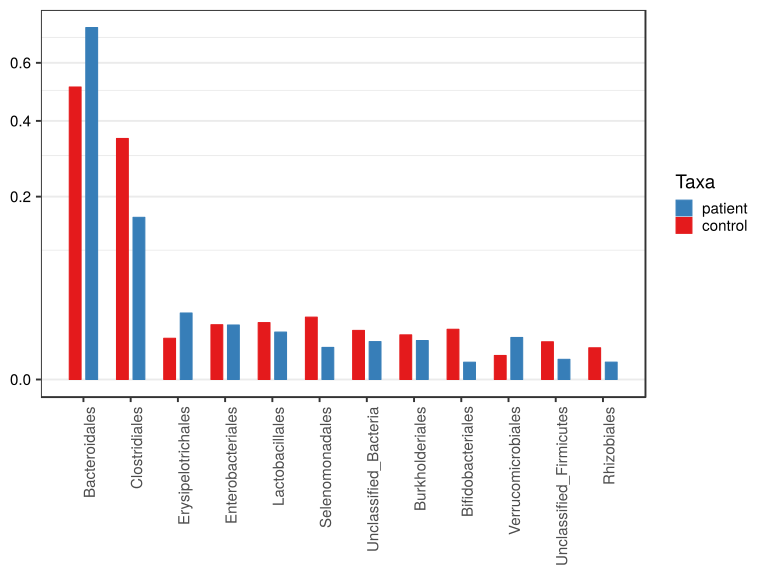

\(1.2.1.2.6.2.2.2.2.1.1\) [`Figure 279.`](#figure.279) Abundance. Data grouped by Sample.type.  violin plot.  Image file: [`plots/32316f67908.svg`](plots/32316f67908.svg).
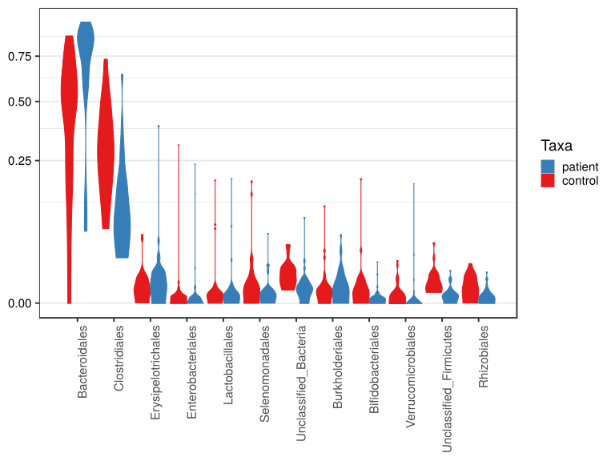

\(1.2.1.2.6.2.2.2.2.1.1\) [`Figure 280.`](#figure.280) Abundance. Data grouped by Sample.type.  boxplot plot.  Image file: [`plots/3232a2e3396.svg`](plots/3232a2e3396.svg).
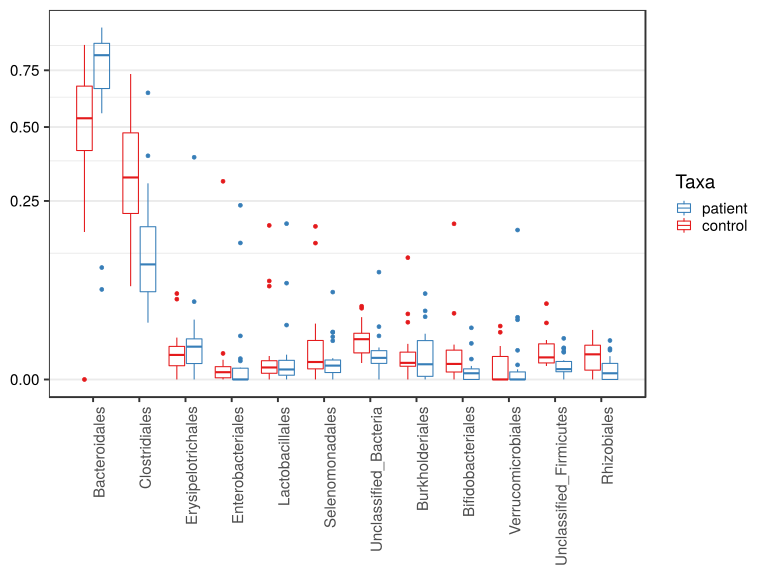

##### \(1.2.1.2.6.2.2.2.2.2\) Abundance. Plot is in flipped orientation, Y axis not scaled. Iterating over plot geometry

\(1.2.1.2.6.2.2.2.2.2.1\) [`Figure 281.`](#figure.281) Abundance. Data grouped by Sample.type.  bar (sample mean) plot.  Image file: [`plots/323214fcc5b.svg`](plots/323214fcc5b.svg).
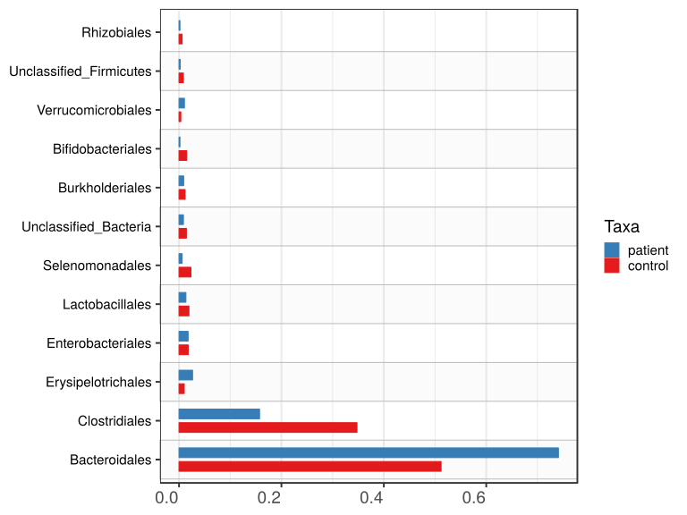

\(1.2.1.2.6.2.2.2.2.2.1\) [`Figure 282.`](#figure.282) Abundance. Data grouped by Sample.type.  violin plot.  Image file: [`plots/3235d16bd6f.svg`](plots/3235d16bd6f.svg).
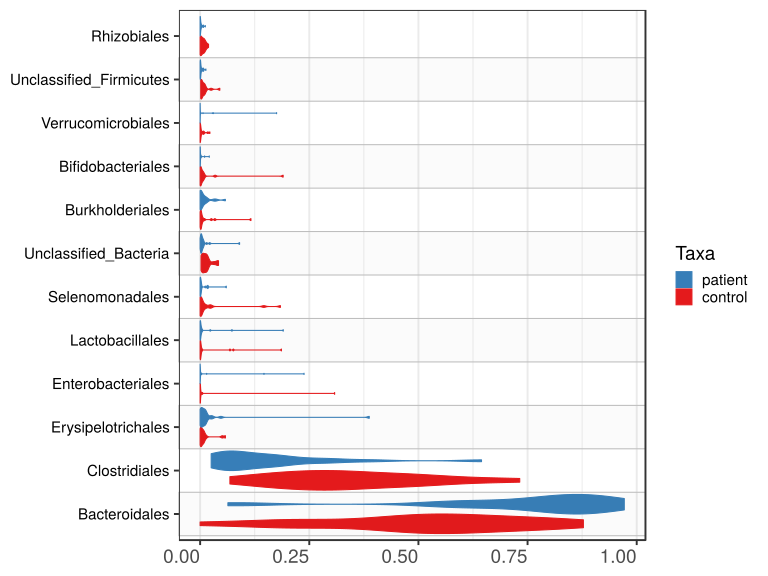

\(1.2.1.2.6.2.2.2.2.2.1\) [`Figure 283.`](#figure.283) Abundance. Data grouped by Sample.type.  boxplot plot.  Image file: [`plots/3237c927973.svg`](plots/3237c927973.svg).
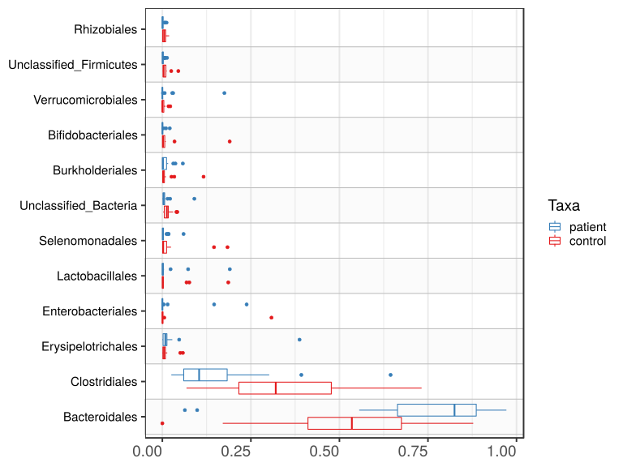

##### \(1.2.1.2.6.2.3\) Grouping variables Sample.type,age.quant

##### \(1.2.1.2.6.2.4\) Iterating over Abundance. profile sorting order

##### \(1.2.1.2.6.2.4.1\) Abundance. profile sorting order: average abundance

##### \(1.2.1.2.6.2.4.2\) Iterating over dodged vs faceted bars

The same data are shown in multiple combinations of graphical representations. 
                         This is the same data, but each plot highlights slightly different aspects of it.
                         It is not likely that you will need every plot - pick only what you need.

##### \(1.2.1.2.6.2.4.2.1\) faceted plots. Iterating over orientation and, optionally, scaling

##### \(1.2.1.2.6.2.4.2.1.1\) Abundance. Plot is in original orientation, Y axis SQRT scaled. Iterating over plot geometry

\(1.2.1.2.6.2.4.2.1.1.0\) [`Table 82.`](#table.82) Data table used for plots. Data grouped by Sample.type,age.quant. Showing only 200 first rows. Full dataset is also saved in a delimited text file (click to download and open e.g. in Excel) [`data/1.2.1.2.6.2.4.2.1.1.0-3232b9f902e.1.2.1.2.6.2.4.2.1.1.csv`](data/1.2.1.2.6.2.4.2.1.1.0-3232b9f902e.1.2.1.2.6.2.4.2.1.1.csv)

| .record.id | Sample.type | age.quant     | feature            | Abundance  |
|:-----------|:------------|:--------------|:-------------------|:-----------|
| SB1        | control     | \(8.71,15.3\] | Bacteroidales      | 6.847e\-01 |
| SB10       | control     | \(15.3,26.4\] | Bacteroidales      | 5.637e\-01 |
| SB11       | patient     | \(8.71,15.3\] | Bacteroidales      | 7.549e\-01 |
| SB12       | control     | \[3.18,6.27\] | Bacteroidales      | 0.000e\+00 |
| SB13       | control     | \(6.27,8.71\] | Bacteroidales      | 2.192e\-01 |
| SB14       | control     | \(8.71,15.3\] | Bacteroidales      | 7.866e\-01 |
| SB15       | control     | \(8.71,15.3\] | Bacteroidales      | 5.338e\-01 |
| SB16       | patient     | \(15.3,26.4\] | Bacteroidales      | 8.184e\-01 |
| SB17       | patient     | \(15.3,26.4\] | Bacteroidales      | 8.665e\-01 |
| SB18       | patient     | \(15.3,26.4\] | Bacteroidales      | 8.870e\-01 |
| SB19       | control     | \(15.3,26.4\] | Bacteroidales      | 2.318e\-01 |
| SB21       | control     | \[3.18,6.27\] | Bacteroidales      | 1.706e\-01 |
| SB22       | patient     | \(6.27,8.71\] | Bacteroidales      | 6.107e\-01 |
| SB23       | patient     | \(15.3,26.4\] | Bacteroidales      | 7.781e\-01 |
| SB24       | control     | \(8.71,15.3\] | Bacteroidales      | 7.186e\-01 |
| SB25       | control     | \(8.71,15.3\] | Bacteroidales      | 6.151e\-01 |
| SB26       | control     | \(6.27,8.71\] | Bacteroidales      | 5.050e\-01 |
| SB28       | patient     | \(6.27,8.71\] | Bacteroidales      | 6.904e\-01 |
| SB29       | patient     | \(6.27,8.71\] | Bacteroidales      | 9.046e\-01 |
| SB3        | control     | \[3.18,6.27\] | Bacteroidales      | 4.112e\-01 |
| SB30       | patient     | \(6.27,8.71\] | Bacteroidales      | 8.563e\-01 |
| SB31       | control     | \(8.71,15.3\] | Bacteroidales      | 6.462e\-01 |
| SB32       | control     | \(15.3,26.4\] | Bacteroidales      | 4.112e\-01 |
| SB33       | control     | \(8.71,15.3\] | Bacteroidales      | 8.224e\-01 |
| SB34       | patient     | \(15.3,26.4\] | Bacteroidales      | 7.837e\-01 |
| SB35       | patient     | \(8.71,15.3\] | Bacteroidales      | 9.715e\-01 |
| SB36       | patient     | \[3.18,6.27\] | Bacteroidales      | 8.668e\-01 |
| SB38       | patient     | \(15.3,26.4\] | Bacteroidales      | 9.342e\-01 |
| SB39       | patient     | \(8.71,15.3\] | Bacteroidales      | 5.559e\-01 |
| SB4        | patient     | \[3.18,6.27\] | Bacteroidales      | 9.322e\-01 |
| SB40       | control     | \[3.18,6.27\] | Bacteroidales      | 5.366e\-01 |
| SB41       | patient     | \(6.27,8.71\] | Bacteroidales      | 9.279e\-01 |
| SB42       | patient     | \[3.18,6.27\] | Bacteroidales      | 6.376e\-01 |
| SB43       | patient     | \(15.3,26.4\] | Bacteroidales      | 8.858e\-01 |
| SB44       | patient     | \[3.18,6.27\] | Bacteroidales      | 8.254e\-01 |
| SB45       | control     | \(15.3,26.4\] | Bacteroidales      | 8.778e\-01 |
| SB5        | patient     | \(15.3,26.4\] | Bacteroidales      | 9.827e\-02 |
| SB6        | patient     | \(6.27,8.71\] | Bacteroidales      | 8.250e\-01 |
| SB7        | control     | \(15.3,26.4\] | Bacteroidales      | 4.786e\-01 |
| SB8        | patient     | \(15.3,26.4\] | Bacteroidales      | 5.680e\-01 |
| SB9        | patient     | \(8.71,15.3\] | Bacteroidales      | 6.361e\-02 |
| SB1        | control     | \(8.71,15.3\] | Clostridiales      | 1.664e\-01 |
| SB10       | control     | \(15.3,26.4\] | Clostridiales      | 3.025e\-01 |
| SB11       | patient     | \(8.71,15.3\] | Clostridiales      | 1.670e\-01 |
| SB12       | control     | \[3.18,6.27\] | Clostridiales      | 3.292e\-01 |
| SB13       | control     | \(6.27,8.71\] | Clostridiales      | 6.268e\-01 |
| SB14       | control     | \(8.71,15.3\] | Clostridiales      | 1.877e\-01 |
| SB15       | control     | \(8.71,15.3\] | Clostridiales      | 2.131e\-01 |
| SB16       | patient     | \(15.3,26.4\] | Clostridiales      | 1.038e\-01 |
| SB17       | patient     | \(15.3,26.4\] | Clostridiales      | 8.129e\-02 |
| SB18       | patient     | \(15.3,26.4\] | Clostridiales      | 2.821e\-02 |
| SB19       | control     | \(15.3,26.4\] | Clostridiales      | 3.252e\-01 |
| SB21       | control     | \[3.18,6.27\] | Clostridiales      | 7.320e\-01 |
| SB22       | patient     | \(6.27,8.71\] | Clostridiales      | 2.891e\-01 |
| SB23       | patient     | \(15.3,26.4\] | Clostridiales      | 1.938e\-01 |
| SB24       | control     | \(8.71,15.3\] | Clostridiales      | 2.252e\-01 |
| SB25       | control     | \(8.71,15.3\] | Clostridiales      | 2.988e\-01 |
| SB26       | control     | \(6.27,8.71\] | Clostridiales      | 4.550e\-01 |
| SB28       | patient     | \(6.27,8.71\] | Clostridiales      | 4.996e\-02 |
| SB29       | patient     | \(6.27,8.71\] | Clostridiales      | 8.819e\-02 |
| SB3        | control     | \[3.18,6.27\] | Clostridiales      | 5.011e\-01 |
| SB30       | patient     | \(6.27,8.71\] | Clostridiales      | 9.994e\-02 |
| SB31       | control     | \(8.71,15.3\] | Clostridiales      | 3.152e\-01 |
| SB32       | control     | \(15.3,26.4\] | Clostridiales      | 4.996e\-01 |
| SB33       | control     | \(8.71,15.3\] | Clostridiales      | 1.502e\-01 |
| SB34       | patient     | \(15.3,26.4\] | Clostridiales      | 1.709e\-01 |
| SB35       | patient     | \(8.71,15.3\] | Clostridiales      | 2.529e\-02 |
| SB36       | patient     | \[3.18,6.27\] | Clostridiales      | 7.040e\-02 |
| SB38       | patient     | \(15.3,26.4\] | Clostridiales      | 4.334e\-02 |
| SB39       | patient     | \(8.71,15.3\] | Clostridiales      | 1.723e\-01 |
| SB4        | patient     | \[3.18,6.27\] | Clostridiales      | 5.216e\-02 |
| SB40       | control     | \[3.18,6.27\] | Clostridiales      | 3.756e\-01 |
| SB41       | patient     | \(6.27,8.71\] | Clostridiales      | 6.299e\-02 |
| SB42       | patient     | \[3.18,6.27\] | Clostridiales      | 2.363e\-01 |
| SB43       | patient     | \(15.3,26.4\] | Clostridiales      | 5.785e\-02 |
| SB44       | patient     | \[3.18,6.27\] | Clostridiales      | 1.565e\-01 |
| SB45       | control     | \(15.3,26.4\] | Clostridiales      | 6.822e\-02 |
| SB5        | patient     | \(15.3,26.4\] | Clostridiales      | 6.445e\-01 |
| SB6        | patient     | \(6.27,8.71\] | Clostridiales      | 1.294e\-01 |
| SB7        | control     | \(15.3,26.4\] | Clostridiales      | 4.844e\-01 |
| SB8        | patient     | \(15.3,26.4\] | Clostridiales      | 3.925e\-01 |
| SB9        | patient     | \(8.71,15.3\] | Clostridiales      | 3.018e\-01 |
| SB1        | control     | \(8.71,15.3\] | Erysipelotrichales | 9.093e\-04 |
| SB10       | control     | \(15.3,26.4\] | Erysipelotrichales | 5.791e\-02 |
| SB11       | patient     | \(8.71,15.3\] | Erysipelotrichales | 1.339e\-02 |
| SB12       | control     | \[3.18,6.27\] | Erysipelotrichales | 0.000e\+00 |
| SB13       | control     | \(6.27,8.71\] | Erysipelotrichales | 5.062e\-02 |
| SB14       | control     | \(8.71,15.3\] | Erysipelotrichales | 2.063e\-03 |
| SB15       | control     | \(8.71,15.3\] | Erysipelotrichales | 8.963e\-04 |
| SB16       | patient     | \(15.3,26.4\] | Erysipelotrichales | 2.813e\-02 |
| SB17       | patient     | \(15.3,26.4\] | Erysipelotrichales | 2.444e\-03 |
| SB18       | patient     | \(15.3,26.4\] | Erysipelotrichales | 1.550e\-03 |
| SB19       | control     | \(15.3,26.4\] | Erysipelotrichales | 1.761e\-04 |
| SB21       | control     | \[3.18,6.27\] | Erysipelotrichales | 4.859e\-03 |
| SB22       | patient     | \(6.27,8.71\] | Erysipelotrichales | 8.445e\-03 |
| SB23       | patient     | \(15.3,26.4\] | Erysipelotrichales | 1.425e\-02 |
| SB24       | control     | \(8.71,15.3\] | Erysipelotrichales | 1.291e\-03 |
| SB25       | control     | \(8.71,15.3\] | Erysipelotrichales | 7.673e\-03 |
| SB26       | control     | \(6.27,8.71\] | Erysipelotrichales | 8.864e\-03 |
| SB28       | patient     | \(6.27,8.71\] | Erysipelotrichales | 1.180e\-02 |
| SB29       | patient     | \(6.27,8.71\] | Erysipelotrichales | 1.440e\-03 |
| SB3        | control     | \[3.18,6.27\] | Erysipelotrichales | 2.073e\-03 |
| SB30       | patient     | \(6.27,8.71\] | Erysipelotrichales | 1.181e\-02 |
| SB31       | control     | \(8.71,15.3\] | Erysipelotrichales | 1.377e\-02 |
| SB32       | control     | \(15.3,26.4\] | Erysipelotrichales | 1.006e\-02 |
| SB33       | control     | \(8.71,15.3\] | Erysipelotrichales | 2.354e\-03 |
| SB34       | patient     | \(15.3,26.4\] | Erysipelotrichales | 1.238e\-02 |
| SB35       | patient     | \(8.71,15.3\] | Erysipelotrichales | 0.000e\+00 |
| SB36       | patient     | \[3.18,6.27\] | Erysipelotrichales | 0.000e\+00 |
| SB38       | patient     | \(15.3,26.4\] | Erysipelotrichales | 1.457e\-03 |
| SB39       | patient     | \(8.71,15.3\] | Erysipelotrichales | 2.415e\-02 |
| SB4        | patient     | \[3.18,6.27\] | Erysipelotrichales | 6.030e\-03 |
| SB40       | control     | \[3.18,6.27\] | Erysipelotrichales | 7.497e\-03 |
| SB41       | patient     | \(6.27,8.71\] | Erysipelotrichales | 7.525e\-04 |
| SB42       | patient     | \[3.18,6.27\] | Erysipelotrichales | 6.306e\-03 |
| SB43       | patient     | \(15.3,26.4\] | Erysipelotrichales | 8.639e\-03 |
| SB44       | patient     | \[3.18,6.27\] | Erysipelotrichales | 4.942e\-03 |
| SB45       | control     | \(15.3,26.4\] | Erysipelotrichales | 4.583e\-03 |
| SB5        | patient     | \(15.3,26.4\] | Erysipelotrichales | 4.750e\-02 |
| SB6        | patient     | \(6.27,8.71\] | Erysipelotrichales | 2.595e\-03 |
| SB7        | control     | \(15.3,26.4\] | Erysipelotrichales | 7.360e\-03 |
| SB8        | patient     | \(15.3,26.4\] | Erysipelotrichales | 1.244e\-02 |
| SB9        | patient     | \(8.71,15.3\] | Erysipelotrichales | 3.874e\-01 |
| SB1        | control     | \(8.71,15.3\] | Enterobacteriales  | 4.546e\-04 |
| SB10       | control     | \(15.3,26.4\] | Enterobacteriales  | 8.516e\-05 |
| SB11       | patient     | \(8.71,15.3\] | Enterobacteriales  | 8.929e\-04 |
| SB12       | control     | \[3.18,6.27\] | Enterobacteriales  | 3.081e\-01 |
| SB13       | control     | \(6.27,8.71\] | Enterobacteriales  | 4.401e\-04 |
| SB14       | control     | \(8.71,15.3\] | Enterobacteriales  | 0.000e\+00 |
| SB15       | control     | \(8.71,15.3\] | Enterobacteriales  | 4.137e\-04 |
| SB16       | patient     | \(15.3,26.4\] | Enterobacteriales  | 1.489e\-02 |
| SB17       | patient     | \(15.3,26.4\] | Enterobacteriales  | 2.572e\-04 |
| SB18       | patient     | \(15.3,26.4\] | Enterobacteriales  | 0.000e\+00 |
| SB19       | control     | \(15.3,26.4\] | Enterobacteriales  | 1.761e\-03 |
| SB21       | control     | \[3.18,6.27\] | Enterobacteriales  | 3.059e\-03 |
| SB22       | patient     | \(6.27,8.71\] | Enterobacteriales  | 3.839e\-04 |
| SB23       | patient     | \(15.3,26.4\] | Enterobacteriales  | 0.000e\+00 |
| SB24       | control     | \(8.71,15.3\] | Enterobacteriales  | 2.869e\-04 |
| SB25       | control     | \(8.71,15.3\] | Enterobacteriales  | 5.328e\-03 |
| SB26       | control     | \(6.27,8.71\] | Enterobacteriales  | 0.000e\+00 |
| SB28       | patient     | \(6.27,8.71\] | Enterobacteriales  | 2.380e\-01 |
| SB29       | patient     | \(6.27,8.71\] | Enterobacteriales  | 0.000e\+00 |
| SB3        | control     | \[3.18,6.27\] | Enterobacteriales  | 4.145e\-04 |
| SB30       | patient     | \(6.27,8.71\] | Enterobacteriales  | 0.000e\+00 |
| SB31       | control     | \(8.71,15.3\] | Enterobacteriales  | 6.593e\-04 |
| SB32       | control     | \(15.3,26.4\] | Enterobacteriales  | 0.000e\+00 |
| SB33       | control     | \(8.71,15.3\] | Enterobacteriales  | 0.000e\+00 |
| SB34       | patient     | \(15.3,26.4\] | Enterobacteriales  | 8.659e\-05 |
| SB35       | patient     | \(8.71,15.3\] | Enterobacteriales  | 0.000e\+00 |
| SB36       | patient     | \[3.18,6.27\] | Enterobacteriales  | 0.000e\+00 |
| SB38       | patient     | \(15.3,26.4\] | Enterobacteriales  | 0.000e\+00 |
| SB39       | patient     | \(8.71,15.3\] | Enterobacteriales  | 0.000e\+00 |
| SB4        | patient     | \[3.18,6.27\] | Enterobacteriales  | 0.000e\+00 |
| SB40       | control     | \[3.18,6.27\] | Enterobacteriales  | 3.570e\-04 |
| SB41       | patient     | \(6.27,8.71\] | Enterobacteriales  | 0.000e\+00 |
| SB42       | patient     | \[3.18,6.27\] | Enterobacteriales  | 0.000e\+00 |
| SB43       | patient     | \(15.3,26.4\] | Enterobacteriales  | 2.912e\-04 |
| SB44       | patient     | \[3.18,6.27\] | Enterobacteriales  | 1.098e\-03 |
| SB45       | control     | \(15.3,26.4\] | Enterobacteriales  | 1.498e\-03 |
| SB5        | patient     | \(15.3,26.4\] | Enterobacteriales  | 1.462e\-01 |
| SB6        | patient     | \(6.27,8.71\] | Enterobacteriales  | 0.000e\+00 |
| SB7        | control     | \(15.3,26.4\] | Enterobacteriales  | 0.000e\+00 |
| SB8        | patient     | \(15.3,26.4\] | Enterobacteriales  | 2.690e\-03 |
| SB9        | patient     | \(8.71,15.3\] | Enterobacteriales  | 3.408e\-03 |
| SB1        | control     | \(8.71,15.3\] | Lactobacillales    | 2.273e\-04 |
| SB10       | control     | \(15.3,26.4\] | Lactobacillales    | 1.703e\-03 |
| SB11       | patient     | \(8.71,15.3\] | Lactobacillales    | 0.000e\+00 |
| SB12       | control     | \[3.18,6.27\] | Lactobacillales    | 6.832e\-02 |
| SB13       | control     | \(6.27,8.71\] | Lactobacillales    | 8.803e\-04 |
| SB14       | control     | \(8.71,15.3\] | Lactobacillales    | 0.000e\+00 |
| SB15       | control     | \(8.71,15.3\] | Lactobacillales    | 7.612e\-02 |
| SB16       | patient     | \(15.3,26.4\] | Lactobacillales    | 1.241e\-03 |
| SB17       | patient     | \(15.3,26.4\] | Lactobacillales    | 6.431e\-04 |
| SB18       | patient     | \(15.3,26.4\] | Lactobacillales    | 7.278e\-02 |
| SB19       | control     | \(15.3,26.4\] | Lactobacillales    | 1.862e\-01 |
| SB21       | control     | \[3.18,6.27\] | Lactobacillales    | 4.319e\-03 |
| SB22       | patient     | \(6.27,8.71\] | Lactobacillales    | 3.071e\-03 |
| SB23       | patient     | \(15.3,26.4\] | Lactobacillales    | 1.345e\-04 |
| SB24       | control     | \(8.71,15.3\] | Lactobacillales    | 8.606e\-04 |
| SB25       | control     | \(8.71,15.3\] | Lactobacillales    | 2.131e\-03 |
| SB26       | control     | \(6.27,8.71\] | Lactobacillales    | 2.955e\-03 |
| SB28       | patient     | \(6.27,8.71\] | Lactobacillales    | 7.868e\-04 |
| SB29       | patient     | \(6.27,8.71\] | Lactobacillales    | 0.000e\+00 |
| SB3        | control     | \[3.18,6.27\] | Lactobacillales    | 2.073e\-04 |
| SB30       | patient     | \(6.27,8.71\] | Lactobacillales    | 1.514e\-04 |
| SB31       | control     | \(8.71,15.3\] | Lactobacillales    | 3.663e\-04 |
| SB32       | control     | \(15.3,26.4\] | Lactobacillales    | 1.393e\-03 |
| SB33       | control     | \(8.71,15.3\] | Lactobacillales    | 2.871e\-04 |
| SB34       | patient     | \(15.3,26.4\] | Lactobacillales    | 4.329e\-04 |
| SB35       | patient     | \(8.71,15.3\] | Lactobacillales    | 1.606e\-03 |
| SB36       | patient     | \[3.18,6.27\] | Lactobacillales    | 3.805e\-04 |
| SB38       | patient     | \(15.3,26.4\] | Lactobacillales    | 1.821e\-04 |
| SB39       | patient     | \(8.71,15.3\] | Lactobacillales    | 4.831e\-03 |
| SB4        | patient     | \[3.18,6.27\] | Lactobacillales    | 3.316e\-03 |
| SB40       | control     | \[3.18,6.27\] | Lactobacillales    | 3.570e\-04 |
| SB41       | patient     | \(6.27,8.71\] | Lactobacillales    | 8.853e\-05 |
| SB42       | patient     | \[3.18,6.27\] | Lactobacillales    | 1.443e\-03 |
| SB43       | patient     | \(15.3,26.4\] | Lactobacillales    | 9.707e\-05 |
| SB44       | patient     | \[3.18,6.27\] | Lactobacillales    | 0.000e\+00 |
| SB45       | control     | \(15.3,26.4\] | Lactobacillales    | 8.814e\-05 |

\(1.2.1.2.6.2.4.2.1.1.1\) [`Widget 85.`](#widget.85) Dynamic Pivot Table link (drag and drop field names and pick averaging 
                      functions or plot types; click on fields or legend elements to filter values). 
                      Starting rendering is Stacked Bar Chart. Data grouped by Sample.type,age.quant. Click to see HTML widget file in full window: [`./1.2.1.2.6.2.4.2.1.1.1-3231135fe23Dynamic.Pivot.Table.html`](./1.2.1.2.6.2.4.2.1.1.1-3231135fe23Dynamic.Pivot.Table.html)

\(1.2.1.2.6.2.4.2.1.1.1\) [`Widget 86.`](#widget.86) Dynamic Pivot Table link (drag and drop field names and pick averaging 
                      functions or plot types; click on fields or legend elements to filter values). 
                      Starting rendering is Table Barchart. Data grouped by Sample.type,age.quant. Click to see HTML widget file in full window: [`./1.2.1.2.6.2.4.2.1.1.1-3232ab4d40bDynamic.Pivot.Table.html`](./1.2.1.2.6.2.4.2.1.1.1-3232ab4d40bDynamic.Pivot.Table.html)

\(1.2.1.2.6.2.4.2.1.1.1\) [`Table 83.`](#table.83) Summary table. Data grouped by Sample.type,age.quant. Full dataset is also saved in a delimited text file (click to download and open e.g. in Excel) [`data/1.2.1.2.6.2.4.2.1.1.1-3233b45e5a2.1.2.1.2.6.2.4.2.1.1.csv`](data/1.2.1.2.6.2.4.2.1.1.1-3233b45e5a2.1.2.1.2.6.2.4.2.1.1.csv)

| feature                  | Sample.type | age.quant     | mean       | sd         | median     | incidence |
|:-------------------------|:------------|:--------------|:-----------|:-----------|:-----------|:----------|
| Bacteroidales            | control     | \[3.18,6.27\] | 2.796e\-01 | 2.404e\-01 | 2.909e\-01 | 0.7500    |
| Bacteroidales            | control     | \(6.27,8.71\] | 3.621e\-01 | 2.021e\-01 | 3.621e\-01 | 1.0000    |
| Bacteroidales            | control     | \(8.71,15.3\] | 6.868e\-01 | 9.964e\-02 | 6.847e\-01 | 1.0000    |
| Bacteroidales            | control     | \(15.3,26.4\] | 5.126e\-01 | 2.378e\-01 | 4.786e\-01 | 1.0000    |
| Bacteroidales            | patient     | \[3.18,6.27\] | 8.155e\-01 | 1.265e\-01 | 8.461e\-01 | 1.0000    |
| Bacteroidales            | patient     | \(6.27,8.71\] | 8.025e\-01 | 1.256e\-01 | 8.407e\-01 | 1.0000    |
| Bacteroidales            | patient     | \(8.71,15.3\] | 5.865e\-01 | 3.877e\-01 | 6.554e\-01 | 1.0000    |
| Bacteroidales            | patient     | \(15.3,26.4\] | 7.355e\-01 | 2.616e\-01 | 8.184e\-01 | 1.0000    |
| Clostridiales            | control     | \[3.18,6.27\] | 4.845e\-01 | 1.803e\-01 | 4.384e\-01 | 1.0000    |
| Clostridiales            | control     | \(6.27,8.71\] | 5.409e\-01 | 1.214e\-01 | 5.409e\-01 | 1.0000    |
| Clostridiales            | control     | \(8.71,15.3\] | 2.224e\-01 | 6.336e\-02 | 2.131e\-01 | 1.0000    |
| Clostridiales            | control     | \(15.3,26.4\] | 3.360e\-01 | 1.745e\-01 | 3.252e\-01 | 1.0000    |
| Clostridiales            | patient     | \[3.18,6.27\] | 1.288e\-01 | 8.486e\-02 | 1.135e\-01 | 1.0000    |
| Clostridiales            | patient     | \(6.27,8.71\] | 1.199e\-01 | 8.745e\-02 | 9.407e\-02 | 1.0000    |
| Clostridiales            | patient     | \(8.71,15.3\] | 1.666e\-01 | 1.130e\-01 | 1.696e\-01 | 1.0000    |
| Clostridiales            | patient     | \(15.3,26.4\] | 1.907e\-01 | 2.038e\-01 | 1.038e\-01 | 1.0000    |
| Erysipelotrichales       | control     | \[3.18,6.27\] | 3.607e\-03 | 3.269e\-03 | 3.466e\-03 | 0.7500    |
| Erysipelotrichales       | control     | \(6.27,8.71\] | 2.974e\-02 | 2.952e\-02 | 2.974e\-02 | 1.0000    |
| Erysipelotrichales       | control     | \(8.71,15.3\] | 4.137e\-03 | 4.862e\-03 | 2.063e\-03 | 1.0000    |
| Erysipelotrichales       | control     | \(15.3,26.4\] | 1.602e\-02 | 2.370e\-02 | 7.360e\-03 | 1.0000    |
| Erysipelotrichales       | patient     | \[3.18,6.27\] | 4.319e\-03 | 2.939e\-03 | 5.486e\-03 | 0.7500    |
| Erysipelotrichales       | patient     | \(6.27,8.71\] | 6.141e\-03 | 5.162e\-03 | 5.520e\-03 | 1.0000    |
| Erysipelotrichales       | patient     | \(8.71,15.3\] | 1.062e\-01 | 1.877e\-01 | 1.877e\-02 | 0.7500    |
| Erysipelotrichales       | patient     | \(15.3,26.4\] | 1.431e\-02 | 1.500e\-02 | 1.238e\-02 | 1.0000    |
| Enterobacteriales        | control     | \[3.18,6.27\] | 7.799e\-02 | 1.534e\-01 | 1.737e\-03 | 1.0000    |
| Enterobacteriales        | control     | \(6.27,8.71\] | 2.201e\-04 | 3.112e\-04 | 2.201e\-04 | 0.5000    |
| Enterobacteriales        | control     | \(8.71,15.3\] | 1.020e\-03 | 1.915e\-03 | 4.137e\-04 | 0.7143    |
| Enterobacteriales        | control     | \(15.3,26.4\] | 6.690e\-04 | 8.828e\-04 | 8.516e\-05 | 0.6000    |
| Enterobacteriales        | patient     | \[3.18,6.27\] | 2.746e\-04 | 5.491e\-04 | 0.000e\+00 | 0.2500    |
| Enterobacteriales        | patient     | \(6.27,8.71\] | 3.973e\-02 | 9.713e\-02 | 0.000e\+00 | 0.3333    |
| Enterobacteriales        | patient     | \(8.71,15.3\] | 1.075e\-03 | 1.611e\-03 | 4.464e\-04 | 0.5000    |
| Enterobacteriales        | patient     | \(15.3,26.4\] | 1.827e\-02 | 4.822e\-02 | 2.572e\-04 | 0.6667    |
| Lactobacillales          | control     | \[3.18,6.27\] | 1.830e\-02 | 3.340e\-02 | 2.338e\-03 | 1.0000    |
| Lactobacillales          | control     | \(6.27,8.71\] | 1.917e\-03 | 1.467e\-03 | 1.917e\-03 | 1.0000    |
| Lactobacillales          | control     | \(8.71,15.3\] | 1.143e\-02 | 2.853e\-02 | 3.663e\-04 | 0.8571    |
| Lactobacillales          | control     | \(15.3,26.4\] | 3.819e\-02 | 8.274e\-02 | 1.557e\-03 | 1.0000    |
| Lactobacillales          | patient     | \[3.18,6.27\] | 1.285e\-03 | 1.486e\-03 | 9.120e\-04 | 0.7500    |
| Lactobacillales          | patient     | \(6.27,8.71\] | 9.301e\-04 | 1.191e\-03 | 4.691e\-04 | 0.8333    |
| Lactobacillales          | patient     | \(8.71,15.3\] | 4.922e\-02 | 9.418e\-02 | 3.218e\-03 | 0.7500    |
| Lactobacillales          | patient     | \(15.3,26.4\] | 1.127e\-02 | 2.424e\-02 | 6.431e\-04 | 1.0000    |
| Selenomonadales          | control     | \[3.18,6.27\] | 9.190e\-03 | 1.042e\-02 | 6.587e\-03 | 1.0000    |
| Selenomonadales          | control     | \(6.27,8.71\] | 7.087e\-04 | 2.426e\-04 | 7.087e\-04 | 1.0000    |
| Selenomonadales          | control     | \(8.71,15.3\] | 2.670e\-02 | 5.328e\-02 | 3.094e\-03 | 0.8571    |
| Selenomonadales          | control     | \(15.3,26.4\] | 3.870e\-02 | 8.119e\-02 | 3.662e\-03 | 1.0000    |
| Selenomonadales          | patient     | \[3.18,6.27\] | 1.308e\-03 | 1.119e\-03 | 1.289e\-03 | 1.0000    |
| Selenomonadales          | patient     | \(6.27,8.71\] | 1.117e\-02 | 2.390e\-02 | 1.356e\-03 | 1.0000    |
| Selenomonadales          | patient     | \(8.71,15.3\] | 8.000e\-03 | 9.343e\-03 | 7.143e\-03 | 0.5000    |
| Selenomonadales          | patient     | \(15.3,26.4\] | 4.114e\-03 | 6.157e\-03 | 1.513e\-03 | 1.0000    |
| Unclassified\_Bacteria   | control     | \[3.18,6.27\] | 3.150e\-02 | 1.296e\-02 | 3.515e\-02 | 1.0000    |
| Unclassified\_Bacteria   | control     | \(6.27,8.71\] | 1.413e\-02 | 3.183e\-03 | 1.413e\-02 | 1.0000    |
| Unclassified\_Bacteria   | control     | \(8.71,15.3\] | 8.804e\-03 | 6.898e\-03 | 4.902e\-03 | 1.0000    |
| Unclassified\_Bacteria   | control     | \(15.3,26.4\] | 8.650e\-03 | 4.090e\-03 | 6.967e\-03 | 1.0000    |
| Unclassified\_Bacteria   | patient     | \[3.18,6.27\] | 2.542e\-02 | 4.342e\-02 | 4.886e\-03 | 1.0000    |
| Unclassified\_Bacteria   | patient     | \(6.27,8.71\] | 6.112e\-03 | 7.995e\-03 | 2.421e\-03 | 1.0000    |
| Unclassified\_Bacteria   | patient     | \(8.71,15.3\] | 4.959e\-03 | 3.460e\-03 | 5.899e\-03 | 0.7500    |
| Unclassified\_Bacteria   | patient     | \(15.3,26.4\] | 4.365e\-03 | 4.145e\-03 | 3.658e\-03 | 1.0000    |
| Burkholderiales          | control     | \[3.18,6.27\] | 2.416e\-03 | 2.126e\-03 | 2.241e\-03 | 0.7500    |
| Burkholderiales          | control     | \(6.27,8.71\] | 8.058e\-04 | 1.140e\-03 | 8.058e\-04 | 0.5000    |
| Burkholderiales          | control     | \(8.71,15.3\] | 1.884e\-02 | 4.305e\-02 | 2.192e\-03 | 1.0000    |
| Burkholderiales          | control     | \(15.3,26.4\] | 1.423e\-02 | 1.490e\-02 | 9.959e\-03 | 0.8000    |
| Burkholderiales          | patient     | \[3.18,6.27\] | 1.901e\-02 | 2.691e\-02 | 9.109e\-03 | 0.7500    |
| Burkholderiales          | patient     | \(6.27,8.71\] | 2.996e\-03 | 4.660e\-03 | 9.784e\-05 | 0.6667    |
| Burkholderiales          | patient     | \(8.71,15.3\] | 2.577e\-03 | 2.410e\-03 | 2.577e\-03 | 0.7500    |
| Burkholderiales          | patient     | \(15.3,26.4\] | 1.160e\-02 | 1.384e\-02 | 7.447e\-03 | 0.8889    |
| Bifidobacteriales        | control     | \[3.18,6.27\] | 5.198e\-02 | 9.218e\-02 | 8.726e\-03 | 1.0000    |
| Bifidobacteriales        | control     | \(6.27,8.71\] | 6.207e\-03 | 1.181e\-03 | 6.207e\-03 | 1.0000    |
| Bifidobacteriales        | control     | \(8.71,15.3\] | 2.163e\-03 | 2.035e\-03 | 1.586e\-03 | 1.0000    |
| Bifidobacteriales        | control     | \(15.3,26.4\] | 7.125e\-03 | 1.523e\-02 | 0.000e\+00 | 0.4000    |
| Bifidobacteriales        | patient     | \[3.18,6.27\] | 1.029e\-03 | 1.508e\-03 | 4.253e\-04 | 0.7500    |
| Bifidobacteriales        | patient     | \(6.27,8.71\] | 4.403e\-04 | 6.691e\-04 | 2.524e\-05 | 0.5000    |
| Bifidobacteriales        | patient     | \(8.71,15.3\] | 7.789e\-03 | 1.000e\-02 | 5.112e\-03 | 0.5000    |
| Bifidobacteriales        | patient     | \(15.3,26.4\] | 3.633e\-04 | 3.749e\-04 | 3.363e\-04 | 0.7778    |
| Verrucomicrobiales       | control     | \[3.18,6.27\] | 5.723e\-03 | 8.249e\-03 | 2.699e\-03 | 0.5000    |
| Verrucomicrobiales       | control     | \(6.27,8.71\] | 4.536e\-03 | 6.035e\-03 | 4.536e\-03 | 1.0000    |
| Verrucomicrobiales       | control     | \(8.71,15.3\] | 4.297e\-03 | 8.418e\-03 | 0.000e\+00 | 0.4286    |
| Verrucomicrobiales       | control     | \(15.3,26.4\] | 0.000e\+00 | 0.000e\+00 | 0.000e\+00 | 0.0000    |
| Verrucomicrobiales       | patient     | \[3.18,6.27\] | 4.178e\-04 | 8.357e\-04 | 0.000e\+00 | 0.2500    |
| Verrucomicrobiales       | patient     | \(6.27,8.71\] | 5.779e\-03 | 1.116e\-02 | 4.426e\-05 | 0.5000    |
| Verrucomicrobiales       | patient     | \(8.71,15.3\] | 5.159e\-02 | 8.361e\-02 | 1.558e\-02 | 0.7500    |
| Verrucomicrobiales       | patient     | \(15.3,26.4\] | 1.079e\-05 | 3.236e\-05 | 0.000e\+00 | 0.1111    |
| Unclassified\_Firmicutes | control     | \[3.18,6.27\] | 1.733e\-02 | 1.911e\-02 | 1.140e\-02 | 1.0000    |
| Unclassified\_Firmicutes | control     | \(6.27,8.71\] | 5.170e\-03 | 3.893e\-03 | 5.170e\-03 | 1.0000    |
| Unclassified\_Firmicutes | control     | \(8.71,15.3\] | 4.399e\-03 | 3.706e\-03 | 2.725e\-03 | 1.0000    |
| Unclassified\_Firmicutes | control     | \(15.3,26.4\] | 8.517e\-03 | 9.620e\-03 | 4.051e\-03 | 1.0000    |
| Unclassified\_Firmicutes | patient     | \[3.18,6.27\] | 5.802e\-04 | 6.260e\-04 | 4.388e\-04 | 0.7500    |
| Unclassified\_Firmicutes | patient     | \(6.27,8.71\] | 5.403e\-04 | 3.098e\-04 | 6.376e\-04 | 0.8333    |
| Unclassified\_Firmicutes | patient     | \(8.71,15.3\] | 5.489e\-03 | 5.692e\-03 | 4.351e\-03 | 0.7500    |
| Unclassified\_Firmicutes | patient     | \(15.3,26.4\] | 3.149e\-03 | 3.116e\-03 | 1.961e\-03 | 1.0000    |
| Rhizobiales              | control     | \[3.18,6.27\] | 8.838e\-03 | 7.921e\-03 | 7.902e\-03 | 1.0000    |
| Rhizobiales              | control     | \(6.27,8.71\] | 0.000e\+00 | 0.000e\+00 | 0.000e\+00 | 0.0000    |
| Rhizobiales              | control     | \(8.71,15.3\] | 4.561e\-03 | 4.064e\-03 | 4.049e\-03 | 1.0000    |
| Rhizobiales              | control     | \(15.3,26.4\] | 8.159e\-03 | 5.849e\-03 | 8.825e\-03 | 1.0000    |
| Rhizobiales              | patient     | \[3.18,6.27\] | 5.510e\-04 | 9.122e\-04 | 1.507e\-04 | 0.5000    |
| Rhizobiales              | patient     | \(6.27,8.71\] | 1.918e\-04 | 4.698e\-04 | 0.000e\+00 | 0.1667    |
| Rhizobiales              | patient     | \(8.71,15.3\] | 3.168e\-03 | 5.843e\-03 | 3.786e\-04 | 0.5000    |
| Rhizobiales              | patient     | \(15.3,26.4\] | 2.832e\-03 | 2.758e\-03 | 2.152e\-03 | 0.8889    |

\(1.2.1.2.6.2.4.2.1.1.1\) [`Figure 284.`](#figure.284) Abundance. Data grouped by Sample.type,age.quant.  bar_stacked plot.  Image file: [`plots/323691fe310.svg`](plots/323691fe310.svg).
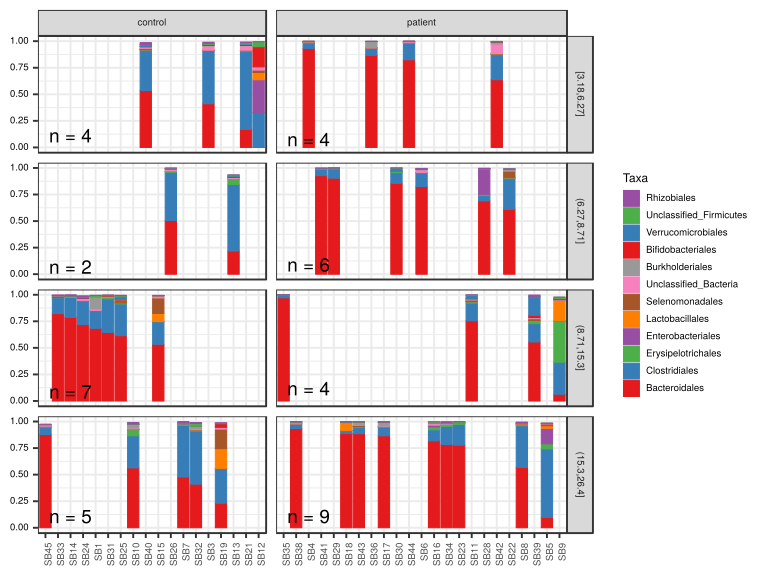

\(1.2.1.2.6.2.4.2.1.1.1\) [`Figure 285.`](#figure.285) Abundance. Data grouped by Sample.type,age.quant.  bar (sample mean) plot.  Image file: [`plots/3236dc6c1ec.svg`](plots/3236dc6c1ec.svg).
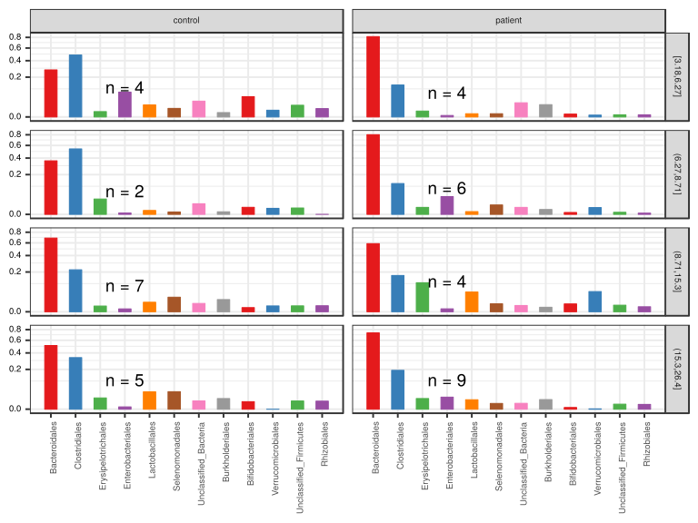

\(1.2.1.2.6.2.4.2.1.1.1\) [`Figure 286.`](#figure.286) Abundance. Data grouped by Sample.type,age.quant.  violin plot.  Image file: [`plots/32345b97349.svg`](plots/32345b97349.svg).
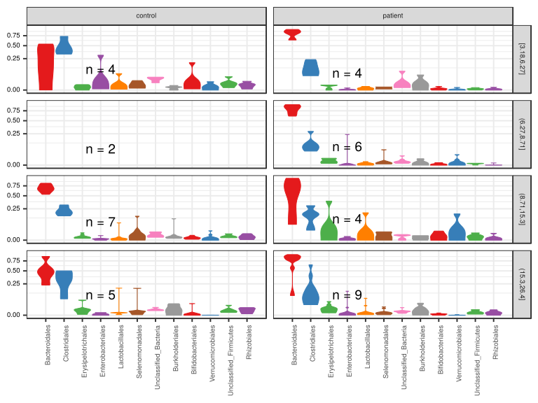

\(1.2.1.2.6.2.4.2.1.1.1\) [`Figure 287.`](#figure.287) Abundance. Data grouped by Sample.type,age.quant.  boxplot plot.  Image file: [`plots/3231bb68a94.svg`](plots/3231bb68a94.svg).
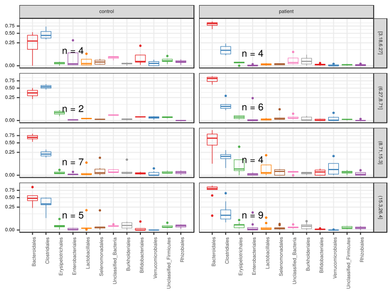

##### \(1.2.1.2.6.2.4.2.1.2\) Abundance. Plot is in flipped orientation, Y axis not scaled. Iterating over plot geometry

\(1.2.1.2.6.2.4.2.1.2.1\) [`Figure 288.`](#figure.288) Abundance. Data grouped by Sample.type,age.quant.  bar (sample mean) plot.  Image file: [`plots/3232260db77.svg`](plots/3232260db77.svg).
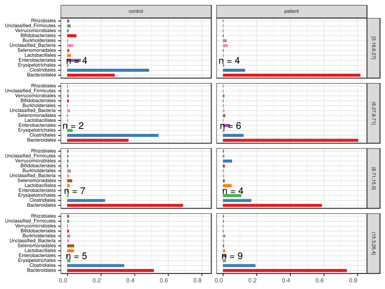

\(1.2.1.2.6.2.4.2.1.2.1\) [`Figure 289.`](#figure.289) Abundance. Data grouped by Sample.type,age.quant.  violin plot.  Image file: [`plots/32337b87654.svg`](plots/32337b87654.svg).
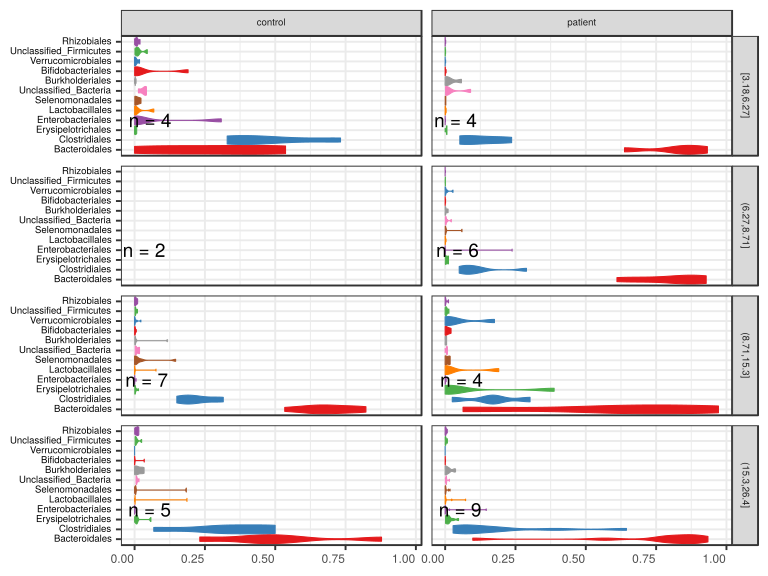

\(1.2.1.2.6.2.4.2.1.2.1\) [`Figure 290.`](#figure.290) Abundance. Data grouped by Sample.type,age.quant.  boxplot plot.  Image file: [`plots/32367369624.svg`](plots/32367369624.svg).
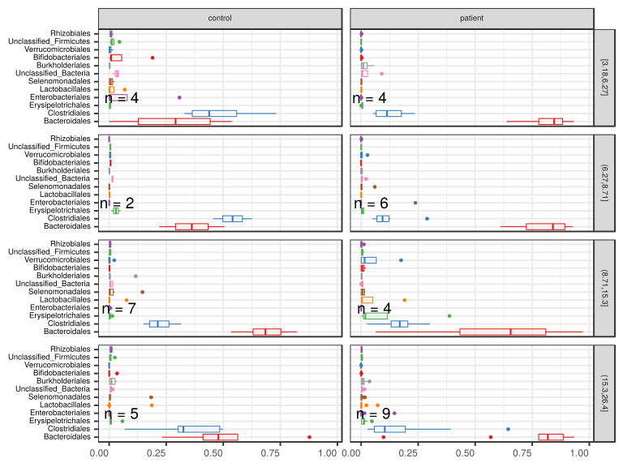

##### \(1.2.1.2.6.2.4.2.2\) dodged plots. Iterating over orientation and, optionally, scaling

##### \(1.2.1.2.6.2.4.2.2.1\) Abundance. Plot is in original orientation, Y axis SQRT scaled. Iterating over plot geometry

\(1.2.1.2.6.2.4.2.2.1.1\) [`Figure 291.`](#figure.291) Abundance. Data grouped by Sample.type,age.quant.  bar (sample mean) plot.  Image file: [`plots/32322bac30b.svg`](plots/32322bac30b.svg).
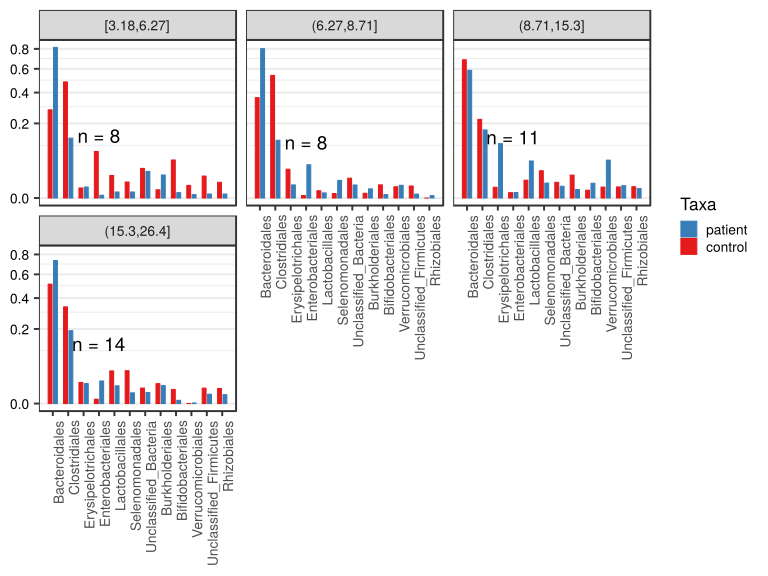

\(1.2.1.2.6.2.4.2.2.1.1\) [`Figure 292.`](#figure.292) Abundance. Data grouped by Sample.type,age.quant.  violin plot.  Image file: [`plots/32322068ba7.svg`](plots/32322068ba7.svg).
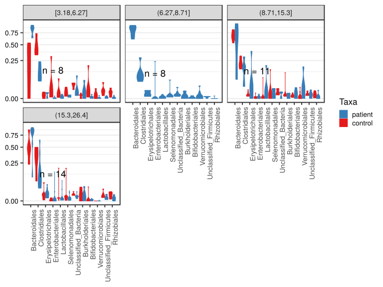

\(1.2.1.2.6.2.4.2.2.1.1\) [`Figure 293.`](#figure.293) Abundance. Data grouped by Sample.type,age.quant.  boxplot plot.  Image file: [`plots/323508c0d14.svg`](plots/323508c0d14.svg).
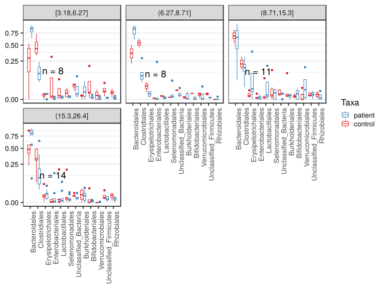

##### \(1.2.1.2.6.2.4.2.2.2\) Abundance. Plot is in flipped orientation, Y axis not scaled. Iterating over plot geometry

\(1.2.1.2.6.2.4.2.2.2.1\) [`Figure 294.`](#figure.294) Abundance. Data grouped by Sample.type,age.quant.  bar (sample mean) plot.  Image file: [`plots/32355a1273a.svg`](plots/32355a1273a.svg).
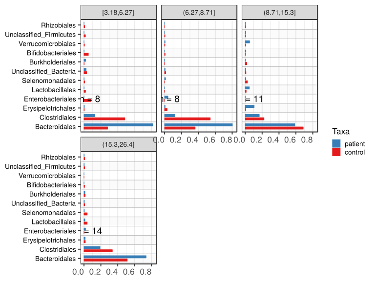

\(1.2.1.2.6.2.4.2.2.2.1\) [`Figure 295.`](#figure.295) Abundance. Data grouped by Sample.type,age.quant.  violin plot.  Image file: [`plots/3231542926e.svg`](plots/3231542926e.svg).
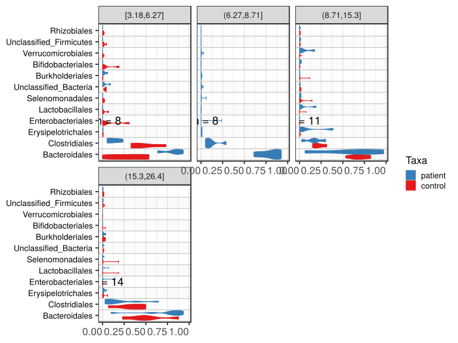

\(1.2.1.2.6.2.4.2.2.2.1\) [`Figure 296.`](#figure.296) Abundance. Data grouped by Sample.type,age.quant.  boxplot plot.  Image file: [`plots/3237ae9ec2e.svg`](plots/3237ae9ec2e.svg).
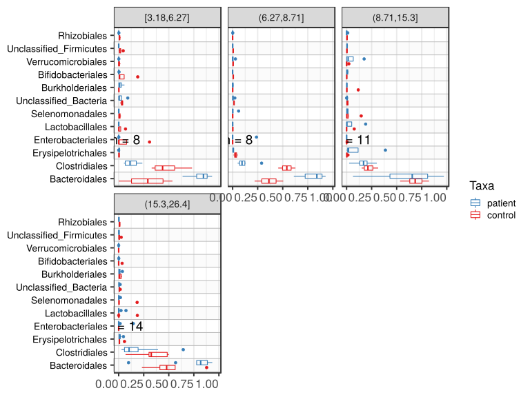