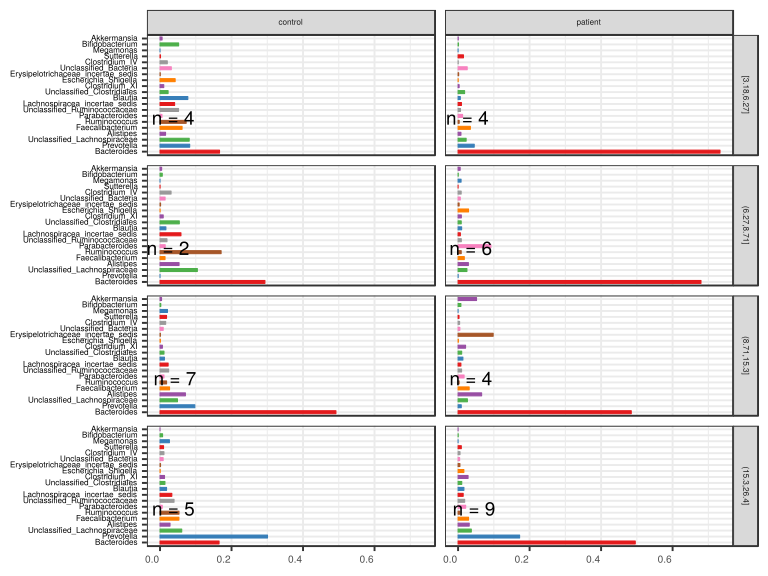

noone@mail.com
Analysis of Dieting study 16S data
% Fri Sep  7 05:46:18 2018

##### \(1.2.1.3.6\) Plots of Abundance.

Plots are shown with relation to various combinations of meta 
                   data variables and in different graphical representations. Lots of plots here.

##### \(1.2.1.3.6.2\) Iterating over all combinations of grouping variables

##### \(1.2.1.3.6.2.1\) Grouping variables Sample.type

##### \(1.2.1.3.6.2.2\) Iterating over Abundance. profile sorting order

##### \(1.2.1.3.6.2.2.1\) Abundance. profile sorting order: average abundance

##### \(1.2.1.3.6.2.2.2\) Iterating over dodged vs faceted bars

The same data are shown in multiple combinations of graphical representations. 
                         This is the same data, but each plot highlights slightly different aspects of it.
                         It is not likely that you will need every plot - pick only what you need.

##### \(1.2.1.3.6.2.2.2.1\) faceted plots. Iterating over orientation and, optionally, scaling

##### \(1.2.1.3.6.2.2.2.1.1\) Abundance. Plot is in original orientation, Y axis SQRT scaled. Iterating over plot geometry

\(1.2.1.3.6.2.2.2.1.1.0\) [`Table 87.`](#table.87) Data table used for plots. Data grouped by Sample.type. Showing only 200 first rows. Full dataset is also saved in a delimited text file (click to download and open e.g. in Excel) [`data/1.2.1.3.6.2.2.2.1.1.0-323626d932a.1.2.1.3.6.2.2.2.1.1.csv`](data/1.2.1.3.6.2.2.2.1.1.0-323626d932a.1.2.1.3.6.2.2.2.1.1.csv)

| .record.id | Sample.type | feature                       | Abundance  |
|:-----------|:------------|:------------------------------|:-----------|
| SB1        | control     | Bacteroides                   | 6.247e\-01 |
| SB10       | control     | Bacteroides                   | 6.327e\-02 |
| SB11       | patient     | Bacteroides                   | 4.295e\-01 |
| SB12       | control     | Bacteroides                   | 0.000e\+00 |
| SB13       | control     | Bacteroides                   | 2.126e\-01 |
| SB14       | control     | Bacteroides                   | 7.465e\-02 |
| SB15       | control     | Bacteroides                   | 5.242e\-01 |
| SB16       | patient     | Bacteroides                   | 8.130e\-01 |
| SB17       | patient     | Bacteroides                   | 1.435e\-01 |
| SB18       | patient     | Bacteroides                   | 8.611e\-01 |
| SB19       | control     | Bacteroides                   | 1.797e\-02 |
| SB21       | control     | Bacteroides                   | 1.440e\-01 |
| SB22       | patient     | Bacteroides                   | 5.831e\-01 |
| SB23       | patient     | Bacteroides                   | 6.404e\-01 |
| SB24       | control     | Bacteroides                   | 3.247e\-01 |
| SB25       | control     | Bacteroides                   | 4.587e\-01 |
| SB26       | control     | Bacteroides                   | 3.742e\-01 |
| SB28       | patient     | Bacteroides                   | 1.747e\-01 |
| SB29       | patient     | Bacteroides                   | 8.679e\-01 |
| SB3        | control     | Bacteroides                   | 2.611e\-02 |
| SB30       | patient     | Bacteroides                   | 8.108e\-01 |
| SB31       | control     | Bacteroides                   | 6.218e\-01 |
| SB32       | control     | Bacteroides                   | 3.301e\-01 |
| SB33       | control     | Bacteroides                   | 8.153e\-01 |
| SB34       | patient     | Bacteroides                   | 7.735e\-01 |
| SB35       | patient     | Bacteroides                   | 9.643e\-01 |
| SB36       | patient     | Bacteroides                   | 5.438e\-01 |
| SB38       | patient     | Bacteroides                   | 4.095e\-01 |
| SB39       | patient     | Bacteroides                   | 5.037e\-01 |
| SB4        | patient     | Bacteroides                   | 9.292e\-01 |
| SB40       | control     | Bacteroides                   | 4.955e\-01 |
| SB41       | patient     | Bacteroides                   | 8.674e\-01 |
| SB42       | patient     | Bacteroides                   | 6.375e\-01 |
| SB43       | patient     | Bacteroides                   | 2.885e\-01 |
| SB44       | patient     | Bacteroides                   | 8.199e\-01 |
| SB45       | control     | Bacteroides                   | 2.115e\-03 |
| SB5        | patient     | Bacteroides                   | 8.105e\-02 |
| SB6        | patient     | Bacteroides                   | 7.723e\-01 |
| SB7        | control     | Bacteroides                   | 4.120e\-01 |
| SB8        | patient     | Bacteroides                   | 4.490e\-01 |
| SB9        | patient     | Bacteroides                   | 3.976e\-02 |
| SB1        | control     | Prevotella                    | 2.046e\-03 |
| SB10       | control     | Prevotella                    | 4.438e\-01 |
| SB11       | patient     | Prevotella                    | 1.652e\-02 |
| SB12       | control     | Prevotella                    | 0.000e\+00 |
| SB13       | control     | Prevotella                    | 0.000e\+00 |
| SB14       | control     | Prevotella                    | 6.747e\-01 |
| SB15       | control     | Prevotella                    | 2.758e\-04 |
| SB16       | patient     | Prevotella                    | 4.137e\-04 |
| SB17       | patient     | Prevotella                    | 6.822e\-01 |
| SB18       | patient     | Prevotella                    | 2.480e\-04 |
| SB19       | control     | Prevotella                    | 1.978e\-01 |
| SB21       | control     | Prevotella                    | 5.399e\-04 |
| SB22       | patient     | Prevotella                    | 0.000e\+00 |
| SB23       | patient     | Prevotella                    | 0.000e\+00 |
| SB24       | control     | Prevotella                    | 2.151e\-03 |
| SB25       | control     | Prevotella                    | 2.131e\-03 |
| SB26       | control     | Prevotella                    | 0.000e\+00 |
| SB28       | patient     | Prevotella                    | 0.000e\+00 |
| SB29       | patient     | Prevotella                    | 3.600e\-04 |
| SB3        | control     | Prevotella                    | 3.314e\-01 |
| SB30       | patient     | Prevotella                    | 1.009e\-04 |
| SB31       | control     | Prevotella                    | 2.198e\-04 |
| SB32       | control     | Prevotella                    | 7.741e\-04 |
| SB33       | control     | Prevotella                    | 5.743e\-05 |
| SB34       | patient     | Prevotella                    | 2.598e\-04 |
| SB35       | patient     | Prevotella                    | 0.000e\+00 |
| SB36       | patient     | Prevotella                    | 1.804e\-01 |
| SB38       | patient     | Prevotella                    | 4.073e\-01 |
| SB39       | patient     | Prevotella                    | 0.000e\+00 |
| SB4        | patient     | Prevotella                    | 0.000e\+00 |
| SB40       | control     | Prevotella                    | 0.000e\+00 |
| SB41       | patient     | Prevotella                    | 1.328e\-04 |
| SB42       | patient     | Prevotella                    | 0.000e\+00 |
| SB43       | patient     | Prevotella                    | 4.502e\-01 |
| SB44       | patient     | Prevotella                    | 0.000e\+00 |
| SB45       | control     | Prevotella                    | 8.603e\-01 |
| SB5        | patient     | Prevotella                    | 8.062e\-03 |
| SB6        | patient     | Prevotella                    | 7.416e\-04 |
| SB7        | control     | Prevotella                    | 1.415e\-04 |
| SB8        | patient     | Prevotella                    | 0.000e\+00 |
| SB9        | patient     | Prevotella                    | 1.855e\-02 |
| SB1        | control     | Unclassified\_Lachnospiraceae | 2.637e\-02 |
| SB10       | control     | Unclassified\_Lachnospiraceae | 7.553e\-02 |
| SB11       | patient     | Unclassified\_Lachnospiraceae | 1.116e\-02 |
| SB12       | control     | Unclassified\_Lachnospiraceae | 9.506e\-02 |
| SB13       | control     | Unclassified\_Lachnospiraceae | 1.862e\-01 |
| SB14       | control     | Unclassified\_Lachnospiraceae | 7.117e\-02 |
| SB15       | control     | Unclassified\_Lachnospiraceae | 7.501e\-02 |
| SB16       | patient     | Unclassified\_Lachnospiraceae | 2.938e\-02 |
| SB17       | patient     | Unclassified\_Lachnospiraceae | 1.402e\-02 |
| SB18       | patient     | Unclassified\_Lachnospiraceae | 1.097e\-02 |
| SB19       | control     | Unclassified\_Lachnospiraceae | 5.214e\-02 |
| SB21       | control     | Unclassified\_Lachnospiraceae | 1.109e\-01 |
| SB22       | patient     | Unclassified\_Lachnospiraceae | 1.113e\-01 |
| SB23       | patient     | Unclassified\_Lachnospiraceae | 6.495e\-02 |
| SB24       | control     | Unclassified\_Lachnospiraceae | 3.844e\-02 |
| SB25       | control     | Unclassified\_Lachnospiraceae | 2.323e\-02 |
| SB26       | control     | Unclassified\_Lachnospiraceae | 2.256e\-02 |
| SB28       | patient     | Unclassified\_Lachnospiraceae | 3.934e\-03 |
| SB29       | patient     | Unclassified\_Lachnospiraceae | 3.240e\-03 |
| SB3        | control     | Unclassified\_Lachnospiraceae | 5.534e\-02 |
| SB30       | patient     | Unclassified\_Lachnospiraceae | 8.278e\-03 |
| SB31       | control     | Unclassified\_Lachnospiraceae | 6.396e\-02 |
| SB32       | control     | Unclassified\_Lachnospiraceae | 1.078e\-01 |
| SB33       | control     | Unclassified\_Lachnospiraceae | 4.324e\-02 |
| SB34       | patient     | Unclassified\_Lachnospiraceae | 4.529e\-02 |
| SB35       | patient     | Unclassified\_Lachnospiraceae | 1.204e\-03 |
| SB36       | patient     | Unclassified\_Lachnospiraceae | 0.000e\+00 |
| SB38       | patient     | Unclassified\_Lachnospiraceae | 1.135e\-02 |
| SB39       | patient     | Unclassified\_Lachnospiraceae | 2.995e\-02 |
| SB4        | patient     | Unclassified\_Lachnospiraceae | 6.331e\-03 |
| SB40       | control     | Unclassified\_Lachnospiraceae | 6.498e\-02 |
| SB41       | patient     | Unclassified\_Lachnospiraceae | 1.049e\-02 |
| SB42       | patient     | Unclassified\_Lachnospiraceae | 4.444e\-02 |
| SB43       | patient     | Unclassified\_Lachnospiraceae | 1.844e\-03 |
| SB44       | patient     | Unclassified\_Lachnospiraceae | 3.899e\-02 |
| SB45       | control     | Unclassified\_Lachnospiraceae | 1.763e\-02 |
| SB5        | patient     | Unclassified\_Lachnospiraceae | 9.925e\-02 |
| SB6        | patient     | Unclassified\_Lachnospiraceae | 1.112e\-02 |
| SB7        | control     | Unclassified\_Lachnospiraceae | 5.053e\-02 |
| SB8        | patient     | Unclassified\_Lachnospiraceae | 5.532e\-02 |
| SB9        | patient     | Unclassified\_Lachnospiraceae | 6.172e\-02 |
| SB1        | control     | Alistipes                     | 5.342e\-02 |
| SB10       | control     | Alistipes                     | 2.614e\-02 |
| SB11       | patient     | Alistipes                     | 2.482e\-01 |
| SB12       | control     | Alistipes                     | 0.000e\+00 |
| SB13       | control     | Alistipes                     | 0.000e\+00 |
| SB14       | control     | Alistipes                     | 1.418e\-02 |
| SB15       | control     | Alistipes                     | 0.000e\+00 |
| SB16       | patient     | Alistipes                     | 0.000e\+00 |
| SB17       | patient     | Alistipes                     | 3.344e\-03 |
| SB18       | patient     | Alistipes                     | 2.480e\-04 |
| SB19       | control     | Alistipes                     | 1.039e\-02 |
| SB21       | control     | Alistipes                     | 1.152e\-02 |
| SB22       | patient     | Alistipes                     | 8.061e\-03 |
| SB23       | patient     | Alistipes                     | 6.092e\-02 |
| SB24       | control     | Alistipes                     | 3.071e\-01 |
| SB25       | control     | Alistipes                     | 1.162e\-01 |
| SB26       | control     | Alistipes                     | 1.064e\-01 |
| SB28       | patient     | Alistipes                     | 0.000e\+00 |
| SB29       | patient     | Alistipes                     | 2.808e\-02 |
| SB3        | control     | Alistipes                     | 2.383e\-02 |
| SB30       | patient     | Alistipes                     | 4.487e\-02 |
| SB31       | control     | Alistipes                     | 5.861e\-03 |
| SB32       | control     | Alistipes                     | 3.902e\-02 |
| SB33       | control     | Alistipes                     | 0.000e\+00 |
| SB34       | patient     | Alistipes                     | 9.784e\-03 |
| SB35       | patient     | Alistipes                     | 0.000e\+00 |
| SB36       | patient     | Alistipes                     | 2.740e\-02 |
| SB38       | patient     | Alistipes                     | 7.861e\-02 |
| SB39       | patient     | Alistipes                     | 1.514e\-02 |
| SB4        | patient     | Alistipes                     | 0.000e\+00 |
| SB40       | control     | Alistipes                     | 2.642e\-02 |
| SB41       | patient     | Alistipes                     | 5.613e\-02 |
| SB42       | patient     | Alistipes                     | 0.000e\+00 |
| SB43       | patient     | Alistipes                     | 1.058e\-02 |
| SB44       | patient     | Alistipes                     | 4.393e\-03 |
| SB45       | control     | Alistipes                     | 8.814e\-05 |
| SB5        | patient     | Alistipes                     | 0.000e\+00 |
| SB6        | patient     | Alistipes                     | 3.522e\-02 |
| SB7        | control     | Alistipes                     | 6.419e\-02 |
| SB8        | patient     | Alistipes                     | 1.164e\-01 |
| SB9        | patient     | Alistipes                     | 0.000e\+00 |
| SB1        | control     | Faecalibacterium              | 2.273e\-02 |
| SB10       | control     | Faecalibacterium              | 5.799e\-02 |
| SB11       | patient     | Faecalibacterium              | 4.018e\-03 |
| SB12       | control     | Faecalibacterium              | 0.000e\+00 |
| SB13       | control     | Faecalibacterium              | 2.421e\-02 |
| SB14       | control     | Faecalibacterium              | 3.571e\-02 |
| SB15       | control     | Faecalibacterium              | 1.193e\-02 |
| SB16       | patient     | Faecalibacterium              | 4.137e\-04 |
| SB17       | patient     | Faecalibacterium              | 2.804e\-02 |
| SB18       | patient     | Faecalibacterium              | 1.550e\-03 |
| SB19       | control     | Faecalibacterium              | 1.059e\-01 |
| SB21       | control     | Faecalibacterium              | 1.195e\-01 |
| SB22       | patient     | Faecalibacterium              | 1.267e\-02 |
| SB23       | patient     | Faecalibacterium              | 2.891e\-02 |
| SB24       | control     | Faecalibacterium              | 1.406e\-02 |
| SB25       | control     | Faecalibacterium              | 2.110e\-02 |
| SB26       | control     | Faecalibacterium              | 3.760e\-03 |
| SB28       | patient     | Faecalibacterium              | 0.000e\+00 |
| SB29       | patient     | Faecalibacterium              | 8.999e\-03 |
| SB3        | control     | Faecalibacterium              | 1.018e\-01 |
| SB30       | patient     | Faecalibacterium              | 1.620e\-02 |
| SB31       | control     | Faecalibacterium              | 4.484e\-02 |
| SB32       | control     | Faecalibacterium              | 5.589e\-02 |
| SB33       | control     | Faecalibacterium              | 3.578e\-02 |
| SB34       | patient     | Faecalibacterium              | 1.030e\-02 |
| SB35       | patient     | Faecalibacterium              | 2.047e\-02 |
| SB36       | patient     | Faecalibacterium              | 4.795e\-02 |
| SB38       | patient     | Faecalibacterium              | 4.735e\-03 |
| SB39       | patient     | Faecalibacterium              | 3.221e\-02 |
| SB4        | patient     | Faecalibacterium              | 1.115e\-02 |
| SB40       | control     | Faecalibacterium              | 2.535e\-02 |
| SB41       | patient     | Faecalibacterium              | 8.897e\-03 |
| SB42       | patient     | Faecalibacterium              | 5.553e\-02 |
| SB43       | patient     | Faecalibacterium              | 3.553e\-02 |
| SB44       | patient     | Faecalibacterium              | 2.252e\-02 |
| SB45       | control     | Faecalibacterium              | 6.522e\-03 |

\(1.2.1.3.6.2.2.2.1.1.1\) [`Widget 91.`](#widget.91) Dynamic Pivot Table link (drag and drop field names and pick averaging 
                      functions or plot types; click on fields or legend elements to filter values). 
                      Starting rendering is Stacked Bar Chart. Data grouped by Sample.type. Click to see HTML widget file in full window: [`./1.2.1.3.6.2.2.2.1.1.1-32322b0d3b1Dynamic.Pivot.Table.html`](./1.2.1.3.6.2.2.2.1.1.1-32322b0d3b1Dynamic.Pivot.Table.html)

\(1.2.1.3.6.2.2.2.1.1.1\) [`Widget 92.`](#widget.92) Dynamic Pivot Table link (drag and drop field names and pick averaging 
                      functions or plot types; click on fields or legend elements to filter values). 
                      Starting rendering is Table Barchart. Data grouped by Sample.type. Click to see HTML widget file in full window: [`./1.2.1.3.6.2.2.2.1.1.1-3237b0a5160Dynamic.Pivot.Table.html`](./1.2.1.3.6.2.2.2.1.1.1-3237b0a5160Dynamic.Pivot.Table.html)

\(1.2.1.3.6.2.2.2.1.1.1\) [`Table 88.`](#table.88) Summary table. Data grouped by Sample.type. Full dataset is also saved in a delimited text file (click to download and open e.g. in Excel) [`data/1.2.1.3.6.2.2.2.1.1.1-3233f41cfee.1.2.1.3.6.2.2.2.1.1.csv`](data/1.2.1.3.6.2.2.2.1.1.1-3233f41cfee.1.2.1.3.6.2.2.2.1.1.csv)

| feature                              | Sample.type | mean      | sd       | median     | incidence |
|:-------------------------------------|:------------|:----------|:---------|:-----------|:----------|
| Bacteroides                          | control     | 0.3067667 | 0.251936 | 3.274e\-01 | 0.94444   |
| Bacteroides                          | patient     | 0.5827510 | 0.287387 | 6.375e\-01 | 1.00000   |
| Prevotella                           | control     | 0.1397999 | 0.264522 | 6.570e\-04 | 0.77778   |
| Prevotella                           | patient     | 0.0767600 | 0.182368 | 2.480e\-04 | 0.60870   |
| Unclassified\_Lachnospiraceae        | control     | 0.0655540 | 0.041083 | 5.965e\-02 | 1.00000   |
| Unclassified\_Lachnospiraceae        | patient     | 0.0293288 | 0.031477 | 1.135e\-02 | 0.95652   |
| Alistipes                            | control     | 0.0447037 | 0.074383 | 1.901e\-02 | 0.77778   |
| Alistipes                            | patient     | 0.0324937 | 0.056098 | 9.784e\-03 | 0.69565   |
| Faecalibacterium                     | control     | 0.0402492 | 0.035750 | 3.053e\-02 | 0.94444   |
| Faecalibacterium                     | patient     | 0.0272857 | 0.029759 | 2.047e\-02 | 0.95652   |
| Ruminococcus                         | control     | 0.0570637 | 0.089643 | 2.219e\-02 | 0.94444   |
| Ruminococcus                         | patient     | 0.0051753 | 0.009151 | 1.893e\-03 | 0.91304   |
| Parabacteroides                      | control     | 0.0088394 | 0.007836 | 6.610e\-03 | 0.94444   |
| Parabacteroides                      | patient     | 0.0373501 | 0.105187 | 2.651e\-03 | 0.73913   |
| Unclassified\_Ruminococcaceae        | control     | 0.0339247 | 0.031348 | 2.150e\-02 | 0.94444   |
| Unclassified\_Ruminococcaceae        | patient     | 0.0123984 | 0.025370 | 6.698e\-03 | 1.00000   |
| Lachnospiracea\_incertae\_sedis      | control     | 0.0335219 | 0.029027 | 2.800e\-02 | 0.94444   |
| Lachnospiracea\_incertae\_sedis      | patient     | 0.0101701 | 0.011313 | 4.911e\-03 | 0.91304   |
| Blautia                              | control     | 0.0289371 | 0.045018 | 1.644e\-02 | 1.00000   |
| Blautia                              | patient     | 0.0123540 | 0.016403 | 4.067e\-03 | 0.95652   |
| Unclassified\_Clostridiales          | control     | 0.0191043 | 0.021458 | 1.279e\-02 | 0.94444   |
| Unclassified\_Clostridiales          | patient     | 0.0111868 | 0.014283 | 7.085e\-03 | 1.00000   |
| Clostridium\_XI                      | control     | 0.0093565 | 0.009819 | 7.265e\-03 | 0.94444   |
| Clostridium\_XI                      | patient     | 0.0174076 | 0.045710 | 2.423e\-03 | 0.82609   |
| Escherichia\_Shigella                | control     | 0.0099026 | 0.039532 | 3.853e\-04 | 0.61111   |
| Escherichia\_Shigella                | patient     | 0.0141029 | 0.044061 | 0.000e\+00 | 0.39130   |
| Erysipelotrichaceae\_incertae\_sedis | control     | 0.0011320 | 0.001596 | 5.687e\-04 | 0.77778   |
| Erysipelotrichaceae\_incertae\_sedis | patient     | 0.0200729 | 0.079990 | 1.212e\-03 | 0.73913   |
| Unclassified\_Bacteria               | control     | 0.0143963 | 0.011932 | 1.273e\-02 | 1.00000   |
| Unclassified\_Bacteria               | patient     | 0.0085863 | 0.018505 | 3.658e\-03 | 0.95652   |
| Clostridium\_IV                      | control     | 0.0171240 | 0.021312 | 1.207e\-02 | 0.94444   |
| Clostridium\_IV                      | patient     | 0.0051572 | 0.008729 | 1.461e\-03 | 0.82609   |
| Sutterella                           | control     | 0.0101164 | 0.027441 | 1.351e\-03 | 0.61111   |
| Sutterella                           | patient     | 0.0065465 | 0.014865 | 4.426e\-05 | 0.52174   |
| Megamonas                            | control     | 0.0153668 | 0.042782 | 0.000e\+00 | 0.16667   |
| Megamonas                            | patient     | 0.0021745 | 0.010405 | 0.000e\+00 | 0.08696   |
| Bifidobacterium                      | control     | 0.0150614 | 0.044413 | 1.889e\-03 | 0.83333   |
| Bifidobacterium                      | patient     | 0.0017907 | 0.004699 | 3.015e\-04 | 0.65217   |
| Akkermansia                          | control     | 0.0034469 | 0.006657 | 0.000e\+00 | 0.38889   |
| Akkermansia                          | patient     | 0.0105567 | 0.036854 | 0.000e\+00 | 0.34783   |
| Clostridium\_XlVa                    | control     | 0.0087277 | 0.012406 | 4.857e\-03 | 0.94444   |
| Clostridium\_XlVa                    | patient     | 0.0061832 | 0.007227 | 4.820e\-03 | 0.95652   |
| Roseburia                            | control     | 0.0093204 | 0.006595 | 6.719e\-03 | 1.00000   |
| Roseburia                            | patient     | 0.0052684 | 0.006228 | 2.966e\-03 | 0.86957   |
| Dorea                                | control     | 0.0085626 | 0.008832 | 5.340e\-03 | 0.94444   |
| Dorea                                | patient     | 0.0049215 | 0.009620 | 1.112e\-03 | 0.73913   |
| Unclassified\_Firmicutes             | control     | 0.0085028 | 0.010888 | 3.831e\-03 | 1.00000   |
| Unclassified\_Firmicutes             | patient     | 0.0024286 | 0.003396 | 8.410e\-04 | 0.86957   |
| Lactobacillus                        | control     | 0.0101656 | 0.042700 | 0.000e\+00 | 0.27778   |
| Lactobacillus                        | patient     | 0.0003493 | 0.001159 | 0.000e\+00 | 0.17391   |
| Unclassified\_Bacteroidales          | control     | 0.0022287 | 0.003932 | 1.211e\-03 | 0.83333   |
| Unclassified\_Bacteroidales          | patient     | 0.0063594 | 0.013756 | 2.017e\-03 | 1.00000   |
| Clostridium\_XVIII                   | control     | 0.0044237 | 0.010249 | 1.121e\-03 | 0.94444   |
| Clostridium\_XVIII                   | patient     | 0.0035808 | 0.004204 | 1.786e\-03 | 0.86957   |
| Gemmiger                             | control     | 0.0059795 | 0.005787 | 4.956e\-03 | 0.83333   |
| Gemmiger                             | patient     | 0.0017996 | 0.003060 | 3.015e\-04 | 0.56522   |
| Streptococcus                        | control     | 0.0055314 | 0.017846 | 4.000e\-04 | 0.83333   |
| Streptococcus                        | patient     | 0.0021337 | 0.004859 | 1.009e\-04 | 0.69565   |
| Enterococcus                         | control     | 0.0033431 | 0.013146 | 0.000e\+00 | 0.22222   |
| Enterococcus                         | patient     | 0.0033912 | 0.014927 | 0.000e\+00 | 0.34783   |
| Clostridium\_sensu\_stricto          | control     | 0.0031234 | 0.007063 | 3.666e\-04 | 0.83333   |
| Clostridium\_sensu\_stricto          | patient     | 0.0033437 | 0.007211 | 6.071e\-05 | 0.52174   |
| Oscillibacter                        | control     | 0.0044635 | 0.005391 | 3.262e\-03 | 0.88889   |
| Oscillibacter                        | patient     | 0.0022633 | 0.003198 | 1.032e\-03 | 0.78261   |
| Unclassified\_Enterobacteriaceae     | control     | 0.0028637 | 0.011365 | 0.000e\+00 | 0.27778   |
| Unclassified\_Enterobacteriaceae     | patient     | 0.0032363 | 0.013092 | 0.000e\+00 | 0.26087   |
| Phascolarctobacterium                | control     | 0.0041073 | 0.009834 | 0.000e\+00 | 0.22222   |
| Phascolarctobacterium                | patient     | 0.0019338 | 0.004752 | 0.000e\+00 | 0.39130   |
| Odoribacter                          | control     | 0.0035311 | 0.006451 | 1.477e\-04 | 0.55556   |
| Odoribacter                          | patient     | 0.0019267 | 0.004960 | 0.000e\+00 | 0.26087   |
| Klebsiella                           | control     | 0.0051171 | 0.021503 | 0.000e\+00 | 0.16667   |
| Klebsiella                           | patient     | 0.0003720 | 0.001428 | 0.000e\+00 | 0.21739   |
| Barnesiella                          | control     | 0.0026788 | 0.005378 | 2.871e\-05 | 0.50000   |
| Barnesiella                          | patient     | 0.0011158 | 0.003513 | 0.000e\+00 | 0.26087   |
| Unclassified\_Prevotellaceae         | control     | 0.0023462 | 0.006777 | 0.000e\+00 | 0.33333   |
| Unclassified\_Prevotellaceae         | patient     | 0.0012765 | 0.005105 | 0.000e\+00 | 0.21739   |
| Catenibacterium                      | control     | 0.0030692 | 0.011967 | 0.000e\+00 | 0.11111   |
| Catenibacterium                      | patient     | 0.0002785 | 0.001336 | 0.000e\+00 | 0.04348   |
| Unclassified\_Burkholderiales        | control     | 0.0014189 | 0.003669 | 0.000e\+00 | 0.22222   |
| Unclassified\_Burkholderiales        | patient     | 0.0014888 | 0.004149 | 0.000e\+00 | 0.17391   |

\(1.2.1.3.6.2.2.2.1.1.1\) [`Figure 303.`](#figure.303) Abundance. Data grouped by Sample.type.  bar_stacked plot.  Image file: [`plots/32338bc0578.svg`](plots/32338bc0578.svg).

\(1.2.1.3.6.2.2.2.1.1.1\) [`Figure 304.`](#figure.304) Abundance. Data grouped by Sample.type.  bar (sample mean) plot.  Image file: [`plots/32346eef005.svg`](plots/32346eef005.svg).

\(1.2.1.3.6.2.2.2.1.1.1\) [`Figure 305.`](#figure.305) Abundance. Data grouped by Sample.type.  violin plot.  Image file: [`plots/323517f6de3.svg`](plots/323517f6de3.svg).

\(1.2.1.3.6.2.2.2.1.1.1\) [`Figure 306.`](#figure.306) Abundance. Data grouped by Sample.type.  boxplot plot.  Image file: [`plots/3235c6a41ee.svg`](plots/3235c6a41ee.svg).

##### \(1.2.1.3.6.2.2.2.1.2\) Abundance. Plot is in flipped orientation, Y axis not scaled. Iterating over plot geometry

\(1.2.1.3.6.2.2.2.1.2.1\) [`Figure 307.`](#figure.307) Abundance. Data grouped by Sample.type.  bar (sample mean) plot.  Image file: [`plots/3232ac3fdc0.svg`](plots/3232ac3fdc0.svg).

\(1.2.1.3.6.2.2.2.1.2.1\) [`Figure 308.`](#figure.308) Abundance. Data grouped by Sample.type.  violin plot.  Image file: [`plots/3234de6a619.svg`](plots/3234de6a619.svg).

\(1.2.1.3.6.2.2.2.1.2.1\) [`Figure 309.`](#figure.309) Abundance. Data grouped by Sample.type.  boxplot plot.  Image file: [`plots/3235baf79ff.svg`](plots/3235baf79ff.svg).

##### \(1.2.1.3.6.2.2.2.2\) dodged plots. Iterating over orientation and, optionally, scaling

##### \(1.2.1.3.6.2.2.2.2.1\) Abundance. Plot is in original orientation, Y axis SQRT scaled. Iterating over plot geometry

\(1.2.1.3.6.2.2.2.2.1.1\) [`Figure 310.`](#figure.310) Abundance. Data grouped by Sample.type.  bar (sample mean) plot.  Image file: [`plots/32337578b0f.svg`](plots/32337578b0f.svg).

\(1.2.1.3.6.2.2.2.2.1.1\) [`Figure 311.`](#figure.311) Abundance. Data grouped by Sample.type.  violin plot.  Image file: [`plots/323ac3b49b.svg`](plots/323ac3b49b.svg).

\(1.2.1.3.6.2.2.2.2.1.1\) [`Figure 312.`](#figure.312) Abundance. Data grouped by Sample.type.  boxplot plot.  Image file: [`plots/3237ee39a75.svg`](plots/3237ee39a75.svg).

##### \(1.2.1.3.6.2.2.2.2.2\) Abundance. Plot is in flipped orientation, Y axis not scaled. Iterating over plot geometry

\(1.2.1.3.6.2.2.2.2.2.1\) [`Figure 313.`](#figure.313) Abundance. Data grouped by Sample.type.  bar (sample mean) plot.  Image file: [`plots/3233c6be5f6.svg`](plots/3233c6be5f6.svg).

\(1.2.1.3.6.2.2.2.2.2.1\) [`Figure 314.`](#figure.314) Abundance. Data grouped by Sample.type.  violin plot.  Image file: [`plots/32350ecbf37.svg`](plots/32350ecbf37.svg).

\(1.2.1.3.6.2.2.2.2.2.1\) [`Figure 315.`](#figure.315) Abundance. Data grouped by Sample.type.  boxplot plot.  Image file: [`plots/3231da1ae2e.svg`](plots/3231da1ae2e.svg).

##### \(1.2.1.3.6.2.2.3\) Abundance. profile sorting order: Ranking by 'stabsel' method

##### \(1.2.1.3.6.2.2.4\) Iterating over dodged vs faceted bars

The same data are shown in multiple combinations of graphical representations. 
                         This is the same data, but each plot highlights slightly different aspects of it.
                         It is not likely that you will need every plot - pick only what you need.

##### \(1.2.1.3.6.2.2.4.1\) faceted plots. Iterating over orientation and, optionally, scaling

##### \(1.2.1.3.6.2.2.4.1.1\) Abundance. Plot is in original orientation, Y axis SQRT scaled. Iterating over plot geometry

\(1.2.1.3.6.2.2.4.1.1.0\) [`Table 89.`](#table.89) Data table used for plots. Data grouped by Sample.type. Showing only 200 first rows. Full dataset is also saved in a delimited text file (click to download and open e.g. in Excel) [`data/1.2.1.3.6.2.2.4.1.1.0-3234712a8a.1.2.1.3.6.2.2.4.1.1.csv`](data/1.2.1.3.6.2.2.4.1.1.0-3234712a8a.1.2.1.3.6.2.2.4.1.1.csv)

| .record.id | Sample.type | feature                       | Abundance  |
|:-----------|:------------|:------------------------------|:-----------|
| SB1        | control     | Bacteroides                   | 6.247e\-01 |
| SB10       | control     | Bacteroides                   | 6.327e\-02 |
| SB11       | patient     | Bacteroides                   | 4.295e\-01 |
| SB12       | control     | Bacteroides                   | 0.000e\+00 |
| SB13       | control     | Bacteroides                   | 2.126e\-01 |
| SB14       | control     | Bacteroides                   | 7.465e\-02 |
| SB15       | control     | Bacteroides                   | 5.242e\-01 |
| SB16       | patient     | Bacteroides                   | 8.130e\-01 |
| SB17       | patient     | Bacteroides                   | 1.435e\-01 |
| SB18       | patient     | Bacteroides                   | 8.611e\-01 |
| SB19       | control     | Bacteroides                   | 1.797e\-02 |
| SB21       | control     | Bacteroides                   | 1.440e\-01 |
| SB22       | patient     | Bacteroides                   | 5.831e\-01 |
| SB23       | patient     | Bacteroides                   | 6.404e\-01 |
| SB24       | control     | Bacteroides                   | 3.247e\-01 |
| SB25       | control     | Bacteroides                   | 4.587e\-01 |
| SB26       | control     | Bacteroides                   | 3.742e\-01 |
| SB28       | patient     | Bacteroides                   | 1.747e\-01 |
| SB29       | patient     | Bacteroides                   | 8.679e\-01 |
| SB3        | control     | Bacteroides                   | 2.611e\-02 |
| SB30       | patient     | Bacteroides                   | 8.108e\-01 |
| SB31       | control     | Bacteroides                   | 6.218e\-01 |
| SB32       | control     | Bacteroides                   | 3.301e\-01 |
| SB33       | control     | Bacteroides                   | 8.153e\-01 |
| SB34       | patient     | Bacteroides                   | 7.735e\-01 |
| SB35       | patient     | Bacteroides                   | 9.643e\-01 |
| SB36       | patient     | Bacteroides                   | 5.438e\-01 |
| SB38       | patient     | Bacteroides                   | 4.095e\-01 |
| SB39       | patient     | Bacteroides                   | 5.037e\-01 |
| SB4        | patient     | Bacteroides                   | 9.292e\-01 |
| SB40       | control     | Bacteroides                   | 4.955e\-01 |
| SB41       | patient     | Bacteroides                   | 8.674e\-01 |
| SB42       | patient     | Bacteroides                   | 6.375e\-01 |
| SB43       | patient     | Bacteroides                   | 2.885e\-01 |
| SB44       | patient     | Bacteroides                   | 8.199e\-01 |
| SB45       | control     | Bacteroides                   | 2.115e\-03 |
| SB5        | patient     | Bacteroides                   | 8.105e\-02 |
| SB6        | patient     | Bacteroides                   | 7.723e\-01 |
| SB7        | control     | Bacteroides                   | 4.120e\-01 |
| SB8        | patient     | Bacteroides                   | 4.490e\-01 |
| SB9        | patient     | Bacteroides                   | 3.976e\-02 |
| SB1        | control     | Prevotella                    | 2.046e\-03 |
| SB10       | control     | Prevotella                    | 4.438e\-01 |
| SB11       | patient     | Prevotella                    | 1.652e\-02 |
| SB12       | control     | Prevotella                    | 0.000e\+00 |
| SB13       | control     | Prevotella                    | 0.000e\+00 |
| SB14       | control     | Prevotella                    | 6.747e\-01 |
| SB15       | control     | Prevotella                    | 2.758e\-04 |
| SB16       | patient     | Prevotella                    | 4.137e\-04 |
| SB17       | patient     | Prevotella                    | 6.822e\-01 |
| SB18       | patient     | Prevotella                    | 2.480e\-04 |
| SB19       | control     | Prevotella                    | 1.978e\-01 |
| SB21       | control     | Prevotella                    | 5.399e\-04 |
| SB22       | patient     | Prevotella                    | 0.000e\+00 |
| SB23       | patient     | Prevotella                    | 0.000e\+00 |
| SB24       | control     | Prevotella                    | 2.151e\-03 |
| SB25       | control     | Prevotella                    | 2.131e\-03 |
| SB26       | control     | Prevotella                    | 0.000e\+00 |
| SB28       | patient     | Prevotella                    | 0.000e\+00 |
| SB29       | patient     | Prevotella                    | 3.600e\-04 |
| SB3        | control     | Prevotella                    | 3.314e\-01 |
| SB30       | patient     | Prevotella                    | 1.009e\-04 |
| SB31       | control     | Prevotella                    | 2.198e\-04 |
| SB32       | control     | Prevotella                    | 7.741e\-04 |
| SB33       | control     | Prevotella                    | 5.743e\-05 |
| SB34       | patient     | Prevotella                    | 2.598e\-04 |
| SB35       | patient     | Prevotella                    | 0.000e\+00 |
| SB36       | patient     | Prevotella                    | 1.804e\-01 |
| SB38       | patient     | Prevotella                    | 4.073e\-01 |
| SB39       | patient     | Prevotella                    | 0.000e\+00 |
| SB4        | patient     | Prevotella                    | 0.000e\+00 |
| SB40       | control     | Prevotella                    | 0.000e\+00 |
| SB41       | patient     | Prevotella                    | 1.328e\-04 |
| SB42       | patient     | Prevotella                    | 0.000e\+00 |
| SB43       | patient     | Prevotella                    | 4.502e\-01 |
| SB44       | patient     | Prevotella                    | 0.000e\+00 |
| SB45       | control     | Prevotella                    | 8.603e\-01 |
| SB5        | patient     | Prevotella                    | 8.062e\-03 |
| SB6        | patient     | Prevotella                    | 7.416e\-04 |
| SB7        | control     | Prevotella                    | 1.415e\-04 |
| SB8        | patient     | Prevotella                    | 0.000e\+00 |
| SB9        | patient     | Prevotella                    | 1.855e\-02 |
| SB1        | control     | Unclassified\_Lachnospiraceae | 2.637e\-02 |
| SB10       | control     | Unclassified\_Lachnospiraceae | 7.553e\-02 |
| SB11       | patient     | Unclassified\_Lachnospiraceae | 1.116e\-02 |
| SB12       | control     | Unclassified\_Lachnospiraceae | 9.506e\-02 |
| SB13       | control     | Unclassified\_Lachnospiraceae | 1.862e\-01 |
| SB14       | control     | Unclassified\_Lachnospiraceae | 7.117e\-02 |
| SB15       | control     | Unclassified\_Lachnospiraceae | 7.501e\-02 |
| SB16       | patient     | Unclassified\_Lachnospiraceae | 2.938e\-02 |
| SB17       | patient     | Unclassified\_Lachnospiraceae | 1.402e\-02 |
| SB18       | patient     | Unclassified\_Lachnospiraceae | 1.097e\-02 |
| SB19       | control     | Unclassified\_Lachnospiraceae | 5.214e\-02 |
| SB21       | control     | Unclassified\_Lachnospiraceae | 1.109e\-01 |
| SB22       | patient     | Unclassified\_Lachnospiraceae | 1.113e\-01 |
| SB23       | patient     | Unclassified\_Lachnospiraceae | 6.495e\-02 |
| SB24       | control     | Unclassified\_Lachnospiraceae | 3.844e\-02 |
| SB25       | control     | Unclassified\_Lachnospiraceae | 2.323e\-02 |
| SB26       | control     | Unclassified\_Lachnospiraceae | 2.256e\-02 |
| SB28       | patient     | Unclassified\_Lachnospiraceae | 3.934e\-03 |
| SB29       | patient     | Unclassified\_Lachnospiraceae | 3.240e\-03 |
| SB3        | control     | Unclassified\_Lachnospiraceae | 5.534e\-02 |
| SB30       | patient     | Unclassified\_Lachnospiraceae | 8.278e\-03 |
| SB31       | control     | Unclassified\_Lachnospiraceae | 6.396e\-02 |
| SB32       | control     | Unclassified\_Lachnospiraceae | 1.078e\-01 |
| SB33       | control     | Unclassified\_Lachnospiraceae | 4.324e\-02 |
| SB34       | patient     | Unclassified\_Lachnospiraceae | 4.529e\-02 |
| SB35       | patient     | Unclassified\_Lachnospiraceae | 1.204e\-03 |
| SB36       | patient     | Unclassified\_Lachnospiraceae | 0.000e\+00 |
| SB38       | patient     | Unclassified\_Lachnospiraceae | 1.135e\-02 |
| SB39       | patient     | Unclassified\_Lachnospiraceae | 2.995e\-02 |
| SB4        | patient     | Unclassified\_Lachnospiraceae | 6.331e\-03 |
| SB40       | control     | Unclassified\_Lachnospiraceae | 6.498e\-02 |
| SB41       | patient     | Unclassified\_Lachnospiraceae | 1.049e\-02 |
| SB42       | patient     | Unclassified\_Lachnospiraceae | 4.444e\-02 |
| SB43       | patient     | Unclassified\_Lachnospiraceae | 1.844e\-03 |
| SB44       | patient     | Unclassified\_Lachnospiraceae | 3.899e\-02 |
| SB45       | control     | Unclassified\_Lachnospiraceae | 1.763e\-02 |
| SB5        | patient     | Unclassified\_Lachnospiraceae | 9.925e\-02 |
| SB6        | patient     | Unclassified\_Lachnospiraceae | 1.112e\-02 |
| SB7        | control     | Unclassified\_Lachnospiraceae | 5.053e\-02 |
| SB8        | patient     | Unclassified\_Lachnospiraceae | 5.532e\-02 |
| SB9        | patient     | Unclassified\_Lachnospiraceae | 6.172e\-02 |
| SB1        | control     | Alistipes                     | 5.342e\-02 |
| SB10       | control     | Alistipes                     | 2.614e\-02 |
| SB11       | patient     | Alistipes                     | 2.482e\-01 |
| SB12       | control     | Alistipes                     | 0.000e\+00 |
| SB13       | control     | Alistipes                     | 0.000e\+00 |
| SB14       | control     | Alistipes                     | 1.418e\-02 |
| SB15       | control     | Alistipes                     | 0.000e\+00 |
| SB16       | patient     | Alistipes                     | 0.000e\+00 |
| SB17       | patient     | Alistipes                     | 3.344e\-03 |
| SB18       | patient     | Alistipes                     | 2.480e\-04 |
| SB19       | control     | Alistipes                     | 1.039e\-02 |
| SB21       | control     | Alistipes                     | 1.152e\-02 |
| SB22       | patient     | Alistipes                     | 8.061e\-03 |
| SB23       | patient     | Alistipes                     | 6.092e\-02 |
| SB24       | control     | Alistipes                     | 3.071e\-01 |
| SB25       | control     | Alistipes                     | 1.162e\-01 |
| SB26       | control     | Alistipes                     | 1.064e\-01 |
| SB28       | patient     | Alistipes                     | 0.000e\+00 |
| SB29       | patient     | Alistipes                     | 2.808e\-02 |
| SB3        | control     | Alistipes                     | 2.383e\-02 |
| SB30       | patient     | Alistipes                     | 4.487e\-02 |
| SB31       | control     | Alistipes                     | 5.861e\-03 |
| SB32       | control     | Alistipes                     | 3.902e\-02 |
| SB33       | control     | Alistipes                     | 0.000e\+00 |
| SB34       | patient     | Alistipes                     | 9.784e\-03 |
| SB35       | patient     | Alistipes                     | 0.000e\+00 |
| SB36       | patient     | Alistipes                     | 2.740e\-02 |
| SB38       | patient     | Alistipes                     | 7.861e\-02 |
| SB39       | patient     | Alistipes                     | 1.514e\-02 |
| SB4        | patient     | Alistipes                     | 0.000e\+00 |
| SB40       | control     | Alistipes                     | 2.642e\-02 |
| SB41       | patient     | Alistipes                     | 5.613e\-02 |
| SB42       | patient     | Alistipes                     | 0.000e\+00 |
| SB43       | patient     | Alistipes                     | 1.058e\-02 |
| SB44       | patient     | Alistipes                     | 4.393e\-03 |
| SB45       | control     | Alistipes                     | 8.814e\-05 |
| SB5        | patient     | Alistipes                     | 0.000e\+00 |
| SB6        | patient     | Alistipes                     | 3.522e\-02 |
| SB7        | control     | Alistipes                     | 6.419e\-02 |
| SB8        | patient     | Alistipes                     | 1.164e\-01 |
| SB9        | patient     | Alistipes                     | 0.000e\+00 |
| SB1        | control     | Faecalibacterium              | 2.273e\-02 |
| SB10       | control     | Faecalibacterium              | 5.799e\-02 |
| SB11       | patient     | Faecalibacterium              | 4.018e\-03 |
| SB12       | control     | Faecalibacterium              | 0.000e\+00 |
| SB13       | control     | Faecalibacterium              | 2.421e\-02 |
| SB14       | control     | Faecalibacterium              | 3.571e\-02 |
| SB15       | control     | Faecalibacterium              | 1.193e\-02 |
| SB16       | patient     | Faecalibacterium              | 4.137e\-04 |
| SB17       | patient     | Faecalibacterium              | 2.804e\-02 |
| SB18       | patient     | Faecalibacterium              | 1.550e\-03 |
| SB19       | control     | Faecalibacterium              | 1.059e\-01 |
| SB21       | control     | Faecalibacterium              | 1.195e\-01 |
| SB22       | patient     | Faecalibacterium              | 1.267e\-02 |
| SB23       | patient     | Faecalibacterium              | 2.891e\-02 |
| SB24       | control     | Faecalibacterium              | 1.406e\-02 |
| SB25       | control     | Faecalibacterium              | 2.110e\-02 |
| SB26       | control     | Faecalibacterium              | 3.760e\-03 |
| SB28       | patient     | Faecalibacterium              | 0.000e\+00 |
| SB29       | patient     | Faecalibacterium              | 8.999e\-03 |
| SB3        | control     | Faecalibacterium              | 1.018e\-01 |
| SB30       | patient     | Faecalibacterium              | 1.620e\-02 |
| SB31       | control     | Faecalibacterium              | 4.484e\-02 |
| SB32       | control     | Faecalibacterium              | 5.589e\-02 |
| SB33       | control     | Faecalibacterium              | 3.578e\-02 |
| SB34       | patient     | Faecalibacterium              | 1.030e\-02 |
| SB35       | patient     | Faecalibacterium              | 2.047e\-02 |
| SB36       | patient     | Faecalibacterium              | 4.795e\-02 |
| SB38       | patient     | Faecalibacterium              | 4.735e\-03 |
| SB39       | patient     | Faecalibacterium              | 3.221e\-02 |
| SB4        | patient     | Faecalibacterium              | 1.115e\-02 |
| SB40       | control     | Faecalibacterium              | 2.535e\-02 |
| SB41       | patient     | Faecalibacterium              | 8.897e\-03 |
| SB42       | patient     | Faecalibacterium              | 5.553e\-02 |
| SB43       | patient     | Faecalibacterium              | 3.553e\-02 |
| SB44       | patient     | Faecalibacterium              | 2.252e\-02 |
| SB45       | control     | Faecalibacterium              | 6.522e\-03 |

\(1.2.1.3.6.2.2.4.1.1.1\) [`Widget 93.`](#widget.93) Dynamic Pivot Table link (drag and drop field names and pick averaging 
                      functions or plot types; click on fields or legend elements to filter values). 
                      Starting rendering is Stacked Bar Chart. Data grouped by Sample.type. Click to see HTML widget file in full window: [`./1.2.1.3.6.2.2.4.1.1.1-3235d769ee0Dynamic.Pivot.Table.html`](./1.2.1.3.6.2.2.4.1.1.1-3235d769ee0Dynamic.Pivot.Table.html)

\(1.2.1.3.6.2.2.4.1.1.1\) [`Widget 94.`](#widget.94) Dynamic Pivot Table link (drag and drop field names and pick averaging 
                      functions or plot types; click on fields or legend elements to filter values). 
                      Starting rendering is Table Barchart. Data grouped by Sample.type. Click to see HTML widget file in full window: [`./1.2.1.3.6.2.2.4.1.1.1-323525c46ceDynamic.Pivot.Table.html`](./1.2.1.3.6.2.2.4.1.1.1-323525c46ceDynamic.Pivot.Table.html)

\(1.2.1.3.6.2.2.4.1.1.1\) [`Table 90.`](#table.90) Summary table. Data grouped by Sample.type. Full dataset is also saved in a delimited text file (click to download and open e.g. in Excel) [`data/1.2.1.3.6.2.2.4.1.1.1-3232aaf92a6.1.2.1.3.6.2.2.4.1.1.csv`](data/1.2.1.3.6.2.2.4.1.1.1-3232aaf92a6.1.2.1.3.6.2.2.4.1.1.csv)

| feature                              | Sample.type | mean      | sd       | median     | incidence |
|:-------------------------------------|:------------|:----------|:---------|:-----------|:----------|
| Lachnospiracea\_incertae\_sedis      | control     | 0.0335219 | 0.029027 | 2.800e\-02 | 0.94444   |
| Lachnospiracea\_incertae\_sedis      | patient     | 0.0101701 | 0.011313 | 4.911e\-03 | 0.91304   |
| Unclassified\_Lachnospiraceae        | control     | 0.0655540 | 0.041083 | 5.965e\-02 | 1.00000   |
| Unclassified\_Lachnospiraceae        | patient     | 0.0293288 | 0.031477 | 1.135e\-02 | 0.95652   |
| Bacteroides                          | control     | 0.3067667 | 0.251936 | 3.274e\-01 | 0.94444   |
| Bacteroides                          | patient     | 0.5827510 | 0.287387 | 6.375e\-01 | 1.00000   |
| Gemmiger                             | control     | 0.0059795 | 0.005787 | 4.956e\-03 | 0.83333   |
| Gemmiger                             | patient     | 0.0017996 | 0.003060 | 3.015e\-04 | 0.56522   |
| Ruminococcus                         | control     | 0.0570637 | 0.089643 | 2.219e\-02 | 0.94444   |
| Ruminococcus                         | patient     | 0.0051753 | 0.009151 | 1.893e\-03 | 0.91304   |
| Unclassified\_Ruminococcaceae        | control     | 0.0339247 | 0.031348 | 2.150e\-02 | 0.94444   |
| Unclassified\_Ruminococcaceae        | patient     | 0.0123984 | 0.025370 | 6.698e\-03 | 1.00000   |
| Unclassified\_Firmicutes             | control     | 0.0085028 | 0.010888 | 3.831e\-03 | 1.00000   |
| Unclassified\_Firmicutes             | patient     | 0.0024286 | 0.003396 | 8.410e\-04 | 0.86957   |
| Unclassified\_Bacteria               | control     | 0.0143963 | 0.011932 | 1.273e\-02 | 1.00000   |
| Unclassified\_Bacteria               | patient     | 0.0085863 | 0.018505 | 3.658e\-03 | 0.95652   |
| Clostridium\_IV                      | control     | 0.0171240 | 0.021312 | 1.207e\-02 | 0.94444   |
| Clostridium\_IV                      | patient     | 0.0051572 | 0.008729 | 1.461e\-03 | 0.82609   |
| Roseburia                            | control     | 0.0093204 | 0.006595 | 6.719e\-03 | 1.00000   |
| Roseburia                            | patient     | 0.0052684 | 0.006228 | 2.966e\-03 | 0.86957   |
| Dorea                                | control     | 0.0085626 | 0.008832 | 5.340e\-03 | 0.94444   |
| Dorea                                | patient     | 0.0049215 | 0.009620 | 1.112e\-03 | 0.73913   |
| Oscillibacter                        | control     | 0.0044635 | 0.005391 | 3.262e\-03 | 0.88889   |
| Oscillibacter                        | patient     | 0.0022633 | 0.003198 | 1.032e\-03 | 0.78261   |
| Odoribacter                          | control     | 0.0035311 | 0.006451 | 1.477e\-04 | 0.55556   |
| Odoribacter                          | patient     | 0.0019267 | 0.004960 | 0.000e\+00 | 0.26087   |
| Bifidobacterium                      | control     | 0.0150614 | 0.044413 | 1.889e\-03 | 0.83333   |
| Bifidobacterium                      | patient     | 0.0017907 | 0.004699 | 3.015e\-04 | 0.65217   |
| Barnesiella                          | control     | 0.0026788 | 0.005378 | 2.871e\-05 | 0.50000   |
| Barnesiella                          | patient     | 0.0011158 | 0.003513 | 0.000e\+00 | 0.26087   |
| Faecalibacterium                     | control     | 0.0402492 | 0.035750 | 3.053e\-02 | 0.94444   |
| Faecalibacterium                     | patient     | 0.0272857 | 0.029759 | 2.047e\-02 | 0.95652   |
| Prevotella                           | control     | 0.1397999 | 0.264522 | 6.570e\-04 | 0.77778   |
| Prevotella                           | patient     | 0.0767600 | 0.182368 | 2.480e\-04 | 0.60870   |
| Clostridium\_XVIII                   | control     | 0.0044237 | 0.010249 | 1.121e\-03 | 0.94444   |
| Clostridium\_XVIII                   | patient     | 0.0035808 | 0.004204 | 1.786e\-03 | 0.86957   |
| Blautia                              | control     | 0.0289371 | 0.045018 | 1.644e\-02 | 1.00000   |
| Blautia                              | patient     | 0.0123540 | 0.016403 | 4.067e\-03 | 0.95652   |
| Megamonas                            | control     | 0.0153668 | 0.042782 | 0.000e\+00 | 0.16667   |
| Megamonas                            | patient     | 0.0021745 | 0.010405 | 0.000e\+00 | 0.08696   |
| Alistipes                            | control     | 0.0447037 | 0.074383 | 1.901e\-02 | 0.77778   |
| Alistipes                            | patient     | 0.0324937 | 0.056098 | 9.784e\-03 | 0.69565   |
| Unclassified\_Clostridiales          | control     | 0.0191043 | 0.021458 | 1.279e\-02 | 0.94444   |
| Unclassified\_Clostridiales          | patient     | 0.0111868 | 0.014283 | 7.085e\-03 | 1.00000   |
| Unclassified\_Bacteroidales          | control     | 0.0022287 | 0.003932 | 1.211e\-03 | 0.83333   |
| Unclassified\_Bacteroidales          | patient     | 0.0063594 | 0.013756 | 2.017e\-03 | 1.00000   |
| Parabacteroides                      | control     | 0.0088394 | 0.007836 | 6.610e\-03 | 0.94444   |
| Parabacteroides                      | patient     | 0.0373501 | 0.105187 | 2.651e\-03 | 0.73913   |
| Clostridium\_XI                      | control     | 0.0093565 | 0.009819 | 7.265e\-03 | 0.94444   |
| Clostridium\_XI                      | patient     | 0.0174076 | 0.045710 | 2.423e\-03 | 0.82609   |
| Akkermansia                          | control     | 0.0034469 | 0.006657 | 0.000e\+00 | 0.38889   |
| Akkermansia                          | patient     | 0.0105567 | 0.036854 | 0.000e\+00 | 0.34783   |
| Phascolarctobacterium                | control     | 0.0041073 | 0.009834 | 0.000e\+00 | 0.22222   |
| Phascolarctobacterium                | patient     | 0.0019338 | 0.004752 | 0.000e\+00 | 0.39130   |
| Sutterella                           | control     | 0.0101164 | 0.027441 | 1.351e\-03 | 0.61111   |
| Sutterella                           | patient     | 0.0065465 | 0.014865 | 4.426e\-05 | 0.52174   |
| Unclassified\_Prevotellaceae         | control     | 0.0023462 | 0.006777 | 0.000e\+00 | 0.33333   |
| Unclassified\_Prevotellaceae         | patient     | 0.0012765 | 0.005105 | 0.000e\+00 | 0.21739   |
| Erysipelotrichaceae\_incertae\_sedis | control     | 0.0011320 | 0.001596 | 5.687e\-04 | 0.77778   |
| Erysipelotrichaceae\_incertae\_sedis | patient     | 0.0200729 | 0.079990 | 1.212e\-03 | 0.73913   |
| Clostridium\_XlVa                    | control     | 0.0087277 | 0.012406 | 4.857e\-03 | 0.94444   |
| Clostridium\_XlVa                    | patient     | 0.0061832 | 0.007227 | 4.820e\-03 | 0.95652   |
| Enterococcus                         | control     | 0.0033431 | 0.013146 | 0.000e\+00 | 0.22222   |
| Enterococcus                         | patient     | 0.0033912 | 0.014927 | 0.000e\+00 | 0.34783   |
| Unclassified\_Burkholderiales        | control     | 0.0014189 | 0.003669 | 0.000e\+00 | 0.22222   |
| Unclassified\_Burkholderiales        | patient     | 0.0014888 | 0.004149 | 0.000e\+00 | 0.17391   |
| Escherichia\_Shigella                | control     | 0.0099026 | 0.039532 | 3.853e\-04 | 0.61111   |
| Escherichia\_Shigella                | patient     | 0.0141029 | 0.044061 | 0.000e\+00 | 0.39130   |
| Streptococcus                        | control     | 0.0055314 | 0.017846 | 4.000e\-04 | 0.83333   |
| Streptococcus                        | patient     | 0.0021337 | 0.004859 | 1.009e\-04 | 0.69565   |
| Clostridium\_sensu\_stricto          | control     | 0.0031234 | 0.007063 | 3.666e\-04 | 0.83333   |
| Clostridium\_sensu\_stricto          | patient     | 0.0033437 | 0.007211 | 6.071e\-05 | 0.52174   |
| Klebsiella                           | control     | 0.0051171 | 0.021503 | 0.000e\+00 | 0.16667   |
| Klebsiella                           | patient     | 0.0003720 | 0.001428 | 0.000e\+00 | 0.21739   |
| Catenibacterium                      | control     | 0.0030692 | 0.011967 | 0.000e\+00 | 0.11111   |
| Catenibacterium                      | patient     | 0.0002785 | 0.001336 | 0.000e\+00 | 0.04348   |
| Lactobacillus                        | control     | 0.0101656 | 0.042700 | 0.000e\+00 | 0.27778   |
| Lactobacillus                        | patient     | 0.0003493 | 0.001159 | 0.000e\+00 | 0.17391   |
| Unclassified\_Enterobacteriaceae     | control     | 0.0028637 | 0.011365 | 0.000e\+00 | 0.27778   |
| Unclassified\_Enterobacteriaceae     | patient     | 0.0032363 | 0.013092 | 0.000e\+00 | 0.26087   |

\(1.2.1.3.6.2.2.4.1.1.1\) [`Figure 316.`](#figure.316) Abundance. Data grouped by Sample.type. Sorting order of features is Ranking by 'stabsel' method. bar_stacked plot.  Image file: [`plots/32318cd787f.svg`](plots/32318cd787f.svg).

\(1.2.1.3.6.2.2.4.1.1.1\) [`Figure 317.`](#figure.317) Abundance. Data grouped by Sample.type. Sorting order of features is Ranking by 'stabsel' method. bar (sample mean) plot.  Image file: [`plots/3237268461.svg`](plots/3237268461.svg).

\(1.2.1.3.6.2.2.4.1.1.1\) [`Figure 318.`](#figure.318) Abundance. Data grouped by Sample.type. Sorting order of features is Ranking by 'stabsel' method. violin plot.  Image file: [`plots/32316c72aa7.svg`](plots/32316c72aa7.svg).

\(1.2.1.3.6.2.2.4.1.1.1\) [`Figure 319.`](#figure.319) Abundance. Data grouped by Sample.type. Sorting order of features is Ranking by 'stabsel' method. boxplot plot.  Image file: [`plots/3236f258326.svg`](plots/3236f258326.svg).

##### \(1.2.1.3.6.2.2.4.1.2\) Abundance. Plot is in flipped orientation, Y axis not scaled. Iterating over plot geometry

\(1.2.1.3.6.2.2.4.1.2.1\) [`Figure 320.`](#figure.320) Abundance. Data grouped by Sample.type. Sorting order of features is Ranking by 'stabsel' method. bar (sample mean) plot.  Image file: [`plots/3239f06b1c.svg`](plots/3239f06b1c.svg).

\(1.2.1.3.6.2.2.4.1.2.1\) [`Figure 321.`](#figure.321) Abundance. Data grouped by Sample.type. Sorting order of features is Ranking by 'stabsel' method. violin plot.  Image file: [`plots/3232a4268fc.svg`](plots/3232a4268fc.svg).

\(1.2.1.3.6.2.2.4.1.2.1\) [`Figure 322.`](#figure.322) Abundance. Data grouped by Sample.type. Sorting order of features is Ranking by 'stabsel' method. boxplot plot.  Image file: [`plots/323691bf19e.svg`](plots/323691bf19e.svg).

##### \(1.2.1.3.6.2.2.4.2\) dodged plots. Iterating over orientation and, optionally, scaling

##### \(1.2.1.3.6.2.2.4.2.1\) Abundance. Plot is in original orientation, Y axis SQRT scaled. Iterating over plot geometry

\(1.2.1.3.6.2.2.4.2.1.1\) [`Figure 323.`](#figure.323) Abundance. Data grouped by Sample.type. Sorting order of features is Ranking by 'stabsel' method. bar (sample mean) plot.  Image file: [`plots/32377f7fea0.svg`](plots/32377f7fea0.svg).

\(1.2.1.3.6.2.2.4.2.1.1\) [`Figure 324.`](#figure.324) Abundance. Data grouped by Sample.type. Sorting order of features is Ranking by 'stabsel' method. violin plot.  Image file: [`plots/3233b5add61.svg`](plots/3233b5add61.svg).

\(1.2.1.3.6.2.2.4.2.1.1\) [`Figure 325.`](#figure.325) Abundance. Data grouped by Sample.type. Sorting order of features is Ranking by 'stabsel' method. boxplot plot.  Image file: [`plots/3231a20690c.svg`](plots/3231a20690c.svg).

##### \(1.2.1.3.6.2.2.4.2.2\) Abundance. Plot is in flipped orientation, Y axis not scaled. Iterating over plot geometry

\(1.2.1.3.6.2.2.4.2.2.1\) [`Figure 326.`](#figure.326) Abundance. Data grouped by Sample.type. Sorting order of features is Ranking by 'stabsel' method. bar (sample mean) plot.  Image file: [`plots/323418bf803.svg`](plots/323418bf803.svg).

\(1.2.1.3.6.2.2.4.2.2.1\) [`Figure 327.`](#figure.327) Abundance. Data grouped by Sample.type. Sorting order of features is Ranking by 'stabsel' method. violin plot.  Image file: [`plots/3237c3582ee.svg`](plots/3237c3582ee.svg).

\(1.2.1.3.6.2.2.4.2.2.1\) [`Figure 328.`](#figure.328) Abundance. Data grouped by Sample.type. Sorting order of features is Ranking by 'stabsel' method. boxplot plot.  Image file: [`plots/3233dbc3bf3.svg`](plots/3233dbc3bf3.svg).

##### \(1.2.1.3.6.2.3\) Grouping variables Sample.type,age.quant

##### \(1.2.1.3.6.2.4\) Iterating over Abundance. profile sorting order

##### \(1.2.1.3.6.2.4.1\) Abundance. profile sorting order: average abundance

##### \(1.2.1.3.6.2.4.2\) Iterating over dodged vs faceted bars

The same data are shown in multiple combinations of graphical representations. 
                         This is the same data, but each plot highlights slightly different aspects of it.
                         It is not likely that you will need every plot - pick only what you need.

##### \(1.2.1.3.6.2.4.2.1\) faceted plots. Iterating over orientation and, optionally, scaling

##### \(1.2.1.3.6.2.4.2.1.1\) Abundance. Plot is in original orientation, Y axis SQRT scaled. Iterating over plot geometry

\(1.2.1.3.6.2.4.2.1.1.0\) [`Table 91.`](#table.91) Data table used for plots. Data grouped by Sample.type,age.quant. Showing only 200 first rows. Full dataset is also saved in a delimited text file (click to download and open e.g. in Excel) [`data/1.2.1.3.6.2.4.2.1.1.0-32341cbc353.1.2.1.3.6.2.4.2.1.1.csv`](data/1.2.1.3.6.2.4.2.1.1.0-32341cbc353.1.2.1.3.6.2.4.2.1.1.csv)

| .record.id | Sample.type | age.quant     | feature                       | Abundance  |
|:-----------|:------------|:--------------|:------------------------------|:-----------|
| SB1        | control     | \(8.71,15.3\] | Bacteroides                   | 6.247e\-01 |
| SB10       | control     | \(15.3,26.4\] | Bacteroides                   | 6.327e\-02 |
| SB11       | patient     | \(8.71,15.3\] | Bacteroides                   | 4.295e\-01 |
| SB12       | control     | \[3.18,6.27\] | Bacteroides                   | 0.000e\+00 |
| SB13       | control     | \(6.27,8.71\] | Bacteroides                   | 2.126e\-01 |
| SB14       | control     | \(8.71,15.3\] | Bacteroides                   | 7.465e\-02 |
| SB15       | control     | \(8.71,15.3\] | Bacteroides                   | 5.242e\-01 |
| SB16       | patient     | \(15.3,26.4\] | Bacteroides                   | 8.130e\-01 |
| SB17       | patient     | \(15.3,26.4\] | Bacteroides                   | 1.435e\-01 |
| SB18       | patient     | \(15.3,26.4\] | Bacteroides                   | 8.611e\-01 |
| SB19       | control     | \(15.3,26.4\] | Bacteroides                   | 1.797e\-02 |
| SB21       | control     | \[3.18,6.27\] | Bacteroides                   | 1.440e\-01 |
| SB22       | patient     | \(6.27,8.71\] | Bacteroides                   | 5.831e\-01 |
| SB23       | patient     | \(15.3,26.4\] | Bacteroides                   | 6.404e\-01 |
| SB24       | control     | \(8.71,15.3\] | Bacteroides                   | 3.247e\-01 |
| SB25       | control     | \(8.71,15.3\] | Bacteroides                   | 4.587e\-01 |
| SB26       | control     | \(6.27,8.71\] | Bacteroides                   | 3.742e\-01 |
| SB28       | patient     | \(6.27,8.71\] | Bacteroides                   | 1.747e\-01 |
| SB29       | patient     | \(6.27,8.71\] | Bacteroides                   | 8.679e\-01 |
| SB3        | control     | \[3.18,6.27\] | Bacteroides                   | 2.611e\-02 |
| SB30       | patient     | \(6.27,8.71\] | Bacteroides                   | 8.108e\-01 |
| SB31       | control     | \(8.71,15.3\] | Bacteroides                   | 6.218e\-01 |
| SB32       | control     | \(15.3,26.4\] | Bacteroides                   | 3.301e\-01 |
| SB33       | control     | \(8.71,15.3\] | Bacteroides                   | 8.153e\-01 |
| SB34       | patient     | \(15.3,26.4\] | Bacteroides                   | 7.735e\-01 |
| SB35       | patient     | \(8.71,15.3\] | Bacteroides                   | 9.643e\-01 |
| SB36       | patient     | \[3.18,6.27\] | Bacteroides                   | 5.438e\-01 |
| SB38       | patient     | \(15.3,26.4\] | Bacteroides                   | 4.095e\-01 |
| SB39       | patient     | \(8.71,15.3\] | Bacteroides                   | 5.037e\-01 |
| SB4        | patient     | \[3.18,6.27\] | Bacteroides                   | 9.292e\-01 |
| SB40       | control     | \[3.18,6.27\] | Bacteroides                   | 4.955e\-01 |
| SB41       | patient     | \(6.27,8.71\] | Bacteroides                   | 8.674e\-01 |
| SB42       | patient     | \[3.18,6.27\] | Bacteroides                   | 6.375e\-01 |
| SB43       | patient     | \(15.3,26.4\] | Bacteroides                   | 2.885e\-01 |
| SB44       | patient     | \[3.18,6.27\] | Bacteroides                   | 8.199e\-01 |
| SB45       | control     | \(15.3,26.4\] | Bacteroides                   | 2.115e\-03 |
| SB5        | patient     | \(15.3,26.4\] | Bacteroides                   | 8.105e\-02 |
| SB6        | patient     | \(6.27,8.71\] | Bacteroides                   | 7.723e\-01 |
| SB7        | control     | \(15.3,26.4\] | Bacteroides                   | 4.120e\-01 |
| SB8        | patient     | \(15.3,26.4\] | Bacteroides                   | 4.490e\-01 |
| SB9        | patient     | \(8.71,15.3\] | Bacteroides                   | 3.976e\-02 |
| SB1        | control     | \(8.71,15.3\] | Prevotella                    | 2.046e\-03 |
| SB10       | control     | \(15.3,26.4\] | Prevotella                    | 4.438e\-01 |
| SB11       | patient     | \(8.71,15.3\] | Prevotella                    | 1.652e\-02 |
| SB12       | control     | \[3.18,6.27\] | Prevotella                    | 0.000e\+00 |
| SB13       | control     | \(6.27,8.71\] | Prevotella                    | 0.000e\+00 |
| SB14       | control     | \(8.71,15.3\] | Prevotella                    | 6.747e\-01 |
| SB15       | control     | \(8.71,15.3\] | Prevotella                    | 2.758e\-04 |
| SB16       | patient     | \(15.3,26.4\] | Prevotella                    | 4.137e\-04 |
| SB17       | patient     | \(15.3,26.4\] | Prevotella                    | 6.822e\-01 |
| SB18       | patient     | \(15.3,26.4\] | Prevotella                    | 2.480e\-04 |
| SB19       | control     | \(15.3,26.4\] | Prevotella                    | 1.978e\-01 |
| SB21       | control     | \[3.18,6.27\] | Prevotella                    | 5.399e\-04 |
| SB22       | patient     | \(6.27,8.71\] | Prevotella                    | 0.000e\+00 |
| SB23       | patient     | \(15.3,26.4\] | Prevotella                    | 0.000e\+00 |
| SB24       | control     | \(8.71,15.3\] | Prevotella                    | 2.151e\-03 |
| SB25       | control     | \(8.71,15.3\] | Prevotella                    | 2.131e\-03 |
| SB26       | control     | \(6.27,8.71\] | Prevotella                    | 0.000e\+00 |
| SB28       | patient     | \(6.27,8.71\] | Prevotella                    | 0.000e\+00 |
| SB29       | patient     | \(6.27,8.71\] | Prevotella                    | 3.600e\-04 |
| SB3        | control     | \[3.18,6.27\] | Prevotella                    | 3.314e\-01 |
| SB30       | patient     | \(6.27,8.71\] | Prevotella                    | 1.009e\-04 |
| SB31       | control     | \(8.71,15.3\] | Prevotella                    | 2.198e\-04 |
| SB32       | control     | \(15.3,26.4\] | Prevotella                    | 7.741e\-04 |
| SB33       | control     | \(8.71,15.3\] | Prevotella                    | 5.743e\-05 |
| SB34       | patient     | \(15.3,26.4\] | Prevotella                    | 2.598e\-04 |
| SB35       | patient     | \(8.71,15.3\] | Prevotella                    | 0.000e\+00 |
| SB36       | patient     | \[3.18,6.27\] | Prevotella                    | 1.804e\-01 |
| SB38       | patient     | \(15.3,26.4\] | Prevotella                    | 4.073e\-01 |
| SB39       | patient     | \(8.71,15.3\] | Prevotella                    | 0.000e\+00 |
| SB4        | patient     | \[3.18,6.27\] | Prevotella                    | 0.000e\+00 |
| SB40       | control     | \[3.18,6.27\] | Prevotella                    | 0.000e\+00 |
| SB41       | patient     | \(6.27,8.71\] | Prevotella                    | 1.328e\-04 |
| SB42       | patient     | \[3.18,6.27\] | Prevotella                    | 0.000e\+00 |
| SB43       | patient     | \(15.3,26.4\] | Prevotella                    | 4.502e\-01 |
| SB44       | patient     | \[3.18,6.27\] | Prevotella                    | 0.000e\+00 |
| SB45       | control     | \(15.3,26.4\] | Prevotella                    | 8.603e\-01 |
| SB5        | patient     | \(15.3,26.4\] | Prevotella                    | 8.062e\-03 |
| SB6        | patient     | \(6.27,8.71\] | Prevotella                    | 7.416e\-04 |
| SB7        | control     | \(15.3,26.4\] | Prevotella                    | 1.415e\-04 |
| SB8        | patient     | \(15.3,26.4\] | Prevotella                    | 0.000e\+00 |
| SB9        | patient     | \(8.71,15.3\] | Prevotella                    | 1.855e\-02 |
| SB1        | control     | \(8.71,15.3\] | Unclassified\_Lachnospiraceae | 2.637e\-02 |
| SB10       | control     | \(15.3,26.4\] | Unclassified\_Lachnospiraceae | 7.553e\-02 |
| SB11       | patient     | \(8.71,15.3\] | Unclassified\_Lachnospiraceae | 1.116e\-02 |
| SB12       | control     | \[3.18,6.27\] | Unclassified\_Lachnospiraceae | 9.506e\-02 |
| SB13       | control     | \(6.27,8.71\] | Unclassified\_Lachnospiraceae | 1.862e\-01 |
| SB14       | control     | \(8.71,15.3\] | Unclassified\_Lachnospiraceae | 7.117e\-02 |
| SB15       | control     | \(8.71,15.3\] | Unclassified\_Lachnospiraceae | 7.501e\-02 |
| SB16       | patient     | \(15.3,26.4\] | Unclassified\_Lachnospiraceae | 2.938e\-02 |
| SB17       | patient     | \(15.3,26.4\] | Unclassified\_Lachnospiraceae | 1.402e\-02 |
| SB18       | patient     | \(15.3,26.4\] | Unclassified\_Lachnospiraceae | 1.097e\-02 |
| SB19       | control     | \(15.3,26.4\] | Unclassified\_Lachnospiraceae | 5.214e\-02 |
| SB21       | control     | \[3.18,6.27\] | Unclassified\_Lachnospiraceae | 1.109e\-01 |
| SB22       | patient     | \(6.27,8.71\] | Unclassified\_Lachnospiraceae | 1.113e\-01 |
| SB23       | patient     | \(15.3,26.4\] | Unclassified\_Lachnospiraceae | 6.495e\-02 |
| SB24       | control     | \(8.71,15.3\] | Unclassified\_Lachnospiraceae | 3.844e\-02 |
| SB25       | control     | \(8.71,15.3\] | Unclassified\_Lachnospiraceae | 2.323e\-02 |
| SB26       | control     | \(6.27,8.71\] | Unclassified\_Lachnospiraceae | 2.256e\-02 |
| SB28       | patient     | \(6.27,8.71\] | Unclassified\_Lachnospiraceae | 3.934e\-03 |
| SB29       | patient     | \(6.27,8.71\] | Unclassified\_Lachnospiraceae | 3.240e\-03 |
| SB3        | control     | \[3.18,6.27\] | Unclassified\_Lachnospiraceae | 5.534e\-02 |
| SB30       | patient     | \(6.27,8.71\] | Unclassified\_Lachnospiraceae | 8.278e\-03 |
| SB31       | control     | \(8.71,15.3\] | Unclassified\_Lachnospiraceae | 6.396e\-02 |
| SB32       | control     | \(15.3,26.4\] | Unclassified\_Lachnospiraceae | 1.078e\-01 |
| SB33       | control     | \(8.71,15.3\] | Unclassified\_Lachnospiraceae | 4.324e\-02 |
| SB34       | patient     | \(15.3,26.4\] | Unclassified\_Lachnospiraceae | 4.529e\-02 |
| SB35       | patient     | \(8.71,15.3\] | Unclassified\_Lachnospiraceae | 1.204e\-03 |
| SB36       | patient     | \[3.18,6.27\] | Unclassified\_Lachnospiraceae | 0.000e\+00 |
| SB38       | patient     | \(15.3,26.4\] | Unclassified\_Lachnospiraceae | 1.135e\-02 |
| SB39       | patient     | \(8.71,15.3\] | Unclassified\_Lachnospiraceae | 2.995e\-02 |
| SB4        | patient     | \[3.18,6.27\] | Unclassified\_Lachnospiraceae | 6.331e\-03 |
| SB40       | control     | \[3.18,6.27\] | Unclassified\_Lachnospiraceae | 6.498e\-02 |
| SB41       | patient     | \(6.27,8.71\] | Unclassified\_Lachnospiraceae | 1.049e\-02 |
| SB42       | patient     | \[3.18,6.27\] | Unclassified\_Lachnospiraceae | 4.444e\-02 |
| SB43       | patient     | \(15.3,26.4\] | Unclassified\_Lachnospiraceae | 1.844e\-03 |
| SB44       | patient     | \[3.18,6.27\] | Unclassified\_Lachnospiraceae | 3.899e\-02 |
| SB45       | control     | \(15.3,26.4\] | Unclassified\_Lachnospiraceae | 1.763e\-02 |
| SB5        | patient     | \(15.3,26.4\] | Unclassified\_Lachnospiraceae | 9.925e\-02 |
| SB6        | patient     | \(6.27,8.71\] | Unclassified\_Lachnospiraceae | 1.112e\-02 |
| SB7        | control     | \(15.3,26.4\] | Unclassified\_Lachnospiraceae | 5.053e\-02 |
| SB8        | patient     | \(15.3,26.4\] | Unclassified\_Lachnospiraceae | 5.532e\-02 |
| SB9        | patient     | \(8.71,15.3\] | Unclassified\_Lachnospiraceae | 6.172e\-02 |
| SB1        | control     | \(8.71,15.3\] | Alistipes                     | 5.342e\-02 |
| SB10       | control     | \(15.3,26.4\] | Alistipes                     | 2.614e\-02 |
| SB11       | patient     | \(8.71,15.3\] | Alistipes                     | 2.482e\-01 |
| SB12       | control     | \[3.18,6.27\] | Alistipes                     | 0.000e\+00 |
| SB13       | control     | \(6.27,8.71\] | Alistipes                     | 0.000e\+00 |
| SB14       | control     | \(8.71,15.3\] | Alistipes                     | 1.418e\-02 |
| SB15       | control     | \(8.71,15.3\] | Alistipes                     | 0.000e\+00 |
| SB16       | patient     | \(15.3,26.4\] | Alistipes                     | 0.000e\+00 |
| SB17       | patient     | \(15.3,26.4\] | Alistipes                     | 3.344e\-03 |
| SB18       | patient     | \(15.3,26.4\] | Alistipes                     | 2.480e\-04 |
| SB19       | control     | \(15.3,26.4\] | Alistipes                     | 1.039e\-02 |
| SB21       | control     | \[3.18,6.27\] | Alistipes                     | 1.152e\-02 |
| SB22       | patient     | \(6.27,8.71\] | Alistipes                     | 8.061e\-03 |
| SB23       | patient     | \(15.3,26.4\] | Alistipes                     | 6.092e\-02 |
| SB24       | control     | \(8.71,15.3\] | Alistipes                     | 3.071e\-01 |
| SB25       | control     | \(8.71,15.3\] | Alistipes                     | 1.162e\-01 |
| SB26       | control     | \(6.27,8.71\] | Alistipes                     | 1.064e\-01 |
| SB28       | patient     | \(6.27,8.71\] | Alistipes                     | 0.000e\+00 |
| SB29       | patient     | \(6.27,8.71\] | Alistipes                     | 2.808e\-02 |
| SB3        | control     | \[3.18,6.27\] | Alistipes                     | 2.383e\-02 |
| SB30       | patient     | \(6.27,8.71\] | Alistipes                     | 4.487e\-02 |
| SB31       | control     | \(8.71,15.3\] | Alistipes                     | 5.861e\-03 |
| SB32       | control     | \(15.3,26.4\] | Alistipes                     | 3.902e\-02 |
| SB33       | control     | \(8.71,15.3\] | Alistipes                     | 0.000e\+00 |
| SB34       | patient     | \(15.3,26.4\] | Alistipes                     | 9.784e\-03 |
| SB35       | patient     | \(8.71,15.3\] | Alistipes                     | 0.000e\+00 |
| SB36       | patient     | \[3.18,6.27\] | Alistipes                     | 2.740e\-02 |
| SB38       | patient     | \(15.3,26.4\] | Alistipes                     | 7.861e\-02 |
| SB39       | patient     | \(8.71,15.3\] | Alistipes                     | 1.514e\-02 |
| SB4        | patient     | \[3.18,6.27\] | Alistipes                     | 0.000e\+00 |
| SB40       | control     | \[3.18,6.27\] | Alistipes                     | 2.642e\-02 |
| SB41       | patient     | \(6.27,8.71\] | Alistipes                     | 5.613e\-02 |
| SB42       | patient     | \[3.18,6.27\] | Alistipes                     | 0.000e\+00 |
| SB43       | patient     | \(15.3,26.4\] | Alistipes                     | 1.058e\-02 |
| SB44       | patient     | \[3.18,6.27\] | Alistipes                     | 4.393e\-03 |
| SB45       | control     | \(15.3,26.4\] | Alistipes                     | 8.814e\-05 |
| SB5        | patient     | \(15.3,26.4\] | Alistipes                     | 0.000e\+00 |
| SB6        | patient     | \(6.27,8.71\] | Alistipes                     | 3.522e\-02 |
| SB7        | control     | \(15.3,26.4\] | Alistipes                     | 6.419e\-02 |
| SB8        | patient     | \(15.3,26.4\] | Alistipes                     | 1.164e\-01 |
| SB9        | patient     | \(8.71,15.3\] | Alistipes                     | 0.000e\+00 |
| SB1        | control     | \(8.71,15.3\] | Faecalibacterium              | 2.273e\-02 |
| SB10       | control     | \(15.3,26.4\] | Faecalibacterium              | 5.799e\-02 |
| SB11       | patient     | \(8.71,15.3\] | Faecalibacterium              | 4.018e\-03 |
| SB12       | control     | \[3.18,6.27\] | Faecalibacterium              | 0.000e\+00 |
| SB13       | control     | \(6.27,8.71\] | Faecalibacterium              | 2.421e\-02 |
| SB14       | control     | \(8.71,15.3\] | Faecalibacterium              | 3.571e\-02 |
| SB15       | control     | \(8.71,15.3\] | Faecalibacterium              | 1.193e\-02 |
| SB16       | patient     | \(15.3,26.4\] | Faecalibacterium              | 4.137e\-04 |
| SB17       | patient     | \(15.3,26.4\] | Faecalibacterium              | 2.804e\-02 |
| SB18       | patient     | \(15.3,26.4\] | Faecalibacterium              | 1.550e\-03 |
| SB19       | control     | \(15.3,26.4\] | Faecalibacterium              | 1.059e\-01 |
| SB21       | control     | \[3.18,6.27\] | Faecalibacterium              | 1.195e\-01 |
| SB22       | patient     | \(6.27,8.71\] | Faecalibacterium              | 1.267e\-02 |
| SB23       | patient     | \(15.3,26.4\] | Faecalibacterium              | 2.891e\-02 |
| SB24       | control     | \(8.71,15.3\] | Faecalibacterium              | 1.406e\-02 |
| SB25       | control     | \(8.71,15.3\] | Faecalibacterium              | 2.110e\-02 |
| SB26       | control     | \(6.27,8.71\] | Faecalibacterium              | 3.760e\-03 |
| SB28       | patient     | \(6.27,8.71\] | Faecalibacterium              | 0.000e\+00 |
| SB29       | patient     | \(6.27,8.71\] | Faecalibacterium              | 8.999e\-03 |
| SB3        | control     | \[3.18,6.27\] | Faecalibacterium              | 1.018e\-01 |
| SB30       | patient     | \(6.27,8.71\] | Faecalibacterium              | 1.620e\-02 |
| SB31       | control     | \(8.71,15.3\] | Faecalibacterium              | 4.484e\-02 |
| SB32       | control     | \(15.3,26.4\] | Faecalibacterium              | 5.589e\-02 |
| SB33       | control     | \(8.71,15.3\] | Faecalibacterium              | 3.578e\-02 |
| SB34       | patient     | \(15.3,26.4\] | Faecalibacterium              | 1.030e\-02 |
| SB35       | patient     | \(8.71,15.3\] | Faecalibacterium              | 2.047e\-02 |
| SB36       | patient     | \[3.18,6.27\] | Faecalibacterium              | 4.795e\-02 |
| SB38       | patient     | \(15.3,26.4\] | Faecalibacterium              | 4.735e\-03 |
| SB39       | patient     | \(8.71,15.3\] | Faecalibacterium              | 3.221e\-02 |
| SB4        | patient     | \[3.18,6.27\] | Faecalibacterium              | 1.115e\-02 |
| SB40       | control     | \[3.18,6.27\] | Faecalibacterium              | 2.535e\-02 |
| SB41       | patient     | \(6.27,8.71\] | Faecalibacterium              | 8.897e\-03 |
| SB42       | patient     | \[3.18,6.27\] | Faecalibacterium              | 5.553e\-02 |
| SB43       | patient     | \(15.3,26.4\] | Faecalibacterium              | 3.553e\-02 |
| SB44       | patient     | \[3.18,6.27\] | Faecalibacterium              | 2.252e\-02 |
| SB45       | control     | \(15.3,26.4\] | Faecalibacterium              | 6.522e\-03 |

\(1.2.1.3.6.2.4.2.1.1.1\) [`Widget 95.`](#widget.95) Dynamic Pivot Table link (drag and drop field names and pick averaging 
                      functions or plot types; click on fields or legend elements to filter values). 
                      Starting rendering is Stacked Bar Chart. Data grouped by Sample.type,age.quant. Click to see HTML widget file in full window: [`./1.2.1.3.6.2.4.2.1.1.1-323239d4c37Dynamic.Pivot.Table.html`](./1.2.1.3.6.2.4.2.1.1.1-323239d4c37Dynamic.Pivot.Table.html)

\(1.2.1.3.6.2.4.2.1.1.1\) [`Widget 96.`](#widget.96) Dynamic Pivot Table link (drag and drop field names and pick averaging 
                      functions or plot types; click on fields or legend elements to filter values). 
                      Starting rendering is Table Barchart. Data grouped by Sample.type,age.quant. Click to see HTML widget file in full window: [`./1.2.1.3.6.2.4.2.1.1.1-3236d49ca8Dynamic.Pivot.Table.html`](./1.2.1.3.6.2.4.2.1.1.1-3236d49ca8Dynamic.Pivot.Table.html)

\(1.2.1.3.6.2.4.2.1.1.1\) [`Table 92.`](#table.92) Summary table. Data grouped by Sample.type,age.quant. Showing only 200 first rows. Full dataset is also saved in a delimited text file (click to download and open e.g. in Excel) [`data/1.2.1.3.6.2.4.2.1.1.1-323546ba68d.1.2.1.3.6.2.4.2.1.1.csv`](data/1.2.1.3.6.2.4.2.1.1.1-323546ba68d.1.2.1.3.6.2.4.2.1.1.csv)

| feature                              | Sample.type | age.quant     | mean       | sd         | median     | incidence |
|:-------------------------------------|:------------|:--------------|:-----------|:-----------|:-----------|:----------|
| Bacteroides                          | control     | \[3.18,6.27\] | 1.664e\-01 | 2.282e\-01 | 8.504e\-02 | 0.7500    |
| Bacteroides                          | control     | \(6.27,8.71\] | 2.934e\-01 | 1.142e\-01 | 2.934e\-01 | 1.0000    |
| Bacteroides                          | control     | \(8.71,15.3\] | 4.920e\-01 | 2.392e\-01 | 5.242e\-01 | 1.0000    |
| Bacteroides                          | control     | \(15.3,26.4\] | 1.651e\-01 | 1.915e\-01 | 6.327e\-02 | 1.0000    |
| Bacteroides                          | patient     | \[3.18,6.27\] | 7.326e\-01 | 1.741e\-01 | 7.287e\-01 | 1.0000    |
| Bacteroides                          | patient     | \(6.27,8.71\] | 6.794e\-01 | 2.686e\-01 | 7.916e\-01 | 1.0000    |
| Bacteroides                          | patient     | \(8.71,15.3\] | 4.843e\-01 | 3.792e\-01 | 4.666e\-01 | 1.0000    |
| Bacteroides                          | patient     | \(15.3,26.4\] | 4.955e\-01 | 2.917e\-01 | 4.490e\-01 | 1.0000    |
| Prevotella                           | control     | \[3.18,6.27\] | 8.298e\-02 | 1.656e\-01 | 2.699e\-04 | 0.5000    |
| Prevotella                           | control     | \(6.27,8.71\] | 0.000e\+00 | 0.000e\+00 | 0.000e\+00 | 0.0000    |
| Prevotella                           | control     | \(8.71,15.3\] | 9.737e\-02 | 2.546e\-01 | 2.046e\-03 | 1.0000    |
| Prevotella                           | control     | \(15.3,26.4\] | 3.006e\-01 | 3.621e\-01 | 1.978e\-01 | 1.0000    |
| Prevotella                           | patient     | \[3.18,6.27\] | 4.509e\-02 | 9.018e\-02 | 0.000e\+00 | 0.2500    |
| Prevotella                           | patient     | \(6.27,8.71\] | 2.225e\-04 | 2.864e\-04 | 1.169e\-04 | 0.6667    |
| Prevotella                           | patient     | \(8.71,15.3\] | 8.768e\-03 | 1.016e\-02 | 8.259e\-03 | 0.5000    |
| Prevotella                           | patient     | \(15.3,26.4\] | 1.721e\-01 | 2.664e\-01 | 4.137e\-04 | 0.7778    |
| Unclassified\_Lachnospiraceae        | control     | \[3.18,6.27\] | 8.156e\-02 | 2.584e\-02 | 8.002e\-02 | 1.0000    |
| Unclassified\_Lachnospiraceae        | control     | \(6.27,8.71\] | 1.044e\-01 | 1.157e\-01 | 1.044e\-01 | 1.0000    |
| Unclassified\_Lachnospiraceae        | control     | \(8.71,15.3\] | 4.877e\-02 | 2.126e\-02 | 4.324e\-02 | 1.0000    |
| Unclassified\_Lachnospiraceae        | control     | \(15.3,26.4\] | 6.072e\-02 | 3.342e\-02 | 5.214e\-02 | 1.0000    |
| Unclassified\_Lachnospiraceae        | patient     | \[3.18,6.27\] | 2.244e\-02 | 2.252e\-02 | 2.266e\-02 | 0.7500    |
| Unclassified\_Lachnospiraceae        | patient     | \(6.27,8.71\] | 2.473e\-02 | 4.255e\-02 | 9.384e\-03 | 1.0000    |
| Unclassified\_Lachnospiraceae        | patient     | \(8.71,15.3\] | 2.601e\-02 | 2.662e\-02 | 2.056e\-02 | 1.0000    |
| Unclassified\_Lachnospiraceae        | patient     | \(15.3,26.4\] | 3.693e\-02 | 3.205e\-02 | 2.938e\-02 | 1.0000    |
| Alistipes                            | control     | \[3.18,6.27\] | 1.544e\-02 | 1.218e\-02 | 1.768e\-02 | 0.7500    |
| Alistipes                            | control     | \(6.27,8.71\] | 5.318e\-02 | 7.521e\-02 | 5.318e\-02 | 0.5000    |
| Alistipes                            | control     | \(8.71,15.3\] | 7.096e\-02 | 1.123e\-01 | 1.418e\-02 | 0.7143    |
| Alistipes                            | control     | \(15.3,26.4\] | 2.796e\-02 | 2.512e\-02 | 2.614e\-02 | 1.0000    |
| Alistipes                            | patient     | \[3.18,6.27\] | 7.948e\-03 | 1.313e\-02 | 2.197e\-03 | 0.5000    |
| Alistipes                            | patient     | \(6.27,8.71\] | 2.873e\-02 | 2.148e\-02 | 3.165e\-02 | 0.8333    |
| Alistipes                            | patient     | \(8.71,15.3\] | 6.584e\-02 | 1.218e\-01 | 7.568e\-03 | 0.5000    |
| Alistipes                            | patient     | \(15.3,26.4\] | 3.109e\-02 | 4.323e\-02 | 9.784e\-03 | 0.7778    |
| Faecalibacterium                     | control     | \[3.18,6.27\] | 6.165e\-02 | 5.794e\-02 | 6.355e\-02 | 0.7500    |
| Faecalibacterium                     | control     | \(6.27,8.71\] | 1.398e\-02 | 1.446e\-02 | 1.398e\-02 | 1.0000    |
| Faecalibacterium                     | control     | \(8.71,15.3\] | 2.659e\-02 | 1.237e\-02 | 2.273e\-02 | 1.0000    |
| Faecalibacterium                     | control     | \(15.3,26.4\] | 5.276e\-02 | 3.615e\-02 | 5.589e\-02 | 1.0000    |
| Faecalibacterium                     | patient     | \[3.18,6.27\] | 3.429e\-02 | 2.091e\-02 | 3.523e\-02 | 1.0000    |
| Faecalibacterium                     | patient     | \(6.27,8.71\] | 1.731e\-02 | 2.023e\-02 | 1.083e\-02 | 0.8333    |
| Faecalibacterium                     | patient     | \(8.71,15.3\] | 3.093e\-02 | 2.669e\-02 | 2.634e\-02 | 1.0000    |
| Faecalibacterium                     | patient     | \(15.3,26.4\] | 2.920e\-02 | 4.048e\-02 | 2.186e\-02 | 1.0000    |
| Ruminococcus                         | control     | \[3.18,6.27\] | 7.306e\-02 | 8.032e\-02 | 5.461e\-02 | 0.7500    |
| Ruminococcus                         | control     | \(6.27,8.71\] | 1.708e\-01 | 2.154e\-01 | 1.708e\-01 | 1.0000    |
| Ruminococcus                         | control     | \(8.71,15.3\] | 1.832e\-02 | 1.236e\-02 | 1.987e\-02 | 1.0000    |
| Ruminococcus                         | control     | \(15.3,26.4\] | 5.302e\-02 | 9.006e\-02 | 1.039e\-02 | 1.0000    |
| Ruminococcus                         | patient     | \[3.18,6.27\] | 3.007e\-03 | 2.731e\-03 | 2.482e\-03 | 1.0000    |
| Ruminococcus                         | patient     | \(6.27,8.71\] | 8.696e\-03 | 1.685e\-02 | 2.294e\-03 | 0.8333    |
| Ruminococcus                         | patient     | \(8.71,15.3\] | 2.804e\-03 | 3.576e\-03 | 1.591e\-03 | 0.7500    |
| Ruminococcus                         | patient     | \(15.3,26.4\] | 4.845e\-03 | 5.546e\-03 | 2.959e\-03 | 1.0000    |
| Parabacteroides                      | control     | \[3.18,6.27\] | 5.456e\-03 | 6.324e\-03 | 4.163e\-03 | 0.7500    |
| Parabacteroides                      | control     | \(6.27,8.71\] | 1.441e\-02 | 1.229e\-02 | 1.441e\-02 | 1.0000    |
| Parabacteroides                      | control     | \(8.71,15.3\] | 1.106e\-02 | 8.651e\-03 | 8.687e\-03 | 1.0000    |
| Parabacteroides                      | control     | \(15.3,26.4\] | 6.214e\-03 | 6.063e\-03 | 2.114e\-03 | 1.0000    |
| Parabacteroides                      | patient     | \[3.18,6.27\] | 1.256e\-02 | 2.511e\-02 | 0.000e\+00 | 0.2500    |
| Parabacteroides                      | patient     | \(6.27,8.71\] | 9.182e\-02 | 2.047e\-01 | 1.120e\-02 | 0.8333    |
| Parabacteroides                      | patient     | \(8.71,15.3\] | 1.677e\-02 | 1.717e\-02 | 1.650e\-02 | 1.0000    |
| Parabacteroides                      | patient     | \(15.3,26.4\] | 2.120e\-02 | 2.906e\-02 | 1.682e\-03 | 0.7778    |
| Unclassified\_Ruminococcaceae        | control     | \[3.18,6.27\] | 5.179e\-02 | 4.741e\-02 | 5.002e\-02 | 0.7500    |
| Unclassified\_Ruminococcaceae        | control     | \(6.27,8.71\] | 1.940e\-02 | 6.720e\-04 | 1.940e\-02 | 1.0000    |
| Unclassified\_Ruminococcaceae        | control     | \(8.71,15.3\] | 2.411e\-02 | 2.330e\-02 | 9.541e\-03 | 1.0000    |
| Unclassified\_Ruminococcaceae        | control     | \(15.3,26.4\] | 3.919e\-02 | 3.238e\-02 | 2.240e\-02 | 1.0000    |
| Unclassified\_Ruminococcaceae        | patient     | \[3.18,6.27\] | 6.699e\-03 | 7.952e\-03 | 3.678e\-03 | 1.0000    |
| Unclassified\_Ruminococcaceae        | patient     | \(6.27,8.71\] | 8.961e\-03 | 7.990e\-03 | 8.742e\-03 | 1.0000    |
| Unclassified\_Ruminococcaceae        | patient     | \(8.71,15.3\] | 9.735e\-03 | 9.012e\-03 | 8.319e\-03 | 1.0000    |
| Unclassified\_Ruminococcaceae        | patient     | \(15.3,26.4\] | 1.841e\-02 | 4.008e\-02 | 3.859e\-03 | 1.0000    |
| Lachnospiracea\_incertae\_sedis      | control     | \[3.18,6.27\] | 4.080e\-02 | 4.068e\-02 | 3.300e\-02 | 0.7500    |
| Lachnospiracea\_incertae\_sedis      | control     | \(6.27,8.71\] | 5.852e\-02 | 6.414e\-02 | 5.852e\-02 | 1.0000    |
| Lachnospiracea\_incertae\_sedis      | control     | \(8.71,15.3\] | 2.262e\-02 | 1.203e\-02 | 1.850e\-02 | 1.0000    |
| Lachnospiracea\_incertae\_sedis      | control     | \(15.3,26.4\] | 3.297e\-02 | 2.281e\-02 | 3.202e\-02 | 1.0000    |
| Lachnospiracea\_incertae\_sedis      | patient     | \[3.18,6.27\] | 9.311e\-03 | 1.193e\-02 | 5.389e\-03 | 1.0000    |
| Lachnospiracea\_incertae\_sedis      | patient     | \(6.27,8.71\] | 6.296e\-03 | 1.131e\-02 | 2.195e\-03 | 0.8333    |
| Lachnospiracea\_incertae\_sedis      | patient     | \(8.71,15.3\] | 7.813e\-03 | 8.026e\-03 | 6.159e\-03 | 0.7500    |
| Lachnospiracea\_incertae\_sedis      | patient     | \(15.3,26.4\] | 1.418e\-02 | 1.273e\-02 | 1.241e\-02 | 1.0000    |
| Blautia                              | control     | \[3.18,6.27\] | 7.775e\-02 | 8.403e\-02 | 5.196e\-02 | 1.0000    |
| Blautia                              | control     | \(6.27,8.71\] | 1.640e\-02 | 1.788e\-02 | 1.640e\-02 | 1.0000    |
| Blautia                              | control     | \(8.71,15.3\] | 1.226e\-02 | 6.669e\-03 | 9.245e\-03 | 1.0000    |
| Blautia                              | control     | \(15.3,26.4\] | 1.825e\-02 | 8.970e\-03 | 2.245e\-02 | 1.0000    |
| Blautia                              | patient     | \[3.18,6.27\] | 6.120e\-03 | 5.998e\-03 | 4.531e\-03 | 1.0000    |
| Blautia                              | patient     | \(6.27,8.71\] | 9.902e\-03 | 1.677e\-02 | 2.498e\-03 | 0.8333    |
| Blautia                              | patient     | \(8.71,15.3\] | 1.341e\-02 | 2.265e\-02 | 2.950e\-03 | 1.0000    |
| Blautia                              | patient     | \(15.3,26.4\] | 1.629e\-02 | 1.779e\-02 | 7.717e\-03 | 1.0000    |
| Unclassified\_Clostridiales          | control     | \[3.18,6.27\] | 2.254e\-02 | 2.069e\-02 | 2.438e\-02 | 0.7500    |
| Unclassified\_Clostridiales          | control     | \(6.27,8.71\] | 5.386e\-02 | 5.641e\-02 | 5.386e\-02 | 1.0000    |
| Unclassified\_Clostridiales          | control     | \(8.71,15.3\] | 1.106e\-02 | 5.696e\-03 | 1.137e\-02 | 1.0000    |
| Unclassified\_Clostridiales          | control     | \(15.3,26.4\] | 1.372e\-02 | 5.152e\-03 | 1.677e\-02 | 1.0000    |
| Unclassified\_Clostridiales          | patient     | \[3.18,6.27\] | 1.822e\-02 | 2.650e\-02 | 6.996e\-03 | 1.0000    |
| Unclassified\_Clostridiales          | patient     | \(6.27,8.71\] | 8.724e\-03 | 1.271e\-02 | 4.363e\-03 | 1.0000    |
| Unclassified\_Clostridiales          | patient     | \(8.71,15.3\] | 1.004e\-02 | 9.992e\-03 | 7.561e\-03 | 1.0000    |
| Unclassified\_Clostridiales          | patient     | \(15.3,26.4\] | 1.021e\-02 | 1.132e\-02 | 7.447e\-03 | 1.0000    |
| Clostridium\_XI                      | control     | \[3.18,6.27\] | 1.041e\-02 | 8.851e\-03 | 1.047e\-02 | 0.7500    |
| Clostridium\_XI                      | control     | \(6.27,8.71\] | 8.848e\-03 | 4.916e\-03 | 8.848e\-03 | 1.0000    |
| Clostridium\_XI                      | control     | \(8.71,15.3\] | 6.620e\-03 | 5.359e\-03 | 6.454e\-03 | 1.0000    |
| Clostridium\_XI                      | control     | \(15.3,26.4\] | 1.255e\-02 | 1.658e\-02 | 7.277e\-03 | 1.0000    |
| Clostridium\_XI                      | patient     | \[3.18,6.27\] | 2.872e\-03 | 2.885e\-03 | 2.435e\-03 | 1.0000    |
| Clostridium\_XI                      | patient     | \(6.27,8.71\] | 9.048e\-03 | 1.740e\-02 | 2.111e\-03 | 0.8333    |
| Clostridium\_XI                      | patient     | \(8.71,15.3\] | 2.091e\-02 | 2.009e\-02 | 2.128e\-02 | 0.7500    |
| Clostridium\_XI                      | patient     | \(15.3,26.4\] | 2.788e\-02 | 7.152e\-02 | 1.655e\-03 | 0.7778    |
| Escherichia\_Shigella                | control     | \[3.18,6.27\] | 4.225e\-02 | 8.399e\-02 | 3.858e\-04 | 0.7500    |
| Escherichia\_Shigella                | control     | \(6.27,8.71\] | 2.201e\-04 | 3.112e\-04 | 2.201e\-04 | 0.5000    |
| Escherichia\_Shigella                | control     | \(8.71,15.3\] | 9.291e\-04 | 1.675e\-03 | 4.137e\-04 | 0.7143    |
| Escherichia\_Shigella                | control     | \(15.3,26.4\] | 4.581e\-04 | 7.638e\-04 | 0.000e\+00 | 0.4000    |
| Escherichia\_Shigella                | patient     | \[3.18,6.27\] | 2.746e\-04 | 5.491e\-04 | 0.000e\+00 | 0.2500    |
| Escherichia\_Shigella                | patient     | \(6.27,8.71\] | 2.917e\-02 | 7.128e\-02 | 0.000e\+00 | 0.3333    |
| Escherichia\_Shigella                | patient     | \(8.71,15.3\] | 7.742e\-04 | 1.268e\-03 | 2.232e\-04 | 0.5000    |
| Escherichia\_Shigella                | patient     | \(15.3,26.4\] | 1.612e\-02 | 4.247e\-02 | 0.000e\+00 | 0.4444    |
| Erysipelotrichaceae\_incertae\_sedis | control     | \[3.18,6.27\] | 6.939e\-04 | 5.897e\-04 | 6.679e\-04 | 0.7500    |
| Erysipelotrichaceae\_incertae\_sedis | control     | \(6.27,8.71\] | 1.552e\-03 | 2.953e\-04 | 1.552e\-03 | 1.0000    |
| Erysipelotrichaceae\_incertae\_sedis | control     | \(8.71,15.3\] | 1.041e\-03 | 2.020e\-03 | 2.068e\-04 | 0.7143    |
| Erysipelotrichaceae\_incertae\_sedis | control     | \(15.3,26.4\] | 1.442e\-03 | 2.003e\-03 | 4.954e\-04 | 0.8000    |
| Erysipelotrichaceae\_incertae\_sedis | patient     | \[3.18,6.27\] | 1.608e\-03 | 1.653e\-03 | 1.256e\-03 | 0.7500    |
| Erysipelotrichaceae\_incertae\_sedis | patient     | \(6.27,8.71\] | 2.872e\-03 | 3.797e\-03 | 1.658e\-03 | 0.8333    |
| Erysipelotrichaceae\_incertae\_sedis | patient     | \(8.71,15.3\] | 9.806e\-02 | 1.916e\-01 | 3.382e\-03 | 0.5000    |
| Erysipelotrichaceae\_incertae\_sedis | patient     | \(15.3,26.4\] | 5.087e\-03 | 1.137e\-02 | 1.212e\-03 | 0.7778    |
| Unclassified\_Bacteria               | control     | \[3.18,6.27\] | 3.150e\-02 | 1.296e\-02 | 3.515e\-02 | 1.0000    |
| Unclassified\_Bacteria               | control     | \(6.27,8.71\] | 1.413e\-02 | 3.183e\-03 | 1.413e\-02 | 1.0000    |
| Unclassified\_Bacteria               | control     | \(8.71,15.3\] | 8.804e\-03 | 6.898e\-03 | 4.902e\-03 | 1.0000    |
| Unclassified\_Bacteria               | control     | \(15.3,26.4\] | 8.650e\-03 | 4.090e\-03 | 6.967e\-03 | 1.0000    |
| Unclassified\_Bacteria               | patient     | \[3.18,6.27\] | 2.542e\-02 | 4.342e\-02 | 4.886e\-03 | 1.0000    |
| Unclassified\_Bacteria               | patient     | \(6.27,8.71\] | 6.112e\-03 | 7.995e\-03 | 2.421e\-03 | 1.0000    |
| Unclassified\_Bacteria               | patient     | \(8.71,15.3\] | 4.959e\-03 | 3.460e\-03 | 5.899e\-03 | 0.7500    |
| Unclassified\_Bacteria               | patient     | \(15.3,26.4\] | 4.365e\-03 | 4.145e\-03 | 3.658e\-03 | 1.0000    |
| Clostridium\_IV                      | control     | \[3.18,6.27\] | 2.029e\-02 | 1.902e\-02 | 1.826e\-02 | 0.7500    |
| Clostridium\_IV                      | control     | \(6.27,8.71\] | 3.086e\-02 | 1.939e\-03 | 3.086e\-02 | 1.0000    |
| Clostridium\_IV                      | control     | \(8.71,15.3\] | 1.580e\-02 | 3.080e\-02 | 1.999e\-03 | 1.0000    |
| Clostridium\_IV                      | control     | \(15.3,26.4\] | 1.096e\-02 | 8.970e\-03 | 1.192e\-02 | 1.0000    |
| Clostridium\_IV                      | patient     | \[3.18,6.27\] | 3.903e\-04 | 3.147e\-04 | 4.388e\-04 | 0.7500    |
| Clostridium\_IV                      | patient     | \(6.27,8.71\] | 8.575e\-03 | 1.306e\-02 | 3.401e\-03 | 0.8333    |
| Clostridium\_IV                      | patient     | \(8.71,15.3\] | 4.282e\-03 | 5.078e\-03 | 3.571e\-03 | 0.5000    |
| Clostridium\_IV                      | patient     | \(15.3,26.4\] | 5.386e\-03 | 8.526e\-03 | 2.246e\-03 | 1.0000    |
| Sutterella                           | control     | \[3.18,6.27\] | 1.295e\-03 | 2.591e\-03 | 0.000e\+00 | 0.2500    |
| Sutterella                           | control     | \(6.27,8.71\] | 1.343e\-04 | 1.899e\-04 | 1.343e\-04 | 0.5000    |
| Sutterella                           | control     | \(8.71,15.3\] | 1.822e\-02 | 4.324e\-02 | 1.780e\-03 | 0.7143    |
| Sutterella                           | control     | \(15.3,26.4\] | 9.828e\-03 | 1.218e\-02 | 1.761e\-03 | 0.8000    |
| Sutterella                           | patient     | \[3.18,6.27\] | 1.493e\-02 | 2.862e\-02 | 9.424e\-04 | 0.7500    |
| Sutterella                           | patient     | \(6.27,8.71\] | 3.261e\-05 | 6.084e\-05 | 0.000e\+00 | 0.3333    |
| Sutterella                           | patient     | \(8.71,15.3\] | 2.577e\-03 | 2.410e\-03 | 2.577e\-03 | 0.7500    |
| Sutterella                           | patient     | \(15.3,26.4\] | 8.927e\-03 | 1.474e\-02 | 0.000e\+00 | 0.4444    |
| Megamonas                            | control     | \[3.18,6.27\] | 0.000e\+00 | 0.000e\+00 | 0.000e\+00 | 0.0000    |
| Megamonas                            | control     | \(6.27,8.71\] | 0.000e\+00 | 0.000e\+00 | 0.000e\+00 | 0.0000    |
| Megamonas                            | control     | \(8.71,15.3\] | 2.082e\-02 | 5.034e\-02 | 0.000e\+00 | 0.2857    |
| Megamonas                            | control     | \(15.3,26.4\] | 2.618e\-02 | 5.853e\-02 | 0.000e\+00 | 0.2000    |
| Megamonas                            | patient     | \[3.18,6.27\] | 0.000e\+00 | 0.000e\+00 | 0.000e\+00 | 0.0000    |
| Megamonas                            | patient     | \(6.27,8.71\] | 8.317e\-03 | 2.037e\-02 | 0.000e\+00 | 0.1667    |
| Megamonas                            | patient     | \(8.71,15.3\] | 0.000e\+00 | 0.000e\+00 | 0.000e\+00 | 0.0000    |
| Megamonas                            | patient     | \(15.3,26.4\] | 1.210e\-05 | 3.631e\-05 | 0.000e\+00 | 0.1111    |
| Bifidobacterium                      | control     | \[3.18,6.27\] | 5.198e\-02 | 9.218e\-02 | 8.726e\-03 | 1.0000    |
| Bifidobacterium                      | control     | \(6.27,8.71\] | 6.207e\-03 | 1.181e\-03 | 6.207e\-03 | 1.0000    |
| Bifidobacterium                      | control     | \(8.71,15.3\] | 2.163e\-03 | 2.035e\-03 | 1.586e\-03 | 1.0000    |
| Bifidobacterium                      | control     | \(15.3,26.4\] | 7.125e\-03 | 1.523e\-02 | 0.000e\+00 | 0.4000    |
| Bifidobacterium                      | patient     | \[3.18,6.27\] | 1.029e\-03 | 1.508e\-03 | 4.253e\-04 | 0.7500    |
| Bifidobacterium                      | patient     | \(6.27,8.71\] | 4.403e\-04 | 6.691e\-04 | 2.524e\-05 | 0.5000    |
| Bifidobacterium                      | patient     | \(8.71,15.3\] | 7.789e\-03 | 1.000e\-02 | 5.112e\-03 | 0.5000    |
| Bifidobacterium                      | patient     | \(15.3,26.4\] | 3.633e\-04 | 3.749e\-04 | 3.363e\-04 | 0.7778    |
| Akkermansia                          | control     | \[3.18,6.27\] | 5.723e\-03 | 8.249e\-03 | 2.699e\-03 | 0.5000    |
| Akkermansia                          | control     | \(6.27,8.71\] | 4.536e\-03 | 6.035e\-03 | 4.536e\-03 | 1.0000    |
| Akkermansia                          | control     | \(8.71,15.3\] | 4.297e\-03 | 8.418e\-03 | 0.000e\+00 | 0.4286    |
| Akkermansia                          | control     | \(15.3,26.4\] | 0.000e\+00 | 0.000e\+00 | 0.000e\+00 | 0.0000    |
| Akkermansia                          | patient     | \[3.18,6.27\] | 4.178e\-04 | 8.357e\-04 | 0.000e\+00 | 0.2500    |
| Akkermansia                          | patient     | \(6.27,8.71\] | 5.779e\-03 | 1.116e\-02 | 4.426e\-05 | 0.5000    |
| Akkermansia                          | patient     | \(8.71,15.3\] | 5.159e\-02 | 8.361e\-02 | 1.558e\-02 | 0.7500    |
| Akkermansia                          | patient     | \(15.3,26.4\] | 1.079e\-05 | 3.236e\-05 | 0.000e\+00 | 0.1111    |
| Clostridium\_XlVa                    | control     | \[3.18,6.27\] | 4.344e\-03 | 4.239e\-03 | 4.548e\-03 | 0.7500    |
| Clostridium\_XlVa                    | control     | \(6.27,8.71\] | 2.718e\-02 | 3.502e\-02 | 2.718e\-02 | 1.0000    |
| Clostridium\_XlVa                    | control     | \(8.71,15.3\] | 6.214e\-03 | 7.190e\-03 | 2.869e\-03 | 1.0000    |
| Clostridium\_XlVa                    | control     | \(15.3,26.4\] | 8.374e\-03 | 7.482e\-03 | 6.518e\-03 | 1.0000    |
| Clostridium\_XlVa                    | patient     | \[3.18,6.27\] | 1.023e\-02 | 8.946e\-03 | 9.330e\-03 | 1.0000    |
| Clostridium\_XlVa                    | patient     | \(6.27,8.71\] | 3.970e\-03 | 3.585e\-03 | 3.827e\-03 | 0.8333    |
| Clostridium\_XlVa                    | patient     | \(8.71,15.3\] | 4.310e\-03 | 4.247e\-03 | 4.233e\-03 | 1.0000    |
| Clostridium\_XlVa                    | patient     | \(15.3,26.4\] | 6.692e\-03 | 9.215e\-03 | 3.867e\-03 | 1.0000    |
| Roseburia                            | control     | \[3.18,6.27\] | 9.964e\-03 | 5.332e\-03 | 9.239e\-03 | 1.0000    |
| Roseburia                            | control     | \(6.27,8.71\] | 1.225e\-02 | 1.504e\-02 | 1.225e\-02 | 1.0000    |
| Roseburia                            | control     | \(8.71,15.3\] | 8.139e\-03 | 5.343e\-03 | 5.968e\-03 | 1.0000    |
| Roseburia                            | control     | \(15.3,26.4\] | 9.287e\-03 | 7.550e\-03 | 6.298e\-03 | 1.0000    |
| Roseburia                            | patient     | \[3.18,6.27\] | 4.349e\-03 | 4.891e\-03 | 3.068e\-03 | 0.7500    |
| Roseburia                            | patient     | \(6.27,8.71\] | 4.317e\-03 | 6.315e\-03 | 2.265e\-03 | 0.8333    |
| Roseburia                            | patient     | \(8.71,15.3\] | 6.862e\-03 | 9.403e\-03 | 3.111e\-03 | 1.0000    |
| Roseburia                            | patient     | \(15.3,26.4\] | 5.603e\-03 | 6.092e\-03 | 3.400e\-03 | 0.8889    |
| Dorea                                | control     | \[3.18,6.27\] | 5.460e\-03 | 5.500e\-03 | 4.802e\-03 | 0.7500    |
| Dorea                                | control     | \(6.27,8.71\] | 1.061e\-02 | 7.406e\-03 | 1.061e\-02 | 1.0000    |
| Dorea                                | control     | \(8.71,15.3\] | 9.462e\-03 | 1.047e\-02 | 4.476e\-03 | 1.0000    |
| Dorea                                | control     | \(15.3,26.4\] | 8.967e\-03 | 1.083e\-02 | 5.307e\-03 | 1.0000    |
| Dorea                                | patient     | \[3.18,6.27\] | 9.027e\-04 | 1.176e\-03 | 5.698e\-04 | 0.5000    |
| Dorea                                | patient     | \(6.27,8.71\] | 2.684e\-03 | 5.471e\-03 | 5.341e\-04 | 0.8333    |
| Dorea                                | patient     | \(8.71,15.3\] | 5.771e\-03 | 5.202e\-03 | 5.261e\-03 | 0.7500    |
| Dorea                                | patient     | \(15.3,26.4\] | 7.822e\-03 | 1.426e\-02 | 2.421e\-03 | 0.7778    |
| Unclassified\_Firmicutes             | control     | \[3.18,6.27\] | 1.733e\-02 | 1.911e\-02 | 1.140e\-02 | 1.0000    |
| Unclassified\_Firmicutes             | control     | \(6.27,8.71\] | 5.170e\-03 | 3.893e\-03 | 5.170e\-03 | 1.0000    |
| Unclassified\_Firmicutes             | control     | \(8.71,15.3\] | 4.399e\-03 | 3.706e\-03 | 2.725e\-03 | 1.0000    |
| Unclassified\_Firmicutes             | control     | \(15.3,26.4\] | 8.517e\-03 | 9.620e\-03 | 4.051e\-03 | 1.0000    |
| Unclassified\_Firmicutes             | patient     | \[3.18,6.27\] | 5.802e\-04 | 6.260e\-04 | 4.388e\-04 | 0.7500    |
| Unclassified\_Firmicutes             | patient     | \(6.27,8.71\] | 5.403e\-04 | 3.098e\-04 | 6.376e\-04 | 0.8333    |
| Unclassified\_Firmicutes             | patient     | \(8.71,15.3\] | 5.489e\-03 | 5.692e\-03 | 4.351e\-03 | 0.7500    |
| Unclassified\_Firmicutes             | patient     | \(15.3,26.4\] | 3.149e\-03 | 3.116e\-03 | 1.961e\-03 | 1.0000    |
| Lactobacillus                        | control     | \[3.18,6.27\] | 0.000e\+00 | 0.000e\+00 | 0.000e\+00 | 0.0000    |
| Lactobacillus                        | control     | \(6.27,8.71\] | 0.000e\+00 | 0.000e\+00 | 0.000e\+00 | 0.0000    |
| Lactobacillus                        | control     | \(8.71,15.3\] | 4.142e\-05 | 7.075e\-05 | 0.000e\+00 | 0.2857    |
| Lactobacillus                        | control     | \(15.3,26.4\] | 3.654e\-02 | 8.090e\-02 | 7.077e\-05 | 0.6000    |
| Lactobacillus                        | patient     | \[3.18,6.27\] | 3.799e\-05 | 7.597e\-05 | 0.000e\+00 | 0.2500    |
| Lactobacillus                        | patient     | \(6.27,8.71\] | 0.000e\+00 | 0.000e\+00 | 0.000e\+00 | 0.0000    |
| Lactobacillus                        | patient     | \(8.71,15.3\] | 1.325e\-03 | 2.651e\-03 | 0.000e\+00 | 0.2500    |
| Lactobacillus                        | patient     | \(15.3,26.4\] | 2.868e\-04 | 6.605e\-04 | 0.000e\+00 | 0.2222    |

\(1.2.1.3.6.2.4.2.1.1.1\) [`Figure 329.`](#figure.329) Abundance. Data grouped by Sample.type,age.quant.  bar_stacked plot.  Image file: [`plots/3231c99a1c0.svg`](plots/3231c99a1c0.svg).

\(1.2.1.3.6.2.4.2.1.1.1\) [`Figure 330.`](#figure.330) Abundance. Data grouped by Sample.type,age.quant.  bar (sample mean) plot.  Image file: [`plots/32379c7703b.svg`](plots/32379c7703b.svg).

\(1.2.1.3.6.2.4.2.1.1.1\) [`Figure 331.`](#figure.331) Abundance. Data grouped by Sample.type,age.quant.  violin plot.  Image file: [`plots/3235e353bb1.svg`](plots/3235e353bb1.svg).

\(1.2.1.3.6.2.4.2.1.1.1\) [`Figure 332.`](#figure.332) Abundance. Data grouped by Sample.type,age.quant.  boxplot plot.  Image file: [`plots/32315161323.svg`](plots/32315161323.svg).

##### \(1.2.1.3.6.2.4.2.1.2\) Abundance. Plot is in flipped orientation, Y axis not scaled. Iterating over plot geometry

\(1.2.1.3.6.2.4.2.1.2.1\) [`Figure 333.`](#figure.333) Abundance. Data grouped by Sample.type,age.quant.  bar (sample mean) plot.  Image file: [`plots/3232a8af4ac.svg`](plots/3232a8af4ac.svg).

\(1.2.1.3.6.2.4.2.1.2.1\) [`Figure 334.`](#figure.334) Abundance. Data grouped by Sample.type,age.quant.  violin plot.  Image file: [`plots/3234730320c.svg`](plots/3234730320c.svg).

\(1.2.1.3.6.2.4.2.1.2.1\) [`Figure 335.`](#figure.335) Abundance. Data grouped by Sample.type,age.quant.  boxplot plot.  Image file: [`plots/32329b1d7e4.svg`](plots/32329b1d7e4.svg).

##### \(1.2.1.3.6.2.4.2.2\) dodged plots. Iterating over orientation and, optionally, scaling

##### \(1.2.1.3.6.2.4.2.2.1\) Abundance. Plot is in original orientation, Y axis SQRT scaled. Iterating over plot geometry

\(1.2.1.3.6.2.4.2.2.1.1\) [`Figure 336.`](#figure.336) Abundance. Data grouped by Sample.type,age.quant.  bar (sample mean) plot.  Image file: [`plots/32311badaf5.svg`](plots/32311badaf5.svg).

\(1.2.1.3.6.2.4.2.2.1.1\) [`Figure 337.`](#figure.337) Abundance. Data grouped by Sample.type,age.quant.  violin plot.  Image file: [`plots/3234d28f1db.svg`](plots/3234d28f1db.svg).

\(1.2.1.3.6.2.4.2.2.1.1\) [`Figure 338.`](#figure.338) Abundance. Data grouped by Sample.type,age.quant.  boxplot plot.  Image file: [`plots/32362b149ad.svg`](plots/32362b149ad.svg).

##### \(1.2.1.3.6.2.4.2.2.2\) Abundance. Plot is in flipped orientation, Y axis not scaled. Iterating over plot geometry

\(1.2.1.3.6.2.4.2.2.2.1\) [`Figure 339.`](#figure.339) Abundance. Data grouped by Sample.type,age.quant.  bar (sample mean) plot.  Image file: [`plots/32364ad87ac.svg`](plots/32364ad87ac.svg).

\(1.2.1.3.6.2.4.2.2.2.1\) [`Figure 340.`](#figure.340) Abundance. Data grouped by Sample.type,age.quant.  violin plot.  Image file: [`plots/323295f9e08.svg`](plots/323295f9e08.svg).

\(1.2.1.3.6.2.4.2.2.2.1\) [`Figure 341.`](#figure.341) Abundance. Data grouped by Sample.type,age.quant.  boxplot plot.  Image file: [`plots/3233eddd5a6.svg`](plots/3233eddd5a6.svg).

##### \(1.2.1.3.6.2.4.3\) Abundance. profile sorting order: Ranking by 'stabsel' method

##### \(1.2.1.3.6.2.4.4\) Iterating over dodged vs faceted bars

The same data are shown in multiple combinations of graphical representations. 
                         This is the same data, but each plot highlights slightly different aspects of it.
                         It is not likely that you will need every plot - pick only what you need.

##### \(1.2.1.3.6.2.4.4.1\) faceted plots. Iterating over orientation and, optionally, scaling

##### \(1.2.1.3.6.2.4.4.1.1\) Abundance. Plot is in original orientation, Y axis SQRT scaled. Iterating over plot geometry

\(1.2.1.3.6.2.4.4.1.1.0\) [`Table 93.`](#table.93) Data table used for plots. Data grouped by Sample.type,age.quant. Showing only 200 first rows. Full dataset is also saved in a delimited text file (click to download and open e.g. in Excel) [`data/1.2.1.3.6.2.4.4.1.1.0-32310759a76.1.2.1.3.6.2.4.4.1.1.csv`](data/1.2.1.3.6.2.4.4.1.1.0-32310759a76.1.2.1.3.6.2.4.4.1.1.csv)

| .record.id | Sample.type | age.quant     | feature                       | Abundance  |
|:-----------|:------------|:--------------|:------------------------------|:-----------|
| SB1        | control     | \(8.71,15.3\] | Bacteroides                   | 6.247e\-01 |
| SB10       | control     | \(15.3,26.4\] | Bacteroides                   | 6.327e\-02 |
| SB11       | patient     | \(8.71,15.3\] | Bacteroides                   | 4.295e\-01 |
| SB12       | control     | \[3.18,6.27\] | Bacteroides                   | 0.000e\+00 |
| SB13       | control     | \(6.27,8.71\] | Bacteroides                   | 2.126e\-01 |
| SB14       | control     | \(8.71,15.3\] | Bacteroides                   | 7.465e\-02 |
| SB15       | control     | \(8.71,15.3\] | Bacteroides                   | 5.242e\-01 |
| SB16       | patient     | \(15.3,26.4\] | Bacteroides                   | 8.130e\-01 |
| SB17       | patient     | \(15.3,26.4\] | Bacteroides                   | 1.435e\-01 |
| SB18       | patient     | \(15.3,26.4\] | Bacteroides                   | 8.611e\-01 |
| SB19       | control     | \(15.3,26.4\] | Bacteroides                   | 1.797e\-02 |
| SB21       | control     | \[3.18,6.27\] | Bacteroides                   | 1.440e\-01 |
| SB22       | patient     | \(6.27,8.71\] | Bacteroides                   | 5.831e\-01 |
| SB23       | patient     | \(15.3,26.4\] | Bacteroides                   | 6.404e\-01 |
| SB24       | control     | \(8.71,15.3\] | Bacteroides                   | 3.247e\-01 |
| SB25       | control     | \(8.71,15.3\] | Bacteroides                   | 4.587e\-01 |
| SB26       | control     | \(6.27,8.71\] | Bacteroides                   | 3.742e\-01 |
| SB28       | patient     | \(6.27,8.71\] | Bacteroides                   | 1.747e\-01 |
| SB29       | patient     | \(6.27,8.71\] | Bacteroides                   | 8.679e\-01 |
| SB3        | control     | \[3.18,6.27\] | Bacteroides                   | 2.611e\-02 |
| SB30       | patient     | \(6.27,8.71\] | Bacteroides                   | 8.108e\-01 |
| SB31       | control     | \(8.71,15.3\] | Bacteroides                   | 6.218e\-01 |
| SB32       | control     | \(15.3,26.4\] | Bacteroides                   | 3.301e\-01 |
| SB33       | control     | \(8.71,15.3\] | Bacteroides                   | 8.153e\-01 |
| SB34       | patient     | \(15.3,26.4\] | Bacteroides                   | 7.735e\-01 |
| SB35       | patient     | \(8.71,15.3\] | Bacteroides                   | 9.643e\-01 |
| SB36       | patient     | \[3.18,6.27\] | Bacteroides                   | 5.438e\-01 |
| SB38       | patient     | \(15.3,26.4\] | Bacteroides                   | 4.095e\-01 |
| SB39       | patient     | \(8.71,15.3\] | Bacteroides                   | 5.037e\-01 |
| SB4        | patient     | \[3.18,6.27\] | Bacteroides                   | 9.292e\-01 |
| SB40       | control     | \[3.18,6.27\] | Bacteroides                   | 4.955e\-01 |
| SB41       | patient     | \(6.27,8.71\] | Bacteroides                   | 8.674e\-01 |
| SB42       | patient     | \[3.18,6.27\] | Bacteroides                   | 6.375e\-01 |
| SB43       | patient     | \(15.3,26.4\] | Bacteroides                   | 2.885e\-01 |
| SB44       | patient     | \[3.18,6.27\] | Bacteroides                   | 8.199e\-01 |
| SB45       | control     | \(15.3,26.4\] | Bacteroides                   | 2.115e\-03 |
| SB5        | patient     | \(15.3,26.4\] | Bacteroides                   | 8.105e\-02 |
| SB6        | patient     | \(6.27,8.71\] | Bacteroides                   | 7.723e\-01 |
| SB7        | control     | \(15.3,26.4\] | Bacteroides                   | 4.120e\-01 |
| SB8        | patient     | \(15.3,26.4\] | Bacteroides                   | 4.490e\-01 |
| SB9        | patient     | \(8.71,15.3\] | Bacteroides                   | 3.976e\-02 |
| SB1        | control     | \(8.71,15.3\] | Prevotella                    | 2.046e\-03 |
| SB10       | control     | \(15.3,26.4\] | Prevotella                    | 4.438e\-01 |
| SB11       | patient     | \(8.71,15.3\] | Prevotella                    | 1.652e\-02 |
| SB12       | control     | \[3.18,6.27\] | Prevotella                    | 0.000e\+00 |
| SB13       | control     | \(6.27,8.71\] | Prevotella                    | 0.000e\+00 |
| SB14       | control     | \(8.71,15.3\] | Prevotella                    | 6.747e\-01 |
| SB15       | control     | \(8.71,15.3\] | Prevotella                    | 2.758e\-04 |
| SB16       | patient     | \(15.3,26.4\] | Prevotella                    | 4.137e\-04 |
| SB17       | patient     | \(15.3,26.4\] | Prevotella                    | 6.822e\-01 |
| SB18       | patient     | \(15.3,26.4\] | Prevotella                    | 2.480e\-04 |
| SB19       | control     | \(15.3,26.4\] | Prevotella                    | 1.978e\-01 |
| SB21       | control     | \[3.18,6.27\] | Prevotella                    | 5.399e\-04 |
| SB22       | patient     | \(6.27,8.71\] | Prevotella                    | 0.000e\+00 |
| SB23       | patient     | \(15.3,26.4\] | Prevotella                    | 0.000e\+00 |
| SB24       | control     | \(8.71,15.3\] | Prevotella                    | 2.151e\-03 |
| SB25       | control     | \(8.71,15.3\] | Prevotella                    | 2.131e\-03 |
| SB26       | control     | \(6.27,8.71\] | Prevotella                    | 0.000e\+00 |
| SB28       | patient     | \(6.27,8.71\] | Prevotella                    | 0.000e\+00 |
| SB29       | patient     | \(6.27,8.71\] | Prevotella                    | 3.600e\-04 |
| SB3        | control     | \[3.18,6.27\] | Prevotella                    | 3.314e\-01 |
| SB30       | patient     | \(6.27,8.71\] | Prevotella                    | 1.009e\-04 |
| SB31       | control     | \(8.71,15.3\] | Prevotella                    | 2.198e\-04 |
| SB32       | control     | \(15.3,26.4\] | Prevotella                    | 7.741e\-04 |
| SB33       | control     | \(8.71,15.3\] | Prevotella                    | 5.743e\-05 |
| SB34       | patient     | \(15.3,26.4\] | Prevotella                    | 2.598e\-04 |
| SB35       | patient     | \(8.71,15.3\] | Prevotella                    | 0.000e\+00 |
| SB36       | patient     | \[3.18,6.27\] | Prevotella                    | 1.804e\-01 |
| SB38       | patient     | \(15.3,26.4\] | Prevotella                    | 4.073e\-01 |
| SB39       | patient     | \(8.71,15.3\] | Prevotella                    | 0.000e\+00 |
| SB4        | patient     | \[3.18,6.27\] | Prevotella                    | 0.000e\+00 |
| SB40       | control     | \[3.18,6.27\] | Prevotella                    | 0.000e\+00 |
| SB41       | patient     | \(6.27,8.71\] | Prevotella                    | 1.328e\-04 |
| SB42       | patient     | \[3.18,6.27\] | Prevotella                    | 0.000e\+00 |
| SB43       | patient     | \(15.3,26.4\] | Prevotella                    | 4.502e\-01 |
| SB44       | patient     | \[3.18,6.27\] | Prevotella                    | 0.000e\+00 |
| SB45       | control     | \(15.3,26.4\] | Prevotella                    | 8.603e\-01 |
| SB5        | patient     | \(15.3,26.4\] | Prevotella                    | 8.062e\-03 |
| SB6        | patient     | \(6.27,8.71\] | Prevotella                    | 7.416e\-04 |
| SB7        | control     | \(15.3,26.4\] | Prevotella                    | 1.415e\-04 |
| SB8        | patient     | \(15.3,26.4\] | Prevotella                    | 0.000e\+00 |
| SB9        | patient     | \(8.71,15.3\] | Prevotella                    | 1.855e\-02 |
| SB1        | control     | \(8.71,15.3\] | Unclassified\_Lachnospiraceae | 2.637e\-02 |
| SB10       | control     | \(15.3,26.4\] | Unclassified\_Lachnospiraceae | 7.553e\-02 |
| SB11       | patient     | \(8.71,15.3\] | Unclassified\_Lachnospiraceae | 1.116e\-02 |
| SB12       | control     | \[3.18,6.27\] | Unclassified\_Lachnospiraceae | 9.506e\-02 |
| SB13       | control     | \(6.27,8.71\] | Unclassified\_Lachnospiraceae | 1.862e\-01 |
| SB14       | control     | \(8.71,15.3\] | Unclassified\_Lachnospiraceae | 7.117e\-02 |
| SB15       | control     | \(8.71,15.3\] | Unclassified\_Lachnospiraceae | 7.501e\-02 |
| SB16       | patient     | \(15.3,26.4\] | Unclassified\_Lachnospiraceae | 2.938e\-02 |
| SB17       | patient     | \(15.3,26.4\] | Unclassified\_Lachnospiraceae | 1.402e\-02 |
| SB18       | patient     | \(15.3,26.4\] | Unclassified\_Lachnospiraceae | 1.097e\-02 |
| SB19       | control     | \(15.3,26.4\] | Unclassified\_Lachnospiraceae | 5.214e\-02 |
| SB21       | control     | \[3.18,6.27\] | Unclassified\_Lachnospiraceae | 1.109e\-01 |
| SB22       | patient     | \(6.27,8.71\] | Unclassified\_Lachnospiraceae | 1.113e\-01 |
| SB23       | patient     | \(15.3,26.4\] | Unclassified\_Lachnospiraceae | 6.495e\-02 |
| SB24       | control     | \(8.71,15.3\] | Unclassified\_Lachnospiraceae | 3.844e\-02 |
| SB25       | control     | \(8.71,15.3\] | Unclassified\_Lachnospiraceae | 2.323e\-02 |
| SB26       | control     | \(6.27,8.71\] | Unclassified\_Lachnospiraceae | 2.256e\-02 |
| SB28       | patient     | \(6.27,8.71\] | Unclassified\_Lachnospiraceae | 3.934e\-03 |
| SB29       | patient     | \(6.27,8.71\] | Unclassified\_Lachnospiraceae | 3.240e\-03 |
| SB3        | control     | \[3.18,6.27\] | Unclassified\_Lachnospiraceae | 5.534e\-02 |
| SB30       | patient     | \(6.27,8.71\] | Unclassified\_Lachnospiraceae | 8.278e\-03 |
| SB31       | control     | \(8.71,15.3\] | Unclassified\_Lachnospiraceae | 6.396e\-02 |
| SB32       | control     | \(15.3,26.4\] | Unclassified\_Lachnospiraceae | 1.078e\-01 |
| SB33       | control     | \(8.71,15.3\] | Unclassified\_Lachnospiraceae | 4.324e\-02 |
| SB34       | patient     | \(15.3,26.4\] | Unclassified\_Lachnospiraceae | 4.529e\-02 |
| SB35       | patient     | \(8.71,15.3\] | Unclassified\_Lachnospiraceae | 1.204e\-03 |
| SB36       | patient     | \[3.18,6.27\] | Unclassified\_Lachnospiraceae | 0.000e\+00 |
| SB38       | patient     | \(15.3,26.4\] | Unclassified\_Lachnospiraceae | 1.135e\-02 |
| SB39       | patient     | \(8.71,15.3\] | Unclassified\_Lachnospiraceae | 2.995e\-02 |
| SB4        | patient     | \[3.18,6.27\] | Unclassified\_Lachnospiraceae | 6.331e\-03 |
| SB40       | control     | \[3.18,6.27\] | Unclassified\_Lachnospiraceae | 6.498e\-02 |
| SB41       | patient     | \(6.27,8.71\] | Unclassified\_Lachnospiraceae | 1.049e\-02 |
| SB42       | patient     | \[3.18,6.27\] | Unclassified\_Lachnospiraceae | 4.444e\-02 |
| SB43       | patient     | \(15.3,26.4\] | Unclassified\_Lachnospiraceae | 1.844e\-03 |
| SB44       | patient     | \[3.18,6.27\] | Unclassified\_Lachnospiraceae | 3.899e\-02 |
| SB45       | control     | \(15.3,26.4\] | Unclassified\_Lachnospiraceae | 1.763e\-02 |
| SB5        | patient     | \(15.3,26.4\] | Unclassified\_Lachnospiraceae | 9.925e\-02 |
| SB6        | patient     | \(6.27,8.71\] | Unclassified\_Lachnospiraceae | 1.112e\-02 |
| SB7        | control     | \(15.3,26.4\] | Unclassified\_Lachnospiraceae | 5.053e\-02 |
| SB8        | patient     | \(15.3,26.4\] | Unclassified\_Lachnospiraceae | 5.532e\-02 |
| SB9        | patient     | \(8.71,15.3\] | Unclassified\_Lachnospiraceae | 6.172e\-02 |
| SB1        | control     | \(8.71,15.3\] | Alistipes                     | 5.342e\-02 |
| SB10       | control     | \(15.3,26.4\] | Alistipes                     | 2.614e\-02 |
| SB11       | patient     | \(8.71,15.3\] | Alistipes                     | 2.482e\-01 |
| SB12       | control     | \[3.18,6.27\] | Alistipes                     | 0.000e\+00 |
| SB13       | control     | \(6.27,8.71\] | Alistipes                     | 0.000e\+00 |
| SB14       | control     | \(8.71,15.3\] | Alistipes                     | 1.418e\-02 |
| SB15       | control     | \(8.71,15.3\] | Alistipes                     | 0.000e\+00 |
| SB16       | patient     | \(15.3,26.4\] | Alistipes                     | 0.000e\+00 |
| SB17       | patient     | \(15.3,26.4\] | Alistipes                     | 3.344e\-03 |
| SB18       | patient     | \(15.3,26.4\] | Alistipes                     | 2.480e\-04 |
| SB19       | control     | \(15.3,26.4\] | Alistipes                     | 1.039e\-02 |
| SB21       | control     | \[3.18,6.27\] | Alistipes                     | 1.152e\-02 |
| SB22       | patient     | \(6.27,8.71\] | Alistipes                     | 8.061e\-03 |
| SB23       | patient     | \(15.3,26.4\] | Alistipes                     | 6.092e\-02 |
| SB24       | control     | \(8.71,15.3\] | Alistipes                     | 3.071e\-01 |
| SB25       | control     | \(8.71,15.3\] | Alistipes                     | 1.162e\-01 |
| SB26       | control     | \(6.27,8.71\] | Alistipes                     | 1.064e\-01 |
| SB28       | patient     | \(6.27,8.71\] | Alistipes                     | 0.000e\+00 |
| SB29       | patient     | \(6.27,8.71\] | Alistipes                     | 2.808e\-02 |
| SB3        | control     | \[3.18,6.27\] | Alistipes                     | 2.383e\-02 |
| SB30       | patient     | \(6.27,8.71\] | Alistipes                     | 4.487e\-02 |
| SB31       | control     | \(8.71,15.3\] | Alistipes                     | 5.861e\-03 |
| SB32       | control     | \(15.3,26.4\] | Alistipes                     | 3.902e\-02 |
| SB33       | control     | \(8.71,15.3\] | Alistipes                     | 0.000e\+00 |
| SB34       | patient     | \(15.3,26.4\] | Alistipes                     | 9.784e\-03 |
| SB35       | patient     | \(8.71,15.3\] | Alistipes                     | 0.000e\+00 |
| SB36       | patient     | \[3.18,6.27\] | Alistipes                     | 2.740e\-02 |
| SB38       | patient     | \(15.3,26.4\] | Alistipes                     | 7.861e\-02 |
| SB39       | patient     | \(8.71,15.3\] | Alistipes                     | 1.514e\-02 |
| SB4        | patient     | \[3.18,6.27\] | Alistipes                     | 0.000e\+00 |
| SB40       | control     | \[3.18,6.27\] | Alistipes                     | 2.642e\-02 |
| SB41       | patient     | \(6.27,8.71\] | Alistipes                     | 5.613e\-02 |
| SB42       | patient     | \[3.18,6.27\] | Alistipes                     | 0.000e\+00 |
| SB43       | patient     | \(15.3,26.4\] | Alistipes                     | 1.058e\-02 |
| SB44       | patient     | \[3.18,6.27\] | Alistipes                     | 4.393e\-03 |
| SB45       | control     | \(15.3,26.4\] | Alistipes                     | 8.814e\-05 |
| SB5        | patient     | \(15.3,26.4\] | Alistipes                     | 0.000e\+00 |
| SB6        | patient     | \(6.27,8.71\] | Alistipes                     | 3.522e\-02 |
| SB7        | control     | \(15.3,26.4\] | Alistipes                     | 6.419e\-02 |
| SB8        | patient     | \(15.3,26.4\] | Alistipes                     | 1.164e\-01 |
| SB9        | patient     | \(8.71,15.3\] | Alistipes                     | 0.000e\+00 |
| SB1        | control     | \(8.71,15.3\] | Faecalibacterium              | 2.273e\-02 |
| SB10       | control     | \(15.3,26.4\] | Faecalibacterium              | 5.799e\-02 |
| SB11       | patient     | \(8.71,15.3\] | Faecalibacterium              | 4.018e\-03 |
| SB12       | control     | \[3.18,6.27\] | Faecalibacterium              | 0.000e\+00 |
| SB13       | control     | \(6.27,8.71\] | Faecalibacterium              | 2.421e\-02 |
| SB14       | control     | \(8.71,15.3\] | Faecalibacterium              | 3.571e\-02 |
| SB15       | control     | \(8.71,15.3\] | Faecalibacterium              | 1.193e\-02 |
| SB16       | patient     | \(15.3,26.4\] | Faecalibacterium              | 4.137e\-04 |
| SB17       | patient     | \(15.3,26.4\] | Faecalibacterium              | 2.804e\-02 |
| SB18       | patient     | \(15.3,26.4\] | Faecalibacterium              | 1.550e\-03 |
| SB19       | control     | \(15.3,26.4\] | Faecalibacterium              | 1.059e\-01 |
| SB21       | control     | \[3.18,6.27\] | Faecalibacterium              | 1.195e\-01 |
| SB22       | patient     | \(6.27,8.71\] | Faecalibacterium              | 1.267e\-02 |
| SB23       | patient     | \(15.3,26.4\] | Faecalibacterium              | 2.891e\-02 |
| SB24       | control     | \(8.71,15.3\] | Faecalibacterium              | 1.406e\-02 |
| SB25       | control     | \(8.71,15.3\] | Faecalibacterium              | 2.110e\-02 |
| SB26       | control     | \(6.27,8.71\] | Faecalibacterium              | 3.760e\-03 |
| SB28       | patient     | \(6.27,8.71\] | Faecalibacterium              | 0.000e\+00 |
| SB29       | patient     | \(6.27,8.71\] | Faecalibacterium              | 8.999e\-03 |
| SB3        | control     | \[3.18,6.27\] | Faecalibacterium              | 1.018e\-01 |
| SB30       | patient     | \(6.27,8.71\] | Faecalibacterium              | 1.620e\-02 |
| SB31       | control     | \(8.71,15.3\] | Faecalibacterium              | 4.484e\-02 |
| SB32       | control     | \(15.3,26.4\] | Faecalibacterium              | 5.589e\-02 |
| SB33       | control     | \(8.71,15.3\] | Faecalibacterium              | 3.578e\-02 |
| SB34       | patient     | \(15.3,26.4\] | Faecalibacterium              | 1.030e\-02 |
| SB35       | patient     | \(8.71,15.3\] | Faecalibacterium              | 2.047e\-02 |
| SB36       | patient     | \[3.18,6.27\] | Faecalibacterium              | 4.795e\-02 |
| SB38       | patient     | \(15.3,26.4\] | Faecalibacterium              | 4.735e\-03 |
| SB39       | patient     | \(8.71,15.3\] | Faecalibacterium              | 3.221e\-02 |
| SB4        | patient     | \[3.18,6.27\] | Faecalibacterium              | 1.115e\-02 |
| SB40       | control     | \[3.18,6.27\] | Faecalibacterium              | 2.535e\-02 |
| SB41       | patient     | \(6.27,8.71\] | Faecalibacterium              | 8.897e\-03 |
| SB42       | patient     | \[3.18,6.27\] | Faecalibacterium              | 5.553e\-02 |
| SB43       | patient     | \(15.3,26.4\] | Faecalibacterium              | 3.553e\-02 |
| SB44       | patient     | \[3.18,6.27\] | Faecalibacterium              | 2.252e\-02 |
| SB45       | control     | \(15.3,26.4\] | Faecalibacterium              | 6.522e\-03 |

\(1.2.1.3.6.2.4.4.1.1.1\) [`Widget 97.`](#widget.97) Dynamic Pivot Table link (drag and drop field names and pick averaging 
                      functions or plot types; click on fields or legend elements to filter values). 
                      Starting rendering is Stacked Bar Chart. Data grouped by Sample.type,age.quant. Click to see HTML widget file in full window: [`./1.2.1.3.6.2.4.4.1.1.1-3238efce99Dynamic.Pivot.Table.html`](./1.2.1.3.6.2.4.4.1.1.1-3238efce99Dynamic.Pivot.Table.html)

\(1.2.1.3.6.2.4.4.1.1.1\) [`Widget 98.`](#widget.98) Dynamic Pivot Table link (drag and drop field names and pick averaging 
                      functions or plot types; click on fields or legend elements to filter values). 
                      Starting rendering is Table Barchart. Data grouped by Sample.type,age.quant. Click to see HTML widget file in full window: [`./1.2.1.3.6.2.4.4.1.1.1-32329e6ce53Dynamic.Pivot.Table.html`](./1.2.1.3.6.2.4.4.1.1.1-32329e6ce53Dynamic.Pivot.Table.html)

\(1.2.1.3.6.2.4.4.1.1.1\) [`Table 94.`](#table.94) Summary table. Data grouped by Sample.type,age.quant. Showing only 200 first rows. Full dataset is also saved in a delimited text file (click to download and open e.g. in Excel) [`data/1.2.1.3.6.2.4.4.1.1.1-32331af1a3b.1.2.1.3.6.2.4.4.1.1.csv`](data/1.2.1.3.6.2.4.4.1.1.1-32331af1a3b.1.2.1.3.6.2.4.4.1.1.csv)

| feature                         | Sample.type | age.quant     | mean       | sd         | median     | incidence |
|:--------------------------------|:------------|:--------------|:-----------|:-----------|:-----------|:----------|
| Lachnospiracea\_incertae\_sedis | control     | \[3.18,6.27\] | 4.080e\-02 | 4.068e\-02 | 3.300e\-02 | 0.7500    |
| Lachnospiracea\_incertae\_sedis | control     | \(6.27,8.71\] | 5.852e\-02 | 6.414e\-02 | 5.852e\-02 | 1.0000    |
| Lachnospiracea\_incertae\_sedis | control     | \(8.71,15.3\] | 2.262e\-02 | 1.203e\-02 | 1.850e\-02 | 1.0000    |
| Lachnospiracea\_incertae\_sedis | control     | \(15.3,26.4\] | 3.297e\-02 | 2.281e\-02 | 3.202e\-02 | 1.0000    |
| Lachnospiracea\_incertae\_sedis | patient     | \[3.18,6.27\] | 9.311e\-03 | 1.193e\-02 | 5.389e\-03 | 1.0000    |
| Lachnospiracea\_incertae\_sedis | patient     | \(6.27,8.71\] | 6.296e\-03 | 1.131e\-02 | 2.195e\-03 | 0.8333    |
| Lachnospiracea\_incertae\_sedis | patient     | \(8.71,15.3\] | 7.813e\-03 | 8.026e\-03 | 6.159e\-03 | 0.7500    |
| Lachnospiracea\_incertae\_sedis | patient     | \(15.3,26.4\] | 1.418e\-02 | 1.273e\-02 | 1.241e\-02 | 1.0000    |
| Unclassified\_Lachnospiraceae   | control     | \[3.18,6.27\] | 8.156e\-02 | 2.584e\-02 | 8.002e\-02 | 1.0000    |
| Unclassified\_Lachnospiraceae   | control     | \(6.27,8.71\] | 1.044e\-01 | 1.157e\-01 | 1.044e\-01 | 1.0000    |
| Unclassified\_Lachnospiraceae   | control     | \(8.71,15.3\] | 4.877e\-02 | 2.126e\-02 | 4.324e\-02 | 1.0000    |
| Unclassified\_Lachnospiraceae   | control     | \(15.3,26.4\] | 6.072e\-02 | 3.342e\-02 | 5.214e\-02 | 1.0000    |
| Unclassified\_Lachnospiraceae   | patient     | \[3.18,6.27\] | 2.244e\-02 | 2.252e\-02 | 2.266e\-02 | 0.7500    |
| Unclassified\_Lachnospiraceae   | patient     | \(6.27,8.71\] | 2.473e\-02 | 4.255e\-02 | 9.384e\-03 | 1.0000    |
| Unclassified\_Lachnospiraceae   | patient     | \(8.71,15.3\] | 2.601e\-02 | 2.662e\-02 | 2.056e\-02 | 1.0000    |
| Unclassified\_Lachnospiraceae   | patient     | \(15.3,26.4\] | 3.693e\-02 | 3.205e\-02 | 2.938e\-02 | 1.0000    |
| Bacteroides                     | control     | \[3.18,6.27\] | 1.664e\-01 | 2.282e\-01 | 8.504e\-02 | 0.7500    |
| Bacteroides                     | control     | \(6.27,8.71\] | 2.934e\-01 | 1.142e\-01 | 2.934e\-01 | 1.0000    |
| Bacteroides                     | control     | \(8.71,15.3\] | 4.920e\-01 | 2.392e\-01 | 5.242e\-01 | 1.0000    |
| Bacteroides                     | control     | \(15.3,26.4\] | 1.651e\-01 | 1.915e\-01 | 6.327e\-02 | 1.0000    |
| Bacteroides                     | patient     | \[3.18,6.27\] | 7.326e\-01 | 1.741e\-01 | 7.287e\-01 | 1.0000    |
| Bacteroides                     | patient     | \(6.27,8.71\] | 6.794e\-01 | 2.686e\-01 | 7.916e\-01 | 1.0000    |
| Bacteroides                     | patient     | \(8.71,15.3\] | 4.843e\-01 | 3.792e\-01 | 4.666e\-01 | 1.0000    |
| Bacteroides                     | patient     | \(15.3,26.4\] | 4.955e\-01 | 2.917e\-01 | 4.490e\-01 | 1.0000    |
| Gemmiger                        | control     | \[3.18,6.27\] | 8.726e\-03 | 8.037e\-03 | 7.812e\-03 | 0.7500    |
| Gemmiger                        | control     | \(6.27,8.71\] | 0.000e\+00 | 0.000e\+00 | 0.000e\+00 | 0.0000    |
| Gemmiger                        | control     | \(8.71,15.3\] | 4.561e\-03 | 4.064e\-03 | 4.049e\-03 | 1.0000    |
| Gemmiger                        | control     | \(15.3,26.4\] | 8.159e\-03 | 5.849e\-03 | 8.825e\-03 | 1.0000    |
| Gemmiger                        | patient     | \[3.18,6.27\] | 5.510e\-04 | 9.122e\-04 | 1.507e\-04 | 0.5000    |
| Gemmiger                        | patient     | \(6.27,8.71\] | 1.918e\-04 | 4.698e\-04 | 0.000e\+00 | 0.1667    |
| Gemmiger                        | patient     | \(8.71,15.3\] | 3.168e\-03 | 5.843e\-03 | 3.786e\-04 | 0.5000    |
| Gemmiger                        | patient     | \(15.3,26.4\] | 2.818e\-03 | 2.769e\-03 | 2.152e\-03 | 0.8889    |
| Ruminococcus                    | control     | \[3.18,6.27\] | 7.306e\-02 | 8.032e\-02 | 5.461e\-02 | 0.7500    |
| Ruminococcus                    | control     | \(6.27,8.71\] | 1.708e\-01 | 2.154e\-01 | 1.708e\-01 | 1.0000    |
| Ruminococcus                    | control     | \(8.71,15.3\] | 1.832e\-02 | 1.236e\-02 | 1.987e\-02 | 1.0000    |
| Ruminococcus                    | control     | \(15.3,26.4\] | 5.302e\-02 | 9.006e\-02 | 1.039e\-02 | 1.0000    |
| Ruminococcus                    | patient     | \[3.18,6.27\] | 3.007e\-03 | 2.731e\-03 | 2.482e\-03 | 1.0000    |
| Ruminococcus                    | patient     | \(6.27,8.71\] | 8.696e\-03 | 1.685e\-02 | 2.294e\-03 | 0.8333    |
| Ruminococcus                    | patient     | \(8.71,15.3\] | 2.804e\-03 | 3.576e\-03 | 1.591e\-03 | 0.7500    |
| Ruminococcus                    | patient     | \(15.3,26.4\] | 4.845e\-03 | 5.546e\-03 | 2.959e\-03 | 1.0000    |
| Unclassified\_Ruminococcaceae   | control     | \[3.18,6.27\] | 5.179e\-02 | 4.741e\-02 | 5.002e\-02 | 0.7500    |
| Unclassified\_Ruminococcaceae   | control     | \(6.27,8.71\] | 1.940e\-02 | 6.720e\-04 | 1.940e\-02 | 1.0000    |
| Unclassified\_Ruminococcaceae   | control     | \(8.71,15.3\] | 2.411e\-02 | 2.330e\-02 | 9.541e\-03 | 1.0000    |
| Unclassified\_Ruminococcaceae   | control     | \(15.3,26.4\] | 3.919e\-02 | 3.238e\-02 | 2.240e\-02 | 1.0000    |
| Unclassified\_Ruminococcaceae   | patient     | \[3.18,6.27\] | 6.699e\-03 | 7.952e\-03 | 3.678e\-03 | 1.0000    |
| Unclassified\_Ruminococcaceae   | patient     | \(6.27,8.71\] | 8.961e\-03 | 7.990e\-03 | 8.742e\-03 | 1.0000    |
| Unclassified\_Ruminococcaceae   | patient     | \(8.71,15.3\] | 9.735e\-03 | 9.012e\-03 | 8.319e\-03 | 1.0000    |
| Unclassified\_Ruminococcaceae   | patient     | \(15.3,26.4\] | 1.841e\-02 | 4.008e\-02 | 3.859e\-03 | 1.0000    |
| Unclassified\_Firmicutes        | control     | \[3.18,6.27\] | 1.733e\-02 | 1.911e\-02 | 1.140e\-02 | 1.0000    |
| Unclassified\_Firmicutes        | control     | \(6.27,8.71\] | 5.170e\-03 | 3.893e\-03 | 5.170e\-03 | 1.0000    |
| Unclassified\_Firmicutes        | control     | \(8.71,15.3\] | 4.399e\-03 | 3.706e\-03 | 2.725e\-03 | 1.0000    |
| Unclassified\_Firmicutes        | control     | \(15.3,26.4\] | 8.517e\-03 | 9.620e\-03 | 4.051e\-03 | 1.0000    |
| Unclassified\_Firmicutes        | patient     | \[3.18,6.27\] | 5.802e\-04 | 6.260e\-04 | 4.388e\-04 | 0.7500    |
| Unclassified\_Firmicutes        | patient     | \(6.27,8.71\] | 5.403e\-04 | 3.098e\-04 | 6.376e\-04 | 0.8333    |
| Unclassified\_Firmicutes        | patient     | \(8.71,15.3\] | 5.489e\-03 | 5.692e\-03 | 4.351e\-03 | 0.7500    |
| Unclassified\_Firmicutes        | patient     | \(15.3,26.4\] | 3.149e\-03 | 3.116e\-03 | 1.961e\-03 | 1.0000    |
| Unclassified\_Bacteria          | control     | \[3.18,6.27\] | 3.150e\-02 | 1.296e\-02 | 3.515e\-02 | 1.0000    |
| Unclassified\_Bacteria          | control     | \(6.27,8.71\] | 1.413e\-02 | 3.183e\-03 | 1.413e\-02 | 1.0000    |
| Unclassified\_Bacteria          | control     | \(8.71,15.3\] | 8.804e\-03 | 6.898e\-03 | 4.902e\-03 | 1.0000    |
| Unclassified\_Bacteria          | control     | \(15.3,26.4\] | 8.650e\-03 | 4.090e\-03 | 6.967e\-03 | 1.0000    |
| Unclassified\_Bacteria          | patient     | \[3.18,6.27\] | 2.542e\-02 | 4.342e\-02 | 4.886e\-03 | 1.0000    |
| Unclassified\_Bacteria          | patient     | \(6.27,8.71\] | 6.112e\-03 | 7.995e\-03 | 2.421e\-03 | 1.0000    |
| Unclassified\_Bacteria          | patient     | \(8.71,15.3\] | 4.959e\-03 | 3.460e\-03 | 5.899e\-03 | 0.7500    |
| Unclassified\_Bacteria          | patient     | \(15.3,26.4\] | 4.365e\-03 | 4.145e\-03 | 3.658e\-03 | 1.0000    |
| Clostridium\_IV                 | control     | \[3.18,6.27\] | 2.029e\-02 | 1.902e\-02 | 1.826e\-02 | 0.7500    |
| Clostridium\_IV                 | control     | \(6.27,8.71\] | 3.086e\-02 | 1.939e\-03 | 3.086e\-02 | 1.0000    |
| Clostridium\_IV                 | control     | \(8.71,15.3\] | 1.580e\-02 | 3.080e\-02 | 1.999e\-03 | 1.0000    |
| Clostridium\_IV                 | control     | \(15.3,26.4\] | 1.096e\-02 | 8.970e\-03 | 1.192e\-02 | 1.0000    |
| Clostridium\_IV                 | patient     | \[3.18,6.27\] | 3.903e\-04 | 3.147e\-04 | 4.388e\-04 | 0.7500    |
| Clostridium\_IV                 | patient     | \(6.27,8.71\] | 8.575e\-03 | 1.306e\-02 | 3.401e\-03 | 0.8333    |
| Clostridium\_IV                 | patient     | \(8.71,15.3\] | 4.282e\-03 | 5.078e\-03 | 3.571e\-03 | 0.5000    |
| Clostridium\_IV                 | patient     | \(15.3,26.4\] | 5.386e\-03 | 8.526e\-03 | 2.246e\-03 | 1.0000    |
| Roseburia                       | control     | \[3.18,6.27\] | 9.964e\-03 | 5.332e\-03 | 9.239e\-03 | 1.0000    |
| Roseburia                       | control     | \(6.27,8.71\] | 1.225e\-02 | 1.504e\-02 | 1.225e\-02 | 1.0000    |
| Roseburia                       | control     | \(8.71,15.3\] | 8.139e\-03 | 5.343e\-03 | 5.968e\-03 | 1.0000    |
| Roseburia                       | control     | \(15.3,26.4\] | 9.287e\-03 | 7.550e\-03 | 6.298e\-03 | 1.0000    |
| Roseburia                       | patient     | \[3.18,6.27\] | 4.349e\-03 | 4.891e\-03 | 3.068e\-03 | 0.7500    |
| Roseburia                       | patient     | \(6.27,8.71\] | 4.317e\-03 | 6.315e\-03 | 2.265e\-03 | 0.8333    |
| Roseburia                       | patient     | \(8.71,15.3\] | 6.862e\-03 | 9.403e\-03 | 3.111e\-03 | 1.0000    |
| Roseburia                       | patient     | \(15.3,26.4\] | 5.603e\-03 | 6.092e\-03 | 3.400e\-03 | 0.8889    |
| Dorea                           | control     | \[3.18,6.27\] | 5.460e\-03 | 5.500e\-03 | 4.802e\-03 | 0.7500    |
| Dorea                           | control     | \(6.27,8.71\] | 1.061e\-02 | 7.406e\-03 | 1.061e\-02 | 1.0000    |
| Dorea                           | control     | \(8.71,15.3\] | 9.462e\-03 | 1.047e\-02 | 4.476e\-03 | 1.0000    |
| Dorea                           | control     | \(15.3,26.4\] | 8.967e\-03 | 1.083e\-02 | 5.307e\-03 | 1.0000    |
| Dorea                           | patient     | \[3.18,6.27\] | 9.027e\-04 | 1.176e\-03 | 5.698e\-04 | 0.5000    |
| Dorea                           | patient     | \(6.27,8.71\] | 2.684e\-03 | 5.471e\-03 | 5.341e\-04 | 0.8333    |
| Dorea                           | patient     | \(8.71,15.3\] | 5.771e\-03 | 5.202e\-03 | 5.261e\-03 | 0.7500    |
| Dorea                           | patient     | \(15.3,26.4\] | 7.822e\-03 | 1.426e\-02 | 2.421e\-03 | 0.7778    |
| Oscillibacter                   | control     | \[3.18,6.27\] | 2.049e\-03 | 2.658e\-03 | 1.129e\-03 | 0.7500    |
| Oscillibacter                   | control     | \(6.27,8.71\] | 3.641e\-03 | 1.692e\-04 | 3.641e\-03 | 1.0000    |
| Oscillibacter                   | control     | \(8.71,15.3\] | 5.819e\-03 | 7.485e\-03 | 3.004e\-03 | 0.8571    |
| Oscillibacter                   | control     | \(15.3,26.4\] | 4.826e\-03 | 4.963e\-03 | 4.180e\-03 | 1.0000    |
| Oscillibacter                   | patient     | \[3.18,6.27\] | 4.077e\-03 | 4.056e\-03 | 4.174e\-03 | 0.7500    |
| Oscillibacter                   | patient     | \(6.27,8.71\] | 3.396e\-03 | 4.553e\-03 | 1.838e\-03 | 0.8333    |
| Oscillibacter                   | patient     | \(8.71,15.3\] | 9.621e\-04 | 1.452e\-03 | 3.618e\-04 | 0.7500    |
| Oscillibacter                   | patient     | \(15.3,26.4\] | 1.280e\-03 | 1.913e\-03 | 9.919e\-04 | 0.7778    |
| Odoribacter                     | control     | \[3.18,6.27\] | 8.551e\-04 | 1.575e\-03 | 1.036e\-04 | 0.5000    |
| Odoribacter                     | control     | \(6.27,8.71\] | 0.000e\+00 | 0.000e\+00 | 0.000e\+00 | 0.0000    |
| Odoribacter                     | control     | \(8.71,15.3\] | 4.321e\-03 | 7.414e\-03 | 9.093e\-04 | 0.5714    |
| Odoribacter                     | control     | \(15.3,26.4\] | 5.978e\-03 | 8.401e\-03 | 8.807e\-04 | 0.8000    |
| Odoribacter                     | patient     | \[3.18,6.27\] | 0.000e\+00 | 0.000e\+00 | 0.000e\+00 | 0.0000    |
| Odoribacter                     | patient     | \(6.27,8.71\] | 0.000e\+00 | 0.000e\+00 | 0.000e\+00 | 0.0000    |
| Odoribacter                     | patient     | \(8.71,15.3\] | 4.675e\-03 | 8.512e\-03 | 6.441e\-04 | 0.5000    |
| Odoribacter                     | patient     | \(15.3,26.4\] | 2.846e\-03 | 5.579e\-03 | 0.000e\+00 | 0.4444    |
| Bifidobacterium                 | control     | \[3.18,6.27\] | 5.198e\-02 | 9.218e\-02 | 8.726e\-03 | 1.0000    |
| Bifidobacterium                 | control     | \(6.27,8.71\] | 6.207e\-03 | 1.181e\-03 | 6.207e\-03 | 1.0000    |
| Bifidobacterium                 | control     | \(8.71,15.3\] | 2.163e\-03 | 2.035e\-03 | 1.586e\-03 | 1.0000    |
| Bifidobacterium                 | control     | \(15.3,26.4\] | 7.125e\-03 | 1.523e\-02 | 0.000e\+00 | 0.4000    |
| Bifidobacterium                 | patient     | \[3.18,6.27\] | 1.029e\-03 | 1.508e\-03 | 4.253e\-04 | 0.7500    |
| Bifidobacterium                 | patient     | \(6.27,8.71\] | 4.403e\-04 | 6.691e\-04 | 2.524e\-05 | 0.5000    |
| Bifidobacterium                 | patient     | \(8.71,15.3\] | 7.789e\-03 | 1.000e\-02 | 5.112e\-03 | 0.5000    |
| Bifidobacterium                 | patient     | \(15.3,26.4\] | 3.633e\-04 | 3.749e\-04 | 3.363e\-04 | 0.7778    |
| Barnesiella                     | control     | \[3.18,6.27\] | 2.073e\-04 | 4.145e\-04 | 0.000e\+00 | 0.2500    |
| Barnesiella                     | control     | \(6.27,8.71\] | 0.000e\+00 | 0.000e\+00 | 0.000e\+00 | 0.0000    |
| Barnesiella                     | control     | \(8.71,15.3\] | 6.212e\-03 | 7.558e\-03 | 1.137e\-03 | 0.7143    |
| Barnesiella                     | control     | \(15.3,26.4\] | 7.816e\-04 | 1.044e\-03 | 1.763e\-04 | 0.6000    |
| Barnesiella                     | patient     | \[3.18,6.27\] | 9.513e\-05 | 1.903e\-04 | 0.000e\+00 | 0.2500    |
| Barnesiella                     | patient     | \(6.27,8.71\] | 0.000e\+00 | 0.000e\+00 | 0.000e\+00 | 0.0000    |
| Barnesiella                     | patient     | \(8.71,15.3\] | 3.013e\-03 | 6.027e\-03 | 0.000e\+00 | 0.2500    |
| Barnesiella                     | patient     | \(15.3,26.4\] | 1.470e\-03 | 4.112e\-03 | 0.000e\+00 | 0.4444    |
| Faecalibacterium                | control     | \[3.18,6.27\] | 6.165e\-02 | 5.794e\-02 | 6.355e\-02 | 0.7500    |
| Faecalibacterium                | control     | \(6.27,8.71\] | 1.398e\-02 | 1.446e\-02 | 1.398e\-02 | 1.0000    |
| Faecalibacterium                | control     | \(8.71,15.3\] | 2.659e\-02 | 1.237e\-02 | 2.273e\-02 | 1.0000    |
| Faecalibacterium                | control     | \(15.3,26.4\] | 5.276e\-02 | 3.615e\-02 | 5.589e\-02 | 1.0000    |
| Faecalibacterium                | patient     | \[3.18,6.27\] | 3.429e\-02 | 2.091e\-02 | 3.523e\-02 | 1.0000    |
| Faecalibacterium                | patient     | \(6.27,8.71\] | 1.731e\-02 | 2.023e\-02 | 1.083e\-02 | 0.8333    |
| Faecalibacterium                | patient     | \(8.71,15.3\] | 3.093e\-02 | 2.669e\-02 | 2.634e\-02 | 1.0000    |
| Faecalibacterium                | patient     | \(15.3,26.4\] | 2.920e\-02 | 4.048e\-02 | 2.186e\-02 | 1.0000    |
| Prevotella                      | control     | \[3.18,6.27\] | 8.298e\-02 | 1.656e\-01 | 2.699e\-04 | 0.5000    |
| Prevotella                      | control     | \(6.27,8.71\] | 0.000e\+00 | 0.000e\+00 | 0.000e\+00 | 0.0000    |
| Prevotella                      | control     | \(8.71,15.3\] | 9.737e\-02 | 2.546e\-01 | 2.046e\-03 | 1.0000    |
| Prevotella                      | control     | \(15.3,26.4\] | 3.006e\-01 | 3.621e\-01 | 1.978e\-01 | 1.0000    |
| Prevotella                      | patient     | \[3.18,6.27\] | 4.509e\-02 | 9.018e\-02 | 0.000e\+00 | 0.2500    |
| Prevotella                      | patient     | \(6.27,8.71\] | 2.225e\-04 | 2.864e\-04 | 1.169e\-04 | 0.6667    |
| Prevotella                      | patient     | \(8.71,15.3\] | 8.768e\-03 | 1.016e\-02 | 8.259e\-03 | 0.5000    |
| Prevotella                      | patient     | \(15.3,26.4\] | 1.721e\-01 | 2.664e\-01 | 4.137e\-04 | 0.7778    |
| Clostridium\_XVIII              | control     | \[3.18,6.27\] | 2.631e\-03 | 2.702e\-03 | 2.228e\-03 | 0.7500    |
| Clostridium\_XVIII              | control     | \(6.27,8.71\] | 2.263e\-02 | 3.086e\-02 | 2.263e\-02 | 1.0000    |
| Clostridium\_XVIII              | control     | \(8.71,15.3\] | 1.981e\-03 | 1.893e\-03 | 1.206e\-03 | 1.0000    |
| Clostridium\_XVIII              | control     | \(15.3,26.4\] | 1.995e\-03 | 3.272e\-03 | 3.406e\-04 | 1.0000    |
| Clostridium\_XVIII              | patient     | \[3.18,6.27\] | 1.937e\-03 | 2.250e\-03 | 1.785e\-03 | 0.5000    |
| Clostridium\_XVIII              | patient     | \(6.27,8.71\] | 2.815e\-03 | 3.092e\-03 | 1.714e\-03 | 1.0000    |
| Clostridium\_XVIII              | patient     | \(8.71,15.3\] | 3.643e\-03 | 5.146e\-03 | 1.650e\-03 | 0.7500    |
| Clostridium\_XVIII              | patient     | \(15.3,26.4\] | 4.794e\-03 | 5.230e\-03 | 1.801e\-03 | 1.0000    |
| Blautia                         | control     | \[3.18,6.27\] | 7.775e\-02 | 8.403e\-02 | 5.196e\-02 | 1.0000    |
| Blautia                         | control     | \(6.27,8.71\] | 1.640e\-02 | 1.788e\-02 | 1.640e\-02 | 1.0000    |
| Blautia                         | control     | \(8.71,15.3\] | 1.226e\-02 | 6.669e\-03 | 9.245e\-03 | 1.0000    |
| Blautia                         | control     | \(15.3,26.4\] | 1.825e\-02 | 8.970e\-03 | 2.245e\-02 | 1.0000    |
| Blautia                         | patient     | \[3.18,6.27\] | 6.120e\-03 | 5.998e\-03 | 4.531e\-03 | 1.0000    |
| Blautia                         | patient     | \(6.27,8.71\] | 9.902e\-03 | 1.677e\-02 | 2.498e\-03 | 0.8333    |
| Blautia                         | patient     | \(8.71,15.3\] | 1.341e\-02 | 2.265e\-02 | 2.950e\-03 | 1.0000    |
| Blautia                         | patient     | \(15.3,26.4\] | 1.629e\-02 | 1.779e\-02 | 7.717e\-03 | 1.0000    |
| Megamonas                       | control     | \[3.18,6.27\] | 0.000e\+00 | 0.000e\+00 | 0.000e\+00 | 0.0000    |
| Megamonas                       | control     | \(6.27,8.71\] | 0.000e\+00 | 0.000e\+00 | 0.000e\+00 | 0.0000    |
| Megamonas                       | control     | \(8.71,15.3\] | 2.082e\-02 | 5.034e\-02 | 0.000e\+00 | 0.2857    |
| Megamonas                       | control     | \(15.3,26.4\] | 2.618e\-02 | 5.853e\-02 | 0.000e\+00 | 0.2000    |
| Megamonas                       | patient     | \[3.18,6.27\] | 0.000e\+00 | 0.000e\+00 | 0.000e\+00 | 0.0000    |
| Megamonas                       | patient     | \(6.27,8.71\] | 8.317e\-03 | 2.037e\-02 | 0.000e\+00 | 0.1667    |
| Megamonas                       | patient     | \(8.71,15.3\] | 0.000e\+00 | 0.000e\+00 | 0.000e\+00 | 0.0000    |
| Megamonas                       | patient     | \(15.3,26.4\] | 1.210e\-05 | 3.631e\-05 | 0.000e\+00 | 0.1111    |
| Alistipes                       | control     | \[3.18,6.27\] | 1.544e\-02 | 1.218e\-02 | 1.768e\-02 | 0.7500    |
| Alistipes                       | control     | \(6.27,8.71\] | 5.318e\-02 | 7.521e\-02 | 5.318e\-02 | 0.5000    |
| Alistipes                       | control     | \(8.71,15.3\] | 7.096e\-02 | 1.123e\-01 | 1.418e\-02 | 0.7143    |
| Alistipes                       | control     | \(15.3,26.4\] | 2.796e\-02 | 2.512e\-02 | 2.614e\-02 | 1.0000    |
| Alistipes                       | patient     | \[3.18,6.27\] | 7.948e\-03 | 1.313e\-02 | 2.197e\-03 | 0.5000    |
| Alistipes                       | patient     | \(6.27,8.71\] | 2.873e\-02 | 2.148e\-02 | 3.165e\-02 | 0.8333    |
| Alistipes                       | patient     | \(8.71,15.3\] | 6.584e\-02 | 1.218e\-01 | 7.568e\-03 | 0.5000    |
| Alistipes                       | patient     | \(15.3,26.4\] | 3.109e\-02 | 4.323e\-02 | 9.784e\-03 | 0.7778    |
| Unclassified\_Clostridiales     | control     | \[3.18,6.27\] | 2.254e\-02 | 2.069e\-02 | 2.438e\-02 | 0.7500    |
| Unclassified\_Clostridiales     | control     | \(6.27,8.71\] | 5.386e\-02 | 5.641e\-02 | 5.386e\-02 | 1.0000    |
| Unclassified\_Clostridiales     | control     | \(8.71,15.3\] | 1.106e\-02 | 5.696e\-03 | 1.137e\-02 | 1.0000    |
| Unclassified\_Clostridiales     | control     | \(15.3,26.4\] | 1.372e\-02 | 5.152e\-03 | 1.677e\-02 | 1.0000    |
| Unclassified\_Clostridiales     | patient     | \[3.18,6.27\] | 1.822e\-02 | 2.650e\-02 | 6.996e\-03 | 1.0000    |
| Unclassified\_Clostridiales     | patient     | \(6.27,8.71\] | 8.724e\-03 | 1.271e\-02 | 4.363e\-03 | 1.0000    |
| Unclassified\_Clostridiales     | patient     | \(8.71,15.3\] | 1.004e\-02 | 9.992e\-03 | 7.561e\-03 | 1.0000    |
| Unclassified\_Clostridiales     | patient     | \(15.3,26.4\] | 1.021e\-02 | 1.132e\-02 | 7.447e\-03 | 1.0000    |
| Unclassified\_Bacteroidales     | control     | \[3.18,6.27\] | 8.947e\-04 | 1.185e\-03 | 5.399e\-04 | 0.5000    |
| Unclassified\_Bacteroidales     | control     | \(6.27,8.71\] | 6.715e\-04 | 9.496e\-04 | 6.715e\-04 | 0.5000    |
| Unclassified\_Bacteroidales     | control     | \(8.71,15.3\] | 3.421e\-03 | 6.095e\-03 | 1.392e\-03 | 1.0000    |
| Unclassified\_Bacteroidales     | control     | \(15.3,26.4\] | 2.250e\-03 | 1.794e\-03 | 3.321e\-03 | 1.0000    |
| Unclassified\_Bacteroidales     | patient     | \[3.18,6.27\] | 1.712e\-02 | 3.148e\-02 | 2.057e\-03 | 1.0000    |
| Unclassified\_Bacteroidales     | patient     | \(6.27,8.71\] | 2.310e\-03 | 2.240e\-03 | 1.282e\-03 | 1.0000    |
| Unclassified\_Bacteroidales     | patient     | \(8.71,15.3\] | 2.815e\-03 | 2.363e\-03 | 2.396e\-03 | 1.0000    |
| Unclassified\_Bacteroidales     | patient     | \(15.3,26.4\] | 5.850e\-03 | 8.168e\-03 | 2.186e\-03 | 1.0000    |
| Parabacteroides                 | control     | \[3.18,6.27\] | 5.456e\-03 | 6.324e\-03 | 4.163e\-03 | 0.7500    |
| Parabacteroides                 | control     | \(6.27,8.71\] | 1.441e\-02 | 1.229e\-02 | 1.441e\-02 | 1.0000    |
| Parabacteroides                 | control     | \(8.71,15.3\] | 1.106e\-02 | 8.651e\-03 | 8.687e\-03 | 1.0000    |
| Parabacteroides                 | control     | \(15.3,26.4\] | 6.214e\-03 | 6.063e\-03 | 2.114e\-03 | 1.0000    |
| Parabacteroides                 | patient     | \[3.18,6.27\] | 1.256e\-02 | 2.511e\-02 | 0.000e\+00 | 0.2500    |
| Parabacteroides                 | patient     | \(6.27,8.71\] | 9.182e\-02 | 2.047e\-01 | 1.120e\-02 | 0.8333    |
| Parabacteroides                 | patient     | \(8.71,15.3\] | 1.677e\-02 | 1.717e\-02 | 1.650e\-02 | 1.0000    |
| Parabacteroides                 | patient     | \(15.3,26.4\] | 2.120e\-02 | 2.906e\-02 | 1.682e\-03 | 0.7778    |
| Clostridium\_XI                 | control     | \[3.18,6.27\] | 1.041e\-02 | 8.851e\-03 | 1.047e\-02 | 0.7500    |
| Clostridium\_XI                 | control     | \(6.27,8.71\] | 8.848e\-03 | 4.916e\-03 | 8.848e\-03 | 1.0000    |
| Clostridium\_XI                 | control     | \(8.71,15.3\] | 6.620e\-03 | 5.359e\-03 | 6.454e\-03 | 1.0000    |
| Clostridium\_XI                 | control     | \(15.3,26.4\] | 1.255e\-02 | 1.658e\-02 | 7.277e\-03 | 1.0000    |
| Clostridium\_XI                 | patient     | \[3.18,6.27\] | 2.872e\-03 | 2.885e\-03 | 2.435e\-03 | 1.0000    |
| Clostridium\_XI                 | patient     | \(6.27,8.71\] | 9.048e\-03 | 1.740e\-02 | 2.111e\-03 | 0.8333    |
| Clostridium\_XI                 | patient     | \(8.71,15.3\] | 2.091e\-02 | 2.009e\-02 | 2.128e\-02 | 0.7500    |
| Clostridium\_XI                 | patient     | \(15.3,26.4\] | 2.788e\-02 | 7.152e\-02 | 1.655e\-03 | 0.7778    |

\(1.2.1.3.6.2.4.4.1.1.1\) [`Figure 342.`](#figure.342) Abundance. Data grouped by Sample.type,age.quant. Sorting order of features is Ranking by 'stabsel' method. bar_stacked plot.  Image file: [`plots/32339e8d51f.svg`](plots/32339e8d51f.svg).

\(1.2.1.3.6.2.4.4.1.1.1\) [`Figure 343.`](#figure.343) Abundance. Data grouped by Sample.type,age.quant. Sorting order of features is Ranking by 'stabsel' method. bar (sample mean) plot.  Image file: [`plots/3231eec5de.svg`](plots/3231eec5de.svg).

\(1.2.1.3.6.2.4.4.1.1.1\) [`Figure 344.`](#figure.344) Abundance. Data grouped by Sample.type,age.quant. Sorting order of features is Ranking by 'stabsel' method. violin plot.  Image file: [`plots/32340d879ef.svg`](plots/32340d879ef.svg).

\(1.2.1.3.6.2.4.4.1.1.1\) [`Figure 345.`](#figure.345) Abundance. Data grouped by Sample.type,age.quant. Sorting order of features is Ranking by 'stabsel' method. boxplot plot.  Image file: [`plots/32346710fca.svg`](plots/32346710fca.svg).

##### \(1.2.1.3.6.2.4.4.1.2\) Abundance. Plot is in flipped orientation, Y axis not scaled. Iterating over plot geometry

\(1.2.1.3.6.2.4.4.1.2.1\) [`Figure 346.`](#figure.346) Abundance. Data grouped by Sample.type,age.quant. Sorting order of features is Ranking by 'stabsel' method. bar (sample mean) plot.  Image file: [`plots/3235aaaf040.svg`](plots/3235aaaf040.svg).

\(1.2.1.3.6.2.4.4.1.2.1\) [`Figure 347.`](#figure.347) Abundance. Data grouped by Sample.type,age.quant. Sorting order of features is Ranking by 'stabsel' method. violin plot.  Image file: [`plots/3231a16a762.svg`](plots/3231a16a762.svg).

\(1.2.1.3.6.2.4.4.1.2.1\) [`Figure 348.`](#figure.348) Abundance. Data grouped by Sample.type,age.quant. Sorting order of features is Ranking by 'stabsel' method. boxplot plot.  Image file: [`plots/323774ff85b.svg`](plots/323774ff85b.svg).

##### \(1.2.1.3.6.2.4.4.2\) dodged plots. Iterating over orientation and, optionally, scaling

##### \(1.2.1.3.6.2.4.4.2.1\) Abundance. Plot is in original orientation, Y axis SQRT scaled. Iterating over plot geometry

\(1.2.1.3.6.2.4.4.2.1.1\) [`Figure 349.`](#figure.349) Abundance. Data grouped by Sample.type,age.quant. Sorting order of features is Ranking by 'stabsel' method. bar (sample mean) plot.  Image file: [`plots/3235a8956da.svg`](plots/3235a8956da.svg).

\(1.2.1.3.6.2.4.4.2.1.1\) [`Figure 350.`](#figure.350) Abundance. Data grouped by Sample.type,age.quant. Sorting order of features is Ranking by 'stabsel' method. violin plot.  Image file: [`plots/3233323babe.svg`](plots/3233323babe.svg).

\(1.2.1.3.6.2.4.4.2.1.1\) [`Figure 351.`](#figure.351) Abundance. Data grouped by Sample.type,age.quant. Sorting order of features is Ranking by 'stabsel' method. boxplot plot.  Image file: [`plots/323559e981e.svg`](plots/323559e981e.svg).

##### \(1.2.1.3.6.2.4.4.2.2\) Abundance. Plot is in flipped orientation, Y axis not scaled. Iterating over plot geometry

\(1.2.1.3.6.2.4.4.2.2.1\) [`Figure 352.`](#figure.352) Abundance. Data grouped by Sample.type,age.quant. Sorting order of features is Ranking by 'stabsel' method. bar (sample mean) plot.  Image file: [`plots/3232c7a2118.svg`](plots/3232c7a2118.svg).

\(1.2.1.3.6.2.4.4.2.2.1\) [`Figure 353.`](#figure.353) Abundance. Data grouped by Sample.type,age.quant. Sorting order of features is Ranking by 'stabsel' method. violin plot.  Image file: [`plots/3235285a8d4.svg`](plots/3235285a8d4.svg).

\(1.2.1.3.6.2.4.4.2.2.1\) [`Figure 354.`](#figure.354) Abundance. Data grouped by Sample.type,age.quant. Sorting order of features is Ranking by 'stabsel' method. boxplot plot.  Image file: [`plots/32345517e14.svg`](plots/32345517e14.svg).
