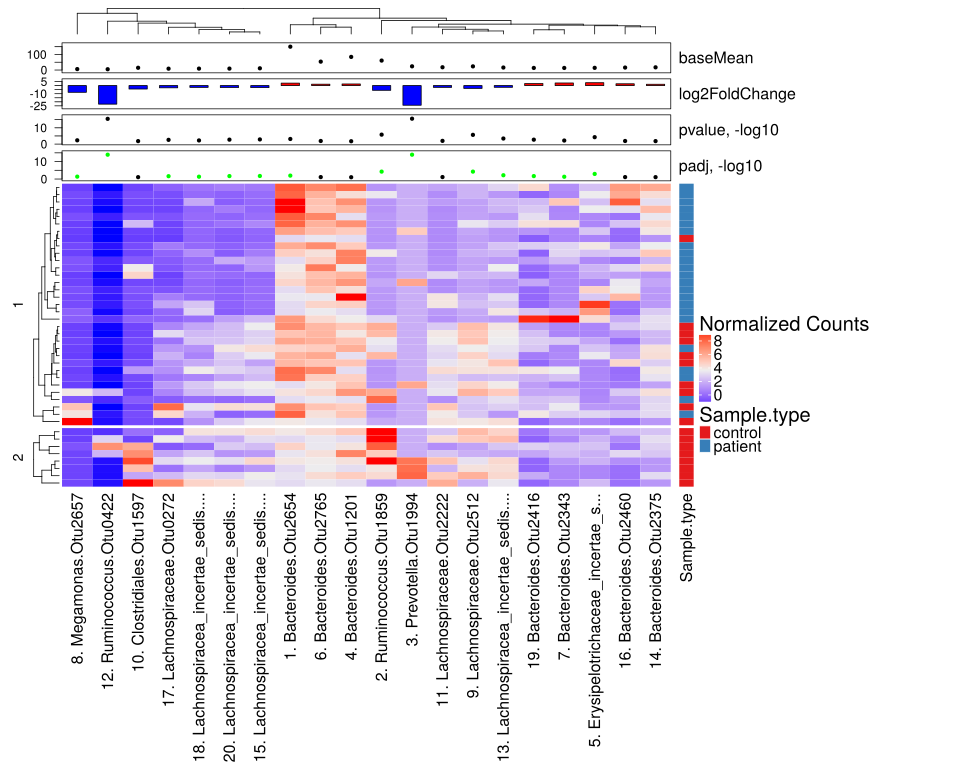
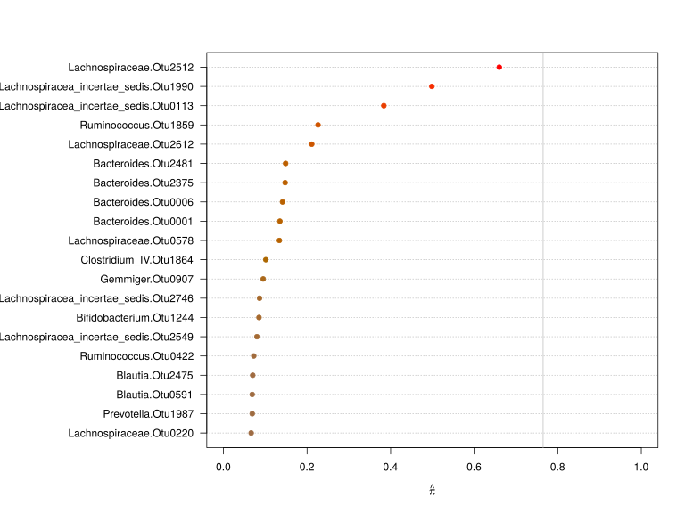
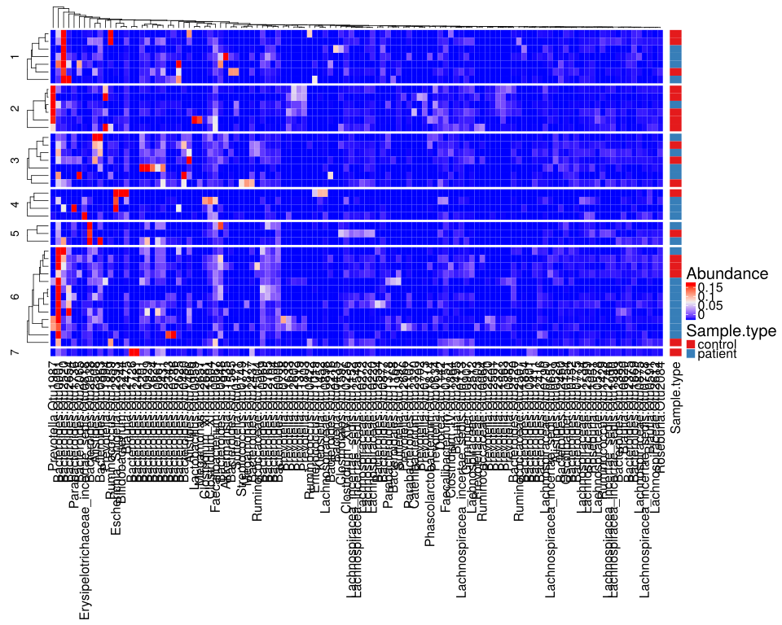

noone@mail.com
Analysis of Dieting study 16S data
% Fri Sep  7 05:46:18 2018


#### \(1.2.1.4\) Taxonomic level: otu of Subset: Patient/control samples before diet aggregated by SubjectID


##### \(1.2.1.4.1\) Loading counts and metadata

[`Subreport`](./1.2.1.4.1-report.html)


##### \(1.2.1.4.2\) Data analysis


Filtering abundance matrix with arguments [ min_mean                :10, min_quant_incidence_frac:0.25, min_quant_mean_frac     :0.25]. Filtering features


Note that some community richness estimators will not work correctly 
               if provided with abundance-filtered counts


After filtering, left 41 records for 118 features


Wrote counts and metadata for raw counts After final feature filtering to files [`data/1.2.1.4.2.1-323e7666desamples.raw.16s.l.otu.count.tsv`](data/1.2.1.4.2.1-323e7666desamples.raw.16s.l.otu.count.tsv),[`data/1.2.1.4.2.1-323e7666desamples.raw.16s.l.otu.attr.tsv`](data/1.2.1.4.2.1-323e7666desamples.raw.16s.l.otu.attr.tsv)


Wrote counts and metadata for proportions counts After final feature filtering to files [`data/1.2.1.4.2.1-3234d0e79a2samples.proportions.16s.l.otu.count.tsv`](data/1.2.1.4.2.1-3234d0e79a2samples.proportions.16s.l.otu.count.tsv),[`data/1.2.1.4.2.1-3234d0e79a2samples.proportions.16s.l.otu.attr.tsv`](data/1.2.1.4.2.1-3234d0e79a2samples.proportions.16s.l.otu.attr.tsv)


##### \(1.2.1.4.2.2\) DESeq2 tests and data normalization


Love MI, Huber W, Anders S (2014). “Moderated estimation of fold change and dispersion for RNA-seq data with DESeq2.” _Genome Biology_, *15*,
550. doi: 10.1186/s13059-014-0550-8 (URL: http://doi.org/10.1186/s13059-014-0550-8).


\(1.2.1.4.2.2.1\) <a name="table.95"></a>[`Table 95.`](#table.95) DESeq2 results for task: Sample.type;\[ alpha:0.05\]. Full dataset is also saved in a delimited text file (click to download and open e.g. in Excel) [`data/1.2.1.4.2.2.1-32362d966fc.1.2.1.4.2.2.1.a.nam.csv`](data/1.2.1.4.2.2.1-32362d966fc.1.2.1.4.2.2.1.a.nam.csv)


| feature                                      | baseMean  | log2FoldChange | lfcSE  | stat       | pvalue     | padj       | i.baseMean | baseVar    | allZero | dispGeneEst | dispGeneIter | dispFit | dispersion | dispIter | dispOutlier | dispMAP | Intercept | Sample.type\_patient\_vs\_control | SE\_Intercept | SE\_Sample.type\_patient\_vs\_control | WaldStatistic\_Intercept | WaldStatistic\_Sample.type\_patient\_vs\_control | WaldPvalue\_Intercept | WaldPvalue\_Sample.type\_patient\_vs\_control | betaConv | betaIter | deviance | maxCooks | replace |
|:---------------------------------------------|:----------|:---------------|:-------|:-----------|:-----------|:-----------|:-----------|:-----------|:--------|:------------|:-------------|:--------|:-----------|:---------|:------------|:--------|:----------|:----------------------------------|:--------------|:--------------------------------------|:-------------------------|:-------------------------------------------------|:----------------------|:----------------------------------------------|:---------|:---------|:---------|:---------|:--------|
| Prevotella.Otu1994                           | 23.80475  | \-24.24299     | 2.9384 | \-8.250431 | 1.578e\-16 | 1.142e\-14 | 23.80475   | 1.624e\+04 | FALSE   | 4.100e\+01  | 37           | 8.906   | 41.000     | 9        | FALSE       | 41.000  | 5.76047   | \-24.24299                        | 2.1778        | 2.9384                                | 2.64504                  | \-8.250431                                       | 8.168e\-03            | 1.578e\-16                                    | TRUE     | 100      | 50.43    | NA       | TRUE    |
| Ruminococcus.Otu0422                         | 5.13790   | \-22.88093     | 2.7863 | \-8.212031 | 2.175e\-16 | 1.142e\-14 | 5.13790    | 6.097e\+02 | FALSE   | 4.100e\+01  | 8            | 8.351   | 36.737     | 5        | FALSE       | 36.737  | 3.54950   | \-22.88093                        | 2.0635        | 2.7863                                | 1.72015                  | \-8.212031                                       | 8.540e\-02            | 2.175e\-16                                    | TRUE     | 100      | 63.42    | NA       | TRUE    |
| Ruminococcus.Otu1859                         | 60.75343  | \-5.81163      | 1.2110 | \-4.798977 | 1.595e\-06 | 5.582e\-05 | 60.75343   | 4.052e\+04 | FALSE   | 6.770e\+00  | 9            | 8.343   | 6.840      | 8        | FALSE       | 6.840   | 7.08006   | \-5.81163                         | 0.8898        | 1.2110                                | 7.95655                  | \-4.798977                                       | 1.769e\-15            | 1.595e\-06                                    | TRUE     | 16       | 243.10   | NA       | TRUE    |
| Lachnospiraceae.Otu2512                      | 23.50688  | \-3.47540      | 0.7334 | \-4.738743 | 2.150e\-06 | 5.645e\-05 | 23.50688   | 1.343e\+03 | FALSE   | 2.329e\+00  | 8            | 8.820   | 2.450      | 8        | FALSE       | 2.450   | 5.59337   | \-3.47540                         | 0.5345        | 0.7334                                | 10.46433                 | \-4.738743                                       | 1.260e\-25            | 2.150e\-06                                    | TRUE     | 7        | 284.66   | NA       | FALSE   |
| Erysipelotrichaceae\_incertae\_sedis.Otu0818 | 13.99712  | 3.58749        | 0.8914 | 4.024712   | 5.705e\-05 | 1.198e\-03 | 13.99712   | 1.954e\+03 | FALSE   | 3.447e\+00  | 9            | 6.550   | 3.544      | 8        | FALSE       | 3.544   | 0.96032   | 3.58749                           | 0.6840        | 0.8914                                | 1.40388                  | 4.024712                                         | 1.604e\-01            | 5.705e\-05                                    | TRUE     | 9        | 234.40   | NA       | TRUE    |
| Lachnospiracea\_incertae\_sedis.Otu0113      | 15.99422  | \-2.09689      | 0.5908 | \-3.549122 | 3.865e\-04 | 6.764e\-03 | 15.99422   | 3.686e\+02 | FALSE   | 1.480e\+00  | 8            | 6.825   | 1.576      | 9        | FALSE       | 1.576   | 4.81516   | \-2.09689                         | 0.4317        | 0.5908                                | 11.15345                 | \-3.549122                                       | 6.888e\-29            | 3.865e\-04                                    | TRUE     | 6        | 292.55   | NA       | FALSE   |
| Bacteroides.Otu2654                          | 149.85533 | 3.10240        | 0.9192 | 3.374973   | 7.382e\-04 | 1.107e\-02 | 149.85533  | 1.778e\+05 | FALSE   | 4.031e\+00  | 11           | 5.999   | 4.077      | 11       | FALSE       | 4.077   | 4.83407   | 3.10240                           | 0.6896        | 0.9192                                | 7.01015                  | 3.374973                                         | 2.381e\-12            | 7.382e\-04                                    | TRUE     | 15       | 395.82   | NA       | TRUE    |
| Lachnospiracea\_incertae\_sedis.Otu1990      | 11.10421  | \-2.54171      | 0.7941 | \-3.200847 | 1.370e\-03 | 1.798e\-02 | 11.10421   | 2.282e\+02 | FALSE   | 2.745e\+00  | 12           | 6.437   | 2.853      | 10       | FALSE       | 2.853   | 4.38125   | \-2.54171                         | 0.5792        | 0.7941                                | 7.56403                  | \-3.200847                                       | 3.908e\-14            | 1.370e\-03                                    | TRUE     | 9        | 245.02   | NA       | FALSE   |
| Lachnospiracea\_incertae\_sedis.Otu2746      | 9.20787   | \-2.42001      | 0.7784 | \-3.109117 | 1.876e\-03 | 2.060e\-02 | 9.20787    | 1.859e\+02 | FALSE   | 2.591e\+00  | 11           | 6.666   | 2.706      | 10       | FALSE       | 2.706   | 4.09182   | \-2.42001                         | 0.5655        | 0.7784                                | 7.23569                  | \-3.109117                                       | 4.632e\-13            | 1.876e\-03                                    | TRUE     | 9        | 235.61   | NA       | FALSE   |
| Bacteroides.Otu2416                          | 13.41422  | 2.59110        | 0.8369 | 3.095990   | 1.962e\-03 | 2.060e\-02 | 13.41422   | 1.587e\+03 | FALSE   | 3.111e\+00  | 11           | 6.496   | 3.205      | 7        | FALSE       | 3.205   | 1.78899   | 2.59110                           | 0.6355        | 0.8369                                | 2.81521                  | 3.095990                                         | 4.875e\-03            | 1.962e\-03                                    | TRUE     | 9        | 250.07   | NA       | FALSE   |
| Lachnospiraceae.Otu0272                      | 8.75073   | \-2.74362      | 0.9081 | \-3.021315 | 2.517e\-03 | 2.402e\-02 | 8.75073    | 5.076e\+02 | FALSE   | 3.612e\+00  | 10           | 6.780   | 3.711      | 8        | FALSE       | 3.711   | 4.06514   | \-2.74362                         | 0.6604        | 0.9081                                | 6.15544                  | \-3.021315                                       | 7.487e\-10            | 2.517e\-03                                    | TRUE     | 7        | 210.22   | NA       | FALSE   |
| Megamonas.Otu2657                            | 6.03940   | \-8.28276      | 2.9395 | \-2.817756 | 4.836e\-03 | 4.232e\-02 | 6.03940    | 7.271e\+02 | FALSE   | 4.100e\+01  | 13           | 7.802   | 41.000     | 8        | FALSE       | 41.000  | 3.77819   | \-8.28276                         | 2.1793        | 2.9395                                | 1.73365                  | \-2.817756                                       | 8.298e\-02            | 4.836e\-03                                    | TRUE     | 100      | 53.86    | NA       | TRUE    |
| Lachnospiracea\_incertae\_sedis.Otu2549      | 9.15482   | \-2.20481      | 0.7984 | \-2.761357 | 5.756e\-03 | 4.649e\-02 | 9.15482    | 3.458e\+02 | FALSE   | 2.769e\+00  | 8            | 6.678   | 2.878      | 7        | FALSE       | 2.878   | 4.03852   | \-2.20481                         | 0.5831        | 0.7984                                | 6.92621                  | \-2.761357                                       | 4.323e\-12            | 5.756e\-03                                    | TRUE     | 8        | 235.58   | NA       | FALSE   |
| Bacteroides.Otu2343                          | 13.39149  | 3.25828        | 1.2002 | 2.714888   | 6.630e\-03 | 4.972e\-02 | 13.39149   | 1.813e\+03 | FALSE   | 6.732e\+00  | 10           | 6.494   | 6.714      | 6        | FALSE       | 6.714   | 1.20668   | 3.25828                           | 0.9091        | 1.2002                                | 1.32727                  | 2.714888                                         | 1.844e\-01            | 6.630e\-03                                    | TRUE     | 20       | 199.16   | NA       | TRUE    |
| Lachnospiraceae.Otu2222                      | 17.78733  | \-2.14490      | 0.8400 | \-2.553514 | 1.066e\-02 | 7.465e\-02 | 17.78733   | 8.091e\+02 | FALSE   | 3.202e\+00  | 8            | 7.180   | 3.312      | 8        | FALSE       | 3.312   | 4.97560   | \-2.14490                         | 0.6219        | 0.8400                                | 8.00052                  | \-2.553514                                       | 1.239e\-15            | 1.066e\-02                                    | TRUE     | 11       | 279.04   | NA       | FALSE   |
| Bacteroides.Otu2460                          | 15.86171  | 2.22819        | 0.8935 | 2.493899   | 1.263e\-02 | 7.811e\-02 | 15.86171   | 1.211e\+03 | FALSE   | 3.649e\+00  | 8            | 6.803   | 3.736      | 8        | FALSE       | 3.736   | 2.37058   | 2.22819                           | 0.6742        | 0.8935                                | 3.51632                  | 2.493899                                         | 4.376e\-04            | 1.263e\-02                                    | TRUE     | 10       | 258.99   | NA       | FALSE   |
| Bacteroides.Otu2765                          | 53.89420  | 1.78659        | 0.7165 | 2.493580   | 1.265e\-02 | 7.811e\-02 | 53.89420   | 6.812e\+03 | FALSE   | 2.360e\+00  | 13           | 8.879   | 2.457      | 11       | FALSE       | 2.457   | 4.50577   | 1.78659                           | 0.5378        | 0.7165                                | 8.37774                  | 2.493580                                         | 5.395e\-17            | 1.265e\-02                                    | TRUE     | 8        | 379.36   | NA       | FALSE   |
| Clostridiales.Otu1597                        | 14.45028  | \-4.22757      | 1.7383 | \-2.432010 | 1.502e\-02 | 8.379e\-02 | 14.45028   | 1.932e\+03 | FALSE   | 1.523e\+01  | 7            | 6.601   | 14.249     | 6        | FALSE       | 14.249  | 4.94379   | \-4.22757                         | 1.2851        | 1.7383                                | 3.84704                  | \-2.432010                                       | 1.196e\-04            | 1.502e\-02                                    | TRUE     | 31       | 143.46   | NA       | TRUE    |
| Bacteroides.Otu2375                          | 17.32085  | 1.65795        | 0.6827 | 2.428484   | 1.516e\-02 | 8.379e\-02 | 17.32085   | 7.002e\+02 | FALSE   | 2.070e\+00  | 11           | 7.075   | 2.163      | 9        | FALSE       | 2.163   | 2.98390   | 1.65795                           | 0.5146        | 0.6827                                | 5.79833                  | 2.428484                                         | 6.698e\-09            | 1.516e\-02                                    | TRUE     | 6        | 298.90   | NA       | FALSE   |
| Bacteroides.Otu1201                          | 84.28083  | 2.03406        | 0.8575 | 2.371973   | 1.769e\-02 | 9.289e\-02 | 84.28083   | 4.980e\+04 | FALSE   | 3.469e\+00  | 11           | 7.141   | 3.544      | 11       | FALSE       | 3.544   | 4.94477   | 2.03406                           | 0.6431        | 0.8575                                | 7.68879                  | 2.371973                                         | 1.485e\-14            | 1.769e\-02                                    | TRUE     | 9        | 385.16   | NA       | FALSE   |
| Bacteroides.Otu0006                          | 59.15972  | 1.60649        | 0.6891 | 2.331369   | 1.973e\-02 | 9.530e\-02 | 59.15972   | 6.582e\+03 | FALSE   | 2.181e\+00  | 12           | 8.460   | 2.275      | 11       | FALSE       | 2.275   | 4.78644   | 1.60649                           | 0.5170        | 0.6891                                | 9.25758                  | 2.331369                                         | 2.091e\-20            | 1.973e\-02                                    | TRUE     | 7        | 393.09   | NA       | FALSE   |
| Bacteroides.Otu2104                          | 26.37788  | 1.70583        | 0.7331 | 2.326954   | 1.997e\-02 | 9.530e\-02 | 26.37788   | 1.538e\+03 | FALSE   | 2.419e\+00  | 11           | 9.582   | 2.541      | 9        | FALSE       | 2.541   | 3.54151   | 1.70583                           | 0.5512        | 0.7331                                | 6.42481                  | 2.326954                                         | 1.320e\-10            | 1.997e\-02                                    | TRUE     | 8        | 325.38   | NA       | FALSE   |
| Bacteroides.Otu0001                          | 591.56100 | 1.64991        | 0.7146 | 2.308860   | 2.095e\-02 | 9.565e\-02 | 591.56100  | 5.756e\+05 | FALSE   | 2.429e\+00  | 9            | 4.705   | 2.474      | 11       | FALSE       | 2.474   | 8.07125   | 1.64991                           | 0.5353        | 0.7146                                | 15.07752                 | 2.308860                                         | 2.277e\-51            | 2.095e\-02                                    | TRUE     | 8        | 572.59   | NA       | FALSE   |
| Bacteroides.Otu0069                          | 77.08605  | 1.65643        | 0.7238 | 2.288391   | 2.211e\-02 | 9.675e\-02 | 77.08605   | 1.752e\+04 | FALSE   | 2.433e\+00  | 12           | 7.430   | 2.519      | 11       | FALSE       | 2.519   | 5.12627   | 1.65643                           | 0.5429        | 0.7238                                | 9.44302                  | 2.288391                                         | 3.622e\-21            | 2.211e\-02                                    | TRUE     | 7        | 408.97   | NA       | FALSE   |
| Lachnospiraceae.Otu0578                      | 9.79493   | \-2.62959      | 1.1772 | \-2.233712 | 2.550e\-02 | 1.071e\-01 | 9.79493    | 5.507e\+02 | FALSE   | 6.471e\+00  | 12           | 6.558   | 6.473      | 5        | FALSE       | 6.473   | 4.20725   | \-2.62959                         | 0.8689        | 1.1772                                | 4.84231                  | \-2.233712                                       | 1.283e\-06            | 2.550e\-02                                    | TRUE     | 11       | 195.49   | NA       | FALSE   |
| Blautia.Otu2495                              | 14.81631  | \-1.54235      | 0.7049 | \-2.188079 | 2.866e\-02 | 1.148e\-01 | 14.81631   | 7.259e\+02 | FALSE   | 2.215e\+00  | 8            | 6.647   | 2.306      | 9        | FALSE       | 2.306   | 4.55955   | \-1.54235                         | 0.5211        | 0.7049                                | 8.74917                  | \-2.188079                                       | 2.149e\-18            | 2.866e\-02                                    | TRUE     | 7        | 285.73   | NA       | FALSE   |
| Bacteroides.Otu2038                          | 80.51010  | 1.79340        | 0.8240 | 2.176585   | 2.951e\-02 | 1.148e\-01 | 80.51010   | 4.533e\+04 | FALSE   | 3.200e\+00  | 12           | 7.286   | 3.271      | 10       | FALSE       | 3.271   | 5.08077   | 1.79340                           | 0.6178        | 0.8240                                | 8.22357                  | 2.176585                                         | 1.975e\-16            | 2.951e\-02                                    | TRUE     | 9        | 387.05   | NA       | TRUE    |
| Bacteroides.Otu0929                          | 123.22814 | 1.88533        | 0.9039 | 2.085754   | 3.700e\-02 | 1.388e\-01 | 123.22814  | 7.858e\+04 | FALSE   | 3.896e\+00  | 13           | 6.239   | 3.948      | 11       | FALSE       | 3.948   | 5.61756   | 1.88533                           | 0.6775        | 0.9039                                | 8.29189                  | 2.085754                                         | 1.115e\-16            | 3.700e\-02                                    | TRUE     | 15       | 405.01   | NA       | FALSE   |
| Bifidobacterium.Otu1244                      | 1.07776   | \-3.19490      | 1.5775 | \-2.025234 | 4.284e\-02 | 1.551e\-01 | 1.07776    | 1.445e\+01 | FALSE   | 8.784e\+00  | 9            | 44.795  | 10.962     | 9        | FALSE       | 10.962  | 1.22224   | \-3.19490                         | 1.1479        | 1.5775                                | 1.06477                  | \-2.025234                                       | 2.870e\-01            | 4.284e\-02                                    | TRUE     | 6        | 80.17    | NA       | TRUE    |
| Ruminococcaceae.Otu0064                      | 3.71464   | \-4.49955      | 2.2424 | \-2.006602 | 4.479e\-02 | 1.568e\-01 | 3.71464    | 2.305e\+02 | FALSE   | 2.712e\+01  | 9            | 10.435  | 23.504     | 7        | FALSE       | 23.504  | 3.05323   | \-4.49955                         | 1.6529        | 2.2424                                | 1.84721                  | \-2.006602                                       | 6.472e\-02            | 4.479e\-02                                    | TRUE     | 24       | 81.40    | NA       | TRUE    |
| Bacteroides.Otu0863                          | 153.21162 | 1.62102        | 0.8158 | 1.986940   | 4.693e\-02 | 1.571e\-01 | 153.21162  | 1.003e\+05 | FALSE   | 3.162e\+00  | 12           | 5.978   | 3.218      | 12       | FALSE       | 3.218   | 6.14513   | 1.62102                           | 0.6114        | 0.8158                                | 10.05162                 | 1.986940                                         | 9.037e\-24            | 4.693e\-02                                    | TRUE     | 9        | 443.77   | NA       | FALSE   |
| Lachnospiraceae.Otu0220                      | 22.02590  | \-1.43449      | 0.7251 | \-1.978325 | 4.789e\-02 | 1.571e\-01 | 22.02590   | 9.479e\+02 | FALSE   | 2.372e\+00  | 11           | 8.380   | 2.482      | 9        | FALSE       | 2.482   | 5.09159   | \-1.43449                         | 0.5389        | 0.7251                                | 9.44814                  | \-1.978325                                       | 3.449e\-21            | 4.789e\-02                                    | TRUE     | 9        | 314.85   | NA       | FALSE   |
| Ruminococcaceae.Otu2507                      | 2.75739   | \-2.03690      | 1.0495 | \-1.940847 | 5.228e\-02 | 1.663e\-01 | 2.75739    | 4.058e\+01 | FALSE   | 4.386e\+00  | 10           | 13.781  | 4.729      | 10       | FALSE       | 4.729   | 2.27168   | \-2.03690                         | 0.7556        | 1.0495                                | 3.00634                  | \-1.940847                                       | 2.644e\-03            | 5.228e\-02                                    | TRUE     | 7        | 147.80   | NA       | TRUE    |
| Bacteroides.Otu2625                          | 38.24099  | 1.98965        | 1.0363 | 1.919953   | 5.486e\-02 | 1.681e\-01 | 38.24099   | 1.621e\+04 | FALSE   | 5.035e\+00  | 11           | 10.229  | 5.158      | 9        | FALSE       | 5.158   | 3.84278   | 1.98965                           | 0.7776        | 1.0363                                | 4.94173                  | 1.919953                                         | 7.743e\-07            | 5.486e\-02                                    | TRUE     | 23       | 294.91   | NA       | TRUE    |
| Bacteroides.Otu0848                          | 103.55343 | 1.58206        | 0.8280 | 1.910751   | 5.604e\-02 | 1.681e\-01 | 103.55343  | 3.147e\+04 | FALSE   | 3.243e\+00  | 13           | 6.583   | 3.310      | 11       | FALSE       | 3.310   | 5.61048   | 1.58206                           | 0.6206        | 0.8280                                | 9.04085                  | 1.910751                                         | 1.555e\-19            | 5.604e\-02                                    | TRUE     | 10       | 412.80   | NA       | FALSE   |
| Bacteroides.Otu2216                          | 1.98006   | \-3.76771      | 1.9939 | \-1.889590 | 5.881e\-02 | 1.715e\-01 | 1.98006    | 6.545e\+01 | FALSE   | 1.798e\+01  | 7            | 20.326  | 18.303     | 5        | FALSE       | 18.303  | 2.07908   | \-3.76771                         | 1.4643        | 1.9939                                | 1.41982                  | \-1.889590                                       | 1.557e\-01            | 5.881e\-02                                    | TRUE     | 8        | 76.86    | NA       | TRUE    |
| Lachnospiracea\_incertae\_sedis.Otu1152      | 14.93284  | \-1.53007      | 0.8430 | \-1.814971 | 6.953e\-02 | 1.973e\-01 | 14.93284   | 5.778e\+02 | FALSE   | 3.248e\+00  | 9            | 6.663   | 3.342      | 7        | FALSE       | 3.342   | 4.54568   | \-1.53007                         | 0.6257        | 0.8430                                | 7.26515                  | \-1.814971                                       | 3.726e\-13            | 6.953e\-02                                    | TRUE     | 9        | 271.02   | NA       | FALSE   |
| Gemmiger.Otu0907                             | 22.68314  | \-1.44010      | 0.8302 | \-1.734678 | 8.280e\-02 | 2.288e\-01 | 22.68314   | 8.343e\+02 | FALSE   | 3.156e\+00  | 14           | 8.577   | 3.276      | 8        | FALSE       | 3.276   | 5.14014   | \-1.44010                         | 0.6182        | 0.8302                                | 8.31447                  | \-1.734678                                       | 9.216e\-17            | 8.280e\-02                                    | TRUE     | 11       | 306.19   | NA       | FALSE   |
| Lachnospiraceae.Otu2599                      | 13.18401  | 1.11813        | 0.6507 | 1.718418   | 8.572e\-02 | 2.308e\-01 | 13.18401   | 6.178e\+02 | FALSE   | 1.868e\+00  | 11           | 6.479   | 1.946      | 11       | FALSE       | 1.946   | 2.99933   | 1.11813                           | 0.4893        | 0.6507                                | 6.12926                  | 1.718418                                         | 8.829e\-10            | 8.572e\-02                                    | TRUE     | 7        | 284.96   | NA       | FALSE   |
| Lachnospiraceae.Otu2612                      | 8.82777   | \-1.52605      | 0.8957 | \-1.703718 | 8.843e\-02 | 2.321e\-01 | 8.82777    | 1.830e\+02 | FALSE   | 3.613e\+00  | 12           | 6.759   | 3.717      | 10       | FALSE       | 3.717   | 3.80806   | \-1.52605                         | 0.6620        | 0.8957                                | 5.75239                  | \-1.703718                                       | 8.799e\-09            | 8.843e\-02                                    | TRUE     | 10       | 232.37   | NA       | FALSE   |
| Bacteroides.Otu0786                          | 19.20844  | 2.29174        | 1.3967 | 1.640848   | 1.008e\-01 | 2.582e\-01 | 19.20844   | 3.954e\+03 | FALSE   | 9.458e\+00  | 13           | 7.548   | 9.346      | 9        | FALSE       | 9.346   | 2.59087   | 2.29174                           | 1.0489        | 1.3967                                | 2.47001                  | 1.640848                                         | 1.351e\-02            | 1.008e\-01                                    | TRUE     | 27       | 207.43   | NA       | TRUE    |
| Bacteroides.Otu2534                          | 1.85288   | 4.14128        | 2.5576 | 1.619213   | 1.054e\-01 | 2.635e\-01 | 1.85288    | 1.044e\+02 | FALSE   | 3.279e\+01  | 10           | 22.200  | 30.481     | 7        | FALSE       | 30.481  | \-2.45691 | 4.14128                           | 1.9339        | 2.5576                                | \-1.27041                | 1.619213                                         | 2.039e\-01            | 1.054e\-01                                    | TRUE     | 7        | 56.06    | NA       | TRUE    |
| Clostridium\_IV.Otu1864                      | 17.97038  | \-2.20292      | 1.3830 | \-1.592868 | 1.112e\-01 | 2.715e\-01 | 17.97038   | 2.004e\+03 | FALSE   | 9.287e\+00  | 14           | 7.224   | 9.165      | 9        | FALSE       | 9.165   | 4.99865   | \-2.20292                         | 1.0313        | 1.3830                                | 4.84716                  | \-1.592868                                       | 1.252e\-06            | 1.112e\-01                                    | TRUE     | 14       | 205.14   | NA       | FALSE   |
| Lachnospiraceae.Otu0898                      | 6.11054   | 1.19390        | 0.8090 | 1.475833   | 1.400e\-01 | 3.341e\-01 | 6.11054    | 1.102e\+02 | FALSE   | 2.791e\+00  | 10           | 7.768   | 2.936      | 8        | FALSE       | 2.936   | 1.81891   | 1.19390                           | 0.6099        | 0.8090                                | 2.98232                  | 1.475833                                         | 2.861e\-03            | 1.400e\-01                                    | TRUE     | 7        | 219.42   | NA       | FALSE   |
| Bacteroidales.Otu1168                        | 1.14008   | 2.09010        | 1.5128 | 1.381600   | 1.671e\-01 | 3.899e\-01 | 1.14008    | 1.221e\+01 | FALSE   | 7.954e\+00  | 9            | 41.710  | 9.787      | 9        | FALSE       | 9.787   | \-1.42630 | 2.09010                           | 1.1490        | 1.5128                                | \-1.24137                | 1.381600                                         | 2.145e\-01            | 1.671e\-01                                    | TRUE     | 15       | 92.42    | NA       | TRUE    |
| Bacteroides.Otu1854                          | 2.21644   | 2.03258        | 1.4888 | 1.365260   | 1.722e\-01 | 3.928e\-01 | 2.21644    | 4.972e\+01 | FALSE   | 9.367e\+00  | 11           | 17.601  | 9.896      | 7        | FALSE       | 9.896   | \-0.33293 | 2.03258                           | 1.1309        | 1.4888                                | \-0.29439                | 1.365260                                         | 7.685e\-01            | 1.722e\-01                                    | TRUE     | 11       | 109.31   | NA       | TRUE    |
| Ruminococcus.Otu1429                         | 10.35924  | \-1.47335      | 1.0884 | \-1.353663 | 1.758e\-01 | 3.928e\-01 | 10.35924   | 3.317e\+02 | FALSE   | 5.554e\+00  | 14           | 6.488   | 5.598      | 9        | FALSE       | 5.598   | 4.01092   | \-1.47335                         | 0.8091        | 1.0884                                | 4.95737                  | \-1.353663                                       | 7.145e\-07            | 1.758e\-01                                    | TRUE     | 11       | 222.34   | NA       | FALSE   |
| Parabacteroides.Otu1378                      | 21.56842  | 1.36403        | 1.0220 | 1.334653   | 1.820e\-01 | 3.963e\-01 | 21.56842   | 1.622e\+03 | FALSE   | 4.902e\+00  | 11           | 8.242   | 4.995      | 8        | FALSE       | 4.995   | 3.51438   | 1.36403                           | 0.7667        | 1.0220                                | 4.58377                  | 1.334653                                         | 4.567e\-06            | 1.820e\-01                                    | TRUE     | 17       | 267.45   | NA       | FALSE   |
| Catenibacterium.Otu2320                      | 1.52772   | \-3.90238      | 2.9437 | \-1.325687 | 1.849e\-01 | 3.963e\-01 | 1.52772    | 9.569e\+01 | FALSE   | 4.100e\+01  | 2            | 28.609  | 41.000     | 9        | FALSE       | 41.000  | 1.79667   | \-3.90238                         | 2.1851        | 2.9437                                | 0.82222                  | \-1.325687                                       | 4.110e\-01            | 1.849e\-01                                    | TRUE     | 7        | 22.96    | NA       | TRUE    |
| Bacteroides.Otu2383                          | 7.51344   | 1.24632        | 0.9658 | 1.290497   | 1.969e\-01 | 4.099e\-01 | 7.51344    | 3.894e\+02 | FALSE   | 4.224e\+00  | 10           | 7.209   | 4.328      | 9        | FALSE       | 4.328   | 2.10284   | 1.24632                           | 0.7263        | 0.9658                                | 2.89510                  | 1.290497                                         | 3.790e\-03            | 1.969e\-01                                    | TRUE     | 13       | 214.76   | NA       | TRUE    |
| Bacteroides.Otu1565                          | 2.27954   | \-1.65230      | 1.2891 | \-1.281720 | 1.999e\-01 | 4.099e\-01 | 2.27954    | 2.910e\+01 | FALSE   | 6.917e\+00  | 7            | 17.015  | 7.414      | 7        | FALSE       | 7.414   | 1.91661   | \-1.65230                         | 0.9425        | 1.2891                                | 2.03353                  | \-1.281720                                       | 4.200e\-02            | 1.999e\-01                                    | TRUE     | 9        | 128.98   | NA       | TRUE    |
| Parabacteroides.Otu1107                      | 12.75386  | 1.46846        | 1.1535 | 1.272994   | 2.030e\-01 | 4.099e\-01 | 12.75386   | 8.164e\+02 | FALSE   | 6.327e\+00  | 14           | 6.452   | 6.329      | 5        | FALSE       | 6.329   | 2.68131   | 1.46846                           | 0.8661        | 1.1535                                | 3.09579                  | 1.272994                                         | 1.963e\-03            | 2.030e\-01                                    | TRUE     | 24       | 224.18   | NA       | FALSE   |
| Bacteroides.Otu0661                          | 87.53822  | 1.19953        | 0.9572 | 1.253103   | 2.102e\-01 | 4.164e\-01 | 87.53822   | 2.898e\+04 | FALSE   | 4.359e\+00  | 12           | 7.027   | 4.428      | 9        | FALSE       | 4.428   | 5.66484   | 1.19953                           | 0.7172        | 0.9572                                | 7.89843                  | 1.253103                                         | 2.824e\-15            | 2.102e\-01                                    | TRUE     | 14       | 378.91   | NA       | FALSE   |
| Ruminococcaceae.Otu1504                      | 0.91529   | \-3.04497      | 2.9474 | \-1.033105 | 3.016e\-01 | NA         | 0.91529    | 2.212e\+01 | FALSE   | 4.100e\+01  | 9            | 55.010  | 41.000     | 8        | FALSE       | 41.000  | 1.05140   | \-3.04497                         | 2.1904        | 2.9474                                | 0.48001                  | \-1.033105                                       | 6.312e\-01            | 3.016e\-01                                    | TRUE     | 9        | 42.57    | NA       | TRUE    |
| Prevotella.Otu0773                           | 4.18570   | \-2.27373      | 2.2537 | \-1.008884 | 3.130e\-01 | 6.087e\-01 | 4.18570    | 3.303e\+02 | FALSE   | 2.749e\+01  | 9            | 9.460   | 24.155     | 9        | FALSE       | 24.155  | 2.92805   | \-2.27373                         | 1.6759        | 2.2537                                | 1.74715                  | \-1.008884                                       | 8.061e\-02            | 3.130e\-01                                    | TRUE     | 24       | 92.45    | NA       | TRUE    |
| Bacteroides.Otu0877                          | 22.24822  | 0.82942        | 0.8359 | 0.992244   | 3.211e\-01 | 6.130e\-01 | 22.24822   | 1.753e\+03 | FALSE   | 3.228e\+00  | 11           | 8.447   | 3.329      | 11       | FALSE       | 3.329   | 3.95383   | 0.82942                           | 0.6265        | 0.8359                                | 6.31094                  | 0.992244                                         | 2.774e\-10            | 3.211e\-01                                    | TRUE     | 8        | 302.86   | NA       | FALSE   |
| Sutterella.Otu0171                           | 4.85587   | \-1.74665      | 1.8147 | \-0.962503 | 3.358e\-01 | 6.296e\-01 | 4.85587    | 2.482e\+02 | FALSE   | 1.657e\+01  | 10           | 8.596   | 15.626     | 7        | FALSE       | 15.626  | 2.99796   | \-1.74665                         | 1.3497        | 1.8147                                | 2.22121                  | \-0.962503                                       | 2.634e\-02            | 3.358e\-01                                    | TRUE     | 23       | 120.30   | NA       | TRUE    |
| Enterococcus.Otu1019                         | 1.04128   | 1.69943        | 1.8780 | 0.904894   | 3.655e\-01 | 6.733e\-01 | 1.04128    | 1.173e\+01 | FALSE   | 1.330e\+01  | 9            | 46.787  | 15.824     | 9        | FALSE       | 15.824  | \-1.13626 | 1.69943                           | 1.4164        | 1.8780                                | \-0.80223                | 0.904894                                         | 4.224e\-01            | 3.655e\-01                                    | TRUE     | 6        | 80.95    | NA       | TRUE    |
| Prevotella.Otu1987                           | 174.32138 | \-1.93818      | 2.1761 | \-0.890684 | 3.731e\-01 | 6.754e\-01 | 174.32138  | 2.552e\+05 | FALSE   | 2.517e\+01  | 10           | 5.867   | 22.962     | 11       | FALSE       | 22.962  | 8.21824   | \-1.93818                         | 1.6296        | 2.1761                                | 5.04318                  | \-0.890684                                       | 4.579e\-07            | 3.731e\-01                                    | TRUE     | 100      | 208.23   | NA       | TRUE    |
| Faecalibacterium.Otu0067                     | 132.39654 | \-0.44435      | 0.5425 | \-0.819051 | 4.128e\-01 | 7.346e\-01 | 132.39654  | 2.041e\+04 | FALSE   | 1.360e\+00  | 14           | 6.133   | 1.418      | 12       | FALSE       | 1.418   | 7.28204   | \-0.44435                         | 0.4059        | 0.5425                                | 17.93967                 | \-0.819051                                       | 5.780e\-72            | 4.128e\-01                                    | TRUE     | 5        | 480.51   | NA       | FALSE   |
| Dorea.Otu1142                                | 30.53236  | \-0.50764      | 0.7255 | \-0.699674 | 4.841e\-01 | 8.202e\-01 | 30.53236   | 2.365e\+03 | FALSE   | 2.399e\+00  | 11           | 10.297  | 2.512      | 11       | FALSE       | 2.512   | 5.19872   | \-0.50764                         | 0.5420        | 0.7255                                | 9.59233                  | \-0.699674                                       | 8.611e\-22            | 4.841e\-01                                    | TRUE     | 10       | 346.41   | NA       | FALSE   |
| Bacteroides.Otu0480                          | 7.86186   | 1.56170        | 2.2354 | 0.698611   | 4.848e\-01 | 8.202e\-01 | 7.86186    | 7.738e\+02 | FALSE   | 2.759e\+01  | 10           | 7.083   | 24.030     | 7        | FALSE       | 24.030  | 1.90748   | 1.56170                           | 1.6763        | 2.2354                                | 1.13788                  | 0.698611                                         | 2.552e\-01            | 4.848e\-01                                    | TRUE     | 19       | 108.47   | NA       | TRUE    |
| Bacteroides.Otu2120                          | 15.79561  | 0.56204        | 0.8186 | 0.686603   | 4.923e\-01 | 8.202e\-01 | 15.79561   | 6.121e\+02 | FALSE   | 3.083e\+00  | 11           | 6.792   | 3.169      | 9        | FALSE       | 3.169   | 3.64204   | 0.56204                           | 0.6131        | 0.8186                                | 5.94070                  | 0.686603                                         | 2.838e\-09            | 4.923e\-01                                    | TRUE     | 9        | 283.14   | NA       | FALSE   |
| Prevotella.Otu2501                           | 1.70955   | \-1.48927      | 2.1787 | \-0.683557 | 4.943e\-01 | 8.202e\-01 | 1.70955    | 2.618e\+01 | FALSE   | 2.188e\+01  | 8            | 24.690  | 22.237     | 6        | FALSE       | 22.237  | 1.45200   | \-1.48927                         | 1.6169        | 2.1787                                | 0.89802                  | \-0.683557                                       | 3.692e\-01            | 4.943e\-01                                    | TRUE     | 8        | 82.08    | NA       | TRUE    |
| Prevotella.Otu0882                           | 4.91709   | 1.55558        | 2.3058 | 0.674636   | 4.999e\-01 | 8.202e\-01 | 4.91709    | 2.214e\+02 | FALSE   | 2.950e\+01  | 9            | 8.538   | 25.456     | 10       | FALSE       | 25.456  | 1.23979   | 1.55558                           | 1.7301        | 2.3058                                | 0.71659                  | 0.674636                                         | 4.736e\-01            | 4.999e\-01                                    | TRUE     | 17       | 100.05   | NA       | TRUE    |
| Bacteroides.Otu1411                          | 4.50548   | \-0.62197      | 0.9606 | \-0.647462 | 5.173e\-01 | 8.357e\-01 | 4.50548    | 1.050e\+02 | FALSE   | 4.048e\+00  | 9            | 8.985   | 4.201      | 9        | FALSE       | 4.201   | 2.50815   | \-0.62197                         | 0.7116        | 0.9606                                | 3.52480                  | \-0.647462                                       | 4.238e\-04            | 5.173e\-01                                    | TRUE     | 8        | 186.31   | NA       | TRUE    |
| Escherichia\_Shigella.Otu2393                | 6.29105   | 0.75077        | 1.1922 | 0.629710   | 5.289e\-01 | 8.396e\-01 | 6.29105    | 5.130e\+02 | FALSE   | 6.627e\+00  | 10           | 7.686   | 6.678      | 9        | FALSE       | 6.678   | 2.14500   | 0.75077                           | 0.8937        | 1.1922                                | 2.40015                  | 0.629710                                         | 1.639e\-02            | 5.289e\-01                                    | TRUE     | 7        | 177.27   | NA       | TRUE    |
| Prevotella.Otu1803                           | 5.68203   | \-1.34782      | 2.1765 | \-0.619252 | 5.358e\-01 | 8.396e\-01 | 5.68203    | 5.010e\+02 | FALSE   | 2.565e\+01  | 10           | 7.989   | 22.721     | 10       | FALSE       | 22.721  | 3.11490   | \-1.34782                         | 1.6251        | 2.1765                                | 1.91678                  | \-0.619252                                       | 5.527e\-02            | 5.358e\-01                                    | TRUE     | 29       | 104.94   | NA       | TRUE    |
| Prevotella.Otu0634                           | 10.59595  | 0.88888        | 1.5151 | 0.586700   | 5.574e\-01 | 8.504e\-01 | 10.59595   | 9.420e\+02 | FALSE   | 1.137e\+01  | 11           | 6.467   | 11.006     | 10       | FALSE       | 11.006  | 2.84334   | 0.88888                           | 1.1354        | 1.5151                                | 2.50434                  | 0.586700                                         | 1.227e\-02            | 5.574e\-01                                    | TRUE     | 30       | 171.26   | NA       | TRUE    |
| Prevotellaceae.Otu2503                       | 0.37147   | \-1.73019      | 2.9599 | \-0.584553 | 5.588e\-01 | NA         | 0.37147    | 4.409e\+00 | FALSE   | 4.100e\+01  | 9            | 162.239 | 41.000     | 4        | FALSE       | 41.000  | \-0.24058 | \-1.73019                         | 2.2072        | 2.9599                                | \-0.10900                | \-0.584553                                       | 9.132e\-01            | 5.588e\-01                                    | TRUE     | 9        | 35.70    | NA       | TRUE    |
| Prevotella.Otu1563                           | 6.01971   | \-1.33713      | 2.3395 | \-0.571545 | 5.676e\-01 | 8.504e\-01 | 6.01971    | 3.275e\+02 | FALSE   | 3.089e\+01  | 7            | 7.812   | 26.305     | 11       | FALSE       | 26.305  | 3.19121   | \-1.33713                         | 1.7478        | 2.3395                                | 1.82589                  | \-0.571545                                       | 6.787e\-02            | 5.676e\-01                                    | TRUE     | 25       | 106.04   | NA       | TRUE    |
| Prevotella.Otu1633                           | 8.64488   | \-0.79545      | 1.3997 | \-0.568307 | 5.698e\-01 | 8.504e\-01 | 8.64488    | 6.819e\+02 | FALSE   | 9.517e\+00  | 12           | 6.811   | 9.351      | 10       | FALSE       | 9.351   | 3.49801   | \-0.79545                         | 1.0449        | 1.3997                                | 3.34778                  | \-0.568307                                       | 8.146e\-04            | 5.698e\-01                                    | TRUE     | 16       | 164.71   | NA       | TRUE    |
| Phascolarctobacterium.Otu1814                | 5.57356   | 1.01527        | 1.8655 | 0.544221   | 5.863e\-01 | 8.504e\-01 | 5.57356    | 2.784e\+02 | FALSE   | 1.782e\+01  | 10           | 8.052   | 16.628     | 8        | FALSE       | 16.628  | 1.81941   | 1.01527                           | 1.3986        | 1.8655                                | 1.30086                  | 0.544221                                         | 1.933e\-01            | 5.863e\-01                                    | TRUE     | 10       | 124.81   | NA       | TRUE    |
| Blautia.Otu0591                              | 8.83463   | \-0.31148      | 0.5806 | \-0.536510 | 5.916e\-01 | 8.504e\-01 | 8.83463    | 1.614e\+02 | FALSE   | 1.407e\+00  | 11           | 6.757   | 1.500      | 7        | FALSE       | 1.500   | 3.33130   | \-0.31148                         | 0.4300        | 0.5806                                | 7.74645                  | \-0.536510                                       | 9.450e\-15            | 5.916e\-01                                    | TRUE     | 7        | 265.77   | NA       | FALSE   |
| Oscillibacter.Otu0154                        | 11.88257  | 0.40595        | 0.7688 | 0.528048   | 5.975e\-01 | 8.504e\-01 | 11.88257   | 2.925e\+02 | FALSE   | 2.676e\+00  | 11           | 6.425   | 2.760      | 9        | FALSE       | 2.760   | 3.31327   | 0.40595                           | 0.5752        | 0.7688                                | 5.75986                  | 0.528048                                         | 8.419e\-09            | 5.975e\-01                                    | TRUE     | 7        | 268.38   | NA       | FALSE   |
| Roseburia.Otu1051                            | 15.13687  | 0.32030        | 0.6225 | 0.514538   | 6.069e\-01 | 8.504e\-01 | 15.13687   | 3.929e\+02 | FALSE   | 1.713e\+00  | 11           | 6.691   | 1.797      | 11       | FALSE       | 1.797   | 3.72968   | 0.32030                           | 0.4654        | 0.6225                                | 8.01325                  | 0.514538                                         | 1.117e\-15            | 6.069e\-01                                    | TRUE     | 7        | 303.00   | NA       | FALSE   |
| Alistipes.Otu0529                            | 11.60276  | \-0.72091      | 1.4486 | \-0.497672 | 6.187e\-01 | 8.504e\-01 | 11.60276   | 5.845e\+02 | FALSE   | 1.036e\+01  | 8            | 6.425   | 10.068     | 10       | FALSE       | 10.068  | 3.89753   | \-0.72091                         | 1.0826        | 1.4486                                | 3.60009                  | \-0.497672                                       | 3.181e\-04            | 6.187e\-01                                    | TRUE     | 20       | 195.51   | NA       | FALSE   |
| Prevotella.Otu2327                           | 1.25131   | \-1.06303      | 2.1893 | \-0.485566 | 6.273e\-01 | 8.504e\-01 | 1.25131    | 2.650e\+01 | FALSE   | 2.057e\+01  | 9            | 37.034  | 22.341     | 7        | FALSE       | 22.341  | 0.90983   | \-1.06303                         | 1.6266        | 2.1893                                | 0.55934                  | \-0.485566                                       | 5.759e\-01            | 6.273e\-01                                    | TRUE     | 11       | 78.56    | NA       | TRUE    |
| Prevotella.Otu0738                           | 2.58409   | 1.19899        | 2.4744 | 0.484560   | 6.280e\-01 | 8.504e\-01 | 2.58409    | 1.327e\+02 | FALSE   | 3.264e\+01  | 7            | 14.758  | 29.131     | 9        | FALSE       | 29.131  | 0.59032   | 1.19899                           | 1.8565        | 2.4744                                | 0.31797                  | 0.484560                                         | 7.505e\-01            | 6.280e\-01                                    | TRUE     | 16       | 80.36    | NA       | TRUE    |
| Bacteroides.Otu2520                          | 430.83205 | 0.44807        | 0.9348 | 0.479335   | 6.317e\-01 | 8.504e\-01 | 430.83205  | 5.688e\+05 | FALSE   | 4.215e\+00  | 15           | 5.117   | 4.236      | 10       | FALSE       | 4.236   | 8.48279   | 0.44807                           | 0.7001        | 0.9348                                | 12.11632                 | 0.479335                                         | 8.656e\-34            | 6.317e\-01                                    | TRUE     | 14       | 501.89   | NA       | FALSE   |
| Streptococcus.Otu0749                        | 0.20670   | 1.28345        | 2.9723 | 0.431800   | 6.659e\-01 | NA         | 0.20670    | 1.420e\+00 | FALSE   | 4.100e\+01  | 6            | 312.550 | 41.000     | 6        | FALSE       | 41.000  | \-2.63506 | 1.28345                           | 2.2267        | 2.9723                                | \-1.18340                | 0.431800                                         | 2.366e\-01            | 6.659e\-01                                    | TRUE     | 12       | 23.54    | NA       | TRUE    |
| Prevotella.Otu2602                           | 6.02071   | \-1.02599      | 2.3781 | \-0.431432 | 6.662e\-01 | 8.823e\-01 | 6.02071    | 5.257e\+02 | FALSE   | 3.203e\+01  | 9            | 7.811   | 27.208     | 8        | FALSE       | 27.208  | 3.08107   | \-1.02599                         | 1.7777        | 2.3781                                | 1.73321                  | \-0.431432                                       | 8.306e\-02            | 6.662e\-01                                    | TRUE     | 29       | 99.82    | NA       | TRUE    |
| Lachnospiraceae.Otu0790                      | 17.82254  | 0.33481        | 0.7914 | 0.423085   | 6.722e\-01 | 8.823e\-01 | 17.82254   | 9.144e\+02 | FALSE   | 2.882e\+00  | 11           | 7.189   | 2.967      | 11       | FALSE       | 2.967   | 3.95158   | 0.33481                           | 0.5922        | 0.7914                                | 6.67275                  | 0.423085                                         | 2.510e\-11            | 6.722e\-01                                    | TRUE     | 8        | 294.45   | NA       | FALSE   |
| Faecalibacterium.Otu0751                     | 39.16126  | \-0.24557      | 0.5990 | \-0.409968 | 6.818e\-01 | 8.839e\-01 | 39.16126   | 2.759e\+03 | FALSE   | 1.613e\+00  | 11           | 10.163  | 1.709      | 11       | FALSE       | 1.709   | 5.42958   | \-0.24557                         | 0.4476        | 0.5990                                | 12.12981                 | \-0.409968                                       | 7.342e\-34            | 6.818e\-01                                    | TRUE     | 6        | 380.01   | NA       | FALSE   |
| Lachnospiraceae.Otu0875                      | 10.77821  | \-0.26244      | 0.6795 | \-0.386237 | 6.993e\-01 | 8.955e\-01 | 10.77821   | 2.309e\+02 | FALSE   | 2.038e\+00  | 9            | 6.454   | 2.126      | 8        | FALSE       | 2.126   | 3.56570   | \-0.26244                         | 0.5056        | 0.6795                                | 7.05203                  | \-0.386237                                       | 1.763e\-12            | 6.993e\-01                                    | TRUE     | 9        | 272.86   | NA       | FALSE   |
| Alistipes.Otu1466                            | 76.38057  | 0.46590        | 1.3382 | 0.348145   | 7.277e\-01 | 9.088e\-01 | 76.38057   | 2.668e\+04 | FALSE   | 8.726e\+00  | 11           | 7.462   | 8.671      | 6        | FALSE       | 8.671   | 5.97625   | 0.46590                           | 1.0023        | 1.3382                                | 5.96265                  | 0.348145                                         | 2.482e\-09            | 7.277e\-01                                    | TRUE     | 100      | 307.36   | NA       | TRUE    |
| Lachnospiracea\_incertae\_sedis.Otu0651      | 6.28078   | 0.29005        | 0.8589 | 0.337688   | 7.356e\-01 | 9.088e\-01 | 6.28078    | 1.694e\+02 | FALSE   | 3.261e\+00  | 9            | 7.691   | 3.381      | 8        | FALSE       | 3.381   | 2.47696   | 0.29005                           | 0.6418        | 0.8589                                | 3.85953                  | 0.337688                                         | 1.136e\-04            | 7.356e\-01                                    | TRUE     | 9        | 216.97   | NA       | TRUE    |
| Prevotella.Otu1319                           | 3.18233   | \-0.76481      | 2.2660 | \-0.337509 | 7.357e\-01 | 9.088e\-01 | 3.18233    | 1.202e\+02 | FALSE   | 2.709e\+01  | 9            | 11.976  | 24.503     | 9        | FALSE       | 24.503  | 2.06032   | \-0.76481                         | 1.6916        | 2.2660                                | 1.21794                  | \-0.337509                                       | 2.232e\-01            | 7.357e\-01                                    | TRUE     | 16       | 93.92    | NA       | TRUE    |
| Clostridium\_XI.Otu1804                      | 44.57872  | \-0.20466      | 0.6715 | \-0.304797 | 7.605e\-01 | 9.285e\-01 | 44.57872   | 3.958e\+03 | FALSE   | 2.065e\+00  | 11           | 9.709   | 2.159      | 11       | FALSE       | 2.159   | 5.58502   | \-0.20466                         | 0.5021        | 0.6715                                | 11.12241                 | \-0.304797                                       | 9.760e\-29            | 7.605e\-01                                    | TRUE     | 7        | 381.72   | NA       | TRUE    |
| Akkermansia.Otu1935                          | 9.20906   | 0.44095        | 1.6720 | 0.263718   | 7.920e\-01 | 9.559e\-01 | 9.20906    | 9.897e\+02 | FALSE   | 1.410e\+01  | 10           | 6.666   | 13.424     | 10       | FALSE       | 13.424  | 2.93074   | 0.44095                           | 1.2521        | 1.6720                                | 2.34072                  | 0.263718                                         | 1.925e\-02            | 7.920e\-01                                    | TRUE     | 13       | 149.90   | NA       | TRUE    |
| Prevotella.Otu2702                           | 0.09259   | 0.77050        | 2.9726 | 0.259197   | 7.955e\-01 | NA         | 0.09259    | 2.186e\-01 | FALSE   | 4.100e\+01  | 20           | 722.284 | 41.000     | 3        | FALSE       | 41.000  | \-2.27529 | 0.77050                           | 2.2261        | 2.9726                                | \-1.02212                | 0.259197                                         | 3.067e\-01            | 7.955e\-01                                    | TRUE     | 7        | 25.35    | NA       | TRUE    |
| Blautia.Otu2475                              | 48.70668  | \-0.11627      | 0.5205 | \-0.223407 | 8.232e\-01 | 9.679e\-01 | 48.70668   | 3.181e\+03 | FALSE   | 1.212e\+00  | 12           | 9.334   | 1.289      | 12       | FALSE       | 1.289   | 5.67603   | \-0.11627                         | 0.3890        | 0.5205                                | 14.59074                 | \-0.223407                                       | 3.217e\-48            | 8.232e\-01                                    | TRUE     | 6        | 401.62   | NA       | FALSE   |
| Bacteroides.Otu1669                          | 11.17403  | 0.17054        | 0.8295 | 0.205603   | 8.371e\-01 | 9.679e\-01 | 11.17403   | 2.683e\+02 | FALSE   | 3.141e\+00  | 11           | 6.435   | 3.228      | 8        | FALSE       | 3.228   | 3.39064   | 0.17054                           | 0.6200        | 0.8295                                | 5.46889                  | 0.205603                                         | 4.529e\-08            | 8.371e\-01                                    | TRUE     | 9        | 260.63   | NA       | FALSE   |
| Lachnospiracea\_incertae\_sedis.Otu0778      | 12.05120  | 0.16630        | 0.8129 | 0.204586   | 8.379e\-01 | 9.679e\-01 | 12.05120   | 4.057e\+02 | FALSE   | 3.008e\+00  | 7            | 6.427   | 3.103      | 6        | FALSE       | 3.103   | 3.49548   | 0.16630                           | 0.6076        | 0.8129                                | 5.75303                  | 0.204586                                         | 8.766e\-09            | 8.379e\-01                                    | TRUE     | 11       | 269.90   | NA       | FALSE   |
| Blautia.Otu0620                              | 7.86286   | \-0.12099      | 0.5949 | \-0.203377 | 8.388e\-01 | 9.679e\-01 | 7.86286    | 9.246e\+01 | FALSE   | 1.474e\+00  | 8            | 7.083   | 1.566      | 8        | FALSE       | 1.566   | 3.06754   | \-0.12099                         | 0.4415        | 0.5949                                | 6.94856                  | \-0.203377                                       | 3.690e\-12            | 8.388e\-01                                    | TRUE     | 6        | 256.73   | NA       | TRUE    |
| Klebsiella.Otu1452                           | 0.48283   | \-0.43785      | 2.3463 | \-0.186613 | 8.520e\-01 | NA         | 0.48283    | 2.512e\+00 | FALSE   | 1.712e\+01  | 11           | 119.548 | 25.125     | 8        | FALSE       | 25.125  | \-0.79036 | \-0.43785                         | 1.7517        | 2.3463                                | \-0.45118                | \-0.186613                                       | 6.519e\-01            | 8.520e\-01                                    | TRUE     | 20       | 57.28    | NA       | TRUE    |
| Clostridium\_XI.Otu2681                      | 5.41853   | \-0.15243      | 0.9618 | \-0.158480 | 8.741e\-01 | 9.684e\-01 | 5.41853    | 1.205e\+02 | FALSE   | 4.123e\+00  | 9            | 8.150   | 4.257      | 9        | FALSE       | 4.257   | 2.49091   | \-0.15243                         | 0.7163        | 0.9618                                | 3.47753                  | \-0.158480                                       | 5.061e\-04            | 8.741e\-01                                    | TRUE     | 7        | 196.88   | NA       | TRUE    |
| Bacteroides.Otu2481                          | 0.13098   | \-0.46474      | 2.9717 | \-0.156385 | 8.757e\-01 | NA         | 0.13098    | 1.638e\-01 | FALSE   | 1.000e\-08  | 16           | 507.378 | 41.000     | 8        | FALSE       | 41.000  | \-1.64099 | \-0.46474                         | 2.2228        | 2.9717                                | \-0.73824                | \-0.156385                                       | 4.604e\-01            | 8.757e\-01                                    | TRUE     | 7        | 37.64    | NA       | TRUE    |
| Roseburia.Otu2084                            | 11.63529  | \-0.08383      | 0.5783 | \-0.144943 | 8.848e\-01 | 9.684e\-01 | 11.63529   | 1.432e\+02 | FALSE   | 1.432e\+00  | 9            | 6.425   | 1.520      | 7        | FALSE       | 1.520   | 3.60747   | \-0.08383                         | 0.4304        | 0.5783                                | 8.38120                  | \-0.144943                                       | 5.239e\-17            | 8.848e\-01                                    | TRUE     | 7        | 287.11   | NA       | FALSE   |
| Clostridium\_XlVa.Otu0236                    | 29.93550  | \-0.08345      | 0.5867 | \-0.142229 | 8.869e\-01 | 9.684e\-01 | 29.93550   | 1.766e\+03 | FALSE   | 1.545e\+00  | 13           | 10.229  | 1.629      | 12       | FALSE       | 1.629   | 4.95217   | \-0.08345                         | 0.4384        | 0.5867                                | 11.29677                 | \-0.142229                                       | 1.361e\-29            | 8.869e\-01                                    | TRUE     | 5        | 358.77   | NA       | FALSE   |
| Bacteroides.Otu1624                          | 5.76022   | \-0.21062      | 1.5908 | \-0.132400 | 8.947e\-01 | 9.684e\-01 | 5.76022    | 3.658e\+02 | FALSE   | 1.244e\+01  | 9            | 7.945   | 12.062     | 8        | FALSE       | 12.062  | 2.64350   | \-0.21062                         | 1.1889        | 1.5908                                | 2.22341                  | \-0.132400                                       | 2.619e\-02            | 8.947e\-01                                    | TRUE     | 17       | 141.41   | NA       | TRUE    |
| Bacteroides.Otu0775                          | 10.51741  | \-0.12929      | 0.9899 | \-0.130599 | 8.961e\-01 | 9.684e\-01 | 10.51741   | 2.855e\+02 | FALSE   | 4.571e\+00  | 14           | 6.474   | 4.637      | 8        | FALSE       | 4.637   | 3.46628   | \-0.12929                         | 0.7395        | 0.9899                                | 4.68750                  | \-0.130599                                       | 2.766e\-06            | 8.961e\-01                                    | TRUE     | 11       | 236.03   | NA       | FALSE   |
| Lachnospiraceae.Otu1734                      | 6.66725   | \-0.06894      | 0.5394 | \-0.127810 | 8.983e\-01 | 9.684e\-01 | 6.66725    | 5.212e\+01 | FALSE   | 1.136e\+00  | 11           | 7.528   | 1.237      | 11       | FALSE       | 1.237   | 2.80422   | \-0.06894                         | 0.3992        | 0.5394                                | 7.02507                  | \-0.127810                                       | 2.140e\-12            | 8.983e\-01                                    | TRUE     | 6        | 246.17   | NA       | TRUE    |
| Bacteroides.Otu2437                          | 21.03857  | \-0.13510      | 1.1396 | \-0.118551 | 9.056e\-01 | 9.684e\-01 | 21.03857   | 1.734e\+03 | FALSE   | 6.176e\+00  | 9            | 8.082   | 6.241      | 7        | FALSE       | 6.241   | 4.46696   | \-0.13510                         | 0.8527        | 1.1396                                | 5.23876                  | \-0.118551                                       | 1.617e\-07            | 9.056e\-01                                    | TRUE     | 18       | 256.34   | NA       | TRUE    |
| Lactobacillus.Otu0959                        | 0.25194   | \-0.32220      | 2.9689 | \-0.108527 | 9.136e\-01 | NA         | 0.25194    | 1.283e\+00 | FALSE   | 4.100e\+01  | 17           | 251.524 | 41.000     | 7        | FALSE       | 41.000  | \-1.36352 | \-0.32220                         | 2.2201        | 2.9689                                | \-0.61417                | \-0.108527                                       | 5.391e\-01            | 9.136e\-01                                    | TRUE     | 10       | 28.32    | NA       | TRUE    |
| Sutterella.Otu1997                           | 15.06818  | 0.15942        | 1.5912 | 0.100193   | 9.202e\-01 | 9.684e\-01 | 15.06818   | 1.297e\+03 | FALSE   | 1.269e\+01  | 8            | 6.682   | 12.200     | 10       | FALSE       | 12.200  | 3.82438   | 0.15942                           | 1.1912        | 1.5912                                | 3.21042                  | 0.100193                                         | 1.325e\-03            | 9.202e\-01                                    | TRUE     | 35       | 193.40   | NA       | FALSE   |
| Bacteroides.Otu2065                          | 25.53130  | 0.21259        | 2.3664 | 0.089838   | 9.284e\-01 | 9.684e\-01 | 25.53130   | 9.731e\+03 | FALSE   | 3.000e\+01  | 7            | 9.375   | 27.119     | 9        | FALSE       | 27.119  | 4.55109   | 0.21259                           | 1.7722        | 2.3664                                | 2.56799                  | 0.089838                                         | 1.023e\-02            | 9.284e\-01                                    | TRUE     | 100      | 137.44   | NA       | TRUE    |
| Bacteroides.Otu1726                          | 0.11731   | \-0.22341      | 2.9730 | \-0.075147 | 9.401e\-01 | NA         | 0.11731    | 4.372e\-01 | FALSE   | 4.100e\+01  | 11           | 568.443 | 41.000     | 3        | FALSE       | 41.000  | \-1.88231 | \-0.22341                         | 2.2245        | 2.9730                                | \-0.84616                | \-0.075147                                       | 3.975e\-01            | 9.401e\-01                                    | TRUE     | 10       | 22.68    | NA       | TRUE    |
| Prevotella.Otu2220                           | 0.99439   | 0.20372        | 2.7908 | 0.072995   | 9.418e\-01 | 9.684e\-01 | 0.99439    | 1.463e\+01 | FALSE   | 3.416e\+01  | 11           | 49.584  | 36.676     | 7        | FALSE       | 36.676  | \-0.05347 | 0.20372                           | 2.0876        | 2.7908                                | \-0.02561                | 0.072995                                         | 9.796e\-01            | 9.418e\-01                                    | TRUE     | 11       | 63.53    | NA       | TRUE    |
| Parabacteroides.Otu1736                      | 25.29619  | 0.06640        | 0.9399 | 0.070647   | 9.437e\-01 | 9.684e\-01 | 25.29619   | 1.739e\+03 | FALSE   | 4.119e\+00  | 11           | 9.315   | 4.237      | 9        | FALSE       | 4.237   | 4.62427   | 0.06640                           | 0.7034        | 0.9399                                | 6.57447                  | 0.070647                                         | 4.883e\-11            | 9.437e\-01                                    | TRUE     | 17       | 300.78   | NA       | TRUE    |
| Alistipes.Otu2508                            | 126.22218 | \-0.07799      | 1.2416 | \-0.062816 | 9.499e\-01 | 9.684e\-01 | 126.22218  | 6.652e\+04 | FALSE   | 7.520e\+00  | 14           | 6.201   | 7.469      | 7        | FALSE       | 7.469   | 7.02273   | \-0.07799                         | 0.9298        | 1.2416                                | 7.55303                  | \-0.062816                                       | 4.252e\-14            | 9.499e\-01                                    | TRUE     | 43       | 353.61   | NA       | FALSE   |
| Bacteroides.Otu2431                          | 115.47835 | \-0.04162      | 0.8341 | \-0.049892 | 9.602e\-01 | 9.694e\-01 | 115.47835  | 2.692e\+04 | FALSE   | 3.303e\+00  | 9            | 6.353   | 3.365      | 11       | FALSE       | 3.365   | 6.87494   | \-0.04162                         | 0.6246        | 0.8341                                | 11.00778                 | \-0.049892                                       | 3.505e\-28            | 9.602e\-01                                    | TRUE     | 11       | 430.68   | NA       | FALSE   |
| Bacteroides.Otu0752                          | 10.62215  | 0.02185        | 0.7621 | 0.028673   | 9.771e\-01 | 9.771e\-01 | 10.62215   | 3.470e\+02 | FALSE   | 2.615e\+00  | 9            | 6.465   | 2.703      | 8        | FALSE       | 2.703   | 3.40165   | 0.02185                           | 0.5688        | 0.7621                                | 5.97991                  | 0.028673                                         | 2.233e\-09            | 9.771e\-01                                    | TRUE     | 7        | 263.80   | NA       | FALSE   |
| Prevotella.Otu2666                           | 0.07899   | \-0.02484      | 2.9730 | \-0.008355 | 9.933e\-01 | NA         | 0.07899    | 8.813e\-02 | FALSE   | 1.000e\-08  | 2            | 845.458 | 41.000     | 6        | FALSE       | 41.000  | \-1.94594 | \-0.02484                         | 2.2248        | 2.9730                                | \-0.87465                | \-0.008355                                       | 3.818e\-01            | 9.933e\-01                                    | TRUE     | 6        | 29.94    | NA       | TRUE    |
| Megamonas.Otu1877                            | 0.00000   | 0.00000        | 0.0000 | 0.000000   | 1.000e\+00 | NA         | 0.00000    | 0.000e\+00 | TRUE    | 4.100e\+01  | 17           | 7.423   | 41.000     | 12       | FALSE       | 41.000  | NA        | NA                                | NA            | NA                                    | NA                       | NA                                               | NA                    | NA                                            | NA       | NA       | NA       | NA       | TRUE    |
| Bacteria.Otu0435                             | 0.00000   | 0.00000        | 0.0000 | 0.000000   | 1.000e\+00 | NA         | 0.00000    | 0.000e\+00 | TRUE    | 4.100e\+01  | 2            | 6.461   | 41.000     | 8        | FALSE       | 41.000  | NA        | NA                                | NA            | NA                                    | NA                       | NA                                               | NA                    | NA                                            | NA       | NA       | NA       | NA       | TRUE    |
| Bacteroides.Otu0801                          | 0.00000   | 0.00000        | 0.0000 | 0.000000   | 1.000e\+00 | NA         | 0.00000    | 0.000e\+00 | TRUE    | 4.100e\+01  | 2            | 7.625   | 41.000     | 7        | FALSE       | 41.000  | NA        | NA                                | NA            | NA                                    | NA                       | NA                                               | NA                    | NA                                            | NA       | NA       | NA       | NA       | TRUE    |


\(1.2.1.4.2.2.1\) <a name="figure.359"></a>[`Figure 359.`](#figure.359) Clustered heatmap of normalized abundance values. Number of cluster splits is determined automatically with method `fpc::pamk`.  Image file: [`plots/32344384b78.svg`](plots/32344384b78.svg).



\(1.2.1.4.2.2.1\)  G-test of independence between automatic cluster splits and attribute 'Sample.type'. Number of cluster splits is determined automatically with method `fpc::pamk`.


| Test statistic | X-squared df | P value      |
|:---------------|:-------------|:-------------|
| 14.76          | 1            | 1e-04  * * * |

Table: Log likelihood ratio (G-test) test of independence with Williams' correction: `m_a$attr[, main.meta.var]` and `split`


Wrote counts and metadata for raw counts Data used for heatmap with added row cluster splits to files [`data/1.2.1.4.2.2.1-323130d74b1samples.raw.htmap.count.tsv`](data/1.2.1.4.2.2.1-323130d74b1samples.raw.htmap.count.tsv),[`data/1.2.1.4.2.2.1-323130d74b1samples.raw.htmap.attr.tsv`](data/1.2.1.4.2.2.1-323130d74b1samples.raw.htmap.attr.tsv)


##### \(1.2.1.4.2.3\) Default transformations for further data analysis


Specific methods can override these and use their own normalization.


Count normalization method for data analysis (unless modified by specific methods) : [ drop.features:List of 1,  ..$ :"other", method.args  :List of 1,  ..$ theta:1, method       :"norm.ihs.prop"]


Wrote counts and metadata for raw counts Normalized after default transformations to files [`data/1.2.1.4.2.3-32334a323e0samples.raw.16s.l.otu.count.tsv`](data/1.2.1.4.2.3-32334a323e0samples.raw.16s.l.otu.count.tsv),[`data/1.2.1.4.2.3-32334a323e0samples.raw.16s.l.otu.attr.tsv`](data/1.2.1.4.2.3-32334a323e0samples.raw.16s.l.otu.attr.tsv)


##### \(1.2.1.4.3\) GeneSelector stability ranking


Slawski M, Boulesteix. A (????). _GeneSelector: Stability and Aggregation of ranked gene lists_. R package version 2.31.0.


Wilcoxon test (rank-sum for independent samples and signed-rank for paired samples) 
                   is applied to each feature (feature, gene) on random
                   subsamples of the data. Consensus ranking is found with a
                   Monte Carlo procedure ((method AggregateMC in GeneSelector package). 
                   features ordered according to the consensus ranking
                   are returned, along with the p-values, statistic and effect size 
                   computed on the full
                   original dataset. In a special case when no replications are requested,
                   features are ordered by the adjuested p-value. 
                   P-values are reported with and without the 
                   multiple testing correction of Benjamini & Hochberg. The effect sizes
                   for Wilcoxon tests are reported as: common-language effect
                   size (proportion of pairs where observations from the second group
                   are larger than observations from the first group; no effect
                   corresponds to 0.5); rank-biserial
                   correlation (common language effect size minus its complement; no
                   effect corresponds to 0; range is [-1;1]) and
                   absolute value of r (as defined in Cohen, J. (1988). Statistical power 
                   analysis for the behavioral sciences (2nd ed.). Hillsdale, NJ: Erlbaum.).
                   For paired samples, when calculating the common language effect size,
                   only paired observations are used, and one half of the number of ties is 
                   added to the numerator (Grissom, R. J., and J. J. Kim. "Effect Sizes for Research: Univariate 
                   and Multivariate Applications, 2nd Edn New York." NY: Taylor and Francis (2012)).
                   Logarithm in base 2 of the fold change (l2fc) is also reported if requested.
                   For independent samples, the fold change is computed between the sample means of
                   the groups (last to first). For paired samples - as the sample median of the logfold change
                   in each matched pair of observations.


Stability selection parameters are: [ comp.log.fold.change:TRUE, maxrank             :20, samp.fold.ratio     :0.5, replicates          :400, type                :"unpaired", block.attr          : NULL]


\(1.2.1.4.3\)  Summary of response variable (unpaired samples) Sample.type.


```````
control patient 
     18      23 
```````


\(1.2.1.4.3\) <a name="table.96"></a>[`Table 96.`](#table.96) GeneSelector stability ranking for response Sample.type.  When fold change or difference is computed, this is done as 'patient by control'. Full dataset is also saved in a delimited text file (click to download and open e.g. in Excel) [`data/1.2.1.4.3-3235cc5d583.1.2.1.4.3.a.name.ta.csv`](data/1.2.1.4.3-3235cc5d583.1.2.1.4.3.a.name.ta.csv)


| name                                         | statistic | pval       | pval.adjusted | common.lang.eff.size | rank.biserial.corr.eff.size | r.eff.size | l2fc.patient.by.control | mean.control | mean.patient |
|:---------------------------------------------|:----------|:-----------|:--------------|:---------------------|:----------------------------|:-----------|:------------------------|:-------------|:-------------|
| Lachnospiracea\_incertae\_sedis.Otu1990      | 48.0      | 4.779e\-06 | 0.0003297     | 0.1159               | \-0.768116                  | 0.714381   | \-2.52819               | 3.538e\-03   | 6.134e\-04   |
| Lachnospiracea\_incertae\_sedis.Otu2746      | 49.0      | 5.636e\-06 | 0.0003297     | 0.1184               | \-0.763285                  | 0.708968   | \-2.46197               | 3.061e\-03   | 5.556e\-04   |
| Lachnospiracea\_incertae\_sedis.Otu0113      | 65.0      | 8.201e\-05 | 0.0029488     | 0.1570               | \-0.685990                  | 0.615081   | \-2.25247               | 4.628e\-03   | 9.713e\-04   |
| Lachnospiraceae.Otu2512                      | 67.0      | 1.008e\-04 | 0.0029488     | 0.1618               | \-0.676329                  | 0.607302   | \-3.50297               | 8.088e\-03   | 7.134e\-04   |
| Lachnospiracea\_incertae\_sedis.Otu2549      | 74.0      | 1.972e\-04 | 0.0046142     | 0.1787               | \-0.642512                  | 0.581371   | \-2.49454               | 3.346e\-03   | 5.937e\-04   |
| Lachnospiraceae.Otu2612                      | 78.0      | 2.705e\-04 | 0.0052738     | 0.1884               | \-0.623188                  | 0.568796   | \-2.10890               | 2.487e\-03   | 5.766e\-04   |
| Lachnospiraceae.Otu2222                      | 86.0      | 7.956e\-04 | 0.0116353     | 0.2077               | \-0.584541                  | 0.523858   | \-2.25163               | 6.180e\-03   | 1.298e\-03   |
| Lachnospiraceae.Otu0220                      | 88.5      | 1.266e\-03 | 0.0164555     | 0.2138               | \-0.572464                  | 0.503445   | \-1.40606               | 6.196e\-03   | 2.338e\-03   |
| Ruminococcus.Otu1859                         | 89.5      | 5.322e\-04 | 0.0088956     | 0.2162               | \-0.567633                  | 0.540985   | \-4.42304               | 3.251e\-02   | 1.515e\-03   |
| Lachnospiraceae.Otu0272                      | 95.5      | 2.014e\-03 | 0.0235626     | 0.2307               | \-0.538647                  | 0.482292   | \-2.74848               | 3.523e\-03   | 5.243e\-04   |
| Gemmiger.Otu0907                             | 107.0     | 6.711e\-03 | 0.0688654     | 0.2585               | \-0.483092                  | 0.423362   | \-1.77057               | 5.594e\-03   | 1.639e\-03   |
| Lachnospiracea\_incertae\_sedis.Otu1152      | 108.0     | 7.063e\-03 | 0.0688654     | 0.2609               | \-0.478261                  | 0.420709   | \-1.69164               | 4.558e\-03   | 1.411e\-03   |
| Blautia.Otu2495                              | 108.0     | 7.837e\-03 | 0.0701325     | 0.2609               | \-0.478261                  | 0.415266   | \-2.12044               | 4.310e\-03   | 9.913e\-04   |
| Dorea.Otu1142                                | 108.5     | 8.392e\-03 | 0.0701325     | 0.2621               | \-0.475845                  | 0.411655   | \-0.73997               | 6.256e\-03   | 3.746e\-03   |
| Blautia.Otu2475                              | 115.0     | 1.452e\-02 | 0.0893409     | 0.2778               | \-0.444444                  | 0.381723   | \-1.51148               | 1.876e\-02   | 6.579e\-03   |
| Lachnospiraceae.Otu0875                      | 117.0     | 1.634e\-02 | 0.0901113     | 0.2826               | \-0.434783                  | 0.374992   | \-0.09674               | 1.801e\-03   | 1.684e\-03   |
| Blautia.Otu0591                              | 118.5     | 1.848e\-02 | 0.0901113     | 0.2862               | \-0.427536                  | 0.367909   | \-0.86291               | 2.090e\-03   | 1.149e\-03   |
| Ruminococcus.Otu1429                         | 120.0     | 1.307e\-02 | 0.0893409     | 0.2899               | \-0.420290                  | 0.387616   | \-1.51354               | 2.571e\-03   | 9.005e\-04   |
| Lachnospiraceae.Otu0578                      | 124.0     | 1.527e\-02 | 0.0893409     | 0.2995               | \-0.400966                  | 0.378856   | \-2.45056               | 2.743e\-03   | 5.018e\-04   |
| Bacteroides.Otu2765                          | 288.0     | 3.298e\-02 | 0.1543304     | 0.6957               | 0.391304                    | 0.333020   | 1.41387                 | 4.757e\-03   | 1.268e\-02   |
| Clostridium\_IV.Otu1864                      | 126.5     | 1.717e\-02 | 0.0901113     | 0.3056               | \-0.388889                  | 0.372163   | \-2.15705               | 5.366e\-03   | 1.203e\-03   |
| Ruminococcaceae.Otu2507                      | 126.0     | 1.802e\-02 | 0.0901113     | 0.3043               | \-0.391304                  | 0.369373   | \-2.92605               | 2.603e\-03   | 3.425e\-04   |
| Erysipelotrichaceae\_incertae\_sedis.Otu0818 | 281.5     | 4.351e\-02 | 0.1885617     | 0.6800               | 0.359903                    | 0.315274   | 4.90822                 | 6.510e\-04   | 1.955e\-02   |
| Bacteroides.Otu2104                          | 281.0     | 5.031e\-02 | 0.2029722     | 0.6787               | 0.357488                    | 0.305683   | 1.32688                 | 2.444e\-03   | 6.132e\-03   |
| Bacteroides.Otu2654                          | 278.0     | 6.217e\-02 | 0.2346367     | 0.6715               | 0.342995                    | 0.291278   | 3.14898                 | 5.325e\-03   | 4.724e\-02   |
| Bifidobacterium.Otu1244                      | 136.0     | 1.389e\-02 | 0.0893409     | 0.3285               | \-0.342995                  | 0.384190   | \-4.77215               | 1.028e\-02   | 3.762e\-04   |
| Roseburia.Otu2084                            | 137.5     | 6.649e\-02 | 0.2431075     | 0.3321               | \-0.335749                  | 0.286594   | \-0.47115               | 2.090e\-03   | 1.507e\-03   |
| Bacteroides.Otu0848                          | 279.5     | 5.618e\-02 | 0.2191188     | 0.6751               | 0.350242                    | 0.298230   | 1.04647                 | 1.089e\-02   | 2.249e\-02   |
| Bacteroides.Otu2375                          | 275.0     | 7.446e\-02 | 0.2634146     | 0.6643               | 0.328502                    | 0.278579   | 1.18249                 | 1.343e\-03   | 3.049e\-03   |
| Bacteroides.Otu1201                          | 271.0     | 9.378e\-02 | 0.2813491     | 0.6546               | 0.309179                    | 0.261711   | 2.01092                 | 4.442e\-03   | 1.790e\-02   |
| Bacteroides.Otu0001                          | 271.0     | 9.373e\-02 | 0.2813491     | 0.6546               | 0.309179                    | 0.261752   | 1.20642                 | 4.993e\-02   | 1.152e\-01   |
| Bacteroides.Otu0006                          | 273.0     | 8.457e\-02 | 0.2748581     | 0.6594               | 0.318841                    | 0.269361   | 1.04684                 | 5.088e\-03   | 1.051e\-02   |
| Bacteroides.Otu0069                          | 266.0     | 1.222e\-01 | 0.3404848     | 0.6425               | 0.285024                    | 0.241367   | 1.22536                 | 6.033e\-03   | 1.411e\-02   |
| Lachnospiracea\_incertae\_sedis.Otu0778      | 145.0     | 9.681e\-02 | 0.2831748     | 0.3502               | \-0.299517                  | 0.259328   | \-0.26208               | 2.174e\-03   | 1.813e\-03   |
| Bacteroides.Otu0863                          | 262.0     | 1.527e\-01 | 0.3772042     | 0.6329               | 0.265700                    | 0.223349   | 1.62011                 | 1.046e\-02   | 3.215e\-02   |
| Clostridium\_XI.Otu1804                      | 151.0     | 1.422e\-01 | 0.3697652     | 0.3647               | \-0.270531                  | 0.229198   | 0.59085                 | 7.941e\-03   | 1.196e\-02   |
| Bacteroides.Otu2481                          | 149.5     | 1.143e\-02 | 0.0836051     | 0.3611               | \-0.277778                  | 0.394990   | \-52.00000              | 1.502e\-02   | 0.000e\+00   |
| Bacteroides.Otu2460                          | 263.5     | 1.325e\-01 | 0.3578122     | 0.6365               | 0.272947                    | 0.234943   | 1.90212                 | 7.456e\-04   | 2.787e\-03   |
| Ruminococcus.Otu0422                         | 149.5     | 1.143e\-02 | 0.0836051     | 0.3611               | \-0.277778                  | 0.394990   | \-52.00000              | 7.194e\-03   | 0.000e\+00   |
| Alistipes.Otu0529                            | 150.0     | 8.111e\-02 | 0.2711483     | 0.3623               | \-0.275362                  | 0.272409   | \-0.77118               | 2.542e\-03   | 1.489e\-03   |
| Prevotella.Otu0634                           | 152.0     | 9.328e\-02 | 0.2813491     | 0.3671               | \-0.265700                  | 0.262110   | \-0.30541               | 4.195e\-03   | 3.395e\-03   |
| Bacteroides.Otu2416                          | 260.5     | 1.548e\-01 | 0.3772042     | 0.6292               | 0.258454                    | 0.222228   | 2.05583                 | 6.226e\-04   | 2.588e\-03   |
| Lachnospiraceae.Otu1734                      | 152.5     | 1.521e\-01 | 0.3772042     | 0.3684               | \-0.263285                  | 0.223646   | 0.63359                 | 1.180e\-03   | 1.831e\-03   |
| Clostridium\_XI.Otu2681                      | 156.5     | 1.671e\-01 | 0.3990800     | 0.3780               | \-0.243961                  | 0.215749   | 2.24293                 | 1.108e\-03   | 5.247e\-03   |
| Parabacteroides.Otu1736                      | 164.0     | 2.538e\-01 | 0.5302361     | 0.3961               | \-0.207729                  | 0.178225   | 2.44198                 | 4.485e\-03   | 2.437e\-02   |
| Sutterella.Otu1997                           | 159.0     | 1.346e\-01 | 0.3578122     | 0.3841               | \-0.231884                  | 0.233691   | 0.36179                 | 2.687e\-03   | 3.453e\-03   |
| Faecalibacterium.Otu0067                     | 162.5     | 2.451e\-01 | 0.5302361     | 0.3925               | \-0.214976                  | 0.181513   | \-0.53706               | 2.564e\-02   | 1.767e\-02   |
| Bacteroides.Otu2534                          | 252.5     | 4.286e\-02 | 0.1885617     | 0.6099               | 0.219807                    | 0.316266   | 9.85499                 | 3.830e\-06   | 3.547e\-03   |
| Bacteroides.Otu2437                          | 161.0     | 2.088e\-01 | 0.4789586     | 0.3889               | \-0.222222                  | 0.196300   | \-1.84464               | 1.098e\-02   | 3.057e\-03   |
| Lachnospiracea\_incertae\_sedis.Otu0651      | 164.0     | 2.495e\-01 | 0.5302361     | 0.3961               | \-0.207729                  | 0.179861   | \-1.10143               | 2.312e\-03   | 1.078e\-03   |
| Clostridiales.Otu1597                        | 161.5     | 1.220e\-01 | 0.3404848     | 0.3901               | \-0.219807                  | 0.241516   | \-1.28165               | 5.662e\-03   | 2.329e\-03   |
| Bacteroides.Otu1411                          | 164.0     | 2.403e\-01 | 0.5302361     | 0.3961               | \-0.207729                  | 0.183368   | \-0.81763               | 2.204e\-03   | 1.251e\-03   |
| Bacteroides.Otu2038                          | 246.5     | 3.053e\-01 | 0.5760640     | 0.5954               | 0.190821                    | 0.160111   | 1.02688                 | 1.278e\-02   | 2.604e\-02   |
| Lachnospiraceae.Otu0898                      | 245.5     | 3.032e\-01 | 0.5760640     | 0.5930               | 0.185990                    | 0.160785   | \-2.00557               | 5.567e\-03   | 1.387e\-03   |
| Ruminococcaceae.Otu0064                      | 162.5     | 4.745e\-02 | 0.1982708     | 0.3925               | \-0.214976                  | 0.309578   | \-7.43407               | 3.832e\-03   | 2.216e\-05   |
| Bacteroides.Otu2343                          | 246.0     | 2.800e\-01 | 0.5459177     | 0.5942               | 0.188406                    | 0.168732   | 3.44804                 | 7.165e\-04   | 7.819e\-03   |
| Blautia.Otu0620                              | 165.0     | 2.719e\-01 | 0.5433201     | 0.3986               | \-0.202899                  | 0.171575   | 0.65837                 | 1.372e\-03   | 2.165e\-03   |
| Faecalibacterium.Otu0751                     | 169.0     | 3.214e\-01 | 0.5876404     | 0.4082               | \-0.183575                  | 0.154845   | \-0.35406               | 6.820e\-03   | 5.336e\-03   |
| Alistipes.Otu2508                            | 173.0     | 3.575e\-01 | 0.6119530     | 0.4179               | \-0.164251                  | 0.143707   | \-0.19714               | 2.025e\-02   | 1.767e\-02   |
| Bacteroides.Otu0877                          | 240.5     | 3.828e\-01 | 0.6256024     | 0.5809               | 0.161836                    | 0.136300   | 1.00809                 | 2.323e\-03   | 4.672e\-03   |
| Bacteroides.Otu0786                          | 240.0     | 3.503e\-01 | 0.6119530     | 0.5797               | 0.159420                    | 0.145866   | 3.42993                 | 1.253e\-03   | 1.351e\-02   |
| Roseburia.Otu1051                            | 170.0     | 3.336e\-01 | 0.6005020     | 0.4106               | \-0.178744                  | 0.150999   | \-0.05492               | 2.588e\-03   | 2.491e\-03   |
| Escherichia\_Shigella.Otu2393                | 176.0     | 3.850e\-01 | 0.6256024     | 0.4251               | \-0.149758                  | 0.135675   | 0.50832                 | 9.859e\-03   | 1.402e\-02   |
| Bacteroides.Otu1565                          | 175.5     | 3.609e\-01 | 0.6119530     | 0.4239               | \-0.152174                  | 0.142690   | \-2.51056               | 6.372e\-03   | 1.118e\-03   |
| Parabacteroides.Otu1107                      | 174.0     | 3.549e\-01 | 0.6119530     | 0.4203               | \-0.159420                  | 0.144476   | 1.78144                 | 9.455e\-04   | 3.250e\-03   |
| Lachnospiraceae.Otu2599                      | 179.5     | 4.734e\-01 | 0.6837950     | 0.4336               | \-0.132850                  | 0.111971   | 0.82694                 | 1.449e\-03   | 2.570e\-03   |
| Bacteroides.Otu2431                          | 210.0     | 9.428e\-01 | 0.9940843     | 0.5072               | 0.014493                    | 0.011200   | \-0.11404               | 1.680e\-02   | 1.552e\-02   |
| Bacteroides.Otu2216                          | 174.0     | 2.456e\-01 | 0.5302361     | 0.4203               | \-0.159420                  | 0.181323   | 2.00538                 | 1.199e\-03   | 4.816e\-03   |
| Prevotella.Otu1994                           | 176.0     | 2.056e\-01 | 0.4789586     | 0.4251               | \-0.149758                  | 0.197671   | \-2.97053               | 2.633e\-02   | 3.360e\-03   |
| Bacteroides.Otu1726                          | 172.5     | 7.655e\-02 | 0.2634146     | 0.4167               | \-0.166667                  | 0.276596   | \-52.00000              | 1.178e\-02   | 0.000e\+00   |
| Bacteroides.Otu0661                          | 223.0     | 6.840e\-01 | 0.8249868     | 0.5386               | 0.077295                    | 0.063572   | 0.93760                 | 7.237e\-03   | 1.386e\-02   |
| Bacteroides.Otu0929                          | 219.0     | 7.638e\-01 | 0.8861684     | 0.5290               | 0.057971                    | 0.046933   | 1.57167                 | 7.699e\-03   | 2.288e\-02   |
| Prevotella.Otu2602                           | 181.0     | 3.773e\-01 | 0.6256024     | 0.4372               | \-0.125604                  | 0.137890   | \-2.03936               | 8.168e\-03   | 1.987e\-03   |
| Phascolarctobacterium.Otu1814                | 229.0     | 4.890e\-01 | 0.6977274     | 0.5531               | 0.106280                    | 0.108055   | \-1.08113               | 4.087e\-03   | 1.932e\-03   |
| Ruminococcaceae.Otu1504                      | 178.0     | 2.740e\-01 | 0.5433201     | 0.4300               | \-0.140097                  | 0.170845   | \-2.08349               | 6.860e\-03   | 1.619e\-03   |
| Bacteroides.Otu2065                          | 182.0     | 3.961e\-01 | 0.6347744     | 0.4396               | \-0.120773                  | 0.132543   | 1.52198                 | 7.216e\-03   | 2.072e\-02   |
| Alistipes.Otu1466                            | 225.5     | 6.127e\-01 | 0.7962188     | 0.5447               | 0.089372                    | 0.079066   | \-0.58074               | 1.623e\-02   | 1.085e\-02   |
| Prevotella.Otu1987                           | 187.0     | 5.204e\-01 | 0.7163307     | 0.4517               | \-0.096618                  | 0.100375   | \-0.90297               | 5.713e\-02   | 3.055e\-02   |
| Bacteroidales.Otu1168                        | 230.5     | 4.682e\-01 | 0.6837950     | 0.5568               | 0.113527                    | 0.113289   | 3.11550                 | 4.023e\-04   | 3.487e\-03   |
| Bacteroides.Otu1669                          | 191.0     | 6.723e\-01 | 0.8193449     | 0.4614               | \-0.077295                  | 0.066064   | \-0.04200               | 1.649e\-03   | 1.601e\-03   |
| Bacteroides.Otu2520                          | 211.0     | 9.274e\-01 | 0.9940843     | 0.5097               | 0.019324                    | 0.014236   | 0.34965                 | 4.733e\-02   | 6.031e\-02   |
| Bacteroides.Otu2625                          | 212.0     | 8.999e\-01 | 0.9932690     | 0.5121               | 0.024155                    | 0.019648   | 1.71191                 | 5.938e\-03   | 1.945e\-02   |
| Clostridium\_XlVa.Otu0236                    | 195.5     | 7.650e\-01 | 0.8861684     | 0.4722               | \-0.055556                  | 0.046687   | \-0.60099               | 6.074e\-03   | 4.005e\-03   |
| Prevotellaceae.Otu2503                       | 178.0     | 2.740e\-01 | 0.5433201     | 0.4300               | \-0.140097                  | 0.170845   | \-1.15592               | 2.129e\-03   | 9.557e\-04   |
| Oscillibacter.Otu0154                        | 193.0     | 7.140e\-01 | 0.8523823     | 0.4662               | \-0.067633                  | 0.057244   | 0.14365                 | 1.744e\-03   | 1.926e\-03   |
| Bacteroides.Otu1624                          | 190.5     | 6.193e\-01 | 0.7962188     | 0.4601               | \-0.079710                  | 0.077598   | 1.18088                 | 2.799e\-03   | 6.347e\-03   |
| Prevotella.Otu0773                           | 181.5     | 3.103e\-01 | 0.5762808     | 0.4384               | \-0.123188                  | 0.158451   | \-1.70857               | 3.349e\-03   | 1.025e\-03   |
| Bacteroides.Otu2120                          | 209.0     | 9.686e\-01 | 0.9940843     | 0.5048               | 0.009662                    | 0.006149   | 0.75614                 | 1.664e\-03   | 2.811e\-03   |
| Bacteroides.Otu0480                          | 184.0     | 4.378e\-01 | 0.6758665     | 0.4444               | \-0.111111                  | 0.121168   | \-0.03474               | 9.200e\-03   | 8.981e\-03   |
| Bacteroides.Otu0752                          | 188.0     | 6.177e\-01 | 0.7962188     | 0.4541               | \-0.091787                  | 0.077945   | \-0.12923               | 1.445e\-03   | 1.321e\-03   |
| Bacteroides.Otu0775                          | 209.0     | 9.677e\-01 | 0.9940843     | 0.5048               | 0.009662                    | 0.006323   | \-0.06662               | 1.567e\-03   | 1.497e\-03   |
| Prevotella.Otu1803                           | 188.0     | 5.420e\-01 | 0.7288603     | 0.4541               | \-0.091787                  | 0.095240   | \-1.44002               | 6.549e\-03   | 2.414e\-03   |
| Prevotella.Otu1633                           | 205.5     | 9.647e\-01 | 0.9940843     | 0.4964               | \-0.007246                  | 0.006912   | \-0.04003               | 4.932e\-03   | 4.797e\-03   |
| Prevotella.Otu1563                           | 189.0     | 5.082e\-01 | 0.7079092     | 0.4565               | \-0.086957                  | 0.103321   | \-1.20491               | 3.396e\-03   | 1.473e\-03   |
| Prevotella.Otu1319                           | 189.0     | 5.082e\-01 | 0.7079092     | 0.4565               | \-0.086957                  | 0.103321   | \-2.22495               | 5.166e\-03   | 1.105e\-03   |
| Akkermansia.Otu1935                          | 199.5     | 8.288e\-01 | 0.9385244     | 0.4819               | \-0.036232                  | 0.033780   | 1.76713                 | 3.002e\-03   | 1.022e\-02   |
| Lachnospiraceae.Otu0790                      | 210.0     | 9.479e\-01 | 0.9940843     | 0.5072               | 0.014493                    | 0.010200   | 0.38573                 | 1.920e\-03   | 2.508e\-03   |
| Parabacteroides.Otu1378                      | 203.0     | 9.151e\-01 | 0.9940843     | 0.4903               | \-0.019324                  | 0.016659   | 1.64399                 | 1.584e\-03   | 4.950e\-03   |
| Prevotella.Otu0882                           | 191.5     | 6.493e\-01 | 0.8168416     | 0.4626               | \-0.074879                  | 0.071021   | \-0.19250               | 2.009e\-03   | 1.758e\-03   |
| Bacteroides.Otu2383                          | 201.5     | 8.812e\-01 | 0.9819432     | 0.4867               | \-0.026570                  | 0.023334   | 0.82364                 | 1.095e\-03   | 1.938e\-03   |
| Megamonas.Otu2657                            | 188.5     | 4.180e\-01 | 0.6609515     | 0.4553               | \-0.089372                  | 0.126474   | \-3.31162               | 8.995e\-03   | 9.059e\-04   |
| Bacteroides.Otu1854                          | 192.5     | 6.394e\-01 | 0.8132113     | 0.4650               | \-0.070048                  | 0.073163   | 3.49606                 | 1.570e\-04   | 1.771e\-03   |
| Prevotella.Otu2501                           | 189.5     | 5.912e\-01 | 0.7860165     | 0.4577               | \-0.084541                  | 0.083882   | 2.98934                 | 2.809e\-04   | 2.231e\-03   |
| Sutterella.Otu0171                           | 209.0     | 9.625e\-01 | 0.9940843     | 0.5048               | 0.009662                    | 0.007340   | \-1.34438               | 7.039e\-03   | 2.772e\-03   |
| Enterococcus.Otu1019                         | 215.0     | 8.342e\-01 | 0.9385244     | 0.5193               | 0.038647                    | 0.032681   | 0.01621                 | 3.326e\-03   | 3.364e\-03   |
| Prevotella.Otu0738                           | 192.0     | 6.648e\-01 | 0.8187862     | 0.4638               | \-0.072464                  | 0.067664   | 4.95444                 | 1.575e\-04   | 4.883e\-03   |
| Prevotella.Otu2220                           | 192.0     | 6.648e\-01 | 0.8187862     | 0.4638               | \-0.072464                  | 0.067664   | 2.80702                 | 2.483e\-04   | 1.738e\-03   |
| Prevotella.Otu2666                           | 190.5     | 5.282e\-01 | 0.7186408     | 0.4601               | \-0.079710                  | 0.098500   | 2.03322                 | 5.942e\-04   | 2.432e\-03   |
| Prevotella.Otu2327                           | 209.0     | 9.796e\-01 | 0.9966266     | 0.5048               | 0.009662                    | 0.003995   | \-1.22594               | 2.067e\-03   | 8.837e\-04   |
| Klebsiella.Otu1452                           | 216.0     | 8.207e\-01 | 0.9385244     | 0.5217               | 0.043478                    | 0.035403   | \-3.77997               | 5.110e\-03   | 3.720e\-04   |
| Lactobacillus.Otu0959                        | 193.0     | 4.628e\-01 | 0.6837950     | 0.4662               | \-0.067633                  | 0.114680   | \-7.67065               | 1.006e\-02   | 4.939e\-05   |
| Catenibacterium.Otu2320                      | 193.0     | 4.628e\-01 | 0.6837950     | 0.4662               | \-0.067633                  | 0.114680   | \-3.46132               | 3.068e\-03   | 2.785e\-04   |
| Prevotella.Otu2702                           | 193.0     | 4.628e\-01 | 0.6837950     | 0.4662               | \-0.067633                  | 0.114680   | \-6.61459               | 2.481e\-03   | 2.532e\-05   |
| Megamonas.Otu1877                            | 204.0     | 7.476e\-01 | 0.8834812     | 0.4928               | \-0.014493                  | 0.050266   | \-2.19811               | 5.667e\-03   | 1.235e\-03   |
| Streptococcus.Otu0749                        | 212.5     | 1.000e\+00 | 1.0000000     | 0.5133               | 0.026570                    | 0.000000   | \-5.88753               | 4.179e\-03   | 7.059e\-05   |
| Bacteria.Otu0435                             | 216.0     | 1.000e\+00 | 1.0000000     | 0.5217               | 0.043478                    | 0.000000   | 43.83372                | 0.000e\+00   | 3.481e\-03   |
| Bacteroides.Otu0801                          | 195.5     | 4.390e\-01 | 0.6758665     | 0.4722               | \-0.055556                  | 0.120854   | \-52.00000              | 1.397e\-03   | 0.000e\+00   |


##### \(1.2.1.4.4\) Stability selection analysis for response ( Sample.type )


\(1.2.1.4.4\)  Summary of response variable Sample.type.


```````
control patient 
     18      23 
```````


Hofner B, Hothorn T (2017). _stabs: Stability Selection with Error Control_. R package version 0.6-3, <URL:
https://CRAN.R-project.org/package=stabs>.

Hofner B, Boccuto L, Göker M (2015). “Controlling false discoveries in high-dimensional situations: Boosting with stability selection.” _BMC
Bioinformatics_, *16*, 144. <URL: http://dx.doi.org/10.1186/s12859-015-0575-3>.

Thomas J, Mayr A, Bischl B, Schmid M, Smith A, Hofner B (2017). “Gradient boosting for distributional regression - faster tuning and improved
variable selection via noncyclical updates.” _Statistics and Computing_. doi: 10.1007/s11222-017-9754-6 (URL:
http://doi.org/10.1007/s11222-017-9754-6), Online First.


This multivariate feature selection method implements 
                  stability selection procedure by Meinshausen and Buehlmann (2010) 
                  and the improved error bounds by Shah and Samworth (2013). 
                  The features (e.g. taxonomic features)
                   are ranked according to their probability to be selected
                   by models built on multiple random subsamples of the input dataset.


Base selection method parameters that were chosen based on
                         cross-validation are: [ alpha:1]


All base selection method parameters are: [ family     :"binomial", standardize:TRUE, alpha      :1]


Stability selection method parameters are: [ PFER         :0.05, sampling.type:"SS", assumption   :"r-concave", B            :400, q            :6]


\(1.2.1.4.4\) <a name="table.97"></a>[`Table 97.`](#table.97) Selection probability for the variables. Probability cutoff=0.765 corresponds to per family error rate PFER=0.0496. Full dataset is also saved in a delimited text file (click to download and open e.g. in Excel) [`data/1.2.1.4.4-323688e4491.1.2.1.4.4.a.name.ta.csv`](data/1.2.1.4.4-323688e4491.1.2.1.4.4.a.name.ta.csv)


|                      &nbsp;                      | Prob\(selection\) |
|:------------------------------------------------:|:------------------|
|           **Lachnospiraceae.Otu2512**            | 0.66000           |
|   **Lachnospiracea\_incertae\_sedis.Otu1990**    | 0.49875           |
|   **Lachnospiracea\_incertae\_sedis.Otu0113**    | 0.38375           |
|             **Ruminococcus.Otu1859**             | 0.22625           |
|           **Lachnospiraceae.Otu2612**            | 0.21125           |
|             **Bacteroides.Otu2481**              | 0.14875           |
|             **Bacteroides.Otu2375**              | 0.14750           |
|             **Bacteroides.Otu0006**              | 0.14125           |
|             **Bacteroides.Otu0001**              | 0.13500           |
|           **Lachnospiraceae.Otu0578**            | 0.13375           |
|           **Clostridium\_IV.Otu1864**            | 0.10125           |
|               **Gemmiger.Otu0907**               | 0.09500           |
|   **Lachnospiracea\_incertae\_sedis.Otu2746**    | 0.08625           |
|           **Bifidobacterium.Otu1244**            | 0.08500           |
|   **Lachnospiracea\_incertae\_sedis.Otu2549**    | 0.08000           |
|             **Ruminococcus.Otu0422**             | 0.07250           |
|               **Blautia.Otu2475**                | 0.07000           |
|              **Prevotella.Otu1987**              | 0.06875           |
|               **Blautia.Otu0591**                | 0.06875           |
|           **Lachnospiraceae.Otu0220**            | 0.06625           |
|              **Prevotella.Otu1994**              | 0.06250           |
|           **Lachnospiraceae.Otu0875**            | 0.05750           |
|             **Bacteroides.Otu2460**              | 0.04875           |
|              **Prevotella.Otu2702**              | 0.04875           |
|             **Bacteroides.Otu2416**              | 0.04750           |
|             **Bacteroides.Otu2654**              | 0.04250           |
|             **Bacteroides.Otu0863**              | 0.04125           |
|              **Alistipes.Otu2508**               | 0.04000           |
|           **Lachnospiraceae.Otu2222**            | 0.03875           |
|             **Bacteroides.Otu2765**              | 0.03750           |
| **Erysipelotrichaceae\_incertae\_sedis.Otu0818** | 0.03500           |
|           **Parabacteroides.Otu1378**            | 0.03375           |
|             **Bacteroides.Otu2104**              | 0.03250           |
|             **Bacteroides.Otu2437**              | 0.03125           |
|                **Dorea.Otu1142**                 | 0.03000           |
|        **Phascolarctobacterium.Otu1814**         | 0.03000           |
|            **Clostridiales.Otu1597**             | 0.02875           |
|           **Ruminococcaceae.Otu1504**            | 0.02750           |
|           **Lachnospiraceae.Otu0272**            | 0.02750           |
|             **Bacteroides.Otu1565**              | 0.02625           |
|              **Klebsiella.Otu1452**              | 0.02625           |
|             **Ruminococcus.Otu1429**             | 0.02375           |
|             **Bacteroides.Otu1726**              | 0.02250           |
|           **Clostridium\_XI.Otu2681**            | 0.02250           |
|              **Prevotella.Otu2327**              | 0.02250           |
|   **Lachnospiracea\_incertae\_sedis.Otu1152**    | 0.02125           |
|             **Bacteroides.Otu2120**              | 0.02125           |
|            **Oscillibacter.Otu0154**             | 0.02125           |
|             **Bacteroides.Otu2431**              | 0.02000           |
|             **Bacteroides.Otu1201**              | 0.02000           |
|           **Lachnospiraceae.Otu0790**            | 0.02000           |
|              **Prevotella.Otu0773**              | 0.02000           |
|             **Bacteroides.Otu2343**              | 0.01875           |
|              **Alistipes.Otu1466**               | 0.01750           |
|        **Escherichia\_Shigella.Otu2393**         | 0.01750           |
|             **Enterococcus.Otu1019**             | 0.01750           |
|              **Prevotella.Otu1563**              | 0.01750           |
|              **Prevotella.Otu2220**              | 0.01750           |
|               **Blautia.Otu2495**                | 0.01625           |
|              **Sutterella.Otu0171**              | 0.01500           |
|              **Roseburia.Otu2084**               | 0.01500           |
|             **Bacteroides.Otu2065**              | 0.01375           |
|             **Bacteroides.Otu0480**              | 0.01375           |
|           **Faecalibacterium.Otu0751**           | 0.01375           |
|             **Bacteroides.Otu1624**              | 0.01375           |
|            **Lactobacillus.Otu0959**             | 0.01250           |
|              **Alistipes.Otu0529**               | 0.01125           |
|             **Bacteroides.Otu0775**              | 0.01125           |
|            **Prevotellaceae.Otu2503**            | 0.01125           |
|             **Bacteroides.Otu0752**              | 0.01125           |
|           **Ruminococcaceae.Otu2507**            | 0.01125           |
|              **Prevotella.Otu2602**              | 0.01000           |
|             **Bacteroides.Otu2216**              | 0.01000           |
|             **Bacteroides.Otu1411**              | 0.01000           |
|             **Bacteroides.Otu0848**              | 0.00875           |
|              **Sutterella.Otu1997**              | 0.00875           |
|           **Ruminococcaceae.Otu0064**            | 0.00875           |
|              **Prevotella.Otu2666**              | 0.00875           |
|           **Parabacteroides.Otu1736**            | 0.00750           |
|             **Akkermansia.Otu1935**              | 0.00750           |
|              **Prevotella.Otu1633**              | 0.00750           |
|              **Prevotella.Otu0634**              | 0.00750           |
|           **Lachnospiraceae.Otu0898**            | 0.00750           |
|              **Prevotella.Otu1319**              | 0.00750           |
|   **Lachnospiracea\_incertae\_sedis.Otu0778**    | 0.00750           |
|           **Clostridium\_XI.Otu1804**            | 0.00625           |
|              **Prevotella.Otu0738**              | 0.00625           |
|           **Parabacteroides.Otu1107**            | 0.00625           |
|             **Bacteroides.Otu1854**              | 0.00625           |
|              **Megamonas.Otu2657**               | 0.00500           |
|           **Lachnospiraceae.Otu2599**            | 0.00500           |
|            **Streptococcus.Otu0749**             | 0.00500           |
|           **Catenibacterium.Otu2320**            | 0.00500           |
|             **Bacteroides.Otu2520**              | 0.00375           |
|             **Bacteroides.Otu0069**              | 0.00375           |
|          **Clostridium\_XlVa.Otu0236**           | 0.00375           |
|              **Roseburia.Otu1051**               | 0.00375           |
|             **Bacteroides.Otu1669**              | 0.00375           |
|             **Bacteroides.Otu0877**              | 0.00250           |
|   **Lachnospiracea\_incertae\_sedis.Otu0651**    | 0.00250           |
|              **Prevotella.Otu2501**              | 0.00250           |
|             **Bacteroides.Otu2038**              | 0.00125           |
|             **Bacteroides.Otu0929**              | 0.00125           |
|             **Bacteroides.Otu0786**              | 0.00125           |
|              **Prevotella.Otu0882**              | 0.00125           |
|               **Blautia.Otu0620**                | 0.00125           |
|             **Bacteroides.Otu2383**              | 0.00125           |
|           **Lachnospiraceae.Otu1734**            | 0.00125           |
|           **Faecalibacterium.Otu0067**           | 0.00000           |
|             **Bacteroides.Otu2625**              | 0.00000           |
|             **Bacteroides.Otu0661**              | 0.00000           |
|              **Prevotella.Otu1803**              | 0.00000           |
|              **Megamonas.Otu1877**               | 0.00000           |
|            **Bacteroidales.Otu1168**             | 0.00000           |
|             **Bacteroides.Otu2534**              | 0.00000           |
|               **Bacteria.Otu0435**               | 0.00000           |
|             **Bacteroides.Otu0801**              | 0.00000           |


\(1.2.1.4.4\) <a name="figure.360"></a>[`Figure 360.`](#figure.360) Selection probability for the top ranked variables. Probability cutoff=0.765 corresponds to per family error rate PFER=0.0496 (vertical line).  Image file: [`plots/32322794af6.svg`](plots/32322794af6.svg).



##### \(1.2.1.4.5\) PermANOVA (adonis) analysis of  normalized counts


Oksanen J, Blanchet FG, Friendly M, Kindt R, Legendre P, McGlinn D, Minchin PR, O'Hara RB, Simpson GL, Solymos P, Stevens MHH, Szoecs E, Wagner
H (2018). _vegan: Community Ecology Package_. R package version 2.5-2, <URL: https://CRAN.R-project.org/package=vegan>.


Non-parametric multivariate test for association between
                           normalized counts and meta-data variables. Dissimilarity index is euclidean.


\(1.2.1.4.5\)  Association with the patient/control status unpaired with formula count\~Sample.type .


```````
Permutation test for adonis under reduced model
Terms added sequentially (first to last)
Permutation: free
Number of permutations: 4000

adonis2(formula = as.formula(formula_str), data = m_a$attr, permutations = perm, method = dist.metr)
            Df SumOfSqs      R2      F  Pr(>F)  
Sample.type  1   0.1297 0.04032 1.6385 0.04299 *
Residual    39   3.0865 0.95968                 
Total       40   3.2162 1.00000                 
---
Signif. codes:  0 ‘***’ 0.001 ‘**’ 0.01 ‘*’ 0.05 ‘.’ 0.1 ‘ ’ 1
```````


\(1.2.1.4.5\)  Association with the patient/control status unpaired Adonis summary.


|     &nbsp;      | Df | SumOfSqs | R2     | F     | Pr(>F) |
|:---------------:|:---|:---------|:-------|:------|:-------|
| **Sample.type** | 1  | 0.1297   | 0.0403 | 1.639 | 0.043  |
|  **Residual**   | 39 | 3.087    | 0.9597 | NA    | NA     |
|    **Total**    | 40 | 3.216    | 1      | NA    | NA     |

Table: Permutation test for adonis under reduced model


\(1.2.1.4.5\)  Association with the age quartiles and patient/control status with formula count\~age.quant \* Sample.type .


```````
Permutation test for adonis under reduced model
Terms added sequentially (first to last)
Permutation: free
Number of permutations: 4000

adonis2(formula = as.formula(formula_str), data = m_a$attr, permutations = perm, method = dist.metr)
                      Df SumOfSqs      R2      F  Pr(>F)  
age.quant              3   0.2427 0.07547 1.0068 0.44089  
Sample.type            1   0.1329 0.04134 1.6544 0.03749 *
age.quant:Sample.type  3   0.1886 0.05865 0.7825 0.85879  
Residual              33   2.6518 0.82454                 
Total                 40   3.2162 1.00000                 
---
Signif. codes:  0 ‘***’ 0.001 ‘**’ 0.01 ‘*’ 0.05 ‘.’ 0.1 ‘ ’ 1
```````


\(1.2.1.4.5\)  Association with the age quartiles and patient/control status Adonis summary.


|          &nbsp;           | Df | SumOfSqs | R2     | F      | Pr(>F) |
|:-------------------------:|:---|:---------|:-------|:-------|:-------|
|       **age.quant**       | 3  | 0.2427   | 0.0755 | 1.007  | 0.4409 |
|      **Sample.type**      | 1  | 0.1329   | 0.0413 | 1.654  | 0.0375 |
| **age.quant:Sample.type** | 3  | 0.1886   | 0.0587 | 0.7825 | 0.8588 |
|       **Residual**        | 33 | 2.652    | 0.8245 | NA     | NA     |
|         **Total**         | 40 | 3.216    | 1      | NA     | NA     |

Table: Permutation test for adonis under reduced model


Count normalization method for abundance plots : [ drop.features:List of 1,  ..$ :"other", method.args  : list(), method       :"norm.prop"]


##### \(1.2.1.4.6\) Plots of Abundance.

[`Subreport`](./1.2.1.4.6-report.html)


\(1.2.1.4.6\) <a name="figure.413"></a>[`Figure 413.`](#figure.413) Clustered heatmap of normalized abundance values. Number of cluster splits is determined automatically with method `fpc::pamk`.  Image file: [`plots/323782039af.svg`](plots/323782039af.svg).



\(1.2.1.4.6\)  G-test of independence between automatic cluster splits and attribute 'Sample.type'. Number of cluster splits is determined automatically with method `fpc::pamk`.


| Test statistic | X-squared df | P value |
|:---------------|:-------------|:--------|
| 6.227          | 6            | 0.3982  |

Table: Log likelihood ratio (G-test) test of independence with Williams' correction: `m_a$attr[, main.meta.var]` and `split`


person) (????). _morpheus: Interactive heat maps using 'morpheus.js' and 'htmlwidgets'_. R package version 0.1.1.1, <URL:
https://github.com/cmap/morpheus.R>.


\(1.2.1.4.6\) <a name="widget.111"></a>[`Widget 111.`](#widget.111) Dynamic Morpheus heatmap of normalized abundance values. 
                    It is available here through the link only because it can take a while to render for large datasets.
                    This is very customizable. What you will see initially is just a default starting configuration. Explore its menus. Click to see HTML widget file in full window: [`./1.2.1.4.6-323f35be03Dynamic.Morpheus.hea.html`](./1.2.1.4.6-323f35be03Dynamic.Morpheus.hea.html)


Wrote counts and metadata for raw counts Data used for heatmap with added row cluster splits (clustering by abundance profile) to files [`data/1.2.1.4.6-32336aa394asamples.raw.htmap.count.tsv`](data/1.2.1.4.6-32336aa394asamples.raw.htmap.count.tsv),[`data/1.2.1.4.6-32336aa394asamples.raw.htmap.attr.tsv`](data/1.2.1.4.6-32336aa394asamples.raw.htmap.attr.tsv)


##### \(1.2.1.4.7\) Ordinations, 

[`Subreport`](./1.2.1.4.7-report.html)


##### \(1.2.1.4.8\) Network Analysis Feature correlation with overlaid differential abundance results 

[`Subreport`](./1.2.1.4.8-report.html)