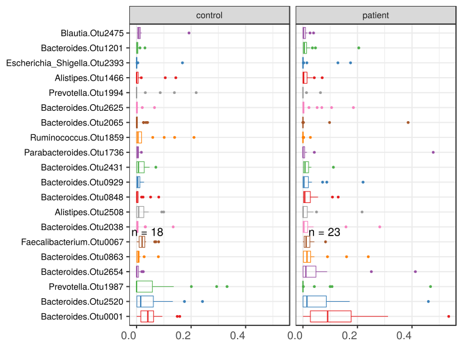

noone@mail.com
Analysis of Dieting study 16S data
% Fri Sep  7 05:46:18 2018

##### \(1.2.1.4.6\) Plots of Abundance.

Plots are shown with relation to various combinations of meta 
                   data variables and in different graphical representations. Lots of plots here.

##### \(1.2.1.4.6.2\) Iterating over all combinations of grouping variables

##### \(1.2.1.4.6.2.1\) Grouping variables Sample.type

##### \(1.2.1.4.6.2.2\) Iterating over Abundance. profile sorting order

##### \(1.2.1.4.6.2.2.1\) Abundance. profile sorting order: average abundance

##### \(1.2.1.4.6.2.2.2\) Iterating over dodged vs faceted bars

The same data are shown in multiple combinations of graphical representations. 
                         This is the same data, but each plot highlights slightly different aspects of it.
                         It is not likely that you will need every plot - pick only what you need.

##### \(1.2.1.4.6.2.2.2.1\) faceted plots. Iterating over orientation and, optionally, scaling

##### \(1.2.1.4.6.2.2.2.1.1\) Abundance. Plot is in original orientation, Y axis SQRT scaled. Iterating over plot geometry

\(1.2.1.4.6.2.2.2.1.1.0\) [`Table 98.`](#table.98) Data table used for plots. Data grouped by Sample.type. Showing only 200 first rows. Full dataset is also saved in a delimited text file (click to download and open e.g. in Excel) [`data/1.2.1.4.6.2.2.2.1.1.0-3234966eb1e.1.2.1.4.6.2.2.2.1.1.csv`](data/1.2.1.4.6.2.2.2.1.1.0-3234966eb1e.1.2.1.4.6.2.2.2.1.1.csv)

| .record.id | Sample.type | feature             | Abundance  |
|:-----------|:------------|:--------------------|:-----------|
| SB1        | control     | Bacteroides.Otu0001 | 1.546e\-02 |
| SB10       | control     | Bacteroides.Otu0001 | 1.567e\-02 |
| SB11       | patient     | Bacteroides.Otu0001 | 2.143e\-02 |
| SB12       | control     | Bacteroides.Otu0001 | 0.000e\+00 |
| SB13       | control     | Bacteroides.Otu0001 | 4.313e\-02 |
| SB14       | control     | Bacteroides.Otu0001 | 2.798e\-02 |
| SB15       | control     | Bacteroides.Otu0001 | 5.819e\-02 |
| SB16       | patient     | Bacteroides.Otu0001 | 1.738e\-01 |
| SB17       | patient     | Bacteroides.Otu0001 | 6.084e\-02 |
| SB18       | patient     | Bacteroides.Otu0001 | 7.129e\-03 |
| SB19       | control     | Bacteroides.Otu0001 | 4.404e\-03 |
| SB21       | control     | Bacteroides.Otu0001 | 9.430e\-02 |
| SB22       | patient     | Bacteroides.Otu0001 | 1.800e\-01 |
| SB23       | patient     | Bacteroides.Otu0001 | 3.120e\-01 |
| SB24       | control     | Bacteroides.Otu0001 | 6.268e\-02 |
| SB25       | control     | Bacteroides.Otu0001 | 6.138e\-02 |
| SB26       | control     | Bacteroides.Otu0001 | 5.936e\-02 |
| SB28       | patient     | Bacteroides.Otu0001 | 0.000e\+00 |
| SB29       | patient     | Bacteroides.Otu0001 | 1.037e\-01 |
| SB3        | control     | Bacteroides.Otu0001 | 2.902e\-03 |
| SB30       | patient     | Bacteroides.Otu0001 | 1.891e\-01 |
| SB31       | control     | Bacteroides.Otu0001 | 1.585e\-01 |
| SB32       | control     | Bacteroides.Otu0001 | 8.035e\-02 |
| SB33       | control     | Bacteroides.Otu0001 | 2.751e\-02 |
| SB34       | patient     | Bacteroides.Otu0001 | 3.325e\-02 |
| SB35       | patient     | Bacteroides.Otu0001 | 5.347e\-01 |
| SB36       | patient     | Bacteroides.Otu0001 | 1.941e\-01 |
| SB38       | patient     | Bacteroides.Otu0001 | 1.512e\-01 |
| SB39       | patient     | Bacteroides.Otu0001 | 4.380e\-02 |
| SB4        | patient     | Bacteroides.Otu0001 | 1.179e\-01 |
| SB40       | control     | Bacteroides.Otu0001 | 1.492e\-01 |
| SB41       | patient     | Bacteroides.Otu0001 | 2.363e\-01 |
| SB42       | patient     | Bacteroides.Otu0001 | 0.000e\+00 |
| SB43       | patient     | Bacteroides.Otu0001 | 1.247e\-01 |
| SB44       | patient     | Bacteroides.Otu0001 | 0.000e\+00 |
| SB45       | control     | Bacteroides.Otu0001 | 0.000e\+00 |
| SB5        | patient     | Bacteroides.Otu0001 | 5.829e\-02 |
| SB6        | patient     | Bacteroides.Otu0001 | 5.265e\-02 |
| SB7        | control     | Bacteroides.Otu0001 | 3.935e\-02 |
| SB8        | patient     | Bacteroides.Otu0001 | 9.063e\-02 |
| SB9        | patient     | Bacteroides.Otu0001 | 0.000e\+00 |
| SB1        | control     | Bacteroides.Otu2520 | 1.330e\-01 |
| SB10       | control     | Bacteroides.Otu2520 | 5.961e\-03 |
| SB11       | patient     | Bacteroides.Otu2520 | 1.473e\-02 |
| SB12       | control     | Bacteroides.Otu2520 | 0.000e\+00 |
| SB13       | control     | Bacteroides.Otu2520 | 0.000e\+00 |
| SB14       | control     | Bacteroides.Otu2520 | 1.289e\-03 |
| SB15       | control     | Bacteroides.Otu2520 | 4.378e\-02 |
| SB16       | patient     | Bacteroides.Otu2520 | 1.862e\-02 |
| SB17       | patient     | Bacteroides.Otu2520 | 5.531e\-03 |
| SB18       | patient     | Bacteroides.Otu2520 | 1.638e\-01 |
| SB19       | control     | Bacteroides.Otu2520 | 1.233e\-03 |
| SB21       | control     | Bacteroides.Otu2520 | 0.000e\+00 |
| SB22       | patient     | Bacteroides.Otu2520 | 2.610e\-02 |
| SB23       | patient     | Bacteroides.Otu2520 | 4.034e\-04 |
| SB24       | control     | Bacteroides.Otu2520 | 1.951e\-02 |
| SB25       | control     | Bacteroides.Otu2520 | 2.664e\-02 |
| SB26       | control     | Bacteroides.Otu2520 | 2.417e\-01 |
| SB28       | patient     | Bacteroides.Otu2520 | 7.120e\-02 |
| SB29       | patient     | Bacteroides.Otu2520 | 0.000e\+00 |
| SB3        | control     | Bacteroides.Otu2520 | 4.145e\-03 |
| SB30       | patient     | Bacteroides.Otu2520 | 5.047e\-04 |
| SB31       | control     | Bacteroides.Otu2520 | 9.282e\-02 |
| SB32       | control     | Bacteroides.Otu2520 | 3.158e\-02 |
| SB33       | control     | Bacteroides.Otu2520 | 1.085e\-02 |
| SB34       | patient     | Bacteroides.Otu2520 | 1.003e\-01 |
| SB35       | patient     | Bacteroides.Otu2520 | 1.525e\-02 |
| SB36       | patient     | Bacteroides.Otu2520 | 4.566e\-02 |
| SB38       | patient     | Bacteroides.Otu2520 | 8.620e\-03 |
| SB39       | patient     | Bacteroides.Otu2520 | 1.440e\-01 |
| SB4        | patient     | Bacteroides.Otu2520 | 1.715e\-01 |
| SB40       | control     | Bacteroides.Otu2520 | 6.748e\-02 |
| SB41       | patient     | Bacteroides.Otu2520 | 1.504e\-01 |
| SB42       | patient     | Bacteroides.Otu2520 | 4.602e\-01 |
| SB43       | patient     | Bacteroides.Otu2520 | 2.912e\-03 |
| SB44       | patient     | Bacteroides.Otu2520 | 0.000e\+00 |
| SB45       | control     | Bacteroides.Otu2520 | 0.000e\+00 |
| SB5        | patient     | Bacteroides.Otu2520 | 2.179e\-04 |
| SB6        | patient     | Bacteroides.Otu2520 | 0.000e\+00 |
| SB7        | control     | Bacteroides.Otu2520 | 1.756e\-01 |
| SB8        | patient     | Bacteroides.Otu2520 | 4.540e\-03 |
| SB9        | patient     | Bacteroides.Otu2520 | 3.786e\-04 |
| SB1        | control     | Prevotella.Otu1987  | 0.000e\+00 |
| SB10       | control     | Prevotella.Otu1987  | 2.009e\-01 |
| SB11       | patient     | Prevotella.Otu1987  | 0.000e\+00 |
| SB12       | control     | Prevotella.Otu1987  | 0.000e\+00 |
| SB13       | control     | Prevotella.Otu1987  | 0.000e\+00 |
| SB14       | control     | Prevotella.Otu1987  | 2.937e\-01 |
| SB15       | control     | Prevotella.Otu1987  | 0.000e\+00 |
| SB16       | patient     | Prevotella.Otu1987  | 0.000e\+00 |
| SB17       | patient     | Prevotella.Otu1987  | 4.680e\-01 |
| SB18       | patient     | Prevotella.Otu1987  | 0.000e\+00 |
| SB19       | control     | Prevotella.Otu1987  | 1.362e\-01 |
| SB21       | control     | Prevotella.Otu1987  | 0.000e\+00 |
| SB22       | patient     | Prevotella.Otu1987  | 0.000e\+00 |
| SB23       | patient     | Prevotella.Otu1987  | 0.000e\+00 |
| SB24       | control     | Prevotella.Otu1987  | 0.000e\+00 |
| SB25       | control     | Prevotella.Otu1987  | 0.000e\+00 |
| SB26       | control     | Prevotella.Otu1987  | 0.000e\+00 |
| SB28       | patient     | Prevotella.Otu1987  | 0.000e\+00 |
| SB29       | patient     | Prevotella.Otu1987  | 0.000e\+00 |
| SB3        | control     | Prevotella.Otu1987  | 7.731e\-02 |
| SB30       | patient     | Prevotella.Otu1987  | 0.000e\+00 |
| SB31       | control     | Prevotella.Otu1987  | 7.326e\-05 |
| SB32       | control     | Prevotella.Otu1987  | 0.000e\+00 |
| SB33       | control     | Prevotella.Otu1987  | 0.000e\+00 |
| SB34       | patient     | Prevotella.Otu1987  | 0.000e\+00 |
| SB35       | patient     | Prevotella.Otu1987  | 0.000e\+00 |
| SB36       | patient     | Prevotella.Otu1987  | 4.186e\-02 |
| SB38       | patient     | Prevotella.Otu1987  | 1.068e\-01 |
| SB39       | patient     | Prevotella.Otu1987  | 0.000e\+00 |
| SB4        | patient     | Prevotella.Otu1987  | 0.000e\+00 |
| SB40       | control     | Prevotella.Otu1987  | 0.000e\+00 |
| SB41       | patient     | Prevotella.Otu1987  | 0.000e\+00 |
| SB42       | patient     | Prevotella.Otu1987  | 0.000e\+00 |
| SB43       | patient     | Prevotella.Otu1987  | 9.979e\-02 |
| SB44       | patient     | Prevotella.Otu1987  | 0.000e\+00 |
| SB45       | control     | Prevotella.Otu1987  | 3.318e\-01 |
| SB5        | patient     | Prevotella.Otu1987  | 6.537e\-04 |
| SB6        | patient     | Prevotella.Otu1987  | 0.000e\+00 |
| SB7        | control     | Prevotella.Otu1987  | 0.000e\+00 |
| SB8        | patient     | Prevotella.Otu1987  | 0.000e\+00 |
| SB9        | patient     | Prevotella.Otu1987  | 1.515e\-03 |
| SB1        | control     | Bacteroides.Otu2654 | 5.001e\-03 |
| SB10       | control     | Bacteroides.Otu2654 | 8.516e\-05 |
| SB11       | patient     | Bacteroides.Otu2654 | 0.000e\+00 |
| SB12       | control     | Bacteroides.Otu2654 | 0.000e\+00 |
| SB13       | control     | Bacteroides.Otu2654 | 0.000e\+00 |
| SB14       | control     | Bacteroides.Otu2654 | 1.289e\-04 |
| SB15       | control     | Bacteroides.Otu2654 | 2.261e\-02 |
| SB16       | patient     | Bacteroides.Otu2654 | 1.076e\-02 |
| SB17       | patient     | Bacteroides.Otu2654 | 2.277e\-02 |
| SB18       | patient     | Bacteroides.Otu2654 | 4.125e\-01 |
| SB19       | control     | Bacteroides.Otu2654 | 7.046e\-04 |
| SB21       | control     | Bacteroides.Otu2654 | 0.000e\+00 |
| SB22       | patient     | Bacteroides.Otu2654 | 8.868e\-02 |
| SB23       | patient     | Bacteroides.Otu2654 | 6.280e\-02 |
| SB24       | control     | Bacteroides.Otu2654 | 2.467e\-02 |
| SB25       | control     | Bacteroides.Otu2654 | 2.131e\-04 |
| SB26       | control     | Bacteroides.Otu2654 | 1.612e\-03 |
| SB28       | patient     | Bacteroides.Otu2654 | 0.000e\+00 |
| SB29       | patient     | Bacteroides.Otu2654 | 0.000e\+00 |
| SB3        | control     | Bacteroides.Otu2654 | 8.290e\-04 |
| SB30       | patient     | Bacteroides.Otu2654 | 2.510e\-01 |
| SB31       | control     | Bacteroides.Otu2654 | 1.201e\-02 |
| SB32       | control     | Bacteroides.Otu2654 | 7.741e\-03 |
| SB33       | control     | Bacteroides.Otu2654 | 6.891e\-04 |
| SB34       | patient     | Bacteroides.Otu2654 | 2.251e\-03 |
| SB35       | patient     | Bacteroides.Otu2654 | 8.069e\-02 |
| SB36       | patient     | Bacteroides.Otu2654 | 4.947e\-03 |
| SB38       | patient     | Bacteroides.Otu2654 | 3.430e\-02 |
| SB39       | patient     | Bacteroides.Otu2654 | 1.159e\-02 |
| SB4        | patient     | Bacteroides.Otu2654 | 6.090e\-02 |
| SB40       | control     | Bacteroides.Otu2654 | 1.892e\-02 |
| SB41       | patient     | Bacteroides.Otu2654 | 3.439e\-02 |
| SB42       | patient     | Bacteroides.Otu2654 | 1.443e\-03 |
| SB43       | patient     | Bacteroides.Otu2654 | 1.718e\-02 |
| SB44       | patient     | Bacteroides.Otu2654 | 2.746e\-04 |
| SB45       | control     | Bacteroides.Otu2654 | 0.000e\+00 |
| SB5        | patient     | Bacteroides.Otu2654 | 0.000e\+00 |
| SB6        | patient     | Bacteroides.Otu2654 | 7.416e\-04 |
| SB7        | control     | Bacteroides.Otu2654 | 6.369e\-04 |
| SB8        | patient     | Bacteroides.Otu2654 | 3.027e\-03 |
| SB9        | patient     | Bacteroides.Otu2654 | 0.000e\+00 |
| SB1        | control     | Bacteroides.Otu0863 | 4.092e\-03 |
| SB10       | control     | Bacteroides.Otu0863 | 8.260e\-03 |
| SB11       | patient     | Bacteroides.Otu0863 | 2.397e\-01 |
| SB12       | control     | Bacteroides.Otu0863 | 0.000e\+00 |
| SB13       | control     | Bacteroides.Otu0863 | 0.000e\+00 |
| SB14       | control     | Bacteroides.Otu0863 | 2.708e\-03 |
| SB15       | control     | Bacteroides.Otu0863 | 6.964e\-03 |
| SB16       | patient     | Bacteroides.Otu0863 | 0.000e\+00 |
| SB17       | patient     | Bacteroides.Otu0863 | 1.672e\-03 |
| SB18       | patient     | Bacteroides.Otu0863 | 2.976e\-03 |
| SB19       | control     | Bacteroides.Otu0863 | 5.284e\-04 |
| SB21       | control     | Bacteroides.Otu0863 | 0.000e\+00 |
| SB22       | patient     | Bacteroides.Otu0863 | 7.678e\-04 |
| SB23       | patient     | Bacteroides.Otu0863 | 1.493e\-02 |
| SB24       | control     | Bacteroides.Otu0863 | 1.420e\-02 |
| SB25       | control     | Bacteroides.Otu0863 | 7.992e\-02 |
| SB26       | control     | Bacteroides.Otu0863 | 9.401e\-03 |
| SB28       | patient     | Bacteroides.Otu0863 | 3.934e\-04 |
| SB29       | patient     | Bacteroides.Otu0863 | 0.000e\+00 |
| SB3        | control     | Bacteroides.Otu0863 | 1.658e\-03 |
| SB30       | patient     | Bacteroides.Otu0863 | 2.907e\-02 |
| SB31       | control     | Bacteroides.Otu0863 | 5.201e\-03 |
| SB32       | control     | Bacteroides.Otu0863 | 1.084e\-02 |
| SB33       | control     | Bacteroides.Otu0863 | 7.925e\-03 |
| SB34       | patient     | Bacteroides.Otu0863 | 1.600e\-01 |
| SB35       | patient     | Bacteroides.Otu0863 | 3.011e\-02 |
| SB36       | patient     | Bacteroides.Otu0863 | 2.511e\-02 |
| SB38       | patient     | Bacteroides.Otu0863 | 2.756e\-02 |
| SB39       | patient     | Bacteroides.Otu0863 | 1.836e\-02 |
| SB4        | patient     | Bacteroides.Otu0863 | 1.809e\-03 |
| SB40       | control     | Bacteroides.Otu0863 | 8.925e\-03 |
| SB41       | patient     | Bacteroides.Otu0863 | 1.372e\-03 |
| SB42       | patient     | Bacteroides.Otu0863 | 2.575e\-02 |
| SB43       | patient     | Bacteroides.Otu0863 | 3.300e\-03 |
| SB44       | patient     | Bacteroides.Otu0863 | 4.201e\-02 |
| SB45       | control     | Bacteroides.Otu0863 | 0.000e\+00 |

\(1.2.1.4.6.2.2.2.1.1.1\) [`Widget 103.`](#widget.103) Dynamic Pivot Table link (drag and drop field names and pick averaging 
                      functions or plot types; click on fields or legend elements to filter values). 
                      Starting rendering is Stacked Bar Chart. Data grouped by Sample.type. Click to see HTML widget file in full window: [`./1.2.1.4.6.2.2.2.1.1.1-323624bb660Dynamic.Pivot.Table.html`](./1.2.1.4.6.2.2.2.1.1.1-323624bb660Dynamic.Pivot.Table.html)

\(1.2.1.4.6.2.2.2.1.1.1\) [`Widget 104.`](#widget.104) Dynamic Pivot Table link (drag and drop field names and pick averaging 
                      functions or plot types; click on fields or legend elements to filter values). 
                      Starting rendering is Table Barchart. Data grouped by Sample.type. Click to see HTML widget file in full window: [`./1.2.1.4.6.2.2.2.1.1.1-3231d41396aDynamic.Pivot.Table.html`](./1.2.1.4.6.2.2.2.1.1.1-3231d41396aDynamic.Pivot.Table.html)

\(1.2.1.4.6.2.2.2.1.1.1\) [`Table 99.`](#table.99) Summary table. Data grouped by Sample.type. Showing only 200 first rows. Full dataset is also saved in a delimited text file (click to download and open e.g. in Excel) [`data/1.2.1.4.6.2.2.2.1.1.1-3232ae45bba.1.2.1.4.6.2.2.2.1.1.csv`](data/1.2.1.4.6.2.2.2.1.1.1-3232ae45bba.1.2.1.4.6.2.2.2.1.1.csv)

| feature                                      | Sample.type | mean       | sd         | median     | incidence |
|:---------------------------------------------|:------------|:-----------|:-----------|:-----------|:----------|
| Bacteroides.Otu0001                          | control     | 5.002e\-02 | 4.713e\-02 | 4.124e\-02 | 0.88889   |
| Bacteroides.Otu0001                          | patient     | 1.168e\-01 | 1.255e\-01 | 9.063e\-02 | 0.82609   |
| Bacteroides.Otu2520                          | control     | 4.754e\-02 | 7.015e\-02 | 1.518e\-02 | 0.77778   |
| Bacteroides.Otu2520                          | patient     | 6.108e\-02 | 1.054e\-01 | 1.473e\-02 | 0.86957   |
| Prevotella.Otu1987                           | control     | 5.778e\-02 | 1.088e\-01 | 0.000e\+00 | 0.33333   |
| Prevotella.Otu1987                           | patient     | 3.124e\-02 | 9.994e\-02 | 0.000e\+00 | 0.26087   |
| Bacteroides.Otu2654                          | control     | 5.326e\-03 | 8.407e\-03 | 6.968e\-04 | 0.77778   |
| Bacteroides.Otu2654                          | patient     | 4.783e\-02 | 9.677e\-02 | 1.076e\-02 | 0.78261   |
| Bacteroides.Otu0863                          | control     | 1.046e\-02 | 1.864e\-02 | 6.083e\-03 | 0.77778   |
| Bacteroides.Otu0863                          | patient     | 3.229e\-02 | 5.790e\-02 | 1.493e\-02 | 0.86957   |
| Faecalibacterium.Otu0067                     | control     | 2.566e\-02 | 2.389e\-02 | 2.040e\-02 | 0.94444   |
| Faecalibacterium.Otu0067                     | patient     | 1.768e\-02 | 1.932e\-02 | 1.166e\-02 | 0.95652   |
| Bacteroides.Otu2038                          | control     | 1.280e\-02 | 3.189e\-02 | 2.419e\-03 | 0.83333   |
| Bacteroides.Otu2038                          | patient     | 2.623e\-02 | 6.465e\-02 | 3.601e\-03 | 0.86957   |
| Alistipes.Otu2508                            | control     | 2.027e\-02 | 3.055e\-02 | 7.646e\-03 | 0.66667   |
| Alistipes.Otu2508                            | patient     | 1.774e\-02 | 4.589e\-02 | 5.195e\-04 | 0.52174   |
| Bacteroides.Otu0848                          | control     | 1.089e\-02 | 2.184e\-02 | 1.310e\-03 | 0.72222   |
| Bacteroides.Otu0848                          | patient     | 2.252e\-02 | 3.495e\-02 | 6.558e\-03 | 0.86957   |
| Bacteroides.Otu0929                          | control     | 7.699e\-03 | 9.621e\-03 | 4.511e\-03 | 0.83333   |
| Bacteroides.Otu0929                          | patient     | 2.297e\-02 | 4.878e\-02 | 3.724e\-03 | 0.73913   |
| Bacteroides.Otu2431                          | control     | 1.680e\-02 | 2.110e\-02 | 6.948e\-03 | 0.77778   |
| Bacteroides.Otu2431                          | patient     | 1.553e\-02 | 2.341e\-02 | 7.537e\-03 | 0.82609   |
| Parabacteroides.Otu1736                      | control     | 4.485e\-03 | 4.986e\-03 | 3.900e\-03 | 0.83333   |
| Parabacteroides.Otu1736                      | patient     | 2.509e\-02 | 9.916e\-02 | 1.328e\-04 | 0.56522   |
| Ruminococcus.Otu1859                         | control     | 3.263e\-02 | 5.916e\-02 | 5.089e\-03 | 0.72222   |
| Ruminococcus.Otu1859                         | patient     | 1.516e\-03 | 5.680e\-03 | 0.000e\+00 | 0.26087   |
| Bacteroides.Otu2065                          | control     | 7.217e\-03 | 1.371e\-02 | 0.000e\+00 | 0.33333   |
| Bacteroides.Otu2065                          | patient     | 2.112e\-02 | 8.207e\-02 | 0.000e\+00 | 0.21739   |
| Bacteroides.Otu2625                          | control     | 5.941e\-03 | 1.570e\-02 | 8.037e\-04 | 0.66667   |
| Bacteroides.Otu2625                          | patient     | 1.951e\-02 | 4.503e\-02 | 6.678e\-04 | 0.65217   |
| Prevotella.Otu1994                           | control     | 2.646e\-02 | 6.088e\-02 | 0.000e\+00 | 0.22222   |
| Prevotella.Otu1994                           | patient     | 3.362e\-03 | 1.356e\-02 | 0.000e\+00 | 0.08696   |
| Alistipes.Otu1466                            | control     | 1.627e\-02 | 4.028e\-02 | 2.699e\-04 | 0.50000   |
| Alistipes.Otu1466                            | patient     | 1.086e\-02 | 1.787e\-02 | 2.576e\-03 | 0.52174   |
| Escherichia\_Shigella.Otu2393                | control     | 9.903e\-03 | 3.953e\-02 | 3.853e\-04 | 0.61111   |
| Escherichia\_Shigella.Otu2393                | patient     | 1.408e\-02 | 4.403e\-02 | 0.000e\+00 | 0.39130   |
| Bacteroides.Otu1201                          | control     | 4.442e\-03 | 7.397e\-03 | 2.154e\-03 | 0.72222   |
| Bacteroides.Otu1201                          | patient     | 1.796e\-02 | 4.252e\-02 | 4.950e\-03 | 0.82609   |
| Blautia.Otu2475                              | control     | 1.882e\-02 | 4.365e\-02 | 7.955e\-03 | 1.00000   |
| Blautia.Otu2475                              | patient     | 6.579e\-03 | 9.572e\-03 | 2.046e\-03 | 0.91304   |
| Erysipelotrichaceae\_incertae\_sedis.Otu0818 | control     | 6.510e\-04 | 1.330e\-03 | 7.077e\-05 | 0.50000   |
| Erysipelotrichaceae\_incertae\_sedis.Otu0818 | patient     | 1.994e\-02 | 8.001e\-02 | 9.525e\-04 | 0.69565   |
| Bacteroides.Otu0661                          | control     | 7.237e\-03 | 9.749e\-03 | 3.579e\-03 | 0.72222   |
| Bacteroides.Otu0661                          | patient     | 1.387e\-02 | 2.320e\-02 | 3.919e\-03 | 0.73913   |
| Bacteroides.Otu0069                          | control     | 6.033e\-03 | 5.392e\-03 | 4.877e\-03 | 0.77778   |
| Bacteroides.Otu0069                          | patient     | 1.411e\-02 | 1.696e\-02 | 1.076e\-02 | 0.82609   |
| Clostridium\_XI.Otu1804                      | control     | 7.941e\-03 | 8.436e\-03 | 6.903e\-03 | 0.94444   |
| Clostridium\_XI.Otu1804                      | patient     | 1.197e\-02 | 2.513e\-02 | 2.170e\-03 | 0.82609   |
| Bacteroides.Otu2765                          | control     | 4.757e\-03 | 7.410e\-03 | 1.284e\-03 | 0.72222   |
| Bacteroides.Otu2765                          | patient     | 1.268e\-02 | 1.724e\-02 | 5.045e\-03 | 0.91304   |
| Bacteroides.Otu0480                          | control     | 9.209e\-03 | 2.546e\-02 | 0.000e\+00 | 0.33333   |
| Bacteroides.Otu0480                          | patient     | 9.011e\-03 | 3.377e\-02 | 0.000e\+00 | 0.21739   |
| Bacteroides.Otu0786                          | control     | 1.253e\-03 | 2.608e\-03 | 0.000e\+00 | 0.38889   |
| Bacteroides.Otu0786                          | patient     | 1.362e\-02 | 5.207e\-02 | 0.000e\+00 | 0.47826   |
| Bacteroides.Otu0006                          | control     | 5.089e\-03 | 6.353e\-03 | 3.693e\-03 | 0.83333   |
| Bacteroides.Otu0006                          | patient     | 1.051e\-02 | 9.565e\-03 | 7.294e\-03 | 0.82609   |
| Akkermansia.Otu1935                          | control     | 3.002e\-03 | 6.251e\-03 | 0.000e\+00 | 0.38889   |
| Akkermansia.Otu1935                          | patient     | 1.025e\-02 | 3.615e\-02 | 0.000e\+00 | 0.34783   |
| Bacteroides.Otu2481                          | control     | 1.520e\-02 | 6.431e\-02 | 0.000e\+00 | 0.27778   |
| Bacteroides.Otu2481                          | patient     | 0.000e\+00 | 0.000e\+00 | 0.000e\+00 | 0.00000   |
| Bacteroides.Otu2437                          | control     | 1.099e\-02 | 2.383e\-02 | 9.540e\-04 | 0.66667   |
| Bacteroides.Otu2437                          | patient     | 3.057e\-03 | 6.170e\-03 | 0.000e\+00 | 0.47826   |
| Faecalibacterium.Otu0751                     | control     | 6.820e\-03 | 6.094e\-03 | 4.375e\-03 | 0.88889   |
| Faecalibacterium.Otu0751                     | patient     | 5.336e\-03 | 7.840e\-03 | 3.377e\-03 | 0.86957   |
| Bacteroides.Otu1726                          | control     | 1.187e\-02 | 5.019e\-02 | 0.000e\+00 | 0.16667   |
| Bacteroides.Otu1726                          | patient     | 0.000e\+00 | 0.000e\+00 | 0.000e\+00 | 0.00000   |
| Clostridium\_XlVa.Otu0236                    | control     | 6.075e\-03 | 1.055e\-02 | 2.085e\-03 | 0.94444   |
| Clostridium\_XlVa.Otu0236                    | patient     | 4.005e\-03 | 5.116e\-03 | 2.152e\-03 | 0.95652   |
| Prevotella.Otu1633                           | control     | 4.933e\-03 | 1.103e\-02 | 0.000e\+00 | 0.38889   |
| Prevotella.Otu1633                           | patient     | 4.798e\-03 | 1.274e\-02 | 0.000e\+00 | 0.43478   |
| Dorea.Otu1142                                | control     | 6.256e\-03 | 6.597e\-03 | 3.989e\-03 | 0.94444   |
| Dorea.Otu1142                                | patient     | 3.746e\-03 | 7.510e\-03 | 7.597e\-04 | 0.69565   |
| Bacteroides.Otu1624                          | control     | 2.800e\-03 | 7.494e\-03 | 0.000e\+00 | 0.38889   |
| Bacteroides.Otu1624                          | patient     | 6.359e\-03 | 2.512e\-02 | 0.000e\+00 | 0.34783   |
| Bifidobacterium.Otu1244                      | control     | 1.033e\-02 | 4.238e\-02 | 0.000e\+00 | 0.44444   |
| Bifidobacterium.Otu1244                      | patient     | 3.762e\-04 | 1.735e\-03 | 0.000e\+00 | 0.08696   |
| Bacteroides.Otu2343                          | control     | 7.165e\-04 | 1.612e\-03 | 0.000e\+00 | 0.44444   |
| Bacteroides.Otu2343                          | patient     | 7.836e\-03 | 2.709e\-02 | 4.426e\-05 | 0.52174   |
| Prevotella.Otu2602                           | control     | 8.172e\-03 | 1.967e\-02 | 0.000e\+00 | 0.33333   |
| Prevotella.Otu2602                           | patient     | 1.987e\-03 | 4.695e\-03 | 0.000e\+00 | 0.21739   |
| Sutterella.Otu0171                           | control     | 7.049e\-03 | 2.434e\-02 | 0.000e\+00 | 0.27778   |
| Sutterella.Otu0171                           | patient     | 2.772e\-03 | 7.848e\-03 | 0.000e\+00 | 0.30435   |
| Bacteroides.Otu2104                          | control     | 2.444e\-03 | 3.805e\-03 | 6.177e\-04 | 0.66667   |
| Bacteroides.Otu2104                          | patient     | 6.132e\-03 | 8.432e\-03 | 2.170e\-03 | 0.82609   |
| Lactobacillus.Otu0959                        | control     | 1.012e\-02 | 4.271e\-02 | 0.000e\+00 | 0.11111   |
| Lactobacillus.Otu0959                        | patient     | 4.939e\-05 | 2.369e\-04 | 0.000e\+00 | 0.04348   |
| Megamonas.Otu2657                            | control     | 9.015e\-03 | 3.076e\-02 | 0.000e\+00 | 0.16667   |
| Megamonas.Otu2657                            | patient     | 9.060e\-04 | 4.321e\-03 | 0.000e\+00 | 0.08696   |
| Prevotella.Otu1803                           | control     | 6.550e\-03 | 1.514e\-02 | 0.000e\+00 | 0.33333   |
| Prevotella.Otu1803                           | patient     | 2.414e\-03 | 6.438e\-03 | 0.000e\+00 | 0.26087   |
| Lachnospiraceae.Otu0220                      | control     | 6.197e\-03 | 9.495e\-03 | 4.598e\-03 | 0.94444   |
| Lachnospiraceae.Otu0220                      | patient     | 2.338e\-03 | 4.937e\-03 | 3.035e\-04 | 0.60870   |
| Lachnospiraceae.Otu2512                      | control     | 8.089e\-03 | 7.484e\-03 | 6.105e\-03 | 0.88889   |
| Lachnospiraceae.Otu2512                      | patient     | 7.134e\-04 | 1.544e\-03 | 1.328e\-04 | 0.60870   |
| Ruminococcaceae.Otu1504                      | control     | 6.865e\-03 | 1.999e\-02 | 0.000e\+00 | 0.22222   |
| Ruminococcaceae.Otu1504                      | patient     | 1.619e\-03 | 7.748e\-03 | 0.000e\+00 | 0.08696   |
| Clostridiales.Otu1597                        | control     | 5.664e\-03 | 1.415e\-02 | 0.000e\+00 | 0.38889   |
| Clostridiales.Otu1597                        | patient     | 2.330e\-03 | 1.001e\-02 | 0.000e\+00 | 0.17391   |
| Prevotella.Otu0634                           | control     | 4.195e\-03 | 9.120e\-03 | 6.534e\-05 | 0.55556   |
| Prevotella.Otu0634                           | patient     | 3.395e\-03 | 8.853e\-03 | 0.000e\+00 | 0.21739   |
| Bacteroides.Otu0877                          | control     | 2.323e\-03 | 4.360e\-03 | 1.019e\-03 | 0.72222   |
| Bacteroides.Otu0877                          | patient     | 4.673e\-03 | 9.931e\-03 | 1.180e\-03 | 0.78261   |
| Parabacteroides.Otu1378                      | control     | 1.584e\-03 | 3.171e\-03 | 3.250e\-04 | 0.77778   |
| Parabacteroides.Otu1378                      | patient     | 4.950e\-03 | 8.585e\-03 | 1.089e\-04 | 0.52174   |
| Lachnospiraceae.Otu2222                      | control     | 6.180e\-03 | 9.342e\-03 | 2.669e\-03 | 0.88889   |
| Lachnospiraceae.Otu2222                      | patient     | 1.298e\-03 | 2.368e\-03 | 0.000e\+00 | 0.43478   |
| Clostridium\_XI.Otu2681                      | control     | 1.108e\-03 | 1.390e\-03 | 3.722e\-04 | 0.72222   |
| Clostridium\_XI.Otu2681                      | patient     | 5.255e\-03 | 2.114e\-02 | 0.000e\+00 | 0.43478   |
| Bacteroides.Otu1565                          | control     | 6.383e\-03 | 2.442e\-02 | 3.663e\-05 | 0.50000   |
| Bacteroides.Otu1565                          | patient     | 1.118e\-03 | 3.293e\-03 | 0.000e\+00 | 0.34783   |
| Gemmiger.Otu0907                             | control     | 5.594e\-03 | 5.095e\-03 | 4.928e\-03 | 0.83333   |
| Gemmiger.Otu0907                             | patient     | 1.639e\-03 | 2.581e\-03 | 3.015e\-04 | 0.56522   |
| Enterococcus.Otu1019                         | control     | 3.328e\-03 | 1.308e\-02 | 0.000e\+00 | 0.22222   |
| Enterococcus.Otu1019                         | patient     | 3.367e\-03 | 1.493e\-02 | 0.000e\+00 | 0.26087   |
| Bacteroides.Otu2216                          | control     | 1.199e\-03 | 2.663e\-03 | 0.000e\+00 | 0.33333   |
| Bacteroides.Otu2216                          | patient     | 4.819e\-03 | 1.703e\-02 | 0.000e\+00 | 0.17391   |
| Lachnospiraceae.Otu0898                      | control     | 5.574e\-03 | 2.115e\-02 | 3.538e\-05 | 0.50000   |
| Lachnospiraceae.Otu0898                      | patient     | 1.387e\-03 | 2.479e\-03 | 4.038e\-04 | 0.69565   |
| Megamonas.Otu1877                            | control     | 5.677e\-03 | 2.408e\-02 | 0.000e\+00 | 0.05556   |
| Megamonas.Otu1877                            | patient     | 1.235e\-03 | 5.923e\-03 | 0.000e\+00 | 0.04348   |
| Ruminococcus.Otu0422                         | control     | 7.200e\-03 | 2.098e\-02 | 0.000e\+00 | 0.27778   |
| Ruminococcus.Otu0422                         | patient     | 0.000e\+00 | 0.000e\+00 | 0.000e\+00 | 0.00000   |
| Sutterella.Otu1997                           | control     | 2.687e\-03 | 6.135e\-03 | 1.343e\-04 | 0.50000   |
| Sutterella.Otu1997                           | patient     | 3.454e\-03 | 1.218e\-02 | 0.000e\+00 | 0.21739   |
| Clostridium\_IV.Otu1864                      | control     | 5.366e\-03 | 9.037e\-03 | 5.352e\-04 | 0.61111   |
| Clostridium\_IV.Otu1864                      | patient     | 1.203e\-03 | 4.015e\-03 | 0.000e\+00 | 0.26087   |
| Prevotella.Otu1319                           | control     | 5.167e\-03 | 1.297e\-02 | 0.000e\+00 | 0.27778   |
| Prevotella.Otu1319                           | patient     | 1.105e\-03 | 3.174e\-03 | 0.000e\+00 | 0.21739   |
| Phascolarctobacterium.Otu1814                | control     | 4.088e\-03 | 9.770e\-03 | 0.000e\+00 | 0.22222   |
| Phascolarctobacterium.Otu1814                | patient     | 1.932e\-03 | 4.753e\-03 | 0.000e\+00 | 0.39130   |
| Prevotella.Otu0738                           | control     | 1.575e\-04 | 3.486e\-04 | 0.000e\+00 | 0.22222   |
| Prevotella.Otu0738                           | patient     | 4.889e\-03 | 2.035e\-02 | 0.000e\+00 | 0.13043   |
| Lachnospiracea\_incertae\_sedis.Otu1152      | control     | 4.558e\-03 | 7.373e\-03 | 1.869e\-03 | 0.88889   |
| Lachnospiracea\_incertae\_sedis.Otu1152      | patient     | 1.411e\-03 | 3.185e\-03 | 0.000e\+00 | 0.47826   |
| Lachnospiracea\_incertae\_sedis.Otu0113      | control     | 4.628e\-03 | 4.744e\-03 | 4.314e\-03 | 0.94444   |
| Lachnospiracea\_incertae\_sedis.Otu0113      | patient     | 9.713e\-04 | 1.389e\-03 | 3.859e\-04 | 0.65217   |
| Roseburia.Otu1051                            | control     | 2.588e\-03 | 3.673e\-03 | 1.840e\-03 | 0.94444   |
| Roseburia.Otu1051                            | patient     | 2.491e\-03 | 4.068e\-03 | 8.581e\-04 | 0.73913   |
| Klebsiella.Otu1452                           | control     | 5.117e\-03 | 2.150e\-02 | 0.000e\+00 | 0.16667   |
| Klebsiella.Otu1452                           | patient     | 3.720e\-04 | 1.428e\-03 | 0.000e\+00 | 0.21739   |
| Blautia.Otu2495                              | control     | 4.311e\-03 | 7.419e\-03 | 2.099e\-03 | 0.88889   |
| Blautia.Otu2495                              | patient     | 9.913e\-04 | 1.475e\-03 | 3.035e\-04 | 0.65217   |
| Prevotella.Otu1563                           | control     | 3.396e\-03 | 6.604e\-03 | 0.000e\+00 | 0.27778   |
| Prevotella.Otu1563                           | patient     | 1.473e\-03 | 3.956e\-03 | 0.000e\+00 | 0.21739   |
| Bacteroides.Otu2120                          | control     | 1.664e\-03 | 2.682e\-03 | 8.408e\-04 | 0.83333   |
| Bacteroides.Otu2120                          | patient     | 2.811e\-03 | 3.991e\-03 | 9.707e\-04 | 0.65217   |
| Bacteroides.Otu2375                          | control     | 1.343e\-03 | 1.992e\-03 | 8.292e\-04 | 0.72222   |
| Bacteroides.Otu2375                          | patient     | 3.049e\-03 | 2.975e\-03 | 2.303e\-03 | 0.82609   |
| Lachnospiraceae.Otu0790                      | control     | 1.920e\-03 | 3.294e\-03 | 7.615e\-04 | 0.88889   |
| Lachnospiraceae.Otu0790                      | patient     | 2.508e\-03 | 3.446e\-03 | 1.029e\-03 | 0.69565   |
| Parabacteroides.Otu1107                      | control     | 9.455e\-04 | 1.354e\-03 | 3.872e\-04 | 0.66667   |
| Parabacteroides.Otu1107                      | patient     | 3.251e\-03 | 7.330e\-03 | 0.000e\+00 | 0.34783   |
| Bacteroidales.Otu1168                        | control     | 4.023e\-04 | 1.444e\-03 | 0.000e\+00 | 0.27778   |
| Bacteroidales.Otu1168                        | patient     | 3.488e\-03 | 1.160e\-02 | 0.000e\+00 | 0.34783   |
| Lachnospiraceae.Otu2599                      | control     | 1.449e\-03 | 1.517e\-03 | 8.462e\-04 | 0.94444   |
| Lachnospiraceae.Otu2599                      | patient     | 2.570e\-03 | 5.043e\-03 | 6.030e\-04 | 0.78261   |
| Prevotella.Otu0773                           | control     | 3.349e\-03 | 9.602e\-03 | 0.000e\+00 | 0.27778   |
| Prevotella.Otu0773                           | patient     | 1.025e\-03 | 3.635e\-03 | 0.000e\+00 | 0.17391   |
| Bacteroides.Otu2534                          | control     | 3.830e\-06 | 1.625e\-05 | 0.000e\+00 | 0.05556   |
| Bacteroides.Otu2534                          | patient     | 3.549e\-03 | 1.288e\-02 | 0.000e\+00 | 0.26087   |
| Lachnospiracea\_incertae\_sedis.Otu0778      | control     | 2.174e\-03 | 2.208e\-03 | 1.642e\-03 | 0.77778   |
| Lachnospiracea\_incertae\_sedis.Otu0778      | patient     | 1.813e\-03 | 3.516e\-03 | 3.708e\-04 | 0.56522   |
| Bacteria.Otu0435                             | control     | 0.000e\+00 | 0.000e\+00 | 0.000e\+00 | 0.00000   |
| Bacteria.Otu0435                             | patient     | 3.485e\-03 | 1.671e\-02 | 0.000e\+00 | 0.04348   |
| Alistipes.Otu0529                            | control     | 2.542e\-03 | 4.959e\-03 | 3.877e\-04 | 0.55556   |
| Alistipes.Otu0529                            | patient     | 1.489e\-03 | 3.090e\-03 | 0.000e\+00 | 0.21739   |
| Lachnospiracea\_incertae\_sedis.Otu1990      | control     | 3.538e\-03 | 2.436e\-03 | 3.744e\-03 | 0.94444   |
| Lachnospiracea\_incertae\_sedis.Otu1990      | patient     | 6.134e\-04 | 1.978e\-03 | 0.000e\+00 | 0.39130   |
| Bacteroides.Otu2460                          | control     | 7.456e\-04 | 1.284e\-03 | 2.760e\-04 | 0.61111   |
| Bacteroides.Otu2460                          | patient     | 2.787e\-03 | 4.168e\-03 | 6.726e\-04 | 0.69565   |
| Streptococcus.Otu0749                        | control     | 4.183e\-03 | 1.775e\-02 | 0.000e\+00 | 0.05556   |
| Streptococcus.Otu0749                        | patient     | 7.059e\-05 | 3.156e\-04 | 0.000e\+00 | 0.08696   |
| Prevotella.Otu0882                           | control     | 2.009e\-03 | 6.926e\-03 | 0.000e\+00 | 0.27778   |
| Prevotella.Otu0882                           | patient     | 1.758e\-03 | 4.462e\-03 | 0.000e\+00 | 0.17391   |
| Oscillibacter.Otu0154                        | control     | 1.744e\-03 | 2.055e\-03 | 6.181e\-04 | 0.77778   |
| Oscillibacter.Otu0154                        | patient     | 1.926e\-03 | 3.131e\-03 | 5.047e\-04 | 0.73913   |
| Lachnospiraceae.Otu0272                      | control     | 3.524e\-03 | 6.857e\-03 | 6.105e\-04 | 0.83333   |
| Lachnospiraceae.Otu0272                      | patient     | 5.243e\-04 | 1.754e\-03 | 0.000e\+00 | 0.43478   |
| Blautia.Otu0620                              | control     | 1.372e\-03 | 1.429e\-03 | 1.009e\-03 | 0.88889   |
| Blautia.Otu0620                              | patient     | 2.165e\-03 | 5.266e\-03 | 4.856e\-04 | 0.78261   |
| Lachnospiracea\_incertae\_sedis.Otu2549      | control     | 3.346e\-03 | 7.104e\-03 | 1.820e\-03 | 0.88889   |
| Lachnospiracea\_incertae\_sedis.Otu2549      | patient     | 5.937e\-04 | 1.443e\-03 | 0.000e\+00 | 0.43478   |
| Roseburia.Otu2084                            | control     | 2.090e\-03 | 1.507e\-03 | 1.702e\-03 | 0.94444   |
| Roseburia.Otu2084                            | patient     | 1.507e\-03 | 1.917e\-03 | 8.237e\-04 | 0.69565   |
| Lachnospiraceae.Otu0875                      | control     | 1.801e\-03 | 1.316e\-03 | 1.645e\-03 | 1.00000   |
| Lachnospiraceae.Otu0875                      | patient     | 1.684e\-03 | 3.408e\-03 | 2.019e\-04 | 0.60870   |
| Bacteroides.Otu2416                          | control     | 6.226e\-04 | 9.021e\-04 | 3.109e\-04 | 0.61111   |
| Bacteroides.Otu2416                          | patient     | 2.589e\-03 | 5.389e\-03 | 1.009e\-03 | 0.69565   |
| Ruminococcaceae.Otu0064                      | control     | 3.833e\-03 | 9.592e\-03 | 0.000e\+00 | 0.27778   |
| Ruminococcaceae.Otu0064                      | patient     | 2.216e\-05 | 8.372e\-05 | 0.000e\+00 | 0.08696   |
| Bacteroides.Otu1411                          | control     | 2.204e\-03 | 5.126e\-03 | 2.173e\-04 | 0.66667   |
| Bacteroides.Otu1411                          | patient     | 1.251e\-03 | 3.727e\-03 | 0.000e\+00 | 0.47826   |
| Lachnospiracea\_incertae\_sedis.Otu2746      | control     | 3.061e\-03 | 3.531e\-03 | 1.719e\-03 | 0.94444   |
| Lachnospiracea\_incertae\_sedis.Otu2746      | patient     | 5.556e\-04 | 1.653e\-03 | 0.000e\+00 | 0.39130   |
| Ruminococcus.Otu1429                         | control     | 2.571e\-03 | 3.675e\-03 | 1.021e\-03 | 0.72222   |
| Ruminococcus.Otu1429                         | patient     | 9.005e\-04 | 2.007e\-03 | 0.000e\+00 | 0.30435   |
| Prevotella.Otu2666                           | control     | 5.942e\-04 | 2.426e\-03 | 0.000e\+00 | 0.16667   |
| Prevotella.Otu2666                           | patient     | 2.434e\-03 | 1.166e\-02 | 0.000e\+00 | 0.08696   |
| Bacteroides.Otu1669                          | control     | 1.649e\-03 | 2.148e\-03 | 5.003e\-04 | 0.72222   |
| Bacteroides.Otu1669                          | patient     | 1.601e\-03 | 2.547e\-03 | 3.859e\-04 | 0.65217   |

\(1.2.1.4.6.2.2.2.1.1.1\) [`Figure 361.`](#figure.361) Abundance. Data grouped by Sample.type.  bar_stacked plot.  Image file: [`plots/32367a360df.svg`](plots/32367a360df.svg).

\(1.2.1.4.6.2.2.2.1.1.1\) [`Figure 362.`](#figure.362) Abundance. Data grouped by Sample.type.  bar (sample mean) plot.  Image file: [`plots/3236cf72361.svg`](plots/3236cf72361.svg).

\(1.2.1.4.6.2.2.2.1.1.1\) [`Figure 363.`](#figure.363) Abundance. Data grouped by Sample.type.  violin plot.  Image file: [`plots/323505a8eda.svg`](plots/323505a8eda.svg).

\(1.2.1.4.6.2.2.2.1.1.1\) [`Figure 364.`](#figure.364) Abundance. Data grouped by Sample.type.  boxplot plot.  Image file: [`plots/323789529ed.svg`](plots/323789529ed.svg).

##### \(1.2.1.4.6.2.2.2.1.2\) Abundance. Plot is in flipped orientation, Y axis not scaled. Iterating over plot geometry

\(1.2.1.4.6.2.2.2.1.2.1\) [`Figure 365.`](#figure.365) Abundance. Data grouped by Sample.type.  bar (sample mean) plot.  Image file: [`plots/3239747192.svg`](plots/3239747192.svg).

\(1.2.1.4.6.2.2.2.1.2.1\) [`Figure 366.`](#figure.366) Abundance. Data grouped by Sample.type.  violin plot.  Image file: [`plots/32374b02740.svg`](plots/32374b02740.svg).

\(1.2.1.4.6.2.2.2.1.2.1\) [`Figure 367.`](#figure.367) Abundance. Data grouped by Sample.type.  boxplot plot.  Image file: [`plots/323691cf029.svg`](plots/323691cf029.svg).

##### \(1.2.1.4.6.2.2.2.2\) dodged plots. Iterating over orientation and, optionally, scaling

##### \(1.2.1.4.6.2.2.2.2.1\) Abundance. Plot is in original orientation, Y axis SQRT scaled. Iterating over plot geometry

\(1.2.1.4.6.2.2.2.2.1.1\) [`Figure 368.`](#figure.368) Abundance. Data grouped by Sample.type.  bar (sample mean) plot.  Image file: [`plots/323325a9de7.svg`](plots/323325a9de7.svg).

\(1.2.1.4.6.2.2.2.2.1.1\) [`Figure 369.`](#figure.369) Abundance. Data grouped by Sample.type.  violin plot.  Image file: [`plots/323f478de4.svg`](plots/323f478de4.svg).

\(1.2.1.4.6.2.2.2.2.1.1\) [`Figure 370.`](#figure.370) Abundance. Data grouped by Sample.type.  boxplot plot.  Image file: [`plots/3236cea4951.svg`](plots/3236cea4951.svg).

##### \(1.2.1.4.6.2.2.2.2.2\) Abundance. Plot is in flipped orientation, Y axis not scaled. Iterating over plot geometry

\(1.2.1.4.6.2.2.2.2.2.1\) [`Figure 371.`](#figure.371) Abundance. Data grouped by Sample.type.  bar (sample mean) plot.  Image file: [`plots/3233449167e.svg`](plots/3233449167e.svg).

\(1.2.1.4.6.2.2.2.2.2.1\) [`Figure 372.`](#figure.372) Abundance. Data grouped by Sample.type.  violin plot.  Image file: [`plots/323208f03dc.svg`](plots/323208f03dc.svg).

\(1.2.1.4.6.2.2.2.2.2.1\) [`Figure 373.`](#figure.373) Abundance. Data grouped by Sample.type.  boxplot plot.  Image file: [`plots/323456de286.svg`](plots/323456de286.svg).

##### \(1.2.1.4.6.2.2.3\) Abundance. profile sorting order: Ranking by 'stabsel' method

##### \(1.2.1.4.6.2.2.4\) Iterating over dodged vs faceted bars

The same data are shown in multiple combinations of graphical representations. 
                         This is the same data, but each plot highlights slightly different aspects of it.
                         It is not likely that you will need every plot - pick only what you need.

##### \(1.2.1.4.6.2.2.4.1\) faceted plots. Iterating over orientation and, optionally, scaling

##### \(1.2.1.4.6.2.2.4.1.1\) Abundance. Plot is in original orientation, Y axis SQRT scaled. Iterating over plot geometry

\(1.2.1.4.6.2.2.4.1.1.0\) [`Table 100.`](#table.100) Data table used for plots. Data grouped by Sample.type. Showing only 200 first rows. Full dataset is also saved in a delimited text file (click to download and open e.g. in Excel) [`data/1.2.1.4.6.2.2.4.1.1.0-3235cfe06bf.1.2.1.4.6.2.2.4.1.1.csv`](data/1.2.1.4.6.2.2.4.1.1.0-3235cfe06bf.1.2.1.4.6.2.2.4.1.1.csv)

| .record.id | Sample.type | feature             | Abundance  |
|:-----------|:------------|:--------------------|:-----------|
| SB1        | control     | Bacteroides.Otu0001 | 1.546e\-02 |
| SB10       | control     | Bacteroides.Otu0001 | 1.567e\-02 |
| SB11       | patient     | Bacteroides.Otu0001 | 2.143e\-02 |
| SB12       | control     | Bacteroides.Otu0001 | 0.000e\+00 |
| SB13       | control     | Bacteroides.Otu0001 | 4.313e\-02 |
| SB14       | control     | Bacteroides.Otu0001 | 2.798e\-02 |
| SB15       | control     | Bacteroides.Otu0001 | 5.819e\-02 |
| SB16       | patient     | Bacteroides.Otu0001 | 1.738e\-01 |
| SB17       | patient     | Bacteroides.Otu0001 | 6.084e\-02 |
| SB18       | patient     | Bacteroides.Otu0001 | 7.129e\-03 |
| SB19       | control     | Bacteroides.Otu0001 | 4.404e\-03 |
| SB21       | control     | Bacteroides.Otu0001 | 9.430e\-02 |
| SB22       | patient     | Bacteroides.Otu0001 | 1.800e\-01 |
| SB23       | patient     | Bacteroides.Otu0001 | 3.120e\-01 |
| SB24       | control     | Bacteroides.Otu0001 | 6.268e\-02 |
| SB25       | control     | Bacteroides.Otu0001 | 6.138e\-02 |
| SB26       | control     | Bacteroides.Otu0001 | 5.936e\-02 |
| SB28       | patient     | Bacteroides.Otu0001 | 0.000e\+00 |
| SB29       | patient     | Bacteroides.Otu0001 | 1.037e\-01 |
| SB3        | control     | Bacteroides.Otu0001 | 2.902e\-03 |
| SB30       | patient     | Bacteroides.Otu0001 | 1.891e\-01 |
| SB31       | control     | Bacteroides.Otu0001 | 1.585e\-01 |
| SB32       | control     | Bacteroides.Otu0001 | 8.035e\-02 |
| SB33       | control     | Bacteroides.Otu0001 | 2.751e\-02 |
| SB34       | patient     | Bacteroides.Otu0001 | 3.325e\-02 |
| SB35       | patient     | Bacteroides.Otu0001 | 5.347e\-01 |
| SB36       | patient     | Bacteroides.Otu0001 | 1.941e\-01 |
| SB38       | patient     | Bacteroides.Otu0001 | 1.512e\-01 |
| SB39       | patient     | Bacteroides.Otu0001 | 4.380e\-02 |
| SB4        | patient     | Bacteroides.Otu0001 | 1.179e\-01 |
| SB40       | control     | Bacteroides.Otu0001 | 1.492e\-01 |
| SB41       | patient     | Bacteroides.Otu0001 | 2.363e\-01 |
| SB42       | patient     | Bacteroides.Otu0001 | 0.000e\+00 |
| SB43       | patient     | Bacteroides.Otu0001 | 1.247e\-01 |
| SB44       | patient     | Bacteroides.Otu0001 | 0.000e\+00 |
| SB45       | control     | Bacteroides.Otu0001 | 0.000e\+00 |
| SB5        | patient     | Bacteroides.Otu0001 | 5.829e\-02 |
| SB6        | patient     | Bacteroides.Otu0001 | 5.265e\-02 |
| SB7        | control     | Bacteroides.Otu0001 | 3.935e\-02 |
| SB8        | patient     | Bacteroides.Otu0001 | 9.063e\-02 |
| SB9        | patient     | Bacteroides.Otu0001 | 0.000e\+00 |
| SB1        | control     | Bacteroides.Otu2520 | 1.330e\-01 |
| SB10       | control     | Bacteroides.Otu2520 | 5.961e\-03 |
| SB11       | patient     | Bacteroides.Otu2520 | 1.473e\-02 |
| SB12       | control     | Bacteroides.Otu2520 | 0.000e\+00 |
| SB13       | control     | Bacteroides.Otu2520 | 0.000e\+00 |
| SB14       | control     | Bacteroides.Otu2520 | 1.289e\-03 |
| SB15       | control     | Bacteroides.Otu2520 | 4.378e\-02 |
| SB16       | patient     | Bacteroides.Otu2520 | 1.862e\-02 |
| SB17       | patient     | Bacteroides.Otu2520 | 5.531e\-03 |
| SB18       | patient     | Bacteroides.Otu2520 | 1.638e\-01 |
| SB19       | control     | Bacteroides.Otu2520 | 1.233e\-03 |
| SB21       | control     | Bacteroides.Otu2520 | 0.000e\+00 |
| SB22       | patient     | Bacteroides.Otu2520 | 2.610e\-02 |
| SB23       | patient     | Bacteroides.Otu2520 | 4.034e\-04 |
| SB24       | control     | Bacteroides.Otu2520 | 1.951e\-02 |
| SB25       | control     | Bacteroides.Otu2520 | 2.664e\-02 |
| SB26       | control     | Bacteroides.Otu2520 | 2.417e\-01 |
| SB28       | patient     | Bacteroides.Otu2520 | 7.120e\-02 |
| SB29       | patient     | Bacteroides.Otu2520 | 0.000e\+00 |
| SB3        | control     | Bacteroides.Otu2520 | 4.145e\-03 |
| SB30       | patient     | Bacteroides.Otu2520 | 5.047e\-04 |
| SB31       | control     | Bacteroides.Otu2520 | 9.282e\-02 |
| SB32       | control     | Bacteroides.Otu2520 | 3.158e\-02 |
| SB33       | control     | Bacteroides.Otu2520 | 1.085e\-02 |
| SB34       | patient     | Bacteroides.Otu2520 | 1.003e\-01 |
| SB35       | patient     | Bacteroides.Otu2520 | 1.525e\-02 |
| SB36       | patient     | Bacteroides.Otu2520 | 4.566e\-02 |
| SB38       | patient     | Bacteroides.Otu2520 | 8.620e\-03 |
| SB39       | patient     | Bacteroides.Otu2520 | 1.440e\-01 |
| SB4        | patient     | Bacteroides.Otu2520 | 1.715e\-01 |
| SB40       | control     | Bacteroides.Otu2520 | 6.748e\-02 |
| SB41       | patient     | Bacteroides.Otu2520 | 1.504e\-01 |
| SB42       | patient     | Bacteroides.Otu2520 | 4.602e\-01 |
| SB43       | patient     | Bacteroides.Otu2520 | 2.912e\-03 |
| SB44       | patient     | Bacteroides.Otu2520 | 0.000e\+00 |
| SB45       | control     | Bacteroides.Otu2520 | 0.000e\+00 |
| SB5        | patient     | Bacteroides.Otu2520 | 2.179e\-04 |
| SB6        | patient     | Bacteroides.Otu2520 | 0.000e\+00 |
| SB7        | control     | Bacteroides.Otu2520 | 1.756e\-01 |
| SB8        | patient     | Bacteroides.Otu2520 | 4.540e\-03 |
| SB9        | patient     | Bacteroides.Otu2520 | 3.786e\-04 |
| SB1        | control     | Prevotella.Otu1987  | 0.000e\+00 |
| SB10       | control     | Prevotella.Otu1987  | 2.009e\-01 |
| SB11       | patient     | Prevotella.Otu1987  | 0.000e\+00 |
| SB12       | control     | Prevotella.Otu1987  | 0.000e\+00 |
| SB13       | control     | Prevotella.Otu1987  | 0.000e\+00 |
| SB14       | control     | Prevotella.Otu1987  | 2.937e\-01 |
| SB15       | control     | Prevotella.Otu1987  | 0.000e\+00 |
| SB16       | patient     | Prevotella.Otu1987  | 0.000e\+00 |
| SB17       | patient     | Prevotella.Otu1987  | 4.680e\-01 |
| SB18       | patient     | Prevotella.Otu1987  | 0.000e\+00 |
| SB19       | control     | Prevotella.Otu1987  | 1.362e\-01 |
| SB21       | control     | Prevotella.Otu1987  | 0.000e\+00 |
| SB22       | patient     | Prevotella.Otu1987  | 0.000e\+00 |
| SB23       | patient     | Prevotella.Otu1987  | 0.000e\+00 |
| SB24       | control     | Prevotella.Otu1987  | 0.000e\+00 |
| SB25       | control     | Prevotella.Otu1987  | 0.000e\+00 |
| SB26       | control     | Prevotella.Otu1987  | 0.000e\+00 |
| SB28       | patient     | Prevotella.Otu1987  | 0.000e\+00 |
| SB29       | patient     | Prevotella.Otu1987  | 0.000e\+00 |
| SB3        | control     | Prevotella.Otu1987  | 7.731e\-02 |
| SB30       | patient     | Prevotella.Otu1987  | 0.000e\+00 |
| SB31       | control     | Prevotella.Otu1987  | 7.326e\-05 |
| SB32       | control     | Prevotella.Otu1987  | 0.000e\+00 |
| SB33       | control     | Prevotella.Otu1987  | 0.000e\+00 |
| SB34       | patient     | Prevotella.Otu1987  | 0.000e\+00 |
| SB35       | patient     | Prevotella.Otu1987  | 0.000e\+00 |
| SB36       | patient     | Prevotella.Otu1987  | 4.186e\-02 |
| SB38       | patient     | Prevotella.Otu1987  | 1.068e\-01 |
| SB39       | patient     | Prevotella.Otu1987  | 0.000e\+00 |
| SB4        | patient     | Prevotella.Otu1987  | 0.000e\+00 |
| SB40       | control     | Prevotella.Otu1987  | 0.000e\+00 |
| SB41       | patient     | Prevotella.Otu1987  | 0.000e\+00 |
| SB42       | patient     | Prevotella.Otu1987  | 0.000e\+00 |
| SB43       | patient     | Prevotella.Otu1987  | 9.979e\-02 |
| SB44       | patient     | Prevotella.Otu1987  | 0.000e\+00 |
| SB45       | control     | Prevotella.Otu1987  | 3.318e\-01 |
| SB5        | patient     | Prevotella.Otu1987  | 6.537e\-04 |
| SB6        | patient     | Prevotella.Otu1987  | 0.000e\+00 |
| SB7        | control     | Prevotella.Otu1987  | 0.000e\+00 |
| SB8        | patient     | Prevotella.Otu1987  | 0.000e\+00 |
| SB9        | patient     | Prevotella.Otu1987  | 1.515e\-03 |
| SB1        | control     | Bacteroides.Otu2654 | 5.001e\-03 |
| SB10       | control     | Bacteroides.Otu2654 | 8.516e\-05 |
| SB11       | patient     | Bacteroides.Otu2654 | 0.000e\+00 |
| SB12       | control     | Bacteroides.Otu2654 | 0.000e\+00 |
| SB13       | control     | Bacteroides.Otu2654 | 0.000e\+00 |
| SB14       | control     | Bacteroides.Otu2654 | 1.289e\-04 |
| SB15       | control     | Bacteroides.Otu2654 | 2.261e\-02 |
| SB16       | patient     | Bacteroides.Otu2654 | 1.076e\-02 |
| SB17       | patient     | Bacteroides.Otu2654 | 2.277e\-02 |
| SB18       | patient     | Bacteroides.Otu2654 | 4.125e\-01 |
| SB19       | control     | Bacteroides.Otu2654 | 7.046e\-04 |
| SB21       | control     | Bacteroides.Otu2654 | 0.000e\+00 |
| SB22       | patient     | Bacteroides.Otu2654 | 8.868e\-02 |
| SB23       | patient     | Bacteroides.Otu2654 | 6.280e\-02 |
| SB24       | control     | Bacteroides.Otu2654 | 2.467e\-02 |
| SB25       | control     | Bacteroides.Otu2654 | 2.131e\-04 |
| SB26       | control     | Bacteroides.Otu2654 | 1.612e\-03 |
| SB28       | patient     | Bacteroides.Otu2654 | 0.000e\+00 |
| SB29       | patient     | Bacteroides.Otu2654 | 0.000e\+00 |
| SB3        | control     | Bacteroides.Otu2654 | 8.290e\-04 |
| SB30       | patient     | Bacteroides.Otu2654 | 2.510e\-01 |
| SB31       | control     | Bacteroides.Otu2654 | 1.201e\-02 |
| SB32       | control     | Bacteroides.Otu2654 | 7.741e\-03 |
| SB33       | control     | Bacteroides.Otu2654 | 6.891e\-04 |
| SB34       | patient     | Bacteroides.Otu2654 | 2.251e\-03 |
| SB35       | patient     | Bacteroides.Otu2654 | 8.069e\-02 |
| SB36       | patient     | Bacteroides.Otu2654 | 4.947e\-03 |
| SB38       | patient     | Bacteroides.Otu2654 | 3.430e\-02 |
| SB39       | patient     | Bacteroides.Otu2654 | 1.159e\-02 |
| SB4        | patient     | Bacteroides.Otu2654 | 6.090e\-02 |
| SB40       | control     | Bacteroides.Otu2654 | 1.892e\-02 |
| SB41       | patient     | Bacteroides.Otu2654 | 3.439e\-02 |
| SB42       | patient     | Bacteroides.Otu2654 | 1.443e\-03 |
| SB43       | patient     | Bacteroides.Otu2654 | 1.718e\-02 |
| SB44       | patient     | Bacteroides.Otu2654 | 2.746e\-04 |
| SB45       | control     | Bacteroides.Otu2654 | 0.000e\+00 |
| SB5        | patient     | Bacteroides.Otu2654 | 0.000e\+00 |
| SB6        | patient     | Bacteroides.Otu2654 | 7.416e\-04 |
| SB7        | control     | Bacteroides.Otu2654 | 6.369e\-04 |
| SB8        | patient     | Bacteroides.Otu2654 | 3.027e\-03 |
| SB9        | patient     | Bacteroides.Otu2654 | 0.000e\+00 |
| SB1        | control     | Bacteroides.Otu0863 | 4.092e\-03 |
| SB10       | control     | Bacteroides.Otu0863 | 8.260e\-03 |
| SB11       | patient     | Bacteroides.Otu0863 | 2.397e\-01 |
| SB12       | control     | Bacteroides.Otu0863 | 0.000e\+00 |
| SB13       | control     | Bacteroides.Otu0863 | 0.000e\+00 |
| SB14       | control     | Bacteroides.Otu0863 | 2.708e\-03 |
| SB15       | control     | Bacteroides.Otu0863 | 6.964e\-03 |
| SB16       | patient     | Bacteroides.Otu0863 | 0.000e\+00 |
| SB17       | patient     | Bacteroides.Otu0863 | 1.672e\-03 |
| SB18       | patient     | Bacteroides.Otu0863 | 2.976e\-03 |
| SB19       | control     | Bacteroides.Otu0863 | 5.284e\-04 |
| SB21       | control     | Bacteroides.Otu0863 | 0.000e\+00 |
| SB22       | patient     | Bacteroides.Otu0863 | 7.678e\-04 |
| SB23       | patient     | Bacteroides.Otu0863 | 1.493e\-02 |
| SB24       | control     | Bacteroides.Otu0863 | 1.420e\-02 |
| SB25       | control     | Bacteroides.Otu0863 | 7.992e\-02 |
| SB26       | control     | Bacteroides.Otu0863 | 9.401e\-03 |
| SB28       | patient     | Bacteroides.Otu0863 | 3.934e\-04 |
| SB29       | patient     | Bacteroides.Otu0863 | 0.000e\+00 |
| SB3        | control     | Bacteroides.Otu0863 | 1.658e\-03 |
| SB30       | patient     | Bacteroides.Otu0863 | 2.907e\-02 |
| SB31       | control     | Bacteroides.Otu0863 | 5.201e\-03 |
| SB32       | control     | Bacteroides.Otu0863 | 1.084e\-02 |
| SB33       | control     | Bacteroides.Otu0863 | 7.925e\-03 |
| SB34       | patient     | Bacteroides.Otu0863 | 1.600e\-01 |
| SB35       | patient     | Bacteroides.Otu0863 | 3.011e\-02 |
| SB36       | patient     | Bacteroides.Otu0863 | 2.511e\-02 |
| SB38       | patient     | Bacteroides.Otu0863 | 2.756e\-02 |
| SB39       | patient     | Bacteroides.Otu0863 | 1.836e\-02 |
| SB4        | patient     | Bacteroides.Otu0863 | 1.809e\-03 |
| SB40       | control     | Bacteroides.Otu0863 | 8.925e\-03 |
| SB41       | patient     | Bacteroides.Otu0863 | 1.372e\-03 |
| SB42       | patient     | Bacteroides.Otu0863 | 2.575e\-02 |
| SB43       | patient     | Bacteroides.Otu0863 | 3.300e\-03 |
| SB44       | patient     | Bacteroides.Otu0863 | 4.201e\-02 |
| SB45       | control     | Bacteroides.Otu0863 | 0.000e\+00 |

\(1.2.1.4.6.2.2.4.1.1.1\) [`Widget 105.`](#widget.105) Dynamic Pivot Table link (drag and drop field names and pick averaging 
                      functions or plot types; click on fields or legend elements to filter values). 
                      Starting rendering is Stacked Bar Chart. Data grouped by Sample.type. Click to see HTML widget file in full window: [`./1.2.1.4.6.2.2.4.1.1.1-323148cbf02Dynamic.Pivot.Table.html`](./1.2.1.4.6.2.2.4.1.1.1-323148cbf02Dynamic.Pivot.Table.html)

\(1.2.1.4.6.2.2.4.1.1.1\) [`Widget 106.`](#widget.106) Dynamic Pivot Table link (drag and drop field names and pick averaging 
                      functions or plot types; click on fields or legend elements to filter values). 
                      Starting rendering is Table Barchart. Data grouped by Sample.type. Click to see HTML widget file in full window: [`./1.2.1.4.6.2.2.4.1.1.1-32339f89503Dynamic.Pivot.Table.html`](./1.2.1.4.6.2.2.4.1.1.1-32339f89503Dynamic.Pivot.Table.html)

\(1.2.1.4.6.2.2.4.1.1.1\) [`Table 101.`](#table.101) Summary table. Data grouped by Sample.type. Showing only 200 first rows. Full dataset is also saved in a delimited text file (click to download and open e.g. in Excel) [`data/1.2.1.4.6.2.2.4.1.1.1-3233fc83807.1.2.1.4.6.2.2.4.1.1.csv`](data/1.2.1.4.6.2.2.4.1.1.1-3233fc83807.1.2.1.4.6.2.2.4.1.1.csv)

| feature                                      | Sample.type | mean       | sd         | median     | incidence |
|:---------------------------------------------|:------------|:-----------|:-----------|:-----------|:----------|
| Lachnospiraceae.Otu2512                      | control     | 8.089e\-03 | 7.484e\-03 | 6.105e\-03 | 0.88889   |
| Lachnospiraceae.Otu2512                      | patient     | 7.134e\-04 | 1.544e\-03 | 1.328e\-04 | 0.60870   |
| Lachnospiracea\_incertae\_sedis.Otu1990      | control     | 3.538e\-03 | 2.436e\-03 | 3.744e\-03 | 0.94444   |
| Lachnospiracea\_incertae\_sedis.Otu1990      | patient     | 6.134e\-04 | 1.978e\-03 | 0.000e\+00 | 0.39130   |
| Lachnospiracea\_incertae\_sedis.Otu0113      | control     | 4.628e\-03 | 4.744e\-03 | 4.314e\-03 | 0.94444   |
| Lachnospiracea\_incertae\_sedis.Otu0113      | patient     | 9.713e\-04 | 1.389e\-03 | 3.859e\-04 | 0.65217   |
| Ruminococcus.Otu1859                         | control     | 3.263e\-02 | 5.916e\-02 | 5.089e\-03 | 0.72222   |
| Ruminococcus.Otu1859                         | patient     | 1.516e\-03 | 5.680e\-03 | 0.000e\+00 | 0.26087   |
| Lachnospiraceae.Otu2612                      | control     | 2.487e\-03 | 2.522e\-03 | 1.867e\-03 | 0.83333   |
| Lachnospiraceae.Otu2612                      | patient     | 5.766e\-04 | 1.551e\-03 | 0.000e\+00 | 0.39130   |
| Bacteroides.Otu2481                          | control     | 1.520e\-02 | 6.431e\-02 | 0.000e\+00 | 0.27778   |
| Bacteroides.Otu2481                          | patient     | 0.000e\+00 | 0.000e\+00 | 0.000e\+00 | 0.00000   |
| Bacteroides.Otu2375                          | control     | 1.343e\-03 | 1.992e\-03 | 8.292e\-04 | 0.72222   |
| Bacteroides.Otu2375                          | patient     | 3.049e\-03 | 2.975e\-03 | 2.303e\-03 | 0.82609   |
| Bacteroides.Otu0006                          | control     | 5.089e\-03 | 6.353e\-03 | 3.693e\-03 | 0.83333   |
| Bacteroides.Otu0006                          | patient     | 1.051e\-02 | 9.565e\-03 | 7.294e\-03 | 0.82609   |
| Bacteroides.Otu0001                          | control     | 5.002e\-02 | 4.713e\-02 | 4.124e\-02 | 0.88889   |
| Bacteroides.Otu0001                          | patient     | 1.168e\-01 | 1.255e\-01 | 9.063e\-02 | 0.82609   |
| Lachnospiraceae.Otu0578                      | control     | 2.743e\-03 | 4.771e\-03 | 8.513e\-04 | 0.61111   |
| Lachnospiraceae.Otu0578                      | patient     | 5.018e\-04 | 1.614e\-03 | 0.000e\+00 | 0.30435   |
| Clostridium\_IV.Otu1864                      | control     | 5.366e\-03 | 9.037e\-03 | 5.352e\-04 | 0.61111   |
| Clostridium\_IV.Otu1864                      | patient     | 1.203e\-03 | 4.015e\-03 | 0.000e\+00 | 0.26087   |
| Gemmiger.Otu0907                             | control     | 5.594e\-03 | 5.095e\-03 | 4.928e\-03 | 0.83333   |
| Gemmiger.Otu0907                             | patient     | 1.639e\-03 | 2.581e\-03 | 3.015e\-04 | 0.56522   |
| Lachnospiracea\_incertae\_sedis.Otu2746      | control     | 3.061e\-03 | 3.531e\-03 | 1.719e\-03 | 0.94444   |
| Lachnospiracea\_incertae\_sedis.Otu2746      | patient     | 5.556e\-04 | 1.653e\-03 | 0.000e\+00 | 0.39130   |
| Bifidobacterium.Otu1244                      | control     | 1.033e\-02 | 4.238e\-02 | 0.000e\+00 | 0.44444   |
| Bifidobacterium.Otu1244                      | patient     | 3.762e\-04 | 1.735e\-03 | 0.000e\+00 | 0.08696   |
| Lachnospiracea\_incertae\_sedis.Otu2549      | control     | 3.346e\-03 | 7.104e\-03 | 1.820e\-03 | 0.88889   |
| Lachnospiracea\_incertae\_sedis.Otu2549      | patient     | 5.937e\-04 | 1.443e\-03 | 0.000e\+00 | 0.43478   |
| Ruminococcus.Otu0422                         | control     | 7.200e\-03 | 2.098e\-02 | 0.000e\+00 | 0.27778   |
| Ruminococcus.Otu0422                         | patient     | 0.000e\+00 | 0.000e\+00 | 0.000e\+00 | 0.00000   |
| Blautia.Otu2475                              | control     | 1.882e\-02 | 4.365e\-02 | 7.955e\-03 | 1.00000   |
| Blautia.Otu2475                              | patient     | 6.579e\-03 | 9.572e\-03 | 2.046e\-03 | 0.91304   |
| Prevotella.Otu1987                           | control     | 5.778e\-02 | 1.088e\-01 | 0.000e\+00 | 0.33333   |
| Prevotella.Otu1987                           | patient     | 3.124e\-02 | 9.994e\-02 | 0.000e\+00 | 0.26087   |
| Blautia.Otu0591                              | control     | 2.090e\-03 | 2.399e\-03 | 1.421e\-03 | 0.94444   |
| Blautia.Otu0591                              | patient     | 1.149e\-03 | 1.961e\-03 | 5.491e\-04 | 0.69565   |
| Lachnospiraceae.Otu0220                      | control     | 6.197e\-03 | 9.495e\-03 | 4.598e\-03 | 0.94444   |
| Lachnospiraceae.Otu0220                      | patient     | 2.338e\-03 | 4.937e\-03 | 3.035e\-04 | 0.60870   |
| Prevotella.Otu1994                           | control     | 2.646e\-02 | 6.088e\-02 | 0.000e\+00 | 0.22222   |
| Prevotella.Otu1994                           | patient     | 3.362e\-03 | 1.356e\-02 | 0.000e\+00 | 0.08696   |
| Lachnospiraceae.Otu0875                      | control     | 1.801e\-03 | 1.316e\-03 | 1.645e\-03 | 1.00000   |
| Lachnospiraceae.Otu0875                      | patient     | 1.684e\-03 | 3.408e\-03 | 2.019e\-04 | 0.60870   |
| Bacteroides.Otu2460                          | control     | 7.456e\-04 | 1.284e\-03 | 2.760e\-04 | 0.61111   |
| Bacteroides.Otu2460                          | patient     | 2.787e\-03 | 4.168e\-03 | 6.726e\-04 | 0.69565   |
| Prevotella.Otu2702                           | control     | 2.482e\-03 | 1.049e\-02 | 0.000e\+00 | 0.11111   |
| Prevotella.Otu2702                           | patient     | 2.532e\-05 | 1.214e\-04 | 0.000e\+00 | 0.04348   |
| Bacteroides.Otu2416                          | control     | 6.226e\-04 | 9.021e\-04 | 3.109e\-04 | 0.61111   |
| Bacteroides.Otu2416                          | patient     | 2.589e\-03 | 5.389e\-03 | 1.009e\-03 | 0.69565   |
| Bacteroides.Otu2654                          | control     | 5.326e\-03 | 8.407e\-03 | 6.968e\-04 | 0.77778   |
| Bacteroides.Otu2654                          | patient     | 4.783e\-02 | 9.677e\-02 | 1.076e\-02 | 0.78261   |
| Bacteroides.Otu0863                          | control     | 1.046e\-02 | 1.864e\-02 | 6.083e\-03 | 0.77778   |
| Bacteroides.Otu0863                          | patient     | 3.229e\-02 | 5.790e\-02 | 1.493e\-02 | 0.86957   |
| Alistipes.Otu2508                            | control     | 2.027e\-02 | 3.055e\-02 | 7.646e\-03 | 0.66667   |
| Alistipes.Otu2508                            | patient     | 1.774e\-02 | 4.589e\-02 | 5.195e\-04 | 0.52174   |
| Lachnospiraceae.Otu2222                      | control     | 6.180e\-03 | 9.342e\-03 | 2.669e\-03 | 0.88889   |
| Lachnospiraceae.Otu2222                      | patient     | 1.298e\-03 | 2.368e\-03 | 0.000e\+00 | 0.43478   |
| Bacteroides.Otu2765                          | control     | 4.757e\-03 | 7.410e\-03 | 1.284e\-03 | 0.72222   |
| Bacteroides.Otu2765                          | patient     | 1.268e\-02 | 1.724e\-02 | 5.045e\-03 | 0.91304   |
| Erysipelotrichaceae\_incertae\_sedis.Otu0818 | control     | 6.510e\-04 | 1.330e\-03 | 7.077e\-05 | 0.50000   |
| Erysipelotrichaceae\_incertae\_sedis.Otu0818 | patient     | 1.994e\-02 | 8.001e\-02 | 9.525e\-04 | 0.69565   |
| Parabacteroides.Otu1378                      | control     | 1.584e\-03 | 3.171e\-03 | 3.250e\-04 | 0.77778   |
| Parabacteroides.Otu1378                      | patient     | 4.950e\-03 | 8.585e\-03 | 1.089e\-04 | 0.52174   |
| Bacteroides.Otu2104                          | control     | 2.444e\-03 | 3.805e\-03 | 6.177e\-04 | 0.66667   |
| Bacteroides.Otu2104                          | patient     | 6.132e\-03 | 8.432e\-03 | 2.170e\-03 | 0.82609   |
| Bacteroides.Otu2437                          | control     | 1.099e\-02 | 2.383e\-02 | 9.540e\-04 | 0.66667   |
| Bacteroides.Otu2437                          | patient     | 3.057e\-03 | 6.170e\-03 | 0.000e\+00 | 0.47826   |
| Dorea.Otu1142                                | control     | 6.256e\-03 | 6.597e\-03 | 3.989e\-03 | 0.94444   |
| Dorea.Otu1142                                | patient     | 3.746e\-03 | 7.510e\-03 | 7.597e\-04 | 0.69565   |
| Phascolarctobacterium.Otu1814                | control     | 4.088e\-03 | 9.770e\-03 | 0.000e\+00 | 0.22222   |
| Phascolarctobacterium.Otu1814                | patient     | 1.932e\-03 | 4.753e\-03 | 0.000e\+00 | 0.39130   |
| Clostridiales.Otu1597                        | control     | 5.664e\-03 | 1.415e\-02 | 0.000e\+00 | 0.38889   |
| Clostridiales.Otu1597                        | patient     | 2.330e\-03 | 1.001e\-02 | 0.000e\+00 | 0.17391   |
| Ruminococcaceae.Otu1504                      | control     | 6.865e\-03 | 1.999e\-02 | 0.000e\+00 | 0.22222   |
| Ruminococcaceae.Otu1504                      | patient     | 1.619e\-03 | 7.748e\-03 | 0.000e\+00 | 0.08696   |
| Lachnospiraceae.Otu0272                      | control     | 3.524e\-03 | 6.857e\-03 | 6.105e\-04 | 0.83333   |
| Lachnospiraceae.Otu0272                      | patient     | 5.243e\-04 | 1.754e\-03 | 0.000e\+00 | 0.43478   |
| Bacteroides.Otu1565                          | control     | 6.383e\-03 | 2.442e\-02 | 3.663e\-05 | 0.50000   |
| Bacteroides.Otu1565                          | patient     | 1.118e\-03 | 3.293e\-03 | 0.000e\+00 | 0.34783   |
| Klebsiella.Otu1452                           | control     | 5.117e\-03 | 2.150e\-02 | 0.000e\+00 | 0.16667   |
| Klebsiella.Otu1452                           | patient     | 3.720e\-04 | 1.428e\-03 | 0.000e\+00 | 0.21739   |
| Ruminococcus.Otu1429                         | control     | 2.571e\-03 | 3.675e\-03 | 1.021e\-03 | 0.72222   |
| Ruminococcus.Otu1429                         | patient     | 9.005e\-04 | 2.007e\-03 | 0.000e\+00 | 0.30435   |
| Bacteroides.Otu1726                          | control     | 1.187e\-02 | 5.019e\-02 | 0.000e\+00 | 0.16667   |
| Bacteroides.Otu1726                          | patient     | 0.000e\+00 | 0.000e\+00 | 0.000e\+00 | 0.00000   |
| Clostridium\_XI.Otu2681                      | control     | 1.108e\-03 | 1.390e\-03 | 3.722e\-04 | 0.72222   |
| Clostridium\_XI.Otu2681                      | patient     | 5.255e\-03 | 2.114e\-02 | 0.000e\+00 | 0.43478   |
| Prevotella.Otu2327                           | control     | 2.067e\-03 | 5.152e\-03 | 0.000e\+00 | 0.22222   |
| Prevotella.Otu2327                           | patient     | 8.837e\-04 | 3.581e\-03 | 0.000e\+00 | 0.26087   |
| Lachnospiracea\_incertae\_sedis.Otu1152      | control     | 4.558e\-03 | 7.373e\-03 | 1.869e\-03 | 0.88889   |
| Lachnospiracea\_incertae\_sedis.Otu1152      | patient     | 1.411e\-03 | 3.185e\-03 | 0.000e\+00 | 0.47826   |
| Bacteroides.Otu2120                          | control     | 1.664e\-03 | 2.682e\-03 | 8.408e\-04 | 0.83333   |
| Bacteroides.Otu2120                          | patient     | 2.811e\-03 | 3.991e\-03 | 9.707e\-04 | 0.65217   |
| Oscillibacter.Otu0154                        | control     | 1.744e\-03 | 2.055e\-03 | 6.181e\-04 | 0.77778   |
| Oscillibacter.Otu0154                        | patient     | 1.926e\-03 | 3.131e\-03 | 5.047e\-04 | 0.73913   |
| Bacteroides.Otu2431                          | control     | 1.680e\-02 | 2.110e\-02 | 6.948e\-03 | 0.77778   |
| Bacteroides.Otu2431                          | patient     | 1.553e\-02 | 2.341e\-02 | 7.537e\-03 | 0.82609   |
| Bacteroides.Otu1201                          | control     | 4.442e\-03 | 7.397e\-03 | 2.154e\-03 | 0.72222   |
| Bacteroides.Otu1201                          | patient     | 1.796e\-02 | 4.252e\-02 | 4.950e\-03 | 0.82609   |
| Lachnospiraceae.Otu0790                      | control     | 1.920e\-03 | 3.294e\-03 | 7.615e\-04 | 0.88889   |
| Lachnospiraceae.Otu0790                      | patient     | 2.508e\-03 | 3.446e\-03 | 1.029e\-03 | 0.69565   |
| Prevotella.Otu0773                           | control     | 3.349e\-03 | 9.602e\-03 | 0.000e\+00 | 0.27778   |
| Prevotella.Otu0773                           | patient     | 1.025e\-03 | 3.635e\-03 | 0.000e\+00 | 0.17391   |
| Bacteroides.Otu2343                          | control     | 7.165e\-04 | 1.612e\-03 | 0.000e\+00 | 0.44444   |
| Bacteroides.Otu2343                          | patient     | 7.836e\-03 | 2.709e\-02 | 4.426e\-05 | 0.52174   |
| Alistipes.Otu1466                            | control     | 1.627e\-02 | 4.028e\-02 | 2.699e\-04 | 0.50000   |
| Alistipes.Otu1466                            | patient     | 1.086e\-02 | 1.787e\-02 | 2.576e\-03 | 0.52174   |
| Escherichia\_Shigella.Otu2393                | control     | 9.903e\-03 | 3.953e\-02 | 3.853e\-04 | 0.61111   |
| Escherichia\_Shigella.Otu2393                | patient     | 1.408e\-02 | 4.403e\-02 | 0.000e\+00 | 0.39130   |
| Enterococcus.Otu1019                         | control     | 3.328e\-03 | 1.308e\-02 | 0.000e\+00 | 0.22222   |
| Enterococcus.Otu1019                         | patient     | 3.367e\-03 | 1.493e\-02 | 0.000e\+00 | 0.26087   |
| Prevotella.Otu1563                           | control     | 3.396e\-03 | 6.604e\-03 | 0.000e\+00 | 0.27778   |
| Prevotella.Otu1563                           | patient     | 1.473e\-03 | 3.956e\-03 | 0.000e\+00 | 0.21739   |
| Prevotella.Otu2220                           | control     | 2.483e\-04 | 6.093e\-04 | 0.000e\+00 | 0.22222   |
| Prevotella.Otu2220                           | patient     | 1.738e\-03 | 7.275e\-03 | 0.000e\+00 | 0.13043   |
| Blautia.Otu2495                              | control     | 4.311e\-03 | 7.419e\-03 | 2.099e\-03 | 0.88889   |
| Blautia.Otu2495                              | patient     | 9.913e\-04 | 1.475e\-03 | 3.035e\-04 | 0.65217   |
| Sutterella.Otu0171                           | control     | 7.049e\-03 | 2.434e\-02 | 0.000e\+00 | 0.27778   |
| Sutterella.Otu0171                           | patient     | 2.772e\-03 | 7.848e\-03 | 0.000e\+00 | 0.30435   |
| Roseburia.Otu2084                            | control     | 2.090e\-03 | 1.507e\-03 | 1.702e\-03 | 0.94444   |
| Roseburia.Otu2084                            | patient     | 1.507e\-03 | 1.917e\-03 | 8.237e\-04 | 0.69565   |
| Bacteroides.Otu2065                          | control     | 7.217e\-03 | 1.371e\-02 | 0.000e\+00 | 0.33333   |
| Bacteroides.Otu2065                          | patient     | 2.112e\-02 | 8.207e\-02 | 0.000e\+00 | 0.21739   |
| Bacteroides.Otu0480                          | control     | 9.209e\-03 | 2.546e\-02 | 0.000e\+00 | 0.33333   |
| Bacteroides.Otu0480                          | patient     | 9.011e\-03 | 3.377e\-02 | 0.000e\+00 | 0.21739   |
| Faecalibacterium.Otu0751                     | control     | 6.820e\-03 | 6.094e\-03 | 4.375e\-03 | 0.88889   |
| Faecalibacterium.Otu0751                     | patient     | 5.336e\-03 | 7.840e\-03 | 3.377e\-03 | 0.86957   |
| Bacteroides.Otu1624                          | control     | 2.800e\-03 | 7.494e\-03 | 0.000e\+00 | 0.38889   |
| Bacteroides.Otu1624                          | patient     | 6.359e\-03 | 2.512e\-02 | 0.000e\+00 | 0.34783   |
| Lactobacillus.Otu0959                        | control     | 1.012e\-02 | 4.271e\-02 | 0.000e\+00 | 0.11111   |
| Lactobacillus.Otu0959                        | patient     | 4.939e\-05 | 2.369e\-04 | 0.000e\+00 | 0.04348   |
| Alistipes.Otu0529                            | control     | 2.542e\-03 | 4.959e\-03 | 3.877e\-04 | 0.55556   |
| Alistipes.Otu0529                            | patient     | 1.489e\-03 | 3.090e\-03 | 0.000e\+00 | 0.21739   |
| Bacteroides.Otu0775                          | control     | 1.567e\-03 | 2.387e\-03 | 1.674e\-04 | 0.55556   |
| Bacteroides.Otu0775                          | patient     | 1.497e\-03 | 2.487e\-03 | 1.821e\-04 | 0.60870   |
| Prevotellaceae.Otu2503                       | control     | 2.130e\-03 | 6.719e\-03 | 0.000e\+00 | 0.22222   |
| Prevotellaceae.Otu2503                       | patient     | 9.557e\-04 | 4.574e\-03 | 0.000e\+00 | 0.08696   |
| Bacteroides.Otu0752                          | control     | 1.445e\-03 | 1.774e\-03 | 7.412e\-04 | 0.77778   |
| Bacteroides.Otu0752                          | patient     | 1.321e\-03 | 1.796e\-03 | 6.061e\-04 | 0.69565   |
| Ruminococcaceae.Otu2507                      | control     | 2.604e\-03 | 7.475e\-03 | 1.781e\-04 | 0.66667   |
| Ruminococcaceae.Otu2507                      | patient     | 3.425e\-04 | 9.216e\-04 | 0.000e\+00 | 0.26087   |
| Prevotella.Otu2602                           | control     | 8.172e\-03 | 1.967e\-02 | 0.000e\+00 | 0.33333   |
| Prevotella.Otu2602                           | patient     | 1.987e\-03 | 4.695e\-03 | 0.000e\+00 | 0.21739   |
| Bacteroides.Otu2216                          | control     | 1.199e\-03 | 2.663e\-03 | 0.000e\+00 | 0.33333   |
| Bacteroides.Otu2216                          | patient     | 4.819e\-03 | 1.703e\-02 | 0.000e\+00 | 0.17391   |
| Bacteroides.Otu1411                          | control     | 2.204e\-03 | 5.126e\-03 | 2.173e\-04 | 0.66667   |
| Bacteroides.Otu1411                          | patient     | 1.251e\-03 | 3.727e\-03 | 0.000e\+00 | 0.47826   |
| Bacteroides.Otu0848                          | control     | 1.089e\-02 | 2.184e\-02 | 1.310e\-03 | 0.72222   |
| Bacteroides.Otu0848                          | patient     | 2.252e\-02 | 3.495e\-02 | 6.558e\-03 | 0.86957   |
| Sutterella.Otu1997                           | control     | 2.687e\-03 | 6.135e\-03 | 1.343e\-04 | 0.50000   |
| Sutterella.Otu1997                           | patient     | 3.454e\-03 | 1.218e\-02 | 0.000e\+00 | 0.21739   |
| Ruminococcaceae.Otu0064                      | control     | 3.833e\-03 | 9.592e\-03 | 0.000e\+00 | 0.27778   |
| Ruminococcaceae.Otu0064                      | patient     | 2.216e\-05 | 8.372e\-05 | 0.000e\+00 | 0.08696   |
| Prevotella.Otu2666                           | control     | 5.942e\-04 | 2.426e\-03 | 0.000e\+00 | 0.16667   |
| Prevotella.Otu2666                           | patient     | 2.434e\-03 | 1.166e\-02 | 0.000e\+00 | 0.08696   |
| Parabacteroides.Otu1736                      | control     | 4.485e\-03 | 4.986e\-03 | 3.900e\-03 | 0.83333   |
| Parabacteroides.Otu1736                      | patient     | 2.509e\-02 | 9.916e\-02 | 1.328e\-04 | 0.56522   |
| Akkermansia.Otu1935                          | control     | 3.002e\-03 | 6.251e\-03 | 0.000e\+00 | 0.38889   |
| Akkermansia.Otu1935                          | patient     | 1.025e\-02 | 3.615e\-02 | 0.000e\+00 | 0.34783   |
| Prevotella.Otu1633                           | control     | 4.933e\-03 | 1.103e\-02 | 0.000e\+00 | 0.38889   |
| Prevotella.Otu1633                           | patient     | 4.798e\-03 | 1.274e\-02 | 0.000e\+00 | 0.43478   |
| Prevotella.Otu0634                           | control     | 4.195e\-03 | 9.120e\-03 | 6.534e\-05 | 0.55556   |
| Prevotella.Otu0634                           | patient     | 3.395e\-03 | 8.853e\-03 | 0.000e\+00 | 0.21739   |
| Lachnospiraceae.Otu0898                      | control     | 5.574e\-03 | 2.115e\-02 | 3.538e\-05 | 0.50000   |
| Lachnospiraceae.Otu0898                      | patient     | 1.387e\-03 | 2.479e\-03 | 4.038e\-04 | 0.69565   |
| Prevotella.Otu1319                           | control     | 5.167e\-03 | 1.297e\-02 | 0.000e\+00 | 0.27778   |
| Prevotella.Otu1319                           | patient     | 1.105e\-03 | 3.174e\-03 | 0.000e\+00 | 0.21739   |
| Lachnospiracea\_incertae\_sedis.Otu0778      | control     | 2.174e\-03 | 2.208e\-03 | 1.642e\-03 | 0.77778   |
| Lachnospiracea\_incertae\_sedis.Otu0778      | patient     | 1.813e\-03 | 3.516e\-03 | 3.708e\-04 | 0.56522   |
| Clostridium\_XI.Otu1804                      | control     | 7.941e\-03 | 8.436e\-03 | 6.903e\-03 | 0.94444   |
| Clostridium\_XI.Otu1804                      | patient     | 1.197e\-02 | 2.513e\-02 | 2.170e\-03 | 0.82609   |
| Prevotella.Otu0738                           | control     | 1.575e\-04 | 3.486e\-04 | 0.000e\+00 | 0.22222   |
| Prevotella.Otu0738                           | patient     | 4.889e\-03 | 2.035e\-02 | 0.000e\+00 | 0.13043   |
| Parabacteroides.Otu1107                      | control     | 9.455e\-04 | 1.354e\-03 | 3.872e\-04 | 0.66667   |
| Parabacteroides.Otu1107                      | patient     | 3.251e\-03 | 7.330e\-03 | 0.000e\+00 | 0.34783   |
| Bacteroides.Otu1854                          | control     | 1.570e\-04 | 3.432e\-04 | 0.000e\+00 | 0.38889   |
| Bacteroides.Otu1854                          | patient     | 1.771e\-03 | 6.199e\-03 | 0.000e\+00 | 0.26087   |
| Megamonas.Otu2657                            | control     | 9.015e\-03 | 3.076e\-02 | 0.000e\+00 | 0.16667   |
| Megamonas.Otu2657                            | patient     | 9.060e\-04 | 4.321e\-03 | 0.000e\+00 | 0.08696   |
| Lachnospiraceae.Otu2599                      | control     | 1.449e\-03 | 1.517e\-03 | 8.462e\-04 | 0.94444   |
| Lachnospiraceae.Otu2599                      | patient     | 2.570e\-03 | 5.043e\-03 | 6.030e\-04 | 0.78261   |
| Streptococcus.Otu0749                        | control     | 4.183e\-03 | 1.775e\-02 | 0.000e\+00 | 0.05556   |
| Streptococcus.Otu0749                        | patient     | 7.059e\-05 | 3.156e\-04 | 0.000e\+00 | 0.08696   |
| Catenibacterium.Otu2320                      | control     | 3.069e\-03 | 1.197e\-02 | 0.000e\+00 | 0.11111   |
| Catenibacterium.Otu2320                      | patient     | 2.785e\-04 | 1.336e\-03 | 0.000e\+00 | 0.04348   |
| Bacteroides.Otu2520                          | control     | 4.754e\-02 | 7.015e\-02 | 1.518e\-02 | 0.77778   |
| Bacteroides.Otu2520                          | patient     | 6.108e\-02 | 1.054e\-01 | 1.473e\-02 | 0.86957   |
| Bacteroides.Otu0069                          | control     | 6.033e\-03 | 5.392e\-03 | 4.877e\-03 | 0.77778   |
| Bacteroides.Otu0069                          | patient     | 1.411e\-02 | 1.696e\-02 | 1.076e\-02 | 0.82609   |
| Clostridium\_XlVa.Otu0236                    | control     | 6.075e\-03 | 1.055e\-02 | 2.085e\-03 | 0.94444   |
| Clostridium\_XlVa.Otu0236                    | patient     | 4.005e\-03 | 5.116e\-03 | 2.152e\-03 | 0.95652   |
| Roseburia.Otu1051                            | control     | 2.588e\-03 | 3.673e\-03 | 1.840e\-03 | 0.94444   |
| Roseburia.Otu1051                            | patient     | 2.491e\-03 | 4.068e\-03 | 8.581e\-04 | 0.73913   |
| Bacteroides.Otu1669                          | control     | 1.649e\-03 | 2.148e\-03 | 5.003e\-04 | 0.72222   |
| Bacteroides.Otu1669                          | patient     | 1.601e\-03 | 2.547e\-03 | 3.859e\-04 | 0.65217   |
| Bacteroides.Otu0877                          | control     | 2.323e\-03 | 4.360e\-03 | 1.019e\-03 | 0.72222   |
| Bacteroides.Otu0877                          | patient     | 4.673e\-03 | 9.931e\-03 | 1.180e\-03 | 0.78261   |
| Lachnospiracea\_incertae\_sedis.Otu0651      | control     | 2.312e\-03 | 5.381e\-03 | 3.831e\-04 | 0.77778   |
| Lachnospiracea\_incertae\_sedis.Otu0651      | patient     | 1.078e\-03 | 2.475e\-03 | 8.659e\-05 | 0.52174   |

\(1.2.1.4.6.2.2.4.1.1.1\) [`Figure 374.`](#figure.374) Abundance. Data grouped by Sample.type. Sorting order of features is Ranking by 'stabsel' method. bar_stacked plot.  Image file: [`plots/323734d750f.svg`](plots/323734d750f.svg).

\(1.2.1.4.6.2.2.4.1.1.1\) [`Figure 375.`](#figure.375) Abundance. Data grouped by Sample.type. Sorting order of features is Ranking by 'stabsel' method. bar (sample mean) plot.  Image file: [`plots/323655cb2d2.svg`](plots/323655cb2d2.svg).

\(1.2.1.4.6.2.2.4.1.1.1\) [`Figure 376.`](#figure.376) Abundance. Data grouped by Sample.type. Sorting order of features is Ranking by 'stabsel' method. violin plot.  Image file: [`plots/3233c440e66.svg`](plots/3233c440e66.svg).

\(1.2.1.4.6.2.2.4.1.1.1\) [`Figure 377.`](#figure.377) Abundance. Data grouped by Sample.type. Sorting order of features is Ranking by 'stabsel' method. boxplot plot.  Image file: [`plots/323577cbcbb.svg`](plots/323577cbcbb.svg).

##### \(1.2.1.4.6.2.2.4.1.2\) Abundance. Plot is in flipped orientation, Y axis not scaled. Iterating over plot geometry

\(1.2.1.4.6.2.2.4.1.2.1\) [`Figure 378.`](#figure.378) Abundance. Data grouped by Sample.type. Sorting order of features is Ranking by 'stabsel' method. bar (sample mean) plot.  Image file: [`plots/3235afc0b74.svg`](plots/3235afc0b74.svg).

\(1.2.1.4.6.2.2.4.1.2.1\) [`Figure 379.`](#figure.379) Abundance. Data grouped by Sample.type. Sorting order of features is Ranking by 'stabsel' method. violin plot.  Image file: [`plots/3236e0e20fa.svg`](plots/3236e0e20fa.svg).

\(1.2.1.4.6.2.2.4.1.2.1\) [`Figure 380.`](#figure.380) Abundance. Data grouped by Sample.type. Sorting order of features is Ranking by 'stabsel' method. boxplot plot.  Image file: [`plots/323766b0752.svg`](plots/323766b0752.svg).

##### \(1.2.1.4.6.2.2.4.2\) dodged plots. Iterating over orientation and, optionally, scaling

##### \(1.2.1.4.6.2.2.4.2.1\) Abundance. Plot is in original orientation, Y axis SQRT scaled. Iterating over plot geometry

\(1.2.1.4.6.2.2.4.2.1.1\) [`Figure 381.`](#figure.381) Abundance. Data grouped by Sample.type. Sorting order of features is Ranking by 'stabsel' method. bar (sample mean) plot.  Image file: [`plots/32371fd0ff3.svg`](plots/32371fd0ff3.svg).

\(1.2.1.4.6.2.2.4.2.1.1\) [`Figure 382.`](#figure.382) Abundance. Data grouped by Sample.type. Sorting order of features is Ranking by 'stabsel' method. violin plot.  Image file: [`plots/3234384790a.svg`](plots/3234384790a.svg).

\(1.2.1.4.6.2.2.4.2.1.1\) [`Figure 383.`](#figure.383) Abundance. Data grouped by Sample.type. Sorting order of features is Ranking by 'stabsel' method. boxplot plot.  Image file: [`plots/32358f9362d.svg`](plots/32358f9362d.svg).

##### \(1.2.1.4.6.2.2.4.2.2\) Abundance. Plot is in flipped orientation, Y axis not scaled. Iterating over plot geometry

\(1.2.1.4.6.2.2.4.2.2.1\) [`Figure 384.`](#figure.384) Abundance. Data grouped by Sample.type. Sorting order of features is Ranking by 'stabsel' method. bar (sample mean) plot.  Image file: [`plots/323289e560d.svg`](plots/323289e560d.svg).

\(1.2.1.4.6.2.2.4.2.2.1\) [`Figure 385.`](#figure.385) Abundance. Data grouped by Sample.type. Sorting order of features is Ranking by 'stabsel' method. violin plot.  Image file: [`plots/3232b36ca68.svg`](plots/3232b36ca68.svg).

\(1.2.1.4.6.2.2.4.2.2.1\) [`Figure 386.`](#figure.386) Abundance. Data grouped by Sample.type. Sorting order of features is Ranking by 'stabsel' method. boxplot plot.  Image file: [`plots/3233cbb5c3b.svg`](plots/3233cbb5c3b.svg).

##### \(1.2.1.4.6.2.3\) Grouping variables Sample.type,age.quant

##### \(1.2.1.4.6.2.4\) Iterating over Abundance. profile sorting order

##### \(1.2.1.4.6.2.4.1\) Abundance. profile sorting order: average abundance

##### \(1.2.1.4.6.2.4.2\) Iterating over dodged vs faceted bars

The same data are shown in multiple combinations of graphical representations. 
                         This is the same data, but each plot highlights slightly different aspects of it.
                         It is not likely that you will need every plot - pick only what you need.

##### \(1.2.1.4.6.2.4.2.1\) faceted plots. Iterating over orientation and, optionally, scaling

##### \(1.2.1.4.6.2.4.2.1.1\) Abundance. Plot is in original orientation, Y axis SQRT scaled. Iterating over plot geometry

\(1.2.1.4.6.2.4.2.1.1.0\) [`Table 102.`](#table.102) Data table used for plots. Data grouped by Sample.type,age.quant. Showing only 200 first rows. Full dataset is also saved in a delimited text file (click to download and open e.g. in Excel) [`data/1.2.1.4.6.2.4.2.1.1.0-323645c2ad5.1.2.1.4.6.2.4.2.1.1.csv`](data/1.2.1.4.6.2.4.2.1.1.0-323645c2ad5.1.2.1.4.6.2.4.2.1.1.csv)

| .record.id | Sample.type | age.quant     | feature             | Abundance  |
|:-----------|:------------|:--------------|:--------------------|:-----------|
| SB1        | control     | \(8.71,15.3\] | Bacteroides.Otu0001 | 1.546e\-02 |
| SB10       | control     | \(15.3,26.4\] | Bacteroides.Otu0001 | 1.567e\-02 |
| SB11       | patient     | \(8.71,15.3\] | Bacteroides.Otu0001 | 2.143e\-02 |
| SB12       | control     | \[3.18,6.27\] | Bacteroides.Otu0001 | 0.000e\+00 |
| SB13       | control     | \(6.27,8.71\] | Bacteroides.Otu0001 | 4.313e\-02 |
| SB14       | control     | \(8.71,15.3\] | Bacteroides.Otu0001 | 2.798e\-02 |
| SB15       | control     | \(8.71,15.3\] | Bacteroides.Otu0001 | 5.819e\-02 |
| SB16       | patient     | \(15.3,26.4\] | Bacteroides.Otu0001 | 1.738e\-01 |
| SB17       | patient     | \(15.3,26.4\] | Bacteroides.Otu0001 | 6.084e\-02 |
| SB18       | patient     | \(15.3,26.4\] | Bacteroides.Otu0001 | 7.129e\-03 |
| SB19       | control     | \(15.3,26.4\] | Bacteroides.Otu0001 | 4.404e\-03 |
| SB21       | control     | \[3.18,6.27\] | Bacteroides.Otu0001 | 9.430e\-02 |
| SB22       | patient     | \(6.27,8.71\] | Bacteroides.Otu0001 | 1.800e\-01 |
| SB23       | patient     | \(15.3,26.4\] | Bacteroides.Otu0001 | 3.120e\-01 |
| SB24       | control     | \(8.71,15.3\] | Bacteroides.Otu0001 | 6.268e\-02 |
| SB25       | control     | \(8.71,15.3\] | Bacteroides.Otu0001 | 6.138e\-02 |
| SB26       | control     | \(6.27,8.71\] | Bacteroides.Otu0001 | 5.936e\-02 |
| SB28       | patient     | \(6.27,8.71\] | Bacteroides.Otu0001 | 0.000e\+00 |
| SB29       | patient     | \(6.27,8.71\] | Bacteroides.Otu0001 | 1.037e\-01 |
| SB3        | control     | \[3.18,6.27\] | Bacteroides.Otu0001 | 2.902e\-03 |
| SB30       | patient     | \(6.27,8.71\] | Bacteroides.Otu0001 | 1.891e\-01 |
| SB31       | control     | \(8.71,15.3\] | Bacteroides.Otu0001 | 1.585e\-01 |
| SB32       | control     | \(15.3,26.4\] | Bacteroides.Otu0001 | 8.035e\-02 |
| SB33       | control     | \(8.71,15.3\] | Bacteroides.Otu0001 | 2.751e\-02 |
| SB34       | patient     | \(15.3,26.4\] | Bacteroides.Otu0001 | 3.325e\-02 |
| SB35       | patient     | \(8.71,15.3\] | Bacteroides.Otu0001 | 5.347e\-01 |
| SB36       | patient     | \[3.18,6.27\] | Bacteroides.Otu0001 | 1.941e\-01 |
| SB38       | patient     | \(15.3,26.4\] | Bacteroides.Otu0001 | 1.512e\-01 |
| SB39       | patient     | \(8.71,15.3\] | Bacteroides.Otu0001 | 4.380e\-02 |
| SB4        | patient     | \[3.18,6.27\] | Bacteroides.Otu0001 | 1.179e\-01 |
| SB40       | control     | \[3.18,6.27\] | Bacteroides.Otu0001 | 1.492e\-01 |
| SB41       | patient     | \(6.27,8.71\] | Bacteroides.Otu0001 | 2.363e\-01 |
| SB42       | patient     | \[3.18,6.27\] | Bacteroides.Otu0001 | 0.000e\+00 |
| SB43       | patient     | \(15.3,26.4\] | Bacteroides.Otu0001 | 1.247e\-01 |
| SB44       | patient     | \[3.18,6.27\] | Bacteroides.Otu0001 | 0.000e\+00 |
| SB45       | control     | \(15.3,26.4\] | Bacteroides.Otu0001 | 0.000e\+00 |
| SB5        | patient     | \(15.3,26.4\] | Bacteroides.Otu0001 | 5.829e\-02 |
| SB6        | patient     | \(6.27,8.71\] | Bacteroides.Otu0001 | 5.265e\-02 |
| SB7        | control     | \(15.3,26.4\] | Bacteroides.Otu0001 | 3.935e\-02 |
| SB8        | patient     | \(15.3,26.4\] | Bacteroides.Otu0001 | 9.063e\-02 |
| SB9        | patient     | \(8.71,15.3\] | Bacteroides.Otu0001 | 0.000e\+00 |
| SB1        | control     | \(8.71,15.3\] | Bacteroides.Otu2520 | 1.330e\-01 |
| SB10       | control     | \(15.3,26.4\] | Bacteroides.Otu2520 | 5.961e\-03 |
| SB11       | patient     | \(8.71,15.3\] | Bacteroides.Otu2520 | 1.473e\-02 |
| SB12       | control     | \[3.18,6.27\] | Bacteroides.Otu2520 | 0.000e\+00 |
| SB13       | control     | \(6.27,8.71\] | Bacteroides.Otu2520 | 0.000e\+00 |
| SB14       | control     | \(8.71,15.3\] | Bacteroides.Otu2520 | 1.289e\-03 |
| SB15       | control     | \(8.71,15.3\] | Bacteroides.Otu2520 | 4.378e\-02 |
| SB16       | patient     | \(15.3,26.4\] | Bacteroides.Otu2520 | 1.862e\-02 |
| SB17       | patient     | \(15.3,26.4\] | Bacteroides.Otu2520 | 5.531e\-03 |
| SB18       | patient     | \(15.3,26.4\] | Bacteroides.Otu2520 | 1.638e\-01 |
| SB19       | control     | \(15.3,26.4\] | Bacteroides.Otu2520 | 1.233e\-03 |
| SB21       | control     | \[3.18,6.27\] | Bacteroides.Otu2520 | 0.000e\+00 |
| SB22       | patient     | \(6.27,8.71\] | Bacteroides.Otu2520 | 2.610e\-02 |
| SB23       | patient     | \(15.3,26.4\] | Bacteroides.Otu2520 | 4.034e\-04 |
| SB24       | control     | \(8.71,15.3\] | Bacteroides.Otu2520 | 1.951e\-02 |
| SB25       | control     | \(8.71,15.3\] | Bacteroides.Otu2520 | 2.664e\-02 |
| SB26       | control     | \(6.27,8.71\] | Bacteroides.Otu2520 | 2.417e\-01 |
| SB28       | patient     | \(6.27,8.71\] | Bacteroides.Otu2520 | 7.120e\-02 |
| SB29       | patient     | \(6.27,8.71\] | Bacteroides.Otu2520 | 0.000e\+00 |
| SB3        | control     | \[3.18,6.27\] | Bacteroides.Otu2520 | 4.145e\-03 |
| SB30       | patient     | \(6.27,8.71\] | Bacteroides.Otu2520 | 5.047e\-04 |
| SB31       | control     | \(8.71,15.3\] | Bacteroides.Otu2520 | 9.282e\-02 |
| SB32       | control     | \(15.3,26.4\] | Bacteroides.Otu2520 | 3.158e\-02 |
| SB33       | control     | \(8.71,15.3\] | Bacteroides.Otu2520 | 1.085e\-02 |
| SB34       | patient     | \(15.3,26.4\] | Bacteroides.Otu2520 | 1.003e\-01 |
| SB35       | patient     | \(8.71,15.3\] | Bacteroides.Otu2520 | 1.525e\-02 |
| SB36       | patient     | \[3.18,6.27\] | Bacteroides.Otu2520 | 4.566e\-02 |
| SB38       | patient     | \(15.3,26.4\] | Bacteroides.Otu2520 | 8.620e\-03 |
| SB39       | patient     | \(8.71,15.3\] | Bacteroides.Otu2520 | 1.440e\-01 |
| SB4        | patient     | \[3.18,6.27\] | Bacteroides.Otu2520 | 1.715e\-01 |
| SB40       | control     | \[3.18,6.27\] | Bacteroides.Otu2520 | 6.748e\-02 |
| SB41       | patient     | \(6.27,8.71\] | Bacteroides.Otu2520 | 1.504e\-01 |
| SB42       | patient     | \[3.18,6.27\] | Bacteroides.Otu2520 | 4.602e\-01 |
| SB43       | patient     | \(15.3,26.4\] | Bacteroides.Otu2520 | 2.912e\-03 |
| SB44       | patient     | \[3.18,6.27\] | Bacteroides.Otu2520 | 0.000e\+00 |
| SB45       | control     | \(15.3,26.4\] | Bacteroides.Otu2520 | 0.000e\+00 |
| SB5        | patient     | \(15.3,26.4\] | Bacteroides.Otu2520 | 2.179e\-04 |
| SB6        | patient     | \(6.27,8.71\] | Bacteroides.Otu2520 | 0.000e\+00 |
| SB7        | control     | \(15.3,26.4\] | Bacteroides.Otu2520 | 1.756e\-01 |
| SB8        | patient     | \(15.3,26.4\] | Bacteroides.Otu2520 | 4.540e\-03 |
| SB9        | patient     | \(8.71,15.3\] | Bacteroides.Otu2520 | 3.786e\-04 |
| SB1        | control     | \(8.71,15.3\] | Prevotella.Otu1987  | 0.000e\+00 |
| SB10       | control     | \(15.3,26.4\] | Prevotella.Otu1987  | 2.009e\-01 |
| SB11       | patient     | \(8.71,15.3\] | Prevotella.Otu1987  | 0.000e\+00 |
| SB12       | control     | \[3.18,6.27\] | Prevotella.Otu1987  | 0.000e\+00 |
| SB13       | control     | \(6.27,8.71\] | Prevotella.Otu1987  | 0.000e\+00 |
| SB14       | control     | \(8.71,15.3\] | Prevotella.Otu1987  | 2.937e\-01 |
| SB15       | control     | \(8.71,15.3\] | Prevotella.Otu1987  | 0.000e\+00 |
| SB16       | patient     | \(15.3,26.4\] | Prevotella.Otu1987  | 0.000e\+00 |
| SB17       | patient     | \(15.3,26.4\] | Prevotella.Otu1987  | 4.680e\-01 |
| SB18       | patient     | \(15.3,26.4\] | Prevotella.Otu1987  | 0.000e\+00 |
| SB19       | control     | \(15.3,26.4\] | Prevotella.Otu1987  | 1.362e\-01 |
| SB21       | control     | \[3.18,6.27\] | Prevotella.Otu1987  | 0.000e\+00 |
| SB22       | patient     | \(6.27,8.71\] | Prevotella.Otu1987  | 0.000e\+00 |
| SB23       | patient     | \(15.3,26.4\] | Prevotella.Otu1987  | 0.000e\+00 |
| SB24       | control     | \(8.71,15.3\] | Prevotella.Otu1987  | 0.000e\+00 |
| SB25       | control     | \(8.71,15.3\] | Prevotella.Otu1987  | 0.000e\+00 |
| SB26       | control     | \(6.27,8.71\] | Prevotella.Otu1987  | 0.000e\+00 |
| SB28       | patient     | \(6.27,8.71\] | Prevotella.Otu1987  | 0.000e\+00 |
| SB29       | patient     | \(6.27,8.71\] | Prevotella.Otu1987  | 0.000e\+00 |
| SB3        | control     | \[3.18,6.27\] | Prevotella.Otu1987  | 7.731e\-02 |
| SB30       | patient     | \(6.27,8.71\] | Prevotella.Otu1987  | 0.000e\+00 |
| SB31       | control     | \(8.71,15.3\] | Prevotella.Otu1987  | 7.326e\-05 |
| SB32       | control     | \(15.3,26.4\] | Prevotella.Otu1987  | 0.000e\+00 |
| SB33       | control     | \(8.71,15.3\] | Prevotella.Otu1987  | 0.000e\+00 |
| SB34       | patient     | \(15.3,26.4\] | Prevotella.Otu1987  | 0.000e\+00 |
| SB35       | patient     | \(8.71,15.3\] | Prevotella.Otu1987  | 0.000e\+00 |
| SB36       | patient     | \[3.18,6.27\] | Prevotella.Otu1987  | 4.186e\-02 |
| SB38       | patient     | \(15.3,26.4\] | Prevotella.Otu1987  | 1.068e\-01 |
| SB39       | patient     | \(8.71,15.3\] | Prevotella.Otu1987  | 0.000e\+00 |
| SB4        | patient     | \[3.18,6.27\] | Prevotella.Otu1987  | 0.000e\+00 |
| SB40       | control     | \[3.18,6.27\] | Prevotella.Otu1987  | 0.000e\+00 |
| SB41       | patient     | \(6.27,8.71\] | Prevotella.Otu1987  | 0.000e\+00 |
| SB42       | patient     | \[3.18,6.27\] | Prevotella.Otu1987  | 0.000e\+00 |
| SB43       | patient     | \(15.3,26.4\] | Prevotella.Otu1987  | 9.979e\-02 |
| SB44       | patient     | \[3.18,6.27\] | Prevotella.Otu1987  | 0.000e\+00 |
| SB45       | control     | \(15.3,26.4\] | Prevotella.Otu1987  | 3.318e\-01 |
| SB5        | patient     | \(15.3,26.4\] | Prevotella.Otu1987  | 6.537e\-04 |
| SB6        | patient     | \(6.27,8.71\] | Prevotella.Otu1987  | 0.000e\+00 |
| SB7        | control     | \(15.3,26.4\] | Prevotella.Otu1987  | 0.000e\+00 |
| SB8        | patient     | \(15.3,26.4\] | Prevotella.Otu1987  | 0.000e\+00 |
| SB9        | patient     | \(8.71,15.3\] | Prevotella.Otu1987  | 1.515e\-03 |
| SB1        | control     | \(8.71,15.3\] | Bacteroides.Otu2654 | 5.001e\-03 |
| SB10       | control     | \(15.3,26.4\] | Bacteroides.Otu2654 | 8.516e\-05 |
| SB11       | patient     | \(8.71,15.3\] | Bacteroides.Otu2654 | 0.000e\+00 |
| SB12       | control     | \[3.18,6.27\] | Bacteroides.Otu2654 | 0.000e\+00 |
| SB13       | control     | \(6.27,8.71\] | Bacteroides.Otu2654 | 0.000e\+00 |
| SB14       | control     | \(8.71,15.3\] | Bacteroides.Otu2654 | 1.289e\-04 |
| SB15       | control     | \(8.71,15.3\] | Bacteroides.Otu2654 | 2.261e\-02 |
| SB16       | patient     | \(15.3,26.4\] | Bacteroides.Otu2654 | 1.076e\-02 |
| SB17       | patient     | \(15.3,26.4\] | Bacteroides.Otu2654 | 2.277e\-02 |
| SB18       | patient     | \(15.3,26.4\] | Bacteroides.Otu2654 | 4.125e\-01 |
| SB19       | control     | \(15.3,26.4\] | Bacteroides.Otu2654 | 7.046e\-04 |
| SB21       | control     | \[3.18,6.27\] | Bacteroides.Otu2654 | 0.000e\+00 |
| SB22       | patient     | \(6.27,8.71\] | Bacteroides.Otu2654 | 8.868e\-02 |
| SB23       | patient     | \(15.3,26.4\] | Bacteroides.Otu2654 | 6.280e\-02 |
| SB24       | control     | \(8.71,15.3\] | Bacteroides.Otu2654 | 2.467e\-02 |
| SB25       | control     | \(8.71,15.3\] | Bacteroides.Otu2654 | 2.131e\-04 |
| SB26       | control     | \(6.27,8.71\] | Bacteroides.Otu2654 | 1.612e\-03 |
| SB28       | patient     | \(6.27,8.71\] | Bacteroides.Otu2654 | 0.000e\+00 |
| SB29       | patient     | \(6.27,8.71\] | Bacteroides.Otu2654 | 0.000e\+00 |
| SB3        | control     | \[3.18,6.27\] | Bacteroides.Otu2654 | 8.290e\-04 |
| SB30       | patient     | \(6.27,8.71\] | Bacteroides.Otu2654 | 2.510e\-01 |
| SB31       | control     | \(8.71,15.3\] | Bacteroides.Otu2654 | 1.201e\-02 |
| SB32       | control     | \(15.3,26.4\] | Bacteroides.Otu2654 | 7.741e\-03 |
| SB33       | control     | \(8.71,15.3\] | Bacteroides.Otu2654 | 6.891e\-04 |
| SB34       | patient     | \(15.3,26.4\] | Bacteroides.Otu2654 | 2.251e\-03 |
| SB35       | patient     | \(8.71,15.3\] | Bacteroides.Otu2654 | 8.069e\-02 |
| SB36       | patient     | \[3.18,6.27\] | Bacteroides.Otu2654 | 4.947e\-03 |
| SB38       | patient     | \(15.3,26.4\] | Bacteroides.Otu2654 | 3.430e\-02 |
| SB39       | patient     | \(8.71,15.3\] | Bacteroides.Otu2654 | 1.159e\-02 |
| SB4        | patient     | \[3.18,6.27\] | Bacteroides.Otu2654 | 6.090e\-02 |
| SB40       | control     | \[3.18,6.27\] | Bacteroides.Otu2654 | 1.892e\-02 |
| SB41       | patient     | \(6.27,8.71\] | Bacteroides.Otu2654 | 3.439e\-02 |
| SB42       | patient     | \[3.18,6.27\] | Bacteroides.Otu2654 | 1.443e\-03 |
| SB43       | patient     | \(15.3,26.4\] | Bacteroides.Otu2654 | 1.718e\-02 |
| SB44       | patient     | \[3.18,6.27\] | Bacteroides.Otu2654 | 2.746e\-04 |
| SB45       | control     | \(15.3,26.4\] | Bacteroides.Otu2654 | 0.000e\+00 |
| SB5        | patient     | \(15.3,26.4\] | Bacteroides.Otu2654 | 0.000e\+00 |
| SB6        | patient     | \(6.27,8.71\] | Bacteroides.Otu2654 | 7.416e\-04 |
| SB7        | control     | \(15.3,26.4\] | Bacteroides.Otu2654 | 6.369e\-04 |
| SB8        | patient     | \(15.3,26.4\] | Bacteroides.Otu2654 | 3.027e\-03 |
| SB9        | patient     | \(8.71,15.3\] | Bacteroides.Otu2654 | 0.000e\+00 |
| SB1        | control     | \(8.71,15.3\] | Bacteroides.Otu0863 | 4.092e\-03 |
| SB10       | control     | \(15.3,26.4\] | Bacteroides.Otu0863 | 8.260e\-03 |
| SB11       | patient     | \(8.71,15.3\] | Bacteroides.Otu0863 | 2.397e\-01 |
| SB12       | control     | \[3.18,6.27\] | Bacteroides.Otu0863 | 0.000e\+00 |
| SB13       | control     | \(6.27,8.71\] | Bacteroides.Otu0863 | 0.000e\+00 |
| SB14       | control     | \(8.71,15.3\] | Bacteroides.Otu0863 | 2.708e\-03 |
| SB15       | control     | \(8.71,15.3\] | Bacteroides.Otu0863 | 6.964e\-03 |
| SB16       | patient     | \(15.3,26.4\] | Bacteroides.Otu0863 | 0.000e\+00 |
| SB17       | patient     | \(15.3,26.4\] | Bacteroides.Otu0863 | 1.672e\-03 |
| SB18       | patient     | \(15.3,26.4\] | Bacteroides.Otu0863 | 2.976e\-03 |
| SB19       | control     | \(15.3,26.4\] | Bacteroides.Otu0863 | 5.284e\-04 |
| SB21       | control     | \[3.18,6.27\] | Bacteroides.Otu0863 | 0.000e\+00 |
| SB22       | patient     | \(6.27,8.71\] | Bacteroides.Otu0863 | 7.678e\-04 |
| SB23       | patient     | \(15.3,26.4\] | Bacteroides.Otu0863 | 1.493e\-02 |
| SB24       | control     | \(8.71,15.3\] | Bacteroides.Otu0863 | 1.420e\-02 |
| SB25       | control     | \(8.71,15.3\] | Bacteroides.Otu0863 | 7.992e\-02 |
| SB26       | control     | \(6.27,8.71\] | Bacteroides.Otu0863 | 9.401e\-03 |
| SB28       | patient     | \(6.27,8.71\] | Bacteroides.Otu0863 | 3.934e\-04 |
| SB29       | patient     | \(6.27,8.71\] | Bacteroides.Otu0863 | 0.000e\+00 |
| SB3        | control     | \[3.18,6.27\] | Bacteroides.Otu0863 | 1.658e\-03 |
| SB30       | patient     | \(6.27,8.71\] | Bacteroides.Otu0863 | 2.907e\-02 |
| SB31       | control     | \(8.71,15.3\] | Bacteroides.Otu0863 | 5.201e\-03 |
| SB32       | control     | \(15.3,26.4\] | Bacteroides.Otu0863 | 1.084e\-02 |
| SB33       | control     | \(8.71,15.3\] | Bacteroides.Otu0863 | 7.925e\-03 |
| SB34       | patient     | \(15.3,26.4\] | Bacteroides.Otu0863 | 1.600e\-01 |
| SB35       | patient     | \(8.71,15.3\] | Bacteroides.Otu0863 | 3.011e\-02 |
| SB36       | patient     | \[3.18,6.27\] | Bacteroides.Otu0863 | 2.511e\-02 |
| SB38       | patient     | \(15.3,26.4\] | Bacteroides.Otu0863 | 2.756e\-02 |
| SB39       | patient     | \(8.71,15.3\] | Bacteroides.Otu0863 | 1.836e\-02 |
| SB4        | patient     | \[3.18,6.27\] | Bacteroides.Otu0863 | 1.809e\-03 |
| SB40       | control     | \[3.18,6.27\] | Bacteroides.Otu0863 | 8.925e\-03 |
| SB41       | patient     | \(6.27,8.71\] | Bacteroides.Otu0863 | 1.372e\-03 |
| SB42       | patient     | \[3.18,6.27\] | Bacteroides.Otu0863 | 2.575e\-02 |
| SB43       | patient     | \(15.3,26.4\] | Bacteroides.Otu0863 | 3.300e\-03 |
| SB44       | patient     | \[3.18,6.27\] | Bacteroides.Otu0863 | 4.201e\-02 |
| SB45       | control     | \(15.3,26.4\] | Bacteroides.Otu0863 | 0.000e\+00 |

\(1.2.1.4.6.2.4.2.1.1.1\) [`Widget 107.`](#widget.107) Dynamic Pivot Table link (drag and drop field names and pick averaging 
                      functions or plot types; click on fields or legend elements to filter values). 
                      Starting rendering is Stacked Bar Chart. Data grouped by Sample.type,age.quant. Click to see HTML widget file in full window: [`./1.2.1.4.6.2.4.2.1.1.1-3235491427eDynamic.Pivot.Table.html`](./1.2.1.4.6.2.4.2.1.1.1-3235491427eDynamic.Pivot.Table.html)

\(1.2.1.4.6.2.4.2.1.1.1\) [`Widget 108.`](#widget.108) Dynamic Pivot Table link (drag and drop field names and pick averaging 
                      functions or plot types; click on fields or legend elements to filter values). 
                      Starting rendering is Table Barchart. Data grouped by Sample.type,age.quant. Click to see HTML widget file in full window: [`./1.2.1.4.6.2.4.2.1.1.1-32377598235Dynamic.Pivot.Table.html`](./1.2.1.4.6.2.4.2.1.1.1-32377598235Dynamic.Pivot.Table.html)

\(1.2.1.4.6.2.4.2.1.1.1\) [`Table 103.`](#table.103) Summary table. Data grouped by Sample.type,age.quant. Showing only 200 first rows. Full dataset is also saved in a delimited text file (click to download and open e.g. in Excel) [`data/1.2.1.4.6.2.4.2.1.1.1-323615d6a5c.1.2.1.4.6.2.4.2.1.1.csv`](data/1.2.1.4.6.2.4.2.1.1.1-323615d6a5c.1.2.1.4.6.2.4.2.1.1.csv)

| feature                                      | Sample.type | age.quant     | mean       | sd        | median     | incidence |
|:---------------------------------------------|:------------|:--------------|:-----------|:----------|:-----------|:----------|
| Bacteroides.Otu0001                          | control     | \[3.18,6.27\] | 6.161e\-02 | 0.0730034 | 4.860e\-02 | 0.7500    |
| Bacteroides.Otu0001                          | control     | \(6.27,8.71\] | 5.125e\-02 | 0.0114742 | 5.125e\-02 | 1.0000    |
| Bacteroides.Otu0001                          | control     | \(8.71,15.3\] | 5.881e\-02 | 0.0478927 | 5.819e\-02 | 1.0000    |
| Bacteroides.Otu0001                          | control     | \(15.3,26.4\] | 2.795e\-02 | 0.0330242 | 1.567e\-02 | 0.8000    |
| Bacteroides.Otu0001                          | patient     | \[3.18,6.27\] | 7.799e\-02 | 0.0952699 | 5.894e\-02 | 0.5000    |
| Bacteroides.Otu0001                          | patient     | \(6.27,8.71\] | 1.270e\-01 | 0.0903431 | 1.419e\-01 | 0.8333    |
| Bacteroides.Otu0001                          | patient     | \(8.71,15.3\] | 1.500e\-01 | 0.2571137 | 3.261e\-02 | 0.7500    |
| Bacteroides.Otu0001                          | patient     | \(15.3,26.4\] | 1.124e\-01 | 0.0926494 | 9.063e\-02 | 1.0000    |
| Bacteroides.Otu2520                          | control     | \[3.18,6.27\] | 1.791e\-02 | 0.0331048 | 2.073e\-03 | 0.5000    |
| Bacteroides.Otu2520                          | control     | \(6.27,8.71\] | 1.209e\-01 | 0.1709364 | 1.209e\-01 | 0.5000    |
| Bacteroides.Otu2520                          | control     | \(8.71,15.3\] | 4.684e\-02 | 0.0484243 | 2.664e\-02 | 1.0000    |
| Bacteroides.Otu2520                          | control     | \(15.3,26.4\] | 4.288e\-02 | 0.0753153 | 5.961e\-03 | 0.8000    |
| Bacteroides.Otu2520                          | patient     | \[3.18,6.27\] | 1.693e\-01 | 0.2070021 | 1.086e\-01 | 0.7500    |
| Bacteroides.Otu2520                          | patient     | \(6.27,8.71\] | 4.136e\-02 | 0.0601590 | 1.330e\-02 | 0.6667    |
| Bacteroides.Otu2520                          | patient     | \(8.71,15.3\] | 4.358e\-02 | 0.0672738 | 1.499e\-02 | 1.0000    |
| Bacteroides.Otu2520                          | patient     | \(15.3,26.4\] | 3.388e\-02 | 0.0581279 | 5.531e\-03 | 1.0000    |
| Prevotella.Otu1987                           | control     | \[3.18,6.27\] | 1.933e\-02 | 0.0386528 | 0.000e\+00 | 0.2500    |
| Prevotella.Otu1987                           | control     | \(6.27,8.71\] | 0.000e\+00 | 0.0000000 | 0.000e\+00 | 0.0000    |
| Prevotella.Otu1987                           | control     | \(8.71,15.3\] | 4.197e\-02 | 0.1110066 | 0.000e\+00 | 0.2857    |
| Prevotella.Otu1987                           | control     | \(15.3,26.4\] | 1.338e\-01 | 0.1410043 | 1.362e\-01 | 0.6000    |
| Prevotella.Otu1987                           | patient     | \[3.18,6.27\] | 1.046e\-02 | 0.0209285 | 0.000e\+00 | 0.2500    |
| Prevotella.Otu1987                           | patient     | \(6.27,8.71\] | 0.000e\+00 | 0.0000000 | 0.000e\+00 | 0.0000    |
| Prevotella.Otu1987                           | patient     | \(8.71,15.3\] | 3.786e\-04 | 0.0007573 | 0.000e\+00 | 0.2500    |
| Prevotella.Otu1987                           | patient     | \(15.3,26.4\] | 7.503e\-02 | 0.1540114 | 0.000e\+00 | 0.4444    |
| Bacteroides.Otu2654                          | control     | \[3.18,6.27\] | 4.938e\-03 | 0.0093309 | 4.145e\-04 | 0.5000    |
| Bacteroides.Otu2654                          | control     | \(6.27,8.71\] | 8.058e\-04 | 0.0011396 | 8.058e\-04 | 0.5000    |
| Bacteroides.Otu2654                          | control     | \(8.71,15.3\] | 9.333e\-03 | 0.0106473 | 5.001e\-03 | 1.0000    |
| Bacteroides.Otu2654                          | control     | \(15.3,26.4\] | 1.834e\-03 | 0.0033176 | 6.369e\-04 | 0.8000    |
| Bacteroides.Otu2654                          | patient     | \[3.18,6.27\] | 1.689e\-02 | 0.0294055 | 3.195e\-03 | 1.0000    |
| Bacteroides.Otu2654                          | patient     | \(6.27,8.71\] | 6.246e\-02 | 0.0986089 | 1.757e\-02 | 0.6667    |
| Bacteroides.Otu2654                          | patient     | \(8.71,15.3\] | 2.307e\-02 | 0.0387998 | 5.797e\-03 | 0.5000    |
| Bacteroides.Otu2654                          | patient     | \(15.3,26.4\] | 6.284e\-02 | 0.1326065 | 1.718e\-02 | 0.8889    |
| Bacteroides.Otu0863                          | control     | \[3.18,6.27\] | 2.646e\-03 | 0.0042587 | 8.290e\-04 | 0.5000    |
| Bacteroides.Otu0863                          | control     | \(6.27,8.71\] | 4.701e\-03 | 0.0066475 | 4.701e\-03 | 0.5000    |
| Bacteroides.Otu0863                          | control     | \(8.71,15.3\] | 1.729e\-02 | 0.0278681 | 6.964e\-03 | 1.0000    |
| Bacteroides.Otu0863                          | control     | \(15.3,26.4\] | 9.473e\-03 | 0.0112558 | 8.260e\-03 | 0.8000    |
| Bacteroides.Otu0863                          | patient     | \[3.18,6.27\] | 2.367e\-02 | 0.0165397 | 2.543e\-02 | 1.0000    |
| Bacteroides.Otu0863                          | patient     | \(6.27,8.71\] | 7.925e\-03 | 0.0120436 | 1.070e\-03 | 0.8333    |
| Bacteroides.Otu0863                          | patient     | \(8.71,15.3\] | 7.498e\-02 | 0.1100945 | 2.423e\-02 | 1.0000    |
| Bacteroides.Otu0863                          | patient     | \(15.3,26.4\] | 3.338e\-02 | 0.0555372 | 3.300e\-03 | 0.7778    |
| Faecalibacterium.Otu0067                     | control     | \[3.18,6.27\] | 4.305e\-02 | 0.0390801 | 4.562e\-02 | 0.7500    |
| Faecalibacterium.Otu0067                     | control     | \(6.27,8.71\] | 1.031e\-02 | 0.0134354 | 1.031e\-02 | 1.0000    |
| Faecalibacterium.Otu0067                     | control     | \(8.71,15.3\] | 1.598e\-02 | 0.0075075 | 1.556e\-02 | 1.0000    |
| Faecalibacterium.Otu0067                     | control     | \(15.3,26.4\] | 3.142e\-02 | 0.0228914 | 3.112e\-02 | 1.0000    |
| Faecalibacterium.Otu0067                     | patient     | \[3.18,6.27\] | 2.246e\-02 | 0.0134666 | 2.452e\-02 | 1.0000    |
| Faecalibacterium.Otu0067                     | patient     | \(6.27,8.71\] | 1.152e\-02 | 0.0153524 | 5.543e\-03 | 0.8333    |
| Faecalibacterium.Otu0067                     | patient     | \(8.71,15.3\] | 1.856e\-02 | 0.0162237 | 1.660e\-02 | 1.0000    |
| Faecalibacterium.Otu0067                     | patient     | \(15.3,26.4\] | 1.927e\-02 | 0.0258803 | 1.093e\-02 | 1.0000    |
| Bacteroides.Otu2038                          | control     | \[3.18,6.27\] | 3.627e\-03 | 0.0042608 | 3.149e\-03 | 0.5000    |
| Bacteroides.Otu2038                          | control     | \(6.27,8.71\] | 6.793e\-02 | 0.0937845 | 6.793e\-02 | 1.0000    |
| Bacteroides.Otu2038                          | control     | \(8.71,15.3\] | 6.445e\-03 | 0.0115359 | 2.708e\-03 | 0.8571    |
| Bacteroides.Otu2038                          | control     | \(15.3,26.4\] | 6.999e\-03 | 0.0138969 | 1.761e\-04 | 1.0000    |
| Bacteroides.Otu2038                          | patient     | \[3.18,6.27\] | 7.359e\-03 | 0.0094516 | 4.824e\-03 | 0.5000    |
| Bacteroides.Otu2038                          | patient     | \(6.27,8.71\] | 5.827e\-02 | 0.1105083 | 1.262e\-02 | 0.8333    |
| Bacteroides.Otu2038                          | patient     | \(8.71,15.3\] | 7.687e\-04 | 0.0005693 | 5.453e\-04 | 1.0000    |
| Bacteroides.Otu2038                          | patient     | \(15.3,26.4\] | 2.457e\-02 | 0.0505255 | 6.590e\-03 | 1.0000    |
| Alistipes.Otu2508                            | control     | \[3.18,6.27\] | 1.032e\-02 | 0.0121287 | 8.925e\-03 | 0.5000    |
| Alistipes.Otu2508                            | control     | \(6.27,8.71\] | 1.343e\-04 | 0.0001899 | 1.343e\-04 | 0.5000    |
| Alistipes.Otu2508                            | control     | \(8.71,15.3\] | 3.559e\-02 | 0.0440937 | 1.315e\-02 | 0.5714    |
| Alistipes.Otu2508                            | control     | \(15.3,26.4\] | 1.484e\-02 | 0.0137550 | 9.160e\-03 | 1.0000    |
| Alistipes.Otu2508                            | patient     | \[3.18,6.27\] | 4.947e\-03 | 0.0098935 | 0.000e\+00 | 0.2500    |
| Alistipes.Otu2508                            | patient     | \(6.27,8.71\] | 5.715e\-03 | 0.0123794 | 3.600e\-04 | 0.5000    |
| Alistipes.Otu2508                            | patient     | \(8.71,15.3\] | 5.730e\-02 | 0.1065987 | 6.119e\-03 | 0.5000    |
| Alistipes.Otu2508                            | patient     | \(15.3,26.4\] | 1.386e\-02 | 0.0202083 | 6.795e\-04 | 0.6667    |
| Bacteroides.Otu0848                          | control     | \[3.18,6.27\] | 1.290e\-02 | 0.0256707 | 1.036e\-04 | 0.5000    |
| Bacteroides.Otu0848                          | control     | \(6.27,8.71\] | 6.715e\-04 | 0.0009496 | 6.715e\-04 | 0.5000    |
| Bacteroides.Otu0848                          | control     | \(8.71,15.3\] | 1.746e\-02 | 0.0292176 | 4.689e\-03 | 1.0000    |
| Bacteroides.Otu0848                          | control     | \(15.3,26.4\] | 4.181e\-03 | 0.0079863 | 1.203e\-03 | 0.6000    |
| Bacteroides.Otu0848                          | patient     | \[3.18,6.27\] | 3.314e\-02 | 0.0505671 | 1.202e\-02 | 1.0000    |
| Bacteroides.Otu0848                          | patient     | \(6.27,8.71\] | 2.474e\-02 | 0.0514541 | 3.909e\-03 | 0.6667    |
| Bacteroides.Otu0848                          | patient     | \(8.71,15.3\] | 2.882e\-02 | 0.0281920 | 2.976e\-02 | 1.0000    |
| Bacteroides.Otu0848                          | patient     | \(15.3,26.4\] | 1.352e\-02 | 0.0166141 | 6.558e\-03 | 0.8889    |
| Bacteroides.Otu0929                          | control     | \[3.18,6.27\] | 3.817e\-03 | 0.0065148 | 8.507e\-04 | 0.7500    |
| Bacteroides.Otu0929                          | control     | \(6.27,8.71\] | 1.343e\-04 | 0.0001899 | 1.343e\-04 | 0.5000    |
| Bacteroides.Otu0929                          | control     | \(8.71,15.3\] | 1.024e\-02 | 0.0098325 | 4.619e\-03 | 1.0000    |
| Bacteroides.Otu0929                          | control     | \(15.3,26.4\] | 1.027e\-02 | 0.0123798 | 4.684e\-03 | 0.8000    |
| Bacteroides.Otu0929                          | patient     | \[3.18,6.27\] | 6.090e\-02 | 0.1067424 | 1.155e\-02 | 0.7500    |
| Bacteroides.Otu0929                          | patient     | \(6.27,8.71\] | 2.362e\-02 | 0.0273320 | 1.795e\-02 | 0.8333    |
| Bacteroides.Otu0929                          | patient     | \(8.71,15.3\] | 2.280e\-03 | 0.0030480 | 1.339e\-03 | 0.5000    |
| Bacteroides.Otu0929                          | patient     | \(15.3,26.4\] | 1.487e\-02 | 0.0281407 | 3.724e\-03 | 0.7778    |
| Bacteroides.Otu2431                          | control     | \[3.18,6.27\] | 4.180e\-03 | 0.0074556 | 6.844e\-04 | 0.7500    |
| Bacteroides.Otu2431                          | control     | \(6.27,8.71\] | 1.343e\-04 | 0.0001899 | 1.343e\-04 | 0.5000    |
| Bacteroides.Otu2431                          | control     | \(8.71,15.3\] | 3.308e\-02 | 0.0236139 | 3.431e\-02 | 1.0000    |
| Bacteroides.Otu2431                          | control     | \(15.3,26.4\] | 1.078e\-02 | 0.0143857 | 1.363e\-03 | 0.6000    |
| Bacteroides.Otu2431                          | patient     | \[3.18,6.27\] | 3.155e\-02 | 0.0535318 | 6.622e\-03 | 1.0000    |
| Bacteroides.Otu2431                          | patient     | \(6.27,8.71\] | 1.908e\-02 | 0.0095090 | 1.981e\-02 | 1.0000    |
| Bacteroides.Otu2431                          | patient     | \(8.71,15.3\] | 9.586e\-03 | 0.0111622 | 8.705e\-03 | 0.5000    |
| Bacteroides.Otu2431                          | patient     | \(15.3,26.4\] | 8.685e\-03 | 0.0110101 | 4.128e\-03 | 0.7778    |
| Parabacteroides.Otu1736                      | control     | \[3.18,6.27\] | 4.143e\-03 | 0.0053445 | 2.528e\-03 | 0.7500    |
| Parabacteroides.Otu1736                      | control     | \(6.27,8.71\] | 2.421e\-03 | 0.0034235 | 2.421e\-03 | 0.5000    |
| Parabacteroides.Otu1736                      | control     | \(8.71,15.3\] | 6.134e\-03 | 0.0061613 | 4.771e\-03 | 1.0000    |
| Parabacteroides.Otu1736                      | control     | \(15.3,26.4\] | 3.276e\-03 | 0.0039402 | 1.234e\-03 | 0.8000    |
| Parabacteroides.Otu1736                      | patient     | \[3.18,6.27\] | 1.427e\-03 | 0.0028539 | 0.000e\+00 | 0.2500    |
| Parabacteroides.Otu1736                      | patient     | \(6.27,8.71\] | 8.228e\-02 | 0.1939342 | 4.503e\-04 | 0.6667    |
| Parabacteroides.Otu1736                      | patient     | \(8.71,15.3\] | 4.745e\-03 | 0.0061430 | 2.794e\-03 | 0.7500    |
| Parabacteroides.Otu1736                      | patient     | \(15.3,26.4\] | 6.521e\-03 | 0.0137219 | 1.089e\-04 | 0.5556    |
| Ruminococcus.Otu1859                         | control     | \[3.18,6.27\] | 4.104e\-02 | 0.0484895 | 3.142e\-02 | 0.7500    |
| Ruminococcus.Otu1859                         | control     | \(6.27,8.71\] | 1.053e\-01 | 0.1489046 | 1.053e\-01 | 0.5000    |
| Ruminococcus.Otu1859                         | control     | \(8.71,15.3\] | 7.589e\-03 | 0.0073333 | 6.607e\-03 | 0.7143    |
| Ruminococcus.Otu1859                         | control     | \(15.3,26.4\] | 3.190e\-02 | 0.0606400 | 1.410e\-03 | 0.8000    |
| Ruminococcus.Otu1859                         | patient     | \[3.18,6.27\] | 6.227e\-04 | 0.0010078 | 1.903e\-04 | 0.5000    |
| Ruminococcus.Otu1859                         | patient     | \(6.27,8.71\] | 4.560e\-03 | 0.0111688 | 0.000e\+00 | 0.1667    |
| Ruminococcus.Otu1859                         | patient     | \(8.71,15.3\] | 0.000e\+00 | 0.0000000 | 0.000e\+00 | 0.0000    |
| Ruminococcus.Otu1859                         | patient     | \(15.3,26.4\] | 5.567e\-04 | 0.0009120 | 0.000e\+00 | 0.3333    |
| Bacteroides.Otu2065                          | control     | \[3.18,6.27\] | 0.000e\+00 | 0.0000000 | 0.000e\+00 | 0.0000    |
| Bacteroides.Otu2065                          | control     | \(6.27,8.71\] | 0.000e\+00 | 0.0000000 | 0.000e\+00 | 0.0000    |
| Bacteroides.Otu2065                          | control     | \(8.71,15.3\] | 1.225e\-02 | 0.0155340 | 5.743e\-05 | 0.5714    |
| Bacteroides.Otu2065                          | control     | \(15.3,26.4\] | 8.826e\-03 | 0.0176488 | 0.000e\+00 | 0.4000    |
| Bacteroides.Otu2065                          | patient     | \[3.18,6.27\] | 2.442e\-02 | 0.0488393 | 0.000e\+00 | 0.2500    |
| Bacteroides.Otu2065                          | patient     | \(6.27,8.71\] | 6.432e\-02 | 0.1575350 | 0.000e\+00 | 0.3333    |
| Bacteroides.Otu2065                          | patient     | \(8.71,15.3\] | 0.000e\+00 | 0.0000000 | 0.000e\+00 | 0.0000    |
| Bacteroides.Otu2065                          | patient     | \(15.3,26.4\] | 2.374e\-04 | 0.0005967 | 0.000e\+00 | 0.2222    |
| Bacteroides.Otu2625                          | control     | \[3.18,6.27\] | 2.965e\-04 | 0.0003929 | 1.785e\-04 | 0.5000    |
| Bacteroides.Otu2625                          | control     | \(6.27,8.71\] | 2.686e\-04 | 0.0003799 | 2.686e\-04 | 0.5000    |
| Bacteroides.Otu2625                          | control     | \(8.71,15.3\] | 1.424e\-02 | 0.0237618 | 4.176e\-03 | 0.8571    |
| Bacteroides.Otu2625                          | control     | \(15.3,26.4\] | 1.103e\-03 | 0.0015307 | 7.784e\-04 | 0.6000    |
| Bacteroides.Otu2625                          | patient     | \[3.18,6.27\] | 5.305e\-02 | 0.0885449 | 1.354e\-02 | 0.7500    |
| Bacteroides.Otu2625                          | patient     | \(6.27,8.71\] | 2.027e\-02 | 0.0317556 | 1.514e\-04 | 0.5000    |
| Bacteroides.Otu2625                          | patient     | \(8.71,15.3\] | 4.831e\-04 | 0.0009662 | 0.000e\+00 | 0.2500    |
| Bacteroides.Otu2625                          | patient     | \(15.3,26.4\] | 1.256e\-02 | 0.0347302 | 1.068e\-03 | 0.8889    |
| Prevotella.Otu1994                           | control     | \[3.18,6.27\] | 5.466e\-02 | 0.1093264 | 0.000e\+00 | 0.2500    |
| Prevotella.Otu1994                           | control     | \(6.27,8.71\] | 0.000e\+00 | 0.0000000 | 0.000e\+00 | 0.0000    |
| Prevotella.Otu1994                           | control     | \(8.71,15.3\] | 1.240e\-02 | 0.0327966 | 0.000e\+00 | 0.1429    |
| Prevotella.Otu1994                           | control     | \(15.3,26.4\] | 3.417e\-02 | 0.0600817 | 0.000e\+00 | 0.4000    |
| Prevotella.Otu1994                           | patient     | \[3.18,6.27\] | 1.608e\-02 | 0.0321537 | 0.000e\+00 | 0.2500    |
| Prevotella.Otu1994                           | patient     | \(6.27,8.71\] | 0.000e\+00 | 0.0000000 | 0.000e\+00 | 0.0000    |
| Prevotella.Otu1994                           | patient     | \(8.71,15.3\] | 0.000e\+00 | 0.0000000 | 0.000e\+00 | 0.0000    |
| Prevotella.Otu1994                           | patient     | \(15.3,26.4\] | 1.445e\-03 | 0.0043357 | 0.000e\+00 | 0.1111    |
| Alistipes.Otu1466                            | control     | \[3.18,6.27\] | 4.027e\-04 | 0.0005131 | 2.699e\-04 | 0.5000    |
| Alistipes.Otu1466                            | control     | \(6.27,8.71\] | 5.265e\-02 | 0.0744523 | 5.265e\-02 | 0.5000    |
| Alistipes.Otu1466                            | control     | \(8.71,15.3\] | 2.267e\-02 | 0.0536940 | 0.000e\+00 | 0.4286    |
| Alistipes.Otu1466                            | control     | \(15.3,26.4\] | 5.456e\-03 | 0.0073067 | 2.632e\-03 | 0.6000    |
| Alistipes.Otu1466                            | patient     | \[3.18,6.27\] | 8.924e\-04 | 0.0017847 | 0.000e\+00 | 0.2500    |
| Alistipes.Otu1466                            | patient     | \(6.27,8.71\] | 1.593e\-02 | 0.0165545 | 1.347e\-02 | 0.6667    |
| Alistipes.Otu1466                            | patient     | \(8.71,15.3\] | 5.555e\-03 | 0.0094702 | 1.288e\-03 | 0.5000    |
| Alistipes.Otu1466                            | patient     | \(15.3,26.4\] | 1.426e\-02 | 0.0239998 | 3.106e\-03 | 0.5556    |
| Escherichia\_Shigella.Otu2393                | control     | \[3.18,6.27\] | 4.225e\-02 | 0.0839926 | 3.858e\-04 | 0.7500    |
| Escherichia\_Shigella.Otu2393                | control     | \(6.27,8.71\] | 2.201e\-04 | 0.0003112 | 2.201e\-04 | 0.5000    |
| Escherichia\_Shigella.Otu2393                | control     | \(8.71,15.3\] | 9.291e\-04 | 0.0016752 | 4.137e\-04 | 0.7143    |
| Escherichia\_Shigella.Otu2393                | control     | \(15.3,26.4\] | 4.581e\-04 | 0.0007638 | 0.000e\+00 | 0.4000    |
| Escherichia\_Shigella.Otu2393                | patient     | \[3.18,6.27\] | 2.059e\-04 | 0.0004119 | 0.000e\+00 | 0.2500    |
| Escherichia\_Shigella.Otu2393                | patient     | \(6.27,8.71\] | 2.917e\-02 | 0.0712758 | 0.000e\+00 | 0.3333    |
| Escherichia\_Shigella.Otu2393                | patient     | \(8.71,15.3\] | 7.742e\-04 | 0.0012684 | 2.232e\-04 | 0.5000    |
| Escherichia\_Shigella.Otu2393                | patient     | \(15.3,26.4\] | 1.609e\-02 | 0.0423584 | 0.000e\+00 | 0.4444    |
| Bacteroides.Otu1201                          | control     | \[3.18,6.27\] | 2.542e\-03 | 0.0042956 | 6.218e\-04 | 0.5000    |
| Bacteroides.Otu1201                          | control     | \(6.27,8.71\] | 4.029e\-04 | 0.0005698 | 4.029e\-04 | 0.5000    |
| Bacteroides.Otu1201                          | control     | \(8.71,15.3\] | 8.274e\-03 | 0.0106075 | 3.865e\-03 | 1.0000    |
| Bacteroides.Otu1201                          | control     | \(15.3,26.4\] | 2.212e\-03 | 0.0024787 | 1.858e\-03 | 0.6000    |
| Bacteroides.Otu1201                          | patient     | \[3.18,6.27\] | 6.581e\-02 | 0.0946339 | 2.830e\-02 | 1.0000    |
| Bacteroides.Otu1201                          | patient     | \(6.27,8.71\] | 6.088e\-03 | 0.0081835 | 3.482e\-03 | 0.8333    |
| Bacteroides.Otu1201                          | patient     | \(8.71,15.3\] | 1.095e\-02 | 0.0160543 | 4.498e\-03 | 0.7500    |
| Bacteroides.Otu1201                          | patient     | \(15.3,26.4\] | 7.731e\-03 | 0.0090022 | 4.950e\-03 | 0.7778    |
| Blautia.Otu2475                              | control     | \[3.18,6.27\] | 5.786e\-02 | 0.0898829 | 1.797e\-02 | 1.0000    |
| Blautia.Otu2475                              | control     | \(6.27,8.71\] | 5.427e\-03 | 0.0053962 | 5.427e\-03 | 1.0000    |
| Blautia.Otu2475                              | control     | \(8.71,15.3\] | 6.320e\-03 | 0.0039017 | 5.673e\-03 | 1.0000    |
| Blautia.Otu2475                              | control     | \(15.3,26.4\] | 1.045e\-02 | 0.0059024 | 1.084e\-02 | 1.0000    |
| Blautia.Otu2475                              | patient     | \[3.18,6.27\] | 4.305e\-03 | 0.0050523 | 2.792e\-03 | 1.0000    |
| Blautia.Otu2475                              | patient     | \(6.27,8.71\] | 3.372e\-03 | 0.0042011 | 1.242e\-03 | 0.8333    |
| Blautia.Otu2475                              | patient     | \(8.71,15.3\] | 7.157e\-03 | 0.0126632 | 1.252e\-03 | 0.7500    |
| Blautia.Otu2475                              | patient     | \(15.3,26.4\] | 9.471e\-03 | 0.0123023 | 4.630e\-03 | 1.0000    |
| Erysipelotrichaceae\_incertae\_sedis.Otu0818 | control     | \[3.18,6.27\] | 6.489e\-04 | 0.0005161 | 6.679e\-04 | 0.7500    |
| Erysipelotrichaceae\_incertae\_sedis.Otu0818 | control     | \(6.27,8.71\] | 1.283e\-03 | 0.0006751 | 1.283e\-03 | 1.0000    |
| Erysipelotrichaceae\_incertae\_sedis.Otu0818 | control     | \(8.71,15.3\] | 9.163e\-04 | 0.0020646 | 0.000e\+00 | 0.4286    |
| Erysipelotrichaceae\_incertae\_sedis.Otu0818 | control     | \(15.3,26.4\] | 2.831e\-05 | 0.0000633 | 0.000e\+00 | 0.2000    |
| Erysipelotrichaceae\_incertae\_sedis.Otu0818 | patient     | \[3.18,6.27\] | 1.475e\-03 | 0.0017236 | 9.903e\-04 | 0.7500    |
| Erysipelotrichaceae\_incertae\_sedis.Otu0818 | patient     | \(6.27,8.71\] | 2.824e\-03 | 0.0038120 | 1.557e\-03 | 0.8333    |
| Erysipelotrichaceae\_incertae\_sedis.Otu0818 | patient     | \(8.71,15.3\] | 9.789e\-02 | 0.1917319 | 3.060e\-03 | 0.5000    |
| Erysipelotrichaceae\_incertae\_sedis.Otu0818 | patient     | \(15.3,26.4\] | 4.902e\-03 | 0.0112871 | 9.525e\-04 | 0.6667    |
| Bacteroides.Otu0661                          | control     | \[3.18,6.27\] | 3.348e\-03 | 0.0063414 | 2.699e\-04 | 0.5000    |
| Bacteroides.Otu0661                          | control     | \(6.27,8.71\] | 0.000e\+00 | 0.0000000 | 0.000e\+00 | 0.0000    |
| Bacteroides.Otu0661                          | control     | \(8.71,15.3\] | 1.123e\-02 | 0.0119423 | 6.311e\-03 | 1.0000    |
| Bacteroides.Otu0661                          | control     | \(15.3,26.4\] | 7.660e\-03 | 0.0095119 | 3.321e\-03 | 0.8000    |
| Bacteroides.Otu0661                          | patient     | \[3.18,6.27\] | 1.895e\-02 | 0.0315718 | 4.813e\-03 | 0.7500    |
| Bacteroides.Otu0661                          | patient     | \(6.27,8.71\] | 2.273e\-02 | 0.0305738 | 1.262e\-02 | 0.8333    |
| Bacteroides.Otu0661                          | patient     | \(8.71,15.3\] | 2.026e\-03 | 0.0032209 | 6.696e\-04 | 0.5000    |
| Bacteroides.Otu0661                          | patient     | \(15.3,26.4\] | 1.096e\-02 | 0.0191471 | 1.029e\-03 | 0.7778    |
| Bacteroides.Otu0069                          | control     | \[3.18,6.27\] | 7.617e\-03 | 0.0087958 | 7.558e\-03 | 0.5000    |
| Bacteroides.Otu0069                          | control     | \(6.27,8.71\] | 5.372e\-03 | 0.0075972 | 5.372e\-03 | 0.5000    |
| Bacteroides.Otu0069                          | control     | \(8.71,15.3\] | 7.016e\-03 | 0.0041391 | 7.458e\-03 | 1.0000    |
| Bacteroides.Otu0069                          | control     | \(15.3,26.4\] | 3.654e\-03 | 0.0037331 | 2.044e\-03 | 0.8000    |
| Bacteroides.Otu0069                          | patient     | \[3.18,6.27\] | 8.446e\-03 | 0.0097653 | 8.140e\-03 | 0.5000    |
| Bacteroides.Otu0069                          | patient     | \(6.27,8.71\] | 1.777e\-02 | 0.0204301 | 1.345e\-02 | 0.8333    |
| Bacteroides.Otu0069                          | patient     | \(8.71,15.3\] | 1.783e\-02 | 0.0295110 | 4.758e\-03 | 0.7500    |
| Bacteroides.Otu0069                          | patient     | \(15.3,26.4\] | 1.253e\-02 | 0.0114871 | 1.076e\-02 | 1.0000    |
| Clostridium\_XI.Otu1804                      | control     | \[3.18,6.27\] | 8.559e\-03 | 0.0070245 | 8.728e\-03 | 0.7500    |
| Clostridium\_XI.Otu1804                      | control     | \(6.27,8.71\] | 7.039e\-03 | 0.0031170 | 7.039e\-03 | 1.0000    |
| Clostridium\_XI.Otu1804                      | control     | \(8.71,15.3\] | 5.352e\-03 | 0.0040980 | 5.737e\-03 | 1.0000    |
| Clostridium\_XI.Otu1804                      | control     | \(15.3,26.4\] | 1.143e\-02 | 0.0144949 | 6.967e\-03 | 1.0000    |
| Clostridium\_XI.Otu1804                      | patient     | \[3.18,6.27\] | 2.322e\-03 | 0.0021188 | 2.401e\-03 | 1.0000    |
| Clostridium\_XI.Otu1804                      | patient     | \(6.27,8.71\] | 8.092e\-03 | 0.0153540 | 1.985e\-03 | 0.8333    |
| Clostridium\_XI.Otu1804                      | patient     | \(8.71,15.3\] | 1.820e\-02 | 0.0172178 | 1.917e\-02 | 0.7500    |
| Clostridium\_XI.Otu1804                      | patient     | \(15.3,26.4\] | 1.608e\-02 | 0.0371565 | 1.655e\-03 | 0.7778    |
| Bacteroides.Otu2765                          | control     | \[3.18,6.27\] | 4.923e\-03 | 0.0095723 | 2.073e\-04 | 0.5000    |
| Bacteroides.Otu2765                          | control     | \(6.27,8.71\] | 0.000e\+00 | 0.0000000 | 0.000e\+00 | 0.0000    |
| Bacteroides.Otu2765                          | control     | \(8.71,15.3\] | 6.727e\-03 | 0.0080086 | 4.092e\-03 | 1.0000    |
| Bacteroides.Otu2765                          | control     | \(15.3,26.4\] | 3.771e\-03 | 0.0070080 | 1.022e\-03 | 0.8000    |
| Bacteroides.Otu2765                          | patient     | \[3.18,6.27\] | 9.749e\-03 | 0.0083641 | 9.414e\-03 | 0.7500    |
| Bacteroides.Otu2765                          | patient     | \(6.27,8.71\] | 1.381e\-02 | 0.0205643 | 4.712e\-03 | 0.8333    |
| Bacteroides.Otu2765                          | patient     | \(8.71,15.3\] | 2.322e\-02 | 0.0231370 | 2.199e\-02 | 1.0000    |
| Bacteroides.Otu2765                          | patient     | \(15.3,26.4\] | 8.543e\-03 | 0.0156784 | 2.356e\-03 | 1.0000    |

\(1.2.1.4.6.2.4.2.1.1.1\) [`Figure 387.`](#figure.387) Abundance. Data grouped by Sample.type,age.quant.  bar_stacked plot.  Image file: [`plots/3233e608fcc.svg`](plots/3233e608fcc.svg).

\(1.2.1.4.6.2.4.2.1.1.1\) [`Figure 388.`](#figure.388) Abundance. Data grouped by Sample.type,age.quant.  bar (sample mean) plot.  Image file: [`plots/3232d28df9f.svg`](plots/3232d28df9f.svg).

\(1.2.1.4.6.2.4.2.1.1.1\) [`Figure 389.`](#figure.389) Abundance. Data grouped by Sample.type,age.quant.  violin plot.  Image file: [`plots/323626e435b.svg`](plots/323626e435b.svg).

\(1.2.1.4.6.2.4.2.1.1.1\) [`Figure 390.`](#figure.390) Abundance. Data grouped by Sample.type,age.quant.  boxplot plot.  Image file: [`plots/3237153910.svg`](plots/3237153910.svg).

##### \(1.2.1.4.6.2.4.2.1.2\) Abundance. Plot is in flipped orientation, Y axis not scaled. Iterating over plot geometry

\(1.2.1.4.6.2.4.2.1.2.1\) [`Figure 391.`](#figure.391) Abundance. Data grouped by Sample.type,age.quant.  bar (sample mean) plot.  Image file: [`plots/3237f983591.svg`](plots/3237f983591.svg).

\(1.2.1.4.6.2.4.2.1.2.1\) [`Figure 392.`](#figure.392) Abundance. Data grouped by Sample.type,age.quant.  violin plot.  Image file: [`plots/3237010ae8f.svg`](plots/3237010ae8f.svg).

\(1.2.1.4.6.2.4.2.1.2.1\) [`Figure 393.`](#figure.393) Abundance. Data grouped by Sample.type,age.quant.  boxplot plot.  Image file: [`plots/3237c68b12.svg`](plots/3237c68b12.svg).

##### \(1.2.1.4.6.2.4.2.2\) dodged plots. Iterating over orientation and, optionally, scaling

##### \(1.2.1.4.6.2.4.2.2.1\) Abundance. Plot is in original orientation, Y axis SQRT scaled. Iterating over plot geometry

\(1.2.1.4.6.2.4.2.2.1.1\) [`Figure 394.`](#figure.394) Abundance. Data grouped by Sample.type,age.quant.  bar (sample mean) plot.  Image file: [`plots/3235e401fd4.svg`](plots/3235e401fd4.svg).

\(1.2.1.4.6.2.4.2.2.1.1\) [`Figure 395.`](#figure.395) Abundance. Data grouped by Sample.type,age.quant.  violin plot.  Image file: [`plots/323206a8b2f.svg`](plots/323206a8b2f.svg).

\(1.2.1.4.6.2.4.2.2.1.1\) [`Figure 396.`](#figure.396) Abundance. Data grouped by Sample.type,age.quant.  boxplot plot.  Image file: [`plots/32352e4f9b6.svg`](plots/32352e4f9b6.svg).

##### \(1.2.1.4.6.2.4.2.2.2\) Abundance. Plot is in flipped orientation, Y axis not scaled. Iterating over plot geometry

\(1.2.1.4.6.2.4.2.2.2.1\) [`Figure 397.`](#figure.397) Abundance. Data grouped by Sample.type,age.quant.  bar (sample mean) plot.  Image file: [`plots/3233563303f.svg`](plots/3233563303f.svg).

\(1.2.1.4.6.2.4.2.2.2.1\) [`Figure 398.`](#figure.398) Abundance. Data grouped by Sample.type,age.quant.  violin plot.  Image file: [`plots/3234ce63d61.svg`](plots/3234ce63d61.svg).

\(1.2.1.4.6.2.4.2.2.2.1\) [`Figure 399.`](#figure.399) Abundance. Data grouped by Sample.type,age.quant.  boxplot plot.  Image file: [`plots/323fec7303.svg`](plots/323fec7303.svg).

##### \(1.2.1.4.6.2.4.3\) Abundance. profile sorting order: Ranking by 'stabsel' method

##### \(1.2.1.4.6.2.4.4\) Iterating over dodged vs faceted bars

The same data are shown in multiple combinations of graphical representations. 
                         This is the same data, but each plot highlights slightly different aspects of it.
                         It is not likely that you will need every plot - pick only what you need.

##### \(1.2.1.4.6.2.4.4.1\) faceted plots. Iterating over orientation and, optionally, scaling

##### \(1.2.1.4.6.2.4.4.1.1\) Abundance. Plot is in original orientation, Y axis SQRT scaled. Iterating over plot geometry

\(1.2.1.4.6.2.4.4.1.1.0\) [`Table 104.`](#table.104) Data table used for plots. Data grouped by Sample.type,age.quant. Showing only 200 first rows. Full dataset is also saved in a delimited text file (click to download and open e.g. in Excel) [`data/1.2.1.4.6.2.4.4.1.1.0-3233c2dd856.1.2.1.4.6.2.4.4.1.1.csv`](data/1.2.1.4.6.2.4.4.1.1.0-3233c2dd856.1.2.1.4.6.2.4.4.1.1.csv)

| .record.id | Sample.type | age.quant     | feature             | Abundance  |
|:-----------|:------------|:--------------|:--------------------|:-----------|
| SB1        | control     | \(8.71,15.3\] | Bacteroides.Otu0001 | 1.546e\-02 |
| SB10       | control     | \(15.3,26.4\] | Bacteroides.Otu0001 | 1.567e\-02 |
| SB11       | patient     | \(8.71,15.3\] | Bacteroides.Otu0001 | 2.143e\-02 |
| SB12       | control     | \[3.18,6.27\] | Bacteroides.Otu0001 | 0.000e\+00 |
| SB13       | control     | \(6.27,8.71\] | Bacteroides.Otu0001 | 4.313e\-02 |
| SB14       | control     | \(8.71,15.3\] | Bacteroides.Otu0001 | 2.798e\-02 |
| SB15       | control     | \(8.71,15.3\] | Bacteroides.Otu0001 | 5.819e\-02 |
| SB16       | patient     | \(15.3,26.4\] | Bacteroides.Otu0001 | 1.738e\-01 |
| SB17       | patient     | \(15.3,26.4\] | Bacteroides.Otu0001 | 6.084e\-02 |
| SB18       | patient     | \(15.3,26.4\] | Bacteroides.Otu0001 | 7.129e\-03 |
| SB19       | control     | \(15.3,26.4\] | Bacteroides.Otu0001 | 4.404e\-03 |
| SB21       | control     | \[3.18,6.27\] | Bacteroides.Otu0001 | 9.430e\-02 |
| SB22       | patient     | \(6.27,8.71\] | Bacteroides.Otu0001 | 1.800e\-01 |
| SB23       | patient     | \(15.3,26.4\] | Bacteroides.Otu0001 | 3.120e\-01 |
| SB24       | control     | \(8.71,15.3\] | Bacteroides.Otu0001 | 6.268e\-02 |
| SB25       | control     | \(8.71,15.3\] | Bacteroides.Otu0001 | 6.138e\-02 |
| SB26       | control     | \(6.27,8.71\] | Bacteroides.Otu0001 | 5.936e\-02 |
| SB28       | patient     | \(6.27,8.71\] | Bacteroides.Otu0001 | 0.000e\+00 |
| SB29       | patient     | \(6.27,8.71\] | Bacteroides.Otu0001 | 1.037e\-01 |
| SB3        | control     | \[3.18,6.27\] | Bacteroides.Otu0001 | 2.902e\-03 |
| SB30       | patient     | \(6.27,8.71\] | Bacteroides.Otu0001 | 1.891e\-01 |
| SB31       | control     | \(8.71,15.3\] | Bacteroides.Otu0001 | 1.585e\-01 |
| SB32       | control     | \(15.3,26.4\] | Bacteroides.Otu0001 | 8.035e\-02 |
| SB33       | control     | \(8.71,15.3\] | Bacteroides.Otu0001 | 2.751e\-02 |
| SB34       | patient     | \(15.3,26.4\] | Bacteroides.Otu0001 | 3.325e\-02 |
| SB35       | patient     | \(8.71,15.3\] | Bacteroides.Otu0001 | 5.347e\-01 |
| SB36       | patient     | \[3.18,6.27\] | Bacteroides.Otu0001 | 1.941e\-01 |
| SB38       | patient     | \(15.3,26.4\] | Bacteroides.Otu0001 | 1.512e\-01 |
| SB39       | patient     | \(8.71,15.3\] | Bacteroides.Otu0001 | 4.380e\-02 |
| SB4        | patient     | \[3.18,6.27\] | Bacteroides.Otu0001 | 1.179e\-01 |
| SB40       | control     | \[3.18,6.27\] | Bacteroides.Otu0001 | 1.492e\-01 |
| SB41       | patient     | \(6.27,8.71\] | Bacteroides.Otu0001 | 2.363e\-01 |
| SB42       | patient     | \[3.18,6.27\] | Bacteroides.Otu0001 | 0.000e\+00 |
| SB43       | patient     | \(15.3,26.4\] | Bacteroides.Otu0001 | 1.247e\-01 |
| SB44       | patient     | \[3.18,6.27\] | Bacteroides.Otu0001 | 0.000e\+00 |
| SB45       | control     | \(15.3,26.4\] | Bacteroides.Otu0001 | 0.000e\+00 |
| SB5        | patient     | \(15.3,26.4\] | Bacteroides.Otu0001 | 5.829e\-02 |
| SB6        | patient     | \(6.27,8.71\] | Bacteroides.Otu0001 | 5.265e\-02 |
| SB7        | control     | \(15.3,26.4\] | Bacteroides.Otu0001 | 3.935e\-02 |
| SB8        | patient     | \(15.3,26.4\] | Bacteroides.Otu0001 | 9.063e\-02 |
| SB9        | patient     | \(8.71,15.3\] | Bacteroides.Otu0001 | 0.000e\+00 |
| SB1        | control     | \(8.71,15.3\] | Bacteroides.Otu2520 | 1.330e\-01 |
| SB10       | control     | \(15.3,26.4\] | Bacteroides.Otu2520 | 5.961e\-03 |
| SB11       | patient     | \(8.71,15.3\] | Bacteroides.Otu2520 | 1.473e\-02 |
| SB12       | control     | \[3.18,6.27\] | Bacteroides.Otu2520 | 0.000e\+00 |
| SB13       | control     | \(6.27,8.71\] | Bacteroides.Otu2520 | 0.000e\+00 |
| SB14       | control     | \(8.71,15.3\] | Bacteroides.Otu2520 | 1.289e\-03 |
| SB15       | control     | \(8.71,15.3\] | Bacteroides.Otu2520 | 4.378e\-02 |
| SB16       | patient     | \(15.3,26.4\] | Bacteroides.Otu2520 | 1.862e\-02 |
| SB17       | patient     | \(15.3,26.4\] | Bacteroides.Otu2520 | 5.531e\-03 |
| SB18       | patient     | \(15.3,26.4\] | Bacteroides.Otu2520 | 1.638e\-01 |
| SB19       | control     | \(15.3,26.4\] | Bacteroides.Otu2520 | 1.233e\-03 |
| SB21       | control     | \[3.18,6.27\] | Bacteroides.Otu2520 | 0.000e\+00 |
| SB22       | patient     | \(6.27,8.71\] | Bacteroides.Otu2520 | 2.610e\-02 |
| SB23       | patient     | \(15.3,26.4\] | Bacteroides.Otu2520 | 4.034e\-04 |
| SB24       | control     | \(8.71,15.3\] | Bacteroides.Otu2520 | 1.951e\-02 |
| SB25       | control     | \(8.71,15.3\] | Bacteroides.Otu2520 | 2.664e\-02 |
| SB26       | control     | \(6.27,8.71\] | Bacteroides.Otu2520 | 2.417e\-01 |
| SB28       | patient     | \(6.27,8.71\] | Bacteroides.Otu2520 | 7.120e\-02 |
| SB29       | patient     | \(6.27,8.71\] | Bacteroides.Otu2520 | 0.000e\+00 |
| SB3        | control     | \[3.18,6.27\] | Bacteroides.Otu2520 | 4.145e\-03 |
| SB30       | patient     | \(6.27,8.71\] | Bacteroides.Otu2520 | 5.047e\-04 |
| SB31       | control     | \(8.71,15.3\] | Bacteroides.Otu2520 | 9.282e\-02 |
| SB32       | control     | \(15.3,26.4\] | Bacteroides.Otu2520 | 3.158e\-02 |
| SB33       | control     | \(8.71,15.3\] | Bacteroides.Otu2520 | 1.085e\-02 |
| SB34       | patient     | \(15.3,26.4\] | Bacteroides.Otu2520 | 1.003e\-01 |
| SB35       | patient     | \(8.71,15.3\] | Bacteroides.Otu2520 | 1.525e\-02 |
| SB36       | patient     | \[3.18,6.27\] | Bacteroides.Otu2520 | 4.566e\-02 |
| SB38       | patient     | \(15.3,26.4\] | Bacteroides.Otu2520 | 8.620e\-03 |
| SB39       | patient     | \(8.71,15.3\] | Bacteroides.Otu2520 | 1.440e\-01 |
| SB4        | patient     | \[3.18,6.27\] | Bacteroides.Otu2520 | 1.715e\-01 |
| SB40       | control     | \[3.18,6.27\] | Bacteroides.Otu2520 | 6.748e\-02 |
| SB41       | patient     | \(6.27,8.71\] | Bacteroides.Otu2520 | 1.504e\-01 |
| SB42       | patient     | \[3.18,6.27\] | Bacteroides.Otu2520 | 4.602e\-01 |
| SB43       | patient     | \(15.3,26.4\] | Bacteroides.Otu2520 | 2.912e\-03 |
| SB44       | patient     | \[3.18,6.27\] | Bacteroides.Otu2520 | 0.000e\+00 |
| SB45       | control     | \(15.3,26.4\] | Bacteroides.Otu2520 | 0.000e\+00 |
| SB5        | patient     | \(15.3,26.4\] | Bacteroides.Otu2520 | 2.179e\-04 |
| SB6        | patient     | \(6.27,8.71\] | Bacteroides.Otu2520 | 0.000e\+00 |
| SB7        | control     | \(15.3,26.4\] | Bacteroides.Otu2520 | 1.756e\-01 |
| SB8        | patient     | \(15.3,26.4\] | Bacteroides.Otu2520 | 4.540e\-03 |
| SB9        | patient     | \(8.71,15.3\] | Bacteroides.Otu2520 | 3.786e\-04 |
| SB1        | control     | \(8.71,15.3\] | Prevotella.Otu1987  | 0.000e\+00 |
| SB10       | control     | \(15.3,26.4\] | Prevotella.Otu1987  | 2.009e\-01 |
| SB11       | patient     | \(8.71,15.3\] | Prevotella.Otu1987  | 0.000e\+00 |
| SB12       | control     | \[3.18,6.27\] | Prevotella.Otu1987  | 0.000e\+00 |
| SB13       | control     | \(6.27,8.71\] | Prevotella.Otu1987  | 0.000e\+00 |
| SB14       | control     | \(8.71,15.3\] | Prevotella.Otu1987  | 2.937e\-01 |
| SB15       | control     | \(8.71,15.3\] | Prevotella.Otu1987  | 0.000e\+00 |
| SB16       | patient     | \(15.3,26.4\] | Prevotella.Otu1987  | 0.000e\+00 |
| SB17       | patient     | \(15.3,26.4\] | Prevotella.Otu1987  | 4.680e\-01 |
| SB18       | patient     | \(15.3,26.4\] | Prevotella.Otu1987  | 0.000e\+00 |
| SB19       | control     | \(15.3,26.4\] | Prevotella.Otu1987  | 1.362e\-01 |
| SB21       | control     | \[3.18,6.27\] | Prevotella.Otu1987  | 0.000e\+00 |
| SB22       | patient     | \(6.27,8.71\] | Prevotella.Otu1987  | 0.000e\+00 |
| SB23       | patient     | \(15.3,26.4\] | Prevotella.Otu1987  | 0.000e\+00 |
| SB24       | control     | \(8.71,15.3\] | Prevotella.Otu1987  | 0.000e\+00 |
| SB25       | control     | \(8.71,15.3\] | Prevotella.Otu1987  | 0.000e\+00 |
| SB26       | control     | \(6.27,8.71\] | Prevotella.Otu1987  | 0.000e\+00 |
| SB28       | patient     | \(6.27,8.71\] | Prevotella.Otu1987  | 0.000e\+00 |
| SB29       | patient     | \(6.27,8.71\] | Prevotella.Otu1987  | 0.000e\+00 |
| SB3        | control     | \[3.18,6.27\] | Prevotella.Otu1987  | 7.731e\-02 |
| SB30       | patient     | \(6.27,8.71\] | Prevotella.Otu1987  | 0.000e\+00 |
| SB31       | control     | \(8.71,15.3\] | Prevotella.Otu1987  | 7.326e\-05 |
| SB32       | control     | \(15.3,26.4\] | Prevotella.Otu1987  | 0.000e\+00 |
| SB33       | control     | \(8.71,15.3\] | Prevotella.Otu1987  | 0.000e\+00 |
| SB34       | patient     | \(15.3,26.4\] | Prevotella.Otu1987  | 0.000e\+00 |
| SB35       | patient     | \(8.71,15.3\] | Prevotella.Otu1987  | 0.000e\+00 |
| SB36       | patient     | \[3.18,6.27\] | Prevotella.Otu1987  | 4.186e\-02 |
| SB38       | patient     | \(15.3,26.4\] | Prevotella.Otu1987  | 1.068e\-01 |
| SB39       | patient     | \(8.71,15.3\] | Prevotella.Otu1987  | 0.000e\+00 |
| SB4        | patient     | \[3.18,6.27\] | Prevotella.Otu1987  | 0.000e\+00 |
| SB40       | control     | \[3.18,6.27\] | Prevotella.Otu1987  | 0.000e\+00 |
| SB41       | patient     | \(6.27,8.71\] | Prevotella.Otu1987  | 0.000e\+00 |
| SB42       | patient     | \[3.18,6.27\] | Prevotella.Otu1987  | 0.000e\+00 |
| SB43       | patient     | \(15.3,26.4\] | Prevotella.Otu1987  | 9.979e\-02 |
| SB44       | patient     | \[3.18,6.27\] | Prevotella.Otu1987  | 0.000e\+00 |
| SB45       | control     | \(15.3,26.4\] | Prevotella.Otu1987  | 3.318e\-01 |
| SB5        | patient     | \(15.3,26.4\] | Prevotella.Otu1987  | 6.537e\-04 |
| SB6        | patient     | \(6.27,8.71\] | Prevotella.Otu1987  | 0.000e\+00 |
| SB7        | control     | \(15.3,26.4\] | Prevotella.Otu1987  | 0.000e\+00 |
| SB8        | patient     | \(15.3,26.4\] | Prevotella.Otu1987  | 0.000e\+00 |
| SB9        | patient     | \(8.71,15.3\] | Prevotella.Otu1987  | 1.515e\-03 |
| SB1        | control     | \(8.71,15.3\] | Bacteroides.Otu2654 | 5.001e\-03 |
| SB10       | control     | \(15.3,26.4\] | Bacteroides.Otu2654 | 8.516e\-05 |
| SB11       | patient     | \(8.71,15.3\] | Bacteroides.Otu2654 | 0.000e\+00 |
| SB12       | control     | \[3.18,6.27\] | Bacteroides.Otu2654 | 0.000e\+00 |
| SB13       | control     | \(6.27,8.71\] | Bacteroides.Otu2654 | 0.000e\+00 |
| SB14       | control     | \(8.71,15.3\] | Bacteroides.Otu2654 | 1.289e\-04 |
| SB15       | control     | \(8.71,15.3\] | Bacteroides.Otu2654 | 2.261e\-02 |
| SB16       | patient     | \(15.3,26.4\] | Bacteroides.Otu2654 | 1.076e\-02 |
| SB17       | patient     | \(15.3,26.4\] | Bacteroides.Otu2654 | 2.277e\-02 |
| SB18       | patient     | \(15.3,26.4\] | Bacteroides.Otu2654 | 4.125e\-01 |
| SB19       | control     | \(15.3,26.4\] | Bacteroides.Otu2654 | 7.046e\-04 |
| SB21       | control     | \[3.18,6.27\] | Bacteroides.Otu2654 | 0.000e\+00 |
| SB22       | patient     | \(6.27,8.71\] | Bacteroides.Otu2654 | 8.868e\-02 |
| SB23       | patient     | \(15.3,26.4\] | Bacteroides.Otu2654 | 6.280e\-02 |
| SB24       | control     | \(8.71,15.3\] | Bacteroides.Otu2654 | 2.467e\-02 |
| SB25       | control     | \(8.71,15.3\] | Bacteroides.Otu2654 | 2.131e\-04 |
| SB26       | control     | \(6.27,8.71\] | Bacteroides.Otu2654 | 1.612e\-03 |
| SB28       | patient     | \(6.27,8.71\] | Bacteroides.Otu2654 | 0.000e\+00 |
| SB29       | patient     | \(6.27,8.71\] | Bacteroides.Otu2654 | 0.000e\+00 |
| SB3        | control     | \[3.18,6.27\] | Bacteroides.Otu2654 | 8.290e\-04 |
| SB30       | patient     | \(6.27,8.71\] | Bacteroides.Otu2654 | 2.510e\-01 |
| SB31       | control     | \(8.71,15.3\] | Bacteroides.Otu2654 | 1.201e\-02 |
| SB32       | control     | \(15.3,26.4\] | Bacteroides.Otu2654 | 7.741e\-03 |
| SB33       | control     | \(8.71,15.3\] | Bacteroides.Otu2654 | 6.891e\-04 |
| SB34       | patient     | \(15.3,26.4\] | Bacteroides.Otu2654 | 2.251e\-03 |
| SB35       | patient     | \(8.71,15.3\] | Bacteroides.Otu2654 | 8.069e\-02 |
| SB36       | patient     | \[3.18,6.27\] | Bacteroides.Otu2654 | 4.947e\-03 |
| SB38       | patient     | \(15.3,26.4\] | Bacteroides.Otu2654 | 3.430e\-02 |
| SB39       | patient     | \(8.71,15.3\] | Bacteroides.Otu2654 | 1.159e\-02 |
| SB4        | patient     | \[3.18,6.27\] | Bacteroides.Otu2654 | 6.090e\-02 |
| SB40       | control     | \[3.18,6.27\] | Bacteroides.Otu2654 | 1.892e\-02 |
| SB41       | patient     | \(6.27,8.71\] | Bacteroides.Otu2654 | 3.439e\-02 |
| SB42       | patient     | \[3.18,6.27\] | Bacteroides.Otu2654 | 1.443e\-03 |
| SB43       | patient     | \(15.3,26.4\] | Bacteroides.Otu2654 | 1.718e\-02 |
| SB44       | patient     | \[3.18,6.27\] | Bacteroides.Otu2654 | 2.746e\-04 |
| SB45       | control     | \(15.3,26.4\] | Bacteroides.Otu2654 | 0.000e\+00 |
| SB5        | patient     | \(15.3,26.4\] | Bacteroides.Otu2654 | 0.000e\+00 |
| SB6        | patient     | \(6.27,8.71\] | Bacteroides.Otu2654 | 7.416e\-04 |
| SB7        | control     | \(15.3,26.4\] | Bacteroides.Otu2654 | 6.369e\-04 |
| SB8        | patient     | \(15.3,26.4\] | Bacteroides.Otu2654 | 3.027e\-03 |
| SB9        | patient     | \(8.71,15.3\] | Bacteroides.Otu2654 | 0.000e\+00 |
| SB1        | control     | \(8.71,15.3\] | Bacteroides.Otu0863 | 4.092e\-03 |
| SB10       | control     | \(15.3,26.4\] | Bacteroides.Otu0863 | 8.260e\-03 |
| SB11       | patient     | \(8.71,15.3\] | Bacteroides.Otu0863 | 2.397e\-01 |
| SB12       | control     | \[3.18,6.27\] | Bacteroides.Otu0863 | 0.000e\+00 |
| SB13       | control     | \(6.27,8.71\] | Bacteroides.Otu0863 | 0.000e\+00 |
| SB14       | control     | \(8.71,15.3\] | Bacteroides.Otu0863 | 2.708e\-03 |
| SB15       | control     | \(8.71,15.3\] | Bacteroides.Otu0863 | 6.964e\-03 |
| SB16       | patient     | \(15.3,26.4\] | Bacteroides.Otu0863 | 0.000e\+00 |
| SB17       | patient     | \(15.3,26.4\] | Bacteroides.Otu0863 | 1.672e\-03 |
| SB18       | patient     | \(15.3,26.4\] | Bacteroides.Otu0863 | 2.976e\-03 |
| SB19       | control     | \(15.3,26.4\] | Bacteroides.Otu0863 | 5.284e\-04 |
| SB21       | control     | \[3.18,6.27\] | Bacteroides.Otu0863 | 0.000e\+00 |
| SB22       | patient     | \(6.27,8.71\] | Bacteroides.Otu0863 | 7.678e\-04 |
| SB23       | patient     | \(15.3,26.4\] | Bacteroides.Otu0863 | 1.493e\-02 |
| SB24       | control     | \(8.71,15.3\] | Bacteroides.Otu0863 | 1.420e\-02 |
| SB25       | control     | \(8.71,15.3\] | Bacteroides.Otu0863 | 7.992e\-02 |
| SB26       | control     | \(6.27,8.71\] | Bacteroides.Otu0863 | 9.401e\-03 |
| SB28       | patient     | \(6.27,8.71\] | Bacteroides.Otu0863 | 3.934e\-04 |
| SB29       | patient     | \(6.27,8.71\] | Bacteroides.Otu0863 | 0.000e\+00 |
| SB3        | control     | \[3.18,6.27\] | Bacteroides.Otu0863 | 1.658e\-03 |
| SB30       | patient     | \(6.27,8.71\] | Bacteroides.Otu0863 | 2.907e\-02 |
| SB31       | control     | \(8.71,15.3\] | Bacteroides.Otu0863 | 5.201e\-03 |
| SB32       | control     | \(15.3,26.4\] | Bacteroides.Otu0863 | 1.084e\-02 |
| SB33       | control     | \(8.71,15.3\] | Bacteroides.Otu0863 | 7.925e\-03 |
| SB34       | patient     | \(15.3,26.4\] | Bacteroides.Otu0863 | 1.600e\-01 |
| SB35       | patient     | \(8.71,15.3\] | Bacteroides.Otu0863 | 3.011e\-02 |
| SB36       | patient     | \[3.18,6.27\] | Bacteroides.Otu0863 | 2.511e\-02 |
| SB38       | patient     | \(15.3,26.4\] | Bacteroides.Otu0863 | 2.756e\-02 |
| SB39       | patient     | \(8.71,15.3\] | Bacteroides.Otu0863 | 1.836e\-02 |
| SB4        | patient     | \[3.18,6.27\] | Bacteroides.Otu0863 | 1.809e\-03 |
| SB40       | control     | \[3.18,6.27\] | Bacteroides.Otu0863 | 8.925e\-03 |
| SB41       | patient     | \(6.27,8.71\] | Bacteroides.Otu0863 | 1.372e\-03 |
| SB42       | patient     | \[3.18,6.27\] | Bacteroides.Otu0863 | 2.575e\-02 |
| SB43       | patient     | \(15.3,26.4\] | Bacteroides.Otu0863 | 3.300e\-03 |
| SB44       | patient     | \[3.18,6.27\] | Bacteroides.Otu0863 | 4.201e\-02 |
| SB45       | control     | \(15.3,26.4\] | Bacteroides.Otu0863 | 0.000e\+00 |

\(1.2.1.4.6.2.4.4.1.1.1\) [`Widget 109.`](#widget.109) Dynamic Pivot Table link (drag and drop field names and pick averaging 
                      functions or plot types; click on fields or legend elements to filter values). 
                      Starting rendering is Stacked Bar Chart. Data grouped by Sample.type,age.quant. Click to see HTML widget file in full window: [`./1.2.1.4.6.2.4.4.1.1.1-3235605e9b8Dynamic.Pivot.Table.html`](./1.2.1.4.6.2.4.4.1.1.1-3235605e9b8Dynamic.Pivot.Table.html)

\(1.2.1.4.6.2.4.4.1.1.1\) [`Widget 110.`](#widget.110) Dynamic Pivot Table link (drag and drop field names and pick averaging 
                      functions or plot types; click on fields or legend elements to filter values). 
                      Starting rendering is Table Barchart. Data grouped by Sample.type,age.quant. Click to see HTML widget file in full window: [`./1.2.1.4.6.2.4.4.1.1.1-323508166fbDynamic.Pivot.Table.html`](./1.2.1.4.6.2.4.4.1.1.1-323508166fbDynamic.Pivot.Table.html)

\(1.2.1.4.6.2.4.4.1.1.1\) [`Table 105.`](#table.105) Summary table. Data grouped by Sample.type,age.quant. Showing only 200 first rows. Full dataset is also saved in a delimited text file (click to download and open e.g. in Excel) [`data/1.2.1.4.6.2.4.4.1.1.1-323292fde9e.1.2.1.4.6.2.4.4.1.1.csv`](data/1.2.1.4.6.2.4.4.1.1.1-323292fde9e.1.2.1.4.6.2.4.4.1.1.csv)

| feature                                 | Sample.type | age.quant     | mean       | sd         | median     | incidence |
|:----------------------------------------|:------------|:--------------|:-----------|:-----------|:-----------|:----------|
| Lachnospiraceae.Otu2512                 | control     | \[3.18,6.27\] | 1.019e\-02 | 1.079e\-02 | 9.840e\-03 | 0.7500    |
| Lachnospiraceae.Otu2512                 | control     | \(6.27,8.71\] | 2.201e\-04 | 3.112e\-04 | 2.201e\-04 | 0.5000    |
| Lachnospiraceae.Otu2512                 | control     | \(8.71,15.3\] | 8.534e\-03 | 6.844e\-03 | 1.189e\-02 | 1.0000    |
| Lachnospiraceae.Otu2512                 | control     | \(15.3,26.4\] | 8.934e\-03 | 6.618e\-03 | 8.686e\-03 | 1.0000    |
| Lachnospiraceae.Otu2512                 | patient     | \[3.18,6.27\] | 2.390e\-04 | 1.655e\-04 | 2.880e\-04 | 0.7500    |
| Lachnospiraceae.Otu2512                 | patient     | \(6.27,8.71\] | 3.341e\-04 | 4.884e\-04 | 6.640e\-05 | 0.5000    |
| Lachnospiraceae.Otu2512                 | patient     | \(8.71,15.3\] | 1.893e\-04 | 3.786e\-04 | 0.000e\+00 | 0.2500    |
| Lachnospiraceae.Otu2512                 | patient     | \(15.3,26.4\] | 1.410e\-03 | 2.332e\-03 | 1.732e\-04 | 0.7778    |
| Lachnospiracea\_incertae\_sedis.Otu1990 | control     | \[3.18,6.27\] | 4.114e\-03 | 3.170e\-03 | 4.393e\-03 | 0.7500    |
| Lachnospiracea\_incertae\_sedis.Otu1990 | control     | \(6.27,8.71\] | 3.484e\-03 | 3.787e\-03 | 3.484e\-03 | 1.0000    |
| Lachnospiracea\_incertae\_sedis.Otu1990 | control     | \(8.71,15.3\] | 3.278e\-03 | 2.501e\-03 | 3.094e\-03 | 1.0000    |
| Lachnospiracea\_incertae\_sedis.Otu1990 | control     | \(15.3,26.4\] | 3.465e\-03 | 2.062e\-03 | 3.561e\-03 | 1.0000    |
| Lachnospiracea\_incertae\_sedis.Otu1990 | patient     | \[3.18,6.27\] | 0.000e\+00 | 0.000e\+00 | 0.000e\+00 | 0.0000    |
| Lachnospiracea\_incertae\_sedis.Otu1990 | patient     | \(6.27,8.71\] | 6.917e\-05 | 1.488e\-04 | 0.000e\+00 | 0.3333    |
| Lachnospiracea\_incertae\_sedis.Otu1990 | patient     | \(8.71,15.3\] | 1.116e\-04 | 2.232e\-04 | 0.000e\+00 | 0.2500    |
| Lachnospiracea\_incertae\_sedis.Otu1990 | patient     | \(15.3,26.4\] | 1.472e\-03 | 3.060e\-03 | 1.214e\-04 | 0.6667    |
| Lachnospiracea\_incertae\_sedis.Otu0113 | control     | \[3.18,6.27\] | 7.854e\-03 | 9.451e\-03 | 4.911e\-03 | 0.7500    |
| Lachnospiracea\_incertae\_sedis.Otu0113 | control     | \(6.27,8.71\] | 2.469e\-03 | 2.732e\-03 | 2.469e\-03 | 1.0000    |
| Lachnospiracea\_incertae\_sedis.Otu0113 | control     | \(8.71,15.3\] | 3.715e\-03 | 2.670e\-03 | 3.997e\-03 | 1.0000    |
| Lachnospiracea\_incertae\_sedis.Otu0113 | control     | \(15.3,26.4\] | 4.189e\-03 | 1.288e\-03 | 4.228e\-03 | 1.0000    |
| Lachnospiracea\_incertae\_sedis.Otu0113 | patient     | \[3.18,6.27\] | 5.448e\-04 | 7.767e\-04 | 2.659e\-04 | 0.5000    |
| Lachnospiracea\_incertae\_sedis.Otu0113 | patient     | \(6.27,8.71\] | 8.797e\-04 | 1.156e\-03 | 4.360e\-04 | 0.6667    |
| Lachnospiracea\_incertae\_sedis.Otu0113 | patient     | \(8.71,15.3\] | 5.255e\-04 | 6.108e\-04 | 4.831e\-04 | 0.5000    |
| Lachnospiracea\_incertae\_sedis.Otu0113 | patient     | \(15.3,26.4\] | 1.420e\-03 | 1.919e\-03 | 3.859e\-04 | 0.7778    |
| Ruminococcus.Otu1859                    | control     | \[3.18,6.27\] | 4.104e\-02 | 4.849e\-02 | 3.142e\-02 | 0.7500    |
| Ruminococcus.Otu1859                    | control     | \(6.27,8.71\] | 1.053e\-01 | 1.489e\-01 | 1.053e\-01 | 0.5000    |
| Ruminococcus.Otu1859                    | control     | \(8.71,15.3\] | 7.589e\-03 | 7.333e\-03 | 6.607e\-03 | 0.7143    |
| Ruminococcus.Otu1859                    | control     | \(15.3,26.4\] | 3.190e\-02 | 6.064e\-02 | 1.410e\-03 | 0.8000    |
| Ruminococcus.Otu1859                    | patient     | \[3.18,6.27\] | 6.227e\-04 | 1.008e\-03 | 1.903e\-04 | 0.5000    |
| Ruminococcus.Otu1859                    | patient     | \(6.27,8.71\] | 4.560e\-03 | 1.117e\-02 | 0.000e\+00 | 0.1667    |
| Ruminococcus.Otu1859                    | patient     | \(8.71,15.3\] | 0.000e\+00 | 0.000e\+00 | 0.000e\+00 | 0.0000    |
| Ruminococcus.Otu1859                    | patient     | \(15.3,26.4\] | 5.567e\-04 | 9.120e\-04 | 0.000e\+00 | 0.3333    |
| Lachnospiraceae.Otu2612                 | control     | \[3.18,6.27\] | 4.268e\-03 | 3.217e\-03 | 5.013e\-03 | 0.7500    |
| Lachnospiraceae.Otu2612                 | control     | \(6.27,8.71\] | 1.100e\-03 | 1.556e\-03 | 1.100e\-03 | 0.5000    |
| Lachnospiraceae.Otu2612                 | control     | \(8.71,15.3\] | 2.096e\-03 | 2.836e\-03 | 1.364e\-03 | 0.8571    |
| Lachnospiraceae.Otu2612                 | control     | \(15.3,26.4\] | 2.164e\-03 | 1.442e\-03 | 1.840e\-03 | 1.0000    |
| Lachnospiraceae.Otu2612                 | patient     | \[3.18,6.27\] | 4.498e\-04 | 8.016e\-04 | 7.597e\-05 | 0.5000    |
| Lachnospiraceae.Otu2612                 | patient     | \(6.27,8.71\] | 6.398e\-05 | 1.567e\-04 | 0.000e\+00 | 0.1667    |
| Lachnospiraceae.Otu2612                 | patient     | \(8.71,15.3\] | 2.232e\-04 | 4.464e\-04 | 0.000e\+00 | 0.2500    |
| Lachnospiraceae.Otu2612                 | patient     | \(15.3,26.4\] | 1.132e\-03 | 2.382e\-03 | 1.682e\-04 | 0.5556    |
| Bacteroides.Otu2481                     | control     | \[3.18,6.27\] | 5.181e\-05 | 1.036e\-04 | 0.000e\+00 | 0.2500    |
| Bacteroides.Otu2481                     | control     | \(6.27,8.71\] | 0.000e\+00 | 0.000e\+00 | 0.000e\+00 | 0.0000    |
| Bacteroides.Otu2481                     | control     | \(8.71,15.3\] | 3.906e\-02 | 1.031e\-01 | 1.289e\-04 | 0.5714    |
| Bacteroides.Otu2481                     | control     | \(15.3,26.4\] | 0.000e\+00 | 0.000e\+00 | 0.000e\+00 | 0.0000    |
| Bacteroides.Otu2481                     | patient     | \[3.18,6.27\] | 0.000e\+00 | 0.000e\+00 | 0.000e\+00 | 0.0000    |
| Bacteroides.Otu2481                     | patient     | \(6.27,8.71\] | 0.000e\+00 | 0.000e\+00 | 0.000e\+00 | 0.0000    |
| Bacteroides.Otu2481                     | patient     | \(8.71,15.3\] | 0.000e\+00 | 0.000e\+00 | 0.000e\+00 | 0.0000    |
| Bacteroides.Otu2481                     | patient     | \(15.3,26.4\] | 0.000e\+00 | 0.000e\+00 | 0.000e\+00 | 0.0000    |
| Bacteroides.Otu2375                     | control     | \[3.18,6.27\] | 9.433e\-04 | 1.450e\-03 | 3.570e\-04 | 0.5000    |
| Bacteroides.Otu2375                     | control     | \(6.27,8.71\] | 4.029e\-04 | 5.698e\-04 | 4.029e\-04 | 0.5000    |
| Bacteroides.Otu2375                     | control     | \(8.71,15.3\] | 2.562e\-03 | 2.655e\-03 | 1.724e\-03 | 1.0000    |
| Bacteroides.Otu2375                     | control     | \(15.3,26.4\] | 3.331e\-04 | 4.055e\-04 | 1.703e\-04 | 0.6000    |
| Bacteroides.Otu2375                     | patient     | \[3.18,6.27\] | 1.452e\-03 | 2.656e\-03 | 1.903e\-04 | 0.5000    |
| Bacteroides.Otu2375                     | patient     | \(6.27,8.71\] | 4.562e\-03 | 4.061e\-03 | 4.118e\-03 | 0.8333    |
| Bacteroides.Otu2375                     | patient     | \(8.71,15.3\] | 1.700e\-03 | 1.741e\-03 | 1.628e\-03 | 0.7500    |
| Bacteroides.Otu2375                     | patient     | \(15.3,26.4\] | 3.349e\-03 | 2.499e\-03 | 3.400e\-03 | 1.0000    |
| Bacteroides.Otu0006                     | control     | \[3.18,6.27\] | 3.038e\-03 | 4.950e\-03 | 8.998e\-04 | 0.5000    |
| Bacteroides.Otu0006                     | control     | \(6.27,8.71\] | 8.934e\-03 | 5.417e\-03 | 8.934e\-03 | 1.0000    |
| Bacteroides.Otu0006                     | control     | \(8.71,15.3\] | 6.530e\-03 | 8.649e\-03 | 3.999e\-03 | 1.0000    |
| Bacteroides.Otu0006                     | control     | \(15.3,26.4\] | 3.172e\-03 | 3.713e\-03 | 1.788e\-03 | 0.8000    |
| Bacteroides.Otu0006                     | patient     | \[3.18,6.27\] | 5.043e\-03 | 6.272e\-03 | 3.618e\-03 | 0.5000    |
| Bacteroides.Otu0006                     | patient     | \(6.27,8.71\] | 1.475e\-02 | 1.276e\-02 | 1.533e\-02 | 0.8333    |
| Bacteroides.Otu0006                     | patient     | \(8.71,15.3\] | 5.268e\-03 | 7.546e\-03 | 2.305e\-03 | 0.7500    |
| Bacteroides.Otu0006                     | patient     | \(15.3,26.4\] | 1.245e\-02 | 8.204e\-03 | 1.076e\-02 | 1.0000    |
| Bacteroides.Otu0001                     | control     | \[3.18,6.27\] | 6.161e\-02 | 7.300e\-02 | 4.860e\-02 | 0.7500    |
| Bacteroides.Otu0001                     | control     | \(6.27,8.71\] | 5.125e\-02 | 1.147e\-02 | 5.125e\-02 | 1.0000    |
| Bacteroides.Otu0001                     | control     | \(8.71,15.3\] | 5.881e\-02 | 4.789e\-02 | 5.819e\-02 | 1.0000    |
| Bacteroides.Otu0001                     | control     | \(15.3,26.4\] | 2.795e\-02 | 3.302e\-02 | 1.567e\-02 | 0.8000    |
| Bacteroides.Otu0001                     | patient     | \[3.18,6.27\] | 7.799e\-02 | 9.527e\-02 | 5.894e\-02 | 0.5000    |
| Bacteroides.Otu0001                     | patient     | \(6.27,8.71\] | 1.270e\-01 | 9.034e\-02 | 1.419e\-01 | 0.8333    |
| Bacteroides.Otu0001                     | patient     | \(8.71,15.3\] | 1.500e\-01 | 2.571e\-01 | 3.261e\-02 | 0.7500    |
| Bacteroides.Otu0001                     | patient     | \(15.3,26.4\] | 1.124e\-01 | 9.265e\-02 | 9.063e\-02 | 1.0000    |
| Lachnospiraceae.Otu0578                 | control     | \[3.18,6.27\] | 3.627e\-04 | 7.254e\-04 | 0.000e\+00 | 0.2500    |
| Lachnospiraceae.Otu0578                 | control     | \(6.27,8.71\] | 6.602e\-04 | 9.337e\-04 | 6.602e\-04 | 0.5000    |
| Lachnospiraceae.Otu0578                 | control     | \(8.71,15.3\] | 2.505e\-03 | 3.838e\-03 | 7.736e\-04 | 0.7143    |
| Lachnospiraceae.Otu0578                 | control     | \(15.3,26.4\] | 5.812e\-03 | 7.370e\-03 | 1.345e\-03 | 0.8000    |
| Lachnospiraceae.Otu0578                 | patient     | \[3.18,6.27\] | 0.000e\+00 | 0.000e\+00 | 0.000e\+00 | 0.0000    |
| Lachnospiraceae.Otu0578                 | patient     | \(6.27,8.71\] | 1.287e\-03 | 3.131e\-03 | 0.000e\+00 | 0.3333    |
| Lachnospiraceae.Otu0578                 | patient     | \(8.71,15.3\] | 0.000e\+00 | 0.000e\+00 | 0.000e\+00 | 0.0000    |
| Lachnospiraceae.Otu0578                 | patient     | \(15.3,26.4\] | 4.243e\-04 | 5.646e\-04 | 1.682e\-04 | 0.5556    |
| Clostridium\_IV.Otu1864                 | control     | \[3.18,6.27\] | 1.381e\-02 | 1.173e\-02 | 1.478e\-02 | 0.7500    |
| Clostridium\_IV.Otu1864                 | control     | \(6.27,8.71\] | 1.262e\-02 | 1.785e\-02 | 1.262e\-02 | 0.5000    |
| Clostridium\_IV.Otu1864                 | control     | \(8.71,15.3\] | 8.474e\-04 | 1.897e\-03 | 0.000e\+00 | 0.4286    |
| Clostridium\_IV.Otu1864                 | control     | \(15.3,26.4\] | 2.030e\-03 | 3.385e\-03 | 7.046e\-04 | 0.8000    |
| Clostridium\_IV.Otu1864                 | patient     | \[3.18,6.27\] | 0.000e\+00 | 0.000e\+00 | 0.000e\+00 | 0.0000    |
| Clostridium\_IV.Otu1864                 | patient     | \(6.27,8.71\] | 9.075e\-04 | 1.698e\-03 | 1.919e\-04 | 0.5000    |
| Clostridium\_IV.Otu1864                 | patient     | \(8.71,15.3\] | 6.696e\-04 | 1.339e\-03 | 0.000e\+00 | 0.2500    |
| Clostridium\_IV.Otu1864                 | patient     | \(15.3,26.4\] | 2.172e\-03 | 6.314e\-03 | 0.000e\+00 | 0.2222    |
| Gemmiger.Otu0907                        | control     | \[3.18,6.27\] | 7.209e\-03 | 5.576e\-03 | 7.812e\-03 | 0.7500    |
| Gemmiger.Otu0907                        | control     | \(6.27,8.71\] | 0.000e\+00 | 0.000e\+00 | 0.000e\+00 | 0.0000    |
| Gemmiger.Otu0907                        | control     | \(8.71,15.3\] | 4.447e\-03 | 4.020e\-03 | 3.836e\-03 | 1.0000    |
| Gemmiger.Otu0907                        | control     | \(15.3,26.4\] | 8.145e\-03 | 5.837e\-03 | 8.825e\-03 | 1.0000    |
| Gemmiger.Otu0907                        | patient     | \[3.18,6.27\] | 5.510e\-04 | 9.122e\-04 | 1.507e\-04 | 0.5000    |
| Gemmiger.Otu0907                        | patient     | \(6.27,8.71\] | 1.844e\-04 | 4.518e\-04 | 0.000e\+00 | 0.1667    |
| Gemmiger.Otu0907                        | patient     | \(8.71,15.3\] | 2.283e\-03 | 4.076e\-03 | 3.786e\-04 | 0.5000    |
| Gemmiger.Otu0907                        | patient     | \(15.3,26.4\] | 2.807e\-03 | 2.781e\-03 | 2.152e\-03 | 0.8889    |
| Lachnospiracea\_incertae\_sedis.Otu2746 | control     | \[3.18,6.27\] | 1.844e\-03 | 1.365e\-03 | 2.238e\-03 | 0.7500    |
| Lachnospiracea\_incertae\_sedis.Otu2746 | control     | \(6.27,8.71\] | 8.154e\-03 | 9.632e\-03 | 8.154e\-03 | 1.0000    |
| Lachnospiracea\_incertae\_sedis.Otu2746 | control     | \(8.71,15.3\] | 2.524e\-03 | 2.521e\-03 | 1.578e\-03 | 1.0000    |
| Lachnospiracea\_incertae\_sedis.Otu2746 | control     | \(15.3,26.4\] | 2.750e\-03 | 1.948e\-03 | 2.632e\-03 | 1.0000    |
| Lachnospiracea\_incertae\_sedis.Otu2746 | patient     | \[3.18,6.27\] | 1.899e\-05 | 3.799e\-05 | 0.000e\+00 | 0.2500    |
| Lachnospiracea\_incertae\_sedis.Otu2746 | patient     | \(6.27,8.71\] | 3.158e\-05 | 4.908e\-05 | 0.000e\+00 | 0.3333    |
| Lachnospiracea\_incertae\_sedis.Otu2746 | patient     | \(8.71,15.3\] | 2.232e\-04 | 4.464e\-04 | 0.000e\+00 | 0.2500    |
| Lachnospiracea\_incertae\_sedis.Otu2746 | patient     | \(15.3,26.4\] | 1.291e\-03 | 2.534e\-03 | 6.071e\-05 | 0.5556    |
| Bifidobacterium.Otu1244                 | control     | \[3.18,6.27\] | 4.550e\-02 | 8.976e\-02 | 9.326e\-04 | 0.5000    |
| Bifidobacterium.Otu1244                 | control     | \(6.27,8.71\] | 1.343e\-04 | 1.899e\-04 | 1.343e\-04 | 0.5000    |
| Bifidobacterium.Otu1244                 | control     | \(8.71,15.3\] | 1.175e\-04 | 1.511e\-04 | 0.000e\+00 | 0.4286    |
| Bifidobacterium.Otu1244                 | control     | \(15.3,26.4\] | 5.807e\-04 | 1.251e\-03 | 0.000e\+00 | 0.4000    |
| Bifidobacterium.Otu1244                 | patient     | \[3.18,6.27\] | 0.000e\+00 | 0.000e\+00 | 0.000e\+00 | 0.0000    |
| Bifidobacterium.Otu1244                 | patient     | \(6.27,8.71\] | 0.000e\+00 | 0.000e\+00 | 0.000e\+00 | 0.0000    |
| Bifidobacterium.Otu1244                 | patient     | \(8.71,15.3\] | 2.163e\-03 | 4.114e\-03 | 1.610e\-04 | 0.5000    |
| Bifidobacterium.Otu1244                 | patient     | \(15.3,26.4\] | 0.000e\+00 | 0.000e\+00 | 0.000e\+00 | 0.0000    |
| Lachnospiracea\_incertae\_sedis.Otu2549 | control     | \[3.18,6.27\] | 2.283e\-03 | 1.662e\-03 | 2.598e\-03 | 0.7500    |
| Lachnospiracea\_incertae\_sedis.Otu2549 | control     | \(6.27,8.71\] | 1.562e\-02 | 2.210e\-02 | 1.562e\-02 | 0.5000    |
| Lachnospiracea\_incertae\_sedis.Otu2549 | control     | \(8.71,15.3\] | 1.429e\-03 | 1.132e\-03 | 8.606e\-04 | 1.0000    |
| Lachnospiracea\_incertae\_sedis.Otu2549 | control     | \(15.3,26.4\] | 1.968e\-03 | 1.756e\-03 | 2.214e\-03 | 1.0000    |
| Lachnospiracea\_incertae\_sedis.Otu2549 | patient     | \[3.18,6.27\] | 1.899e\-05 | 3.799e\-05 | 0.000e\+00 | 0.2500    |
| Lachnospiracea\_incertae\_sedis.Otu2549 | patient     | \(6.27,8.71\] | 2.633e\-04 | 6.235e\-04 | 0.000e\+00 | 0.3333    |
| Lachnospiracea\_incertae\_sedis.Otu2549 | patient     | \(8.71,15.3\] | 5.680e\-04 | 1.136e\-03 | 0.000e\+00 | 0.2500    |
| Lachnospiracea\_incertae\_sedis.Otu2549 | patient     | \(15.3,26.4\] | 1.081e\-03 | 2.118e\-03 | 2.598e\-04 | 0.6667    |
| Ruminococcus.Otu0422                    | control     | \[3.18,6.27\] | 1.026e\-02 | 2.051e\-02 | 0.000e\+00 | 0.2500    |
| Ruminococcus.Otu0422                    | control     | \(6.27,8.71\] | 4.096e\-02 | 5.793e\-02 | 4.096e\-02 | 0.5000    |
| Ruminococcus.Otu0422                    | control     | \(8.71,15.3\] | 9.383e\-04 | 1.604e\-03 | 0.000e\+00 | 0.2857    |
| Ruminococcus.Otu0422                    | control     | \(15.3,26.4\] | 1.415e\-05 | 3.165e\-05 | 0.000e\+00 | 0.2000    |
| Ruminococcus.Otu0422                    | patient     | \[3.18,6.27\] | 0.000e\+00 | 0.000e\+00 | 0.000e\+00 | 0.0000    |
| Ruminococcus.Otu0422                    | patient     | \(6.27,8.71\] | 0.000e\+00 | 0.000e\+00 | 0.000e\+00 | 0.0000    |
| Ruminococcus.Otu0422                    | patient     | \(8.71,15.3\] | 0.000e\+00 | 0.000e\+00 | 0.000e\+00 | 0.0000    |
| Ruminococcus.Otu0422                    | patient     | \(15.3,26.4\] | 0.000e\+00 | 0.000e\+00 | 0.000e\+00 | 0.0000    |
| Blautia.Otu2475                         | control     | \[3.18,6.27\] | 5.786e\-02 | 8.988e\-02 | 1.797e\-02 | 1.0000    |
| Blautia.Otu2475                         | control     | \(6.27,8.71\] | 5.427e\-03 | 5.396e\-03 | 5.427e\-03 | 1.0000    |
| Blautia.Otu2475                         | control     | \(8.71,15.3\] | 6.320e\-03 | 3.902e\-03 | 5.673e\-03 | 1.0000    |
| Blautia.Otu2475                         | control     | \(15.3,26.4\] | 1.045e\-02 | 5.902e\-03 | 1.084e\-02 | 1.0000    |
| Blautia.Otu2475                         | patient     | \[3.18,6.27\] | 4.305e\-03 | 5.052e\-03 | 2.792e\-03 | 1.0000    |
| Blautia.Otu2475                         | patient     | \(6.27,8.71\] | 3.372e\-03 | 4.201e\-03 | 1.242e\-03 | 0.8333    |
| Blautia.Otu2475                         | patient     | \(8.71,15.3\] | 7.157e\-03 | 1.266e\-02 | 1.252e\-03 | 0.7500    |
| Blautia.Otu2475                         | patient     | \(15.3,26.4\] | 9.471e\-03 | 1.230e\-02 | 4.630e\-03 | 1.0000    |
| Prevotella.Otu1987                      | control     | \[3.18,6.27\] | 1.933e\-02 | 3.865e\-02 | 0.000e\+00 | 0.2500    |
| Prevotella.Otu1987                      | control     | \(6.27,8.71\] | 0.000e\+00 | 0.000e\+00 | 0.000e\+00 | 0.0000    |
| Prevotella.Otu1987                      | control     | \(8.71,15.3\] | 4.197e\-02 | 1.110e\-01 | 0.000e\+00 | 0.2857    |
| Prevotella.Otu1987                      | control     | \(15.3,26.4\] | 1.338e\-01 | 1.410e\-01 | 1.362e\-01 | 0.6000    |
| Prevotella.Otu1987                      | patient     | \[3.18,6.27\] | 1.046e\-02 | 2.093e\-02 | 0.000e\+00 | 0.2500    |
| Prevotella.Otu1987                      | patient     | \(6.27,8.71\] | 0.000e\+00 | 0.000e\+00 | 0.000e\+00 | 0.0000    |
| Prevotella.Otu1987                      | patient     | \(8.71,15.3\] | 3.786e\-04 | 7.573e\-04 | 0.000e\+00 | 0.2500    |
| Prevotella.Otu1987                      | patient     | \(15.3,26.4\] | 7.503e\-02 | 1.540e\-01 | 0.000e\+00 | 0.4444    |
| Blautia.Otu0591                         | control     | \[3.18,6.27\] | 5.483e\-03 | 3.341e\-03 | 6.381e\-03 | 1.0000    |
| Blautia.Otu0591                         | control     | \(6.27,8.71\] | 9.288e\-04 | 5.538e\-04 | 9.288e\-04 | 1.0000    |
| Blautia.Otu0591                         | control     | \(8.71,15.3\] | 1.001e\-03 | 7.099e\-04 | 1.245e\-03 | 0.8571    |
| Blautia.Otu0591                         | control     | \(15.3,26.4\] | 1.364e\-03 | 5.841e\-04 | 1.585e\-03 | 1.0000    |
| Blautia.Otu0591                         | patient     | \[3.18,6.27\] | 8.196e\-04 | 2.186e\-04 | 8.327e\-04 | 1.0000    |
| Blautia.Otu0591                         | patient     | \(6.27,8.71\] | 5.896e\-04 | 6.944e\-04 | 3.349e\-04 | 0.6667    |
| Blautia.Otu0591                         | patient     | \(8.71,15.3\] | 1.676e\-03 | 2.938e\-03 | 3.221e\-04 | 0.5000    |
| Blautia.Otu0591                         | patient     | \(15.3,26.4\] | 1.434e\-03 | 2.551e\-03 | 5.045e\-04 | 0.6667    |
| Lachnospiraceae.Otu0220                 | control     | \[3.18,6.27\] | 3.592e\-03 | 5.440e\-03 | 1.336e\-03 | 0.7500    |
| Lachnospiraceae.Otu0220                 | control     | \(6.27,8.71\] | 2.462e\-02 | 2.494e\-02 | 2.462e\-02 | 1.0000    |
| Lachnospiraceae.Otu0220                 | control     | \(8.71,15.3\] | 4.484e\-03 | 2.066e\-03 | 4.615e\-03 | 1.0000    |
| Lachnospiraceae.Otu0220                 | control     | \(15.3,26.4\] | 3.310e\-03 | 2.655e\-03 | 4.580e\-03 | 1.0000    |
| Lachnospiraceae.Otu0220                 | patient     | \[3.18,6.27\] | 1.541e\-03 | 1.801e\-03 | 1.373e\-03 | 0.5000    |
| Lachnospiraceae.Otu0220                 | patient     | \(6.27,8.71\] | 3.635e\-03 | 8.193e\-03 | 3.723e\-04 | 0.6667    |
| Lachnospiraceae.Otu0220                 | patient     | \(8.71,15.3\] | 1.331e\-03 | 1.978e\-03 | 5.680e\-04 | 0.5000    |
| Lachnospiraceae.Otu0220                 | patient     | \(15.3,26.4\] | 2.276e\-03 | 4.505e\-03 | 3.035e\-04 | 0.6667    |
| Prevotella.Otu1994                      | control     | \[3.18,6.27\] | 5.466e\-02 | 1.093e\-01 | 0.000e\+00 | 0.2500    |
| Prevotella.Otu1994                      | control     | \(6.27,8.71\] | 0.000e\+00 | 0.000e\+00 | 0.000e\+00 | 0.0000    |
| Prevotella.Otu1994                      | control     | \(8.71,15.3\] | 1.240e\-02 | 3.280e\-02 | 0.000e\+00 | 0.1429    |
| Prevotella.Otu1994                      | control     | \(15.3,26.4\] | 3.417e\-02 | 6.008e\-02 | 0.000e\+00 | 0.4000    |
| Prevotella.Otu1994                      | patient     | \[3.18,6.27\] | 1.608e\-02 | 3.215e\-02 | 0.000e\+00 | 0.2500    |
| Prevotella.Otu1994                      | patient     | \(6.27,8.71\] | 0.000e\+00 | 0.000e\+00 | 0.000e\+00 | 0.0000    |
| Prevotella.Otu1994                      | patient     | \(8.71,15.3\] | 0.000e\+00 | 0.000e\+00 | 0.000e\+00 | 0.0000    |
| Prevotella.Otu1994                      | patient     | \(15.3,26.4\] | 1.445e\-03 | 4.336e\-03 | 0.000e\+00 | 0.1111    |
| Lachnospiraceae.Otu0875                 | control     | \[3.18,6.27\] | 7.710e\-04 | 5.865e\-04 | 7.186e\-04 | 1.0000    |
| Lachnospiraceae.Otu0875                 | control     | \(6.27,8.71\] | 4.006e\-03 | 1.931e\-03 | 4.006e\-03 | 1.0000    |
| Lachnospiraceae.Otu0875                 | control     | \(8.71,15.3\] | 1.579e\-03 | 7.870e\-04 | 1.705e\-03 | 1.0000    |
| Lachnospiraceae.Otu0875                 | control     | \(15.3,26.4\] | 2.054e\-03 | 1.260e\-03 | 2.013e\-03 | 1.0000    |
| Lachnospiraceae.Otu0875                 | patient     | \[3.18,6.27\] | 0.000e\+00 | 0.000e\+00 | 0.000e\+00 | 0.0000    |
| Lachnospiraceae.Otu0875                 | patient     | \(6.27,8.71\] | 1.626e\-03 | 3.368e\-03 | 1.009e\-04 | 0.5000    |
| Lachnospiraceae.Otu0875                 | patient     | \(8.71,15.3\] | 4.922e\-03 | 6.531e\-03 | 2.597e\-03 | 0.7500    |
| Lachnospiraceae.Otu0875                 | patient     | \(15.3,26.4\] | 1.033e\-03 | 1.309e\-03 | 4.137e\-04 | 0.8889    |
| Bacteroides.Otu2460                     | control     | \[3.18,6.27\] | 1.418e\-04 | 1.752e\-04 | 1.036e\-04 | 0.5000    |
| Bacteroides.Otu2460                     | control     | \(6.27,8.71\] | 0.000e\+00 | 0.000e\+00 | 0.000e\+00 | 0.0000    |
| Bacteroides.Otu2460                     | control     | \(8.71,15.3\] | 1.624e\-03 | 1.751e\-03 | 1.026e\-03 | 0.8571    |
| Bacteroides.Otu2460                     | control     | \(15.3,26.4\] | 2.966e\-04 | 3.731e\-04 | 8.516e\-05 | 0.6000    |
| Bacteroides.Otu2460                     | patient     | \[3.18,6.27\] | 8.160e\-03 | 5.821e\-03 | 8.969e\-03 | 1.0000    |
| Bacteroides.Otu2460                     | patient     | \(6.27,8.71\] | 2.884e\-03 | 2.454e\-03 | 2.072e\-03 | 1.0000    |
| Bacteroides.Otu2460                     | patient     | \(8.71,15.3\] | 1.610e\-04 | 3.221e\-04 | 0.000e\+00 | 0.2500    |
| Bacteroides.Otu2460                     | patient     | \(15.3,26.4\] | 1.500e\-03 | 3.393e\-03 | 4.137e\-04 | 0.5556    |
| Prevotella.Otu2702                      | control     | \[3.18,6.27\] | 0.000e\+00 | 0.000e\+00 | 0.000e\+00 | 0.0000    |
| Prevotella.Otu2702                      | control     | \(6.27,8.71\] | 0.000e\+00 | 0.000e\+00 | 0.000e\+00 | 0.0000    |
| Prevotella.Otu2702                      | control     | \(8.71,15.3\] | 0.000e\+00 | 0.000e\+00 | 0.000e\+00 | 0.0000    |
| Prevotella.Otu2702                      | control     | \(15.3,26.4\] | 8.936e\-03 | 1.989e\-02 | 0.000e\+00 | 0.4000    |
| Prevotella.Otu2702                      | patient     | \[3.18,6.27\] | 0.000e\+00 | 0.000e\+00 | 0.000e\+00 | 0.0000    |
| Prevotella.Otu2702                      | patient     | \(6.27,8.71\] | 0.000e\+00 | 0.000e\+00 | 0.000e\+00 | 0.0000    |
| Prevotella.Otu2702                      | patient     | \(8.71,15.3\] | 0.000e\+00 | 0.000e\+00 | 0.000e\+00 | 0.0000    |
| Prevotella.Otu2702                      | patient     | \(15.3,26.4\] | 6.471e\-05 | 1.941e\-04 | 0.000e\+00 | 0.1111    |
| Bacteroides.Otu2416                     | control     | \[3.18,6.27\] | 8.033e\-04 | 1.607e\-03 | 0.000e\+00 | 0.2500    |
| Bacteroides.Otu2416                     | control     | \(6.27,8.71\] | 6.715e\-04 | 9.496e\-04 | 6.715e\-04 | 0.5000    |
| Bacteroides.Otu2416                     | control     | \(8.71,15.3\] | 5.229e\-04 | 4.114e\-04 | 5.157e\-04 | 0.8571    |
| Bacteroides.Otu2416                     | control     | \(15.3,26.4\] | 5.978e\-04 | 9.958e\-04 | 7.077e\-05 | 0.6000    |
| Bacteroides.Otu2416                     | patient     | \[3.18,6.27\] | 3.805e\-04 | 7.610e\-04 | 0.000e\+00 | 0.2500    |
| Bacteroides.Otu2416                     | patient     | \(6.27,8.71\] | 2.024e\-03 | 2.655e\-03 | 1.045e\-03 | 0.6667    |
| Bacteroides.Otu2416                     | patient     | \(8.71,15.3\] | 1.478e\-03 | 1.512e\-03 | 1.350e\-03 | 0.7500    |
| Bacteroides.Otu2416                     | patient     | \(15.3,26.4\] | 4.440e\-03 | 8.200e\-03 | 1.198e\-03 | 0.8889    |

\(1.2.1.4.6.2.4.4.1.1.1\) [`Figure 400.`](#figure.400) Abundance. Data grouped by Sample.type,age.quant. Sorting order of features is Ranking by 'stabsel' method. bar_stacked plot.  Image file: [`plots/323f45bd61.svg`](plots/323f45bd61.svg).

\(1.2.1.4.6.2.4.4.1.1.1\) [`Figure 401.`](#figure.401) Abundance. Data grouped by Sample.type,age.quant. Sorting order of features is Ranking by 'stabsel' method. bar (sample mean) plot.  Image file: [`plots/3231a1f9659.svg`](plots/3231a1f9659.svg).

\(1.2.1.4.6.2.4.4.1.1.1\) [`Figure 402.`](#figure.402) Abundance. Data grouped by Sample.type,age.quant. Sorting order of features is Ranking by 'stabsel' method. violin plot.  Image file: [`plots/3233bc937c3.svg`](plots/3233bc937c3.svg).

\(1.2.1.4.6.2.4.4.1.1.1\) [`Figure 403.`](#figure.403) Abundance. Data grouped by Sample.type,age.quant. Sorting order of features is Ranking by 'stabsel' method. boxplot plot.  Image file: [`plots/3232364d0a1.svg`](plots/3232364d0a1.svg).

##### \(1.2.1.4.6.2.4.4.1.2\) Abundance. Plot is in flipped orientation, Y axis not scaled. Iterating over plot geometry

\(1.2.1.4.6.2.4.4.1.2.1\) [`Figure 404.`](#figure.404) Abundance. Data grouped by Sample.type,age.quant. Sorting order of features is Ranking by 'stabsel' method. bar (sample mean) plot.  Image file: [`plots/32351ee796.svg`](plots/32351ee796.svg).

\(1.2.1.4.6.2.4.4.1.2.1\) [`Figure 405.`](#figure.405) Abundance. Data grouped by Sample.type,age.quant. Sorting order of features is Ranking by 'stabsel' method. violin plot.  Image file: [`plots/3237b59594.svg`](plots/3237b59594.svg).

\(1.2.1.4.6.2.4.4.1.2.1\) [`Figure 406.`](#figure.406) Abundance. Data grouped by Sample.type,age.quant. Sorting order of features is Ranking by 'stabsel' method. boxplot plot.  Image file: [`plots/323738449c9.svg`](plots/323738449c9.svg).

##### \(1.2.1.4.6.2.4.4.2\) dodged plots. Iterating over orientation and, optionally, scaling

##### \(1.2.1.4.6.2.4.4.2.1\) Abundance. Plot is in original orientation, Y axis SQRT scaled. Iterating over plot geometry

\(1.2.1.4.6.2.4.4.2.1.1\) [`Figure 407.`](#figure.407) Abundance. Data grouped by Sample.type,age.quant. Sorting order of features is Ranking by 'stabsel' method. bar (sample mean) plot.  Image file: [`plots/323687d76fd.svg`](plots/323687d76fd.svg).

\(1.2.1.4.6.2.4.4.2.1.1\) [`Figure 408.`](#figure.408) Abundance. Data grouped by Sample.type,age.quant. Sorting order of features is Ranking by 'stabsel' method. violin plot.  Image file: [`plots/3231dfb691b.svg`](plots/3231dfb691b.svg).

\(1.2.1.4.6.2.4.4.2.1.1\) [`Figure 409.`](#figure.409) Abundance. Data grouped by Sample.type,age.quant. Sorting order of features is Ranking by 'stabsel' method. boxplot plot.  Image file: [`plots/3234c030c82.svg`](plots/3234c030c82.svg).

##### \(1.2.1.4.6.2.4.4.2.2\) Abundance. Plot is in flipped orientation, Y axis not scaled. Iterating over plot geometry

\(1.2.1.4.6.2.4.4.2.2.1\) [`Figure 410.`](#figure.410) Abundance. Data grouped by Sample.type,age.quant. Sorting order of features is Ranking by 'stabsel' method. bar (sample mean) plot.  Image file: [`plots/323e755179.svg`](plots/323e755179.svg).

\(1.2.1.4.6.2.4.4.2.2.1\) [`Figure 411.`](#figure.411) Abundance. Data grouped by Sample.type,age.quant. Sorting order of features is Ranking by 'stabsel' method. violin plot.  Image file: [`plots/323287cedb0.svg`](plots/323287cedb0.svg).

\(1.2.1.4.6.2.4.4.2.2.1\) [`Figure 412.`](#figure.412) Abundance. Data grouped by Sample.type,age.quant. Sorting order of features is Ranking by 'stabsel' method. boxplot plot.  Image file: [`plots/32339cbfc11.svg`](plots/32339cbfc11.svg).
