noone@mail.com
Analysis of Dieting study 16S data
% Fri Sep  7 05:46:18 2018

##### \(1.3.1.1.5\) Plots of Log2 fold change in abundance between paired samples. Samples are paired according to attribute MatchedGroupID, resulting in 16 pairs. When fold change or difference is computed, this is done as 'patient by control'.

Plots are shown with relation to various combinations of meta 
                   data variables and in different graphical representations. Lots of plots here.

##### \(1.3.1.1.5.2\) Iterating over all combinations of grouping variables

##### \(1.3.1.1.5.2.1\) Entire pool of samples

##### \(1.3.1.1.5.2.2\) Iterating over Log2 fold change in abundance between paired samples. Samples are paired according to attribute MatchedGroupID, resulting in 16 pairs. When fold change or difference is computed, this is done as 'patient by control'. profile sorting order

##### \(1.3.1.1.5.2.2.1\) Log2 fold change in abundance between paired samples. Samples are paired according to attribute MatchedGroupID, resulting in 16 pairs. When fold change or difference is computed, this is done as 'patient by control'. profile sorting order: GeneSelector paired test ranking

##### \(1.3.1.1.5.2.2.2\) Iterating over dodged vs faceted bars

The same data are shown in multiple combinations of graphical representations. 
                         This is the same data, but each plot highlights slightly different aspects of it.
                         It is not likely that you will need every plot - pick only what you need.

##### \(1.3.1.1.5.2.2.2.1\) faceted plots. Iterating over orientation and, optionally, scaling

##### \(1.3.1.1.5.2.2.2.1.1\) Log2 fold change in abundance between paired samples. Samples are paired according to attribute MatchedGroupID, resulting in 16 pairs. When fold change or difference is computed, this is done as 'patient by control'. Plot is in original orientation, Y axis SQRT scaled. Iterating over plot geometry

\(1.3.1.1.5.2.2.2.1.1.0\) [`Table 111.`](#table.111) Data table used for plots. Data for all pooled samples. Full dataset is also saved in a delimited text file (click to download and open e.g. in Excel) [`data/1.3.1.1.5.2.2.2.1.1.0-3234d667a30.1.3.1.1.5.2.2.2.1.1.csv`](data/1.3.1.1.5.2.2.2.1.1.0-3234d667a30.1.3.1.1.5.2.2.2.1.1.csv)

| .record.id   | feature                | l2fc       |
|:-------------|:-----------------------|:-----------|
| MG1.patient  | Bacteroidetes          | 1.79713    |
| MG10.patient | Bacteroidetes          | 0.42787    |
| MG13.patient | Bacteroidetes          | 0.06326    |
| MG14.patient | Bacteroidetes          | 0.63968    |
| MG16.patient | Bacteroidetes          | 0.43311    |
| MG17.patient | Bacteroidetes          | \-2.45355  |
| MG19.patient | Bacteroidetes          | 0.74136    |
| MG2.patient  | Bacteroidetes          | \-2.63801  |
| MG21.patient | Bacteroidetes          | 0.25560    |
| MG22.patient | Bacteroidetes          | 0.04488    |
| MG23.patient | Bacteroidetes          | 1.78433    |
| MG25.patient | Bacteroidetes          | 0.11828    |
| MG3.patient  | Bacteroidetes          | 0.14712    |
| MG4.patient  | Bacteroidetes          | 0.17829    |
| MG6.patient  | Bacteroidetes          | 0.26008    |
| MG8.patient  | Bacteroidetes          | 0.45339    |
| MG1.patient  | Firmicutes             | \-2.65893  |
| MG10.patient | Firmicutes             | \-2.69578  |
| MG13.patient | Firmicutes             | \-0.78777  |
| MG14.patient | Firmicutes             | \-1.33521  |
| MG16.patient | Firmicutes             | \-0.35868  |
| MG17.patient | Firmicutes             | 0.91529    |
| MG19.patient | Firmicutes             | \-2.32043  |
| MG2.patient  | Firmicutes             | 0.70765    |
| MG21.patient | Firmicutes             | \-1.53617  |
| MG22.patient | Firmicutes             | \-0.81663  |
| MG23.patient | Firmicutes             | \-2.25836  |
| MG25.patient | Firmicutes             | \-1.45747  |
| MG3.patient  | Firmicutes             | \-1.30699  |
| MG4.patient  | Firmicutes             | \-0.26084  |
| MG6.patient  | Firmicutes             | \-0.75706  |
| MG8.patient  | Firmicutes             | \-2.37707  |
| MG1.patient  | Proteobacteria         | \-1.30258  |
| MG10.patient | Proteobacteria         | \-42.30766 |
| MG13.patient | Proteobacteria         | 0.21261    |
| MG14.patient | Proteobacteria         | 0.81458    |
| MG16.patient | Proteobacteria         | \-1.64493  |
| MG17.patient | Proteobacteria         | 1.53331    |
| MG19.patient | Proteobacteria         | \-2.57758  |
| MG2.patient  | Proteobacteria         | \-1.34682  |
| MG21.patient | Proteobacteria         | 0.74366    |
| MG22.patient | Proteobacteria         | \-0.31299  |
| MG23.patient | Proteobacteria         | \-2.57827  |
| MG25.patient | Proteobacteria         | 2.44712    |
| MG3.patient  | Proteobacteria         | \-2.77041  |
| MG4.patient  | Proteobacteria         | 1.19166    |
| MG6.patient  | Proteobacteria         | \-1.17428  |
| MG8.patient  | Proteobacteria         | \-2.15167  |
| MG1.patient  | Actinobacteria         | \-7.68950  |
| MG10.patient | Actinobacteria         | \-2.76451  |
| MG13.patient | Actinobacteria         | 34.15568   |
| MG14.patient | Actinobacteria         | 0.96917    |
| MG16.patient | Actinobacteria         | \-0.05078  |
| MG17.patient | Actinobacteria         | \-0.39668  |
| MG19.patient | Actinobacteria         | \-1.96989  |
| MG2.patient  | Actinobacteria         | 0.50437    |
| MG21.patient | Actinobacteria         | \-4.06577  |
| MG22.patient | Actinobacteria         | 4.91733    |
| MG23.patient | Actinobacteria         | \-3.41730  |
| MG25.patient | Actinobacteria         | \-36.68297 |
| MG3.patient  | Actinobacteria         | \-35.79175 |
| MG4.patient  | Actinobacteria         | 1.63755    |
| MG6.patient  | Actinobacteria         | \-1.84018  |
| MG8.patient  | Actinobacteria         | \-3.07451  |
| MG1.patient  | Unclassified\_Bacteria | \-2.08337  |
| MG10.patient | Unclassified\_Bacteria | \-39.16003 |
| MG13.patient | Unclassified\_Bacteria | \-0.33628  |
| MG14.patient | Unclassified\_Bacteria | \-2.86270  |
| MG16.patient | Unclassified\_Bacteria | \-0.56534  |
| MG17.patient | Unclassified\_Bacteria | \-1.49259  |
| MG19.patient | Unclassified\_Bacteria | \-2.70090  |
| MG2.patient  | Unclassified\_Bacteria | \-2.80825  |
| MG21.patient | Unclassified\_Bacteria | \-3.49394  |
| MG22.patient | Unclassified\_Bacteria | \-1.14862  |
| MG23.patient | Unclassified\_Bacteria | 0.88028    |
| MG25.patient | Unclassified\_Bacteria | \-0.89808  |
| MG3.patient  | Unclassified\_Bacteria | 0.08741    |
| MG4.patient  | Unclassified\_Bacteria | \-1.28956  |
| MG6.patient  | Unclassified\_Bacteria | 0.71306    |
| MG8.patient  | Unclassified\_Bacteria | \-1.04651  |
| MG1.patient  | Verrucomicrobia        | 0.00000    |
| MG10.patient | Verrucomicrobia        | 35.07363   |
| MG13.patient | Verrucomicrobia        | 0.00000    |
| MG14.patient | Verrucomicrobia        | 0.00000    |
| MG16.patient | Verrucomicrobia        | 0.00000    |
| MG17.patient | Verrucomicrobia        | 0.00000    |
| MG19.patient | Verrucomicrobia        | \-33.49389 |
| MG2.patient  | Verrucomicrobia        | 0.00000    |
| MG21.patient | Verrucomicrobia        | \-6.23569  |
| MG22.patient | Verrucomicrobia        | 3.31688    |
| MG23.patient | Verrucomicrobia        | \-0.39939  |
| MG25.patient | Verrucomicrobia        | \-34.02001 |
| MG3.patient  | Verrucomicrobia        | 31.89262   |
| MG4.patient  | Verrucomicrobia        | 0.00000    |
| MG6.patient  | Verrucomicrobia        | 0.43982    |
| MG8.patient  | Verrucomicrobia        | 0.00000    |

\(1.3.1.1.5.2.2.2.1.1.1\) [`Widget 119.`](#widget.119) Dynamic Pivot Table link (drag and drop field names and pick averaging 
                      functions or plot types; click on fields or legend elements to filter values). 
                      Starting rendering is Stacked Bar Chart. Data for all pooled samples. Click to see HTML widget file in full window: [`./1.3.1.1.5.2.2.2.1.1.1-323732d101eDynamic.Pivot.Table.html`](./1.3.1.1.5.2.2.2.1.1.1-323732d101eDynamic.Pivot.Table.html)

\(1.3.1.1.5.2.2.2.1.1.1\) [`Widget 120.`](#widget.120) Dynamic Pivot Table link (drag and drop field names and pick averaging 
                      functions or plot types; click on fields or legend elements to filter values). 
                      Starting rendering is Table Barchart. Data for all pooled samples. Click to see HTML widget file in full window: [`./1.3.1.1.5.2.2.2.1.1.1-3235ba648c2Dynamic.Pivot.Table.html`](./1.3.1.1.5.2.2.2.1.1.1-3235ba648c2Dynamic.Pivot.Table.html)

\(1.3.1.1.5.2.2.2.1.1.1\) [`Table 112.`](#table.112) Summary table. Data for all pooled samples. Full dataset is also saved in a delimited text file (click to download and open e.g. in Excel) [`data/1.3.1.1.5.2.2.2.1.1.1-3235c809d82.1.3.1.1.5.2.2.2.1.1.csv`](data/1.3.1.1.5.2.2.2.1.1.1-3235c809d82.1.3.1.1.5.2.2.2.1.1.csv)

| feature                | mean     | sd     | median   | incidence |
|:-----------------------|:---------|:-------|:---------|:----------|
| Unclassified\_Bacteria | \-3.6378 | 9.559  | \-1.2191 | 0.1875    |
| Bacteroidetes          | 0.1408   | 1.178  | 0.2578   | 0.8750    |
| Firmicutes             | \-1.2065 | 1.112  | \-1.3211 | 0.1250    |
| Actinobacteria         | \-3.4725 | 15.791 | \-1.9050 | 0.3125    |
| Proteobacteria         | \-3.2015 | 10.552 | \-1.2384 | 0.3750    |
| Verrucomicrobia        | \-0.2141 | 17.466 | 0.0000   | 0.2500    |

\(1.3.1.1.5.2.2.2.1.1.1\) [`Figure 437.`](#figure.437) Log2 fold change in abundance between paired samples. Samples are paired according to attribute MatchedGroupID, resulting in 16 pairs. When fold change or difference is computed, this is done as 'patient by control'. Data for all pooled samples. Sorting order of features is GeneSelector paired test ranking. bar_stacked plot.  Image file: [`plots/32378600644.svg`](plots/32378600644.svg).
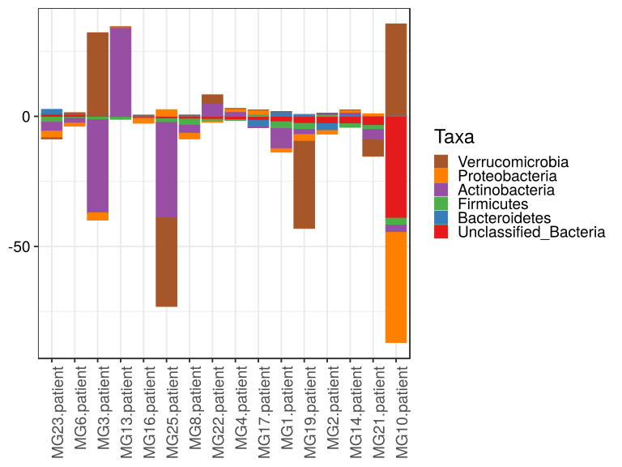

\(1.3.1.1.5.2.2.2.1.1.1\) [`Figure 438.`](#figure.438) Log2 fold change in abundance between paired samples. Samples are paired according to attribute MatchedGroupID, resulting in 16 pairs. When fold change or difference is computed, this is done as 'patient by control'. Data for all pooled samples. Sorting order of features is GeneSelector paired test ranking. bar (sample median) plot.  Image file: [`plots/32398f4943.svg`](plots/32398f4943.svg).
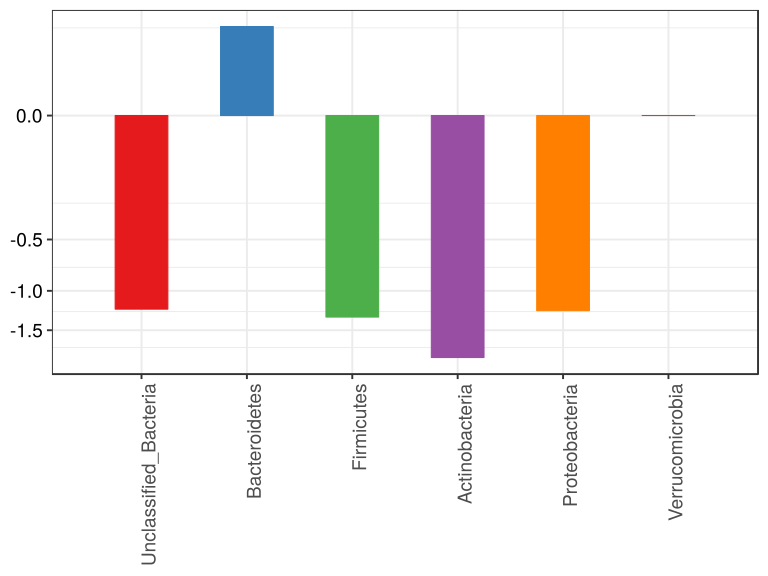

\(1.3.1.1.5.2.2.2.1.1.1\) [`Figure 439.`](#figure.439) Log2 fold change in abundance between paired samples. Samples are paired according to attribute MatchedGroupID, resulting in 16 pairs. When fold change or difference is computed, this is done as 'patient by control'. Data for all pooled samples. Sorting order of features is GeneSelector paired test ranking. violin plot.  Image file: [`plots/323586e779.svg`](plots/323586e779.svg).
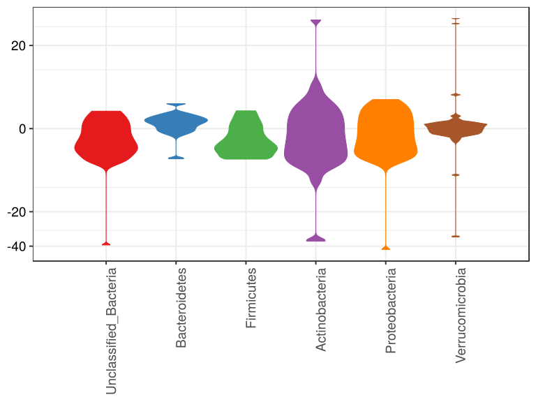

\(1.3.1.1.5.2.2.2.1.1.1\) [`Figure 440.`](#figure.440) Log2 fold change in abundance between paired samples. Samples are paired according to attribute MatchedGroupID, resulting in 16 pairs. When fold change or difference is computed, this is done as 'patient by control'. Data for all pooled samples. Sorting order of features is GeneSelector paired test ranking. boxplot plot.  Image file: [`plots/32379de05bd.svg`](plots/32379de05bd.svg).
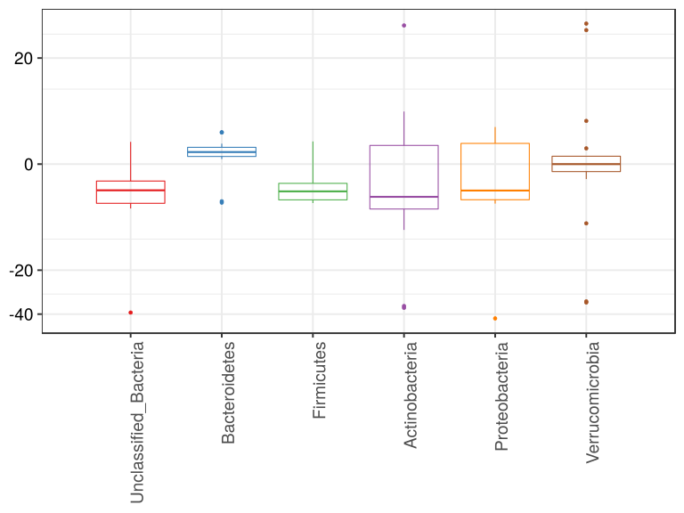

##### \(1.3.1.1.5.2.2.2.1.2\) Log2 fold change in abundance between paired samples. Samples are paired according to attribute MatchedGroupID, resulting in 16 pairs. When fold change or difference is computed, this is done as 'patient by control'. Plot is in flipped orientation, Y axis not scaled. Iterating over plot geometry

\(1.3.1.1.5.2.2.2.1.2.1\) [`Figure 441.`](#figure.441) Log2 fold change in abundance between paired samples. Samples are paired according to attribute MatchedGroupID, resulting in 16 pairs. When fold change or difference is computed, this is done as 'patient by control'. Data for all pooled samples. Sorting order of features is GeneSelector paired test ranking. bar (sample median) plot.  Image file: [`plots/3236de5bd9e.svg`](plots/3236de5bd9e.svg).
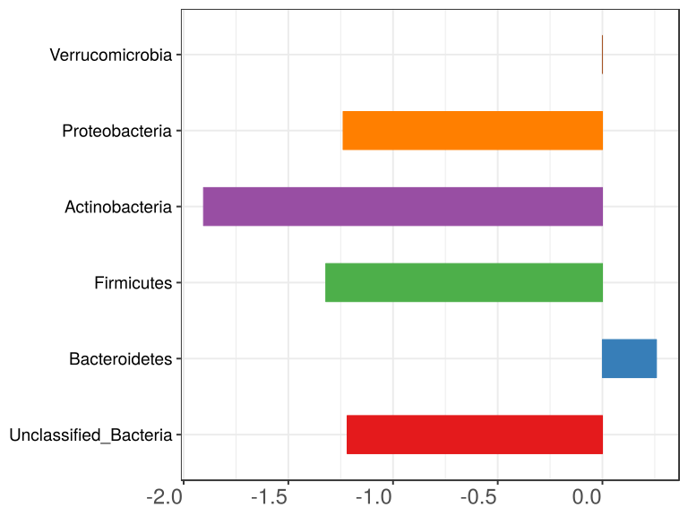

\(1.3.1.1.5.2.2.2.1.2.1\) [`Figure 442.`](#figure.442) Log2 fold change in abundance between paired samples. Samples are paired according to attribute MatchedGroupID, resulting in 16 pairs. When fold change or difference is computed, this is done as 'patient by control'. Data for all pooled samples. Sorting order of features is GeneSelector paired test ranking. violin plot.  Image file: [`plots/3237b7c00a8.svg`](plots/3237b7c00a8.svg).
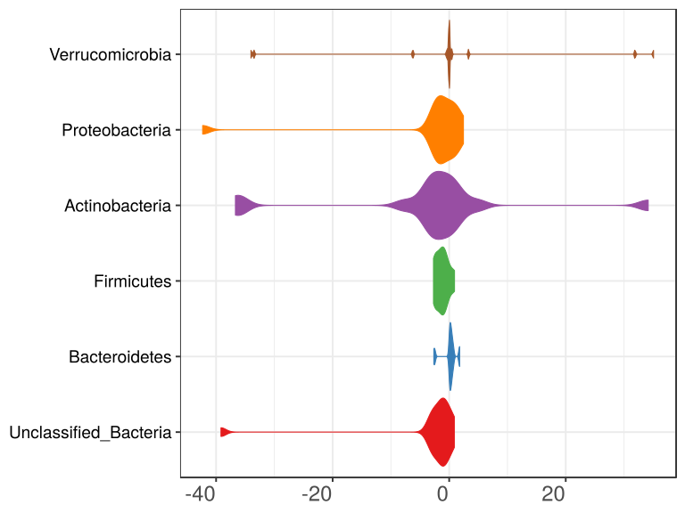

\(1.3.1.1.5.2.2.2.1.2.1\) [`Figure 443.`](#figure.443) Log2 fold change in abundance between paired samples. Samples are paired according to attribute MatchedGroupID, resulting in 16 pairs. When fold change or difference is computed, this is done as 'patient by control'. Data for all pooled samples. Sorting order of features is GeneSelector paired test ranking. boxplot plot.  Image file: [`plots/323634df98e.svg`](plots/323634df98e.svg).
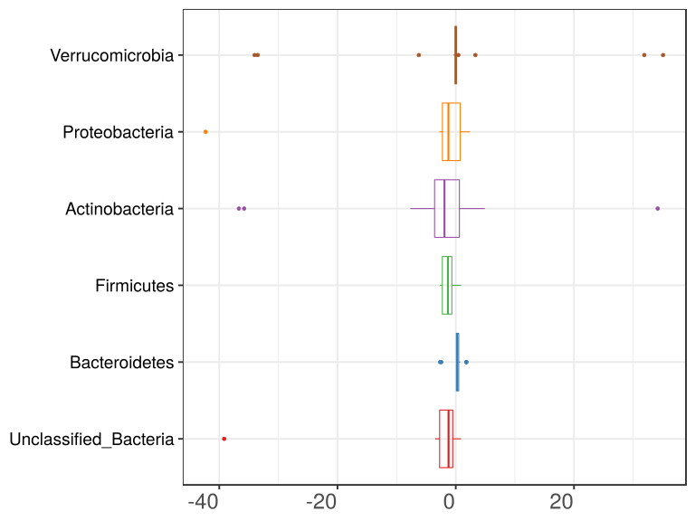

##### \(1.3.1.1.5.2.3\) Grouping variables age.quant

##### \(1.3.1.1.5.2.4\) Iterating over Log2 fold change in abundance between paired samples. Samples are paired according to attribute MatchedGroupID, resulting in 16 pairs. When fold change or difference is computed, this is done as 'patient by control'. profile sorting order

##### \(1.3.1.1.5.2.4.1\) Log2 fold change in abundance between paired samples. Samples are paired according to attribute MatchedGroupID, resulting in 16 pairs. When fold change or difference is computed, this is done as 'patient by control'. profile sorting order: GeneSelector paired test ranking

##### \(1.3.1.1.5.2.4.2\) Iterating over dodged vs faceted bars

The same data are shown in multiple combinations of graphical representations. 
                         This is the same data, but each plot highlights slightly different aspects of it.
                         It is not likely that you will need every plot - pick only what you need.

##### \(1.3.1.1.5.2.4.2.1\) faceted plots. Iterating over orientation and, optionally, scaling

##### \(1.3.1.1.5.2.4.2.1.1\) Log2 fold change in abundance between paired samples. Samples are paired according to attribute MatchedGroupID, resulting in 16 pairs. When fold change or difference is computed, this is done as 'patient by control'. Plot is in original orientation, Y axis SQRT scaled. Iterating over plot geometry

\(1.3.1.1.5.2.4.2.1.1.0\) [`Table 113.`](#table.113) Data table used for plots. Data grouped by age.quant. Full dataset is also saved in a delimited text file (click to download and open e.g. in Excel) [`data/1.3.1.1.5.2.4.2.1.1.0-323738e266.1.3.1.1.5.2.4.2.1.1.csv`](data/1.3.1.1.5.2.4.2.1.1.0-323738e266.1.3.1.1.5.2.4.2.1.1.csv)

| .record.id   | age.quant     | feature                | l2fc       |
|:-------------|:--------------|:-----------------------|:-----------|
| MG1.patient  | \(15.3,26.4\] | Bacteroidetes          | 1.79713    |
| MG10.patient | \(8.71,15.3\] | Bacteroidetes          | 0.42787    |
| MG13.patient | \(15.3,26.4\] | Bacteroidetes          | 0.06326    |
| MG14.patient | \(15.3,26.4\] | Bacteroidetes          | 0.63968    |
| MG16.patient | \(15.3,26.4\] | Bacteroidetes          | 0.43311    |
| MG17.patient | \(15.3,26.4\] | Bacteroidetes          | \-2.45355  |
| MG19.patient | \(6.27,8.71\] | Bacteroidetes          | 0.74136    |
| MG2.patient  | \(8.71,15.3\] | Bacteroidetes          | \-2.63801  |
| MG21.patient | \(15.3,26.4\] | Bacteroidetes          | 0.25560    |
| MG22.patient | \(8.71,15.3\] | Bacteroidetes          | 0.04488    |
| MG23.patient | \(6.27,8.71\] | Bacteroidetes          | 1.78433    |
| MG25.patient | \[3.18,6.27\] | Bacteroidetes          | 0.11828    |
| MG3.patient  | \(6.27,8.71\] | Bacteroidetes          | 0.14712    |
| MG4.patient  | \(6.27,8.71\] | Bacteroidetes          | 0.17829    |
| MG6.patient  | \(8.71,15.3\] | Bacteroidetes          | 0.26008    |
| MG8.patient  | \[3.18,6.27\] | Bacteroidetes          | 0.45339    |
| MG1.patient  | \(15.3,26.4\] | Firmicutes             | \-2.65893  |
| MG10.patient | \(8.71,15.3\] | Firmicutes             | \-2.69578  |
| MG13.patient | \(15.3,26.4\] | Firmicutes             | \-0.78777  |
| MG14.patient | \(15.3,26.4\] | Firmicutes             | \-1.33521  |
| MG16.patient | \(15.3,26.4\] | Firmicutes             | \-0.35868  |
| MG17.patient | \(15.3,26.4\] | Firmicutes             | 0.91529    |
| MG19.patient | \(6.27,8.71\] | Firmicutes             | \-2.32043  |
| MG2.patient  | \(8.71,15.3\] | Firmicutes             | 0.70765    |
| MG21.patient | \(15.3,26.4\] | Firmicutes             | \-1.53617  |
| MG22.patient | \(8.71,15.3\] | Firmicutes             | \-0.81663  |
| MG23.patient | \(6.27,8.71\] | Firmicutes             | \-2.25836  |
| MG25.patient | \[3.18,6.27\] | Firmicutes             | \-1.45747  |
| MG3.patient  | \(6.27,8.71\] | Firmicutes             | \-1.30699  |
| MG4.patient  | \(6.27,8.71\] | Firmicutes             | \-0.26084  |
| MG6.patient  | \(8.71,15.3\] | Firmicutes             | \-0.75706  |
| MG8.patient  | \[3.18,6.27\] | Firmicutes             | \-2.37707  |
| MG1.patient  | \(15.3,26.4\] | Proteobacteria         | \-1.30258  |
| MG10.patient | \(8.71,15.3\] | Proteobacteria         | \-42.30766 |
| MG13.patient | \(15.3,26.4\] | Proteobacteria         | 0.21261    |
| MG14.patient | \(15.3,26.4\] | Proteobacteria         | 0.81458    |
| MG16.patient | \(15.3,26.4\] | Proteobacteria         | \-1.64493  |
| MG17.patient | \(15.3,26.4\] | Proteobacteria         | 1.53331    |
| MG19.patient | \(6.27,8.71\] | Proteobacteria         | \-2.57758  |
| MG2.patient  | \(8.71,15.3\] | Proteobacteria         | \-1.34682  |
| MG21.patient | \(15.3,26.4\] | Proteobacteria         | 0.74366    |
| MG22.patient | \(8.71,15.3\] | Proteobacteria         | \-0.31299  |
| MG23.patient | \(6.27,8.71\] | Proteobacteria         | \-2.57827  |
| MG25.patient | \[3.18,6.27\] | Proteobacteria         | 2.44712    |
| MG3.patient  | \(6.27,8.71\] | Proteobacteria         | \-2.77041  |
| MG4.patient  | \(6.27,8.71\] | Proteobacteria         | 1.19166    |
| MG6.patient  | \(8.71,15.3\] | Proteobacteria         | \-1.17428  |
| MG8.patient  | \[3.18,6.27\] | Proteobacteria         | \-2.15167  |
| MG1.patient  | \(15.3,26.4\] | Actinobacteria         | \-7.68950  |
| MG10.patient | \(8.71,15.3\] | Actinobacteria         | \-2.76451  |
| MG13.patient | \(15.3,26.4\] | Actinobacteria         | 34.15568   |
| MG14.patient | \(15.3,26.4\] | Actinobacteria         | 0.96917    |
| MG16.patient | \(15.3,26.4\] | Actinobacteria         | \-0.05078  |
| MG17.patient | \(15.3,26.4\] | Actinobacteria         | \-0.39668  |
| MG19.patient | \(6.27,8.71\] | Actinobacteria         | \-1.96989  |
| MG2.patient  | \(8.71,15.3\] | Actinobacteria         | 0.50437    |
| MG21.patient | \(15.3,26.4\] | Actinobacteria         | \-4.06577  |
| MG22.patient | \(8.71,15.3\] | Actinobacteria         | 4.91733    |
| MG23.patient | \(6.27,8.71\] | Actinobacteria         | \-3.41730  |
| MG25.patient | \[3.18,6.27\] | Actinobacteria         | \-36.68297 |
| MG3.patient  | \(6.27,8.71\] | Actinobacteria         | \-35.79175 |
| MG4.patient  | \(6.27,8.71\] | Actinobacteria         | 1.63755    |
| MG6.patient  | \(8.71,15.3\] | Actinobacteria         | \-1.84018  |
| MG8.patient  | \[3.18,6.27\] | Actinobacteria         | \-3.07451  |
| MG1.patient  | \(15.3,26.4\] | Unclassified\_Bacteria | \-2.08337  |
| MG10.patient | \(8.71,15.3\] | Unclassified\_Bacteria | \-39.16003 |
| MG13.patient | \(15.3,26.4\] | Unclassified\_Bacteria | \-0.33628  |
| MG14.patient | \(15.3,26.4\] | Unclassified\_Bacteria | \-2.86270  |
| MG16.patient | \(15.3,26.4\] | Unclassified\_Bacteria | \-0.56534  |
| MG17.patient | \(15.3,26.4\] | Unclassified\_Bacteria | \-1.49259  |
| MG19.patient | \(6.27,8.71\] | Unclassified\_Bacteria | \-2.70090  |
| MG2.patient  | \(8.71,15.3\] | Unclassified\_Bacteria | \-2.80825  |
| MG21.patient | \(15.3,26.4\] | Unclassified\_Bacteria | \-3.49394  |
| MG22.patient | \(8.71,15.3\] | Unclassified\_Bacteria | \-1.14862  |
| MG23.patient | \(6.27,8.71\] | Unclassified\_Bacteria | 0.88028    |
| MG25.patient | \[3.18,6.27\] | Unclassified\_Bacteria | \-0.89808  |
| MG3.patient  | \(6.27,8.71\] | Unclassified\_Bacteria | 0.08741    |
| MG4.patient  | \(6.27,8.71\] | Unclassified\_Bacteria | \-1.28956  |
| MG6.patient  | \(8.71,15.3\] | Unclassified\_Bacteria | 0.71306    |
| MG8.patient  | \[3.18,6.27\] | Unclassified\_Bacteria | \-1.04651  |
| MG1.patient  | \(15.3,26.4\] | Verrucomicrobia        | 0.00000    |
| MG10.patient | \(8.71,15.3\] | Verrucomicrobia        | 35.07363   |
| MG13.patient | \(15.3,26.4\] | Verrucomicrobia        | 0.00000    |
| MG14.patient | \(15.3,26.4\] | Verrucomicrobia        | 0.00000    |
| MG16.patient | \(15.3,26.4\] | Verrucomicrobia        | 0.00000    |
| MG17.patient | \(15.3,26.4\] | Verrucomicrobia        | 0.00000    |
| MG19.patient | \(6.27,8.71\] | Verrucomicrobia        | \-33.49389 |
| MG2.patient  | \(8.71,15.3\] | Verrucomicrobia        | 0.00000    |
| MG21.patient | \(15.3,26.4\] | Verrucomicrobia        | \-6.23569  |
| MG22.patient | \(8.71,15.3\] | Verrucomicrobia        | 3.31688    |
| MG23.patient | \(6.27,8.71\] | Verrucomicrobia        | \-0.39939  |
| MG25.patient | \[3.18,6.27\] | Verrucomicrobia        | \-34.02001 |
| MG3.patient  | \(6.27,8.71\] | Verrucomicrobia        | 31.89262   |
| MG4.patient  | \(6.27,8.71\] | Verrucomicrobia        | 0.00000    |
| MG6.patient  | \(8.71,15.3\] | Verrucomicrobia        | 0.43982    |
| MG8.patient  | \[3.18,6.27\] | Verrucomicrobia        | 0.00000    |

\(1.3.1.1.5.2.4.2.1.1.1\) [`Widget 121.`](#widget.121) Dynamic Pivot Table link (drag and drop field names and pick averaging 
                      functions or plot types; click on fields or legend elements to filter values). 
                      Starting rendering is Stacked Bar Chart. Data grouped by age.quant. Click to see HTML widget file in full window: [`./1.3.1.1.5.2.4.2.1.1.1-3231656e7a5Dynamic.Pivot.Table.html`](./1.3.1.1.5.2.4.2.1.1.1-3231656e7a5Dynamic.Pivot.Table.html)

\(1.3.1.1.5.2.4.2.1.1.1\) [`Widget 122.`](#widget.122) Dynamic Pivot Table link (drag and drop field names and pick averaging 
                      functions or plot types; click on fields or legend elements to filter values). 
                      Starting rendering is Table Barchart. Data grouped by age.quant. Click to see HTML widget file in full window: [`./1.3.1.1.5.2.4.2.1.1.1-3232c5bfddDynamic.Pivot.Table.html`](./1.3.1.1.5.2.4.2.1.1.1-3232c5bfddDynamic.Pivot.Table.html)

\(1.3.1.1.5.2.4.2.1.1.1\) [`Table 114.`](#table.114) Summary table. Data grouped by age.quant. Full dataset is also saved in a delimited text file (click to download and open e.g. in Excel) [`data/1.3.1.1.5.2.4.2.1.1.1-3231a81c650.1.3.1.1.5.2.4.2.1.1.csv`](data/1.3.1.1.5.2.4.2.1.1.1-3231a81c650.1.3.1.1.5.2.4.2.1.1.csv)

| feature                | age.quant     | mean       | sd      | median    | incidence |
|:-----------------------|:--------------|:-----------|:--------|:----------|:----------|
| Unclassified\_Bacteria | \[3.18,6.27\] | \-0.97230  | 0.1050  | \-0.9723  | 0.0000    |
| Unclassified\_Bacteria | \(6.27,8.71\] | \-0.75569  | 1.5765  | \-0.6011  | 0.5000    |
| Unclassified\_Bacteria | \(8.71,15.3\] | \-10.60096 | 19.0936 | \-1.9784  | 0.2500    |
| Unclassified\_Bacteria | \(15.3,26.4\] | \-1.80570  | 1.2522  | \-1.7880  | 0.0000    |
| Bacteroidetes          | \[3.18,6.27\] | 0.28584    | 0.2370  | 0.2858    | 1.0000    |
| Bacteroidetes          | \(6.27,8.71\] | 0.71277    | 0.7648  | 0.4598    | 1.0000    |
| Bacteroidetes          | \(8.71,15.3\] | \-0.47630  | 1.4496  | 0.1525    | 0.7500    |
| Bacteroidetes          | \(15.3,26.4\] | 0.12254    | 1.4018  | 0.3444    | 0.8333    |
| Firmicutes             | \[3.18,6.27\] | \-1.91727  | 0.6503  | \-1.9173  | 0.0000    |
| Firmicutes             | \(6.27,8.71\] | \-1.53666  | 0.9688  | \-1.7827  | 0.0000    |
| Firmicutes             | \(8.71,15.3\] | \-0.89046  | 1.3948  | \-0.7868  | 0.2500    |
| Firmicutes             | \(15.3,26.4\] | \-0.96025  | 1.2056  | \-1.0615  | 0.1667    |
| Actinobacteria         | \[3.18,6.27\] | \-19.87874 | 23.7648 | \-19.8787 | 0.0000    |
| Actinobacteria         | \(6.27,8.71\] | \-9.88535  | 17.4012 | \-2.6936  | 0.2500    |
| Actinobacteria         | \(8.71,15.3\] | 0.20425    | 3.4301  | \-0.6679  | 0.5000    |
| Actinobacteria         | \(15.3,26.4\] | 3.82035    | 15.2039 | \-0.2237  | 0.3333    |
| Proteobacteria         | \[3.18,6.27\] | 0.14772    | 3.2518  | 0.1477    | 0.5000    |
| Proteobacteria         | \(6.27,8.71\] | \-1.68365  | 1.9190  | \-2.5779  | 0.2500    |
| Proteobacteria         | \(8.71,15.3\] | \-11.28544 | 20.6864 | \-1.2605  | 0.0000    |
| Proteobacteria         | \(15.3,26.4\] | 0.05944    | 1.2644  | 0.4781    | 0.6667    |
| Verrucomicrobia        | \[3.18,6.27\] | \-17.01000 | 24.0558 | \-17.0100 | 0.0000    |
| Verrucomicrobia        | \(6.27,8.71\] | \-0.50017  | 26.6967 | \-0.1997  | 0.2500    |
| Verrucomicrobia        | \(8.71,15.3\] | 9.70758    | 16.9746 | 1.8783    | 0.7500    |
| Verrucomicrobia        | \(15.3,26.4\] | \-1.03928  | 2.5457  | 0.0000    | 0.0000    |

\(1.3.1.1.5.2.4.2.1.1.1\) [`Figure 444.`](#figure.444) Log2 fold change in abundance between paired samples. Samples are paired according to attribute MatchedGroupID, resulting in 16 pairs. When fold change or difference is computed, this is done as 'patient by control'. Data grouped by age.quant. Sorting order of features is GeneSelector paired test ranking. bar_stacked plot.  Image file: [`plots/32362eaad48.svg`](plots/32362eaad48.svg).
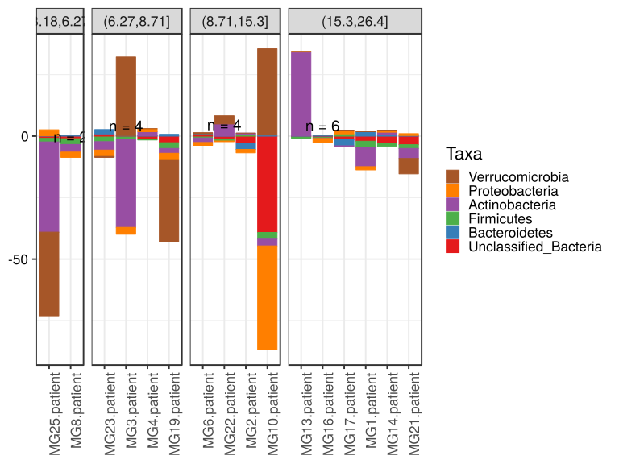

\(1.3.1.1.5.2.4.2.1.1.1\) [`Figure 445.`](#figure.445) Log2 fold change in abundance between paired samples. Samples are paired according to attribute MatchedGroupID, resulting in 16 pairs. When fold change or difference is computed, this is done as 'patient by control'. Data grouped by age.quant. Sorting order of features is GeneSelector paired test ranking. bar (sample median) plot.  Image file: [`plots/32349fda3dd.svg`](plots/32349fda3dd.svg).
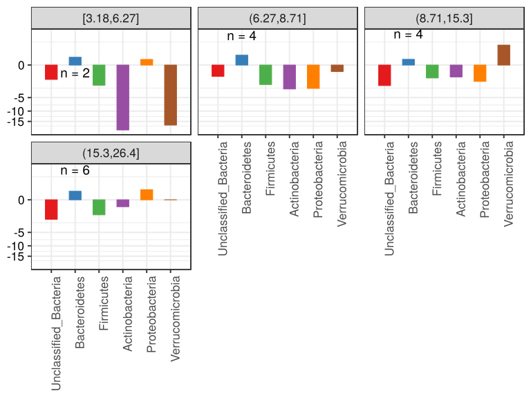

\(1.3.1.1.5.2.4.2.1.1.1\) [`Figure 446.`](#figure.446) Log2 fold change in abundance between paired samples. Samples are paired according to attribute MatchedGroupID, resulting in 16 pairs. When fold change or difference is computed, this is done as 'patient by control'. Data grouped by age.quant. Sorting order of features is GeneSelector paired test ranking. violin plot.  Image file: [`plots/323250a896.svg`](plots/323250a896.svg).
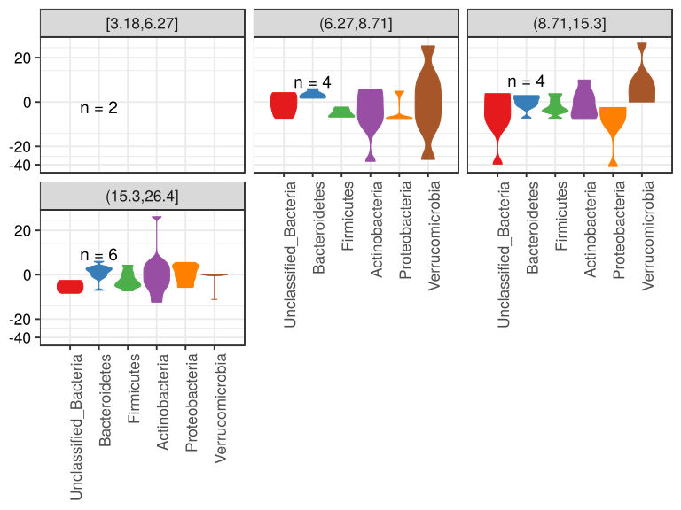

\(1.3.1.1.5.2.4.2.1.1.1\) [`Figure 447.`](#figure.447) Log2 fold change in abundance between paired samples. Samples are paired according to attribute MatchedGroupID, resulting in 16 pairs. When fold change or difference is computed, this is done as 'patient by control'. Data grouped by age.quant. Sorting order of features is GeneSelector paired test ranking. boxplot plot.  Image file: [`plots/32314af62a6.svg`](plots/32314af62a6.svg).
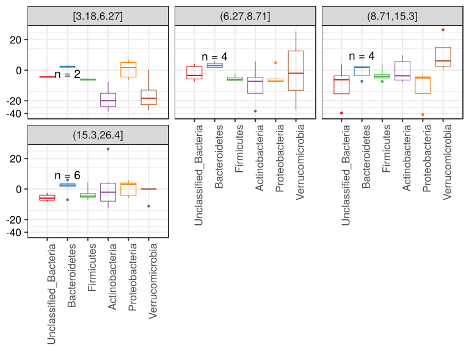

##### \(1.3.1.1.5.2.4.2.1.2\) Log2 fold change in abundance between paired samples. Samples are paired according to attribute MatchedGroupID, resulting in 16 pairs. When fold change or difference is computed, this is done as 'patient by control'. Plot is in flipped orientation, Y axis not scaled. Iterating over plot geometry

\(1.3.1.1.5.2.4.2.1.2.1\) [`Figure 448.`](#figure.448) Log2 fold change in abundance between paired samples. Samples are paired according to attribute MatchedGroupID, resulting in 16 pairs. When fold change or difference is computed, this is done as 'patient by control'. Data grouped by age.quant. Sorting order of features is GeneSelector paired test ranking. bar (sample median) plot.  Image file: [`plots/323179ad55c.svg`](plots/323179ad55c.svg).
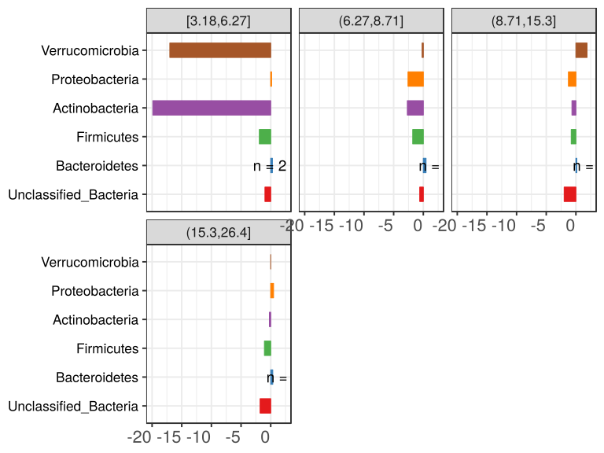

\(1.3.1.1.5.2.4.2.1.2.1\) [`Figure 449.`](#figure.449) Log2 fold change in abundance between paired samples. Samples are paired according to attribute MatchedGroupID, resulting in 16 pairs. When fold change or difference is computed, this is done as 'patient by control'. Data grouped by age.quant. Sorting order of features is GeneSelector paired test ranking. violin plot.  Image file: [`plots/3234ddccaae.svg`](plots/3234ddccaae.svg).
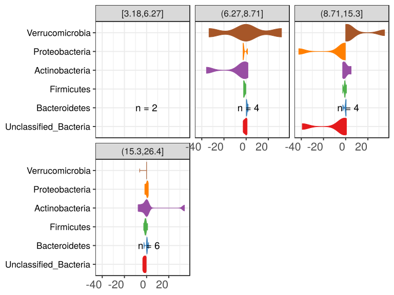

\(1.3.1.1.5.2.4.2.1.2.1\) [`Figure 450.`](#figure.450) Log2 fold change in abundance between paired samples. Samples are paired according to attribute MatchedGroupID, resulting in 16 pairs. When fold change or difference is computed, this is done as 'patient by control'. Data grouped by age.quant. Sorting order of features is GeneSelector paired test ranking. boxplot plot.  Image file: [`plots/323c168f52.svg`](plots/323c168f52.svg).
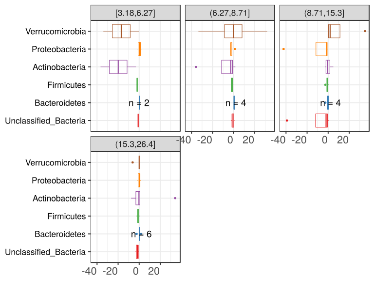

##### \(1.3.1.1.5.2.4.2.2\) dodged plots. Iterating over orientation and, optionally, scaling

##### \(1.3.1.1.5.2.4.2.2.1\) Log2 fold change in abundance between paired samples. Samples are paired according to attribute MatchedGroupID, resulting in 16 pairs. When fold change or difference is computed, this is done as 'patient by control'. Plot is in original orientation, Y axis SQRT scaled. Iterating over plot geometry

\(1.3.1.1.5.2.4.2.2.1.1\) [`Figure 451.`](#figure.451) Log2 fold change in abundance between paired samples. Samples are paired according to attribute MatchedGroupID, resulting in 16 pairs. When fold change or difference is computed, this is done as 'patient by control'. Data grouped by age.quant. Sorting order of features is GeneSelector paired test ranking. bar (sample median) plot.  Image file: [`plots/323239d2b9.svg`](plots/323239d2b9.svg).
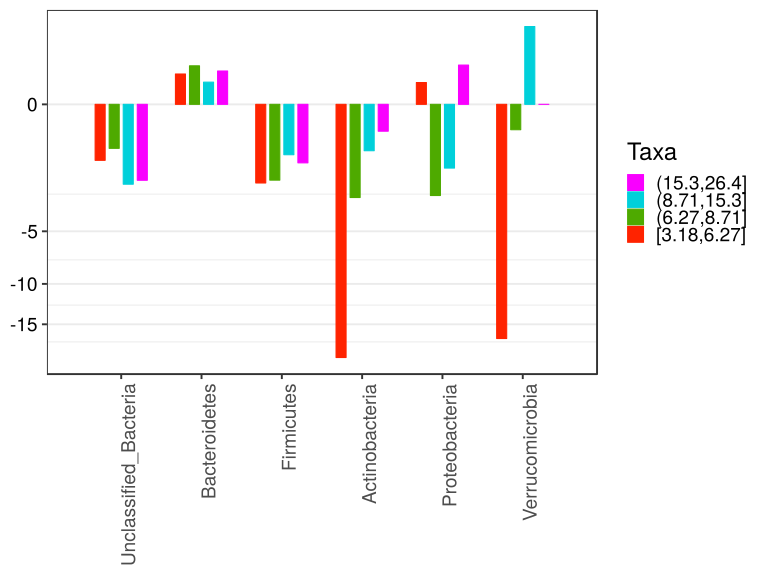

\(1.3.1.1.5.2.4.2.2.1.1\) [`Figure 452.`](#figure.452) Log2 fold change in abundance between paired samples. Samples are paired according to attribute MatchedGroupID, resulting in 16 pairs. When fold change or difference is computed, this is done as 'patient by control'. Data grouped by age.quant. Sorting order of features is GeneSelector paired test ranking. violin plot.  Image file: [`plots/3237219d008.svg`](plots/3237219d008.svg).
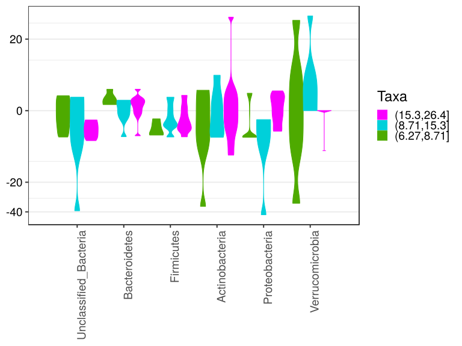

\(1.3.1.1.5.2.4.2.2.1.1\) [`Figure 453.`](#figure.453) Log2 fold change in abundance between paired samples. Samples are paired according to attribute MatchedGroupID, resulting in 16 pairs. When fold change or difference is computed, this is done as 'patient by control'. Data grouped by age.quant. Sorting order of features is GeneSelector paired test ranking. boxplot plot.  Image file: [`plots/3233c318a22.svg`](plots/3233c318a22.svg).
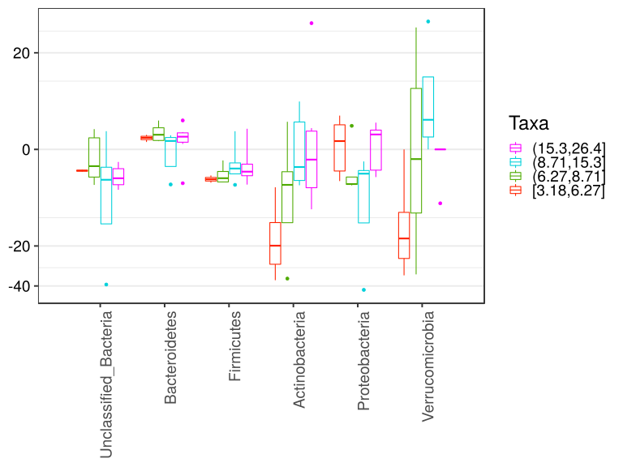

##### \(1.3.1.1.5.2.4.2.2.2\) Log2 fold change in abundance between paired samples. Samples are paired according to attribute MatchedGroupID, resulting in 16 pairs. When fold change or difference is computed, this is done as 'patient by control'. Plot is in flipped orientation, Y axis not scaled. Iterating over plot geometry

\(1.3.1.1.5.2.4.2.2.2.1\) [`Figure 454.`](#figure.454) Log2 fold change in abundance between paired samples. Samples are paired according to attribute MatchedGroupID, resulting in 16 pairs. When fold change or difference is computed, this is done as 'patient by control'. Data grouped by age.quant. Sorting order of features is GeneSelector paired test ranking. bar (sample median) plot.  Image file: [`plots/323f748b60.svg`](plots/323f748b60.svg).
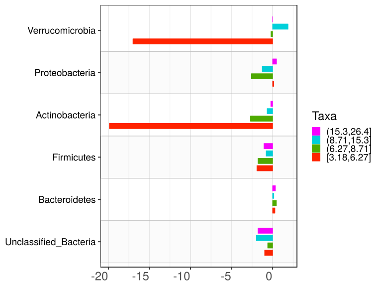

\(1.3.1.1.5.2.4.2.2.2.1\) [`Figure 455.`](#figure.455) Log2 fold change in abundance between paired samples. Samples are paired according to attribute MatchedGroupID, resulting in 16 pairs. When fold change or difference is computed, this is done as 'patient by control'. Data grouped by age.quant. Sorting order of features is GeneSelector paired test ranking. violin plot.  Image file: [`plots/3234ab8c626.svg`](plots/3234ab8c626.svg).
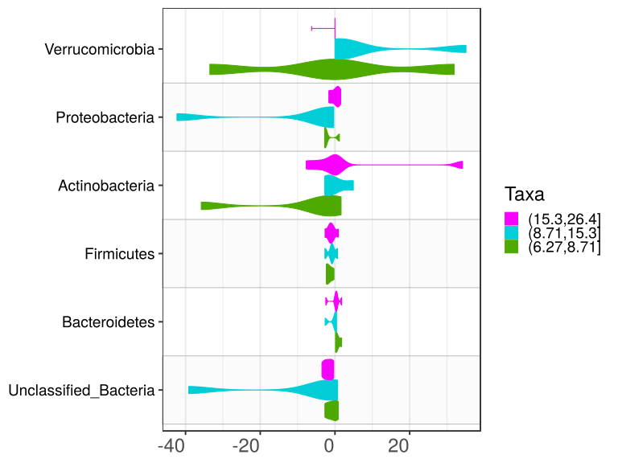

\(1.3.1.1.5.2.4.2.2.2.1\) [`Figure 456.`](#figure.456) Log2 fold change in abundance between paired samples. Samples are paired according to attribute MatchedGroupID, resulting in 16 pairs. When fold change or difference is computed, this is done as 'patient by control'. Data grouped by age.quant. Sorting order of features is GeneSelector paired test ranking. boxplot plot.  Image file: [`plots/3234cff042a.svg`](plots/3234cff042a.svg).
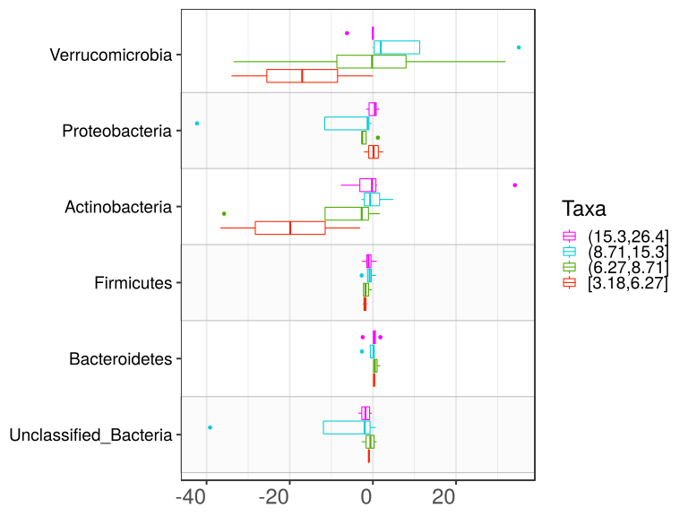