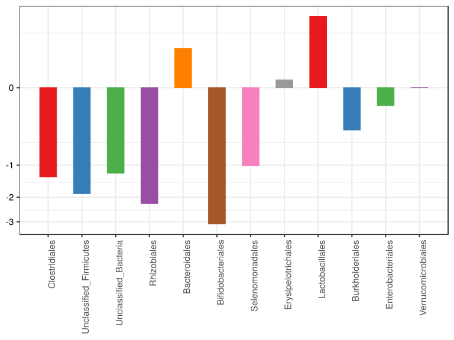
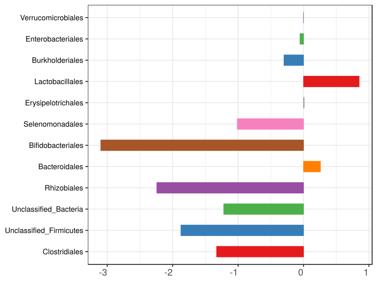
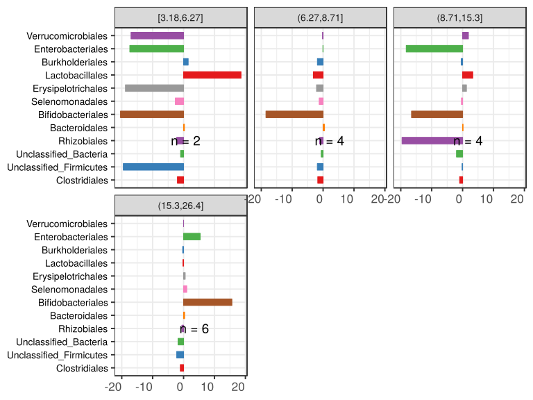

noone@mail.com
Analysis of Dieting study 16S data
% Fri Sep  7 05:46:18 2018

##### \(1.3.1.2.5\) Plots of Log2 fold change in abundance between paired samples. Samples are paired according to attribute MatchedGroupID, resulting in 16 pairs. When fold change or difference is computed, this is done as 'patient by control'.

Plots are shown with relation to various combinations of meta 
                   data variables and in different graphical representations. Lots of plots here.

##### \(1.3.1.2.5.2\) Iterating over all combinations of grouping variables

##### \(1.3.1.2.5.2.1\) Entire pool of samples

##### \(1.3.1.2.5.2.2\) Iterating over Log2 fold change in abundance between paired samples. Samples are paired according to attribute MatchedGroupID, resulting in 16 pairs. When fold change or difference is computed, this is done as 'patient by control'. profile sorting order

##### \(1.3.1.2.5.2.2.1\) Log2 fold change in abundance between paired samples. Samples are paired according to attribute MatchedGroupID, resulting in 16 pairs. When fold change or difference is computed, this is done as 'patient by control'. profile sorting order: GeneSelector paired test ranking

##### \(1.3.1.2.5.2.2.2\) Iterating over dodged vs faceted bars

The same data are shown in multiple combinations of graphical representations. 
                         This is the same data, but each plot highlights slightly different aspects of it.
                         It is not likely that you will need every plot - pick only what you need.

##### \(1.3.1.2.5.2.2.2.1\) faceted plots. Iterating over orientation and, optionally, scaling

##### \(1.3.1.2.5.2.2.2.1.1\) Log2 fold change in abundance between paired samples. Samples are paired according to attribute MatchedGroupID, resulting in 16 pairs. When fold change or difference is computed, this is done as 'patient by control'. Plot is in original orientation, Y axis SQRT scaled. Iterating over plot geometry

\(1.3.1.2.5.2.2.2.1.1.0\) [`Table 120.`](#table.120) Data table used for plots. Data for all pooled samples. Full dataset is also saved in a delimited text file (click to download and open e.g. in Excel) [`data/1.3.1.2.5.2.2.2.1.1.0-3234a140df8.1.3.1.2.5.2.2.2.1.1.csv`](data/1.3.1.2.5.2.2.2.1.1.0-3234a140df8.1.3.1.2.5.2.2.2.1.1.csv)

| .record.id   | feature                  | l2fc       |
|:-------------|:-------------------------|:-----------|
| MG1.patient  | Bacteroidales            | 1.79821    |
| MG10.patient | Bacteroidales            | 0.42787    |
| MG13.patient | Bacteroidales            | 0.07411    |
| MG14.patient | Bacteroidales            | 0.63994    |
| MG16.patient | Bacteroidales            | 0.43466    |
| MG17.patient | Bacteroidales            | \-2.45355  |
| MG19.patient | Bacteroidales            | 0.74207    |
| MG2.patient  | Bacteroidales            | \-2.65506  |
| MG21.patient | Bacteroidales            | 0.25734    |
| MG22.patient | Bacteroidales            | 0.04676    |
| MG23.patient | Bacteroidales            | 1.79003    |
| MG25.patient | Bacteroidales            | 0.11849    |
| MG3.patient  | Bacteroidales            | 0.14523    |
| MG4.patient  | Bacteroidales            | 0.17717    |
| MG6.patient  | Bacteroidales            | 0.26098    |
| MG8.patient  | Bacteroidales            | 0.45354    |
| MG1.patient  | Clostridiales            | \-3.50280  |
| MG10.patient | Clostridiales            | \-2.71153  |
| MG13.patient | Clostridiales            | \-0.65366  |
| MG14.patient | Clostridiales            | \-1.45767  |
| MG16.patient | Clostridiales            | \-0.32817  |
| MG17.patient | Clostridiales            | 1.02526    |
| MG19.patient | Clostridiales            | \-2.32264  |
| MG2.patient  | Clostridiales            | \-0.69743  |
| MG21.patient | Clostridiales            | \-1.94949  |
| MG22.patient | Clostridiales            | \-1.09895  |
| MG23.patient | Clostridiales            | \-2.19684  |
| MG25.patient | Clostridiales            | \-1.40789  |
| MG3.patient  | Clostridiales            | \-1.24956  |
| MG4.patient  | Clostridiales            | 0.43098    |
| MG6.patient  | Clostridiales            | \-0.82551  |
| MG8.patient  | Clostridiales            | \-2.57281  |
| MG1.patient  | Erysipelotrichales       | 3.13722    |
| MG10.patient | Erysipelotrichales       | \-35.25318 |
| MG13.patient | Erysipelotrichales       | \-1.65339  |
| MG14.patient | Erysipelotrichales       | 0.75050    |
| MG16.patient | Erysipelotrichales       | 0.30622    |
| MG17.patient | Erysipelotrichales       | \-0.28555  |
| MG19.patient | Erysipelotrichales       | \-2.62196  |
| MG2.patient  | Erysipelotrichales       | 7.51187    |
| MG21.patient | Erysipelotrichales       | 2.74251    |
| MG22.patient | Erysipelotrichales       | 1.68772    |
| MG23.patient | Erysipelotrichales       | \-4.28491  |
| MG25.patient | Erysipelotrichales       | \-36.43505 |
| MG3.patient  | Erysipelotrichales       | \-1.64565  |
| MG4.patient  | Erysipelotrichales       | 3.23607    |
| MG6.patient  | Erysipelotrichales       | 0.80364    |
| MG8.patient  | Erysipelotrichales       | \-1.19167  |
| MG1.patient  | Lactobacillales          | \-1.34822  |
| MG10.patient | Lactobacillales          | 2.82045    |
| MG13.patient | Lactobacillales          | 1.04704    |
| MG14.patient | Lactobacillales          | \-1.84641  |
| MG16.patient | Lactobacillales          | 0.94922    |
| MG17.patient | Lactobacillales          | 3.76804    |
| MG19.patient | Lactobacillales          | \-36.95332 |
| MG2.patient  | Lactobacillales          | 9.83525    |
| MG21.patient | Lactobacillales          | \-3.14824  |
| MG22.patient | Lactobacillales          | 3.75823    |
| MG23.patient | Lactobacillales          | 0.75261    |
| MG25.patient | Lactobacillales          | 33.99639   |
| MG3.patient  | Lactobacillales          | \-1.69749  |
| MG4.patient  | Lactobacillales          | \-4.63004  |
| MG6.patient  | Lactobacillales          | \-36.48208 |
| MG8.patient  | Lactobacillales          | 3.17845    |
| MG1.patient  | Selenomonadales          | \-11.52651 |
| MG10.patient | Selenomonadales          | 0.00000    |
| MG13.patient | Selenomonadales          | \-3.77058  |
| MG14.patient | Selenomonadales          | 5.09845    |
| MG16.patient | Selenomonadales          | \-0.17036  |
| MG17.patient | Selenomonadales          | 2.25099    |
| MG19.patient | Selenomonadales          | 0.42242    |
| MG2.patient  | Selenomonadales          | \-35.44176 |
| MG21.patient | Selenomonadales          | 4.35555    |
| MG22.patient | Selenomonadales          | 0.54521    |
| MG23.patient | Selenomonadales          | \-1.24739  |
| MG25.patient | Selenomonadales          | \-3.02361  |
| MG3.patient  | Selenomonadales          | \-2.50573  |
| MG4.patient  | Selenomonadales          | \-1.28041  |
| MG6.patient  | Selenomonadales          | \-0.77869  |
| MG8.patient  | Selenomonadales          | \-2.35137  |
| MG1.patient  | Enterobacteriales        | \-36.20716 |
| MG10.patient | Enterobacteriales        | \-34.25318 |
| MG13.patient | Enterobacteriales        | \-35.97371 |
| MG14.patient | Enterobacteriales        | 31.86066   |
| MG16.patient | Enterobacteriales        | 36.81820   |
| MG17.patient | Enterobacteriales        | 10.74046   |
| MG19.patient | Enterobacteriales        | 0.00000    |
| MG2.patient  | Enterobacteriales        | 3.03937    |
| MG21.patient | Enterobacteriales        | 0.02168    |
| MG22.patient | Enterobacteriales        | \-33.90442 |
| MG23.patient | Enterobacteriales        | \-34.20640 |
| MG25.patient | Enterobacteriales        | 0.00000    |
| MG3.patient  | Enterobacteriales        | 0.00000    |
| MG4.patient  | Enterobacteriales        | \-0.10787  |
| MG6.patient  | Enterobacteriales        | \-2.57715  |
| MG8.patient  | Enterobacteriales        | \-34.78946 |
| MG1.patient  | Burkholderiales          | \-1.02121  |
| MG10.patient | Burkholderiales          | \-42.24994 |
| MG13.patient | Burkholderiales          | 0.42324    |
| MG14.patient | Burkholderiales          | 39.18255   |
| MG16.patient | Burkholderiales          | \-4.67077  |
| MG17.patient | Burkholderiales          | \-8.27369  |
| MG19.patient | Burkholderiales          | \-36.07886 |
| MG2.patient  | Burkholderiales          | \-2.18944  |
| MG21.patient | Burkholderiales          | 4.57945    |
| MG22.patient | Burkholderiales          | 1.26638    |
| MG23.patient | Burkholderiales          | 38.28092   |
| MG25.patient | Burkholderiales          | 4.72101    |
| MG3.patient  | Burkholderiales          | \-5.32976  |
| MG4.patient  | Burkholderiales          | 1.64700    |
| MG6.patient  | Burkholderiales          | 2.23663    |
| MG8.patient  | Burkholderiales          | \-1.74912  |
| MG1.patient  | Unclassified\_Bacteria   | \-2.08337  |
| MG10.patient | Unclassified\_Bacteria   | \-39.16003 |
| MG13.patient | Unclassified\_Bacteria   | \-0.33628  |
| MG14.patient | Unclassified\_Bacteria   | \-2.86270  |
| MG16.patient | Unclassified\_Bacteria   | \-0.56534  |
| MG17.patient | Unclassified\_Bacteria   | \-1.49259  |
| MG19.patient | Unclassified\_Bacteria   | \-2.70090  |
| MG2.patient  | Unclassified\_Bacteria   | \-2.80825  |
| MG21.patient | Unclassified\_Bacteria   | \-3.49394  |
| MG22.patient | Unclassified\_Bacteria   | \-1.14862  |
| MG23.patient | Unclassified\_Bacteria   | 0.88028    |
| MG25.patient | Unclassified\_Bacteria   | \-0.89808  |
| MG3.patient  | Unclassified\_Bacteria   | 0.08741    |
| MG4.patient  | Unclassified\_Bacteria   | \-1.28956  |
| MG6.patient  | Unclassified\_Bacteria   | 0.71306    |
| MG8.patient  | Unclassified\_Bacteria   | \-1.04651  |
| MG1.patient  | Bifidobacteriales        | \-40.49228 |
| MG10.patient | Bifidobacteriales        | \-34.83815 |
| MG13.patient | Bifidobacteriales        | 31.34833   |
| MG14.patient | Bifidobacteriales        | 34.66802   |
| MG16.patient | Bifidobacteriales        | 33.81820   |
| MG17.patient | Bifidobacteriales        | \-0.09207  |
| MG19.patient | Bifidobacteriales        | \-1.89950  |
| MG2.patient  | Bifidobacteriales        | 0.10077    |
| MG21.patient | Bifidobacteriales        | \-37.28922 |
| MG22.patient | Bifidobacteriales        | 5.87361    |
| MG23.patient | Bifidobacteriales        | \-38.20638 |
| MG25.patient | Bifidobacteriales        | \-36.52251 |
| MG3.patient  | Bifidobacteriales        | \-35.07554 |
| MG4.patient  | Bifidobacteriales        | \-0.46150  |
| MG6.patient  | Bifidobacteriales        | \-33.16016 |
| MG8.patient  | Bifidobacteriales        | \-4.29889  |
| MG1.patient  | Verrucomicrobiales       | 0.00000    |
| MG10.patient | Verrucomicrobiales       | 35.07363   |
| MG13.patient | Verrucomicrobiales       | 0.00000    |
| MG14.patient | Verrucomicrobiales       | 0.00000    |
| MG16.patient | Verrucomicrobiales       | 0.00000    |
| MG17.patient | Verrucomicrobiales       | 0.00000    |
| MG19.patient | Verrucomicrobiales       | \-33.49389 |
| MG2.patient  | Verrucomicrobiales       | 0.00000    |
| MG21.patient | Verrucomicrobiales       | \-6.23569  |
| MG22.patient | Verrucomicrobiales       | 3.31688    |
| MG23.patient | Verrucomicrobiales       | \-0.39939  |
| MG25.patient | Verrucomicrobiales       | \-34.02001 |
| MG3.patient  | Verrucomicrobiales       | 31.89262   |
| MG4.patient  | Verrucomicrobiales       | 0.00000    |
| MG6.patient  | Verrucomicrobiales       | 0.43982    |
| MG8.patient  | Verrucomicrobiales       | 0.00000    |
| MG1.patient  | Unclassified\_Firmicutes | \-2.22284  |
| MG10.patient | Unclassified\_Firmicutes | \-38.74501 |
| MG13.patient | Unclassified\_Firmicutes | \-2.67542  |
| MG14.patient | Unclassified\_Firmicutes | \-0.50166  |
| MG16.patient | Unclassified\_Firmicutes | \-3.52011  |
| MG17.patient | Unclassified\_Firmicutes | \-0.51908  |
| MG19.patient | Unclassified\_Firmicutes | \-1.74750  |
| MG2.patient  | Unclassified\_Firmicutes | 0.32629    |
| MG21.patient | Unclassified\_Firmicutes | \-2.22624  |
| MG22.patient | Unclassified\_Firmicutes | 1.02127    |
| MG23.patient | Unclassified\_Firmicutes | \-3.41730  |
| MG25.patient | Unclassified\_Firmicutes | \-37.24240 |
| MG3.patient  | Unclassified\_Firmicutes | \-0.82808  |
| MG4.patient  | Unclassified\_Firmicutes | \-1.98234  |
| MG6.patient  | Unclassified\_Firmicutes | \-0.65911  |
| MG8.patient  | Unclassified\_Firmicutes | \-1.76640  |
| MG1.patient  | Rhizobiales              | 0.01693    |
| MG10.patient | Rhizobiales              | \-35.57511 |
| MG13.patient | Rhizobiales              | 0.57756    |
| MG14.patient | Rhizobiales              | \-0.72556  |
| MG16.patient | Rhizobiales              | \-0.39181  |
| MG17.patient | Rhizobiales              | \-3.63633  |
| MG19.patient | Rhizobiales              | 0.00000    |
| MG2.patient  | Rhizobiales              | \-3.62239  |
| MG21.patient | Rhizobiales              | \-5.79207  |
| MG22.patient | Rhizobiales              | \-0.69403  |
| MG23.patient | Rhizobiales              | 0.00000    |
| MG25.patient | Rhizobiales              | \-2.20417  |
| MG3.patient  | Rhizobiales              | \-2.30447  |
| MG4.patient  | Rhizobiales              | \-31.53198 |
| MG6.patient  | Rhizobiales              | \-37.40808 |
| MG8.patient  | Rhizobiales              | \-2.28098  |

\(1.3.1.2.5.2.2.2.1.1.1\) [`Widget 130.`](#widget.130) Dynamic Pivot Table link (drag and drop field names and pick averaging 
                      functions or plot types; click on fields or legend elements to filter values). 
                      Starting rendering is Stacked Bar Chart. Data for all pooled samples. Click to see HTML widget file in full window: [`./1.3.1.2.5.2.2.2.1.1.1-3231ce7dc0fDynamic.Pivot.Table.html`](./1.3.1.2.5.2.2.2.1.1.1-3231ce7dc0fDynamic.Pivot.Table.html)

\(1.3.1.2.5.2.2.2.1.1.1\) [`Widget 131.`](#widget.131) Dynamic Pivot Table link (drag and drop field names and pick averaging 
                      functions or plot types; click on fields or legend elements to filter values). 
                      Starting rendering is Table Barchart. Data for all pooled samples. Click to see HTML widget file in full window: [`./1.3.1.2.5.2.2.2.1.1.1-32314d5f722Dynamic.Pivot.Table.html`](./1.3.1.2.5.2.2.2.1.1.1-32314d5f722Dynamic.Pivot.Table.html)

\(1.3.1.2.5.2.2.2.1.1.1\) [`Table 121.`](#table.121) Summary table. Data for all pooled samples. Full dataset is also saved in a delimited text file (click to download and open e.g. in Excel) [`data/1.3.1.2.5.2.2.2.1.1.1-32315ed0d7b.1.3.1.2.5.2.2.2.1.1.csv`](data/1.3.1.2.5.2.2.2.1.1.1-32315ed0d7b.1.3.1.2.5.2.2.2.1.1.csv)

| feature                  | mean     | sd     | median    | incidence |
|:-------------------------|:---------|:-------|:----------|:----------|
| Clostridiales            | \-1.3449 | 1.187  | \-1.32873 | 0.1250    |
| Unclassified\_Firmicutes | \-6.0441 | 12.537 | \-1.87437 | 0.1250    |
| Unclassified\_Bacteria   | \-3.6378 | 9.559  | \-1.21909 | 0.1875    |
| Rhizobiales              | \-7.8483 | 13.541 | \-2.24257 | 0.1250    |
| Bacteroidales            | 0.1411   | 1.181  | 0.25916   | 0.8750    |
| Bifidobacteriales        | \-9.7830 | 27.351 | \-3.09920 | 0.3125    |
| Selenomonadales          | \-3.0890 | 9.401  | \-1.01304 | 0.3125    |
| Erysipelotrichales       | \-3.9497 | 12.757 | 0.01034   | 0.5000    |
| Lactobacillales          | \-1.6250 | 16.320 | 0.85091   | 0.5625    |
| Burkholderiales          | \-0.5766 | 20.433 | \-0.29898 | 0.5000    |
| Enterobacteriales        | \-8.0962 | 24.168 | \-0.05393 | 0.3125    |
| Verrucomicrobiales       | \-0.2141 | 17.466 | 0.00000   | 0.2500    |

\(1.3.1.2.5.2.2.2.1.1.1\) [`Figure 480.`](#figure.480) Log2 fold change in abundance between paired samples. Samples are paired according to attribute MatchedGroupID, resulting in 16 pairs. When fold change or difference is computed, this is done as 'patient by control'. Data for all pooled samples. Sorting order of features is GeneSelector paired test ranking. bar_stacked plot.  Image file: [`plots/3233f00d15f.svg`](plots/3233f00d15f.svg).

\(1.3.1.2.5.2.2.2.1.1.1\) [`Figure 481.`](#figure.481) Log2 fold change in abundance between paired samples. Samples are paired according to attribute MatchedGroupID, resulting in 16 pairs. When fold change or difference is computed, this is done as 'patient by control'. Data for all pooled samples. Sorting order of features is GeneSelector paired test ranking. bar (sample median) plot.  Image file: [`plots/3238581ef3.svg`](plots/3238581ef3.svg).

\(1.3.1.2.5.2.2.2.1.1.1\) [`Figure 482.`](#figure.482) Log2 fold change in abundance between paired samples. Samples are paired according to attribute MatchedGroupID, resulting in 16 pairs. When fold change or difference is computed, this is done as 'patient by control'. Data for all pooled samples. Sorting order of features is GeneSelector paired test ranking. violin plot.  Image file: [`plots/3232de3bce.svg`](plots/3232de3bce.svg).

\(1.3.1.2.5.2.2.2.1.1.1\) [`Figure 483.`](#figure.483) Log2 fold change in abundance between paired samples. Samples are paired according to attribute MatchedGroupID, resulting in 16 pairs. When fold change or difference is computed, this is done as 'patient by control'. Data for all pooled samples. Sorting order of features is GeneSelector paired test ranking. boxplot plot.  Image file: [`plots/3234bda4f35.svg`](plots/3234bda4f35.svg).

##### \(1.3.1.2.5.2.2.2.1.2\) Log2 fold change in abundance between paired samples. Samples are paired according to attribute MatchedGroupID, resulting in 16 pairs. When fold change or difference is computed, this is done as 'patient by control'. Plot is in flipped orientation, Y axis not scaled. Iterating over plot geometry

\(1.3.1.2.5.2.2.2.1.2.1\) [`Figure 484.`](#figure.484) Log2 fold change in abundance between paired samples. Samples are paired according to attribute MatchedGroupID, resulting in 16 pairs. When fold change or difference is computed, this is done as 'patient by control'. Data for all pooled samples. Sorting order of features is GeneSelector paired test ranking. bar (sample median) plot.  Image file: [`plots/3232ac62d4e.svg`](plots/3232ac62d4e.svg).

\(1.3.1.2.5.2.2.2.1.2.1\) [`Figure 485.`](#figure.485) Log2 fold change in abundance between paired samples. Samples are paired according to attribute MatchedGroupID, resulting in 16 pairs. When fold change or difference is computed, this is done as 'patient by control'. Data for all pooled samples. Sorting order of features is GeneSelector paired test ranking. violin plot.  Image file: [`plots/32340f53d65.svg`](plots/32340f53d65.svg).

\(1.3.1.2.5.2.2.2.1.2.1\) [`Figure 486.`](#figure.486) Log2 fold change in abundance between paired samples. Samples are paired according to attribute MatchedGroupID, resulting in 16 pairs. When fold change or difference is computed, this is done as 'patient by control'. Data for all pooled samples. Sorting order of features is GeneSelector paired test ranking. boxplot plot.  Image file: [`plots/32362409564.svg`](plots/32362409564.svg).

##### \(1.3.1.2.5.2.3\) Grouping variables age.quant

##### \(1.3.1.2.5.2.4\) Iterating over Log2 fold change in abundance between paired samples. Samples are paired according to attribute MatchedGroupID, resulting in 16 pairs. When fold change or difference is computed, this is done as 'patient by control'. profile sorting order

##### \(1.3.1.2.5.2.4.1\) Log2 fold change in abundance between paired samples. Samples are paired according to attribute MatchedGroupID, resulting in 16 pairs. When fold change or difference is computed, this is done as 'patient by control'. profile sorting order: GeneSelector paired test ranking

##### \(1.3.1.2.5.2.4.2\) Iterating over dodged vs faceted bars

The same data are shown in multiple combinations of graphical representations. 
                         This is the same data, but each plot highlights slightly different aspects of it.
                         It is not likely that you will need every plot - pick only what you need.

##### \(1.3.1.2.5.2.4.2.1\) faceted plots. Iterating over orientation and, optionally, scaling

##### \(1.3.1.2.5.2.4.2.1.1\) Log2 fold change in abundance between paired samples. Samples are paired according to attribute MatchedGroupID, resulting in 16 pairs. When fold change or difference is computed, this is done as 'patient by control'. Plot is in original orientation, Y axis SQRT scaled. Iterating over plot geometry

\(1.3.1.2.5.2.4.2.1.1.0\) [`Table 122.`](#table.122) Data table used for plots. Data grouped by age.quant. Full dataset is also saved in a delimited text file (click to download and open e.g. in Excel) [`data/1.3.1.2.5.2.4.2.1.1.0-323684c0743.1.3.1.2.5.2.4.2.1.1.csv`](data/1.3.1.2.5.2.4.2.1.1.0-323684c0743.1.3.1.2.5.2.4.2.1.1.csv)

| .record.id   | age.quant     | feature                  | l2fc       |
|:-------------|:--------------|:-------------------------|:-----------|
| MG1.patient  | \(15.3,26.4\] | Bacteroidales            | 1.79821    |
| MG10.patient | \(8.71,15.3\] | Bacteroidales            | 0.42787    |
| MG13.patient | \(15.3,26.4\] | Bacteroidales            | 0.07411    |
| MG14.patient | \(15.3,26.4\] | Bacteroidales            | 0.63994    |
| MG16.patient | \(15.3,26.4\] | Bacteroidales            | 0.43466    |
| MG17.patient | \(15.3,26.4\] | Bacteroidales            | \-2.45355  |
| MG19.patient | \(6.27,8.71\] | Bacteroidales            | 0.74207    |
| MG2.patient  | \(8.71,15.3\] | Bacteroidales            | \-2.65506  |
| MG21.patient | \(15.3,26.4\] | Bacteroidales            | 0.25734    |
| MG22.patient | \(8.71,15.3\] | Bacteroidales            | 0.04676    |
| MG23.patient | \(6.27,8.71\] | Bacteroidales            | 1.79003    |
| MG25.patient | \[3.18,6.27\] | Bacteroidales            | 0.11849    |
| MG3.patient  | \(6.27,8.71\] | Bacteroidales            | 0.14523    |
| MG4.patient  | \(6.27,8.71\] | Bacteroidales            | 0.17717    |
| MG6.patient  | \(8.71,15.3\] | Bacteroidales            | 0.26098    |
| MG8.patient  | \[3.18,6.27\] | Bacteroidales            | 0.45354    |
| MG1.patient  | \(15.3,26.4\] | Clostridiales            | \-3.50280  |
| MG10.patient | \(8.71,15.3\] | Clostridiales            | \-2.71153  |
| MG13.patient | \(15.3,26.4\] | Clostridiales            | \-0.65366  |
| MG14.patient | \(15.3,26.4\] | Clostridiales            | \-1.45767  |
| MG16.patient | \(15.3,26.4\] | Clostridiales            | \-0.32817  |
| MG17.patient | \(15.3,26.4\] | Clostridiales            | 1.02526    |
| MG19.patient | \(6.27,8.71\] | Clostridiales            | \-2.32264  |
| MG2.patient  | \(8.71,15.3\] | Clostridiales            | \-0.69743  |
| MG21.patient | \(15.3,26.4\] | Clostridiales            | \-1.94949  |
| MG22.patient | \(8.71,15.3\] | Clostridiales            | \-1.09895  |
| MG23.patient | \(6.27,8.71\] | Clostridiales            | \-2.19684  |
| MG25.patient | \[3.18,6.27\] | Clostridiales            | \-1.40789  |
| MG3.patient  | \(6.27,8.71\] | Clostridiales            | \-1.24956  |
| MG4.patient  | \(6.27,8.71\] | Clostridiales            | 0.43098    |
| MG6.patient  | \(8.71,15.3\] | Clostridiales            | \-0.82551  |
| MG8.patient  | \[3.18,6.27\] | Clostridiales            | \-2.57281  |
| MG1.patient  | \(15.3,26.4\] | Erysipelotrichales       | 3.13722    |
| MG10.patient | \(8.71,15.3\] | Erysipelotrichales       | \-35.25318 |
| MG13.patient | \(15.3,26.4\] | Erysipelotrichales       | \-1.65339  |
| MG14.patient | \(15.3,26.4\] | Erysipelotrichales       | 0.75050    |
| MG16.patient | \(15.3,26.4\] | Erysipelotrichales       | 0.30622    |
| MG17.patient | \(15.3,26.4\] | Erysipelotrichales       | \-0.28555  |
| MG19.patient | \(6.27,8.71\] | Erysipelotrichales       | \-2.62196  |
| MG2.patient  | \(8.71,15.3\] | Erysipelotrichales       | 7.51187    |
| MG21.patient | \(15.3,26.4\] | Erysipelotrichales       | 2.74251    |
| MG22.patient | \(8.71,15.3\] | Erysipelotrichales       | 1.68772    |
| MG23.patient | \(6.27,8.71\] | Erysipelotrichales       | \-4.28491  |
| MG25.patient | \[3.18,6.27\] | Erysipelotrichales       | \-36.43505 |
| MG3.patient  | \(6.27,8.71\] | Erysipelotrichales       | \-1.64565  |
| MG4.patient  | \(6.27,8.71\] | Erysipelotrichales       | 3.23607    |
| MG6.patient  | \(8.71,15.3\] | Erysipelotrichales       | 0.80364    |
| MG8.patient  | \[3.18,6.27\] | Erysipelotrichales       | \-1.19167  |
| MG1.patient  | \(15.3,26.4\] | Lactobacillales          | \-1.34822  |
| MG10.patient | \(8.71,15.3\] | Lactobacillales          | 2.82045    |
| MG13.patient | \(15.3,26.4\] | Lactobacillales          | 1.04704    |
| MG14.patient | \(15.3,26.4\] | Lactobacillales          | \-1.84641  |
| MG16.patient | \(15.3,26.4\] | Lactobacillales          | 0.94922    |
| MG17.patient | \(15.3,26.4\] | Lactobacillales          | 3.76804    |
| MG19.patient | \(6.27,8.71\] | Lactobacillales          | \-36.95332 |
| MG2.patient  | \(8.71,15.3\] | Lactobacillales          | 9.83525    |
| MG21.patient | \(15.3,26.4\] | Lactobacillales          | \-3.14824  |
| MG22.patient | \(8.71,15.3\] | Lactobacillales          | 3.75823    |
| MG23.patient | \(6.27,8.71\] | Lactobacillales          | 0.75261    |
| MG25.patient | \[3.18,6.27\] | Lactobacillales          | 33.99639   |
| MG3.patient  | \(6.27,8.71\] | Lactobacillales          | \-1.69749  |
| MG4.patient  | \(6.27,8.71\] | Lactobacillales          | \-4.63004  |
| MG6.patient  | \(8.71,15.3\] | Lactobacillales          | \-36.48208 |
| MG8.patient  | \[3.18,6.27\] | Lactobacillales          | 3.17845    |
| MG1.patient  | \(15.3,26.4\] | Selenomonadales          | \-11.52651 |
| MG10.patient | \(8.71,15.3\] | Selenomonadales          | 0.00000    |
| MG13.patient | \(15.3,26.4\] | Selenomonadales          | \-3.77058  |
| MG14.patient | \(15.3,26.4\] | Selenomonadales          | 5.09845    |
| MG16.patient | \(15.3,26.4\] | Selenomonadales          | \-0.17036  |
| MG17.patient | \(15.3,26.4\] | Selenomonadales          | 2.25099    |
| MG19.patient | \(6.27,8.71\] | Selenomonadales          | 0.42242    |
| MG2.patient  | \(8.71,15.3\] | Selenomonadales          | \-35.44176 |
| MG21.patient | \(15.3,26.4\] | Selenomonadales          | 4.35555    |
| MG22.patient | \(8.71,15.3\] | Selenomonadales          | 0.54521    |
| MG23.patient | \(6.27,8.71\] | Selenomonadales          | \-1.24739  |
| MG25.patient | \[3.18,6.27\] | Selenomonadales          | \-3.02361  |
| MG3.patient  | \(6.27,8.71\] | Selenomonadales          | \-2.50573  |
| MG4.patient  | \(6.27,8.71\] | Selenomonadales          | \-1.28041  |
| MG6.patient  | \(8.71,15.3\] | Selenomonadales          | \-0.77869  |
| MG8.patient  | \[3.18,6.27\] | Selenomonadales          | \-2.35137  |
| MG1.patient  | \(15.3,26.4\] | Enterobacteriales        | \-36.20716 |
| MG10.patient | \(8.71,15.3\] | Enterobacteriales        | \-34.25318 |
| MG13.patient | \(15.3,26.4\] | Enterobacteriales        | \-35.97371 |
| MG14.patient | \(15.3,26.4\] | Enterobacteriales        | 31.86066   |
| MG16.patient | \(15.3,26.4\] | Enterobacteriales        | 36.81820   |
| MG17.patient | \(15.3,26.4\] | Enterobacteriales        | 10.74046   |
| MG19.patient | \(6.27,8.71\] | Enterobacteriales        | 0.00000    |
| MG2.patient  | \(8.71,15.3\] | Enterobacteriales        | 3.03937    |
| MG21.patient | \(15.3,26.4\] | Enterobacteriales        | 0.02168    |
| MG22.patient | \(8.71,15.3\] | Enterobacteriales        | \-33.90442 |
| MG23.patient | \(6.27,8.71\] | Enterobacteriales        | \-34.20640 |
| MG25.patient | \[3.18,6.27\] | Enterobacteriales        | 0.00000    |
| MG3.patient  | \(6.27,8.71\] | Enterobacteriales        | 0.00000    |
| MG4.patient  | \(6.27,8.71\] | Enterobacteriales        | \-0.10787  |
| MG6.patient  | \(8.71,15.3\] | Enterobacteriales        | \-2.57715  |
| MG8.patient  | \[3.18,6.27\] | Enterobacteriales        | \-34.78946 |
| MG1.patient  | \(15.3,26.4\] | Burkholderiales          | \-1.02121  |
| MG10.patient | \(8.71,15.3\] | Burkholderiales          | \-42.24994 |
| MG13.patient | \(15.3,26.4\] | Burkholderiales          | 0.42324    |
| MG14.patient | \(15.3,26.4\] | Burkholderiales          | 39.18255   |
| MG16.patient | \(15.3,26.4\] | Burkholderiales          | \-4.67077  |
| MG17.patient | \(15.3,26.4\] | Burkholderiales          | \-8.27369  |
| MG19.patient | \(6.27,8.71\] | Burkholderiales          | \-36.07886 |
| MG2.patient  | \(8.71,15.3\] | Burkholderiales          | \-2.18944  |
| MG21.patient | \(15.3,26.4\] | Burkholderiales          | 4.57945    |
| MG22.patient | \(8.71,15.3\] | Burkholderiales          | 1.26638    |
| MG23.patient | \(6.27,8.71\] | Burkholderiales          | 38.28092   |
| MG25.patient | \[3.18,6.27\] | Burkholderiales          | 4.72101    |
| MG3.patient  | \(6.27,8.71\] | Burkholderiales          | \-5.32976  |
| MG4.patient  | \(6.27,8.71\] | Burkholderiales          | 1.64700    |
| MG6.patient  | \(8.71,15.3\] | Burkholderiales          | 2.23663    |
| MG8.patient  | \[3.18,6.27\] | Burkholderiales          | \-1.74912  |
| MG1.patient  | \(15.3,26.4\] | Unclassified\_Bacteria   | \-2.08337  |
| MG10.patient | \(8.71,15.3\] | Unclassified\_Bacteria   | \-39.16003 |
| MG13.patient | \(15.3,26.4\] | Unclassified\_Bacteria   | \-0.33628  |
| MG14.patient | \(15.3,26.4\] | Unclassified\_Bacteria   | \-2.86270  |
| MG16.patient | \(15.3,26.4\] | Unclassified\_Bacteria   | \-0.56534  |
| MG17.patient | \(15.3,26.4\] | Unclassified\_Bacteria   | \-1.49259  |
| MG19.patient | \(6.27,8.71\] | Unclassified\_Bacteria   | \-2.70090  |
| MG2.patient  | \(8.71,15.3\] | Unclassified\_Bacteria   | \-2.80825  |
| MG21.patient | \(15.3,26.4\] | Unclassified\_Bacteria   | \-3.49394  |
| MG22.patient | \(8.71,15.3\] | Unclassified\_Bacteria   | \-1.14862  |
| MG23.patient | \(6.27,8.71\] | Unclassified\_Bacteria   | 0.88028    |
| MG25.patient | \[3.18,6.27\] | Unclassified\_Bacteria   | \-0.89808  |
| MG3.patient  | \(6.27,8.71\] | Unclassified\_Bacteria   | 0.08741    |
| MG4.patient  | \(6.27,8.71\] | Unclassified\_Bacteria   | \-1.28956  |
| MG6.patient  | \(8.71,15.3\] | Unclassified\_Bacteria   | 0.71306    |
| MG8.patient  | \[3.18,6.27\] | Unclassified\_Bacteria   | \-1.04651  |
| MG1.patient  | \(15.3,26.4\] | Bifidobacteriales        | \-40.49228 |
| MG10.patient | \(8.71,15.3\] | Bifidobacteriales        | \-34.83815 |
| MG13.patient | \(15.3,26.4\] | Bifidobacteriales        | 31.34833   |
| MG14.patient | \(15.3,26.4\] | Bifidobacteriales        | 34.66802   |
| MG16.patient | \(15.3,26.4\] | Bifidobacteriales        | 33.81820   |
| MG17.patient | \(15.3,26.4\] | Bifidobacteriales        | \-0.09207  |
| MG19.patient | \(6.27,8.71\] | Bifidobacteriales        | \-1.89950  |
| MG2.patient  | \(8.71,15.3\] | Bifidobacteriales        | 0.10077    |
| MG21.patient | \(15.3,26.4\] | Bifidobacteriales        | \-37.28922 |
| MG22.patient | \(8.71,15.3\] | Bifidobacteriales        | 5.87361    |
| MG23.patient | \(6.27,8.71\] | Bifidobacteriales        | \-38.20638 |
| MG25.patient | \[3.18,6.27\] | Bifidobacteriales        | \-36.52251 |
| MG3.patient  | \(6.27,8.71\] | Bifidobacteriales        | \-35.07554 |
| MG4.patient  | \(6.27,8.71\] | Bifidobacteriales        | \-0.46150  |
| MG6.patient  | \(8.71,15.3\] | Bifidobacteriales        | \-33.16016 |
| MG8.patient  | \[3.18,6.27\] | Bifidobacteriales        | \-4.29889  |
| MG1.patient  | \(15.3,26.4\] | Verrucomicrobiales       | 0.00000    |
| MG10.patient | \(8.71,15.3\] | Verrucomicrobiales       | 35.07363   |
| MG13.patient | \(15.3,26.4\] | Verrucomicrobiales       | 0.00000    |
| MG14.patient | \(15.3,26.4\] | Verrucomicrobiales       | 0.00000    |
| MG16.patient | \(15.3,26.4\] | Verrucomicrobiales       | 0.00000    |
| MG17.patient | \(15.3,26.4\] | Verrucomicrobiales       | 0.00000    |
| MG19.patient | \(6.27,8.71\] | Verrucomicrobiales       | \-33.49389 |
| MG2.patient  | \(8.71,15.3\] | Verrucomicrobiales       | 0.00000    |
| MG21.patient | \(15.3,26.4\] | Verrucomicrobiales       | \-6.23569  |
| MG22.patient | \(8.71,15.3\] | Verrucomicrobiales       | 3.31688    |
| MG23.patient | \(6.27,8.71\] | Verrucomicrobiales       | \-0.39939  |
| MG25.patient | \[3.18,6.27\] | Verrucomicrobiales       | \-34.02001 |
| MG3.patient  | \(6.27,8.71\] | Verrucomicrobiales       | 31.89262   |
| MG4.patient  | \(6.27,8.71\] | Verrucomicrobiales       | 0.00000    |
| MG6.patient  | \(8.71,15.3\] | Verrucomicrobiales       | 0.43982    |
| MG8.patient  | \[3.18,6.27\] | Verrucomicrobiales       | 0.00000    |
| MG1.patient  | \(15.3,26.4\] | Unclassified\_Firmicutes | \-2.22284  |
| MG10.patient | \(8.71,15.3\] | Unclassified\_Firmicutes | \-38.74501 |
| MG13.patient | \(15.3,26.4\] | Unclassified\_Firmicutes | \-2.67542  |
| MG14.patient | \(15.3,26.4\] | Unclassified\_Firmicutes | \-0.50166  |
| MG16.patient | \(15.3,26.4\] | Unclassified\_Firmicutes | \-3.52011  |
| MG17.patient | \(15.3,26.4\] | Unclassified\_Firmicutes | \-0.51908  |
| MG19.patient | \(6.27,8.71\] | Unclassified\_Firmicutes | \-1.74750  |
| MG2.patient  | \(8.71,15.3\] | Unclassified\_Firmicutes | 0.32629    |
| MG21.patient | \(15.3,26.4\] | Unclassified\_Firmicutes | \-2.22624  |
| MG22.patient | \(8.71,15.3\] | Unclassified\_Firmicutes | 1.02127    |
| MG23.patient | \(6.27,8.71\] | Unclassified\_Firmicutes | \-3.41730  |
| MG25.patient | \[3.18,6.27\] | Unclassified\_Firmicutes | \-37.24240 |
| MG3.patient  | \(6.27,8.71\] | Unclassified\_Firmicutes | \-0.82808  |
| MG4.patient  | \(6.27,8.71\] | Unclassified\_Firmicutes | \-1.98234  |
| MG6.patient  | \(8.71,15.3\] | Unclassified\_Firmicutes | \-0.65911  |
| MG8.patient  | \[3.18,6.27\] | Unclassified\_Firmicutes | \-1.76640  |
| MG1.patient  | \(15.3,26.4\] | Rhizobiales              | 0.01693    |
| MG10.patient | \(8.71,15.3\] | Rhizobiales              | \-35.57511 |
| MG13.patient | \(15.3,26.4\] | Rhizobiales              | 0.57756    |
| MG14.patient | \(15.3,26.4\] | Rhizobiales              | \-0.72556  |
| MG16.patient | \(15.3,26.4\] | Rhizobiales              | \-0.39181  |
| MG17.patient | \(15.3,26.4\] | Rhizobiales              | \-3.63633  |
| MG19.patient | \(6.27,8.71\] | Rhizobiales              | 0.00000    |
| MG2.patient  | \(8.71,15.3\] | Rhizobiales              | \-3.62239  |
| MG21.patient | \(15.3,26.4\] | Rhizobiales              | \-5.79207  |
| MG22.patient | \(8.71,15.3\] | Rhizobiales              | \-0.69403  |
| MG23.patient | \(6.27,8.71\] | Rhizobiales              | 0.00000    |
| MG25.patient | \[3.18,6.27\] | Rhizobiales              | \-2.20417  |
| MG3.patient  | \(6.27,8.71\] | Rhizobiales              | \-2.30447  |
| MG4.patient  | \(6.27,8.71\] | Rhizobiales              | \-31.53198 |
| MG6.patient  | \(8.71,15.3\] | Rhizobiales              | \-37.40808 |
| MG8.patient  | \[3.18,6.27\] | Rhizobiales              | \-2.28098  |

\(1.3.1.2.5.2.4.2.1.1.1\) [`Widget 132.`](#widget.132) Dynamic Pivot Table link (drag and drop field names and pick averaging 
                      functions or plot types; click on fields or legend elements to filter values). 
                      Starting rendering is Stacked Bar Chart. Data grouped by age.quant. Click to see HTML widget file in full window: [`./1.3.1.2.5.2.4.2.1.1.1-32315a4675cDynamic.Pivot.Table.html`](./1.3.1.2.5.2.4.2.1.1.1-32315a4675cDynamic.Pivot.Table.html)

\(1.3.1.2.5.2.4.2.1.1.1\) [`Widget 133.`](#widget.133) Dynamic Pivot Table link (drag and drop field names and pick averaging 
                      functions or plot types; click on fields or legend elements to filter values). 
                      Starting rendering is Table Barchart. Data grouped by age.quant. Click to see HTML widget file in full window: [`./1.3.1.2.5.2.4.2.1.1.1-323376437b0Dynamic.Pivot.Table.html`](./1.3.1.2.5.2.4.2.1.1.1-323376437b0Dynamic.Pivot.Table.html)

\(1.3.1.2.5.2.4.2.1.1.1\) [`Table 123.`](#table.123) Summary table. Data grouped by age.quant. Full dataset is also saved in a delimited text file (click to download and open e.g. in Excel) [`data/1.3.1.2.5.2.4.2.1.1.1-3237ee62e4f.1.3.1.2.5.2.4.2.1.1.csv`](data/1.3.1.2.5.2.4.2.1.1.1-3237ee62e4f.1.3.1.2.5.2.4.2.1.1.csv)

| feature                  | age.quant     | mean       | sd       | median     | incidence |
|:-------------------------|:--------------|:-----------|:---------|:-----------|:----------|
| Clostridiales            | \[3.18,6.27\] | \-1.99035  | 0.82372  | \-1.99035  | 0.0000    |
| Clostridiales            | \(6.27,8.71\] | \-1.33452  | 1.27072  | \-1.72320  | 0.2500    |
| Clostridiales            | \(8.71,15.3\] | \-1.33336  | 0.93392  | \-0.96223  | 0.0000    |
| Clostridiales            | \(15.3,26.4\] | \-1.14442  | 1.54420  | \-1.05567  | 0.1667    |
| Unclassified\_Firmicutes | \[3.18,6.27\] | \-19.50440 | 25.08532 | \-19.50440 | 0.0000    |
| Unclassified\_Firmicutes | \(6.27,8.71\] | \-1.99380  | 1.07177  | \-1.86492  | 0.0000    |
| Unclassified\_Firmicutes | \(8.71,15.3\] | \-9.51414  | 19.49944 | \-0.16641  | 0.5000    |
| Unclassified\_Firmicutes | \(15.3,26.4\] | \-1.94423  | 1.20725  | \-2.22454  | 0.0000    |
| Unclassified\_Bacteria   | \[3.18,6.27\] | \-0.97230  | 0.10495  | \-0.97230  | 0.0000    |
| Unclassified\_Bacteria   | \(6.27,8.71\] | \-0.75569  | 1.57650  | \-0.60108  | 0.5000    |
| Unclassified\_Bacteria   | \(8.71,15.3\] | \-10.60096 | 19.09363 | \-1.97844  | 0.2500    |
| Unclassified\_Bacteria   | \(15.3,26.4\] | \-1.80570  | 1.25222  | \-1.78798  | 0.0000    |
| Rhizobiales              | \[3.18,6.27\] | \-2.24257  | 0.05431  | \-2.24257  | 0.0000    |
| Rhizobiales              | \(6.27,8.71\] | \-8.45911  | 15.42022 | \-1.15224  | 0.0000    |
| Rhizobiales              | \(8.71,15.3\] | \-19.32490 | 19.87250 | \-19.59875 | 0.0000    |
| Rhizobiales              | \(15.3,26.4\] | \-1.65855  | 2.50121  | \-0.55868  | 0.3333    |
| Bacteroidales            | \[3.18,6.27\] | 0.28601    | 0.23692  | 0.28601    | 1.0000    |
| Bacteroidales            | \(6.27,8.71\] | 0.71362    | 0.76818  | 0.45962    | 1.0000    |
| Bacteroidales            | \(8.71,15.3\] | \-0.47986  | 1.45850  | 0.15387    | 0.7500    |
| Bacteroidales            | \(15.3,26.4\] | 0.12512    | 1.40212  | 0.34600    | 0.8333    |
| Bifidobacteriales        | \[3.18,6.27\] | \-20.41070 | 22.78554 | \-20.41070 | 0.0000    |
| Bifidobacteriales        | \(6.27,8.71\] | \-18.91073 | 20.52136 | \-18.48752 | 0.0000    |
| Bifidobacteriales        | \(8.71,15.3\] | \-15.50598 | 21.49465 | \-16.52969 | 0.5000    |
| Bifidobacteriales        | \(15.3,26.4\] | 3.66016    | 35.43444 | 15.62813   | 0.5000    |
| Selenomonadales          | \[3.18,6.27\] | \-2.68749  | 0.47535  | \-2.68749  | 0.0000    |
| Selenomonadales          | \(6.27,8.71\] | \-1.15278  | 1.20236  | \-1.26390  | 0.2500    |
| Selenomonadales          | \(8.71,15.3\] | \-8.91881  | 17.69031 | \-0.38935  | 0.2500    |
| Selenomonadales          | \(15.3,26.4\] | \-0.62708  | 6.24146  | 1.04031    | 0.5000    |
| Erysipelotrichales       | \[3.18,6.27\] | \-18.81336 | 24.92083 | \-18.81336 | 0.0000    |
| Erysipelotrichales       | \(6.27,8.71\] | \-1.32911  | 3.23261  | \-2.13380  | 0.2500    |
| Erysipelotrichales       | \(8.71,15.3\] | \-6.31249  | 19.52195 | 1.24568    | 0.7500    |
| Erysipelotrichales       | \(15.3,26.4\] | 0.83292    | 1.82610  | 0.52836    | 0.6667    |
| Lactobacillales          | \[3.18,6.27\] | 18.58742   | 21.79158 | 18.58742   | 1.0000    |
| Lactobacillales          | \(6.27,8.71\] | \-10.63206 | 17.68493 | \-3.16377  | 0.2500    |
| Lactobacillales          | \(8.71,15.3\] | \-5.01704  | 21.20590 | 3.28934    | 0.7500    |
| Lactobacillales          | \(15.3,26.4\] | \-0.09643  | 2.50112  | \-0.19950  | 0.5000    |
| Burkholderiales          | \[3.18,6.27\] | 1.48595    | 4.57507  | 1.48595    | 0.5000    |
| Burkholderiales          | \(6.27,8.71\] | \-0.37017  | 30.53786 | \-1.84138  | 0.5000    |
| Burkholderiales          | \(8.71,15.3\] | \-10.23409 | 21.42826 | \-0.46153  | 0.5000    |
| Burkholderiales          | \(15.3,26.4\] | 5.03659    | 17.29469 | \-0.29898  | 0.5000    |
| Enterobacteriales        | \[3.18,6.27\] | \-17.39473 | 24.59986 | \-17.39473 | 0.0000    |
| Enterobacteriales        | \(6.27,8.71\] | \-8.57857  | 17.08530 | \-0.05393  | 0.0000    |
| Enterobacteriales        | \(8.71,15.3\] | \-16.92384 | 19.94161 | \-18.24078 | 0.2500    |
| Enterobacteriales        | \(15.3,26.4\] | 1.21002    | 31.88203 | 5.38107    | 0.6667    |
| Verrucomicrobiales       | \[3.18,6.27\] | \-17.01000 | 24.05578 | \-17.01000 | 0.0000    |
| Verrucomicrobiales       | \(6.27,8.71\] | \-0.50017  | 26.69668 | \-0.19969  | 0.2500    |
| Verrucomicrobiales       | \(8.71,15.3\] | 9.70758    | 16.97455 | 1.87835    | 0.7500    |
| Verrucomicrobiales       | \(15.3,26.4\] | \-1.03928  | 2.54571  | 0.00000    | 0.0000    |

\(1.3.1.2.5.2.4.2.1.1.1\) [`Figure 487.`](#figure.487) Log2 fold change in abundance between paired samples. Samples are paired according to attribute MatchedGroupID, resulting in 16 pairs. When fold change or difference is computed, this is done as 'patient by control'. Data grouped by age.quant. Sorting order of features is GeneSelector paired test ranking. bar_stacked plot.  Image file: [`plots/3232523b7d.svg`](plots/3232523b7d.svg).

\(1.3.1.2.5.2.4.2.1.1.1\) [`Figure 488.`](#figure.488) Log2 fold change in abundance between paired samples. Samples are paired according to attribute MatchedGroupID, resulting in 16 pairs. When fold change or difference is computed, this is done as 'patient by control'. Data grouped by age.quant. Sorting order of features is GeneSelector paired test ranking. bar (sample median) plot.  Image file: [`plots/32354ac5b87.svg`](plots/32354ac5b87.svg).

\(1.3.1.2.5.2.4.2.1.1.1\) [`Figure 489.`](#figure.489) Log2 fold change in abundance between paired samples. Samples are paired according to attribute MatchedGroupID, resulting in 16 pairs. When fold change or difference is computed, this is done as 'patient by control'. Data grouped by age.quant. Sorting order of features is GeneSelector paired test ranking. violin plot.  Image file: [`plots/323794c4533.svg`](plots/323794c4533.svg).

\(1.3.1.2.5.2.4.2.1.1.1\) [`Figure 490.`](#figure.490) Log2 fold change in abundance between paired samples. Samples are paired according to attribute MatchedGroupID, resulting in 16 pairs. When fold change or difference is computed, this is done as 'patient by control'. Data grouped by age.quant. Sorting order of features is GeneSelector paired test ranking. boxplot plot.  Image file: [`plots/32327f92eab.svg`](plots/32327f92eab.svg).

##### \(1.3.1.2.5.2.4.2.1.2\) Log2 fold change in abundance between paired samples. Samples are paired according to attribute MatchedGroupID, resulting in 16 pairs. When fold change or difference is computed, this is done as 'patient by control'. Plot is in flipped orientation, Y axis not scaled. Iterating over plot geometry

\(1.3.1.2.5.2.4.2.1.2.1\) [`Figure 491.`](#figure.491) Log2 fold change in abundance between paired samples. Samples are paired according to attribute MatchedGroupID, resulting in 16 pairs. When fold change or difference is computed, this is done as 'patient by control'. Data grouped by age.quant. Sorting order of features is GeneSelector paired test ranking. bar (sample median) plot.  Image file: [`plots/323425723a1.svg`](plots/323425723a1.svg).

\(1.3.1.2.5.2.4.2.1.2.1\) [`Figure 492.`](#figure.492) Log2 fold change in abundance between paired samples. Samples are paired according to attribute MatchedGroupID, resulting in 16 pairs. When fold change or difference is computed, this is done as 'patient by control'. Data grouped by age.quant. Sorting order of features is GeneSelector paired test ranking. violin plot.  Image file: [`plots/3237bd151ca.svg`](plots/3237bd151ca.svg).

\(1.3.1.2.5.2.4.2.1.2.1\) [`Figure 493.`](#figure.493) Log2 fold change in abundance between paired samples. Samples are paired according to attribute MatchedGroupID, resulting in 16 pairs. When fold change or difference is computed, this is done as 'patient by control'. Data grouped by age.quant. Sorting order of features is GeneSelector paired test ranking. boxplot plot.  Image file: [`plots/32361883a5.svg`](plots/32361883a5.svg).

##### \(1.3.1.2.5.2.4.2.2\) dodged plots. Iterating over orientation and, optionally, scaling

##### \(1.3.1.2.5.2.4.2.2.1\) Log2 fold change in abundance between paired samples. Samples are paired according to attribute MatchedGroupID, resulting in 16 pairs. When fold change or difference is computed, this is done as 'patient by control'. Plot is in original orientation, Y axis SQRT scaled. Iterating over plot geometry

\(1.3.1.2.5.2.4.2.2.1.1\) [`Figure 494.`](#figure.494) Log2 fold change in abundance between paired samples. Samples are paired according to attribute MatchedGroupID, resulting in 16 pairs. When fold change or difference is computed, this is done as 'patient by control'. Data grouped by age.quant. Sorting order of features is GeneSelector paired test ranking. bar (sample median) plot.  Image file: [`plots/323413bd5ed.svg`](plots/323413bd5ed.svg).

\(1.3.1.2.5.2.4.2.2.1.1\) [`Figure 495.`](#figure.495) Log2 fold change in abundance between paired samples. Samples are paired according to attribute MatchedGroupID, resulting in 16 pairs. When fold change or difference is computed, this is done as 'patient by control'. Data grouped by age.quant. Sorting order of features is GeneSelector paired test ranking. violin plot.  Image file: [`plots/3233dfe3559.svg`](plots/3233dfe3559.svg).

\(1.3.1.2.5.2.4.2.2.1.1\) [`Figure 496.`](#figure.496) Log2 fold change in abundance between paired samples. Samples are paired according to attribute MatchedGroupID, resulting in 16 pairs. When fold change or difference is computed, this is done as 'patient by control'. Data grouped by age.quant. Sorting order of features is GeneSelector paired test ranking. boxplot plot.  Image file: [`plots/32349e5f278.svg`](plots/32349e5f278.svg).

##### \(1.3.1.2.5.2.4.2.2.2\) Log2 fold change in abundance between paired samples. Samples are paired according to attribute MatchedGroupID, resulting in 16 pairs. When fold change or difference is computed, this is done as 'patient by control'. Plot is in flipped orientation, Y axis not scaled. Iterating over plot geometry

\(1.3.1.2.5.2.4.2.2.2.1\) [`Figure 497.`](#figure.497) Log2 fold change in abundance between paired samples. Samples are paired according to attribute MatchedGroupID, resulting in 16 pairs. When fold change or difference is computed, this is done as 'patient by control'. Data grouped by age.quant. Sorting order of features is GeneSelector paired test ranking. bar (sample median) plot.  Image file: [`plots/3236fbb8958.svg`](plots/3236fbb8958.svg).

\(1.3.1.2.5.2.4.2.2.2.1\) [`Figure 498.`](#figure.498) Log2 fold change in abundance between paired samples. Samples are paired according to attribute MatchedGroupID, resulting in 16 pairs. When fold change or difference is computed, this is done as 'patient by control'. Data grouped by age.quant. Sorting order of features is GeneSelector paired test ranking. violin plot.  Image file: [`plots/323de55885.svg`](plots/323de55885.svg).

\(1.3.1.2.5.2.4.2.2.2.1\) [`Figure 499.`](#figure.499) Log2 fold change in abundance between paired samples. Samples are paired according to attribute MatchedGroupID, resulting in 16 pairs. When fold change or difference is computed, this is done as 'patient by control'. Data grouped by age.quant. Sorting order of features is GeneSelector paired test ranking. boxplot plot.  Image file: [`plots/3231b154053.svg`](plots/3231b154053.svg).
