noone@mail.com
Analysis of Dieting study 16S data
% Fri Sep  7 05:46:18 2018

##### \(1.3.1.3.4\) Plots of Abundance difference between paired samples. Samples are paired according to attribute MatchedGroupID, resulting in 16 pairs. When fold change or difference is computed, this is done as 'patient by control'.

Plots are shown with relation to various combinations of meta 
                   data variables and in different graphical representations. Lots of plots here.

##### \(1.3.1.3.4.2\) Iterating over all combinations of grouping variables

##### \(1.3.1.3.4.2.1\) Entire pool of samples

##### \(1.3.1.3.4.2.2\) Iterating over Abundance difference between paired samples. Samples are paired according to attribute MatchedGroupID, resulting in 16 pairs. When fold change or difference is computed, this is done as 'patient by control'. profile sorting order

##### \(1.3.1.3.4.2.2.1\) Abundance difference between paired samples. Samples are paired according to attribute MatchedGroupID, resulting in 16 pairs. When fold change or difference is computed, this is done as 'patient by control'. profile sorting order: GeneSelector paired test ranking

##### \(1.3.1.3.4.2.2.2\) Iterating over dodged vs faceted bars

The same data are shown in multiple combinations of graphical representations. 
                         This is the same data, but each plot highlights slightly different aspects of it.
                         It is not likely that you will need every plot - pick only what you need.

##### \(1.3.1.3.4.2.2.2.1\) faceted plots. Iterating over orientation and, optionally, scaling

##### \(1.3.1.3.4.2.2.2.1.1\) Abundance difference between paired samples. Samples are paired according to attribute MatchedGroupID, resulting in 16 pairs. When fold change or difference is computed, this is done as 'patient by control'. Plot is in original orientation, Y axis SQRT scaled. Iterating over plot geometry

\(1.3.1.3.4.2.2.2.1.1.0\) [`Table 125.`](#table.125) Data table used for plots. Data for all pooled samples. Showing only 200 first rows. Full dataset is also saved in a delimited text file (click to download and open e.g. in Excel) [`data/1.3.1.3.4.2.2.2.1.1.0-3232f1559dc.1.3.1.3.4.2.2.2.1.1.csv`](data/1.3.1.3.4.2.2.2.1.1.0-3232f1559dc.1.3.1.3.4.2.2.2.1.1.csv)

| .record.id | feature                              | abundance.diff |
|:-----------|:-------------------------------------|:---------------|
| MG1        | Bacteroides                          | 7.617e\-01     |
| MG10       | Bacteroides                          | 2.660e\-01     |
| MG13       | Bacteroides                          | 3.967e\-01     |
| MG14       | Bacteroides                          | 3.107e\-01     |
| MG16       | Bacteroides                          | 1.107e\-01     |
| MG17       | Bacteroides                          | 1.774e\-02     |
| MG19       | Bacteroides                          | 4.189e\-01     |
| MG2        | Bacteroides                          | 1.364e\-02     |
| MG21       | Bacteroides                          | \-3.465e\-02   |
| MG22       | Bacteroides                          | 7.305e\-03     |
| MG23       | Bacteroides                          | 4.999e\-01     |
| MG25       | Bacteroides                          | 4.454e\-01     |
| MG3        | Bacteroides                          | 3.984e\-02     |
| MG4        | Bacteroides                          | 5.154e\-02     |
| MG6        | Bacteroides                          | \-2.668e\-02   |
| MG8        | Bacteroides                          | 2.430e\-01     |
| MG1        | Prevotella                           | \-1.963e\-01   |
| MG10       | Prevotella                           | \-2.046e\-03   |
| MG13       | Prevotella                           | \-3.822e\-01   |
| MG14       | Prevotella                           | 1.182e\-04     |
| MG16       | Prevotella                           | \-7.741e\-04   |
| MG17       | Prevotella                           | \-4.224e\-01   |
| MG19       | Prevotella                           | 3.600e\-04     |
| MG2        | Prevotella                           | \-3.071e\-01   |
| MG21       | Prevotella                           | 4.341e\-01     |
| MG22       | Prevotella                           | 0.000e\+00     |
| MG23       | Prevotella                           | 7.416e\-04     |
| MG25       | Prevotella                           | \-4.524e\-01   |
| MG3        | Prevotella                           | 7.537e\-05     |
| MG4        | Prevotella                           | \-2.758e\-04   |
| MG6        | Prevotella                           | 1.439e\-02     |
| MG8        | Prevotella                           | \-2.198e\-04   |
| MG1        | Unclassified\_Lachnospiraceae        | \-4.114e\-02   |
| MG10       | Unclassified\_Lachnospiraceae        | \-2.516e\-02   |
| MG13       | Unclassified\_Lachnospiraceae        | \-6.275e\-03   |
| MG14       | Unclassified\_Lachnospiraceae        | \-5.236e\-03   |
| MG16       | Unclassified\_Lachnospiraceae        | \-5.226e\-02   |
| MG17       | Unclassified\_Lachnospiraceae        | 2.362e\-02     |
| MG19       | Unclassified\_Lachnospiraceae        | \-1.932e\-02   |
| MG2        | Unclassified\_Lachnospiraceae        | 6.371e\-03     |
| MG21       | Unclassified\_Lachnospiraceae        | \-3.659e\-02   |
| MG22       | Unclassified\_Lachnospiraceae        | \-3.498e\-02   |
| MG23       | Unclassified\_Lachnospiraceae        | \-1.740e\-01   |
| MG25       | Unclassified\_Lachnospiraceae        | \-7.111e\-02   |
| MG3        | Unclassified\_Lachnospiraceae        | \-3.274e\-02   |
| MG4        | Unclassified\_Lachnospiraceae        | 3.615e\-02     |
| MG6        | Unclassified\_Lachnospiraceae        | \-1.207e\-02   |
| MG8        | Unclassified\_Lachnospiraceae        | \-5.758e\-02   |
| MG1        | Alistipes                            | \-1.014e\-02   |
| MG10       | Alistipes                            | \-5.340e\-02   |
| MG13       | Alistipes                            | 7.844e\-02     |
| MG14       | Alistipes                            | \-5.436e\-02   |
| MG16       | Alistipes                            | 7.709e\-02     |
| MG17       | Alistipes                            | \-2.614e\-02   |
| MG19       | Alistipes                            | \-7.809e\-02   |
| MG2        | Alistipes                            | \-2.383e\-02   |
| MG21       | Alistipes                            | \-2.919e\-01   |
| MG22       | Alistipes                            | \-1.128e\-02   |
| MG23       | Alistipes                            | 3.522e\-02     |
| MG25       | Alistipes                            | 1.321e\-02     |
| MG3        | Alistipes                            | 5.610e\-02     |
| MG4        | Alistipes                            | 8.061e\-03     |
| MG6        | Alistipes                            | 1.298e\-01     |
| MG8        | Alistipes                            | \-5.861e\-03   |
| MG1        | Faecalibacterium                     | \-1.041e\-01   |
| MG10       | Faecalibacterium                     | \-2.258e\-03   |
| MG13       | Faecalibacterium                     | \-1.787e\-03   |
| MG14       | Faecalibacterium                     | \-2.719e\-02   |
| MG16       | Faecalibacterium                     | \-3.400e\-02   |
| MG17       | Faecalibacterium                     | 7.316e\-02     |
| MG19       | Faecalibacterium                     | 5.239e\-03     |
| MG2        | Faecalibacterium                     | \-3.462e\-02   |
| MG21       | Faecalibacterium                     | 2.146e\-02     |
| MG22       | Faecalibacterium                     | 6.855e\-03     |
| MG23       | Faecalibacterium                     | 3.286e\-02     |
| MG25       | Faecalibacterium                     | 1.222e\-02     |
| MG3        | Faecalibacterium                     | \-2.687e\-02   |
| MG4        | Faecalibacterium                     | 7.401e\-04     |
| MG6        | Faecalibacterium                     | \-1.708e\-02   |
| MG8        | Faecalibacterium                     | \-3.367e\-02   |
| MG1        | Ruminococcus                         | \-1.027e\-02   |
| MG10       | Ruminococcus                         | \-1.068e\-02   |
| MG13       | Ruminococcus                         | \-2.415e\-03   |
| MG14       | Ruminococcus                         | \-2.061e\-01   |
| MG16       | Ruminococcus                         | \-2.034e\-02   |
| MG17       | Ruminococcus                         | 9.653e\-04     |
| MG19       | Ruminococcus                         | \-2.749e\-01   |
| MG2        | Ruminococcus                         | \-7.761e\-02   |
| MG21       | Ruminococcus                         | \-2.820e\-02   |
| MG22       | Ruminococcus                         | \-2.834e\-02   |
| MG23       | Ruminococcus                         | \-1.404e\-02   |
| MG25       | Ruminococcus                         | \-7.226e\-03   |
| MG3        | Ruminococcus                         | \-1.566e\-02   |
| MG4        | Ruminococcus                         | \-7.882e\-04   |
| MG6        | Ruminococcus                         | \-1.647e\-02   |
| MG8        | Ruminococcus                         | \-3.235e\-02   |
| MG1        | Unclassified\_Ruminococcaceae        | \-1.955e\-02   |
| MG10       | Unclassified\_Ruminococcaceae        | \-7.555e\-03   |
| MG13       | Unclassified\_Ruminococcaceae        | \-6.452e\-03   |
| MG14       | Unclassified\_Ruminococcaceae        | \-4.490e\-02   |
| MG16       | Unclassified\_Ruminococcaceae        | 3.724e\-02     |
| MG17       | Unclassified\_Ruminococcaceae        | \-2.011e\-02   |
| MG19       | Unclassified\_Ruminococcaceae        | \-9.436e\-03   |
| MG2        | Unclassified\_Ruminococcaceae        | \-6.545e\-02   |
| MG21       | Unclassified\_Ruminococcaceae        | \-4.950e\-02   |
| MG22       | Unclassified\_Ruminococcaceae        | \-8.500e\-02   |
| MG23       | Unclassified\_Ruminococcaceae        | \-1.188e\-02   |
| MG25       | Unclassified\_Ruminococcaceae        | \-3.833e\-03   |
| MG3        | Unclassified\_Ruminococcaceae        | 1.364e\-02     |
| MG4        | Unclassified\_Ruminococcaceae        | 1.198e\-02     |
| MG6        | Unclassified\_Ruminococcaceae        | \-4.407e\-02   |
| MG8        | Unclassified\_Ruminococcaceae        | \-3.095e\-02   |
| MG1        | Lachnospiracea\_incertae\_sedis      | \-2.327e\-02   |
| MG10       | Lachnospiracea\_incertae\_sedis      | \-1.409e\-02   |
| MG13       | Lachnospiracea\_incertae\_sedis      | \-3.013e\-03   |
| MG14       | Lachnospiracea\_incertae\_sedis      | \-1.058e\-02   |
| MG16       | Lachnospiracea\_incertae\_sedis      | \-4.078e\-02   |
| MG17       | Lachnospiracea\_incertae\_sedis      | \-1.633e\-02   |
| MG19       | Lachnospiracea\_incertae\_sedis      | \-9.921e\-03   |
| MG2        | Lachnospiracea\_incertae\_sedis      | \-1.422e\-02   |
| MG21       | Lachnospiracea\_incertae\_sedis      | \-1.811e\-02   |
| MG22       | Lachnospiracea\_incertae\_sedis      | \-2.543e\-02   |
| MG23       | Lachnospiracea\_incertae\_sedis      | \-9.998e\-02   |
| MG25       | Lachnospiracea\_incertae\_sedis      | \-2.360e\-02   |
| MG3        | Lachnospiracea\_incertae\_sedis      | \-1.418e\-02   |
| MG4        | Lachnospiracea\_incertae\_sedis      | \-7.983e\-03   |
| MG6        | Lachnospiracea\_incertae\_sedis      | \-3.827e\-03   |
| MG8        | Lachnospiracea\_incertae\_sedis      | \-3.930e\-02   |
| MG1        | Blautia                              | \-5.711e\-03   |
| MG10       | Blautia                              | \-6.873e\-03   |
| MG13       | Blautia                              | \-3.336e\-03   |
| MG14       | Blautia                              | 7.219e\-03     |
| MG16       | Blautia                              | \-5.801e\-03   |
| MG17       | Blautia                              | 2.582e\-02     |
| MG19       | Blautia                              | \-2.680e\-03   |
| MG2        | Blautia                              | 1.526e\-03     |
| MG21       | Blautia                              | \-1.662e\-02   |
| MG22       | Blautia                              | \-4.277e\-03   |
| MG23       | Blautia                              | \-2.719e\-02   |
| MG25       | Blautia                              | \-7.755e\-03   |
| MG3        | Blautia                              | \-6.103e\-03   |
| MG4        | Blautia                              | \-1.325e\-02   |
| MG6        | Blautia                              | \-1.584e\-03   |
| MG8        | Blautia                              | \-8.450e\-03   |
| MG1        | Clostridium\_XI                      | \-4.156e\-02   |
| MG10       | Clostridium\_XI                      | \-1.364e\-03   |
| MG13       | Clostridium\_XI                      | \-1.101e\-03   |
| MG14       | Clostridium\_XI                      | \-8.970e\-03   |
| MG16       | Clostridium\_XI                      | 1.626e\-02     |
| MG17       | Clostridium\_XI                      | 2.134e\-01     |
| MG19       | Clostridium\_XI                      | \-3.572e\-03   |
| MG2        | Clostridium\_XI                      | 2.757e\-02     |
| MG21       | Clostridium\_XI                      | \-6.454e\-03   |
| MG22       | Clostridium\_XI                      | \-1.298e\-02   |
| MG23       | Clostridium\_XI                      | \-8.245e\-03   |
| MG25       | Clostridium\_XI                      | 3.541e\-03     |
| MG3        | Clostridium\_XI                      | \-2.699e\-03   |
| MG4        | Clostridium\_XI                      | \-8.117e\-03   |
| MG6        | Clostridium\_XI                      | 3.040e\-02     |
| MG8        | Clostridium\_XI                      | \-1.457e\-02   |
| MG1        | Unclassified\_Clostridiales          | \-7.789e\-03   |
| MG10       | Unclassified\_Clostridiales          | \-1.056e\-02   |
| MG13       | Unclassified\_Clostridiales          | \-3.162e\-03   |
| MG14       | Unclassified\_Clostridiales          | \-9.065e\-03   |
| MG16       | Unclassified\_Clostridiales          | 1.718e\-02     |
| MG17       | Unclassified\_Clostridiales          | 4.695e\-03     |
| MG19       | Unclassified\_Clostridiales          | \-1.325e\-02   |
| MG2        | Unclassified\_Clostridiales          | \-1.452e\-02   |
| MG21       | Unclassified\_Clostridiales          | \-1.104e\-02   |
| MG22       | Unclassified\_Clostridiales          | \-2.911e\-03   |
| MG23       | Unclassified\_Clostridiales          | \-8.657e\-02   |
| MG25       | Unclassified\_Clostridiales          | \-6.723e\-03   |
| MG3        | Unclassified\_Clostridiales          | \-3.429e\-03   |
| MG4        | Unclassified\_Clostridiales          | 2.881e\-02     |
| MG6        | Unclassified\_Clostridiales          | \-1.221e\-02   |
| MG8        | Unclassified\_Clostridiales          | \-1.023e\-02   |
| MG1        | Erysipelotrichaceae\_incertae\_sedis | 4.339e\-04     |
| MG10       | Erysipelotrichaceae\_incertae\_sedis | 0.000e\+00     |
| MG13       | Erysipelotrichaceae\_incertae\_sedis | 8.831e\-04     |
| MG14       | Erysipelotrichaceae\_incertae\_sedis | 7.169e\-04     |
| MG16       | Erysipelotrichaceae\_incertae\_sedis | \-1.764e\-04   |
| MG17       | Erysipelotrichaceae\_incertae\_sedis | 3.041e\-02     |
| MG19       | Erysipelotrichaceae\_incertae\_sedis | \-1.343e\-03   |
| MG2        | Erysipelotrichaceae\_incertae\_sedis | 3.759e\-01     |
| MG21       | Erysipelotrichaceae\_incertae\_sedis | 1.604e\-03     |
| MG22       | Erysipelotrichaceae\_incertae\_sedis | 6.049e\-03     |
| MG23       | Erysipelotrichaceae\_incertae\_sedis | \-1.019e\-03   |
| MG25       | Erysipelotrichaceae\_incertae\_sedis | \-5.157e\-04   |
| MG3        | Erysipelotrichaceae\_incertae\_sedis | 6.197e\-04     |
| MG4        | Erysipelotrichaceae\_incertae\_sedis | 2.864e\-03     |
| MG6        | Erysipelotrichaceae\_incertae\_sedis | \-8.525e\-04   |
| MG8        | Erysipelotrichaceae\_incertae\_sedis | \-1.649e\-03   |
| MG1        | Clostridium\_IV                      | \-1.685e\-02   |
| MG10       | Clostridium\_IV                      | \-1.818e\-02   |
| MG13       | Clostridium\_IV                      | 1.277e\-03     |
| MG14       | Clostridium\_IV                      | \-1.915e\-02   |
| MG16       | Clostridium\_IV                      | 1.347e\-02     |
| MG17       | Clostridium\_IV                      | \-2.218e\-03   |
| MG19       | Clostridium\_IV                      | \-2.359e\-02   |
| MG2        | Clostridium\_IV                      | \-1.223e\-02   |

\(1.3.1.3.4.2.2.2.1.1.1\) [`Widget 137.`](#widget.137) Dynamic Pivot Table link (drag and drop field names and pick averaging 
                      functions or plot types; click on fields or legend elements to filter values). 
                      Starting rendering is Stacked Bar Chart. Data for all pooled samples. Click to see HTML widget file in full window: [`./1.3.1.3.4.2.2.2.1.1.1-32335e8e8dDynamic.Pivot.Table.html`](./1.3.1.3.4.2.2.2.1.1.1-32335e8e8dDynamic.Pivot.Table.html)

\(1.3.1.3.4.2.2.2.1.1.1\) [`Widget 138.`](#widget.138) Dynamic Pivot Table link (drag and drop field names and pick averaging 
                      functions or plot types; click on fields or legend elements to filter values). 
                      Starting rendering is Table Barchart. Data for all pooled samples. Click to see HTML widget file in full window: [`./1.3.1.3.4.2.2.2.1.1.1-32343b58bf1Dynamic.Pivot.Table.html`](./1.3.1.3.4.2.2.2.1.1.1-32343b58bf1Dynamic.Pivot.Table.html)

\(1.3.1.3.4.2.2.2.1.1.1\) [`Table 126.`](#table.126) Summary table. Data for all pooled samples. Full dataset is also saved in a delimited text file (click to download and open e.g. in Excel) [`data/1.3.1.3.4.2.2.2.1.1.1-32329a33c4.1.3.1.3.4.2.2.2.1.1.csv`](data/1.3.1.3.4.2.2.2.1.1.1-32329a33c4.1.3.1.3.4.2.2.2.1.1.csv)

| feature                              | mean        | sd       | median       | incidence |
|:-------------------------------------|:------------|:---------|:-------------|:----------|
| Lachnospiracea\_incertae\_sedis      | \-0.0227889 | 0.023286 | \-1.527e\-02 | 0.0000    |
| Ruminococcus                         | \-0.0465292 | 0.078953 | \-1.607e\-02 | 0.0625    |
| Bacteroides                          | 0.2201134   | 0.235442 | 1.769e\-01   | 0.8750    |
| Unclassified\_Firmicutes             | \-0.0036512 | 0.005955 | \-1.920e\-03 | 0.1250    |
| Unclassified\_Lachnospiraceae        | \-0.0313945 | 0.047651 | \-2.895e\-02 | 0.1875    |
| Unclassified\_Bacteria               | \-0.0069703 | 0.009998 | \-5.680e\-03 | 0.1875    |
| Gemmiger                             | \-0.0040495 | 0.004316 | \-3.074e\-03 | 0.1250    |
| Unclassified\_Ruminococcaceae        | \-0.0209900 | 0.031276 | \-1.572e\-02 | 0.1875    |
| Blautia                              | \-0.0046919 | 0.011200 | \-5.756e\-03 | 0.1875    |
| Clostridium\_IV                      | \-0.0116852 | 0.023921 | \-7.644e\-03 | 0.2500    |
| Coprococcus                          | \-0.0033823 | 0.007069 | \-2.060e\-04 | 0.1875    |
| Unclassified\_Clostridiales          | \-0.0087980 | 0.023797 | \-8.427e\-03 | 0.1875    |
| Bifidobacterium                      | \-0.0023009 | 0.010443 | \-5.581e\-04 | 0.3125    |
| Roseburia                            | \-0.0034156 | 0.006634 | \-2.271e\-03 | 0.3125    |
| Flavonifractor                       | 0.0007855   | 0.002515 | 5.404e\-04   | 0.6875    |
| Dorea                                | \-0.0024745 | 0.009035 | \-2.781e\-03 | 0.2500    |
| Oscillibacter                        | \-0.0024661 | 0.006193 | \-9.675e\-04 | 0.3750    |
| Unclassified\_Bacteroidales          | 0.0057247   | 0.016573 | 9.122e\-04   | 0.6875    |
| Barnesiella                          | \-0.0014417 | 0.002969 | \-2.871e\-05 | 0.1250    |
| Erysipelotrichaceae\_incertae\_sedis | 0.0258693   | 0.093651 | 5.268e\-04   | 0.5625    |
| Prevotella                           | \-0.0821204 | 0.222521 | \-2.478e\-04 | 0.3750    |
| Faecalibacterium                     | \-0.0080659 | 0.038442 | \-2.023e\-03 | 0.4375    |
| Clostridium\_XlVa                    | \-0.0038541 | 0.014843 | \-8.059e\-04 | 0.3750    |
| Alistipes                            | \-0.0098132 | 0.093328 | \-8.003e\-03 | 0.4375    |
| Parabacteroides                      | 0.0061276   | 0.017921 | 7.173e\-04   | 0.5000    |
| Clostridium\_XI                      | 0.0113478   | 0.056470 | \-3.136e\-03 | 0.3125    |
| Enterococcus                         | 0.0048155   | 0.017863 | 0.000e\+00   | 0.4375    |
| Odoribacter                          | \-0.0012510 | 0.007763 | \-5.440e\-04 | 0.1250    |
| Clostridium\_XVIII                   | \-0.0017806 | 0.011656 | \-5.561e\-04 | 0.4375    |
| Escherichia\_Shigella                | 0.0077273   | 0.032186 | \-1.583e\-04 | 0.1875    |
| Clostridium\_sensu\_stricto          | 0.0031232   | 0.007390 | \-6.895e\-05 | 0.3750    |
| Streptococcus                        | \-0.0025902 | 0.019701 | \-1.805e\-04 | 0.2500    |
| Sutterella                           | \-0.0042614 | 0.035009 | \-1.343e\-04 | 0.3125    |
| Unclassified\_Prevotellaceae         | \-0.0009009 | 0.009715 | 0.000e\+00   | 0.0625    |
| Akkermansia                          | 0.0097306   | 0.039328 | 0.000e\+00   | 0.2500    |
| Megamonas                            | \-0.0141148 | 0.037483 | 0.000e\+00   | 0.0625    |
| Phascolarctobacterium                | \-0.0019402 | 0.009370 | 0.000e\+00   | 0.3125    |
| Lactobacillus                        | \-0.0108826 | 0.045027 | 0.000e\+00   | 0.1250    |
| Klebsiella                           | 0.0004337   | 0.001725 | 0.000e\+00   | 0.2500    |
| Unclassified\_Lactobacillales        | 0.0092499   | 0.036970 | 0.000e\+00   | 0.1250    |
| Catenibacterium                      | \-0.0030511 | 0.012894 | 0.000e\+00   | 0.0625    |

\(1.3.1.3.4.2.2.2.1.1.1\) [`Figure 503.`](#figure.503) Abundance difference between paired samples. Samples are paired according to attribute MatchedGroupID, resulting in 16 pairs. When fold change or difference is computed, this is done as 'patient by control'. Data for all pooled samples. Sorting order of features is GeneSelector paired test ranking. bar_stacked plot.  Image file: [`plots/323534a0b0e.svg`](plots/323534a0b0e.svg).
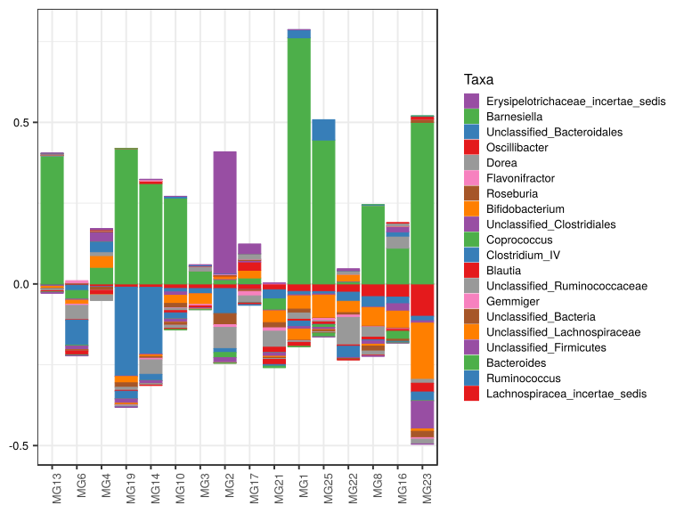

\(1.3.1.3.4.2.2.2.1.1.1\) [`Figure 504.`](#figure.504) Abundance difference between paired samples. Samples are paired according to attribute MatchedGroupID, resulting in 16 pairs. When fold change or difference is computed, this is done as 'patient by control'. Data for all pooled samples. Sorting order of features is GeneSelector paired test ranking. bar (sample mean) plot.  Image file: [`plots/3236765c86c.svg`](plots/3236765c86c.svg).
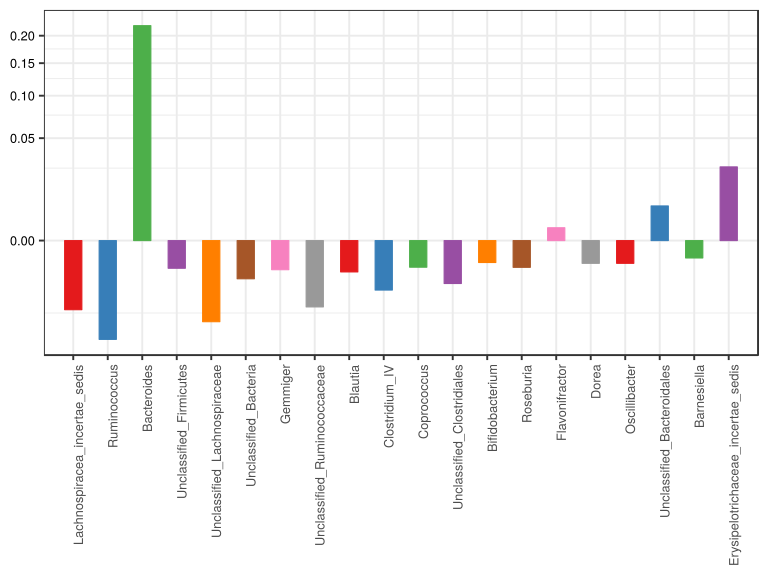

\(1.3.1.3.4.2.2.2.1.1.1\) [`Figure 505.`](#figure.505) Abundance difference between paired samples. Samples are paired according to attribute MatchedGroupID, resulting in 16 pairs. When fold change or difference is computed, this is done as 'patient by control'. Data for all pooled samples. Sorting order of features is GeneSelector paired test ranking. violin plot.  Image file: [`plots/32347fa131b.svg`](plots/32347fa131b.svg).
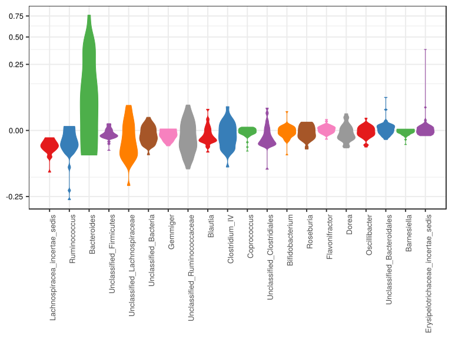

\(1.3.1.3.4.2.2.2.1.1.1\) [`Figure 506.`](#figure.506) Abundance difference between paired samples. Samples are paired according to attribute MatchedGroupID, resulting in 16 pairs. When fold change or difference is computed, this is done as 'patient by control'. Data for all pooled samples. Sorting order of features is GeneSelector paired test ranking. boxplot plot.  Image file: [`plots/32355a9fb15.svg`](plots/32355a9fb15.svg).
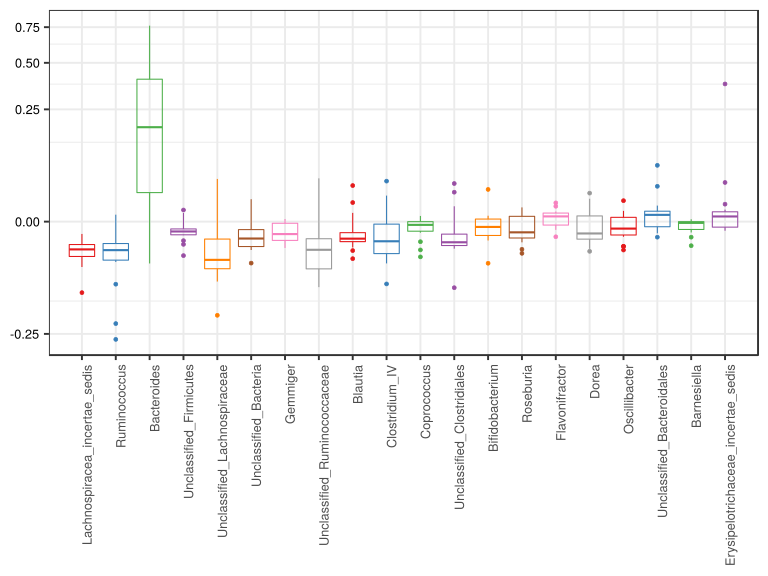

##### \(1.3.1.3.4.2.2.2.1.2\) Abundance difference between paired samples. Samples are paired according to attribute MatchedGroupID, resulting in 16 pairs. When fold change or difference is computed, this is done as 'patient by control'. Plot is in flipped orientation, Y axis not scaled. Iterating over plot geometry

\(1.3.1.3.4.2.2.2.1.2.1\) [`Figure 507.`](#figure.507) Abundance difference between paired samples. Samples are paired according to attribute MatchedGroupID, resulting in 16 pairs. When fold change or difference is computed, this is done as 'patient by control'. Data for all pooled samples. Sorting order of features is GeneSelector paired test ranking. bar (sample mean) plot.  Image file: [`plots/3235a0b6ff7.svg`](plots/3235a0b6ff7.svg).
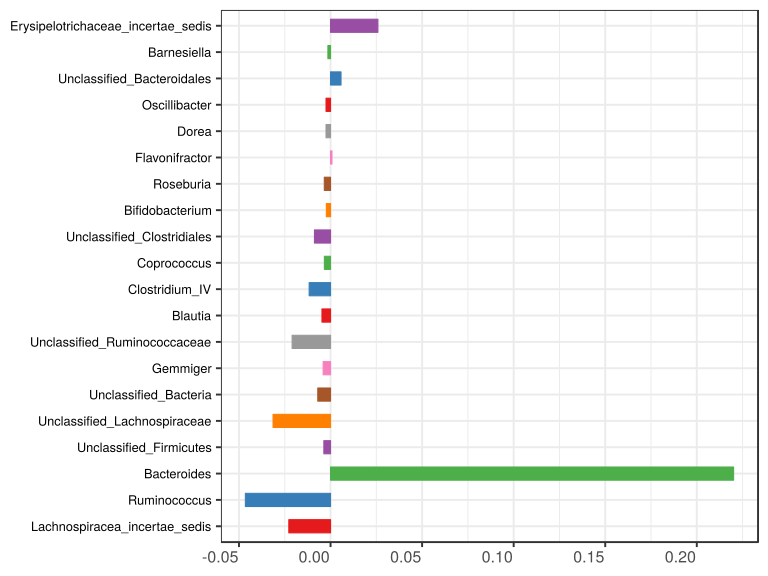

\(1.3.1.3.4.2.2.2.1.2.1\) [`Figure 508.`](#figure.508) Abundance difference between paired samples. Samples are paired according to attribute MatchedGroupID, resulting in 16 pairs. When fold change or difference is computed, this is done as 'patient by control'. Data for all pooled samples. Sorting order of features is GeneSelector paired test ranking. violin plot.  Image file: [`plots/3231812b0dd.svg`](plots/3231812b0dd.svg).
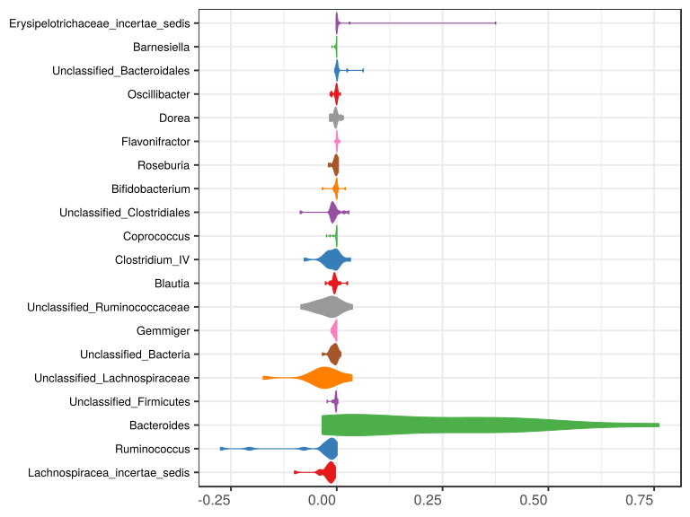

\(1.3.1.3.4.2.2.2.1.2.1\) [`Figure 509.`](#figure.509) Abundance difference between paired samples. Samples are paired according to attribute MatchedGroupID, resulting in 16 pairs. When fold change or difference is computed, this is done as 'patient by control'. Data for all pooled samples. Sorting order of features is GeneSelector paired test ranking. boxplot plot.  Image file: [`plots/323105544a6.svg`](plots/323105544a6.svg).
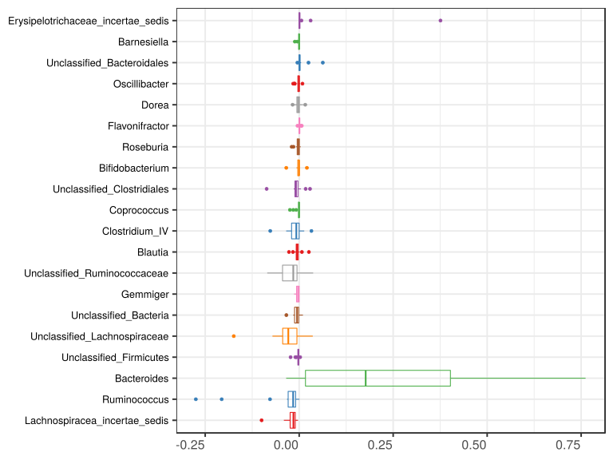

##### \(1.3.1.3.4.2.3\) Grouping variables age.quant

##### \(1.3.1.3.4.2.4\) Iterating over Abundance difference between paired samples. Samples are paired according to attribute MatchedGroupID, resulting in 16 pairs. When fold change or difference is computed, this is done as 'patient by control'. profile sorting order

##### \(1.3.1.3.4.2.4.1\) Abundance difference between paired samples. Samples are paired according to attribute MatchedGroupID, resulting in 16 pairs. When fold change or difference is computed, this is done as 'patient by control'. profile sorting order: GeneSelector paired test ranking

##### \(1.3.1.3.4.2.4.2\) Iterating over dodged vs faceted bars

The same data are shown in multiple combinations of graphical representations. 
                         This is the same data, but each plot highlights slightly different aspects of it.
                         It is not likely that you will need every plot - pick only what you need.

##### \(1.3.1.3.4.2.4.2.1\) faceted plots. Iterating over orientation and, optionally, scaling

##### \(1.3.1.3.4.2.4.2.1.1\) Abundance difference between paired samples. Samples are paired according to attribute MatchedGroupID, resulting in 16 pairs. When fold change or difference is computed, this is done as 'patient by control'. Plot is in original orientation, Y axis SQRT scaled. Iterating over plot geometry

\(1.3.1.3.4.2.4.2.1.1.0\) [`Table 127.`](#table.127) Data table used for plots. Data grouped by age.quant. Showing only 200 first rows. Full dataset is also saved in a delimited text file (click to download and open e.g. in Excel) [`data/1.3.1.3.4.2.4.2.1.1.0-323170d0df1.1.3.1.3.4.2.4.2.1.1.csv`](data/1.3.1.3.4.2.4.2.1.1.0-323170d0df1.1.3.1.3.4.2.4.2.1.1.csv)

| .record.id | age.quant     | feature                              | abundance.diff |
|:-----------|:--------------|:-------------------------------------|:---------------|
| MG1        | \(15.3,26.4\] | Bacteroides                          | 7.617e\-01     |
| MG10       | \(8.71,15.3\] | Bacteroides                          | 2.660e\-01     |
| MG13       | \(15.3,26.4\] | Bacteroides                          | 3.967e\-01     |
| MG14       | \(15.3,26.4\] | Bacteroides                          | 3.107e\-01     |
| MG16       | \(15.3,26.4\] | Bacteroides                          | 1.107e\-01     |
| MG17       | \(15.3,26.4\] | Bacteroides                          | 1.774e\-02     |
| MG19       | \(6.27,8.71\] | Bacteroides                          | 4.189e\-01     |
| MG2        | \[3.18,6.27\] | Bacteroides                          | 1.364e\-02     |
| MG21       | \(8.71,15.3\] | Bacteroides                          | \-3.465e\-02   |
| MG22       | \(8.71,15.3\] | Bacteroides                          | 7.305e\-03     |
| MG23       | \(6.27,8.71\] | Bacteroides                          | 4.999e\-01     |
| MG25       | \(8.71,15.3\] | Bacteroides                          | 4.454e\-01     |
| MG3        | \(8.71,15.3\] | Bacteroides                          | 3.984e\-02     |
| MG4        | \(8.71,15.3\] | Bacteroides                          | 5.154e\-02     |
| MG6        | \(8.71,15.3\] | Bacteroides                          | \-2.668e\-02   |
| MG8        | \(8.71,15.3\] | Bacteroides                          | 2.430e\-01     |
| MG1        | \(15.3,26.4\] | Prevotella                           | \-1.963e\-01   |
| MG10       | \(8.71,15.3\] | Prevotella                           | \-2.046e\-03   |
| MG13       | \(15.3,26.4\] | Prevotella                           | \-3.822e\-01   |
| MG14       | \(15.3,26.4\] | Prevotella                           | 1.182e\-04     |
| MG16       | \(15.3,26.4\] | Prevotella                           | \-7.741e\-04   |
| MG17       | \(15.3,26.4\] | Prevotella                           | \-4.224e\-01   |
| MG19       | \(6.27,8.71\] | Prevotella                           | 3.600e\-04     |
| MG2        | \[3.18,6.27\] | Prevotella                           | \-3.071e\-01   |
| MG21       | \(8.71,15.3\] | Prevotella                           | 4.341e\-01     |
| MG22       | \(8.71,15.3\] | Prevotella                           | 0.000e\+00     |
| MG23       | \(6.27,8.71\] | Prevotella                           | 7.416e\-04     |
| MG25       | \(8.71,15.3\] | Prevotella                           | \-4.524e\-01   |
| MG3        | \(8.71,15.3\] | Prevotella                           | 7.537e\-05     |
| MG4        | \(8.71,15.3\] | Prevotella                           | \-2.758e\-04   |
| MG6        | \(8.71,15.3\] | Prevotella                           | 1.439e\-02     |
| MG8        | \(8.71,15.3\] | Prevotella                           | \-2.198e\-04   |
| MG1        | \(15.3,26.4\] | Unclassified\_Lachnospiraceae        | \-4.114e\-02   |
| MG10       | \(8.71,15.3\] | Unclassified\_Lachnospiraceae        | \-2.516e\-02   |
| MG13       | \(15.3,26.4\] | Unclassified\_Lachnospiraceae        | \-6.275e\-03   |
| MG14       | \(15.3,26.4\] | Unclassified\_Lachnospiraceae        | \-5.236e\-03   |
| MG16       | \(15.3,26.4\] | Unclassified\_Lachnospiraceae        | \-5.226e\-02   |
| MG17       | \(15.3,26.4\] | Unclassified\_Lachnospiraceae        | 2.362e\-02     |
| MG19       | \(6.27,8.71\] | Unclassified\_Lachnospiraceae        | \-1.932e\-02   |
| MG2        | \[3.18,6.27\] | Unclassified\_Lachnospiraceae        | 6.371e\-03     |
| MG21       | \(8.71,15.3\] | Unclassified\_Lachnospiraceae        | \-3.659e\-02   |
| MG22       | \(8.71,15.3\] | Unclassified\_Lachnospiraceae        | \-3.498e\-02   |
| MG23       | \(6.27,8.71\] | Unclassified\_Lachnospiraceae        | \-1.740e\-01   |
| MG25       | \(8.71,15.3\] | Unclassified\_Lachnospiraceae        | \-7.111e\-02   |
| MG3        | \(8.71,15.3\] | Unclassified\_Lachnospiraceae        | \-3.274e\-02   |
| MG4        | \(8.71,15.3\] | Unclassified\_Lachnospiraceae        | 3.615e\-02     |
| MG6        | \(8.71,15.3\] | Unclassified\_Lachnospiraceae        | \-1.207e\-02   |
| MG8        | \(8.71,15.3\] | Unclassified\_Lachnospiraceae        | \-5.758e\-02   |
| MG1        | \(15.3,26.4\] | Alistipes                            | \-1.014e\-02   |
| MG10       | \(8.71,15.3\] | Alistipes                            | \-5.340e\-02   |
| MG13       | \(15.3,26.4\] | Alistipes                            | 7.844e\-02     |
| MG14       | \(15.3,26.4\] | Alistipes                            | \-5.436e\-02   |
| MG16       | \(15.3,26.4\] | Alistipes                            | 7.709e\-02     |
| MG17       | \(15.3,26.4\] | Alistipes                            | \-2.614e\-02   |
| MG19       | \(6.27,8.71\] | Alistipes                            | \-7.809e\-02   |
| MG2        | \[3.18,6.27\] | Alistipes                            | \-2.383e\-02   |
| MG21       | \(8.71,15.3\] | Alistipes                            | \-2.919e\-01   |
| MG22       | \(8.71,15.3\] | Alistipes                            | \-1.128e\-02   |
| MG23       | \(6.27,8.71\] | Alistipes                            | 3.522e\-02     |
| MG25       | \(8.71,15.3\] | Alistipes                            | 1.321e\-02     |
| MG3        | \(8.71,15.3\] | Alistipes                            | 5.610e\-02     |
| MG4        | \(8.71,15.3\] | Alistipes                            | 8.061e\-03     |
| MG6        | \(8.71,15.3\] | Alistipes                            | 1.298e\-01     |
| MG8        | \(8.71,15.3\] | Alistipes                            | \-5.861e\-03   |
| MG1        | \(15.3,26.4\] | Faecalibacterium                     | \-1.041e\-01   |
| MG10       | \(8.71,15.3\] | Faecalibacterium                     | \-2.258e\-03   |
| MG13       | \(15.3,26.4\] | Faecalibacterium                     | \-1.787e\-03   |
| MG14       | \(15.3,26.4\] | Faecalibacterium                     | \-2.719e\-02   |
| MG16       | \(15.3,26.4\] | Faecalibacterium                     | \-3.400e\-02   |
| MG17       | \(15.3,26.4\] | Faecalibacterium                     | 7.316e\-02     |
| MG19       | \(6.27,8.71\] | Faecalibacterium                     | 5.239e\-03     |
| MG2        | \[3.18,6.27\] | Faecalibacterium                     | \-3.462e\-02   |
| MG21       | \(8.71,15.3\] | Faecalibacterium                     | 2.146e\-02     |
| MG22       | \(8.71,15.3\] | Faecalibacterium                     | 6.855e\-03     |
| MG23       | \(6.27,8.71\] | Faecalibacterium                     | 3.286e\-02     |
| MG25       | \(8.71,15.3\] | Faecalibacterium                     | 1.222e\-02     |
| MG3        | \(8.71,15.3\] | Faecalibacterium                     | \-2.687e\-02   |
| MG4        | \(8.71,15.3\] | Faecalibacterium                     | 7.401e\-04     |
| MG6        | \(8.71,15.3\] | Faecalibacterium                     | \-1.708e\-02   |
| MG8        | \(8.71,15.3\] | Faecalibacterium                     | \-3.367e\-02   |
| MG1        | \(15.3,26.4\] | Ruminococcus                         | \-1.027e\-02   |
| MG10       | \(8.71,15.3\] | Ruminococcus                         | \-1.068e\-02   |
| MG13       | \(15.3,26.4\] | Ruminococcus                         | \-2.415e\-03   |
| MG14       | \(15.3,26.4\] | Ruminococcus                         | \-2.061e\-01   |
| MG16       | \(15.3,26.4\] | Ruminococcus                         | \-2.034e\-02   |
| MG17       | \(15.3,26.4\] | Ruminococcus                         | 9.653e\-04     |
| MG19       | \(6.27,8.71\] | Ruminococcus                         | \-2.749e\-01   |
| MG2        | \[3.18,6.27\] | Ruminococcus                         | \-7.761e\-02   |
| MG21       | \(8.71,15.3\] | Ruminococcus                         | \-2.820e\-02   |
| MG22       | \(8.71,15.3\] | Ruminococcus                         | \-2.834e\-02   |
| MG23       | \(6.27,8.71\] | Ruminococcus                         | \-1.404e\-02   |
| MG25       | \(8.71,15.3\] | Ruminococcus                         | \-7.226e\-03   |
| MG3        | \(8.71,15.3\] | Ruminococcus                         | \-1.566e\-02   |
| MG4        | \(8.71,15.3\] | Ruminococcus                         | \-7.882e\-04   |
| MG6        | \(8.71,15.3\] | Ruminococcus                         | \-1.647e\-02   |
| MG8        | \(8.71,15.3\] | Ruminococcus                         | \-3.235e\-02   |
| MG1        | \(15.3,26.4\] | Unclassified\_Ruminococcaceae        | \-1.955e\-02   |
| MG10       | \(8.71,15.3\] | Unclassified\_Ruminococcaceae        | \-7.555e\-03   |
| MG13       | \(15.3,26.4\] | Unclassified\_Ruminococcaceae        | \-6.452e\-03   |
| MG14       | \(15.3,26.4\] | Unclassified\_Ruminococcaceae        | \-4.490e\-02   |
| MG16       | \(15.3,26.4\] | Unclassified\_Ruminococcaceae        | 3.724e\-02     |
| MG17       | \(15.3,26.4\] | Unclassified\_Ruminococcaceae        | \-2.011e\-02   |
| MG19       | \(6.27,8.71\] | Unclassified\_Ruminococcaceae        | \-9.436e\-03   |
| MG2        | \[3.18,6.27\] | Unclassified\_Ruminococcaceae        | \-6.545e\-02   |
| MG21       | \(8.71,15.3\] | Unclassified\_Ruminococcaceae        | \-4.950e\-02   |
| MG22       | \(8.71,15.3\] | Unclassified\_Ruminococcaceae        | \-8.500e\-02   |
| MG23       | \(6.27,8.71\] | Unclassified\_Ruminococcaceae        | \-1.188e\-02   |
| MG25       | \(8.71,15.3\] | Unclassified\_Ruminococcaceae        | \-3.833e\-03   |
| MG3        | \(8.71,15.3\] | Unclassified\_Ruminococcaceae        | 1.364e\-02     |
| MG4        | \(8.71,15.3\] | Unclassified\_Ruminococcaceae        | 1.198e\-02     |
| MG6        | \(8.71,15.3\] | Unclassified\_Ruminococcaceae        | \-4.407e\-02   |
| MG8        | \(8.71,15.3\] | Unclassified\_Ruminococcaceae        | \-3.095e\-02   |
| MG1        | \(15.3,26.4\] | Lachnospiracea\_incertae\_sedis      | \-2.327e\-02   |
| MG10       | \(8.71,15.3\] | Lachnospiracea\_incertae\_sedis      | \-1.409e\-02   |
| MG13       | \(15.3,26.4\] | Lachnospiracea\_incertae\_sedis      | \-3.013e\-03   |
| MG14       | \(15.3,26.4\] | Lachnospiracea\_incertae\_sedis      | \-1.058e\-02   |
| MG16       | \(15.3,26.4\] | Lachnospiracea\_incertae\_sedis      | \-4.078e\-02   |
| MG17       | \(15.3,26.4\] | Lachnospiracea\_incertae\_sedis      | \-1.633e\-02   |
| MG19       | \(6.27,8.71\] | Lachnospiracea\_incertae\_sedis      | \-9.921e\-03   |
| MG2        | \[3.18,6.27\] | Lachnospiracea\_incertae\_sedis      | \-1.422e\-02   |
| MG21       | \(8.71,15.3\] | Lachnospiracea\_incertae\_sedis      | \-1.811e\-02   |
| MG22       | \(8.71,15.3\] | Lachnospiracea\_incertae\_sedis      | \-2.543e\-02   |
| MG23       | \(6.27,8.71\] | Lachnospiracea\_incertae\_sedis      | \-9.998e\-02   |
| MG25       | \(8.71,15.3\] | Lachnospiracea\_incertae\_sedis      | \-2.360e\-02   |
| MG3        | \(8.71,15.3\] | Lachnospiracea\_incertae\_sedis      | \-1.418e\-02   |
| MG4        | \(8.71,15.3\] | Lachnospiracea\_incertae\_sedis      | \-7.983e\-03   |
| MG6        | \(8.71,15.3\] | Lachnospiracea\_incertae\_sedis      | \-3.827e\-03   |
| MG8        | \(8.71,15.3\] | Lachnospiracea\_incertae\_sedis      | \-3.930e\-02   |
| MG1        | \(15.3,26.4\] | Blautia                              | \-5.711e\-03   |
| MG10       | \(8.71,15.3\] | Blautia                              | \-6.873e\-03   |
| MG13       | \(15.3,26.4\] | Blautia                              | \-3.336e\-03   |
| MG14       | \(15.3,26.4\] | Blautia                              | 7.219e\-03     |
| MG16       | \(15.3,26.4\] | Blautia                              | \-5.801e\-03   |
| MG17       | \(15.3,26.4\] | Blautia                              | 2.582e\-02     |
| MG19       | \(6.27,8.71\] | Blautia                              | \-2.680e\-03   |
| MG2        | \[3.18,6.27\] | Blautia                              | 1.526e\-03     |
| MG21       | \(8.71,15.3\] | Blautia                              | \-1.662e\-02   |
| MG22       | \(8.71,15.3\] | Blautia                              | \-4.277e\-03   |
| MG23       | \(6.27,8.71\] | Blautia                              | \-2.719e\-02   |
| MG25       | \(8.71,15.3\] | Blautia                              | \-7.755e\-03   |
| MG3        | \(8.71,15.3\] | Blautia                              | \-6.103e\-03   |
| MG4        | \(8.71,15.3\] | Blautia                              | \-1.325e\-02   |
| MG6        | \(8.71,15.3\] | Blautia                              | \-1.584e\-03   |
| MG8        | \(8.71,15.3\] | Blautia                              | \-8.450e\-03   |
| MG1        | \(15.3,26.4\] | Clostridium\_XI                      | \-4.156e\-02   |
| MG10       | \(8.71,15.3\] | Clostridium\_XI                      | \-1.364e\-03   |
| MG13       | \(15.3,26.4\] | Clostridium\_XI                      | \-1.101e\-03   |
| MG14       | \(15.3,26.4\] | Clostridium\_XI                      | \-8.970e\-03   |
| MG16       | \(15.3,26.4\] | Clostridium\_XI                      | 1.626e\-02     |
| MG17       | \(15.3,26.4\] | Clostridium\_XI                      | 2.134e\-01     |
| MG19       | \(6.27,8.71\] | Clostridium\_XI                      | \-3.572e\-03   |
| MG2        | \[3.18,6.27\] | Clostridium\_XI                      | 2.757e\-02     |
| MG21       | \(8.71,15.3\] | Clostridium\_XI                      | \-6.454e\-03   |
| MG22       | \(8.71,15.3\] | Clostridium\_XI                      | \-1.298e\-02   |
| MG23       | \(6.27,8.71\] | Clostridium\_XI                      | \-8.245e\-03   |
| MG25       | \(8.71,15.3\] | Clostridium\_XI                      | 3.541e\-03     |
| MG3        | \(8.71,15.3\] | Clostridium\_XI                      | \-2.699e\-03   |
| MG4        | \(8.71,15.3\] | Clostridium\_XI                      | \-8.117e\-03   |
| MG6        | \(8.71,15.3\] | Clostridium\_XI                      | 3.040e\-02     |
| MG8        | \(8.71,15.3\] | Clostridium\_XI                      | \-1.457e\-02   |
| MG1        | \(15.3,26.4\] | Unclassified\_Clostridiales          | \-7.789e\-03   |
| MG10       | \(8.71,15.3\] | Unclassified\_Clostridiales          | \-1.056e\-02   |
| MG13       | \(15.3,26.4\] | Unclassified\_Clostridiales          | \-3.162e\-03   |
| MG14       | \(15.3,26.4\] | Unclassified\_Clostridiales          | \-9.065e\-03   |
| MG16       | \(15.3,26.4\] | Unclassified\_Clostridiales          | 1.718e\-02     |
| MG17       | \(15.3,26.4\] | Unclassified\_Clostridiales          | 4.695e\-03     |
| MG19       | \(6.27,8.71\] | Unclassified\_Clostridiales          | \-1.325e\-02   |
| MG2        | \[3.18,6.27\] | Unclassified\_Clostridiales          | \-1.452e\-02   |
| MG21       | \(8.71,15.3\] | Unclassified\_Clostridiales          | \-1.104e\-02   |
| MG22       | \(8.71,15.3\] | Unclassified\_Clostridiales          | \-2.911e\-03   |
| MG23       | \(6.27,8.71\] | Unclassified\_Clostridiales          | \-8.657e\-02   |
| MG25       | \(8.71,15.3\] | Unclassified\_Clostridiales          | \-6.723e\-03   |
| MG3        | \(8.71,15.3\] | Unclassified\_Clostridiales          | \-3.429e\-03   |
| MG4        | \(8.71,15.3\] | Unclassified\_Clostridiales          | 2.881e\-02     |
| MG6        | \(8.71,15.3\] | Unclassified\_Clostridiales          | \-1.221e\-02   |
| MG8        | \(8.71,15.3\] | Unclassified\_Clostridiales          | \-1.023e\-02   |
| MG1        | \(15.3,26.4\] | Erysipelotrichaceae\_incertae\_sedis | 4.339e\-04     |
| MG10       | \(8.71,15.3\] | Erysipelotrichaceae\_incertae\_sedis | 0.000e\+00     |
| MG13       | \(15.3,26.4\] | Erysipelotrichaceae\_incertae\_sedis | 8.831e\-04     |
| MG14       | \(15.3,26.4\] | Erysipelotrichaceae\_incertae\_sedis | 7.169e\-04     |
| MG16       | \(15.3,26.4\] | Erysipelotrichaceae\_incertae\_sedis | \-1.764e\-04   |
| MG17       | \(15.3,26.4\] | Erysipelotrichaceae\_incertae\_sedis | 3.041e\-02     |
| MG19       | \(6.27,8.71\] | Erysipelotrichaceae\_incertae\_sedis | \-1.343e\-03   |
| MG2        | \[3.18,6.27\] | Erysipelotrichaceae\_incertae\_sedis | 3.759e\-01     |
| MG21       | \(8.71,15.3\] | Erysipelotrichaceae\_incertae\_sedis | 1.604e\-03     |
| MG22       | \(8.71,15.3\] | Erysipelotrichaceae\_incertae\_sedis | 6.049e\-03     |
| MG23       | \(6.27,8.71\] | Erysipelotrichaceae\_incertae\_sedis | \-1.019e\-03   |
| MG25       | \(8.71,15.3\] | Erysipelotrichaceae\_incertae\_sedis | \-5.157e\-04   |
| MG3        | \(8.71,15.3\] | Erysipelotrichaceae\_incertae\_sedis | 6.197e\-04     |
| MG4        | \(8.71,15.3\] | Erysipelotrichaceae\_incertae\_sedis | 2.864e\-03     |
| MG6        | \(8.71,15.3\] | Erysipelotrichaceae\_incertae\_sedis | \-8.525e\-04   |
| MG8        | \(8.71,15.3\] | Erysipelotrichaceae\_incertae\_sedis | \-1.649e\-03   |
| MG1        | \(15.3,26.4\] | Clostridium\_IV                      | \-1.685e\-02   |
| MG10       | \(8.71,15.3\] | Clostridium\_IV                      | \-1.818e\-02   |
| MG13       | \(15.3,26.4\] | Clostridium\_IV                      | 1.277e\-03     |
| MG14       | \(15.3,26.4\] | Clostridium\_IV                      | \-1.915e\-02   |
| MG16       | \(15.3,26.4\] | Clostridium\_IV                      | 1.347e\-02     |
| MG17       | \(15.3,26.4\] | Clostridium\_IV                      | \-2.218e\-03   |
| MG19       | \(6.27,8.71\] | Clostridium\_IV                      | \-2.359e\-02   |
| MG2        | \[3.18,6.27\] | Clostridium\_IV                      | \-1.223e\-02   |

\(1.3.1.3.4.2.4.2.1.1.1\) [`Widget 139.`](#widget.139) Dynamic Pivot Table link (drag and drop field names and pick averaging 
                      functions or plot types; click on fields or legend elements to filter values). 
                      Starting rendering is Stacked Bar Chart. Data grouped by age.quant. Click to see HTML widget file in full window: [`./1.3.1.3.4.2.4.2.1.1.1-3231e461627Dynamic.Pivot.Table.html`](./1.3.1.3.4.2.4.2.1.1.1-3231e461627Dynamic.Pivot.Table.html)

\(1.3.1.3.4.2.4.2.1.1.1\) [`Widget 140.`](#widget.140) Dynamic Pivot Table link (drag and drop field names and pick averaging 
                      functions or plot types; click on fields or legend elements to filter values). 
                      Starting rendering is Table Barchart. Data grouped by age.quant. Click to see HTML widget file in full window: [`./1.3.1.3.4.2.4.2.1.1.1-323578f1f4Dynamic.Pivot.Table.html`](./1.3.1.3.4.2.4.2.1.1.1-323578f1f4Dynamic.Pivot.Table.html)

\(1.3.1.3.4.2.4.2.1.1.1\) [`Table 128.`](#table.128) Summary table. Data grouped by age.quant. Full dataset is also saved in a delimited text file (click to download and open e.g. in Excel) [`data/1.3.1.3.4.2.4.2.1.1.1-32349f660cd.1.3.1.3.4.2.4.2.1.1.csv`](data/1.3.1.3.4.2.4.2.1.1.1-32349f660cd.1.3.1.3.4.2.4.2.1.1.csv)

| feature                              | age.quant     | mean         | sd         | median       | incidence |
|:-------------------------------------|:--------------|:-------------|:-----------|:-------------|:----------|
| Lachnospiracea\_incertae\_sedis      | \[3.18,6.27\] | \-1.422e\-02 | NA         | \-1.422e\-02 | 0.000     |
| Lachnospiracea\_incertae\_sedis      | \(6.27,8.71\] | \-5.495e\-02 | 6.368e\-02 | \-5.495e\-02 | 0.000     |
| Lachnospiracea\_incertae\_sedis      | \(8.71,15.3\] | \-1.832e\-02 | 1.115e\-02 | \-1.615e\-02 | 0.000     |
| Lachnospiracea\_incertae\_sedis      | \(15.3,26.4\] | \-1.879e\-02 | 1.437e\-02 | \-1.633e\-02 | 0.000     |
| Ruminococcus                         | \[3.18,6.27\] | \-7.761e\-02 | NA         | \-7.761e\-02 | 0.000     |
| Ruminococcus                         | \(6.27,8.71\] | \-1.445e\-01 | 1.845e\-01 | \-1.445e\-01 | 0.000     |
| Ruminococcus                         | \(8.71,15.3\] | \-1.747e\-02 | 1.126e\-02 | \-1.607e\-02 | 0.000     |
| Ruminococcus                         | \(15.3,26.4\] | \-4.763e\-02 | 8.897e\-02 | \-1.027e\-02 | 0.200     |
| Bacteroides                          | \[3.18,6.27\] | 1.364e\-02   | NA         | 1.364e\-02   | 1.000     |
| Bacteroides                          | \(6.27,8.71\] | 4.594e\-01   | 5.730e\-02 | 4.594e\-01   | 1.000     |
| Bacteroides                          | \(8.71,15.3\] | 1.240e\-01   | 1.738e\-01 | 4.569e\-02   | 0.750     |
| Bacteroides                          | \(15.3,26.4\] | 3.195e\-01   | 2.899e\-01 | 3.107e\-01   | 1.000     |
| Unclassified\_Firmicutes             | \[3.18,6.27\] | 2.682e\-03   | NA         | 2.682e\-03   | 1.000     |
| Unclassified\_Firmicutes             | \(6.27,8.71\] | \-4.439e\-03 | 3.877e\-03 | \-4.439e\-03 | 0.000     |
| Unclassified\_Firmicutes             | \(8.71,15.3\] | \-2.638e\-03 | 3.461e\-03 | \-1.796e\-03 | 0.125     |
| Unclassified\_Firmicutes             | \(15.3,26.4\] | \-6.223e\-03 | 9.361e\-03 | \-2.556e\-03 | 0.000     |
| Unclassified\_Lachnospiraceae        | \[3.18,6.27\] | 6.371e\-03   | NA         | 6.371e\-03   | 1.000     |
| Unclassified\_Lachnospiraceae        | \(6.27,8.71\] | \-9.666e\-02 | 1.094e\-01 | \-9.666e\-02 | 0.000     |
| Unclassified\_Lachnospiraceae        | \(8.71,15.3\] | \-2.926e\-02 | 3.217e\-02 | \-3.386e\-02 | 0.125     |
| Unclassified\_Lachnospiraceae        | \(15.3,26.4\] | \-1.626e\-02 | 3.052e\-02 | \-6.275e\-03 | 0.200     |
| Unclassified\_Bacteria               | \[3.18,6.27\] | \-3.410e\-02 | NA         | \-3.410e\-02 | 0.000     |
| Unclassified\_Bacteria               | \(6.27,8.71\] | \-1.937e\-03 | 1.687e\-02 | \-1.937e\-03 | 0.500     |
| Unclassified\_Bacteria               | \(8.71,15.3\] | \-5.873e\-03 | 6.914e\-03 | \-4.687e\-03 | 0.250     |
| Unclassified\_Bacteria               | \(15.3,26.4\] | \-5.312e\-03 | 4.187e\-03 | \-5.432e\-03 | 0.000     |
| Gemmiger                             | \[3.18,6.27\] | \-8.569e\-03 | NA         | \-8.569e\-03 | 0.000     |
| Gemmiger                             | \(6.27,8.71\] | 0.000e\+00   | 0.000e\+00 | 0.000e\+00   | 0.000     |
| Gemmiger                             | \(8.71,15.3\] | \-4.468e\-03 | 3.641e\-03 | \-4.292e\-03 | 0.000     |
| Gemmiger                             | \(15.3,26.4\] | \-4.096e\-03 | 5.745e\-03 | \-2.099e\-03 | 0.400     |
| Unclassified\_Ruminococcaceae        | \[3.18,6.27\] | \-6.545e\-02 | NA         | \-6.545e\-02 | 0.000     |
| Unclassified\_Ruminococcaceae        | \(6.27,8.71\] | \-1.066e\-02 | 1.728e\-03 | \-1.066e\-02 | 0.000     |
| Unclassified\_Ruminococcaceae        | \(8.71,15.3\] | \-2.441e\-02 | 3.425e\-02 | \-1.925e\-02 | 0.250     |
| Unclassified\_Ruminococcaceae        | \(15.3,26.4\] | \-1.076e\-02 | 3.022e\-02 | \-1.955e\-02 | 0.200     |
| Blautia                              | \[3.18,6.27\] | 1.526e\-03   | NA         | 1.526e\-03   | 1.000     |
| Blautia                              | \(6.27,8.71\] | \-1.494e\-02 | 1.733e\-02 | \-1.494e\-02 | 0.000     |
| Blautia                              | \(8.71,15.3\] | \-8.115e\-03 | 4.811e\-03 | \-7.314e\-03 | 0.000     |
| Blautia                              | \(15.3,26.4\] | 3.639e\-03   | 1.351e\-02 | \-3.336e\-03 | 0.400     |
| Clostridium\_IV                      | \[3.18,6.27\] | \-1.223e\-02 | NA         | \-1.223e\-02 | 0.000     |
| Clostridium\_IV                      | \(6.27,8.71\] | \-2.505e\-02 | 2.073e\-03 | \-2.505e\-02 | 0.000     |
| Clostridium\_IV                      | \(8.71,15.3\] | \-1.264e\-02 | 3.216e\-02 | \-2.110e\-03 | 0.250     |
| Clostridium\_IV                      | \(15.3,26.4\] | \-4.694e\-03 | 1.349e\-02 | \-2.218e\-03 | 0.400     |
| Coprococcus                          | \[3.18,6.27\] | \-1.586e\-02 | NA         | \-1.586e\-02 | 0.000     |
| Coprococcus                          | \(6.27,8.71\] | \-7.945e\-04 | 7.438e\-04 | \-7.945e\-04 | 0.000     |
| Coprococcus                          | \(8.71,15.3\] | \-1.275e\-03 | 2.872e\-03 | \-7.172e\-05 | 0.375     |
| Coprococcus                          | \(15.3,26.4\] | \-5.294e\-03 | 1.082e\-02 | \-1.415e\-04 | 0.000     |
| Unclassified\_Clostridiales          | \[3.18,6.27\] | \-1.452e\-02 | NA         | \-1.452e\-02 | 0.000     |
| Unclassified\_Clostridiales          | \(6.27,8.71\] | \-4.991e\-02 | 5.185e\-02 | \-4.991e\-02 | 0.000     |
| Unclassified\_Clostridiales          | \(8.71,15.3\] | \-3.537e\-03 | 1.354e\-02 | \-8.478e\-03 | 0.125     |
| Unclassified\_Clostridiales          | \(15.3,26.4\] | 3.716e\-04   | 1.083e\-02 | \-3.162e\-03 | 0.400     |
| Bifidobacterium                      | \[3.18,6.27\] | 6.897e\-04   | NA         | 6.897e\-04   | 1.000     |
| Bifidobacterium                      | \(6.27,8.71\] | \-5.487e\-03 | 2.199e\-03 | \-5.487e\-03 | 0.000     |
| Bifidobacterium                      | \(8.71,15.3\] | 8.611e\-04   | 8.187e\-03 | \-7.430e\-04 | 0.125     |
| Bifidobacterium                      | \(15.3,26.4\] | \-6.684e\-03 | 1.546e\-02 | 6.071e\-05   | 0.600     |
| Roseburia                            | \[3.18,6.27\] | 4.037e\-03   | NA         | 4.037e\-03   | 1.000     |
| Roseburia                            | \(6.27,8.71\] | \-1.041e\-02 | 1.345e\-02 | \-1.041e\-02 | 0.000     |
| Roseburia                            | \(8.71,15.3\] | \-4.341e\-03 | 5.636e\-03 | \-3.443e\-03 | 0.250     |
| Roseburia                            | \(15.3,26.4\] | \-6.294e\-04 | 3.804e\-03 | \-3.237e\-04 | 0.400     |
| Flavonifractor                       | \[3.18,6.27\] | 2.029e\-03   | NA         | 2.029e\-03   | 1.000     |
| Flavonifractor                       | \(6.27,8.71\] | \-2.940e\-03 | 2.259e\-03 | \-2.940e\-03 | 0.000     |
| Flavonifractor                       | \(8.71,15.3\] | 1.385e\-03   | 2.379e\-03 | 6.069e\-04   | 0.750     |
| Flavonifractor                       | \(15.3,26.4\] | 1.067e\-03   | 2.098e\-03 | 5.711e\-04   | 0.800     |
| Dorea                                | \[3.18,6.27\] | \-1.403e\-03 | NA         | \-1.403e\-03 | 0.000     |
| Dorea                                | \(6.27,8.71\] | \-9.872e\-03 | 6.873e\-03 | \-9.872e\-03 | 0.000     |
| Dorea                                | \(8.71,15.3\] | \-4.602e\-03 | 8.677e\-03 | \-2.781e\-03 | 0.125     |
| Dorea                                | \(15.3,26.4\] | 3.674e\-03   | 8.867e\-03 | 2.624e\-03   | 0.600     |
| Oscillibacter                        | \[3.18,6.27\] | \-8.290e\-04 | NA         | \-8.290e\-04 | 0.000     |
| Oscillibacter                        | \(6.27,8.71\] | 4.457e\-03   | 6.021e\-03 | 4.457e\-03   | 1.000     |
| Oscillibacter                        | \(8.71,15.3\] | \-3.936e\-03 | 6.514e\-03 | \-1.452e\-03 | 0.250     |
| Oscillibacter                        | \(15.3,26.4\] | \-3.211e\-03 | 5.556e\-03 | \-1.345e\-03 | 0.400     |
| Unclassified\_Bacteroidales          | \[3.18,6.27\] | 1.893e\-03   | NA         | 1.893e\-03   | 1.000     |
| Unclassified\_Bacteroidales          | \(6.27,8.71\] | 6.100e\-04   | 1.235e\-03 | 6.100e\-04   | 0.500     |
| Unclassified\_Bacteroidales          | \(8.71,15.3\] | 8.378e\-03   | 2.220e\-02 | 1.011e\-03   | 0.750     |
| Unclassified\_Bacteroidales          | \(15.3,26.4\] | 4.292e\-03   | 1.156e\-02 | 1.024e\-04   | 0.600     |
| Barnesiella                          | \[3.18,6.27\] | \-8.290e\-04 | NA         | \-8.290e\-04 | 0.000     |
| Barnesiella                          | \(6.27,8.71\] | 0.000e\+00   | 0.000e\+00 | 0.000e\+00   | 0.000     |
| Barnesiella                          | \(8.71,15.3\] | \-2.328e\-03 | 4.036e\-03 | \-5.970e\-04 | 0.000     |
| Barnesiella                          | \(15.3,26.4\] | \-7.233e\-04 | 1.093e\-03 | 0.000e\+00   | 0.400     |
| Erysipelotrichaceae\_incertae\_sedis | \[3.18,6.27\] | 3.759e\-01   | NA         | 3.759e\-01   | 1.000     |
| Erysipelotrichaceae\_incertae\_sedis | \(6.27,8.71\] | \-1.181e\-03 | 2.291e\-04 | \-1.181e\-03 | 0.000     |
| Erysipelotrichaceae\_incertae\_sedis | \(8.71,15.3\] | 1.015e\-03   | 2.485e\-03 | 3.098e\-04   | 0.500     |
| Erysipelotrichaceae\_incertae\_sedis | \(15.3,26.4\] | 6.454e\-03   | 1.340e\-02 | 7.169e\-04   | 0.800     |
| Prevotella                           | \[3.18,6.27\] | \-3.071e\-01 | NA         | \-3.071e\-01 | 0.000     |
| Prevotella                           | \(6.27,8.71\] | 5.508e\-04   | 2.698e\-04 | 5.508e\-04   | 1.000     |
| Prevotella                           | \(8.71,15.3\] | \-8.018e\-04 | 2.370e\-01 | \-1.099e\-04 | 0.375     |
| Prevotella                           | \(15.3,26.4\] | \-2.003e\-01 | 2.015e\-01 | \-1.963e\-01 | 0.200     |
| Faecalibacterium                     | \[3.18,6.27\] | \-3.462e\-02 | NA         | \-3.462e\-02 | 0.000     |
| Faecalibacterium                     | \(6.27,8.71\] | 1.905e\-02   | 1.953e\-02 | 1.905e\-02   | 1.000     |
| Faecalibacterium                     | \(8.71,15.3\] | \-4.825e\-03 | 1.936e\-02 | \-7.590e\-04 | 0.500     |
| Faecalibacterium                     | \(15.3,26.4\] | \-1.879e\-02 | 6.389e\-02 | \-2.719e\-02 | 0.200     |
| Clostridium\_XlVa                    | \[3.18,6.27\] | \-9.550e\-05 | NA         | \-9.550e\-05 | 0.000     |
| Clostridium\_XlVa                    | \(6.27,8.71\] | \-2.440e\-02 | 3.210e\-02 | \-2.440e\-02 | 0.000     |
| Clostridium\_XlVa                    | \(8.71,15.3\] | \-1.720e\-03 | 8.736e\-03 | \-4.615e\-04 | 0.500     |
| Clostridium\_XlVa                    | \(15.3,26.4\] | 1.962e\-04   | 1.381e\-02 | \-3.149e\-05 | 0.400     |
| Alistipes                            | \[3.18,6.27\] | \-2.383e\-02 | NA         | \-2.383e\-02 | 0.000     |
| Alistipes                            | \(6.27,8.71\] | \-2.144e\-02 | 8.012e\-02 | \-2.144e\-02 | 0.500     |
| Alistipes                            | \(8.71,15.3\] | \-1.940e\-02 | 1.227e\-01 | 1.100e\-03   | 0.500     |
| Alistipes                            | \(15.3,26.4\] | 1.298e\-02   | 6.123e\-02 | \-1.014e\-02 | 0.400     |
| Parabacteroides                      | \[3.18,6.27\] | 1.821e\-03   | NA         | 1.821e\-03   | 1.000     |
| Parabacteroides                      | \(6.27,8.71\] | \-3.209e\-03 | 1.794e\-02 | \-3.209e\-03 | 0.500     |
| Parabacteroides                      | \(8.71,15.3\] | 1.385e\-02   | 2.039e\-02 | 8.836e\-03   | 0.625     |
| Parabacteroides                      | \(15.3,26.4\] | \-1.629e\-03 | 1.239e\-02 | \-2.052e\-03 | 0.200     |
| Clostridium\_XI                      | \[3.18,6.27\] | 2.757e\-02   | NA         | 2.757e\-02   | 1.000     |
| Clostridium\_XI                      | \(6.27,8.71\] | \-5.909e\-03 | 3.304e\-03 | \-5.909e\-03 | 0.000     |
| Clostridium\_XI                      | \(8.71,15.3\] | \-1.529e\-03 | 1.422e\-02 | \-4.577e\-03 | 0.250     |
| Clostridium\_XI                      | \(15.3,26.4\] | 3.561e\-02   | 1.016e\-01 | \-1.101e\-03 | 0.400     |
| Enterococcus                         | \[3.18,6.27\] | 7.573e\-04   | NA         | 7.573e\-04   | 1.000     |
| Enterococcus                         | \(6.27,8.71\] | 4.219e\-04   | 9.765e\-04 | 4.219e\-04   | 0.500     |
| Enterococcus                         | \(8.71,15.3\] | 4.363e\-04   | 1.165e\-03 | 0.000e\+00   | 0.250     |
| Enterococcus                         | \(15.3,26.4\] | 1.439e\-02   | 3.205e\-02 | 1.089e\-04   | 0.600     |
| Odoribacter                          | \[3.18,6.27\] | \-2.073e\-04 | NA         | \-2.073e\-04 | 0.000     |
| Odoribacter                          | \(6.27,8.71\] | 0.000e\+00   | 0.000e\+00 | 0.000e\+00   | 0.000     |
| Odoribacter                          | \(8.71,15.3\] | 4.741e\-05   | 7.366e\-03 | \-1.417e\-03 | 0.125     |
| Odoribacter                          | \(15.3,26.4\] | \-4.038e\-03 | 1.081e\-02 | \-8.807e\-04 | 0.200     |
| Clostridium\_XVIII                   | \[3.18,6.27\] | 4.783e\-04   | NA         | 4.783e\-04   | 1.000     |
| Clostridium\_XVIII                   | \(6.27,8.71\] | \-2.152e\-02 | 2.980e\-02 | \-2.152e\-02 | 0.000     |
| Clostridium\_XVIII                   | \(8.71,15.3\] | \-2.008e\-04 | 3.322e\-03 | \-1.013e\-03 | 0.250     |
| Clostridium\_XVIII                   | \(15.3,26.4\] | 3.134e\-03   | 6.083e\-03 | 9.397e\-04   | 0.800     |
| Escherichia\_Shigella                | \[3.18,6.27\] | 2.236e\-03   | NA         | 2.236e\-03   | 1.000     |
| Escherichia\_Shigella                | \(6.27,8.71\] | \-2.201e\-04 | 3.112e\-04 | \-2.201e\-04 | 0.000     |
| Escherichia\_Shigella                | \(8.71,15.3\] | \-7.538e\-04 | 1.430e\-03 | \-3.219e\-04 | 0.000     |
| Escherichia\_Shigella                | \(15.3,26.4\] | 2.557e\-02   | 5.745e\-02 | 0.000e\+00   | 0.400     |
| Clostridium\_sensu\_stricto          | \[3.18,6.27\] | \-2.694e\-03 | NA         | \-2.694e\-03 | 0.000     |
| Clostridium\_sensu\_stricto          | \(6.27,8.71\] | \-2.201e\-04 | 3.112e\-04 | \-2.201e\-04 | 0.000     |
| Clostridium\_sensu\_stricto          | \(8.71,15.3\] | 5.637e\-03   | 8.868e\-03 | 4.218e\-06   | 0.500     |
| Clostridium\_sensu\_stricto          | \(15.3,26.4\] | 1.602e\-03   | 6.129e\-03 | \-1.761e\-04 | 0.400     |
| Streptococcus                        | \[3.18,6.27\] | 1.532e\-02   | NA         | 1.532e\-02   | 1.000     |
| Streptococcus                        | \(6.27,8.71\] | \-1.563e\-03 | 1.588e\-03 | \-1.563e\-03 | 0.000     |
| Streptococcus                        | \(8.71,15.3\] | \-8.827e\-03 | 2.599e\-02 | \-1.805e\-04 | 0.125     |
| Streptococcus                        | \(15.3,26.4\] | 3.396e\-03   | 8.344e\-03 | \-2.743e\-05 | 0.400     |
| Sutterella                           | \[3.18,6.27\] | \-4.045e\-03 | NA         | \-4.045e\-03 | 0.000     |
| Sutterella                           | \(6.27,8.71\] | \-1.343e\-04 | 1.899e\-04 | \-1.343e\-04 | 0.000     |
| Sutterella                           | \(8.71,15.3\] | \-3.456e\-03 | 4.980e\-02 | 2.009e\-03   | 0.500     |
| Sutterella                           | \(15.3,26.4\] | \-7.244e\-03 | 1.531e\-02 | \-1.761e\-03 | 0.200     |
| Unclassified\_Prevotellaceae         | \[3.18,6.27\] | \-2.798e\-02 | NA         | \-2.798e\-02 | 0.000     |
| Unclassified\_Prevotellaceae         | \(6.27,8.71\] | 0.000e\+00   | 0.000e\+00 | 0.000e\+00   | 0.000     |
| Unclassified\_Prevotellaceae         | \(8.71,15.3\] | 2.893e\-03   | 8.726e\-03 | 0.000e\+00   | 0.125     |
| Unclassified\_Prevotellaceae         | \(15.3,26.4\] | \-1.917e\-03 | 2.638e\-03 | \-5.284e\-04 | 0.000     |
| Akkermansia                          | \[3.18,6.27\] | 0.000e\+00   | NA         | 0.000e\+00   | 0.000     |
| Akkermansia                          | \(6.27,8.71\] | \-1.199e\-03 | 1.315e\-03 | \-1.199e\-03 | 0.000     |
| Akkermansia                          | \(8.71,15.3\] | 1.976e\-02   | 5.553e\-02 | 4.426e\-05   | 0.500     |
| Akkermansia                          | \(15.3,26.4\] | 0.000e\+00   | 0.000e\+00 | 0.000e\+00   | 0.000     |
| Megamonas                            | \[3.18,6.27\] | 0.000e\+00   | NA         | 0.000e\+00   | 0.000     |
| Megamonas                            | \(6.27,8.71\] | 0.000e\+00   | 0.000e\+00 | 0.000e\+00   | 0.000     |
| Megamonas                            | \(8.71,15.3\] | \-1.193e\-02 | 2.950e\-02 | 0.000e\+00   | 0.000     |
| Megamonas                            | \(15.3,26.4\] | \-2.608e\-02 | 5.838e\-02 | 0.000e\+00   | 0.200     |
| Phascolarctobacterium                | \[3.18,6.27\] | 0.000e\+00   | NA         | 0.000e\+00   | 0.000     |
| Phascolarctobacterium                | \(6.27,8.71\] | 0.000e\+00   | 0.000e\+00 | 0.000e\+00   | 0.000     |
| Phascolarctobacterium                | \(8.71,15.3\] | 3.124e\-04   | 5.133e\-03 | 0.000e\+00   | 0.375     |
| Phascolarctobacterium                | \(15.3,26.4\] | \-6.708e\-03 | 1.555e\-02 | 0.000e\+00   | 0.400     |
| Lactobacillus                        | \[3.18,6.27\] | 5.301e\-03   | NA         | 5.301e\-03   | 1.000     |
| Lactobacillus                        | \(6.27,8.71\] | 0.000e\+00   | 0.000e\+00 | 0.000e\+00   | 0.000     |
| Lactobacillus                        | \(8.71,15.3\] | \-3.624e\-05 | 6.712e\-05 | 0.000e\+00   | 0.000     |
| Lactobacillus                        | \(15.3,26.4\] | \-3.583e\-02 | 8.041e\-02 | 0.000e\+00   | 0.200     |
| Klebsiella                           | \[3.18,6.27\] | 0.000e\+00   | NA         | 0.000e\+00   | 0.000     |
| Klebsiella                           | \(6.27,8.71\] | 0.000e\+00   | 0.000e\+00 | 0.000e\+00   | 0.000     |
| Klebsiella                           | \(8.71,15.3\] | 6.556e\-05   | 1.224e\-04 | 0.000e\+00   | 0.250     |
| Klebsiella                           | \(15.3,26.4\] | 1.283e\-03   | 3.134e\-03 | 0.000e\+00   | 0.400     |
| Unclassified\_Lactobacillales        | \[3.18,6.27\] | 1.479e\-01   | NA         | 1.479e\-01   | 1.000     |
| Unclassified\_Lactobacillales        | \(6.27,8.71\] | 0.000e\+00   | 0.000e\+00 | 0.000e\+00   | 0.000     |
| Unclassified\_Lactobacillales        | \(8.71,15.3\] | 0.000e\+00   | 0.000e\+00 | 0.000e\+00   | 0.000     |
| Unclassified\_Lactobacillales        | \(15.3,26.4\] | 2.179e\-05   | 4.872e\-05 | 0.000e\+00   | 0.200     |
| Catenibacterium                      | \[3.18,6.27\] | 0.000e\+00   | NA         | 0.000e\+00   | 0.000     |
| Catenibacterium                      | \(6.27,8.71\] | 0.000e\+00   | 0.000e\+00 | 0.000e\+00   | 0.000     |
| Catenibacterium                      | \(8.71,15.3\] | 8.008e\-04   | 2.265e\-03 | 0.000e\+00   | 0.125     |
| Catenibacterium                      | \(15.3,26.4\] | \-1.104e\-02 | 2.232e\-02 | 0.000e\+00   | 0.000     |

\(1.3.1.3.4.2.4.2.1.1.1\) [`Figure 510.`](#figure.510) Abundance difference between paired samples. Samples are paired according to attribute MatchedGroupID, resulting in 16 pairs. When fold change or difference is computed, this is done as 'patient by control'. Data grouped by age.quant. Sorting order of features is GeneSelector paired test ranking. bar_stacked plot.  Image file: [`plots/323ae88b04.svg`](plots/323ae88b04.svg).
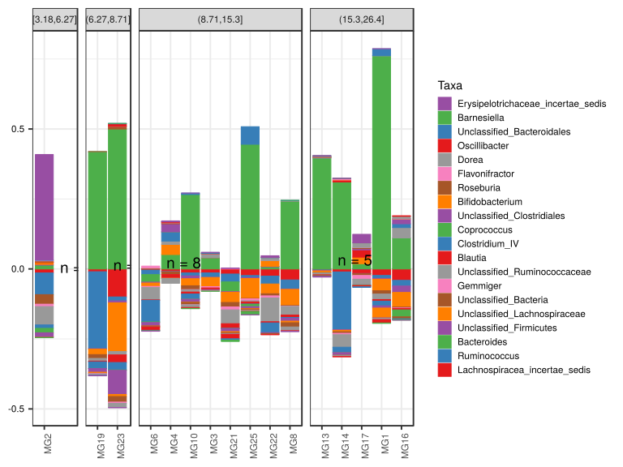

\(1.3.1.3.4.2.4.2.1.1.1\) [`Figure 511.`](#figure.511) Abundance difference between paired samples. Samples are paired according to attribute MatchedGroupID, resulting in 16 pairs. When fold change or difference is computed, this is done as 'patient by control'. Data grouped by age.quant. Sorting order of features is GeneSelector paired test ranking. bar (sample mean) plot.  Image file: [`plots/323436b7d58.svg`](plots/323436b7d58.svg).
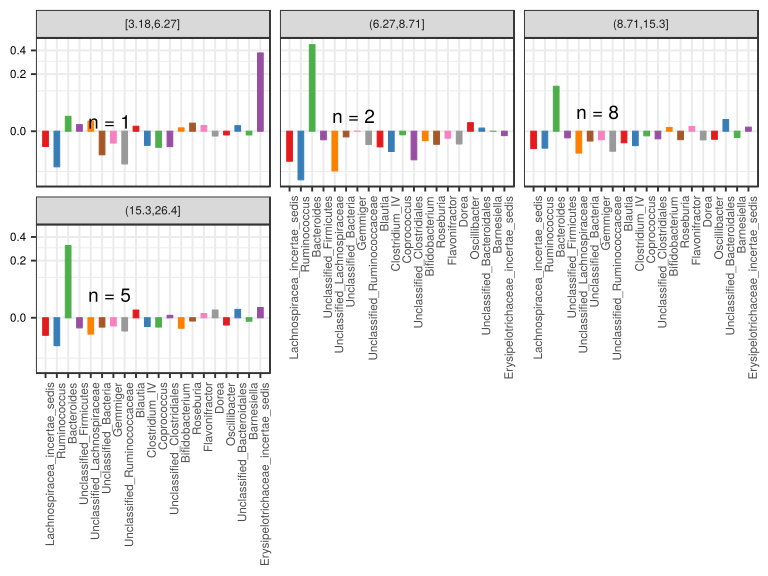

\(1.3.1.3.4.2.4.2.1.1.1\) [`Figure 512.`](#figure.512) Abundance difference between paired samples. Samples are paired according to attribute MatchedGroupID, resulting in 16 pairs. When fold change or difference is computed, this is done as 'patient by control'. Data grouped by age.quant. Sorting order of features is GeneSelector paired test ranking. violin plot.  Image file: [`plots/323166e1dd4.svg`](plots/323166e1dd4.svg).
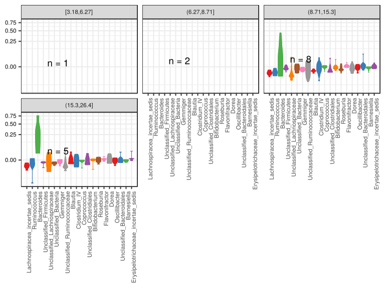

\(1.3.1.3.4.2.4.2.1.1.1\) [`Figure 513.`](#figure.513) Abundance difference between paired samples. Samples are paired according to attribute MatchedGroupID, resulting in 16 pairs. When fold change or difference is computed, this is done as 'patient by control'. Data grouped by age.quant. Sorting order of features is GeneSelector paired test ranking. boxplot plot.  Image file: [`plots/3234685d052.svg`](plots/3234685d052.svg).
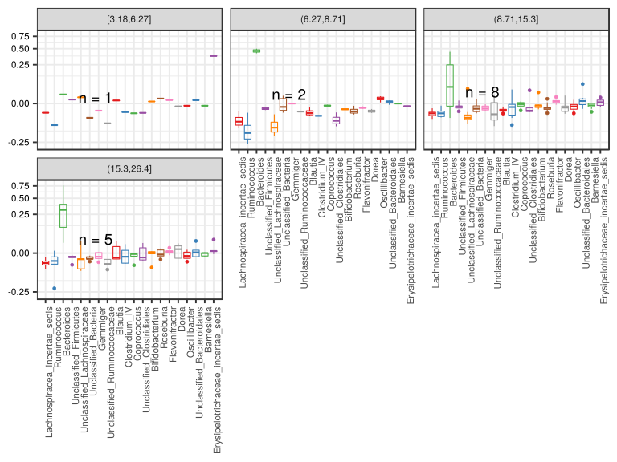

##### \(1.3.1.3.4.2.4.2.1.2\) Abundance difference between paired samples. Samples are paired according to attribute MatchedGroupID, resulting in 16 pairs. When fold change or difference is computed, this is done as 'patient by control'. Plot is in flipped orientation, Y axis not scaled. Iterating over plot geometry

\(1.3.1.3.4.2.4.2.1.2.1\) [`Figure 514.`](#figure.514) Abundance difference between paired samples. Samples are paired according to attribute MatchedGroupID, resulting in 16 pairs. When fold change or difference is computed, this is done as 'patient by control'. Data grouped by age.quant. Sorting order of features is GeneSelector paired test ranking. bar (sample mean) plot.  Image file: [`plots/3236c07c151.svg`](plots/3236c07c151.svg).
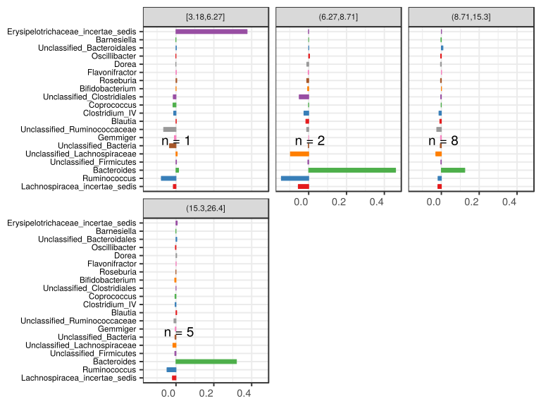

\(1.3.1.3.4.2.4.2.1.2.1\) [`Figure 515.`](#figure.515) Abundance difference between paired samples. Samples are paired according to attribute MatchedGroupID, resulting in 16 pairs. When fold change or difference is computed, this is done as 'patient by control'. Data grouped by age.quant. Sorting order of features is GeneSelector paired test ranking. violin plot.  Image file: [`plots/323f348b94.svg`](plots/323f348b94.svg).
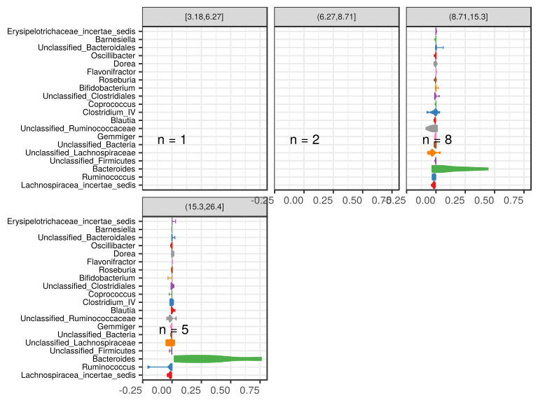

\(1.3.1.3.4.2.4.2.1.2.1\) [`Figure 516.`](#figure.516) Abundance difference between paired samples. Samples are paired according to attribute MatchedGroupID, resulting in 16 pairs. When fold change or difference is computed, this is done as 'patient by control'. Data grouped by age.quant. Sorting order of features is GeneSelector paired test ranking. boxplot plot.  Image file: [`plots/3235f7a28fe.svg`](plots/3235f7a28fe.svg).
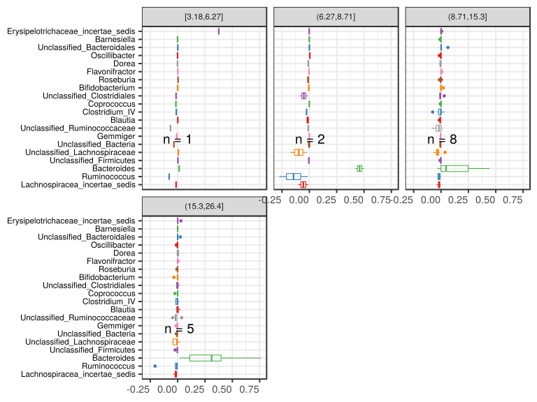

##### \(1.3.1.3.4.2.4.2.2\) dodged plots. Iterating over orientation and, optionally, scaling

##### \(1.3.1.3.4.2.4.2.2.1\) Abundance difference between paired samples. Samples are paired according to attribute MatchedGroupID, resulting in 16 pairs. When fold change or difference is computed, this is done as 'patient by control'. Plot is in original orientation, Y axis SQRT scaled. Iterating over plot geometry

\(1.3.1.3.4.2.4.2.2.1.1\) [`Figure 517.`](#figure.517) Abundance difference between paired samples. Samples are paired according to attribute MatchedGroupID, resulting in 16 pairs. When fold change or difference is computed, this is done as 'patient by control'. Data grouped by age.quant. Sorting order of features is GeneSelector paired test ranking. bar (sample mean) plot.  Image file: [`plots/3233cd02de0.svg`](plots/3233cd02de0.svg).
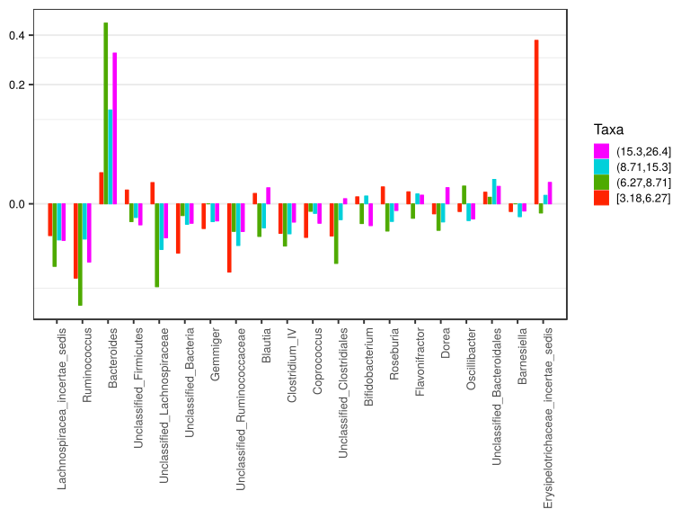

\(1.3.1.3.4.2.4.2.2.1.1\) [`Figure 518.`](#figure.518) Abundance difference between paired samples. Samples are paired according to attribute MatchedGroupID, resulting in 16 pairs. When fold change or difference is computed, this is done as 'patient by control'. Data grouped by age.quant. Sorting order of features is GeneSelector paired test ranking. violin plot.  Image file: [`plots/32353332408.svg`](plots/32353332408.svg).
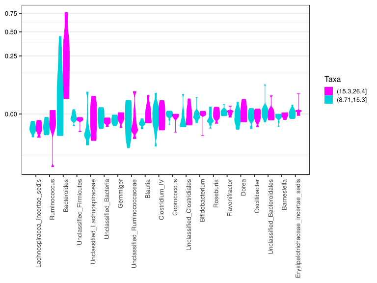

\(1.3.1.3.4.2.4.2.2.1.1\) [`Figure 519.`](#figure.519) Abundance difference between paired samples. Samples are paired according to attribute MatchedGroupID, resulting in 16 pairs. When fold change or difference is computed, this is done as 'patient by control'. Data grouped by age.quant. Sorting order of features is GeneSelector paired test ranking. boxplot plot.  Image file: [`plots/3237797918e.svg`](plots/3237797918e.svg).
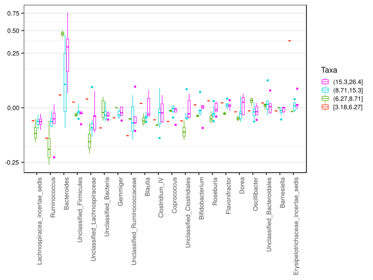

##### \(1.3.1.3.4.2.4.2.2.2\) Abundance difference between paired samples. Samples are paired according to attribute MatchedGroupID, resulting in 16 pairs. When fold change or difference is computed, this is done as 'patient by control'. Plot is in flipped orientation, Y axis not scaled. Iterating over plot geometry

\(1.3.1.3.4.2.4.2.2.2.1\) [`Figure 520.`](#figure.520) Abundance difference between paired samples. Samples are paired according to attribute MatchedGroupID, resulting in 16 pairs. When fold change or difference is computed, this is done as 'patient by control'. Data grouped by age.quant. Sorting order of features is GeneSelector paired test ranking. bar (sample mean) plot.  Image file: [`plots/3232e0bf65b.svg`](plots/3232e0bf65b.svg).
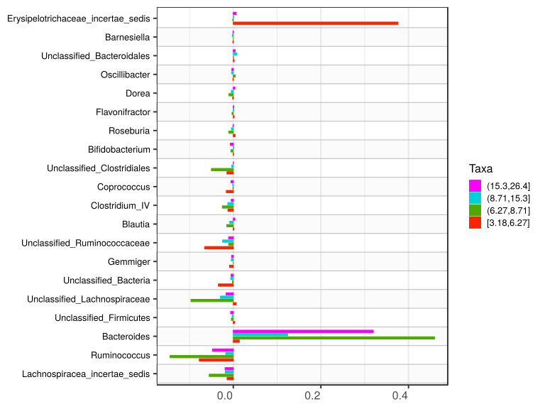

\(1.3.1.3.4.2.4.2.2.2.1\) [`Figure 521.`](#figure.521) Abundance difference between paired samples. Samples are paired according to attribute MatchedGroupID, resulting in 16 pairs. When fold change or difference is computed, this is done as 'patient by control'. Data grouped by age.quant. Sorting order of features is GeneSelector paired test ranking. violin plot.  Image file: [`plots/3232fb72d17.svg`](plots/3232fb72d17.svg).
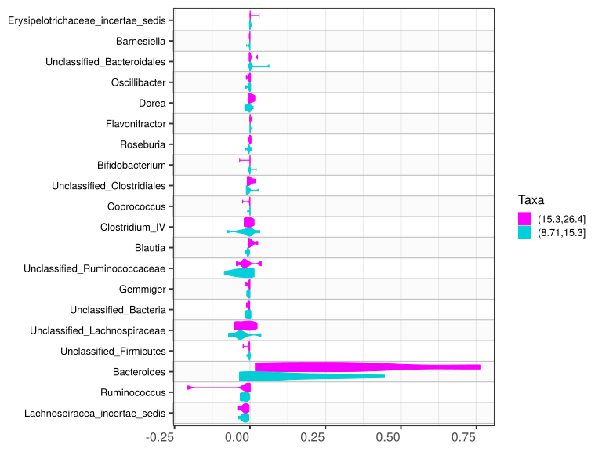

\(1.3.1.3.4.2.4.2.2.2.1\) [`Figure 522.`](#figure.522) Abundance difference between paired samples. Samples are paired according to attribute MatchedGroupID, resulting in 16 pairs. When fold change or difference is computed, this is done as 'patient by control'. Data grouped by age.quant. Sorting order of features is GeneSelector paired test ranking. boxplot plot.  Image file: [`plots/323a80a69b.svg`](plots/323a80a69b.svg).
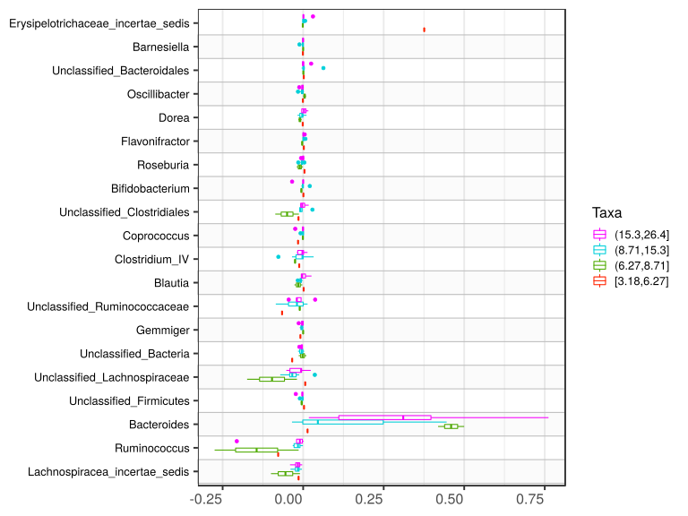