noone@mail.com
Analysis of Dieting study 16S data
% Fri Sep  7 05:46:18 2018

##### \(1.3.1.3.5\) Plots of Log2 fold change in abundance between paired samples. Samples are paired according to attribute MatchedGroupID, resulting in 16 pairs. When fold change or difference is computed, this is done as 'patient by control'.

Plots are shown with relation to various combinations of meta 
                   data variables and in different graphical representations. Lots of plots here.

##### \(1.3.1.3.5.2\) Iterating over all combinations of grouping variables

##### \(1.3.1.3.5.2.1\) Entire pool of samples

##### \(1.3.1.3.5.2.2\) Iterating over Log2 fold change in abundance between paired samples. Samples are paired according to attribute MatchedGroupID, resulting in 16 pairs. When fold change or difference is computed, this is done as 'patient by control'. profile sorting order

##### \(1.3.1.3.5.2.2.1\) Log2 fold change in abundance between paired samples. Samples are paired according to attribute MatchedGroupID, resulting in 16 pairs. When fold change or difference is computed, this is done as 'patient by control'. profile sorting order: GeneSelector paired test ranking

##### \(1.3.1.3.5.2.2.2\) Iterating over dodged vs faceted bars

The same data are shown in multiple combinations of graphical representations. 
                         This is the same data, but each plot highlights slightly different aspects of it.
                         It is not likely that you will need every plot - pick only what you need.

##### \(1.3.1.3.5.2.2.2.1\) faceted plots. Iterating over orientation and, optionally, scaling

##### \(1.3.1.3.5.2.2.2.1.1\) Log2 fold change in abundance between paired samples. Samples are paired according to attribute MatchedGroupID, resulting in 16 pairs. When fold change or difference is computed, this is done as 'patient by control'. Plot is in original orientation, Y axis SQRT scaled. Iterating over plot geometry

\(1.3.1.3.5.2.2.2.1.1.0\) [`Table 129.`](#table.129) Data table used for plots. Data for all pooled samples. Showing only 200 first rows. Full dataset is also saved in a delimited text file (click to download and open e.g. in Excel) [`data/1.3.1.3.5.2.2.2.1.1.0-3234ea42443.1.3.1.3.5.2.2.2.1.1.csv`](data/1.3.1.3.5.2.2.2.1.1.0-3234ea42443.1.3.1.3.5.2.2.2.1.1.csv)

| .record.id   | feature                              | l2fc       |
|:-------------|:-------------------------------------|:-----------|
| MG1.patient  | Bacteroides                          | 5.43956    |
| MG10.patient | Bacteroides                          | 0.53699    |
| MG13.patient | Bacteroides                          | 7.55888    |
| MG14.patient | Bacteroides                          | 0.82737    |
| MG16.patient | Bacteroides                          | 0.42375    |
| MG17.patient | Bacteroides                          | 0.35672    |
| MG19.patient | Bacteroides                          | 1.10074    |
| MG2.patient  | Bacteroides                          | 0.60619    |
| MG21.patient | Bacteroides                          | \-0.16572  |
| MG22.patient | Bacteroides                          | 0.02192    |
| MG23.patient | Bacteroides                          | 1.75232    |
| MG25.patient | Bacteroides                          | 2.80161    |
| MG3.patient  | Bacteroides                          | 0.07520    |
| MG4.patient  | Bacteroides                          | 0.14079    |
| MG6.patient  | Bacteroides                          | \-0.08941  |
| MG8.patient  | Bacteroides                          | 0.49945    |
| MG1.patient  | Prevotella                           | \-9.63050  |
| MG10.patient | Prevotella                           | \-36.42311 |
| MG13.patient | Prevotella                           | \-0.97321  |
| MG14.patient | Prevotella                           | 0.87606    |
| MG16.patient | Prevotella                           | \-35.02098 |
| MG17.patient | Prevotella                           | \-5.73852  |
| MG19.patient | Prevotella                           | 33.91631   |
| MG2.patient  | Prevotella                           | \-4.13348  |
| MG21.patient | Prevotella                           | 7.66365    |
| MG22.patient | Prevotella                           | 0.00000    |
| MG23.patient | Prevotella                           | 34.95900   |
| MG25.patient | Prevotella                           | \-1.81632  |
| MG3.patient  | Prevotella                           | 1.20940    |
| MG4.patient  | Prevotella                           | \-33.53198 |
| MG6.patient  | Prevotella                           | 2.95417    |
| MG8.patient  | Prevotella                           | \-33.20449 |
| MG1.patient  | Unclassified\_Lachnospiraceae        | \-2.24786  |
| MG10.patient | Unclassified\_Lachnospiraceae        | \-4.45240  |
| MG13.patient | Unclassified\_Lachnospiraceae        | \-0.63484  |
| MG14.patient | Unclassified\_Lachnospiraceae        | \-0.15790  |
| MG16.patient | Unclassified\_Lachnospiraceae        | \-0.95981  |
| MG17.patient | Unclassified\_Lachnospiraceae        | 0.39292    |
| MG19.patient | Unclassified\_Lachnospiraceae        | \-2.79985  |
| MG2.patient  | Unclassified\_Lachnospiraceae        | 0.15730    |
| MG21.patient | Unclassified\_Lachnospiraceae        | \-4.38109  |
| MG22.patient | Unclassified\_Lachnospiraceae        | \-1.11649  |
| MG23.patient | Unclassified\_Lachnospiraceae        | \-4.05681  |
| MG25.patient | Unclassified\_Lachnospiraceae        | \-41.54236 |
| MG3.patient  | Unclassified\_Lachnospiraceae        | \-2.04290  |
| MG4.patient  | Unclassified\_Lachnospiraceae        | 0.56793    |
| MG6.patient  | Unclassified\_Lachnospiraceae        | \-1.05752  |
| MG8.patient  | Unclassified\_Lachnospiraceae        | \-3.33560  |
| MG1.patient  | Alistipes                            | \-5.38925  |
| MG10.patient | Alistipes                            | \-41.12902 |
| MG13.patient | Alistipes                            | 9.79933    |
| MG14.patient | Alistipes                            | \-2.71272  |
| MG16.patient | Alistipes                            | 1.57362    |
| MG17.patient | Alistipes                            | \-40.09856 |
| MG19.patient | Alistipes                            | \-1.91902  |
| MG2.patient  | Alistipes                            | \-39.96518 |
| MG21.patient | Alistipes                            | \-4.83726  |
| MG22.patient | Alistipes                            | \-0.80340  |
| MG23.patient | Alistipes                            | 40.52856   |
| MG25.patient | Alistipes                            | 0.94978    |
| MG3.patient  | Alistipes                            | 41.20020   |
| MG4.patient  | Alistipes                            | 38.40138   |
| MG6.patient  | Alistipes                            | 1.08427    |
| MG8.patient  | Alistipes                            | \-37.94145 |
| MG1.patient  | Faecalibacterium                     | \-6.09132  |
| MG10.patient | Faecalibacterium                     | \-0.15096  |
| MG13.patient | Faecalibacterium                     | \-0.46197  |
| MG14.patient | Faecalibacterium                     | \-1.86362  |
| MG16.patient | Faecalibacterium                     | \-1.35370  |
| MG17.patient | Faecalibacterium                     | 1.17777    |
| MG19.patient | Faecalibacterium                     | 1.25890    |
| MG2.patient  | Faecalibacterium                     | \-0.60113  |
| MG21.patient | Faecalibacterium                     | 1.33745    |
| MG22.patient | Faecalibacterium                     | 0.34536    |
| MG23.patient | Faecalibacterium                     | 1.23739    |
| MG25.patient | Faecalibacterium                     | 0.42464    |
| MG3.patient  | Faecalibacterium                     | \-2.00731  |
| MG4.patient  | Faecalibacterium                     | 0.08686    |
| MG6.patient  | Faecalibacterium                     | \-2.39262  |
| MG8.patient  | Faecalibacterium                     | \-2.00653  |
| MG1.patient  | Ruminococcus                         | \-6.38925  |
| MG10.patient | Ruminococcus                         | \-38.80775 |
| MG13.patient | Ruminococcus                         | \-1.30659  |
| MG14.patient | Ruminococcus                         | \-5.46858  |
| MG16.patient | Ruminococcus                         | \-1.24772  |
| MG17.patient | Ruminococcus                         | 0.39492    |
| MG19.patient | Ruminococcus                         | \-2.89143  |
| MG2.patient  | Ruminococcus                         | \-5.39207  |
| MG21.patient | Ruminococcus                         | \-5.88501  |
| MG22.patient | Ruminococcus                         | \-4.52348  |
| MG23.patient | Ruminococcus                         | \-2.05467  |
| MG25.patient | Ruminococcus                         | \-4.32128  |
| MG3.patient  | Ruminococcus                         | \-2.24025  |
| MG4.patient  | Ruminococcus                         | \-1.61037  |
| MG6.patient  | Ruminococcus                         | \-1.60873  |
| MG8.patient  | Ruminococcus                         | \-3.42709  |
| MG1.patient  | Unclassified\_Ruminococcaceae        | \-4.28944  |
| MG10.patient | Unclassified\_Ruminococcaceae        | \-4.30882  |
| MG13.patient | Unclassified\_Ruminococcaceae        | \-1.98269  |
| MG14.patient | Unclassified\_Ruminococcaceae        | \-2.24206  |
| MG16.patient | Unclassified\_Ruminococcaceae        | 0.51298    |
| MG17.patient | Unclassified\_Ruminococcaceae        | \-3.29109  |
| MG19.patient | Unclassified\_Ruminococcaceae        | \-0.92898  |
| MG2.patient  | Unclassified\_Ruminococcaceae        | \-3.40647  |
| MG21.patient | Unclassified\_Ruminococcaceae        | \-3.06872  |
| MG22.patient | Unclassified\_Ruminococcaceae        | \-2.28738  |
| MG23.patient | Unclassified\_Ruminococcaceae        | \-1.42566  |
| MG25.patient | Unclassified\_Ruminococcaceae        | \-0.74120  |
| MG3.patient  | Unclassified\_Ruminococcaceae        | 1.40570    |
| MG4.patient  | Unclassified\_Ruminococcaceae        | 4.19952    |
| MG6.patient  | Unclassified\_Ruminococcaceae        | \-2.45618  |
| MG8.patient  | Unclassified\_Ruminococcaceae        | \-4.73688  |
| MG1.patient  | Lachnospiracea\_incertae\_sedis      | \-5.13453  |
| MG10.patient | Lachnospiracea\_incertae\_sedis      | \-39.20733 |
| MG13.patient | Lachnospiracea\_incertae\_sedis      | \-0.96676  |
| MG14.patient | Lachnospiracea\_incertae\_sedis      | \-0.53883  |
| MG16.patient | Lachnospiracea\_incertae\_sedis      | \-1.29928  |
| MG17.patient | Lachnospiracea\_incertae\_sedis      | \-1.02908  |
| MG19.patient | Lachnospiracea\_incertae\_sedis      | \-2.02233  |
| MG2.patient  | Lachnospiracea\_incertae\_sedis      | \-0.80845  |
| MG21.patient | Lachnospiracea\_incertae\_sedis      | \-5.57442  |
| MG22.patient | Lachnospiracea\_incertae\_sedis      | \-2.14841  |
| MG23.patient | Lachnospiracea\_incertae\_sedis      | \-4.80553  |
| MG25.patient | Lachnospiracea\_incertae\_sedis      | \-5.97767  |
| MG3.patient  | Lachnospiracea\_incertae\_sedis      | \-3.73576  |
| MG4.patient  | Lachnospiracea\_incertae\_sedis      | \-0.34899  |
| MG6.patient  | Lachnospiracea\_incertae\_sedis      | \-0.83140  |
| MG8.patient  | Lachnospiracea\_incertae\_sedis      | \-5.06979  |
| MG1.patient  | Blautia                              | \-1.24788  |
| MG10.patient | Blautia                              | \-4.17954  |
| MG13.patient | Blautia                              | \-0.86414  |
| MG14.patient | Blautia                              | 0.37184    |
| MG16.patient | Blautia                              | \-0.43135  |
| MG17.patient | Blautia                              | 0.96840    |
| MG19.patient | Blautia                              | \-1.79997  |
| MG2.patient  | Blautia                              | 0.04729    |
| MG21.patient | Blautia                              | \-4.32402  |
| MG22.patient | Blautia                              | \-1.21903  |
| MG23.patient | Blautia                              | \-3.96966  |
| MG25.patient | Blautia                              | \-2.96220  |
| MG3.patient  | Blautia                              | \-1.55672  |
| MG4.patient  | Blautia                              | \-1.21896  |
| MG6.patient  | Blautia                              | \-0.67026  |
| MG8.patient  | Blautia                              | \-1.14969  |
| MG1.patient  | Clostridium\_XI                      | \-40.76746 |
| MG10.patient | Clostridium\_XI                      | \-35.83815 |
| MG13.patient | Clostridium\_XI                      | \-1.70784  |
| MG14.patient | Clostridium\_XI                      | \-3.50589  |
| MG16.patient | Clostridium\_XI                      | 1.69372    |
| MG17.patient | Clostridium\_XI                      | 6.44984    |
| MG19.patient | Clostridium\_XI                      | \-1.57757  |
| MG2.patient  | Clostridium\_XI                      | 2.26344    |
| MG21.patient | Clostridium\_XI                      | \-38.08063 |
| MG22.patient | Clostridium\_XI                      | \-1.42158  |
| MG23.patient | Clostridium\_XI                      | \-1.59528  |
| MG25.patient | Clostridium\_XI                      | 2.69885    |
| MG3.patient  | Clostridium\_XI                      | \-36.82277 |
| MG4.patient  | Clostridium\_XI                      | \-2.65217  |
| MG6.patient  | Clostridium\_XI                      | 1.94603    |
| MG8.patient  | Clostridium\_XI                      | \-5.62433  |
| MG1.patient  | Unclassified\_Clostridiales          | \-1.99694  |
| MG10.patient | Unclassified\_Clostridiales          | \-3.82337  |
| MG13.patient | Unclassified\_Clostridiales          | \-1.01523  |
| MG14.patient | Unclassified\_Clostridiales          | \-1.12186  |
| MG16.patient | Unclassified\_Clostridiales          | 0.96831    |
| MG17.patient | Unclassified\_Clostridiales          | 0.34819    |
| MG19.patient | Unclassified\_Clostridiales          | \-4.27797  |
| MG2.patient  | Unclassified\_Clostridiales          | \-0.67723  |
| MG21.patient | Unclassified\_Clostridiales          | \-4.31814  |
| MG22.patient | Unclassified\_Clostridiales          | \-0.49656  |
| MG23.patient | Unclassified\_Clostridiales          | \-3.73208  |
| MG25.patient | Unclassified\_Clostridiales          | \-2.78441  |
| MG3.patient  | Unclassified\_Clostridiales          | \-1.60336  |
| MG4.patient  | Unclassified\_Clostridiales          | 2.76633    |
| MG6.patient  | Unclassified\_Clostridiales          | \-1.33314  |
| MG8.patient  | Unclassified\_Clostridiales          | \-1.43148  |
| MG1.patient  | Erysipelotrichaceae\_incertae\_sedis | 34.18595   |
| MG10.patient | Erysipelotrichaceae\_incertae\_sedis | 0.00000    |
| MG13.patient | Erysipelotrichaceae\_incertae\_sedis | 3.46208    |
| MG14.patient | Erysipelotrichaceae\_incertae\_sedis | 1.29110    |
| MG16.patient | Erysipelotrichaceae\_incertae\_sedis | \-0.14389  |
| MG17.patient | Erysipelotrichaceae\_incertae\_sedis | 2.88314    |
| MG19.patient | Erysipelotrichaceae\_incertae\_sedis | \-35.81582 |
| MG2.patient  | Erysipelotrichaceae\_incertae\_sedis | 9.24208    |
| MG21.patient | Erysipelotrichaceae\_incertae\_sedis | 3.60664    |
| MG22.patient | Erysipelotrichaceae\_incertae\_sedis | 3.24366    |
| MG23.patient | Erysipelotrichaceae\_incertae\_sedis | \-1.24739  |
| MG25.patient | Erysipelotrichaceae\_incertae\_sedis | \-34.43505 |
| MG3.patient  | Erysipelotrichaceae\_incertae\_sedis | 34.69997   |
| MG4.patient  | Erysipelotrichaceae\_incertae\_sedis | 3.89213    |
| MG6.patient  | Erysipelotrichaceae\_incertae\_sedis | \-35.16016 |
| MG8.patient  | Erysipelotrichaceae\_incertae\_sedis | \-0.50653  |
| MG1.patient  | Clostridium\_IV                      | \-8.09153  |
| MG10.patient | Clostridium\_IV                      | \-39.57503 |
| MG13.patient | Clostridium\_IV                      | 1.21210    |
| MG14.patient | Clostridium\_IV                      | \-2.94517  |
| MG16.patient | Clostridium\_IV                      | 1.09065    |
| MG17.patient | Clostridium\_IV                      | \-1.96653  |
| MG19.patient | Clostridium\_IV                      | \-1.89928  |
| MG2.patient  | Clostridium\_IV                      | \-39.00244 |

\(1.3.1.3.5.2.2.2.1.1.1\) [`Widget 141.`](#widget.141) Dynamic Pivot Table link (drag and drop field names and pick averaging 
                      functions or plot types; click on fields or legend elements to filter values). 
                      Starting rendering is Stacked Bar Chart. Data for all pooled samples. Click to see HTML widget file in full window: [`./1.3.1.3.5.2.2.2.1.1.1-3233164eddcDynamic.Pivot.Table.html`](./1.3.1.3.5.2.2.2.1.1.1-3233164eddcDynamic.Pivot.Table.html)

\(1.3.1.3.5.2.2.2.1.1.1\) [`Widget 142.`](#widget.142) Dynamic Pivot Table link (drag and drop field names and pick averaging 
                      functions or plot types; click on fields or legend elements to filter values). 
                      Starting rendering is Table Barchart. Data for all pooled samples. Click to see HTML widget file in full window: [`./1.3.1.3.5.2.2.2.1.1.1-32358c8460Dynamic.Pivot.Table.html`](./1.3.1.3.5.2.2.2.1.1.1-32358c8460Dynamic.Pivot.Table.html)

\(1.3.1.3.5.2.2.2.1.1.1\) [`Table 130.`](#table.130) Summary table. Data for all pooled samples. Full dataset is also saved in a delimited text file (click to download and open e.g. in Excel) [`data/1.3.1.3.5.2.2.2.1.1.1-323328dbfd6.1.3.1.3.5.2.2.2.1.1.csv`](data/1.3.1.3.5.2.2.2.1.1.1-323328dbfd6.1.3.1.3.5.2.2.2.1.1.csv)

| feature                              | mean      | sd     | median     | incidence |
|:-------------------------------------|:----------|:-------|:-----------|:----------|
| Lachnospiracea\_incertae\_sedis      | \-4.9687  | 9.353  | \-2.085366 | 0.0000    |
| Ruminococcus                         | \-5.4237  | 9.117  | \-3.159261 | 0.0625    |
| Bacteroides                          | 1.3679    | 2.174  | 0.518220   | 0.8750    |
| Unclassified\_Firmicutes             | \-6.0441  | 12.537 | \-1.874370 | 0.1250    |
| Unclassified\_Lachnospiraceae        | \-4.2292  | 10.091 | \-1.579697 | 0.1875    |
| Unclassified\_Bacteria               | \-3.6378  | 9.559  | \-1.219088 | 0.1875    |
| Gemmiger                             | \-7.8633  | 13.531 | \-2.242574 | 0.1250    |
| Unclassified\_Ruminococcaceae        | \-1.8155  | 2.339  | \-2.264720 | 0.1875    |
| Blautia                              | \-1.5129  | 1.593  | \-1.218997 | 0.1875    |
| Clostridium\_IV                      | \-8.4379  | 14.956 | \-2.381344 | 0.2500    |
| Coprococcus                          | \-13.6961 | 21.706 | \-4.344461 | 0.1875    |
| Unclassified\_Clostridiales          | \-1.5331  | 1.962  | \-1.382313 | 0.1875    |
| Bifidobacterium                      | \-9.7830  | 27.351 | \-3.099197 | 0.3125    |
| Roseburia                            | \-5.4865  | 12.528 | \-0.807534 | 0.3125    |
| Flavonifractor                       | \-3.5387  | 17.125 | 1.134826   | 0.6875    |
| Dorea                                | \-10.0803 | 16.681 | \-2.069625 | 0.2500    |
| Oscillibacter                        | \-7.3852  | 19.375 | \-2.212143 | 0.3750    |
| Unclassified\_Bacteroidales          | 5.3634    | 12.217 | 0.797257   | 0.6875    |
| Barnesiella                          | \-9.2363  | 19.665 | \-0.066299 | 0.1250    |
| Erysipelotrichaceae\_incertae\_sedis | \-0.6751  | 20.360 | 2.087115   | 0.5625    |
| Prevotella                           | \-4.9309  | 21.572 | \-1.394765 | 0.3750    |
| Faecalibacterium                     | \-0.6913  | 1.928  | \-0.306461 | 0.4375    |
| Clostridium\_XlVa                    | \-0.7767  | 2.231  | \-0.188055 | 0.3750    |
| Alistipes                            | \-2.5787  | 27.337 | \-1.361209 | 0.4375    |
| Parabacteroides                      | \-4.8593  | 13.068 | 0.005331   | 0.5000    |
| Clostridium\_XI                      | \-9.6589  | 17.091 | \-1.651564 | 0.3125    |
| Enterococcus                         | 11.3172   | 21.211 | 0.000000   | 0.4375    |
| Odoribacter                          | \-11.2580 | 22.483 | \-0.873077 | 0.1250    |
| Clostridium\_XVIII                   | \-6.5952  | 14.839 | \-1.182656 | 0.4375    |
| Escherichia\_Shigella                | \-10.2233 | 25.548 | \-1.750295 | 0.1875    |
| Clostridium\_sensu\_stricto          | \-9.6903  | 21.759 | \-0.582315 | 0.3750    |
| Streptococcus                        | \-6.5536  | 19.647 | \-1.577429 | 0.2500    |
| Sutterella                           | \-5.0749  | 23.639 | \-0.874559 | 0.3125    |
| Unclassified\_Prevotellaceae         | \-4.8227  | 18.861 | 0.000000   | 0.0625    |
| Akkermansia                          | \-0.2141  | 17.466 | 0.000000   | 0.2500    |
| Megamonas                            | \-3.1576  | 16.711 | 0.000000   | 0.0625    |
| Phascolarctobacterium                | 4.0850    | 18.284 | 0.000000   | 0.3125    |
| Lactobacillus                        | \-4.1650  | 17.012 | 0.000000   | 0.1250    |
| Klebsiella                           | 4.4357    | 17.423 | 0.000000   | 0.2500    |
| Unclassified\_Lactobacillales        | 4.6744    | 12.913 | 0.000000   | 0.1250    |
| Catenibacterium                      | \-2.5324  | 17.206 | 0.000000   | 0.0625    |

\(1.3.1.3.5.2.2.2.1.1.1\) [`Figure 523.`](#figure.523) Log2 fold change in abundance between paired samples. Samples are paired according to attribute MatchedGroupID, resulting in 16 pairs. When fold change or difference is computed, this is done as 'patient by control'. Data for all pooled samples. Sorting order of features is GeneSelector paired test ranking. bar_stacked plot.  Image file: [`plots/3234fcacc76.svg`](plots/3234fcacc76.svg).
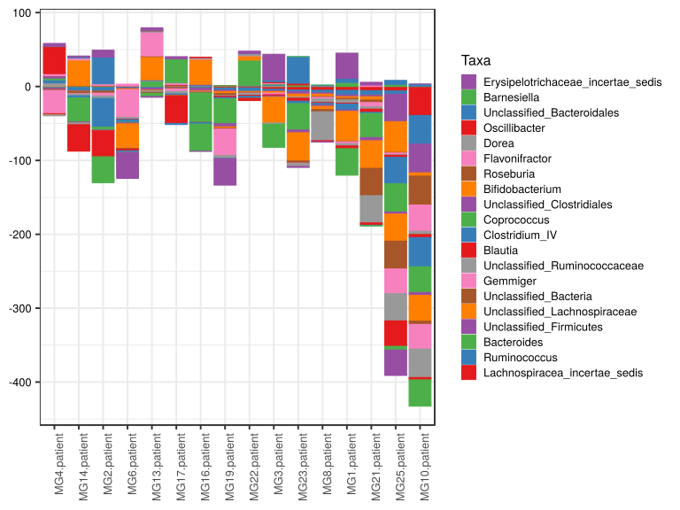

\(1.3.1.3.5.2.2.2.1.1.1\) [`Figure 524.`](#figure.524) Log2 fold change in abundance between paired samples. Samples are paired according to attribute MatchedGroupID, resulting in 16 pairs. When fold change or difference is computed, this is done as 'patient by control'. Data for all pooled samples. Sorting order of features is GeneSelector paired test ranking. bar (sample median) plot.  Image file: [`plots/3236d20bc7a.svg`](plots/3236d20bc7a.svg).
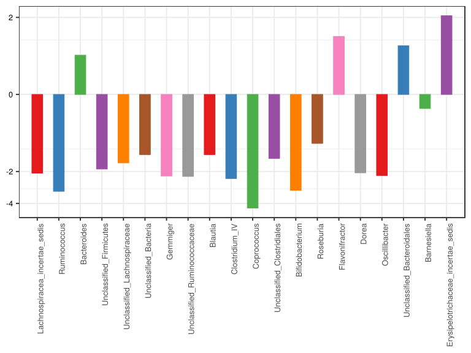

\(1.3.1.3.5.2.2.2.1.1.1\) [`Figure 525.`](#figure.525) Log2 fold change in abundance between paired samples. Samples are paired according to attribute MatchedGroupID, resulting in 16 pairs. When fold change or difference is computed, this is done as 'patient by control'. Data for all pooled samples. Sorting order of features is GeneSelector paired test ranking. violin plot.  Image file: [`plots/32370b5466.svg`](plots/32370b5466.svg).
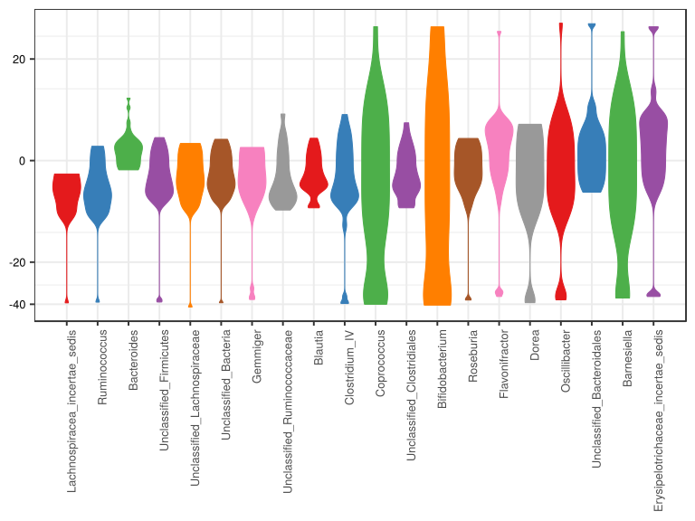

\(1.3.1.3.5.2.2.2.1.1.1\) [`Figure 526.`](#figure.526) Log2 fold change in abundance between paired samples. Samples are paired according to attribute MatchedGroupID, resulting in 16 pairs. When fold change or difference is computed, this is done as 'patient by control'. Data for all pooled samples. Sorting order of features is GeneSelector paired test ranking. boxplot plot.  Image file: [`plots/3231cb14904.svg`](plots/3231cb14904.svg).
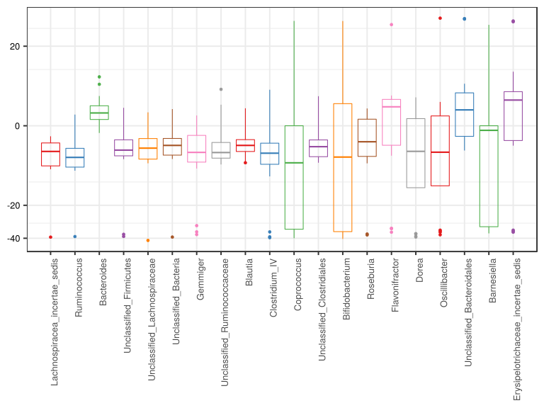

##### \(1.3.1.3.5.2.2.2.1.2\) Log2 fold change in abundance between paired samples. Samples are paired according to attribute MatchedGroupID, resulting in 16 pairs. When fold change or difference is computed, this is done as 'patient by control'. Plot is in flipped orientation, Y axis not scaled. Iterating over plot geometry

\(1.3.1.3.5.2.2.2.1.2.1\) [`Figure 527.`](#figure.527) Log2 fold change in abundance between paired samples. Samples are paired according to attribute MatchedGroupID, resulting in 16 pairs. When fold change or difference is computed, this is done as 'patient by control'. Data for all pooled samples. Sorting order of features is GeneSelector paired test ranking. bar (sample median) plot.  Image file: [`plots/323734d7c4f.svg`](plots/323734d7c4f.svg).
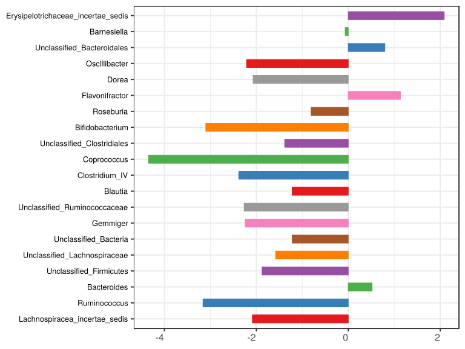

\(1.3.1.3.5.2.2.2.1.2.1\) [`Figure 528.`](#figure.528) Log2 fold change in abundance between paired samples. Samples are paired according to attribute MatchedGroupID, resulting in 16 pairs. When fold change or difference is computed, this is done as 'patient by control'. Data for all pooled samples. Sorting order of features is GeneSelector paired test ranking. violin plot.  Image file: [`plots/3231a8cb087.svg`](plots/3231a8cb087.svg).
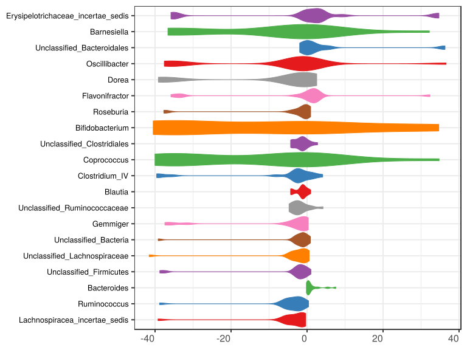

\(1.3.1.3.5.2.2.2.1.2.1\) [`Figure 529.`](#figure.529) Log2 fold change in abundance between paired samples. Samples are paired according to attribute MatchedGroupID, resulting in 16 pairs. When fold change or difference is computed, this is done as 'patient by control'. Data for all pooled samples. Sorting order of features is GeneSelector paired test ranking. boxplot plot.  Image file: [`plots/32361dce064.svg`](plots/32361dce064.svg).
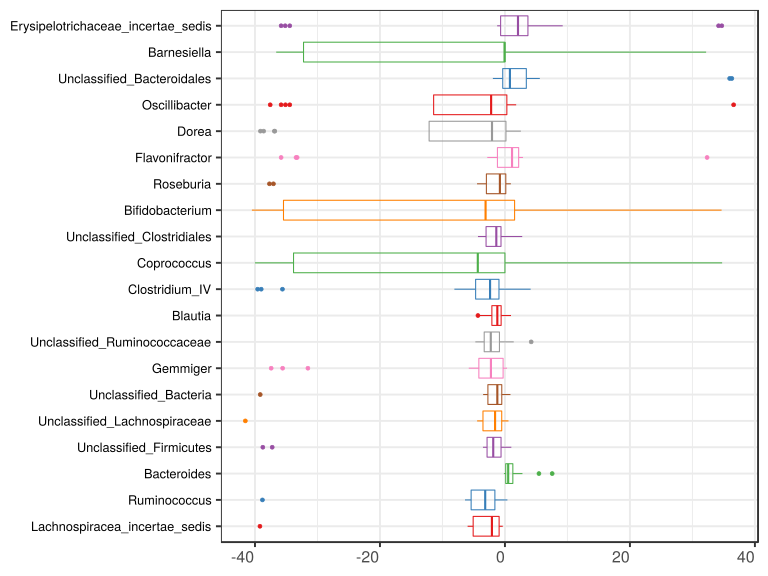

##### \(1.3.1.3.5.2.3\) Grouping variables age.quant

##### \(1.3.1.3.5.2.4\) Iterating over Log2 fold change in abundance between paired samples. Samples are paired according to attribute MatchedGroupID, resulting in 16 pairs. When fold change or difference is computed, this is done as 'patient by control'. profile sorting order

##### \(1.3.1.3.5.2.4.1\) Log2 fold change in abundance between paired samples. Samples are paired according to attribute MatchedGroupID, resulting in 16 pairs. When fold change or difference is computed, this is done as 'patient by control'. profile sorting order: GeneSelector paired test ranking

##### \(1.3.1.3.5.2.4.2\) Iterating over dodged vs faceted bars

The same data are shown in multiple combinations of graphical representations. 
                         This is the same data, but each plot highlights slightly different aspects of it.
                         It is not likely that you will need every plot - pick only what you need.

##### \(1.3.1.3.5.2.4.2.1\) faceted plots. Iterating over orientation and, optionally, scaling

##### \(1.3.1.3.5.2.4.2.1.1\) Log2 fold change in abundance between paired samples. Samples are paired according to attribute MatchedGroupID, resulting in 16 pairs. When fold change or difference is computed, this is done as 'patient by control'. Plot is in original orientation, Y axis SQRT scaled. Iterating over plot geometry

\(1.3.1.3.5.2.4.2.1.1.0\) [`Table 131.`](#table.131) Data table used for plots. Data grouped by age.quant. Showing only 200 first rows. Full dataset is also saved in a delimited text file (click to download and open e.g. in Excel) [`data/1.3.1.3.5.2.4.2.1.1.0-3236ea3a3d0.1.3.1.3.5.2.4.2.1.1.csv`](data/1.3.1.3.5.2.4.2.1.1.0-3236ea3a3d0.1.3.1.3.5.2.4.2.1.1.csv)

| .record.id   | age.quant     | feature                              | l2fc       |
|:-------------|:--------------|:-------------------------------------|:-----------|
| MG1.patient  | \(15.3,26.4\] | Bacteroides                          | 5.43956    |
| MG10.patient | \(8.71,15.3\] | Bacteroides                          | 0.53699    |
| MG13.patient | \(15.3,26.4\] | Bacteroides                          | 7.55888    |
| MG14.patient | \(15.3,26.4\] | Bacteroides                          | 0.82737    |
| MG16.patient | \(15.3,26.4\] | Bacteroides                          | 0.42375    |
| MG17.patient | \(15.3,26.4\] | Bacteroides                          | 0.35672    |
| MG19.patient | \(6.27,8.71\] | Bacteroides                          | 1.10074    |
| MG2.patient  | \(8.71,15.3\] | Bacteroides                          | 0.60619    |
| MG21.patient | \(15.3,26.4\] | Bacteroides                          | \-0.16572  |
| MG22.patient | \(8.71,15.3\] | Bacteroides                          | 0.02192    |
| MG23.patient | \(6.27,8.71\] | Bacteroides                          | 1.75232    |
| MG25.patient | \[3.18,6.27\] | Bacteroides                          | 2.80161    |
| MG3.patient  | \(6.27,8.71\] | Bacteroides                          | 0.07520    |
| MG4.patient  | \(6.27,8.71\] | Bacteroides                          | 0.14079    |
| MG6.patient  | \(8.71,15.3\] | Bacteroides                          | \-0.08941  |
| MG8.patient  | \[3.18,6.27\] | Bacteroides                          | 0.49945    |
| MG1.patient  | \(15.3,26.4\] | Prevotella                           | \-9.63050  |
| MG10.patient | \(8.71,15.3\] | Prevotella                           | \-36.42311 |
| MG13.patient | \(15.3,26.4\] | Prevotella                           | \-0.97321  |
| MG14.patient | \(15.3,26.4\] | Prevotella                           | 0.87606    |
| MG16.patient | \(15.3,26.4\] | Prevotella                           | \-35.02098 |
| MG17.patient | \(15.3,26.4\] | Prevotella                           | \-5.73852  |
| MG19.patient | \(6.27,8.71\] | Prevotella                           | 33.91631   |
| MG2.patient  | \(8.71,15.3\] | Prevotella                           | \-4.13348  |
| MG21.patient | \(15.3,26.4\] | Prevotella                           | 7.66365    |
| MG22.patient | \(8.71,15.3\] | Prevotella                           | 0.00000    |
| MG23.patient | \(6.27,8.71\] | Prevotella                           | 34.95900   |
| MG25.patient | \[3.18,6.27\] | Prevotella                           | \-1.81632  |
| MG3.patient  | \(6.27,8.71\] | Prevotella                           | 1.20940    |
| MG4.patient  | \(6.27,8.71\] | Prevotella                           | \-33.53198 |
| MG6.patient  | \(8.71,15.3\] | Prevotella                           | 2.95417    |
| MG8.patient  | \[3.18,6.27\] | Prevotella                           | \-33.20449 |
| MG1.patient  | \(15.3,26.4\] | Unclassified\_Lachnospiraceae        | \-2.24786  |
| MG10.patient | \(8.71,15.3\] | Unclassified\_Lachnospiraceae        | \-4.45240  |
| MG13.patient | \(15.3,26.4\] | Unclassified\_Lachnospiraceae        | \-0.63484  |
| MG14.patient | \(15.3,26.4\] | Unclassified\_Lachnospiraceae        | \-0.15790  |
| MG16.patient | \(15.3,26.4\] | Unclassified\_Lachnospiraceae        | \-0.95981  |
| MG17.patient | \(15.3,26.4\] | Unclassified\_Lachnospiraceae        | 0.39292    |
| MG19.patient | \(6.27,8.71\] | Unclassified\_Lachnospiraceae        | \-2.79985  |
| MG2.patient  | \(8.71,15.3\] | Unclassified\_Lachnospiraceae        | 0.15730    |
| MG21.patient | \(15.3,26.4\] | Unclassified\_Lachnospiraceae        | \-4.38109  |
| MG22.patient | \(8.71,15.3\] | Unclassified\_Lachnospiraceae        | \-1.11649  |
| MG23.patient | \(6.27,8.71\] | Unclassified\_Lachnospiraceae        | \-4.05681  |
| MG25.patient | \[3.18,6.27\] | Unclassified\_Lachnospiraceae        | \-41.54236 |
| MG3.patient  | \(6.27,8.71\] | Unclassified\_Lachnospiraceae        | \-2.04290  |
| MG4.patient  | \(6.27,8.71\] | Unclassified\_Lachnospiraceae        | 0.56793    |
| MG6.patient  | \(8.71,15.3\] | Unclassified\_Lachnospiraceae        | \-1.05752  |
| MG8.patient  | \[3.18,6.27\] | Unclassified\_Lachnospiraceae        | \-3.33560  |
| MG1.patient  | \(15.3,26.4\] | Alistipes                            | \-5.38925  |
| MG10.patient | \(8.71,15.3\] | Alistipes                            | \-41.12902 |
| MG13.patient | \(15.3,26.4\] | Alistipes                            | 9.79933    |
| MG14.patient | \(15.3,26.4\] | Alistipes                            | \-2.71272  |
| MG16.patient | \(15.3,26.4\] | Alistipes                            | 1.57362    |
| MG17.patient | \(15.3,26.4\] | Alistipes                            | \-40.09856 |
| MG19.patient | \(6.27,8.71\] | Alistipes                            | \-1.91902  |
| MG2.patient  | \(8.71,15.3\] | Alistipes                            | \-39.96518 |
| MG21.patient | \(15.3,26.4\] | Alistipes                            | \-4.83726  |
| MG22.patient | \(8.71,15.3\] | Alistipes                            | \-0.80340  |
| MG23.patient | \(6.27,8.71\] | Alistipes                            | 40.52856   |
| MG25.patient | \[3.18,6.27\] | Alistipes                            | 0.94978    |
| MG3.patient  | \(6.27,8.71\] | Alistipes                            | 41.20020   |
| MG4.patient  | \(6.27,8.71\] | Alistipes                            | 38.40138   |
| MG6.patient  | \(8.71,15.3\] | Alistipes                            | 1.08427    |
| MG8.patient  | \[3.18,6.27\] | Alistipes                            | \-37.94145 |
| MG1.patient  | \(15.3,26.4\] | Faecalibacterium                     | \-6.09132  |
| MG10.patient | \(8.71,15.3\] | Faecalibacterium                     | \-0.15096  |
| MG13.patient | \(15.3,26.4\] | Faecalibacterium                     | \-0.46197  |
| MG14.patient | \(15.3,26.4\] | Faecalibacterium                     | \-1.86362  |
| MG16.patient | \(15.3,26.4\] | Faecalibacterium                     | \-1.35370  |
| MG17.patient | \(15.3,26.4\] | Faecalibacterium                     | 1.17777    |
| MG19.patient | \(6.27,8.71\] | Faecalibacterium                     | 1.25890    |
| MG2.patient  | \(8.71,15.3\] | Faecalibacterium                     | \-0.60113  |
| MG21.patient | \(15.3,26.4\] | Faecalibacterium                     | 1.33745    |
| MG22.patient | \(8.71,15.3\] | Faecalibacterium                     | 0.34536    |
| MG23.patient | \(6.27,8.71\] | Faecalibacterium                     | 1.23739    |
| MG25.patient | \[3.18,6.27\] | Faecalibacterium                     | 0.42464    |
| MG3.patient  | \(6.27,8.71\] | Faecalibacterium                     | \-2.00731  |
| MG4.patient  | \(6.27,8.71\] | Faecalibacterium                     | 0.08686    |
| MG6.patient  | \(8.71,15.3\] | Faecalibacterium                     | \-2.39262  |
| MG8.patient  | \[3.18,6.27\] | Faecalibacterium                     | \-2.00653  |
| MG1.patient  | \(15.3,26.4\] | Ruminococcus                         | \-6.38925  |
| MG10.patient | \(8.71,15.3\] | Ruminococcus                         | \-38.80775 |
| MG13.patient | \(15.3,26.4\] | Ruminococcus                         | \-1.30659  |
| MG14.patient | \(15.3,26.4\] | Ruminococcus                         | \-5.46858  |
| MG16.patient | \(15.3,26.4\] | Ruminococcus                         | \-1.24772  |
| MG17.patient | \(15.3,26.4\] | Ruminococcus                         | 0.39492    |
| MG19.patient | \(6.27,8.71\] | Ruminococcus                         | \-2.89143  |
| MG2.patient  | \(8.71,15.3\] | Ruminococcus                         | \-5.39207  |
| MG21.patient | \(15.3,26.4\] | Ruminococcus                         | \-5.88501  |
| MG22.patient | \(8.71,15.3\] | Ruminococcus                         | \-4.52348  |
| MG23.patient | \(6.27,8.71\] | Ruminococcus                         | \-2.05467  |
| MG25.patient | \[3.18,6.27\] | Ruminococcus                         | \-4.32128  |
| MG3.patient  | \(6.27,8.71\] | Ruminococcus                         | \-2.24025  |
| MG4.patient  | \(6.27,8.71\] | Ruminococcus                         | \-1.61037  |
| MG6.patient  | \(8.71,15.3\] | Ruminococcus                         | \-1.60873  |
| MG8.patient  | \[3.18,6.27\] | Ruminococcus                         | \-3.42709  |
| MG1.patient  | \(15.3,26.4\] | Unclassified\_Ruminococcaceae        | \-4.28944  |
| MG10.patient | \(8.71,15.3\] | Unclassified\_Ruminococcaceae        | \-4.30882  |
| MG13.patient | \(15.3,26.4\] | Unclassified\_Ruminococcaceae        | \-1.98269  |
| MG14.patient | \(15.3,26.4\] | Unclassified\_Ruminococcaceae        | \-2.24206  |
| MG16.patient | \(15.3,26.4\] | Unclassified\_Ruminococcaceae        | 0.51298    |
| MG17.patient | \(15.3,26.4\] | Unclassified\_Ruminococcaceae        | \-3.29109  |
| MG19.patient | \(6.27,8.71\] | Unclassified\_Ruminococcaceae        | \-0.92898  |
| MG2.patient  | \(8.71,15.3\] | Unclassified\_Ruminococcaceae        | \-3.40647  |
| MG21.patient | \(15.3,26.4\] | Unclassified\_Ruminococcaceae        | \-3.06872  |
| MG22.patient | \(8.71,15.3\] | Unclassified\_Ruminococcaceae        | \-2.28738  |
| MG23.patient | \(6.27,8.71\] | Unclassified\_Ruminococcaceae        | \-1.42566  |
| MG25.patient | \[3.18,6.27\] | Unclassified\_Ruminococcaceae        | \-0.74120  |
| MG3.patient  | \(6.27,8.71\] | Unclassified\_Ruminococcaceae        | 1.40570    |
| MG4.patient  | \(6.27,8.71\] | Unclassified\_Ruminococcaceae        | 4.19952    |
| MG6.patient  | \(8.71,15.3\] | Unclassified\_Ruminococcaceae        | \-2.45618  |
| MG8.patient  | \[3.18,6.27\] | Unclassified\_Ruminococcaceae        | \-4.73688  |
| MG1.patient  | \(15.3,26.4\] | Lachnospiracea\_incertae\_sedis      | \-5.13453  |
| MG10.patient | \(8.71,15.3\] | Lachnospiracea\_incertae\_sedis      | \-39.20733 |
| MG13.patient | \(15.3,26.4\] | Lachnospiracea\_incertae\_sedis      | \-0.96676  |
| MG14.patient | \(15.3,26.4\] | Lachnospiracea\_incertae\_sedis      | \-0.53883  |
| MG16.patient | \(15.3,26.4\] | Lachnospiracea\_incertae\_sedis      | \-1.29928  |
| MG17.patient | \(15.3,26.4\] | Lachnospiracea\_incertae\_sedis      | \-1.02908  |
| MG19.patient | \(6.27,8.71\] | Lachnospiracea\_incertae\_sedis      | \-2.02233  |
| MG2.patient  | \(8.71,15.3\] | Lachnospiracea\_incertae\_sedis      | \-0.80845  |
| MG21.patient | \(15.3,26.4\] | Lachnospiracea\_incertae\_sedis      | \-5.57442  |
| MG22.patient | \(8.71,15.3\] | Lachnospiracea\_incertae\_sedis      | \-2.14841  |
| MG23.patient | \(6.27,8.71\] | Lachnospiracea\_incertae\_sedis      | \-4.80553  |
| MG25.patient | \[3.18,6.27\] | Lachnospiracea\_incertae\_sedis      | \-5.97767  |
| MG3.patient  | \(6.27,8.71\] | Lachnospiracea\_incertae\_sedis      | \-3.73576  |
| MG4.patient  | \(6.27,8.71\] | Lachnospiracea\_incertae\_sedis      | \-0.34899  |
| MG6.patient  | \(8.71,15.3\] | Lachnospiracea\_incertae\_sedis      | \-0.83140  |
| MG8.patient  | \[3.18,6.27\] | Lachnospiracea\_incertae\_sedis      | \-5.06979  |
| MG1.patient  | \(15.3,26.4\] | Blautia                              | \-1.24788  |
| MG10.patient | \(8.71,15.3\] | Blautia                              | \-4.17954  |
| MG13.patient | \(15.3,26.4\] | Blautia                              | \-0.86414  |
| MG14.patient | \(15.3,26.4\] | Blautia                              | 0.37184    |
| MG16.patient | \(15.3,26.4\] | Blautia                              | \-0.43135  |
| MG17.patient | \(15.3,26.4\] | Blautia                              | 0.96840    |
| MG19.patient | \(6.27,8.71\] | Blautia                              | \-1.79997  |
| MG2.patient  | \(8.71,15.3\] | Blautia                              | 0.04729    |
| MG21.patient | \(15.3,26.4\] | Blautia                              | \-4.32402  |
| MG22.patient | \(8.71,15.3\] | Blautia                              | \-1.21903  |
| MG23.patient | \(6.27,8.71\] | Blautia                              | \-3.96966  |
| MG25.patient | \[3.18,6.27\] | Blautia                              | \-2.96220  |
| MG3.patient  | \(6.27,8.71\] | Blautia                              | \-1.55672  |
| MG4.patient  | \(6.27,8.71\] | Blautia                              | \-1.21896  |
| MG6.patient  | \(8.71,15.3\] | Blautia                              | \-0.67026  |
| MG8.patient  | \[3.18,6.27\] | Blautia                              | \-1.14969  |
| MG1.patient  | \(15.3,26.4\] | Clostridium\_XI                      | \-40.76746 |
| MG10.patient | \(8.71,15.3\] | Clostridium\_XI                      | \-35.83815 |
| MG13.patient | \(15.3,26.4\] | Clostridium\_XI                      | \-1.70784  |
| MG14.patient | \(15.3,26.4\] | Clostridium\_XI                      | \-3.50589  |
| MG16.patient | \(15.3,26.4\] | Clostridium\_XI                      | 1.69372    |
| MG17.patient | \(15.3,26.4\] | Clostridium\_XI                      | 6.44984    |
| MG19.patient | \(6.27,8.71\] | Clostridium\_XI                      | \-1.57757  |
| MG2.patient  | \(8.71,15.3\] | Clostridium\_XI                      | 2.26344    |
| MG21.patient | \(15.3,26.4\] | Clostridium\_XI                      | \-38.08063 |
| MG22.patient | \(8.71,15.3\] | Clostridium\_XI                      | \-1.42158  |
| MG23.patient | \(6.27,8.71\] | Clostridium\_XI                      | \-1.59528  |
| MG25.patient | \[3.18,6.27\] | Clostridium\_XI                      | 2.69885    |
| MG3.patient  | \(6.27,8.71\] | Clostridium\_XI                      | \-36.82277 |
| MG4.patient  | \(6.27,8.71\] | Clostridium\_XI                      | \-2.65217  |
| MG6.patient  | \(8.71,15.3\] | Clostridium\_XI                      | 1.94603    |
| MG8.patient  | \[3.18,6.27\] | Clostridium\_XI                      | \-5.62433  |
| MG1.patient  | \(15.3,26.4\] | Unclassified\_Clostridiales          | \-1.99694  |
| MG10.patient | \(8.71,15.3\] | Unclassified\_Clostridiales          | \-3.82337  |
| MG13.patient | \(15.3,26.4\] | Unclassified\_Clostridiales          | \-1.01523  |
| MG14.patient | \(15.3,26.4\] | Unclassified\_Clostridiales          | \-1.12186  |
| MG16.patient | \(15.3,26.4\] | Unclassified\_Clostridiales          | 0.96831    |
| MG17.patient | \(15.3,26.4\] | Unclassified\_Clostridiales          | 0.34819    |
| MG19.patient | \(6.27,8.71\] | Unclassified\_Clostridiales          | \-4.27797  |
| MG2.patient  | \(8.71,15.3\] | Unclassified\_Clostridiales          | \-0.67723  |
| MG21.patient | \(15.3,26.4\] | Unclassified\_Clostridiales          | \-4.31814  |
| MG22.patient | \(8.71,15.3\] | Unclassified\_Clostridiales          | \-0.49656  |
| MG23.patient | \(6.27,8.71\] | Unclassified\_Clostridiales          | \-3.73208  |
| MG25.patient | \[3.18,6.27\] | Unclassified\_Clostridiales          | \-2.78441  |
| MG3.patient  | \(6.27,8.71\] | Unclassified\_Clostridiales          | \-1.60336  |
| MG4.patient  | \(6.27,8.71\] | Unclassified\_Clostridiales          | 2.76633    |
| MG6.patient  | \(8.71,15.3\] | Unclassified\_Clostridiales          | \-1.33314  |
| MG8.patient  | \[3.18,6.27\] | Unclassified\_Clostridiales          | \-1.43148  |
| MG1.patient  | \(15.3,26.4\] | Erysipelotrichaceae\_incertae\_sedis | 34.18595   |
| MG10.patient | \(8.71,15.3\] | Erysipelotrichaceae\_incertae\_sedis | 0.00000    |
| MG13.patient | \(15.3,26.4\] | Erysipelotrichaceae\_incertae\_sedis | 3.46208    |
| MG14.patient | \(15.3,26.4\] | Erysipelotrichaceae\_incertae\_sedis | 1.29110    |
| MG16.patient | \(15.3,26.4\] | Erysipelotrichaceae\_incertae\_sedis | \-0.14389  |
| MG17.patient | \(15.3,26.4\] | Erysipelotrichaceae\_incertae\_sedis | 2.88314    |
| MG19.patient | \(6.27,8.71\] | Erysipelotrichaceae\_incertae\_sedis | \-35.81582 |
| MG2.patient  | \(8.71,15.3\] | Erysipelotrichaceae\_incertae\_sedis | 9.24208    |
| MG21.patient | \(15.3,26.4\] | Erysipelotrichaceae\_incertae\_sedis | 3.60664    |
| MG22.patient | \(8.71,15.3\] | Erysipelotrichaceae\_incertae\_sedis | 3.24366    |
| MG23.patient | \(6.27,8.71\] | Erysipelotrichaceae\_incertae\_sedis | \-1.24739  |
| MG25.patient | \[3.18,6.27\] | Erysipelotrichaceae\_incertae\_sedis | \-34.43505 |
| MG3.patient  | \(6.27,8.71\] | Erysipelotrichaceae\_incertae\_sedis | 34.69997   |
| MG4.patient  | \(6.27,8.71\] | Erysipelotrichaceae\_incertae\_sedis | 3.89213    |
| MG6.patient  | \(8.71,15.3\] | Erysipelotrichaceae\_incertae\_sedis | \-35.16016 |
| MG8.patient  | \[3.18,6.27\] | Erysipelotrichaceae\_incertae\_sedis | \-0.50653  |
| MG1.patient  | \(15.3,26.4\] | Clostridium\_IV                      | \-8.09153  |
| MG10.patient | \(8.71,15.3\] | Clostridium\_IV                      | \-39.57503 |
| MG13.patient | \(15.3,26.4\] | Clostridium\_IV                      | 1.21210    |
| MG14.patient | \(15.3,26.4\] | Clostridium\_IV                      | \-2.94517  |
| MG16.patient | \(15.3,26.4\] | Clostridium\_IV                      | 1.09065    |
| MG17.patient | \(15.3,26.4\] | Clostridium\_IV                      | \-1.96653  |
| MG19.patient | \(6.27,8.71\] | Clostridium\_IV                      | \-1.89928  |
| MG2.patient  | \(8.71,15.3\] | Clostridium\_IV                      | \-39.00244 |

\(1.3.1.3.5.2.4.2.1.1.1\) [`Widget 143.`](#widget.143) Dynamic Pivot Table link (drag and drop field names and pick averaging 
                      functions or plot types; click on fields or legend elements to filter values). 
                      Starting rendering is Stacked Bar Chart. Data grouped by age.quant. Click to see HTML widget file in full window: [`./1.3.1.3.5.2.4.2.1.1.1-3235059557cDynamic.Pivot.Table.html`](./1.3.1.3.5.2.4.2.1.1.1-3235059557cDynamic.Pivot.Table.html)

\(1.3.1.3.5.2.4.2.1.1.1\) [`Widget 144.`](#widget.144) Dynamic Pivot Table link (drag and drop field names and pick averaging 
                      functions or plot types; click on fields or legend elements to filter values). 
                      Starting rendering is Table Barchart. Data grouped by age.quant. Click to see HTML widget file in full window: [`./1.3.1.3.5.2.4.2.1.1.1-3237fea32a6Dynamic.Pivot.Table.html`](./1.3.1.3.5.2.4.2.1.1.1-3237fea32a6Dynamic.Pivot.Table.html)

\(1.3.1.3.5.2.4.2.1.1.1\) [`Table 132.`](#table.132) Summary table. Data grouped by age.quant. Full dataset is also saved in a delimited text file (click to download and open e.g. in Excel) [`data/1.3.1.3.5.2.4.2.1.1.1-32341e889ca.1.3.1.3.5.2.4.2.1.1.csv`](data/1.3.1.3.5.2.4.2.1.1.1-32341e889ca.1.3.1.3.5.2.4.2.1.1.csv)

| feature                              | age.quant     | mean       | sd       | median      | incidence |
|:-------------------------------------|:--------------|:-----------|:---------|:------------|:----------|
| Lachnospiracea\_incertae\_sedis      | \[3.18,6.27\] | \-5.52373  | 0.64197  | \-5.523732  | 0.0000    |
| Lachnospiracea\_incertae\_sedis      | \(6.27,8.71\] | \-2.72815  | 1.95698  | \-2.879046  | 0.0000    |
| Lachnospiracea\_incertae\_sedis      | \(8.71,15.3\] | \-10.74890 | 18.98263 | \-1.489904  | 0.0000    |
| Lachnospiracea\_incertae\_sedis      | \(15.3,26.4\] | \-2.42382  | 2.28737  | \-1.164183  | 0.0000    |
| Ruminococcus                         | \[3.18,6.27\] | \-3.87419  | 0.63229  | \-3.874187  | 0.0000    |
| Ruminococcus                         | \(6.27,8.71\] | \-2.19918  | 0.53181  | \-2.147458  | 0.0000    |
| Ruminococcus                         | \(8.71,15.3\] | \-12.58301 | 17.55788 | \-4.957776  | 0.0000    |
| Ruminococcus                         | \(15.3,26.4\] | \-3.31704  | 2.92454  | \-3.387586  | 0.1667    |
| Bacteroides                          | \[3.18,6.27\] | 1.65053    | 1.62788  | 1.650529    | 1.0000    |
| Bacteroides                          | \(6.27,8.71\] | 0.76726    | 0.80684  | 0.620764    | 1.0000    |
| Bacteroides                          | \(8.71,15.3\] | 0.26892    | 0.35357  | 0.279456    | 0.7500    |
| Bacteroides                          | \(15.3,26.4\] | 2.40676    | 3.25544  | 0.625563    | 0.8333    |
| Unclassified\_Firmicutes             | \[3.18,6.27\] | \-19.50440 | 25.08532 | \-19.504401 | 0.0000    |
| Unclassified\_Firmicutes             | \(6.27,8.71\] | \-1.99380  | 1.07177  | \-1.864920  | 0.0000    |
| Unclassified\_Firmicutes             | \(8.71,15.3\] | \-9.51414  | 19.49944 | \-0.166411  | 0.5000    |
| Unclassified\_Firmicutes             | \(15.3,26.4\] | \-1.94423  | 1.20725  | \-2.224541  | 0.0000    |
| Unclassified\_Lachnospiraceae        | \[3.18,6.27\] | \-22.43898 | 27.01626 | \-22.438977 | 0.0000    |
| Unclassified\_Lachnospiraceae        | \(6.27,8.71\] | \-2.08291  | 1.95268  | \-2.421379  | 0.2500    |
| Unclassified\_Lachnospiraceae        | \(8.71,15.3\] | \-1.61728  | 1.97915  | \-1.087007  | 0.2500    |
| Unclassified\_Lachnospiraceae        | \(15.3,26.4\] | \-1.33143  | 1.73863  | \-0.797322  | 0.1667    |
| Unclassified\_Bacteria               | \[3.18,6.27\] | \-0.97230  | 0.10495  | \-0.972296  | 0.0000    |
| Unclassified\_Bacteria               | \(6.27,8.71\] | \-0.75569  | 1.57650  | \-0.601076  | 0.5000    |
| Unclassified\_Bacteria               | \(8.71,15.3\] | \-10.60096 | 19.09363 | \-1.978435  | 0.2500    |
| Unclassified\_Bacteria               | \(15.3,26.4\] | \-1.80570  | 1.25222  | \-1.787978  | 0.0000    |
| Gemmiger                             | \[3.18,6.27\] | \-2.24257  | 0.05431  | \-2.242574  | 0.0000    |
| Gemmiger                             | \(6.27,8.71\] | \-8.45911  | 15.42022 | \-1.152237  | 0.0000    |
| Gemmiger                             | \(8.71,15.3\] | \-19.32490 | 19.87250 | \-19.598750 | 0.0000    |
| Gemmiger                             | \(15.3,26.4\] | \-1.69872  | 2.45970  | \-0.558683  | 0.3333    |
| Unclassified\_Ruminococcaceae        | \[3.18,6.27\] | \-2.73904  | 2.82537  | \-2.739040  | 0.0000    |
| Unclassified\_Ruminococcaceae        | \(6.27,8.71\] | 0.81264    | 2.57332  | 0.238356    | 0.5000    |
| Unclassified\_Ruminococcaceae        | \(8.71,15.3\] | \-3.11471  | 0.93615  | \-2.931326  | 0.0000    |
| Unclassified\_Ruminococcaceae        | \(15.3,26.4\] | \-2.39350  | 1.64289  | \-2.655390  | 0.1667    |
| Blautia                              | \[3.18,6.27\] | \-2.05594  | 1.28164  | \-2.055942  | 0.0000    |
| Blautia                              | \(6.27,8.71\] | \-2.13633  | 1.24522  | \-1.678343  | 0.0000    |
| Blautia                              | \(8.71,15.3\] | \-1.50538  | 1.85664  | \-0.944644  | 0.2500    |
| Blautia                              | \(15.3,26.4\] | \-0.92119  | 1.85319  | \-0.647744  | 0.3333    |
| Clostridium\_IV                      | \[3.18,6.27\] | \-19.10394 | 23.33599 | \-19.103937 | 0.0000    |
| Clostridium\_IV                      | \(6.27,8.71\] | \-0.06010  | 3.27671  | \-0.518901  | 0.5000    |
| Clostridium\_IV                      | \(8.71,15.3\] | \-21.07364 | 21.04201 | \-21.279877 | 0.0000    |
| Clostridium\_IV                      | \(15.3,26.4\] | \-2.04396  | 3.40735  | \-1.764907  | 0.3333    |
| Coprococcus                          | \[3.18,6.27\] | \-19.19461 | 27.14528 | \-19.194614 | 0.0000    |
| Coprococcus                          | \(6.27,8.71\] | \-16.39969 | 21.09235 | \-16.142248 | 0.5000    |
| Coprococcus                          | \(8.71,15.3\] | \-1.20296  | 28.47097 | \-2.364726  | 0.2500    |
| Coprococcus                          | \(15.3,26.4\] | \-18.38959 | 18.53503 | \-18.677707 | 0.0000    |
| Unclassified\_Clostridiales          | \[3.18,6.27\] | \-2.10795  | 0.95667  | \-2.107948  | 0.0000    |
| Unclassified\_Clostridiales          | \(6.27,8.71\] | \-1.71177  | 3.20064  | \-2.667722  | 0.2500    |
| Unclassified\_Clostridiales          | \(8.71,15.3\] | \-1.58258  | 1.53650  | \-1.005187  | 0.0000    |
| Unclassified\_Clostridiales          | \(15.3,26.4\] | \-1.18928  | 1.87061  | \-1.068548  | 0.3333    |
| Bifidobacterium                      | \[3.18,6.27\] | \-20.41070 | 22.78554 | \-20.410700 | 0.0000    |
| Bifidobacterium                      | \(6.27,8.71\] | \-18.91073 | 20.52136 | \-18.487521 | 0.0000    |
| Bifidobacterium                      | \(8.71,15.3\] | \-15.50598 | 21.49465 | \-16.529695 | 0.5000    |
| Bifidobacterium                      | \(15.3,26.4\] | 3.66016    | 35.43444 | 15.628131   | 0.5000    |
| Roseburia                            | \[3.18,6.27\] | \-20.35862 | 24.50033 | \-20.358618 | 0.0000    |
| Roseburia                            | \(6.27,8.71\] | \-0.91977  | 1.50405  | \-0.541457  | 0.5000    |
| Roseburia                            | \(8.71,15.3\] | \-1.58021  | 2.03323  | \-1.083410  | 0.2500    |
| Roseburia                            | \(15.3,26.4\] | \-6.17788  | 15.13462 | \-0.333703  | 0.3333    |
| Flavonifractor                       | \[3.18,6.27\] | \-16.58585 | 23.82836 | \-16.585853 | 0.5000    |
| Flavonifractor                       | \(6.27,8.71\] | \-8.02842  | 18.58245 | 0.405012    | 0.5000    |
| Flavonifractor                       | \(8.71,15.3\] | \-7.12020  | 17.45162 | 1.132556    | 0.7500    |
| Flavonifractor                       | \(15.3,26.4\] | 6.19114    | 12.96960 | 2.010465    | 0.8333    |
| Dorea                                | \[3.18,6.27\] | \-38.01088 | 1.57883  | \-38.010879 | 0.0000    |
| Dorea                                | \(6.27,8.71\] | \-2.64303  | 1.42594  | \-2.746630  | 0.0000    |
| Dorea                                | \(8.71,15.3\] | \-9.09078  | 19.72156 | \-0.152080  | 0.2500    |
| Dorea                                | \(15.3,26.4\] | \-6.38795  | 15.04051 | \-0.912080  | 0.5000    |
| Oscillibacter                        | \[3.18,6.27\] | \-17.87582 | 23.41828 | \-17.875823 | 0.0000    |
| Oscillibacter                        | \(6.27,8.71\] | 9.96855    | 17.76565 | 1.602837    | 1.0000    |
| Oscillibacter                        | \(8.71,15.3\] | \-10.68092 | 16.29907 | \-2.727591  | 0.0000    |
| Oscillibacter                        | \(15.3,26.4\] | \-13.26045 | 18.24021 | \-3.471236  | 0.3333    |
| Unclassified\_Bacteroidales          | \[3.18,6.27\] | 3.30838    | 3.10197  | 3.308376    | 1.0000    |
| Unclassified\_Bacteroidales          | \(6.27,8.71\] | 9.58716    | 17.61944 | 1.352096    | 0.7500    |
| Unclassified\_Bacteroidales          | \(8.71,15.3\] | 9.32979    | 18.08817 | 1.470625    | 0.7500    |
| Unclassified\_Bacteroidales          | \(15.3,26.4\] | 0.58830    | 2.71608  | 0.004714    | 0.5000    |
| Barnesiella                          | \[3.18,6.27\] | \-2.48109  | 3.50879  | \-2.481090  | 0.0000    |
| Barnesiella                          | \(6.27,8.71\] | \-7.81705  | 15.63409 | 0.000000    | 0.0000    |
| Barnesiella                          | \(8.71,15.3\] | \-17.70688 | 20.37051 | \-17.626214 | 0.0000    |
| Barnesiella                          | \(15.3,26.4\] | \-6.78704  | 26.03041 | \-0.235068  | 0.3333    |
| Erysipelotrichaceae\_incertae\_sedis | \[3.18,6.27\] | \-17.47079 | 23.99108 | \-17.470790 | 0.0000    |
| Erysipelotrichaceae\_incertae\_sedis | \(6.27,8.71\] | 0.38222    | 28.88472 | 1.322369    | 0.5000    |
| Erysipelotrichaceae\_incertae\_sedis | \(8.71,15.3\] | \-5.66861  | 20.03032 | 1.621828    | 0.5000    |
| Erysipelotrichaceae\_incertae\_sedis | \(15.3,26.4\] | 7.54750    | 13.12924 | 3.172608    | 0.8333    |
| Prevotella                           | \[3.18,6.27\] | \-17.51041 | 22.19479 | \-17.510407 | 0.0000    |
| Prevotella                           | \(6.27,8.71\] | 9.13818    | 32.47706 | 17.562856   | 0.7500    |
| Prevotella                           | \(8.71,15.3\] | \-9.40061  | 18.24801 | \-2.066739  | 0.2500    |
| Prevotella                           | \(15.3,26.4\] | \-7.13725  | 14.87918 | \-3.355862  | 0.3333    |
| Faecalibacterium                     | \[3.18,6.27\] | \-0.79095  | 1.71910  | \-0.790946  | 0.5000    |
| Faecalibacterium                     | \(6.27,8.71\] | 0.14396    | 1.53514  | 0.662125    | 0.7500    |
| Faecalibacterium                     | \(8.71,15.3\] | \-0.69984  | 1.19289  | \-0.376042  | 0.2500    |
| Faecalibacterium                     | \(15.3,26.4\] | \-1.20923  | 2.72124  | \-0.907834  | 0.3333    |
| Clostridium\_XlVa                    | \[3.18,6.27\] | \-0.96610  | 0.90860  | \-0.966097  | 0.0000    |
| Clostridium\_XlVa                    | \(6.27,8.71\] | \-0.74425  | 2.32178  | \-0.704236  | 0.5000    |
| Clostridium\_XlVa                    | \(8.71,15.3\] | \-1.43724  | 3.55055  | \-1.268166  | 0.2500    |
| Clostridium\_XlVa                    | \(15.3,26.4\] | \-0.29476  | 1.82298  | 0.232079    | 0.5000    |
| Alistipes                            | \[3.18,6.27\] | \-18.49583 | 27.50025 | \-18.495835 | 0.5000    |
| Alistipes                            | \(6.27,8.71\] | 29.55278   | 21.01509 | 39.464970   | 0.7500    |
| Alistipes                            | \(8.71,15.3\] | \-20.20333 | 23.50840 | \-20.384294 | 0.2500    |
| Alistipes                            | \(15.3,26.4\] | \-6.94414  | 17.18647 | \-3.774990  | 0.3333    |
| Parabacteroides                      | \[3.18,6.27\] | \-17.78830 | 29.70008 | \-17.788302 | 0.5000    |
| Parabacteroides                      | \(6.27,8.71\] | \-0.85600  | 2.66635  | \-0.283672  | 0.5000    |
| Parabacteroides                      | \(8.71,15.3\] | 0.95467    | 1.16045  | 1.044701    | 0.7500    |
| Parabacteroides                      | \(15.3,26.4\] | \-7.09449  | 14.76770 | \-3.244427  | 0.3333    |
| Clostridium\_XI                      | \[3.18,6.27\] | \-1.46274  | 5.88538  | \-1.462743  | 0.5000    |
| Clostridium\_XI                      | \(6.27,8.71\] | \-10.66195 | 17.44778 | \-2.123725  | 0.0000    |
| Clostridium\_XI                      | \(8.71,15.3\] | \-8.26256  | 18.45918 | 0.262225    | 0.5000    |
| Clostridium\_XI                      | \(15.3,26.4\] | \-12.65304 | 21.02950 | \-2.606869  | 0.3333    |
| Enterococcus                         | \[3.18,6.27\] | 18.55995   | 26.24774 | 18.559955   | 0.5000    |
| Enterococcus                         | \(6.27,8.71\] | 0.51252    | 28.19080 | 0.000000    | 0.2500    |
| Enterococcus                         | \(8.71,15.3\] | 8.95243    | 17.36220 | 0.410225    | 0.5000    |
| Enterococcus                         | \(15.3,26.4\] | 17.68252   | 19.66474 | 16.096011   | 0.5000    |
| Odoribacter                          | \[3.18,6.27\] | \-37.46784 | 0.72017  | \-37.467840 | 0.0000    |
| Odoribacter                          | \(6.27,8.71\] | 0.00000    | 0.00000  | 0.000000    | 0.0000    |
| Odoribacter                          | \(8.71,15.3\] | \-7.54485  | 34.99982 | \-17.219202 | 0.2500    |
| Odoribacter                          | \(15.3,26.4\] | \-12.50216 | 19.80611 | \-3.465073  | 0.1667    |
| Clostridium\_XVIII                   | \[3.18,6.27\] | \-36.43418 | 0.95771  | \-36.434178 | 0.0000    |
| Clostridium\_XVIII                   | \(6.27,8.71\] | \-1.58402  | 3.49353  | \-2.465212  | 0.2500    |
| Clostridium\_XVIII                   | \(8.71,15.3\] | \-8.87517  | 17.62252 | \-0.570330  | 0.5000    |
| Clostridium\_XVIII                   | \(15.3,26.4\] | 1.53022    | 2.67080  | 2.466362    | 0.6667    |
| Escherichia\_Shigella                | \[3.18,6.27\] | \-17.39473 | 24.59986 | \-17.394728 | 0.0000    |
| Escherichia\_Shigella                | \(6.27,8.71\] | \-8.57857  | 17.08530 | \-0.053933  | 0.0000    |
| Escherichia\_Shigella                | \(8.71,15.3\] | \-17.21838 | 19.62630 | \-18.648570 | 0.2500    |
| Escherichia\_Shigella                | \(15.3,26.4\] | \-4.26594  | 36.41853 | \-16.794393 | 0.3333    |
| Clostridium\_sensu\_stricto          | \[3.18,6.27\] | 3.06292    | 4.27371  | 3.062921    | 1.0000    |
| Clostridium\_sensu\_stricto          | \(6.27,8.71\] | \-25.00164 | 16.68184 | \-32.900082 | 0.0000    |
| Clostridium\_sensu\_stricto          | \(8.71,15.3\] | \-8.04956  | 19.21166 | 1.092911    | 0.5000    |
| Clostridium\_sensu\_stricto          | \(15.3,26.4\] | \-4.82770  | 27.29748 | \-2.143756  | 0.3333    |
| Streptococcus                        | \[3.18,6.27\] | \-16.60225 | 23.47912 | \-16.602246 | 0.0000    |
| Streptococcus                        | \(6.27,8.71\] | \-19.25696 | 18.84578 | \-19.418219 | 0.0000    |
| Streptococcus                        | \(8.71,15.3\] | 1.98052    | 30.19504 | 3.113469    | 0.5000    |
| Streptococcus                        | \(15.3,26.4\] | \-0.42466  | 3.84233  | \-1.158606  | 0.3333    |
| Sutterella                           | \[3.18,6.27\] | 1.48595    | 4.57507  | 1.485946    | 0.5000    |
| Sutterella                           | \(6.27,8.71\] | \-9.70591  | 16.05644 | \-2.664880  | 0.0000    |
| Sutterella                           | \(8.71,15.3\] | 7.67899    | 38.20019 | 17.603670   | 0.5000    |
| Sutterella                           | \(15.3,26.4\] | \-12.67706 | 20.20166 | \-3.769663  | 0.3333    |
| Unclassified\_Prevotellaceae         | \[3.18,6.27\] | \-17.87849 | 25.28400 | \-17.878487 | 0.0000    |
| Unclassified\_Prevotellaceae         | \(6.27,8.71\] | \-0.09389  | 0.18778  | 0.000000    | 0.0000    |
| Unclassified\_Prevotellaceae         | \(8.71,15.3\] | \-10.04911 | 20.09823 | 0.000000    | 0.0000    |
| Unclassified\_Prevotellaceae         | \(15.3,26.4\] | \-0.13896  | 23.72289 | \-0.775854  | 0.1667    |
| Akkermansia                          | \[3.18,6.27\] | \-17.01000 | 24.05578 | \-17.010005 | 0.0000    |
| Akkermansia                          | \(6.27,8.71\] | \-0.50017  | 26.69668 | \-0.199694  | 0.2500    |
| Akkermansia                          | \(8.71,15.3\] | 9.70758    | 16.97455 | 1.878348    | 0.7500    |
| Akkermansia                          | \(15.3,26.4\] | \-1.03928  | 2.54571  | 0.000000    | 0.0000    |
| Megamonas                            | \[3.18,6.27\] | 0.00000    | 0.00000  | 0.000000    | 0.0000    |
| Megamonas                            | \(6.27,8.71\] | \-10.07390 | 19.20790 | \-0.713773  | 0.0000    |
| Megamonas                            | \(8.71,15.3\] | 0.00000    | 0.00000  | 0.000000    | 0.0000    |
| Megamonas                            | \(15.3,26.4\] | \-1.70439  | 23.74116 | 0.000000    | 0.1667    |
| Phascolarctobacterium                | \[3.18,6.27\] | 0.00000    | 0.00000  | 0.000000    | 0.0000    |
| Phascolarctobacterium                | \(6.27,8.71\] | 9.41928    | 17.69751 | 0.870056    | 0.5000    |
| Phascolarctobacterium                | \(8.71,15.3\] | \-0.07644  | 0.55543  | 0.000000    | 0.2500    |
| Phascolarctobacterium                | \(15.3,26.4\] | 4.66480    | 27.76924 | 0.000000    | 0.3333    |
| Lactobacillus                        | \[3.18,6.27\] | \-16.30977 | 23.06549 | \-16.309765 | 0.0000    |
| Lactobacillus                        | \(6.27,8.71\] | 0.00000    | 0.00000  | 0.000000    | 0.0000    |
| Lactobacillus                        | \(8.71,15.3\] | 9.44916    | 18.89831 | 0.000000    | 0.2500    |
| Lactobacillus                        | \(15.3,26.4\] | \-11.96949 | 15.91419 | \-4.091964  | 0.1667    |
| Klebsiella                           | \[3.18,6.27\] | 0.00000    | 0.00000  | 0.000000    | 0.0000    |
| Klebsiella                           | \(6.27,8.71\] | 0.00000    | 0.00000  | 0.000000    | 0.0000    |
| Klebsiella                           | \(8.71,15.3\] | 0.26668    | 0.53335  | 0.000000    | 0.2500    |
| Klebsiella                           | \(15.3,26.4\] | 11.65073   | 28.47034 | 16.409099   | 0.5000    |
| Unclassified\_Lactobacillales        | \[3.18,6.27\] | 0.00000    | 0.00000  | 0.000000    | 0.0000    |
| Unclassified\_Lactobacillales        | \(6.27,8.71\] | 0.00000    | 0.00000  | 0.000000    | 0.0000    |
| Unclassified\_Lactobacillales        | \(8.71,15.3\] | 10.64968   | 21.29936 | 0.000000    | 0.2500    |
| Unclassified\_Lactobacillales        | \(15.3,26.4\] | 5.36534    | 13.14234 | 0.000000    | 0.1667    |
| Catenibacterium                      | \[3.18,6.27\] | 0.00000    | 0.00000  | 0.000000    | 0.0000    |
| Catenibacterium                      | \(6.27,8.71\] | 0.00000    | 0.00000  | 0.000000    | 0.0000    |
| Catenibacterium                      | \(8.71,15.3\] | 0.00000    | 0.00000  | 0.000000    | 0.0000    |
| Catenibacterium                      | \(15.3,26.4\] | \-6.75297  | 29.22306 | 0.000000    | 0.1667    |

\(1.3.1.3.5.2.4.2.1.1.1\) [`Figure 530.`](#figure.530) Log2 fold change in abundance between paired samples. Samples are paired according to attribute MatchedGroupID, resulting in 16 pairs. When fold change or difference is computed, this is done as 'patient by control'. Data grouped by age.quant. Sorting order of features is GeneSelector paired test ranking. bar_stacked plot.  Image file: [`plots/32378667b3f.svg`](plots/32378667b3f.svg).
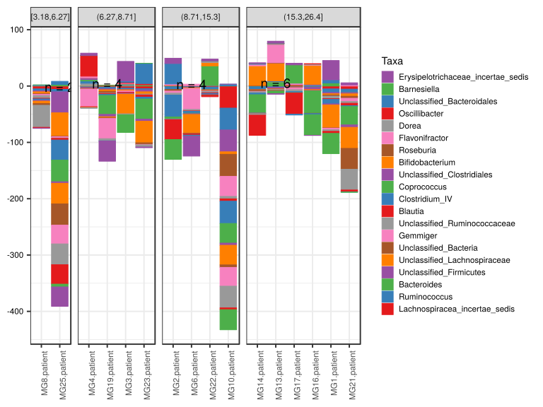

\(1.3.1.3.5.2.4.2.1.1.1\) [`Figure 531.`](#figure.531) Log2 fold change in abundance between paired samples. Samples are paired according to attribute MatchedGroupID, resulting in 16 pairs. When fold change or difference is computed, this is done as 'patient by control'. Data grouped by age.quant. Sorting order of features is GeneSelector paired test ranking. bar (sample median) plot.  Image file: [`plots/3234780f9aa.svg`](plots/3234780f9aa.svg).
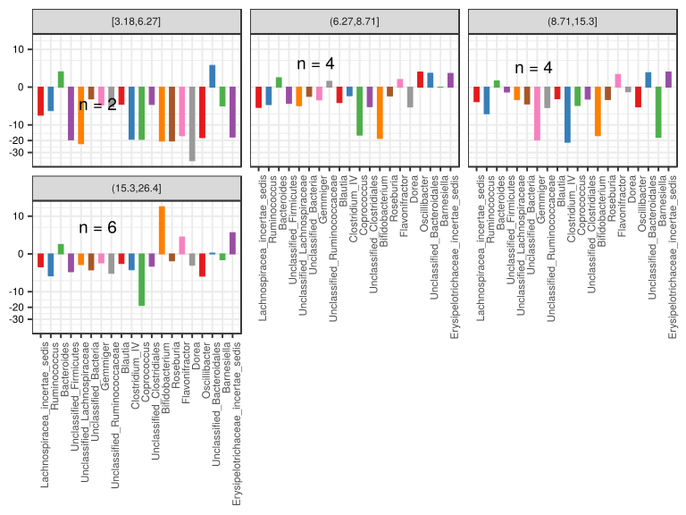

\(1.3.1.3.5.2.4.2.1.1.1\) [`Figure 532.`](#figure.532) Log2 fold change in abundance between paired samples. Samples are paired according to attribute MatchedGroupID, resulting in 16 pairs. When fold change or difference is computed, this is done as 'patient by control'. Data grouped by age.quant. Sorting order of features is GeneSelector paired test ranking. violin plot.  Image file: [`plots/3231fd5e99b.svg`](plots/3231fd5e99b.svg).
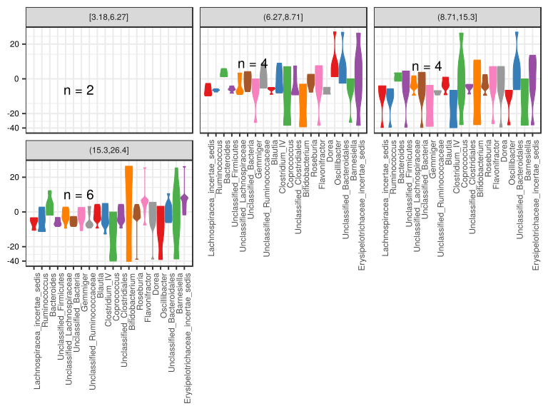

\(1.3.1.3.5.2.4.2.1.1.1\) [`Figure 533.`](#figure.533) Log2 fold change in abundance between paired samples. Samples are paired according to attribute MatchedGroupID, resulting in 16 pairs. When fold change or difference is computed, this is done as 'patient by control'. Data grouped by age.quant. Sorting order of features is GeneSelector paired test ranking. boxplot plot.  Image file: [`plots/323134567df.svg`](plots/323134567df.svg).
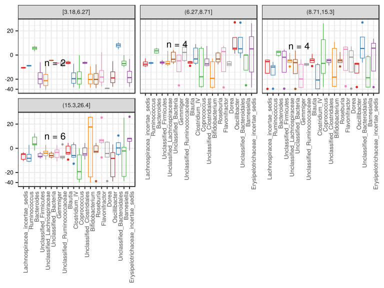

##### \(1.3.1.3.5.2.4.2.1.2\) Log2 fold change in abundance between paired samples. Samples are paired according to attribute MatchedGroupID, resulting in 16 pairs. When fold change or difference is computed, this is done as 'patient by control'. Plot is in flipped orientation, Y axis not scaled. Iterating over plot geometry

\(1.3.1.3.5.2.4.2.1.2.1\) [`Figure 534.`](#figure.534) Log2 fold change in abundance between paired samples. Samples are paired according to attribute MatchedGroupID, resulting in 16 pairs. When fold change or difference is computed, this is done as 'patient by control'. Data grouped by age.quant. Sorting order of features is GeneSelector paired test ranking. bar (sample median) plot.  Image file: [`plots/3236ec471b3.svg`](plots/3236ec471b3.svg).
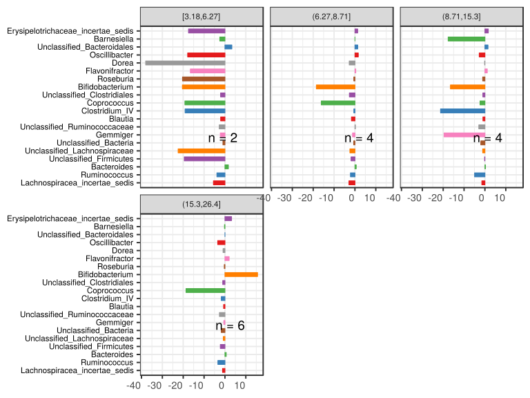

\(1.3.1.3.5.2.4.2.1.2.1\) [`Figure 535.`](#figure.535) Log2 fold change in abundance between paired samples. Samples are paired according to attribute MatchedGroupID, resulting in 16 pairs. When fold change or difference is computed, this is done as 'patient by control'. Data grouped by age.quant. Sorting order of features is GeneSelector paired test ranking. violin plot.  Image file: [`plots/3236d815504.svg`](plots/3236d815504.svg).
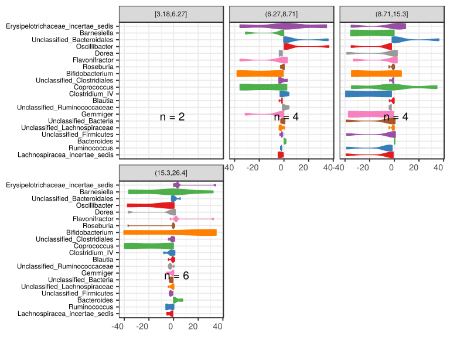

\(1.3.1.3.5.2.4.2.1.2.1\) [`Figure 536.`](#figure.536) Log2 fold change in abundance between paired samples. Samples are paired according to attribute MatchedGroupID, resulting in 16 pairs. When fold change or difference is computed, this is done as 'patient by control'. Data grouped by age.quant. Sorting order of features is GeneSelector paired test ranking. boxplot plot.  Image file: [`plots/32310ab8481.svg`](plots/32310ab8481.svg).
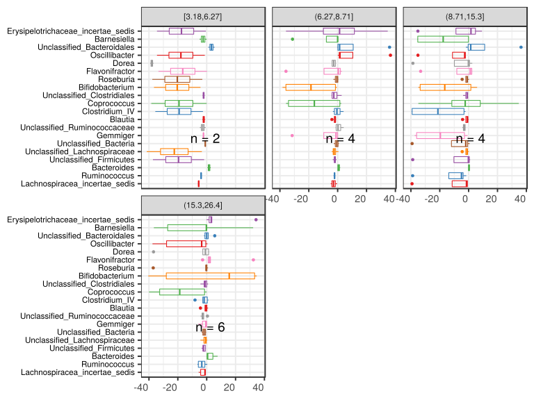

##### \(1.3.1.3.5.2.4.2.2\) dodged plots. Iterating over orientation and, optionally, scaling

##### \(1.3.1.3.5.2.4.2.2.1\) Log2 fold change in abundance between paired samples. Samples are paired according to attribute MatchedGroupID, resulting in 16 pairs. When fold change or difference is computed, this is done as 'patient by control'. Plot is in original orientation, Y axis SQRT scaled. Iterating over plot geometry

\(1.3.1.3.5.2.4.2.2.1.1\) [`Figure 537.`](#figure.537) Log2 fold change in abundance between paired samples. Samples are paired according to attribute MatchedGroupID, resulting in 16 pairs. When fold change or difference is computed, this is done as 'patient by control'. Data grouped by age.quant. Sorting order of features is GeneSelector paired test ranking. bar (sample median) plot.  Image file: [`plots/323e2c30c2.svg`](plots/323e2c30c2.svg).
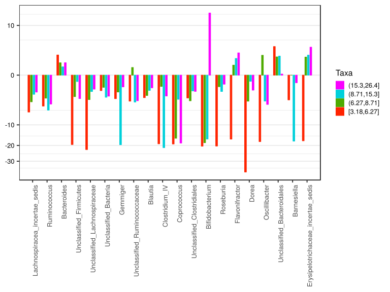

\(1.3.1.3.5.2.4.2.2.1.1\) [`Figure 538.`](#figure.538) Log2 fold change in abundance between paired samples. Samples are paired according to attribute MatchedGroupID, resulting in 16 pairs. When fold change or difference is computed, this is done as 'patient by control'. Data grouped by age.quant. Sorting order of features is GeneSelector paired test ranking. violin plot.  Image file: [`plots/32370b0249a.svg`](plots/32370b0249a.svg).
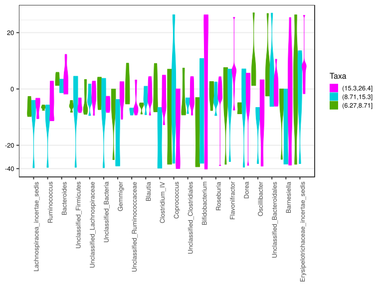

\(1.3.1.3.5.2.4.2.2.1.1\) [`Figure 539.`](#figure.539) Log2 fold change in abundance between paired samples. Samples are paired according to attribute MatchedGroupID, resulting in 16 pairs. When fold change or difference is computed, this is done as 'patient by control'. Data grouped by age.quant. Sorting order of features is GeneSelector paired test ranking. boxplot plot.  Image file: [`plots/3231073211c.svg`](plots/3231073211c.svg).
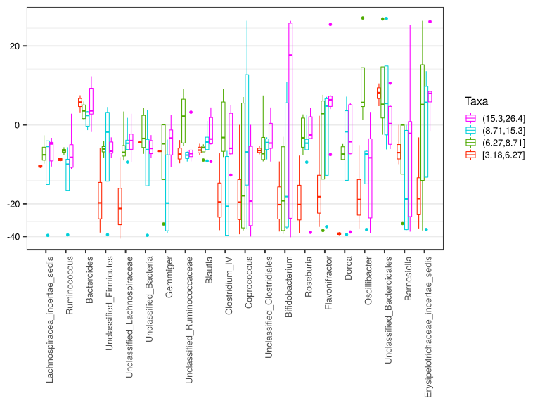

##### \(1.3.1.3.5.2.4.2.2.2\) Log2 fold change in abundance between paired samples. Samples are paired according to attribute MatchedGroupID, resulting in 16 pairs. When fold change or difference is computed, this is done as 'patient by control'. Plot is in flipped orientation, Y axis not scaled. Iterating over plot geometry

\(1.3.1.3.5.2.4.2.2.2.1\) [`Figure 540.`](#figure.540) Log2 fold change in abundance between paired samples. Samples are paired according to attribute MatchedGroupID, resulting in 16 pairs. When fold change or difference is computed, this is done as 'patient by control'. Data grouped by age.quant. Sorting order of features is GeneSelector paired test ranking. bar (sample median) plot.  Image file: [`plots/3231875cdd9.svg`](plots/3231875cdd9.svg).
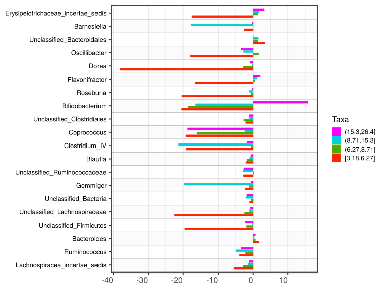

\(1.3.1.3.5.2.4.2.2.2.1\) [`Figure 541.`](#figure.541) Log2 fold change in abundance between paired samples. Samples are paired according to attribute MatchedGroupID, resulting in 16 pairs. When fold change or difference is computed, this is done as 'patient by control'. Data grouped by age.quant. Sorting order of features is GeneSelector paired test ranking. violin plot.  Image file: [`plots/3234200b8f7.svg`](plots/3234200b8f7.svg).
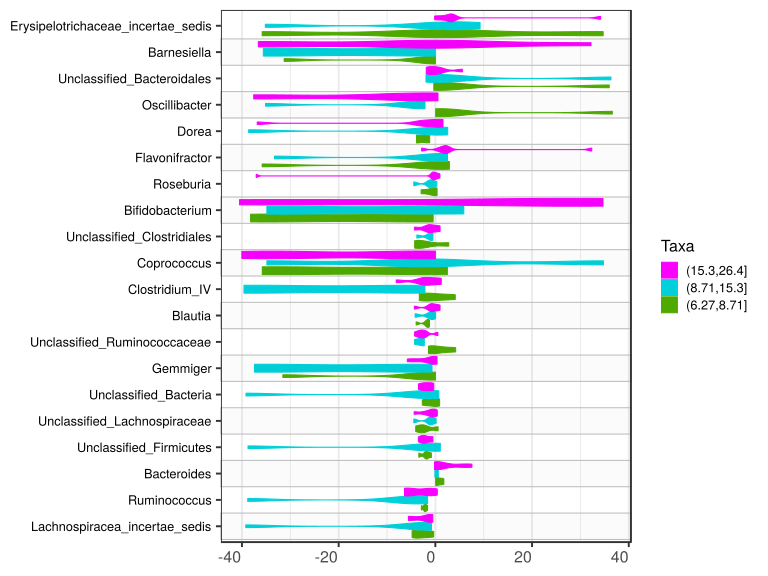

\(1.3.1.3.5.2.4.2.2.2.1\) [`Figure 542.`](#figure.542) Log2 fold change in abundance between paired samples. Samples are paired according to attribute MatchedGroupID, resulting in 16 pairs. When fold change or difference is computed, this is done as 'patient by control'. Data grouped by age.quant. Sorting order of features is GeneSelector paired test ranking. boxplot plot.  Image file: [`plots/32324eecc5b.svg`](plots/32324eecc5b.svg).
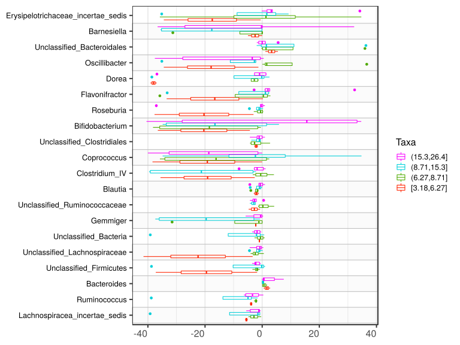