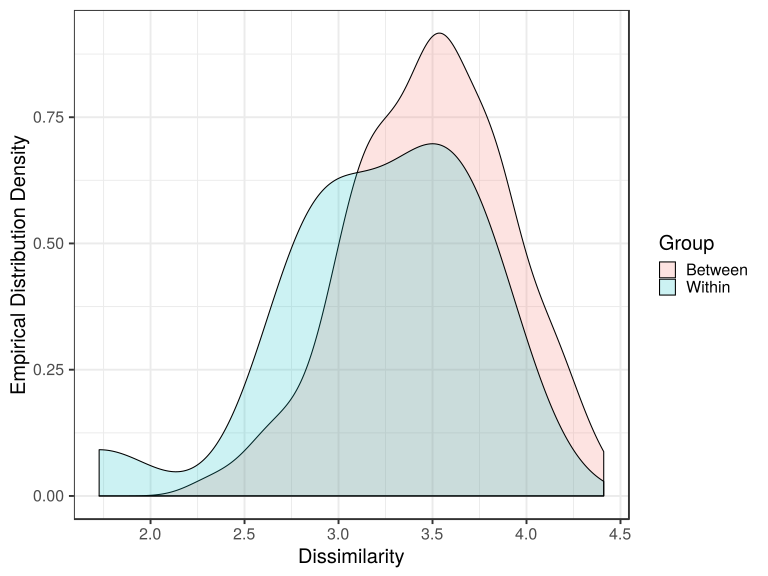

noone@mail.com
Analysis of Dieting study 16S data
% Fri Sep  7 05:46:18 2018


#### \(1.3.1.4\) Taxonomic level: otu of Subset: Patient/control samples before diet aggregated by SubjectID Additional tests


##### \(1.3.1.4.1\) Loading counts and metadata

[`Subreport`](./1.3.1.4.1-report.html)


##### \(1.3.1.4.2\) Data analysis


Filtering abundance matrix with arguments [ min_mean                :10, min_quant_incidence_frac:0.25, min_quant_mean_frac     :0.25]. Filtering features


Note that some community richness estimators will not work correctly 
               if provided with abundance-filtered counts


After filtering, left 34 records for 123 features


Wrote counts and metadata for raw counts After final feature filtering to files [`data/1.3.1.4.2.1-3231e92741csamples.raw.16s.l.otu.count.tsv`](data/1.3.1.4.2.1-3231e92741csamples.raw.16s.l.otu.count.tsv),[`data/1.3.1.4.2.1-3231e92741csamples.raw.16s.l.otu.attr.tsv`](data/1.3.1.4.2.1-3231e92741csamples.raw.16s.l.otu.attr.tsv)


Wrote counts and metadata for proportions counts After final feature filtering to files [`data/1.3.1.4.2.1-32377c9ea57samples.proportions.16s.l.otu.count.tsv`](data/1.3.1.4.2.1-32377c9ea57samples.proportions.16s.l.otu.count.tsv),[`data/1.3.1.4.2.1-32377c9ea57samples.proportions.16s.l.otu.attr.tsv`](data/1.3.1.4.2.1-32377c9ea57samples.proportions.16s.l.otu.attr.tsv)


##### \(1.3.1.4.2.2\) Default transformations for further data analysis


Specific methods can override these and use their own normalization.


Count normalization method for data analysis (unless modified by specific methods) : [ drop.features:List of 1,  ..$ :"other", method.args  :List of 1,  ..$ theta:1, method       :"norm.ihs.prop"]


Wrote counts and metadata for raw counts Normalized after default transformations to files [`data/1.3.1.4.2.2-3231e66f320samples.raw.16s.l.otu.count.tsv`](data/1.3.1.4.2.2-3231e66f320samples.raw.16s.l.otu.count.tsv),[`data/1.3.1.4.2.2-3231e66f320samples.raw.16s.l.otu.attr.tsv`](data/1.3.1.4.2.2-3231e66f320samples.raw.16s.l.otu.attr.tsv)


##### \(1.3.1.4.3\) GeneSelector stability ranking


Slawski M, Boulesteix. A (????). _GeneSelector: Stability and Aggregation of ranked gene lists_. R package version 2.31.0.


Wilcoxon test (rank-sum for independent samples and signed-rank for paired samples) 
                   is applied to each feature (feature, gene) on random
                   subsamples of the data. Consensus ranking is found with a
                   Monte Carlo procedure ((method AggregateMC in GeneSelector package). 
                   features ordered according to the consensus ranking
                   are returned, along with the p-values, statistic and effect size 
                   computed on the full
                   original dataset. In a special case when no replications are requested,
                   features are ordered by the adjuested p-value. 
                   P-values are reported with and without the 
                   multiple testing correction of Benjamini & Hochberg. The effect sizes
                   for Wilcoxon tests are reported as: common-language effect
                   size (proportion of pairs where observations from the second group
                   are larger than observations from the first group; no effect
                   corresponds to 0.5); rank-biserial
                   correlation (common language effect size minus its complement; no
                   effect corresponds to 0; range is [-1;1]) and
                   absolute value of r (as defined in Cohen, J. (1988). Statistical power 
                   analysis for the behavioral sciences (2nd ed.). Hillsdale, NJ: Erlbaum.).
                   For paired samples, when calculating the common language effect size,
                   only paired observations are used, and one half of the number of ties is 
                   added to the numerator (Grissom, R. J., and J. J. Kim. "Effect Sizes for Research: Univariate 
                   and Multivariate Applications, 2nd Edn New York." NY: Taylor and Francis (2012)).
                   Logarithm in base 2 of the fold change (l2fc) is also reported if requested.
                   For independent samples, the fold change is computed between the sample means of
                   the groups (last to first). For paired samples - as the sample median of the logfold change
                   in each matched pair of observations.


Stability selection parameters are: [ comp.log.fold.change:TRUE, maxrank             :20, samp.fold.ratio     :0.5, replicates          :400, type                :"paired", block.attr          :"MatchedGroupID"]


\(1.3.1.4.3\)  Summary of response variable (unpaired samples) Sample.type.


```````
control patient 
     18      16 
```````


\(1.3.1.4.3\) <a name="table.133"></a>[`Table 133.`](#table.133) GeneSelector stability ranking for response Sample.type. Samples are paired according to attribute MatchedGroupID, resulting in 16 pairs. When fold change or difference is computed, this is done as 'patient by control'. Full dataset is also saved in a delimited text file (click to download and open e.g. in Excel) [`data/1.3.1.4.3-32312e68caf.1.3.1.4.3.a.name.ta.csv`](data/1.3.1.4.3-32312e68caf.1.3.1.4.3.a.name.ta.csv)


| name                                         | statistic | pval       | pval.adjusted | common.lang.eff.size | rank.biserial.corr.eff.size | r.eff.size | l2fc.patient.by.control | mean.control | mean.patient | l2fc.paired.median | median.paired.control | median.paired.patient |
|:---------------------------------------------|:----------|:-----------|:--------------|:---------------------|:----------------------------|:-----------|:------------------------|:-------------|:-------------|:-------------------|:----------------------|:----------------------|
| Lachnospiracea\_incertae\_sedis.Otu0113      | 3         | 1.526e\-04 | 0.004654      | 0.06250              | \-0.8750                    | 0.946705   | \-2.40222               | 4.628e\-03   | 8.755e\-04   | \-3.475205         | 4.314e\-03            | 4.767e\-04            |
| Lachnospiraceae.Otu2512                      | 7         | 5.798e\-04 | 0.007860      | 0.12500              | \-0.7500                    | 0.860219   | \-3.83913               | 8.088e\-03   | 5.651e\-04   | \-6.400535         | 6.104e\-03            | 1.209e\-04            |
| Lachnospiraceae.Otu2222                      | 0         | 6.104e\-05 | 0.003723      | 0.03125              | \-0.9375                    | 1.035061   | \-2.77632               | 6.180e\-03   | 9.020e\-04   | \-34.250105        | 2.669e\-03            | 0.000e\+00            |
| Lachnospiracea\_incertae\_sedis.Otu2549      | 0         | 6.104e\-05 | 0.003723      | 0.03125              | \-0.9375                    | 1.035061   | \-2.93589               | 3.346e\-03   | 4.372e\-04   | \-19.034583        | 1.820e\-03            | 0.000e\+00            |
| Lachnospiracea\_incertae\_sedis.Otu1990      | 14        | 3.357e\-03 | 0.034129      | 0.12500              | \-0.7500                    | 0.733252   | \-2.43271               | 3.538e\-03   | 6.554e\-04   | \-36.049432        | 3.744e\-03            | 0.000e\+00            |
| Ruminococcus.Otu1027                         | 0         | 1.221e\-04 | 0.004654      | 0.06250              | \-0.8750                    | 1.026799   | \-6.80489               | 3.120e\-03   | 2.790e\-05   | \-35.838488        | 1.365e\-03            | 0.000e\+00            |
| Lachnospiraceae.Otu0272                      | 1         | 2.441e\-04 | 0.004964      | 0.12500              | \-0.7500                    | 0.980402   | \-2.35970               | 3.523e\-03   | 6.865e\-04   | \-2.686725         | 6.105e\-04            | 0.000e\+00            |
| Lachnospiracea\_incertae\_sedis.Otu2746      | 16        | 5.157e\-03 | 0.048401      | 0.12500              | \-0.7500                    | 0.699258   | \-2.53677               | 3.061e\-03   | 5.275e\-04   | \-36.171322        | 2.197e\-03            | 0.000e\+00            |
| Gemmiger.Otu0907                             | 4         | 8.545e\-04 | 0.010425      | 0.18750              | \-0.6250                    | 0.891186   | \-1.44576               | 5.594e\-03   | 2.053e\-03   | \-2.134025         | 4.928e\-03            | 7.125e\-04            |
| Ruminococcus.Otu2545                         | 0         | 2.441e\-04 | 0.004964      | 0.09375              | \-0.8125                    | 1.017411   | \-3.16023               | 2.037e\-03   | 2.278e\-04   | \-32.569716        | 7.310e\-04            | 0.000e\+00            |
| Lachnospiraceae.Otu0220                      | 24        | 2.139e\-02 | 0.124282      | 0.18750              | \-0.6250                    | 0.575245   | \-1.67502               | 6.196e\-03   | 1.940e\-03   | \-4.851571         | 4.598e\-03            | 1.532e\-04            |
| Blautia.Otu2495                              | 16        | 1.025e\-02 | 0.089355      | 0.21875              | \-0.5625                    | 0.662835   | \-2.13812               | 4.310e\-03   | 9.792e\-04   | \-2.865942         | 2.099e\-03            | 2.846e\-04            |
| Bacteroides.Otu2375                          | 103       | 1.245e\-02 | 0.094940      | 0.78125              | 0.5625                      | 0.645263   | 1.35935                 | 1.343e\-03   | 3.446e\-03   | 1.712641           | 8.292e\-04            | 3.105e\-03            |
| Ruminococcus.Otu1859                         | 0         | 4.883e\-04 | 0.007446      | 0.12500              | \-0.7500                    | 1.006640   | \-3.93415               | 3.251e\-02   | 2.127e\-03   | \-4.597871         | 5.089e\-03            | 0.000e\+00            |
| Roseburia.Otu2637                            | 17        | 1.245e\-02 | 0.094940      | 0.34375              | \-0.3125                    | 0.645263   | \-1.60479               | 1.687e\-03   | 5.546e\-04   | \-18.836484        | 9.140e\-04            | 0.000e\+00            |
| Lachnospiraceae.Otu2612                      | 18        | 1.508e\-02 | 0.100329      | 0.28125              | \-0.4375                    | 0.627567   | \-1.98980               | 2.487e\-03   | 6.262e\-04   | \-35.790833        | 1.867e\-03            | 0.000e\+00            |
| Bacteroides.Otu1201                          | 108       | 3.864e\-02 | 0.204935      | 0.75000              | 0.5000                      | 0.517013   | 1.40884                 | 4.442e\-03   | 1.179e\-02   | 1.359248           | 2.888e\-03            | 5.930e\-03            |
| Bacteroides.Otu0001                          | 107       | 4.431e\-02 | 0.207923      | 0.68750              | 0.3750                      | 0.502783   | 1.26600                 | 4.993e\-02   | 1.201e\-01   | 0.748852           | 4.123e\-02            | 9.700e\-02            |
| Ruminococcus.Otu1915                         | 0         | 4.883e\-04 | 0.007446      | 0.12500              | \-0.7500                    | 1.006640   | \-3.40811               | 2.119e\-03   | 1.996e\-04   | \-32.385739        | 6.977e\-04            | 0.000e\+00            |
| Blautia.Otu2475                              | 30        | 5.066e\-02 | 0.213118      | 0.12500              | \-0.7500                    | 0.488589   | \-1.49421               | 1.876e\-02   | 6.658e\-03   | \-0.957939         | 6.170e\-03            | 1.828e\-03            |
| Bacteroides.Otu0863                          | 107       | 4.431e\-02 | 0.207923      | 0.62500              | 0.2500                      | 0.502783   | 1.90258                 | 1.046e\-02   | 3.911e\-02   | 2.033047           | 7.444e\-03            | 1.384e\-02            |
| Lachnospiracea\_incertae\_sedis.Otu1152      | 29        | 4.431e\-02 | 0.207923      | 0.31250              | \-0.3750                    | 0.502783   | \-1.62865               | 4.558e\-03   | 1.474e\-03   | \-34.861688        | 1.869e\-03            | 0.000e\+00            |
| Bacteroides.Otu2038                          | 103       | 7.391e\-02 | 0.257601      | 0.75000              | 0.5000                      | 0.446787   | 1.40686                 | 1.278e\-02   | 3.389e\-02   | 1.985109           | 2.419e\-03            | 4.415e\-03            |
| Lachnospiraceae.Otu0578                      | 0         | 9.766e\-04 | 0.010831      | 0.15625              | \-0.6875                    | 0.994141   | \-2.22065               | 2.743e\-03   | 5.884e\-04   | \-4.357315         | 1.125e\-03            | 0.000e\+00            |
| Blautia.Otu0591                              | 23        | 3.534e\-02 | 0.195973      | 0.21875              | \-0.5625                    | 0.543366   | \-0.67463               | 2.090e\-03   | 1.309e\-03   | \-0.519566         | 1.357e\-03            | 5.743e\-04            |
| Bacteroides.Otu0006                          | 95        | 4.791e\-02 | 0.208762      | 0.78125              | 0.5625                      | 0.510754   | 1.10230                 | 5.088e\-03   | 1.092e\-02   | 1.142482           | 4.127e\-03            | 7.264e\-03            |
| Lachnospiraceae.Otu0898                      | 95        | 4.791e\-02 | 0.208762      | 0.78125              | 0.5625                      | 0.510754   | \-1.96515               | 5.567e\-03   | 1.426e\-03   | 17.995810          | 0.000e\+00            | 4.667e\-04            |
| Bacteroides.Otu0848                          | 103       | 7.391e\-02 | 0.257601      | 0.68750              | 0.3750                      | 0.446787   | 1.25413                 | 1.089e\-02   | 2.597e\-02   | 0.899316           | 1.504e\-03            | 8.399e\-03            |
| Coprococcus.Otu0802                          | 12        | 1.709e\-02 | 0.104248      | 0.28125              | \-0.4375                    | 0.661416   | \-3.22346               | 3.391e\-03   | 3.631e\-04   | \-2.364726         | 3.472e\-04            | 0.000e\+00            |
| Roseburia.Otu1051                            | 33        | 7.391e\-02 | 0.257601      | 0.25000              | \-0.5000                    | 0.446787   | \-0.02339               | 2.588e\-03   | 2.546e\-03   | \-1.471972         | 1.840e\-03            | 9.096e\-04            |
| Bacteroides.Otu0069                          | 91        | 8.325e\-02 | 0.260429      | 0.71875              | 0.4375                      | 0.447232   | 1.33447                 | 6.033e\-03   | 1.521e\-02   | 0.415157           | 4.877e\-03            | 1.078e\-02            |
| Bacteroides.Otu2460                          | 100       | 1.046e\-01 | 0.303267      | 0.68750              | 0.3750                      | 0.405757   | 1.97635                 | 7.456e\-04   | 2.934e\-03   | 2.733920           | 2.760e\-04            | 7.005e\-04            |
| Bacteroides.Otu2654                          | 98        | 1.297e\-01 | 0.323002      | 0.56250              | 0.1250                      | 0.378792   | 3.11862                 | 5.325e\-03   | 4.625e\-02   | 1.895570           | 7.668e\-04            | 8.270e\-03            |
| Bacteroides.Otu2765                          | 88        | 1.205e\-01 | 0.323002      | 0.59375              | 0.1875                      | 0.400852   | 1.54215                 | 4.757e\-03   | 1.385e\-02   | 1.181265           | 1.362e\-03            | 5.831e\-03            |
| Bacteroides.Otu2104                          | 87        | 1.354e\-01 | 0.323841      | 0.65625              | 0.3125                      | 0.385551   | 1.39594                 | 2.444e\-03   | 6.432e\-03   | 0.877258           | 6.930e\-04            | 2.923e\-03            |
| Oscillibacter.Otu1518                        | 6         | 1.367e\-02 | 0.098116      | 0.21875              | \-0.5625                    | 0.743458   | \-2.67662               | 2.643e\-03   | 4.133e\-04   | \-2.642628         | 4.774e\-04            | 0.000e\+00            |
| Erysipelotrichaceae\_incertae\_sedis.Otu0818 | 71        | 8.032e\-02 | 0.257877      | 0.65625              | 0.3125                      | 0.485035   | 5.36904                 | 6.510e\-04   | 2.690e\-02   | 2.924897           | 7.077e\-05            | 8.470e\-04            |
| Lachnospiracea\_incertae\_sedis.Otu0651      | 28        | 1.353e\-01 | 0.323841      | 0.25000              | \-0.5000                    | 0.399208   | \-1.81293               | 2.312e\-03   | 6.581e\-04   | \-2.152154         | 4.342e\-04            | 4.329e\-05            |
| Faecalibacterium.Otu0751                     | 47        | 2.979e\-01 | 0.568324      | 0.37500              | \-0.2500                    | 0.260263   | \-0.28078               | 6.820e\-03   | 5.614e\-03   | \-0.185837         | 4.375e\-03            | 2.793e\-03            |
| Ruminococcus.Otu1429                         | 17        | 9.229e\-02 | 0.278963      | 0.25000              | \-0.5000                    | 0.485974   | \-1.55710               | 2.571e\-03   | 8.737e\-04   | \-19.087125        | 1.735e\-03            | 0.000e\+00            |
| Dorea.Otu1142                                | 46        | 2.744e\-01 | 0.540036      | 0.31250              | \-0.3750                    | 0.273221   | \-0.33358               | 6.256e\-03   | 4.964e\-03   | \-2.001878         | 3.989e\-03            | 7.128e\-04            |
| Faecalibacterium.Otu0067                     | 54        | 4.954e\-01 | 0.774891      | 0.37500              | \-0.2500                    | 0.170427   | \-0.43327               | 2.564e\-02   | 1.899e\-02   | \-0.546619         | 2.040e\-02            | 8.781e\-03            |
| Clostridium\_IV.Otu1864                      | 19        | 1.294e\-01 | 0.323002      | 0.31250              | \-0.3750                    | 0.437774   | \-1.63349               | 5.366e\-03   | 1.729e\-03   | \-0.880359         | 5.352e\-04            | 0.000e\+00            |
| Bacteroides.Otu2437                          | 41        | 3.028e\-01 | 0.568324      | 0.34375              | \-0.3125                    | 0.266063   | \-1.36071               | 1.098e\-02   | 4.276e\-03   | \-2.845007         | 1.977e\-03            | 3.035e\-05            |
| Bacteroides.Otu0877                          | 79        | 3.028e\-01 | 0.568324      | 0.59375              | 0.1875                      | 0.266063   | 1.14197                 | 2.323e\-03   | 5.126e\-03   | 1.440537           | 1.019e\-03            | 3.244e\-03            |
| Parabacteroides.Otu1378                      | 78        | 3.303e\-01 | 0.610483      | 0.46875              | \-0.0625                    | 0.251379   | 1.73566                 | 1.584e\-03   | 5.275e\-03   | \-0.873743         | 3.250e\-04            | 6.309e\-04            |
| Ruminococcaceae.Otu2507                      | 21        | 1.763e\-01 | 0.405753      | 0.31250              | \-0.3750                    | 0.390384   | \-2.63176               | 2.603e\-03   | 4.200e\-04   | \-3.494222         | 1.781e\-04            | 0.000e\+00            |
| Clostridium\_XI.Otu2681                      | 38        | 3.910e\-01 | 0.662513      | 0.31250              | \-0.3750                    | 0.229262   | 2.67364                 | 1.108e\-03   | 7.073e\-03   | \-16.869380        | 3.722e\-04            | 0.000e\+00            |
| Clostridium\_XI.Otu1804                      | 60        | 7.057e\-01 | 0.946129      | 0.31250              | \-0.3750                    | 0.094403   | 0.79648                 | 7.941e\-03   | 1.379e\-02   | \-1.820782         | 6.903e\-03            | 1.668e\-03            |
| Bacteroides.Otu1669                          | 43        | 3.591e\-01 | 0.635417      | 0.34375              | \-0.3125                    | 0.236774   | \-0.15932               | 1.649e\-03   | 1.476e\-03   | \-0.795450         | 7.891e\-04            | 4.442e\-04            |
| Bacteroides.Otu1411                          | 34        | 2.676e\-01 | 0.540036      | 0.37500              | \-0.2500                    | 0.296301   | \-0.34346               | 2.204e\-03   | 1.737e\-03   | \-0.243804         | 2.173e\-04            | 3.035e\-05            |
| Bacteroides.Otu0929                          | 82        | 4.954e\-01 | 0.774891      | 0.50000              | 0.0000                      | 0.170427   | 0.90087                 | 7.699e\-03   | 1.438e\-02   | \-0.334407         | 4.583e\-03            | 5.452e\-03            |
| Bacteroides.Otu2431                          | 61        | 7.436e\-01 | 0.948311      | 0.43750              | \-0.1250                    | 0.081785   | \-0.33366               | 1.680e\-02   | 1.333e\-02   | \-0.003775         | 1.327e\-02            | 1.524e\-02            |
| Parabacteroides.Otu1736                      | 37        | 3.575e\-01 | 0.635417      | 0.43750              | \-0.1250                    | 0.245895   | \-0.58331               | 4.485e\-03   | 2.993e\-03   | \-0.648139         | 3.900e\-03            | 1.575e\-04            |
| Clostridiales.Otu1597                        | 0         | 1.562e\-02 | 0.100329      | 0.28125              | \-0.4375                    | 0.913751   | \-4.31313               | 5.662e\-03   | 2.849e\-04   | 0.000000           | 0.000e\+00            | 0.000e\+00            |
| Bacteroides.Otu2120                          | 67        | 3.910e\-01 | 0.662513      | 0.56250              | 0.1250                      | 0.229262   | 0.85329                 | 1.664e\-03   | 3.007e\-03   | 0.037498           | 8.565e\-04            | 1.205e\-03            |
| Lachnospiraceae.Otu2599                      | 72        | 8.603e\-01 | 0.990111      | 0.37500              | \-0.2500                    | 0.044011   | 1.15263                 | 1.449e\-03   | 3.221e\-03   | \-0.479147         | 8.462e\-04            | 4.660e\-04            |
| Bacteroides.Otu2520                          | 59        | 9.780e\-01 | 1.000000      | 0.40625              | \-0.1875                    | 0.007131   | 0.15916                 | 4.733e\-02   | 5.285e\-02   | \-0.774802         | 2.307e\-02            | 1.499e\-02            |
| Bacteroides.Otu0752                          | 82        | 4.954e\-01 | 0.774891      | 0.62500              | 0.2500                      | 0.170427   | 0.22941                 | 1.445e\-03   | 1.694e\-03   | 1.107317           | 7.412e\-04            | 6.874e\-04            |
| Clostridium\_XlVa.Otu0236                    | 67        | 9.799e\-01 | 1.000000      | 0.50000              | 0.0000                      | 0.006283   | \-0.71909               | 6.074e\-03   | 3.690e\-03   | \-0.052340         | 2.085e\-03            | 2.108e\-03            |
| Lachnospiracea\_incertae\_sedis.Otu0778      | 29        | 2.734e\-01 | 0.540036      | 0.34375              | \-0.3125                    | 0.303748   | \-0.19494               | 2.174e\-03   | 1.899e\-03   | \-1.867060         | 1.642e\-03            | 2.213e\-05            |
| Lachnospiraceae.Otu0875                      | 56        | 5.619e\-01 | 0.836855      | 0.43750              | \-0.1250                    | 0.145009   | 0.38343                 | 1.801e\-03   | 2.349e\-03   | \-1.527016         | 1.713e\-03            | 8.304e\-04            |
| Lachnospiraceae.Otu1734                      | 59        | 6.685e\-01 | 0.937505      | 0.31250              | \-0.3750                    | 0.107035   | 0.90117                 | 1.180e\-03   | 2.204e\-03   | \-1.609476         | 1.004e\-03            | 2.520e\-04            |
| Roseburia.Otu2084                            | 60        | 7.057e\-01 | 0.946129      | 0.50000              | 0.0000                      | 0.094403   | \-0.18575               | 2.090e\-03   | 1.837e\-03   | \-0.162035         | 1.702e\-03            | 1.010e\-03            |
| Lachnospiraceae.Otu0790                      | 52        | 6.788e\-01 | 0.941025      | 0.40625              | \-0.1875                    | 0.106930   | \-0.19975               | 1.920e\-03   | 1.671e\-03   | \-1.439198         | 9.401e\-04            | 5.640e\-04            |
| Bacteroides.Otu2625                          | 62        | 9.341e\-01 | 1.000000      | 0.46875              | \-0.0625                    | 0.021356   | 1.95493                 | 5.938e\-03   | 2.302e\-02   | \-1.212884         | 9.255e\-04            | 5.020e\-04            |
| Bacteroides.Otu2343                          | 47        | 2.402e\-01 | 0.516949      | 0.59375              | 0.1875                      | 0.354095   | 1.75240                 | 7.165e\-04   | 2.414e\-03   | 0.000000           | 3.663e\-05            | 3.490e\-04            |
| Prevotella.Otu1803                           | 6         | 1.094e\-01 | 0.303267      | 0.37500              | \-0.2500                    | 0.566042   | \-1.89110               | 6.549e\-03   | 1.765e\-03   | 0.000000           | 0.000e\+00            | 0.000e\+00            |
| Prevotella.Otu1987                           | 3         | 7.812e\-02 | 0.257601      | 0.34375              | \-0.3125                    | 0.665849   | \-1.86907               | 5.713e\-02   | 1.564e\-02   | 0.000000           | 0.000e\+00            | 0.000e\+00            |
| Blautia.Otu0620                              | 54        | 7.615e\-01 | 0.948311      | 0.40625              | \-0.1875                    | 0.078354   | 0.01257                 | 1.372e\-03   | 1.384e\-03   | \-0.153519         | 1.009e\-03            | 5.443e\-04            |
| Bacteroides.Otu2383                          | 61        | 6.257e\-01 | 0.898110      | 0.50000              | 0.0000                      | 0.130355   | 0.64739                 | 1.095e\-03   | 1.715e\-03   | 0.000000           | 4.686e\-04            | 2.834e\-04            |
| Alistipes.Otu2508                            | 40        | 7.354e\-01 | 0.948311      | 0.46875              | \-0.0625                    | 0.093749   | 0.11402                 | 2.025e\-02   | 2.192e\-02   | 0.000000           | 1.116e\-02            | 5.995e\-04            |
| Prevotella.Otu0634                           | 23        | 4.131e\-01 | 0.690363      | 0.34375              | \-0.3125                    | 0.246780   | \-0.75083               | 4.195e\-03   | 2.493e\-03   | \-1.895045         | 4.237e\-04            | 0.000e\+00            |
| Escherichia\_Shigella.Otu2393                | 31        | 5.693e\-01 | 0.836855      | 0.31250              | \-0.3750                    | 0.164265   | \-0.24273               | 9.859e\-03   | 8.332e\-03   | \-1.750295         | 3.853e\-04            | 0.000e\+00            |
| Bacteroides.Otu0661                          | 55        | 9.032e\-01 | 1.000000      | 0.43750              | \-0.1250                    | 0.032505   | 0.55889                 | 7.237e\-03   | 1.066e\-02   | \-0.234428         | 4.419e\-03            | 4.962e\-03            |
| Prevotella.Otu2602                           | 4         | 1.094e\-01 | 0.303267      | 0.34375              | \-0.3125                    | 0.605124   | \-1.99258               | 8.168e\-03   | 2.052e\-03   | 0.000000           | 0.000e\+00            | 0.000e\+00            |
| Enterococcus.Otu1019                         | 25        | 7.812e\-02 | 0.257601      | 0.65625              | 0.3125                      | 0.665849   | 0.53977                 | 3.326e\-03   | 4.836e\-03   | 0.000000           | 0.000e\+00            | 0.000e\+00            |
| Bacteroides.Otu1565                          | 31        | 5.693e\-01 | 0.836855      | 0.37500              | \-0.2500                    | 0.164265   | \-2.00415               | 6.372e\-03   | 1.589e\-03   | \-0.187782         | 1.074e\-04            | 0.000e\+00            |
| Bacteroides.Otu0775                          | 38        | 6.355e\-01 | 0.901520      | 0.46875              | \-0.0625                    | 0.131465   | \-0.13217               | 1.567e\-03   | 1.430e\-03   | 0.000000           | 2.708e\-04            | 1.344e\-04            |
| Alistipes.Otu1466                            | 34        | 9.658e\-01 | 1.000000      | 0.53125              | 0.0625                      | 0.012920   | \-0.42439               | 1.623e\-02   | 1.209e\-02   | 0.000000           | 3.663e\-04            | 2.841e\-03            |
| Bacteroides.Otu2481                          | 0         | 6.250e\-02 | 0.238281      | 0.34375              | \-0.3125                    | 0.833039   | \-52.00000              | 1.502e\-02   | 0.000e\+00   | 0.000000           | 0.000e\+00            | 0.000e\+00            |
| Ruminococcaceae.Otu0064                      | 1         | 6.250e\-02 | 0.238281      | 0.37500              | \-0.2500                    | 0.760457   | \-6.91051               | 3.832e\-03   | 3.186e\-05   | 0.000000           | 0.000e\+00            | 0.000e\+00            |
| Parabacteroides.Otu1107                      | 41        | 9.097e\-01 | 1.000000      | 0.37500              | \-0.2500                    | 0.032752   | 1.98748                 | 9.455e\-04   | 3.749e\-03   | \-0.399986         | 4.201e\-04            | 0.000e\+00            |
| Sutterella.Otu1997                           | 24        | 7.695e\-01 | 0.948311      | 0.37500              | \-0.2500                    | 0.092651   | 0.84267                 | 2.687e\-03   | 4.818e\-03   | 0.000000           | 8.394e\-04            | 0.000e\+00            |
| Prevotella.Otu1563                           | 2         | 9.375e\-02 | 0.278963      | 0.37500              | \-0.2500                    | 0.684200   | \-1.67357               | 3.396e\-03   | 1.064e\-03   | 0.000000           | 0.000e\+00            | 0.000e\+00            |
| Bacteroidales.Otu1168                        | 31        | 3.594e\-01 | 0.635417      | 0.53125              | 0.0625                      | 0.305519   | 3.59898                 | 4.023e\-04   | 4.875e\-03   | 0.000000           | 0.000e\+00            | 0.000e\+00            |
| Prevotella.Otu1994                           | 1         | 1.250e\-01 | 0.323002      | 0.40625              | \-0.1875                    | 0.686080   | \-2.44697               | 2.633e\-02   | 4.829e\-03   | 0.000000           | 0.000e\+00            | 0.000e\+00            |
| Prevotella.Otu1319                           | 3         | 1.562e\-01 | 0.366587      | 0.37500              | \-0.2500                    | 0.578813   | \-2.71900               | 5.166e\-03   | 7.846e\-04   | 0.000000           | 0.000e\+00            | 0.000e\+00            |
| Alistipes.Otu0529                            | 24        | 7.695e\-01 | 0.948311      | 0.43750              | \-0.1250                    | 0.092651   | \-0.24761               | 2.542e\-03   | 2.141e\-03   | 0.000000           | 3.877e\-04            | 0.000e\+00            |
| Bacteroides.Otu2534                          | 15        | 6.250e\-02 | 0.238281      | 0.65625              | 0.3125                      | 0.833039   | 10.25647                | 3.830e\-06   | 4.685e\-03   | 0.000000           | 0.000e\+00            | 0.000e\+00            |
| Bacteroides.Otu0480                          | 13        | 5.469e\-01 | 0.833984      | 0.37500              | \-0.2500                    | 0.212998   | 0.48882                 | 9.200e\-03   | 1.291e\-02   | 0.000000           | 0.000e\+00            | 0.000e\+00            |
| Bifidobacterium.Otu1244                      | 13        | 5.469e\-01 | 0.833984      | 0.37500              | \-0.2500                    | 0.212998   | \-4.24859               | 1.028e\-02   | 5.408e\-04   | 0.000000           | 0.000e\+00            | 0.000e\+00            |
| Bacteroides.Otu0786                          | 30        | 8.457e\-01 | 0.982626      | 0.50000              | 0.0000                      | 0.061539   | 1.26053                 | 1.253e\-03   | 3.003e\-03   | 0.000000           | 0.000e\+00            | 6.537e\-04            |
| Bacteroides.Otu1624                          | 20        | 8.203e\-01 | 0.981158      | 0.46875              | \-0.0625                    | 0.075714   | \-0.76957               | 2.799e\-03   | 1.642e\-03   | 0.000000           | 0.000e\+00            | 0.000e\+00            |
| Prevotella.Otu1633                           | 17        | 9.453e\-01 | 1.000000      | 0.50000              | 0.0000                      | 0.024252   | 0.41356                 | 4.932e\-03   | 6.569e\-03   | 0.000000           | 0.000e\+00            | 0.000e\+00            |
| Akkermansia.Otu1935                          | 20        | 8.438e\-01 | 0.982626      | 0.50000              | 0.0000                      | 0.069685   | 2.11141                 | 3.002e\-03   | 1.297e\-02   | 0.000000           | 0.000e\+00            | 0.000e\+00            |
| Bacteroides.Otu2065                          | 13        | 9.375e\-01 | 1.000000      | 0.40625              | \-0.1875                    | 0.029637   | 2.04008                 | 7.216e\-03   | 2.968e\-02   | 0.000000           | 0.000e\+00            | 0.000e\+00            |
| Prevotella.Otu0773                           | 4         | 2.188e\-01 | 0.485227      | 0.37500              | \-0.2500                    | 0.502088   | \-2.91524               | 3.349e\-03   | 4.439e\-04   | 0.000000           | 0.000e\+00            | 0.000e\+00            |
| Ruminococcus.Otu0422                         | 0         | 1.250e\-01 | 0.323002      | 0.37500              | \-0.2500                    | 0.767060   | \-52.00000              | 7.194e\-03   | 0.000e\+00   | 0.000000           | 0.000e\+00            | 0.000e\+00            |
| Sutterella.Otu0171                           | 13        | 9.375e\-01 | 1.000000      | 0.46875              | \-0.0625                    | 0.029637   | \-1.77654               | 7.039e\-03   | 2.055e\-03   | 0.000000           | 0.000e\+00            | 0.000e\+00            |
| Prevotella.Otu2327                           | 4         | 2.188e\-01 | 0.485227      | 0.43750              | \-0.1250                    | 0.502088   | \-3.41948               | 2.067e\-03   | 1.932e\-04   | 0.000000           | 0.000e\+00            | 0.000e\+00            |
| Megamonas.Otu2657                            | 1         | 2.500e\-01 | 0.516949      | 0.43750              | \-0.1250                    | 0.575175   | \-2.78806               | 8.995e\-03   | 1.302e\-03   | 0.000000           | 0.000e\+00            | 0.000e\+00            |
| Bacteroides.Otu2216                          | 13        | 9.375e\-01 | 1.000000      | 0.40625              | \-0.1875                    | 0.029637   | 2.52559                 | 1.199e\-03   | 6.907e\-03   | 0.000000           | 0.000e\+00            | 0.000e\+00            |
| Bacteroides.Otu1726                          | 0         | 2.500e\-01 | 0.516949      | 0.40625              | \-0.1875                    | 0.664155   | \-52.00000              | 1.178e\-02   | 0.000e\+00   | 0.000000           | 0.000e\+00            | 0.000e\+00            |
| Phascolarctobacterium.Otu1814                | 15        | 9.375e\-01 | 1.000000      | 0.59375              | 0.1875                      | 0.029637   | \-0.61041               | 4.087e\-03   | 2.677e\-03   | 0.000000           | 0.000e\+00            | 0.000e\+00            |
| Prevotella.Otu0882                           | 9         | 8.438e\-01 | 0.982626      | 0.43750              | \-0.1250                    | 0.080465   | 0.10816                 | 2.009e\-03   | 2.165e\-03   | 0.000000           | 0.000e\+00            | 0.000e\+00            |
| Prevotellaceae.Otu2503                       | 6         | 4.375e\-01 | 0.711667      | 0.43750              | \-0.1250                    | 0.316973   | \-0.63236               | 2.129e\-03   | 1.374e\-03   | 0.000000           | 0.000e\+00            | 0.000e\+00            |
| Ruminococcaceae.Otu1504                      | 2         | 3.750e\-01 | 0.653571      | 0.43750              | \-0.1250                    | 0.443573   | \-1.56288               | 6.860e\-03   | 2.322e\-03   | 0.000000           | 0.000e\+00            | 0.000e\+00            |
| Klebsiella.Otu1452                           | 11        | 4.375e\-01 | 0.711667      | 0.59375              | 0.1875                      | 0.347226   | \-3.39557               | 5.110e\-03   | 4.856e\-04   | 0.000000           | 0.000e\+00            | 0.000e\+00            |
| Prevotella.Otu0738                           | 9         | 8.125e\-01 | 0.981158      | 0.46875              | \-0.0625                    | 0.106080   | 5.47138                 | 1.575e\-04   | 6.987e\-03   | 0.000000           | 0.000e\+00            | 0.000e\+00            |
| Lactobacillus.Otu0959                        | 2         | 7.500e\-01 | 0.948311      | 0.46875              | \-0.0625                    | 0.183967   | \-7.14709               | 1.006e\-02   | 7.100e\-05   | 0.000000           | 0.000e\+00            | 0.000e\+00            |
| Prevotella.Otu2501                           | 13        | 6.875e\-01 | 0.942416      | 0.50000              | 0.0000                      | 0.164218   | 3.47627                 | 2.809e\-04   | 3.126e\-03   | 0.000000           | 0.000e\+00            | 0.000e\+00            |
| Ruminococcaceae.Otu2510                      | 0         | 2.500e\-01 | 0.516949      | 0.40625              | \-0.1875                    | 0.664155   | \-52.00000              | 3.175e\-03   | 0.000e\+00   | 0.000000           | 0.000e\+00            | 0.000e\+00            |
| Prevotella.Otu2666                           | 4         | 8.750e\-01 | 0.997664      | 0.43750              | \-0.1250                    | 0.078655   | 2.55678                 | 5.942e\-04   | 3.496e\-03   | 0.000000           | 0.000e\+00            | 0.000e\+00            |
| Streptococcus.Otu0749                        | 3         | 1.000e\+00 | 1.000000      | 0.53125              | 0.0625                      | 0.000000   | \-5.36397               | 4.179e\-03   | 1.015e\-04   | 0.000000           | 0.000e\+00            | 0.000e\+00            |
| Catenibacterium.Otu2320                      | 2         | 7.500e\-01 | 0.948311      | 0.46875              | \-0.0625                    | 0.183967   | \-2.93776               | 3.068e\-03   | 4.004e\-04   | 0.000000           | 0.000e\+00            | 0.000e\+00            |
| Prevotella.Otu2702                           | 2         | 7.500e\-01 | 0.948311      | 0.46875              | \-0.0625                    | 0.183967   | \-6.09103               | 2.481e\-03   | 3.640e\-05   | 0.000000           | 0.000e\+00            | 0.000e\+00            |
| Prevotella.Otu2220                           | 9         | 8.125e\-01 | 0.981158      | 0.46875              | \-0.0625                    | 0.106080   | 3.33058                 | 2.483e\-04   | 2.498e\-03   | 0.000000           | 0.000e\+00            | 0.000e\+00            |
| Bacteroides.Otu2277                          | 3         | 6.250e\-01 | 0.898110      | 0.43750              | \-0.1250                    | 0.244388   | \-4.09743               | 1.326e\-03   | 7.745e\-05   | 0.000000           | 0.000e\+00            | 0.000e\+00            |
| Megamonas.Otu1877                            | 0         | 1.000e\+00 | 1.000000      | 0.46875              | \-0.0625                    | 0.000000   | \-1.67455               | 5.667e\-03   | 1.775e\-03   | 0.000000           | 0.000e\+00            | 0.000e\+00            |
| Lactobacillales.Otu0504                      | 1         | 1.000e\+00 | 1.000000      | 0.53125              | 0.0625                      | 0.000000   | 45.24259                | 0.000e\+00   | 9.243e\-03   | 0.000000           | 0.000e\+00            | 0.000e\+00            |
| Bacteroides.Otu0801                          | 0         | 1.000e\+00 | 1.000000      | 0.46875              | \-0.0625                    | 0.000000   | \-52.00000              | 1.397e\-03   | 0.000e\+00   | 0.000000           | 0.000e\+00            | 0.000e\+00            |


##### \(1.3.1.4.4\) Plots of Abundance difference between paired samples. Samples are paired according to attribute MatchedGroupID, resulting in 16 pairs. When fold change or difference is computed, this is done as 'patient by control'.

[`Subreport`](./1.3.1.4.4-report.html)


##### \(1.3.1.4.5\) Plots of Log2 fold change in abundance between paired samples. Samples are paired according to attribute MatchedGroupID, resulting in 16 pairs. When fold change or difference is computed, this is done as 'patient by control'.

[`Subreport`](./1.3.1.4.5-report.html)


##### \(1.3.1.4.6\) PermANOVA (adonis) analysis of  normalized counts


Oksanen J, Blanchet FG, Friendly M, Kindt R, Legendre P, McGlinn D, Minchin PR, O'Hara RB, Simpson GL, Solymos P, Stevens MHH, Szoecs E, Wagner
H (2018). _vegan: Community Ecology Package_. R package version 2.5-2, <URL: https://CRAN.R-project.org/package=vegan>.


Non-parametric multivariate test for association between
                           normalized counts and meta-data variables. Dissimilarity index is euclidean.


\(1.3.1.4.6\)  Association with the patient/control status paired by family with formula count\~Sample.type with strata =  MatchedGroupID.


```````
Permutation test for adonis under reduced model
Terms added sequentially (first to last)
Blocks:  m_a$attr[, strata] 
Permutation: free
Number of permutations: 4000

adonis2(formula = as.formula(formula_str), data = m_a$attr, permutations = perm, method = dist.metr)
            Df SumOfSqs     R2      F   Pr(>F)   
Sample.type  1  0.12723 0.0558 1.8912 0.004999 **
Residual    32  2.15293 0.9442                   
Total       33  2.28016 1.0000                   
---
Signif. codes:  0 ‘***’ 0.001 ‘**’ 0.01 ‘*’ 0.05 ‘.’ 0.1 ‘ ’ 1
```````


\(1.3.1.4.6\)  Association with the patient/control status paired by family Adonis summary.


|     &nbsp;      | Df | SumOfSqs | R2     | F     | Pr(>F) |
|:---------------:|:---|:---------|:-------|:------|:-------|
| **Sample.type** | 1  | 0.1272   | 0.0558 | 1.891 | 0.005  |
|  **Residual**   | 32 | 2.153    | 0.9442 | NA    | NA     |
|    **Total**    | 33 | 2.28     | 1      | NA    | NA     |

Table: Permutation test for adonis under reduced model


##### \(1.3.1.4.7\) Ordinations, 

[`Subreport`](./1.3.1.4.7-report.html)


##### \(1.3.1.4.8\) Comparison and test of significant difference for profile dissimilarities within and between blocks defined by attribute MatchedGroupID across groups defined by attribute Sample.type


Count normalization method for Dist.Matr.Within.Between : [ drop.features:List of 1,  ..$ :"other", method.args  :List of 1,  ..$ theta:1, method       :"norm.ihs.prop"]


 Dissimilarity index is euclidian. Profile columns are normalized with range method of decostand function. The matrix of 
  dissimilarities D is formed where rows correspond to observations with level control
  of Sample.type, and columns - to level patient. The elements of 
  this matrix corresponding to rows and columns with the same 
  level of MatchedGroupID are called "within" block dissimilarities, while
  the elements drawn from combinations of rows and columns
  where MatchedGroupID are not equal are called "between" blocks dissimilarities. The null hypothesis is that the observed difference of "between" and "within" 
  block dissimilarities is consistent with what could be expected 
  if the block structure was assigned to the observations at random. The alternative hypothesis is that the "between"/"within" 
  difference is larger than would have been expected from a random block assignment. We simulate 4000 matrices in which both "between" and "within" 
  dissimilarities come from the null distribution 
  by permuting the MatchedGroupID labels of the columns
  of matrix D. The rank biserial correlation (Grissom, R. J., and J. J. Kim. 
  "Effect Sizes for Research: Univariate 
  and Multivariate Applications, 2nd Edn New York." NY: Taylor and Francis (2012)) is
  computed between the observed "between" and "within" dissimilarities both in the observed and
  simulated samples. Positive values of this correlation statistic would indicate 
  "between" dissimilarities being stochastically larger than "within" dissimilarities.
  The p-value is estimated as the fraction of the simulated statistic values that are as high or higher 
  than the observed value. The estimated p-value was 0.000250 and the observed value of the statistic was 0.295833.


\(1.3.1.4.8\) <a name="figure.588"></a>[`Figure 588.`](#figure.588) Emprical distribution density plots of the 
             profile-profile
             dissimilarities observed between and within MatchedGroupID blocks.
             Distances were computed only across levels of Sample.type variable.  Image file: [`plots/3234ff22050.svg`](plots/3234ff22050.svg).



\(1.3.1.4.8\) <a name="widget.158"></a>[`Widget 158.`](#widget.158) Dynamic Heatmap of normalized abundance. Click to see HTML widget file in full window: [`./1.3.1.4.8-32318ade56Dynamic.Heatmap.of.n.html`](./1.3.1.4.8-32318ade56Dynamic.Heatmap.of.n.html)


<iframe src="./1.3.1.4.8-32318ade56Dynamic.Heatmap.of.n.html" width="800" height="800"> </iframe>