noone@mail.com
Analysis of Dieting study 16S data
% Fri Sep  7 05:46:18 2018

##### \(1.3.1.4.4\) Plots of Abundance difference between paired samples. Samples are paired according to attribute MatchedGroupID, resulting in 16 pairs. When fold change or difference is computed, this is done as 'patient by control'.

Plots are shown with relation to various combinations of meta 
                   data variables and in different graphical representations. Lots of plots here.

##### \(1.3.1.4.4.2\) Iterating over all combinations of grouping variables

##### \(1.3.1.4.4.2.1\) Entire pool of samples

##### \(1.3.1.4.4.2.2\) Iterating over Abundance difference between paired samples. Samples are paired according to attribute MatchedGroupID, resulting in 16 pairs. When fold change or difference is computed, this is done as 'patient by control'. profile sorting order

##### \(1.3.1.4.4.2.2.1\) Abundance difference between paired samples. Samples are paired according to attribute MatchedGroupID, resulting in 16 pairs. When fold change or difference is computed, this is done as 'patient by control'. profile sorting order: GeneSelector paired test ranking

##### \(1.3.1.4.4.2.2.2\) Iterating over dodged vs faceted bars

The same data are shown in multiple combinations of graphical representations. 
                         This is the same data, but each plot highlights slightly different aspects of it.
                         It is not likely that you will need every plot - pick only what you need.

##### \(1.3.1.4.4.2.2.2.1\) faceted plots. Iterating over orientation and, optionally, scaling

##### \(1.3.1.4.4.2.2.2.1.1\) Abundance difference between paired samples. Samples are paired according to attribute MatchedGroupID, resulting in 16 pairs. When fold change or difference is computed, this is done as 'patient by control'. Plot is in original orientation, Y axis SQRT scaled. Iterating over plot geometry

\(1.3.1.4.4.2.2.2.1.1.0\) [`Table 134.`](#table.134) Data table used for plots. Data for all pooled samples. Showing only 200 first rows. Full dataset is also saved in a delimited text file (click to download and open e.g. in Excel) [`data/1.3.1.4.4.2.2.2.1.1.0-323666f1a66.1.3.1.4.4.2.2.2.1.1.csv`](data/1.3.1.4.4.2.2.2.1.1.0-323666f1a66.1.3.1.4.4.2.2.2.1.1.csv)

| .record.id | feature                  | abundance.diff |
|:-----------|:-------------------------|:---------------|
| MG1        | Bacteroides.Otu0001      | 2.725e\-03     |
| MG10       | Bacteroides.Otu0001      | 4.966e\-01     |
| MG13       | Bacteroides.Otu0001      | 1.506e\-01     |
| MG14       | Bacteroides.Otu0001      | \-6.092e\-03   |
| MG16       | Bacteroides.Otu0001      | 1.024e\-02     |
| MG17       | Bacteroides.Otu0001      | 4.258e\-02     |
| MG19       | Bacteroides.Otu0001      | 4.416e\-02     |
| MG2        | Bacteroides.Otu0001      | \-2.902e\-03   |
| MG21       | Bacteroides.Otu0001      | 6.177e\-02     |
| MG22       | Bacteroides.Otu0001      | \-1.049e\-01   |
| MG23       | Bacteroides.Otu0001      | 9.506e\-03     |
| MG25       | Bacteroides.Otu0001      | 1.649e\-01     |
| MG3        | Bacteroides.Otu0001      | 2.066e\-01     |
| MG4        | Bacteroides.Otu0001      | 1.209e\-01     |
| MG6        | Bacteroides.Otu0001      | \-3.992e\-02   |
| MG8        | Bacteroides.Otu0001      | \-4.020e\-02   |
| MG1        | Bacteroides.Otu2520      | 1.618e\-01     |
| MG10       | Bacteroides.Otu2520      | \-1.173e\-01   |
| MG13       | Bacteroides.Otu2520      | 8.620e\-03     |
| MG14       | Bacteroides.Otu2520      | \-7.465e\-02   |
| MG16       | Bacteroides.Otu2520      | \-2.704e\-02   |
| MG17       | Bacteroides.Otu2520      | \-5.743e\-03   |
| MG19       | Bacteroides.Otu2520      | \-2.394e\-01   |
| MG2        | Bacteroides.Otu2520      | \-3.766e\-03   |
| MG21       | Bacteroides.Otu2520      | \-1.659e\-02   |
| MG22       | Bacteroides.Otu2520      | 7.604e\-02     |
| MG23       | Bacteroides.Otu2520      | 0.000e\+00     |
| MG25       | Bacteroides.Otu2520      | 4.436e\-02     |
| MG3        | Bacteroides.Otu2520      | 1.389e\-01     |
| MG4        | Bacteroides.Otu2520      | \-1.767e\-02   |
| MG6        | Bacteroides.Otu2520      | \-1.191e\-02   |
| MG8        | Bacteroides.Otu2520      | 7.802e\-02     |
| MG1        | Prevotella.Otu1987       | \-1.357e\-01   |
| MG10       | Prevotella.Otu1987       | 0.000e\+00     |
| MG13       | Prevotella.Otu1987       | \-2.194e\-01   |
| MG14       | Prevotella.Otu1987       | 0.000e\+00     |
| MG16       | Prevotella.Otu1987       | 0.000e\+00     |
| MG17       | Prevotella.Otu1987       | \-1.989e\-01   |
| MG19       | Prevotella.Otu1987       | 0.000e\+00     |
| MG2        | Prevotella.Otu1987       | \-7.571e\-02   |
| MG21       | Prevotella.Otu1987       | 9.962e\-02     |
| MG22       | Prevotella.Otu1987       | 0.000e\+00     |
| MG23       | Prevotella.Otu1987       | 0.000e\+00     |
| MG25       | Prevotella.Otu1987       | \-2.478e\-01   |
| MG3        | Prevotella.Otu1987       | 0.000e\+00     |
| MG4        | Prevotella.Otu1987       | 0.000e\+00     |
| MG6        | Prevotella.Otu1987       | 0.000e\+00     |
| MG8        | Prevotella.Otu1987       | \-7.326e\-05   |
| MG1        | Bacteroides.Otu2654      | 4.009e\-01     |
| MG10       | Bacteroides.Otu2654      | 7.560e\-02     |
| MG13       | Bacteroides.Otu2654      | 3.429e\-02     |
| MG14       | Bacteroides.Otu2654      | 1.614e\-03     |
| MG16       | Bacteroides.Otu2654      | \-4.714e\-03   |
| MG17       | Bacteroides.Otu2654      | \-8.516e\-05   |
| MG19       | Bacteroides.Otu2654      | \-1.612e\-03   |
| MG2        | Bacteroides.Otu2654      | \-8.290e\-04   |
| MG21       | Bacteroides.Otu2654      | \-7.487e\-03   |
| MG22       | Bacteroides.Otu2654      | \-7.327e\-03   |
| MG23       | Bacteroides.Otu2654      | 7.416e\-04     |
| MG25       | Bacteroides.Otu2654      | 4.818e\-03     |
| MG3        | Bacteroides.Otu2654      | 3.370e\-02     |
| MG4        | Bacteroides.Otu2654      | 6.595e\-02     |
| MG6        | Bacteroides.Otu2654      | \-2.131e\-04   |
| MG8        | Bacteroides.Otu2654      | 4.885e\-02     |
| MG1        | Bacteroides.Otu0863      | 2.447e\-03     |
| MG10       | Bacteroides.Otu0863      | 2.601e\-02     |
| MG13       | Bacteroides.Otu0863      | 2.756e\-02     |
| MG14       | Bacteroides.Otu0863      | 1.316e\-01     |
| MG16       | Bacteroides.Otu0863      | 7.900e\-02     |
| MG17       | Bacteroides.Otu0863      | \-8.260e\-03   |
| MG19       | Bacteroides.Otu0863      | \-9.401e\-03   |
| MG2        | Bacteroides.Otu0863      | 1.008e\-02     |
| MG21       | Bacteroides.Otu0863      | \-1.090e\-02   |
| MG22       | Bacteroides.Otu0863      | 9.431e\-03     |
| MG23       | Bacteroides.Otu0863      | 1.594e\-02     |
| MG25       | Bacteroides.Otu0863      | 2.240e\-02     |
| MG3        | Bacteroides.Otu0863      | \-6.552e\-03   |
| MG4        | Bacteroides.Otu0863      | \-6.196e\-03   |
| MG6        | Bacteroides.Otu0863      | 1.577e\-01     |
| MG8        | Bacteroides.Otu0863      | \-3.393e\-03   |
| MG1        | Bacteroides.Otu2038      | 3.818e\-04     |
| MG10       | Bacteroides.Otu2038      | 1.606e\-03     |
| MG13       | Bacteroides.Otu2038      | 1.551e\-02     |
| MG14       | Bacteroides.Otu2038      | 1.254e\-01     |
| MG16       | Bacteroides.Otu2038      | \-2.114e\-03   |
| MG17       | Bacteroides.Otu2038      | 5.059e\-03     |
| MG19       | Bacteroides.Otu2038      | 1.988e\-03     |
| MG2        | Bacteroides.Otu2038      | 3.786e\-04     |
| MG21       | Bacteroides.Otu2038      | 1.986e\-02     |
| MG22       | Bacteroides.Otu2038      | \-7.567e\-03   |
| MG23       | Bacteroides.Otu2038      | 1.443e\-01     |
| MG25       | Bacteroides.Otu2038      | 1.708e\-02     |
| MG3        | Bacteroides.Otu2038      | 1.866e\-02     |
| MG4        | Bacteroides.Otu2038      | 2.352e\-03     |
| MG6        | Bacteroides.Otu2038      | \-1.685e\-03   |
| MG8        | Bacteroides.Otu2038      | \-2.280e\-02   |
| MG1        | Faecalibacterium.Otu0067 | \-6.537e\-02   |
| MG10       | Faecalibacterium.Otu0067 | 4.198e\-03     |
| MG13       | Faecalibacterium.Otu0067 | \-1.560e\-03   |
| MG14       | Faecalibacterium.Otu0067 | \-1.430e\-02   |
| MG16       | Faecalibacterium.Otu0067 | \-2.018e\-02   |
| MG17       | Faecalibacterium.Otu0067 | 4.790e\-02     |
| MG19       | Faecalibacterium.Otu0067 | 5.674e\-03     |
| MG2        | Faecalibacterium.Otu0067 | \-3.070e\-02   |
| MG21       | Faecalibacterium.Otu0067 | 2.118e\-02     |
| MG22       | Faecalibacterium.Otu0067 | \-5.212e\-03   |
| MG23       | Faecalibacterium.Otu0067 | 2.208e\-02     |
| MG25       | Faecalibacterium.Otu0067 | 1.247e\-02     |
| MG3        | Faecalibacterium.Otu0067 | \-1.614e\-02   |
| MG4        | Faecalibacterium.Otu0067 | \-1.599e\-03   |
| MG6        | Faecalibacterium.Otu0067 | \-1.466e\-02   |
| MG8        | Faecalibacterium.Otu0067 | \-2.062e\-02   |
| MG1        | Alistipes.Otu2508        | \-9.160e\-03   |
| MG10       | Alistipes.Otu2508        | \-4.431e\-02   |
| MG13       | Alistipes.Otu2508        | 3.821e\-02     |
| MG14       | Alistipes.Otu2508        | \-2.701e\-02   |
| MG16       | Alistipes.Otu2508        | 1.010e\-03     |
| MG17       | Alistipes.Otu2508        | \-6.131e\-03   |
| MG19       | Alistipes.Otu2508        | 4.513e\-04     |
| MG2        | Alistipes.Otu2508        | \-2.342e\-02   |
| MG21       | Alistipes.Otu2508        | \-9.856e\-02   |
| MG22       | Alistipes.Otu2508        | \-5.612e\-03   |
| MG23       | Alistipes.Otu2508        | 0.000e\+00     |
| MG25       | Alistipes.Otu2508        | 6.635e\-03     |
| MG3        | Alistipes.Otu2508        | 3.089e\-02     |
| MG4        | Alistipes.Otu2508        | 0.000e\+00     |
| MG6        | Alistipes.Otu2508        | 1.231e\-01     |
| MG8        | Alistipes.Otu2508        | 0.000e\+00     |
| MG1        | Ruminococcus.Otu1859     | \-1.761e\-04   |
| MG10       | Ruminococcus.Otu1859     | 0.000e\+00     |
| MG13       | Ruminococcus.Otu1859     | \-1.410e\-03   |
| MG14       | Ruminococcus.Otu1859     | \-1.369e\-01   |
| MG16       | Ruminococcus.Otu1859     | \-1.641e\-02   |
| MG17       | Ruminococcus.Otu1859     | 0.000e\+00     |
| MG19       | Ruminococcus.Otu1859     | \-1.817e\-01   |
| MG2        | Ruminococcus.Otu1859     | \-5.924e\-02   |
| MG21       | Ruminococcus.Otu1859     | \-1.606e\-02   |
| MG22       | Ruminococcus.Otu1859     | \-3.570e\-03   |
| MG23       | Ruminococcus.Otu1859     | 0.000e\+00     |
| MG25       | Ruminococcus.Otu1859     | \-2.714e\-03   |
| MG3        | Ruminococcus.Otu1859     | \-9.188e\-03   |
| MG4        | Ruminococcus.Otu1859     | 0.000e\+00     |
| MG6        | Ruminococcus.Otu1859     | \-6.607e\-03   |
| MG8        | Ruminococcus.Otu1859     | \-1.606e\-02   |
| MG1        | Bacteroides.Otu2065      | \-3.875e\-03   |
| MG10       | Bacteroides.Otu2065      | \-3.432e\-02   |
| MG13       | Bacteroides.Otu2065      | 0.000e\+00     |
| MG14       | Bacteroides.Otu2065      | 0.000e\+00     |
| MG16       | Bacteroides.Otu2065      | \-3.991e\-02   |
| MG17       | Bacteroides.Otu2065      | 0.000e\+00     |
| MG19       | Bacteroides.Otu2065      | 3.769e\-01     |
| MG2        | Bacteroides.Otu2065      | 0.000e\+00     |
| MG21       | Bacteroides.Otu2065      | \-2.553e\-02   |
| MG22       | Bacteroides.Otu2065      | 0.000e\+00     |
| MG23       | Bacteroides.Otu2065      | 0.000e\+00     |
| MG25       | Bacteroides.Otu2065      | 0.000e\+00     |
| MG3        | Bacteroides.Otu2065      | \-1.316e\-05   |
| MG4        | Bacteroides.Otu2065      | 0.000e\+00     |
| MG6        | Bacteroides.Otu2065      | 0.000e\+00     |
| MG8        | Bacteroides.Otu2065      | 7.167e\-02     |
| MG1        | Bacteroides.Otu0848      | 8.741e\-03     |
| MG10       | Bacteroides.Otu0848      | 4.465e\-02     |
| MG13       | Bacteroides.Otu0848      | 5.281e\-03     |
| MG14       | Bacteroides.Otu0848      | 4.685e\-03     |
| MG16       | Bacteroides.Otu0848      | \-1.186e\-02   |
| MG17       | Bacteroides.Otu0848      | \-1.277e\-03   |
| MG19       | Bacteroides.Otu0848      | \-1.343e\-03   |
| MG2        | Bacteroides.Otu0848      | 1.714e\-04     |
| MG21       | Bacteroides.Otu0848      | \-1.575e\-02   |
| MG22       | Bacteroides.Otu0848      | 3.979e\-03     |
| MG23       | Bacteroides.Otu0848      | 1.290e\-01     |
| MG25       | Bacteroides.Otu0848      | 1.673e\-02     |
| MG3        | Bacteroides.Otu0848      | 9.533e\-03     |
| MG4        | Bacteroides.Otu0848      | \-4.068e\-03   |
| MG6        | Bacteroides.Otu0848      | 4.240e\-03     |
| MG8        | Bacteroides.Otu0848      | 2.679e\-02     |
| MG1        | Prevotella.Otu1994       | 0.000e\+00     |
| MG10       | Prevotella.Otu1994       | 0.000e\+00     |
| MG13       | Prevotella.Otu1994       | \-1.383e\-01   |
| MG14       | Prevotella.Otu1994       | 0.000e\+00     |
| MG16       | Prevotella.Otu1994       | 0.000e\+00     |
| MG17       | Prevotella.Otu1994       | \-3.210e\-02   |
| MG19       | Prevotella.Otu1994       | 0.000e\+00     |
| MG2        | Prevotella.Otu1994       | \-2.169e\-01   |
| MG21       | Prevotella.Otu1994       | 1.301e\-02     |
| MG22       | Prevotella.Otu1994       | 0.000e\+00     |
| MG23       | Prevotella.Otu1994       | 0.000e\+00     |
| MG25       | Prevotella.Otu1994       | \-2.240e\-02   |
| MG3        | Prevotella.Otu1994       | 0.000e\+00     |
| MG4        | Prevotella.Otu1994       | 0.000e\+00     |
| MG6        | Prevotella.Otu1994       | 0.000e\+00     |
| MG8        | Prevotella.Otu1994       | 0.000e\+00     |
| MG1        | Bacteroides.Otu2431      | 4.277e\-03     |
| MG10       | Bacteroides.Otu2431      | \-4.749e\-02   |
| MG13       | Bacteroides.Otu2431      | 4.128e\-03     |
| MG14       | Bacteroides.Otu2431      | \-6.144e\-05   |
| MG16       | Bacteroides.Otu2431      | \-7.173e\-05   |
| MG17       | Bacteroides.Otu2431      | \-1.363e\-03   |
| MG19       | Bacteroides.Otu2431      | 1.881e\-02     |
| MG2        | Bacteroides.Otu2431      | \-8.290e\-04   |

\(1.3.1.4.4.2.2.2.1.1.1\) [`Widget 148.`](#widget.148) Dynamic Pivot Table link (drag and drop field names and pick averaging 
                      functions or plot types; click on fields or legend elements to filter values). 
                      Starting rendering is Stacked Bar Chart. Data for all pooled samples. Click to see HTML widget file in full window: [`./1.3.1.4.4.2.2.2.1.1.1-3231a6434a2Dynamic.Pivot.Table.html`](./1.3.1.4.4.2.2.2.1.1.1-3231a6434a2Dynamic.Pivot.Table.html)

\(1.3.1.4.4.2.2.2.1.1.1\) [`Widget 149.`](#widget.149) Dynamic Pivot Table link (drag and drop field names and pick averaging 
                      functions or plot types; click on fields or legend elements to filter values). 
                      Starting rendering is Table Barchart. Data for all pooled samples. Click to see HTML widget file in full window: [`./1.3.1.4.4.2.2.2.1.1.1-32328c8230aDynamic.Pivot.Table.html`](./1.3.1.4.4.2.2.2.1.1.1-32328c8230aDynamic.Pivot.Table.html)

\(1.3.1.4.4.2.2.2.1.1.1\) [`Table 135.`](#table.135) Summary table. Data for all pooled samples. Full dataset is also saved in a delimited text file (click to download and open e.g. in Excel) [`data/1.3.1.4.4.2.2.2.1.1.1-323739395a9.1.3.1.4.4.2.2.2.1.1.csv`](data/1.3.1.4.4.2.2.2.1.1.1-323739395a9.1.3.1.4.4.2.2.2.1.1.csv)

| feature                                      | mean         | sd       | median       | incidence |
|:---------------------------------------------|:-------------|:---------|:-------------|:----------|
| Lachnospiracea\_incertae\_sedis.Otu0113      | \-2.982e\-03 | 0.002215 | \-3.279e\-03 | 0.0625    |
| Lachnospiraceae.Otu2512                      | \-7.421e\-03 | 0.007149 | \-6.050e\-03 | 0.1250    |
| Lachnospiraceae.Otu2222                      | \-5.409e\-03 | 0.009516 | \-2.615e\-03 | 0.0000    |
| Lachnospiracea\_incertae\_sedis.Otu2549      | \-3.181e\-03 | 0.007575 | \-1.263e\-03 | 0.0000    |
| Lachnospiracea\_incertae\_sedis.Otu1990      | \-3.022e\-03 | 0.003390 | \-3.549e\-03 | 0.1250    |
| Ruminococcus.Otu1027                         | \-1.840e\-03 | 0.001954 | \-1.365e\-03 | 0.0000    |
| Lachnospiraceae.Otu0272                      | \-2.839e\-03 | 0.006310 | \-5.561e\-04 | 0.0625    |
| Lachnospiracea\_incertae\_sedis.Otu2746      | \-2.815e\-03 | 0.004218 | \-1.719e\-03 | 0.1250    |
| Gemmiger.Otu0907                             | \-3.846e\-03 | 0.004231 | \-2.968e\-03 | 0.1250    |
| Ruminococcus.Otu2545                         | \-1.872e\-03 | 0.003816 | \-4.426e\-04 | 0.0000    |
| Lachnospiraceae.Otu0220                      | \-4.299e\-03 | 0.011167 | \-3.039e\-03 | 0.1875    |
| Blautia.Otu2495                              | \-2.082e\-03 | 0.004219 | \-9.771e\-04 | 0.1875    |
| Bacteroides.Otu2375                          | 2.126e\-03   | 0.002927 | 1.291e\-03   | 0.7500    |
| Ruminococcus.Otu1859                         | \-2.813e\-02 | 0.053874 | \-5.089e\-03 | 0.0000    |
| Roseburia.Otu2637                            | \-1.309e\-03 | 0.002100 | \-7.415e\-04 | 0.3125    |
| Lachnospiraceae.Otu2612                      | \-1.947e\-03 | 0.003390 | \-1.629e\-03 | 0.2500    |
| Bacteroides.Otu1201                          | 6.797e\-03   | 0.012386 | 3.158e\-03   | 0.7500    |
| Bacteroides.Otu0001                          | 6.979e\-02   | 0.140929 | 2.641e\-02   | 0.6875    |
| Ruminococcus.Otu1915                         | \-2.128e\-03 | 0.003995 | \-6.977e\-04 | 0.0000    |
| Blautia.Otu2475                              | \-1.339e\-03 | 0.007172 | \-2.777e\-03 | 0.1250    |
| Bacteroides.Otu0863                          | 2.734e\-02   | 0.051129 | 9.755e\-03   | 0.6250    |
| Lachnospiracea\_incertae\_sedis.Otu1152      | \-2.147e\-03 | 0.007040 | \-1.171e\-03 | 0.3125    |
| Bacteroides.Otu2038                          | 1.991e\-02   | 0.046280 | 2.170e\-03   | 0.7500    |
| Lachnospiraceae.Otu0578                      | \-2.497e\-03 | 0.004382 | \-1.047e\-03 | 0.0000    |
| Blautia.Otu0591                              | \-9.122e\-05 | 0.001769 | \-3.046e\-04 | 0.1875    |
| Bacteroides.Otu0006                          | 5.313e\-03   | 0.010811 | 3.531e\-03   | 0.7500    |
| Lachnospiraceae.Otu0898                      | 1.073e\-03   | 0.002814 | 4.376e\-04   | 0.7500    |
| Bacteroides.Otu0848                          | 1.372e\-02   | 0.033952 | 4.462e\-03   | 0.6875    |
| Coprococcus.Otu0802                          | \-3.373e\-03 | 0.007073 | \-2.051e\-04 | 0.1875    |
| Roseburia.Otu1051                            | \-1.964e\-04 | 0.005661 | \-6.092e\-04 | 0.2500    |
| Bacteroides.Otu0069                          | 9.372e\-03   | 0.019580 | 2.144e\-03   | 0.6875    |
| Bacteroides.Otu2460                          | 2.117e\-03   | 0.004812 | 5.390e\-04   | 0.6875    |
| Bacteroides.Otu2654                          | 4.026e\-02   | 0.099905 | 1.178e\-03   | 0.5625    |
| Bacteroides.Otu2765                          | 8.503e\-03   | 0.018065 | 2.101e\-03   | 0.5625    |
| Bacteroides.Otu2104                          | 3.683e\-03   | 0.009601 | 9.699e\-04   | 0.6250    |
| Oscillibacter.Otu1518                        | \-2.503e\-03 | 0.004551 | \-3.124e\-04 | 0.0625    |
| Erysipelotrichaceae\_incertae\_sedis.Otu0818 | 2.625e\-02   | 0.093637 | 4.826e\-04   | 0.5625    |
| Lachnospiracea\_incertae\_sedis.Otu0651      | \-1.943e\-03 | 0.005638 | \-2.590e\-04 | 0.1875    |
| Faecalibacterium.Otu0751                     | \-1.193e\-03 | 0.009206 | \-4.404e\-04 | 0.3750    |
| Ruminococcus.Otu1429                         | \-1.974e\-03 | 0.004364 | \-5.839e\-04 | 0.1250    |
| Dorea.Otu1142                                | \-1.477e\-03 | 0.007256 | \-1.873e\-03 | 0.3125    |
| Faecalibacterium.Otu0067                     | \-4.803e\-03 | 0.025596 | \-3.405e\-03 | 0.3750    |
| Clostridium\_IV.Otu1864                      | \-2.991e\-03 | 0.008776 | \-2.977e\-04 | 0.1875    |
| Bacteroides.Otu2437                          | \-8.077e\-03 | 0.026857 | \-1.158e\-04 | 0.3125    |
| Bacteroides.Otu0877                          | 2.581e\-03   | 0.011822 | 1.026e\-03   | 0.5625    |
| Parabacteroides.Otu1378                      | 3.515e\-03   | 0.009587 | \-8.807e\-05 | 0.4375    |
| Ruminococcaceae.Otu2507                      | \-2.441e\-03 | 0.008124 | \-1.085e\-04 | 0.1875    |
| Clostridium\_XI.Otu2681                      | 6.005e\-03   | 0.025570 | \-1.681e\-04 | 0.2500    |
| Clostridium\_XI.Otu1804                      | 5.522e\-03   | 0.031766 | \-2.810e\-03 | 0.3125    |
| Bacteroides.Otu1669                          | \-3.785e\-04 | 0.002184 | \-2.686e\-04 | 0.3125    |
| Bacteroides.Otu1411                          | \-7.087e\-04 | 0.002613 | \-1.385e\-04 | 0.3125    |
| Bacteroides.Otu0929                          | 5.781e\-03   | 0.018552 | 3.557e\-04   | 0.5000    |
| Bacteroides.Otu2431                          | \-5.534e\-03 | 0.021867 | \-6.659e\-05 | 0.4375    |
| Parabacteroides.Otu1736                      | \-1.332e\-03 | 0.005034 | \-1.137e\-04 | 0.3750    |
| Clostridiales.Otu1597                        | \-6.085e\-03 | 0.014105 | 0.000e\+00   | 0.0000    |
| Bacteroides.Otu2120                          | 1.146e\-03   | 0.003108 | 5.505e\-05   | 0.5000    |
| Lachnospiraceae.Otu2599                      | 1.951e\-03   | 0.005614 | \-2.308e\-04 | 0.3750    |
| Bacteroides.Otu2520                          | \-3.958e\-04 | 0.095773 | \-4.755e\-03 | 0.3750    |
| Bacteroides.Otu0752                          | 1.809e\-04   | 0.002042 | 4.024e\-04   | 0.6250    |
| Clostridium\_XlVa.Otu0236                    | \-2.772e\-03 | 0.012904 | \-1.504e\-04 | 0.5000    |
| Lachnospiracea\_incertae\_sedis.Otu0778      | \-1.866e\-04 | 0.004675 | \-1.132e\-03 | 0.2500    |
| Lachnospiraceae.Otu0875                      | 4.807e\-04   | 0.004743 | \-1.135e\-03 | 0.4375    |
| Lachnospiraceae.Otu1734                      | 1.034e\-03   | 0.005247 | \-4.593e\-04 | 0.3125    |
| Roseburia.Otu2084                            | \-2.550e\-04 | 0.002529 | 8.602e\-05   | 0.5000    |
| Lachnospiraceae.Otu0790                      | \-4.769e\-04 | 0.004523 | \-4.283e\-04 | 0.3750    |
| Bacteroides.Otu2625                          | 1.634e\-02   | 0.055933 | \-2.686e\-04 | 0.4375    |
| Bacteroides.Otu2343                          | 1.608e\-03   | 0.004481 | 0.000e\+00   | 0.4375    |
| Prevotella.Otu1803                           | \-5.602e\-03 | 0.014359 | 0.000e\+00   | 0.1250    |
| Prevotella.Otu1987                           | \-4.863e\-02 | 0.098445 | 0.000e\+00   | 0.0625    |
| Blautia.Otu0620                              | \-6.951e\-05 | 0.002426 | \-7.607e\-05 | 0.3750    |
| Bacteroides.Otu2383                          | 4.832e\-04   | 0.002131 | 0.000e\+00   | 0.4375    |
| Alistipes.Otu2508                            | \-8.660e\-04 | 0.045254 | 0.000e\+00   | 0.3750    |
| Prevotella.Otu0634                           | \-2.226e\-03 | 0.011442 | \-2.871e\-05 | 0.1875    |
| Escherichia\_Shigella.Otu2393                | 7.707e\-03   | 0.032105 | \-1.583e\-04 | 0.1875    |
| Bacteroides.Otu0661                          | 2.553e\-03   | 0.014179 | \-1.249e\-03 | 0.3750    |
| Prevotella.Otu2602                           | \-7.136e\-03 | 0.018888 | 0.000e\+00   | 0.0625    |
| Enterococcus.Otu1019                         | 4.805e\-03   | 0.017866 | 0.000e\+00   | 0.3750    |
| Bacteroides.Otu1565                          | \-5.580e\-03 | 0.026467 | \-3.663e\-05 | 0.2500    |
| Bacteroides.Otu0775                          | \-3.219e\-04 | 0.002415 | 0.000e\+00   | 0.3750    |
| Alistipes.Otu1466                            | \-6.131e\-03 | 0.045926 | 0.000e\+00   | 0.3750    |
| Bacteroides.Otu2481                          | \-1.690e\-02 | 0.067389 | 0.000e\+00   | 0.0000    |
| Ruminococcaceae.Otu0064                      | \-4.279e\-03 | 0.010093 | 0.000e\+00   | 0.0625    |
| Parabacteroides.Otu1107                      | 2.708e\-03   | 0.008000 | \-1.723e\-04 | 0.2500    |
| Sutterella.Otu1997                           | 1.796e\-03   | 0.016227 | 0.000e\+00   | 0.1875    |
| Prevotella.Otu1563                           | \-2.756e\-03 | 0.005806 | 0.000e\+00   | 0.0625    |
| Bacteroidales.Otu1168                        | 4.422e\-03   | 0.014022 | 0.000e\+00   | 0.3125    |
| Prevotella.Otu1994                           | \-2.480e\-02 | 0.062211 | 0.000e\+00   | 0.0625    |
| Prevotella.Otu1319                           | \-5.027e\-03 | 0.013465 | 0.000e\+00   | 0.0625    |
| Alistipes.Otu0529                            | \-6.624e\-04 | 0.005424 | 0.000e\+00   | 0.2500    |
| Bacteroides.Otu2534                          | 4.681e\-03   | 0.015344 | 0.000e\+00   | 0.3125    |
| Bacteroides.Otu0480                          | 2.560e\-03   | 0.048919 | 0.000e\+00   | 0.1250    |
| Bifidobacterium.Otu1244                      | 1.745e\-04   | 0.001820 | 0.000e\+00   | 0.1250    |
| Bacteroides.Otu0786                          | 1.593e\-03   | 0.006752 | 0.000e\+00   | 0.3125    |
| Bacteroides.Otu1624                          | \-1.507e\-03 | 0.009672 | 0.000e\+00   | 0.2500    |
| Prevotella.Otu1633                           | 1.055e\-03   | 0.016686 | 0.000e\+00   | 0.2500    |
| Akkermansia.Otu1935                          | 9.717e\-03   | 0.038570 | 0.000e\+00   | 0.2500    |
| Bacteroides.Otu2065                          | 2.156e\-02   | 0.097704 | 0.000e\+00   | 0.1250    |
| Prevotella.Otu0773                           | \-3.323e\-03 | 0.010411 | 0.000e\+00   | 0.0625    |
| Ruminococcus.Otu0422                         | \-5.529e\-03 | 0.020378 | 0.000e\+00   | 0.0000    |
| Sutterella.Otu0171                           | \-5.864e\-03 | 0.026949 | 0.000e\+00   | 0.1875    |
| Prevotella.Otu2327                           | \-2.132e\-03 | 0.005169 | 0.000e\+00   | 0.1250    |
| Megamonas.Otu2657                            | \-8.817e\-03 | 0.032427 | 0.000e\+00   | 0.0625    |
| Bacteroides.Otu2216                          | 5.557e\-03   | 0.019794 | 0.000e\+00   | 0.1250    |
| Bacteroides.Otu1726                          | \-1.326e\-02 | 0.052841 | 0.000e\+00   | 0.0000    |
| Phascolarctobacterium.Otu1814                | \-1.921e\-03 | 0.009288 | 0.000e\+00   | 0.3125    |
| Prevotella.Otu0882                           | \-9.470e\-05 | 0.004214 | 0.000e\+00   | 0.1250    |
| Prevotellaceae.Otu2503                       | \-1.022e\-03 | 0.009357 | 0.000e\+00   | 0.1250    |
| Ruminococcaceae.Otu1504                      | \-5.396e\-03 | 0.023011 | 0.000e\+00   | 0.0625    |
| Klebsiella.Otu1452                           | 4.337e\-04   | 0.001725 | 0.000e\+00   | 0.2500    |
| Prevotella.Otu0738                           | 6.810e\-03   | 0.024163 | 0.000e\+00   | 0.1250    |
| Lactobacillus.Otu0959                        | \-1.125e\-02 | 0.045076 | 0.000e\+00   | 0.0625    |
| Prevotella.Otu2501                           | 2.810e\-03   | 0.008105 | 0.000e\+00   | 0.1875    |
| Ruminococcaceae.Otu2510                      | \-3.572e\-03 | 0.013826 | 0.000e\+00   | 0.0000    |
| Prevotella.Otu2666                           | 2.828e\-03   | 0.014376 | 0.000e\+00   | 0.0625    |
| Streptococcus.Otu0749                        | \-4.600e\-03 | 0.018835 | 0.000e\+00   | 0.1250    |
| Catenibacterium.Otu2320                      | \-3.051e\-03 | 0.012894 | 0.000e\+00   | 0.0625    |
| Prevotella.Otu2702                           | \-2.755e\-03 | 0.011132 | 0.000e\+00   | 0.0625    |
| Prevotella.Otu2220                           | 2.219e\-03   | 0.008166 | 0.000e\+00   | 0.1250    |
| Bacteroides.Otu2277                          | \-1.414e\-03 | 0.005822 | 0.000e\+00   | 0.0625    |
| Megamonas.Otu1877                            | \-4.600e\-03 | 0.018400 | 0.000e\+00   | 0.0000    |
| Lactobacillales.Otu0504                      | 9.243e\-03   | 0.036972 | 0.000e\+00   | 0.0625    |
| Bacteroides.Otu0801                          | \-1.572e\-03 | 0.006287 | 0.000e\+00   | 0.0000    |

\(1.3.1.4.4.2.2.2.1.1.1\) [`Figure 546.`](#figure.546) Abundance difference between paired samples. Samples are paired according to attribute MatchedGroupID, resulting in 16 pairs. When fold change or difference is computed, this is done as 'patient by control'. Data for all pooled samples. Sorting order of features is GeneSelector paired test ranking. bar_stacked plot.  Image file: [`plots/32311a7433.svg`](plots/32311a7433.svg).
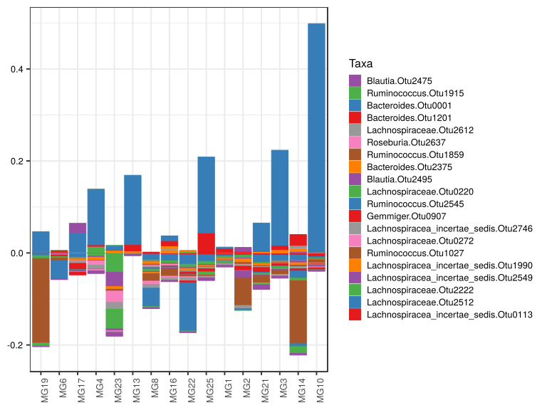

\(1.3.1.4.4.2.2.2.1.1.1\) [`Figure 547.`](#figure.547) Abundance difference between paired samples. Samples are paired according to attribute MatchedGroupID, resulting in 16 pairs. When fold change or difference is computed, this is done as 'patient by control'. Data for all pooled samples. Sorting order of features is GeneSelector paired test ranking. bar (sample mean) plot.  Image file: [`plots/323173d5b95.svg`](plots/323173d5b95.svg).
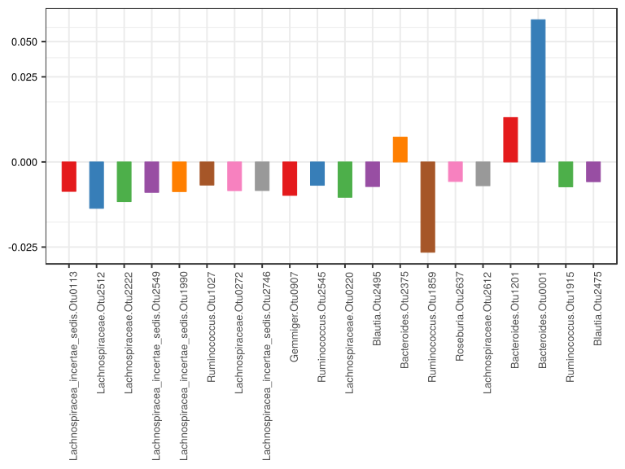

\(1.3.1.4.4.2.2.2.1.1.1\) [`Figure 548.`](#figure.548) Abundance difference between paired samples. Samples are paired according to attribute MatchedGroupID, resulting in 16 pairs. When fold change or difference is computed, this is done as 'patient by control'. Data for all pooled samples. Sorting order of features is GeneSelector paired test ranking. violin plot.  Image file: [`plots/32367f8bd57.svg`](plots/32367f8bd57.svg).
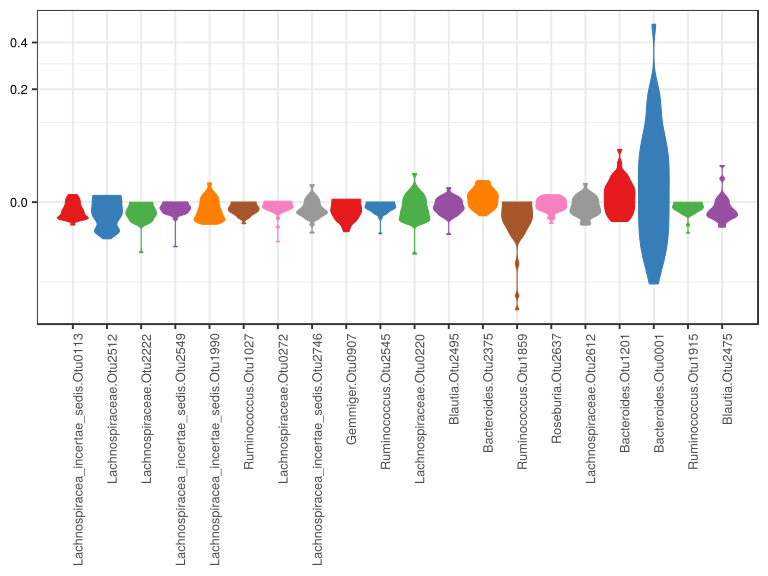

\(1.3.1.4.4.2.2.2.1.1.1\) [`Figure 549.`](#figure.549) Abundance difference between paired samples. Samples are paired according to attribute MatchedGroupID, resulting in 16 pairs. When fold change or difference is computed, this is done as 'patient by control'. Data for all pooled samples. Sorting order of features is GeneSelector paired test ranking. boxplot plot.  Image file: [`plots/32379cad4d8.svg`](plots/32379cad4d8.svg).
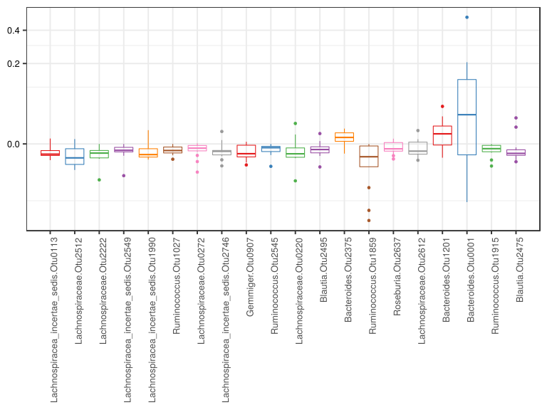

##### \(1.3.1.4.4.2.2.2.1.2\) Abundance difference between paired samples. Samples are paired according to attribute MatchedGroupID, resulting in 16 pairs. When fold change or difference is computed, this is done as 'patient by control'. Plot is in flipped orientation, Y axis not scaled. Iterating over plot geometry

\(1.3.1.4.4.2.2.2.1.2.1\) [`Figure 550.`](#figure.550) Abundance difference between paired samples. Samples are paired according to attribute MatchedGroupID, resulting in 16 pairs. When fold change or difference is computed, this is done as 'patient by control'. Data for all pooled samples. Sorting order of features is GeneSelector paired test ranking. bar (sample mean) plot.  Image file: [`plots/323381f6c29.svg`](plots/323381f6c29.svg).
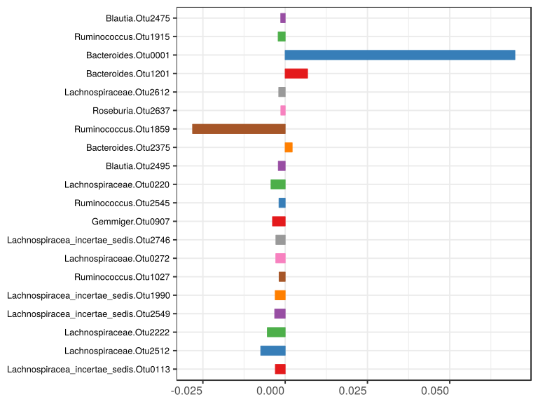

\(1.3.1.4.4.2.2.2.1.2.1\) [`Figure 551.`](#figure.551) Abundance difference between paired samples. Samples are paired according to attribute MatchedGroupID, resulting in 16 pairs. When fold change or difference is computed, this is done as 'patient by control'. Data for all pooled samples. Sorting order of features is GeneSelector paired test ranking. violin plot.  Image file: [`plots/3232b87bc55.svg`](plots/3232b87bc55.svg).
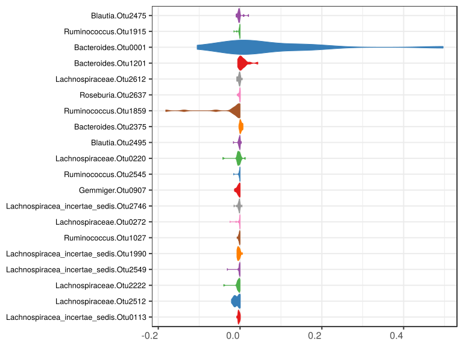

\(1.3.1.4.4.2.2.2.1.2.1\) [`Figure 552.`](#figure.552) Abundance difference between paired samples. Samples are paired according to attribute MatchedGroupID, resulting in 16 pairs. When fold change or difference is computed, this is done as 'patient by control'. Data for all pooled samples. Sorting order of features is GeneSelector paired test ranking. boxplot plot.  Image file: [`plots/3235c7172d.svg`](plots/3235c7172d.svg).
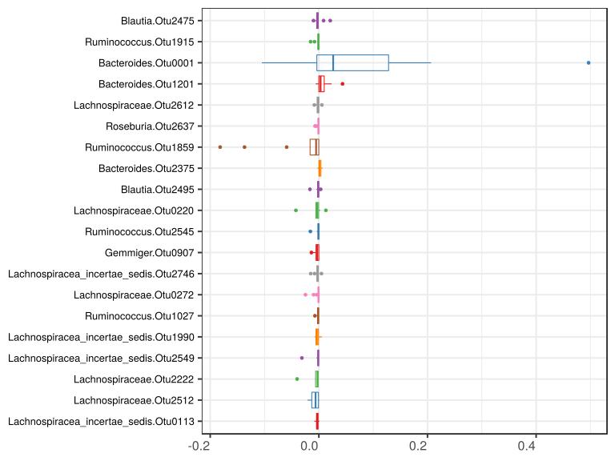

##### \(1.3.1.4.4.2.3\) Grouping variables age.quant

##### \(1.3.1.4.4.2.4\) Iterating over Abundance difference between paired samples. Samples are paired according to attribute MatchedGroupID, resulting in 16 pairs. When fold change or difference is computed, this is done as 'patient by control'. profile sorting order

##### \(1.3.1.4.4.2.4.1\) Abundance difference between paired samples. Samples are paired according to attribute MatchedGroupID, resulting in 16 pairs. When fold change or difference is computed, this is done as 'patient by control'. profile sorting order: GeneSelector paired test ranking

##### \(1.3.1.4.4.2.4.2\) Iterating over dodged vs faceted bars

The same data are shown in multiple combinations of graphical representations. 
                         This is the same data, but each plot highlights slightly different aspects of it.
                         It is not likely that you will need every plot - pick only what you need.

##### \(1.3.1.4.4.2.4.2.1\) faceted plots. Iterating over orientation and, optionally, scaling

##### \(1.3.1.4.4.2.4.2.1.1\) Abundance difference between paired samples. Samples are paired according to attribute MatchedGroupID, resulting in 16 pairs. When fold change or difference is computed, this is done as 'patient by control'. Plot is in original orientation, Y axis SQRT scaled. Iterating over plot geometry

\(1.3.1.4.4.2.4.2.1.1.0\) [`Table 136.`](#table.136) Data table used for plots. Data grouped by age.quant. Showing only 200 first rows. Full dataset is also saved in a delimited text file (click to download and open e.g. in Excel) [`data/1.3.1.4.4.2.4.2.1.1.0-3234319185b.1.3.1.4.4.2.4.2.1.1.csv`](data/1.3.1.4.4.2.4.2.1.1.0-3234319185b.1.3.1.4.4.2.4.2.1.1.csv)

| .record.id | age.quant     | feature                  | abundance.diff |
|:-----------|:--------------|:-------------------------|:---------------|
| MG1        | \(15.3,26.4\] | Bacteroides.Otu0001      | 2.725e\-03     |
| MG10       | \(8.71,15.3\] | Bacteroides.Otu0001      | 4.966e\-01     |
| MG13       | \(15.3,26.4\] | Bacteroides.Otu0001      | 1.506e\-01     |
| MG14       | \(15.3,26.4\] | Bacteroides.Otu0001      | \-6.092e\-03   |
| MG16       | \(15.3,26.4\] | Bacteroides.Otu0001      | 1.024e\-02     |
| MG17       | \(15.3,26.4\] | Bacteroides.Otu0001      | 4.258e\-02     |
| MG19       | \(6.27,8.71\] | Bacteroides.Otu0001      | 4.416e\-02     |
| MG2        | \[3.18,6.27\] | Bacteroides.Otu0001      | \-2.902e\-03   |
| MG21       | \(8.71,15.3\] | Bacteroides.Otu0001      | 6.177e\-02     |
| MG22       | \(8.71,15.3\] | Bacteroides.Otu0001      | \-1.049e\-01   |
| MG23       | \(6.27,8.71\] | Bacteroides.Otu0001      | 9.506e\-03     |
| MG25       | \(8.71,15.3\] | Bacteroides.Otu0001      | 1.649e\-01     |
| MG3        | \(8.71,15.3\] | Bacteroides.Otu0001      | 2.066e\-01     |
| MG4        | \(8.71,15.3\] | Bacteroides.Otu0001      | 1.209e\-01     |
| MG6        | \(8.71,15.3\] | Bacteroides.Otu0001      | \-3.992e\-02   |
| MG8        | \(8.71,15.3\] | Bacteroides.Otu0001      | \-4.020e\-02   |
| MG1        | \(15.3,26.4\] | Bacteroides.Otu2520      | 1.618e\-01     |
| MG10       | \(8.71,15.3\] | Bacteroides.Otu2520      | \-1.173e\-01   |
| MG13       | \(15.3,26.4\] | Bacteroides.Otu2520      | 8.620e\-03     |
| MG14       | \(15.3,26.4\] | Bacteroides.Otu2520      | \-7.465e\-02   |
| MG16       | \(15.3,26.4\] | Bacteroides.Otu2520      | \-2.704e\-02   |
| MG17       | \(15.3,26.4\] | Bacteroides.Otu2520      | \-5.743e\-03   |
| MG19       | \(6.27,8.71\] | Bacteroides.Otu2520      | \-2.394e\-01   |
| MG2        | \[3.18,6.27\] | Bacteroides.Otu2520      | \-3.766e\-03   |
| MG21       | \(8.71,15.3\] | Bacteroides.Otu2520      | \-1.659e\-02   |
| MG22       | \(8.71,15.3\] | Bacteroides.Otu2520      | 7.604e\-02     |
| MG23       | \(6.27,8.71\] | Bacteroides.Otu2520      | 0.000e\+00     |
| MG25       | \(8.71,15.3\] | Bacteroides.Otu2520      | 4.436e\-02     |
| MG3        | \(8.71,15.3\] | Bacteroides.Otu2520      | 1.389e\-01     |
| MG4        | \(8.71,15.3\] | Bacteroides.Otu2520      | \-1.767e\-02   |
| MG6        | \(8.71,15.3\] | Bacteroides.Otu2520      | \-1.191e\-02   |
| MG8        | \(8.71,15.3\] | Bacteroides.Otu2520      | 7.802e\-02     |
| MG1        | \(15.3,26.4\] | Prevotella.Otu1987       | \-1.357e\-01   |
| MG10       | \(8.71,15.3\] | Prevotella.Otu1987       | 0.000e\+00     |
| MG13       | \(15.3,26.4\] | Prevotella.Otu1987       | \-2.194e\-01   |
| MG14       | \(15.3,26.4\] | Prevotella.Otu1987       | 0.000e\+00     |
| MG16       | \(15.3,26.4\] | Prevotella.Otu1987       | 0.000e\+00     |
| MG17       | \(15.3,26.4\] | Prevotella.Otu1987       | \-1.989e\-01   |
| MG19       | \(6.27,8.71\] | Prevotella.Otu1987       | 0.000e\+00     |
| MG2        | \[3.18,6.27\] | Prevotella.Otu1987       | \-7.571e\-02   |
| MG21       | \(8.71,15.3\] | Prevotella.Otu1987       | 9.962e\-02     |
| MG22       | \(8.71,15.3\] | Prevotella.Otu1987       | 0.000e\+00     |
| MG23       | \(6.27,8.71\] | Prevotella.Otu1987       | 0.000e\+00     |
| MG25       | \(8.71,15.3\] | Prevotella.Otu1987       | \-2.478e\-01   |
| MG3        | \(8.71,15.3\] | Prevotella.Otu1987       | 0.000e\+00     |
| MG4        | \(8.71,15.3\] | Prevotella.Otu1987       | 0.000e\+00     |
| MG6        | \(8.71,15.3\] | Prevotella.Otu1987       | 0.000e\+00     |
| MG8        | \(8.71,15.3\] | Prevotella.Otu1987       | \-7.326e\-05   |
| MG1        | \(15.3,26.4\] | Bacteroides.Otu2654      | 4.009e\-01     |
| MG10       | \(8.71,15.3\] | Bacteroides.Otu2654      | 7.560e\-02     |
| MG13       | \(15.3,26.4\] | Bacteroides.Otu2654      | 3.429e\-02     |
| MG14       | \(15.3,26.4\] | Bacteroides.Otu2654      | 1.614e\-03     |
| MG16       | \(15.3,26.4\] | Bacteroides.Otu2654      | \-4.714e\-03   |
| MG17       | \(15.3,26.4\] | Bacteroides.Otu2654      | \-8.516e\-05   |
| MG19       | \(6.27,8.71\] | Bacteroides.Otu2654      | \-1.612e\-03   |
| MG2        | \[3.18,6.27\] | Bacteroides.Otu2654      | \-8.290e\-04   |
| MG21       | \(8.71,15.3\] | Bacteroides.Otu2654      | \-7.487e\-03   |
| MG22       | \(8.71,15.3\] | Bacteroides.Otu2654      | \-7.327e\-03   |
| MG23       | \(6.27,8.71\] | Bacteroides.Otu2654      | 7.416e\-04     |
| MG25       | \(8.71,15.3\] | Bacteroides.Otu2654      | 4.818e\-03     |
| MG3        | \(8.71,15.3\] | Bacteroides.Otu2654      | 3.370e\-02     |
| MG4        | \(8.71,15.3\] | Bacteroides.Otu2654      | 6.595e\-02     |
| MG6        | \(8.71,15.3\] | Bacteroides.Otu2654      | \-2.131e\-04   |
| MG8        | \(8.71,15.3\] | Bacteroides.Otu2654      | 4.885e\-02     |
| MG1        | \(15.3,26.4\] | Bacteroides.Otu0863      | 2.447e\-03     |
| MG10       | \(8.71,15.3\] | Bacteroides.Otu0863      | 2.601e\-02     |
| MG13       | \(15.3,26.4\] | Bacteroides.Otu0863      | 2.756e\-02     |
| MG14       | \(15.3,26.4\] | Bacteroides.Otu0863      | 1.316e\-01     |
| MG16       | \(15.3,26.4\] | Bacteroides.Otu0863      | 7.900e\-02     |
| MG17       | \(15.3,26.4\] | Bacteroides.Otu0863      | \-8.260e\-03   |
| MG19       | \(6.27,8.71\] | Bacteroides.Otu0863      | \-9.401e\-03   |
| MG2        | \[3.18,6.27\] | Bacteroides.Otu0863      | 1.008e\-02     |
| MG21       | \(8.71,15.3\] | Bacteroides.Otu0863      | \-1.090e\-02   |
| MG22       | \(8.71,15.3\] | Bacteroides.Otu0863      | 9.431e\-03     |
| MG23       | \(6.27,8.71\] | Bacteroides.Otu0863      | 1.594e\-02     |
| MG25       | \(8.71,15.3\] | Bacteroides.Otu0863      | 2.240e\-02     |
| MG3        | \(8.71,15.3\] | Bacteroides.Otu0863      | \-6.552e\-03   |
| MG4        | \(8.71,15.3\] | Bacteroides.Otu0863      | \-6.196e\-03   |
| MG6        | \(8.71,15.3\] | Bacteroides.Otu0863      | 1.577e\-01     |
| MG8        | \(8.71,15.3\] | Bacteroides.Otu0863      | \-3.393e\-03   |
| MG1        | \(15.3,26.4\] | Bacteroides.Otu2038      | 3.818e\-04     |
| MG10       | \(8.71,15.3\] | Bacteroides.Otu2038      | 1.606e\-03     |
| MG13       | \(15.3,26.4\] | Bacteroides.Otu2038      | 1.551e\-02     |
| MG14       | \(15.3,26.4\] | Bacteroides.Otu2038      | 1.254e\-01     |
| MG16       | \(15.3,26.4\] | Bacteroides.Otu2038      | \-2.114e\-03   |
| MG17       | \(15.3,26.4\] | Bacteroides.Otu2038      | 5.059e\-03     |
| MG19       | \(6.27,8.71\] | Bacteroides.Otu2038      | 1.988e\-03     |
| MG2        | \[3.18,6.27\] | Bacteroides.Otu2038      | 3.786e\-04     |
| MG21       | \(8.71,15.3\] | Bacteroides.Otu2038      | 1.986e\-02     |
| MG22       | \(8.71,15.3\] | Bacteroides.Otu2038      | \-7.567e\-03   |
| MG23       | \(6.27,8.71\] | Bacteroides.Otu2038      | 1.443e\-01     |
| MG25       | \(8.71,15.3\] | Bacteroides.Otu2038      | 1.708e\-02     |
| MG3        | \(8.71,15.3\] | Bacteroides.Otu2038      | 1.866e\-02     |
| MG4        | \(8.71,15.3\] | Bacteroides.Otu2038      | 2.352e\-03     |
| MG6        | \(8.71,15.3\] | Bacteroides.Otu2038      | \-1.685e\-03   |
| MG8        | \(8.71,15.3\] | Bacteroides.Otu2038      | \-2.280e\-02   |
| MG1        | \(15.3,26.4\] | Faecalibacterium.Otu0067 | \-6.537e\-02   |
| MG10       | \(8.71,15.3\] | Faecalibacterium.Otu0067 | 4.198e\-03     |
| MG13       | \(15.3,26.4\] | Faecalibacterium.Otu0067 | \-1.560e\-03   |
| MG14       | \(15.3,26.4\] | Faecalibacterium.Otu0067 | \-1.430e\-02   |
| MG16       | \(15.3,26.4\] | Faecalibacterium.Otu0067 | \-2.018e\-02   |
| MG17       | \(15.3,26.4\] | Faecalibacterium.Otu0067 | 4.790e\-02     |
| MG19       | \(6.27,8.71\] | Faecalibacterium.Otu0067 | 5.674e\-03     |
| MG2        | \[3.18,6.27\] | Faecalibacterium.Otu0067 | \-3.070e\-02   |
| MG21       | \(8.71,15.3\] | Faecalibacterium.Otu0067 | 2.118e\-02     |
| MG22       | \(8.71,15.3\] | Faecalibacterium.Otu0067 | \-5.212e\-03   |
| MG23       | \(6.27,8.71\] | Faecalibacterium.Otu0067 | 2.208e\-02     |
| MG25       | \(8.71,15.3\] | Faecalibacterium.Otu0067 | 1.247e\-02     |
| MG3        | \(8.71,15.3\] | Faecalibacterium.Otu0067 | \-1.614e\-02   |
| MG4        | \(8.71,15.3\] | Faecalibacterium.Otu0067 | \-1.599e\-03   |
| MG6        | \(8.71,15.3\] | Faecalibacterium.Otu0067 | \-1.466e\-02   |
| MG8        | \(8.71,15.3\] | Faecalibacterium.Otu0067 | \-2.062e\-02   |
| MG1        | \(15.3,26.4\] | Alistipes.Otu2508        | \-9.160e\-03   |
| MG10       | \(8.71,15.3\] | Alistipes.Otu2508        | \-4.431e\-02   |
| MG13       | \(15.3,26.4\] | Alistipes.Otu2508        | 3.821e\-02     |
| MG14       | \(15.3,26.4\] | Alistipes.Otu2508        | \-2.701e\-02   |
| MG16       | \(15.3,26.4\] | Alistipes.Otu2508        | 1.010e\-03     |
| MG17       | \(15.3,26.4\] | Alistipes.Otu2508        | \-6.131e\-03   |
| MG19       | \(6.27,8.71\] | Alistipes.Otu2508        | 4.513e\-04     |
| MG2        | \[3.18,6.27\] | Alistipes.Otu2508        | \-2.342e\-02   |
| MG21       | \(8.71,15.3\] | Alistipes.Otu2508        | \-9.856e\-02   |
| MG22       | \(8.71,15.3\] | Alistipes.Otu2508        | \-5.612e\-03   |
| MG23       | \(6.27,8.71\] | Alistipes.Otu2508        | 0.000e\+00     |
| MG25       | \(8.71,15.3\] | Alistipes.Otu2508        | 6.635e\-03     |
| MG3        | \(8.71,15.3\] | Alistipes.Otu2508        | 3.089e\-02     |
| MG4        | \(8.71,15.3\] | Alistipes.Otu2508        | 0.000e\+00     |
| MG6        | \(8.71,15.3\] | Alistipes.Otu2508        | 1.231e\-01     |
| MG8        | \(8.71,15.3\] | Alistipes.Otu2508        | 0.000e\+00     |
| MG1        | \(15.3,26.4\] | Ruminococcus.Otu1859     | \-1.761e\-04   |
| MG10       | \(8.71,15.3\] | Ruminococcus.Otu1859     | 0.000e\+00     |
| MG13       | \(15.3,26.4\] | Ruminococcus.Otu1859     | \-1.410e\-03   |
| MG14       | \(15.3,26.4\] | Ruminococcus.Otu1859     | \-1.369e\-01   |
| MG16       | \(15.3,26.4\] | Ruminococcus.Otu1859     | \-1.641e\-02   |
| MG17       | \(15.3,26.4\] | Ruminococcus.Otu1859     | 0.000e\+00     |
| MG19       | \(6.27,8.71\] | Ruminococcus.Otu1859     | \-1.817e\-01   |
| MG2        | \[3.18,6.27\] | Ruminococcus.Otu1859     | \-5.924e\-02   |
| MG21       | \(8.71,15.3\] | Ruminococcus.Otu1859     | \-1.606e\-02   |
| MG22       | \(8.71,15.3\] | Ruminococcus.Otu1859     | \-3.570e\-03   |
| MG23       | \(6.27,8.71\] | Ruminococcus.Otu1859     | 0.000e\+00     |
| MG25       | \(8.71,15.3\] | Ruminococcus.Otu1859     | \-2.714e\-03   |
| MG3        | \(8.71,15.3\] | Ruminococcus.Otu1859     | \-9.188e\-03   |
| MG4        | \(8.71,15.3\] | Ruminococcus.Otu1859     | 0.000e\+00     |
| MG6        | \(8.71,15.3\] | Ruminococcus.Otu1859     | \-6.607e\-03   |
| MG8        | \(8.71,15.3\] | Ruminococcus.Otu1859     | \-1.606e\-02   |
| MG1        | \(15.3,26.4\] | Bacteroides.Otu2065      | \-3.875e\-03   |
| MG10       | \(8.71,15.3\] | Bacteroides.Otu2065      | \-3.432e\-02   |
| MG13       | \(15.3,26.4\] | Bacteroides.Otu2065      | 0.000e\+00     |
| MG14       | \(15.3,26.4\] | Bacteroides.Otu2065      | 0.000e\+00     |
| MG16       | \(15.3,26.4\] | Bacteroides.Otu2065      | \-3.991e\-02   |
| MG17       | \(15.3,26.4\] | Bacteroides.Otu2065      | 0.000e\+00     |
| MG19       | \(6.27,8.71\] | Bacteroides.Otu2065      | 3.769e\-01     |
| MG2        | \[3.18,6.27\] | Bacteroides.Otu2065      | 0.000e\+00     |
| MG21       | \(8.71,15.3\] | Bacteroides.Otu2065      | \-2.553e\-02   |
| MG22       | \(8.71,15.3\] | Bacteroides.Otu2065      | 0.000e\+00     |
| MG23       | \(6.27,8.71\] | Bacteroides.Otu2065      | 0.000e\+00     |
| MG25       | \(8.71,15.3\] | Bacteroides.Otu2065      | 0.000e\+00     |
| MG3        | \(8.71,15.3\] | Bacteroides.Otu2065      | \-1.316e\-05   |
| MG4        | \(8.71,15.3\] | Bacteroides.Otu2065      | 0.000e\+00     |
| MG6        | \(8.71,15.3\] | Bacteroides.Otu2065      | 0.000e\+00     |
| MG8        | \(8.71,15.3\] | Bacteroides.Otu2065      | 7.167e\-02     |
| MG1        | \(15.3,26.4\] | Bacteroides.Otu0848      | 8.741e\-03     |
| MG10       | \(8.71,15.3\] | Bacteroides.Otu0848      | 4.465e\-02     |
| MG13       | \(15.3,26.4\] | Bacteroides.Otu0848      | 5.281e\-03     |
| MG14       | \(15.3,26.4\] | Bacteroides.Otu0848      | 4.685e\-03     |
| MG16       | \(15.3,26.4\] | Bacteroides.Otu0848      | \-1.186e\-02   |
| MG17       | \(15.3,26.4\] | Bacteroides.Otu0848      | \-1.277e\-03   |
| MG19       | \(6.27,8.71\] | Bacteroides.Otu0848      | \-1.343e\-03   |
| MG2        | \[3.18,6.27\] | Bacteroides.Otu0848      | 1.714e\-04     |
| MG21       | \(8.71,15.3\] | Bacteroides.Otu0848      | \-1.575e\-02   |
| MG22       | \(8.71,15.3\] | Bacteroides.Otu0848      | 3.979e\-03     |
| MG23       | \(6.27,8.71\] | Bacteroides.Otu0848      | 1.290e\-01     |
| MG25       | \(8.71,15.3\] | Bacteroides.Otu0848      | 1.673e\-02     |
| MG3        | \(8.71,15.3\] | Bacteroides.Otu0848      | 9.533e\-03     |
| MG4        | \(8.71,15.3\] | Bacteroides.Otu0848      | \-4.068e\-03   |
| MG6        | \(8.71,15.3\] | Bacteroides.Otu0848      | 4.240e\-03     |
| MG8        | \(8.71,15.3\] | Bacteroides.Otu0848      | 2.679e\-02     |
| MG1        | \(15.3,26.4\] | Prevotella.Otu1994       | 0.000e\+00     |
| MG10       | \(8.71,15.3\] | Prevotella.Otu1994       | 0.000e\+00     |
| MG13       | \(15.3,26.4\] | Prevotella.Otu1994       | \-1.383e\-01   |
| MG14       | \(15.3,26.4\] | Prevotella.Otu1994       | 0.000e\+00     |
| MG16       | \(15.3,26.4\] | Prevotella.Otu1994       | 0.000e\+00     |
| MG17       | \(15.3,26.4\] | Prevotella.Otu1994       | \-3.210e\-02   |
| MG19       | \(6.27,8.71\] | Prevotella.Otu1994       | 0.000e\+00     |
| MG2        | \[3.18,6.27\] | Prevotella.Otu1994       | \-2.169e\-01   |
| MG21       | \(8.71,15.3\] | Prevotella.Otu1994       | 1.301e\-02     |
| MG22       | \(8.71,15.3\] | Prevotella.Otu1994       | 0.000e\+00     |
| MG23       | \(6.27,8.71\] | Prevotella.Otu1994       | 0.000e\+00     |
| MG25       | \(8.71,15.3\] | Prevotella.Otu1994       | \-2.240e\-02   |
| MG3        | \(8.71,15.3\] | Prevotella.Otu1994       | 0.000e\+00     |
| MG4        | \(8.71,15.3\] | Prevotella.Otu1994       | 0.000e\+00     |
| MG6        | \(8.71,15.3\] | Prevotella.Otu1994       | 0.000e\+00     |
| MG8        | \(8.71,15.3\] | Prevotella.Otu1994       | 0.000e\+00     |
| MG1        | \(15.3,26.4\] | Bacteroides.Otu2431      | 4.277e\-03     |
| MG10       | \(8.71,15.3\] | Bacteroides.Otu2431      | \-4.749e\-02   |
| MG13       | \(15.3,26.4\] | Bacteroides.Otu2431      | 4.128e\-03     |
| MG14       | \(15.3,26.4\] | Bacteroides.Otu2431      | \-6.144e\-05   |
| MG16       | \(15.3,26.4\] | Bacteroides.Otu2431      | \-7.173e\-05   |
| MG17       | \(15.3,26.4\] | Bacteroides.Otu2431      | \-1.363e\-03   |
| MG19       | \(6.27,8.71\] | Bacteroides.Otu2431      | 1.881e\-02     |
| MG2        | \[3.18,6.27\] | Bacteroides.Otu2431      | \-8.290e\-04   |

\(1.3.1.4.4.2.4.2.1.1.1\) [`Widget 150.`](#widget.150) Dynamic Pivot Table link (drag and drop field names and pick averaging 
                      functions or plot types; click on fields or legend elements to filter values). 
                      Starting rendering is Stacked Bar Chart. Data grouped by age.quant. Click to see HTML widget file in full window: [`./1.3.1.4.4.2.4.2.1.1.1-323682801f8Dynamic.Pivot.Table.html`](./1.3.1.4.4.2.4.2.1.1.1-323682801f8Dynamic.Pivot.Table.html)

\(1.3.1.4.4.2.4.2.1.1.1\) [`Widget 151.`](#widget.151) Dynamic Pivot Table link (drag and drop field names and pick averaging 
                      functions or plot types; click on fields or legend elements to filter values). 
                      Starting rendering is Table Barchart. Data grouped by age.quant. Click to see HTML widget file in full window: [`./1.3.1.4.4.2.4.2.1.1.1-323249b4921Dynamic.Pivot.Table.html`](./1.3.1.4.4.2.4.2.1.1.1-323249b4921Dynamic.Pivot.Table.html)

\(1.3.1.4.4.2.4.2.1.1.1\) [`Table 137.`](#table.137) Summary table. Data grouped by age.quant. Showing only 200 first rows. Full dataset is also saved in a delimited text file (click to download and open e.g. in Excel) [`data/1.3.1.4.4.2.4.2.1.1.1-32311a8dafb.1.3.1.4.4.2.4.2.1.1.csv`](data/1.3.1.4.4.2.4.2.1.1.1-32311a8dafb.1.3.1.4.4.2.4.2.1.1.csv)

| feature                                      | age.quant     | mean         | sd        | median       | incidence |
|:---------------------------------------------|:--------------|:-------------|:----------|:-------------|:----------|
| Lachnospiracea\_incertae\_sedis.Otu0113      | \[3.18,6.27\] | \-4.045e\-03 | NA        | \-4.045e\-03 | 0.000     |
| Lachnospiracea\_incertae\_sedis.Otu0113      | \(6.27,8.71\] | \-2.662e\-04 | 0.0016531 | \-2.662e\-04 | 0.500     |
| Lachnospiracea\_incertae\_sedis.Otu0113      | \(8.71,15.3\] | \-3.633e\-03 | 0.0024251 | \-3.836e\-03 | 0.000     |
| Lachnospiracea\_incertae\_sedis.Otu0113      | \(15.3,26.4\] | \-2.813e\-03 | 0.0016016 | \-2.883e\-03 | 0.000     |
| Lachnospiraceae.Otu2512                      | \[3.18,6.27\] | \-1.108e\-03 | NA        | \-1.108e\-03 | 0.000     |
| Lachnospiraceae.Otu2512                      | \(6.27,8.71\] | 1.399e\-04   | 0.0008203 | 1.399e\-04   | 0.500     |
| Lachnospiraceae.Otu2512                      | \(8.71,15.3\] | \-9.890e\-03 | 0.0079083 | \-1.217e\-02 | 0.125     |
| Lachnospiraceae.Otu2512                      | \(15.3,26.4\] | \-7.757e\-03 | 0.0055838 | \-8.577e\-03 | 0.000     |
| Lachnospiraceae.Otu2222                      | \[3.18,6.27\] | \-6.134e\-03 | NA        | \-6.134e\-03 | 0.000     |
| Lachnospiraceae.Otu2222                      | \(6.27,8.71\] | \-2.002e\-02 | 0.0283141 | \-2.002e\-02 | 0.000     |
| Lachnospiraceae.Otu2222                      | \(8.71,15.3\] | \-3.475e\-03 | 0.0024144 | \-2.415e\-03 | 0.000     |
| Lachnospiraceae.Otu2222                      | \(15.3,26.4\] | \-2.514e\-03 | 0.0020235 | \-2.446e\-03 | 0.000     |
| Lachnospiracea\_incertae\_sedis.Otu2549      | \[3.18,6.27\] | \-1.666e\-03 | NA        | \-1.666e\-03 | 0.000     |
| Lachnospiracea\_incertae\_sedis.Otu2549      | \(6.27,8.71\] | \-1.562e\-02 | 0.0220935 | \-1.562e\-02 | 0.000     |
| Lachnospiracea\_incertae\_sedis.Otu2549      | \(8.71,15.3\] | \-1.410e\-03 | 0.0008701 | \-1.283e\-03 | 0.000     |
| Lachnospiracea\_incertae\_sedis.Otu2549      | \(15.3,26.4\] | \-1.339e\-03 | 0.0018247 | \-3.525e\-04 | 0.000     |
| Lachnospiracea\_incertae\_sedis.Otu1990      | \[3.18,6.27\] | \-7.668e\-03 | NA        | \-7.668e\-03 | 0.000     |
| Lachnospiracea\_incertae\_sedis.Otu1990      | \(6.27,8.71\] | \-3.298e\-03 | 0.0035252 | \-3.298e\-03 | 0.000     |
| Lachnospiracea\_incertae\_sedis.Otu1990      | \(8.71,15.3\] | \-3.298e\-03 | 0.0024148 | \-3.511e\-03 | 0.125     |
| Lachnospiracea\_incertae\_sedis.Otu1990      | \(15.3,26.4\] | \-1.540e\-03 | 0.0046327 | \-3.171e\-03 | 0.200     |
| Ruminococcus.Otu1027                         | \[3.18,6.27\] | \-3.938e\-03 | NA        | \-3.938e\-03 | 0.000     |
| Ruminococcus.Otu1027                         | \(6.27,8.71\] | \-1.981e\-03 | 0.0028010 | \-1.981e\-03 | 0.000     |
| Ruminococcus.Otu1027                         | \(8.71,15.3\] | \-2.056e\-03 | 0.0022228 | \-1.370e\-03 | 0.000     |
| Ruminococcus.Otu1027                         | \(15.3,26.4\] | \-1.018e\-03 | 0.0012908 | \-3.096e\-04 | 0.000     |
| Lachnospiraceae.Otu0272                      | \[3.18,6.27\] | \-1.351e\-03 | NA        | \-1.351e\-03 | 0.000     |
| Lachnospiraceae.Otu0272                      | \(6.27,8.71\] | \-1.232e\-02 | 0.0174269 | \-1.232e\-02 | 0.000     |
| Lachnospiraceae.Otu0272                      | \(8.71,15.3\] | \-1.823e\-03 | 0.0032316 | \-6.536e\-04 | 0.000     |
| Lachnospiraceae.Otu0272                      | \(15.3,26.4\] | \-9.687e\-04 | 0.0017797 | \-8.814e\-05 | 0.200     |
| Lachnospiracea\_incertae\_sedis.Otu2746      | \[3.18,6.27\] | \-2.902e\-03 | NA        | \-2.902e\-03 | 0.000     |
| Lachnospiracea\_incertae\_sedis.Otu2746      | \(6.27,8.71\] | \-8.154e\-03 | 0.0096317 | \-8.154e\-03 | 0.000     |
| Lachnospiracea\_incertae\_sedis.Otu2746      | \(8.71,15.3\] | \-2.443e\-03 | 0.0024769 | \-1.627e\-03 | 0.125     |
| Lachnospiracea\_incertae\_sedis.Otu2746      | \(15.3,26.4\] | \-1.258e\-03 | 0.0039009 | \-1.761e\-03 | 0.200     |
| Gemmiger.Otu0907                             | \[3.18,6.27\] | \-8.569e\-03 | NA        | \-8.569e\-03 | 0.000     |
| Gemmiger.Otu0907                             | \(6.27,8.71\] | 0.000e\+00   | 0.0000000 | 0.000e\+00   | 0.000     |
| Gemmiger.Otu0907                             | \(8.71,15.3\] | \-4.069e\-03 | 0.0034642 | \-4.179e\-03 | 0.000     |
| Gemmiger.Otu0907                             | \(15.3,26.4\] | \-4.082e\-03 | 0.0057425 | \-2.099e\-03 | 0.400     |
| Ruminococcus.Otu2545                         | \[3.18,6.27\] | \-1.036e\-03 | NA        | \-1.036e\-03 | 0.000     |
| Ruminococcus.Otu2545                         | \(6.27,8.71\] | \-1.923e\-03 | 0.0027197 | \-1.923e\-03 | 0.000     |
| Ruminococcus.Otu2545                         | \(8.71,15.3\] | \-1.019e\-03 | 0.0009660 | \-9.074e\-04 | 0.000     |
| Ruminococcus.Otu2545                         | \(15.3,26.4\] | \-3.385e\-03 | 0.0068293 | \-4.258e\-04 | 0.000     |
| Lachnospiraceae.Otu0220                      | \[3.18,6.27\] | \-1.076e\-04 | NA        | \-1.076e\-04 | 0.000     |
| Lachnospiraceae.Otu0220                      | \(6.27,8.71\] | \-2.425e\-02 | 0.0254398 | \-2.425e\-02 | 0.000     |
| Lachnospiraceae.Otu0220                      | \(8.71,15.3\] | \-1.025e\-03 | 0.0063047 | \-3.039e\-03 | 0.250     |
| Lachnospiraceae.Otu0220                      | \(15.3,26.4\] | \-2.396e\-03 | 0.0026139 | \-1.113e\-03 | 0.200     |
| Blautia.Otu2495                              | \[3.18,6.27\] | \-1.642e\-02 | NA        | \-1.642e\-02 | 0.000     |
| Blautia.Otu2495                              | \(6.27,8.71\] | \-2.235e\-03 | 0.0031613 | \-2.235e\-03 | 0.000     |
| Blautia.Otu2495                              | \(8.71,15.3\] | \-1.340e\-03 | 0.0010015 | \-9.771e\-04 | 0.000     |
| Blautia.Otu2495                              | \(15.3,26.4\] | \-3.404e\-04 | 0.0024960 | 3.912e\-05   | 0.600     |
| Bacteroides.Otu2375                          | \[3.18,6.27\] | 0.000e\+00   | NA        | 0.000e\+00   | 0.000     |
| Bacteroides.Otu2375                          | \(6.27,8.71\] | 3.103e\-03   | 0.0040011 | 3.103e\-03   | 1.000     |
| Bacteroides.Otu2375                          | \(8.71,15.3\] | 1.424e\-03   | 0.0030776 | 1.240e\-03   | 0.625     |
| Bacteroides.Otu2375                          | \(15.3,26.4\] | 3.285e\-03   | 0.0026993 | 3.399e\-03   | 1.000     |
| Ruminococcus.Otu1859                         | \[3.18,6.27\] | \-5.924e\-02 | NA        | \-5.924e\-02 | 0.000     |
| Ruminococcus.Otu1859                         | \(6.27,8.71\] | \-9.085e\-02 | 0.1284830 | \-9.085e\-02 | 0.000     |
| Ruminococcus.Otu1859                         | \(8.71,15.3\] | \-6.775e\-03 | 0.0065121 | \-5.089e\-03 | 0.000     |
| Ruminococcus.Otu1859                         | \(15.3,26.4\] | \-3.097e\-02 | 0.0595978 | \-1.410e\-03 | 0.000     |
| Roseburia.Otu2637                            | \[3.18,6.27\] | 3.428e\-04   | NA        | 3.428e\-04   | 1.000     |
| Roseburia.Otu2637                            | \(6.27,8.71\] | \-6.602e\-04 | 0.0009337 | \-6.602e\-04 | 0.000     |
| Roseburia.Otu2637                            | \(8.71,15.3\] | \-2.076e\-03 | 0.0023213 | \-9.751e\-04 | 0.125     |
| Roseburia.Otu2637                            | \(15.3,26.4\] | \-6.724e\-04 | 0.0020776 | 1.664e\-04   | 0.600     |
| Lachnospiraceae.Otu2612                      | \[3.18,6.27\] | \-7.047e\-03 | NA        | \-7.047e\-03 | 0.000     |
| Lachnospiraceae.Otu2612                      | \(6.27,8.71\] | \-1.100e\-03 | 0.0015561 | \-1.100e\-03 | 0.000     |
| Lachnospiraceae.Otu2612                      | \(8.71,15.3\] | \-2.478e\-03 | 0.0032018 | \-1.629e\-03 | 0.250     |
| Lachnospiraceae.Otu2612                      | \(15.3,26.4\] | \-4.157e\-04 | 0.0037673 | \-1.277e\-03 | 0.400     |
| Bacteroides.Otu1201                          | \[3.18,6.27\] | 2.922e\-03   | NA        | 2.922e\-03   | 1.000     |
| Bacteroides.Otu1201                          | \(6.27,8.71\] | \-3.212e\-05 | 0.0010942 | \-3.212e\-05 | 0.500     |
| Bacteroides.Otu1201                          | \(8.71,15.3\] | 6.801e\-03   | 0.0154925 | 2.528e\-03   | 0.750     |
| Bacteroides.Otu1201                          | \(15.3,26.4\] | 1.030e\-02   | 0.0106104 | 1.126e\-02   | 0.800     |
| Bacteroides.Otu0001                          | \[3.18,6.27\] | \-2.902e\-03 | NA        | \-2.902e\-03 | 0.000     |
| Bacteroides.Otu0001                          | \(6.27,8.71\] | 2.683e\-02   | 0.0245045 | 2.683e\-02   | 1.000     |
| Bacteroides.Otu0001                          | \(8.71,15.3\] | 1.082e\-01   | 0.1910281 | 9.135e\-02   | 0.625     |
| Bacteroides.Otu0001                          | \(15.3,26.4\] | 4.002e\-02   | 0.0645150 | 1.024e\-02   | 0.800     |
| Ruminococcus.Otu1915                         | \[3.18,6.27\] | \-6.218e\-04 | NA        | \-6.218e\-04 | 0.000     |
| Ruminococcus.Otu1915                         | \(6.27,8.71\] | \-4.026e\-03 | 0.0056939 | \-4.026e\-03 | 0.000     |
| Ruminococcus.Otu1915                         | \(8.71,15.3\] | \-1.129e\-03 | 0.0009606 | \-1.076e\-03 | 0.000     |
| Ruminococcus.Otu1915                         | \(15.3,26.4\] | \-3.270e\-03 | 0.0066436 | \-1.761e\-04 | 0.000     |
| Blautia.Otu2475                              | \[3.18,6.27\] | 8.715e\-03   | NA        | 8.715e\-03   | 1.000     |
| Blautia.Otu2475                              | \(6.27,8.71\] | \-4.511e\-03 | 0.0051186 | \-4.511e\-03 | 0.000     |
| Blautia.Otu2475                              | \(8.71,15.3\] | \-3.920e\-03 | 0.0030174 | \-3.290e\-03 | 0.000     |
| Blautia.Otu2475                              | \(15.3,26.4\] | 2.048e\-03   | 0.0106041 | \-2.598e\-03 | 0.200     |
| Bacteroides.Otu0863                          | \[3.18,6.27\] | 1.008e\-02   | NA        | 1.008e\-02   | 1.000     |
| Bacteroides.Otu0863                          | \(6.27,8.71\] | 3.271e\-03   | 0.0179208 | 3.271e\-03   | 0.500     |
| Bacteroides.Otu0863                          | \(8.71,15.3\] | 2.356e\-02   | 0.0559265 | 3.019e\-03   | 0.500     |
| Bacteroides.Otu0863                          | \(15.3,26.4\] | 4.647e\-02   | 0.0583030 | 2.756e\-02   | 0.800     |
| Lachnospiracea\_incertae\_sedis.Otu1152      | \[3.18,6.27\] | 2.794e\-05   | NA        | 2.794e\-05   | 1.000     |
| Lachnospiracea\_incertae\_sedis.Otu1152      | \(6.27,8.71\] | \-1.604e\-02 | 0.0115472 | \-1.604e\-02 | 0.000     |
| Lachnospiracea\_incertae\_sedis.Otu1152      | \(8.71,15.3\] | 1.487e\-04   | 0.0047075 | \-1.171e\-03 | 0.250     |
| Lachnospiracea\_incertae\_sedis.Otu1152      | \(15.3,26.4\] | \-6.972e\-04 | 0.0017013 | \-7.046e\-04 | 0.400     |
| Bacteroides.Otu2038                          | \[3.18,6.27\] | 3.786e\-04   | NA        | 3.786e\-04   | 1.000     |
| Bacteroides.Otu2038                          | \(6.27,8.71\] | 7.317e\-02   | 0.1006647 | 7.317e\-02   | 1.000     |
| Bacteroides.Otu2038                          | \(8.71,15.3\] | 3.437e\-03   | 0.0147727 | 1.979e\-03   | 0.625     |
| Bacteroides.Otu2038                          | \(15.3,26.4\] | 2.885e\-02   | 0.0544087 | 5.059e\-03   | 0.800     |
| Lachnospiraceae.Otu0578                      | \[3.18,6.27\] | \-1.451e\-03 | NA        | \-1.451e\-03 | 0.000     |
| Lachnospiraceae.Otu0578                      | \(6.27,8.71\] | \-6.602e\-04 | 0.0009337 | \-6.602e\-04 | 0.000     |
| Lachnospiraceae.Otu0578                      | \(8.71,15.3\] | \-1.227e\-03 | 0.0014057 | \-5.699e\-04 | 0.000     |
| Lachnospiraceae.Otu0578                      | \(15.3,26.4\] | \-5.474e\-03 | 0.0072161 | \-1.345e\-03 | 0.000     |
| Blautia.Otu0591                              | \[3.18,6.27\] | 4.795e\-05   | NA        | 4.795e\-05   | 1.000     |
| Blautia.Otu0591                              | \(6.27,8.71\] | \-7.488e\-04 | 0.0008084 | \-7.488e\-04 | 0.000     |
| Blautia.Otu0591                              | \(8.71,15.3\] | \-4.938e\-04 | 0.0006027 | \-3.186e\-04 | 0.000     |
| Blautia.Otu0591                              | \(15.3,26.4\] | 7.881e\-04   | 0.0030689 | \-3.130e\-04 | 0.400     |
| Bacteroides.Otu0006                          | \[3.18,6.27\] | 0.000e\+00   | NA        | 0.000e\+00   | 0.000     |
| Bacteroides.Otu0006                          | \(6.27,8.71\] | 4.185e\-03   | 0.0090630 | 4.185e\-03   | 0.500     |
| Bacteroides.Otu0006                          | \(8.71,15.3\] | 5.347e\-03   | 0.0140722 | 5.989e\-03   | 0.750     |
| Bacteroides.Otu0006                          | \(15.3,26.4\] | 6.771e\-03   | 0.0078028 | 3.768e\-03   | 1.000     |
| Lachnospiraceae.Otu0898                      | \[3.18,6.27\] | 9.845e\-03   | NA        | 9.845e\-03   | 1.000     |
| Lachnospiraceae.Otu0898                      | \(6.27,8.71\] | \-6.014e\-04 | 0.0029480 | \-6.014e\-04 | 0.500     |
| Lachnospiraceae.Otu0898                      | \(8.71,15.3\] | 7.233e\-04   | 0.0018832 | 2.042e\-04   | 0.625     |
| Lachnospiraceae.Otu0898                      | \(15.3,26.4\] | 5.493e\-04   | 0.0003018 | 7.285e\-04   | 1.000     |
| Bacteroides.Otu0848                          | \[3.18,6.27\] | 1.714e\-04   | NA        | 1.714e\-04   | 1.000     |
| Bacteroides.Otu0848                          | \(6.27,8.71\] | 6.385e\-02   | 0.0921980 | 6.385e\-02   | 0.500     |
| Bacteroides.Otu0848                          | \(8.71,15.3\] | 1.076e\-02   | 0.0187230 | 6.886e\-03   | 0.750     |
| Bacteroides.Otu0848                          | \(15.3,26.4\] | 1.113e\-03   | 0.0081003 | 4.685e\-03   | 0.600     |
| Coprococcus.Otu0802                          | \[3.18,6.27\] | \-1.586e\-02 | NA        | \-1.586e\-02 | 0.000     |
| Coprococcus.Otu0802                          | \(6.27,8.71\] | \-7.945e\-04 | 0.0007438 | \-7.945e\-04 | 0.000     |
| Coprococcus.Otu0802                          | \(8.71,15.3\] | \-1.257e\-03 | 0.0028804 | 0.000e\+00   | 0.375     |
| Coprococcus.Otu0802                          | \(15.3,26.4\] | \-5.294e\-03 | 0.0108211 | \-1.415e\-04 | 0.000     |
| Roseburia.Otu1051                            | \[3.18,6.27\] | 1.521e\-02   | NA        | 1.521e\-02   | 1.000     |
| Roseburia.Otu1051                            | \(6.27,8.71\] | \-7.299e\-03 | 0.0095619 | \-7.299e\-03 | 0.000     |
| Roseburia.Otu1051                            | \(8.71,15.3\] | \-8.739e\-04 | 0.0006798 | \-7.285e\-04 | 0.125     |
| Roseburia.Otu1051                            | \(15.3,26.4\] | 6.474e\-04   | 0.0031855 | \-1.497e\-04 | 0.400     |
| Bacteroides.Otu0069                          | \[3.18,6.27\] | 0.000e\+00   | NA        | 0.000e\+00   | 0.000     |
| Bacteroides.Otu0069                          | \(6.27,8.71\] | 7.691e\-04   | 0.0010098 | 7.691e\-04   | 1.000     |
| Bacteroides.Otu0069                          | \(8.71,15.3\] | 1.624e\-02   | 0.0258569 | 8.686e\-03   | 0.750     |
| Bacteroides.Otu0069                          | \(15.3,26.4\] | 3.703e\-03   | 0.0086049 | 1.782e\-03   | 0.600     |
| Bacteroides.Otu2460                          | \[3.18,6.27\] | \-2.073e\-04 | NA        | \-2.073e\-04 | 0.000     |
| Bacteroides.Otu2460                          | \(6.27,8.71\] | 1.292e\-03   | 0.0013186 | 1.292e\-03   | 1.000     |
| Bacteroides.Otu2460                          | \(8.71,15.3\] | 2.487e\-03   | 0.0060242 | 1.109e\-03   | 0.625     |
| Bacteroides.Otu2460                          | \(15.3,26.4\] | 2.321e\-03   | 0.0045701 | 4.338e\-04   | 0.800     |
| Bacteroides.Otu2654                          | \[3.18,6.27\] | \-8.290e\-04 | NA        | \-8.290e\-04 | 0.000     |
| Bacteroides.Otu2654                          | \(6.27,8.71\] | \-4.350e\-04 | 0.0016639 | \-4.350e\-04 | 0.500     |
| Bacteroides.Otu2654                          | \(8.71,15.3\] | 2.674e\-02   | 0.0338081 | 1.926e\-02   | 0.625     |
| Bacteroides.Otu2654                          | \(15.3,26.4\] | 8.640e\-02   | 0.1764947 | 1.614e\-03   | 0.600     |
| Bacteroides.Otu2765                          | \[3.18,6.27\] | 2.993e\-03   | NA        | 2.993e\-03   | 1.000     |
| Bacteroides.Otu2765                          | \(6.27,8.71\] | 2.687e\-02   | 0.0379982 | 2.687e\-02   | 0.500     |
| Bacteroides.Otu2765                          | \(8.71,15.3\] | 1.037e\-02   | 0.0173997 | 9.080e\-03   | 0.625     |
| Bacteroides.Otu2765                          | \(15.3,26.4\] | \-7.373e\-04 | 0.0065608 | \-4.470e\-04 | 0.400     |
| Bacteroides.Otu2104                          | \[3.18,6.27\] | 2.443e\-03   | NA        | 2.443e\-03   | 1.000     |
| Bacteroides.Otu2104                          | \(6.27,8.71\] | 1.242e\-02   | 0.0175644 | 1.242e\-02   | 0.500     |
| Bacteroides.Otu2104                          | \(8.71,15.3\] | 3.993e\-03   | 0.0106311 | 3.009e\-03   | 0.625     |
| Bacteroides.Otu2104                          | \(15.3,26.4\] | \-6.182e\-05 | 0.0038101 | 4.338e\-04   | 0.600     |
| Oscillibacter.Otu1518                        | \[3.18,6.27\] | \-4.145e\-04 | NA        | \-4.145e\-04 | 0.000     |
| Oscillibacter.Otu1518                        | \(6.27,8.71\] | 0.000e\+00   | 0.0000000 | 0.000e\+00   | 0.000     |
| Oscillibacter.Otu1518                        | \(8.71,15.3\] | \-3.019e\-03 | 0.0048186 | \-3.124e\-04 | 0.000     |
| Oscillibacter.Otu1518                        | \(15.3,26.4\] | \-3.098e\-03 | 0.0056431 | \-4.954e\-04 | 0.200     |
| Erysipelotrichaceae\_incertae\_sedis.Otu0818 | \[3.18,6.27\] | 3.759e\-01   | NA        | 3.759e\-01   | 1.000     |
| Erysipelotrichaceae\_incertae\_sedis.Otu0818 | \(6.27,8.71\] | \-9.124e\-04 | 0.0001508 | \-9.124e\-04 | 0.000     |
| Erysipelotrichaceae\_incertae\_sedis.Otu0818 | \(8.71,15.3\] | 1.032e\-03   | 0.0022473 | 2.656e\-04   | 0.500     |
| Erysipelotrichaceae\_incertae\_sedis.Otu0818 | \(15.3,26.4\] | 7.535e\-03   | 0.0152244 | 8.109e\-04   | 0.800     |
| Lachnospiracea\_incertae\_sedis.Otu0651      | \[3.18,6.27\] | 0.000e\+00   | NA        | 0.000e\+00   | 0.000     |
| Lachnospiracea\_incertae\_sedis.Otu0651      | \(6.27,8.71\] | \-1.103e\-03 | 0.0009297 | \-1.103e\-03 | 0.000     |
| Lachnospiracea\_incertae\_sedis.Otu0651      | \(8.71,15.3\] | \-6.891e\-04 | 0.0027057 | \-1.721e\-04 | 0.250     |
| Lachnospiracea\_incertae\_sedis.Otu0651      | \(15.3,26.4\] | \-4.674e\-03 | 0.0096137 | \-2.311e\-04 | 0.200     |
| Faecalibacterium.Otu0751                     | \[3.18,6.27\] | \-2.355e\-03 | NA        | \-2.355e\-03 | 0.000     |
| Faecalibacterium.Otu0751                     | \(6.27,8.71\] | 3.042e\-03   | 0.0037932 | 3.042e\-03   | 1.000     |
| Faecalibacterium.Otu0751                     | \(8.71,15.3\] | \-2.180e\-03 | 0.0039323 | \-3.086e\-04 | 0.375     |
| Faecalibacterium.Otu0751                     | \(15.3,26.4\] | \-1.075e\-03 | 0.0166094 | \-1.931e\-03 | 0.200     |
| Ruminococcus.Otu1429                         | \[3.18,6.27\] | \-2.902e\-03 | NA        | \-2.902e\-03 | 0.000     |
| Ruminococcus.Otu1429                         | \(6.27,8.71\] | \-4.246e\-03 | 0.0116198 | \-4.246e\-03 | 0.500     |
| Ruminococcus.Otu1429                         | \(8.71,15.3\] | \-9.774e\-04 | 0.0013302 | \-4.805e\-04 | 0.000     |
| Ruminococcus.Otu1429                         | \(15.3,26.4\] | \-2.473e\-03 | 0.0054273 | \-5.936e\-04 | 0.200     |
| Dorea.Otu1142                                | \[3.18,6.27\] | \-1.738e\-03 | NA        | \-1.738e\-03 | 0.000     |
| Dorea.Otu1142                                | \(6.27,8.71\] | \-8.351e\-03 | 0.0062410 | \-8.351e\-03 | 0.000     |
| Dorea.Otu1142                                | \(8.71,15.3\] | \-2.465e\-03 | 0.0070911 | \-1.778e\-03 | 0.250     |
| Dorea.Otu1142                                | \(15.3,26.4\] | 2.904e\-03   | 0.0070784 | 1.756e\-03   | 0.600     |
| Faecalibacterium.Otu0067                     | \[3.18,6.27\] | \-3.070e\-02 | NA        | \-3.070e\-02 | 0.000     |
| Faecalibacterium.Otu0067                     | \(6.27,8.71\] | 1.388e\-02   | 0.0116018 | 1.388e\-02   | 1.000     |
| Faecalibacterium.Otu0067                     | \(8.71,15.3\] | \-2.549e\-03 | 0.0146390 | \-3.405e\-03 | 0.375     |
| Faecalibacterium.Otu0067                     | \(15.3,26.4\] | \-1.070e\-02 | 0.0406496 | \-1.430e\-02 | 0.200     |
| Clostridium\_IV.Otu1864                      | \[3.18,6.27\] | \-8.497e\-03 | NA        | \-8.497e\-03 | 0.000     |
| Clostridium\_IV.Otu1864                      | \(6.27,8.71\] | \-1.009e\-02 | 0.0153214 | \-1.009e\-02 | 0.500     |
| Clostridium\_IV.Otu1864                      | \(8.71,15.3\] | \-3.571e\-03 | 0.0089848 | \-8.614e\-05 | 0.125     |
| Clostridium\_IV.Otu1864                      | \(15.3,26.4\] | 1.879e\-03   | 0.0050766 | \-4.232e\-04 | 0.200     |
| Bacteroides.Otu2437                          | \[3.18,6.27\] | \-5.181e\-03 | NA        | \-5.181e\-03 | 0.000     |
| Bacteroides.Otu2437                          | \(6.27,8.71\] | 7.379e\-03   | 0.0104357 | 7.379e\-03   | 0.500     |
| Bacteroides.Otu2437                          | \(8.71,15.3\] | \-2.025e\-02 | 0.0331816 | \-5.489e\-03 | 0.250     |
| Bacteroides.Otu2437                          | \(15.3,26.4\] | 4.639e\-03   | 0.0114359 | \-7.077e\-05 | 0.400     |
| Bacteroides.Otu0877                          | \[3.18,6.27\] | 5.472e\-03   | NA        | 5.472e\-03   | 1.000     |
| Bacteroides.Otu0877                          | \(6.27,8.71\] | 7.006e\-05   | 0.0019984 | 7.006e\-05   | 0.500     |
| Bacteroides.Otu0877                          | \(8.71,15.3\] | 3.702e\-03   | 0.0170611 | 1.173e\-04   | 0.500     |
| Bacteroides.Otu0877                          | \(15.3,26.4\] | 1.212e\-03   | 0.0018969 | 9.106e\-04   | 0.600     |
| Parabacteroides.Otu1378                      | \[3.18,6.27\] | 7.573e\-04   | NA        | 7.573e\-04   | 1.000     |
| Parabacteroides.Otu1378                      | \(6.27,8.71\] | \-3.395e\-03 | 0.0048010 | \-3.395e\-03 | 0.000     |
| Parabacteroides.Otu1378                      | \(8.71,15.3\] | 6.961e\-03   | 0.0120803 | 4.096e\-03   | 0.625     |
| Parabacteroides.Otu1378                      | \(15.3,26.4\] | 1.318e\-03   | 0.0052859 | \-4.872e\-04 | 0.200     |
| Ruminococcaceae.Otu2507                      | \[3.18,6.27\] | 0.000e\+00   | NA        | 0.000e\+00   | 0.000     |
| Ruminococcaceae.Otu2507                      | \(6.27,8.71\] | \-2.686e\-04 | 0.0003799 | \-2.686e\-04 | 0.000     |
| Ruminococcaceae.Otu2507                      | \(8.71,15.3\] | \-2.218e\-04 | 0.0026927 | \-6.447e\-05 | 0.375     |
| Ruminococcaceae.Otu2507                      | \(15.3,26.4\] | \-7.349e\-03 | 0.0138179 | \-9.156e\-04 | 0.000     |
| Clostridium\_XI.Otu2681                      | \[3.18,6.27\] | \-2.073e\-04 | NA        | \-2.073e\-04 | 0.000     |
| Clostridium\_XI.Otu2681                      | \(6.27,8.71\] | \-9.635e\-04 | 0.0006029 | \-9.635e\-04 | 0.000     |
| Clostridium\_XI.Otu2681                      | \(8.71,15.3\] | \-2.411e\-04 | 0.0028398 | \-3.747e\-04 | 0.125     |
| Clostridium\_XI.Otu2681                      | \(15.3,26.4\] | 2.003e\-02   | 0.0456048 | 1.821e\-04   | 0.600     |
| Clostridium\_XI.Otu1804                      | \[3.18,6.27\] | 2.761e\-02   | NA        | 2.761e\-02   | 1.000     |
| Clostridium\_XI.Otu1804                      | \(6.27,8.71\] | \-4.285e\-03 | 0.0017678 | \-4.285e\-03 | 0.000     |
| Clostridium\_XI.Otu1804                      | \(8.71,15.3\] | \-1.236e\-03 | 0.0112616 | \-4.161e\-03 | 0.250     |
| Clostridium\_XI.Otu1804                      | \(15.3,26.4\] | 1.584e\-02   | 0.0562752 | \-1.107e\-03 | 0.400     |
| Bacteroides.Otu1669                          | \[3.18,6.27\] | \-2.073e\-04 | NA        | \-2.073e\-04 | 0.000     |
| Bacteroides.Otu1669                          | \(6.27,8.71\] | \-2.283e\-03 | 0.0032288 | \-2.283e\-03 | 0.000     |
| Bacteroides.Otu1669                          | \(8.71,15.3\] | \-6.958e\-05 | 0.0023201 | \-3.781e\-04 | 0.375     |
| Bacteroides.Otu1669                          | \(15.3,26.4\] | \-1.451e\-04 | 0.0019463 | \-1.703e\-04 | 0.400     |

\(1.3.1.4.4.2.4.2.1.1.1\) [`Figure 553.`](#figure.553) Abundance difference between paired samples. Samples are paired according to attribute MatchedGroupID, resulting in 16 pairs. When fold change or difference is computed, this is done as 'patient by control'. Data grouped by age.quant. Sorting order of features is GeneSelector paired test ranking. bar_stacked plot.  Image file: [`plots/3231340e023.svg`](plots/3231340e023.svg).
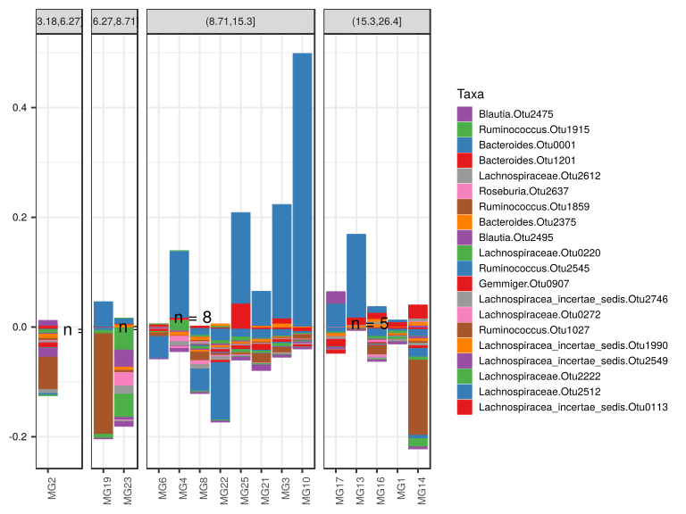

\(1.3.1.4.4.2.4.2.1.1.1\) [`Figure 554.`](#figure.554) Abundance difference between paired samples. Samples are paired according to attribute MatchedGroupID, resulting in 16 pairs. When fold change or difference is computed, this is done as 'patient by control'. Data grouped by age.quant. Sorting order of features is GeneSelector paired test ranking. bar (sample mean) plot.  Image file: [`plots/3233ec673b5.svg`](plots/3233ec673b5.svg).
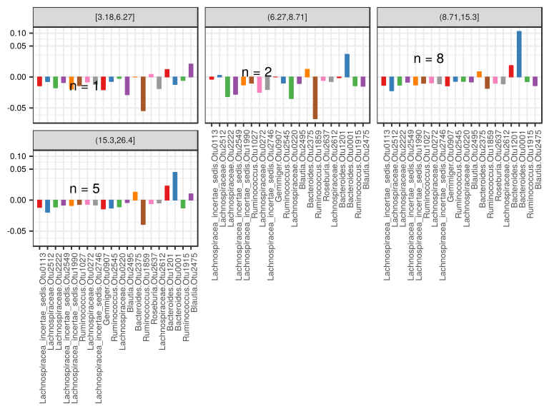

\(1.3.1.4.4.2.4.2.1.1.1\) [`Figure 555.`](#figure.555) Abundance difference between paired samples. Samples are paired according to attribute MatchedGroupID, resulting in 16 pairs. When fold change or difference is computed, this is done as 'patient by control'. Data grouped by age.quant. Sorting order of features is GeneSelector paired test ranking. violin plot.  Image file: [`plots/3236a03b775.svg`](plots/3236a03b775.svg).
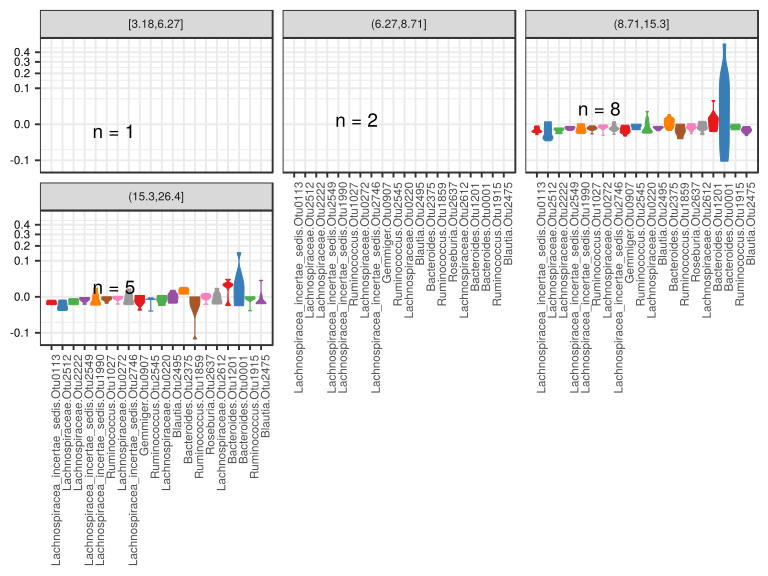

\(1.3.1.4.4.2.4.2.1.1.1\) [`Figure 556.`](#figure.556) Abundance difference between paired samples. Samples are paired according to attribute MatchedGroupID, resulting in 16 pairs. When fold change or difference is computed, this is done as 'patient by control'. Data grouped by age.quant. Sorting order of features is GeneSelector paired test ranking. boxplot plot.  Image file: [`plots/323b09b076.svg`](plots/323b09b076.svg).
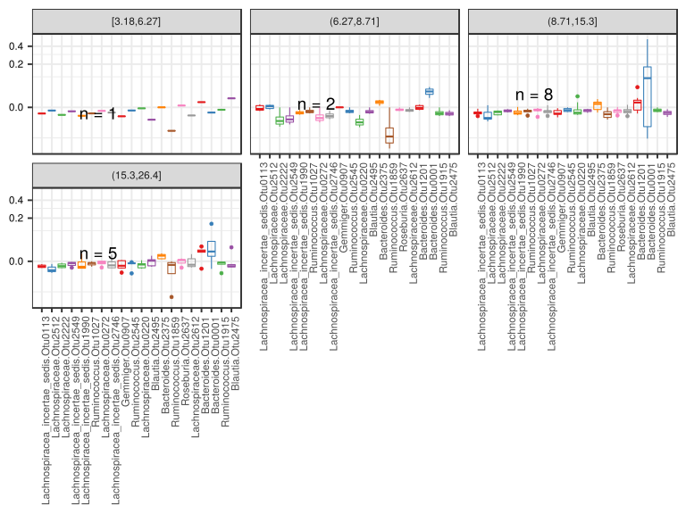

##### \(1.3.1.4.4.2.4.2.1.2\) Abundance difference between paired samples. Samples are paired according to attribute MatchedGroupID, resulting in 16 pairs. When fold change or difference is computed, this is done as 'patient by control'. Plot is in flipped orientation, Y axis not scaled. Iterating over plot geometry

\(1.3.1.4.4.2.4.2.1.2.1\) [`Figure 557.`](#figure.557) Abundance difference between paired samples. Samples are paired according to attribute MatchedGroupID, resulting in 16 pairs. When fold change or difference is computed, this is done as 'patient by control'. Data grouped by age.quant. Sorting order of features is GeneSelector paired test ranking. bar (sample mean) plot.  Image file: [`plots/3234e0cd8a9.svg`](plots/3234e0cd8a9.svg).
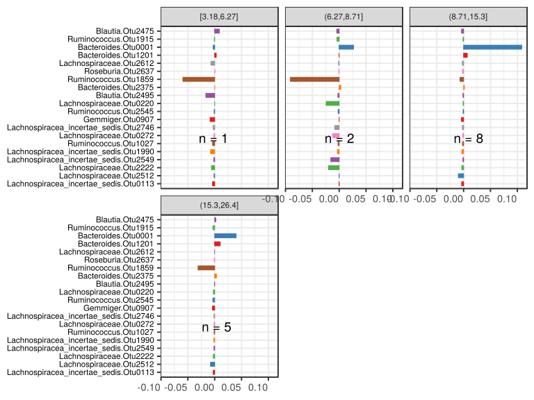

\(1.3.1.4.4.2.4.2.1.2.1\) [`Figure 558.`](#figure.558) Abundance difference between paired samples. Samples are paired according to attribute MatchedGroupID, resulting in 16 pairs. When fold change or difference is computed, this is done as 'patient by control'. Data grouped by age.quant. Sorting order of features is GeneSelector paired test ranking. violin plot.  Image file: [`plots/3233540c4fe.svg`](plots/3233540c4fe.svg).
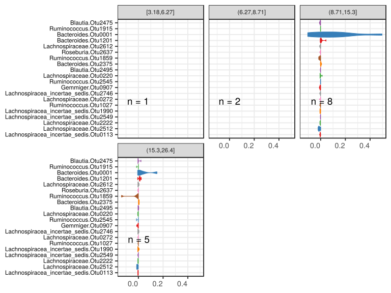

\(1.3.1.4.4.2.4.2.1.2.1\) [`Figure 559.`](#figure.559) Abundance difference between paired samples. Samples are paired according to attribute MatchedGroupID, resulting in 16 pairs. When fold change or difference is computed, this is done as 'patient by control'. Data grouped by age.quant. Sorting order of features is GeneSelector paired test ranking. boxplot plot.  Image file: [`plots/323501de069.svg`](plots/323501de069.svg).
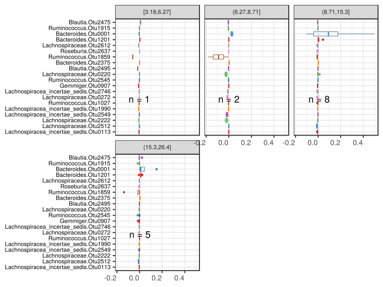

##### \(1.3.1.4.4.2.4.2.2\) dodged plots. Iterating over orientation and, optionally, scaling

##### \(1.3.1.4.4.2.4.2.2.1\) Abundance difference between paired samples. Samples are paired according to attribute MatchedGroupID, resulting in 16 pairs. When fold change or difference is computed, this is done as 'patient by control'. Plot is in original orientation, Y axis SQRT scaled. Iterating over plot geometry

\(1.3.1.4.4.2.4.2.2.1.1\) [`Figure 560.`](#figure.560) Abundance difference between paired samples. Samples are paired according to attribute MatchedGroupID, resulting in 16 pairs. When fold change or difference is computed, this is done as 'patient by control'. Data grouped by age.quant. Sorting order of features is GeneSelector paired test ranking. bar (sample mean) plot.  Image file: [`plots/323490b11ac.svg`](plots/323490b11ac.svg).
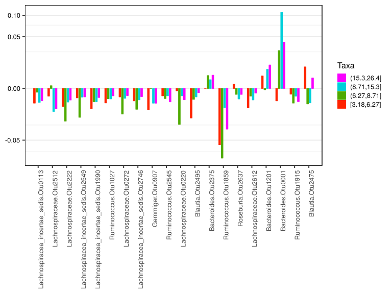

\(1.3.1.4.4.2.4.2.2.1.1\) [`Figure 561.`](#figure.561) Abundance difference between paired samples. Samples are paired according to attribute MatchedGroupID, resulting in 16 pairs. When fold change or difference is computed, this is done as 'patient by control'. Data grouped by age.quant. Sorting order of features is GeneSelector paired test ranking. violin plot.  Image file: [`plots/3231e974a20.svg`](plots/3231e974a20.svg).
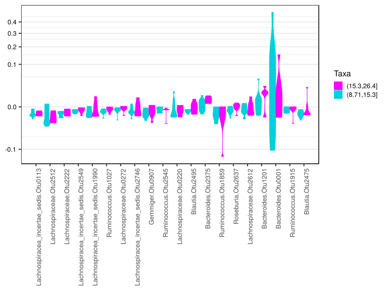

\(1.3.1.4.4.2.4.2.2.1.1\) [`Figure 562.`](#figure.562) Abundance difference between paired samples. Samples are paired according to attribute MatchedGroupID, resulting in 16 pairs. When fold change or difference is computed, this is done as 'patient by control'. Data grouped by age.quant. Sorting order of features is GeneSelector paired test ranking. boxplot plot.  Image file: [`plots/323204edc50.svg`](plots/323204edc50.svg).
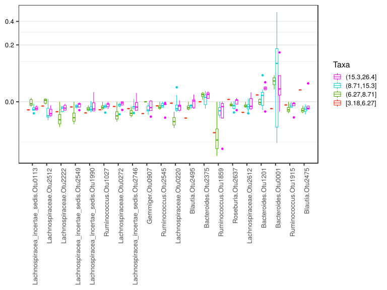

##### \(1.3.1.4.4.2.4.2.2.2\) Abundance difference between paired samples. Samples are paired according to attribute MatchedGroupID, resulting in 16 pairs. When fold change or difference is computed, this is done as 'patient by control'. Plot is in flipped orientation, Y axis not scaled. Iterating over plot geometry

\(1.3.1.4.4.2.4.2.2.2.1\) [`Figure 563.`](#figure.563) Abundance difference between paired samples. Samples are paired according to attribute MatchedGroupID, resulting in 16 pairs. When fold change or difference is computed, this is done as 'patient by control'. Data grouped by age.quant. Sorting order of features is GeneSelector paired test ranking. bar (sample mean) plot.  Image file: [`plots/32315596bb2.svg`](plots/32315596bb2.svg).
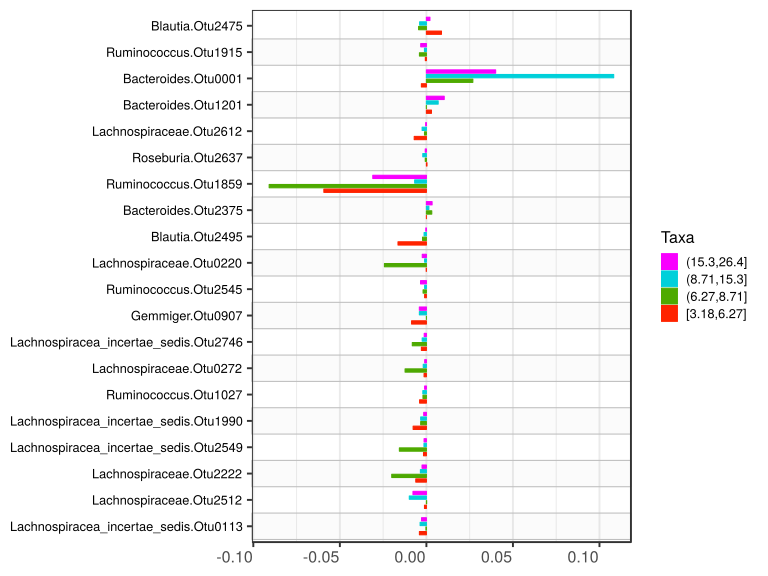

\(1.3.1.4.4.2.4.2.2.2.1\) [`Figure 564.`](#figure.564) Abundance difference between paired samples. Samples are paired according to attribute MatchedGroupID, resulting in 16 pairs. When fold change or difference is computed, this is done as 'patient by control'. Data grouped by age.quant. Sorting order of features is GeneSelector paired test ranking. violin plot.  Image file: [`plots/323ef78bb2.svg`](plots/323ef78bb2.svg).
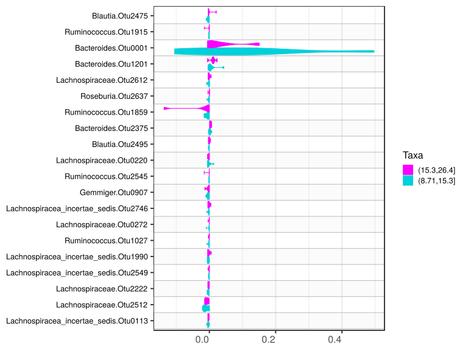

\(1.3.1.4.4.2.4.2.2.2.1\) [`Figure 565.`](#figure.565) Abundance difference between paired samples. Samples are paired according to attribute MatchedGroupID, resulting in 16 pairs. When fold change or difference is computed, this is done as 'patient by control'. Data grouped by age.quant. Sorting order of features is GeneSelector paired test ranking. boxplot plot.  Image file: [`plots/3232c1ca4c9.svg`](plots/3232c1ca4c9.svg).
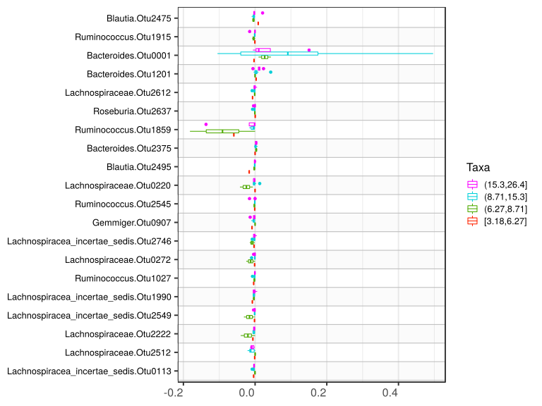