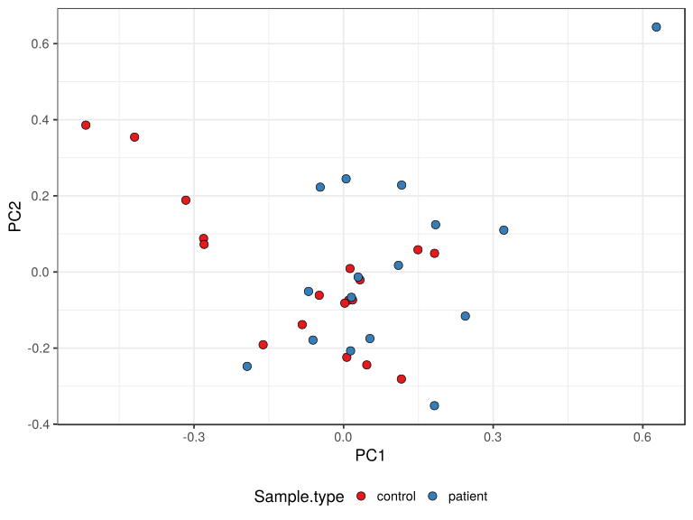

noone@mail.com
Analysis of Dieting study 16S data
% Fri Sep  7 05:46:18 2018

##### \(1.3.1.4.7\) Ordinations, 

McMurdie PJ, Holmes S (2013). “phyloseq: An R package for reproducible interactive analysis and graphics of microbiome census data.” _PLoS
ONE_, *8*(4), e61217. <URL: http://dx.plos.org/10.1371/journal.pone.0061217>.

Oksanen J, Blanchet FG, Friendly M, Kindt R, Legendre P, McGlinn D, Minchin PR, O'Hara RB, Simpson GL, Solymos P, Stevens MHH, Szoecs E, Wagner
H (2018). _vegan: Community Ecology Package_. R package version 2.5-2, <URL: https://CRAN.R-project.org/package=vegan>.

\(1.3.1.4.7.1\) [`Figure 586.`](#figure.586) Ordination plot. Ordination performed with parameters [ method:"RDA"]. 
               Plot used parameters [ color:"Sample.type", label:"SubjectID"].  Image file: [`plots/3231d7270ff.svg`](plots/3231d7270ff.svg).

\(1.3.1.4.7.1\) [`Widget 156.`](#widget.156) Ordination plot in 3D. Ordination performed with parameters [ method:"RDA"]. 
               Plot used parameters [ type      :"samples", color     :"Sample.type", label     :"SubjectID", size      : NULL, lines.args:List of 2,  ..$ line.group:"MatchedGroupID",  ..$ line.order:"Sample.type.ord", axes      :1 2 3]. Click to see HTML widget file in full window: [`./1.3.1.4.7.1-3231bf73d77Ordination.plot.in.3.html`](./1.3.1.4.7.1-3231bf73d77Ordination.plot.in.3.html)

<iframe src="./1.3.1.4.7.1-3231bf73d77Ordination.plot.in.3.html" width="800" height="800"> </iframe>

\(1.3.1.4.7.1\) [`Figure 587.`](#figure.587) Ordination plot. Ordination performed with parameters [ method :"RDA", formula:Class 'formula' ~Sample.type]. 
               Plot used parameters [ color:"Sample.type", label:"SubjectID"].  Image file: [`plots/32315243d02.svg`](plots/32315243d02.svg).

\(1.3.1.4.7.1\) [`Widget 157.`](#widget.157) Ordination plot in 3D. Ordination performed with parameters [ method :"RDA", formula:Class 'formula' ~Sample.type]. 
               Plot used parameters [ type      :"samples", color     :"Sample.type", label     :"SubjectID", size      : NULL, lines.args:List of 2,  ..$ line.group:"MatchedGroupID",  ..$ line.order:"Sample.type.ord", axes      :1 2 3]. Click to see HTML widget file in full window: [`./1.3.1.4.7.1-3231e781b97Ordination.plot.in.3.html`](./1.3.1.4.7.1-3231e781b97Ordination.plot.in.3.html)

<iframe src="./1.3.1.4.7.1-3231e781b97Ordination.plot.in.3.html" width="800" height="800"> </iframe>