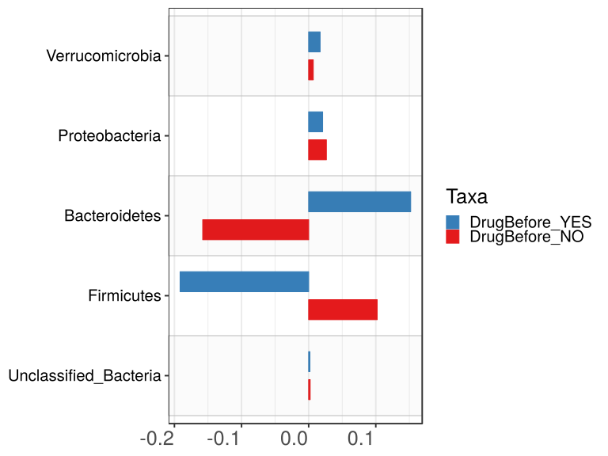

noone@mail.com
Analysis of Dieting study 16S data
% Fri Sep  7 05:46:18 2018

##### \(1.4.1.1.4\) Plots of Abundance difference between paired samples. Samples are paired according to attribute SubjectID, resulting in 14 pairs. When fold change or difference is computed, this is done as 'before.diet by after.diet'.

Plots are shown with relation to various combinations of meta 
                   data variables and in different graphical representations. Lots of plots here.

##### \(1.4.1.1.4.2\) Iterating over all combinations of grouping variables

##### \(1.4.1.1.4.2.1\) Entire pool of samples

##### \(1.4.1.1.4.2.2\) Iterating over Abundance difference between paired samples. Samples are paired according to attribute SubjectID, resulting in 14 pairs. When fold change or difference is computed, this is done as 'before.diet by after.diet'. profile sorting order

##### \(1.4.1.1.4.2.2.1\) Abundance difference between paired samples. Samples are paired according to attribute SubjectID, resulting in 14 pairs. When fold change or difference is computed, this is done as 'before.diet by after.diet'. profile sorting order: GeneSelector paired test ranking

##### \(1.4.1.1.4.2.2.2\) Iterating over dodged vs faceted bars

The same data are shown in multiple combinations of graphical representations. 
                         This is the same data, but each plot highlights slightly different aspects of it.
                         It is not likely that you will need every plot - pick only what you need.

##### \(1.4.1.1.4.2.2.2.1\) faceted plots. Iterating over orientation and, optionally, scaling

##### \(1.4.1.1.4.2.2.2.1.1\) Abundance difference between paired samples. Samples are paired according to attribute SubjectID, resulting in 14 pairs. When fold change or difference is computed, this is done as 'before.diet by after.diet'. Plot is in original orientation, Y axis SQRT scaled. Iterating over plot geometry

\(1.4.1.1.4.2.2.2.1.1.0\) [`Table 144.`](#table.144) Data table used for plots. Data for all pooled samples. Full dataset is also saved in a delimited text file (click to download and open e.g. in Excel) [`data/1.4.1.1.4.2.2.2.1.1.0-3239a789ff.1.4.1.1.4.2.2.2.1.1.csv`](data/1.4.1.1.4.2.2.2.1.1.0-3239a789ff.1.4.1.1.4.2.2.2.1.1.csv)

| .record.id | feature                | abundance.diff |
|:-----------|:-----------------------|:---------------|
| SB11       | Bacteroidetes          | 1.132e\-01     |
| SB16       | Bacteroidetes          | \-3.751e\-02   |
| SB18       | Bacteroidetes          | 5.757e\-01     |
| SB28       | Bacteroidetes          | \-3.368e\-02   |
| SB29       | Bacteroidetes          | 5.343e\-01     |
| SB34       | Bacteroidetes          | \-4.265e\-02   |
| SB36       | Bacteroidetes          | 4.904e\-02     |
| SB39       | Bacteroidetes          | \-1.730e\-01   |
| SB4        | Bacteroidetes          | \-3.777e\-02   |
| SB41       | Bacteroidetes          | 1.560e\-02     |
| SB43       | Bacteroidetes          | 4.965e\-01     |
| SB44       | Bacteroidetes          | 7.489e\-01     |
| SB5        | Bacteroidetes          | \-6.728e\-01   |
| SB9        | Bacteroidetes          | \-6.474e\-01   |
| SB11       | Firmicutes             | \-1.435e\-01   |
| SB16       | Firmicutes             | 6.835e\-02     |
| SB18       | Firmicutes             | \-5.799e\-01   |
| SB28       | Firmicutes             | \-1.769e\-01   |
| SB29       | Firmicutes             | \-5.767e\-01   |
| SB34       | Firmicutes             | 6.252e\-02     |
| SB36       | Firmicutes             | \-8.499e\-02   |
| SB39       | Firmicutes             | 2.157e\-02     |
| SB4        | Firmicutes             | 4.802e\-02     |
| SB41       | Firmicutes             | \-1.654e\-02   |
| SB43       | Firmicutes             | \-5.604e\-01   |
| SB44       | Firmicutes             | \-7.003e\-01   |
| SB5        | Firmicutes             | 5.386e\-01     |
| SB9        | Firmicutes             | 5.930e\-01     |
| SB11       | Proteobacteria         | \-1.613e\-02   |
| SB16       | Proteobacteria         | \-3.375e\-02   |
| SB18       | Proteobacteria         | \-2.998e\-02   |
| SB28       | Proteobacteria         | 2.195e\-01     |
| SB29       | Proteobacteria         | 3.600e\-04     |
| SB34       | Proteobacteria         | \-5.884e\-03   |
| SB36       | Proteobacteria         | 2.207e\-02     |
| SB39       | Proteobacteria         | \-1.460e\-02   |
| SB4        | Proteobacteria         | 1.853e\-03     |
| SB41       | Proteobacteria         | \-2.011e\-03   |
| SB43       | Proteobacteria         | 2.600e\-02     |
| SB44       | Proteobacteria         | \-5.763e\-03   |
| SB5        | Proteobacteria         | 1.550e\-01     |
| SB9        | Proteobacteria         | \-3.443e\-03   |
| SB11       | Verrucomicrobia        | 2.746e\-02     |
| SB16       | Verrucomicrobia        | 0.000e\+00     |
| SB18       | Verrucomicrobia        | 0.000e\+00     |
| SB28       | Verrucomicrobia        | 0.000e\+00     |
| SB29       | Verrucomicrobia        | 0.000e\+00     |
| SB34       | Verrucomicrobia        | 0.000e\+00     |
| SB36       | Verrucomicrobia        | 0.000e\+00     |
| SB39       | Verrucomicrobia        | 1.743e\-01     |
| SB4        | Verrucomicrobia        | 0.000e\+00     |
| SB41       | Verrucomicrobia        | \-3.659e\-03   |
| SB43       | Verrucomicrobia        | 9.707e\-05     |
| SB44       | Verrucomicrobia        | 0.000e\+00     |
| SB5        | Verrucomicrobia        | 0.000e\+00     |
| SB9        | Verrucomicrobia        | 0.000e\+00     |
| SB11       | Unclassified\_Bacteria | 2.260e\-03     |
| SB16       | Unclassified\_Bacteria | 1.267e\-02     |
| SB18       | Unclassified\_Bacteria | 2.269e\-03     |
| SB28       | Unclassified\_Bacteria | \-1.171e\-03   |
| SB29       | Unclassified\_Bacteria | 2.520e\-03     |
| SB34       | Unclassified\_Bacteria | \-2.033e\-03   |
| SB36       | Unclassified\_Bacteria | \-2.041e\-04   |
| SB39       | Unclassified\_Bacteria | 3.472e\-03     |
| SB4        | Unclassified\_Bacteria | 1.603e\-03     |
| SB41       | Unclassified\_Bacteria | 1.137e\-03     |
| SB43       | Unclassified\_Bacteria | \-5.965e\-04   |
| SB44       | Unclassified\_Bacteria | 1.447e\-03     |
| SB5        | Unclassified\_Bacteria | \-1.234e\-03   |
| SB9        | Unclassified\_Bacteria | 5.518e\-03     |

\(1.4.1.1.4.2.2.2.1.1.1\) [`Widget 159.`](#widget.159) Dynamic Pivot Table link (drag and drop field names and pick averaging 
                      functions or plot types; click on fields or legend elements to filter values). 
                      Starting rendering is Stacked Bar Chart. Data for all pooled samples. Click to see HTML widget file in full window: [`./1.4.1.1.4.2.2.2.1.1.1-3234ab8fae8Dynamic.Pivot.Table.html`](./1.4.1.1.4.2.2.2.1.1.1-3234ab8fae8Dynamic.Pivot.Table.html)

\(1.4.1.1.4.2.2.2.1.1.1\) [`Widget 160.`](#widget.160) Dynamic Pivot Table link (drag and drop field names and pick averaging 
                      functions or plot types; click on fields or legend elements to filter values). 
                      Starting rendering is Table Barchart. Data for all pooled samples. Click to see HTML widget file in full window: [`./1.4.1.1.4.2.2.2.1.1.1-3232828d16cDynamic.Pivot.Table.html`](./1.4.1.1.4.2.2.2.1.1.1-3232828d16cDynamic.Pivot.Table.html)

\(1.4.1.1.4.2.2.2.1.1.1\) [`Table 145.`](#table.145) Summary table. Data for all pooled samples. Full dataset is also saved in a delimited text file (click to download and open e.g. in Excel) [`data/1.4.1.1.4.2.2.2.1.1.1-3235081ebcc.1.4.1.1.4.2.2.2.1.1.csv`](data/1.4.1.1.4.2.2.2.1.1.1-3235081ebcc.1.4.1.1.4.2.2.2.1.1.csv)

| feature                | mean       | sd       | median     | incidence |
|:-----------------------|:-----------|:---------|:-----------|:----------|
| Unclassified\_Bacteria | 0.001975   | 0.003704 | 0.001525   | 0.6429    |
| Firmicutes             | \-0.107653 | 0.394543 | \-0.050761 | 0.4286    |
| Bacteroidetes          | 0.063457   | 0.419796 | \-0.009036 | 0.5000    |
| Proteobacteria         | 0.022368   | 0.072821 | \-0.002727 | 0.4286    |
| Verrucomicrobia        | 0.014159   | 0.046697 | 0.000000   | 0.2143    |

\(1.4.1.1.4.2.2.2.1.1.1\) [`Figure 590.`](#figure.590) Abundance difference between paired samples. Samples are paired according to attribute SubjectID, resulting in 14 pairs. When fold change or difference is computed, this is done as 'before.diet by after.diet'. Data for all pooled samples. Sorting order of features is GeneSelector paired test ranking. bar_stacked plot.  Image file: [`plots/32368c4361f.svg`](plots/32368c4361f.svg).

\(1.4.1.1.4.2.2.2.1.1.1\) [`Figure 591.`](#figure.591) Abundance difference between paired samples. Samples are paired according to attribute SubjectID, resulting in 14 pairs. When fold change or difference is computed, this is done as 'before.diet by after.diet'. Data for all pooled samples. Sorting order of features is GeneSelector paired test ranking. bar (sample mean) plot.  Image file: [`plots/323c585c0b.svg`](plots/323c585c0b.svg).

\(1.4.1.1.4.2.2.2.1.1.1\) [`Figure 592.`](#figure.592) Abundance difference between paired samples. Samples are paired according to attribute SubjectID, resulting in 14 pairs. When fold change or difference is computed, this is done as 'before.diet by after.diet'. Data for all pooled samples. Sorting order of features is GeneSelector paired test ranking. violin plot.  Image file: [`plots/323254027e1.svg`](plots/323254027e1.svg).

\(1.4.1.1.4.2.2.2.1.1.1\) [`Figure 593.`](#figure.593) Abundance difference between paired samples. Samples are paired according to attribute SubjectID, resulting in 14 pairs. When fold change or difference is computed, this is done as 'before.diet by after.diet'. Data for all pooled samples. Sorting order of features is GeneSelector paired test ranking. boxplot plot.  Image file: [`plots/32374bab9a0.svg`](plots/32374bab9a0.svg).

##### \(1.4.1.1.4.2.2.2.1.2\) Abundance difference between paired samples. Samples are paired according to attribute SubjectID, resulting in 14 pairs. When fold change or difference is computed, this is done as 'before.diet by after.diet'. Plot is in flipped orientation, Y axis not scaled. Iterating over plot geometry

\(1.4.1.1.4.2.2.2.1.2.1\) [`Figure 594.`](#figure.594) Abundance difference between paired samples. Samples are paired according to attribute SubjectID, resulting in 14 pairs. When fold change or difference is computed, this is done as 'before.diet by after.diet'. Data for all pooled samples. Sorting order of features is GeneSelector paired test ranking. bar (sample mean) plot.  Image file: [`plots/3235e85d3b0.svg`](plots/3235e85d3b0.svg).

\(1.4.1.1.4.2.2.2.1.2.1\) [`Figure 595.`](#figure.595) Abundance difference between paired samples. Samples are paired according to attribute SubjectID, resulting in 14 pairs. When fold change or difference is computed, this is done as 'before.diet by after.diet'. Data for all pooled samples. Sorting order of features is GeneSelector paired test ranking. violin plot.  Image file: [`plots/32328f83e57.svg`](plots/32328f83e57.svg).

\(1.4.1.1.4.2.2.2.1.2.1\) [`Figure 596.`](#figure.596) Abundance difference between paired samples. Samples are paired according to attribute SubjectID, resulting in 14 pairs. When fold change or difference is computed, this is done as 'before.diet by after.diet'. Data for all pooled samples. Sorting order of features is GeneSelector paired test ranking. boxplot plot.  Image file: [`plots/323657ad4cf.svg`](plots/323657ad4cf.svg).

##### \(1.4.1.1.4.2.3\) Grouping variables Drug.Before.Diet

##### \(1.4.1.1.4.2.4\) Iterating over Abundance difference between paired samples. Samples are paired according to attribute SubjectID, resulting in 14 pairs. When fold change or difference is computed, this is done as 'before.diet by after.diet'. profile sorting order

##### \(1.4.1.1.4.2.4.1\) Abundance difference between paired samples. Samples are paired according to attribute SubjectID, resulting in 14 pairs. When fold change or difference is computed, this is done as 'before.diet by after.diet'. profile sorting order: GeneSelector paired test ranking

##### \(1.4.1.1.4.2.4.2\) Iterating over dodged vs faceted bars

The same data are shown in multiple combinations of graphical representations. 
                         This is the same data, but each plot highlights slightly different aspects of it.
                         It is not likely that you will need every plot - pick only what you need.

##### \(1.4.1.1.4.2.4.2.1\) faceted plots. Iterating over orientation and, optionally, scaling

##### \(1.4.1.1.4.2.4.2.1.1\) Abundance difference between paired samples. Samples are paired according to attribute SubjectID, resulting in 14 pairs. When fold change or difference is computed, this is done as 'before.diet by after.diet'. Plot is in original orientation, Y axis SQRT scaled. Iterating over plot geometry

\(1.4.1.1.4.2.4.2.1.1.0\) [`Table 146.`](#table.146) Data table used for plots. Data grouped by Drug.Before.Diet. Full dataset is also saved in a delimited text file (click to download and open e.g. in Excel) [`data/1.4.1.1.4.2.4.2.1.1.0-32344a7fb54.1.4.1.1.4.2.4.2.1.1.csv`](data/1.4.1.1.4.2.4.2.1.1.0-32344a7fb54.1.4.1.1.4.2.4.2.1.1.csv)

| .record.id | Drug.Before.Diet | feature                | abundance.diff |
|:-----------|:-----------------|:-----------------------|:---------------|
| SB11       | DrugBefore\_NO   | Bacteroidetes          | 1.132e\-01     |
| SB16       | DrugBefore\_YES  | Bacteroidetes          | \-3.751e\-02   |
| SB18       | DrugBefore\_NO   | Bacteroidetes          | 5.757e\-01     |
| SB28       | DrugBefore\_YES  | Bacteroidetes          | \-3.368e\-02   |
| SB29       | DrugBefore\_YES  | Bacteroidetes          | 5.343e\-01     |
| SB34       | DrugBefore\_YES  | Bacteroidetes          | \-4.265e\-02   |
| SB36       | DrugBefore\_YES  | Bacteroidetes          | 4.904e\-02     |
| SB39       | DrugBefore\_YES  | Bacteroidetes          | \-1.730e\-01   |
| SB4        | DrugBefore\_YES  | Bacteroidetes          | \-3.777e\-02   |
| SB41       | DrugBefore\_YES  | Bacteroidetes          | 1.560e\-02     |
| SB43       | DrugBefore\_YES  | Bacteroidetes          | 4.965e\-01     |
| SB44       | DrugBefore\_YES  | Bacteroidetes          | 7.489e\-01     |
| SB5        | DrugBefore\_NO   | Bacteroidetes          | \-6.728e\-01   |
| SB9        | DrugBefore\_NO   | Bacteroidetes          | \-6.474e\-01   |
| SB11       | DrugBefore\_NO   | Firmicutes             | \-1.435e\-01   |
| SB16       | DrugBefore\_YES  | Firmicutes             | 6.835e\-02     |
| SB18       | DrugBefore\_NO   | Firmicutes             | \-5.799e\-01   |
| SB28       | DrugBefore\_YES  | Firmicutes             | \-1.769e\-01   |
| SB29       | DrugBefore\_YES  | Firmicutes             | \-5.767e\-01   |
| SB34       | DrugBefore\_YES  | Firmicutes             | 6.252e\-02     |
| SB36       | DrugBefore\_YES  | Firmicutes             | \-8.499e\-02   |
| SB39       | DrugBefore\_YES  | Firmicutes             | 2.157e\-02     |
| SB4        | DrugBefore\_YES  | Firmicutes             | 4.802e\-02     |
| SB41       | DrugBefore\_YES  | Firmicutes             | \-1.654e\-02   |
| SB43       | DrugBefore\_YES  | Firmicutes             | \-5.604e\-01   |
| SB44       | DrugBefore\_YES  | Firmicutes             | \-7.003e\-01   |
| SB5        | DrugBefore\_NO   | Firmicutes             | 5.386e\-01     |
| SB9        | DrugBefore\_NO   | Firmicutes             | 5.930e\-01     |
| SB11       | DrugBefore\_NO   | Proteobacteria         | \-1.613e\-02   |
| SB16       | DrugBefore\_YES  | Proteobacteria         | \-3.375e\-02   |
| SB18       | DrugBefore\_NO   | Proteobacteria         | \-2.998e\-02   |
| SB28       | DrugBefore\_YES  | Proteobacteria         | 2.195e\-01     |
| SB29       | DrugBefore\_YES  | Proteobacteria         | 3.600e\-04     |
| SB34       | DrugBefore\_YES  | Proteobacteria         | \-5.884e\-03   |
| SB36       | DrugBefore\_YES  | Proteobacteria         | 2.207e\-02     |
| SB39       | DrugBefore\_YES  | Proteobacteria         | \-1.460e\-02   |
| SB4        | DrugBefore\_YES  | Proteobacteria         | 1.853e\-03     |
| SB41       | DrugBefore\_YES  | Proteobacteria         | \-2.011e\-03   |
| SB43       | DrugBefore\_YES  | Proteobacteria         | 2.600e\-02     |
| SB44       | DrugBefore\_YES  | Proteobacteria         | \-5.763e\-03   |
| SB5        | DrugBefore\_NO   | Proteobacteria         | 1.550e\-01     |
| SB9        | DrugBefore\_NO   | Proteobacteria         | \-3.443e\-03   |
| SB11       | DrugBefore\_NO   | Verrucomicrobia        | 2.746e\-02     |
| SB16       | DrugBefore\_YES  | Verrucomicrobia        | 0.000e\+00     |
| SB18       | DrugBefore\_NO   | Verrucomicrobia        | 0.000e\+00     |
| SB28       | DrugBefore\_YES  | Verrucomicrobia        | 0.000e\+00     |
| SB29       | DrugBefore\_YES  | Verrucomicrobia        | 0.000e\+00     |
| SB34       | DrugBefore\_YES  | Verrucomicrobia        | 0.000e\+00     |
| SB36       | DrugBefore\_YES  | Verrucomicrobia        | 0.000e\+00     |
| SB39       | DrugBefore\_YES  | Verrucomicrobia        | 1.743e\-01     |
| SB4        | DrugBefore\_YES  | Verrucomicrobia        | 0.000e\+00     |
| SB41       | DrugBefore\_YES  | Verrucomicrobia        | \-3.659e\-03   |
| SB43       | DrugBefore\_YES  | Verrucomicrobia        | 9.707e\-05     |
| SB44       | DrugBefore\_YES  | Verrucomicrobia        | 0.000e\+00     |
| SB5        | DrugBefore\_NO   | Verrucomicrobia        | 0.000e\+00     |
| SB9        | DrugBefore\_NO   | Verrucomicrobia        | 0.000e\+00     |
| SB11       | DrugBefore\_NO   | Unclassified\_Bacteria | 2.260e\-03     |
| SB16       | DrugBefore\_YES  | Unclassified\_Bacteria | 1.267e\-02     |
| SB18       | DrugBefore\_NO   | Unclassified\_Bacteria | 2.269e\-03     |
| SB28       | DrugBefore\_YES  | Unclassified\_Bacteria | \-1.171e\-03   |
| SB29       | DrugBefore\_YES  | Unclassified\_Bacteria | 2.520e\-03     |
| SB34       | DrugBefore\_YES  | Unclassified\_Bacteria | \-2.033e\-03   |
| SB36       | DrugBefore\_YES  | Unclassified\_Bacteria | \-2.041e\-04   |
| SB39       | DrugBefore\_YES  | Unclassified\_Bacteria | 3.472e\-03     |
| SB4        | DrugBefore\_YES  | Unclassified\_Bacteria | 1.603e\-03     |
| SB41       | DrugBefore\_YES  | Unclassified\_Bacteria | 1.137e\-03     |
| SB43       | DrugBefore\_YES  | Unclassified\_Bacteria | \-5.965e\-04   |
| SB44       | DrugBefore\_YES  | Unclassified\_Bacteria | 1.447e\-03     |
| SB5        | DrugBefore\_NO   | Unclassified\_Bacteria | \-1.234e\-03   |
| SB9        | DrugBefore\_NO   | Unclassified\_Bacteria | 5.518e\-03     |

\(1.4.1.1.4.2.4.2.1.1.1\) [`Widget 161.`](#widget.161) Dynamic Pivot Table link (drag and drop field names and pick averaging 
                      functions or plot types; click on fields or legend elements to filter values). 
                      Starting rendering is Stacked Bar Chart. Data grouped by Drug.Before.Diet. Click to see HTML widget file in full window: [`./1.4.1.1.4.2.4.2.1.1.1-3235777822dDynamic.Pivot.Table.html`](./1.4.1.1.4.2.4.2.1.1.1-3235777822dDynamic.Pivot.Table.html)

\(1.4.1.1.4.2.4.2.1.1.1\) [`Widget 162.`](#widget.162) Dynamic Pivot Table link (drag and drop field names and pick averaging 
                      functions or plot types; click on fields or legend elements to filter values). 
                      Starting rendering is Table Barchart. Data grouped by Drug.Before.Diet. Click to see HTML widget file in full window: [`./1.4.1.1.4.2.4.2.1.1.1-3235cc5496cDynamic.Pivot.Table.html`](./1.4.1.1.4.2.4.2.1.1.1-3235cc5496cDynamic.Pivot.Table.html)

\(1.4.1.1.4.2.4.2.1.1.1\) [`Table 147.`](#table.147) Summary table. Data grouped by Drug.Before.Diet. Full dataset is also saved in a delimited text file (click to download and open e.g. in Excel) [`data/1.4.1.1.4.2.4.2.1.1.1-3233ce6e2fd.1.4.1.1.4.2.4.2.1.1.csv`](data/1.4.1.1.4.2.4.2.1.1.1-3233ce6e2fd.1.4.1.1.4.2.4.2.1.1.csv)

| feature                | Drug.Before.Diet | mean       | sd       | median      | incidence |
|:-----------------------|:-----------------|:-----------|:---------|:------------|:----------|
| Unclassified\_Bacteria | DrugBefore\_NO   | 0.002203   | 0.002757 | 0.0022647   | 0.75      |
| Unclassified\_Bacteria | DrugBefore\_YES  | 0.001884   | 0.004153 | 0.0012920   | 0.60      |
| Firmicutes             | DrugBefore\_NO   | 0.102063   | 0.564804 | 0.1975467   | 0.50      |
| Firmicutes             | DrugBefore\_YES  | \-0.191540 | 0.301907 | \-0.0507614 | 0.40      |
| Bacteroidetes          | DrugBefore\_NO   | \-0.157835 | 0.610032 | \-0.2671028 | 0.50      |
| Bacteroidetes          | DrugBefore\_YES  | 0.151974   | 0.316284 | \-0.0090365 | 0.50      |
| Proteobacteria         | DrugBefore\_NO   | 0.026357   | 0.086431 | \-0.0097852 | 0.25      |
| Proteobacteria         | DrugBefore\_YES  | 0.020773   | 0.071831 | \-0.0008256 | 0.50      |
| Verrucomicrobia        | DrugBefore\_NO   | 0.006866   | 0.013732 | 0.0000000   | 0.25      |
| Verrucomicrobia        | DrugBefore\_YES  | 0.017076   | 0.055261 | 0.0000000   | 0.20      |

\(1.4.1.1.4.2.4.2.1.1.1\) [`Figure 597.`](#figure.597) Abundance difference between paired samples. Samples are paired according to attribute SubjectID, resulting in 14 pairs. When fold change or difference is computed, this is done as 'before.diet by after.diet'. Data grouped by Drug.Before.Diet. Sorting order of features is GeneSelector paired test ranking. bar_stacked plot.  Image file: [`plots/3232d1e7895.svg`](plots/3232d1e7895.svg).

\(1.4.1.1.4.2.4.2.1.1.1\) [`Figure 598.`](#figure.598) Abundance difference between paired samples. Samples are paired according to attribute SubjectID, resulting in 14 pairs. When fold change or difference is computed, this is done as 'before.diet by after.diet'. Data grouped by Drug.Before.Diet. Sorting order of features is GeneSelector paired test ranking. bar (sample mean) plot.  Image file: [`plots/3234c44013d.svg`](plots/3234c44013d.svg).

\(1.4.1.1.4.2.4.2.1.1.1\) [`Figure 599.`](#figure.599) Abundance difference between paired samples. Samples are paired according to attribute SubjectID, resulting in 14 pairs. When fold change or difference is computed, this is done as 'before.diet by after.diet'. Data grouped by Drug.Before.Diet. Sorting order of features is GeneSelector paired test ranking. violin plot.  Image file: [`plots/3233f7feadb.svg`](plots/3233f7feadb.svg).

\(1.4.1.1.4.2.4.2.1.1.1\) [`Figure 600.`](#figure.600) Abundance difference between paired samples. Samples are paired according to attribute SubjectID, resulting in 14 pairs. When fold change or difference is computed, this is done as 'before.diet by after.diet'. Data grouped by Drug.Before.Diet. Sorting order of features is GeneSelector paired test ranking. boxplot plot.  Image file: [`plots/3233b7f598a.svg`](plots/3233b7f598a.svg).

##### \(1.4.1.1.4.2.4.2.1.2\) Abundance difference between paired samples. Samples are paired according to attribute SubjectID, resulting in 14 pairs. When fold change or difference is computed, this is done as 'before.diet by after.diet'. Plot is in flipped orientation, Y axis not scaled. Iterating over plot geometry

\(1.4.1.1.4.2.4.2.1.2.1\) [`Figure 601.`](#figure.601) Abundance difference between paired samples. Samples are paired according to attribute SubjectID, resulting in 14 pairs. When fold change or difference is computed, this is done as 'before.diet by after.diet'. Data grouped by Drug.Before.Diet. Sorting order of features is GeneSelector paired test ranking. bar (sample mean) plot.  Image file: [`plots/3237ee405c1.svg`](plots/3237ee405c1.svg).

\(1.4.1.1.4.2.4.2.1.2.1\) [`Figure 602.`](#figure.602) Abundance difference between paired samples. Samples are paired according to attribute SubjectID, resulting in 14 pairs. When fold change or difference is computed, this is done as 'before.diet by after.diet'. Data grouped by Drug.Before.Diet. Sorting order of features is GeneSelector paired test ranking. violin plot.  Image file: [`plots/32339e77f81.svg`](plots/32339e77f81.svg).

\(1.4.1.1.4.2.4.2.1.2.1\) [`Figure 603.`](#figure.603) Abundance difference between paired samples. Samples are paired according to attribute SubjectID, resulting in 14 pairs. When fold change or difference is computed, this is done as 'before.diet by after.diet'. Data grouped by Drug.Before.Diet. Sorting order of features is GeneSelector paired test ranking. boxplot plot.  Image file: [`plots/32364051410.svg`](plots/32364051410.svg).

##### \(1.4.1.1.4.2.4.2.2\) dodged plots. Iterating over orientation and, optionally, scaling

##### \(1.4.1.1.4.2.4.2.2.1\) Abundance difference between paired samples. Samples are paired according to attribute SubjectID, resulting in 14 pairs. When fold change or difference is computed, this is done as 'before.diet by after.diet'. Plot is in original orientation, Y axis SQRT scaled. Iterating over plot geometry

\(1.4.1.1.4.2.4.2.2.1.1\) [`Figure 604.`](#figure.604) Abundance difference between paired samples. Samples are paired according to attribute SubjectID, resulting in 14 pairs. When fold change or difference is computed, this is done as 'before.diet by after.diet'. Data grouped by Drug.Before.Diet. Sorting order of features is GeneSelector paired test ranking. bar (sample mean) plot.  Image file: [`plots/3233a8009a0.svg`](plots/3233a8009a0.svg).

\(1.4.1.1.4.2.4.2.2.1.1\) [`Figure 605.`](#figure.605) Abundance difference between paired samples. Samples are paired according to attribute SubjectID, resulting in 14 pairs. When fold change or difference is computed, this is done as 'before.diet by after.diet'. Data grouped by Drug.Before.Diet. Sorting order of features is GeneSelector paired test ranking. violin plot.  Image file: [`plots/32354dfb0ba.svg`](plots/32354dfb0ba.svg).

\(1.4.1.1.4.2.4.2.2.1.1\) [`Figure 606.`](#figure.606) Abundance difference between paired samples. Samples are paired according to attribute SubjectID, resulting in 14 pairs. When fold change or difference is computed, this is done as 'before.diet by after.diet'. Data grouped by Drug.Before.Diet. Sorting order of features is GeneSelector paired test ranking. boxplot plot.  Image file: [`plots/3235f6f4add.svg`](plots/3235f6f4add.svg).

##### \(1.4.1.1.4.2.4.2.2.2\) Abundance difference between paired samples. Samples are paired according to attribute SubjectID, resulting in 14 pairs. When fold change or difference is computed, this is done as 'before.diet by after.diet'. Plot is in flipped orientation, Y axis not scaled. Iterating over plot geometry

\(1.4.1.1.4.2.4.2.2.2.1\) [`Figure 607.`](#figure.607) Abundance difference between paired samples. Samples are paired according to attribute SubjectID, resulting in 14 pairs. When fold change or difference is computed, this is done as 'before.diet by after.diet'. Data grouped by Drug.Before.Diet. Sorting order of features is GeneSelector paired test ranking. bar (sample mean) plot.  Image file: [`plots/3234f662ba.svg`](plots/3234f662ba.svg).

\(1.4.1.1.4.2.4.2.2.2.1\) [`Figure 608.`](#figure.608) Abundance difference between paired samples. Samples are paired according to attribute SubjectID, resulting in 14 pairs. When fold change or difference is computed, this is done as 'before.diet by after.diet'. Data grouped by Drug.Before.Diet. Sorting order of features is GeneSelector paired test ranking. violin plot.  Image file: [`plots/3231d82b20e.svg`](plots/3231d82b20e.svg).

\(1.4.1.1.4.2.4.2.2.2.1\) [`Figure 609.`](#figure.609) Abundance difference between paired samples. Samples are paired according to attribute SubjectID, resulting in 14 pairs. When fold change or difference is computed, this is done as 'before.diet by after.diet'. Data grouped by Drug.Before.Diet. Sorting order of features is GeneSelector paired test ranking. boxplot plot.  Image file: [`plots/323696cba8e.svg`](plots/323696cba8e.svg).
