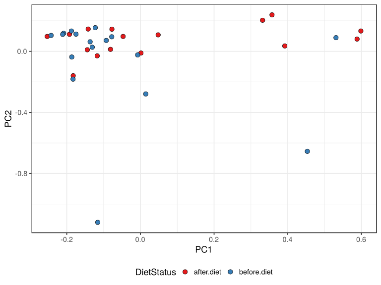

noone@mail.com
Analysis of Dieting study 16S data
% Fri Sep  7 05:46:18 2018

##### \(1.4.1.1.8\) Ordinations, 

McMurdie PJ, Holmes S (2013). “phyloseq: An R package for reproducible interactive analysis and graphics of microbiome census data.” _PLoS
ONE_, *8*(4), e61217. <URL: http://dx.plos.org/10.1371/journal.pone.0061217>.

Oksanen J, Blanchet FG, Friendly M, Kindt R, Legendre P, McGlinn D, Minchin PR, O'Hara RB, Simpson GL, Solymos P, Stevens MHH, Szoecs E, Wagner
H (2018). _vegan: Community Ecology Package_. R package version 2.5-2, <URL: https://CRAN.R-project.org/package=vegan>.

\(1.4.1.1.8.1\) [`Figure 631.`](#figure.631) Ordination plot. Ordination performed with parameters [ method:"RDA"]. 
               Plot used parameters [ color:"DietStatus", label:"FullLabel"].  Image file: [`plots/323480087e4.svg`](plots/323480087e4.svg).

\(1.4.1.1.8.1\) [`Widget 168.`](#widget.168) Ordination plot in 3D. Ordination performed with parameters [ method:"RDA"]. 
               Plot used parameters [ type      :"samples", color     :"DietStatus", label     :"FullLabel", size      : NULL, lines.args:List of 2,  ..$ line.group:"SubjectID",  ..$ line.order:"visit", axes      :1 2 3]. Click to see HTML widget file in full window: [`./1.4.1.1.8.1-3235fc5864Ordination.plot.in.3.html`](./1.4.1.1.8.1-3235fc5864Ordination.plot.in.3.html)

<iframe src="./1.4.1.1.8.1-3235fc5864Ordination.plot.in.3.html" width="800" height="800"> </iframe>

\(1.4.1.1.8.1\) [`Figure 632.`](#figure.632) Ordination plot. Ordination performed with parameters [ method :"RDA", formula:Class 'formula' ~DietStatus]. 
               Plot used parameters [ color:"DietStatus", label:"FullLabel"].  Image file: [`plots/3237d9b8e30.svg`](plots/3237d9b8e30.svg).

\(1.4.1.1.8.1\) [`Widget 169.`](#widget.169) Ordination plot in 3D. Ordination performed with parameters [ method :"RDA", formula:Class 'formula' ~DietStatus]. 
               Plot used parameters [ type      :"samples", color     :"DietStatus", label     :"FullLabel", size      : NULL, lines.args:List of 2,  ..$ line.group:"SubjectID",  ..$ line.order:"visit", axes      :1 2 3]. Click to see HTML widget file in full window: [`./1.4.1.1.8.1-3233dbbc7e9Ordination.plot.in.3.html`](./1.4.1.1.8.1-3233dbbc7e9Ordination.plot.in.3.html)

<iframe src="./1.4.1.1.8.1-3233dbbc7e9Ordination.plot.in.3.html" width="800" height="800"> </iframe>