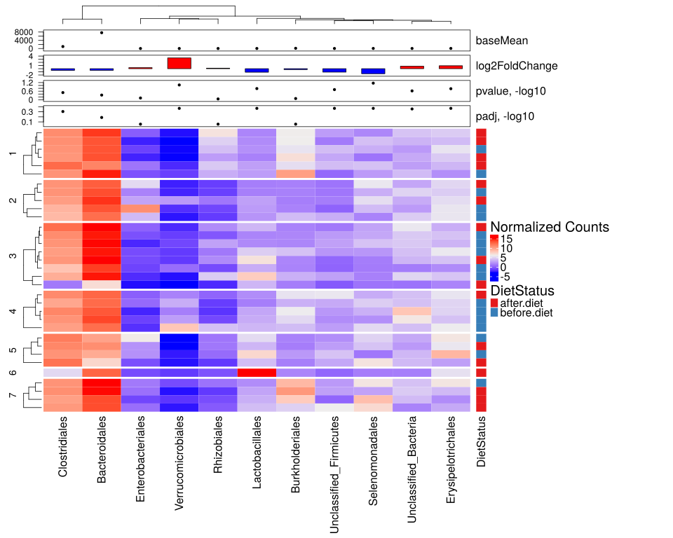
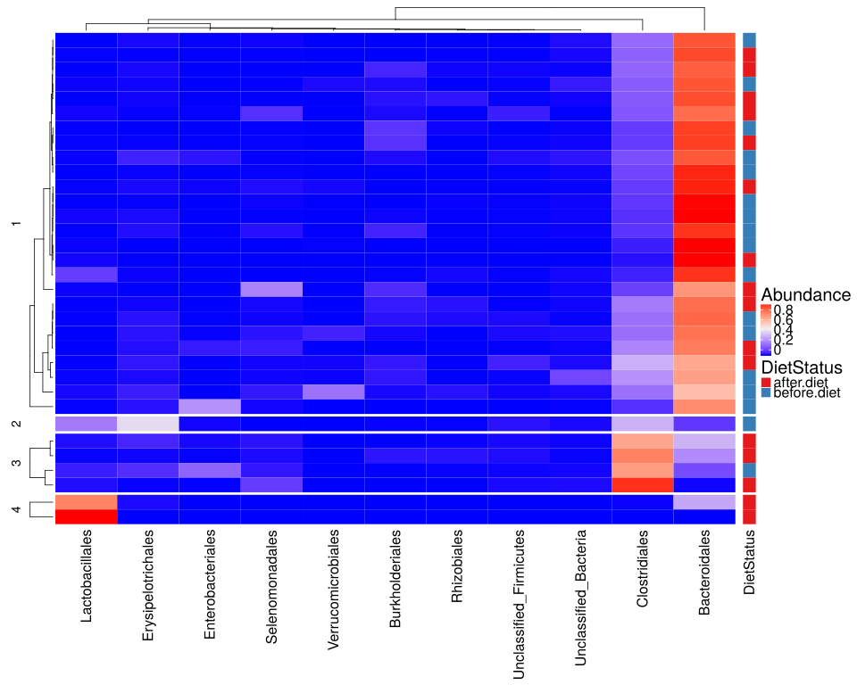
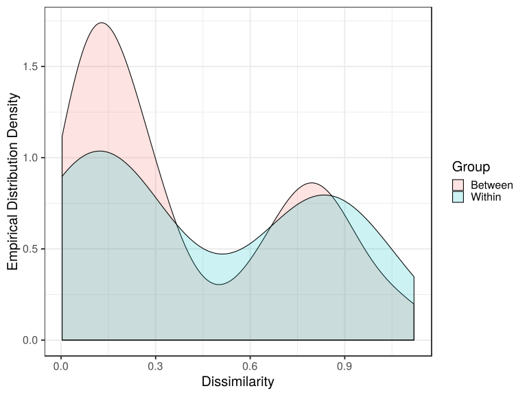

noone@mail.com
Analysis of Dieting study 16S data
% Fri Sep  7 05:46:18 2018


#### \(1.4.1.2\) Taxonomic level: 4 of Subset: Patients' samples at visits 1 (before diet) and 2 (after diet), only paired samples


##### \(1.4.1.2.1\) Loading counts and metadata

[`Subreport`](./1.4.1.2.1-report.html)


##### \(1.4.1.2.2\) Data analysis


Filtering abundance matrix with arguments [ min_mean                :10, min_quant_incidence_frac:0.25, min_quant_mean_frac     :0.25]. Filtering features


Note that some community richness estimators will not work correctly 
               if provided with abundance-filtered counts


After filtering, left 33 records for 12 features


Wrote counts and metadata for raw counts After final feature filtering to files [`data/1.4.1.2.2.1-323ab90440samples.raw.16s.l.4.count.tsv`](data/1.4.1.2.2.1-323ab90440samples.raw.16s.l.4.count.tsv),[`data/1.4.1.2.2.1-323ab90440samples.raw.16s.l.4.attr.tsv`](data/1.4.1.2.2.1-323ab90440samples.raw.16s.l.4.attr.tsv)


Wrote counts and metadata for proportions counts After final feature filtering to files [`data/1.4.1.2.2.1-32320a77d2bsamples.proportions.16s.l.4.count.tsv`](data/1.4.1.2.2.1-32320a77d2bsamples.proportions.16s.l.4.count.tsv),[`data/1.4.1.2.2.1-32320a77d2bsamples.proportions.16s.l.4.attr.tsv`](data/1.4.1.2.2.1-32320a77d2bsamples.proportions.16s.l.4.attr.tsv)


##### \(1.4.1.2.2.2\) DESeq2 tests and data normalization


Love MI, Huber W, Anders S (2014). “Moderated estimation of fold change and dispersion for RNA-seq data with DESeq2.” _Genome Biology_, *15*,
550. doi: 10.1186/s13059-014-0550-8 (URL: http://doi.org/10.1186/s13059-014-0550-8).


\(1.4.1.2.2.2.1\) <a name="table.152"></a>[`Table 152.`](#table.152) DESeq2 results for task: DietStatus;\[ alpha:0.05\]. Full dataset is also saved in a delimited text file (click to download and open e.g. in Excel) [`data/1.4.1.2.2.2.1-32321a8f9f4.1.4.1.2.2.2.1.a.nam.csv`](data/1.4.1.2.2.2.1-32321a8f9f4.1.4.1.2.2.2.1.a.nam.csv)


| feature                  | baseMean | log2FoldChange | lfcSE  | stat     | pvalue  | padj   | i.baseMean | baseVar    | allZero | dispGeneEst | dispGeneIter | dispFit | dispersion | dispIter | dispOutlier | dispMAP | Intercept | DietStatus\_before.diet\_vs\_after.diet | SE\_Intercept | SE\_DietStatus\_before.diet\_vs\_after.diet | WaldStatistic\_Intercept | WaldStatistic\_DietStatus\_before.diet\_vs\_after.diet | WaldPvalue\_Intercept | WaldPvalue\_DietStatus\_before.diet\_vs\_after.diet | betaConv | betaIter | deviance | maxCooks | replace |
|:-------------------------|:---------|:---------------|:-------|:---------|:--------|:-------|:-----------|:-----------|:--------|:------------|:-------------|:--------|:-----------|:---------|:------------|:--------|:----------|:----------------------------------------|:--------------|:--------------------------------------------|:-------------------------|:-------------------------------------------------------|:----------------------|:----------------------------------------------------|:---------|:---------|:---------|:---------|:--------|
| Selenomonadales          | 32.647   | \-1.6023       | 0.8807 | \-1.8193 | 0.06886 | 0.4288 | 32.647     | 4.043e\+03 | FALSE   | 2.762       | 11           | 4.275   | 3.005      | 11       | FALSE       | 3.005   | 5.6472    | \-1.6023                                | 0.6281        | 0.8807                                      | 8.9914                   | \-1.8193                                               | 2.441e\-19            | 0.06886                                             | TRUE     | 10       | 269.21   | NA       | TRUE    |
| Verrucomicrobiales       | 4.902    | 3.4133         | 2.0273 | 1.6837   | 0.09224 | 0.4288 | 4.902      | 2.810e\+02 | FALSE   | 15.569      | 9            | 1.564   | 15.569     | 11       | TRUE        | 6.484   | \-0.2703  | 3.4133                                  | 1.4760        | 2.0273                                      | \-0.1831                 | 1.6837                                                 | 8.547e\-01            | 0.09224                                             | TRUE     | 13       | 89.05    | NA       | TRUE    |
| Lactobacillales          | 17.802   | \-1.1206       | 0.8072 | \-1.3883 | 0.16505 | 0.4288 | 17.802     | 2.054e\+03 | FALSE   | 2.072       | 12           | 5.100   | 2.475      | 11       | FALSE       | 2.475   | 4.6039    | \-1.1206                                | 0.5738        | 0.8072                                      | 8.0238                   | \-1.3883                                               | 1.025e\-15            | 0.16505                                             | TRUE     | 7        | 245.51   | NA       | TRUE    |
| Erysipelotrichales       | 37.713   | 0.9263         | 0.6730 | 1.3763   | 0.16874 | 0.4288 | 37.713     | 1.258e\+03 | FALSE   | 1.421       | 11           | 3.820   | 1.749      | 11       | FALSE       | 1.749   | 4.6916    | 0.9263                                  | 0.4841        | 0.6730                                      | 9.6915                   | 1.3763                                                 | 3.278e\-22            | 0.16874                                             | TRUE     | 5        | 303.54   | NA       | TRUE    |
| Unclassified\_Firmicutes | 17.179   | \-1.0994       | 0.8482 | \-1.2962 | 0.19490 | 0.4288 | 17.179     | 1.112e\+03 | FALSE   | 2.325       | 8            | 5.019   | 2.742      | 11       | FALSE       | 2.742   | 4.5765    | \-1.0994                                | 0.6035        | 0.8482                                      | 7.5834                   | \-1.2962                                               | 3.367e\-14            | 0.19490                                             | TRUE     | 9        | 242.62   | NA       | FALSE   |
| Unclassified\_Bacteria   | 23.684   | 0.8032         | 0.6840 | 1.1742   | 0.24030 | 0.4405 | 23.684     | 8.285e\+02 | FALSE   | 1.355       | 6            | 5.198   | 1.783      | 11       | FALSE       | 1.783   | 4.0920    | 0.8032                                  | 0.4922        | 0.6840                                      | 8.3145                   | 1.1742                                                 | 9.218e\-17            | 0.24030                                             | TRUE     | 5        | 275.24   | NA       | TRUE    |
| Clostridiales            | 959.281  | \-0.5443       | 0.5418 | \-1.0046 | 0.31507 | 0.4951 | 959.281    | 4.659e\+05 | FALSE   | 1.122       | 9            | 1.359   | 1.161      | 11       | FALSE       | 1.161   | 10.1607   | \-0.5443                                | 0.3888        | 0.5418                                      | 26.1364                  | \-1.0046                                               | 1.406e\-150           | 0.31507                                             | TRUE     | 5        | 518.12   | NA       | FALSE   |
| Bacteroidales            | 7670.584 | \-0.5152       | 0.7162 | \-0.7193 | 0.47196 | 0.6489 | 7670.584   | 1.546e\+08 | FALSE   | 2.059       | 11           | 2.059   | 2.031      | 11       | FALSE       | 2.031   | 13.1475   | \-0.5152                                | 0.5140        | 0.7162                                      | 25.5764                  | \-0.7193                                               | 2.793e\-144           | 0.47196                                             | TRUE     | 8        | 643.36   | NA       | FALSE   |
| Enterobacteriales        | 3.240    | 0.3313         | 1.0683 | 0.3102   | 0.75644 | 0.8789 | 3.240      | 4.914e\+01 | FALSE   | 4.074       | 6            | 1.130   | 4.074      | 11       | TRUE        | 2.859   | 1.5760    | 0.3313                                  | 0.7657        | 1.0683                                      | 2.0583                   | 0.3102                                                 | 3.957e\-02            | 0.75644                                             | TRUE     | 8        | 138.80   | NA       | TRUE    |
| Burkholderiales          | 97.966   | \-0.2757       | 1.2384 | \-0.2227 | 0.82380 | 0.8789 | 97.966     | 4.107e\+04 | FALSE   | 6.473       | 9            | 4.652   | 6.056      | 11       | FALSE       | 6.056   | 6.7483    | \-0.2757                                | 0.8885        | 1.2384                                      | 7.5948                   | \-0.2227                                               | 3.083e\-14            | 0.82380                                             | TRUE     | 30       | 282.11   | NA       | FALSE   |
| Rhizobiales              | 10.594   | 0.1608         | 1.0552 | 0.1524   | 0.87888 | 0.8789 | 10.594     | 3.425e\+02 | FALSE   | 4.693       | 14           | 3.171   | 4.263      | 7        | FALSE       | 4.263   | 3.3314    | 0.1608                                  | 0.7564        | 1.0552                                      | 4.4045                   | 0.1524                                                 | 1.060e\-05            | 0.87888                                             | TRUE     | 11       | 191.44   | NA       | TRUE    |


\(1.4.1.2.2.2.1\) <a name="figure.635"></a>[`Figure 635.`](#figure.635) Clustered heatmap of normalized abundance values. Number of cluster splits is determined automatically with method `fpc::pamk`.  Image file: [`plots/3231c2820bb.svg`](plots/3231c2820bb.svg).



\(1.4.1.2.2.2.1\)  G-test of independence between automatic cluster splits and attribute 'DietStatus'. Number of cluster splits is determined automatically with method `fpc::pamk`.


| Test statistic | X-squared df | P value |
|:---------------|:-------------|:--------|
| 4.843          | 6            | 0.5641  |

Table: Log likelihood ratio (G-test) test of independence with Williams' correction: `m_a$attr[, main.meta.var]` and `split`


Wrote counts and metadata for raw counts Data used for heatmap with added row cluster splits to files [`data/1.4.1.2.2.2.1-32334d9c4e2samples.raw.htmap.count.tsv`](data/1.4.1.2.2.2.1-32334d9c4e2samples.raw.htmap.count.tsv),[`data/1.4.1.2.2.2.1-32334d9c4e2samples.raw.htmap.attr.tsv`](data/1.4.1.2.2.2.1-32334d9c4e2samples.raw.htmap.attr.tsv)


##### \(1.4.1.2.2.3\) Default transformations for further data analysis


Specific methods can override these and use their own normalization.


Count normalization method for data analysis (unless modified by specific methods) : [ drop.features:List of 1,  ..$ :"other", method.args  :List of 1,  ..$ theta:1, method       :"norm.ihs.prop"]


Wrote counts and metadata for raw counts Normalized after default transformations to files [`data/1.4.1.2.2.3-32335c4d14csamples.raw.16s.l.4.count.tsv`](data/1.4.1.2.2.3-32335c4d14csamples.raw.16s.l.4.count.tsv),[`data/1.4.1.2.2.3-32335c4d14csamples.raw.16s.l.4.attr.tsv`](data/1.4.1.2.2.3-32335c4d14csamples.raw.16s.l.4.attr.tsv)


##### \(1.4.1.2.3\) GeneSelector stability ranking


Slawski M, Boulesteix. A (????). _GeneSelector: Stability and Aggregation of ranked gene lists_. R package version 2.31.0.


Wilcoxon test (rank-sum for independent samples and signed-rank for paired samples) 
                   is applied to each feature (feature, gene) on random
                   subsamples of the data. Consensus ranking is found with a
                   Monte Carlo procedure ((method AggregateMC in GeneSelector package). 
                   features ordered according to the consensus ranking
                   are returned, along with the p-values, statistic and effect size 
                   computed on the full
                   original dataset. In a special case when no replications are requested,
                   features are ordered by the adjuested p-value. 
                   P-values are reported with and without the 
                   multiple testing correction of Benjamini & Hochberg. The effect sizes
                   for Wilcoxon tests are reported as: common-language effect
                   size (proportion of pairs where observations from the second group
                   are larger than observations from the first group; no effect
                   corresponds to 0.5); rank-biserial
                   correlation (common language effect size minus its complement; no
                   effect corresponds to 0; range is [-1;1]) and
                   absolute value of r (as defined in Cohen, J. (1988). Statistical power 
                   analysis for the behavioral sciences (2nd ed.). Hillsdale, NJ: Erlbaum.).
                   For paired samples, when calculating the common language effect size,
                   only paired observations are used, and one half of the number of ties is 
                   added to the numerator (Grissom, R. J., and J. J. Kim. "Effect Sizes for Research: Univariate 
                   and Multivariate Applications, 2nd Edn New York." NY: Taylor and Francis (2012)).
                   Logarithm in base 2 of the fold change (l2fc) is also reported if requested.
                   For independent samples, the fold change is computed between the sample means of
                   the groups (last to first). For paired samples - as the sample median of the logfold change
                   in each matched pair of observations.


Stability selection parameters are: [ comp.log.fold.change:TRUE, maxrank             :20, samp.fold.ratio     :0.5, replicates          :400, type                :"paired", block.attr          :"SubjectID"]


\(1.4.1.2.3\)  Summary of response variable (unpaired samples) DietStatus.


```````
 after.diet before.diet 
         16          17 
```````


\(1.4.1.2.3\) <a name="table.153"></a>[`Table 153.`](#table.153) GeneSelector stability ranking for response DietStatus. Samples are paired according to attribute SubjectID, resulting in 14 pairs. When fold change or difference is computed, this is done as 'before.diet by after.diet'. Full dataset is also saved in a delimited text file (click to download and open e.g. in Excel) [`data/1.4.1.2.3-3237a879910.1.4.1.2.3.a.name.ta.csv`](data/1.4.1.2.3-3237a879910.1.4.1.2.3.a.name.ta.csv)


| name                     | statistic | pval    | pval.adjusted | common.lang.eff.size | rank.biserial.corr.eff.size | r.eff.size | l2fc.after.diet.by.before.diet | mean.before.diet | mean.after.diet | l2fc.paired.median | median.paired.after.diet | median.paired.before.diet |
|:-------------------------|:----------|:--------|:--------------|:---------------------|:----------------------------|:-----------|:-------------------------------|:-----------------|:----------------|:-------------------|:-------------------------|:--------------------------|
| Unclassified\_Bacteria   | 85        | 0.04187 | 0.4606        | 0.6429               | 0.28571                     | 0.54383    | \-2.1883                       | 0.010182         | 0.0022340       | 0.74363            | 0.0020539                | 0.0028941                 |
| Erysipelotrichales       | 72        | 0.24121 | 0.7646        | 0.5714               | 0.14286                     | 0.31322    | \-2.5338                       | 0.032227         | 0.0055651       | 1.13152            | 0.0028801                | 0.0102202                 |
| Clostridiales            | 40        | 0.46313 | 0.7646        | 0.4286               | \-0.14286                   | 0.19609    | 0.5971                         | 0.145248         | 0.2197154       | \-0.14574          | 0.1446515                | 0.0958705                 |
| Bacteroidales            | 58        | 0.76086 | 0.7646        | 0.5000               | 0.00000                     | 0.08134    | \-0.2693                       | 0.666063         | 0.5526414       | \-0.01936          | 0.7061677                | 0.7496528                 |
| Lactobacillales          | 62        | 0.58301 | 0.7646        | 0.5714               | 0.14286                     | 0.14673    | 2.4722                         | 0.017703         | 0.0982328       | 1.82653            | 0.0007688                | 0.0006099                 |
| Unclassified\_Firmicutes | 41        | 0.50159 | 0.7646        | 0.5000               | 0.00000                     | 0.17960    | 0.9467                         | 0.002588         | 0.0049884       | 0.35302            | 0.0009438                | 0.0008544                 |
| Selenomonadales          | 45        | 0.66980 | 0.7646        | 0.5000               | 0.00000                     | 0.11397    | 2.4398                         | 0.004466         | 0.0242335       | 0.88338            | 0.0037532                | 0.0020942                 |
| Enterobacteriales        | 38        | 0.32227 | 0.7646        | 0.5714               | 0.14286                     | 0.31301    | \-3.6740                       | 0.023657         | 0.0018535       | 0.00000            | 0.0002665                | 0.0001889                 |
| Burkholderiales          | 29        | 0.76465 | 0.7646        | 0.5357               | 0.07143                     | 0.09027    | 0.5638                         | 0.008643         | 0.0127755       | 0.00000            | 0.0030774                | 0.0014724                 |
| Rhizobiales              | 19        | 0.43164 | 0.7646        | 0.4286               | \-0.14286                   | 0.24868    | 0.7479                         | 0.001714         | 0.0028790       | 0.00000            | 0.0003889                | 0.0005294                 |
| Verrucomicrobiales       | 8         | 0.37500 | 0.7646        | 0.5714               | 0.14286                     | 0.44357    | \-4.9239                       | 0.012588         | 0.0004147       | 0.00000            | 0.0000000                | 0.0000000                 |


##### \(1.4.1.2.4\) Plots of Abundance difference between paired samples. Samples are paired according to attribute SubjectID, resulting in 14 pairs. When fold change or difference is computed, this is done as 'before.diet by after.diet'.

[`Subreport`](./1.4.1.2.4-report.html)


##### \(1.4.1.2.5\) Plots of Log2 fold change in abundance between paired samples. Samples are paired according to attribute SubjectID, resulting in 14 pairs. When fold change or difference is computed, this is done as 'before.diet by after.diet'.

[`Subreport`](./1.4.1.2.5-report.html)


##### \(1.4.1.2.6\) Stability selection analysis for response ( DietStatus )


##### \(1.4.1.2.7\) PermANOVA (adonis) analysis of  normalized counts


Oksanen J, Blanchet FG, Friendly M, Kindt R, Legendre P, McGlinn D, Minchin PR, O'Hara RB, Simpson GL, Solymos P, Stevens MHH, Szoecs E, Wagner
H (2018). _vegan: Community Ecology Package_. R package version 2.5-2, <URL: https://CRAN.R-project.org/package=vegan>.


Non-parametric multivariate test for association between
                           normalized counts and meta-data variables. Dissimilarity index is euclidean.


\(1.4.1.2.7\)  Association with diet status unpaired by subject with formula count\~DietStatus .


```````
Permutation test for adonis under reduced model
Terms added sequentially (first to last)
Permutation: free
Number of permutations: 4000

adonis2(formula = as.formula(formula_str), data = m_a$attr, permutations = perm, method = dist.metr)
           Df SumOfSqs      R2     F Pr(>F)
DietStatus  1   0.2201 0.04401 1.427 0.2214
Residual   31   4.7821 0.95599             
Total      32   5.0022 1.00000             
```````


\(1.4.1.2.7\)  Association with diet status unpaired by subject Adonis summary.


|     &nbsp;     | Df | SumOfSqs | R2    | F     | Pr(>F) |
|:--------------:|:---|:---------|:------|:------|:-------|
| **DietStatus** | 1  | 0.2201   | 0.044 | 1.427 | 0.2214 |
|  **Residual**  | 31 | 4.782    | 0.956 | NA    | NA     |
|   **Total**    | 32 | 5.002    | 1     | NA    | NA     |

Table: Permutation test for adonis under reduced model


\(1.4.1.2.7\)  Association with diet status paired by subject with formula count\~DietStatus with strata =  SubjectID.


```````
Permutation test for adonis under reduced model
Terms added sequentially (first to last)
Blocks:  m_a$attr[, strata] 
Permutation: free
Number of permutations: 4000

adonis2(formula = as.formula(formula_str), data = m_a$attr, permutations = perm, method = dist.metr)
           Df SumOfSqs      R2     F Pr(>F)
DietStatus  1   0.2201 0.04401 1.427 0.3347
Residual   31   4.7821 0.95599             
Total      32   5.0022 1.00000             
```````


\(1.4.1.2.7\)  Association with diet status paired by subject Adonis summary.


|     &nbsp;     | Df | SumOfSqs | R2    | F     | Pr(>F) |
|:--------------:|:---|:---------|:------|:------|:-------|
| **DietStatus** | 1  | 0.2201   | 0.044 | 1.427 | 0.3347 |
|  **Residual**  | 31 | 4.782    | 0.956 | NA    | NA     |
|   **Total**    | 32 | 5.002    | 1     | NA    | NA     |

Table: Permutation test for adonis under reduced model


\(1.4.1.2.7\)  Association with Drug use before diet and diet status with formula count\~Drug.Before.Diet \*  DietStatus .


```````
Permutation test for adonis under reduced model
Terms added sequentially (first to last)
Permutation: free
Number of permutations: 4000

adonis2(formula = as.formula(formula_str), data = m_a$attr, permutations = perm, method = dist.metr)
                            Df SumOfSqs      R2      F  Pr(>F)  
Drug.Before.Diet             1   0.3495 0.06986 2.3339 0.09398 .
DietStatus                   1   0.2090 0.04178 1.3957 0.25294  
Drug.Before.Diet:DietStatus  1   0.1014 0.02027 0.6771 0.54736  
Residual                    29   4.3424 0.86809                 
Total                       32   5.0022 1.00000                 
---
Signif. codes:  0 ‘***’ 0.001 ‘**’ 0.01 ‘*’ 0.05 ‘.’ 0.1 ‘ ’ 1
```````


\(1.4.1.2.7\)  Association with Drug use before diet and diet status Adonis summary.


|             &nbsp;              | Df | SumOfSqs | R2     | F      | Pr(>F) |
|:-------------------------------:|:---|:---------|:-------|:-------|:-------|
|      **Drug.Before.Diet**       | 1  | 0.3495   | 0.0699 | 2.334  | 0.094  |
|         **DietStatus**          | 1  | 0.209    | 0.0418 | 1.396  | 0.2529 |
| **Drug.Before.Diet:DietStatus** | 1  | 0.1014   | 0.0203 | 0.6771 | 0.5474 |
|          **Residual**           | 29 | 4.342    | 0.8681 | NA     | NA     |
|            **Total**            | 32 | 5.002    | 1      | NA     | NA     |

Table: Permutation test for adonis under reduced model


\(1.4.1.2.7\) <a name="figure.676"></a>[`Figure 676.`](#figure.676) Clustered heatmap of normalized abundance values. Number of cluster splits is determined automatically with method `fpc::pamk`.  Image file: [`plots/323697304e4.svg`](plots/323697304e4.svg).



\(1.4.1.2.7\)  G-test of independence between automatic cluster splits and attribute 'DietStatus'. Number of cluster splits is determined automatically with method `fpc::pamk`.


| Test statistic | X-squared df | P value |
|:---------------|:-------------|:--------|
| 4.479          | 3            | 0.2142  |

Table: Log likelihood ratio (G-test) test of independence with Williams' correction: `m_a$attr[, main.meta.var]` and `split`


person) (????). _morpheus: Interactive heat maps using 'morpheus.js' and 'htmlwidgets'_. R package version 0.1.1.1, <URL:
https://github.com/cmap/morpheus.R>.


\(1.4.1.2.7\) <a name="widget.179"></a>[`Widget 179.`](#widget.179) Dynamic Morpheus heatmap of normalized abundance values. 
                    It is available here through the link only because it can take a while to render for large datasets.
                    This is very customizable. What you will see initially is just a default starting configuration. Explore its menus. Click to see HTML widget file in full window: [`./1.4.1.2.7-3235559b266Dynamic.Morpheus.hea.html`](./1.4.1.2.7-3235559b266Dynamic.Morpheus.hea.html)


Wrote counts and metadata for raw counts Data used for heatmap with added row cluster splits (clustering by abundance profile) to files [`data/1.4.1.2.7-323507342e8samples.raw.htmap.count.tsv`](data/1.4.1.2.7-323507342e8samples.raw.htmap.count.tsv),[`data/1.4.1.2.7-323507342e8samples.raw.htmap.attr.tsv`](data/1.4.1.2.7-323507342e8samples.raw.htmap.attr.tsv)


##### \(1.4.1.2.8\) Ordinations, 

[`Subreport`](./1.4.1.2.8-report.html)


##### \(1.4.1.2.9\) Network Analysis Feature correlation with overlaid differential abundance results 

[`Subreport`](./1.4.1.2.9-report.html)


##### \(1.4.1.2.10\) Comparison and test of significant difference for profile dissimilarities within and between blocks defined by attribute SubjectID across groups defined by attribute DietStatus


Count normalization method for Dist.Matr.Within.Between : [ drop.features:List of 1,  ..$ :"other", method.args  :List of 1,  ..$ theta:1, method       :"norm.ihs.prop"]


 Dissimilarity index is euclidian. The matrix of 
  dissimilarities D is formed where rows correspond to observations with level after.diet
  of DietStatus, and columns - to level before.diet. The elements of 
  this matrix corresponding to rows and columns with the same 
  level of SubjectID are called "within" block dissimilarities, while
  the elements drawn from combinations of rows and columns
  where SubjectID are not equal are called "between" blocks dissimilarities. The null hypothesis is that the observed difference of "between" and "within" 
  block dissimilarities is consistent with what could be expected 
  if the block structure was assigned to the observations at random. The alternative hypothesis is that the "between"/"within" 
  difference is larger than would have been expected from a random block assignment. We simulate 8000 matrices in which both "between" and "within" 
  dissimilarities come from the null distribution 
  by permuting the SubjectID labels of the columns
  of matrix D. The rank biserial correlation (Grissom, R. J., and J. J. Kim. 
  "Effect Sizes for Research: Univariate 
  and Multivariate Applications, 2nd Edn New York." NY: Taylor and Francis (2012)) is
  computed between the observed "between" and "within" dissimilarities both in the observed and
  simulated samples. Positive values of this correlation statistic would indicate 
  "between" dissimilarities being stochastically larger than "within" dissimilarities.
  The p-value is estimated as the fraction of the simulated statistic values that are as high or higher 
  than the observed value. The estimated p-value was 0.516625 and the observed value of the statistic was -0.009419.


\(1.4.1.2.10\) <a name="figure.680"></a>[`Figure 680.`](#figure.680) Emprical distribution density plots of the 
             profile-profile
             dissimilarities observed between and within SubjectID blocks.
             Distances were computed only across levels of DietStatus variable.  Image file: [`plots/323e1eda49.svg`](plots/323e1eda49.svg).
