noone@mail.com
Analysis of Dieting study 16S data
% Fri Sep  7 05:46:18 2018

##### \(1.4.1.2.4\) Plots of Abundance difference between paired samples. Samples are paired according to attribute SubjectID, resulting in 14 pairs. When fold change or difference is computed, this is done as 'before.diet by after.diet'.

Plots are shown with relation to various combinations of meta 
                   data variables and in different graphical representations. Lots of plots here.

##### \(1.4.1.2.4.2\) Iterating over all combinations of grouping variables

##### \(1.4.1.2.4.2.1\) Entire pool of samples

##### \(1.4.1.2.4.2.2\) Iterating over Abundance difference between paired samples. Samples are paired according to attribute SubjectID, resulting in 14 pairs. When fold change or difference is computed, this is done as 'before.diet by after.diet'. profile sorting order

##### \(1.4.1.2.4.2.2.1\) Abundance difference between paired samples. Samples are paired according to attribute SubjectID, resulting in 14 pairs. When fold change or difference is computed, this is done as 'before.diet by after.diet'. profile sorting order: GeneSelector paired test ranking

##### \(1.4.1.2.4.2.2.2\) Iterating over dodged vs faceted bars

The same data are shown in multiple combinations of graphical representations. 
                         This is the same data, but each plot highlights slightly different aspects of it.
                         It is not likely that you will need every plot - pick only what you need.

##### \(1.4.1.2.4.2.2.2.1\) faceted plots. Iterating over orientation and, optionally, scaling

##### \(1.4.1.2.4.2.2.2.1.1\) Abundance difference between paired samples. Samples are paired according to attribute SubjectID, resulting in 14 pairs. When fold change or difference is computed, this is done as 'before.diet by after.diet'. Plot is in original orientation, Y axis SQRT scaled. Iterating over plot geometry

\(1.4.1.2.4.2.2.2.1.1.0\) [`Table 154.`](#table.154) Data table used for plots. Data for all pooled samples. Full dataset is also saved in a delimited text file (click to download and open e.g. in Excel) [`data/1.4.1.2.4.2.2.2.1.1.0-323904554b.1.4.1.2.4.2.2.2.1.1.csv`](data/1.4.1.2.4.2.2.2.1.1.0-323904554b.1.4.1.2.4.2.2.2.1.1.csv)

| .record.id | feature                  | abundance.diff |
|:-----------|:-------------------------|:---------------|
| SB11       | Bacteroidales            | 1.132e\-01     |
| SB16       | Bacteroidales            | \-3.815e\-02   |
| SB18       | Bacteroidales            | 5.757e\-01     |
| SB28       | Bacteroidales            | \-3.368e\-02   |
| SB29       | Bacteroidales            | 5.343e\-01     |
| SB34       | Bacteroidales            | \-4.258e\-02   |
| SB36       | Bacteroidales            | 4.904e\-02     |
| SB39       | Bacteroidales            | \-1.733e\-01   |
| SB4        | Bacteroidales            | \-3.777e\-02   |
| SB41       | Bacteroidales            | 1.442e\-02     |
| SB43       | Bacteroidales            | 4.963e\-01     |
| SB44       | Bacteroidales            | 7.496e\-01     |
| SB5        | Bacteroidales            | \-6.727e\-01   |
| SB9        | Bacteroidales            | \-6.449e\-01   |
| SB11       | Clostridiales            | \-1.286e\-01   |
| SB16       | Clostridiales            | 3.346e\-02     |
| SB18       | Clostridiales            | \-6.370e\-01   |
| SB28       | Clostridiales            | \-1.610e\-01   |
| SB29       | Clostridiales            | 8.642e\-02     |
| SB34       | Clostridiales            | 4.570e\-02     |
| SB36       | Clostridiales            | \-7.821e\-02   |
| SB39       | Clostridiales            | \-1.950e\-02   |
| SB4        | Clostridiales            | 4.098e\-02     |
| SB41       | Clostridiales            | \-6.226e\-03   |
| SB43       | Clostridiales            | \-5.302e\-01   |
| SB44       | Clostridiales            | \-6.447e\-01   |
| SB5        | Clostridiales            | 4.659e\-01     |
| SB9        | Clostridiales            | 1.776e\-01     |
| SB11       | Lactobacillales          | \-4.125e\-04   |
| SB16       | Lactobacillales          | 7.402e\-04     |
| SB18       | Lactobacillales          | 7.133e\-02     |
| SB28       | Lactobacillales          | 7.868e\-04     |
| SB29       | Lactobacillales          | \-6.612e\-01   |
| SB34       | Lactobacillales          | 3.477e\-04     |
| SB36       | Lactobacillales          | 3.086e\-04     |
| SB39       | Lactobacillales          | 4.549e\-03     |
| SB4        | Lactobacillales          | \-2.291e\-04   |
| SB41       | Lactobacillales          | \-5.682e\-04   |
| SB43       | Lactobacillales          | \-8.049e\-03   |
| SB44       | Lactobacillales          | \-8.067e\-03   |
| SB5        | Lactobacillales          | 2.232e\-02     |
| SB9        | Lactobacillales          | 1.858e\-01     |
| SB11       | Erysipelotrichales       | \-3.108e\-03   |
| SB16       | Erysipelotrichales       | 2.724e\-02     |
| SB18       | Erysipelotrichales       | \-1.227e\-03   |
| SB28       | Erysipelotrichales       | 2.010e\-03     |
| SB29       | Erysipelotrichales       | \-4.782e\-03   |
| SB34       | Erysipelotrichales       | 9.398e\-03     |
| SB36       | Erysipelotrichales       | \-4.819e\-03   |
| SB39       | Erysipelotrichales       | 2.145e\-02     |
| SB4        | Erysipelotrichales       | 5.773e\-03     |
| SB41       | Erysipelotrichales       | \-4.694e\-03   |
| SB43       | Erysipelotrichales       | \-2.541e\-02   |
| SB44       | Erysipelotrichales       | 3.701e\-03     |
| SB5        | Erysipelotrichales       | 4.709e\-02     |
| SB9        | Erysipelotrichales       | 3.773e\-01     |
| SB11       | Selenomonadales          | 1.140e\-02     |
| SB16       | Selenomonadales          | \-8.732e\-05   |
| SB18       | Selenomonadales          | \-6.416e\-03   |
| SB28       | Selenomonadales          | \-1.963e\-02   |
| SB29       | Selenomonadales          | 7.199e\-04     |
| SB34       | Selenomonadales          | 2.254e\-03     |
| SB36       | Selenomonadales          | 3.805e\-04     |
| SB39       | Selenomonadales          | 1.309e\-02     |
| SB4        | Selenomonadales          | 3.015e\-04     |
| SB41       | Selenomonadales          | \-5.618e\-03   |
| SB43       | Selenomonadales          | \-1.491e\-03   |
| SB44       | Selenomonadales          | \-6.849e\-02   |
| SB5        | Selenomonadales          | 1.704e\-02     |
| SB9        | Selenomonadales          | \-5.051e\-02   |
| SB11       | Enterobacteriales        | 4.803e\-04     |
| SB16       | Enterobacteriales        | 1.467e\-02     |
| SB18       | Enterobacteriales        | \-9.255e\-04   |
| SB28       | Enterobacteriales        | 2.156e\-01     |
| SB29       | Enterobacteriales        | 0.000e\+00     |
| SB34       | Enterobacteriales        | \-8.392e\-05   |
| SB36       | Enterobacteriales        | 0.000e\+00     |
| SB39       | Enterobacteriales        | 0.000e\+00     |
| SB4        | Enterobacteriales        | 0.000e\+00     |
| SB41       | Enterobacteriales        | \-1.932e\-03   |
| SB43       | Enterobacteriales        | \-4.574e\-03   |
| SB44       | Enterobacteriales        | 7.880e\-04     |
| SB5        | Enterobacteriales        | 1.456e\-01     |
| SB9        | Enterobacteriales        | 2.922e\-03     |
| SB11       | Burkholderiales          | \-1.455e\-02   |
| SB16       | Burkholderiales          | \-4.842e\-02   |
| SB18       | Burkholderiales          | \-1.394e\-02   |
| SB28       | Burkholderiales          | 0.000e\+00     |
| SB29       | Burkholderiales          | 0.000e\+00     |
| SB34       | Burkholderiales          | 1.663e\-03     |
| SB36       | Burkholderiales          | 2.415e\-02     |
| SB39       | Burkholderiales          | \-1.484e\-02   |
| SB4        | Burkholderiales          | 1.809e\-03     |
| SB41       | Burkholderiales          | 4.426e\-05     |
| SB43       | Burkholderiales          | 3.086e\-02     |
| SB44       | Burkholderiales          | 0.000e\+00     |
| SB5        | Burkholderiales          | 1.089e\-04     |
| SB9        | Burkholderiales          | \-5.019e\-03   |
| SB11       | Verrucomicrobiales       | 2.746e\-02     |
| SB16       | Verrucomicrobiales       | 0.000e\+00     |
| SB18       | Verrucomicrobiales       | 0.000e\+00     |
| SB28       | Verrucomicrobiales       | 0.000e\+00     |
| SB29       | Verrucomicrobiales       | 0.000e\+00     |
| SB34       | Verrucomicrobiales       | 0.000e\+00     |
| SB36       | Verrucomicrobiales       | 0.000e\+00     |
| SB39       | Verrucomicrobiales       | 1.743e\-01     |
| SB4        | Verrucomicrobiales       | 0.000e\+00     |
| SB41       | Verrucomicrobiales       | \-3.659e\-03   |
| SB43       | Verrucomicrobiales       | 9.707e\-05     |
| SB44       | Verrucomicrobiales       | 0.000e\+00     |
| SB5        | Verrucomicrobiales       | 0.000e\+00     |
| SB9        | Verrucomicrobiales       | 0.000e\+00     |
| SB11       | Unclassified\_Bacteria   | 2.260e\-03     |
| SB16       | Unclassified\_Bacteria   | 1.267e\-02     |
| SB18       | Unclassified\_Bacteria   | 2.269e\-03     |
| SB28       | Unclassified\_Bacteria   | \-1.171e\-03   |
| SB29       | Unclassified\_Bacteria   | 2.520e\-03     |
| SB34       | Unclassified\_Bacteria   | \-2.033e\-03   |
| SB36       | Unclassified\_Bacteria   | \-2.041e\-04   |
| SB39       | Unclassified\_Bacteria   | 3.472e\-03     |
| SB4        | Unclassified\_Bacteria   | 1.603e\-03     |
| SB41       | Unclassified\_Bacteria   | 1.137e\-03     |
| SB43       | Unclassified\_Bacteria   | \-5.965e\-04   |
| SB44       | Unclassified\_Bacteria   | 1.447e\-03     |
| SB5        | Unclassified\_Bacteria   | \-1.234e\-03   |
| SB9        | Unclassified\_Bacteria   | 5.518e\-03     |
| SB11       | Unclassified\_Firmicutes | \-2.472e\-02   |
| SB16       | Unclassified\_Firmicutes | 7.081e\-03     |
| SB18       | Unclassified\_Firmicutes | \-6.999e\-03   |
| SB28       | Unclassified\_Firmicutes | \-3.264e\-04   |
| SB29       | Unclassified\_Firmicutes | 7.199e\-04     |
| SB34       | Unclassified\_Firmicutes | 5.039e\-03     |
| SB36       | Unclassified\_Firmicutes | \-2.733e\-03   |
| SB39       | Unclassified\_Firmicutes | 2.504e\-03     |
| SB4        | Unclassified\_Firmicutes | 6.030e\-04     |
| SB41       | Unclassified\_Firmicutes | 5.706e\-04     |
| SB43       | Unclassified\_Firmicutes | \-4.282e\-03   |
| SB44       | Unclassified\_Firmicutes | \-5.310e\-03   |
| SB5        | Unclassified\_Firmicutes | 1.863e\-03     |
| SB9        | Unclassified\_Firmicutes | \-1.201e\-02   |
| SB11       | Rhizobiales              | \-4.125e\-04   |
| SB16       | Rhizobiales              | 0.000e\+00     |
| SB18       | Rhizobiales              | \-8.679e\-03   |
| SB28       | Rhizobiales              | 0.000e\+00     |
| SB29       | Rhizobiales              | 0.000e\+00     |
| SB34       | Rhizobiales              | \-7.898e\-03   |
| SB36       | Rhizobiales              | \-5.428e\-04   |
| SB39       | Rhizobiales              | \-2.500e\-04   |
| SB4        | Rhizobiales              | 1.987e\-04     |
| SB41       | Rhizobiales              | 7.645e\-04     |
| SB43       | Rhizobiales              | \-1.503e\-03   |
| SB44       | Rhizobiales              | 0.000e\+00     |
| SB5        | Rhizobiales              | 8.069e\-04     |
| SB9        | Rhizobiales              | 5.953e\-04     |

\(1.4.1.2.4.2.2.2.1.1.1\) [`Widget 171.`](#widget.171) Dynamic Pivot Table link (drag and drop field names and pick averaging 
                      functions or plot types; click on fields or legend elements to filter values). 
                      Starting rendering is Stacked Bar Chart. Data for all pooled samples. Click to see HTML widget file in full window: [`./1.4.1.2.4.2.2.2.1.1.1-3232c0048e7Dynamic.Pivot.Table.html`](./1.4.1.2.4.2.2.2.1.1.1-3232c0048e7Dynamic.Pivot.Table.html)

\(1.4.1.2.4.2.2.2.1.1.1\) [`Widget 172.`](#widget.172) Dynamic Pivot Table link (drag and drop field names and pick averaging 
                      functions or plot types; click on fields or legend elements to filter values). 
                      Starting rendering is Table Barchart. Data for all pooled samples. Click to see HTML widget file in full window: [`./1.4.1.2.4.2.2.2.1.1.1-3232a4d8faaDynamic.Pivot.Table.html`](./1.4.1.2.4.2.2.2.1.1.1-3232a4d8faaDynamic.Pivot.Table.html)

\(1.4.1.2.4.2.2.2.1.1.1\) [`Table 155.`](#table.155) Summary table. Data for all pooled samples. Full dataset is also saved in a delimited text file (click to download and open e.g. in Excel) [`data/1.4.1.2.4.2.2.2.1.1.1-32347413090.1.4.1.2.4.2.2.2.1.1.csv`](data/1.4.1.2.4.2.2.2.1.1.1-32347413090.1.4.1.2.4.2.2.2.1.1.csv)

| feature                  | mean       | sd       | median      | incidence |
|:-------------------------|:-----------|:---------|:------------|:----------|
| Unclassified\_Bacteria   | 0.001975   | 0.003704 | 0.0015251   | 0.6429    |
| Erysipelotrichales       | 0.032137   | 0.100834 | 0.0028559   | 0.5714    |
| Clostridiales            | \-0.096813 | 0.313945 | \-0.0128639 | 0.4286    |
| Bacteroidales            | 0.063527   | 0.419537 | \-0.0096298 | 0.5000    |
| Lactobacillales          | \-0.028030 | 0.189430 | 0.0003281   | 0.5714    |
| Unclassified\_Firmicutes | \-0.002714 | 0.008047 | 0.0001221   | 0.5000    |
| Selenomonadales          | \-0.007647 | 0.023989 | 0.0001071   | 0.5000    |
| Enterobacteriales        | 0.026608   | 0.066799 | 0.0000000   | 0.4286    |
| Burkholderiales          | \-0.002723 | 0.018468 | 0.0000000   | 0.4286    |
| Rhizobiales              | \-0.001209 | 0.003059 | 0.0000000   | 0.2857    |
| Verrucomicrobiales       | 0.014159   | 0.046697 | 0.0000000   | 0.2143    |

\(1.4.1.2.4.2.2.2.1.1.1\) [`Figure 636.`](#figure.636) Abundance difference between paired samples. Samples are paired according to attribute SubjectID, resulting in 14 pairs. When fold change or difference is computed, this is done as 'before.diet by after.diet'. Data for all pooled samples. Sorting order of features is GeneSelector paired test ranking. bar_stacked plot.  Image file: [`plots/3232ef116b1.svg`](plots/3232ef116b1.svg).
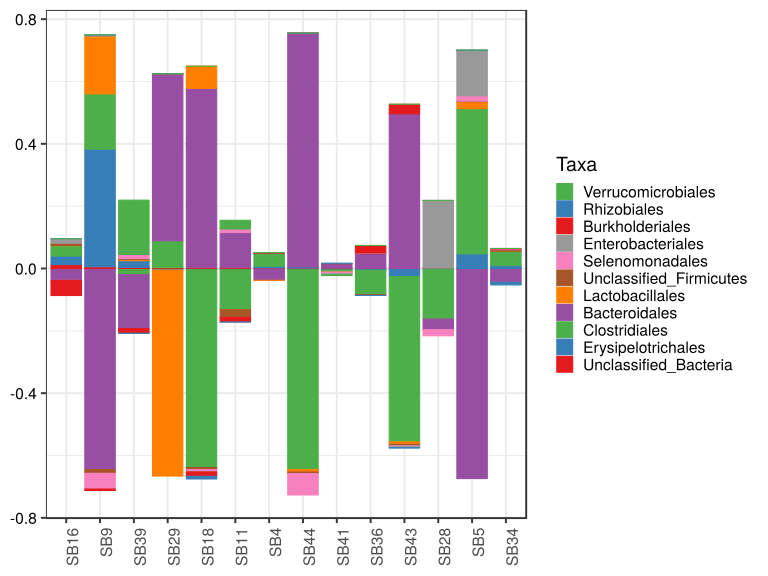

\(1.4.1.2.4.2.2.2.1.1.1\) [`Figure 637.`](#figure.637) Abundance difference between paired samples. Samples are paired according to attribute SubjectID, resulting in 14 pairs. When fold change or difference is computed, this is done as 'before.diet by after.diet'. Data for all pooled samples. Sorting order of features is GeneSelector paired test ranking. bar (sample mean) plot.  Image file: [`plots/32320bc4abc.svg`](plots/32320bc4abc.svg).
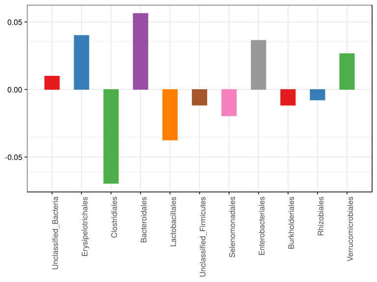

\(1.4.1.2.4.2.2.2.1.1.1\) [`Figure 638.`](#figure.638) Abundance difference between paired samples. Samples are paired according to attribute SubjectID, resulting in 14 pairs. When fold change or difference is computed, this is done as 'before.diet by after.diet'. Data for all pooled samples. Sorting order of features is GeneSelector paired test ranking. violin plot.  Image file: [`plots/3236e80eb2c.svg`](plots/3236e80eb2c.svg).
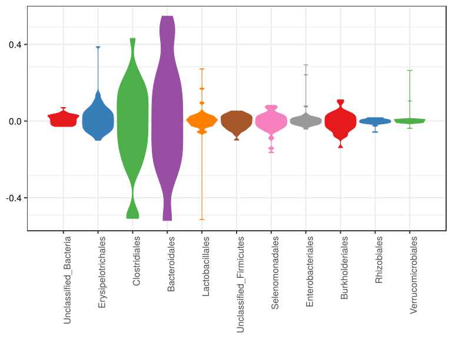

\(1.4.1.2.4.2.2.2.1.1.1\) [`Figure 639.`](#figure.639) Abundance difference between paired samples. Samples are paired according to attribute SubjectID, resulting in 14 pairs. When fold change or difference is computed, this is done as 'before.diet by after.diet'. Data for all pooled samples. Sorting order of features is GeneSelector paired test ranking. boxplot plot.  Image file: [`plots/323213097cd.svg`](plots/323213097cd.svg).
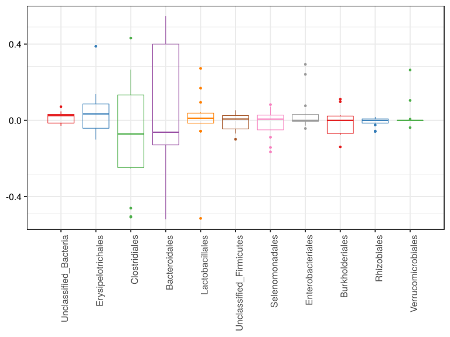

##### \(1.4.1.2.4.2.2.2.1.2\) Abundance difference between paired samples. Samples are paired according to attribute SubjectID, resulting in 14 pairs. When fold change or difference is computed, this is done as 'before.diet by after.diet'. Plot is in flipped orientation, Y axis not scaled. Iterating over plot geometry

\(1.4.1.2.4.2.2.2.1.2.1\) [`Figure 640.`](#figure.640) Abundance difference between paired samples. Samples are paired according to attribute SubjectID, resulting in 14 pairs. When fold change or difference is computed, this is done as 'before.diet by after.diet'. Data for all pooled samples. Sorting order of features is GeneSelector paired test ranking. bar (sample mean) plot.  Image file: [`plots/323285f68a9.svg`](plots/323285f68a9.svg).
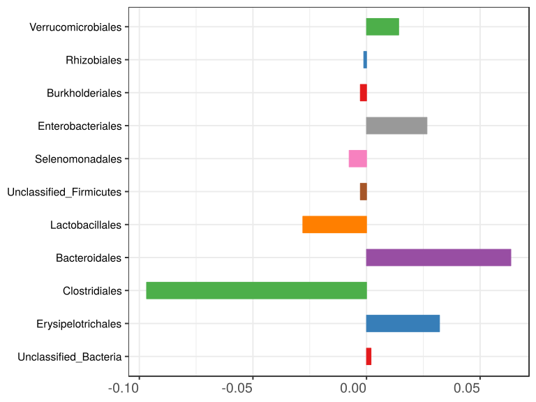

\(1.4.1.2.4.2.2.2.1.2.1\) [`Figure 641.`](#figure.641) Abundance difference between paired samples. Samples are paired according to attribute SubjectID, resulting in 14 pairs. When fold change or difference is computed, this is done as 'before.diet by after.diet'. Data for all pooled samples. Sorting order of features is GeneSelector paired test ranking. violin plot.  Image file: [`plots/32345d819f.svg`](plots/32345d819f.svg).
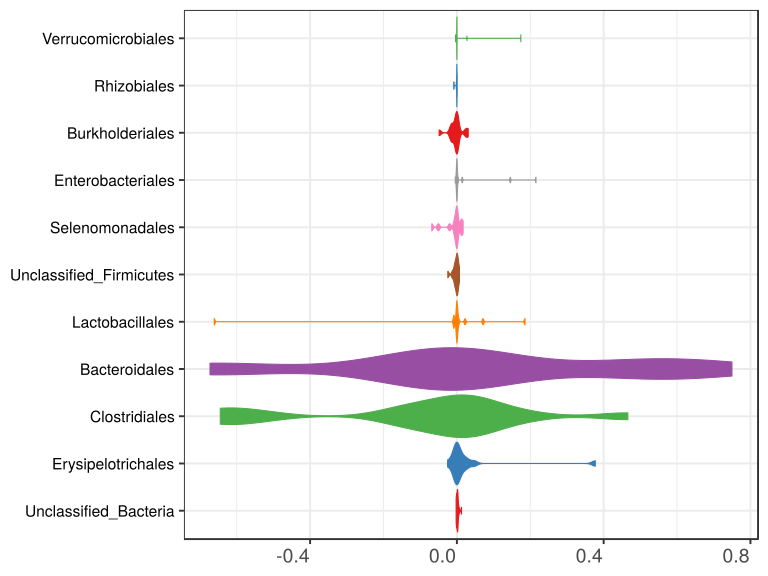

\(1.4.1.2.4.2.2.2.1.2.1\) [`Figure 642.`](#figure.642) Abundance difference between paired samples. Samples are paired according to attribute SubjectID, resulting in 14 pairs. When fold change or difference is computed, this is done as 'before.diet by after.diet'. Data for all pooled samples. Sorting order of features is GeneSelector paired test ranking. boxplot plot.  Image file: [`plots/3237f446be6.svg`](plots/3237f446be6.svg).
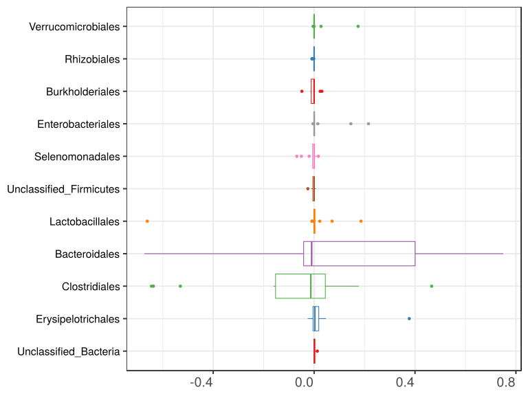

##### \(1.4.1.2.4.2.3\) Grouping variables Drug.Before.Diet

##### \(1.4.1.2.4.2.4\) Iterating over Abundance difference between paired samples. Samples are paired according to attribute SubjectID, resulting in 14 pairs. When fold change or difference is computed, this is done as 'before.diet by after.diet'. profile sorting order

##### \(1.4.1.2.4.2.4.1\) Abundance difference between paired samples. Samples are paired according to attribute SubjectID, resulting in 14 pairs. When fold change or difference is computed, this is done as 'before.diet by after.diet'. profile sorting order: GeneSelector paired test ranking

##### \(1.4.1.2.4.2.4.2\) Iterating over dodged vs faceted bars

The same data are shown in multiple combinations of graphical representations. 
                         This is the same data, but each plot highlights slightly different aspects of it.
                         It is not likely that you will need every plot - pick only what you need.

##### \(1.4.1.2.4.2.4.2.1\) faceted plots. Iterating over orientation and, optionally, scaling

##### \(1.4.1.2.4.2.4.2.1.1\) Abundance difference between paired samples. Samples are paired according to attribute SubjectID, resulting in 14 pairs. When fold change or difference is computed, this is done as 'before.diet by after.diet'. Plot is in original orientation, Y axis SQRT scaled. Iterating over plot geometry

\(1.4.1.2.4.2.4.2.1.1.0\) [`Table 156.`](#table.156) Data table used for plots. Data grouped by Drug.Before.Diet. Full dataset is also saved in a delimited text file (click to download and open e.g. in Excel) [`data/1.4.1.2.4.2.4.2.1.1.0-3231c5a70e2.1.4.1.2.4.2.4.2.1.1.csv`](data/1.4.1.2.4.2.4.2.1.1.0-3231c5a70e2.1.4.1.2.4.2.4.2.1.1.csv)

| .record.id | Drug.Before.Diet | feature                  | abundance.diff |
|:-----------|:-----------------|:-------------------------|:---------------|
| SB11       | DrugBefore\_NO   | Bacteroidales            | 1.132e\-01     |
| SB16       | DrugBefore\_YES  | Bacteroidales            | \-3.815e\-02   |
| SB18       | DrugBefore\_NO   | Bacteroidales            | 5.757e\-01     |
| SB28       | DrugBefore\_YES  | Bacteroidales            | \-3.368e\-02   |
| SB29       | DrugBefore\_YES  | Bacteroidales            | 5.343e\-01     |
| SB34       | DrugBefore\_YES  | Bacteroidales            | \-4.258e\-02   |
| SB36       | DrugBefore\_YES  | Bacteroidales            | 4.904e\-02     |
| SB39       | DrugBefore\_YES  | Bacteroidales            | \-1.733e\-01   |
| SB4        | DrugBefore\_YES  | Bacteroidales            | \-3.777e\-02   |
| SB41       | DrugBefore\_YES  | Bacteroidales            | 1.442e\-02     |
| SB43       | DrugBefore\_YES  | Bacteroidales            | 4.963e\-01     |
| SB44       | DrugBefore\_YES  | Bacteroidales            | 7.496e\-01     |
| SB5        | DrugBefore\_NO   | Bacteroidales            | \-6.727e\-01   |
| SB9        | DrugBefore\_NO   | Bacteroidales            | \-6.449e\-01   |
| SB11       | DrugBefore\_NO   | Clostridiales            | \-1.286e\-01   |
| SB16       | DrugBefore\_YES  | Clostridiales            | 3.346e\-02     |
| SB18       | DrugBefore\_NO   | Clostridiales            | \-6.370e\-01   |
| SB28       | DrugBefore\_YES  | Clostridiales            | \-1.610e\-01   |
| SB29       | DrugBefore\_YES  | Clostridiales            | 8.642e\-02     |
| SB34       | DrugBefore\_YES  | Clostridiales            | 4.570e\-02     |
| SB36       | DrugBefore\_YES  | Clostridiales            | \-7.821e\-02   |
| SB39       | DrugBefore\_YES  | Clostridiales            | \-1.950e\-02   |
| SB4        | DrugBefore\_YES  | Clostridiales            | 4.098e\-02     |
| SB41       | DrugBefore\_YES  | Clostridiales            | \-6.226e\-03   |
| SB43       | DrugBefore\_YES  | Clostridiales            | \-5.302e\-01   |
| SB44       | DrugBefore\_YES  | Clostridiales            | \-6.447e\-01   |
| SB5        | DrugBefore\_NO   | Clostridiales            | 4.659e\-01     |
| SB9        | DrugBefore\_NO   | Clostridiales            | 1.776e\-01     |
| SB11       | DrugBefore\_NO   | Lactobacillales          | \-4.125e\-04   |
| SB16       | DrugBefore\_YES  | Lactobacillales          | 7.402e\-04     |
| SB18       | DrugBefore\_NO   | Lactobacillales          | 7.133e\-02     |
| SB28       | DrugBefore\_YES  | Lactobacillales          | 7.868e\-04     |
| SB29       | DrugBefore\_YES  | Lactobacillales          | \-6.612e\-01   |
| SB34       | DrugBefore\_YES  | Lactobacillales          | 3.477e\-04     |
| SB36       | DrugBefore\_YES  | Lactobacillales          | 3.086e\-04     |
| SB39       | DrugBefore\_YES  | Lactobacillales          | 4.549e\-03     |
| SB4        | DrugBefore\_YES  | Lactobacillales          | \-2.291e\-04   |
| SB41       | DrugBefore\_YES  | Lactobacillales          | \-5.682e\-04   |
| SB43       | DrugBefore\_YES  | Lactobacillales          | \-8.049e\-03   |
| SB44       | DrugBefore\_YES  | Lactobacillales          | \-8.067e\-03   |
| SB5        | DrugBefore\_NO   | Lactobacillales          | 2.232e\-02     |
| SB9        | DrugBefore\_NO   | Lactobacillales          | 1.858e\-01     |
| SB11       | DrugBefore\_NO   | Erysipelotrichales       | \-3.108e\-03   |
| SB16       | DrugBefore\_YES  | Erysipelotrichales       | 2.724e\-02     |
| SB18       | DrugBefore\_NO   | Erysipelotrichales       | \-1.227e\-03   |
| SB28       | DrugBefore\_YES  | Erysipelotrichales       | 2.010e\-03     |
| SB29       | DrugBefore\_YES  | Erysipelotrichales       | \-4.782e\-03   |
| SB34       | DrugBefore\_YES  | Erysipelotrichales       | 9.398e\-03     |
| SB36       | DrugBefore\_YES  | Erysipelotrichales       | \-4.819e\-03   |
| SB39       | DrugBefore\_YES  | Erysipelotrichales       | 2.145e\-02     |
| SB4        | DrugBefore\_YES  | Erysipelotrichales       | 5.773e\-03     |
| SB41       | DrugBefore\_YES  | Erysipelotrichales       | \-4.694e\-03   |
| SB43       | DrugBefore\_YES  | Erysipelotrichales       | \-2.541e\-02   |
| SB44       | DrugBefore\_YES  | Erysipelotrichales       | 3.701e\-03     |
| SB5        | DrugBefore\_NO   | Erysipelotrichales       | 4.709e\-02     |
| SB9        | DrugBefore\_NO   | Erysipelotrichales       | 3.773e\-01     |
| SB11       | DrugBefore\_NO   | Selenomonadales          | 1.140e\-02     |
| SB16       | DrugBefore\_YES  | Selenomonadales          | \-8.732e\-05   |
| SB18       | DrugBefore\_NO   | Selenomonadales          | \-6.416e\-03   |
| SB28       | DrugBefore\_YES  | Selenomonadales          | \-1.963e\-02   |
| SB29       | DrugBefore\_YES  | Selenomonadales          | 7.199e\-04     |
| SB34       | DrugBefore\_YES  | Selenomonadales          | 2.254e\-03     |
| SB36       | DrugBefore\_YES  | Selenomonadales          | 3.805e\-04     |
| SB39       | DrugBefore\_YES  | Selenomonadales          | 1.309e\-02     |
| SB4        | DrugBefore\_YES  | Selenomonadales          | 3.015e\-04     |
| SB41       | DrugBefore\_YES  | Selenomonadales          | \-5.618e\-03   |
| SB43       | DrugBefore\_YES  | Selenomonadales          | \-1.491e\-03   |
| SB44       | DrugBefore\_YES  | Selenomonadales          | \-6.849e\-02   |
| SB5        | DrugBefore\_NO   | Selenomonadales          | 1.704e\-02     |
| SB9        | DrugBefore\_NO   | Selenomonadales          | \-5.051e\-02   |
| SB11       | DrugBefore\_NO   | Enterobacteriales        | 4.803e\-04     |
| SB16       | DrugBefore\_YES  | Enterobacteriales        | 1.467e\-02     |
| SB18       | DrugBefore\_NO   | Enterobacteriales        | \-9.255e\-04   |
| SB28       | DrugBefore\_YES  | Enterobacteriales        | 2.156e\-01     |
| SB29       | DrugBefore\_YES  | Enterobacteriales        | 0.000e\+00     |
| SB34       | DrugBefore\_YES  | Enterobacteriales        | \-8.392e\-05   |
| SB36       | DrugBefore\_YES  | Enterobacteriales        | 0.000e\+00     |
| SB39       | DrugBefore\_YES  | Enterobacteriales        | 0.000e\+00     |
| SB4        | DrugBefore\_YES  | Enterobacteriales        | 0.000e\+00     |
| SB41       | DrugBefore\_YES  | Enterobacteriales        | \-1.932e\-03   |
| SB43       | DrugBefore\_YES  | Enterobacteriales        | \-4.574e\-03   |
| SB44       | DrugBefore\_YES  | Enterobacteriales        | 7.880e\-04     |
| SB5        | DrugBefore\_NO   | Enterobacteriales        | 1.456e\-01     |
| SB9        | DrugBefore\_NO   | Enterobacteriales        | 2.922e\-03     |
| SB11       | DrugBefore\_NO   | Burkholderiales          | \-1.455e\-02   |
| SB16       | DrugBefore\_YES  | Burkholderiales          | \-4.842e\-02   |
| SB18       | DrugBefore\_NO   | Burkholderiales          | \-1.394e\-02   |
| SB28       | DrugBefore\_YES  | Burkholderiales          | 0.000e\+00     |
| SB29       | DrugBefore\_YES  | Burkholderiales          | 0.000e\+00     |
| SB34       | DrugBefore\_YES  | Burkholderiales          | 1.663e\-03     |
| SB36       | DrugBefore\_YES  | Burkholderiales          | 2.415e\-02     |
| SB39       | DrugBefore\_YES  | Burkholderiales          | \-1.484e\-02   |
| SB4        | DrugBefore\_YES  | Burkholderiales          | 1.809e\-03     |
| SB41       | DrugBefore\_YES  | Burkholderiales          | 4.426e\-05     |
| SB43       | DrugBefore\_YES  | Burkholderiales          | 3.086e\-02     |
| SB44       | DrugBefore\_YES  | Burkholderiales          | 0.000e\+00     |
| SB5        | DrugBefore\_NO   | Burkholderiales          | 1.089e\-04     |
| SB9        | DrugBefore\_NO   | Burkholderiales          | \-5.019e\-03   |
| SB11       | DrugBefore\_NO   | Verrucomicrobiales       | 2.746e\-02     |
| SB16       | DrugBefore\_YES  | Verrucomicrobiales       | 0.000e\+00     |
| SB18       | DrugBefore\_NO   | Verrucomicrobiales       | 0.000e\+00     |
| SB28       | DrugBefore\_YES  | Verrucomicrobiales       | 0.000e\+00     |
| SB29       | DrugBefore\_YES  | Verrucomicrobiales       | 0.000e\+00     |
| SB34       | DrugBefore\_YES  | Verrucomicrobiales       | 0.000e\+00     |
| SB36       | DrugBefore\_YES  | Verrucomicrobiales       | 0.000e\+00     |
| SB39       | DrugBefore\_YES  | Verrucomicrobiales       | 1.743e\-01     |
| SB4        | DrugBefore\_YES  | Verrucomicrobiales       | 0.000e\+00     |
| SB41       | DrugBefore\_YES  | Verrucomicrobiales       | \-3.659e\-03   |
| SB43       | DrugBefore\_YES  | Verrucomicrobiales       | 9.707e\-05     |
| SB44       | DrugBefore\_YES  | Verrucomicrobiales       | 0.000e\+00     |
| SB5        | DrugBefore\_NO   | Verrucomicrobiales       | 0.000e\+00     |
| SB9        | DrugBefore\_NO   | Verrucomicrobiales       | 0.000e\+00     |
| SB11       | DrugBefore\_NO   | Unclassified\_Bacteria   | 2.260e\-03     |
| SB16       | DrugBefore\_YES  | Unclassified\_Bacteria   | 1.267e\-02     |
| SB18       | DrugBefore\_NO   | Unclassified\_Bacteria   | 2.269e\-03     |
| SB28       | DrugBefore\_YES  | Unclassified\_Bacteria   | \-1.171e\-03   |
| SB29       | DrugBefore\_YES  | Unclassified\_Bacteria   | 2.520e\-03     |
| SB34       | DrugBefore\_YES  | Unclassified\_Bacteria   | \-2.033e\-03   |
| SB36       | DrugBefore\_YES  | Unclassified\_Bacteria   | \-2.041e\-04   |
| SB39       | DrugBefore\_YES  | Unclassified\_Bacteria   | 3.472e\-03     |
| SB4        | DrugBefore\_YES  | Unclassified\_Bacteria   | 1.603e\-03     |
| SB41       | DrugBefore\_YES  | Unclassified\_Bacteria   | 1.137e\-03     |
| SB43       | DrugBefore\_YES  | Unclassified\_Bacteria   | \-5.965e\-04   |
| SB44       | DrugBefore\_YES  | Unclassified\_Bacteria   | 1.447e\-03     |
| SB5        | DrugBefore\_NO   | Unclassified\_Bacteria   | \-1.234e\-03   |
| SB9        | DrugBefore\_NO   | Unclassified\_Bacteria   | 5.518e\-03     |
| SB11       | DrugBefore\_NO   | Unclassified\_Firmicutes | \-2.472e\-02   |
| SB16       | DrugBefore\_YES  | Unclassified\_Firmicutes | 7.081e\-03     |
| SB18       | DrugBefore\_NO   | Unclassified\_Firmicutes | \-6.999e\-03   |
| SB28       | DrugBefore\_YES  | Unclassified\_Firmicutes | \-3.264e\-04   |
| SB29       | DrugBefore\_YES  | Unclassified\_Firmicutes | 7.199e\-04     |
| SB34       | DrugBefore\_YES  | Unclassified\_Firmicutes | 5.039e\-03     |
| SB36       | DrugBefore\_YES  | Unclassified\_Firmicutes | \-2.733e\-03   |
| SB39       | DrugBefore\_YES  | Unclassified\_Firmicutes | 2.504e\-03     |
| SB4        | DrugBefore\_YES  | Unclassified\_Firmicutes | 6.030e\-04     |
| SB41       | DrugBefore\_YES  | Unclassified\_Firmicutes | 5.706e\-04     |
| SB43       | DrugBefore\_YES  | Unclassified\_Firmicutes | \-4.282e\-03   |
| SB44       | DrugBefore\_YES  | Unclassified\_Firmicutes | \-5.310e\-03   |
| SB5        | DrugBefore\_NO   | Unclassified\_Firmicutes | 1.863e\-03     |
| SB9        | DrugBefore\_NO   | Unclassified\_Firmicutes | \-1.201e\-02   |
| SB11       | DrugBefore\_NO   | Rhizobiales              | \-4.125e\-04   |
| SB16       | DrugBefore\_YES  | Rhizobiales              | 0.000e\+00     |
| SB18       | DrugBefore\_NO   | Rhizobiales              | \-8.679e\-03   |
| SB28       | DrugBefore\_YES  | Rhizobiales              | 0.000e\+00     |
| SB29       | DrugBefore\_YES  | Rhizobiales              | 0.000e\+00     |
| SB34       | DrugBefore\_YES  | Rhizobiales              | \-7.898e\-03   |
| SB36       | DrugBefore\_YES  | Rhizobiales              | \-5.428e\-04   |
| SB39       | DrugBefore\_YES  | Rhizobiales              | \-2.500e\-04   |
| SB4        | DrugBefore\_YES  | Rhizobiales              | 1.987e\-04     |
| SB41       | DrugBefore\_YES  | Rhizobiales              | 7.645e\-04     |
| SB43       | DrugBefore\_YES  | Rhizobiales              | \-1.503e\-03   |
| SB44       | DrugBefore\_YES  | Rhizobiales              | 0.000e\+00     |
| SB5        | DrugBefore\_NO   | Rhizobiales              | 8.069e\-04     |
| SB9        | DrugBefore\_NO   | Rhizobiales              | 5.953e\-04     |

\(1.4.1.2.4.2.4.2.1.1.1\) [`Widget 173.`](#widget.173) Dynamic Pivot Table link (drag and drop field names and pick averaging 
                      functions or plot types; click on fields or legend elements to filter values). 
                      Starting rendering is Stacked Bar Chart. Data grouped by Drug.Before.Diet. Click to see HTML widget file in full window: [`./1.4.1.2.4.2.4.2.1.1.1-3233142f04Dynamic.Pivot.Table.html`](./1.4.1.2.4.2.4.2.1.1.1-3233142f04Dynamic.Pivot.Table.html)

\(1.4.1.2.4.2.4.2.1.1.1\) [`Widget 174.`](#widget.174) Dynamic Pivot Table link (drag and drop field names and pick averaging 
                      functions or plot types; click on fields or legend elements to filter values). 
                      Starting rendering is Table Barchart. Data grouped by Drug.Before.Diet. Click to see HTML widget file in full window: [`./1.4.1.2.4.2.4.2.1.1.1-3233a155afcDynamic.Pivot.Table.html`](./1.4.1.2.4.2.4.2.1.1.1-3233a155afcDynamic.Pivot.Table.html)

\(1.4.1.2.4.2.4.2.1.1.1\) [`Table 157.`](#table.157) Summary table. Data grouped by Drug.Before.Diet. Full dataset is also saved in a delimited text file (click to download and open e.g. in Excel) [`data/1.4.1.2.4.2.4.2.1.1.1-323520614fd.1.4.1.2.4.2.4.2.1.1.csv`](data/1.4.1.2.4.2.4.2.1.1.1-323520614fd.1.4.1.2.4.2.4.2.1.1.csv)

| feature                  | Drug.Before.Diet | mean        | sd       | median       | incidence |
|:-------------------------|:-----------------|:------------|:---------|:-------------|:----------|
| Unclassified\_Bacteria   | DrugBefore\_NO   | 0.0022034   | 0.002757 | 2.265e\-03   | 0.75      |
| Unclassified\_Bacteria   | DrugBefore\_YES  | 0.0018841   | 0.004153 | 1.292e\-03   | 0.60      |
| Erysipelotrichales       | DrugBefore\_NO   | 0.1050128   | 0.183003 | 2.293e\-02   | 0.50      |
| Erysipelotrichales       | DrugBefore\_YES  | 0.0029868   | 0.014780 | 2.856e\-03   | 0.60      |
| Clostridiales            | DrugBefore\_NO   | \-0.0305351 | 0.471600 | 2.452e\-02   | 0.50      |
| Clostridiales            | DrugBefore\_YES  | \-0.1233245 | 0.255925 | \-1.286e\-02 | 0.40      |
| Bacteroidales            | DrugBefore\_NO   | \-0.1571721 | 0.609322 | \-2.658e\-01 | 0.50      |
| Bacteroidales            | DrugBefore\_YES  | 0.1518069   | 0.316502 | \-9.630e\-03 | 0.50      |
| Lactobacillales          | DrugBefore\_NO   | 0.0697496   | 0.082932 | 4.682e\-02   | 0.75      |
| Lactobacillales          | DrugBefore\_YES  | \-0.0671422 | 0.208783 | 3.974e\-05   | 0.50      |
| Unclassified\_Firmicutes | DrugBefore\_NO   | \-0.0104669 | 0.011099 | \-9.506e\-03 | 0.25      |
| Unclassified\_Firmicutes | DrugBefore\_YES  | 0.0003867   | 0.003882 | 5.868e\-04   | 0.60      |
| Selenomonadales          | DrugBefore\_NO   | \-0.0071233 | 0.030605 | 2.490e\-03   | 0.50      |
| Selenomonadales          | DrugBefore\_YES  | \-0.0078563 | 0.022778 | 1.071e\-04   | 0.50      |
| Enterobacteriales        | DrugBefore\_NO   | 0.0370166   | 0.072399 | 1.701e\-03   | 0.75      |
| Enterobacteriales        | DrugBefore\_YES  | 0.0224447   | 0.068049 | 0.000e\+00   | 0.30      |
| Burkholderiales          | DrugBefore\_NO   | \-0.0083487 | 0.007125 | \-9.479e\-03 | 0.25      |
| Burkholderiales          | DrugBefore\_YES  | \-0.0004728 | 0.021355 | 2.213e\-05   | 0.50      |
| Rhizobiales              | DrugBefore\_NO   | \-0.0019224 | 0.004536 | 9.139e\-05   | 0.50      |
| Rhizobiales              | DrugBefore\_YES  | \-0.0009231 | 0.002519 | 0.000e\+00   | 0.20      |
| Verrucomicrobiales       | DrugBefore\_NO   | 0.0068662   | 0.013732 | 0.000e\+00   | 0.25      |
| Verrucomicrobiales       | DrugBefore\_YES  | 0.0170756   | 0.055261 | 0.000e\+00   | 0.20      |

\(1.4.1.2.4.2.4.2.1.1.1\) [`Figure 643.`](#figure.643) Abundance difference between paired samples. Samples are paired according to attribute SubjectID, resulting in 14 pairs. When fold change or difference is computed, this is done as 'before.diet by after.diet'. Data grouped by Drug.Before.Diet. Sorting order of features is GeneSelector paired test ranking. bar_stacked plot.  Image file: [`plots/3231db2566a.svg`](plots/3231db2566a.svg).
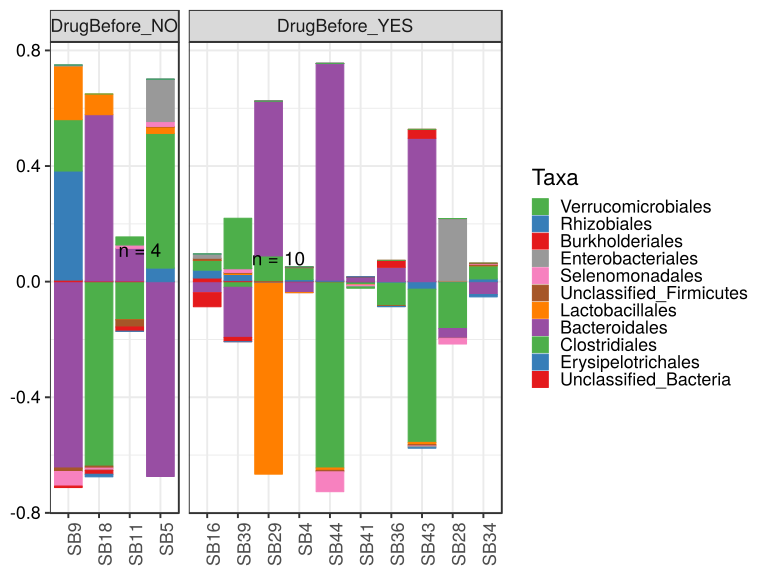

\(1.4.1.2.4.2.4.2.1.1.1\) [`Figure 644.`](#figure.644) Abundance difference between paired samples. Samples are paired according to attribute SubjectID, resulting in 14 pairs. When fold change or difference is computed, this is done as 'before.diet by after.diet'. Data grouped by Drug.Before.Diet. Sorting order of features is GeneSelector paired test ranking. bar (sample mean) plot.  Image file: [`plots/3237c12e5b6.svg`](plots/3237c12e5b6.svg).
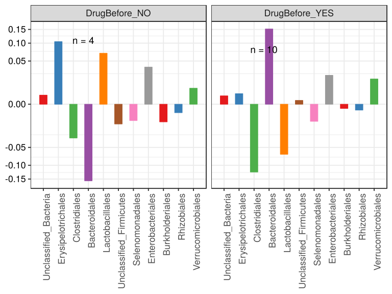

\(1.4.1.2.4.2.4.2.1.1.1\) [`Figure 645.`](#figure.645) Abundance difference between paired samples. Samples are paired according to attribute SubjectID, resulting in 14 pairs. When fold change or difference is computed, this is done as 'before.diet by after.diet'. Data grouped by Drug.Before.Diet. Sorting order of features is GeneSelector paired test ranking. violin plot.  Image file: [`plots/32375984d9d.svg`](plots/32375984d9d.svg).
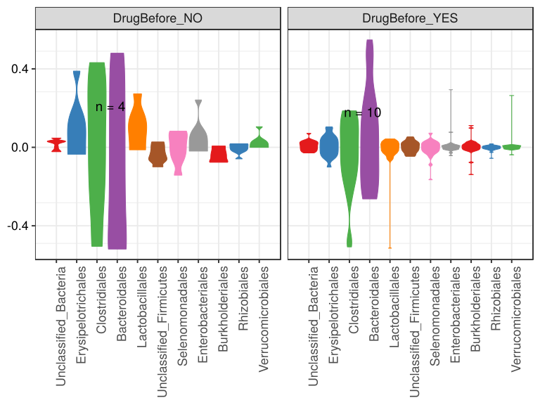

\(1.4.1.2.4.2.4.2.1.1.1\) [`Figure 646.`](#figure.646) Abundance difference between paired samples. Samples are paired according to attribute SubjectID, resulting in 14 pairs. When fold change or difference is computed, this is done as 'before.diet by after.diet'. Data grouped by Drug.Before.Diet. Sorting order of features is GeneSelector paired test ranking. boxplot plot.  Image file: [`plots/323a7240f7.svg`](plots/323a7240f7.svg).
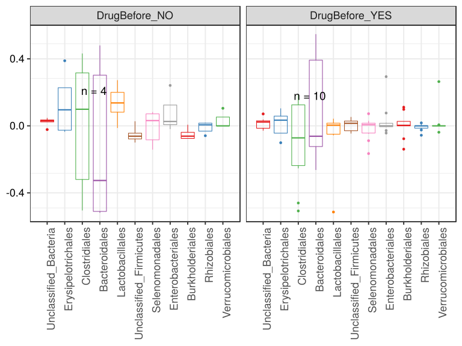

##### \(1.4.1.2.4.2.4.2.1.2\) Abundance difference between paired samples. Samples are paired according to attribute SubjectID, resulting in 14 pairs. When fold change or difference is computed, this is done as 'before.diet by after.diet'. Plot is in flipped orientation, Y axis not scaled. Iterating over plot geometry

\(1.4.1.2.4.2.4.2.1.2.1\) [`Figure 647.`](#figure.647) Abundance difference between paired samples. Samples are paired according to attribute SubjectID, resulting in 14 pairs. When fold change or difference is computed, this is done as 'before.diet by after.diet'. Data grouped by Drug.Before.Diet. Sorting order of features is GeneSelector paired test ranking. bar (sample mean) plot.  Image file: [`plots/3232ef1dbf4.svg`](plots/3232ef1dbf4.svg).
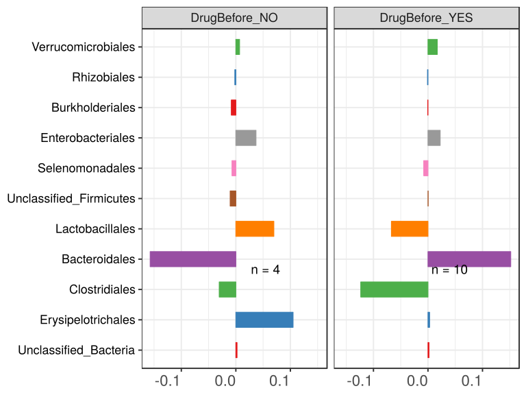

\(1.4.1.2.4.2.4.2.1.2.1\) [`Figure 648.`](#figure.648) Abundance difference between paired samples. Samples are paired according to attribute SubjectID, resulting in 14 pairs. When fold change or difference is computed, this is done as 'before.diet by after.diet'. Data grouped by Drug.Before.Diet. Sorting order of features is GeneSelector paired test ranking. violin plot.  Image file: [`plots/3234d907a4a.svg`](plots/3234d907a4a.svg).
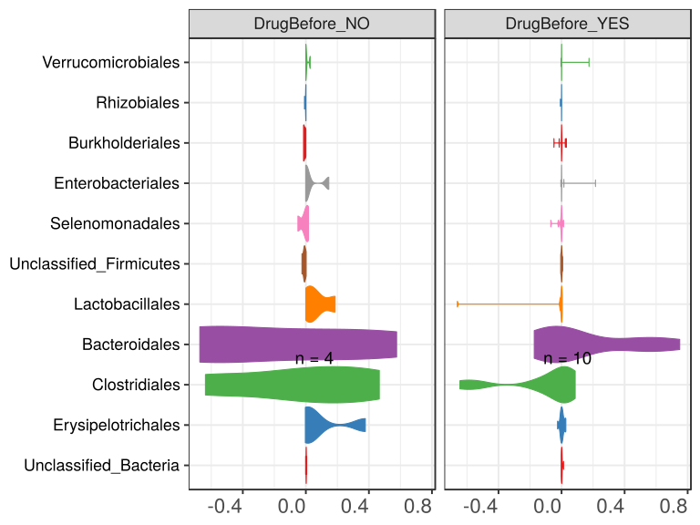

\(1.4.1.2.4.2.4.2.1.2.1\) [`Figure 649.`](#figure.649) Abundance difference between paired samples. Samples are paired according to attribute SubjectID, resulting in 14 pairs. When fold change or difference is computed, this is done as 'before.diet by after.diet'. Data grouped by Drug.Before.Diet. Sorting order of features is GeneSelector paired test ranking. boxplot plot.  Image file: [`plots/32337d93fa3.svg`](plots/32337d93fa3.svg).
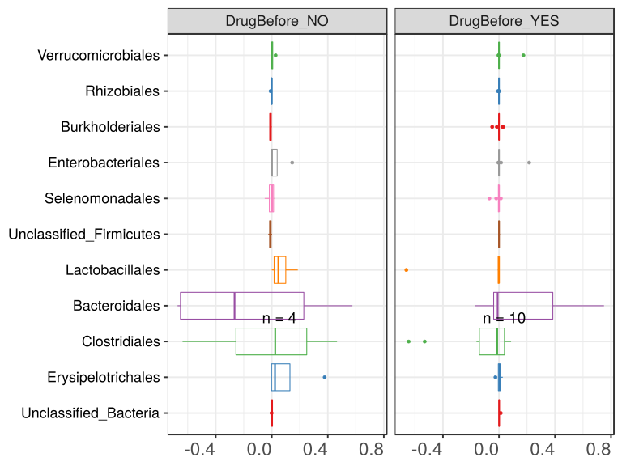

##### \(1.4.1.2.4.2.4.2.2\) dodged plots. Iterating over orientation and, optionally, scaling

##### \(1.4.1.2.4.2.4.2.2.1\) Abundance difference between paired samples. Samples are paired according to attribute SubjectID, resulting in 14 pairs. When fold change or difference is computed, this is done as 'before.diet by after.diet'. Plot is in original orientation, Y axis SQRT scaled. Iterating over plot geometry

\(1.4.1.2.4.2.4.2.2.1.1\) [`Figure 650.`](#figure.650) Abundance difference between paired samples. Samples are paired according to attribute SubjectID, resulting in 14 pairs. When fold change or difference is computed, this is done as 'before.diet by after.diet'. Data grouped by Drug.Before.Diet. Sorting order of features is GeneSelector paired test ranking. bar (sample mean) plot.  Image file: [`plots/3235ee623c8.svg`](plots/3235ee623c8.svg).
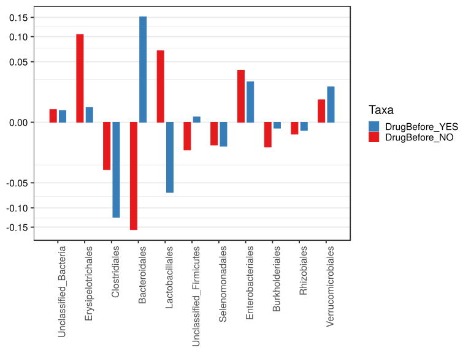

\(1.4.1.2.4.2.4.2.2.1.1\) [`Figure 651.`](#figure.651) Abundance difference between paired samples. Samples are paired according to attribute SubjectID, resulting in 14 pairs. When fold change or difference is computed, this is done as 'before.diet by after.diet'. Data grouped by Drug.Before.Diet. Sorting order of features is GeneSelector paired test ranking. violin plot.  Image file: [`plots/323430fa461.svg`](plots/323430fa461.svg).
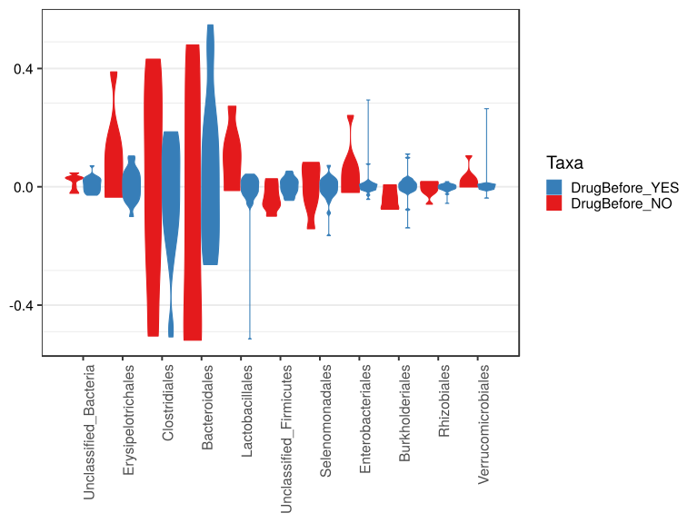

\(1.4.1.2.4.2.4.2.2.1.1\) [`Figure 652.`](#figure.652) Abundance difference between paired samples. Samples are paired according to attribute SubjectID, resulting in 14 pairs. When fold change or difference is computed, this is done as 'before.diet by after.diet'. Data grouped by Drug.Before.Diet. Sorting order of features is GeneSelector paired test ranking. boxplot plot.  Image file: [`plots/32321632308.svg`](plots/32321632308.svg).
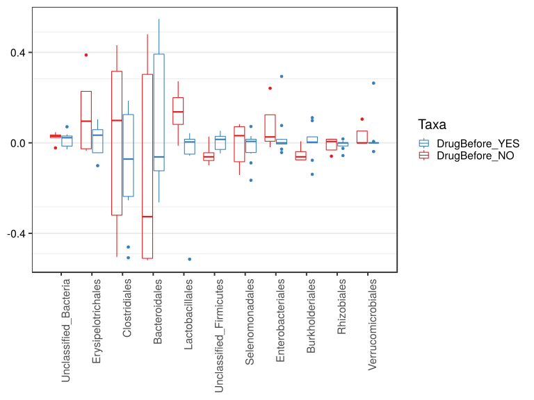

##### \(1.4.1.2.4.2.4.2.2.2\) Abundance difference between paired samples. Samples are paired according to attribute SubjectID, resulting in 14 pairs. When fold change or difference is computed, this is done as 'before.diet by after.diet'. Plot is in flipped orientation, Y axis not scaled. Iterating over plot geometry

\(1.4.1.2.4.2.4.2.2.2.1\) [`Figure 653.`](#figure.653) Abundance difference between paired samples. Samples are paired according to attribute SubjectID, resulting in 14 pairs. When fold change or difference is computed, this is done as 'before.diet by after.diet'. Data grouped by Drug.Before.Diet. Sorting order of features is GeneSelector paired test ranking. bar (sample mean) plot.  Image file: [`plots/323ee1c72d.svg`](plots/323ee1c72d.svg).
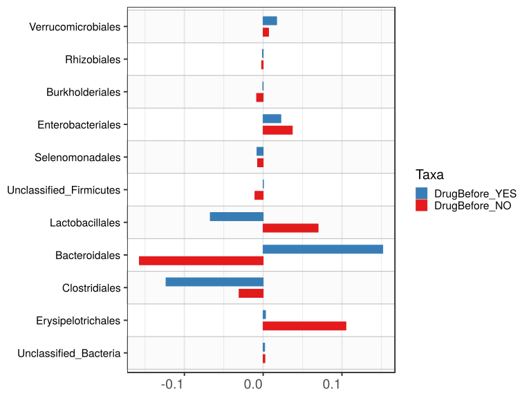

\(1.4.1.2.4.2.4.2.2.2.1\) [`Figure 654.`](#figure.654) Abundance difference between paired samples. Samples are paired according to attribute SubjectID, resulting in 14 pairs. When fold change or difference is computed, this is done as 'before.diet by after.diet'. Data grouped by Drug.Before.Diet. Sorting order of features is GeneSelector paired test ranking. violin plot.  Image file: [`plots/32373253b2e.svg`](plots/32373253b2e.svg).
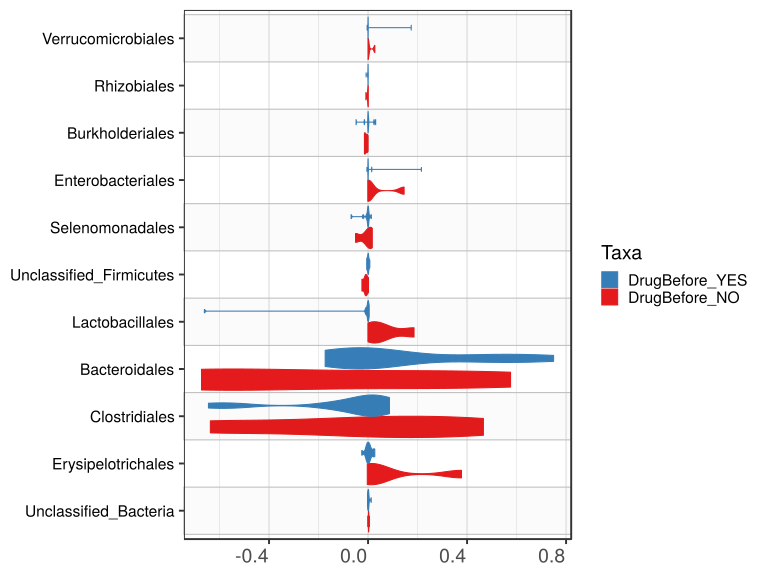

\(1.4.1.2.4.2.4.2.2.2.1\) [`Figure 655.`](#figure.655) Abundance difference between paired samples. Samples are paired according to attribute SubjectID, resulting in 14 pairs. When fold change or difference is computed, this is done as 'before.diet by after.diet'. Data grouped by Drug.Before.Diet. Sorting order of features is GeneSelector paired test ranking. boxplot plot.  Image file: [`plots/323b6033f.svg`](plots/323b6033f.svg).
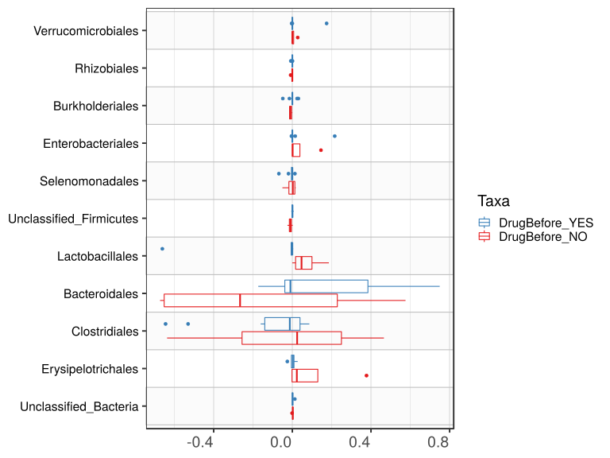