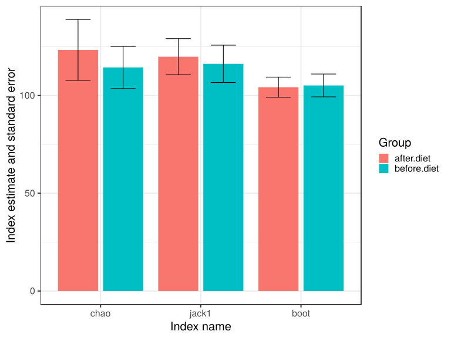
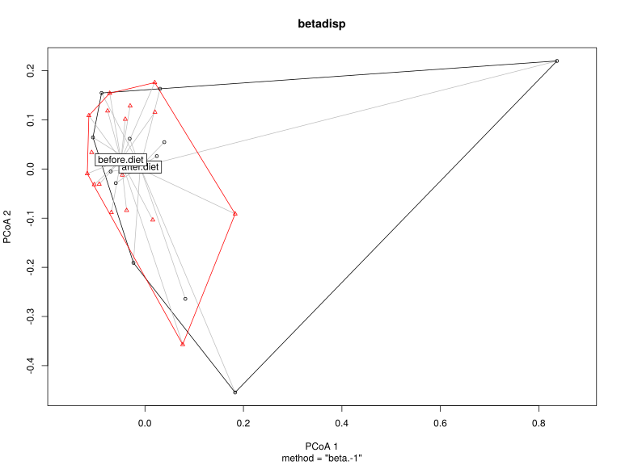

noone@mail.com
Analysis of Dieting study 16S data
% Fri Sep  7 05:46:18 2018


##### \(1.4.1.3.2.1\) Richness and diversity estimates Before count filtering


 Counts are rarefied to the lowest library size (2161), abundance-based and
                   incidence-based alpha diversity indices and richness estimates are computed
                   (if requested).
                   This is repeated multiple times (n=400), and the results are averaged.
                   Beta diversity matrix is also computed by averaging over multiple 
                   rarefications. Incidence-based estimates are computed on sample pools split by
                          metadata attribute DietStatus, and in each repetition, samples are also
                          stratified to balance the number of samples at each level
                          of the grouping variable. Dimensions of input count matrix (33 x 131).


Oksanen J, Blanchet FG, Friendly M, Kindt R, Legendre P, McGlinn D, Minchin PR, O'Hara RB, Simpson GL, Solymos P, Stevens MHH, Szoecs E, Wagner
H (2018). _vegan: Community Ecology Package_. R package version 2.5-2, <URL: https://CRAN.R-project.org/package=vegan>.


\(1.4.1.3.2.1.1\) <a name="table.162"></a>[`Table 162.`](#table.162) Incidence based rihcness estimates and corresponding standard errors for samples grouped by DietStatus. Full dataset is also saved in a delimited text file (click to download and open e.g. in Excel) [`data/1.4.1.3.2.1.1-3231a83f89e.1.4.1.3.2.1.1.a.nam.csv`](data/1.4.1.3.2.1.1-3231a83f89e.1.4.1.3.2.1.1.a.nam.csv)


| Species | chao  | chao.se | jack1 | jack1.se | jack2 | boot  | boot.se | n  |
|:--------|:------|:--------|:------|:---------|:------|:------|:--------|:---|
| 91.25   | 123.3 | 15.57   | 119.8 | 9.278    | 134.7 | 104.2 | 5.148   | 16 |
| 94.78   | 114.3 | 10.77   | 116.2 | 9.516    | 125.1 | 105.1 | 5.837   | 16 |


\(1.4.1.3.2.1.1\) <a name="figure.681"></a>[`Figure 681.`](#figure.681) Incidence based rihcness estimates and corresponding standard errors for samples grouped by DietStatus.  Image file: [`plots/3235e083481.svg`](plots/3235e083481.svg).



##### \(1.4.1.3.2.1.2\) Plots of Abundance-based diversity indices (Hill numbers) With rarefication.

[`Subreport`](./1.4.1.3.2.1.2-report.html)

Scherer R, Pallmann P (2017). _simboot: Simultaneous Inference for Diversity Indices_. R package version 0.2-6, <URL:
https://CRAN.R-project.org/package=simboot>.


\(1.4.1.3.2.1.2\) <a name="table.167"></a>[`Table 167.`](#table.167) Comparison of diversity indices \(Hill numbers\)
                         with Westfall and Young correction for multiple testing
                          across levels of attribute DietStatus. Full dataset is also saved in a delimited text file (click to download and open e.g. in Excel) [`data/1.4.1.3.2.1.2-32351581660.1.4.1.3.2.1.2.a.nam.csv`](data/1.4.1.3.2.1.2-32351581660.1.4.1.3.2.1.2.a.nam.csv)


|   &nbsp;   | q       | p\-value |
|:----------:|:--------|:---------|
| **2 \- 1** | N\_0    | 0.2854   |
| **2 \- 1** | N\_0.25 | 0.5278   |
| **2 \- 1** | N\_0.5  | 0.7818   |
| **2 \- 1** | N\_1    | 0.9846   |
| **2 \- 1** | N\_2    | 1        |
| **2 \- 1** | N\_4    | 0.9982   |
| **2 \- 1** | N\_8    | 0.9918   |
| **2 \- 1** | N\_Inf  | 0.9892   |


\(1.4.1.3.2.1.2\) <a name="table.168"></a>[`Table 168.`](#table.168) Levels that defined contrasts 
                         in the previous table. Full dataset is also saved in a delimited text file (click to download and open e.g. in Excel) [`data/1.4.1.3.2.1.2-32378873045.1.4.1.3.2.1.2.a.nam.csv`](data/1.4.1.3.2.1.2-32378873045.1.4.1.3.2.1.2.a.nam.csv)


| level | label       |
|:------|:------------|
| 1     | after.diet  |
| 2     | before.diet |


##### \(1.4.1.3.2.1.3\) Plots of Abundance-based evenness indices (Hill numbers / Observed 'species') With rarefication.

[`Subreport`](./1.4.1.3.2.1.3-report.html)

Scherer R, Pallmann P (2017). _simboot: Simultaneous Inference for Diversity Indices_. R package version 0.2-6, <URL:
https://CRAN.R-project.org/package=simboot>.


\(1.4.1.3.2.1.3\) <a name="table.173"></a>[`Table 173.`](#table.173) Comparison of evenness indices \(Hill numbers / Observed 'species'\)
                         with Westfall and Young correction for multiple testing
                          across levels of attribute DietStatus. Full dataset is also saved in a delimited text file (click to download and open e.g. in Excel) [`data/1.4.1.3.2.1.3-3236a335f7d.1.4.1.3.2.1.3.a.nam.csv`](data/1.4.1.3.2.1.3-3236a335f7d.1.4.1.3.2.1.3.a.nam.csv)


|   &nbsp;   | q        | p\-value |
|:----------:|:---------|:---------|
| **2 \- 1** | NE\_0.25 | 0.9458   |
| **2 \- 1** | NE\_0.5  | 0.6718   |
| **2 \- 1** | NE\_1    | 0.3462   |
| **2 \- 1** | NE\_2    | 0.2558   |
| **2 \- 1** | NE\_4    | 0.2388   |
| **2 \- 1** | NE\_8    | 0.2428   |
| **2 \- 1** | NE\_Inf  | 0.2572   |


\(1.4.1.3.2.1.3\) <a name="table.174"></a>[`Table 174.`](#table.174) Levels that defined contrasts 
                         in the previous table. Full dataset is also saved in a delimited text file (click to download and open e.g. in Excel) [`data/1.4.1.3.2.1.3-3233f14c09c.1.4.1.3.2.1.3.a.nam.csv`](data/1.4.1.3.2.1.3-3233f14c09c.1.4.1.3.2.1.3.a.nam.csv)


| level | label       |
|:------|:------------|
| 1     | after.diet  |
| 2     | before.diet |


Wrote counts and metadata for Abundance based richness and diversity to files [`data/1.4.1.3.2.1.3-3231af8d542divrich.counts.count.tsv`](data/1.4.1.3.2.1.3-3231af8d542divrich.counts.count.tsv),[`data/1.4.1.3.2.1.3-3231af8d542divrich.counts.attr.tsv`](data/1.4.1.3.2.1.3-3231af8d542divrich.counts.attr.tsv)


\(1.4.1.3.2.1.3\)  Association of abundance based Hill number of order N_0 with sample metadata.
                                 GLM with family gaussian and formula N_0~DietStatus.


|          &nbsp;           | Estimate | Std. Error | t value | Pr(>|t|) |
|:-------------------------:|:---------|:-----------|:--------|:---------|
|      **(Intercept)**      | 26.35    | 2.431      | 10.84   | 0        |
| **DietStatusbefore.diet** | 4.971    | 3.387      | 1.468   | 0.1523   |


(Dispersion parameter for  gaussian  family taken to be  94.54078 )


|                    |                                 |
|:-------------------|:--------------------------------|
| Null deviance:     | 3134  on 32  degrees of freedom |
| Residual deviance: | 2931  on 31  degrees of freedom |


##### \(1.4.1.3.2.1.4\) Plots of Abundance-based Hill number of order N_0.

[`Subreport`](./1.4.1.3.2.1.4-report.html)


\(1.4.1.3.2.1.4\)  Association of abundance based Hill number of order N_0.25 with sample metadata.
                                 GLM with family gaussian and formula N_0.25~DietStatus.


|          &nbsp;           | Estimate | Std. Error | t value | Pr(>|t|) |
|:-------------------------:|:---------|:-----------|:--------|:---------|
|      **(Intercept)**      | 15.03    | 1.835      | 8.192   | 0        |
| **DietStatusbefore.diet** | 2.629    | 2.557      | 1.028   | 0.3118   |


(Dispersion parameter for  gaussian  family taken to be  53.89063 )


|                    |                                 |
|:-------------------|:--------------------------------|
| Null deviance:     | 1728  on 32  degrees of freedom |
| Residual deviance: | 1671  on 31  degrees of freedom |


##### \(1.4.1.3.2.1.5\) Plots of Abundance-based Hill number of order N_0.25.

[`Subreport`](./1.4.1.3.2.1.5-report.html)


\(1.4.1.3.2.1.5\)  Association of abundance based Hill number of order N_0.5 with sample metadata.
                                 GLM with family gaussian and formula N_0.5~DietStatus.


|          &nbsp;           | Estimate | Std. Error | t value | Pr(>|t|) |
|:-------------------------:|:---------|:-----------|:--------|:---------|
|      **(Intercept)**      | 8.94     | 1.364      | 6.554   | 0        |
| **DietStatusbefore.diet** | 1.211    | 1.9        | 0.6374  | 0.5286   |


(Dispersion parameter for  gaussian  family taken to be  29.76892 )


|                    |                                  |
|:-------------------|:---------------------------------|
| Null deviance:     | 934.9  on 32  degrees of freedom |
| Residual deviance: | 922.8  on 31  degrees of freedom |


##### \(1.4.1.3.2.1.6\) Plots of Abundance-based Hill number of order N_0.5.

[`Subreport`](./1.4.1.3.2.1.6-report.html)


\(1.4.1.3.2.1.6\)  Association of abundance based Hill number of order N_1 with sample metadata.
                                 GLM with family gaussian and formula N_1~DietStatus.


|          &nbsp;           | Estimate | Std. Error | t value | Pr(>|t|) |
|:-------------------------:|:---------|:-----------|:--------|:---------|
|      **(Intercept)**      | 4.448    | 0.8062     | 5.517   | 0        |
| **DietStatusbefore.diet** | 0.2542   | 1.123      | 0.2263  | 0.8225   |


(Dispersion parameter for  gaussian  family taken to be  10.39902 )


|                    |                                  |
|:-------------------|:---------------------------------|
| Null deviance:     | 322.9  on 32  degrees of freedom |
| Residual deviance: | 322.4  on 31  degrees of freedom |


##### \(1.4.1.3.2.1.7\) Plots of Abundance-based Hill number of order N_1.

[`Subreport`](./1.4.1.3.2.1.7-report.html)


\(1.4.1.3.2.1.7\)  Association of abundance based Hill number of order N_2 with sample metadata.
                                 GLM with family gaussian and formula N_2~DietStatus.


|          &nbsp;           | Estimate | Std. Error | t value | Pr(>|t|) |
|:-------------------------:|:---------|:-----------|:--------|:---------|
|      **(Intercept)**      | 2.732    | 0.476      | 5.739   | 0        |
| **DietStatusbefore.diet** | -0.0044  | 0.6631     | -0.0066 | 0.9948   |


(Dispersion parameter for  gaussian  family taken to be  3.624748 )


|                    |                                  |
|:-------------------|:---------------------------------|
| Null deviance:     | 112.4  on 32  degrees of freedom |
| Residual deviance: | 112.4  on 31  degrees of freedom |


##### \(1.4.1.3.2.1.8\) Plots of Abundance-based Hill number of order N_2.

[`Subreport`](./1.4.1.3.2.1.8-report.html)


\(1.4.1.3.2.1.8\)  Association of abundance based Hill number of order N_4 with sample metadata.
                                 GLM with family gaussian and formula N_4~DietStatus.


|          &nbsp;           | Estimate | Std. Error | t value | Pr(>|t|) |
|:-------------------------:|:---------|:-----------|:--------|:---------|
|      **(Intercept)**      | 2.203    | 0.3404     | 6.472   | 0        |
| **DietStatusbefore.diet** | -0.0603  | 0.4742     | -0.1272 | 0.8996   |


(Dispersion parameter for  gaussian  family taken to be  1.85367 )


|                    |                                  |
|:-------------------|:---------------------------------|
| Null deviance:     | 57.49  on 32  degrees of freedom |
| Residual deviance: | 57.46  on 31  degrees of freedom |


##### \(1.4.1.3.2.1.9\) Plots of Abundance-based Hill number of order N_4.

[`Subreport`](./1.4.1.3.2.1.9-report.html)


\(1.4.1.3.2.1.9\)  Association of abundance based Hill number of order N_8 with sample metadata.
                                 GLM with family gaussian and formula N_8~DietStatus.


|          &nbsp;           | Estimate | Std. Error | t value | Pr(>|t|) |
|:-------------------------:|:---------|:-----------|:--------|:---------|
|      **(Intercept)**      | 1.989    | 0.2727     | 7.294   | 0        |
| **DietStatusbefore.diet** | -0.0675  | 0.38       | -0.1777 | 0.8601   |


(Dispersion parameter for  gaussian  family taken to be  1.190147 )


|                    |                                  |
|:-------------------|:---------------------------------|
| Null deviance:     | 36.93  on 32  degrees of freedom |
| Residual deviance: | 36.89  on 31  degrees of freedom |


##### \(1.4.1.3.2.1.10\) Plots of Abundance-based Hill number of order N_8.

[`Subreport`](./1.4.1.3.2.1.10-report.html)


\(1.4.1.3.2.1.10\)  Association of abundance based Hill number of order N_Inf with sample metadata.
                                 GLM with family gaussian and formula N_Inf~DietStatus.


|          &nbsp;           | Estimate | Std. Error | t value | Pr(>|t|) |
|:-------------------------:|:---------|:-----------|:--------|:---------|
|      **(Intercept)**      | 1.807    | 0.2124     | 8.508   | 0        |
| **DietStatusbefore.diet** | -0.0592  | 0.296      | -0.2    | 0.8428   |


(Dispersion parameter for  gaussian  family taken to be  0.7220712 )


|                    |                                  |
|:-------------------|:---------------------------------|
| Null deviance:     | 22.41  on 32  degrees of freedom |
| Residual deviance: | 22.38  on 31  degrees of freedom |


##### \(1.4.1.3.2.1.11\) Plots of Abundance-based Hill number of order N_Inf.

[`Subreport`](./1.4.1.3.2.1.11-report.html)


\(1.4.1.3.2.1.11\)  Association of abundance based Hill number of order NE_0.25 with sample metadata.
                                 GLM with family gaussian and formula NE_0.25~DietStatus.


|          &nbsp;           | Estimate | Std. Error | t value | Pr(>|t|) |
|:-------------------------:|:---------|:-----------|:--------|:---------|
|      **(Intercept)**      | 0.556    | 0.0207     | 26.8    | 0        |
| **DietStatusbefore.diet** | -0.0119  | 0.0289     | -0.4107 | 0.6841   |


(Dispersion parameter for  gaussian  family taken to be  0.006884622 )


|                    |                                   |
|:-------------------|:----------------------------------|
| Null deviance:     | 0.2146  on 32  degrees of freedom |
| Residual deviance: | 0.2134  on 31  degrees of freedom |


##### \(1.4.1.3.2.1.12\) Plots of Abundance-based Hill number of order NE_0.25.

[`Subreport`](./1.4.1.3.2.1.12-report.html)


\(1.4.1.3.2.1.12\)  Association of abundance based Hill number of order NE_0.5 with sample metadata.
                                 GLM with family gaussian and formula NE_0.5~DietStatus.


|          &nbsp;           | Estimate | Std. Error | t value | Pr(>|t|) |
|:-------------------------:|:---------|:-----------|:--------|:---------|
|      **(Intercept)**      | 0.334    | 0.0236     | 14.17   | 0        |
| **DietStatusbefore.diet** | -0.0302  | 0.0328     | -0.9211 | 0.3641   |


(Dispersion parameter for  gaussian  family taken to be  0.008888591 )


|                    |                                   |
|:-------------------|:----------------------------------|
| Null deviance:     | 0.2831  on 32  degrees of freedom |
| Residual deviance: | 0.2755  on 31  degrees of freedom |


##### \(1.4.1.3.2.1.13\) Plots of Abundance-based Hill number of order NE_0.5.

[`Subreport`](./1.4.1.3.2.1.13-report.html)


\(1.4.1.3.2.1.13\)  Association of abundance based Hill number of order NE_1 with sample metadata.
                                 GLM with family gaussian and formula NE_1~DietStatus.


|          &nbsp;           | Estimate | Std. Error | t value | Pr(>|t|) |
|:-------------------------:|:---------|:-----------|:--------|:---------|
|      **(Intercept)**      | 0.1799   | 0.0202     | 8.9     | 0        |
| **DietStatusbefore.diet** | -0.0402  | 0.0282     | -1.429  | 0.1629   |


(Dispersion parameter for  gaussian  family taken to be  0.006533068 )


|                    |                                   |
|:-------------------|:----------------------------------|
| Null deviance:     | 0.2159  on 32  degrees of freedom |
| Residual deviance: | 0.2025  on 31  degrees of freedom |


##### \(1.4.1.3.2.1.14\) Plots of Abundance-based Hill number of order NE_1.

[`Subreport`](./1.4.1.3.2.1.14-report.html)


\(1.4.1.3.2.1.14\)  Association of abundance based Hill number of order NE_2 with sample metadata.
                                 GLM with family gaussian and formula NE_2~DietStatus.


|          &nbsp;           | Estimate | Std. Error | t value | Pr(>|t|) |
|:-------------------------:|:---------|:-----------|:--------|:---------|
|      **(Intercept)**      | 0.1238   | 0.018      | 6.892   | 0        |
| **DietStatusbefore.diet** | -0.0404  | 0.025      | -1.616  | 0.1162   |


(Dispersion parameter for  gaussian  family taken to be  0.005159847 )


|                    |                                   |
|:-------------------|:----------------------------------|
| Null deviance:     | 0.1734  on 32  degrees of freedom |
| Residual deviance: | 0.1600  on 31  degrees of freedom |


##### \(1.4.1.3.2.1.15\) Plots of Abundance-based Hill number of order NE_2.

[`Subreport`](./1.4.1.3.2.1.15-report.html)


\(1.4.1.3.2.1.15\)  Association of abundance based Hill number of order NE_4 with sample metadata.
                                 GLM with family gaussian and formula NE_4~DietStatus.


|          &nbsp;           | Estimate | Std. Error | t value | Pr(>|t|) |
|:-------------------------:|:---------|:-----------|:--------|:---------|
|      **(Intercept)**      | 0.1065   | 0.0172     | 6.202   | 0        |
| **DietStatusbefore.diet** | -0.0397  | 0.0239     | -1.658  | 0.1074   |


(Dispersion parameter for  gaussian  family taken to be  0.004719148 )


|                    |                                   |
|:-------------------|:----------------------------------|
| Null deviance:     | 0.1593  on 32  degrees of freedom |
| Residual deviance: | 0.1463  on 31  degrees of freedom |


##### \(1.4.1.3.2.1.16\) Plots of Abundance-based Hill number of order NE_4.

[`Subreport`](./1.4.1.3.2.1.16-report.html)


\(1.4.1.3.2.1.16\)  Association of abundance based Hill number of order NE_8 with sample metadata.
                                 GLM with family gaussian and formula NE_8~DietStatus.


|          &nbsp;           | Estimate | Std. Error | t value | Pr(>|t|) |
|:-------------------------:|:---------|:-----------|:--------|:---------|
|      **(Intercept)**      | 0.0995   | 0.0168     | 5.906   | 0        |
| **DietStatusbefore.diet** | -0.0387  | 0.0235     | -1.65   | 0.109    |


(Dispersion parameter for  gaussian  family taken to be  0.004537971 )


|                    |                                   |
|:-------------------|:----------------------------------|
| Null deviance:     | 0.1530  on 32  degrees of freedom |
| Residual deviance: | 0.1407  on 31  degrees of freedom |


##### \(1.4.1.3.2.1.17\) Plots of Abundance-based Hill number of order NE_8.

[`Subreport`](./1.4.1.3.2.1.17-report.html)


\(1.4.1.3.2.1.17\)  Association of abundance based Hill number of order NE_Inf with sample metadata.
                                 GLM with family gaussian and formula NE_Inf~DietStatus.


|          &nbsp;           | Estimate | Std. Error | t value | Pr(>|t|) |
|:-------------------------:|:---------|:-----------|:--------|:---------|
|      **(Intercept)**      | 0.0935   | 0.0167     | 5.612   | 0        |
| **DietStatusbefore.diet** | -0.0374  | 0.0232     | -1.614  | 0.1168   |


(Dispersion parameter for  gaussian  family taken to be  0.004438284 )


|                    |                                   |
|:-------------------|:----------------------------------|
| Null deviance:     | 0.1491  on 32  degrees of freedom |
| Residual deviance: | 0.1376  on 31  degrees of freedom |


##### \(1.4.1.3.2.1.18\) Plots of Abundance-based Hill number of order NE_Inf.

[`Subreport`](./1.4.1.3.2.1.18-report.html)


##### \(1.4.1.3.2.1.19\) GeneSelector stability ranking


Slawski M, Boulesteix. A (????). _GeneSelector: Stability and Aggregation of ranked gene lists_. R package version 2.31.0.


Wilcoxon test (rank-sum for independent samples and signed-rank for paired samples) 
                   is applied to each feature (feature, gene) on random
                   subsamples of the data. Consensus ranking is found with a
                   Monte Carlo procedure ((method AggregateMC in GeneSelector package). 
                   features ordered according to the consensus ranking
                   are returned, along with the p-values, statistic and effect size 
                   computed on the full
                   original dataset. In a special case when no replications are requested,
                   features are ordered by the adjuested p-value. 
                   P-values are reported with and without the 
                   multiple testing correction of Benjamini & Hochberg. The effect sizes
                   for Wilcoxon tests are reported as: common-language effect
                   size (proportion of pairs where observations from the second group
                   are larger than observations from the first group; no effect
                   corresponds to 0.5); rank-biserial
                   correlation (common language effect size minus its complement; no
                   effect corresponds to 0; range is [-1;1]) and
                   absolute value of r (as defined in Cohen, J. (1988). Statistical power 
                   analysis for the behavioral sciences (2nd ed.). Hillsdale, NJ: Erlbaum.).
                   For paired samples, when calculating the common language effect size,
                   only paired observations are used, and one half of the number of ties is 
                   added to the numerator (Grissom, R. J., and J. J. Kim. "Effect Sizes for Research: Univariate 
                   and Multivariate Applications, 2nd Edn New York." NY: Taylor and Francis (2012)).
                   Logarithm in base 2 of the fold change (l2fc) is also reported if requested.
                   For independent samples, the fold change is computed between the sample means of
                   the groups (last to first). For paired samples - as the sample median of the logfold change
                   in each matched pair of observations.


Stability selection parameters are: [ comp.log.fold.change:TRUE, maxrank             :20, samp.fold.ratio     :0.5, replicates          :400, type                :"paired", block.attr          :"SubjectID"]


\(1.4.1.3.2.1.19\)  Summary of response variable (unpaired samples) DietStatus.


```````
 after.diet before.diet 
         16          17 
```````


\(1.4.1.3.2.1.19\) <a name="table.235"></a>[`Table 235.`](#table.235) GeneSelector stability ranking for response DietStatus. Samples are paired according to attribute SubjectID, resulting in 14 pairs. When fold change or difference is computed, this is done as 'before.diet by after.diet'. Full dataset is also saved in a delimited text file (click to download and open e.g. in Excel) [`data/1.4.1.3.2.1.19-3233a974b9a.1.4.1.3.2.1.19.a.na.csv`](data/1.4.1.3.2.1.19-3233a974b9a.1.4.1.3.2.1.19.a.na.csv)


| name     | statistic | pval   | pval.adjusted | common.lang.eff.size | rank.biserial.corr.eff.size | r.eff.size | l2fc.after.diet.by.before.diet | mean.before.diet | mean.after.diet | l2fc.paired.median | median.paired.after.diet | median.paired.before.diet |
|:---------|:----------|:-------|:--------------|:---------------------|:----------------------------|:-----------|:-------------------------------|:-----------------|:----------------|:-------------------|:-------------------------|:--------------------------|
| N\_0     | 71        | 0.2676 | 0.8152        | 0.5000               | 0.0000                      | 0.29630    | \-0.249319                     | 31.32044         | 26.34969        | 0.07475            | 29.25375                 | 29.79250                  |
| N\_0.25  | 68        | 0.3575 | 0.8152        | 0.5000               | 0.0000                      | 0.24590    | \-0.232531                     | 17.66300         | 15.03370        | 0.08110            | 16.01784                 | 16.08981                  |
| N\_0.5   | 61        | 0.6257 | 0.8152        | 0.5000               | 0.0000                      | 0.13035    | \-0.183324                     | 10.15084         | 8.93956         | 0.05043            | 9.43251                  | 8.38993                   |
| NE\_8    | 37        | 0.3575 | 0.8152        | 0.3571               | \-0.2857                    | 0.24590    | 0.711365                       | 0.06075          | 0.09946         | \-0.09403          | 0.06235                  | 0.05043                   |
| NE\_Inf  | 38        | 0.3910 | 0.8152        | 0.3571               | \-0.2857                    | 0.22926    | 0.738345                       | 0.05603          | 0.09347         | \-0.09363          | 0.05705                  | 0.04823                   |
| N\_1     | 58        | 0.7609 | 0.8152        | 0.5714               | 0.1429                      | 0.08134    | \-0.080175                     | 4.70188          | 4.44771         | 0.02423            | 3.89883                  | 3.73008                   |
| NE\_4    | 39        | 0.4263 | 0.8152        | 0.4286               | \-0.1429                    | 0.21263    | 0.672164                       | 0.06684          | 0.10651         | \-0.11851          | 0.07018                  | 0.05452                   |
| N\_4     | 46        | 0.7148 | 0.8152        | 0.4286               | \-0.1429                    | 0.09765    | 0.040062                       | 2.14270          | 2.20303         | \-0.08027          | 1.64674                  | 1.82627                   |
| NE\_2    | 40        | 0.4631 | 0.8152        | 0.4286               | \-0.1429                    | 0.19609    | 0.570763                       | 0.08332          | 0.12376         | \-0.20165          | 0.08028                  | 0.06801                   |
| N\_8     | 46        | 0.7148 | 0.8152        | 0.4286               | \-0.1429                    | 0.09765    | 0.049835                       | 1.92176          | 1.98930         | \-0.05102          | 1.53439                  | 1.67387                   |
| N\_2     | 47        | 0.7609 | 0.8152        | 0.4286               | \-0.1429                    | 0.08134    | 0.002315                       | 2.72745          | 2.73183         | \-0.04469          | 2.03414                  | 2.29404                   |
| N\_Inf   | 46        | 0.7148 | 0.8152        | 0.4286               | \-0.1429                    | 0.09765    | 0.048041                       | 1.74819          | 1.80739         | \-0.04354          | 1.45439                  | 1.56610                   |
| NE\_0.5  | 49        | 0.8552 | 0.8552        | 0.5714               | 0.1429                      | 0.04876    | 0.136948                       | 0.30376          | 0.33400         | 0.02528            | 0.32954                  | 0.31384                   |
| NE\_0.25 | 58        | 0.7609 | 0.8152        | 0.5714               | 0.1429                      | 0.08134    | 0.031138                       | 0.54410          | 0.55597         | 0.01437            | 0.57121                  | 0.54769                   |
| NE\_1    | 45        | 0.6698 | 0.8152        | 0.5000               | 0.0000                      | 0.11397    | 0.365424                       | 0.13961          | 0.17985         | \-0.16939          | 0.15576                  | 0.13522                   |


##### \(1.4.1.3.2.1.20\) Plots of Abundance difference between paired samples. Samples are paired according to attribute SubjectID, resulting in 14 pairs. When fold change or difference is computed, this is done as 'before.diet by after.diet'.

[`Subreport`](./1.4.1.3.2.1.20-report.html)


##### \(1.4.1.3.2.1.21\) Plots of Log2 fold change in abundance between paired samples. Samples are paired according to attribute SubjectID, resulting in 14 pairs. When fold change or difference is computed, this is done as 'before.diet by after.diet'.

[`Subreport`](./1.4.1.3.2.1.21-report.html)


##### \(1.4.1.3.2.1.21.1\) Plots of Abundance-based rarefaction curves.

[`Subreport`](./1.4.1.3.2.1.21.1-report.html)

Computed beta-diversity matrix using function betadiver {vegan}
                   with method 2 "-1" = (b+c)/(2*a+b+c), where number of shared species in two sites is a, 
                      and the numbers of species unique to each site are b and c.


Results of function betadisper {vegan}
                       for the analysis of multivariate homogeneity of group dispersions.
                       This is applied to sample beta diversity matrix to analyze it with
                       respect to a grouping variable DietStatus. Arguments for the call are: [ list()]


|    &nbsp;     | Df | Sum Sq | Mean Sq | F value | Pr(>F) |
|:-------------:|:---|:-------|:--------|:--------|:-------|
|  **Groups**   | 1  | 0.013  | 0.013   | 0.7214  | 0.4022 |
| **Residuals** | 31 | 0.5569 | 0.018   | NA      | NA     |

Table: Analysis of Variance Table


\(1.4.1.3.2.1.21\) <a name="figure.772"></a>[`Figure 772.`](#figure.772) Results of betadisper {vegan}. Distances from samples 
               to the group
               centroids are shown in the first two principal coordinates.
               Groups are defined by the variable DietStatus.
               Sample beta-diversity matrix was generated with method 2 "-1" = (b+c)/(2*a+b+c), where number of shared species in two sites is a, 
                      and the numbers of species unique to each site are b and c.  Image file: [`plots/32334a282f2.svg`](plots/32334a282f2.svg).



##### \(1.4.1.3.2.1.22\) PermANOVA (adonis) analysis of  Beta-diversity dissimilarity matrix created with method 2 "-1" = (b+c)/(2*a+b+c), where number of shared species in two sites is a,                        and the numbers of species unique to each site are b and c.


Oksanen J, Blanchet FG, Friendly M, Kindt R, Legendre P, McGlinn D, Minchin PR, O'Hara RB, Simpson GL, Solymos P, Stevens MHH, Szoecs E, Wagner
H (2018). _vegan: Community Ecology Package_. R package version 2.5-2, <URL: https://CRAN.R-project.org/package=vegan>.


Non-parametric multivariate test for association between
                           Beta-diversity dissimilarity matrix created with method 2 "-1" = (b+c)/(2*a+b+c), where number of shared species in two sites is a, 
                      and the numbers of species unique to each site are b and c. and meta-data variables. Using supplied distance matrix.


\(1.4.1.3.2.1.22\)  Association with diet status unpaired by subject with formula count\~DietStatus .


```````
Permutation test for adonis under reduced model
Terms added sequentially (first to last)
Permutation: free
Number of permutations: 4000

adonis2(formula = as.formula(formula_str), data = m_a$attr, permutations = perm, method = dist.metr)
           Df SumOfSqs      R2      F Pr(>F)
DietStatus  1    0.105 0.02544 0.8092 0.7111
Residual   31    4.023 0.97456              
Total      32    4.128 1.00000              
```````


\(1.4.1.3.2.1.22\)  Association with diet status unpaired by subject Adonis summary.


|     &nbsp;     | Df | SumOfSqs | R2     | F      | Pr(>F) |
|:--------------:|:---|:---------|:-------|:-------|:-------|
| **DietStatus** | 1  | 0.105    | 0.0254 | 0.8092 | 0.7111 |
|  **Residual**  | 31 | 4.023    | 0.9746 | NA     | NA     |
|   **Total**    | 32 | 4.128    | 1      | NA     | NA     |

Table: Permutation test for adonis under reduced model


\(1.4.1.3.2.1.22\)  Association with diet status paired by subject with formula count\~DietStatus with strata =  SubjectID.


```````
Permutation test for adonis under reduced model
Terms added sequentially (first to last)
Blocks:  m_a$attr[, strata] 
Permutation: free
Number of permutations: 4000

adonis2(formula = as.formula(formula_str), data = m_a$attr, permutations = perm, method = dist.metr)
           Df SumOfSqs      R2      F Pr(>F)
DietStatus  1    0.105 0.02544 0.8092 0.4256
Residual   31    4.023 0.97456              
Total      32    4.128 1.00000              
```````


\(1.4.1.3.2.1.22\)  Association with diet status paired by subject Adonis summary.


|     &nbsp;     | Df | SumOfSqs | R2     | F      | Pr(>F) |
|:--------------:|:---|:---------|:-------|:-------|:-------|
| **DietStatus** | 1  | 0.105    | 0.0254 | 0.8092 | 0.4256 |
|  **Residual**  | 31 | 4.023    | 0.9746 | NA     | NA     |
|   **Total**    | 32 | 4.128    | 1      | NA     | NA     |

Table: Permutation test for adonis under reduced model


\(1.4.1.3.2.1.22\)  Association with Drug use before diet and diet status with formula count\~Drug.Before.Diet \*  DietStatus .


```````
Permutation test for adonis under reduced model
Terms added sequentially (first to last)
Permutation: free
Number of permutations: 4000

adonis2(formula = as.formula(formula_str), data = m_a$attr, permutations = perm, method = dist.metr)
                            Df SumOfSqs      R2      F Pr(>F)
Drug.Before.Diet             1   0.1827 0.04427 1.4254 0.1007
DietStatus                   1   0.1042 0.02525 0.8130 0.7088
Drug.Before.Diet:DietStatus  1   0.1234 0.02989 0.9626 0.4844
Residual                    29   3.7177 0.90059              
Total                       32   4.1280 1.00000              
```````


\(1.4.1.3.2.1.22\)  Association with Drug use before diet and diet status Adonis summary.


|             &nbsp;              | Df | SumOfSqs | R2     | F      | Pr(>F) |
|:-------------------------------:|:---|:---------|:-------|:-------|:-------|
|      **Drug.Before.Diet**       | 1  | 0.1827   | 0.0443 | 1.425  | 0.1007 |
|         **DietStatus**          | 1  | 0.1042   | 0.0252 | 0.813  | 0.7088 |
| **Drug.Before.Diet:DietStatus** | 1  | 0.1234   | 0.0299 | 0.9626 | 0.4844 |
|          **Residual**           | 29 | 3.718    | 0.9006 | NA     | NA     |
|            **Total**            | 32 | 4.128    | 1      | NA     | NA     |

Table: Permutation test for adonis under reduced model
