noone@mail.com
Analysis of Dieting study 16S data
% Fri Sep  7 05:46:18 2018

##### \(1.4.1.3.2.1.20\) Plots of Abundance difference between paired samples. Samples are paired according to attribute SubjectID, resulting in 14 pairs. When fold change or difference is computed, this is done as 'before.diet by after.diet'.

Plots are shown with relation to various combinations of meta 
                   data variables and in different graphical representations. Lots of plots here.

##### \(1.4.1.3.2.1.20.2\) Iterating over all combinations of grouping variables

##### \(1.4.1.3.2.1.20.2.1\) Entire pool of samples

##### \(1.4.1.3.2.1.20.2.2\) Iterating over Abundance difference between paired samples. Samples are paired according to attribute SubjectID, resulting in 14 pairs. When fold change or difference is computed, this is done as 'before.diet by after.diet'. profile sorting order

##### \(1.4.1.3.2.1.20.2.2.1\) Abundance difference between paired samples. Samples are paired according to attribute SubjectID, resulting in 14 pairs. When fold change or difference is computed, this is done as 'before.diet by after.diet'. profile sorting order: GeneSelector paired test ranking

##### \(1.4.1.3.2.1.20.2.2.2\) Iterating over dodged vs faceted bars

The same data are shown in multiple combinations of graphical representations. 
                         This is the same data, but each plot highlights slightly different aspects of it.
                         It is not likely that you will need every plot - pick only what you need.

##### \(1.4.1.3.2.1.20.2.2.2.1\) faceted plots. Iterating over orientation and, optionally, scaling

##### \(1.4.1.3.2.1.20.2.2.2.1.1\) Abundance difference between paired samples. Samples are paired according to attribute SubjectID, resulting in 14 pairs. When fold change or difference is computed, this is done as 'before.diet by after.diet'. Plot is in original orientation, Y axis SQRT scaled. Iterating over plot geometry

\(1.4.1.3.2.1.20.2.2.2.1.1.0\) [`Table 236.`](#table.236) Data table used for plots. Data for all pooled samples. Showing only 200 first rows. Full dataset is also saved in a delimited text file (click to download and open e.g. in Excel) [`data/1.4.1.3.2.1.20.2.2.2.1.1.0-323382f6b95.1.4.1.3.2.1.20.2.2.csv`](data/1.4.1.3.2.1.20.2.2.2.1.1.0-323382f6b95.1.4.1.3.2.1.20.2.2.csv)

| .record.id | feature  | abundance.diff |
|:-----------|:---------|:---------------|
| SB11       | N\_0     | \-2.325e\-01   |
| SB16       | N\_0     | 7.322e\+00     |
| SB18       | N\_0     | \-1.031e\+01   |
| SB28       | N\_0     | \-3.630e\+00   |
| SB29       | N\_0     | 1.842e\+01     |
| SB34       | N\_0     | 3.247e\+00     |
| SB36       | N\_0     | \-6.100e\+00   |
| SB39       | N\_0     | 1.358e\+01     |
| SB4        | N\_0     | 1.195e\+01     |
| SB41       | N\_0     | \-5.275e\+00   |
| SB43       | N\_0     | \-1.152e\+00   |
| SB44       | N\_0     | \-5.082e\+00   |
| SB5        | N\_0     | 1.679e\+01     |
| SB9        | N\_0     | 1.321e\+01     |
| SB11       | N\_0.25  | \-1.283e\+00   |
| SB16       | N\_0.25  | 4.700e\+00     |
| SB18       | N\_0.25  | \-1.092e\+01   |
| SB28       | N\_0.25  | \-3.741e\+00   |
| SB29       | N\_0.25  | 8.510e\+00     |
| SB34       | N\_0.25  | 2.554e\+00     |
| SB36       | N\_0.25  | \-3.225e\+00   |
| SB39       | N\_0.25  | 1.081e\+01     |
| SB4        | N\_0.25  | 6.573e\+00     |
| SB41       | N\_0.25  | \-2.409e\+00   |
| SB43       | N\_0.25  | \-2.093e\+00   |
| SB44       | N\_0.25  | \-5.697e\+00   |
| SB5        | N\_0.25  | 1.468e\+01     |
| SB9        | N\_0.25  | 1.185e\+01     |
| SB11       | N\_0.5   | \-2.179e\+00   |
| SB16       | N\_0.5   | 1.932e\+00     |
| SB18       | N\_0.5   | \-9.405e\+00   |
| SB28       | N\_0.5   | \-2.058e\+00   |
| SB29       | N\_0.5   | 2.977e\+00     |
| SB34       | N\_0.5   | 1.568e\+00     |
| SB36       | N\_0.5   | \-1.218e\+00   |
| SB39       | N\_0.5   | 7.921e\+00     |
| SB4        | N\_0.5   | 2.604e\+00     |
| SB41       | N\_0.5   | \-8.997e\-01   |
| SB43       | N\_0.5   | \-2.896e\+00   |
| SB44       | N\_0.5   | \-5.939e\+00   |
| SB5        | N\_0.5   | 1.302e\+01     |
| SB9        | N\_0.5   | 9.958e\+00     |
| SB11       | N\_1     | \-2.381e\+00   |
| SB16       | N\_1     | \-2.646e\-01   |
| SB18       | N\_1     | \-5.951e\+00   |
| SB28       | N\_1     | 4.491e\-01     |
| SB29       | N\_1     | 6.239e\-02     |
| SB34       | N\_1     | 3.987e\-01     |
| SB36       | N\_1     | 8.197e\-03     |
| SB39       | N\_1     | 3.729e\+00     |
| SB4        | N\_1     | 4.432e\-01     |
| SB41       | N\_1     | \-1.376e\-01   |
| SB43       | N\_1     | \-3.469e\+00   |
| SB44       | N\_1     | \-4.926e\+00   |
| SB5        | N\_1     | 1.024e\+01     |
| SB9        | N\_1     | 6.375e\+00     |
| SB11       | N\_2     | \-1.020e\+00   |
| SB16       | N\_2     | \-4.206e\-01   |
| SB18       | N\_2     | \-3.564e\+00   |
| SB28       | N\_2     | 1.100e\+00     |
| SB29       | N\_2     | \-3.921e\-01   |
| SB34       | N\_2     | 8.743e\-02     |
| SB36       | N\_2     | \-1.195e\-01   |
| SB39       | N\_2     | 1.474e\+00     |
| SB4        | N\_2     | 1.226e\-01     |
| SB41       | N\_2     | \-2.933e\-02   |
| SB43       | N\_2     | \-3.274e\+00   |
| SB44       | N\_2     | \-3.375e\+00   |
| SB5        | N\_2     | 7.239e\+00     |
| SB9        | N\_2     | 3.117e\+00     |
| SB11       | N\_4     | \-3.036e\-01   |
| SB16       | N\_4     | \-2.969e\-01   |
| SB18       | N\_4     | \-2.508e\+00   |
| SB28       | N\_4     | 8.501e\-01     |
| SB29       | N\_4     | \-3.562e\-01   |
| SB34       | N\_4     | 4.989e\-02     |
| SB36       | N\_4     | \-3.522e\-01   |
| SB39       | N\_4     | 8.885e\-01     |
| SB4        | N\_4     | 7.959e\-02     |
| SB41       | N\_4     | \-1.732e\-02   |
| SB43       | N\_4     | \-2.783e\+00   |
| SB44       | N\_4     | \-2.480e\+00   |
| SB5        | N\_4     | 5.261e\+00     |
| SB9        | N\_4     | 1.790e\+00     |
| SB11       | N\_8     | \-1.581e\-01   |
| SB16       | N\_8     | \-2.425e\-01   |
| SB18       | N\_8     | \-2.026e\+00   |
| SB28       | N\_8     | 6.772e\-01     |
| SB29       | N\_8     | \-3.014e\-01   |
| SB34       | N\_8     | 4.082e\-02     |
| SB36       | N\_8     | \-3.932e\-01   |
| SB39       | N\_8     | 6.977e\-01     |
| SB4        | N\_8     | 6.763e\-02     |
| SB41       | N\_8     | \-1.443e\-02   |
| SB43       | N\_8     | \-2.271e\+00   |
| SB44       | N\_8     | \-2.017e\+00   |
| SB5        | N\_8     | 4.125e\+00     |
| SB9        | N\_8     | 1.360e\+00     |
| SB11       | N\_Inf   | \-1.186e\-01   |
| SB16       | N\_Inf   | \-2.037e\-01   |
| SB18       | N\_Inf   | \-1.622e\+00   |
| SB28       | N\_Inf   | 5.502e\-01     |
| SB29       | N\_Inf   | \-2.547e\-01   |
| SB34       | N\_Inf   | 3.449e\-02     |
| SB36       | N\_Inf   | \-3.311e\-01   |
| SB39       | N\_Inf   | 5.662e\-01     |
| SB4        | N\_Inf   | 5.879e\-02     |
| SB41       | N\_Inf   | \-1.236e\-02   |
| SB43       | N\_Inf   | \-1.711e\+00   |
| SB44       | N\_Inf   | \-1.610e\+00   |
| SB5        | N\_Inf   | 3.122e\+00     |
| SB9        | N\_Inf   | 1.075e\+00     |
| SB11       | NE\_0.25 | \-2.623e\-02   |
| SB16       | NE\_0.25 | 2.894e\-02     |
| SB18       | NE\_0.25 | \-1.847e\-01   |
| SB28       | NE\_0.25 | \-7.312e\-02   |
| SB29       | NE\_0.25 | \-1.095e\-03   |
| SB34       | NE\_0.25 | 2.566e\-02     |
| SB36       | NE\_0.25 | 8.408e\-03     |
| SB39       | NE\_0.25 | 6.593e\-02     |
| SB4        | NE\_0.25 | 8.704e\-02     |
| SB41       | NE\_0.25 | 2.416e\-03     |
| SB43       | NE\_0.25 | \-3.992e\-02   |
| SB44       | NE\_0.25 | \-9.173e\-02   |
| SB5        | NE\_0.25 | 1.083e\-01     |
| SB9        | NE\_0.25 | 9.694e\-02     |
| SB11       | NE\_0.5  | \-4.807e\-02   |
| SB16       | NE\_0.5  | 8.597e\-05     |
| SB18       | NE\_0.5  | \-2.150e\-01   |
| SB28       | NE\_0.5  | \-3.429e\-02   |
| SB29       | NE\_0.5  | \-9.274e\-02   |
| SB34       | NE\_0.5  | 2.116e\-02     |
| SB36       | NE\_0.5  | 3.591e\-02     |
| SB39       | NE\_0.5  | 7.755e\-02     |
| SB4        | NE\_0.5  | 3.061e\-02     |
| SB41       | NE\_0.5  | 7.216e\-03     |
| SB43       | NE\_0.5  | \-7.066e\-02   |
| SB44       | NE\_0.5  | \-1.396e\-01   |
| SB5        | NE\_0.5  | 1.600e\-01     |
| SB9        | NE\_0.5  | 1.277e\-01     |
| SB11       | NE\_1    | \-5.383e\-02   |
| SB16       | NE\_1    | \-3.290e\-02   |
| SB18       | NE\_1    | \-1.496e\-01   |
| SB28       | NE\_1    | 4.952e\-02     |
| SB29       | NE\_1    | \-1.528e\-01   |
| SB34       | NE\_1    | 2.315e\-03     |
| SB36       | NE\_1    | 4.723e\-02     |
| SB39       | NE\_1    | 4.343e\-02     |
| SB4        | NE\_1    | \-2.266e\-02   |
| SB41       | NE\_1    | 9.288e\-03     |
| SB43       | NE\_1    | \-9.334e\-02   |
| SB44       | NE\_1    | \-1.349e\-01   |
| SB5        | NE\_1    | 1.665e\-01     |
| SB9        | NE\_1    | 1.041e\-01     |
| SB11       | NE\_2    | \-2.311e\-02   |
| SB16       | NE\_2    | \-2.831e\-02   |
| SB18       | NE\_2    | \-8.693e\-02   |
| SB28       | NE\_2    | 6.745e\-02     |
| SB29       | NE\_2    | \-1.524e\-01   |
| SB34       | NE\_2    | \-2.898e\-03   |
| SB36       | NE\_2    | 2.524e\-02     |
| SB39       | NE\_2    | 1.225e\-02     |
| SB4        | NE\_2    | \-3.175e\-02   |
| SB41       | NE\_2    | 8.357e\-03     |
| SB43       | NE\_2    | \-9.027e\-02   |
| SB44       | NE\_2    | \-9.376e\-02   |
| SB5        | NE\_2    | 1.256e\-01     |
| SB9        | NE\_2    | 4.950e\-02     |
| SB11       | NE\_4    | \-6.757e\-03   |
| SB16       | NE\_4    | \-2.208e\-02   |
| SB18       | NE\_4    | \-5.740e\-02   |
| SB28       | NE\_4    | 5.263e\-02     |
| SB29       | NE\_4    | \-1.390e\-01   |
| SB34       | NE\_4    | \-3.263e\-03   |
| SB36       | NE\_4    | 9.770e\-03     |
| SB39       | NE\_4    | 3.036e\-03     |
| SB4        | NE\_4    | \-3.302e\-02   |
| SB41       | NE\_4    | 7.940e\-03     |
| SB43       | NE\_4    | \-7.709e\-02   |
| SB44       | NE\_4    | \-6.761e\-02   |
| SB5        | NE\_4    | 8.955e\-02     |
| SB9        | NE\_4    | 2.301e\-02     |
| SB11       | NE\_8    | \-3.437e\-03   |
| SB16       | NE\_8    | \-1.961e\-02   |
| SB18       | NE\_8    | \-4.369e\-02   |
| SB28       | NE\_8    | 4.353e\-02     |
| SB29       | NE\_8    | \-1.300e\-01   |
| SB34       | NE\_8    | \-3.326e\-03   |
| SB36       | NE\_8    | 5.863e\-03     |
| SB39       | NE\_8    | \-1.869e\-04   |
| SB4        | NE\_8    | \-3.338e\-02   |
| SB41       | NE\_8    | 7.804e\-03     |
| SB43       | NE\_8    | \-6.281e\-02   |
| SB44       | NE\_8    | \-5.388e\-02   |
| SB5        | NE\_8    | 6.746e\-02     |
| SB9        | NE\_8    | 1.414e\-02     |
| SB11       | NE\_Inf  | \-2.554e\-03   |
| SB16       | NE\_Inf  | \-1.784e\-02   |
| SB18       | NE\_Inf  | \-3.214e\-02   |
| SB28       | NE\_Inf  | 3.687e\-02     |

\(1.4.1.3.2.1.20.2.2.2.1.1.1\) [`Widget 250.`](#widget.250) Dynamic Pivot Table link (drag and drop field names and pick averaging 
                      functions or plot types; click on fields or legend elements to filter values). 
                      Starting rendering is Stacked Bar Chart. Data for all pooled samples. Click to see HTML widget file in full window: [`./1.4.1.3.2.1.20.2.2.2.1.1.1-32375b2b591Dynamic.Pivot.Table.html`](./1.4.1.3.2.1.20.2.2.2.1.1.1-32375b2b591Dynamic.Pivot.Table.html)

\(1.4.1.3.2.1.20.2.2.2.1.1.1\) [`Widget 251.`](#widget.251) Dynamic Pivot Table link (drag and drop field names and pick averaging 
                      functions or plot types; click on fields or legend elements to filter values). 
                      Starting rendering is Table Barchart. Data for all pooled samples. Click to see HTML widget file in full window: [`./1.4.1.3.2.1.20.2.2.2.1.1.1-3233db05b72Dynamic.Pivot.Table.html`](./1.4.1.3.2.1.20.2.2.2.1.1.1-3233db05b72Dynamic.Pivot.Table.html)

\(1.4.1.3.2.1.20.2.2.2.1.1.1\) [`Table 237.`](#table.237) Summary table. Data for all pooled samples. Full dataset is also saved in a delimited text file (click to download and open e.g. in Excel) [`data/1.4.1.3.2.1.20.2.2.2.1.1.1-323394aabec.1.4.1.3.2.1.20.2.2.csv`](data/1.4.1.3.2.1.20.2.2.2.1.1.1-323394aabec.1.4.1.3.2.1.20.2.2.csv)

| feature  | mean        | sd      | median     | incidence |
|:---------|:------------|:--------|:-----------|:----------|
| N\_0     | 3.7676786   | 9.60909 | 1.507500   | 0.5000    |
| N\_0.25  | 2.1650794   | 7.54207 | 0.635103   | 0.5000    |
| N\_0.5   | 1.0992313   | 6.07559 | 0.334129   | 0.5000    |
| NE\_8    | \-0.0151051 | 0.04861 | \-0.003381 | 0.3571    |
| NE\_Inf  | \-0.0140155 | 0.04165 | \-0.002959 | 0.3571    |
| N\_1     | 0.3268684   | 4.26007 | 0.035294   | 0.5714    |
| NE\_4    | \-0.0157340 | 0.05737 | \-0.005010 | 0.4286    |
| N\_4     | \-0.0126663 | 2.01949 | \-0.157099 | 0.4286    |
| NE\_2    | \-0.0157882 | 0.07350 | \-0.013003 | 0.4286    |
| N\_8     | \-0.0324782 | 1.60443 | \-0.086254 | 0.4286    |
| N\_2     | 0.0675569   | 2.79641 | \-0.074434 | 0.4286    |
| N\_Inf   | \-0.0326253 | 1.23725 | \-0.065490 | 0.4286    |
| NE\_0.5  | \-0.0100084 | 0.10078 | 0.003651   | 0.5714    |
| NE\_0.25 | 0.0004895   | 0.08075 | 0.005412   | 0.5714    |
| NE\_1    | \-0.0155392 | 0.09567 | \-0.010171 | 0.5000    |

\(1.4.1.3.2.1.20.2.2.2.1.1.1\) [`Figure 728.`](#figure.728) Abundance difference between paired samples. Samples are paired according to attribute SubjectID, resulting in 14 pairs. When fold change or difference is computed, this is done as 'before.diet by after.diet'. Data for all pooled samples. Sorting order of features is GeneSelector paired test ranking. bar_stacked plot.  Image file: [`plots/3233b05f1bc.svg`](plots/3233b05f1bc.svg).
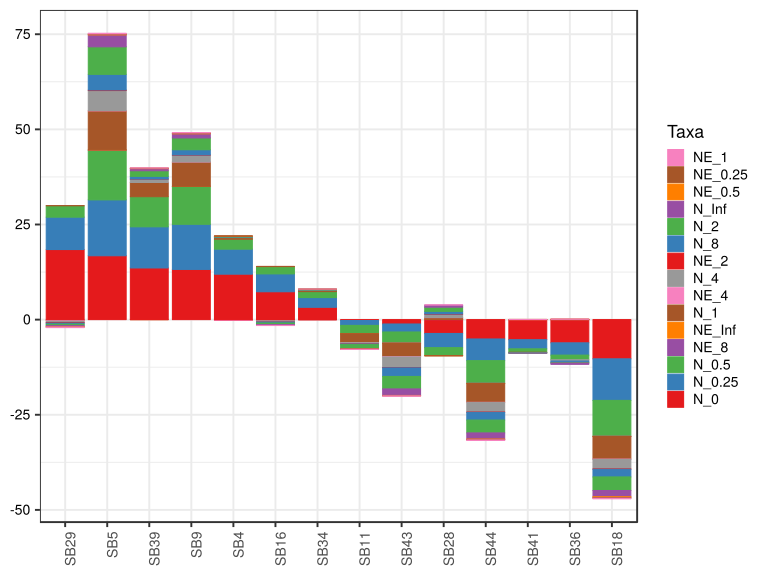

\(1.4.1.3.2.1.20.2.2.2.1.1.1\) [`Figure 729.`](#figure.729) Abundance difference between paired samples. Samples are paired according to attribute SubjectID, resulting in 14 pairs. When fold change or difference is computed, this is done as 'before.diet by after.diet'. Data for all pooled samples. Sorting order of features is GeneSelector paired test ranking. bar (sample mean) plot.  Image file: [`plots/3234283e39e.svg`](plots/3234283e39e.svg).
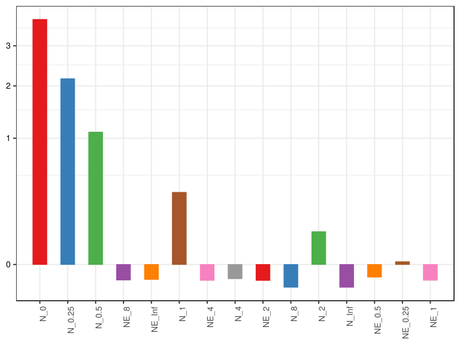

\(1.4.1.3.2.1.20.2.2.2.1.1.1\) [`Figure 730.`](#figure.730) Abundance difference between paired samples. Samples are paired according to attribute SubjectID, resulting in 14 pairs. When fold change or difference is computed, this is done as 'before.diet by after.diet'. Data for all pooled samples. Sorting order of features is GeneSelector paired test ranking. violin plot.  Image file: [`plots/323795328aa.svg`](plots/323795328aa.svg).
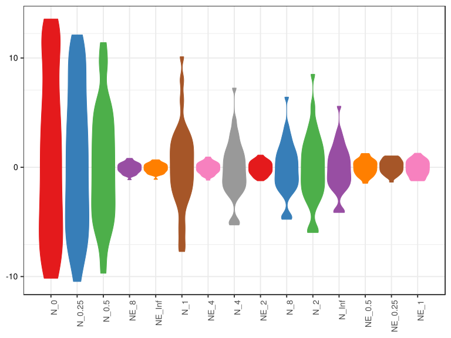

\(1.4.1.3.2.1.20.2.2.2.1.1.1\) [`Figure 731.`](#figure.731) Abundance difference between paired samples. Samples are paired according to attribute SubjectID, resulting in 14 pairs. When fold change or difference is computed, this is done as 'before.diet by after.diet'. Data for all pooled samples. Sorting order of features is GeneSelector paired test ranking. boxplot plot.  Image file: [`plots/3239553d69.svg`](plots/3239553d69.svg).
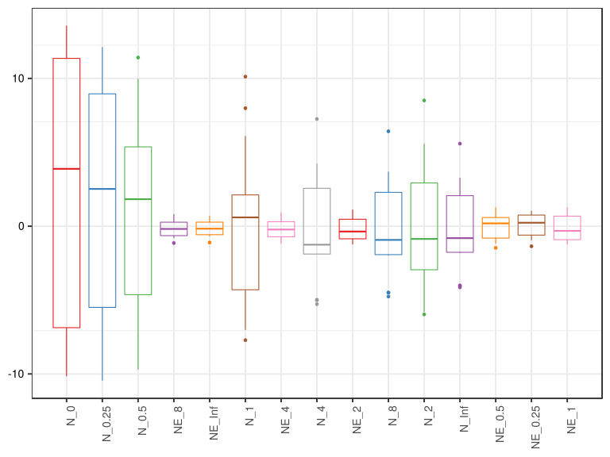

##### \(1.4.1.3.2.1.20.2.2.2.1.2\) Abundance difference between paired samples. Samples are paired according to attribute SubjectID, resulting in 14 pairs. When fold change or difference is computed, this is done as 'before.diet by after.diet'. Plot is in flipped orientation, Y axis not scaled. Iterating over plot geometry

\(1.4.1.3.2.1.20.2.2.2.1.2.1\) [`Figure 732.`](#figure.732) Abundance difference between paired samples. Samples are paired according to attribute SubjectID, resulting in 14 pairs. When fold change or difference is computed, this is done as 'before.diet by after.diet'. Data for all pooled samples. Sorting order of features is GeneSelector paired test ranking. bar (sample mean) plot.  Image file: [`plots/32373523fe4.svg`](plots/32373523fe4.svg).
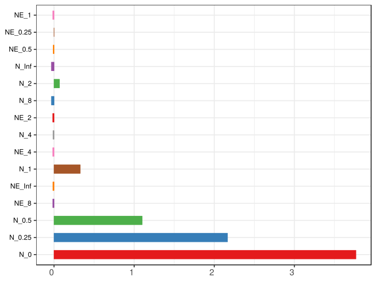

\(1.4.1.3.2.1.20.2.2.2.1.2.1\) [`Figure 733.`](#figure.733) Abundance difference between paired samples. Samples are paired according to attribute SubjectID, resulting in 14 pairs. When fold change or difference is computed, this is done as 'before.diet by after.diet'. Data for all pooled samples. Sorting order of features is GeneSelector paired test ranking. violin plot.  Image file: [`plots/32348c3a4df.svg`](plots/32348c3a4df.svg).
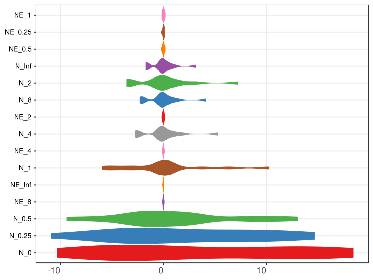

\(1.4.1.3.2.1.20.2.2.2.1.2.1\) [`Figure 734.`](#figure.734) Abundance difference between paired samples. Samples are paired according to attribute SubjectID, resulting in 14 pairs. When fold change or difference is computed, this is done as 'before.diet by after.diet'. Data for all pooled samples. Sorting order of features is GeneSelector paired test ranking. boxplot plot.  Image file: [`plots/3237549901f.svg`](plots/3237549901f.svg).
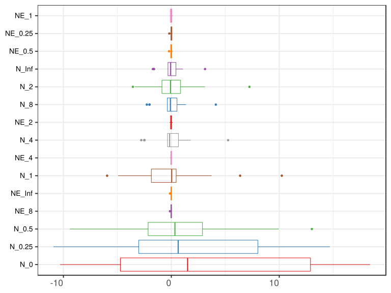

##### \(1.4.1.3.2.1.20.2.3\) Grouping variables Drug.Before.Diet

##### \(1.4.1.3.2.1.20.2.4\) Iterating over Abundance difference between paired samples. Samples are paired according to attribute SubjectID, resulting in 14 pairs. When fold change or difference is computed, this is done as 'before.diet by after.diet'. profile sorting order

##### \(1.4.1.3.2.1.20.2.4.1\) Abundance difference between paired samples. Samples are paired according to attribute SubjectID, resulting in 14 pairs. When fold change or difference is computed, this is done as 'before.diet by after.diet'. profile sorting order: GeneSelector paired test ranking

##### \(1.4.1.3.2.1.20.2.4.2\) Iterating over dodged vs faceted bars

The same data are shown in multiple combinations of graphical representations. 
                         This is the same data, but each plot highlights slightly different aspects of it.
                         It is not likely that you will need every plot - pick only what you need.

##### \(1.4.1.3.2.1.20.2.4.2.1\) faceted plots. Iterating over orientation and, optionally, scaling

##### \(1.4.1.3.2.1.20.2.4.2.1.1\) Abundance difference between paired samples. Samples are paired according to attribute SubjectID, resulting in 14 pairs. When fold change or difference is computed, this is done as 'before.diet by after.diet'. Plot is in original orientation, Y axis SQRT scaled. Iterating over plot geometry

\(1.4.1.3.2.1.20.2.4.2.1.1.0\) [`Table 238.`](#table.238) Data table used for plots. Data grouped by Drug.Before.Diet. Showing only 200 first rows. Full dataset is also saved in a delimited text file (click to download and open e.g. in Excel) [`data/1.4.1.3.2.1.20.2.4.2.1.1.0-323397980a0.1.4.1.3.2.1.20.2.4.csv`](data/1.4.1.3.2.1.20.2.4.2.1.1.0-323397980a0.1.4.1.3.2.1.20.2.4.csv)

| .record.id | Drug.Before.Diet | feature  | abundance.diff |
|:-----------|:-----------------|:---------|:---------------|
| SB11       | DrugBefore\_NO   | N\_0     | \-2.325e\-01   |
| SB16       | DrugBefore\_YES  | N\_0     | 7.322e\+00     |
| SB18       | DrugBefore\_NO   | N\_0     | \-1.031e\+01   |
| SB28       | DrugBefore\_YES  | N\_0     | \-3.630e\+00   |
| SB29       | DrugBefore\_YES  | N\_0     | 1.842e\+01     |
| SB34       | DrugBefore\_YES  | N\_0     | 3.247e\+00     |
| SB36       | DrugBefore\_YES  | N\_0     | \-6.100e\+00   |
| SB39       | DrugBefore\_YES  | N\_0     | 1.358e\+01     |
| SB4        | DrugBefore\_YES  | N\_0     | 1.195e\+01     |
| SB41       | DrugBefore\_YES  | N\_0     | \-5.275e\+00   |
| SB43       | DrugBefore\_YES  | N\_0     | \-1.152e\+00   |
| SB44       | DrugBefore\_YES  | N\_0     | \-5.082e\+00   |
| SB5        | DrugBefore\_NO   | N\_0     | 1.679e\+01     |
| SB9        | DrugBefore\_NO   | N\_0     | 1.321e\+01     |
| SB11       | DrugBefore\_NO   | N\_0.25  | \-1.283e\+00   |
| SB16       | DrugBefore\_YES  | N\_0.25  | 4.700e\+00     |
| SB18       | DrugBefore\_NO   | N\_0.25  | \-1.092e\+01   |
| SB28       | DrugBefore\_YES  | N\_0.25  | \-3.741e\+00   |
| SB29       | DrugBefore\_YES  | N\_0.25  | 8.510e\+00     |
| SB34       | DrugBefore\_YES  | N\_0.25  | 2.554e\+00     |
| SB36       | DrugBefore\_YES  | N\_0.25  | \-3.225e\+00   |
| SB39       | DrugBefore\_YES  | N\_0.25  | 1.081e\+01     |
| SB4        | DrugBefore\_YES  | N\_0.25  | 6.573e\+00     |
| SB41       | DrugBefore\_YES  | N\_0.25  | \-2.409e\+00   |
| SB43       | DrugBefore\_YES  | N\_0.25  | \-2.093e\+00   |
| SB44       | DrugBefore\_YES  | N\_0.25  | \-5.697e\+00   |
| SB5        | DrugBefore\_NO   | N\_0.25  | 1.468e\+01     |
| SB9        | DrugBefore\_NO   | N\_0.25  | 1.185e\+01     |
| SB11       | DrugBefore\_NO   | N\_0.5   | \-2.179e\+00   |
| SB16       | DrugBefore\_YES  | N\_0.5   | 1.932e\+00     |
| SB18       | DrugBefore\_NO   | N\_0.5   | \-9.405e\+00   |
| SB28       | DrugBefore\_YES  | N\_0.5   | \-2.058e\+00   |
| SB29       | DrugBefore\_YES  | N\_0.5   | 2.977e\+00     |
| SB34       | DrugBefore\_YES  | N\_0.5   | 1.568e\+00     |
| SB36       | DrugBefore\_YES  | N\_0.5   | \-1.218e\+00   |
| SB39       | DrugBefore\_YES  | N\_0.5   | 7.921e\+00     |
| SB4        | DrugBefore\_YES  | N\_0.5   | 2.604e\+00     |
| SB41       | DrugBefore\_YES  | N\_0.5   | \-8.997e\-01   |
| SB43       | DrugBefore\_YES  | N\_0.5   | \-2.896e\+00   |
| SB44       | DrugBefore\_YES  | N\_0.5   | \-5.939e\+00   |
| SB5        | DrugBefore\_NO   | N\_0.5   | 1.302e\+01     |
| SB9        | DrugBefore\_NO   | N\_0.5   | 9.958e\+00     |
| SB11       | DrugBefore\_NO   | N\_1     | \-2.381e\+00   |
| SB16       | DrugBefore\_YES  | N\_1     | \-2.646e\-01   |
| SB18       | DrugBefore\_NO   | N\_1     | \-5.951e\+00   |
| SB28       | DrugBefore\_YES  | N\_1     | 4.491e\-01     |
| SB29       | DrugBefore\_YES  | N\_1     | 6.239e\-02     |
| SB34       | DrugBefore\_YES  | N\_1     | 3.987e\-01     |
| SB36       | DrugBefore\_YES  | N\_1     | 8.197e\-03     |
| SB39       | DrugBefore\_YES  | N\_1     | 3.729e\+00     |
| SB4        | DrugBefore\_YES  | N\_1     | 4.432e\-01     |
| SB41       | DrugBefore\_YES  | N\_1     | \-1.376e\-01   |
| SB43       | DrugBefore\_YES  | N\_1     | \-3.469e\+00   |
| SB44       | DrugBefore\_YES  | N\_1     | \-4.926e\+00   |
| SB5        | DrugBefore\_NO   | N\_1     | 1.024e\+01     |
| SB9        | DrugBefore\_NO   | N\_1     | 6.375e\+00     |
| SB11       | DrugBefore\_NO   | N\_2     | \-1.020e\+00   |
| SB16       | DrugBefore\_YES  | N\_2     | \-4.206e\-01   |
| SB18       | DrugBefore\_NO   | N\_2     | \-3.564e\+00   |
| SB28       | DrugBefore\_YES  | N\_2     | 1.100e\+00     |
| SB29       | DrugBefore\_YES  | N\_2     | \-3.921e\-01   |
| SB34       | DrugBefore\_YES  | N\_2     | 8.743e\-02     |
| SB36       | DrugBefore\_YES  | N\_2     | \-1.195e\-01   |
| SB39       | DrugBefore\_YES  | N\_2     | 1.474e\+00     |
| SB4        | DrugBefore\_YES  | N\_2     | 1.226e\-01     |
| SB41       | DrugBefore\_YES  | N\_2     | \-2.933e\-02   |
| SB43       | DrugBefore\_YES  | N\_2     | \-3.274e\+00   |
| SB44       | DrugBefore\_YES  | N\_2     | \-3.375e\+00   |
| SB5        | DrugBefore\_NO   | N\_2     | 7.239e\+00     |
| SB9        | DrugBefore\_NO   | N\_2     | 3.117e\+00     |
| SB11       | DrugBefore\_NO   | N\_4     | \-3.036e\-01   |
| SB16       | DrugBefore\_YES  | N\_4     | \-2.969e\-01   |
| SB18       | DrugBefore\_NO   | N\_4     | \-2.508e\+00   |
| SB28       | DrugBefore\_YES  | N\_4     | 8.501e\-01     |
| SB29       | DrugBefore\_YES  | N\_4     | \-3.562e\-01   |
| SB34       | DrugBefore\_YES  | N\_4     | 4.989e\-02     |
| SB36       | DrugBefore\_YES  | N\_4     | \-3.522e\-01   |
| SB39       | DrugBefore\_YES  | N\_4     | 8.885e\-01     |
| SB4        | DrugBefore\_YES  | N\_4     | 7.959e\-02     |
| SB41       | DrugBefore\_YES  | N\_4     | \-1.732e\-02   |
| SB43       | DrugBefore\_YES  | N\_4     | \-2.783e\+00   |
| SB44       | DrugBefore\_YES  | N\_4     | \-2.480e\+00   |
| SB5        | DrugBefore\_NO   | N\_4     | 5.261e\+00     |
| SB9        | DrugBefore\_NO   | N\_4     | 1.790e\+00     |
| SB11       | DrugBefore\_NO   | N\_8     | \-1.581e\-01   |
| SB16       | DrugBefore\_YES  | N\_8     | \-2.425e\-01   |
| SB18       | DrugBefore\_NO   | N\_8     | \-2.026e\+00   |
| SB28       | DrugBefore\_YES  | N\_8     | 6.772e\-01     |
| SB29       | DrugBefore\_YES  | N\_8     | \-3.014e\-01   |
| SB34       | DrugBefore\_YES  | N\_8     | 4.082e\-02     |
| SB36       | DrugBefore\_YES  | N\_8     | \-3.932e\-01   |
| SB39       | DrugBefore\_YES  | N\_8     | 6.977e\-01     |
| SB4        | DrugBefore\_YES  | N\_8     | 6.763e\-02     |
| SB41       | DrugBefore\_YES  | N\_8     | \-1.443e\-02   |
| SB43       | DrugBefore\_YES  | N\_8     | \-2.271e\+00   |
| SB44       | DrugBefore\_YES  | N\_8     | \-2.017e\+00   |
| SB5        | DrugBefore\_NO   | N\_8     | 4.125e\+00     |
| SB9        | DrugBefore\_NO   | N\_8     | 1.360e\+00     |
| SB11       | DrugBefore\_NO   | N\_Inf   | \-1.186e\-01   |
| SB16       | DrugBefore\_YES  | N\_Inf   | \-2.037e\-01   |
| SB18       | DrugBefore\_NO   | N\_Inf   | \-1.622e\+00   |
| SB28       | DrugBefore\_YES  | N\_Inf   | 5.502e\-01     |
| SB29       | DrugBefore\_YES  | N\_Inf   | \-2.547e\-01   |
| SB34       | DrugBefore\_YES  | N\_Inf   | 3.449e\-02     |
| SB36       | DrugBefore\_YES  | N\_Inf   | \-3.311e\-01   |
| SB39       | DrugBefore\_YES  | N\_Inf   | 5.662e\-01     |
| SB4        | DrugBefore\_YES  | N\_Inf   | 5.879e\-02     |
| SB41       | DrugBefore\_YES  | N\_Inf   | \-1.236e\-02   |
| SB43       | DrugBefore\_YES  | N\_Inf   | \-1.711e\+00   |
| SB44       | DrugBefore\_YES  | N\_Inf   | \-1.610e\+00   |
| SB5        | DrugBefore\_NO   | N\_Inf   | 3.122e\+00     |
| SB9        | DrugBefore\_NO   | N\_Inf   | 1.075e\+00     |
| SB11       | DrugBefore\_NO   | NE\_0.25 | \-2.623e\-02   |
| SB16       | DrugBefore\_YES  | NE\_0.25 | 2.894e\-02     |
| SB18       | DrugBefore\_NO   | NE\_0.25 | \-1.847e\-01   |
| SB28       | DrugBefore\_YES  | NE\_0.25 | \-7.312e\-02   |
| SB29       | DrugBefore\_YES  | NE\_0.25 | \-1.095e\-03   |
| SB34       | DrugBefore\_YES  | NE\_0.25 | 2.566e\-02     |
| SB36       | DrugBefore\_YES  | NE\_0.25 | 8.408e\-03     |
| SB39       | DrugBefore\_YES  | NE\_0.25 | 6.593e\-02     |
| SB4        | DrugBefore\_YES  | NE\_0.25 | 8.704e\-02     |
| SB41       | DrugBefore\_YES  | NE\_0.25 | 2.416e\-03     |
| SB43       | DrugBefore\_YES  | NE\_0.25 | \-3.992e\-02   |
| SB44       | DrugBefore\_YES  | NE\_0.25 | \-9.173e\-02   |
| SB5        | DrugBefore\_NO   | NE\_0.25 | 1.083e\-01     |
| SB9        | DrugBefore\_NO   | NE\_0.25 | 9.694e\-02     |
| SB11       | DrugBefore\_NO   | NE\_0.5  | \-4.807e\-02   |
| SB16       | DrugBefore\_YES  | NE\_0.5  | 8.597e\-05     |
| SB18       | DrugBefore\_NO   | NE\_0.5  | \-2.150e\-01   |
| SB28       | DrugBefore\_YES  | NE\_0.5  | \-3.429e\-02   |
| SB29       | DrugBefore\_YES  | NE\_0.5  | \-9.274e\-02   |
| SB34       | DrugBefore\_YES  | NE\_0.5  | 2.116e\-02     |
| SB36       | DrugBefore\_YES  | NE\_0.5  | 3.591e\-02     |
| SB39       | DrugBefore\_YES  | NE\_0.5  | 7.755e\-02     |
| SB4        | DrugBefore\_YES  | NE\_0.5  | 3.061e\-02     |
| SB41       | DrugBefore\_YES  | NE\_0.5  | 7.216e\-03     |
| SB43       | DrugBefore\_YES  | NE\_0.5  | \-7.066e\-02   |
| SB44       | DrugBefore\_YES  | NE\_0.5  | \-1.396e\-01   |
| SB5        | DrugBefore\_NO   | NE\_0.5  | 1.600e\-01     |
| SB9        | DrugBefore\_NO   | NE\_0.5  | 1.277e\-01     |
| SB11       | DrugBefore\_NO   | NE\_1    | \-5.383e\-02   |
| SB16       | DrugBefore\_YES  | NE\_1    | \-3.290e\-02   |
| SB18       | DrugBefore\_NO   | NE\_1    | \-1.496e\-01   |
| SB28       | DrugBefore\_YES  | NE\_1    | 4.952e\-02     |
| SB29       | DrugBefore\_YES  | NE\_1    | \-1.528e\-01   |
| SB34       | DrugBefore\_YES  | NE\_1    | 2.315e\-03     |
| SB36       | DrugBefore\_YES  | NE\_1    | 4.723e\-02     |
| SB39       | DrugBefore\_YES  | NE\_1    | 4.343e\-02     |
| SB4        | DrugBefore\_YES  | NE\_1    | \-2.266e\-02   |
| SB41       | DrugBefore\_YES  | NE\_1    | 9.288e\-03     |
| SB43       | DrugBefore\_YES  | NE\_1    | \-9.334e\-02   |
| SB44       | DrugBefore\_YES  | NE\_1    | \-1.349e\-01   |
| SB5        | DrugBefore\_NO   | NE\_1    | 1.665e\-01     |
| SB9        | DrugBefore\_NO   | NE\_1    | 1.041e\-01     |
| SB11       | DrugBefore\_NO   | NE\_2    | \-2.311e\-02   |
| SB16       | DrugBefore\_YES  | NE\_2    | \-2.831e\-02   |
| SB18       | DrugBefore\_NO   | NE\_2    | \-8.693e\-02   |
| SB28       | DrugBefore\_YES  | NE\_2    | 6.745e\-02     |
| SB29       | DrugBefore\_YES  | NE\_2    | \-1.524e\-01   |
| SB34       | DrugBefore\_YES  | NE\_2    | \-2.898e\-03   |
| SB36       | DrugBefore\_YES  | NE\_2    | 2.524e\-02     |
| SB39       | DrugBefore\_YES  | NE\_2    | 1.225e\-02     |
| SB4        | DrugBefore\_YES  | NE\_2    | \-3.175e\-02   |
| SB41       | DrugBefore\_YES  | NE\_2    | 8.357e\-03     |
| SB43       | DrugBefore\_YES  | NE\_2    | \-9.027e\-02   |
| SB44       | DrugBefore\_YES  | NE\_2    | \-9.376e\-02   |
| SB5        | DrugBefore\_NO   | NE\_2    | 1.256e\-01     |
| SB9        | DrugBefore\_NO   | NE\_2    | 4.950e\-02     |
| SB11       | DrugBefore\_NO   | NE\_4    | \-6.757e\-03   |
| SB16       | DrugBefore\_YES  | NE\_4    | \-2.208e\-02   |
| SB18       | DrugBefore\_NO   | NE\_4    | \-5.740e\-02   |
| SB28       | DrugBefore\_YES  | NE\_4    | 5.263e\-02     |
| SB29       | DrugBefore\_YES  | NE\_4    | \-1.390e\-01   |
| SB34       | DrugBefore\_YES  | NE\_4    | \-3.263e\-03   |
| SB36       | DrugBefore\_YES  | NE\_4    | 9.770e\-03     |
| SB39       | DrugBefore\_YES  | NE\_4    | 3.036e\-03     |
| SB4        | DrugBefore\_YES  | NE\_4    | \-3.302e\-02   |
| SB41       | DrugBefore\_YES  | NE\_4    | 7.940e\-03     |
| SB43       | DrugBefore\_YES  | NE\_4    | \-7.709e\-02   |
| SB44       | DrugBefore\_YES  | NE\_4    | \-6.761e\-02   |
| SB5        | DrugBefore\_NO   | NE\_4    | 8.955e\-02     |
| SB9        | DrugBefore\_NO   | NE\_4    | 2.301e\-02     |
| SB11       | DrugBefore\_NO   | NE\_8    | \-3.437e\-03   |
| SB16       | DrugBefore\_YES  | NE\_8    | \-1.961e\-02   |
| SB18       | DrugBefore\_NO   | NE\_8    | \-4.369e\-02   |
| SB28       | DrugBefore\_YES  | NE\_8    | 4.353e\-02     |
| SB29       | DrugBefore\_YES  | NE\_8    | \-1.300e\-01   |
| SB34       | DrugBefore\_YES  | NE\_8    | \-3.326e\-03   |
| SB36       | DrugBefore\_YES  | NE\_8    | 5.863e\-03     |
| SB39       | DrugBefore\_YES  | NE\_8    | \-1.869e\-04   |
| SB4        | DrugBefore\_YES  | NE\_8    | \-3.338e\-02   |
| SB41       | DrugBefore\_YES  | NE\_8    | 7.804e\-03     |
| SB43       | DrugBefore\_YES  | NE\_8    | \-6.281e\-02   |
| SB44       | DrugBefore\_YES  | NE\_8    | \-5.388e\-02   |
| SB5        | DrugBefore\_NO   | NE\_8    | 6.746e\-02     |
| SB9        | DrugBefore\_NO   | NE\_8    | 1.414e\-02     |
| SB11       | DrugBefore\_NO   | NE\_Inf  | \-2.554e\-03   |
| SB16       | DrugBefore\_YES  | NE\_Inf  | \-1.784e\-02   |
| SB18       | DrugBefore\_NO   | NE\_Inf  | \-3.214e\-02   |
| SB28       | DrugBefore\_YES  | NE\_Inf  | 3.687e\-02     |

\(1.4.1.3.2.1.20.2.4.2.1.1.1\) [`Widget 252.`](#widget.252) Dynamic Pivot Table link (drag and drop field names and pick averaging 
                      functions or plot types; click on fields or legend elements to filter values). 
                      Starting rendering is Stacked Bar Chart. Data grouped by Drug.Before.Diet. Click to see HTML widget file in full window: [`./1.4.1.3.2.1.20.2.4.2.1.1.1-323383efb79Dynamic.Pivot.Table.html`](./1.4.1.3.2.1.20.2.4.2.1.1.1-323383efb79Dynamic.Pivot.Table.html)

\(1.4.1.3.2.1.20.2.4.2.1.1.1\) [`Widget 253.`](#widget.253) Dynamic Pivot Table link (drag and drop field names and pick averaging 
                      functions or plot types; click on fields or legend elements to filter values). 
                      Starting rendering is Table Barchart. Data grouped by Drug.Before.Diet. Click to see HTML widget file in full window: [`./1.4.1.3.2.1.20.2.4.2.1.1.1-3232bc613Dynamic.Pivot.Table.html`](./1.4.1.3.2.1.20.2.4.2.1.1.1-3232bc613Dynamic.Pivot.Table.html)

\(1.4.1.3.2.1.20.2.4.2.1.1.1\) [`Table 239.`](#table.239) Summary table. Data grouped by Drug.Before.Diet. Full dataset is also saved in a delimited text file (click to download and open e.g. in Excel) [`data/1.4.1.3.2.1.20.2.4.2.1.1.1-3233702d8b4.1.4.1.3.2.1.20.2.4.csv`](data/1.4.1.3.2.1.20.2.4.2.1.1.1-3233702d8b4.1.4.1.3.2.1.20.2.4.csv)

| feature  | Drug.Before.Diet | mean       | sd       | median     | incidence |
|:---------|:-----------------|:-----------|:---------|:-----------|:----------|
| N\_0     | DrugBefore\_NO   | 4.864375   | 12.49170 | 6.487500   | 0.5       |
| N\_0     | DrugBefore\_YES  | 3.329000   | 8.97828  | 1.047500   | 0.5       |
| N\_0.25  | DrugBefore\_NO   | 3.582188   | 11.91140 | 5.283115   | 0.5       |
| N\_0.25  | DrugBefore\_YES  | 1.598236   | 5.79834  | 0.230424   | 0.5       |
| N\_0.5   | DrugBefore\_NO   | 2.849406   | 10.48068 | 3.889194   | 0.5       |
| N\_0.5   | DrugBefore\_YES  | 0.399161   | 3.84678  | 0.334129   | 0.5       |
| NE\_8    | DrugBefore\_NO   | 0.008620   | 0.04610  | 0.005353   | 0.5       |
| NE\_8    | DrugBefore\_YES  | \-0.024595 | 0.04852  | \-0.011466 | 0.3       |
| NE\_Inf  | DrugBefore\_NO   | 0.005344   | 0.03304  | 0.002891   | 0.5       |
| NE\_Inf  | DrugBefore\_YES  | \-0.021759 | 0.04368  | \-0.010602 | 0.3       |
| N\_1     | DrugBefore\_NO   | 2.070524   | 7.51495  | 1.997180   | 0.5       |
| N\_1     | DrugBefore\_YES  | \-0.370594 | 2.34468  | 0.035294   | 0.6       |
| NE\_4    | DrugBefore\_NO   | 0.012102   | 0.06138  | 0.008128   | 0.5       |
| NE\_4    | DrugBefore\_YES  | \-0.026869 | 0.05492  | \-0.012670 | 0.4       |
| N\_4     | DrugBefore\_NO   | 1.060065   | 3.30501  | 0.743414   | 0.5       |
| N\_4     | DrugBefore\_YES  | \-0.441759 | 1.23851  | \-0.157099 | 0.4       |
| NE\_2    | DrugBefore\_NO   | 0.016271   | 0.09177  | 0.013196   | 0.5       |
| NE\_2    | DrugBefore\_YES  | \-0.028612 | 0.06600  | \-0.015603 | 0.4       |
| N\_8     | DrugBefore\_NO   | 0.825306   | 2.59960  | 0.601013   | 0.5       |
| N\_8     | DrugBefore\_YES  | \-0.375592 | 1.00389  | \-0.128455 | 0.4       |
| N\_2     | DrugBefore\_NO   | 1.442935   | 4.74462  | 1.048441   | 0.5       |
| N\_2     | DrugBefore\_YES  | \-0.482594 | 1.61696  | \-0.074434 | 0.4       |
| N\_Inf   | DrugBefore\_NO   | 0.614140   | 2.00352  | 0.478377   | 0.5       |
| N\_Inf   | DrugBefore\_YES  | \-0.291332 | 0.78284  | \-0.108014 | 0.4       |
| NE\_0.5  | DrugBefore\_NO   | 0.006162   | 0.17349  | 0.039826   | 0.5       |
| NE\_0.5  | DrugBefore\_YES  | \-0.016476 | 0.06690  | 0.003651   | 0.6       |
| NE\_0.25 | DrugBefore\_NO   | \-0.001419 | 0.13652  | 0.035357   | 0.5       |
| NE\_0.25 | DrugBefore\_YES  | 0.001253   | 0.05660  | 0.005412   | 0.6       |
| NE\_1    | DrugBefore\_NO   | 0.016806   | 0.14461  | 0.025155   | 0.5       |
| NE\_1    | DrugBefore\_YES  | \-0.028477 | 0.07483  | \-0.010171 | 0.5       |

\(1.4.1.3.2.1.20.2.4.2.1.1.1\) [`Figure 735.`](#figure.735) Abundance difference between paired samples. Samples are paired according to attribute SubjectID, resulting in 14 pairs. When fold change or difference is computed, this is done as 'before.diet by after.diet'. Data grouped by Drug.Before.Diet. Sorting order of features is GeneSelector paired test ranking. bar_stacked plot.  Image file: [`plots/323585c358e.svg`](plots/323585c358e.svg).
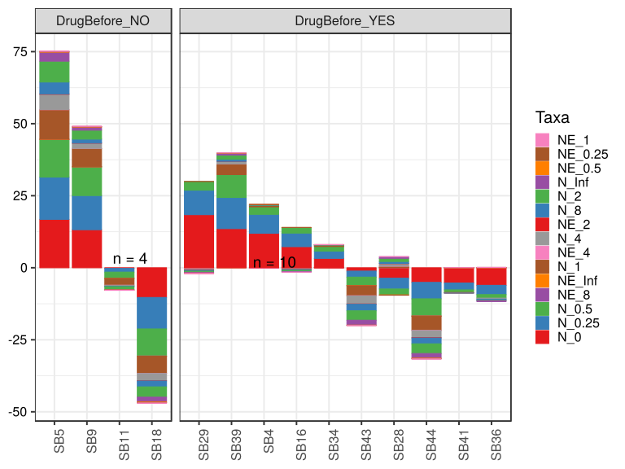

\(1.4.1.3.2.1.20.2.4.2.1.1.1\) [`Figure 736.`](#figure.736) Abundance difference between paired samples. Samples are paired according to attribute SubjectID, resulting in 14 pairs. When fold change or difference is computed, this is done as 'before.diet by after.diet'. Data grouped by Drug.Before.Diet. Sorting order of features is GeneSelector paired test ranking. bar (sample mean) plot.  Image file: [`plots/3237e345be7.svg`](plots/3237e345be7.svg).
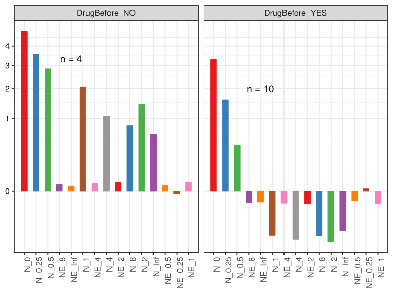

\(1.4.1.3.2.1.20.2.4.2.1.1.1\) [`Figure 737.`](#figure.737) Abundance difference between paired samples. Samples are paired according to attribute SubjectID, resulting in 14 pairs. When fold change or difference is computed, this is done as 'before.diet by after.diet'. Data grouped by Drug.Before.Diet. Sorting order of features is GeneSelector paired test ranking. violin plot.  Image file: [`plots/3237613647a.svg`](plots/3237613647a.svg).
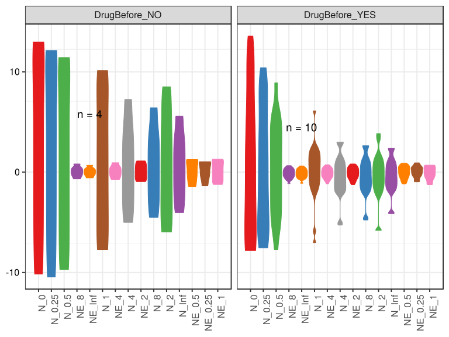

\(1.4.1.3.2.1.20.2.4.2.1.1.1\) [`Figure 738.`](#figure.738) Abundance difference between paired samples. Samples are paired according to attribute SubjectID, resulting in 14 pairs. When fold change or difference is computed, this is done as 'before.diet by after.diet'. Data grouped by Drug.Before.Diet. Sorting order of features is GeneSelector paired test ranking. boxplot plot.  Image file: [`plots/323688e7d99.svg`](plots/323688e7d99.svg).
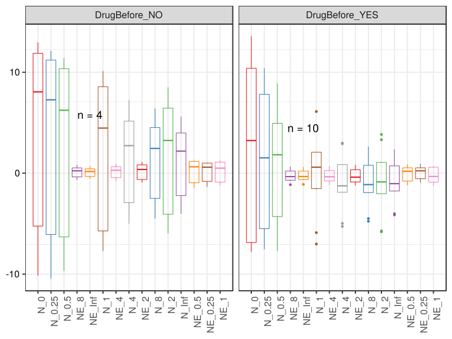

##### \(1.4.1.3.2.1.20.2.4.2.1.2\) Abundance difference between paired samples. Samples are paired according to attribute SubjectID, resulting in 14 pairs. When fold change or difference is computed, this is done as 'before.diet by after.diet'. Plot is in flipped orientation, Y axis not scaled. Iterating over plot geometry

\(1.4.1.3.2.1.20.2.4.2.1.2.1\) [`Figure 739.`](#figure.739) Abundance difference between paired samples. Samples are paired according to attribute SubjectID, resulting in 14 pairs. When fold change or difference is computed, this is done as 'before.diet by after.diet'. Data grouped by Drug.Before.Diet. Sorting order of features is GeneSelector paired test ranking. bar (sample mean) plot.  Image file: [`plots/32312214247.svg`](plots/32312214247.svg).
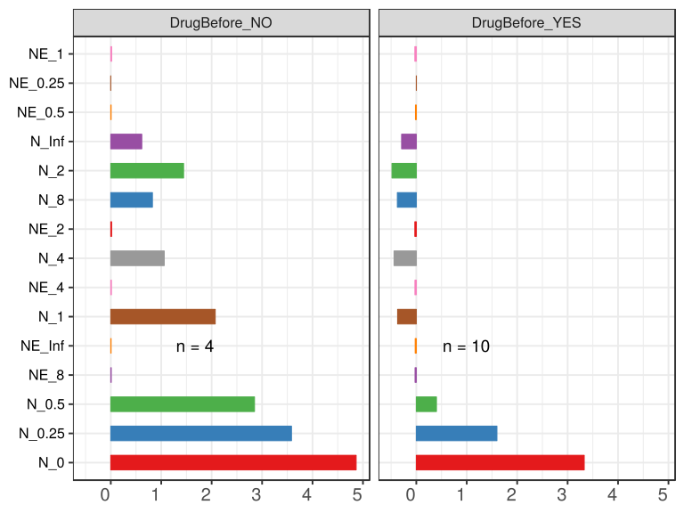

\(1.4.1.3.2.1.20.2.4.2.1.2.1\) [`Figure 740.`](#figure.740) Abundance difference between paired samples. Samples are paired according to attribute SubjectID, resulting in 14 pairs. When fold change or difference is computed, this is done as 'before.diet by after.diet'. Data grouped by Drug.Before.Diet. Sorting order of features is GeneSelector paired test ranking. violin plot.  Image file: [`plots/3232258ee37.svg`](plots/3232258ee37.svg).
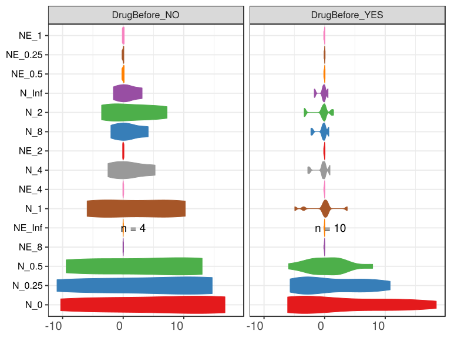

\(1.4.1.3.2.1.20.2.4.2.1.2.1\) [`Figure 741.`](#figure.741) Abundance difference between paired samples. Samples are paired according to attribute SubjectID, resulting in 14 pairs. When fold change or difference is computed, this is done as 'before.diet by after.diet'. Data grouped by Drug.Before.Diet. Sorting order of features is GeneSelector paired test ranking. boxplot plot.  Image file: [`plots/32322519d40.svg`](plots/32322519d40.svg).
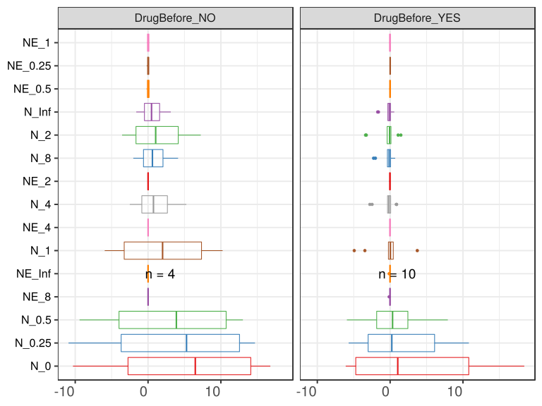

##### \(1.4.1.3.2.1.20.2.4.2.2\) dodged plots. Iterating over orientation and, optionally, scaling

##### \(1.4.1.3.2.1.20.2.4.2.2.1\) Abundance difference between paired samples. Samples are paired according to attribute SubjectID, resulting in 14 pairs. When fold change or difference is computed, this is done as 'before.diet by after.diet'. Plot is in original orientation, Y axis SQRT scaled. Iterating over plot geometry

\(1.4.1.3.2.1.20.2.4.2.2.1.1\) [`Figure 742.`](#figure.742) Abundance difference between paired samples. Samples are paired according to attribute SubjectID, resulting in 14 pairs. When fold change or difference is computed, this is done as 'before.diet by after.diet'. Data grouped by Drug.Before.Diet. Sorting order of features is GeneSelector paired test ranking. bar (sample mean) plot.  Image file: [`plots/32320642da3.svg`](plots/32320642da3.svg).
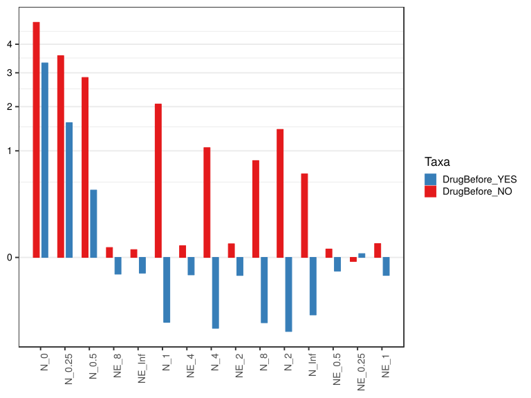

\(1.4.1.3.2.1.20.2.4.2.2.1.1\) [`Figure 743.`](#figure.743) Abundance difference between paired samples. Samples are paired according to attribute SubjectID, resulting in 14 pairs. When fold change or difference is computed, this is done as 'before.diet by after.diet'. Data grouped by Drug.Before.Diet. Sorting order of features is GeneSelector paired test ranking. violin plot.  Image file: [`plots/3231eeecd5b.svg`](plots/3231eeecd5b.svg).
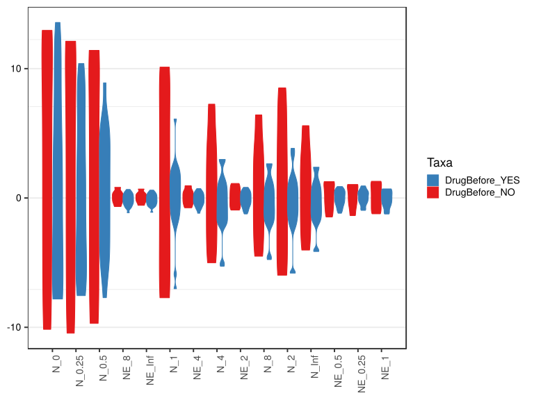

\(1.4.1.3.2.1.20.2.4.2.2.1.1\) [`Figure 744.`](#figure.744) Abundance difference between paired samples. Samples are paired according to attribute SubjectID, resulting in 14 pairs. When fold change or difference is computed, this is done as 'before.diet by after.diet'. Data grouped by Drug.Before.Diet. Sorting order of features is GeneSelector paired test ranking. boxplot plot.  Image file: [`plots/3231b88f1c4.svg`](plots/3231b88f1c4.svg).
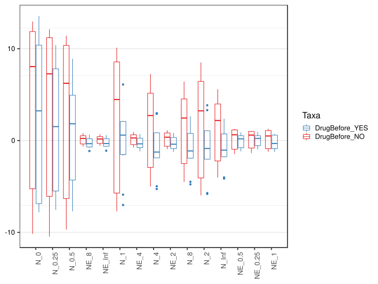

##### \(1.4.1.3.2.1.20.2.4.2.2.2\) Abundance difference between paired samples. Samples are paired according to attribute SubjectID, resulting in 14 pairs. When fold change or difference is computed, this is done as 'before.diet by after.diet'. Plot is in flipped orientation, Y axis not scaled. Iterating over plot geometry

\(1.4.1.3.2.1.20.2.4.2.2.2.1\) [`Figure 745.`](#figure.745) Abundance difference between paired samples. Samples are paired according to attribute SubjectID, resulting in 14 pairs. When fold change or difference is computed, this is done as 'before.diet by after.diet'. Data grouped by Drug.Before.Diet. Sorting order of features is GeneSelector paired test ranking. bar (sample mean) plot.  Image file: [`plots/3231c6c274.svg`](plots/3231c6c274.svg).
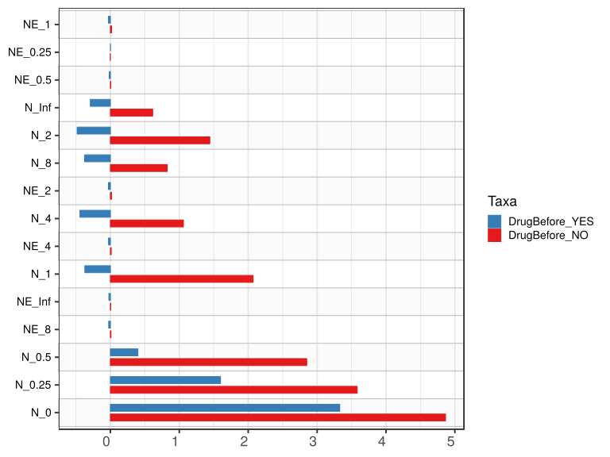

\(1.4.1.3.2.1.20.2.4.2.2.2.1\) [`Figure 746.`](#figure.746) Abundance difference between paired samples. Samples are paired according to attribute SubjectID, resulting in 14 pairs. When fold change or difference is computed, this is done as 'before.diet by after.diet'. Data grouped by Drug.Before.Diet. Sorting order of features is GeneSelector paired test ranking. violin plot.  Image file: [`plots/323342528f9.svg`](plots/323342528f9.svg).
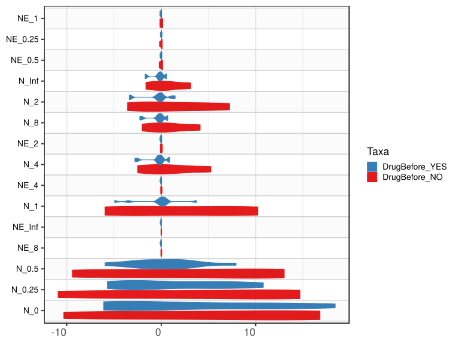

\(1.4.1.3.2.1.20.2.4.2.2.2.1\) [`Figure 747.`](#figure.747) Abundance difference between paired samples. Samples are paired according to attribute SubjectID, resulting in 14 pairs. When fold change or difference is computed, this is done as 'before.diet by after.diet'. Data grouped by Drug.Before.Diet. Sorting order of features is GeneSelector paired test ranking. boxplot plot.  Image file: [`plots/3234cf2ff40.svg`](plots/3234cf2ff40.svg).
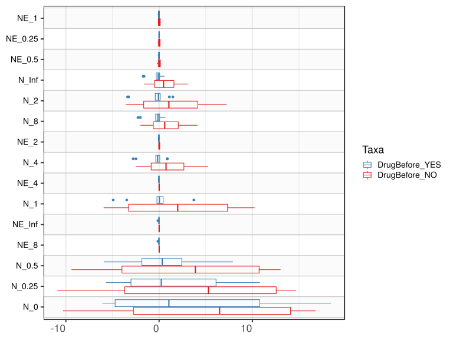