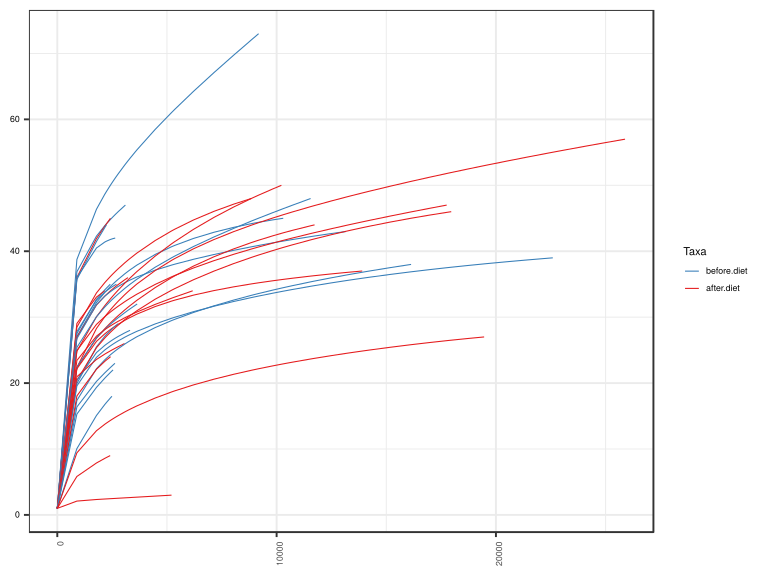
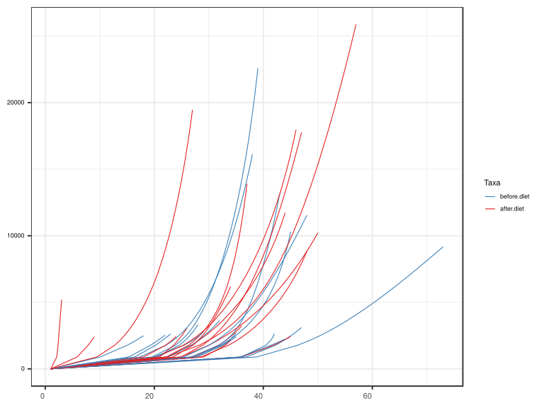
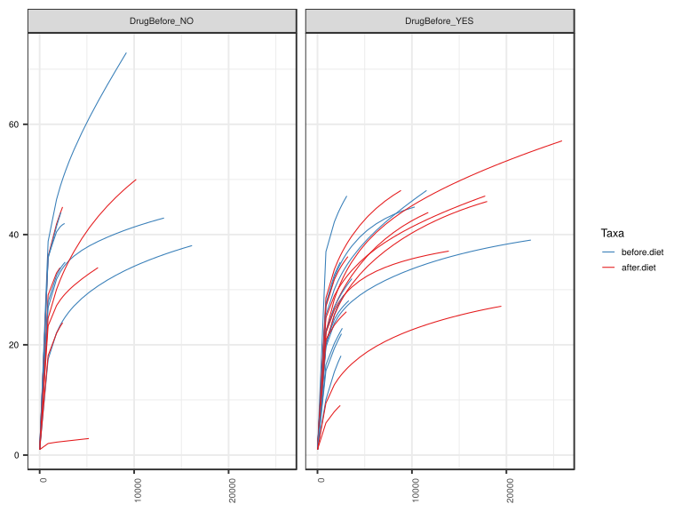
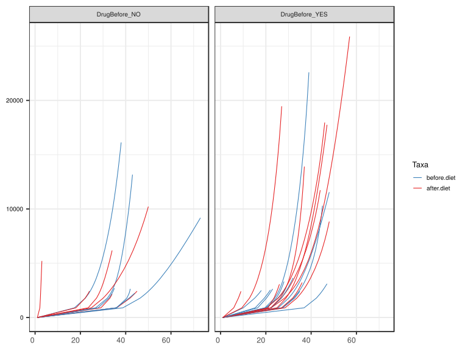

noone@mail.com
Analysis of Dieting study 16S data
% Fri Sep  7 05:46:18 2018

##### \(1.4.1.3.2.1.21.1\) Plots of Abundance-based rarefaction curves.

Plots are shown with relation to various combinations of meta 
                   data variables and in different graphical representations. Lots of plots here.

##### \(1.4.1.3.2.1.21.1.2\) Iterating over all combinations of grouping variables

##### \(1.4.1.3.2.1.21.1.2.1\) Grouping variables DietStatus

##### \(1.4.1.3.2.1.21.1.2.2\) Iterating over Abundance-based rarefaction curves. profile sorting order

##### \(1.4.1.3.2.1.21.1.2.2.1\) Abundance-based rarefaction curves. profile sorting order: original

##### \(1.4.1.3.2.1.21.1.2.2.2\) Iterating over dodged vs faceted bars

The same data are shown in multiple combinations of graphical representations. 
                         This is the same data, but each plot highlights slightly different aspects of it.
                         It is not likely that you will need every plot - pick only what you need.

##### \(1.4.1.3.2.1.21.1.2.2.2.1\) dodged plots. Iterating over orientation and, optionally, scaling

##### \(1.4.1.3.2.1.21.1.2.2.2.1.1\) Abundance-based rarefaction curves. Plot is in original orientation. Iterating over plot geometry

\(1.4.1.3.2.1.21.1.2.2.2.1.1.0\) [`Table 244.`](#table.244) Data table used for plots. Data grouped by DietStatus. Showing only 200 first rows. Full dataset is also saved in a delimited text file (click to download and open e.g. in Excel) [`data/1.4.1.3.2.1.21.1.2.2.2.1.1.0-323180ee951.1.4.1.3.2.1.21.1.2.csv`](data/1.4.1.3.2.1.21.1.2.2.2.1.1.0-323180ee951.1.4.1.3.2.1.21.1.2.csv)

| .record.id | DietStatus  | feature          | Richness |
|:-----------|:------------|:-----------------|:---------|
| SM1        | before.diet | 1                | 1.000    |
| SM11       | after.diet  | 1                | 1.000    |
| SM12       | before.diet | 1                | 1.000    |
| SM13       | before.diet | 1                | 1.000    |
| SM14       | before.diet | 1                | 1.000    |
| SM17       | before.diet | 1                | 1.000    |
| SM19       | after.diet  | 1                | 1.000    |
| SM2        | before.diet | 1                | 1.000    |
| SM23       | after.diet  | 1                | 1.000    |
| SM3        | after.diet  | 1                | 1.000    |
| SM33       | before.diet | 1                | 1.000    |
| SM38       | after.diet  | 1                | 1.000    |
| SM41       | before.diet | 1                | 1.000    |
| SM45       | after.diet  | 1                | 1.000    |
| SM49       | before.diet | 1                | 1.000    |
| SM52       | before.diet | 1                | 1.000    |
| SM53       | after.diet  | 1                | 1.000    |
| SM56       | after.diet  | 1                | 1.000    |
| SM57       | before.diet | 1                | 1.000    |
| SM58       | after.diet  | 1                | 1.000    |
| SM62       | before.diet | 1                | 1.000    |
| SM64       | after.diet  | 1                | 1.000    |
| SM77       | after.diet  | 1                | 1.000    |
| SM79       | after.diet  | 1                | 1.000    |
| SM8        | before.diet | 1                | 1.000    |
| SM83       | before.diet | 1                | 1.000    |
| SM84       | before.diet | 1                | 1.000    |
| SM86       | after.diet  | 1                | 1.000    |
| SM87       | before.diet | 1                | 1.000    |
| SM88       | after.diet  | 1                | 1.000    |
| SM9        | after.diet  | 1                | 1.000    |
| SM90       | after.diet  | 1                | 1.000    |
| SM96       | before.diet | 1                | 1.000    |
| SM1        | before.diet | 893.586206896552 | 25.410   |
| SM11       | after.diet  | 893.586206896552 | 22.370   |
| SM12       | before.diet | 893.586206896552 | 19.577   |
| SM13       | before.diet | 893.586206896552 | 35.709   |
| SM14       | before.diet | 893.586206896552 | 35.992   |
| SM17       | before.diet | 893.586206896552 | 27.505   |
| SM19       | after.diet  | 893.586206896552 | 29.053   |
| SM2        | before.diet | 893.586206896552 | 17.371   |
| SM23       | after.diet  | 893.586206896552 | 5.838    |
| SM3        | after.diet  | 893.586206896552 | 28.496   |
| SM33       | before.diet | 893.586206896552 | 15.302   |
| SM38       | after.diet  | 893.586206896552 | 9.422    |
| SM41       | before.diet | 893.586206896552 | 36.889   |
| SM45       | after.diet  | 893.586206896552 | 2.100    |
| SM49       | before.diet | 893.586206896552 | 20.410   |
| SM52       | before.diet | 893.586206896552 | 38.751   |
| SM53       | after.diet  | 893.586206896552 | 22.172   |
| SM56       | after.diet  | 893.586206896552 | 20.968   |
| SM57       | before.diet | 893.586206896552 | 19.915   |
| SM58       | after.diet  | 893.586206896552 | 23.436   |
| SM62       | before.diet | 893.586206896552 | 10.058   |
| SM64       | after.diet  | 893.586206896552 | 20.405   |
| SM77       | after.diet  | 893.586206896552 | 24.925   |
| SM79       | after.diet  | 893.586206896552 | 24.835   |
| SM8        | before.diet | 893.586206896552 | 27.804   |
| SM83       | before.diet | 893.586206896552 | 22.414   |
| SM84       | before.diet | 893.586206896552 | 27.037   |
| SM86       | after.diet  | 893.586206896552 | 26.979   |
| SM87       | before.diet | 893.586206896552 | 16.386   |
| SM88       | after.diet  | 893.586206896552 | 22.331   |
| SM9        | after.diet  | 893.586206896552 | 18.053   |
| SM90       | after.diet  | 893.586206896552 | 36.021   |
| SM96       | before.diet | 893.586206896552 | 26.744   |
| SM1        | before.diet | 1786.1724137931  | 30.069   |
| SM11       | after.diet  | 1786.1724137931  | 28.290   |
| SM12       | before.diet | 1786.1724137931  | 23.909   |
| SM13       | before.diet | 1786.1724137931  | 41.484   |
| SM14       | before.diet | 1786.1724137931  | 40.495   |
| SM17       | before.diet | 1786.1724137931  | 32.702   |
| SM19       | after.diet  | 1786.1724137931  | 33.049   |
| SM2        | before.diet | 1786.1724137931  | 22.181   |
| SM23       | after.diet  | 1786.1724137931  | 7.879    |
| SM3        | after.diet  | 1786.1724137931  | 33.677   |
| SM33       | before.diet | 1786.1724137931  | 19.348   |
| SM38       | after.diet  | 1786.1724137931  | 12.773   |
| SM41       | before.diet | 1786.1724137931  | 42.294   |
| SM45       | after.diet  | 1786.1724137931  | 2.340    |
| SM49       | before.diet | 1786.1724137931  | 24.630   |
| SM52       | before.diet | 1786.1724137931  | 46.374   |
| SM53       | after.diet  | 1786.1724137931  | 26.327   |
| SM56       | after.diet  | 1786.1724137931  | 23.585   |
| SM57       | before.diet | 1786.1724137931  | 25.495   |
| SM58       | after.diet  | 1786.1724137931  | 27.122   |
| SM62       | before.diet | 1786.1724137931  | 15.088   |
| SM64       | after.diet  | 1786.1724137931  | 25.366   |
| SM77       | after.diet  | 1786.1724137931  | 28.907   |
| SM79       | after.diet  | 1786.1724137931  | 30.058   |
| SM8        | before.diet | 1786.1724137931  | 32.599   |
| SM83       | before.diet | 1786.1724137931  | 26.862   |
| SM84       | before.diet | 1786.1724137931  | 32.229   |
| SM86       | after.diet  | 1786.1724137931  | 31.839   |
| SM87       | before.diet | 1786.1724137931  | 20.255   |
| SM88       | after.diet  | 1786.1724137931  | 26.813   |
| SM9        | after.diet  | 1786.1724137931  | 22.103   |
| SM90       | after.diet  | 1786.1724137931  | 41.925   |
| SM96       | before.diet | 1786.1724137931  | 31.914   |
| SM1        | before.diet | 2161             | 31.518   |
| SM11       | after.diet  | 2161             | 30.042   |
| SM12       | before.diet | 2161             | 25.008   |
| SM13       | before.diet | 2161             | 43.574   |
| SM14       | before.diet | 2161             | 41.386   |
| SM17       | before.diet | 2161             | 34.126   |
| SM19       | after.diet  | 2161             | 34.000   |
| SM2        | before.diet | 2161             | 23.507   |
| SM23       | after.diet  | 2161             | 8.573    |
| SM3        | after.diet  | 2161             | 35.224   |
| SM33       | before.diet | 2161             | 20.733   |
| SM38       | after.diet  | 2161             | 13.744   |
| SM41       | before.diet | 2161             | 43.855   |
| SM45       | after.diet  | 2161             | 2.414    |
| SM49       | before.diet | 2161             | 25.708   |
| SM52       | before.diet | 2161             | 48.622   |
| SM53       | after.diet  | 2161             | 27.454   |
| SM56       | after.diet  | 2161             | 24.387   |
| SM57       | before.diet | 2161             | 27.076   |
| SM58       | after.diet  | 2161             | 28.095   |
| SM62       | before.diet | 2161             | 16.733   |
| SM64       | after.diet  | 2161             | 26.821   |
| SM77       | after.diet  | 2161             | 30.062   |
| SM79       | after.diet  | 2161             | 31.722   |
| SM8        | before.diet | 2161             | 33.783   |
| SM83       | before.diet | 2161             | 28.147   |
| SM84       | before.diet | 2161             | 33.736   |
| SM86       | after.diet  | 2161             | 33.182   |
| SM87       | before.diet | 2161             | 21.535   |
| SM88       | after.diet  | 2161             | 28.228   |
| SM9        | after.diet  | 2161             | 23.283   |
| SM90       | after.diet  | 2161             | 43.781   |
| SM96       | before.diet | 2161             | 33.165   |
| SM1        | before.diet | 2240             | 31.798   |
| SM11       | after.diet  | 2240             | 30.378   |
| SM12       | before.diet | 2240             | 25.211   |
| SM13       | before.diet | 2240             | 44.000   |
| SM14       | before.diet | 2240             | 41.524   |
| SM17       | before.diet | 2240             | 34.402   |
| SM19       | after.diet  | 2240             | NA       |
| SM2        | before.diet | 2240             | 23.755   |
| SM23       | after.diet  | 2240             | 8.711    |
| SM3        | after.diet  | 2240             | 35.522   |
| SM33       | before.diet | 2240             | 21.007   |
| SM38       | after.diet  | 2240             | 13.930   |
| SM41       | before.diet | 2240             | 44.155   |
| SM45       | after.diet  | 2240             | 2.430    |
| SM49       | before.diet | 2240             | 25.908   |
| SM52       | before.diet | 2240             | 49.056   |
| SM53       | after.diet  | 2240             | 27.666   |
| SM56       | after.diet  | 2240             | 24.544   |
| SM57       | before.diet | 2240             | 27.366   |
| SM58       | after.diet  | 2240             | 28.278   |
| SM62       | before.diet | 2240             | 17.051   |
| SM64       | after.diet  | 2240             | 27.099   |
| SM77       | after.diet  | 2240             | 30.285   |
| SM79       | after.diet  | 2240             | 32.049   |
| SM8        | before.diet | 2240             | 33.994   |
| SM83       | before.diet | 2240             | 28.394   |
| SM84       | before.diet | 2240             | 34.023   |
| SM86       | after.diet  | 2240             | 33.435   |
| SM87       | before.diet | 2240             | 21.790   |
| SM88       | after.diet  | 2240             | 28.504   |
| SM9        | after.diet  | 2240             | 23.504   |
| SM90       | after.diet  | 2240             | 44.153   |
| SM96       | before.diet | 2240             | 33.390   |
| SM1        | before.diet | 2411             | 32.378   |
| SM11       | after.diet  | 2411             | 31.071   |
| SM12       | before.diet | 2411             | 25.623   |
| SM13       | before.diet | 2411             | NA       |
| SM14       | before.diet | 2411             | 41.771   |
| SM17       | before.diet | 2411             | 34.980   |
| SM19       | after.diet  | 2411             | NA       |
| SM2        | before.diet | 2411             | 24.261   |
| SM23       | after.diet  | 2411             | 9.000    |
| SM3        | after.diet  | 2411             | 36.138   |
| SM33       | before.diet | 2411             | 21.580   |
| SM38       | after.diet  | 2411             | 14.314   |
| SM41       | before.diet | 2411             | 44.778   |
| SM45       | after.diet  | 2411             | 2.463    |
| SM49       | before.diet | 2411             | 26.313   |
| SM52       | before.diet | 2411             | 49.957   |
| SM53       | after.diet  | 2411             | 28.098   |
| SM56       | after.diet  | 2411             | 24.870   |
| SM57       | before.diet | 2411             | 27.948   |
| SM58       | after.diet  | 2411             | 28.652   |
| SM62       | before.diet | 2411             | 17.707   |
| SM64       | after.diet  | 2411             | 27.673   |
| SM77       | after.diet  | 2411             | 30.749   |
| SM79       | after.diet  | 2411             | 32.735   |
| SM8        | before.diet | 2411             | 34.410   |
| SM83       | before.diet | 2411             | 28.907   |
| SM84       | before.diet | 2411             | 34.612   |
| SM86       | after.diet  | 2411             | 33.953   |
| SM87       | before.diet | 2411             | 22.331   |
| SM88       | after.diet  | 2411             | 29.082   |
| SM9        | after.diet  | 2411             | 23.950   |
| SM90       | after.diet  | 2411             | 44.941   |
| SM96       | before.diet | 2411             | 33.839   |
| SM1        | before.diet | 2417             | 32.398   |
| SM11       | after.diet  | 2417             | 31.095   |

\(1.4.1.3.2.1.21.1.2.2.2.1.1.1\) [`Widget 258.`](#widget.258) Dynamic Pivot Table link (drag and drop field names and pick averaging 
                      functions or plot types; click on fields or legend elements to filter values). 
                      Starting rendering is Stacked Bar Chart. Data grouped by DietStatus. Click to see HTML widget file in full window: [`./1.4.1.3.2.1.21.1.2.2.2.1.1.1-3236e396684Dynamic.Pivot.Table.html`](./1.4.1.3.2.1.21.1.2.2.2.1.1.1-3236e396684Dynamic.Pivot.Table.html)

\(1.4.1.3.2.1.21.1.2.2.2.1.1.1\) [`Widget 259.`](#widget.259) Dynamic Pivot Table link (drag and drop field names and pick averaging 
                      functions or plot types; click on fields or legend elements to filter values). 
                      Starting rendering is Table Barchart. Data grouped by DietStatus. Click to see HTML widget file in full window: [`./1.4.1.3.2.1.21.1.2.2.2.1.1.1-3237587828aDynamic.Pivot.Table.html`](./1.4.1.3.2.1.21.1.2.2.2.1.1.1-3237587828aDynamic.Pivot.Table.html)

\(1.4.1.3.2.1.21.1.2.2.2.1.1.1\) [`Table 245.`](#table.245) Summary table. Data grouped by DietStatus. Full dataset is also saved in a delimited text file (click to download and open e.g. in Excel) [`data/1.4.1.3.2.1.21.1.2.2.2.1.1.1-3235c97485e.1.4.1.3.2.1.21.1.2.csv`](data/1.4.1.3.2.1.21.1.2.2.2.1.1.1-3235c97485e.1.4.1.3.2.1.21.1.2.csv)

| feature          | DietStatus  | mean  | sd         | median | incidence |
|:-----------------|:------------|:------|:-----------|:-------|:----------|
| 2161             | after.diet  | 26.31 | 1.037e\+01 | 28.16  | 1         |
| 2161             | before.diet | 31.31 | 9.056e\+00 | 31.52  | 1         |
| 1786.1724137931  | after.diet  | 25.13 | 1.000e\+01 | 26.97  | 1         |
| 1786.1724137931  | before.diet | 29.88 | 8.915e\+00 | 30.07  | 1         |
| 893.586206896552 | after.diet  | 21.09 | 8.769e\+00 | 22.35  | 1         |
| 893.586206896552 | before.diet | 24.90 | 8.367e\+00 | 25.41  | 1         |
| 1                | after.diet  | 1.00  | 2.047e\-14 | 1.00   | 1         |
| 1                | before.diet | 1.00  | 1.698e\-14 | 1.00   | 1         |
| 2240             | after.diet  | 26.03 | 1.060e\+01 | 28.28  | 1         |
| 2240             | before.diet | 31.58 | 9.084e\+00 | 31.80  | 1         |
| 2411             | after.diet  | 26.51 | 1.077e\+01 | 28.65  | 1         |
| 2411             | before.diet | 31.34 | 8.811e\+00 | 30.64  | 1         |
| 2417             | after.diet  | 27.78 | 9.985e\+00 | 28.88  | 1         |
| 2417             | before.diet | 31.36 | 8.812e\+00 | 30.66  | 1         |
| 2424             | after.diet  | 27.80 | 9.992e\+00 | 28.90  | 1         |
| 2424             | before.diet | 31.13 | 9.067e\+00 | 28.94  | 1         |
| 2431             | after.diet  | 26.50 | 9.039e\+00 | 28.69  | 1         |
| 2431             | before.diet | 31.15 | 9.068e\+00 | 28.96  | 1         |
| 2491             | after.diet  | 26.86 | 9.461e\+00 | 29.08  | 1         |
| 2491             | before.diet | 31.33 | 9.077e\+00 | 29.14  | 1         |
| 2542             | after.diet  | 26.99 | 9.504e\+00 | 29.21  | 1         |
| 2542             | before.diet | 32.43 | 8.621e\+00 | 31.04  | 1         |
| 2628             | after.diet  | 27.21 | 9.576e\+00 | 29.43  | 1         |
| 2628             | before.diet | 33.46 | 8.441e\+00 | 33.07  | 1         |
| 2641             | after.diet  | 27.24 | 9.587e\+00 | 29.47  | 1         |
| 2641             | before.diet | 34.37 | 8.187e\+00 | 33.74  | 1         |
| 2678.75862068966 | after.diet  | 27.34 | 9.618e\+00 | 29.56  | 1         |
| 2678.75862068966 | before.diet | 33.78 | 8.233e\+00 | 33.22  | 1         |
| 2697             | after.diet  | 27.38 | 9.632e\+00 | 29.61  | 1         |
| 2697             | before.diet | 33.83 | 8.244e\+00 | 33.28  | 1         |
| 2778             | after.diet  | 27.58 | 9.697e\+00 | 29.80  | 1         |
| 2778             | before.diet | 33.93 | 8.737e\+00 | 31.72  | 1         |
| 3064             | after.diet  | 28.24 | 9.914e\+00 | 30.47  | 1         |
| 3064             | before.diet | 35.23 | 9.290e\+00 | 34.33  | 1         |
| 3105             | after.diet  | 28.53 | 1.040e\+01 | 31.18  | 1         |
| 3105             | before.diet | 35.33 | 9.319e\+00 | 34.44  | 1         |
| 3223             | after.diet  | 28.79 | 1.049e\+01 | 31.50  | 1         |
| 3223             | before.diet | 34.15 | 8.887e\+00 | 32.89  | 1         |
| 3317             | after.diet  | 28.28 | 1.084e\+01 | 31.03  | 1         |
| 3317             | before.diet | 34.37 | 8.959e\+00 | 33.13  | 1         |
| 3571.34482758621 | after.diet  | 28.80 | 1.103e\+01 | 31.63  | 1         |
| 3571.34482758621 | before.diet | 35.87 | 9.461e\+00 | 35.62  | 1         |
| 3642             | after.diet  | 28.94 | 1.108e\+01 | 31.80  | 1         |
| 3642             | before.diet | 36.02 | 9.514e\+00 | 35.79  | 1         |
| 4463.93103448276 | after.diet  | 30.43 | 1.162e\+01 | 33.61  | 1         |
| 4463.93103448276 | before.diet | 38.35 | 1.091e\+01 | 37.36  | 1         |
| 5208             | after.diet  | 31.59 | 1.204e\+01 | 35.03  | 1         |
| 5208             | before.diet | 39.65 | 1.150e\+01 | 38.45  | 1         |
| 5356.51724137931 | after.diet  | 35.01 | 7.086e\+00 | 36.27  | 1         |
| 5356.51724137931 | before.diet | 39.90 | 1.162e\+01 | 38.65  | 1         |
| 6174             | after.diet  | 36.22 | 7.318e\+00 | 37.42  | 1         |
| 6174             | before.diet | 41.15 | 1.226e\+01 | 39.70  | 1         |
| 6249.10344827586 | after.diet  | 36.60 | 7.793e\+00 | 37.66  | 1         |
| 6249.10344827586 | before.diet | 41.26 | 1.232e\+01 | 39.79  | 1         |
| 7141.68965517241 | after.diet  | 37.79 | 8.028e\+00 | 38.87  | 1         |
| 7141.68965517241 | before.diet | 42.50 | 1.302e\+01 | 40.83  | 1         |
| 8034.27586206897 | after.diet  | 38.84 | 8.242e\+00 | 39.94  | 1         |
| 8034.27586206897 | before.diet | 43.65 | 1.372e\+01 | 41.80  | 1         |
| 8839             | after.diet  | 39.70 | 8.421e\+00 | 40.81  | 1         |
| 8839             | before.diet | 44.62 | 1.436e\+01 | 42.42  | 1         |
| 8926.86206896552 | after.diet  | 38.60 | 8.365e\+00 | 40.41  | 1         |
| 8926.86206896552 | before.diet | 44.72 | 1.443e\+01 | 42.48  | 1         |
| 9179             | after.diet  | 38.85 | 8.428e\+00 | 40.65  | 1         |
| 9179             | before.diet | 45.01 | 1.463e\+01 | 42.63  | 1         |
| 9819.44827586207 | after.diet  | 39.47 | 8.584e\+00 | 41.23  | 1         |
| 9819.44827586207 | before.diet | 39.92 | 5.781e\+00 | 41.26  | 1         |
| 10218            | after.diet  | 39.83 | 8.678e\+00 | 41.58  | 1         |
| 10218            | before.diet | 40.22 | 5.822e\+00 | 41.50  | 1         |
| 10302            | after.diet  | 38.20 | 8.151e\+00 | 41.11  | 1         |
| 10302            | before.diet | 40.28 | 5.831e\+00 | 41.54  | 1         |
| 10712.0344827586 | after.diet  | 38.53 | 8.215e\+00 | 41.48  | 1         |
| 10712.0344827586 | before.diet | 39.43 | 6.097e\+00 | 38.27  | 1         |
| 11549            | after.diet  | 39.15 | 8.341e\+00 | 42.20  | 1         |
| 11549            | before.diet | 40.06 | 6.291e\+00 | 38.79  | 1         |
| 11604.6206896552 | after.diet  | 39.19 | 8.349e\+00 | 42.25  | 1         |
| 11604.6206896552 | before.diet | 37.45 | 4.166e\+00 | 35.39  | 1         |
| 11730            | after.diet  | 39.28 | 8.368e\+00 | 42.35  | 1         |
| 11730            | before.diet | 37.52 | 4.159e\+00 | 35.48  | 1         |
| 12497.2068965517 | after.diet  | 38.86 | 9.113e\+00 | 42.51  | 1         |
| 12497.2068965517 | before.diet | 37.95 | 4.118e\+00 | 35.97  | 1         |
| 13163            | after.diet  | 39.29 | 9.218e\+00 | 43.03  | 1         |
| 13163            | before.diet | 38.31 | 4.085e\+00 | 36.38  | 1         |
| 13389.7931034483 | after.diet  | 39.43 | 9.254e\+00 | 43.20  | 1         |
| 13389.7931034483 | before.diet | 36.09 | 6.088e\-01 | 36.09  | 1         |
| 13904            | after.diet  | 39.74 | 9.334e\+00 | 43.57  | 1         |
| 13904            | before.diet | 36.36 | 6.442e\-01 | 36.36  | 1         |
| 14282.3793103448 | after.diet  | 40.68 | 1.069e\+01 | 44.28  | 1         |
| 14282.3793103448 | before.diet | 36.55 | 6.699e\-01 | 36.55  | 1         |
| 15174.9655172414 | after.diet  | 41.26 | 1.082e\+01 | 44.88  | 1         |
| 15174.9655172414 | before.diet | 37.00 | 7.297e\-01 | 37.00  | 1         |
| 16067.5517241379 | after.diet  | 41.81 | 1.095e\+01 | 45.45  | 1         |
| 16067.5517241379 | before.diet | 37.41 | 7.883e\-01 | 37.41  | 1         |
| 16131            | after.diet  | 41.85 | 1.096e\+01 | 45.49  | 1         |
| 16131            | before.diet | 37.44 | 7.924e\-01 | 37.44  | 1         |
| 16960.1379310345 | after.diet  | 42.34 | 1.108e\+01 | 45.99  | 1         |
| 16960.1379310345 | before.diet | 37.21 | NA         | 37.21  | 1         |
| 17754            | after.diet  | 42.78 | 1.119e\+01 | 46.45  | 1         |
| 17754            | before.diet | 37.50 | NA         | 37.50  | 1         |
| 17852.724137931  | after.diet  | 41.43 | 1.329e\+01 | 45.95  | 1         |
| 17852.724137931  | before.diet | 37.54 | NA         | 37.54  | 1         |
| 17962            | after.diet  | 41.48 | 1.330e\+01 | 46.00  | 1         |
| 17962            | before.diet | 37.57 | NA         | 37.57  | 1         |
| 18745.3103448276 | after.diet  | 39.63 | 1.819e\+01 | 39.63  | 1         |
| 18745.3103448276 | before.diet | 37.85 | NA         | 37.85  | 1         |
| 19462            | after.diet  | 39.99 | 1.837e\+01 | 39.99  | 1         |
| 19462            | before.diet | 38.08 | NA         | 38.08  | 1         |
| 19637.8965517241 | after.diet  | 53.10 | NA         | 53.10  | 1         |
| 19637.8965517241 | before.diet | 38.14 | NA         | 38.14  | 1         |
| 20530.4827586207 | after.diet  | 53.70 | NA         | 53.70  | 1         |
| 20530.4827586207 | before.diet | 38.42 | NA         | 38.42  | 1         |
| 21423.0689655172 | after.diet  | 54.28 | NA         | 54.28  | 1         |
| 21423.0689655172 | before.diet | 38.68 | NA         | 38.68  | 1         |
| 22315.6551724138 | after.diet  | 54.85 | NA         | 54.85  | 1         |
| 22315.6551724138 | before.diet | 38.93 | NA         | 38.93  | 1         |
| 22592            | after.diet  | 55.02 | NA         | 55.02  | 1         |
| 22592            | before.diet | 39.00 | NA         | 39.00  | 1         |
| 23208.2413793103 | after.diet  | 55.40 | NA         | 55.40  | 1         |
| 23208.2413793103 | before.diet | NaN   | NA         | NA     | NaN       |
| 24100.8275862069 | after.diet  | 55.95 | NA         | 55.95  | 1         |
| 24100.8275862069 | before.diet | NaN   | NA         | NA     | NaN       |
| 24993.4137931034 | after.diet  | 56.48 | NA         | 56.48  | 1         |
| 24993.4137931034 | before.diet | NaN   | NA         | NA     | NaN       |
| 25886            | after.diet  | 57.00 | NA         | 57.00  | 1         |
| 25886            | before.diet | NaN   | NA         | NA     | NaN       |

\(1.4.1.3.2.1.21.1.2.2.2.1.1.1\) [`Figure 768.`](#figure.768) Abundance-based rarefaction curves. Data grouped by DietStatus.  line_obs plot.  Image file: [`plots/3233ae5fe11.svg`](plots/3233ae5fe11.svg).

##### \(1.4.1.3.2.1.21.1.2.2.2.1.2\) Abundance-based rarefaction curves. Plot is in flipped orientation, Y axis not scaled. Iterating over plot geometry

\(1.4.1.3.2.1.21.1.2.2.2.1.2.1\) [`Figure 769.`](#figure.769) Abundance-based rarefaction curves. Data grouped by DietStatus.  line_obs plot.  Image file: [`plots/32346231009.svg`](plots/32346231009.svg).

##### \(1.4.1.3.2.1.21.1.2.3\) Grouping variables DietStatus,Drug.Before.Diet

##### \(1.4.1.3.2.1.21.1.2.4\) Iterating over Abundance-based rarefaction curves. profile sorting order

##### \(1.4.1.3.2.1.21.1.2.4.1\) Abundance-based rarefaction curves. profile sorting order: original

##### \(1.4.1.3.2.1.21.1.2.4.2\) Iterating over dodged vs faceted bars

The same data are shown in multiple combinations of graphical representations. 
                         This is the same data, but each plot highlights slightly different aspects of it.
                         It is not likely that you will need every plot - pick only what you need.

##### \(1.4.1.3.2.1.21.1.2.4.2.1\) dodged plots. Iterating over orientation and, optionally, scaling

##### \(1.4.1.3.2.1.21.1.2.4.2.1.1\) Abundance-based rarefaction curves. Plot is in original orientation. Iterating over plot geometry

\(1.4.1.3.2.1.21.1.2.4.2.1.1.0\) [`Table 246.`](#table.246) Data table used for plots. Data grouped by DietStatus,Drug.Before.Diet. Showing only 200 first rows. Full dataset is also saved in a delimited text file (click to download and open e.g. in Excel) [`data/1.4.1.3.2.1.21.1.2.4.2.1.1.0-3237e28f8c3.1.4.1.3.2.1.21.1.2.csv`](data/1.4.1.3.2.1.21.1.2.4.2.1.1.0-3237e28f8c3.1.4.1.3.2.1.21.1.2.csv)

| .record.id | DietStatus  | Drug.Before.Diet | feature          | Richness |
|:-----------|:------------|:-----------------|:-----------------|:---------|
| SM1        | before.diet | DrugBefore\_YES  | 1                | 1.000    |
| SM11       | after.diet  | DrugBefore\_YES  | 1                | 1.000    |
| SM12       | before.diet | DrugBefore\_YES  | 1                | 1.000    |
| SM13       | before.diet | DrugBefore\_NO   | 1                | 1.000    |
| SM14       | before.diet | DrugBefore\_NO   | 1                | 1.000    |
| SM17       | before.diet | DrugBefore\_YES  | 1                | 1.000    |
| SM19       | after.diet  | DrugBefore\_NO   | 1                | 1.000    |
| SM2        | before.diet | DrugBefore\_NO   | 1                | 1.000    |
| SM23       | after.diet  | DrugBefore\_YES  | 1                | 1.000    |
| SM3        | after.diet  | DrugBefore\_YES  | 1                | 1.000    |
| SM33       | before.diet | DrugBefore\_YES  | 1                | 1.000    |
| SM38       | after.diet  | DrugBefore\_YES  | 1                | 1.000    |
| SM41       | before.diet | DrugBefore\_YES  | 1                | 1.000    |
| SM45       | after.diet  | DrugBefore\_NO   | 1                | 1.000    |
| SM49       | before.diet | DrugBefore\_YES  | 1                | 1.000    |
| SM52       | before.diet | DrugBefore\_NO   | 1                | 1.000    |
| SM53       | after.diet  | DrugBefore\_YES  | 1                | 1.000    |
| SM56       | after.diet  | DrugBefore\_YES  | 1                | 1.000    |
| SM57       | before.diet | DrugBefore\_YES  | 1                | 1.000    |
| SM58       | after.diet  | DrugBefore\_NO   | 1                | 1.000    |
| SM62       | before.diet | DrugBefore\_YES  | 1                | 1.000    |
| SM64       | after.diet  | DrugBefore\_YES  | 1                | 1.000    |
| SM77       | after.diet  | DrugBefore\_YES  | 1                | 1.000    |
| SM79       | after.diet  | DrugBefore\_NO   | 1                | 1.000    |
| SM8        | before.diet | DrugBefore\_NO   | 1                | 1.000    |
| SM83       | before.diet | DrugBefore\_YES  | 1                | 1.000    |
| SM84       | before.diet | DrugBefore\_YES  | 1                | 1.000    |
| SM86       | after.diet  | DrugBefore\_YES  | 1                | 1.000    |
| SM87       | before.diet | DrugBefore\_YES  | 1                | 1.000    |
| SM88       | after.diet  | DrugBefore\_YES  | 1                | 1.000    |
| SM9        | after.diet  | DrugBefore\_NO   | 1                | 1.000    |
| SM90       | after.diet  | DrugBefore\_NO   | 1                | 1.000    |
| SM96       | before.diet | DrugBefore\_NO   | 1                | 1.000    |
| SM1        | before.diet | DrugBefore\_YES  | 893.586206896552 | 25.410   |
| SM11       | after.diet  | DrugBefore\_YES  | 893.586206896552 | 22.370   |
| SM12       | before.diet | DrugBefore\_YES  | 893.586206896552 | 19.577   |
| SM13       | before.diet | DrugBefore\_NO   | 893.586206896552 | 35.709   |
| SM14       | before.diet | DrugBefore\_NO   | 893.586206896552 | 35.992   |
| SM17       | before.diet | DrugBefore\_YES  | 893.586206896552 | 27.505   |
| SM19       | after.diet  | DrugBefore\_NO   | 893.586206896552 | 29.053   |
| SM2        | before.diet | DrugBefore\_NO   | 893.586206896552 | 17.371   |
| SM23       | after.diet  | DrugBefore\_YES  | 893.586206896552 | 5.838    |
| SM3        | after.diet  | DrugBefore\_YES  | 893.586206896552 | 28.496   |
| SM33       | before.diet | DrugBefore\_YES  | 893.586206896552 | 15.302   |
| SM38       | after.diet  | DrugBefore\_YES  | 893.586206896552 | 9.422    |
| SM41       | before.diet | DrugBefore\_YES  | 893.586206896552 | 36.889   |
| SM45       | after.diet  | DrugBefore\_NO   | 893.586206896552 | 2.100    |
| SM49       | before.diet | DrugBefore\_YES  | 893.586206896552 | 20.410   |
| SM52       | before.diet | DrugBefore\_NO   | 893.586206896552 | 38.751   |
| SM53       | after.diet  | DrugBefore\_YES  | 893.586206896552 | 22.172   |
| SM56       | after.diet  | DrugBefore\_YES  | 893.586206896552 | 20.968   |
| SM57       | before.diet | DrugBefore\_YES  | 893.586206896552 | 19.915   |
| SM58       | after.diet  | DrugBefore\_NO   | 893.586206896552 | 23.436   |
| SM62       | before.diet | DrugBefore\_YES  | 893.586206896552 | 10.058   |
| SM64       | after.diet  | DrugBefore\_YES  | 893.586206896552 | 20.405   |
| SM77       | after.diet  | DrugBefore\_YES  | 893.586206896552 | 24.925   |
| SM79       | after.diet  | DrugBefore\_NO   | 893.586206896552 | 24.835   |
| SM8        | before.diet | DrugBefore\_NO   | 893.586206896552 | 27.804   |
| SM83       | before.diet | DrugBefore\_YES  | 893.586206896552 | 22.414   |
| SM84       | before.diet | DrugBefore\_YES  | 893.586206896552 | 27.037   |
| SM86       | after.diet  | DrugBefore\_YES  | 893.586206896552 | 26.979   |
| SM87       | before.diet | DrugBefore\_YES  | 893.586206896552 | 16.386   |
| SM88       | after.diet  | DrugBefore\_YES  | 893.586206896552 | 22.331   |
| SM9        | after.diet  | DrugBefore\_NO   | 893.586206896552 | 18.053   |
| SM90       | after.diet  | DrugBefore\_NO   | 893.586206896552 | 36.021   |
| SM96       | before.diet | DrugBefore\_NO   | 893.586206896552 | 26.744   |
| SM1        | before.diet | DrugBefore\_YES  | 1786.1724137931  | 30.069   |
| SM11       | after.diet  | DrugBefore\_YES  | 1786.1724137931  | 28.290   |
| SM12       | before.diet | DrugBefore\_YES  | 1786.1724137931  | 23.909   |
| SM13       | before.diet | DrugBefore\_NO   | 1786.1724137931  | 41.484   |
| SM14       | before.diet | DrugBefore\_NO   | 1786.1724137931  | 40.495   |
| SM17       | before.diet | DrugBefore\_YES  | 1786.1724137931  | 32.702   |
| SM19       | after.diet  | DrugBefore\_NO   | 1786.1724137931  | 33.049   |
| SM2        | before.diet | DrugBefore\_NO   | 1786.1724137931  | 22.181   |
| SM23       | after.diet  | DrugBefore\_YES  | 1786.1724137931  | 7.879    |
| SM3        | after.diet  | DrugBefore\_YES  | 1786.1724137931  | 33.677   |
| SM33       | before.diet | DrugBefore\_YES  | 1786.1724137931  | 19.348   |
| SM38       | after.diet  | DrugBefore\_YES  | 1786.1724137931  | 12.773   |
| SM41       | before.diet | DrugBefore\_YES  | 1786.1724137931  | 42.294   |
| SM45       | after.diet  | DrugBefore\_NO   | 1786.1724137931  | 2.340    |
| SM49       | before.diet | DrugBefore\_YES  | 1786.1724137931  | 24.630   |
| SM52       | before.diet | DrugBefore\_NO   | 1786.1724137931  | 46.374   |
| SM53       | after.diet  | DrugBefore\_YES  | 1786.1724137931  | 26.327   |
| SM56       | after.diet  | DrugBefore\_YES  | 1786.1724137931  | 23.585   |
| SM57       | before.diet | DrugBefore\_YES  | 1786.1724137931  | 25.495   |
| SM58       | after.diet  | DrugBefore\_NO   | 1786.1724137931  | 27.122   |
| SM62       | before.diet | DrugBefore\_YES  | 1786.1724137931  | 15.088   |
| SM64       | after.diet  | DrugBefore\_YES  | 1786.1724137931  | 25.366   |
| SM77       | after.diet  | DrugBefore\_YES  | 1786.1724137931  | 28.907   |
| SM79       | after.diet  | DrugBefore\_NO   | 1786.1724137931  | 30.058   |
| SM8        | before.diet | DrugBefore\_NO   | 1786.1724137931  | 32.599   |
| SM83       | before.diet | DrugBefore\_YES  | 1786.1724137931  | 26.862   |
| SM84       | before.diet | DrugBefore\_YES  | 1786.1724137931  | 32.229   |
| SM86       | after.diet  | DrugBefore\_YES  | 1786.1724137931  | 31.839   |
| SM87       | before.diet | DrugBefore\_YES  | 1786.1724137931  | 20.255   |
| SM88       | after.diet  | DrugBefore\_YES  | 1786.1724137931  | 26.813   |
| SM9        | after.diet  | DrugBefore\_NO   | 1786.1724137931  | 22.103   |
| SM90       | after.diet  | DrugBefore\_NO   | 1786.1724137931  | 41.925   |
| SM96       | before.diet | DrugBefore\_NO   | 1786.1724137931  | 31.914   |
| SM1        | before.diet | DrugBefore\_YES  | 2161             | 31.518   |
| SM11       | after.diet  | DrugBefore\_YES  | 2161             | 30.042   |
| SM12       | before.diet | DrugBefore\_YES  | 2161             | 25.008   |
| SM13       | before.diet | DrugBefore\_NO   | 2161             | 43.574   |
| SM14       | before.diet | DrugBefore\_NO   | 2161             | 41.386   |
| SM17       | before.diet | DrugBefore\_YES  | 2161             | 34.126   |
| SM19       | after.diet  | DrugBefore\_NO   | 2161             | 34.000   |
| SM2        | before.diet | DrugBefore\_NO   | 2161             | 23.507   |
| SM23       | after.diet  | DrugBefore\_YES  | 2161             | 8.573    |
| SM3        | after.diet  | DrugBefore\_YES  | 2161             | 35.224   |
| SM33       | before.diet | DrugBefore\_YES  | 2161             | 20.733   |
| SM38       | after.diet  | DrugBefore\_YES  | 2161             | 13.744   |
| SM41       | before.diet | DrugBefore\_YES  | 2161             | 43.855   |
| SM45       | after.diet  | DrugBefore\_NO   | 2161             | 2.414    |
| SM49       | before.diet | DrugBefore\_YES  | 2161             | 25.708   |
| SM52       | before.diet | DrugBefore\_NO   | 2161             | 48.622   |
| SM53       | after.diet  | DrugBefore\_YES  | 2161             | 27.454   |
| SM56       | after.diet  | DrugBefore\_YES  | 2161             | 24.387   |
| SM57       | before.diet | DrugBefore\_YES  | 2161             | 27.076   |
| SM58       | after.diet  | DrugBefore\_NO   | 2161             | 28.095   |
| SM62       | before.diet | DrugBefore\_YES  | 2161             | 16.733   |
| SM64       | after.diet  | DrugBefore\_YES  | 2161             | 26.821   |
| SM77       | after.diet  | DrugBefore\_YES  | 2161             | 30.062   |
| SM79       | after.diet  | DrugBefore\_NO   | 2161             | 31.722   |
| SM8        | before.diet | DrugBefore\_NO   | 2161             | 33.783   |
| SM83       | before.diet | DrugBefore\_YES  | 2161             | 28.147   |
| SM84       | before.diet | DrugBefore\_YES  | 2161             | 33.736   |
| SM86       | after.diet  | DrugBefore\_YES  | 2161             | 33.182   |
| SM87       | before.diet | DrugBefore\_YES  | 2161             | 21.535   |
| SM88       | after.diet  | DrugBefore\_YES  | 2161             | 28.228   |
| SM9        | after.diet  | DrugBefore\_NO   | 2161             | 23.283   |
| SM90       | after.diet  | DrugBefore\_NO   | 2161             | 43.781   |
| SM96       | before.diet | DrugBefore\_NO   | 2161             | 33.165   |
| SM1        | before.diet | DrugBefore\_YES  | 2240             | 31.798   |
| SM11       | after.diet  | DrugBefore\_YES  | 2240             | 30.378   |
| SM12       | before.diet | DrugBefore\_YES  | 2240             | 25.211   |
| SM13       | before.diet | DrugBefore\_NO   | 2240             | 44.000   |
| SM14       | before.diet | DrugBefore\_NO   | 2240             | 41.524   |
| SM17       | before.diet | DrugBefore\_YES  | 2240             | 34.402   |
| SM19       | after.diet  | DrugBefore\_NO   | 2240             | NA       |
| SM2        | before.diet | DrugBefore\_NO   | 2240             | 23.755   |
| SM23       | after.diet  | DrugBefore\_YES  | 2240             | 8.711    |
| SM3        | after.diet  | DrugBefore\_YES  | 2240             | 35.522   |
| SM33       | before.diet | DrugBefore\_YES  | 2240             | 21.007   |
| SM38       | after.diet  | DrugBefore\_YES  | 2240             | 13.930   |
| SM41       | before.diet | DrugBefore\_YES  | 2240             | 44.155   |
| SM45       | after.diet  | DrugBefore\_NO   | 2240             | 2.430    |
| SM49       | before.diet | DrugBefore\_YES  | 2240             | 25.908   |
| SM52       | before.diet | DrugBefore\_NO   | 2240             | 49.056   |
| SM53       | after.diet  | DrugBefore\_YES  | 2240             | 27.666   |
| SM56       | after.diet  | DrugBefore\_YES  | 2240             | 24.544   |
| SM57       | before.diet | DrugBefore\_YES  | 2240             | 27.366   |
| SM58       | after.diet  | DrugBefore\_NO   | 2240             | 28.278   |
| SM62       | before.diet | DrugBefore\_YES  | 2240             | 17.051   |
| SM64       | after.diet  | DrugBefore\_YES  | 2240             | 27.099   |
| SM77       | after.diet  | DrugBefore\_YES  | 2240             | 30.285   |
| SM79       | after.diet  | DrugBefore\_NO   | 2240             | 32.049   |
| SM8        | before.diet | DrugBefore\_NO   | 2240             | 33.994   |
| SM83       | before.diet | DrugBefore\_YES  | 2240             | 28.394   |
| SM84       | before.diet | DrugBefore\_YES  | 2240             | 34.023   |
| SM86       | after.diet  | DrugBefore\_YES  | 2240             | 33.435   |
| SM87       | before.diet | DrugBefore\_YES  | 2240             | 21.790   |
| SM88       | after.diet  | DrugBefore\_YES  | 2240             | 28.504   |
| SM9        | after.diet  | DrugBefore\_NO   | 2240             | 23.504   |
| SM90       | after.diet  | DrugBefore\_NO   | 2240             | 44.153   |
| SM96       | before.diet | DrugBefore\_NO   | 2240             | 33.390   |
| SM1        | before.diet | DrugBefore\_YES  | 2411             | 32.378   |
| SM11       | after.diet  | DrugBefore\_YES  | 2411             | 31.071   |
| SM12       | before.diet | DrugBefore\_YES  | 2411             | 25.623   |
| SM13       | before.diet | DrugBefore\_NO   | 2411             | NA       |
| SM14       | before.diet | DrugBefore\_NO   | 2411             | 41.771   |
| SM17       | before.diet | DrugBefore\_YES  | 2411             | 34.980   |
| SM19       | after.diet  | DrugBefore\_NO   | 2411             | NA       |
| SM2        | before.diet | DrugBefore\_NO   | 2411             | 24.261   |
| SM23       | after.diet  | DrugBefore\_YES  | 2411             | 9.000    |
| SM3        | after.diet  | DrugBefore\_YES  | 2411             | 36.138   |
| SM33       | before.diet | DrugBefore\_YES  | 2411             | 21.580   |
| SM38       | after.diet  | DrugBefore\_YES  | 2411             | 14.314   |
| SM41       | before.diet | DrugBefore\_YES  | 2411             | 44.778   |
| SM45       | after.diet  | DrugBefore\_NO   | 2411             | 2.463    |
| SM49       | before.diet | DrugBefore\_YES  | 2411             | 26.313   |
| SM52       | before.diet | DrugBefore\_NO   | 2411             | 49.957   |
| SM53       | after.diet  | DrugBefore\_YES  | 2411             | 28.098   |
| SM56       | after.diet  | DrugBefore\_YES  | 2411             | 24.870   |
| SM57       | before.diet | DrugBefore\_YES  | 2411             | 27.948   |
| SM58       | after.diet  | DrugBefore\_NO   | 2411             | 28.652   |
| SM62       | before.diet | DrugBefore\_YES  | 2411             | 17.707   |
| SM64       | after.diet  | DrugBefore\_YES  | 2411             | 27.673   |
| SM77       | after.diet  | DrugBefore\_YES  | 2411             | 30.749   |
| SM79       | after.diet  | DrugBefore\_NO   | 2411             | 32.735   |
| SM8        | before.diet | DrugBefore\_NO   | 2411             | 34.410   |
| SM83       | before.diet | DrugBefore\_YES  | 2411             | 28.907   |
| SM84       | before.diet | DrugBefore\_YES  | 2411             | 34.612   |
| SM86       | after.diet  | DrugBefore\_YES  | 2411             | 33.953   |
| SM87       | before.diet | DrugBefore\_YES  | 2411             | 22.331   |
| SM88       | after.diet  | DrugBefore\_YES  | 2411             | 29.082   |
| SM9        | after.diet  | DrugBefore\_NO   | 2411             | 23.950   |
| SM90       | after.diet  | DrugBefore\_NO   | 2411             | 44.941   |
| SM96       | before.diet | DrugBefore\_NO   | 2411             | 33.839   |
| SM1        | before.diet | DrugBefore\_YES  | 2417             | 32.398   |
| SM11       | after.diet  | DrugBefore\_YES  | 2417             | 31.095   |

\(1.4.1.3.2.1.21.1.2.4.2.1.1.1\) [`Widget 260.`](#widget.260) Dynamic Pivot Table link (drag and drop field names and pick averaging 
                      functions or plot types; click on fields or legend elements to filter values). 
                      Starting rendering is Stacked Bar Chart. Data grouped by DietStatus,Drug.Before.Diet. Click to see HTML widget file in full window: [`./1.4.1.3.2.1.21.1.2.4.2.1.1.1-323280a262cDynamic.Pivot.Table.html`](./1.4.1.3.2.1.21.1.2.4.2.1.1.1-323280a262cDynamic.Pivot.Table.html)

\(1.4.1.3.2.1.21.1.2.4.2.1.1.1\) [`Widget 261.`](#widget.261) Dynamic Pivot Table link (drag and drop field names and pick averaging 
                      functions or plot types; click on fields or legend elements to filter values). 
                      Starting rendering is Table Barchart. Data grouped by DietStatus,Drug.Before.Diet. Click to see HTML widget file in full window: [`./1.4.1.3.2.1.21.1.2.4.2.1.1.1-3236b010d00Dynamic.Pivot.Table.html`](./1.4.1.3.2.1.21.1.2.4.2.1.1.1-3236b010d00Dynamic.Pivot.Table.html)

\(1.4.1.3.2.1.21.1.2.4.2.1.1.1\) [`Table 247.`](#table.247) Summary table. Data grouped by DietStatus,Drug.Before.Diet. Showing only 200 first rows. Full dataset is also saved in a delimited text file (click to download and open e.g. in Excel) [`data/1.4.1.3.2.1.21.1.2.4.2.1.1.1-3232fcbd6d.1.4.1.3.2.1.21.1.2.csv`](data/1.4.1.3.2.1.21.1.2.4.2.1.1.1-3232fcbd6d.1.4.1.3.2.1.21.1.2.csv)

| feature          | DietStatus  | Drug.Before.Diet | mean  | sd         | median | incidence |
|:-----------------|:------------|:-----------------|:------|:-----------|:-------|:----------|
| 2161             | after.diet  | DrugBefore\_NO   | 27.22 | 1.394e\+01 | 29.91  | 1         |
| 2161             | after.diet  | DrugBefore\_YES  | 25.77 | 8.388e\+00 | 27.84  | 1         |
| 2161             | before.diet | DrugBefore\_NO   | 37.34 | 8.988e\+00 | 37.58  | 1         |
| 2161             | before.diet | DrugBefore\_YES  | 28.02 | 7.555e\+00 | 27.08  | 1         |
| 1786.1724137931  | after.diet  | DrugBefore\_NO   | 26.10 | 1.339e\+01 | 28.59  | 1         |
| 1786.1724137931  | after.diet  | DrugBefore\_YES  | 24.55 | 8.137e\+00 | 26.57  | 1         |
| 1786.1724137931  | before.diet | DrugBefore\_NO   | 35.84 | 8.683e\+00 | 36.55  | 1         |
| 1786.1724137931  | before.diet | DrugBefore\_YES  | 26.63 | 7.517e\+00 | 25.49  | 1         |
| 893.586206896552 | after.diet  | DrugBefore\_NO   | 22.25 | 1.156e\+01 | 24.14  | 1         |
| 893.586206896552 | after.diet  | DrugBefore\_YES  | 20.39 | 7.249e\+00 | 22.25  | 1         |
| 893.586206896552 | before.diet | DrugBefore\_NO   | 30.40 | 7.988e\+00 | 31.76  | 1         |
| 893.586206896552 | before.diet | DrugBefore\_YES  | 21.90 | 7.217e\+00 | 20.41  | 1         |
| 1                | after.diet  | DrugBefore\_NO   | 1.00  | 1.940e\-14 | 1.00   | 1         |
| 1                | after.diet  | DrugBefore\_YES  | 1.00  | 2.205e\-14 | 1.00   | 1         |
| 1                | before.diet | DrugBefore\_NO   | 1.00  | 1.803e\-14 | 1.00   | 1         |
| 1                | before.diet | DrugBefore\_YES  | 1.00  | 1.646e\-14 | 1.00   | 1         |
| 2240             | after.diet  | DrugBefore\_NO   | 26.08 | 1.527e\+01 | 28.28  | 1         |
| 2240             | after.diet  | DrugBefore\_YES  | 26.01 | 8.436e\+00 | 28.09  | 1         |
| 2240             | before.diet | DrugBefore\_NO   | 37.62 | 9.056e\+00 | 37.76  | 1         |
| 2240             | before.diet | DrugBefore\_YES  | 28.28 | 7.562e\+00 | 27.37  | 1         |
| 2411             | after.diet  | DrugBefore\_NO   | 26.55 | 1.556e\+01 | 28.65  | 1         |
| 2411             | after.diet  | DrugBefore\_YES  | 26.49 | 8.534e\+00 | 28.59  | 1         |
| 2411             | before.diet | DrugBefore\_NO   | 36.85 | 9.611e\+00 | 34.41  | 1         |
| 2411             | before.diet | DrugBefore\_YES  | 28.83 | 7.577e\+00 | 27.95  | 1         |
| 2417             | after.diet  | DrugBefore\_NO   | 26.56 | 1.556e\+01 | 28.66  | 1         |
| 2417             | after.diet  | DrugBefore\_YES  | 28.46 | 6.281e\+00 | 29.10  | 1         |
| 2417             | before.diet | DrugBefore\_NO   | 36.86 | 9.615e\+00 | 34.42  | 1         |
| 2417             | before.diet | DrugBefore\_YES  | 28.85 | 7.577e\+00 | 27.97  | 1         |
| 2424             | after.diet  | DrugBefore\_NO   | 26.58 | 1.558e\+01 | 28.68  | 1         |
| 2424             | after.diet  | DrugBefore\_YES  | 28.48 | 6.284e\+00 | 29.12  | 1         |
| 2424             | before.diet | DrugBefore\_NO   | 36.88 | 9.620e\+00 | 34.44  | 1         |
| 2424             | before.diet | DrugBefore\_YES  | 28.26 | 7.693e\+00 | 27.17  | 1         |
| 2431             | after.diet  | DrugBefore\_NO   | 21.99 | 1.351e\+01 | 26.35  | 1         |
| 2431             | after.diet  | DrugBefore\_YES  | 28.50 | 6.286e\+00 | 29.15  | 1         |
| 2431             | before.diet | DrugBefore\_NO   | 36.90 | 9.624e\+00 | 34.46  | 1         |
| 2431             | before.diet | DrugBefore\_YES  | 28.28 | 7.694e\+00 | 27.19  | 1         |
| 2491             | after.diet  | DrugBefore\_NO   | 21.45 | 1.656e\+01 | 28.82  | 1         |
| 2491             | after.diet  | DrugBefore\_YES  | 28.67 | 6.311e\+00 | 29.34  | 1         |
| 2491             | before.diet | DrugBefore\_NO   | 37.07 | 9.662e\+00 | 34.59  | 1         |
| 2491             | before.diet | DrugBefore\_YES  | 28.46 | 7.698e\+00 | 27.35  | 1         |
| 2542             | after.diet  | DrugBefore\_NO   | 21.55 | 1.665e\+01 | 28.92  | 1         |
| 2542             | after.diet  | DrugBefore\_YES  | 28.81 | 6.332e\+00 | 29.51  | 1         |
| 2542             | before.diet | DrugBefore\_NO   | 37.20 | 9.695e\+00 | 34.70  | 1         |
| 2542             | before.diet | DrugBefore\_YES  | 29.77 | 7.185e\+00 | 28.35  | 1         |
| 2628             | after.diet  | DrugBefore\_NO   | 21.72 | 1.679e\+01 | 29.09  | 1         |
| 2628             | after.diet  | DrugBefore\_YES  | 29.04 | 6.366e\+00 | 29.78  | 1         |
| 2628             | before.diet | DrugBefore\_NO   | 37.42 | 9.750e\+00 | 34.87  | 1         |
| 2628             | before.diet | DrugBefore\_YES  | 30.99 | 7.045e\+00 | 29.06  | 1         |
| 2641             | after.diet  | DrugBefore\_NO   | 21.74 | 1.681e\+01 | 29.12  | 1         |
| 2641             | after.diet  | DrugBefore\_YES  | 29.08 | 6.371e\+00 | 29.82  | 1         |
| 2641             | before.diet | DrugBefore\_NO   | 37.45 | 9.758e\+00 | 34.89  | 1         |
| 2641             | before.diet | DrugBefore\_YES  | 32.16 | 6.769e\+00 | 29.56  | 1         |
| 2678.75862068966 | after.diet  | DrugBefore\_NO   | 21.82 | 1.687e\+01 | 29.19  | 1         |
| 2678.75862068966 | after.diet  | DrugBefore\_YES  | 29.18 | 6.385e\+00 | 29.93  | 1         |
| 2678.75862068966 | before.diet | DrugBefore\_NO   | 36.42 | 1.092e\+01 | 34.71  | 1         |
| 2678.75862068966 | before.diet | DrugBefore\_YES  | 32.27 | 6.785e\+00 | 29.66  | 1         |
| 2697             | after.diet  | DrugBefore\_NO   | 21.85 | 1.690e\+01 | 29.22  | 1         |
| 2697             | after.diet  | DrugBefore\_YES  | 29.23 | 6.392e\+00 | 29.99  | 1         |
| 2697             | before.diet | DrugBefore\_NO   | 36.47 | 1.094e\+01 | 34.75  | 1         |
| 2697             | before.diet | DrugBefore\_YES  | 32.31 | 6.792e\+00 | 29.71  | 1         |
| 2778             | after.diet  | DrugBefore\_NO   | 22.01 | 1.703e\+01 | 29.38  | 1         |
| 2778             | after.diet  | DrugBefore\_YES  | 29.44 | 6.423e\+00 | 30.23  | 1         |
| 2778             | before.diet | DrugBefore\_NO   | 37.21 | 1.344e\+01 | 34.66  | 1         |
| 2778             | before.diet | DrugBefore\_YES  | 32.53 | 6.825e\+00 | 29.92  | 1         |
| 3064             | after.diet  | DrugBefore\_NO   | 22.53 | 1.746e\+01 | 29.88  | 1         |
| 3064             | after.diet  | DrugBefore\_YES  | 30.14 | 6.526e\+00 | 31.06  | 1         |
| 3064             | before.diet | DrugBefore\_NO   | 38.04 | 1.379e\+01 | 35.21  | 1         |
| 3064             | before.diet | DrugBefore\_YES  | 33.82 | 7.408e\+00 | 32.49  | 1         |
| 3105             | after.diet  | DrugBefore\_NO   | 22.60 | 1.752e\+01 | 29.95  | 1         |
| 3105             | after.diet  | DrugBefore\_YES  | 30.76 | 6.788e\+00 | 31.79  | 1         |
| 3105             | before.diet | DrugBefore\_NO   | 38.16 | 1.384e\+01 | 35.28  | 1         |
| 3105             | before.diet | DrugBefore\_YES  | 33.92 | 7.426e\+00 | 32.60  | 1         |
| 3223             | after.diet  | DrugBefore\_NO   | 22.80 | 1.769e\+01 | 30.15  | 1         |
| 3223             | after.diet  | DrugBefore\_YES  | 31.04 | 6.824e\+00 | 32.08  | 1         |
| 3223             | before.diet | DrugBefore\_NO   | 38.47 | 1.398e\+01 | 35.48  | 1         |
| 3223             | before.diet | DrugBefore\_YES  | 31.56 | 4.246e\+00 | 31.04  | 1         |
| 3317             | after.diet  | DrugBefore\_NO   | 22.96 | 1.782e\+01 | 30.30  | 1         |
| 3317             | after.diet  | DrugBefore\_YES  | 30.56 | 7.079e\+00 | 31.75  | 1         |
| 3317             | before.diet | DrugBefore\_NO   | 38.72 | 1.410e\+01 | 35.63  | 1         |
| 3317             | before.diet | DrugBefore\_YES  | 31.76 | 4.286e\+00 | 31.26  | 1         |
| 3571.34482758621 | after.diet  | DrugBefore\_NO   | 23.37 | 1.817e\+01 | 30.69  | 1         |
| 3571.34482758621 | after.diet  | DrugBefore\_YES  | 31.13 | 7.166e\+00 | 32.41  | 1         |
| 3571.34482758621 | before.diet | DrugBefore\_NO   | 39.36 | 1.440e\+01 | 36.01  | 1         |
| 3571.34482758621 | before.diet | DrugBefore\_YES  | 33.25 | 4.400e\+00 | 33.73  | 1         |
| 3642             | after.diet  | DrugBefore\_NO   | 23.48 | 1.826e\+01 | 30.80  | 1         |
| 3642             | after.diet  | DrugBefore\_YES  | 31.28 | 7.189e\+00 | 32.59  | 1         |
| 3642             | before.diet | DrugBefore\_NO   | 39.53 | 1.449e\+01 | 36.11  | 1         |
| 3642             | before.diet | DrugBefore\_YES  | 33.40 | 4.423e\+00 | 33.89  | 1         |
| 4463.93103448276 | after.diet  | DrugBefore\_NO   | 24.69 | 1.926e\+01 | 31.94  | 1         |
| 4463.93103448276 | after.diet  | DrugBefore\_YES  | 32.89 | 7.439e\+00 | 34.49  | 1         |
| 4463.93103448276 | before.diet | DrugBefore\_NO   | 41.35 | 1.547e\+01 | 37.14  | 1         |
| 4463.93103448276 | before.diet | DrugBefore\_YES  | 35.36 | 5.611e\+00 | 37.58  | 1         |
| 5208             | after.diet  | DrugBefore\_NO   | 25.66 | 2.006e\+01 | 32.87  | 1         |
| 5208             | after.diet  | DrugBefore\_YES  | 34.14 | 7.637e\+00 | 35.99  | 1         |
| 5208             | before.diet | DrugBefore\_NO   | 42.80 | 1.634e\+01 | 37.90  | 1         |
| 5208             | before.diet | DrugBefore\_YES  | 36.50 | 5.841e\+00 | 39.00  | 1         |
| 5356.51724137931 | after.diet  | DrugBefore\_NO   | 37.26 | 5.948e\+00 | 37.26  | 1         |
| 5356.51724137931 | after.diet  | DrugBefore\_YES  | 34.37 | 7.674e\+00 | 36.27  | 1         |
| 5356.51724137931 | before.diet | DrugBefore\_NO   | 43.08 | 1.651e\+01 | 38.04  | 1         |
| 5356.51724137931 | before.diet | DrugBefore\_YES  | 36.71 | 5.882e\+00 | 39.27  | 1         |
| 6174             | after.diet  | DrugBefore\_NO   | 38.62 | 6.537e\+00 | 38.62  | 1         |
| 6174             | after.diet  | DrugBefore\_YES  | 35.53 | 7.861e\+00 | 37.42  | 1         |
| 6174             | before.diet | DrugBefore\_NO   | 44.52 | 1.747e\+01 | 38.75  | 1         |
| 6174             | before.diet | DrugBefore\_YES  | 37.78 | 6.083e\+00 | 40.66  | 1         |
| 6249.10344827586 | after.diet  | DrugBefore\_NO   | 43.40 | NA         | 43.40  | 1         |
| 6249.10344827586 | after.diet  | DrugBefore\_YES  | 35.63 | 7.877e\+00 | 37.51  | 1         |
| 6249.10344827586 | before.diet | DrugBefore\_NO   | 44.65 | 1.755e\+01 | 38.81  | 1         |
| 6249.10344827586 | before.diet | DrugBefore\_YES  | 37.88 | 6.099e\+00 | 40.78  | 1         |
| 7141.68965517241 | after.diet  | DrugBefore\_NO   | 45.13 | NA         | 45.13  | 1         |
| 7141.68965517241 | after.diet  | DrugBefore\_YES  | 36.74 | 8.056e\+00 | 38.57  | 1         |
| 7141.68965517241 | before.diet | DrugBefore\_NO   | 46.11 | 1.859e\+01 | 39.50  | 1         |
| 7141.68965517241 | before.diet | DrugBefore\_YES  | 38.90 | 6.283e\+00 | 42.16  | 1         |
| 8034.27586206897 | after.diet  | DrugBefore\_NO   | 46.70 | NA         | 46.70  | 1         |
| 8034.27586206897 | after.diet  | DrugBefore\_YES  | 37.72 | 8.215e\+00 | 39.53  | 1         |
| 8034.27586206897 | before.diet | DrugBefore\_NO   | 47.48 | 1.963e\+01 | 40.14  | 1         |
| 8034.27586206897 | before.diet | DrugBefore\_YES  | 39.82 | 6.447e\+00 | 43.46  | 1         |
| 8839             | after.diet  | DrugBefore\_NO   | 47.99 | NA         | 47.99  | 1         |
| 8839             | after.diet  | DrugBefore\_YES  | 38.51 | 8.344e\+00 | 40.33  | 1         |
| 8839             | before.diet | DrugBefore\_NO   | 48.67 | 2.057e\+01 | 40.67  | 1         |
| 8839             | before.diet | DrugBefore\_YES  | 40.57 | 6.588e\+00 | 44.18  | 1         |
| 8926.86206896552 | after.diet  | DrugBefore\_NO   | 48.13 | NA         | 48.13  | 1         |
| 8926.86206896552 | after.diet  | DrugBefore\_YES  | 37.01 | 7.924e\+00 | 39.78  | 1         |
| 8926.86206896552 | before.diet | DrugBefore\_NO   | 48.79 | 2.067e\+01 | 40.72  | 1         |
| 8926.86206896552 | before.diet | DrugBefore\_YES  | 40.65 | 6.603e\+00 | 44.24  | 1         |
| 9179             | after.diet  | DrugBefore\_NO   | 48.51 | NA         | 48.51  | 1         |
| 9179             | after.diet  | DrugBefore\_YES  | 37.24 | 7.967e\+00 | 40.04  | 1         |
| 9179             | before.diet | DrugBefore\_NO   | 49.16 | 2.097e\+01 | 40.88  | 1         |
| 9179             | before.diet | DrugBefore\_YES  | 40.87 | 6.647e\+00 | 44.39  | 1         |
| 9819.44827586207 | after.diet  | DrugBefore\_NO   | 49.44 | NA         | 49.44  | 1         |
| 9819.44827586207 | after.diet  | DrugBefore\_YES  | 37.80 | 8.074e\+00 | 40.66  | 1         |
| 9819.44827586207 | before.diet | DrugBefore\_NO   | 37.68 | 5.065e\+00 | 37.68  | 1         |
| 9819.44827586207 | before.diet | DrugBefore\_YES  | 41.41 | 6.759e\+00 | 44.75  | 1         |
| 10218            | after.diet  | DrugBefore\_NO   | 50.00 | NA         | 50.00  | 1         |
| 10218            | after.diet  | DrugBefore\_YES  | 38.13 | 8.138e\+00 | 41.04  | 1         |
| 10218            | before.diet | DrugBefore\_NO   | 37.95 | 5.012e\+00 | 37.95  | 1         |
| 10218            | before.diet | DrugBefore\_YES  | 41.73 | 6.831e\+00 | 44.96  | 1         |
| 10302            | after.diet  | DrugBefore\_NO   | NaN   | NA         | NA     | NaN       |
| 10302            | after.diet  | DrugBefore\_YES  | 38.20 | 8.151e\+00 | 41.11  | 1         |
| 10302            | before.diet | DrugBefore\_NO   | 38.01 | 5.001e\+00 | 38.01  | 1         |
| 10302            | before.diet | DrugBefore\_YES  | 41.80 | 6.846e\+00 | 45.00  | 1         |
| 10712.0344827586 | after.diet  | DrugBefore\_NO   | NaN   | NA         | NA     | NaN       |
| 10712.0344827586 | after.diet  | DrugBefore\_YES  | 38.53 | 8.215e\+00 | 41.48  | 1         |
| 10712.0344827586 | before.diet | DrugBefore\_NO   | 38.27 | 4.950e\+00 | 38.27  | 1         |
| 10712.0344827586 | before.diet | DrugBefore\_YES  | 40.58 | 9.037e\+00 | 40.58  | 1         |
| 11549            | after.diet  | DrugBefore\_NO   | NaN   | NA         | NA     | NaN       |
| 11549            | after.diet  | DrugBefore\_YES  | 39.15 | 8.341e\+00 | 42.20  | 1         |
| 11549            | before.diet | DrugBefore\_NO   | 38.79 | 4.852e\+00 | 38.79  | 1         |
| 11549            | before.diet | DrugBefore\_YES  | 41.34 | 9.416e\+00 | 41.34  | 1         |
| 11604.6206896552 | after.diet  | DrugBefore\_NO   | NaN   | NA         | NA     | NaN       |
| 11604.6206896552 | after.diet  | DrugBefore\_YES  | 39.19 | 8.349e\+00 | 42.25  | 1         |
| 11604.6206896552 | before.diet | DrugBefore\_NO   | 38.82 | 4.846e\+00 | 38.82  | 1         |
| 11604.6206896552 | before.diet | DrugBefore\_YES  | 34.72 | NA         | 34.72  | 1         |
| 11730            | after.diet  | DrugBefore\_NO   | NaN   | NA         | NA     | NaN       |
| 11730            | after.diet  | DrugBefore\_YES  | 39.28 | 8.368e\+00 | 42.35  | 1         |
| 11730            | before.diet | DrugBefore\_NO   | 38.89 | 4.832e\+00 | 38.89  | 1         |
| 11730            | before.diet | DrugBefore\_YES  | 34.79 | NA         | 34.79  | 1         |
| 12497.2068965517 | after.diet  | DrugBefore\_NO   | NaN   | NA         | NA     | NaN       |
| 12497.2068965517 | after.diet  | DrugBefore\_YES  | 38.86 | 9.113e\+00 | 42.51  | 1         |
| 12497.2068965517 | before.diet | DrugBefore\_NO   | 39.33 | 4.749e\+00 | 39.33  | 1         |
| 12497.2068965517 | before.diet | DrugBefore\_YES  | 35.20 | NA         | 35.20  | 1         |
| 13163            | after.diet  | DrugBefore\_NO   | NaN   | NA         | NA     | NaN       |
| 13163            | after.diet  | DrugBefore\_YES  | 39.29 | 9.218e\+00 | 43.03  | 1         |
| 13163            | before.diet | DrugBefore\_NO   | 39.69 | 4.680e\+00 | 39.69  | 1         |
| 13163            | before.diet | DrugBefore\_YES  | 35.54 | NA         | 35.54  | 1         |
| 13389.7931034483 | after.diet  | DrugBefore\_NO   | NaN   | NA         | NA     | NaN       |
| 13389.7931034483 | after.diet  | DrugBefore\_YES  | 39.43 | 9.254e\+00 | 43.20  | 1         |
| 13389.7931034483 | before.diet | DrugBefore\_NO   | 36.52 | NA         | 36.52  | 1         |
| 13389.7931034483 | before.diet | DrugBefore\_YES  | 35.66 | NA         | 35.66  | 1         |
| 13904            | after.diet  | DrugBefore\_NO   | NaN   | NA         | NA     | NaN       |
| 13904            | after.diet  | DrugBefore\_YES  | 39.74 | 9.334e\+00 | 43.57  | 1         |
| 13904            | before.diet | DrugBefore\_NO   | 36.82 | NA         | 36.82  | 1         |
| 13904            | before.diet | DrugBefore\_YES  | 35.90 | NA         | 35.90  | 1         |
| 14282.3793103448 | after.diet  | DrugBefore\_NO   | NaN   | NA         | NA     | NaN       |
| 14282.3793103448 | after.diet  | DrugBefore\_YES  | 40.68 | 1.069e\+01 | 44.28  | 1         |
| 14282.3793103448 | before.diet | DrugBefore\_NO   | 37.03 | NA         | 37.03  | 1         |
| 14282.3793103448 | before.diet | DrugBefore\_YES  | 36.08 | NA         | 36.08  | 1         |
| 15174.9655172414 | after.diet  | DrugBefore\_NO   | NaN   | NA         | NA     | NaN       |
| 15174.9655172414 | after.diet  | DrugBefore\_YES  | 41.26 | 1.082e\+01 | 44.88  | 1         |
| 15174.9655172414 | before.diet | DrugBefore\_NO   | 37.51 | NA         | 37.51  | 1         |
| 15174.9655172414 | before.diet | DrugBefore\_YES  | 36.48 | NA         | 36.48  | 1         |
| 16067.5517241379 | after.diet  | DrugBefore\_NO   | NaN   | NA         | NA     | NaN       |
| 16067.5517241379 | after.diet  | DrugBefore\_YES  | 41.81 | 1.095e\+01 | 45.45  | 1         |
| 16067.5517241379 | before.diet | DrugBefore\_NO   | 37.97 | NA         | 37.97  | 1         |
| 16067.5517241379 | before.diet | DrugBefore\_YES  | 36.85 | NA         | 36.85  | 1         |
| 16131            | after.diet  | DrugBefore\_NO   | NaN   | NA         | NA     | NaN       |
| 16131            | after.diet  | DrugBefore\_YES  | 41.85 | 1.096e\+01 | 45.49  | 1         |
| 16131            | before.diet | DrugBefore\_NO   | 38.00 | NA         | 38.00  | 1         |
| 16131            | before.diet | DrugBefore\_YES  | 36.88 | NA         | 36.88  | 1         |
| 16960.1379310345 | after.diet  | DrugBefore\_NO   | NaN   | NA         | NA     | NaN       |
| 16960.1379310345 | after.diet  | DrugBefore\_YES  | 42.34 | 1.108e\+01 | 45.99  | 1         |
| 16960.1379310345 | before.diet | DrugBefore\_NO   | NaN   | NA         | NA     | NaN       |
| 16960.1379310345 | before.diet | DrugBefore\_YES  | 37.21 | NA         | 37.21  | 1         |
| 17754            | after.diet  | DrugBefore\_NO   | NaN   | NA         | NA     | NaN       |
| 17754            | after.diet  | DrugBefore\_YES  | 42.78 | 1.119e\+01 | 46.45  | 1         |
| 17754            | before.diet | DrugBefore\_NO   | NaN   | NA         | NA     | NaN       |
| 17754            | before.diet | DrugBefore\_YES  | 37.50 | NA         | 37.50  | 1         |
| 17852.724137931  | after.diet  | DrugBefore\_NO   | NaN   | NA         | NA     | NaN       |
| 17852.724137931  | after.diet  | DrugBefore\_YES  | 41.43 | 1.329e\+01 | 45.95  | 1         |
| 17852.724137931  | before.diet | DrugBefore\_NO   | NaN   | NA         | NA     | NaN       |
| 17852.724137931  | before.diet | DrugBefore\_YES  | 37.54 | NA         | 37.54  | 1         |

\(1.4.1.3.2.1.21.1.2.4.2.1.1.1\) [`Figure 770.`](#figure.770) Abundance-based rarefaction curves. Data grouped by DietStatus,Drug.Before.Diet.  line_obs plot.  Image file: [`plots/3235029a9e0.svg`](plots/3235029a9e0.svg).

##### \(1.4.1.3.2.1.21.1.2.4.2.1.2\) Abundance-based rarefaction curves. Plot is in flipped orientation, Y axis not scaled. Iterating over plot geometry

\(1.4.1.3.2.1.21.1.2.4.2.1.2.1\) [`Figure 771.`](#figure.771) Abundance-based rarefaction curves. Data grouped by DietStatus,Drug.Before.Diet.  line_obs plot.  Image file: [`plots/323178615bd.svg`](plots/323178615bd.svg).
