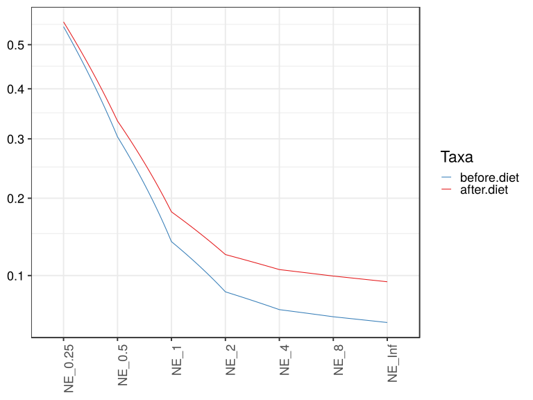
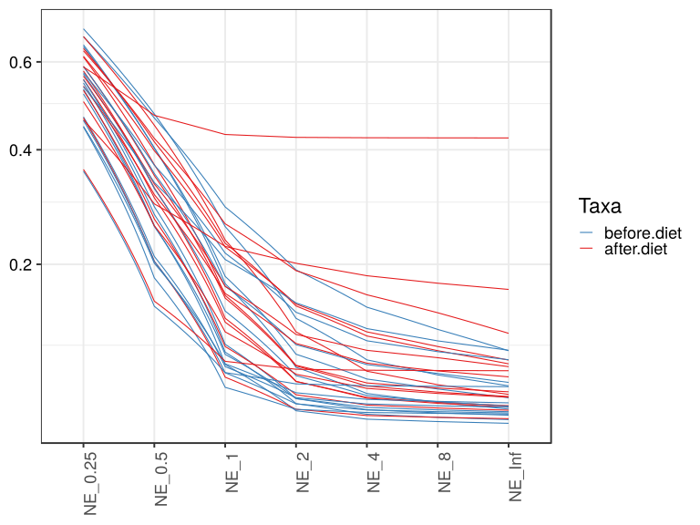
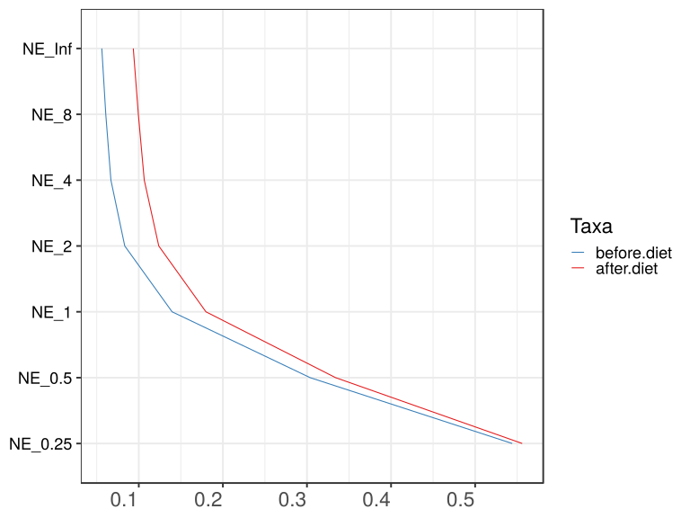
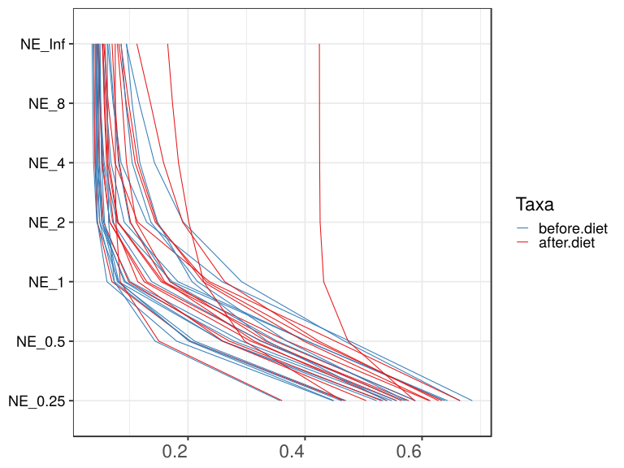
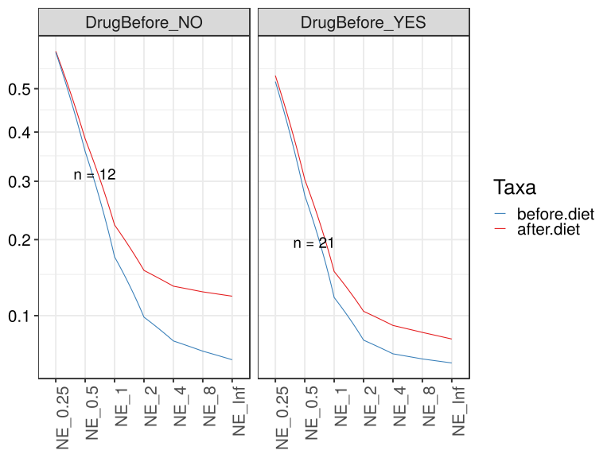
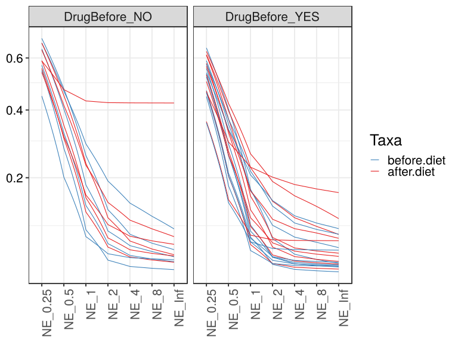
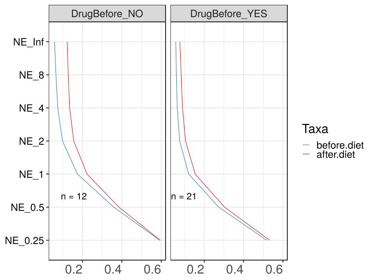
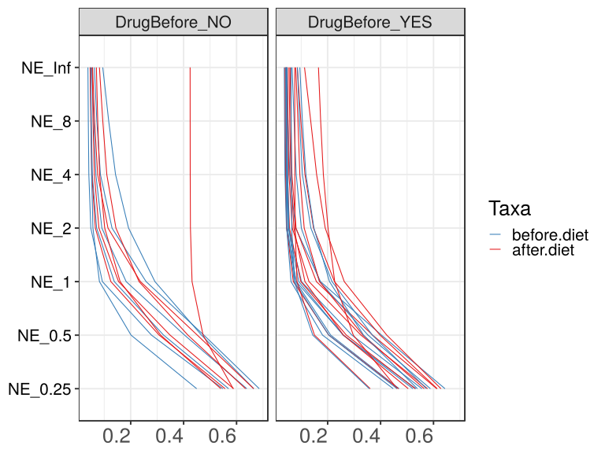

noone@mail.com
Analysis of Dieting study 16S data
% Fri Sep  7 05:46:18 2018

##### \(1.4.1.3.2.1.3\) Plots of Abundance-based evenness indices (Hill numbers / Observed 'species') With rarefication.

Plots are shown with relation to various combinations of meta 
                   data variables and in different graphical representations. Lots of plots here.

##### \(1.4.1.3.2.1.3.2\) Iterating over all combinations of grouping variables

##### \(1.4.1.3.2.1.3.2.1\) Grouping variables DietStatus

##### \(1.4.1.3.2.1.3.2.2\) Iterating over Abundance-based evenness indices (Hill numbers / Observed 'species') With rarefication. profile sorting order

##### \(1.4.1.3.2.1.3.2.2.1\) Abundance-based evenness indices (Hill numbers / Observed 'species') With rarefication. profile sorting order: original

##### \(1.4.1.3.2.1.3.2.2.2\) Iterating over dodged vs faceted bars

The same data are shown in multiple combinations of graphical representations. 
                         This is the same data, but each plot highlights slightly different aspects of it.
                         It is not likely that you will need every plot - pick only what you need.

##### \(1.4.1.3.2.1.3.2.2.2.1\) dodged plots. Iterating over orientation and, optionally, scaling

##### \(1.4.1.3.2.1.3.2.2.2.1.1\) Abundance-based evenness indices (Hill numbers / Observed 'species') With rarefication. Plot is in original orientation, Y axis SQRT scaled. Iterating over plot geometry

\(1.4.1.3.2.1.3.2.2.2.1.1.0\) [`Table 169.`](#table.169) Data table used for plots. Data grouped by DietStatus. Showing only 200 first rows. Full dataset is also saved in a delimited text file (click to download and open e.g. in Excel) [`data/1.4.1.3.2.1.3.2.2.2.1.1.0-3236961060f.1.4.1.3.2.1.3.2.2.2.csv`](data/1.4.1.3.2.1.3.2.2.2.1.1.0-3236961060f.1.4.1.3.2.1.3.2.2.2.csv)

| .record.id | DietStatus  | feature  | index   |
|:-----------|:------------|:---------|:--------|
| SM1        | before.diet | NE\_0.25 | 0.55622 |
| SM11       | after.diet  | NE\_0.25 | 0.46757 |
| SM12       | before.diet | NE\_0.25 | 0.46999 |
| SM13       | before.diet | NE\_0.25 | 0.63863 |
| SM14       | before.diet | NE\_0.25 | 0.68576 |
| SM17       | before.diet | NE\_0.25 | 0.53344 |
| SM19       | after.diet  | NE\_0.25 | 0.63397 |
| SM2        | before.diet | NE\_0.25 | 0.44928 |
| SM23       | after.diet  | NE\_0.25 | 0.46319 |
| SM3        | after.diet  | NE\_0.25 | 0.62814 |
| SM33       | before.diet | NE\_0.25 | 0.53916 |
| SM38       | after.diet  | NE\_0.25 | 0.36076 |
| SM41       | before.diet | NE\_0.25 | 0.64336 |
| SM45       | after.diet  | NE\_0.25 | 0.58735 |
| SM49       | before.diet | NE\_0.25 | 0.44780 |
| SM52       | before.diet | NE\_0.25 | 0.66490 |
| SM53       | after.diet  | NE\_0.25 | 0.56499 |
| SM56       | after.diet  | NE\_0.25 | 0.61228 |
| SM57       | before.diet | NE\_0.25 | 0.46210 |
| SM58       | after.diet  | NE\_0.25 | 0.58882 |
| SM62       | before.diet | NE\_0.25 | 0.35728 |
| SM64       | after.diet  | NE\_0.25 | 0.50450 |
| SM77       | after.diet  | NE\_0.25 | 0.57743 |
| SM79       | after.diet  | NE\_0.25 | 0.55660 |
| SM8        | before.diet | NE\_0.25 | 0.54816 |
| SM83       | before.diet | NE\_0.25 | 0.52219 |
| SM84       | before.diet | NE\_0.25 | 0.58821 |
| SM86       | after.diet  | NE\_0.25 | 0.61392 |
| SM87       | before.diet | NE\_0.25 | 0.57339 |
| SM88       | after.diet  | NE\_0.25 | 0.53056 |
| SM9        | after.diet  | NE\_0.25 | 0.54063 |
| SM90       | after.diet  | NE\_0.25 | 0.66486 |
| SM96       | before.diet | NE\_0.25 | 0.56985 |
| SM1        | before.diet | NE\_0.5  | 0.29197 |
| SM11       | after.diet  | NE\_0.5  | 0.20431 |
| SM12       | before.diet | NE\_0.5  | 0.21153 |
| SM13       | before.diet | NE\_0.5  | 0.40366 |
| SM14       | before.diet | NE\_0.5  | 0.47663 |
| SM17       | before.diet | NE\_0.5  | 0.25973 |
| SM19       | after.diet  | NE\_0.5  | 0.41635 |
| SM2        | before.diet | NE\_0.5  | 0.20135 |
| SM23       | after.diet  | NE\_0.5  | 0.29693 |
| SM3        | after.diet  | NE\_0.5  | 0.42341 |
| SM33       | before.diet | NE\_0.5  | 0.33571 |
| SM38       | after.diet  | NE\_0.5  | 0.15018 |
| SM41       | before.diet | NE\_0.5  | 0.40347 |
| SM45       | after.diet  | NE\_0.5  | 0.47351 |
| SM49       | before.diet | NE\_0.5  | 0.18080 |
| SM52       | before.diet | NE\_0.5  | 0.46765 |
| SM53       | after.diet  | NE\_0.5  | 0.33316 |
| SM56       | after.diet  | NE\_0.5  | 0.37000 |
| SM57       | before.diet | NE\_0.5  | 0.20419 |
| SM58       | after.diet  | NE\_0.5  | 0.34890 |
| SM62       | before.diet | NE\_0.5  | 0.14383 |
| SM64       | after.diet  | NE\_0.5  | 0.25964 |
| SM77       | after.diet  | NE\_0.5  | 0.32592 |
| SM79       | after.diet  | NE\_0.5  | 0.30766 |
| SM8        | before.diet | NE\_0.5  | 0.27868 |
| SM83       | before.diet | NE\_0.5  | 0.25845 |
| SM84       | before.diet | NE\_0.5  | 0.35274 |
| SM86       | after.diet  | NE\_0.5  | 0.39806 |
| SM87       | before.diet | NE\_0.5  | 0.36907 |
| SM88       | after.diet  | NE\_0.5  | 0.27081 |
| SM9        | after.diet  | NE\_0.5  | 0.31346 |
| SM90       | after.diet  | NE\_0.5  | 0.45173 |
| SM96       | before.diet | NE\_0.5  | 0.32438 |
| SM1        | before.diet | NE\_1    | 0.10097 |
| SM11       | after.diet  | NE\_1    | 0.07001 |
| SM12       | before.diet | NE\_1    | 0.07930 |
| SM13       | before.diet | NE\_1    | 0.18288 |
| SM14       | before.diet | NE\_1    | 0.25820 |
| SM17       | before.diet | NE\_1    | 0.08125 |
| SM19       | after.diet  | NE\_1    | 0.23152 |
| SM2        | before.diet | NE\_1    | 0.08190 |
| SM23       | after.diet  | NE\_1    | 0.22664 |
| SM3        | after.diet  | NE\_1    | 0.26281 |
| SM33       | before.diet | NE\_1    | 0.20699 |
| SM38       | after.diet  | NE\_1    | 0.08424 |
| SM41       | before.diet | NE\_1    | 0.17292 |
| SM45       | after.diet  | NE\_1    | 0.43187 |
| SM49       | before.diet | NE\_1    | 0.06158 |
| SM52       | before.diet | NE\_1    | 0.29156 |
| SM53       | after.diet  | NE\_1    | 0.16925 |
| SM56       | after.diet  | NE\_1    | 0.15747 |
| SM57       | before.diet | NE\_1    | 0.07383 |
| SM58       | after.diet  | NE\_1    | 0.15406 |
| SM62       | before.diet | NE\_1    | 0.07401 |
| SM64       | after.diet  | NE\_1    | 0.11415 |
| SM77       | after.diet  | NE\_1    | 0.12949 |
| SM79       | after.diet  | NE\_1    | 0.12502 |
| SM8        | before.diet | NE\_1    | 0.09307 |
| SM83       | before.diet | NE\_1    | 0.09087 |
| SM84       | before.diet | NE\_1    | 0.16946 |
| SM86       | after.diet  | NE\_1    | 0.22573 |
| SM87       | before.diet | NE\_1    | 0.21649 |
| SM88       | after.diet  | NE\_1    | 0.09866 |
| SM9        | after.diet  | NE\_1    | 0.16000 |
| SM90       | after.diet  | NE\_1    | 0.23671 |
| SM96       | before.diet | NE\_1    | 0.13804 |
| SM1        | before.diet | NE\_2    | 0.05288 |
| SM11       | after.diet  | NE\_2    | 0.04523 |
| SM12       | before.diet | NE\_2    | 0.05359 |
| SM13       | before.diet | NE\_2    | 0.09104 |
| SM14       | before.diet | NE\_2    | 0.12946 |
| SM17       | before.diet | NE\_2    | 0.04422 |
| SM19       | after.diet  | NE\_2    | 0.14424 |
| SM2        | before.diet | NE\_2    | 0.05731 |
| SM23       | after.diet  | NE\_2    | 0.20144 |
| SM3        | after.diet  | NE\_2    | 0.19086 |
| SM33       | before.diet | NE\_2    | 0.14805 |
| SM38       | after.diet  | NE\_2    | 0.07696 |
| SM41       | before.diet | NE\_2    | 0.07870 |
| SM45       | after.diet  | NE\_2    | 0.42577 |
| SM49       | before.diet | NE\_2    | 0.04521 |
| SM52       | before.diet | NE\_2    | 0.19198 |
| SM53       | after.diet  | NE\_2    | 0.11137 |
| SM56       | after.diet  | NE\_2    | 0.08060 |
| SM57       | before.diet | NE\_2    | 0.04902 |
| SM58       | after.diet  | NE\_2    | 0.07996 |
| SM62       | before.diet | NE\_2    | 0.06439 |
| SM64       | after.diet  | NE\_2    | 0.07252 |
| SM77       | after.diet  | NE\_2    | 0.06646 |
| SM79       | after.diet  | NE\_2    | 0.06635 |
| SM8        | before.diet | NE\_2    | 0.04925 |
| SM83       | before.diet | NE\_2    | 0.05287 |
| SM84       | before.diet | NE\_2    | 0.10059 |
| SM86       | after.diet  | NE\_2    | 0.14663 |
| SM87       | before.diet | NE\_2    | 0.13660 |
| SM88       | after.diet  | NE\_2    | 0.05578 |
| SM9        | after.diet  | NE\_2    | 0.10184 |
| SM90       | after.diet  | NE\_2    | 0.11415 |
| SM96       | before.diet | NE\_2    | 0.07133 |
| SM1        | before.diet | NE\_4    | 0.04492 |
| SM11       | after.diet  | NE\_4    | 0.04103 |
| SM12       | before.diet | NE\_4    | 0.04897 |
| SM13       | before.diet | NE\_4    | 0.06844 |
| SM14       | before.diet | NE\_4    | 0.08561 |
| SM17       | before.diet | NE\_4    | 0.03867 |
| SM19       | after.diet  | NE\_4    | 0.10970 |
| SM2        | before.diet | NE\_4    | 0.05230 |
| SM23       | after.diet  | NE\_4    | 0.18379 |
| SM3        | after.diet  | NE\_4    | 0.15831 |
| SM33       | before.diet | NE\_4    | 0.11778 |
| SM38       | after.diet  | NE\_4    | 0.07608 |
| SM41       | before.diet | NE\_4    | 0.05674 |
| SM45       | after.diet  | NE\_4    | 0.42496 |
| SM49       | before.diet | NE\_4    | 0.04306 |
| SM52       | before.diet | NE\_4    | 0.14275 |
| SM53       | after.diet  | NE\_4    | 0.09487 |
| SM56       | after.diet  | NE\_4    | 0.06515 |
| SM57       | before.diet | NE\_4    | 0.04479 |
| SM58       | after.diet  | NE\_4    | 0.06260 |
| SM62       | before.diet | NE\_4    | 0.06288 |
| SM64       | after.diet  | NE\_4    | 0.06075 |
| SM77       | after.diet  | NE\_4    | 0.05370 |
| SM79       | after.diet  | NE\_4    | 0.05320 |
| SM8        | before.diet | NE\_4    | 0.04187 |
| SM83       | before.diet | NE\_4    | 0.04655 |
| SM84       | before.diet | NE\_4    | 0.08122 |
| SM86       | after.diet  | NE\_4    | 0.11416 |
| SM87       | before.diet | NE\_4    | 0.10464 |
| SM88       | after.diet  | NE\_4    | 0.04818 |
| SM9        | after.diet  | NE\_4    | 0.08253 |
| SM90       | after.diet  | NE\_4    | 0.07520 |
| SM96       | before.diet | NE\_4    | 0.05515 |
| SM1        | before.diet | NE\_8    | 0.04278 |
| SM11       | after.diet  | NE\_8    | 0.03985 |
| SM12       | before.diet | NE\_8    | 0.04766 |
| SM13       | before.diet | NE\_8    | 0.06026 |
| SM14       | before.diet | NE\_8    | 0.07195 |
| SM17       | before.diet | NE\_8    | 0.03718 |
| SM19       | after.diet  | NE\_8    | 0.09452 |
| SM2        | before.diet | NE\_8    | 0.05083 |
| SM23       | after.diet  | NE\_8    | 0.17355 |
| SM3        | after.diet  | NE\_8    | 0.13603 |
| SM33       | before.diet | NE\_8    | 0.10453 |
| SM38       | after.diet  | NE\_8    | 0.07584 |
| SM41       | before.diet | NE\_8    | 0.05003 |
| SM45       | after.diet  | NE\_8    | 0.42472 |
| SM49       | before.diet | NE\_8    | 0.04246 |
| SM52       | before.diet | NE\_8    | 0.11687 |
| SM53       | after.diet  | NE\_8    | 0.08769 |
| SM56       | after.diet  | NE\_8    | 0.06100 |
| SM57       | before.diet | NE\_8    | 0.04359 |
| SM58       | after.diet  | NE\_8    | 0.05781 |
| SM62       | before.diet | NE\_8    | 0.06245 |
| SM64       | after.diet  | NE\_8    | 0.05678 |
| SM77       | after.diet  | NE\_8    | 0.05022 |
| SM79       | after.diet  | NE\_8    | 0.04941 |
| SM8        | before.diet | NE\_8    | 0.03986 |
| SM83       | before.diet | NE\_8    | 0.04483 |
| SM84       | before.diet | NE\_8    | 0.07322 |
| SM86       | after.diet  | NE\_8    | 0.09871 |
| SM87       | before.diet | NE\_8    | 0.09355 |
| SM88       | after.diet  | NE\_8    | 0.04610 |
| SM9        | after.diet  | NE\_8    | 0.07545 |
| SM90       | after.diet  | NE\_8    | 0.06369 |
| SM96       | before.diet | NE\_8    | 0.05062 |
| SM1        | before.diet | NE\_Inf  | 0.04124 |
| SM11       | after.diet  | NE\_Inf  | 0.03899 |

\(1.4.1.3.2.1.3.2.2.2.1.1.1\) [`Widget 186.`](#widget.186) Dynamic Pivot Table link (drag and drop field names and pick averaging 
                      functions or plot types; click on fields or legend elements to filter values). 
                      Starting rendering is Stacked Bar Chart. Data grouped by DietStatus. Click to see HTML widget file in full window: [`./1.4.1.3.2.1.3.2.2.2.1.1.1-3233517f20eDynamic.Pivot.Table.html`](./1.4.1.3.2.1.3.2.2.2.1.1.1-3233517f20eDynamic.Pivot.Table.html)

\(1.4.1.3.2.1.3.2.2.2.1.1.1\) [`Widget 187.`](#widget.187) Dynamic Pivot Table link (drag and drop field names and pick averaging 
                      functions or plot types; click on fields or legend elements to filter values). 
                      Starting rendering is Table Barchart. Data grouped by DietStatus. Click to see HTML widget file in full window: [`./1.4.1.3.2.1.3.2.2.2.1.1.1-3232b038f7eDynamic.Pivot.Table.html`](./1.4.1.3.2.1.3.2.2.2.1.1.1-3232b038f7eDynamic.Pivot.Table.html)

\(1.4.1.3.2.1.3.2.2.2.1.1.1\) [`Table 170.`](#table.170) Summary table. Data grouped by DietStatus. Full dataset is also saved in a delimited text file (click to download and open e.g. in Excel) [`data/1.4.1.3.2.1.3.2.2.2.1.1.1-3237babcc2f.1.4.1.3.2.1.3.2.2.2.csv`](data/1.4.1.3.2.1.3.2.2.2.1.1.1-3237babcc2f.1.4.1.3.2.1.3.2.2.2.csv)

| feature  | DietStatus  | mean    | sd      | median  | incidence |
|:---------|:------------|:--------|:--------|:--------|:----------|
| NE\_0.25 | after.diet  | 0.55597 | 0.07761 | 0.57121 | 1         |
| NE\_0.25 | before.diet | 0.54410 | 0.08771 | 0.54816 | 1         |
| NE\_0.5  | after.diet  | 0.33400 | 0.08809 | 0.32954 | 1         |
| NE\_0.5  | before.diet | 0.30376 | 0.09973 | 0.29197 | 1         |
| NE\_1    | after.diet  | 0.17985 | 0.08941 | 0.15873 | 1         |
| NE\_1    | before.diet | 0.13961 | 0.07185 | 0.10097 | 1         |
| NE\_2    | after.diet  | 0.12376 | 0.09287 | 0.09122 | 1         |
| NE\_2    | before.diet | 0.08332 | 0.04372 | 0.06439 | 1         |
| NE\_4    | after.diet  | 0.10651 | 0.09374 | 0.07564 | 1         |
| NE\_4    | before.diet | 0.06684 | 0.03010 | 0.05515 | 1         |
| NE\_8    | after.diet  | 0.09946 | 0.09365 | 0.06957 | 1         |
| NE\_8    | before.diet | 0.06075 | 0.02386 | 0.05062 | 1         |
| NE\_Inf  | after.diet  | 0.09347 | 0.09372 | 0.06418 | 1         |
| NE\_Inf  | before.diet | 0.05603 | 0.01908 | 0.04746 | 1         |

\(1.4.1.3.2.1.3.2.2.2.1.1.1\) [`Figure 690.`](#figure.690) Abundance-based evenness indices (Hill numbers / Observed 'species') With rarefication. Data grouped by DietStatus.  line plot.  Image file: [`plots/3237834eca8.svg`](plots/3237834eca8.svg).

\(1.4.1.3.2.1.3.2.2.2.1.1.1\) [`Figure 691.`](#figure.691) Abundance-based evenness indices (Hill numbers / Observed 'species') With rarefication. Data grouped by DietStatus.  line_obs plot.  Image file: [`plots/323559936fc.svg`](plots/323559936fc.svg).

##### \(1.4.1.3.2.1.3.2.2.2.1.2\) Abundance-based evenness indices (Hill numbers / Observed 'species') With rarefication. Plot is in flipped orientation, Y axis not scaled. Iterating over plot geometry

\(1.4.1.3.2.1.3.2.2.2.1.2.1\) [`Figure 692.`](#figure.692) Abundance-based evenness indices (Hill numbers / Observed 'species') With rarefication. Data grouped by DietStatus.  line plot.  Image file: [`plots/323e3d3136.svg`](plots/323e3d3136.svg).

\(1.4.1.3.2.1.3.2.2.2.1.2.1\) [`Figure 693.`](#figure.693) Abundance-based evenness indices (Hill numbers / Observed 'species') With rarefication. Data grouped by DietStatus.  line_obs plot.  Image file: [`plots/3235f28c95e.svg`](plots/3235f28c95e.svg).

##### \(1.4.1.3.2.1.3.2.3\) Grouping variables DietStatus,Drug.Before.Diet

##### \(1.4.1.3.2.1.3.2.4\) Iterating over Abundance-based evenness indices (Hill numbers / Observed 'species') With rarefication. profile sorting order

##### \(1.4.1.3.2.1.3.2.4.1\) Abundance-based evenness indices (Hill numbers / Observed 'species') With rarefication. profile sorting order: original

##### \(1.4.1.3.2.1.3.2.4.2\) Iterating over dodged vs faceted bars

The same data are shown in multiple combinations of graphical representations. 
                         This is the same data, but each plot highlights slightly different aspects of it.
                         It is not likely that you will need every plot - pick only what you need.

##### \(1.4.1.3.2.1.3.2.4.2.1\) dodged plots. Iterating over orientation and, optionally, scaling

##### \(1.4.1.3.2.1.3.2.4.2.1.1\) Abundance-based evenness indices (Hill numbers / Observed 'species') With rarefication. Plot is in original orientation, Y axis SQRT scaled. Iterating over plot geometry

\(1.4.1.3.2.1.3.2.4.2.1.1.0\) [`Table 171.`](#table.171) Data table used for plots. Data grouped by DietStatus,Drug.Before.Diet. Showing only 200 first rows. Full dataset is also saved in a delimited text file (click to download and open e.g. in Excel) [`data/1.4.1.3.2.1.3.2.4.2.1.1.0-323260acc93.1.4.1.3.2.1.3.2.4.2.csv`](data/1.4.1.3.2.1.3.2.4.2.1.1.0-323260acc93.1.4.1.3.2.1.3.2.4.2.csv)

| .record.id | DietStatus  | Drug.Before.Diet | feature  | index   |
|:-----------|:------------|:-----------------|:---------|:--------|
| SM1        | before.diet | DrugBefore\_YES  | NE\_0.25 | 0.55622 |
| SM11       | after.diet  | DrugBefore\_YES  | NE\_0.25 | 0.46757 |
| SM12       | before.diet | DrugBefore\_YES  | NE\_0.25 | 0.46999 |
| SM13       | before.diet | DrugBefore\_NO   | NE\_0.25 | 0.63863 |
| SM14       | before.diet | DrugBefore\_NO   | NE\_0.25 | 0.68576 |
| SM17       | before.diet | DrugBefore\_YES  | NE\_0.25 | 0.53344 |
| SM19       | after.diet  | DrugBefore\_NO   | NE\_0.25 | 0.63397 |
| SM2        | before.diet | DrugBefore\_NO   | NE\_0.25 | 0.44928 |
| SM23       | after.diet  | DrugBefore\_YES  | NE\_0.25 | 0.46319 |
| SM3        | after.diet  | DrugBefore\_YES  | NE\_0.25 | 0.62814 |
| SM33       | before.diet | DrugBefore\_YES  | NE\_0.25 | 0.53916 |
| SM38       | after.diet  | DrugBefore\_YES  | NE\_0.25 | 0.36076 |
| SM41       | before.diet | DrugBefore\_YES  | NE\_0.25 | 0.64336 |
| SM45       | after.diet  | DrugBefore\_NO   | NE\_0.25 | 0.58735 |
| SM49       | before.diet | DrugBefore\_YES  | NE\_0.25 | 0.44780 |
| SM52       | before.diet | DrugBefore\_NO   | NE\_0.25 | 0.66490 |
| SM53       | after.diet  | DrugBefore\_YES  | NE\_0.25 | 0.56499 |
| SM56       | after.diet  | DrugBefore\_YES  | NE\_0.25 | 0.61228 |
| SM57       | before.diet | DrugBefore\_YES  | NE\_0.25 | 0.46210 |
| SM58       | after.diet  | DrugBefore\_NO   | NE\_0.25 | 0.58882 |
| SM62       | before.diet | DrugBefore\_YES  | NE\_0.25 | 0.35728 |
| SM64       | after.diet  | DrugBefore\_YES  | NE\_0.25 | 0.50450 |
| SM77       | after.diet  | DrugBefore\_YES  | NE\_0.25 | 0.57743 |
| SM79       | after.diet  | DrugBefore\_NO   | NE\_0.25 | 0.55660 |
| SM8        | before.diet | DrugBefore\_NO   | NE\_0.25 | 0.54816 |
| SM83       | before.diet | DrugBefore\_YES  | NE\_0.25 | 0.52219 |
| SM84       | before.diet | DrugBefore\_YES  | NE\_0.25 | 0.58821 |
| SM86       | after.diet  | DrugBefore\_YES  | NE\_0.25 | 0.61392 |
| SM87       | before.diet | DrugBefore\_YES  | NE\_0.25 | 0.57339 |
| SM88       | after.diet  | DrugBefore\_YES  | NE\_0.25 | 0.53056 |
| SM9        | after.diet  | DrugBefore\_NO   | NE\_0.25 | 0.54063 |
| SM90       | after.diet  | DrugBefore\_NO   | NE\_0.25 | 0.66486 |
| SM96       | before.diet | DrugBefore\_NO   | NE\_0.25 | 0.56985 |
| SM1        | before.diet | DrugBefore\_YES  | NE\_0.5  | 0.29197 |
| SM11       | after.diet  | DrugBefore\_YES  | NE\_0.5  | 0.20431 |
| SM12       | before.diet | DrugBefore\_YES  | NE\_0.5  | 0.21153 |
| SM13       | before.diet | DrugBefore\_NO   | NE\_0.5  | 0.40366 |
| SM14       | before.diet | DrugBefore\_NO   | NE\_0.5  | 0.47663 |
| SM17       | before.diet | DrugBefore\_YES  | NE\_0.5  | 0.25973 |
| SM19       | after.diet  | DrugBefore\_NO   | NE\_0.5  | 0.41635 |
| SM2        | before.diet | DrugBefore\_NO   | NE\_0.5  | 0.20135 |
| SM23       | after.diet  | DrugBefore\_YES  | NE\_0.5  | 0.29693 |
| SM3        | after.diet  | DrugBefore\_YES  | NE\_0.5  | 0.42341 |
| SM33       | before.diet | DrugBefore\_YES  | NE\_0.5  | 0.33571 |
| SM38       | after.diet  | DrugBefore\_YES  | NE\_0.5  | 0.15018 |
| SM41       | before.diet | DrugBefore\_YES  | NE\_0.5  | 0.40347 |
| SM45       | after.diet  | DrugBefore\_NO   | NE\_0.5  | 0.47351 |
| SM49       | before.diet | DrugBefore\_YES  | NE\_0.5  | 0.18080 |
| SM52       | before.diet | DrugBefore\_NO   | NE\_0.5  | 0.46765 |
| SM53       | after.diet  | DrugBefore\_YES  | NE\_0.5  | 0.33316 |
| SM56       | after.diet  | DrugBefore\_YES  | NE\_0.5  | 0.37000 |
| SM57       | before.diet | DrugBefore\_YES  | NE\_0.5  | 0.20419 |
| SM58       | after.diet  | DrugBefore\_NO   | NE\_0.5  | 0.34890 |
| SM62       | before.diet | DrugBefore\_YES  | NE\_0.5  | 0.14383 |
| SM64       | after.diet  | DrugBefore\_YES  | NE\_0.5  | 0.25964 |
| SM77       | after.diet  | DrugBefore\_YES  | NE\_0.5  | 0.32592 |
| SM79       | after.diet  | DrugBefore\_NO   | NE\_0.5  | 0.30766 |
| SM8        | before.diet | DrugBefore\_NO   | NE\_0.5  | 0.27868 |
| SM83       | before.diet | DrugBefore\_YES  | NE\_0.5  | 0.25845 |
| SM84       | before.diet | DrugBefore\_YES  | NE\_0.5  | 0.35274 |
| SM86       | after.diet  | DrugBefore\_YES  | NE\_0.5  | 0.39806 |
| SM87       | before.diet | DrugBefore\_YES  | NE\_0.5  | 0.36907 |
| SM88       | after.diet  | DrugBefore\_YES  | NE\_0.5  | 0.27081 |
| SM9        | after.diet  | DrugBefore\_NO   | NE\_0.5  | 0.31346 |
| SM90       | after.diet  | DrugBefore\_NO   | NE\_0.5  | 0.45173 |
| SM96       | before.diet | DrugBefore\_NO   | NE\_0.5  | 0.32438 |
| SM1        | before.diet | DrugBefore\_YES  | NE\_1    | 0.10097 |
| SM11       | after.diet  | DrugBefore\_YES  | NE\_1    | 0.07001 |
| SM12       | before.diet | DrugBefore\_YES  | NE\_1    | 0.07930 |
| SM13       | before.diet | DrugBefore\_NO   | NE\_1    | 0.18288 |
| SM14       | before.diet | DrugBefore\_NO   | NE\_1    | 0.25820 |
| SM17       | before.diet | DrugBefore\_YES  | NE\_1    | 0.08125 |
| SM19       | after.diet  | DrugBefore\_NO   | NE\_1    | 0.23152 |
| SM2        | before.diet | DrugBefore\_NO   | NE\_1    | 0.08190 |
| SM23       | after.diet  | DrugBefore\_YES  | NE\_1    | 0.22664 |
| SM3        | after.diet  | DrugBefore\_YES  | NE\_1    | 0.26281 |
| SM33       | before.diet | DrugBefore\_YES  | NE\_1    | 0.20699 |
| SM38       | after.diet  | DrugBefore\_YES  | NE\_1    | 0.08424 |
| SM41       | before.diet | DrugBefore\_YES  | NE\_1    | 0.17292 |
| SM45       | after.diet  | DrugBefore\_NO   | NE\_1    | 0.43187 |
| SM49       | before.diet | DrugBefore\_YES  | NE\_1    | 0.06158 |
| SM52       | before.diet | DrugBefore\_NO   | NE\_1    | 0.29156 |
| SM53       | after.diet  | DrugBefore\_YES  | NE\_1    | 0.16925 |
| SM56       | after.diet  | DrugBefore\_YES  | NE\_1    | 0.15747 |
| SM57       | before.diet | DrugBefore\_YES  | NE\_1    | 0.07383 |
| SM58       | after.diet  | DrugBefore\_NO   | NE\_1    | 0.15406 |
| SM62       | before.diet | DrugBefore\_YES  | NE\_1    | 0.07401 |
| SM64       | after.diet  | DrugBefore\_YES  | NE\_1    | 0.11415 |
| SM77       | after.diet  | DrugBefore\_YES  | NE\_1    | 0.12949 |
| SM79       | after.diet  | DrugBefore\_NO   | NE\_1    | 0.12502 |
| SM8        | before.diet | DrugBefore\_NO   | NE\_1    | 0.09307 |
| SM83       | before.diet | DrugBefore\_YES  | NE\_1    | 0.09087 |
| SM84       | before.diet | DrugBefore\_YES  | NE\_1    | 0.16946 |
| SM86       | after.diet  | DrugBefore\_YES  | NE\_1    | 0.22573 |
| SM87       | before.diet | DrugBefore\_YES  | NE\_1    | 0.21649 |
| SM88       | after.diet  | DrugBefore\_YES  | NE\_1    | 0.09866 |
| SM9        | after.diet  | DrugBefore\_NO   | NE\_1    | 0.16000 |
| SM90       | after.diet  | DrugBefore\_NO   | NE\_1    | 0.23671 |
| SM96       | before.diet | DrugBefore\_NO   | NE\_1    | 0.13804 |
| SM1        | before.diet | DrugBefore\_YES  | NE\_2    | 0.05288 |
| SM11       | after.diet  | DrugBefore\_YES  | NE\_2    | 0.04523 |
| SM12       | before.diet | DrugBefore\_YES  | NE\_2    | 0.05359 |
| SM13       | before.diet | DrugBefore\_NO   | NE\_2    | 0.09104 |
| SM14       | before.diet | DrugBefore\_NO   | NE\_2    | 0.12946 |
| SM17       | before.diet | DrugBefore\_YES  | NE\_2    | 0.04422 |
| SM19       | after.diet  | DrugBefore\_NO   | NE\_2    | 0.14424 |
| SM2        | before.diet | DrugBefore\_NO   | NE\_2    | 0.05731 |
| SM23       | after.diet  | DrugBefore\_YES  | NE\_2    | 0.20144 |
| SM3        | after.diet  | DrugBefore\_YES  | NE\_2    | 0.19086 |
| SM33       | before.diet | DrugBefore\_YES  | NE\_2    | 0.14805 |
| SM38       | after.diet  | DrugBefore\_YES  | NE\_2    | 0.07696 |
| SM41       | before.diet | DrugBefore\_YES  | NE\_2    | 0.07870 |
| SM45       | after.diet  | DrugBefore\_NO   | NE\_2    | 0.42577 |
| SM49       | before.diet | DrugBefore\_YES  | NE\_2    | 0.04521 |
| SM52       | before.diet | DrugBefore\_NO   | NE\_2    | 0.19198 |
| SM53       | after.diet  | DrugBefore\_YES  | NE\_2    | 0.11137 |
| SM56       | after.diet  | DrugBefore\_YES  | NE\_2    | 0.08060 |
| SM57       | before.diet | DrugBefore\_YES  | NE\_2    | 0.04902 |
| SM58       | after.diet  | DrugBefore\_NO   | NE\_2    | 0.07996 |
| SM62       | before.diet | DrugBefore\_YES  | NE\_2    | 0.06439 |
| SM64       | after.diet  | DrugBefore\_YES  | NE\_2    | 0.07252 |
| SM77       | after.diet  | DrugBefore\_YES  | NE\_2    | 0.06646 |
| SM79       | after.diet  | DrugBefore\_NO   | NE\_2    | 0.06635 |
| SM8        | before.diet | DrugBefore\_NO   | NE\_2    | 0.04925 |
| SM83       | before.diet | DrugBefore\_YES  | NE\_2    | 0.05287 |
| SM84       | before.diet | DrugBefore\_YES  | NE\_2    | 0.10059 |
| SM86       | after.diet  | DrugBefore\_YES  | NE\_2    | 0.14663 |
| SM87       | before.diet | DrugBefore\_YES  | NE\_2    | 0.13660 |
| SM88       | after.diet  | DrugBefore\_YES  | NE\_2    | 0.05578 |
| SM9        | after.diet  | DrugBefore\_NO   | NE\_2    | 0.10184 |
| SM90       | after.diet  | DrugBefore\_NO   | NE\_2    | 0.11415 |
| SM96       | before.diet | DrugBefore\_NO   | NE\_2    | 0.07133 |
| SM1        | before.diet | DrugBefore\_YES  | NE\_4    | 0.04492 |
| SM11       | after.diet  | DrugBefore\_YES  | NE\_4    | 0.04103 |
| SM12       | before.diet | DrugBefore\_YES  | NE\_4    | 0.04897 |
| SM13       | before.diet | DrugBefore\_NO   | NE\_4    | 0.06844 |
| SM14       | before.diet | DrugBefore\_NO   | NE\_4    | 0.08561 |
| SM17       | before.diet | DrugBefore\_YES  | NE\_4    | 0.03867 |
| SM19       | after.diet  | DrugBefore\_NO   | NE\_4    | 0.10970 |
| SM2        | before.diet | DrugBefore\_NO   | NE\_4    | 0.05230 |
| SM23       | after.diet  | DrugBefore\_YES  | NE\_4    | 0.18379 |
| SM3        | after.diet  | DrugBefore\_YES  | NE\_4    | 0.15831 |
| SM33       | before.diet | DrugBefore\_YES  | NE\_4    | 0.11778 |
| SM38       | after.diet  | DrugBefore\_YES  | NE\_4    | 0.07608 |
| SM41       | before.diet | DrugBefore\_YES  | NE\_4    | 0.05674 |
| SM45       | after.diet  | DrugBefore\_NO   | NE\_4    | 0.42496 |
| SM49       | before.diet | DrugBefore\_YES  | NE\_4    | 0.04306 |
| SM52       | before.diet | DrugBefore\_NO   | NE\_4    | 0.14275 |
| SM53       | after.diet  | DrugBefore\_YES  | NE\_4    | 0.09487 |
| SM56       | after.diet  | DrugBefore\_YES  | NE\_4    | 0.06515 |
| SM57       | before.diet | DrugBefore\_YES  | NE\_4    | 0.04479 |
| SM58       | after.diet  | DrugBefore\_NO   | NE\_4    | 0.06260 |
| SM62       | before.diet | DrugBefore\_YES  | NE\_4    | 0.06288 |
| SM64       | after.diet  | DrugBefore\_YES  | NE\_4    | 0.06075 |
| SM77       | after.diet  | DrugBefore\_YES  | NE\_4    | 0.05370 |
| SM79       | after.diet  | DrugBefore\_NO   | NE\_4    | 0.05320 |
| SM8        | before.diet | DrugBefore\_NO   | NE\_4    | 0.04187 |
| SM83       | before.diet | DrugBefore\_YES  | NE\_4    | 0.04655 |
| SM84       | before.diet | DrugBefore\_YES  | NE\_4    | 0.08122 |
| SM86       | after.diet  | DrugBefore\_YES  | NE\_4    | 0.11416 |
| SM87       | before.diet | DrugBefore\_YES  | NE\_4    | 0.10464 |
| SM88       | after.diet  | DrugBefore\_YES  | NE\_4    | 0.04818 |
| SM9        | after.diet  | DrugBefore\_NO   | NE\_4    | 0.08253 |
| SM90       | after.diet  | DrugBefore\_NO   | NE\_4    | 0.07520 |
| SM96       | before.diet | DrugBefore\_NO   | NE\_4    | 0.05515 |
| SM1        | before.diet | DrugBefore\_YES  | NE\_8    | 0.04278 |
| SM11       | after.diet  | DrugBefore\_YES  | NE\_8    | 0.03985 |
| SM12       | before.diet | DrugBefore\_YES  | NE\_8    | 0.04766 |
| SM13       | before.diet | DrugBefore\_NO   | NE\_8    | 0.06026 |
| SM14       | before.diet | DrugBefore\_NO   | NE\_8    | 0.07195 |
| SM17       | before.diet | DrugBefore\_YES  | NE\_8    | 0.03718 |
| SM19       | after.diet  | DrugBefore\_NO   | NE\_8    | 0.09452 |
| SM2        | before.diet | DrugBefore\_NO   | NE\_8    | 0.05083 |
| SM23       | after.diet  | DrugBefore\_YES  | NE\_8    | 0.17355 |
| SM3        | after.diet  | DrugBefore\_YES  | NE\_8    | 0.13603 |
| SM33       | before.diet | DrugBefore\_YES  | NE\_8    | 0.10453 |
| SM38       | after.diet  | DrugBefore\_YES  | NE\_8    | 0.07584 |
| SM41       | before.diet | DrugBefore\_YES  | NE\_8    | 0.05003 |
| SM45       | after.diet  | DrugBefore\_NO   | NE\_8    | 0.42472 |
| SM49       | before.diet | DrugBefore\_YES  | NE\_8    | 0.04246 |
| SM52       | before.diet | DrugBefore\_NO   | NE\_8    | 0.11687 |
| SM53       | after.diet  | DrugBefore\_YES  | NE\_8    | 0.08769 |
| SM56       | after.diet  | DrugBefore\_YES  | NE\_8    | 0.06100 |
| SM57       | before.diet | DrugBefore\_YES  | NE\_8    | 0.04359 |
| SM58       | after.diet  | DrugBefore\_NO   | NE\_8    | 0.05781 |
| SM62       | before.diet | DrugBefore\_YES  | NE\_8    | 0.06245 |
| SM64       | after.diet  | DrugBefore\_YES  | NE\_8    | 0.05678 |
| SM77       | after.diet  | DrugBefore\_YES  | NE\_8    | 0.05022 |
| SM79       | after.diet  | DrugBefore\_NO   | NE\_8    | 0.04941 |
| SM8        | before.diet | DrugBefore\_NO   | NE\_8    | 0.03986 |
| SM83       | before.diet | DrugBefore\_YES  | NE\_8    | 0.04483 |
| SM84       | before.diet | DrugBefore\_YES  | NE\_8    | 0.07322 |
| SM86       | after.diet  | DrugBefore\_YES  | NE\_8    | 0.09871 |
| SM87       | before.diet | DrugBefore\_YES  | NE\_8    | 0.09355 |
| SM88       | after.diet  | DrugBefore\_YES  | NE\_8    | 0.04610 |
| SM9        | after.diet  | DrugBefore\_NO   | NE\_8    | 0.07545 |
| SM90       | after.diet  | DrugBefore\_NO   | NE\_8    | 0.06369 |
| SM96       | before.diet | DrugBefore\_NO   | NE\_8    | 0.05062 |
| SM1        | before.diet | DrugBefore\_YES  | NE\_Inf  | 0.04124 |
| SM11       | after.diet  | DrugBefore\_YES  | NE\_Inf  | 0.03899 |

\(1.4.1.3.2.1.3.2.4.2.1.1.1\) [`Widget 188.`](#widget.188) Dynamic Pivot Table link (drag and drop field names and pick averaging 
                      functions or plot types; click on fields or legend elements to filter values). 
                      Starting rendering is Stacked Bar Chart. Data grouped by DietStatus,Drug.Before.Diet. Click to see HTML widget file in full window: [`./1.4.1.3.2.1.3.2.4.2.1.1.1-323476de6adDynamic.Pivot.Table.html`](./1.4.1.3.2.1.3.2.4.2.1.1.1-323476de6adDynamic.Pivot.Table.html)

\(1.4.1.3.2.1.3.2.4.2.1.1.1\) [`Widget 189.`](#widget.189) Dynamic Pivot Table link (drag and drop field names and pick averaging 
                      functions or plot types; click on fields or legend elements to filter values). 
                      Starting rendering is Table Barchart. Data grouped by DietStatus,Drug.Before.Diet. Click to see HTML widget file in full window: [`./1.4.1.3.2.1.3.2.4.2.1.1.1-3234eecc490Dynamic.Pivot.Table.html`](./1.4.1.3.2.1.3.2.4.2.1.1.1-3234eecc490Dynamic.Pivot.Table.html)

\(1.4.1.3.2.1.3.2.4.2.1.1.1\) [`Table 172.`](#table.172) Summary table. Data grouped by DietStatus,Drug.Before.Diet. Full dataset is also saved in a delimited text file (click to download and open e.g. in Excel) [`data/1.4.1.3.2.1.3.2.4.2.1.1.1-3232ad0333a.1.4.1.3.2.1.3.2.4.2.csv`](data/1.4.1.3.2.1.3.2.4.2.1.1.1-3232ad0333a.1.4.1.3.2.1.3.2.4.2.csv)

| feature  | DietStatus  | Drug.Before.Diet | mean    | sd      | median  | incidence |
|:---------|:------------|:-----------------|:--------|:--------|:--------|:----------|
| NE\_0.25 | after.diet  | DrugBefore\_NO   | 0.59537 | 0.04675 | 0.58808 | 1         |
| NE\_0.25 | after.diet  | DrugBefore\_YES  | 0.53233 | 0.08467 | 0.54777 | 1         |
| NE\_0.25 | before.diet | DrugBefore\_NO   | 0.59276 | 0.08838 | 0.60424 | 1         |
| NE\_0.25 | before.diet | DrugBefore\_YES  | 0.51756 | 0.07878 | 0.53344 | 1         |
| NE\_0.5  | after.diet  | DrugBefore\_NO   | 0.38527 | 0.07166 | 0.38263 | 1         |
| NE\_0.5  | after.diet  | DrugBefore\_YES  | 0.30324 | 0.08531 | 0.31143 | 1         |
| NE\_0.5  | before.diet | DrugBefore\_NO   | 0.35872 | 0.10967 | 0.36402 | 1         |
| NE\_0.5  | before.diet | DrugBefore\_YES  | 0.27377 | 0.08425 | 0.25973 | 1         |
| NE\_1    | after.diet  | DrugBefore\_NO   | 0.22319 | 0.11154 | 0.19576 | 1         |
| NE\_1    | after.diet  | DrugBefore\_YES  | 0.15384 | 0.06640 | 0.14348 | 1         |
| NE\_1    | before.diet | DrugBefore\_NO   | 0.17427 | 0.08639 | 0.16046 | 1         |
| NE\_1    | before.diet | DrugBefore\_YES  | 0.12070 | 0.05844 | 0.09087 | 1         |
| NE\_2    | after.diet  | DrugBefore\_NO   | 0.15538 | 0.13521 | 0.10799 | 1         |
| NE\_2    | after.diet  | DrugBefore\_YES  | 0.10479 | 0.05614 | 0.07878 | 1         |
| NE\_2    | before.diet | DrugBefore\_NO   | 0.09839 | 0.05406 | 0.08119 | 1         |
| NE\_2    | before.diet | DrugBefore\_YES  | 0.07510 | 0.03723 | 0.05359 | 1         |
| NE\_4    | after.diet  | DrugBefore\_NO   | 0.13470 | 0.14351 | 0.07887 | 1         |
| NE\_4    | after.diet  | DrugBefore\_YES  | 0.08960 | 0.04853 | 0.07062 | 1         |
| NE\_4    | before.diet | DrugBefore\_NO   | 0.07435 | 0.03674 | 0.06180 | 1         |
| NE\_4    | before.diet | DrugBefore\_YES  | 0.06275 | 0.02687 | 0.04897 | 1         |
| NE\_8    | after.diet  | DrugBefore\_NO   | 0.12760 | 0.14640 | 0.06957 | 1         |
| NE\_8    | after.diet  | DrugBefore\_YES  | 0.08258 | 0.04320 | 0.06842 | 1         |
| NE\_8    | before.diet | DrugBefore\_NO   | 0.06507 | 0.02757 | 0.05554 | 1         |
| NE\_8    | before.diet | DrugBefore\_YES  | 0.05839 | 0.02266 | 0.04766 | 1         |
| NE\_Inf  | after.diet  | DrugBefore\_NO   | 0.12233 | 0.14859 | 0.06317 | 1         |
| NE\_Inf  | after.diet  | DrugBefore\_YES  | 0.07616 | 0.03855 | 0.06685 | 1         |
| NE\_Inf  | before.diet | DrugBefore\_NO   | 0.05773 | 0.01968 | 0.05163 | 1         |
| NE\_Inf  | before.diet | DrugBefore\_YES  | 0.05510 | 0.01965 | 0.04537 | 1         |

\(1.4.1.3.2.1.3.2.4.2.1.1.1\) [`Figure 694.`](#figure.694) Abundance-based evenness indices (Hill numbers / Observed 'species') With rarefication. Data grouped by DietStatus,Drug.Before.Diet.  line plot.  Image file: [`plots/3234503edf6.svg`](plots/3234503edf6.svg).

\(1.4.1.3.2.1.3.2.4.2.1.1.1\) [`Figure 695.`](#figure.695) Abundance-based evenness indices (Hill numbers / Observed 'species') With rarefication. Data grouped by DietStatus,Drug.Before.Diet.  line_obs plot.  Image file: [`plots/3234e43e986.svg`](plots/3234e43e986.svg).

##### \(1.4.1.3.2.1.3.2.4.2.1.2\) Abundance-based evenness indices (Hill numbers / Observed 'species') With rarefication. Plot is in flipped orientation, Y axis not scaled. Iterating over plot geometry

\(1.4.1.3.2.1.3.2.4.2.1.2.1\) [`Figure 696.`](#figure.696) Abundance-based evenness indices (Hill numbers / Observed 'species') With rarefication. Data grouped by DietStatus,Drug.Before.Diet.  line plot.  Image file: [`plots/3234ca530c5.svg`](plots/3234ca530c5.svg).

\(1.4.1.3.2.1.3.2.4.2.1.2.1\) [`Figure 697.`](#figure.697) Abundance-based evenness indices (Hill numbers / Observed 'species') With rarefication. Data grouped by DietStatus,Drug.Before.Diet.  line_obs plot.  Image file: [`plots/3237716eef7.svg`](plots/3237716eef7.svg).
