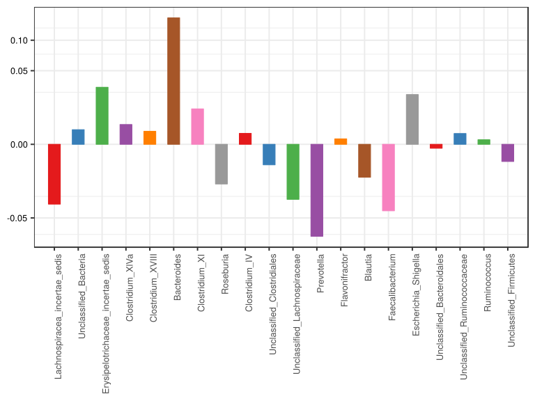

noone@mail.com
Analysis of Dieting study 16S data
% Fri Sep  7 05:46:18 2018

##### \(1.4.1.3.4\) Plots of Abundance difference between paired samples. Samples are paired according to attribute SubjectID, resulting in 14 pairs. When fold change or difference is computed, this is done as 'before.diet by after.diet'.

Plots are shown with relation to various combinations of meta 
                   data variables and in different graphical representations. Lots of plots here.

##### \(1.4.1.3.4.2\) Iterating over all combinations of grouping variables

##### \(1.4.1.3.4.2.1\) Entire pool of samples

##### \(1.4.1.3.4.2.2\) Iterating over Abundance difference between paired samples. Samples are paired according to attribute SubjectID, resulting in 14 pairs. When fold change or difference is computed, this is done as 'before.diet by after.diet'. profile sorting order

##### \(1.4.1.3.4.2.2.1\) Abundance difference between paired samples. Samples are paired according to attribute SubjectID, resulting in 14 pairs. When fold change or difference is computed, this is done as 'before.diet by after.diet'. profile sorting order: GeneSelector paired test ranking

##### \(1.4.1.3.4.2.2.2\) Iterating over dodged vs faceted bars

The same data are shown in multiple combinations of graphical representations. 
                         This is the same data, but each plot highlights slightly different aspects of it.
                         It is not likely that you will need every plot - pick only what you need.

##### \(1.4.1.3.4.2.2.2.1\) faceted plots. Iterating over orientation and, optionally, scaling

##### \(1.4.1.3.4.2.2.2.1.1\) Abundance difference between paired samples. Samples are paired according to attribute SubjectID, resulting in 14 pairs. When fold change or difference is computed, this is done as 'before.diet by after.diet'. Plot is in original orientation, Y axis SQRT scaled. Iterating over plot geometry

\(1.4.1.3.4.2.2.2.1.1.0\) [`Table 250.`](#table.250) Data table used for plots. Data for all pooled samples. Showing only 200 first rows. Full dataset is also saved in a delimited text file (click to download and open e.g. in Excel) [`data/1.4.1.3.4.2.2.2.1.1.0-323346c6a64.1.4.1.3.4.2.2.2.1.1.csv`](data/1.4.1.3.4.2.2.2.1.1.0-323346c6a64.1.4.1.3.4.2.2.2.1.1.csv)

| .record.id | feature                              | abundance.diff |
|:-----------|:-------------------------------------|:---------------|
| SB11       | Bacteroides                          | 1.903e\-02     |
| SB16       | Bacteroides                          | 9.200e\-02     |
| SB18       | Bacteroides                          | 5.594e\-01     |
| SB28       | Bacteroides                          | 1.542e\-01     |
| SB29       | Bacteroides                          | 5.088e\-01     |
| SB34       | Bacteroides                          | \-1.617e\-02   |
| SB36       | Bacteroides                          | 1.953e\-01     |
| SB39       | Bacteroides                          | \-1.713e\-01   |
| SB4        | Bacteroides                          | \-3.877e\-02   |
| SB41       | Bacteroides                          | 7.259e\-03     |
| SB43       | Bacteroides                          | 3.308e\-02     |
| SB44       | Bacteroides                          | 7.456e\-01     |
| SB5        | Bacteroides                          | \-3.611e\-02   |
| SB9        | Bacteroides                          | 1.383e\-02     |
| SB11       | Prevotella                           | 1.074e\-02     |
| SB16       | Prevotella                           | 3.024e\-04     |
| SB18       | Prevotella                           | \-2.066e\-03   |
| SB28       | Prevotella                           | 0.000e\+00     |
| SB29       | Prevotella                           | 3.600e\-04     |
| SB34       | Prevotella                           | 8.926e\-05     |
| SB36       | Prevotella                           | \-2.667e\-01   |
| SB39       | Prevotella                           | \-1.127e\-04   |
| SB4        | Prevotella                           | \-1.028e\-04   |
| SB41       | Prevotella                           | \-2.149e\-04   |
| SB43       | Prevotella                           | 3.917e\-01     |
| SB44       | Prevotella                           | \-3.103e\-04   |
| SB5        | Prevotella                           | \-6.267e\-01   |
| SB9        | Prevotella                           | \-5.996e\-01   |
| SB11       | Parabacteroides                      | \-1.029e\-01   |
| SB16       | Parabacteroides                      | \-1.670e\-04   |
| SB18       | Parabacteroides                      | \-4.008e\-04   |
| SB28       | Parabacteroides                      | \-1.692e\-01   |
| SB29       | Parabacteroides                      | 6.370e\-03     |
| SB34       | Parabacteroides                      | 0.000e\+00     |
| SB36       | Parabacteroides                      | 4.136e\-02     |
| SB39       | Parabacteroides                      | \-4.373e\-05   |
| SB4        | Parabacteroides                      | \-2.569e\-04   |
| SB41       | Parabacteroides                      | 1.497e\-04     |
| SB43       | Parabacteroides                      | 5.509e\-02     |
| SB44       | Parabacteroides                      | 0.000e\+00     |
| SB5        | Parabacteroides                      | \-2.807e\-04   |
| SB9        | Parabacteroides                      | 3.829e\-04     |
| SB11       | Faecalibacterium                     | \-1.125e\-02   |
| SB16       | Faecalibacterium                     | \-7.158e\-03   |
| SB18       | Faecalibacterium                     | \-3.502e\-01   |
| SB28       | Faecalibacterium                     | \-1.501e\-02   |
| SB29       | Faecalibacterium                     | 8.999e\-03     |
| SB34       | Faecalibacterium                     | 5.444e\-03     |
| SB36       | Faecalibacterium                     | 2.635e\-02     |
| SB39       | Faecalibacterium                     | \-3.989e\-02   |
| SB4        | Faecalibacterium                     | 9.151e\-03     |
| SB41       | Faecalibacterium                     | \-2.501e\-02   |
| SB43       | Faecalibacterium                     | 2.918e\-02     |
| SB44       | Faecalibacterium                     | \-3.242e\-01   |
| SB5        | Faecalibacterium                     | 1.145e\-01     |
| SB9        | Faecalibacterium                     | 8.209e\-03     |
| SB11       | Unclassified\_Lachnospiraceae        | \-2.678e\-02   |
| SB16       | Unclassified\_Lachnospiraceae        | 1.918e\-02     |
| SB18       | Unclassified\_Lachnospiraceae        | \-9.434e\-02   |
| SB28       | Unclassified\_Lachnospiraceae        | \-3.522e\-02   |
| SB29       | Unclassified\_Lachnospiraceae        | 2.825e\-03     |
| SB34       | Unclassified\_Lachnospiraceae        | 1.867e\-02     |
| SB36       | Unclassified\_Lachnospiraceae        | \-5.679e\-02   |
| SB39       | Unclassified\_Lachnospiraceae        | \-1.802e\-02   |
| SB4        | Unclassified\_Lachnospiraceae        | 5.201e\-03     |
| SB41       | Unclassified\_Lachnospiraceae        | 6.086e\-03     |
| SB43       | Unclassified\_Lachnospiraceae        | \-1.535e\-01   |
| SB44       | Unclassified\_Lachnospiraceae        | \-1.796e\-01   |
| SB5        | Unclassified\_Lachnospiraceae        | 7.834e\-02     |
| SB9        | Unclassified\_Lachnospiraceae        | 4.273e\-02     |
| SB11       | Lactobacillus                        | 0.000e\+00     |
| SB16       | Lactobacillus                        | \-5.567e\-05   |
| SB18       | Lactobacillus                        | 6.199e\-04     |
| SB28       | Lactobacillus                        | 0.000e\+00     |
| SB29       | Lactobacillus                        | 0.000e\+00     |
| SB34       | Lactobacillus                        | 0.000e\+00     |
| SB36       | Lactobacillus                        | 0.000e\+00     |
| SB39       | Lactobacillus                        | 0.000e\+00     |
| SB4        | Lactobacillus                        | 0.000e\+00     |
| SB41       | Lactobacillus                        | 0.000e\+00     |
| SB43       | Lactobacillus                        | \-1.018e\-03   |
| SB44       | Lactobacillus                        | \-3.103e\-04   |
| SB5        | Lactobacillus                        | 1.961e\-03     |
| SB9        | Lactobacillus                        | 4.491e\-03     |
| SB11       | Enterococcus                         | 0.000e\+00     |
| SB16       | Enterococcus                         | 0.000e\+00     |
| SB18       | Enterococcus                         | 7.126e\-02     |
| SB28       | Enterococcus                         | 3.934e\-04     |
| SB29       | Enterococcus                         | \-6.612e\-01   |
| SB34       | Enterococcus                         | \-8.525e\-05   |
| SB36       | Enterococcus                         | 0.000e\+00     |
| SB39       | Enterococcus                         | 0.000e\+00     |
| SB4        | Enterococcus                         | \-1.777e\-04   |
| SB41       | Enterococcus                         | 0.000e\+00     |
| SB43       | Enterococcus                         | \-6.788e\-04   |
| SB44       | Enterococcus                         | 0.000e\+00     |
| SB5        | Enterococcus                         | 1.089e\-04     |
| SB9        | Enterococcus                         | 7.573e\-04     |
| SB11       | Alistipes                            | 2.004e\-01     |
| SB16       | Alistipes                            | \-1.674e\-01   |
| SB18       | Alistipes                            | 2.480e\-04     |
| SB28       | Alistipes                            | 0.000e\+00     |
| SB29       | Alistipes                            | 2.807e\-02     |
| SB34       | Alistipes                            | \-3.394e\-02   |
| SB36       | Alistipes                            | 2.739e\-02     |
| SB39       | Alistipes                            | \-4.407e\-03   |
| SB4        | Alistipes                            | 0.000e\+00     |
| SB41       | Alistipes                            | 1.169e\-02     |
| SB43       | Alistipes                            | 1.058e\-02     |
| SB44       | Alistipes                            | 4.393e\-03     |
| SB5        | Alistipes                            | \-6.851e\-04   |
| SB9        | Alistipes                            | 0.000e\+00     |
| SB11       | Lachnospiracea\_incertae\_sedis      | \-2.726e\-02   |
| SB16       | Lachnospiracea\_incertae\_sedis      | \-3.510e\-03   |
| SB18       | Lachnospiracea\_incertae\_sedis      | \-5.343e\-02   |
| SB28       | Lachnospiracea\_incertae\_sedis      | \-5.969e\-02   |
| SB29       | Lachnospiracea\_incertae\_sedis      | 3.240e\-03     |
| SB34       | Lachnospiracea\_incertae\_sedis      | \-1.643e\-02   |
| SB36       | Lachnospiracea\_incertae\_sedis      | \-2.874e\-02   |
| SB39       | Lachnospiracea\_incertae\_sedis      | \-5.941e\-03   |
| SB4        | Lachnospiracea\_incertae\_sedis      | 6.921e\-04     |
| SB41       | Lachnospiracea\_incertae\_sedis      | \-5.300e\-03   |
| SB43       | Lachnospiracea\_incertae\_sedis      | \-1.407e\-01   |
| SB44       | Lachnospiracea\_incertae\_sedis      | \-1.205e\-01   |
| SB5        | Lachnospiracea\_incertae\_sedis      | 4.237e\-03     |
| SB9        | Lachnospiracea\_incertae\_sedis      | \-8.762e\-03   |
| SB11       | Clostridium\_XI                      | 3.446e\-02     |
| SB16       | Clostridium\_XI                      | \-2.186e\-03   |
| SB18       | Clostridium\_XI                      | \-1.666e\-02   |
| SB28       | Clostridium\_XI                      | 3.236e\-02     |
| SB29       | Clostridium\_XI                      | 1.800e\-03     |
| SB34       | Clostridium\_XI                      | 5.249e\-04     |
| SB36       | Clostridium\_XI                      | 2.747e\-03     |
| SB39       | Clostridium\_XI                      | 6.716e\-03     |
| SB4        | Clostridium\_XI                      | \-1.096e\-04   |
| SB41       | Clostridium\_XI                      | \-1.082e\-03   |
| SB43       | Clostridium\_XI                      | \-1.461e\-01   |
| SB44       | Clostridium\_XI                      | 2.282e\-03     |
| SB5        | Clostridium\_XI                      | 2.127e\-01     |
| SB9        | Clostridium\_XI                      | 3.483e\-02     |
| SB11       | Blautia                              | \-7.727e\-02   |
| SB16       | Blautia                              | \-1.041e\-03   |
| SB18       | Blautia                              | \-3.563e\-02   |
| SB28       | Blautia                              | \-3.264e\-04   |
| SB29       | Blautia                              | 1.080e\-03     |
| SB34       | Blautia                              | 2.461e\-02     |
| SB36       | Blautia                              | \-1.504e\-02   |
| SB39       | Blautia                              | \-8.720e\-03   |
| SB4        | Blautia                              | 6.934e\-03     |
| SB41       | Blautia                              | \-6.399e\-03   |
| SB43       | Blautia                              | \-1.208e\-01   |
| SB44       | Blautia                              | \-2.787e\-03   |
| SB5        | Blautia                              | 4.988e\-02     |
| SB9        | Blautia                              | 4.537e\-02     |
| SB11       | Erysipelotrichaceae\_incertae\_sedis | \-4.125e\-04   |
| SB16       | Erysipelotrichaceae\_incertae\_sedis | 3.883e\-03     |
| SB18       | Erysipelotrichaceae\_incertae\_sedis | \-1.880e\-03   |
| SB28       | Erysipelotrichaceae\_incertae\_sedis | 1.416e\-03     |
| SB29       | Erysipelotrichaceae\_incertae\_sedis | \-6.221e\-03   |
| SB34       | Erysipelotrichaceae\_incertae\_sedis | 7.007e\-04     |
| SB36       | Erysipelotrichaceae\_incertae\_sedis | \-2.877e\-04   |
| SB39       | Erysipelotrichaceae\_incertae\_sedis | 6.482e\-03     |
| SB4        | Erysipelotrichaceae\_incertae\_sedis | 3.714e\-03     |
| SB41       | Erysipelotrichaceae\_incertae\_sedis | \-6.165e\-04   |
| SB43       | Erysipelotrichaceae\_incertae\_sedis | 1.521e\-03     |
| SB44       | Erysipelotrichaceae\_incertae\_sedis | 7.523e\-04     |
| SB5        | Erysipelotrichaceae\_incertae\_sedis | 3.499e\-02     |
| SB9        | Erysipelotrichaceae\_incertae\_sedis | 3.765e\-01     |
| SB11       | Roseburia                            | \-2.166e\-02   |
| SB16       | Roseburia                            | 6.445e\-05     |
| SB18       | Roseburia                            | \-9.067e\-02   |
| SB28       | Roseburia                            | \-4.079e\-02   |
| SB29       | Roseburia                            | 3.052e\-04     |
| SB34       | Roseburia                            | \-2.465e\-03   |
| SB36       | Roseburia                            | \-4.243e\-03   |
| SB39       | Roseburia                            | \-1.960e\-02   |
| SB4        | Roseburia                            | 1.751e\-03     |
| SB41       | Roseburia                            | 3.222e\-03     |
| SB43       | Roseburia                            | \-1.403e\-02   |
| SB44       | Roseburia                            | \-4.611e\-02   |
| SB5        | Roseburia                            | 1.556e\-02     |
| SB9        | Roseburia                            | 1.548e\-02     |
| SB11       | Escherichia\_Shigella                | 4.464e\-04     |
| SB16       | Escherichia\_Shigella                | 1.448e\-02     |
| SB18       | Escherichia\_Shigella                | 0.000e\+00     |
| SB28       | Escherichia\_Shigella                | 1.738e\-01     |
| SB29       | Escherichia\_Shigella                | 0.000e\+00     |
| SB34       | Escherichia\_Shigella                | \-8.525e\-05   |
| SB36       | Escherichia\_Shigella                | 0.000e\+00     |
| SB39       | Escherichia\_Shigella                | 0.000e\+00     |
| SB4        | Escherichia\_Shigella                | 0.000e\+00     |
| SB41       | Escherichia\_Shigella                | \-3.863e\-05   |
| SB43       | Escherichia\_Shigella                | 0.000e\+00     |
| SB44       | Escherichia\_Shigella                | 1.098e\-03     |
| SB5        | Escherichia\_Shigella                | 1.282e\-01     |
| SB9        | Escherichia\_Shigella                | 2.165e\-03     |
| SB11       | Unclassified\_Clostridiales          | \-8.878e\-03   |
| SB16       | Unclassified\_Clostridiales          | 6.334e\-03     |
| SB18       | Unclassified\_Clostridiales          | \-6.188e\-03   |
| SB28       | Unclassified\_Clostridiales          | \-1.171e\-03   |

\(1.4.1.3.4.2.2.2.1.1.1\) [`Widget 262.`](#widget.262) Dynamic Pivot Table link (drag and drop field names and pick averaging 
                      functions or plot types; click on fields or legend elements to filter values). 
                      Starting rendering is Stacked Bar Chart. Data for all pooled samples. Click to see HTML widget file in full window: [`./1.4.1.3.4.2.2.2.1.1.1-3235c8e2f19Dynamic.Pivot.Table.html`](./1.4.1.3.4.2.2.2.1.1.1-3235c8e2f19Dynamic.Pivot.Table.html)

\(1.4.1.3.4.2.2.2.1.1.1\) [`Widget 263.`](#widget.263) Dynamic Pivot Table link (drag and drop field names and pick averaging 
                      functions or plot types; click on fields or legend elements to filter values). 
                      Starting rendering is Table Barchart. Data for all pooled samples. Click to see HTML widget file in full window: [`./1.4.1.3.4.2.2.2.1.1.1-32349ba0ccaDynamic.Pivot.Table.html`](./1.4.1.3.4.2.2.2.1.1.1-32349ba0ccaDynamic.Pivot.Table.html)

\(1.4.1.3.4.2.2.2.1.1.1\) [`Table 251.`](#table.251) Summary table. Data for all pooled samples. Full dataset is also saved in a delimited text file (click to download and open e.g. in Excel) [`data/1.4.1.3.4.2.2.2.1.1.1-3231989b477.1.4.1.3.4.2.2.2.1.1.csv`](data/1.4.1.3.4.2.2.2.1.1.1-3231989b477.1.4.1.3.4.2.2.2.1.1.csv)

| feature                              | mean         | sd         | median       | incidence |
|:-------------------------------------|:-------------|:-----------|:-------------|:----------|
| Lachnospiracea\_incertae\_sedis      | \-3.300e\-02 | 4.599e\-02 | \-1.259e\-02 | 0.21429   |
| Unclassified\_Bacteria               | 1.975e\-03   | 3.704e\-03 | 1.525e\-03   | 0.64286   |
| Erysipelotrichaceae\_incertae\_sedis | 3.004e\-02   | 1.002e\-01 | 1.084e\-03   | 0.64286   |
| Clostridium\_XlVa                    | 3.617e\-03   | 7.901e\-03 | 2.047e\-03   | 0.71429   |
| Clostridium\_XVIII                   | 1.560e\-03   | 5.281e\-03 | 5.686e\-04   | 0.71429   |
| Bacteroides                          | 1.476e\-01   | 2.671e\-01 | 2.605e\-02   | 0.71429   |
| Clostridium\_XI                      | 1.159e\-02   | 7.258e\-02 | 2.041e\-03   | 0.64286   |
| Roseburia                            | \-1.451e\-02 | 2.860e\-02 | \-3.354e\-03 | 0.42857   |
| Clostridium\_IV                      | 1.101e\-03   | 3.246e\-03 | 1.683e\-04   | 0.57143   |
| Unclassified\_Clostridiales          | \-3.879e\-03 | 1.240e\-02 | \-1.507e\-03 | 0.42857   |
| Unclassified\_Lachnospiraceae        | \-2.794e\-02 | 7.235e\-02 | \-7.599e\-03 | 0.50000   |
| Prevotella                           | \-7.804e\-02 | 2.619e\-01 | \-1.077e\-04 | 0.35714   |
| Flavonifractor                       | 2.718e\-04   | 3.791e\-03 | 9.648e\-04   | 0.64286   |
| Blautia                              | \-1.001e\-02 | 4.470e\-02 | \-1.914e\-03 | 0.35714   |
| Faecalibacterium                     | \-4.078e\-02 | 1.307e\-01 | \-8.567e\-04 | 0.50000   |
| Escherichia\_Shigella                | 2.286e\-02   | 5.515e\-02 | 0.000e\+00   | 0.42857   |
| Unclassified\_Bacteroidales          | \-1.405e\-04 | 2.990e\-02 | 9.153e\-04   | 0.57143   |
| Unclassified\_Ruminococcaceae        | 1.077e\-03   | 1.151e\-02 | 4.269e\-03   | 0.57143   |
| Ruminococcus                         | 1.937e\-04   | 1.499e\-02 | \-6.987e\-04 | 0.42857   |
| Unclassified\_Firmicutes             | \-2.714e\-03 | 8.047e\-03 | 1.221e\-04   | 0.50000   |
| Dorea                                | 3.481e\-03   | 1.169e\-02 | \-1.719e\-04 | 0.42857   |
| Clostridium\_sensu\_stricto          | 3.417e\-03   | 1.111e\-02 | 0.000e\+00   | 0.42857   |
| Parabacteroides                      | \-1.214e\-02 | 5.681e\-02 | \-2.187e\-05 | 0.35714   |
| Veillonella                          | \-6.760e\-03 | 2.190e\-02 | \-4.196e\-05 | 0.28571   |
| Streptococcus                        | 1.742e\-03   | 7.012e\-03 | \-2.569e\-05 | 0.42857   |
| Alistipes                            | 5.451e\-03   | 7.376e\-02 | 1.240e\-04   | 0.50000   |
| Gemmiger                             | \-1.209e\-03 | 3.059e\-03 | 0.000e\+00   | 0.28571   |
| Enterococcus                         | \-4.212e\-02 | 1.792e\-01 | 0.000e\+00   | 0.28571   |
| Sutterella                           | 1.605e\-03   | 1.226e\-02 | 0.000e\+00   | 0.35714   |
| Turicibacter                         | \-1.629e\-03 | 9.729e\-03 | 0.000e\+00   | 0.35714   |
| Lactobacillus                        | 4.063e\-04   | 1.337e\-03 | 0.000e\+00   | 0.21429   |
| Unclassified\_Enterobacteriaceae     | 3.304e\-03   | 1.163e\-02 | 0.000e\+00   | 0.28571   |
| Akkermansia                          | 1.416e\-02   | 4.670e\-02 | 0.000e\+00   | 0.21429   |
| Unclassified\_Lactobacillales        | 1.035e\-02   | 3.879e\-02 | 0.000e\+00   | 0.14286   |
| Megamonas                            | 7.782e\-06   | 2.912e\-05 | 0.000e\+00   | 0.07143   |
| Odoribacter                          | 1.268e\-03   | 5.257e\-03 | 0.000e\+00   | 0.14286   |
| Unclassified\_Burkholderiales        | \-3.452e\-03 | 1.294e\-02 | 0.000e\+00   | 0.07143   |
| Parasutterella                       | \-8.769e\-04 | 3.786e\-03 | 0.000e\+00   | 0.07143   |

\(1.4.1.3.4.2.2.2.1.1.1\) [`Figure 774.`](#figure.774) Abundance difference between paired samples. Samples are paired according to attribute SubjectID, resulting in 14 pairs. When fold change or difference is computed, this is done as 'before.diet by after.diet'. Data for all pooled samples. Sorting order of features is GeneSelector paired test ranking. bar_stacked plot.  Image file: [`plots/32324222fb2.svg`](plots/32324222fb2.svg).

\(1.4.1.3.4.2.2.2.1.1.1\) [`Figure 775.`](#figure.775) Abundance difference between paired samples. Samples are paired according to attribute SubjectID, resulting in 14 pairs. When fold change or difference is computed, this is done as 'before.diet by after.diet'. Data for all pooled samples. Sorting order of features is GeneSelector paired test ranking. bar (sample mean) plot.  Image file: [`plots/32337e78b2d.svg`](plots/32337e78b2d.svg).

\(1.4.1.3.4.2.2.2.1.1.1\) [`Figure 776.`](#figure.776) Abundance difference between paired samples. Samples are paired according to attribute SubjectID, resulting in 14 pairs. When fold change or difference is computed, this is done as 'before.diet by after.diet'. Data for all pooled samples. Sorting order of features is GeneSelector paired test ranking. violin plot.  Image file: [`plots/323322ed2c2.svg`](plots/323322ed2c2.svg).

\(1.4.1.3.4.2.2.2.1.1.1\) [`Figure 777.`](#figure.777) Abundance difference between paired samples. Samples are paired according to attribute SubjectID, resulting in 14 pairs. When fold change or difference is computed, this is done as 'before.diet by after.diet'. Data for all pooled samples. Sorting order of features is GeneSelector paired test ranking. boxplot plot.  Image file: [`plots/323ba04e82.svg`](plots/323ba04e82.svg).

##### \(1.4.1.3.4.2.2.2.1.2\) Abundance difference between paired samples. Samples are paired according to attribute SubjectID, resulting in 14 pairs. When fold change or difference is computed, this is done as 'before.diet by after.diet'. Plot is in flipped orientation, Y axis not scaled. Iterating over plot geometry

\(1.4.1.3.4.2.2.2.1.2.1\) [`Figure 778.`](#figure.778) Abundance difference between paired samples. Samples are paired according to attribute SubjectID, resulting in 14 pairs. When fold change or difference is computed, this is done as 'before.diet by after.diet'. Data for all pooled samples. Sorting order of features is GeneSelector paired test ranking. bar (sample mean) plot.  Image file: [`plots/32369a393b7.svg`](plots/32369a393b7.svg).

\(1.4.1.3.4.2.2.2.1.2.1\) [`Figure 779.`](#figure.779) Abundance difference between paired samples. Samples are paired according to attribute SubjectID, resulting in 14 pairs. When fold change or difference is computed, this is done as 'before.diet by after.diet'. Data for all pooled samples. Sorting order of features is GeneSelector paired test ranking. violin plot.  Image file: [`plots/323681864db.svg`](plots/323681864db.svg).

\(1.4.1.3.4.2.2.2.1.2.1\) [`Figure 780.`](#figure.780) Abundance difference between paired samples. Samples are paired according to attribute SubjectID, resulting in 14 pairs. When fold change or difference is computed, this is done as 'before.diet by after.diet'. Data for all pooled samples. Sorting order of features is GeneSelector paired test ranking. boxplot plot.  Image file: [`plots/32379a4e204.svg`](plots/32379a4e204.svg).

##### \(1.4.1.3.4.2.3\) Grouping variables Drug.Before.Diet

##### \(1.4.1.3.4.2.4\) Iterating over Abundance difference between paired samples. Samples are paired according to attribute SubjectID, resulting in 14 pairs. When fold change or difference is computed, this is done as 'before.diet by after.diet'. profile sorting order

##### \(1.4.1.3.4.2.4.1\) Abundance difference between paired samples. Samples are paired according to attribute SubjectID, resulting in 14 pairs. When fold change or difference is computed, this is done as 'before.diet by after.diet'. profile sorting order: GeneSelector paired test ranking

##### \(1.4.1.3.4.2.4.2\) Iterating over dodged vs faceted bars

The same data are shown in multiple combinations of graphical representations. 
                         This is the same data, but each plot highlights slightly different aspects of it.
                         It is not likely that you will need every plot - pick only what you need.

##### \(1.4.1.3.4.2.4.2.1\) faceted plots. Iterating over orientation and, optionally, scaling

##### \(1.4.1.3.4.2.4.2.1.1\) Abundance difference between paired samples. Samples are paired according to attribute SubjectID, resulting in 14 pairs. When fold change or difference is computed, this is done as 'before.diet by after.diet'. Plot is in original orientation, Y axis SQRT scaled. Iterating over plot geometry

\(1.4.1.3.4.2.4.2.1.1.0\) [`Table 252.`](#table.252) Data table used for plots. Data grouped by Drug.Before.Diet. Showing only 200 first rows. Full dataset is also saved in a delimited text file (click to download and open e.g. in Excel) [`data/1.4.1.3.4.2.4.2.1.1.0-3237e075505.1.4.1.3.4.2.4.2.1.1.csv`](data/1.4.1.3.4.2.4.2.1.1.0-3237e075505.1.4.1.3.4.2.4.2.1.1.csv)

| .record.id | Drug.Before.Diet | feature                              | abundance.diff |
|:-----------|:-----------------|:-------------------------------------|:---------------|
| SB11       | DrugBefore\_NO   | Bacteroides                          | 1.903e\-02     |
| SB16       | DrugBefore\_YES  | Bacteroides                          | 9.200e\-02     |
| SB18       | DrugBefore\_NO   | Bacteroides                          | 5.594e\-01     |
| SB28       | DrugBefore\_YES  | Bacteroides                          | 1.542e\-01     |
| SB29       | DrugBefore\_YES  | Bacteroides                          | 5.088e\-01     |
| SB34       | DrugBefore\_YES  | Bacteroides                          | \-1.617e\-02   |
| SB36       | DrugBefore\_YES  | Bacteroides                          | 1.953e\-01     |
| SB39       | DrugBefore\_YES  | Bacteroides                          | \-1.713e\-01   |
| SB4        | DrugBefore\_YES  | Bacteroides                          | \-3.877e\-02   |
| SB41       | DrugBefore\_YES  | Bacteroides                          | 7.259e\-03     |
| SB43       | DrugBefore\_YES  | Bacteroides                          | 3.308e\-02     |
| SB44       | DrugBefore\_YES  | Bacteroides                          | 7.456e\-01     |
| SB5        | DrugBefore\_NO   | Bacteroides                          | \-3.611e\-02   |
| SB9        | DrugBefore\_NO   | Bacteroides                          | 1.383e\-02     |
| SB11       | DrugBefore\_NO   | Prevotella                           | 1.074e\-02     |
| SB16       | DrugBefore\_YES  | Prevotella                           | 3.024e\-04     |
| SB18       | DrugBefore\_NO   | Prevotella                           | \-2.066e\-03   |
| SB28       | DrugBefore\_YES  | Prevotella                           | 0.000e\+00     |
| SB29       | DrugBefore\_YES  | Prevotella                           | 3.600e\-04     |
| SB34       | DrugBefore\_YES  | Prevotella                           | 8.926e\-05     |
| SB36       | DrugBefore\_YES  | Prevotella                           | \-2.667e\-01   |
| SB39       | DrugBefore\_YES  | Prevotella                           | \-1.127e\-04   |
| SB4        | DrugBefore\_YES  | Prevotella                           | \-1.028e\-04   |
| SB41       | DrugBefore\_YES  | Prevotella                           | \-2.149e\-04   |
| SB43       | DrugBefore\_YES  | Prevotella                           | 3.917e\-01     |
| SB44       | DrugBefore\_YES  | Prevotella                           | \-3.103e\-04   |
| SB5        | DrugBefore\_NO   | Prevotella                           | \-6.267e\-01   |
| SB9        | DrugBefore\_NO   | Prevotella                           | \-5.996e\-01   |
| SB11       | DrugBefore\_NO   | Parabacteroides                      | \-1.029e\-01   |
| SB16       | DrugBefore\_YES  | Parabacteroides                      | \-1.670e\-04   |
| SB18       | DrugBefore\_NO   | Parabacteroides                      | \-4.008e\-04   |
| SB28       | DrugBefore\_YES  | Parabacteroides                      | \-1.692e\-01   |
| SB29       | DrugBefore\_YES  | Parabacteroides                      | 6.370e\-03     |
| SB34       | DrugBefore\_YES  | Parabacteroides                      | 0.000e\+00     |
| SB36       | DrugBefore\_YES  | Parabacteroides                      | 4.136e\-02     |
| SB39       | DrugBefore\_YES  | Parabacteroides                      | \-4.373e\-05   |
| SB4        | DrugBefore\_YES  | Parabacteroides                      | \-2.569e\-04   |
| SB41       | DrugBefore\_YES  | Parabacteroides                      | 1.497e\-04     |
| SB43       | DrugBefore\_YES  | Parabacteroides                      | 5.509e\-02     |
| SB44       | DrugBefore\_YES  | Parabacteroides                      | 0.000e\+00     |
| SB5        | DrugBefore\_NO   | Parabacteroides                      | \-2.807e\-04   |
| SB9        | DrugBefore\_NO   | Parabacteroides                      | 3.829e\-04     |
| SB11       | DrugBefore\_NO   | Faecalibacterium                     | \-1.125e\-02   |
| SB16       | DrugBefore\_YES  | Faecalibacterium                     | \-7.158e\-03   |
| SB18       | DrugBefore\_NO   | Faecalibacterium                     | \-3.502e\-01   |
| SB28       | DrugBefore\_YES  | Faecalibacterium                     | \-1.501e\-02   |
| SB29       | DrugBefore\_YES  | Faecalibacterium                     | 8.999e\-03     |
| SB34       | DrugBefore\_YES  | Faecalibacterium                     | 5.444e\-03     |
| SB36       | DrugBefore\_YES  | Faecalibacterium                     | 2.635e\-02     |
| SB39       | DrugBefore\_YES  | Faecalibacterium                     | \-3.989e\-02   |
| SB4        | DrugBefore\_YES  | Faecalibacterium                     | 9.151e\-03     |
| SB41       | DrugBefore\_YES  | Faecalibacterium                     | \-2.501e\-02   |
| SB43       | DrugBefore\_YES  | Faecalibacterium                     | 2.918e\-02     |
| SB44       | DrugBefore\_YES  | Faecalibacterium                     | \-3.242e\-01   |
| SB5        | DrugBefore\_NO   | Faecalibacterium                     | 1.145e\-01     |
| SB9        | DrugBefore\_NO   | Faecalibacterium                     | 8.209e\-03     |
| SB11       | DrugBefore\_NO   | Unclassified\_Lachnospiraceae        | \-2.678e\-02   |
| SB16       | DrugBefore\_YES  | Unclassified\_Lachnospiraceae        | 1.918e\-02     |
| SB18       | DrugBefore\_NO   | Unclassified\_Lachnospiraceae        | \-9.434e\-02   |
| SB28       | DrugBefore\_YES  | Unclassified\_Lachnospiraceae        | \-3.522e\-02   |
| SB29       | DrugBefore\_YES  | Unclassified\_Lachnospiraceae        | 2.825e\-03     |
| SB34       | DrugBefore\_YES  | Unclassified\_Lachnospiraceae        | 1.867e\-02     |
| SB36       | DrugBefore\_YES  | Unclassified\_Lachnospiraceae        | \-5.679e\-02   |
| SB39       | DrugBefore\_YES  | Unclassified\_Lachnospiraceae        | \-1.802e\-02   |
| SB4        | DrugBefore\_YES  | Unclassified\_Lachnospiraceae        | 5.201e\-03     |
| SB41       | DrugBefore\_YES  | Unclassified\_Lachnospiraceae        | 6.086e\-03     |
| SB43       | DrugBefore\_YES  | Unclassified\_Lachnospiraceae        | \-1.535e\-01   |
| SB44       | DrugBefore\_YES  | Unclassified\_Lachnospiraceae        | \-1.796e\-01   |
| SB5        | DrugBefore\_NO   | Unclassified\_Lachnospiraceae        | 7.834e\-02     |
| SB9        | DrugBefore\_NO   | Unclassified\_Lachnospiraceae        | 4.273e\-02     |
| SB11       | DrugBefore\_NO   | Lactobacillus                        | 0.000e\+00     |
| SB16       | DrugBefore\_YES  | Lactobacillus                        | \-5.567e\-05   |
| SB18       | DrugBefore\_NO   | Lactobacillus                        | 6.199e\-04     |
| SB28       | DrugBefore\_YES  | Lactobacillus                        | 0.000e\+00     |
| SB29       | DrugBefore\_YES  | Lactobacillus                        | 0.000e\+00     |
| SB34       | DrugBefore\_YES  | Lactobacillus                        | 0.000e\+00     |
| SB36       | DrugBefore\_YES  | Lactobacillus                        | 0.000e\+00     |
| SB39       | DrugBefore\_YES  | Lactobacillus                        | 0.000e\+00     |
| SB4        | DrugBefore\_YES  | Lactobacillus                        | 0.000e\+00     |
| SB41       | DrugBefore\_YES  | Lactobacillus                        | 0.000e\+00     |
| SB43       | DrugBefore\_YES  | Lactobacillus                        | \-1.018e\-03   |
| SB44       | DrugBefore\_YES  | Lactobacillus                        | \-3.103e\-04   |
| SB5        | DrugBefore\_NO   | Lactobacillus                        | 1.961e\-03     |
| SB9        | DrugBefore\_NO   | Lactobacillus                        | 4.491e\-03     |
| SB11       | DrugBefore\_NO   | Enterococcus                         | 0.000e\+00     |
| SB16       | DrugBefore\_YES  | Enterococcus                         | 0.000e\+00     |
| SB18       | DrugBefore\_NO   | Enterococcus                         | 7.126e\-02     |
| SB28       | DrugBefore\_YES  | Enterococcus                         | 3.934e\-04     |
| SB29       | DrugBefore\_YES  | Enterococcus                         | \-6.612e\-01   |
| SB34       | DrugBefore\_YES  | Enterococcus                         | \-8.525e\-05   |
| SB36       | DrugBefore\_YES  | Enterococcus                         | 0.000e\+00     |
| SB39       | DrugBefore\_YES  | Enterococcus                         | 0.000e\+00     |
| SB4        | DrugBefore\_YES  | Enterococcus                         | \-1.777e\-04   |
| SB41       | DrugBefore\_YES  | Enterococcus                         | 0.000e\+00     |
| SB43       | DrugBefore\_YES  | Enterococcus                         | \-6.788e\-04   |
| SB44       | DrugBefore\_YES  | Enterococcus                         | 0.000e\+00     |
| SB5        | DrugBefore\_NO   | Enterococcus                         | 1.089e\-04     |
| SB9        | DrugBefore\_NO   | Enterococcus                         | 7.573e\-04     |
| SB11       | DrugBefore\_NO   | Alistipes                            | 2.004e\-01     |
| SB16       | DrugBefore\_YES  | Alistipes                            | \-1.674e\-01   |
| SB18       | DrugBefore\_NO   | Alistipes                            | 2.480e\-04     |
| SB28       | DrugBefore\_YES  | Alistipes                            | 0.000e\+00     |
| SB29       | DrugBefore\_YES  | Alistipes                            | 2.807e\-02     |
| SB34       | DrugBefore\_YES  | Alistipes                            | \-3.394e\-02   |
| SB36       | DrugBefore\_YES  | Alistipes                            | 2.739e\-02     |
| SB39       | DrugBefore\_YES  | Alistipes                            | \-4.407e\-03   |
| SB4        | DrugBefore\_YES  | Alistipes                            | 0.000e\+00     |
| SB41       | DrugBefore\_YES  | Alistipes                            | 1.169e\-02     |
| SB43       | DrugBefore\_YES  | Alistipes                            | 1.058e\-02     |
| SB44       | DrugBefore\_YES  | Alistipes                            | 4.393e\-03     |
| SB5        | DrugBefore\_NO   | Alistipes                            | \-6.851e\-04   |
| SB9        | DrugBefore\_NO   | Alistipes                            | 0.000e\+00     |
| SB11       | DrugBefore\_NO   | Lachnospiracea\_incertae\_sedis      | \-2.726e\-02   |
| SB16       | DrugBefore\_YES  | Lachnospiracea\_incertae\_sedis      | \-3.510e\-03   |
| SB18       | DrugBefore\_NO   | Lachnospiracea\_incertae\_sedis      | \-5.343e\-02   |
| SB28       | DrugBefore\_YES  | Lachnospiracea\_incertae\_sedis      | \-5.969e\-02   |
| SB29       | DrugBefore\_YES  | Lachnospiracea\_incertae\_sedis      | 3.240e\-03     |
| SB34       | DrugBefore\_YES  | Lachnospiracea\_incertae\_sedis      | \-1.643e\-02   |
| SB36       | DrugBefore\_YES  | Lachnospiracea\_incertae\_sedis      | \-2.874e\-02   |
| SB39       | DrugBefore\_YES  | Lachnospiracea\_incertae\_sedis      | \-5.941e\-03   |
| SB4        | DrugBefore\_YES  | Lachnospiracea\_incertae\_sedis      | 6.921e\-04     |
| SB41       | DrugBefore\_YES  | Lachnospiracea\_incertae\_sedis      | \-5.300e\-03   |
| SB43       | DrugBefore\_YES  | Lachnospiracea\_incertae\_sedis      | \-1.407e\-01   |
| SB44       | DrugBefore\_YES  | Lachnospiracea\_incertae\_sedis      | \-1.205e\-01   |
| SB5        | DrugBefore\_NO   | Lachnospiracea\_incertae\_sedis      | 4.237e\-03     |
| SB9        | DrugBefore\_NO   | Lachnospiracea\_incertae\_sedis      | \-8.762e\-03   |
| SB11       | DrugBefore\_NO   | Clostridium\_XI                      | 3.446e\-02     |
| SB16       | DrugBefore\_YES  | Clostridium\_XI                      | \-2.186e\-03   |
| SB18       | DrugBefore\_NO   | Clostridium\_XI                      | \-1.666e\-02   |
| SB28       | DrugBefore\_YES  | Clostridium\_XI                      | 3.236e\-02     |
| SB29       | DrugBefore\_YES  | Clostridium\_XI                      | 1.800e\-03     |
| SB34       | DrugBefore\_YES  | Clostridium\_XI                      | 5.249e\-04     |
| SB36       | DrugBefore\_YES  | Clostridium\_XI                      | 2.747e\-03     |
| SB39       | DrugBefore\_YES  | Clostridium\_XI                      | 6.716e\-03     |
| SB4        | DrugBefore\_YES  | Clostridium\_XI                      | \-1.096e\-04   |
| SB41       | DrugBefore\_YES  | Clostridium\_XI                      | \-1.082e\-03   |
| SB43       | DrugBefore\_YES  | Clostridium\_XI                      | \-1.461e\-01   |
| SB44       | DrugBefore\_YES  | Clostridium\_XI                      | 2.282e\-03     |
| SB5        | DrugBefore\_NO   | Clostridium\_XI                      | 2.127e\-01     |
| SB9        | DrugBefore\_NO   | Clostridium\_XI                      | 3.483e\-02     |
| SB11       | DrugBefore\_NO   | Blautia                              | \-7.727e\-02   |
| SB16       | DrugBefore\_YES  | Blautia                              | \-1.041e\-03   |
| SB18       | DrugBefore\_NO   | Blautia                              | \-3.563e\-02   |
| SB28       | DrugBefore\_YES  | Blautia                              | \-3.264e\-04   |
| SB29       | DrugBefore\_YES  | Blautia                              | 1.080e\-03     |
| SB34       | DrugBefore\_YES  | Blautia                              | 2.461e\-02     |
| SB36       | DrugBefore\_YES  | Blautia                              | \-1.504e\-02   |
| SB39       | DrugBefore\_YES  | Blautia                              | \-8.720e\-03   |
| SB4        | DrugBefore\_YES  | Blautia                              | 6.934e\-03     |
| SB41       | DrugBefore\_YES  | Blautia                              | \-6.399e\-03   |
| SB43       | DrugBefore\_YES  | Blautia                              | \-1.208e\-01   |
| SB44       | DrugBefore\_YES  | Blautia                              | \-2.787e\-03   |
| SB5        | DrugBefore\_NO   | Blautia                              | 4.988e\-02     |
| SB9        | DrugBefore\_NO   | Blautia                              | 4.537e\-02     |
| SB11       | DrugBefore\_NO   | Erysipelotrichaceae\_incertae\_sedis | \-4.125e\-04   |
| SB16       | DrugBefore\_YES  | Erysipelotrichaceae\_incertae\_sedis | 3.883e\-03     |
| SB18       | DrugBefore\_NO   | Erysipelotrichaceae\_incertae\_sedis | \-1.880e\-03   |
| SB28       | DrugBefore\_YES  | Erysipelotrichaceae\_incertae\_sedis | 1.416e\-03     |
| SB29       | DrugBefore\_YES  | Erysipelotrichaceae\_incertae\_sedis | \-6.221e\-03   |
| SB34       | DrugBefore\_YES  | Erysipelotrichaceae\_incertae\_sedis | 7.007e\-04     |
| SB36       | DrugBefore\_YES  | Erysipelotrichaceae\_incertae\_sedis | \-2.877e\-04   |
| SB39       | DrugBefore\_YES  | Erysipelotrichaceae\_incertae\_sedis | 6.482e\-03     |
| SB4        | DrugBefore\_YES  | Erysipelotrichaceae\_incertae\_sedis | 3.714e\-03     |
| SB41       | DrugBefore\_YES  | Erysipelotrichaceae\_incertae\_sedis | \-6.165e\-04   |
| SB43       | DrugBefore\_YES  | Erysipelotrichaceae\_incertae\_sedis | 1.521e\-03     |
| SB44       | DrugBefore\_YES  | Erysipelotrichaceae\_incertae\_sedis | 7.523e\-04     |
| SB5        | DrugBefore\_NO   | Erysipelotrichaceae\_incertae\_sedis | 3.499e\-02     |
| SB9        | DrugBefore\_NO   | Erysipelotrichaceae\_incertae\_sedis | 3.765e\-01     |
| SB11       | DrugBefore\_NO   | Roseburia                            | \-2.166e\-02   |
| SB16       | DrugBefore\_YES  | Roseburia                            | 6.445e\-05     |
| SB18       | DrugBefore\_NO   | Roseburia                            | \-9.067e\-02   |
| SB28       | DrugBefore\_YES  | Roseburia                            | \-4.079e\-02   |
| SB29       | DrugBefore\_YES  | Roseburia                            | 3.052e\-04     |
| SB34       | DrugBefore\_YES  | Roseburia                            | \-2.465e\-03   |
| SB36       | DrugBefore\_YES  | Roseburia                            | \-4.243e\-03   |
| SB39       | DrugBefore\_YES  | Roseburia                            | \-1.960e\-02   |
| SB4        | DrugBefore\_YES  | Roseburia                            | 1.751e\-03     |
| SB41       | DrugBefore\_YES  | Roseburia                            | 3.222e\-03     |
| SB43       | DrugBefore\_YES  | Roseburia                            | \-1.403e\-02   |
| SB44       | DrugBefore\_YES  | Roseburia                            | \-4.611e\-02   |
| SB5        | DrugBefore\_NO   | Roseburia                            | 1.556e\-02     |
| SB9        | DrugBefore\_NO   | Roseburia                            | 1.548e\-02     |
| SB11       | DrugBefore\_NO   | Escherichia\_Shigella                | 4.464e\-04     |
| SB16       | DrugBefore\_YES  | Escherichia\_Shigella                | 1.448e\-02     |
| SB18       | DrugBefore\_NO   | Escherichia\_Shigella                | 0.000e\+00     |
| SB28       | DrugBefore\_YES  | Escherichia\_Shigella                | 1.738e\-01     |
| SB29       | DrugBefore\_YES  | Escherichia\_Shigella                | 0.000e\+00     |
| SB34       | DrugBefore\_YES  | Escherichia\_Shigella                | \-8.525e\-05   |
| SB36       | DrugBefore\_YES  | Escherichia\_Shigella                | 0.000e\+00     |
| SB39       | DrugBefore\_YES  | Escherichia\_Shigella                | 0.000e\+00     |
| SB4        | DrugBefore\_YES  | Escherichia\_Shigella                | 0.000e\+00     |
| SB41       | DrugBefore\_YES  | Escherichia\_Shigella                | \-3.863e\-05   |
| SB43       | DrugBefore\_YES  | Escherichia\_Shigella                | 0.000e\+00     |
| SB44       | DrugBefore\_YES  | Escherichia\_Shigella                | 1.098e\-03     |
| SB5        | DrugBefore\_NO   | Escherichia\_Shigella                | 1.282e\-01     |
| SB9        | DrugBefore\_NO   | Escherichia\_Shigella                | 2.165e\-03     |
| SB11       | DrugBefore\_NO   | Unclassified\_Clostridiales          | \-8.878e\-03   |
| SB16       | DrugBefore\_YES  | Unclassified\_Clostridiales          | 6.334e\-03     |
| SB18       | DrugBefore\_NO   | Unclassified\_Clostridiales          | \-6.188e\-03   |
| SB28       | DrugBefore\_YES  | Unclassified\_Clostridiales          | \-1.171e\-03   |

\(1.4.1.3.4.2.4.2.1.1.1\) [`Widget 264.`](#widget.264) Dynamic Pivot Table link (drag and drop field names and pick averaging 
                      functions or plot types; click on fields or legend elements to filter values). 
                      Starting rendering is Stacked Bar Chart. Data grouped by Drug.Before.Diet. Click to see HTML widget file in full window: [`./1.4.1.3.4.2.4.2.1.1.1-32346b3cf2bDynamic.Pivot.Table.html`](./1.4.1.3.4.2.4.2.1.1.1-32346b3cf2bDynamic.Pivot.Table.html)

\(1.4.1.3.4.2.4.2.1.1.1\) [`Widget 265.`](#widget.265) Dynamic Pivot Table link (drag and drop field names and pick averaging 
                      functions or plot types; click on fields or legend elements to filter values). 
                      Starting rendering is Table Barchart. Data grouped by Drug.Before.Diet. Click to see HTML widget file in full window: [`./1.4.1.3.4.2.4.2.1.1.1-3236cfb1506Dynamic.Pivot.Table.html`](./1.4.1.3.4.2.4.2.1.1.1-3236cfb1506Dynamic.Pivot.Table.html)

\(1.4.1.3.4.2.4.2.1.1.1\) [`Table 253.`](#table.253) Summary table. Data grouped by Drug.Before.Diet. Full dataset is also saved in a delimited text file (click to download and open e.g. in Excel) [`data/1.4.1.3.4.2.4.2.1.1.1-3235dbfdac6.1.4.1.3.4.2.4.2.1.1.csv`](data/1.4.1.3.4.2.4.2.1.1.1-3235dbfdac6.1.4.1.3.4.2.4.2.1.1.csv)

| feature                              | Drug.Before.Diet | mean         | sd         | median       | incidence |
|:-------------------------------------|:-----------------|:-------------|:-----------|:-------------|:----------|
| Lachnospiracea\_incertae\_sedis      | DrugBefore\_NO   | \-2.131e\-02 | 2.502e\-02 | \-1.801e\-02 | 0.25      |
| Lachnospiracea\_incertae\_sedis      | DrugBefore\_YES  | \-3.768e\-02 | 5.254e\-02 | \-1.118e\-02 | 0.20      |
| Unclassified\_Bacteria               | DrugBefore\_NO   | 2.203e\-03   | 2.757e\-03 | 2.265e\-03   | 0.75      |
| Unclassified\_Bacteria               | DrugBefore\_YES  | 1.884e\-03   | 4.153e\-03 | 1.292e\-03   | 0.60      |
| Erysipelotrichaceae\_incertae\_sedis | DrugBefore\_NO   | 1.023e\-01   | 1.836e\-01 | 1.729e\-02   | 0.50      |
| Erysipelotrichaceae\_incertae\_sedis | DrugBefore\_YES  | 1.134e\-03   | 3.376e\-03 | 1.084e\-03   | 0.70      |
| Clostridium\_XlVa                    | DrugBefore\_NO   | 7.913e\-03   | 1.463e\-02 | 2.635e\-03   | 0.50      |
| Clostridium\_XlVa                    | DrugBefore\_YES  | 1.898e\-03   | 2.707e\-03 | 2.047e\-03   | 0.80      |
| Clostridium\_XVIII                   | DrugBefore\_NO   | 3.254e\-05   | 8.909e\-03 | 5.979e\-04   | 0.75      |
| Clostridium\_XVIII                   | DrugBefore\_YES  | 2.171e\-03   | 3.518e\-03 | 4.772e\-04   | 0.70      |
| Bacteroides                          | DrugBefore\_NO   | 1.390e\-01   | 2.813e\-01 | 1.643e\-02   | 0.75      |
| Bacteroides                          | DrugBefore\_YES  | 1.510e\-01   | 2.768e\-01 | 6.254e\-02   | 0.70      |
| Clostridium\_XI                      | DrugBefore\_NO   | 6.632e\-02   | 1.005e\-01 | 3.464e\-02   | 0.75      |
| Clostridium\_XI                      | DrugBefore\_YES  | \-1.030e\-02 | 4.876e\-02 | 1.162e\-03   | 0.60      |
| Roseburia                            | DrugBefore\_NO   | \-2.032e\-02 | 5.007e\-02 | \-3.090e\-03 | 0.50      |
| Roseburia                            | DrugBefore\_YES  | \-1.219e\-02 | 1.802e\-02 | \-3.354e\-03 | 0.40      |
| Clostridium\_IV                      | DrugBefore\_NO   | \-8.035e\-04 | 1.871e\-03 | \-4.999e\-05 | 0.50      |
| Clostridium\_IV                      | DrugBefore\_YES  | 1.863e\-03   | 3.434e\-03 | 3.103e\-04   | 0.60      |
| Unclassified\_Clostridiales          | DrugBefore\_NO   | \-2.144e\-03 | 1.581e\-02 | \-7.533e\-03 | 0.25      |
| Unclassified\_Clostridiales          | DrugBefore\_YES  | \-4.573e\-03 | 1.171e\-02 | \-4.331e\-04 | 0.50      |
| Unclassified\_Lachnospiraceae        | DrugBefore\_NO   | \-1.331e\-05 | 7.655e\-02 | 7.973e\-03   | 0.50      |
| Unclassified\_Lachnospiraceae        | DrugBefore\_YES  | \-3.912e\-02 | 7.157e\-02 | \-7.599e\-03 | 0.50      |
| Prevotella                           | DrugBefore\_NO   | \-3.044e\-01 | 3.567e\-01 | \-3.008e\-01 | 0.25      |
| Prevotella                           | DrugBefore\_YES  | 1.249e\-02   | 1.574e\-01 | \-5.138e\-05 | 0.40      |
| Flavonifractor                       | DrugBefore\_NO   | 7.722e\-04   | 5.071e\-03 | 1.281e\-03   | 0.75      |
| Flavonifractor                       | DrugBefore\_YES  | 7.164e\-05   | 3.469e\-03 | 5.549e\-04   | 0.60      |
| Blautia                              | DrugBefore\_NO   | \-4.414e\-03 | 6.247e\-02 | 4.868e\-03   | 0.50      |
| Blautia                              | DrugBefore\_YES  | \-1.225e\-02 | 3.958e\-02 | \-1.914e\-03 | 0.30      |
| Faecalibacterium                     | DrugBefore\_NO   | \-5.970e\-02 | 2.014e\-01 | \-1.518e\-03 | 0.50      |
| Faecalibacterium                     | DrugBefore\_YES  | \-3.322e\-02 | 1.045e\-01 | \-8.567e\-04 | 0.50      |
| Escherichia\_Shigella                | DrugBefore\_NO   | 3.271e\-02   | 6.368e\-02 | 1.306e\-03   | 0.75      |
| Escherichia\_Shigella                | DrugBefore\_YES  | 1.892e\-02   | 5.460e\-02 | 0.000e\+00   | 0.30      |
| Unclassified\_Bacteroidales          | DrugBefore\_NO   | \-2.024e\-02 | 4.456e\-02 | \-1.250e\-02 | 0.25      |
| Unclassified\_Bacteroidales          | DrugBefore\_YES  | 7.899e\-03   | 1.945e\-02 | 1.174e\-03   | 0.70      |
| Unclassified\_Ruminococcaceae        | DrugBefore\_NO   | \-9.541e\-03 | 1.337e\-02 | \-9.914e\-03 | 0.25      |
| Unclassified\_Ruminococcaceae        | DrugBefore\_YES  | 5.324e\-03   | 7.846e\-03 | 5.123e\-03   | 0.70      |
| Ruminococcus                         | DrugBefore\_NO   | \-1.023e\-02 | 1.334e\-02 | \-7.571e\-03 | 0.25      |
| Ruminococcus                         | DrugBefore\_YES  | 4.363e\-03   | 1.407e\-02 | 6.942e\-05   | 0.50      |
| Unclassified\_Firmicutes             | DrugBefore\_NO   | \-1.047e\-02 | 1.110e\-02 | \-9.506e\-03 | 0.25      |
| Unclassified\_Firmicutes             | DrugBefore\_YES  | 3.867e\-04   | 3.882e\-03 | 5.868e\-04   | 0.60      |
| Dorea                                | DrugBefore\_NO   | 1.002e\-02   | 2.151e\-02 | 1.807e\-03   | 0.50      |
| Dorea                                | DrugBefore\_YES  | 8.655e\-04   | 4.056e\-03 | \-1.719e\-04 | 0.40      |
| Clostridium\_sensu\_stricto          | DrugBefore\_NO   | 7.453e\-03   | 1.381e\-02 | 9.260e\-04   | 0.50      |
| Clostridium\_sensu\_stricto          | DrugBefore\_YES  | 1.803e\-03   | 1.023e\-02 | 0.000e\+00   | 0.40      |
| Parabacteroides                      | DrugBefore\_NO   | \-2.580e\-02 | 5.141e\-02 | \-3.407e\-04 | 0.25      |
| Parabacteroides                      | DrugBefore\_YES  | \-6.672e\-03 | 6.053e\-02 | 0.000e\+00   | 0.40      |
| Veillonella                          | DrugBefore\_NO   | \-7.279e\-03 | 2.598e\-02 | \-1.101e\-03 | 0.25      |
| Veillonella                          | DrugBefore\_YES  | \-6.552e\-03 | 2.162e\-02 | 0.000e\+00   | 0.30      |
| Streptococcus                        | DrugBefore\_NO   | 8.042e\-03   | 1.007e\-02 | 7.556e\-03   | 0.50      |
| Streptococcus                        | DrugBefore\_YES  | \-7.779e\-04 | 3.537e\-03 | \-2.569e\-05 | 0.40      |
| Alistipes                            | DrugBefore\_NO   | 4.998e\-02   | 1.003e\-01 | 1.240e\-04   | 0.50      |
| Alistipes                            | DrugBefore\_YES  | \-1.236e\-02 | 5.723e\-02 | 2.197e\-03   | 0.50      |
| Gemmiger                             | DrugBefore\_NO   | \-1.922e\-03 | 4.536e\-03 | 9.139e\-05   | 0.50      |
| Gemmiger                             | DrugBefore\_YES  | \-9.231e\-04 | 2.519e\-03 | 0.000e\+00   | 0.20      |
| Enterococcus                         | DrugBefore\_NO   | 1.803e\-02   | 3.549e\-02 | 4.331e\-04   | 0.75      |
| Enterococcus                         | DrugBefore\_YES  | \-6.618e\-02 | 2.091e\-01 | 0.000e\+00   | 0.10      |
| Sutterella                           | DrugBefore\_NO   | \-4.864e\-03 | 6.883e\-03 | \-2.509e\-03 | 0.25      |
| Sutterella                           | DrugBefore\_YES  | 4.193e\-03   | 1.324e\-02 | 0.000e\+00   | 0.40      |
| Turicibacter                         | DrugBefore\_NO   | 3.041e\-03   | 5.181e\-03 | 7.081e\-04   | 0.50      |
| Turicibacter                         | DrugBefore\_YES  | \-3.498e\-03 | 1.069e\-02 | 0.000e\+00   | 0.30      |
| Lactobacillus                        | DrugBefore\_NO   | 1.768e\-03   | 1.991e\-03 | 1.290e\-03   | 0.75      |
| Lactobacillus                        | DrugBefore\_YES  | \-1.384e\-04 | 3.240e\-04 | 0.000e\+00   | 0.00      |
| Unclassified\_Enterobacteriaceae     | DrugBefore\_NO   | 2.668e\-03   | 4.844e\-03 | 3.786e\-04   | 0.50      |
| Unclassified\_Enterobacteriaceae     | DrugBefore\_YES  | 3.559e\-03   | 1.369e\-02 | 0.000e\+00   | 0.20      |
| Akkermansia                          | DrugBefore\_NO   | 6.866e\-03   | 1.373e\-02 | 0.000e\+00   | 0.25      |
| Akkermansia                          | DrugBefore\_YES  | 1.708e\-02   | 5.526e\-02 | 0.000e\+00   | 0.20      |
| Unclassified\_Lactobacillales        | DrugBefore\_NO   | 3.631e\-02   | 7.255e\-02 | 5.447e\-05   | 0.50      |
| Unclassified\_Lactobacillales        | DrugBefore\_YES  | \-2.819e\-05 | 7.176e\-05 | 0.000e\+00   | 0.00      |
| Megamonas                            | DrugBefore\_NO   | 2.724e\-05   | 5.447e\-05 | 0.000e\+00   | 0.25      |
| Megamonas                            | DrugBefore\_YES  | 0.000e\+00   | 0.000e\+00 | 0.000e\+00   | 0.00      |
| Odoribacter                          | DrugBefore\_NO   | 9.627e\-04   | 7.006e\-03 | 0.000e\+00   | 0.25      |
| Odoribacter                          | DrugBefore\_YES  | 1.390e\-03   | 4.848e\-03 | 0.000e\+00   | 0.10      |
| Unclassified\_Burkholderiales        | DrugBefore\_NO   | 0.000e\+00   | 0.000e\+00 | 0.000e\+00   | 0.00      |
| Unclassified\_Burkholderiales        | DrugBefore\_YES  | \-4.832e\-03 | 1.532e\-02 | 0.000e\+00   | 0.10      |
| Parasutterella                       | DrugBefore\_NO   | \-3.485e\-03 | 6.970e\-03 | 0.000e\+00   | 0.00      |
| Parasutterella                       | DrugBefore\_YES  | 1.663e\-04   | 5.259e\-04 | 0.000e\+00   | 0.10      |

\(1.4.1.3.4.2.4.2.1.1.1\) [`Figure 781.`](#figure.781) Abundance difference between paired samples. Samples are paired according to attribute SubjectID, resulting in 14 pairs. When fold change or difference is computed, this is done as 'before.diet by after.diet'. Data grouped by Drug.Before.Diet. Sorting order of features is GeneSelector paired test ranking. bar_stacked plot.  Image file: [`plots/323772e23aa.svg`](plots/323772e23aa.svg).

\(1.4.1.3.4.2.4.2.1.1.1\) [`Figure 782.`](#figure.782) Abundance difference between paired samples. Samples are paired according to attribute SubjectID, resulting in 14 pairs. When fold change or difference is computed, this is done as 'before.diet by after.diet'. Data grouped by Drug.Before.Diet. Sorting order of features is GeneSelector paired test ranking. bar (sample mean) plot.  Image file: [`plots/323122621df.svg`](plots/323122621df.svg).

\(1.4.1.3.4.2.4.2.1.1.1\) [`Figure 783.`](#figure.783) Abundance difference between paired samples. Samples are paired according to attribute SubjectID, resulting in 14 pairs. When fold change or difference is computed, this is done as 'before.diet by after.diet'. Data grouped by Drug.Before.Diet. Sorting order of features is GeneSelector paired test ranking. violin plot.  Image file: [`plots/3235584cfcc.svg`](plots/3235584cfcc.svg).

\(1.4.1.3.4.2.4.2.1.1.1\) [`Figure 784.`](#figure.784) Abundance difference between paired samples. Samples are paired according to attribute SubjectID, resulting in 14 pairs. When fold change or difference is computed, this is done as 'before.diet by after.diet'. Data grouped by Drug.Before.Diet. Sorting order of features is GeneSelector paired test ranking. boxplot plot.  Image file: [`plots/323339d76b9.svg`](plots/323339d76b9.svg).

##### \(1.4.1.3.4.2.4.2.1.2\) Abundance difference between paired samples. Samples are paired according to attribute SubjectID, resulting in 14 pairs. When fold change or difference is computed, this is done as 'before.diet by after.diet'. Plot is in flipped orientation, Y axis not scaled. Iterating over plot geometry

\(1.4.1.3.4.2.4.2.1.2.1\) [`Figure 785.`](#figure.785) Abundance difference between paired samples. Samples are paired according to attribute SubjectID, resulting in 14 pairs. When fold change or difference is computed, this is done as 'before.diet by after.diet'. Data grouped by Drug.Before.Diet. Sorting order of features is GeneSelector paired test ranking. bar (sample mean) plot.  Image file: [`plots/32323c42db6.svg`](plots/32323c42db6.svg).

\(1.4.1.3.4.2.4.2.1.2.1\) [`Figure 786.`](#figure.786) Abundance difference between paired samples. Samples are paired according to attribute SubjectID, resulting in 14 pairs. When fold change or difference is computed, this is done as 'before.diet by after.diet'. Data grouped by Drug.Before.Diet. Sorting order of features is GeneSelector paired test ranking. violin plot.  Image file: [`plots/323363c50dc.svg`](plots/323363c50dc.svg).

\(1.4.1.3.4.2.4.2.1.2.1\) [`Figure 787.`](#figure.787) Abundance difference between paired samples. Samples are paired according to attribute SubjectID, resulting in 14 pairs. When fold change or difference is computed, this is done as 'before.diet by after.diet'. Data grouped by Drug.Before.Diet. Sorting order of features is GeneSelector paired test ranking. boxplot plot.  Image file: [`plots/3236fd8ef7d.svg`](plots/3236fd8ef7d.svg).

##### \(1.4.1.3.4.2.4.2.2\) dodged plots. Iterating over orientation and, optionally, scaling

##### \(1.4.1.3.4.2.4.2.2.1\) Abundance difference between paired samples. Samples are paired according to attribute SubjectID, resulting in 14 pairs. When fold change or difference is computed, this is done as 'before.diet by after.diet'. Plot is in original orientation, Y axis SQRT scaled. Iterating over plot geometry

\(1.4.1.3.4.2.4.2.2.1.1\) [`Figure 788.`](#figure.788) Abundance difference between paired samples. Samples are paired according to attribute SubjectID, resulting in 14 pairs. When fold change or difference is computed, this is done as 'before.diet by after.diet'. Data grouped by Drug.Before.Diet. Sorting order of features is GeneSelector paired test ranking. bar (sample mean) plot.  Image file: [`plots/3231a553ca6.svg`](plots/3231a553ca6.svg).

\(1.4.1.3.4.2.4.2.2.1.1\) [`Figure 789.`](#figure.789) Abundance difference between paired samples. Samples are paired according to attribute SubjectID, resulting in 14 pairs. When fold change or difference is computed, this is done as 'before.diet by after.diet'. Data grouped by Drug.Before.Diet. Sorting order of features is GeneSelector paired test ranking. violin plot.  Image file: [`plots/32332e603c3.svg`](plots/32332e603c3.svg).

\(1.4.1.3.4.2.4.2.2.1.1\) [`Figure 790.`](#figure.790) Abundance difference between paired samples. Samples are paired according to attribute SubjectID, resulting in 14 pairs. When fold change or difference is computed, this is done as 'before.diet by after.diet'. Data grouped by Drug.Before.Diet. Sorting order of features is GeneSelector paired test ranking. boxplot plot.  Image file: [`plots/3233f536f8d.svg`](plots/3233f536f8d.svg).

##### \(1.4.1.3.4.2.4.2.2.2\) Abundance difference between paired samples. Samples are paired according to attribute SubjectID, resulting in 14 pairs. When fold change or difference is computed, this is done as 'before.diet by after.diet'. Plot is in flipped orientation, Y axis not scaled. Iterating over plot geometry

\(1.4.1.3.4.2.4.2.2.2.1\) [`Figure 791.`](#figure.791) Abundance difference between paired samples. Samples are paired according to attribute SubjectID, resulting in 14 pairs. When fold change or difference is computed, this is done as 'before.diet by after.diet'. Data grouped by Drug.Before.Diet. Sorting order of features is GeneSelector paired test ranking. bar (sample mean) plot.  Image file: [`plots/3231926d9b.svg`](plots/3231926d9b.svg).

\(1.4.1.3.4.2.4.2.2.2.1\) [`Figure 792.`](#figure.792) Abundance difference between paired samples. Samples are paired according to attribute SubjectID, resulting in 14 pairs. When fold change or difference is computed, this is done as 'before.diet by after.diet'. Data grouped by Drug.Before.Diet. Sorting order of features is GeneSelector paired test ranking. violin plot.  Image file: [`plots/32335e088db.svg`](plots/32335e088db.svg).

\(1.4.1.3.4.2.4.2.2.2.1\) [`Figure 793.`](#figure.793) Abundance difference between paired samples. Samples are paired according to attribute SubjectID, resulting in 14 pairs. When fold change or difference is computed, this is done as 'before.diet by after.diet'. Data grouped by Drug.Before.Diet. Sorting order of features is GeneSelector paired test ranking. boxplot plot.  Image file: [`plots/3231d3f11df.svg`](plots/3231d3f11df.svg).
