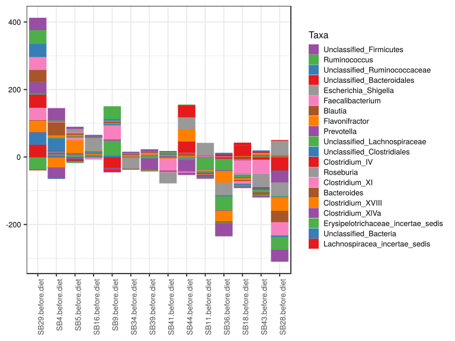

noone@mail.com
Analysis of Dieting study 16S data
% Fri Sep  7 05:46:18 2018

##### \(1.4.1.3.5\) Plots of Log2 fold change in abundance between paired samples. Samples are paired according to attribute SubjectID, resulting in 14 pairs. When fold change or difference is computed, this is done as 'before.diet by after.diet'.

Plots are shown with relation to various combinations of meta 
                   data variables and in different graphical representations. Lots of plots here.

##### \(1.4.1.3.5.2\) Iterating over all combinations of grouping variables

##### \(1.4.1.3.5.2.1\) Entire pool of samples

##### \(1.4.1.3.5.2.2\) Iterating over Log2 fold change in abundance between paired samples. Samples are paired according to attribute SubjectID, resulting in 14 pairs. When fold change or difference is computed, this is done as 'before.diet by after.diet'. profile sorting order

##### \(1.4.1.3.5.2.2.1\) Log2 fold change in abundance between paired samples. Samples are paired according to attribute SubjectID, resulting in 14 pairs. When fold change or difference is computed, this is done as 'before.diet by after.diet'. profile sorting order: GeneSelector paired test ranking

##### \(1.4.1.3.5.2.2.2\) Iterating over dodged vs faceted bars

The same data are shown in multiple combinations of graphical representations. 
                         This is the same data, but each plot highlights slightly different aspects of it.
                         It is not likely that you will need every plot - pick only what you need.

##### \(1.4.1.3.5.2.2.2.1\) faceted plots. Iterating over orientation and, optionally, scaling

##### \(1.4.1.3.5.2.2.2.1.1\) Log2 fold change in abundance between paired samples. Samples are paired according to attribute SubjectID, resulting in 14 pairs. When fold change or difference is computed, this is done as 'before.diet by after.diet'. Plot is in original orientation, Y axis SQRT scaled. Iterating over plot geometry

\(1.4.1.3.5.2.2.2.1.1.0\) [`Table 254.`](#table.254) Data table used for plots. Data for all pooled samples. Showing only 200 first rows. Full dataset is also saved in a delimited text file (click to download and open e.g. in Excel) [`data/1.4.1.3.5.2.2.2.1.1.0-32314b27b61.1.4.1.3.5.2.2.2.1.1.csv`](data/1.4.1.3.5.2.2.2.1.1.0-32314b27b61.1.4.1.3.5.2.2.2.1.1.csv)

| .record.id       | feature                              | l2fc       |
|:-----------------|:-------------------------------------|:-----------|
| SB11.before.diet | Bacteroides                          | 0.06735    |
| SB16.before.diet | Bacteroides                          | 0.19077    |
| SB18.before.diet | Bacteroides                          | 1.82324    |
| SB28.before.diet | Bacteroides                          | 3.14981    |
| SB29.before.diet | Bacteroides                          | 1.50750    |
| SB34.before.diet | Bacteroides                          | \-0.03241  |
| SB36.before.diet | Bacteroides                          | 0.67923    |
| SB39.before.diet | Bacteroides                          | \-0.43682  |
| SB4.before.diet  | Bacteroides                          | \-0.06583  |
| SB41.before.diet | Bacteroides                          | 0.01341    |
| SB43.before.diet | Bacteroides                          | 0.17822    |
| SB44.before.diet | Bacteroides                          | 8.23552    |
| SB5.before.diet  | Bacteroides                          | \-0.53203  |
| SB9.before.diet  | Bacteroides                          | 0.61722    |
| SB11.before.diet | Prevotella                           | 1.51593    |
| SB16.before.diet | Prevotella                           | 1.89366    |
| SB18.before.diet | Prevotella                           | \-3.22199  |
| SB28.before.diet | Prevotella                           | 0.00000    |
| SB29.before.diet | Prevotella                           | 33.91631   |
| SB34.before.diet | Prevotella                           | 0.60740    |
| SB36.before.diet | Prevotella                           | \-1.31431  |
| SB39.before.diet | Prevotella                           | \-32.24029 |
| SB4.before.diet  | Prevotella                           | \-32.10777 |
| SB41.before.diet | Prevotella                           | \-1.38860  |
| SB43.before.diet | Prevotella                           | 3.29127    |
| SB44.before.diet | Prevotella                           | \-33.70196 |
| SB5.before.diet  | Prevotella                           | \-6.29889  |
| SB9.before.diet  | Prevotella                           | \-5.05821  |
| SB11.before.diet | Parabacteroides                      | \-2.13445  |
| SB16.before.diet | Parabacteroides                      | \-32.80845 |
| SB18.before.diet | Parabacteroides                      | \-2.90006  |
| SB28.before.diet | Parabacteroides                      | \-0.42825  |
| SB29.before.diet | Parabacteroides                      | 3.11750    |
| SB34.before.diet | Parabacteroides                      | 0.00000    |
| SB36.before.diet | Parabacteroides                      | 2.50476    |
| SB39.before.diet | Parabacteroides                      | \-0.00192  |
| SB4.before.diet  | Parabacteroides                      | \-33.42970 |
| SB41.before.diet | Parabacteroides                      | 1.19636    |
| SB43.before.diet | Parabacteroides                      | 3.16705    |
| SB44.before.diet | Parabacteroides                      | 0.00000    |
| SB5.before.diet  | Parabacteroides                      | \-0.33072  |
| SB9.before.diet  | Parabacteroides                      | 0.22512    |
| SB11.before.diet | Faecalibacterium                     | \-1.92559  |
| SB16.before.diet | Faecalibacterium                     | \-4.19379  |
| SB18.before.diet | Faecalibacterium                     | \-7.82649  |
| SB28.before.diet | Faecalibacterium                     | \-39.29845 |
| SB29.before.diet | Faecalibacterium                     | 38.56015   |
| SB34.before.diet | Faecalibacterium                     | 1.08434    |
| SB36.before.diet | Faecalibacterium                     | 1.15148    |
| SB39.before.diet | Faecalibacterium                     | \-1.16272  |
| SB4.before.diet  | Faecalibacterium                     | 2.47673    |
| SB41.before.diet | Faecalibacterium                     | \-1.93041  |
| SB43.before.diet | Faecalibacterium                     | 2.48708    |
| SB44.before.diet | Faecalibacterium                     | \-3.94492  |
| SB5.before.diet  | Faecalibacterium                     | 2.97846    |
| SB9.before.diet  | Faecalibacterium                     | 0.18865    |
| SB11.before.diet | Unclassified\_Lachnospiraceae        | \-1.76550  |
| SB16.before.diet | Unclassified\_Lachnospiraceae        | 1.52752    |
| SB18.before.diet | Unclassified\_Lachnospiraceae        | \-3.26271  |
| SB28.before.diet | Unclassified\_Lachnospiraceae        | \-3.31515  |
| SB29.before.diet | Unclassified\_Lachnospiraceae        | 2.96551    |
| SB34.before.diet | Unclassified\_Lachnospiraceae        | 0.76738    |
| SB36.before.diet | Unclassified\_Lachnospiraceae        | \-41.21786 |
| SB39.before.diet | Unclassified\_Lachnospiraceae        | \-0.67973  |
| SB4.before.diet  | Unclassified\_Lachnospiraceae        | 2.48559    |
| SB41.before.diet | Unclassified\_Lachnospiraceae        | 1.25219    |
| SB43.before.diet | Unclassified\_Lachnospiraceae        | \-6.39665  |
| SB44.before.diet | Unclassified\_Lachnospiraceae        | \-2.48715  |
| SB5.before.diet  | Unclassified\_Lachnospiraceae        | 2.25583    |
| SB9.before.diet  | Unclassified\_Lachnospiraceae        | 1.70266    |
| SB11.before.diet | Lactobacillus                        | 0.00000    |
| SB16.before.diet | Lactobacillus                        | \-31.22348 |
| SB18.before.diet | Lactobacillus                        | 34.70052   |
| SB28.before.diet | Lactobacillus                        | 0.00000    |
| SB29.before.diet | Lactobacillus                        | 0.00000    |
| SB34.before.diet | Lactobacillus                        | 0.00000    |
| SB36.before.diet | Lactobacillus                        | 0.00000    |
| SB39.before.diet | Lactobacillus                        | 0.00000    |
| SB4.before.diet  | Lactobacillus                        | 0.00000    |
| SB41.before.diet | Lactobacillus                        | 0.00000    |
| SB43.before.diet | Lactobacillus                        | \-35.41640 |
| SB44.before.diet | Lactobacillus                        | \-33.70196 |
| SB5.before.diet  | Lactobacillus                        | 36.36195   |
| SB9.before.diet  | Lactobacillus                        | 2.71054    |
| SB11.before.diet | Enterococcus                         | 0.00000    |
| SB16.before.diet | Enterococcus                         | 0.00000    |
| SB18.before.diet | Enterococcus                         | 7.27612    |
| SB28.before.diet | Enterococcus                         | 34.04440   |
| SB29.before.diet | Enterococcus                         | \-44.75939 |
| SB34.before.diet | Enterococcus                         | \-31.83823 |
| SB36.before.diet | Enterococcus                         | 0.00000    |
| SB39.before.diet | Enterococcus                         | 0.00000    |
| SB4.before.diet  | Enterococcus                         | \-0.07532  |
| SB41.before.diet | Enterococcus                         | 0.00000    |
| SB43.before.diet | Enterococcus                         | \-34.83144 |
| SB44.before.diet | Enterococcus                         | 0.00000    |
| SB5.before.diet  | Enterococcus                         | 32.19202   |
| SB9.before.diet  | Enterococcus                         | 34.98928   |
| SB11.before.diet | Alistipes                            | 2.43748    |
| SB16.before.diet | Alistipes                            | \-42.77756 |
| SB18.before.diet | Alistipes                            | 33.37860   |
| SB28.before.diet | Alistipes                            | 0.00000    |
| SB29.before.diet | Alistipes                            | 40.20153   |
| SB34.before.diet | Alistipes                            | \-2.15976  |
| SB36.before.diet | Alistipes                            | 40.16614   |
| SB39.before.diet | Alistipes                            | \-0.36869  |
| SB4.before.diet  | Alistipes                            | 0.00000    |
| SB41.before.diet | Alistipes                            | 0.33700    |
| SB43.before.diet | Alistipes                            | 38.79366   |
| SB44.before.diet | Alistipes                            | 37.52562   |
| SB5.before.diet  | Alistipes                            | \-34.84467 |
| SB9.before.diet  | Alistipes                            | 0.00000    |
| SB11.before.diet | Lachnospiracea\_incertae\_sedis      | \-2.71184  |
| SB16.before.diet | Lachnospiracea\_incertae\_sedis      | \-0.35930  |
| SB18.before.diet | Lachnospiracea\_incertae\_sedis      | \-6.31029  |
| SB28.before.diet | Lachnospiracea\_incertae\_sedis      | \-41.28979 |
| SB29.before.diet | Lachnospiracea\_incertae\_sedis      | 37.08624   |
| SB34.before.diet | Lachnospiracea\_incertae\_sedis      | \-0.76778  |
| SB36.before.diet | Lachnospiracea\_incertae\_sedis      | \-6.25811  |
| SB39.before.diet | Lachnospiracea\_incertae\_sedis      | \-0.84967  |
| SB4.before.diet  | Lachnospiracea\_incertae\_sedis      | 1.23078    |
| SB41.before.diet | Lachnospiracea\_incertae\_sedis      | \-2.48689  |
| SB43.before.diet | Lachnospiracea\_incertae\_sedis      | \-8.50505  |
| SB44.before.diet | Lachnospiracea\_incertae\_sedis      | \-2.49022  |
| SB5.before.diet  | Lachnospiracea\_incertae\_sedis      | 0.45424    |
| SB9.before.diet  | Lachnospiracea\_incertae\_sedis      | \-0.54878  |
| SB11.before.diet | Clostridium\_XI                      | 2.63706    |
| SB16.before.diet | Clostridium\_XI                      | \-1.21486  |
| SB18.before.diet | Clostridium\_XI                      | \-39.44852 |
| SB28.before.diet | Clostridium\_XI                      | 1.87974    |
| SB29.before.diet | Clostridium\_XI                      | 36.23824   |
| SB34.before.diet | Clostridium\_XI                      | 1.34436    |
| SB36.before.diet | Clostridium\_XI                      | 1.54096    |
| SB39.before.diet | Clostridium\_XI                      | 2.93050    |
| SB4.before.diet  | Clostridium\_XI                      | \-0.44729  |
| SB41.before.diet | Clostridium\_XI                      | \-35.50361 |
| SB43.before.diet | Clostridium\_XI                      | \-42.58120 |
| SB44.before.diet | Clostridium\_XI                      | 0.64679    |
| SB5.before.diet  | Clostridium\_XI                      | 6.06274    |
| SB9.before.diet  | Clostridium\_XI                      | 40.51255   |
| SB11.before.diet | Blautia                              | \-4.89952  |
| SB16.before.diet | Blautia                              | \-0.87893  |
| SB18.before.diet | Blautia                              | \-3.25986  |
| SB28.before.diet | Blautia                              | \-33.77494 |
| SB29.before.diet | Blautia                              | 35.50128   |
| SB34.before.diet | Blautia                              | 2.14952    |
| SB36.before.diet | Blautia                              | \-3.82529  |
| SB39.before.diet | Blautia                              | \-1.89048  |
| SB4.before.diet  | Blautia                              | 38.18403   |
| SB41.before.diet | Blautia                              | \-1.60224  |
| SB43.before.diet | Blautia                              | \-7.12163  |
| SB44.before.diet | Blautia                              | \-0.25723  |
| SB5.before.diet  | Blautia                              | 4.16899    |
| SB9.before.diet  | Blautia                              | 4.60541    |
| SB11.before.diet | Erysipelotrichaceae\_incertae\_sedis | \-34.11297 |
| SB16.before.diet | Erysipelotrichaceae\_incertae\_sedis | 2.76812    |
| SB18.before.diet | Erysipelotrichaceae\_incertae\_sedis | \-2.41464  |
| SB28.before.diet | Erysipelotrichaceae\_incertae\_sedis | 0.21500    |
| SB29.before.diet | Erysipelotrichaceae\_incertae\_sedis | \-38.02761 |
| SB34.before.diet | Erysipelotrichaceae\_incertae\_sedis | 1.24483    |
| SB36.before.diet | Erysipelotrichaceae\_incertae\_sedis | \-33.59293 |
| SB39.before.diet | Erysipelotrichaceae\_incertae\_sedis | 4.58586    |
| SB4.before.diet  | Erysipelotrichaceae\_incertae\_sedis | 4.25315    |
| SB41.before.diet | Erysipelotrichaceae\_incertae\_sedis | \-0.99628  |
| SB43.before.diet | Erysipelotrichaceae\_incertae\_sedis | 2.94895    |
| SB44.before.diet | Erysipelotrichaceae\_incertae\_sedis | 1.14560    |
| SB5.before.diet  | Erysipelotrichaceae\_incertae\_sedis | 7.48980    |
| SB9.before.diet  | Erysipelotrichaceae\_incertae\_sedis | 43.94687   |
| SB11.before.diet | Roseburia                            | \-3.18365  |
| SB16.before.diet | Roseburia                            | 0.04566    |
| SB18.before.diet | Roseburia                            | \-5.12992  |
| SB28.before.diet | Roseburia                            | \-40.74033 |
| SB29.before.diet | Roseburia                            | 0.79558    |
| SB34.before.diet | Roseburia                            | \-0.49839  |
| SB36.before.diet | Roseburia                            | \-37.47557 |
| SB39.before.diet | Roseburia                            | \-2.70796  |
| SB4.before.diet  | Roseburia                            | 2.55271    |
| SB41.before.diet | Roseburia                            | 2.79839    |
| SB43.before.diet | Roseburia                            | \-39.20063 |
| SB44.before.diet | Roseburia                            | \-2.34940  |
| SB5.before.diet  | Roseburia                            | 2.73959    |
| SB9.before.diet  | Roseburia                            | 1.96199    |
| SB11.before.diet | Escherichia\_Shigella                | 34.22686   |
| SB16.before.diet | Escherichia\_Shigella                | 39.24637   |
| SB18.before.diet | Escherichia\_Shigella                | 0.00000    |
| SB28.before.diet | Escherichia\_Shigella                | 42.83156   |
| SB29.before.diet | Escherichia\_Shigella                | 0.00000    |
| SB34.before.diet | Escherichia\_Shigella                | \-31.83823 |
| SB36.before.diet | Escherichia\_Shigella                | 0.00000    |
| SB39.before.diet | Escherichia\_Shigella                | 0.00000    |
| SB4.before.diet  | Escherichia\_Shigella                | 0.00000    |
| SB41.before.diet | Escherichia\_Shigella                | \-30.69626 |
| SB43.before.diet | Escherichia\_Shigella                | 0.00000    |
| SB44.before.diet | Escherichia\_Shigella                | 35.52563   |
| SB5.before.diet  | Escherichia\_Shigella                | 10.35654   |
| SB9.before.diet  | Escherichia\_Shigella                | 2.44751    |
| SB11.before.diet | Unclassified\_Clostridiales          | \-1.07368  |
| SB16.before.diet | Unclassified\_Clostridiales          | 2.74164    |
| SB18.before.diet | Unclassified\_Clostridiales          | \-1.75566  |
| SB28.before.diet | Unclassified\_Clostridiales          | \-1.31551  |

\(1.4.1.3.5.2.2.2.1.1.1\) [`Widget 266.`](#widget.266) Dynamic Pivot Table link (drag and drop field names and pick averaging 
                      functions or plot types; click on fields or legend elements to filter values). 
                      Starting rendering is Stacked Bar Chart. Data for all pooled samples. Click to see HTML widget file in full window: [`./1.4.1.3.5.2.2.2.1.1.1-3234811642eDynamic.Pivot.Table.html`](./1.4.1.3.5.2.2.2.1.1.1-3234811642eDynamic.Pivot.Table.html)

\(1.4.1.3.5.2.2.2.1.1.1\) [`Widget 267.`](#widget.267) Dynamic Pivot Table link (drag and drop field names and pick averaging 
                      functions or plot types; click on fields or legend elements to filter values). 
                      Starting rendering is Table Barchart. Data for all pooled samples. Click to see HTML widget file in full window: [`./1.4.1.3.5.2.2.2.1.1.1-32333004701Dynamic.Pivot.Table.html`](./1.4.1.3.5.2.2.2.1.1.1-32333004701Dynamic.Pivot.Table.html)

\(1.4.1.3.5.2.2.2.1.1.1\) [`Table 255.`](#table.255) Summary table. Data for all pooled samples. Full dataset is also saved in a delimited text file (click to download and open e.g. in Excel) [`data/1.4.1.3.5.2.2.2.1.1.1-3234c4f5d67.1.4.1.3.5.2.2.2.1.1.csv`](data/1.4.1.3.5.2.2.2.1.1.1-3234c4f5d67.1.4.1.3.5.2.2.2.1.1.csv)

| feature                              | mean      | sd     | median      | incidence |
|:-------------------------------------|:----------|:-------|:------------|:----------|
| Lachnospiracea\_incertae\_sedis      | \-2.41475 | 15.623 | \-1.6682838 | 0.21429   |
| Unclassified\_Bacteria               | 3.42478   | 9.759  | 0.7436285   | 0.64286   |
| Erysipelotrichaceae\_incertae\_sedis | \-2.89616 | 20.891 | 1.1952141   | 0.64286   |
| Clostridium\_XlVa                    | \-1.27888 | 9.623  | 0.8902688   | 0.71429   |
| Clostridium\_XVIII                   | 1.15648   | 19.283 | 1.0244452   | 0.71429   |
| Bacteroides                          | 1.09966   | 2.284  | 0.1844965   | 0.71429   |
| Clostridium\_XI                      | \-1.81447 | 24.179 | 1.4426628   | 0.64286   |
| Roseburia                            | \-8.59942 | 16.737 | \-1.4238920 | 0.42857   |
| Clostridium\_IV                      | 5.21107   | 18.195 | 0.7154712   | 0.57143   |
| Unclassified\_Clostridiales          | 2.17867   | 10.527 | \-0.5211893 | 0.42857   |
| Unclassified\_Lachnospiraceae        | \-3.29772 | 11.254 | 0.0438215   | 0.50000   |
| Prevotella                           | \-5.29339 | 17.674 | \-1.3514573 | 0.35714   |
| Flavonifractor                       | \-1.46942 | 17.263 | 1.4630660   | 0.64286   |
| Blautia                              | 1.93565   | 17.446 | \-1.2405853 | 0.35714   |
| Faecalibacterium                     | \-0.81110 | 15.564 | \-0.4870333 | 0.50000   |
| Escherichia\_Shigella                | 7.29286   | 23.424 | 0.0000000   | 0.42857   |
| Unclassified\_Bacteroidales          | 2.72517   | 9.974  | 0.4470498   | 0.57143   |
| Unclassified\_Ruminococcaceae        | 3.01225   | 10.620 | 0.9052180   | 0.57143   |
| Ruminococcus                         | 2.31314   | 18.381 | \-0.7470518 | 0.42857   |
| Unclassified\_Firmicutes             | \-0.02199 | 19.632 | 0.3530229   | 0.50000   |
| Dorea                                | \-9.16521 | 21.619 | \-0.3485104 | 0.42857   |
| Clostridium\_sensu\_stricto          | 4.00088   | 29.802 | 0.0000000   | 0.42857   |
| Parabacteroides                      | \-4.41591 | 12.284 | \-0.0009598 | 0.35714   |
| Veillonella                          | \-5.36424 | 23.813 | \-0.4887825 | 0.28571   |
| Streptococcus                        | \-1.96407 | 25.616 | \-1.1315358 | 0.42857   |
| Alistipes                            | 8.04924   | 26.897 | 0.1684993   | 0.50000   |
| Gemmiger                             | \-2.37914 | 9.242  | 0.0000000   | 0.28571   |
| Enterococcus                         | \-0.21447 | 24.341 | 0.0000000   | 0.28571   |
| Sutterella                           | 9.56016   | 16.795 | 0.0000000   | 0.35714   |
| Turicibacter                         | 2.42186   | 25.932 | 0.0000000   | 0.35714   |
| Lactobacillus                        | \-1.89777 | 21.210 | 0.0000000   | 0.21429   |
| Unclassified\_Enterobacteriaceae     | \-2.24154 | 22.398 | 0.0000000   | 0.28571   |
| Akkermansia                          | 5.20369   | 13.929 | 0.0000000   | 0.21429   |
| Unclassified\_Lactobacillales        | \-1.89506 | 15.440 | 0.0000000   | 0.14286   |
| Megamonas                            | 2.29943   | 8.604  | 0.0000000   | 0.07143   |
| Odoribacter                          | 2.40811   | 10.749 | 0.0000000   | 0.14286   |
| Unclassified\_Burkholderiales        | 2.07988   | 8.654  | 0.0000000   | 0.07143   |
| Parasutterella                       | \-0.27916 | 1.099  | 0.0000000   | 0.07143   |

\(1.4.1.3.5.2.2.2.1.1.1\) [`Figure 794.`](#figure.794) Log2 fold change in abundance between paired samples. Samples are paired according to attribute SubjectID, resulting in 14 pairs. When fold change or difference is computed, this is done as 'before.diet by after.diet'. Data for all pooled samples. Sorting order of features is GeneSelector paired test ranking. bar_stacked plot.  Image file: [`plots/3232aa107ba.svg`](plots/3232aa107ba.svg).

\(1.4.1.3.5.2.2.2.1.1.1\) [`Figure 795.`](#figure.795) Log2 fold change in abundance between paired samples. Samples are paired according to attribute SubjectID, resulting in 14 pairs. When fold change or difference is computed, this is done as 'before.diet by after.diet'. Data for all pooled samples. Sorting order of features is GeneSelector paired test ranking. bar (sample median) plot.  Image file: [`plots/3232005fc06.svg`](plots/3232005fc06.svg).

\(1.4.1.3.5.2.2.2.1.1.1\) [`Figure 796.`](#figure.796) Log2 fold change in abundance between paired samples. Samples are paired according to attribute SubjectID, resulting in 14 pairs. When fold change or difference is computed, this is done as 'before.diet by after.diet'. Data for all pooled samples. Sorting order of features is GeneSelector paired test ranking. violin plot.  Image file: [`plots/32363020a7e.svg`](plots/32363020a7e.svg).

\(1.4.1.3.5.2.2.2.1.1.1\) [`Figure 797.`](#figure.797) Log2 fold change in abundance between paired samples. Samples are paired according to attribute SubjectID, resulting in 14 pairs. When fold change or difference is computed, this is done as 'before.diet by after.diet'. Data for all pooled samples. Sorting order of features is GeneSelector paired test ranking. boxplot plot.  Image file: [`plots/3231d79ca3e.svg`](plots/3231d79ca3e.svg).

##### \(1.4.1.3.5.2.2.2.1.2\) Log2 fold change in abundance between paired samples. Samples are paired according to attribute SubjectID, resulting in 14 pairs. When fold change or difference is computed, this is done as 'before.diet by after.diet'. Plot is in flipped orientation, Y axis not scaled. Iterating over plot geometry

\(1.4.1.3.5.2.2.2.1.2.1\) [`Figure 798.`](#figure.798) Log2 fold change in abundance between paired samples. Samples are paired according to attribute SubjectID, resulting in 14 pairs. When fold change or difference is computed, this is done as 'before.diet by after.diet'. Data for all pooled samples. Sorting order of features is GeneSelector paired test ranking. bar (sample median) plot.  Image file: [`plots/32358a3576b.svg`](plots/32358a3576b.svg).

\(1.4.1.3.5.2.2.2.1.2.1\) [`Figure 799.`](#figure.799) Log2 fold change in abundance between paired samples. Samples are paired according to attribute SubjectID, resulting in 14 pairs. When fold change or difference is computed, this is done as 'before.diet by after.diet'. Data for all pooled samples. Sorting order of features is GeneSelector paired test ranking. violin plot.  Image file: [`plots/3231c5e0a01.svg`](plots/3231c5e0a01.svg).

\(1.4.1.3.5.2.2.2.1.2.1\) [`Figure 800.`](#figure.800) Log2 fold change in abundance between paired samples. Samples are paired according to attribute SubjectID, resulting in 14 pairs. When fold change or difference is computed, this is done as 'before.diet by after.diet'. Data for all pooled samples. Sorting order of features is GeneSelector paired test ranking. boxplot plot.  Image file: [`plots/3235e09f6b3.svg`](plots/3235e09f6b3.svg).

##### \(1.4.1.3.5.2.3\) Grouping variables Drug.Before.Diet

##### \(1.4.1.3.5.2.4\) Iterating over Log2 fold change in abundance between paired samples. Samples are paired according to attribute SubjectID, resulting in 14 pairs. When fold change or difference is computed, this is done as 'before.diet by after.diet'. profile sorting order

##### \(1.4.1.3.5.2.4.1\) Log2 fold change in abundance between paired samples. Samples are paired according to attribute SubjectID, resulting in 14 pairs. When fold change or difference is computed, this is done as 'before.diet by after.diet'. profile sorting order: GeneSelector paired test ranking

##### \(1.4.1.3.5.2.4.2\) Iterating over dodged vs faceted bars

The same data are shown in multiple combinations of graphical representations. 
                         This is the same data, but each plot highlights slightly different aspects of it.
                         It is not likely that you will need every plot - pick only what you need.

##### \(1.4.1.3.5.2.4.2.1\) faceted plots. Iterating over orientation and, optionally, scaling

##### \(1.4.1.3.5.2.4.2.1.1\) Log2 fold change in abundance between paired samples. Samples are paired according to attribute SubjectID, resulting in 14 pairs. When fold change or difference is computed, this is done as 'before.diet by after.diet'. Plot is in original orientation, Y axis SQRT scaled. Iterating over plot geometry

\(1.4.1.3.5.2.4.2.1.1.0\) [`Table 256.`](#table.256) Data table used for plots. Data grouped by Drug.Before.Diet. Showing only 200 first rows. Full dataset is also saved in a delimited text file (click to download and open e.g. in Excel) [`data/1.4.1.3.5.2.4.2.1.1.0-323477b8add.1.4.1.3.5.2.4.2.1.1.csv`](data/1.4.1.3.5.2.4.2.1.1.0-323477b8add.1.4.1.3.5.2.4.2.1.1.csv)

| .record.id       | Drug.Before.Diet | feature                              | l2fc       |
|:-----------------|:-----------------|:-------------------------------------|:-----------|
| SB11.before.diet | DrugBefore\_NO   | Bacteroides                          | 0.06735    |
| SB16.before.diet | DrugBefore\_YES  | Bacteroides                          | 0.19077    |
| SB18.before.diet | DrugBefore\_NO   | Bacteroides                          | 1.82324    |
| SB28.before.diet | DrugBefore\_YES  | Bacteroides                          | 3.14981    |
| SB29.before.diet | DrugBefore\_YES  | Bacteroides                          | 1.50750    |
| SB34.before.diet | DrugBefore\_YES  | Bacteroides                          | \-0.03241  |
| SB36.before.diet | DrugBefore\_YES  | Bacteroides                          | 0.67923    |
| SB39.before.diet | DrugBefore\_YES  | Bacteroides                          | \-0.43682  |
| SB4.before.diet  | DrugBefore\_YES  | Bacteroides                          | \-0.06583  |
| SB41.before.diet | DrugBefore\_YES  | Bacteroides                          | 0.01341    |
| SB43.before.diet | DrugBefore\_YES  | Bacteroides                          | 0.17822    |
| SB44.before.diet | DrugBefore\_YES  | Bacteroides                          | 8.23552    |
| SB5.before.diet  | DrugBefore\_NO   | Bacteroides                          | \-0.53203  |
| SB9.before.diet  | DrugBefore\_NO   | Bacteroides                          | 0.61722    |
| SB11.before.diet | DrugBefore\_NO   | Prevotella                           | 1.51593    |
| SB16.before.diet | DrugBefore\_YES  | Prevotella                           | 1.89366    |
| SB18.before.diet | DrugBefore\_NO   | Prevotella                           | \-3.22199  |
| SB28.before.diet | DrugBefore\_YES  | Prevotella                           | 0.00000    |
| SB29.before.diet | DrugBefore\_YES  | Prevotella                           | 33.91631   |
| SB34.before.diet | DrugBefore\_YES  | Prevotella                           | 0.60740    |
| SB36.before.diet | DrugBefore\_YES  | Prevotella                           | \-1.31431  |
| SB39.before.diet | DrugBefore\_YES  | Prevotella                           | \-32.24029 |
| SB4.before.diet  | DrugBefore\_YES  | Prevotella                           | \-32.10777 |
| SB41.before.diet | DrugBefore\_YES  | Prevotella                           | \-1.38860  |
| SB43.before.diet | DrugBefore\_YES  | Prevotella                           | 3.29127    |
| SB44.before.diet | DrugBefore\_YES  | Prevotella                           | \-33.70196 |
| SB5.before.diet  | DrugBefore\_NO   | Prevotella                           | \-6.29889  |
| SB9.before.diet  | DrugBefore\_NO   | Prevotella                           | \-5.05821  |
| SB11.before.diet | DrugBefore\_NO   | Parabacteroides                      | \-2.13445  |
| SB16.before.diet | DrugBefore\_YES  | Parabacteroides                      | \-32.80845 |
| SB18.before.diet | DrugBefore\_NO   | Parabacteroides                      | \-2.90006  |
| SB28.before.diet | DrugBefore\_YES  | Parabacteroides                      | \-0.42825  |
| SB29.before.diet | DrugBefore\_YES  | Parabacteroides                      | 3.11750    |
| SB34.before.diet | DrugBefore\_YES  | Parabacteroides                      | 0.00000    |
| SB36.before.diet | DrugBefore\_YES  | Parabacteroides                      | 2.50476    |
| SB39.before.diet | DrugBefore\_YES  | Parabacteroides                      | \-0.00192  |
| SB4.before.diet  | DrugBefore\_YES  | Parabacteroides                      | \-33.42970 |
| SB41.before.diet | DrugBefore\_YES  | Parabacteroides                      | 1.19636    |
| SB43.before.diet | DrugBefore\_YES  | Parabacteroides                      | 3.16705    |
| SB44.before.diet | DrugBefore\_YES  | Parabacteroides                      | 0.00000    |
| SB5.before.diet  | DrugBefore\_NO   | Parabacteroides                      | \-0.33072  |
| SB9.before.diet  | DrugBefore\_NO   | Parabacteroides                      | 0.22512    |
| SB11.before.diet | DrugBefore\_NO   | Faecalibacterium                     | \-1.92559  |
| SB16.before.diet | DrugBefore\_YES  | Faecalibacterium                     | \-4.19379  |
| SB18.before.diet | DrugBefore\_NO   | Faecalibacterium                     | \-7.82649  |
| SB28.before.diet | DrugBefore\_YES  | Faecalibacterium                     | \-39.29845 |
| SB29.before.diet | DrugBefore\_YES  | Faecalibacterium                     | 38.56015   |
| SB34.before.diet | DrugBefore\_YES  | Faecalibacterium                     | 1.08434    |
| SB36.before.diet | DrugBefore\_YES  | Faecalibacterium                     | 1.15148    |
| SB39.before.diet | DrugBefore\_YES  | Faecalibacterium                     | \-1.16272  |
| SB4.before.diet  | DrugBefore\_YES  | Faecalibacterium                     | 2.47673    |
| SB41.before.diet | DrugBefore\_YES  | Faecalibacterium                     | \-1.93041  |
| SB43.before.diet | DrugBefore\_YES  | Faecalibacterium                     | 2.48708    |
| SB44.before.diet | DrugBefore\_YES  | Faecalibacterium                     | \-3.94492  |
| SB5.before.diet  | DrugBefore\_NO   | Faecalibacterium                     | 2.97846    |
| SB9.before.diet  | DrugBefore\_NO   | Faecalibacterium                     | 0.18865    |
| SB11.before.diet | DrugBefore\_NO   | Unclassified\_Lachnospiraceae        | \-1.76550  |
| SB16.before.diet | DrugBefore\_YES  | Unclassified\_Lachnospiraceae        | 1.52752    |
| SB18.before.diet | DrugBefore\_NO   | Unclassified\_Lachnospiraceae        | \-3.26271  |
| SB28.before.diet | DrugBefore\_YES  | Unclassified\_Lachnospiraceae        | \-3.31515  |
| SB29.before.diet | DrugBefore\_YES  | Unclassified\_Lachnospiraceae        | 2.96551    |
| SB34.before.diet | DrugBefore\_YES  | Unclassified\_Lachnospiraceae        | 0.76738    |
| SB36.before.diet | DrugBefore\_YES  | Unclassified\_Lachnospiraceae        | \-41.21786 |
| SB39.before.diet | DrugBefore\_YES  | Unclassified\_Lachnospiraceae        | \-0.67973  |
| SB4.before.diet  | DrugBefore\_YES  | Unclassified\_Lachnospiraceae        | 2.48559    |
| SB41.before.diet | DrugBefore\_YES  | Unclassified\_Lachnospiraceae        | 1.25219    |
| SB43.before.diet | DrugBefore\_YES  | Unclassified\_Lachnospiraceae        | \-6.39665  |
| SB44.before.diet | DrugBefore\_YES  | Unclassified\_Lachnospiraceae        | \-2.48715  |
| SB5.before.diet  | DrugBefore\_NO   | Unclassified\_Lachnospiraceae        | 2.25583    |
| SB9.before.diet  | DrugBefore\_NO   | Unclassified\_Lachnospiraceae        | 1.70266    |
| SB11.before.diet | DrugBefore\_NO   | Lactobacillus                        | 0.00000    |
| SB16.before.diet | DrugBefore\_YES  | Lactobacillus                        | \-31.22348 |
| SB18.before.diet | DrugBefore\_NO   | Lactobacillus                        | 34.70052   |
| SB28.before.diet | DrugBefore\_YES  | Lactobacillus                        | 0.00000    |
| SB29.before.diet | DrugBefore\_YES  | Lactobacillus                        | 0.00000    |
| SB34.before.diet | DrugBefore\_YES  | Lactobacillus                        | 0.00000    |
| SB36.before.diet | DrugBefore\_YES  | Lactobacillus                        | 0.00000    |
| SB39.before.diet | DrugBefore\_YES  | Lactobacillus                        | 0.00000    |
| SB4.before.diet  | DrugBefore\_YES  | Lactobacillus                        | 0.00000    |
| SB41.before.diet | DrugBefore\_YES  | Lactobacillus                        | 0.00000    |
| SB43.before.diet | DrugBefore\_YES  | Lactobacillus                        | \-35.41640 |
| SB44.before.diet | DrugBefore\_YES  | Lactobacillus                        | \-33.70196 |
| SB5.before.diet  | DrugBefore\_NO   | Lactobacillus                        | 36.36195   |
| SB9.before.diet  | DrugBefore\_NO   | Lactobacillus                        | 2.71054    |
| SB11.before.diet | DrugBefore\_NO   | Enterococcus                         | 0.00000    |
| SB16.before.diet | DrugBefore\_YES  | Enterococcus                         | 0.00000    |
| SB18.before.diet | DrugBefore\_NO   | Enterococcus                         | 7.27612    |
| SB28.before.diet | DrugBefore\_YES  | Enterococcus                         | 34.04440   |
| SB29.before.diet | DrugBefore\_YES  | Enterococcus                         | \-44.75939 |
| SB34.before.diet | DrugBefore\_YES  | Enterococcus                         | \-31.83823 |
| SB36.before.diet | DrugBefore\_YES  | Enterococcus                         | 0.00000    |
| SB39.before.diet | DrugBefore\_YES  | Enterococcus                         | 0.00000    |
| SB4.before.diet  | DrugBefore\_YES  | Enterococcus                         | \-0.07532  |
| SB41.before.diet | DrugBefore\_YES  | Enterococcus                         | 0.00000    |
| SB43.before.diet | DrugBefore\_YES  | Enterococcus                         | \-34.83144 |
| SB44.before.diet | DrugBefore\_YES  | Enterococcus                         | 0.00000    |
| SB5.before.diet  | DrugBefore\_NO   | Enterococcus                         | 32.19202   |
| SB9.before.diet  | DrugBefore\_NO   | Enterococcus                         | 34.98928   |
| SB11.before.diet | DrugBefore\_NO   | Alistipes                            | 2.43748    |
| SB16.before.diet | DrugBefore\_YES  | Alistipes                            | \-42.77756 |
| SB18.before.diet | DrugBefore\_NO   | Alistipes                            | 33.37860   |
| SB28.before.diet | DrugBefore\_YES  | Alistipes                            | 0.00000    |
| SB29.before.diet | DrugBefore\_YES  | Alistipes                            | 40.20153   |
| SB34.before.diet | DrugBefore\_YES  | Alistipes                            | \-2.15976  |
| SB36.before.diet | DrugBefore\_YES  | Alistipes                            | 40.16614   |
| SB39.before.diet | DrugBefore\_YES  | Alistipes                            | \-0.36869  |
| SB4.before.diet  | DrugBefore\_YES  | Alistipes                            | 0.00000    |
| SB41.before.diet | DrugBefore\_YES  | Alistipes                            | 0.33700    |
| SB43.before.diet | DrugBefore\_YES  | Alistipes                            | 38.79366   |
| SB44.before.diet | DrugBefore\_YES  | Alistipes                            | 37.52562   |
| SB5.before.diet  | DrugBefore\_NO   | Alistipes                            | \-34.84467 |
| SB9.before.diet  | DrugBefore\_NO   | Alistipes                            | 0.00000    |
| SB11.before.diet | DrugBefore\_NO   | Lachnospiracea\_incertae\_sedis      | \-2.71184  |
| SB16.before.diet | DrugBefore\_YES  | Lachnospiracea\_incertae\_sedis      | \-0.35930  |
| SB18.before.diet | DrugBefore\_NO   | Lachnospiracea\_incertae\_sedis      | \-6.31029  |
| SB28.before.diet | DrugBefore\_YES  | Lachnospiracea\_incertae\_sedis      | \-41.28979 |
| SB29.before.diet | DrugBefore\_YES  | Lachnospiracea\_incertae\_sedis      | 37.08624   |
| SB34.before.diet | DrugBefore\_YES  | Lachnospiracea\_incertae\_sedis      | \-0.76778  |
| SB36.before.diet | DrugBefore\_YES  | Lachnospiracea\_incertae\_sedis      | \-6.25811  |
| SB39.before.diet | DrugBefore\_YES  | Lachnospiracea\_incertae\_sedis      | \-0.84967  |
| SB4.before.diet  | DrugBefore\_YES  | Lachnospiracea\_incertae\_sedis      | 1.23078    |
| SB41.before.diet | DrugBefore\_YES  | Lachnospiracea\_incertae\_sedis      | \-2.48689  |
| SB43.before.diet | DrugBefore\_YES  | Lachnospiracea\_incertae\_sedis      | \-8.50505  |
| SB44.before.diet | DrugBefore\_YES  | Lachnospiracea\_incertae\_sedis      | \-2.49022  |
| SB5.before.diet  | DrugBefore\_NO   | Lachnospiracea\_incertae\_sedis      | 0.45424    |
| SB9.before.diet  | DrugBefore\_NO   | Lachnospiracea\_incertae\_sedis      | \-0.54878  |
| SB11.before.diet | DrugBefore\_NO   | Clostridium\_XI                      | 2.63706    |
| SB16.before.diet | DrugBefore\_YES  | Clostridium\_XI                      | \-1.21486  |
| SB18.before.diet | DrugBefore\_NO   | Clostridium\_XI                      | \-39.44852 |
| SB28.before.diet | DrugBefore\_YES  | Clostridium\_XI                      | 1.87974    |
| SB29.before.diet | DrugBefore\_YES  | Clostridium\_XI                      | 36.23824   |
| SB34.before.diet | DrugBefore\_YES  | Clostridium\_XI                      | 1.34436    |
| SB36.before.diet | DrugBefore\_YES  | Clostridium\_XI                      | 1.54096    |
| SB39.before.diet | DrugBefore\_YES  | Clostridium\_XI                      | 2.93050    |
| SB4.before.diet  | DrugBefore\_YES  | Clostridium\_XI                      | \-0.44729  |
| SB41.before.diet | DrugBefore\_YES  | Clostridium\_XI                      | \-35.50361 |
| SB43.before.diet | DrugBefore\_YES  | Clostridium\_XI                      | \-42.58120 |
| SB44.before.diet | DrugBefore\_YES  | Clostridium\_XI                      | 0.64679    |
| SB5.before.diet  | DrugBefore\_NO   | Clostridium\_XI                      | 6.06274    |
| SB9.before.diet  | DrugBefore\_NO   | Clostridium\_XI                      | 40.51255   |
| SB11.before.diet | DrugBefore\_NO   | Blautia                              | \-4.89952  |
| SB16.before.diet | DrugBefore\_YES  | Blautia                              | \-0.87893  |
| SB18.before.diet | DrugBefore\_NO   | Blautia                              | \-3.25986  |
| SB28.before.diet | DrugBefore\_YES  | Blautia                              | \-33.77494 |
| SB29.before.diet | DrugBefore\_YES  | Blautia                              | 35.50128   |
| SB34.before.diet | DrugBefore\_YES  | Blautia                              | 2.14952    |
| SB36.before.diet | DrugBefore\_YES  | Blautia                              | \-3.82529  |
| SB39.before.diet | DrugBefore\_YES  | Blautia                              | \-1.89048  |
| SB4.before.diet  | DrugBefore\_YES  | Blautia                              | 38.18403   |
| SB41.before.diet | DrugBefore\_YES  | Blautia                              | \-1.60224  |
| SB43.before.diet | DrugBefore\_YES  | Blautia                              | \-7.12163  |
| SB44.before.diet | DrugBefore\_YES  | Blautia                              | \-0.25723  |
| SB5.before.diet  | DrugBefore\_NO   | Blautia                              | 4.16899    |
| SB9.before.diet  | DrugBefore\_NO   | Blautia                              | 4.60541    |
| SB11.before.diet | DrugBefore\_NO   | Erysipelotrichaceae\_incertae\_sedis | \-34.11297 |
| SB16.before.diet | DrugBefore\_YES  | Erysipelotrichaceae\_incertae\_sedis | 2.76812    |
| SB18.before.diet | DrugBefore\_NO   | Erysipelotrichaceae\_incertae\_sedis | \-2.41464  |
| SB28.before.diet | DrugBefore\_YES  | Erysipelotrichaceae\_incertae\_sedis | 0.21500    |
| SB29.before.diet | DrugBefore\_YES  | Erysipelotrichaceae\_incertae\_sedis | \-38.02761 |
| SB34.before.diet | DrugBefore\_YES  | Erysipelotrichaceae\_incertae\_sedis | 1.24483    |
| SB36.before.diet | DrugBefore\_YES  | Erysipelotrichaceae\_incertae\_sedis | \-33.59293 |
| SB39.before.diet | DrugBefore\_YES  | Erysipelotrichaceae\_incertae\_sedis | 4.58586    |
| SB4.before.diet  | DrugBefore\_YES  | Erysipelotrichaceae\_incertae\_sedis | 4.25315    |
| SB41.before.diet | DrugBefore\_YES  | Erysipelotrichaceae\_incertae\_sedis | \-0.99628  |
| SB43.before.diet | DrugBefore\_YES  | Erysipelotrichaceae\_incertae\_sedis | 2.94895    |
| SB44.before.diet | DrugBefore\_YES  | Erysipelotrichaceae\_incertae\_sedis | 1.14560    |
| SB5.before.diet  | DrugBefore\_NO   | Erysipelotrichaceae\_incertae\_sedis | 7.48980    |
| SB9.before.diet  | DrugBefore\_NO   | Erysipelotrichaceae\_incertae\_sedis | 43.94687   |
| SB11.before.diet | DrugBefore\_NO   | Roseburia                            | \-3.18365  |
| SB16.before.diet | DrugBefore\_YES  | Roseburia                            | 0.04566    |
| SB18.before.diet | DrugBefore\_NO   | Roseburia                            | \-5.12992  |
| SB28.before.diet | DrugBefore\_YES  | Roseburia                            | \-40.74033 |
| SB29.before.diet | DrugBefore\_YES  | Roseburia                            | 0.79558    |
| SB34.before.diet | DrugBefore\_YES  | Roseburia                            | \-0.49839  |
| SB36.before.diet | DrugBefore\_YES  | Roseburia                            | \-37.47557 |
| SB39.before.diet | DrugBefore\_YES  | Roseburia                            | \-2.70796  |
| SB4.before.diet  | DrugBefore\_YES  | Roseburia                            | 2.55271    |
| SB41.before.diet | DrugBefore\_YES  | Roseburia                            | 2.79839    |
| SB43.before.diet | DrugBefore\_YES  | Roseburia                            | \-39.20063 |
| SB44.before.diet | DrugBefore\_YES  | Roseburia                            | \-2.34940  |
| SB5.before.diet  | DrugBefore\_NO   | Roseburia                            | 2.73959    |
| SB9.before.diet  | DrugBefore\_NO   | Roseburia                            | 1.96199    |
| SB11.before.diet | DrugBefore\_NO   | Escherichia\_Shigella                | 34.22686   |
| SB16.before.diet | DrugBefore\_YES  | Escherichia\_Shigella                | 39.24637   |
| SB18.before.diet | DrugBefore\_NO   | Escherichia\_Shigella                | 0.00000    |
| SB28.before.diet | DrugBefore\_YES  | Escherichia\_Shigella                | 42.83156   |
| SB29.before.diet | DrugBefore\_YES  | Escherichia\_Shigella                | 0.00000    |
| SB34.before.diet | DrugBefore\_YES  | Escherichia\_Shigella                | \-31.83823 |
| SB36.before.diet | DrugBefore\_YES  | Escherichia\_Shigella                | 0.00000    |
| SB39.before.diet | DrugBefore\_YES  | Escherichia\_Shigella                | 0.00000    |
| SB4.before.diet  | DrugBefore\_YES  | Escherichia\_Shigella                | 0.00000    |
| SB41.before.diet | DrugBefore\_YES  | Escherichia\_Shigella                | \-30.69626 |
| SB43.before.diet | DrugBefore\_YES  | Escherichia\_Shigella                | 0.00000    |
| SB44.before.diet | DrugBefore\_YES  | Escherichia\_Shigella                | 35.52563   |
| SB5.before.diet  | DrugBefore\_NO   | Escherichia\_Shigella                | 10.35654   |
| SB9.before.diet  | DrugBefore\_NO   | Escherichia\_Shigella                | 2.44751    |
| SB11.before.diet | DrugBefore\_NO   | Unclassified\_Clostridiales          | \-1.07368  |
| SB16.before.diet | DrugBefore\_YES  | Unclassified\_Clostridiales          | 2.74164    |
| SB18.before.diet | DrugBefore\_NO   | Unclassified\_Clostridiales          | \-1.75566  |
| SB28.before.diet | DrugBefore\_YES  | Unclassified\_Clostridiales          | \-1.31551  |

\(1.4.1.3.5.2.4.2.1.1.1\) [`Widget 268.`](#widget.268) Dynamic Pivot Table link (drag and drop field names and pick averaging 
                      functions or plot types; click on fields or legend elements to filter values). 
                      Starting rendering is Stacked Bar Chart. Data grouped by Drug.Before.Diet. Click to see HTML widget file in full window: [`./1.4.1.3.5.2.4.2.1.1.1-3236f3195b5Dynamic.Pivot.Table.html`](./1.4.1.3.5.2.4.2.1.1.1-3236f3195b5Dynamic.Pivot.Table.html)

\(1.4.1.3.5.2.4.2.1.1.1\) [`Widget 269.`](#widget.269) Dynamic Pivot Table link (drag and drop field names and pick averaging 
                      functions or plot types; click on fields or legend elements to filter values). 
                      Starting rendering is Table Barchart. Data grouped by Drug.Before.Diet. Click to see HTML widget file in full window: [`./1.4.1.3.5.2.4.2.1.1.1-323613e24Dynamic.Pivot.Table.html`](./1.4.1.3.5.2.4.2.1.1.1-323613e24Dynamic.Pivot.Table.html)

\(1.4.1.3.5.2.4.2.1.1.1\) [`Table 257.`](#table.257) Summary table. Data grouped by Drug.Before.Diet. Full dataset is also saved in a delimited text file (click to download and open e.g. in Excel) [`data/1.4.1.3.5.2.4.2.1.1.1-3233b3dc2d7.1.4.1.3.5.2.4.2.1.1.csv`](data/1.4.1.3.5.2.4.2.1.1.1-3233b3dc2d7.1.4.1.3.5.2.4.2.1.1.csv)

| feature                              | Drug.Before.Diet | mean       | sd       | median      | incidence |
|:-------------------------------------|:-----------------|:-----------|:---------|:------------|:----------|
| Lachnospiracea\_incertae\_sedis      | DrugBefore\_NO   | \-2.27917  | 2.99460  | \-1.630307  | 0.25      |
| Lachnospiracea\_incertae\_sedis      | DrugBefore\_YES  | \-2.46898  | 18.69675 | \-1.668284  | 0.20      |
| Unclassified\_Bacteria               | DrugBefore\_NO   | 1.63603    | 2.45118  | 0.937033    | 0.75      |
| Unclassified\_Bacteria               | DrugBefore\_YES  | 4.14029    | 11.55738 | 0.650068    | 0.60      |
| Erysipelotrichaceae\_incertae\_sedis | DrugBefore\_NO   | 3.72727    | 32.15266 | 2.537580    | 0.50      |
| Erysipelotrichaceae\_incertae\_sedis | DrugBefore\_YES  | \-5.54553  | 16.07771 | 1.195214    | 0.70      |
| Clostridium\_XlVa                    | DrugBefore\_NO   | 1.02398    | 3.01184  | 0.765822    | 0.50      |
| Clostridium\_XlVa                    | DrugBefore\_YES  | \-2.20003  | 11.28912 | 0.890269    | 0.80      |
| Clostridium\_XVIII                   | DrugBefore\_NO   | 9.44645    | 19.62899 | 0.955009    | 0.75      |
| Clostridium\_XVIII                   | DrugBefore\_YES  | \-2.15951  | 19.12884 | 1.498749    | 0.70      |
| Bacteroides                          | DrugBefore\_NO   | 0.49394    | 1.00280  | 0.342286    | 0.75      |
| Bacteroides                          | DrugBefore\_YES  | 1.34194    | 2.64019  | 0.184496    | 0.70      |
| Clostridium\_XI                      | DrugBefore\_NO   | 2.44096    | 32.74818 | 4.349900    | 0.75      |
| Clostridium\_XI                      | DrugBefore\_YES  | \-3.51664  | 21.81133 | 0.995576    | 0.60      |
| Roseburia                            | DrugBefore\_NO   | \-0.90300  | 3.85335  | \-0.610830  | 0.50      |
| Roseburia                            | DrugBefore\_YES  | \-11.67799 | 19.04734 | \-1.423892  | 0.40      |
| Clostridium\_IV                      | DrugBefore\_NO   | \-0.14875  | 26.20597 | 0.395281    | 0.50      |
| Clostridium\_IV                      | DrugBefore\_YES  | 7.35500    | 15.21187 | 0.715471    | 0.60      |
| Unclassified\_Clostridiales          | DrugBefore\_NO   | \-0.16487  | 2.08900  | \-0.903441  | 0.25      |
| Unclassified\_Clostridiales          | DrugBefore\_YES  | 3.11608    | 12.45724 | \-0.077225  | 0.50      |
| Unclassified\_Lachnospiraceae        | DrugBefore\_NO   | \-0.26743  | 2.67482  | \-0.031421  | 0.50      |
| Unclassified\_Lachnospiraceae        | DrugBefore\_YES  | \-4.50984  | 13.22264 | 0.043822    | 0.50      |
| Prevotella                           | DrugBefore\_NO   | \-3.26579  | 3.42925  | \-4.140100  | 0.25      |
| Prevotella                           | DrugBefore\_YES  | \-6.10443  | 21.08787 | \-0.657156  | 0.40      |
| Flavonifractor                       | DrugBefore\_NO   | 0.30288    | 4.01282  | 1.743693    | 0.75      |
| Flavonifractor                       | DrugBefore\_YES  | \-2.17834  | 20.57071 | 0.798489    | 0.60      |
| Blautia                              | DrugBefore\_NO   | 0.15375    | 4.93720  | 0.454561    | 0.50      |
| Blautia                              | DrugBefore\_YES  | 2.64841    | 20.72550 | \-1.240585  | 0.30      |
| Faecalibacterium                     | DrugBefore\_NO   | \-1.64624  | 4.58360  | \-0.868466  | 0.50      |
| Faecalibacterium                     | DrugBefore\_YES  | \-0.47705  | 18.50534 | \-0.039188  | 0.50      |
| Escherichia\_Shigella                | DrugBefore\_NO   | 11.75773   | 15.61783 | 6.402026    | 0.75      |
| Escherichia\_Shigella                | DrugBefore\_YES  | 5.50691    | 26.43559 | 0.000000    | 0.30      |
| Unclassified\_Bacteroidales          | DrugBefore\_NO   | \-1.80694  | 5.12597  | \-3.775731  | 0.25      |
| Unclassified\_Bacteroidales          | DrugBefore\_YES  | 4.53802    | 11.05276 | 0.626605    | 0.70      |
| Unclassified\_Ruminococcaceae        | DrugBefore\_NO   | \-0.75615  | 3.57958  | \-1.759812  | 0.25      |
| Unclassified\_Ruminococcaceae        | DrugBefore\_YES  | 4.51960    | 12.23942 | 1.333740    | 0.70      |
| Ruminococcus                         | DrugBefore\_NO   | 7.00479    | 19.56447 | \-2.195992  | 0.25      |
| Ruminococcus                         | DrugBefore\_YES  | 0.43648    | 18.62136 | 0.164894    | 0.50      |
| Unclassified\_Firmicutes             | DrugBefore\_NO   | \-0.54533  | 3.37779  | \-1.662897  | 0.25      |
| Unclassified\_Firmicutes             | DrugBefore\_YES  | 0.18734    | 23.51028 | 2.054333    | 0.60      |
| Dorea                                | DrugBefore\_NO   | 0.81633    | 3.09277  | 1.023113    | 0.50      |
| Dorea                                | DrugBefore\_YES  | \-13.15783 | 24.69688 | \-16.216630 | 0.40      |
| Clostridium\_sensu\_stricto          | DrugBefore\_NO   | 10.92982   | 34.29385 | 18.139742   | 0.50      |
| Clostridium\_sensu\_stricto          | DrugBefore\_YES  | 1.22931    | 29.34287 | 0.000000    | 0.40      |
| Parabacteroides                      | DrugBefore\_NO   | \-1.28503  | 1.47435  | \-1.232586  | 0.25      |
| Parabacteroides                      | DrugBefore\_YES  | \-5.66826  | 14.53075 | 0.000000    | 0.40      |
| Veillonella                          | DrugBefore\_NO   | \-18.34917 | 22.74191 | \-19.506517 | 0.25      |
| Veillonella                          | DrugBefore\_YES  | \-0.17027  | 23.27679 | 0.000000    | 0.30      |
| Streptococcus                        | DrugBefore\_NO   | 1.64183    | 30.24170 | 0.666755    | 0.50      |
| Streptococcus                        | DrugBefore\_YES  | \-3.40643  | 25.19625 | \-1.131536  | 0.40      |
| Alistipes                            | DrugBefore\_NO   | 0.24285    | 27.89258 | 1.218738    | 0.50      |
| Alistipes                            | DrugBefore\_YES  | 11.17179   | 27.34420 | 0.168499    | 0.50      |
| Gemmiger                             | DrugBefore\_NO   | \-7.96814  | 17.51040 | 0.007638    | 0.50      |
| Gemmiger                             | DrugBefore\_YES  | \-0.14354  | 1.32030  | 0.000000    | 0.20      |
| Enterococcus                         | DrugBefore\_NO   | 18.61435   | 17.58352 | 19.734070   | 0.75      |
| Enterococcus                         | DrugBefore\_YES  | \-7.74600  | 23.06832 | 0.000000    | 0.10      |
| Sutterella                           | DrugBefore\_NO   | 6.88656    | 16.90607 | \-1.103979  | 0.25      |
| Sutterella                           | DrugBefore\_YES  | 10.62961   | 17.54181 | 0.000000    | 0.40      |
| Turicibacter                         | DrugBefore\_NO   | 10.16254   | 17.29928 | 2.378859    | 0.50      |
| Turicibacter                         | DrugBefore\_YES  | \-0.67442  | 28.88381 | 0.000000    | 0.30      |
| Lactobacillus                        | DrugBefore\_NO   | 18.44325   | 19.77414 | 18.705532   | 0.75      |
| Lactobacillus                        | DrugBefore\_YES  | \-10.03418 | 16.18710 | 0.000000    | 0.00      |
| Unclassified\_Enterobacteriaceae     | DrugBefore\_NO   | 18.42227   | 21.32607 | 17.494638   | 0.50      |
| Unclassified\_Enterobacteriaceae     | DrugBefore\_YES  | \-10.50706 | 17.53120 | 0.000000    | 0.20      |
| Akkermansia                          | DrugBefore\_NO   | 0.84844    | 1.69689  | 0.000000    | 0.25      |
| Akkermansia                          | DrugBefore\_YES  | 6.94579    | 16.35478 | 0.000000    | 0.20      |
| Unclassified\_Lactobacillales        | DrugBefore\_NO   | 9.48478    | 15.37868 | 2.873557    | 0.50      |
| Unclassified\_Lactobacillales        | DrugBefore\_YES  | \-6.44700  | 13.59982 | 0.000000    | 0.00      |
| Megamonas                            | DrugBefore\_NO   | 8.04801    | 16.09601 | 0.000000    | 0.25      |
| Megamonas                            | DrugBefore\_YES  | 0.00000    | 0.00000  | 0.000000    | 0.00      |
| Odoribacter                          | DrugBefore\_NO   | \-1.15524  | 3.24448  | 0.000000    | 0.25      |
| Odoribacter                          | DrugBefore\_YES  | 3.83345    | 12.46927 | 0.000000    | 0.10      |
| Unclassified\_Burkholderiales        | DrugBefore\_NO   | 0.00000    | 0.00000  | 0.000000    | 0.00      |
| Unclassified\_Burkholderiales        | DrugBefore\_YES  | 2.91183    | 10.27022 | 0.000000    | 0.10      |
| Parasutterella                       | DrugBefore\_NO   | \-1.02316  | 2.04633  | 0.000000    | 0.00      |
| Parasutterella                       | DrugBefore\_YES  | 0.01845    | 0.05834  | 0.000000    | 0.10      |

\(1.4.1.3.5.2.4.2.1.1.1\) [`Figure 801.`](#figure.801) Log2 fold change in abundance between paired samples. Samples are paired according to attribute SubjectID, resulting in 14 pairs. When fold change or difference is computed, this is done as 'before.diet by after.diet'. Data grouped by Drug.Before.Diet. Sorting order of features is GeneSelector paired test ranking. bar_stacked plot.  Image file: [`plots/3233b7d741c.svg`](plots/3233b7d741c.svg).

\(1.4.1.3.5.2.4.2.1.1.1\) [`Figure 802.`](#figure.802) Log2 fold change in abundance between paired samples. Samples are paired according to attribute SubjectID, resulting in 14 pairs. When fold change or difference is computed, this is done as 'before.diet by after.diet'. Data grouped by Drug.Before.Diet. Sorting order of features is GeneSelector paired test ranking. bar (sample median) plot.  Image file: [`plots/323724ce1db.svg`](plots/323724ce1db.svg).

\(1.4.1.3.5.2.4.2.1.1.1\) [`Figure 803.`](#figure.803) Log2 fold change in abundance between paired samples. Samples are paired according to attribute SubjectID, resulting in 14 pairs. When fold change or difference is computed, this is done as 'before.diet by after.diet'. Data grouped by Drug.Before.Diet. Sorting order of features is GeneSelector paired test ranking. violin plot.  Image file: [`plots/3237b5c6f6b.svg`](plots/3237b5c6f6b.svg).

\(1.4.1.3.5.2.4.2.1.1.1\) [`Figure 804.`](#figure.804) Log2 fold change in abundance between paired samples. Samples are paired according to attribute SubjectID, resulting in 14 pairs. When fold change or difference is computed, this is done as 'before.diet by after.diet'. Data grouped by Drug.Before.Diet. Sorting order of features is GeneSelector paired test ranking. boxplot plot.  Image file: [`plots/3236fddd196.svg`](plots/3236fddd196.svg).

##### \(1.4.1.3.5.2.4.2.1.2\) Log2 fold change in abundance between paired samples. Samples are paired according to attribute SubjectID, resulting in 14 pairs. When fold change or difference is computed, this is done as 'before.diet by after.diet'. Plot is in flipped orientation, Y axis not scaled. Iterating over plot geometry

\(1.4.1.3.5.2.4.2.1.2.1\) [`Figure 805.`](#figure.805) Log2 fold change in abundance between paired samples. Samples are paired according to attribute SubjectID, resulting in 14 pairs. When fold change or difference is computed, this is done as 'before.diet by after.diet'. Data grouped by Drug.Before.Diet. Sorting order of features is GeneSelector paired test ranking. bar (sample median) plot.  Image file: [`plots/32314122edf.svg`](plots/32314122edf.svg).

\(1.4.1.3.5.2.4.2.1.2.1\) [`Figure 806.`](#figure.806) Log2 fold change in abundance between paired samples. Samples are paired according to attribute SubjectID, resulting in 14 pairs. When fold change or difference is computed, this is done as 'before.diet by after.diet'. Data grouped by Drug.Before.Diet. Sorting order of features is GeneSelector paired test ranking. violin plot.  Image file: [`plots/3236f422d5a.svg`](plots/3236f422d5a.svg).

\(1.4.1.3.5.2.4.2.1.2.1\) [`Figure 807.`](#figure.807) Log2 fold change in abundance between paired samples. Samples are paired according to attribute SubjectID, resulting in 14 pairs. When fold change or difference is computed, this is done as 'before.diet by after.diet'. Data grouped by Drug.Before.Diet. Sorting order of features is GeneSelector paired test ranking. boxplot plot.  Image file: [`plots/323fb9f85b.svg`](plots/323fb9f85b.svg).

##### \(1.4.1.3.5.2.4.2.2\) dodged plots. Iterating over orientation and, optionally, scaling

##### \(1.4.1.3.5.2.4.2.2.1\) Log2 fold change in abundance between paired samples. Samples are paired according to attribute SubjectID, resulting in 14 pairs. When fold change or difference is computed, this is done as 'before.diet by after.diet'. Plot is in original orientation, Y axis SQRT scaled. Iterating over plot geometry

\(1.4.1.3.5.2.4.2.2.1.1\) [`Figure 808.`](#figure.808) Log2 fold change in abundance between paired samples. Samples are paired according to attribute SubjectID, resulting in 14 pairs. When fold change or difference is computed, this is done as 'before.diet by after.diet'. Data grouped by Drug.Before.Diet. Sorting order of features is GeneSelector paired test ranking. bar (sample median) plot.  Image file: [`plots/32339e0ff15.svg`](plots/32339e0ff15.svg).

\(1.4.1.3.5.2.4.2.2.1.1\) [`Figure 809.`](#figure.809) Log2 fold change in abundance between paired samples. Samples are paired according to attribute SubjectID, resulting in 14 pairs. When fold change or difference is computed, this is done as 'before.diet by after.diet'. Data grouped by Drug.Before.Diet. Sorting order of features is GeneSelector paired test ranking. violin plot.  Image file: [`plots/32336600d8c.svg`](plots/32336600d8c.svg).

\(1.4.1.3.5.2.4.2.2.1.1\) [`Figure 810.`](#figure.810) Log2 fold change in abundance between paired samples. Samples are paired according to attribute SubjectID, resulting in 14 pairs. When fold change or difference is computed, this is done as 'before.diet by after.diet'. Data grouped by Drug.Before.Diet. Sorting order of features is GeneSelector paired test ranking. boxplot plot.  Image file: [`plots/323505b0ea9.svg`](plots/323505b0ea9.svg).

##### \(1.4.1.3.5.2.4.2.2.2\) Log2 fold change in abundance between paired samples. Samples are paired according to attribute SubjectID, resulting in 14 pairs. When fold change or difference is computed, this is done as 'before.diet by after.diet'. Plot is in flipped orientation, Y axis not scaled. Iterating over plot geometry

\(1.4.1.3.5.2.4.2.2.2.1\) [`Figure 811.`](#figure.811) Log2 fold change in abundance between paired samples. Samples are paired according to attribute SubjectID, resulting in 14 pairs. When fold change or difference is computed, this is done as 'before.diet by after.diet'. Data grouped by Drug.Before.Diet. Sorting order of features is GeneSelector paired test ranking. bar (sample median) plot.  Image file: [`plots/323759a6940.svg`](plots/323759a6940.svg).

\(1.4.1.3.5.2.4.2.2.2.1\) [`Figure 812.`](#figure.812) Log2 fold change in abundance between paired samples. Samples are paired according to attribute SubjectID, resulting in 14 pairs. When fold change or difference is computed, this is done as 'before.diet by after.diet'. Data grouped by Drug.Before.Diet. Sorting order of features is GeneSelector paired test ranking. violin plot.  Image file: [`plots/3237ddfe52c.svg`](plots/3237ddfe52c.svg).

\(1.4.1.3.5.2.4.2.2.2.1\) [`Figure 813.`](#figure.813) Log2 fold change in abundance between paired samples. Samples are paired according to attribute SubjectID, resulting in 14 pairs. When fold change or difference is computed, this is done as 'before.diet by after.diet'. Data grouped by Drug.Before.Diet. Sorting order of features is GeneSelector paired test ranking. boxplot plot.  Image file: [`plots/3232b310134.svg`](plots/3232b310134.svg).
