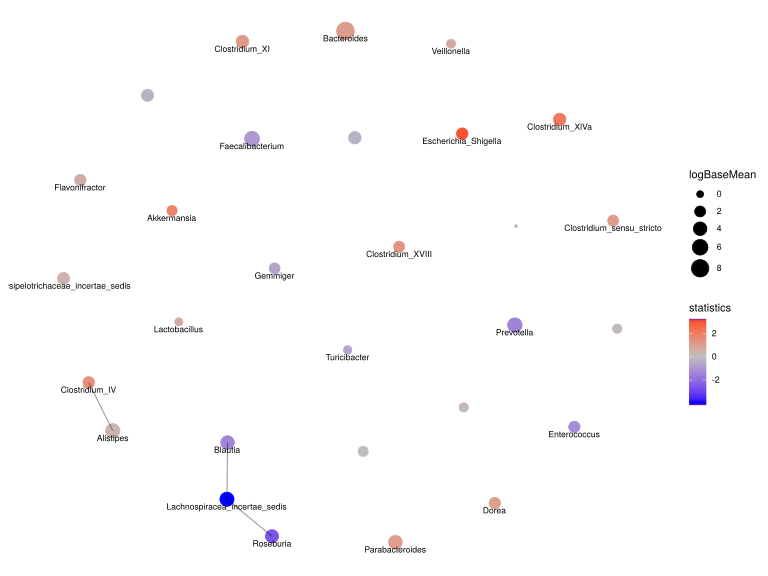

noone@mail.com
Analysis of Dieting study 16S data
% Fri Sep  7 05:46:18 2018

##### \(1.4.1.3.9\) Network Analysis Feature correlation with overlaid differential abundance results 

Build network of interactions between features or samples and plot it. 
                           Network method is network.spiec.easi. Method parameters are: [ list()].

Filtering abundance matrix with arguments [ drop.names:"other" "Unclassified_Lachnospiraceae" "Unclassified_Clostridiales" "Unclassified_Bacteroidales" ...]. Network Analysis

After filtering, left 33 records for 29 features

Kurtz Z, Mueller C, Miraldi E, Bonneau R (????). _SpiecEasi: Sparse Inverse Covariance for Ecological Statistical Inference_. R package version
1.0.2.

\(1.4.1.3.9.1\) [`Figure 819.`](#figure.819) Network analysis with method network.spiec.easi. Vertices are labeled by DESeq2 results for                                        baseMean log2FoldChange     lfcSE        stat       pvalue        padj   i.baseMean      baseVar allZero dispGeneEst. Showing names for the maximum of 30 top-ranked features.  Image file: [`plots/323b61bd5d.svg`](plots/323b61bd5d.svg).

\(1.4.1.3.9.1\) [`Widget 273.`](#widget.273) Network analysis with method network.spiec.easi. Vertices are labeled by DESeq2 results for                                        baseMean log2FoldChange     lfcSE        stat       pvalue        padj   i.baseMean      baseVar allZero dispGeneEst. Showing names for the maximum of 30 top-ranked features. Click to see HTML widget file in full window: [`./1.4.1.3.9.1-32359aa489dNetwork.analysis.wit.html`](./1.4.1.3.9.1-32359aa489dNetwork.analysis.wit.html)

<iframe src="./1.4.1.3.9.1-32359aa489dNetwork.analysis.wit.html" width="800" height="800"> </iframe>