noone@mail.com
Analysis of Dieting study 16S data
% Fri Sep  7 05:46:18 2018

##### \(1.4.1.4.2.1.20\) Plots of Abundance difference between paired samples. Samples are paired according to attribute SubjectID, resulting in 14 pairs. When fold change or difference is computed, this is done as 'before.diet by after.diet'.

Plots are shown with relation to various combinations of meta 
                   data variables and in different graphical representations. Lots of plots here.

##### \(1.4.1.4.2.1.20.2\) Iterating over all combinations of grouping variables

##### \(1.4.1.4.2.1.20.2.1\) Entire pool of samples

##### \(1.4.1.4.2.1.20.2.2\) Iterating over Abundance difference between paired samples. Samples are paired according to attribute SubjectID, resulting in 14 pairs. When fold change or difference is computed, this is done as 'before.diet by after.diet'. profile sorting order

##### \(1.4.1.4.2.1.20.2.2.1\) Abundance difference between paired samples. Samples are paired according to attribute SubjectID, resulting in 14 pairs. When fold change or difference is computed, this is done as 'before.diet by after.diet'. profile sorting order: GeneSelector paired test ranking

##### \(1.4.1.4.2.1.20.2.2.2\) Iterating over dodged vs faceted bars

The same data are shown in multiple combinations of graphical representations. 
                         This is the same data, but each plot highlights slightly different aspects of it.
                         It is not likely that you will need every plot - pick only what you need.

##### \(1.4.1.4.2.1.20.2.2.2.1\) faceted plots. Iterating over orientation and, optionally, scaling

##### \(1.4.1.4.2.1.20.2.2.2.1.1\) Abundance difference between paired samples. Samples are paired according to attribute SubjectID, resulting in 14 pairs. When fold change or difference is computed, this is done as 'before.diet by after.diet'. Plot is in original orientation, Y axis SQRT scaled. Iterating over plot geometry

\(1.4.1.4.2.1.20.2.2.2.1.1.0\) [`Table 333.`](#table.333) Data table used for plots. Data for all pooled samples. Showing only 200 first rows. Full dataset is also saved in a delimited text file (click to download and open e.g. in Excel) [`data/1.4.1.4.2.1.20.2.2.2.1.1.0-3232560fb6a.1.4.1.4.2.1.20.2.2.csv`](data/1.4.1.4.2.1.20.2.2.2.1.1.0-3232560fb6a.1.4.1.4.2.1.20.2.2.csv)

| .record.id | feature  | abundance.diff |
|:-----------|:---------|:---------------|
| SB11       | N\_0     | \-5.956e\+01   |
| SB16       | N\_0     | 1.137e\+01     |
| SB18       | N\_0     | \-6.548e\+01   |
| SB28       | N\_0     | \-2.573e\+01   |
| SB29       | N\_0     | 8.237e\+01     |
| SB34       | N\_0     | 1.247e\+01     |
| SB36       | N\_0     | 1.073e\+01     |
| SB39       | N\_0     | 4.580e\+00     |
| SB4        | N\_0     | 2.803e\+01     |
| SB41       | N\_0     | 4.910e\+00     |
| SB43       | N\_0     | \-2.946e\+01   |
| SB44       | N\_0     | \-4.417e\+01   |
| SB5        | N\_0     | 2.067e\+01     |
| SB9        | N\_0     | 7.460e\+01     |
| SB11       | N\_0.25  | \-5.398e\+01   |
| SB16       | N\_0.25  | 1.035e\+01     |
| SB18       | N\_0.25  | \-5.690e\+01   |
| SB28       | N\_0.25  | \-1.682e\+01   |
| SB29       | N\_0.25  | 5.136e\+01     |
| SB34       | N\_0.25  | 1.074e\+01     |
| SB36       | N\_0.25  | 1.057e\+01     |
| SB39       | N\_0.25  | 5.303e\+00     |
| SB4        | N\_0.25  | 1.716e\+01     |
| SB41       | N\_0.25  | 3.337e\+00     |
| SB43       | N\_0.25  | \-1.815e\+01   |
| SB44       | N\_0.25  | \-3.839e\+01   |
| SB5        | N\_0.25  | 1.861e\+01     |
| SB9        | N\_0.25  | 5.572e\+01     |
| SB11       | N\_0.5   | \-4.757e\+01   |
| SB16       | N\_0.5   | 8.237e\+00     |
| SB18       | N\_0.5   | \-4.567e\+01   |
| SB28       | N\_0.5   | \-8.004e\+00   |
| SB29       | N\_0.5   | 2.808e\+01     |
| SB34       | N\_0.5   | 8.563e\+00     |
| SB36       | N\_0.5   | 1.125e\+01     |
| SB39       | N\_0.5   | 5.052e\+00     |
| SB4        | N\_0.5   | 8.700e\+00     |
| SB41       | N\_0.5   | 1.572e\+00     |
| SB43       | N\_0.5   | \-8.373e\+00   |
| SB44       | N\_0.5   | \-3.025e\+01   |
| SB5        | N\_0.5   | 1.601e\+01     |
| SB9        | N\_0.5   | 3.537e\+01     |
| SB11       | N\_1     | \-3.407e\+01   |
| SB16       | N\_1     | 4.234e\+00     |
| SB18       | N\_1     | \-2.233e\+01   |
| SB28       | N\_1     | 5.819e\-01     |
| SB29       | N\_1     | 8.821e\+00     |
| SB34       | N\_1     | 4.462e\+00     |
| SB36       | N\_1     | 1.117e\+01     |
| SB39       | N\_1     | 2.594e\+00     |
| SB4        | N\_1     | 1.828e\+00     |
| SB41       | N\_1     | \-6.610e\-01   |
| SB43       | N\_1     | 1.422e\+00     |
| SB44       | N\_1     | \-1.362e\+01   |
| SB5        | N\_1     | 1.122e\+01     |
| SB9        | N\_1     | 9.303e\+00     |
| SB11       | N\_2     | \-1.796e\+01   |
| SB16       | N\_2     | 2.215e\+00     |
| SB18       | N\_2     | \-5.316e\+00   |
| SB28       | N\_2     | 1.434e\+00     |
| SB29       | N\_2     | 3.291e\+00     |
| SB34       | N\_2     | 1.676e\+00     |
| SB36       | N\_2     | 6.751e\+00     |
| SB39       | N\_2     | 5.223e\-01     |
| SB4        | N\_2     | 1.301e\+00     |
| SB41       | N\_2     | \-9.029e\-01   |
| SB43       | N\_2     | 1.846e\+00     |
| SB44       | N\_2     | \-1.868e\+00   |
| SB5        | N\_2     | 7.668e\+00     |
| SB9        | N\_2     | 1.574e\+00     |
| SB11       | N\_4     | \-9.477e\+00   |
| SB16       | N\_4     | 1.772e\+00     |
| SB18       | N\_4     | \-1.923e\+00   |
| SB28       | N\_4     | 9.550e\-01     |
| SB29       | N\_4     | 1.935e\+00     |
| SB34       | N\_4     | 8.985e\-01     |
| SB36       | N\_4     | 2.716e\+00     |
| SB39       | N\_4     | 8.664e\-01     |
| SB4        | N\_4     | 2.105e\+00     |
| SB41       | N\_4     | \-4.236e\-01   |
| SB43       | N\_4     | 8.869e\-01     |
| SB44       | N\_4     | 6.939e\-01     |
| SB5        | N\_4     | 6.259e\+00     |
| SB9        | N\_4     | 8.128e\-01     |
| SB11       | N\_8     | \-6.167e\+00   |
| SB16       | N\_8     | 1.493e\+00     |
| SB18       | N\_8     | \-1.326e\+00   |
| SB28       | N\_8     | 7.456e\-01     |
| SB29       | N\_8     | 1.484e\+00     |
| SB34       | N\_8     | 5.800e\-01     |
| SB36       | N\_8     | 1.441e\+00     |
| SB39       | N\_8     | 1.063e\+00     |
| SB4        | N\_8     | 2.206e\+00     |
| SB41       | N\_8     | \-2.456e\-01   |
| SB43       | N\_8     | 1.077e\+00     |
| SB44       | N\_8     | 1.042e\+00     |
| SB5        | N\_8     | 5.407e\+00     |
| SB9        | N\_8     | 6.090e\-01     |
| SB11       | N\_Inf   | \-4.030e\+00   |
| SB16       | N\_Inf   | 1.125e\+00     |
| SB18       | N\_Inf   | \-9.959e\-01   |
| SB28       | N\_Inf   | 6.005e\-01     |
| SB29       | N\_Inf   | 1.179e\+00     |
| SB34       | N\_Inf   | 4.409e\-01     |
| SB36       | N\_Inf   | 9.257e\-01     |
| SB39       | N\_Inf   | 8.953e\-01     |
| SB4        | N\_Inf   | 1.884e\+00     |
| SB41       | N\_Inf   | \-1.682e\-01   |
| SB43       | N\_Inf   | 9.006e\-01     |
| SB44       | N\_Inf   | 1.002e\+00     |
| SB5        | N\_Inf   | 4.168e\+00     |
| SB9        | N\_Inf   | 4.717e\-01     |
| SB11       | NE\_0.25 | \-6.949e\-02   |
| SB16       | NE\_0.25 | 2.401e\-02     |
| SB18       | NE\_0.25 | \-1.085e\-01   |
| SB28       | NE\_0.25 | \-3.542e\-02   |
| SB29       | NE\_0.25 | 1.284e\-01     |
| SB34       | NE\_0.25 | 1.743e\-02     |
| SB36       | NE\_0.25 | 2.644e\-02     |
| SB39       | NE\_0.25 | 1.023e\-02     |
| SB4        | NE\_0.25 | \-2.917e\-03   |
| SB41       | NE\_0.25 | 6.220e\-04     |
| SB43       | NE\_0.25 | 1.873e\-02     |
| SB44       | NE\_0.25 | \-7.218e\-02   |
| SB5        | NE\_0.25 | 2.744e\-02     |
| SB9        | NE\_0.25 | 7.443e\-02     |
| SB11       | NE\_0.5  | \-1.095e\-01   |
| SB16       | NE\_0.5  | 2.993e\-02     |
| SB18       | NE\_0.5  | \-1.478e\-01   |
| SB28       | NE\_0.5  | \-3.547e\-03   |
| SB29       | NE\_0.5  | 9.756e\-02     |
| SB34       | NE\_0.5  | 2.364e\-02     |
| SB36       | NE\_0.5  | 5.077e\-02     |
| SB39       | NE\_0.5  | 1.407e\-02     |
| SB4        | NE\_0.5  | \-2.087e\-02   |
| SB41       | NE\_0.5  | \-3.346e\-03   |
| SB43       | NE\_0.5  | 3.927e\-02     |
| SB44       | NE\_0.5  | \-9.310e\-02   |
| SB5        | NE\_0.5  | 4.180e\-02     |
| SB9        | NE\_0.5  | 6.942e\-02     |
| SB11       | NE\_1    | \-1.171e\-01   |
| SB16       | NE\_1    | 1.960e\-02     |
| SB18       | NE\_1    | \-9.218e\-02   |
| SB28       | NE\_1    | 5.185e\-02     |
| SB29       | NE\_1    | 9.509e\-03     |
| SB34       | NE\_1    | 1.589e\-02     |
| SB36       | NE\_1    | 6.898e\-02     |
| SB39       | NE\_1    | 7.449e\-03     |
| SB4        | NE\_1    | \-3.362e\-02   |
| SB41       | NE\_1    | \-1.071e\-02   |
| SB43       | NE\_1    | 5.418e\-02     |
| SB44       | NE\_1    | \-4.725e\-02   |
| SB5        | NE\_1    | 4.359e\-02     |
| SB9        | NE\_1    | 4.252e\-03     |
| SB11       | NE\_2    | \-6.959e\-02   |
| SB16       | NE\_2    | 1.179e\-02     |
| SB18       | NE\_2    | \-1.392e\-02   |
| SB28       | NE\_2    | 4.307e\-02     |
| SB29       | NE\_2    | \-2.079e\-02   |
| SB34       | NE\_2    | 4.843e\-03     |
| SB36       | NE\_2    | 4.434e\-02     |
| SB39       | NE\_2    | 3.172e\-04     |
| SB4        | NE\_2    | \-1.474e\-02   |
| SB41       | NE\_2    | \-8.768e\-03   |
| SB43       | NE\_2    | 3.169e\-02     |
| SB44       | NE\_2    | 8.141e\-03     |
| SB5        | NE\_2    | 3.527e\-02     |
| SB9        | NE\_2    | \-1.176e\-02   |
| SB11       | NE\_4    | \-3.472e\-02   |
| SB16       | NE\_4    | 1.020e\-02     |
| SB18       | NE\_4    | 9.504e\-04     |
| SB28       | NE\_4    | 3.028e\-02     |
| SB29       | NE\_4    | \-2.667e\-02   |
| SB34       | NE\_4    | 1.532e\-03     |
| SB36       | NE\_4    | 1.624e\-02     |
| SB39       | NE\_4    | 3.254e\-03     |
| SB4        | NE\_4    | 2.318e\-03     |
| SB41       | NE\_4    | \-4.370e\-03   |
| SB43       | NE\_4    | 1.693e\-02     |
| SB44       | NE\_4    | 1.960e\-02     |
| SB5        | NE\_4    | 3.034e\-02     |
| SB9        | NE\_4    | \-9.318e\-03   |
| SB11       | NE\_8    | \-2.026e\-02   |
| SB16       | NE\_8    | 8.643e\-03     |
| SB18       | NE\_8    | 2.697e\-03     |
| SB28       | NE\_8    | 2.530e\-02     |
| SB29       | NE\_8    | \-2.815e\-02   |
| SB34       | NE\_8    | 4.630e\-05     |
| SB36       | NE\_8    | 7.315e\-03     |
| SB39       | NE\_8    | 4.619e\-03     |
| SB4        | NE\_8    | 6.681e\-03     |
| SB41       | NE\_8    | \-2.802e\-03   |
| SB43       | NE\_8    | 1.470e\-02     |
| SB44       | NE\_8    | 1.987e\-02     |
| SB5        | NE\_8    | 2.651e\-02     |
| SB9        | NE\_8    | \-8.667e\-03   |
| SB11       | NE\_Inf  | \-1.126e\-02   |
| SB16       | NE\_Inf  | 6.260e\-03     |
| SB18       | NE\_Inf  | 3.411e\-03     |
| SB28       | NE\_Inf  | 2.185e\-02     |

\(1.4.1.4.2.1.20.2.2.2.1.1.1\) [`Widget 342.`](#widget.342) Dynamic Pivot Table link (drag and drop field names and pick averaging 
                      functions or plot types; click on fields or legend elements to filter values). 
                      Starting rendering is Stacked Bar Chart. Data for all pooled samples. Click to see HTML widget file in full window: [`./1.4.1.4.2.1.20.2.2.2.1.1.1-323222ec9daDynamic.Pivot.Table.html`](./1.4.1.4.2.1.20.2.2.2.1.1.1-323222ec9daDynamic.Pivot.Table.html)

\(1.4.1.4.2.1.20.2.2.2.1.1.1\) [`Widget 343.`](#widget.343) Dynamic Pivot Table link (drag and drop field names and pick averaging 
                      functions or plot types; click on fields or legend elements to filter values). 
                      Starting rendering is Table Barchart. Data for all pooled samples. Click to see HTML widget file in full window: [`./1.4.1.4.2.1.20.2.2.2.1.1.1-3231a376261Dynamic.Pivot.Table.html`](./1.4.1.4.2.1.20.2.2.2.1.1.1-3231a376261Dynamic.Pivot.Table.html)

\(1.4.1.4.2.1.20.2.2.2.1.1.1\) [`Table 334.`](#table.334) Summary table. Data for all pooled samples. Full dataset is also saved in a delimited text file (click to download and open e.g. in Excel) [`data/1.4.1.4.2.1.20.2.2.2.1.1.1-323275ae017.1.4.1.4.2.1.20.2.2.csv`](data/1.4.1.4.2.1.20.2.2.2.1.1.1-323275ae017.1.4.1.4.2.1.20.2.2.csv)

| feature  | mean        | sd       | median   | incidence |
|:---------|:------------|:---------|:---------|:----------|
| N\_4     | 0.5768376   | 3.41148  | 0.892709 | 0.7857    |
| N\_8     | 0.6719843   | 2.46157  | 1.052129 | 0.7857    |
| N\_Inf   | 0.5998940   | 1.75525  | 0.897968 | 0.7857    |
| N\_2     | 0.1593608   | 6.12462  | 1.503554 | 0.7143    |
| NE\_4    | 0.0040404   | 0.01899  | 0.002786 | 0.7143    |
| NE\_8    | 0.0040367   | 0.01572  | 0.005650 | 0.7143    |
| NE\_Inf  | 0.0031467   | 0.01346  | 0.003985 | 0.6429    |
| N\_0     | 1.8083929   | 44.09473 | 7.821250 | 0.6429    |
| N\_0.25  | \-0.0777668 | 33.96299 | 7.826453 | 0.6429    |
| N\_0.5   | \-1.2173527 | 24.87491 | 6.644785 | 0.6429    |
| N\_1     | \-1.0753872 | 13.28633 | 2.211267 | 0.7143    |
| NE\_0.25 | 0.0028064   | 0.06063  | 0.013833 | 0.6429    |
| NE\_0.5  | \-0.0008368 | 0.07061  | 0.018855 | 0.5714    |
| NE\_1    | \-0.0018250 | 0.05457  | 0.008479 | 0.6429    |
| NE\_2    | 0.0028497   | 0.03049  | 0.002580 | 0.5714    |

\(1.4.1.4.2.1.20.2.2.2.1.1.1\) [`Figure 868.`](#figure.868) Abundance difference between paired samples. Samples are paired according to attribute SubjectID, resulting in 14 pairs. When fold change or difference is computed, this is done as 'before.diet by after.diet'. Data for all pooled samples. Sorting order of features is GeneSelector paired test ranking. bar_stacked plot.  Image file: [`plots/3234ac02cd9.svg`](plots/3234ac02cd9.svg).
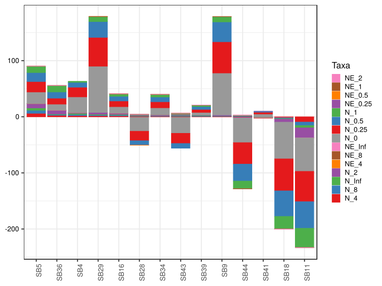

\(1.4.1.4.2.1.20.2.2.2.1.1.1\) [`Figure 869.`](#figure.869) Abundance difference between paired samples. Samples are paired according to attribute SubjectID, resulting in 14 pairs. When fold change or difference is computed, this is done as 'before.diet by after.diet'. Data for all pooled samples. Sorting order of features is GeneSelector paired test ranking. bar (sample mean) plot.  Image file: [`plots/32379953826.svg`](plots/32379953826.svg).
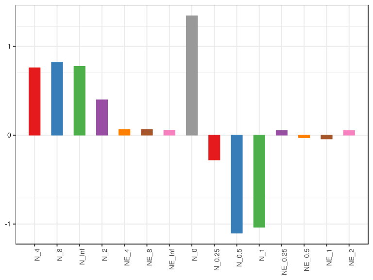

\(1.4.1.4.2.1.20.2.2.2.1.1.1\) [`Figure 870.`](#figure.870) Abundance difference between paired samples. Samples are paired according to attribute SubjectID, resulting in 14 pairs. When fold change or difference is computed, this is done as 'before.diet by after.diet'. Data for all pooled samples. Sorting order of features is GeneSelector paired test ranking. violin plot.  Image file: [`plots/3235e85f4ea.svg`](plots/3235e85f4ea.svg).
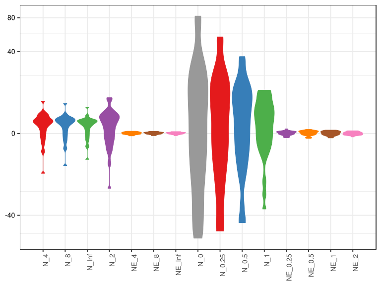

\(1.4.1.4.2.1.20.2.2.2.1.1.1\) [`Figure 871.`](#figure.871) Abundance difference between paired samples. Samples are paired according to attribute SubjectID, resulting in 14 pairs. When fold change or difference is computed, this is done as 'before.diet by after.diet'. Data for all pooled samples. Sorting order of features is GeneSelector paired test ranking. boxplot plot.  Image file: [`plots/3232a7ab2b3.svg`](plots/3232a7ab2b3.svg).
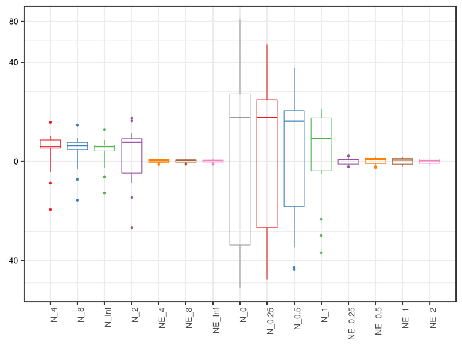

##### \(1.4.1.4.2.1.20.2.2.2.1.2\) Abundance difference between paired samples. Samples are paired according to attribute SubjectID, resulting in 14 pairs. When fold change or difference is computed, this is done as 'before.diet by after.diet'. Plot is in flipped orientation, Y axis not scaled. Iterating over plot geometry

\(1.4.1.4.2.1.20.2.2.2.1.2.1\) [`Figure 872.`](#figure.872) Abundance difference between paired samples. Samples are paired according to attribute SubjectID, resulting in 14 pairs. When fold change or difference is computed, this is done as 'before.diet by after.diet'. Data for all pooled samples. Sorting order of features is GeneSelector paired test ranking. bar (sample mean) plot.  Image file: [`plots/3235e4ff7a5.svg`](plots/3235e4ff7a5.svg).
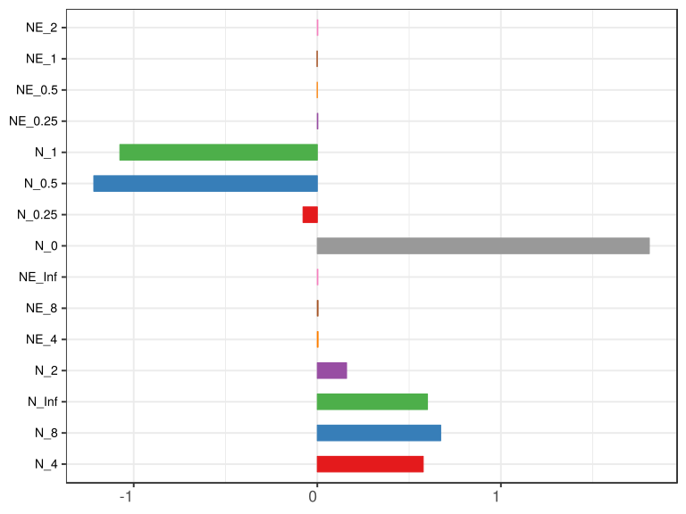

\(1.4.1.4.2.1.20.2.2.2.1.2.1\) [`Figure 873.`](#figure.873) Abundance difference between paired samples. Samples are paired according to attribute SubjectID, resulting in 14 pairs. When fold change or difference is computed, this is done as 'before.diet by after.diet'. Data for all pooled samples. Sorting order of features is GeneSelector paired test ranking. violin plot.  Image file: [`plots/32376635ca1.svg`](plots/32376635ca1.svg).
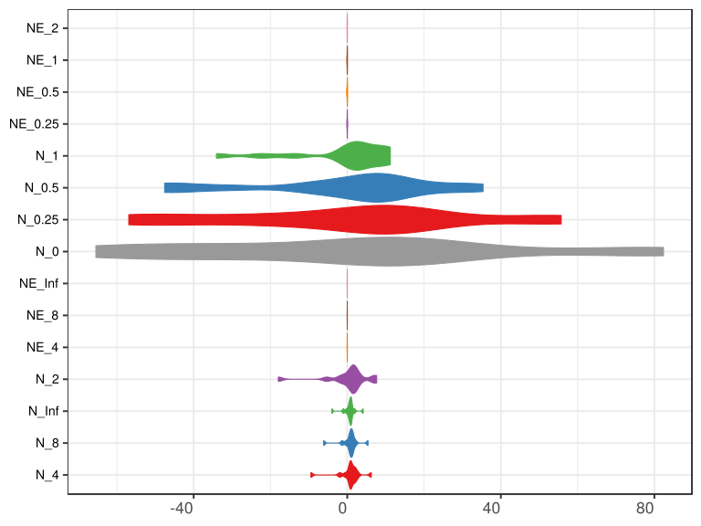

\(1.4.1.4.2.1.20.2.2.2.1.2.1\) [`Figure 874.`](#figure.874) Abundance difference between paired samples. Samples are paired according to attribute SubjectID, resulting in 14 pairs. When fold change or difference is computed, this is done as 'before.diet by after.diet'. Data for all pooled samples. Sorting order of features is GeneSelector paired test ranking. boxplot plot.  Image file: [`plots/3232e4a9a7a.svg`](plots/3232e4a9a7a.svg).
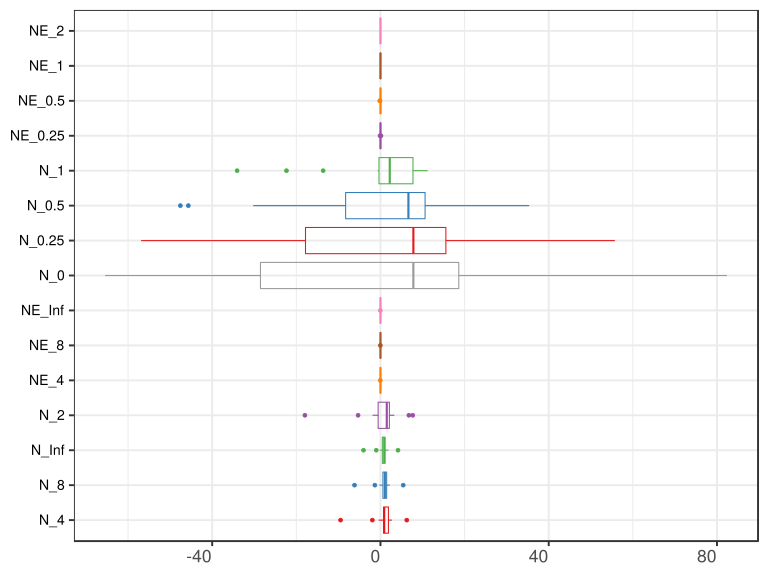

##### \(1.4.1.4.2.1.20.2.3\) Grouping variables Drug.Before.Diet

##### \(1.4.1.4.2.1.20.2.4\) Iterating over Abundance difference between paired samples. Samples are paired according to attribute SubjectID, resulting in 14 pairs. When fold change or difference is computed, this is done as 'before.diet by after.diet'. profile sorting order

##### \(1.4.1.4.2.1.20.2.4.1\) Abundance difference between paired samples. Samples are paired according to attribute SubjectID, resulting in 14 pairs. When fold change or difference is computed, this is done as 'before.diet by after.diet'. profile sorting order: GeneSelector paired test ranking

##### \(1.4.1.4.2.1.20.2.4.2\) Iterating over dodged vs faceted bars

The same data are shown in multiple combinations of graphical representations. 
                         This is the same data, but each plot highlights slightly different aspects of it.
                         It is not likely that you will need every plot - pick only what you need.

##### \(1.4.1.4.2.1.20.2.4.2.1\) faceted plots. Iterating over orientation and, optionally, scaling

##### \(1.4.1.4.2.1.20.2.4.2.1.1\) Abundance difference between paired samples. Samples are paired according to attribute SubjectID, resulting in 14 pairs. When fold change or difference is computed, this is done as 'before.diet by after.diet'. Plot is in original orientation, Y axis SQRT scaled. Iterating over plot geometry

\(1.4.1.4.2.1.20.2.4.2.1.1.0\) [`Table 335.`](#table.335) Data table used for plots. Data grouped by Drug.Before.Diet. Showing only 200 first rows. Full dataset is also saved in a delimited text file (click to download and open e.g. in Excel) [`data/1.4.1.4.2.1.20.2.4.2.1.1.0-32344c9e645.1.4.1.4.2.1.20.2.4.csv`](data/1.4.1.4.2.1.20.2.4.2.1.1.0-32344c9e645.1.4.1.4.2.1.20.2.4.csv)

| .record.id | Drug.Before.Diet | feature  | abundance.diff |
|:-----------|:-----------------|:---------|:---------------|
| SB11       | DrugBefore\_NO   | N\_0     | \-5.956e\+01   |
| SB16       | DrugBefore\_YES  | N\_0     | 1.137e\+01     |
| SB18       | DrugBefore\_NO   | N\_0     | \-6.548e\+01   |
| SB28       | DrugBefore\_YES  | N\_0     | \-2.573e\+01   |
| SB29       | DrugBefore\_YES  | N\_0     | 8.237e\+01     |
| SB34       | DrugBefore\_YES  | N\_0     | 1.247e\+01     |
| SB36       | DrugBefore\_YES  | N\_0     | 1.073e\+01     |
| SB39       | DrugBefore\_YES  | N\_0     | 4.580e\+00     |
| SB4        | DrugBefore\_YES  | N\_0     | 2.803e\+01     |
| SB41       | DrugBefore\_YES  | N\_0     | 4.910e\+00     |
| SB43       | DrugBefore\_YES  | N\_0     | \-2.946e\+01   |
| SB44       | DrugBefore\_YES  | N\_0     | \-4.417e\+01   |
| SB5        | DrugBefore\_NO   | N\_0     | 2.067e\+01     |
| SB9        | DrugBefore\_NO   | N\_0     | 7.460e\+01     |
| SB11       | DrugBefore\_NO   | N\_0.25  | \-5.398e\+01   |
| SB16       | DrugBefore\_YES  | N\_0.25  | 1.035e\+01     |
| SB18       | DrugBefore\_NO   | N\_0.25  | \-5.690e\+01   |
| SB28       | DrugBefore\_YES  | N\_0.25  | \-1.682e\+01   |
| SB29       | DrugBefore\_YES  | N\_0.25  | 5.136e\+01     |
| SB34       | DrugBefore\_YES  | N\_0.25  | 1.074e\+01     |
| SB36       | DrugBefore\_YES  | N\_0.25  | 1.057e\+01     |
| SB39       | DrugBefore\_YES  | N\_0.25  | 5.303e\+00     |
| SB4        | DrugBefore\_YES  | N\_0.25  | 1.716e\+01     |
| SB41       | DrugBefore\_YES  | N\_0.25  | 3.337e\+00     |
| SB43       | DrugBefore\_YES  | N\_0.25  | \-1.815e\+01   |
| SB44       | DrugBefore\_YES  | N\_0.25  | \-3.839e\+01   |
| SB5        | DrugBefore\_NO   | N\_0.25  | 1.861e\+01     |
| SB9        | DrugBefore\_NO   | N\_0.25  | 5.572e\+01     |
| SB11       | DrugBefore\_NO   | N\_0.5   | \-4.757e\+01   |
| SB16       | DrugBefore\_YES  | N\_0.5   | 8.237e\+00     |
| SB18       | DrugBefore\_NO   | N\_0.5   | \-4.567e\+01   |
| SB28       | DrugBefore\_YES  | N\_0.5   | \-8.004e\+00   |
| SB29       | DrugBefore\_YES  | N\_0.5   | 2.808e\+01     |
| SB34       | DrugBefore\_YES  | N\_0.5   | 8.563e\+00     |
| SB36       | DrugBefore\_YES  | N\_0.5   | 1.125e\+01     |
| SB39       | DrugBefore\_YES  | N\_0.5   | 5.052e\+00     |
| SB4        | DrugBefore\_YES  | N\_0.5   | 8.700e\+00     |
| SB41       | DrugBefore\_YES  | N\_0.5   | 1.572e\+00     |
| SB43       | DrugBefore\_YES  | N\_0.5   | \-8.373e\+00   |
| SB44       | DrugBefore\_YES  | N\_0.5   | \-3.025e\+01   |
| SB5        | DrugBefore\_NO   | N\_0.5   | 1.601e\+01     |
| SB9        | DrugBefore\_NO   | N\_0.5   | 3.537e\+01     |
| SB11       | DrugBefore\_NO   | N\_1     | \-3.407e\+01   |
| SB16       | DrugBefore\_YES  | N\_1     | 4.234e\+00     |
| SB18       | DrugBefore\_NO   | N\_1     | \-2.233e\+01   |
| SB28       | DrugBefore\_YES  | N\_1     | 5.819e\-01     |
| SB29       | DrugBefore\_YES  | N\_1     | 8.821e\+00     |
| SB34       | DrugBefore\_YES  | N\_1     | 4.462e\+00     |
| SB36       | DrugBefore\_YES  | N\_1     | 1.117e\+01     |
| SB39       | DrugBefore\_YES  | N\_1     | 2.594e\+00     |
| SB4        | DrugBefore\_YES  | N\_1     | 1.828e\+00     |
| SB41       | DrugBefore\_YES  | N\_1     | \-6.610e\-01   |
| SB43       | DrugBefore\_YES  | N\_1     | 1.422e\+00     |
| SB44       | DrugBefore\_YES  | N\_1     | \-1.362e\+01   |
| SB5        | DrugBefore\_NO   | N\_1     | 1.122e\+01     |
| SB9        | DrugBefore\_NO   | N\_1     | 9.303e\+00     |
| SB11       | DrugBefore\_NO   | N\_2     | \-1.796e\+01   |
| SB16       | DrugBefore\_YES  | N\_2     | 2.215e\+00     |
| SB18       | DrugBefore\_NO   | N\_2     | \-5.316e\+00   |
| SB28       | DrugBefore\_YES  | N\_2     | 1.434e\+00     |
| SB29       | DrugBefore\_YES  | N\_2     | 3.291e\+00     |
| SB34       | DrugBefore\_YES  | N\_2     | 1.676e\+00     |
| SB36       | DrugBefore\_YES  | N\_2     | 6.751e\+00     |
| SB39       | DrugBefore\_YES  | N\_2     | 5.223e\-01     |
| SB4        | DrugBefore\_YES  | N\_2     | 1.301e\+00     |
| SB41       | DrugBefore\_YES  | N\_2     | \-9.029e\-01   |
| SB43       | DrugBefore\_YES  | N\_2     | 1.846e\+00     |
| SB44       | DrugBefore\_YES  | N\_2     | \-1.868e\+00   |
| SB5        | DrugBefore\_NO   | N\_2     | 7.668e\+00     |
| SB9        | DrugBefore\_NO   | N\_2     | 1.574e\+00     |
| SB11       | DrugBefore\_NO   | N\_4     | \-9.477e\+00   |
| SB16       | DrugBefore\_YES  | N\_4     | 1.772e\+00     |
| SB18       | DrugBefore\_NO   | N\_4     | \-1.923e\+00   |
| SB28       | DrugBefore\_YES  | N\_4     | 9.550e\-01     |
| SB29       | DrugBefore\_YES  | N\_4     | 1.935e\+00     |
| SB34       | DrugBefore\_YES  | N\_4     | 8.985e\-01     |
| SB36       | DrugBefore\_YES  | N\_4     | 2.716e\+00     |
| SB39       | DrugBefore\_YES  | N\_4     | 8.664e\-01     |
| SB4        | DrugBefore\_YES  | N\_4     | 2.105e\+00     |
| SB41       | DrugBefore\_YES  | N\_4     | \-4.236e\-01   |
| SB43       | DrugBefore\_YES  | N\_4     | 8.869e\-01     |
| SB44       | DrugBefore\_YES  | N\_4     | 6.939e\-01     |
| SB5        | DrugBefore\_NO   | N\_4     | 6.259e\+00     |
| SB9        | DrugBefore\_NO   | N\_4     | 8.128e\-01     |
| SB11       | DrugBefore\_NO   | N\_8     | \-6.167e\+00   |
| SB16       | DrugBefore\_YES  | N\_8     | 1.493e\+00     |
| SB18       | DrugBefore\_NO   | N\_8     | \-1.326e\+00   |
| SB28       | DrugBefore\_YES  | N\_8     | 7.456e\-01     |
| SB29       | DrugBefore\_YES  | N\_8     | 1.484e\+00     |
| SB34       | DrugBefore\_YES  | N\_8     | 5.800e\-01     |
| SB36       | DrugBefore\_YES  | N\_8     | 1.441e\+00     |
| SB39       | DrugBefore\_YES  | N\_8     | 1.063e\+00     |
| SB4        | DrugBefore\_YES  | N\_8     | 2.206e\+00     |
| SB41       | DrugBefore\_YES  | N\_8     | \-2.456e\-01   |
| SB43       | DrugBefore\_YES  | N\_8     | 1.077e\+00     |
| SB44       | DrugBefore\_YES  | N\_8     | 1.042e\+00     |
| SB5        | DrugBefore\_NO   | N\_8     | 5.407e\+00     |
| SB9        | DrugBefore\_NO   | N\_8     | 6.090e\-01     |
| SB11       | DrugBefore\_NO   | N\_Inf   | \-4.030e\+00   |
| SB16       | DrugBefore\_YES  | N\_Inf   | 1.125e\+00     |
| SB18       | DrugBefore\_NO   | N\_Inf   | \-9.959e\-01   |
| SB28       | DrugBefore\_YES  | N\_Inf   | 6.005e\-01     |
| SB29       | DrugBefore\_YES  | N\_Inf   | 1.179e\+00     |
| SB34       | DrugBefore\_YES  | N\_Inf   | 4.409e\-01     |
| SB36       | DrugBefore\_YES  | N\_Inf   | 9.257e\-01     |
| SB39       | DrugBefore\_YES  | N\_Inf   | 8.953e\-01     |
| SB4        | DrugBefore\_YES  | N\_Inf   | 1.884e\+00     |
| SB41       | DrugBefore\_YES  | N\_Inf   | \-1.682e\-01   |
| SB43       | DrugBefore\_YES  | N\_Inf   | 9.006e\-01     |
| SB44       | DrugBefore\_YES  | N\_Inf   | 1.002e\+00     |
| SB5        | DrugBefore\_NO   | N\_Inf   | 4.168e\+00     |
| SB9        | DrugBefore\_NO   | N\_Inf   | 4.717e\-01     |
| SB11       | DrugBefore\_NO   | NE\_0.25 | \-6.949e\-02   |
| SB16       | DrugBefore\_YES  | NE\_0.25 | 2.401e\-02     |
| SB18       | DrugBefore\_NO   | NE\_0.25 | \-1.085e\-01   |
| SB28       | DrugBefore\_YES  | NE\_0.25 | \-3.542e\-02   |
| SB29       | DrugBefore\_YES  | NE\_0.25 | 1.284e\-01     |
| SB34       | DrugBefore\_YES  | NE\_0.25 | 1.743e\-02     |
| SB36       | DrugBefore\_YES  | NE\_0.25 | 2.644e\-02     |
| SB39       | DrugBefore\_YES  | NE\_0.25 | 1.023e\-02     |
| SB4        | DrugBefore\_YES  | NE\_0.25 | \-2.917e\-03   |
| SB41       | DrugBefore\_YES  | NE\_0.25 | 6.220e\-04     |
| SB43       | DrugBefore\_YES  | NE\_0.25 | 1.873e\-02     |
| SB44       | DrugBefore\_YES  | NE\_0.25 | \-7.218e\-02   |
| SB5        | DrugBefore\_NO   | NE\_0.25 | 2.744e\-02     |
| SB9        | DrugBefore\_NO   | NE\_0.25 | 7.443e\-02     |
| SB11       | DrugBefore\_NO   | NE\_0.5  | \-1.095e\-01   |
| SB16       | DrugBefore\_YES  | NE\_0.5  | 2.993e\-02     |
| SB18       | DrugBefore\_NO   | NE\_0.5  | \-1.478e\-01   |
| SB28       | DrugBefore\_YES  | NE\_0.5  | \-3.547e\-03   |
| SB29       | DrugBefore\_YES  | NE\_0.5  | 9.756e\-02     |
| SB34       | DrugBefore\_YES  | NE\_0.5  | 2.364e\-02     |
| SB36       | DrugBefore\_YES  | NE\_0.5  | 5.077e\-02     |
| SB39       | DrugBefore\_YES  | NE\_0.5  | 1.407e\-02     |
| SB4        | DrugBefore\_YES  | NE\_0.5  | \-2.087e\-02   |
| SB41       | DrugBefore\_YES  | NE\_0.5  | \-3.346e\-03   |
| SB43       | DrugBefore\_YES  | NE\_0.5  | 3.927e\-02     |
| SB44       | DrugBefore\_YES  | NE\_0.5  | \-9.310e\-02   |
| SB5        | DrugBefore\_NO   | NE\_0.5  | 4.180e\-02     |
| SB9        | DrugBefore\_NO   | NE\_0.5  | 6.942e\-02     |
| SB11       | DrugBefore\_NO   | NE\_1    | \-1.171e\-01   |
| SB16       | DrugBefore\_YES  | NE\_1    | 1.960e\-02     |
| SB18       | DrugBefore\_NO   | NE\_1    | \-9.218e\-02   |
| SB28       | DrugBefore\_YES  | NE\_1    | 5.185e\-02     |
| SB29       | DrugBefore\_YES  | NE\_1    | 9.509e\-03     |
| SB34       | DrugBefore\_YES  | NE\_1    | 1.589e\-02     |
| SB36       | DrugBefore\_YES  | NE\_1    | 6.898e\-02     |
| SB39       | DrugBefore\_YES  | NE\_1    | 7.449e\-03     |
| SB4        | DrugBefore\_YES  | NE\_1    | \-3.362e\-02   |
| SB41       | DrugBefore\_YES  | NE\_1    | \-1.071e\-02   |
| SB43       | DrugBefore\_YES  | NE\_1    | 5.418e\-02     |
| SB44       | DrugBefore\_YES  | NE\_1    | \-4.725e\-02   |
| SB5        | DrugBefore\_NO   | NE\_1    | 4.359e\-02     |
| SB9        | DrugBefore\_NO   | NE\_1    | 4.252e\-03     |
| SB11       | DrugBefore\_NO   | NE\_2    | \-6.959e\-02   |
| SB16       | DrugBefore\_YES  | NE\_2    | 1.179e\-02     |
| SB18       | DrugBefore\_NO   | NE\_2    | \-1.392e\-02   |
| SB28       | DrugBefore\_YES  | NE\_2    | 4.307e\-02     |
| SB29       | DrugBefore\_YES  | NE\_2    | \-2.079e\-02   |
| SB34       | DrugBefore\_YES  | NE\_2    | 4.843e\-03     |
| SB36       | DrugBefore\_YES  | NE\_2    | 4.434e\-02     |
| SB39       | DrugBefore\_YES  | NE\_2    | 3.172e\-04     |
| SB4        | DrugBefore\_YES  | NE\_2    | \-1.474e\-02   |
| SB41       | DrugBefore\_YES  | NE\_2    | \-8.768e\-03   |
| SB43       | DrugBefore\_YES  | NE\_2    | 3.169e\-02     |
| SB44       | DrugBefore\_YES  | NE\_2    | 8.141e\-03     |
| SB5        | DrugBefore\_NO   | NE\_2    | 3.527e\-02     |
| SB9        | DrugBefore\_NO   | NE\_2    | \-1.176e\-02   |
| SB11       | DrugBefore\_NO   | NE\_4    | \-3.472e\-02   |
| SB16       | DrugBefore\_YES  | NE\_4    | 1.020e\-02     |
| SB18       | DrugBefore\_NO   | NE\_4    | 9.504e\-04     |
| SB28       | DrugBefore\_YES  | NE\_4    | 3.028e\-02     |
| SB29       | DrugBefore\_YES  | NE\_4    | \-2.667e\-02   |
| SB34       | DrugBefore\_YES  | NE\_4    | 1.532e\-03     |
| SB36       | DrugBefore\_YES  | NE\_4    | 1.624e\-02     |
| SB39       | DrugBefore\_YES  | NE\_4    | 3.254e\-03     |
| SB4        | DrugBefore\_YES  | NE\_4    | 2.318e\-03     |
| SB41       | DrugBefore\_YES  | NE\_4    | \-4.370e\-03   |
| SB43       | DrugBefore\_YES  | NE\_4    | 1.693e\-02     |
| SB44       | DrugBefore\_YES  | NE\_4    | 1.960e\-02     |
| SB5        | DrugBefore\_NO   | NE\_4    | 3.034e\-02     |
| SB9        | DrugBefore\_NO   | NE\_4    | \-9.318e\-03   |
| SB11       | DrugBefore\_NO   | NE\_8    | \-2.026e\-02   |
| SB16       | DrugBefore\_YES  | NE\_8    | 8.643e\-03     |
| SB18       | DrugBefore\_NO   | NE\_8    | 2.697e\-03     |
| SB28       | DrugBefore\_YES  | NE\_8    | 2.530e\-02     |
| SB29       | DrugBefore\_YES  | NE\_8    | \-2.815e\-02   |
| SB34       | DrugBefore\_YES  | NE\_8    | 4.630e\-05     |
| SB36       | DrugBefore\_YES  | NE\_8    | 7.315e\-03     |
| SB39       | DrugBefore\_YES  | NE\_8    | 4.619e\-03     |
| SB4        | DrugBefore\_YES  | NE\_8    | 6.681e\-03     |
| SB41       | DrugBefore\_YES  | NE\_8    | \-2.802e\-03   |
| SB43       | DrugBefore\_YES  | NE\_8    | 1.470e\-02     |
| SB44       | DrugBefore\_YES  | NE\_8    | 1.987e\-02     |
| SB5        | DrugBefore\_NO   | NE\_8    | 2.651e\-02     |
| SB9        | DrugBefore\_NO   | NE\_8    | \-8.667e\-03   |
| SB11       | DrugBefore\_NO   | NE\_Inf  | \-1.126e\-02   |
| SB16       | DrugBefore\_YES  | NE\_Inf  | 6.260e\-03     |
| SB18       | DrugBefore\_NO   | NE\_Inf  | 3.411e\-03     |
| SB28       | DrugBefore\_YES  | NE\_Inf  | 2.185e\-02     |

\(1.4.1.4.2.1.20.2.4.2.1.1.1\) [`Widget 344.`](#widget.344) Dynamic Pivot Table link (drag and drop field names and pick averaging 
                      functions or plot types; click on fields or legend elements to filter values). 
                      Starting rendering is Stacked Bar Chart. Data grouped by Drug.Before.Diet. Click to see HTML widget file in full window: [`./1.4.1.4.2.1.20.2.4.2.1.1.1-32371d5a040Dynamic.Pivot.Table.html`](./1.4.1.4.2.1.20.2.4.2.1.1.1-32371d5a040Dynamic.Pivot.Table.html)

\(1.4.1.4.2.1.20.2.4.2.1.1.1\) [`Widget 345.`](#widget.345) Dynamic Pivot Table link (drag and drop field names and pick averaging 
                      functions or plot types; click on fields or legend elements to filter values). 
                      Starting rendering is Table Barchart. Data grouped by Drug.Before.Diet. Click to see HTML widget file in full window: [`./1.4.1.4.2.1.20.2.4.2.1.1.1-32325ab793cDynamic.Pivot.Table.html`](./1.4.1.4.2.1.20.2.4.2.1.1.1-32325ab793cDynamic.Pivot.Table.html)

\(1.4.1.4.2.1.20.2.4.2.1.1.1\) [`Table 336.`](#table.336) Summary table. Data grouped by Drug.Before.Diet. Full dataset is also saved in a delimited text file (click to download and open e.g. in Excel) [`data/1.4.1.4.2.1.20.2.4.2.1.1.1-32321a5c60f.1.4.1.4.2.1.20.2.4.csv`](data/1.4.1.4.2.1.20.2.4.2.1.1.1-32321a5c60f.1.4.1.4.2.1.20.2.4.csv)

| feature  | Drug.Before.Diet | mean         | sd       | median      | incidence |
|:---------|:-----------------|:-------------|:---------|:------------|:----------|
| N\_4     | DrugBefore\_NO   | \-1.082e\+00 | 6.54881  | \-0.555359  | 0.50      |
| N\_4     | DrugBefore\_YES  | 1.241e\+00   | 0.89566  | 0.926751    | 0.90      |
| N\_8     | DrugBefore\_NO   | \-3.693e\-01 | 4.79054  | \-0.358639  | 0.50      |
| N\_8     | DrugBefore\_YES  | 1.089e\+00   | 0.65416  | 1.069930    | 0.90      |
| N\_Inf   | DrugBefore\_NO   | \-9.659e\-02 | 3.40540  | \-0.262132  | 0.50      |
| N\_Inf   | DrugBefore\_YES  | 8.785e\-01   | 0.53178  | 0.913161    | 0.90      |
| N\_2     | DrugBefore\_NO   | \-3.509e\+00 | 10.99832 | \-1.871236  | 0.50      |
| N\_2     | DrugBefore\_YES  | 1.627e\+00   | 2.34289  | 1.554912    | 0.80      |
| NE\_4    | DrugBefore\_NO   | \-3.186e\-03 | 0.02691  | \-0.004184  | 0.50      |
| NE\_4    | DrugBefore\_YES  | 6.931e\-03   | 0.01572  | 0.006728    | 0.80      |
| NE\_8    | DrugBefore\_NO   | 7.066e\-05   | 0.01996  | \-0.002985  | 0.50      |
| NE\_8    | DrugBefore\_YES  | 5.623e\-03   | 0.01464  | 0.006998    | 0.80      |
| NE\_Inf  | DrugBefore\_NO   | 1.046e\-03   | 0.01430  | \-0.002417  | 0.50      |
| NE\_Inf  | DrugBefore\_YES  | 3.987e\-03   | 0.01381  | 0.004937    | 0.70      |
| N\_0     | DrugBefore\_NO   | \-7.442e\+00 | 67.34211 | \-19.445000 | 0.50      |
| N\_0     | DrugBefore\_YES  | 5.509e\+00   | 35.26477 | 7.821250    | 0.70      |
| N\_0.25  | DrugBefore\_NO   | \-9.137e\+00 | 55.58621 | \-17.683957 | 0.50      |
| N\_0.25  | DrugBefore\_YES  | 3.546e\+00   | 24.18958 | 7.826453    | 0.70      |
| N\_0.5   | DrugBefore\_NO   | \-1.047e\+01 | 42.49505 | \-14.830355 | 0.50      |
| N\_0.5   | DrugBefore\_YES  | 2.482e\+00   | 15.44701 | 6.644785    | 0.70      |
| N\_1     | DrugBefore\_NO   | \-8.971e\+00 | 22.73339 | \-6.515769  | 0.50      |
| N\_1     | DrugBefore\_YES  | 2.083e\+00   | 6.62760  | 2.211267    | 0.80      |
| NE\_0.25 | DrugBefore\_NO   | \-1.902e\-02 | 0.08454  | \-0.021023  | 0.50      |
| NE\_0.25 | DrugBefore\_YES  | 1.154e\-02   | 0.05129  | 0.013833    | 0.70      |
| NE\_0.5  | DrugBefore\_NO   | \-3.652e\-02 | 0.10812  | \-0.033847  | 0.50      |
| NE\_0.5  | DrugBefore\_YES  | 1.344e\-02   | 0.05012  | 0.018855    | 0.60      |
| NE\_1    | DrugBefore\_NO   | \-4.036e\-02 | 0.07661  | \-0.043966  | 0.50      |
| NE\_1    | DrugBefore\_YES  | 1.359e\-02   | 0.03771  | 0.012700    | 0.70      |
| NE\_2    | DrugBefore\_NO   | \-1.500e\-02 | 0.04289  | \-0.012837  | 0.25      |
| NE\_2    | DrugBefore\_YES  | 9.989e\-03   | 0.02305  | 0.006492    | 0.70      |

\(1.4.1.4.2.1.20.2.4.2.1.1.1\) [`Figure 875.`](#figure.875) Abundance difference between paired samples. Samples are paired according to attribute SubjectID, resulting in 14 pairs. When fold change or difference is computed, this is done as 'before.diet by after.diet'. Data grouped by Drug.Before.Diet. Sorting order of features is GeneSelector paired test ranking. bar_stacked plot.  Image file: [`plots/32333102cd9.svg`](plots/32333102cd9.svg).
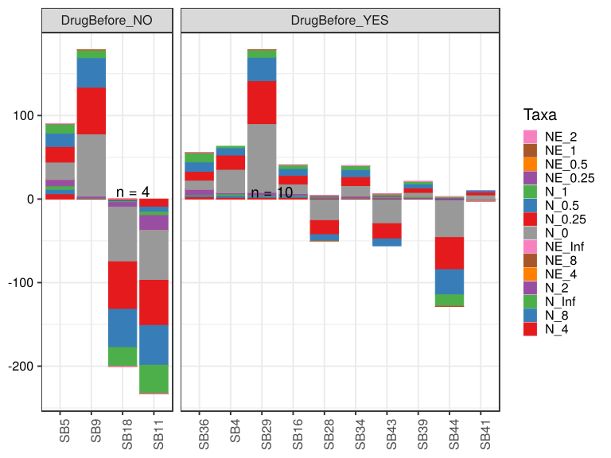

\(1.4.1.4.2.1.20.2.4.2.1.1.1\) [`Figure 876.`](#figure.876) Abundance difference between paired samples. Samples are paired according to attribute SubjectID, resulting in 14 pairs. When fold change or difference is computed, this is done as 'before.diet by after.diet'. Data grouped by Drug.Before.Diet. Sorting order of features is GeneSelector paired test ranking. bar (sample mean) plot.  Image file: [`plots/32315850a23.svg`](plots/32315850a23.svg).
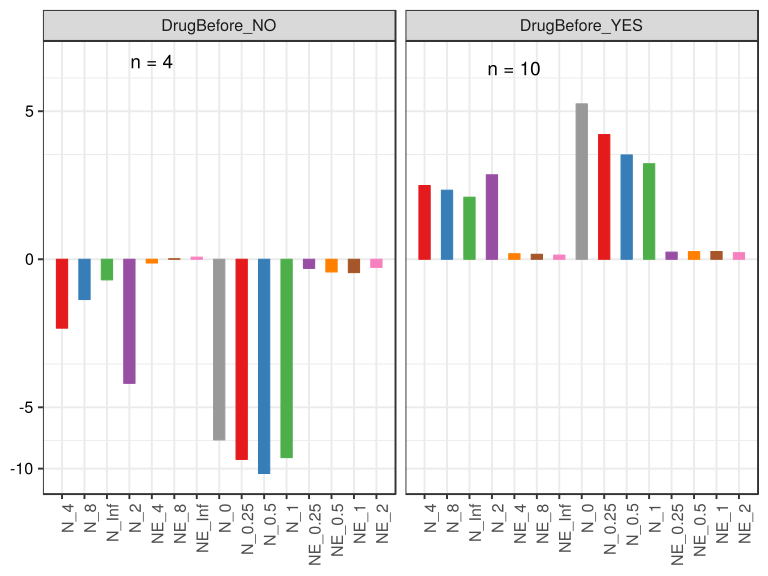

\(1.4.1.4.2.1.20.2.4.2.1.1.1\) [`Figure 877.`](#figure.877) Abundance difference between paired samples. Samples are paired according to attribute SubjectID, resulting in 14 pairs. When fold change or difference is computed, this is done as 'before.diet by after.diet'. Data grouped by Drug.Before.Diet. Sorting order of features is GeneSelector paired test ranking. violin plot.  Image file: [`plots/323456f757b.svg`](plots/323456f757b.svg).
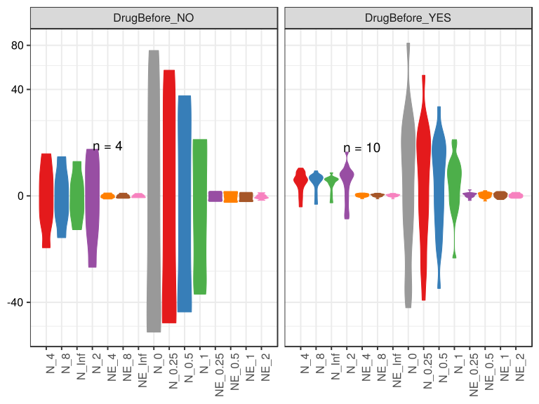

\(1.4.1.4.2.1.20.2.4.2.1.1.1\) [`Figure 878.`](#figure.878) Abundance difference between paired samples. Samples are paired according to attribute SubjectID, resulting in 14 pairs. When fold change or difference is computed, this is done as 'before.diet by after.diet'. Data grouped by Drug.Before.Diet. Sorting order of features is GeneSelector paired test ranking. boxplot plot.  Image file: [`plots/323c4ead33.svg`](plots/323c4ead33.svg).
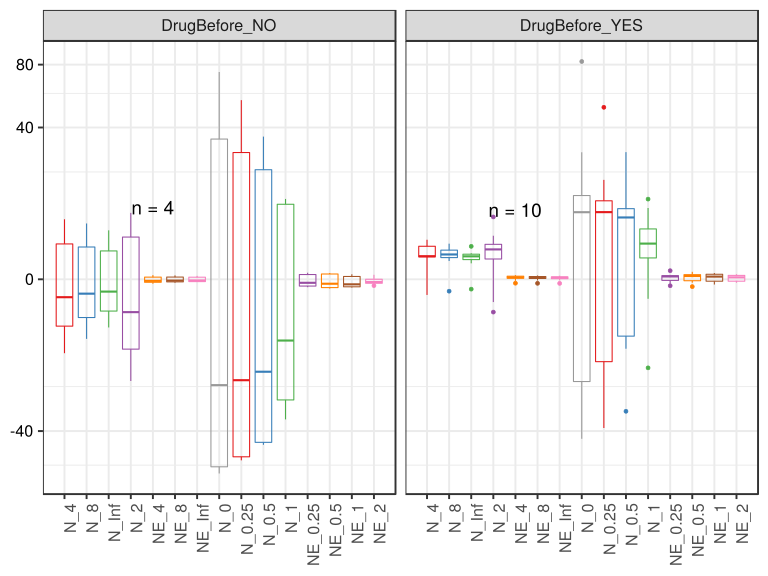

##### \(1.4.1.4.2.1.20.2.4.2.1.2\) Abundance difference between paired samples. Samples are paired according to attribute SubjectID, resulting in 14 pairs. When fold change or difference is computed, this is done as 'before.diet by after.diet'. Plot is in flipped orientation, Y axis not scaled. Iterating over plot geometry

\(1.4.1.4.2.1.20.2.4.2.1.2.1\) [`Figure 879.`](#figure.879) Abundance difference between paired samples. Samples are paired according to attribute SubjectID, resulting in 14 pairs. When fold change or difference is computed, this is done as 'before.diet by after.diet'. Data grouped by Drug.Before.Diet. Sorting order of features is GeneSelector paired test ranking. bar (sample mean) plot.  Image file: [`plots/3232e2e3ec6.svg`](plots/3232e2e3ec6.svg).
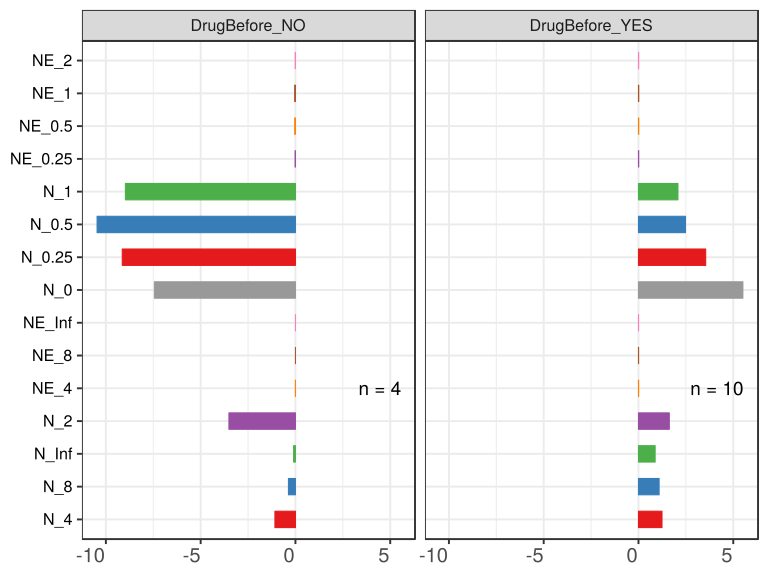

\(1.4.1.4.2.1.20.2.4.2.1.2.1\) [`Figure 880.`](#figure.880) Abundance difference between paired samples. Samples are paired according to attribute SubjectID, resulting in 14 pairs. When fold change or difference is computed, this is done as 'before.diet by after.diet'. Data grouped by Drug.Before.Diet. Sorting order of features is GeneSelector paired test ranking. violin plot.  Image file: [`plots/3232e54839e.svg`](plots/3232e54839e.svg).
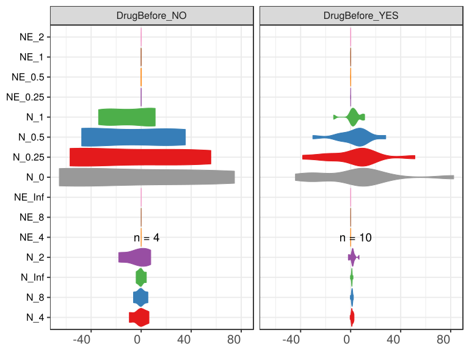

\(1.4.1.4.2.1.20.2.4.2.1.2.1\) [`Figure 881.`](#figure.881) Abundance difference between paired samples. Samples are paired according to attribute SubjectID, resulting in 14 pairs. When fold change or difference is computed, this is done as 'before.diet by after.diet'. Data grouped by Drug.Before.Diet. Sorting order of features is GeneSelector paired test ranking. boxplot plot.  Image file: [`plots/3234a721871.svg`](plots/3234a721871.svg).
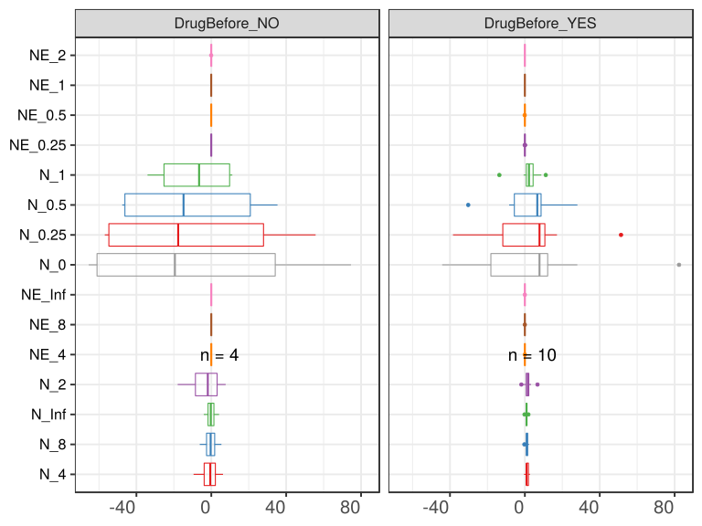

##### \(1.4.1.4.2.1.20.2.4.2.2\) dodged plots. Iterating over orientation and, optionally, scaling

##### \(1.4.1.4.2.1.20.2.4.2.2.1\) Abundance difference between paired samples. Samples are paired according to attribute SubjectID, resulting in 14 pairs. When fold change or difference is computed, this is done as 'before.diet by after.diet'. Plot is in original orientation, Y axis SQRT scaled. Iterating over plot geometry

\(1.4.1.4.2.1.20.2.4.2.2.1.1\) [`Figure 882.`](#figure.882) Abundance difference between paired samples. Samples are paired according to attribute SubjectID, resulting in 14 pairs. When fold change or difference is computed, this is done as 'before.diet by after.diet'. Data grouped by Drug.Before.Diet. Sorting order of features is GeneSelector paired test ranking. bar (sample mean) plot.  Image file: [`plots/3231babbfc5.svg`](plots/3231babbfc5.svg).
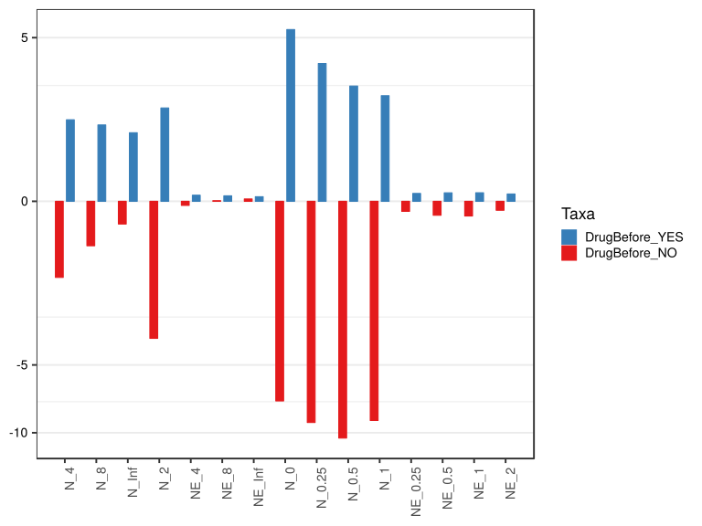

\(1.4.1.4.2.1.20.2.4.2.2.1.1\) [`Figure 883.`](#figure.883) Abundance difference between paired samples. Samples are paired according to attribute SubjectID, resulting in 14 pairs. When fold change or difference is computed, this is done as 'before.diet by after.diet'. Data grouped by Drug.Before.Diet. Sorting order of features is GeneSelector paired test ranking. violin plot.  Image file: [`plots/32371c31025.svg`](plots/32371c31025.svg).
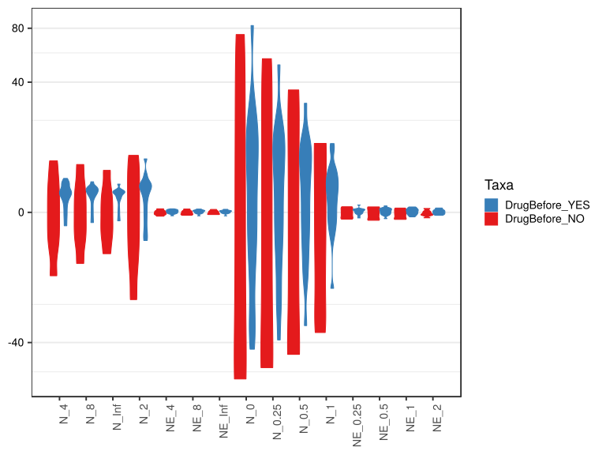

\(1.4.1.4.2.1.20.2.4.2.2.1.1\) [`Figure 884.`](#figure.884) Abundance difference between paired samples. Samples are paired according to attribute SubjectID, resulting in 14 pairs. When fold change or difference is computed, this is done as 'before.diet by after.diet'. Data grouped by Drug.Before.Diet. Sorting order of features is GeneSelector paired test ranking. boxplot plot.  Image file: [`plots/323d19649b.svg`](plots/323d19649b.svg).
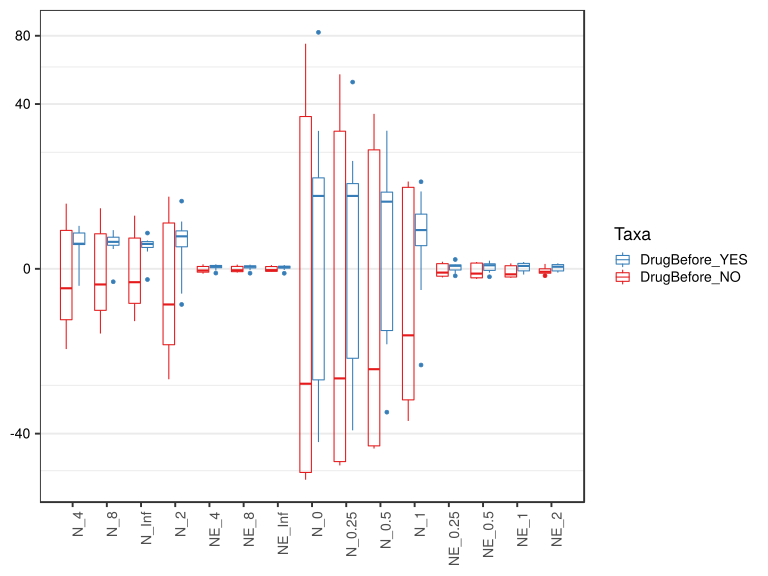

##### \(1.4.1.4.2.1.20.2.4.2.2.2\) Abundance difference between paired samples. Samples are paired according to attribute SubjectID, resulting in 14 pairs. When fold change or difference is computed, this is done as 'before.diet by after.diet'. Plot is in flipped orientation, Y axis not scaled. Iterating over plot geometry

\(1.4.1.4.2.1.20.2.4.2.2.2.1\) [`Figure 885.`](#figure.885) Abundance difference between paired samples. Samples are paired according to attribute SubjectID, resulting in 14 pairs. When fold change or difference is computed, this is done as 'before.diet by after.diet'. Data grouped by Drug.Before.Diet. Sorting order of features is GeneSelector paired test ranking. bar (sample mean) plot.  Image file: [`plots/3237d15086e.svg`](plots/3237d15086e.svg).
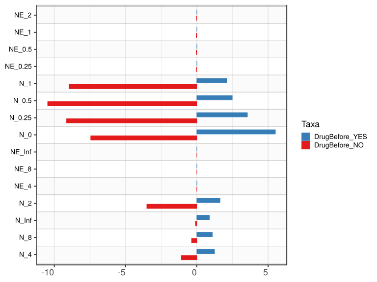

\(1.4.1.4.2.1.20.2.4.2.2.2.1\) [`Figure 886.`](#figure.886) Abundance difference between paired samples. Samples are paired according to attribute SubjectID, resulting in 14 pairs. When fold change or difference is computed, this is done as 'before.diet by after.diet'. Data grouped by Drug.Before.Diet. Sorting order of features is GeneSelector paired test ranking. violin plot.  Image file: [`plots/323254a32d0.svg`](plots/323254a32d0.svg).
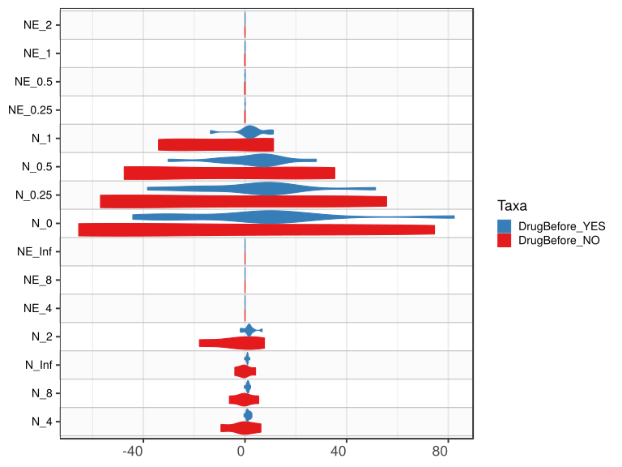

\(1.4.1.4.2.1.20.2.4.2.2.2.1\) [`Figure 887.`](#figure.887) Abundance difference between paired samples. Samples are paired according to attribute SubjectID, resulting in 14 pairs. When fold change or difference is computed, this is done as 'before.diet by after.diet'. Data grouped by Drug.Before.Diet. Sorting order of features is GeneSelector paired test ranking. boxplot plot.  Image file: [`plots/3232bdd4454.svg`](plots/3232bdd4454.svg).
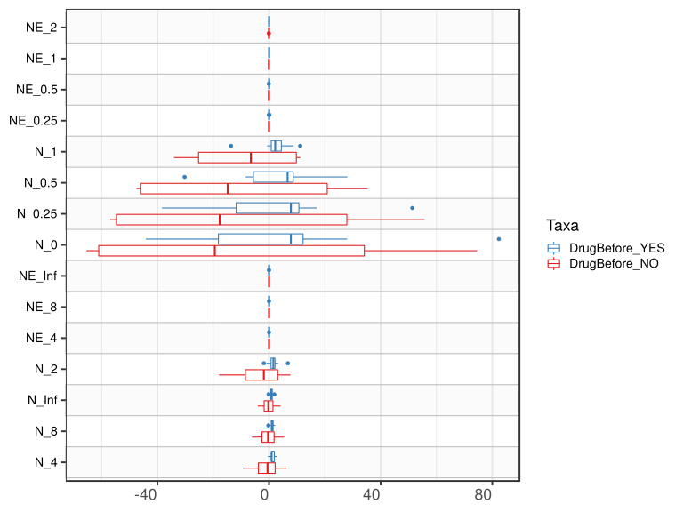