noone@mail.com
Analysis of Dieting study 16S data
% Fri Sep  7 05:46:18 2018

##### \(1.4.1.4.2.1.21\) Plots of Log2 fold change in abundance between paired samples. Samples are paired according to attribute SubjectID, resulting in 14 pairs. When fold change or difference is computed, this is done as 'before.diet by after.diet'.

Plots are shown with relation to various combinations of meta 
                   data variables and in different graphical representations. Lots of plots here.

##### \(1.4.1.4.2.1.21.2\) Iterating over all combinations of grouping variables

##### \(1.4.1.4.2.1.21.2.1\) Entire pool of samples

##### \(1.4.1.4.2.1.21.2.2\) Iterating over Log2 fold change in abundance between paired samples. Samples are paired according to attribute SubjectID, resulting in 14 pairs. When fold change or difference is computed, this is done as 'before.diet by after.diet'. profile sorting order

##### \(1.4.1.4.2.1.21.2.2.1\) Log2 fold change in abundance between paired samples. Samples are paired according to attribute SubjectID, resulting in 14 pairs. When fold change or difference is computed, this is done as 'before.diet by after.diet'. profile sorting order: GeneSelector paired test ranking

##### \(1.4.1.4.2.1.21.2.2.2\) Iterating over dodged vs faceted bars

The same data are shown in multiple combinations of graphical representations. 
                         This is the same data, but each plot highlights slightly different aspects of it.
                         It is not likely that you will need every plot - pick only what you need.

##### \(1.4.1.4.2.1.21.2.2.2.1\) faceted plots. Iterating over orientation and, optionally, scaling

##### \(1.4.1.4.2.1.21.2.2.2.1.1\) Log2 fold change in abundance between paired samples. Samples are paired according to attribute SubjectID, resulting in 14 pairs. When fold change or difference is computed, this is done as 'before.diet by after.diet'. Plot is in original orientation, Y axis SQRT scaled. Iterating over plot geometry

\(1.4.1.4.2.1.21.2.2.2.1.1.0\) [`Table 337.`](#table.337) Data table used for plots. Data for all pooled samples. Showing only 200 first rows. Full dataset is also saved in a delimited text file (click to download and open e.g. in Excel) [`data/1.4.1.4.2.1.21.2.2.2.1.1.0-32338d8cb17.1.4.1.4.2.1.21.2.2.csv`](data/1.4.1.4.2.1.21.2.2.2.1.1.0-32338d8cb17.1.4.1.4.2.1.21.2.2.csv)

| .record.id       | feature  | l2fc       |
|:-----------------|:---------|:-----------|
| SB11.before.diet | N\_0     | \-0.491092 |
| SB16.before.diet | N\_0     | 0.126664   |
| SB18.before.diet | N\_0     | \-0.718013 |
| SB28.before.diet | N\_0     | \-0.593858 |
| SB29.before.diet | N\_0     | 2.027255   |
| SB34.before.diet | N\_0     | 0.123281   |
| SB36.before.diet | N\_0     | 0.121354   |
| SB39.before.diet | N\_0     | 0.034926   |
| SB4.before.diet  | N\_0     | 0.436603   |
| SB41.before.diet | N\_0     | 0.049114   |
| SB43.before.diet | N\_0     | \-0.232318 |
| SB44.before.diet | N\_0     | \-0.477673 |
| SB5.before.diet  | N\_0     | 0.171616   |
| SB9.before.diet  | N\_0     | 0.885391   |
| SB11.before.diet | N\_0.25  | \-0.634338 |
| SB16.before.diet | N\_0.25  | 0.183082   |
| SB18.before.diet | N\_0.25  | \-0.959796 |
| SB28.before.diet | N\_0.25  | \-0.682825 |
| SB29.before.diet | N\_0.25  | 2.387025   |
| SB34.before.diet | N\_0.25  | 0.159472   |
| SB36.before.diet | N\_0.25  | 0.176759   |
| SB39.before.diet | N\_0.25  | 0.057172   |
| SB4.before.diet  | N\_0.25  | 0.429689   |
| SB41.before.diet | N\_0.25  | 0.049882   |
| SB43.before.diet | N\_0.25  | \-0.196822 |
| SB44.before.diet | N\_0.25  | \-0.637641 |
| SB5.before.diet  | N\_0.25  | 0.231494   |
| SB9.before.diet  | N\_0.25  | 1.058680   |
| SB11.before.diet | N\_0.5   | \-0.825806 |
| SB16.before.diet | N\_0.5   | 0.246380   |
| SB18.before.diet | N\_0.5   | \-1.262687 |
| SB28.before.diet | N\_0.5   | \-0.609046 |
| SB29.before.diet | N\_0.5   | 2.573790   |
| SB34.before.diet | N\_0.5   | 0.200284   |
| SB36.before.diet | N\_0.5   | 0.282796   |
| SB39.before.diet | N\_0.5   | 0.080017   |
| SB4.before.diet  | N\_0.5   | 0.357019   |
| SB41.before.diet | N\_0.5   | 0.036460   |
| SB43.before.diet | N\_0.5   | \-0.126778 |
| SB44.before.diet | N\_0.5   | \-0.813559 |
| SB5.before.diet  | N\_0.5   | 0.315200   |
| SB9.before.diet  | N\_0.5   | 1.167670   |
| SB11.before.diet | N\_1     | \-1.259650 |
| SB16.before.diet | N\_1     | 0.336035   |
| SB18.before.diet | N\_1     | \-1.616767 |
| SB28.before.diet | N\_1     | 0.132452   |
| SB29.before.diet | N\_1     | 2.164357   |
| SB34.before.diet | N\_1     | 0.241656   |
| SB36.before.diet | N\_1     | 0.575047   |
| SB39.before.diet | N\_1     | 0.088648   |
| SB4.before.diet  | N\_1     | 0.161694   |
| SB41.before.diet | N\_1     | \-0.034658 |
| SB43.before.diet | N\_1     | 0.039783   |
| SB44.before.diet | N\_1     | \-0.897483 |
| SB5.before.diet  | N\_1     | 0.526700   |
| SB9.before.diet  | N\_1     | 0.939827   |
| SB11.before.diet | N\_2     | \-1.598588 |
| SB16.before.diet | N\_2     | 0.434624   |
| SB18.before.diet | N\_2     | \-1.100064 |
| SB28.before.diet | N\_2     | 0.722091   |
| SB29.before.diet | N\_2     | 1.495731   |
| SB34.before.diet | N\_2     | 0.200256   |
| SB36.before.diet | N\_2     | 0.775051   |
| SB39.before.diet | N\_2     | 0.047565   |
| SB4.before.diet  | N\_2     | 0.212547   |
| SB41.before.diet | N\_2     | \-0.115683 |
| SB43.before.diet | N\_2     | 0.110412   |
| SB44.before.diet | N\_2     | \-0.302859 |
| SB5.before.diet  | N\_2     | 0.856968   |
| SB9.before.diet  | N\_2     | 0.469765   |
| SB11.before.diet | N\_4     | \-1.419693 |
| SB16.before.diet | N\_4     | 0.529055   |
| SB18.before.diet | N\_4     | \-0.673702 |
| SB28.before.diet | N\_4     | 0.640887   |
| SB29.before.diet | N\_4     | 1.156200   |
| SB34.before.diet | N\_4     | 0.155737   |
| SB36.before.diet | N\_4     | 0.533256   |
| SB39.before.diet | N\_4     | 0.144127   |
| SB4.before.diet  | N\_4     | 0.484035   |
| SB41.before.diet | N\_4     | \-0.091338 |
| SB43.before.diet | N\_4     | 0.093988   |
| SB44.before.diet | N\_4     | 0.175682   |
| SB5.before.diet  | N\_4     | 1.104004   |
| SB9.before.diet  | N\_4     | 0.376181   |
| SB11.before.diet | N\_8     | \-1.183520 |
| SB16.before.diet | N\_8     | 0.536401   |
| SB18.before.diet | N\_8     | \-0.566647 |
| SB28.before.diet | N\_8     | 0.557117   |
| SB29.before.diet | N\_8     | 1.001973   |
| SB34.before.diet | N\_8     | 0.118742   |
| SB36.before.diet | N\_8     | 0.360949   |
| SB39.before.diet | N\_8     | 0.228735   |
| SB4.before.diet  | N\_8     | 0.606364   |
| SB41.before.diet | N\_8     | \-0.066907 |
| SB43.before.diet | N\_8     | 0.155191   |
| SB44.before.diet | N\_8     | 0.317289   |
| SB5.before.diet  | N\_8     | 1.173709   |
| SB9.before.diet  | N\_8     | 0.330526   |
| SB11.before.diet | N\_Inf   | \-0.975270 |
| SB16.before.diet | N\_Inf   | 0.479395   |
| SB18.before.diet | N\_Inf   | \-0.495743 |
| SB28.before.diet | N\_Inf   | 0.487534   |
| SB29.before.diet | N\_Inf   | 0.876868   |
| SB34.before.diet | N\_Inf   | 0.108044   |
| SB36.before.diet | N\_Inf   | 0.285830   |
| SB39.before.diet | N\_Inf   | 0.240958   |
| SB4.before.diet  | N\_Inf   | 0.617598   |
| SB41.before.diet | N\_Inf   | \-0.056285 |
| SB43.before.diet | N\_Inf   | 0.170861   |
| SB44.before.diet | N\_Inf   | 0.359945   |
| SB5.before.diet  | N\_Inf   | 1.112370   |
| SB9.before.diet  | N\_Inf   | 0.289321   |
| SB11.before.diet | NE\_0.25 | \-0.143304 |
| SB16.before.diet | NE\_0.25 | 0.054996   |
| SB18.before.diet | NE\_0.25 | \-0.242422 |
| SB28.before.diet | NE\_0.25 | \-0.090101 |
| SB29.before.diet | NE\_0.25 | 0.359633   |
| SB34.before.diet | NE\_0.25 | 0.037737   |
| SB36.before.diet | NE\_0.25 | 0.056439   |
| SB39.before.diet | NE\_0.25 | 0.020870   |
| SB4.before.diet  | NE\_0.25 | \-0.006766 |
| SB41.before.diet | NE\_0.25 | 0.001340   |
| SB43.before.diet | NE\_0.25 | 0.037126   |
| SB44.before.diet | NE\_0.25 | \-0.160489 |
| SB5.before.diet  | NE\_0.25 | 0.059361   |
| SB9.before.diet  | NE\_0.25 | 0.172967   |
| SB11.before.diet | NE\_0.5  | \-0.334879 |
| SB16.before.diet | NE\_0.5  | 0.115970   |
| SB18.before.diet | NE\_0.5  | \-0.546258 |
| SB28.before.diet | NE\_0.5  | \-0.016884 |
| SB29.before.diet | NE\_0.5  | 0.545983   |
| SB34.before.diet | NE\_0.5  | 0.080499   |
| SB36.before.diet | NE\_0.5  | 0.163110   |
| SB39.before.diet | NE\_0.5  | 0.042152   |
| SB4.before.diet  | NE\_0.5  | \-0.079186 |
| SB41.before.diet | NE\_0.5  | \-0.011181 |
| SB43.before.diet | NE\_0.5  | 0.108617   |
| SB44.before.diet | NE\_0.5  | \-0.336368 |
| SB5.before.diet  | NE\_0.5  | 0.143273   |
| SB9.before.diet  | NE\_0.5  | 0.281402   |
| SB11.before.diet | NE\_1    | \-0.768800 |
| SB16.before.diet | NE\_1    | 0.201714   |
| SB18.before.diet | NE\_1    | \-0.901111 |
| SB28.before.diet | NE\_1    | 0.725872   |
| SB29.before.diet | NE\_1    | 0.137789   |
| SB34.before.diet | NE\_1    | 0.125041   |
| SB36.before.diet | NE\_1    | 0.454230   |
| SB39.before.diet | NE\_1    | 0.048144   |
| SB4.before.diet  | NE\_1    | \-0.273811 |
| SB41.before.diet | NE\_1    | \-0.080641 |
| SB43.before.diet | NE\_1    | 0.276519   |
| SB44.before.diet | NE\_1    | \-0.419091 |
| SB5.before.diet  | NE\_1    | 0.356930   |
| SB9.before.diet  | NE\_1    | 0.052254   |
| SB11.before.diet | NE\_2    | \-1.107198 |
| SB16.before.diet | NE\_2    | 0.300257   |
| SB18.before.diet | NE\_2    | \-0.383155 |
| SB28.before.diet | NE\_2    | 1.315933   |
| SB29.before.diet | NE\_2    | \-0.529068 |
| SB34.before.diet | NE\_2    | 0.084025   |
| SB36.before.diet | NE\_2    | 0.650254   |
| SB39.before.diet | NE\_2    | 0.005466   |
| SB4.before.diet  | NE\_2    | \-0.222056 |
| SB41.before.diet | NE\_2    | \-0.161018 |
| SB43.before.diet | NE\_2    | 0.345928   |
| SB44.before.diet | NE\_2    | 0.175627   |
| SB5.before.diet  | NE\_2    | 0.689064   |
| SB9.before.diet  | NE\_2    | \-0.419281 |
| SB11.before.diet | NE\_4    | \-0.926943 |
| SB16.before.diet | NE\_4    | 0.395463   |
| SB18.before.diet | NE\_4    | 0.043747   |
| SB28.before.diet | NE\_4    | 1.234416   |
| SB29.before.diet | NE\_4    | \-0.868255 |
| SB34.before.diet | NE\_4    | 0.038579   |
| SB36.before.diet | NE\_4    | 0.406599   |
| SB39.before.diet | NE\_4    | 0.102420   |
| SB4.before.diet  | NE\_4    | 0.049400   |
| SB41.before.diet | NE\_4    | \-0.135040 |
| SB43.before.diet | NE\_4    | 0.327812   |
| SB44.before.diet | NE\_4    | 0.654159   |
| SB5.before.diet  | NE\_4    | 0.936688   |
| SB9.before.diet  | NE\_4    | \-0.513424 |
| SB11.before.diet | NE\_8    | \-0.690006 |
| SB16.before.diet | NE\_8    | 0.403135   |
| SB18.before.diet | NE\_8    | 0.150962   |
| SB28.before.diet | NE\_8    | 1.150541   |
| SB29.before.diet | NE\_8    | \-1.022807 |
| SB34.before.diet | NE\_8    | 0.001377   |
| SB36.before.diet | NE\_8    | 0.233361   |
| SB39.before.diet | NE\_8    | 0.188096   |
| SB4.before.diet  | NE\_8    | 0.170606   |
| SB41.before.diet | NE\_8    | \-0.109396 |
| SB43.before.diet | NE\_8    | 0.387075   |
| SB44.before.diet | NE\_8    | 0.796058   |
| SB5.before.diet  | NE\_8    | 1.007388   |
| SB9.before.diet  | NE\_8    | \-0.559128 |
| SB11.before.diet | NE\_Inf  | \-0.481854 |
| SB16.before.diet | NE\_Inf  | 0.346192   |
| SB18.before.diet | NE\_Inf  | 0.221995   |
| SB28.before.diet | NE\_Inf  | 1.080859   |

\(1.4.1.4.2.1.21.2.2.2.1.1.1\) [`Widget 346.`](#widget.346) Dynamic Pivot Table link (drag and drop field names and pick averaging 
                      functions or plot types; click on fields or legend elements to filter values). 
                      Starting rendering is Stacked Bar Chart. Data for all pooled samples. Click to see HTML widget file in full window: [`./1.4.1.4.2.1.21.2.2.2.1.1.1-3237971e6fdDynamic.Pivot.Table.html`](./1.4.1.4.2.1.21.2.2.2.1.1.1-3237971e6fdDynamic.Pivot.Table.html)

\(1.4.1.4.2.1.21.2.2.2.1.1.1\) [`Widget 347.`](#widget.347) Dynamic Pivot Table link (drag and drop field names and pick averaging 
                      functions or plot types; click on fields or legend elements to filter values). 
                      Starting rendering is Table Barchart. Data for all pooled samples. Click to see HTML widget file in full window: [`./1.4.1.4.2.1.21.2.2.2.1.1.1-3232b1ea4c7Dynamic.Pivot.Table.html`](./1.4.1.4.2.1.21.2.2.2.1.1.1-3232b1ea4c7Dynamic.Pivot.Table.html)

\(1.4.1.4.2.1.21.2.2.2.1.1.1\) [`Table 338.`](#table.338) Summary table. Data for all pooled samples. Full dataset is also saved in a delimited text file (click to download and open e.g. in Excel) [`data/1.4.1.4.2.1.21.2.2.2.1.1.1-3234db31bac.1.4.1.4.2.1.21.2.2.csv`](data/1.4.1.4.2.1.21.2.2.2.1.1.1-3234db31bac.1.4.1.4.2.1.21.2.2.csv)

| feature  | mean      | sd     | median  | incidence |
|:---------|:----------|:-------|:--------|:----------|
| N\_4     | 0.22917   | 0.6641 | 0.27593 | 0.7857    |
| N\_8     | 0.25499   | 0.5945 | 0.32391 | 0.7857    |
| N\_Inf   | 0.25010   | 0.5243 | 0.28758 | 0.7857    |
| N\_2     | 0.15770   | 0.7906 | 0.20640 | 0.7143    |
| NE\_4    | 0.12469   | 0.6172 | 0.07591 | 0.7143    |
| NE\_8    | 0.15052   | 0.6174 | 0.17935 | 0.7143    |
| NE\_Inf  | 0.14510   | 0.6090 | 0.18990 | 0.6429    |
| N\_0     | 0.10452   | 0.7018 | 0.08523 | 0.6429    |
| N\_0.25  | 0.11585   | 0.8413 | 0.10832 | 0.6429    |
| N\_0.5   | 0.11584   | 0.9422 | 0.14015 | 0.6429    |
| N\_1     | 0.09983   | 0.9310 | 0.14707 | 0.7143    |
| NE\_0.25 | 0.01124   | 0.1477 | 0.02900 | 0.6429    |
| NE\_0.5  | 0.01116   | 0.2755 | 0.06133 | 0.5714    |
| NE\_1    | \-0.00464 | 0.4538 | 0.08865 | 0.6429    |
| NE\_2    | 0.05320   | 0.6039 | 0.04475 | 0.5714    |

\(1.4.1.4.2.1.21.2.2.2.1.1.1\) [`Figure 888.`](#figure.888) Log2 fold change in abundance between paired samples. Samples are paired according to attribute SubjectID, resulting in 14 pairs. When fold change or difference is computed, this is done as 'before.diet by after.diet'. Data for all pooled samples. Sorting order of features is GeneSelector paired test ranking. bar_stacked plot.  Image file: [`plots/32331588208.svg`](plots/32331588208.svg).
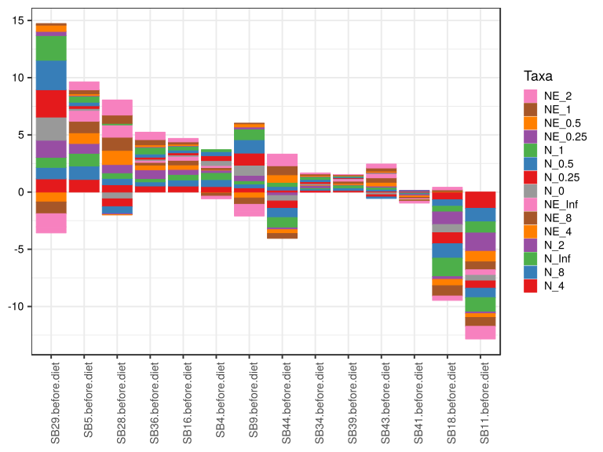

\(1.4.1.4.2.1.21.2.2.2.1.1.1\) [`Figure 889.`](#figure.889) Log2 fold change in abundance between paired samples. Samples are paired according to attribute SubjectID, resulting in 14 pairs. When fold change or difference is computed, this is done as 'before.diet by after.diet'. Data for all pooled samples. Sorting order of features is GeneSelector paired test ranking. bar (sample median) plot.  Image file: [`plots/32318f0748.svg`](plots/32318f0748.svg).
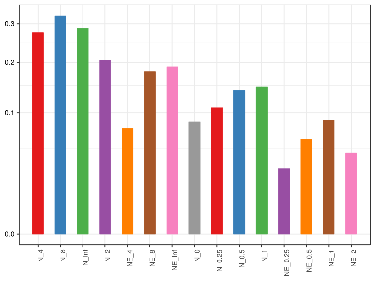

\(1.4.1.4.2.1.21.2.2.2.1.1.1\) [`Figure 890.`](#figure.890) Log2 fold change in abundance between paired samples. Samples are paired according to attribute SubjectID, resulting in 14 pairs. When fold change or difference is computed, this is done as 'before.diet by after.diet'. Data for all pooled samples. Sorting order of features is GeneSelector paired test ranking. violin plot.  Image file: [`plots/3236b3fff78.svg`](plots/3236b3fff78.svg).
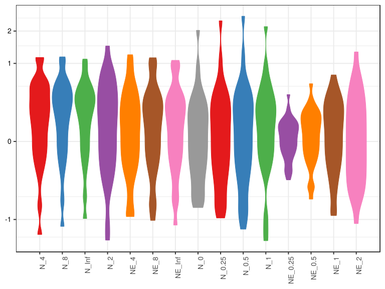

\(1.4.1.4.2.1.21.2.2.2.1.1.1\) [`Figure 891.`](#figure.891) Log2 fold change in abundance between paired samples. Samples are paired according to attribute SubjectID, resulting in 14 pairs. When fold change or difference is computed, this is done as 'before.diet by after.diet'. Data for all pooled samples. Sorting order of features is GeneSelector paired test ranking. boxplot plot.  Image file: [`plots/32345149b8f.svg`](plots/32345149b8f.svg).
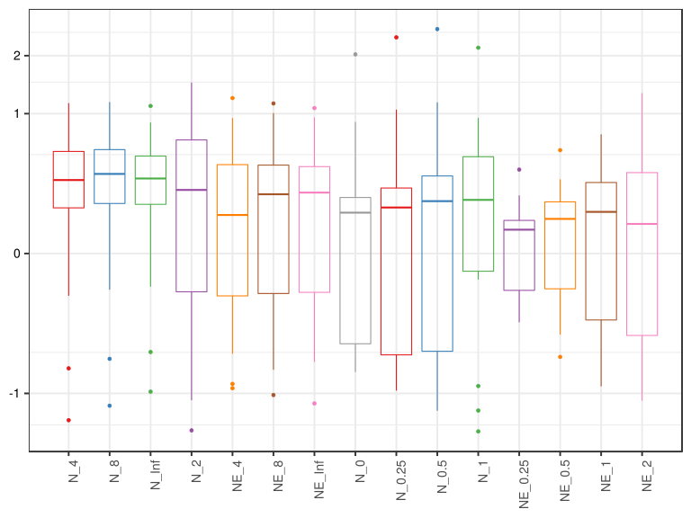

##### \(1.4.1.4.2.1.21.2.2.2.1.2\) Log2 fold change in abundance between paired samples. Samples are paired according to attribute SubjectID, resulting in 14 pairs. When fold change or difference is computed, this is done as 'before.diet by after.diet'. Plot is in flipped orientation, Y axis not scaled. Iterating over plot geometry

\(1.4.1.4.2.1.21.2.2.2.1.2.1\) [`Figure 892.`](#figure.892) Log2 fold change in abundance between paired samples. Samples are paired according to attribute SubjectID, resulting in 14 pairs. When fold change or difference is computed, this is done as 'before.diet by after.diet'. Data for all pooled samples. Sorting order of features is GeneSelector paired test ranking. bar (sample median) plot.  Image file: [`plots/323175e6986.svg`](plots/323175e6986.svg).
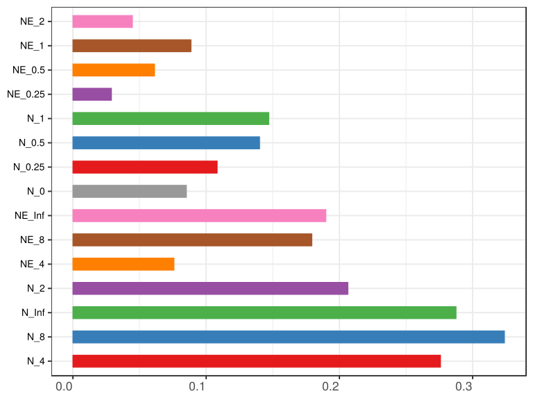

\(1.4.1.4.2.1.21.2.2.2.1.2.1\) [`Figure 893.`](#figure.893) Log2 fold change in abundance between paired samples. Samples are paired according to attribute SubjectID, resulting in 14 pairs. When fold change or difference is computed, this is done as 'before.diet by after.diet'. Data for all pooled samples. Sorting order of features is GeneSelector paired test ranking. violin plot.  Image file: [`plots/323525c9172.svg`](plots/323525c9172.svg).
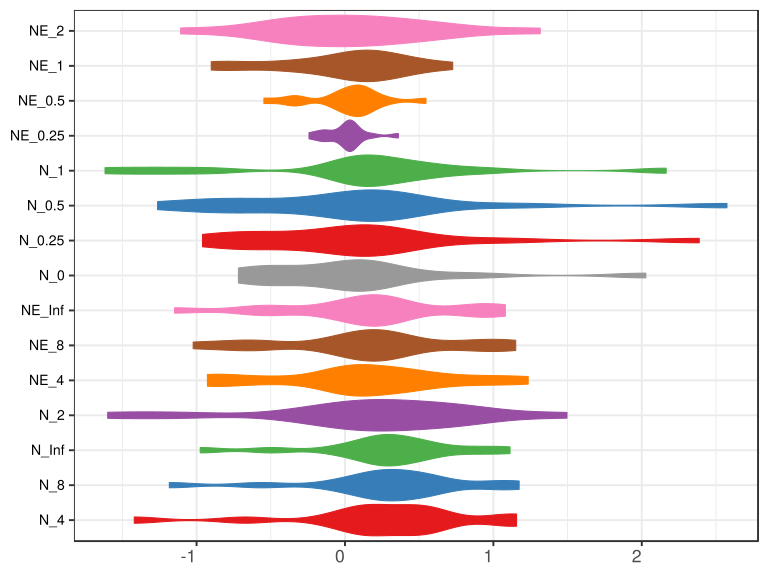

\(1.4.1.4.2.1.21.2.2.2.1.2.1\) [`Figure 894.`](#figure.894) Log2 fold change in abundance between paired samples. Samples are paired according to attribute SubjectID, resulting in 14 pairs. When fold change or difference is computed, this is done as 'before.diet by after.diet'. Data for all pooled samples. Sorting order of features is GeneSelector paired test ranking. boxplot plot.  Image file: [`plots/32315226a77.svg`](plots/32315226a77.svg).
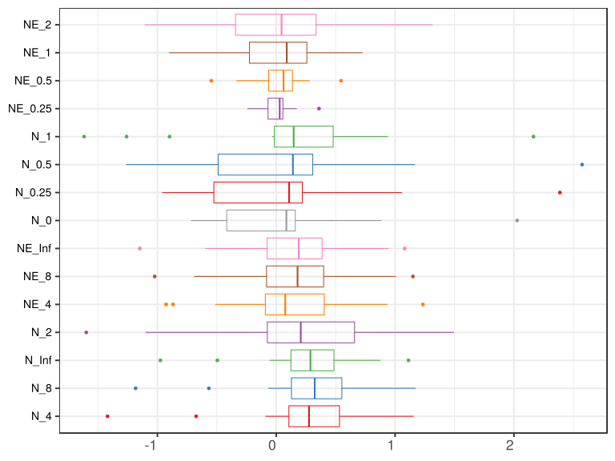

##### \(1.4.1.4.2.1.21.2.3\) Grouping variables Drug.Before.Diet

##### \(1.4.1.4.2.1.21.2.4\) Iterating over Log2 fold change in abundance between paired samples. Samples are paired according to attribute SubjectID, resulting in 14 pairs. When fold change or difference is computed, this is done as 'before.diet by after.diet'. profile sorting order

##### \(1.4.1.4.2.1.21.2.4.1\) Log2 fold change in abundance between paired samples. Samples are paired according to attribute SubjectID, resulting in 14 pairs. When fold change or difference is computed, this is done as 'before.diet by after.diet'. profile sorting order: GeneSelector paired test ranking

##### \(1.4.1.4.2.1.21.2.4.2\) Iterating over dodged vs faceted bars

The same data are shown in multiple combinations of graphical representations. 
                         This is the same data, but each plot highlights slightly different aspects of it.
                         It is not likely that you will need every plot - pick only what you need.

##### \(1.4.1.4.2.1.21.2.4.2.1\) faceted plots. Iterating over orientation and, optionally, scaling

##### \(1.4.1.4.2.1.21.2.4.2.1.1\) Log2 fold change in abundance between paired samples. Samples are paired according to attribute SubjectID, resulting in 14 pairs. When fold change or difference is computed, this is done as 'before.diet by after.diet'. Plot is in original orientation, Y axis SQRT scaled. Iterating over plot geometry

\(1.4.1.4.2.1.21.2.4.2.1.1.0\) [`Table 339.`](#table.339) Data table used for plots. Data grouped by Drug.Before.Diet. Showing only 200 first rows. Full dataset is also saved in a delimited text file (click to download and open e.g. in Excel) [`data/1.4.1.4.2.1.21.2.4.2.1.1.0-32315e3daf0.1.4.1.4.2.1.21.2.4.csv`](data/1.4.1.4.2.1.21.2.4.2.1.1.0-32315e3daf0.1.4.1.4.2.1.21.2.4.csv)

| .record.id       | Drug.Before.Diet | feature  | l2fc       |
|:-----------------|:-----------------|:---------|:-----------|
| SB11.before.diet | DrugBefore\_NO   | N\_0     | \-0.491092 |
| SB16.before.diet | DrugBefore\_YES  | N\_0     | 0.126664   |
| SB18.before.diet | DrugBefore\_NO   | N\_0     | \-0.718013 |
| SB28.before.diet | DrugBefore\_YES  | N\_0     | \-0.593858 |
| SB29.before.diet | DrugBefore\_YES  | N\_0     | 2.027255   |
| SB34.before.diet | DrugBefore\_YES  | N\_0     | 0.123281   |
| SB36.before.diet | DrugBefore\_YES  | N\_0     | 0.121354   |
| SB39.before.diet | DrugBefore\_YES  | N\_0     | 0.034926   |
| SB4.before.diet  | DrugBefore\_YES  | N\_0     | 0.436603   |
| SB41.before.diet | DrugBefore\_YES  | N\_0     | 0.049114   |
| SB43.before.diet | DrugBefore\_YES  | N\_0     | \-0.232318 |
| SB44.before.diet | DrugBefore\_YES  | N\_0     | \-0.477673 |
| SB5.before.diet  | DrugBefore\_NO   | N\_0     | 0.171616   |
| SB9.before.diet  | DrugBefore\_NO   | N\_0     | 0.885391   |
| SB11.before.diet | DrugBefore\_NO   | N\_0.25  | \-0.634338 |
| SB16.before.diet | DrugBefore\_YES  | N\_0.25  | 0.183082   |
| SB18.before.diet | DrugBefore\_NO   | N\_0.25  | \-0.959796 |
| SB28.before.diet | DrugBefore\_YES  | N\_0.25  | \-0.682825 |
| SB29.before.diet | DrugBefore\_YES  | N\_0.25  | 2.387025   |
| SB34.before.diet | DrugBefore\_YES  | N\_0.25  | 0.159472   |
| SB36.before.diet | DrugBefore\_YES  | N\_0.25  | 0.176759   |
| SB39.before.diet | DrugBefore\_YES  | N\_0.25  | 0.057172   |
| SB4.before.diet  | DrugBefore\_YES  | N\_0.25  | 0.429689   |
| SB41.before.diet | DrugBefore\_YES  | N\_0.25  | 0.049882   |
| SB43.before.diet | DrugBefore\_YES  | N\_0.25  | \-0.196822 |
| SB44.before.diet | DrugBefore\_YES  | N\_0.25  | \-0.637641 |
| SB5.before.diet  | DrugBefore\_NO   | N\_0.25  | 0.231494   |
| SB9.before.diet  | DrugBefore\_NO   | N\_0.25  | 1.058680   |
| SB11.before.diet | DrugBefore\_NO   | N\_0.5   | \-0.825806 |
| SB16.before.diet | DrugBefore\_YES  | N\_0.5   | 0.246380   |
| SB18.before.diet | DrugBefore\_NO   | N\_0.5   | \-1.262687 |
| SB28.before.diet | DrugBefore\_YES  | N\_0.5   | \-0.609046 |
| SB29.before.diet | DrugBefore\_YES  | N\_0.5   | 2.573790   |
| SB34.before.diet | DrugBefore\_YES  | N\_0.5   | 0.200284   |
| SB36.before.diet | DrugBefore\_YES  | N\_0.5   | 0.282796   |
| SB39.before.diet | DrugBefore\_YES  | N\_0.5   | 0.080017   |
| SB4.before.diet  | DrugBefore\_YES  | N\_0.5   | 0.357019   |
| SB41.before.diet | DrugBefore\_YES  | N\_0.5   | 0.036460   |
| SB43.before.diet | DrugBefore\_YES  | N\_0.5   | \-0.126778 |
| SB44.before.diet | DrugBefore\_YES  | N\_0.5   | \-0.813559 |
| SB5.before.diet  | DrugBefore\_NO   | N\_0.5   | 0.315200   |
| SB9.before.diet  | DrugBefore\_NO   | N\_0.5   | 1.167670   |
| SB11.before.diet | DrugBefore\_NO   | N\_1     | \-1.259650 |
| SB16.before.diet | DrugBefore\_YES  | N\_1     | 0.336035   |
| SB18.before.diet | DrugBefore\_NO   | N\_1     | \-1.616767 |
| SB28.before.diet | DrugBefore\_YES  | N\_1     | 0.132452   |
| SB29.before.diet | DrugBefore\_YES  | N\_1     | 2.164357   |
| SB34.before.diet | DrugBefore\_YES  | N\_1     | 0.241656   |
| SB36.before.diet | DrugBefore\_YES  | N\_1     | 0.575047   |
| SB39.before.diet | DrugBefore\_YES  | N\_1     | 0.088648   |
| SB4.before.diet  | DrugBefore\_YES  | N\_1     | 0.161694   |
| SB41.before.diet | DrugBefore\_YES  | N\_1     | \-0.034658 |
| SB43.before.diet | DrugBefore\_YES  | N\_1     | 0.039783   |
| SB44.before.diet | DrugBefore\_YES  | N\_1     | \-0.897483 |
| SB5.before.diet  | DrugBefore\_NO   | N\_1     | 0.526700   |
| SB9.before.diet  | DrugBefore\_NO   | N\_1     | 0.939827   |
| SB11.before.diet | DrugBefore\_NO   | N\_2     | \-1.598588 |
| SB16.before.diet | DrugBefore\_YES  | N\_2     | 0.434624   |
| SB18.before.diet | DrugBefore\_NO   | N\_2     | \-1.100064 |
| SB28.before.diet | DrugBefore\_YES  | N\_2     | 0.722091   |
| SB29.before.diet | DrugBefore\_YES  | N\_2     | 1.495731   |
| SB34.before.diet | DrugBefore\_YES  | N\_2     | 0.200256   |
| SB36.before.diet | DrugBefore\_YES  | N\_2     | 0.775051   |
| SB39.before.diet | DrugBefore\_YES  | N\_2     | 0.047565   |
| SB4.before.diet  | DrugBefore\_YES  | N\_2     | 0.212547   |
| SB41.before.diet | DrugBefore\_YES  | N\_2     | \-0.115683 |
| SB43.before.diet | DrugBefore\_YES  | N\_2     | 0.110412   |
| SB44.before.diet | DrugBefore\_YES  | N\_2     | \-0.302859 |
| SB5.before.diet  | DrugBefore\_NO   | N\_2     | 0.856968   |
| SB9.before.diet  | DrugBefore\_NO   | N\_2     | 0.469765   |
| SB11.before.diet | DrugBefore\_NO   | N\_4     | \-1.419693 |
| SB16.before.diet | DrugBefore\_YES  | N\_4     | 0.529055   |
| SB18.before.diet | DrugBefore\_NO   | N\_4     | \-0.673702 |
| SB28.before.diet | DrugBefore\_YES  | N\_4     | 0.640887   |
| SB29.before.diet | DrugBefore\_YES  | N\_4     | 1.156200   |
| SB34.before.diet | DrugBefore\_YES  | N\_4     | 0.155737   |
| SB36.before.diet | DrugBefore\_YES  | N\_4     | 0.533256   |
| SB39.before.diet | DrugBefore\_YES  | N\_4     | 0.144127   |
| SB4.before.diet  | DrugBefore\_YES  | N\_4     | 0.484035   |
| SB41.before.diet | DrugBefore\_YES  | N\_4     | \-0.091338 |
| SB43.before.diet | DrugBefore\_YES  | N\_4     | 0.093988   |
| SB44.before.diet | DrugBefore\_YES  | N\_4     | 0.175682   |
| SB5.before.diet  | DrugBefore\_NO   | N\_4     | 1.104004   |
| SB9.before.diet  | DrugBefore\_NO   | N\_4     | 0.376181   |
| SB11.before.diet | DrugBefore\_NO   | N\_8     | \-1.183520 |
| SB16.before.diet | DrugBefore\_YES  | N\_8     | 0.536401   |
| SB18.before.diet | DrugBefore\_NO   | N\_8     | \-0.566647 |
| SB28.before.diet | DrugBefore\_YES  | N\_8     | 0.557117   |
| SB29.before.diet | DrugBefore\_YES  | N\_8     | 1.001973   |
| SB34.before.diet | DrugBefore\_YES  | N\_8     | 0.118742   |
| SB36.before.diet | DrugBefore\_YES  | N\_8     | 0.360949   |
| SB39.before.diet | DrugBefore\_YES  | N\_8     | 0.228735   |
| SB4.before.diet  | DrugBefore\_YES  | N\_8     | 0.606364   |
| SB41.before.diet | DrugBefore\_YES  | N\_8     | \-0.066907 |
| SB43.before.diet | DrugBefore\_YES  | N\_8     | 0.155191   |
| SB44.before.diet | DrugBefore\_YES  | N\_8     | 0.317289   |
| SB5.before.diet  | DrugBefore\_NO   | N\_8     | 1.173709   |
| SB9.before.diet  | DrugBefore\_NO   | N\_8     | 0.330526   |
| SB11.before.diet | DrugBefore\_NO   | N\_Inf   | \-0.975270 |
| SB16.before.diet | DrugBefore\_YES  | N\_Inf   | 0.479395   |
| SB18.before.diet | DrugBefore\_NO   | N\_Inf   | \-0.495743 |
| SB28.before.diet | DrugBefore\_YES  | N\_Inf   | 0.487534   |
| SB29.before.diet | DrugBefore\_YES  | N\_Inf   | 0.876868   |
| SB34.before.diet | DrugBefore\_YES  | N\_Inf   | 0.108044   |
| SB36.before.diet | DrugBefore\_YES  | N\_Inf   | 0.285830   |
| SB39.before.diet | DrugBefore\_YES  | N\_Inf   | 0.240958   |
| SB4.before.diet  | DrugBefore\_YES  | N\_Inf   | 0.617598   |
| SB41.before.diet | DrugBefore\_YES  | N\_Inf   | \-0.056285 |
| SB43.before.diet | DrugBefore\_YES  | N\_Inf   | 0.170861   |
| SB44.before.diet | DrugBefore\_YES  | N\_Inf   | 0.359945   |
| SB5.before.diet  | DrugBefore\_NO   | N\_Inf   | 1.112370   |
| SB9.before.diet  | DrugBefore\_NO   | N\_Inf   | 0.289321   |
| SB11.before.diet | DrugBefore\_NO   | NE\_0.25 | \-0.143304 |
| SB16.before.diet | DrugBefore\_YES  | NE\_0.25 | 0.054996   |
| SB18.before.diet | DrugBefore\_NO   | NE\_0.25 | \-0.242422 |
| SB28.before.diet | DrugBefore\_YES  | NE\_0.25 | \-0.090101 |
| SB29.before.diet | DrugBefore\_YES  | NE\_0.25 | 0.359633   |
| SB34.before.diet | DrugBefore\_YES  | NE\_0.25 | 0.037737   |
| SB36.before.diet | DrugBefore\_YES  | NE\_0.25 | 0.056439   |
| SB39.before.diet | DrugBefore\_YES  | NE\_0.25 | 0.020870   |
| SB4.before.diet  | DrugBefore\_YES  | NE\_0.25 | \-0.006766 |
| SB41.before.diet | DrugBefore\_YES  | NE\_0.25 | 0.001340   |
| SB43.before.diet | DrugBefore\_YES  | NE\_0.25 | 0.037126   |
| SB44.before.diet | DrugBefore\_YES  | NE\_0.25 | \-0.160489 |
| SB5.before.diet  | DrugBefore\_NO   | NE\_0.25 | 0.059361   |
| SB9.before.diet  | DrugBefore\_NO   | NE\_0.25 | 0.172967   |
| SB11.before.diet | DrugBefore\_NO   | NE\_0.5  | \-0.334879 |
| SB16.before.diet | DrugBefore\_YES  | NE\_0.5  | 0.115970   |
| SB18.before.diet | DrugBefore\_NO   | NE\_0.5  | \-0.546258 |
| SB28.before.diet | DrugBefore\_YES  | NE\_0.5  | \-0.016884 |
| SB29.before.diet | DrugBefore\_YES  | NE\_0.5  | 0.545983   |
| SB34.before.diet | DrugBefore\_YES  | NE\_0.5  | 0.080499   |
| SB36.before.diet | DrugBefore\_YES  | NE\_0.5  | 0.163110   |
| SB39.before.diet | DrugBefore\_YES  | NE\_0.5  | 0.042152   |
| SB4.before.diet  | DrugBefore\_YES  | NE\_0.5  | \-0.079186 |
| SB41.before.diet | DrugBefore\_YES  | NE\_0.5  | \-0.011181 |
| SB43.before.diet | DrugBefore\_YES  | NE\_0.5  | 0.108617   |
| SB44.before.diet | DrugBefore\_YES  | NE\_0.5  | \-0.336368 |
| SB5.before.diet  | DrugBefore\_NO   | NE\_0.5  | 0.143273   |
| SB9.before.diet  | DrugBefore\_NO   | NE\_0.5  | 0.281402   |
| SB11.before.diet | DrugBefore\_NO   | NE\_1    | \-0.768800 |
| SB16.before.diet | DrugBefore\_YES  | NE\_1    | 0.201714   |
| SB18.before.diet | DrugBefore\_NO   | NE\_1    | \-0.901111 |
| SB28.before.diet | DrugBefore\_YES  | NE\_1    | 0.725872   |
| SB29.before.diet | DrugBefore\_YES  | NE\_1    | 0.137789   |
| SB34.before.diet | DrugBefore\_YES  | NE\_1    | 0.125041   |
| SB36.before.diet | DrugBefore\_YES  | NE\_1    | 0.454230   |
| SB39.before.diet | DrugBefore\_YES  | NE\_1    | 0.048144   |
| SB4.before.diet  | DrugBefore\_YES  | NE\_1    | \-0.273811 |
| SB41.before.diet | DrugBefore\_YES  | NE\_1    | \-0.080641 |
| SB43.before.diet | DrugBefore\_YES  | NE\_1    | 0.276519   |
| SB44.before.diet | DrugBefore\_YES  | NE\_1    | \-0.419091 |
| SB5.before.diet  | DrugBefore\_NO   | NE\_1    | 0.356930   |
| SB9.before.diet  | DrugBefore\_NO   | NE\_1    | 0.052254   |
| SB11.before.diet | DrugBefore\_NO   | NE\_2    | \-1.107198 |
| SB16.before.diet | DrugBefore\_YES  | NE\_2    | 0.300257   |
| SB18.before.diet | DrugBefore\_NO   | NE\_2    | \-0.383155 |
| SB28.before.diet | DrugBefore\_YES  | NE\_2    | 1.315933   |
| SB29.before.diet | DrugBefore\_YES  | NE\_2    | \-0.529068 |
| SB34.before.diet | DrugBefore\_YES  | NE\_2    | 0.084025   |
| SB36.before.diet | DrugBefore\_YES  | NE\_2    | 0.650254   |
| SB39.before.diet | DrugBefore\_YES  | NE\_2    | 0.005466   |
| SB4.before.diet  | DrugBefore\_YES  | NE\_2    | \-0.222056 |
| SB41.before.diet | DrugBefore\_YES  | NE\_2    | \-0.161018 |
| SB43.before.diet | DrugBefore\_YES  | NE\_2    | 0.345928   |
| SB44.before.diet | DrugBefore\_YES  | NE\_2    | 0.175627   |
| SB5.before.diet  | DrugBefore\_NO   | NE\_2    | 0.689064   |
| SB9.before.diet  | DrugBefore\_NO   | NE\_2    | \-0.419281 |
| SB11.before.diet | DrugBefore\_NO   | NE\_4    | \-0.926943 |
| SB16.before.diet | DrugBefore\_YES  | NE\_4    | 0.395463   |
| SB18.before.diet | DrugBefore\_NO   | NE\_4    | 0.043747   |
| SB28.before.diet | DrugBefore\_YES  | NE\_4    | 1.234416   |
| SB29.before.diet | DrugBefore\_YES  | NE\_4    | \-0.868255 |
| SB34.before.diet | DrugBefore\_YES  | NE\_4    | 0.038579   |
| SB36.before.diet | DrugBefore\_YES  | NE\_4    | 0.406599   |
| SB39.before.diet | DrugBefore\_YES  | NE\_4    | 0.102420   |
| SB4.before.diet  | DrugBefore\_YES  | NE\_4    | 0.049400   |
| SB41.before.diet | DrugBefore\_YES  | NE\_4    | \-0.135040 |
| SB43.before.diet | DrugBefore\_YES  | NE\_4    | 0.327812   |
| SB44.before.diet | DrugBefore\_YES  | NE\_4    | 0.654159   |
| SB5.before.diet  | DrugBefore\_NO   | NE\_4    | 0.936688   |
| SB9.before.diet  | DrugBefore\_NO   | NE\_4    | \-0.513424 |
| SB11.before.diet | DrugBefore\_NO   | NE\_8    | \-0.690006 |
| SB16.before.diet | DrugBefore\_YES  | NE\_8    | 0.403135   |
| SB18.before.diet | DrugBefore\_NO   | NE\_8    | 0.150962   |
| SB28.before.diet | DrugBefore\_YES  | NE\_8    | 1.150541   |
| SB29.before.diet | DrugBefore\_YES  | NE\_8    | \-1.022807 |
| SB34.before.diet | DrugBefore\_YES  | NE\_8    | 0.001377   |
| SB36.before.diet | DrugBefore\_YES  | NE\_8    | 0.233361   |
| SB39.before.diet | DrugBefore\_YES  | NE\_8    | 0.188096   |
| SB4.before.diet  | DrugBefore\_YES  | NE\_8    | 0.170606   |
| SB41.before.diet | DrugBefore\_YES  | NE\_8    | \-0.109396 |
| SB43.before.diet | DrugBefore\_YES  | NE\_8    | 0.387075   |
| SB44.before.diet | DrugBefore\_YES  | NE\_8    | 0.796058   |
| SB5.before.diet  | DrugBefore\_NO   | NE\_8    | 1.007388   |
| SB9.before.diet  | DrugBefore\_NO   | NE\_8    | \-0.559128 |
| SB11.before.diet | DrugBefore\_NO   | NE\_Inf  | \-0.481854 |
| SB16.before.diet | DrugBefore\_YES  | NE\_Inf  | 0.346192   |
| SB18.before.diet | DrugBefore\_NO   | NE\_Inf  | 0.221995   |
| SB28.before.diet | DrugBefore\_YES  | NE\_Inf  | 1.080859   |

\(1.4.1.4.2.1.21.2.4.2.1.1.1\) [`Widget 348.`](#widget.348) Dynamic Pivot Table link (drag and drop field names and pick averaging 
                      functions or plot types; click on fields or legend elements to filter values). 
                      Starting rendering is Stacked Bar Chart. Data grouped by Drug.Before.Diet. Click to see HTML widget file in full window: [`./1.4.1.4.2.1.21.2.4.2.1.1.1-323252ab8aDynamic.Pivot.Table.html`](./1.4.1.4.2.1.21.2.4.2.1.1.1-323252ab8aDynamic.Pivot.Table.html)

\(1.4.1.4.2.1.21.2.4.2.1.1.1\) [`Widget 349.`](#widget.349) Dynamic Pivot Table link (drag and drop field names and pick averaging 
                      functions or plot types; click on fields or legend elements to filter values). 
                      Starting rendering is Table Barchart. Data grouped by Drug.Before.Diet. Click to see HTML widget file in full window: [`./1.4.1.4.2.1.21.2.4.2.1.1.1-32327adb026Dynamic.Pivot.Table.html`](./1.4.1.4.2.1.21.2.4.2.1.1.1-32327adb026Dynamic.Pivot.Table.html)

\(1.4.1.4.2.1.21.2.4.2.1.1.1\) [`Table 340.`](#table.340) Summary table. Data grouped by Drug.Before.Diet. Full dataset is also saved in a delimited text file (click to download and open e.g. in Excel) [`data/1.4.1.4.2.1.21.2.4.2.1.1.1-3233ce7da8.1.4.1.4.2.1.21.2.4.csv`](data/1.4.1.4.2.1.21.2.4.2.1.1.1-3233ce7da8.1.4.1.4.2.1.21.2.4.csv)

| feature  | Drug.Before.Diet | mean      | sd     | median    | incidence |
|:---------|:-----------------|:----------|:-------|:----------|:----------|
| N\_4     | DrugBefore\_NO   | \-0.15330 | 1.1159 | \-0.14876 | 0.50      |
| N\_4     | DrugBefore\_YES  | 0.38216   | 0.3619 | 0.32986   | 0.90      |
| N\_8     | DrugBefore\_NO   | \-0.06148 | 1.0318 | \-0.11806 | 0.50      |
| N\_8     | DrugBefore\_YES  | 0.38159   | 0.3054 | 0.33912   | 0.90      |
| N\_Inf   | DrugBefore\_NO   | \-0.01733 | 0.9159 | \-0.10321 | 0.50      |
| N\_Inf   | DrugBefore\_YES  | 0.35707   | 0.2700 | 0.32289   | 0.90      |
| N\_2     | DrugBefore\_NO   | \-0.34298 | 1.1903 | \-0.31515 | 0.50      |
| N\_2     | DrugBefore\_YES  | 0.35797   | 0.5240 | 0.20640   | 0.80      |
| NE\_4    | DrugBefore\_NO   | \-0.11498 | 0.8061 | \-0.23484 | 0.50      |
| NE\_4    | DrugBefore\_YES  | 0.22056   | 0.5458 | 0.21512   | 0.80      |
| NE\_8    | DrugBefore\_NO   | \-0.02270 | 0.7798 | \-0.20408 | 0.50      |
| NE\_8    | DrugBefore\_YES  | 0.21980   | 0.5738 | 0.21073   | 0.80      |
| NE\_Inf  | DrugBefore\_NO   | 0.02167   | 0.7157 | \-0.12993 | 0.50      |
| NE\_Inf  | DrugBefore\_YES  | 0.19448   | 0.5963 | 0.18990   | 0.70      |
| N\_0     | DrugBefore\_NO   | \-0.03802 | 0.7221 | \-0.15974 | 0.50      |
| N\_0     | DrugBefore\_YES  | 0.16153   | 0.7245 | 0.08523   | 0.70      |
| N\_0.25  | DrugBefore\_NO   | \-0.07599 | 0.9083 | \-0.20142 | 0.50      |
| N\_0.25  | DrugBefore\_YES  | 0.19258   | 0.8511 | 0.10832   | 0.70      |
| N\_0.5   | DrugBefore\_NO   | \-0.15141 | 1.1026 | \-0.25530 | 0.50      |
| N\_0.5   | DrugBefore\_YES  | 0.22274   | 0.9125 | 0.14015   | 0.70      |
| N\_1     | DrugBefore\_NO   | \-0.35247 | 1.2734 | \-0.36647 | 0.50      |
| N\_1     | DrugBefore\_YES  | 0.28075   | 0.7643 | 0.14707   | 0.80      |
| NE\_0.25 | DrugBefore\_NO   | \-0.03835 | 0.1887 | \-0.04197 | 0.50      |
| NE\_0.25 | DrugBefore\_YES  | 0.03108   | 0.1346 | 0.02900   | 0.70      |
| NE\_0.5  | DrugBefore\_NO   | \-0.11412 | 0.3908 | \-0.09580 | 0.50      |
| NE\_0.5  | DrugBefore\_YES  | 0.06127   | 0.2212 | 0.06133   | 0.60      |
| NE\_1    | DrugBefore\_NO   | \-0.31518 | 0.6153 | \-0.35827 | 0.50      |
| NE\_1    | DrugBefore\_YES  | 0.11958   | 0.3336 | 0.13142   | 0.70      |
| NE\_2    | DrugBefore\_NO   | \-0.30514 | 0.7418 | \-0.40122 | 0.25      |
| NE\_2    | DrugBefore\_YES  | 0.19653   | 0.5133 | 0.12983   | 0.70      |

\(1.4.1.4.2.1.21.2.4.2.1.1.1\) [`Figure 895.`](#figure.895) Log2 fold change in abundance between paired samples. Samples are paired according to attribute SubjectID, resulting in 14 pairs. When fold change or difference is computed, this is done as 'before.diet by after.diet'. Data grouped by Drug.Before.Diet. Sorting order of features is GeneSelector paired test ranking. bar_stacked plot.  Image file: [`plots/3237c8821e3.svg`](plots/3237c8821e3.svg).
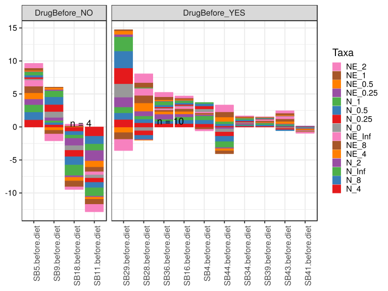

\(1.4.1.4.2.1.21.2.4.2.1.1.1\) [`Figure 896.`](#figure.896) Log2 fold change in abundance between paired samples. Samples are paired according to attribute SubjectID, resulting in 14 pairs. When fold change or difference is computed, this is done as 'before.diet by after.diet'. Data grouped by Drug.Before.Diet. Sorting order of features is GeneSelector paired test ranking. bar (sample median) plot.  Image file: [`plots/323285dae5a.svg`](plots/323285dae5a.svg).
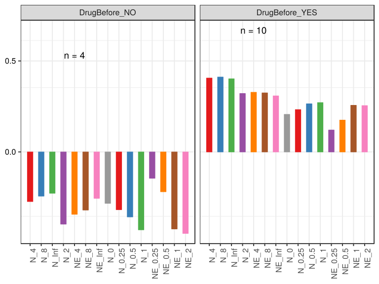

\(1.4.1.4.2.1.21.2.4.2.1.1.1\) [`Figure 897.`](#figure.897) Log2 fold change in abundance between paired samples. Samples are paired according to attribute SubjectID, resulting in 14 pairs. When fold change or difference is computed, this is done as 'before.diet by after.diet'. Data grouped by Drug.Before.Diet. Sorting order of features is GeneSelector paired test ranking. violin plot.  Image file: [`plots/32373f001f5.svg`](plots/32373f001f5.svg).
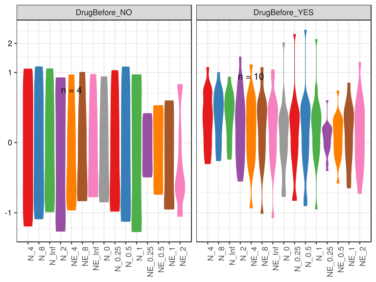

\(1.4.1.4.2.1.21.2.4.2.1.1.1\) [`Figure 898.`](#figure.898) Log2 fold change in abundance between paired samples. Samples are paired according to attribute SubjectID, resulting in 14 pairs. When fold change or difference is computed, this is done as 'before.diet by after.diet'. Data grouped by Drug.Before.Diet. Sorting order of features is GeneSelector paired test ranking. boxplot plot.  Image file: [`plots/3237e8ad5b6.svg`](plots/3237e8ad5b6.svg).
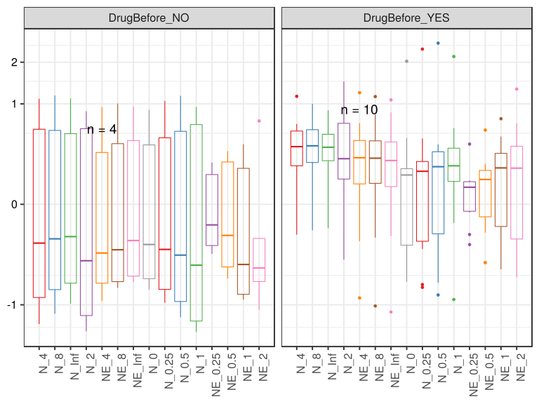

##### \(1.4.1.4.2.1.21.2.4.2.1.2\) Log2 fold change in abundance between paired samples. Samples are paired according to attribute SubjectID, resulting in 14 pairs. When fold change or difference is computed, this is done as 'before.diet by after.diet'. Plot is in flipped orientation, Y axis not scaled. Iterating over plot geometry

\(1.4.1.4.2.1.21.2.4.2.1.2.1\) [`Figure 899.`](#figure.899) Log2 fold change in abundance between paired samples. Samples are paired according to attribute SubjectID, resulting in 14 pairs. When fold change or difference is computed, this is done as 'before.diet by after.diet'. Data grouped by Drug.Before.Diet. Sorting order of features is GeneSelector paired test ranking. bar (sample median) plot.  Image file: [`plots/32365ee81bb.svg`](plots/32365ee81bb.svg).
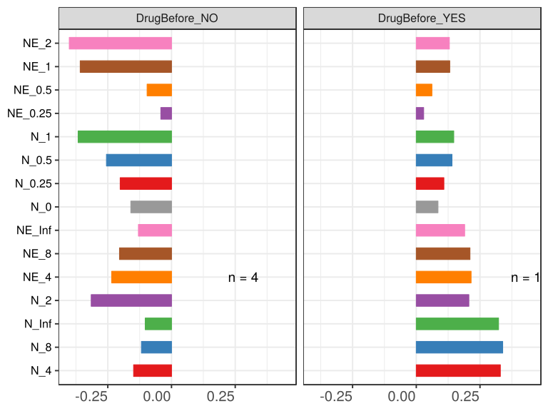

\(1.4.1.4.2.1.21.2.4.2.1.2.1\) [`Figure 900.`](#figure.900) Log2 fold change in abundance between paired samples. Samples are paired according to attribute SubjectID, resulting in 14 pairs. When fold change or difference is computed, this is done as 'before.diet by after.diet'. Data grouped by Drug.Before.Diet. Sorting order of features is GeneSelector paired test ranking. violin plot.  Image file: [`plots/3234b5eb092.svg`](plots/3234b5eb092.svg).
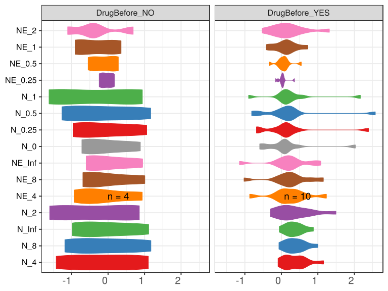

\(1.4.1.4.2.1.21.2.4.2.1.2.1\) [`Figure 901.`](#figure.901) Log2 fold change in abundance between paired samples. Samples are paired according to attribute SubjectID, resulting in 14 pairs. When fold change or difference is computed, this is done as 'before.diet by after.diet'. Data grouped by Drug.Before.Diet. Sorting order of features is GeneSelector paired test ranking. boxplot plot.  Image file: [`plots/32347e11d95.svg`](plots/32347e11d95.svg).
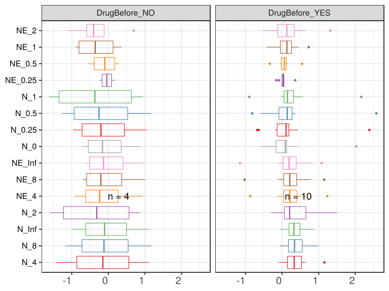

##### \(1.4.1.4.2.1.21.2.4.2.2\) dodged plots. Iterating over orientation and, optionally, scaling

##### \(1.4.1.4.2.1.21.2.4.2.2.1\) Log2 fold change in abundance between paired samples. Samples are paired according to attribute SubjectID, resulting in 14 pairs. When fold change or difference is computed, this is done as 'before.diet by after.diet'. Plot is in original orientation, Y axis SQRT scaled. Iterating over plot geometry

\(1.4.1.4.2.1.21.2.4.2.2.1.1\) [`Figure 902.`](#figure.902) Log2 fold change in abundance between paired samples. Samples are paired according to attribute SubjectID, resulting in 14 pairs. When fold change or difference is computed, this is done as 'before.diet by after.diet'. Data grouped by Drug.Before.Diet. Sorting order of features is GeneSelector paired test ranking. bar (sample median) plot.  Image file: [`plots/3233f4696b4.svg`](plots/3233f4696b4.svg).
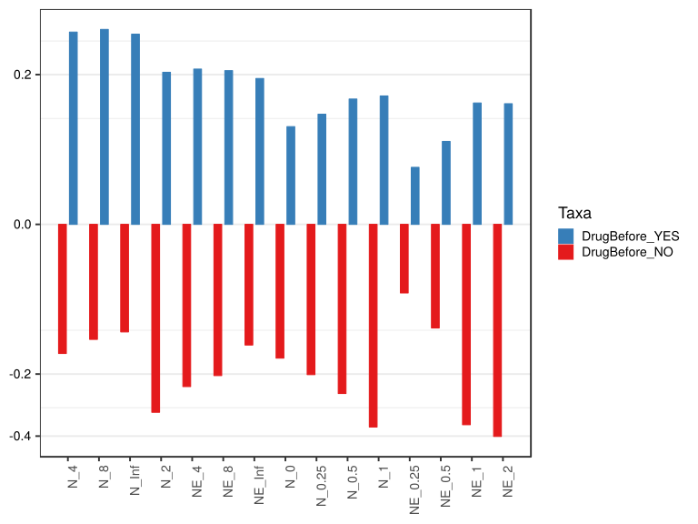

\(1.4.1.4.2.1.21.2.4.2.2.1.1\) [`Figure 903.`](#figure.903) Log2 fold change in abundance between paired samples. Samples are paired according to attribute SubjectID, resulting in 14 pairs. When fold change or difference is computed, this is done as 'before.diet by after.diet'. Data grouped by Drug.Before.Diet. Sorting order of features is GeneSelector paired test ranking. violin plot.  Image file: [`plots/32334403d61.svg`](plots/32334403d61.svg).
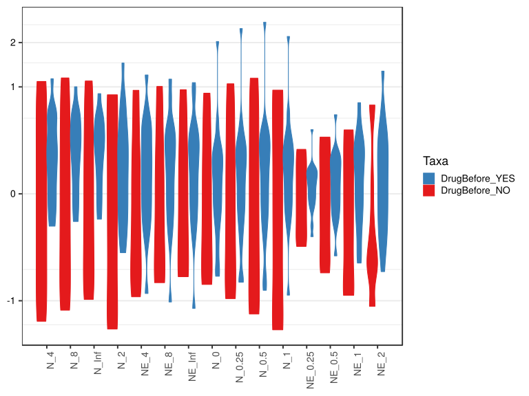

\(1.4.1.4.2.1.21.2.4.2.2.1.1\) [`Figure 904.`](#figure.904) Log2 fold change in abundance between paired samples. Samples are paired according to attribute SubjectID, resulting in 14 pairs. When fold change or difference is computed, this is done as 'before.diet by after.diet'. Data grouped by Drug.Before.Diet. Sorting order of features is GeneSelector paired test ranking. boxplot plot.  Image file: [`plots/323a43c20a.svg`](plots/323a43c20a.svg).
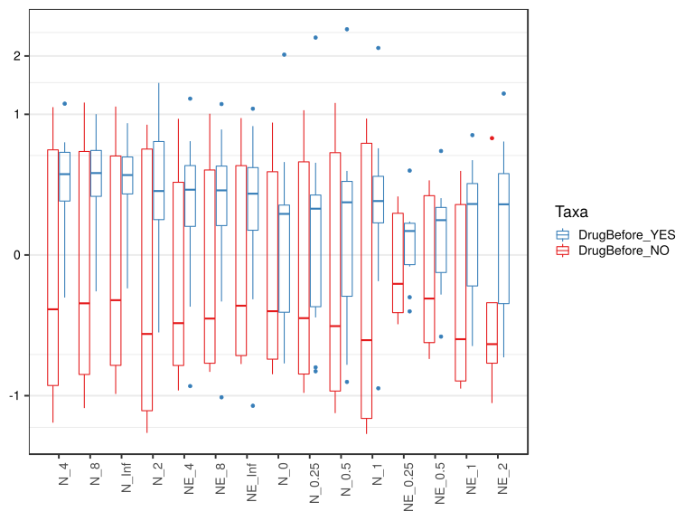

##### \(1.4.1.4.2.1.21.2.4.2.2.2\) Log2 fold change in abundance between paired samples. Samples are paired according to attribute SubjectID, resulting in 14 pairs. When fold change or difference is computed, this is done as 'before.diet by after.diet'. Plot is in flipped orientation, Y axis not scaled. Iterating over plot geometry

\(1.4.1.4.2.1.21.2.4.2.2.2.1\) [`Figure 905.`](#figure.905) Log2 fold change in abundance between paired samples. Samples are paired according to attribute SubjectID, resulting in 14 pairs. When fold change or difference is computed, this is done as 'before.diet by after.diet'. Data grouped by Drug.Before.Diet. Sorting order of features is GeneSelector paired test ranking. bar (sample median) plot.  Image file: [`plots/3233cc1091a.svg`](plots/3233cc1091a.svg).
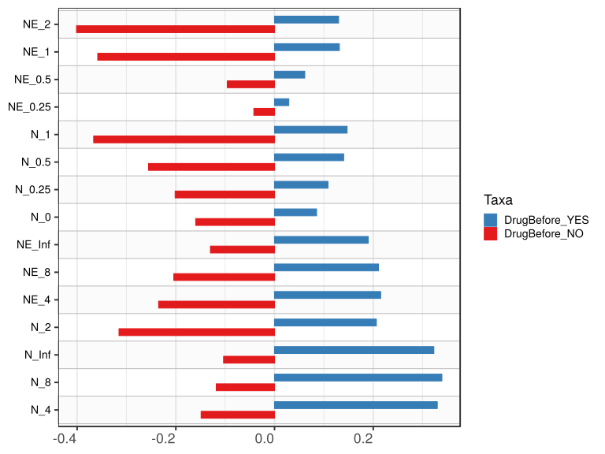

\(1.4.1.4.2.1.21.2.4.2.2.2.1\) [`Figure 906.`](#figure.906) Log2 fold change in abundance between paired samples. Samples are paired according to attribute SubjectID, resulting in 14 pairs. When fold change or difference is computed, this is done as 'before.diet by after.diet'. Data grouped by Drug.Before.Diet. Sorting order of features is GeneSelector paired test ranking. violin plot.  Image file: [`plots/3236c6338a8.svg`](plots/3236c6338a8.svg).
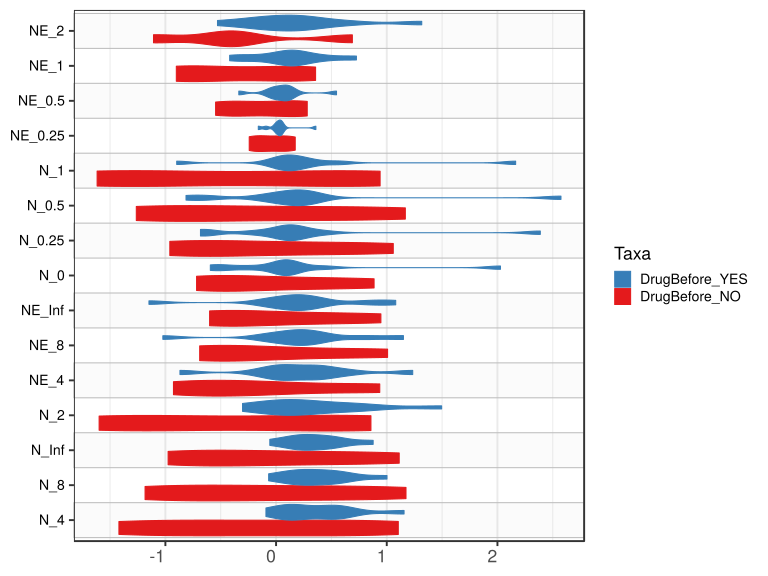

\(1.4.1.4.2.1.21.2.4.2.2.2.1\) [`Figure 907.`](#figure.907) Log2 fold change in abundance between paired samples. Samples are paired according to attribute SubjectID, resulting in 14 pairs. When fold change or difference is computed, this is done as 'before.diet by after.diet'. Data grouped by Drug.Before.Diet. Sorting order of features is GeneSelector paired test ranking. boxplot plot.  Image file: [`plots/323150b966f.svg`](plots/323150b966f.svg).
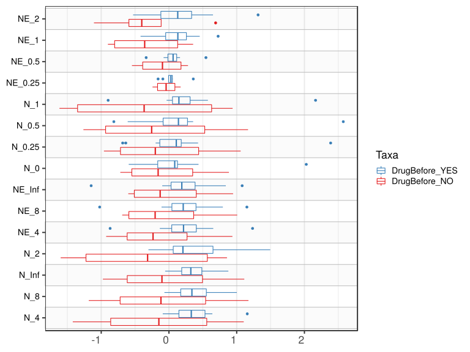