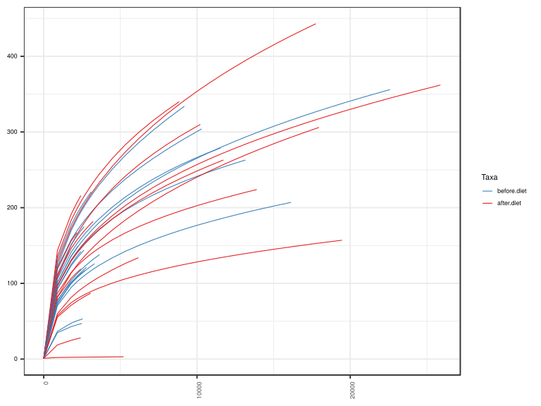
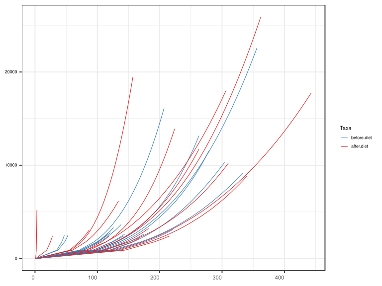
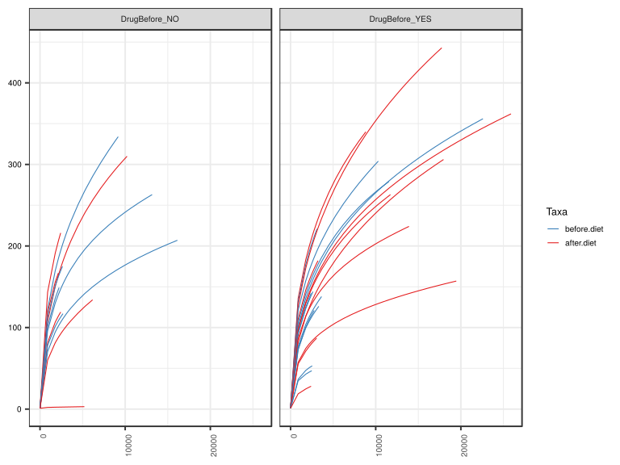
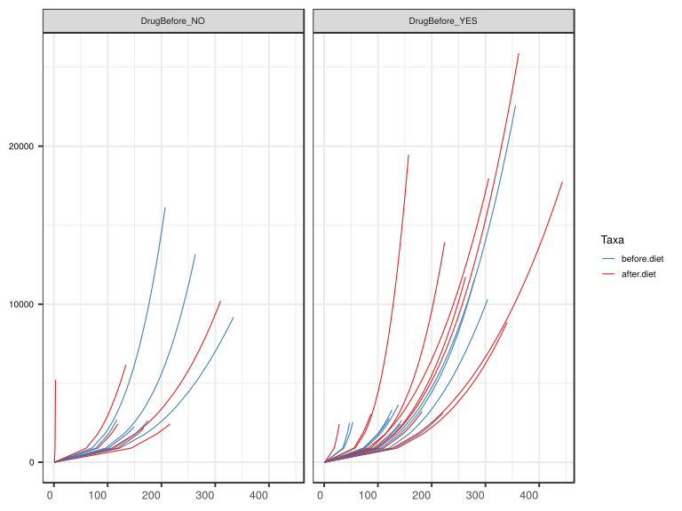

noone@mail.com
Analysis of Dieting study 16S data
% Fri Sep  7 05:46:18 2018

##### \(1.4.1.4.2.1.21.1\) Plots of Abundance-based rarefaction curves.

Plots are shown with relation to various combinations of meta 
                   data variables and in different graphical representations. Lots of plots here.

##### \(1.4.1.4.2.1.21.1.2\) Iterating over all combinations of grouping variables

##### \(1.4.1.4.2.1.21.1.2.1\) Grouping variables DietStatus

##### \(1.4.1.4.2.1.21.1.2.2\) Iterating over Abundance-based rarefaction curves. profile sorting order

##### \(1.4.1.4.2.1.21.1.2.2.1\) Abundance-based rarefaction curves. profile sorting order: original

##### \(1.4.1.4.2.1.21.1.2.2.2\) Iterating over dodged vs faceted bars

The same data are shown in multiple combinations of graphical representations. 
                         This is the same data, but each plot highlights slightly different aspects of it.
                         It is not likely that you will need every plot - pick only what you need.

##### \(1.4.1.4.2.1.21.1.2.2.2.1\) dodged plots. Iterating over orientation and, optionally, scaling

##### \(1.4.1.4.2.1.21.1.2.2.2.1.1\) Abundance-based rarefaction curves. Plot is in original orientation. Iterating over plot geometry

\(1.4.1.4.2.1.21.1.2.2.2.1.1.0\) [`Table 341.`](#table.341) Data table used for plots. Data grouped by DietStatus. Showing only 200 first rows. Full dataset is also saved in a delimited text file (click to download and open e.g. in Excel) [`data/1.4.1.4.2.1.21.1.2.2.2.1.1.0-32322e4d298.1.4.1.4.2.1.21.1.2.csv`](data/1.4.1.4.2.1.21.1.2.2.2.1.1.0-32322e4d298.1.4.1.4.2.1.21.1.2.csv)

| .record.id | DietStatus  | feature          | Richness |
|:-----------|:------------|:-----------------|:---------|
| SM1        | before.diet | 1                | 1.000    |
| SM11       | after.diet  | 1                | 1.000    |
| SM12       | before.diet | 1                | 1.000    |
| SM13       | before.diet | 1                | 1.000    |
| SM14       | before.diet | 1                | 1.000    |
| SM17       | before.diet | 1                | 1.000    |
| SM19       | after.diet  | 1                | 1.000    |
| SM2        | before.diet | 1                | 1.000    |
| SM23       | after.diet  | 1                | 1.000    |
| SM3        | after.diet  | 1                | 1.000    |
| SM33       | before.diet | 1                | 1.000    |
| SM38       | after.diet  | 1                | 1.000    |
| SM41       | before.diet | 1                | 1.000    |
| SM45       | after.diet  | 1                | 1.000    |
| SM49       | before.diet | 1                | 1.000    |
| SM52       | before.diet | 1                | 1.000    |
| SM53       | after.diet  | 1                | 1.000    |
| SM56       | after.diet  | 1                | 1.000    |
| SM57       | before.diet | 1                | 1.000    |
| SM58       | after.diet  | 1                | 1.000    |
| SM62       | before.diet | 1                | 1.000    |
| SM64       | after.diet  | 1                | 1.000    |
| SM77       | after.diet  | 1                | 1.000    |
| SM79       | after.diet  | 1                | 1.000    |
| SM8        | before.diet | 1                | 1.000    |
| SM83       | before.diet | 1                | 1.000    |
| SM84       | before.diet | 1                | 1.000    |
| SM86       | after.diet  | 1                | 1.000    |
| SM87       | before.diet | 1                | 1.000    |
| SM88       | after.diet  | 1                | 1.000    |
| SM9        | after.diet  | 1                | 1.000    |
| SM90       | after.diet  | 1                | 1.000    |
| SM96       | before.diet | 1                | 1.000    |
| SM1        | before.diet | 893.586206896552 | 105.985  |
| SM11       | after.diet  | 893.586206896552 | 97.546   |
| SM12       | before.diet | 893.586206896552 | 101.153  |
| SM13       | before.diet | 893.586206896552 | 101.276  |
| SM14       | before.diet | 893.586206896552 | 112.411  |
| SM17       | before.diet | 893.586206896552 | 92.317   |
| SM19       | after.diet  | 893.586206896552 | 118.748  |
| SM2        | before.diet | 893.586206896552 | 70.563   |
| SM23       | after.diet  | 893.586206896552 | 18.749   |
| SM3        | after.diet  | 893.586206896552 | 135.945  |
| SM33       | before.diet | 893.586206896552 | 36.612   |
| SM38       | after.diet  | 893.586206896552 | 57.445   |
| SM41       | before.diet | 893.586206896552 | 131.686  |
| SM45       | after.diet  | 893.586206896552 | 2.100    |
| SM49       | before.diet | 893.586206896552 | 74.653   |
| SM52       | before.diet | 893.586206896552 | 122.489  |
| SM53       | after.diet  | 893.586206896552 | 87.064   |
| SM56       | after.diet  | 893.586206896552 | 55.439   |
| SM57       | before.diet | 893.586206896552 | 72.513   |
| SM58       | after.diet  | 893.586206896552 | 60.062   |
| SM62       | before.diet | 893.586206896552 | 34.810   |
| SM64       | after.diet  | 893.586206896552 | 82.029   |
| SM77       | after.diet  | 893.586206896552 | 127.401  |
| SM79       | after.diet  | 893.586206896552 | 107.722  |
| SM8        | before.diet | 893.586206896552 | 78.221   |
| SM83       | before.diet | 893.586206896552 | 76.976   |
| SM84       | before.diet | 893.586206896552 | 121.084  |
| SM86       | after.diet  | 893.586206896552 | 110.339  |
| SM87       | before.diet | 893.586206896552 | 93.011   |
| SM88       | after.diet  | 893.586206896552 | 96.984   |
| SM9        | after.diet  | 893.586206896552 | 81.660   |
| SM90       | after.diet  | 893.586206896552 | 143.529  |
| SM96       | before.diet | 893.586206896552 | 96.160   |
| SM1        | before.diet | 1786.1724137931  | 141.119  |
| SM11       | after.diet  | 1786.1724137931  | 130.829  |
| SM12       | before.diet | 1786.1724137931  | 135.661  |
| SM13       | before.diet | 1786.1724137931  | 135.985  |
| SM14       | before.diet | 1786.1724137931  | 150.939  |
| SM17       | before.diet | 1786.1724137931  | 125.059  |
| SM19       | after.diet  | 1786.1724137931  | 155.963  |
| SM2        | before.diet | 1786.1724137931  | 94.483   |
| SM23       | after.diet  | 1786.1724137931  | 24.714   |
| SM3        | after.diet  | 1786.1724137931  | 183.190  |
| SM33       | before.diet | 1786.1724137931  | 47.438   |
| SM38       | after.diet  | 1786.1724137931  | 74.398   |
| SM41       | before.diet | 1786.1724137931  | 177.122  |
| SM45       | after.diet  | 1786.1724137931  | 2.340    |
| SM49       | before.diet | 1786.1724137931  | 99.460   |
| SM52       | before.diet | 1786.1724137931  | 169.646  |
| SM53       | after.diet  | 1786.1724137931  | 114.143  |
| SM56       | after.diet  | 1786.1724137931  | 71.090   |
| SM57       | before.diet | 1786.1724137931  | 100.492  |
| SM58       | after.diet  | 1786.1724137931  | 81.352   |
| SM62       | before.diet | 1786.1724137931  | 42.814   |
| SM64       | after.diet  | 1786.1724137931  | 113.582  |
| SM77       | after.diet  | 1786.1724137931  | 172.723  |
| SM79       | after.diet  | 1786.1724137931  | 150.395  |
| SM8        | before.diet | 1786.1724137931  | 101.463  |
| SM83       | before.diet | 1786.1724137931  | 103.865  |
| SM84       | before.diet | 1786.1724137931  | 157.304  |
| SM86       | after.diet  | 1786.1724137931  | 146.124  |
| SM87       | before.diet | 1786.1724137931  | 123.227  |
| SM88       | after.diet  | 1786.1724137931  | 129.458  |
| SM9        | after.diet  | 1786.1724137931  | 106.571  |
| SM90       | after.diet  | 1786.1724137931  | 191.198  |
| SM96       | before.diet | 1786.1724137931  | 130.009  |
| SM1        | before.diet | 2161             | 152.127  |
| SM11       | after.diet  | 2161             | 141.503  |
| SM12       | before.diet | 2161             | 146.675  |
| SM13       | before.diet | 2161             | 146.862  |
| SM14       | before.diet | 2161             | 162.508  |
| SM17       | before.diet | 2161             | 135.524  |
| SM19       | after.diet  | 2161             | 167.000  |
| SM2        | before.diet | 2161             | 101.879  |
| SM23       | after.diet  | 2161             | 26.732   |
| SM3        | after.diet  | 2161             | 198.294  |
| SM33       | before.diet | 2161             | 50.491   |
| SM38       | after.diet  | 2161             | 79.416   |
| SM41       | before.diet | 2161             | 191.494  |
| SM45       | after.diet  | 2161             | 2.414    |
| SM49       | before.diet | 2161             | 107.181  |
| SM52       | before.diet | 2161             | 184.737  |
| SM53       | after.diet  | 2161             | 122.433  |
| SM56       | after.diet  | 2161             | 76.346   |
| SM57       | before.diet | 2161             | 109.079  |
| SM58       | after.diet  | 2161             | 88.022   |
| SM62       | before.diet | 2161             | 45.180   |
| SM64       | after.diet  | 2161             | 123.795  |
| SM77       | after.diet  | 2161             | 187.414  |
| SM79       | after.diet  | 2161             | 164.228  |
| SM8        | before.diet | 2161             | 108.504  |
| SM83       | before.diet | 2161             | 112.355  |
| SM84       | before.diet | 2161             | 169.142  |
| SM86       | after.diet  | 2161             | 157.091  |
| SM87       | before.diet | 2161             | 133.089  |
| SM88       | after.diet  | 2161             | 139.663  |
| SM9        | after.diet  | 2161             | 114.198  |
| SM90       | after.diet  | 2161             | 206.342  |
| SM96       | before.diet | 2161             | 140.580  |
| SM1        | before.diet | 2240             | 154.275  |
| SM11       | after.diet  | 2240             | 143.595  |
| SM12       | before.diet | 2240             | 148.831  |
| SM13       | before.diet | 2240             | 149.000  |
| SM14       | before.diet | 2240             | 164.722  |
| SM17       | before.diet | 2240             | 137.573  |
| SM19       | after.diet  | 2240             | NA       |
| SM2        | before.diet | 2240             | 103.314  |
| SM23       | after.diet  | 2240             | 27.138   |
| SM3        | after.diet  | 2240             | 201.249  |
| SM33       | before.diet | 2240             | 51.056   |
| SM38       | after.diet  | 2240             | 80.379   |
| SM41       | before.diet | 2240             | 194.292  |
| SM45       | after.diet  | 2240             | 2.430    |
| SM49       | before.diet | 2240             | 108.682  |
| SM52       | before.diet | 2240             | 187.681  |
| SM53       | after.diet  | 2240             | 124.036  |
| SM56       | after.diet  | 2240             | 77.384   |
| SM57       | before.diet | 2240             | 110.739  |
| SM58       | after.diet  | 2240             | 89.322   |
| SM62       | before.diet | 2240             | 45.635   |
| SM64       | after.diet  | 2240             | 125.800  |
| SM77       | after.diet  | 2240             | 190.304  |
| SM79       | after.diet  | 2240             | 166.936  |
| SM8        | before.diet | 2240             | 109.859  |
| SM83       | before.diet | 2240             | 114.009  |
| SM84       | before.diet | 2240             | 171.471  |
| SM86       | after.diet  | 2240             | 159.218  |
| SM87       | before.diet | 2240             | 135.028  |
| SM88       | after.diet  | 2240             | 141.656  |
| SM9        | after.diet  | 2240             | 115.657  |
| SM90       | after.diet  | 2240             | 209.316  |
| SM96       | before.diet | 2240             | 142.628  |
| SM1        | before.diet | 2411             | 158.753  |
| SM11       | after.diet  | 2411             | 147.967  |
| SM12       | before.diet | 2411             | 153.333  |
| SM13       | before.diet | 2411             | NA       |
| SM14       | before.diet | 2411             | 169.290  |
| SM17       | before.diet | 2411             | 141.853  |
| SM19       | after.diet  | 2411             | NA       |
| SM2        | before.diet | 2411             | 106.298  |
| SM23       | after.diet  | 2411             | 28.000   |
| SM3        | after.diet  | 2411             | 207.412  |
| SM33       | before.diet | 2411             | 52.197   |
| SM38       | after.diet  | 2411             | 82.373   |
| SM41       | before.diet | 2411             | 200.114  |
| SM45       | after.diet  | 2411             | 2.463    |
| SM49       | before.diet | 2411             | 111.803  |
| SM52       | before.diet | 2411             | 193.814  |
| SM53       | after.diet  | 2411             | 127.362  |
| SM56       | after.diet  | 2411             | 79.557   |
| SM57       | before.diet | 2411             | 114.184  |
| SM58       | after.diet  | 2411             | 92.032   |
| SM62       | before.diet | 2411             | 46.577   |
| SM64       | after.diet  | 2411             | 129.993  |
| SM77       | after.diet  | 2411             | 196.351  |
| SM79       | after.diet  | 2411             | 172.584  |
| SM8        | before.diet | 2411             | 112.663  |
| SM83       | before.diet | 2411             | 117.452  |
| SM84       | before.diet | 2411             | 176.342  |
| SM86       | after.diet  | 2411             | 163.638  |
| SM87       | before.diet | 2411             | 139.089  |
| SM88       | after.diet  | 2411             | 145.813  |
| SM9        | after.diet  | 2411             | 118.661  |
| SM90       | after.diet  | 2411             | 215.538  |
| SM96       | before.diet | 2411             | 146.881  |
| SM1        | before.diet | 2417             | 158.906  |
| SM11       | after.diet  | 2417             | 148.116  |

\(1.4.1.4.2.1.21.1.2.2.2.1.1.1\) [`Widget 350.`](#widget.350) Dynamic Pivot Table link (drag and drop field names and pick averaging 
                      functions or plot types; click on fields or legend elements to filter values). 
                      Starting rendering is Stacked Bar Chart. Data grouped by DietStatus. Click to see HTML widget file in full window: [`./1.4.1.4.2.1.21.1.2.2.2.1.1.1-3237db6e15Dynamic.Pivot.Table.html`](./1.4.1.4.2.1.21.1.2.2.2.1.1.1-3237db6e15Dynamic.Pivot.Table.html)

\(1.4.1.4.2.1.21.1.2.2.2.1.1.1\) [`Widget 351.`](#widget.351) Dynamic Pivot Table link (drag and drop field names and pick averaging 
                      functions or plot types; click on fields or legend elements to filter values). 
                      Starting rendering is Table Barchart. Data grouped by DietStatus. Click to see HTML widget file in full window: [`./1.4.1.4.2.1.21.1.2.2.2.1.1.1-32376981d3aDynamic.Pivot.Table.html`](./1.4.1.4.2.1.21.1.2.2.2.1.1.1-32376981d3aDynamic.Pivot.Table.html)

\(1.4.1.4.2.1.21.1.2.2.2.1.1.1\) [`Table 342.`](#table.342) Summary table. Data grouped by DietStatus. Full dataset is also saved in a delimited text file (click to download and open e.g. in Excel) [`data/1.4.1.4.2.1.21.1.2.2.2.1.1.1-32314e5a3d2.1.4.1.4.2.1.21.1.2.csv`](data/1.4.1.4.2.1.21.1.2.2.2.1.1.1-32314e5a3d2.1.4.1.4.2.1.21.1.2.csv)

| feature          | DietStatus  | mean   | sd         | median | incidence |
|:-----------------|:------------|:-------|:-----------|:-------|:----------|
| 2161             | after.diet  | 124.68 | 5.849e\+01 | 131.73 | 1         |
| 2161             | before.diet | 129.26 | 4.077e\+01 | 135.52 | 1         |
| 1786.1724137931  | after.diet  | 115.50 | 5.402e\+01 | 121.80 | 1         |
| 1786.1724137931  | before.diet | 119.77 | 3.745e\+01 | 125.06 | 1         |
| 893.586206896552 | after.diet  | 86.42  | 3.994e\+01 | 92.02  | 1         |
| 893.586206896552 | before.diet | 89.52  | 2.732e\+01 | 93.01  | 1         |
| 1                | after.diet  | 1.00   | 1.300e\-13 | 1.00   | 1         |
| 1                | before.diet | 1.00   | 8.900e\-14 | 1.00   | 1         |
| 2240             | after.diet  | 123.63 | 6.032e\+01 | 125.80 | 1         |
| 2240             | before.diet | 131.11 | 4.143e\+01 | 137.57 | 1         |
| 2411             | after.diet  | 127.32 | 6.221e\+01 | 129.99 | 1         |
| 2411             | before.diet | 133.79 | 4.393e\+01 | 140.47 | 1         |
| 2417             | after.diet  | 134.54 | 5.798e\+01 | 138.05 | 1         |
| 2417             | before.diet | 133.92 | 4.397e\+01 | 140.61 | 1         |
| 2424             | after.diet  | 134.70 | 5.805e\+01 | 138.21 | 1         |
| 2424             | before.diet | 133.53 | 4.552e\+01 | 139.39 | 1         |
| 2431             | after.diet  | 128.59 | 5.537e\+01 | 130.47 | 1         |
| 2431             | before.diet | 133.68 | 4.558e\+01 | 139.55 | 1         |
| 2491             | after.diet  | 130.66 | 5.836e\+01 | 139.79 | 1         |
| 2491             | before.diet | 134.95 | 4.607e\+01 | 140.93 | 1         |
| 2542             | after.diet  | 131.73 | 5.887e\+01 | 140.97 | 1         |
| 2542             | before.diet | 142.35 | 4.096e\+01 | 146.03 | 1         |
| 2628             | after.diet  | 133.49 | 5.971e\+01 | 142.93 | 1         |
| 2628             | before.diet | 151.17 | 3.365e\+01 | 151.95 | 1         |
| 2641             | after.diet  | 133.76 | 5.984e\+01 | 143.23 | 1         |
| 2641             | before.diet | 152.06 | 3.515e\+01 | 155.66 | 1         |
| 2678.75862068966 | after.diet  | 134.52 | 6.021e\+01 | 144.08 | 1         |
| 2678.75862068966 | before.diet | 150.82 | 3.631e\+01 | 153.10 | 1         |
| 2697             | after.diet  | 134.88 | 6.038e\+01 | 144.48 | 1         |
| 2697             | before.diet | 151.21 | 3.641e\+01 | 153.50 | 1         |
| 2778             | after.diet  | 136.48 | 6.114e\+01 | 146.26 | 1         |
| 2778             | before.diet | 156.45 | 3.693e\+01 | 158.80 | 1         |
| 3064             | after.diet  | 141.88 | 6.374e\+01 | 152.28 | 1         |
| 3064             | before.diet | 166.65 | 3.845e\+01 | 168.80 | 1         |
| 3105             | after.diet  | 147.64 | 6.471e\+01 | 160.90 | 1         |
| 3105             | before.diet | 167.51 | 3.866e\+01 | 169.70 | 1         |
| 3223             | after.diet  | 149.83 | 6.573e\+01 | 163.23 | 1         |
| 3223             | before.diet | 163.16 | 3.592e\+01 | 168.28 | 1         |
| 3317             | after.diet  | 148.30 | 6.921e\+01 | 157.32 | 1         |
| 3317             | before.diet | 164.99 | 3.638e\+01 | 170.16 | 1         |
| 3571.34482758621 | after.diet  | 152.71 | 7.141e\+01 | 162.14 | 1         |
| 3571.34482758621 | before.diet | 175.48 | 3.659e\+01 | 179.36 | 1         |
| 3642             | after.diet  | 153.90 | 7.200e\+01 | 163.45 | 1         |
| 3642             | before.diet | 176.81 | 3.691e\+01 | 180.76 | 1         |
| 4463.93103448276 | after.diet  | 166.67 | 7.838e\+01 | 177.52 | 1         |
| 4463.93103448276 | before.diet | 198.05 | 3.924e\+01 | 198.18 | 1         |
| 5208             | after.diet  | 176.90 | 8.348e\+01 | 188.89 | 1         |
| 5208             | before.diet | 209.82 | 4.204e\+01 | 210.04 | 1         |
| 5356.51724137931 | after.diet  | 198.35 | 6.107e\+01 | 197.96 | 1         |
| 5356.51724137931 | before.diet | 212.03 | 4.258e\+01 | 212.27 | 1         |
| 6174             | after.diet  | 209.38 | 6.486e\+01 | 208.66 | 1         |
| 6174             | before.diet | 223.43 | 4.539e\+01 | 223.75 | 1         |
| 6249.10344827586 | after.diet  | 219.80 | 6.274e\+01 | 212.57 | 1         |
| 6249.10344827586 | before.diet | 224.43 | 4.564e\+01 | 224.74 | 1         |
| 7141.68965517241 | after.diet  | 231.09 | 6.649e\+01 | 223.43 | 1         |
| 7141.68965517241 | before.diet | 235.64 | 4.850e\+01 | 235.97 | 1         |
| 8034.27586206897 | after.diet  | 241.41 | 6.993e\+01 | 233.34 | 1         |
| 8034.27586206897 | before.diet | 245.90 | 5.121e\+01 | 246.17 | 1         |
| 8839             | after.diet  | 250.06 | 7.283e\+01 | 241.63 | 1         |
| 8839             | before.diet | 254.50 | 5.355e\+01 | 254.65 | 1         |
| 8926.86206896552 | after.diet  | 238.08 | 6.849e\+01 | 238.57 | 1         |
| 8926.86206896552 | before.diet | 255.40 | 5.380e\+01 | 255.54 | 1         |
| 9179             | after.diet  | 240.54 | 6.937e\+01 | 240.96 | 1         |
| 9179             | before.diet | 257.97 | 5.451e\+01 | 258.05 | 1         |
| 9819.44827586207 | after.diet  | 246.60 | 7.155e\+01 | 246.83 | 1         |
| 9819.44827586207 | before.diet | 248.51 | 4.579e\+01 | 263.57 | 1         |
| 10218            | after.diet  | 250.24 | 7.286e\+01 | 250.36 | 1         |
| 10218            | before.diet | 251.96 | 4.657e\+01 | 267.45 | 1         |
| 10302            | after.diet  | 241.00 | 7.470e\+01 | 247.23 | 1         |
| 10302            | before.diet | 252.68 | 4.673e\+01 | 268.26 | 1         |
| 10712.0344827586 | after.diet  | 244.48 | 7.607e\+01 | 251.00 | 1         |
| 10712.0344827586 | before.diet | 243.00 | 4.320e\+01 | 259.41 | 1         |
| 11549            | after.diet  | 251.31 | 7.877e\+01 | 258.42 | 1         |
| 11549            | before.diet | 249.15 | 4.436e\+01 | 265.78 | 1         |
| 11604.6206896552 | after.diet  | 251.75 | 7.895e\+01 | 258.90 | 1         |
| 11604.6206896552 | before.diet | 239.60 | 4.866e\+01 | 252.94 | 1         |
| 11730            | after.diet  | 252.74 | 7.934e\+01 | 259.98 | 1         |
| 11730            | before.diet | 240.46 | 4.886e\+01 | 253.78 | 1         |
| 12497.2068965517 | after.diet  | 256.58 | 9.115e\+01 | 263.82 | 1         |
| 12497.2068965517 | before.diet | 245.65 | 5.010e\+01 | 258.82 | 1         |
| 13163            | after.diet  | 261.51 | 9.334e\+01 | 269.56 | 1         |
| 13163            | before.diet | 249.96 | 5.113e\+01 | 263.00 | 1         |
| 13389.7931034483 | after.diet  | 263.15 | 9.407e\+01 | 271.47 | 1         |
| 13389.7931034483 | before.diet | 244.91 | 7.103e\+01 | 244.91 | 1         |
| 13904            | after.diet  | 266.80 | 9.568e\+01 | 275.72 | 1         |
| 13904            | before.diet | 248.15 | 7.217e\+01 | 248.15 | 1         |
| 14282.3793103448 | after.diet  | 280.31 | 1.082e\+02 | 285.58 | 1         |
| 14282.3793103448 | before.diet | 250.48 | 7.300e\+01 | 250.48 | 1         |
| 15174.9655172414 | after.diet  | 286.77 | 1.111e\+02 | 292.30 | 1         |
| 15174.9655172414 | before.diet | 255.83 | 7.488e\+01 | 255.83 | 1         |
| 16067.5517241379 | after.diet  | 292.98 | 1.139e\+02 | 298.77 | 1         |
| 16067.5517241379 | before.diet | 260.97 | 7.670e\+01 | 260.97 | 1         |
| 16131            | after.diet  | 293.41 | 1.141e\+02 | 299.22 | 1         |
| 16131            | before.diet | 261.33 | 7.683e\+01 | 261.33 | 1         |
| 16960.1379310345 | after.diet  | 298.95 | 1.166e\+02 | 305.00 | 1         |
| 16960.1379310345 | before.diet | 321.39 | NA         | 321.39 | 1         |
| 17754            | after.diet  | 304.09 | 1.188e\+02 | 310.35 | 1         |
| 17754            | before.diet | 326.70 | NA         | 326.70 | 1         |
| 17852.724137931  | after.diet  | 258.31 | 9.146e\+01 | 305.25 | 1         |
| 17852.724137931  | before.diet | 327.36 | NA         | 327.36 | 1         |
| 17962            | after.diet  | 258.89 | 9.171e\+01 | 306.00 | 1         |
| 17962            | before.diet | 328.07 | NA         | 328.07 | 1         |
| 18745.3103448276 | after.diet  | 238.79 | 1.182e\+02 | 238.79 | 1         |
| 18745.3103448276 | before.diet | 333.12 | NA         | 333.12 | 1         |
| 19462            | after.diet  | 241.87 | 1.200e\+02 | 241.87 | 1         |
| 19462            | before.diet | 337.62 | NA         | 337.62 | 1         |
| 19637.8965517241 | after.diet  | 327.79 | NA         | 327.79 | 1         |
| 19637.8965517241 | before.diet | 338.70 | NA         | 338.70 | 1         |
| 20530.4827586207 | after.diet  | 333.07 | NA         | 333.07 | 1         |
| 20530.4827586207 | before.diet | 344.11 | NA         | 344.11 | 1         |
| 21423.0689655172 | after.diet  | 338.20 | NA         | 338.20 | 1         |
| 21423.0689655172 | before.diet | 349.36 | NA         | 349.36 | 1         |
| 22315.6551724138 | after.diet  | 343.20 | NA         | 343.20 | 1         |
| 22315.6551724138 | before.diet | 354.45 | NA         | 354.45 | 1         |
| 22592            | after.diet  | 344.72 | NA         | 344.72 | 1         |
| 22592            | before.diet | 356.00 | NA         | 356.00 | 1         |
| 23208.2413793103 | after.diet  | 348.07 | NA         | 348.07 | 1         |
| 23208.2413793103 | before.diet | NaN    | NA         | NA     | NaN       |
| 24100.8275862069 | after.diet  | 352.83 | NA         | 352.83 | 1         |
| 24100.8275862069 | before.diet | NaN    | NA         | NA     | NaN       |
| 24993.4137931034 | after.diet  | 357.46 | NA         | 357.46 | 1         |
| 24993.4137931034 | before.diet | NaN    | NA         | NA     | NaN       |
| 25886            | after.diet  | 362.00 | NA         | 362.00 | 1         |
| 25886            | before.diet | NaN    | NA         | NA     | NaN       |

\(1.4.1.4.2.1.21.1.2.2.2.1.1.1\) [`Figure 908.`](#figure.908) Abundance-based rarefaction curves. Data grouped by DietStatus.  line_obs plot.  Image file: [`plots/3232f65d66c.svg`](plots/3232f65d66c.svg).

##### \(1.4.1.4.2.1.21.1.2.2.2.1.2\) Abundance-based rarefaction curves. Plot is in flipped orientation, Y axis not scaled. Iterating over plot geometry

\(1.4.1.4.2.1.21.1.2.2.2.1.2.1\) [`Figure 909.`](#figure.909) Abundance-based rarefaction curves. Data grouped by DietStatus.  line_obs plot.  Image file: [`plots/3235c61081.svg`](plots/3235c61081.svg).

##### \(1.4.1.4.2.1.21.1.2.3\) Grouping variables DietStatus,Drug.Before.Diet

##### \(1.4.1.4.2.1.21.1.2.4\) Iterating over Abundance-based rarefaction curves. profile sorting order

##### \(1.4.1.4.2.1.21.1.2.4.1\) Abundance-based rarefaction curves. profile sorting order: original

##### \(1.4.1.4.2.1.21.1.2.4.2\) Iterating over dodged vs faceted bars

The same data are shown in multiple combinations of graphical representations. 
                         This is the same data, but each plot highlights slightly different aspects of it.
                         It is not likely that you will need every plot - pick only what you need.

##### \(1.4.1.4.2.1.21.1.2.4.2.1\) dodged plots. Iterating over orientation and, optionally, scaling

##### \(1.4.1.4.2.1.21.1.2.4.2.1.1\) Abundance-based rarefaction curves. Plot is in original orientation. Iterating over plot geometry

\(1.4.1.4.2.1.21.1.2.4.2.1.1.0\) [`Table 343.`](#table.343) Data table used for plots. Data grouped by DietStatus,Drug.Before.Diet. Showing only 200 first rows. Full dataset is also saved in a delimited text file (click to download and open e.g. in Excel) [`data/1.4.1.4.2.1.21.1.2.4.2.1.1.0-3232f082b83.1.4.1.4.2.1.21.1.2.csv`](data/1.4.1.4.2.1.21.1.2.4.2.1.1.0-3232f082b83.1.4.1.4.2.1.21.1.2.csv)

| .record.id | DietStatus  | Drug.Before.Diet | feature          | Richness |
|:-----------|:------------|:-----------------|:-----------------|:---------|
| SM1        | before.diet | DrugBefore\_YES  | 1                | 1.000    |
| SM11       | after.diet  | DrugBefore\_YES  | 1                | 1.000    |
| SM12       | before.diet | DrugBefore\_YES  | 1                | 1.000    |
| SM13       | before.diet | DrugBefore\_NO   | 1                | 1.000    |
| SM14       | before.diet | DrugBefore\_NO   | 1                | 1.000    |
| SM17       | before.diet | DrugBefore\_YES  | 1                | 1.000    |
| SM19       | after.diet  | DrugBefore\_NO   | 1                | 1.000    |
| SM2        | before.diet | DrugBefore\_NO   | 1                | 1.000    |
| SM23       | after.diet  | DrugBefore\_YES  | 1                | 1.000    |
| SM3        | after.diet  | DrugBefore\_YES  | 1                | 1.000    |
| SM33       | before.diet | DrugBefore\_YES  | 1                | 1.000    |
| SM38       | after.diet  | DrugBefore\_YES  | 1                | 1.000    |
| SM41       | before.diet | DrugBefore\_YES  | 1                | 1.000    |
| SM45       | after.diet  | DrugBefore\_NO   | 1                | 1.000    |
| SM49       | before.diet | DrugBefore\_YES  | 1                | 1.000    |
| SM52       | before.diet | DrugBefore\_NO   | 1                | 1.000    |
| SM53       | after.diet  | DrugBefore\_YES  | 1                | 1.000    |
| SM56       | after.diet  | DrugBefore\_YES  | 1                | 1.000    |
| SM57       | before.diet | DrugBefore\_YES  | 1                | 1.000    |
| SM58       | after.diet  | DrugBefore\_NO   | 1                | 1.000    |
| SM62       | before.diet | DrugBefore\_YES  | 1                | 1.000    |
| SM64       | after.diet  | DrugBefore\_YES  | 1                | 1.000    |
| SM77       | after.diet  | DrugBefore\_YES  | 1                | 1.000    |
| SM79       | after.diet  | DrugBefore\_NO   | 1                | 1.000    |
| SM8        | before.diet | DrugBefore\_NO   | 1                | 1.000    |
| SM83       | before.diet | DrugBefore\_YES  | 1                | 1.000    |
| SM84       | before.diet | DrugBefore\_YES  | 1                | 1.000    |
| SM86       | after.diet  | DrugBefore\_YES  | 1                | 1.000    |
| SM87       | before.diet | DrugBefore\_YES  | 1                | 1.000    |
| SM88       | after.diet  | DrugBefore\_YES  | 1                | 1.000    |
| SM9        | after.diet  | DrugBefore\_NO   | 1                | 1.000    |
| SM90       | after.diet  | DrugBefore\_NO   | 1                | 1.000    |
| SM96       | before.diet | DrugBefore\_NO   | 1                | 1.000    |
| SM1        | before.diet | DrugBefore\_YES  | 893.586206896552 | 105.985  |
| SM11       | after.diet  | DrugBefore\_YES  | 893.586206896552 | 97.546   |
| SM12       | before.diet | DrugBefore\_YES  | 893.586206896552 | 101.153  |
| SM13       | before.diet | DrugBefore\_NO   | 893.586206896552 | 101.276  |
| SM14       | before.diet | DrugBefore\_NO   | 893.586206896552 | 112.411  |
| SM17       | before.diet | DrugBefore\_YES  | 893.586206896552 | 92.317   |
| SM19       | after.diet  | DrugBefore\_NO   | 893.586206896552 | 118.748  |
| SM2        | before.diet | DrugBefore\_NO   | 893.586206896552 | 70.563   |
| SM23       | after.diet  | DrugBefore\_YES  | 893.586206896552 | 18.749   |
| SM3        | after.diet  | DrugBefore\_YES  | 893.586206896552 | 135.945  |
| SM33       | before.diet | DrugBefore\_YES  | 893.586206896552 | 36.612   |
| SM38       | after.diet  | DrugBefore\_YES  | 893.586206896552 | 57.445   |
| SM41       | before.diet | DrugBefore\_YES  | 893.586206896552 | 131.686  |
| SM45       | after.diet  | DrugBefore\_NO   | 893.586206896552 | 2.100    |
| SM49       | before.diet | DrugBefore\_YES  | 893.586206896552 | 74.653   |
| SM52       | before.diet | DrugBefore\_NO   | 893.586206896552 | 122.489  |
| SM53       | after.diet  | DrugBefore\_YES  | 893.586206896552 | 87.064   |
| SM56       | after.diet  | DrugBefore\_YES  | 893.586206896552 | 55.439   |
| SM57       | before.diet | DrugBefore\_YES  | 893.586206896552 | 72.513   |
| SM58       | after.diet  | DrugBefore\_NO   | 893.586206896552 | 60.062   |
| SM62       | before.diet | DrugBefore\_YES  | 893.586206896552 | 34.810   |
| SM64       | after.diet  | DrugBefore\_YES  | 893.586206896552 | 82.029   |
| SM77       | after.diet  | DrugBefore\_YES  | 893.586206896552 | 127.401  |
| SM79       | after.diet  | DrugBefore\_NO   | 893.586206896552 | 107.722  |
| SM8        | before.diet | DrugBefore\_NO   | 893.586206896552 | 78.221   |
| SM83       | before.diet | DrugBefore\_YES  | 893.586206896552 | 76.976   |
| SM84       | before.diet | DrugBefore\_YES  | 893.586206896552 | 121.084  |
| SM86       | after.diet  | DrugBefore\_YES  | 893.586206896552 | 110.339  |
| SM87       | before.diet | DrugBefore\_YES  | 893.586206896552 | 93.011   |
| SM88       | after.diet  | DrugBefore\_YES  | 893.586206896552 | 96.984   |
| SM9        | after.diet  | DrugBefore\_NO   | 893.586206896552 | 81.660   |
| SM90       | after.diet  | DrugBefore\_NO   | 893.586206896552 | 143.529  |
| SM96       | before.diet | DrugBefore\_NO   | 893.586206896552 | 96.160   |
| SM1        | before.diet | DrugBefore\_YES  | 1786.1724137931  | 141.119  |
| SM11       | after.diet  | DrugBefore\_YES  | 1786.1724137931  | 130.829  |
| SM12       | before.diet | DrugBefore\_YES  | 1786.1724137931  | 135.661  |
| SM13       | before.diet | DrugBefore\_NO   | 1786.1724137931  | 135.985  |
| SM14       | before.diet | DrugBefore\_NO   | 1786.1724137931  | 150.939  |
| SM17       | before.diet | DrugBefore\_YES  | 1786.1724137931  | 125.059  |
| SM19       | after.diet  | DrugBefore\_NO   | 1786.1724137931  | 155.963  |
| SM2        | before.diet | DrugBefore\_NO   | 1786.1724137931  | 94.483   |
| SM23       | after.diet  | DrugBefore\_YES  | 1786.1724137931  | 24.714   |
| SM3        | after.diet  | DrugBefore\_YES  | 1786.1724137931  | 183.190  |
| SM33       | before.diet | DrugBefore\_YES  | 1786.1724137931  | 47.438   |
| SM38       | after.diet  | DrugBefore\_YES  | 1786.1724137931  | 74.398   |
| SM41       | before.diet | DrugBefore\_YES  | 1786.1724137931  | 177.122  |
| SM45       | after.diet  | DrugBefore\_NO   | 1786.1724137931  | 2.340    |
| SM49       | before.diet | DrugBefore\_YES  | 1786.1724137931  | 99.460   |
| SM52       | before.diet | DrugBefore\_NO   | 1786.1724137931  | 169.646  |
| SM53       | after.diet  | DrugBefore\_YES  | 1786.1724137931  | 114.143  |
| SM56       | after.diet  | DrugBefore\_YES  | 1786.1724137931  | 71.090   |
| SM57       | before.diet | DrugBefore\_YES  | 1786.1724137931  | 100.492  |
| SM58       | after.diet  | DrugBefore\_NO   | 1786.1724137931  | 81.352   |
| SM62       | before.diet | DrugBefore\_YES  | 1786.1724137931  | 42.814   |
| SM64       | after.diet  | DrugBefore\_YES  | 1786.1724137931  | 113.582  |
| SM77       | after.diet  | DrugBefore\_YES  | 1786.1724137931  | 172.723  |
| SM79       | after.diet  | DrugBefore\_NO   | 1786.1724137931  | 150.395  |
| SM8        | before.diet | DrugBefore\_NO   | 1786.1724137931  | 101.463  |
| SM83       | before.diet | DrugBefore\_YES  | 1786.1724137931  | 103.865  |
| SM84       | before.diet | DrugBefore\_YES  | 1786.1724137931  | 157.304  |
| SM86       | after.diet  | DrugBefore\_YES  | 1786.1724137931  | 146.124  |
| SM87       | before.diet | DrugBefore\_YES  | 1786.1724137931  | 123.227  |
| SM88       | after.diet  | DrugBefore\_YES  | 1786.1724137931  | 129.458  |
| SM9        | after.diet  | DrugBefore\_NO   | 1786.1724137931  | 106.571  |
| SM90       | after.diet  | DrugBefore\_NO   | 1786.1724137931  | 191.198  |
| SM96       | before.diet | DrugBefore\_NO   | 1786.1724137931  | 130.009  |
| SM1        | before.diet | DrugBefore\_YES  | 2161             | 152.127  |
| SM11       | after.diet  | DrugBefore\_YES  | 2161             | 141.503  |
| SM12       | before.diet | DrugBefore\_YES  | 2161             | 146.675  |
| SM13       | before.diet | DrugBefore\_NO   | 2161             | 146.862  |
| SM14       | before.diet | DrugBefore\_NO   | 2161             | 162.508  |
| SM17       | before.diet | DrugBefore\_YES  | 2161             | 135.524  |
| SM19       | after.diet  | DrugBefore\_NO   | 2161             | 167.000  |
| SM2        | before.diet | DrugBefore\_NO   | 2161             | 101.879  |
| SM23       | after.diet  | DrugBefore\_YES  | 2161             | 26.732   |
| SM3        | after.diet  | DrugBefore\_YES  | 2161             | 198.294  |
| SM33       | before.diet | DrugBefore\_YES  | 2161             | 50.491   |
| SM38       | after.diet  | DrugBefore\_YES  | 2161             | 79.416   |
| SM41       | before.diet | DrugBefore\_YES  | 2161             | 191.494  |
| SM45       | after.diet  | DrugBefore\_NO   | 2161             | 2.414    |
| SM49       | before.diet | DrugBefore\_YES  | 2161             | 107.181  |
| SM52       | before.diet | DrugBefore\_NO   | 2161             | 184.737  |
| SM53       | after.diet  | DrugBefore\_YES  | 2161             | 122.433  |
| SM56       | after.diet  | DrugBefore\_YES  | 2161             | 76.346   |
| SM57       | before.diet | DrugBefore\_YES  | 2161             | 109.079  |
| SM58       | after.diet  | DrugBefore\_NO   | 2161             | 88.022   |
| SM62       | before.diet | DrugBefore\_YES  | 2161             | 45.180   |
| SM64       | after.diet  | DrugBefore\_YES  | 2161             | 123.795  |
| SM77       | after.diet  | DrugBefore\_YES  | 2161             | 187.414  |
| SM79       | after.diet  | DrugBefore\_NO   | 2161             | 164.228  |
| SM8        | before.diet | DrugBefore\_NO   | 2161             | 108.504  |
| SM83       | before.diet | DrugBefore\_YES  | 2161             | 112.355  |
| SM84       | before.diet | DrugBefore\_YES  | 2161             | 169.142  |
| SM86       | after.diet  | DrugBefore\_YES  | 2161             | 157.091  |
| SM87       | before.diet | DrugBefore\_YES  | 2161             | 133.089  |
| SM88       | after.diet  | DrugBefore\_YES  | 2161             | 139.663  |
| SM9        | after.diet  | DrugBefore\_NO   | 2161             | 114.198  |
| SM90       | after.diet  | DrugBefore\_NO   | 2161             | 206.342  |
| SM96       | before.diet | DrugBefore\_NO   | 2161             | 140.580  |
| SM1        | before.diet | DrugBefore\_YES  | 2240             | 154.275  |
| SM11       | after.diet  | DrugBefore\_YES  | 2240             | 143.595  |
| SM12       | before.diet | DrugBefore\_YES  | 2240             | 148.831  |
| SM13       | before.diet | DrugBefore\_NO   | 2240             | 149.000  |
| SM14       | before.diet | DrugBefore\_NO   | 2240             | 164.722  |
| SM17       | before.diet | DrugBefore\_YES  | 2240             | 137.573  |
| SM19       | after.diet  | DrugBefore\_NO   | 2240             | NA       |
| SM2        | before.diet | DrugBefore\_NO   | 2240             | 103.314  |
| SM23       | after.diet  | DrugBefore\_YES  | 2240             | 27.138   |
| SM3        | after.diet  | DrugBefore\_YES  | 2240             | 201.249  |
| SM33       | before.diet | DrugBefore\_YES  | 2240             | 51.056   |
| SM38       | after.diet  | DrugBefore\_YES  | 2240             | 80.379   |
| SM41       | before.diet | DrugBefore\_YES  | 2240             | 194.292  |
| SM45       | after.diet  | DrugBefore\_NO   | 2240             | 2.430    |
| SM49       | before.diet | DrugBefore\_YES  | 2240             | 108.682  |
| SM52       | before.diet | DrugBefore\_NO   | 2240             | 187.681  |
| SM53       | after.diet  | DrugBefore\_YES  | 2240             | 124.036  |
| SM56       | after.diet  | DrugBefore\_YES  | 2240             | 77.384   |
| SM57       | before.diet | DrugBefore\_YES  | 2240             | 110.739  |
| SM58       | after.diet  | DrugBefore\_NO   | 2240             | 89.322   |
| SM62       | before.diet | DrugBefore\_YES  | 2240             | 45.635   |
| SM64       | after.diet  | DrugBefore\_YES  | 2240             | 125.800  |
| SM77       | after.diet  | DrugBefore\_YES  | 2240             | 190.304  |
| SM79       | after.diet  | DrugBefore\_NO   | 2240             | 166.936  |
| SM8        | before.diet | DrugBefore\_NO   | 2240             | 109.859  |
| SM83       | before.diet | DrugBefore\_YES  | 2240             | 114.009  |
| SM84       | before.diet | DrugBefore\_YES  | 2240             | 171.471  |
| SM86       | after.diet  | DrugBefore\_YES  | 2240             | 159.218  |
| SM87       | before.diet | DrugBefore\_YES  | 2240             | 135.028  |
| SM88       | after.diet  | DrugBefore\_YES  | 2240             | 141.656  |
| SM9        | after.diet  | DrugBefore\_NO   | 2240             | 115.657  |
| SM90       | after.diet  | DrugBefore\_NO   | 2240             | 209.316  |
| SM96       | before.diet | DrugBefore\_NO   | 2240             | 142.628  |
| SM1        | before.diet | DrugBefore\_YES  | 2411             | 158.753  |
| SM11       | after.diet  | DrugBefore\_YES  | 2411             | 147.967  |
| SM12       | before.diet | DrugBefore\_YES  | 2411             | 153.333  |
| SM13       | before.diet | DrugBefore\_NO   | 2411             | NA       |
| SM14       | before.diet | DrugBefore\_NO   | 2411             | 169.290  |
| SM17       | before.diet | DrugBefore\_YES  | 2411             | 141.853  |
| SM19       | after.diet  | DrugBefore\_NO   | 2411             | NA       |
| SM2        | before.diet | DrugBefore\_NO   | 2411             | 106.298  |
| SM23       | after.diet  | DrugBefore\_YES  | 2411             | 28.000   |
| SM3        | after.diet  | DrugBefore\_YES  | 2411             | 207.412  |
| SM33       | before.diet | DrugBefore\_YES  | 2411             | 52.197   |
| SM38       | after.diet  | DrugBefore\_YES  | 2411             | 82.373   |
| SM41       | before.diet | DrugBefore\_YES  | 2411             | 200.114  |
| SM45       | after.diet  | DrugBefore\_NO   | 2411             | 2.463    |
| SM49       | before.diet | DrugBefore\_YES  | 2411             | 111.803  |
| SM52       | before.diet | DrugBefore\_NO   | 2411             | 193.814  |
| SM53       | after.diet  | DrugBefore\_YES  | 2411             | 127.362  |
| SM56       | after.diet  | DrugBefore\_YES  | 2411             | 79.557   |
| SM57       | before.diet | DrugBefore\_YES  | 2411             | 114.184  |
| SM58       | after.diet  | DrugBefore\_NO   | 2411             | 92.032   |
| SM62       | before.diet | DrugBefore\_YES  | 2411             | 46.577   |
| SM64       | after.diet  | DrugBefore\_YES  | 2411             | 129.993  |
| SM77       | after.diet  | DrugBefore\_YES  | 2411             | 196.351  |
| SM79       | after.diet  | DrugBefore\_NO   | 2411             | 172.584  |
| SM8        | before.diet | DrugBefore\_NO   | 2411             | 112.663  |
| SM83       | before.diet | DrugBefore\_YES  | 2411             | 117.452  |
| SM84       | before.diet | DrugBefore\_YES  | 2411             | 176.342  |
| SM86       | after.diet  | DrugBefore\_YES  | 2411             | 163.638  |
| SM87       | before.diet | DrugBefore\_YES  | 2411             | 139.089  |
| SM88       | after.diet  | DrugBefore\_YES  | 2411             | 145.813  |
| SM9        | after.diet  | DrugBefore\_NO   | 2411             | 118.661  |
| SM90       | after.diet  | DrugBefore\_NO   | 2411             | 215.538  |
| SM96       | before.diet | DrugBefore\_NO   | 2411             | 146.881  |
| SM1        | before.diet | DrugBefore\_YES  | 2417             | 158.906  |
| SM11       | after.diet  | DrugBefore\_YES  | 2417             | 148.116  |

\(1.4.1.4.2.1.21.1.2.4.2.1.1.1\) [`Widget 352.`](#widget.352) Dynamic Pivot Table link (drag and drop field names and pick averaging 
                      functions or plot types; click on fields or legend elements to filter values). 
                      Starting rendering is Stacked Bar Chart. Data grouped by DietStatus,Drug.Before.Diet. Click to see HTML widget file in full window: [`./1.4.1.4.2.1.21.1.2.4.2.1.1.1-32316f2287aDynamic.Pivot.Table.html`](./1.4.1.4.2.1.21.1.2.4.2.1.1.1-32316f2287aDynamic.Pivot.Table.html)

\(1.4.1.4.2.1.21.1.2.4.2.1.1.1\) [`Widget 353.`](#widget.353) Dynamic Pivot Table link (drag and drop field names and pick averaging 
                      functions or plot types; click on fields or legend elements to filter values). 
                      Starting rendering is Table Barchart. Data grouped by DietStatus,Drug.Before.Diet. Click to see HTML widget file in full window: [`./1.4.1.4.2.1.21.1.2.4.2.1.1.1-323716c6d7fDynamic.Pivot.Table.html`](./1.4.1.4.2.1.21.1.2.4.2.1.1.1-323716c6d7fDynamic.Pivot.Table.html)

\(1.4.1.4.2.1.21.1.2.4.2.1.1.1\) [`Table 344.`](#table.344) Summary table. Data grouped by DietStatus,Drug.Before.Diet. Showing only 200 first rows. Full dataset is also saved in a delimited text file (click to download and open e.g. in Excel) [`data/1.4.1.4.2.1.21.1.2.4.2.1.1.1-323e87c672.1.4.1.4.2.1.21.1.2.csv`](data/1.4.1.4.2.1.21.1.2.4.2.1.1.1-323e87c672.1.4.1.4.2.1.21.1.2.csv)

| feature          | DietStatus  | Drug.Before.Diet | mean   | sd         | median | incidence |
|:-----------------|:------------|:-----------------|:-------|:-----------|:-------|:----------|
| 2161             | after.diet  | DrugBefore\_NO   | 123.70 | 7.269e\+01 | 139.21 | 1         |
| 2161             | after.diet  | DrugBefore\_YES  | 125.27 | 5.259e\+01 | 131.73 | 1         |
| 2161             | before.diet | DrugBefore\_NO   | 140.85 | 3.161e\+01 | 143.72 | 1         |
| 2161             | before.diet | DrugBefore\_YES  | 122.94 | 4.512e\+01 | 133.09 | 1         |
| 1786.1724137931  | after.diet  | DrugBefore\_NO   | 114.64 | 6.728e\+01 | 128.48 | 1         |
| 1786.1724137931  | after.diet  | DrugBefore\_YES  | 116.02 | 4.845e\+01 | 121.80 | 1         |
| 1786.1724137931  | before.diet | DrugBefore\_NO   | 130.42 | 2.871e\+01 | 133.00 | 1         |
| 1786.1724137931  | before.diet | DrugBefore\_YES  | 113.96 | 4.155e\+01 | 123.23 | 1         |
| 893.586206896552 | after.diet  | DrugBefore\_NO   | 85.64  | 5.017e\+01 | 94.69  | 1         |
| 893.586206896552 | after.diet  | DrugBefore\_YES  | 86.89  | 3.549e\+01 | 92.02  | 1         |
| 893.586206896552 | before.diet | DrugBefore\_NO   | 96.85  | 1.979e\+01 | 98.72  | 1         |
| 893.586206896552 | before.diet | DrugBefore\_YES  | 85.53  | 3.080e\+01 | 92.32  | 1         |
| 1                | after.diet  | DrugBefore\_NO   | 1.00   | 1.215e\-13 | 1.00   | 1         |
| 1                | after.diet  | DrugBefore\_YES  | 1.00   | 1.413e\-13 | 1.00   | 1         |
| 1                | before.diet | DrugBefore\_NO   | 1.00   | 9.248e\-14 | 1.00   | 1         |
| 1                | before.diet | DrugBefore\_YES  | 1.00   | 8.693e\-14 | 1.00   | 1         |
| 2240             | after.diet  | DrugBefore\_NO   | 116.73 | 7.891e\+01 | 115.66 | 1         |
| 2240             | after.diet  | DrugBefore\_YES  | 127.08 | 5.340e\+01 | 133.73 | 1         |
| 2240             | before.diet | DrugBefore\_NO   | 142.87 | 3.218e\+01 | 145.81 | 1         |
| 2240             | before.diet | DrugBefore\_YES  | 124.69 | 4.583e\+01 | 135.03 | 1         |
| 2411             | after.diet  | DrugBefore\_NO   | 120.26 | 8.138e\+01 | 118.66 | 1         |
| 2411             | after.diet  | DrugBefore\_YES  | 130.85 | 5.509e\+01 | 137.90 | 1         |
| 2411             | before.diet | DrugBefore\_NO   | 145.79 | 3.714e\+01 | 146.88 | 1         |
| 2411             | before.diet | DrugBefore\_YES  | 128.34 | 4.731e\+01 | 139.09 | 1         |
| 2417             | after.diet  | DrugBefore\_NO   | 120.38 | 8.147e\+01 | 118.76 | 1         |
| 2417             | after.diet  | DrugBefore\_YES  | 142.41 | 4.416e\+01 | 145.96 | 1         |
| 2417             | before.diet | DrugBefore\_NO   | 145.93 | 3.718e\+01 | 147.03 | 1         |
| 2417             | before.diet | DrugBefore\_YES  | 128.46 | 4.736e\+01 | 139.23 | 1         |
| 2424             | after.diet  | DrugBefore\_NO   | 120.52 | 8.156e\+01 | 118.88 | 1         |
| 2424             | after.diet  | DrugBefore\_YES  | 142.58 | 4.421e\+01 | 146.12 | 1         |
| 2424             | before.diet | DrugBefore\_NO   | 146.09 | 3.723e\+01 | 147.19 | 1         |
| 2424             | before.diet | DrugBefore\_YES  | 127.25 | 4.976e\+01 | 128.55 | 1         |
| 2431             | after.diet  | DrugBefore\_NO   | 96.76  | 7.130e\+01 | 105.67 | 1         |
| 2431             | after.diet  | DrugBefore\_YES  | 142.74 | 4.427e\+01 | 146.29 | 1         |
| 2431             | before.diet | DrugBefore\_NO   | 146.26 | 3.729e\+01 | 147.36 | 1         |
| 2431             | before.diet | DrugBefore\_YES  | 127.39 | 4.982e\+01 | 128.70 | 1         |
| 2491             | after.diet  | DrugBefore\_NO   | 90.29  | 8.637e\+01 | 93.25  | 1         |
| 2491             | after.diet  | DrugBefore\_YES  | 144.12 | 4.476e\+01 | 147.69 | 1         |
| 2491             | before.diet | DrugBefore\_NO   | 147.65 | 3.773e\+01 | 148.79 | 1         |
| 2491             | before.diet | DrugBefore\_YES  | 128.60 | 5.034e\+01 | 129.97 | 1         |
| 2542             | after.diet  | DrugBefore\_NO   | 91.08  | 8.716e\+01 | 94.02  | 1         |
| 2542             | after.diet  | DrugBefore\_YES  | 145.28 | 4.516e\+01 | 148.87 | 1         |
| 2542             | before.diet | DrugBefore\_NO   | 148.81 | 3.810e\+01 | 149.98 | 1         |
| 2542             | before.diet | DrugBefore\_YES  | 138.76 | 4.427e\+01 | 142.08 | 1         |
| 2628             | after.diet  | DrugBefore\_NO   | 92.39  | 8.847e\+01 | 95.29  | 1         |
| 2628             | after.diet  | DrugBefore\_YES  | 147.19 | 4.584e\+01 | 150.81 | 1         |
| 2628             | before.diet | DrugBefore\_NO   | 150.73 | 3.872e\+01 | 151.95 | 1         |
| 2628             | before.diet | DrugBefore\_YES  | 151.45 | 3.293e\+01 | 151.38 | 1         |
| 2641             | after.diet  | DrugBefore\_NO   | 92.58  | 8.866e\+01 | 95.48  | 1         |
| 2641             | after.diet  | DrugBefore\_YES  | 147.48 | 4.594e\+01 | 151.10 | 1         |
| 2641             | before.diet | DrugBefore\_NO   | 151.02 | 3.881e\+01 | 152.25 | 1         |
| 2641             | before.diet | DrugBefore\_YES  | 152.81 | 3.549e\+01 | 159.07 | 1         |
| 2678.75862068966 | after.diet  | DrugBefore\_NO   | 93.15  | 8.923e\+01 | 96.03  | 1         |
| 2678.75862068966 | after.diet  | DrugBefore\_YES  | 148.31 | 4.623e\+01 | 151.95 | 1         |
| 2678.75862068966 | before.diet | DrugBefore\_NO   | 145.84 | 4.237e\+01 | 134.92 | 1         |
| 2678.75862068966 | before.diet | DrugBefore\_YES  | 153.67 | 3.569e\+01 | 159.98 | 1         |
| 2697             | after.diet  | DrugBefore\_NO   | 93.42  | 8.950e\+01 | 96.29  | 1         |
| 2697             | after.diet  | DrugBefore\_YES  | 148.70 | 4.637e\+01 | 152.34 | 1         |
| 2697             | before.diet | DrugBefore\_NO   | 146.22 | 4.251e\+01 | 135.25 | 1         |
| 2697             | before.diet | DrugBefore\_YES  | 154.07 | 3.578e\+01 | 160.41 | 1         |
| 2778             | after.diet  | DrugBefore\_NO   | 94.60  | 9.069e\+01 | 97.44  | 1         |
| 2778             | after.diet  | DrugBefore\_YES  | 150.44 | 4.699e\+01 | 154.11 | 1         |
| 2778             | before.diet | DrugBefore\_NO   | 157.83 | 4.695e\+01 | 155.27 | 1         |
| 2778             | before.diet | DrugBefore\_YES  | 155.86 | 3.619e\+01 | 162.33 | 1         |
| 3064             | after.diet  | DrugBefore\_NO   | 98.61  | 9.469e\+01 | 101.33 | 1         |
| 3064             | after.diet  | DrugBefore\_YES  | 156.30 | 4.908e\+01 | 160.08 | 1         |
| 3064             | before.diet | DrugBefore\_NO   | 164.13 | 4.922e\+01 | 161.22 | 1         |
| 3064             | before.diet | DrugBefore\_YES  | 167.91 | 3.729e\+01 | 171.45 | 1         |
| 3105             | after.diet  | DrugBefore\_NO   | 99.16  | 9.524e\+01 | 101.87 | 1         |
| 3105             | after.diet  | DrugBefore\_YES  | 165.82 | 4.478e\+01 | 162.39 | 1         |
| 3105             | before.diet | DrugBefore\_NO   | 164.99 | 4.953e\+01 | 162.03 | 1         |
| 3105             | before.diet | DrugBefore\_YES  | 168.77 | 3.748e\+01 | 172.34 | 1         |
| 3223             | after.diet  | DrugBefore\_NO   | 100.73 | 9.680e\+01 | 103.40 | 1         |
| 3223             | after.diet  | DrugBefore\_YES  | 168.25 | 4.555e\+01 | 164.79 | 1         |
| 3223             | before.diet | DrugBefore\_NO   | 167.44 | 5.042e\+01 | 164.33 | 1         |
| 3223             | before.diet | DrugBefore\_YES  | 160.60 | 3.107e\+01 | 172.23 | 1         |
| 3317             | after.diet  | DrugBefore\_NO   | 101.94 | 9.801e\+01 | 104.59 | 1         |
| 3317             | after.diet  | DrugBefore\_YES  | 168.17 | 4.948e\+01 | 165.05 | 1         |
| 3317             | before.diet | DrugBefore\_NO   | 169.34 | 5.111e\+01 | 166.12 | 1         |
| 3317             | before.diet | DrugBefore\_YES  | 162.37 | 3.143e\+01 | 174.21 | 1         |
| 3571.34482758621 | after.diet  | DrugBefore\_NO   | 105.12 | 1.012e\+02 | 107.71 | 1         |
| 3571.34482758621 | after.diet  | DrugBefore\_YES  | 173.10 | 5.119e\+01 | 169.80 | 1         |
| 3571.34482758621 | before.diet | DrugBefore\_NO   | 174.28 | 5.291e\+01 | 170.73 | 1         |
| 3571.34482758621 | before.diet | DrugBefore\_YES  | 176.38 | 2.845e\+01 | 181.94 | 1         |
| 3642             | after.diet  | DrugBefore\_NO   | 105.98 | 1.020e\+02 | 108.56 | 1         |
| 3642             | after.diet  | DrugBefore\_YES  | 174.43 | 5.165e\+01 | 171.08 | 1         |
| 3642             | before.diet | DrugBefore\_NO   | 175.62 | 5.340e\+01 | 171.97 | 1         |
| 3642             | before.diet | DrugBefore\_YES  | 177.71 | 2.866e\+01 | 183.33 | 1         |
| 4463.93103448276 | after.diet  | DrugBefore\_NO   | 115.19 | 1.111e\+02 | 117.74 | 1         |
| 4463.93103448276 | after.diet  | DrugBefore\_YES  | 188.73 | 5.665e\+01 | 184.86 | 1         |
| 4463.93103448276 | before.diet | DrugBefore\_NO   | 189.80 | 5.866e\+01 | 185.04 | 1         |
| 4463.93103448276 | before.diet | DrugBefore\_YES  | 206.31 | 1.429e\+01 | 200.63 | 1         |
| 5208             | after.diet  | DrugBefore\_NO   | 122.57 | 1.183e\+02 | 125.22 | 1         |
| 5208             | after.diet  | DrugBefore\_YES  | 200.18 | 6.069e\+01 | 195.89 | 1         |
| 5208             | before.diet | DrugBefore\_NO   | 201.04 | 6.295e\+01 | 195.22 | 1         |
| 5208             | before.diet | DrugBefore\_YES  | 218.61 | 1.502e\+01 | 212.36 | 1         |
| 5356.51724137931 | after.diet  | DrugBefore\_NO   | 184.43 | 8.172e\+01 | 184.43 | 1         |
| 5356.51724137931 | after.diet  | DrugBefore\_YES  | 202.33 | 6.145e\+01 | 197.96 | 1         |
| 5356.51724137931 | before.diet | DrugBefore\_NO   | 203.14 | 6.376e\+01 | 197.11 | 1         |
| 5356.51724137931 | before.diet | DrugBefore\_YES  | 220.92 | 1.516e\+01 | 214.55 | 1         |
| 6174             | after.diet  | DrugBefore\_NO   | 195.09 | 8.639e\+01 | 195.09 | 1         |
| 6174             | after.diet  | DrugBefore\_YES  | 213.46 | 6.540e\+01 | 208.66 | 1         |
| 6174             | before.diet | DrugBefore\_NO   | 214.00 | 6.804e\+01 | 206.74 | 1         |
| 6174             | before.diet | DrugBefore\_YES  | 232.87 | 1.595e\+01 | 225.83 | 1         |
| 6249.10344827586 | after.diet  | DrugBefore\_NO   | 257.39 | NA         | 257.39 | 1         |
| 6249.10344827586 | after.diet  | DrugBefore\_YES  | 214.43 | 6.575e\+01 | 209.59 | 1         |
| 6249.10344827586 | before.diet | DrugBefore\_NO   | 214.94 | 6.841e\+01 | 207.57 | 1         |
| 6249.10344827586 | before.diet | DrugBefore\_YES  | 233.91 | 1.602e\+01 | 226.81 | 1         |
| 7141.68965517241 | after.diet  | DrugBefore\_NO   | 271.04 | NA         | 271.04 | 1         |
| 7141.68965517241 | after.diet  | DrugBefore\_YES  | 225.38 | 6.967e\+01 | 220.10 | 1         |
| 7141.68965517241 | before.diet | DrugBefore\_NO   | 225.60 | 7.275e\+01 | 216.86 | 1         |
| 7141.68965517241 | before.diet | DrugBefore\_YES  | 245.67 | 1.690e\+01 | 237.76 | 1         |
| 8034.27586206897 | after.diet  | DrugBefore\_NO   | 283.45 | NA         | 283.45 | 1         |
| 8034.27586206897 | after.diet  | DrugBefore\_YES  | 235.40 | 7.327e\+01 | 229.69 | 1         |
| 8034.27586206897 | before.diet | DrugBefore\_NO   | 235.37 | 7.685e\+01 | 225.25 | 1         |
| 8034.27586206897 | before.diet | DrugBefore\_YES  | 256.42 | 1.782e\+01 | 247.62 | 1         |
| 8839             | after.diet  | DrugBefore\_NO   | 293.79 | NA         | 293.79 | 1         |
| 8839             | after.diet  | DrugBefore\_YES  | 243.81 | 7.632e\+01 | 237.72 | 1         |
| 8839             | before.diet | DrugBefore\_NO   | 243.57 | 8.038e\+01 | 232.21 | 1         |
| 8839             | before.diet | DrugBefore\_YES  | 265.42 | 1.870e\+01 | 255.75 | 1         |
| 8926.86206896552 | after.diet  | DrugBefore\_NO   | 294.88 | NA         | 294.88 | 1         |
| 8926.86206896552 | after.diet  | DrugBefore\_YES  | 228.61 | 6.983e\+01 | 233.82 | 1         |
| 8926.86206896552 | before.diet | DrugBefore\_NO   | 244.44 | 8.075e\+01 | 232.94 | 1         |
| 8926.86206896552 | before.diet | DrugBefore\_YES  | 266.37 | 1.880e\+01 | 256.60 | 1         |
| 9179             | after.diet  | DrugBefore\_NO   | 297.95 | NA         | 297.95 | 1         |
| 9179             | after.diet  | DrugBefore\_YES  | 230.98 | 7.075e\+01 | 236.38 | 1         |
| 9179             | before.diet | DrugBefore\_NO   | 246.88 | 8.182e\+01 | 235.01 | 1         |
| 9179             | before.diet | DrugBefore\_YES  | 269.05 | 1.909e\+01 | 258.99 | 1         |
| 9819.44827586207 | after.diet  | DrugBefore\_NO   | 305.48 | NA         | 305.48 | 1         |
| 9819.44827586207 | after.diet  | DrugBefore\_YES  | 236.78 | 7.303e\+01 | 242.66 | 1         |
| 9819.44827586207 | before.diet | DrugBefore\_NO   | 207.82 | 4.559e\+01 | 207.82 | 1         |
| 9819.44827586207 | before.diet | DrugBefore\_YES  | 275.64 | 1.984e\+01 | 264.81 | 1         |
| 10218            | after.diet  | DrugBefore\_NO   | 310.00 | NA         | 310.00 | 1         |
| 10218            | after.diet  | DrugBefore\_YES  | 240.28 | 7.441e\+01 | 246.45 | 1         |
| 10218            | before.diet | DrugBefore\_NO   | 210.51 | 4.606e\+01 | 210.51 | 1         |
| 10218            | before.diet | DrugBefore\_YES  | 279.60 | 2.032e\+01 | 268.28 | 1         |
| 10302            | after.diet  | DrugBefore\_NO   | NaN    | NA         | NA     | NaN       |
| 10302            | after.diet  | DrugBefore\_YES  | 241.00 | 7.470e\+01 | 247.23 | 1         |
| 10302            | before.diet | DrugBefore\_NO   | 211.07 | 4.616e\+01 | 211.07 | 1         |
| 10302            | before.diet | DrugBefore\_YES  | 280.42 | 2.043e\+01 | 268.99 | 1         |
| 10712.0344827586 | after.diet  | DrugBefore\_NO   | NaN    | NA         | NA     | NaN       |
| 10712.0344827586 | after.diet  | DrugBefore\_YES  | 244.48 | 7.607e\+01 | 251.00 | 1         |
| 10712.0344827586 | before.diet | DrugBefore\_NO   | 213.74 | 4.662e\+01 | 213.74 | 1         |
| 10712.0344827586 | before.diet | DrugBefore\_YES  | 272.26 | 1.987e\-01 | 272.26 | 1         |
| 11549            | after.diet  | DrugBefore\_NO   | NaN    | NA         | NA     | NaN       |
| 11549            | after.diet  | DrugBefore\_YES  | 251.31 | 7.877e\+01 | 258.42 | 1         |
| 11549            | before.diet | DrugBefore\_NO   | 218.96 | 4.752e\+01 | 218.96 | 1         |
| 11549            | before.diet | DrugBefore\_YES  | 279.35 | 4.926e\-01 | 279.35 | 1         |
| 11604.6206896552 | after.diet  | DrugBefore\_NO   | NaN    | NA         | NA     | NaN       |
| 11604.6206896552 | after.diet  | DrugBefore\_YES  | 251.75 | 7.895e\+01 | 258.90 | 1         |
| 11604.6206896552 | before.diet | DrugBefore\_NO   | 219.30 | 4.757e\+01 | 219.30 | 1         |
| 11604.6206896552 | before.diet | DrugBefore\_YES  | 280.19 | NA         | 280.19 | 1         |
| 11730            | after.diet  | DrugBefore\_NO   | NaN    | NA         | NA     | NaN       |
| 11730            | after.diet  | DrugBefore\_YES  | 252.74 | 7.934e\+01 | 259.98 | 1         |
| 11730            | before.diet | DrugBefore\_NO   | 220.05 | 4.770e\+01 | 220.05 | 1         |
| 11730            | before.diet | DrugBefore\_YES  | 281.29 | NA         | 281.29 | 1         |
| 12497.2068965517 | after.diet  | DrugBefore\_NO   | NaN    | NA         | NA     | NaN       |
| 12497.2068965517 | after.diet  | DrugBefore\_YES  | 256.58 | 9.115e\+01 | 263.82 | 1         |
| 12497.2068965517 | before.diet | DrugBefore\_NO   | 224.55 | 4.846e\+01 | 224.55 | 1         |
| 12497.2068965517 | before.diet | DrugBefore\_YES  | 287.84 | NA         | 287.84 | 1         |
| 13163            | after.diet  | DrugBefore\_NO   | NaN    | NA         | NA     | NaN       |
| 13163            | after.diet  | DrugBefore\_YES  | 261.51 | 9.334e\+01 | 269.56 | 1         |
| 13163            | before.diet | DrugBefore\_NO   | 228.29 | 4.909e\+01 | 228.29 | 1         |
| 13163            | before.diet | DrugBefore\_YES  | 293.31 | NA         | 293.31 | 1         |
| 13389.7931034483 | after.diet  | DrugBefore\_NO   | NaN    | NA         | NA     | NaN       |
| 13389.7931034483 | after.diet  | DrugBefore\_YES  | 263.15 | 9.407e\+01 | 271.47 | 1         |
| 13389.7931034483 | before.diet | DrugBefore\_NO   | 194.68 | NA         | 194.68 | 1         |
| 13389.7931034483 | before.diet | DrugBefore\_YES  | 295.14 | NA         | 295.14 | 1         |
| 13904            | after.diet  | DrugBefore\_NO   | NaN    | NA         | NA     | NaN       |
| 13904            | after.diet  | DrugBefore\_YES  | 266.80 | 9.568e\+01 | 275.72 | 1         |
| 13904            | before.diet | DrugBefore\_NO   | 197.12 | NA         | 197.12 | 1         |
| 13904            | before.diet | DrugBefore\_YES  | 299.19 | NA         | 299.19 | 1         |
| 14282.3793103448 | after.diet  | DrugBefore\_NO   | NaN    | NA         | NA     | NaN       |
| 14282.3793103448 | after.diet  | DrugBefore\_YES  | 280.31 | 1.082e\+02 | 285.58 | 1         |
| 14282.3793103448 | before.diet | DrugBefore\_NO   | 198.87 | NA         | 198.87 | 1         |
| 14282.3793103448 | before.diet | DrugBefore\_YES  | 302.10 | NA         | 302.10 | 1         |
| 15174.9655172414 | after.diet  | DrugBefore\_NO   | NaN    | NA         | NA     | NaN       |
| 15174.9655172414 | after.diet  | DrugBefore\_YES  | 286.77 | 1.111e\+02 | 292.30 | 1         |
| 15174.9655172414 | before.diet | DrugBefore\_NO   | 202.88 | NA         | 202.88 | 1         |
| 15174.9655172414 | before.diet | DrugBefore\_YES  | 308.78 | NA         | 308.78 | 1         |
| 16067.5517241379 | after.diet  | DrugBefore\_NO   | NaN    | NA         | NA     | NaN       |
| 16067.5517241379 | after.diet  | DrugBefore\_YES  | 292.98 | 1.139e\+02 | 298.77 | 1         |
| 16067.5517241379 | before.diet | DrugBefore\_NO   | 206.73 | NA         | 206.73 | 1         |
| 16067.5517241379 | before.diet | DrugBefore\_YES  | 315.21 | NA         | 315.21 | 1         |
| 16131            | after.diet  | DrugBefore\_NO   | NaN    | NA         | NA     | NaN       |
| 16131            | after.diet  | DrugBefore\_YES  | 293.41 | 1.141e\+02 | 299.22 | 1         |
| 16131            | before.diet | DrugBefore\_NO   | 207.00 | NA         | 207.00 | 1         |
| 16131            | before.diet | DrugBefore\_YES  | 315.65 | NA         | 315.65 | 1         |
| 16960.1379310345 | after.diet  | DrugBefore\_NO   | NaN    | NA         | NA     | NaN       |
| 16960.1379310345 | after.diet  | DrugBefore\_YES  | 298.95 | 1.166e\+02 | 305.00 | 1         |
| 16960.1379310345 | before.diet | DrugBefore\_NO   | NaN    | NA         | NA     | NaN       |
| 16960.1379310345 | before.diet | DrugBefore\_YES  | 321.39 | NA         | 321.39 | 1         |
| 17754            | after.diet  | DrugBefore\_NO   | NaN    | NA         | NA     | NaN       |
| 17754            | after.diet  | DrugBefore\_YES  | 304.09 | 1.188e\+02 | 310.35 | 1         |
| 17754            | before.diet | DrugBefore\_NO   | NaN    | NA         | NA     | NaN       |
| 17754            | before.diet | DrugBefore\_YES  | 326.70 | NA         | 326.70 | 1         |
| 17852.724137931  | after.diet  | DrugBefore\_NO   | NaN    | NA         | NA     | NaN       |
| 17852.724137931  | after.diet  | DrugBefore\_YES  | 258.31 | 9.146e\+01 | 305.25 | 1         |
| 17852.724137931  | before.diet | DrugBefore\_NO   | NaN    | NA         | NA     | NaN       |
| 17852.724137931  | before.diet | DrugBefore\_YES  | 327.36 | NA         | 327.36 | 1         |

\(1.4.1.4.2.1.21.1.2.4.2.1.1.1\) [`Figure 910.`](#figure.910) Abundance-based rarefaction curves. Data grouped by DietStatus,Drug.Before.Diet.  line_obs plot.  Image file: [`plots/3237bfc8580.svg`](plots/3237bfc8580.svg).

##### \(1.4.1.4.2.1.21.1.2.4.2.1.2\) Abundance-based rarefaction curves. Plot is in flipped orientation, Y axis not scaled. Iterating over plot geometry

\(1.4.1.4.2.1.21.1.2.4.2.1.2.1\) [`Figure 911.`](#figure.911) Abundance-based rarefaction curves. Data grouped by DietStatus,Drug.Before.Diet.  line_obs plot.  Image file: [`plots/323763c6907.svg`](plots/323763c6907.svg).
