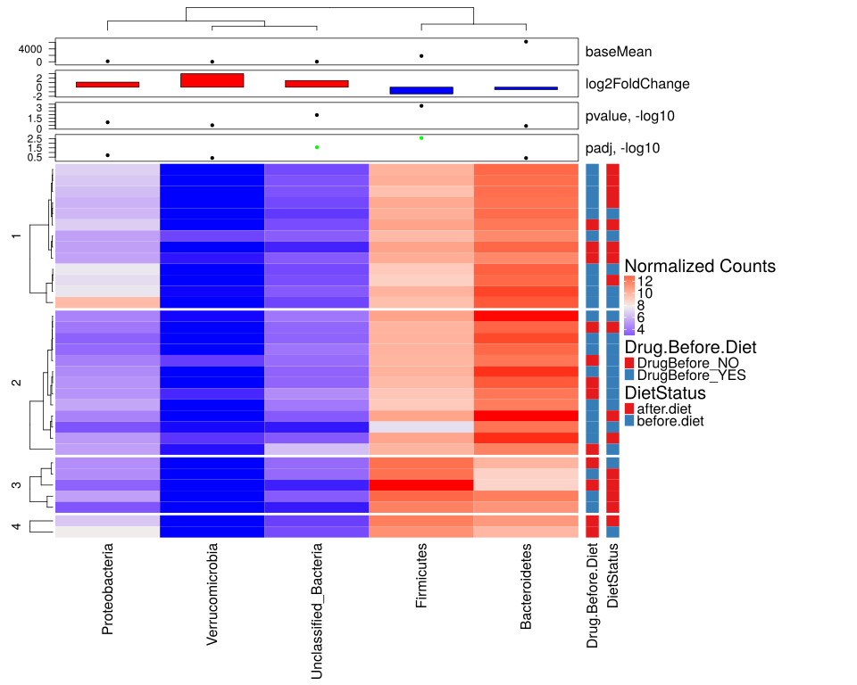

noone@mail.com
Analysis of Dieting study 16S data
% Fri Sep  7 05:46:18 2018

#### \(1.5.1.1\) Taxonomic level: 2 of Subset: Patients' samples at visits 1 (before diet) and 2 (after diet), only paired samples Additional tests

##### \(1.5.1.1.1\) Loading counts and metadata

[`Subreport`](./1.5.1.1.1-report.html)

##### \(1.5.1.1.2\) Data analysis

Filtering abundance matrix with arguments [ min_mean                :10, min_quant_incidence_frac:0.25, min_quant_mean_frac     :0.25]. Filtering features

Note that some community richness estimators will not work correctly 
               if provided with abundance-filtered counts

After filtering, left 33 records for 6 features

Wrote counts and metadata for raw counts After final feature filtering to files [`data/1.5.1.1.2.1-3234988b9a4samples.raw.16s.l.2.count.tsv`](data/1.5.1.1.2.1-3234988b9a4samples.raw.16s.l.2.count.tsv),[`data/1.5.1.1.2.1-3234988b9a4samples.raw.16s.l.2.attr.tsv`](data/1.5.1.1.2.1-3234988b9a4samples.raw.16s.l.2.attr.tsv)

Wrote counts and metadata for proportions counts After final feature filtering to files [`data/1.5.1.1.2.1-32318d22a0esamples.proportions.16s.l.2.count.tsv`](data/1.5.1.1.2.1-32318d22a0esamples.proportions.16s.l.2.count.tsv),[`data/1.5.1.1.2.1-32318d22a0esamples.proportions.16s.l.2.attr.tsv`](data/1.5.1.1.2.1-32318d22a0esamples.proportions.16s.l.2.attr.tsv)

##### \(1.5.1.1.2.2\) DESeq2 tests and data normalization

Love MI, Huber W, Anders S (2014). “Moderated estimation of fold change and dispersion for RNA-seq data with DESeq2.” _Genome Biology_, *15*,
550. doi: 10.1186/s13059-014-0550-8 (URL: http://doi.org/10.1186/s13059-014-0550-8).

\(1.5.1.1.2.2.1\) [`Table 347.`](#table.347) DESeq2 results for task: Drug.Before.Diet \+ DietStatus;\[ alpha:0.05\]. Full dataset is also saved in a delimited text file (click to download and open e.g. in Excel) [`data/1.5.1.1.2.2.1-32342a80676.1.5.1.1.2.2.1.a.nam.csv`](data/1.5.1.1.2.2.1-32342a80676.1.5.1.1.2.2.1.a.nam.csv)

| feature                | baseMean | log2FoldChange | lfcSE  | stat     | pvalue   | padj    | i.baseMean | baseVar    | allZero | dispGeneEst | dispGeneIter | dispFit    | dispersion | dispIter | dispOutlier | dispMAP | Intercept | Drug.Before.Diet\_DrugBefore\_YES\_vs\_DrugBefore\_NO | DietStatus\_before.diet\_vs\_after.diet | SE\_Intercept | SE\_Drug.Before.Diet\_DrugBefore\_YES\_vs\_DrugBefore\_NO | SE\_DietStatus\_before.diet\_vs\_after.diet | WaldStatistic\_Intercept | WaldStatistic\_Drug.Before.Diet\_DrugBefore\_YES\_vs\_DrugBefore\_NO | WaldStatistic\_DietStatus\_before.diet\_vs\_after.diet | WaldPvalue\_Intercept | WaldPvalue\_Drug.Before.Diet\_DrugBefore\_YES\_vs\_DrugBefore\_NO | WaldPvalue\_DietStatus\_before.diet\_vs\_after.diet | betaConv | betaIter | deviance | maxCooks | replace |
|:-----------------------|:---------|:---------------|:-------|:---------|:---------|:--------|:-----------|:-----------|:--------|:------------|:-------------|:-----------|:-----------|:---------|:------------|:--------|:----------|:------------------------------------------------------|:----------------------------------------|:--------------|:----------------------------------------------------------|:--------------------------------------------|:-------------------------|:---------------------------------------------------------------------|:-------------------------------------------------------|:----------------------|:------------------------------------------------------------------|:----------------------------------------------------|:---------|:---------|:---------|:---------|:--------|
| Firmicutes             | 1794.718 | \-1.4605       | 0.4224 | \-3.4571 | 0.000546 | 0.00273 | 1794.718   | 9.993e\+06 | FALSE   | 0.7040      | 11           | 7.116e\-01 | 0.7052     | 8        | FALSE       | 0.7052  | 12.010    | \-1.1897                                              | \-1.4605                                | 0.4087        | 0.4388                                                    | 0.4224                                      | 29.3898                  | \-2.711                                                              | \-3.4571                                               | 7.405e\-190           | 0.006705                                                          | 0.000546                                            | TRUE     | 4        | 543.3    | 1.0805   | FALSE   |
| Unclassified\_Bacteria | 25.382   | 1.4645         | 0.5760 | 2.5427   | 0.010999 | 0.02750 | 25.382     | 2.293e\+03 | FALSE   | 0.9543      | 9            | 2.893e\+00 | 1.2403     | 9        | FALSE       | 1.2403  | 4.194     | \-0.9200                                              | 1.4645                                  | 0.5579        | 0.5960                                                    | 0.5760                                      | 7.5175                   | \-1.544                                                              | 2.5427                                                 | 5.584e\-14            | 0.122668                                                          | 0.010999                                            | TRUE     | 8        | 269.3    | 0.6059   | FALSE   |
| Proteobacteria         | 150.534  | 1.1052         | 0.7107 | 1.5552   | 0.119900 | 0.19983 | 150.534    | 1.247e\+05 | FALSE   | 1.9844      | 11           | 2.008e\+00 | 1.9875     | 8        | FALSE       | 1.9875  | 5.931     | 0.8611                                                | 1.1052                                  | 0.6892        | 0.7387                                                    | 0.7107                                      | 8.6054                   | 1.166                                                                | 1.5552                                                 | 7.608e\-18            | 0.243717                                                          | 0.119900                                            | TRUE     | 9        | 380.0    | 0.2536   | FALSE   |
| Verrucomicrobia        | 4.539    | 2.9528         | 2.9415 | 1.0038   | 0.315451 | 0.39431 | 4.539      | 3.748e\+02 | FALSE   | 12.1718     | 10           | 2.479e\+07 | 33.0000    | 100      | FALSE       | 33.0000 | 1.086     | \-4.3397                                              | 2.9528                                  | 2.8285        | 3.0395                                                    | 2.9415                                      | 0.3841                   | \-1.428                                                              | 1.0038                                                 | 7.009e\-01            | 0.153357                                                          | 0.315451                                            | TRUE     | 20       | 83.1     | 2.6157   | TRUE    |
| Bacteroidetes          | 6245.929 | \-0.5109       | 0.6099 | \-0.8376 | 0.402245 | 0.40224 | 6245.929   | 1.657e\+08 | FALSE   | 1.4721      | 11           | 1.472e\+00 | 1.4721     | 26       | FALSE       | 1.4721  | 11.439    | 1.8367                                                | \-0.5109                                | 0.5903        | 0.6337                                                    | 0.6099                                      | 19.3786                  | 2.898                                                                | \-0.8376                                               | 1.169e\-83            | 0.003750                                                          | 0.402245                                            | TRUE     | 8        | 628.6    | 0.4677   | FALSE   |

\(1.5.1.1.2.2.1\) [`Figure 921.`](#figure.921) Clustered heatmap of normalized abundance values. Number of cluster splits is determined automatically with method `fpc::pamk`.  Image file: [`plots/3237d6a2972.svg`](plots/3237d6a2972.svg).

\(1.5.1.1.2.2.1\)  G-test of independence between automatic cluster splits and attribute 'Drug.Before.Diet'. Number of cluster splits is determined automatically with method `fpc::pamk`.

| Test statistic | X-squared df | P value |
|:---------------|:-------------|:--------|
| 4.482          | 3            | 0.2139  |

Table: Log likelihood ratio (G-test) test of independence with Williams' correction: `m_a$attr[, main.meta.var]` and `split`

Wrote counts and metadata for raw counts Data used for heatmap with added row cluster splits to files [`data/1.5.1.1.2.2.1-323656c9ba6samples.raw.htmap.count.tsv`](data/1.5.1.1.2.2.1-323656c9ba6samples.raw.htmap.count.tsv),[`data/1.5.1.1.2.2.1-323656c9ba6samples.raw.htmap.attr.tsv`](data/1.5.1.1.2.2.1-323656c9ba6samples.raw.htmap.attr.tsv)

##### \(1.5.1.1.2.3\) Default transformations for further data analysis

Specific methods can override these and use their own normalization.

Count normalization method for data analysis (unless modified by specific methods) : [ drop.features:List of 1,  ..$ :"other", method.args  :List of 1,  ..$ theta:1, method       :"norm.ihs.prop"]

Wrote counts and metadata for raw counts Normalized after default transformations to files [`data/1.5.1.1.2.3-32313a26625samples.raw.16s.l.2.count.tsv`](data/1.5.1.1.2.3-32313a26625samples.raw.16s.l.2.count.tsv),[`data/1.5.1.1.2.3-32313a26625samples.raw.16s.l.2.attr.tsv`](data/1.5.1.1.2.3-32313a26625samples.raw.16s.l.2.attr.tsv)

##### \(1.5.1.1.3\) Ordinations, 

[`Subreport`](./1.5.1.1.3-report.html)

##### \(1.5.1.1.4\) Network Analysis Feature correlation with overlaid differential abundance results 

[`Subreport`](./1.5.1.1.4-report.html)