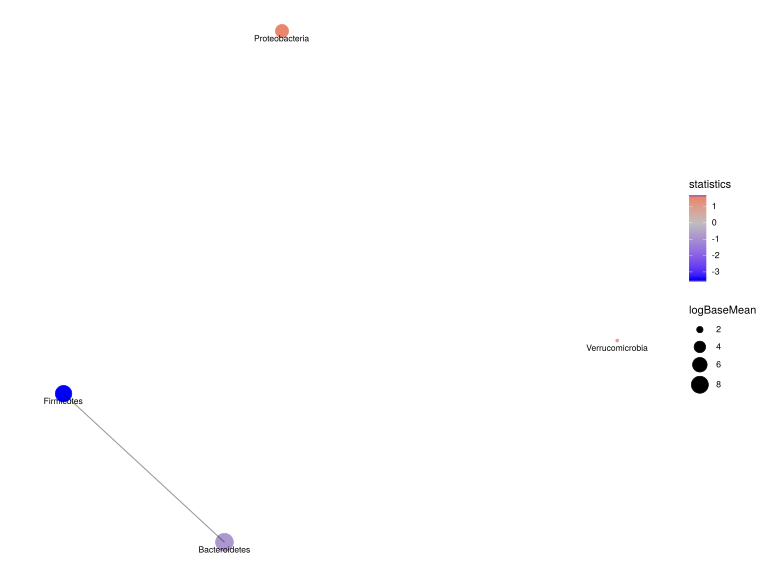

noone@mail.com
Analysis of Dieting study 16S data
% Fri Sep  7 05:46:18 2018

##### \(1.5.1.1.4\) Network Analysis Feature correlation with overlaid differential abundance results 

Build network of interactions between features or samples and plot it. 
                           Network method is network.spiec.easi. Method parameters are: [ list()].

Filtering abundance matrix with arguments [ drop.names:"other" "Unclassified_Bacteria"]. Network Analysis

After filtering, left 33 records for 4 features

Kurtz Z, Mueller C, Miraldi E, Bonneau R (????). _SpiecEasi: Sparse Inverse Covariance for Ecological Statistical Inference_. R package version
1.0.2.

\(1.5.1.1.4.1\) [`Figure 924.`](#figure.924) Network analysis with method network.spiec.easi. Vertices are labeled by DESeq2 results for                          baseMean log2FoldChange     lfcSE      stat       pvalue        padj  i.baseMean      baseVar allZero dispGeneEst dispGeneIter. Showing names for the maximum of 30 top-ranked features.  Image file: [`plots/323217aeefd.svg`](plots/323217aeefd.svg).

\(1.5.1.1.4.1\) [`Widget 360.`](#widget.360) Network analysis with method network.spiec.easi. Vertices are labeled by DESeq2 results for                          baseMean log2FoldChange     lfcSE      stat       pvalue        padj  i.baseMean      baseVar allZero dispGeneEst dispGeneIter. Showing names for the maximum of 30 top-ranked features. Click to see HTML widget file in full window: [`./1.5.1.1.4.1-3231f321dc6Network.analysis.wit.html`](./1.5.1.1.4.1-3231f321dc6Network.analysis.wit.html)

<iframe src="./1.5.1.1.4.1-3231f321dc6Network.analysis.wit.html" width="800" height="800"> </iframe>