noone@mail.com
Analysis of Dieting study 16S data
% Fri Sep  7 05:46:18 2018

##### \(1.6.1.1.5\) Plots of Abundance.

Plots are shown with relation to various combinations of meta 
                   data variables and in different graphical representations. Lots of plots here.

##### \(1.6.1.1.5.2\) Iterating over all combinations of grouping variables

##### \(1.6.1.1.5.2.1\) Grouping variables visit,Drug.Before.Diet

##### \(1.6.1.1.5.2.2\) Iterating over Abundance. profile sorting order

##### \(1.6.1.1.5.2.2.1\) Abundance. profile sorting order: average abundance

##### \(1.6.1.1.5.2.2.2\) Iterating over dodged vs faceted bars

The same data are shown in multiple combinations of graphical representations. 
                         This is the same data, but each plot highlights slightly different aspects of it.
                         It is not likely that you will need every plot - pick only what you need.

##### \(1.6.1.1.5.2.2.2.1\) faceted plots. Iterating over orientation and, optionally, scaling

##### \(1.6.1.1.5.2.2.2.1.1\) Abundance. Plot is in original orientation, Y axis SQRT scaled. Iterating over plot geometry

\(1.6.1.1.5.2.2.2.1.1.0\) [`Table 352.`](#table.352) Data table used for plots. Data grouped by visit,Drug.Before.Diet. Showing only 200 first rows. Full dataset is also saved in a delimited text file (click to download and open e.g. in Excel) [`data/1.6.1.1.5.2.2.2.1.1.0-3232dcfef6.1.6.1.1.5.2.2.2.1.1.csv`](data/1.6.1.1.5.2.2.2.1.1.0-3232dcfef6.1.6.1.1.5.2.2.2.1.1.csv)

| .record.id | visit | Drug.Before.Diet | feature        | Abundance |
|:-----------|:------|:-----------------|:---------------|:----------|
| SM1        | 1     | DrugBefore\_YES  | Bacteroidetes  | 0.7837908 |
| SM10       | 3     | DrugBefore\_YES  | Bacteroidetes  | 0.2396904 |
| SM100      | 4     | DrugBefore\_YES  | Bacteroidetes  | 0.5483424 |
| SM11       | 2     | DrugBefore\_YES  | Bacteroidetes  | 0.9085606 |
| SM12       | 1     | DrugBefore\_YES  | Bacteroidetes  | 0.9297539 |
| SM13       | 1     | DrugBefore\_NO   | Bacteroidetes  | 0.7549107 |
| SM14       | 1     | DrugBefore\_NO   | Bacteroidetes  | 0.0643696 |
| SM16       | 4     | DrugBefore\_NO   | Bacteroidetes  | 0.3909652 |
| SM17       | 1     | DrugBefore\_YES  | Bacteroidetes  | 0.8191974 |
| SM18       | 2     | DrugBefore\_NO   | Bacteroidetes  | 0.7196575 |
| SM19       | 2     | DrugBefore\_NO   | Bacteroidetes  | 0.2253586 |
| SM2        | 1     | DrugBefore\_NO   | Bacteroidetes  | 0.8869878 |
| SM21       | 1     | DrugBefore\_NO   | Bacteroidetes  | 0.5680175 |
| SM22       | 1     | DrugBefore\_YES  | Bacteroidetes  | 0.6115163 |
| SM23       | 2     | DrugBefore\_YES  | Bacteroidetes  | 0.2816259 |
| SM24       | 1     | DrugBefore\_NO   | Bacteroidetes  | 0.8667524 |
| SM25       | 4     | DrugBefore\_NO   | Bacteroidetes  | 0.4539656 |
| SM29       | 3     | DrugBefore\_YES  | Bacteroidetes  | 0.9319131 |
| SM3        | 2     | DrugBefore\_YES  | Bacteroidetes  | 0.3065958 |
| SM30       | 4     | DrugBefore\_YES  | Bacteroidetes  | 0.0706857 |
| SM33       | 1     | DrugBefore\_YES  | Bacteroidetes  | 0.6904013 |
| SM36       | 4     | DrugBefore\_NO   | Bacteroidetes  | 0.0003219 |
| SM38       | 2     | DrugBefore\_YES  | Bacteroidetes  | 0.9844826 |
| SM39       | 1     | DrugBefore\_NO   | Bacteroidetes  | 0.9344382 |
| SM40       | 4     | DrugBefore\_NO   | Bacteroidetes  | 0.7285173 |
| SM41       | 1     | DrugBefore\_YES  | Bacteroidetes  | 0.5561997 |
| SM42       | 4     | DrugBefore\_NO   | Bacteroidetes  | 0.7113608 |
| SM43       | 4     | DrugBefore\_YES  | Bacteroidetes  | 0.7229302 |
| SM45       | 2     | DrugBefore\_NO   | Bacteroidetes  | 0.0000000 |
| SM49       | 1     | DrugBefore\_YES  | Bacteroidetes  | 0.9321676 |
| SM5        | 3     | DrugBefore\_YES  | Bacteroidetes  | 0.8376844 |
| SM50       | 3     | DrugBefore\_NO   | Bacteroidetes  | 0.0000000 |
| SM51       | 4     | DrugBefore\_YES  | Bacteroidetes  | 0.7147000 |
| SM52       | 1     | DrugBefore\_NO   | Bacteroidetes  | 0.0982678 |
| SM53       | 2     | DrugBefore\_YES  | Bacteroidetes  | 0.8029344 |
| SM54       | 3     | DrugBefore\_YES  | Bacteroidetes  | 0.8090072 |
| SM56       | 2     | DrugBefore\_YES  | Bacteroidetes  | 0.7317232 |
| SM57       | 1     | DrugBefore\_YES  | Bacteroidetes  | 0.9046076 |
| SM58       | 2     | DrugBefore\_NO   | Bacteroidetes  | 0.7734046 |
| SM59       | 3     | DrugBefore\_NO   | Bacteroidetes  | 0.0576779 |
| SM60       | 3     | DrugBefore\_YES  | Bacteroidetes  | 0.8495575 |
| SM62       | 1     | DrugBefore\_YES  | Bacteroidetes  | 0.9714974 |
| SM64       | 2     | DrugBefore\_YES  | Bacteroidetes  | 0.8682775 |
| SM65       | 3     | DrugBefore\_YES  | Bacteroidetes  | 0.3740898 |
| SM67       | 4     | DrugBefore\_YES  | Bacteroidetes  | 0.9138286 |
| SM68       | 4     | DrugBefore\_NO   | Bacteroidetes  | 0.1704581 |
| SM69       | 4     | DrugBefore\_YES  | Bacteroidetes  | 0.8374262 |
| SM71       | 3     | DrugBefore\_YES  | Bacteroidetes  | 0.9181355 |
| SM73       | 1     | DrugBefore\_NO   | Bacteroidetes  | 0.8563497 |
| SM75       | 3     | DrugBefore\_NO   | Bacteroidetes  | 0.0023769 |
| SM77       | 2     | DrugBefore\_YES  | Bacteroidetes  | 0.7635462 |
| SM79       | 2     | DrugBefore\_NO   | Bacteroidetes  | 0.8495792 |
| SM8        | 1     | DrugBefore\_NO   | Bacteroidetes  | 0.8249907 |
| SM82       | 4     | DrugBefore\_YES  | Bacteroidetes  | 0.9557214 |
| SM83       | 1     | DrugBefore\_YES  | Bacteroidetes  | 0.8253707 |
| SM84       | 1     | DrugBefore\_YES  | Bacteroidetes  | 0.8861386 |
| SM86       | 2     | DrugBefore\_YES  | Bacteroidetes  | 0.0034130 |
| SM87       | 1     | DrugBefore\_YES  | Bacteroidetes  | 0.8668189 |
| SM88       | 2     | DrugBefore\_YES  | Bacteroidetes  | 0.8387042 |
| SM9        | 2     | DrugBefore\_NO   | Bacteroidetes  | 0.6635130 |
| SM90       | 2     | DrugBefore\_NO   | Bacteroidetes  | 0.6175743 |
| SM91       | 3     | DrugBefore\_YES  | Bacteroidetes  | 0.7223533 |
| SM92       | 3     | DrugBefore\_NO   | Bacteroidetes  | 0.8864163 |
| SM93       | 1     | DrugBefore\_YES  | Bacteroidetes  | 0.7781065 |
| SM96       | 1     | DrugBefore\_NO   | Bacteroidetes  | 0.6381524 |
| SM98       | 3     | DrugBefore\_NO   | Bacteroidetes  | 0.8378232 |
| SM99       | 3     | DrugBefore\_NO   | Bacteroidetes  | 0.6950886 |
| SM1        | 1     | DrugBefore\_YES  | Firmicutes     | 0.1926574 |
| SM10       | 3     | DrugBefore\_YES  | Firmicutes     | 0.7267041 |
| SM100      | 4     | DrugBefore\_YES  | Firmicutes     | 0.4106607 |
| SM11       | 2     | DrugBefore\_YES  | Firmicutes     | 0.0832883 |
| SM12       | 1     | DrugBefore\_YES  | Firmicutes     | 0.0667050 |
| SM13       | 1     | DrugBefore\_NO   | Firmicutes     | 0.2004464 |
| SM14       | 1     | DrugBefore\_NO   | Firmicutes     | 0.8985233 |
| SM16       | 4     | DrugBefore\_NO   | Firmicutes     | 0.5901852 |
| SM17       | 1     | DrugBefore\_YES  | Firmicutes     | 0.1419115 |
| SM18       | 2     | DrugBefore\_NO   | Firmicutes     | 0.2613732 |
| SM19       | 2     | DrugBefore\_NO   | Firmicutes     | 0.7376215 |
| SM2        | 1     | DrugBefore\_NO   | Firmicutes     | 0.1035274 |
| SM21       | 1     | DrugBefore\_NO   | Firmicutes     | 0.4124769 |
| SM22       | 1     | DrugBefore\_YES  | Firmicutes     | 0.3619962 |
| SM23       | 2     | DrugBefore\_YES  | Firmicutes     | 0.7183741 |
| SM24       | 1     | DrugBefore\_NO   | Firmicutes     | 0.0873312 |
| SM25       | 4     | DrugBefore\_NO   | Firmicutes     | 0.5346644 |
| SM29       | 3     | DrugBefore\_YES  | Firmicutes     | 0.0659983 |
| SM3        | 2     | DrugBefore\_YES  | Firmicutes     | 0.6836746 |
| SM30       | 4     | DrugBefore\_YES  | Firmicutes     | 0.6301592 |
| SM33       | 1     | DrugBefore\_YES  | Firmicutes     | 0.0664831 |
| SM36       | 4     | DrugBefore\_NO   | Firmicutes     | 0.9916318 |
| SM38       | 2     | DrugBefore\_YES  | Firmicutes     | 0.0149522 |
| SM39       | 1     | DrugBefore\_NO   | Firmicutes     | 0.0457112 |
| SM40       | 4     | DrugBefore\_NO   | Firmicutes     | 0.1850893 |
| SM41       | 1     | DrugBefore\_YES  | Firmicutes     | 0.2222222 |
| SM42       | 4     | DrugBefore\_NO   | Firmicutes     | 0.2680816 |
| SM43       | 4     | DrugBefore\_YES  | Firmicutes     | 0.2170803 |
| SM45       | 2     | DrugBefore\_NO   | Firmicutes     | 0.9998080 |
| SM49       | 1     | DrugBefore\_YES  | Firmicutes     | 0.0630087 |
| SM5        | 3     | DrugBefore\_YES  | Firmicutes     | 0.1042550 |
| SM50       | 3     | DrugBefore\_NO   | Firmicutes     | 0.9071785 |
| SM51       | 4     | DrugBefore\_YES  | Firmicutes     | 0.2014276 |
| SM52       | 1     | DrugBefore\_NO   | Firmicutes     | 0.7350474 |
| SM53       | 2     | DrugBefore\_YES  | Firmicutes     | 0.1567175 |
| SM54       | 3     | DrugBefore\_YES  | Firmicutes     | 0.1867193 |
| SM56       | 2     | DrugBefore\_YES  | Firmicutes     | 0.2457572 |
| SM57       | 1     | DrugBefore\_YES  | Firmicutes     | 0.0910727 |
| SM58       | 2     | DrugBefore\_NO   | Firmicutes     | 0.2163913 |
| SM59       | 3     | DrugBefore\_NO   | Firmicutes     | 0.9138577 |
| SM60       | 3     | DrugBefore\_YES  | Firmicutes     | 0.0667120 |
| SM62       | 1     | DrugBefore\_YES  | Firmicutes     | 0.0272983 |
| SM64       | 2     | DrugBefore\_YES  | Firmicutes     | 0.0731544 |
| SM65       | 3     | DrugBefore\_YES  | Firmicutes     | 0.5987086 |
| SM67       | 4     | DrugBefore\_YES  | Firmicutes     | 0.0858185 |
| SM68       | 4     | DrugBefore\_NO   | Firmicutes     | 0.7067622 |
| SM69       | 4     | DrugBefore\_YES  | Firmicutes     | 0.1394156 |
| SM71       | 3     | DrugBefore\_YES  | Firmicutes     | 0.0709753 |
| SM73       | 1     | DrugBefore\_NO   | Firmicutes     | 0.1129618 |
| SM75       | 3     | DrugBefore\_NO   | Firmicutes     | 0.9925297 |
| SM77       | 2     | DrugBefore\_YES  | Firmicutes     | 0.2001802 |
| SM79       | 2     | DrugBefore\_NO   | Firmicutes     | 0.1429830 |
| SM8        | 1     | DrugBefore\_NO   | Firmicutes     | 0.1345940 |
| SM82       | 4     | DrugBefore\_YES  | Firmicutes     | 0.0404868 |
| SM83       | 1     | DrugBefore\_YES  | Firmicutes     | 0.1639209 |
| SM84       | 1     | DrugBefore\_YES  | Firmicutes     | 0.0789167 |
| SM86       | 2     | DrugBefore\_YES  | Firmicutes     | 0.9748681 |
| SM87       | 1     | DrugBefore\_YES  | Firmicutes     | 0.0711568 |
| SM88       | 2     | DrugBefore\_YES  | Firmicutes     | 0.1293265 |
| SM9        | 2     | DrugBefore\_NO   | Firmicutes     | 0.2900041 |
| SM90       | 2     | DrugBefore\_NO   | Firmicutes     | 0.3494224 |
| SM91       | 3     | DrugBefore\_YES  | Firmicutes     | 0.2239015 |
| SM92       | 3     | DrugBefore\_NO   | Firmicutes     | 0.0989801 |
| SM93       | 1     | DrugBefore\_YES  | Firmicutes     | 0.2169177 |
| SM96       | 1     | DrugBefore\_NO   | Firmicutes     | 0.2489554 |
| SM98       | 3     | DrugBefore\_NO   | Firmicutes     | 0.0793432 |
| SM99       | 3     | DrugBefore\_NO   | Firmicutes     | 0.2789868 |
| SM1        | 1     | DrugBefore\_YES  | Proteobacteria | 0.0219067 |
| SM10       | 3     | DrugBefore\_YES  | Proteobacteria | 0.0063606 |
| SM100      | 4     | DrugBefore\_YES  | Proteobacteria | 0.0290747 |
| SM11       | 2     | DrugBefore\_YES  | Proteobacteria | 0.0032064 |
| SM12       | 1     | DrugBefore\_YES  | Proteobacteria | 0.0011951 |
| SM13       | 1     | DrugBefore\_NO   | Proteobacteria | 0.0049107 |
| SM14       | 1     | DrugBefore\_NO   | Proteobacteria | 0.0064370 |
| SM16       | 4     | DrugBefore\_NO   | Proteobacteria | 0.0053624 |
| SM17       | 1     | DrugBefore\_YES  | Proteobacteria | 0.0223417 |
| SM18       | 2     | DrugBefore\_NO   | Proteobacteria | 0.0167870 |
| SM19       | 2     | DrugBefore\_NO   | Proteobacteria | 0.0356317 |
| SM2        | 1     | DrugBefore\_NO   | Proteobacteria | 0.0056413 |
| SM21       | 1     | DrugBefore\_NO   | Proteobacteria | 0.0131159 |
| SM22       | 1     | DrugBefore\_YES  | Proteobacteria | 0.0122841 |
| SM23       | 2     | DrugBefore\_YES  | Proteobacteria | 0.0000000 |
| SM24       | 1     | DrugBefore\_NO   | Proteobacteria | 0.0415434 |
| SM25       | 4     | DrugBefore\_NO   | Proteobacteria | 0.0030505 |
| SM29       | 3     | DrugBefore\_YES  | Proteobacteria | 0.0000000 |
| SM3        | 2     | DrugBefore\_YES  | Proteobacteria | 0.0069012 |
| SM30       | 4     | DrugBefore\_YES  | Proteobacteria | 0.2575561 |
| SM33       | 1     | DrugBefore\_YES  | Proteobacteria | 0.2423289 |
| SM36       | 4     | DrugBefore\_NO   | Proteobacteria | 0.0074026 |
| SM38       | 2     | DrugBefore\_YES  | Proteobacteria | 0.0002569 |
| SM39       | 1     | DrugBefore\_NO   | Proteobacteria | 0.0151156 |
| SM40       | 4     | DrugBefore\_NO   | Proteobacteria | 0.0847285 |
| SM41       | 1     | DrugBefore\_YES  | Proteobacteria | 0.0186795 |
| SM42       | 4     | DrugBefore\_NO   | Proteobacteria | 0.0184769 |
| SM43       | 4     | DrugBefore\_YES  | Proteobacteria | 0.0508980 |
| SM45       | 2     | DrugBefore\_NO   | Proteobacteria | 0.0001920 |
| SM49       | 1     | DrugBefore\_YES  | Proteobacteria | 0.0021103 |
| SM5        | 3     | DrugBefore\_YES  | Proteobacteria | 0.0567893 |
| SM50       | 3     | DrugBefore\_NO   | Proteobacteria | 0.0812516 |
| SM51       | 4     | DrugBefore\_YES  | Proteobacteria | 0.0818648 |
| SM52       | 1     | DrugBefore\_NO   | Proteobacteria | 0.1580782 |
| SM53       | 2     | DrugBefore\_YES  | Proteobacteria | 0.0384062 |
| SM54       | 3     | DrugBefore\_YES  | Proteobacteria | 0.0016437 |
| SM56       | 2     | DrugBefore\_YES  | Proteobacteria | 0.0205614 |
| SM57       | 1     | DrugBefore\_YES  | Proteobacteria | 0.0003600 |
| SM58       | 2     | DrugBefore\_NO   | Proteobacteria | 0.0098801 |
| SM59       | 3     | DrugBefore\_NO   | Proteobacteria | 0.0056180 |
| SM60       | 3     | DrugBefore\_YES  | Proteobacteria | 0.0139551 |
| SM62       | 1     | DrugBefore\_YES  | Proteobacteria | 0.0000000 |
| SM64       | 2     | DrugBefore\_YES  | Proteobacteria | 0.0561185 |
| SM65       | 3     | DrugBefore\_YES  | Proteobacteria | 0.0078307 |
| SM67       | 4     | DrugBefore\_YES  | Proteobacteria | 0.0000000 |
| SM68       | 4     | DrugBefore\_NO   | Proteobacteria | 0.1071985 |
| SM69       | 4     | DrugBefore\_YES  | Proteobacteria | 0.0217594 |
| SM71       | 3     | DrugBefore\_YES  | Proteobacteria | 0.0013318 |
| SM73       | 1     | DrugBefore\_NO   | Proteobacteria | 0.0002524 |
| SM75       | 3     | DrugBefore\_NO   | Proteobacteria | 0.0003396 |
| SM77       | 2     | DrugBefore\_YES  | Proteobacteria | 0.0332883 |
| SM79       | 2     | DrugBefore\_NO   | Proteobacteria | 0.0024467 |
| SM8        | 1     | DrugBefore\_NO   | Proteobacteria | 0.0107527 |
| SM82       | 4     | DrugBefore\_YES  | Proteobacteria | 0.0022934 |
| SM83       | 1     | DrugBefore\_YES  | Proteobacteria | 0.0013729 |
| SM84       | 1     | DrugBefore\_YES  | Proteobacteria | 0.0329062 |
| SM86       | 2     | DrugBefore\_YES  | Proteobacteria | 0.0071362 |
| SM87       | 1     | DrugBefore\_YES  | Proteobacteria | 0.0605023 |
| SM88       | 2     | DrugBefore\_YES  | Proteobacteria | 0.0277920 |
| SM9        | 2     | DrugBefore\_NO   | Proteobacteria | 0.0436035 |
| SM90       | 2     | DrugBefore\_NO   | Proteobacteria | 0.0210396 |
| SM91       | 3     | DrugBefore\_YES  | Proteobacteria | 0.0462253 |
| SM92       | 3     | DrugBefore\_NO   | Proteobacteria | 0.0104312 |
| SM93       | 1     | DrugBefore\_YES  | Proteobacteria | 0.0021517 |
| SM96       | 1     | DrugBefore\_NO   | Proteobacteria | 0.0173972 |
| SM98       | 3     | DrugBefore\_NO   | Proteobacteria | 0.0571724 |

\(1.6.1.1.5.2.2.2.1.1.1\) [`Widget 367.`](#widget.367) Dynamic Pivot Table link (drag and drop field names and pick averaging 
                      functions or plot types; click on fields or legend elements to filter values). 
                      Starting rendering is Stacked Bar Chart. Data grouped by visit,Drug.Before.Diet. Click to see HTML widget file in full window: [`./1.6.1.1.5.2.2.2.1.1.1-323451bbe0aDynamic.Pivot.Table.html`](./1.6.1.1.5.2.2.2.1.1.1-323451bbe0aDynamic.Pivot.Table.html)

\(1.6.1.1.5.2.2.2.1.1.1\) [`Widget 368.`](#widget.368) Dynamic Pivot Table link (drag and drop field names and pick averaging 
                      functions or plot types; click on fields or legend elements to filter values). 
                      Starting rendering is Table Barchart. Data grouped by visit,Drug.Before.Diet. Click to see HTML widget file in full window: [`./1.6.1.1.5.2.2.2.1.1.1-323525d45b9Dynamic.Pivot.Table.html`](./1.6.1.1.5.2.2.2.1.1.1-323525d45b9Dynamic.Pivot.Table.html)

\(1.6.1.1.5.2.2.2.1.1.1\) [`Table 353.`](#table.353) Summary table. Data grouped by visit,Drug.Before.Diet. Full dataset is also saved in a delimited text file (click to download and open e.g. in Excel) [`data/1.6.1.1.5.2.2.2.1.1.1-3237f210dd0.1.6.1.1.5.2.2.2.1.1.csv`](data/1.6.1.1.5.2.2.2.1.1.1-3237f210dd0.1.6.1.1.5.2.2.2.1.1.csv)

| feature                | visit | Drug.Before.Diet | mean       | sd        | median    | incidence |
|:-----------------------|:------|:-----------------|:-----------|:----------|:----------|:----------|
| Bacteroidetes          | 1     | DrugBefore\_NO   | 6.493e\-01 | 0.3201539 | 0.7899507 | 1.0000    |
| Bacteroidetes          | 1     | DrugBefore\_YES  | 8.120e\-01 | 0.1269555 | 0.8253707 | 1.0000    |
| Bacteroidetes          | 2     | DrugBefore\_NO   | 5.499e\-01 | 0.3145855 | 0.6635130 | 0.8571    |
| Bacteroidetes          | 2     | DrugBefore\_YES  | 6.490e\-01 | 0.3294165 | 0.7832403 | 1.0000    |
| Bacteroidetes          | 3     | DrugBefore\_NO   | 4.132e\-01 | 0.4357994 | 0.3763832 | 0.8333    |
| Bacteroidetes          | 3     | DrugBefore\_YES  | 7.103e\-01 | 0.2597599 | 0.8233458 | 1.0000    |
| Bacteroidetes          | 4     | DrugBefore\_NO   | 4.093e\-01 | 0.2897517 | 0.4224654 | 1.0000    |
| Bacteroidetes          | 4     | DrugBefore\_YES  | 6.805e\-01 | 0.3019724 | 0.7229302 | 1.0000    |
| Firmicutes             | 1     | DrugBefore\_NO   | 2.980e\-01 | 0.2950437 | 0.1675202 | 1.0000    |
| Firmicutes             | 1     | DrugBefore\_YES  | 1.357e\-01 | 0.0936925 | 0.0910727 | 1.0000    |
| Firmicutes             | 2     | DrugBefore\_NO   | 4.282e\-01 | 0.3167081 | 0.2900041 | 1.0000    |
| Firmicutes             | 2     | DrugBefore\_YES  | 3.280e\-01 | 0.3353397 | 0.1784489 | 1.0000    |
| Firmicutes             | 3     | DrugBefore\_NO   | 5.451e\-01 | 0.4368169 | 0.5930827 | 1.0000    |
| Firmicutes             | 3     | DrugBefore\_YES  | 2.555e\-01 | 0.2602282 | 0.1454871 | 1.0000    |
| Firmicutes             | 4     | DrugBefore\_NO   | 5.461e\-01 | 0.2946212 | 0.5624248 | 1.0000    |
| Firmicutes             | 4     | DrugBefore\_YES  | 2.464e\-01 | 0.2068684 | 0.2014276 | 1.0000    |
| Proteobacteria         | 1     | DrugBefore\_NO   | 2.732e\-02 | 0.0473340 | 0.0119343 | 1.0000    |
| Proteobacteria         | 1     | DrugBefore\_YES  | 3.216e\-02 | 0.0655164 | 0.0122841 | 0.9231    |
| Proteobacteria         | 2     | DrugBefore\_NO   | 1.851e\-02 | 0.0163312 | 0.0167870 | 1.0000    |
| Proteobacteria         | 2     | DrugBefore\_YES  | 1.937e\-02 | 0.0191073 | 0.0138488 | 0.9000    |
| Proteobacteria         | 3     | DrugBefore\_NO   | 2.796e\-02 | 0.0331289 | 0.0116967 | 1.0000    |
| Proteobacteria         | 3     | DrugBefore\_YES  | 1.677e\-02 | 0.0220834 | 0.0070957 | 0.8750    |
| Proteobacteria         | 4     | DrugBefore\_NO   | 3.770e\-02 | 0.0459902 | 0.0129398 | 1.0000    |
| Proteobacteria         | 4     | DrugBefore\_YES  | 6.335e\-02 | 0.0902400 | 0.0290747 | 0.8571    |
| Unclassified\_Bacteria | 1     | DrugBefore\_NO   | 1.480e\-02 | 0.0271664 | 0.0044485 | 1.0000    |
| Unclassified\_Bacteria | 1     | DrugBefore\_YES  | 3.807e\-03 | 0.0041644 | 0.0022574 | 0.9231    |
| Unclassified\_Bacteria | 2     | DrugBefore\_NO   | 2.186e\-03 | 0.0022072 | 0.0013882 | 0.8571    |
| Unclassified\_Bacteria | 2     | DrugBefore\_YES  | 2.145e\-03 | 0.0018121 | 0.0020539 | 0.9000    |
| Unclassified\_Bacteria | 3     | DrugBefore\_NO   | 5.270e\-03 | 0.0038238 | 0.0034445 | 1.0000    |
| Unclassified\_Bacteria | 3     | DrugBefore\_YES  | 1.982e\-03 | 0.0015373 | 0.0013446 | 1.0000    |
| Unclassified\_Bacteria | 4     | DrugBefore\_NO   | 4.114e\-03 | 0.0042506 | 0.0020074 | 1.0000    |
| Unclassified\_Bacteria | 4     | DrugBefore\_YES  | 5.219e\-03 | 0.0083704 | 0.0013988 | 1.0000    |
| Verrucomicrobia        | 1     | DrugBefore\_NO   | 6.661e\-03 | 0.0120381 | 0.0000000 | 0.4000    |
| Verrucomicrobia        | 1     | DrugBefore\_YES  | 1.355e\-02 | 0.0485697 | 0.0000000 | 0.3077    |
| Verrucomicrobia        | 2     | DrugBefore\_NO   | 4.125e\-04 | 0.0010915 | 0.0000000 | 0.1429    |
| Verrucomicrobia        | 2     | DrugBefore\_YES  | 3.747e\-04 | 0.0011850 | 0.0000000 | 0.1000    |
| Verrucomicrobia        | 3     | DrugBefore\_NO   | 1.873e\-04 | 0.0004587 | 0.0000000 | 0.1667    |
| Verrucomicrobia        | 3     | DrugBefore\_YES  | 8.617e\-04 | 0.0024373 | 0.0000000 | 0.1250    |
| Verrucomicrobia        | 4     | DrugBefore\_NO   | 6.167e\-05 | 0.0001510 | 0.0000000 | 0.1667    |
| Verrucomicrobia        | 4     | DrugBefore\_YES  | 0.000e\+00 | 0.0000000 | 0.0000000 | 0.0000    |
| Actinobacteria         | 1     | DrugBefore\_NO   | 3.471e\-03 | 0.0076244 | 0.0008172 | 1.0000    |
| Actinobacteria         | 1     | DrugBefore\_YES  | 2.782e\-03 | 0.0059632 | 0.0006927 | 0.7692    |
| Actinobacteria         | 2     | DrugBefore\_NO   | 7.392e\-04 | 0.0011806 | 0.0002936 | 0.7143    |
| Actinobacteria         | 2     | DrugBefore\_YES  | 1.094e\-03 | 0.0024815 | 0.0002192 | 0.8000    |
| Actinobacteria         | 3     | DrugBefore\_NO   | 3.698e\-03 | 0.0074005 | 0.0007112 | 0.6667    |
| Actinobacteria         | 3     | DrugBefore\_YES  | 5.677e\-03 | 0.0090211 | 0.0010307 | 0.7500    |
| Actinobacteria         | 4     | DrugBefore\_NO   | 2.476e\-03 | 0.0042882 | 0.0004254 | 0.6667    |
| Actinobacteria         | 4     | DrugBefore\_YES  | 3.997e\-03 | 0.0063296 | 0.0006692 | 0.7143    |

\(1.6.1.1.5.2.2.2.1.1.1\) [`Figure 932.`](#figure.932) Abundance. Data grouped by visit,Drug.Before.Diet.  bar_stacked plot.  Image file: [`plots/3231c9ff5e9.svg`](plots/3231c9ff5e9.svg).
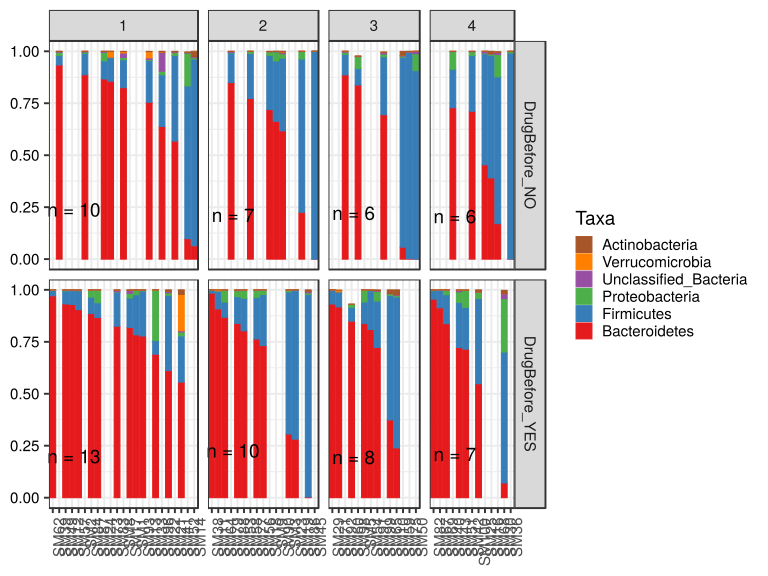

\(1.6.1.1.5.2.2.2.1.1.1\) [`Figure 933.`](#figure.933) Abundance. Data grouped by visit,Drug.Before.Diet.  bar (sample mean) plot.  Image file: [`plots/323430e6dcf.svg`](plots/323430e6dcf.svg).
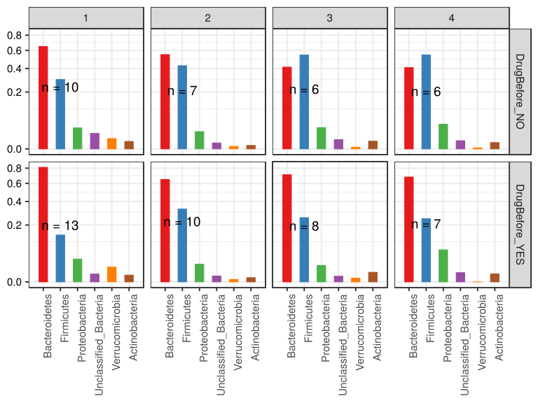

\(1.6.1.1.5.2.2.2.1.1.1\) [`Figure 934.`](#figure.934) Abundance. Data grouped by visit,Drug.Before.Diet.  violin plot.  Image file: [`plots/323103ec14a.svg`](plots/323103ec14a.svg).
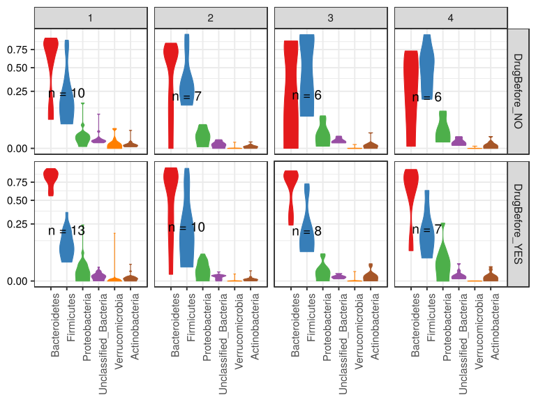

\(1.6.1.1.5.2.2.2.1.1.1\) [`Figure 935.`](#figure.935) Abundance. Data grouped by visit,Drug.Before.Diet.  boxplot plot.  Image file: [`plots/323485abd95.svg`](plots/323485abd95.svg).
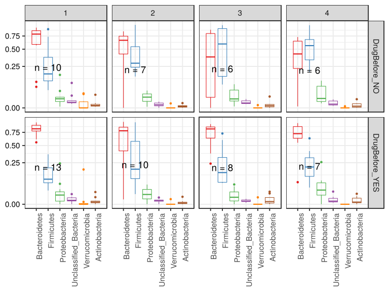

##### \(1.6.1.1.5.2.2.2.1.2\) Abundance. Plot is in flipped orientation, Y axis not scaled. Iterating over plot geometry

\(1.6.1.1.5.2.2.2.1.2.1\) [`Figure 936.`](#figure.936) Abundance. Data grouped by visit,Drug.Before.Diet.  bar (sample mean) plot.  Image file: [`plots/323527bdc67.svg`](plots/323527bdc67.svg).
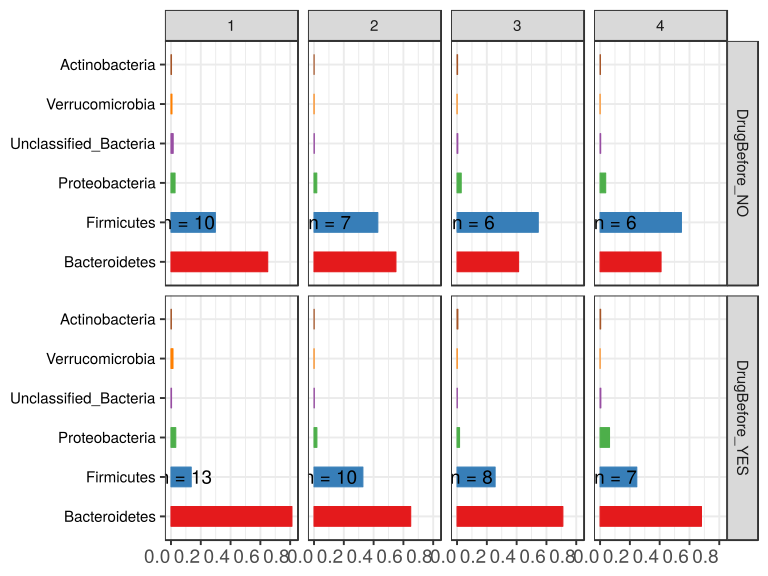

\(1.6.1.1.5.2.2.2.1.2.1\) [`Figure 937.`](#figure.937) Abundance. Data grouped by visit,Drug.Before.Diet.  violin plot.  Image file: [`plots/32351dd7a03.svg`](plots/32351dd7a03.svg).
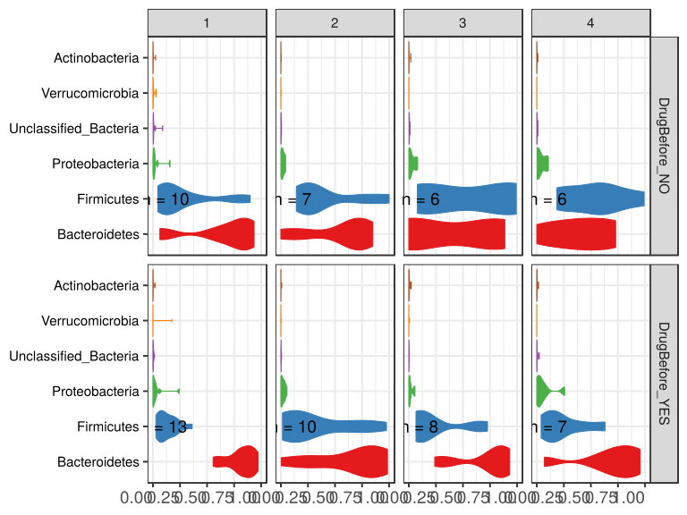

\(1.6.1.1.5.2.2.2.1.2.1\) [`Figure 938.`](#figure.938) Abundance. Data grouped by visit,Drug.Before.Diet.  boxplot plot.  Image file: [`plots/3237a098b46.svg`](plots/3237a098b46.svg).
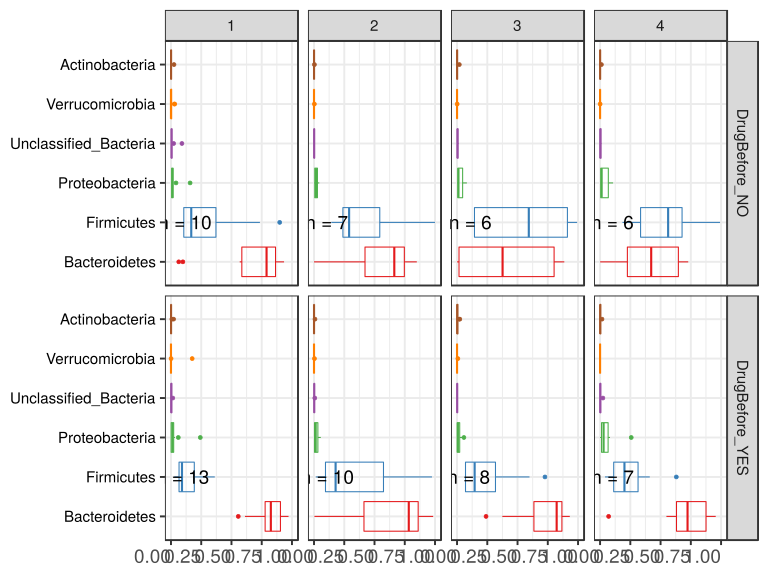

##### \(1.6.1.1.5.2.2.2.2\) dodged plots. Iterating over orientation and, optionally, scaling

##### \(1.6.1.1.5.2.2.2.2.1\) Abundance. Plot is in original orientation, Y axis SQRT scaled. Iterating over plot geometry

\(1.6.1.1.5.2.2.2.2.1.1\) [`Figure 939.`](#figure.939) Abundance. Data grouped by visit,Drug.Before.Diet.  bar (sample mean) plot.  Image file: [`plots/3233460ec3.svg`](plots/3233460ec3.svg).
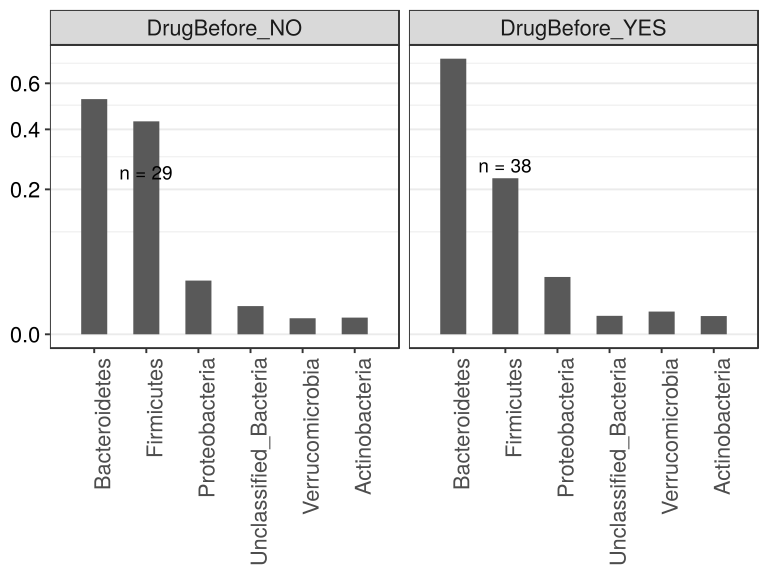

\(1.6.1.1.5.2.2.2.2.1.1\) [`Figure 940.`](#figure.940) Abundance. Data grouped by visit,Drug.Before.Diet.  violin plot.  Image file: [`plots/3238b379f5.svg`](plots/3238b379f5.svg).
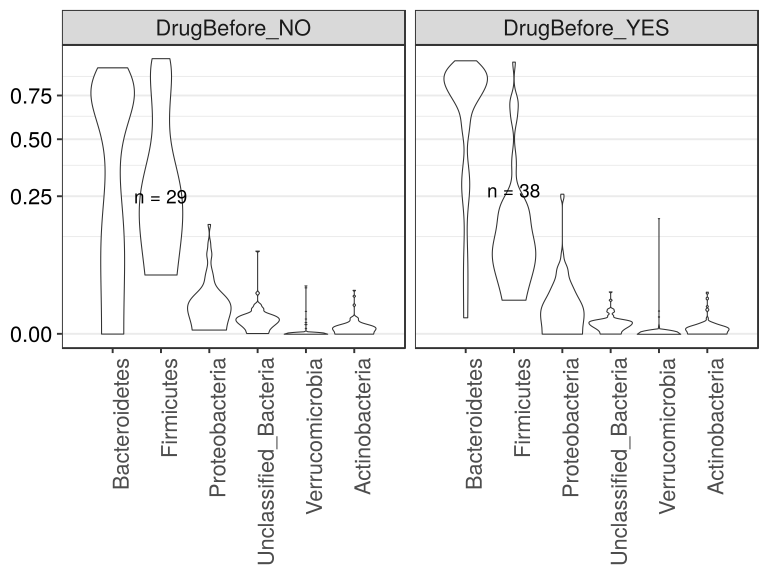

\(1.6.1.1.5.2.2.2.2.1.1\) [`Figure 941.`](#figure.941) Abundance. Data grouped by visit,Drug.Before.Diet.  boxplot plot.  Image file: [`plots/32335103e63.svg`](plots/32335103e63.svg).
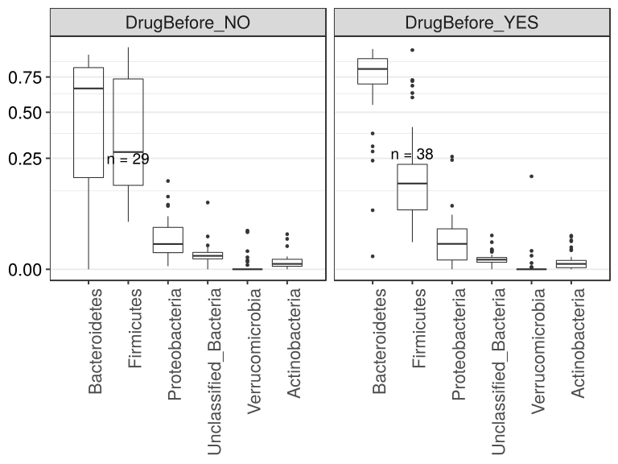

##### \(1.6.1.1.5.2.2.2.2.2\) Abundance. Plot is in flipped orientation, Y axis not scaled. Iterating over plot geometry

\(1.6.1.1.5.2.2.2.2.2.1\) [`Figure 942.`](#figure.942) Abundance. Data grouped by visit,Drug.Before.Diet.  bar (sample mean) plot.  Image file: [`plots/3233432cf53.svg`](plots/3233432cf53.svg).
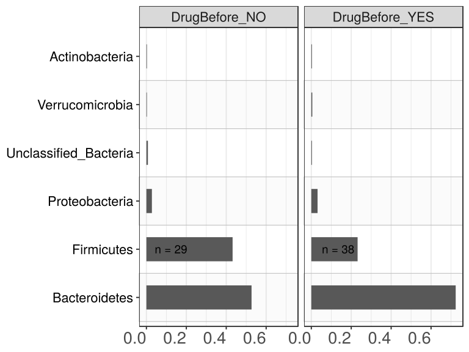

\(1.6.1.1.5.2.2.2.2.2.1\) [`Figure 943.`](#figure.943) Abundance. Data grouped by visit,Drug.Before.Diet.  violin plot.  Image file: [`plots/323343271ee.svg`](plots/323343271ee.svg).
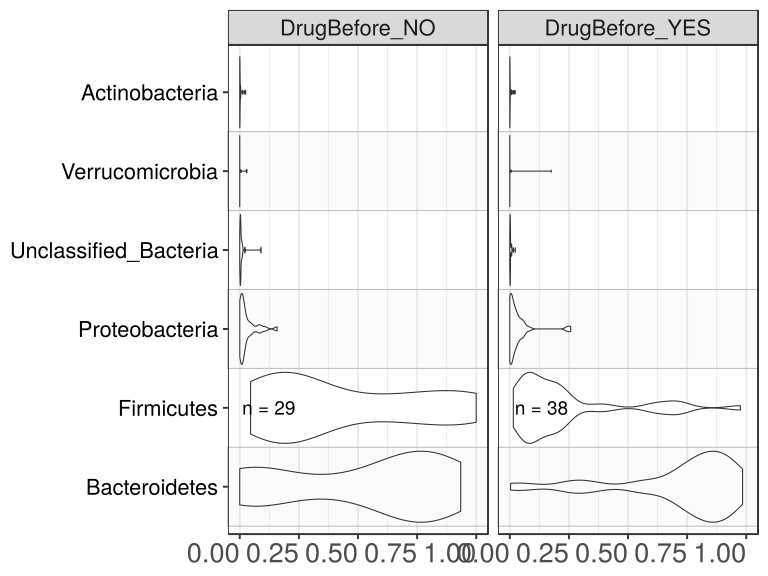

\(1.6.1.1.5.2.2.2.2.2.1\) [`Figure 944.`](#figure.944) Abundance. Data grouped by visit,Drug.Before.Diet.  boxplot plot.  Image file: [`plots/3235c06a913.svg`](plots/3235c06a913.svg).
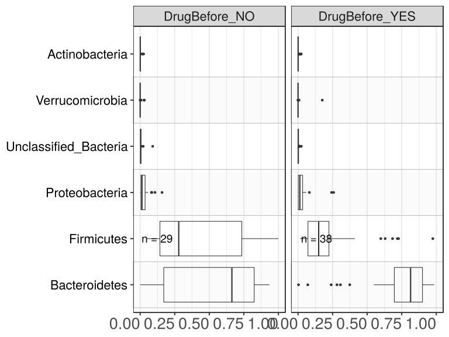