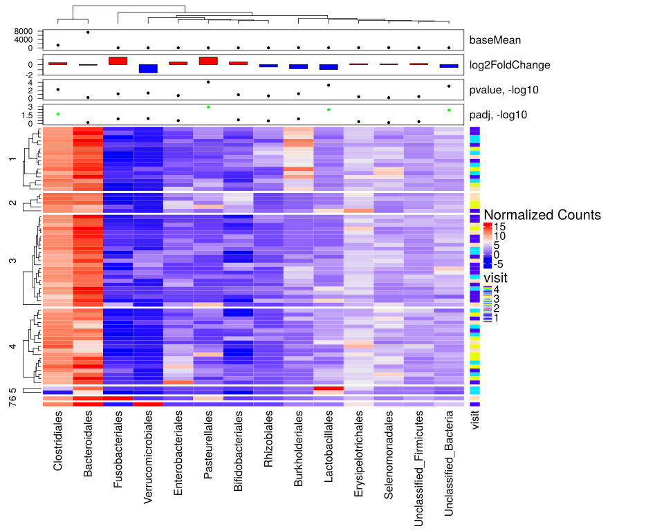

noone@mail.com
Analysis of Dieting study 16S data
% Fri Sep  7 05:46:18 2018


#### \(1.6.1.2\) Taxonomic level: 4 of Subset: Patient samples


##### \(1.6.1.2.1\) Loading counts and metadata

[`Subreport`](./1.6.1.2.1-report.html)


##### \(1.6.1.2.2\) Data analysis


Filtering abundance matrix with arguments [ min_mean                :10, min_quant_incidence_frac:0.25, min_quant_mean_frac     :0.25]. Filtering features


Note that some community richness estimators will not work correctly 
               if provided with abundance-filtered counts


After filtering, left 67 records for 15 features


Wrote counts and metadata for raw counts After final feature filtering to files [`data/1.6.1.2.2.1-323677a44bdsamples.raw.16s.l.4.count.tsv`](data/1.6.1.2.2.1-323677a44bdsamples.raw.16s.l.4.count.tsv),[`data/1.6.1.2.2.1-323677a44bdsamples.raw.16s.l.4.attr.tsv`](data/1.6.1.2.2.1-323677a44bdsamples.raw.16s.l.4.attr.tsv)


Wrote counts and metadata for proportions counts After final feature filtering to files [`data/1.6.1.2.2.1-3233370ca7bsamples.proportions.16s.l.4.count.tsv`](data/1.6.1.2.2.1-3233370ca7bsamples.proportions.16s.l.4.count.tsv),[`data/1.6.1.2.2.1-3233370ca7bsamples.proportions.16s.l.4.attr.tsv`](data/1.6.1.2.2.1-3233370ca7bsamples.proportions.16s.l.4.attr.tsv)


##### \(1.6.1.2.2.2\) DESeq2 tests and data normalization


Love MI, Huber W, Anders S (2014). “Moderated estimation of fold change and dispersion for RNA-seq data with DESeq2.” _Genome Biology_, *15*,
550. doi: 10.1186/s13059-014-0550-8 (URL: http://doi.org/10.1186/s13059-014-0550-8).


\(1.6.1.2.2.2.1\) <a name="table.354"></a>[`Table 354.`](#table.354) DESeq2 results for task: visit;\[ alpha:0.05\]. Full dataset is also saved in a delimited text file (click to download and open e.g. in Excel) [`data/1.6.1.2.2.2.1-3237a54d715.1.6.1.2.2.2.1.a.nam.csv`](data/1.6.1.2.2.2.1-3237a54d715.1.6.1.2.2.2.1.a.nam.csv)


| feature                  | baseMean | log2FoldChange | lfcSE  | stat     | pvalue     | padj     | i.baseMean | baseVar    | allZero | dispGeneEst | dispGeneIter | dispFit | dispersion | dispIter | dispOutlier | dispMAP | Intercept | visit    | SE\_Intercept | SE\_visit | WaldStatistic\_Intercept | WaldStatistic\_visit | WaldPvalue\_Intercept | WaldPvalue\_visit | betaConv | betaIter | deviance | maxCooks | replace |
|:-------------------------|:---------|:---------------|:-------|:---------|:-----------|:---------|:-----------|:-----------|:--------|:------------|:-------------|:--------|:-----------|:---------|:------------|:--------|:----------|:---------|:--------------|:----------|:-------------------------|:---------------------|:----------------------|:------------------|:---------|:---------|:---------|:---------|:--------|
| Pasteurellales           | 15.134   | 1.4282         | 0.3621 | 3.9442   | 8.007e\-05 | 0.001121 | 15.134     | 2.548e\+03 | FALSE   | 4.6778      | 14           | 9.73019 | 5.0291     | 11       | FALSE       | 5.0291  | \-0.1722  | 1.4282   | 0.9288        | 0.3621    | \-0.1854                 | 3.9442               | 8.529e\-01            | 8.007e\-05        | TRUE     | 14       | 364.5    | NA       | TRUE    |
| Lactobacillales          | 48.384   | \-0.9758       | 0.2798 | \-3.4879 | 4.868e\-04 | 0.003407 | 48.384     | 2.430e\+04 | FALSE   | 3.1158      | 13           | 3.26981 | 3.1228     | 9        | FALSE       | 3.1228  | 7.4645    | \-0.9758 | 0.7016        | 0.2798    | 10.6387                  | \-3.4879             | 1.969e\-26            | 4.868e\-04        | TRUE     | 14       | 555.1    | NA       | TRUE    |
| Unclassified\_Bacteria   | 28.752   | \-0.5602       | 0.1686 | \-3.3233 | 8.895e\-04 | 0.004151 | 28.752     | 3.490e\+03 | FALSE   | 1.0248      | 13           | 2.58324 | 1.0905     | 12       | FALSE       | 1.0905  | 5.9571    | \-0.5602 | 0.4216        | 0.1686    | 14.1290                  | \-3.3233             | 2.517e\-45            | 8.895e\-04        | TRUE     | 5        | 573.7    | NA       | FALSE   |
| Clostridiales            | 1267.413 | 0.3497         | 0.1269 | 2.7552   | 5.865e\-03 | 0.020529 | 1267.413   | 8.990e\+05 | FALSE   | 0.6529      | 11           | 0.67263 | 0.6542     | 8        | FALSE       | 0.6542  | 9.4604    | 0.3497   | 0.3198        | 0.1269    | 29.5866                  | 2.7552               | 2.221e\-192           | 5.865e\-03        | TRUE     | 4        | 1079.1   | NA       | FALSE   |
| Verrucomicrobiales       | 2.871    | \-1.5907       | 0.7963 | \-1.9975 | 4.577e\-02 | 0.128158 | 2.871      | 1.418e\+02 | FALSE   | 24.6720     | 8            | 0.02947 | 24.6720    | 12       | TRUE        | 6.3054  | 4.2186    | \-1.5907 | 1.9850        | 0.7963    | 2.1252                   | \-1.9975             | 3.357e\-02            | 4.577e\-02        | TRUE     | 15       | 129.0    | NA       | TRUE    |
| Burkholderiales          | 79.182   | \-0.7991       | 0.4369 | \-1.8292 | 6.738e\-02 | 0.146515 | 79.182     | 3.644e\+04 | FALSE   | 8.0947      | 11           | 4.63837 | 7.7344     | 10       | FALSE       | 7.7344  | 7.8821    | \-0.7991 | 1.0995        | 0.4369    | 7.1690                   | \-1.8292             | 7.555e\-13            | 6.738e\-02        | TRUE     | 38       | 491.8    | NA       | TRUE    |
| Fusobacteriales          | 2.919    | 1.4111         | 0.7878 | 1.7912   | 7.326e\-02 | 0.146515 | 2.919      | 3.287e\+02 | FALSE   | 24.4875     | 11           | 0.03148 | 24.4875    | 12       | TRUE        | 7.3281  | \-2.0833  | 1.4111   | 2.0026        | 0.7878    | \-1.0403                 | 1.7912               | 2.982e\-01            | 7.326e\-02        | TRUE     | 29       | 134.2    | NA       | TRUE    |
| Bifidobacteriales        | 9.137    | 0.4822         | 0.3157 | 1.5274   | 1.267e\-01 | 0.221642 | 9.137      | 4.226e\+02 | FALSE   | 3.8690      | 13           | 3.96735 | 3.8776     | 9        | FALSE       | 3.8776  | 2.0107    | 0.4822   | 0.8018        | 0.3157    | 2.5076                   | 1.5274               | 1.216e\-02            | 1.267e\-01        | TRUE     | 11       | 376.3    | NA       | FALSE   |
| Enterobacteriales        | 21.409   | 0.4678         | 0.3632 | 1.2880   | 1.977e\-01 | 0.307583 | 21.409     | 2.845e\+03 | FALSE   | 5.3539      | 11           | 4.59672 | 5.2886     | 9        | FALSE       | 5.2886  | 3.2528    | 0.4678   | 0.9173        | 0.3632    | 3.5460                   | 1.2880               | 3.911e\-04            | 1.977e\-01        | TRUE     | 19       | 428.1    | NA       | TRUE    |
| Rhizobiales              | 11.511   | \-0.4668       | 0.3974 | \-1.1746 | 2.402e\-01 | 0.336213 | 11.511     | 7.084e\+02 | FALSE   | 6.0815      | 12           | 8.27052 | 6.2732     | 10       | FALSE       | 6.2732  | 4.5069    | \-0.4668 | 0.9985        | 0.3974    | 4.5135                   | \-1.1746             | 6.376e\-06            | 2.402e\-01        | TRUE     | 18       | 363.6    | NA       | FALSE   |
| Unclassified\_Firmicutes | 18.237   | 0.1900         | 0.2059 | 0.9231   | 3.559e\-01 | 0.453006 | 18.237     | 7.455e\+02 | FALSE   | 1.4621      | 13           | 7.33985 | 1.6455     | 9        | FALSE       | 1.6455  | 3.7556    | 0.1900   | 0.5211        | 0.2059    | 7.2070                   | 0.9231               | 5.720e\-13            | 3.559e\-01        | TRUE     | 6        | 524.1    | NA       | FALSE   |
| Erysipelotrichales       | 55.727   | 0.1559         | 0.1840 | 0.8474   | 3.968e\-01 | 0.462903 | 55.727     | 5.771e\+03 | FALSE   | 1.2579      | 12           | 3.78474 | 1.3506     | 12       | FALSE       | 1.3506  | 5.4364    | 0.1559   | 0.4642        | 0.1840    | 11.7103                  | 0.8474               | 1.128e\-31            | 3.968e\-01        | TRUE     | 5        | 672.1    | NA       | TRUE    |
| Bacteroidales            | 7439.014 | \-0.1168       | 0.2220 | \-0.5260 | 5.989e\-01 | 0.644935 | 7439.014   | 1.343e\+08 | FALSE   | 2.0057      | 14           | 2.00454 | 2.0057     | 5        | FALSE       | 2.0057  | 13.1181   | \-0.1168 | 0.5592        | 0.2220    | 23.4579                  | \-0.5260             | 1.098e\-121           | 5.989e\-01        | TRUE     | 7        | 1302.7   | NA       | FALSE   |
| Selenomonadales          | 70.779   | 0.1209         | 0.2784 | 0.4342   | 6.641e\-01 | 0.664112 | 70.779     | 3.089e\+04 | FALSE   | 3.0652      | 12           | 4.44725 | 3.1335     | 12       | FALSE       | 3.1335  | 5.8681    | 0.1209   | 0.7017        | 0.2784    | 8.3629                   | 0.4342               | 6.120e\-17            | 6.641e\-01        | TRUE     | 11       | 642.5    | NA       | FALSE   |


\(1.6.1.2.2.2.1\) <a name="figure.947"></a>[`Figure 947.`](#figure.947) Clustered heatmap of normalized abundance values. Number of cluster splits is determined automatically with method `fpc::pamk`.  Image file: [`plots/323583afce7.svg`](plots/323583afce7.svg).



\(1.6.1.2.2.2.1\)  G-test of independence between automatic cluster splits and attribute 'visit'. Number of cluster splits is determined automatically with method `fpc::pamk`.


| Test statistic | X-squared df | P value |
|:---------------|:-------------|:--------|
| 19.14          | 18           | 0.3833  |

Table: Log likelihood ratio (G-test) test of independence with Williams' correction: `m_a$attr[, main.meta.var]` and `split`


Wrote counts and metadata for raw counts Data used for heatmap with added row cluster splits to files [`data/1.6.1.2.2.2.1-3233eacd1b4samples.raw.htmap.count.tsv`](data/1.6.1.2.2.2.1-3233eacd1b4samples.raw.htmap.count.tsv),[`data/1.6.1.2.2.2.1-3233eacd1b4samples.raw.htmap.attr.tsv`](data/1.6.1.2.2.2.1-3233eacd1b4samples.raw.htmap.attr.tsv)


##### \(1.6.1.2.2.3\) Default transformations for further data analysis


Specific methods can override these and use their own normalization.


Count normalization method for data analysis (unless modified by specific methods) : [ drop.features:List of 1,  ..$ :"other", method.args  :List of 1,  ..$ theta:1, method       :"norm.ihs.prop"]


Wrote counts and metadata for raw counts Normalized after default transformations to files [`data/1.6.1.2.2.3-32343eecd13samples.raw.16s.l.4.count.tsv`](data/1.6.1.2.2.3-32343eecd13samples.raw.16s.l.4.count.tsv),[`data/1.6.1.2.2.3-32343eecd13samples.raw.16s.l.4.attr.tsv`](data/1.6.1.2.2.3-32343eecd13samples.raw.16s.l.4.attr.tsv)


##### \(1.6.1.2.3\) Stability selection analysis for response ( visit )


##### \(1.6.1.2.4\) PermANOVA (adonis) analysis of  normalized counts


Oksanen J, Blanchet FG, Friendly M, Kindt R, Legendre P, McGlinn D, Minchin PR, O'Hara RB, Simpson GL, Solymos P, Stevens MHH, Szoecs E, Wagner
H (2018). _vegan: Community Ecology Package_. R package version 2.5-2, <URL: https://CRAN.R-project.org/package=vegan>.


Non-parametric multivariate test for association between
                           normalized counts and meta-data variables. Dissimilarity index is euclidean.


\(1.6.1.2.4\)  Association with visit paired by subject with formula count\~visit with strata =  SubjectID.


```````
Permutation test for adonis under reduced model
Terms added sequentially (first to last)
Blocks:  m_a$attr[, strata] 
Permutation: free
Number of permutations: 4000

adonis2(formula = as.formula(formula_str), data = m_a$attr, permutations = perm, method = dist.metr)
         Df SumOfSqs      R2      F  Pr(>F)  
visit     1   0.5962 0.06025 4.1674 0.08073 .
Residual 65   9.2997 0.93975                 
Total    66   9.8959 1.00000                 
---
Signif. codes:  0 ‘***’ 0.001 ‘**’ 0.01 ‘*’ 0.05 ‘.’ 0.1 ‘ ’ 1
```````


\(1.6.1.2.4\)  Association with visit paired by subject Adonis summary.


|    &nbsp;    | Df | SumOfSqs | R2     | F     | Pr(>F) |
|:------------:|:---|:---------|:-------|:------|:-------|
|  **visit**   | 1  | 0.5962   | 0.0603 | 4.167 | 0.0807 |
| **Residual** | 65 | 9.3      | 0.9397 | NA    | NA     |
|  **Total**   | 66 | 9.896    | 1      | NA    | NA     |

Table: Permutation test for adonis under reduced model


Count normalization method for abundance plots : [ drop.features:List of 1,  ..$ :"other", method.args  : list(), method       :"norm.prop"]


##### \(1.6.1.2.5\) Plots of Abundance.

[`Subreport`](./1.6.1.2.5-report.html)


\(1.6.1.2.5\) <a name="figure.961"></a>[`Figure 961.`](#figure.961) Clustered heatmap of normalized abundance values. Number of cluster splits is determined automatically with method `fpc::pamk`.  Image file: [`plots/3234b91306e.svg`](plots/3234b91306e.svg).


\(1.6.1.2.5\)  G-test of independence between automatic cluster splits and attribute 'visit'. Number of cluster splits is determined automatically with method `fpc::pamk`.


| Test statistic | X-squared df | P value |
|:---------------|:-------------|:--------|
| 9.372          | 6            | 0.1537  |

Table: Log likelihood ratio (G-test) test of independence with Williams' correction: `m_a$attr[, main.meta.var]` and `split`


person) (????). _morpheus: Interactive heat maps using 'morpheus.js' and 'htmlwidgets'_. R package version 0.1.1.1, <URL:
https://github.com/cmap/morpheus.R>.


\(1.6.1.2.5\) <a name="widget.374"></a>[`Widget 374.`](#widget.374) Dynamic Morpheus heatmap of normalized abundance values. 
                    It is available here through the link only because it can take a while to render for large datasets.
                    This is very customizable. What you will see initially is just a default starting configuration. Explore its menus. Click to see HTML widget file in full window: [`./1.6.1.2.5-32329d3842aDynamic.Morpheus.hea.html`](./1.6.1.2.5-32329d3842aDynamic.Morpheus.hea.html)


Wrote counts and metadata for raw counts Data used for heatmap with added row cluster splits (clustering by abundance profile) to files [`data/1.6.1.2.5-32373f76d34samples.raw.htmap.count.tsv`](data/1.6.1.2.5-32373f76d34samples.raw.htmap.count.tsv),[`data/1.6.1.2.5-32373f76d34samples.raw.htmap.attr.tsv`](data/1.6.1.2.5-32373f76d34samples.raw.htmap.attr.tsv)


##### \(1.6.1.2.6\) Ordinations, 

[`Subreport`](./1.6.1.2.6-report.html)


##### \(1.6.1.2.7\) Network Analysis Feature correlation with overlaid differential abundance results 

[`Subreport`](./1.6.1.2.7-report.html)