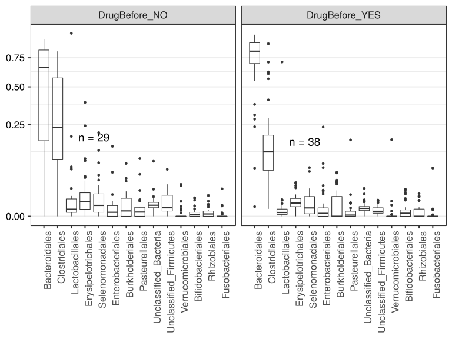
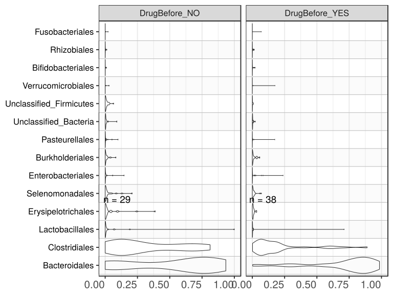

noone@mail.com
Analysis of Dieting study 16S data
% Fri Sep  7 05:46:18 2018

##### \(1.6.1.2.5\) Plots of Abundance.

Plots are shown with relation to various combinations of meta 
                   data variables and in different graphical representations. Lots of plots here.

##### \(1.6.1.2.5.2\) Iterating over all combinations of grouping variables

##### \(1.6.1.2.5.2.1\) Grouping variables visit,Drug.Before.Diet

##### \(1.6.1.2.5.2.2\) Iterating over Abundance. profile sorting order

##### \(1.6.1.2.5.2.2.1\) Abundance. profile sorting order: average abundance

##### \(1.6.1.2.5.2.2.2\) Iterating over dodged vs faceted bars

The same data are shown in multiple combinations of graphical representations. 
                         This is the same data, but each plot highlights slightly different aspects of it.
                         It is not likely that you will need every plot - pick only what you need.

##### \(1.6.1.2.5.2.2.2.1\) faceted plots. Iterating over orientation and, optionally, scaling

##### \(1.6.1.2.5.2.2.2.1.1\) Abundance. Plot is in original orientation, Y axis SQRT scaled. Iterating over plot geometry

\(1.6.1.2.5.2.2.2.1.1.0\) [`Table 355.`](#table.355) Data table used for plots. Data grouped by visit,Drug.Before.Diet. Showing only 200 first rows. Full dataset is also saved in a delimited text file (click to download and open e.g. in Excel) [`data/1.6.1.2.5.2.2.2.1.1.0-32336bf1689.1.6.1.2.5.2.2.2.1.1.csv`](data/1.6.1.2.5.2.2.2.1.1.0-32336bf1689.1.6.1.2.5.2.2.2.1.1.csv)

| .record.id | visit | Drug.Before.Diet | feature         | Abundance  |
|:-----------|:------|:-----------------|:----------------|:-----------|
| SM1        | 1     | DrugBefore\_YES  | Bacteroidales   | 7.837e\-01 |
| SM10       | 3     | DrugBefore\_YES  | Bacteroidales   | 2.396e\-01 |
| SM100      | 4     | DrugBefore\_YES  | Bacteroidales   | 5.483e\-01 |
| SM11       | 2     | DrugBefore\_YES  | Bacteroidales   | 9.084e\-01 |
| SM12       | 1     | DrugBefore\_YES  | Bacteroidales   | 9.279e\-01 |
| SM13       | 1     | DrugBefore\_NO   | Bacteroidales   | 7.549e\-01 |
| SM14       | 1     | DrugBefore\_NO   | Bacteroidales   | 6.361e\-02 |
| SM16       | 4     | DrugBefore\_NO   | Bacteroidales   | 3.910e\-01 |
| SM17       | 1     | DrugBefore\_YES  | Bacteroidales   | 8.184e\-01 |
| SM18       | 2     | DrugBefore\_NO   | Bacteroidales   | 7.195e\-01 |
| SM19       | 2     | DrugBefore\_NO   | Bacteroidales   | 2.254e\-01 |
| SM2        | 1     | DrugBefore\_NO   | Bacteroidales   | 8.870e\-01 |
| SM21       | 1     | DrugBefore\_NO   | Bacteroidales   | 5.680e\-01 |
| SM22       | 1     | DrugBefore\_YES  | Bacteroidales   | 6.107e\-01 |
| SM23       | 2     | DrugBefore\_YES  | Bacteroidales   | 2.816e\-01 |
| SM24       | 1     | DrugBefore\_NO   | Bacteroidales   | 8.665e\-01 |
| SM25       | 4     | DrugBefore\_NO   | Bacteroidales   | 4.540e\-01 |
| SM29       | 3     | DrugBefore\_YES  | Bacteroidales   | 9.319e\-01 |
| SM3        | 2     | DrugBefore\_YES  | Bacteroidales   | 3.066e\-01 |
| SM30       | 4     | DrugBefore\_YES  | Bacteroidales   | 6.906e\-02 |
| SM33       | 1     | DrugBefore\_YES  | Bacteroidales   | 6.904e\-01 |
| SM36       | 4     | DrugBefore\_NO   | Bacteroidales   | 3.219e\-04 |
| SM38       | 2     | DrugBefore\_YES  | Bacteroidales   | 9.845e\-01 |
| SM39       | 1     | DrugBefore\_NO   | Bacteroidales   | 9.342e\-01 |
| SM40       | 4     | DrugBefore\_NO   | Bacteroidales   | 7.285e\-01 |
| SM41       | 1     | DrugBefore\_YES  | Bacteroidales   | 5.559e\-01 |
| SM42       | 4     | DrugBefore\_NO   | Bacteroidales   | 7.114e\-01 |
| SM43       | 4     | DrugBefore\_YES  | Bacteroidales   | 7.229e\-01 |
| SM45       | 2     | DrugBefore\_NO   | Bacteroidales   | 0.000e\+00 |
| SM49       | 1     | DrugBefore\_YES  | Bacteroidales   | 9.322e\-01 |
| SM5        | 3     | DrugBefore\_YES  | Bacteroidales   | 8.376e\-01 |
| SM50       | 3     | DrugBefore\_NO   | Bacteroidales   | 0.000e\+00 |
| SM51       | 4     | DrugBefore\_YES  | Bacteroidales   | 7.147e\-01 |
| SM52       | 1     | DrugBefore\_NO   | Bacteroidales   | 9.827e\-02 |
| SM53       | 2     | DrugBefore\_YES  | Bacteroidales   | 8.029e\-01 |
| SM54       | 3     | DrugBefore\_YES  | Bacteroidales   | 8.090e\-01 |
| SM56       | 2     | DrugBefore\_YES  | Bacteroidales   | 7.317e\-01 |
| SM57       | 1     | DrugBefore\_YES  | Bacteroidales   | 9.046e\-01 |
| SM58       | 2     | DrugBefore\_NO   | Bacteroidales   | 7.692e\-01 |
| SM59       | 3     | DrugBefore\_NO   | Bacteroidales   | 5.768e\-02 |
| SM60       | 3     | DrugBefore\_YES  | Bacteroidales   | 8.475e\-01 |
| SM62       | 1     | DrugBefore\_YES  | Bacteroidales   | 9.715e\-01 |
| SM64       | 2     | DrugBefore\_YES  | Bacteroidales   | 8.683e\-01 |
| SM65       | 3     | DrugBefore\_YES  | Bacteroidales   | 3.741e\-01 |
| SM67       | 4     | DrugBefore\_YES  | Bacteroidales   | 9.138e\-01 |
| SM68       | 4     | DrugBefore\_NO   | Bacteroidales   | 1.705e\-01 |
| SM69       | 4     | DrugBefore\_YES  | Bacteroidales   | 8.374e\-01 |
| SM71       | 3     | DrugBefore\_YES  | Bacteroidales   | 9.175e\-01 |
| SM73       | 1     | DrugBefore\_NO   | Bacteroidales   | 8.563e\-01 |
| SM75       | 3     | DrugBefore\_NO   | Bacteroidales   | 2.377e\-03 |
| SM77       | 2     | DrugBefore\_YES  | Bacteroidales   | 7.635e\-01 |
| SM79       | 2     | DrugBefore\_NO   | Bacteroidales   | 8.495e\-01 |
| SM8        | 1     | DrugBefore\_NO   | Bacteroidales   | 8.250e\-01 |
| SM82       | 4     | DrugBefore\_YES  | Bacteroidales   | 9.555e\-01 |
| SM83       | 1     | DrugBefore\_YES  | Bacteroidales   | 8.254e\-01 |
| SM84       | 1     | DrugBefore\_YES  | Bacteroidales   | 8.858e\-01 |
| SM86       | 2     | DrugBefore\_YES  | Bacteroidales   | 2.792e\-03 |
| SM87       | 1     | DrugBefore\_YES  | Bacteroidales   | 8.668e\-01 |
| SM88       | 2     | DrugBefore\_YES  | Bacteroidales   | 8.385e\-01 |
| SM9        | 2     | DrugBefore\_NO   | Bacteroidales   | 6.635e\-01 |
| SM90       | 2     | DrugBefore\_NO   | Bacteroidales   | 6.176e\-01 |
| SM91       | 3     | DrugBefore\_YES  | Bacteroidales   | 7.223e\-01 |
| SM92       | 3     | DrugBefore\_NO   | Bacteroidales   | 8.864e\-01 |
| SM93       | 1     | DrugBefore\_YES  | Bacteroidales   | 7.781e\-01 |
| SM96       | 1     | DrugBefore\_NO   | Bacteroidales   | 6.376e\-01 |
| SM98       | 3     | DrugBefore\_NO   | Bacteroidales   | 8.378e\-01 |
| SM99       | 3     | DrugBefore\_NO   | Bacteroidales   | 6.951e\-01 |
| SM1        | 1     | DrugBefore\_YES  | Clostridiales   | 1.709e\-01 |
| SM10       | 3     | DrugBefore\_YES  | Clostridiales   | 7.097e\-01 |
| SM100      | 4     | DrugBefore\_YES  | Clostridiales   | 4.044e\-01 |
| SM11       | 2     | DrugBefore\_YES  | Clostridiales   | 6.923e\-02 |
| SM12       | 1     | DrugBefore\_YES  | Clostridiales   | 6.299e\-02 |
| SM13       | 1     | DrugBefore\_NO   | Clostridiales   | 1.670e\-01 |
| SM14       | 1     | DrugBefore\_NO   | Clostridiales   | 3.018e\-01 |
| SM16       | 4     | DrugBefore\_NO   | Clostridiales   | 5.717e\-01 |
| SM17       | 1     | DrugBefore\_YES  | Clostridiales   | 1.038e\-01 |
| SM18       | 2     | DrugBefore\_NO   | Clostridiales   | 9.552e\-02 |
| SM19       | 2     | DrugBefore\_NO   | Clostridiales   | 7.154e\-01 |
| SM2        | 1     | DrugBefore\_NO   | Clostridiales   | 2.821e\-02 |
| SM21       | 1     | DrugBefore\_NO   | Clostridiales   | 3.925e\-01 |
| SM22       | 1     | DrugBefore\_YES  | Clostridiales   | 2.891e\-01 |
| SM23       | 2     | DrugBefore\_YES  | Clostridiales   | 1.659e\-03 |
| SM24       | 1     | DrugBefore\_NO   | Clostridiales   | 8.129e\-02 |
| SM25       | 4     | DrugBefore\_NO   | Clostridiales   | 5.006e\-01 |
| SM29       | 3     | DrugBefore\_YES  | Clostridiales   | 5.931e\-02 |
| SM3        | 2     | DrugBefore\_YES  | Clostridiales   | 6.225e\-01 |
| SM30       | 4     | DrugBefore\_YES  | Clostridiales   | 6.076e\-01 |
| SM33       | 1     | DrugBefore\_YES  | Clostridiales   | 4.996e\-02 |
| SM36       | 4     | DrugBefore\_NO   | Clostridiales   | 7.193e\-01 |
| SM38       | 2     | DrugBefore\_YES  | Clostridiales   | 1.115e\-02 |
| SM39       | 1     | DrugBefore\_NO   | Clostridiales   | 4.334e\-02 |
| SM40       | 4     | DrugBefore\_NO   | Clostridiales   | 1.535e\-01 |
| SM41       | 1     | DrugBefore\_YES  | Clostridiales   | 1.723e\-01 |
| SM42       | 4     | DrugBefore\_NO   | Clostridiales   | 2.559e\-01 |
| SM43       | 4     | DrugBefore\_YES  | Clostridiales   | 1.955e\-01 |
| SM45       | 2     | DrugBefore\_NO   | Clostridiales   | 0.000e\+00 |
| SM49       | 1     | DrugBefore\_YES  | Clostridiales   | 5.216e\-02 |
| SM5        | 3     | DrugBefore\_YES  | Clostridiales   | 9.120e\-02 |
| SM50       | 3     | DrugBefore\_NO   | Clostridiales   | 7.065e\-01 |
| SM51       | 4     | DrugBefore\_YES  | Clostridiales   | 1.970e\-01 |
| SM52       | 1     | DrugBefore\_NO   | Clostridiales   | 6.445e\-01 |
| SM53       | 2     | DrugBefore\_YES  | Clostridiales   | 1.491e\-01 |
| SM54       | 3     | DrugBefore\_YES  | Clostridiales   | 1.726e\-01 |
| SM56       | 2     | DrugBefore\_YES  | Clostridiales   | 2.125e\-01 |
| SM57       | 1     | DrugBefore\_YES  | Clostridiales   | 8.819e\-02 |
| SM58       | 2     | DrugBefore\_NO   | Clostridiales   | 1.200e\-01 |
| SM59       | 3     | DrugBefore\_NO   | Clostridiales   | 7.978e\-01 |
| SM60       | 3     | DrugBefore\_YES  | Clostridiales   | 6.399e\-02 |
| SM62       | 1     | DrugBefore\_YES  | Clostridiales   | 2.529e\-02 |
| SM64       | 2     | DrugBefore\_YES  | Clostridiales   | 7.026e\-02 |
| SM65       | 3     | DrugBefore\_YES  | Clostridiales   | 5.640e\-01 |
| SM67       | 4     | DrugBefore\_YES  | Clostridiales   | 7.164e\-02 |
| SM68       | 4     | DrugBefore\_NO   | Clostridiales   | 5.874e\-01 |
| SM69       | 4     | DrugBefore\_YES  | Clostridiales   | 1.229e\-01 |
| SM71       | 3     | DrugBefore\_YES  | Clostridiales   | 5.366e\-02 |
| SM73       | 1     | DrugBefore\_NO   | Clostridiales   | 9.994e\-02 |
| SM75       | 3     | DrugBefore\_NO   | Clostridiales   | 8.122e\-01 |
| SM77       | 2     | DrugBefore\_YES  | Clostridiales   | 1.921e\-01 |
| SM79       | 2     | DrugBefore\_NO   | Clostridiales   | 1.412e\-01 |
| SM8        | 1     | DrugBefore\_NO   | Clostridiales   | 1.294e\-01 |
| SM82       | 4     | DrugBefore\_YES  | Clostridiales   | 2.914e\-02 |
| SM83       | 1     | DrugBefore\_YES  | Clostridiales   | 1.565e\-01 |
| SM84       | 1     | DrugBefore\_YES  | Clostridiales   | 5.785e\-02 |
| SM86       | 2     | DrugBefore\_YES  | Clostridiales   | 8.889e\-01 |
| SM87       | 1     | DrugBefore\_YES  | Clostridiales   | 7.040e\-02 |
| SM88       | 2     | DrugBefore\_YES  | Clostridiales   | 1.247e\-01 |
| SM9        | 2     | DrugBefore\_NO   | Clostridiales   | 7.939e\-02 |
| SM90       | 2     | DrugBefore\_NO   | Clostridiales   | 2.991e\-01 |
| SM91       | 3     | DrugBefore\_YES  | Clostridiales   | 2.006e\-01 |
| SM92       | 3     | DrugBefore\_NO   | Clostridiales   | 8.090e\-02 |
| SM93       | 1     | DrugBefore\_YES  | Clostridiales   | 1.938e\-01 |
| SM96       | 1     | DrugBefore\_NO   | Clostridiales   | 2.363e\-01 |
| SM98       | 3     | DrugBefore\_NO   | Clostridiales   | 5.983e\-02 |
| SM99       | 3     | DrugBefore\_NO   | Clostridiales   | 2.487e\-01 |
| SM1        | 1     | DrugBefore\_YES  | Lactobacillales | 4.329e\-04 |
| SM10       | 3     | DrugBefore\_YES  | Lactobacillales | 4.240e\-04 |
| SM100      | 4     | DrugBefore\_YES  | Lactobacillales | 3.077e\-04 |
| SM11       | 2     | DrugBefore\_YES  | Lactobacillales | 6.567e\-04 |
| SM12       | 1     | DrugBefore\_YES  | Lactobacillales | 8.853e\-05 |
| SM13       | 1     | DrugBefore\_NO   | Lactobacillales | 0.000e\+00 |
| SM14       | 1     | DrugBefore\_NO   | Lactobacillales | 1.905e\-01 |
| SM16       | 4     | DrugBefore\_NO   | Lactobacillales | 4.875e\-03 |
| SM17       | 1     | DrugBefore\_YES  | Lactobacillales | 1.241e\-03 |
| SM18       | 2     | DrugBefore\_NO   | Lactobacillales | 1.242e\-02 |
| SM19       | 2     | DrugBefore\_NO   | Lactobacillales | 1.388e\-03 |
| SM2        | 1     | DrugBefore\_NO   | Lactobacillales | 7.278e\-02 |
| SM21       | 1     | DrugBefore\_NO   | Lactobacillales | 2.690e\-03 |
| SM22       | 1     | DrugBefore\_YES  | Lactobacillales | 3.071e\-03 |
| SM23       | 2     | DrugBefore\_YES  | Lactobacillales | 7.105e\-01 |
| SM24       | 1     | DrugBefore\_NO   | Lactobacillales | 6.431e\-04 |
| SM25       | 4     | DrugBefore\_NO   | Lactobacillales | 7.765e\-03 |
| SM29       | 3     | DrugBefore\_YES  | Lactobacillales | 0.000e\+00 |
| SM3        | 2     | DrugBefore\_YES  | Lactobacillales | 8.146e\-03 |
| SM30       | 4     | DrugBefore\_YES  | Lactobacillales | 7.637e\-03 |
| SM33       | 1     | DrugBefore\_YES  | Lactobacillales | 7.868e\-04 |
| SM36       | 4     | DrugBefore\_NO   | Lactobacillales | 6.437e\-04 |
| SM38       | 2     | DrugBefore\_YES  | Lactobacillales | 3.545e\-03 |
| SM39       | 1     | DrugBefore\_NO   | Lactobacillales | 1.821e\-04 |
| SM40       | 4     | DrugBefore\_NO   | Lactobacillales | 4.625e\-04 |
| SM41       | 1     | DrugBefore\_YES  | Lactobacillales | 4.831e\-03 |
| SM42       | 4     | DrugBefore\_NO   | Lactobacillales | 2.497e\-04 |
| SM43       | 4     | DrugBefore\_YES  | Lactobacillales | 2.981e\-04 |
| SM45       | 2     | DrugBefore\_NO   | Lactobacillales | 9.998e\-01 |
| SM49       | 1     | DrugBefore\_YES  | Lactobacillales | 3.316e\-03 |
| SM5        | 3     | DrugBefore\_YES  | Lactobacillales | 9.324e\-04 |
| SM50       | 3     | DrugBefore\_NO   | Lactobacillales | 1.578e\-03 |
| SM51       | 4     | DrugBefore\_YES  | Lactobacillales | 4.461e\-04 |
| SM52       | 1     | DrugBefore\_NO   | Lactobacillales | 2.321e\-02 |
| SM53       | 2     | DrugBefore\_YES  | Lactobacillales | 7.192e\-05 |
| SM54       | 3     | DrugBefore\_YES  | Lactobacillales | 0.000e\+00 |
| SM56       | 2     | DrugBefore\_YES  | Lactobacillales | 0.000e\+00 |
| SM57       | 1     | DrugBefore\_YES  | Lactobacillales | 0.000e\+00 |
| SM58       | 2     | DrugBefore\_NO   | Lactobacillales | 3.563e\-03 |
| SM59       | 3     | DrugBefore\_NO   | Lactobacillales | 8.989e\-03 |
| SM60       | 3     | DrugBefore\_YES  | Lactobacillales | 3.404e\-04 |
| SM62       | 1     | DrugBefore\_YES  | Lactobacillales | 1.606e\-03 |
| SM64       | 2     | DrugBefore\_YES  | Lactobacillales | 5.011e\-04 |
| SM65       | 3     | DrugBefore\_YES  | Lactobacillales | 9.617e\-04 |
| SM67       | 4     | DrugBefore\_YES  | Lactobacillales | 5.882e\-05 |
| SM68       | 4     | DrugBefore\_NO   | Lactobacillales | 1.153e\-02 |
| SM69       | 4     | DrugBefore\_YES  | Lactobacillales | 1.554e\-04 |
| SM71       | 3     | DrugBefore\_YES  | Lactobacillales | 1.253e\-03 |
| SM73       | 1     | DrugBefore\_NO   | Lactobacillales | 1.514e\-04 |
| SM75       | 3     | DrugBefore\_NO   | Lactobacillales | 6.655e\-02 |
| SM77       | 2     | DrugBefore\_YES  | Lactobacillales | 2.816e\-04 |
| SM79       | 2     | DrugBefore\_NO   | Lactobacillales | 8.808e\-04 |
| SM8        | 1     | DrugBefore\_NO   | Lactobacillales | 1.483e\-03 |
| SM82       | 4     | DrugBefore\_YES  | Lactobacillales | 2.293e\-03 |
| SM83       | 1     | DrugBefore\_YES  | Lactobacillales | 0.000e\+00 |
| SM84       | 1     | DrugBefore\_YES  | Lactobacillales | 9.707e\-05 |
| SM86       | 2     | DrugBefore\_YES  | Lactobacillales | 8.067e\-03 |
| SM87       | 1     | DrugBefore\_YES  | Lactobacillales | 3.805e\-04 |
| SM88       | 2     | DrugBefore\_YES  | Lactobacillales | 8.525e\-05 |
| SM9        | 2     | DrugBefore\_NO   | Lactobacillales | 1.645e\-03 |
| SM90       | 2     | DrugBefore\_NO   | Lactobacillales | 4.125e\-04 |
| SM91       | 3     | DrugBefore\_YES  | Lactobacillales | 1.401e\-03 |
| SM92       | 3     | DrugBefore\_NO   | Lactobacillales | 0.000e\+00 |
| SM93       | 1     | DrugBefore\_YES  | Lactobacillales | 1.345e\-04 |
| SM96       | 1     | DrugBefore\_NO   | Lactobacillales | 1.443e\-03 |
| SM98       | 3     | DrugBefore\_NO   | Lactobacillales | 5.408e\-04 |

\(1.6.1.2.5.2.2.2.1.1.1\) [`Widget 372.`](#widget.372) Dynamic Pivot Table link (drag and drop field names and pick averaging 
                      functions or plot types; click on fields or legend elements to filter values). 
                      Starting rendering is Stacked Bar Chart. Data grouped by visit,Drug.Before.Diet. Click to see HTML widget file in full window: [`./1.6.1.2.5.2.2.2.1.1.1-3232d4e686bDynamic.Pivot.Table.html`](./1.6.1.2.5.2.2.2.1.1.1-3232d4e686bDynamic.Pivot.Table.html)

\(1.6.1.2.5.2.2.2.1.1.1\) [`Widget 373.`](#widget.373) Dynamic Pivot Table link (drag and drop field names and pick averaging 
                      functions or plot types; click on fields or legend elements to filter values). 
                      Starting rendering is Table Barchart. Data grouped by visit,Drug.Before.Diet. Click to see HTML widget file in full window: [`./1.6.1.2.5.2.2.2.1.1.1-32367884a19Dynamic.Pivot.Table.html`](./1.6.1.2.5.2.2.2.1.1.1-32367884a19Dynamic.Pivot.Table.html)

\(1.6.1.2.5.2.2.2.1.1.1\) [`Table 356.`](#table.356) Summary table. Data grouped by visit,Drug.Before.Diet. Full dataset is also saved in a delimited text file (click to download and open e.g. in Excel) [`data/1.6.1.2.5.2.2.2.1.1.1-32327144bd9.1.6.1.2.5.2.2.2.1.1.csv`](data/1.6.1.2.5.2.2.2.1.1.1-32327144bd9.1.6.1.2.5.2.2.2.1.1.csv)

| feature                  | visit | Drug.Before.Diet | mean       | sd         | median     | incidence |
|:-------------------------|:------|:-----------------|:-----------|:-----------|:-----------|:----------|
| Bacteroidales            | 1     | DrugBefore\_NO   | 6.491e\-01 | 3.203e\-01 | 7.900e\-01 | 1.0000    |
| Bacteroidales            | 1     | DrugBefore\_YES  | 8.116e\-01 | 1.270e\-01 | 8.254e\-01 | 1.0000    |
| Bacteroidales            | 2     | DrugBefore\_NO   | 5.492e\-01 | 3.141e\-01 | 6.635e\-01 | 0.8571    |
| Bacteroidales            | 2     | DrugBefore\_YES  | 6.489e\-01 | 3.295e\-01 | 7.832e\-01 | 1.0000    |
| Bacteroidales            | 3     | DrugBefore\_NO   | 4.132e\-01 | 4.358e\-01 | 3.764e\-01 | 0.8333    |
| Bacteroidales            | 3     | DrugBefore\_YES  | 7.099e\-01 | 2.596e\-01 | 8.233e\-01 | 1.0000    |
| Bacteroidales            | 4     | DrugBefore\_NO   | 4.093e\-01 | 2.898e\-01 | 4.225e\-01 | 1.0000    |
| Bacteroidales            | 4     | DrugBefore\_YES  | 6.803e\-01 | 3.025e\-01 | 7.229e\-01 | 1.0000    |
| Clostridiales            | 1     | DrugBefore\_NO   | 2.124e\-01 | 1.912e\-01 | 1.482e\-01 | 1.0000    |
| Clostridiales            | 1     | DrugBefore\_YES  | 1.149e\-01 | 7.620e\-02 | 8.819e\-02 | 1.0000    |
| Clostridiales            | 2     | DrugBefore\_NO   | 2.072e\-01 | 2.417e\-01 | 1.200e\-01 | 0.8571    |
| Clostridiales            | 2     | DrugBefore\_YES  | 2.342e\-01 | 2.904e\-01 | 1.369e\-01 | 1.0000    |
| Clostridiales            | 3     | DrugBefore\_NO   | 4.510e\-01 | 3.597e\-01 | 4.776e\-01 | 1.0000    |
| Clostridiales            | 3     | DrugBefore\_YES  | 2.394e\-01 | 2.542e\-01 | 1.319e\-01 | 1.0000    |
| Clostridiales            | 4     | DrugBefore\_NO   | 4.647e\-01 | 2.159e\-01 | 5.361e\-01 | 1.0000    |
| Clostridiales            | 4     | DrugBefore\_YES  | 2.326e\-01 | 2.050e\-01 | 1.955e\-01 | 1.0000    |
| Lactobacillales          | 1     | DrugBefore\_NO   | 2.930e\-02 | 6.104e\-02 | 1.463e\-03 | 0.9000    |
| Lactobacillales          | 1     | DrugBefore\_YES  | 1.230e\-03 | 1.560e\-03 | 4.329e\-04 | 0.8462    |
| Lactobacillales          | 2     | DrugBefore\_NO   | 1.457e\-01 | 3.766e\-01 | 1.645e\-03 | 1.0000    |
| Lactobacillales          | 2     | DrugBefore\_YES  | 7.318e\-02 | 2.240e\-01 | 5.789e\-04 | 0.9000    |
| Lactobacillales          | 3     | DrugBefore\_NO   | 1.300e\-02 | 2.645e\-02 | 1.059e\-03 | 0.8333    |
| Lactobacillales          | 3     | DrugBefore\_YES  | 6.641e\-04 | 5.471e\-04 | 6.782e\-04 | 0.7500    |
| Lactobacillales          | 4     | DrugBefore\_NO   | 4.254e\-03 | 4.671e\-03 | 2.759e\-03 | 1.0000    |
| Lactobacillales          | 4     | DrugBefore\_YES  | 1.600e\-03 | 2.772e\-03 | 3.077e\-04 | 1.0000    |
| Erysipelotrichales       | 1     | DrugBefore\_NO   | 4.869e\-02 | 1.198e\-01 | 9.058e\-03 | 1.0000    |
| Erysipelotrichales       | 1     | DrugBefore\_YES  | 9.306e\-03 | 8.918e\-03 | 8.445e\-03 | 0.8462    |
| Erysipelotrichales       | 2     | DrugBefore\_NO   | 4.388e\-03 | 6.426e\-03 | 9.718e\-04 | 0.7143    |
| Erysipelotrichales       | 2     | DrugBefore\_YES  | 6.841e\-03 | 9.988e\-03 | 3.901e\-03 | 1.0000    |
| Erysipelotrichales       | 3     | DrugBefore\_NO   | 3.388e\-02 | 3.662e\-02 | 2.731e\-02 | 1.0000    |
| Erysipelotrichales       | 3     | DrugBefore\_YES  | 7.867e\-03 | 1.024e\-02 | 5.726e\-03 | 1.0000    |
| Erysipelotrichales       | 4     | DrugBefore\_NO   | 5.830e\-02 | 9.802e\-02 | 5.452e\-03 | 1.0000    |
| Erysipelotrichales       | 4     | DrugBefore\_YES  | 6.194e\-03 | 4.422e\-03 | 4.538e\-03 | 1.0000    |
| Selenomonadales          | 1     | DrugBefore\_NO   | 3.888e\-03 | 6.406e\-03 | 1.009e\-03 | 0.9000    |
| Selenomonadales          | 1     | DrugBefore\_YES  | 7.876e\-03 | 1.648e\-02 | 1.992e\-03 | 0.9231    |
| Selenomonadales          | 2     | DrugBefore\_NO   | 5.700e\-02 | 8.202e\-02 | 6.478e\-03 | 0.8571    |
| Selenomonadales          | 2     | DrugBefore\_YES  | 1.201e\-02 | 2.200e\-02 | 2.560e\-03 | 0.7000    |
| Selenomonadales          | 3     | DrugBefore\_NO   | 2.475e\-02 | 3.301e\-02 | 1.083e\-02 | 0.8333    |
| Selenomonadales          | 3     | DrugBefore\_YES  | 5.929e\-03 | 6.142e\-03 | 4.186e\-03 | 0.7500    |
| Selenomonadales          | 4     | DrugBefore\_NO   | 1.034e\-02 | 9.712e\-03 | 9.060e\-03 | 1.0000    |
| Selenomonadales          | 4     | DrugBefore\_YES  | 5.040e\-03 | 6.779e\-03 | 2.231e\-04 | 0.8571    |
| Enterobacteriales        | 1     | DrugBefore\_NO   | 1.535e\-02 | 4.600e\-02 | 1.286e\-04 | 0.5000    |
| Enterobacteriales        | 1     | DrugBefore\_YES  | 1.960e\-02 | 6.575e\-02 | 0.000e\+00 | 0.4615    |
| Enterobacteriales        | 2     | DrugBefore\_NO   | 2.289e\-03 | 5.219e\-03 | 4.125e\-04 | 0.7143    |
| Enterobacteriales        | 2     | DrugBefore\_YES  | 2.773e\-03 | 6.325e\-03 | 1.966e\-04 | 0.6000    |
| Enterobacteriales        | 3     | DrugBefore\_NO   | 1.166e\-02 | 2.268e\-02 | 3.416e\-03 | 0.8333    |
| Enterobacteriales        | 3     | DrugBefore\_YES  | 2.961e\-03 | 7.095e\-03 | 3.210e\-04 | 0.6250    |
| Enterobacteriales        | 4     | DrugBefore\_NO   | 2.257e\-03 | 3.183e\-03 | 4.479e\-04 | 0.6667    |
| Enterobacteriales        | 4     | DrugBefore\_YES  | 2.872e\-02 | 3.464e\-02 | 1.756e\-02 | 0.7143    |
| Burkholderiales          | 1     | DrugBefore\_NO   | 8.138e\-03 | 1.165e\-02 | 2.577e\-03 | 1.0000    |
| Burkholderiales          | 1     | DrugBefore\_YES  | 9.798e\-03 | 1.692e\-02 | 1.809e\-03 | 0.6154    |
| Burkholderiales          | 2     | DrugBefore\_NO   | 1.182e\-02 | 1.576e\-02 | 6.155e\-03 | 0.5714    |
| Burkholderiales          | 2     | DrugBefore\_YES  | 1.217e\-02 | 1.922e\-02 | 0.000e\+00 | 0.4000    |
| Burkholderiales          | 3     | DrugBefore\_NO   | 1.331e\-03 | 3.080e\-03 | 0.000e\+00 | 0.3333    |
| Burkholderiales          | 3     | DrugBefore\_YES  | 8.794e\-03 | 1.629e\-02 | 0.000e\+00 | 0.2500    |
| Burkholderiales          | 4     | DrugBefore\_NO   | 1.559e\-02 | 3.336e\-02 | 3.219e\-04 | 0.5000    |
| Burkholderiales          | 4     | DrugBefore\_YES  | 6.077e\-03 | 1.459e\-02 | 0.000e\+00 | 0.4286    |
| Pasteurellales           | 1     | DrugBefore\_NO   | 1.112e\-03 | 2.563e\-03 | 0.000e\+00 | 0.4000    |
| Pasteurellales           | 1     | DrugBefore\_YES  | 1.341e\-04 | 2.383e\-04 | 0.000e\+00 | 0.3077    |
| Pasteurellales           | 2     | DrugBefore\_NO   | 2.033e\-03 | 2.334e\-03 | 1.650e\-03 | 0.8571    |
| Pasteurellales           | 2     | DrugBefore\_YES  | 8.641e\-04 | 1.785e\-03 | 4.263e\-05 | 0.5000    |
| Pasteurellales           | 3     | DrugBefore\_NO   | 1.210e\-02 | 2.139e\-02 | 0.000e\+00 | 0.3333    |
| Pasteurellales           | 3     | DrugBefore\_YES  | 3.303e\-03 | 4.806e\-03 | 1.166e\-03 | 0.6250    |
| Pasteurellales           | 4     | DrugBefore\_NO   | 1.837e\-02 | 3.979e\-02 | 1.708e\-03 | 0.8333    |
| Pasteurellales           | 4     | DrugBefore\_YES  | 2.506e\-02 | 6.562e\-02 | 2.231e\-04 | 0.7143    |
| Unclassified\_Bacteria   | 1     | DrugBefore\_NO   | 1.480e\-02 | 2.717e\-02 | 4.448e\-03 | 1.0000    |
| Unclassified\_Bacteria   | 1     | DrugBefore\_YES  | 3.807e\-03 | 4.164e\-03 | 2.257e\-03 | 0.9231    |
| Unclassified\_Bacteria   | 2     | DrugBefore\_NO   | 2.186e\-03 | 2.207e\-03 | 1.388e\-03 | 0.8571    |
| Unclassified\_Bacteria   | 2     | DrugBefore\_YES  | 2.145e\-03 | 1.812e\-03 | 2.054e\-03 | 0.9000    |
| Unclassified\_Bacteria   | 3     | DrugBefore\_NO   | 5.270e\-03 | 3.824e\-03 | 3.444e\-03 | 1.0000    |
| Unclassified\_Bacteria   | 3     | DrugBefore\_YES  | 1.982e\-03 | 1.537e\-03 | 1.345e\-03 | 1.0000    |
| Unclassified\_Bacteria   | 4     | DrugBefore\_NO   | 4.114e\-03 | 4.251e\-03 | 2.007e\-03 | 1.0000    |
| Unclassified\_Bacteria   | 4     | DrugBefore\_YES  | 5.219e\-03 | 8.370e\-03 | 1.399e\-03 | 1.0000    |
| Unclassified\_Firmicutes | 1     | DrugBefore\_NO   | 2.802e\-03 | 4.001e\-03 | 1.172e\-03 | 1.0000    |
| Unclassified\_Firmicutes | 1     | DrugBefore\_YES  | 2.142e\-03 | 2.989e\-03 | 6.030e\-04 | 0.7692    |
| Unclassified\_Firmicutes | 2     | DrugBefore\_NO   | 1.103e\-02 | 1.266e\-02 | 7.867e\-03 | 0.7143    |
| Unclassified\_Firmicutes | 2     | DrugBefore\_YES  | 1.606e\-03 | 2.074e\-03 | 5.869e\-04 | 0.8000    |
| Unclassified\_Firmicutes | 3     | DrugBefore\_NO   | 1.975e\-02 | 2.478e\-02 | 1.006e\-02 | 1.0000    |
| Unclassified\_Firmicutes | 3     | DrugBefore\_YES  | 1.509e\-03 | 1.271e\-03 | 1.063e\-03 | 1.0000    |
| Unclassified\_Firmicutes | 4     | DrugBefore\_NO   | 7.886e\-03 | 8.479e\-03 | 4.579e\-03 | 1.0000    |
| Unclassified\_Firmicutes | 4     | DrugBefore\_YES  | 9.570e\-04 | 1.257e\-03 | 6.692e\-04 | 0.8571    |
| Verrucomicrobiales       | 1     | DrugBefore\_NO   | 6.661e\-03 | 1.204e\-02 | 0.000e\+00 | 0.4000    |
| Verrucomicrobiales       | 1     | DrugBefore\_YES  | 1.355e\-02 | 4.857e\-02 | 0.000e\+00 | 0.3077    |
| Verrucomicrobiales       | 2     | DrugBefore\_NO   | 4.125e\-04 | 1.091e\-03 | 0.000e\+00 | 0.1429    |
| Verrucomicrobiales       | 2     | DrugBefore\_YES  | 3.747e\-04 | 1.185e\-03 | 0.000e\+00 | 0.1000    |
| Verrucomicrobiales       | 3     | DrugBefore\_NO   | 1.873e\-04 | 4.587e\-04 | 0.000e\+00 | 0.1667    |
| Verrucomicrobiales       | 3     | DrugBefore\_YES  | 8.617e\-04 | 2.437e\-03 | 0.000e\+00 | 0.1250    |
| Verrucomicrobiales       | 4     | DrugBefore\_NO   | 6.167e\-05 | 1.510e\-04 | 0.000e\+00 | 0.1667    |
| Verrucomicrobiales       | 4     | DrugBefore\_YES  | 0.000e\+00 | 0.000e\+00 | 0.000e\+00 | 0.0000    |
| Bifidobacteriales        | 1     | DrugBefore\_NO   | 1.552e\-03 | 3.211e\-03 | 1.985e\-04 | 0.7000    |
| Bifidobacteriales        | 1     | DrugBefore\_YES  | 1.974e\-03 | 5.715e\-03 | 3.015e\-04 | 0.6154    |
| Bifidobacteriales        | 2     | DrugBefore\_NO   | 3.356e\-04 | 6.091e\-04 | 0.000e\+00 | 0.4286    |
| Bifidobacteriales        | 2     | DrugBefore\_YES  | 1.000e\-03 | 2.405e\-03 | 1.473e\-04 | 0.7000    |
| Bifidobacteriales        | 3     | DrugBefore\_NO   | 1.383e\-03 | 3.177e\-03 | 9.832e\-05 | 0.5000    |
| Bifidobacteriales        | 3     | DrugBefore\_YES  | 5.377e\-03 | 8.782e\-03 | 9.066e\-04 | 0.6250    |
| Bifidobacteriales        | 4     | DrugBefore\_NO   | 1.767e\-03 | 3.919e\-03 | 9.250e\-05 | 0.5000    |
| Bifidobacteriales        | 4     | DrugBefore\_YES  | 3.710e\-03 | 6.004e\-03 | 5.198e\-04 | 0.7143    |
| Rhizobiales              | 1     | DrugBefore\_NO   | 1.645e\-03 | 2.271e\-03 | 7.732e\-04 | 0.6000    |
| Rhizobiales              | 1     | DrugBefore\_YES  | 1.928e\-03 | 3.638e\-03 | 1.941e\-04 | 0.5385    |
| Rhizobiales              | 2     | DrugBefore\_NO   | 2.085e\-03 | 4.800e\-03 | 3.915e\-04 | 0.7143    |
| Rhizobiales              | 2     | DrugBefore\_YES  | 3.214e\-03 | 5.669e\-03 | 2.445e\-04 | 0.6000    |
| Rhizobiales              | 3     | DrugBefore\_NO   | 1.387e\-04 | 3.398e\-04 | 0.000e\+00 | 0.1667    |
| Rhizobiales              | 3     | DrugBefore\_YES  | 1.023e\-03 | 2.663e\-03 | 0.000e\+00 | 0.2500    |
| Rhizobiales              | 4     | DrugBefore\_NO   | 8.545e\-04 | 1.534e\-03 | 1.558e\-04 | 0.5000    |
| Rhizobiales              | 4     | DrugBefore\_YES  | 1.675e\-03 | 4.194e\-03 | 0.000e\+00 | 0.4286    |
| Fusobacteriales          | 1     | DrugBefore\_NO   | 3.652e\-04 | 9.889e\-04 | 0.000e\+00 | 0.3000    |
| Fusobacteriales          | 1     | DrugBefore\_YES  | 0.000e\+00 | 0.000e\+00 | 0.000e\+00 | 0.0000    |
| Fusobacteriales          | 2     | DrugBefore\_NO   | 5.194e\-05 | 8.907e\-05 | 0.000e\+00 | 0.2857    |
| Fusobacteriales          | 2     | DrugBefore\_YES  | 0.000e\+00 | 0.000e\+00 | 0.000e\+00 | 0.0000    |
| Fusobacteriales          | 3     | DrugBefore\_NO   | 4.375e\-03 | 9.032e\-03 | 0.000e\+00 | 0.3333    |
| Fusobacteriales          | 3     | DrugBefore\_YES  | 8.885e\-03 | 2.447e\-02 | 0.000e\+00 | 0.2500    |
| Fusobacteriales          | 4     | DrugBefore\_NO   | 0.000e\+00 | 0.000e\+00 | 0.000e\+00 | 0.0000    |
| Fusobacteriales          | 4     | DrugBefore\_YES  | 2.007e\-04 | 4.855e\-04 | 0.000e\+00 | 0.4286    |

\(1.6.1.2.5.2.2.2.1.1.1\) [`Figure 948.`](#figure.948) Abundance. Data grouped by visit,Drug.Before.Diet.  bar_stacked plot.  Image file: [`plots/3234539f282.svg`](plots/3234539f282.svg).

\(1.6.1.2.5.2.2.2.1.1.1\) [`Figure 949.`](#figure.949) Abundance. Data grouped by visit,Drug.Before.Diet.  bar (sample mean) plot.  Image file: [`plots/323502183c2.svg`](plots/323502183c2.svg).

\(1.6.1.2.5.2.2.2.1.1.1\) [`Figure 950.`](#figure.950) Abundance. Data grouped by visit,Drug.Before.Diet.  violin plot.  Image file: [`plots/323e88ca43.svg`](plots/323e88ca43.svg).

\(1.6.1.2.5.2.2.2.1.1.1\) [`Figure 951.`](#figure.951) Abundance. Data grouped by visit,Drug.Before.Diet.  boxplot plot.  Image file: [`plots/3232fb84f9d.svg`](plots/3232fb84f9d.svg).

##### \(1.6.1.2.5.2.2.2.1.2\) Abundance. Plot is in flipped orientation, Y axis not scaled. Iterating over plot geometry

\(1.6.1.2.5.2.2.2.1.2.1\) [`Figure 952.`](#figure.952) Abundance. Data grouped by visit,Drug.Before.Diet.  bar (sample mean) plot.  Image file: [`plots/32333806823.svg`](plots/32333806823.svg).

\(1.6.1.2.5.2.2.2.1.2.1\) [`Figure 953.`](#figure.953) Abundance. Data grouped by visit,Drug.Before.Diet.  violin plot.  Image file: [`plots/32364fdd7d4.svg`](plots/32364fdd7d4.svg).

\(1.6.1.2.5.2.2.2.1.2.1\) [`Figure 954.`](#figure.954) Abundance. Data grouped by visit,Drug.Before.Diet.  boxplot plot.  Image file: [`plots/32390e9ad0.svg`](plots/32390e9ad0.svg).

##### \(1.6.1.2.5.2.2.2.2\) dodged plots. Iterating over orientation and, optionally, scaling

##### \(1.6.1.2.5.2.2.2.2.1\) Abundance. Plot is in original orientation, Y axis SQRT scaled. Iterating over plot geometry

\(1.6.1.2.5.2.2.2.2.1.1\) [`Figure 955.`](#figure.955) Abundance. Data grouped by visit,Drug.Before.Diet.  bar (sample mean) plot.  Image file: [`plots/323b08828a.svg`](plots/323b08828a.svg).

\(1.6.1.2.5.2.2.2.2.1.1\) [`Figure 956.`](#figure.956) Abundance. Data grouped by visit,Drug.Before.Diet.  violin plot.  Image file: [`plots/32370c4bb37.svg`](plots/32370c4bb37.svg).

\(1.6.1.2.5.2.2.2.2.1.1\) [`Figure 957.`](#figure.957) Abundance. Data grouped by visit,Drug.Before.Diet.  boxplot plot.  Image file: [`plots/323402dd80b.svg`](plots/323402dd80b.svg).

##### \(1.6.1.2.5.2.2.2.2.2\) Abundance. Plot is in flipped orientation, Y axis not scaled. Iterating over plot geometry

\(1.6.1.2.5.2.2.2.2.2.1\) [`Figure 958.`](#figure.958) Abundance. Data grouped by visit,Drug.Before.Diet.  bar (sample mean) plot.  Image file: [`plots/32313a43358.svg`](plots/32313a43358.svg).

\(1.6.1.2.5.2.2.2.2.2.1\) [`Figure 959.`](#figure.959) Abundance. Data grouped by visit,Drug.Before.Diet.  violin plot.  Image file: [`plots/3236c4287a6.svg`](plots/3236c4287a6.svg).

\(1.6.1.2.5.2.2.2.2.2.1\) [`Figure 960.`](#figure.960) Abundance. Data grouped by visit,Drug.Before.Diet.  boxplot plot.  Image file: [`plots/32356bb69b6.svg`](plots/32356bb69b6.svg).
