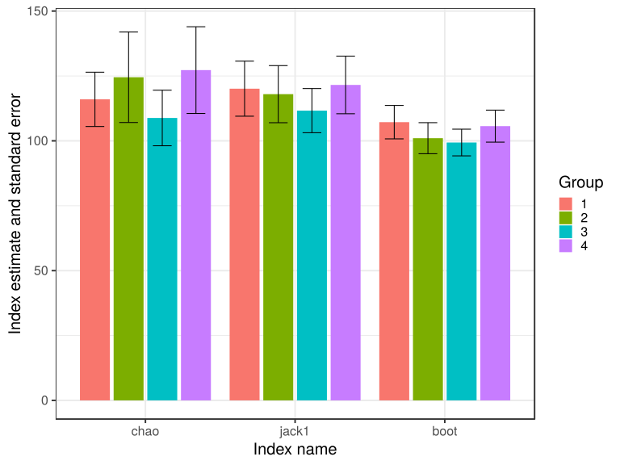
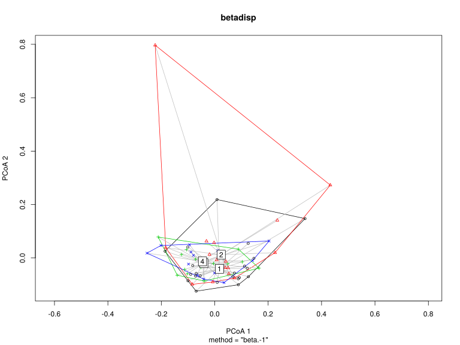

noone@mail.com
Analysis of Dieting study 16S data
% Fri Sep  7 05:46:18 2018


##### \(1.6.1.3.2.1\) Richness and diversity estimates Before count filtering


 Counts are rarefied to the lowest library size (2161), abundance-based and
                   incidence-based alpha diversity indices and richness estimates are computed
                   (if requested).
                   This is repeated multiple times (n=400), and the results are averaged.
                   Beta diversity matrix is also computed by averaging over multiple 
                   rarefications. Incidence-based estimates are computed on sample pools split by
                          metadata attribute visit, and in each repetition, samples are also
                          stratified to balance the number of samples at each level
                          of the grouping variable. Dimensions of input count matrix (67 x 147).


Oksanen J, Blanchet FG, Friendly M, Kindt R, Legendre P, McGlinn D, Minchin PR, O'Hara RB, Simpson GL, Solymos P, Stevens MHH, Szoecs E, Wagner
H (2018). _vegan: Community Ecology Package_. R package version 2.5-2, <URL: https://CRAN.R-project.org/package=vegan>.


\(1.6.1.3.2.1.1\) <a name="table.357"></a>[`Table 357.`](#table.357) Incidence based rihcness estimates and corresponding standard errors for samples grouped by visit. Full dataset is also saved in a delimited text file (click to download and open e.g. in Excel) [`data/1.6.1.3.2.1.1-323d40b165.1.6.1.3.2.1.1.a.nam.csv`](data/1.6.1.3.2.1.1-323d40b165.1.6.1.3.2.1.1.a.nam.csv)


| Species | chao  | chao.se | jack1 | jack1.se | jack2 | boot   | boot.se | n  |
|:--------|:------|:--------|:------|:---------|:------|:-------|:--------|:---|
| 95.33   | 116.0 | 10.47   | 120.1 | 10.607   | 129.5 | 107.20 | 6.443   | 13 |
| 87.37   | 124.5 | 17.42   | 118.0 | 11.005   | 134.8 | 101.02 | 5.980   | 13 |
| 88.38   | 108.8 | 10.70   | 111.6 | 8.514    | 121.1 | 99.36  | 5.148   | 13 |
| 92.67   | 127.3 | 16.71   | 121.5 | 11.091   | 137.0 | 105.67 | 6.169   | 13 |


\(1.6.1.3.2.1.1\) <a name="figure.963"></a>[`Figure 963.`](#figure.963) Incidence based rihcness estimates and corresponding standard errors for samples grouped by visit.  Image file: [`plots/32360056039.svg`](plots/32360056039.svg).



##### \(1.6.1.3.2.1.2\) Plots of Abundance-based diversity indices (Hill numbers) With rarefication.

[`Subreport`](./1.6.1.3.2.1.2-report.html)

Scherer R, Pallmann P (2017). _simboot: Simultaneous Inference for Diversity Indices_. R package version 0.2-6, <URL:
https://CRAN.R-project.org/package=simboot>.


\(1.6.1.3.2.1.2\) <a name="table.360"></a>[`Table 360.`](#table.360) Comparison of diversity indices \(Hill numbers\)
                         with Westfall and Young correction for multiple testing
                          across levels of attribute visit. Full dataset is also saved in a delimited text file (click to download and open e.g. in Excel) [`data/1.6.1.3.2.1.2-32355f0876c.1.6.1.3.2.1.2.a.nam.csv`](data/1.6.1.3.2.1.2-32355f0876c.1.6.1.3.2.1.2.a.nam.csv)


|   &nbsp;   | q       | p\-value |
|:----------:|:--------|:---------|
| **2 \- 1** | N\_0    | 0.3298   |
| **3 \- 1** | N\_0    | 1        |
| **4 \- 1** | N\_0    | 1        |
| **2 \- 1** | N\_0.25 | 0.6802   |
| **3 \- 1** | N\_0.25 | 1        |
| **4 \- 1** | N\_0.25 | 1        |
| **2 \- 1** | N\_0.5  | 0.9532   |
| **3 \- 1** | N\_0.5  | 0.9762   |
| **4 \- 1** | N\_0.5  | 0.9986   |
| **2 \- 1** | N\_1    | 1        |
| **3 \- 1** | N\_1    | 0.8032   |
| **4 \- 1** | N\_1    | 0.9128   |
| **2 \- 1** | N\_2    | 1        |
| **3 \- 1** | N\_2    | 0.7026   |
| **4 \- 1** | N\_2    | 0.7354   |
| **2 \- 1** | N\_4    | 1        |
| **3 \- 1** | N\_4    | 0.7638   |
| **4 \- 1** | N\_4    | 0.6818   |
| **2 \- 1** | N\_8    | 1        |
| **3 \- 1** | N\_8    | 0.7846   |
| **4 \- 1** | N\_8    | 0.6832   |
| **2 \- 1** | N\_Inf  | 1        |
| **3 \- 1** | N\_Inf  | 0.7758   |
| **4 \- 1** | N\_Inf  | 0.7042   |


\(1.6.1.3.2.1.2\) <a name="table.361"></a>[`Table 361.`](#table.361) Levels that defined contrasts 
                         in the previous table. Full dataset is also saved in a delimited text file (click to download and open e.g. in Excel) [`data/1.6.1.3.2.1.2-3235354cb33.1.6.1.3.2.1.2.a.nam.csv`](data/1.6.1.3.2.1.2-3235354cb33.1.6.1.3.2.1.2.a.nam.csv)


| level | label |
|:------|:------|
| 1     | 1     |
| 2     | 2     |
| 3     | 3     |
| 4     | 4     |


##### \(1.6.1.3.2.1.3\) Plots of Abundance-based evenness indices (Hill numbers / Observed 'species') With rarefication.

[`Subreport`](./1.6.1.3.2.1.3-report.html)

Scherer R, Pallmann P (2017). _simboot: Simultaneous Inference for Diversity Indices_. R package version 0.2-6, <URL:
https://CRAN.R-project.org/package=simboot>.


\(1.6.1.3.2.1.3\) <a name="table.364"></a>[`Table 364.`](#table.364) Comparison of evenness indices \(Hill numbers / Observed 'species'\)
                         with Westfall and Young correction for multiple testing
                          across levels of attribute visit. Full dataset is also saved in a delimited text file (click to download and open e.g. in Excel) [`data/1.6.1.3.2.1.3-3232dffc9fe.1.6.1.3.2.1.3.a.nam.csv`](data/1.6.1.3.2.1.3-3232dffc9fe.1.6.1.3.2.1.3.a.nam.csv)


|   &nbsp;   | q        | p\-value |
|:----------:|:---------|:---------|
| **2 \- 1** | NE\_0.25 | 1        |
| **3 \- 1** | NE\_0.25 | 0.6668   |
| **4 \- 1** | NE\_0.25 | 0.848    |
| **2 \- 1** | NE\_0.5  | 0.9772   |
| **3 \- 1** | NE\_0.5  | 0.5758   |
| **4 \- 1** | NE\_0.5  | 0.7382   |
| **2 \- 1** | NE\_1    | 0.7248   |
| **3 \- 1** | NE\_1    | 0.5204   |
| **4 \- 1** | NE\_1    | 0.653    |
| **2 \- 1** | NE\_2    | 0.4076   |
| **3 \- 1** | NE\_2    | 0.6822   |
| **4 \- 1** | NE\_2    | 0.7172   |
| **2 \- 1** | NE\_4    | 0.2522   |
| **3 \- 1** | NE\_4    | 0.8804   |
| **4 \- 1** | NE\_4    | 0.829    |
| **2 \- 1** | NE\_8    | 0.2158   |
| **3 \- 1** | NE\_8    | 0.9558   |
| **4 \- 1** | NE\_8    | 0.9078   |
| **2 \- 1** | NE\_Inf  | 0.2066   |
| **3 \- 1** | NE\_Inf  | 0.9862   |
| **4 \- 1** | NE\_Inf  | 0.969    |


\(1.6.1.3.2.1.3\) <a name="table.365"></a>[`Table 365.`](#table.365) Levels that defined contrasts 
                         in the previous table. Full dataset is also saved in a delimited text file (click to download and open e.g. in Excel) [`data/1.6.1.3.2.1.3-323454e91e3.1.6.1.3.2.1.3.a.nam.csv`](data/1.6.1.3.2.1.3-323454e91e3.1.6.1.3.2.1.3.a.nam.csv)


| level | label |
|:------|:------|
| 1     | 1     |
| 2     | 2     |
| 3     | 3     |
| 4     | 4     |


Wrote counts and metadata for Abundance based richness and diversity to files [`data/1.6.1.3.2.1.3-3235bf8e077divrich.counts.count.tsv`](data/1.6.1.3.2.1.3-3235bf8e077divrich.counts.count.tsv),[`data/1.6.1.3.2.1.3-3235bf8e077divrich.counts.attr.tsv`](data/1.6.1.3.2.1.3-3235bf8e077divrich.counts.attr.tsv)


\(1.6.1.3.2.1.3\)  Association of abundance based Hill number of order N_0 with sample metadata.
                                 GLM with family gaussian and formula N_0~visit.


|     &nbsp;      | Estimate | Std. Error | t value | Pr(>|t|) |
|:---------------:|:---------|:-----------|:--------|:---------|
| **(Intercept)** | 30.65    | 2.361      | 12.98   | 0        |
|    **visit**    | -0.0347  | 0.9376     | -0.037  | 0.9706   |


(Dispersion parameter for  gaussian  family taken to be  74.45416 )


|                    |                                 |
|:-------------------|:--------------------------------|
| Null deviance:     | 4840  on 66  degrees of freedom |
| Residual deviance: | 4840  on 65  degrees of freedom |


##### \(1.6.1.3.2.1.4\) Plots of Abundance-based Hill number of order N_0.

[`Subreport`](./1.6.1.3.2.1.4-report.html)


\(1.6.1.3.2.1.4\)  Association of abundance based Hill number of order N_0.25 with sample metadata.
                                 GLM with family gaussian and formula N_0.25~visit.


|     &nbsp;      | Estimate | Std. Error | t value | Pr(>|t|) |
|:---------------:|:---------|:-----------|:--------|:---------|
| **(Intercept)** | 17.02    | 1.768      | 9.624   | 0        |
|    **visit**    | 0.2716   | 0.7021     | 0.3869  | 0.7001   |


(Dispersion parameter for  gaussian  family taken to be  41.7498 )


|                    |                                 |
|:-------------------|:--------------------------------|
| Null deviance:     | 2720  on 66  degrees of freedom |
| Residual deviance: | 2714  on 65  degrees of freedom |


##### \(1.6.1.3.2.1.5\) Plots of Abundance-based Hill number of order N_0.25.

[`Subreport`](./1.6.1.3.2.1.5-report.html)


\(1.6.1.3.2.1.5\)  Association of abundance based Hill number of order N_0.5 with sample metadata.
                                 GLM with family gaussian and formula N_0.5~visit.


|     &nbsp;      | Estimate | Std. Error | t value | Pr(>|t|) |
|:---------------:|:---------|:-----------|:--------|:---------|
| **(Intercept)** | 9.501    | 1.351      | 7.031   | 0        |
|    **visit**    | 0.4358   | 0.5366     | 0.8122  | 0.4197   |


(Dispersion parameter for  gaussian  family taken to be  24.38151 )


|                    |                                 |
|:-------------------|:--------------------------------|
| Null deviance:     | 1601  on 66  degrees of freedom |
| Residual deviance: | 1585  on 65  degrees of freedom |


##### \(1.6.1.3.2.1.6\) Plots of Abundance-based Hill number of order N_0.5.

[`Subreport`](./1.6.1.3.2.1.6-report.html)


\(1.6.1.3.2.1.6\)  Association of abundance based Hill number of order N_1 with sample metadata.
                                 GLM with family gaussian and formula N_1~visit.


|     &nbsp;      | Estimate | Std. Error | t value | Pr(>|t|) |
|:---------------:|:---------|:-----------|:--------|:---------|
| **(Intercept)** | 4.097    | 0.8696     | 4.712   | 0        |
|    **visit**    | 0.4665   | 0.3453     | 1.351   | 0.1813   |


(Dispersion parameter for  gaussian  family taken to be  10.09606 )


|                    |                                  |
|:-------------------|:---------------------------------|
| Null deviance:     | 674.7  on 66  degrees of freedom |
| Residual deviance: | 656.2  on 65  degrees of freedom |


##### \(1.6.1.3.2.1.7\) Plots of Abundance-based Hill number of order N_1.

[`Subreport`](./1.6.1.3.2.1.7-report.html)


\(1.6.1.3.2.1.7\)  Association of abundance based Hill number of order N_2 with sample metadata.
                                 GLM with family gaussian and formula N_2~visit.


|     &nbsp;      | Estimate | Std. Error | t value | Pr(>|t|) |
|:---------------:|:---------|:-----------|:--------|:---------|
| **(Intercept)** | 2.268    | 0.5482     | 4.138   | 1e-04    |
|    **visit**    | 0.3557   | 0.2177     | 1.634   | 0.1071   |


(Dispersion parameter for  gaussian  family taken to be  4.012622 )


|                    |                                  |
|:-------------------|:---------------------------------|
| Null deviance:     | 271.5  on 66  degrees of freedom |
| Residual deviance: | 260.8  on 65  degrees of freedom |


##### \(1.6.1.3.2.1.8\) Plots of Abundance-based Hill number of order N_2.

[`Subreport`](./1.6.1.3.2.1.8-report.html)


\(1.6.1.3.2.1.8\)  Association of abundance based Hill number of order N_4 with sample metadata.
                                 GLM with family gaussian and formula N_4~visit.


|     &nbsp;      | Estimate | Std. Error | t value | Pr(>|t|) |
|:---------------:|:---------|:-----------|:--------|:---------|
| **(Intercept)** | 1.821    | 0.3887     | 4.686   | 0        |
|    **visit**    | 0.2543   | 0.1543     | 1.648   | 0.1043   |


(Dispersion parameter for  gaussian  family taken to be  2.017235 )


|                    |                                  |
|:-------------------|:---------------------------------|
| Null deviance:     | 136.6  on 66  degrees of freedom |
| Residual deviance: | 131.1  on 65  degrees of freedom |


##### \(1.6.1.3.2.1.9\) Plots of Abundance-based Hill number of order N_4.

[`Subreport`](./1.6.1.3.2.1.9-report.html)


\(1.6.1.3.2.1.9\)  Association of abundance based Hill number of order N_8 with sample metadata.
                                 GLM with family gaussian and formula N_8~visit.


|     &nbsp;      | Estimate | Std. Error | t value | Pr(>|t|) |
|:---------------:|:---------|:-----------|:--------|:---------|
| **(Intercept)** | 1.679    | 0.3106     | 5.405   | 0        |
|    **visit**    | 0.201    | 0.1233     | 1.63    | 0.108    |


(Dispersion parameter for  gaussian  family taken to be  1.288171 )


|                    |                                  |
|:-------------------|:---------------------------------|
| Null deviance:     | 87.15  on 66  degrees of freedom |
| Residual deviance: | 83.73  on 65  degrees of freedom |


##### \(1.6.1.3.2.1.10\) Plots of Abundance-based Hill number of order N_8.

[`Subreport`](./1.6.1.3.2.1.10-report.html)


\(1.6.1.3.2.1.10\)  Association of abundance based Hill number of order N_Inf with sample metadata.
                                 GLM with family gaussian and formula N_Inf~visit.


|     &nbsp;      | Estimate | Std. Error | t value | Pr(>|t|) |
|:---------------:|:---------|:-----------|:--------|:---------|
| **(Intercept)** | 1.571    | 0.2428     | 6.47    | 0        |
|    **visit**    | 0.1556   | 0.0964     | 1.614   | 0.1114   |


(Dispersion parameter for  gaussian  family taken to be  0.7872606 )


|                    |                                  |
|:-------------------|:---------------------------------|
| Null deviance:     | 53.22  on 66  degrees of freedom |
| Residual deviance: | 51.17  on 65  degrees of freedom |


##### \(1.6.1.3.2.1.11\) Plots of Abundance-based Hill number of order N_Inf.

[`Subreport`](./1.6.1.3.2.1.11-report.html)


\(1.6.1.3.2.1.11\)  Association of abundance based Hill number of order NE_0.25 with sample metadata.
                                 GLM with family gaussian and formula NE_0.25~visit.


|     &nbsp;      | Estimate | Std. Error | t value | Pr(>|t|) |
|:---------------:|:---------|:-----------|:--------|:---------|
| **(Intercept)** | 0.5365   | 0.0212     | 25.26   | 0        |
|    **visit**    | 0.0126   | 0.0084     | 1.493   | 0.1404   |


(Dispersion parameter for  gaussian  family taken to be  0.006025145 )


|                    |                                   |
|:-------------------|:----------------------------------|
| Null deviance:     | 0.4051  on 66  degrees of freedom |
| Residual deviance: | 0.3916  on 65  degrees of freedom |


##### \(1.6.1.3.2.1.12\) Plots of Abundance-based Hill number of order NE_0.25.

[`Subreport`](./1.6.1.3.2.1.12-report.html)


\(1.6.1.3.2.1.12\)  Association of abundance based Hill number of order NE_0.5 with sample metadata.
                                 GLM with family gaussian and formula NE_0.5~visit.


|     &nbsp;      | Estimate | Std. Error | t value | Pr(>|t|) |
|:---------------:|:---------|:-----------|:--------|:---------|
| **(Intercept)** | 0.2951   | 0.0261     | 11.31   | 0        |
|    **visit**    | 0.0169   | 0.0104     | 1.635   | 0.1068   |


(Dispersion parameter for  gaussian  family taken to be  0.009082247 )


|                    |                                   |
|:-------------------|:----------------------------------|
| Null deviance:     | 0.6146  on 66  degrees of freedom |
| Residual deviance: | 0.5903  on 65  degrees of freedom |


##### \(1.6.1.3.2.1.13\) Plots of Abundance-based Hill number of order NE_0.5.

[`Subreport`](./1.6.1.3.2.1.13-report.html)


\(1.6.1.3.2.1.13\)  Association of abundance based Hill number of order NE_1 with sample metadata.
                                 GLM with family gaussian and formula NE_1~visit.


|     &nbsp;      | Estimate | Std. Error | t value | Pr(>|t|) |
|:---------------:|:---------|:-----------|:--------|:---------|
| **(Intercept)** | 0.1322   | 0.0231     | 5.72    | 0        |
|    **visit**    | 0.0154   | 0.0092     | 1.681   | 0.0975   |


(Dispersion parameter for  gaussian  family taken to be  0.00713431 )


|                    |                                   |
|:-------------------|:----------------------------------|
| Null deviance:     | 0.4839  on 66  degrees of freedom |
| Residual deviance: | 0.4637  on 65  degrees of freedom |


##### \(1.6.1.3.2.1.14\) Plots of Abundance-based Hill number of order NE_1.

[`Subreport`](./1.6.1.3.2.1.14-report.html)


\(1.6.1.3.2.1.14\)  Association of abundance based Hill number of order NE_2 with sample metadata.
                                 GLM with family gaussian and formula NE_2~visit.


|     &nbsp;      | Estimate | Std. Error | t value | Pr(>|t|) |
|:---------------:|:---------|:-----------|:--------|:---------|
| **(Intercept)** | 0.0806   | 0.0184     | 4.372   | 0        |
|    **visit**    | 0.0104   | 0.0073     | 1.428   | 0.1581   |


(Dispersion parameter for  gaussian  family taken to be  0.004532285 )


|                    |                                   |
|:-------------------|:----------------------------------|
| Null deviance:     | 0.3038  on 66  degrees of freedom |
| Residual deviance: | 0.2946  on 65  degrees of freedom |


##### \(1.6.1.3.2.1.15\) Plots of Abundance-based Hill number of order NE_2.

[`Subreport`](./1.6.1.3.2.1.15-report.html)


\(1.6.1.3.2.1.15\)  Association of abundance based Hill number of order NE_4 with sample metadata.
                                 GLM with family gaussian and formula NE_4~visit.


|     &nbsp;      | Estimate | Std. Error | t value | Pr(>|t|) |
|:---------------:|:---------|:-----------|:--------|:---------|
| **(Intercept)** | 0.0682   | 0.0159     | 4.284   | 1e-04    |
|    **visit**    | 0.0069   | 0.0063     | 1.085   | 0.2818   |


(Dispersion parameter for  gaussian  family taken to be  0.003382732 )


|                    |                                   |
|:-------------------|:----------------------------------|
| Null deviance:     | 0.2239  on 66  degrees of freedom |
| Residual deviance: | 0.2199  on 65  degrees of freedom |


##### \(1.6.1.3.2.1.16\) Plots of Abundance-based Hill number of order NE_4.

[`Subreport`](./1.6.1.3.2.1.16-report.html)


\(1.6.1.3.2.1.16\)  Association of abundance based Hill number of order NE_8 with sample metadata.
                                 GLM with family gaussian and formula NE_8~visit.


|     &nbsp;      | Estimate | Std. Error | t value | Pr(>|t|) |
|:---------------:|:---------|:-----------|:--------|:---------|
| **(Intercept)** | 0.0643   | 0.0149     | 4.302   | 1e-04    |
|    **visit**    | 0.0051   | 0.0059     | 0.8593  | 0.3933   |


(Dispersion parameter for  gaussian  family taken to be  0.002979393 )


|                    |                                   |
|:-------------------|:----------------------------------|
| Null deviance:     | 0.1959  on 66  degrees of freedom |
| Residual deviance: | 0.1937  on 65  degrees of freedom |


##### \(1.6.1.3.2.1.17\) Plots of Abundance-based Hill number of order NE_8.

[`Subreport`](./1.6.1.3.2.1.17-report.html)


\(1.6.1.3.2.1.17\)  Association of abundance based Hill number of order NE_Inf with sample metadata.
                                 GLM with family gaussian and formula NE_Inf~visit.


|     &nbsp;      | Estimate | Std. Error | t value | Pr(>|t|) |
|:---------------:|:---------|:-----------|:--------|:---------|
| **(Intercept)** | 0.0613   | 0.0143     | 4.289   | 1e-04    |
|    **visit**    | 0.0036   | 0.0057     | 0.6387  | 0.5252   |


(Dispersion parameter for  gaussian  family taken to be  0.002727464 )


|                    |                                   |
|:-------------------|:----------------------------------|
| Null deviance:     | 0.1784  on 66  degrees of freedom |
| Residual deviance: | 0.1773  on 65  degrees of freedom |


##### \(1.6.1.3.2.1.18\) Plots of Abundance-based Hill number of order NE_Inf.

[`Subreport`](./1.6.1.3.2.1.18-report.html)


##### \(1.6.1.3.2.1.18.1\) Plots of Abundance-based rarefaction curves.

[`Subreport`](./1.6.1.3.2.1.18.1-report.html)

Computed beta-diversity matrix using function betadiver {vegan}
                   with method 2 "-1" = (b+c)/(2*a+b+c), where number of shared species in two sites is a, 
                      and the numbers of species unique to each site are b and c.


Results of function betadisper {vegan}
                       for the analysis of multivariate homogeneity of group dispersions.
                       This is applied to sample beta diversity matrix to analyze it with
                       respect to a grouping variable visit. Arguments for the call are: [ list()]


|    &nbsp;     | Df | Sum Sq | Mean Sq | F value | Pr(>F) |
|:-------------:|:---|:-------|:--------|:--------|:-------|
|  **Groups**   | 3  | 0.0413 | 0.0138  | 1.258   | 0.2966 |
| **Residuals** | 63 | 0.6903 | 0.011   | NA      | NA     |

Table: Analysis of Variance Table


\(1.6.1.3.2.1.18\) <a name="figure.979"></a>[`Figure 979.`](#figure.979) Results of betadisper {vegan}. Distances from samples 
               to the group
               centroids are shown in the first two principal coordinates.
               Groups are defined by the variable visit.
               Sample beta-diversity matrix was generated with method 2 "-1" = (b+c)/(2*a+b+c), where number of shared species in two sites is a, 
                      and the numbers of species unique to each site are b and c.  Image file: [`plots/32364120fb6.svg`](plots/32364120fb6.svg).



##### \(1.6.1.3.2.1.19\) PermANOVA (adonis) analysis of  Beta-diversity dissimilarity matrix created with method 2 "-1" = (b+c)/(2*a+b+c), where number of shared species in two sites is a,                        and the numbers of species unique to each site are b and c.


Oksanen J, Blanchet FG, Friendly M, Kindt R, Legendre P, McGlinn D, Minchin PR, O'Hara RB, Simpson GL, Solymos P, Stevens MHH, Szoecs E, Wagner
H (2018). _vegan: Community Ecology Package_. R package version 2.5-2, <URL: https://CRAN.R-project.org/package=vegan>.


Non-parametric multivariate test for association between
                           Beta-diversity dissimilarity matrix created with method 2 "-1" = (b+c)/(2*a+b+c), where number of shared species in two sites is a, 
                      and the numbers of species unique to each site are b and c. and meta-data variables. Using supplied distance matrix.


\(1.6.1.3.2.1.19\)  Association with visit paired by subject with formula count\~visit with strata =  SubjectID.


```````
Permutation test for adonis under reduced model
Terms added sequentially (first to last)
Blocks:  m_a$attr[, strata] 
Permutation: free
Number of permutations: 4000

adonis2(formula = as.formula(formula_str), data = m_a$attr, permutations = perm, method = dist.metr)
         Df SumOfSqs      R2      F  Pr(>F)  
visit     1   0.1466 0.02066 1.3713 0.06023 .
Residual 65   6.9466 0.97934                 
Total    66   7.0932 1.00000                 
---
Signif. codes:  0 ‘***’ 0.001 ‘**’ 0.01 ‘*’ 0.05 ‘.’ 0.1 ‘ ’ 1
```````


\(1.6.1.3.2.1.19\)  Association with visit paired by subject Adonis summary.


|    &nbsp;    | Df | SumOfSqs | R2     | F     | Pr(>F) |
|:------------:|:---|:---------|:-------|:------|:-------|
|  **visit**   | 1  | 0.1466   | 0.0207 | 1.371 | 0.0602 |
| **Residual** | 65 | 6.947    | 0.9793 | NA    | NA     |
|  **Total**   | 66 | 7.093    | 1      | NA    | NA     |

Table: Permutation test for adonis under reduced model
