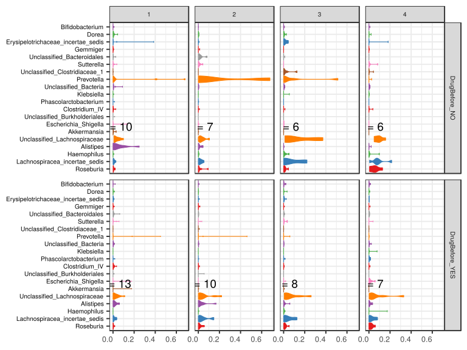

noone@mail.com
Analysis of Dieting study 16S data
% Fri Sep  7 05:46:18 2018

##### \(1.6.1.3.5\) Plots of Abundance.

Plots are shown with relation to various combinations of meta 
                   data variables and in different graphical representations. Lots of plots here.

##### \(1.6.1.3.5.2\) Iterating over all combinations of grouping variables

##### \(1.6.1.3.5.2.1\) Grouping variables visit,Drug.Before.Diet

##### \(1.6.1.3.5.2.2\) Iterating over Abundance. profile sorting order

##### \(1.6.1.3.5.2.2.1\) Abundance. profile sorting order: average abundance

##### \(1.6.1.3.5.2.2.2\) Iterating over dodged vs faceted bars

The same data are shown in multiple combinations of graphical representations. 
                         This is the same data, but each plot highlights slightly different aspects of it.
                         It is not likely that you will need every plot - pick only what you need.

##### \(1.6.1.3.5.2.2.2.1\) faceted plots. Iterating over orientation and, optionally, scaling

##### \(1.6.1.3.5.2.2.2.1.1\) Abundance. Plot is in original orientation, Y axis SQRT scaled. Iterating over plot geometry

\(1.6.1.3.5.2.2.2.1.1.0\) [`Table 400.`](#table.400) Data table used for plots. Data grouped by visit,Drug.Before.Diet. Showing only 200 first rows. Full dataset is also saved in a delimited text file (click to download and open e.g. in Excel) [`data/1.6.1.3.5.2.2.2.1.1.0-32361f50f2d.1.6.1.3.5.2.2.2.1.1.csv`](data/1.6.1.3.5.2.2.2.1.1.0-32361f50f2d.1.6.1.3.5.2.2.2.1.1.csv)

| .record.id | visit | Drug.Before.Diet | feature                       | Abundance  |
|:-----------|:------|:-----------------|:------------------------------|:-----------|
| SM1        | 1     | DrugBefore\_YES  | Bacteroides                   | 7.735e\-01 |
| SM10       | 3     | DrugBefore\_YES  | Bacteroides                   | 2.364e\-01 |
| SM100      | 4     | DrugBefore\_YES  | Bacteroides                   | 5.420e\-01 |
| SM11       | 2     | DrugBefore\_YES  | Bacteroides                   | 8.578e\-01 |
| SM12       | 1     | DrugBefore\_YES  | Bacteroides                   | 8.674e\-01 |
| SM13       | 1     | DrugBefore\_NO   | Bacteroides                   | 4.295e\-01 |
| SM14       | 1     | DrugBefore\_NO   | Bacteroides                   | 3.976e\-02 |
| SM16       | 4     | DrugBefore\_NO   | Bacteroides                   | 3.890e\-01 |
| SM17       | 1     | DrugBefore\_YES  | Bacteroides                   | 8.130e\-01 |
| SM18       | 2     | DrugBefore\_NO   | Bacteroides                   | 6.537e\-01 |
| SM19       | 2     | DrugBefore\_NO   | Bacteroides                   | 2.221e\-01 |
| SM2        | 1     | DrugBefore\_NO   | Bacteroides                   | 8.611e\-01 |
| SM21       | 1     | DrugBefore\_NO   | Bacteroides                   | 4.490e\-01 |
| SM22       | 1     | DrugBefore\_YES  | Bacteroides                   | 5.831e\-01 |
| SM23       | 2     | DrugBefore\_YES  | Bacteroides                   | 2.796e\-01 |
| SM24       | 1     | DrugBefore\_NO   | Bacteroides                   | 1.435e\-01 |
| SM25       | 4     | DrugBefore\_NO   | Bacteroides                   | 4.520e\-01 |
| SM29       | 3     | DrugBefore\_YES  | Bacteroides                   | 9.002e\-01 |
| SM3        | 2     | DrugBefore\_YES  | Bacteroides                   | 2.542e\-01 |
| SM30       | 4     | DrugBefore\_YES  | Bacteroides                   | 6.581e\-02 |
| SM33       | 1     | DrugBefore\_YES  | Bacteroides                   | 1.747e\-01 |
| SM36       | 4     | DrugBefore\_NO   | Bacteroides                   | 3.219e\-04 |
| SM38       | 2     | DrugBefore\_YES  | Bacteroides                   | 9.828e\-01 |
| SM39       | 1     | DrugBefore\_NO   | Bacteroides                   | 4.095e\-01 |
| SM40       | 4     | DrugBefore\_NO   | Bacteroides                   | 6.908e\-01 |
| SM41       | 1     | DrugBefore\_YES  | Bacteroides                   | 5.037e\-01 |
| SM42       | 4     | DrugBefore\_NO   | Bacteroides                   | 6.901e\-01 |
| SM43       | 4     | DrugBefore\_YES  | Bacteroides                   | 6.589e\-01 |
| SM45       | 2     | DrugBefore\_NO   | Bacteroides                   | 0.000e\+00 |
| SM49       | 1     | DrugBefore\_YES  | Bacteroides                   | 9.292e\-01 |
| SM5        | 3     | DrugBefore\_YES  | Bacteroides                   | 5.313e\-01 |
| SM50       | 3     | DrugBefore\_NO   | Bacteroides                   | 0.000e\+00 |
| SM51       | 4     | DrugBefore\_YES  | Bacteroides                   | 7.122e\-01 |
| SM52       | 1     | DrugBefore\_NO   | Bacteroides                   | 8.105e\-02 |
| SM53       | 2     | DrugBefore\_YES  | Bacteroides                   | 3.305e\-01 |
| SM54       | 3     | DrugBefore\_YES  | Bacteroides                   | 6.239e\-01 |
| SM56       | 2     | DrugBefore\_YES  | Bacteroides                   | 1.958e\-02 |
| SM57       | 1     | DrugBefore\_YES  | Bacteroides                   | 8.679e\-01 |
| SM58       | 2     | DrugBefore\_NO   | Bacteroides                   | 2.592e\-02 |
| SM59       | 3     | DrugBefore\_NO   | Bacteroides                   | 5.206e\-02 |
| SM60       | 3     | DrugBefore\_YES  | Bacteroides                   | 8.428e\-01 |
| SM62       | 1     | DrugBefore\_YES  | Bacteroides                   | 9.643e\-01 |
| SM64       | 2     | DrugBefore\_YES  | Bacteroides                   | 6.977e\-01 |
| SM65       | 3     | DrugBefore\_YES  | Bacteroides                   | 3.711e\-01 |
| SM67       | 4     | DrugBefore\_YES  | Bacteroides                   | 5.778e\-01 |
| SM68       | 4     | DrugBefore\_NO   | Bacteroides                   | 1.440e\-01 |
| SM69       | 4     | DrugBefore\_YES  | Bacteroides                   | 8.051e\-01 |
| SM71       | 3     | DrugBefore\_YES  | Bacteroides                   | 8.388e\-01 |
| SM73       | 1     | DrugBefore\_NO   | Bacteroides                   | 8.108e\-01 |
| SM75       | 3     | DrugBefore\_NO   | Bacteroides                   | 2.377e\-03 |
| SM77       | 2     | DrugBefore\_YES  | Bacteroides                   | 7.039e\-01 |
| SM79       | 2     | DrugBefore\_NO   | Bacteroides                   | 1.173e\-01 |
| SM8        | 1     | DrugBefore\_NO   | Bacteroides                   | 7.723e\-01 |
| SM82       | 4     | DrugBefore\_YES  | Bacteroides                   | 8.624e\-01 |
| SM83       | 1     | DrugBefore\_YES  | Bacteroides                   | 8.199e\-01 |
| SM84       | 1     | DrugBefore\_YES  | Bacteroides                   | 2.885e\-01 |
| SM86       | 2     | DrugBefore\_YES  | Bacteroides                   | 2.482e\-03 |
| SM87       | 1     | DrugBefore\_YES  | Bacteroides                   | 5.438e\-01 |
| SM88       | 2     | DrugBefore\_YES  | Bacteroides                   | 7.940e\-01 |
| SM9        | 2     | DrugBefore\_NO   | Bacteroides                   | 6.096e\-01 |
| SM90       | 2     | DrugBefore\_NO   | Bacteroides                   | 4.088e\-01 |
| SM91       | 3     | DrugBefore\_YES  | Bacteroides                   | 6.525e\-01 |
| SM92       | 3     | DrugBefore\_NO   | Bacteroides                   | 7.921e\-01 |
| SM93       | 1     | DrugBefore\_YES  | Bacteroides                   | 6.404e\-01 |
| SM96       | 1     | DrugBefore\_NO   | Bacteroides                   | 6.375e\-01 |
| SM98       | 3     | DrugBefore\_NO   | Bacteroides                   | 2.848e\-01 |
| SM99       | 3     | DrugBefore\_NO   | Bacteroides                   | 6.503e\-01 |
| SM1        | 1     | DrugBefore\_YES  | Prevotella                    | 2.598e\-04 |
| SM10       | 3     | DrugBefore\_YES  | Prevotella                    | 0.000e\+00 |
| SM100      | 4     | DrugBefore\_YES  | Prevotella                    | 7.692e\-05 |
| SM11       | 2     | DrugBefore\_YES  | Prevotella                    | 3.477e\-04 |
| SM12       | 1     | DrugBefore\_YES  | Prevotella                    | 1.328e\-04 |
| SM13       | 1     | DrugBefore\_NO   | Prevotella                    | 1.652e\-02 |
| SM14       | 1     | DrugBefore\_NO   | Prevotella                    | 1.855e\-02 |
| SM16       | 4     | DrugBefore\_NO   | Prevotella                    | 0.000e\+00 |
| SM17       | 1     | DrugBefore\_YES  | Prevotella                    | 4.137e\-04 |
| SM18       | 2     | DrugBefore\_NO   | Prevotella                    | 3.357e\-04 |
| SM19       | 2     | DrugBefore\_NO   | Prevotella                    | 2.314e\-03 |
| SM2        | 1     | DrugBefore\_NO   | Prevotella                    | 2.480e\-04 |
| SM21       | 1     | DrugBefore\_NO   | Prevotella                    | 0.000e\+00 |
| SM22       | 1     | DrugBefore\_YES  | Prevotella                    | 0.000e\+00 |
| SM23       | 2     | DrugBefore\_YES  | Prevotella                    | 0.000e\+00 |
| SM24       | 1     | DrugBefore\_NO   | Prevotella                    | 6.822e\-01 |
| SM25       | 4     | DrugBefore\_NO   | Prevotella                    | 0.000e\+00 |
| SM29       | 3     | DrugBefore\_YES  | Prevotella                    | 0.000e\+00 |
| SM3        | 2     | DrugBefore\_YES  | Prevotella                    | 4.458e\-02 |
| SM30       | 4     | DrugBefore\_YES  | Prevotella                    | 2.762e\-03 |
| SM33       | 1     | DrugBefore\_YES  | Prevotella                    | 0.000e\+00 |
| SM36       | 4     | DrugBefore\_NO   | Prevotella                    | 0.000e\+00 |
| SM38       | 2     | DrugBefore\_YES  | Prevotella                    | 1.028e\-04 |
| SM39       | 1     | DrugBefore\_NO   | Prevotella                    | 4.073e\-01 |
| SM40       | 4     | DrugBefore\_NO   | Prevotella                    | 2.775e\-04 |
| SM41       | 1     | DrugBefore\_YES  | Prevotella                    | 0.000e\+00 |
| SM42       | 4     | DrugBefore\_NO   | Prevotella                    | 4.994e\-04 |
| SM43       | 4     | DrugBefore\_YES  | Prevotella                    | 7.452e\-05 |
| SM45       | 2     | DrugBefore\_NO   | Prevotella                    | 0.000e\+00 |
| SM49       | 1     | DrugBefore\_YES  | Prevotella                    | 0.000e\+00 |
| SM5        | 3     | DrugBefore\_YES  | Prevotella                    | 5.950e\-02 |
| SM50       | 3     | DrugBefore\_NO   | Prevotella                    | 0.000e\+00 |
| SM51       | 4     | DrugBefore\_YES  | Prevotella                    | 2.231e\-04 |
| SM52       | 1     | DrugBefore\_NO   | Prevotella                    | 8.062e\-03 |
| SM53       | 2     | DrugBefore\_YES  | Prevotella                    | 4.611e\-01 |
| SM54       | 3     | DrugBefore\_YES  | Prevotella                    | 0.000e\+00 |
| SM56       | 2     | DrugBefore\_YES  | Prevotella                    | 0.000e\+00 |
| SM57       | 1     | DrugBefore\_YES  | Prevotella                    | 3.600e\-04 |
| SM58       | 2     | DrugBefore\_NO   | Prevotella                    | 6.582e\-01 |
| SM59       | 3     | DrugBefore\_NO   | Prevotella                    | 0.000e\+00 |
| SM60       | 3     | DrugBefore\_YES  | Prevotella                    | 3.404e\-04 |
| SM62       | 1     | DrugBefore\_YES  | Prevotella                    | 0.000e\+00 |
| SM64       | 2     | DrugBefore\_YES  | Prevotella                    | 1.113e\-04 |
| SM65       | 3     | DrugBefore\_YES  | Prevotella                    | 1.374e\-04 |
| SM67       | 4     | DrugBefore\_YES  | Prevotella                    | 0.000e\+00 |
| SM68       | 4     | DrugBefore\_NO   | Prevotella                    | 2.586e\-02 |
| SM69       | 4     | DrugBefore\_YES  | Prevotella                    | 3.108e\-04 |
| SM71       | 3     | DrugBefore\_YES  | Prevotella                    | 1.723e\-03 |
| SM73       | 1     | DrugBefore\_NO   | Prevotella                    | 1.009e\-04 |
| SM75       | 3     | DrugBefore\_NO   | Prevotella                    | 0.000e\+00 |
| SM77       | 2     | DrugBefore\_YES  | Prevotella                    | 1.127e\-04 |
| SM79       | 2     | DrugBefore\_NO   | Prevotella                    | 6.782e\-01 |
| SM8        | 1     | DrugBefore\_NO   | Prevotella                    | 7.416e\-04 |
| SM82       | 4     | DrugBefore\_YES  | Prevotella                    | 2.141e\-04 |
| SM83       | 1     | DrugBefore\_YES  | Prevotella                    | 0.000e\+00 |
| SM84       | 1     | DrugBefore\_YES  | Prevotella                    | 4.502e\-01 |
| SM86       | 2     | DrugBefore\_YES  | Prevotella                    | 3.103e\-04 |
| SM87       | 1     | DrugBefore\_YES  | Prevotella                    | 1.804e\-01 |
| SM88       | 2     | DrugBefore\_YES  | Prevotella                    | 1.705e\-04 |
| SM9        | 2     | DrugBefore\_NO   | Prevotella                    | 8.227e\-04 |
| SM90       | 2     | DrugBefore\_NO   | Prevotella                    | 5.776e\-03 |
| SM91       | 3     | DrugBefore\_YES  | Prevotella                    | 2.212e\-04 |
| SM92       | 3     | DrugBefore\_NO   | Prevotella                    | 9.411e\-02 |
| SM93       | 1     | DrugBefore\_YES  | Prevotella                    | 0.000e\+00 |
| SM96       | 1     | DrugBefore\_NO   | Prevotella                    | 0.000e\+00 |
| SM98       | 3     | DrugBefore\_NO   | Prevotella                    | 5.140e\-01 |
| SM99       | 3     | DrugBefore\_NO   | Prevotella                    | 4.757e\-04 |
| SM1        | 1     | DrugBefore\_YES  | Unclassified\_Lachnospiraceae | 4.529e\-02 |
| SM10       | 3     | DrugBefore\_YES  | Unclassified\_Lachnospiraceae | 2.607e\-01 |
| SM100      | 4     | DrugBefore\_YES  | Unclassified\_Lachnospiraceae | 1.308e\-01 |
| SM11       | 2     | DrugBefore\_YES  | Unclassified\_Lachnospiraceae | 4.404e\-03 |
| SM12       | 1     | DrugBefore\_YES  | Unclassified\_Lachnospiraceae | 1.049e\-02 |
| SM13       | 1     | DrugBefore\_NO   | Unclassified\_Lachnospiraceae | 1.116e\-02 |
| SM14       | 1     | DrugBefore\_NO   | Unclassified\_Lachnospiraceae | 6.172e\-02 |
| SM16       | 4     | DrugBefore\_NO   | Unclassified\_Lachnospiraceae | 1.583e\-01 |
| SM17       | 1     | DrugBefore\_YES  | Unclassified\_Lachnospiraceae | 2.938e\-02 |
| SM18       | 2     | DrugBefore\_NO   | Unclassified\_Lachnospiraceae | 5.271e\-02 |
| SM19       | 2     | DrugBefore\_NO   | Unclassified\_Lachnospiraceae | 1.055e\-01 |
| SM2        | 1     | DrugBefore\_NO   | Unclassified\_Lachnospiraceae | 1.097e\-02 |
| SM21       | 1     | DrugBefore\_NO   | Unclassified\_Lachnospiraceae | 5.532e\-02 |
| SM22       | 1     | DrugBefore\_YES  | Unclassified\_Lachnospiraceae | 1.113e\-01 |
| SM23       | 2     | DrugBefore\_YES  | Unclassified\_Lachnospiraceae | 4.148e\-04 |
| SM24       | 1     | DrugBefore\_NO   | Unclassified\_Lachnospiraceae | 1.402e\-02 |
| SM25       | 4     | DrugBefore\_NO   | Unclassified\_Lachnospiraceae | 8.430e\-02 |
| SM29       | 3     | DrugBefore\_YES  | Unclassified\_Lachnospiraceae | 1.128e\-02 |
| SM3        | 2     | DrugBefore\_YES  | Unclassified\_Lachnospiraceae | 1.560e\-01 |
| SM30       | 4     | DrugBefore\_YES  | Unclassified\_Lachnospiraceae | 3.297e\-01 |
| SM33       | 1     | DrugBefore\_YES  | Unclassified\_Lachnospiraceae | 3.934e\-03 |
| SM36       | 4     | DrugBefore\_NO   | Unclassified\_Lachnospiraceae | 1.023e\-01 |
| SM38       | 2     | DrugBefore\_YES  | Unclassified\_Lachnospiraceae | 1.130e\-03 |
| SM39       | 1     | DrugBefore\_NO   | Unclassified\_Lachnospiraceae | 1.135e\-02 |
| SM40       | 4     | DrugBefore\_NO   | Unclassified\_Lachnospiraceae | 4.930e\-02 |
| SM41       | 1     | DrugBefore\_YES  | Unclassified\_Lachnospiraceae | 2.995e\-02 |
| SM42       | 4     | DrugBefore\_NO   | Unclassified\_Lachnospiraceae | 5.327e\-02 |
| SM43       | 4     | DrugBefore\_YES  | Unclassified\_Lachnospiraceae | 3.264e\-02 |
| SM45       | 2     | DrugBefore\_NO   | Unclassified\_Lachnospiraceae | 0.000e\+00 |
| SM49       | 1     | DrugBefore\_YES  | Unclassified\_Lachnospiraceae | 6.331e\-03 |
| SM5        | 3     | DrugBefore\_YES  | Unclassified\_Lachnospiraceae | 2.178e\-02 |
| SM50       | 3     | DrugBefore\_NO   | Unclassified\_Lachnospiraceae | 3.918e\-02 |
| SM51       | 4     | DrugBefore\_YES  | Unclassified\_Lachnospiraceae | 3.993e\-02 |
| SM52       | 1     | DrugBefore\_NO   | Unclassified\_Lachnospiraceae | 9.925e\-02 |
| SM53       | 2     | DrugBefore\_YES  | Unclassified\_Lachnospiraceae | 5.682e\-02 |
| SM54       | 3     | DrugBefore\_YES  | Unclassified\_Lachnospiraceae | 5.786e\-02 |
| SM56       | 2     | DrugBefore\_YES  | Unclassified\_Lachnospiraceae | 3.916e\-02 |
| SM57       | 1     | DrugBefore\_YES  | Unclassified\_Lachnospiraceae | 3.240e\-03 |
| SM58       | 2     | DrugBefore\_NO   | Unclassified\_Lachnospiraceae | 1.895e\-02 |
| SM59       | 3     | DrugBefore\_NO   | Unclassified\_Lachnospiraceae | 2.981e\-01 |
| SM60       | 3     | DrugBefore\_YES  | Unclassified\_Lachnospiraceae | 1.361e\-02 |
| SM62       | 1     | DrugBefore\_YES  | Unclassified\_Lachnospiraceae | 1.204e\-03 |
| SM64       | 2     | DrugBefore\_YES  | Unclassified\_Lachnospiraceae | 1.019e\-02 |
| SM65       | 3     | DrugBefore\_YES  | Unclassified\_Lachnospiraceae | 1.502e\-01 |
| SM67       | 4     | DrugBefore\_YES  | Unclassified\_Lachnospiraceae | 3.912e\-02 |
| SM68       | 4     | DrugBefore\_NO   | Unclassified\_Lachnospiraceae | 1.044e\-01 |
| SM69       | 4     | DrugBefore\_YES  | Unclassified\_Lachnospiraceae | 1.710e\-03 |
| SM71       | 3     | DrugBefore\_YES  | Unclassified\_Lachnospiraceae | 5.249e\-03 |
| SM73       | 1     | DrugBefore\_NO   | Unclassified\_Lachnospiraceae | 8.278e\-03 |
| SM75       | 3     | DrugBefore\_NO   | Unclassified\_Lachnospiraceae | 3.718e\-01 |
| SM77       | 2     | DrugBefore\_YES  | Unclassified\_Lachnospiraceae | 4.799e\-02 |
| SM79       | 2     | DrugBefore\_NO   | Unclassified\_Lachnospiraceae | 2.075e\-02 |
| SM8        | 1     | DrugBefore\_NO   | Unclassified\_Lachnospiraceae | 1.112e\-02 |
| SM82       | 4     | DrugBefore\_YES  | Unclassified\_Lachnospiraceae | 5.168e\-03 |
| SM83       | 1     | DrugBefore\_YES  | Unclassified\_Lachnospiraceae | 3.899e\-02 |
| SM84       | 1     | DrugBefore\_YES  | Unclassified\_Lachnospiraceae | 1.844e\-03 |
| SM86       | 2     | DrugBefore\_YES  | Unclassified\_Lachnospiraceae | 2.203e\-01 |
| SM87       | 1     | DrugBefore\_YES  | Unclassified\_Lachnospiraceae | 0.000e\+00 |
| SM88       | 2     | DrugBefore\_YES  | Unclassified\_Lachnospiraceae | 2.660e\-02 |
| SM9        | 2     | DrugBefore\_NO   | Unclassified\_Lachnospiraceae | 1.275e\-02 |
| SM90       | 2     | DrugBefore\_NO   | Unclassified\_Lachnospiraceae | 3.795e\-02 |
| SM91       | 3     | DrugBefore\_YES  | Unclassified\_Lachnospiraceae | 6.525e\-02 |
| SM92       | 3     | DrugBefore\_NO   | Unclassified\_Lachnospiraceae | 3.871e\-02 |
| SM93       | 1     | DrugBefore\_YES  | Unclassified\_Lachnospiraceae | 6.495e\-02 |
| SM96       | 1     | DrugBefore\_NO   | Unclassified\_Lachnospiraceae | 4.444e\-02 |
| SM98       | 3     | DrugBefore\_NO   | Unclassified\_Lachnospiraceae | 1.239e\-02 |

\(1.6.1.3.5.2.2.2.1.1.1\) [`Widget 414.`](#widget.414) Dynamic Pivot Table link (drag and drop field names and pick averaging 
                      functions or plot types; click on fields or legend elements to filter values). 
                      Starting rendering is Stacked Bar Chart. Data grouped by visit,Drug.Before.Diet. Click to see HTML widget file in full window: [`./1.6.1.3.5.2.2.2.1.1.1-3235aa77a63Dynamic.Pivot.Table.html`](./1.6.1.3.5.2.2.2.1.1.1-3235aa77a63Dynamic.Pivot.Table.html)

\(1.6.1.3.5.2.2.2.1.1.1\) [`Widget 415.`](#widget.415) Dynamic Pivot Table link (drag and drop field names and pick averaging 
                      functions or plot types; click on fields or legend elements to filter values). 
                      Starting rendering is Table Barchart. Data grouped by visit,Drug.Before.Diet. Click to see HTML widget file in full window: [`./1.6.1.3.5.2.2.2.1.1.1-323e06f298Dynamic.Pivot.Table.html`](./1.6.1.3.5.2.2.2.1.1.1-323e06f298Dynamic.Pivot.Table.html)

\(1.6.1.3.5.2.2.2.1.1.1\) [`Table 401.`](#table.401) Summary table. Data grouped by visit,Drug.Before.Diet. Showing only 200 first rows. Full dataset is also saved in a delimited text file (click to download and open e.g. in Excel) [`data/1.6.1.3.5.2.2.2.1.1.1-32314348468.1.6.1.3.5.2.2.2.1.1.csv`](data/1.6.1.3.5.2.2.2.1.1.1-32314348468.1.6.1.3.5.2.2.2.1.1.csv)

| feature                              | visit | Drug.Before.Diet | mean       | sd         | median     | incidence |
|:-------------------------------------|:------|:-----------------|:-----------|:-----------|:-----------|:----------|
| Bacteroides                          | 1     | DrugBefore\_NO   | 4.634e\-01 | 3.049e\-01 | 4.392e\-01 | 1.00000   |
| Bacteroides                          | 1     | DrugBefore\_YES  | 6.746e\-01 | 2.463e\-01 | 7.735e\-01 | 1.00000   |
| Bacteroides                          | 2     | DrugBefore\_NO   | 2.911e\-01 | 2.698e\-01 | 2.221e\-01 | 0.85714   |
| Bacteroides                          | 2     | DrugBefore\_YES  | 4.923e\-01 | 3.565e\-01 | 5.141e\-01 | 1.00000   |
| Bacteroides                          | 3     | DrugBefore\_NO   | 2.969e\-01 | 3.479e\-01 | 1.684e\-01 | 0.83333   |
| Bacteroides                          | 3     | DrugBefore\_YES  | 6.246e\-01 | 2.372e\-01 | 6.382e\-01 | 1.00000   |
| Bacteroides                          | 4     | DrugBefore\_NO   | 3.944e\-01 | 2.816e\-01 | 4.205e\-01 | 1.00000   |
| Bacteroides                          | 4     | DrugBefore\_YES  | 6.035e\-01 | 2.634e\-01 | 6.589e\-01 | 1.00000   |
| Prevotella                           | 1     | DrugBefore\_NO   | 1.134e\-01 | 2.365e\-01 | 4.402e\-03 | 0.80000   |
| Prevotella                           | 1     | DrugBefore\_YES  | 4.860e\-02 | 1.305e\-01 | 0.000e\+00 | 0.46154   |
| Prevotella                           | 2     | DrugBefore\_NO   | 1.922e\-01 | 3.252e\-01 | 2.314e\-03 | 0.85714   |
| Prevotella                           | 2     | DrugBefore\_YES  | 5.068e\-02 | 1.449e\-01 | 1.416e\-04 | 0.80000   |
| Prevotella                           | 3     | DrugBefore\_NO   | 1.014e\-01 | 2.056e\-01 | 2.378e\-04 | 0.50000   |
| Prevotella                           | 3     | DrugBefore\_YES  | 7.740e\-03 | 2.092e\-02 | 1.793e\-04 | 0.62500   |
| Prevotella                           | 4     | DrugBefore\_NO   | 4.440e\-03 | 1.050e\-02 | 1.387e\-04 | 0.50000   |
| Prevotella                           | 4     | DrugBefore\_YES  | 5.231e\-04 | 9.932e\-04 | 2.141e\-04 | 0.85714   |
| Unclassified\_Lachnospiraceae        | 1     | DrugBefore\_NO   | 3.276e\-02 | 3.113e\-02 | 1.269e\-02 | 1.00000   |
| Unclassified\_Lachnospiraceae        | 1     | DrugBefore\_YES  | 2.669e\-02 | 3.274e\-02 | 1.049e\-02 | 0.92308   |
| Unclassified\_Lachnospiraceae        | 2     | DrugBefore\_NO   | 3.552e\-02 | 3.529e\-02 | 2.075e\-02 | 0.85714   |
| Unclassified\_Lachnospiraceae        | 2     | DrugBefore\_YES  | 5.630e\-02 | 7.384e\-02 | 3.288e\-02 | 1.00000   |
| Unclassified\_Lachnospiraceae        | 3     | DrugBefore\_NO   | 1.344e\-01 | 1.575e\-01 | 4.278e\-02 | 1.00000   |
| Unclassified\_Lachnospiraceae        | 3     | DrugBefore\_YES  | 7.323e\-02 | 8.946e\-02 | 3.982e\-02 | 1.00000   |
| Unclassified\_Lachnospiraceae        | 4     | DrugBefore\_NO   | 9.198e\-02 | 4.009e\-02 | 9.333e\-02 | 1.00000   |
| Unclassified\_Lachnospiraceae        | 4     | DrugBefore\_YES  | 8.273e\-02 | 1.170e\-01 | 3.912e\-02 | 1.00000   |
| Faecalibacterium                     | 1     | DrugBefore\_NO   | 3.876e\-02 | 4.038e\-02 | 2.495e\-02 | 1.00000   |
| Faecalibacterium                     | 1     | DrugBefore\_YES  | 1.846e\-02 | 1.438e\-02 | 1.267e\-02 | 0.92308   |
| Faecalibacterium                     | 2     | DrugBefore\_NO   | 7.169e\-02 | 1.285e\-01 | 1.664e\-02 | 0.85714   |
| Faecalibacterium                     | 2     | DrugBefore\_YES  | 5.171e\-02 | 1.083e\-01 | 1.129e\-02 | 0.90000   |
| Faecalibacterium                     | 3     | DrugBefore\_NO   | 2.433e\-02 | 2.073e\-02 | 1.749e\-02 | 1.00000   |
| Faecalibacterium                     | 3     | DrugBefore\_YES  | 4.364e\-02 | 4.948e\-02 | 2.507e\-02 | 1.00000   |
| Faecalibacterium                     | 4     | DrugBefore\_NO   | 9.878e\-02 | 9.939e\-02 | 6.677e\-02 | 1.00000   |
| Faecalibacterium                     | 4     | DrugBefore\_YES  | 3.871e\-02 | 4.144e\-02 | 1.950e\-02 | 1.00000   |
| Parabacteroides                      | 1     | DrugBefore\_NO   | 1.024e\-02 | 1.289e\-02 | 2.166e\-03 | 0.80000   |
| Parabacteroides                      | 1     | DrugBefore\_YES  | 5.820e\-02 | 1.381e\-01 | 7.199e\-03 | 0.69231   |
| Parabacteroides                      | 2     | DrugBefore\_NO   | 2.816e\-02 | 5.131e\-02 | 1.370e\-03 | 0.85714   |
| Parabacteroides                      | 2     | DrugBefore\_YES  | 7.576e\-02 | 2.222e\-01 | 5.432e\-04 | 0.80000   |
| Parabacteroides                      | 3     | DrugBefore\_NO   | 8.124e\-03 | 1.641e\-02 | 0.000e\+00 | 0.33333   |
| Parabacteroides                      | 3     | DrugBefore\_YES  | 5.231e\-02 | 7.215e\-02 | 1.782e\-02 | 0.87500   |
| Parabacteroides                      | 4     | DrugBefore\_NO   | 2.621e\-03 | 5.406e\-03 | 1.849e\-04 | 0.66667   |
| Parabacteroides                      | 4     | DrugBefore\_YES  | 6.228e\-02 | 1.228e\-01 | 2.231e\-04 | 0.71429   |
| Lachnospiracea\_incertae\_sedis      | 1     | DrugBefore\_NO   | 9.291e\-03 | 8.958e\-03 | 6.378e\-03 | 1.00000   |
| Lachnospiracea\_incertae\_sedis      | 1     | DrugBefore\_YES  | 1.085e\-02 | 1.317e\-02 | 3.240e\-03 | 0.84615   |
| Lachnospiracea\_incertae\_sedis      | 2     | DrugBefore\_NO   | 1.942e\-02 | 1.950e\-02 | 1.145e\-02 | 0.85714   |
| Lachnospiracea\_incertae\_sedis      | 2     | DrugBefore\_YES  | 4.535e\-02 | 5.535e\-02 | 2.253e\-02 | 0.90000   |
| Lachnospiracea\_incertae\_sedis      | 3     | DrugBefore\_NO   | 7.174e\-02 | 1.013e\-01 | 1.093e\-02 | 1.00000   |
| Lachnospiracea\_incertae\_sedis      | 3     | DrugBefore\_YES  | 4.177e\-02 | 4.937e\-02 | 2.248e\-02 | 0.87500   |
| Lachnospiracea\_incertae\_sedis      | 4     | DrugBefore\_NO   | 8.868e\-02 | 6.950e\-02 | 7.666e\-02 | 1.00000   |
| Lachnospiracea\_incertae\_sedis      | 4     | DrugBefore\_YES  | 2.672e\-02 | 3.288e\-02 | 1.450e\-02 | 0.85714   |
| Alistipes                            | 1     | DrugBefore\_NO   | 5.269e\-02 | 7.947e\-02 | 1.928e\-02 | 0.70000   |
| Alistipes                            | 1     | DrugBefore\_YES  | 1.696e\-02 | 2.078e\-02 | 9.784e\-03 | 0.69231   |
| Alistipes                            | 2     | DrugBefore\_NO   | 1.185e\-02 | 1.874e\-02 | 6.851e\-04 | 0.57143   |
| Alistipes                            | 2     | DrugBefore\_YES  | 2.759e\-02 | 5.265e\-02 | 0.000e\+00 | 0.40000   |
| Alistipes                            | 3     | DrugBefore\_NO   | 8.739e\-04 | 2.141e\-03 | 0.000e\+00 | 0.16667   |
| Alistipes                            | 3     | DrugBefore\_YES  | 1.056e\-02 | 2.049e\-02 | 1.516e\-03 | 0.62500   |
| Alistipes                            | 4     | DrugBefore\_NO   | 4.068e\-03 | 8.729e\-03 | 4.160e\-04 | 0.50000   |
| Alistipes                            | 4     | DrugBefore\_YES  | 9.648e\-03 | 1.404e\-02 | 2.660e\-03 | 0.57143   |
| Blautia                              | 1     | DrugBefore\_NO   | 1.828e\-02 | 2.097e\-02 | 5.935e\-03 | 1.00000   |
| Blautia                              | 1     | DrugBefore\_YES  | 7.798e\-03 | 1.057e\-02 | 3.143e\-03 | 0.92308   |
| Blautia                              | 2     | DrugBefore\_NO   | 1.872e\-02 | 3.047e\-02 | 2.936e\-03 | 0.85714   |
| Blautia                              | 2     | DrugBefore\_YES  | 1.865e\-02 | 3.688e\-02 | 8.351e\-03 | 0.80000   |
| Blautia                              | 3     | DrugBefore\_NO   | 3.677e\-02 | 3.608e\-02 | 2.566e\-02 | 1.00000   |
| Blautia                              | 3     | DrugBefore\_YES  | 1.381e\-02 | 1.440e\-02 | 9.423e\-03 | 1.00000   |
| Blautia                              | 4     | DrugBefore\_NO   | 1.189e\-02 | 8.838e\-03 | 8.247e\-03 | 1.00000   |
| Blautia                              | 4     | DrugBefore\_YES  | 1.700e\-02 | 2.588e\-02 | 6.334e\-03 | 1.00000   |
| Roseburia                            | 1     | DrugBefore\_NO   | 7.028e\-03 | 7.428e\-03 | 3.183e\-03 | 1.00000   |
| Roseburia                            | 1     | DrugBefore\_YES  | 3.915e\-03 | 5.016e\-03 | 2.110e\-03 | 0.76923   |
| Roseburia                            | 2     | DrugBefore\_NO   | 1.860e\-02 | 3.406e\-02 | 3.861e\-03 | 0.85714   |
| Roseburia                            | 2     | DrugBefore\_YES  | 1.514e\-02 | 1.970e\-02 | 6.342e\-03 | 1.00000   |
| Roseburia                            | 3     | DrugBefore\_NO   | 1.395e\-02 | 1.660e\-02 | 9.751e\-03 | 1.00000   |
| Roseburia                            | 3     | DrugBefore\_YES  | 1.537e\-02 | 1.691e\-02 | 1.115e\-02 | 1.00000   |
| Roseburia                            | 4     | DrugBefore\_NO   | 5.491e\-02 | 4.492e\-02 | 5.431e\-02 | 1.00000   |
| Roseburia                            | 4     | DrugBefore\_YES  | 2.036e\-02 | 2.166e\-02 | 2.208e\-02 | 1.00000   |
| Unclassified\_Clostridiales          | 1     | DrugBefore\_NO   | 1.711e\-02 | 1.800e\-02 | 8.182e\-03 | 1.00000   |
| Unclassified\_Clostridiales          | 1     | DrugBefore\_YES  | 6.632e\-03 | 8.900e\-03 | 6.030e\-03 | 1.00000   |
| Unclassified\_Clostridiales          | 2     | DrugBefore\_NO   | 1.125e\-02 | 1.229e\-02 | 8.058e\-03 | 0.85714   |
| Unclassified\_Clostridiales          | 2     | DrugBefore\_YES  | 8.688e\-03 | 1.226e\-02 | 4.161e\-03 | 0.90000   |
| Unclassified\_Clostridiales          | 3     | DrugBefore\_NO   | 5.322e\-02 | 9.895e\-02 | 1.471e\-02 | 1.00000   |
| Unclassified\_Clostridiales          | 3     | DrugBefore\_YES  | 1.341e\-02 | 1.283e\-02 | 9.805e\-03 | 1.00000   |
| Unclassified\_Clostridiales          | 4     | DrugBefore\_NO   | 2.119e\-02 | 2.066e\-02 | 1.448e\-02 | 1.00000   |
| Unclassified\_Clostridiales          | 4     | DrugBefore\_YES  | 6.315e\-03 | 5.937e\-03 | 5.354e\-03 | 1.00000   |
| Lactobacillus                        | 1     | DrugBefore\_NO   | 8.034e\-04 | 1.696e\-03 | 0.000e\+00 | 0.40000   |
| Lactobacillus                        | 1     | DrugBefore\_YES  | 0.000e\+00 | 0.000e\+00 | 0.000e\+00 | 0.00000   |
| Lactobacillus                        | 2     | DrugBefore\_NO   | 1.426e\-01 | 3.768e\-01 | 0.000e\+00 | 0.28571   |
| Lactobacillus                        | 2     | DrugBefore\_YES  | 1.384e\-04 | 3.240e\-04 | 0.000e\+00 | 0.30000   |
| Lactobacillus                        | 3     | DrugBefore\_NO   | 8.881e\-04 | 1.905e\-03 | 2.458e\-05 | 0.50000   |
| Lactobacillus                        | 3     | DrugBefore\_YES  | 0.000e\+00 | 0.000e\+00 | 0.000e\+00 | 0.00000   |
| Lactobacillus                        | 4     | DrugBefore\_NO   | 1.086e\-03 | 2.200e\-03 | 1.609e\-04 | 0.50000   |
| Lactobacillus                        | 4     | DrugBefore\_YES  | 0.000e\+00 | 0.000e\+00 | 0.000e\+00 | 0.00000   |
| Clostridium\_XI                      | 1     | DrugBefore\_NO   | 3.278e\-02 | 6.673e\-02 | 3.583e\-03 | 0.90000   |
| Clostridium\_XI                      | 1     | DrugBefore\_YES  | 5.585e\-03 | 1.194e\-02 | 1.655e\-03 | 0.76923   |
| Clostridium\_XI                      | 2     | DrugBefore\_NO   | 4.192e\-03 | 6.009e\-03 | 2.854e\-03 | 0.57143   |
| Clostridium\_XI                      | 2     | DrugBefore\_YES  | 1.709e\-02 | 4.566e\-02 | 1.260e\-03 | 0.90000   |
| Clostridium\_XI                      | 3     | DrugBefore\_NO   | 4.168e\-03 | 5.149e\-03 | 2.607e\-03 | 0.83333   |
| Clostridium\_XI                      | 3     | DrugBefore\_YES  | 8.726e\-03 | 1.128e\-02 | 2.379e\-03 | 1.00000   |
| Clostridium\_XI                      | 4     | DrugBefore\_NO   | 3.122e\-02 | 4.815e\-02 | 1.455e\-02 | 1.00000   |
| Clostridium\_XI                      | 4     | DrugBefore\_YES  | 1.728e\-02 | 2.154e\-02 | 5.589e\-03 | 1.00000   |
| Erysipelotrichaceae\_incertae\_sedis | 1     | DrugBefore\_NO   | 4.282e\-02 | 1.209e\-01 | 1.055e\-03 | 0.80000   |
| Erysipelotrichaceae\_incertae\_sedis | 1     | DrugBefore\_YES  | 2.576e\-03 | 3.115e\-03 | 1.373e\-03 | 0.69231   |
| Erysipelotrichaceae\_incertae\_sedis | 2     | DrugBefore\_NO   | 1.497e\-03 | 2.797e\-03 | 1.957e\-04 | 0.57143   |
| Erysipelotrichaceae\_incertae\_sedis | 2     | DrugBefore\_YES  | 1.907e\-03 | 3.034e\-03 | 5.660e\-04 | 1.00000   |
| Erysipelotrichaceae\_incertae\_sedis | 3     | DrugBefore\_NO   | 1.465e\-02 | 1.880e\-02 | 6.028e\-03 | 1.00000   |
| Erysipelotrichaceae\_incertae\_sedis | 3     | DrugBefore\_YES  | 5.662e\-03 | 8.182e\-03 | 2.557e\-03 | 1.00000   |
| Erysipelotrichaceae\_incertae\_sedis | 4     | DrugBefore\_NO   | 3.076e\-02 | 7.402e\-02 | 2.127e\-04 | 0.66667   |
| Erysipelotrichaceae\_incertae\_sedis | 4     | DrugBefore\_YES  | 1.908e\-03 | 1.198e\-03 | 2.231e\-03 | 1.00000   |
| Enterococcus                         | 1     | DrugBefore\_NO   | 7.389e\-03 | 2.263e\-02 | 5.447e\-05 | 0.50000   |
| Enterococcus                         | 1     | DrugBefore\_YES  | 3.162e\-04 | 9.135e\-04 | 0.000e\+00 | 0.23077   |
| Enterococcus                         | 2     | DrugBefore\_NO   | 4.235e\-04 | 6.395e\-04 | 0.000e\+00 | 0.42857   |
| Enterococcus                         | 2     | DrugBefore\_YES  | 7.148e\-02 | 2.245e\-01 | 0.000e\+00 | 0.40000   |
| Enterococcus                         | 3     | DrugBefore\_NO   | 3.121e\-04 | 7.645e\-04 | 0.000e\+00 | 0.16667   |
| Enterococcus                         | 3     | DrugBefore\_YES  | 2.586e\-04 | 4.652e\-04 | 0.000e\+00 | 0.37500   |
| Enterococcus                         | 4     | DrugBefore\_NO   | 5.194e\-05 | 1.272e\-04 | 0.000e\+00 | 0.16667   |
| Enterococcus                         | 4     | DrugBefore\_YES  | 5.191e\-04 | 9.098e\-04 | 0.000e\+00 | 0.28571   |
| Unclassified\_Ruminococcaceae        | 1     | DrugBefore\_NO   | 1.774e\-02 | 3.797e\-02 | 5.337e\-03 | 1.00000   |
| Unclassified\_Ruminococcaceae        | 1     | DrugBefore\_YES  | 8.291e\-03 | 7.539e\-03 | 6.698e\-03 | 1.00000   |
| Unclassified\_Ruminococcaceae        | 2     | DrugBefore\_NO   | 8.976e\-03 | 1.262e\-02 | 3.861e\-03 | 0.85714   |
| Unclassified\_Ruminococcaceae        | 2     | DrugBefore\_YES  | 3.945e\-03 | 3.629e\-03 | 2.494e\-03 | 0.90000   |
| Unclassified\_Ruminococcaceae        | 3     | DrugBefore\_NO   | 8.313e\-03 | 1.001e\-02 | 4.539e\-03 | 1.00000   |
| Unclassified\_Ruminococcaceae        | 3     | DrugBefore\_YES  | 4.088e\-03 | 5.283e\-03 | 2.960e\-03 | 1.00000   |
| Unclassified\_Ruminococcaceae        | 4     | DrugBefore\_NO   | 1.269e\-02 | 1.408e\-02 | 7.225e\-03 | 1.00000   |
| Unclassified\_Ruminococcaceae        | 4     | DrugBefore\_YES  | 5.241e\-03 | 9.406e\-03 | 2.293e\-03 | 1.00000   |
| Sutterella                           | 1     | DrugBefore\_NO   | 5.495e\-03 | 1.166e\-02 | 1.302e\-04 | 0.70000   |
| Sutterella                           | 1     | DrugBefore\_YES  | 7.355e\-03 | 1.737e\-02 | 0.000e\+00 | 0.38462   |
| Sutterella                           | 2     | DrugBefore\_NO   | 9.702e\-03 | 1.627e\-02 | 0.000e\+00 | 0.42857   |
| Sutterella                           | 2     | DrugBefore\_YES  | 5.365e\-03 | 1.176e\-02 | 0.000e\+00 | 0.20000   |
| Sutterella                           | 3     | DrugBefore\_NO   | 6.242e\-05 | 1.529e\-04 | 0.000e\+00 | 0.16667   |
| Sutterella                           | 3     | DrugBefore\_YES  | 8.784e\-03 | 1.627e\-02 | 0.000e\+00 | 0.25000   |
| Sutterella                           | 4     | DrugBefore\_NO   | 1.555e\-02 | 3.337e\-02 | 3.219e\-04 | 0.50000   |
| Sutterella                           | 4     | DrugBefore\_YES  | 5.578e\-03 | 1.476e\-02 | 0.000e\+00 | 0.14286   |
| Escherichia\_Shigella                | 1     | DrugBefore\_NO   | 1.337e\-02 | 4.052e\-02 | 6.431e\-05 | 0.50000   |
| Escherichia\_Shigella                | 1     | DrugBefore\_YES  | 1.466e\-02 | 4.824e\-02 | 0.000e\+00 | 0.30769   |
| Escherichia\_Shigella                | 2     | DrugBefore\_NO   | 8.508e\-04 | 2.001e\-03 | 0.000e\+00 | 0.42857   |
| Escherichia\_Shigella                | 2     | DrugBefore\_YES  | 1.239e\-05 | 2.833e\-05 | 0.000e\+00 | 0.20000   |
| Escherichia\_Shigella                | 3     | DrugBefore\_NO   | 1.739e\-03 | 1.694e\-03 | 1.798e\-03 | 0.66667   |
| Escherichia\_Shigella                | 3     | DrugBefore\_YES  | 2.818e\-03 | 6.836e\-03 | 3.157e\-04 | 0.62500   |
| Escherichia\_Shigella                | 4     | DrugBefore\_NO   | 2.261e\-04 | 3.197e\-04 | 4.161e\-05 | 0.50000   |
| Escherichia\_Shigella                | 4     | DrugBefore\_YES  | 1.381e\-02 | 2.232e\-02 | 1.590e\-03 | 0.57143   |
| Megamonas                            | 1     | DrugBefore\_NO   | 1.089e\-05 | 3.445e\-05 | 0.000e\+00 | 0.10000   |
| Megamonas                            | 1     | DrugBefore\_YES  | 3.839e\-03 | 1.384e\-02 | 0.000e\+00 | 0.07692   |
| Megamonas                            | 2     | DrugBefore\_NO   | 4.764e\-02 | 8.486e\-02 | 0.000e\+00 | 0.28571   |
| Megamonas                            | 2     | DrugBefore\_YES  | 0.000e\+00 | 0.000e\+00 | 0.000e\+00 | 0.00000   |
| Megamonas                            | 3     | DrugBefore\_NO   | 6.492e\-03 | 1.590e\-02 | 0.000e\+00 | 0.16667   |
| Megamonas                            | 3     | DrugBefore\_YES  | 0.000e\+00 | 0.000e\+00 | 0.000e\+00 | 0.00000   |
| Megamonas                            | 4     | DrugBefore\_NO   | 4.717e\-03 | 1.156e\-02 | 0.000e\+00 | 0.16667   |
| Megamonas                            | 4     | DrugBefore\_YES  | 2.053e\-04 | 5.432e\-04 | 0.000e\+00 | 0.14286   |
| Ruminococcus                         | 1     | DrugBefore\_NO   | 4.312e\-03 | 4.547e\-03 | 2.962e\-03 | 1.00000   |
| Ruminococcus                         | 1     | DrugBefore\_YES  | 5.840e\-03 | 1.170e\-02 | 1.647e\-03 | 0.84615   |
| Ruminococcus                         | 2     | DrugBefore\_NO   | 8.027e\-03 | 1.303e\-02 | 1.175e\-03 | 0.57143   |
| Ruminococcus                         | 2     | DrugBefore\_YES  | 2.893e\-03 | 2.465e\-03 | 2.473e\-03 | 0.90000   |
| Ruminococcus                         | 3     | DrugBefore\_NO   | 2.267e\-02 | 3.043e\-02 | 1.710e\-02 | 1.00000   |
| Ruminococcus                         | 3     | DrugBefore\_YES  | 2.368e\-03 | 2.385e\-03 | 1.529e\-03 | 0.75000   |
| Ruminococcus                         | 4     | DrugBefore\_NO   | 1.248e\-02 | 1.947e\-02 | 2.719e\-03 | 0.66667   |
| Ruminococcus                         | 4     | DrugBefore\_YES  | 1.994e\-03 | 2.008e\-03 | 1.988e\-03 | 0.85714   |
| Clostridium\_XlVa                    | 1     | DrugBefore\_NO   | 8.294e\-03 | 1.001e\-02 | 4.344e\-03 | 1.00000   |
| Clostridium\_XlVa                    | 1     | DrugBefore\_YES  | 4.560e\-03 | 3.747e\-03 | 5.758e\-03 | 0.92308   |
| Clostridium\_XlVa                    | 2     | DrugBefore\_NO   | 2.031e\-03 | 1.887e\-03 | 1.468e\-03 | 0.85714   |
| Clostridium\_XlVa                    | 2     | DrugBefore\_YES  | 2.755e\-03 | 3.174e\-03 | 1.854e\-03 | 1.00000   |
| Clostridium\_XlVa                    | 3     | DrugBefore\_NO   | 1.263e\-02 | 2.282e\-02 | 4.846e\-03 | 1.00000   |
| Clostridium\_XlVa                    | 3     | DrugBefore\_YES  | 8.112e\-03 | 1.093e\-02 | 2.430e\-03 | 1.00000   |
| Clostridium\_XlVa                    | 4     | DrugBefore\_NO   | 8.530e\-03 | 4.628e\-03 | 7.489e\-03 | 1.00000   |
| Clostridium\_XlVa                    | 4     | DrugBefore\_YES  | 6.039e\-03 | 6.604e\-03 | 6.023e\-03 | 0.85714   |
| Haemophilus                          | 1     | DrugBefore\_NO   | 1.089e\-03 | 2.532e\-03 | 0.000e\+00 | 0.40000   |
| Haemophilus                          | 1     | DrugBefore\_YES  | 1.341e\-04 | 2.383e\-04 | 0.000e\+00 | 0.30769   |
| Haemophilus                          | 2     | DrugBefore\_NO   | 1.992e\-03 | 2.366e\-03 | 1.650e\-03 | 0.71429   |
| Haemophilus                          | 2     | DrugBefore\_YES  | 8.641e\-04 | 1.785e\-03 | 4.263e\-05 | 0.50000   |
| Haemophilus                          | 3     | DrugBefore\_NO   | 1.197e\-02 | 2.109e\-02 | 0.000e\+00 | 0.33333   |
| Haemophilus                          | 3     | DrugBefore\_YES  | 3.237e\-03 | 4.779e\-03 | 1.166e\-03 | 0.62500   |
| Haemophilus                          | 4     | DrugBefore\_NO   | 1.832e\-02 | 3.967e\-02 | 1.708e\-03 | 0.83333   |
| Haemophilus                          | 4     | DrugBefore\_YES  | 2.501e\-02 | 6.550e\-02 | 2.231e\-04 | 0.71429   |
| Unclassified\_Bacteroidales          | 1     | DrugBefore\_NO   | 3.923e\-03 | 7.636e\-03 | 1.341e\-03 | 1.00000   |
| Unclassified\_Bacteroidales          | 1     | DrugBefore\_YES  | 8.234e\-03 | 1.716e\-02 | 3.015e\-03 | 1.00000   |
| Unclassified\_Bacteroidales          | 2     | DrugBefore\_NO   | 1.853e\-02 | 2.981e\-02 | 4.538e\-03 | 0.85714   |
| Unclassified\_Bacteroidales          | 2     | DrugBefore\_YES  | 1.919e\-03 | 1.479e\-03 | 1.639e\-03 | 0.90000   |
| Unclassified\_Bacteroidales          | 3     | DrugBefore\_NO   | 2.033e\-03 | 4.456e\-03 | 1.873e\-04 | 0.50000   |
| Unclassified\_Bacteroidales          | 3     | DrugBefore\_YES  | 3.376e\-03 | 2.782e\-03 | 2.559e\-03 | 0.87500   |
| Unclassified\_Bacteroidales          | 4     | DrugBefore\_NO   | 3.144e\-04 | 3.624e\-04 | 2.497e\-04 | 0.50000   |
| Unclassified\_Bacteroidales          | 4     | DrugBefore\_YES  | 2.734e\-03 | 2.675e\-03 | 2.008e\-03 | 1.00000   |
| Unclassified\_Bacteria               | 1     | DrugBefore\_NO   | 1.480e\-02 | 2.717e\-02 | 4.448e\-03 | 1.00000   |
| Unclassified\_Bacteria               | 1     | DrugBefore\_YES  | 3.807e\-03 | 4.164e\-03 | 2.257e\-03 | 0.92308   |
| Unclassified\_Bacteria               | 2     | DrugBefore\_NO   | 2.186e\-03 | 2.207e\-03 | 1.388e\-03 | 0.85714   |
| Unclassified\_Bacteria               | 2     | DrugBefore\_YES  | 2.145e\-03 | 1.812e\-03 | 2.054e\-03 | 0.90000   |
| Unclassified\_Bacteria               | 3     | DrugBefore\_NO   | 5.270e\-03 | 3.824e\-03 | 3.444e\-03 | 1.00000   |
| Unclassified\_Bacteria               | 3     | DrugBefore\_YES  | 1.982e\-03 | 1.537e\-03 | 1.345e\-03 | 1.00000   |
| Unclassified\_Bacteria               | 4     | DrugBefore\_NO   | 4.114e\-03 | 4.251e\-03 | 2.007e\-03 | 1.00000   |
| Unclassified\_Bacteria               | 4     | DrugBefore\_YES  | 5.219e\-03 | 8.370e\-03 | 1.399e\-03 | 1.00000   |
| Unclassified\_Firmicutes             | 1     | DrugBefore\_NO   | 2.802e\-03 | 4.001e\-03 | 1.172e\-03 | 1.00000   |
| Unclassified\_Firmicutes             | 1     | DrugBefore\_YES  | 2.142e\-03 | 2.989e\-03 | 6.030e\-04 | 0.76923   |
| Unclassified\_Firmicutes             | 2     | DrugBefore\_NO   | 1.103e\-02 | 1.266e\-02 | 7.867e\-03 | 0.71429   |
| Unclassified\_Firmicutes             | 2     | DrugBefore\_YES  | 1.606e\-03 | 2.074e\-03 | 5.869e\-04 | 0.80000   |
| Unclassified\_Firmicutes             | 3     | DrugBefore\_NO   | 1.975e\-02 | 2.478e\-02 | 1.006e\-02 | 1.00000   |
| Unclassified\_Firmicutes             | 3     | DrugBefore\_YES  | 1.509e\-03 | 1.271e\-03 | 1.063e\-03 | 1.00000   |
| Unclassified\_Firmicutes             | 4     | DrugBefore\_NO   | 7.886e\-03 | 8.479e\-03 | 4.579e\-03 | 1.00000   |
| Unclassified\_Firmicutes             | 4     | DrugBefore\_YES  | 9.570e\-04 | 1.257e\-03 | 6.692e\-04 | 0.85714   |
| Clostridium\_XVIII                   | 1     | DrugBefore\_NO   | 3.441e\-03 | 3.257e\-03 | 1.827e\-03 | 1.00000   |
| Clostridium\_XVIII                   | 1     | DrugBefore\_YES  | 3.688e\-03 | 4.942e\-03 | 1.574e\-03 | 0.76923   |
| Clostridium\_XVIII                   | 2     | DrugBefore\_NO   | 2.403e\-03 | 4.827e\-03 | 4.627e\-04 | 0.57143   |
| Clostridium\_XVIII                   | 2     | DrugBefore\_YES  | 7.396e\-04 | 8.679e\-04 | 4.835e\-04 | 0.90000   |
| Clostridium\_XVIII                   | 3     | DrugBefore\_NO   | 1.405e\-02 | 2.208e\-02 | 3.803e\-03 | 0.83333   |
| Clostridium\_XVIII                   | 3     | DrugBefore\_YES  | 1.351e\-03 | 1.370e\-03 | 8.134e\-04 | 0.75000   |
| Clostridium\_XVIII                   | 4     | DrugBefore\_NO   | 1.249e\-02 | 2.471e\-02 | 2.644e\-03 | 1.00000   |
| Clostridium\_XVIII                   | 4     | DrugBefore\_YES  | 2.147e\-03 | 3.013e\-03 | 9.230e\-04 | 0.85714   |

\(1.6.1.3.5.2.2.2.1.1.1\) [`Figure 982.`](#figure.982) Abundance. Data grouped by visit,Drug.Before.Diet.  bar_stacked plot.  Image file: [`plots/3236dccfe7b.svg`](plots/3236dccfe7b.svg).

\(1.6.1.3.5.2.2.2.1.1.1\) [`Figure 983.`](#figure.983) Abundance. Data grouped by visit,Drug.Before.Diet.  bar (sample mean) plot.  Image file: [`plots/3232b07e674.svg`](plots/3232b07e674.svg).

\(1.6.1.3.5.2.2.2.1.1.1\) [`Figure 984.`](#figure.984) Abundance. Data grouped by visit,Drug.Before.Diet.  violin plot.  Image file: [`plots/32340b33d96.svg`](plots/32340b33d96.svg).

\(1.6.1.3.5.2.2.2.1.1.1\) [`Figure 985.`](#figure.985) Abundance. Data grouped by visit,Drug.Before.Diet.  boxplot plot.  Image file: [`plots/32350c0b0b9.svg`](plots/32350c0b0b9.svg).

##### \(1.6.1.3.5.2.2.2.1.2\) Abundance. Plot is in flipped orientation, Y axis not scaled. Iterating over plot geometry

\(1.6.1.3.5.2.2.2.1.2.1\) [`Figure 986.`](#figure.986) Abundance. Data grouped by visit,Drug.Before.Diet.  bar (sample mean) plot.  Image file: [`plots/323259510d.svg`](plots/323259510d.svg).

\(1.6.1.3.5.2.2.2.1.2.1\) [`Figure 987.`](#figure.987) Abundance. Data grouped by visit,Drug.Before.Diet.  violin plot.  Image file: [`plots/3235053f18a.svg`](plots/3235053f18a.svg).

\(1.6.1.3.5.2.2.2.1.2.1\) [`Figure 988.`](#figure.988) Abundance. Data grouped by visit,Drug.Before.Diet.  boxplot plot.  Image file: [`plots/3233378756a.svg`](plots/3233378756a.svg).

##### \(1.6.1.3.5.2.2.2.2\) dodged plots. Iterating over orientation and, optionally, scaling

##### \(1.6.1.3.5.2.2.2.2.1\) Abundance. Plot is in original orientation, Y axis SQRT scaled. Iterating over plot geometry

\(1.6.1.3.5.2.2.2.2.1.1\) [`Figure 989.`](#figure.989) Abundance. Data grouped by visit,Drug.Before.Diet.  bar (sample mean) plot.  Image file: [`plots/323636d3da2.svg`](plots/323636d3da2.svg).

\(1.6.1.3.5.2.2.2.2.1.1\) [`Figure 990.`](#figure.990) Abundance. Data grouped by visit,Drug.Before.Diet.  violin plot.  Image file: [`plots/3235eab765a.svg`](plots/3235eab765a.svg).

\(1.6.1.3.5.2.2.2.2.1.1\) [`Figure 991.`](#figure.991) Abundance. Data grouped by visit,Drug.Before.Diet.  boxplot plot.  Image file: [`plots/32333a2c637.svg`](plots/32333a2c637.svg).

##### \(1.6.1.3.5.2.2.2.2.2\) Abundance. Plot is in flipped orientation, Y axis not scaled. Iterating over plot geometry

\(1.6.1.3.5.2.2.2.2.2.1\) [`Figure 992.`](#figure.992) Abundance. Data grouped by visit,Drug.Before.Diet.  bar (sample mean) plot.  Image file: [`plots/323199f52e7.svg`](plots/323199f52e7.svg).

\(1.6.1.3.5.2.2.2.2.2.1\) [`Figure 993.`](#figure.993) Abundance. Data grouped by visit,Drug.Before.Diet.  violin plot.  Image file: [`plots/32317e3f508.svg`](plots/32317e3f508.svg).

\(1.6.1.3.5.2.2.2.2.2.1\) [`Figure 994.`](#figure.994) Abundance. Data grouped by visit,Drug.Before.Diet.  boxplot plot.  Image file: [`plots/3237277aca6.svg`](plots/3237277aca6.svg).

##### \(1.6.1.3.5.2.2.3\) Abundance. profile sorting order: Ranking by 'stabsel' method

##### \(1.6.1.3.5.2.2.4\) Iterating over dodged vs faceted bars

The same data are shown in multiple combinations of graphical representations. 
                         This is the same data, but each plot highlights slightly different aspects of it.
                         It is not likely that you will need every plot - pick only what you need.

##### \(1.6.1.3.5.2.2.4.1\) faceted plots. Iterating over orientation and, optionally, scaling

##### \(1.6.1.3.5.2.2.4.1.1\) Abundance. Plot is in original orientation, Y axis SQRT scaled. Iterating over plot geometry

\(1.6.1.3.5.2.2.4.1.1.0\) [`Table 402.`](#table.402) Data table used for plots. Data grouped by visit,Drug.Before.Diet. Showing only 200 first rows. Full dataset is also saved in a delimited text file (click to download and open e.g. in Excel) [`data/1.6.1.3.5.2.2.4.1.1.0-32371a4d63a.1.6.1.3.5.2.2.4.1.1.csv`](data/1.6.1.3.5.2.2.4.1.1.0-32371a4d63a.1.6.1.3.5.2.2.4.1.1.csv)

| .record.id | visit | Drug.Before.Diet | feature                       | Abundance  |
|:-----------|:------|:-----------------|:------------------------------|:-----------|
| SM1        | 1     | DrugBefore\_YES  | Bacteroides                   | 7.735e\-01 |
| SM10       | 3     | DrugBefore\_YES  | Bacteroides                   | 2.364e\-01 |
| SM100      | 4     | DrugBefore\_YES  | Bacteroides                   | 5.420e\-01 |
| SM11       | 2     | DrugBefore\_YES  | Bacteroides                   | 8.578e\-01 |
| SM12       | 1     | DrugBefore\_YES  | Bacteroides                   | 8.674e\-01 |
| SM13       | 1     | DrugBefore\_NO   | Bacteroides                   | 4.295e\-01 |
| SM14       | 1     | DrugBefore\_NO   | Bacteroides                   | 3.976e\-02 |
| SM16       | 4     | DrugBefore\_NO   | Bacteroides                   | 3.890e\-01 |
| SM17       | 1     | DrugBefore\_YES  | Bacteroides                   | 8.130e\-01 |
| SM18       | 2     | DrugBefore\_NO   | Bacteroides                   | 6.537e\-01 |
| SM19       | 2     | DrugBefore\_NO   | Bacteroides                   | 2.221e\-01 |
| SM2        | 1     | DrugBefore\_NO   | Bacteroides                   | 8.611e\-01 |
| SM21       | 1     | DrugBefore\_NO   | Bacteroides                   | 4.490e\-01 |
| SM22       | 1     | DrugBefore\_YES  | Bacteroides                   | 5.831e\-01 |
| SM23       | 2     | DrugBefore\_YES  | Bacteroides                   | 2.796e\-01 |
| SM24       | 1     | DrugBefore\_NO   | Bacteroides                   | 1.435e\-01 |
| SM25       | 4     | DrugBefore\_NO   | Bacteroides                   | 4.520e\-01 |
| SM29       | 3     | DrugBefore\_YES  | Bacteroides                   | 9.002e\-01 |
| SM3        | 2     | DrugBefore\_YES  | Bacteroides                   | 2.542e\-01 |
| SM30       | 4     | DrugBefore\_YES  | Bacteroides                   | 6.581e\-02 |
| SM33       | 1     | DrugBefore\_YES  | Bacteroides                   | 1.747e\-01 |
| SM36       | 4     | DrugBefore\_NO   | Bacteroides                   | 3.219e\-04 |
| SM38       | 2     | DrugBefore\_YES  | Bacteroides                   | 9.828e\-01 |
| SM39       | 1     | DrugBefore\_NO   | Bacteroides                   | 4.095e\-01 |
| SM40       | 4     | DrugBefore\_NO   | Bacteroides                   | 6.908e\-01 |
| SM41       | 1     | DrugBefore\_YES  | Bacteroides                   | 5.037e\-01 |
| SM42       | 4     | DrugBefore\_NO   | Bacteroides                   | 6.901e\-01 |
| SM43       | 4     | DrugBefore\_YES  | Bacteroides                   | 6.589e\-01 |
| SM45       | 2     | DrugBefore\_NO   | Bacteroides                   | 0.000e\+00 |
| SM49       | 1     | DrugBefore\_YES  | Bacteroides                   | 9.292e\-01 |
| SM5        | 3     | DrugBefore\_YES  | Bacteroides                   | 5.313e\-01 |
| SM50       | 3     | DrugBefore\_NO   | Bacteroides                   | 0.000e\+00 |
| SM51       | 4     | DrugBefore\_YES  | Bacteroides                   | 7.122e\-01 |
| SM52       | 1     | DrugBefore\_NO   | Bacteroides                   | 8.105e\-02 |
| SM53       | 2     | DrugBefore\_YES  | Bacteroides                   | 3.305e\-01 |
| SM54       | 3     | DrugBefore\_YES  | Bacteroides                   | 6.239e\-01 |
| SM56       | 2     | DrugBefore\_YES  | Bacteroides                   | 1.958e\-02 |
| SM57       | 1     | DrugBefore\_YES  | Bacteroides                   | 8.679e\-01 |
| SM58       | 2     | DrugBefore\_NO   | Bacteroides                   | 2.592e\-02 |
| SM59       | 3     | DrugBefore\_NO   | Bacteroides                   | 5.206e\-02 |
| SM60       | 3     | DrugBefore\_YES  | Bacteroides                   | 8.428e\-01 |
| SM62       | 1     | DrugBefore\_YES  | Bacteroides                   | 9.643e\-01 |
| SM64       | 2     | DrugBefore\_YES  | Bacteroides                   | 6.977e\-01 |
| SM65       | 3     | DrugBefore\_YES  | Bacteroides                   | 3.711e\-01 |
| SM67       | 4     | DrugBefore\_YES  | Bacteroides                   | 5.778e\-01 |
| SM68       | 4     | DrugBefore\_NO   | Bacteroides                   | 1.440e\-01 |
| SM69       | 4     | DrugBefore\_YES  | Bacteroides                   | 8.051e\-01 |
| SM71       | 3     | DrugBefore\_YES  | Bacteroides                   | 8.388e\-01 |
| SM73       | 1     | DrugBefore\_NO   | Bacteroides                   | 8.108e\-01 |
| SM75       | 3     | DrugBefore\_NO   | Bacteroides                   | 2.377e\-03 |
| SM77       | 2     | DrugBefore\_YES  | Bacteroides                   | 7.039e\-01 |
| SM79       | 2     | DrugBefore\_NO   | Bacteroides                   | 1.173e\-01 |
| SM8        | 1     | DrugBefore\_NO   | Bacteroides                   | 7.723e\-01 |
| SM82       | 4     | DrugBefore\_YES  | Bacteroides                   | 8.624e\-01 |
| SM83       | 1     | DrugBefore\_YES  | Bacteroides                   | 8.199e\-01 |
| SM84       | 1     | DrugBefore\_YES  | Bacteroides                   | 2.885e\-01 |
| SM86       | 2     | DrugBefore\_YES  | Bacteroides                   | 2.482e\-03 |
| SM87       | 1     | DrugBefore\_YES  | Bacteroides                   | 5.438e\-01 |
| SM88       | 2     | DrugBefore\_YES  | Bacteroides                   | 7.940e\-01 |
| SM9        | 2     | DrugBefore\_NO   | Bacteroides                   | 6.096e\-01 |
| SM90       | 2     | DrugBefore\_NO   | Bacteroides                   | 4.088e\-01 |
| SM91       | 3     | DrugBefore\_YES  | Bacteroides                   | 6.525e\-01 |
| SM92       | 3     | DrugBefore\_NO   | Bacteroides                   | 7.921e\-01 |
| SM93       | 1     | DrugBefore\_YES  | Bacteroides                   | 6.404e\-01 |
| SM96       | 1     | DrugBefore\_NO   | Bacteroides                   | 6.375e\-01 |
| SM98       | 3     | DrugBefore\_NO   | Bacteroides                   | 2.848e\-01 |
| SM99       | 3     | DrugBefore\_NO   | Bacteroides                   | 6.503e\-01 |
| SM1        | 1     | DrugBefore\_YES  | Prevotella                    | 2.598e\-04 |
| SM10       | 3     | DrugBefore\_YES  | Prevotella                    | 0.000e\+00 |
| SM100      | 4     | DrugBefore\_YES  | Prevotella                    | 7.692e\-05 |
| SM11       | 2     | DrugBefore\_YES  | Prevotella                    | 3.477e\-04 |
| SM12       | 1     | DrugBefore\_YES  | Prevotella                    | 1.328e\-04 |
| SM13       | 1     | DrugBefore\_NO   | Prevotella                    | 1.652e\-02 |
| SM14       | 1     | DrugBefore\_NO   | Prevotella                    | 1.855e\-02 |
| SM16       | 4     | DrugBefore\_NO   | Prevotella                    | 0.000e\+00 |
| SM17       | 1     | DrugBefore\_YES  | Prevotella                    | 4.137e\-04 |
| SM18       | 2     | DrugBefore\_NO   | Prevotella                    | 3.357e\-04 |
| SM19       | 2     | DrugBefore\_NO   | Prevotella                    | 2.314e\-03 |
| SM2        | 1     | DrugBefore\_NO   | Prevotella                    | 2.480e\-04 |
| SM21       | 1     | DrugBefore\_NO   | Prevotella                    | 0.000e\+00 |
| SM22       | 1     | DrugBefore\_YES  | Prevotella                    | 0.000e\+00 |
| SM23       | 2     | DrugBefore\_YES  | Prevotella                    | 0.000e\+00 |
| SM24       | 1     | DrugBefore\_NO   | Prevotella                    | 6.822e\-01 |
| SM25       | 4     | DrugBefore\_NO   | Prevotella                    | 0.000e\+00 |
| SM29       | 3     | DrugBefore\_YES  | Prevotella                    | 0.000e\+00 |
| SM3        | 2     | DrugBefore\_YES  | Prevotella                    | 4.458e\-02 |
| SM30       | 4     | DrugBefore\_YES  | Prevotella                    | 2.762e\-03 |
| SM33       | 1     | DrugBefore\_YES  | Prevotella                    | 0.000e\+00 |
| SM36       | 4     | DrugBefore\_NO   | Prevotella                    | 0.000e\+00 |
| SM38       | 2     | DrugBefore\_YES  | Prevotella                    | 1.028e\-04 |
| SM39       | 1     | DrugBefore\_NO   | Prevotella                    | 4.073e\-01 |
| SM40       | 4     | DrugBefore\_NO   | Prevotella                    | 2.775e\-04 |
| SM41       | 1     | DrugBefore\_YES  | Prevotella                    | 0.000e\+00 |
| SM42       | 4     | DrugBefore\_NO   | Prevotella                    | 4.994e\-04 |
| SM43       | 4     | DrugBefore\_YES  | Prevotella                    | 7.452e\-05 |
| SM45       | 2     | DrugBefore\_NO   | Prevotella                    | 0.000e\+00 |
| SM49       | 1     | DrugBefore\_YES  | Prevotella                    | 0.000e\+00 |
| SM5        | 3     | DrugBefore\_YES  | Prevotella                    | 5.950e\-02 |
| SM50       | 3     | DrugBefore\_NO   | Prevotella                    | 0.000e\+00 |
| SM51       | 4     | DrugBefore\_YES  | Prevotella                    | 2.231e\-04 |
| SM52       | 1     | DrugBefore\_NO   | Prevotella                    | 8.062e\-03 |
| SM53       | 2     | DrugBefore\_YES  | Prevotella                    | 4.611e\-01 |
| SM54       | 3     | DrugBefore\_YES  | Prevotella                    | 0.000e\+00 |
| SM56       | 2     | DrugBefore\_YES  | Prevotella                    | 0.000e\+00 |
| SM57       | 1     | DrugBefore\_YES  | Prevotella                    | 3.600e\-04 |
| SM58       | 2     | DrugBefore\_NO   | Prevotella                    | 6.582e\-01 |
| SM59       | 3     | DrugBefore\_NO   | Prevotella                    | 0.000e\+00 |
| SM60       | 3     | DrugBefore\_YES  | Prevotella                    | 3.404e\-04 |
| SM62       | 1     | DrugBefore\_YES  | Prevotella                    | 0.000e\+00 |
| SM64       | 2     | DrugBefore\_YES  | Prevotella                    | 1.113e\-04 |
| SM65       | 3     | DrugBefore\_YES  | Prevotella                    | 1.374e\-04 |
| SM67       | 4     | DrugBefore\_YES  | Prevotella                    | 0.000e\+00 |
| SM68       | 4     | DrugBefore\_NO   | Prevotella                    | 2.586e\-02 |
| SM69       | 4     | DrugBefore\_YES  | Prevotella                    | 3.108e\-04 |
| SM71       | 3     | DrugBefore\_YES  | Prevotella                    | 1.723e\-03 |
| SM73       | 1     | DrugBefore\_NO   | Prevotella                    | 1.009e\-04 |
| SM75       | 3     | DrugBefore\_NO   | Prevotella                    | 0.000e\+00 |
| SM77       | 2     | DrugBefore\_YES  | Prevotella                    | 1.127e\-04 |
| SM79       | 2     | DrugBefore\_NO   | Prevotella                    | 6.782e\-01 |
| SM8        | 1     | DrugBefore\_NO   | Prevotella                    | 7.416e\-04 |
| SM82       | 4     | DrugBefore\_YES  | Prevotella                    | 2.141e\-04 |
| SM83       | 1     | DrugBefore\_YES  | Prevotella                    | 0.000e\+00 |
| SM84       | 1     | DrugBefore\_YES  | Prevotella                    | 4.502e\-01 |
| SM86       | 2     | DrugBefore\_YES  | Prevotella                    | 3.103e\-04 |
| SM87       | 1     | DrugBefore\_YES  | Prevotella                    | 1.804e\-01 |
| SM88       | 2     | DrugBefore\_YES  | Prevotella                    | 1.705e\-04 |
| SM9        | 2     | DrugBefore\_NO   | Prevotella                    | 8.227e\-04 |
| SM90       | 2     | DrugBefore\_NO   | Prevotella                    | 5.776e\-03 |
| SM91       | 3     | DrugBefore\_YES  | Prevotella                    | 2.212e\-04 |
| SM92       | 3     | DrugBefore\_NO   | Prevotella                    | 9.411e\-02 |
| SM93       | 1     | DrugBefore\_YES  | Prevotella                    | 0.000e\+00 |
| SM96       | 1     | DrugBefore\_NO   | Prevotella                    | 0.000e\+00 |
| SM98       | 3     | DrugBefore\_NO   | Prevotella                    | 5.140e\-01 |
| SM99       | 3     | DrugBefore\_NO   | Prevotella                    | 4.757e\-04 |
| SM1        | 1     | DrugBefore\_YES  | Unclassified\_Lachnospiraceae | 4.529e\-02 |
| SM10       | 3     | DrugBefore\_YES  | Unclassified\_Lachnospiraceae | 2.607e\-01 |
| SM100      | 4     | DrugBefore\_YES  | Unclassified\_Lachnospiraceae | 1.308e\-01 |
| SM11       | 2     | DrugBefore\_YES  | Unclassified\_Lachnospiraceae | 4.404e\-03 |
| SM12       | 1     | DrugBefore\_YES  | Unclassified\_Lachnospiraceae | 1.049e\-02 |
| SM13       | 1     | DrugBefore\_NO   | Unclassified\_Lachnospiraceae | 1.116e\-02 |
| SM14       | 1     | DrugBefore\_NO   | Unclassified\_Lachnospiraceae | 6.172e\-02 |
| SM16       | 4     | DrugBefore\_NO   | Unclassified\_Lachnospiraceae | 1.583e\-01 |
| SM17       | 1     | DrugBefore\_YES  | Unclassified\_Lachnospiraceae | 2.938e\-02 |
| SM18       | 2     | DrugBefore\_NO   | Unclassified\_Lachnospiraceae | 5.271e\-02 |
| SM19       | 2     | DrugBefore\_NO   | Unclassified\_Lachnospiraceae | 1.055e\-01 |
| SM2        | 1     | DrugBefore\_NO   | Unclassified\_Lachnospiraceae | 1.097e\-02 |
| SM21       | 1     | DrugBefore\_NO   | Unclassified\_Lachnospiraceae | 5.532e\-02 |
| SM22       | 1     | DrugBefore\_YES  | Unclassified\_Lachnospiraceae | 1.113e\-01 |
| SM23       | 2     | DrugBefore\_YES  | Unclassified\_Lachnospiraceae | 4.148e\-04 |
| SM24       | 1     | DrugBefore\_NO   | Unclassified\_Lachnospiraceae | 1.402e\-02 |
| SM25       | 4     | DrugBefore\_NO   | Unclassified\_Lachnospiraceae | 8.430e\-02 |
| SM29       | 3     | DrugBefore\_YES  | Unclassified\_Lachnospiraceae | 1.128e\-02 |
| SM3        | 2     | DrugBefore\_YES  | Unclassified\_Lachnospiraceae | 1.560e\-01 |
| SM30       | 4     | DrugBefore\_YES  | Unclassified\_Lachnospiraceae | 3.297e\-01 |
| SM33       | 1     | DrugBefore\_YES  | Unclassified\_Lachnospiraceae | 3.934e\-03 |
| SM36       | 4     | DrugBefore\_NO   | Unclassified\_Lachnospiraceae | 1.023e\-01 |
| SM38       | 2     | DrugBefore\_YES  | Unclassified\_Lachnospiraceae | 1.130e\-03 |
| SM39       | 1     | DrugBefore\_NO   | Unclassified\_Lachnospiraceae | 1.135e\-02 |
| SM40       | 4     | DrugBefore\_NO   | Unclassified\_Lachnospiraceae | 4.930e\-02 |
| SM41       | 1     | DrugBefore\_YES  | Unclassified\_Lachnospiraceae | 2.995e\-02 |
| SM42       | 4     | DrugBefore\_NO   | Unclassified\_Lachnospiraceae | 5.327e\-02 |
| SM43       | 4     | DrugBefore\_YES  | Unclassified\_Lachnospiraceae | 3.264e\-02 |
| SM45       | 2     | DrugBefore\_NO   | Unclassified\_Lachnospiraceae | 0.000e\+00 |
| SM49       | 1     | DrugBefore\_YES  | Unclassified\_Lachnospiraceae | 6.331e\-03 |
| SM5        | 3     | DrugBefore\_YES  | Unclassified\_Lachnospiraceae | 2.178e\-02 |
| SM50       | 3     | DrugBefore\_NO   | Unclassified\_Lachnospiraceae | 3.918e\-02 |
| SM51       | 4     | DrugBefore\_YES  | Unclassified\_Lachnospiraceae | 3.993e\-02 |
| SM52       | 1     | DrugBefore\_NO   | Unclassified\_Lachnospiraceae | 9.925e\-02 |
| SM53       | 2     | DrugBefore\_YES  | Unclassified\_Lachnospiraceae | 5.682e\-02 |
| SM54       | 3     | DrugBefore\_YES  | Unclassified\_Lachnospiraceae | 5.786e\-02 |
| SM56       | 2     | DrugBefore\_YES  | Unclassified\_Lachnospiraceae | 3.916e\-02 |
| SM57       | 1     | DrugBefore\_YES  | Unclassified\_Lachnospiraceae | 3.240e\-03 |
| SM58       | 2     | DrugBefore\_NO   | Unclassified\_Lachnospiraceae | 1.895e\-02 |
| SM59       | 3     | DrugBefore\_NO   | Unclassified\_Lachnospiraceae | 2.981e\-01 |
| SM60       | 3     | DrugBefore\_YES  | Unclassified\_Lachnospiraceae | 1.361e\-02 |
| SM62       | 1     | DrugBefore\_YES  | Unclassified\_Lachnospiraceae | 1.204e\-03 |
| SM64       | 2     | DrugBefore\_YES  | Unclassified\_Lachnospiraceae | 1.019e\-02 |
| SM65       | 3     | DrugBefore\_YES  | Unclassified\_Lachnospiraceae | 1.502e\-01 |
| SM67       | 4     | DrugBefore\_YES  | Unclassified\_Lachnospiraceae | 3.912e\-02 |
| SM68       | 4     | DrugBefore\_NO   | Unclassified\_Lachnospiraceae | 1.044e\-01 |
| SM69       | 4     | DrugBefore\_YES  | Unclassified\_Lachnospiraceae | 1.710e\-03 |
| SM71       | 3     | DrugBefore\_YES  | Unclassified\_Lachnospiraceae | 5.249e\-03 |
| SM73       | 1     | DrugBefore\_NO   | Unclassified\_Lachnospiraceae | 8.278e\-03 |
| SM75       | 3     | DrugBefore\_NO   | Unclassified\_Lachnospiraceae | 3.718e\-01 |
| SM77       | 2     | DrugBefore\_YES  | Unclassified\_Lachnospiraceae | 4.799e\-02 |
| SM79       | 2     | DrugBefore\_NO   | Unclassified\_Lachnospiraceae | 2.075e\-02 |
| SM8        | 1     | DrugBefore\_NO   | Unclassified\_Lachnospiraceae | 1.112e\-02 |
| SM82       | 4     | DrugBefore\_YES  | Unclassified\_Lachnospiraceae | 5.168e\-03 |
| SM83       | 1     | DrugBefore\_YES  | Unclassified\_Lachnospiraceae | 3.899e\-02 |
| SM84       | 1     | DrugBefore\_YES  | Unclassified\_Lachnospiraceae | 1.844e\-03 |
| SM86       | 2     | DrugBefore\_YES  | Unclassified\_Lachnospiraceae | 2.203e\-01 |
| SM87       | 1     | DrugBefore\_YES  | Unclassified\_Lachnospiraceae | 0.000e\+00 |
| SM88       | 2     | DrugBefore\_YES  | Unclassified\_Lachnospiraceae | 2.660e\-02 |
| SM9        | 2     | DrugBefore\_NO   | Unclassified\_Lachnospiraceae | 1.275e\-02 |
| SM90       | 2     | DrugBefore\_NO   | Unclassified\_Lachnospiraceae | 3.795e\-02 |
| SM91       | 3     | DrugBefore\_YES  | Unclassified\_Lachnospiraceae | 6.525e\-02 |
| SM92       | 3     | DrugBefore\_NO   | Unclassified\_Lachnospiraceae | 3.871e\-02 |
| SM93       | 1     | DrugBefore\_YES  | Unclassified\_Lachnospiraceae | 6.495e\-02 |
| SM96       | 1     | DrugBefore\_NO   | Unclassified\_Lachnospiraceae | 4.444e\-02 |
| SM98       | 3     | DrugBefore\_NO   | Unclassified\_Lachnospiraceae | 1.239e\-02 |

\(1.6.1.3.5.2.2.4.1.1.1\) [`Widget 416.`](#widget.416) Dynamic Pivot Table link (drag and drop field names and pick averaging 
                      functions or plot types; click on fields or legend elements to filter values). 
                      Starting rendering is Stacked Bar Chart. Data grouped by visit,Drug.Before.Diet. Click to see HTML widget file in full window: [`./1.6.1.3.5.2.2.4.1.1.1-32336c76fabDynamic.Pivot.Table.html`](./1.6.1.3.5.2.2.4.1.1.1-32336c76fabDynamic.Pivot.Table.html)

\(1.6.1.3.5.2.2.4.1.1.1\) [`Widget 417.`](#widget.417) Dynamic Pivot Table link (drag and drop field names and pick averaging 
                      functions or plot types; click on fields or legend elements to filter values). 
                      Starting rendering is Table Barchart. Data grouped by visit,Drug.Before.Diet. Click to see HTML widget file in full window: [`./1.6.1.3.5.2.2.4.1.1.1-3237787a87aDynamic.Pivot.Table.html`](./1.6.1.3.5.2.2.4.1.1.1-3237787a87aDynamic.Pivot.Table.html)

\(1.6.1.3.5.2.2.4.1.1.1\) [`Table 403.`](#table.403) Summary table. Data grouped by visit,Drug.Before.Diet. Showing only 200 first rows. Full dataset is also saved in a delimited text file (click to download and open e.g. in Excel) [`data/1.6.1.3.5.2.2.4.1.1.1-32327353ce5.1.6.1.3.5.2.2.4.1.1.csv`](data/1.6.1.3.5.2.2.4.1.1.1-32327353ce5.1.6.1.3.5.2.2.4.1.1.csv)

| feature                              | visit | Drug.Before.Diet | mean       | sd         | median     | incidence |
|:-------------------------------------|:------|:-----------------|:-----------|:-----------|:-----------|:----------|
| Roseburia                            | 1     | DrugBefore\_NO   | 7.028e\-03 | 7.428e\-03 | 3.183e\-03 | 1.0000    |
| Roseburia                            | 1     | DrugBefore\_YES  | 3.915e\-03 | 5.016e\-03 | 2.110e\-03 | 0.7692    |
| Roseburia                            | 2     | DrugBefore\_NO   | 1.860e\-02 | 3.406e\-02 | 3.861e\-03 | 0.8571    |
| Roseburia                            | 2     | DrugBefore\_YES  | 1.514e\-02 | 1.970e\-02 | 6.342e\-03 | 1.0000    |
| Roseburia                            | 3     | DrugBefore\_NO   | 1.395e\-02 | 1.660e\-02 | 9.751e\-03 | 1.0000    |
| Roseburia                            | 3     | DrugBefore\_YES  | 1.537e\-02 | 1.691e\-02 | 1.115e\-02 | 1.0000    |
| Roseburia                            | 4     | DrugBefore\_NO   | 5.491e\-02 | 4.492e\-02 | 5.431e\-02 | 1.0000    |
| Roseburia                            | 4     | DrugBefore\_YES  | 2.036e\-02 | 2.166e\-02 | 2.208e\-02 | 1.0000    |
| Lachnospiracea\_incertae\_sedis      | 1     | DrugBefore\_NO   | 9.291e\-03 | 8.958e\-03 | 6.378e\-03 | 1.0000    |
| Lachnospiracea\_incertae\_sedis      | 1     | DrugBefore\_YES  | 1.085e\-02 | 1.317e\-02 | 3.240e\-03 | 0.8462    |
| Lachnospiracea\_incertae\_sedis      | 2     | DrugBefore\_NO   | 1.942e\-02 | 1.950e\-02 | 1.145e\-02 | 0.8571    |
| Lachnospiracea\_incertae\_sedis      | 2     | DrugBefore\_YES  | 4.535e\-02 | 5.535e\-02 | 2.253e\-02 | 0.9000    |
| Lachnospiracea\_incertae\_sedis      | 3     | DrugBefore\_NO   | 7.174e\-02 | 1.013e\-01 | 1.093e\-02 | 1.0000    |
| Lachnospiracea\_incertae\_sedis      | 3     | DrugBefore\_YES  | 4.177e\-02 | 4.937e\-02 | 2.248e\-02 | 0.8750    |
| Lachnospiracea\_incertae\_sedis      | 4     | DrugBefore\_NO   | 8.868e\-02 | 6.950e\-02 | 7.666e\-02 | 1.0000    |
| Lachnospiracea\_incertae\_sedis      | 4     | DrugBefore\_YES  | 2.672e\-02 | 3.288e\-02 | 1.450e\-02 | 0.8571    |
| Haemophilus                          | 1     | DrugBefore\_NO   | 1.089e\-03 | 2.532e\-03 | 0.000e\+00 | 0.4000    |
| Haemophilus                          | 1     | DrugBefore\_YES  | 1.341e\-04 | 2.383e\-04 | 0.000e\+00 | 0.3077    |
| Haemophilus                          | 2     | DrugBefore\_NO   | 1.992e\-03 | 2.366e\-03 | 1.650e\-03 | 0.7143    |
| Haemophilus                          | 2     | DrugBefore\_YES  | 8.641e\-04 | 1.785e\-03 | 4.263e\-05 | 0.5000    |
| Haemophilus                          | 3     | DrugBefore\_NO   | 1.197e\-02 | 2.109e\-02 | 0.000e\+00 | 0.3333    |
| Haemophilus                          | 3     | DrugBefore\_YES  | 3.237e\-03 | 4.779e\-03 | 1.166e\-03 | 0.6250    |
| Haemophilus                          | 4     | DrugBefore\_NO   | 1.832e\-02 | 3.967e\-02 | 1.708e\-03 | 0.8333    |
| Haemophilus                          | 4     | DrugBefore\_YES  | 2.501e\-02 | 6.550e\-02 | 2.231e\-04 | 0.7143    |
| Alistipes                            | 1     | DrugBefore\_NO   | 5.269e\-02 | 7.947e\-02 | 1.928e\-02 | 0.7000    |
| Alistipes                            | 1     | DrugBefore\_YES  | 1.696e\-02 | 2.078e\-02 | 9.784e\-03 | 0.6923    |
| Alistipes                            | 2     | DrugBefore\_NO   | 1.185e\-02 | 1.874e\-02 | 6.851e\-04 | 0.5714    |
| Alistipes                            | 2     | DrugBefore\_YES  | 2.759e\-02 | 5.265e\-02 | 0.000e\+00 | 0.4000    |
| Alistipes                            | 3     | DrugBefore\_NO   | 8.739e\-04 | 2.141e\-03 | 0.000e\+00 | 0.1667    |
| Alistipes                            | 3     | DrugBefore\_YES  | 1.056e\-02 | 2.049e\-02 | 1.516e\-03 | 0.6250    |
| Alistipes                            | 4     | DrugBefore\_NO   | 4.068e\-03 | 8.729e\-03 | 4.160e\-04 | 0.5000    |
| Alistipes                            | 4     | DrugBefore\_YES  | 9.648e\-03 | 1.404e\-02 | 2.660e\-03 | 0.5714    |
| Unclassified\_Lachnospiraceae        | 1     | DrugBefore\_NO   | 3.276e\-02 | 3.113e\-02 | 1.269e\-02 | 1.0000    |
| Unclassified\_Lachnospiraceae        | 1     | DrugBefore\_YES  | 2.669e\-02 | 3.274e\-02 | 1.049e\-02 | 0.9231    |
| Unclassified\_Lachnospiraceae        | 2     | DrugBefore\_NO   | 3.552e\-02 | 3.529e\-02 | 2.075e\-02 | 0.8571    |
| Unclassified\_Lachnospiraceae        | 2     | DrugBefore\_YES  | 5.630e\-02 | 7.384e\-02 | 3.288e\-02 | 1.0000    |
| Unclassified\_Lachnospiraceae        | 3     | DrugBefore\_NO   | 1.344e\-01 | 1.575e\-01 | 4.278e\-02 | 1.0000    |
| Unclassified\_Lachnospiraceae        | 3     | DrugBefore\_YES  | 7.323e\-02 | 8.946e\-02 | 3.982e\-02 | 1.0000    |
| Unclassified\_Lachnospiraceae        | 4     | DrugBefore\_NO   | 9.198e\-02 | 4.009e\-02 | 9.333e\-02 | 1.0000    |
| Unclassified\_Lachnospiraceae        | 4     | DrugBefore\_YES  | 8.273e\-02 | 1.170e\-01 | 3.912e\-02 | 1.0000    |
| Akkermansia                          | 1     | DrugBefore\_NO   | 6.661e\-03 | 1.204e\-02 | 0.000e\+00 | 0.4000    |
| Akkermansia                          | 1     | DrugBefore\_YES  | 1.355e\-02 | 4.857e\-02 | 0.000e\+00 | 0.3077    |
| Akkermansia                          | 2     | DrugBefore\_NO   | 4.125e\-04 | 1.091e\-03 | 0.000e\+00 | 0.1429    |
| Akkermansia                          | 2     | DrugBefore\_YES  | 3.747e\-04 | 1.185e\-03 | 0.000e\+00 | 0.1000    |
| Akkermansia                          | 3     | DrugBefore\_NO   | 1.873e\-04 | 4.587e\-04 | 0.000e\+00 | 0.1667    |
| Akkermansia                          | 3     | DrugBefore\_YES  | 8.617e\-04 | 2.437e\-03 | 0.000e\+00 | 0.1250    |
| Akkermansia                          | 4     | DrugBefore\_NO   | 6.167e\-05 | 1.510e\-04 | 0.000e\+00 | 0.1667    |
| Akkermansia                          | 4     | DrugBefore\_YES  | 0.000e\+00 | 0.000e\+00 | 0.000e\+00 | 0.0000    |
| Escherichia\_Shigella                | 1     | DrugBefore\_NO   | 1.337e\-02 | 4.052e\-02 | 6.431e\-05 | 0.5000    |
| Escherichia\_Shigella                | 1     | DrugBefore\_YES  | 1.466e\-02 | 4.824e\-02 | 0.000e\+00 | 0.3077    |
| Escherichia\_Shigella                | 2     | DrugBefore\_NO   | 8.508e\-04 | 2.001e\-03 | 0.000e\+00 | 0.4286    |
| Escherichia\_Shigella                | 2     | DrugBefore\_YES  | 1.239e\-05 | 2.833e\-05 | 0.000e\+00 | 0.2000    |
| Escherichia\_Shigella                | 3     | DrugBefore\_NO   | 1.739e\-03 | 1.694e\-03 | 1.798e\-03 | 0.6667    |
| Escherichia\_Shigella                | 3     | DrugBefore\_YES  | 2.818e\-03 | 6.836e\-03 | 3.157e\-04 | 0.6250    |
| Escherichia\_Shigella                | 4     | DrugBefore\_NO   | 2.261e\-04 | 3.197e\-04 | 4.161e\-05 | 0.5000    |
| Escherichia\_Shigella                | 4     | DrugBefore\_YES  | 1.381e\-02 | 2.232e\-02 | 1.590e\-03 | 0.5714    |
| Unclassified\_Burkholderiales        | 1     | DrugBefore\_NO   | 1.633e\-03 | 5.165e\-03 | 0.000e\+00 | 0.1000    |
| Unclassified\_Burkholderiales        | 1     | DrugBefore\_YES  | 1.378e\-03 | 3.394e\-03 | 0.000e\+00 | 0.2308    |
| Unclassified\_Burkholderiales        | 2     | DrugBefore\_NO   | 0.000e\+00 | 0.000e\+00 | 0.000e\+00 | 0.0000    |
| Unclassified\_Burkholderiales        | 2     | DrugBefore\_YES  | 5.590e\-03 | 1.768e\-02 | 0.000e\+00 | 0.1000    |
| Unclassified\_Burkholderiales        | 3     | DrugBefore\_NO   | 0.000e\+00 | 0.000e\+00 | 0.000e\+00 | 0.0000    |
| Unclassified\_Burkholderiales        | 3     | DrugBefore\_YES  | 9.216e\-06 | 2.607e\-05 | 0.000e\+00 | 0.1250    |
| Unclassified\_Burkholderiales        | 4     | DrugBefore\_NO   | 4.161e\-05 | 1.019e\-04 | 0.000e\+00 | 0.1667    |
| Unclassified\_Burkholderiales        | 4     | DrugBefore\_YES  | 0.000e\+00 | 0.000e\+00 | 0.000e\+00 | 0.0000    |
| Clostridium\_IV                      | 1     | DrugBefore\_NO   | 4.399e\-03 | 7.693e\-03 | 1.573e\-03 | 0.9000    |
| Clostridium\_IV                      | 1     | DrugBefore\_YES  | 5.740e\-03 | 9.719e\-03 | 1.461e\-03 | 0.7692    |
| Clostridium\_IV                      | 2     | DrugBefore\_NO   | 1.861e\-03 | 3.965e\-03 | 1.620e\-04 | 0.5714    |
| Clostridium\_IV                      | 2     | DrugBefore\_YES  | 1.862e\-03 | 3.506e\-03 | 7.252e\-04 | 0.6000    |
| Clostridium\_IV                      | 3     | DrugBefore\_NO   | 2.342e\-03 | 5.281e\-03 | 1.315e\-04 | 0.5000    |
| Clostridium\_IV                      | 3     | DrugBefore\_YES  | 1.453e\-03 | 2.174e\-03 | 4.609e\-04 | 0.7500    |
| Clostridium\_IV                      | 4     | DrugBefore\_NO   | 6.805e\-03 | 1.504e\-02 | 3.234e\-04 | 0.6667    |
| Clostridium\_IV                      | 4     | DrugBefore\_YES  | 1.882e\-03 | 3.960e\-03 | 2.231e\-04 | 0.7143    |
| Phascolarctobacterium                | 1     | DrugBefore\_NO   | 1.494e\-03 | 4.343e\-03 | 0.000e\+00 | 0.4000    |
| Phascolarctobacterium                | 1     | DrugBefore\_YES  | 2.272e\-03 | 5.194e\-03 | 0.000e\+00 | 0.3846    |
| Phascolarctobacterium                | 2     | DrugBefore\_NO   | 5.975e\-04 | 1.255e\-03 | 0.000e\+00 | 0.2857    |
| Phascolarctobacterium                | 2     | DrugBefore\_YES  | 8.464e\-04 | 1.791e\-03 | 0.000e\+00 | 0.2000    |
| Phascolarctobacterium                | 3     | DrugBefore\_NO   | 0.000e\+00 | 0.000e\+00 | 0.000e\+00 | 0.0000    |
| Phascolarctobacterium                | 3     | DrugBefore\_YES  | 2.780e\-03 | 5.588e\-03 | 0.000e\+00 | 0.2500    |
| Phascolarctobacterium                | 4     | DrugBefore\_NO   | 1.387e\-05 | 3.398e\-05 | 0.000e\+00 | 0.1667    |
| Phascolarctobacterium                | 4     | DrugBefore\_YES  | 4.695e\-03 | 6.770e\-03 | 0.000e\+00 | 0.4286    |
| Klebsiella                           | 1     | DrugBefore\_NO   | 7.478e\-04 | 2.154e\-03 | 0.000e\+00 | 0.3000    |
| Klebsiella                           | 1     | DrugBefore\_YES  | 8.292e\-05 | 2.263e\-04 | 0.000e\+00 | 0.1538    |
| Klebsiella                           | 2     | DrugBefore\_NO   | 1.911e\-04 | 3.585e\-04 | 0.000e\+00 | 0.2857    |
| Klebsiella                           | 2     | DrugBefore\_YES  | 1.625e\-05 | 3.431e\-05 | 0.000e\+00 | 0.2000    |
| Klebsiella                           | 3     | DrugBefore\_NO   | 9.134e\-03 | 2.219e\-02 | 0.000e\+00 | 0.3333    |
| Klebsiella                           | 3     | DrugBefore\_YES  | 0.000e\+00 | 0.000e\+00 | 0.000e\+00 | 0.0000    |
| Klebsiella                           | 4     | DrugBefore\_NO   | 1.218e\-03 | 1.963e\-03 | 0.000e\+00 | 0.3333    |
| Klebsiella                           | 4     | DrugBefore\_YES  | 1.171e\-02 | 2.891e\-02 | 2.308e\-04 | 0.5714    |
| Unclassified\_Bacteria               | 1     | DrugBefore\_NO   | 1.480e\-02 | 2.717e\-02 | 4.448e\-03 | 1.0000    |
| Unclassified\_Bacteria               | 1     | DrugBefore\_YES  | 3.807e\-03 | 4.164e\-03 | 2.257e\-03 | 0.9231    |
| Unclassified\_Bacteria               | 2     | DrugBefore\_NO   | 2.186e\-03 | 2.207e\-03 | 1.388e\-03 | 0.8571    |
| Unclassified\_Bacteria               | 2     | DrugBefore\_YES  | 2.145e\-03 | 1.812e\-03 | 2.054e\-03 | 0.9000    |
| Unclassified\_Bacteria               | 3     | DrugBefore\_NO   | 5.270e\-03 | 3.824e\-03 | 3.444e\-03 | 1.0000    |
| Unclassified\_Bacteria               | 3     | DrugBefore\_YES  | 1.982e\-03 | 1.537e\-03 | 1.345e\-03 | 1.0000    |
| Unclassified\_Bacteria               | 4     | DrugBefore\_NO   | 4.114e\-03 | 4.251e\-03 | 2.007e\-03 | 1.0000    |
| Unclassified\_Bacteria               | 4     | DrugBefore\_YES  | 5.219e\-03 | 8.370e\-03 | 1.399e\-03 | 1.0000    |
| Prevotella                           | 1     | DrugBefore\_NO   | 1.134e\-01 | 2.365e\-01 | 4.402e\-03 | 0.8000    |
| Prevotella                           | 1     | DrugBefore\_YES  | 4.860e\-02 | 1.305e\-01 | 0.000e\+00 | 0.4615    |
| Prevotella                           | 2     | DrugBefore\_NO   | 1.922e\-01 | 3.252e\-01 | 2.314e\-03 | 0.8571    |
| Prevotella                           | 2     | DrugBefore\_YES  | 5.068e\-02 | 1.449e\-01 | 1.416e\-04 | 0.8000    |
| Prevotella                           | 3     | DrugBefore\_NO   | 1.014e\-01 | 2.056e\-01 | 2.378e\-04 | 0.5000    |
| Prevotella                           | 3     | DrugBefore\_YES  | 7.740e\-03 | 2.092e\-02 | 1.793e\-04 | 0.6250    |
| Prevotella                           | 4     | DrugBefore\_NO   | 4.440e\-03 | 1.050e\-02 | 1.387e\-04 | 0.5000    |
| Prevotella                           | 4     | DrugBefore\_YES  | 5.231e\-04 | 9.932e\-04 | 2.141e\-04 | 0.8571    |
| Unclassified\_Clostridiaceae\_1      | 1     | DrugBefore\_NO   | 4.953e\-04 | 8.802e\-04 | 8.846e\-05 | 0.6000    |
| Unclassified\_Clostridiaceae\_1      | 1     | DrugBefore\_YES  | 1.058e\-04 | 3.561e\-04 | 0.000e\+00 | 0.1538    |
| Unclassified\_Clostridiaceae\_1      | 2     | DrugBefore\_NO   | 5.893e\-05 | 1.559e\-04 | 0.000e\+00 | 0.1429    |
| Unclassified\_Clostridiaceae\_1      | 2     | DrugBefore\_YES  | 9.575e\-04 | 2.827e\-03 | 3.596e\-05 | 0.5000    |
| Unclassified\_Clostridiaceae\_1      | 3     | DrugBefore\_NO   | 2.751e\-02 | 4.998e\-02 | 3.421e\-03 | 0.8333    |
| Unclassified\_Clostridiaceae\_1      | 3     | DrugBefore\_YES  | 2.662e\-04 | 4.725e\-04 | 0.000e\+00 | 0.3750    |
| Unclassified\_Clostridiaceae\_1      | 4     | DrugBefore\_NO   | 8.204e\-03 | 1.716e\-02 | 1.040e\-03 | 0.8333    |
| Unclassified\_Clostridiaceae\_1      | 4     | DrugBefore\_YES  | 2.134e\-04 | 4.994e\-04 | 0.000e\+00 | 0.2857    |
| Sutterella                           | 1     | DrugBefore\_NO   | 5.495e\-03 | 1.166e\-02 | 1.302e\-04 | 0.7000    |
| Sutterella                           | 1     | DrugBefore\_YES  | 7.355e\-03 | 1.737e\-02 | 0.000e\+00 | 0.3846    |
| Sutterella                           | 2     | DrugBefore\_NO   | 9.702e\-03 | 1.627e\-02 | 0.000e\+00 | 0.4286    |
| Sutterella                           | 2     | DrugBefore\_YES  | 5.365e\-03 | 1.176e\-02 | 0.000e\+00 | 0.2000    |
| Sutterella                           | 3     | DrugBefore\_NO   | 6.242e\-05 | 1.529e\-04 | 0.000e\+00 | 0.1667    |
| Sutterella                           | 3     | DrugBefore\_YES  | 8.784e\-03 | 1.627e\-02 | 0.000e\+00 | 0.2500    |
| Sutterella                           | 4     | DrugBefore\_NO   | 1.555e\-02 | 3.337e\-02 | 3.219e\-04 | 0.5000    |
| Sutterella                           | 4     | DrugBefore\_YES  | 5.578e\-03 | 1.476e\-02 | 0.000e\+00 | 0.1429    |
| Unclassified\_Bacteroidales          | 1     | DrugBefore\_NO   | 3.923e\-03 | 7.636e\-03 | 1.341e\-03 | 1.0000    |
| Unclassified\_Bacteroidales          | 1     | DrugBefore\_YES  | 8.234e\-03 | 1.716e\-02 | 3.015e\-03 | 1.0000    |
| Unclassified\_Bacteroidales          | 2     | DrugBefore\_NO   | 1.853e\-02 | 2.981e\-02 | 4.538e\-03 | 0.8571    |
| Unclassified\_Bacteroidales          | 2     | DrugBefore\_YES  | 1.919e\-03 | 1.479e\-03 | 1.639e\-03 | 0.9000    |
| Unclassified\_Bacteroidales          | 3     | DrugBefore\_NO   | 2.033e\-03 | 4.456e\-03 | 1.873e\-04 | 0.5000    |
| Unclassified\_Bacteroidales          | 3     | DrugBefore\_YES  | 3.376e\-03 | 2.782e\-03 | 2.559e\-03 | 0.8750    |
| Unclassified\_Bacteroidales          | 4     | DrugBefore\_NO   | 3.144e\-04 | 3.624e\-04 | 2.497e\-04 | 0.5000    |
| Unclassified\_Bacteroidales          | 4     | DrugBefore\_YES  | 2.734e\-03 | 2.675e\-03 | 2.008e\-03 | 1.0000    |
| Gemmiger                             | 1     | DrugBefore\_NO   | 1.633e\-03 | 2.276e\-03 | 7.125e\-04 | 0.6000    |
| Gemmiger                             | 1     | DrugBefore\_YES  | 1.928e\-03 | 3.638e\-03 | 1.941e\-04 | 0.5385    |
| Gemmiger                             | 2     | DrugBefore\_NO   | 2.085e\-03 | 4.800e\-03 | 3.915e\-04 | 0.7143    |
| Gemmiger                             | 2     | DrugBefore\_YES  | 3.214e\-03 | 5.669e\-03 | 2.445e\-04 | 0.6000    |
| Gemmiger                             | 3     | DrugBefore\_NO   | 1.387e\-04 | 3.398e\-04 | 0.000e\+00 | 0.1667    |
| Gemmiger                             | 3     | DrugBefore\_YES  | 1.023e\-03 | 2.663e\-03 | 0.000e\+00 | 0.2500    |
| Gemmiger                             | 4     | DrugBefore\_NO   | 8.545e\-04 | 1.534e\-03 | 1.558e\-04 | 0.5000    |
| Gemmiger                             | 4     | DrugBefore\_YES  | 1.675e\-03 | 4.194e\-03 | 0.000e\+00 | 0.4286    |
| Erysipelotrichaceae\_incertae\_sedis | 1     | DrugBefore\_NO   | 4.282e\-02 | 1.209e\-01 | 1.055e\-03 | 0.8000    |
| Erysipelotrichaceae\_incertae\_sedis | 1     | DrugBefore\_YES  | 2.576e\-03 | 3.115e\-03 | 1.373e\-03 | 0.6923    |
| Erysipelotrichaceae\_incertae\_sedis | 2     | DrugBefore\_NO   | 1.497e\-03 | 2.797e\-03 | 1.957e\-04 | 0.5714    |
| Erysipelotrichaceae\_incertae\_sedis | 2     | DrugBefore\_YES  | 1.907e\-03 | 3.034e\-03 | 5.660e\-04 | 1.0000    |
| Erysipelotrichaceae\_incertae\_sedis | 3     | DrugBefore\_NO   | 1.465e\-02 | 1.880e\-02 | 6.028e\-03 | 1.0000    |
| Erysipelotrichaceae\_incertae\_sedis | 3     | DrugBefore\_YES  | 5.662e\-03 | 8.182e\-03 | 2.557e\-03 | 1.0000    |
| Erysipelotrichaceae\_incertae\_sedis | 4     | DrugBefore\_NO   | 3.076e\-02 | 7.402e\-02 | 2.127e\-04 | 0.6667    |
| Erysipelotrichaceae\_incertae\_sedis | 4     | DrugBefore\_YES  | 1.908e\-03 | 1.198e\-03 | 2.231e\-03 | 1.0000    |
| Dorea                                | 1     | DrugBefore\_NO   | 7.990e\-03 | 1.330e\-02 | 4.205e\-03 | 1.0000    |
| Dorea                                | 1     | DrugBefore\_YES  | 2.561e\-03 | 4.804e\-03 | 3.600e\-04 | 0.5385    |
| Dorea                                | 2     | DrugBefore\_NO   | 2.330e\-03 | 2.582e\-03 | 1.134e\-03 | 0.7143    |
| Dorea                                | 2     | DrugBefore\_YES  | 8.397e\-04 | 8.158e\-04 | 6.217e\-04 | 0.9000    |
| Dorea                                | 3     | DrugBefore\_NO   | 7.206e\-03 | 9.943e\-03 | 2.691e\-03 | 1.0000    |
| Dorea                                | 3     | DrugBefore\_YES  | 5.144e\-03 | 1.147e\-02 | 7.050e\-04 | 0.7500    |
| Dorea                                | 4     | DrugBefore\_NO   | 4.257e\-03 | 8.174e\-03 | 1.005e\-03 | 1.0000    |
| Dorea                                | 4     | DrugBefore\_YES  | 1.735e\-03 | 3.051e\-03 | 4.706e\-04 | 0.8571    |
| Bifidobacterium                      | 1     | DrugBefore\_NO   | 1.552e\-03 | 3.211e\-03 | 1.985e\-04 | 0.7000    |
| Bifidobacterium                      | 1     | DrugBefore\_YES  | 1.974e\-03 | 5.715e\-03 | 3.015e\-04 | 0.6154    |
| Bifidobacterium                      | 2     | DrugBefore\_NO   | 3.356e\-04 | 6.091e\-04 | 0.000e\+00 | 0.4286    |
| Bifidobacterium                      | 2     | DrugBefore\_YES  | 9.663e\-04 | 2.418e\-03 | 6.165e\-05 | 0.6000    |
| Bifidobacterium                      | 3     | DrugBefore\_NO   | 1.383e\-03 | 3.177e\-03 | 9.832e\-05 | 0.5000    |
| Bifidobacterium                      | 3     | DrugBefore\_YES  | 5.377e\-03 | 8.782e\-03 | 9.066e\-04 | 0.6250    |
| Bifidobacterium                      | 4     | DrugBefore\_NO   | 1.767e\-03 | 3.919e\-03 | 9.250e\-05 | 0.5000    |
| Bifidobacterium                      | 4     | DrugBefore\_YES  | 3.710e\-03 | 6.004e\-03 | 5.198e\-04 | 0.7143    |
| Odoribacter                          | 1     | DrugBefore\_NO   | 2.788e\-03 | 5.944e\-03 | 0.000e\+00 | 0.4000    |
| Odoribacter                          | 1     | DrugBefore\_YES  | 1.264e\-03 | 4.185e\-03 | 0.000e\+00 | 0.1538    |
| Odoribacter                          | 2     | DrugBefore\_NO   | 1.953e\-03 | 3.336e\-03 | 0.000e\+00 | 0.2857    |
| Odoribacter                          | 2     | DrugBefore\_YES  | 2.535e\-04 | 8.015e\-04 | 0.000e\+00 | 0.1000    |
| Odoribacter                          | 3     | DrugBefore\_NO   | 1.982e\-05 | 4.855e\-05 | 0.000e\+00 | 0.1667    |
| Odoribacter                          | 3     | DrugBefore\_YES  | 2.396e\-04 | 6.777e\-04 | 0.000e\+00 | 0.1250    |
| Odoribacter                          | 4     | DrugBefore\_NO   | 1.696e\-03 | 2.691e\-03 | 0.000e\+00 | 0.3333    |
| Odoribacter                          | 4     | DrugBefore\_YES  | 8.304e\-04 | 2.197e\-03 | 0.000e\+00 | 0.1429    |
| Streptococcus                        | 1     | DrugBefore\_NO   | 3.878e\-03 | 6.983e\-03 | 3.720e\-04 | 0.8000    |
| Streptococcus                        | 1     | DrugBefore\_YES  | 7.915e\-04 | 1.487e\-03 | 9.707e\-05 | 0.6154    |
| Streptococcus                        | 2     | DrugBefore\_NO   | 2.132e\-03 | 3.764e\-03 | 4.893e\-04 | 0.7143    |
| Streptococcus                        | 2     | DrugBefore\_YES  | 1.486e\-03 | 2.900e\-03 | 1.195e\-04 | 0.7000    |
| Streptococcus                        | 3     | DrugBefore\_NO   | 1.172e\-02 | 2.468e\-02 | 5.911e\-04 | 0.8333    |
| Streptococcus                        | 3     | DrugBefore\_YES  | 3.963e\-04 | 4.698e\-04 | 2.973e\-04 | 0.6250    |
| Streptococcus                        | 4     | DrugBefore\_NO   | 2.718e\-03 | 3.719e\-03 | 9.245e\-04 | 1.0000    |
| Streptococcus                        | 4     | DrugBefore\_YES  | 7.435e\-04 | 1.540e\-03 | 2.231e\-04 | 0.8571    |
| Flavonifractor                       | 1     | DrugBefore\_NO   | 2.369e\-03 | 3.142e\-03 | 1.163e\-03 | 0.9000    |
| Flavonifractor                       | 1     | DrugBefore\_YES  | 1.604e\-03 | 1.723e\-03 | 1.536e\-03 | 0.6923    |
| Flavonifractor                       | 2     | DrugBefore\_NO   | 1.677e\-03 | 2.107e\-03 | 9.718e\-04 | 0.8571    |
| Flavonifractor                       | 2     | DrugBefore\_YES  | 1.820e\-03 | 3.191e\-03 | 4.513e\-04 | 0.8000    |
| Flavonifractor                       | 3     | DrugBefore\_NO   | 3.875e\-03 | 7.411e\-03 | 1.284e\-03 | 0.8333    |
| Flavonifractor                       | 3     | DrugBefore\_YES  | 1.056e\-03 | 9.316e\-04 | 9.611e\-04 | 0.8750    |
| Flavonifractor                       | 4     | DrugBefore\_NO   | 3.977e\-03 | 6.310e\-03 | 1.594e\-03 | 1.0000    |
| Flavonifractor                       | 4     | DrugBefore\_YES  | 8.560e\-04 | 7.314e\-04 | 4.893e\-04 | 0.8571    |
| Parabacteroides                      | 1     | DrugBefore\_NO   | 1.024e\-02 | 1.289e\-02 | 2.166e\-03 | 0.8000    |
| Parabacteroides                      | 1     | DrugBefore\_YES  | 5.820e\-02 | 1.381e\-01 | 7.199e\-03 | 0.6923    |
| Parabacteroides                      | 2     | DrugBefore\_NO   | 2.816e\-02 | 5.131e\-02 | 1.370e\-03 | 0.8571    |
| Parabacteroides                      | 2     | DrugBefore\_YES  | 7.576e\-02 | 2.222e\-01 | 5.432e\-04 | 0.8000    |
| Parabacteroides                      | 3     | DrugBefore\_NO   | 8.124e\-03 | 1.641e\-02 | 0.000e\+00 | 0.3333    |
| Parabacteroides                      | 3     | DrugBefore\_YES  | 5.231e\-02 | 7.215e\-02 | 1.782e\-02 | 0.8750    |
| Parabacteroides                      | 4     | DrugBefore\_NO   | 2.621e\-03 | 5.406e\-03 | 1.849e\-04 | 0.6667    |
| Parabacteroides                      | 4     | DrugBefore\_YES  | 6.228e\-02 | 1.228e\-01 | 2.231e\-04 | 0.7143    |
| Paraprevotella                       | 1     | DrugBefore\_NO   | 5.752e\-05 | 1.617e\-04 | 0.000e\+00 | 0.2000    |
| Paraprevotella                       | 1     | DrugBefore\_YES  | 2.024e\-04 | 5.383e\-04 | 0.000e\+00 | 0.2308    |
| Paraprevotella                       | 2     | DrugBefore\_NO   | 2.531e\-03 | 6.695e\-03 | 0.000e\+00 | 0.1429    |
| Paraprevotella                       | 2     | DrugBefore\_YES  | 2.634e\-04 | 7.640e\-04 | 0.000e\+00 | 0.3000    |
| Paraprevotella                       | 3     | DrugBefore\_NO   | 3.236e\-03 | 7.927e\-03 | 0.000e\+00 | 0.1667    |
| Paraprevotella                       | 3     | DrugBefore\_YES  | 1.869e\-04 | 4.952e\-04 | 0.000e\+00 | 0.2500    |
| Paraprevotella                       | 4     | DrugBefore\_NO   | 0.000e\+00 | 0.000e\+00 | 0.000e\+00 | 0.0000    |
| Paraprevotella                       | 4     | DrugBefore\_YES  | 6.883e\-04 | 1.821e\-03 | 0.000e\+00 | 0.1429    |

\(1.6.1.3.5.2.2.4.1.1.1\) [`Figure 995.`](#figure.995) Abundance. Data grouped by visit,Drug.Before.Diet. Sorting order of features is Ranking by 'stabsel' method. bar_stacked plot.  Image file: [`plots/32337b7646f.svg`](plots/32337b7646f.svg).

\(1.6.1.3.5.2.2.4.1.1.1\) [`Figure 996.`](#figure.996) Abundance. Data grouped by visit,Drug.Before.Diet. Sorting order of features is Ranking by 'stabsel' method. bar (sample mean) plot.  Image file: [`plots/32362706ed9.svg`](plots/32362706ed9.svg).

\(1.6.1.3.5.2.2.4.1.1.1\) [`Figure 997.`](#figure.997) Abundance. Data grouped by visit,Drug.Before.Diet. Sorting order of features is Ranking by 'stabsel' method. violin plot.  Image file: [`plots/32341509627.svg`](plots/32341509627.svg).

\(1.6.1.3.5.2.2.4.1.1.1\) [`Figure 998.`](#figure.998) Abundance. Data grouped by visit,Drug.Before.Diet. Sorting order of features is Ranking by 'stabsel' method. boxplot plot.  Image file: [`plots/323410405f7.svg`](plots/323410405f7.svg).

##### \(1.6.1.3.5.2.2.4.1.2\) Abundance. Plot is in flipped orientation, Y axis not scaled. Iterating over plot geometry

\(1.6.1.3.5.2.2.4.1.2.1\) [`Figure 999.`](#figure.999) Abundance. Data grouped by visit,Drug.Before.Diet. Sorting order of features is Ranking by 'stabsel' method. bar (sample mean) plot.  Image file: [`plots/32328ea2c46.svg`](plots/32328ea2c46.svg).

\(1.6.1.3.5.2.2.4.1.2.1\) [`Figure 1000.`](#figure.1000) Abundance. Data grouped by visit,Drug.Before.Diet. Sorting order of features is Ranking by 'stabsel' method. violin plot.  Image file: [`plots/32329716340.svg`](plots/32329716340.svg).

\(1.6.1.3.5.2.2.4.1.2.1\) [`Figure 1001.`](#figure.1001) Abundance. Data grouped by visit,Drug.Before.Diet. Sorting order of features is Ranking by 'stabsel' method. boxplot plot.  Image file: [`plots/32314b49b73.svg`](plots/32314b49b73.svg).

##### \(1.6.1.3.5.2.2.4.2\) dodged plots. Iterating over orientation and, optionally, scaling

##### \(1.6.1.3.5.2.2.4.2.1\) Abundance. Plot is in original orientation, Y axis SQRT scaled. Iterating over plot geometry

\(1.6.1.3.5.2.2.4.2.1.1\) [`Figure 1002.`](#figure.1002) Abundance. Data grouped by visit,Drug.Before.Diet. Sorting order of features is Ranking by 'stabsel' method. bar (sample mean) plot.  Image file: [`plots/32339e350cf.svg`](plots/32339e350cf.svg).

\(1.6.1.3.5.2.2.4.2.1.1\) [`Figure 1003.`](#figure.1003) Abundance. Data grouped by visit,Drug.Before.Diet. Sorting order of features is Ranking by 'stabsel' method. violin plot.  Image file: [`plots/3232eb743fd.svg`](plots/3232eb743fd.svg).

\(1.6.1.3.5.2.2.4.2.1.1\) [`Figure 1004.`](#figure.1004) Abundance. Data grouped by visit,Drug.Before.Diet. Sorting order of features is Ranking by 'stabsel' method. boxplot plot.  Image file: [`plots/3234125600f.svg`](plots/3234125600f.svg).

##### \(1.6.1.3.5.2.2.4.2.2\) Abundance. Plot is in flipped orientation, Y axis not scaled. Iterating over plot geometry

\(1.6.1.3.5.2.2.4.2.2.1\) [`Figure 1005.`](#figure.1005) Abundance. Data grouped by visit,Drug.Before.Diet. Sorting order of features is Ranking by 'stabsel' method. bar (sample mean) plot.  Image file: [`plots/323789e27ff.svg`](plots/323789e27ff.svg).

\(1.6.1.3.5.2.2.4.2.2.1\) [`Figure 1006.`](#figure.1006) Abundance. Data grouped by visit,Drug.Before.Diet. Sorting order of features is Ranking by 'stabsel' method. violin plot.  Image file: [`plots/3231b3b406.svg`](plots/3231b3b406.svg).

\(1.6.1.3.5.2.2.4.2.2.1\) [`Figure 1007.`](#figure.1007) Abundance. Data grouped by visit,Drug.Before.Diet. Sorting order of features is Ranking by 'stabsel' method. boxplot plot.  Image file: [`plots/323750bd36a.svg`](plots/323750bd36a.svg).
