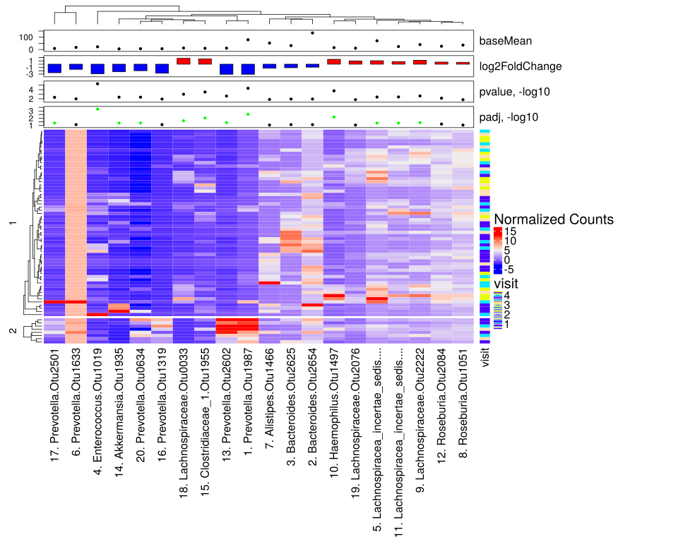
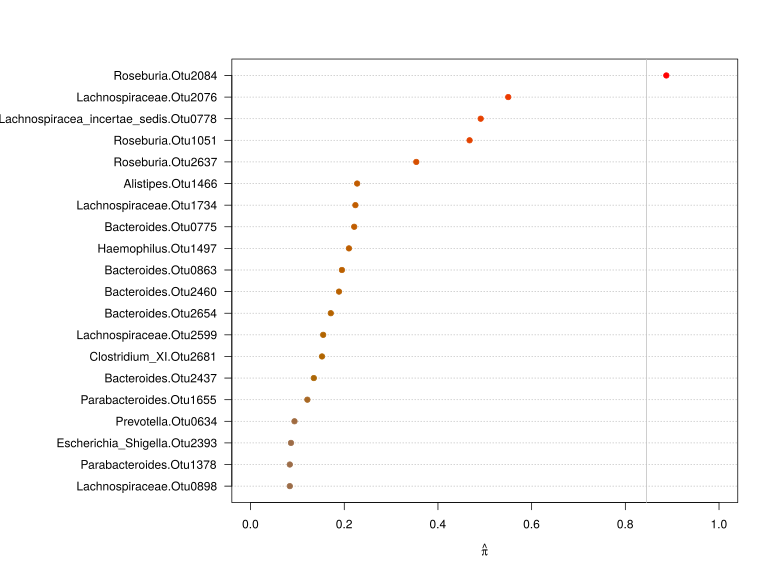

noone@mail.com
Analysis of Dieting study 16S data
% Fri Sep  7 05:46:18 2018


#### \(1.6.1.4\) Taxonomic level: otu of Subset: Patient samples


##### \(1.6.1.4.1\) Loading counts and metadata

[`Subreport`](./1.6.1.4.1-report.html)


##### \(1.6.1.4.2\) Data analysis


##### \(1.6.1.4.2.1\) Richness and diversity estimates Before count filtering

[`Subreport`](./1.6.1.4.2.1-report.html)

Filtering abundance matrix with arguments [ min_mean                :10, min_quant_incidence_frac:0.25, min_quant_mean_frac     :0.25]. Filtering features


Note that some community richness estimators will not work correctly 
               if provided with abundance-filtered counts


After filtering, left 67 records for 113 features


Wrote counts and metadata for raw counts After final feature filtering to files [`data/1.6.1.4.2.1-3233b4c0ccdsamples.raw.16s.l.otu.count.tsv`](data/1.6.1.4.2.1-3233b4c0ccdsamples.raw.16s.l.otu.count.tsv),[`data/1.6.1.4.2.1-3233b4c0ccdsamples.raw.16s.l.otu.attr.tsv`](data/1.6.1.4.2.1-3233b4c0ccdsamples.raw.16s.l.otu.attr.tsv)


Wrote counts and metadata for proportions counts After final feature filtering to files [`data/1.6.1.4.2.1-32320999416samples.proportions.16s.l.otu.count.tsv`](data/1.6.1.4.2.1-32320999416samples.proportions.16s.l.otu.count.tsv),[`data/1.6.1.4.2.1-32320999416samples.proportions.16s.l.otu.attr.tsv`](data/1.6.1.4.2.1-32320999416samples.proportions.16s.l.otu.attr.tsv)


##### \(1.6.1.4.2.2\) DESeq2 tests and data normalization


Love MI, Huber W, Anders S (2014). “Moderated estimation of fold change and dispersion for RNA-seq data with DESeq2.” _Genome Biology_, *15*,
550. doi: 10.1186/s13059-014-0550-8 (URL: http://doi.org/10.1186/s13059-014-0550-8).


\(1.6.1.4.2.2.1\) <a name="table.445"></a>[`Table 445.`](#table.445) DESeq2 results for task: visit;\[ alpha:0.05\]. Full dataset is also saved in a delimited text file (click to download and open e.g. in Excel) [`data/1.6.1.4.2.2.1-323604c7d0a.1.6.1.4.2.2.1.a.nam.csv`](data/1.6.1.4.2.2.1-323604c7d0a.1.6.1.4.2.2.1.a.nam.csv)


| feature                                      | baseMean | log2FoldChange | lfcSE  | stat       | pvalue     | padj      | i.baseMean | baseVar    | allZero | dispGeneEst | dispGeneIter | dispFit | dispersion | dispIter | dispOutlier | dispMAP | Intercept | visit      | SE\_Intercept | SE\_visit | WaldStatistic\_Intercept | WaldStatistic\_visit | WaldPvalue\_Intercept | WaldPvalue\_visit | betaConv | betaIter | deviance | maxCooks | replace |
|:---------------------------------------------|:---------|:---------------|:-------|:-----------|:-----------|:----------|:-----------|:-----------|:--------|:------------|:-------------|:--------|:-----------|:---------|:------------|:--------|:----------|:-----------|:--------------|:----------|:-------------------------|:---------------------|:----------------------|:------------------|:---------|:---------|:---------|:---------|:--------|
| Enterococcus.Otu1019                         | 22.0542  | \-2.908762     | 0.6374 | \-4.563208 | 5.038e\-06 | 0.0005592 | 22.0542    | 2.748e\+04 | FALSE   | 16.191      | 14           | 8.239   | 15.503     | 8        | FALSE       | 15.503  | 8.6262    | \-2.908762 | 1.5740        | 0.6374    | 5.4805                   | \-4.563208           | 4.241e\-08            | 5.038e\-06        | TRUE     | 100      | 186.60   | NA       | TRUE    |
| Prevotella.Otu1987                           | 79.1924  | \-3.042806     | 0.7501 | \-4.056722 | 4.977e\-05 | 0.0027620 | 79.1924    | 1.007e\+05 | FALSE   | 23.878      | 8            | 7.919   | 22.477     | 9        | FALSE       | 22.477  | 12.1590   | \-3.042806 | 1.8783        | 0.7501    | 6.4735                   | \-4.056722           | 9.577e\-11            | 4.977e\-05        | TRUE     | 100      | 249.41   | NA       | TRUE    |
| Haemophilus.Otu1497                          | 15.4553  | 1.475114       | 0.3938 | 3.745766   | 1.798e\-04 | 0.0066542 | 15.4553    | 4.992e\+03 | FALSE   | 5.883       | 13           | 9.151   | 5.977      | 11       | FALSE       | 5.977   | \-0.2464  | 1.475114   | 1.0096        | 0.3938    | \-0.2440                 | 3.745766             | 8.072e\-01            | 1.798e\-04        | TRUE     | 19       | 335.22   | NA       | TRUE    |
| Clostridiaceae\_1.Otu1955                    | 10.0364  | 1.629175       | 0.4537 | 3.590963   | 3.295e\-04 | 0.0091425 | 10.0364    | 1.435e\+03 | FALSE   | 7.738       | 11           | 12.386  | 7.893      | 11       | FALSE       | 7.893   | \-1.0547  | 1.629175   | 1.1653        | 0.4537    | \-0.9051                 | 3.590963             | 3.654e\-01            | 3.295e\-04        | TRUE     | 28       | 280.04   | NA       | FALSE   |
| Lachnospiraceae.Otu0033                      | 12.5077  | 1.767830       | 0.5379 | 3.286778   | 1.013e\-03 | 0.0224976 | 12.5077    | 2.660e\+03 | FALSE   | 11.274      | 9            | 10.475  | 11.231     | 6        | FALSE       | 11.231  | \-1.4113  | 1.767830   | 1.3762        | 0.5379    | \-1.0255                 | 3.286778             | 3.051e\-01            | 1.013e\-03        | TRUE     | 28       | 244.44   | NA       | TRUE    |
| Lachnospiraceae.Otu2222                      | 40.1708  | 1.188295       | 0.3917 | 3.033747   | 2.415e\-03 | 0.0398258 | 40.1708    | 1.666e\+04 | FALSE   | 6.048       | 11           | 11.136  | 6.161      | 10       | FALSE       | 6.161   | 2.1842    | 1.188295   | 0.9907        | 0.3917    | 2.2047                   | 3.033747             | 2.748e\-02            | 2.415e\-03        | TRUE     | 19       | 457.56   | NA       | FALSE   |
| Prevotella.Otu2602                           | 10.8772  | \-3.047929     | 1.0086 | \-3.021948 | 2.512e\-03 | 0.0398258 | 10.8772    | 1.961e\+03 | FALSE   | 48.054      | 9            | 11.580  | 40.347     | 8        | FALSE       | 40.347  | 8.9647    | \-3.047929 | 2.5201        | 1.0086    | 3.5572                   | \-3.021948           | 3.748e\-04            | 2.512e\-03        | TRUE     | 100      | 135.55   | NA       | TRUE    |
| Lachnospiracea\_incertae\_sedis.Otu0113      | 24.3699  | 0.802529       | 0.2787 | 2.879989   | 3.977e\-03 | 0.0451315 | 24.3699    | 3.294e\+03 | FALSE   | 2.986       | 12           | 9.174   | 3.074      | 8        | FALSE       | 3.074   | 2.5825    | 0.802529   | 0.7074        | 0.2787    | 3.6507                   | 2.879989             | 2.615e\-04            | 3.977e\-03        | TRUE     | 10       | 501.17   | NA       | FALSE   |
| Lachnospiracea\_incertae\_sedis.Otu0778      | 70.9469  | 1.058229       | 0.3694 | 2.864425   | 4.178e\-03 | 0.0451315 | 70.9469    | 3.639e\+04 | FALSE   | 5.456       | 12           | 7.955   | 5.511      | 7        | FALSE       | 5.511   | 3.2900    | 1.058229   | 0.9327        | 0.3694    | 3.5273                   | 2.864425             | 4.198e\-04            | 4.178e\-03        | TRUE     | 19       | 526.87   | NA       | FALSE   |
| Akkermansia.Otu1935                          | 5.4333   | \-2.290062     | 0.8059 | \-2.841560 | 4.489e\-03 | 0.0451315 | 5.4333     | 1.051e\+03 | FALSE   | 26.303      | 9            | 18.635  | 25.305     | 7        | FALSE       | 25.305  | 5.9242    | \-2.290062 | 2.0064        | 0.8059    | 2.9526                   | \-2.841560           | 3.151e\-03            | 4.489e\-03        | TRUE     | 14       | 122.38   | NA       | TRUE    |
| Prevotella.Otu0634                           | 6.6784   | \-1.964089     | 0.6914 | \-2.840674 | 4.502e\-03 | 0.0451315 | 6.6784     | 8.469e\+02 | FALSE   | 18.542      | 10           | 17.401  | 18.452     | 7        | FALSE       | 18.452  | 5.8660    | \-1.964089 | 1.7165        | 0.6914    | 3.4175                   | \-2.840674           | 6.321e\-04            | 4.502e\-03        | TRUE     | 100      | 163.22   | NA       | TRUE    |
| Prevotella.Otu2501                           | 8.6603   | \-2.569447     | 0.9128 | \-2.814910 | 4.879e\-03 | 0.0451315 | 8.6603     | 1.832e\+03 | FALSE   | 36.628      | 9            | 14.227  | 32.837     | 8        | FALSE       | 32.837  | 7.3518    | \-2.569447 | 2.2774        | 0.9128    | 3.2282                   | \-2.814910           | 1.246e\-03            | 4.879e\-03        | TRUE     | 100      | 140.91   | NA       | TRUE    |
| Roseburia.Otu2084                            | 26.5790  | 0.642684       | 0.2402 | 2.675117   | 7.470e\-03 | 0.0637850 | 26.5790    | 1.995e\+03 | FALSE   | 2.186       | 9            | 10.435  | 2.278      | 10       | FALSE       | 2.278   | 3.0845    | 0.642684   | 0.6100        | 0.2402    | 5.0566                   | 2.675117             | 4.268e\-07            | 7.470e\-03        | TRUE     | 7        | 539.31   | NA       | FALSE   |
| Prevotella.Otu1633                           | 17.0646  | \-1.544686     | 0.6031 | \-2.561229 | 1.043e\-02 | 0.0767979 | 17.0646    | 5.629e\+03 | FALSE   | 14.883      | 8            | 8.597   | 14.445     | 9        | FALSE       | 14.445  | 6.5823    | \-1.544686 | 1.5093        | 0.6031    | 4.3611                   | \-2.561229           | 1.294e\-05            | 1.043e\-02        | TRUE     | 100      | 231.55   | NA       | TRUE    |
| Bacteroides.Otu2654                          | 134.4818 | \-0.894052     | 0.3541 | \-2.524975 | 1.157e\-02 | 0.0767979 | 134.4818   | 2.077e\+05 | FALSE   | 5.030       | 13           | 8.095   | 5.084      | 9        | FALSE       | 5.084   | 8.6875    | \-0.894052 | 0.8913        | 0.3541    | 9.7468                   | \-2.524975           | 1.903e\-22            | 1.157e\-02        | TRUE     | 18       | 609.54   | NA       | TRUE    |
| Bacteroides.Otu2625                          | 31.9661  | \-1.066211     | 0.4228 | \-2.521841 | 1.167e\-02 | 0.0767979 | 31.9661    | 8.831e\+03 | FALSE   | 7.053       | 13           | 12.754  | 7.190      | 11       | FALSE       | 7.190   | 6.9866    | \-1.066211 | 1.0625        | 0.4228    | 6.5758                   | \-2.521841           | 4.839e\-11            | 1.167e\-02        | TRUE     | 23       | 411.21   | NA       | TRUE    |
| Prevotella.Otu1319                           | 6.6243   | \-2.729223     | 1.0834 | \-2.519210 | 1.176e\-02 | 0.0767979 | 6.6243     | 9.934e\+02 | FALSE   | 54.949      | 11           | 17.468  | 46.690     | 9        | FALSE       | 46.690  | 7.7593    | \-2.729223 | 2.7101        | 1.0834    | 2.8631                   | \-2.519210           | 4.195e\-03            | 1.176e\-02        | TRUE     | 100      | 115.92   | NA       | TRUE    |
| Alistipes.Otu1466                            | 52.5129  | \-1.220111     | 0.4975 | \-2.452539 | 1.419e\-02 | 0.0874755 | 52.5129    | 1.652e\+04 | FALSE   | 10.075      | 10           | 8.574   | 10.005     | 9        | FALSE       | 10.005  | 7.8831    | \-1.220111 | 1.2512        | 0.4975    | 6.3005                   | \-2.452539           | 2.967e\-10            | 1.419e\-02        | TRUE     | 100      | 416.69   | NA       | TRUE    |
| Lachnospiraceae.Otu2076                      | 10.8021  | 0.989917       | 0.4096 | 2.416981   | 1.565e\-02 | 0.0879799 | 10.8021    | 3.826e\+02 | FALSE   | 6.418       | 8            | 11.645  | 6.586      | 11       | FALSE       | 6.586   | 0.8406    | 0.989917   | 1.0428        | 0.4096    | 0.8061                   | 2.416981             | 4.202e\-01            | 1.565e\-02        | TRUE     | 13       | 345.84   | NA       | FALSE   |
| Roseburia.Otu1051                            | 35.9214  | 0.586603       | 0.2432 | 2.412300   | 1.585e\-02 | 0.0879799 | 35.9214    | 3.625e\+03 | FALSE   | 2.268       | 12           | 12.369  | 2.356      | 12       | FALSE       | 2.356   | 3.6703    | 0.586603   | 0.6158        | 0.2432    | 5.9602                   | 2.412300             | 2.519e\-09            | 1.585e\-02        | TRUE     | 7        | 572.96   | NA       | FALSE   |
| Parabacteroides.Otu1736                      | 99.0931  | \-1.178877     | 0.4944 | \-2.384646 | 1.710e\-02 | 0.0903623 | 99.0931    | 2.126e\+05 | FALSE   | 9.983       | 13           | 7.996   | 9.914      | 9        | FALSE       | 9.914   | 8.8386    | \-1.178877 | 1.2443        | 0.4944    | 7.1034                   | \-2.384646           | 1.217e\-12            | 1.710e\-02        | TRUE     | 100      | 449.22   | NA       | TRUE    |
| Lachnospiraceae.Otu2512                      | 15.4602  | 0.792931       | 0.3424 | 2.316028   | 2.056e\-02 | 0.0991528 | 15.4602    | 1.318e\+03 | FALSE   | 4.542       | 11           | 9.149   | 4.638      | 10       | FALSE       | 4.638   | 1.9753    | 0.792931   | 0.8692        | 0.3424    | 2.2725                   | 2.316028             | 2.305e\-02            | 2.056e\-02        | TRUE     | 14       | 409.15   | NA       | TRUE    |
| Bacteroides.Otu1201                          | 41.4326  | \-0.789022     | 0.3431 | \-2.299456 | 2.148e\-02 | 0.0991528 | 41.4326    | 4.993e\+03 | FALSE   | 4.630       | 10           | 10.750  | 4.743      | 8        | FALSE       | 4.743   | 6.8919    | \-0.789022 | 0.8631        | 0.3431    | 7.9850                   | \-2.299456           | 1.405e\-15            | 2.148e\-02        | TRUE     | 20       | 519.61   | NA       | TRUE    |
| Roseburia.Otu2728                            | 6.8498   | 0.791934       | 0.3462 | 2.287355   | 2.218e\-02 | 0.0991528 | 6.8498     | 1.791e\+02 | FALSE   | 4.356       | 12           | 17.180  | 4.584      | 11       | FALSE       | 4.584   | 0.7743    | 0.791934   | 0.8873        | 0.3462    | 0.8726                   | 2.287355             | 3.829e\-01            | 2.218e\-02        | TRUE     | 10       | 331.68   | NA       | TRUE    |
| Turicibacter.Otu0468                         | 4.0189   | \-1.090992     | 0.4796 | \-2.274925 | 2.291e\-02 | 0.0991528 | 4.0189     | 1.946e\+02 | FALSE   | 8.303       | 12           | 19.894  | 8.711      | 8        | FALSE       | 8.711   | 4.0133    | \-1.090992 | 1.1916        | 0.4796    | 3.3681                   | \-2.274925           | 7.568e\-04            | 2.291e\-02        | TRUE     | 10       | 218.20   | NA       | TRUE    |
| Gemmiger.Otu0907                             | 8.8437   | \-0.854112     | 0.3763 | \-2.269713 | 2.322e\-02 | 0.0991528 | 8.8437     | 3.226e\+02 | FALSE   | 5.329       | 12           | 13.934  | 5.532      | 11       | FALSE       | 5.532   | 4.7958    | \-0.854112 | 0.9423        | 0.3763    | 5.0897                   | \-2.269713           | 3.587e\-07            | 2.322e\-02        | TRUE     | 11       | 338.46   | NA       | TRUE    |
| Bacteroides.Otu2460                          | 16.1069  | \-0.732744     | 0.3285 | \-2.230903 | 2.569e\-02 | 0.1056043 | 16.1069    | 1.345e\+03 | FALSE   | 4.184       | 9            | 8.905   | 4.277      | 11       | FALSE       | 4.277   | 5.4493    | \-0.732744 | 0.8248        | 0.3285    | 6.6066                   | \-2.230903           | 3.933e\-11            | 2.569e\-02        | TRUE     | 10       | 418.26   | NA       | FALSE   |
| Bacteroidales.Otu0696                        | 4.1520   | \-2.075671     | 0.9502 | \-2.184503 | 2.893e\-02 | 0.1146682 | 4.1520     | 9.081e\+02 | FALSE   | 38.618      | 10           | 19.713  | 35.749     | 7        | FALSE       | 35.749  | 6.3429    | \-2.075671 | 2.3747        | 0.9502    | 2.6711                   | \-2.184503           | 7.561e\-03            | 2.893e\-02        | TRUE     | 27       | 108.63   | NA       | TRUE    |
| Prevotella.Otu1803                           | 6.7924   | \-2.155166     | 1.0187 | \-2.115614 | 3.438e\-02 | 0.1286206 | 6.7924     | 9.353e\+02 | FALSE   | 46.811      | 6            | 17.255  | 41.284     | 8        | FALSE       | 41.284  | 6.8484    | \-2.155166 | 2.5488        | 1.0187    | 2.6869                   | \-2.115614           | 7.212e\-03            | 3.438e\-02        | TRUE     | 100      | 125.13   | NA       | TRUE    |
| Bacteroides.Otu0863                          | 150.0905 | \-0.789292     | 0.3739 | \-2.111116 | 3.476e\-02 | 0.1286206 | 150.0905   | 1.551e\+05 | FALSE   | 5.625       | 9            | 8.093   | 5.674      | 8        | FALSE       | 5.674   | 8.7230    | \-0.789292 | 0.9413        | 0.3739    | 9.2665                   | \-2.111116           | 1.923e\-20            | 3.476e\-02        | TRUE     | 28       | 616.18   | NA       | FALSE   |
| Roseburia.Otu2637                            | 10.3061  | 0.688995       | 0.3383 | 2.036558   | 4.169e\-02 | 0.1467411 | 10.3061    | 4.150e\+02 | FALSE   | 4.315       | 15           | 12.106  | 4.470      | 10       | FALSE       | 4.470   | 1.5942    | 0.688995   | 0.8616        | 0.3383    | 1.8502                   | 2.036558             | 6.428e\-02            | 4.169e\-02        | TRUE     | 9        | 374.77   | NA       | FALSE   |
| Bacteroides.Otu2523                          | 3.1040   | \-1.274168     | 0.6275 | \-2.030520 | 4.230e\-02 | 0.1467411 | 3.1040     | 1.742e\+02 | FALSE   | 14.487      | 12           | 22.528  | 15.016     | 10       | FALSE       | 15.016  | 3.7061    | \-1.274168 | 1.5603        | 0.6275    | 2.3753                   | \-2.030520           | 1.753e\-02            | 4.230e\-02        | TRUE     | 27       | 148.33   | NA       | TRUE    |
| Lachnospiraceae.Otu0898                      | 25.1065  | 0.566271       | 0.2808 | 2.016877   | 4.371e\-02 | 0.1470190 | 25.1065    | 4.468e\+03 | FALSE   | 3.054       | 13           | 9.574   | 3.140      | 9        | FALSE       | 3.140   | 3.2733    | 0.566271   | 0.7110        | 0.2808    | 4.6040                   | 2.016877             | 4.145e\-06            | 4.371e\-02        | TRUE     | 12       | 509.25   | NA       | FALSE   |
| Lachnospiraceae.Otu0491                      | 11.0955  | 0.678930       | 0.3531 | 1.922806   | 5.450e\-02 | 0.1779409 | 11.0955    | 1.063e\+03 | FALSE   | 4.775       | 14           | 11.401  | 4.910      | 11       | FALSE       | 4.910   | 1.8234    | 0.678930   | 0.8972        | 0.3531    | 2.0324                   | 1.922806             | 4.211e\-02            | 5.450e\-02        | TRUE     | 16       | 373.13   | NA       | FALSE   |
| Bacteroides.Otu2416                          | 16.9176  | \-0.597893     | 0.3292 | \-1.816258 | 6.933e\-02 | 0.2197858 | 16.9176    | 1.942e\+03 | FALSE   | 4.222       | 10           | 8.640   | 4.314      | 10       | FALSE       | 4.314   | 5.2947    | \-0.597893 | 0.8278        | 0.3292    | 6.3964                   | \-1.816258           | 1.591e\-10            | 6.933e\-02        | TRUE     | 11       | 433.18   | NA       | FALSE   |
| Prevotella.Otu0882                           | 5.6152   | \-1.632220     | 0.9111 | \-1.791515 | 7.321e\-02 | 0.2197858 | 5.6152     | 3.680e\+02 | FALSE   | 35.527      | 9            | 18.491  | 32.901     | 7        | FALSE       | 32.901  | 5.3042    | \-1.632220 | 2.2791        | 0.9111    | 2.3274                   | \-1.791515           | 1.995e\-02            | 7.321e\-02        | TRUE     | 23       | 138.69   | NA       | TRUE    |
| Prevotella.Otu1994                           | 4.8509   | \-2.318720     | 1.2945 | \-1.791196 | 7.326e\-02 | 0.2197858 | 4.8509     | 1.022e\+03 | FALSE   | 67.000      | 8            | 19.064  | 67.000     | 4        | FALSE       | 67.000  | 5.4783    | \-2.318720 | 3.2461        | 1.2945    | 1.6877                   | \-1.791196           | 9.148e\-02            | 7.326e\-02        | TRUE     | 25       | 63.60    | NA       | TRUE    |
| Lachnospiracea\_incertae\_sedis.Otu0651      | 29.2886  | 0.654808       | 0.3711 | 1.764366   | 7.767e\-02 | 0.2268791 | 29.2886    | 5.076e\+03 | FALSE   | 5.424       | 9            | 11.923  | 5.543      | 9        | FALSE       | 5.543   | 3.2886    | 0.654808   | 0.9375        | 0.3711    | 3.5077                   | 1.764366             | 4.520e\-04            | 7.767e\-02        | TRUE     | 19       | 454.18   | NA       | FALSE   |
| Bacteroides.Otu2120                          | 26.9710  | \-0.704644     | 0.4062 | \-1.734618 | 8.281e\-02 | 0.2356858 | 26.9710    | 4.899e\+03 | FALSE   | 6.545       | 11           | 10.668  | 6.652      | 11       | FALSE       | 6.652   | 6.2225    | \-0.704644 | 1.0221        | 0.4062    | 6.0880                   | \-1.734618           | 1.144e\-09            | 8.281e\-02        | TRUE     | 20       | 435.96   | NA       | FALSE   |
| Veillonella.Otu0362                          | 5.1406   | 0.643776       | 0.3853 | 1.670800   | 9.476e\-02 | 0.2629622 | 5.1406     | 2.803e\+02 | FALSE   | 5.437       | 13           | 18.852  | 5.698      | 11       | FALSE       | 5.698   | 0.7683    | 0.643776   | 0.9853        | 0.3853    | 0.7797                   | 1.670800             | 4.356e\-01            | 9.476e\-02        | TRUE     | 14       | 278.20   | NA       | TRUE    |
| Bacteroides.Otu0929                          | 157.2333 | \-0.593916     | 0.3607 | \-1.646460 | 9.967e\-02 | 0.2645967 | 157.2333   | 1.321e\+05 | FALSE   | 5.227       | 11           | 8.094   | 5.284      | 8        | FALSE       | 5.284   | 8.4925    | \-0.593916 | 0.9084        | 0.3607    | 9.3490                   | \-1.646460           | 8.848e\-21            | 9.967e\-02        | TRUE     | 17       | 657.35   | NA       | FALSE   |
| Bacteroides.Otu2520                          | 346.7264 | \-0.591560     | 0.3598 | \-1.644283 | 1.001e\-01 | 0.2645967 | 346.7264   | 4.893e\+05 | FALSE   | 5.223       | 9            | 7.294   | 5.262      | 10       | FALSE       | 5.262   | 9.6202    | \-0.591560 | 0.9060        | 0.3598    | 10.6177                  | \-1.644283           | 2.465e\-26            | 1.001e\-01        | TRUE     | 29       | 734.07   | NA       | TRUE    |
| Bacteroides.Otu0661                          | 108.5792 | \-0.566975     | 0.3640 | \-1.557480 | 1.194e\-01 | 0.3038717 | 108.5792   | 5.813e\+04 | FALSE   | 5.321       | 15           | 8.046   | 5.377      | 8        | FALSE       | 5.377   | 7.9163    | \-0.566975 | 0.9167        | 0.3640    | 8.6357                   | \-1.557480           | 5.835e\-18            | 1.194e\-01        | TRUE     | 17       | 615.75   | NA       | FALSE   |
| Alistipes.Otu2508                            | 44.5275  | \-0.796011     | 0.5151 | \-1.545429 | 1.222e\-01 | 0.3038717 | 44.5275    | 9.480e\+03 | FALSE   | 10.783      | 9            | 9.885   | 10.751     | 8        | FALSE       | 10.751  | 7.0440    | \-0.796011 | 1.2966        | 0.5151    | 5.4328                   | \-1.545429           | 5.548e\-08            | 1.222e\-01        | TRUE     | 100      | 403.53   | NA       | TRUE    |
| Bacteroides.Otu0480                          | 12.7779  | \-1.247392     | 0.8139 | \-1.532680 | 1.254e\-01 | 0.3038717 | 12.7779    | 2.787e\+03 | FALSE   | 28.958      | 7            | 10.336  | 26.722     | 10       | FALSE       | 26.722  | 6.1521    | \-1.247392 | 2.0458        | 0.8139    | 3.0072                   | \-1.532680           | 2.637e\-03            | 1.254e\-01        | TRUE     | 25       | 174.32   | NA       | TRUE    |
| Bacteroides.Otu0069                          | 95.3446  | \-0.454045     | 0.2977 | \-1.525409 | 1.272e\-01 | 0.3038717 | 95.3446    | 2.359e\+04 | FALSE   | 3.520       | 12           | 7.976   | 3.589      | 9        | FALSE       | 3.589   | 7.5243    | \-0.454045 | 0.7496        | 0.2977    | 10.0380                  | \-1.525409           | 1.037e\-23            | 1.272e\-01        | TRUE     | 12       | 667.53   | NA       | FALSE   |
| Bacteroides.Otu0877                          | 23.1949  | \-0.484839     | 0.3191 | \-1.519382 | 1.287e\-01 | 0.3038717 | 23.1949    | 2.279e\+03 | FALSE   | 3.995       | 10           | 8.623   | 4.078      | 10       | FALSE       | 4.078   | 5.5213    | \-0.484839 | 0.8032        | 0.3191    | 6.8741                   | \-1.519382           | 6.238e\-12            | 1.287e\-01        | TRUE     | 11       | 471.53   | NA       | TRUE    |
| Blautia.Otu0620                              | 7.7847   | \-0.385088     | 0.2599 | \-1.481560 | 1.385e\-01 | 0.3141281 | 7.7847     | 2.933e\+02 | FALSE   | 2.429       | 14           | 15.761  | 2.572      | 10       | FALSE       | 2.572   | 3.7884    | \-0.385088 | 0.6544        | 0.2599    | 5.7891                   | \-1.481560           | 7.076e\-09            | 1.385e\-01        | TRUE     | 9        | 394.65   | NA       | TRUE    |
| Klebsiella.Otu1452                           | 1.0116   | 0.812096       | 0.5484 | 1.480765   | 1.387e\-01 | 0.3141281 | 1.0116     | 8.690e\+00 | FALSE   | 10.003      | 10           | 28.015  | 11.138     | 6        | FALSE       | 11.138  | \-2.2459  | 0.812096   | 1.4079        | 0.5484    | \-1.5952                 | 1.480765             | 1.107e\-01            | 1.387e\-01        | TRUE     | 12       | 129.11   | NA       | TRUE    |
| Clostridiales.Otu0562                        | 2.3282   | 1.396214       | 0.9851 | 1.417322   | 1.564e\-01 | 0.3471831 | 2.3282     | 2.307e\+02 | FALSE   | 41.623      | 8            | 25.479  | 38.555     | 9        | FALSE       | 38.555  | \-2.8529  | 1.396214   | 2.4995        | 0.9851    | \-1.1414                 | 1.417322             | 2.537e\-01            | 1.564e\-01        | TRUE     | 16       | 92.48    | NA       | TRUE    |
| Prevotella.Otu2227                           | 2.1604   | \-1.546603     | 1.1056 | \-1.398861 | 1.619e\-01 | 0.3522720 | 2.1604     | 9.597e\+01 | FALSE   | 55.463      | 7            | 26.026  | 48.615     | 9        | FALSE       | 48.615  | 4.1120    | \-1.546603 | 2.7708        | 1.1056    | 1.4840                   | \-1.398861           | 1.378e\-01            | 1.619e\-01        | TRUE     | 19       | 96.15    | NA       | TRUE    |
| Prevotella.Otu0738                           | 1.7692   | \-1.358632     | 0.9815 | \-1.384296 | 1.663e\-01 | 0.3549176 | 1.7692     | 1.005e\+02 | FALSE   | 40.757      | 8            | 27.078  | 37.993     | 7        | FALSE       | 37.993  | 3.3392    | \-1.358632 | 2.4580        | 0.9815    | 1.3585                   | \-1.384296           | 1.743e\-01            | 1.663e\-01        | TRUE     | 15       | 96.45    | NA       | TRUE    |
| Clostridium\_XlVa.Otu0236                    | 22.3760  | \-0.273533     | 0.2087 | \-1.310487 | 1.900e\-01 | 0.3906213 | 22.3760    | 1.247e\+03 | FALSE   | 1.647       | 10           | 8.329   | 1.712      | 10       | FALSE       | 1.712   | 5.0684    | \-0.273533 | 0.5263        | 0.2087    | 9.6309                   | \-1.310487           | 5.921e\-22            | 1.900e\-01        | TRUE     | 7        | 543.09   | NA       | FALSE   |
| Barnesiella.Otu2015                          | 1.2340   | 1.126669       | 0.8597 | 1.310485   | 1.900e\-01 | 0.3906213 | 1.2340     | 6.374e\+01 | FALSE   | 29.180      | 7            | 27.865  | 29.012     | 6        | FALSE       | 29.012  | \-2.9170  | 1.126669   | 2.1850        | 0.8597    | \-1.3351                 | 1.310485             | 1.819e\-01            | 1.900e\-01        | TRUE     | 15       | 84.04    | NA       | TRUE    |
| Bacteroides.Otu0848                          | 229.7448 | 0.429964       | 0.3349 | 1.283810   | 1.992e\-01 | 0.3972672 | 229.7448   | 3.183e\+05 | FALSE   | 4.503       | 12           | 7.997   | 4.557      | 12       | FALSE       | 4.557   | 6.8028    | 0.429964   | 0.8438        | 0.3349    | 8.0621                   | 1.283810             | 7.499e\-16            | 1.992e\-01        | TRUE     | 27       | 721.66   | NA       | FALSE   |
| Prevotella.Otu2327                           | 1.5068   | \-1.282004     | 1.0035 | \-1.277522 | 2.014e\-01 | 0.3972672 | 1.5068     | 8.379e\+01 | FALSE   | 42.620      | 9            | 27.563  | 39.828     | 9        | FALSE       | 39.828  | 3.3103    | \-1.282004 | 2.5146        | 1.0035    | 1.3165                   | \-1.277522           | 1.880e\-01            | 2.014e\-01        | TRUE     | 22       | 94.44    | NA       | TRUE    |
| Bacteroides.Otu1352                          | 7.0324   | \-0.371933     | 0.2928 | \-1.270232 | 2.040e\-01 | 0.3972672 | 7.0324     | 1.411e\+02 | FALSE   | 3.098       | 14           | 16.930  | 3.292      | 13       | FALSE       | 3.292   | 3.6037    | \-0.371933 | 0.7374        | 0.2928    | 4.8870                   | \-1.270232           | 1.024e\-06            | 2.040e\-01        | TRUE     | 9        | 371.56   | NA       | TRUE    |
| Burkholderiales.Otu0023                      | 1.1249   | \-1.613477     | 1.2972 | \-1.243817 | 2.136e\-01 | 0.4068259 | 1.1249     | 8.478e\+01 | FALSE   | 67.000      | 2            | 27.942  | 67.000     | 8        | FALSE       | 67.000  | 2.7978    | \-1.613477 | 3.2579        | 1.2972    | 0.8588                   | \-1.243817           | 3.905e\-01            | 2.136e\-01        | TRUE     | 14       | 22.42    | NA       | TRUE    |
| Sutterella.Otu1997                           | 1.0856   | \-1.604165     | 1.2973 | \-1.236586 | 2.162e\-01 | 0.4068259 | 1.0856     | 2.862e\+01 | FALSE   | 67.000      | 10           | 27.966  | 67.000     | 11       | FALSE       | 67.000  | 2.7656    | \-1.604165 | 3.2581        | 1.2973    | 0.8488                   | \-1.236586           | 3.960e\-01            | 2.162e\-01        | TRUE     | 12       | 50.42    | NA       | TRUE    |
| Dorea.Otu1142                                | 20.5783  | \-0.328646     | 0.2778 | \-1.182970 | 2.368e\-01 | 0.4381186 | 20.5783    | 2.363e\+03 | FALSE   | 3.002       | 12           | 8.072   | 3.073      | 9        | FALSE       | 3.073   | 5.0535    | \-0.328646 | 0.6999        | 0.2778    | 7.2204                   | \-1.182970           | 5.185e\-13            | 2.368e\-01        | TRUE     | 9        | 487.37   | NA       | FALSE   |
| Prevotella.Otu0773                           | 0.7620   | \-1.273963     | 1.1084 | \-1.149362 | 2.504e\-01 | 0.4556580 | 0.7620     | 2.096e\+01 | FALSE   | 56.340      | 10           | 28.373  | 48.457     | 8        | FALSE       | 48.457  | 2.1216    | \-1.273963 | 2.7825        | 1.1084    | 0.7625                   | \-1.149362           | 4.458e\-01            | 2.504e\-01        | TRUE     | 12       | 67.67    | NA       | TRUE    |
| Phascolarctobacterium.Otu1814                | 5.6682   | \-0.670968     | 0.6296 | \-1.065638 | 2.866e\-01 | 0.5033052 | 5.6682     | 3.369e\+02 | FALSE   | 15.650      | 14           | 18.447  | 15.823     | 9        | FALSE       | 15.823  | 3.8167    | \-0.670968 | 1.5829        | 0.6296    | 2.4112                   | \-1.065638           | 1.590e\-02            | 2.866e\-01        | TRUE     | 14       | 207.44   | NA       | TRUE    |
| Bacteroides.Otu0001                          | 826.4538 | \-0.337704     | 0.3213 | \-1.051155 | 2.932e\-01 | 0.5033052 | 826.4538   | 2.010e\+06 | FALSE   | 4.191       | 12           | 4.524   | 4.198      | 8        | FALSE       | 4.198   | 10.4081   | \-0.337704 | 0.8091        | 0.3213    | 12.8630                  | \-1.051155           | 7.272e\-38            | 2.932e\-01        | TRUE     | 18       | 915.92   | NA       | FALSE   |
| Clostridium\_XI.Otu2681                      | 7.5155   | 0.362586       | 0.3470 | 1.044925   | 2.961e\-01 | 0.5033052 | 7.5155     | 2.656e\+02 | FALSE   | 4.484       | 11           | 16.203  | 4.696      | 12       | FALSE       | 4.696   | 1.9860    | 0.362586   | 0.8818        | 0.3470    | 2.2522                   | 1.044925             | 2.431e\-02            | 2.961e\-01        | TRUE     | 8        | 342.49   | NA       | TRUE    |
| Parabacteroides.Otu0538                      | 3.0311   | \-0.638548     | 0.6178 | \-1.033630 | 3.013e\-01 | 0.5033052 | 3.0311     | 2.128e\+02 | FALSE   | 14.500      | 11           | 22.823  | 15.000     | 10       | FALSE       | 15.000  | 2.9314    | \-0.638548 | 1.5514        | 0.6178    | 1.8896                   | \-1.033630           | 5.882e\-02            | 3.013e\-01        | TRUE     | 12       | 180.03   | NA       | TRUE    |
| Erysipelotrichaceae\_incertae\_sedis.Otu0818 | 22.6448  | \-0.272972     | 0.2672 | \-1.021778 | 3.069e\-01 | 0.5033052 | 22.6448    | 2.522e\+03 | FALSE   | 2.771       | 9            | 8.415   | 2.844      | 9        | FALSE       | 2.844   | 5.0832    | \-0.272972 | 0.6733        | 0.2672    | 7.5497                   | \-1.021778           | 4.363e\-14            | 3.069e\-01        | TRUE     | 10       | 509.25   | NA       | TRUE    |
| Bacteroides.Otu1669                          | 10.6606  | \-0.370628     | 0.3641 | \-1.018065 | 3.086e\-01 | 0.5033052 | 10.6606    | 3.385e\+02 | FALSE   | 5.110       | 14           | 11.770  | 5.261      | 13       | FALSE       | 5.261   | 4.2027    | \-0.370628 | 0.9169        | 0.3641    | 4.5836                   | \-1.018065           | 4.570e\-06            | 3.086e\-01        | TRUE     | 12       | 374.04   | NA       | TRUE    |
| Lachnospiraceae.Otu0220                      | 20.8981  | 0.319503       | 0.3143 | 1.016472   | 3.094e\-01 | 0.5033052 | 20.8981    | 1.330e\+03 | FALSE   | 3.868       | 13           | 8.073   | 3.950      | 8        | FALSE       | 3.950   | 3.6209    | 0.319503   | 0.7945        | 0.3143    | 4.5572                   | 1.016472             | 5.183e\-06            | 3.094e\-01        | TRUE     | 11       | 474.41   | NA       | FALSE   |
| Clostridiales.Otu1597                        | 0.5973   | \-1.310873     | 1.2989 | \-1.009228 | 3.129e\-01 | 0.5033052 | 0.5973     | 1.121e\+01 | FALSE   | 67.000      | 9            | 29.241  | 67.000     | 10       | FALSE       | 67.000  | 1.7559    | \-1.310873 | 3.2651        | 1.2989    | 0.5378                   | \-1.009228           | 5.907e\-01            | 3.129e\-01        | TRUE     | 11       | 46.49    | NA       | TRUE    |
| Lachnospiraceae.Otu0790                      | 15.1499  | \-0.297415     | 0.2983 | \-0.996906 | 3.188e\-01 | 0.5055421 | 15.1499    | 5.939e\+02 | FALSE   | 3.430       | 11           | 9.276   | 3.531      | 11       | FALSE       | 3.531   | 4.5498    | \-0.297415 | 0.7518        | 0.2983    | 6.0515                   | \-0.996906           | 1.435e\-09            | 3.188e\-01        | TRUE     | 9        | 448.44   | NA       | FALSE   |
| Clostridium\_XI.Otu1804                      | 70.7088  | 0.266479       | 0.2728 | 0.976792   | 3.287e\-01 | 0.5138398 | 70.7088    | 2.759e\+04 | FALSE   | 2.947       | 12           | 7.957   | 3.008      | 12       | FALSE       | 3.008   | 5.5062    | 0.266479   | 0.6880        | 0.2728    | 8.0031                   | 0.976792             | 1.213e\-15            | 3.287e\-01        | TRUE     | 9        | 641.93   | NA       | TRUE    |
| Bacteroides.Otu0763                          | 9.9980   | \-0.247173     | 0.2617 | \-0.944608 | 3.449e\-01 | 0.5316577 | 9.9980     | 1.862e\+02 | FALSE   | 2.525       | 14           | 12.428  | 2.654      | 10       | FALSE       | 2.654   | 3.8684    | \-0.247173 | 0.6603        | 0.2617    | 5.8587                   | \-0.944608           | 4.664e\-09            | 3.449e\-01        | TRUE     | 9        | 426.76   | NA       | FALSE   |
| Bacteroides.Otu2104                          | 49.1926  | 0.267883       | 0.3188 | 0.840328   | 4.007e\-01 | 0.5984206 | 49.1926    | 9.649e\+03 | FALSE   | 4.023       | 10           | 8.940   | 4.106      | 8        | FALSE       | 4.106   | 4.9862    | 0.267883   | 0.8040        | 0.3188    | 6.2017                   | 0.840328             | 5.586e\-10            | 4.007e\-01        | TRUE     | 17       | 570.33   | NA       | FALSE   |
| Clostridium\_XlVa.Otu1856                    | 7.2399   | \-0.193598     | 0.2321 | \-0.834050 | 4.043e\-01 | 0.5984206 | 7.2399     | 1.574e\+02 | FALSE   | 1.898       | 12           | 16.629  | 2.014      | 10       | FALSE       | 2.014   | 3.2848    | \-0.193598 | 0.5873        | 0.2321    | 5.5930                   | \-0.834050           | 2.231e\-08            | 4.043e\-01        | TRUE     | 7        | 398.26   | NA       | TRUE    |
| Lachnospiraceae.Otu1734                      | 17.8483  | 0.215959       | 0.2590 | 0.833898   | 4.043e\-01 | 0.5984206 | 17.8483    | 1.434e\+03 | FALSE   | 2.575       | 13           | 8.396   | 2.651      | 9        | FALSE       | 2.651   | 3.6540    | 0.215959   | 0.6556        | 0.2590    | 5.5733                   | 0.833898             | 2.500e\-08            | 4.043e\-01        | TRUE     | 9        | 489.99   | NA       | FALSE   |
| Bacteroides.Otu2383                          | 11.6377  | \-0.305432     | 0.3920 | \-0.779081 | 4.359e\-01 | 0.6366905 | 11.6377    | 9.736e\+02 | FALSE   | 6.011       | 10           | 11.001  | 6.136      | 10       | FALSE       | 6.136   | 4.1985    | \-0.305432 | 0.9878        | 0.3920    | 4.2505                   | \-0.779081           | 2.133e\-05            | 4.359e\-01        | TRUE     | 15       | 358.73   | NA       | TRUE    |
| Bacteroides.Otu0399                          | 3.5384   | \-0.319019     | 0.4516 | \-0.706430 | 4.799e\-01 | 0.6863502 | 3.5384     | 7.192e\+01 | FALSE   | 7.510       | 9            | 20.897  | 7.914      | 7        | FALSE       | 7.914   | 2.5089    | \-0.319019 | 1.1382        | 0.4516    | 2.2042                   | \-0.706430           | 2.751e\-02            | 4.799e\-01        | TRUE     | 11       | 238.50   | NA       | TRUE    |
| Sutterella.Otu0171                           | 15.4575  | 0.554454       | 0.7891 | 0.702608   | 4.823e\-01 | 0.6863502 | 15.4575    | 2.005e\+03 | FALSE   | 27.293      | 9            | 9.150   | 25.229     | 9        | FALSE       | 25.229  | 2.6219    | 0.554454   | 1.9897        | 0.7891    | 1.3177                   | 0.702608             | 1.876e\-01            | 4.823e\-01        | TRUE     | 57       | 206.28   | NA       | TRUE    |
| Parabacteroides.Otu1655                      | 1.2537   | \-0.448335     | 0.6484 | \-0.691433 | 4.893e\-01 | 0.6874880 | 1.2537     | 1.722e\+01 | FALSE   | 14.801      | 10           | 27.850  | 15.874     | 7        | FALSE       | 15.874  | 0.9526    | \-0.448335 | 1.6312        | 0.6484    | 0.5840                   | \-0.691433           | 5.592e\-01            | 4.893e\-01        | TRUE     | 11       | 130.33   | NA       | TRUE    |
| Lactobacillus.Otu1332                        | 0.5264   | \-0.474225     | 0.8075 | \-0.587270 | 5.570e\-01 | 0.7701997 | 0.5264     | 4.017e\+00 | FALSE   | 24.109      | 9            | 30.053  | 24.982     | 9        | FALSE       | 24.982  | 0.4113    | \-0.474225 | 2.0313        | 0.8075    | 0.2025                   | \-0.587270           | 8.395e\-01            | 5.570e\-01        | TRUE     | 6        | 100.50   | NA       | FALSE   |
| Bacteroides.Otu0006                          | 86.7512  | \-0.173471     | 0.2992 | \-0.579818 | 5.620e\-01 | 0.7701997 | 86.7512    | 1.501e\+04 | FALSE   | 3.555       | 10           | 7.934   | 3.627      | 8        | FALSE       | 3.627   | 6.8189    | \-0.173471 | 0.7537        | 0.2992    | 9.0470                   | \-0.579818           | 1.470e\-19            | 5.620e\-01        | TRUE     | 12       | 662.35   | NA       | FALSE   |
| Lachnospiracea\_incertae\_sedis.Otu2746      | 5.1181   | \-0.213138     | 0.4033 | \-0.528441 | 5.972e\-01 | 0.7993501 | 5.1181     | 2.421e\+02 | FALSE   | 6.072       | 11           | 18.869  | 6.361      | 11       | FALSE       | 6.361   | 2.8218    | \-0.213138 | 1.0179        | 0.4033    | 2.7722                   | \-0.528441           | 5.567e\-03            | 5.972e\-01        | TRUE     | 12       | 282.16   | NA       | TRUE    |
| Bacteroides.Otu2534                          | 2.9594   | \-0.455557     | 0.8633 | \-0.527693 | 5.977e\-01 | 0.7993501 | 2.9594     | 1.308e\+02 | FALSE   | 30.762      | 7            | 23.111  | 29.824     | 7        | FALSE       | 29.824  | 2.5018    | \-0.455557 | 2.1733        | 0.8633    | 1.1512                   | \-0.527693           | 2.497e\-01            | 5.977e\-01        | TRUE     | 8        | 128.03   | NA       | TRUE    |
| Bacteroides.Otu0752                          | 8.9932   | \-0.147656     | 0.2902 | \-0.508780 | 6.109e\-01 | 0.8072692 | 8.9932     | 1.771e\+02 | FALSE   | 3.127       | 11           | 13.708  | 3.282      | 11       | FALSE       | 3.282   | 3.5028    | \-0.147656 | 0.7332        | 0.2902    | 4.7776                   | \-0.508780           | 1.774e\-06            | 6.109e\-01        | TRUE     | 9        | 402.08   | NA       | FALSE   |
| Bacteroides.Otu2765                          | 89.2852  | 0.146490       | 0.3088 | 0.474412   | 6.352e\-01 | 0.8269906 | 89.2852    | 2.084e\+04 | FALSE   | 3.800       | 11           | 7.945   | 3.864      | 9        | FALSE       | 3.864   | 6.1411    | 0.146490   | 0.7782        | 0.3088    | 7.8914                   | 0.474412             | 2.987e\-15            | 6.352e\-01        | TRUE     | 18       | 648.70   | NA       | FALSE   |
| Bacteroides.Otu1883                          | 0.2152   | \-0.327962     | 0.7031 | \-0.466439 | 6.409e\-01 | 0.8269906 | 0.2152     | 6.666e\-01 | FALSE   | 15.311      | 9            | 36.362  | 18.204     | 6        | FALSE       | 18.204  | \-1.0421  | \-0.327962 | 1.7692        | 0.7031    | \-0.5890                 | \-0.466439           | 5.558e\-01            | 6.409e\-01        | TRUE     | 10       | 68.92    | NA       | TRUE    |
| Blautia.Otu2475                              | 62.9272  | 0.099341       | 0.2229 | 0.445641   | 6.559e\-01 | 0.8269906 | 62.9272    | 9.729e\+03 | FALSE   | 1.942       | 12           | 8.090   | 2.000      | 12       | FALSE       | 2.000   | 5.7485    | 0.099341   | 0.5623        | 0.2229    | 10.2226                  | 0.445641             | 1.571e\-24            | 6.559e\-01        | TRUE     | 6        | 671.30   | NA       | FALSE   |
| Bacteroides.Otu2065                          | 47.4786  | 0.370944       | 0.8343 | 0.444613   | 6.566e\-01 | 0.8269906 | 47.4786    | 2.879e\+04 | FALSE   | 30.572      | 12           | 9.231   | 28.289     | 8        | FALSE       | 28.289  | 4.6625    | 0.370944   | 2.1018        | 0.8343    | 2.2183                   | 0.444613             | 2.653e\-02            | 6.566e\-01        | TRUE     | 100      | 236.73   | NA       | TRUE    |
| Lachnospiraceae.Otu2599                      | 21.4188  | 0.104801       | 0.2407 | 0.435342   | 6.633e\-01 | 0.8269906 | 21.4188    | 1.120e\+03 | FALSE   | 2.228       | 11           | 8.114   | 2.295      | 10       | FALSE       | 2.295   | 4.1739    | 0.104801   | 0.6087        | 0.2407    | 6.8566                   | 0.435342             | 7.054e\-12            | 6.633e\-01        | TRUE     | 7        | 522.60   | NA       | FALSE   |
| Blautia.Otu0591                              | 11.1013  | 0.110378       | 0.2595 | 0.425417   | 6.705e\-01 | 0.8269906 | 11.1013    | 5.596e\+02 | FALSE   | 2.511       | 12           | 11.396  | 2.619      | 9        | FALSE       | 2.619   | 3.2143    | 0.110378   | 0.6578        | 0.2595    | 4.8862                   | 0.425417             | 1.028e\-06            | 6.705e\-01        | TRUE     | 7        | 436.65   | NA       | FALSE   |
| Bacteroides.Otu1411                          | 5.9662   | 0.153814       | 0.3917 | 0.392713   | 6.945e\-01 | 0.8361739 | 5.9662     | 1.917e\+02 | FALSE   | 5.751       | 11           | 18.182  | 6.019      | 11       | FALSE       | 6.019   | 2.2436    | 0.153814   | 0.9923        | 0.3917    | 2.2611                   | 0.392713             | 2.375e\-02            | 6.945e\-01        | TRUE     | 14       | 308.19   | NA       | TRUE    |
| Bacteroides.Otu0786                          | 61.4087  | 0.212022       | 0.5464 | 0.388015   | 6.980e\-01 | 0.8361739 | 61.4087    | 3.773e\+04 | FALSE   | 12.316      | 11           | 8.134   | 12.126     | 11       | FALSE       | 12.126  | 5.4512    | 0.212022   | 1.3767        | 0.5464    | 3.9596                   | 0.388015             | 7.508e\-05            | 6.980e\-01        | TRUE     | 65       | 404.38   | NA       | TRUE    |
| Bacteroides.Otu2069                          | 16.8564  | 0.189685       | 0.4933 | 0.384540   | 7.006e\-01 | 0.8361739 | 16.8564    | 2.401e\+03 | FALSE   | 9.873       | 12           | 8.658   | 9.818      | 9        | FALSE       | 9.818   | 3.6382    | 0.189685   | 1.2442        | 0.4933    | 2.9242                   | 0.384540             | 3.454e\-03            | 7.006e\-01        | TRUE     | 31       | 329.76   | NA       | TRUE    |
| Bacteroides.Otu2343                          | 42.0294  | 0.191298       | 0.5119 | 0.373680   | 7.086e\-01 | 0.8368014 | 42.0294    | 1.442e\+04 | FALSE   | 10.634      | 14           | 10.572  | 10.630     | 5        | FALSE       | 10.630  | 4.9521    | 0.191298   | 1.2900        | 0.5119    | 3.8387                   | 0.373680             | 1.237e\-04            | 7.086e\-01        | TRUE     | 54       | 391.66   | NA       | TRUE    |
| Faecalibacterium.Otu0751                     | 44.5838  | \-0.070555     | 0.2198 | \-0.321009 | 7.482e\-01 | 0.8742165 | 44.5838    | 4.619e\+03 | FALSE   | 1.863       | 12           | 9.871   | 1.936      | 10       | FALSE       | 1.936   | 5.6349    | \-0.070555 | 0.5544        | 0.2198    | 10.1642                  | \-0.321009           | 2.864e\-24            | 7.482e\-01        | TRUE     | 6        | 630.00   | NA       | FALSE   |
| Bacteroides.Otu2216                          | 8.7397   | 0.210756       | 0.8013 | 0.263033   | 7.925e\-01 | 0.9055634 | 8.7397     | 1.481e\+03 | FALSE   | 27.369      | 10           | 14.098  | 25.960     | 10       | FALSE       | 25.960  | 2.6202    | 0.210756   | 2.0203        | 0.8013    | 1.2969                   | 0.263033             | 1.947e\-01            | 7.925e\-01        | TRUE     | 26       | 180.16   | NA       | TRUE    |
| Bacteroides.Otu1976                          | 4.7104   | 0.261721       | 1.0196 | 0.256700   | 7.974e\-01 | 0.9055634 | 4.7104     | 2.990e\+02 | FALSE   | 47.035      | 7            | 19.171  | 41.990     | 8        | FALSE       | 41.990  | 1.6112    | 0.261721   | 2.5715        | 1.0196    | 0.6266                   | 0.256700             | 5.309e\-01            | 7.974e\-01        | TRUE     | 19       | 132.57   | NA       | TRUE    |
| Bacteroides.Otu0312                          | 0.3573   | \-0.165224     | 0.6505 | \-0.253986 | 7.995e\-01 | 0.9055634 | 0.3573     | 1.186e\+00 | FALSE   | 13.598      | 9            | 32.948  | 15.543     | 9        | FALSE       | 15.543  | \-0.7638  | \-0.165224 | 1.6399        | 0.6505    | \-0.4658                 | \-0.253986           | 6.414e\-01            | 7.995e\-01        | TRUE     | 9        | 91.28    | NA       | TRUE    |
| Faecalibacterium.Otu0067                     | 172.4012 | 0.049423       | 0.2123 | 0.232768   | 8.159e\-01 | 0.9060835 | 172.4012   | 5.869e\+04 | FALSE   | 1.770       | 12           | 8.093   | 1.827      | 12       | FALSE       | 1.827   | 7.3172    | 0.049423   | 0.5351        | 0.2123    | 13.6752                  | 0.232768             | 1.429e\-42            | 8.159e\-01        | TRUE     | 6        | 810.51   | NA       | FALSE   |
| Bacteroides.Otu0883                          | 1.6394   | 0.165709       | 0.7133 | 0.232317   | 8.163e\-01 | 0.9060835 | 1.6394     | 2.907e\+01 | FALSE   | 19.264      | 8            | 27.342  | 19.947     | 6        | FALSE       | 19.947  | 0.3800    | 0.165709   | 1.8067        | 0.7133    | 0.2103                   | 0.232317             | 8.334e\-01            | 8.163e\-01        | TRUE     | 24       | 139.72   | NA       | TRUE    |
| Parabacteroides.Otu1107                      | 8.0975   | \-0.119809     | 0.6308 | \-0.189917 | 8.494e\-01 | 0.9334708 | 8.0975     | 4.723e\+02 | FALSE   | 16.082      | 8            | 15.218  | 16.029     | 8        | FALSE       | 16.029  | 3.2791    | \-0.119809 | 1.5902        | 0.6308    | 2.0621                   | \-0.189917           | 3.920e\-02            | 8.494e\-01        | TRUE     | 23       | 235.64   | NA       | TRUE    |
| Bacteroides.Otu0775                          | 10.8844  | \-0.055285     | 0.3649 | \-0.151514 | 8.796e\-01 | 0.9484139 | 10.8844    | 4.799e\+02 | FALSE   | 5.155       | 11           | 11.574  | 5.297      | 11       | FALSE       | 5.297   | 3.5727    | \-0.055285 | 0.9211        | 0.3649    | 3.8787                   | \-0.151514           | 1.050e\-04            | 8.796e\-01        | TRUE     | 14       | 374.92   | NA       | TRUE    |
| Megamonas.Otu2657                            | 5.9719   | 0.188744       | 1.2854 | 0.146831   | 8.833e\-01 | 0.9484139 | 5.9719     | 1.219e\+03 | FALSE   | 67.000      | 9            | 18.177  | 67.000     | 9        | FALSE       | 67.000  | 2.1373    | 0.188744   | 3.2395        | 1.2854    | 0.6598                   | 0.146831             | 5.094e\-01            | 8.833e\-01        | TRUE     | 9        | 70.26    | NA       | TRUE    |
| Lachnospiracea\_incertae\_sedis.Otu1990      | 3.8519   | 0.059533       | 0.4250 | 0.140071   | 8.886e\-01 | 0.9484139 | 3.8519     | 9.641e\+01 | FALSE   | 6.652       | 9            | 20.170  | 7.013      | 8        | FALSE       | 7.013   | 1.8261    | 0.059533   | 1.0772        | 0.4250    | 1.6952                   | 0.140071             | 9.003e\-02            | 8.886e\-01        | TRUE     | 10       | 259.54   | NA       | TRUE    |
| Bacteroides.Otu2038                          | 215.2013 | 0.044933       | 0.3560 | 0.126215   | 8.996e\-01 | 0.9509652 | 215.2013   | 2.629e\+05 | FALSE   | 5.100       | 12           | 8.039   | 5.150      | 10       | FALSE       | 5.150   | 7.6477    | 0.044933   | 0.8968        | 0.3560    | 8.5281                   | 0.126215             | 1.487e\-17            | 8.996e\-01        | TRUE     | 27       | 692.20   | NA       | FALSE   |
| Bacteroides.Otu2375                          | 28.9078  | \-0.031249     | 0.2935 | \-0.106470 | 9.152e\-01 | 0.9583798 | 28.9078    | 1.901e\+03 | FALSE   | 3.346       | 11           | 11.740  | 3.459      | 10       | FALSE       | 3.459   | 4.9293    | \-0.031249 | 0.7403        | 0.2935    | 6.6588                   | \-0.106470           | 2.761e\-11            | 9.152e\-01        | TRUE     | 11       | 532.96   | NA       | FALSE   |
| Bacteroides.Otu2431                          | 122.8406 | \-0.025774     | 0.2993 | \-0.086130 | 9.314e\-01 | 0.9661807 | 122.8406   | 4.272e\+04 | FALSE   | 3.567       | 12           | 8.093   | 3.633      | 10       | FALSE       | 3.633   | 6.9987    | \-0.025774 | 0.7539        | 0.2993    | 9.2828                   | \-0.086130           | 1.651e\-20            | 9.314e\-01        | TRUE     | 13       | 698.28   | NA       | FALSE   |
| Bacteroides.Otu0200                          | 10.2709  | 0.020221       | 0.6180 | 0.032722   | 9.739e\-01 | 0.9859926 | 10.2709    | 1.006e\+03 | FALSE   | 15.617      | 10           | 12.141  | 15.407     | 8        | FALSE       | 15.407  | 3.3024    | 0.020221   | 1.5581        | 0.6180    | 2.1196                   | 0.032722             | 3.404e\-02            | 9.739e\-01        | TRUE     | 15       | 230.90   | NA       | TRUE    |
| Bacteroides.Otu2437                          | 29.1144  | \-0.014843     | 0.5101 | \-0.029101 | 9.768e\-01 | 0.9859926 | 29.1144    | 4.785e\+03 | FALSE   | 10.485      | 11           | 11.841  | 10.540     | 9        | FALSE       | 10.540  | 4.8977    | \-0.014843 | 1.2853        | 0.5101    | 3.8106                   | \-0.029101           | 1.386e\-04            | 9.768e\-01        | TRUE     | 36       | 379.16   | NA       | TRUE    |
| Escherichia\_Shigella.Otu2393                | 8.3285   | 0.013216       | 0.4606 | 0.028693   | 9.771e\-01 | 0.9859926 | 8.3285     | 5.753e\+02 | FALSE   | 8.276       | 11           | 14.800  | 8.472      | 11       | FALSE       | 8.472   | 3.0143    | 0.013216   | 1.1628        | 0.4606    | 2.5924                   | 0.028693             | 9.531e\-03            | 9.771e\-01        | TRUE     | 12       | 286.84   | NA       | TRUE    |
| Parabacteroides.Otu1378                      | 29.5767  | 0.003782       | 0.5580 | 0.006779   | 9.946e\-01 | 0.9945913 | 29.5767    | 5.842e\+03 | FALSE   | 12.648      | 10           | 12.053  | 12.622     | 7        | FALSE       | 12.622  | 4.8773    | 0.003782   | 1.4059        | 0.5580    | 3.4693                   | 0.006779             | 5.219e\-04            | 9.946e\-01        | TRUE     | 60       | 352.10   | NA       | TRUE    |
| Bacteria.Otu0435                             | 0.0000   | 0.000000       | 0.0000 | 0.000000   | 1.000e\+00 | NA        | 0.0000     | 0.000e\+00 | TRUE    | 67.000      | 2            | 13.087  | 67.000     | 8        | FALSE       | 67.000  | NA        | NA         | NA            | NA        | NA                       | NA                   | NA                    | NA                | NA       | NA       | NA       | NA       | TRUE    |


\(1.6.1.4.2.2.1\) <a name="figure.1028"></a>[`Figure 1028.`](#figure.1028) Clustered heatmap of normalized abundance values. Number of cluster splits is determined automatically with method `fpc::pamk`.  Image file: [`plots/323ed79c0a.svg`](plots/323ed79c0a.svg).



\(1.6.1.4.2.2.1\)  G-test of independence between automatic cluster splits and attribute 'visit'. Number of cluster splits is determined automatically with method `fpc::pamk`.


| Test statistic | X-squared df | P value |
|:---------------|:-------------|:--------|
| 3.559          | 3            | 0.3131  |

Table: Log likelihood ratio (G-test) test of independence with Williams' correction: `m_a$attr[, main.meta.var]` and `split`


Wrote counts and metadata for raw counts Data used for heatmap with added row cluster splits to files [`data/1.6.1.4.2.2.1-323717f952csamples.raw.htmap.count.tsv`](data/1.6.1.4.2.2.1-323717f952csamples.raw.htmap.count.tsv),[`data/1.6.1.4.2.2.1-323717f952csamples.raw.htmap.attr.tsv`](data/1.6.1.4.2.2.1-323717f952csamples.raw.htmap.attr.tsv)


##### \(1.6.1.4.2.3\) Default transformations for further data analysis


Specific methods can override these and use their own normalization.


Count normalization method for data analysis (unless modified by specific methods) : [ drop.features:List of 1,  ..$ :"other", method.args  :List of 1,  ..$ theta:1, method       :"norm.ihs.prop"]


Wrote counts and metadata for raw counts Normalized after default transformations to files [`data/1.6.1.4.2.3-32319dd7d29samples.raw.16s.l.otu.count.tsv`](data/1.6.1.4.2.3-32319dd7d29samples.raw.16s.l.otu.count.tsv),[`data/1.6.1.4.2.3-32319dd7d29samples.raw.16s.l.otu.attr.tsv`](data/1.6.1.4.2.3-32319dd7d29samples.raw.16s.l.otu.attr.tsv)


##### \(1.6.1.4.3\) Stability selection analysis for response ( visit )


\(1.6.1.4.3\)  Summary of response variable visit.


```````
   Min. 1st Qu.  Median    Mean 3rd Qu.    Max. 
  1.000   1.000   2.000   2.254   3.000   4.000 
```````


Hofner B, Hothorn T (2017). _stabs: Stability Selection with Error Control_. R package version 0.6-3, <URL:
https://CRAN.R-project.org/package=stabs>.

Hofner B, Boccuto L, Göker M (2015). “Controlling false discoveries in high-dimensional situations: Boosting with stability selection.” _BMC
Bioinformatics_, *16*, 144. <URL: http://dx.doi.org/10.1186/s12859-015-0575-3>.

Thomas J, Mayr A, Bischl B, Schmid M, Smith A, Hofner B (2017). “Gradient boosting for distributional regression - faster tuning and improved
variable selection via noncyclical updates.” _Statistics and Computing_. doi: 10.1007/s11222-017-9754-6 (URL:
http://doi.org/10.1007/s11222-017-9754-6), Online First.


This multivariate feature selection method implements 
                  stability selection procedure by Meinshausen and Buehlmann (2010) 
                  and the improved error bounds by Shah and Samworth (2013). 
                  The features (e.g. taxonomic features)
                   are ranked according to their probability to be selected
                   by models built on multiple random subsamples of the input dataset.


Base selection method parameters that were chosen based on
                         cross-validation are: [ alpha:0.3]


All base selection method parameters are: [ family     :"gaussian", standardize:TRUE, alpha      :0.3]


Stability selection method parameters are: [ PFER         :0.05, sampling.type:"SS", assumption   :"r-concave", B            :400, q            :8]


\(1.6.1.4.3\) <a name="table.446"></a>[`Table 446.`](#table.446) Selection probability for the variables. Probability cutoff=0.845 corresponds to per family error rate PFER=0.0498. Full dataset is also saved in a delimited text file (click to download and open e.g. in Excel) [`data/1.6.1.4.3-3234ec4c761.1.6.1.4.3.a.name.ta.csv`](data/1.6.1.4.3-3234ec4c761.1.6.1.4.3.a.name.ta.csv)


|                      &nbsp;                      | Prob\(selection\) |
|:------------------------------------------------:|:------------------|
|              **Roseburia.Otu2084**               | 0.88750           |
|           **Lachnospiraceae.Otu2076**            | 0.55000           |
|   **Lachnospiracea\_incertae\_sedis.Otu0778**    | 0.49125           |
|              **Roseburia.Otu1051**               | 0.46750           |
|              **Roseburia.Otu2637**               | 0.35375           |
|              **Alistipes.Otu1466**               | 0.22750           |
|           **Lachnospiraceae.Otu1734**            | 0.22375           |
|             **Bacteroides.Otu0775**              | 0.22125           |
|             **Haemophilus.Otu1497**              | 0.21000           |
|             **Bacteroides.Otu0863**              | 0.19500           |
|             **Bacteroides.Otu2460**              | 0.18875           |
|             **Bacteroides.Otu2654**              | 0.17125           |
|           **Lachnospiraceae.Otu2599**            | 0.15500           |
|           **Clostridium\_XI.Otu2681**            | 0.15250           |
|             **Bacteroides.Otu2437**              | 0.13500           |
|           **Parabacteroides.Otu1655**            | 0.12125           |
|              **Prevotella.Otu0634**              | 0.09375           |
|        **Escherichia\_Shigella.Otu2393**         | 0.08625           |
|           **Lachnospiraceae.Otu0898**            | 0.08375           |
|           **Parabacteroides.Otu1378**            | 0.08375           |
|          **Clostridiaceae\_1.Otu1955**           | 0.07875           |
|             **Bacteroides.Otu1411**              | 0.07875           |
|           **Faecalibacterium.Otu0067**           | 0.07750           |
|             **Bacteroides.Otu1883**              | 0.07750           |
|              **Klebsiella.Otu1452**              | 0.07250           |
|              **Sutterella.Otu0171**              | 0.07125           |
|           **Lachnospiraceae.Otu2222**            | 0.07000           |
|             **Bacteroides.Otu1669**              | 0.06875           |
|           **Lachnospiraceae.Otu0220**            | 0.06125           |
|              **Roseburia.Otu2728**               | 0.06125           |
|        **Phascolarctobacterium.Otu1814**         | 0.06000           |
|              **Prevotella.Otu1633**              | 0.05875           |
|             **Bacteroides.Otu2216**              | 0.05625           |
|             **Bacteroides.Otu2431**              | 0.05500           |
|             **Bacteroides.Otu2343**              | 0.05500           |
|             **Bacteroides.Otu0848**              | 0.05125           |
|           **Parabacteroides.Otu1107**            | 0.05125           |
|           **Lachnospiraceae.Otu0491**            | 0.05125           |
|             **Bacteroides.Otu1976**              | 0.05000           |
|             **Bacteroides.Otu2065**              | 0.04625           |
|             **Bacteroides.Otu1201**              | 0.04375           |
|   **Lachnospiracea\_incertae\_sedis.Otu0113**    | 0.03875           |
|             **Bacteroides.Otu1352**              | 0.03875           |
|             **Bacteroides.Otu0883**              | 0.03750           |
|           **Lachnospiraceae.Otu2512**            | 0.03625           |
|             **Bacteroides.Otu2069**              | 0.03625           |
|               **Gemmiger.Otu0907**               | 0.03625           |
|              **Prevotella.Otu0882**              | 0.03375           |
|           **Lachnospiraceae.Otu0033**            | 0.03125           |
|             **Bacteroides.Otu0752**              | 0.03125           |
|          **Clostridium\_XlVa.Otu1856**           | 0.03000           |
|              **Alistipes.Otu2508**               | 0.02875           |
|             **Bacteroides.Otu0399**              | 0.02875           |
|             **Bacteroides.Otu2375**              | 0.02750           |
|             **Bacteroides.Otu0661**              | 0.02500           |
|             **Bacteroides.Otu0312**              | 0.02500           |
|           **Faecalibacterium.Otu0751**           | 0.02375           |
|             **Bacteroides.Otu0877**              | 0.02375           |
|             **Bacteroides.Otu2120**              | 0.02375           |
|             **Bacteroides.Otu2523**              | 0.02375           |
|             **Bacteroides.Otu2038**              | 0.02125           |
|             **Bacteroides.Otu0786**              | 0.02125           |
|           **Parabacteroides.Otu0538**            | 0.02125           |
|             **Bacteroides.Otu2520**              | 0.02000           |
|             **Bacteroides.Otu2765**              | 0.02000           |
|               **Blautia.Otu2475**                | 0.02000           |
|                **Dorea.Otu1142**                 | 0.02000           |
|   **Lachnospiracea\_incertae\_sedis.Otu1990**    | 0.02000           |
|             **Bacteroides.Otu0001**              | 0.01875           |
|          **Clostridium\_XlVa.Otu0236**           | 0.01750           |
|   **Lachnospiracea\_incertae\_sedis.Otu2746**    | 0.01750           |
|             **Bacteroides.Otu2625**              | 0.01625           |
|             **Bacteroides.Otu0006**              | 0.01625           |
|           **Lachnospiraceae.Otu0790**            | 0.01625           |
|             **Bacteroides.Otu2104**              | 0.01500           |
|              **Prevotella.Otu2602**              | 0.01500           |
|             **Bacteroides.Otu0069**              | 0.01375           |
| **Erysipelotrichaceae\_incertae\_sedis.Otu0818** | 0.01375           |
|             **Akkermansia.Otu1935**              | 0.01375           |
|             **Bacteroides.Otu2416**              | 0.01375           |
|             **Bacteroides.Otu2383**              | 0.01125           |
|             **Bacteroides.Otu0480**              | 0.01000           |
|              **Sutterella.Otu1997**              | 0.01000           |
|             **Turicibacter.Otu0468**             | 0.00875           |
|              **Prevotella.Otu2501**              | 0.00875           |
|              **Prevotella.Otu2327**              | 0.00875           |
|           **Clostridium\_XI.Otu1804**            | 0.00750           |
|             **Bacteroides.Otu2534**              | 0.00750           |
|             **Bacteroides.Otu0763**              | 0.00750           |
|            **Clostridiales.Otu0562**             | 0.00625           |
|               **Blautia.Otu0620**                | 0.00625           |
|             **Bacteroides.Otu0929**              | 0.00500           |
|            **Bacteroidales.Otu0696**             | 0.00500           |
|            **Clostridiales.Otu1597**             | 0.00500           |
|             **Barnesiella.Otu2015**              | 0.00500           |
|              **Prevotella.Otu2227**              | 0.00500           |
|             **Veillonella.Otu0362**              | 0.00375           |
|              **Prevotella.Otu1994**              | 0.00375           |
|               **Blautia.Otu0591**                | 0.00375           |
|              **Megamonas.Otu2657**               | 0.00250           |
|              **Prevotella.Otu1319**              | 0.00250           |
|             **Bacteroides.Otu0200**              | 0.00250           |
|              **Prevotella.Otu1987**              | 0.00125           |
|            **Lactobacillus.Otu1332**             | 0.00125           |
|           **Parabacteroides.Otu1736**            | 0.00000           |
|             **Enterococcus.Otu1019**             | 0.00000           |
|   **Lachnospiracea\_incertae\_sedis.Otu0651**    | 0.00000           |
|              **Prevotella.Otu1803**              | 0.00000           |
|              **Prevotella.Otu0738**              | 0.00000           |
|              **Prevotella.Otu0773**              | 0.00000           |
|               **Bacteria.Otu0435**               | 0.00000           |
|           **Burkholderiales.Otu0023**            | 0.00000           |


\(1.6.1.4.3\) <a name="figure.1029"></a>[`Figure 1029.`](#figure.1029) Selection probability for the top ranked variables. Probability cutoff=0.845 corresponds to per family error rate PFER=0.0498 (vertical line).  Image file: [`plots/323578100fc.svg`](plots/323578100fc.svg).



##### \(1.6.1.4.4\) PermANOVA (adonis) analysis of  normalized counts


Oksanen J, Blanchet FG, Friendly M, Kindt R, Legendre P, McGlinn D, Minchin PR, O'Hara RB, Simpson GL, Solymos P, Stevens MHH, Szoecs E, Wagner
H (2018). _vegan: Community Ecology Package_. R package version 2.5-2, <URL: https://CRAN.R-project.org/package=vegan>.


Non-parametric multivariate test for association between
                           normalized counts and meta-data variables. Dissimilarity index is euclidean.


\(1.6.1.4.4\)  Association with visit paired by subject with formula count\~visit with strata =  SubjectID.


```````
Permutation test for adonis under reduced model
Terms added sequentially (first to last)
Blocks:  m_a$attr[, strata] 
Permutation: free
Number of permutations: 4000

adonis2(formula = as.formula(formula_str), data = m_a$attr, permutations = perm, method = dist.metr)
         Df SumOfSqs      R2      F Pr(>F)
visit     1    0.088 0.01223 0.8045 0.7248
Residual 65    7.110 0.98777              
Total    66    7.198 1.00000              
```````


\(1.6.1.4.4\)  Association with visit paired by subject Adonis summary.


|    &nbsp;    | Df | SumOfSqs | R2     | F      | Pr(>F) |
|:------------:|:---|:---------|:-------|:-------|:-------|
|  **visit**   | 1  | 0.088    | 0.0122 | 0.8045 | 0.7248 |
| **Residual** | 65 | 7.11     | 0.9878 | NA     | NA     |
|  **Total**   | 66 | 7.198    | 1      | NA     | NA     |

Table: Permutation test for adonis under reduced model


Count normalization method for abundance plots : [ drop.features:List of 1,  ..$ :"other", method.args  : list(), method       :"norm.prop"]


##### \(1.6.1.4.5\) Plots of Abundance.

[`Subreport`](./1.6.1.4.5-report.html)


\(1.6.1.4.5\) <a name="figure.1056"></a>[`Figure 1056.`](#figure.1056) Clustered heatmap of normalized abundance values. Number of cluster splits is determined automatically with method `fpc::pamk`.  Image file: [`plots/3231e6a0de1.svg`](plots/3231e6a0de1.svg).


\(1.6.1.4.5\)  G-test of independence between automatic cluster splits and attribute 'visit'. Number of cluster splits is determined automatically with method `fpc::pamk`.


| Test statistic | X-squared df | P value |
|:---------------|:-------------|:--------|
| 24.95          | 24           | 0.4087  |

Table: Log likelihood ratio (G-test) test of independence with Williams' correction: `m_a$attr[, main.meta.var]` and `split`


person) (????). _morpheus: Interactive heat maps using 'morpheus.js' and 'htmlwidgets'_. R package version 0.1.1.1, <URL:
https://github.com/cmap/morpheus.R>.


\(1.6.1.4.5\) <a name="widget.462"></a>[`Widget 462.`](#widget.462) Dynamic Morpheus heatmap of normalized abundance values. 
                    It is available here through the link only because it can take a while to render for large datasets.
                    This is very customizable. What you will see initially is just a default starting configuration. Explore its menus. Click to see HTML widget file in full window: [`./1.6.1.4.5-32350c78094Dynamic.Morpheus.hea.html`](./1.6.1.4.5-32350c78094Dynamic.Morpheus.hea.html)


Wrote counts and metadata for raw counts Data used for heatmap with added row cluster splits (clustering by abundance profile) to files [`data/1.6.1.4.5-32331812ce8samples.raw.htmap.count.tsv`](data/1.6.1.4.5-32331812ce8samples.raw.htmap.count.tsv),[`data/1.6.1.4.5-32331812ce8samples.raw.htmap.attr.tsv`](data/1.6.1.4.5-32331812ce8samples.raw.htmap.attr.tsv)


\(1.6.1.4.5\) <a name="figure.1057"></a>[`Figure 1057.`](#figure.1057) Clustered heatmap of diversity and normalized abundance values. Number of cluster splits is determined automatically with method `fpc::pamk`.  Image file: [`plots/32379f9d705.svg`](plots/32379f9d705.svg).


\(1.6.1.4.5\)  G-test of independence between automatic cluster splits and attribute 'visit'. Number of cluster splits is determined automatically with method `fpc::pamk`.


| Test statistic | X-squared df | P value |
|:---------------|:-------------|:--------|
| 1.485          | 3            | 0.6858  |

Table: Log likelihood ratio (G-test) test of independence with Williams' correction: `m_a$attr[, main.meta.var]` and `split`


Wrote counts and metadata for raw counts Data used for heatmap with added row cluster splits (clustering by Renyi diversity indices) to files [`data/1.6.1.4.5-3235f3c374asamples.raw.htmap.count.tsv`](data/1.6.1.4.5-3235f3c374asamples.raw.htmap.count.tsv),[`data/1.6.1.4.5-3235f3c374asamples.raw.htmap.attr.tsv`](data/1.6.1.4.5-3235f3c374asamples.raw.htmap.attr.tsv)


##### \(1.6.1.4.6\) Ordinations, 

[`Subreport`](./1.6.1.4.6-report.html)


##### \(1.6.1.4.7\) Network Analysis Feature correlation with overlaid differential abundance results 

[`Subreport`](./1.6.1.4.7-report.html)