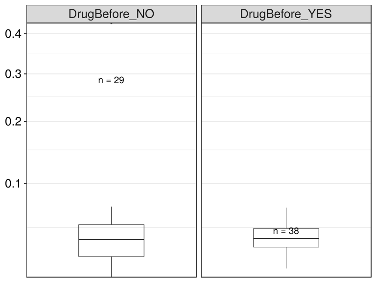

noone@mail.com
Analysis of Dieting study 16S data
% Fri Sep  7 05:46:18 2018

##### \(1.6.1.4.2.1.17\) Plots of Abundance-based Hill number of order NE_8.

Plots are shown with relation to various combinations of meta 
                   data variables and in different graphical representations. Lots of plots here.

##### \(1.6.1.4.2.1.17.2\) Iterating over all combinations of grouping variables

##### \(1.6.1.4.2.1.17.2.1\) Grouping variables visit,Drug.Before.Diet

##### \(1.6.1.4.2.1.17.2.2\) Iterating over Abundance-based Hill number of order NE_8. profile sorting order

##### \(1.6.1.4.2.1.17.2.2.1\) Abundance-based Hill number of order NE_8. profile sorting order: original

##### \(1.6.1.4.2.1.17.2.2.2\) Iterating over dodged vs faceted bars

The same data are shown in multiple combinations of graphical representations. 
                         This is the same data, but each plot highlights slightly different aspects of it.
                         It is not likely that you will need every plot - pick only what you need.

##### \(1.6.1.4.2.1.17.2.2.2.1\) dodged plots. Iterating over orientation and, optionally, scaling

##### \(1.6.1.4.2.1.17.2.2.2.1.1\) Abundance-based Hill number of order NE_8. Plot is in original orientation, Y axis SQRT scaled. Iterating over plot geometry

\(1.6.1.4.2.1.17.2.2.2.1.1.0\) [`Table 439.`](#table.439) Data table used for plots. Data grouped by visit,Drug.Before.Diet. Full dataset is also saved in a delimited text file (click to download and open e.g. in Excel) [`data/1.6.1.4.2.1.17.2.2.2.1.1.0-3236373edde.1.6.1.4.2.1.17.2.2.csv`](data/1.6.1.4.2.1.17.2.2.2.1.1.0-3236373edde.1.6.1.4.2.1.17.2.2.csv)

| .record.id | visit | Drug.Before.Diet | feature | index   |
|:-----------|:------|:-----------------|:--------|:--------|
| SM1        | 1     | DrugBefore\_YES  | NE\_8   | 0.04873 |
| SM10       | 3     | DrugBefore\_YES  | NE\_8   | 0.06157 |
| SM100      | 4     | DrugBefore\_YES  | NE\_8   | 0.01872 |
| SM11       | 2     | DrugBefore\_YES  | NE\_8   | 0.03836 |
| SM12       | 1     | DrugBefore\_YES  | NE\_8   | 0.03541 |
| SM13       | 1     | DrugBefore\_NO   | NE\_8   | 0.03302 |
| SM14       | 1     | DrugBefore\_NO   | NE\_8   | 0.01832 |
| SM16       | 4     | DrugBefore\_NO   | NE\_8   | 0.02984 |
| SM17       | 1     | DrugBefore\_YES  | NE\_8   | 0.03552 |
| SM18       | 2     | DrugBefore\_NO   | NE\_8   | 0.02933 |
| SM19       | 2     | DrugBefore\_NO   | NE\_8   | 0.02445 |
| SM2        | 1     | DrugBefore\_NO   | NE\_8   | 0.02723 |
| SM21       | 1     | DrugBefore\_NO   | NE\_8   | 0.05341 |
| SM22       | 1     | DrugBefore\_YES  | NE\_8   | 0.03391 |
| SM23       | 2     | DrugBefore\_YES  | NE\_8   | 0.05547 |
| SM24       | 1     | DrugBefore\_NO   | NE\_8   | 0.01406 |
| SM25       | 4     | DrugBefore\_NO   | NE\_8   | 0.02489 |
| SM29       | 3     | DrugBefore\_YES  | NE\_8   | 0.02445 |
| SM3        | 2     | DrugBefore\_YES  | NE\_8   | 0.04815 |
| SM30       | 4     | DrugBefore\_YES  | NE\_8   | 0.04745 |
| SM33       | 1     | DrugBefore\_YES  | NE\_8   | 0.04615 |
| SM36       | 4     | DrugBefore\_NO   | NE\_8   | 0.05556 |
| SM38       | 2     | DrugBefore\_YES  | NE\_8   | 0.05302 |
| SM39       | 1     | DrugBefore\_NO   | NE\_8   | 0.05062 |
| SM40       | 4     | DrugBefore\_NO   | NE\_8   | 0.06755 |
| SM41       | 1     | DrugBefore\_YES  | NE\_8   | 0.03784 |
| SM42       | 4     | DrugBefore\_NO   | NE\_8   | 0.02500 |
| SM43       | 4     | DrugBefore\_YES  | NE\_8   | 0.03378 |
| SM45       | 2     | DrugBefore\_NO   | NE\_8   | 0.42931 |
| SM49       | 1     | DrugBefore\_YES  | NE\_8   | 0.06002 |
| SM5        | 3     | DrugBefore\_YES  | NE\_8   | 0.02886 |
| SM50       | 3     | DrugBefore\_NO   | NE\_8   | 0.07158 |
| SM51       | 4     | DrugBefore\_YES  | NE\_8   | 0.03488 |
| SM52       | 1     | DrugBefore\_NO   | NE\_8   | 0.05265 |
| SM53       | 2     | DrugBefore\_YES  | NE\_8   | 0.04181 |
| SM54       | 3     | DrugBefore\_YES  | NE\_8   | 0.03835 |
| SM56       | 2     | DrugBefore\_YES  | NE\_8   | 0.02073 |
| SM57       | 1     | DrugBefore\_YES  | NE\_8   | 0.02725 |
| SM58       | 2     | DrugBefore\_NO   | NE\_8   | 0.02695 |
| SM59       | 3     | DrugBefore\_NO   | NE\_8   | 0.04883 |
| SM60       | 3     | DrugBefore\_YES  | NE\_8   | 0.04479 |
| SM62       | 1     | DrugBefore\_YES  | NE\_8   | 0.04533 |
| SM64       | 2     | DrugBefore\_YES  | NE\_8   | 0.02682 |
| SM65       | 3     | DrugBefore\_YES  | NE\_8   | 0.07041 |
| SM67       | 4     | DrugBefore\_YES  | NE\_8   | 0.05776 |
| SM68       | 4     | DrugBefore\_NO   | NE\_8   | 0.04329 |
| SM69       | 4     | DrugBefore\_YES  | NE\_8   | 0.06243 |
| SM71       | 3     | DrugBefore\_YES  | NE\_8   | 0.03246 |
| SM73       | 1     | DrugBefore\_NO   | NE\_8   | 0.04847 |
| SM75       | 3     | DrugBefore\_NO   | NE\_8   | 0.04935 |
| SM77       | 2     | DrugBefore\_YES  | NE\_8   | 0.03303 |
| SM79       | 2     | DrugBefore\_NO   | NE\_8   | 0.02626 |
| SM8        | 1     | DrugBefore\_NO   | NE\_8   | 0.03928 |
| SM82       | 4     | DrugBefore\_YES  | NE\_8   | 0.03329 |
| SM83       | 1     | DrugBefore\_YES  | NE\_8   | 0.04684 |
| SM84       | 1     | DrugBefore\_YES  | NE\_8   | 0.06245 |
| SM86       | 2     | DrugBefore\_YES  | NE\_8   | 0.02707 |
| SM87       | 1     | DrugBefore\_YES  | NE\_8   | 0.04895 |
| SM88       | 2     | DrugBefore\_YES  | NE\_8   | 0.04830 |
| SM9        | 2     | DrugBefore\_NO   | NE\_8   | 0.05262 |
| SM90       | 2     | DrugBefore\_NO   | NE\_8   | 0.05344 |
| SM91       | 3     | DrugBefore\_YES  | NE\_8   | 0.05421 |
| SM92       | 3     | DrugBefore\_NO   | NE\_8   | 0.03531 |
| SM93       | 1     | DrugBefore\_YES  | NE\_8   | 0.02351 |
| SM96       | 1     | DrugBefore\_NO   | NE\_8   | 0.01737 |
| SM98       | 3     | DrugBefore\_NO   | NE\_8   | 0.03981 |
| SM99       | 3     | DrugBefore\_NO   | NE\_8   | 0.02059 |

\(1.6.1.4.2.1.17.2.2.2.1.1.1\) [`Widget 452.`](#widget.452) Dynamic Pivot Table link (drag and drop field names and pick averaging 
                      functions or plot types; click on fields or legend elements to filter values). 
                      Starting rendering is Stacked Bar Chart. Data grouped by visit,Drug.Before.Diet. Click to see HTML widget file in full window: [`./1.6.1.4.2.1.17.2.2.2.1.1.1-323771057bcDynamic.Pivot.Table.html`](./1.6.1.4.2.1.17.2.2.2.1.1.1-323771057bcDynamic.Pivot.Table.html)

\(1.6.1.4.2.1.17.2.2.2.1.1.1\) [`Widget 453.`](#widget.453) Dynamic Pivot Table link (drag and drop field names and pick averaging 
                      functions or plot types; click on fields or legend elements to filter values). 
                      Starting rendering is Table Barchart. Data grouped by visit,Drug.Before.Diet. Click to see HTML widget file in full window: [`./1.6.1.4.2.1.17.2.2.2.1.1.1-323418a842bDynamic.Pivot.Table.html`](./1.6.1.4.2.1.17.2.2.2.1.1.1-323418a842bDynamic.Pivot.Table.html)

\(1.6.1.4.2.1.17.2.2.2.1.1.1\) [`Table 440.`](#table.440) Summary table. Data grouped by visit,Drug.Before.Diet. Full dataset is also saved in a delimited text file (click to download and open e.g. in Excel) [`data/1.6.1.4.2.1.17.2.2.2.1.1.1-32378b9a60.1.6.1.4.2.1.17.2.2.csv`](data/1.6.1.4.2.1.17.2.2.2.1.1.1-32378b9a60.1.6.1.4.2.1.17.2.2.csv)

| feature | visit | Drug.Before.Diet | mean    | sd      | median  | incidence |
|:--------|:------|:-----------------|:--------|:--------|:--------|:----------|
| NE\_8   | 1     | DrugBefore\_NO   | 0.03544 | 0.01558 | 0.03615 | 1         |
| NE\_8   | 1     | DrugBefore\_YES  | 0.04245 | 0.01159 | 0.04533 | 1         |
| NE\_8   | 2     | DrugBefore\_NO   | 0.09177 | 0.14936 | 0.02933 | 1         |
| NE\_8   | 2     | DrugBefore\_YES  | 0.03928 | 0.01205 | 0.04008 | 1         |
| NE\_8   | 3     | DrugBefore\_NO   | 0.04424 | 0.01705 | 0.04432 | 1         |
| NE\_8   | 3     | DrugBefore\_YES  | 0.04439 | 0.01641 | 0.04157 | 1         |
| NE\_8   | 4     | DrugBefore\_NO   | 0.04102 | 0.01768 | 0.03657 | 1         |
| NE\_8   | 4     | DrugBefore\_YES  | 0.04119 | 0.01542 | 0.03488 | 1         |

\(1.6.1.4.2.1.17.2.2.2.1.1.1\) [`Figure 1025.`](#figure.1025) Abundance-based Hill number of order NE_8. Data grouped by visit,Drug.Before.Diet.  boxplot plot.  Image file: [`plots/323ffb5cbc.svg`](plots/323ffb5cbc.svg).
