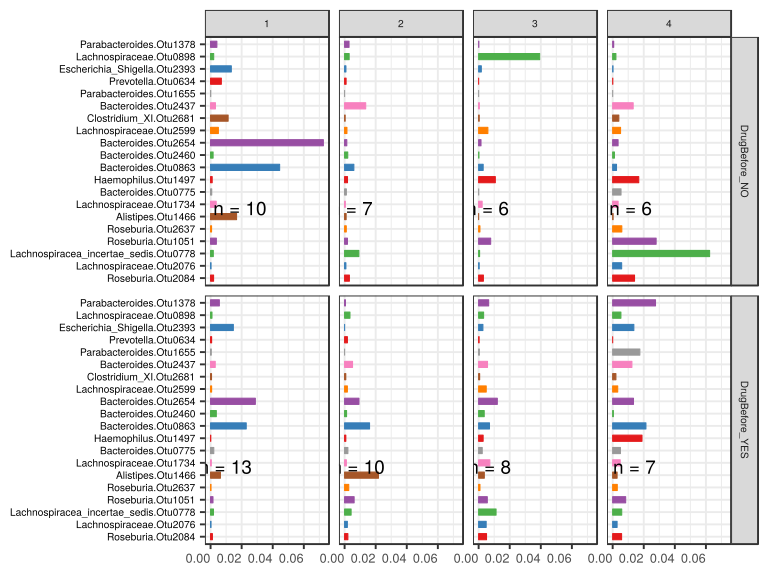

noone@mail.com
Analysis of Dieting study 16S data
% Fri Sep  7 05:46:18 2018

##### \(1.6.1.4.5\) Plots of Abundance.

Plots are shown with relation to various combinations of meta 
                   data variables and in different graphical representations. Lots of plots here.

##### \(1.6.1.4.5.2\) Iterating over all combinations of grouping variables

##### \(1.6.1.4.5.2.1\) Grouping variables visit,Drug.Before.Diet

##### \(1.6.1.4.5.2.2\) Iterating over Abundance. profile sorting order

##### \(1.6.1.4.5.2.2.1\) Abundance. profile sorting order: average abundance

##### \(1.6.1.4.5.2.2.2\) Iterating over dodged vs faceted bars

The same data are shown in multiple combinations of graphical representations. 
                         This is the same data, but each plot highlights slightly different aspects of it.
                         It is not likely that you will need every plot - pick only what you need.

##### \(1.6.1.4.5.2.2.2.1\) faceted plots. Iterating over orientation and, optionally, scaling

##### \(1.6.1.4.5.2.2.2.1.1\) Abundance. Plot is in original orientation, Y axis SQRT scaled. Iterating over plot geometry

\(1.6.1.4.5.2.2.2.1.1.0\) [`Table 447.`](#table.447) Data table used for plots. Data grouped by visit,Drug.Before.Diet. Showing only 200 first rows. Full dataset is also saved in a delimited text file (click to download and open e.g. in Excel) [`data/1.6.1.4.5.2.2.2.1.1.0-3235e48f2b3.1.6.1.4.5.2.2.2.1.1.csv`](data/1.6.1.4.5.2.2.2.1.1.0-3235e48f2b3.1.6.1.4.5.2.2.2.1.1.csv)

| .record.id | visit | Drug.Before.Diet | feature             | Abundance  |
|:-----------|:------|:-----------------|:--------------------|:-----------|
| SM1        | 1     | DrugBefore\_YES  | Bacteroides.Otu0001 | 3.325e\-02 |
| SM10       | 3     | DrugBefore\_YES  | Bacteroides.Otu0001 | 0.000e\+00 |
| SM100      | 4     | DrugBefore\_YES  | Bacteroides.Otu0001 | 7.692e\-05 |
| SM11       | 2     | DrugBefore\_YES  | Bacteroides.Otu0001 | 2.280e\-01 |
| SM12       | 1     | DrugBefore\_YES  | Bacteroides.Otu0001 | 2.363e\-01 |
| SM13       | 1     | DrugBefore\_NO   | Bacteroides.Otu0001 | 2.143e\-02 |
| SM14       | 1     | DrugBefore\_NO   | Bacteroides.Otu0001 | 0.000e\+00 |
| SM16       | 4     | DrugBefore\_NO   | Bacteroides.Otu0001 | 3.835e\-02 |
| SM17       | 1     | DrugBefore\_YES  | Bacteroides.Otu0001 | 1.738e\-01 |
| SM18       | 2     | DrugBefore\_NO   | Bacteroides.Otu0001 | 1.343e\-03 |
| SM19       | 2     | DrugBefore\_NO   | Bacteroides.Otu0001 | 3.656e\-02 |
| SM2        | 1     | DrugBefore\_NO   | Bacteroides.Otu0001 | 7.129e\-03 |
| SM21       | 1     | DrugBefore\_NO   | Bacteroides.Otu0001 | 9.063e\-02 |
| SM22       | 1     | DrugBefore\_YES  | Bacteroides.Otu0001 | 1.800e\-01 |
| SM23       | 2     | DrugBefore\_YES  | Bacteroides.Otu0001 | 2.207e\-01 |
| SM24       | 1     | DrugBefore\_NO   | Bacteroides.Otu0001 | 6.084e\-02 |
| SM25       | 4     | DrugBefore\_NO   | Bacteroides.Otu0001 | 0.000e\+00 |
| SM29       | 3     | DrugBefore\_YES  | Bacteroides.Otu0001 | 1.015e\-01 |
| SM3        | 2     | DrugBefore\_YES  | Bacteroides.Otu0001 | 5.679e\-02 |
| SM30       | 4     | DrugBefore\_YES  | Bacteroides.Otu0001 | 4.615e\-02 |
| SM33       | 1     | DrugBefore\_YES  | Bacteroides.Otu0001 | 0.000e\+00 |
| SM36       | 4     | DrugBefore\_NO   | Bacteroides.Otu0001 | 0.000e\+00 |
| SM38       | 2     | DrugBefore\_YES  | Bacteroides.Otu0001 | 2.849e\-01 |
| SM39       | 1     | DrugBefore\_NO   | Bacteroides.Otu0001 | 1.512e\-01 |
| SM40       | 4     | DrugBefore\_NO   | Bacteroides.Otu0001 | 1.767e\-02 |
| SM41       | 1     | DrugBefore\_YES  | Bacteroides.Otu0001 | 4.380e\-02 |
| SM42       | 4     | DrugBefore\_NO   | Bacteroides.Otu0001 | 2.641e\-01 |
| SM43       | 4     | DrugBefore\_YES  | Bacteroides.Otu0001 | 1.241e\-01 |
| SM45       | 2     | DrugBefore\_NO   | Bacteroides.Otu0001 | 0.000e\+00 |
| SM49       | 1     | DrugBefore\_YES  | Bacteroides.Otu0001 | 1.179e\-01 |
| SM5        | 3     | DrugBefore\_YES  | Bacteroides.Otu0001 | 2.741e\-01 |
| SM50       | 3     | DrugBefore\_NO   | Bacteroides.Otu0001 | 0.000e\+00 |
| SM51       | 4     | DrugBefore\_YES  | Bacteroides.Otu0001 | 2.826e\-01 |
| SM52       | 1     | DrugBefore\_NO   | Bacteroides.Otu0001 | 5.829e\-02 |
| SM53       | 2     | DrugBefore\_YES  | Bacteroides.Otu0001 | 2.368e\-01 |
| SM54       | 3     | DrugBefore\_YES  | Bacteroides.Otu0001 | 0.000e\+00 |
| SM56       | 2     | DrugBefore\_YES  | Bacteroides.Otu0001 | 0.000e\+00 |
| SM57       | 1     | DrugBefore\_YES  | Bacteroides.Otu0001 | 1.037e\-01 |
| SM58       | 2     | DrugBefore\_NO   | Bacteroides.Otu0001 | 1.620e\-04 |
| SM59       | 3     | DrugBefore\_NO   | Bacteroides.Otu0001 | 3.745e\-03 |
| SM60       | 3     | DrugBefore\_YES  | Bacteroides.Otu0001 | 2.447e\-01 |
| SM62       | 1     | DrugBefore\_YES  | Bacteroides.Otu0001 | 5.347e\-01 |
| SM64       | 2     | DrugBefore\_YES  | Bacteroides.Otu0001 | 3.508e\-01 |
| SM65       | 3     | DrugBefore\_YES  | Bacteroides.Otu0001 | 8.092e\-02 |
| SM67       | 4     | DrugBefore\_YES  | Bacteroides.Otu0001 | 2.186e\-01 |
| SM68       | 4     | DrugBefore\_NO   | Bacteroides.Otu0001 | 0.000e\+00 |
| SM69       | 4     | DrugBefore\_YES  | Bacteroides.Otu0001 | 1.655e\-01 |
| SM71       | 3     | DrugBefore\_YES  | Bacteroides.Otu0001 | 2.788e\-01 |
| SM73       | 1     | DrugBefore\_NO   | Bacteroides.Otu0001 | 1.891e\-01 |
| SM75       | 3     | DrugBefore\_NO   | Bacteroides.Otu0001 | 0.000e\+00 |
| SM77       | 2     | DrugBefore\_YES  | Bacteroides.Otu0001 | 2.034e\-01 |
| SM79       | 2     | DrugBefore\_NO   | Bacteroides.Otu0001 | 2.642e\-02 |
| SM8        | 1     | DrugBefore\_NO   | Bacteroides.Otu0001 | 5.265e\-02 |
| SM82       | 4     | DrugBefore\_YES  | Bacteroides.Otu0001 | 1.052e\-02 |
| SM83       | 1     | DrugBefore\_YES  | Bacteroides.Otu0001 | 0.000e\+00 |
| SM84       | 1     | DrugBefore\_YES  | Bacteroides.Otu0001 | 1.247e\-01 |
| SM86       | 2     | DrugBefore\_YES  | Bacteroides.Otu0001 | 0.000e\+00 |
| SM87       | 1     | DrugBefore\_YES  | Bacteroides.Otu0001 | 1.941e\-01 |
| SM88       | 2     | DrugBefore\_YES  | Bacteroides.Otu0001 | 2.302e\-02 |
| SM9        | 2     | DrugBefore\_NO   | Bacteroides.Otu0001 | 3.497e\-02 |
| SM90       | 2     | DrugBefore\_NO   | Bacteroides.Otu0001 | 3.713e\-02 |
| SM91       | 3     | DrugBefore\_YES  | Bacteroides.Otu0001 | 1.254e\-01 |
| SM92       | 3     | DrugBefore\_NO   | Bacteroides.Otu0001 | 0.000e\+00 |
| SM93       | 1     | DrugBefore\_YES  | Bacteroides.Otu0001 | 3.120e\-01 |
| SM96       | 1     | DrugBefore\_NO   | Bacteroides.Otu0001 | 0.000e\+00 |
| SM98       | 3     | DrugBefore\_NO   | Bacteroides.Otu0001 | 3.648e\-02 |
| SM99       | 3     | DrugBefore\_NO   | Bacteroides.Otu0001 | 4.305e\-02 |
| SM1        | 1     | DrugBefore\_YES  | Bacteroides.Otu2520 | 1.003e\-01 |
| SM10       | 3     | DrugBefore\_YES  | Bacteroides.Otu2520 | 0.000e\+00 |
| SM100      | 4     | DrugBefore\_YES  | Bacteroides.Otu2520 | 0.000e\+00 |
| SM11       | 2     | DrugBefore\_YES  | Bacteroides.Otu2520 | 1.344e\-01 |
| SM12       | 1     | DrugBefore\_YES  | Bacteroides.Otu2520 | 1.504e\-01 |
| SM13       | 1     | DrugBefore\_NO   | Bacteroides.Otu2520 | 1.473e\-02 |
| SM14       | 1     | DrugBefore\_NO   | Bacteroides.Otu2520 | 3.786e\-04 |
| SM16       | 4     | DrugBefore\_NO   | Bacteroides.Otu2520 | 0.000e\+00 |
| SM17       | 1     | DrugBefore\_YES  | Bacteroides.Otu2520 | 1.862e\-02 |
| SM18       | 2     | DrugBefore\_NO   | Bacteroides.Otu2520 | 1.074e\-02 |
| SM19       | 2     | DrugBefore\_NO   | Bacteroides.Otu2520 | 9.255e\-04 |
| SM2        | 1     | DrugBefore\_NO   | Bacteroides.Otu2520 | 1.638e\-01 |
| SM21       | 1     | DrugBefore\_NO   | Bacteroides.Otu2520 | 4.540e\-03 |
| SM22       | 1     | DrugBefore\_YES  | Bacteroides.Otu2520 | 2.610e\-02 |
| SM23       | 2     | DrugBefore\_YES  | Bacteroides.Otu2520 | 0.000e\+00 |
| SM24       | 1     | DrugBefore\_NO   | Bacteroides.Otu2520 | 5.531e\-03 |
| SM25       | 4     | DrugBefore\_NO   | Bacteroides.Otu2520 | 3.053e\-01 |
| SM29       | 3     | DrugBefore\_YES  | Bacteroides.Otu2520 | 0.000e\+00 |
| SM3        | 2     | DrugBefore\_YES  | Bacteroides.Otu2520 | 5.657e\-04 |
| SM30       | 4     | DrugBefore\_YES  | Bacteroides.Otu2520 | 3.250e\-04 |
| SM33       | 1     | DrugBefore\_YES  | Bacteroides.Otu2520 | 7.120e\-02 |
| SM36       | 4     | DrugBefore\_NO   | Bacteroides.Otu2520 | 0.000e\+00 |
| SM38       | 2     | DrugBefore\_YES  | Bacteroides.Otu2520 | 9.696e\-02 |
| SM39       | 1     | DrugBefore\_NO   | Bacteroides.Otu2520 | 8.620e\-03 |
| SM40       | 4     | DrugBefore\_NO   | Bacteroides.Otu2520 | 5.920e\-02 |
| SM41       | 1     | DrugBefore\_YES  | Bacteroides.Otu2520 | 1.440e\-01 |
| SM42       | 4     | DrugBefore\_NO   | Bacteroides.Otu2520 | 1.665e\-04 |
| SM43       | 4     | DrugBefore\_YES  | Bacteroides.Otu2520 | 3.957e\-02 |
| SM45       | 2     | DrugBefore\_NO   | Bacteroides.Otu2520 | 0.000e\+00 |
| SM49       | 1     | DrugBefore\_YES  | Bacteroides.Otu2520 | 1.715e\-01 |
| SM5        | 3     | DrugBefore\_YES  | Bacteroides.Otu2520 | 0.000e\+00 |
| SM50       | 3     | DrugBefore\_NO   | Bacteroides.Otu2520 | 0.000e\+00 |
| SM51       | 4     | DrugBefore\_YES  | Bacteroides.Otu2520 | 3.368e\-02 |
| SM52       | 1     | DrugBefore\_NO   | Bacteroides.Otu2520 | 2.179e\-04 |
| SM53       | 2     | DrugBefore\_YES  | Bacteroides.Otu2520 | 7.192e\-05 |
| SM54       | 3     | DrugBefore\_YES  | Bacteroides.Otu2520 | 2.426e\-01 |
| SM56       | 2     | DrugBefore\_YES  | Bacteroides.Otu2520 | 9.465e\-03 |
| SM57       | 1     | DrugBefore\_YES  | Bacteroides.Otu2520 | 0.000e\+00 |
| SM58       | 2     | DrugBefore\_NO   | Bacteroides.Otu2520 | 3.239e\-04 |
| SM59       | 3     | DrugBefore\_NO   | Bacteroides.Otu2520 | 2.996e\-03 |
| SM60       | 3     | DrugBefore\_YES  | Bacteroides.Otu2520 | 5.548e\-02 |
| SM62       | 1     | DrugBefore\_YES  | Bacteroides.Otu2520 | 1.525e\-02 |
| SM64       | 2     | DrugBefore\_YES  | Bacteroides.Otu2520 | 9.297e\-03 |
| SM65       | 3     | DrugBefore\_YES  | Bacteroides.Otu2520 | 0.000e\+00 |
| SM67       | 4     | DrugBefore\_YES  | Bacteroides.Otu2520 | 0.000e\+00 |
| SM68       | 4     | DrugBefore\_NO   | Bacteroides.Otu2520 | 0.000e\+00 |
| SM69       | 4     | DrugBefore\_YES  | Bacteroides.Otu2520 | 1.197e\-02 |
| SM71       | 3     | DrugBefore\_YES  | Bacteroides.Otu2520 | 2.162e\-02 |
| SM73       | 1     | DrugBefore\_NO   | Bacteroides.Otu2520 | 5.047e\-04 |
| SM75       | 3     | DrugBefore\_NO   | Bacteroides.Otu2520 | 2.037e\-03 |
| SM77       | 2     | DrugBefore\_YES  | Bacteroides.Otu2520 | 8.359e\-02 |
| SM79       | 2     | DrugBefore\_NO   | Bacteroides.Otu2520 | 1.576e\-02 |
| SM8        | 1     | DrugBefore\_NO   | Bacteroides.Otu2520 | 0.000e\+00 |
| SM82       | 4     | DrugBefore\_YES  | Bacteroides.Otu2520 | 3.568e\-01 |
| SM83       | 1     | DrugBefore\_YES  | Bacteroides.Otu2520 | 0.000e\+00 |
| SM84       | 1     | DrugBefore\_YES  | Bacteroides.Otu2520 | 2.912e\-03 |
| SM86       | 2     | DrugBefore\_YES  | Bacteroides.Otu2520 | 0.000e\+00 |
| SM87       | 1     | DrugBefore\_YES  | Bacteroides.Otu2520 | 4.566e\-02 |
| SM88       | 2     | DrugBefore\_YES  | Bacteroides.Otu2520 | 1.604e\-01 |
| SM9        | 2     | DrugBefore\_NO   | Bacteroides.Otu2520 | 5.636e\-02 |
| SM90       | 2     | DrugBefore\_NO   | Bacteroides.Otu2520 | 2.558e\-02 |
| SM91       | 3     | DrugBefore\_YES  | Bacteroides.Otu2520 | 8.567e\-02 |
| SM92       | 3     | DrugBefore\_NO   | Bacteroides.Otu2520 | 9.504e\-03 |
| SM93       | 1     | DrugBefore\_YES  | Bacteroides.Otu2520 | 4.034e\-04 |
| SM96       | 1     | DrugBefore\_NO   | Bacteroides.Otu2520 | 4.602e\-01 |
| SM98       | 3     | DrugBefore\_NO   | Bacteroides.Otu2520 | 9.832e\-04 |
| SM99       | 3     | DrugBefore\_NO   | Bacteroides.Otu2520 | 4.757e\-04 |
| SM1        | 1     | DrugBefore\_YES  | Bacteroides.Otu0848 | 5.888e\-03 |
| SM10       | 3     | DrugBefore\_YES  | Bacteroides.Otu0848 | 0.000e\+00 |
| SM100      | 4     | DrugBefore\_YES  | Bacteroides.Otu0848 | 1.538e\-04 |
| SM11       | 2     | DrugBefore\_YES  | Bacteroides.Otu0848 | 1.642e\-02 |
| SM12       | 1     | DrugBefore\_YES  | Bacteroides.Otu0848 | 1.120e\-02 |
| SM13       | 1     | DrugBefore\_NO   | Bacteroides.Otu0848 | 8.929e\-03 |
| SM14       | 1     | DrugBefore\_NO   | Bacteroides.Otu0848 | 3.786e\-04 |
| SM16       | 4     | DrugBefore\_NO   | Bacteroides.Otu0848 | 4.875e\-04 |
| SM17       | 1     | DrugBefore\_YES  | Bacteroides.Otu0848 | 3.682e\-02 |
| SM18       | 2     | DrugBefore\_NO   | Bacteroides.Otu0848 | 6.715e\-04 |
| SM19       | 2     | DrugBefore\_NO   | Bacteroides.Otu0848 | 2.360e\-02 |
| SM2        | 1     | DrugBefore\_NO   | Bacteroides.Otu0848 | 8.741e\-03 |
| SM21       | 1     | DrugBefore\_NO   | Bacteroides.Otu0848 | 6.558e\-03 |
| SM22       | 1     | DrugBefore\_YES  | Bacteroides.Otu0848 | 0.000e\+00 |
| SM23       | 2     | DrugBefore\_YES  | Bacteroides.Otu0848 | 0.000e\+00 |
| SM24       | 1     | DrugBefore\_NO   | Bacteroides.Otu0848 | 2.958e\-03 |
| SM25       | 4     | DrugBefore\_NO   | Bacteroides.Otu0848 | 8.319e\-04 |
| SM29       | 3     | DrugBefore\_YES  | Bacteroides.Otu0848 | 0.000e\+00 |
| SM3        | 2     | DrugBefore\_YES  | Bacteroides.Otu0848 | 3.779e\-02 |
| SM30       | 4     | DrugBefore\_YES  | Bacteroides.Otu0848 | 2.275e\-03 |
| SM33       | 1     | DrugBefore\_YES  | Bacteroides.Otu0848 | 5.901e\-03 |
| SM36       | 4     | DrugBefore\_NO   | Bacteroides.Otu0848 | 0.000e\+00 |
| SM38       | 2     | DrugBefore\_YES  | Bacteroides.Otu0848 | 7.790e\-02 |
| SM39       | 1     | DrugBefore\_NO   | Bacteroides.Otu0848 | 5.281e\-03 |
| SM40       | 4     | DrugBefore\_NO   | Bacteroides.Otu0848 | 1.387e\-03 |
| SM41       | 1     | DrugBefore\_YES  | Bacteroides.Otu0848 | 5.539e\-02 |
| SM42       | 4     | DrugBefore\_NO   | Bacteroides.Otu0848 | 8.323e\-05 |
| SM43       | 4     | DrugBefore\_YES  | Bacteroides.Otu0848 | 2.010e\-01 |
| SM45       | 2     | DrugBefore\_NO   | Bacteroides.Otu0848 | 0.000e\+00 |
| SM49       | 1     | DrugBefore\_YES  | Bacteroides.Otu0848 | 1.082e\-01 |
| SM5        | 3     | DrugBefore\_YES  | Bacteroides.Otu0848 | 8.476e\-05 |
| SM50       | 3     | DrugBefore\_NO   | Bacteroides.Otu0848 | 0.000e\+00 |
| SM51       | 4     | DrugBefore\_YES  | Bacteroides.Otu0848 | 4.751e\-02 |
| SM52       | 1     | DrugBefore\_NO   | Bacteroides.Otu0848 | 0.000e\+00 |
| SM53       | 2     | DrugBefore\_YES  | Bacteroides.Otu0848 | 0.000e\+00 |
| SM54       | 3     | DrugBefore\_YES  | Bacteroides.Otu0848 | 1.414e\-02 |
| SM56       | 2     | DrugBefore\_YES  | Bacteroides.Otu0848 | 6.527e\-04 |
| SM57       | 1     | DrugBefore\_YES  | Bacteroides.Otu0848 | 0.000e\+00 |
| SM58       | 2     | DrugBefore\_NO   | Bacteroides.Otu0848 | 8.098e\-04 |
| SM59       | 3     | DrugBefore\_NO   | Bacteroides.Otu0848 | 0.000e\+00 |
| SM60       | 3     | DrugBefore\_YES  | Bacteroides.Otu0848 | 2.444e\-01 |
| SM62       | 1     | DrugBefore\_YES  | Bacteroides.Otu0848 | 5.058e\-02 |
| SM64       | 2     | DrugBefore\_YES  | Bacteroides.Otu0848 | 2.060e\-03 |
| SM65       | 3     | DrugBefore\_YES  | Bacteroides.Otu0848 | 1.181e\-01 |
| SM67       | 4     | DrugBefore\_YES  | Bacteroides.Otu0848 | 0.000e\+00 |
| SM68       | 4     | DrugBefore\_NO   | Bacteroides.Otu0848 | 8.725e\-02 |
| SM69       | 4     | DrugBefore\_YES  | Bacteroides.Otu0848 | 6.310e\-02 |
| SM71       | 3     | DrugBefore\_YES  | Bacteroides.Otu0848 | 1.770e\-02 |
| SM73       | 1     | DrugBefore\_NO   | Bacteroides.Otu0848 | 1.918e\-03 |
| SM75       | 3     | DrugBefore\_NO   | Bacteroides.Otu0848 | 0.000e\+00 |
| SM77       | 2     | DrugBefore\_YES  | Bacteroides.Otu0848 | 6.449e\-02 |
| SM79       | 2     | DrugBefore\_NO   | Bacteroides.Otu0848 | 3.034e\-03 |
| SM8        | 1     | DrugBefore\_NO   | Bacteroides.Otu0848 | 1.294e\-01 |
| SM82       | 4     | DrugBefore\_YES  | Bacteroides.Otu0848 | 2.948e\-02 |
| SM83       | 1     | DrugBefore\_YES  | Bacteroides.Otu0848 | 2.746e\-04 |
| SM84       | 1     | DrugBefore\_YES  | Bacteroides.Otu0848 | 8.057e\-03 |
| SM86       | 2     | DrugBefore\_YES  | Bacteroides.Otu0848 | 0.000e\+00 |
| SM87       | 1     | DrugBefore\_YES  | Bacteroides.Otu0848 | 1.750e\-02 |
| SM88       | 2     | DrugBefore\_YES  | Bacteroides.Otu0848 | 3.666e\-03 |
| SM9        | 2     | DrugBefore\_NO   | Bacteroides.Otu0848 | 2.057e\-03 |
| SM90       | 2     | DrugBefore\_NO   | Bacteroides.Otu0848 | 1.815e\-02 |
| SM91       | 3     | DrugBefore\_YES  | Bacteroides.Otu0848 | 8.972e\-02 |
| SM92       | 3     | DrugBefore\_NO   | Bacteroides.Otu0848 | 4.849e\-01 |
| SM93       | 1     | DrugBefore\_YES  | Bacteroides.Otu0848 | 4.734e\-02 |
| SM96       | 1     | DrugBefore\_NO   | Bacteroides.Otu0848 | 6.533e\-03 |
| SM98       | 3     | DrugBefore\_NO   | Bacteroides.Otu0848 | 3.933e\-04 |

\(1.6.1.4.5.2.2.2.1.1.1\) [`Widget 458.`](#widget.458) Dynamic Pivot Table link (drag and drop field names and pick averaging 
                      functions or plot types; click on fields or legend elements to filter values). 
                      Starting rendering is Stacked Bar Chart. Data grouped by visit,Drug.Before.Diet. Click to see HTML widget file in full window: [`./1.6.1.4.5.2.2.2.1.1.1-32323070621Dynamic.Pivot.Table.html`](./1.6.1.4.5.2.2.2.1.1.1-32323070621Dynamic.Pivot.Table.html)

\(1.6.1.4.5.2.2.2.1.1.1\) [`Widget 459.`](#widget.459) Dynamic Pivot Table link (drag and drop field names and pick averaging 
                      functions or plot types; click on fields or legend elements to filter values). 
                      Starting rendering is Table Barchart. Data grouped by visit,Drug.Before.Diet. Click to see HTML widget file in full window: [`./1.6.1.4.5.2.2.2.1.1.1-3237d62d2fcDynamic.Pivot.Table.html`](./1.6.1.4.5.2.2.2.1.1.1-3237d62d2fcDynamic.Pivot.Table.html)

\(1.6.1.4.5.2.2.2.1.1.1\) [`Table 448.`](#table.448) Summary table. Data grouped by visit,Drug.Before.Diet. Showing only 200 first rows. Full dataset is also saved in a delimited text file (click to download and open e.g. in Excel) [`data/1.6.1.4.5.2.2.2.1.1.1-323701d8a5d.1.6.1.4.5.2.2.2.1.1.csv`](data/1.6.1.4.5.2.2.2.1.1.1-323701d8a5d.1.6.1.4.5.2.2.2.1.1.csv)

| feature                                      | visit | Drug.Before.Diet | mean       | sd         | median     | incidence |
|:---------------------------------------------|:------|:-----------------|:-----------|:-----------|:-----------|:----------|
| Bacteroides.Otu0001                          | 1     | DrugBefore\_NO   | 6.313e\-02 | 6.443e\-02 | 5.547e\-02 | 0.8000    |
| Bacteroides.Otu0001                          | 1     | DrugBefore\_YES  | 1.580e\-01 | 1.466e\-01 | 1.247e\-01 | 0.8462    |
| Bacteroides.Otu0001                          | 2     | DrugBefore\_NO   | 1.951e\-02 | 1.813e\-02 | 2.642e\-02 | 0.8571    |
| Bacteroides.Otu0001                          | 2     | DrugBefore\_YES  | 1.604e\-01 | 1.285e\-01 | 2.120e\-01 | 0.8000    |
| Bacteroides.Otu0001                          | 3     | DrugBefore\_NO   | 1.388e\-02 | 2.021e\-02 | 1.873e\-03 | 0.5000    |
| Bacteroides.Otu0001                          | 3     | DrugBefore\_YES  | 1.382e\-01 | 1.150e\-01 | 1.135e\-01 | 0.7500    |
| Bacteroides.Otu0001                          | 4     | DrugBefore\_NO   | 5.335e\-02 | 1.044e\-01 | 8.834e\-03 | 0.5000    |
| Bacteroides.Otu0001                          | 4     | DrugBefore\_YES  | 1.211e\-01 | 1.081e\-01 | 1.241e\-01 | 1.0000    |
| Bacteroides.Otu2520                          | 1     | DrugBefore\_NO   | 6.585e\-02 | 1.474e\-01 | 5.035e\-03 | 0.9000    |
| Bacteroides.Otu2520                          | 1     | DrugBefore\_YES  | 5.741e\-02 | 6.351e\-02 | 2.610e\-02 | 0.8462    |
| Bacteroides.Otu2520                          | 2     | DrugBefore\_NO   | 1.567e\-02 | 2.031e\-02 | 1.074e\-02 | 0.8571    |
| Bacteroides.Otu2520                          | 2     | DrugBefore\_YES  | 4.947e\-02 | 6.314e\-02 | 9.381e\-03 | 0.8000    |
| Bacteroides.Otu2520                          | 3     | DrugBefore\_NO   | 2.666e\-03 | 3.521e\-03 | 1.510e\-03 | 0.8333    |
| Bacteroides.Otu2520                          | 3     | DrugBefore\_YES  | 5.067e\-02 | 8.384e\-02 | 1.081e\-02 | 0.5000    |
| Bacteroides.Otu2520                          | 4     | DrugBefore\_NO   | 6.078e\-02 | 1.221e\-01 | 8.323e\-05 | 0.5000    |
| Bacteroides.Otu2520                          | 4     | DrugBefore\_YES  | 6.319e\-02 | 1.305e\-01 | 1.197e\-02 | 0.7143    |
| Bacteroides.Otu0848                          | 1     | DrugBefore\_NO   | 1.707e\-02 | 3.960e\-02 | 5.907e\-03 | 0.9000    |
| Bacteroides.Otu0848                          | 1     | DrugBefore\_YES  | 2.671e\-02 | 3.193e\-02 | 1.120e\-02 | 0.8462    |
| Bacteroides.Otu0848                          | 2     | DrugBefore\_NO   | 6.903e\-03 | 9.725e\-03 | 2.057e\-03 | 0.8571    |
| Bacteroides.Otu0848                          | 2     | DrugBefore\_YES  | 2.030e\-02 | 2.948e\-02 | 2.863e\-03 | 0.7000    |
| Bacteroides.Otu0848                          | 3     | DrugBefore\_NO   | 9.123e\-02 | 1.945e\-01 | 1.966e\-04 | 0.5000    |
| Bacteroides.Otu0848                          | 3     | DrugBefore\_YES  | 6.052e\-02 | 8.697e\-02 | 1.592e\-02 | 0.7500    |
| Bacteroides.Otu0848                          | 4     | DrugBefore\_NO   | 1.501e\-02 | 3.540e\-02 | 6.597e\-04 | 0.8333    |
| Bacteroides.Otu0848                          | 4     | DrugBefore\_YES  | 4.907e\-02 | 7.147e\-02 | 2.948e\-02 | 0.8571    |
| Faecalibacterium.Otu0067                     | 1     | DrugBefore\_NO   | 2.447e\-02 | 2.587e\-02 | 1.503e\-02 | 1.0000    |
| Faecalibacterium.Otu0067                     | 1     | DrugBefore\_YES  | 1.246e\-02 | 1.071e\-02 | 6.632e\-03 | 0.9231    |
| Faecalibacterium.Otu0067                     | 2     | DrugBefore\_NO   | 5.462e\-02 | 1.055e\-01 | 1.279e\-02 | 0.8571    |
| Faecalibacterium.Otu0067                     | 2     | DrugBefore\_YES  | 3.949e\-02 | 8.710e\-02 | 7.349e\-03 | 0.9000    |
| Faecalibacterium.Otu0067                     | 3     | DrugBefore\_NO   | 1.630e\-02 | 1.924e\-02 | 6.763e\-03 | 0.8333    |
| Faecalibacterium.Otu0067                     | 3     | DrugBefore\_YES  | 2.944e\-02 | 3.510e\-02 | 1.759e\-02 | 1.0000    |
| Faecalibacterium.Otu0067                     | 4     | DrugBefore\_NO   | 7.234e\-02 | 7.795e\-02 | 4.539e\-02 | 1.0000    |
| Faecalibacterium.Otu0067                     | 4     | DrugBefore\_YES  | 2.888e\-02 | 3.115e\-02 | 1.202e\-02 | 1.0000    |
| Bacteroides.Otu2038                          | 1     | DrugBefore\_NO   | 3.474e\-02 | 8.766e\-02 | 2.137e\-03 | 0.9000    |
| Bacteroides.Otu2038                          | 1     | DrugBefore\_YES  | 1.968e\-02 | 4.234e\-02 | 6.590e\-03 | 0.8462    |
| Bacteroides.Otu2038                          | 2     | DrugBefore\_NO   | 6.335e\-03 | 1.328e\-02 | 4.859e\-04 | 0.7143    |
| Bacteroides.Otu2038                          | 2     | DrugBefore\_YES  | 2.811e\-02 | 5.453e\-02 | 7.947e\-03 | 0.8000    |
| Bacteroides.Otu2038                          | 3     | DrugBefore\_NO   | 5.785e\-02 | 1.371e\-01 | 2.261e\-03 | 0.5000    |
| Bacteroides.Otu2038                          | 3     | DrugBefore\_YES  | 8.787e\-03 | 9.306e\-03 | 7.237e\-03 | 0.7500    |
| Bacteroides.Otu2038                          | 4     | DrugBefore\_NO   | 7.519e\-02 | 1.129e\-01 | 2.006e\-02 | 0.5000    |
| Bacteroides.Otu2038                          | 4     | DrugBefore\_YES  | 1.065e\-02 | 1.773e\-02 | 1.341e\-03 | 0.8571    |
| Parabacteroides.Otu1736                      | 1     | DrugBefore\_NO   | 3.866e\-03 | 6.134e\-03 | 1.455e\-04 | 0.6000    |
| Parabacteroides.Otu1736                      | 1     | DrugBefore\_YES  | 4.142e\-02 | 1.317e\-01 | 1.328e\-04 | 0.5385    |
| Parabacteroides.Otu1736                      | 2     | DrugBefore\_NO   | 1.770e\-02 | 4.604e\-02 | 4.893e\-04 | 0.5714    |
| Parabacteroides.Otu1736                      | 2     | DrugBefore\_YES  | 7.001e\-02 | 2.108e\-01 | 0.000e\+00 | 0.4000    |
| Parabacteroides.Otu1736                      | 3     | DrugBefore\_NO   | 7.007e\-03 | 1.493e\-02 | 0.000e\+00 | 0.3333    |
| Parabacteroides.Otu1736                      | 3     | DrugBefore\_YES  | 3.964e\-02 | 6.146e\-02 | 6.241e\-03 | 0.6250    |
| Parabacteroides.Otu1736                      | 4     | DrugBefore\_NO   | 6.321e\-04 | 1.017e\-03 | 0.000e\+00 | 0.3333    |
| Parabacteroides.Otu1736                      | 4     | DrugBefore\_YES  | 1.770e\-03 | 3.510e\-03 | 0.000e\+00 | 0.4286    |
| Prevotella.Otu1987                           | 1     | DrugBefore\_NO   | 5.770e\-02 | 1.480e\-01 | 0.000e\+00 | 0.4000    |
| Prevotella.Otu1987                           | 1     | DrugBefore\_YES  | 1.090e\-02 | 2.911e\-02 | 0.000e\+00 | 0.1538    |
| Prevotella.Otu1987                           | 2     | DrugBefore\_NO   | 4.991e\-02 | 1.044e\-01 | 0.000e\+00 | 0.4286    |
| Prevotella.Otu1987                           | 2     | DrugBefore\_YES  | 1.933e\-02 | 5.966e\-02 | 1.932e\-05 | 0.5000    |
| Prevotella.Otu1987                           | 3     | DrugBefore\_NO   | 4.009e\-02 | 9.820e\-02 | 0.000e\+00 | 0.1667    |
| Prevotella.Otu1987                           | 3     | DrugBefore\_YES  | 2.731e\-03 | 7.630e\-03 | 0.000e\+00 | 0.2500    |
| Prevotella.Otu1987                           | 4     | DrugBefore\_NO   | 1.542e\-05 | 3.776e\-05 | 0.000e\+00 | 0.1667    |
| Prevotella.Otu1987                           | 4     | DrugBefore\_YES  | 6.413e\-05 | 1.136e\-04 | 0.000e\+00 | 0.4286    |
| Bacteroides.Otu2654                          | 1     | DrugBefore\_NO   | 7.257e\-02 | 1.423e\-01 | 2.235e\-03 | 0.7000    |
| Bacteroides.Otu2654                          | 1     | DrugBefore\_YES  | 2.880e\-02 | 3.291e\-02 | 1.159e\-02 | 0.8462    |
| Bacteroides.Otu2654                          | 2     | DrugBefore\_NO   | 1.413e\-03 | 1.664e\-03 | 8.251e\-04 | 0.7143    |
| Bacteroides.Otu2654                          | 2     | DrugBefore\_YES  | 9.244e\-03 | 1.863e\-02 | 1.462e\-03 | 0.6000    |
| Bacteroides.Otu2654                          | 3     | DrugBefore\_NO   | 1.527e\-03 | 2.490e\-03 | 2.610e\-04 | 0.6667    |
| Bacteroides.Otu2654                          | 3     | DrugBefore\_YES  | 1.201e\-02 | 2.697e\-02 | 4.610e\-04 | 0.7500    |
| Bacteroides.Otu2654                          | 4     | DrugBefore\_NO   | 3.480e\-03 | 7.820e\-03 | 3.116e\-04 | 0.5000    |
| Bacteroides.Otu2654                          | 4     | DrugBefore\_YES  | 1.339e\-02 | 1.949e\-02 | 4.248e\-03 | 1.0000    |
| Bacteroides.Otu2065                          | 1     | DrugBefore\_NO   | 2.137e\-04 | 5.675e\-04 | 0.000e\+00 | 0.2000    |
| Bacteroides.Otu2065                          | 1     | DrugBefore\_YES  | 3.720e\-02 | 1.082e\-01 | 0.000e\+00 | 0.2308    |
| Bacteroides.Otu2065                          | 2     | DrugBefore\_NO   | 0.000e\+00 | 0.000e\+00 | 0.000e\+00 | 0.0000    |
| Bacteroides.Otu2065                          | 2     | DrugBefore\_YES  | 1.184e\-02 | 3.571e\-02 | 0.000e\+00 | 0.4000    |
| Bacteroides.Otu2065                          | 3     | DrugBefore\_NO   | 0.000e\+00 | 0.000e\+00 | 0.000e\+00 | 0.0000    |
| Bacteroides.Otu2065                          | 3     | DrugBefore\_YES  | 6.869e\-02 | 1.851e\-01 | 0.000e\+00 | 0.3750    |
| Bacteroides.Otu2065                          | 4     | DrugBefore\_NO   | 1.135e\-02 | 2.779e\-02 | 0.000e\+00 | 0.1667    |
| Bacteroides.Otu2065                          | 4     | DrugBefore\_YES  | 2.219e\-02 | 3.637e\-02 | 1.625e\-04 | 0.5714    |
| Bacteroides.Otu0863                          | 1     | DrugBefore\_NO   | 4.444e\-02 | 7.340e\-02 | 2.085e\-02 | 0.9000    |
| Bacteroides.Otu0863                          | 1     | DrugBefore\_YES  | 2.294e\-02 | 4.344e\-02 | 3.300e\-03 | 0.8462    |
| Bacteroides.Otu0863                          | 2     | DrugBefore\_NO   | 5.955e\-03 | 1.395e\-02 | 5.036e\-04 | 0.7143    |
| Bacteroides.Otu0863                          | 2     | DrugBefore\_YES  | 1.605e\-02 | 4.328e\-02 | 1.028e\-04 | 0.5000    |
| Bacteroides.Otu0863                          | 3     | DrugBefore\_NO   | 2.915e\-03 | 4.516e\-03 | 0.000e\+00 | 0.3333    |
| Bacteroides.Otu0863                          | 3     | DrugBefore\_YES  | 6.975e\-03 | 9.227e\-03 | 3.995e\-03 | 0.7500    |
| Bacteroides.Otu0863                          | 4     | DrugBefore\_NO   | 2.470e\-03 | 5.525e\-03 | 0.000e\+00 | 0.3333    |
| Bacteroides.Otu0863                          | 4     | DrugBefore\_YES  | 2.140e\-02 | 3.827e\-02 | 4.546e\-03 | 0.8571    |
| Bacteroides.Otu0929                          | 1     | DrugBefore\_NO   | 1.419e\-02 | 2.249e\-02 | 3.571e\-03 | 0.7000    |
| Bacteroides.Otu0929                          | 1     | DrugBefore\_YES  | 2.972e\-02 | 6.220e\-02 | 3.724e\-03 | 0.7692    |
| Bacteroides.Otu0929                          | 2     | DrugBefore\_NO   | 5.678e\-03 | 6.433e\-03 | 4.197e\-03 | 0.5714    |
| Bacteroides.Otu0929                          | 2     | DrugBefore\_YES  | 2.250e\-02 | 2.533e\-02 | 1.586e\-02 | 0.8000    |
| Bacteroides.Otu0929                          | 3     | DrugBefore\_NO   | 2.064e\-03 | 4.875e\-03 | 0.000e\+00 | 0.3333    |
| Bacteroides.Otu0929                          | 3     | DrugBefore\_YES  | 2.530e\-02 | 2.588e\-02 | 2.134e\-02 | 0.8750    |
| Bacteroides.Otu0929                          | 4     | DrugBefore\_NO   | 6.298e\-03 | 9.798e\-03 | 0.000e\+00 | 0.3333    |
| Bacteroides.Otu0929                          | 4     | DrugBefore\_YES  | 1.556e\-02 | 1.545e\-02 | 1.297e\-02 | 0.8571    |
| Bacteroides.Otu2431                          | 1     | DrugBefore\_NO   | 1.081e\-02 | 1.187e\-02 | 4.203e\-03 | 0.8000    |
| Bacteroides.Otu2431                          | 1     | DrugBefore\_YES  | 1.916e\-02 | 2.943e\-02 | 1.437e\-02 | 0.8462    |
| Bacteroides.Otu2431                          | 2     | DrugBefore\_NO   | 1.465e\-02 | 2.101e\-02 | 6.715e\-04 | 0.7143    |
| Bacteroides.Otu2431                          | 2     | DrugBefore\_YES  | 1.612e\-02 | 1.948e\-02 | 8.648e\-03 | 0.8000    |
| Bacteroides.Otu2431                          | 3     | DrugBefore\_NO   | 1.118e\-03 | 2.044e\-03 | 4.916e\-05 | 0.5000    |
| Bacteroides.Otu2431                          | 3     | DrugBefore\_YES  | 1.666e\-02 | 1.369e\-02 | 1.653e\-02 | 1.0000    |
| Bacteroides.Otu2431                          | 4     | DrugBefore\_NO   | 3.160e\-02 | 4.926e\-02 | 4.451e\-03 | 0.6667    |
| Bacteroides.Otu2431                          | 4     | DrugBefore\_YES  | 2.214e\-02 | 2.310e\-02 | 1.294e\-02 | 0.8571    |
| Bacteroides.Otu0786                          | 1     | DrugBefore\_NO   | 3.901e\-03 | 7.552e\-03 | 6.537e\-04 | 0.5000    |
| Bacteroides.Otu0786                          | 1     | DrugBefore\_YES  | 2.109e\-02 | 6.921e\-02 | 0.000e\+00 | 0.4615    |
| Bacteroides.Otu0786                          | 2     | DrugBefore\_NO   | 5.539e\-02 | 1.216e\-01 | 8.663e\-03 | 0.7143    |
| Bacteroides.Otu0786                          | 2     | DrugBefore\_YES  | 3.762e\-03 | 9.941e\-03 | 0.000e\+00 | 0.3000    |
| Bacteroides.Otu0786                          | 3     | DrugBefore\_NO   | 1.427e\-02 | 3.351e\-02 | 0.000e\+00 | 0.3333    |
| Bacteroides.Otu0786                          | 3     | DrugBefore\_YES  | 9.254e\-03 | 1.752e\-02 | 0.000e\+00 | 0.3750    |
| Bacteroides.Otu0786                          | 4     | DrugBefore\_NO   | 4.070e\-03 | 9.969e\-03 | 0.000e\+00 | 0.1667    |
| Bacteroides.Otu0786                          | 4     | DrugBefore\_YES  | 2.042e\-02 | 4.935e\-02 | 0.000e\+00 | 0.4286    |
| Lactobacillus.Otu1332                        | 1     | DrugBefore\_NO   | 1.529e\-04 | 2.881e\-04 | 0.000e\+00 | 0.3000    |
| Lactobacillus.Otu1332                        | 1     | DrugBefore\_YES  | 0.000e\+00 | 0.000e\+00 | 0.000e\+00 | 0.0000    |
| Lactobacillus.Otu1332                        | 2     | DrugBefore\_NO   | 1.424e\-01 | 3.769e\-01 | 0.000e\+00 | 0.1429    |
| Lactobacillus.Otu1332                        | 2     | DrugBefore\_YES  | 5.567e\-06 | 1.761e\-05 | 0.000e\+00 | 0.1000    |
| Lactobacillus.Otu1332                        | 3     | DrugBefore\_NO   | 8.800e\-04 | 1.909e\-03 | 0.000e\+00 | 0.3333    |
| Lactobacillus.Otu1332                        | 3     | DrugBefore\_YES  | 0.000e\+00 | 0.000e\+00 | 0.000e\+00 | 0.0000    |
| Lactobacillus.Otu1332                        | 4     | DrugBefore\_NO   | 5.364e\-05 | 1.314e\-04 | 0.000e\+00 | 0.1667    |
| Lactobacillus.Otu1332                        | 4     | DrugBefore\_YES  | 0.000e\+00 | 0.000e\+00 | 0.000e\+00 | 0.0000    |
| Bacteroides.Otu1201                          | 1     | DrugBefore\_NO   | 9.266e\-03 | 1.027e\-02 | 6.962e\-03 | 0.9000    |
| Bacteroides.Otu1201                          | 1     | DrugBefore\_YES  | 2.465e\-02 | 5.589e\-02 | 4.831e\-03 | 0.7692    |
| Bacteroides.Otu1201                          | 2     | DrugBefore\_NO   | 1.400e\-03 | 2.361e\-03 | 0.000e\+00 | 0.4286    |
| Bacteroides.Otu1201                          | 2     | DrugBefore\_YES  | 4.627e\-03 | 6.232e\-03 | 1.186e\-03 | 0.8000    |
| Bacteroides.Otu1201                          | 3     | DrugBefore\_NO   | 1.982e\-05 | 4.855e\-05 | 0.000e\+00 | 0.1667    |
| Bacteroides.Otu1201                          | 3     | DrugBefore\_YES  | 1.252e\-02 | 2.175e\-02 | 1.190e\-03 | 0.6250    |
| Bacteroides.Otu1201                          | 4     | DrugBefore\_NO   | 2.775e\-04 | 6.797e\-04 | 0.000e\+00 | 0.1667    |
| Bacteroides.Otu1201                          | 4     | DrugBefore\_YES  | 6.109e\-02 | 1.443e\-01 | 4.281e\-04 | 0.7143    |
| Bacteroides.Otu2625                          | 1     | DrugBefore\_NO   | 1.130e\-02 | 3.301e\-02 | 3.196e\-04 | 0.6000    |
| Bacteroides.Otu2625                          | 1     | DrugBefore\_YES  | 2.583e\-02 | 5.292e\-02 | 1.212e\-03 | 0.6923    |
| Bacteroides.Otu2625                          | 2     | DrugBefore\_NO   | 4.114e\-03 | 1.088e\-02 | 0.000e\+00 | 0.1429    |
| Bacteroides.Otu2625                          | 2     | DrugBefore\_YES  | 7.327e\-03 | 1.297e\-02 | 1.092e\-03 | 0.7000    |
| Bacteroides.Otu2625                          | 3     | DrugBefore\_NO   | 1.035e\-03 | 1.676e\-03 | 1.189e\-04 | 0.5000    |
| Bacteroides.Otu2625                          | 3     | DrugBefore\_YES  | 3.090e\-02 | 8.438e\-02 | 0.000e\+00 | 0.3750    |
| Bacteroides.Otu2625                          | 4     | DrugBefore\_NO   | 1.065e\-02 | 2.457e\-02 | 0.000e\+00 | 0.3333    |
| Bacteroides.Otu2625                          | 4     | DrugBefore\_YES  | 2.022e\-03 | 3.918e\-03 | 3.058e\-05 | 0.5714    |
| Bacteroides.Otu2765                          | 1     | DrugBefore\_NO   | 8.715e\-03 | 1.598e\-02 | 3.269e\-03 | 1.0000    |
| Bacteroides.Otu2765                          | 1     | DrugBefore\_YES  | 1.573e\-02 | 1.817e\-02 | 8.930e\-03 | 0.8462    |
| Bacteroides.Otu2765                          | 2     | DrugBefore\_NO   | 4.854e\-03 | 7.881e\-03 | 1.847e\-03 | 0.7143    |
| Bacteroides.Otu2765                          | 2     | DrugBefore\_YES  | 1.146e\-02 | 1.561e\-02 | 1.476e\-03 | 0.7000    |
| Bacteroides.Otu2765                          | 3     | DrugBefore\_NO   | 2.370e\-02 | 3.857e\-02 | 3.195e\-04 | 0.5000    |
| Bacteroides.Otu2765                          | 3     | DrugBefore\_YES  | 1.522e\-02 | 2.014e\-02 | 8.160e\-03 | 0.6250    |
| Bacteroides.Otu2765                          | 4     | DrugBefore\_NO   | 4.644e\-03 | 1.086e\-02 | 1.625e\-04 | 0.5000    |
| Bacteroides.Otu2765                          | 4     | DrugBefore\_YES  | 1.799e\-02 | 2.200e\-02 | 1.192e\-02 | 1.0000    |
| Bacteroides.Otu0069                          | 1     | DrugBefore\_NO   | 6.064e\-03 | 6.818e\-03 | 3.453e\-03 | 0.8000    |
| Bacteroides.Otu0069                          | 1     | DrugBefore\_YES  | 2.030e\-02 | 1.993e\-02 | 1.628e\-02 | 0.8462    |
| Bacteroides.Otu0069                          | 2     | DrugBefore\_NO   | 2.499e\-03 | 2.575e\-03 | 2.879e\-03 | 0.7143    |
| Bacteroides.Otu0069                          | 2     | DrugBefore\_YES  | 2.071e\-02 | 1.572e\-02 | 2.446e\-02 | 0.8000    |
| Bacteroides.Otu0069                          | 3     | DrugBefore\_NO   | 9.949e\-04 | 1.568e\-03 | 3.745e\-04 | 0.5000    |
| Bacteroides.Otu0069                          | 3     | DrugBefore\_YES  | 1.868e\-02 | 1.841e\-02 | 1.250e\-02 | 0.7500    |
| Bacteroides.Otu0069                          | 4     | DrugBefore\_NO   | 3.397e\-03 | 7.176e\-03 | 3.250e\-04 | 0.5000    |
| Bacteroides.Otu0069                          | 4     | DrugBefore\_YES  | 1.377e\-02 | 1.356e\-02 | 1.364e\-02 | 0.8571    |
| Clostridium\_XI.Otu1804                      | 1     | DrugBefore\_NO   | 2.111e\-02 | 3.509e\-02 | 3.397e\-03 | 0.9000    |
| Clostridium\_XI.Otu1804                      | 1     | DrugBefore\_YES  | 4.942e\-03 | 1.055e\-02 | 1.655e\-03 | 0.7692    |
| Clostridium\_XI.Otu1804                      | 2     | DrugBefore\_NO   | 3.633e\-03 | 5.261e\-03 | 2.854e\-03 | 0.5714    |
| Clostridium\_XI.Otu1804                      | 2     | DrugBefore\_YES  | 1.619e\-02 | 4.365e\-02 | 9.337e\-04 | 0.9000    |
| Clostridium\_XI.Otu1804                      | 3     | DrugBefore\_NO   | 3.741e\-03 | 4.719e\-03 | 2.250e\-03 | 0.8333    |
| Clostridium\_XI.Otu1804                      | 3     | DrugBefore\_YES  | 7.790e\-03 | 1.040e\-02 | 1.934e\-03 | 1.0000    |
| Clostridium\_XI.Otu1804                      | 4     | DrugBefore\_NO   | 2.675e\-02 | 4.629e\-02 | 7.207e\-03 | 1.0000    |
| Clostridium\_XI.Otu1804                      | 4     | DrugBefore\_YES  | 1.497e\-02 | 1.884e\-02 | 4.832e\-03 | 1.0000    |
| Erysipelotrichaceae\_incertae\_sedis.Otu0818 | 1     | DrugBefore\_NO   | 4.261e\-02 | 1.209e\-01 | 6.747e\-04 | 0.7000    |
| Erysipelotrichaceae\_incertae\_sedis.Otu0818 | 1     | DrugBefore\_YES  | 2.499e\-03 | 3.062e\-03 | 1.373e\-03 | 0.6923    |
| Erysipelotrichaceae\_incertae\_sedis.Otu0818 | 2     | DrugBefore\_NO   | 9.410e\-04 | 1.540e\-03 | 0.000e\+00 | 0.4286    |
| Erysipelotrichaceae\_incertae\_sedis.Otu0818 | 2     | DrugBefore\_YES  | 1.871e\-03 | 3.049e\-03 | 4.808e\-04 | 1.0000    |
| Erysipelotrichaceae\_incertae\_sedis.Otu0818 | 3     | DrugBefore\_NO   | 1.448e\-02 | 1.863e\-02 | 6.028e\-03 | 1.0000    |
| Erysipelotrichaceae\_incertae\_sedis.Otu0818 | 3     | DrugBefore\_YES  | 4.854e\-03 | 8.297e\-03 | 1.491e\-03 | 1.0000    |
| Erysipelotrichaceae\_incertae\_sedis.Otu0818 | 4     | DrugBefore\_NO   | 3.076e\-02 | 7.402e\-02 | 2.127e\-04 | 0.6667    |
| Erysipelotrichaceae\_incertae\_sedis.Otu0818 | 4     | DrugBefore\_YES  | 1.642e\-03 | 9.321e\-04 | 2.008e\-03 | 1.0000    |
| Enterococcus.Otu1019                         | 1     | DrugBefore\_NO   | 7.372e\-03 | 2.264e\-02 | 0.000e\+00 | 0.4000    |
| Enterococcus.Otu1019                         | 1     | DrugBefore\_YES  | 2.860e\-04 | 9.172e\-04 | 0.000e\+00 | 0.1538    |
| Enterococcus.Otu1019                         | 2     | DrugBefore\_NO   | 4.235e\-04 | 6.395e\-04 | 0.000e\+00 | 0.4286    |
| Enterococcus.Otu1019                         | 2     | DrugBefore\_YES  | 7.127e\-02 | 2.243e\-01 | 0.000e\+00 | 0.4000    |
| Enterococcus.Otu1019                         | 3     | DrugBefore\_NO   | 3.121e\-04 | 7.645e\-04 | 0.000e\+00 | 0.1667    |
| Enterococcus.Otu1019                         | 3     | DrugBefore\_YES  | 2.382e\-04 | 4.306e\-04 | 0.000e\+00 | 0.3750    |
| Enterococcus.Otu1019                         | 4     | DrugBefore\_NO   | 5.194e\-05 | 1.272e\-04 | 0.000e\+00 | 0.1667    |
| Enterococcus.Otu1019                         | 4     | DrugBefore\_YES  | 3.102e\-04 | 8.206e\-04 | 0.000e\+00 | 0.1429    |
| Bacteroides.Otu0661                          | 1     | DrugBefore\_NO   | 1.512e\-02 | 2.520e\-02 | 2.777e\-03 | 0.7000    |
| Bacteroides.Otu0661                          | 1     | DrugBefore\_YES  | 1.291e\-02 | 2.254e\-02 | 3.919e\-03 | 0.7692    |
| Bacteroides.Otu0661                          | 2     | DrugBefore\_NO   | 3.593e\-03 | 4.546e\-03 | 2.518e\-03 | 0.5714    |
| Bacteroides.Otu0661                          | 2     | DrugBefore\_YES  | 1.765e\-02 | 1.959e\-02 | 1.243e\-02 | 0.8000    |
| Bacteroides.Otu0661                          | 3     | DrugBefore\_NO   | 1.685e\-03 | 4.127e\-03 | 0.000e\+00 | 0.1667    |
| Bacteroides.Otu0661                          | 3     | DrugBefore\_YES  | 1.643e\-02 | 1.528e\-02 | 1.900e\-02 | 0.7500    |
| Bacteroides.Otu0661                          | 4     | DrugBefore\_NO   | 5.874e\-03 | 9.146e\-03 | 0.000e\+00 | 0.3333    |
| Bacteroides.Otu0661                          | 4     | DrugBefore\_YES  | 9.320e\-03 | 1.157e\-02 | 7.584e\-03 | 0.8571    |
| Bacteroides.Otu2343                          | 1     | DrugBefore\_NO   | 2.821e\-03 | 5.299e\-03 | 3.268e\-04 | 0.5000    |
| Bacteroides.Otu2343                          | 1     | DrugBefore\_YES  | 1.169e\-02 | 3.588e\-02 | 4.426e\-05 | 0.5385    |
| Bacteroides.Otu2343                          | 2     | DrugBefore\_NO   | 3.616e\-02 | 7.792e\-02 | 6.655e\-03 | 0.7143    |
| Bacteroides.Otu2343                          | 2     | DrugBefore\_YES  | 2.649e\-03 | 6.645e\-03 | 0.000e\+00 | 0.4000    |
| Bacteroides.Otu2343                          | 3     | DrugBefore\_NO   | 7.407e\-03 | 1.814e\-02 | 0.000e\+00 | 0.1667    |
| Bacteroides.Otu2343                          | 3     | DrugBefore\_YES  | 7.403e\-03 | 1.474e\-02 | 6.869e\-05 | 0.5000    |
| Bacteroides.Otu2343                          | 4     | DrugBefore\_NO   | 4.471e\-03 | 1.095e\-02 | 0.000e\+00 | 0.1667    |
| Bacteroides.Otu2343                          | 4     | DrugBefore\_YES  | 1.733e\-02 | 4.222e\-02 | 0.000e\+00 | 0.4286    |
| Bacteroides.Otu0006                          | 1     | DrugBefore\_NO   | 8.986e\-03 | 9.998e\-03 | 5.553e\-03 | 0.8000    |
| Bacteroides.Otu0006                          | 1     | DrugBefore\_YES  | 1.169e\-02 | 9.451e\-03 | 1.076e\-02 | 0.8462    |
| Bacteroides.Otu0006                          | 2     | DrugBefore\_NO   | 1.264e\-03 | 1.872e\-03 | 8.251e\-04 | 0.7143    |
| Bacteroides.Otu0006                          | 2     | DrugBefore\_YES  | 1.719e\-02 | 1.383e\-02 | 1.831e\-02 | 0.8000    |
| Bacteroides.Otu0006                          | 3     | DrugBefore\_NO   | 6.089e\-03 | 1.227e\-02 | 0.000e\+00 | 0.3333    |
| Bacteroides.Otu0006                          | 3     | DrugBefore\_YES  | 1.119e\-02 | 1.065e\-02 | 9.605e\-03 | 0.7500    |
| Bacteroides.Otu0006                          | 4     | DrugBefore\_NO   | 1.274e\-02 | 1.517e\-02 | 7.446e\-03 | 0.5000    |
| Bacteroides.Otu0006                          | 4     | DrugBefore\_YES  | 1.184e\-02 | 1.214e\-02 | 9.315e\-03 | 0.8571    |
| Lachnospiracea\_incertae\_sedis.Otu0778      | 1     | DrugBefore\_NO   | 1.746e\-03 | 3.333e\-03 | 5.304e\-04 | 0.7000    |
| Lachnospiracea\_incertae\_sedis.Otu0778      | 1     | DrugBefore\_YES  | 1.864e\-03 | 3.785e\-03 | 0.000e\+00 | 0.4615    |
| Lachnospiracea\_incertae\_sedis.Otu0778      | 2     | DrugBefore\_NO   | 9.172e\-03 | 1.247e\-02 | 3.132e\-03 | 0.8571    |
| Lachnospiracea\_incertae\_sedis.Otu0778      | 2     | DrugBefore\_YES  | 4.176e\-03 | 8.101e\-03 | 8.821e\-04 | 0.7000    |
| Lachnospiracea\_incertae\_sedis.Otu0778      | 3     | DrugBefore\_NO   | 6.242e\-04 | 7.945e\-04 | 2.973e\-04 | 0.5000    |
| Lachnospiracea\_incertae\_sedis.Otu0778      | 3     | DrugBefore\_YES  | 1.121e\-02 | 1.658e\-02 | 1.885e\-03 | 0.6250    |
| Lachnospiracea\_incertae\_sedis.Otu0778      | 4     | DrugBefore\_NO   | 6.238e\-02 | 7.485e\-02 | 4.801e\-02 | 0.8333    |
| Lachnospiracea\_incertae\_sedis.Otu0778      | 4     | DrugBefore\_YES  | 5.821e\-03 | 8.373e\-03 | 1.223e\-04 | 0.5714    |

\(1.6.1.4.5.2.2.2.1.1.1\) [`Figure 1030.`](#figure.1030) Abundance. Data grouped by visit,Drug.Before.Diet.  bar_stacked plot.  Image file: [`plots/32373dc6968.svg`](plots/32373dc6968.svg).

\(1.6.1.4.5.2.2.2.1.1.1\) [`Figure 1031.`](#figure.1031) Abundance. Data grouped by visit,Drug.Before.Diet.  bar (sample mean) plot.  Image file: [`plots/32326efc54c.svg`](plots/32326efc54c.svg).

\(1.6.1.4.5.2.2.2.1.1.1\) [`Figure 1032.`](#figure.1032) Abundance. Data grouped by visit,Drug.Before.Diet.  violin plot.  Image file: [`plots/32332162d68.svg`](plots/32332162d68.svg).

\(1.6.1.4.5.2.2.2.1.1.1\) [`Figure 1033.`](#figure.1033) Abundance. Data grouped by visit,Drug.Before.Diet.  boxplot plot.  Image file: [`plots/32374065c71.svg`](plots/32374065c71.svg).

##### \(1.6.1.4.5.2.2.2.1.2\) Abundance. Plot is in flipped orientation, Y axis not scaled. Iterating over plot geometry

\(1.6.1.4.5.2.2.2.1.2.1\) [`Figure 1034.`](#figure.1034) Abundance. Data grouped by visit,Drug.Before.Diet.  bar (sample mean) plot.  Image file: [`plots/3235569f09d.svg`](plots/3235569f09d.svg).

\(1.6.1.4.5.2.2.2.1.2.1\) [`Figure 1035.`](#figure.1035) Abundance. Data grouped by visit,Drug.Before.Diet.  violin plot.  Image file: [`plots/323657dc599.svg`](plots/323657dc599.svg).

\(1.6.1.4.5.2.2.2.1.2.1\) [`Figure 1036.`](#figure.1036) Abundance. Data grouped by visit,Drug.Before.Diet.  boxplot plot.  Image file: [`plots/32344d59256.svg`](plots/32344d59256.svg).

##### \(1.6.1.4.5.2.2.2.2\) dodged plots. Iterating over orientation and, optionally, scaling

##### \(1.6.1.4.5.2.2.2.2.1\) Abundance. Plot is in original orientation, Y axis SQRT scaled. Iterating over plot geometry

\(1.6.1.4.5.2.2.2.2.1.1\) [`Figure 1037.`](#figure.1037) Abundance. Data grouped by visit,Drug.Before.Diet.  bar (sample mean) plot.  Image file: [`plots/32336f9e5e2.svg`](plots/32336f9e5e2.svg).

\(1.6.1.4.5.2.2.2.2.1.1\) [`Figure 1038.`](#figure.1038) Abundance. Data grouped by visit,Drug.Before.Diet.  violin plot.  Image file: [`plots/323ae61dfe.svg`](plots/323ae61dfe.svg).

\(1.6.1.4.5.2.2.2.2.1.1\) [`Figure 1039.`](#figure.1039) Abundance. Data grouped by visit,Drug.Before.Diet.  boxplot plot.  Image file: [`plots/32323269323.svg`](plots/32323269323.svg).

##### \(1.6.1.4.5.2.2.2.2.2\) Abundance. Plot is in flipped orientation, Y axis not scaled. Iterating over plot geometry

\(1.6.1.4.5.2.2.2.2.2.1\) [`Figure 1040.`](#figure.1040) Abundance. Data grouped by visit,Drug.Before.Diet.  bar (sample mean) plot.  Image file: [`plots/323526cc868.svg`](plots/323526cc868.svg).

\(1.6.1.4.5.2.2.2.2.2.1\) [`Figure 1041.`](#figure.1041) Abundance. Data grouped by visit,Drug.Before.Diet.  violin plot.  Image file: [`plots/32323dcd9e6.svg`](plots/32323dcd9e6.svg).

\(1.6.1.4.5.2.2.2.2.2.1\) [`Figure 1042.`](#figure.1042) Abundance. Data grouped by visit,Drug.Before.Diet.  boxplot plot.  Image file: [`plots/3239a91211.svg`](plots/3239a91211.svg).

##### \(1.6.1.4.5.2.2.3\) Abundance. profile sorting order: Ranking by 'stabsel' method

##### \(1.6.1.4.5.2.2.4\) Iterating over dodged vs faceted bars

The same data are shown in multiple combinations of graphical representations. 
                         This is the same data, but each plot highlights slightly different aspects of it.
                         It is not likely that you will need every plot - pick only what you need.

##### \(1.6.1.4.5.2.2.4.1\) faceted plots. Iterating over orientation and, optionally, scaling

##### \(1.6.1.4.5.2.2.4.1.1\) Abundance. Plot is in original orientation, Y axis SQRT scaled. Iterating over plot geometry

\(1.6.1.4.5.2.2.4.1.1.0\) [`Table 449.`](#table.449) Data table used for plots. Data grouped by visit,Drug.Before.Diet. Showing only 200 first rows. Full dataset is also saved in a delimited text file (click to download and open e.g. in Excel) [`data/1.6.1.4.5.2.2.4.1.1.0-32369d53e47.1.6.1.4.5.2.2.4.1.1.csv`](data/1.6.1.4.5.2.2.4.1.1.0-32369d53e47.1.6.1.4.5.2.2.4.1.1.csv)

| .record.id | visit | Drug.Before.Diet | feature             | Abundance  |
|:-----------|:------|:-----------------|:--------------------|:-----------|
| SM1        | 1     | DrugBefore\_YES  | Bacteroides.Otu0001 | 3.325e\-02 |
| SM10       | 3     | DrugBefore\_YES  | Bacteroides.Otu0001 | 0.000e\+00 |
| SM100      | 4     | DrugBefore\_YES  | Bacteroides.Otu0001 | 7.692e\-05 |
| SM11       | 2     | DrugBefore\_YES  | Bacteroides.Otu0001 | 2.280e\-01 |
| SM12       | 1     | DrugBefore\_YES  | Bacteroides.Otu0001 | 2.363e\-01 |
| SM13       | 1     | DrugBefore\_NO   | Bacteroides.Otu0001 | 2.143e\-02 |
| SM14       | 1     | DrugBefore\_NO   | Bacteroides.Otu0001 | 0.000e\+00 |
| SM16       | 4     | DrugBefore\_NO   | Bacteroides.Otu0001 | 3.835e\-02 |
| SM17       | 1     | DrugBefore\_YES  | Bacteroides.Otu0001 | 1.738e\-01 |
| SM18       | 2     | DrugBefore\_NO   | Bacteroides.Otu0001 | 1.343e\-03 |
| SM19       | 2     | DrugBefore\_NO   | Bacteroides.Otu0001 | 3.656e\-02 |
| SM2        | 1     | DrugBefore\_NO   | Bacteroides.Otu0001 | 7.129e\-03 |
| SM21       | 1     | DrugBefore\_NO   | Bacteroides.Otu0001 | 9.063e\-02 |
| SM22       | 1     | DrugBefore\_YES  | Bacteroides.Otu0001 | 1.800e\-01 |
| SM23       | 2     | DrugBefore\_YES  | Bacteroides.Otu0001 | 2.207e\-01 |
| SM24       | 1     | DrugBefore\_NO   | Bacteroides.Otu0001 | 6.084e\-02 |
| SM25       | 4     | DrugBefore\_NO   | Bacteroides.Otu0001 | 0.000e\+00 |
| SM29       | 3     | DrugBefore\_YES  | Bacteroides.Otu0001 | 1.015e\-01 |
| SM3        | 2     | DrugBefore\_YES  | Bacteroides.Otu0001 | 5.679e\-02 |
| SM30       | 4     | DrugBefore\_YES  | Bacteroides.Otu0001 | 4.615e\-02 |
| SM33       | 1     | DrugBefore\_YES  | Bacteroides.Otu0001 | 0.000e\+00 |
| SM36       | 4     | DrugBefore\_NO   | Bacteroides.Otu0001 | 0.000e\+00 |
| SM38       | 2     | DrugBefore\_YES  | Bacteroides.Otu0001 | 2.849e\-01 |
| SM39       | 1     | DrugBefore\_NO   | Bacteroides.Otu0001 | 1.512e\-01 |
| SM40       | 4     | DrugBefore\_NO   | Bacteroides.Otu0001 | 1.767e\-02 |
| SM41       | 1     | DrugBefore\_YES  | Bacteroides.Otu0001 | 4.380e\-02 |
| SM42       | 4     | DrugBefore\_NO   | Bacteroides.Otu0001 | 2.641e\-01 |
| SM43       | 4     | DrugBefore\_YES  | Bacteroides.Otu0001 | 1.241e\-01 |
| SM45       | 2     | DrugBefore\_NO   | Bacteroides.Otu0001 | 0.000e\+00 |
| SM49       | 1     | DrugBefore\_YES  | Bacteroides.Otu0001 | 1.179e\-01 |
| SM5        | 3     | DrugBefore\_YES  | Bacteroides.Otu0001 | 2.741e\-01 |
| SM50       | 3     | DrugBefore\_NO   | Bacteroides.Otu0001 | 0.000e\+00 |
| SM51       | 4     | DrugBefore\_YES  | Bacteroides.Otu0001 | 2.826e\-01 |
| SM52       | 1     | DrugBefore\_NO   | Bacteroides.Otu0001 | 5.829e\-02 |
| SM53       | 2     | DrugBefore\_YES  | Bacteroides.Otu0001 | 2.368e\-01 |
| SM54       | 3     | DrugBefore\_YES  | Bacteroides.Otu0001 | 0.000e\+00 |
| SM56       | 2     | DrugBefore\_YES  | Bacteroides.Otu0001 | 0.000e\+00 |
| SM57       | 1     | DrugBefore\_YES  | Bacteroides.Otu0001 | 1.037e\-01 |
| SM58       | 2     | DrugBefore\_NO   | Bacteroides.Otu0001 | 1.620e\-04 |
| SM59       | 3     | DrugBefore\_NO   | Bacteroides.Otu0001 | 3.745e\-03 |
| SM60       | 3     | DrugBefore\_YES  | Bacteroides.Otu0001 | 2.447e\-01 |
| SM62       | 1     | DrugBefore\_YES  | Bacteroides.Otu0001 | 5.347e\-01 |
| SM64       | 2     | DrugBefore\_YES  | Bacteroides.Otu0001 | 3.508e\-01 |
| SM65       | 3     | DrugBefore\_YES  | Bacteroides.Otu0001 | 8.092e\-02 |
| SM67       | 4     | DrugBefore\_YES  | Bacteroides.Otu0001 | 2.186e\-01 |
| SM68       | 4     | DrugBefore\_NO   | Bacteroides.Otu0001 | 0.000e\+00 |
| SM69       | 4     | DrugBefore\_YES  | Bacteroides.Otu0001 | 1.655e\-01 |
| SM71       | 3     | DrugBefore\_YES  | Bacteroides.Otu0001 | 2.788e\-01 |
| SM73       | 1     | DrugBefore\_NO   | Bacteroides.Otu0001 | 1.891e\-01 |
| SM75       | 3     | DrugBefore\_NO   | Bacteroides.Otu0001 | 0.000e\+00 |
| SM77       | 2     | DrugBefore\_YES  | Bacteroides.Otu0001 | 2.034e\-01 |
| SM79       | 2     | DrugBefore\_NO   | Bacteroides.Otu0001 | 2.642e\-02 |
| SM8        | 1     | DrugBefore\_NO   | Bacteroides.Otu0001 | 5.265e\-02 |
| SM82       | 4     | DrugBefore\_YES  | Bacteroides.Otu0001 | 1.052e\-02 |
| SM83       | 1     | DrugBefore\_YES  | Bacteroides.Otu0001 | 0.000e\+00 |
| SM84       | 1     | DrugBefore\_YES  | Bacteroides.Otu0001 | 1.247e\-01 |
| SM86       | 2     | DrugBefore\_YES  | Bacteroides.Otu0001 | 0.000e\+00 |
| SM87       | 1     | DrugBefore\_YES  | Bacteroides.Otu0001 | 1.941e\-01 |
| SM88       | 2     | DrugBefore\_YES  | Bacteroides.Otu0001 | 2.302e\-02 |
| SM9        | 2     | DrugBefore\_NO   | Bacteroides.Otu0001 | 3.497e\-02 |
| SM90       | 2     | DrugBefore\_NO   | Bacteroides.Otu0001 | 3.713e\-02 |
| SM91       | 3     | DrugBefore\_YES  | Bacteroides.Otu0001 | 1.254e\-01 |
| SM92       | 3     | DrugBefore\_NO   | Bacteroides.Otu0001 | 0.000e\+00 |
| SM93       | 1     | DrugBefore\_YES  | Bacteroides.Otu0001 | 3.120e\-01 |
| SM96       | 1     | DrugBefore\_NO   | Bacteroides.Otu0001 | 0.000e\+00 |
| SM98       | 3     | DrugBefore\_NO   | Bacteroides.Otu0001 | 3.648e\-02 |
| SM99       | 3     | DrugBefore\_NO   | Bacteroides.Otu0001 | 4.305e\-02 |
| SM1        | 1     | DrugBefore\_YES  | Bacteroides.Otu2520 | 1.003e\-01 |
| SM10       | 3     | DrugBefore\_YES  | Bacteroides.Otu2520 | 0.000e\+00 |
| SM100      | 4     | DrugBefore\_YES  | Bacteroides.Otu2520 | 0.000e\+00 |
| SM11       | 2     | DrugBefore\_YES  | Bacteroides.Otu2520 | 1.344e\-01 |
| SM12       | 1     | DrugBefore\_YES  | Bacteroides.Otu2520 | 1.504e\-01 |
| SM13       | 1     | DrugBefore\_NO   | Bacteroides.Otu2520 | 1.473e\-02 |
| SM14       | 1     | DrugBefore\_NO   | Bacteroides.Otu2520 | 3.786e\-04 |
| SM16       | 4     | DrugBefore\_NO   | Bacteroides.Otu2520 | 0.000e\+00 |
| SM17       | 1     | DrugBefore\_YES  | Bacteroides.Otu2520 | 1.862e\-02 |
| SM18       | 2     | DrugBefore\_NO   | Bacteroides.Otu2520 | 1.074e\-02 |
| SM19       | 2     | DrugBefore\_NO   | Bacteroides.Otu2520 | 9.255e\-04 |
| SM2        | 1     | DrugBefore\_NO   | Bacteroides.Otu2520 | 1.638e\-01 |
| SM21       | 1     | DrugBefore\_NO   | Bacteroides.Otu2520 | 4.540e\-03 |
| SM22       | 1     | DrugBefore\_YES  | Bacteroides.Otu2520 | 2.610e\-02 |
| SM23       | 2     | DrugBefore\_YES  | Bacteroides.Otu2520 | 0.000e\+00 |
| SM24       | 1     | DrugBefore\_NO   | Bacteroides.Otu2520 | 5.531e\-03 |
| SM25       | 4     | DrugBefore\_NO   | Bacteroides.Otu2520 | 3.053e\-01 |
| SM29       | 3     | DrugBefore\_YES  | Bacteroides.Otu2520 | 0.000e\+00 |
| SM3        | 2     | DrugBefore\_YES  | Bacteroides.Otu2520 | 5.657e\-04 |
| SM30       | 4     | DrugBefore\_YES  | Bacteroides.Otu2520 | 3.250e\-04 |
| SM33       | 1     | DrugBefore\_YES  | Bacteroides.Otu2520 | 7.120e\-02 |
| SM36       | 4     | DrugBefore\_NO   | Bacteroides.Otu2520 | 0.000e\+00 |
| SM38       | 2     | DrugBefore\_YES  | Bacteroides.Otu2520 | 9.696e\-02 |
| SM39       | 1     | DrugBefore\_NO   | Bacteroides.Otu2520 | 8.620e\-03 |
| SM40       | 4     | DrugBefore\_NO   | Bacteroides.Otu2520 | 5.920e\-02 |
| SM41       | 1     | DrugBefore\_YES  | Bacteroides.Otu2520 | 1.440e\-01 |
| SM42       | 4     | DrugBefore\_NO   | Bacteroides.Otu2520 | 1.665e\-04 |
| SM43       | 4     | DrugBefore\_YES  | Bacteroides.Otu2520 | 3.957e\-02 |
| SM45       | 2     | DrugBefore\_NO   | Bacteroides.Otu2520 | 0.000e\+00 |
| SM49       | 1     | DrugBefore\_YES  | Bacteroides.Otu2520 | 1.715e\-01 |
| SM5        | 3     | DrugBefore\_YES  | Bacteroides.Otu2520 | 0.000e\+00 |
| SM50       | 3     | DrugBefore\_NO   | Bacteroides.Otu2520 | 0.000e\+00 |
| SM51       | 4     | DrugBefore\_YES  | Bacteroides.Otu2520 | 3.368e\-02 |
| SM52       | 1     | DrugBefore\_NO   | Bacteroides.Otu2520 | 2.179e\-04 |
| SM53       | 2     | DrugBefore\_YES  | Bacteroides.Otu2520 | 7.192e\-05 |
| SM54       | 3     | DrugBefore\_YES  | Bacteroides.Otu2520 | 2.426e\-01 |
| SM56       | 2     | DrugBefore\_YES  | Bacteroides.Otu2520 | 9.465e\-03 |
| SM57       | 1     | DrugBefore\_YES  | Bacteroides.Otu2520 | 0.000e\+00 |
| SM58       | 2     | DrugBefore\_NO   | Bacteroides.Otu2520 | 3.239e\-04 |
| SM59       | 3     | DrugBefore\_NO   | Bacteroides.Otu2520 | 2.996e\-03 |
| SM60       | 3     | DrugBefore\_YES  | Bacteroides.Otu2520 | 5.548e\-02 |
| SM62       | 1     | DrugBefore\_YES  | Bacteroides.Otu2520 | 1.525e\-02 |
| SM64       | 2     | DrugBefore\_YES  | Bacteroides.Otu2520 | 9.297e\-03 |
| SM65       | 3     | DrugBefore\_YES  | Bacteroides.Otu2520 | 0.000e\+00 |
| SM67       | 4     | DrugBefore\_YES  | Bacteroides.Otu2520 | 0.000e\+00 |
| SM68       | 4     | DrugBefore\_NO   | Bacteroides.Otu2520 | 0.000e\+00 |
| SM69       | 4     | DrugBefore\_YES  | Bacteroides.Otu2520 | 1.197e\-02 |
| SM71       | 3     | DrugBefore\_YES  | Bacteroides.Otu2520 | 2.162e\-02 |
| SM73       | 1     | DrugBefore\_NO   | Bacteroides.Otu2520 | 5.047e\-04 |
| SM75       | 3     | DrugBefore\_NO   | Bacteroides.Otu2520 | 2.037e\-03 |
| SM77       | 2     | DrugBefore\_YES  | Bacteroides.Otu2520 | 8.359e\-02 |
| SM79       | 2     | DrugBefore\_NO   | Bacteroides.Otu2520 | 1.576e\-02 |
| SM8        | 1     | DrugBefore\_NO   | Bacteroides.Otu2520 | 0.000e\+00 |
| SM82       | 4     | DrugBefore\_YES  | Bacteroides.Otu2520 | 3.568e\-01 |
| SM83       | 1     | DrugBefore\_YES  | Bacteroides.Otu2520 | 0.000e\+00 |
| SM84       | 1     | DrugBefore\_YES  | Bacteroides.Otu2520 | 2.912e\-03 |
| SM86       | 2     | DrugBefore\_YES  | Bacteroides.Otu2520 | 0.000e\+00 |
| SM87       | 1     | DrugBefore\_YES  | Bacteroides.Otu2520 | 4.566e\-02 |
| SM88       | 2     | DrugBefore\_YES  | Bacteroides.Otu2520 | 1.604e\-01 |
| SM9        | 2     | DrugBefore\_NO   | Bacteroides.Otu2520 | 5.636e\-02 |
| SM90       | 2     | DrugBefore\_NO   | Bacteroides.Otu2520 | 2.558e\-02 |
| SM91       | 3     | DrugBefore\_YES  | Bacteroides.Otu2520 | 8.567e\-02 |
| SM92       | 3     | DrugBefore\_NO   | Bacteroides.Otu2520 | 9.504e\-03 |
| SM93       | 1     | DrugBefore\_YES  | Bacteroides.Otu2520 | 4.034e\-04 |
| SM96       | 1     | DrugBefore\_NO   | Bacteroides.Otu2520 | 4.602e\-01 |
| SM98       | 3     | DrugBefore\_NO   | Bacteroides.Otu2520 | 9.832e\-04 |
| SM99       | 3     | DrugBefore\_NO   | Bacteroides.Otu2520 | 4.757e\-04 |
| SM1        | 1     | DrugBefore\_YES  | Bacteroides.Otu0848 | 5.888e\-03 |
| SM10       | 3     | DrugBefore\_YES  | Bacteroides.Otu0848 | 0.000e\+00 |
| SM100      | 4     | DrugBefore\_YES  | Bacteroides.Otu0848 | 1.538e\-04 |
| SM11       | 2     | DrugBefore\_YES  | Bacteroides.Otu0848 | 1.642e\-02 |
| SM12       | 1     | DrugBefore\_YES  | Bacteroides.Otu0848 | 1.120e\-02 |
| SM13       | 1     | DrugBefore\_NO   | Bacteroides.Otu0848 | 8.929e\-03 |
| SM14       | 1     | DrugBefore\_NO   | Bacteroides.Otu0848 | 3.786e\-04 |
| SM16       | 4     | DrugBefore\_NO   | Bacteroides.Otu0848 | 4.875e\-04 |
| SM17       | 1     | DrugBefore\_YES  | Bacteroides.Otu0848 | 3.682e\-02 |
| SM18       | 2     | DrugBefore\_NO   | Bacteroides.Otu0848 | 6.715e\-04 |
| SM19       | 2     | DrugBefore\_NO   | Bacteroides.Otu0848 | 2.360e\-02 |
| SM2        | 1     | DrugBefore\_NO   | Bacteroides.Otu0848 | 8.741e\-03 |
| SM21       | 1     | DrugBefore\_NO   | Bacteroides.Otu0848 | 6.558e\-03 |
| SM22       | 1     | DrugBefore\_YES  | Bacteroides.Otu0848 | 0.000e\+00 |
| SM23       | 2     | DrugBefore\_YES  | Bacteroides.Otu0848 | 0.000e\+00 |
| SM24       | 1     | DrugBefore\_NO   | Bacteroides.Otu0848 | 2.958e\-03 |
| SM25       | 4     | DrugBefore\_NO   | Bacteroides.Otu0848 | 8.319e\-04 |
| SM29       | 3     | DrugBefore\_YES  | Bacteroides.Otu0848 | 0.000e\+00 |
| SM3        | 2     | DrugBefore\_YES  | Bacteroides.Otu0848 | 3.779e\-02 |
| SM30       | 4     | DrugBefore\_YES  | Bacteroides.Otu0848 | 2.275e\-03 |
| SM33       | 1     | DrugBefore\_YES  | Bacteroides.Otu0848 | 5.901e\-03 |
| SM36       | 4     | DrugBefore\_NO   | Bacteroides.Otu0848 | 0.000e\+00 |
| SM38       | 2     | DrugBefore\_YES  | Bacteroides.Otu0848 | 7.790e\-02 |
| SM39       | 1     | DrugBefore\_NO   | Bacteroides.Otu0848 | 5.281e\-03 |
| SM40       | 4     | DrugBefore\_NO   | Bacteroides.Otu0848 | 1.387e\-03 |
| SM41       | 1     | DrugBefore\_YES  | Bacteroides.Otu0848 | 5.539e\-02 |
| SM42       | 4     | DrugBefore\_NO   | Bacteroides.Otu0848 | 8.323e\-05 |
| SM43       | 4     | DrugBefore\_YES  | Bacteroides.Otu0848 | 2.010e\-01 |
| SM45       | 2     | DrugBefore\_NO   | Bacteroides.Otu0848 | 0.000e\+00 |
| SM49       | 1     | DrugBefore\_YES  | Bacteroides.Otu0848 | 1.082e\-01 |
| SM5        | 3     | DrugBefore\_YES  | Bacteroides.Otu0848 | 8.476e\-05 |
| SM50       | 3     | DrugBefore\_NO   | Bacteroides.Otu0848 | 0.000e\+00 |
| SM51       | 4     | DrugBefore\_YES  | Bacteroides.Otu0848 | 4.751e\-02 |
| SM52       | 1     | DrugBefore\_NO   | Bacteroides.Otu0848 | 0.000e\+00 |
| SM53       | 2     | DrugBefore\_YES  | Bacteroides.Otu0848 | 0.000e\+00 |
| SM54       | 3     | DrugBefore\_YES  | Bacteroides.Otu0848 | 1.414e\-02 |
| SM56       | 2     | DrugBefore\_YES  | Bacteroides.Otu0848 | 6.527e\-04 |
| SM57       | 1     | DrugBefore\_YES  | Bacteroides.Otu0848 | 0.000e\+00 |
| SM58       | 2     | DrugBefore\_NO   | Bacteroides.Otu0848 | 8.098e\-04 |
| SM59       | 3     | DrugBefore\_NO   | Bacteroides.Otu0848 | 0.000e\+00 |
| SM60       | 3     | DrugBefore\_YES  | Bacteroides.Otu0848 | 2.444e\-01 |
| SM62       | 1     | DrugBefore\_YES  | Bacteroides.Otu0848 | 5.058e\-02 |
| SM64       | 2     | DrugBefore\_YES  | Bacteroides.Otu0848 | 2.060e\-03 |
| SM65       | 3     | DrugBefore\_YES  | Bacteroides.Otu0848 | 1.181e\-01 |
| SM67       | 4     | DrugBefore\_YES  | Bacteroides.Otu0848 | 0.000e\+00 |
| SM68       | 4     | DrugBefore\_NO   | Bacteroides.Otu0848 | 8.725e\-02 |
| SM69       | 4     | DrugBefore\_YES  | Bacteroides.Otu0848 | 6.310e\-02 |
| SM71       | 3     | DrugBefore\_YES  | Bacteroides.Otu0848 | 1.770e\-02 |
| SM73       | 1     | DrugBefore\_NO   | Bacteroides.Otu0848 | 1.918e\-03 |
| SM75       | 3     | DrugBefore\_NO   | Bacteroides.Otu0848 | 0.000e\+00 |
| SM77       | 2     | DrugBefore\_YES  | Bacteroides.Otu0848 | 6.449e\-02 |
| SM79       | 2     | DrugBefore\_NO   | Bacteroides.Otu0848 | 3.034e\-03 |
| SM8        | 1     | DrugBefore\_NO   | Bacteroides.Otu0848 | 1.294e\-01 |
| SM82       | 4     | DrugBefore\_YES  | Bacteroides.Otu0848 | 2.948e\-02 |
| SM83       | 1     | DrugBefore\_YES  | Bacteroides.Otu0848 | 2.746e\-04 |
| SM84       | 1     | DrugBefore\_YES  | Bacteroides.Otu0848 | 8.057e\-03 |
| SM86       | 2     | DrugBefore\_YES  | Bacteroides.Otu0848 | 0.000e\+00 |
| SM87       | 1     | DrugBefore\_YES  | Bacteroides.Otu0848 | 1.750e\-02 |
| SM88       | 2     | DrugBefore\_YES  | Bacteroides.Otu0848 | 3.666e\-03 |
| SM9        | 2     | DrugBefore\_NO   | Bacteroides.Otu0848 | 2.057e\-03 |
| SM90       | 2     | DrugBefore\_NO   | Bacteroides.Otu0848 | 1.815e\-02 |
| SM91       | 3     | DrugBefore\_YES  | Bacteroides.Otu0848 | 8.972e\-02 |
| SM92       | 3     | DrugBefore\_NO   | Bacteroides.Otu0848 | 4.849e\-01 |
| SM93       | 1     | DrugBefore\_YES  | Bacteroides.Otu0848 | 4.734e\-02 |
| SM96       | 1     | DrugBefore\_NO   | Bacteroides.Otu0848 | 6.533e\-03 |
| SM98       | 3     | DrugBefore\_NO   | Bacteroides.Otu0848 | 3.933e\-04 |

\(1.6.1.4.5.2.2.4.1.1.1\) [`Widget 460.`](#widget.460) Dynamic Pivot Table link (drag and drop field names and pick averaging 
                      functions or plot types; click on fields or legend elements to filter values). 
                      Starting rendering is Stacked Bar Chart. Data grouped by visit,Drug.Before.Diet. Click to see HTML widget file in full window: [`./1.6.1.4.5.2.2.4.1.1.1-32349845d36Dynamic.Pivot.Table.html`](./1.6.1.4.5.2.2.4.1.1.1-32349845d36Dynamic.Pivot.Table.html)

\(1.6.1.4.5.2.2.4.1.1.1\) [`Widget 461.`](#widget.461) Dynamic Pivot Table link (drag and drop field names and pick averaging 
                      functions or plot types; click on fields or legend elements to filter values). 
                      Starting rendering is Table Barchart. Data grouped by visit,Drug.Before.Diet. Click to see HTML widget file in full window: [`./1.6.1.4.5.2.2.4.1.1.1-3231fbdb1a0Dynamic.Pivot.Table.html`](./1.6.1.4.5.2.2.4.1.1.1-3231fbdb1a0Dynamic.Pivot.Table.html)

\(1.6.1.4.5.2.2.4.1.1.1\) [`Table 450.`](#table.450) Summary table. Data grouped by visit,Drug.Before.Diet. Showing only 200 first rows. Full dataset is also saved in a delimited text file (click to download and open e.g. in Excel) [`data/1.6.1.4.5.2.2.4.1.1.1-3232d46795f.1.6.1.4.5.2.2.4.1.1.csv`](data/1.6.1.4.5.2.2.4.1.1.1-3232d46795f.1.6.1.4.5.2.2.4.1.1.csv)

| feature                                 | visit | Drug.Before.Diet | mean       | sd         | median     | incidence |
|:----------------------------------------|:------|:-----------------|:-----------|:-----------|:-----------|:----------|
| Roseburia.Otu2084                       | 1     | DrugBefore\_NO   | 1.937e\-03 | 2.365e\-03 | 9.828e\-04 | 0.9000    |
| Roseburia.Otu2084                       | 1     | DrugBefore\_YES  | 1.177e\-03 | 1.508e\-03 | 3.600e\-04 | 0.5385    |
| Roseburia.Otu2084                       | 2     | DrugBefore\_NO   | 3.071e\-03 | 4.067e\-03 | 2.888e\-03 | 0.7143    |
| Roseburia.Otu2084                       | 2     | DrugBefore\_YES  | 2.098e\-03 | 1.898e\-03 | 1.977e\-03 | 0.8000    |
| Roseburia.Otu2084                       | 3     | DrugBefore\_NO   | 3.054e\-03 | 3.721e\-03 | 1.468e\-03 | 0.6667    |
| Roseburia.Otu2084                       | 3     | DrugBefore\_YES  | 5.079e\-03 | 4.864e\-03 | 3.017e\-03 | 1.0000    |
| Roseburia.Otu2084                       | 4     | DrugBefore\_NO   | 1.406e\-02 | 1.660e\-02 | 6.506e\-03 | 1.0000    |
| Roseburia.Otu2084                       | 4     | DrugBefore\_YES  | 5.741e\-03 | 7.091e\-03 | 3.123e\-03 | 0.8571    |
| Lachnospiraceae.Otu2076                 | 1     | DrugBefore\_NO   | 3.033e\-04 | 4.011e\-04 | 9.106e\-05 | 0.5000    |
| Lachnospiraceae.Otu2076                 | 1     | DrugBefore\_YES  | 2.885e\-04 | 6.225e\-04 | 0.000e\+00 | 0.2308    |
| Lachnospiraceae.Otu2076                 | 2     | DrugBefore\_NO   | 8.298e\-04 | 1.071e\-03 | 0.000e\+00 | 0.4286    |
| Lachnospiraceae.Otu2076                 | 2     | DrugBefore\_YES  | 1.764e\-03 | 2.998e\-03 | 0.000e\+00 | 0.4000    |
| Lachnospiraceae.Otu2076                 | 3     | DrugBefore\_NO   | 3.422e\-04 | 5.309e\-04 | 0.000e\+00 | 0.3333    |
| Lachnospiraceae.Otu2076                 | 3     | DrugBefore\_YES  | 4.841e\-03 | 8.815e\-03 | 4.792e\-04 | 0.5000    |
| Lachnospiraceae.Otu2076                 | 4     | DrugBefore\_NO   | 5.781e\-03 | 4.483e\-03 | 5.085e\-03 | 0.8333    |
| Lachnospiraceae.Otu2076                 | 4     | DrugBefore\_YES  | 2.839e\-03 | 5.516e\-03 | 0.000e\+00 | 0.4286    |
| Lachnospiracea\_incertae\_sedis.Otu0778 | 1     | DrugBefore\_NO   | 1.746e\-03 | 3.333e\-03 | 5.304e\-04 | 0.7000    |
| Lachnospiracea\_incertae\_sedis.Otu0778 | 1     | DrugBefore\_YES  | 1.864e\-03 | 3.785e\-03 | 0.000e\+00 | 0.4615    |
| Lachnospiracea\_incertae\_sedis.Otu0778 | 2     | DrugBefore\_NO   | 9.172e\-03 | 1.247e\-02 | 3.132e\-03 | 0.8571    |
| Lachnospiracea\_incertae\_sedis.Otu0778 | 2     | DrugBefore\_YES  | 4.176e\-03 | 8.101e\-03 | 8.821e\-04 | 0.7000    |
| Lachnospiracea\_incertae\_sedis.Otu0778 | 3     | DrugBefore\_NO   | 6.242e\-04 | 7.945e\-04 | 2.973e\-04 | 0.5000    |
| Lachnospiracea\_incertae\_sedis.Otu0778 | 3     | DrugBefore\_YES  | 1.121e\-02 | 1.658e\-02 | 1.885e\-03 | 0.6250    |
| Lachnospiracea\_incertae\_sedis.Otu0778 | 4     | DrugBefore\_NO   | 6.238e\-02 | 7.485e\-02 | 4.801e\-02 | 0.8333    |
| Lachnospiracea\_incertae\_sedis.Otu0778 | 4     | DrugBefore\_YES  | 5.821e\-03 | 8.373e\-03 | 1.223e\-04 | 0.5714    |
| Roseburia.Otu1051                       | 1     | DrugBefore\_NO   | 3.714e\-03 | 5.251e\-03 | 1.918e\-03 | 0.9000    |
| Roseburia.Otu1051                       | 1     | DrugBefore\_YES  | 1.551e\-03 | 2.730e\-03 | 4.014e\-04 | 0.6154    |
| Roseburia.Otu1051                       | 2     | DrugBefore\_NO   | 1.834e\-03 | 2.918e\-03 | 9.787e\-04 | 0.8571    |
| Roseburia.Otu1051                       | 2     | DrugBefore\_YES  | 6.122e\-03 | 1.020e\-02 | 1.132e\-03 | 1.0000    |
| Roseburia.Otu1051                       | 3     | DrugBefore\_NO   | 7.745e\-03 | 1.290e\-02 | 2.734e\-03 | 0.8333    |
| Roseburia.Otu1051                       | 3     | DrugBefore\_YES  | 5.566e\-03 | 8.138e\-03 | 2.576e\-03 | 1.0000    |
| Roseburia.Otu1051                       | 4     | DrugBefore\_NO   | 2.795e\-02 | 4.682e\-02 | 1.090e\-02 | 1.0000    |
| Roseburia.Otu1051                       | 4     | DrugBefore\_YES  | 8.369e\-03 | 1.028e\-02 | 1.043e\-03 | 0.8571    |
| Roseburia.Otu2637                       | 1     | DrugBefore\_NO   | 6.454e\-04 | 1.069e\-03 | 3.914e\-04 | 0.7000    |
| Roseburia.Otu2637                       | 1     | DrugBefore\_YES  | 2.831e\-04 | 6.064e\-04 | 0.000e\+00 | 0.2308    |
| Roseburia.Otu2637                       | 2     | DrugBefore\_NO   | 1.069e\-03 | 1.529e\-03 | 1.620e\-04 | 0.5714    |
| Roseburia.Otu2637                       | 2     | DrugBefore\_YES  | 2.665e\-03 | 3.698e\-03 | 9.360e\-04 | 0.7000    |
| Roseburia.Otu2637                       | 3     | DrugBefore\_NO   | 8.385e\-04 | 1.692e\-03 | 2.052e\-04 | 0.6667    |
| Roseburia.Otu2637                       | 3     | DrugBefore\_YES  | 8.574e\-04 | 1.011e\-03 | 6.601e\-04 | 0.6250    |
| Roseburia.Otu2637                       | 4     | DrugBefore\_NO   | 5.879e\-03 | 9.539e\-03 | 3.046e\-03 | 0.6667    |
| Roseburia.Otu2637                       | 4     | DrugBefore\_YES  | 2.959e\-03 | 3.585e\-03 | 6.692e\-04 | 0.5714    |
| Alistipes.Otu1466                       | 1     | DrugBefore\_NO   | 1.673e\-02 | 2.486e\-02 | 0.000e\+00 | 0.4000    |
| Alistipes.Otu1466                       | 1     | DrugBefore\_YES  | 6.337e\-03 | 8.432e\-03 | 3.106e\-03 | 0.6154    |
| Alistipes.Otu1466                       | 2     | DrugBefore\_NO   | 9.792e\-04 | 1.962e\-03 | 0.000e\+00 | 0.2857    |
| Alistipes.Otu1466                       | 2     | DrugBefore\_YES  | 2.180e\-02 | 4.735e\-02 | 0.000e\+00 | 0.4000    |
| Alistipes.Otu1466                       | 3     | DrugBefore\_NO   | 0.000e\+00 | 0.000e\+00 | 0.000e\+00 | 0.0000    |
| Alistipes.Otu1466                       | 3     | DrugBefore\_YES  | 3.647e\-03 | 6.175e\-03 | 8.589e\-04 | 0.6250    |
| Alistipes.Otu1466                       | 4     | DrugBefore\_NO   | 2.775e\-04 | 6.797e\-04 | 0.000e\+00 | 0.1667    |
| Alistipes.Otu1466                       | 4     | DrugBefore\_YES  | 2.837e\-03 | 3.756e\-03 | 1.789e\-03 | 0.5714    |
| Lachnospiraceae.Otu1734                 | 1     | DrugBefore\_NO   | 3.594e\-03 | 7.089e\-03 | 9.929e\-04 | 0.9000    |
| Lachnospiraceae.Otu1734                 | 1     | DrugBefore\_YES  | 4.744e\-04 | 6.572e\-04 | 1.732e\-04 | 0.5385    |
| Lachnospiraceae.Otu1734                 | 2     | DrugBefore\_NO   | 4.522e\-04 | 5.393e\-04 | 1.957e\-04 | 0.7143    |
| Lachnospiraceae.Otu1734                 | 2     | DrugBefore\_YES  | 1.127e\-03 | 1.433e\-03 | 3.227e\-04 | 0.9000    |
| Lachnospiraceae.Otu1734                 | 3     | DrugBefore\_NO   | 2.255e\-03 | 1.754e\-03 | 2.073e\-03 | 0.8333    |
| Lachnospiraceae.Otu1734                 | 3     | DrugBefore\_YES  | 7.208e\-03 | 9.784e\-03 | 1.696e\-03 | 0.7500    |
| Lachnospiraceae.Otu1734                 | 4     | DrugBefore\_NO   | 3.508e\-03 | 3.368e\-03 | 2.976e\-03 | 1.0000    |
| Lachnospiraceae.Otu1734                 | 4     | DrugBefore\_YES  | 4.848e\-03 | 5.752e\-03 | 4.015e\-03 | 0.8571    |
| Bacteroides.Otu0775                     | 1     | DrugBefore\_NO   | 7.548e\-04 | 1.390e\-03 | 1.221e\-04 | 0.6000    |
| Bacteroides.Otu0775                     | 1     | DrugBefore\_YES  | 2.067e\-03 | 3.013e\-03 | 6.441e\-04 | 0.6154    |
| Bacteroides.Otu0775                     | 2     | DrugBefore\_NO   | 1.131e\-03 | 2.948e\-03 | 0.000e\+00 | 0.2857    |
| Bacteroides.Otu0775                     | 2     | DrugBefore\_YES  | 2.114e\-03 | 3.943e\-03 | 2.484e\-04 | 0.7000    |
| Bacteroides.Otu0775                     | 3     | DrugBefore\_NO   | 6.242e\-05 | 1.529e\-04 | 0.000e\+00 | 0.1667    |
| Bacteroides.Otu0775                     | 3     | DrugBefore\_YES  | 2.306e\-03 | 3.913e\-03 | 7.880e\-04 | 0.7500    |
| Bacteroides.Otu0775                     | 4     | DrugBefore\_NO   | 5.379e\-03 | 1.313e\-02 | 0.000e\+00 | 0.3333    |
| Bacteroides.Otu0775                     | 4     | DrugBefore\_YES  | 5.006e\-03 | 7.885e\-03 | 6.692e\-04 | 0.7143    |
| Haemophilus.Otu1497                     | 1     | DrugBefore\_NO   | 1.032e\-03 | 2.397e\-03 | 0.000e\+00 | 0.4000    |
| Haemophilus.Otu1497                     | 1     | DrugBefore\_YES  | 1.341e\-04 | 2.383e\-04 | 0.000e\+00 | 0.3077    |
| Haemophilus.Otu1497                     | 2     | DrugBefore\_NO   | 1.860e\-03 | 2.229e\-03 | 1.650e\-03 | 0.7143    |
| Haemophilus.Otu1497                     | 2     | DrugBefore\_YES  | 7.843e\-04 | 1.667e\-03 | 2.816e\-05 | 0.5000    |
| Haemophilus.Otu1497                     | 3     | DrugBefore\_NO   | 1.073e\-02 | 1.884e\-02 | 0.000e\+00 | 0.3333    |
| Haemophilus.Otu1497                     | 3     | DrugBefore\_YES  | 2.894e\-03 | 4.509e\-03 | 1.081e\-03 | 0.6250    |
| Haemophilus.Otu1497                     | 4     | DrugBefore\_NO   | 1.678e\-02 | 3.658e\-02 | 1.570e\-03 | 0.8333    |
| Haemophilus.Otu1497                     | 4     | DrugBefore\_YES  | 1.886e\-02 | 4.936e\-02 | 1.554e\-04 | 0.5714    |
| Bacteroides.Otu0863                     | 1     | DrugBefore\_NO   | 4.444e\-02 | 7.340e\-02 | 2.085e\-02 | 0.9000    |
| Bacteroides.Otu0863                     | 1     | DrugBefore\_YES  | 2.294e\-02 | 4.344e\-02 | 3.300e\-03 | 0.8462    |
| Bacteroides.Otu0863                     | 2     | DrugBefore\_NO   | 5.955e\-03 | 1.395e\-02 | 5.036e\-04 | 0.7143    |
| Bacteroides.Otu0863                     | 2     | DrugBefore\_YES  | 1.605e\-02 | 4.328e\-02 | 1.028e\-04 | 0.5000    |
| Bacteroides.Otu0863                     | 3     | DrugBefore\_NO   | 2.915e\-03 | 4.516e\-03 | 0.000e\+00 | 0.3333    |
| Bacteroides.Otu0863                     | 3     | DrugBefore\_YES  | 6.975e\-03 | 9.227e\-03 | 3.995e\-03 | 0.7500    |
| Bacteroides.Otu0863                     | 4     | DrugBefore\_NO   | 2.470e\-03 | 5.525e\-03 | 0.000e\+00 | 0.3333    |
| Bacteroides.Otu0863                     | 4     | DrugBefore\_YES  | 2.140e\-02 | 3.827e\-02 | 4.546e\-03 | 0.8571    |
| Bacteroides.Otu2460                     | 1     | DrugBefore\_NO   | 1.620e\-03 | 3.200e\-03 | 6.022e\-04 | 0.6000    |
| Bacteroides.Otu2460                     | 1     | DrugBefore\_YES  | 3.684e\-03 | 4.708e\-03 | 1.212e\-03 | 0.7692    |
| Bacteroides.Otu2460                     | 2     | DrugBefore\_NO   | 2.022e\-03 | 3.714e\-03 | 1.679e\-04 | 0.5714    |
| Bacteroides.Otu2460                     | 2     | DrugBefore\_YES  | 1.266e\-03 | 1.922e\-03 | 2.351e\-04 | 0.8000    |
| Bacteroides.Otu2460                     | 3     | DrugBefore\_NO   | 1.843e\-04 | 3.113e\-04 | 0.000e\+00 | 0.3333    |
| Bacteroides.Otu2460                     | 3     | DrugBefore\_YES  | 3.584e\-03 | 8.162e\-03 | 3.493e\-04 | 0.7500    |
| Bacteroides.Otu2460                     | 4     | DrugBefore\_NO   | 1.134e\-03 | 1.829e\-03 | 4.625e\-04 | 0.5000    |
| Bacteroides.Otu2460                     | 4     | DrugBefore\_YES  | 4.495e\-04 | 5.558e\-04 | 2.308e\-04 | 0.5714    |
| Bacteroides.Otu2654                     | 1     | DrugBefore\_NO   | 7.257e\-02 | 1.423e\-01 | 2.235e\-03 | 0.7000    |
| Bacteroides.Otu2654                     | 1     | DrugBefore\_YES  | 2.880e\-02 | 3.291e\-02 | 1.159e\-02 | 0.8462    |
| Bacteroides.Otu2654                     | 2     | DrugBefore\_NO   | 1.413e\-03 | 1.664e\-03 | 8.251e\-04 | 0.7143    |
| Bacteroides.Otu2654                     | 2     | DrugBefore\_YES  | 9.244e\-03 | 1.863e\-02 | 1.462e\-03 | 0.6000    |
| Bacteroides.Otu2654                     | 3     | DrugBefore\_NO   | 1.527e\-03 | 2.490e\-03 | 2.610e\-04 | 0.6667    |
| Bacteroides.Otu2654                     | 3     | DrugBefore\_YES  | 1.201e\-02 | 2.697e\-02 | 4.610e\-04 | 0.7500    |
| Bacteroides.Otu2654                     | 4     | DrugBefore\_NO   | 3.480e\-03 | 7.820e\-03 | 3.116e\-04 | 0.5000    |
| Bacteroides.Otu2654                     | 4     | DrugBefore\_YES  | 1.339e\-02 | 1.949e\-02 | 4.248e\-03 | 1.0000    |
| Lachnospiraceae.Otu2599                 | 1     | DrugBefore\_NO   | 5.018e\-03 | 6.987e\-03 | 2.569e\-03 | 1.0000    |
| Lachnospiraceae.Otu2599                 | 1     | DrugBefore\_YES  | 6.873e\-04 | 1.083e\-03 | 2.656e\-04 | 0.6154    |
| Lachnospiraceae.Otu2599                 | 2     | DrugBefore\_NO   | 1.500e\-03 | 2.257e\-03 | 4.893e\-04 | 0.7143    |
| Lachnospiraceae.Otu2599                 | 2     | DrugBefore\_YES  | 1.773e\-03 | 2.306e\-03 | 5.735e\-04 | 1.0000    |
| Lachnospiraceae.Otu2599                 | 3     | DrugBefore\_NO   | 5.942e\-03 | 3.879e\-03 | 5.631e\-03 | 1.0000    |
| Lachnospiraceae.Otu2599                 | 3     | DrugBefore\_YES  | 4.873e\-03 | 6.116e\-03 | 2.215e\-03 | 0.8750    |
| Lachnospiraceae.Otu2599                 | 4     | DrugBefore\_NO   | 5.078e\-03 | 3.380e\-03 | 6.285e\-03 | 1.0000    |
| Lachnospiraceae.Otu2599                 | 4     | DrugBefore\_YES  | 3.246e\-03 | 4.757e\-03 | 1.765e\-03 | 0.8571    |
| Clostridium\_XI.Otu2681                 | 1     | DrugBefore\_NO   | 1.129e\-02 | 3.192e\-02 | 1.920e\-04 | 0.6000    |
| Clostridium\_XI.Otu2681                 | 1     | DrugBefore\_YES  | 6.127e\-04 | 1.379e\-03 | 0.000e\+00 | 0.3077    |
| Clostridium\_XI.Otu2681                 | 2     | DrugBefore\_NO   | 3.608e\-04 | 7.700e\-04 | 0.000e\+00 | 0.2857    |
| Clostridium\_XI.Otu2681                 | 2     | DrugBefore\_YES  | 7.630e\-04 | 1.653e\-03 | 7.499e\-05 | 0.6000    |
| Clostridium\_XI.Otu2681                 | 3     | DrugBefore\_NO   | 3.752e\-04 | 4.117e\-04 | 3.568e\-04 | 0.5000    |
| Clostridium\_XI.Otu2681                 | 3     | DrugBefore\_YES  | 6.615e\-04 | 8.345e\-04 | 2.382e\-04 | 0.6250    |
| Clostridium\_XI.Otu2681                 | 4     | DrugBefore\_NO   | 3.957e\-03 | 4.764e\-03 | 1.872e\-03 | 0.8333    |
| Clostridium\_XI.Otu2681                 | 4     | DrugBefore\_YES  | 2.089e\-03 | 2.658e\-03 | 9.325e\-04 | 0.8571    |
| Bacteroides.Otu2437                     | 1     | DrugBefore\_NO   | 3.138e\-03 | 7.848e\-03 | 3.035e\-05 | 0.5000    |
| Bacteroides.Otu2437                     | 1     | DrugBefore\_YES  | 2.995e\-03 | 4.856e\-03 | 0.000e\+00 | 0.4615    |
| Bacteroides.Otu2437                     | 2     | DrugBefore\_NO   | 1.358e\-02 | 3.129e\-02 | 0.000e\+00 | 0.2857    |
| Bacteroides.Otu2437                     | 2     | DrugBefore\_YES  | 5.107e\-03 | 1.027e\-02 | 0.000e\+00 | 0.4000    |
| Bacteroides.Otu2437                     | 3     | DrugBefore\_NO   | 4.370e\-04 | 1.070e\-03 | 0.000e\+00 | 0.1667    |
| Bacteroides.Otu2437                     | 3     | DrugBefore\_YES  | 5.708e\-03 | 1.073e\-02 | 6.266e\-04 | 0.5000    |
| Bacteroides.Otu2437                     | 4     | DrugBefore\_NO   | 1.319e\-02 | 3.228e\-02 | 0.000e\+00 | 0.3333    |
| Bacteroides.Otu2437                     | 4     | DrugBefore\_YES  | 1.237e\-02 | 2.021e\-02 | 9.174e\-05 | 0.5714    |
| Parabacteroides.Otu1655                 | 1     | DrugBefore\_NO   | 1.046e\-04 | 2.309e\-04 | 0.000e\+00 | 0.2000    |
| Parabacteroides.Otu1655                 | 1     | DrugBefore\_YES  | 4.428e\-04 | 8.315e\-04 | 0.000e\+00 | 0.3077    |
| Parabacteroides.Otu1655                 | 2     | DrugBefore\_NO   | 0.000e\+00 | 0.000e\+00 | 0.000e\+00 | 0.0000    |
| Parabacteroides.Otu1655                 | 2     | DrugBefore\_YES  | 0.000e\+00 | 0.000e\+00 | 0.000e\+00 | 0.0000    |
| Parabacteroides.Otu1655                 | 3     | DrugBefore\_NO   | 0.000e\+00 | 0.000e\+00 | 0.000e\+00 | 0.0000    |
| Parabacteroides.Otu1655                 | 3     | DrugBefore\_YES  | 4.673e\-04 | 1.014e\-03 | 0.000e\+00 | 0.3750    |
| Parabacteroides.Otu1655                 | 4     | DrugBefore\_NO   | 1.387e\-05 | 3.398e\-05 | 0.000e\+00 | 0.1667    |
| Parabacteroides.Otu1655                 | 4     | DrugBefore\_YES  | 1.749e\-02 | 4.611e\-02 | 0.000e\+00 | 0.4286    |
| Prevotella.Otu0634                      | 1     | DrugBefore\_NO   | 6.920e\-03 | 1.274e\-02 | 0.000e\+00 | 0.3000    |
| Prevotella.Otu0634                      | 1     | DrugBefore\_YES  | 6.834e\-04 | 1.887e\-03 | 0.000e\+00 | 0.1538    |
| Prevotella.Otu0634                      | 2     | DrugBefore\_NO   | 9.588e\-04 | 1.962e\-03 | 1.679e\-04 | 0.7143    |
| Prevotella.Otu0634                      | 2     | DrugBefore\_YES  | 1.793e\-03 | 5.637e\-03 | 0.000e\+00 | 0.3000    |
| Prevotella.Otu0634                      | 3     | DrugBefore\_NO   | 0.000e\+00 | 0.000e\+00 | 0.000e\+00 | 0.0000    |
| Prevotella.Otu0634                      | 3     | DrugBefore\_YES  | 3.065e\-04 | 8.356e\-04 | 0.000e\+00 | 0.2500    |
| Prevotella.Otu0634                      | 4     | DrugBefore\_NO   | 8.323e\-05 | 2.039e\-04 | 0.000e\+00 | 0.1667    |
| Prevotella.Otu0634                      | 4     | DrugBefore\_YES  | 0.000e\+00 | 0.000e\+00 | 0.000e\+00 | 0.0000    |
| Escherichia\_Shigella.Otu2393           | 1     | DrugBefore\_NO   | 1.334e\-02 | 4.042e\-02 | 6.431e\-05 | 0.5000    |
| Escherichia\_Shigella.Otu2393           | 1     | DrugBefore\_YES  | 1.464e\-02 | 4.825e\-02 | 0.000e\+00 | 0.3077    |
| Escherichia\_Shigella.Otu2393           | 2     | DrugBefore\_NO   | 8.508e\-04 | 2.001e\-03 | 0.000e\+00 | 0.4286    |
| Escherichia\_Shigella.Otu2393           | 2     | DrugBefore\_YES  | 1.239e\-05 | 2.833e\-05 | 0.000e\+00 | 0.2000    |
| Escherichia\_Shigella.Otu2393           | 3     | DrugBefore\_NO   | 1.719e\-03 | 1.675e\-03 | 1.798e\-03 | 0.6667    |
| Escherichia\_Shigella.Otu2393           | 3     | DrugBefore\_YES  | 2.744e\-03 | 6.627e\-03 | 3.157e\-04 | 0.6250    |
| Escherichia\_Shigella.Otu2393           | 4     | DrugBefore\_NO   | 2.261e\-04 | 3.197e\-04 | 4.161e\-05 | 0.5000    |
| Escherichia\_Shigella.Otu2393           | 4     | DrugBefore\_YES  | 1.362e\-02 | 2.218e\-02 | 1.468e\-03 | 0.5714    |
| Lachnospiraceae.Otu0898                 | 1     | DrugBefore\_NO   | 2.006e\-03 | 3.259e\-03 | 5.874e\-04 | 0.9000    |
| Lachnospiraceae.Otu0898                 | 1     | DrugBefore\_YES  | 9.104e\-04 | 1.654e\-03 | 3.015e\-04 | 0.5385    |
| Lachnospiraceae.Otu0898                 | 2     | DrugBefore\_NO   | 2.924e\-03 | 6.795e\-03 | 4.125e\-04 | 0.5714    |
| Lachnospiraceae.Otu0898                 | 2     | DrugBefore\_YES  | 3.443e\-03 | 7.081e\-03 | 4.820e\-04 | 0.8000    |
| Lachnospiraceae.Otu0898                 | 3     | DrugBefore\_NO   | 3.927e\-02 | 8.602e\-02 | 5.137e\-03 | 0.8333    |
| Lachnospiraceae.Otu0898                 | 3     | DrugBefore\_YES  | 3.200e\-03 | 4.210e\-03 | 1.476e\-03 | 0.8750    |
| Lachnospiraceae.Otu0898                 | 4     | DrugBefore\_NO   | 2.081e\-03 | 2.740e\-03 | 1.248e\-03 | 0.8333    |
| Lachnospiraceae.Otu0898                 | 4     | DrugBefore\_YES  | 5.301e\-03 | 4.308e\-03 | 3.737e\-03 | 1.0000    |
| Parabacteroides.Otu1378                 | 1     | DrugBefore\_NO   | 4.050e\-03 | 6.291e\-03 | 3.067e\-04 | 0.6000    |
| Parabacteroides.Otu1378                 | 1     | DrugBefore\_YES  | 5.643e\-03 | 1.021e\-02 | 0.000e\+00 | 0.4615    |
| Parabacteroides.Otu1378                 | 2     | DrugBefore\_NO   | 2.850e\-03 | 5.505e\-03 | 0.000e\+00 | 0.4286    |
| Parabacteroides.Otu1378                 | 2     | DrugBefore\_YES  | 5.236e\-04 | 1.104e\-03 | 0.000e\+00 | 0.2000    |
| Parabacteroides.Otu1378                 | 3     | DrugBefore\_NO   | 1.229e\-04 | 3.010e\-04 | 0.000e\+00 | 0.1667    |
| Parabacteroides.Otu1378                 | 3     | DrugBefore\_YES  | 6.450e\-03 | 1.429e\-02 | 0.000e\+00 | 0.3750    |
| Parabacteroides.Otu1378                 | 4     | DrugBefore\_NO   | 6.658e\-04 | 1.631e\-03 | 0.000e\+00 | 0.1667    |
| Parabacteroides.Otu1378                 | 4     | DrugBefore\_YES  | 2.756e\-02 | 6.379e\-02 | 0.000e\+00 | 0.4286    |
| Clostridiaceae\_1.Otu1955               | 1     | DrugBefore\_NO   | 3.149e\-04 | 4.845e\-04 | 8.846e\-05 | 0.6000    |
| Clostridiaceae\_1.Otu1955               | 1     | DrugBefore\_YES  | 8.098e\-05 | 2.670e\-04 | 0.000e\+00 | 0.1538    |
| Clostridiaceae\_1.Otu1955               | 2     | DrugBefore\_NO   | 5.893e\-05 | 1.559e\-04 | 0.000e\+00 | 0.1429    |
| Clostridiaceae\_1.Otu1955               | 2     | DrugBefore\_YES  | 7.844e\-04 | 2.342e\-03 | 0.000e\+00 | 0.4000    |
| Clostridiaceae\_1.Otu1955               | 3     | DrugBefore\_NO   | 2.185e\-02 | 3.878e\-02 | 3.013e\-03 | 0.8333    |
| Clostridiaceae\_1.Otu1955               | 3     | DrugBefore\_YES  | 1.947e\-04 | 3.434e\-04 | 0.000e\+00 | 0.3750    |
| Clostridiaceae\_1.Otu1955               | 4     | DrugBefore\_NO   | 5.700e\-03 | 1.160e\-02 | 9.156e\-04 | 0.8333    |
| Clostridiaceae\_1.Otu1955               | 4     | DrugBefore\_YES  | 1.815e\-04 | 4.158e\-04 | 0.000e\+00 | 0.2857    |
| Bacteroides.Otu1411                     | 1     | DrugBefore\_NO   | 8.720e\-04 | 2.097e\-03 | 2.524e\-05 | 0.5000    |
| Bacteroides.Otu1411                     | 1     | DrugBefore\_YES  | 1.542e\-03 | 4.685e\-03 | 0.000e\+00 | 0.4615    |
| Bacteroides.Otu1411                     | 2     | DrugBefore\_NO   | 4.119e\-04 | 7.132e\-04 | 0.000e\+00 | 0.2857    |
| Bacteroides.Otu1411                     | 2     | DrugBefore\_YES  | 1.446e\-03 | 2.888e\-03 | 9.830e\-05 | 0.6000    |
| Bacteroides.Otu1411                     | 3     | DrugBefore\_NO   | 6.242e\-05 | 1.529e\-04 | 0.000e\+00 | 0.1667    |
| Bacteroides.Otu1411                     | 3     | DrugBefore\_YES  | 3.493e\-03 | 6.225e\-03 | 3.932e\-04 | 0.7500    |
| Bacteroides.Otu1411                     | 4     | DrugBefore\_NO   | 1.355e\-03 | 2.894e\-03 | 0.000e\+00 | 0.3333    |
| Bacteroides.Otu1411                     | 4     | DrugBefore\_YES  | 2.275e\-03 | 3.882e\-03 | 7.692e\-05 | 0.5714    |
| Faecalibacterium.Otu0067                | 1     | DrugBefore\_NO   | 2.447e\-02 | 2.587e\-02 | 1.503e\-02 | 1.0000    |
| Faecalibacterium.Otu0067                | 1     | DrugBefore\_YES  | 1.246e\-02 | 1.071e\-02 | 6.632e\-03 | 0.9231    |
| Faecalibacterium.Otu0067                | 2     | DrugBefore\_NO   | 5.462e\-02 | 1.055e\-01 | 1.279e\-02 | 0.8571    |
| Faecalibacterium.Otu0067                | 2     | DrugBefore\_YES  | 3.949e\-02 | 8.710e\-02 | 7.349e\-03 | 0.9000    |
| Faecalibacterium.Otu0067                | 3     | DrugBefore\_NO   | 1.630e\-02 | 1.924e\-02 | 6.763e\-03 | 0.8333    |
| Faecalibacterium.Otu0067                | 3     | DrugBefore\_YES  | 2.944e\-02 | 3.510e\-02 | 1.759e\-02 | 1.0000    |
| Faecalibacterium.Otu0067                | 4     | DrugBefore\_NO   | 7.234e\-02 | 7.795e\-02 | 4.539e\-02 | 1.0000    |
| Faecalibacterium.Otu0067                | 4     | DrugBefore\_YES  | 2.888e\-02 | 3.115e\-02 | 1.202e\-02 | 1.0000    |
| Bacteroides.Otu1883                     | 1     | DrugBefore\_NO   | 7.416e\-05 | 2.345e\-04 | 0.000e\+00 | 0.1000    |
| Bacteroides.Otu1883                     | 1     | DrugBefore\_YES  | 2.818e\-05 | 8.914e\-05 | 0.000e\+00 | 0.1538    |
| Bacteroides.Otu1883                     | 2     | DrugBefore\_NO   | 0.000e\+00 | 0.000e\+00 | 0.000e\+00 | 0.0000    |
| Bacteroides.Otu1883                     | 2     | DrugBefore\_YES  | 7.726e\-06 | 2.443e\-05 | 0.000e\+00 | 0.1000    |
| Bacteroides.Otu1883                     | 3     | DrugBefore\_NO   | 9.709e\-05 | 1.858e\-04 | 0.000e\+00 | 0.3333    |
| Bacteroides.Otu1883                     | 3     | DrugBefore\_YES  | 0.000e\+00 | 0.000e\+00 | 0.000e\+00 | 0.0000    |
| Bacteroides.Otu1883                     | 4     | DrugBefore\_NO   | 1.272e\-02 | 3.116e\-02 | 0.000e\+00 | 0.1667    |
| Bacteroides.Otu1883                     | 4     | DrugBefore\_YES  | 3.623e\-05 | 8.317e\-05 | 0.000e\+00 | 0.2857    |
| Klebsiella.Otu1452                      | 1     | DrugBefore\_NO   | 7.478e\-04 | 2.154e\-03 | 0.000e\+00 | 0.3000    |
| Klebsiella.Otu1452                      | 1     | DrugBefore\_YES  | 8.292e\-05 | 2.263e\-04 | 0.000e\+00 | 0.1538    |
| Klebsiella.Otu1452                      | 2     | DrugBefore\_NO   | 1.911e\-04 | 3.585e\-04 | 0.000e\+00 | 0.2857    |
| Klebsiella.Otu1452                      | 2     | DrugBefore\_YES  | 1.239e\-05 | 2.833e\-05 | 0.000e\+00 | 0.2000    |
| Klebsiella.Otu1452                      | 3     | DrugBefore\_NO   | 9.134e\-03 | 2.219e\-02 | 0.000e\+00 | 0.3333    |
| Klebsiella.Otu1452                      | 3     | DrugBefore\_YES  | 0.000e\+00 | 0.000e\+00 | 0.000e\+00 | 0.0000    |
| Klebsiella.Otu1452                      | 4     | DrugBefore\_NO   | 1.218e\-03 | 1.963e\-03 | 0.000e\+00 | 0.3333    |
| Klebsiella.Otu1452                      | 4     | DrugBefore\_YES  | 1.169e\-02 | 2.884e\-02 | 2.308e\-04 | 0.5714    |

\(1.6.1.4.5.2.2.4.1.1.1\) [`Figure 1043.`](#figure.1043) Abundance. Data grouped by visit,Drug.Before.Diet. Sorting order of features is Ranking by 'stabsel' method. bar_stacked plot.  Image file: [`plots/3234c9f2c5b.svg`](plots/3234c9f2c5b.svg).

\(1.6.1.4.5.2.2.4.1.1.1\) [`Figure 1044.`](#figure.1044) Abundance. Data grouped by visit,Drug.Before.Diet. Sorting order of features is Ranking by 'stabsel' method. bar (sample mean) plot.  Image file: [`plots/32322d6f6c0.svg`](plots/32322d6f6c0.svg).

\(1.6.1.4.5.2.2.4.1.1.1\) [`Figure 1045.`](#figure.1045) Abundance. Data grouped by visit,Drug.Before.Diet. Sorting order of features is Ranking by 'stabsel' method. violin plot.  Image file: [`plots/323223d2a3.svg`](plots/323223d2a3.svg).

\(1.6.1.4.5.2.2.4.1.1.1\) [`Figure 1046.`](#figure.1046) Abundance. Data grouped by visit,Drug.Before.Diet. Sorting order of features is Ranking by 'stabsel' method. boxplot plot.  Image file: [`plots/32393cecac.svg`](plots/32393cecac.svg).

##### \(1.6.1.4.5.2.2.4.1.2\) Abundance. Plot is in flipped orientation, Y axis not scaled. Iterating over plot geometry

\(1.6.1.4.5.2.2.4.1.2.1\) [`Figure 1047.`](#figure.1047) Abundance. Data grouped by visit,Drug.Before.Diet. Sorting order of features is Ranking by 'stabsel' method. bar (sample mean) plot.  Image file: [`plots/32333e17237.svg`](plots/32333e17237.svg).

\(1.6.1.4.5.2.2.4.1.2.1\) [`Figure 1048.`](#figure.1048) Abundance. Data grouped by visit,Drug.Before.Diet. Sorting order of features is Ranking by 'stabsel' method. violin plot.  Image file: [`plots/32359b2b4bc.svg`](plots/32359b2b4bc.svg).

\(1.6.1.4.5.2.2.4.1.2.1\) [`Figure 1049.`](#figure.1049) Abundance. Data grouped by visit,Drug.Before.Diet. Sorting order of features is Ranking by 'stabsel' method. boxplot plot.  Image file: [`plots/323c8356fe.svg`](plots/323c8356fe.svg).

##### \(1.6.1.4.5.2.2.4.2\) dodged plots. Iterating over orientation and, optionally, scaling

##### \(1.6.1.4.5.2.2.4.2.1\) Abundance. Plot is in original orientation, Y axis SQRT scaled. Iterating over plot geometry

\(1.6.1.4.5.2.2.4.2.1.1\) [`Figure 1050.`](#figure.1050) Abundance. Data grouped by visit,Drug.Before.Diet. Sorting order of features is Ranking by 'stabsel' method. bar (sample mean) plot.  Image file: [`plots/3233c0076a9.svg`](plots/3233c0076a9.svg).

\(1.6.1.4.5.2.2.4.2.1.1\) [`Figure 1051.`](#figure.1051) Abundance. Data grouped by visit,Drug.Before.Diet. Sorting order of features is Ranking by 'stabsel' method. violin plot.  Image file: [`plots/32352dd1d7a.svg`](plots/32352dd1d7a.svg).

\(1.6.1.4.5.2.2.4.2.1.1\) [`Figure 1052.`](#figure.1052) Abundance. Data grouped by visit,Drug.Before.Diet. Sorting order of features is Ranking by 'stabsel' method. boxplot plot.  Image file: [`plots/3236bea33da.svg`](plots/3236bea33da.svg).

##### \(1.6.1.4.5.2.2.4.2.2\) Abundance. Plot is in flipped orientation, Y axis not scaled. Iterating over plot geometry

\(1.6.1.4.5.2.2.4.2.2.1\) [`Figure 1053.`](#figure.1053) Abundance. Data grouped by visit,Drug.Before.Diet. Sorting order of features is Ranking by 'stabsel' method. bar (sample mean) plot.  Image file: [`plots/323131470d3.svg`](plots/323131470d3.svg).

\(1.6.1.4.5.2.2.4.2.2.1\) [`Figure 1054.`](#figure.1054) Abundance. Data grouped by visit,Drug.Before.Diet. Sorting order of features is Ranking by 'stabsel' method. violin plot.  Image file: [`plots/3233a46db12.svg`](plots/3233a46db12.svg).

\(1.6.1.4.5.2.2.4.2.2.1\) [`Figure 1055.`](#figure.1055) Abundance. Data grouped by visit,Drug.Before.Diet. Sorting order of features is Ranking by 'stabsel' method. boxplot plot.  Image file: [`plots/323336d5161.svg`](plots/323336d5161.svg).
